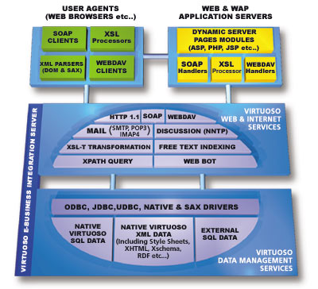
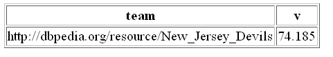
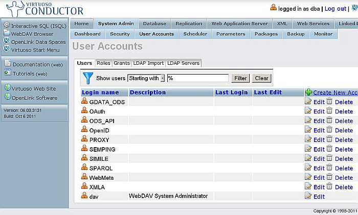
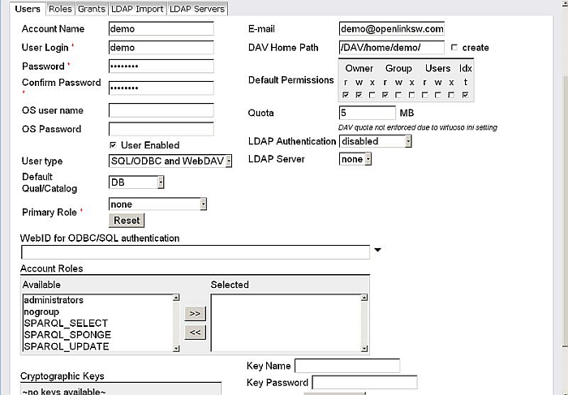
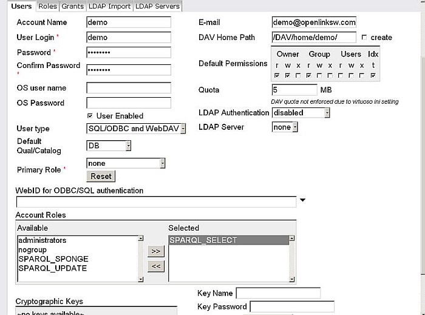

# Overview

# What is Virtuoso?

OpenLink Virtuoso is the first CROSS PLATFORM Universal Server to
implement Web, File, and Database server functionality alongside Native
XML Storage, and Universal Data Access Middleware, as a single server
solution. It includes support for key Internet, Web, and Data Access
standards such as: XML, XPATH, XSLT, SOAP, WSDL, UDDI, WebDAV, SMTP,
SQL-92, ODBC, JDBC, and OLE-DB. Virtuoso currently supports the
following Operating systems - Windows 95/98/NT/2000, Linux (Intel,
Alpha, Mips, PPC), Solaris, AIX, HP-UX, Unixware, IRIX, Digital UNIX,
DYNIX/PTX, FreeBSD, SCO, MacOS X.

Virtuoso is a revolutionary, next generation, high-performance virtual
database engine for the Distributed Computing Age. It is a core
universal data access technology set to accelerate our advances into the
emerging Information Age.

Virtuoso provides transparent access to your existing data sources,
which are typically databases from different database vendors.

Through a single connection, Virtuoso will simultaneously connect your
ODBC, JDBC, UDBC, OLE-DB client applications and services to data within
Oracle, Microsoft SQL Server, DB/2, Informix, Progress, CA-Ingres and
other ODBC compliant database engines. All your databases are treated as
single logical unit.

The diagram below depicts how applications that are built in conformance
with industry standards (such as ODBC, JDBC, UDBC, and OLE-DB) only need
to make a single connection via Virtuoso's Virtual Database Engine and
end up with concurrent and real-time access to data within different
database types.

Further still, Virtuoso exposes all of its functionality to Web
Services. This means that your existing infrastructure can be used
support Web Services directly without any hint of replacement.

# Why Do I Need Virtuoso?

You need Virtuoso because Knowledge is power or competitive advantage
(depending on how you choose to exploit it). All Knowledge comes from
Information. Information is produced from Data.

The Internet is reducing the cost of accessing Information, thereby
increasing the appetite and rates at which Information is produced and
consumed. Unfortunately data required for the production of Information
simply does not reside within one database engine within your
organization.

Whether you know it or not it is highly probable that the quest for
critical information within your organization actually requires
traversing several data sources served by numerous database engines from
different database vendors.

Virtuoso simply reduces the cost of bringing together data from
different data sources with the view to accelerating the production of
information by your Query Tools, Web & Internet Application Development
Environments, Traditional Application Development Tools, and Desktop
Productivity Tools.

Virtuoso enables you to compete effectively in the Information Age.

One of the biggest challenges facing the uptake of XML is the
availability of key XML Data itself. Virtuoso simplifies the process of
creating XML data from existing HTML, syndicated XML, and SQL databases.
Virtuoso enables real-time creation of Dynamic XML documents (DTD or XML
Schema based) from homogeneous or heterogeneous SQL Databases "on the
fly".

By implementing a number of protocols in a single server solution,
Virtuoso provides you with a unifying foundation upon which next
generation eBusiness solutions can be developed and deployed. Virtuoso
reduces the cost of bringing together data from different data sources
and leverages this into increased effectiveness of your Query Tools, Web
& Internet Application Development Environments, Traditional Application
Development Tools, and Desktop Productivity Tools. Virtuoso enables you
compete effectively in the Information Age.

OpenLink Software is an acclaimed technology innovator and leading
vendor of High-Performance & CROSS PLATFORM eBusiness solutions that
adhere to a broad range of industry standards that include: ODBC, JDBC,
OLE DB, SQL, WebDAV, HTTP, XML, SOAP, UDDI, WSDL, SMTP, NNTP, POP3, LDAP
amongst others.

Our product & services portfolio includes a suite of High-Performance
Universal Data Access Drivers for ODBC, OLE DB and JDBC, Internet Data
Integration Servers, Virtual and Federated Database Engines, Embeddable
SQL-Database Engines, Application Servers, Enterprise Portal Servers and
professional services expertise capable of handling the most demanding
eBusiness application development, deployment, and integration
challenges.

# Key Features of Virtuoso



## XML Document Storage & Creation

Virtuoso enables you to develop eBusiness solutions that use *XML* as a
common data access foundation layer that provides transparent access to
structured and unstructured data. XML Data documents can be created
internally, or imported from around the Web and then stored in Virtuoso.
You can also create dynamic XML documents by transforming SQL to XML on
the fly, leveraging data that resides within homogeneous and/or
heterogeneous database(s). *XPATH 2.0* query language support enables
you to query entire XML Documents using and industry standard query
language. The Virtuoso Server provides some basic support for the
[*XQuery 1.0* XML Query Language](#xq) specification. There is *XML
Schema* support for extending Virtuoso Data types used by SOAP Services.

## Web Page Hosting

Virtuoso has an integrated HTTP web server, for static HTML pages, or
dynamic content using [Virtuoso Server Pages (*VSP* )](#vsp1) . Hosting
and execution of *PHP4* scripts is supported via Virtuoso Server
Extensions Interface (VSEI) for Zend.

## Web Services Creation & Hosting

Enables the creation of *SOAP* compliant Web Services from SQL Stored
Procedures, these procedures may be native to Virtuoso or resident in
third party databases that support ODBC or JDBC. Virtuoso automatically
generates *WSDL* files for the Stored Procedures that it exposes as Web
Services. As a *UDDI* server (registry) all of your Web Services can be
stored for access across the internet or within an intranet. It can also
synchronize data with other UDDI servers.

## WebDAV Compliant Web Store

*WebDAV* support enables Virtuoso to act as the Web Content Store for
all of your eBusiness data, this includes Text, Graphics and Multimedia
files. WebDAV support also enables Virtuoso to play the familiar roles
of a FILE & WEB SERVER, hosting entire Web sites within a single
database file, or across multiple database files.

## Content Replication & Synchronization

Virtuoso's sophisticated data replication and synchronization engine
enables the automated distribution and updating of SQL and Web Content
across distributed Virtuoso servers.

## Transparent Access To Heterogeneous Data

Virtuoso's Virtual Database Engine enables you to produce Dynamic Web
Content from any major database management system. This enables dynamic,
real-time HTML and XML generation from any number of different database
engines concurrently.

## Mail Delivery & Retrieval Services

Virtuoso can act as an *SMTP* , *POP3* , and *IMAP4* proxy to any email
client. This enables the development and deployment of sophisticated
database driven email solutions.

## NNTP Aggregation & Serving

Virtuoso supports the Network News Transfer Protocol used by Internet
newsgroup forums. *NNTP* servers manage the global network of collected
newsgroup postings and represent a vast repository of targeted
information archives. As an NNTP aggregator, Virtuoso enables
integration of multiple news forums around the world. All news content
in Virtuoso is dynamically indexed to provide keyword searches, enabling
rapid transformation of disparate text data into information. Virtuoso
also acts as an NNTP server, enabling creation of new Internet and
Intranet News Forums to leverage the global knowledgebase into eBusiness
Intelligence.

# Virtuoso FAQ

We have received various inquiries on high-end metadata stores. We will
here go through some salient questions. The requested features include:

  - Scaling to trillions of triples

  - Running on clusters of commodity servers

  - Running in federated environments, possibly over wide-area networks

  - Built-in inference

  - Transactions

  - Security

  - Support for extra triple level metadata, such as security attributes

*Questions:*

## What is the storage cost per triple?

This depends on the index scheme. If indexed 2 ways, assuming that the
graph will always be stated in queries, this is 31 bytes.

With 4 indices, supporting queries where the graph can be left
unspecified (i.e., triples from any graph will be considered in query
evaluation), this is 39 bytes. The numbers are measured with the LUBM
validation data set of 121K triples, with no full-text index on
literals.

With 4 indices and a full text index on all literals, the Billion
Triples Challenge data set, 1115M triples, is about 120 GB of database
pages. The database file size is larger due to space in reserve and
other factors. 120 GB is the number to use when assessing RAM-to-disk
ratio, i.e., how much RAM the system ought to have in order to provide
good response. This data set is a heterogeneous collection including
social network data, conversations harvested from the Web, DBpedia,
Freebase, etc., with relatively numerous and long text literals.

The numbers do not involve any database page stream compression such as
gzip. Using such compression does not save in terms of RAM because
cached pages must be kept uncompressed but will cut the disk usage to
about half.

## What is the cost to insert a triple (for the insertion itself, as well as for updating any indices)?

The more triples are inserted at a time, the faster this goes. Also, the
more concurrent triple insertions are going on, the better the
throughput. When loading data such as the US Census, a cluster of 2
commodity servers can insert up to 100,000 triples per second.

A single 4-core machine can load 1 billion triples of LUBM data at an
average rate of 36K triples per second. This is limited by disk.

## What is the cost to delete a triple (for the deletion itself, as well as for updating any indices)?

The delete cost is similar to insert cost.

## What is the cost to search on a given property?

If we are looking for equality matches, a single 2GHz core can do about
250,000 single triple random lookups per second as long as disk reads
are not involved. If each triple requires a disk seek the number is
naturally lower.

Parallelism depends on the query. With a query like counting all x and y
such that x knows y and y knows x, we get up to 3.4 million
single-triple lookups-per-second on a cluster of 2 8-core Xeon servers.
With complex nested sub-queries the parallelism may be less.

Lookups involving ranges of values, such as ranges of geographical
coordinates or dates use an index, since quads are indexed in a manner
that collates in the natural order of the data type.

## What data types are supported?

Virtuoso supports all RDF data types, including language-tagged and XML
schema typed strings as native data types. Thus there is no overhead
converting between RDF data types and types supported by the underlying
DBMS.

## What inferencing is supported?

Subclass, subproperty, identity by inverse-functional properties, and
owl:sameAs are processed at run time if an inference context option is
specified in the query.

There is a general-purpose transitivity feature that can be used for a
wide variety of graph algorithms. For example:

    SELECT ?friend
    WHERE
      {
        <alice> foaf:knows ?friend option (transitive)
      }

would return all the people directly or indirectly known by \<alice\>.

## Is the inferencing dynamic, or is an extra step required before inferencing can be used?

The mentioned types of inferencing are enabled by a switch in the query
and are done at run-time, with no step for materialization of entailed
triples needed. The pattern:

    {?s a <type>}

would iterate over all the RDFS subclasses of \<type\> and look for
subjects with this type.

The pattern:

    {<thing> a ?class}

will, if the match of ?class has superclasses, also return the
superclasses even though the superclass membership is not physically
stored for each superclass.

Of course, one can always materialize entailed triples by running
SPARQL/SPARUL statements to explicitly add any implied information.

If two subjects have the same inverse functional property with the same
value, they will be considered the same. For example, if two people have
the same email address, they will be considered the same.

If two subjects are declared to be owl:sameAs, either directly or
through a chain of x owl:sameAs y, y owl:sameAs z, and so on, they will
be considered the same.

These features can be individually enabled and disabled. They all have
some run time cost, hence they are optional. The advantage is that no
preprocessing of the data itself is needed before querying, and the data
does not get bigger. This is important, especially if the database is
very large and queries touch only small parts of it. In such cases,
materializing implied triples can be very costly. See discussion at [E
Pluribus Unum](#)

## Do you support full-text search?

Virtuoso has an optional full-text index on RDF literals. Searching for
text matches using the SPARQL regex feature is very inefficient in the
best of cases. This is why Virtuoso offers a special *bif:contains*
predicate similar to the SQL *contains* predicate of many relational
databases. This supports a full-text query language with proximity,
and/or/and-not, wildcards, etc.

While the full-text index is a general-purpose SQL feature in Virtuoso,
there is extra RDF-specific intelligence built into it. One can, for
example, specify which properties are indexed, and within which graphs
this applies.

## What programming interfaces are supported? Do you support standard SPARQL protocol?

Virtuoso supports the standard SPARQL protocol.

Virtuoso offers drivers for the Jena, Sesame, and Redland frameworks.
These allow using Virtuoso's store and SPARQL implementation as the back
end of Jena, Sesame, or Redland applications. Virtuoso will then do the
query optimization and execution. Jena and Sesame drivers come standard;
contact us about Redland.

Virtuoso SPARQL can be used through any SQL call level interface (CLI)
supported by Virtuoso (i.e., ODBC, JDBC, OLE-DB, ADO.NET, XMLA). All
have suitable extensions for RDF specific data types such as IRIs and
typed literals. In this way, one can write, for example, PHP web pages
with SPARQL queries embedded, just using the SQL tools. Prefixing a SQL
query with the keyword "sparql" will invoke SPARQL instead of SQL,
through any SQL client API.

## How can data be partitioned across multiple servers?

Virtuoso Cluster partitions each index of all tables containing RDF data
separately. The partitioning is by hash. The result is that the data is
evenly distributed over the selected number of servers. Immediately
consecutive triples are generally in the same partition, since the low
bits of IDs do not enter in into the partition hash. This means that key
compression works well.

Since RDF tables are in the end just SQL tables, SQL can be used for
specifying a non-standard partitioning scheme. For example, one could
dedicate one set of servers for one index, and another set for another
index. Special cases might justify doing this.

With very large deployments, using a degree of application-specific data
structures may be advisable. See "Does Virtuoso support property
tables".

## How many triples can a single server handle?

With free-form data and text indexing enabled, 500M triples per 16G RAM
can be a ballpark guideline. If the triples are very short and
repetitive, like the LUBM test data, then 16G per one billion triples is
a possibility. Much depends on the expected query load. If queries are
simple lookups, then less memory per billion triples is needed. If
queries will be complex (analytics, join sequences, and aggregations all
over the data set), then relatively more RAM is necessary for good
performance.

The count of quads has little impact on performance as long as the
working set fits in memory. If the working set is in memory, there may
be 15-20% difference between a million and a billion triples. If the
database must frequently go to disk, this degrades performance since one
can easily do 2000 random accesses in memory in the time it takes to do
one random access from disk. But working-set characteristics depend
entirely on the application.

Whether the quads in a store all belong to one graph or any number of
graphs makes no difference. There are Virtuoso instances in regular
online use with hundreds of millions of triples, such as DBpedia and the
[Neurocommons](#) databases.

## What is the performance impact of going from the billion to the trillion triples?

Performance dynamics change when going from a single server to a
cluster. If each partition is around a billion triples in size, then the
single triple lookup takes the same time, but there is cluster
interconnect latency added to the mix.

On the other hand, queries that touch multiple partitions or multiple
triples in a partition will do this in parallel and usually with a
single message per partition. Thus throughput is higher.

In general terms, operations on a single triple at a time from a single
thread are penalized and operations on hundreds or more triples at a
time win. Multiuser throughput is generally better due to more cores and
more memory, and latency is absorbed by having large numbers of
concurrent requests.

See [a sample of SPARQL scalability](#) .

## Do you support additional metadata for triples, such as time-stamps, security tags etc?

Since quads (triple plus graph) are stored in a regular SQL table with
special data types, changing the table layout to add a column is
possible. This column would not however be visible to SPARQL without
some extra tuning. For coarse grain provenance and security information,
we recommend doing this at the graph level, where triples that belong
together are tagged with the same provenance or security are in the same
graph. The graph can then have the relevant metadata as its properties.

If tagging at the single triple level is needed, this will most often
not be needed for all triples. Hence altering the table for all triples
may not be the best choice. Making a special table that has the graph,
subject, predicate and object of the tagged triple as a key and the tag
data as a dependent part may be more efficient. Also, this table could
be more easily accessed from SPARQL.

Using the RDF reification vocabulary is not recommended as a first
choice but is possible without any alterations.

Alterations of this nature are possible but we recommend contacting us
for specifics. We can provide consultancy on the best way to do this for
each application. Altering the storage layout without some extra support
from us is not recommended.

## Should we use RDF for our large metadata store? What are the alternatives?

If the application has high heterogeneity of schema and frequent need
for adaptation, then RDF is recommended. The alternative is making a
relational database.

Making a custom non-RDF object-attribute-value representation on
Virtuoso or some other RDBMS is possible but not recommended.

The reason for this is that this would miss many of the optimizations
made specifically for RDF, use of the SPARQL language, inference,
compatibility with diverse browsers and front end tools, etc. Not to
mention interoperability and joinability with the body of linked data.
Even if the application is strictly private, using entity names and
ontologies from the open world can still have advantages.

If some customization to the quad (triple plus graph layout) is needed,
we can provide consultancy on how to do this while staying within the
general RDF framework and retaining all the interoperability benefits.

## How multithreaded is Virtuoso?

All server and client components are multithreaded, using pthreads on
Unix/Linux, Windows native on Windows. Multithread/multicore scalability
is good; see [BSBM](#)

In the case of Virtuoso Cluster, in order to have the maximum number of
threads on a single query, we recommend that each server on the cluster
be running one Virtuoso process per 1.2 cores.

## Can multiple servers run off a single shared disk database?

This might be possible with some customization but this is not our
preferred way. Instead, we can store selected indices in duplicate or
more copies inside a clustered database. In this way, all servers can
have their own disk. Each key of each index will belong to one partition
but each partition will have more than one physical copy, each on a
different server. The cluster query logic will perform the load
balancing. On the update side, the cluster will automatically do a
distributed transaction with two phase commit to keep the duplicates in
sync.

## Can Virtuoso run on a SAN?

Yes. Unlike Oracle RAC, for example, Virtuoso Cluster does not require a
SAN. Each server has its own database files and is solely responsible
for these. In this way, having shared disk among all servers is not
required. Running on a SAN may still be desirable for administration
reasons. If using a SAN, the connection to the SAN should be high
performance, such as Infiniband.

## How does Virtuoso join across partitions?

Partitioning is entirely transparent to the application. Virtuoso has a
highly optimized message-flow between cluster nodes that combines
operations into large batches and evaluates conditions close to the
data. See a sample of RDF scaling.

## Does Virtuoso support federated triple stores? If there are multiple SPARQL end points, can Virtuoso be used to do queries joining between these?

This is a planned extension. The logic for optimizing message flow
between multiple end-points on a wide-area network is similar to the
logic for message-optimization on a cluster. This will allow submitting
a query with a list of end-points. The query will then consider triples
from each of the end points, as if the content of all the end points
were in a single store.

End-point meta information, such as voiD descriptions of the graphs in
the end-points, may be used to avoid sending queries to end points that
are known not to have a certain type of data.

## How many servers can a cluster contain?

There is no fixed limit. If you have a large cluster installed, you can
try Virtuoso there. Having an even point-to-point latency is desirable.

## How do I reconfigure a cluster, adding and removing machines, etc?

We are working on a system whereby servers can be added and removed from
a cluster during operation and no repartitioning of the data is needed.

In the first release, the number of server processes that make up the
cluster is set when creating the database. These processes with their
database files can then be moved between machines but this requires
stopping the cluster and updating configuration files.

## How will Virtuoso handle regional clusters?

Performance of a cluster depends on the latency and bandwidth of the
interconnect. At least dual 1Gbit ethernet is recommended for each node.
Thus a cluster should be on a single local or system area network.

If regional copies are needed, we would replicate between clusters by
asynchronous log shipping. This requires some custom engineering.

When a transaction is committed at one site, it is logged and sent to
the subscribing sites if they are online. If there is no connection, the
subscribing sites will get the data from the log. This scheme now works
between single Virtuoso servers, and needs some custom development to be
adapted to clusters.

If replicating all the data of one site to another site is not possible,
then application logic should be involved. Also, if consolidated queries
should be made against large, geographically-separated clusters, then it
is best to query them separately and merge the results in the
application. All depends on the application level rules on where data
resides.

## Is there a mechanism for terminating long running queries?

Virtuoso SPARQL and SQL offer an "anytime" option that will return
partial results after a configurable timeout.

In this way, queries will return in a predictable time and indicate
whether the results are complete or not, as well as give a summary of
resource utilization.

This is especially useful for publishing a SPARQL endpoint where a
single long running query could impact the performance of the whole
system. This timeout significantly reduces the risk of denial of
service.

This is also more user-friendly than simply timing-out a query after a
set period and returning an error. With the anytime option, the user
gets a feel for what data may exist, including whether any data exists
at all. This feature works with arbitrarily complex queries, including
aggregation, GROUP BY, ORDER BY, transitivity, etc.

Since the Virtuoso SPARQL endpoint supports open authentication (OAuth),
the authentication can be used for setting timeouts, so as to give
different service to different users.

It is also possible to set a timeout that will simply abort a query or
an update transaction if it fails to terminate in a set time.

Disconnecting the client from the server will also terminate any
processing on behalf of that client, regardless of timeout settings.

The SQL client call-level interfaces (ODBC, JDBC, OLE-DB, ADO.NET, XMLA)
each support a cancel call that can terminate a long running query from
the application, without needing to disconnect.

## Can the user be asynchronously notified when a long running query terminates?

There is no off-the-shelf API for this but making an adaptation of the
SPARQL endpoint that could proceed after the client disconnected and,
for example, could send results by email is trivial. Since SOAP and REST
Web services can be programmed directly in Virtuoso's stored procedure
language, implementing and exposing this type of application logic is
easy.

## How many concurrent queries can Virtuoso handle?

There is no set limit. As with any DBMS, response times get longer if
there is severe congestion.

For example, having 2 or 3 concurrent queries per core is a good
performance point which will keep all parts of the system busy. Having
more than this is possible but will not increase overall throughput.

With a cluster, each server has both HTTP and SQL listeners, so clients
can be evenly spread across all nodes. In a heavy traffic Web
application, it is best to have a load balancer in front of the HTTP
endpoints to divide the connections among the servers and to keep some
cap on the number of concurrently running requests, enforcing a maximum
request-rate per client IP address, etc.

## What is the relative performance of SPARQL queries vs native relational queries?

This is application dependent. In Virtuoso, SPARQL and SQL share the
same query execution engine, query optimizer, and cost model. If data is
highly regular (i.e., a good fit for relational representation), and if
queries typically access most of the row, then SQL will be more
efficient. If queries are unpredictable, data is ragged, schema changes
frequent, or inference is needed, then RDF will do relatively better.

The recent Berlin SPARQL Benchmark shows some figures comparing Virtuoso
SQL and SPARQL and SPARQL in front of relational representation.
However, the test workload is heavily biased in favor of relational. See
also BSBM: MySQL vs Virtuoso.

With the TPC-H workload, relationally stored data, and SPARQL mapped to
SQL, we find that with about half the queries there is no significant
cost to SPARQL. With some queries there is additional overhead because
the mapping does not produce a SQL query identical to that specified in
the benchmark.

## Does Virtuoso Support Property Tables?

For large applications, we would recommend RDF whenever there is
significant variability of schema, but would still use an
application-specific, relational style representation for those parts of
the data that are regular in format. This is possible without loss of
flexibility for the variable-schema part. However, this will introduce
relational-style restrictions on the regular data; for example, a person
could only have a single date-of-birth by design. In many cases, such
restrictions are quite acceptable. Querying will still take place in
SPARQL, and the representation will be transparent.

A relational table where the primary key is the RDF subject and where
columns represent single-valued properties is usually called a property
table. These can be defined in a manner similar to defining RDF mappings
of relational tables.

## What performance metrics does Virtuoso offer?

There is an extensive array of performance metrics. This includes:

  - Cluster status summary with thread counts, CPU utilization,
    interconnect traffic, clean and dirty cache pages, virtual memory
    swapping warning, etc. This is either a cluster total or a total
    with breakdown per cluster node.

  - Disk access, lock contention, general concurrency, and access count
    per index

  - Statistics on memory usage for disk caching index-by-index, cache
    replacement statistics, disk random and sequential read times

  - Count of random, sequential index access, disk access, lock
    contention, cluster interconnect traffic per query/client

  - Detailed query-execution plans are available through the
    [`explain`](#ch-overview) function

## What support do you provide for concurrent/multithreaded operation? Is your interface thread-safe?

All client interfaces and server-side processes are multithreaded. As
usual, each thread of an application should use a different connection
to the database.

## What level of ACID properties is supported?

Virtuoso supports all 4 isolation levels from dirty read to
serializable, for both relational and RDF data.

The recommended default isolation is read-committed, which offers a
clean historical read of data that has uncommitted updates. This mode is
similar to the Oracle default isolation and guarantees that no
uncommitted data is seen, and that no read will block waiting for a lock
held by another client.

There is transaction logging and roll forward recovery, with two phase
commit used in Virtuoso Cluster if an update transaction modifies more
than one server.

For RDF workloads which typically are not transactional and have large
bulk loads, we recommend running in a "row autocommit" mode without
transaction logging. This virtually eliminates log contention but still
guarantees consistent results of multithreaded bulk loads.

Setting this up requires some consultancy and custom development but is
well worthwhile for large projects.

## Do you provide the ability to atomically add a set of triples, where either all are added or none are added?

Yes. Doing this with millions of triples per transaction may run out of
rollback space. Also, there is risk of deadlock if multiple such inserts
run at the same time. For good concurrency, the inserts should be of
moderate size. As usual, deadlocks are resolved by aborting one of the
conflicting transactions.

## Do you provide the ability to add a set of triples, respecting the isolation property (so concurrent accessors either see none of the triple values, or all of them)?

Yes. The reading client should specify serializable isolation and the
inserting client should perform the insert as a transaction, no row
autocommit mode.

## What is the time to start a database, create/open a graph?

Starting a Virtuoso server process takes a few seconds. Making a new
graph takes no time beyond the time to insert the triples into it. Once
the server process(es) are running, all the data is online.

With high-traffic applications, reaching cruising speed may sometimes
take a long time, specially if the load is random-access intensive.
Filling gigabytes of RAM with cached disk pages takes a long time if
done a page at a time. To alleviate this, Virtuoso pre-reads 2MB-sized
extents instead of single pages if there is repeated access to the same
extent within a short time. Thus cache warm-up times are shortened.

## What sort of security features are built into Virtuoso?

For SQL, we have the standard role-based security and an Oracle-style
row-level security (policy) feature.

For SPARQL, users may have read or update roles at the level of the quad
store.

With RDF, a graph may be owned by a user. The user may specify read and
write privileges on the graph. These are then enforced for SPARUL (the
SPARQL update language) and SPARQL.

When an RDF graph is based on relationally stored data in Virtuoso or
another RDBMS through Virtuoso's SQL federation feature (i.e., if the
graph is an Linked Data View of underlying SQL data), then all
relational security controls apply.

Further, due to the dual-nature of Virtuoso, sophisticated
ontology-based security models are feasible. Such models are not
currently used by default, but they are achievable with our consultancy.

# Tips and Tricks

## How Can I convert triples with geo properties to geometries to use spartial query?

Assuming a Named Graph with the following triples:

    ...
    <http://linkedgeodata.org/triplify/node454640663> <http://www.w3.org/1999/02/22-rdf-syntax-ns#type> <http://linkedgeodata.org/ontology/hostel> .
    <http://linkedgeodata.org/triplify/node454640663> <http://www.georss.org/georss/point> "53.2752338 -9.0443748" .
    <http://linkedgeodata.org/triplify/node454640663> <http://www.w3.org/2003/01/geo/wgs84_pos#long> "-9.0443748"^^<http://www.w3.org/2001/XMLSchema#decimal> .
    <http://linkedgeodata.org/triplify/node454640663> <http://www.w3.org/2003/01/geo/wgs84_pos#lat> "53.2752338"^^<http://www.w3.org/2001/XMLSchema#decimal> .
    
    <http://linkedgeodata.org/triplify/node280886720> <http://www.w3.org/2000/01/rdf-schema#label> "Abbey House" .
    <http://linkedgeodata.org/triplify/node280886720> <http://www.w3.org/1999/02/22-rdf-syntax-ns#type> <http://linkedgeodata.org/ontology/bed_and_breakfast> .
    <http://linkedgeodata.org/triplify/node280886720> <http://www.georss.org/georss/point> "53.2874983 -9.0702631" .
    <http://linkedgeodata.org/triplify/node280886720> <http://www.w3.org/2003/01/geo/wgs84_pos#long> "-9.0702631"^^<http://www.w3.org/2001/XMLSchema#decimal> .
    <http://linkedgeodata.org/triplify/node280886720> <http://www.w3.org/2003/01/geo/wgs84_pos#lat> "53.2874983"^^<http://www.w3.org/2001/XMLSchema#decimal> .
    ...

In order to convert these triples ( with geo properties ) to geometries
to use spartial query, you need to run the `DB.DBA.RDF_GEO_FILL ()`
function to populate the special RDF\_GEO table with the point
information as detailed at [Creating Geometries From RDF
Data](#rdfsparqlgeospatcrg) documentation section.

Then the geo-spatail information will be available and can be queried.

Note: RDF\_GEO and associated indexes are created when the database is
first created and thus just needs to be populated with the geometry data
in the RDF triples, which is what the `DB.DBA.RDF_GEO_FILL ()` function
does.

> **Tip**
> 
>   - [Programmatic Manipulation of Geometries in
>     RDF](#rdfsparqlgeospatprog)
> 
>   - [GEO Spatial Examples](#rdfsparqlgeospatexmp)
> 
>   - GEO Spatial Tutorials:
>     
>       - [ROUND](#)
>     
>       - [DESCRIBE](#)
>     
>       - [CONSTRUCT](#)
>     
>       - [ASK](#)
>     
>       - [UNION](#)
>     
>       - [COUNT](#)
>     
>       - [FILTER](#)
>     
>       - [Find Distance Variant I](#)
>     
>       - [Find Distance Variant II](#)
>     
>       - [Querying Time and Space Variant I](#)
>     
>       - [Querying Time and Space Variant II](#)

## How Can I execute SPARQL queries containing '$' character using ISQL?

Assuming a SPARQL query should filter on the length of labels:

    SELECT ?label
    FROM <http://mygraph.com>
    WHERE
      {
        ?s ?p ?label
        FILTER(regex(str(?label), "^.{1,256}$") )
      }

ISQL uses '*$* ' character as a prefix for macro names of its
preprocessor. When '*$* ' character is used in SPARQL query to be
executed in ISQL, the character should be replaced with '*$$* ' notation
or an escape char + numeric code:

    SQL> SPARQL
    SELECT ?label
    FROM <http://mygraph.com>
    WHERE
      {
        ?s ?p ?label
        FILTER(REGEX(str(?label), "^.{1,256}$$") )
      }

Note also that the FILTER written in this way, finds *?label-s* with
length less than 256.

To achieve fast results, *REGEX* should be replaced with the
*bif:length* function:

    SQL> SPARQL
    SELECT ?label
    FROM <http://mygraph.com>
    WHERE
      {
        ?s ?p ?label
        FILTER (bif:length(str(?label))<= 256)
      }

In this way the SPARQL query execution can work much faster if the
interoperability is not required and *?label-s* are numerous.

## How can I find on which table deadlocks occur?

One possible way to find on which table deadlocks occur is to execute
the following statement:

    SELECT TOP 10 *
    FROM SYS_L_STAT
    ORDER BY deadlocks DESC

## How Can I configure parameters to avoid out of memory error?

In order to avoid out of memory error, you should make sure the values
for the paramaters *NumberOfBuffers* and *MaxCheckpointRemap* are not
set with the same values.

For example, the following configuration will cause an error out of
memory:

    # virtuoso.ini
    
    ...
    [Parameters]
    NumberOfBuffers = 246837
    MaxDirtyBuffers = 18517
    MaxCheckpointRemap = 246837
    ...

Changing the value of the parameter *MaxCheckpointRemap* with let's say
1/4 of the DB size will resolve the issue.

## What are "Generate RDB2RDF triggers" and "Enable Data Syncs with Physical Quad Store" Linked Data Views options?

These Linked Data Views options basically persist the triples in the
transient View Graph in the Native Quad Store. The Data Sync is how you
keep the transient views in sync with the persisted triples.

Without this capability you cannot exploit faceted browsing without
severe performance overhead when using Linked Data based conceptual
views over ODBC or JDBC accessible data sources.

Note: Using these options when the RFViews have already been created is
not currently possible via the Conductor UI. Instead you should be able
to add them manually from isql:

1.  Drop the Linked Data View graph and Quad Map.

2.  Create it again with the RDB2RDF Triggers options enabled.

> **Tip**
> 
> [RDB2RDF Triggers](#rdb2rdftriggers)

## How to Manage Date Range SPARQL queries?

The following examples demonstrate how to manage date range in a SPARQL
query:

*Example with date range*

    SELECT ?s ?date
    FROM <http://dbpedia.org>
    WHERE
      {
        ?s ?p ?date . FILTER ( ?date >= "19450101"^^xsd:date && ?date <= "19451231"^^xsd:date )
      }
    LIMIT 100

*Example with bif:contains*

Suppose there is the following query using bif:contains for date:

If ?date is of type xsd:date or xsd:dateTime and of valid syntax then
bif:contains(?date, '"1945\*"' ) will not found it, because it will be
parsed at load/create and stored as SQL DATE value.

So if data are all accurate and typed properly then the filter is:

    (?date >= xsd:date("1945-01-01") && ?date < xsd:date("1946-01-01"))

i.e. the query should be:

    SELECT DISTINCT ?s ?date
    FROM <http://dbpedia.org>
    WHERE
      {
        ?s ?p ?date . FILTER( ?date >= xsd:date("1945-01-01") && ?date < xsd:date("1946-01-01")  && (str(?p) != str(rdfs:label)) )
      }
    LIMIT 10

If data falls, then the free-text will be OK for tiny examples but not
for "big" cases because *bif:contains(?date, '"1945\*"')* would require
that less than 200 words in the table begins with 1945. Still, some data
can be of accurate type and syntax so range comparison should be used
for them and results aggregated via UNION.

If dates mention timezones then the application can chose the beginning
and the end of the year in some timezones other than the default.

## How can I see which quad storages exist and in which quad storage a graph resides?

Let's take for example a [created Linked Data View from relational data
in Virtuoso](#) . The RDF output therefor should have two graphs which
reside in a quad storage named for ex.:

    http://example.com/rdfv_demo/quad_storage/default

Also the RDF is accessible over the SPARQL endpoint with the following
query:

    define input:storage <http://example.com/rdfv_demo/quad_storage/default>
    SELECT *
    WHERE
      {
        ?s ?p ?o
      }

Now one could ask is there a way to define internally (once) that the
quad storage should be included in queries to the SPARQL endpoint? So
that the user does not have to define the *input:storage* explicitly in
each query, like this:

    http://example.com/sparql?query=select * where { ?s ?p ?o }&default-graph-uri=NULL&named-graph-uri=NULL

All metadata about all RDF storages are kept in "system" graph
\<http://www.openlinksw.com/schemas/virtrdf\#\> ( namespace prefix
*virtrdf:* ). Subjects of type *virtrdf:QuadStorage* are RDF storages.
There are three of them by default:

    SQL> SPARQL SELECT * FROM virtrdf: WHERE { ?s a virtrdf:QuadStorage };
    s
    VARCHAR
    _______________________________________________________________________________
    
    http://www.openlinksw.com/schemas/virtrdf#DefaultQuadStorage
    http://www.openlinksw.com/schemas/virtrdf#DefaultServiceStorage
    http://www.openlinksw.com/schemas/virtrdf#SyncToQuads
    
    3 Rows. -- 3 msec.

  - *virtrdf:DefaultQuadStorage*
    
    is what's in use if no input:storage specified.

  - *virtrdf:DefaultServiceStorage*
    
    will be used for SPARQL federation.

  - *virtrdf:SyncToQuads*
    
    is to keep the list of Linked Data Views that are translated into
    RDB2RDF triggers.

There are two ways of using the Linked Data View from above in SPARQL
endpoint without *define input:storage* :

1.  Create Linked Data View right in
    
    *virtrdf:DefaultQuadStorage*
    
    or add the view in other storage and then copy it from there to
    
    *virtrdf:DefaultQuadStorage*
    
    .
    
      - In any of these two variants, use:
        
            SPARQL ALTER QUAD STORAGE virtrdf:DefaultQuadStorage . . .

2.  Use
    
    *SYS\_SPARQL\_HOST*
    
    table as described [here](#rdfdefaultgraph) and set
    
    *SH\_DEFINES*
    
    so it contains your favorite
    
    *define input:storage*
    
    .

## Can I drop and re-create the DefaultQuadStorage?

Currently system metadata consist of three "levels":

1.  *QuadMapFormats*
    
    are used to describe transformations of individual SQL values (or
    types of SQL values),

2.  *QuadMaps*
    
    refers to
    
    *QuadMapFormats*
    
    (via
    
    *QuadMapValues*
    
    ) and describe some "minimal" independent RDB2RDF transformations,

3.  *QuadStorages*
    
    organizes
    
    *QuadMaps*
    
    .

*QuadStorages* contains only "symlinks" to maps, if you drop a storage
you don't drop all mappings inside. If you drop the *DefaultQuadStorage*
or some other built-in thing, it can be safely recovered by
[`DB.DBA.RDF_AUDIT_METADATA`](#fn_rdf_audit_metadata) , with first
parameter set to 1. This will keep your own data intact. However we
recommend to write a script that declares all your formats, Linked Data
Views and storages, to be able to reproduce the configuration after any
failures.

## How to display only some information from RDF graph?

Virtuoso supports graph-level security, as described
[here](#rdfgraphsecurity) but not subject-level or predicate-level. When
exposing data that needs protected access, triples should be confined to
private name graphs which are protected by ACLs using WebID.

Note, how you can use [WebID to protect Virtuoso SPARQL endpoints](#) .

> **Tip**
> 
> [RDF Graphs Security](#rdfgraphsecurity)

## Is it possible to have the SPARQL endpoint on a different port than the Conductor?

Virtuoso Web Server has the capability to create extra listeners using
the [Conductor interface](#admui.internetdomains) .

1.  At install time you have your HTTP Server port in your virtuoso.ini
    set to 8890, which you want to keep in your local network as this
    contains ALL the endpoints that you have registered in Virtuoso. So
    as long as you do not open this port in your firewall, you can only
    get at it from the local machine.

2.  Next you should create a new vhost entry using the EXTERNAL name of
    your machine and use port 80 (or a higher port if you do not want to
    run as root) for ex.:
    
        Interface: 0.0.0.0
        Port: 8080
        Http Host:  my.example.com

3.  Next you add a "New directory to this line", click on "Type" radio
    button and choose "Sparql access point" from the drop-down list and
    press Next button. Set "Path" to /sparql and press the "Save
    Changes" button to store.

4.  At this point you have created: http://my.example.com:8080/sparql
    which functions exactly the same as your internal
    http://example.com/sparql. You can now open your firewall and allow
    outside machines to connect to port 8080 so people can use your
    SPARQL endpoint without access to any other endpoint on your
    Virtuoso installation.

5.  You should probably also change your virtuoso.ini so:
    
        [URIQA]
        DefaultHost = my.example.com:8080

6.  If you use port 80, you do not have to add :80 at the end of this
    setting, although it should not make any difference.

7.  You can now add other directories / endpoints to the new
    
    *my.example.com*
    
    interface you just created e.g. a nice / directory that points to a
    index.html which describes your site etc.

> **Tip**
> 
> [Internet Domains](#admui.internetdomains)

## How to enable the Virtuoso Entity Framework 3.5 ADO.Net Provider in Visual Studio 2010?

The Virtuoso Entity Framework 3.5 ADO.Net Provider is current only list
as a Visible control in the Visual Studio 2008 IDE as the current
installers only create the necessary registry entries for Visual Studio
2008. To make it visible in the Visual Studio 2010's IDE the following
registry settings need to be manually updated and manual addtions to
some of the VS 2010 XML configuration files:

1.  Export following registry keys to .reg files and using a text
    editor, such as Wordpad, edit the Visual Studio version numbers from
    8.0 or 9.0 to 10.0:
    
        HKEY_LOCAL_MACHINE\SOFTWARE\Microsoft\VisualStudio\8.0\DataProviders\{EE00F82B-C5A4-4073-8FF1-33F815C9801D}
        - and -
        HKEY_LOCAL_MACHINE\SOFTWARE\Microsoft\VisualStudio\8.0\DataSources\{90FBCAF2-8F42-47CD-BF1A-88FF41173060}

2.  Once edited, save and double click them to create the new registry
    entries under:
    
        HKEY_LOCAL_MACHINE\SOFTWARE\Microsoft\VisualStudio\10.0....

3.  In addition, locate the file
    C:\\WINDOWS\\Microsoft.NET\\Framework\\v2.0.50727\\CONFIG\\machine.config,
    locate the node, then locate the
    
    *\<add name="VirtuosoClient3? Data Provider" ...*
    
    node within it:
    
        <add name="VirtuosoClient3 Data Provider" invariant="OpenLink.Data.Virtuoso"
            description=".NET Framework Data Provider for Virtuoso" type="OpenLink.Data.Virtuoso.VirtuosoClientFactory, virtado3, Version=6.2.3128.2, Culture=neutral, PublicKeyToken=391bf132017ae989" />

and copy is to the equivalent
C:\\WINDOWS\\Microsoft.NET\\Frameworks\\v4.0.30128\\CONFIG\\machine.config
location.

Visual Studio 2010 will then have the necessary information to locate
and load the Virtuoso ADO.Net provider in its IDE.

The registry should typically contain the following entries for Visual
Studio 2010 as a result:

    Windows Registry Editor Version 5.00
    
    [HKEY_LOCAL_MACHINE\SOFTWARE\Wow6432Node\Microsoft\VisualStudio\10.0\DataProviders\{0886A2BB-03D0-4E00-8A3D-F235A5DC0F6D}]
    @=".NET Framework Data Provider for Virtuoso"
    "AssociatedSource"="{4D90D7C5-69A6-43EE-83ED-59A0E442D260}"
    "CodeBase"="C:\\Windows\\assembly\\GAC_MSIL\\virtado3\\6.2.3128.1__391bf132017ae989\\virtado3.dll"
    "Description"="Provider_Description, OpenLink.Data.Virtuoso.DDEX.Net3.DDEXResources, virtado3, Version=6.2.3128.1, Culture=neutral, PublicKeyToken=391bf132017ae989"
    "DisplayName"="Provider_DisplayName, OpenLink.Data.Virtuoso.DDEX.Net3.DDEXResources, virtado3, Version=6.2.3128.1, Culture=neutral, PublicKeyToken=391bf132017ae989"
    "InvariantName"="OpenLink.Data.Virtuoso"
    "PlatformVersion"="2.0"
    "ShortDisplayName"="Provider_ShortDisplayName, OpenLink.Data.Virtuoso.DDEX.Net3.DDEXResources, virtado3, Version=6.2.3128.1, Culture=neutral, PublicKeyToken=391bf132017ae989"
    "Technology"="{77AB9A9D-78B9-4ba7-91AC-873F5338F1D2}"
    
    [HKEY_LOCAL_MACHINE\SOFTWARE\Wow6432Node\Microsoft\VisualStudio\10.0\DataProviders\{0886A2BB-03D0-4E00-8A3D-F235A5DC0F6D}\SupportedObjects]
    
    [HKEY_LOCAL_MACHINE\SOFTWARE\Wow6432Node\Microsoft\VisualStudio\10.0\DataProviders\{0886A2BB-03D0-4E00-8A3D-F235A5DC0F6D}\SupportedObjects\IDSRefBuilder]
    @="Microsoft.VisualStudio.Data.Framework.DSRefBuilder"
    "Assembly"="Microsoft.VisualStudio.Data.Framework, Version=10.0.0.0, Culture=neutral, PublicKeyToken=b03f5f7f11d50a3a"
    
    [HKEY_LOCAL_MACHINE\SOFTWARE\Wow6432Node\Microsoft\VisualStudio\10.0\DataProviders\{0886A2BB-03D0-4E00-8A3D-F235A5DC0F6D}\SupportedObjects\IVsDataAsyncCommand]
    
    [HKEY_LOCAL_MACHINE\SOFTWARE\Wow6432Node\Microsoft\VisualStudio\10.0\DataProviders\{0886A2BB-03D0-4E00-8A3D-F235A5DC0F6D}\SupportedObjects\IVsDataCommand]
    
    [HKEY_LOCAL_MACHINE\SOFTWARE\Wow6432Node\Microsoft\VisualStudio\10.0\DataProviders\{0886A2BB-03D0-4E00-8A3D-F235A5DC0F6D}\SupportedObjects\IVsDataConnectionProperties]
    @="OpenLink.Data.Virtuoso.DDEX.Net3.VirtuosoDataConnectionProperties"
    "Assembly"="virtado3, Version=6.2.3128.1, Culture=neutral, PublicKeyToken=391bf132017ae989"
    
    [HKEY_LOCAL_MACHINE\SOFTWARE\Wow6432Node\Microsoft\VisualStudio\10.0\DataProviders\{0886A2BB-03D0-4E00-8A3D-F235A5DC0F6D}\SupportedObjects\IVsDataConnectionSupport]
    @="Microsoft.VisualStudio.Data.Framework.AdoDotNet.AdoDotNetConnectionSupport"
    "Assembly"="Microsoft.VisualStudio.Data.Framework, Version=10.0.0.0, Culture=neutral, PublicKeyToken=b03f5f7f11d50a3a"
    
    [HKEY_LOCAL_MACHINE\SOFTWARE\Wow6432Node\Microsoft\VisualStudio\10.0\DataProviders\{0886A2BB-03D0-4E00-8A3D-F235A5DC0F6D}\SupportedObjects\IVsDataConnectionUIControl]
    @="OpenLink.Data.Virtuoso.DDEX.Net3.VirtuosoDataConnectionUIControl"
    "Assembly"="virtado3, Version=6.2.3128.1, Culture=neutral, PublicKeyToken=391bf132017ae989"
    
    [HKEY_LOCAL_MACHINE\SOFTWARE\Wow6432Node\Microsoft\VisualStudio\10.0\DataProviders\{0886A2BB-03D0-4E00-8A3D-F235A5DC0F6D}\SupportedObjects\IVsDataConnectionUIProperties]
    @="OpenLink.Data.Virtuoso.DDEX.Net3.VirtuosoDataConnectionProperties"
    "Assembly"="virtado3, Version=6.2.3128.1, Culture=neutral, PublicKeyToken=391bf132017ae989"
    
    [HKEY_LOCAL_MACHINE\SOFTWARE\Wow6432Node\Microsoft\VisualStudio\10.0\DataProviders\{0886A2BB-03D0-4E00-8A3D-F235A5DC0F6D}\SupportedObjects\IVsDataMappedObjectConverter]
    
    [HKEY_LOCAL_MACHINE\SOFTWARE\Wow6432Node\Microsoft\VisualStudio\10.0\DataProviders\{0886A2BB-03D0-4E00-8A3D-F235A5DC0F6D}\SupportedObjects\IVsDataObjectIdentifierResolver]
    @="OpenLink.Data.Virtuoso.DDEX.Net3.VirtuosoDataObjectIdentifierResolver"
    "Assembly"="virtado3, Version=6.2.3128.1, Culture=neutral, PublicKeyToken=391bf132017ae989"
    
    [HKEY_LOCAL_MACHINE\SOFTWARE\Wow6432Node\Microsoft\VisualStudio\10.0\DataProviders\{0886A2BB-03D0-4E00-8A3D-F235A5DC0F6D}\SupportedObjects\IVsDataObjectSupport]
    @="Microsoft.VisualStudio.Data.Framework.DataObjectSupport"
    "Assembly"="Microsoft.VisualStudio.Data.Framework, Version=10.0.0.0, Culture=neutral, PublicKeyToken=b03f5f7f11d50a3a"
    "XmlResource"="OpenLink.Data.Virtuoso.DDEX.Net3.VirtuosoObjectSupport"
    
    [HKEY_LOCAL_MACHINE\SOFTWARE\Wow6432Node\Microsoft\VisualStudio\10.0\DataProviders\{0886A2BB-03D0-4E00-8A3D-F235A5DC0F6D}\SupportedObjects\IVsDataSourceInformation]
    @="OpenLink.Data.Virtuoso.DDEX.Net3.VirtuosoDataSourceInformation"
    "Assembly"="virtado3, Version=6.2.3128.1, Culture=neutral, PublicKeyToken=391bf132017ae989"
    
    [HKEY_LOCAL_MACHINE\SOFTWARE\Wow6432Node\Microsoft\VisualStudio\10.0\DataProviders\{0886A2BB-03D0-4E00-8A3D-F235A5DC0F6D}\SupportedObjects\IVsDataTransaction]
    
    [HKEY_LOCAL_MACHINE\SOFTWARE\Wow6432Node\Microsoft\VisualStudio\10.0\DataProviders\{0886A2BB-03D0-4E00-8A3D-F235A5DC0F6D}\SupportedObjects\IVsDataViewSupport]
    @="Microsoft.VisualStudio.Data.Framework.DataViewSupport"
    "Assembly"="Microsoft.VisualStudio.Data.Framework, Version=10.0.0.0, Culture=neutral, PublicKeyToken=b03f5f7f11d50a3a"
    "XmlResource"="OpenLink.Data.Virtuoso.DDEX.Net3.VirtuosoViewSupport"
    
    [HKEY_LOCAL_MACHINE\SOFTWARE\Wow6432Node\Microsoft\VisualStudio\10.0\DataSources\{4D90D7C5-69A6-43EE-83ED-59A0E442D260}]
    @="OpenLink Virtuoso Data Source"
    "DefaultProvider"="{0886A2BB-03D0-4E00-8A3D-F235A5DC0F6D}"
    
    [HKEY_LOCAL_MACHINE\SOFTWARE\Wow6432Node\Microsoft\VisualStudio\10.0\DataSources\{4D90D7C5-69A6-43EE-83ED-59A0E442D260}\SupportingProviders]
    
    [HKEY_LOCAL_MACHINE\SOFTWARE\Wow6432Node\Microsoft\VisualStudio\10.0\DataSources\{4D90D7C5-69A6-43EE-83ED-59A0E442D260}\SupportingProviders\{0886A2BB-03D0-4E00-8A3D-F235A5DC0F6D}]
    "Description"="DataSource_Description, OpenLink.Data.Virtuoso.DDEX.Net3.DDEXResources, virtado3, Version=6.2.3128.1, Culture=neutral, PublicKeyToken=391bf132017ae989"

The next Virtuoso releases, 6.3+ will support this new Visual Studio
2010 release out of the box.

## How Can I Control the normalization of UNICODE3 accented chars in free-text index?

The normalization of UNICODE3 accented chars in free-text index can be
controlled by setting up the configuration parameter *XAnyNormalization*
in the virtuoso.ini config file, section \[I18N\]. This parameter
controls whether accented UNICODE characters should be converted to
their non-accented base variants at the very beginning of free-text
indexing or parsing a free-text query string. The parameter's value is
an integer that is bitmask with only 2 bits in use atm:

1.  0: the default behavior, do not normalize anything, so "Jose" and
    "José" are two distinct words.

2.  2: Any combined char is converted to its (smallest known) base. So
    "é" will lose its accent and become plain old ASCII "e".

3.  3: This is equl to 1|2 and when set then performs both conversions.
    As a result, pair of base char and combinig char loses its second
    char and chars with accents will lose accents.

If the parameter is required at all, the needed value is probably 3. So
the fragment of virtuoso.ini is:

    [I18N]
    XAnyNormalization=3

In some seldom case the value of 1 can be appropriate. The parameter
should be set once before creating the database. If changed on the
existing database, all free-text indexes that may contain non-ASCII data
should be re-created. On a typical system, the parameter affects all
text columns, XML columns, RDF literals and queries.

Strictly speaking, it affects not all of them but only items that use
default "x-any" language or language derived from x-any such as "en" and
"en-US" but if you haven't tried writing new C plugins for custom
languages you should not look so deep.

As an example, with *XAnyNormalization=3* once can get the following:

    SQL>SPARQL
    
    INSERT IN <http://InternationalNSMs/>
       { <s> <sp> "Índio João Macapá Júnior Tôrres Luís Araújo José" ;
         <ru> "&#1054;&#1085; &#1076;&#1086;&#1073;&#1072;&#1074;&#1080;&#1083; &#1082;&#1072;&#1088;&#1090;&#1086;&#1096;&#1082;&#1080;, &#1087;&#1086;&#1089;&#1086;&#1083;&#1080;&#1083; &#1080; &#1087;&#1086;&#1089;&#1090;&#1072;&#1074;&#1080;&#1083; &#1072;&#1082;&#1074;&#1072;&#1088;&#1080;&#1091;&#1084; &#1085;&#1072; &#1086;&#1075;&#1086;&#1085;&#1100;" . }
    
    INSERT INTO <http://InternationalNSMs/>, 2 (or less) triples -- done
    
    SQL> DB.DBA.RDF_OBJ_FT_RULE_ADD (null, null, 'InternationalNSMs.wb');
    
    Done. -- 0 msec.
    
    SQL>vt_inc_index_db_dba_rdf_obj();
    
    Done. -- 26 msec.
    
    SQL>SPARQL
    SELECT *
    FROM <http://InternationalNSMs/>
    WHERE
      {
        ?s ?p ?o
      }
    ORDER BY ASC (str(?o))
    
    s  sp  Índio João Macapá Júnior Tôrres Luís Araújo José
    s  ru  &#1054;&#1085; &#1076;&#1086;&#1073;&#1072;&#1074;&#1080;&#1083; &#1082;&#1072;&#1088;&#1090;&#1086;&#1096;&#1082;&#1080;, &#1087;&#1086;&#1089;&#1086;&#1083;&#1080;&#1083; &#1080; &#1087;&#1086;&#1089;&#1090;&#1072;&#1074;&#1080;&#1083; &#1072;&#1082;&#1074;&#1072;&#1088;&#1080;&#1091;&#1084; &#1085;&#1072; &#1086;&#1075;&#1086;&#1085;&#1100;
    
    2 Rows. -- 2 msec.
    
    SQL> SPARQL
    SELECT *
    FROM <http://InternationalNSMs/>
    WHERE
      {
        ?s ?p ?o . ?o bif:contains "'Índio João Macapá Júnior Tôrres Luís Araújo José'" .
      }
    
    s  sp  Índio João Macapá Júnior Tôrres Luís Araújo José
    
    1 Rows. -- 2 msec.
    
    SQL>SPARQL
    SELECT *
    FROM <http://InternationalNSMs/>
    WHERE
      {
        ?s ?p ?o . ?o bif:contains "'Indio Joao Macapa Junior Torres Luis Araujo Jose'" . }
    
    s  sp  Índio João Macapá Júnior Tôrres Luís Araújo José
    
    1 Rows. -- 1 msec.
    
    SQL> SPARQL
    SELECT *
    FROM <http://InternationalNSMs/>
    WHERE
      {
        ?s ?p ?o . ?o bif:contains "'&#1087;&#1086;&#1089;&#1090;&#1072;&#1074;&#1080;&#1083; &#1072;&#1082;&#1074;&#1072;&#1088;&#1080;&#1091;&#1084; &#1085;&#1072; &#1086;&#1075;&#1086;&#1085;&#1100;'" . }
    
    s  ru  &#1054;&#1085; &#1076;&#1086;&#1073;&#1072;&#1074;&#1080;&#1083; &#1082;&#1072;&#1088;&#1090;&#1086;&#1096;&#1082;&#1080;, &#1087;&#1086;&#1089;&#1086;&#1083;&#1080;&#1083; &#1080; &#1087;&#1086;&#1089;&#1090;&#1072;&#1074;&#1080;&#1083; &#1072;&#1082;&#1074;&#1072;&#1088;&#1080;&#1091;&#1084; &#1085;&#1072; &#1086;&#1075;&#1086;&#1085;&#1100;

There was also request for function that normalizes characters in
strings as free-text engine will do with XAnyNormalization=3 , the
function will be provided as a separate patch and depends on this
specific patch.

> **Tip**
> 
> [Virtuoso Configuration File](#virtini)

## How Can I define graph with virt:rdf\_sponger option set to "on"?

Suppose we have the following scenario:

1.  Create Virtuoso user using Conductor for ex. with name "john" and
    pwd 1.

2.  Create for the user a RDF Sink folder for ex. with name
    "MySinkFolder" from type "RDF Upload Folder" or use the
    
    *rdf\_sink*
    
    folder created automatically for your user.

3.  In the properties page of the RDF sink folder add in the WebDAV
    section this property
    
    *virt:rdf\_graph*
    
    with value:
    
        http://host:port/DAV/home/<user-name>/<rdf-sink-folder>/
        
        -- So in our example it should be:
        http://example.com/DAV/home/john/MySinkFolder/

4.  Add another property virt:rdf\_sponger with value "on".
    



> **Tip**
> 
> [Supported SPARQL-BI "define"
> pragmas](#rdfsparqlimplementatioptragmas)
> 
> [SPARQL-BI](#) [\#rdfsparul](#rdfsparul)

## How can I handle checkpoint condition?

In general, to control checkpoint in order to bypass client timeouts
during long checkpoints when inserting triples into the Virtuoso server,
one must disable automatic checkpoint by:

    SQL> checkpoint_interval (0);

and also to make sure the AutoCheckpointLogSize is off. Then can be
performed checkpoint whenever the client wants using the 'checkpoint'
command.

However the need of cache check is not needed unless instance shows
regular errors. By default the cache check is disabled.

Virtuoso offers a new option in the Virtuoso ini file to enable the
check of page maps: *PageMapCheck* , 1/0 default 0:

    -- Virtuoso.ini
    
    ...
    [Parameters]
    ...
    PageMapCheck  = 0
    ...

Also customer can add *CheckpointSyncMode = 0* in order to disable sync
during checkpoint to speed the operations.

## How can I incorporate Content Negotiation into RDF bulk loaders?

The examples from below demonstrate how to incorporate Content
Negotiation into RDF bulk loaders:

  - Using the [`DB.DBA.RDF_LOAD_RDFXML`](#fn_rdf_load_rdfxml) function:
    
        DB.DBA.RDF_LOAD_RDFXML (http_get ('http://purl.org/ontology/mo/', null, 'GET', 'Accept: application/rdf+xml', null, null, 3), 'http://purl.org/ontology/mo/', 'http://purl.org/ontology/mo/') .

  - Using the [`DB.DBA.TTLP`](#fn_ttlp) function: The call to http
    client should be modified to ask for appropriate content type as for
    ex:
    
        DB.DBA.TTLP (http_get ('http://purl.org/ontology/mo/', null, 'GET', 'Accept: text/n3', null, null, 3), 'http://purl.org/ontology/mo/', 'http://purl.org/ontology/mo/'), '...', '...');

## Virtuoso Linked Data Deployment In 3 Simple Steps?

Injecting Linked Data into the Web has been a major pain point for those
who seek personal, service, or organization-specific variants of
DBpedia. Basically, the sequence goes something like this:

1.  You encounter DBpedia or the LOD Cloud Pictorial.

2.  You look around (typically following your nose from link to link).

3.  You attempt to publish your own stuff.

4.  You get stuck.

The problems typically take the following form:

1.  Functionality confusion about the complementary Name and Address
    functionality of a single URI abstraction.

2.  Terminology confusion due to conflation and over-loading of terms
    such as Resource, URL, Representation, Document, etc.

3.  Inability to find robust tools with which to generate Linked Data
    from existing data sources such as relational databases, CSV files,
    XML, Web Services, etc.

To start addressing these problems, here is a simple guide for
generating and publishing Linked Data using Virtuoso.

### Step 1 - RDF Data Generation

Existing RDF data can be added to the Virtuoso RDF Quad Store via a
variety of built-in data loader utilities.

Many options allow you to easily and quickly generate RDF data from
other data sources:

  - Install the Sponger Bookmarklet for the URIBurner service. Bind this
    to your own SPARQL-compliant backend RDF database (in this scenario,
    your local Virtuoso instance), and then perform Network Resource
    Fetch of some HTTP-accessible resources.

  - Convert relational DBMS data to RDF using the Virtuoso Linked Data
    Views Wizard.

  - Starting with CSV files, you can:
    
      - Place them at an HTTP-accessible location, and use the Virtuoso
        Sponger to convert them to RDF or;
    
      - Use the CVS import feature to import their content into
        Virtuoso's relational data engine; then use the built-in Linked
        Data Views Wizard as with other RDBMS data.

  - Starting from XML files, you can:
    
      - Use Virtuoso's inbuilt XSLT-Processor for manual XML to RDF/XML
        transformation or;
    
      - Leverage the Sponger Cartridge for GRDDL, if there is a
        transformation service associated with your XML data source, or;
    
      - Let the Sponger analyze the XML data source and make a
        best-effort transformation to RDF.

### Step 2 - Linked Data Deployment

Install the Faceted Browser VAD package (fct\_dav.vad) which delivers
the following:

1.  Faceted Browser Engine UI

2.  Dynamic Hypermedia Resource Generator:
    
      - delivers descriptor resources for every entity (data object) in
        the Native or Virtual Quad Stores
    
      - supports a broad array of output formats, including HTML+RDFa,
        RDF/XML, N3/Turtle, NTriples, RDF-JSON, OData+Atom, and
        OData+JSON.

### Step 3 - Linked Data Consumption & Exploitation

Three simple steps allow you, your enterprise, and your customers to
consume and exploit your newly deployed Linked Data --

1.  Load a page like this in your browser:
    http://\<cname\>\[:\<port\>\]/describe/?uri=\<entity-uri\>
    
      - \<cname\>\[:\<port\>\] gets replaced by the host and port of
        your Virtuoso instance
    
      - \<entity-uri\> gets replaced by the URI you want to see
        described -- for instance, the URI of one of the resources you
        let the Sponger handle.

2.  Follow the links presented in the descriptor page.

3.  If you ever see a blank page with a hyperlink subject name in the
    About: section at the top of the page, simply add the parameter
    "\&sp=1" to the URL in the browser's Address box, and hit \[ENTER\].
    This will result in an "on the fly" resource retrieval,
    transformation, and descriptor page generation.

4.  Use the navigator controls to page up and down the data associated
    with the "in scope" resource descriptor.

## What are the differences between create, drop, clear and delete Graph?

In Virtuoso it does not matter whether *CREATE GRAPH* and *DROP GRAPH*
are called or not. Their purpose is to provide compatibility with the
original SPARUL that was designed for Jena. Some Jena triple stores
require explicit creation of each graph (like CREATE TABLE in SQL), they
report errors if one tries to create a graph twice and so on.

For Virtuoso, a new graph is not an important system event, it has
single quad store shared by all graphs. When a graph is made by *CREATE
GRAPH* , its name is placed in an auxiliary table that is used solely to
signal appropriate errors on CREATE graph that is CREATE-d already or on
DROP of a missing graph; this table is not used in any way in SPARQL or
other subsystems. In a perfect world, smart development tools will query
that table to give hints to a programmer regarding available graphs, but
the reality is not so perfect.

What's more important is a difference between *DELETE FROM g { ?s ?p ?o
} FROM g WHERE { ?s ?p ?o }* and *CLEAR GRAPH g* , as both will delete
all triples from the specified graph \<g\> with equal speed, but *CLEAR
GRAPH* will also delete free-text index data about occurrences of
literals in this specific graph. So *CLEAR GRAPH* will make the database
slightly more compact and the text search slightly faster. (Naturally,
*DROP GRAPH* makes *CLEAR GRAPH* inside, not just *DELETE FROM ...* )

> **Tip**
> 
> [RDF Insert Methods in Virtuoso](#rdfinsertmethods)

## How can I perform search for predicate values?

*What?*

Creation of a stored procedure that enables users to find properties
based on their string based token patterns.

*Why?*

When working with datasets from disparate datasources in a common named
graph, there are times when you seek to scope sparql or spasql queries
to specific property IRI/URI patterns without embarking upon inefficient
regex heuristics.

*What?*

Make a stored procedure for querying against the main quad store table
(rdf\_quad). Surface the procedure as a magic predicate using "bif:"
prefix. To find all the properties whose predicates start with
"http://www.openlinksw.com/", a Virtuoso/PL procedure can be used as
listed below:

    SQL> create procedure PREDICATES_OF_IRI_PATH (
      in path varchar,
      in dump_iri_ids integer := 0)
    {
      declare PRED_IRI varchar;
      declare PRED_IRI_ID IRI_ID;
      declare path_head_len integer;
    
      if (dump_iri_ids)
        result_names (PRED_IRI_ID);
      else
        result_names (PRED_IRI);
    
      for ( SELECT RP_NAME, RP_ID
            FROM RDF_PREFIX
            WHERE (RP_NAME >= path) AND (RP_NAME < path || chr(255)) ) do
        {
          declare fourbytes varchar;
          fourbytes := '----';
          fourbytes[0] := bit_shift (RP_ID, -24);
          fourbytes[1] := bit_and (bit_shift (RP_ID, -16), 255);
          fourbytes[2] := bit_and (bit_shift (RP_ID, -8), 255);
          fourbytes[3] := bit_and (RP_ID, 255);
    
          for ( SELECT RI_NAME, RI_ID from RDF_IRI
                WHERE (RI_NAME >= fourbytes) AND (RI_NAME < fourbytes || chr(255)) ) do
            {
              if (exists (SELECT TOP 1 1 FROM RDF_QUAD WHERE P=RI_ID))
                result (case when (dump_iri_ids) then RI_ID else RP_NAME || subseq (RI_NAME, 4) end);
            }
        }
    
      for ( path_head_len := length (path)-1; path_head_len >= 0; path_head_len := path_head_len - 1)
        {
          for ( SELECT RP_NAME, RP_ID from RDF_PREFIX
                WHERE RP_NAME = subseq (path, 0, path_head_len) ) do
            {
              declare fourbytes varchar;
              fourbytes := '----';
              fourbytes[0] := bit_shift (RP_ID, -24);
              fourbytes[1] := bit_and (bit_shift (RP_ID, -16), 255);
              fourbytes[2] := bit_and (bit_shift (RP_ID, -8), 255);
              fourbytes[3] := bit_and (RP_ID, 255);
    
              for ( SELECT RI_NAME, RI_ID from RDF_IRI
                    WHERE (RI_NAME >= fourbytes || subseq (path, path_head_len))
                    AND (RI_NAME < fourbytes || subseq (path, path_head_len) || chr(255)) ) do
                {
                  if (exists (SELECT TOP 1 1 FROM RDF_QUAD WHERE P=RI_ID))
                    result (case when (dump_iri_ids) then RI_ID else RP_NAME || subseq (RI_NAME, 4) end);
                }
            }
        }
    }
    ;
    
    Done. -- 16 msec.

*Example Usage*

1.  Execute:
    
        set echo on;

2.  Collect all predicates that start with:
    
        -- http://www.openlinksw.com/
        SQL>PREDICATES_OF_IRI_PATH ('http://www.openlinksw.com/', 1);
        VARCHAR
        _______________________________________________________________________________
        
        #i351
        #i159
        #i10
        #i8
        ...
        
        -- http://www.openlinksw.com/schemas/virtrdf
        SQL>PREDICATES_OF_IRI_PATH ('http://www.openlinksw.com/schemas/virtrdf', 1);
        PRED_IRI_ID
        VARCHAR
        _______________________________________________________________________________
        
        #i159
        #i10
        #i8
        #i6
        #i160
        #i269
        #i278
        #i275
        
        -- http://www.openlinksw.com/schemas/virtrdf#
        SQL>PREDICATES_OF_IRI_PATH ('http://www.openlinksw.com/schemas/virtrdf#',1);
        PRED_IRI_ID
        VARCHAR
        _______________________________________________________________________________
        
        #i159
        #i10
        #i8
        #i6
        #i160
        #i269
        #i278
        ...
        
        -- http://www.openlinksw.com/schemas/virtrdf#i
        SQL>PREDICATES_OF_IRI_PATH ('http://www.openlinksw.com/schemas/virtrdf#i',1);
        PRED_IRI_ID
        VARCHAR
        _______________________________________________________________________________
        
        #i159
        #i10
        #i8
        
        -- other
        SQL>PREDICATES_OF_IRI_PATH ('no://such :)', 1);
        0 Rows. -- 0 msec.

3.  Show all predicates that start with:
    
        -- http://www.openlinksw.com/
        SQL>PREDICATES_OF_IRI_PATH ('http://www.openlinksw.com/');
        PRED_IRI
        VARCHAR
        _______________________________________________________________________________
        
        http://www.openlinksw.com/schemas/DAV#ownerUser
        http://www.openlinksw.com/schemas/virtrdf#inheritFrom
        http://www.openlinksw.com/schemas/virtrdf#isSpecialPredicate
        http://www.openlinksw.com/schemas/virtrdf#item
        http://www.openlinksw.com/schemas/virtrdf#loadAs
        http://www.openlinksw.com/schemas/virtrdf#noInherit
        http://www.openlinksw.com/schemas/virtrdf#qmGraphMap
        http://www.openlinksw.com/schemas/virtrdf#qmMatchingFlags
        http://www.openlinksw.com/schemas/virtrdf#qmObjectMap
        http://www.openlinksw.com/schemas/virtrdf#qmPredicateMap
        http://www.openlinksw.com/schemas/virtrdf#qmSubjectMap
        ...
        
        -- http://www.openlinksw.com/schemas/virtrdf
        SQL>PREDICATES_OF_IRI_PATH ('http://www.openlinksw.com/schemas/virtrdf');
        PRED_IRI
        VARCHAR
        _______________________________________________________________________________
        
        http://www.openlinksw.com/schemas/virtrdf#inheritFrom
        http://www.openlinksw.com/schemas/virtrdf#isSpecialPredicate
        http://www.openlinksw.com/schemas/virtrdf#item
        http://www.openlinksw.com/schemas/virtrdf#loadAs
        http://www.openlinksw.com/schemas/virtrdf#noInherit
        http://www.openlinksw.com/schemas/virtrdf#qmGraphMap
        http://www.openlinksw.com/schemas/virtrdf#qmMatchingFlags
        http://www.openlinksw.com/schemas/virtrdf#qmObjectMap
        http://www.openlinksw.com/schemas/virtrdf#qmPredicateMap
        http://www.openlinksw.com/schemas/virtrdf#qmSubjectMap
        http://www.openlinksw.com/schemas/virtrdf#qmTableName
        ...
        
        -- http://www.openlinksw.com/schemas/virtrdf#
        SQL>PREDICATES_OF_IRI_PATH ('http://www.openlinksw.com/schemas/virtrdf#');
        PRED_IRI
        VARCHAR
        _______________________________________________________________________________
        
        http://www.openlinksw.com/schemas/virtrdf#inheritFrom
        http://www.openlinksw.com/schemas/virtrdf#isSpecialPredicate
        http://www.openlinksw.com/schemas/virtrdf#item
        http://www.openlinksw.com/schemas/virtrdf#loadAs
        http://www.openlinksw.com/schemas/virtrdf#noInherit
        http://www.openlinksw.com/schemas/virtrdf#qmGraphMap
        http://www.openlinksw.com/schemas/virtrdf#qmMatchingFlags
        http://www.openlinksw.com/schemas/virtrdf#qmObjectMap
        http://www.openlinksw.com/schemas/virtrdf#qmPredicateMap
        http://www.openlinksw.com/schemas/virtrdf#qmSubjectMap
        http://www.openlinksw.com/schemas/virtrdf#qmTableName
        http://www.openlinksw.com/schemas/virtrdf#qmf01blankOfShortTmpl
        http://www.openlinksw.com/schemas/virtrdf#qmf01uriOfShortTmpl
        http://www.openlinksw.com/schemas/virtrdf#qmfBoolOfShortTmpl
        http://www.openlinksw.com/schemas/virtrdf#qmfBoolTmpl
        ...
        
        -- http://www.openlinksw.com/schemas/virtrdf#i
        SQL>PREDICATES_OF_IRI_PATH ('http://www.openlinksw.com/schemas/virtrdf#i');
        PRED_IRI
        VARCHAR
        _______________________________________________________________________________
        
        http://www.openlinksw.com/schemas/virtrdf#inheritFrom
        http://www.openlinksw.com/schemas/virtrdf#isSpecialPredicate
        http://www.openlinksw.com/schemas/virtrdf#item
        
        3 Rows. -- 15 msec.
        
        -- other
        SQL>PREDICATES_OF_IRI_PATH ('no://such :)');
        PRED_IRI
        VARCHAR
        _______________________________________________________________________________
        
        0 Rows. -- 15 msec.

If you want to use the procedure's output inside SPARQL queries, it can
be wrapped by a procedure view and it in turn can be used in an Linked
Data View but it is redundant for most applications.

For typical "almost static" data, it is more practical to write a
procedure that will store all found predicates in some dedicated
"dictionary" graph and then use the graph as usual.

## How can I use INSERT via CONSTRUCT Statements?

You can write an ordinary CONSTRUCT statement, ensure that it generates
the triples intended to be added, and then replace the leading CONSTRUCT
keyword with the INSERT INTO phrase.

*Example:*

1.  Assume new triples need to be added for the equivalentClass:
    
        CONSTRUCT
          {
            ?s <http://www.w3.org/2002/07/owl#equivalentClass> `iri (bif:replace(?o,'http://schema.rdfs.org/', 'http://schema.org/'))`
           }
        FROM <http://www.openlinksw.com/schemas/rdfs>
        WHERE
          {
            ?s <http://www.w3.org/2002/07/owl#equivalentClass> ?o
          };

2.  Execute the CONSTRUCT query from the htp://cname/sparql SPARQL
    endpoint.

3.  View the generated triples to ensure they are correct.

4.  Replace CONSTRUCT with INSERT INTO:
    
        SPARQL INSERT INTO <http://www.openlinksw.com/schemas/rdfs>
          {
            ?s <http://www.w3.org/2002/07/owl#equivalentClass> `iri (bif:replace(?o,'http://schema.rdfs.org/', 'http://schema.org/'))`
           }
        FROM <http://www.openlinksw.com/schemas/rdfs>
        WHERE
          {
            ?s <http://www.w3.org/2002/07/owl#equivalentClass> ?o
          } ;

## How to clear graphs which are related to empty graphs?

The following example demonstrates how to remove graphs which are
related to empty graphs:

    PREFIX nrl:<http://www.semanticdesktop.org/ontologies/2007/08/15/nrl#>
    SELECT ( bif:exec(bif:sprintf("SPARQL CLEAR GRAPH<%s>", str(?mg))))
    WHERE
      {
        ?mg nrl:coreGraphMetadataFor ?g .
        FILTER(?g in ( <urn:nepomuk:local:8a9e692a> )) .
        FILTER ( !bif:exists((SELECT (1) WHERE { GRAPH ?g { ?s ?p ?o . } . })) ) .
      }

## How can I use sub-queries to enable literal values based joins?

### What?

Use of subqueries to enable literal values based joins.

### Why?

Sophisticated access to literal values via subqueries provides powerful
mechanism for enhancing sparql graph patterns via dynamic literal value
generation.

### How?

Use select list variables from subqueries to produce literal object
values in sparql graph patterns.

#### Example

Assume in the following query, where should be used a sub-query to
replace ?app:

    SELECT DISTINCT ?r
    WHERE
      {
        graph ?g
          {
            ?r nie:url ?url .
          }  .
          ?g nao:maintainedBy ?app .
          ?app nao:identifier "nepomukindexer" .
      }

If it is not sure that ?app is the only, for e.g., the triple ?app
nao:identifier "nepomukindexer" can appear in more than one graph, then
the query should be changed to:

    SELECT DISTINCT ?r
    WHERE
      {
        graph ?g
          {
            ?r nie:url ?url .
          }  .
          ?g nao:maintainedBy ?app .
          FILTER (?app = (SELECT ?a WHERE { ?a nao:identifier "nepomukindexer" }))
    }

or even shorter:

    SELECT DISTINCT ?r
    WHERE
      {
       graph ?g
         {
           ?r nie:url ?url .
         }  .
       ?g nao:maintainedBy `(SELECT ?a WHERE { ?a nao:identifier "nepomukindexer" })` .
     }

## How can I execute query with labels preference order?

The way to prefer one label to the other can be done as follows:

  - Have a procedure which returns preference order:
    
        create procedure lbl_order (in p any)
        {
          declare r int;
          r := vector (
          'http://www.w3.org/2000/01/rdf-schema#label',
          'http://xmlns.com/foaf/0.1/name',
          'http://purl.org/dc/elements/1.1/title',
          'http://purl.org/dc/terms/title',
          'http://xmlns.com/foaf/0.1/nick',
          'http://usefulinc.com/ns/doap#name',
          'http://rdf.data-vocabulary.org/name',
          'http://www.w3.org/2002/12/cal/ical#summary',
          'http://aims.fao.org/aos/geopolitical.owl#nameListEN',
          'http://s.opencalais.com/1/pred/name',
          'http://www.crunchbase.com/source_description',
          'http://dbpedia.org/property/name',
          'http://www.geonames.org/ontology#name',
          'http://purl.org/ontology/bibo/shortTitle',
          'http://www.w3.org/1999/02/22-rdf-syntax-ns#value',
          'http://xmlns.com/foaf/0.1/accountName',
          'http://www.w3.org/2004/02/skos/core#prefLabel',
          'http://rdf.freebase.com/ns/type.object.name',
          'http://s.opencalais.com/1/pred/name',
          'http://www.w3.org/2008/05/skos#prefLabel',
          'http://www.w3.org/2002/12/cal/icaltzd#summary',
          'http://rdf.data-vocabulary.org/name',
          'http://rdf.freebase.com/ns/common.topic.alias',
          'http://opengraphprotocol.org/schema/title',
          'http://rdf.alchemyapi.com/rdf/v1/s/aapi-schema.rdf#Name',
          'http://poolparty.punkt.at/demozone/ont#title'
           );
          if (isiri_id (p))
            p := id_to_iri (p);
          r := position (p, r);
          if (r = 0)
            return 100;
          return r;
        }
        ;

  - Execute the following query:
    
        SPARQL
        DEFINE input:inference "facets"
        SELECT ?o
        WHERE
          {
            <http://uriburner.com/about/id/entity/http/www.linkedin.com/in/kidehen#CV_mfrTl4s6Jy> virtrdf:label ?o ;
               ?p ?o .
          }
        ORDER BY (sql:lbl_order (?p));

  - Or execute the following query using sql:
    
    ``` 
    
    SELECT __ro2sq (O), lbl_order (P)
    FROM RDF_QUAD table option (with ''facets'')
    WHERE G = __i2id (?)
      AND S = __i2id (?)
      AND P = __i2id (''http://www.openlinksw.com/schemas/virtrdf#label'', 0)
    ORDER BY 2
    ```

## How can I get object datatype?

To get object datatype should be used the internal Virtuoso/PL function
[`DB.DBA.RDF_DATATYPE_OF_OBJ`](#fn_rdf_datatype_of_obj) , visible in
SPARQL as sql:RDF\_DATATYPE\_OF\_OBJ.

Suppose the following scenario:

    # Explicit typecast (insert)
    SQL> sparql insert into <test_datatype> { <a> <string> "string 1"^^xsd:string . };
    callret-0
    VARCHAR
    _______________________________________________________________________________
    
    Insert into <test_datatype>, 1 (or less) triples -- done
    
    1 Rows. -- 94 msec.
    
    #Not explicit typecast (insert)
    SQL> sparql insert into <test_datatype> { <a> <string> "string 2". };
    callret-0
    VARCHAR
    _______________________________________________________________________________
    
    Insert into <test_datatype>, 1 (or less) triples -- done
    
    1 Rows. -- 16 msec.
    
    SQL> SPARQL
    SELECT ?o (iri(sql:RDF_DATATYPE_OF_OBJ(?o, 'untyped!')))
    FROM <test_datatype> { <a> <string> ?o} ;
    o                       callret-1
    VARCHAR                 VARCHAR
    _______________________________________________________________________________
    
    string 1                http://www.w3.org/2001/XMLSchema#string
    string 2                untyped!
    
    2 Rows. -- 16 msec.
    SQL>

## How Can I Backup and Restore individual table(s) and individual index(s)?

See more details [here](#procindexrecov) .

## What bif:contains free-text options can I use?

Virtuoso supports the following free-text options for bif:contains:

1.  *OFFBAND*
    
    : See description for this free-text option in [this
    section](#offbanddata) .
    
      - Note: it is useful only if data comers via an Linked Data View
        and the source relational table uses this trick;

2.  *SCORE*
    
    : This free-text option is calculated as described in [this
    section](#hitscores) :
    
        SQL>SPARQL
        SELECT ?s1 as ?c1, ?sc, ?rank
        WHERE
          {
            {
              {
                SELECT ?s1, (?sc * 3e-1) as ?sc, ?o1,
                  (sql:rnk_scale (<LONG::IRI_RANK> (?s1))) as ?rank
                WHERE
                  {
                    ?s1 ?s1textp ?o1 .
                    ?o1 bif:contains  '"CNET"'  option (score ?sc)  .
                  }
                ORDER BY DESC (?sc * 3e-1 + sql:rnk_scale (<LONG::IRI_RANK> (?s1)))
                LIMIT 20
                OFFSET 0
              }
            }
          };
        
        c1                                              sc      rank
        _________________________________________________________________________
        http://www.mixx.com/stories/45003360/justi...   3       5.881291583872891e-14
        http://www.mixx.com/stories/45099313/bing_...   2.7     5.881291583872891e-14
        http://dbpedia.org/resource/CBS_Interactive       1.5     5.881291583872891e-14
        http://dbpedia.org/resource/CBS_Interactive       1.5     5.881291583872891e-14
        
        4 Rows. -- 1 msec.

3.  *SCORE\_LIMIT*
    
    : This free-text option works as it is in plain SQL free-text. [See
    more details](#queryingftcols) :
    
        SQL> SPARQL
        SELECT ?s ?sc
        WHERE
          {
            ?s ?p ?o .
            ?o bif:contains "tree" OPTION (score ?sc , score_limit 20)
          };
        
        s                                                                      sc
        VARCHAR                                                                INTEGER
        ________________________________________________________________________________
        
        http://www.openlinksw.com/virtrdf-data-formats#default                 24
        http://www.openlinksw.com/virtrdf-data-formats#default                 24
        http://www.openlinksw.com/virtrdf-data-formats#sql-longvarbinary       21
        http://www.openlinksw.com/virtrdf-data-formats#sql-varchar-dt          20
        http://www.openlinksw.com/virtrdf-data-formats#sql-nvarchar-dt         20
        http://www.openlinksw.com/virtrdf-data-formats#sql-varchar-lang        20
        http://www.openlinksw.com/virtrdf-data-formats#sql-nvarchar-lang       20
        
        7 Rows. -- 2 msec.

## What SPARQL Endpoint Protection Methods can I use?

Virtuoso supports the following SPARQL Endpoint protection methods:

1.  [Secure SPARQL Endpoint Guide using WebID Protocol](#)

2.  [Secure SPARQL Endpoint Guide via OAuth](#)

3.  [Secure SPARQL Endpoint Guide via SQL Accounts -- usage path digest
    authentication](#)

## How do I assign SPARQL role to SQL user?

This section a sample scenario how to assign SPARQL ( for ex.
SPARQL\_SELECT ) role to Virtuoso SQL user:

1.  Go to [http://cname/conductor](#) .

2.  Enter dba credentials.

3.  Go to System Admin -\> User Accounts:
    
    

4.  Click "Edit" for a given user from the very last right column:
    
    

5.  From "Accounts Roles" drop-down list select a SPARQL Role, for ex.
    
    *SPARQL\_SELECT*
    
    and click the "\>\>" button:
    
    

6.  Click "Save".

## How Do I Gecode Data?

*What?*

Automatic geocoding of data in quad store.

*Why?*

Enable exploitation of SPARQL-GEO for geospatial oriented queries.

*How?*

To gecode data one should call the [`rdf_geo_fill`](#fn_rdf_geo_fill)
API from Conductor or iSQL:

    SQL> rdf_geo_fill ();
    
    Done. -- 282 msec.

### SPARQL-GEO sample queries

  - [All Educational Institutions within 10km of Oxford, UK](#) :
    
        SELECT DISTINCT ?thing AS ?uri ?thingLabel AS ?name ?date AS ?established ?lat ?long WHERE
          {
            <http://dbpedia.org/resource/Oxford> geo:geometry ?sourcegeo .
            ?resource geo:geometry ?matchgeo .
            ?resource geo:lat ?lat .
            ?resource geo:long ?long .
            FILTER ( bif:st_intersects ( ?matchgeo, ?sourcegeo, 5 ) ) .
            ?thing ?somelink ?resource .
            ?thing <http://dbpedia.org/property/established> ?date .
            ?thing rdfs:label ?thingLabel .
            FILTER ( lang ( ?thingLabel ) = "en" )
          }

  - [Things within close proximity of London](#):
    
        SELECT DISTINCT ?resource ?label ?location WHERE
          {
            <http://dbpedia.org/resource/London> geo:geometry ?sourcegeo .
            ?resource geo:geometry ?location ; rdfs:label ?label .
            FILTER ( bif:st_intersects ( ?location, ?sourcegeo, 20 ) ) .
            FILTER ( lang ( ?label ) = "en" )
          }

### See Also:

> **Tip**
> 
>   - [`rdf_geo_fill`](#fn_rdf_geo_fill)
> 
>   - [Creating Geometries From RDF Data](#rdfsparqlgeospatcrg)
> 
>   - [Programmatic Manipulation of Geometries in
>     RDF](#rdfsparqlgeospatprog)
> 
>   - [Using Geometries With Existing Databases](#rdfsparqlgeospatusg)
> 
>   - [OpenLink Billion Triple Demo queries](#)

## How Can I Delete a Specific Triple Across Graphs?

Suppose the following situation:

  - There is a specific triple somewhere in a massive dataset in a
    Virtuoso DBMS.

  - There are too many possible named graphs associated with the pattern
    so
    
    *SPARQL DELETE*
    
    (which requires
    
    *FROM*
    
    i.e., Named Graph scoping) isn't adequate

What is the solution?

Using SQL you can execute the following:

    SQL> SPARQL
    DELETE FROM rdf_quad
    WHERE s = iri_to_id ('http://linkeddata.uriburner.com/about/id/entity/http/twitter.com/kidehen')
      AND o = iri_to_id ('http://purl.org/ontology/bibo/Document')
      AND p = iri_to_id ('http://www.w3.org/1999/02/22-rdf-syntax-ns#type');

## How Do I Use NOT EXISTS in SPARQL Query?

Virtuoso supports "NOT EXISTS" SPARQL 1.1 feature. For example:

    SQL> SPARQL
    SELECT COUNT(*)
    WHERE
      {
        ?s ?p "Novosibirsk"  FILTER NOT EXISTS { ?s ?p "&#1053;&#1086;&#1074;&#1086;&#1089;&#1080;&#1073;&#1080;&#1088;&#1089;&#1082;" }
      }
    
    callret-0
    INTEGER
    313
    No. of rows in result: 1

This query is equivalent to the following query:

    SQL> SPARQL
    SELECT COUNT(*)
    WHERE
      {
        { ?s ?p "Novosibirsk" } MINUS { ?s ?p "&#1053;&#1086;&#1074;&#1086;&#1089;&#1080;&#1073;&#1080;&#1088;&#1089;&#1082;" } }
    
    callret-0
    INTEGER
     313
    No. of rows in result: 1

## How Do I Use MINUS in SPARQL Query?

Virtuoso supports "MINUS" SPARQL 1.1 feature. For example:

``` 

SQL> SPARQL
SELECT COUNT(*)
WHERE
  {
    { ?s ?p "Novosibirsk" } MINUS { ?s ?p "&#1053;&#1086;&#1074;&#1086;&#1089;&#1080;&#1073;&#1080;&#1088;&#1089;&#1082;" } }

callret-0
INTEGER
 313
No. of rows in result: 1
```

This query is equivalent to the following query:

    SQL> SPARQL
    SELECT COUNT(*)
    WHERE
      {
        ?s ?p "Novosibirsk"  FILTER NOT EXISTS { ?s ?p "&#1053;&#1086;&#1074;&#1086;&#1089;&#1080;&#1073;&#1080;&#1088;&#1089;&#1082;" }
      }
    
    callret-0
    INTEGER
    313
    No. of rows in result: 1

## How Do I Use Transitive SPARQL Query Options and Exploit Inference Rules?

This section contains subClassOf oriented subsumption examples and
examples for Transitive Options e.g., Scope the reasoning to layers in
the hierarchy.

### Transitive query options examples usage

  - [Transitivity with sameAs and graph](#)

  - [Transitive Closure via Graph Path Expressions: TBox](#)

  - [Transitive Closure via Graph Path Expressions: ABox](#)

  - [Inference Rule using transitive properties from SKOS
    vocabulary](#rdfsparqlimplementatiotransexamples7)

### subClassOf examples usage

  - [Processing Large Hierarchies in
    SPARQL](#rdfiridereferencingfacetprlh)

  - [Example for TBox
    Subsumption](#rdfsparqlimplementatiotransexamples5)

  - [Example for Receptors](#rdfsparqlimplementatiotransexamples6)

  - [Inference Rule using transitive properties from SKOS vocabulary](#)

## What is the difference between the functions SAMPLE, GROUP\_CONCAT and GROUP\_DIGEST?

This section demonstrates the differences between the functions
[`SAMPLE`](#fn_sample) , [`GROUP_CONCAT`](#fn_group_concat) and
[`GROUP_DIGEST`](#fn_group_digest) .

Assume the following query that should get all ?assets as a list with
delimiters:

    SPARQL SELECT ?view ?path (sql:GROUP_CONCAT (?asset, ' ')) as ?asset_list
    FROM <http://mygraph.com>
    WHERE
     {
       ?view <viewPath> ?path ;
         <viewContent> ?asset ;
         <viewType>  'phyview'.
     }
    ;

This method is not universal, because conversion to strings will
eliminate the difference between strings and IRIs and there should be
some delimiter that never appears in values of ?asset. In addition, the
query may fail with "row too long" error if values of ?asset are lengthy
and/or numerous enough. It is also possible the query not work
completely free from duplicates if more than one list is desired. E.g.:

    SPARQL
    SELECT ?view (sql:GROUP_CONCAT (?path, ' ')) as ?path_list
      (sql:GROUP_CONCAT (?asset, ' ')) as ?asset_list
    FROM <http://mygraph.com>
    WHERE
      {
        ?view <viewPath> ?path ;
          <viewContent> ?asset ;
          <viewType> 'phyview' .
      }

will not contain duplicates in lists only if either ?path or ?asset is
unique for every found ?view; but if it's so unique then there's no need
in the corresponding sql:GROUP\_CONCAT().

If there are many values per property but it's enough to return any
single value and ignore the rest then use sql:[`SAMPLE ()`](#fn_sample)
function instead of sql:[`GROUP_CONCAT ()`](#fn_group_concat) .

If there are many values per property and it's better to show more than
one value but "row too long" error happens, then the sql:[`GROUP_DIGEST
()`](#fn_group_digest) function can be used:

    SPARQL
    SELECT ?view (sql:GROUP_DIGEST (?path, ' ', 1000, 1)) as ?path_list
      (sql:GROUP_DIGEST (?asset, ' ', 1000, 1)) as ?asset_list
    FROM <http://mygraph.com>
    WHERE
      {
        ?view <viewPath> ?path ;
          <viewContent> ?asset ;
          <viewType> 'phyview' .
      }

## How Do I use CONSTRUCT with objects which are value of aggregate function?

The following section demonstrates usage example of CONSTRUCT Query with
object which is a value of the aggregate function COUNT:

1.  Assume following SPARQL SELECT Query:
    
        SELECT DISTINCT ?category COUNT(?category) AS ?count
        WHERE
          {
            ?s<http://purl.org/dc/terms/subject> ?category
            FILTER(?s =<http://dbpedia.org/resource/Higgs_boson> || ?s =<http://dbpedia.org/resource/Gluon>)
          }

2.  To present it as CONSTRUCT Query, one should put "SELECT DISTINCT"
    into the CONSTRUCT's WHERE clause as a subquery. So for example it
    could be:
    
    ``` 
    
    CONSTRUCT
      {
        ?category a<http://www.w3.org/2004/02/skos/core#Concept> .
        ?category<http://www.turnguard.com/virtuoso/aggregates#count>  ?count
      }
    WHERE
      {
        {
          SELECT DISTINCT ?category COUNT(?category) AS ?count
          WHERE
            {
              ?s <http://purl.org/dc/terms/subject> ?category
              FILTER(?s =<http://dbpedia.org/resource/Higgs_boson> || ?s =<http://dbpedia.org/resource/Gluon>)
            }
        }
      }
    ```

## How Do I Clean Up Errant Data using SPARQL Update Language?

### What?

Cleaning up errant data using SPARQL Update Language.

### Why?

All data endeavors involve varying degrees of prospective and
retrospective error correction.

### How?

Given a triple in a Virtuoso Quad store that contains an errant URI e.g.
one that accidentally contains spaces, here is a SPARQL example that
showcases how to delete said triple using a built-in function:

    DELETE FROM <your_graph>
      {
        `iri("http://isbsg.clearbluewater.com.au/wsf/datasets/378/Capers Jones_107_12122011081257")`
         a <http://isbsg.org/ontology/data/Dataset>
      };

## How to Use SPARQL to add missing isDefinedBy relations to an Ontology?

### What?

Using SPARQL to add missing isDefinedBy relations to an Ontology.

### Why?

isDefinedBy relations make Ontologies (TBox) more navigable using
follow-your-nose pattern. This also makes ABox instance data more
discoverable.

### How?

Use SPARQL to generate relations that associate Classes and Properties
the Ontology that describes them.

#### Example Using the Ontology for vCards

In this example we will use:

  - Ontology Document URL: http://www.w3.org/2006/vcard/ns ;

  - Ontology URI: http://www.w3.org/2006/vcard/ns\# ;

  - A local Named Graph IRI to host SPARQL Update (SPARUL) the new
    relations.

<!-- end list -->

    ## Uncomment line below if using Virtuoso and executing SPARQL via iSQL
    ## or via an ODBC, JDBC, ADO.NET connection
    
    ## SPARQL
    
    ## Uncomment line (a SPARQL pragma) below if using Virtuoso and there
    ## isn't a local Named Graph holding triples retrieved from the Ontology URL
    
    ## DEFINE get:soft "add"
    
    INSERT INTO <urn:data:qos:vcard>
      { ?s rdfs:isDefinedBy <http://www.w3.org/2006/vcard/ns#> }
    FROM <http://www.w3.org/2006/vcard/ns>
    WHERE
      {
        ?s a ?o
      }

#### Example Using the Recorded Media Ontology

In this example we will use:

  - Ontology Document URL: http://www.w3.org/ns/ma-ont ;

  - Ontology URI: http://www.w3.org/ns/ma-ont\# ;

  - A local Named Graph IRI to host SPARQL Update (SPARUL) the new
    relations.

<!-- end list -->

    SPARQL
    INSERT INTO <urn:data:qos:ma-ont>
      { ?s rdfs:isDefinedBy <http://www.w3.org/ns/ma-ont#> }
    FROM <http://www.w3.org/ns/ma-ont>
    WHERE
      {
        ?s a ?o
      }

## How Can I execute load of sql dump from jdbc?

LOAD" is not a Virtuoso SQL command, it's an ISQL one. The ISQL checks
the command to be executed, whether it's of special "isql"-ish syntax or
not, it executes commands it understand and send the rest to the server,
unchanged.

There's no way to mimic ISQL's behavior right on the server, without
ISQL. However some files can be loaded via the
[`DB.DBA.VAD_LOAD_SQL_FILE`](#fn_vad_load_sql_file) function.

## How Can I Use MODIFY to update triples?

The following queries are equivalent:

    MODIFY <http://test.com/>
    DELETE {?s ?p ?o}
    INSERT {?s_new ?p ?o}
    FROM <http://test.com/>
    WHERE
    {
      {
        SELECT iri(bif:replace(str(?s),"http://test.com/link","http://test.com/extra/link" ) )
          AS ?s_new ?s ?p ?o
        WHERE
          {
            ?s ?p ?o FILTER (regex (str(?s), "http://test.com/link"))
          }
      }
    }

    MODIFY <http://test.com/>
    DELETE {?s ?p ?o}
    INSERT {`iri(?s_new)` ?p ?o}
    FROM <http://test.com/>
    WHERE
      {
        {
          SELECT bif:replace(str(?s),"http://test.com/link","http://test.com/extra/link" )
            AS ?s_new ?s ?p ?o
          WHERE
            {
              ?s ?p ?o FILTER (regex (str(?s), "http://test.com/link"))
            }
        }
      }

    MODIFY <http://test.com/>
    DELETE {?s ?p ?o}
    INSERT
      { `iri(bif:replace(str(?s),"http://test.com/link","http://test.com/extra/link" ))`  ?p ?o }
    FROM <http://test.com/>
    WHERE
      {
        {
          ?s ?p ?o FILTER (regex (str(?s), "http://test.com/link"))
        }
      }
    }

## How Can I execute INSERT/DELETE (SPARUL) statements against a WebID? protected SPARQL endpoint?

View our [sample scenario](#rdfsparulexamples22) .

## How can I make HTTP Logging and Recording in Virtuoso?

### HTTP Logging

Virtuoso can keep http log with all the requests that are made to the
HTTP endpoint. Here are the steps:

1.  Edit your virtuoso.ini and add the following setting:
    
        [HTTPServer]
        HTTPLogFile                = logs/http15022012.log

2.  Restart Virtuoso.

3.  Virtuoso will now maintain a http log in the logs subdirectory, with
    one line per request as in:
    
        180.76.5.87 - - [15/Feb/2012:21:50:44 +0100] "GET /data/Wilton_power_stations.json HTTP/1.0" 200 8014 ""
          "Mozilla/5.0 (compatible; Baiduspider/2.0; +http://www.baidu.com/search/spider.html)"
        180.76.5.87 - - [15/Feb/2012:21:50:45 +0100] "POST /sparql HTTP/1.0" 200 3012 "" ""

4.  The first request after midnight will open a new logfile, to make
    sure the logfile does not keep growing. Old logfiles can be gzipped
    or removed by hand to conserve disk space.

The HTTP log files that Virtuoso produces can be processed by programs
like [Webalizer](#) or [AWstats](#) to accurately measure site usage.

### HTTP Logging Format

Virtuoso supports HTTP Logging format string like [Apache Module
mod\_log\_config](#) . That string can be set in the "HTTPLogFormat" INI
file param which works in conjunction with the "HTTPLogFile" INI file
param. For example:

    ...
    [HTTPServer]
    ...
    HTTPLogFormat = %h %u %t "%r" %s %b "%{Referer}i" "%{User-agent}i" "%{NetId}e"

In this example we have %{User-Agent}i which means to log the HTTP
header for user-agent. In similar way can log other input headers, "e"
modifier is for environment variable NetId in this case.

Note that not all escapes from [Apache Module mod\_log\_config](#) are
supported.

### HTTP Recording

Virtuoso can also record the complete HTTP request for both GET and POST
requests, including all incoming headers, POST parameters etc. This is a
very useful tool for debugging, but it will cost performance and disk
space, so it should not be left on for long periods of time. Each
request will be written to a separate file.

*Note* : Some filesystem types like ext2 and earlier versions of ext3 on
Linux cannot handle huge amounts of files in a single directory without
slowing down the whole system.

### Example of a GET request

    GET /sparql?query=DESCRIBE%20%3CnodeID%3A%2F%2Fb15481%3E&output=text%2Fcxml     HTTP/1.1
    Host: example.com
    Connection: Keep-alive
    Accept: */*
    From: googlebot(at)googlebot.com
    User-Agent: Mozilla/5.0 (compatible; Googlebot/2.1; +http://www.google.com/bot.html)
    Accept-Encoding: gzip,deflate

### Example of a POST request

    POST /ods_services/Http/usersGetInfo HTTP/1.1
    User-Agent: Opera/9.80 (Macintosh; Intel Mac OS X 10.5.8; U; en) Presto/2.9.168 Version/11.51
    Host: example.com
    Accept: text/html, application/xml;q=0.9, application/xhtml+xml, image/png, image/webp, image/jpeg, image/gif,
      image/x-xbitmap, */*;q=0.1
    Accept-Language: en,en-US;q=0.9,ja;q=0.8,fr;q=0.7,de;q=0.6,es;q=0.5,it;q=0.4,pt;q=0.3,pt-
      PT;q=0.2,nl;q=0.1,sv;q=0.1,nb;q=0.1,da;q=0.1,fi;q=0.1,ru;q=0.1,pl;q=0.1,zh-CN;q=0.1,zh-TW;q=0.1,ko;q=0.1
    Accept-Encoding: gzip, deflate
    Referer: https://example.com/ods/
    Cookie: interface=js; oatSecurityCookie=0123456878794576; sid=b3fae40reb78bc4babab3cb2a70fb111
    Connection: Keep-Alive
    Content-Length: 77
    Content-Type: application/x-www-form-urlencoded
    Authorization: Basic bnQacPPuhhxs
    Content-Transfer-Encoding: binary

### Example Enabling recording

1.  Go to the directory where the database is started from:
    
        mkdir sys_http_recording
        chmod 777 sys_http_recording

2.  Edit virtuoso.ini and set:
    
        [HTTPServer]
        EnableRequestTrap          = 1

3.  Next connect with isql to your database and run the following
    commands:
    
        registry_set ('__save_http_history_on_disk', '1');
        registry_set ('__save_http_history', '/');

4.  Finally restart Virtuoso.

5.  As result at this point every HTTP GET and POST request will be
    logged with all the parameters, headers and settings.

### Example Disabling recording

1.  To temporary disable the recordings, edit virtuoso.ini and set:
    
        [HTTPServer]
        EnableRequestTrap          = 0

2.  Next you should remove the two registry items:
    
        registry_remove ('__save_http_history_on_disk');
        registry_remove ('__save_http_history');

3.  Finally restart Virtuoso.

## Quad Store Data Loading via Virtuoso's In-built Content Crawler?

This section covers the use of Virtuoso's in-built content crawler as a
mechanism for scheduled of one-off data loading operations for its
native quad store.

*Why is this important?*

Transforming external data sources into Linked Data "on the fly" (e.g.,
via the 'Sponger') is sufficient for many use cases, but there are times
when the volume or sheer nature of a data source makes batch-loading
necessary. For example, Freebase offers RDF representations of its data,
but it doesn't publish RDF dumps; even if it did, such dumps would
usually be outdated by the time they were loaded. Thus, a scheduled
crawl of that resource collection offers a viable alternative.

*How to Set Up the Content Crawler for Linked Data generation and
import*

The Virtuoso Conductor can be used to set up various Content Crawler
Jobs:

  - [Setting up a Content Crawler Job to Import Linked Data into the
    Virtuoso Quad Store](#rdfinsertmethodvirtuosocrawler)

  - [Setting up a Content Crawler Job to Retrieve
    Sitemaps](#contentcrawlerrdfsm) (when the source includes RDFa)

  - [Setting up a Content Crawler Job to Retrieve Semantic
    Sitemaps](#contentcrawlerrdfssm) (a variation of the standard
    sitemap)

  - [Setting up a Content Crawler Job to Retrieve Content from Specific
    Directories](#contentcrawlerrdfsd)

  - [Setting up a Content Crawler Job to Retrieve Content from ATOM
    feed](#contentcrawleratom)

  - [Setting up a Content Crawler Job to Retrieve Content from SPARQL
    endpoint](#contentcrawlersparqlendp)

## What is the ShortenLongURIs Virtuoso configuration parameter?

The ShortenLongURIs parameter is a Virtuoso configuration setting to
shorten extremely long URIs in datasets when loading with the RDF Bulk
Loader.

Some RDF datasets have long URIs that exceed the Virtuoso internal
maximum size of 1900 bytes and thus need to be shortened to avoid errors
like:

    "SR133: Can not set NULL to not nullable column 'DB.DBA.RDF_QUAD.S' (or .O, or .P)"

which has been seen loading some of the DBpedia 3.7 datasets, for
example.

The Virtuoso ShortenLongURIs parameter needs to be set in the
[\[SPARQL\]](#ini_sparql) section of the Virtuoso configuration file
(virtuoso.ini by default) and restart the Virtuoso Server.

    [SPARQL]
    .
    .
    .
    ShortenLongURIs = 1
    .
    .
    .

*Note* : This parameter is only in the Virtuoso 06.03.3131+ commercial
builds, at the time of writing it is not included in the open source
6.1.4 archives but will be in the next 6.1.5 release. A patch to enable
this feature is however available from the [Virtuso patches page on
source forge](#) , which can be applied to a 6.1.4 archive from source
forge and the Virtuoso server binary rebuilt.

## How Can I send SOAP requests to Virtuoso SPARQL Endpoint?

This section presents sample scenario how to execute SPARQL query in
SOAP request over Virtuoso SPARQL Endpoint.

1.  Assume the following sample SOAP request containing simple SPARQL
    query:
    
        <soapenv:Envelope xmlns:soapenv="http://schemas.xmlsoap.org/soap/envelope/" xmlns:xsd="http://www.w3.org/2001/XMLSchema" xmlns:xsi="http://www.w3.org/2001/XMLSchema-instance">
           <soapenv:Body>
              <query-request xmlns="http://www.w3.org/2005/09/sparql-protocol-types/#">
                 <query xmlns="">SELECT DISTINCT ?z FROM virtrdf: {?x ?y ?z .} LIMIT 10</query>
              </query-request>
           </soapenv:Body>
        </soapenv:Envelope>

2.  Save locally the content from above for ex. to file with name
    "soap.xml".

3.  To pass the SOAP request to a Virtuoso SPARQL Endpoint, execute the
    following curl command:
    
        $ curl -d@soap.xml -H "Content-Type:text/xml" -H "SOAPAction: ''" http://example.com/sparql
        <soapenv:Envelope xmlns:soapenv="http://schemas.xmlsoap.org/soap/envelope/">
          <soapenv:Body>
            <query-result xmlns="http://www.w3.org/2005/09/sparql-protocol-types/#">
              <sparql xmlns="http://www.w3.org/2005/sparql-results#" xmlns:xsi="http://www.w3.org/2001/XMLSchema-instance" xsi:schemaLocation="http://www.w3.org/2001/sw/DataAccess/rf1/result2.xsd">
                <head>
                 <variable name="z"/>
                </head>
                <results distinct="false" ordered="true">
                  <result>
                    <binding name="z">
                     <uri>http://www.openlinksw.com/schemas/virtrdf#QuadMapFormat</uri>
                    </binding>
                  </result>
                  <result>
                    <binding name="z">
                     <uri>http://www.openlinksw.com/schemas/virtrdf#QuadStorage</uri>
                    </binding>
                  </result>
                  <result>
                    <binding name="z">
                     <uri>http://www.openlinksw.com/schemas/virtrdf#array-of-QuadMapFormat</uri>
                    </binding>
                  </result>
                  <result>
                    <binding name="z">
                     <uri>http://www.openlinksw.com/schemas/virtrdf#QuadMap</uri>
                    </binding>
                  </result>
                  <result>
                    <binding name="z">
                     <uri>http://www.openlinksw.com/schemas/virtrdf#QuadMapValue</uri>
                    </binding>
                  </result>
                  <result>
                    <binding name="z">
                     <uri>http://www.openlinksw.com/schemas/virtrdf#array-of-QuadMapColumn</uri>
                    </binding>
                  </result>
                  <result>
                    <binding name="z">
                     <uri>http://www.openlinksw.com/schemas/virtrdf#QuadMapColumn</uri>
                    </binding>
                  </result>
                  <result>
                    <binding name="z">
                     <uri>http://www.openlinksw.com/schemas/virtrdf#array-of-QuadMapATable</uri>
                    </binding>
                  </result>
                  <result>
                    <binding name="z">
                     <uri>http://www.openlinksw.com/schemas/virtrdf#QuadMapATable</uri>
                    </binding>
                  </result>
                  <result>
                    <binding name="z">
                     <uri>http://www.openlinksw.com/schemas/virtrdf#QuadMapFText</uri>
                    </binding>
                  </result>
                </results>
              </sparql>
            </query-result>
          </soapenv:Body>
        </soapenv:Envelope>

## How Can I Delete Triples containing blank nodes?

Please see details and sample scenario [here](#rdfsparulexamples24) .

## How Can I Get a full explain plan for a simple SPARQL query?

Please see details and sample scenario [here](#rdfperfcosttransanalyze)
.

## How Can I Use Expressions inside CONSTRUCT, INSERT and DELETE {...} Templates?

Please examples [here](#rdfsparulexamples25) .

## How to optimize bif:dateadd in SPARQL query using selective index-friendly filter?

### What?

Index-friendly filter for Date range ( bif:dateadd ) optimization within
SPARQL query.

### Why?

Achieve fast results and better performance.

### How?

Assume the following SPARQL query:

    SELECT ?wiki,
           ?dbp,
           bif:datediff('second',  xsd:DateTime(?extracted), now()) AS ?secondsAgo
     FROM <http://nl.dbpedia.org>
    WHERE
      {
        ?wiki foaf:primaryTopic ?dbp .
        ?dbp dcterms:modified ?extracted .
        FILTER ( bif:datediff('minute', now(), xsd:DateTime(?extracted)) <= 10 )
      }
    ORDER BY DESC(?extracted)
    LIMIT 30

Let's take a look at the calculation of:

    FILTER ( bif:datediff('minute', now(),  xsd:DateTime(?extracted)) <= 10 ) .

For each "is modified" triple we:

1.  Convert ?extracted to xsd:dateTime;

2.  Calculate datediff;

3.  Make a comparison and know whether we hit or miss 10 minutes
    interval

Written so, this will lead to a potentially long loop, because even if
the optimizer will realize that the filter is selective, it can't
discover why is it so selective.

Now let's change the filter to:

    FILTER ( ?extracted > bif:dateadd('minute', -10, now())) .

`now()` can be calculated once at the very beginning of the query
execution because it does not depend on any rows in a given table. Then
`bif:dateadd` has all arguments known and thus the whole
`bif:dateadd('minute', -10, now())` can be calculated only once and
produce some value. Therefor `FILTER ( ?extracted > some_known_value )`
can be represented as a single search step: look at index and get
triples with known P, known G, O greater than the given one and any S.
That's pretty fast and predictable step, good for both optimizer and the
runtime.

We can rephrase the query to filter index-friendly:

    SELECT ?wiki,
           ?dbp,
            bif:datediff('second',  xsd:DateTime(?extracted) ,
            now()) AS ?secondsAgo
     FROM <http://nl.dbpedia.org>
    WHERE
      {
        ?wiki foaf:primaryTopic ?dbp .
        ?dbp dcterms:modified ?extracted .
         FILTER ( ?extracted > bif:dateadd('minute', -10, now()))
      }
    ORDER BY DESC (?extracted)
    LIMIT 30

In this case the presence or the absence of the order by does not matter
too much, because the query is way more straightforward: selective
index-friendly filter first, and the selection could be ordered
naturally via hot index used by the filter.

Note also that if you know the datatype of an object literal, there's no
need to write a cast like xsd:dateTime --- it can make an expression
index-unfriendly even if it will always return the argument unchanged on
your specific data.

1.  [View the SPARQL Query Definition via SPARQL Protocol URL](#)

2.  [View the SPARQL Query Results via SPARQL Protocol URL](#)

## How can I Determine the data usage across a Virtuoso instance?

### What?

How to determine the data usage across a Virtuoso instance.

### Why?

There are times when a variety of DBMS activities (e.g., automated
content crawling) can lead to increase in database size, without the
instance operator being fully aware of such activities and their
consequences.

### How?

Run the following statement:

``` 
    SELECT TOP 20 * FROM sys_index_space_stats ORDER BY iss_pages DESC;

Query result:
ISS_KEY_TABLE ISS_KEY_NAME ISS_KEY_ID            ISS_NROWS       ISS_ROW_BYTES ISS_BLOB_PAGES ISS_ROW_PAGES ISS_PAGES
 WS.WS.SYS_DAV_RES         WS.WS.SYS_DAV_RE..    492   630627      437635794     501049         57521         558570
 DB.DBA.RDF_QUAD           DB.DBA.RDF_QUAD       487   25134153  321502272     0                49779         49779
 DB.DBA.RDF_QUAD           RDF_QUAD_POGS         489   14749814  307163163     0                47191         47191
 WS.WS.SYS_DAV_RES....     DB.DBA.RDF_OBJ        501   1139934   160445830     10748          21478         32226
 WS.WS.SYS_DAV_RES         WS.WS.SYS_DAV_RE..    729   432       307124        28840          97            28937
 DB.DBA.RDF_IRI            DB.DBA.RDF_IRI        485   4378779   138542078     0                22479         22479
 DB.DBA.RDF_IRI            DB_DBA_RDF_IRI_UN..   486   4259557   139496730     0                20187         20187
......
```

## How to discover the capabilities of a SPARQL endpoint to enhancing SPARQL-FED usage from Virtuoso instances?

### What?

How to discover the capabilities of a SPARQL endpoint en route to
enhancing SPARQL-FED usage from Virtuoso instances.

### Why?

There are features supported in Virtuoso SPARQL that aren't supported by
other SPARQL engines. There are also a lot of Virtuoso instances behind
bubbles in the LOD cloud. Net effect, a Virtuoso instance operator is
faced with varied behavior when attempting to use SPARQL-FED
functionality.

### How?

Run this command to load metadata (or lack thereof) from an external
SPARQL endpoint:

    SPARQL LOAD SERVICE <{sparql-endpoint-iri> DATA

#### Example

1.  Run:
    
        Query result:
        ANY
         Load service <http://lod.openlinksw.com/sparql> data -- done.
         Trying to query <http://lod.openlinksw.com/sparql> as SPARQL web service endpoint, POST mode...

2.  Check the retrieved data:
    
        SPARQL
        SELECT *
          FROM virtrdf:
         WHERE
             {
               <http://lod.openlinksw.com/sparql> ?p ?o
             }
         LIMIT 10
        
        Query result:
        p                                                                o
        ANY                                                              ANY
        http://www.openlinksw.com/schemas/virtrdf#isEndpointOfService      http://lod.openlinksw.com/sparql-sd
        http://www.openlinksw.com/schemas/virtrdf#dialect                000037ff

## How to split a urlencoded ";-" separated list of urls in a SPARQL query?

1.  Assume the following string:
    "http://example.org/test1;http://example.org/test2".

2.  In order to split the given string into two values i.e.
    http://example.org/test1 and http://example.org/test2 , one should
    use [`split_and_decode()`](#fn_split_and_decode) which returns an
    array. Thus the [`aref()`](#fn_aref) also needs to be used for
    loading the elements.

3.  Example:
    
        SELECT bif:aref (bif:split_and_decode('http%3A%2F%2Fexample.org%2Ftest1%3Bhttp%3A%2F%2Fexample.org%2Ftest2',0), 0)
        { ?S ?P ?O }
        LIMIT 1
    
      - [View the SPARQL Query Definition via SPARQL Protocol URL](#)
    
      - [View the SPARQL Query Results via SPARQL Protocol URL](#)

## How to Update Large SPARQL Data avoiding due to database checkpoint abortion?

Assume while performing large SPARQL update, for example of triples
around 80 millions in total, one gets the following error which aborts
the update:

    "Transaction aborted due to a database checkpoint or database-wide
    atomic operation. Please retry transaction" .

The error means that the SPARQL update has possibly encountered a
database checkpoint during the load. Thus one should check the
CheckpointInterval in the INI file and possible increase its value:

    ;
    ;  Server parameters
    ;
    [Parameters]
    ...
    CheckpointInterval       = 60
    ...

Note: The [RDF Bulk loader](#) can be used for loading large datasets,
and it will handle the checkpoint matter automatically.

## How to Manage SSL Protocols and Ciphers used with Virtuoso?

### What?

As of Virtuoso 7.2, SSL protocol and cipher support is now configurable
for connections from all HTTP, ODBC, JDBC, ADO.NET, and OLE-DB clients.

### Why?

Default binding to OpenSSL can expose Virtuoso instances to version- and
cipher-specific SSL vulnerabilities (e.g., recent [Poodle exploit](#) ).
Being able to scope Virtuoso's use of SSL to one or more specific
versions provides instance administrators better protection against a
moving target.

### How?

#### Basic SSL Protocol Configuration

Basic configuration is through the `SSL_Protocols` values in the
`[Parameters]` and `[HTTP]` sections of the Virtuoso INI file. These are
comma+space-separated (", ") value lists. Including a protocol name
explicitly enables it; preceding the protocol name with an exclamation
point ("`!` ") explicitly disables it.

##### Basic SSL Protocol Configuration

| SSL/TLS Version |
| :-------------- |
| SSLv2           |
| SSLv3           |
| TLSv1           |
| TLSv1.1         |
| TLSv1.2         |

Supported SSL Protocols and INI keyword values List

#### Advanced SSL Cipher List Configuration

The `SSL_Cipher_List` values in the `[Parameters]` and `[HTTP]` stanzas
of the Virtuoso INI file may also be adjusted, to disable particular
ciphers when there are security reports about some new attack that
breaks them. These are colon-separated ("`:` ") value lists.

Including a protocol name or groupname explicitly enables it; preceding
the protocol name with an exclamation point ("`!` ") explicitly disables
it. You can review the ciphers supported by your local `OpenSSL` library
with the command:

    openssl ciphers -v ALL

For instance, we recommend explicitly forbidding anonymous cipher suites
(i.e., ones that do not use certificates, and are therefore susceptible
to man-in-the-middle attacks) using `!aNULL` .

We also recommend including `@STRENGTH` at the end of the list, so that
`OpenSSL` will prioritize the enabled ciphers by key length, regardless
of the list order.

#### Recommended Settings

The sample settings below provide a reasonable tradeoff of security
versus flexibility. As shown, we have enabled `SSLv3` on the HTTPS ports
for IE6 users, but left this disabled on the SQL data port.

    [Parameters]
    SSL_Protocols   = TLSv1, TLSv1.1, TLSv1.2
    SSL_Cipher_List = HIGH:!aNULL:!eNULL:!RC4:!DES:!MD5:!PSK:!SRP:!KRB5:!SSLv2:!EXP:!MEDIUM:!LOW:!DES-CBC-SHA:@STRENGTH
    
    [HTTP]
    SSL_Protocols   = SSLv3, TLSv1, TLSv1.1, TLSv1.2
    SSL_Cipher_List = HIGH:!aNULL:!eNULL:!RC4:!DES:!MD5:!PSK:!SRP:!KRB5:!SSLv2:!EXP:!MEDIUM:!LOW:!DES-CBC-SHA:@STRENGTH
