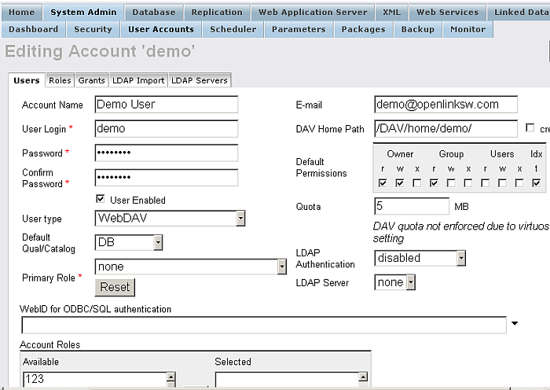

# SQL Procedure Language Guide

# General Principles

A stored procedure is a named piece of Virtuoso/PL code stored in the
SYS\_PROCEDURES table. Stored procedures are created with the create
procedure statement and are used by executing a procedure call statement
through the regular SQL API.

A procedure takes zero or more arguments and optionally returns a value.
Procedure arguments may be input, output or input and output. In this
manner a procedure may modify a variable passed to it by its caller. If
the procedure is called from a call statement executed by a client
process, the client process gets back the procedure's return value and
the values of output parameters.

Procedures can be called with positional or keyword parameters. A call
with positional parameters will bind the first argument in the call to
the first parameter in the procedure parameter list and so on. A keyword
parameter call allows specifying named parameters, where the argument of
a given name is bound to the parameter of the same name in the
procedure's parameter list. Procedure parameters may be required or
optional. The combination of optional parameters and the keyword call
notation make it convenient to have procedures with large numbers of
parameters of which only part are used at any one time.

Procedures have local variables and cursors that are not visible to
other procedures. Procedures can call each other without limitations,
including recursively.

In addition to returning a value and changing values of output
parameters a procedure may yield one or more result sets. The client can
receive rows in result sets just like rows returned by a select
statement. A procedure calling another procedure cannot receive a result
set produced by the called procedure, however. While parameters and
return values work equally well between procedures as between procedure
and client application, a result set always goes to the client, even if
the procedure has been called by another procedure. A procedure view is
a separate construct which allows a procedure to iterate over another
procedure's result set. See the Procedure Views section.

A procedure consists of statements and expressions similar to those of
any procedural language. In addition, procedures may contain SQL
statements operating on the procedure's arguments and local variables.
Writing a stored procedure is thus much like using embedded SQL in C,
except that a stored procedure is typically much faster.

The elements of the procedure are:

  - **Procedure Declaration.**
    
    This is a create procedure statement that names the procedure and
    its arguments.

  - **Variable Declaration.**
    
    This declares a local variable for the procedure.

  - **Cursor Declaration.**
    
    This declares a cursor, A cursor allows a procedure to iterate over
    the rows produced by a select statement.

  - **Manipulative SQL statement.**
    
    This can be a delete or update statement, either searched or
    positioned, a cursor manipulation or other so called routine
    statement.

  - **Control statement.**
    
    This is any control structure, loop, assignment or procedure call.

  - **Handler declaration.**
    
    This specifies what to do in a specific exception situation.
    Exceptions are error conditions produced by SQL statements (e.g.
    deadlock) or 'not found' situations.

# Scope of Declarations

A declaration can appear anywhere inside a compound statement. It
affects all statements in the compound statement following the
declaration statement.

# Data Types

Virtuoso/PL supports the regular SQL scalar data types as well as
user-defined-types (UDTs). UDTs and structures can be composed of data
types or classes made from any hosted language such C\# or Java. Local
temporary tables are not supported by the present Virtuoso but may be
added in the future.

Memory management is automatic. Parameters, cursors and intermediate
results are automatically allocated and freed.

A parameter or variable can be of any data type a column can. Variables
are however typed at run time, so that the declared type is mostly for
documentation. The declared types also affect how interactive SQL shows
certain values.

There is a special `vector` construct, declared as type `ANY` , that can
be used as an array. Vectors must be instantiated using the `vector()`
function, optionally containing initial elements as a comma-separated
list, and can be increased in size using the `vector_concat()` .
Elements of a vector are read and changed using the [`aref()`](#fn_aref)
and [`aset()`](#fn_aset) functions respectively. A special notation can
be used as a short-hand for accessing the elements of a vector one-level
deep only. The notation is by using the variable with the index in
square brackets. Hence, `aref(vec, 1)` is the same as `vec[1]` . The
following example reveal more:

Simple excerpt showing how to instantiate a vector.

    declare vec1, vec2, vec3 any;
    
    vec1 := vector();  -- simple empty vector
    vec2 := vector('a', 'b', 1, 2);  -- vector of mixed types
    vec3 := vector(vector('a', 'b'), vector(1, 2));  -- vector of vectors

Second-level elements of vec3 cannot be referenced as vec3\[1\]\[1\].

Here is the code for a simple VSP page that shows how vectors can be
used.

    <html>
     <body>
    <?vsp
    declare vec1 any;
    declare i integer;
    
    vec1 := vector();
    
    http('loading up the vector using vector_concat...<br>');
    i := 0;
    while ( i <= 5 ) {
      vec1 := vector_concat(vec1, vector(i * 5));
      i := i + 1;
    }
    
    http('displaying the contents using aref<br>');
    i := 0;
    while ( i <= 5 ) {
      http_value(aref(vec1, i)); http('<br>');
      i := i + 1;
    }
    
    http('changing the values using aset<br>');
    i := 0;
    while ( i <= 5 ) {
      aset(vec1, i, i * 10);
      i := i + 1;
    }
    
    http('displaying the contents using [] notation<br>');
    i := 0;
    while ( i <= 5 ) {
      http_value(vec1[i]); http('<br>');
      i := i + 1;
    }
    
    http('changing the values using [] notation<br>');
    i := 0;
    while ( i <= 5 ) {
      vec1[i] := i * 15;
      i := i + 1;
    }
    
    http('displaying the contents using [] notation again<br>');
    i := 0;
    while ( i <= 5 ) {
      http_value(vec1[i]); http('<br>');
      i := i + 1;
    }
    ?>
     </body>
    </html>

Which produces the following output:

    loading up the vector using vector_concat...
    displaying the contents using aref
    0
    5
    10
    15
    20
    25
    changing the values using aset
    displaying the contents using [] notation
    0
    10
    20
    30
    40
    50
    changing the values using [] notation
    displaying the contents using [] notation again
    0
    15
    30
    45
    60
    75

> **Tip**
> 
> [`aref()`](#fn_aref)
> 
> [`aset()`](#fn_aset)
> 
> [`vector_concat()`](#fn_vector_concat)

# Handling Result Sets

A single Virtuoso procedure may produce multiple result sets, each with
different result columns. A normal procedure produces one empty result
set, only returning a possible return value and values of output
parameters to the application.

The `result_names()` predefines variables to be used in a result set to
follow. The variables must be previously declared, from which the column
data types are ascertained. This assigns the meta data but does not send
any results. The `result()` function sends its parameters as a single
row of results. These parameters should be compatible with those in the
previous `result_names()` . The `end_results()` function can be used to
separate multiple result sets. The `result_names()` can then be used to
alter the structure of the next result set.

The `result_names()` call can be omitted if the application already
knows what columns and their types are to be returned.

> **Tip**
> 
> [`result()`](#fn_result) , [`result_names()`](#fn_result_names) ,
> [`end_result()`](#fn_end_result)

# Result Sets and Array Parameters

A procedure may be called with array parameters, c.f. SQLParamOptions.
Each call can yield multiple result sets.

The SQLMoreResults function is used to get from one result set to the
next and from one procedure call to the next. One may have to call this
function an indeterminate number of times before all results from a
procedure with array parameters have been received.

Each procedure return is marked with SQL\_SUCCESS\_WITH\_INFO with SQL
state 'PMORE'. The next SQLFetch will retrieve the first row of the
first result set of the next procedure invocation.

# Exception Semantics

Exceptions are of two types: Not Found and SQLSTATE. A not found
exception occurs when a select - into or open statement finds no row or
when a fetch statement reads past the last row of a cursor. A SQLSTATE
exception may result from any operation, typically a manipulative SQL
statement. The SQLSTATE '4001', deadlock is an example of this. A
user-written procedure may signal a user defined exception with the
signal function.

Virtuoso/PL supports PSM 96 style exception handlers. These allow
catching specific SQL states or ranges of SQL states, invoking a
specific block of code when the state is signalled from within the scope
of the handler. The handler may propagate the exception to an outer
handler or transfer control to any appropriate point in the containing
procedure.

An unhandled exception will cause the procedure where it is detected to
return the exception to its caller. If the caller is another procedure
that has a handler for the specified exception that procedure invokes
the handler. If the caller is a call statement issued by a client, the
client gets the SQLSTATE and the SQLExecute function called by the
client returns SQL\_ERROR and the client application may retrieve the
SQLSTATE and message with the SQLError function.

A SQLSTATE is any short string used to identify an error or exception
condition. The system itself generates certain predefined SQLSTATE's for
error conditions. Applications may add other states.

See the DECLARE HANDLER, whenever statement and signal function for an
example of exception handling.

# Virtuoso/PL Syntax

## Create Procedure Statement

    CREATE PROCEDURE NAME (parameter , parameter...) [RETURNS data_type]
    { statement ... }
    
    parameter: parameter_type name data_type opt_default
    
    parameter_type: IN | OUT | INOUT
    
    opt_default: | DEFAULT literal | := literal

The create procedure statement actually performs a "create or replace"
type operation. The create procedure statement compiles and stores a
Virtuoso/PL procedure. The procedure text is first parsed and compiled
into Virtuoso virtual machine code and if the compilation is successful
the text is stored into the SYS\_PROCEDURES table. This table is read at
startup. Stored procedures are thus always available for use and need be
defined only once. New procedures created with the same name as existing
procedures automatically replace their predecessor.

> **Tip**
> 
> [CREATE PROCEDURE Syntax - External hosted
> procedures](#createexthostproc)

    CREATE PROCEDURE FIBO (IN X INTEGER)
    {
        IF (X < 2)
        RETURN X;
        ELSE
        RETURN (FIBO (X - 1) + FIBO (X - 2));
    }
    
    CREATE PROCEDURE CFIBO (IN X INTEGER)
    {
        DECLARE RES INTEGER;
    
        RES := FIBO (X);
    
        RESULT_NAMES (RES);
    
        RESULT (RES);
    }

## Grant Execute Statement

    GRANT EXECUTE ON procedure_name TO "{USER | ROLE}" ;

The identifier quote character (double quotes) is important usage
information since it indicates that the USER or ROLE has a literal
identifier. Just as a reference (e.g., URL or URI) has the identifier
quote characters "\<" and "\>" .

The grantee should have SQL rights in order execution of procedure to be
granted to this user. The rights can be set from Conductor-\>System
Admin-\>User Accounts-\>Account-\>Edit-\>User Type:



*Example*

    SQL>create procedure DB.DBA.SimplePrint (in txt varchar)
    {
     return sprintf('Output is %s', txt);
    }
    ;
    
    Done. -- 0 msec.
    
    SQL>grant execute on DB.DBA.SimplePrint to "demo";
    
    Done. -- 0 msec.
    
    SQL>use demo;
    
    Done. -- 0 msec.
    
    SQL>select DB.DBA.SimplePrint('Virtuoso');
    
    callret
    VARCHAR
    _______________________________________________________________________________
    
    Output is Virtuoso
    
    1 Rows. -- 0 msec.

## Stored Procedures as Views & Derived Tables

Virtuoso allows using a stored procedure result set in place of a table.
A view may also be defined as a stored procedure. This provides smooth
integration to external procedural logic in queries.

When a procedure appears as a table, the procedure is called and its
result set is inserted into a temporary space. Processing continues from
that point on as if the data came from a table.

> **Tip**
> 
> For more information about Store Procedures as Views & Derived Tables
> go to the [SQL Reference Chapter](#spasviewsandtables)

## Keyword and Optional Procedure Arguments

Normally arguments in a procedure call are bound to formal parameters
from left to right, as is the default behavior in any programming
language. If a default value is specified for a parameter in the
procedure definition this parameter is optional and the default value
will be assigned to it if the caller does not specify a value. A call
may consist of zero or more positional arguments followed by zero or
more keyword arguments. A positional argument is any scalar expression.
A keyword argument is marked with the syntax:

    NAME => scalar_exp

This notation specifies that the expression is to be bound to the
parameter NAME in the procedure declaration. The names are matched
case-insensitively in all case modes. After all leading positional
arguments have been bound to the matching formal parameters in the
procedure definition, each keyword argument is bound to the parameter of
the same name. After this all unbound formal parameters are assigned to
their default values. If a parameter with no default remains unbound an
error is signalled. OUT and INOUT parameters are always required,
regardless of the mode of calling.

An expression can be passed as INOUT or OUT, but in that case the output
value assigned by the procedure is not accessible in the caller. The
output value is only accessible if the actual parameter is a variable or
parameter.

Arguments of procedures are always evaluated left to right.

    create procedure kwd (in k1 int := 111, inout k2 int, in k3 int := 333)
    {
      result_names (k1, k2, k3);
      result (k1, k2, k3);
    }
    
    kwd (1,1+1,3);
    -- results 1,2,3
    
    kwd ();
    -- error because inout parameters are always required
    
    kwd (k2=>1);
    -- error because a constant is not a suitable value for an inout parameter.
    
    kwd (k2=>1+2);
    -- result 111, 2, 333
    
    kwd (k3=>3, k1=>1,k2=>1+1);
    -- result 1, 2, 3
    
    kwd (1, k2=>1+1);
    -- result 1, 2, 333
    kwd (1);
    -- error, k2 is required
    kwd (badkey=>2, k2=>2+1);
    -- error, badkey not a parameter of the function
    
    create procedure kwd2 (in k1 int , in k2 int, in k3 int)
    {
      result_names (k1, k2, k3);
      result (k1, k2, k3);
    }
    
    kwd2 (k1=>1, k2=>2, k3=>3);
    -- result 1, 2, 3
    kwd2 (1,2,3);
    -- result 1, 2, 3

## if, while, for, foreach statements

    if_statement
        : IF '(' search_condition ')' statement opt_else
    
    opt_else
        : /* empty */
        | ELSE statement
    
    while_statement
        : WHILE '(' search_condition ')' statement
    
    for_statement
      : FOR '(' for_init_statement_list ';' for_opt_search_cond ';' for_inc_statement_list ')' statement
      | FOREACH '(' data_type_ref identifier IN_L scalar_exp ')' DO statement

The IF statement executes the immediately following statement if the
condition is true. If there is an else clause and the condition is false
the statement immediately following the else keyword will be executed.

The while statement evaluates the search condition and executes the
following statement if the condition is true. It does this as long as
the condition is true. To exit from a loop, use goto. C-like break and
continue statements are not available.

The for statement initiates the for\_init\_statement\_list and executes
the following statement until the search condition is true. After every
execution of the statement it executes for\_inc\_statement\_list. You
can exit the loop with using goto syntax also.

The foreach statement executes the statement for each element from an
array and sets a variable to the corresponding element of that array.

    IF (A > B)
        A := A + 1;
    ELSE
        B := B + 1;
    
    WHILE (1 = 1) {
        A := A + 1;
    }
    
    FOR (declare X any, X := 1; X <= 2 ; X := X + 1){
        S := S + X;
    }
    
    FOR (declare X any, X := 1; X <= 2 ; ){
        S := S + X;
        X := X + 1;
    }
    
    FOR (declare X any, X := 1; ; X := X + 1){
        if (X > 2)
        goto exit_loop;
        S := S + X;
    }
    exit_loop:
    
    declare X integer;
    X := 1;
    FOR (; X <= 2 ; X := X + 1){
        S := S + X;
    }
    
    ARR := vector (1,2);
    FOREACH (int X in ARR) do {
        S := S + X;
    }

## compound statement

    compound_statement
        : '{' statement_list '}'
        ;
    
    statement_list
        : statement_in_cs
        | statement_list statement_in_cs
        ;
    
    statement_in_cs
        : local_declaration ';'
        | compound_statement
        | routine_statement ';'
        | control_statement
        | label ':' statement
        ;
    
    statement
        : routine_statement ';'
        | control_statement
        | compound_statement
        ;
    
    local_declaration
        : cursor_def
        | variable_declaration
        | handler_declaration
        ;
    
    variable_declaration
        : DECLARE variable_list data_type
        ;
    
    variable_list
        : NAME
        | variable_list ',' NAME
        ;

The compound statement is the main building block of procedures.
Statements in a compound statement are executed left to right, unless
the flow of control is changed with a goto statement. The compound
statement allows declaring local variables and exception handlers. See
'Scope Rules' above for a description of the scope of declarations.

Labeled statements (goto targets) and declarations can only occur within
a compound statement.

> **Tip**
> 
> [Create Procedure statement](#createprocstmt)

## goto, return statements

    goto_statement
        : GOTO label
        ;
    
    label   : NAME
    
    return_statement
        : RETURN scalar_exp
        | RETURN
        ;

The goto statement unconditionally transfers control to the label
following it. The label can be anywhere within the same procedure. It is
in principle possible to jump into a block (e.g. loop body) from
outside.

The return statement causes the executing procedure to return. If a
return value is specified the expression is evaluated and returned as
the return value of the procedure. If no return value is specified the
procedure returns an undefined value.

Returning from a procedure automatically frees any resources associated
with the procedure. This includes values in local variables or call by
value (IN) parameters and any cursors that may be open.

> **Tip**
> 
> [Create Procedure statement](#createprocstmt)

## whenever statement

    condition
        : NOT FOUND
        | SQLSTATE STRING
        ;
    
    handler_declaration
        : WHENEVER condition GOTO NAME
        ;

This declares that control should be transferred to a particular label
in the procedure whenever a condition occurs within the lexical scope of
the WHENEVER declaration. This is similar to the statement of the same
name found in most embedded SQL implementations.

The scope of the declaration is all the lines lexically following the
declaration. A previous declaration is replaced by a new declaration for
the same \<condition\>.

    CREATE PROCEDURE COUNT_CUSTOMERS (IN C_NAME VARCHAR)
    {
        DECLARE COUNT INTEGER;
    
        COUNT := 0;
    
        DECLARE C CURSOR FOR SELECT C_ID FROM CUSTOMER WHERE C_NAME = C_NAME;
    
        WHENEVER SQLSTATE '4001' GOTO DEADLOCK;
    
        WHENEVER NOT FOUND GOTO DONE;
    
        OPEN C;
        WHILE (1=1)
        {
        FETCH C INTO N;
        COUNT := COUNT + 1;
        }
    
    DONE:
        RETURN COUNT;
    
    DEADLOCK:
        RETURN -1;
    }

> **Note**
> 
> This is about the same as select count (\*) from CUSTOMER where
> C\_NAME = ?;

## call, assignment statements

    function_call
        : NAME '(' opt_scalar_exp_commalist ')'
        | call '(' scalar_exp ')' '('opt_scalar_exp_commalist ')'
        ;
    
    call_statement
        : CALL NAME '(' opt_scalar_exp_commalist ')'
        | function_call
        ;
    
    assignment_statement
        : lvalue EQUALS scalar_exp
        | lvalue '=' scalar_exp
        ;
    
    lvalue  :  NAME

The call statement calls a specified procedure with the given arguments.
The procedure to call is resolved at run time, i.e. the latest
definition prevails, even if it has been made after the calling
procedure was defined. The CALL reserved word is optional and is
supported for compatibility.

If the called procedure has reference parameters (OUT or INOUT) the
matching actual parameter must be a variable or parameter.

There is a computed function call form of function\_call. In this, the
scalar expression in parentheses following the call keyword should
evaluate to a string which then identifies the function to be called.

The assignment statement sets a value to a variable. The variable must
be either a local variable declared with declare or a procedure argument
declared in the procedure argument list. If the variable in question is
a reference parameter the assignment takes effect in the actual
parameter as will, i.e. the value of the argument variable in the caller
is set.

    CREATE PROCEDURE COMPUTED_CALL (IN Q INTEGER)
    {
        DECLARE FN VARCHAR;
    
        FN := 'F';
    
        --- CALL FUNCTION FF WITH ARGUMENT 11.
        R := CALL (CONCATENATE (FN, 'F')) (11);
    }

## open, fetch, close, select ... into statements

    SELECT opt_all_distinct selection
        INTO target_commalist
        table_exp
        with_opt_cursor_options_list
        ;
    
    opt_all_distinct
        : /* empty */
        | ALL
        | DISTINCT
        ;
    
    with_opt_cursor_options_list
        : /* empty */
        | WITH opt_cursor_options_list
        ;
    
    cursor_option
        : EXCLUSIVE
        ;
    
    cursor_options_commalist
        : cursor_option
        | cursor_options_commalist ',' cursor_option
        ;
    
    opt_cursor_options_list
        : /* empty */
        | '(' cursor_options_commalist ')'
        ;
    
    cursor_def : DECLARE NAME CURSOR FOR query_exp
               | DECLARE NAME (DYNAMIC|KEYSET|STATIC) CURSOR FOR query_exp
    
    open_statement
        : OPEN cursor opt_cursor_options_list
        ;
    
    fetch_statement : FETCH cursor INTO target_commalist
                    | FETCH cursor (FIRST|NEXT|PREVIOUS|LAST) INTO target_commalist
                    | FETCH cursor BOOKMARK scalar_exp INTO target_commalist
    
    target_commalist
        : variable
        | target_commalist ',' variable
        ;
    
    close_statement
        : CLOSE cursor
        ;

The open, fetch and close statements manipulate cursors in Virtuoso/PL
statements. Cursors are declared with the declare cursor statement. The
select into statement is a shorthand for a cursor declaration, open,
fetch and close.

A forward-only cursor declaration is a declaration only and executing
one does not take time. The open statement effectively starts the search
associated with the forward-only cursor.

The forward-only cursor options used with open and select into allow
controlling how the cursor sets locks on selected rows and how many rows
it fetches at a time. The EXCLUSIVE option should be used if intending
to update or delete a row in the cursor's evaluation. This causes
selected rows to be locked with exclusive (write) locks.

    The statements:
    
    {
        DECLARE CR CURSOR FOR SELECT C_NAME FROM CUSTOMER WHERE C_ID = ID;
        OPEN CR;
        FETCH CR INTO NAME;
        CLOSE CR;
    }
    
    and
    
    SELECT C_NAME INTO NAME FROM CUSTOMER WHERE C_ID = ID;
    
    have the same effect.

> **Tip**
> 
> the TPC C Bench Marking chapter for more examples.

## FOR Select Statement

    <for statement> ::=
         FOR <query exp> DO statement

The FOR statement provides a compact notation for iterating over the
result set of a cursor. The body is executed once for each row in the
query expression's result set. The result columns produced by the query
expression are accessible as variables of the same name inside the body.
All result columns do therefore have to be named with the AS declaration
if they are not simple columns, in which case the name defaults to the
column's name.

The body can be exited in mid loop with a goto. The cursor of the FOR
does not have to be specifically closed or opened. FOR statements can be
freely nested. If a WHENEVER NOT FOUND declaration is in effect before
the FOR it will be canceled by it, so that it is not in effect after the
loop's body.

    for select C_NAME, sum (O_VALUE) as value  from CUSTOMER, ORDER group by C_NAME DO
      {
        result (C_NAME, value);
      })

The equivalent code is

    declare C_NAME, value any;
    whenever not found goto done;
    declare cr cursor for select ....;
    open cr;
    while (1) {
      fetch cr into C_NAME, value;
      whenever not found default;
      ...
    }
    done: ;

The cursor and end label names are generated to be unique by the FOR
expansion.

## SET statement

    Set_statement:
        SET option '=' scalar_exp
        | SET option OFF
        | SET option ON
        ;
    
    option:
        ISOLATION
        | LOCK_ESCALATION_PCT
        | TRIGGERS
        | PARAM_BATCH
        ;

The SET statement sets an option to a value. Options may control trigger
invocation, transaction isolation and other settable parameters of the
engine. A SET inside a procedure takes effect inside the procedure and
invoked procedures, counting from time of execution. Control must pass
through the SET statement for it to take effect, i.e. SET is not a
declaration. The effect of a SET does typically not persist across
procedure return.

A SET given at top level, i.e. directly executed and by a client as the
statement of a SQLExecute sets an option at the connection level. This
may only be reversed by another SET.

The option may be:

## SET Triggers

A value of OFF or 0 causes triggers not to be invoked even if there may
be applicable triggers. This is mostly useful for controlling recursion
of triggers or for debugging triggers.

The value of TRIGGERS is passed into called procedures but other options
are not.

> **Tip**
> 
> [SET statement.](#setstmt)

## Vectored Procedures

Note: This feature only applies to Virtuoso 7.0 and later.

A stored procedure may be declared vectored. This means that when called
from a statement operating on multiple values, a single call of the
procedure can take the whole batch of variable bindings the statement is
operating on in a single invocation. This saves invocation and
interpretation overhead, and, most importantly, allows running any SQL
statements inside the procedure on multiple values at once, creating
possibilities for parallelization and exploitation of locality. The
vectored declaration consists of the VECTORED reserved word at the start
of the procedure body.

Consider the example of a lookup table:

    CREATE TABLE person
      (
        p_id   INT PRIMARY KEY,
        p_name VARCHAR
      );
    
    CREATE TABLE knows
      ( p1 INT REFERENCES PERSON,
        p2 INT REFERENCES PERSON,
        PRIMARY KEY ( p1, p2 )
      );
    
    CREATE PROCEDURE p_name
      ( IN code INT )
      RETURNS VARCHAR
      {
        VECTORED;
        RETURN
          (
            SELECT p_name
              FROM person
             WHERE p_id  = id
          ) ;
      }
    
    SELECT  p_name (p1)
      FROM  knows
     WHERE  p2 = 123;

This last statement is equivalent to:

    SELECT  p_name
      FROM  knows,
            person
     WHERE  p_id = p1
       AND  p2 = 123;

For non-trivial transformations, hiding the logic inside a procedure
makes sense, Running the procedure vectored makes it so that efficiency
is not lost. For example, if person 123 knows 1000 people, there will
not be 1000 random lookups in person for the names but rather a single,
vectored, merge-style lookup, accessing the rows in order of ID, saving
time if the IDs are nearby each other. Furthermore, if the lookup is in
READ COMMITTED isolation, the multiple lookups can be scheduled on
multiple threads.

The restrictions for vectored statement bodies also apply to function
bodies that are declared vectored.

A vectored procedure can be called from a non-vectored procedure. In
this case, the vectored procedure simply executes on a single set of
values, as if it were not vectored.

A vectored procedure can call a non-vectored procedure. When this
happens, the non-vectored procedure is called once for each set of
eligible values, i.e., once for the first values of the arguments, once
for the second values of the arguments, and so forth.

A vectored procedure, if called from vectored code, returns a return
value for each set of arguments.

A vectored procedure can have IN and OUT parameters. These have the same
semantics as in single-value execution. When calling a non-vectored
procedure with an OUT or INOUT parameter, the argument in the vectored
caller must be declared to be of a boxed data type. (See the section on
vectoring and data types below.)

## FOR VECTORED Statement

Note: This feature only applies to Virtuoso 7.0 and later.

    FOR VECTORED
      ( {IN|OUT} <variable> <data_type> [ := <value>],
        ...
      )
      <compound_statement>

The FOR VECTORED statement allows executing a block of code on several
sets of variable bindings at once. The benefit of this is that any
database operations in such a block can be run on multiple sets of
parameters at once, allowing exploitation of locality and, in some
cases, running the operation on different bindings on different threads.
Additionally, if vectored procedures are called from inside such a
block, the call is made with multiple bindings for the parameters. The
input variables of FOR VECTORED are initialized from an array of scalar
values. The statements inside the body are then executed vectored, as if
the operation were first made on all the first values of the vectors,
then on the second values, and so forth. Operations combining values
from different places in the vectors are not possible in the FOR
VECTORED body, but, since vectored results can be seen as arrays after
the return of FOR VECTORED, any aggregation or comparison between values
in different positions of the same vector can be done after the FOR
VECTORED, simply accessing different elements of the arrays produced.

The FOR VECTORED statement communicates with its environment through a
list of input and output variables. The input variables are marked with
the syntax:

    IN <variable> <data_type> := <value>

The \<value\> must be an expression evaluating to an array. The data
type must correspond to the element type of the array. When multiple
input variables are specified, the arrays initializing each must be of
equal length.

An output variable is marked with:

    OUT <variable> := <value>

The variable must be declared in a context outside of the FOR VECTORED
statement. The value of the variable will be an array where each value
of the vectored expression \<value\> is represented as a separate value.

Variables declared outside of a FOR VECTORED statement are visible in
the body of FOR VECTORED and they appear as a single value for all rows
of the vectored section.

Consider the task of pair-wise adding the elements of two arrays:

    CREATE PROCEDURE a_add
      (
        IN  a1  INT ARRAY ,
        IN  a2  INT ARRAY
      )
      {
      DECLARE  res  INT ARRAY ;
      res := make_array (LENGTH (a1, ' any' );
      FOR (i := 0; i < LENGTH (a1); i := i + 1)
        res[i] := a1[i] + a2[i];
      RETURN res;
    }

This can be expressed as:

    CREATE PROCEDURE a_add_v
      (
        IN  a1  INT ARRAY ,
        IN  a2  INT ARRAY
      )
      {
        DECLARE  res  INT ARRAY;
        FOR VECTORED
          ( IN   n1  INT  := a1 ,
            IN   i2  INT  := a2 ,
            OUT  res      := r
          )
          {
             DECLARE  r  INT ;
             r := i1 + i2 ;
          }
        RETURN res;
      }

The two procedures are identical in function. The second will make use
of vector instructions in the host CPU, if available, and will incur
less interpretation overhead, since the SQL run time will not need to
run a loop. In practice, substantial benefit, up to an order of
magnitude, can be had from vectored execution with database operations
exhibiting significant locality. Bulk loads and bulk lookups are a
typical example.

## Limitations on Vectored Code

Note: This feature only applies to Virtuoso 7.0 and later.

The body of FOR VECTORED or a vectored procedure may contain arbitrary
Virtuoso PL, except for LOOPs and backward GOTOs. Conditional
expressions and statements are allowed, as well as any subqueries or DML
statements. Looping over a cursor is not allowed, since this is a loop,
but scalar subqueries and selecting-into-variables in *SELECT ... INTO*
is allowed. Exception handlers are not allowed inside, but an exception
handler outside of FOR VECTORED will catch errors signaled from inside
FOR VECTORED. FOR VECTORED statements may not be nested and may not
occur in the body of a vectored procedure. The handler, being itself not
in vectored code, will not be able to see which specific value in a
vectored section gave rise to the exception.

## Data Types and Vectoring

Note: This feature only applies to Virtuoso 7.0 and later.

Parameters in vectored procedures or FOR VECTORED blocks can be declared
to be of the corresponding scalar data type. The vectoring is thus in
most cases transparent; the variable will simply have multiple scalar
values instead of one. The ANY type in a vectored code section is
represented as an array of serialized values. Thus types that are
represented as data structures in allocated memory (e.g., arrays, hash
tables, XML elements, etc.) will not work efficiently with ANY vectored
variables. In some cases (for example, with streams or dictionaries),
assigning to a vectored ANY will lose the information.

Therefore, if dealing with vectors of complex data types in vectored
code, the variable holding these must be declared as an ANY ARRAY. With
this type, the representation will be an array of pointers to allocated
memory, not an array of flat serialized values. The ANY ARRAY type must
be used instead of the customary ANY in all cases involving complex
values in vectored code. If dealing with vectors of simple scalars like
strings or numbers, the ANY type is generally more efficient.

# Execute Stored Procedures via SELECT statement

Stored SQL Procedures can be executed via SELECT statement:

    SELECT PROCEDURE_NAME (parameter , parameter...);

For ex.:

    create procedure mytest ( in ss varchar)
    {
      return concat('My simple test with ', ss);
    }
    ;
    
    SQL> select mytest('Virtuoso');
    callret
    VARCHAR
    _______________________________________________________________________________
    
    My simple test with Virtuoso
    
    1 Rows. -- 0 msec.

# Execute Stored Procedures In Background

You can start procedure in background using the \[name of the
procedure\]\[params\]& syntax. This feature forks another ISQL process
and leaves the other on background so there will be two separate clients
running separate client connections:

    SQL>create procedure test()
    {
    return 'my simple test';
    }
    ;
    Done. -- 0 msec.
    SQL>test()&
    SQL> Connected to OpenLink Virtuoso
    Driver: 05.07.3033 OpenLink Virtuoso ODBC Driver
    OpenLink Interactive SQL (Virtuoso), version 0.9849b.
    Type HELP; for help and EXIT; to exit.
    
    Done. -- 10 msec.

See [Asynchronous Execution and Multithreading in
Virtuoso/PL](#asyncexecmultithread) for background jobs execution
details.

# CREATE ASSEMBLY Syntax - External Libraries

External CLR libraries can be hosted inside Virtuoso by creating an
assembly from the library itself using the syntax as follows:

    CREATE ASSEMBLY <assembly_name> FROM <assembly_location>
      [WITH PERMISSION_SET = <perm>] [WITH AUTOREGISTER];

assembly\_name

\- is how Virtuoso will reference the library.

assembly\_location

\- is where Virtuoso will find the library within the CLR.

Every .NET assembly deployed inside Virtuoso will be verifiable, which
means it will contain code the CLR can verify to be safe in the way it
writes to memory.

Virtuoso also respects the Common Language Runtime's code access
security model. By default, code does not have any permissions to create
a graphical user interface, create threads, access the file system, or
call unmanaged code. The only permissions implemented are those granted
for in-process data access.

Administrators will control the permissions granted to assemblies using
a standard .NET machine and user-level security policy. At runtime, any
code accessing protected resources produces a stack walk that triggers a
permissions check against that code and any code that called it.

To simplify security administration, Virtuoso supports these standard
permission sets for .NET assemblies:

SAFE

\- This is the default permission set. It allows internal computation
and data access. There is no access to resources outside of Virtuoso.
Calls to unmanaged code are not allowed. Code must be verifiable.

UNRESTRICTED

\- Code can access any resource. Only system administrators (dba
group/role) can run unrestricted code. This level allows calls to
unmanaged code, and can be unverifiable.

The restricted assemblies (SAFE mode) are not permitted to execute any
code that infringes upon any of the following permissions:

AspNetHostingPermission

EnvironmentPermission

FileIOPermission

IsolatedStoragePermission

ReflectionPermission

RegistryPermission

SecurityPermission

SocketPermission

WebPermissionPermission

DNSPermission

PrintingPermission

OleDBPermissionPermission

SqlClientPermissionPermission

EventLogPermission

MessageQueuePermission

ServiceControllerPermission

PerformanceCountersPermission

DirectoryServicePermission

If the assembly generates a security exception the error text will be
returned to the client.

> **Note**
> 
> Currently on the Microsoft .Net Framework implementation supports
> permission sets. Virtuoso does not currently support the
> `EXTERNAL_ACCESS` permission set.

*WITH AUTOREGISTER* marks the assembly as a stored procedure, trigger,
user-defined function, etc., based on custom attributes you add to your
.NET code.

Assemblies are stored in the database and are therefore backed-up and
restored with the data. Once assemblies are registered using the `CREATE
ASSEMBLY` syntax there will be no further dependency on the library file
(dll or exe) itself.

You can remove assemblies using the familiar SQL DROP statement:

    DROP ASSEMBLY <assembly_name>;

> **Tip**
> 
> [import\_clr()](#fn_import_clr)

This example is based on the tutorial HO\_S\_10. we start by obtaining a
C\# library compile from the following code (included in the tutorial):

    using System;
    
    [Serializable]
    public class Point_10
    {
      public Double x;
      public Double y;
    
      public Point_10 ()
        {
          x = 0;
          y = 0;
        }
      public Point_10 (Double new_x, Double new_y)
        {
          x = new_x;
          y = new_y;
        }
    
      public Double distance (Point_10 p)
        {
          Double ret;
    
          ret =  Math.Sqrt ((p.x - this.x) * (p.x - this.x) + (p.y - this.y) * (p.y - this.y));
    
          return ret;
        }
    }

This gives us the Point\_10 class with two constructors and one method
for finding the distance between two points.

Now we must create the library reference in Virtuoso using the
following:

    DROP ASSEMBLY "myPoint";
    
    CREATE ASSEMBLY "myPoint" as concat (http_root() , '\\tutorial\\hosting\\ho_s_10\\Point_ho_s_10.dll')
      WITH PERMISSION_SET = SAFE WITH AUTOREGISTER;

Now for a quick test, we will find the distance between two points:

    SQL> select new Point_10(0,0).distance(Point_10(3,4));
    callret
    DOUBLE PRECISION
    _______________________________________________________
    
                   5

Now we will create a table with a column of type Point\_10 and then
insert some test data:

    drop table CLR..Supplier_ho_s_10;
    
    create table CLR..Supplier_ho_s_10 (id integer primary key, name varchar (20), location Point_10);
    
    insert into CLR..Supplier_ho_s_10 (id, name, location) values (1, 'S1', new Point_10 (1, 1));
    insert into CLR..Supplier_ho_s_10 (id, name, location) values (2, 'S2', new Point_10 (3, 3));
    insert into CLR..Supplier_ho_s_10 (id, name, location) values (3, 'S3', new Point_10 (5, 5));

Now we will demonstrate how this assembly's class can be used in SQL by
showing some queries on the sample data:

    SQL> select name, s.location.x from CLR..Supplier_ho_s_10 s;
    name                  callret
    VARCHAR               DOUBLE PRECISION
    _______________________________________________________________________________
    
    S1                                   1
    S2                                   3
    S3                                   5

The distances from (0, 0):

    SQL> select name, s.location.distance(Point_10(0,0)) from CLR..Supplier_ho_s_10 s ;
    name                  callret
    VARCHAR               DOUBLE PRECISION
    _______________________________________________________________________________
    
    S1                    1.414213562373095
    S2                    4.242640687119285
    S3                    7.071067811865476

Now, the points that are more than 3 units away from it:

    SQL> select name from CLR..Supplier_ho_s_10 s where s.location.distance(Point_10(0,0)) > 3;
    name
    VARCHAR
    _______________________________________________________________________________
    
    S2
    S3

This example demonstrates the creation of trivial CLR classes and
referencing them from Virtuoso.

  - *lib.cs*
    
        namespace lib
        {
          public class t1
          {
             public static int addit (int a1, int a2) { return a1 + a2; }
          }
        }

  - *exe.cs*
    
        using lib;
        
        public class exe
        {
           public static int call_addit (int a1, int a2)
           {
              return t1.addit (a1, a2);
           }
        
           public static void Main (String [] args)
           {
              Console.WriteLine ("result=" + call_addit (12, 13));
           }
        }

  - *compilation*
    
        csc /t:library lib.cs
        csc /r:lib.dll exe.cs

  - *Now Virtuoso can use*
    
        create assembly sql_lib from 'c:\sample\lib.dll'
        create assembly sql_exe from 'c:\sample\exe.exe'

These examples will use an assembly called test.dll, whose source code
is:

    using System;
    using System.IO;
    
    public class Sample
    {
       public static String GetEnv ()
         {
           return Environment.GetEnvironmentVariable("PATH");
         }
    }

The assembly will be registered using:

    CREATE ASSEMBLY "test" from 'test.dll' WITH PERMISSION_SET = SAFE WITH AUTOREGISTER;

and subsequently called using:

    SQL> select Sample::GetEnv ();

returning the following error for attempting to exceed the SAFE
permission set.

    *** Error 42000: [Virtuoso Driver][Virtuoso Server]CLR05: Request for the permission of type System.Security.Permissions.EnvironmentPermission,
          mscorlib, Version=1.0.3300.0, Culture=neutral, PublicKeyToken=b77a5c561934e089 failed.
    in
    __udt_method_call:(BIF),
    <Top Level>
    at line 4 of Top-Level:
    select Sample::GetEnv ()

Now we can try the same sample using PERMISSION\_SET = UNRESTRICTED.

    drop ASSEMBLY "test";
    
    CREATE ASSEMBLY "test" from 'test.dll' WITH PERMISSION_SET = UNRESTRICTED WITH AUTOREGISTER;
    
    SQL> select Sample::GetEnv ();
    callret
    VARCHAR
    _______________________________________________________________________________
    
    D:\Virtuoso\bin...;
    
    1 Rows. -- 32 msec.
    <

Unrestricted assemblies do not have any restrictions on usage.

# CREATE PROCEDURE Syntax - External hosted procedures

Virtuoso provides a syntax shortcut for calling static method from
hosted user defined types without first defining a Virtuoso external
hosted user defined type:

    CREATE (PROCEDURE|FUNCTION) <local_name> ([<arg_def1>, ...])
        [returns <sql_datatype>] LANGUAGE [JAVA|CLR] EXTERNAL NAME '<external_static_proc_name_literal>'
    
    <arg_def> := [IN|OUT|INOUT] param_name <data_type_spec>
    
    <external_static_proc_name_literal> = <external_type_name_literal>.<static_proc_name>

This compiles into an functional equivalent of :

``` 
create procedure <local_name) ([<arg_def1>, ....])
{
  declare ret any;

  exec ('
    create type <local_name>
      temporary self as ref
        static method m1 ([<arg_def1>, ....])
           returns <datatype> EXTERNAL NAME ''<static_proc_name>''
   ');

  ret := <local_name>::m1 (....);

  exec ('drop type <local_name>');

  return ret;
  }
  
```

For more details see [CREATE TYPE](#udtcreatetypestmt) and Runtime
hosting chapters.

Here is an example for CREATE PROCEDURE and the hosted Java VM:

    create procedure get_property (in x varchar) returns varchar language java external name 'java.lang.System.getProperty';

Here's how that procedure is called:

    SQL> select get_property ('java.vm.name');
    callret
    VARCHAR
    _______________________________________________________________________________
    
    Java HotSpot(TM) Client VM

Here is an example for CREATE PROCEDURE and the hosted CLR:

    create procedure curr_thr_id () returns integer language CLR external name 'mscorlib/System.AppDomain.GetCurrentThreadId';

Here's how that procedure is called:

    SQL> select curr_thr_id();
    callret
    INTEGER
    _______________________________________________________________________________
    
    2156

# Asynchronous Execution and Multithreading in Virtuoso/PL

Many application tasks benefit from parallel execution. This is
specially true of I/O intensive workloads where each thread spends a
large amount of time waiting for the network or disks. Typical tasks
include crawling the web and importing large data sets. The whole
process must not stop just because there is a file cache miss or because
there is round trip latency or a name resolution delay on the net.

To this effect, Virtuoso/PL provides the async\_queue object. A stored
procedure may create an async\_queue that will be served by a pool of
worker threads. The size of this pool can be set when creating the
queue.

The thread which made the queue can use the queue to pass
procedure/parameter list pairs to the threads. If a thread is available,
the thread will execute the request, if not, the next thread of the pool
to become free will take the oldest queued item and execute it. Thus the
queue is served in a FIFO fashion multiplexed over n threads.

The owner of the queue can check on the results of execution either
collectively or individually. Each worker thread has its own transaction
and worker threads may end up waiting for each other own database locks
and can deadlock. The worker thread code is responsible for committing
its own transaction and handling any deadlock retries or such.

When the thread owning the queue makes a request, a request number is
returned. This number can be used to later request the return value and
error status of the request. A queue cannot be persisted in a database
table and cannot be passed between threads. A queue can be passed
between procedures and kept in data structures such as arrays. Queue are
internally reference counted and when the last reference drops the queue
is freed. If a queue is freed while there is still activity on behalf of
the queue, the activities that are ongoing are finished, all requests
that are not started are discarded and all values and error states are
discarded. The queue and associated resources are thereafter freed.

There is a pool of 20 threads that are shared among all async\_queues on
the system. Thus, the count of threads given for the queue is a maximum
and does not guarantee that this quantity of threads be used in reality.
If no thread is available in the pool, i.e. other async queues have
exhausted the entire pool, the thread making the request ends up
executing the item synchronously. One should take this possibility into
account when deciding transaction boundaries, otherwise this is
transparent and the calling thread still gets a request handle and can
later check for its completion.

Queues take procedures and argument lists instead of texts of SQL
statements in order to save the time of compiling the text. It is
desirable for best performance to supply the name of the procedure in
its full form, with full qualification and matching case.

Consider the following code samples:

    create table aqi (n int);
    
    -- The worker procedure. Insert one row and commit.
    
    create procedure INS1 (in n int)
    {
      --dbg_obj_print ('ins1 ', n);
      insert into AQI (N) values (n);
      commit work;
      return '22';
    }
    
    create procedure taq1 (in x int, in thrs int := 1)
    {
      declare aq, res, err any;
      declare n int;
      aq := async_queue (thrs);
      for (n:= 0; n < x; n:=n+1)
        {
          res := aq_request (aq, 'DB.DBA.INS1', vector (n));
        }
      return (aq_wait (aq, res, 1, err));
    }
    
    -- This procedure makes a queue with a given number of worker threads, then makes a set of requests and waits for the result
    of the last one. Note that this is not necessarily the last to complete if there are multiple threads serving the queue.

## Synchronization

It is possible to add requests to a queue at all times. It is also
possible to check for the result of any request made so far, by either
blocking to wait for it or just checking its status.

    aq_wait (in aq any, in req_no int, in block int, out err any) returns any

The aq\_wait function takes the queue, a request number returned by
aq\_request, a blocking flag and an output parameter for the error
state.

If there was no error, the error state is set to 0. If the procedure was
undefined, the error state is set to 2. If there was a SQL state
signalled from the procedure called on the worker thread, the error
state is set to an array of three elements: The integer 3, the SQL state
string and the text of the message. If aq\_wait is terminated by an
external event, then an error indicating this is signalled and the state
waited for is lost. This can only happen when all transactions are
killed by shutdown or going to a single user state.

If the blocking flag was zero and the request was not complete, then the
error output parameter is set to 1 and 1 is returned.

Once aq\_wait has retrieved a state, the state is no longer retained in
the queue.

The aq\_wait\_all function allows waiting for all activity to complete
but discards individual return states. If some of running activities is
terminated by sql error, this error will be raised in the thread
executing aq\_wait\_all function call.

Note that it is possible to get a deadlock between the requesting thread
and a worker thread and that this deadlock cannot be detected by the
database engine since this does not involve a cycle in database locks
themselves. Thus, aq\_wait signals an error if the thread calling it
holds database locks. Manually committing or rolling back before calling
aq\_wait is necessary if the thread can belong to a transaction that
holds locks.

Thus, it is most practical to explicitly commit all work on the
requesting thread before calling aq\_wait or aq\_wait\_all.

    create procedure taq_all (in x int, in thrs int := 1)
    {
      declare aq, res, err any;
      declare n int;
      aq := async_queue (thrs);
      for (n:= 0; n < x; n:=n+1)
        {
          res := aq_request (aq, 'DB.DBA.INS1', vector (n));
        }
      aq_wait_all (aq);
    }
    
    -- This procedure is guaranteed to wait for all requests to be completed but will discard individual error states.

# Performance Tips

## Remember the following:

  - Reference parameters (inout and out) are faster then value
    parameters (in).

  - Use cursors and positioned delete/update (where current of) for
    read-modify transactions instead of a select .. into and searched
    update.

  - Make an EXCLUSIVE read in read-modify transactions.

  - When using ORDER BY and wishing to use a particular index, specify
    ALL key parts of the index, including those that have a '='
    condition. If you want to have descending order using an index,
    specify DESC on ALL key parts.

# Procedures and Transactions

A procedure call executed by a client is just like any other SQL
statement. It executes in the context of the client's active
transaction. If the connection is in autocommit mode the transaction is
automatically committed if the procedure returns successfully and rolled
back if the procedure returns with an error. If the connection is in
manual commit mode, a possible procedure error has no effect on the
client's transaction, unless the error is a transaction error, e.g.
timeout or deadlock.

For best performance, we recommend using procedures in autocommit mode.
In this way, a single client-server exchange will suffice to carry out
the whole transaction. This will also conveniently roll back the
transaction if the procedure exited as a result of an unhandled SQLSTATE
or a 'not found' condition.

Procedures can commit or rollback transactions using commit work and
rollback work statements.

# Distributed Transaction & Two Phase Commit

2PC is an acronym for 2 Phase Commit. This is a protocol by which data
being committed to a database is committed in two phases. In the first
phase, the transaction processor checks that all parts of the
transaction can be committed. In the second phase, all parts of the
transaction are committed. If any part of the transaction indicates in
the first phase that it cannot be committed, the second phase does not
occur. ODBC does not support two-phase commits.

Transactions in SQL databases are expected to have "ACID" features:
Atomicity, Consistency, Isolation, Durability. A two-phase commit (2PC)
protocol is needed for guaranteeing ACID properties of transactions
which involve changing data in more than one database. This can be the
case in a transaction involving tables attached from other databases or
explicit access to remote databases with rexecute().

The 2PC protocol needs to have a third party Distributed Transaction
Coordinator (DTC). Virtuoso supports Microsoft Transaction Server (or MS
DTC).

There are two ways of using MTS-driven distributed transactions in
Virtuoso. Virtuoso either initiates the transaction, or it responds to a
transaction.

## Initiating Distributed Transactions

In this case the transactions are initiated by Virtuoso itself. This
causes all remote connections of linked tables to be automatically
enlisted in a distributed transaction controlled by MTS. To enable this,
Virtuoso's transaction must be set to a special state with the 'SET'
statement as follows:

    SET MTS_2PC=1;

This statement turns distributed transaction support on. All
transactions started on remote databases shall automatically be enlisted
as branches of a distributed transaction managed by MS DTC. The effect
of SET, in this case, lasts until the commit or rollback of the
transaction. The SET statement should be at the beginning of the
transaction, before any distributed operations are undertaken.

Example of money transfer from one attached table to another:

    CREATE PROCEDURE TWOPC_TRANSFER_MONEY(IN person_id INTEGER)
    {
      IF (MTS_STATUS('MTS') = 'disconnected') -- check connection to MS DTC
      {
        MTS_CONNECT(0); -- connect to MS DTC
      }
      SET MTS_2PC=1; --  transaction of this procedure is now in distributed
      MTS_SET_TIMEOUT (1000); -- 1sec timeout on distributed transactions
      UPDATE linked_account1 SET amount=amount+100 WHERE id=person_id;
      UPDATE linked_account2 SET amount=amount-100 WHERE id=person_id;
      commit work;
    }

This money transfer is under 2PC control of MTS. If one of the two
participating databases crashes (or rolls back due to deadlock or
timeout), Virtuoso will roll back the whole distributed transaction.

Note that if a transaction modifies the local Virtuoso database, and not
more than one remote database, 2 phase commit is not needed for
guaranteeing integrity.

Deadlocks are detected for local transactions using a wait graph.
Deadlocks are detected for distributed transactions based on timeouts.
Use [mts\_set\_timeout()](#fn_mts_set_timeout) for explicitly setting a
timeout. See MS DTC for a definition of timeouts.

## Responding to Distributed Transactions

In this situation a distributed transaction is initiated by an ODBC
client of Virtuoso. The application enlists one or more Virtuoso hdbcs
in an OLE/DB distributed transaction, and then works with that hdbcs and
commits or rolls back the distributed transaction.

c++ example:

    /* begin of example */
      ITransaction* transaction;
      ITransactionDispenser* disp;
      HRESULT hr =
          DtcGetTransactionManager (0, 0, &IID_ITransactionDispenser, 0, 0, 0,
          &disp);
      hr = disp->BeginTransaction (0, ISOLATIONLEVEL_ISOLATED,
          0, 0, &transaction); /* initialize transaction */
      SQLSetConnectOption (hdbc1, SQL_COPT_SS_ENLIST_IN_DTC,
          (DWORD) transaction); /* enlist 1st hdbc in transaction */
      SQLSetConnectOption (hdbc2, SQL_COPT_SS_ENLIST_IN_DTC,
          (DWORD) transaction); /* enlist 2nd hdbc in transaction */
    
      ..... /* some work with ODBC connections */
    
      transaction->Commit (0, 0, 0); /* commit the transaction */
    /* end of example */

If a Virtuoso connection is enlisted into a distributed transaction
managed by MS DTC, and a Virtuoso statement executed in this transaction
accesses attached tables, or otherwise uses other databases, then
Virtuoso automatically enlists these remote databases into the original
distributed transaction. If the remote database does not support MS DTC,
then it signals the special error (see error list below).

For more information, see Microsoft's documentation for MTS and OLE DB.

If you want Virtuoso to start connected to MTS, add the following string
in the \[VDB\] section of virtuoso.ini file:

    UseMTS = 1

> **Tip**
> 
> [mts\_connect](#fn_mts_connect) , [mts\_status](#fn_mts_status) ,
> [mts\_set\_timeout](#fn_mts_set_timeout) ,
> [mts\_get\_timeout](#fn_mts_get_timeout) .

## 2PC Log & Recovery

If one branch of a distributed transaction crashes during the second
phase of a commit, the recovery cycle will be performed during the next
start up of the server. Information about a distributed transaction is
stored in the transaction log file.

When Virtuoso connects to MS DTC, it creates a guid.bin file in the
working directory. This file contains a unique ID of the server and is
require for the recovery cycle.

## Error Codes

| Code  |
| :---- |
| MX000 |
| 37100 |

2PC & MS DTC error list

# Triggers

A trigger is a procedure body associated with a table and an event. A
trigger can take effect before, after or instead of the event on the
subject table. Several before, after or instead of triggers may exist
for a given event on a given table, which can be fired in a specified
order.

Triggers are useful for enforcing integrity rules, maintaining the
validity of data computed from other data, accumulating history data
etc.

A trigger body has no arguments in the sense a procedure does. A trigger
body implicitly sees the columns of the subject table as read-only
parameters. An update trigger may see both the new and old values of the
row of the subject table. These are differentiated by correlation names
in the REFERENCING clause.

Triggers are capable of cascading; the code of a trigger may cause
another trigger to be activated. This may lead to non-terminating
recursion in some cases. Triggers may be turned off either inside a
compound statement or inside a connection with the SET TRIGGERS OFF
statement.

An update trigger may have a set of sensitive columns whose update will
cause the trigger code to be run. Update of non-sensitive columns will
not invoke the trigger. If no column list is specified any update will
invoke the trigger.

## The CREATE TRIGGER statement

Triggers can be defined to act upon a table or column and fire upon:

UPDATE

INSERT

DELETE

at the following times during the operation on a table or column:

BEFORE

AFTER

INSTEAD OF

Triggers have a unique name which is qualified by the current catalog
and owner. The trigger name is only really relevant for the purposes of
dropping triggers. Triggers operate on a table or column which must be
adequately qualified.

The trigger body has read-only access to the values of the data
manipulation operation that triggered the trigger. In the case of an
update statement it has access to both old and new values for each
effected column. These values cannot be changed directly. If the trigger
is to influence any data in a table, even from the current operation, it
must be achieved by another SQL statement. The REFERENCING clause allows
specifying a correlation name for new and old values of columns. By
default, the new values are seen under the column names without a
correlation name. If old values of updated columns are needed, the
REFERENCING OLD AS \<alias\> will make \<alias\>.\<column\> refer to the
old value.

Triggers defined to make further operations within the same or other
table may fire further triggers, or even the same trigger again. Care
must be taken to understand the implications of this and when triggers
cane be allowed to continue firing after the current trigger. For
example, an after update trigger that makes a further update to the same
table will fire the same trigger again and may continue looping in this
way endlessly. The `SET TRIGGER` statement can be issued to control
this:

SET TRIGGERS on; -- (default state) further triggers within this
transaction are allowed to fire.

SET TRIGGERS off; -- further triggers within this transaction are
disabled.

A table may have more than one trigger. Their execution order can be
specified using the ORDER clause. Each trigger gets an order number,
triggers are called starting at the lowest order number in ascending
order.

Syntax:

    CREATE TRIGGER NAME action_time event ON q_table_name
      opt_order opt_old_ref trig_action
    
    action_time
        : BEFORE
        | AFTER
    
    event
        : INSERT
        | UPDATE opt_column_commalist
        | DELETE
    
    opt_order
        | ORDER INTNUM
    
    opt_old_ref
        | REFERENCING old_commalist
    
    trig_action
        : compound_statement
    
    old_commalist
        : old_alias
        | old_commalist ',' old_alias
    
    old_alias
        : OLD AS NAME
        | NEW AS NAME

This trigger is a simple example of one that would cause an endless loop
if further triggering were not disabled.

    create trigger update_mydate after
       update on mytable referencing old as O, new as N
    {
      set triggers off;
      update mytable
        set
          previousdate = O.mydate,
          mydate=now()
        where id=N.id;
    }
    ;

The trigger makes aliases for the values of the column that are part of
the SQL manipulation transaction that will be in progress, hence the
values of the columns can be accessed as "O.column" and "N.column" for
old and new values respectively.

The set statement is scope to the procedure or trigger body where it
occurs, plus procedures called from there , thus when the trigger
finishes no other triggers are effected by it.

This trigger example will show how INSTEAD OF can be used to intercept
the values of an insert statement and re-write it. In this case the
purpose is to deliberately truncate VARCHAR inserts to prevent an error
if the data type bounds are exceeded:

First we create a test table with a 30 character limitation in one of
the columns:

    SQL>create table test_trunc (
          id integer not null primary key,
          txt varchar (30)
          )
        ;
    
    Done. -- 10 msec.

Then we attempt to insert 33 characters into it with the following
results:

    SQL>insert into test_trunc (id, txt)
          values (1, 'aaaaaaaaaabbbbbbbbbbccccccccccxxx');
    
    *** Error 22026: [Virtuoso ODBC Driver][Virtuoso Server]SR319: Max column length (30) of column [txt] exceeded

Now we make a trigger to fire instead of insert statements that can
perform some custom error correction, in this case we simply want to
chop-off any extra characters that will cause an insert to fail.

    SQL>create trigger test_trunc_it
          instead of insert on test_trunc
            referencing new as N
        {
          set triggers off; -- we do not want this looping...
          insert into test_trunc (id, txt) values (N.id, left(N.txt, 30));
        }
        ;
    
    Done. -- 10 msec.

We perform the same test insert, now without errors:

    SQL>insert into test_trunc (id, txt)
      values (1, 'aaaaaaaaaabbbbbbbbbbccccccccccxxx');
    
    Done. -- 10 msec.

And to see what we have in the database, a quick select:

    SQL> select * from test_trunc;
    id                txt
    INTEGER NOT NULL  VARCHAR
    ______________________________________________________
    
    1                 aaaaaaaaaabbbbbbbbbbcccccccccc
    
    1 Rows. -- 20 msec.

## Triggers on Views

In virtuoso you can create a trigger on a view. To accomplish this there
is only one condition: The first trigger for a given type of event
(INSERT/DELETE/UPDATE) must be an INSTEAD OF trigger. After such a
trigger is defined then any type of triggers (AFTER/BEFORE) can be
added.

We will make two tables and an union view for them. Then we will create
a trigger which inserts a new record in one of the tables according to
values.

First lets create the tables and the view.

    create table first_table(
      id integer not null primary key,
      txt varchar
    );
    
    create table second_table(
      id integer not null primary key,
      txt varchar
    );
    
    create view all_tables (id,from_table,txt)
    as select id,'first',txt from first_table
    union all
    select id,'second',txt from second_table;

Now lets create a trigger instead of insert for the view and insert some
data.

    create trigger insert_all_tables
      instead of insert on all_tables referencing new as N{
        if(N.from_table = 'first' or N.from_table = 'all')
          insert into first_table (id,txt) values(N.id,N.txt);
    
        if(N.from_table = 'second' or N.from_table = 'all')
          insert into second_table (id,txt) values(N.id,N.txt);
      };
    
      insert into all_tables (id,from_table,txt) values (1,'first','into first');
      insert into all_tables (id,from_table,txt) values (2,'second','into second');
      insert into all_tables (id,from_table,txt) values (3,'all','into all');
    
      select * from all_tables;
    
      id       from_table  txt
      INTEGER  VARCHAR  VARCHAR
      _______________________________________________________________________________
    
      1        first    into first
      3        first    into all
      2        second   into second
      3        second   into all

You can see that the trigger inserted the data in the two tables
according the value of from\_table.

## The DROP TRIGGER statement

    DROP TRIGGER qualified_name

This drops a trigger of the given name. The name may optionally have a
qualifier and owner, in which case these should be the qualifier and
owner of the subject table of the trigger. Identical trigger names may
exist for identically named tables in different namespaces.

## Triggers and Virtual Database

Triggers may be defined on tables residing on remote databases. The
semantic of triggers is identical but will of course only take place
when the manipulation takes place through the Virtuoso defining the
triggers. Trigger bodies may reference remote tables just as any other
procedure bodies can. Note that triggers can be used for replication,
i.e. one may define a local change to be mirrored to a remote table
using a trigger.

Consider an application with a warehouse supplying orders. There is a
total value of all orders kept at the warehouse level and there is the
total value of all order lines kept at the order level. When an order
line is added, both the order value and consequently the total order
value are updates. These values are maintained for insert, update and
delete of order line. On the other have, when an order is deleted, all
corresponding order lines must be deleted.

These rules are maintained with the below set of triggers.

    drop table T_WAREHOUSE;
    
    drop table T_ORDER;
    
    drop table T_ORDER_LINE;
    
    create table T_WAREHOUSE (W_ID integer default 1,
                  W_ORDER_VALUE float default 0,
                  W_DATA varchar,
                  primary key (W_ID));
    
    create table T_ORDER (O_ID integer not null primary key, O_C_ID integer,
                  O_W_ID integer default 1,
                  O_VALUE numeric default 0,
                  O_MODIFIED datetime);
    
    create table T_ORDER_LINE (OL_O_ID integer,
                   OL_I_ID integer,
                   OL_QTY integer,
                   OL_MODIFIED timestamp,
                   OL_I_PRICE float default 1,
                   primary key (OL_O_ID, OL_I_ID));
    
    create index OL_I_ID on T_ORDER_LINE (OL_I_ID);
    
    create trigger AMT_INS after insert on T_ORDER_LINE
    {
      update T_ORDER
        set O_VALUE = O_VALUE + OL_QTY * OL_I_PRICE
        where O_ID = OL_O_ID;
    }
    
    create trigger AMT_DEL after delete on T_ORDER_LINE
    {
      update T_ORDER
        set O_VALUE = O_VALUE - OL_QTY * OL_I_PRICE
        where O_ID = OL_O_ID;
    }
    
    create trigger AMT before update on T_ORDER_LINE referencing old as O
    {
      update T_ORDER
        set O_VALUE = O_VALUE - O.OL_QTY * O.OL_I_PRICE + OL_QTY * OL_I_PRICE
        where O_ID = OL_O_ID;
    }
    
    create trigger W_VALUE before update (O_VALUE) on T_ORDER
         referencing old as O, new as N
    {
      update T_WAREHOUSE
        set W_ORDER_VALUE = W_ORDER_VALUE - O.O_VALUE + N.O_VALUE
        where W_ID = O.O_W_ID;
    }
    
    create trigger O_DEL_OL after delete on T_ORDER order 2
    {
      set triggers off;
      delete from T_ORDER_LINE where OL_O_ID = O_ID;
    }
    
    create trigger O_DEL_W  after delete on T_ORDER order 1
    {
      update T_WAREHOUSE
        set W_ORDER_VALUE = W_ORDER_VALUE - O_VALUE
        where W_ID = O_W_ID;
    }
    
    create procedure ol_reprice_1 (in i_id integer, in i_price float)
    {
      declare id integer;
      declare cr cursor for
        select OL_I_ID from T_ORDER_LINE;
      whenever not found goto done;
      open cr;
      while (1) {
        fetch cr into id;
        if (id = i_id)
          update T_ORDER_LINE set OL_I_PRICE = i_price where current of cr;
      }
     done:
      return;
    }
    
    create procedure ol_reprice_2 (in i_id integer, in i_price float)
    {
      declare id integer;
      declare cr cursor for
        select OL_I_ID from T_ORDER_LINE order by OL_I_ID;
      whenever not found goto done;
      open cr;
      while (1) {
        fetch cr into id;
        if (id = i_id)
          update T_ORDER_LINE set OL_I_PRICE = i_price where current of cr;
      }
     done:
      return;
    }
    
    create procedure ol_del_i_id_2 (in i_id integer)
    {
      declare id integer;
      declare cr cursor for
        select OL_I_ID from T_ORDER_LINE order by OL_I_ID;
      whenever not found goto done;
      open cr;
      while (1) {
        fetch cr into id;
        if (id = i_id)
          delete from T_ORDER_LINE where current of cr;
      }
     done:
      return;
    }

> **Note**
> 
> Virtuoso triggers are modeled after SQL 3. Omitted are the FOR EACH
> STATEMENT and related OLD TABLE AS phrases as well as the WHEN in the
> trigger body. The implementation is otherwise complete.

# Character Escaping

The C style escape character can be used to include special characters
inside literals. The backslash character, '\\', followed by an octal
character code or a special character provides a notation for characters
that are normally not typable in a string literal such as tab or crlf.
Backslash support can be turned on or off at the statement level, the
connection level or server default level.

## Statement Level

If you want to activate or deactivate the backslash support in a stored
procedure you can use the following two special comments (on a separate
line) :

    --no_c_escapes+

turns the backslash escaping support off (insert into x values
('c:\\test') will result in 'c:\\test' in the column

    --no_c_escapes-

turns the backslash escaping support on. (same as above will insert
'c:test' in the column.)

## Connection Level

The switch SET SQL\_NO\_CHAR\_C\_ESCAPE can be set to 'on' or 'off' to
respectively turn backslash support on or off for the current connection

There is an ODBC connection attribute that can be set for the same
effect in an ODBC connection. SQLGetConnectAttr/SQLSetConnectAttr with
option ID of 5002 takes values 0 or 1 to facilitate this

## Server Default

SQL\_NO\_CHAR\_C\_ESCAPE=0/1 can be set in the "Client" section of the
virtuoso.ini file to set the connection default backslash handling
behavior. The default value is 0.

> **Note**
> 
> When a 'create procedure' is executed and that mode is "ON" the
> procedure is stored in such a way that it will preserve the setting
> for it's text no matter what the current default is.

# Virtuoso/PL Scrollable Cursors

Virtuoso/PL supports scrollable cursors, providing functionality similar
to the ODBC scrollable cursor support. Scrollable Cursor support extends
the basic (forward-only) syntax of DECLARE CURSOR and FETCH to support
the various fetch directions & cursor modes. The Virtuoso/PL scrollable
cursors always operate with a rowset size equal to 1. The keyset size
(where applicable) is as per the default.

> **Note**
> 
> If a Virtuoso/PL cursor is declared forward only it supports only
> FETCH .. NEXT scroll direction. The FETCH defaults its direction to
> NEXT (if omitted) so this is how the syntax extensions to DECLARE
> CURSOR & FETCH interoperate with the forward-only cursors syntax.

## Declaring a Scrollable Cursor

Virtuoso/PL cursor types are specified at declaration time. Unlike the
forward-only cursor declaration the scrollable cursor DECLARE CURSOR
causes some actions (cursor statement preparation & cursor variable
assignment). The cursor variable's value can not be copied, it should be
passed only by reference in procedure calls. Scrollable cursors have an
appropriate destructor, which will close the cursor when the cursor
variable goes out of scope. Variables in the surrounding context are
referenced similarly to the forward-only cursor.

> **Note**
> 
> Some types of statements do not allow other cursor types than static.
> For example SELECT DISTINCT will always result in a static cursor,
> ignoring the cursor declared type.

## Opening a Scrollable Cursor

The OPEN on a scrollable cursor opens the cursor and sets it's position
right before the first resultset row. So before taking the bookmark
value at least one FETCH should be issued.

## Fetching Data From a Scrollable Cursor

The FETCH on a scrollable cursor allows specification of a direction. If
there is no more data in the specified fetch direction this causes the
NOT FOUND exception to be raised, as with the forward-only cursors. In
addition to that if the row on which the cursor is about to position has
been deleted and the isolation level & cursor type allows detecting
that, then the exception SQLSTATE 'HY109' (Row deleted) is raised.

Positioning on a bookmark is done the following way:

A bookmark value should be retrieved using the [bookmark()
function](#fn_bookmark) . The value returned by that function can be
stored, copied and retrieved. This value can also survive a cursor close
and reopen, even between transactions. How the cursor will behave if a
bookmark from a cursor with different select statement or scroll type is
used for positioning is undefined and should be avoided. On some
occasions it may signal an error, on others it will position on a wrong
or non-existing row. As a general rule bookmark values should be used
only on the cursor from which they are generated.

The cursor should be in opened state. Now a FETCH .. BOOKMARK bm\_value
INTO ... can be issued with the bookmark variable.

Bookmarks can serve for persisting the cursor position in an VSP
context. One can imagine a VSP page which on it's first go will execute
a cursor and will show the first so-many rows. Then it can retrieve the
bookmark value of the last displayed row, persist it somehow (for
example as an HTTP session variable), then close the cursor and exit. On
each subsequent hit it will open again the same cursor, position on the
bookmark persisted and return the next, previous, first or last so-many
rows.

## Virtuoso/PL Scrollable Cursor Examples

    create procedure READ_KEYS_NEXT_20 (in mask varchar, inout bm any) returns integer
    {
      --- This procedure reads the next 20 table names based on a bookmark value.
      declare cr static cursor for
          select distinct KEY_TABLE
            from DB.DBA.SYS_KEYS
        where
          KEY_IS_MAIN = 1 and
          KEY_MIGRATE_TO is NULL and
          KEY_TABLE like mask;
      declare table_name varchar;
      declare inx integer;
    
      inx := 1;
    
      -- no 'Row Deleted' (HY109) handling as the static cursors doesn't show the deleted rows.
      whenever not found goto done;
      open cr;
    
      -- positions on the bookmark or on the first if it is null
      -- and fetches the value into table_name
      if (bm is not null)
        {
          fetch cr bookmark bm into table_name;
          -- note that the value from fetch bookmark is omitted
          fetch cr next into table_name;
        }
      else
        fetch cr first into table_name;
    
      -- fetches the next 20 rows (or less)
      while (inx < 20)
        {
          result (table_name);
          inx := inx + 1;
          fetch cr next into table_name;
        }
    
      -- 20 rows were fetched - get the bookmark of the last row fetched
      bm := bookmark (cr);
      close cr;
      return;
    
    done:
    
      -- no more rows - set the bookmark to NULL
      close cr;
      bm := NULL;
    };
    
    create procedure READ_KEYS (in mask varchar)
    {
      -- the main function (mask is a mask to be applied over the select
    
      declare table_name varchar;
      declare bm any;
    
      -- it'll return a resultset with a single column
      result_names (table_name);
    
      -- sets the bookmark to empty
      bm := NULL;
    
      while (1)
        {
           READ_KEYS_NEXT_20 (mask, bm);
    
           -- that's the flag for no more rows
           if (bm is NULL)
             return;
        }
    };
    
    READ_KEYS ('%');

## FORWARD-ONLY (traditional cursor statement) Example

    create procedure TEST_FW()
    {
      declare cr cursor for select KEY_ID from DB.DBA.SYS_KEYS;
      declare inx, data integer;
      inx := 0;
    
      whenever not found goto done;
      open cr;
      while (1)
        {
          fetch cr into data;
          inx := inx + 1;
        }
    done:
      close cr;
      result_names (data);
      result (inx);
    };
    TEST_FW();

## DYNAMIC (traditional cursor statement) Example

    create procedure TEST_DYNAMIC ()
    {
      declare cr dynamic cursor for select KEY_ID from DB.DBA.SYS_KEYS;
      declare inx, data integer;
      inx := 0;
    
      whenever not found goto done;
      open cr;
      while (1)
        {
          fetch cr into data;
          inx := inx + 1;
        }
    done:
      close cr;
      result_names (data);
      result (inx);
    };
    TEST_DYNAMIC ();

## KEYSET (traditional cursor statement) Example

    create procedure TEST_KEYSET ()
    {
      declare cr keyset cursor for select KEY_ID from DB.DBA.SYS_KEYS;
      declare inx, data integer;
      inx := 0;
    
      whenever not found goto done;
      open cr;
      while (1)
        {
          fetch cr into data;
          inx := inx + 1;
        }
    done:
      close cr;
      result_names (data);
      result (inx);
    };
    TEST_KEYSET ();

# Virtuoso PL Modules

Modules are packages of procedures which compile together. Procedure
names in module definitions are not fully qualified names, but consist
only of a single identifier that it is appended to the name of the
module (which is a 3-part name) to make the 4-part module procedure
name.

Module procedures do not appear in SQLProcedures output. Module names
are in the same domain as the procedure names, so it is not possible to
have a procedure with the same name as an existing module.

## Syntax

    CREATE MODULE
      m_name
    {
      [PROCEDURE|FUNCTION] p_name1 (...) { ...};
      [PROCEDURE|FUNCTION] p_name2 (...) { ...};
      ...
      [PROCEDURE|FUNCTION] p_nameN (...) { ...};
    }

    DROP MODULE m_name;

    create module
      DB.DBA.MOD
    {
      function MOD1 () returns varchar {
        return ('MOD1');
      };
    
      procedure MOD2 () {
        return concat (MOD1(), 'MOD2');
      };
    };

This example creates a module, MOD, with 2 procedures: MOD1 & MOD2.
Their fully-qualified names are DB.DBA.MOD.MOD1 and DB.DBA.MOD.MOD2.

Note the call to MOD1 in MOD2 - it is not fully qualified, but it
resolves to the module procedure MOD1, instead of any procedure external
to the module.

A single part procedure name in a call inside a module is first matched
against procedures defined in the module. If the above example were
executed by DBA (in the DB qualifier), then the below statements are
equivalent:

    select DB.DBA.MOD.MOD1()
    select DB..MOD.MOD1()

The statement:

    select MOD.MOD1()

will result in calling the DB.DBA.MOD.MOD1() only if a function
DB.MOD.MOD1 does not exist. If it exists, it will be preferred over
DB.DBA.MOD.MOD1 when using this notation.

## Security

Module procedures can be granted to users. Modules can also be granted
to users. Granting execute to a module is equivalent to granting execute
for all of the module's procedures.

# Handling Conditions In Virtuoso/PL Procedures

Condition handlers determine the behavior of a Virtuoso/PL procedure
when a condition occurs. You can declare one or more condition handlers
in your Virtuoso/PL procedure for general SQL conditions or specific
SQLSTATE values.

If a statement in your procedure raises an SQLEXCEPTION condition and
you declared a handler for the specific SQLSTATE or SQLEXCEPTION
condition the server passes control to that handler.

If a statement in your Virtuoso/PL procedure raises an SQLEXCEPTION
condition, and you have not declared a handler for the specific SQLSTATE
or the SQLEXCEPTION condition, the server passes the exception to the
calling procedure (if any). If the procedure call is at the top-level,
then the exception is signalled to the calling client.

Handlers are active only for the duration of the enclosing compound
statement. When an exception is thrown outside the handler's scope then
this handler is never called.

## Declaring Condition Handlers

The general form of handler declaration is:

    DECLARE <handler_type> HANDLER FOR
        <condition> [, <condition [...]]
        <sql_procedure_statement>;

For compatibility handlers can be declared also as :

    WHENEVER <condition> [GOTO <label>|DEFAULT];

When Virtuoso raises a condition that matches the \<condition\>, the
\<sql\_procedure\_statement\> gets executed and when (and if) it
finishes the execution continues according to the \<handler\_type\>.

    <handler_type>

*CONTINUE* - Specifies that after \<sql\_procedure\_statement\>
completes, execution continues with the statement after the statement
which caused the error.

*EXIT* - Specifies that after \<sql\_procedure\_statement\> completes,
execution continues after the end of the compound statement that
contains the declaration of the handler.

    <condition>

*NOT FOUND* - Identifies any condition that results in SQL STATE =
SQL\_NO\_DATA\_FOUND (+100)

*SQLEXCEPTION* - Identifies all character SQL STATEs excluding ones
starting with '01', '02' and '00'

*SQLWARNING* - Identifies character SQL STATEs starting with '01'. This
is a shortcut for SQLSTATE '01\*'

*SQLSTATE \[VALUE\] '\<sql\_state\_mask\>'* - Identifies character SQL
STATEs. The \<sql\_state\_mask\> can be a full 5 character value or 0-4
characters followed by an '\*'. When a '\*' is present then any SQL
STATE signal led which starts with the same characters as the
\<sql\_state\_mask\> before the '\*' will cause that handler to execute.
For example the exception with SQL state '42S22' will match all the
following

    SQLSTATE <conditions> :
    SQLSTATE '*' SQLSTATE '42*'
    SQLSTATE '42S22'

> **Note**
> 
> Handler's call priority is determined by the number of matching
> characters in this mask.

    <sql_procedure_statement>

This can be any allowed Virtuoso/PL statement as well as an compound
statement. This statement is executed in the same procedure context as
the procedure body itself, so any labels and variables in the procedure
body can be used and RETURN causes the procedure to end. No handler is
active while the \<sql\_procedure\_statement\> is executed. So any
exception raised is passed directly to the procedure caller. The
\<sql\_procedure\_statement\> can be empty resulting in the
\<handler\_type\> action being taken right after setting the
\_\_SQL\_STATE & \_\_SQL\_MESSAGE variables.

When multiple active handlers \<condition\>s match the exception being
raised Virtuoso chooses the closest to the statement raised the
exception that has a largest call priority. This means that if an
exception is there are two handlers with condition SQLSTATE '4\*' and
SQLSTATE '42\*' and an exception with SQL STATE '42S22' is raised the
handler with \<condition\> '42\*' will be called.

    WHENEVER <condition> GOTO <label>

is an equivalent of:

    DECLARE EXIT HANDLER FOR <condition> GOTO label.

    WHENEVER <condition> DEFAULT

is equivalent of:

    DECLARE EXIT HANDLER FOR <condition> RESIGNAL;

The following examples demonstrate simple common handlers:

*CONTINUE handler:* The handler assigns a value of 1 to a local variable
at\_end when a NOT FOUND condition is raised. The execution then
continues with the statement after the signal.

    create procedure test1 ()
    {
      declare at_end integer;
    
      at_end := 0;
      declare continue handler for NOT FOUND at_end := 1;
    
      result_names (at_end);
    
      result (at_end);
      signal (100);
      result (at_end);
    }

When this procedure gets executed it returns the following result set :

    0
    1

*EXIT handler:* The handler assigns a value of 2 to a local variable
at\_end when a NOT\_FOUND condition is raised. The execution then
continues with the statement after the compound statement containing the
signal.

    create procedure test2 ()
    {
      declare at_end integer;
    
      result_names (at_end);
    
      at_end := 0;
      declare exit handler for NOT FOUND at_end := 1;
    
        {
          result (at_end);
          signal (100);
          result (3);
        }
      result (at_end);
    }

When this procedure gets executed it returns the following result set :

    0
    1

    __SQL_STATE and __SQL_MESSAGE variables.

All Virtuoso/PL procedure have two variables implicitly declared :

    declare __SQL_STATE any;
    declare __SQL_MESSAGE varchar;

Initially they are set to 0.

When an exception is raised these variables are set as follows :

    __SQL_STATE gets the SQL STATE (character string or integer 100 for NOT FOUND)
    __SQL_MESSAGE gets the SQL MESSAGE (character) or NULL if no message.

Their values are preserved until the next exception overwrites them.

    RESIGNAL statement
    
    Syntax :
    RESIGNAL [ '<new_sql_state>' ]
    
    RESIGNAL  is a shortcut for    signal (__SQL_STATE, __SQL_MESSAGE)
    RESIGNAL '<new_sql_state>' is a shortcut for     signal ('<new_sql_state>', __SQL_MESSAGE);

This statement resignals the current exception to the caller of the
procedure.

## Stack Trace Reporting On Sql Error Generation

When an exception occurs the Virtuoso server has the ability to provide
information about the procedure call stack. It appends the call stack
information to the error message text. There are also line numbers
besides each level of the call stack which are a Virtuoso/PL procedure.
The line numbers mark the beginning of the innermost compound statement.

The call stack reporting mode is controlled by the
"CallstackOnException" option in the *Parameters* section of the
Virtuoso INI file .

This parameter takes the following values:

0 (default) - Call stack reporting disabled.

1 - Call stack is reported but does not include values of arguments.

2 - Call stack is reported and contains all available information.

Call stack reporting can be a security hole because it can demonstrate
internal logic of the system to the end user; this is especially
important for dynamic web pages. Mode 2 is especially insecure because
it may print values of function arguments that may contain confidential
information.

Some client applications are unable to handle long error messages
properly. Client-side APIs for ODBC and similar protocols assume that
client should allocate a buffer for error message string and then ask
the API to save the message string to the specified buffer of the
specified size. Not all client applications work properly if a message
does not fit in the buffer. If an client application you use reports an
empty string instead of error message or displays a message like 'Error
message is too long' then you may wish to decrease the value of the
"CallstackOnException" option to keep messages shorter.

# Procedure Language Debugger

Virtuoso has step by step PL debugging capabilities and a call stack
trace option. When Virtuoso is running with a console or with stdout
going somewhere like a file you can print debug messages directly to
that using [`dbg_printf()`](#fn_dbg_printf) and
[`dbg_obj_print()`](#fn_dbg_obj_print) functions.

Procedure source code can be written to an ASCII file using any
text/programming editor. This file can be loaded into [ISQL](#isql)
using the load command or directly from the command line using the ISQL
batch mode:

    isql data-source user password file

ISQL can then be used to test the procedures functionality. Procedures
can return result sets to ISQL for data debugging purposes too. When
dealing with results sets in ISQL remember to call procedures using the
`CALL` keyword to ensure that ISQL outputs all result sets:

    CALL procedure(arguments);

The PL procedure debugger allows you to execute procedures step-by step,
or stop execution based upon a predefined condition within Virtuoso/PL
procedure(s). This feature is not intended for SQL statements debugging.
SQL statements are treated as atomic units of execution, it is not
possible to step into these. It is possible to step over a procedure
which loops over a cursor, though. Procedures are compiled with extra
information for debugging, thus the speed of execution may be somewhat
reduced. It is possible to step in or step over statements, however this
does not apply to SQL statements. In order to start debugging on some
event, breakpoints are required. The breakpoints can be global or
temporary. The global breakpoint means the process will stop with or
without a debug session. The temporary breakpoints are to stop execution
only in the current debug session.

Procedure debugging can be activated in two ways. You can instruct
Virtuoso to enable debugging information for all procedures using the
PLDebug parameter in the Virtuoso INI file, or for selected procedures
by including a special comment "`--pl_debug+` " at the top of the
procedure. Debug information is visible only from a debugging tool such
as ISQL

ISQL can be used as a procedure debugging tool. ISQL is started in debug
mode using the -D switch:

    isql <host:port> dba <dba-password> -D

Debugging of the server is restricted to dba privileged accounts for
security reasons. The summary of the debug commands available can be
viewed from typing help in the debugger. The following list will be
shown:

    DEBUG> help
    OpenLink Interactive PL Debugger (Virtuoso).
    
    Available commands:
        BREAK procedure_name [line number] - Set breakpoint at specified line or PL function
        NEXT  - Step program, proceeding through PL subroutine calls.
        INFO (THREAD|CLIENT|BREAK) - Generic command for showing things about the program/process being debugged.
            THREAD - Running threads
            CLIENT - Connected SQL/ODBC clients
            BREAK - Active breakpoints
        ATTACH thread_id|client_id - Attach to a running process.
        STEP  - Step PL program until it reaches a different source line.
        LIST [procedure name] [line number] - List specified procedure or line.
        WHERE  - Print backtrace of all stack frames.
        CONTINUE  - Continue PL program being debugged after breakpoint.
        PRINT variable_name - Print value of variables or arguments.
        SET variable_name new_value - Assign a specified value to a variable.
        DELETE ([breakpoint_number]|[procedure_name] [line_number]) - Delete some breakpoints.
        FRAME frame_number - Select and print a stack frame.
        FINISH  - Execute until returns.
        UNTIL line_number - Execute until the program reaches a source line greater than the current.

There are two debug modes: local, for issuing local breakpoints and step
commands; global, for making global breakpoints.

There are two console or screen modes to debug/attach-to. These are: the
global console, which allows you to issue the INFO, ATTACH, BREAK,
DELETE commands; the local console, which once attached (using the
ATTACH command) via the global console becomes local and all possible
commands are available.

There are two syntaxes for specifying breakpoint locations, `BREAK FFFF
NNN` and `BREAK FFFF` where FFFF is a name of a procedure.

Local breakpoints will interrupt execution only if there is a connected
debug session. Global break points will cause the process to stop
regardless.

The source identification and line number output can be controlled with
a special comment in the PL code. This can be useful when you want to
alter the compilers notion of the current file and line number. `--src
FILENAME:LINENUMBER` can be used to reset the counters to the specified
filename and line number. This is also useful for handling test coverage
output - see the next section.

Consider the following PL procedures:

    create procedure
    db.dba.test_proc1 (in b varchar)
    {
      --pl_debug+
       declare c integer;
       c := 0;
       for select u_id, u_name from sys_users do
         {
           c := u_id;
         }
    
       c := vector (1);
    
       c := test_proc2 ();
    
       return c;
    };
    
    create procedure
    db.dba.test_proc2 ()
    {
      --pl_debug+
      declare x, y any;
      x := 1;
      if (x = 1)
         {
           y := x + 1;
         }
       else
         {
           y := 2;
         }
       return y;
    };

Here is a simple debugging session on the above procedures:

    $ isql localhost:1111 dba dba -D
    Debug session established to localhost:1111

Display the test procedures to familiarize yourself with the lines and
their line numbers.

    DEBUG> list db.dba.test_proc1;
    1 create procedure
    2 test_proc1 (in b varchar)
    3 {
    4   --pl_debug+
    5   declare c integer;
    6   c := 0;
    7   for select u_id, u_name from sys_users do
    8     {
    9       c := u_id;
    10     }
    
    DEBUG> list db.dba.test_proc1 11;
    11
    12   c := vector (1);
    13
    14   c := test_proc2 ();
    15
    16   return c;
    17 }
    18
    19
    20

put a break after for select statement.

    DEBUG> break db.dba.test_proc1 11
    Breakpoint at: procedure DB.DBA.test_proc1, line 11

Now, start another ISQL session to Virtuoso and run the procedure that
we are debugging, DB.DBA.test\_proc1(''), and wait for it to hit the
breakpoint. Back to the debug ISQL, get the list of breakpoints:

    DEBUG> info thre
    @1111:4 in DB.DBA.test_proc1 () at 11

attach to thread of interest:

    DEBUG> attach @1111:4
    1111:4

Find out where it stopped:

    DEBUG> where
    #0 DB.DBA.test_proc1 () at 11
    #1 ?? () at 0

print the value of 'c' now, and continue step by step

    DEBUG> print c
    $25 "c" INTEGER (189) 4
    DEBUG> next
    11
    DEBUG> print c
    $25 "c" INTEGER (189) 4
    DEBUG> next
    12   c := vector (1);
    DEBUG> print c
    $25 "c" ARRAY_OF_POINTER (193) (1 )
    DEBUG> next
    13

step into the test\_proc2 procedure:

    DEBUG> step
    14   c := test_proc2 ();

examine the stack

    DEBUG> where
    #0 DB.DBA.test_proc2 () at 4
    #1 DB.DBA.test_proc1 () at 14
    #2 ?? () at 0

step through the test\_proc2 procedure

    DEBUG> next
    7   x := 1;
    DEBUG> next
    8   if (x = 1)
    DEBUG> next
    10       y := x + 1;
    DEBUG> next
    11     }
    DEBUG> print y
    $25 "y" INTEGER (189) 2

set the 'y' to be 100

    DEBUG> set y 100
    The 'y' is set to '100'.
    DEBUG> next
    16   return y;
    DEBUG> print c
    $25 "c" INTEGER (189) 100

continue the execution

    DEBUG> cont
    Execution resumed
    DEBUG>

## Branch Coverage

The Virtuoso ini file contains a parameter in \[Parameters\] section
called TestCoverage whose value is the name of an XML file that will
accumulate test coverage data.

The PLDebug switch controls the type of debugging enabled:

PLDebug = 0

\- default debugging information and test coverage disabled.

PLDebug = 1

\- debugging information enabled.

PLDebug = 2

\- debugging information enabled, test coverage data will be written to
file specified in TestCoverage Virtuoso ini file parameter.

If the test coverage file is specified the initial state of the
accumulation is read from the coverage file if one exists. If the file
does not exist then coverage starts from scratch.

The format of the file for store/restore of coverage data is:

    <pl_stats>
      <proc name="xxx" calls="nn" file="ff" >
        <line no="xx" ctr="nn" /> ..
        <caller name="nnn" ct="nn" /> ..
      </proc>
      ...
    </pl_stats>

An example of file:

    <pl_stats>
      <proc name="DB.DBA.pop_get_command" calls="00000133" file="pop3_svr.sql" >
        <line no="000152" ctr="000133" />
        <line no="000153" ctr="000133" />
        <line no="000156" ctr="000133" />
        <caller name="DB.DBA.POP_IF_COMMAND" ct="000070" />
        <caller name="WS.WS.NN_SRV" ct="000063" />
      </proc>
    </pl_stats>

For the purpose of making a Coverage report the format is extended. The
lct attribute of the \<proc\> element contains a total number of lines
for the procedure. The CDATA sections of the \<line\> element contain
the excerpt of the line in question up to a maximum of 50 characters.

An example of the extended file format (made with cov\_store ('ccc.xml',
1)) is:

    <proc name="DB.DBA.pop_is_ok_" calls="00000034" file="pop3_svr.sql" lct="22" >
     <line no="000239" ctr="000034"><![CDATA[6    _idx := pop_atoi (num); ]]></line>
     <line no="000240" ctr="000034"><![CDATA[7    _all := length (_stat); ]]></line>
     <line no="000242" ctr="000034"><![CDATA[9    if ((_idx < 1) or (_idx > _all - 1)) ]]></line>
     <line no="000247" ctr="000034"><![CDATA[14    if (pop_is_deleted (_idx, _stat)) ]]></line>
     <line no="000253" ctr="000034"><![CDATA[20    return 1; ]]></line>
     <caller name="DB.DBA.POP_DELE" ct="000011" />
     <caller name="DB.DBA.POP_RETR" ct="000023" />
    </proc>

The comment `--src xxxx:yyy` indicates the file xxx and line yyy. This
comment will be added at the end line of each procedure when loading a
file via isql or when generating SQL procedure constants for C code from
sql files. These files and lines will be used for annotating the
coverage report.

The function `cov_load()` is used to cumulatively load a test coverage
file into a running system. Repeatedly calling this allows making a
union of multiple separately obtained coverage files which will all show
in the ultimate report.

The function ` cov_store (in out_file varchar, in
add_comments integer := 0)  ` is used to make an XML file for further
XSL-T processing with `cov_report()` (see below) or to make a snapshot
of current coverage statistics. The add\_comments parameter is used to
add a line info and count, usually it takes 1 for making the report, so
internally it is used with add\_comments equal to 0 to store the
cumulative report in the TestCoverage file.

The function `cov_report (in file varchar, in outdir varchar)` makes the
full coverage report based on the current state and writes it out.

The report consists of a summary file called profile.prof, containing
execution counts and times for individual functions, sorted by self time
as well as by time including called functions. For each distinct file
mentioned in loaded procedures there is a file called
\<outdir\>/\<orgname\>.sql.cov under the server's working directory.
This file contains listings of all procedures from the file, annotated
with line numbers at the start of each line. Each line with executable
code will have an execution count. The line number field has six leading
characters, the exec count is the next six characters, the line follows.
The lines that are not executed are denoted with \#\# on place of exec
count number.

Procedures that do not have source info associated are listed in name
order in the file unnamed.sql.cov in the same directory.

An example of files generated by cov\_report ('ccc.xml', 'cov/') are:

    ---->
    
    >> begin <<<----
    Lines: 806
    TotalLines: 2741
    Coverage: 29 %
    
    [times called] [proc name]
        6250 : WS.WS.FINDPARAM
        --- code info
        [line in file] : [how many times executed] : [offset from beginning] [line excerpt]
           664 :   6250 : 5    if (pkey is null)
           665 :     ## : 6      pkey := '';
           666 :  12500 : 7    i := 0; l := length (params);
           667 :   6250 : 8    pkey := rtrim (pkey,': ');
           668 :   6250 : 9    while (i < l)
           670 :  35966 : 11        ret := http_request_header (vector (para
           671 :  35966 : 12        if (ret is not null)
           672 :   3014 : 13          return ret;
           673 :  32952 : 14        i := i + 1;
           675 :   3236 : 16    return '';
    
        -- caller information
        [time called] [from proc]
             6 : WS.WS.MOVE
             9 : WS.WS.COPY
           267 : WS.WS.UNLOCK
           269 : WS.WS.GET
           982 : WS.WS.PUT
          1028 : WS.WS.LOCK
          3689 : WS.WS.ISLOCKED
    ..... more sections follow .....

## Coverage Functions

[`cov_load()`](#fn_cov_load)

[`cov_store()`](#fn_cov_store)

[`cov_report()`](#fn_cov_report)

[`pldbg_stats()`](#fn_pldbg_stats)

[`pldbg_stats_load()`](#fn_pldbg_stats_load)

# Row Level Security

Organizations often need to compartmentalize access to data. This may be
implemented at the level of physically segregating systems, building
specific application logic or within the database.

Physically disconnected systems can be troublesome in an increasingly
integrated corporate IS environment. Building access rules into
application logic, typically in a middle tier is possible and flexible
but the protection runs the risk of being circumvented by direct access
to the database, through business intelligence tools for example.

For these reasons some database level security enforcement is needed in
most applications. SQL provides table and column level privileges which
can be granted to users and roles. These do not address issues where one
department's data should be accessible when another department's data
should not. Such segregation within a table is usually done with views
which hard-code selection criteria. The table itself will not be granted
but views to specific ranges of rows will be granted to users.

This has the inconvenience of requiring administration of views and
requiring applications to use different views for different end users.

Row level security or policy based security allows the SQL compiler to
make choices according to which user is accessing any given table. Extra
conditions will be introduced into a SQL statement at compile time in
order to limit the user to a specific range of rows. This will apply
equally to reading and modifying the table.

A policy is a SQL function that will be called by the SQL compiler each
time a table having the policy is accessed in a user's query or stored
procedure. The policy can return extra conditions which will be and'ed
to the conditions in the query. After this is done, the new query is
optimized and compiled. This mechanism makes it possible to
transparently customize which information a user account sees without
having to maintain a multiplicity of static views. This mechanism cannot
be subverted by a user and will work no matter what application is used
against the database.

Let us consider the example of a table of classified documents. To
access a document, the user needs to have a record in a need-to-know
table which forms a many-to-many between classifications and users. If
the user is a member of the security\_auditor role, all documents will
be accessible. Users themselves may neither read nor update the
need-to-know table.

    create role staff;
    create role security_auditor;
    grant staff to security_auditor;
    
    create table document (d_id varchar, d_changed datetime, d_author varchar, d_classification int, d_text long varchar, primary key (d_id));
    
    create table document_access (da_classification int, da_user  varchar,
    primary key (da_d_id, da_user));
    
    grant all privileges on document to staff;
    grant all privileges on document_access to security_auditor;
    
    create procedure d_policy (in tb varchar, in op varchar)
    {
      if (user_has_role (user, 'security_auditor')) return '';
       if (user_has_role (user, 'staff'))
        return 'exists (select 1 from document_access where da_user = user and da_classification = d_classification)';
      return '1=2';
    }
    
    table_set_policy ('document', 'd_policy', 'IDUS');

These operations first define two roles, staff and security\_auditor.
The staff is not granted access to document\_access, which is configured
by security\_auditor.

The policy function will, for each query accessing document, check if
the user is a member of security\_auditor. If so, there will be no extra
conditions and all rows will appear. If the user is a member of staff,
an extra condition checking the existence of a need to know is added.
This will check that there is an entry in the document\_access where the
accessing user is granted access to the document's classification. If
the user is neither member of staff nor of security\_auditor, no rows
will be returned since the always false condition of 1=2 is added.

Besides selects, the policy rule will apply to inserts, updates and
deletes. This is caused by the 'IDUS' parameter to table\_set\_policy.
Different policies may be defined for select, insert, update and delete.
Most often these will be the same. Only one policy function is allowed
per table and operation. In order to set a policy, one must either be
the table's owner or dba. Policies do not apply to dba users.

We note that the need to know check accesses a table which is not
granted to staff, even for reading. This is OK, since the predicate
coming from the policy function has access rights of the owner of the
policy function. The predicate is treated like a view body that were
granted to the user making the query without requiring that component
tables of the view were granted.

Since policies are processed at the level of SQL compilation, these will
equally apply to local and remote tables.

Queries inside stored procedures are subject to policy. The user whose
policies are consulted is the owner of the stored procedure. The policy
conditions are fixed at the time of compiling the procedure. Reassigning
a policy counts as a change to the table, causing recompilation of all
concerned procedures, triggers and client statements.

> **Note**
> 
> Policies are an effective way of implementing a 'virtual private
> database,' providing for isolation between classes of users of the
> same application. The maintenance overhead is small compared to the
> trouble of maintaining views for each class of users. The table
> concerned remains one schema object with one name. Policies can be set
> and maintained without modification to applications and existing
> applications can be made to use policy based access control at no
> additional cost.

## Row Level Security Functions

[`table_set_policy()`](#fn_table_set_policy)

[`table_drop_policy()`](#fn_table_drop_policy)

# Vectored Execution and Query Parallelization

Note: This feature only applies to Virtuoso 7.0 and later.

Vectored execution means executing queries or stored procedures
simultaneously on multiple sets of parameters. Further, when a query
contains a *JOIN* , a single invocation of the query will, with vectored
execution, execute every consecutive *JOIN* step with multiple inputs.
When every stage of a query's evaluation is performed on a large number
of intermediate result rows at a time, two benefits are obtained:

1.  The interpretation overhead disappears and

2.  Locality of reference in
    
    *JOINs*
    
    can be better exploited.

For example, with a *JOIN* like:

    SELECT  COUNT(*)
      FROM  part,
            lineitem
     WHERE  l_partkey = p_partkey
       AND     p_size < 23
    OPTION  ( LOOP, ORDER );

the outermost *LOOP* of the query will look for parts with *p\_size \<
23* . The part keys of these are used as lookup keys for an index on
*l\_partkey* in *lineitem* . This index translates these values into
values of the primary key, *l\_orderkey* , *l\_linenumber* , which is
then used to get the data row with the price and discount. When each of
these steps is done with tens of thousands of values at the same time,
the SQL interpretation overhead is almost completely eliminated and
locality can be exploited when accessing nearby rows. The chance of
hitting nearby rows also increases when the size of the intermediate
result batch increases.

## Automatic Query Parallelization

If a query does not modify data, executes in *READ COMMITTED* isolation,
and contains some form of aggregation or *ORDER BY* , it can be
automatically parallelized. Parallelization typically splits the query's
outermost *LOOP* into approximately equal size chunks, which are
independently evaluated each on its own thread. The results are merged
together when all are ready, and are combined in an aggregation or
*ORDER BY* . This is entirely transparent to the user.

## Configuration Parameters for Vectoring and Parallelization

The following virtuoso.ini \[Parameters\] section entries concern query
parallelization and vectoring:

Note: These settings only apply to Virtuoso 7.0 and later.

  - [AsyncQueueMaxThreads](#ini_parameters) :
    
    Sets the number of threads in a pool that is used for getting extra
    threads for running queries and for aq\_request. Each running
    statement has at least one thread that is not allocated from this
    pool plus zero or more threads from this pool.
    
    Setting the pool size to the number of cores plus a few is a
    reasonable default. On platforms with core multithreading, one can
    count a core thread as a core for purposes of this parameter.
    
    If one expects to run many slow `aq_requests()` (see `async_queue()`
    , `aq_request()` , etc.), then the number of threads should be
    increased by the number of slow threads one expects.
    
    Slow threads are typically I/O bound threads used for web crawling
    or similar long-latency, low-CPU activity.
    
    Note: Only effective with Virtuoso 7.0 and later.

  - [ThreadsPerQuery](#ini_parameters) :
    
    This is maximum number of threads that can be claimed from the
    thread pool by a single query. A value of one means that no query
    parallelization will take place, and all queries will run single
    threaded.
    
    The number of cores on the machine is a reasonable default if
    running large queries.
    
    Note that since every query is served by at least one thread, a
    single query taking all the extra threads will not prevent other
    queries from progressing.
    
    Note: Only effective with Virtuoso 7.0 and later.

  - [VectorSize](#ini_parameters) This the number of simultaneous sets
    of query variable bindings processed at one time. The default is
    10,000, which is good for most cases.
    
    If we are evaluating the query:
    
        SELECT COUNT (*)
        FROM t1 a
        NATURAL JOIN t2 b
        WHERE a.row_no + 1 = b.row_no
        OPTION (LOOP, ORDER)
    
    with vector size of 10,000, then 10,000 rows of t1 a will be fetched
    first; 1 will be added to the 10,000 row\_no values; and then the
    corresponding row of t1 b will be fetched for the 10,000 row\_no of
    t1 a. This process will repeat until enough batches of t1 a have
    been fetched to come to its end.
    
    Note: Only effective with Virtuoso 7.0 and later.

  - [AdjustVectorSize](#ini_parameters) :
    
    Using a larger vector size when evaluating large queries with
    indexed random-access can yield up to a 3x speed-up relative to
    using the default vector size. However, always using a large vector
    size will prohibitively increase the overhead of running small
    queries. For this reason, there is the option to adaptively select
    the vector size. Set AdjustVectorSize = 1 to enable this feature.
    The SQL execution engine will increase the vector size when it sees
    an index lookup that does not get good locality, (e.g., after
    sorting the keys to look for, too few consecutive lookups fall on
    the same page). Having more keys to look up increases the chance
    that consecutive keys should be found on the same page, thus
    eliminating much of the index lookup cost.
    
    Note: Only effective with Virtuoso 7.0 and later.

  - [MaxVectorSize](#ini_parameters) :
    
    When AdjustVectorSize is on, this setting gives the maximum vector
    size. The default is 1,000,000 and the largest allowed value is
    about 3,500,000.
    
    Note: Only effective with Virtuoso 7.0 and later.
