# Web Application Development

Virtuoso provides a full function web server with dynamic web page
generation capability using SQL procedures embedded in HTML or XML via
VSP or VSPX. Runtime hosting allows Virtuoso to generate dynamic web
pages from other sources also, such as ASP.Net, PHP or JSP.

Out-of-the-box Virtuoso listens for HTTP requests on the port defined in
the HTTP Server section of the Virtuoso INI file. The Visual Server
Administration Interface is available at this port and can be used to
further configure the web server.

Web resources can be based on the file system, reside in the database or
in WebDAV or any combination of all of them. WebDAV space can be
specified at the path level, by default, paths beginning with /DAV are
mapped to the WebDAV root collection (directory) and all other paths are
assumed to be file system based. By default / is mapped to the directory
specified as ServerRoot in the HTTP Server section of the virtuoso.ini
file.

Virtual Directories provide a way to make mappings from paths to other
resources such as specific file system or WebDAV locations, other HTTP
Servers acting as a proxy or to alter specific processing or
authentication rules for a directory.

<!--- TOC: Start --->

#### Contents

  * [The HTTP Server](#id1-the-http-server)
    * [HTTP Server Base Configuration](#id2-http-server-base-configuration)
    * [Virtual Directories](#id3-virtual-directories)
    * [Authentication](#id4-authentication)
    * [Session Management](#id5-session-management)
    * [Writing Your Own Authentication and Session Handling](#id6-writing-your-own-authentication-and-session-handling)
    * [Cancellation of Web Requests](#id7-cancellation-of-web-requests)
    * [Virtuoso WebRobot API](#id8-virtuoso-webrobot-api)
    * [HTTP Server Extensions](#id9-http-server-extensions)
    * [Chunked Transfer Encoding](#id10-chunked-transfer-encoding)
    * [Using Virtuoso Server capabilities via Apache Web Server](#id11-using-virtuoso-server-capabilities-via-apache-web-server)
    * [Setting Up the Virtuoso HTTPS Listener](#id12-setting-up-the-virtuoso-https-listener)
  * [Web Services ACL (Access Control List)](#id13-web-services-acl-access-control-list)
    * [General purpose ACLs](#id14-general-purpose-acls)
    * [ACL Definition/Removal](#id15-acl-definitionremoval)
    * [Using ACL's Within Application Logic](#id16-using-acls-within-application-logic)
    * [Predefined ACLs](#id17-predefined-acls)
  * [Virtuoso Server Pages (VSP)](#id18-virtuoso-server-pages-vsp)
    * [VSP Markup & Basic Functions](#id19-vsp-markup-basic-functions)
    * [Access Request Information](#id20-access-request-information)
    * [Errors in Page Procedures](#id21-errors-in-page-procedures)
    * [/INLINEFILE HTTP Server Pseudo-Directory](#id22-inlinefile-http-server-pseudo-directory)
    * [Beyond Basics](#id23-beyond-basics)
    * [Long HTTP Transactions](#id24-long-http-transactions)
    * [Using chunked encoding in HTTP 1.1](#id25-using-chunked-encoding-in-http-11)
    * [Making Simple Dynamic Web Pages](#id26-making-simple-dynamic-web-pages)
    * [Generation of non-HTML output](#id27-generation-of-non-html-output)
    * [Post VSP XSLT Transformation Mode](#id28-post-vsp-xslt-transformation-mode)
    * [XML & XSLT Generated VSP Pages](#id29-xml-xslt-generated-vsp-pages)
  * [Virtuoso Server Pages for XML (VSPX)](#id30-virtuoso-server-pages-for-xml-vspx)
    * [Processing Model](#id31-processing-model)
    * [Object Model](#id32-object-model)
    * [Keeping Page and Session State](#id33-keeping-page-and-session-state)
    * [Application Code](#id34-application-code)
    * [A Simple Example](#id35-a-simple-example)
    * [VSPX Event Handler Parameters](#id36-vspx-event-handler-parameters)
    * [Registering a VSPX Event Callbacks](#id37-registering-a-vspx-event-callbacks)
    * [Commonly Used Types of Attributes of VSPX Controls](#id38-commonly-used-types-of-attributes-of-vspx-controls)
  * [Description](#id39-description)
  * [Description](#id40-description)
  * [Description](#id41-description)
  * [Description](#id42-description)
    * [VSPX Controls](#id43-vspx-controls)
  * [Description](#id44-description)
  * [Description](#id45-description)
  * [Description](#id46-description)
  * [Description](#id47-description)
  * [Description](#id48-description)
  * [Description](#id49-description)
  * [Description](#id50-description)
  * [Attributes](#id51-attributes)
  * [Declaration of type vspx\_button](#id52-declaration-of-type-vspx_button)
  * [Examples](#id53-examples)
  * [Description](#id54-description)
  * [Attributes](#id55-attributes)
  * [Declaration of type vspx\_calendar](#id56-declaration-of-type-vspx_calendar)
  * [Examples](#id57-examples)
  * [Description](#id58-description)
  * [Attributes](#id59-attributes)
  * [Declaration of type vspx\_check\_box](#id60-declaration-of-type-vspx_check_box)
  * [Examples](#id61-examples)
  * [Description](#id62-description)
  * [Attributes](#id63-attributes)
  * [Examples](#id64-examples)
  * [Description](#id65-description)
  * [Attributes](#id66-attributes)
  * [Description](#id67-description)
  * [Attributes](#id68-attributes)
  * [Declaration of type vspx\_data\_grid](#id69-declaration-of-type-vspx_data_grid)
  * [Examples](#id70-examples)
  * [Description](#id71-description)
  * [Attributes](#id72-attributes)
  * [Declaration of type vspx\_data\_list](#id73-declaration-of-type-vspx_data_list)
  * [Examples](#id74-examples)
  * [Description](#id75-description)
  * [Attributes](#id76-attributes)
  * [Declaration of type vspx\_data\_set](#id77-declaration-of-type-vspx_data_set)
  * [Examples](#id78-examples)
  * [Description](#id79-description)
  * [Attributes](#id80-attributes)
  * [Declaration of type vspx\_data\_source](#id81-declaration-of-type-vspx_data_source)
  * [Examples](#id82-examples)
  * [Description](#id83-description)
  * [Attributes](#id84-attributes)
  * [Examples](#id85-examples)
  * [Description](#id86-description)
  * [Attributes](#id87-attributes)
  * [Description](#id88-description)
  * [Attributes](#id89-attributes)
  * [Description](#id90-description)
  * [Attributes](#id91-attributes)
  * [Declaration of type vspx\_form](#id92-declaration-of-type-vspx_form)
  * [Examples](#id93-examples)
  * [Description](#id94-description)
  * [Attributes](#id95-attributes)
  * [Description](#id96-description)
  * [Attributes](#id97-attributes)
  * [Declaration of type vspx\_horizontal\_template](#id98-declaration-of-type-vspx_horizontal_template)
  * [Description](#id99-description)
  * [Attributes](#id100-attributes)
  * [Examples](#id101-examples)
  * [Description](#id102-description)
  * [Attributes](#id103-attributes)
  * [Declaration of type vspx\_isql](#id104-declaration-of-type-vspx_isql)
  * [Description](#id105-description)
  * [Attributes](#id106-attributes)
  * [Description](#id107-description)
  * [Attributes](#id108-attributes)
  * [Description](#id109-description)
  * [Attributes](#id110-attributes)
  * [Declaration of type vspx\_label](#id111-declaration-of-type-vspx_label)
  * [Examples](#id112-examples)
  * [Description](#id113-description)
  * [Attributes](#id114-attributes)
  * [Declaration of type vspx\_leaf\_template](#id115-declaration-of-type-vspx_leaf_template)
  * [Description](#id116-description)
  * [Attributes](#id117-attributes)
  * [Description](#id118-description)
  * [Attributes](#id119-attributes)
  * [Declaration of type vspx\_login](#id120-declaration-of-type-vspx_login)
  * [Examples](#id121-examples)
  * [Description](#id122-description)
  * [Attributes](#id123-attributes)
  * [Declaration of type vspx\_login\_form](#id124-declaration-of-type-vspx_login_form)
  * [Examples](#id125-examples)
  * [Description](#id126-description)
  * [Attributes](#id127-attributes)
  * [Description](#id128-description)
  * [Attributes](#id129-attributes)
  * [Description](#id130-description)
  * [Attributes](#id131-attributes)
  * [Declaration of type vspx\_node\_template](#id132-declaration-of-type-vspx_node_template)
  * [Description](#id133-description)
  * [Description](#id134-description)
  * [Description](#id135-description)
  * [Description](#id136-description)
  * [Description](#id137-description)
  * [Attributes](#id138-attributes)
  * [Declaration of type vspx\_page](#id139-declaration-of-type-vspx_page)
  * [Examples](#id140-examples)
  * [Description](#id141-description)
  * [Attributes](#id142-attributes)
  * [Description](#id143-description)
  * [Attributes](#id144-attributes)
  * [Description](#id145-description)
  * [Attributes](#id146-attributes)
  * [Declaration of type vspx\_radio\_button](#id147-declaration-of-type-vspx_radio_button)
  * [Examples](#id148-examples)
  * [Description](#id149-description)
  * [Attributes](#id150-attributes)
  * [Declaration of type vspx\_radio\_group](#id151-declaration-of-type-vspx_radio_group)
  * [Examples](#id152-examples)
  * [Description](#id153-description)
  * [Attributes](#id154-attributes)
  * [Description](#id155-description)
  * [Attributes](#id156-attributes)
  * [Declaration of type vspx\_select\_list](#id157-declaration-of-type-vspx_select_list)
  * [Examples](#id158-examples)
  * [Description](#id159-description)
  * [Attributes](#id160-attributes)
  * [Description](#id161-description)
  * [Attributes](#id162-attributes)
  * [Declaration of type vspx\_tab](#id163-declaration-of-type-vspx_tab)
  * [Examples](#id164-examples)
  * [Description](#id165-description)
  * [Attributes](#id166-attributes)
  * [Declaration of type vspx\_template](#id167-declaration-of-type-vspx_template)
  * [Description](#id168-description)
  * [Attributes](#id169-attributes)
  * [Declaration of type vspx\_text](#id170-declaration-of-type-vspx_text)
  * [Examples](#id171-examples)
  * [Description](#id172-description)
  * [Attributes](#id173-attributes)
  * [Declaration of type vspx\_textarea](#id174-declaration-of-type-vspx_textarea)
  * [Description](#id175-description)
  * [Attributes](#id176-attributes)
  * [Declaration of type vspx\_tree](#id177-declaration-of-type-vspx_tree)
  * [Examples](#id178-examples)
  * [Description](#id179-description)
  * [Attributes](#id180-attributes)
  * [Declaration of type vspx\_url](#id181-declaration-of-type-vspx_url)
  * [Examples](#id182-examples)
  * [Description](#id183-description)
  * [Attributes](#id184-attributes)
  * [Declaration of type vspx\_validator](#id185-declaration-of-type-vspx_validator)
  * [Examples](#id186-examples)
  * [Description](#id187-description)
  * [Attributes](#id188-attributes)
  * [Examples](#id189-examples)
  * [Description](#id190-description)
  * [Attributes](#id191-attributes)
  * [Declaration of type vspx\_vscx](#id192-declaration-of-type-vspx_vscx)
  * [Examples](#id193-examples)
  * [Description](#id194-description)
  * [Attributes](#id195-attributes)
  * [Declaration of type vspx\_xsd\_stub](#id196-declaration-of-type-vspx_xsd_stub)
  * [Description](#id197-description)
  * [Attributes](#id198-attributes)
  * [Declaration of type vspx\_xsd\_stub\_script](#id199-declaration-of-type-vspx_xsd_stub_script)
  * [Description](#id200-description)
  * [Attributes](#id201-attributes)
  * [Declaration of type vspx\_xsd\_stub\_top](#id202-declaration-of-type-vspx_xsd_stub_top)
    * [XForms rendering](#id203-xforms-rendering)
    * [XMLSchema for VSPX page](#id204-xmlschema-for-vspx-page)
  * [Deploying ASP.Net Web Applications](#id205-deploying-aspnet-web-applications)
    * [Programming Concepts](#id206-programming-concepts)
    * [ASP.Net Deployment & Configuration](#id207-aspnet-deployment-configuration)
    * [The Mono Project](#id208-the-mono-project)
    * [Migrating ASP.Net Applications to Virtuoso](#id209-migrating-aspnet-applications-to-virtuoso)
  * [ASMX Web Service Hosting](#id210-asmx-web-service-hosting)
  * [Blogging & Weblogs](#id211-blogging-weblogs)
    * [The Virtuoso Blogging Application](#id212-the-virtuoso-blogging-application)
    * [Blogger Clients Compatibility](#id213-blogger-clients-compatibility)
    * [Blogs Management User Interface](#id214-blogs-management-user-interface)
    * [Community Blog Site](#id215-community-blog-site)
    * [Blogger API](#id216-blogger-api)
    * [MetaWeblog API](#id217-metaweblog-api)
    * [Movable Type API](#id218-movable-type-api)
    * [Atom API](#id219-atom-api)
    * [XML-RPC Endpoint Configuration](#id220-xml-rpc-endpoint-configuration)
    * [Blog Hooks - Customizing the Blog Server](#id221-blog-hooks-customizing-the-blog-server)
    * [Blogger Client API](#id222-blogger-client-api)
    * [xmlStorageSystem API](#id223-xmlstoragesystem-api)
    * [User's Blog quota](#id224-users-blog-quota)
    * [Posting a message in to the Blog](#id225-posting-a-message-in-to-the-blog)
    * [Multi-author blogging](#id226-multi-author-blogging)
    * [Posting a comments](#id227-posting-a-comments)
    * [Blog Post Upstreaming (bridging)](#id228-blog-post-upstreaming-bridging)
    * [Weblogs API](#id229-weblogs-api)
    * [Subscriptions](#id230-subscriptions)
    * [Trackback API](#id231-trackback-api)
    * [Pingback API](#id232-pingback-api)
    * [E-mail Notifications](#id233-e-mail-notifications)
    * [Comments tracking options](#id234-comments-tracking-options)
    * [Subscription Harmonizer API](#id235-subscription-harmonizer-api)
    * [Mobile Blogging (Moblog)](#id236-mobile-blogging-moblog)
    * [Posting a dynamic content](#id237-posting-a-dynamic-content)
    * [Notification Services](#id238-notification-services)
    * [Rendering the RSS feed in WML format](#id239-rendering-the-rss-feed-in-wml-format)
  * [Deploying PHP Applications](#id240-deploying-php-applications)
    * [Building the Virtuoso Server With PHP Extension](#id241-building-the-virtuoso-server-with-php-extension)
    * [PHP Extension Functions](#id242-php-extension-functions)
    * [PHP Examples](#id243-php-examples)
  * [Deploying JSP Applications](#id244-deploying-jsp-applications)
    * [Environment Setup & Verification](#id245-environment-setup-verification)
  * [Perl Hosting](#id246-perl-hosting)
  * [Python Hosting](#id247-python-hosting)
  * [Ruby Hosting](#id248-ruby-hosting)

<!--- TOC: End --->
<a id="id1-the-http-server"></a>
# The HTTP Server

When a request comes in to one of the network interfaces where Virtuoso
is listening for HTTP requests, it is matched against a set of virtual
directory path mappings. A path mapping has the following attributes:

Interface

\- interface coming from HTTP request

Virtual Host

\- matched virtual host name

Logical Path

\- logical path

Mapped Path

\- physical location of the resource

Is in DAV

\- If the resource is placed in WebDAV domain

Default page

\- the name of the page to be returned if none is supplied

Browseable

\- allows for returning the list of files in a directory if no specific
file is requested

Security

\- security restrictions to the resource

Authentication Function

\- Virtuoso/PL procedure name, which performs authentication

Realm

\- an string applied to Authentication function

Request Post-processing Function

\- Virtuoso/PL procedure name, which performs post-processing action,
before sending the response

Database User Account

\- User account name, on behalf of which active content will be executed

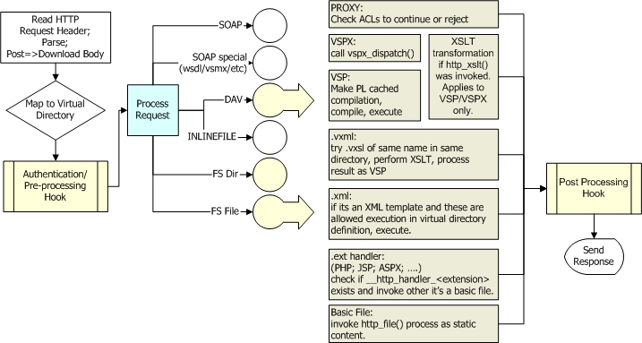

Incoming requests are also checked against the HTTP access control
lists. These lists rely on the following attributes of the connection to
determine whether the request should be answered:

Client Host or IP Address

\- the incoming requestor is pattern matched to specify a range.

Destination Host or IP Address

\- Destination IP/Host match, also applicable to the proxy capabilities.

The Virtuoso HTTP server is HTTP/1.1 compliant. It can accept persistent
connections from HTTP/1.1 clients. The HTTP/1.0 requests are processed
as normal without the persistent connections feature.

Persistent HTTP connections offer several advantages, such as:

Reduced CPU usages by opening and closing fewer connections.

HTTP requests and responses can be pipelined on a connection. Pipelining
allows a client to make multiple requests without waiting for each
response, allowing a single TCP connection to be used much more
efficiently with lower elapsed time.

Network traffic is reduced.

Latency on subsequent requests is reduced.

> **Tip**
> 
> [RFC2616](#) for more details

<a id="id2-http-server-base-configuration"></a>
## HTTP Server Base Configuration

The `[HTTPServer]` section of the Virtuoso INI file contains parameters
that directly affect the HTTP server upon server startup. After the
server has been started further configuration can be performed using the
Visual Server Administration Interface. Here is an example of the
section in the INI file:

    [HTTPServer]
      ServerPort = 8890
      ServerRoot = ../vsp
      ServerThreads = 2
      MaxKeepAlives = 10
      KeepAliveTimeout = 10
      DavRoot = DAV

The meanings of these parameters are briefly explained here as a quick
reference for the most frequently used parameters:

  - **ServerPort.**
    
    This specifies the HTTP listen port for the VSP server.

  - **ServerThreads.**
    
    This specifies the number of concurrently serviced HTTP requests. If
    there are more concurrent requests, accepting the connections will
    be deferred until there is a thread ready to serve each.

  - **ServerRoot = ../vsp.**
    
    This is the file system path of the root directory of files served
    by the Virtuoso web server. The index.html in that directory will be
    served for the / URI. If relative, the path is interpreted relative
    to the server's working directory.

  - **MaxKeepAlives = 10.**
    
    Connections by HTTP 1.1 clients can remain open after the initial
    response has been sent. This parameters sets a cap on how many
    socket descriptors will at most be taken by keep alive connections.
    Such connections will be dropped by the server ahead of timeout if
    this number would be exceeded. Thus the maximum number of open
    sockets for the Virtuoso HTTP server is this number plus the number
    of threads. A keep alive connection is by definition not associated
    to any pending processing on any thread.

  - **KeepAliveTimeout = 10.**
    
    This is a timeout in seconds before Virtuoso closes an idle HTTP 1.1
    connection.

  - **DavRoot = DAV.**
    
    This specifies the root path of DAV resources. If DAV specific HTTP
    methods are used on Virtuoso, these should only reference resources
    with paths starting with this. This is the top level DAV collection.
    This is matched against URI's after the translation from external to
    internal URI's through the virtual directory table. See Virtual
    Directories below.

> **Tip**
> 
> The Server Administration chapter contains a complete list of the
> Virtuoso INI file parameters. In particular, the [\[HTTPServer\]
> section](#ini_httpserver) .

<a id="id3-virtual-directories"></a>
## Virtual Directories

A Virtuoso virtual directory maps logical paths to physical resource
locations accompanied by rules and/or parameters that govern how the
mappings respond to user-agent (e.g. Web browser) requests. This
mechanism allows physical locations to be obscured or simply
reorganized. Some resource types require authentication challenges, such
as the Visual Server Administration Interface, and/or special headers
such as SOAP, which is another HTTP endpoint.

Virtual directories are useful when one server has to provide access to
several Web sites. Redirects are not a universal solution to this, it is
far better to define virtual directories that point to the other sites.
Suppose that we have two companies, "a" and "b", that are to share a
Virtuoso server but want to represented on the Web by `www.a.com` and
`www.b.com` respectively. Their pages could be stored in directories
"/a" and "/b" on the server, whilst virtual directories map requests
appropriately:

``` 
  http://www.a.com/  -->

 /a
  http://www.b.com/  -->

 /b
```

Hence, user-agent requests for `www.a.com` receive pages from /a, and
likewise for "b". Requests under these domains are mapped back to their
physical location such as the request for the URI
`http://www.a.com/images/picture.jpg` retrieves the file
`/a/images/picture.jpg` .

Virtual directory definitions are held within the system table
DB.DBA.HTTP\_PATH. Virtual directories can be administered in three
basic ways:

Using the Visual Administration Interface via a Web browser.

Using the functions

vhost\_define()

and

vhost\_remove()

.

Updating the system table directory using SQL statements.

> **Tip**
> 
> [Virtual Directory Administration UI](#httpvirtualdirs)
> 
> [vhost\_define()](#fn_vhost_define) ,
> [vhost\_remove()](#fn_vhost_remove)
> 
> [HTTP\_PATH system table](#davhttppath)

Virtuoso matches user-agent requests against a logical path using the
longest entry that matches the path extracted from the URI. Suppose we
have two entries '`/a/b` ' and '`/a` ' and a request is made of:
'`http://foo.bar/a/b/c.html` ', will match the entry for '`/a/b` '.

First, Virtuoso will attempt to locate the physical path that has been
mapped to a virtual host, interface and logical path. The virtual host
corresponds to the 'Host' header field value from HTTP/1.1 requests. If
the first step does not succeed then the server will try resolving the
interface and logical path. Failing that, the default step will attempt
to resolve the path directly to a physical location.

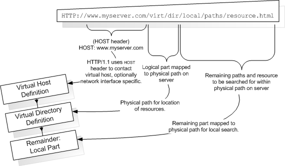

> **Note**
> 
> HTTP 1.0 does not use the HOST header. Virtuoso will have little
> choice but to send HTTP 1.0 user-agents the contents of the default
> virtual host definition for the interface.

Thus if the following mappings are in effect:

    /   ->  /DAV
    /doc    ->  http://docs.biz.com:/
    /admin  ->  /admin

The following translations would be made:

    /doc/howto/intro.html      -> http://docs.biz.com:/howto/intro.html
    /admin/help.vsp        -> /admin/help.vsp
    /gizmo/doc.xml         -> /DAV/gizmo/doc.xml

Thus, the longest match is selected and the matching substring is
replaced by the right hand side of the mapping. Note that this is also
how automatic proxying takes place, since a physical path beginning with
http:// will be passed forward to a remote server.

### Default Pages And Directory Browsing

For each virtual host or logical path pair we can define a list of
default pages. If the requested URL path is a directory then the server
checks the default page definition for that virtual directory, if a
default page exists then the path will be internally expanded to include
its name, ands its contents returned.

if we have a mapping for the host:

    www.a.com

with the logical path mapping of:

    '/' mapped to '/a'

with default page 'index.htm', then if the URL

    http://www.a.com/

is requested the server will try to send the content of '/a/index.htm'.

The same mechanism is used to determine whether a directory listing is
to be returned. If a mapping is defined to have 'Browseable' set to a
number greater than zero then the server, if a default page does not
exist or is not defined, a directory listing will be returned to the
calling client.

### Virtual Hosting and Multi Hosting

The term Virtual Host refers to the practice of maintaining more than
one server on one machine, differentiated by their apparent host name.
It is often desirable for companies sharing a web server to have their
own domains, with web servers accessible as www.company1.com and
www.company2.com, without requiring the user to know any extra path
information. The Virtual host can be IP-based or non-IP. The IP-based
(Multi Hosting) refers to practice of having one machine listen for
incoming requests on different network interfaces and respond with
different pages. The non-IP-based (Virtual Hosting) refers to the
practice of one machine having many DNS aliases, and requests from
client to a specific alias returning a different response regarding
content of 'Host' HTTP header field. Virtuoso supports IP-based, virtual
IP-based, and name-based virtual hosts.

For distinct IP-based, hosts are used to determine on which interfaces
Virtuoso will listen and accept HTTP requests.

### Managing Host Metadata

To add metadata in /.well-known/host-meta, execute:

    WS.WS.host_meta_add ([app-name], [xrd-xml-fragment])

For example:

    WS.WS.host_meta_add
      (
        'dbpedia.page-descriptor',
        '<Link rel="http://dbpedia.org/resource-descriptor" template="http://dbpedia.org/page/{uri}"/>'
      )
      ;

### Virtuoso As A Proxy

The Virtuoso HTTP server can act as a proxy server on the same port as
the HTTP port. You can put the host and port that the Virtuoso HTTP
server is listening on, into your browser proxy settings and all
requests will be processed by it. Also this can be used to retrieve a
page inside VSP.

The physical path setting of a virtual directory definition can be URL
to another HTTP server. In which case Virtuoso will act as a proxy to
that site when the logical path for it is requested.

> **Tip**
> 
> [Virtuoso also provides VSP functions for proxying.](#furthervsp)
> 
> [`http_proxy()`](#fn_http_proxy) .

The nature of Virtuoso's Web Proxying ability makes it easy and seamless
to bind multiple websites under one roof. Existing sites do not have to
move or change to be integrated under the Virtuoso Proxy. Simply map
them under a logical path name. They can be mapped multiple times or
from multiple ports.

If you already have pages written and working from other servers via ASP
or PHP, then you will be able to run these servers concurrently with
Virtuoso so they can share form data and give dynamic content from
various sources, consistent with our value proposition of maximum
incorporation of new technologies with minimum disruption to existing
infrastructure. Whether these servers were hosted on various machines or
the same machine there is no need to expose their running ports and
services. This makes the end user experience cleaner, and helps maintain
some server security and/or anonymity.

> **Note**
> 
> Virtuoso provides runtime hosting capabilities and PHP support,
> therefore ASP.Net and PHP and other applications can be run and hosted
> directly within the file system or WebDAV.

Suppose that you have two machines running existing web servers that
serve various parts of your intranet. One web server may have been
constructed for or by your sales department while the other server may
have been a built by the support department. These servers could be
resolved by http://sales.mycompany.com/ and
http://support.mycompany.com/ respectively.

You can place Virtuoso on another server and start integrating your
existing sites under this installation. You may use the Visual Server
Administration Interface or choose to use the following commands via the
isql interface:

    DB.DBA.VHOST_DEFINE(lpath=>'/sales', ppath=>'http://sales.mycompany.com/');
    DB.DBA.VHOST_DEFINE(lpath=>'/support', ppath=>'http://support.mycompany.com/');

This way your old servers will exist under /sales/ and /support/ of your
new server. Now you can start adding virtuoso .vsp pages to your new
Virtuoso server and they operate interleaved with your existing pages to
add new life and functionality as required.

You may decide that you want to install Virtuoso onto a server where a
web server already exists. If you plan to use Virtuoso as your default
web server and the proxy to your existing server then you will need to
make sure that the servers run on different ports. The default port is
80, you will have to configure Virtuoso to use this port from the
virtuoso.ini file and then move your existing web server port to another
number. Afterwards the procedure is similar:

    DB.DBA.VHOST_DEFINE(lpath=>'/apache', ppath=>'http://example.com:90/');

#### Proxying Virtuoso via Apache

You may also achieve the same goal as above but in reverse, using
another web server as a proxy in front of Virtuoso. If you have an
existing Apache server that you want to keep as you default web server
then you can set up a proxy within Apache to Virtuoso.

Firstly you will need to make sure that Apache can make use of the
mod\_proxy module available from most Apache distribution sites. You
then have to make sure that it is referenced in your httpd.conf (or
apache.conf) file. You should have something like:

    ...
    LoadModule proxy_module       modules/libproxy.so
    ...
    AddModule mod_proxy.c
    ...

##### Configuration steps

Below we will use the \<Location\> directive to simplify the
configuration:

    <Location /virtuoso/>
       ProxyPass               http://example.com:8890/
       ProxyPassReverse        /
    </Location>

1.  Set the ProxyPass directive:
    
    The ProxyPass directive makes Apache to change all incoming URLs and
    map it to the internal http endpoint.
    
    So when the browser makes a request for:
    
        http://example.com/virtuoso/conductor/login.vsp
    
    it is rewritten to use:
    
        http://example.com:8890/conductor/login.vsp
    
    before sending the request over to the Virtuoso server.

2.  Set the ProxyPassReverse directive:
    
    The ProxyPassReverse directive rewrites the HTTP Headers that come
    back from Virtuoso to map back to the external URL. This is needed
    for e.g. 303 Location redirects where Virtuoso will use:
    
        Location: http://example.com:8890/conductor/pageXXX.vsp
    
    which Apache needs to rewrite to:
    
        Location: http://example.com/virtuoso/conductor/pageXXX.vsp
    
    before sending the reply back to the browser.

3.  If the mapping is / ---\> / instead of /virtuoso/ ---\> / then the
    settings should be done, since ProxyPass and ProxyPassReverse only
    deal with rewriting urls and http headers.
    
    When however there is a path mapping, there is a third step to take:
    
    Pages can contain clickable links like:
    
        <a href="/conductor/mypage.vsp">Click Here</a>
    
    If you click on this link in your browser, it would use:
    
        http://example.com/conductor/mypage.vsp
    
    which does not map back to your /virtuoso/ vpath in apache.
    
    As phpBB3 has been written from outset to cater for this situation,
    it will always need to recalculate fully qualified host/path names
    everywhere in its pages, which is not always very practical.
    
    Thus Apache needs to be configured to do page rewriting as well as
    in:
    
    ``` 
         ProxyHTMLEnable         On
         ProxyHTMLURLMap         / /virtuoso/
         ProxyHTMLURLMap         http://example.com:8890/ /virtuoso/
    ```
    
    This will rewrite the content of every page to make sure that links
    inside the page are rewritten to use the external mapping of this
    instance.
    
    If you have set Virtuoso to use `EnabledGzipContent=1` , then you
    need to tell apache it may need to gunzip the content before doing
    this rewrite with the following line:
    
    ``` 
         SetOutputFilter         INFLATE;DEFLATE
    ```
    
    Although this takes a bit extra CPU power etc, it is still practical
    to setup a virtual path on user's own system that points to some
    external system.
    
    For example, add this to your httpd.conf to get a mapping to
    dbpedia-live instance:
    
        <Location /dbp/>
             ProxyPass               http://dbpedia-live.openlinksw.com/
             ProxyPassReverse        /
             ProxyHTMLURLMap         / /dbp/
             ProxyHTMLURLMap         http://dbpedia-live.openlinksw.com/ /dbp/
             SetOutputFilter         INFLATE;DEFLATE
        </Location>
    
    Now you should be able to use for ex.:
    
        http://example.com/dbp/page/London

##### Usage Example

    NameVirtualHost 82.191.21.32
    
    <VirtualHost 82.191.21.32>
    ServerName www.mysite.net <http://www.mysite.net>
    ...
    
         #  Disable global proxy
         ProxyRequests       Off
    
         #  Pass original host to Virtuoso
         ProxyPreserveHost   On
    
         #  Timeout waiting for Virtuoso
         ProxyTimeout        300
    
         #  Set permission
         <Proxy *>
             Order deny,allow
             Allow from all
         </Proxy>
    
         #
         #  Map /virtuoso/ to a local Virtuoso instance.
         #
         #  Since ProxyPass and ProxyPassReverse only fix the Headers
         #  of the request, we need to use ProxyHTMLURLMap to rewrite
         #  content.
         #
         <Location /virtuoso/>
             ProxyPass               http://example.com:8890/
             ProxyPassReverse        /
    
             #  Enable rewrite rules
             ProxyHTMLEnable         On
             ProxyHTMLURLMap         / /virtuoso/
             ProxyHTMLURLMap         http://example.com:8890/ /virtuoso/
    
    # Uncomment this when EnabledGzipContent=1 in virtuoso.ini
             #SetOutputFilter         INFLATE;DEFLATE
         </Location>
    </VirtualHost>

If we map the virtual host straight through to Virtuoso, we only need
header rewriting and save the time/cpu power to rewrite the content:

``` 
     #
     #  Map / to a local Virtuoso instance
     #
     #  Since paths are mapped straight through, we do not have to
     #  rewrite the content.
     #
     <Location />
         ProxyPass               http://example.com:8890/
         ProxyPassReverse        /
     </Location>
```

> **Tip**
> 
> [Apache Online Documentation](#)

<a id="id4-authentication"></a>
## Authentication

If a Virtuoso/PL procedure is specified to perform authentication for
this mapping then it will be executed. The procedure can take one
(varchar) parameter, the 'Realm' value. The result from the procedure
must be 1 if authentication successful otherwise must be zero (0). If
the procedure returns 0 this causes the processing to terminate and
whatever output the hook generated to be sent to the client. Typically
this will be an authentication challenge.

<a id="id5-session-management"></a>
## Session Management

The Virtuoso HTTP session management consists of functions for session
variables manipulation and an ability to define a pre- and
post-processing function. The pre and post-processing functions are used
to save and restore session data between HTTP posts, usually to and from
a session table.

Session management must be enable by settings the flag for persistent
session variables in virtual directory mapping. Virtual directory
mappings use the *persistent\_session\_variables* flag, which when
specified, session variables can be used in a post-process function to
determine if the session variables content must be stored on to the
session table or not.

The post-processing function hook can be any user-defined Virtuoso/PL
procedure, it will be executed every time after processing of the active
page.

> **Tip**
> 
> [VSP Session Management and Session Variables](#sesmanvars)

<a id="id6-writing-your-own-authentication-and-session-handling"></a>
## Writing Your Own Authentication and Session Handling

We will explain the following precompiled procedures in Virtuoso used to
authenticate three branches of users.

HP\_AUTH\_SQL\_USER

\- VSP authentication based on DB users

HP\_AUTH\_DAV\_ADMIN

\- VSP authentication based on WebDAV users

HP\_AUTH\_DAV\_PROTOCOL

\- WebDAV repository authentication

    -- Authenticate against names and passwords in SYS_USERS, using HP_SECURITY for level
    
    create procedure
    DB.DBA.HP_AUTH_SQL_USER (in realm varchar)
    {
      declare _u_name, _u_password varchar;
      declare _u_group, _u_id, allow_basic integer;
    
      declare auth, sec, lev varchar;
      declare _user varchar;
      declare ses_dta, lines any;
    
      lines := http_request_header ();         -- got a request header lines
      sec := http_map_get ('security_level');  -- got a security level from http mapping
      if (isstring (sec))
        sec := ucase (sec);
      if (sec = 'DIGEST')
        allow_basic := 0;   -- if security is only digest then allow basic is false
      else
        allow_basic := 1;
    
      auth :=
        DB.DBA.vsp_auth_vec (lines);    -- parse request header to got authentication credentials
      if (0 <> auth)          -- and if client sent any authentication information try it
        {
    
         lev := get_keyword ('authtype', auth, ''); -- check if client tried basic but
                            -- domain restricted to digest only
         if (allow_basic = 0 and 'basic' = lev)
        goto nf;
          _user := get_keyword ('username', auth, '');
    
          if ('' = _user) -- if no user name then 'bye'
        return 0;
    
          whenever not found goto nf;  -- if no such user in table - 'bye'
    
          -- got the password from users table
    
          select U_NAME, PWD_MAGIC_CALC (U_NAME, U_PASSWORD, 1), U_GROUP, U_ID
        into _u_name, _u_password, _u_group, _u_id from DB.DBA.SYS_USERS
        where u_name = _user;
    
          -- check credential against user name and password
    
          if (0 = _u_group and 1 = DB.DBA.vsp_auth_verify_pass (auth, _u_name,
                               get_keyword ('realm', auth, ''),
                               get_keyword ('uri', auth, ''),
                               get_keyword ('nonce', auth, ''),
                               get_keyword ('nc', auth, ''),
                               get_keyword ('cnonce', auth, ''),
                               get_keyword ('qop', auth, ''),
                               _u_password))
        {
          if (http_map_get ('persist_ses_vars'))
            {           -- if all is ok check for persistent variables storage
              declare vars any;
              declare sid varchar;
                vars := null;
                sid := http_param ('sid');
                -- got from session table stored variables
                vars := coalesce ((select deserialize (ASES_VARS)
                  from DB.DBA.ADMIN_SESSION where ASES_ID = sid), null);
                if (sid is not null and vars is null or isarray (vars))
            connection_vars_set (vars);
              if (sid is not null and connection_get ('sid') is null)
            {
              connection_set ('sid', sid);
            }
            }
          return 1; -- return authenticated
        }
        }
     nf:    -- all errors go there, we compose authentication header
        -- and send 401 unauthorized to the client
      DB.DBA.vsp_auth_get (realm, http_path (),
            md5 (datestring (now ())),
            md5 ('eEsSlLAaf'),
            'false', lines, allow_basic);
      return 0; -- return not authenticated
    }
    ;

    -- Authenticate against SYS_DAV_USER, using HP_SECURITY for level,
    -- in the context of DAV administration pages accessed through regular HTTP
    -- The logic is the same but in difference of password retrieval.
    
    create procedure
    DB.DBA.HP_AUTH_DAV_ADMIN (in realm varchar)
    {
      declare _u_name, _u_pwd varchar;
      declare _u_group, _u_id, allow_basic integer;
    
      declare auth, sec, lev varchar;
      declare _user varchar;
      declare ses_dta, lines any;
    
      lines := http_request_header ();
      sec := http_map_get ('security_level');
      if (isstring (sec))
        sec := ucase (sec);
      if (sec = 'DIGEST')
        allow_basic := 0;
      else
        allow_basic := 1;
      auth := DB.DBA.vsp_auth_vec (lines);
    
      if (0 <> auth)
        {
    
          lev := get_keyword ('authtype', auth, '');
          if (allow_basic = 0 and 'basic' = lev)
        goto nf;
          _user := get_keyword ('username', auth, '');
    
          if ('' = _user)
        return 0;
    
          whenever not found goto nf;
    
          -- we tried to find out password for enabled valid WebDAV user
          select U_NAME, U_PWD, U_GROUP, U_ID
        into _u_name, _u_pwd, _u_group, _u_id from WS.WS.SYS_DAV_USER
        where u_name = _user and U_ACCOUNT_DISABLED = 0;
    
          if (DB.DBA.vsp_auth_verify_pass (auth, _u_name,
                    get_keyword ('realm', auth, ''),
                    get_keyword ('uri', auth, ''),
                    get_keyword ('nonce', auth, ''),
                    get_keyword ('nc', auth, ''),
                    get_keyword ('cnonce', auth, ''),
                    get_keyword ('qop', auth, ''),
                    _u_pwd))
        {
          if (http_map_get ('persist_ses_vars'))
            {
              declare vars any;
              declare sid varchar;
                vars := null;
                sid := http_param ('sid');
                vars := coalesce ((select deserialize (ASES_VARS)
                  from DB.DBA.ADMIN_SESSION where ASES_ID = sid), null);
                if (vars is null or isarray (vars))
              connection_vars_set (vars);
              if (connection_get ('sid') is null)
            {
              connection_set ('sid', sid);
            }
            }
          return (_u_id);
        }
        }
     nf:
      DB.DBA.vsp_auth_get (realm, '/admin/admin_dav',
            md5 (datestring (now ())),
            md5 ('vVAadAnIimMDdaNnimda'),
            'false', lines, allow_basic);
      return 0;
    }
    ;

    -- The same as for DAV admin pages but in the context of DAV protocol requests.
    create procedure
    DB.DBA.HP_AUTH_DAV_PROTOCOL (in realm varchar)
    {
      declare _u_name, _u_password, _perms varchar;
      declare _u_id, _u_group, req_user, req_group, what integer;
      declare auth varchar;
      declare _user varchar;
      declare our_auth_vec, lines, sec, path, req_perms, req_meth, cmp_perms, def_page varchar;
      declare _method, lev, allow_basic, authenticated integer;
    
      declare c cursor for select 1, COL_OWNER, COL_GROUP, COL_PERMS
          from WS.WS.SYS_DAV_COL where WS.WS.COL_PATH (COL_ID) = path;
      declare r cursor for select 2, RES_OWNER, RES_GROUP, RES_PERMS
          from WS.WS.SYS_DAV_RES where RES_FULL_PATH = path;
    
      authenticated := 0;
    
      lines := http_request_header ();
      path := http_physical_path ();
    
      if (isarray (lines))
        {
          req_meth := aref (lines, 0);
          if (strchr (req_meth, ' ') is not null)
            req_meth := lower (substring (req_meth, 1, strchr (req_meth, ' ')));
        }
    
      -- there we compose mask for permissions compared against
      -- resource or collection permission
      if (req_meth = 'get' or
          req_meth = 'post' or
          req_meth = 'options' or
          req_meth = 'propfind' or
          req_meth = 'head' or
          req_meth = 'trace' or
          req_meth = 'copy')
        cmp_perms := '1__'; -- in this case only read access needed
      else if (req_meth = 'mkcol' or req_meth = 'put')
        {
          if (length (path) > 1
              and strrchr (substring (path, 1, length(path) - 1), '/') is not null)
            path := substring (path, 1,
          strrchr (substring (path, 1, length(path) - 1), '/') + 1);
          cmp_perms := '11_';
        }
      else
        cmp_perms := '11_'; -- but in this we needs a read/write access
    
      what := 0;
      whenever not found goto fr;
      open c (prefetch 1);
      fetch c into what, req_user, req_group, req_perms;
            -- get from collections owner , owner group and permissions
    
      def_page := http_map_get ('default_page');
      if (isstring (def_page))
        {
          path := concat (path, def_page);
          what := 0;
        }
    fr:
      close c;
    
      if (not what)
        {
          whenever not found goto fe;
          open r (prefetch 1);
          fetch r into what, req_user, req_group, req_perms; -- if not a collection try a resource
    fe:
          close r;
        }
    
      sec := http_map_get ('security_level'); -- see DB user authentication
      if (isstring (sec))
        sec := ucase (sec);
      if (sec = 'DIGEST')
        allow_basic := 0;
      else
        allow_basic := 1;
    
      auth := DB.DBA.vsp_auth_vec (lines);
    
      if (0 <> auth)
        {
          lev := get_keyword ('authtype', auth, '');
          if (allow_basic = 0 and 'basic' = lev)
        goto nf;
    
          _user := get_keyword ('username', auth);
    
          if (_user = '' or isnull (_user))
        {
          goto nf;
        }
    
          whenever not found goto nf;
    
          select U_NAME, U_PWD, U_GROUP, U_ID, U_METHODS, U_DEF_PERMS
        into _u_name, _u_password, _u_group, _u_id, _method, _perms from WS.WS.SYS_DAV_USER
        where U_NAME = _user and U_ACCOUNT_DISABLED = 0;
          if (_u_password is null)
        goto nf;
          if (DB.DBA.vsp_auth_verify_pass (auth, _u_name,
                    coalesce(get_keyword ('realm', auth), ''),
                    coalesce(get_keyword ('uri', auth), ''),
                    coalesce(get_keyword ('nonce', auth), ''),
                    coalesce(get_keyword ('nc', auth),''),
                    coalesce(get_keyword ('cnonce', auth), ''),
                    coalesce(get_keyword ('qop', auth), ''),
                    _u_password))
        {
          update WS.WS.SYS_DAV_USER set U_LOGIN_TIME = now () where U_NAME = _user;
          if (http_map_get ('persist_ses_vars'))
          {
            declare vars any;
            declare sid varchar;
            vars := null;
            sid := http_param ('sid');
            vars := coalesce ((select deserialize (ASES_VARS)
                from DB.DBA.ADMIN_SESSION where ASES_ID = sid), null);
              if (vars is null or isarray (vars))
            connection_vars_set (vars);
            if (connection_get ('sid') is null)
            {
            connection_set ('sid', sid);
            }
          }
          if (connection_get ('DAVUserID') <> _u_id)
            connection_set ('DAVUserID', _u_id);
              authenticated := 1;
        }
        }
    
    -- Check permissions
      if (authenticated and _u_id = 1) -- If user is DAV admin all rights granted
        return 1;
      else if (not authenticated and req_perms like concat ('______', cmp_perms, '%'))
        return -1;  -- if not authenticated and resource
                -- does have public access return authenticated
      else if (authenticated and
              ((_u_id = req_user and req_perms like concat (cmp_perms, '%')) or
           (req_group = _u_group and req_perms like concat ('___', cmp_perms, '%')) or
           (req_perms like concat ('______', cmp_perms, '%'))))
        return (_u_id);     -- if user is owner or belongs to group
                    -- ownership return authenticated
      else if (authenticated)   -- if authenticated but does not access
                        -- return false but set 403 forbidden
        {
          http_request_status ('HTTP/1.1 403 Forbidden');
          http ( concat ('<!DOCTYPE HTML PUBLIC "-//IETF//DTD HTML 2.0//EN">',
                 '<HTML><HEAD>',
                 '<TITLE>403 Forbidden</TITLE>',
                 '</HEAD><BODY><H1>Forbidden</H1>',
                 'Access to the resource is forbidden.</BODY></HTML>'));
          return 0;
        }
    -- End check permissions
    
    nf:     -- all error cases go there, we send authentication credentials
        -- and turn status 401 Unauthorized, and return false
      DB.DBA.vsp_auth_get (realm, '/DAV',
          md5 (datestring(now())),
          md5 ('opaakki'),
          'false', lines, allow_basic);
      return 0;
    }
    ;

    -- Post-processing function, this will executed after processing
    -- the request but before sending result to the client.
    create procedure
    DB.DBA.HP_SES_VARS_STORE ()
    {
      declare vars any;
      declare sid varchar;
      if (http_map_get ('persist_ses_vars') and connection_is_dirty ())
        -- if connection variables changed in request and persistent variables stored
        {
          vars := connection_vars (); -- get all variables
          connection_vars_set (null); -- set immediately to empty vector (prevent changing)
          sid := get_keyword ('sid', vars, null); -- got the session ID
          -- store the variables in session table
          if (sid is not null)
        update DB.DBA.ADMIN_SESSION set ASES_VARS = serialize (vars) where ASES_ID = sid;
        }
    }
    ;

These functions are implemented as part of Virtuoso server by default.
The user can freely define their own procedures based on this logic to
use for special authentication (different users information table etc.)
and session management.

<a id="id7-cancellation-of-web-requests"></a>
## Cancellation of Web Requests

If there are many long-running tasks processing on Virtuoso it is
possible to have denial of service. To prevent this we can use status
and stop functions. We can retrieve the URL, client IP-address, and
process status code for all currently running VSP requests, then use
this information to isolated and eliminate a process.

[`http_pending_req()`](#fn_http_pending_req)

> **Tip**
> 
> [Long HTTP Transactions](#longhttptrans)

<a id="id8-virtuoso-webrobot-api"></a>
## Virtuoso WebRobot API

The Virtuoso WebRobot (WebCopy) is useful for retrieving Internet web
sites and storing them on to a local WebDAV repository. Once retrieved,
the local copy in the WebDAV repository can be exported to the local
filesystem or another WebDAV enabled server. The common features and
usages are demonstrated in the WebCopy User Interface in the Visual
Server Administration Interface. This document provides the actual API's
and techniques useful for some other implementations.

### Creating A New Target

A new web server target is created by inserting a row in to the
WS.WS.VFS\_SITE table and then a row in to the WS.WS.VFS\_QUEUE table.

> **Tip**
> 
> [Web Robot System Tables](#robotsystables) for table definitions

This example creates a new target pointing to the site
http://www.foo.com/help/, with instructions to walk across foreign
links, delete a local page if it is detected that it has been removed
from the remote, retrieve images, walk on entire site using HTTP GET
method. The content will be stored in /DAV/sites/www\_foo\_com
collection in the local WebDAV repository.

1.  Create target for http://www.foo.com/help/
    
        insert into WS.WS.VFS_SITE
            (VS_DESCR,VS_HOST,VS_URL,VS_OWN,VS_ROOT,VS_NEWER,VS_DEL,
              VS_FOLLOW,VS_NFOLLOW,VS_SRC,VS_OPTIONS,VS_METHOD,VS_OTHER)
          values
            ('My first test', 'www.foo.com', '/help/', 1, 'sites/www_foo_com', '1990-01-01',
              'checked', '/%;', '', 'checked', null, null, 'checked');

2.  Create start queue entry
    
        insert into WS.WS.VFS_QUEUE
            (VQ_HOST,VQ_TS,VQ_URL,VQ_ROOT,VQ_STAT,VQ_OTHER)
          values ('www.foo.com', now(), '/help/', 'sites/www_foo_com', 'waiting', null);

### Creating A Custom Queue Hook

The custom queue hook can be used to extract the next entry from the
robot's queue following a custom algorithm. The following example
extracts the oldest entry comparing to the my\_data array (this array
consists of non-desirable sites) and returns if some are found.

    create procedure
      DB.DBA.my_hook (
        in host varchar, in collection varchar, out url varchar, in my_data any
      )
    {
      declare next_url varchar;
      whenever not found goto done;
    
      -- we trying to extract the oldest entry
      declare cr cursor for select VQ_URL from WS.WS.VFS_QUEUE
          where VQ_HOST = host and VQ_ROOT = collection and VQ_STAT = 'waiting'
          order by VQ_HOST, VQ_ROOT, VQ_TS for update;
    
      open cr;
      while (1)
      {
        fetch cr into next_url;
        if (get_keyword (host, my_data, null) is not null) -- process if host not in black-list
        {
          update WS.WS.VFS_QUEUE set VQ_STAT = 'pending'
          where VQ_HOST = host and VQ_ROOT = collection and VQ_URL = next_url;
          url := next_url;
          close cr;
          return 1;
        }
        else -- otherwise continue finding
        update WS.WS.VFS_QUEUE set VQ_STAT = 'retrieved'
          where VQ_HOST = host and VQ_ROOT = collection and VQ_URL = next_url;
        }
    done:
      -- if we arrive at the bottom of the queue return false to stop processing
      close cr;
      return 0;
    }
    ;

> **Note**
> 
> The default function will return the oldest entry from queue without
> any restriction. The follow/not-follow restrictions are applied to the
> path on target before inserting a new queue entry.

### Starting The Site's Retrieval/Update

The site retrieval can be performed with the WS.WS.SERV\_QUEUE\_TOP PL
function integrated in to the Virtuoso server.

[`serv_queue_top()`](#fn_serv_queue_top)

### Exporting Local Content To Filesystem Or Other Webdav Enabled Server

[`lfs_exp`](#fn_lfs_exp)

[`dav_exp`](#fn_dav_exp)

> **Tip**
> 
> [Web Robot System tables](#robotsystables)

<a id="id9-http-server-extensions"></a>
## HTTP Server Extensions

The Virtuoso shared object library enables you to create your own custom
extensions to the Virtuoso HTTP server and create custom VSEs. Support
for PHP page execution was implemented using this functionality.
Virtuoso can automatically switch processing mode from VSP to PHP or
some other custom extension based on the extension of the files being
requested from the HTTP server. To enable Virtuoso to process files of a
different extension you have to write a VSE handler where part of the
name contains the extension: *\_\_http\_handler\_\[extension\]* . The
VSEs for HTTP handling must have the following parameters:

\_\_http\_handler\_\<extension\>

in

resource

varchar

in

parameters

vector

in

request\_header

vector

inout

type\_flag

any

  - *resource* is either the path to a file or the content of a resource
    in the WebDAV store. The interpretation of this parameter by the
    server is dependent of the type\_flag parameter.

  - *parameters* for execution, the server will pass to this parameter a
    string session containing the entity body of the POST method
    request.

  - *request\_header* is the HTTP request header lines as an array of
    strings. This parameter will accept the original header as a vector.
    The vector will contain the complete HTTP request header.

  - *type\_flag* is an in/out parameter which is a flag for indicating
    the type of the first parameter. If the resource parameter is a file
    path in the file system this flag should be NULL, if the resource is
    located in the WebDAV store this flag should be set to URI of the
    WebDAV resource, something like:
    virt://WS.WS.SYS\_DAV\_RES.RES\_FULL\_PATH.RES\_CONTENT:/DAV/dir1/subdir/myfile.php.
    Virtuoso will return in this parameter an array of two strings set
    to the http response status line and the header after execution.

> **Tip**
> 
> [Virtuoso Server Extensions Interface](#cinterface)

<a id="id10-chunked-transfer-encoding"></a>
## Chunked Transfer Encoding

Virtuoso supports HTTP 1.1 Chunking Encoding which allows Virtuoso to
send the user agent chunks of output as the page is still processing.
Chunking is enabled by calling `http_flush(1)` within the VSP page.
Chunks are sent for every 4k worth of output generated. Chunked mode
requires the following conditions:

no "Content-Length" header sent to the client using http\_header()

no "Content-Encoding" header sent to the client using http\_header()

use http\_xslt() is not permitted

The client supports HTTP 1.1

Failing these conditions, `http_flush(1)` will be a No-Operation.

Chunked mode is not supported for static content.

> **Tip**
> 
> [`http_flush()`](#fn_http_flush)
> 
> [RFC-2616](#)

<a id="id11-using-virtuoso-server-capabilities-via-apache-web-server"></a>
## Using Virtuoso Server capabilities via Apache Web Server

In some situations Virtuoso services like WebDAV, JSP, PHP etc. may need
to be accessed via an Apache Web Server. All this can be done through
apache's mod\_proxy to Virtuoso HTTP server and the Virtuoso HTTP server
can be configured to take requests coming only from localhost.

The following configuration makes : The Virtuoso server to listen for
HTTP requests coming ONLY from localhost. Apache proxies the outside
requests to Virtuoso HTTP server.

``` 
    line added to the /etc/httpd/conf/httpd.conf
    (999.999.999.999, must be changed with actual IP address of external interface):
    ----------------------------------
    Listen 8080
    <VirtualHost 999.999.999.999:8080 127.0.0.1:8080>
           ServerAdmin webmaster@host.example.domain
           ProxyPass  / http://example.com/
    </VirtualHost>
    ----------------------------------
    
```

``` 
    Then changes in the virtuoso.ini

    [HTTPServer] section)
        ...
    ServerPort = 127.0.0.1:6666
    ...
    
```

<a id="id12-setting-up-the-virtuoso-https-listener"></a>
## Setting Up the Virtuoso HTTPS Listener

The Setting up of the Virtuoso HTTPS Listener can be done by using the
file system or using the Virtuoso conductor.

Note that when you want to change from Virtuoso hosted Cert and Public
Key to File System and vice versa, first should be stopped the listener
for either setup.

### Setting Up the Virtuoso HTTPS Listener to host Certificate and Public Key using File System

1.  X.509 certificate Generation
    
    The WebID Protocol consumer needs an x509 certificate with v3
    extension "Subject Alternate Name". This attribute is used for the
    owner's Web ID. For testing purposes we used OpenSSL demo CA to
    generate such certificates. If you are not using the OpenSSL demo
    CA, you must first setup a self-signed CA; read OpenSSL documents on
    how to do this.
    
    1.  Add the following line to the `[usr_cert]` section of the
        `openssl.cnf` file:
        
            subjectAltName=$ENV::ALTNAME
    
    2.  Set the environment variable `ALTNAME` to the owner's Web ID,
        e.g.,
        
            export ALTNAME=URI:http://example.com/dataspace/person/myname#this
    
    3.  Make a self-signed certificate, e.g.,
        
            $ CA.pl -newreq (follow the dialog)
            $ CA.pl -sign
    
    4.  When asked to commit the certificate, make sure you see several
        lines above, like
        
            X509v3 Subject Alternative Name:
                URI:http://example.com/dataspace/person/myname#this
    
    5.  If your browser wants a `PKCS#12` bundle, you must make one
        
            $ openssl pkcs12 -export -in newcert.pem -inkey newkey.pem -out mycert.p12
    
    6.  Rename `newcert.pem` and `newkey.pem` , to `mycert.pem` and
        `mykey.pem` for example.

2.  Move `newcert.pem` , `newkey.pem` , and `cacert.pem` into the
    server's working directory. In our test case, we put the keys in a '
    `keys` ' sub-directory, and added the following lines to the
    `[HTTPServer]` section of the Virtuoso INI file, `virtuoso.ini` :
    
        SSLPort                     = 4443
        SSLCertificate              = ./keys/localhost.cert.pem
        SSLPrivateKey               = ./keys/localhost.key.pem
        X509ClientVerifyCAFile      = ./keys/localhost.ca.pem
        X509ClientVerify            = 1
        X509ClientVerifyDepth       = 15

3.  Also in the Virtuoso INI file, in the `[URIQA]` section,
    `DefaultHost` ( `example.com:8890` below) must be edited to
    correspond to the DNS-resolvable host name ("CNAME") of the Virtuoso
    host, combined with the `ServerPort` as set in the `[HTTPServer]`
    section of the same INI file.
    
        [URIQA]
        DynamicLocal = 1
        DefaultHost  = example.com:8890
    
    For example, if the CNAME of the host is `virtuoso.example.com` ,
    and the `ServerPort` is `4321` , the `DefaultHost` should be set to
    `virtuoso.example.com:4321`
    
        [URIQA]
        DynamicLocal = 1
        DefaultHost  = virtuoso.example.com:4321

4.  Start the Virtuoso server, and look at the log file. Once HTTPS is
    up, you should see something like:
    
        HTTPS Using X509 Client CA ....
        HTTPS/X509 server online at 4443

5.  Setting Up Firefox:
    
    1.  In the Preferences dialog, open the Advanced tab, and click the
        "View certificates" button.
        
        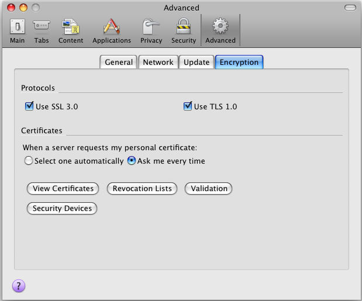
    
    2.  Click the "Add exception" button ,and enter the address of the
        HTTPS server you've just configured, i.e.
        https://virtuoso.example.com:4443/
    
    3.  Click OK, and confirm the exception.
        
        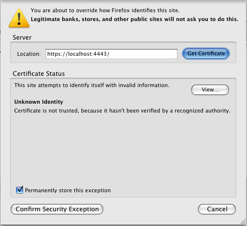
    
    4.  Click to the "Your Certificates" tab, and import `mycert.p12` .

### Setting Up the Virtuoso HTTPS Listener to host Certificate and Public Key using Virtuoso Conductor

1.  Go to the `http://cname:port/conductor` URL, enter the DBA user
    credentials.
    
    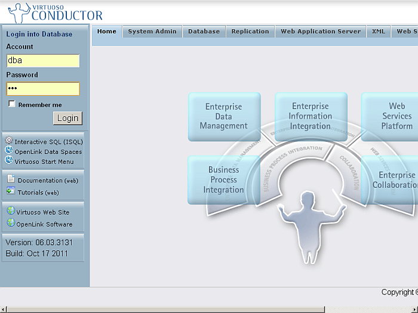

2.  Go to System Admin-\>Security
    
    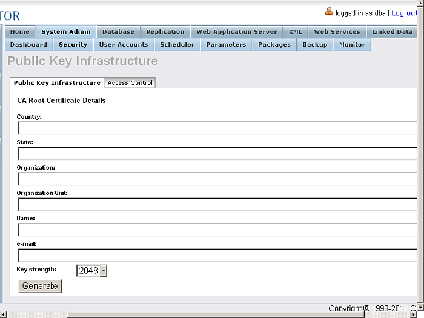

3.  Enter the Issuer details:
    
    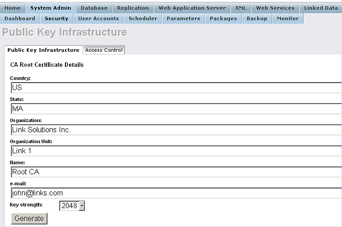

4.  Click Generate
    
    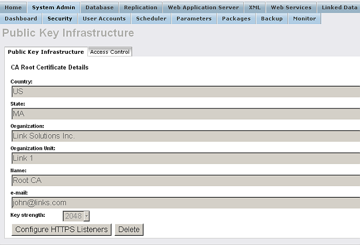

5.  Click Configure HTTPS Listeners
    
    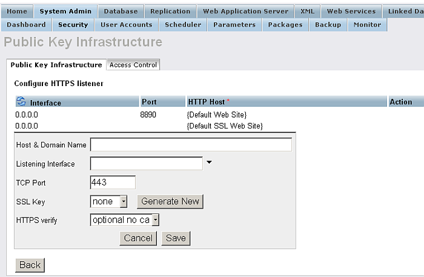

6.  Edit the new listener, and click "Generate New" key.
    
    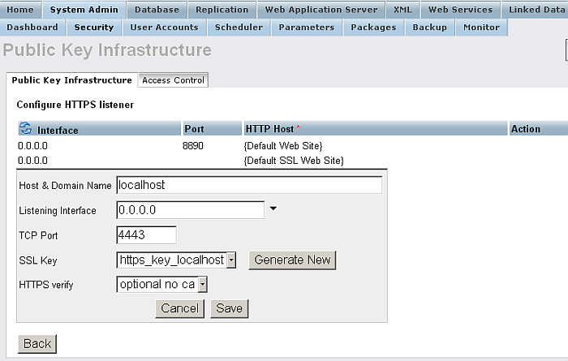

7.  Click Save
    
    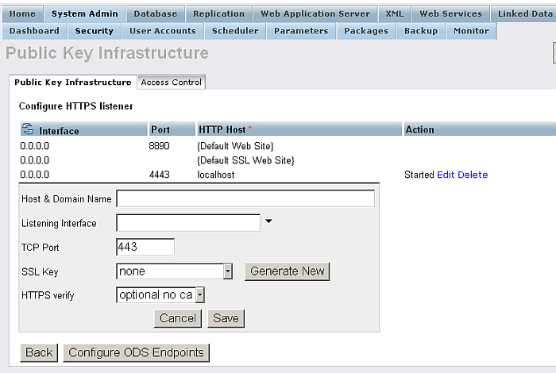

8.  Setting Up Firefox:
    
    1.  In the Preferences dialog, open the Advanced tab, and click the
        "View certificates" button.
    
    2.  Click the "Add exception" button and enter the address of the
        HTTPS server you've just configured, i.e.
        https://virtuoso.example.com:443/
    
    3.  Click OK, and confirm the exception.
        
        

<a id="id13-web-services-acl-access-control-list"></a>
# Web Services ACL (Access Control List)

Virtuoso provides a generic access control list for HTTP and other
Internet protocol clients. This mechanism uses wildcard expressions to
selectively block and allow ranges of IP addresses. An ordered set of
patterns is matched against the origin of the request. The first
matching pattern's allow/deny flag determines whether the client is
approved or not.

The patterns for designating a range of IP addresses follow the syntax
of the SQL 'LIKE' predicate; i.e. '%.foo.bar' or '\*.foo.bar' for
example.

> **Tip**
> 
> The [LIKE Predicate & Search Patterns](#likepredicate) section.

The following mechanisms for services access restriction are defined by
default:

Web Server ACL

\- controls access to the Web server (basic fire wall)

Web Proxy server ACL

\- controls access to the Web proxy server

News Server ACL

\- controls access to the Internet news groups (reading or posting)

<a id="id14-general-purpose-acls"></a>
## General purpose ACLs

The system table `DB.DBA.HTTP_ACL` is used to persist ACL definitions,
which can be managed with simple INSERT/UPDATE/DELETE statements. The
table has the following layout:

Columns for DB.DBA.HTTP\_ACL:

HA\_LIST

\- ACL name

HA\_ORDER

\- Position in the list

HA\_OBJECT

\- Object ID (applicable to news groups also)

HA\_CLIENT\_IP

\- \*PATTERN\*

HA\_FLAG

\- Allow/Deny flag, 0 - allow, 1 - deny

HA\_RW

\- Read/Write flag, 0 - read, 1 - post

HA\_DEST\_IP

\- Destination IP/Host (applicable to the proxy also)

HA\_RATE

\- Rate Limit

The primary key covers columns HA\_LIST, HA\_ORDER, HA\_CLIENT\_IP and
HA\_FLAG.

> **Tip**
> 
> The full schema is listed in the Appendix under [System
> Tables](#tables.db.dba.http_acl) .

**HA\_LIST (required).**

Name of the ACL, This is a label to designate a group of rules
applicable to a specific service. There are three pre-defined groups
which are: HTTP, NEWS, PROXY. Please note that name of group is treated
as case-insensitive string. In other words we can think about HA\_LIST
as domain of the ACL. Developers can use that table to add their own
ACLs , and use them with API functions which are discussed in the next
section.

**HA\_ORDER (required).**

Ordinal number of the rule within its list. This number should be unique
within a specific group to have a well defined order of rule matching.
Please note that if order is equal the one with allow flag equal to zero
(HA\_FLAG value see below) takes precedence. The order for applying
rules for particular list is in ascending order i.e. first will be
applied the rule with the smallest value of HA\_ORDER.

**HA\_CLIENT\_IP (required).**

A pattern to designate separate IP address or group of addresses. This
is a string value as for 'LIKE' operator. Some example is: 192.168.\*;
will match all hosts from local private network.

**HA\_FLAG (required).**

A boolean; zero or positive number designating a rule to be applied for
matching address/host. The default option is zero (false) for allowed
action; positive (true) for denied action. So application may use it in
reverse; but in that case it needs to take in account the order
precedence (see HA\_ORDER).

**HA\_OBJECT (optional).**

An integer designating an ID used in predefined ACL for Internet News
groups to designate ID of the group. This can be used also in other
applications where one desires to apply different rules for different
objects. We can think of it as a sub list inside an ACL.

**HA\_RW (optional).**

An integer designating a action to be restricted (read/write); used in
predefined Internet News groups ACL.

**HA\_DEST\_IP (optional).**

A string containing pattern to match another IP number; this is used in
Web Proxy server ACL. This can also be used in custom application logic.

**HA\_RATE (optional).**

An float for Rate Limit. The filter calculates hit rate average and
compares with limit for http acl rule. If it is larger then will drop
connection. Once per day the statistics will be reset.

  - Regular expressions are not supported.

  - Can be used patterns, for ex:
    
        -- like '%something' or
        -- something*

The Rate Limit UI can be configured from Conductor-\>System
Admin-\>Security-\>Access Control where:

Rate limit is hits/per second from one IP address.

For search engine optimization statistics, for example can be set rate
limit 10 (or even 100 so to start to collect statistics), and then to
check with http\_acl\_stats () what values are returned.

<a id="id15-acl-definitionremoval"></a>
## ACL Definition/Removal

ACL's can be managed from the administration web interface using the
following steps.

  - From Admin UI main menu open "System Admin" node.

  - Go to Security -\> Access Control

  - By default three default ACLs are listed:
    
    HTTP - rules for the Web server
    
    NEWS - rules for the Internet News
    
    PROXY - rules for the Web Proxy Server
    
    PSH and PSH-SSL - available only when the
    
    pubsubhub\_dav.vad
    
    is installed.
    
    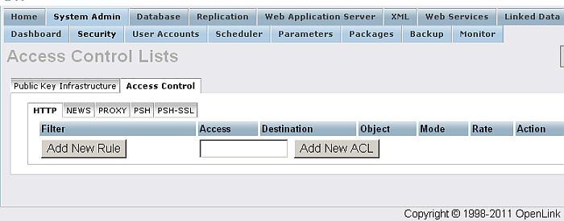

  - New ACLs can be added by entering a list name and clicking "Add"
    button.

  - Existing ACLs can be edited by clicking on the link "Edit" beside
    each listed ACL.

  - To add new rules, enter the requested information and press button
    "Add".

  - To change the order of the rules use the "top", "bottom", "up" and
    "down" links.

  - ACL's can be removed using the Delete button.

Alternately the HTTP\_ACL table can be directly manipulated with SQL. To
add new rule:

    INSERT INTO HTTP_ACL (HA_LIST, HA_ORDER, HA_CLIENT_IP, HA_RATE, HA_FLAG) values
    ('list_name', <order number>, '*pattern*', <hits_per_second_number>, [1/0]);

To remove existing rule:

    DELETE from HTTP_ACL where HA_LIST = 'list_name' and HA_ORDER = <order number>
    and HA_FLAG = [1/0] and HA_CLIENT_IP = '*pattern*';

<a id="id16-using-acls-within-application-logic"></a>
## Using ACL's Within Application Logic

The [`http_acl_get()`](#fn_http_acl_get) function can be used to test an
address against an ACL. The [`http_client_ip()`](#fn_http_client_ip)
function can be used to determine the IP address or DNS name of a client
machine.

To restrict a 'foo.bar' (network 333.333.333.0) from accessing a SOAP
service one could use the following:

    -- deny access from '333.333.333.*'
    insert into http_acl (ha_list, ha_order, ha_flag, ha_client_ip) values ('MY_SOAP', 1, 1, '333.333.333.*');
    -- allow
    insert into http_acl (ha_list, ha_order, ha_flag, ha_client_ip) values ('MY_SOAP', 2, 0, '*');
    
    -- a procedure exposed as SOAP service
    
    create procedure SumService (in a int, in b int) returns int
    {
      if (0 <> http_acl_get ('MY_SOAP', http_client_ip ()))
        signal ('42000', 'Access denied');
      return (a + b);
    }

<a id="id17-predefined-acls"></a>
## Predefined ACLs

The following ACLs are predefined and have special treatment in Web
Server processing:

**HTTP.**

General Web server ACL, applying rules to it controls access to the Web
server. Thus if this ACL is managed via web UI one must pay attention
not to disable the current connection and render the administration UI
inaccessible. The ACL rules for 'HTTP' must contain HA\_ORDER,
HA\_CLIENT\_IP (pattern) and HA\_FLAG (access flag) only. The rest of
column values are ignored. To add or remove rules to that list see 'ACL
definition/removal' where HA\_LIST must be equal to 'HTTP'. The value of
client's IP address will be tested against rules.

**NEWS.**

controls access to the separate Internet News groups, restricting POST
or READ access to them.

All valid rules for 'HTTP' are also valid for 'NEWS' with following
difference:

HA\_OBJECT must be specified as ID of News group to control

HA\_RW must be specified as 0/1 to designate which action on group to
control: read or post.

The HA\_LIST must be equal to 'NEWS' if control is managed with SQL
statements. The HA\_LIST must be equal to 'NEWS'.

**PROXY.**

This controls access to the Web Proxy Server. Note that Proxy service is
disabled by default and can be enabled with 'HTTPProxyEnabled' INI
setting. This ACL is similar to the HTTP ACL. Additionally, the pattern
in HA\_DEST\_PATTERN must match the destination server. In this way
certain destinations can be restricted.

> **Note**
> 
> HTTP ACLs affect PROXY rules. Therefore if HTTP list rejects a request
> from a particular client, the proxy access from there also will be
> rejected.

To allow access from localhost only:

    insert into http_acl (ha_list, ha_order, ha_flag, ha_client_ip) values ('HTTP', 1, 0, '127.0.0.1');
    insert into http_acl (ha_list, ha_order, ha_flag, ha_client_ip) values ('HTTP', 2, 1, '*');

To allow only local addresses (private.net/192.168.0.0) to access proxy
server.

    insert into http_acl (ha_list, ha_order, ha_flag, ha_client_ip, ha_dest_ip)
                  values ('PROXY', 1, 0, '192.168.1.*', '*');
    insert into http_acl (ha_list, ha_order, ha_flag, ha_client_ip, ha_dest_ip)
                  values ('PROXY', 2, 1, '*', '*');

To deny web access from some domain (bad.domain/333.333.333.0)

    insert into http_acl (ha_list, ha_order, ha_flag, ha_client_ip) values ('HTTP', 1, 0, '*');
    insert into http_acl (ha_list, ha_order, ha_flag, ha_client_ip) values ('HTTP', 2, 1, '333.333.333.*');

<a id="id18-virtuoso-server-pages-vsp"></a>
# Virtuoso Server Pages (VSP)

The Virtuoso Server Pages subsystem is an integral part of the Virtuoso
server. A VSP page is a file system or DAV resident resource that
contains Virtuoso/PL code intermixed with HTML or other static content.

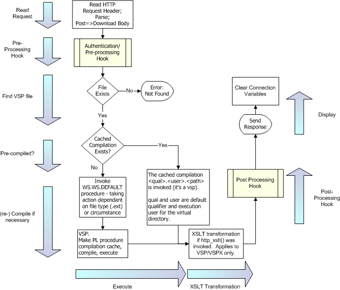

Virtuoso can serve Web pages to HTTP 1.0 and HTTP 1.1 clients. The HTTP
document root is set by the ServerRoot parameter in the \[HTTPServer\]
section of the Virtuoso INI file. By default this is set to `vsp`
sub-directory of the installation. If this parameter is not set, then
the default document root will be the server's working directory.

**Executing VSP Pages.**

Directories under the ServerRoot directory, including the root itself
are not automatically allowed to execute dynamic pages such as VSP. A
virtual directory must first be created with an appropriate VSP user
assigned to permit execution of dynamic pages. After this, Virtuoso will
execute files with a "`.vsp` " extension as a VSP page.\]

**The VSP Stored Procedure.**

Each VSP page constitutes a Virtuoso stored procedure named after the
URI of the page by taking the URI and pre-pending the WS.WS. qualifier
and owner. Hence the page `/test.vsp` becomes the procedure
`"WS"."WS"."/test.vsp"` . This is automatically performed when a page is
first requested. Subsequent requests to the page will not reference the
file. The VSP engine will check for changes in the `.vsp` source file
before calling the procedure and re-compile as required. The
ws\_proc\_def() SQL function can be used to explicitly update the
procedure if the .vsp file is changed.

**The VSP Transaction.**

Each URL is executed in its own transaction. All SQL statements in a
page procedure, whether on local or remote data, make up one
transaction, unless transaction control statements are explicitly used
to divide the page into multiple transactions. If the page procedure
returns through completing execution or through a return statement or as
a result of a 'no data found' condition, the transaction is implicitly
committed. If this commit fails, the output is discarded and the error
message indicating the commit failure is sent to the HTTP client. If a
VSP procedure returns as a result of an error the transaction is rolled
back and the output discarded. The client gets the SQL error message as
the HTML body of the reply. A VSP procedure can commit or roll back
explicitly with the `commit work` or `rollback work` PL statements.

If the client closes the connection to the server while server-side
processing is taking place this will be detected by the server and the
transaction will be eventually interrupted and rolled back in the same
way as if an ODBC client had disconnected. To control the server
reacting or not on the HTTP client disconnecting the SET
HTTP\_IGNORE\_DISCONNECT = ON/OFF should be used.

Each VSP page-procedure is called with three arguments:

path

\- the URI path of the VSP page itself.

params

\- the parameters from a previous POST to the server.

lines

\- the complete set of headers received from the calling client.

Each VSP procedure runs in a context that implicitly contains the stream
to the HTTP client. The arguments of the VSP page procedure are
represented as arrays of strings. For example, GETing the URL:

    http://www.test.net/x/y.vsp?arg1=1&arg2=2

would cause the following arguments to be given to the page-procedure
`WS.WS./x/y.vsp` :

    path     ('x', 'y.vsp')
    params   ('arg1', '1', 'arg2', '2')
    lines    ('GET /x/y.vsp?arg1=1&arg2=2 HTTP/1.1', 'Host: www.test.net', ...)

Arrays are marked in parentheses with elements separated by commas. The
page procedure is called as a result of either a GET or POST request in
either HTTP/1.0 or HTTP/1.1. In the event of a POST request the params
contains the post data.

Virtuoso can be configured to proxy certain requests to another web
server. This allows using another web server for running cgi-bin's, Java
servelets or other web server functions. Virtuoso, however, is capable
of hosting many other dynamic engines also, such as PHP, JSP and
ASP.Net.

> **Tip**
> 
> [HTTP Server Base Configuration](#vspconf)
> 
> [Virtual Directory Administration UI](#httpvirtualdirs)
> 
> [vhost\_define()](#fn_vhost_define) ,
> [vhost\_remove()](#fn_vhost_remove)
> 
> [Virtuoso as a Proxy](#virtproxy)

<a id="id19-vsp-markup-basic-functions"></a>
## VSP Markup & Basic Functions

All VSP specific markup is represented as a processing instruction (\<?
... ?\>).

    <?vsp
      statement ;
      statement ;
      ...
     ?>

This markup introduces Virtuoso PL code to a VSP page, which otherwise
may normally contain HTML markup. The code enclosed must begin and end
at a statement boundary but a compound statement may begin in one \<?vsp
tag and end in another. Code outside of these blocks is ignored by
Virtuoso and placed directly on the HTTP stream to be sent to the
client.

> **Tip**
> 
> The SQL Procedure Language Guide chapter.

Several functions exist to allow VSP code to send data to the HTTP
stream. They are basically the same but offer different escaping
mechanisms to suit different purposes:

[`http (in value

varchar, in stream

any);`](#fn_http)

[`http_value ( in value

any, in tag

varchar, in tag

varchar, in stream

any);`](#fn_http_value)

[`http_url ( in value

any, in tag

varchar, in stream

any);`](#fn_http_url)

These functions output their `value` argument to the specified stream
with varying escaping. The value argument may be any scalar object, i.e.
string, date or number and will automatically be cast to varchar before
further processing.

`http()` will print out the contents of `value` cast to string without
any modification.

`http_value()` will use HTML escapes such that '`<` ' will be output as
'`&lt;` '.

The `http_url()` function will use URL escapes such that '+' replaces
spaces and hex escapes like %25 will replace '%'. If `http_value()` gets
an XML entity returned by a path expression it outputs the serialization
of the entity, including children. This is not the string value since
this has the entity start and end tags and other markup. The tag
argument allows specifying a tag in which the value is to be enclosed. A
non-string value, e.g. 0 or null will cause no tag to be put around the
value.

The stream argument may be omitted, in which case it defaults to the
HTTP client of the calling procedure. If present, a value of integer 0
will mean the http client. If non-0 the value must be an object returned
by [string\_output()](#fn_string_output) .

These HTTP functions are commonly combined with `sprintf()` which allows
string composition based on a template. When using
[sprintf()](#fn_sprintf) to compose data to send to the user agent the
%V and %U letters can be used to introduce escapes similar to
http\_value and http\_url, respectively.

    http (' % <b>')          ' % <b>'
    http_value (' % <b>')    ' % &lt;b&gt;'
    http_url (' % <b>')      '+%25+<b>'
    http_value (12, 'li')    '<li>12</li>'

### Markup Short-hands

VSP markup short-hands exist for the `http_value()` and `http_url()`
functions to perform the same task outside of a VSP code block. This can
improve readability of VSP pages.

    <?= expression ?>  equiv.  http_value()

    <?/ expression ?>  equiv.  http_url()

These markups are shorthand for substituting values of expressions into
the output. The ` <?=  ` tag accepts a SQL expression and casts the
value into a string, which is sent to the output. The ` <?/  ` markup
sends the value of the expression to the client with HTTP URL escapes.

Here is a very simple example of making a two column HTML table from the
results of a "select" SQL statement. First using normal functions:

    <html>
    <h2>List of Users</h2>
    <table>
    <?vsp
      for (select u_name, u_password from sys_users ) do {
        http('<tr><td>');
        http (u_name);
        http('</td><td>');
        http (u_password);
        http('</td></tr>');
      }
    ?>
          </table>
    </html>

This fragment outputs a table of user names and passwords. We have
chosen to not end the code block until the end of the result so we have
repeatedly used the `http()` function to output parts of the table also.

Now the same code but including shorthands:

    <html>
    <h2>List of Users</h2>
    <table>
    <?vsp for (select u_name, u_password from sys_users ) do { ?>
      <tr>
        <td><?=u_name ?></td>
        <td><?=u_password ?></td></tr>
          <?vsp } ?>
          </table>
    </html>

<a id="id20-access-request-information"></a>
## Access Request Information

Request information, resulting from an HTTP POST, is available via the
`params` vector. The params vector is always available for the purpose
in a VSP context. Similarly the `lines` and `path` vectors are available
for the HTTP headers and URL path respectively.

Parameters stored in the params vector are stored in keyword-value
pairs, such that keywords are stored in the even elements, values in the
odd numbered elements. Vectors and arrays can be accessed using the
`aref()` and `aset()` functions, however, the exact position of
parameters is seldom known. The `get_keyword()` function can be used to
return the value of a given parameter. You can specify a default value
to return in case the parameter you are looking for is not found.

`get_keyword ('param_name'

, vector

[, opt_default_value'

]);`

If a default value other than '' (empty-string) is not required then a
short-hand can be used instead.

    {?'param_name'}

is equivalent to `get_keyword ('param_name'

, 'params'

);`

Since `get_keyword()` returns only strings, you will find that `cast`
ing or conversion functions such as `atoi()` are very useful here.

Consider retrieving the following page by means of the URL:

    http://myvirtuoso/test.vsp?arg1=1&arg2=test

    <html>
     <body>
      <h1>Test Params</h1>
      <?vsp
      declare _arg1 integer; --   the underscore helps to differentiate from
      declare _arg2 varchar; --   the keyword name, whereas the variable names
      declare _arg3 varchar; --   help use remember which is which.
    
      _arg1 := atoi(get_keyword('arg1', params));
      _arg2 := {?'arg2'};
      _arg3 := get_keyword('arg3', params, 'was empty'};
    
      ?>
      <p>values returned:</p>
      <p>arg1: <?=_arg1?></p>
      <p>arg2: <?=_arg2?></p>
      <p>arg3: <?=_arg3?></p>
     </body>
    </html>

> **Tip**
> 
> [`get_keyword()`](#fn_get_keyword)
> 
> [`atoi()`](#fn_atoi)
> 
> [`aref()`](#fn_aref)
> 
> [`aset()`](#fn_aset)
> 
> [cast](#dtcasting)

> **Note**
> 
> Sometimes a POST can supply a large amount of data, such as from an
> \<INPUT type="file"\>. When the length of the parameter data exceeds
> 5,000,000 octets the result is stored as a string session in the
> params array. In these cases the value should not be copied or
> converted to a string, it is likely to be truncated. The value should
> be stored as a BLOB or an external file. When processing possibly
> large input fields in a form either the fourth parameter to
> `get_keyword()/get_keyword_ucase()` should be set to 1 or they should
> be accessed through `aref_set_0()` .

<a id="id21-errors-in-page-procedures"></a>
## Errors in Page Procedures

VSP pages can declare handlers for errors using the normal handler
declaration or whenever ... goto construct. Any unhandled error causes
the procedure to be terminated and the error message to be sent to the
HTTP client instead of the output. Because terminating the page output
at an arbitrary point would probably result in not well formed output
all the output up to the point of the error is discarded.

If the SQL state signalled with the error is VSPRT the output generated
up to the point where the error was signalled is sent as such to the
user agent. This special SQL state is useful together with the
http\_rewrite function for things like sending a redirect based on a
condition detected in the middle of page processing. The http\_rewrite
function will clear all output buffered so far and signaling VSPRT will
make sure that whatever output is generated after http\_rewrite goes
unmodified to the user agent.

<a id="id22-inlinefile-http-server-pseudo-directory"></a>
## /INLINEFILE HTTP Server Pseudo-Directory

This pseudo directory provides a way for a VSP page to have full control
over the data sent to the client user-agent, for example to send files
to it and to handle the HTTP response attributes.

URIs starting with /INLINEFILE are handled through a VSP procedure
instead of being searched for in the HTTP root directory. This special
URI has the following syntax:

    /INLINEFILE/some_file_name?VSP=some_vsp&arg1=x&arg2=y.....

Upon receipt of such a URI, Virtuoso will execute the "some\_vsp" VSP
page with the parameters following the VSP parameter. The VSP page can
adjust the HTTP response header attributes using the `http_header()`
function to reflect the content of the HTTP body, such as specifying the
encoding through "Content-Encoding" attribute, or a MIME type through
"Content-Type" attribute).

Here is a simple example for showing JPEG images stored in DAV. The page
will list the first ten images found in the DAV resources table as
hyper-links. Clicking on them will fetch the content and display using
/INLINEFILE.

    <?vsp
      if ({?'getfile'} <> '')
        {
          http_header ('Content-type: image/jpg\t\n');         -- set the header to jpg
          declare image any;
          select RES_CONTENT into image from WS..SYS_DAV_RES
            where RES_ID = atoi({?'id'});                      -- download image from WebDAV
          http(image);                                         -- table and display
          return;
        }
      ?>
    <html>
     <body>
     <h1>Using /INLINEFILE to display images from the database</h1>
    
     <table>
      <tr>
       <td>
    
    <?vsp for (select top 10 RES_ID, RES_NAME from WS..SYS_DAV_RES where right(RES_NAME, 3) = 'jpg') do {?>
     <a href="?id=<?=RES_ID?>"><?=RES_NAME?></a><br>
    <?vsp } ?>
    
       </td>
       <td>
        <p>&getfile=yes&id=<?={?'id'}?>"></p>
        <p><a href="/INLINEFILE/picture.jpg?VSP=<?/http_path()?>&getfile=yes&id=<?/{?'id'}?>">download</a></p>
       </td>
      </tr>
     </table>
     </body>
    </html>

> **Note**
> 
> Note the use of the `http_path()` function to find the full path of
> the originating VSP file.
> 
> Also note the call to `http_header()` to set the appropriate content
> type for the returned data. When Virtuoso retrieves files normally, it
> will consult the system table `WS.WS.SYS_DAV_RES_TYPES` for types
> based on the file extension. We do not need to refer to the table in
> our example because we are making sure that only JPEGs are being
> returned.

> **Tip**
> 
> [`http_header()`](#fn_http_header)
> 
> [`http_path()`](#fn_http_path)

<a id="id23-beyond-basics"></a>
## Beyond Basics

All output from VSP page procedures is buffered into a local string
stream before being sent out. This is done so as to support the HTTP/1.1
required content length and to allow recovery from errors.

[`http_rewrite ( in stream

any);`](#fn_http_rewrite)

This clears any previous output to the stream. If the stream is omitted
or 0 the stream is the HTTP client stream of the calling procedure.

[`http_file ( in path

varchar);`](#fn_http_file)

This function sends a file to the HTTP client as a response to the
current request. Any other output that may have been generated by the
calling procedure will be discarded and the contents of the file will be
the exclusive response to the current HTTP request together with
appropriate headers. The file will only be sent after the procedure
handling the current HTTP request has returned. The file name is thus
not validated until the calling procedure has returned.

[`http_get( in uri

varchar,
out headers

varchar);`](#fn_http_get)

This function retrieves the document specified by the URI by HTTP and
returns the data of the response. The header output parameter is set to
be an array with an element for each line of the response's HTTP header.
Each line is a varchar object in the containing array. The header
parameter is optional.

The URI is of the form `host[:port]<path>` , e.g
'`www.openlinksw.com:80/index.html` '. The port, if omitted, defaults to
80. The data following the headers is not processed in any way. No
content transfer encodings are decoded but an eventual content transfer
encoding header can be found in the header array.

[`http_flush();`](#fn_http_flush)

This function generates a response header, flushes a stream and
disconnects the client, however, the server will continue with the
execution of the PL code in VSP page. The final result will never be
sent to the client. This is useful when a page makes a long transaction
and we do not wish the client to wait until its end, which may result in
a time-out. Suppose we have the retrieval of news from many targets,
each a thousand messages. We start from a VSP page process, inside it we
put into the internal stream (using http, http\_value etc.) redirect
code and call http\_flush. The client can read the response and go to a
status page that can display number of messages retrieved, which may
need refreshing a few times.

[`http_proxy (in host_and_port

varchar,
in header_lines

any,
in post_parameters

any)`](#fn_http_proxy)

The function http\_proxy() is used to send request in header\_lines and
post\_parameters to the host\_and\_port, read the response and send it
back to the client. The http\_proxy() function can be used inside a VSP
page to send a request to an external web server and automatically route
the reply sent by this remote server to the client of the VSP page
calling http\_proxy(). The output which can generated (with http
functions, etc.) before and after http\_proxy is called will be
discarded before sending the result of link retrieval to the user-agent.

    ...
    <?vsp
      http ('this never be displayed');
      http_proxy ('www.foo.com', vector ('GET / HTTP/1.0'), NULL);
      http ('and this also');
    ?>
    ...

### Virtuoso HTTP Server Character Set Settings

When the HTTP server returns the HTTP header to the client it appends
charset=xxxx to the Content-Type: HTTP header fields. This informs the
client user agent, the web browser, as to the character set of the
content to be displayed correctly. It uses the Web server charset to
correctly format values resulting from the `http_value()` function or
the VSP equivalent \<?= ...\>. Wide values and XML entities, resulting
from any XML processing functions like xpath\_contains, get represented
using the "HTML/XML transformation".

The default web server charset is governed by the *Charset* setting
defined in the [Virtuoso INI file](#virtini) . If no default charset is
specified then Virtuoso will use ISO-8859-1.

The HTTP character set can be changed during an HTTP session using: *set
http\_charset='charset\_name';* .

The XSLT output encoding can also be specified to over ride the server
default setting.

### Session Management and State Variables

The Virtuoso HTTP session management consists of functions for session
variables manipulation and hooks for saving and restoring session
variables.

Session management must be enable by setting the flag for persistent
session variables in the virtual directory mapping. Virtual directory
mappings use the *persistent\_session\_variables* flag, which when
specified, session variables can be used in a post-process function to
determine if the session variables content must be stored on to the
session table or not.

The post-processing function hook can be any user-defined Virtuoso/PL
procedure, it will be executed every time after processing of the active
page.

> **Tip**
> 
> [`connection_get()`](#fn_connection_get)
> 
> [`connection_set()`](#fn_connection_set)
> 
> [`connection_vars()`](#fn_connection_vars)
> 
> [`connection_vars_set()`](#fn_connection_vars_set)
> 
> [`connection_is_dirty()`](#fn_connection_is_dirty)

<a id="id24-long-http-transactions"></a>
## Long HTTP Transactions

Long running tasks may be invoked by web clients. In such a case, the
server should return a page for the user agent much before the tasks's
completion in order to provide feedback and avoid timeouts. Also the
long running task should not be interrupted by the user agent
disconnecting. The `http_flush()` function will send the reply
accumulated thus far to the user agent and then disconnect it. In
effect, this is a generic mechanism for starting an asynchronous thread.

Starting long running tasks may lead to denial of service. To prevent
this we can use status and stop functions to check processes and kill
them if necessary.

We can retrieve the URL, client IP-address, and process status code for
all currently running VSP requests, then use this information to isolate
and eliminate a process.

[`http_pending_req()`](#fn_http_pending_req) Lists the processes.

[http\_kill()](#fn_http_kill) can be used to kill them.

<a id="id25-using-chunked-encoding-in-http-11"></a>
## Using chunked encoding in HTTP 1.1

It is sometimes desirable to use the HTTP 1.1 chunked encoding to send
data to HTTP clients. Examples of such include status pages or streaming
applications. Note that the possibility of using chunked encoding
depends on external factors such as whether the client browser supports
chunked encoding. So a server page can request turning on the chunked
encoding, but should handle the case should it not be available.

Note that in order to successfully turn on the chunked encoding the page
should not be using the `http_xslt()` . Also all reply headers set by
the `http_header()` are silently ignored after the mode is set.

The `http_flush()` (with 1 as a value for it"s optional argument) is
used to request turning on the chunked encoding. If the client"s user
agent supports the encoding, then the data accumulated so far in the
server"s output buffer are sent to the client as the first chunk, the
request is put in special "chunked mode" and the `http_flush()` returns
a non-zero integer. When in that mode a new chunk is sent to the client
either when the internal 4k buffer is filled up or when the client calls
`http_flush()` again to flush the buffer and send it as a chunk. The
client disconnection is handled as usual .

<a id="id26-making-simple-dynamic-web-pages"></a>
## Making Simple Dynamic Web Pages

The directory where the pages reside must be marked as executable. Use
the [vhost\_define](#fn_vhost_define) function or the [Administration
Interface](#httpvirtualdirs) to do this:

    vhost_define (lpath=>'/example_location', ppath=>'/example_location/', vsp_user=>'demo');

The usual way to make an Dynamic page is to make a HTML skeleton and
insert Virtuoso/PL code in appropriate places to fill in the rest
dynamically. Consider the following example as a demonstration of such
technique. Note that the example is made in four steps but in practice
this can be one.

Suppose we have a table Demo.demo.Shippers (from the Demo database of
the standard distribution). We can make a simple page for editing it.

1.  **Building The HTML Skeleton.**
    
    We define one form for editing and adding entries and a table for
    listing the existing shippers.
    
    ``` 
    <HTML>
      <BODY>
    
        <!-- edit form -->
    
        <FORM name="ShippersForm" method="POST" action="shippers.vsp">
           <INPUT type="hidden" name="ShipperID" value="">
           <TABLE>
             <TR>
           <TD>Company Name</TD>
           <TD><input type="text" name="CompanyName" value=""><!-- CompanyName -->
    
    </TD>
         </TR>
             <TR>
           <TD>Phone</TD>
               <TD><INPUT type="text" name="Phone" value=""><!-- Phone number -->
    
    </TD>
         </TR>
             <TR><TD colspan="2"><input type="submit" name="accept" value="Accept"></TD></TR>
           </TABLE>
        </FORM>
        <!-- end of form -->
    
        <!-- list of entries -->
    
        <TABLE>
           <TR><TD>Company Name</TD><TD>Phone #</TD><TD colspan="2">Action</TD></TR>
           <!--TR><TD>CompanyName</TD><TD>Phone</TD><TD>Edit URI</TD><TD>Delete URI</TD></TR-->
    
        </TABLE>
        <!-- end of list -->
    
      </BODY>
    </HTML>
        
    ```

2.  **Filling a List of Entries.**
    
    We have added in part 'list of entries' one active part (for select
    ...). And using \<?=...?\> shortcut we have made for each row in
    database table one row in table defined in step 1. Also we have
    added two useful links 'Edit' and 'Delete' with URL parameter 'EDIT'
    and 'DELETE' whose value is equal to the primary key value of the
    row;
    
    ``` 
    <HTML>
      <BODY>
    
        <!-- edit form -->
    
        <FORM name="ShippersForm" method="POST" action="shippers.vsp">
           <INPUT type="hidden" name="ShipperID" value="">
           <TABLE>
             <TR>
           <TD>Company Name</TD>
           <TD><input type="text" name="CompanyName" value=""><!-- CompanyName -->
    
    </TD>
         </TR>
             <TR>
           <TD>Phone</TD>
               <TD><INPUT type="text" name="Phone" value=""><!-- Phone number -->
    
    </TD>
         </TR>
             <TR><TD colspan="2"><input type="submit" name="accept" value="Accept"></TD></TR>
           </TABLE>
        </FORM>
        <!-- end of form -->
    
        <!-- list of entries -->
    
        <TABLE>
           <TR><TD>Company Name</TD><TD>Phone #</TD><TD colspan="2">Action</TD></TR>
           <!--TR><TD>CompanyName</TD><TD>Phone</TD><TD>Edit URI</TD><TD>Delete URI</TD></TR-->
    
           <?vsp
             for select ShipperID, CompanyName, Phone from Demo.demo.Shippers do
              {
           ?>
           <TR>
             <TD><?=CompanyName?></TD>
         <TD><?=Phone?></TD>
         <TD><a href="shippers.vsp?EDIT=<?=ShipperID?>">Edit</a></TD>
         <TD><a href="shippers.vsp?DELETE=<?=ShipperID?>">Delete</a></TD>
           </TR>
           <?vsp
              }
           ?>
        </TABLE>
        <!-- end of list -->
    
      </BODY>
    </HTML>
        
    ```

3.  **Retrieving Parameters and Filling in The Form.**
    
    We must retrieve the parameters 'Delete' and 'Edit' from the URL and
    fill in the form elements
    
    ``` 
    <?vsp
    declare company_name, phone_number varchar;
    declare shipper_id, operation integer;
    declare shipper_info
      cursor for select CompanyName, Phone
        from Demo.demo.Shippers where ShipperID = shipper_id;
    
    company_name := '';
    phone_number := '';
    operation := 0;
    
    shipper_id := atoi (get_keyword ('EDIT', params, '0'));
    
    if (shipper_id > 0)
      {
        whenever not found goto not_found_any;
        open shipper_info (prefetch 1);
        fetch shipper_info into company_name, phone_number;
    not_found_any:
        close shipper_info;
        goto display_page;
      }
    
    shipper_id := atoi (get_keyword ('DELETE', params, '0'));
    
    if (shipper_id > 0)
      {
        delete from Demo.demo.Shippers where ShipperID = shipper_id;
        goto display_page;
      }
    
    display_page:
    
    ?>
    
    <HTML>
      <BODY>
    
        <!-- edit form -->
    
        <FORM name="ShippersForm" method="POST" action="shippers.vsp">
           <INPUT type="hidden" name="ShipperID" value="<?=shipper_id?>">
           <TABLE>
             <TR>
           <TD>Company Name</TD>
           <TD><input type="text" name="CompanyName" value="<?=company_name?>"</TD>
         </TR>
             <TR>
           <TD>Phone</TD>
               <TD><INPUT type="text" name="Phone" value="<?=phone_number?>"</TD>
         </TR>
             <TR><TD colspan="2"><input type="submit" name="accept" value="Accept"></TD></TR>
           </TABLE>
        </FORM>
        <!-- end of form -->
    
        <!-- list of entries -->
    
        <TABLE>
           <TR><TD>Company Name</TD><TD>Phone #</TD><TD colspan="2">Action</TD></TR>
           <!--TR><TD>CompanyName</TD><TD>Phone</TD><TD>Edit URI</TD><TD>Delete URI</TD></TR-->
    
           <?vsp
             for select ShipperID, CompanyName, Phone from Demo.demo.Shippers do
              {
           ?>
           <TR>
             <TD><?=CompanyName?></TD>
         <TD><?=Phone?></TD>
         <TD><a href="shippers.vsp?EDIT=<?=ShipperID?>">Edit</a></TD>
         <TD><a href="shippers.vsp?DELETE=<?=ShipperID?>">Delete</a></TD>
           </TR>
           <?vsp
              }
           ?>
        </TABLE>
        <!-- end of list -->
    
      </BODY>
    </HTML>
        
    ```
    
    We have added a section to the top of the page that we use to
    recognize what operation to perform and do the appropriate action in
    the database. In the case of editing we use the values input on the
    form.

4.  **Editing Form Logic.**
    
    We have a logic in the same initialization part of the page that
    retrieves a 'ShipperID' parameter, so if this parameter exists in
    the params array then the operation is to perform an insert,
    otherwise we must update a record.
    
    ``` 
    <?vsp
    declare company_name, phone_number varchar;
    declare shipper_id integer;
    declare shipper_info
      cursor for select CompanyName, Phone
        from Demo.demo.Shippers where ShipperID = shipper_id;
    
    company_name := '';
    phone_number := '';
    
    shipper_id := atoi (get_keyword ('EDIT', params, '0'));
    -- If the current operation is edit then we retrieve the Company Name and Phone
    if (shipper_id > 0)
      {
        whenever not found goto not_found_any;
        open shipper_info (prefetch 1);
        fetch shipper_info into company_name, phone_number;
    not_found_any:
        close shipper_info;
        goto display_page;
      }
    
    shipper_id := atoi (get_keyword ('DELETE', params, '0'));
    
    -- If the operation is delete then delete it (if any error
    -- occurred then HTTP server will handle it)
    if (shipper_id > 0)
      {
        delete from Demo.demo.Shippers where ShipperID = shipper_id;
        shipper_id := 0; -- reset it to prevent submission of wrong shipper id
        goto display_page;
      }
    
    -- If pressed button Accept then we can recognize the operation
    if ('' <> get_keyword ('accept', params, ''))
      {
        shipper_id := atoi (get_keyword ('ShipperID', params, '0'));
        company_name := get_keyword ('CompanyName', params, 'unknown');
        phone_number := get_keyword ('Phone', params, 'N/A');
        -- the old entry going edited
        if (shipper_id > 0)
            update Demo.demo.Shippers set CompanyName = company_name, Phone = phone_number
            where ShipperID = shipper_id;
        else -- this is an new entry
          {
            shipper_id := coalesce ((select max(ShipperID) from Demo.demo.Shippers), 0) + 1;
            insert into Demo.demo.Shippers (ShipperID,CompanyName,Phone)
            values (shipper_id,company_name,phone_number);
          }
        company_name := ''; -- we clear all entered data
        phone_number := '';
        shipper_id := 0; -- to prevent setting of wrong shipper id in form
      }
    
    display_page:
    
    ?>
    
    <HTML>
      <BODY>
        <H3>Editing a shipment companies</H3>
        <!-- edit form -->
    
        <FORM name="ShippersForm" method="POST" action="shippers.vsp">
           <INPUT type="hidden" name="ShipperID" value="<?=shipper_id?>">
           <TABLE>
             <TR>
           <TD>Company Name</TD>
           <TD><input type="text" name="CompanyName" value="<?=company_name?>"</TD>
         </TR>
             <TR>
           <TD>Phone</TD>
               <TD><INPUT type="text" name="Phone" value="<?=phone_number?>"</TD>
         </TR>
             <TR><TD colspan="2"><input type="submit" name="accept" value="Accept"></TD></TR>
           </TABLE>
        </FORM>
        <!-- end of form -->
    
        <!-- list of entries -->
    
        <TABLE>
           <TR><TD>Company Name</TD><TD>Phone #</TD><TD colspan="2">Action</TD></TR>
           <!--TR><TD>CompanyName</TD><TD>Phone</TD><TD>Edit URI</TD><TD>Delete URI</TD></TR-->
    
           <?vsp
             for select ShipperID, CompanyName, Phone from Demo.demo.Shippers do
              {
           ?>
           <TR>
             <TD><?=CompanyName?></TD>
         <TD><?=Phone?></TD>
         <TD><a href="shippers.vsp?EDIT=<?=ShipperID?>">Edit</a></TD>
         <TD><a href="shippers.vsp?DELETE=<?=ShipperID?>">Delete</a></TD>
           </TR>
           <?vsp
              }
           ?>
        </TABLE>
        <!-- end of list -->
    
      </BODY>
    </HTML>
        
    ```

5.  **Final Remarks.**
    
    The page for shippers does not have any specific error-handling. If
    there are any SQL errors produced the HTTP server will display the
    error number and the server error message. For example, if we trying
    to delete an record of a predefined shippers we would have a foreign
    key violation to which the server would respond:
    
    ``` 
    'SQL Error S1000 DELETE statement conflicted with
      COLUMN REFERENCE constraint "Orders_Shippers_ShipVia_ShipperID"'
        
    ```
    
    We can, however, add PL code to handle errors and display a
    different page.

<a id="id27-generation-of-non-html-output"></a>
## Generation of non-HTML output

VSP pages are not restricted to generating only HTML markup. In order to
generate non-HTML markup the VSP page MUST conform to the target format
specification, for example if XML output is needed, the markup MUST
follow XML syntax rules. The output sent to the user agent is entirely
controlled by the scripting on the page, no constant headers beyond the
required HTTP ones are added by the serber.

Also it is important when output is not HTML that the HTTP header field
'Content-Type' be set to appropriate MIME type (for example 'text/xml',
'text/plain' etc) using `http_header()` .

The following example shows how an XML document can be generated using a
VSP page

``` 
        <?vsp
            -- source of the xmldemo.vsp
            declare txt varchar;
        http_header ('Content-Type: text/xml\r\n');
        txt := 'this is a XML test';
        ?><?xml version="1.0" ?>
        <document>
        <para><?= txt ?></para>
        </document>
        
```

The following example shows how a WML page can be generated using a VSP
page

``` 
        <?vsp
            -- source of the wmldemo.vsp
            declare txt varchar;
            http_header ('Content-type: text/vnd.wap.wml\r\n');
        txt := 'this is a WML test';
        ?><?xml version="1.0" ?>
        <!DOCTYPE wml PUBLIC "-//WAPFORUM//DTD WML 1.1//EN" "http://www.wapforum.org/DTD/wml_1.1.xml">
        <wml>
        <card>
            <p><?= txt ?></p>
        </card>
        </wml>
        
```

> **Tip**
> 
> [WML Tutorials](#)

<a id="id28-post-vsp-xslt-transformation-mode"></a>
## Post VSP XSLT Transformation Mode

The Virtuoso server can perform server-side XSLT transformations on the
internal stream data. Suppose we have an XML document, we can tell the
HTTP server to invoke XSLT processor before sending the reply to the
user agent. We do this by making a call to the
[http\_xslt()](#fn_http_xslt) function inside VSP or any procedure
called from it and pass the URL of the stylesheet and probably some
parameters.

[`http_xslt(in style_sheet_URI

varchar [, in parameters

any])`](#fn_http_xslt)

The VSP page will produce an XML document, rather than HTML. The XSL
stylesheet will then produce the required output for the user-agent,
which could be more XML or HTML.

The XSL stylesheet could also be generated using VSP.

    <?vsp
    declare ses any;
    ses := string_output ();
    xml_auto ('select ShipperID, CompanyName, Phone from Demo.demo.Shippers
      for xml auto element', '', ses);
    
    http ('<list>');
    http (string_output_string (ses));
    http ('</list>');
    http_xslt ('file:/samples/xslt/shippers.xsl');
    ?>

Where shippers.xsl will have the following content:

    <?xml version="1.0"?>
    
    <xsl:stylesheet
        version="1.0"
        xmlns:xsl="http://www.w3.org/1999/XSL/Transform">
    
      <xsl:output method="html"/>
    
      <xsl:template match="/">
    <html>
    <head>
    <title>Shippers list</title>
    </head>
    <body link="#0000b4" vlink="#0000b4" bgcolor="#ffffff">
    <xsl:apply-templates/>
    </body>
    </html>
    </xsl:template>
    
      <xsl:template match="list">
    <table>
    <tr><td>ID</td><td>Name</td><td>Phone</td></tr>
    <xsl:apply-templates/>
    </table>
    </xsl:template>
    
      <xsl:template match="Shippers">
    <tr>
    <td><xsl:value-of select="ShipperID"/></td>
    <td><xsl:value-of select="CompanyName"/></td>
    <td><xsl:value-of select="Phone"/></td>
    </tr>
    </xsl:template>
    </xsl:stylesheet>

<a id="id29-xml-xslt-generated-vsp-pages"></a>
## XML & XSLT Generated VSP Pages

The Virtuoso HTTP server provides a special case for producing VSP
pages. For this purpose the extensions .vxml and .vxsl are reserved. If
the requested document is named dummy.vxml then the HTTP server will try
to locate dummy.vxsl. If the dummy.vxsl exists then it will perform an
XSLT transformation using .vxml as a target XML document and .vxsl as a
XSLT stylesheet. After successful transformation it will compile a
result from it in the usual way and then perform execute.

The requirements are: XML document with extension .vxml, XSLT sheet with
the same name, location but extension .vxsl. The location of these files
must be set to allow execution (see [Virtual Directories Support and
Execution Privileges](#virtdir) ).

Source of portfolio.vxml

    <?xml version="1.0"?>
    <?xml-stylesheet type="text/xsl" href="portfolio.xsl"?>
    <portfolio xmlns:dt="urn:schemas-microsoft-com:datatypes" xml:space="preserve">
    <stock exchange="nyse">
    <name>zacx corp</name>
    <symbol>ZCXM</symbol>
    <price dt:dt="number">28.875</price>
    </stock>
    <stock exchange="nasdaq">
    <name>zaffymat inc</name>
    <symbol>ZFFX</symbol>
    <price dt:dt="number">92.250</price>
    </stock>
    <stock exchange="nasdaq">
    <name>zysmergy inc</name>
    <symbol>ZYSZ</symbol>
    <price dt:dt="number">20.313</price>
    </stock>
    </portfolio>

Source of portfolio.vxsl

    <?xml version='1.0'?>
    
    <xsl:stylesheet
        xmlns:xsl="http://www.w3.org/TR/WD-xsl">
    
      <xsl:template match="/">
    <HTML>
    <BODY>
    <TABLE BORDER="2">
    <TR>
    <TD>Symbol</TD>
    <TD>Name</TD>
    <TD>Price</TD>
    </TR>
    <xsl:for-each select="portfolio/stock">
    <TR>
    <TD><xsl:value-of select="symbol"/></TD>
    <TD><xsl:value-of select="name"/></TD>
    <TD><xsl:value-of select="price"/></TD>
    </TR>
    </xsl:for-each>
    </TABLE>
    </BODY>
    </HTML>
    </xsl:template>
    </xsl:stylesheet>

The result of retrieving portfolio.vxml

    <HTML>
    <BODY>
    <TABLE BORDER="2">
    <TR><TD>Symbol</TD><TD>Name</TD><TD>Price</TD></TR>
    <TR><TD>ZCXM</TD><TD>zacx corp</TD><TD>28.875</TD></TR>
    <TR><TD>ZFFX</TD><TD>zaffymat inc</TD><TD>92.250</TD></TR>
    <TR><TD>ZYSZ</TD><TD>zysmergy inc</TD><TD>20.313</TD></TR>
    </TABLE>
    </BODY>
    </HTML>

<a id="id30-virtuoso-server-pages-for-xml-vspx"></a>
# Virtuoso Server Pages for XML (VSPX)

VSPX is an XML vocabulary for server generated HTML and XHTML pages that
may or may not be bound to native or third-party data sources. VSPX is a
framework for building and deploying dynamic web content atop Virtuoso.
VSPX offers a widget set and event model which is similar to that of GUI
tool kits, providing the developer with much automation for common web
development tasks. Many controls are tightly integrated with the
Virtuoso database, providing seamless data binding to local or remote
relational and XML data. Server side scripting in VSPX is performed in
Virtuoso/PL. The VSPX source code consists of HTML or XML with
interspersed VSPX specific XML elements which describe the UI control
hierarchy of the page.

VSPX covers the following areas:

Rich set of controls, covering all basic HTML plus complex composite
controls like data grids and tree browsers.

Session management - Transparent session and session state handling
using cookies, URL poisoning or digest authentication.

Form entry validation server and client side.

Single and multi-row controls for viewing and directly updating SQL
tables, including scrolling through long result sets.

Repeating and conditional instantiation of UI elements based on run time
choices.

Event model for HTTP request handling, providing distinct phases for
creating the controls, retrieving data, processing posted data,
preserving state and rendering for a user agent.

Object oriented architecture, allowing easy definition of subclasses of
existing controls for new functionality. It suffices to implement a new
SQL class with a few predefined methods and to implement an XSLT rule
for generating the code based on the external XML syntax for the new
control.

Easy automatic generation of VSPX pages. The pages being XML, it is
simple to automate generating pages based on other data, such as
automatically making table maintenance pages based on a SQL table
definition.

The VSPX development cycle consists of editing .vspx resources in the
file system or Virtuoso DAV. The editing can take place using a regular
text editor or a supporting HTML editor.

<a id="id31-processing-model"></a>
## Processing Model

A VSPX page describes a web page in terms of static XHTML plus XML
elements in the VSPX namespace, `"http://example.com/vspx/"` . This
namespace is abbreviated as `v:` in the rest of this document.

Elements in the `v` namespace introduce VSPX elements, options or
controls. Some of these may in turn have HTML children. VSPX elements
with HTML children are called templates, as these will process their
HTML contents at run time, typically modifying these based on run time
data.

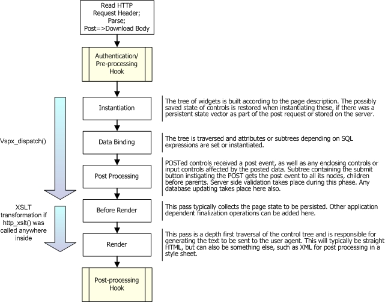

When the page is requested, the system checks whether it is already
compiled and compiles it if the compilation is absent or older than the
source. The VSPX compilation has two phases: pre-processing and
compilation. The first phase expands included files and applies the
external macro XSL-T sheet. The result of which is a single page
encapsulating all related components which will be stored in a .vspx-m
intermediary file. The result of second phase, compilation is a single
.vspx-sql file containing class and method definitions for a subclass of
the generic VSPX page class. All code directly derived from the
pre-processed page will be found in this file. The file can of course
refer to outside Virtuoso/PL code.

The results of compilation process are stored usually in an OS dependent
temporary directory. This would be the $TMPDIR for UNIXes or %TMP% for
Windows platforms. If these environment variables are not available it
will be some default system specific location, such as `/var/tmp` or
`/tmp` on Unix's. Note that this temporary storage applies to the VSPX
pages that are stored within the file system, for the WebDAV repository
the product of compilation is stored as described below. For development
purposes the use of temporary storage can be turned off by executing:

    registry_set ('__no_vspx_temp', '1')

from ISQL. In this case both file-system and WebDAV repository will
contain .vspx-m and .vspx-sql files in the same place and with the same
name as the VSPX source file. VSPX temporary storage can be re-enabled
in the same way but using the string value '0' instead of '1'. Note that
this is a string rather than a number.

Any VSPX page invocation, whether through the GET or POST HTTP request,
consists of the following steps:

  - **Instantiation.**
    
    The tree of widgets is built according to the page description. The
    possibly saved state of controls is restored when instantiating
    these, if there was a persistent state vector as part of the post
    request or stored on the server.

  - **Data Binding.**
    
    The tree is traversed and attributes or subtrees depending on SQL
    expressions are set or instantiated.

  - **Post Processing.**
    
    If this was a POST request, the control that was mentioned in the
    POST gets a post event, as well as any enclosing controls or input
    controls affected by the posted data. The subtree containing the
    submit button originating the POST gets the post event to all its
    nodes, children before parents. Post data server side validation
    takes place during this phase. Any database updating takes place
    during this processing, typically inside the post handler of the
    form element, after the post handling of each individual field is
    complete.

  - **Before Render.**
    
    The control tree is now assumed to be in a state reflecting the
    operation intended by the POST or GET. This pass typically collects
    the page state to be persisted. Other application dependent
    finalization operations can be added here.

  - **Render.**
    
    This pass is a depth first traversal of the control tree and is
    responsible for generating the text to be sent to the user agent.
    This will typically be straight HTML, but can also be something
    else, such as XML for post processing in a style sheet.

Just as with VSP pages the code of the page make call http\_xslt(), this
has the effect of applying the specific stylesheet to the HTML text
produced by the render phase. Since output contains HTML tags generated
by VSPX controls, the style-sheet should have these as a general rule to
leave these unchanged. The http\_xslt () is more useful with VSP pages
producing XML than with VSPX pages.

<a id="id32-object-model"></a>
## Object Model

VSPX controls are SQL user defined type instances, or objects. The SQL
object system is substantially similar to any other single inheritance
object system, such as that of Java or C\#. The XML source code of the
VSPX page is processed to generate SQL for instantiating the VSPX
control tree. The XML elements and classes may have similar names but
are not one to one identical.

All controls, including pages, are instances of a subclass of
`vspx_control` . To each VSPX source file corresponds a class named
after the file, which inherits the common superclass `vspx_page` .
Normally, all code, regardless of which specific control on the page it
pertains to, runs inside a method of the page, thus the *self* (like
'this' in Java or C++) refers to the page instance. By convention, the
variable *control* references the object representing the control which
declares the particular code snippet. The variable `e` represents the
event which is at the root of the code being invoked. The event is
normally an event object representing a GET or POST HTTP request, but it
can also be a user defined event sent to the page by other code on the
page or elsewhere.

The page has a data member `vc_children` which contains an array of all
top level VSPX controls on the page. Each control in turn has this same
variable for referring to subordinate controls, if any.

Each processing pass allows the developer to specify arbitrary SQL code
to run in the context of the pass. The code runs in the context of a
method of the page object, where the local variable *control* references
the control that declares the code in question.

Controls may be enabled or disabled, thus supporting conditional
activation and rendering of page parts. Parts may be enabled in function
of a page state, for example a search result control is only on after
the search text has been posted. Another example is that some controls
may only be enabled if a user is logged in.

Code inside a control may locate other controls on the page by name,
either starting from the control itself or at the page. Note that when
repeating control groups are involved, it is best to start at the leaf
and work upwards in the tree, since there can be several identically
named children of the page. All controls have a name which is unique in
terms of the VSPX source file. Additionally, all controls, including
members of repeating groups, have a name which is generated to be unique
at run time. The latter is not however constant. The `vc_parent` data
member references the parent. `vc_name` is the name as appears in the
name attribute of the corresponding XML element. `vc_instance_name` is a
page-wide unique name, generated to be different for each possible
repetition of the control. The `find_control` method of `vspx_control`
can be used to look for a child with a specific `vc_name` .

<a id="id33-keeping-page-and-session-state"></a>
## Keeping Page and Session State

VSPX does not require any particular session management to be in effect
to operate. It is in its default form entirely stateless on the server
side. There is a mechanism called view state for keeping track of data
between consecutive post backs of a single page. This is simply an
automatically maintained hidden field which will keep the state of
controls which have a state that may be persisted. The view state
mechanism does not however safeguard data across different pages but is
fine for remembering entered form data or a bookmark in a scrolled list
across page reloads.

To keep real sessions and session variables, a `v:login` control is
offered.

<a id="id34-application-code"></a>
## Application Code

Most VSPX controls will support XML children specifying SQL code to run
at various points of the page processing cycle. The elements are:

v:before-data-bind

v:after-data-bind

v:before-post

v:before-render

These elements will have a script tag as unique child, most often
containing a CDATA section for escaping the SQL text.

Additionally, most attributes of VSPX elements can have a SQL expression
evaluated at initialization, pre data bind or after data bind time, as
the case may be, depending on the attribute and its value. An attribute
value beginning with `"--"` indicates evaluation on the initialization
or the descending edge of the data bind pass. An attribute value
indicating `"--after"` specifies that the value is calculated on the
returning edge of recursion of the data bind pass.

Arbitrary HTML text may contain attributes with a data bound value. The
attributes should be in the XHTML namespace and have a text beginning
with `"--"` . The expression will be evaluated at render time, where the
*control* variable refers to the enclosing VSPX template control, e.g.
the page instance when at top level.

### VSP Compatibility and In-Line SQL

Arbitrary HTML text may contain \<?vsp ?\>, \<?V ?\> (equivalent of \<?=
VSP notation) and \<?U ?\> (equivalent of \<?/ VSP notation) processing
instructions. The code in question will be evaluated during the render
pass, with control set to the closest enclosing VSPX control. Please
note that the \<?= and \<?/ VSP shortcuts cannot be used inside VSPX
pages as they are not valid processing-instructions.

VSPX maintains backward compatibility with VSP through supporting the
same processing instructions, but additionally requires the page source
to be well formed XML. VSP pages which are well formed in XML terms will
run as such under with the VSPX extension, with the addition of the
`v:page` top level element.

The \<?vsp ?\> processing instruction expects a SQL statement. The
statement can be a compound statement ending in another \<?vsp ?\>
processing instruction at the same nesting level under the same parent
tag. The other pi's \<?V and \<?U expect a SQL expression.

> **Note**
> 
> \<?V ?\> is not permitted inside attributes without quotation, as this
> is not well formed XML. When quoted, this notation in attributes has
> no special effect, hence the convention about the leading `"--"` and
> the `XHTML` namespace for HTML attributes with a computed value.

<a id="id35-a-simple-example"></a>
## A Simple Example

The fragment below shows us a VSPX page with a few labels. A label is a
simple control that renders as HTML text, using a data bindable
attribute to specify a value and a C printf style format string for the
format. Note the use of the \<?vsp ?\> processing instruction. This
could just as well have been an HTML literal.

    <html>
      <body>
        <v:page name="demo_label" xmlns:v="http://example.com/vspx/">
          <p>
            <?vsp http ('<H3>Simple page to demonstrate simple VSPX controls</H3>'); ?>
          </p>
          <p> An integer <v:label name="label1" value="--(1 + 2)" format="--'%d'"/> </p>
          <p> A string <v:label name="label2" value="'123'" format="%s"/> </p>
          <p> A string with default format <v:label name="label3" value="String"/> </p>
          <p>
          An url <v:url name="url1" value="--'OpenLink Software Ltd.'" format="%s" url="--'http://openlinksw.com/'"/>
          <br/>
          An url (default format) <v:url name="url2" value="OpenLink Software Ltd." url="http://openlinksw.com/" />
          </p>
          <v:include url="footer.xml"/>
        </v:page>
      </body>
    </html>

<a id="id36-vspx-event-handler-parameters"></a>
## VSPX Event Handler Parameters

The user-defined event handlers always accept a 'control' parameter
whose type is the same as that of the control it belongs to. For example
the on-post event of 'button' has a parameter 'control' of type
vspx\_button; after-data-bind of a 'label' has a parameter 'control' of
type 'vspx\_label' etc.

The event handlers for before-data-bind, after-data-bind and on-post
have an additional parameter: 'e' which is of type vspx\_event. The
parameter ('e') keeps the HTTP request as post data, request header and
path just like the global variables 'path', 'params' and 'lines' on a
VSP page. In addition to that, the vspx\_event (e) keeps a reference to
the button pressed (if any) and a flag indicating the request type: POST
or GET. It may thus be used in a complex form to detect when to trigger
an event depending of event data or to directly access parameters of the
HTTP request, etc.

    create type vspx_event
    as (
        ve_params any,          -- name value pairs of post data
        ve_lines  any,          -- HTTP header lines
        ve_path   any,          -- requested path , parsed as vector
        ve_button vspx_control,     -- which active control originated the event.
        ve_is_post int default 0    -- 0 for GET 1 for POST
       )  temporary self as ref
    ;

<a id="id37-registering-a-vspx-event-callbacks"></a>
## Registering a VSPX Event Callbacks

The event handlers mechanism can be extended with callbacks. This means
registering a page method(s) which will be invoked after event scrips
are processed. The page methods used in this case can be either defined
using 'method' declaration inside VSPX page or using page subclass
defined in code-behind script(s) (see 'code-file' below). To register a
callback vc\_add\_handler (name, method\_name) method must be invoked in
any script preceding the handler stage. Parameters to the
vc\_add\_handler are: name - name of event where callback to be executed
(before-data-bind, after-data-bind, on-post, before-render),
method\_name - name of a page class method to be registered to the
event.

``` 
     <html>
         <body>
         <v:page name="handler_demo" xmlns:v="http://example.com/vspx/">
             <v:form name="sf" type="simple" action="form.vspx" method="POST">
             <v:text name="txt" />
             <v:button name="submit2" action="simple" value="OK" />
             <v:on-init>
                 control.vc_add_handler ('on-post', 'user_post');
             </v:on-init>
             </v:form>
             <v:method name="user_post" arglist="inout control vspx_control">
             dbg_printf ('Invoked: user post method');
             </v:method>
         </v:page>
         </body>
     </html>
     
```

<a id="id38-commonly-used-types-of-attributes-of-vspx-controls"></a>
## Commonly Used Types of Attributes of VSPX Controls

CalculateableValue

vspx\_simple\_type

CalculateableValue

The type of attribute that contains an expression to be calculated at
run time.

<a id="id39-description"></a>
# Description

The type of a string constant or an expression. If the value of this
type is started with '--', the rest of string is the text of an
expression to be calculated in order to get the effective value of the
property. If the value of this type is not started with '--', the
effective value is the original string itself.

The type identifier 'CalculateableValue' is introduced only for
diagnostic purposes, you will never use it in VSPX code. When Virtuoso
server tries to compile an invalid VSPX page, you might see a diagnostic
messages like 'the value of attribute X of a control Y does not match
pattern ... for type CalculateableValue'. If you see this then you
should check the syntax of the value of the specified attribute.

ForcedCalculateableValue

vspx\_simple\_type

ForcedCalculateableValue

The type of attribute that contains an expression to be calculated at
run time.

<a id="id40-description"></a>
# Description

The type of an expression. The value of this type must be started with
'--', the rest of string is the text of an expression to be calculated
in order to get the effective value of the property.

The type identifier 'ForcedCalculateableValue' is introduced only for
diagnostic purposes, you will never use it in VSPX code. When Virtuoso
server tries to compile an invalid VSPX page, you might see a diagnostic
messages like 'the value of attribute X of a control Y does not match
pattern ... for type ForcedCalculateableValue'. If you see this then you
should check the syntax of the value of the specified attribute.

SqlCode

vspx\_simple\_type

SqlCode

The type of a string value that is a Text of a Virtuoso/PL procedure.

<a id="id41-description"></a>
# Description

Text of an event handler or other Virtuoso/PL procedure. This is
expected to be a complete statement or sequence of statements, hence to
be terminated like a statement, unlike the 'calculatable value'
expression case.

The type identifier 'SqlCode' is introduced only for diagnostic
purposes, you will never use it in VSPX code. When Virtuoso server tries
to compile an invalid VSPX page, you might see a diagnostic messages
like 'the value of attribute X of a control Y does not match pattern ...
for type SqlCode'. If you see this then you should check the syntax of
the value of the specified attribute.

SqlName

vspx\_simple\_type

SqlName

The type of attribute that contains a name of the Virtuoso/PL UDT
instance that should be created for the control.

<a id="id42-description"></a>
# Description

The type for a Virtuoso/PL name that should be used during code
generation. KNOWN BUG: If double quotes are used in the value of this
type then the generated code may be incorrect. This is why this schema
restrictes the syntax of values of such type.

The type identifier 'SqlName' is introduced only for diagnostic
purposes, you will never use it in VSPX code. When Virtuoso server tries
to compile an invalid VSPX page, you might see a diagnostic messages
like 'the value of attribute X of a control Y does not match pattern ...
for type SqlName'. If you see this then you should check the syntax of
the value of the specified attribute.

<a id="id43-vspx-controls"></a>
## VSPX Controls

after-data-bind

vspx\_control

after-data-bind

Container for code that should be executed after data bind.

\<

after-data-bind

\>(EventHandler)\</

after-data-bind

\>

<a id="id44-description"></a>
# Description

The code contained in this element is executed after the default data
bind processing on the returning edge of recursion. The context has self
as the page, control as the control with this handler, event as the
vspx\_event which caused the page invocation. Any return value from the
code is ignored.

after-data-bind-container

vspx\_control

after-data-bind-container

This is identical to v:after-data-bind.

\<

after-data-bind-container

\>(EventHandler)\</

after-data-bind-container

\>

<a id="id45-description"></a>
# Description

before-data-bind

vspx\_control

before-data-bind

Container for code that should be executed before data bind.

\<

before-data-bind

\>(EventHandler)\</

before-data-bind

\>

<a id="id46-description"></a>
# Description

The code contained in this element is executed before the default data
bind processing on the descending edge of recursion. The context has
self as the page, control as the control with this handler, event as the
vspx\_event which caused the page invocation. A return value from the
code if equal to 1 (one) will stop further data-bind processing of the
containing control and it's children if any.

before-data-bind-container

vspx\_control

before-data-bind-container

This is identical to v:before-data-bind.

\<

before-data-bind-container

\>(EventHandler)\</

before-data-bind-container

\>

<a id="id47-description"></a>
# Description

before-render

vspx\_control

before-render

Container for code that should be executed before rendering.

\<

before-render

\>(EventHandler)\</

before-render

\>

<a id="id48-description"></a>
# Description

The code contained in this element is executed on the descending edge of
recursion when traversing the vspx control tree before rendering. This
is expected to have side effects on vspx controls only, not to return
anything or emit any output. Any return value from the code is ignored.

before-render-container

vspx\_control

before-render-container

This is identical to v:before-render.

\<

before-render-container

\>(EventHandler)\</

before-render-container

\>

<a id="id49-description"></a>
# Description

button

vspx\_control

button

Scriptable button.

\<

button

/\>

name

(required)

annotation

(optional)

initial-enable

(optional)

enabled

(optional)

instantiate

(optional)

control-udt

(optional)

xsd-stub-xhtml

(optional)

width

(optional)

height

(optional)

column

(optional)

null-value

(optional)

action

(required)

value

(required)

style

(optional)

active

(optional)

initial-active

(optional)

child-window-options

(optional)

browser-current

(optional)

browser-filter

(optional)

browser-list

(optional)

browser-mode

(optional)

browser-type

(optional)

browser-xfer

(optional)

selector

(optional)

format

(optional)

debug-srcfile

(optional)

debug-srcline

(optional)

debug-log

(optional)

<a id="id50-description"></a>
# Description

Scriptable version of Submit Button of the HTML form. Depending of
'action' attribute it may have variants. In some of these variants the
button will not have a submit function, as in select and browse buttons.
In these cases the button will use client JavaScript to pop up new
windows or for setting values in other windows.

<a id="id51-attributes"></a>
# Attributes

**name = [SqlName](#vc_type_sqlname).**

A page level unique name identifying a control.

**annotation.**

A human readable comment.

**initial-enable = [CalculateableValue](#vc_type_calculateablevalue).**

Determines whether a control is initially visible. True by default.
Could be data-bound to an SQL expression.

**enabled = [CalculateableValue](#vc_type_calculateablevalue).**

Determines whether a control is visible. True by default. Could be
data-bound to an SQL expression.

**instantiate = [CalculateableValue](#vc_type_calculateablevalue).**

Determines whether a control instantiate its children. It is true by
default. It could be data-bound to an SQL expression. Unlike most of
calcucateable attributes, the value of this attribute for a control is
calcluated before calling 'on-init' event handler of the control; other
values are calculated before calling 'before-data-bind' event handler.

**control-udt = [SqlName](#vc_type_sqlname).**

At run time every control is represented as an instance of some
user-defined type (UDT). VSPX compiles selects the UDT to use depending
on name of the XML element that represents the control and maybe some of
its attributes. In some specific cases the application developer may
instruct VSPX compiler to use some other UDT, e.g. an
application-specific UDT that is derived from the preset one. If
specified, the value of 'control-udt' attribute should be equal to the
name of the desired target UDT.

**xsd-stub-xhtml.**

This attribute is for internal use only. It has no effect if added to
the source VSPX file.

**width.**

Visible width of the control when it is displayed in WYSIWYG tools when
the source VSPX text is edited. The value of this attribute will not be
used when the resulting HTML is rendered.

**height.**

Visible width of the control when it is displayed in WYSIWYG tools when
the source VSPX text is edited. The value of this attribute will not be
used when the resulting HTML is rendered.

**column = [SqlName](#vc_type_sqlname).**

The name of the column bound. If nothing else is specified, the column
meta data from the containing update form sets the field's attributes.

**null-value.**

This value will be shown if value of the column is NULL, also value of
the control will be set to null if this value is passed upon POST
request.

**action.**

This specifies the button subclass to use.

|        |                                                                                                                                                                                                                                                                                                                                                 |
| ------ | ----------------------------------------------------------------------------------------------------------------------------------------------------------------------------------------------------------------------------------------------------------------------------------------------------------------------------------------------- |
| simple | is a simple submit button, no special functions                                                                                                                                                                                                                                                                                                 |
| submit | an alias of 'simple' button, obsolete                                                                                                                                                                                                                                                                                                           |
| delete | a button for deleting a row in a data-set or data-grid control. This is represented as a submit button with a special on-post script. The delete function is performed based on table, key attributes. (check implementation\!\!)                                                                                                               |
| browse | Button that opens pup-up window using client-side javascript (browse-button). This control allows the designer to place some part of a form's input into a pop-up window. When the HTML page is rendered, this control puts a button and associated client-side javascript into the resulting page so clicking the button opens a child window. |
| return | This is to be used on a page invoked for selecting from a browse button. Specifies that the value of the fields designated by the field children are to be asigned to the corresponding fields of the invoking page.                                                                                                                            |
| logout | This will terminate the current session when clicked. Can only occur inside the login control.                                                                                                                                                                                                                                                  |

Allowed values of the 'action' attribute

**value = [CalculateableValue](#vc_type_calculateablevalue).**

Text of the label of the button.

**style.**

A style of button, affects appearance.

|        |                                                                                                                                                |
| ------ | ---------------------------------------------------------------------------------------------------------------------------------------------- |
| submit | This is a default style used, no special handling. The button will be rendered as a usual submit button.                                       |
| url    | The button will be rendered as a link, furthermore client side JavaScript code will be produced to act as submit button.                       |
| image  | The button will be rendered as an image on the browser under link button. In that case value of button control must be link to the image file. |

Allowed values of the 'style' attribute

**active = [CalculateableValue](#vc_type_calculateablevalue).**

A data bound value to enable or disable the button. The default is '1'
meaning 'enable'.

**initial-active = [CalculateableValue](#vc_type_calculateablevalue).**

A data bound value to enable or disable the button. The default is '1'
meaning 'enable'. Unlike 'active' attribute, this one is effective only
when the page is displayed in the first time, not after user posts data
back to the page.

**child-window-options.**

Options for oppening a child pop-up window.This can be used only in
conjuction with action browse.

**browser-current.**

Current directory of browsing. Can be used only with browse button for
WebDAV or File system resources.

**browser-filter.**

Filter expression(s) for browsing. (see above)

**browser-list.**

Type of browser list, 0 - short, 1 - long

**browser-mode.**

COL, RES or STANDALONE , for a file system or DAV browse button, this
specifies whether to return an path name or internal ID.

**browser-type.**

This designates the type of browser: dav or OS (filesystem).

**browser-xfer.**

For a browse button, this is the means of transferring the data between
windows, DOM is default. No other options in current implementation.

**selector.**

For a browse button this is the URL that will be loaded into the pop up
window.

**format = [CalculateableValue](#vc_type_calculateablevalue).**

A sprintf format string for printing the value

**debug-srcfile.**

URI of the source document where the tag comes from.

**debug-srcline.**

Line number in the source document where the tag comes from.

**debug-log.**

This defines what sort of data are saved to the debugging log.

<a id="id52-declaration-of-type-vspx_button"></a>
# Declaration of type vspx\_button

Button class, encapsulate all controls originating a event

    create type vspx_button under vspx_field as
    (
      bt_pressed int default 0,
      bt_style  varchar default 'submit',
      bt_close_img varchar,
      bt_open_img varchar,
      bt_url varchar default '',
      bt_l_pars varchar default '',
      bt_text varchar default '',
      bt_anchor int default 0
    )  temporary self as ref
    overriding method vc_render () returns any,
    overriding method vc_xrender () returns any,
    overriding method vc_set_model () returns any,
    constructor method vspx_button (name varchar, parent vspx_control)

<a id="id53-examples"></a>
# Examples

The button of the form will be shown as a picture plus.gif. Attributes
whose names start with 'xhtml\_' are placed into the resulting HTML with
no changes.

    <v:page name="button__0" xmlns:v="http://http://example.com/vspx/">
      <html>
        <head>
          <title>VSPX samples | v:button</title>
        </head>
        <body>
          <v:form name="form1" type="simple" action="" method="POST">
            <v:text name="txt1" default=""/>
            <v:button name="submit1" action="simple" style="image" xhtml_alt="A test button" value="--'plus.gif'" />
          </v:form>
        </body>
      </html>
    </v:page>

The form accepts two numbers and calculates their sum.

    <v:page name="button__1" xmlns:v="http://http://example.com/vspx/">
      <html>
        <head>
          <title>VSPX samples | v:button</title>
        </head>
        <body>
          <v:form name="f1" type="simple" action="" method="POST">
        <v:label name="l1" value="--0" format="%.2f" /><br/>
            <v:text name="t1" default="0"/>
            <v:text name="t2" default="0"/>
            <v:button name="b1" action="simple" value="Add" >
        <v:on-post>
         self.l1.ufl_value := atof (self.t1.ufl_value) + atof (self.t2.ufl_value);
        </v:on-post>
        </v:button>
          </v:form>
        </body>
      </html>
    </v:page>

The form allows to select a file from server's file system \<html\>
\<body\>

    <v:page name="browse__2" xmlns:v="http://http://example.com/vspx/">
      <v:form name="f1" type="simple" method="POST">
          <v:text name="floc" value="" xhtml_size="60%" />
          <v:button action='browse' name="cmb" selector="browser/dav_browser.vsp"
            child-window-options="resizable=yes, status=no, menubar=no, scrollbars=no, width=640, height=400"
            value="Browse"
            browser-type="os"
            browser-mode="RES"
            browser-xfer="DOM"
            browser-list="1"
            browser-current="1"
            browser-filter="*">
            <v:field name="floc" />
          </v:button>
      </v:form>
    </v:page>
    </body>
    </html>

The form allows to select a two values from a different page \<html\>
\<body\>

    <v:page name="button__3" xmlns:v="http://http://example.com/vspx/">
      <v:form name="frm" type="simple" method="POST">
          <v:text name="fld1" value="" />
          <v:text name="fld2" value="" />
          <v:button action='browse' name="br1" selector="button__4.vspx"
            child-window-options="scrollbars=yes, menubar=no, height=630, width=600"
            value="Browse">
            <v:field name="fld1" />
            <v:field name="fld2" />
          </v:button>
      </v:form>
    </v:page>
    </body>
    </html>

The form returns back to caller form two walues from a text box and
select list \<html\> \<body\>

    <v:page name="button__4" xmlns:v="http://http://example.com/vspx/">
      <v:form name="f1" type="simple" method="POST">
         <v:text name="sl1" value="Test" />
         <v:select-list name="sl2">
           <v:item name="*default*" value="0" />
           <v:item name="FIRST"  value="1" />
           <v:item name="SECOND"     value="2" />
         </v:select-list>
        <v:button name="select1" action="return" value="Select">
          <v:field name="fld1" ref="sl1" />
          <v:field name="fld2" ref="sl2" />
        </v:button>
     </v:form>
    </v:page>
    </body>
    </html>

> **Tip**
> 
> [VX-S-2](#)
> 
> [VX-S-7](#)

calendar

vspx\_control

calendar

Databound calendar control.

\<

calendar

/\>

name

(required)

annotation

(optional)

initial-enable

(optional)

enabled

(optional)

instantiate

(optional)

control-udt

(optional)

xsd-stub-xhtml

(optional)

width

(optional)

height

(optional)

initial-date

(optional)

debug-srcfile

(optional)

debug-srcline

(optional)

debug-log

(optional)

<a id="id54-description"></a>
# Description

This is the generic calendar control.

<a id="id55-attributes"></a>
# Attributes

**name = [SqlName](#vc_type_sqlname).**

A page level unique name identifying a control.

**annotation.**

A human readable comment.

**initial-enable = [CalculateableValue](#vc_type_calculateablevalue).**

Determines whether a control is initially visible. True by default.
Could be data-bound to an SQL expression.

**enabled = [CalculateableValue](#vc_type_calculateablevalue).**

Determines whether a control is visible. True by default. Could be
data-bound to an SQL expression.

**instantiate = [CalculateableValue](#vc_type_calculateablevalue).**

Determines whether a control instantiate its children. It is true by
default. It could be data-bound to an SQL expression. Unlike most of
calcucateable attributes, the value of this attribute for a control is
calcluated before calling 'on-init' event handler of the control; other
values are calculated before calling 'before-data-bind' event handler.

**control-udt = [SqlName](#vc_type_sqlname).**

At run time every control is represented as an instance of some
user-defined type (UDT). VSPX compiles selects the UDT to use depending
on name of the XML element that represents the control and maybe some of
its attributes. In some specific cases the application developer may
instruct VSPX compiler to use some other UDT, e.g. an
application-specific UDT that is derived from the preset one. If
specified, the value of 'control-udt' attribute should be equal to the
name of the desired target UDT.

**xsd-stub-xhtml.**

This attribute is for internal use only. It has no effect if added to
the source VSPX file.

**width.**

Visible width of the control when it is displayed in WYSIWYG tools when
the source VSPX text is edited. The value of this attribute will not be
used when the resulting HTML is rendered.

**height.**

Visible width of the control when it is displayed in WYSIWYG tools when
the source VSPX text is edited. The value of this attribute will not be
used when the resulting HTML is rendered.

**initial-date = [CalculateableValue](#vc_type_calculateablevalue).**

Expression which returns a date for setting initially the current date
of the calendar.

**debug-srcfile.**

URI of the source document where the tag comes from.

**debug-srcline.**

Line number in the source document where the tag comes from.

**debug-log.**

This defines what sort of data are saved to the debugging log.

<a id="id56-declaration-of-type-vspx_calendar"></a>
# Declaration of type vspx\_calendar

    create type vspx_calendar under vspx_control as
    (
      cal_date date,
      cal_meta any,
      cal_selected datetime,
      cal_current_row vspx_row_template
    ) temporary self as ref
    method vc_get_date_array () returns any,
    overriding method vc_view_state (stream any, n int) returns any,
    overriding method vc_set_view_state (e vspx_event) returns any,
    constructor method vspx_calendar (name varchar, parent vspx_control)

<a id="id57-examples"></a>
# Examples

This demo will show a calendar allowing to list dates by months:

    <v:page name="pagecal1" xmlns:v="http://http://example.com/vspx/">
    <html>
    <body>
    <v:form name="form1" type="simple" method="POST" >
        <v:calendar name="cal1" initial-date="--now()">
          <v:template type="simple" name="chead1" name-to-remove="table" set-to-remove="bottom">
          <table border="0" cellpadding="0" cellspacing="0">
            <tr>
             <td align="center">
          <v:button name="pmon" value="<" action="simple" style="url">
            <v:on-post>
            self.cal1.cal_date := dateadd ('month', -1, self.cal1.cal_date);
            self.cal1.vc_data_bind (e);
            </v:on-post>
          </v:button>
         </td>
         <td colspan="5" align="center">
               <?V monthname((control.vc_parent as vspx_calendar).cal_date) ?>
           <?V year((control.vc_parent as vspx_calendar).cal_date) ?>
         </td>
             <td align="center">
          <v:button name="nmon" value=">" action="simple" style="url">
            <v:on-post>
            self.cal1.cal_date := dateadd ('month', 1, self.cal1.cal_date);
            self.cal1.vc_data_bind (e);
            </v:on-post>
          </v:button>
         </td>
         </tr>
            <tr><td>Sun</td><td>|Mon</td><td>|Tue</td><td>|Wed</td><td>|Thu</td><td>|Fri</td><td>|Sat</td></tr>
          </table>
          </v:template>
          <v:template type="repeat" name="cbody1" name-to-remove="" set-to-remove="">
          <v:template type="browse" name="crow1" name-to-remove="table" set-to-remove="both">
          <table>
          <tr>
           <td align="center"><v:button style="url" action="simple" name="b1" value="--cal_icell(control, 0)" /></td>
           <td align="center"><v:button style="url" action="simple" name="b2" value="--cal_icell(control, 1)" /></td>
           <td align="center"><v:button style="url" action="simple" name="b3" value="--cal_icell(control, 2)" /></td>
           <td align="center"><v:button style="url" action="simple" name="b4" value="--cal_icell(control, 3)" /></td>
           <td align="center"><v:button style="url" action="simple" name="b5" value="--cal_icell(control, 4)" /></td>
           <td align="center"><v:button style="url" action="simple" name="b6" value="--cal_icell(control, 5)" /></td>
           <td align="center"><v:button style="url" action="simple" name="b7" value="--cal_icell(control, 6)" /></td>
          </tr>
          </table>
          </v:template>
          </v:template>
          <v:template type="simple" name="cbott1" name-to-remove="table" set-to-remove="top">
          <table>
          </table>
          </v:template>
        </v:calendar>
    </v:form>
    </body>
    </html>
    </v:page>

check-box

vspx\_control

check-box

Scriptable check-box.

\<

check-box

/\>

name

(required)

annotation

(optional)

initial-enable

(optional)

enabled

(optional)

instantiate

(optional)

control-udt

(optional)

xsd-stub-xhtml

(optional)

width

(optional)

height

(optional)

column

(optional)

null-value

(optional)

error-glyph

(optional)

auto-submit

(optional)

value

(optional)

element-value

(optional)

element-place

(optional)

element-path

(optional)

element-params

(optional)

element-update-path

(optional)

element-update-params

(optional)

fmt-function

(optional)

cvt-function

(optional)

group-name

(optional)

initial-checked

(optional)

is-boolean

(optional)

true-value

(optional)

false-value

(optional)

debug-srcfile

(optional)

debug-srcline

(optional)

debug-log

(optional)

<a id="id58-description"></a>
# Description

is a represantation of HTML check box. Scriptable, databindable.

<a id="id59-attributes"></a>
# Attributes

**name = [SqlName](#vc_type_sqlname).**

A page level unique name identifying a control.

**annotation.**

A human readable comment.

**initial-enable = [CalculateableValue](#vc_type_calculateablevalue).**

Determines whether a control is initially visible. True by default.
Could be data-bound to an SQL expression.

**enabled = [CalculateableValue](#vc_type_calculateablevalue).**

Determines whether a control is visible. True by default. Could be
data-bound to an SQL expression.

**instantiate = [CalculateableValue](#vc_type_calculateablevalue).**

Determines whether a control instantiate its children. It is true by
default. It could be data-bound to an SQL expression. Unlike most of
calcucateable attributes, the value of this attribute for a control is
calcluated before calling 'on-init' event handler of the control; other
values are calculated before calling 'before-data-bind' event handler.

**control-udt = [SqlName](#vc_type_sqlname).**

At run time every control is represented as an instance of some
user-defined type (UDT). VSPX compiles selects the UDT to use depending
on name of the XML element that represents the control and maybe some of
its attributes. In some specific cases the application developer may
instruct VSPX compiler to use some other UDT, e.g. an
application-specific UDT that is derived from the preset one. If
specified, the value of 'control-udt' attribute should be equal to the
name of the desired target UDT.

**xsd-stub-xhtml.**

This attribute is for internal use only. It has no effect if added to
the source VSPX file.

**width.**

Visible width of the control when it is displayed in WYSIWYG tools when
the source VSPX text is edited. The value of this attribute will not be
used when the resulting HTML is rendered.

**height.**

Visible width of the control when it is displayed in WYSIWYG tools when
the source VSPX text is edited. The value of this attribute will not be
used when the resulting HTML is rendered.

**column = [SqlName](#vc_type_sqlname).**

The name of the column bound. If nothing else is specified, the column
meta data from the containing update form sets the field's attributes.

**null-value.**

This value will be shown if value of the column is NULL, also value of
the control will be set to null if this value is passed upon POST
request.

**error-glyph.**

The character to be displayed near the resulting HTML input element if
the test of v:validator of the element detects an error in the current
value of the element.

**auto-submit.**

Flag to auto submit the parent form if value of the control is changed.

**value = [CalculateableValue](#vc_type_calculateablevalue).**

Data bindable value of control, represents value of HTML control to be
drawn. The calculated value of this attribute is stored in the control
in ufl\_value field.

**element-value = [CalculateableValue](#vc_type_calculateablevalue).**

An XML entity that contains a value to be displayed by an HTML control.
The calculated value is stored in ufl\_element\_value field of the
control. This value is used only if ufl\_value is null (e.g. if the
'value' attribute is not set at all), and the method
vc\_get\_value\_from\_element() will be used to calculate ufl\_value
based on ufl\_element\_value, ufl\_element\_path and
ufl\_element\_place.

**element-place = [CalculateableValue](#vc_type_calculateablevalue).**

The place of actual data inside an XML element. The calculated value of
this attribute is stored in ufl\_element\_place field of the control.
This is to process XMLSchema-compatible data without writing extra code
for handling NULL values. The XML element can contain the value to be
bound in either attribute or in an inner text node. XMLSchema treats
missing attributes as NULL values. missing text node as an empty string
value and if 'xsi:nil' attribute is 'true' then inner text value is NULL
no matter if there are any text nodes. These self-evident rules are
convenient for XQuery data retrieval but not for data update: an result
of some XQuery expression can point to data but not to a place where
data should occur in the future. The use of 'element-place' allows to
eliminate the problem. Attributes 'element-value', 'element-path' and
'element-update-path' may locate an element that is always present
whereas 'element-place' describes where the desired datum will occur in
the element. The value of this attribute should be a string of syntax
'@attributename' or 'text()'. If this is '@attributename' then the
effective bound value is a value of the specified attribute or NULL if
the specified attribute is missing. On update, either the attribute is
created/edited in order to set non-NULL value or the attribute is
deleted in order to set NULL. If text() is specified then both text
value of the element and the value of its 'xsi:nil' are properly handled
on both data bind and update.

**element-path = [CalculateableValue](#vc_type_calculateablevalue).**

This is the path inside the entity that comes from 'element-value'
attribute. The default path is 'self::node()'. This path is used to
point precisely to an subentity that should actually be used for data
binding. The calculated value of this attribute should be a string in
XQuery syntax, and it is saved in ufl\_element\_path member of the
control.

**element-params = [CalculateableValue](#vc_type_calculateablevalue).**

This is the vector of parameter values of the path specified by
'element-path' attribute. The default is NULL indicating no parameters.
The attribute is calculated but not used if 'element-path' attribute is
missing. The calculated value of this attribute should be either NULL or
a vector of even length whose items are parameter names and parameter
values; refer to the description of xquery\_eval() function for more
details. The value of the attribute is saved in ufl\_element\_params
member of the control.

**element-update-path =
[CalculateableValue](#vc_type_calculateablevalue).**

Like the value of 'element-path', this is the path inside the entity
that comes from 'element-value' attribute. The difference is that
'element-path' is used inside 'vc\_get\_value\_from\_element() during
data-bind to set ufl\_value based on ufl\_element\_value whereas
'element-update-path' is used during data update inside
'vc\_put\_value\_to\_element() in order to save data inside the document
that is referenced by ufl\_element\_value. The default path for update
is equal to the path for data bind, i.e. it is the value of the
calculated 'element-path' attribute or 'self::node()'. The calculated
value of 'element-update-path' should be a string in XQuery syntax, and
it is saved in ufl\_element\_update\_path member of the control.

**element-update-params =
[CalculateableValue](#vc_type_calculateablevalue).**

This is the vector of parameter values of the path specified by
'element-update-path' attribute. The default is NULL indicating no
parameters. The attribute is calculated but not used if
'element-update-path' attribute is missing (e.g. you should not try to
specify 'element-path' without 'element-update-path' and both
'element-params' and 'element-update-params' in hope that values from
'element-update-params' will be passed to 'element-path' on update). The
calculated value of this attribute should be either NULL or a vector of
even length whose items are parameter names and parameter values; refer
to the description of xquery\_eval() function for more details. The
value of the attribute is saved in ufl\_element\_update\_params member
of the control.

**fmt-function = [CalculateableValue](#vc_type_calculateablevalue).**

This is to convert the value that is bound to the control into a string
to use during the rendering. The value of this attribute should be a
name of function that takes a single argument of the type that matches
the type of ufl\_value and returns a string. If this is used then the
value of 'cvt-function' should probably be a name of function that
converts the string back to the desired data type. If a control supports
'format' attribute then the format is applied to the result of
'fmt-function', so the value returned by fmt-function may be e.g. an
integer to be formatted by '%d' format. The calculated value of this
attribute is stored in ufl\_fmt\_fn field of the control.

**cvt-function = [CalculateableValue](#vc_type_calculateablevalue).**

This is to convert a user input of type varchar into a value that should
be stored in ufl\_value (and e.g. placed into some database column by an
update). The calculated value of this attribute is stored in
ufl\_cvt\_fn field of the control. For more details, see the description
of 'fmt\_function' attribute above.

**group-name = [SqlName](#vc_type_sqlname).**

When several check boxes are grouped, this is the group name. This will
be submitted instead of the control name on post.

**initial-checked = [CalculateableValue](#vc_type_calculateablevalue).**

Specifies whether the control is initially checked.

**is-boolean.**

If this attribute is set to '1' then the check-box is forced to ignore
its 'initial-checked' status and work using the data-bound value as the
only criterion for enabling or disabling its 'checked' property. This
mode is convenient for editing two-state data values. Before render, the
control will check if the ufl\_value is equal to 'true-value' or
'false-value', and it is displayed as checked if the ufl\_value is equal
to 'true-value' (or it is not equal to any of these two but is not a
logical 'false'). On post, a new status of the checkbox is inspected,
and the ufl\_value is set to 'true-value' if it is checked or
'false-value' otherwise. The default value of this attribute is '0'
meaning that there is no system-level relation between the 'checked'
status and the 'value'. When the form with the check-box submits data,
the submitted value of the attribute depends on its 'is-boolean'
property. If it's '0' then the result of cast (control.ufl\_value as
varchar) is submitted; otherwise a string '1' is submitted.

**true-value = [CalculateableValue](#vc_type_calculateablevalue).**

This attribute should be used if and only if 'is-boolean' attribute is
set to '1'. The calculated value of this attribute is saved in
ufl\_true\_value field of the control and is used to represent a logical
'true' for the control. The checkbox is displayed as checked if the
bound value is equal to the ufl\_true\_value. If the checked checkbox is
submitted then the bound value of the control is set to the
ufl\_true\_value.

**false-value = [CalculateableValue](#vc_type_calculateablevalue).**

This attribute should be used if and only if 'is-boolean' attribute is
set to '1'. The calculated value of this attribute is saved in
ufl\_false\_value field of the control and is used to represent a
logical 'false' for the control. The checkbox is displayed as not
checked if the bound value is equal to the ufl\_valuse\_value. If no
checked checkbox is submitted by a form then the bound value of the
control is set to ufl\_false\_value.

**debug-srcfile.**

URI of the source document where the tag comes from.

**debug-srcline.**

Line number in the source document where the tag comes from.

**debug-log.**

This defines what sort of data are saved to the debugging log.

<a id="id60-declaration-of-type-vspx_check_box"></a>
# Declaration of type vspx\_check\_box

    create type vspx_check_box under vspx_field
    temporary self as ref
    constructor method vspx_check_box (name varchar, parent vspx_control),
    overriding method vc_render () returns any,
    overriding method vc_xrender () returns any,
    overriding method vc_view_state (stream any, n int) returns any,
    overriding method vc_set_view_state (e vspx_event) returns any,
    overriding method vc_set_model () returns any

<a id="id61-examples"></a>
# Examples

Depending on the state of the checkbox, the submitted value is either
'checked' or 'unchecked'.

    <v:page name="check_box__0" xmlns:v="http://http://example.com/vspx/">
      <html>
        <head>
          <title>VSPX samples | v:check-box</title>
        </head>
        <body>
          <v:form name="form1" type="simple" action="" method="POST">
            <v:check-box name="cb1" initial-checked="0" value="-- case control.ufl_selected when 1 then 'checked' else 'unchecked' end"  />
            <v:button name="submit1" action="simple" value="OK"/>
          </v:form>
        </body>
      </html>
    </v:page>

> **Tip**
> 
> [VX-S-2](#)

code-file

vspx\_control

code-file

Code-behind file containing SQL script.

\<

code-file

/\>

url

(required)

debug-srcfile

(optional)

debug-srcline

(optional)

debug-log

(optional)

<a id="id62-description"></a>
# Description

This element is used to load an external SQL script after page class
compilation and before page execution. This script may contain page
subclass or custom control definitions. In this way SQL code can be
separated from VSPX markup, or in other words to separate page design
from application logic.

<a id="id63-attributes"></a>
# Attributes

**url.**

URL of file to be loaded after VSPX page compilation. If relative then
the base is the page where the control resides (i.e. same URL resolution
rules applied as for includes).

**debug-srcfile.**

URI of the source document where the tag comes from.

**debug-srcline.**

Line number in the source document where the tag comes from.

**debug-log.**

This defines what sort of data are saved to the debugging log.

<a id="id64-examples"></a>
# Examples

The script of a button's post event is in separate SQL file.

The code\_file\_\_0.sql contents is:

    drop type my_page_subclass
    ;
    
    create type my_page_subclass under DB.dba.page__vspx_code__file____0_vspx
    temporary self as ref
    overriding method vc_post_b1 (control vspx_button, e vspx_event) returns any,
    method button_change (control vspx_button) returns any
    ;
    
    create method vc_post_b1 (inout control vspx_button, inout e vspx_event) for my_page_subclass
     {
       if (not control.vc_focus) return;
       self.button_change (control);
       return;
     }
    ;
    
    create method button_change (inout control vspx_button) for my_page_subclass
     {
       self.var1 := self.var1 + 1;
       control.ufl_value := 'Activated';
     }
    ;

    <v:page name="page1" xmlns:v="http://http://example.com/vspx/" page-subclass="my_page_subclass">
      <html>
        <body>
          <v:code-file  url="code_file__0.sql"/>
          <v:variable name="var1" type="int" default="0" param-name="id" persist="pagestate" />
          <v:form type="simple" name="f1">
        <v:label name="l1" value="--self.var1" format="%d" />
        <v:button action="simple" name="b1" value="Submit" />
          </v:form>
        </body>
      </html>
    </v:page>

column

vspx\_control

column

A column marker.

\<

column

/\>

name

(required)

label

(optional)

input-format

(optional)

output-format

(optional)

xsd-stub-xhtml

(optional)

width

(optional)

height

(optional)

debug-srcfile

(optional)

debug-srcline

(optional)

debug-log

(optional)

<a id="id65-description"></a>
# Description

A column marker for use in v:data-set, v:data-grid and v:data-source.
This element should exist for each selected column of the SQL expression
of the data set. If this is specified under data-set, data-source or
data-grid controls, this must be the exact same columns as in SQL
statement to be evaluated. If those element is omitted in data-set or
data-grid, the columns will be extracted from compilation of the SQL
statement. However, this will always be required for calls of stored
procedures that return resultsets and for the data-source control.

<a id="id66-attributes"></a>
# Attributes

**name = [SqlName](#vc_type_sqlname).**

The name of column

**label = [CalculateableValue](#vc_type_calculateablevalue).**

Alternate text which could be used to display in column headings.

**input-format.**

A sprintf format string for printing the input value

**output-format.**

A sprintf format string for printing the output value

**xsd-stub-xhtml.**

This attribute is for internal use only. It has no effect if added to
the source VSPX file.

**width.**

Visible width of the control when it is displayed in WYSIWYG tools when
the source VSPX text is edited. The value of this attribute will not be
used when the resulting HTML is rendered.

**height.**

Visible width of the control when it is displayed in WYSIWYG tools when
the source VSPX text is edited. The value of this attribute will not be
used when the resulting HTML is rendered.

**debug-srcfile.**

URI of the source document where the tag comes from.

**debug-srcline.**

Line number in the source document where the tag comes from.

**debug-log.**

This defines what sort of data are saved to the debugging log.

data-grid

vspx\_control

data-grid

Scrollable databound multi-row control.

\<

data-grid

/\>

name

(required)

annotation

(optional)

initial-enable

(optional)

enabled

(optional)

instantiate

(optional)

control-udt

(optional)

xsd-stub-xhtml

(optional)

width

(optional)

height

(optional)

data

(optional)

meta

(optional)

nrows

(optional)

sql

(required)

scrollable

(optional)

cursor-type

(optional)

edit

(optional)

debug-srcfile

(optional)

debug-srcline

(optional)

debug-log

(optional)

<a id="id67-description"></a>
# Description

This is the generic multi-row database view control. It is used to show
repeating data, as from tables or procedure views. Allows scrolling
(paging) editing the data; adding a row or removal of existing rows.
Usually this control generates a PL scrollable cursor of type as
specified. The number of rows shown are configurable via nrows
attribute. Note also that column children elements are optional; they
can be omitted so then VSPX engine will compute them from specified SQL
statement in 'sql' attribute. Specific to this control is to have
row-template and frame-template, these are to present repeating and
non-repeating groups of children elements. The frame-template will
usually have a 'rowset' placeholder to designate the place where
repeating group (row-template) will be instantiated. The control expects
to find child controls with specific names. for scrolling buttons -
\[data-grid name\]'\_prev' and \[data-grid name\]'\_next'; for editing
buttons - \[data-grid name\]'\_edit' and \[data-grid name\]'\_delete'.

<a id="id68-attributes"></a>
# Attributes

**name = [SqlName](#vc_type_sqlname).**

A page level unique name identifying a control.

**annotation.**

A human readable comment.

**initial-enable = [CalculateableValue](#vc_type_calculateablevalue).**

Determines whether a control is initially visible. True by default.
Could be data-bound to an SQL expression.

**enabled = [CalculateableValue](#vc_type_calculateablevalue).**

Determines whether a control is visible. True by default. Could be
data-bound to an SQL expression.

**instantiate = [CalculateableValue](#vc_type_calculateablevalue).**

Determines whether a control instantiate its children. It is true by
default. It could be data-bound to an SQL expression. Unlike most of
calcucateable attributes, the value of this attribute for a control is
calcluated before calling 'on-init' event handler of the control; other
values are calculated before calling 'before-data-bind' event handler.

**control-udt = [SqlName](#vc_type_sqlname).**

At run time every control is represented as an instance of some
user-defined type (UDT). VSPX compiles selects the UDT to use depending
on name of the XML element that represents the control and maybe some of
its attributes. In some specific cases the application developer may
instruct VSPX compiler to use some other UDT, e.g. an
application-specific UDT that is derived from the preset one. If
specified, the value of 'control-udt' attribute should be equal to the
name of the desired target UDT.

**xsd-stub-xhtml.**

This attribute is for internal use only. It has no effect if added to
the source VSPX file.

**width.**

Visible width of the control when it is displayed in WYSIWYG tools when
the source VSPX text is edited. The value of this attribute will not be
used when the resulting HTML is rendered.

**height.**

Visible width of the control when it is displayed in WYSIWYG tools when
the source VSPX text is edited. The value of this attribute will not be
used when the resulting HTML is rendered.

**data = [CalculateableValue](#vc_type_calculateablevalue).**

Expression which returns an array of rowset data, this is an alternative
to specifying an SQL expression. The result then will be used to
instantiate the repeating group. An example of such data is the result
returned by 'exec' function:

    (
      ("ALFKI" "Alfreds Futterkiste" "030-0074321" )
      ("ANATR" "Ana Trujillo Emparedados y helados" "(5) 555-4729" )
    )

**meta = [CalculateableValue](#vc_type_calculateablevalue).**

This works with combination of data attribute, this expression must
return an array of ro metadata. So when this is specified it needs to be
an expression returning meta-data for columns. In practice this is the
same as 1st element of metadata returned by 'exec()' :

    (
      ("CustomerID" 182 0 5 0 1 1 "Demo" "CustomerID" "demo" "Customers" 0 )
      ("CompanyName" 182 0 40 1 1 1 "Demo" "CompanyName" "demo" "Customers" 0 )
      ("Phone" 182 0 24 1 1 1 "Demo" "Phone" "demo" "Customers" 0 )
    )

for details of metadata see 'exec()' function description.

**nrows = [CalculateableValue](#vc_type_calculateablevalue).**

The maximum number of replicas of the row template to be made for rows
selected. This is like the rowset size for a scrollable cursor.

**sql = [SqlCode](#vc_type_sqlcode).**

The select statement that gets the data. Parameters to the statement
MUST be specified as SQL identifiers prefixed with a colon (named
parameter). The values are given in the control's vspx:param children.
These specify the parameter name and a data bound expression for the
value.

**scrollable.**

The setting controls whether next and previous page buttons are
presented. This can be on even if the cursor is not scrollable as such.

**cursor-type.**

|         |                           |
| ------- | ------------------------- |
| static  | A static cursor is used.  |
| dynamic | A dynamic cursor is used. |
| keyset  | A keyset cursor is used.  |

Allowed values of the 'cursor-type' attribute

**edit = [CalculateableValue](#vc_type_calculateablevalue).**

Flags whether editing features are enabled on data grid control

**debug-srcfile.**

URI of the source document where the tag comes from.

**debug-srcline.**

Line number in the source document where the tag comes from.

**debug-log.**

This defines what sort of data are saved to the debugging log.

<a id="id69-declaration-of-type-vspx_data_grid"></a>
# Declaration of type vspx\_data\_grid

Scrollable, Multi-Row data grid Class

    create type vspx_data_grid under vspx_form
    as (
        dg_nrows int default -1,    -- how many rows to show on single page
        dg_scrollable int default 0,  -- scroll on form is enabled
        dg_editable int default 1,          -- disable edit/add on whole grid
        dg_row_meta any,      -- metadata
        dg_row_data any,      -- the data for procedure binding
        dg_current_row vspx_row_template,   -- current row template
        dg_rowno_edit int default null, -- last edited row in result set, to re-display the edit box on error
        dg_rows_fetched int default 0,  -- these are to keep state for scrolling
        dg_prev_bookmark any default null,
        dg_last_bookmark any default null
       )  temporary self as ref
      method vc_templates_clean () returns any,
      constructor method vspx_data_grid (name varchar, parent vspx_control),
      overriding method vc_set_view_state (e vspx_event) returns any,
      overriding method vc_view_state (stream any, n int) returns any

<a id="id70-examples"></a>
# Examples

This example will show a list of customers from the Northwind demo
database. Allows editing, addtion and removal of existing records:

    <v:page name="data_grid__0" xmlns:v="http://http://example.com/vspx/">
    <html>
      <body>
          <v:data-grid name="dg" nrows="5" sql="select CustomerID, CompanyName, Phone from Demo.demo.Customers where CustomerId like :mask" cursor-type="keyset" edit="1">
            <v:param name="mask" value="'%'"/>
            <v:template name="t1" type="frame">
              <div>
                <div>
                  Action
                    <v:label name="l1" value="--(control.vc_parent as vspx_data_grid).dg_row_meta[0]"/>
                  <v:label name="l2" value="--(control.vc_parent as vspx_data_grid).dg_row_meta[1]"/>
                  <v:label name="l3" value="--(control.vc_parent as vspx_data_grid).dg_row_meta[2]"/>
                </div>
                <v:rowset/>
                <v:form type="add"/>
                <div>
                  <v:button name="dg_prev" action="simple" value="&lt;&lt;"/>
                  <v:button name="dg_next" action="simple" value="&gt;&gt;"/>
                </div>
              </div>
            </v:template>
            <v:template name="t2" type="row">
              <div>
                <v:button name="dg_edit" action="simple" value="Edit"/>
                <v:button name="dg_delete" action="simple" value="Delete">
                  <v:on-post>
                  delete from Demo.demo.Customers where CustomerID = self.dg.dg_current_row.te_rowset[0];
                  self.dg.vc_data_bind (e);
                    </v:on-post>
                </v:button>
                <v:label name="label1" value="--(control.vc_parent as vspx_row_template).te_rowset[0]"/>
                <v:label name="label2" value="--(control.vc_parent as vspx_row_template).te_rowset[1]"/>
                <v:label name="label3" value="--(control.vc_parent as vspx_row_template).te_rowset[2]"/>
              </div>
            </v:template>
            <v:template name="t3" type="if-not-exists">
              <div>No rows selected</div>
            </v:template>
            <v:template name="t4" type="edit">
              <v:form name="u1" type="update" table="Demo.demo.Customers" if-not-exists="insert">
                <v:key column="CustomerID" value="--self.dg.dg_current_row.te_rowset[0]" default="null"/>
                <v:template type="if-exists" name="t5">
                  <div>
                    <v:button name="b1" action="submit" value="Update"/>
                    <input type="submit" name="b2" value="Cancel"/>
                    <v:text name="c_id1" column="CustomerID"/>
                    <v:text name="c_name1" column="CompanyName"/>
                    <v:text name="c_phone1" column="Phone"/>
                  </div>
                </v:template>
              </v:form>
            </v:template>
            <v:template name="t6" type="add">
              <v:form type="update" name="a1" table="Demo.demo.Customers" if-not-exists="insert">
                <v:key column="CustomerID" value="--''" default="null"/>
                <v:template name="t7" type="if-exists">
                  <v:button name="b3" action="submit" value="Add"/>
                  <v:text name="c_id2" column="CustomerID"/>
                  <v:text name="c_name2" column="CompanyName"/>
                  <v:text name="c_phone2" column="Phone"/>
                </v:template>
              </v:form>
            </v:template>
          </v:data-grid>
      </body>
    </html>
    </v:page>

data-list

vspx\_control

data-list

Select list initialized from database table.

\<

data-list

/\>

name

(required)

annotation

(optional)

initial-enable

(optional)

enabled

(optional)

instantiate

(optional)

control-udt

(optional)

xsd-stub-xhtml

(optional)

width

(optional)

height

(optional)

error-glyph

(optional)

auto-submit

(optional)

column

(optional)

null-value

(optional)

value

(optional)

element-value

(optional)

element-place

(optional)

element-path

(optional)

element-params

(optional)

element-update-path

(optional)

element-update-params

(optional)

fmt-function

(optional)

cvt-function

(optional)

table

(optional)

key-column

(optional)

value-column

(optional)

sql

(optional)

defvalue

(optional)

multiple

(optional)

list-document

(optional)

list-match

(optional)

list-key-path

(optional)

list-value-path

(optional)

debug-srcfile

(optional)

debug-srcline

(optional)

debug-log

(optional)

<a id="id71-description"></a>
# Description

This control is used to make a select list, based on a SQL expression.
Also instead of SQL expression only table name could be given, so then
control will compose apropriate select statement.

<a id="id72-attributes"></a>
# Attributes

**name = [SqlName](#vc_type_sqlname).**

A page level unique name identifying a control.

**annotation.**

A human readable comment.

**initial-enable = [CalculateableValue](#vc_type_calculateablevalue).**

Determines whether a control is initially visible. True by default.
Could be data-bound to an SQL expression.

**enabled = [CalculateableValue](#vc_type_calculateablevalue).**

Determines whether a control is visible. True by default. Could be
data-bound to an SQL expression.

**instantiate = [CalculateableValue](#vc_type_calculateablevalue).**

Determines whether a control instantiate its children. It is true by
default. It could be data-bound to an SQL expression. Unlike most of
calcucateable attributes, the value of this attribute for a control is
calcluated before calling 'on-init' event handler of the control; other
values are calculated before calling 'before-data-bind' event handler.

**control-udt = [SqlName](#vc_type_sqlname).**

At run time every control is represented as an instance of some
user-defined type (UDT). VSPX compiles selects the UDT to use depending
on name of the XML element that represents the control and maybe some of
its attributes. In some specific cases the application developer may
instruct VSPX compiler to use some other UDT, e.g. an
application-specific UDT that is derived from the preset one. If
specified, the value of 'control-udt' attribute should be equal to the
name of the desired target UDT.

**xsd-stub-xhtml.**

This attribute is for internal use only. It has no effect if added to
the source VSPX file.

**width.**

Visible width of the control when it is displayed in WYSIWYG tools when
the source VSPX text is edited. The value of this attribute will not be
used when the resulting HTML is rendered.

**height.**

Visible width of the control when it is displayed in WYSIWYG tools when
the source VSPX text is edited. The value of this attribute will not be
used when the resulting HTML is rendered.

**error-glyph.**

The character to be displayed near the resulting HTML input element if
the test of v:validator of the element detects an error in the current
value of the element.

**auto-submit.**

Flag to auto submit the parent form if value of the control is changed.

**column = [SqlName](#vc_type_sqlname).**

The name of the column bound. If nothing else is specified, the column
meta data from the containing update form sets the field's attributes.

**null-value.**

This value will be shown if value of the column is NULL, also value of
the control will be set to null if this value is passed upon POST
request.

**value = [CalculateableValue](#vc_type_calculateablevalue).**

Data bindable value of control, represents value of HTML control to be
drawn. The calculated value of this attribute is stored in the control
in ufl\_value field.

**element-value = [CalculateableValue](#vc_type_calculateablevalue).**

An XML entity that contains a value to be displayed by an HTML control.
The calculated value is stored in ufl\_element\_value field of the
control. This value is used only if ufl\_value is null (e.g. if the
'value' attribute is not set at all), and the method
vc\_get\_value\_from\_element() will be used to calculate ufl\_value
based on ufl\_element\_value, ufl\_element\_path and
ufl\_element\_place.

**element-place = [CalculateableValue](#vc_type_calculateablevalue).**

The place of actual data inside an XML element. The calculated value of
this attribute is stored in ufl\_element\_place field of the control.
This is to process XMLSchema-compatible data without writing extra code
for handling NULL values. The XML element can contain the value to be
bound in either attribute or in an inner text node. XMLSchema treats
missing attributes as NULL values. missing text node as an empty string
value and if 'xsi:nil' attribute is 'true' then inner text value is NULL
no matter if there are any text nodes. These self-evident rules are
convenient for XQuery data retrieval but not for data update: an result
of some XQuery expression can point to data but not to a place where
data should occur in the future. The use of 'element-place' allows to
eliminate the problem. Attributes 'element-value', 'element-path' and
'element-update-path' may locate an element that is always present
whereas 'element-place' describes where the desired datum will occur in
the element. The value of this attribute should be a string of syntax
'@attributename' or 'text()'. If this is '@attributename' then the
effective bound value is a value of the specified attribute or NULL if
the specified attribute is missing. On update, either the attribute is
created/edited in order to set non-NULL value or the attribute is
deleted in order to set NULL. If text() is specified then both text
value of the element and the value of its 'xsi:nil' are properly handled
on both data bind and update.

**element-path = [CalculateableValue](#vc_type_calculateablevalue).**

This is the path inside the entity that comes from 'element-value'
attribute. The default path is 'self::node()'. This path is used to
point precisely to an subentity that should actually be used for data
binding. The calculated value of this attribute should be a string in
XQuery syntax, and it is saved in ufl\_element\_path member of the
control.

**element-params = [CalculateableValue](#vc_type_calculateablevalue).**

This is the vector of parameter values of the path specified by
'element-path' attribute. The default is NULL indicating no parameters.
The attribute is calculated but not used if 'element-path' attribute is
missing. The calculated value of this attribute should be either NULL or
a vector of even length whose items are parameter names and parameter
values; refer to the description of xquery\_eval() function for more
details. The value of the attribute is saved in ufl\_element\_params
member of the control.

**element-update-path =
[CalculateableValue](#vc_type_calculateablevalue).**

Like the value of 'element-path', this is the path inside the entity
that comes from 'element-value' attribute. The difference is that
'element-path' is used inside 'vc\_get\_value\_from\_element() during
data-bind to set ufl\_value based on ufl\_element\_value whereas
'element-update-path' is used during data update inside
'vc\_put\_value\_to\_element() in order to save data inside the document
that is referenced by ufl\_element\_value. The default path for update
is equal to the path for data bind, i.e. it is the value of the
calculated 'element-path' attribute or 'self::node()'. The calculated
value of 'element-update-path' should be a string in XQuery syntax, and
it is saved in ufl\_element\_update\_path member of the control.

**element-update-params =
[CalculateableValue](#vc_type_calculateablevalue).**

This is the vector of parameter values of the path specified by
'element-update-path' attribute. The default is NULL indicating no
parameters. The attribute is calculated but not used if
'element-update-path' attribute is missing (e.g. you should not try to
specify 'element-path' without 'element-update-path' and both
'element-params' and 'element-update-params' in hope that values from
'element-update-params' will be passed to 'element-path' on update). The
calculated value of this attribute should be either NULL or a vector of
even length whose items are parameter names and parameter values; refer
to the description of xquery\_eval() function for more details. The
value of the attribute is saved in ufl\_element\_update\_params member
of the control.

**fmt-function = [CalculateableValue](#vc_type_calculateablevalue).**

This is to convert the value that is bound to the control into a string
to use during the rendering. The value of this attribute should be a
name of function that takes a single argument of the type that matches
the type of ufl\_value and returns a string. If this is used then the
value of 'cvt-function' should probably be a name of function that
converts the string back to the desired data type. If a control supports
'format' attribute then the format is applied to the result of
'fmt-function', so the value returned by fmt-function may be e.g. an
integer to be formatted by '%d' format. The calculated value of this
attribute is stored in ufl\_fmt\_fn field of the control.

**cvt-function = [CalculateableValue](#vc_type_calculateablevalue).**

This is to convert a user input of type varchar into a value that should
be stored in ufl\_value (and e.g. placed into some database column by an
update). The calculated value of this attribute is stored in
ufl\_cvt\_fn field of the control. For more details, see the description
of 'fmt\_function' attribute above.

**table.**

A table name for select statement.

**key-column = [SqlName](#vc_type_sqlname).**

A key column name.

**value-column = [SqlName](#vc_type_sqlname).**

A value column name.

**sql = [CalculateableValue](#vc_type_calculateablevalue).**

An alterantive of 'table' attribute, when this attribute is specified it
must contains a valid select statement. The selection list will be
instantiated using a cursor as this expression is defined.

**defvalue = [CalculateableValue](#vc_type_calculateablevalue).**

A default value for the control.

**multiple.**

Used to desigante a multiple selection list box. In this case the
control's value will be an array of key data of selected items.

**list-document = [CalculateableValue](#vc_type_calculateablevalue).**

This is to obtain all or some of items of the select-list from an XML
document. If this attribute is specified then the value of the
calculated attribute should be an XML entity and this entity will be
saved in vsl\_list\_document field of the control; values of
'list-match', 'list-key-path' and 'list-value-path' arguments should
specify XQuery expressions that should be used to retrieve keys and
displayable values of items. All selection items composed from the value
of 'list-document' will be listed before all items from 'table' or
'sql', if both methods of data retrieval are used.

**list-match = [CalculateableValue](#vc_type_calculateablevalue).**

This is to calculate a string value that is an XQuery expression. The
text of this expression will be saved in 'vsl\_list\_match' member of
the control. This expression will be used during data binding to get
array of displayable items from the value of 'list-document'. The
expression should return a node-set using 'list-document' entity as a
context mode; every item of the node-set will be converted into list
item via 'list-key-path' and 'list-value-path' expressions.

**list-key-path = [CalculateableValue](#vc_type_calculateablevalue).**

This is to specify the XQuery expression that calculates key value of a
list item, using a result of 'list-match' as a context node. The text of
the expression will be saved in 'vsl\_list\_key\_path' member of the
control.

**list-value-path = [CalculateableValue](#vc_type_calculateablevalue).**

This is to specify the XQuery expression that calculates a displayable
value of a list item, using a result of 'list-match' as a context node.
The text of the expression will be saved in 'vsl\_list\_value\_path'
member of the control.

**debug-srcfile.**

URI of the source document where the tag comes from.

**debug-srcline.**

Line number in the source document where the tag comes from.

**debug-log.**

This defines what sort of data are saved to the debugging log.

<a id="id73-declaration-of-type-vspx_data_list"></a>
# Declaration of type vspx\_data\_list

    create type vspx_data_list under vspx_select_list temporary self as ref
    constructor method vspx_data_list (name varchar, parent vspx_control)

<a id="id74-examples"></a>
# Examples

This example will render in a form a select list containing the
customers from Northwind demo database with a option values their
customer IDs.

    <v:page name="data_list__0" xmlns:v="http://http://example.com/vspx/">
    <html>
      <body>
          <v:form name="f1" type="simple" method="POST">
            <v:data-list name="dl1" table="Demo.demo.Customers" key-column="CustomerID" value-column="CompanyName"/>
          </v:form>
      </body>
    </html>
    </v:page>

This example will render in a form a select list containing the
customers from Northwind demo database with a option values their
customer IDs.

    <v:page name="data_list__1" xmlns:v="http://http://example.com/vspx/">
    <html>
      <body>
          <v:form name="f1" type="simple" method="POST">
            <v:data-list name="dl1" sql="select * from Demo.demo.Customers" key-column="CustomerID" value-column="CompanyName"/>
          </v:form>
      </body>
    </html>
    </v:page>

> **Tip**
> 
> [VX-S-3](#)

data-set

vspx\_control

data-set

Scrollable, multi-row data bound grid.

\<

data-set

/\>

name

(required)

annotation

(optional)

initial-enable

(optional)

enabled

(optional)

instantiate

(optional)

control-udt

(optional)

xsd-stub-xhtml

(optional)

width

(optional)

height

(optional)

sql

(optional)

data-source

(optional)

data

(optional)

meta

(optional)

nrows

(optional)

scrollable

(required)

cursor-type

(optional)

edit

(optional)

debug-srcfile

(optional)

debug-srcline

(optional)

debug-log

(optional)

<a id="id75-description"></a>
# Description

A container for displaying and/or editing the content of a resultset.
This is the generic multi-row database view control. It is used to show
repeating data, as from tables or procedure views. Allows scrolling
(paging) editing the data; adding a row or removal of existing rows.
Usually this control generates a PL scrollable cursor of type. The
number of rows shown is configurable via nrows attribute. Note also that
column children elements are optional; they can be omitted so then VSPX
engine will compute them from the specified SQL statement in 'sql'
attribute. This control has the same functionality as the data-grid
control but has different syntax, better suited for editing via plugins
for 3-d party WYSWYG HTML authoring tools (as Addobe GoLive and
similar). Specific to this control is to have several templates to
present repeating and non-repeating groups of children elements. These
templates are as follows: two generic templates to represent header and
footer sections and one repeating template to enclose edit, add,
not-exists and row (browse) sections. All of those templates are
optional and their usage can be seen in examples. Also following the
convention for names of controls must be followed: for scrolling buttons
- \[data-set name\]'\_prev', \[data-set name\]'\_next', \[data-set
name\]'\_first' and \[data-set name\]'\_last'; for editing buttons -
\[data-set name\]'\_edit' and \[data-set name\]'\_delete'.

<a id="id76-attributes"></a>
# Attributes

**name = [SqlName](#vc_type_sqlname).**

A page level unique name identifying a control.

**annotation.**

A human readable comment.

**initial-enable = [CalculateableValue](#vc_type_calculateablevalue).**

Determines whether a control is initially visible. True by default.
Could be data-bound to an SQL expression.

**enabled = [CalculateableValue](#vc_type_calculateablevalue).**

Determines whether a control is visible. True by default. Could be
data-bound to an SQL expression.

**instantiate = [CalculateableValue](#vc_type_calculateablevalue).**

Determines whether a control instantiate its children. It is true by
default. It could be data-bound to an SQL expression. Unlike most of
calcucateable attributes, the value of this attribute for a control is
calcluated before calling 'on-init' event handler of the control; other
values are calculated before calling 'before-data-bind' event handler.

**control-udt = [SqlName](#vc_type_sqlname).**

At run time every control is represented as an instance of some
user-defined type (UDT). VSPX compiles selects the UDT to use depending
on name of the XML element that represents the control and maybe some of
its attributes. In some specific cases the application developer may
instruct VSPX compiler to use some other UDT, e.g. an
application-specific UDT that is derived from the preset one. If
specified, the value of 'control-udt' attribute should be equal to the
name of the desired target UDT.

**xsd-stub-xhtml.**

This attribute is for internal use only. It has no effect if added to
the source VSPX file.

**width.**

Visible width of the control when it is displayed in WYSIWYG tools when
the source VSPX text is edited. The value of this attribute will not be
used when the resulting HTML is rendered.

**height.**

Visible width of the control when it is displayed in WYSIWYG tools when
the source VSPX text is edited. The value of this attribute will not be
used when the resulting HTML is rendered.

**sql = [SqlCode](#vc_type_sqlcode).**

The select statement that gets the data. Parameters to the statement
MUST be specified as SQL identifiers prefixed with a colon. The values
are given in the control's vspx:param children. These specify the
parameter name and a data bound expression for the value.

**data-source = [SqlName](#vc_type_sqlname).**

A reference to a data-source, which wil lbe used to bind the data in
data-set grid.

**data = [CalculateableValue](#vc_type_calculateablevalue).**

When this attribute is specified it must be an expression returning
array of arrays. This is an alternative to specifying an SQL expression
or data-source. The result then will be used to instantiate the
repeating group. An example of such data is the result returned by
'exec' function:

    (
      ("ALFKI" "Alfreds Futterkiste" "030-0074321" )
      ("ANATR" "Ana Trujillo Emparedados y helados" "(5) 555-4729" )
    )

**meta = [CalculateableValue](#vc_type_calculateablevalue).**

This attribute is used together with 'data', so when is specified it
needs to be an expression returning a meta-data for columns
corresponding to the these returned by 'data' expression. In practice
it's same as 1-st element of metadata returned by 'exec()' :

    (
      ("CustomerID" 182 0 5 0 1 1 "Demo" "CustomerID" "demo" "Customers" 0 )
      ("CompanyName" 182 0 40 1 1 1 "Demo" "CompanyName" "demo" "Customers" 0 )
      ("Phone" 182 0 24 1 1 1 "Demo" "Phone" "demo" "Customers" 0 )
    )

for details of metadata see 'exec()' function description.

**nrows = [CalculateableValue](#vc_type_calculateablevalue).**

The maximum number of replicas of the row template to be made for rows
selected. It is like the rowset size for a scrollable cursor.

**scrollable.**

The setting controls whether next and previous page buttons are
presented. This can be on even if the cursor is not scrollable as such.

**cursor-type.**

|         |                           |
| ------- | ------------------------- |
| static  | A static cursor is used.  |
| dynamic | A dynamic cursor is used. |
| keyset  | A keyset cursor is used.  |

Allowed values of the 'cursor-type' attribute

**edit.**

Flags whether editing features are enabled on data grid control

**debug-srcfile.**

URI of the source document where the tag comes from.

**debug-srcline.**

Line number in the source document where the tag comes from.

**debug-log.**

This defines what sort of data are saved to the debugging log.

<a id="id77-declaration-of-type-vspx_data_set"></a>
# Declaration of type vspx\_data\_set

    create type vspx_data_set under vspx_form
    as (
        ds_nrows int,     -- how many rows to show on single page
        ds_scrollable int,      -- scroll on form is enabled
        ds_editable int default 1,          -- disable edit/add on whole grid
        ds_row_meta any,      -- metadata
        ds_row_data any,      -- data coming from a function, rowset
        ds_current_row vspx_row_template,   -- current row template
        ds_rowno_edit int default null, -- last edited row in result set, to re-display the edit box on error
        ds_rows_fetched int default 0,  -- how many rows are fetched for current page
        ds_rows_total int default 0,  -- how many data rows do we have in total (for vector)
        ds_rows_offs    int default 0,  -- this is the zero-based index of the first row of the current page in the whole list
        ds_rows_offs_saved int default 0,  -- this is the value of ds_rows_offs that was saved in the page state.
        ds_scrolled     int default 0,
        ds_has_next_page int default 0, -- Flag if there are rows after the current page (so 'next page' button should be enabled).
        ds_prev_bookmark any default null, -- Bookmark of the record that was at the beginning of previous retrieval of the page (bmk of the first row of the displayed page)
        ds_last_bookmark any default null, -- Bookmark of the record that was at the end of previous retrieval of the page (bmk of the last row of the displayed page)
        ds_rows_cache any,
        ds_data_source vspx_data_source default null
       )  temporary self as ref
      method vc_templates_clean () returns any,
      method vc_reset () returns any,
      method ds_column_offset (name varchar) returns any,
      method ds_iterate_rows (inx int) returns any,
      constructor method vspx_data_set (name varchar, parent vspx_control),
      overriding method vc_set_view_state (e vspx_event) returns any,
      overriding method vc_view_state (stream any, n int) returns any

<a id="id78-examples"></a>
# Examples

This example will show a list of customers from the Northwind demo
database. Allows editing, addtion and removal of existing records.

    <v:page name="data_set__0" xmlns:v="http://http://example.com/vspx/">
    <html>
      <body>
          <v:data-set name="ds" sql="select CustomerID, CompanyName, Phone from Demo.demo.Customers" nrows="10" scrollable="1" cursor-type="keyset">
            <v:template name="t1" type="simple">
              <div>
                Action
                <v:label name="l1" value="CustomerID" format="%s" width="80"/>
                <v:label name="l2" value="CompanyName" format="%s" width="80"/>
                <v:label name="l3" value="Phone" format="%s" width="80"/>
              </div>
            </v:template>
            <v:template name="t2" type="repeat">
              <v:template name="t7" type="if-not-exists">
                <div>No rows selected</div>
              </v:template>
              <v:template name="t5" type="edit">
                <v:form name="u1" type="update" table="Demo.demo.Customers" if-not-exists="insert">
                  <v:key column="CustomerID" value="--self.ds.ds_current_row.te_rowset[0]" default="null"/>
                  <v:template name="template6" type="simple">
                    <div>
                      <v:button name="upd_button" action="submit" value="Update"/>
                      <input type="submit" name="ds_cancel" value="Cancel"/>
                      <v:text name="c_id1" column="CustomerID"/>
                      <v:text name="c_name1" column="CompanyName"/>
                      <v:text name="c_phone1" column="Phone"/>
                    </div>
                  </v:template>
                </v:form>
              </v:template>
              <v:template name="t8" type="add">
                <v:form name="a1" type="update" table="Demo.demo.Customers" if-not-exists="insert">
                  <v:key column="CustomerID" value="--''" default="null"/>
                  <v:template name="template9" type="simple">
                    <div>
                      <v:button name="add_button" action="submit" value="Add"/>
                      <v:text name="c_id2" column="CustomerID"/>
                      <v:text name="c_name2" column="CompanyName"/>
                      <v:text name="c_phone2" column="Phone"/>
                    </div>
                  </v:template>
                </v:form>
              </v:template>
              <v:template name="t4" type="browse">
                <div>
                  <v:button name="ds_edit" action="simple" value="Edit"/>
                  <v:button name="ds_delete" action="simple" value="Delete">
                    <v:on-post>
                          delete from Demo.demo.Customers where CustomerID = self.ds.ds_current_row.te_rowset[0];
                          self.ds.vc_data_bind(e);
                        </v:on-post>
                  </v:button>
                  <v:label name="l5" value="--(control.vc_parent as vspx_row_template).te_rowset[0]"/>
                  <v:label name="l6" value="--(control.vc_parent as vspx_row_template).te_rowset[1]"/>
                  <v:label name="l7" value="--(control.vc_parent as vspx_row_template).te_rowset[2]"/>
                </div>
              </v:template>
            </v:template>
            <v:template name="t3" type="simple">
              <div>
                <v:button name="ds_prev" action="simple" value="&lt;&lt;"/>
                <v:button name="ds_next" action="simple" value="&gt;&gt;"/>
              </div>
            </v:template>
          </v:data-set>
      </body>
    </html>
    </v:page>

This example will show a list of customers from the Northwind demo
database. Allows scrolling only of existing records.

    <v:page name="data_set__0" xmlns:v="http://http://example.com/vspx/">
    <html>
      <body>
          <v:data-set name="ds" sql="select CustomerID, CompanyName, Phone from Demo.demo.Customers" nrows="10" scrollable="1" cursor-type="keyset">
            <v:template name="t1" type="simple">
              <div>
                <v:label name="l1" value="CustomerID" format="%s" width="80"/>
                <v:label name="l2" value="CompanyName" format="%s" width="80"/>
                <v:label name="l3" value="Phone" format="%s" width="80"/>
              </div>
            </v:template>
            <v:template name="t2" type="repeat">
              <v:template name="t7" type="if-not-exists">
                <div>No rows selected</div>
              </v:template>
              <v:template name="t4" type="browse">
                <div>
                  <v:label name="l5" value="--(control.vc_parent as vspx_row_template).te_rowset[0]"/>
                  <v:label name="l6" value="--(control.vc_parent as vspx_row_template).te_rowset[1]"/>
                  <v:label name="l7" value="--(control.vc_parent as vspx_row_template).te_rowset[2]"/>
                </div>
              </v:template>
            </v:template>
            <v:template name="t3" type="simple">
              <div>
                <v:button name="ds_prev" action="simple" value="&lt;&lt;"/>
                <v:button name="ds_next" action="simple" value="&gt;&gt;"/>
              </div>
            </v:template>
          </v:data-set>
      </body>
    </html>
    </v:page>

> **Tip**
> 
> [VX-S-3](#)

data-source

vspx\_control

data-source

Scrollable multi-row data bound source.

\<

data-source

/\>

name

(required)

annotation

(optional)

initial-enable

(optional)

enabled

(optional)

instantiate

(optional)

control-udt

(optional)

xsd-stub-xhtml

(optional)

width

(optional)

height

(optional)

expression-type

(required)

nrows

(optional)

initial-offset

(optional)

data

(optional)

meta

(optional)

debug-srcfile

(optional)

debug-srcline

(optional)

debug-log

(optional)

<a id="id79-description"></a>
# Description

Invisible multi-row data source. This control is an invisible
represantation of a result set. Also it offer a number of methods for
accessing and updating the data. It can be used as a source in the
data-set control or as a separate data source for various form controls
(such as label, url etc.). This control is using 'SELECT TOP N,M ..'
statements to bind the data into the resultset (when source is a table
or SQL statement), hence this should be taken into account when using
it.

<a id="id80-attributes"></a>
# Attributes

**name = [SqlName](#vc_type_sqlname).**

A page level unique name identifying a control.

**annotation.**

A human readable comment.

**initial-enable = [CalculateableValue](#vc_type_calculateablevalue).**

Determines whether a control is initially visible. True by default.
Could be data-bound to an SQL expression.

**enabled = [CalculateableValue](#vc_type_calculateablevalue).**

Determines whether a control is visible. True by default. Could be
data-bound to an SQL expression.

**instantiate = [CalculateableValue](#vc_type_calculateablevalue).**

Determines whether a control instantiate its children. It is true by
default. It could be data-bound to an SQL expression. Unlike most of
calcucateable attributes, the value of this attribute for a control is
calcluated before calling 'on-init' event handler of the control; other
values are calculated before calling 'before-data-bind' event handler.

**control-udt = [SqlName](#vc_type_sqlname).**

At run time every control is represented as an instance of some
user-defined type (UDT). VSPX compiles selects the UDT to use depending
on name of the XML element that represents the control and maybe some of
its attributes. In some specific cases the application developer may
instruct VSPX compiler to use some other UDT, e.g. an
application-specific UDT that is derived from the preset one. If
specified, the value of 'control-udt' attribute should be equal to the
name of the desired target UDT.

**xsd-stub-xhtml.**

This attribute is for internal use only. It has no effect if added to
the source VSPX file.

**width.**

Visible width of the control when it is displayed in WYSIWYG tools when
the source VSPX text is edited. The value of this attribute will not be
used when the resulting HTML is rendered.

**height.**

Visible width of the control when it is displayed in WYSIWYG tools when
the source VSPX text is edited. The value of this attribute will not be
used when the resulting HTML is rendered.

**expression-type.**

Denotes the type of 'expression'

|           |                                                                   |
| --------- | ----------------------------------------------------------------- |
| SQL       | The expression is a SQL select statement                          |
| TABLE     | The expression is a table reference                               |
| PROCEDURE | The expression is a procedure call                                |
| ARRAY     | The rowset is already prepared and supplied as an array of arrays |

Allowed values of the 'expression-type' attribute

**nrows = [CalculateableValue](#vc_type_calculateablevalue).**

The maximum number of rows to be selected. It is like the rowset size
for a scrollable cursor.

**initial-offset = [CalculateableValue](#vc_type_calculateablevalue).**

Number of record to start data binding of rowset

**data = [CalculateableValue](#vc_type_calculateablevalue).**

When this attribute is specified it must be an expression returning
array of arrays. This is an alternative to specifying an SQL expression
or data-source. The result then will be used to instantiate the
repeating group. An example of such data is the result returned by
'exec' function:

    (
      ("ALFKI" "Alfreds Futterkiste" "030-0074321" )
      ("ANATR" "Ana Trujillo Emparedados y helados" "(5) 555-4729" )
    )

**meta = [CalculateableValue](#vc_type_calculateablevalue).**

This attribute is used together with 'data', so when is specified it
needs to be an expression returning a meta-data for columns
corresponding to the these returned by 'data' expression. In practice
it's same as 1-st element of metadata returned by 'exec()' :

    (
      ("CustomerID" 182 0 5 0 1 1 "Demo" "CustomerID" "demo" "Customers" 0 )
      ("CompanyName" 182 0 40 1 1 1 "Demo" "CompanyName" "demo" "Customers" 0 )
      ("Phone" 182 0 24 1 1 1 "Demo" "Phone" "demo" "Customers" 0 )
    )

for details of metadata see 'exec()' function description.

**debug-srcfile.**

URI of the source document where the tag comes from.

**debug-srcline.**

Line number in the source document where the tag comes from.

**debug-log.**

This defines what sort of data are saved to the debugging log.

<a id="id81-declaration-of-type-vspx_data_source"></a>
# Declaration of type vspx\_data\_source

    create type vspx_data_source under vspx_control
    as    (
        ds_row_meta any,      -- metadata
        ds_row_data any,      -- data coming from a function, rowset
        ds_array_data any,    -- data coming from @data=... where @expression-type='array'
        ds_rows_fetched int default 0,  -- these are to keep state for scrolling
        ds_rows_offs    int default 0,  -- this is the pos of row at 0 offset
        ds_nrows int,     -- how many rows to show on single page
        ds_total_pages int default 0,
        ds_current_page int default 0,
        ds_current_pager_idx int default 0,
        ds_npages int default 10,
        ds_first_page int default 0,
        ds_last_page int default 0,
        ds_total_rows int default 0,
        ds_prev_bookmark any default null,
        ds_next_bookmark any default null,
        ds_parameters any default null,
        ds_columns any default null,
        ds_sql varchar default null,
        ds_sql_type varchar default 'sql',
        ds_current_inx int default 0,
        ds_update_inx int default -1,
        ds_tables any default null,
        ds_insert any default null,
        ds_update any default null,
        ds_delete any default null,
        ds_rb_data any default null,
        ds_have_more any default null
          )
    temporary self as ref
    method set_parameter (num any, value any) returns any,
    method get_parameter (num any) returns any,
    method add_parameter (value any) returns any,
    method delete_parameter (num any) returns any,
    method get_column_name (num any) returns any,
    method set_column_label (num any, value any) returns any,
    method get_column_label (num any) returns any,
    method get_column_label (col varchar) returns any,
    --method set_column_add_style (num int, style any) returns any,
    --method get_column_add_style (num int) returns any,
    --method set_column_edit_style () returns any,
    --method get_column_edit_style () returns any,
    --method set_column_browse_style () returns any,
    --method get_column_browse_style () returns any,
    --method set_column_add_format () returns any,
    --method get_column_add_format () returns any,
    --method set_column_edit_format () returns any,
    --method get_column_edit_format () returns any,
    --method set_column_browse_format () returns any,
    --method get_column_browse_format () returns any,
    method set_item_value (row any, col any, value any) returns any,
    method set_item_value (col varchar, value any) returns any,
    method get_item_value (row any, col any) returns any,
    method get_rb_item_value (row any, col any) returns any,
    method get_item_value (col any) returns any,
    method get_item_value (col varchar) returns any,
    method set_expression (expression varchar) returns any,
    method get_expression () returns varchar,
    method set_expression_type (type varchar) returns any,
    method get_expression_type () returns varchar,
    method reset () returns any,
    method ds_data_bind (e vspx_event) returns any,
    method ds_make_statistic () returns any,
    method ds_insert (e vspx_event) returns any,
    method ds_update (e vspx_event) returns any,
    method ds_delete (e vspx_event) returns any,
    method ds_key_params (tbl varchar) returns any,
    method ds_tbl_params (tbl varchar) returns any,
    method get_current_row () returns any,
    constructor method vspx_data_source (name varchar, parent vspx_control)

<a id="id82-examples"></a>
# Examples

This example will show a cell of the customers table from the Northwind
demo database. Allows to show different columns : name and phone.

    <v:page name="data_source__0" xmlns:v="http://http://example.com/vspx/">
    <html>
    <body>
    <v:variable name="offset" default="0" type="int"/>
       <v:form name="f1" method="POST" type="simple">
       <div>There is a hidden data-source on "<?V self.datasource1.ds_sql ?>"</div>
       <v:data-source name="datasource1" expression-type="sql" nrows="10" initial-offset="--self.offset">
         <v:expression>
           select * from Demo.demo.Customers where CustomerID like ? order by CompanyName desc
         </v:expression>
         <v:param name="mask" value="--('L%')"/>
         <v:column name="CompanyName" label="Company Name" input-format="%s" output-format="%s"/>
         <v:column name="Phone" label="Telephone" input-format="%s" output-format="%s" />
       </v:data-source>
       <div>
       row #: <v:text name="r1" value="0" /><br />
       col #: <v:text name="c1" value="0" /><br />
       Seek : <v:button action="simple" name="b1" value="OK" />
       </div>
       <div>
       "<v:label name="l1" value="--self.datasource1.get_column_label (atoi(self.c1.ufl_value))" />" =
       <v:label name="l2" value="--self.datasource1.get_item_value (atoi(self.r1.ufl_value),atoi(self.c1.ufl_value))"/>
       </div>
        <v:on-post>
          self.l1.vc_data_bind (e);
          self.l2.vc_data_bind (e);
        </v:on-post>
       </v:form>
    </body>
    </html>
    </v:page>

error-summary

vspx\_control

error-summary

Placeholder for error messages.

\<

error-summary

/\>

match

(optional)

debug-srcfile

(optional)

debug-srcline

(optional)

debug-log

(optional)

<a id="id83-description"></a>
# Description

Placeholder for form error messages. This is used on a form to mark
where error messages resulting from field or form validation are to be
placed. This will be rendered if the vc\_is\_valid member of the
enclosing page is false. If rendered, this prints an error message
generated by a validator or a catch handler. This control wiil not be
instantiated. The error-summary may show errors for all controls or for
a group of controls whose name matches a given regular expression. The
vc\_error\_message members of all controls whose validation failed will
be shown at the place marked by this control if attribute 'match' is not
specified. Otherwise the vc\_error\_message of controls whose validation
failed and 'name' matches the pattern specified will be shown.

<a id="id84-attributes"></a>
# Attributes

**match.**

This attribute specifies a regular expression to be matched against
names of controls with failed validation. The expression may match more
than one control name, concatenating the messages in document order of
controls. In this way an error summary may appear in different places of
the page to print errors for different controls.

**debug-srcfile.**

URI of the source document where the tag comes from.

**debug-srcline.**

Line number in the source document where the tag comes from.

**debug-log.**

This defines what sort of data are saved to the debugging log.

<a id="id85-examples"></a>
# Examples

The form contains two v:textarea controls with v:validator elements
inside. When the OK button is pressed data are posted back to the same
URI so the page is instantiated again. If any validator found a
violation the message is shown to the user in the place specified by
v:error-summary element.

    <v:page name="error_summary__0" xmlns:v="http://http://example.com/vspx/">
      <html>
        <head>
          <title>VSPX samples | v:error-summary</title>
        </head>
        <body>
          <v:error-summary />
          <v:form name="form1" type="simple" action="" method="POST">
            <v:textarea name="ta1" default="enter your first text here" value="--coalesce ({?'ta1'}, control.ufl_value)" error-glyph="*">
              <v:validator test="length" min="0" max="50" message="The length of the first input should not exceed 50 chars."/>
            </v:textarea>
            <v:textarea name="ta2" default="enter your second text here" value="--coalesce ({?'ta1'}, control.ufl_value)" error-glyph="*">
              <v:validator test="length" min="0" max="50" message="The length of the second input should not exceed 50 chars."/>
            </v:textarea>
            <v:button name="submit1" action="simple" value="OK"/>
          </v:form>
        </body>
      </html>
    </v:page>

The form contains two v:textarea controls with v:validator elements
inside. When the OK button is pressed data are posted back to the same
URI so the page is instantiated again. If any validator found a
violation the message is shown to the user in the place specified by
v:error-summary element depending of a match attribute.

    <v:page name="error_summary__0" xmlns:v="http://http://example.com/vspx/">
      <html>
        <head>
          <title>VSPX samples | v:error-summary</title>
        </head>
        <body>
          <v:error-summary match="ta1"/>
          <v:form name="form1" type="simple" action="" method="POST">
            <v:textarea name="ta1" default="enter your first text here" value="--coalesce ({?'ta1'}, control.ufl_value)" error-glyph="*">
              <v:validator test="length" min="0" max="50" message="The length of the first input should not exceed 50 chars."/>
            </v:textarea>
          <v:error-summary match="ta2"/>
            <v:textarea name="ta2" default="enter your second text here" value="--coalesce ({?'ta1'}, control.ufl_value)" error-glyph="*">
              <v:validator test="length" min="0" max="50" message="The length of the second input should not exceed 50 chars."/>
            </v:textarea>
            <v:button name="submit1" action="simple" value="OK"/>
          </v:form>
        </body>
      </html>
    </v:page>

expression

vspx\_control

expression

An SQL statement that generates a rowset for v:data-source.

\<

expression

/\>

language

(optional)

debug-srcfile

(optional)

debug-srcline

(optional)

debug-log

(optional)

<a id="id86-description"></a>
# Description

A container for SQL statement generating a rowset or table name (see
data-source).

<a id="id87-attributes"></a>
# Attributes

**language = [SqlName](#vc_type_sqlname).**

Denotes the type of language, currently only SQL expressions are
supported, see 'expression-type' attribute of the data-source control.

**debug-srcfile.**

URI of the source document where the tag comes from.

**debug-srcline.**

Line number in the source document where the tag comes from.

**debug-log.**

This defines what sort of data are saved to the debugging log.

field

vspx\_control

field

Name of input to be sent to and back between pup-up and parent window.

\<

field

/\>

name

(required)

annotation

(optional)

initial-enable

(optional)

enabled

(optional)

instantiate

(optional)

control-udt

(optional)

xsd-stub-xhtml

(optional)

width

(optional)

height

(optional)

ref

(optional)

debug-srcfile

(optional)

debug-srcline

(optional)

debug-log

(optional)

<a id="id88-description"></a>
# Description

This element may occur under browse-button or select button, it
enumerates the names of inputs to be sent between pop-up and parent
window.

<a id="id89-attributes"></a>
# Attributes

**name = [SqlName](#vc_type_sqlname).**

A page level unique name identifying a control.

**annotation.**

A human readable comment.

**initial-enable = [CalculateableValue](#vc_type_calculateablevalue).**

Determines whether a control is initially visible. True by default.
Could be data-bound to an SQL expression.

**enabled = [CalculateableValue](#vc_type_calculateablevalue).**

Determines whether a control is visible. True by default. Could be
data-bound to an SQL expression.

**instantiate = [CalculateableValue](#vc_type_calculateablevalue).**

Determines whether a control instantiate its children. It is true by
default. It could be data-bound to an SQL expression. Unlike most of
calcucateable attributes, the value of this attribute for a control is
calcluated before calling 'on-init' event handler of the control; other
values are calculated before calling 'before-data-bind' event handler.

**control-udt = [SqlName](#vc_type_sqlname).**

At run time every control is represented as an instance of some
user-defined type (UDT). VSPX compiles selects the UDT to use depending
on name of the XML element that represents the control and maybe some of
its attributes. In some specific cases the application developer may
instruct VSPX compiler to use some other UDT, e.g. an
application-specific UDT that is derived from the preset one. If
specified, the value of 'control-udt' attribute should be equal to the
name of the desired target UDT.

**xsd-stub-xhtml.**

This attribute is for internal use only. It has no effect if added to
the source VSPX file.

**width.**

Visible width of the control when it is displayed in WYSIWYG tools when
the source VSPX text is edited. The value of this attribute will not be
used when the resulting HTML is rendered.

**height.**

Visible width of the control when it is displayed in WYSIWYG tools when
the source VSPX text is edited. The value of this attribute will not be
used when the resulting HTML is rendered.

**ref = [SqlName](#vc_type_sqlname).**

When a field is used as child of and return button then this must
contain valid reference to name of a input control (like text,
select-list, data-list etc.) from current page. The referenced control's
value will be used to set the value of control with name specified in
attribute 'name' in the target page. The data will be set using
automatically generated JavaScript function.

**debug-srcfile.**

URI of the source document where the tag comes from.

**debug-srcline.**

Line number in the source document where the tag comes from.

**debug-log.**

This defines what sort of data are saved to the debugging log.

form

vspx\_control

form

Generic scriptable container for elements that may accept user's input.

\<

form

/\>

name

(required)

annotation

(optional)

initial-enable

(optional)

enabled

(optional)

instantiate

(optional)

control-udt

(optional)

xsd-stub-xhtml

(optional)

width

(optional)

height

(optional)

type

(optional)

action

(optional)

method

(optional)

table

(optional)

if-not-exists

(optional)

concurrency

(optional)

triggers

(optional)

data-source

(optional)

debug-srcfile

(optional)

debug-srcline

(optional)

debug-log

(optional)

<a id="id90-description"></a>
# Description

This is a grouping element for controls that handle post data and
validation of user's input. In case of type 'update', this is a single
row update control for a database table. This retrieves the data from
the row identified by the keys and shows the data in the column bound
fields enclosed. If responding to a post for a submit inside this form,
the form updates/inserts the data and shows the resulting state at the
render pass.

<a id="id91-attributes"></a>
# Attributes

**name = [SqlName](#vc_type_sqlname).**

A page level unique name identifying a control.

**annotation.**

A human readable comment.

**initial-enable = [CalculateableValue](#vc_type_calculateablevalue).**

Determines whether a control is initially visible. True by default.
Could be data-bound to an SQL expression.

**enabled = [CalculateableValue](#vc_type_calculateablevalue).**

Determines whether a control is visible. True by default. Could be
data-bound to an SQL expression.

**instantiate = [CalculateableValue](#vc_type_calculateablevalue).**

Determines whether a control instantiate its children. It is true by
default. It could be data-bound to an SQL expression. Unlike most of
calcucateable attributes, the value of this attribute for a control is
calcluated before calling 'on-init' event handler of the control; other
values are calculated before calling 'before-data-bind' event handler.

**control-udt = [SqlName](#vc_type_sqlname).**

At run time every control is represented as an instance of some
user-defined type (UDT). VSPX compiles selects the UDT to use depending
on name of the XML element that represents the control and maybe some of
its attributes. In some specific cases the application developer may
instruct VSPX compiler to use some other UDT, e.g. an
application-specific UDT that is derived from the preset one. If
specified, the value of 'control-udt' attribute should be equal to the
name of the desired target UDT.

**xsd-stub-xhtml.**

This attribute is for internal use only. It has no effect if added to
the source VSPX file.

**width.**

Visible width of the control when it is displayed in WYSIWYG tools when
the source VSPX text is edited. The value of this attribute will not be
used when the resulting HTML is rendered.

**height.**

Visible width of the control when it is displayed in WYSIWYG tools when
the source VSPX text is edited. The value of this attribute will not be
used when the resulting HTML is rendered.

**type.**

Type of form, can be 'simple' or 'update'. When this is 'simple' the
vspx\_form class will be instantiated, otherwise in case of 'update'
vspx\_update\_form subclass will be used.

|        |                                                               |
| ------ | ------------------------------------------------------------- |
| simple | Form with no special data binding.                            |
| update | Form that may be used in templates of type 'update' or 'add'. |

Allowed values of the 'type' attribute

**action.**

A URL for processing. The data filled-in the form will be submitted to
the 'action' page. Therefore this is a page where the content of that
form will be processed. If it is empty, the target is a current page.

**method.**

A method of transferring the form data, can be POST or GET. The same as
'method' of HTML forms.

The use of 'GET' is not recommended because the length of the URI may
easily exceed internal limits of the browser or an intermediate proxy
server.

**table.**

If the value of 'type' attribute is 'update', the form acts as a single
row update control for a database table; and the value of 'table'
attribute specifies the name of that table. It retrieves the data from
the row identified by the keys and shows the data in the column bound
fields enclosed. If responding to a post for a submit inside this form,
the form updates/inserts the data and shows the resulting state at the
render pass. This attribute is required if 'type' is 'update' and
prohibited otherwise.

**if-not-exists.**

If the keys do not select any row, and the value of this attribute is
'insert', the update form will be filled in with defaults filled in and
will do an insert into the table when the form is submitted. In this
case of course the keys will have to be defaulted after the post or will
have to be supplied in the post as fields. Any defaulting should take
place in the v:on-post handler which is before the insert or update in
the event of the post.

**concurrency.**

If true and a previous value was shown in the form before the post being
processed, this causes the system to check whether any of the data has
been updated between getting it and the post at hand. This is a sort of
optimistic concurrency control at the row level. If an update is
detected, the updated\_meanwhile message is set as the error message of
the form and no update is made. The render pass may choose to process
this message as it will, the default is to show it as any other error
message for form level validation failure.

**triggers.**

This is applicable for update form only, when this is OFF no PL triggers
will be fired when inserting or updating.

**data-source = [SqlName](#vc_type_sqlname).**

This is applicable to the update form and is An alternative of 'table'.
When is specified the value is suppsed to be valid reference to existing
data-source control. Further the given data-source will be used to
bind/update the data.

**debug-srcfile.**

URI of the source document where the tag comes from.

**debug-srcline.**

Line number in the source document where the tag comes from.

**debug-log.**

This defines what sort of data are saved to the debugging log.

<a id="id92-declaration-of-type-vspx_form"></a>
# Declaration of type vspx\_form

    create type vspx_form under vspx_control
       as
         (
           uf_action varchar default '',
           uf_method varchar default 'post',
           --uf_inside_form int default 0,
           uf_validators any,
           uf_xmodel any default null,
           uf_xsubmit any default null,
           uf_xschema any default null
         )  temporary self as ref
       constructor method vspx_form (name varchar, parent vspx_control),
       method prologue_render (sid varchar, realm varchar, nonce varchar) returns any,
       method epilogue_render () returns any,
       overriding method vc_set_model () returns any

<a id="id93-examples"></a>
# Examples

The OK button of the form submits data from the form back to the same
page.

    <v:page name="form__0" xmlns:v="http://http://example.com/vspx/">
      <html>
        <head>
          <title>VSPX samples | v:form</title>
        </head>
        <body>
          <v:form name="form1" type="simple" action="" method="POST">
            <v:label name="label1" value="--'Simple form'"/>
            <v:text name="txt1" default=""/>
            <v:text name="txt2" default=""/>
            <v:button name="submit1" action="simple" value="OK"/>
          </v:form>
        </body>
      </html>
    </v:page>

The OK button of the form submits data from the form back to the same
page. The check-box is validated against ragio group:

    <v:page name="form__1" xmlns:v="http://http://example.com/vspx/">
      <html>
        <head>
          <title>VSPX samples | v:form | v:validator</title>
        </head>
        <body>
          <v:form name="f1" type="simple" method="POST">
        <v:error-summary/><br/>
            <v:label name="l1" value="--'Simple form'"/><br/>
            <v:url name="u1" value="--'This page'" url="--self.f1.uf_action" /><br/>
            <v:text name="t1" value="--self.rb1.ufl_value"/><br/>
            <v:text name="t2" value="--'my'||'password'" type="password"/><br/>
            <v:text name="t3" value="--'something'||'hidden'" type="hidden"/>
        <v:textarea name="ta1" value="--'some text'" /><br/>
            <v:check-box name="cb1" value="check-box" /><br/>
        <v:radio-group name="rg1">
         <v:radio-button name="rb1" value="one" />
         <v:radio-button name="rb2" value="two" />
            </v:radio-group><br/>
            <v:button name="b1" action="simple" value="--'OK'"/><br/>
        <v:validator test="sql" message="only when radio is on position one check-box could be checked">
        if (self.rb2.ufl_selected and self.cb1.ufl_selected)
          {
            return 1;
          }
        </v:validator>
          </v:form>
        </body>
      </html>
    </v:page>

> **Tip**
> 
> [VX-S-2](#)
> 
> [VX-S-3](#)

hidden

vspx\_control

hidden

A wrapper that prevents WYSIWYG editors from displaying its content.

\<

hidden

/\>

xsd-stub-xhtml

(optional)

width

(optional)

height

(optional)

debug-srcfile

(optional)

debug-srcline

(optional)

debug-log

(optional)

<a id="id94-description"></a>
# Description

This control does not affect the resulting HTML and Virtuoso/PL code. It
is used by some WYSIWYG editors in order to temporarily hide details of
the page fragment from the editor's drawing area.

<a id="id95-attributes"></a>
# Attributes

**xsd-stub-xhtml.**

This attribute is for internal use only. It has no effect if added to
the source VSPX file.

**width.**

Visible width of the control when it is displayed in WYSIWYG tools when
the source VSPX text is edited. The value of this attribute will not be
used when the resulting HTML is rendered.

**height.**

Visible width of the control when it is displayed in WYSIWYG tools when
the source VSPX text is edited. The value of this attribute will not be
used when the resulting HTML is rendered.

**debug-srcfile.**

URI of the source document where the tag comes from.

**debug-srcline.**

Line number in the source document where the tag comes from.

**debug-log.**

This defines what sort of data are saved to the debugging log.

horizontal-template

vspx\_control

horizontal-template

\<

horizontal-template

/\>

name

(required)

annotation

(optional)

initial-enable

(optional)

enabled

(optional)

instantiate

(optional)

control-udt

(optional)

xsd-stub-xhtml

(optional)

width

(optional)

height

(optional)

debug-srcfile

(optional)

debug-srcline

(optional)

debug-log

(optional)

<a id="id96-description"></a>
# Description

<a id="id97-attributes"></a>
# Attributes

**name = [SqlName](#vc_type_sqlname).**

A page level unique name identifying a control.

**annotation.**

A human readable comment.

**initial-enable = [CalculateableValue](#vc_type_calculateablevalue).**

Determines whether a control is initially visible. True by default.
Could be data-bound to an SQL expression.

**enabled = [CalculateableValue](#vc_type_calculateablevalue).**

Determines whether a control is visible. True by default. Could be
data-bound to an SQL expression.

**instantiate = [CalculateableValue](#vc_type_calculateablevalue).**

Determines whether a control instantiate its children. It is true by
default. It could be data-bound to an SQL expression. Unlike most of
calcucateable attributes, the value of this attribute for a control is
calcluated before calling 'on-init' event handler of the control; other
values are calculated before calling 'before-data-bind' event handler.

**control-udt = [SqlName](#vc_type_sqlname).**

At run time every control is represented as an instance of some
user-defined type (UDT). VSPX compiles selects the UDT to use depending
on name of the XML element that represents the control and maybe some of
its attributes. In some specific cases the application developer may
instruct VSPX compiler to use some other UDT, e.g. an
application-specific UDT that is derived from the preset one. If
specified, the value of 'control-udt' attribute should be equal to the
name of the desired target UDT.

**xsd-stub-xhtml.**

This attribute is for internal use only. It has no effect if added to
the source VSPX file.

**width.**

Visible width of the control when it is displayed in WYSIWYG tools when
the source VSPX text is edited. The value of this attribute will not be
used when the resulting HTML is rendered.

**height.**

Visible width of the control when it is displayed in WYSIWYG tools when
the source VSPX text is edited. The value of this attribute will not be
used when the resulting HTML is rendered.

**debug-srcfile.**

URI of the source document where the tag comes from.

**debug-srcline.**

Line number in the source document where the tag comes from.

**debug-log.**

This defines what sort of data are saved to the debugging log.

<a id="id98-declaration-of-type-vspx_horizontal_template"></a>
# Declaration of type vspx\_horizontal\_template

    create type vspx_horizontal_template under vspx_control
    as ( vc_stub any ) temporary self as ref

include

vspx\_control

include

A place where the source code of other page should be inserted.

\<

include

/\>

url

(required)

active

(optional)

initial-active

(optional)

debug-srcfile

(optional)

debug-srcline

(optional)

debug-log

(optional)

<a id="id99-description"></a>
# Description

The VSPX compiler replaces this control with the content of another
page. This will include the content from the specified url at this point
of the page. The url is relative to the page. The inclusion will be done
before compilation of VSPX into Virtuoso/PL, hence the include can
contain either vspx or static HTML content. The only requirement is that
the included file be well formed. Note also that if you are using vspx
namespace in the include file, it must be declared as such. This element
will not be instantiated. instead of instantiating it will be replaced
with content of the specified document. The included page may or may not
contain a 'page' element. If a 'page' element is found in the included
file this will be skipped in the resulting page. Also names of controls
in the included file MUST NOT conflict with names of controls in the top
level page or other included content.

<a id="id100-attributes"></a>
# Attributes

**url.**

URL of file to be included. If relative then the base is the page where
the control resides. E.g. If '/home/pageA' includes 'subdir1/pageB' and
the included page includes 'subdir2/pageC' then 'pageC' should reside in
'/home/subdir1/subdir2', not in '/home/subdir2'.

**active = [CalculateableValue](#vc_type_calculateablevalue).**

A data bound value to enable or disable the link. The default is '1'
meaning 'enable'.

**initial-active = [CalculateableValue](#vc_type_calculateablevalue).**

A data bound value to enable or disable the link. The default is '1'
meaning 'enable'. Unlike 'active' attribute, this one is effective only
when the page is displayed in the first time, not after user posts data
back to the page.

**debug-srcfile.**

URI of the source document where the tag comes from.

**debug-srcline.**

Line number in the source document where the tag comes from.

**debug-log.**

This defines what sort of data are saved to the debugging log.

<a id="id101-examples"></a>
# Examples

If the file footer.xml is placed in the same directory where this sample
page is located and contains the paragraph \<P\>\<a
href="index.vspx"\>Back to index\</a\>\</P\> then the resulting page
will have additional paragraph at the end.

    <v:page name="include__0" xmlns:v="http://http://example.com/vspx/">
      <html>
        <head><title>VSPX samples | v:include</title></head>
        <body>
          <p>The link after the horizontal ruler is included from footer.xml</p>
          <hr/>
          <v:include url="footer.xml"/> <!-- this will include the file described above -->
    
        </body>
      </html>
    </v:page>

isql

vspx\_control

isql

An interactive SQL control that allows the user to type an SQL statement
and to see the result of its execution.

\<

isql

/\>

name

(required)

annotation

(optional)

initial-enable

(optional)

enabled

(optional)

instantiate

(optional)

control-udt

(optional)

xsd-stub-xhtml

(optional)

width

(optional)

height

(optional)

isolation

(optional)

timeout

(optional)

maxrows

(optional)

user

(optional)

password

(optional)

debug-srcfile

(optional)

debug-srcline

(optional)

debug-log

(optional)

<a id="id102-description"></a>
# Description

<a id="id103-attributes"></a>
# Attributes

**name = [SqlName](#vc_type_sqlname).**

A page level unique name identifying a control.

**annotation.**

A human readable comment.

**initial-enable = [CalculateableValue](#vc_type_calculateablevalue).**

Determines whether a control is initially visible. True by default.
Could be data-bound to an SQL expression.

**enabled = [CalculateableValue](#vc_type_calculateablevalue).**

Determines whether a control is visible. True by default. Could be
data-bound to an SQL expression.

**instantiate = [CalculateableValue](#vc_type_calculateablevalue).**

Determines whether a control instantiate its children. It is true by
default. It could be data-bound to an SQL expression. Unlike most of
calcucateable attributes, the value of this attribute for a control is
calcluated before calling 'on-init' event handler of the control; other
values are calculated before calling 'before-data-bind' event handler.

**control-udt = [SqlName](#vc_type_sqlname).**

At run time every control is represented as an instance of some
user-defined type (UDT). VSPX compiles selects the UDT to use depending
on name of the XML element that represents the control and maybe some of
its attributes. In some specific cases the application developer may
instruct VSPX compiler to use some other UDT, e.g. an
application-specific UDT that is derived from the preset one. If
specified, the value of 'control-udt' attribute should be equal to the
name of the desired target UDT.

**xsd-stub-xhtml.**

This attribute is for internal use only. It has no effect if added to
the source VSPX file.

**width.**

Visible width of the control when it is displayed in WYSIWYG tools when
the source VSPX text is edited. The value of this attribute will not be
used when the resulting HTML is rendered.

**height.**

Visible width of the control when it is displayed in WYSIWYG tools when
the source VSPX text is edited. The value of this attribute will not be
used when the resulting HTML is rendered.

**isolation.**

Transaction isolation level to be used.

|              |                                            |
| ------------ | ------------------------------------------ |
| uncomitted   | 'uncomitted' transaction isolation level   |
| committed    | 'committed' transaction isolation level    |
| repeatable   | 'repeatable' transaction isolation level   |
| serializable | 'serializable' transaction isolation level |

Allowed values of the 'isolation' attribute

**timeout = [CalculateableValue](#vc_type_calculateablevalue).**

Query time-out in seconds (currently not supported)

**maxrows = [CalculateableValue](#vc_type_calculateablevalue).**

Maximum number of rows to be displayed.

**user = [CalculateableValue](#vc_type_calculateablevalue).**

SQL user account to perform the query, if not specified the SQL account
used to run the VSPX page will be used.

**password = [CalculateableValue](#vc_type_calculateablevalue).**

When the 'user' attribute is supplied, this is the user's password.

**debug-srcfile.**

URI of the source document where the tag comes from.

**debug-srcline.**

Line number in the source document where the tag comes from.

**debug-log.**

This defines what sort of data are saved to the debugging log.

<a id="id104-declaration-of-type-vspx_isql"></a>
# Declaration of type vspx\_isql

A isql control

    create type vspx_isql under vspx_form
    as
     (
       -- parameters
       isql_custom_exec integer default 0,  -- do nothing to allow vspx code to perform actual exec (i.e. dataset open)
       isql_explain integer default 0,  -- explain instead of execute
       isql_maxrows integer default 20,
       isql_chunked integer default 0,
       isql_current_stmt varchar default null,
       isql_current_state any default null,
       isql_current_meta any default null,
       isql_current_pos int default 0,
       isql_current_row int default 0,
       isql_rows_fetched int default 0,
       isql_user varchar default null,
       isql_password varchar default null,
       isql_isolation varchar default 'committed',
       isql_timeout integer default 60,
       isql_text varchar default '', -- sql text to execute
       --results
       --also used vc_error_message as vector(vector('sqlstate','sqlmessage'), ... ) for multiple statements
       isql_mtd any default null, --as vector(mtd, ... ) for multiple statements
       isql_res any default null,  --as vector(res, ... ) for multiple statements
       isql_stmts any default null -- array of statements to be executed on render as cursors
     )
       temporary self as ref
      constructor method vspx_isql (name varchar, parent vspx_control),
      method isql_exec () returns any

item

vspx\_control

item

Item representing a selection inside a select list.

\<

item

/\>

name

(required)

value

(required)

xsd-stub-xhtml

(optional)

width

(optional)

height

(optional)

debug-srcfile

(optional)

debug-srcline

(optional)

debug-log

(optional)

<a id="id105-description"></a>
# Description

Item representing a selection inside a select list.

<a id="id106-attributes"></a>
# Attributes

**name = [SqlCode](#vc_type_sqlcode).**

The visible value of the option, it will be shown in the option list.

**value.**

The key value of the option, it will be assigned to the select control
ufl\_value is given option is seelcted.

**xsd-stub-xhtml.**

This attribute is for internal use only. It has no effect if added to
the source VSPX file.

**width.**

Visible width of the control when it is displayed in WYSIWYG tools when
the source VSPX text is edited. The value of this attribute will not be
used when the resulting HTML is rendered.

**height.**

Visible width of the control when it is displayed in WYSIWYG tools when
the source VSPX text is edited. The value of this attribute will not be
used when the resulting HTML is rendered.

**debug-srcfile.**

URI of the source document where the tag comes from.

**debug-srcline.**

Line number in the source document where the tag comes from.

**debug-log.**

This defines what sort of data are saved to the debugging log.

key

vspx\_control

key

A key value of the vspx:form of type 'update'.

\<

key

/\>

name

(optional)

column

(required)

value

(required)

default

(optional)

xsd-stub-xhtml

(optional)

width

(optional)

height

(optional)

debug-srcfile

(optional)

debug-srcline

(optional)

debug-log

(optional)

<a id="id107-description"></a>
# Description

This control defines a key value of the vspx:form of type 'update'. All
the vspx:key children together should select one or zero rows from the
table. Controls inside the form will process fields of this selected
row.

<a id="id108-attributes"></a>
# Attributes

**name = [SqlName](#vc_type_sqlname).**

Not used

**column = [SqlName](#vc_type_sqlname).**

Name of the column in the table to be updated. This may be either the
name of a primary key column or an other column, as long as the
selection specified by all vspx:key children of the vspx:form is
unambiguous.

**value = [CalculateableValue](#vc_type_calculateablevalue).**

The value of the key field referred to by the 'column' attribute.

**default = [CalculateableValue](#vc_type_calculateablevalue).**

The default value to be used when the 'value' expression returns NULL.

**xsd-stub-xhtml.**

This attribute is for internal use only. It has no effect if added to
the source VSPX file.

**width.**

Visible width of the control when it is displayed in WYSIWYG tools when
the source VSPX text is edited. The value of this attribute will not be
used when the resulting HTML is rendered.

**height.**

Visible width of the control when it is displayed in WYSIWYG tools when
the source VSPX text is edited. The value of this attribute will not be
used when the resulting HTML is rendered.

**debug-srcfile.**

URI of the source document where the tag comes from.

**debug-srcline.**

Line number in the source document where the tag comes from.

**debug-log.**

This defines what sort of data are saved to the debugging log.

label

vspx\_control

label

Generic scriptable text.

\<

label

/\>

name

(required)

annotation

(optional)

initial-enable

(optional)

enabled

(optional)

instantiate

(optional)

control-udt

(optional)

xsd-stub-xhtml

(optional)

width

(optional)

height

(optional)

column

(optional)

null-value

(optional)

value

(optional)

element-value

(optional)

element-place

(optional)

element-path

(optional)

element-params

(optional)

element-update-path

(optional)

element-update-params

(optional)

fmt-function

(optional)

cvt-function

(optional)

format

(optional)

debug-srcfile

(optional)

debug-srcline

(optional)

debug-log

(optional)

<a id="id109-description"></a>
# Description

This is for displaying a value as plain text. The underlying class is
derived from VSPX\_FIELD so the value to be displayed is accessible as a
value of any VSPX field.

<a id="id110-attributes"></a>
# Attributes

**name = [SqlName](#vc_type_sqlname).**

A page level unique name identifying a control.

**annotation.**

A human readable comment.

**initial-enable = [CalculateableValue](#vc_type_calculateablevalue).**

Determines whether a control is initially visible. True by default.
Could be data-bound to an SQL expression.

**enabled = [CalculateableValue](#vc_type_calculateablevalue).**

Determines whether a control is visible. True by default. Could be
data-bound to an SQL expression.

**instantiate = [CalculateableValue](#vc_type_calculateablevalue).**

Determines whether a control instantiate its children. It is true by
default. It could be data-bound to an SQL expression. Unlike most of
calcucateable attributes, the value of this attribute for a control is
calcluated before calling 'on-init' event handler of the control; other
values are calculated before calling 'before-data-bind' event handler.

**control-udt = [SqlName](#vc_type_sqlname).**

At run time every control is represented as an instance of some
user-defined type (UDT). VSPX compiles selects the UDT to use depending
on name of the XML element that represents the control and maybe some of
its attributes. In some specific cases the application developer may
instruct VSPX compiler to use some other UDT, e.g. an
application-specific UDT that is derived from the preset one. If
specified, the value of 'control-udt' attribute should be equal to the
name of the desired target UDT.

**xsd-stub-xhtml.**

This attribute is for internal use only. It has no effect if added to
the source VSPX file.

**width.**

Visible width of the control when it is displayed in WYSIWYG tools when
the source VSPX text is edited. The value of this attribute will not be
used when the resulting HTML is rendered.

**height.**

Visible width of the control when it is displayed in WYSIWYG tools when
the source VSPX text is edited. The value of this attribute will not be
used when the resulting HTML is rendered.

**column = [SqlName](#vc_type_sqlname).**

The name of the column bound. If nothing else is specified, the column
meta data from the containing update form sets the field's attributes.

**null-value.**

This value will be shown if value of the column is NULL, also value of
the control will be set to null if this value is passed upon POST
request.

**value = [CalculateableValue](#vc_type_calculateablevalue).**

Data bindable value of control, represents value of HTML control to be
drawn. The calculated value of this attribute is stored in the control
in ufl\_value field.

**element-value = [CalculateableValue](#vc_type_calculateablevalue).**

An XML entity that contains a value to be displayed by an HTML control.
The calculated value is stored in ufl\_element\_value field of the
control. This value is used only if ufl\_value is null (e.g. if the
'value' attribute is not set at all), and the method
vc\_get\_value\_from\_element() will be used to calculate ufl\_value
based on ufl\_element\_value, ufl\_element\_path and
ufl\_element\_place.

**element-place = [CalculateableValue](#vc_type_calculateablevalue).**

The place of actual data inside an XML element. The calculated value of
this attribute is stored in ufl\_element\_place field of the control.
This is to process XMLSchema-compatible data without writing extra code
for handling NULL values. The XML element can contain the value to be
bound in either attribute or in an inner text node. XMLSchema treats
missing attributes as NULL values. missing text node as an empty string
value and if 'xsi:nil' attribute is 'true' then inner text value is NULL
no matter if there are any text nodes. These self-evident rules are
convenient for XQuery data retrieval but not for data update: an result
of some XQuery expression can point to data but not to a place where
data should occur in the future. The use of 'element-place' allows to
eliminate the problem. Attributes 'element-value', 'element-path' and
'element-update-path' may locate an element that is always present
whereas 'element-place' describes where the desired datum will occur in
the element. The value of this attribute should be a string of syntax
'@attributename' or 'text()'. If this is '@attributename' then the
effective bound value is a value of the specified attribute or NULL if
the specified attribute is missing. On update, either the attribute is
created/edited in order to set non-NULL value or the attribute is
deleted in order to set NULL. If text() is specified then both text
value of the element and the value of its 'xsi:nil' are properly handled
on both data bind and update.

**element-path = [CalculateableValue](#vc_type_calculateablevalue).**

This is the path inside the entity that comes from 'element-value'
attribute. The default path is 'self::node()'. This path is used to
point precisely to an subentity that should actually be used for data
binding. The calculated value of this attribute should be a string in
XQuery syntax, and it is saved in ufl\_element\_path member of the
control.

**element-params = [CalculateableValue](#vc_type_calculateablevalue).**

This is the vector of parameter values of the path specified by
'element-path' attribute. The default is NULL indicating no parameters.
The attribute is calculated but not used if 'element-path' attribute is
missing. The calculated value of this attribute should be either NULL or
a vector of even length whose items are parameter names and parameter
values; refer to the description of xquery\_eval() function for more
details. The value of the attribute is saved in ufl\_element\_params
member of the control.

**element-update-path =
[CalculateableValue](#vc_type_calculateablevalue).**

Like the value of 'element-path', this is the path inside the entity
that comes from 'element-value' attribute. The difference is that
'element-path' is used inside 'vc\_get\_value\_from\_element() during
data-bind to set ufl\_value based on ufl\_element\_value whereas
'element-update-path' is used during data update inside
'vc\_put\_value\_to\_element() in order to save data inside the document
that is referenced by ufl\_element\_value. The default path for update
is equal to the path for data bind, i.e. it is the value of the
calculated 'element-path' attribute or 'self::node()'. The calculated
value of 'element-update-path' should be a string in XQuery syntax, and
it is saved in ufl\_element\_update\_path member of the control.

**element-update-params =
[CalculateableValue](#vc_type_calculateablevalue).**

This is the vector of parameter values of the path specified by
'element-update-path' attribute. The default is NULL indicating no
parameters. The attribute is calculated but not used if
'element-update-path' attribute is missing (e.g. you should not try to
specify 'element-path' without 'element-update-path' and both
'element-params' and 'element-update-params' in hope that values from
'element-update-params' will be passed to 'element-path' on update). The
calculated value of this attribute should be either NULL or a vector of
even length whose items are parameter names and parameter values; refer
to the description of xquery\_eval() function for more details. The
value of the attribute is saved in ufl\_element\_update\_params member
of the control.

**fmt-function = [CalculateableValue](#vc_type_calculateablevalue).**

This is to convert the value that is bound to the control into a string
to use during the rendering. The value of this attribute should be a
name of function that takes a single argument of the type that matches
the type of ufl\_value and returns a string. If this is used then the
value of 'cvt-function' should probably be a name of function that
converts the string back to the desired data type. If a control supports
'format' attribute then the format is applied to the result of
'fmt-function', so the value returned by fmt-function may be e.g. an
integer to be formatted by '%d' format. The calculated value of this
attribute is stored in ufl\_fmt\_fn field of the control.

**cvt-function = [CalculateableValue](#vc_type_calculateablevalue).**

This is to convert a user input of type varchar into a value that should
be stored in ufl\_value (and e.g. placed into some database column by an
update). The calculated value of this attribute is stored in
ufl\_cvt\_fn field of the control. For more details, see the description
of 'fmt\_function' attribute above.

**format.**

A sprintf format string for printing the value

**debug-srcfile.**

URI of the source document where the tag comes from.

**debug-srcline.**

Line number in the source document where the tag comes from.

**debug-log.**

This defines what sort of data are saved to the debugging log.

<a id="id111-declaration-of-type-vspx_label"></a>
# Declaration of type vspx\_label

    create type vspx_label under vspx_field
    as
    (
      vl_format varchar default '%s'
    ) temporary self as ref
    constructor method vspx_label (name varchar, parent vspx_control),
    overriding method vc_render () returns any

<a id="id112-examples"></a>
# Examples

This page demonstrates output of data values of various types.

    <v:page name="label__0" xmlns:v="http://http://example.com/vspx/">
      <html>
        <head><title>VSPX samples | v:label</title></head>
        <body>
        Float: <v:label name="flo" value="--3.14" format="%d" /><br/>
        Integer: <v:label name="intgr" value="--2+2" format="%d" /><br/>
        String: <v:label name="strg" value="--'The quick brown fox has stopped his jumping over the lazy dog'" format="%s" /><br/>
        </body>
      </html>
    </v:page>

leaf-template

vspx\_control

leaf-template

\<

leaf-template

/\>

name

(required)

annotation

(optional)

initial-enable

(optional)

enabled

(optional)

instantiate

(optional)

control-udt

(optional)

xsd-stub-xhtml

(optional)

width

(optional)

height

(optional)

debug-srcfile

(optional)

debug-srcline

(optional)

debug-log

(optional)

<a id="id113-description"></a>
# Description

<a id="id114-attributes"></a>
# Attributes

**name = [SqlName](#vc_type_sqlname).**

A page level unique name identifying a control.

**annotation.**

A human readable comment.

**initial-enable = [CalculateableValue](#vc_type_calculateablevalue).**

Determines whether a control is initially visible. True by default.
Could be data-bound to an SQL expression.

**enabled = [CalculateableValue](#vc_type_calculateablevalue).**

Determines whether a control is visible. True by default. Could be
data-bound to an SQL expression.

**instantiate = [CalculateableValue](#vc_type_calculateablevalue).**

Determines whether a control instantiate its children. It is true by
default. It could be data-bound to an SQL expression. Unlike most of
calcucateable attributes, the value of this attribute for a control is
calcluated before calling 'on-init' event handler of the control; other
values are calculated before calling 'before-data-bind' event handler.

**control-udt = [SqlName](#vc_type_sqlname).**

At run time every control is represented as an instance of some
user-defined type (UDT). VSPX compiles selects the UDT to use depending
on name of the XML element that represents the control and maybe some of
its attributes. In some specific cases the application developer may
instruct VSPX compiler to use some other UDT, e.g. an
application-specific UDT that is derived from the preset one. If
specified, the value of 'control-udt' attribute should be equal to the
name of the desired target UDT.

**xsd-stub-xhtml.**

This attribute is for internal use only. It has no effect if added to
the source VSPX file.

**width.**

Visible width of the control when it is displayed in WYSIWYG tools when
the source VSPX text is edited. The value of this attribute will not be
used when the resulting HTML is rendered.

**height.**

Visible width of the control when it is displayed in WYSIWYG tools when
the source VSPX text is edited. The value of this attribute will not be
used when the resulting HTML is rendered.

**debug-srcfile.**

URI of the source document where the tag comes from.

**debug-srcline.**

Line number in the source document where the tag comes from.

**debug-log.**

This defines what sort of data are saved to the debugging log.

<a id="id115-declaration-of-type-vspx_leaf_template"></a>
# Declaration of type vspx\_leaf\_template

    create type vspx_leaf_template under vspx_control
    as ( vc_stub any ) temporary self as ref

local-variable

vspx\_control

local-variable

Local variable - an invisible control to store a temporary value.

\<

local-variable

/\>

name

(required)

annotation

(optional)

initial-enable

(optional)

enabled

(optional)

instantiate

(optional)

control-udt

(optional)

xsd-stub-xhtml

(optional)

width

(optional)

height

(optional)

value

(optional)

element-value

(optional)

element-place

(optional)

element-path

(optional)

element-params

(optional)

element-update-path

(optional)

element-update-params

(optional)

fmt-function

(optional)

cvt-function

(optional)

debug-srcfile

(optional)

debug-srcline

(optional)

debug-log

(optional)

<a id="id116-description"></a>
# Description

This tag declares a control that can store a temporary value that can be
accessed from other controls. Usually it is an intermediate value that
is used by a group of controls of the same form. E.g. if controls of a
form display various data stored in a complex object then it may be
convenient to obtain this object once and place it into value of a
local-variable control that is the first child control of a form. The
rest of child controls may access the value from the first child to
calculate their values.

<a id="id117-attributes"></a>
# Attributes

**name = [SqlName](#vc_type_sqlname).**

A page level unique name identifying a control.

**annotation.**

A human readable comment.

**initial-enable = [CalculateableValue](#vc_type_calculateablevalue).**

Determines whether a control is initially visible. True by default.
Could be data-bound to an SQL expression.

**enabled = [CalculateableValue](#vc_type_calculateablevalue).**

Determines whether a control is visible. True by default. Could be
data-bound to an SQL expression.

**instantiate = [CalculateableValue](#vc_type_calculateablevalue).**

Determines whether a control instantiate its children. It is true by
default. It could be data-bound to an SQL expression. Unlike most of
calcucateable attributes, the value of this attribute for a control is
calcluated before calling 'on-init' event handler of the control; other
values are calculated before calling 'before-data-bind' event handler.

**control-udt = [SqlName](#vc_type_sqlname).**

At run time every control is represented as an instance of some
user-defined type (UDT). VSPX compiles selects the UDT to use depending
on name of the XML element that represents the control and maybe some of
its attributes. In some specific cases the application developer may
instruct VSPX compiler to use some other UDT, e.g. an
application-specific UDT that is derived from the preset one. If
specified, the value of 'control-udt' attribute should be equal to the
name of the desired target UDT.

**xsd-stub-xhtml.**

This attribute is for internal use only. It has no effect if added to
the source VSPX file.

**width.**

Visible width of the control when it is displayed in WYSIWYG tools when
the source VSPX text is edited. The value of this attribute will not be
used when the resulting HTML is rendered.

**height.**

Visible width of the control when it is displayed in WYSIWYG tools when
the source VSPX text is edited. The value of this attribute will not be
used when the resulting HTML is rendered.

**value = [CalculateableValue](#vc_type_calculateablevalue).**

Data bindable value of control, represents value of HTML control to be
drawn. The calculated value of this attribute is stored in the control
in ufl\_value field.

**element-value = [CalculateableValue](#vc_type_calculateablevalue).**

An XML entity that contains a value to be displayed by an HTML control.
The calculated value is stored in ufl\_element\_value field of the
control. This value is used only if ufl\_value is null (e.g. if the
'value' attribute is not set at all), and the method
vc\_get\_value\_from\_element() will be used to calculate ufl\_value
based on ufl\_element\_value, ufl\_element\_path and
ufl\_element\_place.

**element-place = [CalculateableValue](#vc_type_calculateablevalue).**

The place of actual data inside an XML element. The calculated value of
this attribute is stored in ufl\_element\_place field of the control.
This is to process XMLSchema-compatible data without writing extra code
for handling NULL values. The XML element can contain the value to be
bound in either attribute or in an inner text node. XMLSchema treats
missing attributes as NULL values. missing text node as an empty string
value and if 'xsi:nil' attribute is 'true' then inner text value is NULL
no matter if there are any text nodes. These self-evident rules are
convenient for XQuery data retrieval but not for data update: an result
of some XQuery expression can point to data but not to a place where
data should occur in the future. The use of 'element-place' allows to
eliminate the problem. Attributes 'element-value', 'element-path' and
'element-update-path' may locate an element that is always present
whereas 'element-place' describes where the desired datum will occur in
the element. The value of this attribute should be a string of syntax
'@attributename' or 'text()'. If this is '@attributename' then the
effective bound value is a value of the specified attribute or NULL if
the specified attribute is missing. On update, either the attribute is
created/edited in order to set non-NULL value or the attribute is
deleted in order to set NULL. If text() is specified then both text
value of the element and the value of its 'xsi:nil' are properly handled
on both data bind and update.

**element-path = [CalculateableValue](#vc_type_calculateablevalue).**

This is the path inside the entity that comes from 'element-value'
attribute. The default path is 'self::node()'. This path is used to
point precisely to an subentity that should actually be used for data
binding. The calculated value of this attribute should be a string in
XQuery syntax, and it is saved in ufl\_element\_path member of the
control.

**element-params = [CalculateableValue](#vc_type_calculateablevalue).**

This is the vector of parameter values of the path specified by
'element-path' attribute. The default is NULL indicating no parameters.
The attribute is calculated but not used if 'element-path' attribute is
missing. The calculated value of this attribute should be either NULL or
a vector of even length whose items are parameter names and parameter
values; refer to the description of xquery\_eval() function for more
details. The value of the attribute is saved in ufl\_element\_params
member of the control.

**element-update-path =
[CalculateableValue](#vc_type_calculateablevalue).**

Like the value of 'element-path', this is the path inside the entity
that comes from 'element-value' attribute. The difference is that
'element-path' is used inside 'vc\_get\_value\_from\_element() during
data-bind to set ufl\_value based on ufl\_element\_value whereas
'element-update-path' is used during data update inside
'vc\_put\_value\_to\_element() in order to save data inside the document
that is referenced by ufl\_element\_value. The default path for update
is equal to the path for data bind, i.e. it is the value of the
calculated 'element-path' attribute or 'self::node()'. The calculated
value of 'element-update-path' should be a string in XQuery syntax, and
it is saved in ufl\_element\_update\_path member of the control.

**element-update-params =
[CalculateableValue](#vc_type_calculateablevalue).**

This is the vector of parameter values of the path specified by
'element-update-path' attribute. The default is NULL indicating no
parameters. The attribute is calculated but not used if
'element-update-path' attribute is missing (e.g. you should not try to
specify 'element-path' without 'element-update-path' and both
'element-params' and 'element-update-params' in hope that values from
'element-update-params' will be passed to 'element-path' on update). The
calculated value of this attribute should be either NULL or a vector of
even length whose items are parameter names and parameter values; refer
to the description of xquery\_eval() function for more details. The
value of the attribute is saved in ufl\_element\_update\_params member
of the control.

**fmt-function = [CalculateableValue](#vc_type_calculateablevalue).**

This is to convert the value that is bound to the control into a string
to use during the rendering. The value of this attribute should be a
name of function that takes a single argument of the type that matches
the type of ufl\_value and returns a string. If this is used then the
value of 'cvt-function' should probably be a name of function that
converts the string back to the desired data type. If a control supports
'format' attribute then the format is applied to the result of
'fmt-function', so the value returned by fmt-function may be e.g. an
integer to be formatted by '%d' format. The calculated value of this
attribute is stored in ufl\_fmt\_fn field of the control.

**cvt-function = [CalculateableValue](#vc_type_calculateablevalue).**

This is to convert a user input of type varchar into a value that should
be stored in ufl\_value (and e.g. placed into some database column by an
update). The calculated value of this attribute is stored in
ufl\_cvt\_fn field of the control. For more details, see the description
of 'fmt\_function' attribute above.

**debug-srcfile.**

URI of the source document where the tag comes from.

**debug-srcline.**

Line number in the source document where the tag comes from.

**debug-log.**

This defines what sort of data are saved to the debugging log.

login

vspx\_control

login

Authentication parameters of a page.

\<

login

/\>

name

(required)

annotation

(optional)

initial-enable

(optional)

enabled

(optional)

instantiate

(optional)

control-udt

(optional)

xsd-stub-xhtml

(optional)

width

(optional)

height

(optional)

realm

(required)

mode

(required)

user-password

(optional)

user-password-check

(optional)

debug-srcfile

(optional)

debug-srcline

(optional)

debug-log

(optional)

<a id="id118-description"></a>
# Description

The login control controls authentication for its page. Depending on
options this may or may not be visible. This works together with a
login-form and logout-button controls. The storage of passwords and user
names is left to the application, which can specify functions called by
these widgets. The server keeps login information in the following
table:

``` 

create table VSPX_SESSION (VS_REALM varchar, VS_SID varchar, VS_UID varchar, VS_STATE long varchar,
  primary key (VS_REALM, VS_SID));
```

This table is shared between all vspx applications, each with their
login differentiated by realm. The state is an array of name value pairs
which will be accessed through connection\_get and connection\_set
inside the page code. There are three methods of keeping session
state:URL-poisoning, digest authentication and Cookies.The URL-poisoning
scheme presents a login dialog form and sets a session ID as hidden form
element. Digest authentication uses an opaque value as session id and is
available only for browsers that support standard HTTP 1.1 digest
authentication. The Cookie is an analogue of URL poisoning, but in that
case session ID is kept as a Cookie, thus cookies must be enabled on the
browser. The login control is mandatory when using a persistent page
variables (see persist="session" attribute of 'variable' control). This
is because HTTP protocol is state-less; therefore value of such
variables have to be stored in a table and restored on next hit with
same session ID (and realm). Hence as login control maintains a session
state (via some mechanism, see notes above), this capability is used to
maintain persistent page variables. Note also that persistent page
variables can be used between different pages, in that case all of those
pages need to have login control (in most cases it is invisible).

<a id="id119-attributes"></a>
# Attributes

**name = [SqlName](#vc_type_sqlname).**

A page level unique name identifying a control.

**annotation.**

A human readable comment.

**initial-enable = [CalculateableValue](#vc_type_calculateablevalue).**

Determines whether a control is initially visible. True by default.
Could be data-bound to an SQL expression.

**enabled = [CalculateableValue](#vc_type_calculateablevalue).**

Determines whether a control is visible. True by default. Could be
data-bound to an SQL expression.

**instantiate = [CalculateableValue](#vc_type_calculateablevalue).**

Determines whether a control instantiate its children. It is true by
default. It could be data-bound to an SQL expression. Unlike most of
calcucateable attributes, the value of this attribute for a control is
calcluated before calling 'on-init' event handler of the control; other
values are calculated before calling 'before-data-bind' event handler.

**control-udt = [SqlName](#vc_type_sqlname).**

At run time every control is represented as an instance of some
user-defined type (UDT). VSPX compiles selects the UDT to use depending
on name of the XML element that represents the control and maybe some of
its attributes. In some specific cases the application developer may
instruct VSPX compiler to use some other UDT, e.g. an
application-specific UDT that is derived from the preset one. If
specified, the value of 'control-udt' attribute should be equal to the
name of the desired target UDT.

**xsd-stub-xhtml.**

This attribute is for internal use only. It has no effect if added to
the source VSPX file.

**width.**

Visible width of the control when it is displayed in WYSIWYG tools when
the source VSPX text is edited. The value of this attribute will not be
used when the resulting HTML is rendered.

**height.**

Visible width of the control when it is displayed in WYSIWYG tools when
the source VSPX text is edited. The value of this attribute will not be
used when the resulting HTML is rendered.

**realm.**

This is the authentication realm name.

**mode.**

This specifies the preferred mode of keeping session and login
information. In the case of url and cookie the name and password will
have to be supplied in a form submit. The vspx:login-form control
provides a convenient way of doing this. If passwords are transmitted in
a form submit, it is best for security to have the login page accessed
via SSL only. Many values may be separated by spaces. This is the order
of preference. The system will use the first available depending on the
user agent.

|        |                                                                                                                                                                                                 |
| ------ | ----------------------------------------------------------------------------------------------------------------------------------------------------------------------------------------------- |
| digest | HTTP digest authentication is used and the session id will travel as the opaque data in the digest headers.                                                                                     |
| url    | The url mode means that URL poisoning is used and that the session id passes with the links, posts etc. Some automation is offered for this by the vspx:url and vspx:form and derived controls. |
| cookie | The session id is set in a cookie on browser.                                                                                                                                                   |

Allowed values of the 'mode' attribute

**user-password.**

The name of a SQL function which will retrieve the password given a user
name. If digest authentication is to be possible, this function must be
specified. Example:

    create procedure
    sql_user_password (in name varchar)
    {
      declare pass varchar;
      pass := NULL;
      whenever not found goto none;
      select pwd_magic_calc (U_NAME, U_PASSWORD, 1) into pass
              from SYS_USERS where U_NAME = name and U_SQL_ENABLE = 1 and U_IS_ROLE = 0;
    none:
      return pass;
    }
    ;

**user-password-check.**

This is a function which takes the user name and password (unencrypted)
and returns true if these match, false otherwise.

``` 

create procedure
sql_user_password_check (in name varchar, in pass varchar)
{
  if (exists (select 1 from SYS_USERS where U_NAME = name and U_SQL_ENABLE = 1 and U_IS_ROLE = 0 and
        pwd_magic_calc (U_NAME, U_PASSWORD, 1) = pass))
    return 1;
  return 0;
}
;
```

If the application will keep a session state which will automatically be
extracted from the application's user repository upon login, then either
of these functions may set this using connection\_set. This will persist
in the session if the login is successful and will be discarded
otherwise. An example of such information is a user privilege class,
real name, email or such. These functions may be called one or more
times during the session, but no more than one call at the start is
guaranteed.

Example:

Note: when the mode is digest the login control will only call
user\_password and in other modes it will only call
user\_password\_check.

**debug-srcfile.**

URI of the source document where the tag comes from.

**debug-srcline.**

Line number in the source document where the tag comes from.

**debug-log.**

This defines what sort of data are saved to the debugging log.

<a id="id120-declaration-of-type-vspx_login"></a>
# Declaration of type vspx\_login

    create type vspx_login under vspx_form
    as (
        vl_realm varchar,
        vl_mode varchar,
        vl_pwd_get varchar,
        vl_usr_check varchar,
        vl_authenticated int default 0,
        vl_user varchar,
        vl_sid varchar,
        vl_no_login_redirect varchar,
        vl_logout_in_progress int default 0
       )
     temporary self as ref
    overriding method vc_view_state (stream any, n int) returns any,
    overriding method vc_set_view_state (e vspx_event) returns any,
    constructor method vspx_login (name varchar, parent vspx_control)

<a id="id121-examples"></a>
# Examples

This example will show simltaniously 'not-autneticated' message and a
simple post counter.

    <v:page name="login__0" xmlns:v="http://http://example.com/vspx/">
    <html>
      <body>
          <v:variable name="ctr" type="int" persist="session" default="0"/>
          <v:login name="lc1" realm="vspx" mode="url" user-password-check="sql_user_password_check">
            <v:template type="if-no-login">You are not logged in</v:template>
            <v:login-form name="f1" required="1" title="Login" user-title="User Name" password-title="Password" submit-title="Login"/>
            <v:template type="if-login">
        Posted #: <v:label name="l1" value="--self.ctr" format="%d"/>
              <v:button name="b1" action="simple" value="Reload">
                <v:on-post>
            self.ctr := self.ctr + 1;
            self.l1.vc_data_bind (e);
            </v:on-post>
              </v:button>
              <v:button name="b2" action="logout" value="Logout"/>
            </v:template>
          </v:login>
      </body>
    </html>
    </v:page>

> **Tip**
> 
> [VX-S-6](#)

login-form

vspx\_control

login-form

A form to be shown if the user is not logged in.

\<

login-form

/\>

name

(required)

annotation

(optional)

initial-enable

(optional)

enabled

(optional)

instantiate

(optional)

control-udt

(optional)

xsd-stub-xhtml

(optional)

width

(optional)

height

(optional)

required

(required)

title

(optional)

user-title

(optional)

password-title

(optional)

submit-title

(optional)

debug-srcfile

(optional)

debug-srcline

(optional)

debug-log

(optional)

<a id="id122-description"></a>
# Description

login-form is the control for getting login information. This may only
appear inside a login. Its function will depend on the type of login
being attempted. If the type is digest, this is a button which, when
submitted, will send the digest challenge.

If the url or cookie session mode is chosen, this will be a form of 2
fields with user name and password and a submit button.

if the standard form is not suitable, this can be an arbitrary form.
This must post buttons values named "username" and "password" and a
submit button named "login". No children need be specified if the
default form is OK.

If the redirect attribute of template\[@type=if-no-login\] is not
specified, the contents of this child are instantiated and shown in the
place of the login control. This can be arbitrary content.

<a id="id123-attributes"></a>
# Attributes

**name = [SqlName](#vc_type_sqlname).**

A page level unique name identifying a control.

**annotation.**

A human readable comment.

**initial-enable = [CalculateableValue](#vc_type_calculateablevalue).**

Determines whether a control is initially visible. True by default.
Could be data-bound to an SQL expression.

**enabled = [CalculateableValue](#vc_type_calculateablevalue).**

Determines whether a control is visible. True by default. Could be
data-bound to an SQL expression.

**instantiate = [CalculateableValue](#vc_type_calculateablevalue).**

Determines whether a control instantiate its children. It is true by
default. It could be data-bound to an SQL expression. Unlike most of
calcucateable attributes, the value of this attribute for a control is
calcluated before calling 'on-init' event handler of the control; other
values are calculated before calling 'before-data-bind' event handler.

**control-udt = [SqlName](#vc_type_sqlname).**

At run time every control is represented as an instance of some
user-defined type (UDT). VSPX compiles selects the UDT to use depending
on name of the XML element that represents the control and maybe some of
its attributes. In some specific cases the application developer may
instruct VSPX compiler to use some other UDT, e.g. an
application-specific UDT that is derived from the preset one. If
specified, the value of 'control-udt' attribute should be equal to the
name of the desired target UDT.

**xsd-stub-xhtml.**

This attribute is for internal use only. It has no effect if added to
the source VSPX file.

**width.**

Visible width of the control when it is displayed in WYSIWYG tools when
the source VSPX text is edited. The value of this attribute will not be
used when the resulting HTML is rendered.

**height.**

Visible width of the control when it is displayed in WYSIWYG tools when
the source VSPX text is edited. The value of this attribute will not be
used when the resulting HTML is rendered.

**required.**

If digest is the mode, then this means that the login is mandatory and
that instead of displaying the login button which will send the
challenge if pressed, the challenge will be sent automatically.

**title.**

Title of login button if digest is attempted.

**user-title.**

Title of user name field

**password-title.**

Title of password field

**submit-title.**

Title of submit button

**debug-srcfile.**

URI of the source document where the tag comes from.

**debug-srcline.**

Line number in the source document where the tag comes from.

**debug-log.**

This defines what sort of data are saved to the debugging log.

<a id="id124-declaration-of-type-vspx_login_form"></a>
# Declaration of type vspx\_login\_form

    create type vspx_login_form under vspx_form
    as
      (
       vlf_title varchar,
       vlf_user_title varchar,
       vlf_password_title varchar,
       vlf_submit_title varchar,
       vlf_login vspx_login
      ) temporary self as ref
    constructor method vspx_login_form (name varchar,  parent vspx_control),
    constructor method vspx_login_form (name varchar, title varchar, user_title varchar, password_title varchar, submit_tile varchar, login vspx_login),
    overriding method vc_render () returns any

<a id="id125-examples"></a>
# Examples

This example will render just a login form:

    <v:page name="login_form__0" xmlns:v="http://http://example.com/vspx/">
      <html>
        <head><title>VSPX samples | v:login-form</title></head>
        <body>
          <v:login name="login_0" mode="url" user-password-check="sql_user_password_check" realm="vspx">
            <v:login-form name="login_form_0"
              required="1"
              title="Login"
              user-title="User Name"
              password-title="Password"
              submit-title="Login"/>
            </v:login>
        </body>
      </html>
    </v:page>

method

vspx\_control

method

Page method - a user defined member of page class.

\<

method

/\>

name

(required)

returns

(optional)

arglist

(optional)

<a id="id126-description"></a>
# Description

This creates a custom method of the page class.

<a id="id127-attributes"></a>
# Attributes

**name = [SqlName](#vc_type_sqlname).**

The name of method to be created

**returns = [SqlName](#vc_type_sqlname).**

Optional return datatype type

**arglist.**

comma-separated list of arguments. For example : "in arg1 varchar, out
arg1 integer ..."

node

vspx\_control

node

A place holder for rendering a tree node.

\<

node

/\>

void

(optional)

debug-srcfile

(optional)

debug-srcline

(optional)

debug-log

(optional)

<a id="id128-description"></a>
# Description

This control indicates the place of a subtree inside a node template.

<a id="id129-attributes"></a>
# Attributes

**void.**

Not used.

**debug-srcfile.**

URI of the source document where the tag comes from.

**debug-srcline.**

Line number in the source document where the tag comes from.

**debug-log.**

This defines what sort of data are saved to the debugging log.

node-template

vspx\_control

node-template

\<

node-template

/\>

name

(required)

annotation

(optional)

initial-enable

(optional)

enabled

(optional)

instantiate

(optional)

control-udt

(optional)

xsd-stub-xhtml

(optional)

width

(optional)

height

(optional)

debug-srcfile

(optional)

debug-srcline

(optional)

debug-log

(optional)

<a id="id130-description"></a>
# Description

<a id="id131-attributes"></a>
# Attributes

**name = [SqlName](#vc_type_sqlname).**

A page level unique name identifying a control.

**annotation.**

A human readable comment.

**initial-enable = [CalculateableValue](#vc_type_calculateablevalue).**

Determines whether a control is initially visible. True by default.
Could be data-bound to an SQL expression.

**enabled = [CalculateableValue](#vc_type_calculateablevalue).**

Determines whether a control is visible. True by default. Could be
data-bound to an SQL expression.

**instantiate = [CalculateableValue](#vc_type_calculateablevalue).**

Determines whether a control instantiate its children. It is true by
default. It could be data-bound to an SQL expression. Unlike most of
calcucateable attributes, the value of this attribute for a control is
calcluated before calling 'on-init' event handler of the control; other
values are calculated before calling 'before-data-bind' event handler.

**control-udt = [SqlName](#vc_type_sqlname).**

At run time every control is represented as an instance of some
user-defined type (UDT). VSPX compiles selects the UDT to use depending
on name of the XML element that represents the control and maybe some of
its attributes. In some specific cases the application developer may
instruct VSPX compiler to use some other UDT, e.g. an
application-specific UDT that is derived from the preset one. If
specified, the value of 'control-udt' attribute should be equal to the
name of the desired target UDT.

**xsd-stub-xhtml.**

This attribute is for internal use only. It has no effect if added to
the source VSPX file.

**width.**

Visible width of the control when it is displayed in WYSIWYG tools when
the source VSPX text is edited. The value of this attribute will not be
used when the resulting HTML is rendered.

**height.**

Visible width of the control when it is displayed in WYSIWYG tools when
the source VSPX text is edited. The value of this attribute will not be
used when the resulting HTML is rendered.

**debug-srcfile.**

URI of the source document where the tag comes from.

**debug-srcline.**

Line number in the source document where the tag comes from.

**debug-log.**

This defines what sort of data are saved to the debugging log.

<a id="id132-declaration-of-type-vspx_node_template"></a>
# Declaration of type vspx\_node\_template

    create type vspx_node_template under vspx_control
    as ( vc_stub any ) temporary self as ref

on-init

vspx\_control

on-init

Container for code that should be executed at the end of control
instantiation.

\<

on-init

\>(EventHandler)\</

on-init

\>

<a id="id133-description"></a>
# Description

The code contained in this element is executed at the end of the
control's constructor. This is expected to have additional
initialization checking etc.

on-init-container

vspx\_control

on-init-container

This is identical to v:on-init.

\<

on-init-container

\>(EventHandler)\</

on-init-container

\>

<a id="id134-description"></a>
# Description

on-post

vspx\_control

on-post

Container for code that should be executed when the element gets a post.

\<

on-post

\>(EventHandler)\</

on-post

\>

<a id="id135-description"></a>
# Description

The code contained in this element is executed when the element gets a
post. For fields and forms, this is a context for an a SQL compound
statement that will be executed. The statement should end with a return
1 or 0. The implicit return is 0. A return of 1 means that the post is
fully handled here and not to be passed on to the parent chain. A 0
means that the post was not handled and the next control up the chain
will try.

The context has a self which is the page, a vspx\_control which is the
control which defines this handler, and a origin\_control, which is the
control that first got the post event. This will be a data field or
button. The vspx\_event with the post's data will be in the variable
event.

The interpretation of the return value is the same for other event
handlers. SQL conditions signalled will go to the page, these condition
handlers are invoked in no special context, hence the declare handler
for SQL construct should not be used to pass control between handlers,
but only within handlers.

on-post-container

vspx\_control

on-post-container

This is identical to v:on-post.

\<

on-post-container

\>(EventHandler)\</

on-post-container

\>

<a id="id136-description"></a>
# Description

page

vspx\_control

page

Container of VSPX code.

\<

page

/\>

name

(required)

decor

(optional)

style

(optional)

on-error-redirect

(optional)

on-deadlock-retry

(optional)

doctype

(optional)

doctype-system

(optional)

page-subclass

(optional)

file-name

(optional)

no-script-function

(optional)

xsd-stub-xhtml

(optional)

width

(optional)

height

(optional)

debug-srcfile

(optional)

debug-srcline

(optional)

debug-log

(optional)

<a id="id137-description"></a>
# Description

The container for the rest of the vspx code. The page or a subclass of
it will be the outermost VSPX element on any VSPX page. Each .vspx file
defines explicitly one custom page class derived from vspx\_page. This
element can enclose all HTML elements or can be incorporated in it's
children on place apropriate for rendering the VSPX controls, but one
VSPX page must contain only one vspx:page element. and noe VSPX-specific
element may appear outside the vspx:page. It can be placed in other HTML
stuff or around it, doesnt' matter, but VSP & VSPX code must be inside
it (the same applies to customized HTML attributes, i.e. containing \<?V
& \<?U shortcuts). Note that when using 'include' or 'decoration'
features the top level page element will be : in case of include -
'this' page, in case of 'decoration' - the decoration page. Also page
variables, controls will be combined in all cases of inclusion or
macro-expansion, so their names must not be duplicated; this means that
names of variables introduced by macro expansion or inclusion must not
conflict with cnames of variables or controls in the top level page or
any included or macro content.

<a id="id138-attributes"></a>
# Attributes

**name = [SqlName](#vc_type_sqlname).**

The name of subclass of vspx\_page to be generated. The name of class
will be prefixed with 'page\_' plus that name.

**decor.**

This attribute specifies a 'decoration' page URL. The decoration page is
a VSPX page that is wrapped around the including page. The content of
the including page is then put in the place indicated by a placeholder
element in the decor page. This is useful for defining enclosing tables,
headers, footers and other repeating content.

**style.**

This designates an external XSL-T style sheet to be apply over the page,
before page compilation. This is useful as a 'macro' feature. The XSLT
sheet may define rules for macroexpanding things in the page body.

**on-error-redirect.**

This specifies where to redirect the HTTP client in the event of an an
unhandled error. This will pass a \_\_SQL\_STATE, \_\_SQL\_MESSAGE and
\_\_PAGE as parameters to the error page.

**on-deadlock-retry.**

This specifies how many times to retry page execution upon deadlock.
When the number of retries is reached, the behaviour will be as for
other SQL errors.

**doctype.**

This is to specify the resulting document type declaration (DTD) public
URI.

**doctype-system.**

This is to specify the resulting document type declaration (DTD) system
URI.

**page-subclass = [SqlName](#vc_type_sqlname).**

The name of page subclass to be instantiated for processing. The
subclass with this name MUST already be defined. The subclass definition
can be kept in a code-behind file (see code-file element).

**file-name.**

The name of page to be generated. Used by wizards to designate where
generated page will be stored. This attribute do not affect VSPX
processing.

**no-script-function.**

A function to enable or disable automatic NOSCRIPT element generation.

**xsd-stub-xhtml.**

This attribute is for internal use only. It has no effect if added to
the source VSPX file.

**width.**

Visible width of the control when it is displayed in WYSIWYG tools when
the source VSPX text is edited. The value of this attribute will not be
used when the resulting HTML is rendered.

**height.**

Visible width of the control when it is displayed in WYSIWYG tools when
the source VSPX text is edited. The value of this attribute will not be
used when the resulting HTML is rendered.

**debug-srcfile.**

URI of the source document where the tag comes from.

**debug-srcline.**

Line number in the source document where the tag comes from.

**debug-log.**

This defines what sort of data are saved to the debugging log.

<a id="id139-declaration-of-type-vspx_page"></a>
# Declaration of type vspx\_page

VSPX Page Class , from it must be derived all VSPX pages, no subcalsses
for others

    create type vspx_page under vspx_control
    as (
        vc_view_state any,
        vc_is_postback int default 0,
        vc_persisted_vars any,
        vc_event vspx_event,
        vc_is_valid int default 1,          -- set to 0 when first validator fails
        vc_authenticated int default 0,     -- is true if login control in the page suceeded
        vc_current_id int default 0,
        vc_browser_caps any default 0,
        vc_authentication_mode int default 1, -- authentication mode 0 - cookie, 1 - url, 2 - digest
        vc_debug_log_acc any default null   -- The accumulator in xte_nodebld_... style for keeping debugging info.
        )  temporary self as ref
      method vc_state_deserialize (stream any, n int) returns any,
      method vc_get_debug_log (title varchar) returns any

<a id="id140-examples"></a>
# Examples

    <v:page name="page__0" xmlns:v="http://http://example.com/vspx/">
      <html>
        <head><title>VSPX samples | v:page</title></head>
        <body>
          <p>This VSPX page does nothing.<br/>
    It does not even print traditional 'Hello world' phrase.</p>
        </body>
      </html>
    </v:page>

> **Tip**
> 
> [VX-S-1](#)
> 
> [VX-S-8](#)

param

vspx\_control

param

Named parameter for the cursor.

\<

param

/\>

name

(required)

value

(required)

xsd-stub-xhtml

(optional)

width

(optional)

height

(optional)

debug-srcfile

(optional)

debug-srcline

(optional)

debug-log

(optional)

<a id="id141-description"></a>
# Description

Named parameter for execution of the cursor select statement. This must
be the name of a parameter for SQL statement specified, but without
leading colon.

<a id="id142-attributes"></a>
# Attributes

**name = [SqlName](#vc_type_sqlname).**

Name of the parameter.

**value = [CalculateableValue](#vc_type_calculateablevalue).**

Data bound value of the parameter.

**xsd-stub-xhtml.**

This attribute is for internal use only. It has no effect if added to
the source VSPX file.

**width.**

Visible width of the control when it is displayed in WYSIWYG tools when
the source VSPX text is edited. The value of this attribute will not be
used when the resulting HTML is rendered.

**height.**

Visible width of the control when it is displayed in WYSIWYG tools when
the source VSPX text is edited. The value of this attribute will not be
used when the resulting HTML is rendered.

**debug-srcfile.**

URI of the source document where the tag comes from.

**debug-srcline.**

Line number in the source document where the tag comes from.

**debug-log.**

This defines what sort of data are saved to the debugging log.

placeholder

vspx\_control

placeholder

Placeholder for original page in the decoration page.

\<

placeholder

/\>

debug-srcfile

(optional)

debug-srcline

(optional)

debug-log

(optional)

<a id="id143-description"></a>
# Description

This marks the place in the decoration page where the content of the
original page should be placed.

<a id="id144-attributes"></a>
# Attributes

**debug-srcfile.**

URI of the source document where the tag comes from.

**debug-srcline.**

Line number in the source document where the tag comes from.

**debug-log.**

This defines what sort of data are saved to the debugging log.

radio-button

vspx\_control

radio-button

Scriptable radio button.

\<

radio-button

/\>

name

(required)

annotation

(optional)

initial-enable

(optional)

enabled

(optional)

instantiate

(optional)

control-udt

(optional)

xsd-stub-xhtml

(optional)

width

(optional)

height

(optional)

column

(optional)

null-value

(optional)

error-glyph

(optional)

auto-submit

(optional)

group-name

(optional)

value

(optional)

element-value

(optional)

element-place

(optional)

element-path

(optional)

element-params

(optional)

element-update-path

(optional)

element-update-params

(optional)

fmt-function

(optional)

cvt-function

(optional)

initial-checked

(optional)

debug-srcfile

(optional)

debug-srcline

(optional)

debug-log

(optional)

<a id="id145-description"></a>
# Description

is a scriptable version of HTML radio button.

<a id="id146-attributes"></a>
# Attributes

**name = [SqlName](#vc_type_sqlname).**

A page level unique name identifying a control.

**annotation.**

A human readable comment.

**initial-enable = [CalculateableValue](#vc_type_calculateablevalue).**

Determines whether a control is initially visible. True by default.
Could be data-bound to an SQL expression.

**enabled = [CalculateableValue](#vc_type_calculateablevalue).**

Determines whether a control is visible. True by default. Could be
data-bound to an SQL expression.

**instantiate = [CalculateableValue](#vc_type_calculateablevalue).**

Determines whether a control instantiate its children. It is true by
default. It could be data-bound to an SQL expression. Unlike most of
calcucateable attributes, the value of this attribute for a control is
calcluated before calling 'on-init' event handler of the control; other
values are calculated before calling 'before-data-bind' event handler.

**control-udt = [SqlName](#vc_type_sqlname).**

At run time every control is represented as an instance of some
user-defined type (UDT). VSPX compiles selects the UDT to use depending
on name of the XML element that represents the control and maybe some of
its attributes. In some specific cases the application developer may
instruct VSPX compiler to use some other UDT, e.g. an
application-specific UDT that is derived from the preset one. If
specified, the value of 'control-udt' attribute should be equal to the
name of the desired target UDT.

**xsd-stub-xhtml.**

This attribute is for internal use only. It has no effect if added to
the source VSPX file.

**width.**

Visible width of the control when it is displayed in WYSIWYG tools when
the source VSPX text is edited. The value of this attribute will not be
used when the resulting HTML is rendered.

**height.**

Visible width of the control when it is displayed in WYSIWYG tools when
the source VSPX text is edited. The value of this attribute will not be
used when the resulting HTML is rendered.

**column = [SqlName](#vc_type_sqlname).**

The name of the column bound. If nothing else is specified, the column
meta data from the containing update form sets the field's attributes.

**null-value.**

This value will be shown if value of the column is NULL, also value of
the control will be set to null if this value is passed upon POST
request.

**error-glyph.**

The character to be displayed near the resulting HTML input element if
the test of v:validator of the element detects an error in the current
value of the element.

**auto-submit.**

Flag to auto submit the parent form if value of the control is changed.

**group-name.**

When several check boxes are to be grouped, this is the name of the
group. Upon post the name of the group will be submitted instead of the
than name of the control. This also will restrict in the group to have
more than one button on

**value = [CalculateableValue](#vc_type_calculateablevalue).**

Data bindable value of control, represents value of HTML control to be
drawn. The calculated value of this attribute is stored in the control
in ufl\_value field.

**element-value = [CalculateableValue](#vc_type_calculateablevalue).**

An XML entity that contains a value to be displayed by an HTML control.
The calculated value is stored in ufl\_element\_value field of the
control. This value is used only if ufl\_value is null (e.g. if the
'value' attribute is not set at all), and the method
vc\_get\_value\_from\_element() will be used to calculate ufl\_value
based on ufl\_element\_value, ufl\_element\_path and
ufl\_element\_place.

**element-place = [CalculateableValue](#vc_type_calculateablevalue).**

The place of actual data inside an XML element. The calculated value of
this attribute is stored in ufl\_element\_place field of the control.
This is to process XMLSchema-compatible data without writing extra code
for handling NULL values. The XML element can contain the value to be
bound in either attribute or in an inner text node. XMLSchema treats
missing attributes as NULL values. missing text node as an empty string
value and if 'xsi:nil' attribute is 'true' then inner text value is NULL
no matter if there are any text nodes. These self-evident rules are
convenient for XQuery data retrieval but not for data update: an result
of some XQuery expression can point to data but not to a place where
data should occur in the future. The use of 'element-place' allows to
eliminate the problem. Attributes 'element-value', 'element-path' and
'element-update-path' may locate an element that is always present
whereas 'element-place' describes where the desired datum will occur in
the element. The value of this attribute should be a string of syntax
'@attributename' or 'text()'. If this is '@attributename' then the
effective bound value is a value of the specified attribute or NULL if
the specified attribute is missing. On update, either the attribute is
created/edited in order to set non-NULL value or the attribute is
deleted in order to set NULL. If text() is specified then both text
value of the element and the value of its 'xsi:nil' are properly handled
on both data bind and update.

**element-path = [CalculateableValue](#vc_type_calculateablevalue).**

This is the path inside the entity that comes from 'element-value'
attribute. The default path is 'self::node()'. This path is used to
point precisely to an subentity that should actually be used for data
binding. The calculated value of this attribute should be a string in
XQuery syntax, and it is saved in ufl\_element\_path member of the
control.

**element-params = [CalculateableValue](#vc_type_calculateablevalue).**

This is the vector of parameter values of the path specified by
'element-path' attribute. The default is NULL indicating no parameters.
The attribute is calculated but not used if 'element-path' attribute is
missing. The calculated value of this attribute should be either NULL or
a vector of even length whose items are parameter names and parameter
values; refer to the description of xquery\_eval() function for more
details. The value of the attribute is saved in ufl\_element\_params
member of the control.

**element-update-path =
[CalculateableValue](#vc_type_calculateablevalue).**

Like the value of 'element-path', this is the path inside the entity
that comes from 'element-value' attribute. The difference is that
'element-path' is used inside 'vc\_get\_value\_from\_element() during
data-bind to set ufl\_value based on ufl\_element\_value whereas
'element-update-path' is used during data update inside
'vc\_put\_value\_to\_element() in order to save data inside the document
that is referenced by ufl\_element\_value. The default path for update
is equal to the path for data bind, i.e. it is the value of the
calculated 'element-path' attribute or 'self::node()'. The calculated
value of 'element-update-path' should be a string in XQuery syntax, and
it is saved in ufl\_element\_update\_path member of the control.

**element-update-params =
[CalculateableValue](#vc_type_calculateablevalue).**

This is the vector of parameter values of the path specified by
'element-update-path' attribute. The default is NULL indicating no
parameters. The attribute is calculated but not used if
'element-update-path' attribute is missing (e.g. you should not try to
specify 'element-path' without 'element-update-path' and both
'element-params' and 'element-update-params' in hope that values from
'element-update-params' will be passed to 'element-path' on update). The
calculated value of this attribute should be either NULL or a vector of
even length whose items are parameter names and parameter values; refer
to the description of xquery\_eval() function for more details. The
value of the attribute is saved in ufl\_element\_update\_params member
of the control.

**fmt-function = [CalculateableValue](#vc_type_calculateablevalue).**

This is to convert the value that is bound to the control into a string
to use during the rendering. The value of this attribute should be a
name of function that takes a single argument of the type that matches
the type of ufl\_value and returns a string. If this is used then the
value of 'cvt-function' should probably be a name of function that
converts the string back to the desired data type. If a control supports
'format' attribute then the format is applied to the result of
'fmt-function', so the value returned by fmt-function may be e.g. an
integer to be formatted by '%d' format. The calculated value of this
attribute is stored in ufl\_fmt\_fn field of the control.

**cvt-function = [CalculateableValue](#vc_type_calculateablevalue).**

This is to convert a user input of type varchar into a value that should
be stored in ufl\_value (and e.g. placed into some database column by an
update). The calculated value of this attribute is stored in
ufl\_cvt\_fn field of the control. For more details, see the description
of 'fmt\_function' attribute above.

**initial-checked.**

This flag specifies whther this control is initially checked.

**debug-srcfile.**

URI of the source document where the tag comes from.

**debug-srcline.**

Line number in the source document where the tag comes from.

**debug-log.**

This defines what sort of data are saved to the debugging log.

<a id="id147-declaration-of-type-vspx_radio_button"></a>
# Declaration of type vspx\_radio\_button

    create type vspx_radio_button under vspx_field
    temporary self as ref
    constructor method vspx_radio_button (name varchar, parent vspx_control),
    overriding method vc_view_state (stream any, n int) returns any,
    overriding method vc_set_view_state (e vspx_event) returns any,
    overriding method vc_render () returns any,
    overriding method vc_xrender () returns any,
    overriding method vc_set_model () returns any

<a id="id148-examples"></a>
# Examples

The form contains two groups of radio buttons, three button in each
group.

    <v:page name="radio_button__0" xmlns:v="http://http://example.com/vspx/">
      <html>
        <head>
          <title>VSPX samples | v:radio-button</title>
        </head>
        <body>
          <v:form name="form1" type="simple" action="" method="GET">
        <input type="text" name="qq"/>
            <table>
              <tr>
                <td>
                  <v:radio-button name="radio1" group-name="radio_group_A" value="--'A-one'" initial-checked="1"/>
                  <v:radio-button name="radio2" group-name="radio_group_A" value="--'A-two'"/>
                  <v:radio-button name="radio3" group-name="radio_group_A" value="--'A-three'"/>
                </td>
              </tr>
              <tr>
                <td>
                  <v:radio-button name="radio4" group-name="radio_group_B" value="--'B-one'" initial-checked="1"/>
                  <v:radio-button name="radio5" group-name="radio_group_B" value="--'B-two'"/>
                  <v:radio-button name="radio6" group-name="radio_group_B" value="--'B-three'"/>
                </td>
              </tr>
            </table>
            <v:button name="submit1" action="simple" style="image" xhtml:alt="A test button" value="--'plus.gif'"/>
          </v:form>
        </body>
      </html>
    </v:page>

> **Tip**
> 
> [VX-S-2](#)

radio-group

vspx\_control

radio-group

A group of radio-buttons.

\<

radio-group

/\>

name

(required)

annotation

(optional)

initial-enable

(optional)

enabled

(optional)

instantiate

(optional)

control-udt

(optional)

xsd-stub-xhtml

(optional)

width

(optional)

height

(optional)

error-glyph

(optional)

auto-submit

(optional)

column

(optional)

debug-srcfile

(optional)

debug-srcline

(optional)

debug-log

(optional)

<a id="id149-description"></a>
# Description

This control is used to group containing radio-buttons in a group. This
ensures that only one button is selected at a time. Note: This control
is not mandatory for making such group of buttons, another option is to
use 'group-name' attribute of the radio-button control.

<a id="id150-attributes"></a>
# Attributes

**name = [SqlName](#vc_type_sqlname).**

A page level unique name identifying a control.

**annotation.**

A human readable comment.

**initial-enable = [CalculateableValue](#vc_type_calculateablevalue).**

Determines whether a control is initially visible. True by default.
Could be data-bound to an SQL expression.

**enabled = [CalculateableValue](#vc_type_calculateablevalue).**

Determines whether a control is visible. True by default. Could be
data-bound to an SQL expression.

**instantiate = [CalculateableValue](#vc_type_calculateablevalue).**

Determines whether a control instantiate its children. It is true by
default. It could be data-bound to an SQL expression. Unlike most of
calcucateable attributes, the value of this attribute for a control is
calcluated before calling 'on-init' event handler of the control; other
values are calculated before calling 'before-data-bind' event handler.

**control-udt = [SqlName](#vc_type_sqlname).**

At run time every control is represented as an instance of some
user-defined type (UDT). VSPX compiles selects the UDT to use depending
on name of the XML element that represents the control and maybe some of
its attributes. In some specific cases the application developer may
instruct VSPX compiler to use some other UDT, e.g. an
application-specific UDT that is derived from the preset one. If
specified, the value of 'control-udt' attribute should be equal to the
name of the desired target UDT.

**xsd-stub-xhtml.**

This attribute is for internal use only. It has no effect if added to
the source VSPX file.

**width.**

Visible width of the control when it is displayed in WYSIWYG tools when
the source VSPX text is edited. The value of this attribute will not be
used when the resulting HTML is rendered.

**height.**

Visible width of the control when it is displayed in WYSIWYG tools when
the source VSPX text is edited. The value of this attribute will not be
used when the resulting HTML is rendered.

**error-glyph.**

The character to be displayed near the resulting HTML input element if
the test of v:validator of the element detects an error in the current
value of the element.

**auto-submit.**

Flag to auto submit the parent form if value of the control is changed.

**column = [SqlName](#vc_type_sqlname).**

The name of the column bound. If nothing else is specified, the column
meta data from the containing update form sets the field's attributes.

**debug-srcfile.**

URI of the source document where the tag comes from.

**debug-srcline.**

Line number in the source document where the tag comes from.

**debug-log.**

This defines what sort of data are saved to the debugging log.

<a id="id151-declaration-of-type-vspx_radio_group"></a>
# Declaration of type vspx\_radio\_group

    create type vspx_radio_group under vspx_field
    temporary self as ref
    constructor method vspx_radio_group (name varchar, parent vspx_control),
    method vc_choose_selected () returns any,
    overriding method vc_xrender () returns any,
    overriding method vc_set_model () returns any

<a id="id152-examples"></a>
# Examples

The form contains a groups of radio buttons, grouped with radio-group
control.

    <v:page name="radio_group_demo" xmlns:v="http://http://example.com/vspx/">
    <html>
    <body>
      <v:form name="sf" type="simple" method="POST">
         <v:radio-group name="radio00">
           <v:radio-button name="radiob01" value="--'one'" />
           <v:radio-button name="radiob02" value="--'two'" />
         </v:radio-group>
      </v:form>
    </body>
    </html>
    </v:page>

> **Tip**
> 
> [VX-S-2](#)
> 
> [VX-S-3](#)

script

vspx\_control

script

A (redundant) wrapper for SQL code, can be omitted.

\<

script

/\>

language

(optional)

debug-srcfile

(optional)

debug-srcline

(optional)

debug-log

(optional)

<a id="id153-description"></a>
# Description

This control can appear only inside event handling controls and it
always contain SQL code to be executed when the event occurs. There is
no difference for VSPX compiler whether SQL code is enclosed in 'script'
control or not. Some WYSIWYG tools can display the enclosed SQL code to
the application developer according to custom attributes of this control
but it does not affect the generated Virtuoso/PL code of the page.

<a id="id154-attributes"></a>
# Attributes

**language = [SqlName](#vc_type_sqlname).**

Denotes the type of language, currently only Virtuoso/PL expressions are
supported.

**debug-srcfile.**

URI of the source document where the tag comes from.

**debug-srcline.**

Line number in the source document where the tag comes from.

**debug-log.**

This defines what sort of data are saved to the debugging log.

select-list

vspx\_control

select-list

Fixed initialized select list.

\<

select-list

/\>

name

(required)

annotation

(optional)

initial-enable

(optional)

enabled

(optional)

instantiate

(optional)

control-udt

(optional)

xsd-stub-xhtml

(optional)

width

(optional)

height

(optional)

column

(optional)

null-value

(optional)

error-glyph

(optional)

auto-submit

(optional)

multiple

(optional)

value

(optional)

element-value

(optional)

element-place

(optional)

element-path

(optional)

element-params

(optional)

element-update-path

(optional)

element-update-params

(optional)

fmt-function

(optional)

cvt-function

(optional)

debug-srcfile

(optional)

debug-srcline

(optional)

debug-log

(optional)

<a id="id155-description"></a>
# Description

This is a scriptable version of HTML select control. It shows a static
list of items (see item element). Databind and on-post scripts are
allowed.

<a id="id156-attributes"></a>
# Attributes

**name = [SqlName](#vc_type_sqlname).**

A page level unique name identifying a control.

**annotation.**

A human readable comment.

**initial-enable = [CalculateableValue](#vc_type_calculateablevalue).**

Determines whether a control is initially visible. True by default.
Could be data-bound to an SQL expression.

**enabled = [CalculateableValue](#vc_type_calculateablevalue).**

Determines whether a control is visible. True by default. Could be
data-bound to an SQL expression.

**instantiate = [CalculateableValue](#vc_type_calculateablevalue).**

Determines whether a control instantiate its children. It is true by
default. It could be data-bound to an SQL expression. Unlike most of
calcucateable attributes, the value of this attribute for a control is
calcluated before calling 'on-init' event handler of the control; other
values are calculated before calling 'before-data-bind' event handler.

**control-udt = [SqlName](#vc_type_sqlname).**

At run time every control is represented as an instance of some
user-defined type (UDT). VSPX compiles selects the UDT to use depending
on name of the XML element that represents the control and maybe some of
its attributes. In some specific cases the application developer may
instruct VSPX compiler to use some other UDT, e.g. an
application-specific UDT that is derived from the preset one. If
specified, the value of 'control-udt' attribute should be equal to the
name of the desired target UDT.

**xsd-stub-xhtml.**

This attribute is for internal use only. It has no effect if added to
the source VSPX file.

**width.**

Visible width of the control when it is displayed in WYSIWYG tools when
the source VSPX text is edited. The value of this attribute will not be
used when the resulting HTML is rendered.

**height.**

Visible width of the control when it is displayed in WYSIWYG tools when
the source VSPX text is edited. The value of this attribute will not be
used when the resulting HTML is rendered.

**column = [SqlName](#vc_type_sqlname).**

The name of the column bound. If nothing else is specified, the column
meta data from the containing update form sets the field's attributes.

**null-value.**

This value will be shown if value of the column is NULL, also value of
the control will be set to null if this value is passed upon POST
request.

**error-glyph.**

The character to be displayed near the resulting HTML input element if
the test of v:validator of the element detects an error in the current
value of the element.

**auto-submit.**

Flag to auto submit the parent form if value of the control is changed.

**multiple.**

Used to designate a multiple selection list box. In this case the
control's value will be an array of key data of selected items.

**value = [CalculateableValue](#vc_type_calculateablevalue).**

Data bindable value of control, represents value of HTML control to be
drawn. The calculated value of this attribute is stored in the control
in ufl\_value field.

**element-value = [CalculateableValue](#vc_type_calculateablevalue).**

An XML entity that contains a value to be displayed by an HTML control.
The calculated value is stored in ufl\_element\_value field of the
control. This value is used only if ufl\_value is null (e.g. if the
'value' attribute is not set at all), and the method
vc\_get\_value\_from\_element() will be used to calculate ufl\_value
based on ufl\_element\_value, ufl\_element\_path and
ufl\_element\_place.

**element-place = [CalculateableValue](#vc_type_calculateablevalue).**

The place of actual data inside an XML element. The calculated value of
this attribute is stored in ufl\_element\_place field of the control.
This is to process XMLSchema-compatible data without writing extra code
for handling NULL values. The XML element can contain the value to be
bound in either attribute or in an inner text node. XMLSchema treats
missing attributes as NULL values. missing text node as an empty string
value and if 'xsi:nil' attribute is 'true' then inner text value is NULL
no matter if there are any text nodes. These self-evident rules are
convenient for XQuery data retrieval but not for data update: an result
of some XQuery expression can point to data but not to a place where
data should occur in the future. The use of 'element-place' allows to
eliminate the problem. Attributes 'element-value', 'element-path' and
'element-update-path' may locate an element that is always present
whereas 'element-place' describes where the desired datum will occur in
the element. The value of this attribute should be a string of syntax
'@attributename' or 'text()'. If this is '@attributename' then the
effective bound value is a value of the specified attribute or NULL if
the specified attribute is missing. On update, either the attribute is
created/edited in order to set non-NULL value or the attribute is
deleted in order to set NULL. If text() is specified then both text
value of the element and the value of its 'xsi:nil' are properly handled
on both data bind and update.

**element-path = [CalculateableValue](#vc_type_calculateablevalue).**

This is the path inside the entity that comes from 'element-value'
attribute. The default path is 'self::node()'. This path is used to
point precisely to an subentity that should actually be used for data
binding. The calculated value of this attribute should be a string in
XQuery syntax, and it is saved in ufl\_element\_path member of the
control.

**element-params = [CalculateableValue](#vc_type_calculateablevalue).**

This is the vector of parameter values of the path specified by
'element-path' attribute. The default is NULL indicating no parameters.
The attribute is calculated but not used if 'element-path' attribute is
missing. The calculated value of this attribute should be either NULL or
a vector of even length whose items are parameter names and parameter
values; refer to the description of xquery\_eval() function for more
details. The value of the attribute is saved in ufl\_element\_params
member of the control.

**element-update-path =
[CalculateableValue](#vc_type_calculateablevalue).**

Like the value of 'element-path', this is the path inside the entity
that comes from 'element-value' attribute. The difference is that
'element-path' is used inside 'vc\_get\_value\_from\_element() during
data-bind to set ufl\_value based on ufl\_element\_value whereas
'element-update-path' is used during data update inside
'vc\_put\_value\_to\_element() in order to save data inside the document
that is referenced by ufl\_element\_value. The default path for update
is equal to the path for data bind, i.e. it is the value of the
calculated 'element-path' attribute or 'self::node()'. The calculated
value of 'element-update-path' should be a string in XQuery syntax, and
it is saved in ufl\_element\_update\_path member of the control.

**element-update-params =
[CalculateableValue](#vc_type_calculateablevalue).**

This is the vector of parameter values of the path specified by
'element-update-path' attribute. The default is NULL indicating no
parameters. The attribute is calculated but not used if
'element-update-path' attribute is missing (e.g. you should not try to
specify 'element-path' without 'element-update-path' and both
'element-params' and 'element-update-params' in hope that values from
'element-update-params' will be passed to 'element-path' on update). The
calculated value of this attribute should be either NULL or a vector of
even length whose items are parameter names and parameter values; refer
to the description of xquery\_eval() function for more details. The
value of the attribute is saved in ufl\_element\_update\_params member
of the control.

**fmt-function = [CalculateableValue](#vc_type_calculateablevalue).**

This is to convert the value that is bound to the control into a string
to use during the rendering. The value of this attribute should be a
name of function that takes a single argument of the type that matches
the type of ufl\_value and returns a string. If this is used then the
value of 'cvt-function' should probably be a name of function that
converts the string back to the desired data type. If a control supports
'format' attribute then the format is applied to the result of
'fmt-function', so the value returned by fmt-function may be e.g. an
integer to be formatted by '%d' format. The calculated value of this
attribute is stored in ufl\_fmt\_fn field of the control.

**cvt-function = [CalculateableValue](#vc_type_calculateablevalue).**

This is to convert a user input of type varchar into a value that should
be stored in ufl\_value (and e.g. placed into some database column by an
update). The calculated value of this attribute is stored in
ufl\_cvt\_fn field of the control. For more details, see the description
of 'fmt\_function' attribute above.

**debug-srcfile.**

URI of the source document where the tag comes from.

**debug-srcline.**

Line number in the source document where the tag comes from.

**debug-log.**

This defines what sort of data are saved to the debugging log.

<a id="id157-declaration-of-type-vspx_select_list"></a>
# Declaration of type vspx\_select\_list

    create type vspx_select_list under vspx_field
    as (
         vsl_items any,
         vsl_item_values any,
         vsl_selected_inx any default null,
         vsl_change_script int default 0,
         vsl_list_document any default null,
         vsl_list_match varchar default null,
         vsl_list_key_path varchar default null,
         vsl_list_value_path varchar default null,
         vsl_multiple int default 0
       )
      temporary self as ref
     overriding method vc_render () returns any,
     overriding method vc_view_state (stream any, n int) returns any,
     overriding method vc_set_view_state (e vspx_event) returns any,
     overriding method vc_set_model () returns any,
     overriding method vc_xrender () returns any,
     method vs_set_selected () returns any,
    constructor method vspx_select_list (name varchar, parent vspx_control)

<a id="id158-examples"></a>
# Examples

The form of the sample page contains a list of three items.

    <v:page name="select_list__0" xmlns:v="http://http://example.com/vspx/">
      <html>
        <head>
          <title>VSPX samples | v:select-list</title>
        </head>
        <body>
          <v:form name="form1" type="simple" action="" method="POST">
            <v:select-list name="sel_list">
              <v:item name="*default*" value="0"/>
              <v:item name="FIRST" value="1"/>
              <v:item name="SECOND" value="2"/>
            </v:select-list>
            <v:button name="submit1" action="simple" value="OK"/>
          </v:form>
        </body>
      </html>
    </v:page>

> **Tip**
> 
> [VX-S-2](#)

style

vspx\_control

style

A markup tag for use by 'macro stylesheets'.

\<

style

/\>

name

(optional)

debug-srcfile

(optional)

debug-srcline

(optional)

debug-log

(optional)

<a id="id159-description"></a>
# Description

This control marks the enclosed content for special processing in the
'macro stylesheet' whose name is specified by 'style' attribute of
v:page element.

<a id="id160-attributes"></a>
# Attributes

**name.**

Optional name of the control which could be used in the macro expansion
stylesheet assigned.

**debug-srcfile.**

URI of the source document where the tag comes from.

**debug-srcline.**

Line number in the source document where the tag comes from.

**debug-log.**

This defines what sort of data are saved to the debugging log.

tab

vspx\_control

tab

Selects one of its children to be active at any one time.

\<

tab

/\>

name

(required)

annotation

(optional)

initial-enable

(optional)

enabled

(optional)

instantiate

(optional)

control-udt

(optional)

xsd-stub-xhtml

(optional)

width

(optional)

height

(optional)

initial-active

(optional)

style

(optional)

active

(optional)

is-input

(optional)

debug-srcfile

(optional)

debug-srcline

(optional)

debug-log

(optional)

<a id="id161-description"></a>
# Description

A container that contains some number of pages and displays them one by
one. This can be used for multi-page forms or Windows style tabbed decks
or making multi-part forms, alternative visualizations of the same data
etc.

<a id="id162-attributes"></a>
# Attributes

**name = [SqlName](#vc_type_sqlname).**

A page level unique name identifying a control.

**annotation.**

A human readable comment.

**initial-enable = [CalculateableValue](#vc_type_calculateablevalue).**

Determines whether a control is initially visible. True by default.
Could be data-bound to an SQL expression.

**enabled = [CalculateableValue](#vc_type_calculateablevalue).**

Determines whether a control is visible. True by default. Could be
data-bound to an SQL expression.

**instantiate = [CalculateableValue](#vc_type_calculateablevalue).**

Determines whether a control instantiate its children. It is true by
default. It could be data-bound to an SQL expression. Unlike most of
calcucateable attributes, the value of this attribute for a control is
calcluated before calling 'on-init' event handler of the control; other
values are calculated before calling 'before-data-bind' event handler.

**control-udt = [SqlName](#vc_type_sqlname).**

At run time every control is represented as an instance of some
user-defined type (UDT). VSPX compiles selects the UDT to use depending
on name of the XML element that represents the control and maybe some of
its attributes. In some specific cases the application developer may
instruct VSPX compiler to use some other UDT, e.g. an
application-specific UDT that is derived from the preset one. If
specified, the value of 'control-udt' attribute should be equal to the
name of the desired target UDT.

**xsd-stub-xhtml.**

This attribute is for internal use only. It has no effect if added to
the source VSPX file.

**width.**

Visible width of the control when it is displayed in WYSIWYG tools when
the source VSPX text is edited. The value of this attribute will not be
used when the resulting HTML is rendered.

**height.**

Visible width of the control when it is displayed in WYSIWYG tools when
the source VSPX text is edited. The value of this attribute will not be
used when the resulting HTML is rendered.

**initial-active = [SqlName](#vc_type_sqlname).**

This is the name of the child template which is active at the time and
which thus will be rendered. Whether inactive templates are instantiated
and keep state is controlled by is-input. The active attribute
initializes the tb\_active member of the vspx\_tab instance. This is
preserved in the view state. Data bindable.

**style.**

This determines what HTML control is used to select which child is
shown. If unspecified, there will be no such control and the program
logic is responsible for flipping the pages. Otherwise "list" means
there is a HTML select control showing the titles of the tabs. "radio"
means the titles of the tabs are shown as a radio group. If there is a
tab selector widget, it is always above the tabs.

**active = [CalculateableValue](#vc_type_calculateablevalue).**

A data bound value to enable or disable the tab switch. The default is
'1' meaning 'enable'.

**is-input.**

If true, all the children are considered to be collectively a multipart
form and each will be instantiated when the page is made and will get to
retain a view state. Although only one page of the form is shown at a
time, the state of all is kept. Not data bindable. The default is '1'
meaning 'template contains input'.

**debug-srcfile.**

URI of the source document where the tag comes from.

**debug-srcline.**

Line number in the source document where the tag comes from.

**debug-log.**

This defines what sort of data are saved to the debugging log.

<a id="id163-declaration-of-type-vspx_tab"></a>
# Declaration of type vspx\_tab

Tab Deck

    create type vspx_tab under vspx_form
    as
       (
         tb_active vspx_template,
         tb_is_input int default 0,
         tb_style varchar
       )
        temporary self as ref
       constructor method vspx_tab (name varchar, parent vspx_control),
       --overriding method vc_render () returns any,
       overriding method vc_set_view_state (e vspx_event) returns any,
       overriding method vc_view_state (stream any, n int) returns any

<a id="id164-examples"></a>
# Examples

The sample page contains three templates; only one of three is shown and
user can switch them to change the visible content of the page.

    <v:page name="tab__0" xmlns:v="http://http://example.com/vspx/">
      <html>
        <head><title>VSPX samples | v:tab</title></head>
        <body>
          <v:tab name="tab" initial-active="template1" style="list" is-input="0">
            <v:template name="template1" type="simple">This is a first template</v:template>
            <v:template name="template2" type="simple">This is a second template</v:template>
            <v:template name="template3" type="simple">This is a third template</v:template>
          </v:tab>
        </body>
      </html>
    </v:page>

> **Tip**
> 
> [VX-S-5](#)

template

vspx\_control

template

Container for a group of controls and/or HTML code.

\<

template

/\>

name

(required)

annotation

(optional)

initial-enable

(optional)

enabled

(optional)

instantiate

(optional)

control-udt

(optional)

xsd-stub-xhtml

(optional)

width

(optional)

height

(optional)

type

(optional)

redirect

(optional)

condition

(optional)

name-to-remove

(optional)

set-to-remove

(optional)

title

(optional)

debug-srcfile

(optional)

debug-srcline

(optional)

debug-log

(optional)

<a id="id165-description"></a>
# Description

The container for any optional, repeatable or otherwise grouped controls
or code. The type modifier is used to specify special kind of templates
(i.e. repeatable content or tree node representation)

<a id="id166-attributes"></a>
# Attributes

**name = [SqlName](#vc_type_sqlname).**

A page level unique name identifying a control.

**annotation.**

A human readable comment.

**initial-enable = [CalculateableValue](#vc_type_calculateablevalue).**

Determines whether a control is initially visible. True by default.
Could be data-bound to an SQL expression.

**enabled = [CalculateableValue](#vc_type_calculateablevalue).**

Determines whether a control is visible. True by default. Could be
data-bound to an SQL expression.

**instantiate = [CalculateableValue](#vc_type_calculateablevalue).**

Determines whether a control instantiate its children. It is true by
default. It could be data-bound to an SQL expression. Unlike most of
calcucateable attributes, the value of this attribute for a control is
calcluated before calling 'on-init' event handler of the control; other
values are calculated before calling 'before-data-bind' event handler.

**control-udt = [SqlName](#vc_type_sqlname).**

At run time every control is represented as an instance of some
user-defined type (UDT). VSPX compiles selects the UDT to use depending
on name of the XML element that represents the control and maybe some of
its attributes. In some specific cases the application developer may
instruct VSPX compiler to use some other UDT, e.g. an
application-specific UDT that is derived from the preset one. If
specified, the value of 'control-udt' attribute should be equal to the
name of the desired target UDT.

**xsd-stub-xhtml.**

This attribute is for internal use only. It has no effect if added to
the source VSPX file.

**width.**

Visible width of the control when it is displayed in WYSIWYG tools when
the source VSPX text is edited. The value of this attribute will not be
used when the resulting HTML is rendered.

**height.**

Visible width of the control when it is displayed in WYSIWYG tools when
the source VSPX text is edited. The value of this attribute will not be
used when the resulting HTML is rendered.

**type.**

The behaviour of the template.

<table>
<caption>Allowed values of the 'type' attribute</caption>
<tbody>
<tr class="odd">
<td>simple</td>
<td><p>The template contains an arbitrary number of controls and HTML tags and groups them together to control their processing, e.g. to enable or disable them altogether depending on some condition.</p></td>
</tr>
<tr class="even">
<td>repeat</td>
<td><p>A repeating row of v:data-set. The template of this type will be repeated for each row in the window of the data-set. It will be instantiated, data bound, rendered. If the template contains forms and submits, they get the post method called as one would expect. On data binding, the parent of the template has its dg_current_row data member set to an array representing the selected row from left to right.</p></td>
</tr>
<tr class="odd">
<td>row</td>
<td><p>A repeating row of v:data-grid. The template of this type will be repeated for each row in the window of the v:data-grid. It will be instantiated, data bound, rendered. If the template contains forms and submits, they get the post method called as one would expect. On data binding, the parent of the template has its dg_current_row data member set to an array representing the selected row from left to right.</p>
<p>The controls under this template (such as text, label, button etc.) can access data in current row in order as columns are given by referencing te_rowset member of row template.</p></td>
</tr>
<tr class="even">
<td>frame</td>
<td><p>A non-repeating static content of v:data-grid. Content of this template represents view in page when rows are selected, position of scroll buttons, rowset and form for adding a record.</p></td>
</tr>
<tr class="odd">
<td>if-exists</td>
<td><p>Template that is enabled only if the resultset is not empty in v:data-set.</p></td>
</tr>
<tr class="even">
<td>if-not-exists</td>
<td><p>Template that is enabled only if the resultset is empty in v:data-set.</p></td>
</tr>
<tr class="odd">
<td>add</td>
<td><p>Template that is enabled when user adds new record in the resultset in v:data-set (if the resultset is not read-only). Similarly to templates of type 'edit', the 'add' template contains a vspx:form of type 'update' that is used to allow adding of rows in table as specified. Usually this form is a vspx_form + vspx_text constrained to columns and table selected in SQL expression of the parent vspx:data-set control with value of key attributes set to null. Please remember to set the 'if-not-exists' attribute of the form to 'insert'.</p></td>
</tr>
<tr class="even">
<td>browse</td>
<td><p>This type is meaningful only for templates right inside templates of type 'repeat'. When the template of type 'repeat' is used multiple times to display every row of a data-set, the template of type 'browse' expands only for those rows that are not currently editable.</p></td>
</tr>
<tr class="odd">
<td>edit</td>
<td><p>Template that is enabled when user edits an existing record in the resultset in v:data-set (if the resultset isnot read-only and if the 'edit' attribute of v:data-set is set to 'true'). The template of this type usually contains a vspx:form of type 'update'; the 'table' attribute of the form is the name of the table from 'sql' attribute of the v:data-set where the 'edit' template is located; controls of the form are usually constrained to columns of the SQL expression of that 'sql' attribute.</p></td>
</tr>
<tr class="even">
<td>if-login</td>
<td><p>Template that is enabled when user is logged in (e.g. for use in v:login. If the login is valid, the contents of this child will be instantiated. This can be for example a button with 'action' attribute set to 'logout', a welcome message or such. When using the vspx:login system, the user name is is obtained by connection_get ('vspx_user').</p></td>
</tr>
<tr class="odd">
<td>if-not-login</td>
<td><p>Template that is enabled when user is not yet logged in or is already logged out (e.g. for use in v:login. The template specifies what to do if there are no credentials with the page. If the 'redirect' attribute is given, then the entire page containing this is not processed at all but instead the page specified in the url is processed instead, with the context being that of the invocation of this page. The redirect page can thus ask for the login and having checked it return to this page, since it knows the url for this. In this way it is possible to bookmark places of which the uri's may expire, and accessing an expired place will just prompt for the login before going to the page. If the redirect is not specified, the content of the template is instantiated and shown. The content can be arbitrary, e.g. the vspx:login-form control can appear here, providing a standard login form that prompts for a user name and password and has a submit button.</p></td>
</tr>
<tr class="even">
<td>tree-node</td>
<td><p>Template for internal nodes of the tree in v:tree (i.e. for nodes with children).</p></td>
</tr>
<tr class="odd">
<td>tree-leaf</td>
<td><p>Template for terminal nodes of the tree in v:tree (i.e. for nodes without children).</p></td>
</tr>
<tr class="even">
<td>input</td>
<td><p>Template for input the SQL statement to execute it interactively in v:isql element.</p></td>
</tr>
<tr class="odd">
<td>result</td>
<td><p>Template to show if v:isql returns result without an error.</p></td>
</tr>
<tr class="even">
<td>error</td>
<td><p>Template to be shown by v:isql if the user entered the SQL query and the execution of this query caused an error.</p></td>
</tr>
</tbody>
</table>

**redirect.**

The URL to which the user agent is redirected if not authenticated,
applicable only when type is 'if-no-login'.

**condition = [SqlCode](#vc_type_sqlcode).**

This is a SQL expression to be tested for rendering the template

**name-to-remove.**

This works together with set-to-remove, see next.

**set-to-remove.**

This combined with name-to-remove gives posibility to remove a HTML
elements from output.

|        |                                                                                                                                                                                                          |
| ------ | -------------------------------------------------------------------------------------------------------------------------------------------------------------------------------------------------------- |
| none   | The rendered output of the enclosing template will not be affected by the 'name-to-remove' attribute of the template.                                                                                    |
| top    | The rendered output of the enclosing template should not contain the first opening tag whose name is equal to the value of 'name-to-remove' attribute of the template.                                   |
| bottom | The rendered output of the enclosing template should not contain the last closing tag whose name is equal to the value of 'name-to-remove' attribute of the template.                                    |
| both   | The rendered output of the enclosing template should not contain the both the first opening tag and the last closing tag whose name is equal to the value of 'name-to-remove' attribute of the template. |

Allowed values of the 'set-to-remove' attribute

**title.**

When used inside tab control, this is used to show as label of the
selector

**debug-srcfile.**

URI of the source document where the tag comes from.

**debug-srcline.**

Line number in the source document where the tag comes from.

**debug-log.**

This defines what sort of data are saved to the debugging log.

<a id="id167-declaration-of-type-vspx_template"></a>
# Declaration of type vspx\_template

    create type vspx_template under vspx_control
      temporary self as ref
     constructor method vspx_template (name varchar, parent vspx_control)

text

vspx\_control

text

Scriptable, data-bindable input control.

\<

text

/\>

name

(required)

annotation

(optional)

initial-enable

(optional)

enabled

(optional)

instantiate

(optional)

control-udt

(optional)

xsd-stub-xhtml

(optional)

width

(optional)

height

(optional)

column

(optional)

null-value

(optional)

error-glyph

(optional)

auto-submit

(optional)

type

(optional)

default

(optional)

value

(optional)

element-value

(optional)

element-place

(optional)

element-path

(optional)

element-params

(optional)

element-update-path

(optional)

element-update-params

(optional)

fmt-function

(optional)

cvt-function

(optional)

default-value

(optional)

default\_value

(optional)

format

(optional)

debug-srcfile

(optional)

debug-srcline

(optional)

debug-log

(optional)

<a id="id168-description"></a>
# Description

Text input, with scripts and validation options but no implied database
binding. String input of the HTML form.

<a id="id169-attributes"></a>
# Attributes

**name = [SqlName](#vc_type_sqlname).**

A page level unique name identifying a control.

**annotation.**

A human readable comment.

**initial-enable = [CalculateableValue](#vc_type_calculateablevalue).**

Determines whether a control is initially visible. True by default.
Could be data-bound to an SQL expression.

**enabled = [CalculateableValue](#vc_type_calculateablevalue).**

Determines whether a control is visible. True by default. Could be
data-bound to an SQL expression.

**instantiate = [CalculateableValue](#vc_type_calculateablevalue).**

Determines whether a control instantiate its children. It is true by
default. It could be data-bound to an SQL expression. Unlike most of
calcucateable attributes, the value of this attribute for a control is
calcluated before calling 'on-init' event handler of the control; other
values are calculated before calling 'before-data-bind' event handler.

**control-udt = [SqlName](#vc_type_sqlname).**

At run time every control is represented as an instance of some
user-defined type (UDT). VSPX compiles selects the UDT to use depending
on name of the XML element that represents the control and maybe some of
its attributes. In some specific cases the application developer may
instruct VSPX compiler to use some other UDT, e.g. an
application-specific UDT that is derived from the preset one. If
specified, the value of 'control-udt' attribute should be equal to the
name of the desired target UDT.

**xsd-stub-xhtml.**

This attribute is for internal use only. It has no effect if added to
the source VSPX file.

**width.**

Visible width of the control when it is displayed in WYSIWYG tools when
the source VSPX text is edited. The value of this attribute will not be
used when the resulting HTML is rendered.

**height.**

Visible width of the control when it is displayed in WYSIWYG tools when
the source VSPX text is edited. The value of this attribute will not be
used when the resulting HTML is rendered.

**column = [SqlName](#vc_type_sqlname).**

The name of the column bound. If nothing else is specified, the column
meta data from the containing update form sets the field's attributes.

**null-value.**

This value will be shown if value of the column is NULL, also value of
the control will be set to null if this value is passed upon POST
request.

**error-glyph.**

The character to be displayed near the resulting HTML input element if
the test of v:validator of the element detects an error in the current
value of the element.

**auto-submit.**

Flag to auto submit the parent form if value of the control is changed.

**type.**

|          |                                                                                                                  |
| -------- | ---------------------------------------------------------------------------------------------------------------- |
| plain    | The value is displayed in a usual way and user can edit it. This is the default value.                           |
| password | The value is not shown on the screen to prevent occasional reading, only astericks are shown in the input field. |
| hidden   | The text is passed to the target page without displaying it to the user.                                         |

Allowed values of the 'type' attribute

**default = [CalculateableValue](#vc_type_calculateablevalue).**

The default value of input field.

**value = [CalculateableValue](#vc_type_calculateablevalue).**

Data bindable value of control, represents value of HTML control to be
drawn. The calculated value of this attribute is stored in the control
in ufl\_value field.

**element-value = [CalculateableValue](#vc_type_calculateablevalue).**

An XML entity that contains a value to be displayed by an HTML control.
The calculated value is stored in ufl\_element\_value field of the
control. This value is used only if ufl\_value is null (e.g. if the
'value' attribute is not set at all), and the method
vc\_get\_value\_from\_element() will be used to calculate ufl\_value
based on ufl\_element\_value, ufl\_element\_path and
ufl\_element\_place.

**element-place = [CalculateableValue](#vc_type_calculateablevalue).**

The place of actual data inside an XML element. The calculated value of
this attribute is stored in ufl\_element\_place field of the control.
This is to process XMLSchema-compatible data without writing extra code
for handling NULL values. The XML element can contain the value to be
bound in either attribute or in an inner text node. XMLSchema treats
missing attributes as NULL values. missing text node as an empty string
value and if 'xsi:nil' attribute is 'true' then inner text value is NULL
no matter if there are any text nodes. These self-evident rules are
convenient for XQuery data retrieval but not for data update: an result
of some XQuery expression can point to data but not to a place where
data should occur in the future. The use of 'element-place' allows to
eliminate the problem. Attributes 'element-value', 'element-path' and
'element-update-path' may locate an element that is always present
whereas 'element-place' describes where the desired datum will occur in
the element. The value of this attribute should be a string of syntax
'@attributename' or 'text()'. If this is '@attributename' then the
effective bound value is a value of the specified attribute or NULL if
the specified attribute is missing. On update, either the attribute is
created/edited in order to set non-NULL value or the attribute is
deleted in order to set NULL. If text() is specified then both text
value of the element and the value of its 'xsi:nil' are properly handled
on both data bind and update.

**element-path = [CalculateableValue](#vc_type_calculateablevalue).**

This is the path inside the entity that comes from 'element-value'
attribute. The default path is 'self::node()'. This path is used to
point precisely to an subentity that should actually be used for data
binding. The calculated value of this attribute should be a string in
XQuery syntax, and it is saved in ufl\_element\_path member of the
control.

**element-params = [CalculateableValue](#vc_type_calculateablevalue).**

This is the vector of parameter values of the path specified by
'element-path' attribute. The default is NULL indicating no parameters.
The attribute is calculated but not used if 'element-path' attribute is
missing. The calculated value of this attribute should be either NULL or
a vector of even length whose items are parameter names and parameter
values; refer to the description of xquery\_eval() function for more
details. The value of the attribute is saved in ufl\_element\_params
member of the control.

**element-update-path =
[CalculateableValue](#vc_type_calculateablevalue).**

Like the value of 'element-path', this is the path inside the entity
that comes from 'element-value' attribute. The difference is that
'element-path' is used inside 'vc\_get\_value\_from\_element() during
data-bind to set ufl\_value based on ufl\_element\_value whereas
'element-update-path' is used during data update inside
'vc\_put\_value\_to\_element() in order to save data inside the document
that is referenced by ufl\_element\_value. The default path for update
is equal to the path for data bind, i.e. it is the value of the
calculated 'element-path' attribute or 'self::node()'. The calculated
value of 'element-update-path' should be a string in XQuery syntax, and
it is saved in ufl\_element\_update\_path member of the control.

**element-update-params =
[CalculateableValue](#vc_type_calculateablevalue).**

This is the vector of parameter values of the path specified by
'element-update-path' attribute. The default is NULL indicating no
parameters. The attribute is calculated but not used if
'element-update-path' attribute is missing (e.g. you should not try to
specify 'element-path' without 'element-update-path' and both
'element-params' and 'element-update-params' in hope that values from
'element-update-params' will be passed to 'element-path' on update). The
calculated value of this attribute should be either NULL or a vector of
even length whose items are parameter names and parameter values; refer
to the description of xquery\_eval() function for more details. The
value of the attribute is saved in ufl\_element\_update\_params member
of the control.

**fmt-function = [CalculateableValue](#vc_type_calculateablevalue).**

This is to convert the value that is bound to the control into a string
to use during the rendering. The value of this attribute should be a
name of function that takes a single argument of the type that matches
the type of ufl\_value and returns a string. If this is used then the
value of 'cvt-function' should probably be a name of function that
converts the string back to the desired data type. If a control supports
'format' attribute then the format is applied to the result of
'fmt-function', so the value returned by fmt-function may be e.g. an
integer to be formatted by '%d' format. The calculated value of this
attribute is stored in ufl\_fmt\_fn field of the control.

**cvt-function = [CalculateableValue](#vc_type_calculateablevalue).**

This is to convert a user input of type varchar into a value that should
be stored in ufl\_value (and e.g. placed into some database column by an
update). The calculated value of this attribute is stored in
ufl\_cvt\_fn field of the control. For more details, see the description
of 'fmt\_function' attribute above.

**default-value = [CalculateableValue](#vc_type_calculateablevalue).**

This is an expression for setting the default value of the text.

**default\_value = [CalculateableValue](#vc_type_calculateablevalue).**

This is deprecated alias for 'default-value' attribute (note the
difference between minus sign and underscore).

**format =**

**debug-srcfile.**

URI of the source document where the tag comes from.

**debug-srcline.**

Line number in the source document where the tag comes from.

**debug-log.**

This defines what sort of data are saved to the debugging log.

<a id="id170-declaration-of-type-vspx_text"></a>
# Declaration of type vspx\_text

    create type vspx_text under vspx_field
    as
     (
       tf_default varchar default '',
       tf_style any default 0 -- 0 is text, 1 is password, 2 is hidden
     )
     temporary self as ref
      overriding method vc_render () returns any,
      overriding method vc_set_view_state (e vspx_event) returns any,
      overriding method vc_view_state (stream any, n int) returns any,
      overriding method vc_set_model () returns any,
      overriding method vc_xrender () returns any,
      constructor method vspx_text (name varchar, parent vspx_control)

<a id="id171-examples"></a>
# Examples

The form contains text input control with 'Hello' string inside. User
can edit the string and submit the changed value:

    <v:page name="text__0" xmlns:v="http://http://example.com/vspx/">
      <html>
        <head>
          <title>VSPX samples | v:text</title>
        </head>
        <body>
          <v:form name="form1" type="simple" action="" method="POST">
            <v:text name="txt01" default="Hello"/>
            <v:button name="submit1" action="simple" value="OK"/>
          </v:form>
        </body>
      </html>
    </v:page>

textarea

vspx\_control

textarea

Scriptable text-area input.

\<

textarea

/\>

name

(required)

annotation

(optional)

initial-enable

(optional)

enabled

(optional)

instantiate

(optional)

control-udt

(optional)

xsd-stub-xhtml

(optional)

width

(optional)

height

(optional)

column

(optional)

null-value

(optional)

error-glyph

(optional)

auto-submit

(optional)

type

(optional)

default\_value

(optional)

default

(optional)

value

(optional)

element-value

(optional)

element-place

(optional)

element-path

(optional)

element-params

(optional)

element-update-path

(optional)

element-update-params

(optional)

fmt-function

(optional)

cvt-function

(optional)

debug-srcfile

(optional)

debug-srcline

(optional)

debug-log

(optional)

<a id="id172-description"></a>
# Description

Scriptable, databindable HTML text area.

<a id="id173-attributes"></a>
# Attributes

**name = [SqlName](#vc_type_sqlname).**

A page level unique name identifying a control.

**annotation.**

A human readable comment.

**initial-enable = [CalculateableValue](#vc_type_calculateablevalue).**

Determines whether a control is initially visible. True by default.
Could be data-bound to an SQL expression.

**enabled = [CalculateableValue](#vc_type_calculateablevalue).**

Determines whether a control is visible. True by default. Could be
data-bound to an SQL expression.

**instantiate = [CalculateableValue](#vc_type_calculateablevalue).**

Determines whether a control instantiate its children. It is true by
default. It could be data-bound to an SQL expression. Unlike most of
calcucateable attributes, the value of this attribute for a control is
calcluated before calling 'on-init' event handler of the control; other
values are calculated before calling 'before-data-bind' event handler.

**control-udt = [SqlName](#vc_type_sqlname).**

At run time every control is represented as an instance of some
user-defined type (UDT). VSPX compiles selects the UDT to use depending
on name of the XML element that represents the control and maybe some of
its attributes. In some specific cases the application developer may
instruct VSPX compiler to use some other UDT, e.g. an
application-specific UDT that is derived from the preset one. If
specified, the value of 'control-udt' attribute should be equal to the
name of the desired target UDT.

**xsd-stub-xhtml.**

This attribute is for internal use only. It has no effect if added to
the source VSPX file.

**width.**

Visible width of the control when it is displayed in WYSIWYG tools when
the source VSPX text is edited. The value of this attribute will not be
used when the resulting HTML is rendered.

**height.**

Visible width of the control when it is displayed in WYSIWYG tools when
the source VSPX text is edited. The value of this attribute will not be
used when the resulting HTML is rendered.

**column = [SqlName](#vc_type_sqlname).**

The name of the column bound. If nothing else is specified, the column
meta data from the containing update form sets the field's attributes.

**null-value.**

This value will be shown if value of the column is NULL, also value of
the control will be set to null if this value is passed upon POST
request.

**error-glyph.**

The character to be displayed near the resulting HTML input element if
the test of v:validator of the element detects an error in the current
value of the element.

**auto-submit.**

Flag to auto submit the parent form if value of the control is changed.

**type.**

|          |                                                                                                                  |
| -------- | ---------------------------------------------------------------------------------------------------------------- |
| plain    | The value is displayed in a usual way and user can edit it. This is the default value.                           |
| password | The value is not shown on the screen to prevent occasional reading, only astericks are shown in the input field. |
| hidden   | The text is passed to the target page without displaying it to the user.                                         |

Allowed values of the 'type' attribute

**default\_value = [CalculateableValue](#vc_type_calculateablevalue).**

The default value of the field. Can be accessed via control.ufl\_value n
data bind stage.

**default = [CalculateableValue](#vc_type_calculateablevalue).**

Deprecated alias of 'default\_value'.

**value = [CalculateableValue](#vc_type_calculateablevalue).**

Data bindable value of control, represents value of HTML control to be
drawn. The calculated value of this attribute is stored in the control
in ufl\_value field.

**element-value = [CalculateableValue](#vc_type_calculateablevalue).**

An XML entity that contains a value to be displayed by an HTML control.
The calculated value is stored in ufl\_element\_value field of the
control. This value is used only if ufl\_value is null (e.g. if the
'value' attribute is not set at all), and the method
vc\_get\_value\_from\_element() will be used to calculate ufl\_value
based on ufl\_element\_value, ufl\_element\_path and
ufl\_element\_place.

**element-place = [CalculateableValue](#vc_type_calculateablevalue).**

The place of actual data inside an XML element. The calculated value of
this attribute is stored in ufl\_element\_place field of the control.
This is to process XMLSchema-compatible data without writing extra code
for handling NULL values. The XML element can contain the value to be
bound in either attribute or in an inner text node. XMLSchema treats
missing attributes as NULL values. missing text node as an empty string
value and if 'xsi:nil' attribute is 'true' then inner text value is NULL
no matter if there are any text nodes. These self-evident rules are
convenient for XQuery data retrieval but not for data update: an result
of some XQuery expression can point to data but not to a place where
data should occur in the future. The use of 'element-place' allows to
eliminate the problem. Attributes 'element-value', 'element-path' and
'element-update-path' may locate an element that is always present
whereas 'element-place' describes where the desired datum will occur in
the element. The value of this attribute should be a string of syntax
'@attributename' or 'text()'. If this is '@attributename' then the
effective bound value is a value of the specified attribute or NULL if
the specified attribute is missing. On update, either the attribute is
created/edited in order to set non-NULL value or the attribute is
deleted in order to set NULL. If text() is specified then both text
value of the element and the value of its 'xsi:nil' are properly handled
on both data bind and update.

**element-path = [CalculateableValue](#vc_type_calculateablevalue).**

This is the path inside the entity that comes from 'element-value'
attribute. The default path is 'self::node()'. This path is used to
point precisely to an subentity that should actually be used for data
binding. The calculated value of this attribute should be a string in
XQuery syntax, and it is saved in ufl\_element\_path member of the
control.

**element-params = [CalculateableValue](#vc_type_calculateablevalue).**

This is the vector of parameter values of the path specified by
'element-path' attribute. The default is NULL indicating no parameters.
The attribute is calculated but not used if 'element-path' attribute is
missing. The calculated value of this attribute should be either NULL or
a vector of even length whose items are parameter names and parameter
values; refer to the description of xquery\_eval() function for more
details. The value of the attribute is saved in ufl\_element\_params
member of the control.

**element-update-path =
[CalculateableValue](#vc_type_calculateablevalue).**

Like the value of 'element-path', this is the path inside the entity
that comes from 'element-value' attribute. The difference is that
'element-path' is used inside 'vc\_get\_value\_from\_element() during
data-bind to set ufl\_value based on ufl\_element\_value whereas
'element-update-path' is used during data update inside
'vc\_put\_value\_to\_element() in order to save data inside the document
that is referenced by ufl\_element\_value. The default path for update
is equal to the path for data bind, i.e. it is the value of the
calculated 'element-path' attribute or 'self::node()'. The calculated
value of 'element-update-path' should be a string in XQuery syntax, and
it is saved in ufl\_element\_update\_path member of the control.

**element-update-params =
[CalculateableValue](#vc_type_calculateablevalue).**

This is the vector of parameter values of the path specified by
'element-update-path' attribute. The default is NULL indicating no
parameters. The attribute is calculated but not used if
'element-update-path' attribute is missing (e.g. you should not try to
specify 'element-path' without 'element-update-path' and both
'element-params' and 'element-update-params' in hope that values from
'element-update-params' will be passed to 'element-path' on update). The
calculated value of this attribute should be either NULL or a vector of
even length whose items are parameter names and parameter values; refer
to the description of xquery\_eval() function for more details. The
value of the attribute is saved in ufl\_element\_update\_params member
of the control.

**fmt-function = [CalculateableValue](#vc_type_calculateablevalue).**

This is to convert the value that is bound to the control into a string
to use during the rendering. The value of this attribute should be a
name of function that takes a single argument of the type that matches
the type of ufl\_value and returns a string. If this is used then the
value of 'cvt-function' should probably be a name of function that
converts the string back to the desired data type. If a control supports
'format' attribute then the format is applied to the result of
'fmt-function', so the value returned by fmt-function may be e.g. an
integer to be formatted by '%d' format. The calculated value of this
attribute is stored in ufl\_fmt\_fn field of the control.

**cvt-function = [CalculateableValue](#vc_type_calculateablevalue).**

This is to convert a user input of type varchar into a value that should
be stored in ufl\_value (and e.g. placed into some database column by an
update). The calculated value of this attribute is stored in
ufl\_cvt\_fn field of the control. For more details, see the description
of 'fmt\_function' attribute above.

**debug-srcfile.**

URI of the source document where the tag comes from.

**debug-srcline.**

Line number in the source document where the tag comes from.

**debug-log.**

This defines what sort of data are saved to the debugging log.

<a id="id174-declaration-of-type-vspx_textarea"></a>
# Declaration of type vspx\_textarea

    create type vspx_textarea under vspx_text  temporary self as ref
      constructor method vspx_textarea (name varchar, parent vspx_control),
      overriding method vc_xrender () returns any,
      overriding method vc_render () returns any

> **Tip**
> 
> [VX-S-2](#)

tree

vspx\_control

tree

A container for displaying a tree of nested nodes.

\<

tree

/\>

name

(required)

annotation

(optional)

initial-enable

(optional)

enabled

(optional)

instantiate

(optional)

control-udt

(optional)

xsd-stub-xhtml

(optional)

width

(optional)

height

(optional)

show-root

(optional)

multi-branch

(required)

orientation

(required)

root

(required)

child-function

(required)

start-path

(required)

open-at

(optional)

debug-srcfile

(optional)

debug-srcline

(optional)

debug-log

(optional)

<a id="id175-description"></a>
# Description

This can be used for hierarchical tables of contents, directory
browsing, hierarchical menus and such. The tree can have either one or
more branches open at any time, up to the leaves. The tree has a root,
which may or may not be visible. The contents of the tree can either be
fixed, in which case these are an XML tree, or dynamic, in which case
these are generated level by level by SQL functions attached to the
tree. The tree can have various external appearences. The tree is
represented at run time by a vspx\_tree instance. Nodes of the tree are
represented by vspx\_tree\_node objects, which are childs of the
vspx\_tree. The nodes hold an identifier (vc\_instance\_name) of the
corresponding tree branch, which is used to retrieve children of the
node. These also hold a flag (tn\_open member) indicating if the node is
open or not.

<a id="id176-attributes"></a>
# Attributes

**name = [SqlName](#vc_type_sqlname).**

A page level unique name identifying a control.

**annotation.**

A human readable comment.

**initial-enable = [CalculateableValue](#vc_type_calculateablevalue).**

Determines whether a control is initially visible. True by default.
Could be data-bound to an SQL expression.

**enabled = [CalculateableValue](#vc_type_calculateablevalue).**

Determines whether a control is visible. True by default. Could be
data-bound to an SQL expression.

**instantiate = [CalculateableValue](#vc_type_calculateablevalue).**

Determines whether a control instantiate its children. It is true by
default. It could be data-bound to an SQL expression. Unlike most of
calcucateable attributes, the value of this attribute for a control is
calcluated before calling 'on-init' event handler of the control; other
values are calculated before calling 'before-data-bind' event handler.

**control-udt = [SqlName](#vc_type_sqlname).**

At run time every control is represented as an instance of some
user-defined type (UDT). VSPX compiles selects the UDT to use depending
on name of the XML element that represents the control and maybe some of
its attributes. In some specific cases the application developer may
instruct VSPX compiler to use some other UDT, e.g. an
application-specific UDT that is derived from the preset one. If
specified, the value of 'control-udt' attribute should be equal to the
name of the desired target UDT.

**xsd-stub-xhtml.**

This attribute is for internal use only. It has no effect if added to
the source VSPX file.

**width.**

Visible width of the control when it is displayed in WYSIWYG tools when
the source VSPX text is edited. The value of this attribute will not be
used when the resulting HTML is rendered.

**height.**

Visible width of the control when it is displayed in WYSIWYG tools when
the source VSPX text is edited. The value of this attribute will not be
used when the resulting HTML is rendered.

**show-root.**

This attribute is obsolete and has no effect.

**multi-branch.**

This determines whether more than one branches can be open at one time.
The values are 0 and 1 (true and false). The default is 0 (false).

**orientation.**

This can be 'horizontal' or 'vertical', the default is 'vertical'. The
tree can have different styles. The default is a vertical arrangement
with open levels indented, the children under the parent node. Each node
template is a single line. The horizontal style shows each level on a
separate line. In this case it is not allowed multiple open branches.
The children of the root will be shown on one line. When one is opened,
its children will fill the next line.

**root = [SqlName](#vc_type_sqlname).**

This is a SQL expression which produces the root object. This can be of
any data type, a file system path is an example.

``` 

create procedure root_node (in path varchar)
{
  declare i, l int;
  declare ret, arr any;
  arr :=
    vector_concat (sys_dirlist (path, 0), sys_dirlist (path, 1));

  return arr;
};
```

**child-function = [SqlName](#vc_type_sqlname).**

Given the result of the root expression, this must generate an array of
similar elements corresponing to the children of the node in question.
This same function should be applicable to each element of the array it
returns. If the array is empty then the node in question is a leaf.

``` 

-- Example of this function

create procedure child_node (in node_name varchar, in node varchar)
{
  declare i, l int;
  declare ret, arr any;
  declare exit handler for sqlstate '*'
    {
      return vector ();
    };
  if (isstring (file_stat (node_name, 3)))
    return vector ();

  arr :=
    vector_concat (sys_dirlist (node_name, 0), sys_dirlist (node_name, 1));

  return arr;
}
;
```

**start-path = [CalculateableValue](#vc_type_calculateablevalue).**

This is an expression which will be evaluated and passed to the 'root'
function as argument.

**open-at = [CalculateableValue](#vc_type_calculateablevalue).**

This is an expression which will be used as XPath expression to
designate which branches of the tree are open and which are not
initially.

**debug-srcfile.**

URI of the source document where the tag comes from.

**debug-srcline.**

Line number in the source document where the tag comes from.

**debug-log.**

This defines what sort of data are saved to the debugging log.

<a id="id177-declaration-of-type-vspx_tree"></a>
# Declaration of type vspx\_tree

    create type vspx_tree under vspx_control
    as
      (
        vt_current_node int default -1,
        vt_node any default null,
        vt_open_at varchar default null,
        vt_xpath_id varchar default null
      )
    temporary self as ref
    overriding method vc_view_state (stream any, n int) returns any,
    method vc_get_state () returns any,
    method vc_open_at (path varchar) returns any,
    constructor method vspx_tree (name varchar, parent vspx_control)

<a id="id178-examples"></a>
# Examples

    <v:page name="demo_tree" xmlns:v="http://http://example.com/vspx/">
    <html>
     <body>
     <v:form name="f1" method="POST" type="simple">
     <div>
     <v:tree name="tree1" multi-branch="1" orientation="vertical"
             root="root_node" start-path="." child-function="child_node" >
      <v:node-template name="node_tmpl">
        <div STYLE="margin-left:1em;">
        <v:button name="tree1_toggle" action="simple" style="image" value="--case (control.vc_parent as vspx_tree_node).tn_open when 0 then 'plus.gif' else 'minus.gif' end" />
        <b><v:label name="label1" value="--(control.vc_parent as vspx_tree_node).tn_value" /></b>
        <v:node />
        </div>
      </v:node-template>
      <v:leaf-template name="leaf_tmpl">
        <div STYLE="margin-left:1em;">
        <v:label name="label2" value="--(control.vc_parent as vspx_tree_node).tn_value" />
        </div>
      </v:leaf-template>
     </v:tree>
     </div>
     </v:form>
     </body>
    </html>
    </v:page>

> **Tip**
> 
> [VX-S-4](#)

url

vspx\_control

url

Generic scriptable hypertext link.

\<

url

/\>

name

(required)

annotation

(optional)

initial-enable

(optional)

enabled

(optional)

instantiate

(optional)

control-udt

(optional)

xsd-stub-xhtml

(optional)

width

(optional)

height

(optional)

column

(optional)

null-value

(optional)

value

(optional)

element-value

(optional)

element-place

(optional)

element-path

(optional)

element-params

(optional)

element-update-path

(optional)

element-update-params

(optional)

fmt-function

(optional)

cvt-function

(optional)

format

(optional)

url

(required)

active

(optional)

debug-srcfile

(optional)

debug-srcline

(optional)

debug-log

(optional)

<a id="id179-description"></a>
# Description

Dynamic data bindable hypertext link.

<a id="id180-attributes"></a>
# Attributes

**name = [SqlName](#vc_type_sqlname).**

A page level unique name identifying a control.

**annotation.**

A human readable comment.

**initial-enable = [CalculateableValue](#vc_type_calculateablevalue).**

Determines whether a control is initially visible. True by default.
Could be data-bound to an SQL expression.

**enabled = [CalculateableValue](#vc_type_calculateablevalue).**

Determines whether a control is visible. True by default. Could be
data-bound to an SQL expression.

**instantiate = [CalculateableValue](#vc_type_calculateablevalue).**

Determines whether a control instantiate its children. It is true by
default. It could be data-bound to an SQL expression. Unlike most of
calcucateable attributes, the value of this attribute for a control is
calcluated before calling 'on-init' event handler of the control; other
values are calculated before calling 'before-data-bind' event handler.

**control-udt = [SqlName](#vc_type_sqlname).**

At run time every control is represented as an instance of some
user-defined type (UDT). VSPX compiles selects the UDT to use depending
on name of the XML element that represents the control and maybe some of
its attributes. In some specific cases the application developer may
instruct VSPX compiler to use some other UDT, e.g. an
application-specific UDT that is derived from the preset one. If
specified, the value of 'control-udt' attribute should be equal to the
name of the desired target UDT.

**xsd-stub-xhtml.**

This attribute is for internal use only. It has no effect if added to
the source VSPX file.

**width.**

Visible width of the control when it is displayed in WYSIWYG tools when
the source VSPX text is edited. The value of this attribute will not be
used when the resulting HTML is rendered.

**height.**

Visible width of the control when it is displayed in WYSIWYG tools when
the source VSPX text is edited. The value of this attribute will not be
used when the resulting HTML is rendered.

**column = [SqlName](#vc_type_sqlname).**

The name of the column bound. If nothing else is specified, the column
meta data from the containing update form sets the field's attributes.

**null-value.**

This value will be shown if value of the column is NULL, also value of
the control will be set to null if this value is passed upon POST
request.

**value = [CalculateableValue](#vc_type_calculateablevalue).**

Data bindable value of control, represents value of HTML control to be
drawn. The calculated value of this attribute is stored in the control
in ufl\_value field.

**element-value = [CalculateableValue](#vc_type_calculateablevalue).**

An XML entity that contains a value to be displayed by an HTML control.
The calculated value is stored in ufl\_element\_value field of the
control. This value is used only if ufl\_value is null (e.g. if the
'value' attribute is not set at all), and the method
vc\_get\_value\_from\_element() will be used to calculate ufl\_value
based on ufl\_element\_value, ufl\_element\_path and
ufl\_element\_place.

**element-place = [CalculateableValue](#vc_type_calculateablevalue).**

The place of actual data inside an XML element. The calculated value of
this attribute is stored in ufl\_element\_place field of the control.
This is to process XMLSchema-compatible data without writing extra code
for handling NULL values. The XML element can contain the value to be
bound in either attribute or in an inner text node. XMLSchema treats
missing attributes as NULL values. missing text node as an empty string
value and if 'xsi:nil' attribute is 'true' then inner text value is NULL
no matter if there are any text nodes. These self-evident rules are
convenient for XQuery data retrieval but not for data update: an result
of some XQuery expression can point to data but not to a place where
data should occur in the future. The use of 'element-place' allows to
eliminate the problem. Attributes 'element-value', 'element-path' and
'element-update-path' may locate an element that is always present
whereas 'element-place' describes where the desired datum will occur in
the element. The value of this attribute should be a string of syntax
'@attributename' or 'text()'. If this is '@attributename' then the
effective bound value is a value of the specified attribute or NULL if
the specified attribute is missing. On update, either the attribute is
created/edited in order to set non-NULL value or the attribute is
deleted in order to set NULL. If text() is specified then both text
value of the element and the value of its 'xsi:nil' are properly handled
on both data bind and update.

**element-path = [CalculateableValue](#vc_type_calculateablevalue).**

This is the path inside the entity that comes from 'element-value'
attribute. The default path is 'self::node()'. This path is used to
point precisely to an subentity that should actually be used for data
binding. The calculated value of this attribute should be a string in
XQuery syntax, and it is saved in ufl\_element\_path member of the
control.

**element-params = [CalculateableValue](#vc_type_calculateablevalue).**

This is the vector of parameter values of the path specified by
'element-path' attribute. The default is NULL indicating no parameters.
The attribute is calculated but not used if 'element-path' attribute is
missing. The calculated value of this attribute should be either NULL or
a vector of even length whose items are parameter names and parameter
values; refer to the description of xquery\_eval() function for more
details. The value of the attribute is saved in ufl\_element\_params
member of the control.

**element-update-path =
[CalculateableValue](#vc_type_calculateablevalue).**

Like the value of 'element-path', this is the path inside the entity
that comes from 'element-value' attribute. The difference is that
'element-path' is used inside 'vc\_get\_value\_from\_element() during
data-bind to set ufl\_value based on ufl\_element\_value whereas
'element-update-path' is used during data update inside
'vc\_put\_value\_to\_element() in order to save data inside the document
that is referenced by ufl\_element\_value. The default path for update
is equal to the path for data bind, i.e. it is the value of the
calculated 'element-path' attribute or 'self::node()'. The calculated
value of 'element-update-path' should be a string in XQuery syntax, and
it is saved in ufl\_element\_update\_path member of the control.

**element-update-params =
[CalculateableValue](#vc_type_calculateablevalue).**

This is the vector of parameter values of the path specified by
'element-update-path' attribute. The default is NULL indicating no
parameters. The attribute is calculated but not used if
'element-update-path' attribute is missing (e.g. you should not try to
specify 'element-path' without 'element-update-path' and both
'element-params' and 'element-update-params' in hope that values from
'element-update-params' will be passed to 'element-path' on update). The
calculated value of this attribute should be either NULL or a vector of
even length whose items are parameter names and parameter values; refer
to the description of xquery\_eval() function for more details. The
value of the attribute is saved in ufl\_element\_update\_params member
of the control.

**fmt-function = [CalculateableValue](#vc_type_calculateablevalue).**

This is to convert the value that is bound to the control into a string
to use during the rendering. The value of this attribute should be a
name of function that takes a single argument of the type that matches
the type of ufl\_value and returns a string. If this is used then the
value of 'cvt-function' should probably be a name of function that
converts the string back to the desired data type. If a control supports
'format' attribute then the format is applied to the result of
'fmt-function', so the value returned by fmt-function may be e.g. an
integer to be formatted by '%d' format. The calculated value of this
attribute is stored in ufl\_fmt\_fn field of the control.

**cvt-function = [CalculateableValue](#vc_type_calculateablevalue).**

This is to convert a user input of type varchar into a value that should
be stored in ufl\_value (and e.g. placed into some database column by an
update). The calculated value of this attribute is stored in
ufl\_cvt\_fn field of the control. For more details, see the description
of 'fmt\_function' attribute above.

**format.**

A sprintf format string for printing the value

**url = [CalculateableValue](#vc_type_calculateablevalue).**

A data bound value to be printed in place of href attribute.

**active = [CalculateableValue](#vc_type_calculateablevalue).**

A data bound value to enable or disable the url. The default is '1'
meaning 'enable'.

**debug-srcfile.**

URI of the source document where the tag comes from.

**debug-srcline.**

Line number in the source document where the tag comes from.

**debug-log.**

This defines what sort of data are saved to the debugging log.

<a id="id181-declaration-of-type-vspx_url"></a>
# Declaration of type vspx\_url

    create type vspx_url under vspx_field
    as
      (
        vu_format varchar default '%s',
        vu_url varchar default '',
        vu_l_pars varchar default '',
        vu_is_local int default 0
      )
    temporary self as ref
    overriding method vc_render () returns any,
    constructor method vspx_url (name varchar, parent vspx_control)

<a id="id182-examples"></a>
# Examples

This draws an anchor in browser screen.

    <v:page name="url__0" xmlns:v="http://http://example.com/vspx/">
      <html>
        <head><title>VSPX samples | v:url</title></head>
        <body>
        <v:url name="url0" value="--'index'" url="--'index.vspx'" format="A link to page with name %s and extension VSPX" />
        </body>
      </html>
    </v:page>

validator

vspx\_control

validator

A validator that is applied to user input.

\<

validator

/\>

name

(required)

annotation

(optional)

initial-enable

(optional)

enabled

(optional)

instantiate

(optional)

control-udt

(optional)

xsd-stub-xhtml

(optional)

width

(optional)

height

(optional)

test

(required)

min

(optional)

max

(optional)

regexp

(optional)

expression

(optional)

empty-allowed

(optional)

message

(optional)

runat

(optional)

debug-srcfile

(optional)

debug-srcline

(optional)

debug-log

(optional)

<a id="id183-description"></a>
# Description

The validator objects are invoked when the element's control gets
posted. the validator elements only make sense inside field or form
types of controls. the validators are invoked in the order given, and
the first one to fail stops the invocation chain, so that no later ones
are attempted. furthermore the vc\_is\_valid member of the containing
page class instance will be reset to false (0) to stop further
processing. see also error-summary element and error-glyph attribute of
field element.

<a id="id184-attributes"></a>
# Attributes

**name = [SqlName](#vc_type_sqlname).**

A page level unique name identifying a control.

**annotation.**

A human readable comment.

**initial-enable = [CalculateableValue](#vc_type_calculateablevalue).**

Determines whether a control is initially visible. True by default.
Could be data-bound to an SQL expression.

**enabled = [CalculateableValue](#vc_type_calculateablevalue).**

Determines whether a control is visible. True by default. Could be
data-bound to an SQL expression.

**instantiate = [CalculateableValue](#vc_type_calculateablevalue).**

Determines whether a control instantiate its children. It is true by
default. It could be data-bound to an SQL expression. Unlike most of
calcucateable attributes, the value of this attribute for a control is
calcluated before calling 'on-init' event handler of the control; other
values are calculated before calling 'before-data-bind' event handler.

**control-udt = [SqlName](#vc_type_sqlname).**

At run time every control is represented as an instance of some
user-defined type (UDT). VSPX compiles selects the UDT to use depending
on name of the XML element that represents the control and maybe some of
its attributes. In some specific cases the application developer may
instruct VSPX compiler to use some other UDT, e.g. an
application-specific UDT that is derived from the preset one. If
specified, the value of 'control-udt' attribute should be equal to the
name of the desired target UDT.

**xsd-stub-xhtml.**

This attribute is for internal use only. It has no effect if added to
the source VSPX file.

**width.**

Visible width of the control when it is displayed in WYSIWYG tools when
the source VSPX text is edited. The value of this attribute will not be
used when the resulting HTML is rendered.

**height.**

Visible width of the control when it is displayed in WYSIWYG tools when
the source VSPX text is edited. The value of this attribute will not be
used when the resulting HTML is rendered.

**test.**

The type of test to be performed, can be 'length', 'value', 'regexp' or
'sql'.

**min.**

A lower limit in value and length tests

**max.**

The upper limit for value and length tests

**regexp.**

The REGEXP pattern to match field value

**expression.**

A SQL expression for validation

**empty-allowed.**

If specified as true (1) this will allow submitting an empty field

**message.**

The error message to be associated to parent control when the test
represented by this validator fails.

**runat.**

Where to perform validation, at server side after posting, or at browser
side when entering the values. Note that client side validators can be
assigned only to input controls, hence client side form validators for
inter-field integrity testing are not allowed.

Client side validators will generate client side JavaScript.

**debug-srcfile.**

URI of the source document where the tag comes from.

**debug-srcline.**

Line number in the source document where the tag comes from.

**debug-log.**

This defines what sort of data are saved to the debugging log.

<a id="id185-declaration-of-type-vspx_validator"></a>
# Declaration of type vspx\_validator

``` 
```

<a id="id186-examples"></a>
# Examples

The form contains a v:textarea control with v:validator assigned. When
the OK button is pressed, data are posted back to the same URI so the
page is instantiated again. If validator found a violation, the message
is shown right after the text input. (The error reporting may be changed
by using v:error-summary VSPX control and by adding 'error-glyph'
attribute to the v:textarea.)

    <v:page name="validator__0" xmlns:v="http://http://example.com/vspx/">
      <html>
        <head>
          <title>VSPX samples | v:validator</title>
        </head>
        <body>
          <v:form name="form1" type="simple" action="" method="POST">
            <v:textarea name="ta1" default="enter your text here" value="--coalesce ({?'ta1'}, control.ufl_value)">
              <v:validator test="length" min="0" max="50" message="The input length should not exceed 50 chars."/>
            </v:textarea>
            <v:button name="submit1" action="simple" value="OK"/>
          </v:form>
        </body>
      </html>
    </v:page>

> **Tip**
> 
> [VX-S-2](#)

variable

vspx\_control

variable

Page variable - a user defined member of page class.

\<

variable

/\>

name

(required)

type

(required)

default

(optional)

persist

(optional)

param-name

(optional)

xsd-stub-xhtml

(optional)

width

(optional)

height

(optional)

debug-srcfile

(optional)

debug-srcline

(optional)

debug-log

(optional)

<a id="id187-description"></a>
# Description

This element declares a data member for the page subclass corresponding
to the containing page. The value of this data member can be preserved
between consecutive postbacks. The attribute "persist" determine how to
save the variable's value: to session table for inter-page usage, keep
in page state only or do not keep it at all. Note that inter-page
variable storage is available only when a vspx:login control is included
on the page and authentication is performed; also the name of page
variables in corresponding pages needs to be same. There is no special
class for this control because only a data member will be added. Also
the page defines two special variables 'sid' and 'realm' for login
control. So when an existing login control is is in authenticated state,
these will contain values for session id and application realm. Also
every non-repeating control of the page will be represented as a page
variable and thus be acessible as 'self.\<name\_of\_control\>' anywhere
in the VSPX page after page initialization.

<a id="id188-attributes"></a>
# Attributes

**name = [SqlName](#vc_type_sqlname).**

The name of page class member.

**type = [SqlName](#vc_type_sqlname).**

The SQL data type of the variable.

**default = [SqlCode](#vc_type_sqlcode).**

The default value. Must be a literal scalar value suitable for the
default clause of a user defined type member.

**persist.**

|           |                                                                       |
| --------- | --------------------------------------------------------------------- |
| session   | keep the variable in the session; needs a login control to be present |
| pagestate | keep the variable in page view state                                  |
| temp      | do not keep variable                                                  |
| 0         | same as 'pagestate'                                                   |
| 1         | same as 'session'                                                     |

Allowed values of the 'persist' attribute

**param-name = [SqlName](#vc_type_sqlname).**

This specifies an optional name of a URL parameter for setting the page
variable value. When this is specified and there is a parameter matching
the name, the variable is set after it. This is a shorthand for an
explicit call of keyword\_get.

**xsd-stub-xhtml.**

This attribute is for internal use only. It has no effect if added to
the source VSPX file.

**width.**

Visible width of the control when it is displayed in WYSIWYG tools when
the source VSPX text is edited. The value of this attribute will not be
used when the resulting HTML is rendered.

**height.**

Visible width of the control when it is displayed in WYSIWYG tools when
the source VSPX text is edited. The value of this attribute will not be
used when the resulting HTML is rendered.

**debug-srcfile.**

URI of the source document where the tag comes from.

**debug-srcline.**

Line number in the source document where the tag comes from.

**debug-log.**

This defines what sort of data are saved to the debugging log.

<a id="id189-examples"></a>
# Examples

The v:variable element defines a new member of page class and hance we
can access it with self.mask in rest of VSPX code.

    <v:page name="variable__0" xmlns:v="http://http://example.com/vspx/">
      <html>
        <head>
          <title>VSPX samples | v:variable</title>
        </head>
        <body>
          <v:variable name="mask" type="varchar" default="null"/>
          <?vsp self.mask := 'first value'; ?>
          <p>The variable value is set to '<?V self.mask ?>'</p>
          <?vsp self.mask := 'second value'; ?>
          <p>The variable value is set to '<?V self.mask ?>'</p>
        </body>
      </html>
    </v:page>

vscx

vspx\_control

vscx

\<

vscx

/\>

name

(required)

annotation

(optional)

initial-enable

(optional)

enabled

(optional)

instantiate

(optional)

control-udt

(optional)

xsd-stub-xhtml

(optional)

width

(optional)

height

(optional)

url

(required)

debug-srcfile

(optional)

debug-srcline

(optional)

debug-log

(optional)

<a id="id190-description"></a>
# Description

Custom control encapsulated in a separate VSPX page. This is a wrapper
for custom control instantiation. The target URL MUST contain a valid
VSPX page reference. In this way repeatable pieces of code can be reused
in form of instantiation of their page class, this is different from
inclusion. The target page variables can be initialized as attributes in
this control, where name of attribute is a name of variable of target
page and value is an expression to be assigned.

<a id="id191-attributes"></a>
# Attributes

**name = [SqlName](#vc_type_sqlname).**

A page level unique name identifying a control.

**annotation.**

A human readable comment.

**initial-enable = [CalculateableValue](#vc_type_calculateablevalue).**

Determines whether a control is initially visible. True by default.
Could be data-bound to an SQL expression.

**enabled = [CalculateableValue](#vc_type_calculateablevalue).**

Determines whether a control is visible. True by default. Could be
data-bound to an SQL expression.

**instantiate = [CalculateableValue](#vc_type_calculateablevalue).**

Determines whether a control instantiate its children. It is true by
default. It could be data-bound to an SQL expression. Unlike most of
calcucateable attributes, the value of this attribute for a control is
calcluated before calling 'on-init' event handler of the control; other
values are calculated before calling 'before-data-bind' event handler.

**control-udt = [SqlName](#vc_type_sqlname).**

At run time every control is represented as an instance of some
user-defined type (UDT). VSPX compiles selects the UDT to use depending
on name of the XML element that represents the control and maybe some of
its attributes. In some specific cases the application developer may
instruct VSPX compiler to use some other UDT, e.g. an
application-specific UDT that is derived from the preset one. If
specified, the value of 'control-udt' attribute should be equal to the
name of the desired target UDT.

**xsd-stub-xhtml.**

This attribute is for internal use only. It has no effect if added to
the source VSPX file.

**width.**

Visible width of the control when it is displayed in WYSIWYG tools when
the source VSPX text is edited. The value of this attribute will not be
used when the resulting HTML is rendered.

**height.**

Visible width of the control when it is displayed in WYSIWYG tools when
the source VSPX text is edited. The value of this attribute will not be
used when the resulting HTML is rendered.

**url.**

Reference to a VSPX page to be instantiated as a control.

**debug-srcfile.**

URI of the source document where the tag comes from.

**debug-srcline.**

Line number in the source document where the tag comes from.

**debug-log.**

This defines what sort of data are saved to the debugging log.

<a id="id192-declaration-of-type-vspx_vscx"></a>
# Declaration of type vspx\_vscx

    create type vspx_vscx under vspx_form
    self as ref temporary
    constructor method vspx_vscx (name varchar, parent vspx_control, uri varchar),
    overriding method vc_pre_render (stream any, n int) returns any

<a id="id193-examples"></a>
# Examples

This page will embed another page twice, but not as simple inclusion.
The second page is treated as a control and it's page class will be
instantiated twice as as a child of outer page.

    <v:page name="outer_page" xmlns:v="http://http://example.com/vspx/">
      <html>
        <body>
          <v:variable name="var1" type="int" default="0" />
          <h3>Embeeding a page as a custom control</h3>
          <v:form type="simple" name="f1">
        <div>
          <div>control1</div>
          <v:vscx name="bar1" url="vscx__1.vspx"/>
        </div>
        <div>
          <div>control2</div>
          <v:vscx name="bar2" url="vscx__1.vspx"/>
        </div>
        <div>
          <v:text name="txt2" />
          <v:button action="simple" value="Outer" name="b2" />
        </div>
          </v:form>
        </body>
      </html>
    </v:page>

This page is used inside vscx\_\_0.vspx one as a custom control.

    <v:page name="custom_bar" xmlns:v="http://http://example.com/vspx/">
      <v:variable name="test" type="int" default="12" />
      <table border="1" cellspacing="1" cellpadding="0">
        <tr>
          <td>
        <v:url name="u1" value="Home" url="--http_path ()" /> |
          </td>
          <td>
        <v:url name="u2" value="Settings" url="--http_path ()||'?settings'" /> |
          </td>
          <td>
        <v:url name="u3" value="Posts" url="--http_path ()||'?posts'" /> |
          </td>
          <td>
        <v:url name="u4" value="Maintenance" url="--http_path ()||'?maint'" />
          </td>
        </tr>
      </table>
      <div>
        <v:form type="simple" name="f1">
          <v:text name="txt1" />
          <v:button name="b1" action="simple" value="Inner"/>
        </v:form>
      </div>
    </v:page>

xsd-stub

vspx\_control

xsd-stub

This is for internal use only.

\<

xsd-stub

/\>

debug-srcfile

(optional)

debug-srcline

(optional)

debug-log

(optional)

<a id="id194-description"></a>
# Description

This control should never appear in the VSPX source. It is for internal
use only. Before applying XML schema validation to the page, Virtuoso
replaces non-VSPX tags with this one when they reside inside v:page.

<a id="id195-attributes"></a>
# Attributes

**debug-srcfile.**

URI of the source document where the tag comes from.

**debug-srcline.**

Line number in the source document where the tag comes from.

**debug-log.**

This defines what sort of data are saved to the debugging log.

<a id="id196-declaration-of-type-vspx_xsd_stub"></a>
# Declaration of type vspx\_xsd\_stub

    create type vspx_xsd_stub under vspx_control
    as ( vc_stub any ) temporary self as ref

xsd-stub-script

vspx\_control

xsd-stub-script

This is for internal use only.

\<

xsd-stub-script

/\>

debug-srcfile

(optional)

debug-srcline

(optional)

debug-log

(optional)

<a id="id197-description"></a>
# Description

This control should never appear in the VSPX source. It is for internal
use only. Before applying XML schema validation to the page, Virtuoso
replaces non-VSPX tags with this one when they reside inside event
script tag such as v:on-init.

<a id="id198-attributes"></a>
# Attributes

**debug-srcfile.**

URI of the source document where the tag comes from.

**debug-srcline.**

Line number in the source document where the tag comes from.

**debug-log.**

This defines what sort of data are saved to the debugging log.

<a id="id199-declaration-of-type-vspx_xsd_stub_script"></a>
# Declaration of type vspx\_xsd\_stub\_script

    create type vspx_xsd_stub_script under vspx_control
    as ( vc_stub any ) temporary self as ref

xsd-stub-top

vspx\_control

xsd-stub-top

This is for internal use only.

\<

xsd-stub-top

/\>

debug-srcfile

(optional)

debug-srcline

(optional)

debug-log

(optional)

<a id="id200-description"></a>
# Description

This control should never appear in the VSPX source. It is for internal
use only. Before applying XML schema validation to the page, Virtuoso
replaces non-VSPX tags with this one when they reside outside v:page.

<a id="id201-attributes"></a>
# Attributes

**debug-srcfile.**

URI of the source document where the tag comes from.

**debug-srcline.**

Line number in the source document where the tag comes from.

**debug-log.**

This defines what sort of data are saved to the debugging log.

<a id="id202-declaration-of-type-vspx_xsd_stub_top"></a>
# Declaration of type vspx\_xsd\_stub\_top

    create type vspx_xsd_stub_top under vspx_control
    as ( vc_stub any ) temporary self as ref

<a id="id203-xforms-rendering"></a>
## XForms rendering

The VSPX form controls such as form, button, select-list, text etc. can
be rendered as XForms analogues using a special connection variable
'RenderXForms' set to true (integer 1). Also XML post data coming from
XForms capable agents will be parsed and provided to the VSPX page
methods in usual form (name/value array). The HTML form elements
substitution to the XForms is as follows: input type="text" -
xforms:input; input type="password" - xforms:secret; textarea -
xforms:textarea; select - xforms:select1; select multiple -
xforms:select; checkbox - xforms:input (of datatype boolean); input
type="radio" - xforms:select1 appearance="full"; input type="submit" -
xforms:submit; form - xforms:model. Furthermore validators which belongs
to a input elements (not to a containers) will enforce XMLSchema types
of the XForms model. Note that some XForms agents may need special
object registering or a special Content-Type reported, so as this varies
from agent to agent the application logic is responsible for setting
them properly.

``` 
    <v:page xmlns:v="http://example.com/vspx/" name="xform_demo">
    <v:on-init>
        -- enable XForms rendering
        connection_set ('RenderXForms', 1);
    </v:on-init>
    ... page content follows ...
    </v:page>
```

<a id="id204-xmlschema-for-vspx-page"></a>
## XMLSchema for VSPX page

``` 
<?xml version="1.0" encoding="UTF-8"?>
<xs:schema targetNamespace="http://example.com/vspx/" xmlns:v="http://example.com/vspx/" xmlns:xs="http://www.w3.org/2001/XMLSchema" elementFormDefault="qualified" attributeFormDefault="unqualified">
  <xs:simpleType name="CalculateableValue" final="restriction">
    <xs:restriction base="xs:string">
      <xs:whiteSpace value="preserve"/>
    </xs:restriction>
  </xs:simpleType>
  <xs:simpleType name="ButtonStyle" final="restriction">
    <xs:restriction base="xs:string">
      <xs:enumeration value="submit"/>
      <xs:enumeration value="url"/>
      <xs:enumeration value="image"/>
    </xs:restriction>
  </xs:simpleType>
  <xs:simpleType name="ButtonAction" final="restriction">
    <xs:restriction base="xs:string">
      <xs:enumeration value="simple"/>
      <xs:enumeration value="submit"/>
      <xs:enumeration value="delete"/>
      <xs:enumeration value="browse"/>
      <xs:enumeration value="return"/>
      <xs:enumeration value="logout"/>
    </xs:restriction>
  </xs:simpleType>
  <xs:simpleType name="SqlName" final="restriction">
    <xs:restriction base="xs:string">
      <xs:minLength value="1" fixed="false"/>
      <xs:maxLength value="32" fixed="false"/>
      <xs:pattern value="[A-Za-z0-9_]{1,32}"/>
    </xs:restriction>
  </xs:simpleType>
  <xs:simpleType name="SqlTableQname" final="restriction">
    <xs:restriction base="xs:string">
      <xs:pattern value="[A-Za-z0-9_]{1,32}\.[A-Za-z0-9_]{0,32}\.[A-Za-z0-9_]{1,32}"/>
      <xs:pattern value="[A-Za-z0-9_]{1,32}"/>
    </xs:restriction>
  </xs:simpleType>
  <xs:simpleType name="SqlCode" final="restriction">
    <xs:restriction base="xs:string">
      <xs:whiteSpace value="preserve"/>
    </xs:restriction>
  </xs:simpleType>
  <xs:simpleType name="LoginMode" final="restriction">
    <xs:restriction base="xs:string">
      <xs:enumeration value="digest"/>
      <xs:enumeration value="url"/>
      <xs:enumeration value="cookie"/>
    </xs:restriction>
  </xs:simpleType>
  <xs:simpleType name="Unused" final="restriction">
    <xs:restriction base="xs:string"/>
  </xs:simpleType>
  <xs:simpleType name="TreeOrientation" final="restriction">
    <xs:restriction base="xs:string">
      <xs:pattern value="horizontal"/>
      <xs:pattern value="vertical"/>
    </xs:restriction>
  </xs:simpleType>
  <xs:simpleType name="PlCursorType" final="restriction">
    <xs:restriction base="xs:string">
      <xs:enumeration value="static"/>
      <xs:enumeration value="dynamic"/>
      <xs:enumeration value="keyset"/>
    </xs:restriction>
  </xs:simpleType>
  <xs:attributeGroup name="HtmlGenAttributes">
    <xs:anyAttribute processContents="strict"/>
  </xs:attributeGroup>
  <xs:attributeGroup name="SqlGenAttributes">
    <xs:attribute name="name" type="v:SqlName" use="required"/>
    <xs:attribute name="annotation" type="xs:string" use="optional"/>
    <xs:attribute name="initial-enable" type="v:CalculateableValue" use="optional"/>
    <xs:attribute name="enabled" type="v:CalculateableValue" use="optional"/>
    <xs:attributeGroup ref="v:HtmlGenAttributes"/>
    <xs:anyAttribute namespace="##other" processContents="skip"/>
  </xs:attributeGroup>
  <xs:attributeGroup name="SqlColumn">
    <xs:attribute name="column" type="v:SqlName" use="optional"/>
  </xs:attributeGroup>
  <xs:attributeGroup name="UserInputAttributes">
    <xs:attribute name="error-glyph" type="xs:string" use="optional"/>
  </xs:attributeGroup>
  <xs:attributeGroup name="LoginParams">
    <xs:attribute name="realm" type="xs:NMTOKEN" use="required"/>
    <xs:attribute name="mode" type="v:LoginMode" use="required"/>
    <xs:attribute name="user-password" type="xs:NMTOKEN" use="required"/>
    <xs:attribute name="user-password-check" type="xs:NMTOKEN" use="required"/>
  </xs:attributeGroup>
  <xs:attributeGroup name="BrowseButtonParams">
    <xs:attribute name="child-window-options" type="xs:string" use="optional"/>
    <xs:attribute name="browser-current" type="xs:int" use="optional" default="0"/>
    <xs:attribute name="browser-filter" type="xs:string" use="optional" default="*"/>
    <xs:attribute name="browser-list" type="xs:string" use="optional" default="1"/>
    <xs:attribute name="browser-mode" type="xs:string" use="optional" default="RES"/>
    <xs:attribute name="browser-type" type="xs:string" use="optional"/>
    <xs:attribute name="browser-xfer" type="xs:string" use="optional" fixed="DOM"/>
    <xs:attribute name="selector" type="xs:anyURI" use="optional"/>
  </xs:attributeGroup>
  <xs:group name="AnyHtmlContent">
    <xs:choice>
      <xs:element ref="v:style"/>
      <xs:element ref="v:placeholder"/>
      <xs:any namespace="##other" processContents="skip"/>
    </xs:choice>
  </xs:group>
  <xs:complexType name="EventHandler" mixed="true">
    <xs:choice minOccurs="0">
      <xs:element ref="v:script"/>
    </xs:choice>
  </xs:complexType>
  <xs:element name="after-data-bind" type="v:EventHandler"/>
  <xs:element name="before-data-bind" type="v:EventHandler"/>
  <xs:element name="on-post" type="v:EventHandler"/>
  <xs:element name="before-render" type="v:EventHandler"/>
  <xs:element name="on-init" type="v:EventHandler"/>
  <xs:group name="EventTarget">
    <xs:choice>
      <xs:element ref="v:after-data-bind"/>
      <xs:element ref="v:before-data-bind"/>
      <xs:element ref="v:on-post"/>
      <xs:element ref="v:before-render"/>
      <xs:element ref="v:on-init"/>
    </xs:choice>
  </xs:group>
  <xs:element name="page">
    <xs:complexType mixed="true">
      <xs:choice minOccurs="0" maxOccurs="unbounded">
        <xs:group ref="v:EventTarget"/>
        <xs:group ref="v:AnyVspxPageContent"/>
        <xs:any/>
      </xs:choice>
      <xs:attribute name="name" type="v:SqlName" use="required"/>
      <xs:attribute name="decor" type="xs:anyURI" use="optional"/>
      <xs:attribute name="style" type="xs:anyURI" use="optional"/>
      <xs:attribute name="on-error-redirect" type="xs:anyURI" use="optional"/>
      <xs:attribute name="on-deadlock-retry" type="xs:integer" use="optional" default="0"/>
    </xs:complexType>
  </xs:element>
  <xs:element name="include">
    <xs:complexType>
      <xs:attribute name="url" type="xs:anyURI" use="required"/>
      <xs:attribute name="name" type="v:Unused" use="optional"/>
    </xs:complexType>
  </xs:element>
  <xs:element name="template">
    <xs:complexType mixed="true">
      <xs:choice minOccurs="0" maxOccurs="unbounded">
        <xs:group ref="v:EventTarget"/>
        <xs:group ref="v:AnyVspxPageContent"/>
      </xs:choice>
      <xs:attributeGroup ref="v:SqlGenAttributes"/>
      <xs:attribute name="type" type="v:TemplateType" use="optional"/>
      <xs:attribute name="redirect" type="xs:anyURI" use="optional"/>
      <xs:attribute name="condition" type="v:SqlCode" use="optional"/>
      <xs:attribute name="name-to-remove" type="xs:QName" use="optional"/>
      <xs:attribute name="set-to-remove" type="v:TemplateSetToRemove" use="optional"/>
    </xs:complexType>
  </xs:element>
  <xs:simpleType name="TemplateType" final="restriction">
    <xs:restriction base="xs:string">
      <xs:enumeration value="simple"/>
      <xs:enumeration value="repeat"/>
      <xs:enumeration value="row"/>
      <xs:enumeration value="frame"/>
      <xs:enumeration value="if-exists"/>
      <xs:enumeration value="if-not-exists"/>
      <xs:enumeration value="add"/>
      <xs:enumeration value="browse"/>
      <xs:enumeration value="edit"/>
      <xs:enumeration value="if-login"/>
      <xs:enumeration value="if-not-login"/>
      <xs:enumeration value="tree-node"/>
      <xs:enumeration value="tree-leaf"/>
      <xs:enumeration value="input"/>
      <xs:enumeration value="result"/>
      <xs:enumeration value="error"/>
    </xs:restriction>
  </xs:simpleType>
  <xs:simpleType name="TemplateSetToRemove" final="restriction">
    <xs:restriction base="xs:string">
      <xs:enumeration value="none"/>
      <xs:enumeration value="top"/>
      <xs:enumeration value="bottom"/>
      <xs:enumeration value="both"/>
    </xs:restriction>
  </xs:simpleType>
  <xs:element name="form">
    <xs:complexType mixed="true">
      <xs:choice minOccurs="0" maxOccurs="unbounded">
        <xs:group ref="v:EventTarget"/>
        <xs:group ref="v:FormSpecificContent"/>
        <xs:group ref="v:FormNonSpecificContent"/>
        <xs:group ref="v:UserInputTarget"/>
        <xs:group ref="v:AnyHtmlContent"/>
        <xs:element ref="v:template"/>
      </xs:choice>
      <xs:attributeGroup ref="v:SqlGenAttributes"/>
      <xs:attribute name="type" type="v:FormType" use="optional"/>
      <xs:attribute name="action" type="xs:string" use="optional"/>
      <xs:attribute name="method" type="v:FormMethod" use="optional" default="POST"/>
      <xs:attribute name="table" type="v:SqlTableQname" use="optional"/>
      <xs:attribute name="if-not-exists" type="v:FormUpdateIfNotExists" use="optional"/>
      <xs:attribute name="concurrency" type="xs:boolean" use="optional"/>
    </xs:complexType>
  </xs:element>
  <xs:simpleType name="FormType" final="restriction">
    <xs:restriction base="xs:string">
      <xs:enumeration value="simple"/>
      <xs:enumeration value="update"/>
    </xs:restriction>
  </xs:simpleType>
  <xs:simpleType name="FormMethod" final="restriction">
    <xs:restriction base="xs:string">
      <xs:enumeration value="GET"/>
      <xs:enumeration value="POST"/>
    </xs:restriction>
  </xs:simpleType>
  <xs:simpleType name="VariableStorage" final="restriction">
    <xs:restriction base="xs:string">
      <xs:enumeration value="session"/>
      <xs:enumeration value="pagestate"/>
      <xs:enumeration value="temp"/>
      <xs:enumeration value="0"/>
      <xs:enumeration value="1"/>
    </xs:restriction>
  </xs:simpleType>
  <xs:simpleType name="FormUpdateIfNotExists" final="restriction">
    <xs:restriction base="xs:string">
      <xs:enumeration value="insert"/>
      <xs:enumeration value="nothing"/>
    </xs:restriction>
  </xs:simpleType>
  <xs:element name="tab">
    <xs:complexType>
      <xs:choice minOccurs="0" maxOccurs="unbounded">
        <xs:group ref="v:EventTarget"/>
        <xs:group ref="v:AnyHtmlContent"/>
        <xs:element ref="v:template"/>
      </xs:choice>
      <xs:attributeGroup ref="v:SqlGenAttributes"/>
      <xs:attribute name="initial-active" type="v:SqlName" use="optional"/>
      <xs:attribute name="style" type="xs:string" use="optional"/>
    </xs:complexType>
  </xs:element>
  <xs:element name="script">
    <xs:complexType mixed="true">
      <xs:sequence minOccurs="0" maxOccurs="unbounded">
        <xs:any namespace="##any"/>
      </xs:sequence>
      <xs:attribute name="language" type="v:SqlName" use="optional"/>
    </xs:complexType>
  </xs:element>
  <xs:element name="variable">
    <xs:complexType mixed="true">
      <xs:sequence minOccurs="0" maxOccurs="unbounded">
        <xs:any namespace="##any"/>
      </xs:sequence>
      <xs:attribute name="name" type="v:SqlName" use="required"/>
      <xs:attribute name="type" type="v:SqlName" use="required"/>
      <xs:attribute name="default" type="v:SqlCode" use="optional"/>
      <xs:attribute name="persist" type="v:VariableStorage" use="optional" default="pagestate"/>
    </xs:complexType>
  </xs:element>
  <xs:element name="validator">
    <xs:complexType>
      <xs:attributeGroup ref="v:SqlGenAttributes"/>
      <xs:attribute name="test" type="xs:string" use="required"/>
      <xs:attribute name="min" type="xs:string" use="optional"/>
      <xs:attribute name="max" type="xs:string" use="optional"/>
      <xs:attribute name="regexp" type="xs:string" use="optional"/>
      <xs:attribute name="empty-allowed" type="xs:boolean" use="optional"/>
      <xs:attribute name="message" type="xs:string" use="required"/>
      <xs:attribute name="runat" type="v:ValidatorType" use="optional" default="server"/>
    </xs:complexType>
  </xs:element>
  <xs:simpleType name="ValidatorType" final="restriction">
    <xs:restriction base="xs:string">
      <xs:enumeration value="server"/>
      <xs:enumeration value="client"/>
    </xs:restriction>
  </xs:simpleType>
  <xs:group name="UserInputTarget">
    <xs:choice>
      <xs:element ref="v:validator"/>
    </xs:choice>
  </xs:group>
  <xs:element name="field">
    <xs:complexType>
      <xs:attributeGroup ref="v:SqlGenAttributes"/>
    </xs:complexType>
  </xs:element>
  <xs:element name="button">
    <xs:complexType>
      <xs:choice minOccurs="0" maxOccurs="unbounded">
        <xs:group ref="v:EventTarget"/>
        <xs:element ref="v:field"/>
      </xs:choice>
      <xs:attributeGroup ref="v:SqlGenAttributes"/>
      <xs:attributeGroup ref="v:SqlColumn"/>
      <xs:attribute name="action" type="v:ButtonAction" use="required"/>
      <xs:attribute name="value" type="v:CalculateableValue" use="required"/>
      <xs:attribute name="style" type="v:ButtonStyle" use="optional"/>
      <xs:attribute name="active" type="v:CalculateableValue" use="optional"/>
      <xs:attributeGroup ref="v:BrowseButtonParams"/>
    </xs:complexType>
  </xs:element>
  <xs:element name="radio-button">
    <xs:complexType>
      <xs:choice minOccurs="0" maxOccurs="unbounded">
        <xs:group ref="v:EventTarget"/>
      </xs:choice>
      <xs:attributeGroup ref="v:SqlGenAttributes"/>
      <xs:attributeGroup ref="v:SqlColumn"/>
      <xs:attributeGroup ref="v:UserInputAttributes"/>
      <xs:attribute name="group-name" type="xs:NCName" use="required"/>
      <xs:attribute name="value" type="v:CalculateableValue" use="required"/>
      <xs:attribute name="initial-checked" type="xs:integer" use="optional" default="0"/>
    </xs:complexType>
  </xs:element>
  <xs:element name="check-box">
    <xs:complexType>
      <xs:choice minOccurs="0" maxOccurs="unbounded">
        <xs:group ref="v:EventTarget"/>
      </xs:choice>
      <xs:attributeGroup ref="v:SqlGenAttributes"/>
      <xs:attributeGroup ref="v:SqlColumn"/>
      <xs:attributeGroup ref="v:UserInputAttributes"/>
      <xs:attribute name="value" type="v:CalculateableValue" use="required"/>
      <xs:attribute name="group-name" type="v:SqlName" use="optional"/>
      <xs:attribute name="initial-checked" type="xs:integer" use="optional" default="0"/>
    </xs:complexType>
  </xs:element>
  <xs:element name="text">
    <xs:complexType mixed="false">
      <xs:choice minOccurs="0" maxOccurs="unbounded">
        <xs:group ref="v:EventTarget"/>
        <xs:group ref="v:UserInputTarget"/>
      </xs:choice>
      <xs:attributeGroup ref="v:SqlGenAttributes"/>
      <xs:attributeGroup ref="v:SqlColumn"/>
      <xs:attributeGroup ref="v:UserInputAttributes"/>
      <xs:attribute name="type" type="v:TextInputType" use="optional" default="plain"/>
      <xs:attribute name="default" type="v:CalculateableValue" use="optional"/>
      <xs:attribute name="value" type="v:CalculateableValue" use="optional"/>
    </xs:complexType>
  </xs:element>
  <xs:element name="textarea">
    <xs:complexType>
      <xs:choice minOccurs="0" maxOccurs="unbounded">
        <xs:group ref="v:EventTarget"/>
        <xs:group ref="v:UserInputTarget"/>
      </xs:choice>
      <xs:attributeGroup ref="v:SqlGenAttributes"/>
      <xs:attributeGroup ref="v:SqlColumn"/>
      <xs:attributeGroup ref="v:UserInputAttributes"/>
      <xs:attribute name="type" type="v:TextInputType" use="optional" default="plain"/>
      <xs:attribute name="default" type="v:CalculateableValue" use="optional"/>
      <xs:attribute name="value" type="v:CalculateableValue" use="optional"/>
    </xs:complexType>
  </xs:element>
  <xs:simpleType name="TextInputType">
    <xs:restriction base="xs:string">
      <xs:enumeration value="plain"/>
      <xs:enumeration value="password"/>
      <xs:enumeration value="hidden"/>
    </xs:restriction>
  </xs:simpleType>
  <xs:element name="item">
    <xs:complexType>
      <xs:attribute name="name" type="v:SqlCode" use="required"/>
      <xs:attribute name="value" type="xs:string" use="required"/>
    </xs:complexType>
  </xs:element>
  <xs:element name="select-list">
    <xs:complexType>
      <xs:choice minOccurs="0" maxOccurs="unbounded">
        <xs:group ref="v:EventTarget"/>
        <xs:element ref="v:item"/>
      </xs:choice>
      <xs:attributeGroup ref="v:SqlGenAttributes"/>
      <xs:attributeGroup ref="v:SqlColumn"/>
      <xs:attributeGroup ref="v:UserInputAttributes"/>
    </xs:complexType>
  </xs:element>
  <xs:element name="key">
    <xs:complexType>
      <xs:attribute name="column" type="v:SqlName" use="required"/>
      <xs:attribute name="value" type="v:CalculateableValue" use="required"/>
      <xs:attribute name="default" type="v:CalculateableValue" use="optional" default="null"/>
    </xs:complexType>
  </xs:element>
  <xs:group name="FormSpecificContent">
    <xs:choice>
      <xs:element ref="v:button"/>
      <xs:element ref="v:radio-group"/>
      <xs:element ref="v:radio-button"/>
      <xs:element ref="v:check-box"/>
      <xs:element ref="v:select-list"/>
      <xs:element ref="v:data-list"/>
      <xs:element ref="v:textarea"/>
      <xs:element ref="v:text"/>
      <xs:element ref="v:key"/>
      <xs:element ref="v:error-summary"/>
      <xs:element ref="v:calendar"/>
    </xs:choice>
  </xs:group>
  <xs:element name="label">
    <xs:complexType>
      <xs:attributeGroup ref="v:SqlGenAttributes"/>
      <xs:attributeGroup ref="v:SqlColumn"/>
      <xs:attribute name="value" type="v:CalculateableValue" use="required"/>
      <xs:attribute name="format" type="xs:string" use="optional"/>
    </xs:complexType>
  </xs:element>
  <xs:element name="url">
    <xs:complexType>
      <xs:attributeGroup ref="v:SqlGenAttributes"/>
      <xs:attributeGroup ref="v:SqlColumn"/>
      <xs:attribute name="value" type="v:CalculateableValue" use="required"/>
      <xs:attribute name="format" type="xs:string" use="optional"/>
      <xs:attribute name="url" type="v:CalculateableValue" use="required"/>
      <xs:attribute name="active" type="v:CalculateableValue" use="optional"/>
    </xs:complexType>
  </xs:element>
  <xs:element name="data-list">
    <xs:complexType>
      <xs:choice minOccurs="0" maxOccurs="unbounded">
        <xs:group ref="v:EventTarget"/>
      </xs:choice>
      <xs:attributeGroup ref="v:SqlGenAttributes"/>
      <xs:attributeGroup ref="v:SqlColumn"/>
      <xs:attribute name="table" type="v:SqlTableQname" use="required"/>
      <xs:attribute name="key" type="v:SqlName" use="required"/>
      <xs:attribute name="value" type="v:SqlName" use="required"/>
    </xs:complexType>
  </xs:element>
  <xs:element name="node">
    <xs:complexType>
      <xs:attribute name="void" type="xs:string" use="optional"/>
    </xs:complexType>
  </xs:element>
  <xs:element name="tree">
    <xs:complexType>
      <xs:choice minOccurs="0" maxOccurs="unbounded">
        <xs:group ref="v:EventTarget"/>
        <xs:element ref="v:template"/>
      </xs:choice>
      <xs:attributeGroup ref="v:SqlGenAttributes"/>
      <xs:attribute name="show-root" type="xs:boolean" use="required"/>
      <xs:attribute name="multi-branch" type="xs:boolean" use="required"/>
      <xs:attribute name="orientation" type="v:TreeOrientation" use="required"/>
      <xs:attribute name="root-function" type="v:SqlName" use="required"/>
      <xs:attribute name="child-function" type="v:SqlName" use="required"/>
      <xs:attribute name="start-path" type="v:CalculateableValue" use="required"/>
    </xs:complexType>
  </xs:element>
  <xs:element name="error-summary">
    <xs:complexType>
      <xs:attribute name="match" type="xs:string" use="optional"/>
    </xs:complexType>
  </xs:element>
  <xs:group name="FormNonSpecificContent">
    <xs:choice>
      <xs:element ref="v:variable"/>
      <xs:element ref="v:label"/>
      <xs:element ref="v:url"/>
      <xs:element ref="v:data-grid"/>
      <xs:element ref="v:data-set"/>
      <xs:element ref="v:tab"/>
      <xs:element ref="v:tree"/>
      <xs:element ref="v:include"/>
      <xs:element ref="v:isql"/>
    </xs:choice>
  </xs:group>
  <xs:element name="login-form">
    <xs:complexType>
      <xs:choice minOccurs="0" maxOccurs="unbounded">
        <xs:group ref="v:EventTarget"/>
        <xs:group ref="v:AnyVspxPageContent"/>
      </xs:choice>
      <xs:attributeGroup ref="v:SqlGenAttributes"/>
      <xs:attribute name="required" type="xs:boolean" use="required"/>
      <xs:attribute name="title" type="xs:string" use="required"/>
      <xs:attribute name="user-title" type="xs:string" use="required"/>
      <xs:attribute name="password-title" type="xs:string" use="required"/>
      <xs:attribute name="submit-title" type="xs:string" use="required"/>
    </xs:complexType>
  </xs:element>
  <xs:element name="login">
    <xs:complexType>
      <xs:choice minOccurs="0" maxOccurs="unbounded">
        <xs:group ref="v:EventTarget"/>
        <xs:group ref="v:FormNonSpecificContent"/>
        <xs:group ref="v:FormSpecificContent"/>
        <xs:element ref="v:template"/>
        <xs:element ref="v:login-form"/>
      </xs:choice>
      <xs:attributeGroup ref="v:SqlGenAttributes"/>
      <xs:attribute name="realm" type="xs:string" use="required"/>
      <xs:attribute name="mode" type="xs:string" use="required"/>
      <xs:attribute name="user-password" type="xs:string" use="optional"/>
      <xs:attribute name="user-password-check" type="xs:string" use="optional"/>
    </xs:complexType>
  </xs:element>
  <xs:group name="AnyVspxPageContent">
    <xs:choice minOccurs="0" maxOccurs="unbounded">
      <xs:group ref="v:FormSpecificContent"/>
      <xs:group ref="v:FormNonSpecificContent"/>
      <xs:group ref="v:AnyHtmlContent"/>
      <xs:element ref="v:node"/>
      <xs:element ref="v:form"/>
      <xs:element ref="v:template"/>
      <xs:element ref="v:hidden"/>
      <xs:element ref="v:login"/>
      <xs:element ref="v:login-form"/>
    </xs:choice>
  </xs:group>
  <xs:element name="column">
    <xs:complexType>
      <xs:attribute name="name" type="v:SqlName" use="required"/>
      <xs:attribute name="label" type="v:CalculateableValue" use="optional"/>
      <xs:attribute name="input-format" type="xs:string" use="optional"/>
      <xs:attribute name="output-format" type="xs:string" use="optional"/>
      <xs:attributeGroup ref="v:HtmlGenAttributes"/>
    </xs:complexType>
  </xs:element>
  <xs:element name="data-set">
    <xs:complexType mixed="true">
      <xs:choice minOccurs="0" maxOccurs="unbounded">
        <xs:group ref="v:EventTarget"/>
        <xs:group ref="v:AnyVspxPageContent"/>
        <xs:element ref="v:column"/>
        <xs:element ref="v:param"/>
        <xs:element ref="v:key"/>
      </xs:choice>
      <xs:attributeGroup ref="v:SqlGenAttributes"/>
      <xs:attribute name="sql" type="v:SqlCode" use="optional"/>
      <xs:attribute name="data-source" type="v:CalculateableValue" use="optional"/>
      <xs:attribute name="nrows" type="v:CalculateableValue" use="required"/>
      <xs:attribute name="scrollable" type="xs:boolean" use="required"/>
      <xs:attribute name="cursor-type" type="v:PlCursorType" use="optional" default="dynamic"/>
      <xs:attribute name="edit" type="xs:boolean" use="optional" default="false"/>
    </xs:complexType>
  </xs:element>
  <xs:element name="param">
    <xs:complexType>
      <xs:attribute name="name" type="v:SqlName" use="required"/>
      <xs:attribute name="value" type="v:CalculateableValue" use="required"/>
    </xs:complexType>
  </xs:element>
  <xs:element name="data-grid">
    <xs:complexType>
      <xs:choice minOccurs="0" maxOccurs="unbounded">
        <xs:group ref="v:EventTarget"/>
        <xs:group ref="v:AnyVspxPageContent"/>
        <xs:element ref="v:column"/>
        <xs:element ref="v:param"/>
        <xs:element ref="v:key"/>
      </xs:choice>
      <xs:attributeGroup ref="v:SqlGenAttributes"/>
      <xs:attribute name="data" type="v:CalculateableValue"/>
      <xs:attribute name="meta" type="v:CalculateableValue"/>
      <xs:attribute name="nrows" type="v:CalculateableValue"/>
      <xs:attribute name="sql" type="v:SqlCode" use="required"/>
      <xs:attribute name="scrollable" type="xs:boolean"/>
      <xs:attribute name="cursor-type" type="v:PlCursorType"/>
      <xs:attribute name="edit" type="xs:boolean"/>
      <xs:anyAttribute namespace="##any"/>
    </xs:complexType>
  </xs:element>
  <xs:element name="isql">
    <xs:complexType>
      <xs:choice minOccurs="0" maxOccurs="unbounded">
        <xs:group ref="v:EventTarget"/>
        <xs:element ref="v:template"/>
      </xs:choice>
      <xs:attributeGroup ref="v:SqlGenAttributes"/>
      <xs:attribute name="isolation" type="v:IsqlIsolation" use="optional"/>
      <xs:attribute name="timeout" type="v:CalculateableValue" use="optional"/>
      <xs:attribute name="maxrows" type="v:CalculateableValue" use="optional"/>
      <xs:attribute name="user" type="v:CalculateableValue" use="optional"/>
      <xs:attribute name="password" type="v:CalculateableValue" use="optional"/>
    </xs:complexType>
  </xs:element>
  <xs:simpleType name="IsqlIsolation">
    <xs:restriction base="xs:string">
      <xs:enumeration value="committed"/>
    </xs:restriction>
  </xs:simpleType>
  <xs:element name="radio-group">
    <xs:complexType>
      <xs:choice minOccurs="0" maxOccurs="unbounded">
        <xs:group ref="v:EventTarget"/>
        <xs:group ref="v:AnyVspxPageContent"/>
      </xs:choice>
      <xs:attributeGroup ref="v:SqlGenAttributes"/>
      <xs:attributeGroup ref="v:UserInputAttributes"/>
    </xs:complexType>
  </xs:element>
  <xs:element name="row-template">
    <xs:complexType>
      <xs:attributeGroup ref="v:SqlGenAttributes"/>
    </xs:complexType>
  </xs:element>
  <xs:element name="tree-node">
    <xs:complexType>
      <xs:attributeGroup ref="v:SqlGenAttributes"/>
    </xs:complexType>
  </xs:element>
  <xs:element name="hidden">
    <xs:complexType>
      <xs:choice minOccurs="0" maxOccurs="unbounded">
        <xs:group ref="v:AnyVspxPageContent"/>
      </xs:choice>
      <xs:attributeGroup ref="v:HtmlGenAttributes"/>
    </xs:complexType>
  </xs:element>
  <xs:element name="style">
    <xs:complexType mixed="true">
      <xs:choice minOccurs="0" maxOccurs="unbounded">
        <xs:group ref="v:AnyVspxPageContent"/>
      </xs:choice>
      <xs:attribute name="name" type="xs:NMTOKEN" use="optional"/>
    </xs:complexType>
  </xs:element>
  <xs:element name="placeholder">
    <xs:complexType/>
  </xs:element>
  <xs:element name="calendar">
    <xs:complexType>
      <xs:choice minOccurs="0" maxOccurs="unbounded">
        <xs:group ref="v:EventTarget"/>
        <xs:group ref="v:AnyVspxPageContent"/>
        <xs:element ref="v:param"/>
      </xs:choice>
      <xs:attributeGroup ref="v:SqlGenAttributes"/>
      <xs:attribute name="inital-date" type="v:CalculateableValue"/>
      <xs:anyAttribute namespace="##any"/>
    </xs:complexType>
  </xs:element>
  <xs:element name="expression">
    <xs:complexType mixed="true">
      <xs:sequence minOccurs="0" maxOccurs="unbounded">
        <xs:any namespace="##any"/>
      </xs:sequence>
      <xs:attribute name="language" type="v:SqlName" use="optional"/>
    </xs:complexType>
  </xs:element>
  <xs:element name="data-source">
    <xs:complexType mixed="true">
      <xs:choice minOccurs="0" maxOccurs="unbounded">
        <xs:group ref="v:EventTarget"/>
        <xs:group ref="v:AnyVspxPageContent"/>
        <xs:element ref="v:column"/>
        <xs:element ref="v:param"/>
        <xs:element ref="v:expression"/>
      </xs:choice>
      <xs:attributeGroup ref="v:SqlGenAttributes"/>
      <xs:attribute name="expression-type" type="xs:string" use="required"/>
      <xs:attribute name="nrows" type="v:CalculateableValue" use="required"/>
      <xs:attribute name="initial-offset" type="v:CalculateableValue" use="required"/>
    </xs:complexType>
  </xs:element>
</xs:schema>
 
```

<a id="id205-deploying-aspnet-web-applications"></a>
# Deploying ASP.Net Web Applications

Virtuoso is a CLR host. It is responsible for initializing the runtime,
defining the application domain (its runtime boundaries, security
settings, etc), and executing user code within such domains. Windows can
be used as the development platform, a very developer friendly
environment with a rich set of tools, but you will not be restricted to
Windows, .NET and IIS to run the assemblies produced. Where .NET is not
readily available or desired Virtuoso contains Mono, an open source
re-implementation of Microsoft .NET, a vehicle taking .NET
cross-platform.

The CLR run-time is a part of the Virtuoso process. The Mono run time
may be run either as in-process or as out-of-process. Hosted
applications can make use of the regular Virtuoso .Net data provider to
access Virtuoso SQL data and procedures. Microsoft ASPX files can also
be run directly from Virtuoso either from the file system or WebDAV.
Each of these capabilities releases you from the Microsoft platforms
without compromising your development platform.

The Virtuoso CLR hosting is implemented using the VSEI.

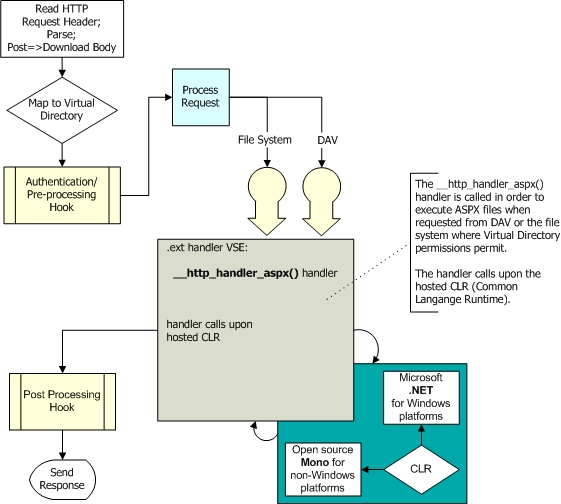

> **Tip**
> 
> [CLR Host Environment Setup](#rthclrenvsetdotnet)
> 
> [VSEI](#cinterface)
> 
> [In-Process Data Access Client](#inprocess)

<a id="id206-programming-concepts"></a>
## Programming Concepts

ASP.Net Web Forms are divided into two sections: the user interface and
the application logic. The user interface comprises HTML markup and
ASP.Net web controls whereas the application logic contains all the
programming code that allows the controls to interact with themselves
and the server back-end. This provides the level of abstractions
required for dynamic efficient Web application design. The interface can
be altered without any backward or forward dependence on the code
(logic). The Web Form interface should be created with the .aspx
extension. The application logic can be contained in-line within the
ASPX application, but developers should strive to keep the code in a
separate location known as the "CodeBehind". This is a file that
contains the logic (code) for the Web Form which should end in an
extension appropriate for the programming language used, such as .vb for
Visual Basic or .cs for C\#. The CodeBehind can be written in any
language for which there is a .Net compiler for. The compiler generates
bytecode that can be deployed anywhere the .Net runtime exists.

The ASPX Web Form is compiled into an object that takes its place on a
tree of controls and classes. The CodeBehind is compiled into an object
on this tree when the page is requested. The Web Form must inherit from
a "base-class" defined in the CodeBehind class file.

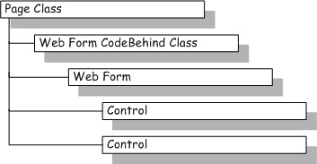

Now we will create a new Web Form containing an HTML heading and an
ASP.Net DataGrid control that will display results from the local
Virtuoso server.

    <%@ Page Language="vb" Inherits="VirtTest" Src="VirtTest.aspx.vb" %>
    <!DOCTYPE HTML PUBLIC "-//W3C//DTD HTML 4.0 Transitional//EN">
    <html>
        <head>
            <title>Virtuoso Provider to DataGrid in VB</title>
        </head>
        <body>
        <h1>Simple VB Virtuoso DataBinding Demo</h1>
            <form
    xml:id="form1" method="post" runat="server">
                <asp:DataGrid id=DataGrid1 runat="server" DataMember="Customers"
                    BorderColor="silver"
                    BorderWidth="1"
                    CellPadding="2"
                    Font-Name="Tahoma"
                    Font-Size="10pt">
                  <HeaderStyle BackColor="#2222ff" ForeColor="yellow"/>
                  <PagerStyle Mode="NextPrev" />
                </asp:DataGrid>
            </form>
        <hr>
        </body>
    </html>

On the first line of the file we use the `@ page` directive to inherit
the CodeBehind class we will create in the CodeBehind file. The source
of which can be optionally declared here with the `Src=` attribute.
Visual Studio makes use of `CodeBehind=` for tracking associated source
code instead. If either of these two attributes are specified then the
.Net runtime will attempt to compile the code into an assembly (DLL)
upon first execution if it does not already exist or seems out-of-date.
The following code fragment is the CodeBehind, VirtTest.aspx.vb.

Now we want some logic behind the Web Form. We have placed a DataGrid
control on a web page but we need to supply data to it now:

    imports System
    imports System.Web
    imports System.Web.UI
    imports System.Web.UI.WebControls
    imports System.Web.UI.HtmlControls
    imports System.Data
    
    imports OpenLink.Data.VirtuosoClient
    
    Public Class VirtTest
        Inherits Page
    
        Protected WithEvents myConnection As OpenLink.Data.VirtuosoClient.VirtuosoConnection
        Protected WithEvents myCommand As OpenLink.Data.VirtuosoClient.VirtuosoDataAdapter
        Protected WithEvents DataGrid1 As System.Web.UI.WebControls.DataGrid
        Protected WithEvents ds As System.Data.DataSet
    
        Private Sub Page_Load(sender As Object, e As EventArgs) Handles MyBase.Load
            Dim myConnection As new VirtuosoConnection("HOST=noodle:1112;UID=dba;PWD=dba;Database=Demo")
            Dim myCommand As new VirtuosoDataAdapter("select * from Demo..Customers", myConnection)
    
            Dim ds As new DataSet()
            myCommand.Fill(ds, "Customers")
    
            DataGrid1.DataSource=ds.Tables("Customers")
            DataGrid1.DataBind()
    
        End Sub
    
    End Class

This file is compiled using the following command (split across lines
for readability and would otherwise all be on one line):

    E:\myweb\myapp>
      vbc /target:library
        /r:System.dll
        /r: System.Web.dll
        /r:System.Data.dll
        /r:OpenLink.Data.VirtuosoClient.dll
        /r:System.Xml.dll
        /out:bin\VirtTest.dll
        VirtTest.aspx.vb

Once compiled, the resulting DLL library should be in the bin
subdirectory of the application root. When the assembly is available in
this way the .aspx file does not need to contain the `Src=` attribute
since there will be no need to compile the CodeBehind. If the `Src=`
attribute is specified in the .aspx file but the CodeBehind file is not
located on the server then an error will be signalled indicating that a
required resource cannot be found, because the CodeBehind class is
compiled on demand.

<a id="id207-aspnet-deployment-configuration"></a>
## ASP.Net Deployment & Configuration

ASP.Net allows multiple Web applications to run on the same machine
independently of each other. Web applications have their own directory
for components (the ".\\bin" directory) and its own XML-based
configuration file (the ".config" file). This allows us to develop
robust applications using custom configurations and components (or
different versions of components) for each one.

> **Note**
> 
> The ASP.Net machine-wide configuration is held in machine.config found
> in the `(C:\Winnt\Microsoft.NET\)Framework\[version number]\CONFIG
> directory` depending on your installation. Applications hosting or
> making use of .Net may have an application configuration \[App
> Name\].config. Web applications store their individual configurations
> in Web.config stored in the Web application root directory.

Each ASP.Net application uses a local assembly cache to hold application
specific logic (assemblies, contained in compiled DLLs). The \\bin
directory located in the application root is the local assembly cache
for Web applications. This directory is denied access directly from
browsers. This prevents users from downloading or executing any DLLs
contained within.

When a Web application is started the .Net Framework constructs a new
instance of the `System.AppDomain` class. When the instance is
constructed it creates in-memory shadow copies of the DLLs in the \\bin
directory. The .Net Framework keeps an in-memory cache (shadow) of all
assemblies used so that the actual files (.DLLs) are not locked. The
.Net Framework will monitor the original DLL for changes. When changes
occur the in-memory cache is updated. Applications already loaded and
running with calls in-progress to the old library will continue using
the old version so there is no interruption. All new calls to library
will be effected, and use the new library. This means that you are free
to replace the DLL with new versions as required. Previously with ASP
you were required to stop IIS, register the DLL with RegServ32.exe and
restart the Web server.

When new libraries are added to the .Net Framework for use in any
application system wide, such as the Virtuoso Data Provider, these need
to be added to the Global Assembly Cache (GAC). This is achieved using
the `gacutil.exe` utility found in the `Framework\[version number]`
directory. The `gacutil.exe` tool registers the DLL along with its
version. One of .Net's strengths is its ability to maintain multiple
versions of DLLs for multiple applications. This prevents "DLL-hell";
new DLLs breaking old applications. Applications can also maintain their
own local versions of DLLs in their \\bin directory.

    gacutil.exe /i <full path and file name>.dll

Registers assemblies with the Global Assembly Cache.

    gacutil.exe /l

Can be used to list registered assemblies.

After registering assemblies using the `gacutil.exe` tool you must add
an `<add assembly="..." />` entry into the
` <configuration><system.web><compilation><assemblies>  ` section of the
machine.config.

The application given in the previous section can be deployed to
Virtuoso in the WebDAV repository or directly on file system under the
VSPRoot directory. You should copy the directory structure as defined,
applications in the root of the new directory and DLLs in a bin
subdirectory. A virtual directory must be configured with execute
permissions enabled. The application can be tested with a Web browser.

<a id="id208-the-mono-project"></a>
## The Mono Project

The Mono Project is an open source version of the Microsoft.NET
development platform. Incorporating key .NET compliant components,
including a C\# compiler, a Common Language Runtime just-in-time
compiler, and a full suite of class libraries, the Mono Project will
enable developers to create .NET applications and run them on Windows or
any Mono-supported platform. Besides greatly improving the efficiency of
development in the open source world, the Mono Project will allow the
creation of operating-system-independent programs. Although primarily
developed on Linux, Mono is being ported to as many operating systems as
possible.

Microsoft.NET development tools, which include the C\# compiler and
Common Language Infrastructure (CLI), let programs written in C\# and
other languages run on non-Windows operating systems. The Mono Project
development platform provides open source developers with a true "build
once, deploy anywhere" tool-set taking advantage of the myriad of
services enabled by Microsoft.NET.

The Mono Project will provide three key elements in a development
framework designed to allow developers to quickly create, deploy and run
.NET compatible applications on non-Windows platform. A C\# compiler
extending the GNOME development platform will allow Linux developers to
create .NET compatible applications. These developers will also be able
to build upon a complete implementation of class libraries compatible
with the Microsoft CLI, enabling developers to create end-user
applications as well as powerful web services using the database
functionality available on open source systems. Portation of Mono yields
versions of the Microsoft Common Language Run-Time (CLR) just-in-time
(JIT) run-time engine will allow non-Windows systems to run .NET
applications built on Windows, Linux or UNIX platforms.

The example in the previous section can be run using the CLR hosting
ability of Virtuoso, but only with the precompiled assembly which has to
be deployed into the Mono/lib directory of the Mono installation.

The Virtuoso installer on non-Windows platforms for which there is a
port of Mono available installs the latest Mono CLR. This is required
for the Virtuoso server to host .Net applications on non-Windows
platforms.

Only a compiler for C\#. Inline ASPX code using C\# is a safe way to
write and experience ASPX hosted from Virtuoso. Although this goes
completely against the programming practice guidelines for .Net

The only permissible Application Domain is the Mono application. ASP.Net
applications should have their own self containable Application Domain -
the ./bin directory. Mono does not support this as of yet. The work
around is to place all assemblies into the Mono domain.

<a id="id209-migrating-aspnet-applications-to-virtuoso"></a>
## Migrating ASP.Net Applications to Virtuoso

### Creating a Simple Data Bound Application

This section will describe how to use the MS Visual Studio to create an
application using as much drag and drop as possible. We want to create a
table of data in a web page from a database.

1.  **Launch Microsoft's Visual Studio.**
    
    Once Visual Studio has been launch it present you with the start
    page that lets you create a New Project.
    
    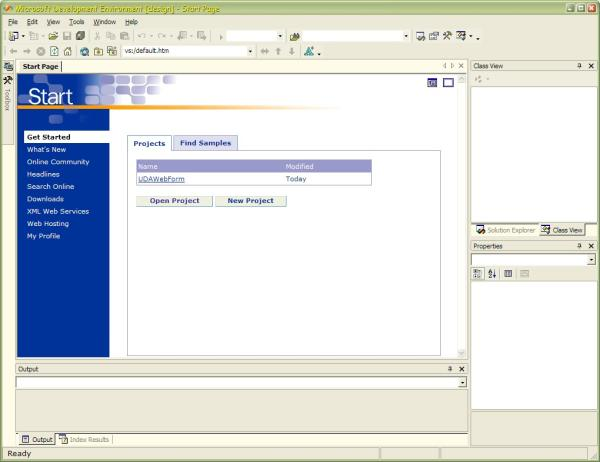

2.  **Create a new <span class="menuchoice">Empty Web Project</span>.**
    
    From the templates select a new Empty Web Project found in the
    Visual Basic Projects type. You must also select a location on an
    IIS web server.
    
    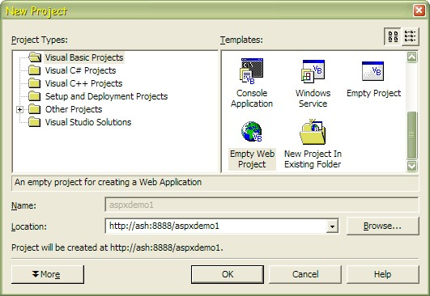

3.  **Wait for IIS application to be set-up.**
    
    You will be shown a progress dialogue as Visual Studio contacts your
    web server creating a new web application there.
    
    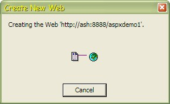

4.  **Add New Web Form.**
    
    When the application-space has been configured on the web server you
    will be returned to the main Visual Studio windows. Now we must
    create our page. Right-click on the project name in the Solution
    Explorer and select Add New Web Form.
    
    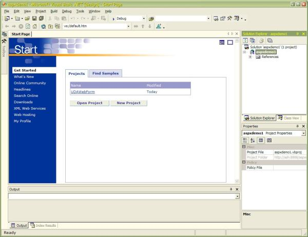

5.  **New Web Form.**
    
    The <span class="menuchoice">Add New Item</span> option will appear,
    automatically selecting the "Web Form" item to add. Supply a name
    for the page and click Open to begin.
    
    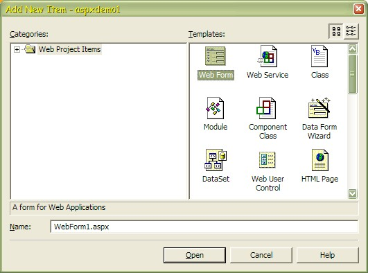

6.  **Add a SqlDataAdapter Control.**
    
    With the fresh "Web Form" we can start. From the
    <span class="menuchoice">ToolBox</span> double-click on the
    <span class="menuchoice">SqlDataAdapter</span> in the
    <span class="menuchoice">Data</span> panel. This will start the
    <span class="menuchoice">Data Adapter Configuration Wizard</span> .
    After reading the description on the first panel click on the Next
    button. You will be asked to choose your connection. Assuming that
    you have access to a Northwind database hosted in MS SQLServer you
    can either make use of an existing connection to it or configure a
    new one using the <span class="menuchoice"></span> button. Pressing
    the <span class="menuchoice"></span> button will present the normal
    OLEDB dialogues for creating a new datasource. Once a data
    connection has been selected press Next to continue.
    
    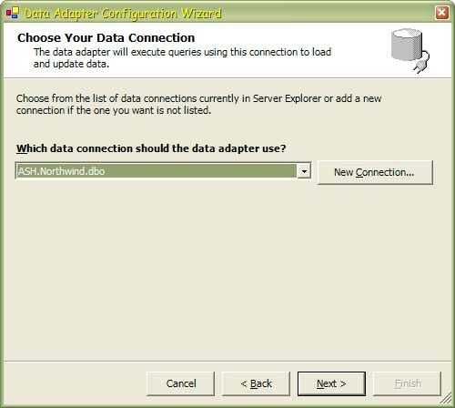

7.  **Choose a Query Type.**
    
    The next panel will ask how the data adapter should access the
    database. For simplicity we will stick with the default of Use SQL
    Statements. Press Next.
    
    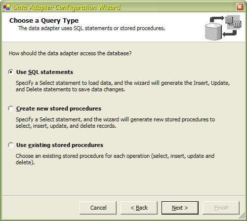

8.  **Generate SQL Statements.**
    
    At this point you can either type a SQL statement if you know
    exactly what you are looking to get back from the database, or you
    can use the <span class="menuchoice"></span> to point-and-click to
    your data. In our case we will retrieve everything from the
    Customers table using a simple query:`select * from
                    Customers` .
    
    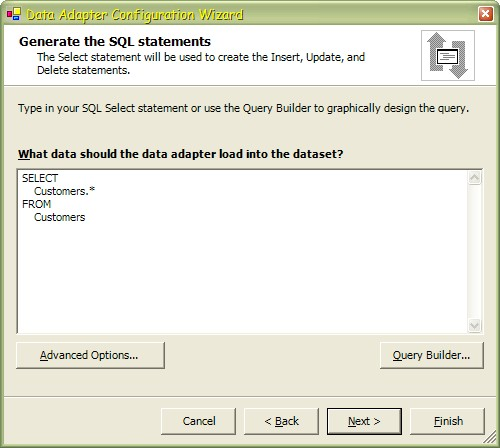

9.  **Advanced Options.**
    
    Click on the Advanced Options button. Unselect the top checkbox.
    This will also unselect the other two automatically. We will not be
    performing any updates in this example. OK the advanced options,
    upon return to the main dialogue press the Next button to continue
    onwards.
    
    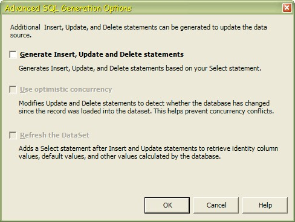

10. **View Wizard Results.**
    
    The next panel confirms all the options selected leaving us to
    simply complete the wizard.
    
    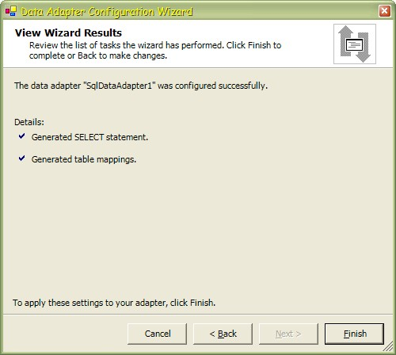

11. **Back to the main window....**
    
    When the wizard finishes and returns you to the main Visual Studio
    window you will see that two controls have been added to the Web
    Form. The connection control has been automatically generated to
    support the Data Adapter.
    
    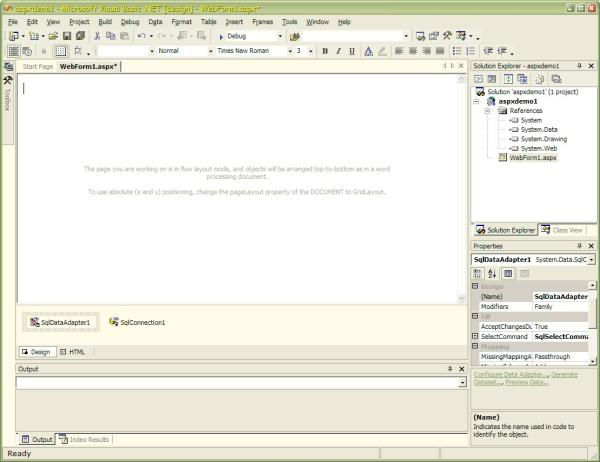

12. **Generate Dataset.**
    
    Before we can display anything on the page we need to form a
    Dataset. Right-click on the SQLDataAdapter1 control you previously
    added and select Generate Dataset. Defaults on the displayed dialog
    are all sufficient. After verifying them click the OK button to
    generate the dataset.
    
    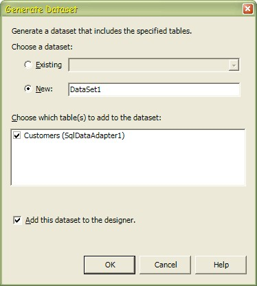

13. **Add a DataGrid Control.**
    
    Now we need to show the dataset that we are fetching from the
    database. We will use a simple DataGrid for this. Open the toolbox
    in the Web Forms panel and double-click on the DataGrid control.
    This add the control to the page and will display a table on the web
    page view.
    
    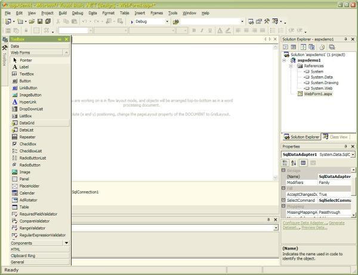

14. **Table Properties.**
    
    Configure the DataGrid control by right-clicking on the table and
    selecting <span class="menuchoice">Property Builder</span> .
    
    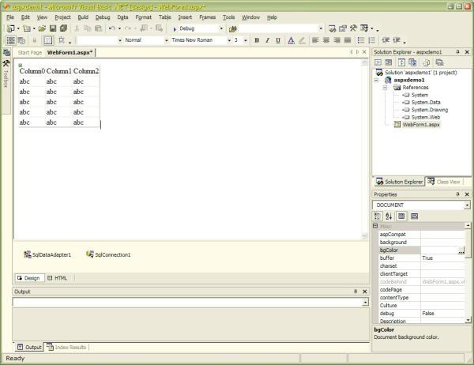

15. **DataGrid Properties.**
    
    You can adjust most properties of the table such as colours, fonts,
    borders, etc. You can control paging aspects that will be taken care
    of automatically by the control, you only need specify the number of
    results per page. For now we only want to adjust the most important
    aspects of the table, where the data comes from.
    
    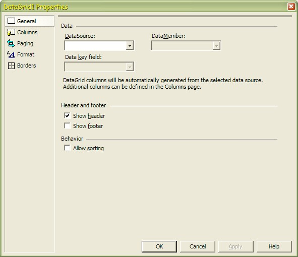

16. **DataGrid Bindings.**
    
    From the first <span class="menuchoice">General</span> properties
    panel you must select the DataSource, DataMember, and select the
    Data key field (especially important for updatable tables). These
    properties may be selected via the drop-downs on the panel, allowing
    you to select the now-familiar controls configured earlier. Once
    configured, press the OK button to save the changes.
    
    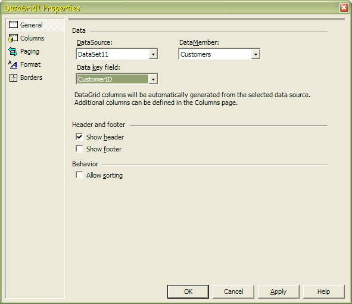

17. **Preview.**
    
    Once the details have been saved the view of the table in the page
    will be updated to reflect the dataset details.
    
    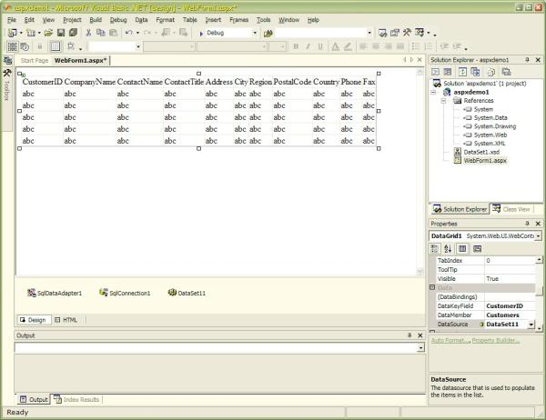

18. **Page Initialization.**
    
    We are very nearly finished. The controls are all ready to be used,
    however, the final touch is to edit our Page\_Load function.
    Double-click on the empty part of the web page view in Visual Studio
    and the associated `.vb` file will be opened. This is the file
    containing the actual code. You will be automatically placed at the
    Page\_Load function. This is the page initialization section where
    will need to instruct the DataAdapter to fill with data, and then
    instruct the DataGrid to bind to that data.
    
    These lines of code need to be added by hand:
    
        SqlDataAdapter1.Fill(DataSet11)
        DataGrid1.DataBind()
    
    You will find that Visual Studio will offer some assistance in the
    form of intellisense command-completion while you are typing.
    
    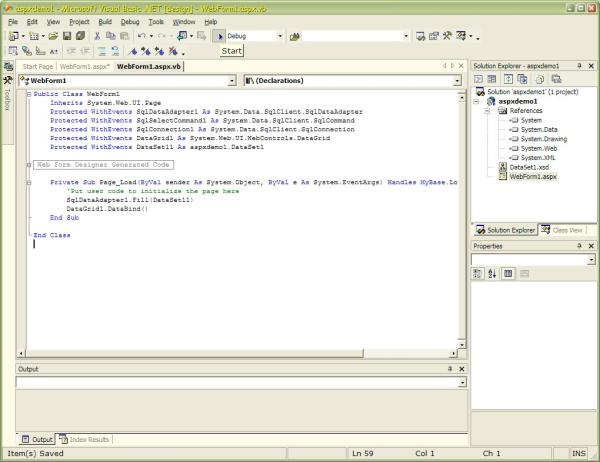

19. **The End Result.**
    
    Next we will set the project's initial start-page by right-clicking
    on the form name in solution explorer and selecting
    <span class="menuchoice">Set as Start Page</span> option. Finally we
    can run the project using the start button at the top. The project
    will automatically be built and a browser window launched
    automatically. Admire your results. When finished, on closing the
    browser windows you will automatically return to Visual Studio.
    
    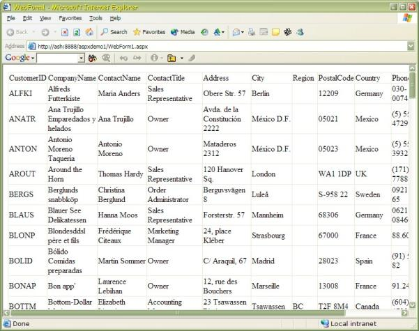

### Migrating ASP.Net Applications to Virtuoso

The previous section showed us how to build a very basic web application
using an ASPX data-bound control. Now we will host this same application
in Virtuoso demonstrating that IIS is no longer required for ASPX
application deployment.

1.  **Locating your ASPX application.**
    
    Use explorer to locate the ASPX application you want to move away
    from IIS and re-deploy under Virtuoso. The previous section created
    the application in the IIS virtual directory represented by
    `http://ash:8888/aspxdemo1/` which was physically located in
    `c:\inetpub\wwwroot\aspxdemo1\` . We can simply copy this directory
    and place it somewhere under either the VSP root directory or
    WebDAV. We will copy the application to a location in WebDAV for a
    local Virtuoso server.
    
    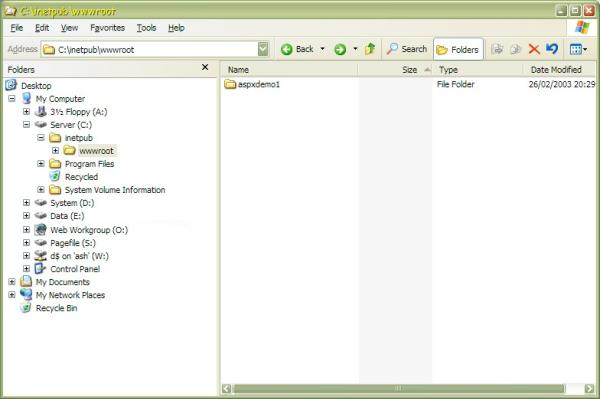

2.  **Add a Network Place to DAV.**
    
    From My Network Places in explorer or Network Neighborhood
    double-click on the <span class="menuchoice"></span> shortcut to
    start the wizard.
    
    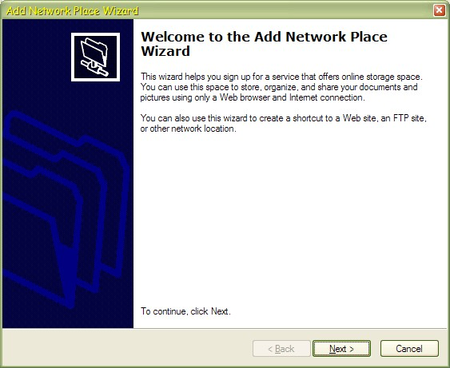

3.  **Network service provider.**
    
    Select the default option. Click next to continue.
    
    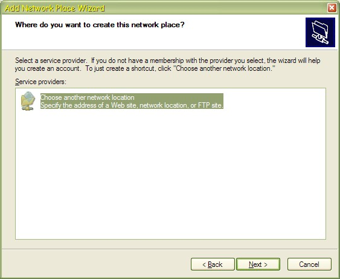

4.  **Internet or Network Address.**
    
    Here you specify the URL of DAV on the Virtuoso server. We are using
    Virtuoso on the local machine but this could be anywhere on the
    Internet. Click next to continue.
    
    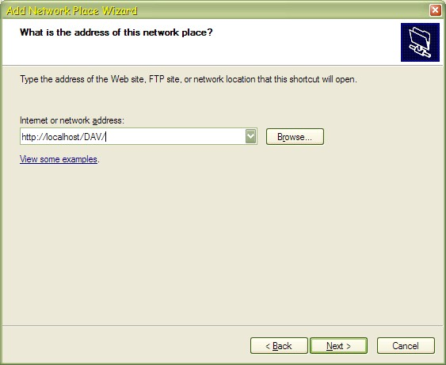

5.  **Name the Network Place.**
    
    Provide the network place with a meaningful name so we can easily
    find this location in the future. Click on next to continue.
    
    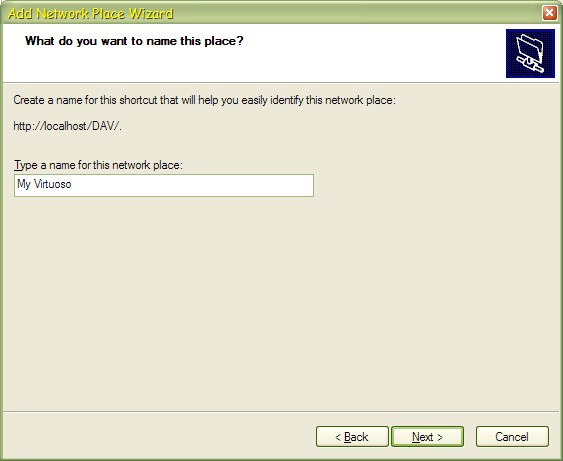

6.  **Open the Network Place.**
    
    On the final panel of the wizard there is a checkbox to "Open this
    network place when I click Finish" that we will leave checked. Click
    Finish to continue and open the DAV directory.
    
    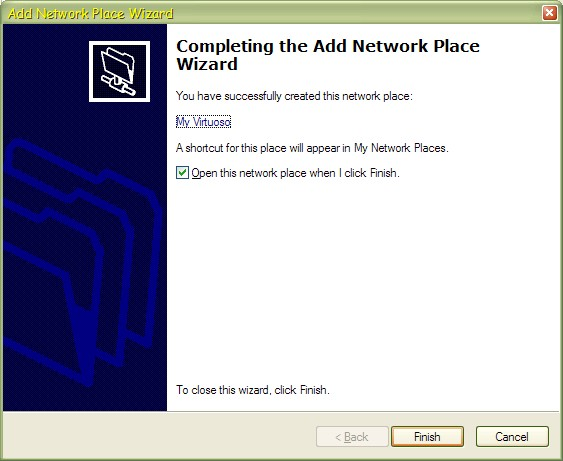

7.  **Connect to DAV.**
    
    When you attempt to connect to DAV you will be prompted for a User
    name and Password. These will be whatever you entered during the
    installation, possibly both dav, in which case type dav in both
    fields and press the OK button to continue.
    
    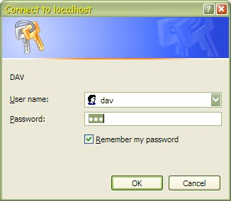

8.  **Copy the ASPX application to DAV.**
    
    Once the explorer opens up on the DAV network place we can copy the
    `aspxdemo1` application directory to it.
    
    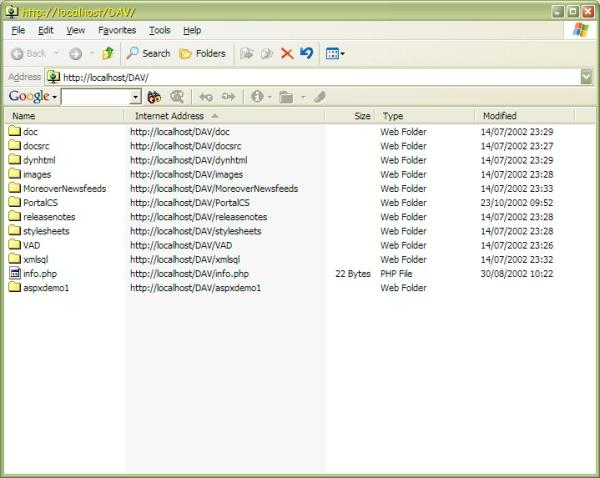

9.  **Configure Virtual Directory.**
    
    Now we have to configure a Virtuoso virtual directory. Go to
    Conductor / Web Application Server / HTTP Hosts & Directories.
    
    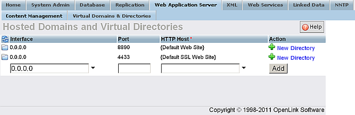

10. **Add Virtual Directory.**
    
    The "folder" icon for the hosts defined will list all mappings
    currently present for the Virtuoso server. Click on the "New
    Directory" link to continue.
    
    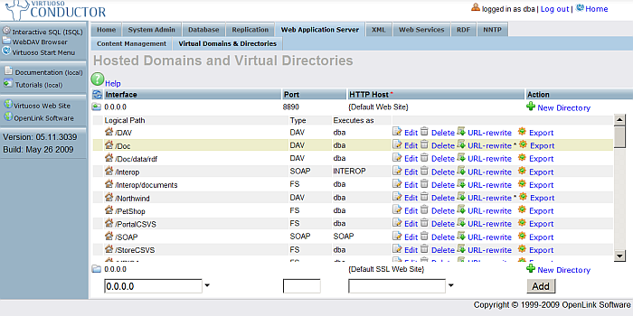

11. **Select DAV Domain template.**
    
    On the next page select for "Type" the DAV Domain template and click
    "Next".
    
    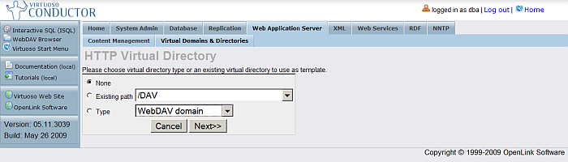

12. **Configure the Virtual Directory parameters.**
    
    We must supply a logical path, `/aspxdemo1` , in this case. We must
    also supply the physical path that this represents, we can either
    type in the DAV location or use the Browse button to the find the
    directory under DAV. The WebDAV checkbox will correctly already be
    checked. For now we will also set to Allow Directory Browsing, and
    Override execution permissions in WebDAV. Finally we must set the
    VSP Execution user to `dba` using the drop down. To save the changes
    click on the "Save Changes" button at the bottom of the page.
    
    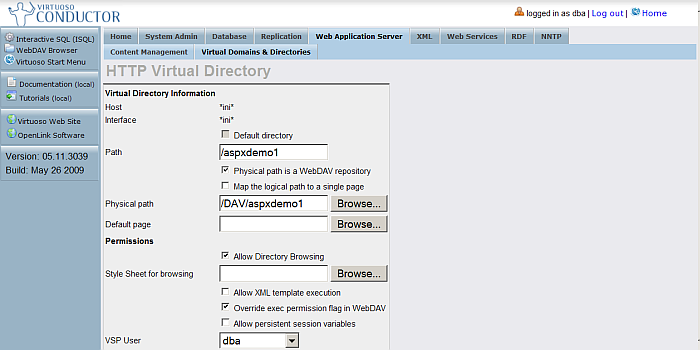

13. **View the ASPX page hosted in Virtuoso DAV.**
    
    With the virtual directory configured we have only to test that it
    works as expected. On opening a browser at:
    `http://example.com/aspxdemo1/WebForm1.aspx` , we will see the same
    output as before.
    
    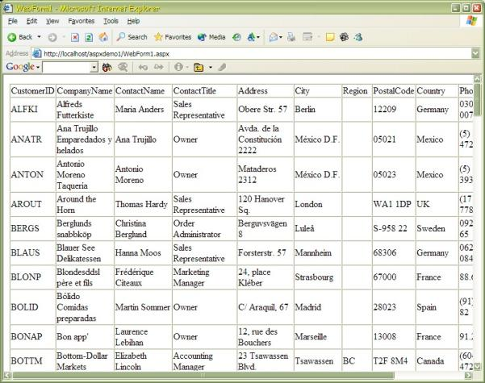

> **Note**
> 
> If ASPX hosting is attempted on a machine that never had IIS installed
> it is possible that ASP.NET is not configured, although required. The
> Virtuoso installer will take care of this for you in most cases but if
> you run into problems you may want to confirm that ASP.NET is
> configured correctly. You will have to use the regedit utility to edit
> the registry, changing a search-path so System.Web.dll can find
> aspnet\_asapi.dll. Always exercise caution whenever editing the
> registry as invalid data can prevent your machine from operating
> properly.
> 
> You will first need to find out what version of the `aspnet_isapi.dll`
> library you have. The simplest way to determine this is by locating
> the file and right-clicking properties on it from explorer.
> 
> Assuming the version is 1.0.3705.288, we should enter the following
> details into the registry if the `HKLM\Microsoft\ASP.NET` key is
> missing (if your version differs change it accordingly):
> 
>     [HKEY_LOCAL_MACHINE\SOFTWARE\Microsoft\ASP.NET]
>          "RootVer"="1.0.3705.288"
>     [HKEY_LOCAL_MACHINE\SOFTWARE\Microsoft\ASP.NET\1.0.3705.288]
>          "Path"="C:\WINDOWS\Microsoft.NET\Framework\v1.0.3705"
>          "DllFullPath"="C:\WINDOWS\Microsoft.NET\Framework\v1.0.3705\aspnet_isapi.dll"

<a id="id210-asmx-web-service-hosting"></a>
# ASMX Web Service Hosting

Microsoft ASMX Web Services can be hosted in exactly the same way as
ASPX Applications can be. A ASMX Web Services Project created in Visual
Studio can be copied to either the file system (under the VSPROOT
directory) or the Virtuoso WebDAV repository. You must copy the project
directory to the required location and then make a Virtual Directory
pointing to it. If the location is in WebDAV then ensure that execute
permissions are set for any .asmx files.

> **Tip**
> 
> [ASP.Net Web Application Hosting](#rthwritaspxapps)

<a id="id211-blogging-weblogs"></a>
# Blogging & Weblogs

Weblogs, or Blog, are web pages or sites organized by date. The content
of a typical blog page contains short messages listed in chronological
order. The blog messages are typically excerpts of HTML markup, since
they typically appear on web sites and expect web browsers as clients.

In the rest of this document we will use interchangeable the terms
"blog" and "weblog", and refer to the users that have a blog as
"bloggers".

The following terms are also commonly used in this section:

RSS/OCS/OPML/RDF/Atom

\- file formats, XML based to represent data or list of files containing
a data

Channels

\- a public source containing data in any of XML/text/HTML format,
usually in RSS format.

Post/Article(message)

\- this is a piece of information describing something in a human
readable format, in some language. This can be have satellite parts as
title, excerpt, publication data etc.

PermaLink

\- a URL that uniquely designates a single article in blog-space and
time.

The Virtuoso Blog system comprises a native Web-based interface for
publishing and blog administration, but can also be interacted with
using an XML-RPC API. The Virtuoso server supports the following XML-RPC
APIs for blogging purposes:

Blogger API

MetaWeblog API

Movable Type

In addition to the blogger APIs Virtuoso supports:

xmlStorageSystem

\- this allows blogging clients to upload static (ready to go) content
onto a Weblog server.

Weblogs ping API

\- to allow cross-server notification for the latest updated sites/blogs

Pingback and Trackback API

\- to allow bloggers to notify each other.

Subscription Harmonizer

\- to allow bloggers to keep their subscriptions in-sync.

> **Tip**
> 
> Blogger System Tables [Blogger API](#)
> 
> [MetaWeblog API](#)

<a id="id212-the-virtuoso-blogging-application"></a>
## The Virtuoso Blogging Application

Blogs provide their authors with a location on the Internet or Intranet
to receive their thoughts, experiences, idea, or simply anything they
have a desire to write about. For this most part, audience is neither
expected nor required, however comments and feedback are common place.

Blogs originated as a form of public diary. Their exploitation has seen
them as a useful tool for finding personal reviews to products,
situations or general news as guidance for their readers. These can be
viewed quicker and more informative than regular journalism.

Corporate blogs, or use of blogging can be a valuable source of company
information propagation. Members of the company can blog about the
activities or findings with no particular audience in mind. This
provides a continual journal or account of the company's undertakings
that is really self-documenting for every other employee how they fit
into the overall picture. Over time a searchable knowledge base will
unravel itself, people may need information about a product or some
aspect of internal support that took place possibly years prior,
otherwise forgotten, stored within the blog.

Virtuoso implements the three major APIs for blogging which makes
instantly attractive to any standard blog application. Virtuoso provides
blog authoring applications of its own. On a personal level, your blogs
can be stored or exposed using the most appropriate server, authored
using the most appealing client and everything held in right places by
Virtuoso. On a community level you get the same but scaled upwards for
each member individually, and further more, centrally. Virtuoso can
generate and automatically maintain a blog site specially for blog
collaboration within a community suitable for a corporate need. All
members are listed on the front page and have the opportunity to
contribute (publish) to the main blog view. All blogs are fully free
text searchable - a simple exploit of the Virtuoso free-text engine.

Virtuoso can provide the blog client, server or relay for blogs or any
RSS or XML-feed based channel or information.

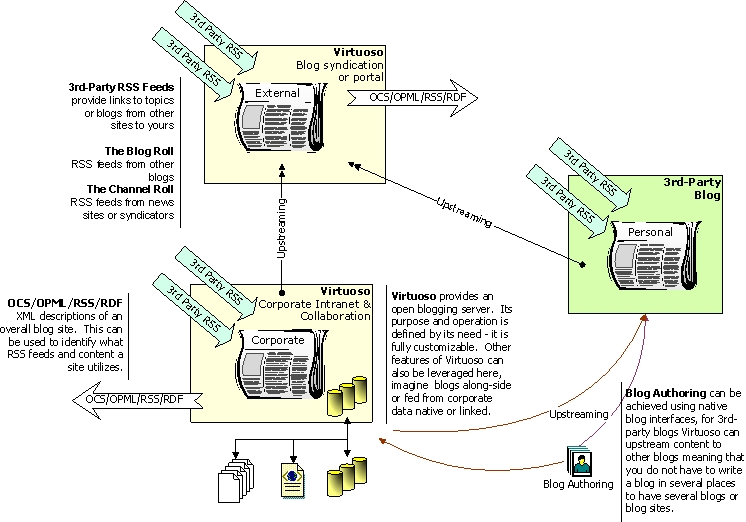

### Syndication to your Blog - RSS & RDF

The default Virtuoso blog implementation maintains a "blog/gems"
subdirectory for each blog account. Within this is an RDF file and an
RSS file. These provide direct access to the blog information in XML.
Other bloggers or news syndicators can read just the site contents,
apart from the web interface that Virtuoso provides, potentially
applying an XSLT transformations suitable to their application or
circumstance, for example reading the blog from a PDA or mobile device.

Rich Site Summary (RSS) is a lightweight XML format designed for sharing
headlines and other Web content. Think of it as a distributable "What's
New" for your site. Each RSS text file contains both static information
about your site, plus dynamic information about your new blog entries.
Each entry is defined by an \<item\> tag, which contains a headline
TITLE, URL, and DESCRIPTION. For example:

    ...
    <item>
      <title>RSS Resources</title>
      <link>http://www.webreference.com/authoring/languages/xml/rss/</link>
      <description>Defined in XML, the Rich Site Summary (RSS) format has
      quietly become a dominant format for distributing headlines on the Web.
      Our list of links gives you the tools, tips and tutorials you need to get
      started using RSS. 0323</description>
    </item>
    ...

The Resource Description Framework (RDF) integrates a variety of
applications from library catalogs and world-wide directories to
syndication and aggregation of news, software, and content to personal
collections of music, photos, and events using XML as an interchange
syntax. The RDF specifications provide a lightweight ontology system to
support the exchange of knowledge on the Web.

### Channels - OCS & OPML

The default Virtuoso blog implementation maintains a "blog/gems"
subdirectory for each blog account. Within this are an OCS file and an
OPML file. Both files provide an outline or hierarchical list of RSS
feeds linked to the blog account in these two popular formats designed
for channel/list exchange. The files are variably accessible following:

    http://virtserv/DAV/myaccount/blog/gems/index.ocs
    http://virtserv/DAV/myaccount/blog/gems/index.opml

Open Content Syndication (OCS), an application of XML, is an RDF
description of all external RSS feeds linked to the blog site.

The OCS Directory format is designed to enable channel listings to be
constructed for use by portal sites, client based headline software and
other similar applications.

Outline Processor Markup Language (OPML) is a very simple XML format for
storing information in outline format. XML being inherently
hierarchical, OPML constrains XML so that a wide variety of applications
can build in OPML support with the comfort of knowing it will work with
any other OPML tool. Type of information stored in such hierarchies are
web browser bookmarks, web directories, collaborative outlines, song
playlists, and even web-site content, OPML is a great balance between
the wide open freedom of raw XML and the feeling of security of a formal
vocabulary.

The OCS RDF file is an XML of nested \<rdf:descriptions\> tags loosely
defined as follows:

    <rdf:RDF>
      <rdf:description>
          This contains a description of this RDF originator
        <rdf:description>
            Description of a link RSS blog or news feed
           <rdf:description>
             Description of the URL containing the above described
             RSS feed and details about its format, update frequency
             and when the link for established.
           </rdf:description>
        </rdf:description>
          more RSS descriptions may follow, one for each
          linked.
      </rdf:description>
    </rdf:RDF>

Here is an example of the contents of the index.ocs file describing a
single linked RSS news feed.

    <rdf:RDF
        xmlns:rdf="http://www.w3.org/1999/02/22-rdf-syntax-ns#"
        xmlns:ocs="http://InternetAlchemy.org/ocs/directory#"
        xmlns:dc="http://purl.org/metadata/dublin_core#">
      <rdf:description about="">
      <dc:title>My Blog</dc:title>
      <dc:creator>blog@openlinksw.com</dc:creator>
      <dc:description />
      <rdf:description about="http://msdn.microsoft.com/">
        <dc:title>MSDN Just Published</dc:title>
        <dc:creator />
        <dc:description />
        <dc:subject />
        <dc:image />
        <rdf:description about="http://msdn.microsoft.com/rss.xml">
          <dc:language>us-en</dc:language>
          <ocs:format />
          <ocs:updatePeriod>hourly</ocs:updatePeriod>
          <ocs:updateFrequency>1</ocs:updateFrequency>
          <ocs:updateBase>1999-05-30T00:00</ocs:updateBase>
        </rdf:description>
      </rdf:description>
    </rdf:RDF>

The OPML file is more simple, the corresponding index.opml would be as
follows:

    <opml>
      <body>
        <outline
          title="MSDN Just Published"
          htmlUrl="http://msdn.microsoft.com/"
          xmlUrl="http://msdn.microsoft.com/rss.xml" />
        more outline tags for each description...
      </body>
    </opml>

### Personal Blog Sites

Every WebDAV account with a home directory has the option to create a
default personal blog site. The default blog pages contains a call to a
function that produces XML data containing a list of messages, calendar
for archive navigation and channels that the owner has subscribed to.
This blog directory and pages are generated upon initial sign-in of the
user. Each WebDAV account with a blog directory will thus have the
following:

    http://<host:port>/DAV/<uname>/blog/

containing the following:

index.vspx

\- The default blog home page using VSPX controls.

gems/rss.xml

\- The RSS v2.0 file presenting the user's blog data.

gems/rss92.xml

\- The RSS v0.92 file presenting the user's blog data.

gems/rss91.xml

\- The RSS v0.91 file presenting the user's blog data.

gems/index.rdf

\- the user's blog data in RDF format.

gems/index.ocs

\- the user's channels represented in OCS format.

gems/rsd.xml

\- Really Simple Discovery file for the blog. This helps client software
to find the services needed to read, edit, post etc.

gems/atom.xml

\- Atom feed file. It's similar to the RSS file but in different format.

gems/backlog.xml

\- RSS v2.0 file containing all posts in user's blog.

gems/foaf.xml

\- 'Friend Of Friend' file. This is to provide in a machine-processable
format, about blogger, his/she interests, location, friends etc.

gems/index.opml

\- the user's channels represented in OPML format.

gems/ocs.xml

\- the user's channels represented in OCS format.

gems/opml.xml

\- the user's channels represented in OPML format.

comments.vsp

\- a VSP page for posting a comment to the user's blog.

default.xsl

\- an XSL-T style sheet providing the default HTML view of the blog XML
data.

comments.vsp

\- pop-up for blog comments (obsoleted)

default.css

\- CSS for pages

main.xsl

\- VSPX controls for index.vspx

calendar.xsl

\- calendar control

trackback.xsl

\- pop-up for trackbacks (obsoleted)

rss\_feeds/

\- folder containing channel RSS feeds in XML format

The `rss.xml` , `index.rdf` , `index.ocs` files are dynamic SQL-XML
resources, they are not static files and must not be deleted. Their
content is generated in real-time per request.

Blog users may edit the `default.xsl` in order to change the appearance
of the default page of their Blog.

The following is source of default blog home page. It's built using a
VSPX and macro expansion. All page components are represented with
\<vm:\* /\> this makes page more simpler and allows users to change it's
appearance using custom VSPX components.

    <v:page xmlns:vm="http://example.com/vspx/weblog/"
      xmlns:v="http://example.com/vspx/"
      style="main.xsl" name="blog-home-page"
      doctype="-//W3C//DTD XHTML 1.0 Transitional//EN"
      doctype-system="http://www.w3.org/TR/xhtml1/DTD/xhtml1-transitional.dtd">
      <vm:page
    xml:id="<uid>">
        <vm:header>
          <vm:title/>
          <vm:disco-rss-link/>
          <vm:disco-pingback-link/>
          <vm:meta-author/>
          <vm:meta-description/>
          <vm:meta-keywords/>
          <vm:style url="default.css" />
        </vm:header>
        <vm:body>
          <div
    xml:id="header">
            
            <h1><vm:blog-title/></h1>
            <h2><vm:blog-about/></h2>
          </div>
          <div
    xml:id="navbartop">
            <div>Entries: [ <vm:entry-list /> ]</div>
          </div>
          <table
    xml:id="pagecontainer" cellspacing="10" cellpadding="0" border="0" width="100%">
            <tr>
              <td class="box">
             <div class="box">
                      <div class="roll" style="border: none; border">
                        <div align="center" style="margin-bottom: 3px;">
                          <b>Personal Details</b>
                        </div>
                <div style="margin-bottom: 3px;"><vm:site-home>Home</vm:site-home></div>
                <vm:if test="contact">
                        <div>
                  <vm:e-mail> Contact</vm:e-mail>
                </div>
                </vm:if>
                <div>
                  <vm:photo width="64" />
                </div>
                      </div>
              <vm:if test="login">
                      <div class="roll" >
                        <div align="center" style="margin-bottom: 3px;">
                          <b>Configuration</b>
                        </div>
                        <vm:configpages />
                      </div>
              </vm:if>
                      <div class="roll">
                      <div align="center" style="margin-bottom: 3px;">
                        <b>Syndicate This Blog</b>
                      </div>
                        <vm:rss-link/>
                        <vm:rdf-link/>
                        <vm:ocs-link/>
                        <vm:opml-link/>
                      </div>
                      <div align="left" class="roll">
                        <p class="caption">Keyword search:</p>
                        <vm:search/>
                      </div>
                      <div class="roll">
                        <div align="center" style="margin-bottom: 3px;">
                          <b>Post Categories</b>
                        </div>
                <vm:login />
                        <vm:categories/>
                      </div>
            <vm:if test="subscribe">
                    <div align="left" class="roll">
                      <p class="caption">Subscribe</p>
              <vm:subscribe/>
            </div>
            </vm:if>
            <div align="left" class="roll">
               <vm:last-messages />
            </div>
              </div>
              </td>
              <td
    xml:id="texttd">
             <div
    xml:id="text">
                  <vm:post-form />
                      <vm:posts trackback="discovery" />
              <vm:if test="comments">
              <vm:comments-view>
                <vm:trackbacks />
                <vm:comments />
                <vm:post-comment />
              </vm:comments-view>
              </vm:if>
                 </div>
              </td>
              <td class="box">
            <div class="box">
                      <vm:calendar/>
              <vm:if test="blog">
                      <div class="roll">
                        <div align="center">
                          <b>Blog Roll</b>
                        </div>
                        <vm:rss/>
                      </div>
              </vm:if>
              <vm:if test="channels">
                      <div class="roll">
                        <div align="center">
                          <b>Channel Roll</b>
                        </div>
                        <vm:channels/>
                      </div>
              </vm:if>
              <vm:if test="ocs">
                      <div class="roll">
                        <div align="center" style="margin-bottom: 3px;">
                          <b>OCS Links</b>
                        </div>
                        <vm:ocs/>
                      </div>
              </vm:if>
              <vm:if test="opml">
                      <div class="roll">
                        <div align="center" style="margin-bottom: 3px;">
                          <b>OPML Links</b>
                        </div>
                        <vm:opml/>
                      </div>
              </vm:if>
              </div>
              </td>
            </tr>
          </table>
          <div
    xml:id="powered">
            <vm:powered-by/>
          </div>
          <div class="disclaimer">
          <vm:disclaimer/>
            </div>
          <div class="copy">
            <vm:copyright/>
          </div>
        </vm:body>
      </vm:page>
    </v:page>

The XML Schema representing the XML data for blog home page is
represented below. Following this fragment is the `default.xsl` XSL
style sheet that would be used to transform XML document valid to this
into the default web page for public consumption on the Internet or
Intranet.

    <?xml version="1.0" encoding="UTF-8"?>
    <xs:schema xmlns:xs="http://www.w3.org/2001/XMLSchema">
      <xs:element name="about">
        <xs:complexType/>
      </xs:element>
      <xs:element name="blog">
        <xs:complexType mixed="true">
          <xs:choice minOccurs="0" maxOccurs="unbounded">
            <xs:element ref="title"/>
            <xs:element ref="about"/>
            <xs:element ref="email"/>
            <xs:element ref="items"/>
            <xs:element ref="navigation"/>
            <xs:element ref="copy"/>
            <xs:element ref="disclaimer"/>
          </xs:choice>
          <xs:attribute name="base" type="xs:anyURI"/>
          <xs:attribute name="category" type="xs:string"/>
          <xs:attribute name="category-name" type="xs:string"/>
          <xs:attribute name="post" type="xs:string"/>
          <xs:attribute name="trackback-url" type="xs:anyURI"/>
        </xs:complexType>
      </xs:element>
      <xs:element name="blogroll">
        <xs:complexType>
          <xs:sequence>
            <xs:element ref="link"/>
          </xs:sequence>
          <xs:attribute name="id" type="xs:boolean" use="required"/>
        </xs:complexType>
      </xs:element>
      <xs:element name="calendar">
        <xs:complexType>
          <xs:sequence>
            <xs:element ref="week" maxOccurs="unbounded"/>
          </xs:sequence>
          <xs:attribute name="monthname" type="xs:string" use="required"/>
          <xs:attribute name="year" type="xs:short" use="required"/>
          <xs:attribute name="month" type="xs:byte" use="required"/>
          <xs:attribute name="day" type="xs:byte" use="required"/>
          <xs:attribute name="prev" type="xs:string" use="required"/>
          <xs:attribute name="prev-label" type="xs:string" use="required"/>
          <xs:attribute name="next" type="xs:string" use="required"/>
          <xs:attribute name="next-label" type="xs:string" use="required"/>
        </xs:complexType>
      </xs:element>
      <xs:element name="categories">
        <xs:complexType>
          <xs:sequence>
            <xs:element ref="category" maxOccurs="unbounded"/>
          </xs:sequence>
        </xs:complexType>
      </xs:element>
      <xs:element name="category">
        <xs:complexType>
          <xs:attribute name="id" use="required" type="xs:NMTOKEN" />
          <xs:attribute name="name" use="required" type="xs:string" />
        </xs:complexType>
      </xs:element>
      <xs:element name="comments" type="xs:boolean"/>
      <xs:element name="copy" type="xs:string"/>
      <xs:element name="day">
        <xs:complexType>
          <xs:simpleContent>
            <xs:extension base="xs:string">
              <xs:attribute name="active" use="required">
                <xs:simpleType>
                  <xs:restriction base="xs:NMTOKEN">
                    <xs:enumeration value="0"/>
                    <xs:enumeration value="1"/>
                  </xs:restriction>
                </xs:simpleType>
              </xs:attribute>
            </xs:extension>
          </xs:simpleContent>
        </xs:complexType>
      </xs:element>
      <xs:element name="description" type="xs:string"/>
      <xs:element name="disclaimer" type="xs:string"/>
      <xs:element name="email" type="xs:string"/>
      <xs:element name="id" type="xs:string" />
      <xs:element name="item">
        <xs:complexType>
          <xs:sequence>
            <xs:element ref="description"/>
            <xs:element ref="pubDate"/>
            <xs:element ref="id"/>
            <xs:element ref="comments"/>
            <xs:element ref="trackbacks"/>
          </xs:sequence>
        </xs:complexType>
      </xs:element>
      <xs:element name="items">
        <xs:complexType>
          <xs:sequence>
            <xs:element ref="item" maxOccurs="unbounded"/>
            <xs:element ref="last"/>
          </xs:sequence>
          <xs:attribute name="search" type="xs:string" use="required"/>
        </xs:complexType>
      </xs:element>
      <xs:element name="last">
        <xs:complexType>
          <xs:sequence>
            <xs:element ref="message" maxOccurs="unbounded"/>
          </xs:sequence>
        </xs:complexType>
      </xs:element>
      <xs:element name="link">
        <xs:complexType>
          <xs:sequence>
            <xs:element ref="blog"/>
          </xs:sequence>
          <xs:attribute name="href" type="xs:anyURI" use="required"/>
          <xs:attribute name="rss" type="xs:anyURI" use="required"/>
        </xs:complexType>
      </xs:element>
      <xs:element name="message">
        <xs:complexType>
          <xs:sequence>
            <xs:element ref="id"/>
            <xs:element ref="title"/>
          </xs:sequence>
        </xs:complexType>
      </xs:element>
      <xs:element name="navigation">
        <xs:complexType>
          <xs:sequence>
            <xs:element ref="calendar"/>
            <xs:element ref="blogroll"/>
            <xs:element ref="categories"/>
          </xs:sequence>
        </xs:complexType>
      </xs:element>
      <xs:element name="pubDate" type="xs:string"/>
      <xs:element name="title">
        <xs:complexType>
          <xs:simpleContent>
            <xs:extension base="xs:string">
              <xs:attribute name="blogid" type="xs:byte"/>
            </xs:extension>
          </xs:simpleContent>
        </xs:complexType>
      </xs:element>
      <xs:element name="trackbacks" type="xs:boolean"/>
      <xs:element name="week">
        <xs:complexType>
          <xs:sequence>
            <xs:element ref="day" maxOccurs="unbounded"/>
          </xs:sequence>
        </xs:complexType>
      </xs:element>
    </xs:schema>

The XML data as following XML Schema above will be transformed using the
following XSL-T style sheet, default.xsl:

    <?xml version="1.0"?>
    
    <xsl:stylesheet
        xmlns:xsl="http://www.w3.org/1999/XSL/Transform"
      version="1.0"
        xmlns:vb="http://example.com/weblog/"
        xmlns:vtb="http://example.com/weblog/tb/" >
    
      <xsl:output method="xml" doctype-public="-//W3C//DTD XHTML 1.0 Transitional//EN"
        doctype-system="http://www.w3.org/TR/xhtml1/DTD/xhtml1-transitional.dtd"
        indent="yes" encoding="UTF-8" omit-xml-declaration="yes" media-type="text/html"/>
    
      <xsl:template match="/">
        <html>
          <head>
            <title>
              <xsl:value-of select="//title[1]"/>
            </title>
            <link rel="alternate" type="application/rss+xml" title="RSS" href="{/blog/@base}gems/rss.xml"/>
            <link rel="stylesheet" type="text/css" href="default.css"/>
          </head>
          <body>
            <div
    xml:id="header_01">
              
              <h1>
                <xsl:value-of select="/blog/title"/>
              </h1>
          <xsl:if test="/blog/about != ''">
              <h2><xsl:value-of select="/blog/about"/></h2>
              </xsl:if>
            </div>
            <div
    xml:id="navbartop_01">
              <div>Entries: [ <xsl:call-template name="entrylist"/> ]</div>
            </div>
            <table
    xml:id="pagecontainer_01" cellspacing="10" cellpadding="0" border="0" width="100%">
              <tr>
                <td class="box">
                  <div class="box">
                    <div align="left" class="roll" style="border: none; border">
                        <div align="center" style="margin-bottom: 3px;">
                          <b>Personal Details</b>
                        </div>
              <div>
                      <a>
                <xsl:attribute name="href">mailto:<xsl:value-of select="/blog/email" /></xsl:attribute>
              
              </a> Contact
              </div>
            </div>
                    <div class="roll">
                      <div align="center" style="margin-bottom: 3px;">
                        <b>Syndicate This Blog</b>
                      </div>
                      <div>
                        <a href="gems/rss.xml">
                          
                          RSS</a>
                      </div>
                      <div>
                        <a href="gems/index.rdf">
                          
                          RDF</a>
                      </div>
                      <div>
                        <a href="gems/index.ocs">OCS</a>
                      </div>
                      <div>
                        <a href="gems/index.opml">OPML</a>
                      </div>
                    </div>
                    <div align="left" class="roll">
                      <p class="caption">Keyword search</p>
                      <form method="post" action="index.vsp">
                        <div>
                          <input type="text" name="txt" value="" size="10"/>
                          <input type="submit" name="GO" value="GO"/>
                        </div>
                        <div>
                          <input type="radio" name="srch_where" value="blog" checked="checked"/>&#160;My Blog</div>
                        <div>
                          <input type="radio" name="srch_where" value="web"/>&#160;The Web</div>
                      </form>
                    </div>
                    <xsl:apply-templates select="/blog/navigation/categories"/>
                    <div align="left" class="roll">
              <xsl:for-each select="/blog/items/last/message">
                <div>
                  <a>
                            <xsl:attribute name="href">index.vsp?id=<xsl:value-of select="id" /></xsl:attribute>
                <xsl:value-of select="title" />
                  </a>
                </div>
              </xsl:for-each>
            </div>
                  </div>
                </td>
                <td
    xml:id="texttd_01">
                  <xsl:apply-templates select="/blog/items"/>
                </td>
                <td class="box">
                  <div class="box">
                    <xsl:apply-templates select="/blog/navigation/calendar"/>
                    <xsl:apply-templates select="/blog/navigation/blogroll"/>
                    <xsl:apply-templates select="/blog/navigation/channelroll"/>
                    <xsl:apply-templates select="/blog/navigation/ocs"/>
                    <xsl:apply-templates select="/blog/navigation/opml"/>
                  </div>
                </td>
              </tr>
            </table>
          </body>
        </html>
      </xsl:template>
    
      <xsl:template match="title|navigation"/>
    
      <xsl:template name="entrylist">
        <xsl:for-each select="/blog/items/item">
          <a href="#{id}">
            <xsl:number level="multiple" format=" 1 " count="item"/>
          </a>
          <xsl:if test="following-sibling::item"> | </xsl:if>
        </xsl:for-each>
      </xsl:template>
    
      <xsl:template match="items">
        <div
    xml:id="text_01">
          <xsl:if test="/blog/@category-name != ''">
            <h3>Category: "<xsl:value-of select="/blog/@category-name"/>"</h3>
          </xsl:if>
          <xsl:apply-templates select="item"/>
          <xsl:if test="/blog/@post != ''">
          <div><a name="tb" /><h3>TrackBacks</h3>
    
    <div class="tb-url">TrackBack URL for this entry:
    <br/>
    <b>
    <xsl:value-of select="/blog/@trackback-url"/>
    <xsl:value-of select="/blog/@post"/>
    </b>
    <br />
          PingBack URL for this entry:<br/>
          <b><xsl:value-of select="/blog/@pingback-url"/></b>
          </div>
          <xsl:apply-templates select="trackbacks"/>
          </div>
          <div><a name="comments" /><h3>Comments</h3>
          <xsl:if test="not post-comments">
          <div>No comments posted yet</div>
          </xsl:if>
          <xsl:apply-templates select="post-comments"/>
          <div>
            <form method="post" action="index.vsp">
            <input type="hidden" name="id">
            <xsl:attribute name="value"><xsl:value-of select="/blog/@post" /></xsl:attribute>
            </input>
        <table border="0">
            <tr><td>Name</td><td><input type="text" name="name" value="" size="50"/></td></tr>
            <tr><td>Email</td><td><input type="text" name="email" value=""  size="50"/></td></tr>
            <tr><td>Web Site</td><td><input type="text" name="url" value=""  size="50"/></td></tr>
            <tr><td colspan="2">Comment</td></tr>
            <tr><td colspan="2"><textarea name="comment" rows="15" cols="50">&#160;</textarea></td></tr>
            <tr><td colspan="2"><input type="submit" name="submit" value="Submit" /></td></tr>
            </table>
            </form>
          </div>
          </div>
          </xsl:if>
          <xsl:choose>
            <xsl:when test="not item and @search != ''">
      No messages found containing "<xsl:value-of select="@search"/>".
      </xsl:when>
            <xsl:when test="not item and /blog/@category != ''">
      No messages found for category  "<xsl:value-of select="/blog/@category-name"/>".
      </xsl:when>
            <xsl:when test="not item and @search = '' and /blog/@cat = ''">
              <div class="message">
      This is a placeholder for your new weblog.
      There are no posts currently.
      </div>
            </xsl:when>
          </xsl:choose>
          <div
    xml:id="powered_01">
            <a href="http://example.com/virtuoso/">
              
            </a>
          </div>
          <div class="disclaimer">
            <xsl:value-of  select="/blog/disclaimer" disable-output-escaping="yes" />
          </div>
          <div class="copy">
            <xsl:value-of select="/blog/copy" disable-output-escaping="yes" />
          </div>
        </div>
      </xsl:template>
    
      <xsl:template match="item">
        <a name="{id}"/>
        <div class="message">
          <xsl:apply-templates select="pubDate"/>
          <xsl:apply-templates select="description"/>
          <xsl:if test="function-available('vb:mt_track_back_discovery')">
        <xsl:value-of select="vb:mt_track_back_discovery (id)" disable-output-escaping="yes" />
          </xsl:if>
          <div class="comment">
            <a href="#">
          <xsl:attribute name="href">index.vsp?id=<xsl:value-of select="id"/>#comments</xsl:attribute>
        Comments [<xsl:value-of select="comments"/>]
       </a> | <a href="#">
          <xsl:attribute name="href">index.vsp?id=<xsl:value-of select="id"/>#tb</xsl:attribute>
        TrackBack [<xsl:value-of select="trackbacks"/>]
            </a>
          </div>
        </div>
      </xsl:template>
    
      <xsl:template match="post-comments">
        <div class="message">
          <xsl:apply-templates select="posted"/>
    
    <a>
    <xsl:attribute name="href">
    <xsl:value-of select="home"/>
    </xsl:attribute>
    <b>
    <xsl:apply-templates select="name"/>
    </b>
    </a>
          <div class="desc">
            <xsl:value-of select="vb:tidy_xhtml (comment, '*default*')" disable-output-escaping="yes"/>
          </div>
        </div>
      </xsl:template>
    
      <xsl:template match="trackbacks">
        <div class="message">
          <xsl:apply-templates select="posted"/>
    
    <a>
    <xsl:attribute name="href">
    <xsl:value-of select="url"/>
    </xsl:attribute>
    <b>
    <xsl:apply-templates select="blog-name"/>
    </b>
    </a>
          <div class="desc">
          <b><xsl:apply-templates select="title"/></b>
            <xsl:value-of select="vb:tidy_xhtml (excerpt, '*default*')" disable-output-escaping="yes"/>
          </div>
        </div>
      </xsl:template>
    
      <xsl:template match="description">
        <div class="desc">
          <xsl:choose>
          <xsl:when test="function-available('vb:tidy_xhtml')">
            <xsl:value-of select="vb:tidy_xhtml (., '*default*')" disable-output-escaping="yes"/>
          </xsl:when>
          <xsl:otherwise>
            <xsl:value-of select="." disable-output-escaping="yes"/>
          </xsl:otherwise>
          </xsl:choose>
        </div>
      </xsl:template>
    
      <xsl:template match="pubDate">
        <div class="pubdate">
          <xsl:value-of select="."/>
        </div>
      </xsl:template>
    
      <xsl:template match="posted">
        <div class="pubdate">
          <xsl:value-of select="."/>
        </div>
      </xsl:template>
    
      <xsl:template match="blogroll">
        <div class="roll">
          <div align="center">
            <b>Blog Roll</b>
          </div>
          <xsl:apply-templates/>
        </div>
      </xsl:template>
    
      <xsl:template match="channelroll">
        <div class="roll">
          <div align="center">
            <b>Channel Roll</b>
          </div>
          <xsl:apply-templates/>
        </div>
    </xsl:template>
    
      <xsl:template match="opml">
        <div class="roll">
          <div align="center" style="margin-bottom: 3px;">
            <b>OPML Links</b>
          </div>
          <xsl:for-each select="link">
            <a>
              <xsl:attribute name="href"><xsl:value-of select="@rss"/></xsl:attribute>
              <b>
                <xsl:value-of select="blog"/>
              </b>
            </a>
            <div style="margin-left:1em;">
              <xsl:apply-templates select="link"/>
            </div>
          </xsl:for-each>
        </div>
      </xsl:template>
    
      <xsl:template match="ocs">
        <div class="roll">
          <div align="center" style="margin-bottom: 3px;">
            <b>OCS Links</b>
          </div>
          <xsl:for-each select="link">
            <a>
              <xsl:attribute name="href"><xsl:value-of select="@rss"/></xsl:attribute>
              <b>
                <xsl:value-of select="blog"/>
              </b>
            </a>
            <div style="margin-left:1em;">
              <xsl:apply-templates select="link"/>
            </div>
          </xsl:for-each>
        </div>
      </xsl:template>
    
      <xsl:template match="categories[category]">
    
      <xsl:variable name="dt" select="concat(//calendar/@year, '-', //calendar/@month, '-', //calendar/@day)"/>
        <div class="roll">
          <div align="center" style="margin-bottom: 3px;">
            <b>Post Categories</b>
          </div>
          <div>
            <a>
              <xsl:attribute name="href">index.vsp?date=<xsl:value-of select="$dt"/>&amp;cat=</xsl:attribute>
              <b>All</b>
            </a>
          </div>
          <xsl:for-each select="category">
            <div>
              <a >
                <xsl:attribute name="href">/blog/rss_cat.xml?:cid=<xsl:value-of select="@id"/>&amp;:bid=<xsl:value-of select="/blog/title/@blogid"/></xsl:attribute>
            
              </a>
              <a>
                <xsl:attribute name="href">index.vsp?date=<xsl:value-of select="$dt"/>&amp;cat=<xsl:value-of select="@id"/></xsl:attribute>
                <b>
                  <xsl:value-of select="@name"/>
                </b>
              </a>
            </div>
          </xsl:for-each>
        </div>
      </xsl:template>
    
      <xsl:template match="link">
        <div>
          <xsl:if test="@rss != ''">
            <a>
              <xsl:attribute name="href"><xsl:value-of select="@rss"/></xsl:attribute>
              
            </a>
          </xsl:if>
          <a>
            <xsl:attribute name="href"><xsl:value-of select="@href"/></xsl:attribute>
            <xsl:value-of select="." disable-output-escaping="yes" />
          </a>
        </div>
      </xsl:template>
    
      <xsl:template match="calendar">
        <table
    xml:id="calendar">
          <caption>
            <xsl:value-of select="@monthname"/>
            <xsl:text> </xsl:text>
            <xsl:value-of select="@year"/>
          </caption>
          <tr>
            <th>Sun</th>
            <th>Mon</th>
            <th>Tue</th>
            <th>Wed</th>
            <th>Thu</th>
            <th>Fri</th>
            <th>Sat</th>
          </tr>
          <xsl:apply-templates/>
          <tr>
            <td colspan="3">
              <xsl:if test="@prev != ''">
                <a>
                  <xsl:attribute name="href">index.vsp?date=<xsl:value-of select="@prev"/>&amp;cat=<xsl:value-of select="/blog/@category"/></xsl:attribute>
                  <xsl:value-of select="@prev-label"/>
                </a>
              </xsl:if>&#160;
            </td>
            <td>&#160;</td>
            <td colspan="3">
              <xsl:if test="@next != ''">
            &#160;
            <a>
                  <xsl:attribute name="href">index.vsp?date=<xsl:value-of select="@next"/>&amp;cat=<xsl:value-of select="/blog/@category"/></xsl:attribute>
                  <xsl:value-of select="@next-label"/>
                </a>
              </xsl:if>
            </td>
          </tr>
        </table>
      </xsl:template>
    
      <xsl:template match="week">
        <tr>
          <xsl:apply-templates/>
        </tr>
      </xsl:template>
    
      <xsl:template match="day">
        <xsl:variable name="dt" select="concat(ancestor::calendar/@year, '-', ancestor::calendar/@month, '-')"/>
        <td>
          <xsl:choose>
            <xsl:when test="boolean(number(@active))">
              <xsl:attribute name="class">calactive</xsl:attribute>
              <a>
                <xsl:attribute name="href">index.vsp?date=<xsl:value-of select="$dt"/><xsl:value-of select="."/>&amp;cat=<xsl:value-of select="/blog/@category"/></xsl:attribute>
                <xsl:apply-templates/>
              </a>
            </xsl:when>
            <xsl:otherwise>
              <xsl:apply-templates/>
            </xsl:otherwise>
          </xsl:choose>
        </td>
      </xsl:template>
    </xsl:stylesheet>

The XML Schema for RSS v2.0 file (rss.xml)

    <?xml version="1.0" encoding="UTF-8"?>
    <xs:schema xmlns:xs="http://www.w3.org/2001/XMLSchema" elementFormDefault="qualified">
      <xs:element name="channel">
        <xs:complexType>
          <xs:sequence>
            <xs:element ref="title"/>
            <xs:element ref="link"/>
            <xs:element ref="description"/>
            <xs:element ref="managingEditor"/>
            <xs:element ref="pubDate"/>
            <xs:element ref="generator"/>
            <xs:element ref="webMaster"/>
            <xs:element ref="image"/>
            <xs:element ref="cloud"/>
            <xs:element ref="item" maxOccurs="unbounded"/>
          </xs:sequence>
        </xs:complexType>
      </xs:element>
      <xs:element name="cloud">
        <xs:complexType>
          <xs:attribute name="domain" type="xs:string" use="required"/>
          <xs:attribute name="port" type="xs:short" use="required"/>
          <xs:attribute name="path" type="xs:string" use="required"/>
          <xs:attribute name="registerProcedure" type="xs:string" use="required"/>
          <xs:attribute name="protocol" type="xs:string" use="required"/>
        </xs:complexType>
      </xs:element>
      <xs:element name="comments" type="xs:anyURI"/>
      <xs:element name="description" type="xs:string"/>
      <xs:element name="generator" type="xs:string"/>
      <xs:element name="guid" type="xs:anyURI"/>
      <xs:element name="height" type="xs:int"/>
      <xs:element name="image">
        <xs:complexType>
          <xs:sequence>
            <xs:element ref="title"/>
            <xs:element ref="url"/>
            <xs:element ref="link"/>
            <xs:element ref="description"/>
            <xs:element ref="width"/>
            <xs:element ref="height"/>
          </xs:sequence>
        </xs:complexType>
      </xs:element>
      <xs:element name="item">
        <xs:complexType>
          <xs:sequence>
            <xs:element ref="title"/>
            <xs:element ref="guid"/>
            <xs:element ref="comments"/>
            <xs:element ref="pubDate"/>
            <xs:element ref="description"/>
          </xs:sequence>
        </xs:complexType>
      </xs:element>
      <xs:element name="link" type="xs:anyURI"/>
      <xs:element name="managingEditor" type="xs:string"/>
      <xs:element name="pubDate" type="xs:string"/>
      <xs:element name="rss">
        <xs:complexType>
          <xs:sequence>
            <xs:element ref="channel" minOccurs="1" maxOccurs="1"/>
          </xs:sequence>
          <xs:attribute name="version" type="xs:string" use="required" fixed="2.0"/>
        </xs:complexType>
      </xs:element>
      <xs:element name="title" type="xs:string"/>
      <xs:element name="url" type="xs:anyURI"/>
      <xs:element name="webMaster" type="xs:string"/>
      <xs:element name="width" type="xs:int"/>
    </xs:schema>

<a id="id213-blogger-clients-compatibility"></a>
## Blogger Clients Compatibility

The Virtuoso Blog server implementation has been tested against the
following blog client applications:

Radio Userland

(Manila Blogger Bridge tool and Upstreaming), available for MS Windows
and MacOS X

NewzCrawler

, available for MS Windows

w.bloggar

, available for MS Windows

blogBuddy

, available for MS Windows

Zempt

, available for MS Windows

BlogMan

, available for MS Windows

thinblog

, Java based client

The steps required to allow third-party clients to operate with Virtuoso
are:

1.  Create a WebDAV account using the Server Administration Interface
    making sure that the home directory is created as /DAV/\<username\>/

2.  Enable the XML-RPC bridge on a SOAP endpoint (see "XML-RPC endpoint
    configuration" section above)

3.  Most client tools accept a username and password, enter the
    credentials and URI for XML-RPC endpoint.

4.  Allow the client tool time to refresh the Blog data.

5.  Post a simple message, verify its creating using the Server
    Administration Interface's Weblog link.

**Interoperability Notes.**

The "Zempt" application will report an error upon startup saying that
"mt.supportedTextFilters" are not supported, however it it will continue
to work with the Virtuoso's blogging server.

<a id="id214-blogs-management-user-interface"></a>
## Blogs Management User Interface

The Server Administration Interface provides a way to manage existing
blogs. The Blog user interface is accessible from the Web Services \>\>
Weblogs menu. The page will show existing blogs on the server and will
allow you to erase, edit existing, or make new blog sites.

Blog channels and categories are also configurable from this interface.

<a id="id215-community-blog-site"></a>
## Community Blog Site

The community blog site feature pools all blog efforts into one page
providing a blog community portal. No personal blogs are altered, the
community site provides a super-set for all blogs.

The community blog site is activated by enabling blogging capabilities
on the DAV administrator account "dav". This can be achieved at two
places, on the Users Administration interface or the Web Services \>\>
Weblogs interface in the Server Administration Interface menu.

<a id="id216-blogger-api"></a>
## Blogger API

The Virtuoso server supports the following methods available via XML-RPC
for Weblog management and operation:

`blogger.newPost()`

`blogger.editPost()`

`blogger.deletePost()`

`blogger.getRecentPosts()`

`blogger.getUsersBlogs()`

`blogger.getTemplate()`

`blogger.setTemplate()`

`blogger.getUserInfo()`

> **Note**
> 
> First name is the Movable Type "username" up to the first space
> character, and last name is the "username" after the first space
> character.

<a id="id217-metaweblog-api"></a>
## MetaWeblog API

`metaWeblog.newPost()`

`metaWeblog.editPost()`

`metaWeblog.getPost()`

`metaWeblog.getRecentPosts()`

<a id="id218-movable-type-api"></a>
## Movable Type API

`mt.getRecentPostTitles()`

`mt.getCategoryList()`

`mt.setPostCategories()`

`mt.getPostCategories()`

`mt.getTrackbackPings()`

`mt.publishPost()`

`mt.supportedMethods()`

> **Note**
> 
> the value of "appkey" is ignored by Movable Type in all of the Blogger
> XML-RPC methods.

<a id="id219-atom-api"></a>
## Atom API

The Atom API is a protocol for publishing and editing a blog entries
using the common HTTP verbs:

GET - used to retrieve a blog post or perform query

PUT - used to update an existing blog post

POST - used to create a new post or perform an update action

DELETE - used to remove a post

**Authentication.**

The Atom API implementation accepts both HTTP basic and digest
authentication. All requests for post content modification require an
authorization. Furthermore, the account used for authentication is
checked to be the blog owner or have granted privileges on that
particular blog. The retrieval operations; which no post modification is
possible are not required to ask for authentication.

**Introspection.**

When editing the content of a blog, the first thing is to find out the
servers capabilities. So the 'introspection' file lists all the
functions that a given site supports.

Request:

    GET /Atom/Http/intro?b=128 HTTP/1.1
    Host: example.com

Response:

    HTTP/1.1 200 OK
    Server: Virtuoso
    Connection: Keep-Alive
    Date: Mon, 10 Nov 2003 10:21:55 GMT
    Content-Type: text/xml; charset="ISO-8859-1"
    Content-Length: 417
    
    <?xml version="1.0" encoding="ISO-8859-1"?>
    <introspection xmlns="http://example.com/newformat#" >
      <create-entry>http://example.com/Atom/Http/entry?b=128</create-entry>
      <user-prefs>http://example.com/Atom/Http/prefs?b=128</user-prefs>
      <search-entries>http://example.com/Atom/Http/search?b=128</search-entries>
      <categories>http://example.com/Atom/Http/categories?b=128</categories>
    </introspection>

**Posting a new entry.**

To post a new entry, the HTTP POST must be performed with MIME type
'`application/x.atom+xml` ' for the request content. If server accepts
the request a `Location:` HTTP header will be returned to the client
containing the URL to the newly created post.

    POST /Atom/Http/entry?b=128 HTTP/1.1
    Content-Type: application/x.atom+xml
    Content-Length: nnn
    Authorization: ...
    
    <?xml version="1.0" encoding="iso-8859-1"?>
    <entry xmlns="http://example.com/newformat#">
      <title>My Entry</title>
      <author>
        <name>Blog Author</name>
      </author>
      <issued>2003-11-04T17:29:29</issued>
      <content type="application/xhtml+xml" xml:lang="en-us">
        <p xmlns="">Hello world!</p>
      </content>
    </entry>

The response from server would be:

    HTTP/1.1 201 Created
    Location: http://host:port/Atom/Http/entry?b=128&id=nn

**Editing an Existing Entry.**

An entry can be edited via the HTTP PUT method. The URL used for PUT
must be one returned by the `Location:` header of the POST response or
those returned from entry-search. The content of PUT request is same as
for posting a new entry.

    POST /Atom/Http/entry?b=128&id=nn HTTP/1.1
    Content-Type: application/x.atom+xml
    Content-Length: nnn
    Authorization: ...
    
    <?xml version="1.0" encoding="iso-8859-1"?>
    <entry xmlns="http://example.com/newformat#">
      <title>My Entry</title>
      <author>
        <name>Blog Author</name>
      </author>
      <issued>2003-11-04T17:29:29</issued>
      <content type="application/xhtml+xml" xml:lang="en-us">
        <p xmlns="">Hello world! (edit test)</p>
      </content>
    </entry>

The server response is:

    HTTP/1.1 205 Reset Content

**Retrieving an Entry.**

Retrieval of an existing entry is the simple, usual HTTP GET request
with URL to the entry.

    GET /Atom/Http/entry?b=128&id=nn HTTP/1.1
    Accept: application/x.atom+xml

Server will respond with

    HTTP/1.1 200 OK
    Content-Type: application/x.atom+xml
    Content-Length: nnn
    
    <?xml version="1.0" encoding="iso-8859-1"?>
    <entry xmlns="http://example.com/newformat#">
      <title>My Entry</title>
      <author>
        <name>Blog Author</name>
      </author>
      <issued>2003-11-04T17:29:29</issued>
      <content type="application/xhtml+xml" xml:lang="en-us">
        <p xmlns="">Hello world! (edit test)</p>
      </content>
    </entry>

**Deleting an Entry.**

To remove permanently an existing entry an HTTP DELETE method is used
with URL to the entry.

    DELETE /Atom/Http/entry?b=128&id=nn HTTP/1.1

Response:

    HTTP/1.1 200 OK

**Searching Entries.**

To retrieve a subset of messages based some criteria a search should be
performed. The current implementation supports two variants: range and
last\_N.

    GET /Atom/Http/search?b=128?last=7 HTTP/1.1
    Accept: application/x.atom+xml
    Host: example.com
    Authorization: ...

or

    GET /Atom/Http/search?b=128&start-range=2&end-range=27 HTTP/1.1
    Accept: application/x.atom+xml
    Host: example.com
    Authorization: ...

Response from server will look like:

    <search-results xmlns="http://example.com/newformat#">
    <match title="Classic ASP Framework. Make your Classic...">http://example.com/Atom/Http?b=128&amp;id=6</match>
    <match title="DB Navigator - an open source .NET control">http://example.com/Atom/Http?b=128&amp;id=4</match>
    <match title="Sort an Array with Non-Comparable Items">http://example.com/Atom/Http?b=128&amp;id=5</match>
    <match title="SignedXML Licensing Sample">http://example.com/Atom/Http?b=128&amp;id=7</match>
    <match title="TicTacToe">http://example.com/Atom/Http?b=128&amp;id=1</match>
    <match title="Check your eMails in Hotmail using HTTPMail">http://example.com/Atom/Http?b=128&amp;id=2</match>
    <match title="Slashdot.org RSS Feed Reader">http://example.com/Atom/Http?b=128&amp;id=3</match>
    </search-results>

Each sub element of the search result contains the title of the post and
its URL. These URLs can be used retrieved using the GET method, or
modified via PUT/DELETE methods.

### Atom Client API

The Atom Client API is a mirror of the blogger API functionality, but
uses the Atom protocol instead of XML-RPC. Before the Atom API can be
put to use, the introspection file must be retrieved in order to know
the URLs for the requests.

  - ` atom.new_Post
                (in uri
    
                varchar, in req
    
                "blogRequest", 
                            )
                     `
    
    This is to post a new entry to the blog identified by 'uri'. The
    'req' must be initialized with authentication and entry data. This
    function returns the URL to the new entry. This could be used with
    sequential GET/PUT or DELETE requests for it.

  - ` atom.edit_Post
                (in uri
    
                varchar, in req
    
                "blogRequest", 
                            )
                     `
    
    This is to modify an existing entry identified by 'uri'. The 'req'
    must be initialized with authentication and entry data. The function
    returns true on success or will signal an error.

  - ` atom.delete_Post
                (in uri
    
                varchar, in req
    
                "blogRequest", 
                            )
                     `
    
    This is to delete an existing entry identified by 'uri'. The 'req'
    must be initialized with authentication data. The function returns
    true on success or will signal an error.

  - ` atom.get_Post
                (in uri
    
                varchar, in req
    
                "blogRequest", 
                            )
                     `
    
    This is to retrieve an existing post entry identified by 'uri'. The
    'req' must be initialized with authentication data. This function
    will return on success an MTWeblogPost UDT, filled with post entry
    data.

  - ` atom.get_RecentPosts
                (in uri
    
                varchar, in req
    
                "blogRequest", in num
    
                int, 
                            )
                     `
    
    This is to retrieve last-N post entries identified by blog search
    URL - 'uri'. The 'req' must be initialized with authentication data.
    'num' is number of entries to return.
    
    This function returns an array of arrays containing the title and
    URL of the matching blog posts.

  - ` atom.get_Intro
                (in uri
    
                varchar, 
                            )
                     `
    
    This is used to return Introspection information for a blog
    identified by introspection file - 'uri'.

Getting the introspection info about a blog

    declare x any;
    x := atom.get_Intro ('http://example.com/Atom/Http/intro?b=128');
    -- x will contain
    -- (("create-entry" "http://example.com/Atom/Http/entry?b=128" )
    --  ("user-prefs"
    -- "http://example.com/Atom/Http/prefs?b=128" ) ("search-entries"
    -- "http://example.com/Atom/Http/search?b=128" ) ("categories"
    -- "http://example.com/Atom/Http/categories?b=128" ) )

make a new entry

    declare resp any;
    declare req "blogRequest";
    declare stru "MTWeblogPost";
    
    req := new "blogRequest" ('', '', '', 'dav', 'dav');
    stru := new "MTWeblogPost" ();
    stru.title := 'My title'
    stru.description := '<p>hello</p>';
    req.struct := stru;
    resp := atom.new_Post ('http://example.com/Atom/Http/entry?b=128', req);

The response, resp, would contain:
`http://example.com/Atom/Http/entry?b=128&id=1`

edit an entry:

    declare resp any;
    declare req "blogRequest";
    declare stru "MTWeblogPost";
    
    req := new "blogRequest" ('', '', '', 'dav', 'dav');
    stru := new "MTWeblogPost" ();
    stru.title := 'test'
    stru.description := '<p>hello from me</p>';
    req.struct := stru;
    atom.edit_Post ('http://example.com/Atom/Http/entry?b=128&id=1', req);

delete it:

    atom.delete_Post ('http://example.com/Atom/Http/entry?b=128&id=1', req);

> **Tip**
> 
> [RFC 5023: The Atom Publishing Protocol](#)

<a id="id220-xml-rpc-endpoint-configuration"></a>
## XML-RPC Endpoint Configuration

The Virtuoso blog server can be contacted directly by SOAP XML-RPC. A
virtual directory can be created with blogger APIs (Blogger, MetaWeblog,
MoveableType, Atom) ability, which requires a mapping to the SOAP
endpoint and grants to use the blogger API. This can be done in two
ways:

1.  **Using the graphical Server Administration Interface.**
    
    You can use your web browser to configure a virtual directory based
    on the "XML-RPC link" template and with bloggerAPI enabled:
    
    1.  Open a web browser on the Administration User Interface and
        navigate to: Internet Domains; HTTP Virtual Directories; Edit
        URL mappings.
    
    2.  Create a new virtual directory.
    
    3.  Select the template for "XML-RPC link".
    
    4.  Check the option 'bloggerAPI' is enabled, this will expose all
        available blogger APIs to the endpoint (Blogger, MetaWeblog,
        MoveableType, Atom).
    
    5.  Configure the logical path.
    
    6.  Click Add to save the definition.
    
    > **Tip**
    > 
    > [Virtual Directory Administration UI](#httpvirtualdirs)
    > 
    > [vhost\_define()](#fn_vhost_define)
    > 
    > [vhost\_remove()](#fn_vhost_remove)
    
    The new logical path now will support XML-RPC and will support
    blogger API requests.

2.  **Programmatical: Script & ISQL.**
    
    This method gives you full control, you must perform all steps to
    allow full support for the blogger API on a virtual directory. Below
    is a template list of commands that could be in a script.
    
    Using a script, `blogserver.sql` , with following contents:
    
        vhost_define (
          lpath=>'/RPC2',
          ppath=>'/SOAP/',
          soap_user=>'$U{usr}',
          soap_opts=>vector ('XML-RPC', 'yes')
          );
        
        grant execute on "blogger.newPost" to $U{usr};
        grant execute on "blogger.editPost" to $U{usr};
        grant execute on "blogger.deletePost" to $U{usr};
        grant execute on "blogger.getPost" to $U{usr};
        grant execute on "blogger.getRecentPosts" to $U{usr};
        grant execute on "blogger.getUsersBlogs" to $U{usr};
        grant execute on "blogger.getTemplate" to $U{usr};
        grant execute on "blogger.setTemplate" to $U{usr};
        grant execute on "blogger.getUserInfo" to $U{usr};
        grant execute on "metaWeblog.newPost" to $U{usr};
        grant execute on "metaWeblog.editPost" to $U{usr};
        grant execute on "metaWeblog.getPost" to $U{usr};
        grant execute on "metaWeblog.getRecentPosts" to $U{usr};
        grant execute on "mt.getRecentPostTitles" to $U{usr};
        grant execute on "mt.getCategoryList" to $U{usr};
        grant execute on "mt.setPostCategories" to $U{usr};
        grant execute on "mt.getPostCategories" to $U{usr};
        grant execute on "mt.getTrackbackPings" to $U{usr};
        grant execute on "mt.publishPost" to $U{usr};
        grant execute on "mt.supportedMethods" to $U{usr};
    
    One can start ISQL using the following parameters:
    
        $ isql 1111 dba dba -u usr="<SQL user for execution>" blog_server.sql
    
    Where "\<SQL user for execution\>" is an existing SQL user account
    other than dba.
    
    > **Note**
    > 
    > If you specify the "dba" as user for SOAP execution in a virtual
    > directory, the grant statements will not be needed and this will
    > open a security hole. So this approach is not recommended. It is
    > always better to have a separate user for SOAP execution with
    > limited rights.

<a id="id221-blog-hooks-customizing-the-blog-server"></a>
## Blog Hooks - Customizing the Blog Server

Virtuoso provides the default system for blogging using one of the
supported . Virtuoso provides several PL hooks to customize the blog
server. The following hooks are available for definition:

authenticate\_\<appkey\> (in req blogRequest)

newPost\_\<appkey\> (in req blogRequest)

editPost\_\<appkey\> (in req blogRequest)

deletePost\_\<appkey\> (in req blogRequest)

getPost\_\<appkey\> (in req blogRequest)

getRecentPosts\_\<appkey\> (in req blogRequest, in numberOfPosts int)

> **Tip**
> 
> [XML-RPC section](#xmlrpc)

blogRequest is a UDT defined as follows:

    create type "blogPost" as (
                  "content" varchar,        -- message
                  "dateCreated" datetime,   -- timestamp
                  "postid" varchar,     -- message ID
                  "userid" int          -- creator
                ) temporary self as ref
    ;
    
    create type "blogRequest" under "blogPost"
                as
                (
                  user_name varchar,        -- user name
                  passwd varchar,       -- credentials
                      appkey varchar,       -- application key
                  blogid varchar,       -- web log ID
                      postId varchar,       -- message ID
                  auth_userid integer,      -- user ID
                              publish smallint,     -- not used, but still in API
                  struct DB.DBA.MWeblogPost     -- used in WebMetaLog
                ) temporary self as ref
    
    constructor method blogRequest (
                  appkey varchar,
                  blogid varchar,
                  postId varchar,
                  user_name varchar,
                  passwd varchar
                  )
    ;

    -- SIMPLE BLOG APPLICATION
    -- application key: 0123456789
    --
    -- the following UDTs are used in API calls
    --
    -- single message
    -- create type "blogPost" as (
    --            "content" varchar,
    --            "dateCreated" datetime,
    --            "postid" varchar,
    --            "userid" int
    --          ) temporary self as ref
    --
    --
    -- a blog request
    -- create type "blogRequest" under "blogPost"
    --          as
    --          (
    --            user_name varchar,
    --            passwd varchar,
    --                appkey varchar,
    --            blogid varchar,
    --                postId varchar,
    --            auth_userid integer,
    --                        publish smallint
    --          ) temporary self as ref
    --
    -- as metaWeblog API not not have appkey, we are assuming 'META_WEBLOG' for it.
    
    drop table BLOG;
    
    create table BLOG (
                B_APPKEY varchar,
                BLOG_ID varchar,
                B_CONTENT long varchar,
                B_POST_ID varchar,
                B_TS timestamp,
                B_USER_ID integer,
                primary key (B_APPKEY, BLOG_ID, B_POST_ID)
    );
    
    -- APPLICATION LEVEL HOOKS
    create procedure authenticate_app (inout req blogRequest)
    {
        declare pwd varchar;
        declare id int;
        dbg_obj_print ('auth');
        whenever not found goto nf;
        select U_PWD, U_ID into pwd, id from WS.WS.SYS_DAV_USER where U_NAME = req.user_name;
        if (isstring (pwd))
          {
            if ((pwd[0] = 0 and pwd_magic_calc (req.user_name, req.passwd) = pwd)
                                or (pwd[0] <> 0 and pwd = req.passwd))
              {
                req.auth_userid := id;
                return;
              }
          }
      nf:
        signal ('42000', 'Access denied');
    }
    ;
    
    create procedure
    authenticate_0123456789 (in req blogRequest)
    {
      authenticate_app (req);
    }
    ;
    
    create procedure
    newPost_0123456789 (in req blogRequest)
    {
       req.postId := cast (sequence_next ('blogger.postid') as varchar);
       insert into BLOG (B_APPKEY, BLOG_ID, B_CONTENT, B_POST_ID, B_USER_ID)
           values (req.appkey, req.blogid, req.content, req.postId, req.auth_userid);
    }
    ;
    
    create procedure
    editPost_0123456789 (in req blogRequest)
    {
       update BLOG set B_CONTENT = req.content where B_APPKEY = req.appkey and B_POST_ID = req.postId;
    }
    ;
    
    create procedure
    deletePost_0123456789  (in req blogRequest)
    {
      delete from BLOG where B_APPKEY = req.appkey and B_POST_ID = req.postId;
    }
    ;
    
    create procedure
    getPost_0123456789  (in req blogRequest)
    {
          declare content, datecreated, userid any;
          declare post blogPost;
    
          whenever not found goto nf;
          select sprintf ('%V', blob_to_string (B_CONTENT)), B_TS, B_USER_ID into content, datecreated, userid
            from BLOG where B_APPKEY = req.appkey and B_POST_ID = req.postId;
    
          post := new blogPost ();
          post."content" := content;
          post."dateCreated" := datecreated;
          post."postid" := req.postId;
          post."userid" := userid;
          dbg_obj_print ('getPost', post);
          return post;
        nf:
          signal ('22023', 'Cannot find a post with Id = ' || req.postId);
    }
    ;
    
    create procedure
    getRecentPosts_0123456789  (in req blogRequest, in numberOfPosts int)
    {
      declare ret, elm any;
      declare post blogPost;
    
      ret := vector ();
      for select sprintf ('%V', blob_to_string (B_CONTENT)) as B_CONTENT, B_TS, B_USER_ID, B_POST_ID
        from BLOG where B_APPKEY = req.appkey and BLOG_ID = req.blogId order by B_TS desc do
       {
         post := new blogPost ();
         post."content" := B_CONTENT;
         post."dateCreated" := B_TS;
         post."postid" := B_POST_ID;
         post."userid" := B_USER_ID;
         ret := vector_concat (ret, vector (post));
         numberOfPosts := numberOfPosts - 1;
         if (numberOfPosts <= 0)
           goto endg;
       }
    endg:
      return ret;
    }
    ;

<a id="id222-blogger-client-api"></a>
## Blogger Client API

varchar `blogger.new_Post` in `uri` varchar, in `req` "blogRequest", in
`content` varchar

boolean `blogger.delete_Post` (in `uri` varchar, in `req` "blogRequest")

boolean `blogger.edit_Post` (in `uri` varchar, in `req` "blogRequest",
in `content` varchar)

blogPost `blogger.get_Post` (in `uri` varchar, in `req` "blogRequest")

vector `blogger.get_Recent_Posts` (in `uri` varchar, in `req`
"blogRequest", in `lim` int)

Create a new message.

    SQL> select blogger.new_Post ('http://example.com/RPC2',
        blogRequest ('0123456789', 'home', '', 'dav', 'dav'),'test');
    callret
    VARCHAR
    _______________________________________________________________________________
    
    6
    
    1 Rows. -- 267 msec.

Edit a message created with previous step:

    SQL> select blogger.edit_Post ('http://example.com/RPC2',
        blogRequest ('0123456789', 'home', '6', 'dav', 'dav'), 'test edited');
    callret
    VARCHAR
    _______________________________________________________________________________
    
    1
    
    1 Rows. -- 194 msec.

Get the message, result will be in a blogPost UDT:

    SQL>  dbg_obj_print (blogger.get_Post ('http://example.com/RPC2',
          blogRequest ('0123456789', 'home', '6', 'dav', 'dav')));
    
    Done. -- 120 msec.

    ---- server console ----
    {
            REF:[ref:0xa0deb00 obj:0xa1ed168 DB.DBA.blogPost]
            content=N"test edited"
            dateCreated={ts 2003-04-08 15:34:13.000000}
            postid=N"6"
            userid=2
    }
    ------------------------

get list of messages, in our case the result will be a vector with one
element of blogPost UDT.

    SQL> dbg_obj_print (blogger.get_Recent_Posts ('http://example.com/RPC2', blogRequest ('0123456789', 'home', '', 'dav', 'dav'), 10));
    
    Done. -- 124 msec.
    
    ---- server console ----
    ({
            REF:[ref:0xa2426a8 obj:0xa20af40 DB.DBA.blogPost]
            content=N"test edited"
            dateCreated={ts 2003-04-08 15:34:13.000000}
            postid=N"6"
            userid=2
    }
     )
    ------------------------
    
    <programlisting><![CDATA[
    SQL> select blogger.delete_Post ('http://example.com/RPC2',
        blogRequest ('0123456789', 'home', '6', 'dav', 'dav'));
    callret
    VARCHAR
    _______________________________________________________________________________
    
    1
    
    1 Rows. -- 337 msec.

There are more examples on using the API in the tutorials.

<a id="id223-xmlstoragesystem-api"></a>
## xmlStorageSystem API

xmlStorageSystem is an Web storage system for documents that are
programmable over XML-RPC and SOAP 1.1. Uploaded files are accessible
via HTTP. xmlStorageSystem has methods that allow users to register with
the service; upload a set of files; query the server to find out its
capabilities; and to register a notification request.

> **Tip**
> 
> [XML-RPC section](#xmlrpc)

The API methods are:

xmlStorageSystem.registerUser()

xmlStorageSystem.mailPasswordToUser()

xmlStorageSystem.getServerCapabilities()

xmlStorageSystem.deleteMultipleFiles()

xmlStorageSystem.saveMultipleFiles()

xmlStorageSystem.requestNotification()

### Relation to the WebDAV Repository

The xmlStorageSystem stores uploaded files in the WebDAV repository.
Upon user registration a "blog" sub-folder will be created in the
user-account home directory, into which these files will be uploaded and
stored using the xmlStorageSystem API.

**Authentication.**

The XML Storage System uses WebDAV enabled accounts to authenticate. The
passwords sent via the xmlStorageSystem API (except registerUser, see
below) must be an MD5 hash of the real user password. In this way clear
text password cannot be captured from network sniffers.

**Cloud notification services.**

The aggregators scan for changes in an interval, but in some situations
we want to know when a channel has changed immediately. Notification
makes it possible to always be in sync with bandwidth conservation and
unneeded loops. This is possible to register an aggregator using a
xmlStorageSystem.requestNotification function, also to make aggregator
to know about such service it's parameters are exposed in \<cloud\>
sub-element of \<channel\> of the RSS files. The notification works as
follows: aggregator gets registered via
xmlStorageSystem.requestNotification; Then if a registered link changes,
the aggregator will be notified via specified protocol and method. The
aggregator needs to register itself every 24 hour, otherwise the
registration will expire. For full explanation of the cloud element of
RSS file see reference at
"http://backend.userland.com/rss\#ltcloudgtSubelementOfLtchannelgt".

### Enabling XML Storage System in a Virtual Directory

The XML Storage System can be enabled by creating a virtual directory as
a SOAP enabled directory, where the SOAP users is set to DBA or any
other user granted execute permissions to the xmlStorageSystem methods.

via ISQL tool:

``` 
  SQL> vhost_define (lpath=>'/xmlStorageSystem', ppath=>'/SOAP/',
      soap_user=>'dba');
```

The xmlStorageSystem takes into account the following user options:

maxFileSize, integer - maximum file length allowed for upload

maxBytesPerUser, integer - maximum total bytes

These are set upon initial registration to 1Mb/40Mb respectively and can
be changed via the Visual Server Administration Interface -\> WebDAV -\>
WebDAV users -\> Options link.

<a id="id224-users-blog-quota"></a>
## User's Blog quota

In reality blog users are going to consume data space via weblog posts.
For maximum flexibility to blog host administrators the following quotas
are available:

"Post Quotas": A maximum number of posts "Cumulative Post Size": A
threshold that is based on a cumulative size of posts. These are
settable to a user which may do a blog posts via WebDAV - User accounts
UI.

<a id="id225-posting-a-message-in-to-the-blog"></a>
## Posting a message in to the Blog

To post a message to the blog usually is used various tools implementing
a blogger APIs as clients. These are standalone tools running on a PC or
other platform, but not in all cases one have these tolls on hand.
Therefore a web interface is needed. The default home page (index.vspx)
implements authentication schema and allows blog owners to post to their
blogs. To login to that page blogger should go to the site home page and
when supply valid credentials will be authenticated and thus possible to
make posts/edit existing etc. For authenticated user in that case is
also possible to change details, settings channel subscriptions.

<a id="id226-multi-author-blogging"></a>
## Multi-author blogging

In many cases many people needs authoring in common blog. For that case
web admin have to create a blog which is owned by "group" (not by web
user) and then granting this role to users which are authors will give
them access to post on that blog. As group cannot be authenticated, thus
it's not possible to login as group and post on behalf of it; the post's
author have to be a valid web user account. This feature does not
contradict with possibility authors to have their own blogs, they can
have own and post to many "group" blogs. Granting access to a "group"
blog can be done via WebDAV users UI, or with GRANT statement via ISQL
tool.

<a id="id227-posting-a-comments"></a>
## Posting a comments

The blog is a something that one person or group of persons (authors)
exposing to the public. So in some cases this material may need
commentary from other people than authors. This is a option to the blog
settings, when it's enabled (default) the home page of the blog (via
permaLink) will offer a post form to make a comment. When making a
comment the author's details can be recorded and re-used based on
cookie; comment poster may control that option. Once comment is posted
it can be read in same place (permaLink) as in discussion group.

<a id="id228-blog-post-upstreaming-bridging"></a>
## Blog Post Upstreaming (bridging)

The blog upstreaming allows bloggers to keep in sync their blogs on
different servers. It is possible for blogger to define a routing
target, where his/her posts will be sent after local post is made,
updated or deleted. This feature using blogger APIs (Blogger,
MetaWeblog, MovableType) to pass messages to the remote. Therefore the
target server must support one of these APIs.

The upstreaming works in following manner:

The blogger defines a routing job, which is of type "Upstream". To do
this can be used Weblog Bridge UI following the steps: enter the XML-RPC
endpoint, username and password valid there; hit "Fetch" to retrieve
blogs on that host where the account can post; select desired account ;
specify a time interval for update and which categories of posts to
exclude; press "add" button.

This is is a equivalent of executing a simple insert statement :

    SQL> INSERT INTO DB.DBA.SYS_ROUTING
        (
        R_JOB_ID,
        R_TYPE_ID,
        R_PROTOCOL_ID,
        R_DESTINATION,
        R_DESTINATION_ID,
        R_AUTH_USER,
        R_AUTH_PWD,
        R_ITEM_ID,
        R_FREQUENCY,
        R_EXCEPTION_ID)
        VALUES
        (
        1,  -- unique for job
        1,  -- Upstreaming job
        1,  -- Blogger API (2 for metaWeblog, 3 from mt)
        'http://example.com/RPC2', -- target endpoint
        'home', -- target BlogID
        'visitor', -- user
        'secret',  -- secret
        '128',     -- local Blog ID (which to replicate)
        60,    -- hourly update
        '0;1;'     -- exclude posts within categories with ID 0 and 1
        );

This will make so when post is added/edited/deleted to make entry(es) in
SYS\_BLOGS\_ROUTING\_LOG table. Then on specified R\_FREQUENCY a
scheduled job will make blogger XML-RPC requests to the target server
using API as specified in R\_PROTOCOL\_ID field. If target server is
down the entries will be kept for next job round.

The upstreaming feature can be extended easily to make another form of
routing. The e-mail notification services in blogging is just one of
them.

The following shows how this feature can be triggered with simple insert
command:

    INSERT INTO DB.DBA.SYS_ROUTING
        (R_JOB_ID,R_TYPE_ID,R_PROTOCOL_ID,R_DESTINATION,R_ITEM_ID,R_FREQUENCY,R_EXCEPTION_ID)
        VALUES(
        2,  -- unique for job
        2,  -- Email notification
        4,  -- STMP protocol
        'mail.domain.com:25', -- mail server
        '128', -- local Blog ID
        10,     -- scan every 10 minutes
        '0;1;'  -- exclude posts within categories with ID 0 and 1
        );

The same can be done via Weblog UI - Notification setup

<a id="id229-weblogs-api"></a>
## Weblogs API

This API consists of "weblogUpdates.ping" XML-RPC call and server-side
implementation.

The blog owner may enable weblogs pings as option in the blog settings.
Then when it's blog gets updated a ping request will be sent on periodic
basis to the "http://rpc.weblogs.com/weblogUpdates" server.

The server also implements weblogUpdates.ping method. If this method is
exposed on a XML-RPC enabled endpoint, other parties may use it for
notification.

The server implementation consist of : weblogUpdates.ping (in weblogname
varchar, in weblogurl varchar, out Result struct). The party sends a
ping with blog name and url and receive a common for blogger API
response as struct (flError boolean, message varchar). Also a public
accessible http://host:port/blog/weblogs.xml file is available for
aggregators to track the latest additions made via Weblogs ping call.
Please note that this file generates during on weblog site setup. hence
we will have this file only if community blog pages are generated.

The weblogs.xml file follows the XMLSchema below:

    <?xml version="1.0" encoding="UTF-8"?>
    <xs:schema xmlns:xs="http://www.w3.org/2001/XMLSchema" elementFormDefault="qualified">
      <xs:element name="weblog">
        <xs:complexType>
          <xs:attribute name="name" type="xs:string" use="required"/>
          <xs:attribute name="url" type="xs:string" use="required"/>
          <xs:attribute name="when" type="xs:int" use="required"/>
        </xs:complexType>
      </xs:element>
      <xs:element name="weblogUpdates">
        <xs:complexType>
          <xs:sequence>
            <xs:element ref="weblog" maxOccurs="unbounded"/>
          </xs:sequence>
          <xs:attribute name="version" type="xs:string" use="required" fixed="1"/>
          <xs:attribute name="updated" type="xs:string" use="required"/>
          <xs:attribute name="count" type="xs:int" use="required"/>
        </xs:complexType>
      </xs:element>
    </xs:schema>

<a id="id230-subscriptions"></a>
## Subscriptions

Every blogger read and link to it's blog a many other sources, which are
usually RSS feeds or other Web content. As RSS feeds (doesn't matter in
which format RSS/RDF) are common practice to offer XML data from blogs,
this is preferable source for most of the bloggers. The utilities for
collecting such data are known as aggregators.

The blogging support implements a own channel/blog aggregator, so
bloggers may import RSS as specifying a URL to it, or using a directory
formats as OCS and OPML. Secondly the channel feeds requested by blogger
will be refreshed on a periodic basis (depending of channel parameters)
and will feed the data locally. Once the channel is refreshed a blogger
may do "BlogThis\!" when browsing the local copy of the channel. This
function is available via Admin UI - Weblog UI, or via "Channels" on
blog home page when owner is authenticated.

<a id="id231-trackback-api"></a>
## Trackback API

The TrackBack provides a method of notification between websites: it is
a method of person A saying to person B, "This is something you may be
interested in." To do that, person A sends a TrackBack ping to person B.
TrackBack ping call: this is a small message sent from one webserver to
another via HTTP POST or GET. There are few situations where track back
is useful: \*As a form of remote comments rather than posting the
comment directly on person B's weblog, person A posts it on his own
weblog, then sends a TrackBack ping to notify person B. \*Person A has
written a post that group of people are interested in; then it sends a
trackback to a community server and there visitors can show it.

The implementation consist of : \* the "trackback" method which can be
invoked via REST(HTTP POST) \* auto-discovery of the trackback URL in
default blog home page

trackback (varchar id, varchar url, varchar title, varchar excerpt,
varchar blog\_name, varchar \_\_mode) the method can be invoked via REST
and returns a XML response.

A typical trackback post request look-like as :

    POST /mt-tb/Http/trackback?id=1
    Content-Type: application/x-www-form-urlencoded
    title=Some+Title&url=http://www.some.domain/&excerpt=An+excerpt&blog_name=foo

A successful trackback response :

    <?xml version="1.0" encoding="ISO-8859-1"?>
    <response>
      <error>0</error>
    </response>

When "\_\_mode" parameter is specified via GET request, then trackback
method returns a RSS v0.91 XML data for given post enclosed in response
element.

A sample request and response follows:

    http://host:port/mt-tb/Http/trackback?id=3&__mode=rss
    
    <response>
    <error>0</error>
    <rss version="0.91">
    <channel>
      <title/>
      <link> http://....  </link>
      <description> Description text ....  </description>
    </channel>
    </rss>
    </response>

<a id="id232-pingback-api"></a>
## Pingback API

The Pingback is another form of trackback, just protocol and parameters
are different. In Pingback is used XML-RPC instead of REST model. Also
the requester sends his own and target url as part of request.

The implementation consists of "pingback.ping" XML-RPC method and
auto-discovery in blog home page.

"pingback.ping" (in sourceURI varchar, in targetURI varchar) return
varchar

The sourceURI is URL for page of requester; targetURI is page on the
target server. The pingback.ping method will retrieve sourceURI and will
record the data as trackback it targetURI exists on same server and it's
valid permaLink. On success it returns a string 'Success' otherwise
XML-RPC error code.

> **Tip**
> 
> [Pingback 1.0](#)

<a id="id233-e-mail-notifications"></a>
## E-mail Notifications

The blog implementation offers a two kind of notifications: notify via
e-mail a blog owner when a comment is posted; or one could subscribe to
receive blog posts via e-mail. Both notifications are disabled by
default and can be turned on using Weblog UI. When this flag is on a
scheduled job will send e-mail to the blogger for every new comment
posted to the given blog.

The blog owner notification can be turned on as setting
BI\_COMMENTS\_NOTIFY to 1 in table SYS\_BLOG\_INFO for corresponding
blog entry. Other way is to use Weblog settings UI.

If blog owner decide, can define a notification route. To do that he can
add a routing job of type SMTP to the routing table. See "Blog
Upstreaming" discussed earlier in this chapter how to do that. Also it's
possible via Weblog settings UI to add such route via "Notification"
link. Note that when define such route , better practice is to designate
a category which to be considered as for subscription.

Once such routing job is defined for given blog, users can subscribe and
therefore receive e-mails for posts which blogger assign to a category
for notification.

<a id="id234-comments-tracking-options"></a>
## Comments tracking options

When a blogger enable E-mail Notification for comments on his/her blog,
the following options are available:

HTML - the notification will be sent in HTML format, the message will
contain URLs to the post and comment API. Reply to this mail will add
new comment, if mail-gateway is enabled by Web administrator.

HTML Form - this option will send an email containing comment and form,
which could be used to invoke directly comment API from mail agent (if
it supports posting a form)

Text - this option is same as first, but uses plain text instead of HTML
encoding.

combined : combines all of the above as attachments.

<a id="id235-subscription-harmonizer-api"></a>
## Subscription Harmonizer API

Considering situation where blogger have many subscribed channels and
wish these to be in sync on different places it usually
subscribe/unsubscribe in home, work public blog. To be easiest for one
to keep all mirrored blog instances (see Upstreaming discussed above) to
have same channel subscription can be used Subscription Harmonizer API.
This API consist of four methods available via XML-RPC , so developers
can use them to put in sync blogger channel subscriptions.

"subsHarmonizer.setup" (in username varchar, in "password" varchar, in
array any) This is used to setup on server channels which are subscribed
locally. The user authenticates using name and password and sends to
server list of RSS URLs in "array" parameter. This action is usually
performed once , on initial subscription.

"subsHarmonizer.subscribe" (in username varchar, in "password" varchar,
in array any) This is used when in local blog instance blogger makes new
subscription(s), the "array" will contains only entries have been added
since last call to that or subsHarmonizer.setup call. The target server
will resolve URL list and will make records in SYS\_BLOG\_CHANNEL and
SYS\_BLOG\_CHANNEL\_INFO tables.

"subsHarmonizer.unsubscribe" (in username varchar, in "password"
varchar, in array any) This function is opposite of subsHarmonizer.setup
, it is used when blogger unsubscribe from some channels. The server
action is to remove channel subscriptions from blog instance. Note that
in this case server keeps channel definition , so it can be re-used when
another user get subscribed to it, this is to minimize bandwidth
consumption for channel characteristics retrieval.

All of the above returns boolean.

"subsHarmonizer.startup" (in username varchar, in "password" varchar)
This function is used from blog application to get from server list of
subscriptions which are currently registered. In that case blog
application uses the array of URLs returned to set it's local list of
channels.

<a id="id236-mobile-blogging-moblog"></a>
## Mobile Blogging (Moblog)

The Mobile blogging (moblog) is synonym of messages containing images
made via mobile devices (such as mobile telephones etc.) with ability to
record a image and send them via SMTP.

Moblog''ing has become popular as means for users to easily,
automatically and immediately post text and images back to their blog
site what ever their location.

The Virtuoso server can act as mail server (see Storing Email in
Virtuoso chapter, and howto configure mail servers in same chapter).
Thus it''s possible to capture mails sent via mobile devices and expose
in a Blog. But main problem remains: SMTP have no authentication. So
this functionality is achieved via UI which shows all existing mail
messages sent via mobile devices and containing a images, allowing to
the blog owner to decide which image to go to his/her blog. As an
alternative post can be automatic if blogger check this option.

Mobile blogging (Moblog) can be configured via the Virtuoso blog UI by
selecting the Moblog link under the Configuration section as indicated
in the diagram below:

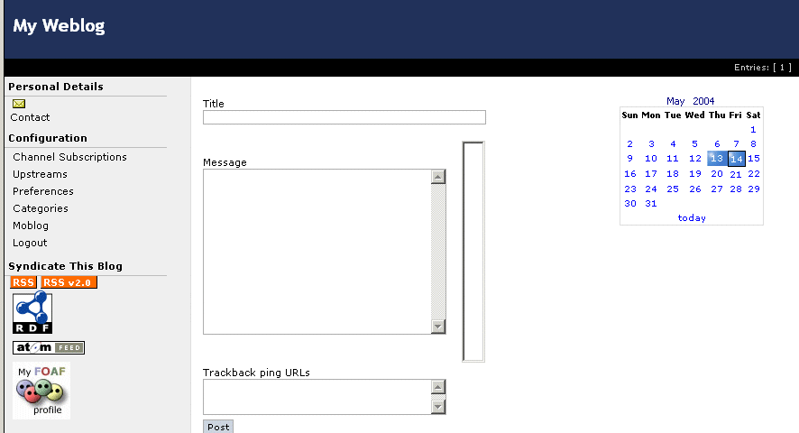

The Moblog configuration page enables the details of the POP3 server
from which messages are to be retrieved from is located as indicated in
the diagram below:

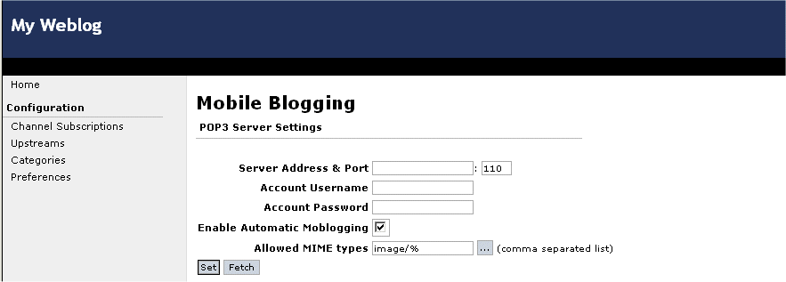

  - *Server Address and Port*
    
    \- Hostname and port number of the POP3 Mail Server.

  - *Account Username*
    
    \- username of POP3 Mail server account.

  - *Account Password*
    
    \- username of POP3 Mail server account.

  - *Enable Automatic Moblogging*
    
    \- enabled automatic posting of messages to Blog site.

  - *Allowed MIME types*
    
    \- mime type of messages to be retrieved form POP3 server, which can
    be of type image, vidoe or audio.

  - *Set*
    
    \- this button sets the POP3 mail server setting entered above.

  - *Fetch*
    
    \- this button retrieves available moblog messages from the POP3
    mail server.

Moblog can handle different types of attachments, this depends of list
of MIME type patterns (SQL like syntax), which blogger specifies in
Moblog UI. Further any new incoming message containing attachment
matching any of that list will be exposed in the UI for posting, or it
will be posted automatically if ''Automatic post'' option is checked.

Note: feeding a mail box can also be done via "Mail", "Get Mail with
POP3" Admin UI utility. In this case blogger authenticates in this
utility, and feeds it''s local mailbox from some POP3 server. The
consequential actions to put a message as blog message are same as
described above.

As alternative to feeding via own POP3 account, Moblog message can be
sent to special mail-gateway account. Such account can be set from Web
admin only and can be used from all bloggers to pass Moblog messages to
their blogs. Only requirement in that case is blogger to include
''@@blogId@@=\[blog Id\]'' string as a single line whenever in the
message body. Further mail-gateway processing will detect such rule and
will expose the message in the Moblog UI, or automatic post will be
performed.

<a id="id237-posting-a-dynamic-content"></a>
## Posting a dynamic content

The Virtuoso blogging system allows to insert into a post a result from
SQL, XPATH or XQuery expressions. The way this can be done is to have a
SQL access enabled for the Web user making the post, so such blogger can
insert into a post body (note that this is not available for title) a
XMLTemplate. (see "XML Templates" for reference) Then at the render time
the template will be executed on behalf of the blogger who is made the
post and result will be shown. There is no limitation how many XML
Templates can be included in a single post. Please note that bloggers
without SQL access cannot do such posts. Also the SQL granting rules
will be applied when XML Template is executed.

The following will render a simple table containing list of
Demo.demo.Shippers table from Demo database.

``` 
        <table border="1">
        <sql:query xmlns:sql="urn:schemas-openlink-com:xml-sql" >
            select 1 as tag , null as parent, CompanyName as [tr!1!td!element]
            from Demo.demo.Shippers
            for xml explicit
        </sql:query>
        </table>
        
```

The following post will render a table containing a names of people
which is organized in simple OPML file (located in the tutorial system)
using XQuery.

``` 
        <div>
        <sql:xquery  xmlns:sql="urn:schemas-openlink-com:xml-sql"
            sql:context="http://example.com/tutorial/apps/blog_query/">
            <![CDATA[
            <table border="1">
            { for $o in document ("opml.xml")//outline
               return <tr><td>{ string ($o/@text) }</td></tr>
            }
            </table>
            ]]>
        </sql:xquery>
        </div>
```

<a id="id238-notification-services"></a>
## Notification Services

This UI is used to define a mail routing job. So it is used for
notification of blog visitors for post updates. If administrator define
a mail target and refresh interval; visitors to the given blog can
subscribe to the 'mailing list' for blog updates. Once visitor have
subscribed, on every new post an email will be sent to he/she. If the
mail is deleted, the mailing list for blog update notification will be
canceled.

<a id="id239-rendering-the-rss-feed-in-wml-format"></a>
## Rendering the RSS feed in WML format

The user's blog RSS file could be rendered in WML format for accessing
with mobile devices. To do that built-in PL post-processing hook for
blog virtual directory is introduced (DB.DBA.BLOG\_RSS2WML\_PP). It
working together with a XSL-T style-sheet which converts the RSS in WML
format.

To enable this functionality the blogger should enter '\*wml-default\*'
as RSSFilter option on settings page. Or if he/she has an own XSL-T
filter for WML can enter its URL instead.

The DB.DBA.BLOG\_RSS2WML\_PP post-processing hook:

    create procedure DB.DBA.BLOG_RSS2WML_PP ()
      {
        declare accept, upar, pars any;
        declare lines any;
        lines := http_request_header ();
        accept := http_request_header (lines, 'Accept');
        if (not isstring (accept))
          accept := '';
        upar := http_request_get ('QUERY_STRING');
        if (regexp_match ('text/vnd\.wap\.wml', accept))
          {
        if (http_path () like '%/rss.xml')
          {
            declare opts, filt, bid any;
            whenever not found goto exitp;
            select top 1 BI_BLOG_ID into bid from SYS_BLOG_INFO where
            http_path () like BI_HOME || '%' order by length (BI_HOME) desc;
            select deserialize (blob_to_string (BI_OPTIONS)) into opts from SYS_BLOG_INFO where BI_BLOG_ID = bid;
    
            if (not isarray(opts))
              opts := vector ();
    
            filt := get_keyword ('RSSFilter', opts, '');
    
            if (filt = '*wml-default*')
              filt := 'http://local.virt/rss2wml.xsl';
    
            if (not isstring (filt) or not xslt_is_sheet (filt))
              goto exitp;
    
            if (length (upar) = 0)
              {
                    http_xslt (filt);
              }
            else
              {
            declare rss, xt, xsl any;
            rss := http_get_string_output ();
            xt := xml_tree_doc (rss);
            http_rewrite ();
            xsl := xslt (filt, xt, vector ('id', upar));
            http_value (xsl, null);
              }
            http_header ('Content-Type: text/vnd.wap.wml\r\n');
            exitp:;
          }
          }
        return;
      }
    ;

The rss2wml.xsl style sheet:

    <?xml version='1.0'?>
    
    <xsl:stylesheet
        xmlns:xsl="http://www.w3.org/1999/XSL/Transform"
        version="1.0"
      xmlns:vb="http://example.com/weblog/">
      <xsl:output method="xml" indent="yes" doctype-public="-//WAPFORUM//DTD WML 1.1//EN" doctype-system="http://www.wapforum.org/DTD/wml_1.1.xml" media-type="text/xml"/>
    
      <xsl:param name="id" />
    
      <xsl:template match="/">
        <wml>
          <card
    xml:id="card1">
        <xsl:apply-templates />
          </card>
        </wml>
      </xsl:template>
    
      <xsl:template match="item">
        <xsl:choose>
          <xsl:when test="boolean($id!='')">
        <xsl:if test="substring-after(link,'?') = $id">
          <p>
            <xsl:value-of select="vb:tidy_xhtml (string (description), '*default*')"
              disable-output-escaping="yes"/>
            <br/>
            <xsl:if test="preceding-sibling::item">
              <a>
            <xsl:attribute name="href">rss.xml?<xsl:value-of select="substring-after(preceding-sibling::item/link,'?')"/></xsl:attribute>PREVIOUS</a><br />
            </xsl:if>
            <xsl:if test="following-sibling::item">
              <a>
            <xsl:attribute name="href">rss.xml?<xsl:value-of select="substring-after(following-sibling::item/link,'?')"/></xsl:attribute>NEXT</a>
            </xsl:if>
          </p>
        </xsl:if>
          </xsl:when>
          <xsl:otherwise>
        <p>
          <a>
            <xsl:attribute name="href">rss.xml?<xsl:value-of select="substring-after(link,'?')"/></xsl:attribute>
            <xsl:value-of select="title"/>
          </a>
        </p>
          </xsl:otherwise>
        </xsl:choose>
      </xsl:template>
    
      <xsl:template match="text()"/>
    </xsl:stylesheet>

<a id="id240-deploying-php-applications"></a>
# Deploying PHP Applications

The PHP server extension allows Virtuoso to execute PHP (v4) pages
stored in the file system or in Virtuoso's WebDAV repository. PHP pages
run inside the Virtuoso process.

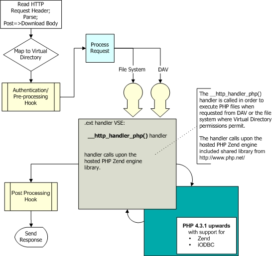

The VSE \_\_http\_handler\_php() has been implemented so that the file
extension '.php' is recognized by Virtuoso to switch between 'normal'
mode and extension processing for PHP mode in the HTTP/WebDAV services.

PHP (recursive acronym for "PHP: Hypertext Preprocessor") is a
widely-used Open Source general-purpose scripting language that is
suited for Web-based development. Here is an example of a simple PHP
page:

    <html>
        <head>
            <title>Example</title>
        </head>
        <body>
    
            <?php
            echo "Hi, I'm a PHP script!";
            ?>
    
        </body>
    </html>

Notice how this is similar to VSP script, and different from a script
written in other languages like Perl or C -- instead of writing a
program with lots of commands to output HTML, you write an HTML script
with some embedded code to do something. The PHP code is enclosed in
special start and end tags that allow you to jump into and out of "PHP
mode".

> **Tip**
> 
> [PHP Online Documentation](#)
> 
> [In-Process Data Access Client](#inprocess)

<a id="id241-building-the-virtuoso-server-with-php-extension"></a>
## Building the Virtuoso Server With PHP Extension

1.  Firstly you need to have the PHP4 library installed with Zend and
    ODBC interface enabled. On UNIX-es this can be enabled by doing
    'configure --enable-experimental-zts --with-iodbc'. On Windows the
    library must be downloaded from the [php.net](#) site.

2.  Make sure that the iODBC library is installed if you are preparing
    to build on UNIX platform.

3.  Make the bif\_server\_php executable in the bifsdk/examples/
    directory. This same directory contains the source file for the
    bif\_server\_php executable: bif\_server\_php.cpp.

The Virtuoso distribution may already contain a binary executable of the
PHP extension of the Virtuoso's Web Service. In which case you may skip
the build process and start the server with the PHP extensions instead
of starting the normal virtuoso server executable.

To start and test the Virtuoso server with the PHP extension do the
following:

1.  Make a simple file 'info.php' and place it in the HTTP root
    directory. The content of the info.php file should be the single
    line:
    
        <?phpinfo();?>
    
    This function produces an HTML page containing various PHP processor
    information.

2.  Start the server. For Linux platform: bif\_server\_php -f, for
    Windows platform: bif\_server\_php-odbc-t.exe -f

3.  Test the installation by entering the http://\[host:port\]/info.php
    as the URL of a browser of your choosing.

> **Note**
> 
> Windows users will need to install the php4ts.dll (from the
> [php.net](#) site) before running the PHP enabled Virtuoso server.
> This DLL must be in the system path when Virtuoso starts and can
> typically be placed in the %SYSTEMROOT% directory without any path
> modifications.

> **Note**
> 
> The PHP library used with Virtuoso must be version 4.3.1 or greater.
> From this version the PHP library includes a serious PHP CGI
> vulnerability fix, without which the Virtuoso server will fail to
> start for security reasons.

<a id="id242-php-extension-functions"></a>
## PHP Extension Functions

The following functions have been added to the Virtuoso server in order
to enable PHP processing.

**PHP Server Handler.**

`__http_handler_php`in `file_name` varcharin `params` vector (opt1,
value \[,...\]) or string sessionin `lines` vector (opt, value\[,...\]
)inout `what` any This function will be detected and called
automatically by the Virtuoso HTTP/WebDAV server when a request for a
file with extension .php is made.

  - The
    
    *file\_name*
    
    argument will be the path to the file when the PHP page is stored on
    the file system or the actual content of the page when a WebDAV
    resource is processed.

  - The content of request entity body will be stored in a string
    session and passed down to the \_\_http\_handler\_php as the
    
    *params*
    
    argument.

  - The HTTP request header will be passed as the
    
    *lines*
    
    argument.

  - The
    
    *what*
    
    parameter is used for in two ways: to indicate whether the first
    argument is a path/file name to a file on the filesystem or the
    content of the required WebDAV resource. The HTTP/WebDAV server will
    return an array of two elements to this parameter.

**PHP Processor.**

`__http_php_str`in `string` varcharin `params` vector (opt1, val1
\[,...\]) , varchar This function takes a string containing PHP code
(page), and parameters supplied in the params array and returns the
result from the PHP engine as a string. This can be useful for
performing PHP transformations in PL or VSP code.

  - the
    
    *string*
    
    is the source of the PHP page

  - *params*
    
    is a string or array of strings containing parameter name and
    parameter value pairs. In the case of a single string it must
    contain form parameters in the application/x-www-form-urlencoded
    encoding. In case of an aref of strings it must contain the name and
    value for parameters. (Like the params argument in the VSPs).

<a id="id243-php-examples"></a>
## PHP Examples

Unless the examples are shown as executed in the ISQL tool, this can be
made also in the Virtuoso/PL code.

``` 

SQL> select php_str ('<?php echo "Hello World"?>');
callret
VARCHAR
_______________________________________________________________________________

Hello World

SQL> select php_str ('<?php print abs (-1);?>');
callret
VARCHAR
_______________________________________________________________________________

1

SQL> set MACRO_SUBSTITUTION off;
SQL> select php_str ('<?php echo $a?>', 'a=Hello+World');
callret
VARCHAR
_______________________________________________________________________________

Hello World

SQL> select php_str ('<?php echo $a?>', vector ('a', 'Hello World'));
callret
VARCHAR
_______________________________________________________________________________

Hello World

SQL> select php_str ('<?php echo "$a $b"?>', 'a=Hello+World&b=Hello+Again+World');
callret
VARCHAR
_______________________________________________________________________________

Hello World Hello Again World

SQL> select php_str ('<?php $a=1; $b=2; $c=3; $d=$a+$b+$c; echo $d?>');
callret
VARCHAR
_______________________________________________________________________________

6

SQL>  select php_str ('<?php $a=8; $b=4; $c=8; echo $a|$b&$c?>');
callret
VARCHAR
_______________________________________________________________________________

8
```

This is test how the PHP processor can instruct the HTTP server to send
a custom response and header to the user agent. The following page can
stored on the file system or in the WebDAV repository (in which case
execution rights must be enabled). Hitting that page will redirect
user-agent to the index.html page in HTTP server root.

    <?php
      header ("HTTP/1.1 302 Found");
      header ("Location: /index.html");
    ?>

<a id="id244-deploying-jsp-applications"></a>
# Deploying JSP Applications

The Virtuoso server with Java hosting support can be used to execute JSP
pages, however, Virtuoso requires a JSP container engine first. Jakarta
provide such an engine that can be hosted inside Virtuoso with Java
support. This section describes how JSP's can be executed using Jakarta
Tomcat JSP implementation.

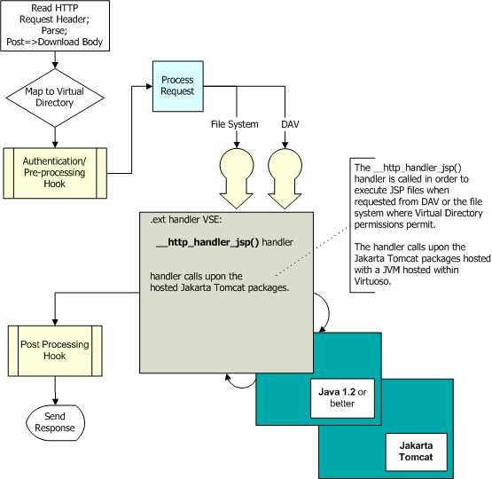

<a id="id245-environment-setup-verification"></a>
## Environment Setup & Verification

The following components are required:

Java SDK (or runtime only) needs to be installed. Version 1.2 or later.

Jakarta Tomcat package must be installed and configured. This can be
obtained from the

Jakarta project site

(http://jakarta.apache.org/tomcat/)

The virtuoso.ini file must edited to including the following settings in
the `[Parameters]` section:

    .....
    JavaClasspath = <jdk install dir>/lib/tools.jar:<tomcat install dir>/bin/bootstrap.jar
    JavaVMOption1 = -Djava.endorsed.dirs=<tomcat install dir>/bin:<tomcat install dir>/common/endorsed
    JavaVMOption2 = -Dcatalina.base=<tomcat install dir>
    JavaVMOption3 = -Dcatalina.home=<tomcat install dir>
    JavaVMOption4 = -Djava.io.tmpdir=<tomcat install dir>/temp
    .....

> **Note**
> 
> The above has been tested for the jakarta-tomcat-4.1.18 distribution
> only. Setting may vary for any other versions of Jakarta Tomcat, in
> which case we advise you consult the Tomcat documentation.

Run the `virtuoso-*-javavm*-t` binary, The Virtuoso server that includes
Java hosting.

Start the Jakarta Tomcat server inside virtuoso server process using the
following command from ISQL:

    SQL> java_call_method ('org.apache.catalina.startup.BootstrapService', null, 'main', 'V',
         vector ('[Ljava/lang/String;', vector ('start')));

In order to invoke the above command automatically at server startup you
might put it in the autoexec.isql init script.

Make a virtual directory for accessing JSP server, here is an example:

    vhost_define (lpath=>'/tomcat',ppath=>'http://example.com:8080/');

Verify that your installations are correct by pointing your web browser
of choice to `http://example.com:8890/tomcat/` (assuming you are working
on your local machine). Run some of JSP examples provided with Tomcat
distribution to verify that they are executed without errors.

> **Note**
> 
> For debugging purposes you may run the virtuoso-\*-javavm\*-t server
> with foreground option to receive Java error messages, if any occur.

> **Tip**
> 
> [In-Process Data Access Client](#inprocess)

<a id="id246-perl-hosting"></a>
# Perl Hosting

Virtuoso functionality can be enhanced through external libraries by
loading shared objects or DLLs. The new functions are written in a
language of the developer's choice and compiled to produce a shared
library appropriate to the operating system. The path to the shared
library must be declared in the Virtuoso INI file and the server
restarted before it can be used.

The Perl language is hosted within Virtuoso in this way.
hosting\_perl.so is the library used.

The Virtuoso INI file uses a \[Plugins\] configuration section for
listing shared libraries for the server to load upon startup. An example
of this is:

    [Plugins]
    LoadPath = /home/virtuoso/hosting
    Load1 = Hosting, hosting_perl.so
    ..

The "Hosting" type defines the entry points for initialization of the
runtime hosting environment, destruction of the user environment and
execution of a file or string containing commands in the hosted
language. It also returns a list of file extensions that it is capable
of processing. Virtuoso dynamically defines memory-resident (no disk
image) HTTP server handlers for each specified type.

The Perl hosting plugin supports 'pl' extension. Hence, upon
initialization of the hosting plugin, Virtuoso defines the
`__http_handler_pl(..)` function according to the API for file type
handlers in the Virtuoso HTTP server. With this handler in place, each
hit on a .pl file (file system or WebDAV) with appropriate execute
permissions will cause the HTTP server to execute the code within it and
return the result instead of simply the file's contents.

The handler will call the \_\_hosting\_http\_handler VSE with a special
set of parameters to represent the HTTP environment correctly.

Virtuoso will normally call the plugin to memory as required, and expel
it when finished. This behavior can be controlled by the INI file
parameter:

    [HTTPServer]
    PersistentHostingModules = 1/0 default 0

Setting `PersistentHostingModules` to "1" prevents Virtuoso from
removing the interpreters from the HTTP threads after each request.

> **Tip**
> 
> [VSEI Plugins](#vseplugins)

Executing Perl code directly:

    select __hosting_http_handler ('pl', 'print "hello world"; ', '', vector (), 'helloworld.pl');

    returns : hello world

Executing a perl script file (perl/test\_print.pl in the Virtuoso
working directory):

    /perl/test_print.pl
    -------------------
    #!/usr/bin/perl
    print "hello world file";

    select __hosting_http_handler ('pl', 'perl/test_print.pl');

    returns : hello world file

> **Note**
> 
> The hosting\_perl hosting module uses the perl `tie()` function to
> "tie" up the STDIN, STDOUT, STDERR, exit() and %ENV perl objects.
> Untying any of these may lead to unpredictable results.

<a id="id247-python-hosting"></a>
# Python Hosting

Virtuoso functionality can be enhanced through external libraries by
loading shared objects or DLLs. The new functions are written in a
language of choice and compiled to produce a shared library appropriate
to the operating system. The path to the shared library must be declared
in the Virtuoso INI file and the server restarted before it can be used.

The Python language is hosted within Virtuoso in this way.
`hosting_python.so` (or `hosting_python.dll` ) is the library used.

The Python hosting module requires the Python library, version 2.2.2 or
above, to build and use the module, which then must be installed in the
Plugins-Load-path defined in the Virtuoso ini file. The source code and
build script (`build.py` ) for building the `hosting_python.so` module
are included in the Unix distribution in the `custom/hosting/python`
directory. The Unix installer will offer to build it near the end of the
installation process. The build.py is a kind of Makefile. On unix it
requires `libtool` and `cc` in the path. On windows it requires `cl.exe`
in the path.

The Virtuoso INI file uses a \[Plugins\] configuration section for
listing shared libraries for the server to load upon startup. An example
of this is:

    [Plugins]
    LoadPath = /home/virtuoso/hosting
    Load1 = Hosting, hosting_python.so
    ..

The "Hosting" type defines the entry points for initialization of the
runtime hosting environment, destruction of the user environment and
execution of a file or string containing commands in the hosted
language. It also returns a list of file extensions that it is capable
of processing. Virtuoso dynamically defines memory-resident (no disk
image) HTTP server handlers for each specified type.

The Python hosting plugin supports the 'py' extension. Hence, upon
initialization of the hosting plugin, Virtuoso defines the
`__http_handler_py(..)` function according to the API for file type
handlers in the Virtuoso HTTP server. With this handler in place, each
hit on a .py file (file system or WebDAV) with appropriate execute
permissions will cause the HTTP server to execute the code within it and
return the result instead of simple the file contents.

The python interpreter has a global lock unrelated to the Virtuoso
hosting module, thus no more than one thread can run python code at a
time.

The handler will call the \_\_hosting\_http\_handler VSE with a special
set of parameters to represent the HTTP environment correctly. Virtuoso
will, by default call the plugin to memory as required, and expel it
when finished. This behavior can be controlled by the INI file
parameter:

    [HTTPServer]
    PersistentHostingModules = 1/0 default 0

Setting `PersistentHostingModules` to "1" prevents Virtuoso from
removing the interpreters from the HTTP threads after each request.

> **Tip**
> 
> [VSEI Plugins](#vseplugins)

Executing Python code directly:

    select __hosting_http_handler ('py', 'print "hello world"; ', '', vector (), 'helloworld.py');

    returns : hello world

Executing a python script file (python/test\_print.py in the Virtuoso
working directory):

    python/test_print.py
    -------------------
    #!/usr/bin/python
    print "hello world file";

    select __hosting_http_handler ('py', 'python/test_print.py');

    returns : hello world file

<a id="id248-ruby-hosting"></a>
# Ruby Hosting

Virtuoso functionality can be enhanced through external libraries by
loading shared objects or DLLs. The new functions are written in a
language of choice and compiled to produce a shared library appropriate
to the operating system. The path to the shared library must be declared
in the Virtuoso INI file and the server restarted before it can be used.

The Ruby language is hosted within Virtuoso in this way.
`hosting_ruby.so` (or `hosting_ruby.dll` ) is the library used.

The Ruby hosting module requires the Ruby library, version 1.8.3 or
above, to build and use the module, which then must be installed in the
Plugins-Load-path defined in the Virtuoso ini file. The source code for
building the `hosting_ruby.so` module are included in the Unix
distribution in the `custom/hosting/ruby` directory. The Unix installer
will offer to build it near the end of the installation process.

The Virtuoso INI file uses a \[Plugins\] configuration section for
listing shared libraries for the server to load upon startup. An example
of this is:

    [Plugins]
    LoadPath = /home/virtuoso/hosting
    Load1 = Hosting, hosting_ruby.so
    ..

The "Hosting" type defines the entry points for initialization of the
runtime hosting environment, destruction of the user environment and
execution of a file or string containing commands in the hosted
language. It also returns a list of file extensions that it is capable
of processing. Virtuoso dynamically defines memory-resident (no disk
image) HTTP server handlers for each specified type.

The Ruby hosting plugin supports the 'rb' extension. Hence, upon
initialization of the hosting plugin, Virtuoso defines the
`__http_handler_rb(..)` function according to the API for file type
handlers in the Virtuoso HTTP server. With this handler in place, each
hit on a .rb file (file system or WebDAV) with appropriate execute
permissions will cause the HTTP server to execute the code within it and
return the result instead of simple the file contents.

The ruby interpreter has a global lock unrelated to the Virtuoso hosting
module, thus no more than one thread can run ruby code at a time.

The handler will call the \_\_hosting\_http\_handler VSE with a special
set of parameters to represent the HTTP environment correctly. Virtuoso
will, by default call the plugin to memory as required, and expel it
when finished. This behavior can be controlled by the INI file
parameter:

    [HTTPServer]
    PersistentHostingModules = 1/0 default 0

Setting `PersistentHostingModules` to "1" prevents Virtuoso from
removing the interpreters from the HTTP threads after each request.

> **Tip**
> 
> [VSEI Plugins](#vseplugins)

Executing Ruby code directly:

    select __hosting_http_handler ('rb', 'print "hello world"; ', '', vector (), 'helloworld.rb');

    returns : hello world

Executing a ruby script file (ruby/test\_print.rb in the Virtuoso
working directory):

    ruby/test_print.rb
    -------------------
    #!/usr/bin/ruby
    print "hello world file";

    select __hosting_http_handler ('rb', 'ruby/test_print.rb');

    returns : hello world file
