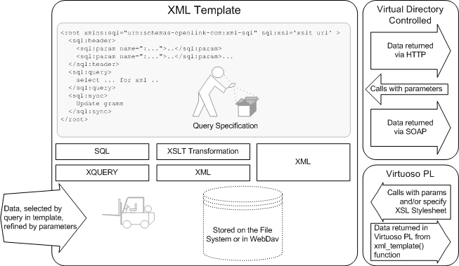
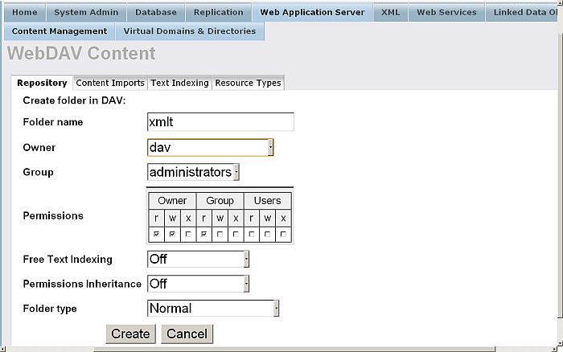
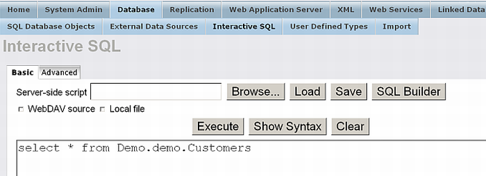
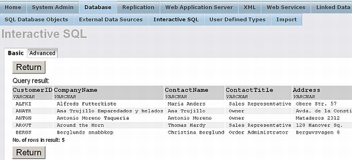
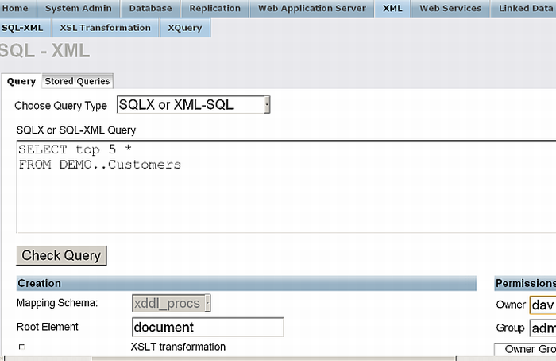
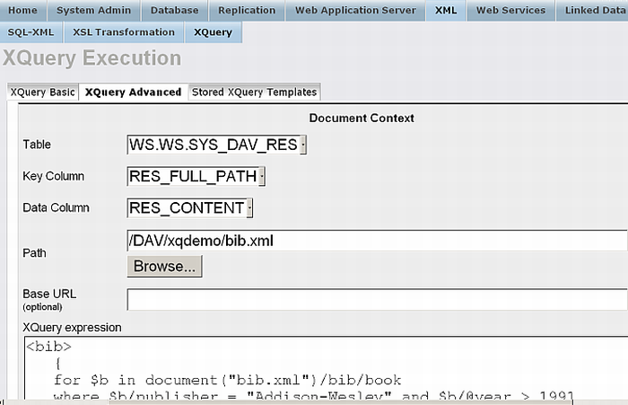
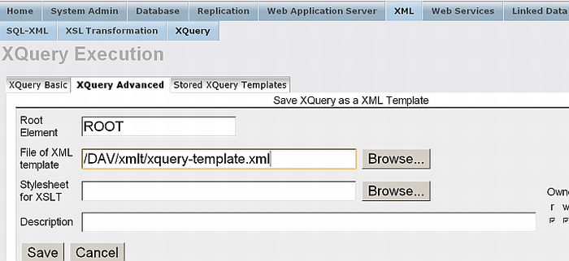
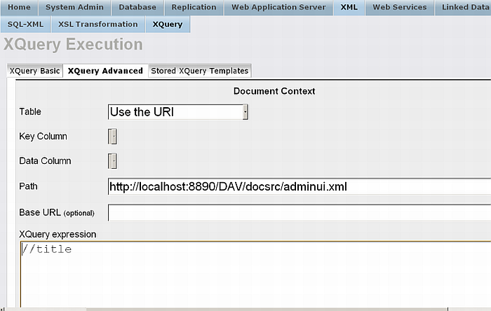

# XML Support

# Rendering SQL Queries as XML (FOR XML Clause)

Virtuoso extends SQL-92 with the FOR XML clause that allows any SQL
result set to be turned into XML according to some simple rules. The
notation and functionality are similar to those offered by Microsoft SQL
Server and IIS.

The FOR XML clause has 3 variants:

**RAW.**

Make an XML entity from each row of the result set; do not attempt to
construct hierarchies. Each row's data is enclosed in a \<ROW/\> element
and each column is either an attribute or child element.

**AUTO.**

A hierarchy is constructed with one level for each table of the join for
which at least one column is selected. The table whose column is first
mentioned in the selection will be the topmost element, the next table
its child, etc. Each level of the tree will consist of one type of
element. A parent element will have multiple children if consecutive
rows do not differ in the column values coming from the parent element.
When a table's column values differ from the previous row, the element
and all children thereof are closed and a new element is started, with
children filled out from other columns of the result set.

**EXPLICIT.**

This mode gives more control on the resulting tree's structure while
requiring a more elaborate query structure. In this mode, the query will
be a UNION ALL of many joins and each row will specify exactly one
element. Which type of element this is and where in the tree it will be
placed are determined by the values of the first two columns, TAG and
PARENT.

In all modes, columns may either be attributes or sub-elements. The
*ELEMENT* keyword after the FOR XML clause forces all columns to be
rendered as sub-elements; attribute are the default.

In all modes except explicit, the names of elements are the unprefixed
table names and the names of attributes are the columns' names in the
result set. If tables have correlation names the correlation names are
used in the output instead of the table names. Expressions are allowed
in the selections but these should be named using AS. In AUTO mode
Virtuoso assumes expressions belong to the topmost element.

The FOR XML clause is generally allowed in SELECT statements in place of
the FOR UPDATE clause. However it only has an effect when the statement
is executed through the [`xml_auto()`](#fn_xml_auto) function.

> **Tip**
> 
> The [SQL-XML Statements](#sqlxmlstmts) page described in the Visual
> Server Administration Interface section provides a fast graphical way
> of supplying an SQL statement to Virtuoso and saving the view as a
> resource accessible from the WebDAV store.

## FOR XML EXPLICIT Mode

This mode gives the developer the most control over the generated result
tree but requires a verbose query formulation. Each row must begin with
two integer columns, the first identifying the element represented by
the row and the second the parent element type of this element.
Consider:

    select 1 as tag, null as parent,
           "CategoryID" as [category!1!cid],
           "CategoryName" as [category!1!name],
           NULL as [product!2!pid],
           NULL as [product!2!name!element]
    from "Demo".."Categories"
    union all
    select 2, 1, "category" ."CategoryID", NULL, "ProductID", "ProductName"
        from "Demo".."Categories" "category", "Demo".."Products" as "product"
        where "product"."CategoryID" = "category"."CategoryID"
    order by [category!1!cid], 5
    for xml explicit;

This query makes a two level tree where Categories have Product
children. The selection in the first UNION term specifies the element
types in the result set. The two first columns, TAG and PARENT are
required in all EXPLICIT queries. Subsequent columns have an extended AS
declaration that specifies which element they belong to, what that
element is called in XML and what the column will be called. A row where
TAG has a value of 1 will pick the columns which has \[xxx\!1\!yyy\] as
their alias; rows with a TAG of 2 will pick columns with an alias with
\[xxx\!2\!yyy\] and so on.

If consecutive rows have a different TAG but the same PARENT, these will
be siblings of different types. This possibility does not exist with the
other FOR XML modes.

If the PARENT is 0 or NULL, then any previously open elements in the
result are closed and the element of the row becomes a top-level
element. When PARENT refers to the TAG of a presently open element in
the set, all children of that element are closed and the row's element
is inserted as the next child of the last element with the TAG equal to
the new row's PARENT. All open tags are closed at the end of the result
set.

> **Note**
> 
> Since each level of the tree is generated by a different term in the
> UNION ALL, an ORDER BY will invariably be needed to group the children
> after their parents. If the parent rows have NULLs in place of the
> child row's key values, the parent gets sorted first because NULL
> collates first.

## Examples of FOR XML

This section gives one example of each mode of FOR XML combined with the
`xml_auto()` function to help us display the results simply. First we
create a procedure that enables us to supply SQL and return XML using
the `xml_auto()` function.

    create procedure xmla (in q varchar)
    {
      declare st any;
      st := string_output ();
      xml_auto (q, vector (), st);
      result_names (q);
      result (string_output_string (st));
    }

Now we can apply this to a couple of examples:

    xmla ('select "category"."CategoryID", "CategoryName",
        "ProductName", "ProductID"
        from "Demo".."Categories" "category", "Demo".."Products" as "product"
        where "product"."CategoryID" = "category"."CategoryID" FOR XML RAW');

    <ROW CategoryID="1" CategoryName="Beverages" ProductName="Chai" ProductID="1">
    </ROW>
    <ROW CategoryID="1" CategoryName="Beverages" ProductName="Chang" ProductID="2">
    </ROW>
    <ROW CategoryID="1" CategoryName="Beverages" ProductName="Guaraná Fantástica" ProductID="24">
    </ROW>
    <ROW CategoryID="1" CategoryName="Beverages" ProductName="Sasquatch Ale" ProductID="34">
    </ROW>
    <ROW CategoryID="1" CategoryName="Beverages" ProductName="Steeleye Stout" ProductID="35">
    </ROW>
    <ROW CategoryID="1" CategoryName="Beverages" ProductName="Côte de Blaye" ProductID="38">
    </ROW>
    <ROW CategoryID="1" CategoryName="Beverages" ProductName="Chartreuse verte" ProductID="39">
    </ROW>
    <ROW CategoryID="1" CategoryName="Beverages" ProductName="Ipoh Coffee" ProductID="43">
    </ROW>
    <ROW CategoryID="1" CategoryName="Beverages" ProductName="Laughing Lumberjack Lager" ProductID="67">
    </ROW>
    .....

As we can see, RAW mode produces a simple row-by-row account of the data
encased within the \<ROW.../\> tags. This is the simplest mode.

    xmla ('select "category"."CategoryID", "CategoryName",
        "ProductName", "ProductID"
        from "Demo".."Categories" "category", "Demo".."Products" as "product"
        where "product"."CategoryID" = "category"."CategoryID" FOR XML AUTO ELEMENT');

    <category>
     <CategoryID>1</CategoryID> <CategoryName>Beverages</CategoryName><product>
     <ProductName>Chai</ProductName> <ProductID>1</ProductID></product>
    <product>
     <ProductName>Chang</ProductName> <ProductID>2</ProductID></product>
    <product>
     <ProductName>Guaraná Fantástica</ProductName> <ProductID>24</ProductID></product>
    <product>
     <ProductName>Sasquatch Ale</ProductName> <ProductID>34</ProductID></product>
    <product>
     <ProductName>Steeleye Stout</ProductName> <ProductID>35</ProductID></product>
    <product>
     <ProductName>Côte de Blaye</ProductName> <ProductID>38</ProductID></product>
    <product>
     <ProductName>Chartreuse verte</ProductName> <ProductID>39</ProductID></product>
    <product>
     <ProductName>Ipoh Coffee</ProductName> <ProductID>43</ProductID></product>
    <product>
     <ProductName>Laughing Lumberjack Lager</ProductName> <ProductID>67</ProductID></product>
    <product>
    .....

In contrast to RAW mode, AUTO produces results that are more tree-like.
Only one category element is used for each category, and that contains
all the children of the category.

    xmla ('
    select 1 as tag, null as parent,
           "CategoryID" as [category!1!cid],
           "CategoryName" as [category!1!name],
           NULL as [product!2!pid],
           NULL as [product!2!name!element]
    from "Demo".."Categories"
    union all
    select 2, 1, "category" ."CategoryID", NULL, "ProductID", "ProductName"
        from "Demo".."Categories" "category", "Demo".."Products" as "product"
        where "product"."CategoryID" = "category"."CategoryID"
    order by [category!1!cid], 5
    FOR XML EXPLICIT');

    <CATEGORY CID="1" NAME="Beverages">
    <PRODUCT PID="1">
     <NAME>Chai</NAME></PRODUCT>
    <PRODUCT PID="2">
     <NAME>Chang</NAME></PRODUCT>
    <PRODUCT PID="24">
     <NAME>Guaraná Fantástica</NAME></PRODUCT>
    <PRODUCT PID="34">
     <NAME>Sasquatch Ale</NAME></PRODUCT>
    <PRODUCT PID="35">
     <NAME>Steeleye Stout</NAME></PRODUCT>
    <PRODUCT PID="38">
     <NAME>Côte de Blaye</NAME></PRODUCT>
    <PRODUCT PID="39">
     <NAME>Chartreuse verte</NAME></PRODUCT>
    <PRODUCT PID="43">
     <NAME>Ipoh Coffee</NAME></PRODUCT>
    <PRODUCT PID="67">
     <NAME>Laughing Lumberjack Lager</NAME></PRODUCT>
    <PRODUCT PID="70">
     <NAME>Outback Lager</NAME></PRODUCT>
    <PRODUCT PID="75">
     <NAME>Rhönbräu Klosterbier</NAME></PRODUCT>
    <PRODUCT PID="76">
     <NAME>Lakkalikööri</NAME></PRODUCT>
    </CATEGORY>
    <CATEGORY CID="2" NAME="Condiments">
    <PRODUCT PID="3">
    .....

In this example, we specify precisely the tree structure we wish, and
construct the EXPLICIT query to produce that tree. Many times
programmers know what the resulting XML should look like but do not know
how to get exactly what they want. FOR XML EXPLICIT can be very useful
in these cases.

## Functions

[`xml_auto()`](#fn_xml_auto)

## FOR XML Syntax

    for__xml ::= FOR XML <mode> [ ELEMENT ]
    
    <mode> ::= RAW | AUTO | EXPLICIT
    
    <explicit column> ::=  scalar_exp AS '[' <element> '!' <tag no> '!'
                       <column name> [ '!' <option> ] ']'
    
    <tag no> ::= INTNUM
    
    <column name> ::= IDENTIFIER
    
    <element> ::= IDENTIFIER
    
    <option> ::= IDENTIFIER

The \<explicit column\> should be used in the selection list of the
first term of the UNION ALL construct in a FOR XML EXPLICIT query.
Virtuoso provides this functionality separately from any Web server
context, although these are principally expected to be used inside VSP
pages.

The text of \<option\> part of the \<explicit column\> is ignored but if
it is present then the value is placed into a sub-element of the element
for the row, not into an attribute.

# XML Composing Functions in SQL Statements (SQLX)

The preferred means of constructing XML data from SQL is to use the
standard SQLX SQL extension.

SQLX is a collection of functions added for creating XML entities from
standard relational queries. Basically, you write a SQL statement with
calls to SQLX functions in the selection and a piece of XML is created.

There are five XML composing functions:

XMLELEMENT()

creates a single XML element that can contain an arbitrary number of
attributes and sub-elements.

XMLATTRIBUTES()

lists XML attributes to be placed in the XML element created by an
enclosing call of

XMLELEMENT()

.

XMLCONCAT()

returns a forest of XML values by concatenating a list of XML values or
forests.

XMLAGG()

is an aggregate function that creates a forest of XML values by
concatenating the XML values that are returned from multiple rows.

XMLFOREST()

is similar to

XMLATTRIBUTES()

but returns a forest of elements instead of list of attributes.

These functions belong to the SQLX standard, an emerging SQL standard
for XML. All the functions take a variable number of arguments.

`XMLELEMENT` is used to construct XML elements from relational data. It
takes as parameters the element name, an optional collection of
attributes for the element (returned by `XMLATTRIBUTES` call), column
names, strings, `XMLELEMENT` , `XMLFOREST` , `XMLCONCAT` , and `XMLAGG`
calls, and an entity objects (returned by corresponding functions, e.g.
`xtree_doc` , `xpath_eval` , `xquery_eval` ) which will make up the
content of the element (an exception from this is an attribute entity
returned by `xquery_eval` - in this case it is joined to the list of the
element's attributes). Column names, strings and attribute entities
returned by `xpath_eval` will make up the text content of the element.
The others will make up the children of the element.

In the `XMLATTRIBUTES` clause, the value expressions are evaluated to
get the values for the attributes.

`XMLFOREST` produces a forest of XML elements from a given list of
arguments. It accepts a list of SQL value expressions as its arguments,
and produces an XML element from each value returned.

`XMLCONCAT` produces a forest of elements by concatenating a list of XML
values. XMLCONCAT accepts a list of XML value expressions as its
arguments, and produces a forest of elements by concatenating the XML
values that are returned from the same row to make one value. If an
argument of the `XMLCONCAT` is an entity object returned by
`xquery_eval` or `path_eval` , it must not be an attribute.

The following statements create the same result sets:

    select XMLELEMENT ('Person',
                            XMLELEMENT ('firstname', "FirstName"),
                            XMLELEMENT ('lastname', "LastName"),
                    xquery_eval('//country', xtree_doc('<a><country>USA</country></a>')))
    from "Demo"."demo"."Employees";
    
    select
          XMLELEMENT ('Person',
                            XMLFOREST ("FirstName"as "firstname", "LastName" as "lastname"),
                    xquery_eval('//country', xtree_doc('<a><country>USA</country></a>')))
    from "Demo"."demo"."Employees";
    
    select
          XMLELEMENT ('Person',
                                 XMLCONCAT (
                                            XMLELEMENT ('firstname', "FirstName"),
                                            XMLELEMENT ('lastname', "LastName"),
                                    xquery_eval('//country', xtree_doc('<a><country>USA</country></a>'))))
    from "Demo"."demo"."Employees";

> **Note**
> 
> The second statement is more effective than the others.

In order to return more than one row of values, you can use `XMLAGG` .
`XMLAGG` is an aggregate function that produces a forest of XML elements
from a collection of XML elements. It concatenates the values returned
from one column of multiple rows, unlike XMLCONCAT, which concatenates
the values returned from multiple columns in the same row.

The parameters that would be used as element names (in the `XMLELEMENT`
and in the 'AS clause ' of the `XMLFOREST` and `XMLATTRIBUTES` ) must be
valid XML names. If the 'AS clause ' is absent in a list of the
parameters of the `XMLFOREST` or `XMLATTRIBUTES` , Virtuoso uses the
partially escaped form of the column name as the element or attribute
name. The partially escaped form means that SQL \<identifier\>
characters that are valid characters in a XML NAME are not changed, SQL
\<identifier\> character that is not valid XML NAME character is
replaced with "\_xHHHH\_", where HHHH is character's upper case
hexadecimal code. For example, "first\_name" is replaced with
"first\_x005F\_name", "last name" is replaced with "last\_x0020\_name".

The following example creates an 'FullAddress' element with

  - four attributes, three of them ('PostalCode', 'Address', 'City') are
    produced by `XMLATTRIBUTES`, and the fourth attribute - 'country' is
    calculated by `xquery_eval
    `

  - 'Region' subelement, that is produced by `xtree_doc
    `

  - text content, that is produced by `xpath_eval
    `

  - 'emp' subelement with text content from the column "LastName", that
    is created by nested`XMLELEMENT`

<!-- end list -->

``` 
select XMLELEMENT ('FullAddress',
                        XMLATTRIBUTES ( "PostalCode", "Address", "City"),
                        xtree_doc ('<Region>WA</Region>'),
                        xquery_eval('//@country', xtree_doc('<a country="USA"/>')),
                        xpath_eval('//@Phone', xtree_doc('<a Phone="(206) 555-9857"/>')),
                        XMLELEMENT('emp', "LastName"))
from "Demo"."demo"."Employees"

----------------------------

   <FullAddress PostalCode="98122" Address="507 - 20th Ave. E. Apt. 2A" City="Seattle" country="USA">
        <Region>WA</Region>
        (206) 555-9857
        <emp>Davolio</emp>
    </FullAddress>
    <FullAddress PostalCode="98401" Address="908 W. Capital Way" City="Tacoma" country="USA">
        <Region>WA</Region>
        (206) 555-9857
        <emp>Fuller</emp>
    </FullAddress>
  . . .

 
```

> **Tip**
> 
> [XMLAGG()](#fn_xmlagg)
> 
> [XMLATTRIBUTE()](#fn_xmlattributes)
> 
> [XMLCONCAT()](#fn_xmlconcat)
> 
> [XMLELEMENT()](#fn_xmlelement)
> 
> [XMLFOREST()](#fn_xmlforest)

XML composing functions deal with arguments of arbitrary type, but the
result is always an XML entity that can contain only elements and
strings. Hence there is a set of type casting rules. These rules are
quite common for any XML DOM model, so they're similar to those listed
for [DOM function arguments](#xmldomtypecasting) :

If an instance of XMLType is passed then its internal XML entity is
used.

If an array representation of an XML tree entity is passed then it is
used exactly like XML entity.

If an argument is NULL then it is fully ignored, as if there is no such
argument at all.

If an argument is not of a type listed above and not a string then it is
cast to a string first.

A root node of some document (or of some generic XML entity) can not
appear in the middle of the resulting tree. So if a root node is passed
then all child nodes of the root (i.e. every top-level node of the
document) will be added.

SQL/XML standards introduce a special name "forest of XML elements" for
an ordered list of XML elements, like one returned by `XMLFOREST()` . In
Virtuoso, forest can contain XML nodes of any sort, not only XML
elements, so it can also contain strings, processing instructions and
comments. Virtuoso processes any non-empty "forest" as if it were the
root node of a "generic XML entity", and items of the forest were
top-level nodes of that entity. Hence, a forest can be passed to any
function that accepts an value of type "XML entity". The only potential
problem is that this entity is well-formed if and only if the forest is
non-empty. If an empty forest is serialized to an XML text then the
result is an empty string that is not an acceptable input for an XML
parser.

It is important to remember that the XML document can not contain two
neighbour text nodes and that the text node can not be an empty string.
If two consequent strings appear in the list of values of a forest or in
the list of children of an new element then they are replaced with a
single node that is a concatenation of these string. Similarly, if an
empty string appears in the list of values of a forest or in the list of
children of an new element then it is removed from the list.

# Virtuoso XML Services

## XPATH Implementation and SQL

Virtuoso offers XPATH as a query language for XML views. The statement
is there converted into SQL in the context of the mapping defined by the
\_\_view XPATH option, which is mandatory. An XPATH query string is a
valid top level SQL statement. This is interpreted as a single select or
union of selects with the result columns being specified by various
XPATH options.

The basic query string

    XPATH [__view "cat"]/category

will select any top level category elements from the cat XML view,
defined with CREATE XML VIEW. This has a single result column with the
serialization string of the selected entity as value. This string starts
with the category start tag and ends with the corresponding end tag. As
many result rows are generated as there are top level category nodes in
the view.

This basic behaviour can be modified by XPATH options enclosed in
brackets after the XPATH keyword. These options allow specifying the
output columns of the generated select statement.

## XPATH Query Options

    <xp option> ::=
        __* | __http | __key   | __view NAME | __tag NAME | __quiet | __base_uri STRING |
        xmlns:NAME '=' STRING | xmlns '=' STRING |
        __lang STRING | __enc STRING | KEYWORD '=' KEYWORD
    
    <option list> ::=  | <option list> '[' <option> [...] ']'

The option list may occur between the XPATH keyword and the start of the
path, e.g.

    XPATH [__key __view "cat"] /category

The effects of the options are as follows:

**\_\_http.**

Send the serialization of the result entities to the HTTP client. This
may only be used inside a VSP page context.

**\_\_key.**

Select the key of the selected entities instead of the serialization
text.

**\_\_\*.**

Select all columns of the selected entity instead of its serialization
text. This is only valid when \_\_view is specified and the result set
is homogeneous.

**\_\_view STRING.**

Specify that the query be interpreted in the context of the specified
CREATE XML VIEW, directly accessing the tables. This is mandatory since
the elements referenced can only be mapped to tables in the context of
an XML view.

**\_\_quiet.**

Specify that the query should not signal non-fatal errors. This option
is for cases when an incomplete result is anyway better than nothing.
Typical example is search in the collection of documents where not all
documents are valid.

**\_\_base\_uri STRING.**

Specify the base URI that can be used to resolve relative URIs in calls
of XPATH functions [`processXQuery()`](#xpf_processxquery) ,
[`processXSLT()`](#xpf_processxslt) and
[`processXSLT()`](#xpf_processxsql) . This is similar to the effect of
"declare base-uri" in XQuery.

**xmlns:NAME '=' STRING.**

This declares a pair of namespace prefix and namespace URI for use in
the query expression, e.g. xmlns:xs="http://www.w3.org/2001/XMLSchema"
or xmlns:ora="http://schemas.oracle.com/xpath/extension"

**xmlns '=' STRING.**

This declares the default namespace URI for use in the query expression,
e.g. xmlns="http://www.example.com/my-schema". This namespace will
become both default element namespace and default function namespace.

**\_\_lang STRING.**

This declares the language that is used for text search expressions.
This is for internationalization purposes only. See subsection ["Adding
New Languages And Encodings Into Virtuoso"](#langfuncapi) for more
details.

**\_\_enc STRING.**

This declares encoding of strings that are used for text search
expressions. This is for internationalization purposes only. See
subsections ["Encoding in XPath Expressions"](#encodingxpathexp) and
["Adding New Languages And Encodings Into Virtuoso"](#langfuncapi) for
more details.

**KEYWORD '=' KEYWORD.**

This is useful only if the expression uses XPATH functions like
[`document()`](#xpf_document) or [`doc()`](#xpf_document) or if the
XPATH expression is an argument of `xpath_contains` or similar special
SQL predicate. These are configuration options that XPATH processor
provides to the XML parser when the processor should read a document.
Section ["Configuration Options of the DTD Validator"](#dtd_config)
lists all supported options.

## XML Views - Representing SQL Data as Dynamic and Persistent XML

The XML view mechanism allows generating XML content from relational
data and to query relational data as if it were XML without first
converting it to XML.

### CREATE XML VIEW statement

    <xml view> ::=
         CREATE XML VIEW <name> as [ <namespaces_def> ] <element list> <opt_public>
    
    <xml view> ::=
         CREATE XML VIEW <name> as [ <namespaces_def> ] <query spec> [ELEMENT] <opt_public>
    
    <namespaces_def> ::= '[' <id_namespace> '='( name | <path string> ) [ ...]  ']'
    
    <element list> ::= <element> [, ...]*
    
    <element> ::=
         <table> <correlation name> AS [ <id_namespace> ':' ] <element> <columns>
         [ ON '('  <search condition> ')']
        [primary key '(' column_commalist ')' ]
        [ELEMENT]
         [ '{' <element list>'}' ]
    
    <opt_public> ::=  PUBLIC <path string> OWNER <DAV owner name> [PERSISTENT] [INTERVAL <minutes>]
    
    <columns> ::= '(' <column> [, ...] ')'
    
    <column> ::=   <column name> | <column name> AS [ <id_namespace> ':' ] <attribute name>
    
    <id_namespace> :: = identifier

The XML view declaration establishes a 'virtual document' a context
within which XML hierarchy relationships can be translated into
arbitrary joins. The virtual document can be then materialized into an
actual set of persistent XML elements or used to generate SQL from
XPATH.

Each table in the declaration generates an element into the result
document. SQL views can be used as tables to accommodate for hidden
joins, sub-queries, ordering and aggregates. If a view is used, which by
nature has no primary key, the primary key clause should be used to
define a uniquely identifying set of view columns.

The only restriction on the XML view declaration is that each branch has
a fixed depth.

The structure of joins used to make the text can be specified in two
ways: As a SQL query specification, that is a SELECT from a list of
tables with a WHERE clause specifying the joins, or as a tree of join
elements. The first form is called automatic and the second is called
explicit. The automatic form allows generating a tree with as many
levels as there are tables in the join, with elements derived from the
rows at each level occupying each level of the hierarchy

With both forms the columns of the tables are mapped into either
attributes or child elements of the element representing each row. In
the explicit mode, the attribute / element choice can be made for each
table, in the automatic mode for the entire view. The explicit mode also
allows specifying a different element / attribute name whereas the
automatic mode takes the name from the column name. Even if the columns
are presented as child elements in the output text, they should be
referenced as attributes in XPATH queries evaluated in the context of
the view.

An XML namespaces can be used in XML view with two restrictions - all
namespace names must be different and the first three letters of
namespace name must not be 'xml', except for default namespace with name
'xmlns'.

### Explicit XML Views

In the explicit form each level of the hierarchy is declared as a list
of child elements. Each such element maps one table or view into an
entity according to a join condition. The join conditions can reference
columns from the associated table and columns from tables in parent
elements. The join condition can also have scalar filtering conditions.
A top element's join condition may only specify scalar conditions.

Each set of sibling child nodes is delimited by braces {}. The top level
of the view typically consists of one element in the outermost braces.
This element has itself a child list delimited by braces. Each such list
can have more than one different element.

Each element specifies:

  - SQL table

  - Correlation name for use in subsequent joins for this table

  - XML element name to use for delimiting a row of this table

  - List of columns, with optional XML element or attribute names

  - join condition - will relate rows of this table to rows of the table
    in the enclosing element. If this element is at the top level, this
    can only consist of scalar conditions

  - Optional PRIMARY KEY clause, needed if the table in this element is
    a view, does not have a primary key or if a non-primary key unique
    identity is desired

  - Optional ELEMENT flag

  - Optional list of child elements, delimited by braces

> **Note**
> 
> A correlation name is mandatory for all the tables.

The column list can mention a single column or a single column renamed
into an XML attribute of a different name. If a column of a table is
referenced in a subsequent join condition it must appear in the output
columns list. Expressions are not directly allowed but a view with
expression columns can be used.

The opt\_public clause, when present, offers a shorthand for calling
xml\_view\_publish at the same time as making the definition. This makes
a DAV resource reflecting the contents of the view. The contents may
either be generated on demand or persisted as a DAV accessible XML
document. In the latter case the document may be regenerated at a fixed
interval. The interval is expressed in minutes.

The path is expressed as an absolute path from the root collection of
the DAV server.

> **Note**
> 
> This root collection may be mapped into various places in the web
> server's URL space.

    create xml view xx ... public '/xx.xml' owner 'dav' persistent interval 1;

is equivalent to:

    create xml view xx ...;
    xml_view_publish (xx, /xx.xml', 'dav', 1, 1);

A DAV resource created in this manner can be deleted as any DAV
resource. The XML view itself is not affected but a possibly existing
refresh job will be automatically deleted.

One XML view can be published several times with different names and
owners. There may also exist persistent and non-persistent publications
of the same view.

The CREATE XML VIEW statement defines stored procedures for generating
an XML text fragment corresponding to each element declared in the view.

The names of the procedures are composed as follows:

    create procedure http_view_<view name>
        (inout output_mode)

    create procedure http_<view name>_<element name>_<correlation name>
        (in pk1 any, ..., in output_mode integer)

An http output procedure is created for each \<element\> in the create
xml view declaration. It takes the primary key columns of the table in
question in key order plus a mode flag. It then outputs the
serialization of the specified element and any child elements. For an
output mode of 0 the result goes directly to an HTTP client. For an
output\_mode of 1 the procedure returns the serialization as a string.
Note that for this to work the tables in question must be real tables
and the join conditions must only reference the next higher table in the
create xml view tree. Further, the primary key columns of each table
should be mentioned in the columns list for that table along with any
foreign keys referenced in subsequent join conditions.

    create xml view "cat" as
    {
      "Demo"."demo"."Categories" "C" as "category"
        ("CategoryID", "Description" as "description")
        {
          "Demo"."demo"."Products" "P" as "product"  ("ProductName")
        on ("P"."CategoryID" = "C"."CategoryID")
        }
    }

This declares a two level hierarchy with a category node for each
category and a product child node for each product in the category.

    create xml view "cats_e" as
      select "category"."CategoryID", "CategoryName",
        "ProductName", "ProductID"
        from "Demo".."Categories" "category", "Demo".."Products" as "product"
        where "product"."CategoryID" = "category"."CategoryID" element;

Here is a similar example, this time using the element option.

The procedures are

    xmlg_cat
    http_cat_category_C (in categoryid any, in _out integer);
    http_cat_product_P (in productid any, in _out integer);

In the following example the function returns the selected items as an
XML fragment. Consecutive elements are separated by new-lines for
readability.

    SQL> call "http_cat_category_C" (1, 1);
    
    1 sets? Done. -- 5 msec.
    RESULT=
    <category CategoryID="1" description="Soft drinks, coffees, teas, beers, and ales" >
    <product ProductName="Chai" ></product>
    <product ProductName="Chang" ></product>
    <product ProductName="Guarana Fantastica" ></product>
    <product ProductName="Sasquatch Ale" ></product>
    <product ProductName="Steeleye Stout" ></product>
    <product ProductName="Côte de Blaye" ></product>
    <product ProductName="Chartreuse verte" ></product>
    <product ProductName="Ipoh Coffee" ></product>
    <product ProductName="Laughing Lumberjack Lager" ></product>
    <product ProductName="Outback Lager" ></product>
    <product ProductName="Rhönbrooou Klosterbier" ></product>
    <product ProductName="Lakkalikööri" ></product>
    </category>

The below example shows how to use a SQL view for hiding a join. The
below view generates for each table a set of column children and a set
of index children, which in turn have column children.

    create view KEY_COLS as select KP_KEY_ID, KP_NTH, C.*
        from SYS_KEY_PARTS, SYS_COLS C where COL_ID = KP_COL;
    
    create xml view "schema" as
    {
      DB.DBA.SYS_KEYS k as "table" ("KEY_TABLE" as "name",
        KEY_ID as "key_id", KEY_TABLE as "table")
        on (k.KEY_IS_MAIN = 1 and k.KEY_MIGRATE_TO is null)
        { DB.DBA.KEY_COLS  c as "column" (COLUMN as name)
            on (k.KEY_ID = c.KP_KEY_ID)
            primary key (COL_ID),
        DB.DBA.SYS_KEYS i as "index" (KEY_NAME
          as "name", KEY_ID as "key_id", KEY_N_SIGNIFICANT as "n_parts")
          on (i.KEY_TABLE = k.KEY_TABLE and i.KEY_IS_MAIN = 0 and i.KEY_MIGRATE_TO is null)
          {
            DB.DBA.KEY_COLS ic as "column" (COLUMN as "name")
              on (ic.KP_NTH < i.KEY_N_SIGNIFICANT and ic.KP_KEY_ID = i.KEY_ID)
              primary key (COL_ID)
              }
        }
    };

The following query will return the subtree describing the Customers
table in the demo database:

    XPATH [__view 'schema']
        /table[@name = 'Demo.demo.Customers'];
    
    <table name="0" key_id="1011" table="Demo.demo.Customers" >
    <column name="CustomerID" ></column>
    <column name="CompanyName" ></column>
    <column name="ContactName" ></column>
    <column name="ContactTitle" ></column>
    <column name="Address" ></column>
    <column name="City" ></column>
    <column name="Region" ></column>
    <column name="PostalCode" ></column>
    <column name="Country" ></column>
    <column name="Phone" ></column>
    <column name="Fax" ></column>
    <index name="City" key_id="1012" n_parts="2" >
    <column name="City" ></column>
    <column name="CustomerID" ></column>
    </index>
    <index name="CompanyName2" key_id="1013" n_parts="2" >
    <column name="CompanyName" ></column>
    <column name="CustomerID" ></column>
    </index>
    <index name="PostalCode2" key_id="1014" n_parts="2" >
    <column name="PostalCode" ></column>
    <column name="CustomerID" ></column>
    </index>
    <index name="Region" key_id="1015" n_parts="2" >
    <column name="Region" ></column>
    <column name="CustomerID" ></column>
    </index>
    </table>

### Automatic XML Views - Creating XML Views from SELECT Statements

The automatic form of CREATE XML VIEW will take a select statement and
infer a hierarchy from it, based on the order of tables in the from
clause. The parent table should be to the left of its children. This is
practical if the tables form a hierarchy in application terms, like
orders and order lines or departments and employees. This notation
allows arbitrary depth but all siblings at the same level will be of the
same type. Elements of child rows will be child elements of the element
of their parent row, where the join condition identifies the child rows
for one parent row.

The columns in the selection will appear as attributes or child elements
of the rows selected. The names of the attributes will be the names of
the columns. The names of the siblings will be the names of the tables
in the from clause, without qualifiers or owners. Expressions should not
appear in the selection. If the use of expressions is required then you
may create a SQL view first to facilitate this.

The ELEMENT keyword may be present at the end of the select, before the
publishing keywords. This will cause all columns to be represented as
child elements of the element corresponding to the row. Note that even
if the element switch is present, the values will appear like attributes
in an XPATH query inside the view.

> **Note**
> 
> SQL views or derived tables may not appear directly in the select. The
> reason for this is that a procedure is generated for each level of the
> generated XML tree and that this must take unique identifying column
> values for the element in question. If one desires to use a view, the
> explicit form should be used, with the primary key option specified
> where appropriate.

#### Add to text for explicit XML views

Each set of sibling child nodes is delimited by braces {}. The top level
of the view typically consists of one element in the outermost braces.
This element has itself a child list delimited by braces. Each such list
can have more than one different element.

Each element specifies:

  - SQL table

  - Correlation name for use in subsequent joins for this table

  - XML element name to use for delimiting a row of this table

  - List of columns, with optional XML element or attribute names

  - join condition - will relate rows of this table to rows of the table
    in the enclosing element. If this element is at the top level, this
    can only consist of scalar conditions

  - Optional PRIMARY KEY clause, needed if the table in this element is
    a view, does not have a primary key or if a non-primary key unique
    identity is desired

  - Optional ELEMENT flag

  - Optional list of child elements, delimited by braces

<!-- end list -->

    create xml view "cats_e" as
      select "category"."CategoryID", "CategoryName",
        "ProductName", "ProductID"
        from "Demo".."Categories" "category", "Demo".."Products" as "product"
        where "product"."CategoryID" = "category"."CategoryID" element;
    
    Add to text: after 'free text and xml'

### xml\_view\_publish

    DB.DBA.xml_view_publish (in view_name varchar, in dav_path varchar,
        in dav_owner varchar, in is_persistent integer, in refresh_interval integer)

This presents an XML view as a DAV resource. The view name is the name
in the create xml view statement, note that this is case sensitive and
is never converted since it is a string, not an identifier. The path
must be absolute and is interpreted as relative from the DAV root
collection. The DAV user is the owner of the resource. If is\_persistent
is non-zero the resource will be materialized from the view's
description. The refresh interval is only applicable if the resource is
materialized. If so, this is an interval in minutes. A value of 0 means
no automatic refresh.

The reverse operation of xml\_view\_publish is deleting the DAV
resource. xml\_view\_publish may be called several times to alter the
owner or refresh interval.

## External Entity References in Stored XML

When an XML document is stored as either text, long xml, xmltype or in
the persistent XML format it can contain references to external parsed
entities with the \<\!entity ...\> declaration and the \&xx; syntax.
These are stored as references and not expanded at storage time if the
entity is external.

Such references are transparently followed by XPATH and XSLT. A run time
error occurs if the referenced resource cannot be accessed when needed.
The reference is only followed if the actual subtree is selected by
XPATH or XSLT. The resource is retrieved at most once for each XPATH or
XSLT operation referencing it, regardless of the number of times the
link is traversed. This is transparent, so that the document node of the
referenced entity appears as if it were in the place of the reference.

External entity references have an associated URI, which is either
absolute with protocol identifier and full path or relative. Relative
references must be resolved with respect to the base URI of the
referencing document. If the document is stored as a column value in a
table it does not have a natural base URI, hence the application must
supply one if relative references are to be supported. This is done by
specifying an extra column of the same table to contain a path, in the
form of collections delimited by slashes, just as the path of a DAV
resource or a Unix file system path.

This base URI is associated with an XML column with the IDENTIFIED BY
declaration:

    create table XML_TEXT (
        XT_ID integer,
        XT_FILE varchar,
        XT_TEXT long varchar identified by xt_file,
            primary key (XT_ID)
        );
    
    create index XT_FILE on XML_TEXT (XT_FILE);

Thus, each time the value of xt\_text is retrieved for XML processing by
XPATH\_CONTAINS or XCONTAINS the base URI is taken from xt\_file.

The complete URI for the xt\_text of a column of the sample table will
be:

    virt://<qualified table name>.<uri column>.<text column>:<uri column value>

An example would be:

    "virt://DB.DBA.XML_TEXT.XT_FILE.XT_TEXT:sqlreference.xml"

The .. and . in relative paths are treated as with file names when
combining relative references to base URI's. A relative reference
without a path just replaces the last part of the path in the base URI.

> **Tip**
> 
> [xml\_uri\_get and xml\_uri\_merge](#fn_xml_uri_get) for more details.

## Using XPATH in SQL Queries and Procedures

An XPATH expression can appear as a SQL query expression, that is, as a
derived table or subquery predicate or scalar subquery. This means that
the XPATH expression is expanded compile time to the corresponding SQL.
The mapping of the XPATH hierarchy to tables and joins is given by the
\_\_view XPATH option, which is mandatory.

The XPATH keyword introduces an embedded XPATH expression. The XPATH
text is presented as a string literal. Note that the tokenization rules
are different for XPATH and SQL, so having XPATH as a string makes it
clear which rules apply to parsing which part of the composite query.

    select * from (XPATH '[__* __view "cat"]
        //product') P order by "P."ProductName"";

will evaluate the //product query in the context of the cat XML view and
produce a result set consisting of all the attributes of the product
entity as defined in the view.

> **Note**
> 
> The \_\_key and \_\_\* XPATH options are central here in defining the
> result columns of the XPATH. The default result column of an XPATH
> expression is the serialization of the selected entity or scalar,
> which is most of the time impractical in a SQL context.

### Parameters in XPATH

The '$' sign introduces a parameter in XPATH. The identifier following
the dollar sign should reference a SQL column or variable defined in the
surrounding context. The name of the parameter can contain a dot for
referencing a column with a correlation name.

For instance, to make a VSP page that outputs the category tree which
contains a specific product, one may write:

    <HTML>
    <?vsp
          declare N varchar;
          N := {?'name'};
          for (XPATH '[__http __view ''cat'']
            /category[product/@ProductName = $N]' do ; ?>
    </HTML>

This will iterate over the categories containing a product with
ProductName equal to the URL parameter 'name'. Note the \_\_http option
that causes the text of the selected entities to go directly to the HTTP
client. Note the double '' escape for the XML view name inside the SQL
string literal forming the name.

Also note that the N parameter is in upper case to work in all case
modes. In some modes SQL identifiers will be converted automatically to
upper case but this conversion does not apply inside XPATH.

    select * from "Demo".."Categories" C
        where exists (XPATH '[__view "ord"]
        //products[@CategoryID = $C.CategoryID]');

This example selects the categories of products that have been mentioned
in the ord XML view.

> **Note**
> 
> The main difference of SQL and XPATH is that the '-' is not a breaking
> character in XPATH and that XPATH is case sensitive without any
> implicit identifier case conversion.

## XQUERY and XML view

Similarly to XPATH, XQUERY may also be used as a query language for XML
views. Virtuoso offers a special case of FLWR expression for this
purpose. It is possible to use the [`xmlview()`](#xpf_xmlview) function
in FOR clause expressions for querying XML views. This function is
similar to document () in the sense that it sets the source of the path
to be the logical root of the referenced XML view. The XML view must be
a constant known at compile time. A SQL query against the appropriate
tables of the XML view is internally constructed and evaluated at run
time, producing XML fragments from the selected rows. At no point will
non-selected parts of the evaluation of the XML view be physically
created. The path expression following from [`xmlview()`](#xpf_xmlview)
may contain filters involving XQuery variables bound in the scope of the
path expression, thus allowing joining SQL data to XQuery variable
values.

The XQUERY string

    for $cat in xmlview("cat")/category return {$cat}

in the query

    select xquery_eval(' {for $cat in xmlview("cat")/category return <q>{$cat}</q>}',
                         xtree_doc('<dummy_tag/>'));

is equivalent to the XPATH query string

    XPATH [__view "cat"]/category

described above.

The expression xmlview("viewname")/path is not a valid top level SQL
statement, but may be used by xquery\_eval() function. The path
statement is translated into SQL query in the context of the "viewname"
(i.e. the necessary table names are taken from "viewname" XML view), so
that only the desired relational data will be queried. Functionality of
this kind of SQL queries is similar to functionality of the SQL fetch
statement, i.e. such a query provides iteration over the result set of a
cursor. The query is executed once for each row in the query
expression's result set. Thus using the CREATE XML VIEW statement and a
XQUERY FOR clause expression with [`xmlview()`](#xpf_xmlview) function
allows you to query the database and to return the results in the form
of an XML document and to avoid redundant data access. This kind of
queries also allows computing joins between two or more documents and
restructuring data.

> **Note**
> 
> The \<dummy\_tag/\> tag is not used and it is necessary only as an
> arbitrary argument for xtree\_doc() functions.

    create xml view "product" as
    {
      "Demo"."demo"."Products" p as "product"
          ("ProductID", "ProductName" as "product_name","UnitPrice" as "price",
          "SupplierID","CategoryID")
        {
          "Demo"."demo"."Suppliers" s as "supplier" ("SupplierID","CompanyName")
        on (s."SupplierID" = p."SupplierID")
           ,
          "Demo"."demo"."Categories" c as "category" ("Description")
        on (c."CategoryID" = p."CategoryID")
    
        }
    }

This declares a two level hierarchy with a product node for each product
and a supplier child node and a category child node of the product.

The following query will return the XML document in which each category
node will contain all suppliers supplying products of the given
category.

    select xquery_eval('
      <document>
        {
          for $cat in xmlview("cat")/category
          return (
            <category description={$cat/@description}>
              {
                distinct (
                  for $prod in xmlview("product")/product
                  where $cat/@CategoryID=$prod/category/@CategoryID
                  return $prod/supplier )
              }
            </category> )
        }
      </document>
      ',
      xtree_doc('<dummy_tag/>')
      );

returns the XML document in which each category node contains all
suppliers supplying products of the given category.

Let a document named suppliers.xml contains supplier elements; each
supplier element in turn contains supplier\_id and supplier\_name
subelements. The following query

    select xquery_eval('
      <supplier_product>
        {
          for $supp in document("suppliers.xml")/supplier
          return (
            <supplier>{$supp/supplier_name }
              <product_name>
                {
                  for $prod in xmlview("product")/product
                  where string($supp/supplier_id)=$prod/supplier/@SupplierID
                  return string($prod/@product_name)
                }
              </product_name>
            </supplier>)
        }
      </supplier_product>',
      xtree_doc('<dummy_tag/>')
      );

returns the XML document that contains supplier elements; each supplier
element in turn contains supplier\_name and product\_name elements.

The previous query and the following one show that it is possible to use
variables in a XPATH expression following [`xmlview()`](#xpf_xmlview)
functions.

The query

    select xquery_eval('
      <document>
        {
          distinct(
            let $ex:= "Ex%"
            for $prod in xmlview("product")//supplier[@CompanyName like $ex]
            return <supp_id>{$prod/@SupplierID}</supp_id>)
        }
      </document>',
      xtree_doc('<dummy_tag/>'));

is equivalent to

    select xquery_eval('
      <document>
        {
          distinct(
            for $prod in xmlview("product")//supplier [@CompanyName like "Ex%"]
            return <supp_id>{$prod/@SupplierID}</supp_id>)
        }
      </document>',
      xtree_doc('<dummy_tag/>'));

and selects all suppliers having attribute "CompanyName" starting with
"Ex".

### Optimization in the queries with xmlview() function

At least two methods may be used to accelerate the execution of queries
with xmlview() function. The first method assumes that a path statement
following xmlview() function should contain maximum conditions to reduce
the result set. For example, the query

    select xquery_eval('<w>
      {
        for $prod in xmlview("product")/product[@ProductID="1"]
        return <q>{$prod}</q>
      }</w>',
      xtree_doc('<dummy_tag/>'));

will be executed faster than

    select xquery_eval('<w>
      {
        for $prod in xmlview("product")/product where $prod[@ProductID="1"]
        return <q>{$prod}</q>
      }</w>',
      xtree_doc('<dummy_tag/>'));

due to the SQL query produced from the path expression
'product\[@ProductID="1"\]' reduces the result set in comparison with
the SQL query produced from the path expression 'product' in the second
query.

If we execute a join of two (or more) XML views (or XML document and XML
view), i.e. the query consists of the nested loops, the second method
proposes to carry out a piece of query of the nested loop which is
independent of the outer loop outside the outer loop and uses LET clause
for it. For example, the query

    select xquery_eval('<document>
      {
        let $prod_set:=(for $prod in xmlview("product")/product return $prod)
        for $cat in xmlview("cat")/category
        return (<category description={$cat/@description}$gt;
          {distinct(for $prod in $prod_set
                    where $cat/@CategoryID=$prod/category/@CategoryID
                    return $prod/supplier)}</category>)}</document>',
       xtree_doc('<dummy_tag/>'));

is equivalent to the query in the example 1, but it is about 5 times
faster than original one. This method is especially useful for full
joins. In this case we do not have a full join and this query may be
optimized without the use of temporary result sets if the 'where' clause
is replaced with proper filter:

    select xquery_eval('<document>
      {
        for $cat in xmlview("cat")/category
        let $catID := $cat/@CategoryID
        return (<category description={$cat/@description}$gt;
          {distinct(
            for $supp in xmlview("product")/product[category/@CategoryID=$catID]/supplier
            return $supp)
          }</category>)
      }
      </document<',
      xtree_doc('<dummy_tag/>'));

This variant requires no memory for storing $prod\_set and it never
fetches redundant fields from "Demo"."demo"."Products" table but it
heavily needs index for "Demo"."demo"."Products" on "CategoryID" field.
If such index is built the last variant is about 10 times faster than
the query in example 1. Similarly, the query in example 2 may be
optimized as follows:

    select xquery_eval('
      <supplier_product>
       {
         for $supp in document("suppliers.xml")/supplier
         let $supp_id:=string($supp/@supplier_id)
         return (
          <supplier>{$supp/supplier_name}
            <product_name>
              {
                for $prod in xmlview("product")/product[supplier/@SupplierID=$supp_id]
                return string($prod/@product_name)
              }
            </product_name>
          </supplier>)
       }
      </supplier_product>',
      xtree_doc('<dummy_tag/>')
      );

and it speeds up the operation by more than 15 times.

### Restrictions in XPATH expressions following the xmlview() function

Virtuoso does not support certain kinds of XPATH expressions applied to
the xmlview() function.

1\. A path expression must not contain any functions, because it is
impossible to translate most of the functions to SQL queries.

2\. A path expression must not contain numeric XQUERY variables in the
arithmetic expressions. Let a document named products.xml contains
product elements; each product element has numeric attribute
ProductPrice. A run time error occurs if the following query would be
used

    select xquery_eval('
      <document>
       {
         for $prod_doc in document("products.xml")/products/product/@ProductPrice
           for $prod_view in xmlview("product")/product[@price>$prod_doc+1]
         return <q>{$prod_doc, $prod_view/@product_name}</q>
       }
       </document>',
       xtree_doc('<dummy_tag/>'));

because the type of $prod\_doc is considered as string. As it is
mentioned in the previous restriction the using a function in a path
expression (e.g.
xmlview("product")/product\[@price\>number($prod\_doc)+1\]) is not
allowed. The correct query is as follows:

    select xquery_eval('
      <document>
        {
          for $prod_doc in document("products.xml")/products/product/@ProductPrice
            let $prod_doc2:=number($prod_doc)
            for $prod_view in xmlview("product")/product[@price>$prod_doc2+1]
          return <q>{$prod_doc, $prod_view/@product_name}</q>
        }
      </document>',
      xtree_doc('<dummy_tag/>'));

3\. A path expression must not contain XQUERY variables with the
following paths. The following query will not be executed

    select xquery_eval('
      <document>
        {
          for $cat in xmlview("cat")/category,
              $prod in xmlview("product")/product[@CategoryID=$cat/@CategoryID]
          return <q>{$prod/supplier}</q>
        }
      </document>',
      xtree_doc('<dummy_tag/>'));

The correct query may be given as

    select xquery_eval('
      <document>
        {
          for $cat in xmlview("cat")/category
          let $cat_id:=$cat/@CategoryID
          for $prod in xmlview("product")/product[@CategoryID=$cat_id]
          return <q>{$prod/supplier}</q>
        }
      </document>',
      xtree_doc('<dummy_tag/>'));

4\. Virtuoso does not support a selection of n-th element in a path
expression. The following query will not be executed

    select xquery_eval('
      <document>
        {
          for $cat in xmlview("cat")//product[1] return <q>{$cat}</q>
        }
      </document>',
      xtree_doc('<dummy_tag/>'));

5\. Virtuoso does not support a dereference (=\>) in a path expression.

6\. It is not recommended to use the long varchar, long varbinary and
long nvarchar data types with the logical and boolean operations in a
filter of the path expression. For example, the execution of the
following query

    select xquery_eval('
      <document>
        {
          for $prod in
            xmlview("product")/product[@SupplierID<5]/category[@Description like "Sw%"]
          return <q>{$prod}</q>
        }
      </document>',
      xtree_doc('<dummy_tag/>'));

may return an error, because the field "Description" has LONG VARCHAR
type in the table "demo"."Categories".

## Mapping Schemas as XML Views

Virtuoso supports creating XML views by using annotated XSD schemas
referred to as mapping schemas. A file containing a mapping schema may
be loaded by calling the
[`xml_load_mapping_schema_decl()`](#fn_xml_load_mapping_schema_decl)
function. A name (without extension .xsd) of the file containing a
mapping schema is considered to be the name of the xml view, defined by
the given mapping schema.

A loaded mapping schema may be queried in the same way as one would
query XML views defined using the CREATE XML VIEW statement with XPATH:

    XPATH [__view "xml_view_name"]/xpath_query

The XML view "Catmp" from the file "Catmp.xsd" may be loaded using the
following statement:

``` 
   select  xml_load_mapping_schema_decl (
      'http://localhost.localdomain/xmlrepository/',
      'Catmp.xsd',
      'UTF-8',
      'x-any' ) ) );
```

where the contents of "Catmp.xsd" is

``` 
<xsd:schema xmlns:xsd="http://www.w3.org/2001/XMLSchema"
            xmlns:sql="urn:schemas-microsoft-com:mapping-schema">
<xsd:annotation>
  <xsd:appinfo>
    <sql:relationship name="CategoryProduct"
          parent="Demo.demo.Categories"
          parent-key="CategoryID"
          child="Demo.demo.Products"
          child-key="CategoryID" />
  </xsd:appinfo>
</xsd:annotation>

  <xsd:element name="category" sql:relation="Demo.demo.Categories" type="CategoryType" />
   <xsd:complexType name="CategoryType" >
     <xsd:sequence>
        <xsd:element name="product"
                     sql:relation="Demo.demo.Products"
                     sql:relationship="CategoryProduct" >
           <xsd:complexType>
              <xsd:attribute name="ProductName" type="xsd:string" />
           </xsd:complexType>
        </xsd:element>
     </xsd:sequence>
        <xsd:attribute name="CategoryID"  type="xsd:integer" />
        <xsd:attribute name="description"  sql:field="Description"  type="xsd:string" />
    </xsd:complexType>
</xsd:schema>
            
```

The XML view "Catmp" loaded from the file "Catmp.xsd" is similar to XML
view "cat" defined by CREATE XML VIEW in the section [Explicit Xml
Views](#explicitxmlviews) .

The query

``` 
XPATH [__view 'Catmp'] /category[@* = 1];
            
```

will now return the following result:

    <category CategoryID="1" description="Soft drinks, coffees, teas, beers, and ales" >
      <product ProductName="Chai" ></product>
      <product ProductName="Chang" ></product>
      <product ProductName="Guarana Fantastica" ></product>
      <product ProductName="Sasquatch Ale" ></product>
      <product ProductName="Steeleye Stout" ></product>
      <product ProductName="Cote de Blaye" ></product>
      <product ProductName="Chartreuse verte" ></product>
      <product ProductName="Ipoh Coffee" ></product>
      <product ProductName="Laughing Lumberjack Lager" ></product>
      <product ProductName="Outback Lager" ></product>
      <product ProductName="Rhonbrau Klosterbier" ></product>
      <product ProductName="Lakkalikoori" ></product>
    </category>

Mapping schemas provide more flexibility than XML views defined by the
`CREATE XML VIEW` statement. In the following mapping schema a constant
element, "CustomerOrders", an element that does not map to any database
table or column but may appear in the resulting XML as a container
element of other subelements, is specified by the `sql:is-constant`
annotation.

    <xsd:schema xmlns:xsd="http://www.w3.org/2001/XMLSchema"
                xmlns:sql="urn:schemas-microsoft-com:mapping-schema">
    <xsd:annotation>
      <xsd:appinfo>
        <sql:relationship name="CustOrders"
            parent="Demo.demo.Customers"
            parent-key="CustomerID"
            child="Demo.demo.Orders"
            child-key="CustomerID" />
      </xsd:appinfo>
    </xsd:annotation>
    
      <xsd:element name="Customer" sql:relation="Demo.demo.Customers" >
        <xsd:complexType>
          <xsd:sequence>
            <xsd:element name="CustomerOrders" sql:is-constant="1" >
              <xsd:complexType>
                <xsd:sequence>
                  <xsd:element name="Order" sql:relation="Demo.demo.Orders"
                               sql:relationship="CustOrders"
                               maxOccurs="unbounded" >
                    <xsd:complexType>
                       <xsd:attribute name="OrderID" type="xsd:integer" />
                       <xsd:attribute name="OrderDate" type="xsd:date" />
                       <xsd:attribute name="CustomerID" type="xsd:string" />
                    </xsd:complexType>
                  </xsd:element>
                </xsd:sequence>
              </xsd:complexType>
            </xsd:element>
          </xsd:sequence>
              <xsd:attribute name="CustomerID" type="xsd:string" />
        </xsd:complexType>
      </xsd:element>
    </xsd:schema>

After loading the "Cust\_constant.xsd" file containing the given mapping
schema, the xpath query:

``` 
XPATH [__view 'Cust_constant'] /category[@* = 1];
            
```

will return the following result:

    <Customer CustomerID="ALFKI" >
      <CustomerOrders >
        <Order CustomerID="ALFKI" OrderDate="1995-09-25 00:00:00.000000" OrderID="10643" ></Order>
        <Order CustomerID="ALFKI" OrderDate="1995-11-03 00:00:00.000000" OrderID="10692" ></Order>
        <Order CustomerID="ALFKI" OrderDate="1995-11-13 00:00:00.000000" OrderID="10702" ></Order>
        <Order CustomerID="ALFKI" OrderDate="1996-02-15 00:00:00.000000" OrderID="10835" ></Order>
        <Order CustomerID="ALFKI" OrderDate="1996-04-15 00:00:00.000000" OrderID="10952" ></Order>
        <Order CustomerID="ALFKI" OrderDate="1996-05-09 00:00:00.000000" OrderID="11011" ></Order>
      </CustomerOrders>
    </Customer>
        . . .

Virtuoso does not support all mapping schema annotations at this time.
The following are currently unsupported:

sql:encode

sql:use-cdata

sql:overflow-field

sql:inverse

sql:hide

sql:guid

sql:max-depth

Also, there are some restrictions to the structure of mapping schemas:

Attributes can not contain sql:relationship annotation.

Subelement having no sql:is-constant annotation and not mapped to any
table can not contain subelements and attributes.

Recursive relationships is not supported.

> **Note**
> 
> The XML views, defined by mapping schemas may not be queried using
> XQUERY. They can however be referenced with the xmlview XPATH
> functions in path expressions inside an XQuery query.

> **Tip**
> 
> SQLXML 3.0 documentation: [Creating XML Views by Using Annotated XSD
> Schemas.](#)

## Differences Between SQLX, FOR XML and XML Views

A SQLX or FOR XML query has no effect on the database schema. It is a
transient event and does not generate procedures or other schema
elements.

These define an ad hoc mapping of a result set to XML. There is no
possibility of using XPATH to specify a search without first
constructing the whole tree. An XML view on the other hand provides a
mapping context in which one can make XQUERY or XPATH queries that are
mapped into SQL and the XML is only generated after applying the
conditions.

XML views will usually be more efficient in complex cases and the
notation there may be simpler than the EXPLICIT notation in FOR XML. For
simple cases SQLX or FOR XML is the more convenient of the two. SQLX or
FOR XML does not restrict the SQL being used and will allow free use of
subqueries, expressions, derived tables, qualified joins etc.

# Querying Stored XML Data

## XPATH\_CONTAINS SQL Predicate

XPath expressions can be used in SQL statements to decompose and match
XML data stored in columns. The `xpath_contains` SQL predicate can be
used either to test for an XML value matching a path expression or to
extract one or more entities from the XML value. These values can then
be used later in the query as contexts for other XPath expressions.

    xpath_contains (xml_column, xp_expression[, query_variable]);

The first argument, `xml_column` is the name of the column on which to
perform the XPath search. The second argument, `xp_expression` , takes
an XPath expression.

The third argument is an optional query variable that gets bound to each
result entity value of the xpath expression. If this variable is omitted
the xpath\_contains predicate will qualify the query by returning true
for matches. In this case the result will only return one row per match.
If the variable is present, the result set could contain multiple rows
per result set row of the base table, one row for each match.

Consider the example:

    select xt_file, t from xml_text
      where xpath_contains (xt_text, '//chapter/title[position () = 1]', t);

This SQL statement will select the first title child of any chapter
entities in the XML documents in the xt\_text column of the table
`xml_text` . There can be several matching entities per row of
xml\_text. The result set will contain a row for each matching entity.

In XPath terms the path expression of `xpath_contains` is evaluated with
the context node set to the root node of the XML tree represented by the
value of the column that is the first argument of xpath\_contains. This
node is the only element of the context node set.

> **Note**
> 
> The 't' variable in the above example gets bound to XML entities, not
> to their string values or other representations. One can thus use
> these values as context nodes for other expressions.

The XPATH expression can have a list of options in the beginning. The
list of options is surrounded by square brackets. Options in the list
are delimited by spaces. The most popular option is `__quiet` that
allows to process a set of rows if not all stored documents are valid
XMLs; if an error is signalled by the XML parser when it prepares a
content document for the XPATH in question and the XPATH contains
`__quiet` then the error is suppressed and the row is silently ignored
as if XPATH found nothing. One can configure the DTD validator of the
parser by placing its [configuration parameters](#dtd_config) in the
list of XPATH options.

The following example is almost identical to the previous one but it
works even if not all values of `xt_text` are valid XMLs, and the
resulting values of the 't' variable are standalone entities even if
source documents in xt\_text contain external generic entities.

    select xt_file, t from xml_text
      where xpath_contains (xt_text, '[__quiet BuildStandalone=ENABLE]//chapter/title[position () = 1]', t);

## Using xpath\_eval()

The `xpath_eval()` function is used to filter out parts of an XML
fragment that match a given XPATH expression. It can be used to retrieve
multiple-node answers to queries, as it is often the case that more than
one node-set matches. Consider the following statements that create a
table with XML stored inside.

    CREATE TABLE t_articles (
        article_id int NOT NULL,
        article_title varchar(255) NOT NULL,
        article_xml long varchar
        );
    
    insert into t_articles (article_id, article_title) values (1, 'a');
    insert into t_articles (article_id, article_title) values (2, 'b');
    
    UPDATE t_articles SET article_xml = '
    <beatles id = "b1">
    <beatle instrument = "guitar" alive = "no">john lennon</beatle>
    <beatle instrument = "guitar" alive = "no">george harrison</beatle>
    </beatles>'
    WHERE article_id = 1;
    
    UPDATE t_articles SET article_xml = '
    <beatles id = "b2">
    <beatle instrument = "bass" alive = "yes">paul mccartney</beatle>
    <beatle instrument = "drums" alive = "yes">ringo starr</beatle>
    </beatles>'
    WHERE article_id = 2;

Now we make a query that will return a vector of results, each vector
element corresponding to a node-set of the result.

    SELECT xpath_eval('//beatle/@instrument', xml_tree_doc (article_xml), 0)
        AS beatle_instrument FROM t_articles WHERE article_id = 2;

The repeating nodes are returned as part of a vector, the third argument
to `xpath_eval()` is set to 0, which means that it is to return all
nodes.

Otherwise, we can select the first node-set by supplying 1 as the third
parameter to `xpath_eval()` :

    SELECT xpath_eval('//beatle/@instrument', xml_tree_doc (article_xml), 1)
        AS beatle_instrument FROM t_articles WHERE article_id = 2;

> **Tip**
> 
> [`xpath_eval()`](#fn_xpath_eval)
> 
> [`xquery_eval()`](#fn_xquery_eval)
> 
> [`xmlupdate()`](#fn_xmlupdate)

## External Entity References in Stored XML

When an XML document is stored as either text or in persistent XML
format it can contain references to external parsed entities with the
\<\!entity ...\> declaration and the \&xx; syntax. These are stored as
references and not expanded at storage time if the entity is external.
Such references are transparently followed by XPath and XSLT. A run-time
error occurs if the referenced resource cannot be accessed when needed.
The reference is only followed if the actual subtree is selected by
XPath or XSLT. The resource is retrieved at most once for each XPath or
XSLT operation referencing it, regardless of the number of times the
link is traversed. This is transparent, so that the document node of the
referenced entity appears as if it were in the place of the reference.

External entity references have an associated URI, which is either
absolute, with protocol identifier and full path, or relative. Virtuoso
resolves relative references with respect to the base URI of the
referencing document. If the document is stored as a column value in a
table it does not have a natural base URI; therefore, the application
must supply one if relative references are to be supported. This is done
by specifying an extra column of the same table to contain a path, in
the form of collections delimited by slashes, like the path of a DAV
resource or a Unix file system path. This base URI is associated with an
XML column with the IDENTIFIED BY declaration:

    create table XML_TEXT (
        XT_ID integer,
        XT_FILE varchar,
        XT_TEXT long varchar identified by xt_file,
            primary key (XT_ID)
        );
    
    create index XT_FILE on XML_TEXT (XT_FILE);

Thus, each time the value of `xt_text` is retrieved for XML processing
by `xpath_contains()` or `xcontains()` the base URI is taken from
`xt_file` . The complete URI for the `xt_text` of a column of the sample
table would be:

    virt://<qualified table name>.<uri column>.<text column>:<uri column value>

An example would be:

    "virt://DB.DBA.XML_TEXT.XT_FILE.XT_TEXT:sqlreference.xml"

The '..' and '.' in relative paths are treated like file names when
combining relative references to base URIs. A relative reference without
a path just replaces the last part of the path in the base URI.

> **Tip**
> 
> [`xml_uri_get()` and `xml_uri_merge()`](#fn_xml_uri_get) for more
> details.

## XML Schema & DTD Functions

The following functions can be used to generate XML Schema or DTD
information about a given SQL query:

xml\_auto\_schema()

xml\_auto\_dtd()

This example shows trivial use of the two functions `xml_auto_schema()`
and `xml_auto_dtd()` .

    SQL> select xml_auto_schema('select u_name from sys_users', 'root');
    callret
    VARCHAR
    _______________________________________________________________________________
    
    <xsd:schema xmlns:xsd="http://www.w3.org/2001/XMLSchema">
    
     <xsd:annotation>
      <xsd:documentation>
       Schema for output of the following SQL statement:
    
       <![CDATA[select u_name from sys_users]]>
    
      </xsd:documentation>
     </xsd:annotation>
    
     <xsd:element name="root" type="root__Type"/>
    
     <xsd:complexType name="root__Type">
      <xsd:sequence>
       <xsd:element name="SYS_USERS" type="SYS_USERS_Type" minOccurs="0" maxOccurs="unbounded"/>
      </xsd:sequence>
     </xsd:complexType>
    
     <xsd:complexType name="SYS_USERS_Type">
      <xsd:attribute name="U_NAME" type="xsd:string"/>
     </xsd:complexType>
    
    </xsd:schema>
    
    1 Rows. -- 1843 msec.
    SQL> select xml_auto_dtd('select u_name from sys_users', 'root');
    callret
    VARCHAR
    _______________________________________________________________________________
    
    <!-- dtd for output of the following SQL statement:
    select u_name from sys_users
    -->
    
    <!ELEMENT root (#PCDATA | SYS_USERS)* >
    <!ELEMENT SYS_USERS (#PCDATA)* >
    <!ATTLIST SYS_USERS
            U_NAME  CDATA   #IMPLIED        >
    
    1 Rows. -- 411 msec.

## Using XML and Free Text

Virtuoso integrates classic free text retrieval and XML semi-structured
query features to offer a smart, scalable XML repository. When a column
is declared as indexed XML with the CREATE TEXT XML INDEX statement the
text is checked for well-formedness at time of storage. The specific XML
structure of the text is also considered when making the free text index
entries. This XML-aware free text index is used for processing XPath
queries in the `xcontains` SQL predicate. This predicate is only
applicable to columns for which there is an XML free text index.

Arbitrary free text criteria can appear inside the XPath expression of
`xcontains` . These are introduced by the XPath extension function
`text-contains()` , which may only be used within `xcontains` as it
relies on the underlying free text index.

> **Note**
> 
> `xpath_contains()` does not require the existence of a free text index
> and can thus apply to any well-formed XML content.

## XCONTAINS predicate

This predicate is used in a SQL statement, it returns "true" if a free
text indexed column with XML content matches an XPATH expression.
Optionally produces the matching node set as a result set.

Syntax

    xcontains_pred:
        xcontains (column, expr [, result_var [, opt_or_value ...]])
    
    opt_or_value:
          DESCENDING
          | START_ID ',' scalar_exp
          | END_ID ',' scalar_exp
          | SCORE_LIMIT ',' scalar_exp
          | OFFBAND column
    
    result_var:
          IDENTIFIER
          | NULL

The *column* must refer to a column for which there exists a free text
index.

The *expr* must be a narrow or wide string expression whose syntax
matches the rules in 'XPATH Query Syntax'.

The *result\_var* variable is a query variable which, if present, will
be successively bound to each element of the node set selected by the
XPATH expression. if the value is not a node set and is true, the
variable will be once bound to this value. The scope of the variable is
the containing select and its value is a scalar or an XML entity. The
*result\_var* can be not an identifier but a NULL keyword to explicitly
indicate that no query variable is required.

The *START\_ID* is the first allowed document ID to be selected by the
expression in its traversal order, e.g. least or equal for ascending and
greatest or equal for descending.

*END\_ID* is the last allowed id in the traversal order. For descending
order the START\_ID must be \>= END\_ID for hits to be able to exist.
For ascending order the START\_ID must be \<= END\_ID for hits to be
able to exist.

*DESCENDING* specifies that the search will produce the hit with the
greatest ID first, as defined by integer or composite collation. This
has nothing to do with a possible ORDER BY of the enclosing statement.
Even if there is an ORDER BY in the enclosing statement the DESCENDING
keyword of xcontains has an effect in the interpretation of the STRT\_ID
and END\_ID xcontains options.

*RANGES* specifies that the query variable following the RANGES keyword
will be bound to the word position ranges of the hits of the expression
inside the document. The variable is in scope inside the enclosing
SELECT statement.

*SCORE\_LIMIT* specifies a minimum score that hits must have or exceed
to be considered matches of the predicate.

*OFFBAND* specifies that the following column will be retrieved from the
free text index instead of the actual table. For this to be possible the
column must have been declared as offband with the CLUSTERED WITH option
of the [CREATE TEXT INDEX](#createtxtidxstmt) statement.

If the select statement containing the xcontains predicate does not
specify an exact match of the primary key of the table having the
xcontains predicate, then the contains predicate will be the 'driving'
condition, meaning that rows come in ascending or descending order of
the free text document ID. If there is a full equality match of the
primary key of the table, this will be the driving predicate and
xcontains will only be used to check if the text expression matches the
single row identified by the full match of the primary key.

The xcontains predicate may not appear outside of a select statement and
may only reference a column for which a free text index has been
declared. The first argument must be a column for which there is such an
index. The text expression may be variable and computed, although it
must be constant during the evaluation of the select statement
containing it.

The xcontains predicate must be a part of the top level AND of the WHERE
clause of the containing select. It may not for example be a term of an
OR predicate in the select but can be AND'ed with an OR expression.

    select xt_file from xml_text2 where
     xcontains (xt_text, '//title = "Key"');

The query retrieves the `xt_file` for rows whose `xt_text` is an XML
document containing 'Key' as the text value of a title element.

If not all values in `xt_text` are valid XMLs then '\_\_quiet' option
can be useful to disable error signalling. It is unusual to get an
incorrect XML stored in a column that has free text XML index because
both on insert and on update the text is parsed by an free text indexing
routine, but the error is possible if e.g. a non-standalone document is
stored and an important external entity was available at indexing time
but disappeared later. Thus a modified example might be better for a
column with non-standalone documents;

    select xt_file from xml_text2 where
     xcontains (xt_text, '[__quiet] //title = "Key"');

**Selecting Title Element that Contains a Specified Text**

    select n from xml_text2 where
     xcontains(xt_text,
     '//title[. = "AS Declaration - Column Aliasing"]',0,n);

The query retrieves each title element from each row of `xml_text2`
where the `xt_text` contains title elements with the text value "AS
Declaration - Column Aliasing."

> **Note**
> 
> The equality test is case- and whitespace-sensitive, as normal in
> XPath. The free text index is used for the search but the final test
> is done according to XPath rules.

> **Tip**
> 
> The [CONTAINS](#containspredicate) Predicate.

## text-contains XPath Predicate

    text-contains (node-set, text-expression)

This XPath predicate is true if any of the nodes in `node-set` have text
values matching the `text-expression` . The `text-expression` should be
a constant string whose syntax corresponds to the top production of the
free text syntax for patterns in `contains()` . The string also may not
consist exclusively of spaces or noise words.

> **Tip**
> 
> "Noise Words" in the [Free Text Search chapter](#freetext) .

    select n from xml_text2 where
      xcontains (xt_text,
      '//title[text-contains (., "Aliasing")]', 0, n);

This selects all title elements that contain the word "Aliasing" using
free text match rules: case insensitive and whole word.

    select n from xml_text2 where
      xcontains (xt_text,
      '//*[text-contains (., ''"sql reference"'')]',
      0, n);

This selects all elements whose text value contains the phrase "sql
reference". Free text matching rules apply. This produces all nodes in
document order for all documents which contains the phrase, starting
with the document node and following downward including all paths to the
innermost element(s) whose text contains the phrase.

## XML Free Text Indexing Rules

XML documents are inserted into the free text index as follows:

The process works on the parsed XML tree; therefore character and local
entity references are expanded.

Whole words of text content, bounded by delimiters used for free text,
are each assigned an ordinal number. Noise words defined in the
noise.txt file used by free text indexing are not counted.

Attribute names and values are not indexed.

Element start and end tags are indexed using the expanded names - that
is, prefixed with the namespace URI + ':'.

An element start tag's ordinal number is one less than the ordinal
number of the first whole word in the text value.

A close tag's ordinal number is one greater than that of the last word
in the text value.

From these rules follows that:

    <html>
      <body>
       <title>Title of Document</title>
       <p>Some <b>bold</b> text </p>
      </body>
    </html>

will be indexed as follows:

    <html>        0
    <body>        0
    <title>       0
    Title       1
    of      - no number, noise word
    Document        2
    </title>      3
       <p>        3
    Some        4
     <b>      4
    bold        5
    </b>      6
     text       6
    </p>      6
      </body>     6
    </html>       6

As a result, the phrase "some bold text" is the string value of the
\<p\> tag and will match the free text expression "some bold text" even
though there is mark-up in it. Conversely, the phrase "Document some
bold" does not match. Words will not considered adjacent if there is a
mix of opening and closing tags. They will only be considered adjacent
if there are solely one or more either opening or closing tags between
them. This can be circumvented by using the `NEAR` connective instead of
the phrase construct.

A free text condition will only be true of an element if all the words
needed to satisfy the condition are part of the element's string value.
This string value includes text children of descendants.

## XML Processing & Free Text Encoding Issues

XML document may be written in a variety of encodings, and it may cause
errors if an incorrect encoding is used for reading a document. Most
common errors can easily be eliminated by writing proper XML prologs in
documents, but this is not always possible, e.g. if documents are
composed by third-party applications. Virtuoso provides various tools to
support different types of encodings and to specify encodings to use if
a given document has no XML prolog.

### Encodings: The Difference Between Encodings & Character Sets

Not all documents may be converted to Unicode by using simple character
sets. Some of them are stored in so-called "multibyte" encodings. It
means that every letter (or ideograph) is represented as a sequence of
one or more bytes, not by exactly one byte. The conversion from such
representation to Unicode and back is usually significantly slower than
simple transformation via character sets, so these representations are
supported by data import operations only, but not by internal RDBMS
routines.

The Virtuoso Server "knows" some number of built-in encodings, such as
UTF-8, UTF-16BE and UTF-16LE. It can load additional encoding
descriptions from a "UCM" file, and can automatically create a new
encoding from a known charset with the same name. See the [UCM
Encodings](#ucmencodings) section for more details.

An encoding may be used in the following places:

The XML/HTML parser to convert source text to Unicode.

The free-text indexing engine to convert plain-text or XML documents to
Unicode during the indexing.

It may be used by the compiler of free-text search expressions to
convert string constants of the expression to Unicode.

It may be used to convert string constants of XPath/XQuery expressions.

You can only use character sets, not encodings as an ODBC connection
character set, as a character set attribute of a column of a database
table, as an output encoding of the built-in XSLT processor (it is for
future versions). UTF-8 is an exception, it is supported in many places
where other encodings are not.

> **Tip**
> 
> Two strings converted to Unicode may be identical, but this does not
> guarantee that their source strings were equal byte-by-byte due to the
> nature of some encodings. For this reason you should avoid processing
> authorization data that are neither in Unicode nor in one of the
> standard character sets (single-byte encodings). Multibyte encodings
> and user-defined character sets may be unsafe for such purposes.

#### UCM Encodings

The description of a multibyte encodings is much longer than the
description of a character set. It is inconvenient to keep such amounts
of data inside the executable. Virtuoso can load descriptions of
required encodings from external files in UCM format. Every UCM file
describes one encoding.

Virtuoso loads UCM files at system initialization. The list of UCM files
is kept in the [Virtuoso INI file](#virtini) under a section called
\[Ucms\]. This section should contain a UcmPath parameter and one or
more parameters with names Ucm1, Ucm2, Ucm3 and so on (up to Ucm99).

The UcmPath parameter specifies the directory where UCM files are
located, and every UcmNN parameter specifies the name of a UCM file to
load and a list of names that the encoding can be identified by the
\<?xml ... encoding="..." ?\> XML preamble. A vertical bar character is
used to delimit names in the list.

    [Ucms]
    UcmPath = /usr/local/javalib/ucm
    Ucm1 = java-Cp933-1.3-P.ucm,Cp933
    Ucm2 = java-Cp949-1.3-P.ucm,Cp949|Korean

This section describes two UCM files located in /usr/local/javalib/ucm
directory: data from java-Cp933-1.3-P.ucm will be used for documents in
the 'Cp933' encoding; data from java-Cp949-1.3-P.ucm will be used for
documents in the 'Cp949' encoding and for documents in the 'Korean'
encoding (because these two names refers to the same encoding).

> **Note**
> 
> The encoding name specified inside the UCM file itself is not used.

The Virtuoso server will log the results of processing each UCM file
specified in the Virtuoso INI file. If a UCM file specified is not found
or contains syntax errors, the error is logged, otherwise only the type
and name(s) of the encoding are logged.

> **Note**
> 
> If the virtuoso.ini contains a misspelled name of a parameter or
> section, the parameter (or a whole section) is ignored without being
> reported as an error. It is always wise to verify that the log
> contains a record about the encoding(s) you load.

> **Tip**
> 
> UCM files can be found freely from various sites concerning the
> "International Components for Unicode" project, such as: [IBM ICU
> Homepage](#) or the [IBM UCM files directory](#) .
> 
> The [C Interface](#cinterface) chapter contains further information
> regarding user customizable support for new encodings and languages.
> For almost all tasks, it is enough to define a new charset or to load
> an additional UCM file, but some special tasks may require writing
> additional C code.

### The `Encoding` Attribute

If an XML document contains the `encoding` parameter in its

    <?xml ... ?>

prolog declaration, it will be properly decoded and converted into
UTF-8, so the application code is free from encoding problems. If the
value of this attribute is the name of a pre-set or user-defined
character set, that character set will be used. Virtuoso will recognize
names such as `UTF-8` and `UTF8` as multi-character or special
encodings. Virtuoso recognizes both official names and aliases.

If an encoding is not specified in an XML prolog, or if the document
contains no prolog, the default encoding will be used to read the
document. If a built-in SQL function invokes the XML parser, it will
have an optional argument `parser_mode` to specify whether source text
should be parsed as strict XML or as HTML. If the source text is 8-bit,
then UTF-8 will be used as the default encoding for "XML mode", and
ISO-8859-1 (Latin-1) will be the default for "HTML mode". If the source
text is of some wide-character type, Unicode is the default. To make
another encoding the default, you may specify its official or alias name
as the `content_encoding` argument of a built-in function you call.

### Encoding in XPath Expressions

Sometimes applications should perform XPath queries using the encoding
specified by a client. For example, a search engine may ask a user to
specify a pattern to search and use the browser's current encoding as a
hint to parse the pattern properly. In such cases you may wish to use
the `__enc` XPath option to specify the encoding used for the rest of
XPath string:

Create a sample table and store an XML with non-Latin-1 characters

``` 
create table ENC_XML_SAMPLE (
  ID integer,
  XPER long varchar,
  primary key (ID)
);

insert into ENC_XML_SAMPLE (ID, XPER)


values (
  1,
  xml_persistent ('<?xml version="1.0" encoding="WINDOWS-1251" ?>
    <book><cit>Îí äîáàâèë
      êàðòîøêè,
    ïîñîëèë è
    ïîñòàâèë
    àêâàðèóì íà
    îãîíü
    (Ì.Æâàíåöêèé
    )</cit></book>'
  )
);
...
  
```

Find the IDs of all XML documents whose texts contain a specified
phrase. Note that there are pairs of single quotes (not double quotes)
around `KOI8-R` . The encoding name should be in single quotes, but
because it is inside a string constant the quotes must be duplicated.

``` 
select ID from ENC_XML_SAMPLE where
  xcontains (XPER, '[__enc ''KOI8-R''] //cit[text-contains(.,
  "''ÐÏÓÔÁ×ÉÌ
    ÁË×ÁÒÉÕÍ
    ÎÁ ÏÇÏÎØ''")]');


```

### Encoding in Free Text Search Indexes & Patterns

Like XML applications, free text searching may have encoding problems,
and Virtuoso offers a similar solution for them.

Both the CREATE TEXT INDEX statement and vt\_create\_text\_index()
Virtuoso/PL procedure have an optional argument to specify the encoding
of the indexed data. The specified encoding will be applied to all
source text documents (if the TEXT INDEX was created), or to all XML
documents that have no encoding attribute of the sort \<?xml ...
encoding="..." ?\> (if the TEXT XML INDEX was created).

The option `__enc` may be specified at the beginning of free text search
pattern, even if the pattern is inside an XPath statement:

Create a sample table and store a sample of text with non-Latin-1
characters (assuming that client encoding is Windows-1251)

    create table ENC_TEXT_SAMPLE (
      ID integer,
      TEXT long nvarchar,
      primary key (ID)
    );
    
    insert into ENC_TEXT_SAMPLE (ID, XPER)
    
    
    values (
      1,
      '<?xml version="1.0" encoding="WINDOWS-1251" ?>
    Îí äîáàâèë
        êàðòîøêè,
        ïîñîëèë è
        ïîñòàâèë
        àêâàðèóì
        íà îãîíü
        (Ì.Æâàíåöêèé')
    );
    ...

Find the IDs of all text documents whose texts contain a specified
phrase.

    select ID from ENC_SAMPLE where
      contains (TEXT, '[__enc ''KOI8-R'']
        "ÐÏÓÔÁ×ÉÌ
        ÁË×ÁÒÉÕÍ
        ÎÁ ÏÇÏÎØ"'
      );

Encoding may be applied locally to an argument of the text-search
predicate. It may be used if the document contains citations in
different encodings or if the XML document contains non-ASCII characters
in names of tags or attributes, or if the encoding affects character
codes of ASCII symbols such as '/' or '\['.

    select ID from ENC_XML_SAMPLE where
      xcontains (XPER, '//cit[text-contains(., "[__enc ''KOI8-R'']
        ''ÐÏÓÔÁ×ÉÌ
        ÁË×ÁÒÉÕÍ ÎÁ
        ÏÇÏÎØ''")]'
      );

> **Note**
> 
> You may have free-text a expression written as a literal constant:
> e.g. if the argument of text-contains XPath function is a literal
> constant. Be careful to not declare the \_\_enc twice, once in the
> beginning of the whole XPath expression and then again in the
> beginning of the free-text expression constant, because words of the
> text expression will thus be converted twice.

# Using UpdateGrams to Modify Data

Updategrams allow database updates to be defined as XML. This is
ultimately achieved by mapping the XML nodes against corresponding
database columns. Updategrams can be used to replace existing data
access components in a middle tier. A typical application will include a
middle tier consisting of business logic and data access code. The data
access code will interact with the database using disconnected
recordsets and command objects calling stored procedures. Most of the
data access section of the middle tier can be replaced with updategrams.

Most data access tiers (both middle tier code and stored procedures)
will deal individually with specific database tables or groups of
related tables. This can inhibit performance and often several round
trips to the database are required to complete a transaction.
Updategrams solve this problem by including all the data in an XML
document that is then mapped to database tables and columns. The entire
database update can then be accomplished at once. This update can
include inserting, updating and deleting data.

The `xmlsql_update()` function supports XML-based insert, update, and
delete operations performed on an existing table in the database.
[`xmlsql_update()`](#fn_xmlsql_update)

## Updategrams Basics

The general format of an updategram is:

    <sql:sync xmlns:sql="xml-sql">
     <sql:before>
        <TABLENAME [sql:id="value"] col="value" col="value"?../>
     </sql:before>
     <sql:after>
        <TABLENAME [sql:id="value"] [sql:at-identity="value"]
          col="value" col="value"?../>
     </sql:after>
    </sql:sync>

or

    <sql:sync xmlns:sql="xml-sql">
            <sql:before>
                    <TABLENAME [sql:id="value"]>
               <col>"value"</col>
               <col>"value"</col>
               ...
            </TABLENAME>
            ...
            </sql:before>
            <sql:after>
                    <TABLENAME [sql:id="value"] [sql:at-identity="value"]>
               <col>"value"</col>
               <col>"value"</col>
               ...
            </TABLENAME>
            ...
            </sql:after>
    </sql:sync>

## Elements Description

The `<sync>` tag of the updategram signifies the beginning of an
operation(s) The rows specified in the `<before>` refer to existing
records in the database. The rows specified in the `<after>` block refer
to what the user wants in the database. `<TABLENAME.../>` identifies
target table.

The `sql:at-identity` attribute stores the last identity value added by
the system (if possible). This identity value can then be used in
subsequent operations.

The `sql:id` attribute is used to mark rows. This forces an association
between the record specified in the `<before>` and `<after>` block in
the update gram. When there are multiple instances specified, it is
recommended that `sql:id` attribute be used for all the instances.

Each `<TABLENAME.../>` refers to a single table. Multiple
`<TABLENAME.../>` entries are allowed in the same `<before>` or
`<after>` tags, or in both `<before>` and `<after>` tags; however,
nesting is not allowed. The `<before>` and `<after>` tags are optional.
A missing tag is the same as having a tag with no content.

## Determining Actions

If only the `<after>` block is specified, the rows specified in the
`<after>` block are inserted in the table(s). If both the `<before>` and
`<after>` blocks are specified, then rows specified in the `<after>`
block for which there are no corresponding rows in the `<before>` block
are inserted in the table(s).

In an update operation, the rows specified in the `<before>` block refer
to existing rows in the database. The corresponding rows in the
`<after>` block reflect what the user wants in the database. A row
update operation is performed if there is a row in both the `<before>`
and `<after>` sections with the same set of values for the attributes
that uniquely identify a row in a table. Rows specified in the
`<before>` block must be valid in the database for the updategram to
successfully update the rows.

In a delete operation, if only the `<before>` block is specified in the
update gram, the rows specified in the `<before>` block are deleted from
the table(s). If both the `<before>` and `<after>` blocks are specified,
the rows for which there are no corresponding rows in the `<after>`
block are deleted from the table(s).

## Using Input Parameters

Parameters declarations should be described in the \<header\> section of
the updategram. There should be one `<param>` row for each parameter.

General syntax:

    <sql:header xmlns:sql="xml-sql">
      <sql:param name="PARAM_NAME" [default="DEFAULT_VALUE"]/>
      ...
    </sql:header>

Where `PARAM_NAME` is the name of the parameter and `DEFAULT_VALUE` is
optional default of parameter Parameters in updategram should have
`$PARAM_NAME` instead of a value. On processing, Virtuoso replaces
`$PARAM_NAME` with the corresponding value from the `<input_parameters>`
given to the function `xmlsql_update()` .

## Examples

Given the following tables:

    CREATE TABLE Orders (
        OrderID int identity,
        CustomerID varchar(10),
        EmpID int,
        PRIMARY KEY (OrderID));
    
    CREATE TABLE OrderDetails (
        OrderID int,
        ProductID int,
        Quantity int);

A. Update Gram to Insert a Record

    xmlsql_update (xml_tree_doc (xml_tree (
    '<ROOT xmlns:sql="urn:schemas-microsoft-com:xml-sql">
    <sql:sync>
      <sql:after>
        <Orders CustomerID="TEST" EmpID="99"/>
      </sql:after>
    </sql:sync>
    </ROOT>')));

B. Updategram with an `at-identity` Attribute

    xmlsql_update (xml_tree_doc (xml_tree (
    '<ROOT xmlns:sql="urn:schemas-microsoft-com:xml-sql">
    <sql:sync>
      <sql:after>
        <Orders sql:at-identity="x" CustomerID="VINET" EmpID="10"/>
          <OrderDetails OrderID="x" ProductID="1" Quantity="50"/>
          <OrderDetails OrderID="x" ProductID="2" Quantity="20"/>
        <Orders sql:at-identity="x" CustomerID="HANAR" EmpID="11"/>
          <OrderDetails OrderID="x" ProductID="1" Quantity="30"/>
          <OrderDetails OrderID="x" ProductID="4" Quantity="25"/>
      </sql:after>
    </sql:sync>
    </ROOT>')));

C. Updategram to Delete a Record

    xmlsql_update (xml_tree_doc (xml_tree (
    '<ROOT xmlns:sql="urn:schemas-microsoft-com:xml-sql">
    <sql:sync>
      <sql:before>
        <Orders CustomerID="HANAR" EmpID="11"/>
      </sql:before>
    </sql:sync>
    </ROOT>')));

D. Updategram to Update a Record

    xmlsql_update (xml_tree_doc (xml_tree (
    '<ROOT xmlns:sql="urn:schemas-microsoft-com:xml-sql">
    <sql:sync>
      <sql:before>
        <Orders sql:id="1" CustomerID="VINET" EmpID="10"/>
      </sql:before>
      <sql:after>
        <Orders sql:id="1" CustomerID="VINET_NEW" EmpID="11"/>
      </sql:after>
    </sql:sync>
    </ROOT>')));

E: Using a different syntax for updategrams - entities in place of
attributes - example D can be transformed to:

    xmlsql_update (xml_tree_doc (xml_tree (
    '<ROOT xmlns:sql="urn:schemas-microsoft-com:xml-sql">
    <sql:sync>
      <sql:before>
        <Orders sql:id="1">
          <CustomerID>VINET</CustomerID>
          <EmpID>10</EmpID>
        </Orders>
      </sql:before>
      <sql:after>
        <Orders sql:id="1">
          <CustomerID>VINET_NEW</CustomerID>
          <EmpID>11</EmpID>
        </Orders>
      </sql:after>
    </sql:sync>
    </ROOT>')));

Note that two syntaxes cannot be mixed in one document.

F: Using input parameters

Assume the following table:

    CREATE TABLE Shippers(
      ShipperID INTEGER,
      CompanyName VARCHAR(40),
      Phone VARCHAR(24),
      PRIMARY KEY (ShipperID));
    
    xmlsql_update (xml_tree_doc (xml_tree (
    '<DocumentElement xmlns:sql="urn:schemas-microsoft-com:xml-sql">
        <sql:header>
          <sql:param name="ShipperID" default="2"/>
          <sql:param name="CompanyName" default="United Package New"/>
          <sql:param name="Phone" default="(503) 555-3199 (new)"/>
        </sql:header>
        <sql:sync>
            <sql:before>
            </sql:before>
            <sql:after>
                <Shippers sql:id="1" ShipperID="\$ShipperID"
            CompanyName="\$CompanyName" Phone="\$Phone"/>
            </sql:after>
        </sql:sync>
    </DocumentElement>')),
        vector ('ShipperID','10','CompanyName','DHL','Phone','+359 32 144'));
            -- <- this is a array with input parameters

This will add one record to the Shippers table with the data in the
array. Note that the slash/dollar sign pair '\\$' transforms to dollar
sign '$' only

# XML Templates

Virtuoso XML templates allow execution of queries over HTTP in order to
achieve any combination of the following:

Execution of SQL queries returned in an XML formatted resultset.

Execution of XQuery and XPath queries against XML and SQL-XML documents
in the Virtuoso WebDAV repository.

Use an XML notation (Updategrams) to insert/update/delete SQL data.

An XML template is an XML file containing a query, optional parameters
with default values for the query, a place to specify an XSL stylesheet,
and a section for specifying updatagram based synchronization metrics.
They are meant to be executed as an XML described short-cut to an query
result, an XML document. The XML document returned from calling an XML
template can be served raw, or transformed using XSLT.

XML templates can be executed from within Virtuoso procedure language
using the [`xml_template()`](#fn_xml_template) function, or published as
SOAP compliant XML Web Services, which makes them accessible to any SOAP
and WSDL aware environment.

XML templates provide quick easy access to results from a SQL query as
usual, but now this can be saved to a file. The results are not saved,
just the query definition. You can use this feature to rapidly produce
dynamic reports that can potentially be rendered in different ways by
providing an alternate stylesheet. The report can be refined on the fly
by providing parameters for the query. The output is reachable via HTTP
directly by providing the URL to the template.

When XML templates are executed via HTTP, the XSLT transformation will
be performed automatically if the "sql:xsl" attribute is specified in
the templates root element. This means that the default XSLT
transformation cannot be avoided if the template is executed over HTTP.
However, you have the option whether to apply the transformation or not
when using the `xml_template()` function. XML templates containing
\<sql:query\> elements return either results or messages regarding the
queries. An XSLT transformation can be made on the result from
`xml_template()` using the returned XSLT sheet URL. Hence it is
conditional in PL programming. The application developers can choose to
either use the style sheet specified in the template, use another style
sheet, or skip XSLT transformation entirely. This feature provides full
flexibility for the procedure developer.

XML templates are intended for execution over HTTP. The template file
can be stored either on the file system, WebDAV repository or stored on
another HTTP server being referenced by a URL parameter. Specifying a
template as a URL parameter naturally introduces a new potential
security risk associated with the template owners web server.



Queries and updategrams can be parameterized. The parameters must be
defined in the header element, which consists of zero or more param
elements. The default value of the parameter is enclosed within the
param element whose values are typically replaced during the execution
phases. When XML templates are executed from the `xml_template()`
function the parameters are specified in a vector as an input parameter.
When XML templates are executed via HTTP the parameters are contained in
the URL.

> **Important**
> 
> All \<sql:param\> parameter definitions in the template for SQL
> queries need to be named parameters, and the names must be preceded by
> a colon i.e. :ParamName (note colon at the front)

. The colon is not required for updategrams.

If an error occurs as a result of executing a SQL query or updategram,
the comment will be included in the result detailing the error. The
subsequent queries and updategrams will still be executed.

> **Tip**
> 
> The [Exposing Persistent Stored Modules as Web
> Services](#expwsmodules) section as this also describes how XML
> Templates can be published to web services as a SOAP messages using a
> PL Wrapper. This is achieved using the Administrative Interface.
> 
> [`xml_template()`](#fn_xml_template)

## Syntax

The format of an XML template is shown below, illustrating how SQL
queries and updategrams are specified:

    <root xmlns:sql="urn:schemas-openlink-com:xml-sql" sql:xsl='xslt url' >
      <sql:header>
        <sql:param name=":...">..</sql:param>
        <sql:param name=":...">..</sql:param>...
      </sql:header>
      <sql:query>
        select ... for xml ..
      </sql:query>
      <sql:sync>
        Update gramm
      </sql:sync>
    </root>

The root element can contain two attributes. The first is the required
namespace declaration of xmlns:sql="urn:schemas-openlink-com:xml-sql",
required to identify the XML as an XML template. The second attribute
allows the specification of an optional XSLT stylesheet to be applied to
the resulting XML document, if applicable. The XSLT stylesheet file can
be specified as either a relative or absolute URL.

The following elements can be defined in the "sql" namespace for an XML
Template:

  - The
    
    *"root"*
    
    tag can be any name, its purpose is to provide the top-level element
    required for any well-formed XML, and provides the root element for
    the resulting XML document, if any.

  - *\<sql:header\>*
    
    This tag is used to hold the parameters for templates execution such
    as \<sql:param\> elements. The \<sql:header\> element allow us to
    define multiple parameters.

  - *\<sql:param\>*
    
    This element is used to define a named parameter that is passed to
    the query and/or updategram inside the template. Each \<xsl:param\>
    element defines one parameter. Multiple \<xsl:param\> elements can
    be specified within the \<sql:header\> element.

  - *\<sql:query\>*
    
    This element is used to specify SQL/XML queries. It is possible to
    specify multiple \<sql:query\> elements within a single template.

  - *\<sql:sync\>*
    
    This element is used to contain updategrams.

\<sql:query\> and \<sql:sync\> entries are executed sequentially in the
order they appear as separate transactions. Therefore, if you have
multiple \<sql:query\> or \<sql:sync\> elements in the template, if one
fails, the others will proceed.

XML templates can be executed directly from Virtuoso PL using the
[`xml_template()`](#fn_xml_template) function.

To allow XML template execution from a Virtuoso virtual directory and
it's descendants the special option: 'xml\_templates' must be used in
the virtual directory definition. This option can be set from the
[Conductor / Web Application Server / Virtual Domains &
Directories](#httpvirtualdirs) or from SQL (or ISQL) using the
[`vhost_define(.... , opts=>vector('xml_templates',
'yes'));`](#fn_vhost_define) function. In the usual way, the SQL user
specified for VSP execution within the virtual directory definition will
be used for executing the templates within such web directories. If your
XML Templates are to run from a DAV directory then you must allow
suitable execute permissions for the file and directory.

When a virtual directory is configured to allow execution of XML
templates be aware that this also means that descendant directories
inherit this property. Also be aware that this also allows execution of
VSP files in the normal way. WebDAV also has another layer of security
attributes that will need to be set to enable files to be executable. By
default files in DAV do not have execute privileges.

Explicitly specifying "contenttype=text/html" as a URL parameter will
instruct the Virtuoso HTTP server to return the HTML output.

> **Tip**
> 
> Functions: [`xml_template()`](#fn_xml_template) ,
> [`xmlsql_update()`](#fn_xmlsql_update) , [`xml_auto()`](#fn_xml_auto)
> .
> 
> [UpdateGrams](#updategrams) .
> 
> The [FOR XML clause](#forxmlforsql) .

## Saving SQL Queries to XML Template

Using the Conductor Administration Interface, we are going to make and
save a query to an XML template in WebDav, and then demonstration its
use from a browser.

First we will make a new WebDAV directory. From Web Application Server
-\> Content Management -\> Repository click the "New folder" icon and in
the shown form enter for "Folder Name": xmlt. Choose for "Owner" dav and
click the "Create" button.



Next we need to configure a virtual directory mapping to this so that
XML Templates can be executed later. Go to Web Application Server /
Virtual Domains & Directories and for your {Default Web Site} click the
link "New Directory". In the shown form click "Next".






Now go to XML -\> SQL-XML and enter in the query area the sql statement
from above. Here we can supply some "FOR XML" clause, "FOR XML AUTO"
being the simplest. Enter in the field "WebDAV resource path for the
result" the directory we created earlier, i.e. it should be /DAV/xmlt
and add the name of the xmltemplate to which the result will be saved,
for example: sql-template.xml So finally the value should be
`/DAV/xmlt/sql-template.xml` .



Once the template has been saved we can test it. Point your browser at
you newly created file, a URL similar to:
`http://host:port/DAV/xmlt/sql-template.xml` :


Next we need to configure a virtual directory mapping to this so that
XML Templates can be executed later. Go to Web Application Server /
Virtual Domains & Directories and for your {Default Web Site} click the
link "New Directory". In the shown form click "Next".




Now we will save this as an XML template by pressing the Save button.
The query we used will be copied to the save XML template page. We will
ensure that the name of the file is `/DAV/xmlt/xquery-template.xml` :



> **Tip**
> 
> Exposing XML Templates as Web Services .

## Saving XPATH Queries to XML Template

Using the Conductor Administration Interface, we are going to make and
save a query to an XML template in WebDav, and then demonstration its
use from a browser.

First we will make a new WebDAV directory. From Web Application Server
-\> Content Management -\> Repository click the "New folder" icon and in
the shown form enter for "Folder Name": xmlt. Choose for "Owner" dav and
click the "Create" button.


Next we need to configure a virtual directory mapping to this so that
XML Templates can be executed later. Go to Web Application Server -\>
Virtual Domains & Directories and for your {Default Web Site} click the
link "New Directory". In the shown form click "Next":




Make a quick mental note of the trivial result. Now we will save our
query as an XML template to be executed over HTTP. Pressing the Save
button takes us to the save XML Template page. We ensure that the file
to save is set to `/DAV/xmlt/xpath-template.xml` :

