# RDF Data Access and Data Management

<!--- TOC: Start --->

#### Contents

  * [Data Representation](#id1-data-representation)
    * [IRI\_ID Type](#id2-iri_id-type)
    * [RDF\_BOX Type](#id3-rdf_box-type)
    * [RDF\_QUAD and other tables](#id4-rdf_quad-and-other-tables)
    * [Short, Long and SQL Values](#id5-short-long-and-sql-values)
    * [Programatically resolving DB.DBA.RDF\_QUAD.O to SQL](#id6-programatically-resolving-dbdbardf_quado-to-sql)
    * [Special Cases and XML Schema Compatibility](#id7-special-cases-and-xml-schema-compatibility)
    * [SQL Compiler Support - QUIETCAST option](#id8-sql-compiler-support-quietcast-option)
    * [Dynamic Renaming of Local IRI's](#id9-dynamic-renaming-of-local-iris)
  * [SPARQL](#id10-sparql)
    * [SPARQL Implementation Details](#id11-sparql-implementation-details)
    * [Query Constructs](#id12-query-constructs)
    * [SPARQL Web Services & APIs](#id13-sparql-web-services-apis)
    * [Troubleshooting SPARQL Queries](#id14-troubleshooting-sparql-queries)
    * [SPARQL Inline in SQL](#id15-sparql-inline-in-sql)
    * [API Functions](#id16-api-functions)
    * [Useful Internal Functions](#id17-useful-internal-functions)
    * [Default and Named Graphs](#id18-default-and-named-graphs)
    * [Calling SQL from SPARQL](#id19-calling-sql-from-sparql)
    * [SPARQL DESCRIBE](#id20-sparql-describe)
    * [Transitivity in SPARQL](#id21-transitivity-in-sparql)
    * [Supported SPARQL-BI "define" pragmas](#id22-supported-sparql-bi-define-pragmas)
    * [Built-in bif functions](#id23-built-in-bif-functions)
    * [Sending SOAP Requests to Virtuoso SPARQL Endpoint](#id24-sending-soap-requests-to-virtuoso-sparql-endpoint)
    * [Use of Hash Join With RDF](#id25-use-of-hash-join-with-rdf)
  * [Extensions](#id26-extensions)
    * [Using Full Text Search in SPARQL](#id27-using-full-text-search-in-sparql)
    * [SPARUL -- an Update Language For RDF Graphs](#id28-sparul-an-update-language-for-rdf-graphs)
    * [Business Intelligence Extensions for SPARQL](#id29-business-intelligence-extensions-for-sparql)
  * [RDF Graphs Security](#id30-rdf-graphs-security)
    * [RDF Graph Groups](#id31-rdf-graph-groups)
    * [NOT FROM and NOT FROM NAMED Clauses](#id32-not-from-and-not-from-named-clauses)
    * [Graph-Level Security](#id33-graph-level-security)
    * [Graph-Level Security and SQL](#id34-graph-level-security-and-sql)
    * [Understanding Default Permissions](#id35-understanding-default-permissions)
    * [Initial Configuration of SPARQL Security](#id36-initial-configuration-of-sparql-security)
    * [Application Callbacks for Graph Level Security](#id37-application-callbacks-for-graph-level-security)
    * [Graph-level security and sponging](#id38-graph-level-security-and-sponging)
  * [Linked Data Views over RDBMS Data Source](#id39-linked-data-views-over-rdbms-data-source)
    * [Introduction](#id40-introduction)
    * [Rationale](#id41-rationale)
    * [Quad Map Patterns, Values and IRI Classes](#id42-quad-map-patterns-values-and-iri-classes)
    * [Configuring RDF Storages](#id43-configuring-rdf-storages)
    * [Translation Of SPARQL Triple Patterns To Quad Map Patterns](#id44-translation-of-sparql-triple-patterns-to-quad-map-patterns)
    * [Describing Source Relational Tables](#id45-describing-source-relational-tables)
    * [Function-Based IRI Classes](#id46-function-based-iri-classes)
    * [Connection Variables in IRI Classes](#id47-connection-variables-in-iri-classes)
    * [Lookup Optimization -- BIJECTION and RETURNS Options](#id48-lookup-optimization-bijection-and-returns-options)
    * [Join Optimization -- Declaring IRI Subclasses](#id49-join-optimization-declaring-iri-subclasses)
    * [RDF Metadata Maintenance and Recovery](#id50-rdf-metadata-maintenance-and-recovery)
    * [Split Linked Data View](#id51-split-linked-data-view)
    * [Linked Data Views and recursive FK relationships](#id52-linked-data-views-and-recursive-fk-relationships)
  * [Automated Generation of Linked Data Views over Relational Data Sources](#id53-automated-generation-of-linked-data-views-over-relational-data-sources)
    * [Introduction](#id54-introduction)
    * [One Click Linked Data Generation & Deployment](#id55-one-click-linked-data-generation-deployment)
    * [Generate Transient and/or Persistent Linked Data Views atop Remote Relational Data Sources Using Conductor](#id56-generate-transient-andor-persistent-linked-data-views-atop-remote-relational-data-sources-using-conductor)
    * [Using Virtuoso Crawler](#id57-using-virtuoso-crawler)
    * [Using SPARQL Query and Sponger (i.e. we Fetch the Network Resources in the FROM Clause or values for the graph-uri parameter in SPARQL protocol URLs)](#id58-using-sparql-query-and-sponger-ie-we-fetch-the-network-resources-in-the-from-clause-or-values-for-the-graph-uri-parameter-in-sparql-protocol-urls)
    * [Using Virtuoso PL APIs](#id59-using-virtuoso-pl-apis)
    * [Using SIMILE RDF Bank API](#id60-using-simile-rdf-bank-api)
    * [Using RDF NET](#id61-using-rdf-net)
    * [Using the RDF Proxy (Sponger) Service](#id62-using-the-rdf-proxy-sponger-service)
  * [RDFizer Middleware (Sponger)](#id63-rdfizer-middleware-sponger)
    * [What Is The Sponger?](#id64-what-is-the-sponger)
    * [Consuming the Generated RDF Structured Data](#id65-consuming-the-generated-rdf-structured-data)
    * [RDF Cartridges Use Cases](#id66-rdf-cartridges-use-cases)
    * [Cartridge Architecture](#id67-cartridge-architecture)
    * [Sponger Programmers Guide](#id68-sponger-programmers-guide)
    * [Sponger and Nanotations](#id69-sponger-and-nanotations)
    * [Sponger Usage Examples](#id70-sponger-usage-examples)
  * [Virtuoso Faceted Browser Installation and configuration](#id71-virtuoso-faceted-browser-installation-and-configuration)
    * [Prerequisites](#id72-prerequisites)
    * [Pre Installation](#id73-pre-installation)
    * [VAD Package Installation](#id74-vad-package-installation)
    * [Post Installation](#id75-post-installation)
    * [URI Labels](#id76-uri-labels)
    * [Usage Statistics](#id77-usage-statistics)
    * [Examples](#id78-examples)
  * [Virtuoso Faceted Web Service](#id79-virtuoso-faceted-web-service)
    * [Customizing](#id80-customizing)
    * [Examples](#id81-examples)
    * [WebService Interface](#id82-webservice-interface)
  * [Linked Data](#id83-linked-data)
    * [IRI Dereferencing For FROM Clauses, "define get:..." Pragmas](#id84-iri-dereferencing-for-from-clauses-define-get-pragmas)
    * [IRI Dereferencing For Variables, "define input:grab-..." Pragmas](#id85-iri-dereferencing-for-variables-define-inputgrab-pragmas)
    * [URL rewriting](#id86-url-rewriting)
    * [Examples of other Protocol Resolvers](#id87-examples-of-other-protocol-resolvers)
    * [Faceted Views over Large-Scale Linked Data](#id88-faceted-views-over-large-scale-linked-data)
  * [Inference Rules & Reasoning](#id89-inference-rules-reasoning)
    * [Introduction](#id90-introduction)
    * [Making Rule Sets](#id91-making-rule-sets)
    * [Changing Rule Sets](#id92-changing-rule-sets)
    * [Subclasses and Subproperties](#id93-subclasses-and-subproperties)
    * [OWL sameAs Support](#id94-owl-sameas-support)
    * [Implementation](#id95-implementation)
    * [Enabling Inferencing](#id96-enabling-inferencing)
    * [Examples](#id97-examples)
    * [Identity With Inverse Functional Properties](#id98-identity-with-inverse-functional-properties)
    * [Inference Rules and SPARQL with Transitivity Option](#id99-inference-rules-and-sparql-with-transitivity-option)
    * [Inference Rules, OWL Support and Relationship Ontology](#id100-inference-rules-owl-support-and-relationship-ontology)
  * [RDF and Geometry](#id101-rdf-and-geometry)
    * [Programmatic Manipulation of Geometries in RDF](#id102-programmatic-manipulation-of-geometries-in-rdf)
    * [Creating Geometries From RDF Data](#id103-creating-geometries-from-rdf-data)
    * [Using Geometries With Existing Databases](#id104-using-geometries-with-existing-databases)
    * [GEO Spatial Examples](#id105-geo-spatial-examples)
  * [RDF Replication](#id106-rdf-replication)
  * [RDF Performance Tuning](#id107-rdf-performance-tuning)
    * [General](#id108-general)
    * [RDF Index Scheme](#id109-rdf-index-scheme)
    * [Index Scheme Selection](#id110-index-scheme-selection)
    * [Manage Public Web Service Endpoints](#id111-manage-public-web-service-endpoints)
    * [Erroneous Cost Estimates and Explicit Join Order](#id112-erroneous-cost-estimates-and-explicit-join-order)
    * [Using "swappiness" parameter ( Linux only )](#id113-using-swappiness-parameter-linux-only)
    * [Get All Graphs](#id114-get-all-graphs)
    * [Rename RDF Graph and RDF Graph Groups](#id115-rename-rdf-graph-and-rdf-graph-groups)
    * [Dump and Reload Graphs](#id116-dump-and-reload-graphs)
    * [RDF dumps from Virtuoso Quad store hosted data into NQuad dumps](#id117-rdf-dumps-from-virtuoso-quad-store-hosted-data-into-nquad-dumps)
    * [Dump Linked Data View Graph to n3](#id118-dump-linked-data-view-graph-to-n3)
    * [Loading RDF](#id119-loading-rdf)
    * [Using SPARUL](#id120-using-sparul)
    * [DBpedia Benchmark](#id121-dbpedia-benchmark)
    * [RDF Store Benchmarks](#id122-rdf-store-benchmarks)
    * [Fast Approximate RDF Graph Diff and Patch](#id123-fast-approximate-rdf-graph-diff-and-patch)
    * [RDB2RDF Triggers](#id124-rdb2rdf-triggers)
  * [RDF Data Access Providers (Drivers)](#id125-rdf-data-access-providers-drivers)
    * [Virtuoso Jena Provider](#id126-virtuoso-jena-provider)
    * [Virtuoso Sesame Provider](#id127-virtuoso-sesame-provider)
  * [RDF Graph Replication](#id128-rdf-graph-replication)
    * [Replication Scenarios](#id129-replication-scenarios)
    * [Set up RDF Replication via procedure calls](#id130-set-up-rdf-replication-via-procedure-calls)

<!--- TOC: End --->
<a id="id1-data-representation"></a>
# Data Representation

This section covers how Virtuoso stores RDF triples. The IRI\_ID
built-in data type is introduced, along with the default table
structures used for triple persistency. These details are mostly hidden
from users of RDF, thus this section is not necessary reading for
typical use of Virtuoso with RDF.

<a id="id2-iri_id-type"></a>
## IRI\_ID Type

The central notion of RDF is the IRI, or URI, which serves as the
globally unique label of named nodes. The subject and predicate of a
triple are always IRI's and the object may be an IRI or any other XML
Schema scalar data type. In any case, an IRI is always distinct from any
instance of any other data type.

Virtuoso supports a native IRI\_ID data type, internally an unsigned 32
bit or unsigned 64 bit integer value. Small databases can use 32 bit
values but if database becomes big then the administrator should execute
`DB.DBA.RDF_64BIT_UPGRADE` () procedure that will switch to 64-bit
values. This procedure takes time so if it is known in advance that the
database will grow to billions of nodes then it could be convenient to
upgrade it while it is empty. An IRI\_ID is never equal to any instance
of any other type.

Thus, the object column of a table storing triples can be declared as
ANY and IRI values will be distinguishable without recourse to any extra
flag and IRI's will naturally occupy their own contiguous segment in the
ANY type collation sequence. Indices can be defined over such columns.
An IRI\_ID is never automatically cast into any other type nor any other
type into IRI\_ID.

The functions iri\_id\_num (in i IRI\_ID) and iri\_id\_from\_num (in n
INT) convert between signed integers and IRI\_ID's. The function
isiri\_id (in i any) returns nonzero if the argument is of type IRI\_ID,
zero otherwise.

The syntax for an IRI\_ID literal is *\#i\<NNN\>* or *\#ib\<NNN\>* ,
where *\<NNN\>* is up to 20 decimal digits. *\#i12345* is equal to
*iri\_id\_from\_num (12345)* and *\#ib12345* is equal to
*iri\_id\_from\_num (12345) + min\_64bit\_bnode\_iri\_id ()* .

When received by a SQL client application, the ODBC driver or
interactive SQL will bind an IRI\_ID to a character buffer, producing
the *\#i\<NNN\>* syntax. When passing IRI\_ID's from a client, one can
pass an integer and use the iri\_id\_from\_num () function in the
statement to convert server side. A SQL client will normally not be
exposed to IRI\_ID's since the SPARQL implementation returns IRI's in
their text form, not as internal id's. These will however be seen if
reading the internal tables directly.

> **Note**
> 
> Nobody, even DBA, should write directly to internal RDF tables,
> because some data from that tables are cached in a special way and
> cache is not automatically updated when content of tables has changed.

*Example*

The following example demonstrates IRI type usage as Virtuoso PL
function parameter:

    SQL>create procedure vs_property_label (in _uri varchar)
      {
        declare res varchar;
        result_names (res);
        for (sparql define input:storage "" select distinct ?graph_rvr_fixed where { graph `iri(?:_uri)` { ?qmv virtrdf:qmGraphRange-rvrFixedValue ?graph_rvr_fixed}})
        do {
          result ("graph_rvr_fixed");
        }
      }
    ;
    Done. -- 0 msec.
    
    SQL>select vs_property_label('http://www.openlinksw.com/schemas/virtrdf#');
    res
    VARCHAR
    _______________________________________________________________________________
    
    http://demo.openlinksw.com/Northwind
    http://demo.openlinksw.com/tpch
    http://demo.openlinksw.com/tpcd
    http://demo.openlinksw.com/bsbm
    http://demo.openlinksw.com/tutorial/Northwind
    http://demo.openlinksw.com/thalia
    http://demo.openlinksw.com/tutorial_view
    http://demo.openlinksw.com/ecrm
    http://demo.openlinksw.com/sys
    http://demo.openlinksw.com/Doc
    http://demo.openlinksw.com/informix/stores_demo
    http://demo.openlinksw.com/oraclehr
    http://demo.openlinksw.com/db2sample
    http://demo.openlinksw.com/ingrestut
    http://demo.openlinksw.com/sybasepubs2
    http://demo.openlinksw.com/MSPetShop#
    http://demo.openlinksw.com/oracle#
    http://demo.openlinksw.com/progress/isports
    http://demo.openlinksw.com/wpl_v
    http://demo.openlinksw.com/mw_v
    http://demo.openlinksw.com/drupal_v
    0
    
    22 Rows. -- 241 msec.

<a id="id3-rdf_box-type"></a>
## RDF\_BOX Type

While strings, numbers, dates and XML entities are "native" SQL
datatypes, RDF literal with non-default type or language have no exact
matches among standard SQL types. Virtuoso introduces a special data
type called "RDF\_BOX" in order to handle that cases. Instance of
RDF\_BOX consists of data type, language, the content (or beginning
characters of a long content) and a possible reference to
DB.DBA.RDF\_OBJ table if the object is too long to be held in-line in
some table or should be outlined for free-text indexing.

Usually applications do not need to access internals of an RDF boxes.
This datatype is used in system tables but almost all SPARQL and RDF
operations use standard SQL datatypes for arguments and return values.

<a id="id4-rdf_quad-and-other-tables"></a>
## RDF\_QUAD and other tables

The main tables of the default RDF storage system are:

    create table DB.DBA.RDF_QUAD (
      G IRI_ID,
      S IRI_ID,
      P IRI_ID,
      O any,
      primary key (G,S,P,O) );
    create bitmap index RDF_QUAD_OGPS on DB.DBA.RDF_QUAD (O, G, P, S);

Each triple (more correctly, each quad) is represented by one row in
RDF\_QUAD. The columns represent the graph, subject, predicate and
object. The IRI\_ID type columns reference RDF\_IRI, which translates
the internal id to the external name of the IRI. The O column is of type
ANY. If the O value is a non-string SQL scalar, such as a number or date
or IRI, it is stored in its native binary representation. If it is a
"very short" string (20 characters or less), it is also stored "as is".
Long strings and RDF literal with non-default type or language are
stored as RDF\_BOX values. Instance of rdf\_box consists of data type,
language, the content (or beginning characters of a long content) and a
possible reference to RDF\_OBJ if the object is too long to be held
in-line in this table or should be outlined for free-text indexing.

    create table DB.DBA.RDF_PREFIX (
      RP_NAME varchar primary key,
      RP_ID int not null unique );
    create table DB.DBA.RDF_IRI (
      RI_NAME varchar primary key,
      RI_ID IRI_ID not null unique );

These two tables store a mapping between internal IRI id's and their
external string form. A memory-resident cache contains recently used
IRIs to reduce access to this table. Function id\_to\_iri (in id
IRI\_ID) returns the IRI by its ID. Function iri\_to\_id (in iri
varchar, in may\_create\_new\_id) returns an IRI\_ID for given string;
if the string is not used before as an IRI then either NULL is returned
or a new ID is allocated, depending on the second argument.

    create table DB.DBA.RDF_OBJ (
      RO_ID integer primary key,
      RO_VAL varchar,
      RO_LONG long varchar,
      RO_DIGEST any
    )
    create index RO_VAL on DB.DBA.RDF_OBJ (RO_VAL)
    create index RO_DIGEST on DB.DBA.RDF_OBJ (RO_DIGEST)
    ;

When an O value of RDF\_QUAD is longer than a certain limit or should be
free-text indexed, the value is stored in this table. Depending on the
length of the value, it goes into the varchar or the long varchar
column. The RO\_ID is contained in rdf\_box object that is stored in the
O column. Still, the truncated value of O can be used for determining
equality and range matching, even if \< and \> of closely matching
values need to look at the real string in RDF\_OBJ. When RO\_LONG is
used to store very long value, RO\_VAL contains a simple checksum of the
value, to accelerate search for identical values when the table is
populated by new values.

    create table DB.DBA.RDF_DATATYPE (
        RDT_IID IRI_ID not null primary key,
        RDT_TWOBYTE integer not null unique,
        RDT_QNAME varchar );

The XML Schema data type of a typed string O represented as 2 bytes in
the O varchar value. This table maps this into the broader IRI space
where the type URI is given an IRI number.

    create table DB.DBA.RDF_LANGUAGE (
        RL_ID varchar not null primary key,
        RL_TWOBYTE integer not null unique );

The varchar representation of a O which is a string with language has a
two byte field for language. This table maps the short integer language
id to the real language name such as 'en', 'en-US' or 'x-any'.

*Note that unlike datatype names, language names are not URIs.*

A short integer value can be used in both RDF\_DATATYPE and
RDF\_LANGUAGE tables for two different purposes. E.g. an integer 257 is
for 'unspecified datatype' as well as for 'unspecified language'.

<a id="id5-short-long-and-sql-values"></a>
## Short, Long and SQL Values

When processing an O, the SPARQL implementation may have it in one of
three internal formats, called "valmodes". The below cases apply for
strings:

The short format is the format where an O is stored in RDF\_QUAD.

The long value is similar to short one but an rdf\_box object, that
consists of six fields:

  - short integer id of type referencing RDT\_TWOBYTE, 257 if the type
    is not specified,

  - the string as inlined in O or as stored in RO\_VAL or RO\_LONG,

  - the RO\_ID if the string is from RDF\_OBJ (otherwise zero),

  - the short integer id of language referencing RL\_TWOBYTE, 257 if the
    language is not specified,

  - flag whether the stored string value is complete or it is only the
    beginning that is inlined in O.

The SQL value is the string as a narrow string representing the UTF8
encoding of the value, stripped of data type and language tag.

The SQL form of an IRI is the string. The long and short forms are the
IRI\_ID referencing RU\_IRI\_ID of RDF\_URL.

For all non-string, non-IRI types, the short, long and SQL values are
the same SQL scalar of the appropriate native SQL type. A SQL host
variable meant to receive an O should be of the ANY type.

The SPARQL implementation will usually translate results to the SQL
format before returning them. Internally, it uses the shortest possible
form suited to the operation. For equalities and joining, the short form
is always good. For range comparisons, the long form is needed etc. For
arithmetic, all three forms will do since the arguments are expected to
be numbers which are stored as their binary selves in O, thus the O
column unaltered and uncast will do as an argument of arithmetic or
numeric comparison with, say, SQL literal constants.

<a id="id6-programatically-resolving-dbdbardf_quado-to-sql"></a>
## Programatically resolving DB.DBA.RDF\_QUAD.O to SQL

This section describes how to resolve programatically the internal
representation of DB.DBA.RDF\_QUAD.O to its SQL value.

When operating over RDF\_QUAD table directly, in order to transform all
values obtained from column O to the explicit SQL type in a programmatic
way, should be used the following hints depending on the case:

  - The SQL value can be extracted as
    
    *\_\_ro2sq(O)*
    
    .

  - The datatype can be extracted as
    
    *DB.DBA.RDF\_DATATYPE\_OF\_OBJ (O)*
    
    if IRI\_ID of the type is enough or
    
    *\_\_ro2sq ( DB.DBA.RDF\_DATATYPE\_OF\_OBJ(O))*

  - The language can be extracted as
    
    *DB.DBA.RDF\_LANGUAGE\_OF\_OBJ (O)*
    
    .

It could be helpful to be created an Linked Data View for a custom table
with formats rdfdf:default or rdfdf:default-nullable for columns similar
to O, and let SPARQL perform the rest.

To track SPARQL, use the following functions:

    select sparql_to_sql_text ('query text here without a leading SPARQL keyword and trailing semicolon')

or

    string_to_file ('filename.sql', sparql_to_sql_text ('query text'), -2);

So for example to track the following SPARQL query:

    SPARQL define input:storage ""
    select distinct ?graph_rvr_fixed
    from <http://www.openlinksw.com/schemas/virtrdf#>
    where { ?qmv virtrdf:qmGraphRange-rvrFixedValue ?graph_rvr_fixed }

execute

    SQL>select sparql_to_sql_text('define input:storage "" select distinct ?graph_rvr_fixed from <http://www.openlinksw.com/schemas/virtrdf#> where { ?qmv virtrdf:qmGraphRange-rvrFixedValue ?graph_rvr_fixed }');
    callret
    VARCHAR
    _______________________________________________________________________________
    
     SELECT  __ro2sq ("s-1-0_rbc"."graph_rvr_fixed") AS "graph_rvr_fixed" FROM (SELECT DISTINCT __rdf_sqlval_of_obj ( /*retval[*/ "s-1-1-t0"."O" /* graph_
    rvr_fixed */ /*]retval*/ ) AS /*tmpl*/ "graph_rvr_fixed"
        FROM DB.DBA.RDF_QUAD AS "s-1-1-t0"
        WHERE /* field equal to URI ref */
            "s-1-1-t0"."G" = __i2idn ( /* UNAME as sqlval */ __box_flags_tweak ( 'http://www.openlinksw.com/schemas/virtrdf#' , 1))
            AND  /* field equal to URI ref */
            "s-1-1-t0"."P" = __i2idn ( /* UNAME as sqlval */ __box_flags_tweak ( 'http://www.openlinksw.com/schemas/virtrdf#qmGraphRange-rvrFixedValue' ,
    1))
    OPTION (QUIETCAST)) AS "s-1-0_rbc"
    
    1 Rows. -- 321 msec.

or

    SQL>string_to_file ('mytest.sql', sparql_to_sql_text ('define input:storage "" select distinct ?graph_rvr_fixed from <http://www.openlinksw.com/schemas/virtrdf#> where { ?qmv virtrdf:qmGraphRange-rvrFixedValue ?graph_rvr_fixed }'), -2);

As result will be created file with the given name, i.e. mytest.sql and
its content should be:

``` 
 SELECT  __ro2sq ("s-1-0_rbc"."graph_rvr_fixed") AS "graph_rvr_fixed" FROM (SELECT DISTINCT __rdf_sqlval_of_obj ( /*retval[*/ "s-1-1-t0"."O" /* graph_rvr_fixed */ /*]retval*/ ) AS /*tmpl*/ "graph_rvr_fixed"
    FROM DB.DBA.RDF_QUAD AS "s-1-1-t0"
    WHERE /* field equal to URI ref */
        "s-1-1-t0"."G" = __i2idn ( /* UNAME as sqlval */ __box_flags_tweak ( 'http://www.openlinksw.com/schemas/virtrdf#' , 1))
        AND  /* field equal to URI ref */
        "s-1-1-t0"."P" = __i2idn ( /* UNAME as sqlval */ __box_flags_tweak ( 'http://www.openlinksw.com/schemas/virtrdf#qmGraphRange-rvrFixedValue' , 1))
OPTION (QUIETCAST)) AS "s-1-0_rbc"
```

<a id="id7-special-cases-and-xml-schema-compatibility"></a>
## Special Cases and XML Schema Compatibility

We note that since we store numbers as the equivalent SQL binary type,
we do not preserve the distinction of byte, boolean etc. These all
become integer. If preserving such detail is for some reason important,
then storage as a typed string is possible but is not done at present
for reasons of compactness and performance.

<a id="id8-sql-compiler-support-quietcast-option"></a>
## SQL Compiler Support - QUIETCAST option

The type cast behaviors of SQL and SPARQL are different. SQL will
generally signal an error when an automatic cast fails. For example, a
string can be compared to a date column if the string can be parsed as a
date but otherwise the comparison should signal an error. In SPARQL,
such situations are supposed to silently fail. Generally, SPARQL is much
more relaxed with respect to data types.

These differences will be specially noticed if actual SQL data is
processed with SPARQL via some sort of schema mapping translating
references to triples into native tables and columns.

Also, even when dealing with the triple-oriented RDF\_QUAD table, there
are cases of joining between S and O such that the O can be a
heterogeneous set of IRI's and other data whereas the S is always an
IRI. The non-IRI to IRI comparison should not give cast errors but
should silently fail. Also, in order to keep queries simple and easily
optimizable, it should not be necessary to introduce extra predicates
for testing if the O is n IRI before comparing with the S.

Due to these considerations, Virtuoso introduces a SQL statement option
called QUIETCAST. When given in the OPTION clause of a SELECT, it
switches to silent fail mode for automatic type casting.

The syntax is as follows:

    SELECT ...
    FROM .... OPTION (QUIETCAST)

This option is automatically added by the SPARQL to SQL translator. The
scope is the enclosing procedure body.

<a id="id9-dynamic-renaming-of-local-iris"></a>
## Dynamic Renaming of Local IRI's

There are cases where it is desirable to have IRI's in RDF storage that
will change to reflect a change of the host name of the containing
store. This is specifically true of DAV resource metadata for local DAV
resources. Such IRI's must be stored prefixed with `local:` .

If a user application makes statements with such a URI, then these
statements will be returned with local: substituted with a prefix taken
from the context as described below.

When returning IRI's from id's, this prefix is replaced by the Host
header of the HTTP request and if not running with HTTP, with the
DefaultHost from URIQA. This behavior is always in effect.

When converting strings to IRI id's, the `local:` prefix may or may not
be introduced depending on ini file and other context factors. If
[DynamicLocal](#virtini) defined in the \[URIQA\] section of the
Virtuoso INI file is on and the host part of the IRI matches the Host
header of the HTTP request in context or the DefaultHost if outside of
HTTP context, then this is replaced with local: before looking up the
IRI ID. Even if DynamicLocal is not on and the `local:` prefix occurs in
the IRI string being translated to id, the translating the IRI\_ID back
to the IRI name will depend on the context as described above.

The effects of DynamicLocal = 1 can be very confusing since many names
can refer to the exact same thing. For example, if the DefaultHost is
dbpedia.org, ` iri_to_id ('http://dbpedia.org/resource/Paris') =
iri_to_id ('local:///resource/Paris)  ` is true and so is
`'http://dbpedia.org/resource/Paris' = id_to_iri (iri_to_id
('local://resource/Paris'))` These hold in a SQL client context, i.e.
also when connected through RDF frameworks like Jena or Sesame. When
running a SPARQL protocol request, the Host: header influences the
behavior, likewise when using web interactive SQL in Conductor. Also be
careful when loading RDF files that may have URI's corresponding to the
local host name.

<a id="id10-sparql"></a>
# SPARQL

<a id="id11-sparql-implementation-details"></a>
## SPARQL Implementation Details

Virtuoso's RDF support includes in-built support for the SPARQL query
language. It also includes a number of powerful extensions that cover
path traversal and business intelligence features. In addition, there is
in-built security based on Virtuoso's support for row level policy-based
security, custom authentication, and named graphs.

The current implementation does not support some SPARQL features:

  - Unicode characters in names are not supported.

  - Comments inside SPARQL queries are not supported when the query is
    inlined in SQL code.

On the other hand, Virtuoso implements some extensions to SPARQL:

  - SPARUL statements, such as
    
    *insert* , *modify* , *load* etc, are supported.

  - The SPARQL compiler can be configured using
    
    *define ...*
    
    clauses, e.g.
    
    *define output:valmode "LONG"*
    
    .

  - Expressions are allowed in triple patterns, both in a
    
    *where*
    
    clause and in constructor patterns. Such expressions are delimited
    by backquotes.

  - Expressions are allowed in select statement result lists.

  - Parameters can be passed to the query from outside, using
    
    *?:variablename*
    
    syntax.

  - Aggregate functions are supported.

  - Subqueries may appear where group patterns are allowed.

  - A set of operators has been added to configure the mapping of
    relational data to RDF (aka Linked Data Views).

The following listing shows the SPARQL grammar expressed in BNF,
including all Virtuoso extensions but excluding rules for the syntax of
each lexical element. Rule numbers in square brackets are from W3C
normative SPARQL grammar. An asterisk indicates that the rule differs
from the W3C grammar due to Virtuoso extensions - *\[Virt\]* means that
the rule is Virtuoso-specific, *\[DML\]* indicates a data manipulation
language extension from SPARUL.

    [1]*    Query        ::=  Prolog ( QueryBody | SparulAction* | ( QmStmt ('.' QmStmt)* '.'? ) )
    [1] QueryBody    ::=  SelectQuery | ConstructQuery | DescribeQuery | AskQuery
    [2]*    Prolog       ::=  Define* BaseDecl? PrefixDecl*
    [Virt]  Define       ::=  'DEFINE' QNAME (QNAME | Q_IRI_REF | String )
    [3] BaseDecl     ::=  'BASE' Q_IRI_REF
    [4] PrefixDecl   ::=  'PREFIX' QNAME_NS Q_IRI_REF
    [5]*    SelectQuery  ::=  'SELECT' 'DISTINCT'? ( ( Retcol ( ','? Retcol )* ) | '*' )
                DatasetClause* WhereClause SolutionModifier
    [6] ConstructQuery   ::=  'CONSTRUCT' ConstructTemplate DatasetClause* WhereClause SolutionModifier
                DatasetClause* WhereClause? SolutionModifier
    [8] AskQuery     ::=  'ASK' DatasetClause* WhereClause
    [9] DatasetClause    ::=  'FROM' ( DefaultGraphClause | NamedGraphClause )
    [10]*   DefaultGraphClause   ::=  SourceSelector SpongeOptionList?
    [11]*   NamedGraphClause     ::=  'NAMED' SourceSelector SpongeOptionList?
    [Virt]  SpongeOptionList     ::=  'OPTION' '(' ( SpongeOption ( ',' SpongeOption )* )? ')'
    [Virt]  SpongeOption     ::=  QNAME PrecodeExpn
    [Virt]  PrecodeExpn  ::=  Expn  (* Only global variables can occur in Expn, local cannot *)
    [13]    WhereClause  ::=  'WHERE'? GroupGraphPattern
    [14]    SolutionModifier     ::=  OrderClause?
                ((LimitClause OffsetClause?) | (OffsetClause LimitClause?))?
    [15]    OrderClause  ::=  'ORDER' 'BY' OrderCondition+
    [16]*   OrderCondition   ::=  ( 'ASC' | 'DESC' )?
                ( FunctionCall | Var | ( '(' Expn ')' ) | ( '[' Expn ']' ) )
    [17]    LimitClause  ::=  'LIMIT' INTEGER
    [17]    LimitClause  ::=  'LIMIT' INTEGER
    [18]    OffsetClause     ::=  'OFFSET' INTEGER
    [18]    OffsetClause     ::=  'OFFSET' INTEGER
    [19]*   GroupGraphPattern    ::=  '{' ( GraphPattern | SelectQuery ) '}'
    [20]    GraphPattern     ::=  Triples? ( GraphPatternNotTriples '.'? GraphPattern )?
    [21]*   GraphPatternNotTriples   ::=
                QuadMapGraphPattern
                | OptionalGraphPattern
                | GroupOrUnionGraphPattern
                | GraphGraphPattern
                | Constraint
    [22]    OptionalGraphPattern     ::=  'OPTIONAL' GroupGraphPattern
    [Virt]  QuadMapGraphPattern  ::=  'QUAD' 'MAP' ( IRIref | '*' ) GroupGraphPattern
    [23]    GraphGraphPattern    ::=  'GRAPH' VarOrBlankNodeOrIRIref GroupGraphPattern
    [24]    GroupOrUnionGraphPattern     ::=  GroupGraphPattern ( 'UNION' GroupGraphPattern )*
    [25]*   Constraint   ::=  'FILTER' ( ( '(' Expn ')' ) | BuiltInCall | FunctionCall )
    [26]*   ConstructTemplate    ::=  '{' ConstructTriples '}'
    [27]    ConstructTriples     ::=  ( Triples1 ( '.' ConstructTriples )? )?
    [28]    Triples      ::=  Triples1 ( '.' Triples? )?
    [29]    Triples1     ::=  VarOrTerm PropertyListNotEmpty | TriplesNode PropertyList
    [30]    PropertyList     ::=  PropertyListNotEmpty?
    [31]    PropertyListNotEmpty     ::=  Verb ObjectList ( ';' PropertyList )?
    [32]*   ObjectList   ::=  ObjGraphNode ( ',' ObjectList )?
    [Virt]  ObjGraphNode     ::=  GraphNode TripleOptions?
    [Virt]  TripleOptions    ::=  'OPTION' '(' TripleOption ( ',' TripleOption )? ')'
    [Virt]  TripleOption     ::=  'INFERENCE' ( QNAME | Q_IRI_REF | SPARQL_STRING )
    [33]    Verb         ::=  VarOrBlankNodeOrIRIref | 'a'
    [34]    TriplesNode  ::=  Collection | BlankNodePropertyList
    [35]    BlankNodePropertyList    ::=  '[' PropertyListNotEmpty ']'
    [36]    Collection   ::=  '(' GraphNode* ')'
    [37]    GraphNode    ::=  VarOrTerm | TriplesNode
    [38]    VarOrTerm    ::=  Var | GraphTerm
    [39]*   VarOrIRIrefOrBackquoted  ::=  Var | IRIref | Backquoted
    [40]*   VarOrBlankNodeOrIRIrefOrBackquoted   ::=  Var | BlankNode | IRIref | Backquoted
    [Virt]  Retcol   ::=  ( Var | ( '(' Expn ')' ) | RetAggCall ) ( 'AS' ( VAR1 | VAR2 ) )?
    [Virt]  RetAggCall   ::=  AggName '(', ( '*' | ( 'DISTINCT'? Var ) ) ')'
    [Virt]  AggName  ::=  'COUNT' | 'AVG' | 'MIN' | 'MAX' | 'SUM'
    [41]*   Var  ::=  VAR1 | VAR2 | GlobalVar | ( Var ( '+>' | '*>' ) IRIref )
    [Virt]  GlobalVar    ::=  QUEST_COLON_PARAMNAME | DOLLAR_COLON_PARAMNAME
                | QUEST_COLON_PARAMNUM | DOLLAR_COLON_PARAMNUM
    [42]*   GraphTerm    ::=  IRIref | RDFLiteral | ( '-' | '+' )? NumericLiteral
                | BooleanLiteral | BlankNode | NIL | Backquoted
    [Virt]  Backquoted   ::=  '`' Expn '`'
    [43]    Expn         ::=  ConditionalOrExpn
    [44]    ConditionalOrExpn    ::=  ConditionalAndExpn ( '||' ConditionalAndExpn )*
    [45]    ConditionalAndExpn   ::=  ValueLogical ( '&&' ValueLogical )*
    [46]    ValueLogical     ::=  RelationalExpn
    [47]*   RelationalExpn   ::=  NumericExpn
                ( ( ('='|'!='|'<'|'>'|'<='|'>='|'LIKE') NumericExpn )
                | ( 'IN' '(' Expns ')' ) )?
    [49]    AdditiveExpn     ::=  MultiplicativeExpn ( ('+'|'-') MultiplicativeExpn )*
    [50]    MultiplicativeExpn   ::=  UnaryExpn ( ('*'|'/') UnaryExpn )*
    [51]    UnaryExpn    ::=   ('!'|'+'|'-')? PrimaryExpn
    [58]    PrimaryExpn  ::=
                BracketedExpn | BuiltInCall | IRIrefOrFunction
                | RDFLiteral | NumericLiteral | BooleanLiteral | BlankNode | Var
    [55]    IRIrefOrFunction     ::=  IRIref ArgList?
    [52]*   BuiltInCall  ::=
                ( 'STR' '(' Expn ')' )
                | ( 'IRI' '(' Expn ')' )
                | ( 'LANG' '(' Expn ')' )
                | ( 'LANGMATCHES' '(' Expn ',' Expn ')' )
                | ( 'DATATYPE' '(' Expn ')' )
                | ( 'BOUND' '(' Var ')' )
                | ( 'sameTERM' '(' Expn ',' Expn ')' )
                | ( 'isIRI' '(' Expn ')' )
                | ( 'isURI' '(' Expn ')' )
                | ( 'isBLANK' '(' Expn ')' )
                | ( 'isLITERAL' '(' Expn ')' )
                | RegexExpn
    [53]    RegexExpn    ::=  'REGEX' '(' Expn ',' Expn ( ',' Expn )? ')'
    [54]    FunctionCall     ::=  IRIref ArgList
    [56]*   ArgList  ::=  ( NIL | '(' Expns ')' )
    [Virt]  Expns    ::=  Expn ( ',' Expn )*
    [59]    NumericLiteral   ::=  INTEGER | DECIMAL | DOUBLE
    [60]    RDFLiteral   ::=  String ( LANGTAG | ( '^^' IRIref ) )?
    [61]    BooleanLiteral   ::=  'true' | 'false'
    [63]    IRIref       ::=  Q_IRI_REF | QName
    [64]    QName        ::=  QNAME | QNAME_NS
    [65]*   BlankNode    ::=  BLANK_NODE_LABEL | ( '[' ']' )
    [DML]   SparulAction     ::=
                CreateAction | DropAction | LoadAction
                | InsertAction | InsertDataAction | DeleteAction | DeleteDataAction
                | ModifyAction | ClearAction
    [DML]*  InsertAction     ::=
                'INSERT' ( ( 'IN' | 'INTO ) 'GRAPH' ( 'IDENTIFIED' 'BY' )? )? PrecodeExpn
                ConstructTemplate ( DatasetClause* WhereClause SolutionModifier )?
    [DML]*  InsertDataAction     ::=
                'INSERT' 'DATA' ( ( 'IN' | 'INTO ) 'GRAPH' ( 'IDENTIFIED' 'BY' )? )?
                PrecodeExpn ConstructTemplate
    [DML]*  DeleteAction     ::=
                'DELETE' ( 'FROM' 'GRAPH' ( 'IDENTIFIED' 'BY' )? )? PrecodeExpn
                ConstructTemplate ( DatasetClause* WhereClause SolutionModifier )?
    [DML]*  DeleteDataAction     ::=
                'DELETE' 'DATA' ( 'FROM' 'GRAPH' ( 'IDENTIFIED' 'BY' )? )?
                PrecodeExpn ConstructTemplate
    [DML]*  ModifyAction     ::=
                'MODIFY' ( 'GRAPH' ( 'IDENTIFIED' 'BY' )? PrecodeExpn?
                'DELETE' ConstructTemplate 'INSERT' ConstructTemplate
                ( DatasetClause* WhereClause SolutionModifier )?
    [DML]*  ClearAction  ::=  'CLEAR' ( 'GRAPH' ( 'IDENTIFIED' 'BY' )? PrecodeExpn )?
    [DML]*  LoadAction   ::=  'LOAD' PrecodeExpn
                ( ( 'IN' | 'INTO' ) 'GRAPH' ( 'IDENTIFIED' 'BY' )? PrecodeExpn )?
    [DML]*  CreateAction     ::=  'CREATE' 'SILENT'? 'GRAPH' ( 'IDENTIFIED' 'BY' )? PrecodeExpn
    [DML]*  DropAction   ::=  'DROP' 'SILENT'? 'GRAPH' ( 'IDENTIFIED' 'BY' )? PrecodeExpn
    [Virt]  QmStmt       ::=  QmSimpleStmt | QmCreateStorage | QmAlterStorage
    [Virt]  QmSimpleStmt     ::=
                QmCreateIRIClass | QmCreateLiteralClass | QmDropIRIClass | QmDropLiteralClass
                | QmCreateIRISubclass | QmDropQuadStorage | QmDropQuadMap
    [Virt]  QmCreateIRIClass     ::=  'CREATE' 'IRI' 'CLASS' QmIRIrefConst
                ( ( String QmSqlfuncArglist )
                | ( 'USING' QmSqlfuncHeader ',' QmSqlfuncHeader ) )
    [Virt]  QmCreateLiteralClass     ::=  'CREATE' 'LITERAL' 'CLASS' QmIRIrefConst
                'USING' QmSqlfuncHeader ',' QmSqlfuncHeader QmLiteralClassOptions?
    [Virt]  QmDropIRIClass   ::=  'DROP' 'IRI' 'CLASS' QmIRIrefConst
    [Virt]  QmDropLiteralClass   ::=  'DROP' 'LITERAL' 'CLASS' QmIRIrefConst
    [Virt]  QmCreateIRISubclass  ::=  'IRI' 'CLASS' QmIRIrefConst 'SUBCLASS' 'OF' QmIRIrefConst
    [Virt]  QmIRIClassOptions    ::=  'OPTION' '(' QmIRIClassOption (',' QmIRIClassOption)* ')'
    [Virt]  QmIRIClassOption     ::=
                'BIJECTION'
                | 'DEREF'
                | 'RETURNS' STRING ('UNION' STRING)*
    [Virt]  QmLiteralClassOptions    ::=  'OPTION' '(' QmLiteralClassOption (',' QmLiteralClassOption)* ')'
    [Virt]  QmLiteralClassOption     ::=
                ( 'DATATYPE' QmIRIrefConst )
                | ( 'LANG' STRING )
                | ( 'LANG' STRING )
                | 'BIJECTION'
                | 'DEREF'
                | 'RETURNS' STRING ('UNION' STRING)*
    [Virt]  QmCreateStorage  ::=  'CREATE' 'QUAD' 'STORAGE' QmIRIrefConst QmSourceDecl* QmMapTopGroup
    [Virt]  QmAlterStorage   ::=  'ALTER' 'QUAD' 'STORAGE' QmIRIrefConst QmSourceDecl* QmMapTopGroup
    [Virt]  QmDropStorage    ::=  'DROP' 'QUAD' 'STORAGE' QmIRIrefConst
    [Virt]  QmDropQuadMap    ::=  'DROP' 'QUAD' 'MAP' 'GRAPH'? QmIRIrefConst
    [Virt]  QmDrop   ::=  'DROP' 'GRAPH'? QmIRIrefConst
    [Virt]  QmSourceDecl     ::=
                ( 'FROM' QTABLE 'AS' PLAIN_ID QmTextLiteral* )
                | ( 'FROM' PLAIN_ID 'AS' PLAIN_ID QmTextLiteral* )
                | QmCondition
    [Virt]  QmTextLiteral    ::=  'TEXT' 'XML'? 'LITERAL' QmSqlCol ( 'OF' QmSqlCol )? QmTextLiteralOptions?
    [Virt]  QmTextLiteralOptions     ::=  'OPTION' '(' QmTextLiteralOption ( ',' QmTextLiteralOption )* ')'
    [Virt]  QmMapTopGroup    ::=  '{' QmMapTopOp ( '.' QmMapTopOp )* '.'? '}'
    [Virt]  QmMapTopOp   ::=  QmMapOp | QmDropQuadMap | QmDrop
    [Virt]  QmMapGroup   ::=  '{' QmMapOp ( '.' QmMapOp )* '.'? '}'
    [Virt]  QmMapOp      ::=
                ( 'CREATE' QmIRIrefConst 'AS' QmMapIdDef )
                | ( 'CREATE' 'GRAPH'? QmIRIrefConst 'USING' 'STORAGE' QmIRIrefConst QmOptions? )
                | ( QmNamedField+ QmOptions? QmMapGroup )
                | QmTriples1
    [Virt]  QmMapIdDef   ::=  QmMapTriple | ( QmNamedField+ QmOptions? QmMapGroup )
    [Virt]  QmMapTriple  ::=  QmFieldOrBlank QmVerb QmObjField
    [Virt]  QmTriples1   ::=  QmFieldOrBlank QmProps
    [Virt]  QmNamedField     ::=  ('GRAPH'|'SUBJECT'|'PREDICATE'|'OBJECT') QmField
    [Virt]  QmProps      ::=  QmProp ( ';' QmProp )?
    [Virt]  QmProp       ::=  QmVerb QmObjField ( ',' QmObjField )*
    [Virt]  QmObjField   ::=  QmFieldOrBlank QmCondition* QmOptions?
    [Virt]  QmIdSuffix   ::=  'AS' QmIRIrefConst
    [Virt]  QmVerb       ::=  QmField | ( '[' ']' ) | 'a'
    [Virt]  QmFieldOrBlank   ::=  QmField | ( '[' ']' )
    [Virt]  QmField      ::=
                NumericLiteral
                | RdfLiteral
                | ( QmIRIrefConst ( '(' ( QmSqlCol ( ',' QmSqlCol )* )? ')' )? )
                | QmSqlCol
    [Virt]  QmCondition  ::=  'WHERE' ( ( '(' SQLTEXT ')' ) | String )
    [Virt]  QmOptions    ::=  'OPTION' '(' QmOption ( ',' QmOption )* ')'
    [Virt]  QmOption     ::=  ( 'SOFT'? 'EXCLUSIVE' ) | ( 'ORDER' INTEGER ) | ( 'USING' PLAIN_ID )
    [Virt]  QmSqlfuncHeader  ::=  'FUNCTION' SQL_QTABLECOLNAME QmSqlfuncArglist 'RETURNS' QmSqltype
    [Virt]  QmSqlfuncArglist     ::=  '(' ( QmSqlfuncArg ( ',' QmSqlfuncArg )* )? ')'
    [Virt]  QmSqlfuncArg     ::=  ('IN' | QmSqlId) QmSqlId QmSqltype
    [Virt]  QmSqltype    ::=  QmSqlId ( 'NOT' 'NULL' )?
    [Virt]  QmSqlCol     ::=  QmSqlId | spar_qm_sql_id
    [Virt]  QmSqlId      ::=  PLAIN_ID | 'TEXT' | 'XML'
    [Virt]  QmIRIrefConst    ::=  IRIref | ( 'IRI' '(' String ')' )

*Example: Using OFFSET and LIMIT*

Virtuoso uses a zero-based index for OFFSET. Thus, in the example below,
the query returns 1000 rows starting from, and including, record 9001 of
the result set. Note that the default value of the MaxSortedTopRows
parameter in the \[Parameters\] section of the virtuoso.ini
configuration file defaults to 10000, so in this example its value will
need to have been increased beforehand.

    SQL>SELECT ?name
    ORDER BY ?name
    OFFSET 9000
    LIMIT 1000

LIMIT applies to the solution resulting from the graph patterns
specified in the WHERE CLAUSE. This implies that SELECT and
CONSTRUCT/DESCRIBE queries will behave a little differently. In the case
of a SELECT, there is a straight translation i.e. LIMIT 4 implies 4
records in the result set. In the case of CONSTRUCTs where the solution
is a graph (implying that the existence of duplicates and/or unbound
variables is common) LIMIT is basically a maximum triples threshold of:
\[Solution Triples\] x \[LIMIT\].

Example query:

    SQL>SPARQL
    prefix dct:<http://purl.org/dc/terms/>
    prefix rdfs:<http://www.w3.org/2000/01/rdf-schema#>
    
    CONSTRUCT { ?resource dct:title ?title ;
                          a ?type }
    
    FROM <http://msone.computas.no/graphs/inferred/classification>
    FROM <http://msone.computas.no/graphs>
    FROM <http://msone.computas.no/graphs/instance/nfi>
    FROM <http://msone.computas.no/graphs/instance/mo>
    FROM <http://msone.computas.no/graphs/ontology/mediasone>
    FROM <http://msone.computas.no/graphs/vocab/mediasone>
    FROM <http://msone.computas.no/graphs/inferred/nfi/realisation1>
    FROM <http://msone.computas.no/graphs/inferred/mo/realisation1>
    FROM <http://msone.computas.no/graphs/inferred/nfi/realisation2>
    FROM <http://msone.computas.no/graphs/inferred/mo/realisation2>
    FROM <http://msone.computas.no/graphs/inferred/agent-classification>
    FROM <http://msone.computas.no/graphs/ontology/mediasone/agent>
    
    WHERE {
      {
    ?resource a ?type .
      FILTER (?type = <http://www.w3.org/2002/07/owl#Class> ) .
      ?resource rdfs:label ?title .
      } UNION {
    ?resource a ?type .
      FILTER (?type in (
              <http://musicbrainz.org/mm/mm-2.1#Track> ,
              <http://www.csd.abdn.ac.uk/~ggrimnes/dev/imdb/IMDB#Movie> ,
              <http://xmlns.com/foaf/0.1/Image> ,
              <http://www.computas.com/mediasone#Text> ) ) .
      ?resource dct:title ?title .
      }
      FILTER regex(?title, "turi", "i")
    }
    ORDER BY ?title LIMIT 4 OFFSET 0

*Example: Prevent Limits of Sorted LIMIT/OFFSET query*

The DBpedia SPARQL endpoint is configured with the following INI
setting:

    MaxSortedTopRows = 40000

The setting above sets a threshold for sorted rows. Thus, when using
basic SPARQL queries that include OFFSET and LIMIT the following query
will still exist the hard limit set in the INI:

    DEFINE sql:big-data-const 0
    SELECT DISTINCT  ?p ?s
    FROM <http://dbpedia.org>
    WHERE
      {
        ?s ?p <http://dbpedia.org/resource/Germany>
      }
    ORDER BY ASC(?p)
    OFFSET  40000
    LIMIT   1000

returns the following error on execution:

    HttpException: 500 SPARQL Request Failed
    
    Virtuoso 22023 Error SR353: Sorted TOP clause specifies more then 41000 rows to sort.
    Only 40000 are allowed.
    Either decrease the offset and/or row count or use a scrollable cursor

To prevent the problem outlined above you can leverage the use of
subqueries which make better use of temporary storage associated with
this kind of quest. An example would take the form:

    SELECT ?p ?s
    WHERE
      {
        {
          SELECT DISTINCT ?p ?s
          FROM <http://dbpedia.org>
          WHERE
            {
              ?s ?p <http://dbpedia.org/resource/Germany>
            } ORDER BY ASC(?p)
        }
      }
    OFFSET 50000
    LIMIT 1000

### SPARQL and XQuery Core Function Library

In the current implementation, the XQuery Core Function Library is not
available from SPARQL.

As a temporary workaround, string parsing functions are made available,
because they are widely used in W3C DAWG examples and the like. They
are:

    xsd:boolean (in strg any) returns integer
    xsd:dateTime (in strg any) returns datetime
    xsd:double (in strg varchar) returns double precision
    xsd:float (in strg varchar) returns float
    xsd:integer (in strg varchar) returns integer

(assuming that the query contains the declaration: 'PREFIX xsd:
\<http://www.w3.org/2001/XMLSchema\#\>')

<a id="id12-query-constructs"></a>
## Query Constructs

Starting from Version 5.0, Virtuoso supports filtering RDF objects
triples by a given predicate.

### Examples

The boolean functions bif:contains, bif:xcontains, bif:xpath\_contains
and bif:xquery\_contains can be used for objects that come from Linked
Data Views as well as for regular "physical" triples. Each of these
functions takes two arguments and returns a boolean value. The first
argument is a local variable which should also be used as an object
field in the group pattern where the filter condition is placed.

In order to execute the examples below please run these commands:

    SQL>SPARQL CLEAR GRAPH <http://MyTest.com>;
    DB.DBA.RDF_QUAD_URI_L ('http://MyTest.com', 'sxml1', 'p_all1', xtree_doc ('<Hello>world</Hello>'));
    DB.DBA.RDF_QUAD_URI_L ('http://MyTest.com', 'sxml2', 'p_all2', xtree_doc ('<Hello2>world</Hello2>'));
    DB.DBA.RDF_QUAD_URI_L ('http://MyTest.com', 'nonxml1', 'p_all3', 'Hello world');
    VT_INC_INDEX_DB_DBA_RDF_OBJ();
    DB.DBA.RDF_OBJ_FT_RULE_ADD ('http://MyTest.com', null, 'My test RDF Data');

*bif:contains*

    SQL>SPARQL
    SELECT *
    FROM <http://MyTest.com>
    WHERE { ?s ?p ?o . ?o bif:contains "world" };
    
    s             p         o
    VARCHAR       VARCHAR   VARCHAR
    _______________________________________________________________________________
    
    sxml1         p_all1    <Hello>world</Hello>
    nonxml1       p_all3    Hello world
    sxml2         p_all2    <Hello2>world</Hello2>
    
    3 Rows. -- 20 msec.

*bif:xcontains*

    SQL>SPARQL
    SELECT *
    FROM <http://MyTest.com>
    WHERE { ?s ?p ?o . ?o bif:xcontains "//Hello[text-contains (., 'world')]" };
    s                  p          o
    VARCHAR            VARCHAR    VARCHAR
    _______________________________________________________________________________
    
    sxml1              p_all      <Hello>world</Hello>
    
    1 Rows. -- 10 msec.

*bif:xpath\_contains*

    SQL>SPARQL
    SELECT *
    FROM <http://MyTest.com>
    WHERE { ?s ?p ?o . ?o bif:xpath_contains "//*" };
    
    s             p         o
    VARCHAR       VARCHAR   VARCHAR
    _______________________________________________________________________________
    
    sxml1         p_all1    <Hello>world</Hello>
    sxml2         p_all2    <Hello2>world</Hello2>
    
    2 Rows. -- 20 msec.

*bif:xquery\_contains*

    SQL>SPARQL
    SELECT *
    FROM <http://MyTest.com>
    WHERE { ?s ?p ?o . ?o bif:xquery_contains "//Hello2 , world" };
    
    s             p         o
    VARCHAR       VARCHAR   VARCHAR
    _______________________________________________________________________________
    
    sxml2         p_all2    <Hello2>world</Hello2>
    
    1 Rows. -- 20 msec.

<a id="id13-sparql-web-services-apis"></a>
## SPARQL Web Services & APIs

### Introduction

The Virtuoso SPARQL query service implements the [SPARQL Protocol for
RDF](#) (W3C Working Draft 25 January 2006) providing SPARQL query
processing for RDF data available on the open internet.

The query processor extends the standard protocol to provide support for
multiple output formats. At present this uses additional query
parameters.

Supported features include:

  - Support for GET and POST requests

  - Support for a variety of transfer MIME-types, including RDF /XML and
    TURTLE

  - Support for:
    
    *default-graph-uri*
    
    ,
    
    *named-graph-uri*
    
    ,
    
    *using-graph-uri*
    
    ,
    
    *using-named-graph-uri*
    
    ,
    
    *format*
    
    parameters

  - Support for:
    
    *debug*
    
    ,
    
    *timeout*
    
    ,
    
    *maxrows*
    
    ,
    
    *qtxt*
    
    ,
    
    *query*
    
    parameters

  - Support for a variety of query types including CONSTRUCT, ASK,
    DESCRIBE

Virtuoso also supports /sparql-graph-crud/ web service endpoint that
implements the current draft of [W3C SPARQL Graph Update protocol](#) .
Both /sparql /sparql-graph-crud/ endpoints use the same SPARQL user
account, so this user should be member of SPARQL\_UPDATE group in order
to modify data via Graph Update protocol. Note that /sparql/ endpoint
has /sparql-auth/ variant that uses web authentication. Similarly,
/sparql-graph-crud/ has /sparql-graph-crud-auth/ variant. As soon as
user is member of SPARQL\_UPDATE group, she/he can modify the stored
data via /sparql-graph-crud-auth/ as well as via /sparql-auth/ . The
/sparql-graph-crud/ endpoint is primarily for serving requests from
applications, not for manual interactions via browser. See more
information in our [SPARQL Authentication](#sparqloauthendpointauth)
section.

### Service Endpoint

Virtuoso uses the pre-assigned endpoints "/sparql" and "/SPARQL" as the
defaults for exposing its REST based SPARQL Web Services.

The port number associated with the SPARQL services is determined by the
'ServerPort' key value in the '\[HTTPServer\]' section of the
virtuoso.ini file. Thus, if the Virtuoso instance is configured to
listen at a none default port e.g. 8890, the SPARQL endpoints would be
accessible at http://example.com:8890/sparql/.

The SPARQL endpoint supports both GET and POST requests. The client
chooses between GET and POST automatically, using the length of query
text as the criterion. If the SPARQL endpoint is accessed without any
URL and requisite SPARQL protocol parameters, an interactive HTML page
for capturing SPARQL input will be presented.

#### Customizing SPARQL Endpoint Page

The SPARQL Endpoint Page can now be customized using a xsl stylesheet.

This works by adding the following line with isql:

    SQL> registry_set ('sparql_endpoint_xsl', 'http://host:port/path/isparql.xsl');

where obviously host, port, path and the name isparql.xsl can be set to
anything.

### SPARQL Protocol Extensions

#### Request Parameters

| Parameter     |
| :------------ |
| service       |
| query         |
| dflt\_graph   |
| named\_graphs |
| req\_hdr      |
| maxrows       |
| xslt-uri      |
| timeout       |
| debug         |

Request Parameters List

#### Response Codes

If the query is a CONSTRUCT or a DESCRIBE then the result set consists
of a single row and a single column. The value inside is a dictionary of
triples in 'long valmode'. Note that the dictionary object cannot be
sent to a SQL client, say, via ODBC. The client may lose the database
connection trying to fetch a result set row that contains a dictionary
object. This disconnection does not disrupt the server, so the client
may readily reconnect to the server, but the disconnected transaction
will have been rolled back.

> **Tip**
> 
>   - [Virtuoso ODBC RDF extensions for SPASQL](#virtodbcsparql)

#### Response Format

All the SPARQL protocol standard MIME types are supported by a SPARQL
web service client. Moreover, SPARQL web service endpont supports
additional MIME types and in some cases additional query types for
standard MIME types.

##### Server Response Formats

| Content-Type |
| :----------- |
|              |

Server Response Formats

##### Client Response Formats

| Content-Type |
| :----------- |
|              |

Client Response Formats

The current implementation does not support returning the results of
SELECT as RDF/XML or 'sparql-results-2'.

If the HTTP header returned by the remote server does not contain a
'Content-Type' line, the client may guess MIME type from the text of the
returned body.

Error messages returned from the service are returned as XML documents,
using the MIME type application/xml. The documents consist of a single
element containing an error message.

#### Additional Response Formats -- SELECT

Use the format parameter to select one of the following alternate output
formats:

| Format Value |
| :----------- |
| HTML         |
| json         |
| json         |
| js           |
| table        |
| XML          |
| TURTLE       |

Additional Response formats list -- SELECT

#### Additional Response Formats -- CONSTRUCT & DESCRIBE

*Example output of DESCRIBE in rdf+json serialization format*

1.  Go to the sparql endpoint at http://host:port/sparql, for ex. at
    http://dbpedia.org/sparql

2.  Enter query in the "Query text" area, for ex.:
    
        DESCRIBE <http://dbpedia.org/resource/%22S%22_Bridge_II>

3.  Select for "Display Results As": JSON

4.  Click "Run Query" button.

5.  As result should be produced the following output:
    
        {
          { 'http://dbpedia.org/resource/%22S%22_Bridge_II' : { 'http://www.w3.org/1999/02/22-rdf-syntax-ns#type' : { 'type' : 'uri', 'value' : 'http://dbpedia.org/ontology/Place' } ,
              { 'type' : 'uri', 'value' : 'http://dbpedia.org/ontology/Resource' } ,
              { 'type' : 'uri', 'value' : 'http://dbpedia.org/ontology/HistoricPlace' } } ,
            { 'http://dbpedia.org/ontology/added' : { 'type' : 'literal', 'value' : '1973-04-23' , 'datatype' : 'http://www.w3.org/2001/XMLSchema#date' } } ,
            { 'http://www.w3.org/2003/01/geo/wgs84_pos#lat' : { 'type' : 'literal', 'value' : 39.99305725097656 , 'datatype' : 'http://www.w3.org/2001/XMLSchema#float' } } ,
            { 'http://www.w3.org/2003/01/geo/wgs84_pos#long' : { 'type' : 'literal', 'value' : -81.74666595458984 , 'datatype' : 'http://www.w3.org/2001/XMLSchema#float' } } ,
            { 'http://dbpedia.org/property/wikiPageUsesTemplate' : { 'type' : 'uri', 'value' : 'http://dbpedia.org/resource/Template:infobox_nrhp' } } ,
            { 'http://dbpedia.org/property/name' : { 'type' : 'literal', 'value' : '"S" Bridge II' , 'lang' : 'en' } } ,
            { 'http://dbpedia.org/property/nearestCity' : { 'type' : 'uri', 'value' : 'http://dbpedia.org/resource/New_Concord%2C_Ohio' } ,
              { 'type' : 'uri', 'value' : 'http://dbpedia.org/resource/Ohio' } } ,
            { 'http://dbpedia.org/property/latDirection' : { 'type' : 'literal', 'value' : 'N' , 'lang' : 'en' } } ,
            { 'http://dbpedia.org/property/governingBody' : { 'type' : 'literal', 'value' : 'State' , 'lang' : 'en' } } ,
            { 'http://www.georss.org/georss/point' : { 'type' : 'literal', 'value' : '39.99305556 -81.74666667' } ,
              { 'type' : 'literal', 'value' : '39.9930555556 -81.7466666667' } } ,
            { 'http://xmlns.com/foaf/0.1/name' : { 'type' : 'literal', 'value' : '"S" Bridge II' } } ,
            { 'http://dbpedia.org/property/latDegrees' : { 'type' : 'literal', 'value' : 39 , 'datatype' : 'http://www.w3.org/2001/XMLSchema#integer' } } ,
            { 'http://dbpedia.org/property/latMinutes' : { 'type' : 'literal', 'value' : 59 , 'datatype' : 'http://www.w3.org/2001/XMLSchema#integer' } } ,
            { 'http://dbpedia.org/property/latSeconds' : { 'type' : 'literal', 'value' : 35 , 'datatype' : 'http://www.w3.org/2001/XMLSchema#integer' } } ,
            { 'http://dbpedia.org/property/longDirection' : { 'type' : 'literal', 'value' : 'W' , 'lang' : 'en' } } ,
            { 'http://dbpedia.org/property/architect' : { 'type' : 'uri', 'value' : 'http://dbpedia.org/resource/Benjamin_Latrobe' } } ,
            { 'http://dbpedia.org/property/added' : { 'type' : 'literal', 'value' : '1973-04-23' , 'datatype' : 'http://www.w3.org/2001/XMLSchema#date' } } ,
            { 'http://www.w3.org/2000/01/rdf-schema#label' : { 'type' : 'literal', 'value' : '"S" Bridge II (Muskingum County, Ohio)' , 'lang' : 'nl' } ,
              { 'type' : 'literal', 'value' : '"S" Bridge II' , 'lang' : 'en' } } ,
            { 'http://dbpedia.org/ontology/architect' : { 'type' : 'uri', 'value' : 'http://dbpedia.org/resource/Benjamin_Latrobe' } } ,
            { 'http://xmlns.com/foaf/0.1/img' : { 'type' : 'uri', 'value' : 'http://upload.wikimedia.org/wikipedia/commons/d/d4/FoxRunS-Bridge_NewConcordOH.jpg' } } ,
            { 'http://dbpedia.org/property/locmapin' : { 'type' : 'literal', 'value' : 'Ohio' , 'lang' : 'en' } } ,
            { 'http://dbpedia.org/property/refnum' : { 'type' : 'literal', 'value' : 73001513 , 'datatype' : 'http://www.w3.org/2001/XMLSchema#integer' } } ,
            { 'http://dbpedia.org/property/abstract' : { 'type' : 'literal', 'value' : '"S" Bridge II is a historic S bridge near New Concord, Ohio, United States. A part of the National Road, the first federally-financed highway in the United States, it was built in 1828. Its peculiar shape, typical for an S bridge, is designed to minimize the span and allow easy access. In 1973, it was listed on the National Register of Historic Places.' , 'lang' : 'en' } ,
              { 'type' : 'literal', 'value' : '"S" Bridge II bij New Concord, Ohio, is een deel van de National Road, een van de eerste highways die door de federale overheid vanaf 1811 werden aangelegd. De vorm, die de brug als een S Brug kenmerkt, is bedoeld om de overspanning zo klein mogelijk te houden en toch gemakkelijk toegang tot de brug te verlenen. De brug staat sinds 1973 op de lijst van het National Register of Historic Places als monument vermeld.' , 'lang' : 'nl' } } ,
            { 'http://www.w3.org/2004/02/skos/core#subject' : { 'type' : 'uri', 'value' : 'http://dbpedia.org/resource/Category:National_Register_of_Historic_Places_in_Ohio' } ,
              { 'type' : 'uri', 'value' : 'http://dbpedia.org/resource/Category:Bridges_on_the_National_Register_of_Historic_Places' } } ,
            { 'http://dbpedia.org/ontology/nearestCity' : { 'type' : 'uri', 'value' : 'http://dbpedia.org/resource/Ohio' } ,
              { 'type' : 'uri', 'value' : 'http://dbpedia.org/resource/New_Concord%2C_Ohio' } } ,
            { 'http://xmlns.com/foaf/0.1/depiction' : { 'type' : 'uri', 'value' : 'http://upload.wikimedia.org/wikipedia/commons/thumb/d/d4/FoxRunS-Bridge_NewConcordOH.jpg/200px-FoxRunS-Bridge_NewConcordOH.jpg' } } ,
            { 'http://dbpedia.org/property/caption' : { 'type' : 'literal', 'value' : 'The bridge in the fall' , 'lang' : 'en' } } ,
            { 'http://dbpedia.org/property/longDegrees' : { 'type' : 'literal', 'value' : 81 , 'datatype' : 'http://www.w3.org/2001/XMLSchema#integer' } } ,
            { 'http://dbpedia.org/property/longMinutes' : { 'type' : 'literal', 'value' : 44 , 'datatype' : 'http://www.w3.org/2001/XMLSchema#integer' } } ,
            { 'http://dbpedia.org/property/longSeconds' : { 'type' : 'literal', 'value' : 48 , 'datatype' : 'http://www.w3.org/2001/XMLSchema#integer' } } ,
            { 'http://www.w3.org/2000/01/rdf-schema#comment' : { 'type' : 'literal', 'value' : '"S" Bridge II is a historic S bridge near New Concord, Ohio, United States.' , 'lang' : 'en' } ,
              { 'type' : 'literal', 'value' : '"S" Bridge II bij New Concord, Ohio, is een deel van de National Road, een van de eerste highways die door de federale overheid vanaf 1811 werden aangelegd.' , 'lang' : 'nl' } } ,
            { 'http://xmlns.com/foaf/0.1/page' : { 'type' : 'uri', 'value' : 'http://en.wikipedia.org/wiki/%22S%22_Bridge_II' } } } ,
          { 'http://dbpedia.org/resource/%22S%22_Bridge_II_%28Muskingum_County%2C_Ohio%29' : { 'http://dbpedia.org/property/redirect' : { 'type' : 'uri', 'value' : 'http://dbpedia.org/resource/%22S%22_Bridge_II' } } }
        }

*Example output of CONSTRUCT in rdf+json serialization format*

1.  Go to the sparql endpoint at http://host:port/sparql, for ex. at
    http://dbpedia.org/sparql

2.  Enter query in the "Query text" area, for ex.:
    
        CONSTRUCT
        {
         ?s a ?Concept .
        }
        WHERE
        {
         ?s a ?Concept .
        }
        LIMIT 10

3.  Select for "Display Results As": JSON

4.  Click "Run Query" button.

5.  As result should be produced the following output:
    
        {
          { 'http://dbpedia.org/ontology/Place' : { 'http://www.w3.org/1999/02/22-rdf-syntax-ns#type' : { 'type' : 'uri', 'value' : 'http://www.w3.org/2002/07/owl#Class' } } } ,
          { 'http://dbpedia.org/ontology/Area' : { 'http://www.w3.org/1999/02/22-rdf-syntax-ns#type' : { 'type' : 'uri', 'value' : 'http://www.w3.org/2002/07/owl#Class' } } } ,
          { 'http://dbpedia.org/ontology/City' : { 'http://www.w3.org/1999/02/22-rdf-syntax-ns#type' : { 'type' : 'uri', 'value' : 'http://www.w3.org/2002/07/owl#Class' } } } ,
          { 'http://dbpedia.org/ontology/River' : { 'http://www.w3.org/1999/02/22-rdf-syntax-ns#type' : { 'type' : 'uri', 'value' : 'http://www.w3.org/2002/07/owl#Class' } } } ,
          { 'http://dbpedia.org/ontology/Road' : { 'http://www.w3.org/1999/02/22-rdf-syntax-ns#type' : { 'type' : 'uri', 'value' : 'http://www.w3.org/2002/07/owl#Class' } } } ,
          { 'http://dbpedia.org/ontology/Lake' : { 'http://www.w3.org/1999/02/22-rdf-syntax-ns#type' : { 'type' : 'uri', 'value' : 'http://www.w3.org/2002/07/owl#Class' } } } ,
          { 'http://dbpedia.org/ontology/LunarCrater' : { 'http://www.w3.org/1999/02/22-rdf-syntax-ns#type' : { 'type' : 'uri', 'value' : 'http://www.w3.org/2002/07/owl#Class' } } } ,
          { 'http://dbpedia.org/ontology/ShoppingMall' : { 'http://www.w3.org/1999/02/22-rdf-syntax-ns#type' : { 'type' : 'uri', 'value' : 'http://www.w3.org/2002/07/owl#Class' } } } ,
          { 'http://dbpedia.org/ontology/Park' : { 'http://www.w3.org/1999/02/22-rdf-syntax-ns#type' : { 'type' : 'uri', 'value' : 'http://www.w3.org/2002/07/owl#Class' } } } ,
          { 'http://dbpedia.org/ontology/SiteOfSpecialScientificInterest' : { 'http://www.w3.org/1999/02/22-rdf-syntax-ns#type' : { 'type' : 'uri', 'value' : 'http://www.w3.org/2002/07/owl#Class' } } }
        }

For interoperability with clients that were developed before current
versions of SPARQL protocol and format specs are issued, Virtuoso
supports some obsolete variants of standard MIME types. 'text/rdf+n3',
'text/rdf+ttl', 'application/turtle' and 'application/x-turtle' are
understood for TURTLE output, 'application/x-rdf+json' and
'application/rdf+json' are for "Serializing SPARQL Query Results in
JSON". When a client specifies obsolete MIME type but not its standard
variant, an obsolete variant is returned for interoperability.

#### Strict checking of void variables

To set SPARQL Endpoint to check if all variables in a given query are
declared correctly, one should hatch the the Options "Strict checking of
void variables" check-box. In that case, if a variable declaration is
missing, i.e. not included in the SPARQL Query WHERE clause, then an
error will be raised. For example, on attempt to execute the following
query:

    --  Options "Strict checking of void variables" check-box is checked:
    select ?y
    where
     {
      ?s ?p ?o
     }

since the variable `?y` is not declared, the following error will be
raised:

    Virtuoso 37000 Error SP031: SPARQL compiler:
    Variable 'y' is used in the query result set but not assigned
    
    SPARQL query:
    
    #output-format:text/html
    define sql:signal-void-variables 1 define sql:gs-app-callback "ODS" select ?y
    where
    {
    ?s ?p ?o
    }

#### View Results Page of SPARQL Query Execution

To view SPARQL Endpoint Results page of SPARQL query execution should be
used the parameter *query* i.e the SPARQL Protocol URL should look like:

    http://cname/sparql?default-graph-uri=&query=...

*Example*

Suppose the following simple query:

    SELECT *
    WHERE
      {
        ?s ?p ?o
      }
    LIMIT 10

See [this example link](#) against [Virtuoso Demo Server SPARQL
Endpoint](#) with SPARQL Protocol URL.

#### View Editor Page of SPARQL Query

To view the SPARQL Endpoint editor page of SPARQL query execution should
be used the parameter *qtxt* i.e the SPARQL Protocol URL should look
like:

    http://cname/sparql?default-graph-uri=&qtxt=...

*Example*

Suppose the following simple query:

    SELECT *
    WHERE
      {
        ?s ?p ?o
      }
    LIMIT 10

Suppose also [this results page link](#) against [Virtuoso Demo Server
SPARQL Endpoint](#) with SPARQL Protocol URL.

Replace the parameter name *query* with *qtxt* .

[Access the new link](#) , which should present the SPARQL Endpoint
Editor page with "Query Text" area filled in with the SPARQL Query from
above.

#### Virtuoso/PL APIs

Virtuoso also provides SPARQL protocol client APIs in Virtuoso PL, so
you can communicate with SPARQL Query Services from Virtuoso stored
procedures. The APIs are as follows:

| API                              |
| :------------------------------- |
| DB.DBA.SPARQL\_REXEC             |
| DB.DBA.SPARQL\_REXEC\_TO\_ARRAY  |
| DB.DBA.SPARQL\_REXEC\_WITH\_META |

Virtuoso/PL APIs

#### SPARQL Anytime Queries

Starting with version 6, Virtuoso offers a partial query evaluation
feature that guarantees answers to arbitrary queries within a fixed
time. This is intended for use in publicly available SPARQL or SQL end
points on large databases. This enforces a finite duration to all
queries and will strive to return meaningful partial results. Thus this
provides the same security as a transaction timeout but will be more
user friendly since results will generally be returned, also for
aggregate queries. Outside of a public query service, this may also be
handy when exploring a large data set with unknown properties.

The feature is activated with the statement

    set result_timeout == <expression>;

Find more detailed information in the [Anytime Queries](#anytimequeries)
section.

##### Example Dump arbitrary query result as N-Triples

Assume the following arbitrary query:

    SPARQL define output:format "NT"
    CONSTRUCT { ?s a ?t }
    FROM virtrdf:
    WHERE { ?s a ?t };

For iteration over result-set of an arbitrary query, use
[`exec_next()`](#fn_exec_next) in a loop that begins with
[`exec()`](#fn_exec) with cursor output variable as an argument and ends
with [`exec_close()`](#fn_exec_close) after it is out of data.

### Service Endpoint Security

Earlier releases of Virtuoso secured the SPARQL endpoint via privileges
assigned to the service- specific SQL user account "SPARQL". This
account was optionally granted "SPARQL\_SELECT" or "SPARQL\_UPDATE"
roles. By default only the "SPARQL\_SELECT" role was assigned, enabling
all users to at least perform SELECT queries. The "SPARQL\_UPDATE" role
must be granted to allow updates to the Quad Store - a pre-requisite for
the Virtuoso Sponger services to be functional i.e. to allow the Sponger
to populate and update the Quad Store. In Virtuoso release 5.0.7, there
is a new "SPARQL\_SPONGE" role which can be assigned specifically to
allow Sponger services to update the Quad Store but not SPARQL users via
the SPARQL endpoint.

Restricting a user's access to specific graphs can be done using
Virtuoso Graph security functionality, via one of the Virtuoso Data
Access APIs: ODBC, JDBC, ADO.Net or PL code.

> **Tip**
> 
>   - [Virtuoso ODBC RDF extensions for SPASQL](#virtodbcsparql)

For example, users of OpenLink Data Space (ODS) applications are
restricted in the RDF graphs accessible to them as follows:

    DB.DBA.TABLE_DROP_POLICY ('DB.DBA.RDF_QUAD', 'S');
    
    create procedure DB.DBA.RDF_POLICY (in tb varchar, in op varchar)
    {
     declare chost, ret varchar;
     chost := DB.DBA.WA_CNAME ();
     ret := sprintf ('(ID_TO_IRI (G) NOT LIKE \'http://%s/dataspace/%%/private#\' ' ||
     'OR G = IRI_TO_ID (sprintf (\'http://%s/dataspace/%%U/private#\', USER)))', chost, chost);
     return ret;
    }
    ;
    
    grant execute on DB.DBA.RDF_POLICY to public;
    
    DB.DBA.TABLE_SET_POLICY ('DB.DBA.RDF_QUAD', 'DB.DBA.RDF_POLICY', 'S');

where DB.DBA.WA\_CNAME () is an ODS function returning the default host
name.

The effect of this policy is to restrict user 'user' to the graph
http://cname/dataspace/user/private\#

#### SPARQL Auth Endpoint Usage Example

Virtuoso reserves the path '/sparql-auth/' for a SPARQL service
supporting authenticated SPARUL. This endpoint allows specific SQL
accounts to perform SPARUL over the SPARQL protocol. To be allowed to
login via SQL or ODBC and update physical triples, a user must be
granted "SPARQL\_UPDATE" privileges. To grant this role:

1.  Go to the Virtuoso administration UI i.e. http://host:port/conductor

2.  Login as user dba

3.  Go to System Admin-\>User Accounts-\>Users
    
    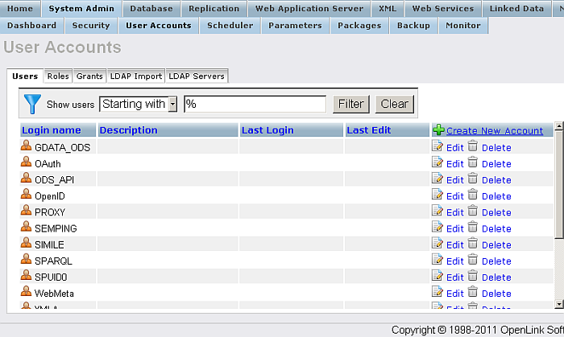

4.  Click the link "Edit"

5.  Set "User type" to "SQL/ODBC Logins and WebDAV".

6.  Select from the list of available Account Roles "SPARQL\_UPDATE"
    role and click the "\>\>" button so to add it to the right-hand
    list.

7.  
8.  Click the "Save" button.

Note that if a table is used in an Linked Data View, and this table is
not granted to SPARQL\_SELECT permission (or SPARQL\_UPDATE, which
implicitly confers SPARQL\_SELECT), then all SELECTs on a graph defined
by an Linked Data View will return an access violation error as the user
account has no permissions to read the table. The user must have
appropriate privileges on all tables included in an Linked Data View in
order to be able to select on *all* graphs.

#### Managing a SPARQL Web Service Endpoint

Virtuoso web service endpoints may provide different default
configurations for different host names mentioned in an HTTP request.
Host name configuration for SPARQL web service endpoints can be managed
via the table *DB.DBA.SYS\_SPARQL\_HOST* .

    create table DB.DBA.SYS_SPARQL_HOST (
      SH_HOST   varchar not null primary key, -- host mask
      SH_GRAPH_URI varchar,                 -- default graph uri
      SH_USER_URI   varchar,                  -- reserved for any use in applications
      SH_BASE_URI varchar,                  -- for future use (not used currently) to set BASE in sparql queries. Should be NULL for now.
      SH_DEFINES long varchar,              -- additional defines for requests
      PRIMARY KEY (SH_HOST)
    )

You can find detailed descriptions of the table columns
[here](#rdfdefaultgraph) . Also, please read [these
notes](#rdfperfindexes) on managing public web service endpoints.

#### Authentication

Virtuoso 5.0.7 introduced a new "SPARQL\_SPONGE" role which can be
assigned specifically for controlling Sponger middleware services which
perform writes and graph creation in the RDF Quad Store. This role only
allows updates through the Sponger. Quad Store updates via any other
route require granting the SPARQL\_UPDATE role.

Virtuoso 5.0.11 onwards added three new methods for securing SPARQL
endpoints that include:

  - SQL authentication

  - OAuth

  - WebID Protocol based authentication

Each of these authentication methods is associated with a purpose
specific default SPARQL endpoint along the following lines:

  - http://\<cname\>/sparql-auth (SQL authentication)

  - http://\<cname\>/sparql-oauth (OAuth)

  - http://\<cname\>/sparql-graph-crud-auth (OAuth CRUD)

  - https://\<cname\>/sparql and https://\<cname\>/sparql-webid (WebID
    Protocol)

Note: sparql-ssl is alias of sparql-webid.

The Virtuoso Authentication Server offers a UI with options for
managing:

  - Application keys and protected SPARQL endpoints: OAuth provides a
    secure data transmission level mechanism for your SPARQL endpoint.
    It enables you to interact securely with your RDF database from a
    variety of locations. It also allows you to provide controlled
    access to private data to selected user profiles.

  - WebID Protocol ACLs: WebID Protocol is an implementation of a
    conceptual authentication and authorization protocol that links a
    Web ID to a public key to create a global,
    decentralized/distributed, and open yet secure authentication system
    that functions with existing browsers.

Virtuoso Authentication Server can be installed by downloading and
installing the conductor\_dav.vad package.

The Authentication UI is accessible from the Conductor UI -\> Linked
Data -\> Access Control -\> SPARQL-WebID. Here is sample scenario:

##### SPARQL-WebID Authentication Example

1.  Download and install the [conductor\_dav.vad](#) package.

2.  [Generate an X.509 Certificate hosted WebID](#) .

3.  Go to http://\<cname\>:\<port\>/conductor, where \<cname\>:\<port\>
    are replaced by your local server values.

4.  Log in as user "dba" or another user with DBA privileges.

5.  Go to Linked Data -\> Access Controls -\> SPARQL-WebID:
    
    

6.  Enter in the presented form Web ID for ex.:
    
        http://id.myopenlink.net/dataspace/person/demo#this
    
    and select "SPARQL Role" for ex. "Sponge".
    
    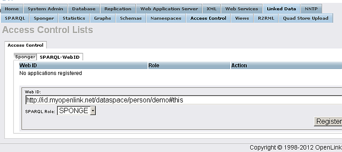

7.  Click the "Register" button.

8.  As result the WebID Protocol ACLs will be created:
    
    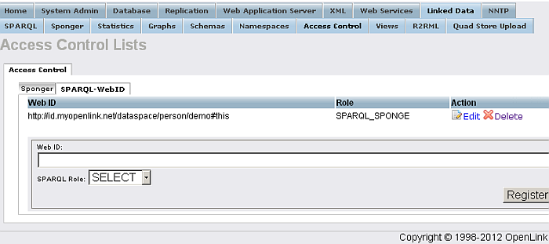

9.  Go to the SPARQL-WebID endpoint
    https://\<cname\>:\<port\>/sparql-webid

10. Select the user's certificate from above:
    
    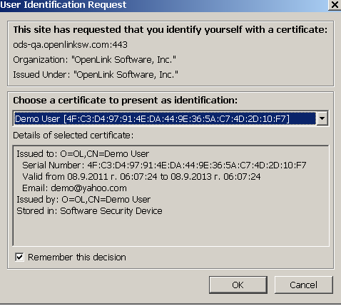

11. As result the SPARQL Query UI will be presented:
    
    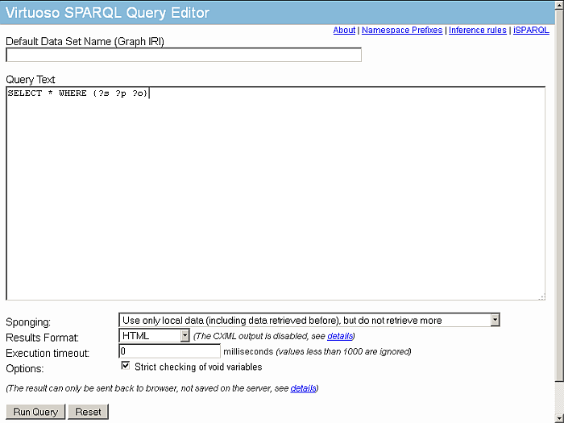

12. Execute sample query and view the results:
    
    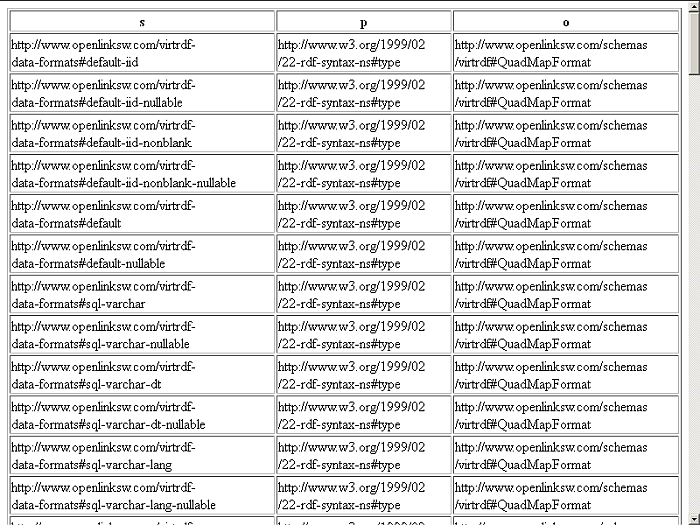

#### SPARQL OAuth Endpoint

OAuth provides a secure data transmission level mechanism for your
SPARQL endpoint. It enables you to interact securely with your RDF
database from a variety of locations. It also allows you to provide
controlled access to private data to selected users.

Virtuoso OAuth Server can be installed by downloading and installing the
[ods\_framework\_dav.vad](#) package. The OAuth UI is accessible from
the URL http://cname:port/oauth

A user must have SQL privileges in order to run secured SPARQL
statements.

Here is a sample scenario:

1.  Download and install the [conductor\_dav.vad](#) and
    [ods\_framework\_dav.vad](#) packages.

2.  [Generate an X.509 Certificate hosted WebID](#) .

3.  Go to http://\<cname\>:\<port\>/conductor, where \<cname\>:\<port\>
    are replaced by your local server values.

4.  Log in as user "dba" or another user with DBA privileges.

5.  Go to System Admin-\>User Accounts:
    
    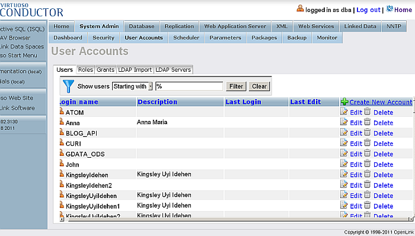

6.  Click "Create New Account":
    
    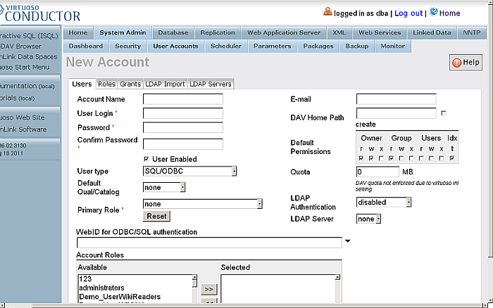

7.  In the presented form enter respectively:
    
    1.  Account name, for ex:demo1; a password and then confirm the
        password;
    
    2.  User type: SQL/ODBC and WebDAV;
    
    3.  Account role: SPARQL\_UPDATE
        
        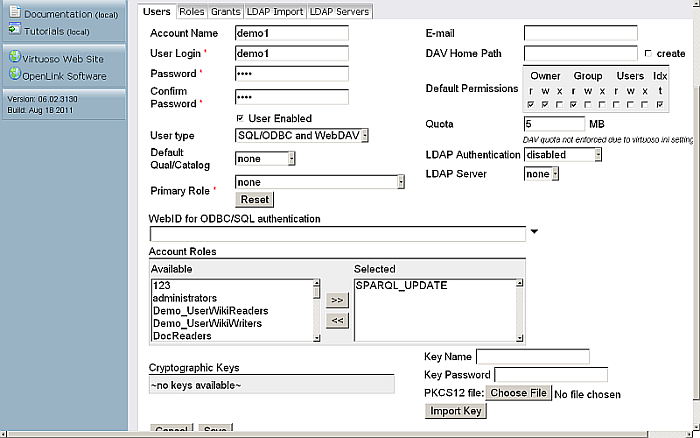

8.  Click the "Save" button.

9.  The created user should be shown in the list of registered users:
    
    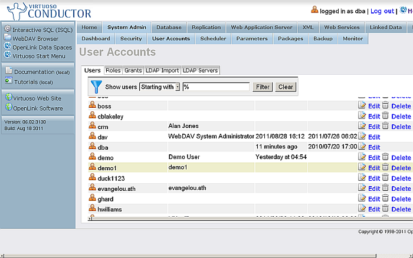

10. Go to http://\<cname\>:\<port\>/oauth/, where \<cname\>:\<port\> are
    replaced by your local server values.
    
    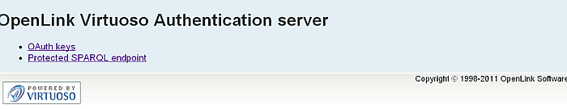

11. Click the "OAuth keys" link:
    
    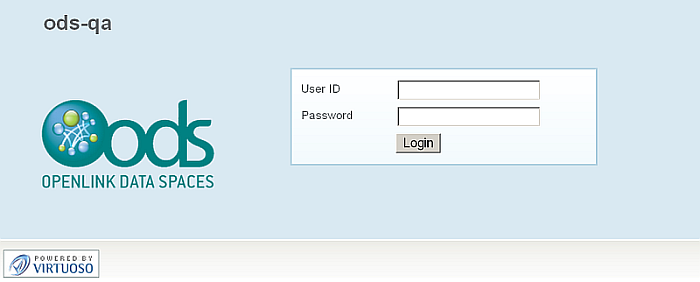

12. Log in as user demo1:
    
    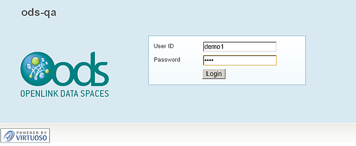

13. The OAuth application registration form will be shown.
    
    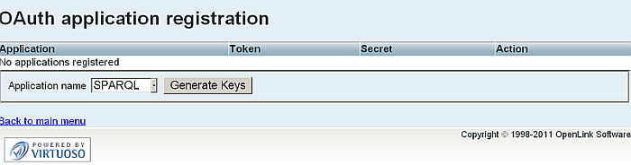

14. Select SPARQL from the "Application name" list, and click the
    "Generate Keys" button.

15. A Consumer Key for SPARQL will be generated:
    
        90baa79108b1d972525bacc76c0279c02d6421e8
    
    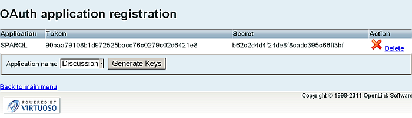

16. Click the "Back to main menu" link.

17. Click the "Protected SPARQL Endpoint" link.

18. The OpenLink Virtuoso SPARQL Query form will be displayed.
    
    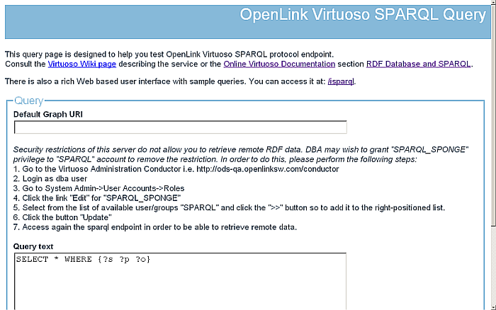
    
    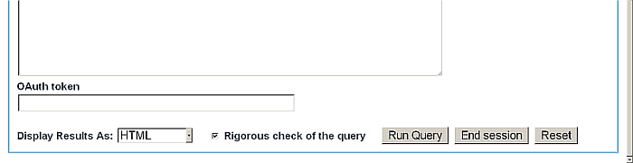

19. Enter a simple query, for ex:
    
        SELECT *
        WHERE
          {
            ?s ?p ?o
          }
        LIMIT 10

20. Enter the value from below for the "OAuth token":
    
        90baa79108b1d972525bacc76c0279c02d6421e8
    
    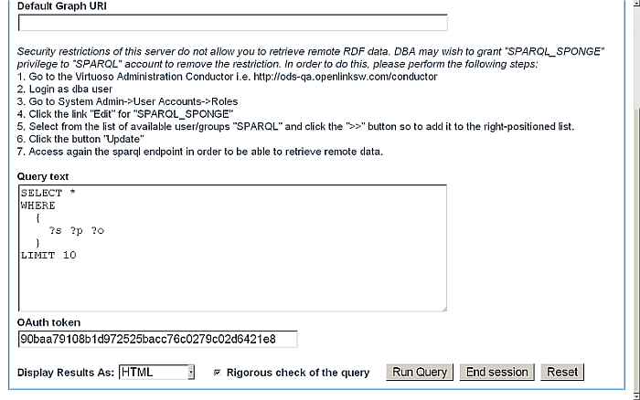

21. Click the "Run Query" button.

22. In the OAuth Authorization Service form enter the password for user
    demo1 and click the "Login" button.
    
    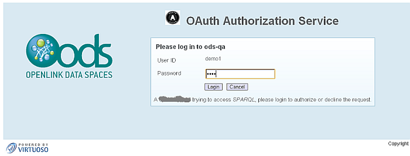

23. Next you should authorize the request:
    
    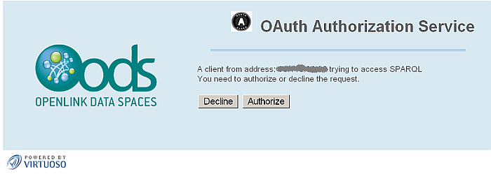

24. On successful authentication and authorization, the query results
    should be shown:
    
    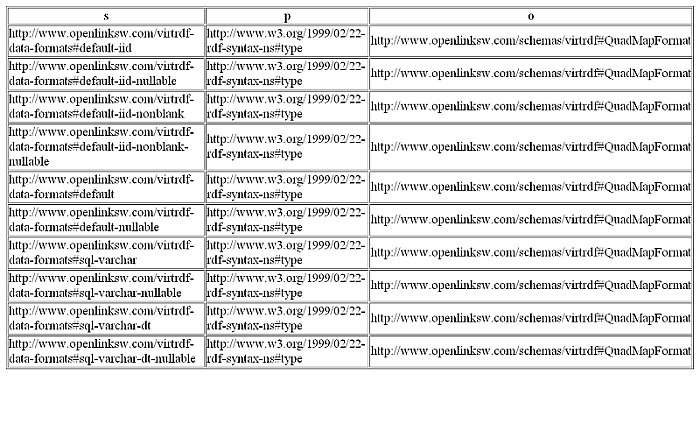

#### WebID Protocol ACLs

WebID Protocol is an implementation of a conceptual authentication and
authorization protocol that links a Web ID to a public key, to create a
global decentralized/distributed, and open yet secure authentication
system that functions with existing browsers.

To use WebID Protocol, download and install the [conductor\_dav.vad](#)
VAD package. Once installed, to access the WebID Protocol ACLs UI, go to
URL http://cname:port/conductor -\> Linked Data -\> Access Controls -\>
SPARQL-WebID .


Configuring WebID Protocol ACLs is with a WebID Protocol certificate and
a Web ID allows secure SPARQL queries to be performed against a Virtuoso
SPARQL-WebID endpoint and viewing of the query results. The SPARQL-WebID
endpoint URL is of the form https://cname:port/sparql-webid

Note: SPARQL-SSL is alias of SPARQL-WebID.

See [sample example](#sparqloauthendpointauthexample) how to configure a
sample WebID Protocol ACL are outlined below:

> **Tip**
> 
> [WebID Protocol ODBC Login](#secureodbcx509foafsll)

#### Creating and Using a SPARQL-WebID based Endpoint

The following section describes the basic steps for setting up an SSL
protected and WebID based SPARQL Endpoint (SPARQL-WebID). The guide also
covers the use of Virtuoso PL functions and the Virtuoso Conductor for
SPARQL endpoint creation and configuration. It also covers the use of
cURL for exercising the newly generated SPARQL-SSL endpoint. Note:
SPARQL-SSL is alias of SPARQL-WebID.

1.  [Setup the CA issuer and https listener](#vfoafsslst509issuer)

2.  To create the /sparql-webid endpoint, install the
    [policy\_manager.vad](#) manage or manually define the /sparql-webid
    endpoint on an HTTPS based listener (HTTPS service endpoint), for
    example using Virtuoso PL:
    
        DB.DBA.VHOST_DEFINE (
             lhost=>'127.0.0.1:443',
             vhost=>'localhost',
             lpath=>'/sparql-webid',
             ppath=>'/!sparql/',
             is_dav=>1,
             auth_fn=>'DB.DBA.FOAF_SSL_AUTH',
             vsp_user=>'dba',
             ses_vars=>0,
             auth_opts=>vector ( 'https_cert',
                                 'db:https_key_localhost',
                                 'https_key',
                                 'db:https_key_localhost',
                                 'https_verify',
                                 3,
                                 'https_cv_depth',
                                 10 ),
             opts=>vector ('noinherit', 1),
             is_default_host=>0
        );

3.  [Setup the SPARQL-WebID endpoint and define
    ACLs](#sparqloauthendpointfoafssl) using the Virtuoso Conductor

4.  Export your private key and its associated WebID based X.509
    certificate from your Firefox browser or System's Key Manager into
    PEM (PKCS12) file
    
    1.  If using Firefox use the menu path: Advanced -\> View
        Certificates, then click Backup for your certificate with name
        "mykey".
    
    2.  The file "mykey.p12" will be created. To disable password
        protection so that you can use this file in non-interactive mode
        (e.g. with cURL and other HTTP clients) execute:
        
            openssl pkcs12 -in mykey.p12 -out mykey.pem -nodes

5.  Test the SPARQL-WebID endpoint with cURL: (listening on default
    HTTPS 443 port):
    
      - Note: In this example we use the "-k / --insecure" option with
        cURL since we are going to be using self-signed X.509
        certificates signed by self-signed root CA.
    
    <!-- end list -->
    
    ``` 
        curl -k -E mykey.pem "https://example.com/sparql-webid?query=select+*+where+\{+%3Fx+%3Fy+%3Fz+.+\}+limit+10&format=text%2Fn3"
    
    @prefix res: <http://www.w3.org/2005/sparql-results#> .
    @prefix rdf: <http://www.w3.org/1999/02/22-rdf-syntax-ns#> .
    _:_ a res:ResultSet .
    _:_ res:resultVariable "x" , "y" , "z" .
    @prefix ns0:    <https://example.com/tutorial/> .
    @prefix rdf:    <http://www.w3.org/1999/02/22-rdf-syntax-ns#> .
    _:_ res:solution [
          res:binding [ res:variable "x" ; res:value ns0:hosting ] ;
          res:binding [ res:variable "y" ; res:value rdf:type ] ;
          res:binding [ res:variable "z" ; res:value "Tutorial" ] ] .
    _:_ res:solution [
          res:binding [ res:variable "x" ; res:value ns0:xml ] ;
          res:binding [ res:variable "y" ; res:value rdf:type ] ;
          res:binding [ res:variable "z" ; res:value "Tutorial" ] ] .
    _:_ res:solution [
          res:binding [ res:variable "x" ; res:value ns0:repl ] ;
          res:binding [ res:variable "y" ; res:value rdf:type ] ;
          res:binding [ res:variable "z" ; res:value "Tutorial" ] ] .
    _:_ res:solution [
          res:binding [ res:variable "x" ; res:value ns0:rdfview ] ;
          res:binding [ res:variable "y" ; res:value rdf:type ] ;
          res:binding [ res:variable "z" ; res:value "Tutorial" ] ] .
    _:_ res:solution [
          res:binding [ res:variable "x" ; res:value ns0:services ] ;
          res:binding [ res:variable "y" ; res:value rdf:type ] ;
          res:binding [ res:variable "z" ; res:value "Tutorial" ] ] .
    _:_ res:solution [
          res:binding [ res:variable "x" ; res:value ns0:wap ] ;
          res:binding [ res:variable "y" ; res:value rdf:type ] ;
          res:binding [ res:variable "z" ; res:value "Tutorial" ] ] .
    _:_ res:solution [
          res:binding [ res:variable "x" ; res:value ns0:bpeldemo ] ;
          res:binding [ res:variable "y" ; res:value rdf:type ] ;
          res:binding [ res:variable "z" ; res:value "Tutorial" ] ] .
    _:_ res:solution [
          res:binding [ res:variable "x" ; res:value ns0:web ] ;
          res:binding [ res:variable "y" ; res:value rdf:type ] ;
          res:binding [ res:variable "z" ; res:value "Tutorial" ] ] .
    _:_ res:solution [
          res:binding [ res:variable "x" ; res:value ns0:web2 ] ;
          res:binding [ res:variable "y" ; res:value rdf:type ] ;
          res:binding [ res:variable "z" ; res:value "Tutorial" ] ] .
    _:_ res:solution [
          res:binding [ res:variable "x" ; res:value ns0:xmlxslt ] ;
          res:binding [ res:variable "y" ; res:value rdf:type ] ;
          res:binding [ res:variable "z" ; res:value "Tutorial" ] ] .
    ```

6.  Import your key it via Conductor UI:
    
    1.  Go to Conductor -\> System Admin-\>User Accounts
        
        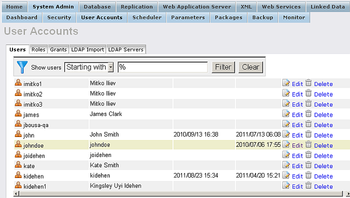
    
    2.  Click "Edit" for your user
        
        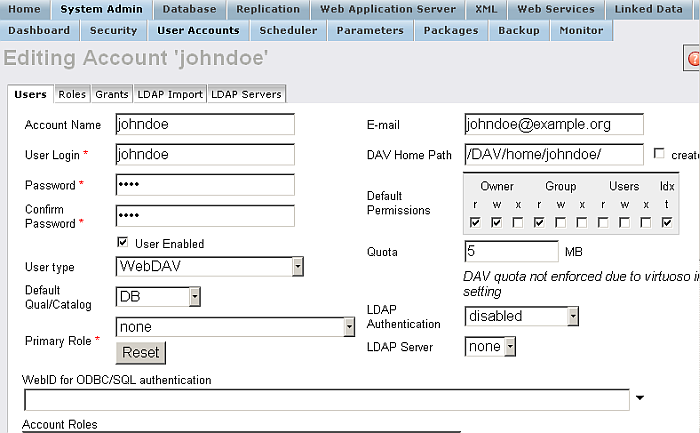
    
    3.  Change "User type" to: SQL/ODBC and WebDAV
        
        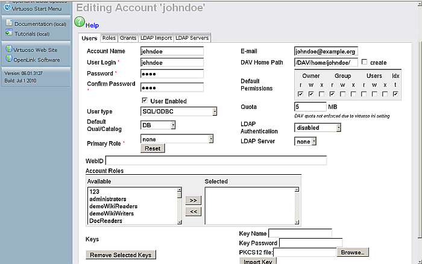
    
    4.  Enter your ODS user WebID:
        
            http://cname:port/dataspace/person/username#this
        
        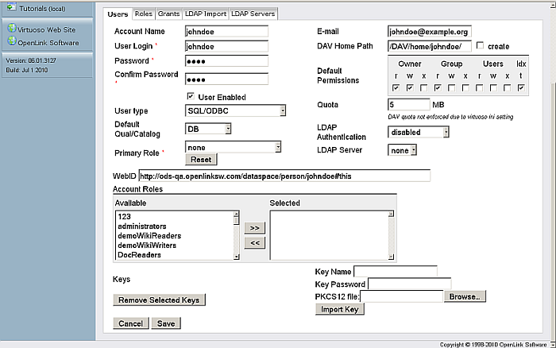
    
    5.  Click "Save"
    
    6.  Click again "Edit" for your user
    
    7.  In "PKCS12 file:" click the Browse" button and select your key.
    
    8.  Enter a local Key Name, for e.g., "cli\_key"
    
    9.  Enter key password
        
        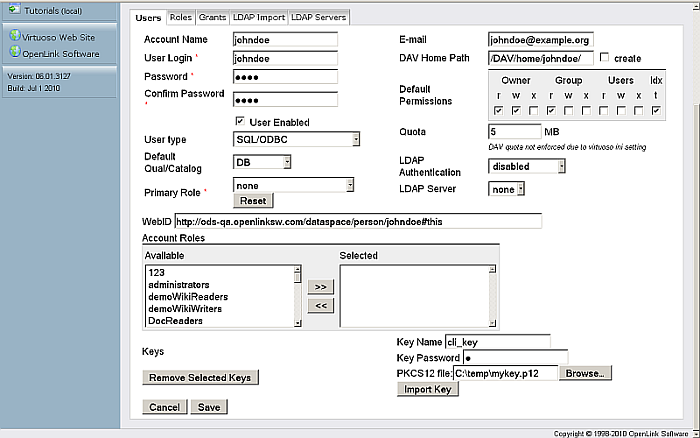
    
    10. Click "Import Key"
    
    11. As result the key will be stored with name for ex. cli\_key
        
        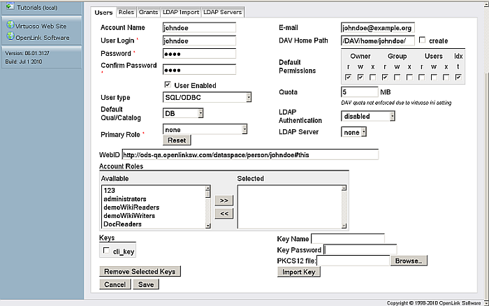
    
    12. Click "Save"

7.  Test the SPARQL-WebID endpoint with http\_client (listening on
    default HTTPS 443 port):
    
    1.  Log in at Virtuos ISQL with your user credentials:
        
            C:\>isql localhost:1111 johndoe****
            Connected to OpenLink Virtuoso
            Driver: 06.01.3127 OpenLink Virtuoso ODBC Driver
            OpenLink Interactive SQL (Virtuoso), version 0.9849b.
            Type HELP; for help and EXIT; to exit.
            SQL>
    
    2.  Execute:
        
            SQL>select http_client ('https://example.com/sparql-webid?query=select+*+where+{+%3Fx+%3Fy+%3Fz+.+}+limit+10&format=text%2Fn3', cert_file=>'d
            b:cli_key', insecure=>1);
            callret
            VARCHAR
            _______________________________________________________________________________
            
            @prefix res: <http://www.w3.org/2005/sparql-results#> .
            @prefix rdf: <http://www.w3.org/1999/02/22-rdf-syntax-ns#> .
            _:_ a res:ResultSet .
            _:_ res:resultVariable "x" , "y" , "z" .
            @prefix ns0:    <https://example.com/tutorial/> .
            @prefix rdf:    <http://www.w3.org/1999/02/22-rdf-syntax-ns#> .
            _:_ res:solution [
                  res:binding [ res:variable "x" ; res:value ns0:hosting ] ;
                  res:binding [ res:variable "y" ; res:value rdf:type ] ;
                  res:binding [ res:variable "z" ; res:value "Tutorial" ] ] .
            _:_ res:solution [
                  res:binding [ res:variable "x" ; res:value ns0:xml ] ;
                  res:binding [ res:variable "y" ; res:value rdf:type ] ;
                  res:binding [ res:variable "z" ; res:value "Tutorial" ] ] .
            _:_ res:solution [
                  res:binding [ res:variable "x" ; res:value ns0:repl ] ;
                  res:binding [ res:variable "y" ; res:value rdf:type ] ;
                  res:binding [ res:variable "z" ; res:value "Tutorial" ] ] .
            _:_ res:solution [
                  res:binding [ res:variable "x" ; res:value ns0:rdfview ] ;
                  res:binding [ res:variable "y" ; res:value rdf:type ] ;
                  res:binding [ res:variable "z" ; res:value "Tutorial" ] ] .
            _:_ res:solution [
                  res:binding [ res:variable "x" ; res:value ns0:services ] ;
                  res:binding [ res:variable "y" ; res:value rdf:type ] ;
                  res:binding [ res:variable "z" ; res:value "Tutorial" ] ] .
            _:_ res:solution [
                  res:binding [ res:variable "x" ; res:value ns0:wap ] ;
                  res:binding [ res:variable "y" ; res:value rdf:type ] ;
                  res:binding [ res:variable "z" ; res:value "Tutorial" ] ] .
            _:_ res:solution [
                  res:binding [ res:variable "x" ; res:value ns0:bpeldemo ] ;
                  res:binding [ res:variable "y" ; res:value rdf:type ] ;
                  res:binding [ res:variable "z" ; res:value "Tutorial" ] ] .
            _:_ res:solution [
                  res:binding [ res:variable "x" ; res:value ns0:web ] ;
                  res:binding [ res:variable "y" ; res:value rdf:type ] ;
                  res:binding [ res:variable "z" ; res:value "Tutorial" ] ] .
            _:_ res:solution [
            
            1 Rows. -- 281 msec.

> **Tip**
> 
> [Demo Example](#) Using HTTP client to perform WebID Protocol
> connection.

#### Disable Default SPARQL Endpoint

##### Using iSQL:

1.  To disable /sparql, execute:
    
        DB.DBA.VHOST_REMOVE (lpath=>'/sparql');

2.  To add the endpoint again via PL, execute:
    
        DB.DBA.VHOST_DEFINE (lpath=>'/sparql/', ppath => '/!sparql/', is_dav => 1, vsp_user => 'dba', opts => vector('noinherit', 1));

##### Using Conductor UI:

1.  Go to http://cname:port/conductor .

2.  Enter user dba credentials.

3.  Go to "Web Application Server" -\> "Virtual Domains & Directories".
    
    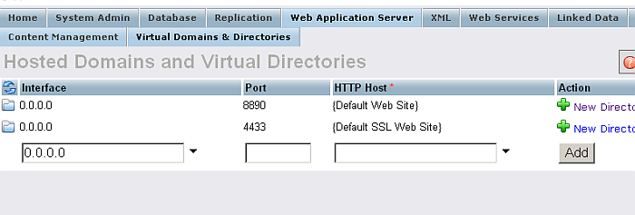

4.  Find the logical path "/sparql".
    
    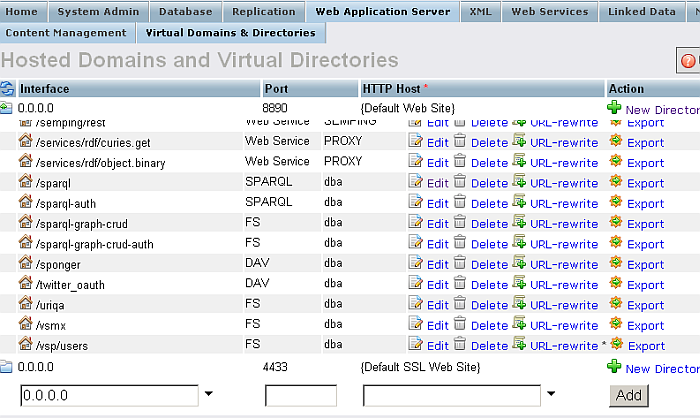

5.  Click "Edit" from the "Action" column.
    
    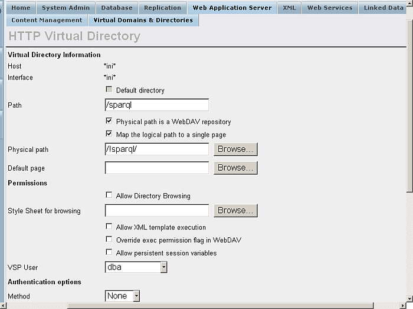

6.  Change "VSP User" to "nobody".
    
    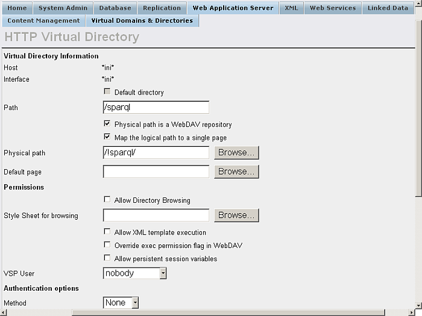

7.  Click "Save Changes".

8.  As result the SPARQL Endpoint should be shown as disabled:
    
    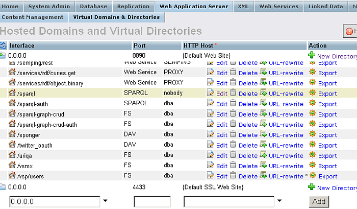

### Request Methods

| Method |
| :----- |
| GET    |
| POST   |
| DELETE |
| PUT    |

Methods List

### Functions

The SPARQL client can be invoked by three similar functions:

| Function                         |
| :------------------------------- |
| DB.DBA.SPARQL\_REXEC             |
| DB.DBA.SPARQL\_REXEC\_TO\_ARRAY  |
| DB.DBA.SPARQL\_REXEC\_WITH\_META |

Functions List

    create procedure DB.DBA.SPARQL_REXEC (
        in service varchar, in query varchar, in dflt_graph varchar, in named_graphs any,
        in req_hdr any, in maxrows integer, in bnode_dict any );

    create function DB.DBA.SPARQL_REXEC_TO_ARRAY (
        in service varchar, in query varchar, in dflt_graph varchar, in named_graphs any,
        in req_hdr any, in maxrows integer, in bnode_dict any )
        returns any;

    create procedure DB.DBA.SPARQL_REXEC_WITH_META (
        in service varchar, in query varchar, in dflt_graph varchar, in named_graphs any,
        in req_hdr any, in maxrows integer, in bnode_dict any,
        out metadata any,  -- metadata like exec () returns.
        out resultset any) -- results as 'long valmode' values.

### Examples

Virtuoso's SPARQL demo offers a live demonstration of Virtuoso's
implementation of the [DAWG's SPARQL test-suite](#) , a collection of
SPARQL query language use cases that enable interactive and simplified
testing of a triple store implementation. If you have installed the
SPARQL Demo VAD locally, it can be found at a URL similar to
'http://example.com:8080/sparql\_demo/', the exact form will depend on
your local configuration. Alternatively, a live version of the
documentation is available at [Virtuoso Demo Server](#) .

#### Example SPARQL query issued via curl

    curl -F "query=SELECT DISTINCT ?p FROM <http://demo.openlinksw.com/DAV/home/demo/rdf_sink/> WHERE {?s ?p ?o}" http://demo.openlinksw.com/sparql

The result should be:

    <?xml version="1.0" ?>
    <sparql xmlns="http://www.w3.org/2005/sparql-results#" xmlns:xsi="http://www.w3.org/2001/XMLSchema-instance" xsi:schemaLocation="http://www.w3.org/2001/sw/DataAccess/rf1/result2.xsd">
     <head>
      <variable name="p"/>
     </head>
     <results distinct="false" ordered="true">
      <result>
       <binding name="p"><uri>http://www.w3.org/1999/02/22-rdf-syntax-ns#type</uri></binding>
      </result>
      <result>
       <binding name="p"><uri>http://xmlns.com/foaf/0.1/nick</uri></binding>
      </result>
      <result>
       <binding name="p"><uri>http://xmlns.com/foaf/0.1/name</uri></binding>
      </result>
      <result>
       <binding name="p"><uri>http://xmlns.com/foaf/0.1/homepage</uri></binding>
      </result>
      <result>
       <binding name="p"><uri>http://xmlns.com/foaf/0.1/knows</uri></binding>
      </result>
      <result>
       <binding name="p"><uri>http://xmlns.com/foaf/0.1/workplaceHomepage</uri></binding>
      </result>
      <result>
       <binding name="p"><uri>http://xmlns.com/foaf/0.1/mbox</uri></binding>
      </result>
     </results>
    </sparql>

#### Other Examples of SPARQL query issued via curl

*Further example SPARQL queries:*

    curl -F "query=SELECT DISTINCT ?Concept FROM <http://dbpedia.org> WHERE {?s a ?Concept} LIMIT 10" http://dbpedia.org/sparql

    curl -F "query=SELECT DISTINCT ?Concept FROM <http://example.com/dataspace/person/kidehen> WHERE {?s a ?Concept} LIMIT 10" http://demo.openlinksw.com/sparql

    curl -F "query=SELECT DISTINCT ?Concept FROM <http://data.openlinksw.com/oplweb/product_family/virtuoso> WHERE {?s a ?Concept} LIMIT 10" http://demo.openlinksw.com/sparql

    curl -F "query=SELECT DISTINCT ?Concept FROM <http://openlinksw.com/dataspace/organization/openlink> WHERE {?s a ?Concept} LIMIT 10" http://demo.openlinksw.com/sparql

#### Example with curl and SPARQL-WebID endpoint

    $ curl -H "Accept: text/rdf+n3"  --cert test.pem -k https://demo.openlinksw.com/dataspace/person/demo
    Enter PEM pass phrase: *****
    @prefix rdf:    <http://www.w3.org/1999/02/22-rdf-syntax-ns#> .
    @prefix ns1:    <https://demo.openlinksw.com/dataspace/demo/socialnetwork/demo%27s%20AddressBook/1046#> .
    @prefix foaf:   <http://xmlns.com/foaf/0.1/> .
    ns1:this        rdf:type        foaf:Person .
    @prefix ns3:    <http://www.pipian.com/rdf/tami/juliette.n3#> .
    ns3:juliette    rdf:type        foaf:Document .
    @prefix ns4:    <https://demo.openlinksw.com/dataspace/person/> .
    ns4:demo        rdf:type        foaf:PersonalProfileDocument .
    @prefix ns5:    <https://demo.openlinksw.com/dataspace/person/demo#> .
    @prefix geo:    <http://www.w3.org/2003/01/geo/wgs84_pos#> .
    ns5:based_near  rdf:type        geo:Point .
    @prefix ns7:    <https://demo.openlinksw.com/dataspace/demo/socialnetwork/demo%27s%20AddressBook/1042#> .
    ns7:this        rdf:type        foaf:Person .
    ns5:this        rdf:type        foaf:Person .
    @prefix ns8:    <https://demo.openlinksw.com/dataspace/person/demo/online_account/> .
    @prefix sioc:   <http://rdfs.org/sioc/ns#> .
    ns8:demo        rdf:type        sioc:User .
    @prefix ns10:   <https://demo.openlinksw.com/dataspace/demo/socialnetwork/myAddressBook/1001#> .
    ns10:this       rdf:type        foaf:Person .
    @prefix ns11:   <https://demo.openlinksw.com/dataspace/demo/socialnetwork/demo%27s%20AddressBook/1045#> .
    ns11:this       rdf:type        foaf:Person .
    @prefix ns12:   <https://demo.openlinksw.com/dataspace/demo#> .
    ns12:this       rdf:type        sioc:User .
    ns5:org rdf:type        foaf:Organization .
    @prefix ns13:   <https://demo.openlinksw.com/dataspace/demo/socialnetwork/demo%27s%20AddressBook/1048#> .
    ns13:this       rdf:type        foaf:Person .
    @prefix ns14:   <https://demo.openlinksw.com/dataspace/demo/socialnetwork/myAddressBook/1001#this#> .
    ns14:org        rdf:type        foaf:Organization .
    @prefix ns15:   <https://demo.openlinksw.com/dataspace/person/imitko#> .
    ns15:this       rdf:type        foaf:Person .
    @prefix ns16:   <https://demo.openlinksw.com/dataspace/demo/socialnetwork/myAddressBook/1049#> .
    ns16:this       rdf:type        foaf:Person .
    @prefix ns17:   <https://demo.openlinksw.com/dataspace/demo/socialnetwork/myAddressBook/1000#> .
    ns17:this       rdf:type        foaf:Person .
    ns8:MySpace     rdf:type        sioc:User .
    @prefix ns18:   <https://demo.openlinksw.com/dataspace/demo/socialnetwork/demo%27s%20AddressBook/1044#> .
    ns18:this       rdf:type        foaf:Person .
    @prefix dc:     <http://purl.org/dc/elements/1.1/> .
    ns4:demo        dc:title        "demo demo's FOAF file" .
    ns14:org        dc:title        "OpenLink" .
    ns5:org dc:title        "OpenLink" .
    ns18:this       foaf:name       "Kingsley Idehen" .
    ns13:this       foaf:name       "Juliette" .
    ns17:this       foaf:name       "Kingsley Idehen" .
    ns5:this        foaf:name       "demo demo" .
    ns15:this       foaf:name       "Mitko Iliev" .
    ns10:this       foaf:name       "test test12" .
    @prefix rdfs:   <http://www.w3.org/2000/01/rdf-schema#> .
    ns5:this        rdfs:seeAlso    ns4:demo .
    ns15:this       rdfs:seeAlso    ns4:imitko .
    ns4:demo        foaf:maker      ns5:this .
    ns15:this       foaf:nick       "imitko" .
    ns7:this        foaf:nick       "Orri Erling" .
    ns13:this       foaf:nick       "Juliette" .
    ns10:this       foaf:nick       "test1" .
    ns5:this        foaf:nick       "demo" .
    ns18:this       foaf:nick       "Kingsley" .
    ns17:this       foaf:nick       "Kingsley" .
    ns16:this       foaf:nick       "test2" .
    ns1:this        foaf:nick       "TEST" .
    ns11:this       foaf:nick       "TEST" .
    ns5:this        foaf:holdsAccount       ns8:demo ,
                    ns8:MySpace ,
                    ns12:this .
    @prefix ns21:   <http://example.com/dataspace/person/imitko#> .
    ns5:this        foaf:knows      ns21:this ,
                    ns17:this ,
                    ns16:this ,
                    ns3:juliette ,
                    ns10:this ,
                    ns7:this .
    @prefix ns22:   <http://example.com/dataspace/person/kidehen#> .
    ns5:this        foaf:knows      ns22:this ,
                    ns18:this ,
                    ns11:this ,
                    ns1:this .
    @prefix ns23:   <http://bblfish.net/people/henry/card#me\u0020> .
    ns5:this        foaf:knows      ns23: ,
                    ns13:this ,
                    ns15:this ;
            foaf:firstName  "demo" ;
            foaf:family_name        "demo" ;
            foaf:gender     "male" ;
            foaf:icqChatID  "125968" ;
            foaf:msnChatID  "45demo78" ;
            foaf:aimChatID  "demo1234" ;
            foaf:yahooChatID        "demo678" ;
            foaf:based_near ns5:based_near .
    @prefix ns24:   <http://www.openlinksw.com> .
    ns5:this        foaf:workplaceHomepage  ns24: .
    ns5:org foaf:homepage   ns24: .
    ns5:this        foaf:homepage   ns24: .
    ns14:org        foaf:homepage   ns24: .
    ns4:demo        foaf:primaryTopic       ns5:this .
    ns5:based_near  geo:lat "47.333332" ;
            geo:long        "13.333333" .
    @prefix rdf:    <http://www.w3.org/1999/02/22-rdf-syntax-ns#> .
    @prefix ns1:    <https://demo.openlinksw.com/dataspace/demo#> .
    @prefix foaf:   <http://xmlns.com/foaf/0.1/> .
    ns1:this        rdf:type        foaf:OnlineAccount .
    @prefix ns3:    <https://demo.openlinksw.com/dataspace/person/demo/online_account/> .
    ns3:MySpace     rdf:type        foaf:OnlineAccount .
    ns3:demo        rdf:type        foaf:OnlineAccount .
    @prefix ns4:    <https://demo.openlinksw.com/dataspace/person/demo#> .
    ns4:this        foaf:holdsAccount       ns3:MySpace ,
                    ns1:this ,
                    ns3:demo .
    @prefix vcard:  <http://www.w3.org/2001/vcard-rdf/3.0#> .
    ns4:this        vcard:ADR       ns4:addr .
    ns4:addr        vcard:Country   "United States" ;
            vcard:Locality  "New York" ;
            vcard:Region    "Nebraska" .
    @prefix ns6:    <http://myspace.com> .
    ns3:MySpace     foaf:accountServiceHomepage     ns6: .
    @prefix ns7:    <skype:demo?> .
    ns3:demo        foaf:accountServiceHomepage     ns7:chat ;
            foaf:accountName        "demo" .
    ns3:MySpace     foaf:accountName        "MySpace" .
    @prefix ns8:    <http://vocab.org/bio/0.1/> .
    ns4:this        ns8:olb "this is short resume of user Demo." .
    @prefix ns9:    <https://demo.openlinksw.com/dataspace/> .
    ns4:this        foaf:openid     ns9:demo ;
            ns8:keywords    "demo, openlinksw, virtuoso, weblog, rdf" .
    @prefix foaf:   <http://xmlns.com/foaf/0.1/> .
    @prefix ns1:    <https://demo.openlinksw.com/dataspace/demo/subscriptions/> .
    @prefix ns2:    <https://demo.openlinksw.com/dataspace/person/demo#> .
    ns1:DemoFeeds   foaf:maker      ns2:this .
    @prefix ns3:    <https://demo.openlinksw.com/dataspace/demo/community/> .
    ns3:demoCommunity       foaf:maker      ns2:this .
    @prefix ns4:    <https://demo.openlinksw.com/dataspace/demo/eCRM/demo%27s%20eCRM> .
    ns4:    foaf:maker      ns2:this .
    @prefix ns5:    <https://demo.openlinksw.com/dataspace/demo/calendar/> .
    ns5:mycalendar  foaf:maker      ns2:this .
    @prefix ns6:    <https://demo.openlinksw.com/dataspace/demo/photos/> .
    ns6:MyGallery   foaf:maker      ns2:this .
    @prefix ns7:    <https://demo.openlinksw.com/dataspace/demo/briefcase/> .
    ns7:mybriefcase foaf:maker      ns2:this .
    @prefix ns8:    <https://demo.openlinksw.com/dataspace/demo/wiki/> .
    ns8:ESBWiki     foaf:maker      ns2:this .
    @prefix ns9:    <https://demo.openlinksw.com/dataspace/demo/bookmark/> .
    ns9:mybookmarks foaf:maker      ns2:this .
    @prefix ns10:   <https://demo.openlinksw.com/dataspace/demo/weblog/> .
    ns10:myblog     foaf:maker      ns2:this .
    @prefix ns11:   <https://demo.openlinksw.com/dataspace/demo/socialnetwork/demo%27s%20AddressBook> .
    ns11:   foaf:maker      ns2:this .
    @prefix ns12:   <https://demo.openlinksw.com/dataspace/demo/community/demo%27s%20Community> .
    ns12:   foaf:maker      ns2:this .
    ns8:mywiki      foaf:maker      ns2:this .
    @prefix ns13:   <https://demo.openlinksw.com/dataspace/demo/eCRM/demo%20demo%27s%20eCRM> .
    ns13:   foaf:maker      ns2:this .
    @prefix ns14:   <https://demo.openlinksw.com/dataspace/demo/polls/> .
    ns14:mypolls    foaf:maker      ns2:this .
    @prefix ns15:   <https://demo.openlinksw.com/dataspace/demo/socialnetwork/> .
    ns15:myAddressBook      foaf:maker      ns2:this .
    ns3:SP2 foaf:maker      ns2:this .
    ns2:this        foaf:made       ns11: ,
                    ns4: ,
                    ns3:demoCommunity ,
                    ns12: ,
                    ns15:myAddressBook ,
                    ns10:myblog ,
                    ns9:mybookmarks ,
                    ns7:mybriefcase ,
                    ns5:mycalendar ,
                    ns14:mypolls ,
                    ns8:mywiki ,
                    ns1:DemoFeeds ,
                    ns8:ESBWiki ,
                    ns6:MyGallery ,
                    ns3:SP2 ,
                    ns13: .
    @prefix rdfs:   <http://www.w3.org/2000/01/rdf-schema#> .
    ns9:mybookmarks rdfs:label      "demo demo's Bookmarks" .
    ns15:myAddressBook      rdfs:label      "demo demo's AddressBook" .
    ns4:    rdfs:label      "demo demo's eCRM" .
    ns12:   rdfs:label      "demo's Community" .
    ns14:mypolls    rdfs:label      "demo demo's Polls" .
    ns13:   rdfs:label      "demo demo's eCRM Description" .
    ns8:mywiki      rdfs:label      "demo demo's Wiki" .
    ns7:mybriefcase rdfs:label      "demo demo's Briefcase" .
    ns1:DemoFeeds   rdfs:label      "demo demo's Feeds" .
    ns10:myblog     rdfs:label      "demo's Weblog" .
    ns5:mycalendar  rdfs:label      "demo demo's Calendar" .
    ns11:   rdfs:label      "demo demo's AddressBook" .
    ns6:MyGallery   rdfs:label      "demo demo's Gallery" .
    ns8:ESBWiki     rdfs:label      "demo demo's Wiki" .
    ns3:demoCommunity       rdfs:label      "demo demo's Community" .
    ns3:SP2 rdfs:label      "demo demo's Community" .
    @prefix rdf:    <http://www.w3.org/1999/02/22-rdf-syntax-ns#> .
    @prefix ns1:    <https://demo.openlinksw.com/dataspace/person/demo#> .
    @prefix ns2:    <http://www.w3.org/ns/auth/rsa#> .
    ns1:cert        rdf:type        ns2:RSAPublicKey .
    @prefix dc:     <http://purl.org/dc/elements/1.1/> .
    @prefix ns4:    <https://demo.openlinksw.com/dataspace/person/demo/projects#ods%20project> .
    ns4:    dc:title        "ods project" .
    @prefix foaf:   <http://xmlns.com/foaf/0.1/> .
    ns4:    foaf:maker      ns1:this .
    ns1:this        foaf:made       ns4: .
    @prefix ns6:    <http://www.w3.org/ns/auth/cert#> .
    ns1:cert        ns6:identity    ns1:this ;
            ns2:modulus     ns1:cert_mod .
    ns1:cert_mod    ns6:hex "b8edefa13092d05e85257d6be0aca54218091278583f1d18759c4bced0007948fa6e920018abc3c30b8885d303ec2e679f3a7c15036d38452ddd9ebfcbb41
    e1bd08dca66b7737b744fd9e441ebefa425311363711714cd0fe3b334a79ce50be9eb3443193bcbf2f1486481e775382f1a1792a2a8438543ca6f478c3b13c5db2a7f9a12a9a5aed5ec498
    6be0169a1859d027170812a28914d158fb76a5933f11777a06c8db64d10f7c02900c4bb4bbf2d24c0e34c6ca135fdb5e05241bc029196ceef13a2006f07d1800f17762c0cfe05b3dac3042
    09e1b7a3973122e850e96fcd0396544f82f0b11a46f0d868ba0f3d8efd957e7ef224871905a06c3c5d85ac9" .
    ns1:cert        ns2:public_exponent     ns1:cert_exp .
    ns1:cert_exp    ns6:decimal     "65537" .
    @prefix rdf:    <http://www.w3.org/1999/02/22-rdf-syntax-ns#> .
    @prefix ns1:    <https://demo.openlinksw.com/dataspace/person/demo#> .
    @prefix ns2:    <http://vocab.org/bio/0.1/> .
    ns1:event       rdf:type        ns2:Birth .
    @prefix foaf:   <http://xmlns.com/foaf/0.1/> .
    @prefix ns4:    <mailto:demo@openlinksw.com> .
    ns1:this        foaf:mbox       ns4: ;
            foaf:birthday   "01-01" .
    @prefix dc:     <http://purl.org/dc/elements/1.1/> .
    ns1:event       dc:date "1968-01-01" .
    ns1:this        ns2:event       ns1:event .

#### Example with curl and SPARQL-OAuth endpoint

Note: this is just an example as token had expired already. You can go
to [this](#sparqloauthendpoint) section to see how to interact with our
Virtuoso UI.

    $ curl "http://demo.openlinksw.com/oauth/sparql.vsp?debug=on&default-graph-uri=&format=text%2Fhtml&oauth_consumer_key=27f105a327f5f23163e0636f78901
    8dacdd70bb5&oauth_nonce=a14d43339fcb2638&oauth_signature_method=HMAC-SHA1&oauth_timestamp=1242106643&oauth_token=42e2af4d9264ef42521c1010aff99f60a8
    ee95a2&oauth_version=1.0&query=select%20distinct%20%3FURI%20%3FObjectType%20where%20%7B%3FURI%20a%20%3FObjectType%7D%20limit%2050&oauth_signature=C
    w9yJ2saU1vgHuFxWcughai5cZY%3D"
    <table class="sparql" border="1">
      <tr>
        <th>URI</th>
        <th>ObjectType</th>
      </tr>
      <tr>
        <td>http://www.openlinksw.com/virtrdf-data-formats#default-iid</td>
        <td>http://www.openlinksw.com/schemas/virtrdf#QuadMapFormat</td>
      </tr>
      <tr>
        <td>http://www.openlinksw.com/virtrdf-data-formats#default-iid-nullable</td>
        <td>http://www.openlinksw.com/schemas/virtrdf#QuadMapFormat</td>
      </tr>
      <tr>
        <td>http://www.openlinksw.com/virtrdf-data-formats#default-iid-nonblank</td>
        <td>http://www.openlinksw.com/schemas/virtrdf#QuadMapFormat</td>
      </tr>
      <tr>
        <td>http://www.openlinksw.com/virtrdf-data-formats#default-iid-nonblank-nullable</td>
        <td>http://www.openlinksw.com/schemas/virtrdf#QuadMapFormat</td>
      </tr>
      <tr>
        <td>http://www.openlinksw.com/virtrdf-data-formats#default</td>
        <td>http://www.openlinksw.com/schemas/virtrdf#QuadMapFormat</td>
      </tr>
      <tr>
        <td>http://www.openlinksw.com/virtrdf-data-formats#default-nullable</td>
        <td>http://www.openlinksw.com/schemas/virtrdf#QuadMapFormat</td>
      </tr>
      <tr>
        <td>http://www.openlinksw.com/virtrdf-data-formats#sql-varchar</td>
        <td>http://www.openlinksw.com/schemas/virtrdf#QuadMapFormat</td>
      </tr>
      <tr>
        <td>http://www.openlinksw.com/virtrdf-data-formats#sql-varchar-nullable</td>
        <td>http://www.openlinksw.com/schemas/virtrdf#QuadMapFormat</td>
      </tr>
      <tr>
        <td>http://www.openlinksw.com/virtrdf-data-formats#sql-longvarchar</td>
        <td>http://www.openlinksw.com/schemas/virtrdf#QuadMapFormat</td>
      </tr>
      <tr>
        <td>http://www.openlinksw.com/virtrdf-data-formats#sql-longvarchar-nullable</td>
        <td>http://www.openlinksw.com/schemas/virtrdf#QuadMapFormat</td>
      </tr>
      <tr>
        <td>http://www.openlinksw.com/virtrdf-data-formats#sql-longvarbinary</td>
        <td>http://www.openlinksw.com/schemas/virtrdf#QuadMapFormat</td>
      </tr>
      <tr>
        <td>http://www.openlinksw.com/virtrdf-data-formats#sql-longvarbinary-nullable</td>
        <td>http://www.openlinksw.com/schemas/virtrdf#QuadMapFormat</td>
      </tr>
      <tr>
        <td>http://www.openlinksw.com/virtrdf-data-formats#sql-varchar-uri</td>
        <td>http://www.openlinksw.com/schemas/virtrdf#QuadMapFormat</td>
      </tr>
      <tr>
        <td>http://www.openlinksw.com/virtrdf-data-formats#sql-varchar-uri-nullable</td>
        <td>http://www.openlinksw.com/schemas/virtrdf#QuadMapFormat</td>
      </tr>
      <tr>
        <td>http://www.openlinksw.com/virtrdf-data-formats#sql-integer</td>
        <td>http://www.openlinksw.com/schemas/virtrdf#QuadMapFormat</td>
      </tr>
      <tr>
        <td>http://www.openlinksw.com/virtrdf-data-formats#sql-integer-nullable</td>
        <td>http://www.openlinksw.com/schemas/virtrdf#QuadMapFormat</td>
      </tr>
      <tr>
        <td>http://www.openlinksw.com/virtrdf-data-formats#sql-integer-uri</td>
        <td>http://www.openlinksw.com/schemas/virtrdf#QuadMapFormat</td>
      </tr>
      <tr>
        <td>http://www.openlinksw.com/virtrdf-data-formats#sql-integer-uri-nullable</td>
        <td>http://www.openlinksw.com/schemas/virtrdf#QuadMapFormat</td>
      </tr>
      <tr>
        <td>http://www.openlinksw.com/virtrdf-data-formats#sql-doubleprecision</td>
        <td>http://www.openlinksw.com/schemas/virtrdf#QuadMapFormat</td>
      </tr>
      <tr>
        <td>http://www.openlinksw.com/virtrdf-data-formats#sql-doubleprecision-nullable</td>
        <td>http://www.openlinksw.com/schemas/virtrdf#QuadMapFormat</td>
      </tr>
      <tr>
        <td>http://www.openlinksw.com/virtrdf-data-formats#sql-date</td>
        <td>http://www.openlinksw.com/schemas/virtrdf#QuadMapFormat</td>
      </tr>
      <tr>
        <td>http://www.openlinksw.com/virtrdf-data-formats#sql-date-nullable</td>
        <td>http://www.openlinksw.com/schemas/virtrdf#QuadMapFormat</td>
      </tr>
      <tr>
        <td>http://www.openlinksw.com/virtrdf-data-formats#sql-datetime</td>
        <td>http://www.openlinksw.com/schemas/virtrdf#QuadMapFormat</td>
      </tr>
      <tr>
        <td>http://www.openlinksw.com/virtrdf-data-formats#sql-datetime-nullable</td>
        <td>http://www.openlinksw.com/schemas/virtrdf#QuadMapFormat</td>
      </tr>
      <tr>
        <td>http://www.openlinksw.com/virtrdf-data-formats#multipart-uri</td>
        <td>http://www.openlinksw.com/schemas/virtrdf#QuadMapFormat</td>
      </tr>
      <tr>
        <td>http://www.openlinksw.com/virtrdf-data-formats#multipart-uri-nullable</td>
        <td>http://www.openlinksw.com/schemas/virtrdf#QuadMapFormat</td>
      </tr>
      <tr>
        <td>http://www.openlinksw.com/virtrdf-data-formats#multipart-uri-fn-nullable</td>
        <td>http://www.openlinksw.com/schemas/virtrdf#QuadMapFormat</td>
      </tr>
      <tr>
        <td>http://www.openlinksw.com/virtrdf-data-formats#multipart-literal-fn-nullable</td>
        <td>http://www.openlinksw.com/schemas/virtrdf#QuadMapFormat</td>
      </tr>
      <tr>
        <td>http://www.openlinksw.com/virtrdf-data-formats#sql-varchar-uri-fn</td>
        <td>http://www.openlinksw.com/schemas/virtrdf#QuadMapFormat</td>
      </tr>
      <tr>
        <td>http://www.openlinksw.com/virtrdf-data-formats#sql-varchar-uri-fn-nullable</td>
        <td>http://www.openlinksw.com/schemas/virtrdf#QuadMapFormat</td>
      </tr>
      <tr>
        <td>http://www.openlinksw.com/virtrdf-data-formats#sql-integer-uri-fn</td>
        <td>http://www.openlinksw.com/schemas/virtrdf#QuadMapFormat</td>
      </tr>
      <tr>
        <td>http://www.openlinksw.com/virtrdf-data-formats#sql-integer-uri-fn-nullable</td>
        <td>http://www.openlinksw.com/schemas/virtrdf#QuadMapFormat</td>
      </tr>
      <tr>
        <td>http://www.openlinksw.com/virtrdf-data-formats#sql-varchar-literal-fn</td>
        <td>http://www.openlinksw.com/schemas/virtrdf#QuadMapFormat</td>
      </tr>
      <tr>
        <td>http://www.openlinksw.com/virtrdf-data-formats#sql-varchar-literal-fn-nullable</td>
        <td>http://www.openlinksw.com/schemas/virtrdf#QuadMapFormat</td>
      </tr>
      <tr>
        <td>http://www.openlinksw.com/virtrdf-data-formats#sql-integer-literal-fn</td>
        <td>http://www.openlinksw.com/schemas/virtrdf#QuadMapFormat</td>
      </tr>
      <tr>
        <td>http://www.openlinksw.com/virtrdf-data-formats#sql-integer-literal-fn-nullable</td>
        <td>http://www.openlinksw.com/schemas/virtrdf#QuadMapFormat</td>
      </tr>
      <tr>
        <td>http://www.w3.org/1999/02/22-rdf-syntax-ns#type</td>
        <td>http://www.w3.org/1999/02/22-rdf-syntax-ns#Property</td>
      </tr>
      <tr>
        <td>http://www.openlinksw.com/virtrdf-data-formats#default-iid-SuperFormats</td>
        <td>http://www.openlinksw.com/schemas/virtrdf#array-of-QuadMapFormat</td>
      </tr>
      <tr>
        <td>http://www.openlinksw.com/virtrdf-data-formats#default-iid-nullable-SuperFormats</td>
        <td>http://www.openlinksw.com/schemas/virtrdf#array-of-QuadMapFormat</td>
      </tr>
      <tr>
        <td>http://www.openlinksw.com/virtrdf-data-formats#default-iid-nonblank-SuperFormats</td>
        <td>http://www.openlinksw.com/schemas/virtrdf#array-of-QuadMapFormat</td>
      </tr>
      <tr>
        <td>http://www.openlinksw.com/virtrdf-data-formats#default-iid-nonblank-nullable-SuperFormats</td>
        <td>http://www.openlinksw.com/schemas/virtrdf#array-of-QuadMapFormat</td>
      </tr>
      <tr>
        <td>http://www.openlinksw.com/virtrdf-data-formats#default-SuperFormats</td>
        <td>http://www.openlinksw.com/schemas/virtrdf#array-of-QuadMapFormat</td>
      </tr>
      <tr>
        <td>http://www.openlinksw.com/virtrdf-data-formats#default-nullable-SuperFormats</td>
        <td>http://www.openlinksw.com/schemas/virtrdf#array-of-QuadMapFormat</td>
      </tr>
      <tr>
        <td>http://www.openlinksw.com/virtrdf-data-formats#sql-varchar-SuperFormats</td>
        <td>http://www.openlinksw.com/schemas/virtrdf#array-of-QuadMapFormat</td>
      </tr>
      <tr>
        <td>http://www.openlinksw.com/virtrdf-data-formats#sql-varchar-nullable-SuperFormats</td>
        <td>http://www.openlinksw.com/schemas/virtrdf#array-of-QuadMapFormat</td>
      </tr>
      <tr>
        <td>http://www.openlinksw.com/virtrdf-data-formats#sql-longvarchar-SuperFormats</td>
        <td>http://www.openlinksw.com/schemas/virtrdf#array-of-QuadMapFormat</td>
      </tr>
      <tr>
        <td>http://www.openlinksw.com/virtrdf-data-formats#sql-longvarchar-nullable-SuperFormats</td>
        <td>http://www.openlinksw.com/schemas/virtrdf#array-of-QuadMapFormat</td>
      </tr>
      <tr>
        <td>http://www.openlinksw.com/virtrdf-data-formats#sql-longvarbinary-SuperFormats</td>
        <td>http://www.openlinksw.com/schemas/virtrdf#array-of-QuadMapFormat</td>
      </tr>
      <tr>
        <td>http://www.openlinksw.com/virtrdf-data-formats#sql-longvarbinary-nullable-SuperFormats</td>
        <td>http://www.openlinksw.com/schemas/virtrdf#array-of-QuadMapFormat</td>
      </tr>
      <tr>
        <td>http://www.openlinksw.com/virtrdf-data-formats#sql-varchar-uri-SuperFormats</td>
        <td>http://www.openlinksw.com/schemas/virtrdf#array-of-QuadMapFormat</td>
      </tr>
    </table>

#### Example with CONSTRUCT

Go to the sparql endpoint UI: i.e. go to http://host:port/sparql

For the Default Graph URI enter:
http://www.w3.org/2001/sw/DataAccess/proto-tests/data/construct/simple-data.rdf

Select "Retrieve remote RDF data for all missing source graphs".

For the query text enter:

    SELECT * WHERE {?s ?p ?o}

Click the "Run Query" button.

The query results, shown below, are cached locally ( network resources
being fetched ). The remote RDF data is saved in the local RDF quad
store as graph
http://www.w3.org/2001/sw/DataAccess/proto-tests/data/construct/simple-data.rdf

    s                                     p                                                o
    http://www.example/jose/foaf.rdf#jose     http://www.w3.org/1999/02/22-rdf-syntax-ns#type  http://xmlns.com/foaf/0.1/Person
    http://www.example/jose/foaf.rdf#jose     http://xmlns.com/foaf/0.1/nick               Jo
    http://www.example/jose/foaf.rdf#jose     http://xmlns.com/foaf/0.1/name               Jose Jimen~ez
    http://www.example/jose/foaf.rdf#jose     http://xmlns.com/foaf/0.1/knows              http://www.example/jose/foaf.rdf#juan
    http://www.example/jose/foaf.rdf#jose     http://xmlns.com/foaf/0.1/homepage               http://www.example/jose/
    http://www.example/jose/foaf.rdf#jose     http://xmlns.com/foaf/0.1/workplaceHomepage      http://www.corp.example/
    http://www.example/jose/foaf.rdf#kendall  http://xmlns.com/foaf/0.1/knows                  http://www.example/jose/foaf.rdf#edd
    http://www.example/jose/foaf.rdf#julia    http://www.w3.org/1999/02/22-rdf-syntax-ns#type  http://xmlns.com/foaf/0.1/Person
    http://www.example/jose/foaf.rdf#julia    http://xmlns.com/foaf/0.1/mbox               mailto:julia@mail.example
    http://www.example/jose/foaf.rdf#juan     http://www.w3.org/1999/02/22-rdf-syntax-ns#type  http://xmlns.com/foaf/0.1/Person
    http://www.example/jose/foaf.rdf#juan     http://xmlns.com/foaf/0.1/mbox               mailto:juan@mail.example

Now let's take the CONSTRUCT query:

    PREFIX rdf: <http://www.w3.org/1999/02/22-rdf-syntax-ns#>
    PREFIX foaf: <http://xmlns.com/foaf/0.1/>
    PREFIX myfoaf: <http://www.example/jose/foaf.rdf#>
    CONSTRUCT
      { myfoaf:jose foaf:depiction <http://www.example/jose/jose.jpg>.
        myfoaf:jose foaf:schoolHomepage <http://www.edu.example/>.
        ?s ?p ?o.
      }
    FROM <http://www.w3.org/2001/sw/DataAccess/proto-tests/data/construct/simple-data.rdf>
    WHERE
      {
        ?s ?p ?o. myfoaf:jose foaf:nick "Jo".
        FILTER ( ! (?s = myfoaf:kendall && ?p = foaf:knows && ?o = myfoaf:edd )
        && ! ( ?s = myfoaf:julia && ?p = foaf:mbox && ?o = <mailto:julia@mail.example> )
        && ! ( ?s = myfoaf:julia && ?p = rdf:type && ?o = foaf:Person))
      }

From an HTTP client, issue the GET command with the above query added as
a URL-encoded parameter value:

    GET -e -s http://host:port/sparql/?query=PREFIX+rdf%3A+%3Chttp%3A%2F%2Fwww.w3.org%2F1999%2F02%2F22-rdf-syntax-ns%23%3E%0D%0APREFIX+foaf%3A+%3Chttp%3A%2F%2Fxmlns.com%2Ffoaf%2F0.1%2F%3E%0D%0APREFIX+myfoaf%3A+%3Chttp%3A%2F%2Fwww.example%2Fjose%2Ffoaf.rdf%23%3E%0D%0A%0D%0ACONSTRUCT+%7B+myfoaf%3Ajose+foaf%3Adepiction+%3Chttp%3A%2F%2Fwww.example%2Fjose%2Fjose.jpg%3E.%0D%0A++++++++++++myfoaf%3Ajose+foaf%3AschoolHomepage+%3Chttp%3A%2F%2Fwww.edu.example%2F%3E.%0D%0A++++++++++++%3Fs+%3Fp+%3Fo.%7D%0D%0AFROM+%3Chttp%3A%2F%2Fwww.w3.org%2F2001%2Fsw%2FDataAccess%2Fproto-tests%2Fdata%2Fconstruct%2Fsimple-data.rdf%3E%0D%0AWHERE+%7B+%3Fs+%3Fp+%3Fo.+myfoaf%3Ajose+foaf%3Anick+%22Jo%22.%0D%0A+++++++FILTER+%28+%21+%28%3Fs+%3D+myfoaf%3Akendall+%26%26+%3Fp+%3D+foaf%3Aknows+%26%26+%3Fo+%3D+myfoaf%3Aedd+%29%0D%0A++++++++++++++%26%26+%21+%28+%3Fs+%3D+myfoaf%3Ajulia+%26%26+%3Fp+%3D+foaf%3Ambox+%26%26+%3Fo+%3D+%3Cmailto%3Ajulia%40mail.example%3E+%29%0D%0A++++++++++%26%26+%21+%28+%3Fs+%3D+myfoaf%3Ajulia+%26%26+%3Fp+%3D+rdf%3Atype+%26%26+%3Fo+%3D+foaf%3APerson%29%29%0D%0A%7D%0D%0A&format=application%2Frdf%2Bxml

The request response will be similar to:

    200 OK
    Connection: close
    Date: Fri, 28 Dec 2007 10:06:14 GMT
    Accept-Ranges: bytes
    Server: Virtuoso/05.00.3023 (Win32) i686-generic-win-32  VDB
    Content-Length: 2073
    Content-Type: application/rdf+xml; charset=UTF-8
    Client-Date: Fri, 28 Dec 2007 10:06:14 GMT
    Client-Peer: 83.176.40.177:port
    Client-Response-Num: 1
    
    <?xml version="1.0" encoding="utf-8" ?>
    <rdf:RDF xmlns:rdf="http://www.w3.org/1999/02/22-rdf-syntax-ns#" xmlns:rdfs="http://www.w3.org/2000/01/rdf-schema#">
    <rdf:Description rdf:about="http://www.example/jose/foaf.rdf#juan"><ns0pred:mbox xmlns:ns0pred="http://xmlns.com/foaf/0.1/" rdf:resource="mailto:juan@mail.example"/></rdf:Description>
    <rdf:Description rdf:about="http://www.example/jose/foaf.rdf#jose"><ns0pred:schoolHomepage xmlns:ns0pred="http://xmlns.com/foaf/0.1/" rdf:resource="http://www.edu.example/"/></rdf:Description>
    <rdf:Description rdf:about="http://www.example/jose/foaf.rdf#jose"><ns0pred:type xmlns:ns0pred="http://www.w3.org/1999/02/22-rdf-syntax-ns#" rdf:resource="http://xmlns.com/foaf/0.1/Person"/></rdf:Description>
    <rdf:Description rdf:about="http://www.example/jose/foaf.rdf#jose"><ns0pred:homepage xmlns:ns0pred="http://xmlns.com/foaf/0.1/" rdf:resource="http://www.example/jose/"/></rdf:Description>
    <rdf:Description rdf:about="http://www.example/jose/foaf.rdf#juan"><ns0pred:type xmlns:ns0pred="http://www.w3.org/1999/02/22-rdf-syntax-ns#" rdf:resource="http://xmlns.com/foaf/0.1/Person"/></rdf:Description>
    <rdf:Description rdf:about="http://www.example/jose/foaf.rdf#jose"><ns0pred:workplaceHomepage xmlns:ns0pred="http://xmlns.com/foaf/0.1/" rdf:resource="http://www.corp.example/"/></rdf:Description>
    <rdf:Description rdf:about="http://www.example/jose/foaf.rdf#jose"><ns0pred:nick xmlns:ns0pred="http://xmlns.com/foaf/0.1/">Jo</ns0pred:nick></rdf:Description>
    <rdf:Description rdf:about="http://www.example/jose/foaf.rdf#jose"><ns0pred:depiction xmlns:ns0pred="http://xmlns.com/foaf/0.1/" rdf:resource="http://www.example/jose/jose.jpg"/></rdf:Description>
    <rdf:Description rdf:about="http://www.example/jose/foaf.rdf#jose"><ns0pred:name xmlns:ns0pred="http://xmlns.com/foaf/0.1/">Jose Jime?+ez</ns0pred:name></rdf:Description>
    <rdf:Description rdf:about="http://www.example/jose/foaf.rdf#jose"><ns0pred:knows xmlns:ns0pred="http://xmlns.com/foaf/0.1/" rdf:resource="http://www.example/jose/foaf.rdf#juan"/></rdf:Description>
    </rdf:RDF>
    Done

#### Example with extraction part of literal as variable

The following example shows how to extract a part of a literal as a
variable for use in a numeric comparison using SPARQL

Suppose there are the following triples inserted:

    SQL>SPARQL INSERT INTO GRAPH <http://mygraph.com> {  <:a>
                                                         <:p>
                                                         "123 abc" };
    callret-0
    VARCHAR
    _______________________________________________________________________________
    
    Insert into <http://mygraph.com>, 1 triples -- done
    
    1 Rows. -- 30 msec.
    SQL>SPARQL INSERT INTO GRAPH <http://mygraph.com> {  <:a>
                                                         <:p>
                                                         "234 abc" };
    callret-0
    VARCHAR
    _______________________________________________________________________________
    
    Insert into <http://mygraph.com>, 1 triples -- done
    
    1 Rows. -- 0 msec.

In order to extract the numeric part, and then do a numeric (\<.\>,=),
you can use atoi (), atol or atof in the filter:

    SQL>SPARQL
    SELECT *
    FROM <http://mygraph.com>
    WHERE
      {
        ?s ?p ?o . filter (bif:atoi (?o) > 130)
      };
    s        p         o
    VARCHAR  VARCHAR   VARCHAR
    ___________________________________
    
    :a       :p        234 abc
    
    1 Rows. -- 10 msec.

#### Example how to define rule

See details [here](#rdfsparqlruleexamples) how to define rule context
that is initialized from the contents of a given graph.

### Implementation Notes

This service has been implemented using [Virtuoso Server](#) .

### Virtuoso 'Semantic Bank' End Point

*What is Piggy Bank?*

Piggy Bank is an extension to the Firefox Web browser that turns it into
a Semantic Web browser, letting you make use of existing information on
the Web in more useful and flexible ways not offered by the original Web
sites.

*What is Semantic Bank?*

Semantic Bank is the server companion of Piggy Bank that lets you
persist, share and publish data collected by individuals, groups or
communities. Here is a screen shot of one in action:

*What can I do with this?*

A Semantic Bank allows you to:

  - Persist your information remotely on a server - This is useful, for
    example, if you want to share data between two of your computers or
    to avoid losing it due to mistakes or failure.

  - Share information with other people - The ability to tag resources
    creates a powerful serendipitous categorization (as proven by things
    like del.icio.us or Flickr).

  - Lets you publish your information - Both in the "pure" RDF form (for
    those who know how to make use of it) or to regular web pages, with
    the usual Longwell faceted browsing view of it

*How can I help?*

Semantic Bank is Open Source software and built around the spirit of
open participation and collaboration.

There are several ways you can help:

  - Install a Semantic Bank and let us know about it, so that we can
    update the list of available Semantic Banks.

  - Subscribe to our mailing lists to show your interest and give us
    feedback

  - Report problems and ask for new features through our issue tracking
    system.

  - Send us patches or fixes to the code

*Licensing and Legal Issues*

Semantic Bank is open source software and is licensed under the BSD
license.

*Note* , however, that this software ships with libraries that are not
released under the same license; that we interpret their licensing terms
to be compatible with ours and that we are redistributing them
unmodified. For more information on the licensing terms of the libraries
Semantic Bank depends on, please refer to the source code.

*Download location:*

["http://simile.mit.edu/dist/semantic-bank/](#)

*The Virtuoso Semantic Bank End Point*

Before you can publish, you must register with one or more Semantic
Banks:

  - Invoke the menu command Tools \> Piggy Bank \> My Semantic Bank
    Accounts ...

  - Click Add... in the Semantic Bank Accounts dialog box.

  - In the popup dialog box, type in the URL to the Virtuoso Semantic
    Bank you want to register with. Example:
    http://server\_name:server\_port/bank

  - Enter the account of a valid Virtuoso DAV user. (Note: currently we
    do not use encryption during authentication; do not use your
    precious password here.)

  - Click OK, wait for the account to be registered, and then dismiss
    the Semantic Bank Accounts dialog box.

  - To publish an item, just click the corresponding Publish button
    (much like how you save the item). To publish all the items being
    viewed, click the Publish All button.

*What is the graph name used by Virtuoso for the triples from
PiggyBank?*

http://simile.org/piggybank/\<piggybank-generated-name\>

The piggybank-generated-name is a Virtuoso DAV user ID.

### Making Linked Data Views Dereferenceable - Northwind Example

Consider an application that makes some relational data available for
SPARQL requests, as described in the [first part of the Northwind Linked
Data View example](#rdfviewnorthwindexample1) . This may be sufficient
for some clients but the IRIs of the described subjects are not
dereferenceable. This means that external SPARQL processors cannot
retrieve that data using the Virtuoso Sponger or the like. It also means
that if some external resources refer to the IRI of some Northwind
subject and a user browses that resource then he cannot look at the
application's data by clicking on the subject link.

To make RDF access complete, applications can do the following:

1.  Create a virtual directory

2.  Instruct the server how to prepare RDF resources on demand

3.  Configure rendering of RDF resources for non-RDF clients (including
    Web search engines)

4.  Make the used ontology available

5.  Provide an index or sitemap page to help users who try to browse
    published data but do not know the proper URLs

The following sequence of operations demonstrates how to implement the
listed features without writing any special web pages. All requests
(except the application-specific index/sitemap) will be handled by
existing web service endpoints.

As a precaution, we erase any URL rewriting rule lists created by this
example that may be in the database following a previous run of the
script.

    DB.DBA.URLREWRITE_DROP_RULELIST ('demo_nw_rule_list1', 1)
    ;

Do the same for individual rewrite rules:

    DB.DBA.URLREWRITE_DROP_RULE ('demo_nw_rule1', 1)
    ;
    DB.DBA.URLREWRITE_DROP_RULE ('demo_nw_rule2', 1)
    ;
    DB.DBA.URLREWRITE_DROP_RULE ('demo_nw_rule3', 1)
    ;
    DB.DBA.URLREWRITE_DROP_RULE ('demo_nw_rule4', 1)
    ;

As a sanity check we ensure that there are no other similarly named
rules:

    SQL>SELECT signal ('WEIRD', sprintf ('Rewrite rule "%s" found', URR_RULE))
    FROM DB.DBA.URL_REWRITE_RULE WHERE URR_RULE like 'demo_nw%'
    ;

Next we create URI rewrite rules based on regular expressions by calling
[`DB.DBA.URLREWRITE_CREATE_REGEX_RULE`](#fn_urlrewrite_create_regex_rule)
, so the same path will be redirected to different places depending on
the MIME types the client can accept.

For a given input path, that is a URI identifying a particular Linked
Data entity, the rewrite rule below generates an N3 or RDF/XML
representation of the entity using a CONSTRUCT query. (Note: In the
regular expression identifying the Accept: MIME types this rule applies
to, i.e. in rdf.n3 and rdf.xml, each period (.) replaces a literal
character because some SPARQL web clients published before the relevant
W3C recommendations produce slightly incorrect "Accept:" strings.)

    SQL>DB.DBA.URLREWRITE_CREATE_REGEX_RULE (
        'demo_nw_rule2',
        1,
        '(/[^#]*)',
        vector('path'),
        1,
        '/sparql?query=CONSTRUCT+{+%%3Chttp%%3A//^{URIQADefaultHost}^%U%%23this%%3E+%%3Fp+%%3Fo+}+FROM+%%3Chttp%%3A//^{URIQADefaultHost}^/Northwind%%3E+WHERE+{+%%3Chttp%%3A//^{URIQADefaultHost}^%U%%23this%%3E+%%3Fp+%%3Fo+}&format=%U',
        vector('path', 'path', '*accept*'),
        null,
        '(text/rdf.n3)|(application/rdf.xml)',
        0,
        null
        );

> **Note**
> 
> The request URL for the SPARQL web service looks terrible because it
> is URL-encoded; the sprintf format string for it is even worse\! The
> easiest way of composing encoded strings of this sort is to use the
> Conductor UI for configuring the rewrite rules. Alternatively open the
> SPARQL endpoint page (assuming it supports a UI for entering queries,
> if no query string is specified), type in the desired CONSTRUCT or
> DESCRIBE statement into the web form (using some sample URI), execute
> it, cut the URL of the page with results from the address line of the
> browser window, paste it into the script and then replace the host
> name with *^{URIQADefaultHost}^* , every percent with double percent,
> the parts of the sample IRI to be substituted with *%U* ; finally
> adjust the vector of replacement parameters so that its length is
> equal to the number of *%U* or other format specifiers in the
> template.

The next rule redirects to the RDF browser service to display a
description of the subject URI and let the user explore related
subjects.

    SQL>DB.DBA.URLREWRITE_CREATE_REGEX_RULE (
        'demo_nw_rule1',
        1,
        '(/[^#]*)',
        vector('path'),
        1,
        '/rdfbrowser/index.html?uri=http%%3A//^{URIQADefaultHost}^%U%%23this',
        vector('path'),
        null,
        '(text/html)|(\\*/\\*)',
        0,
        303
        );

This next rule removes any trailing slash from the input path. Note that
*\\x24* is the hex character code for the end-of-line pattern *$* . It
is written escaped because the dollar sign indicates the beginning of
macro in ISQL.

    SQL>DB.DBA.URLREWRITE_CREATE_REGEX_RULE (
        'demo_nw_rule3',
        1,
        '(/[^#]*)/\x24',
        vector('path'),
        1,
        '%s',
        vector('path'),
        null,
        null,
        0,
        null
        );

To configure the server to furnish the ontology underpinning the example
Northwind Linked Data View, the procedure LOAD\_NW\_ONTOLOGY\_FROM\_DAV,
listed below, takes the ontology described in file
/DAV/VAD/demo/sql/nw.owl and loads it into graph
http://demo.openlinksw.com/schemas/NorthwindOntology/1.0/ in the local
quad store. A rewrite rule is then created to query this graph when the
input path identifies entities from this ontology.

    SQL>create procedure DB.DBA.LOAD_NW_ONTOLOGY_FROM_DAV()
    {
      declare content1, urihost varchar;
      SELECT cast (RES_CONTENT as varchar) INTO content1 from WS.WS.SYS_DAV_RES WHERE RES_FULL_PATH = '/DAV/VAD/demo/sql/nw.owl';
      DB.DBA.RDF_LOAD_RDFXML (content1, 'http://demo.openlinksw.com/schemas/northwind#', 'http://demo.openlinksw.com/schemas/NorthwindOntology/1.0/');
      urihost := cfg_item_value(virtuoso_ini_path(), 'URIQA','DefaultHost');
      if (urihost = 'demo.openlinksw.com')
      {
        DB.DBA.VHOST_REMOVE (lpath=>'/schemas/northwind');
        DB.DBA.VHOST_DEFINE (lpath=>'/schemas/northwind', ppath=>'/DAV/VAD/demo/sql/nw.owl', vsp_user=>'dba', is_dav=>1, is_brws=>0);
        DB.DBA.VHOST_REMOVE (lpath=>'/schemas/northwind#');
        DB.DBA.VHOST_DEFINE (lpath=>'/schemas/northwind#', ppath=>'/DAV/VAD/demo/sql/nw.owl', vsp_user=>'dba', is_dav=>1, is_brws=>0);
      }
    };
    
    DB.DBA.LOAD_NW_ONTOLOGY_FROM_DAV();
    
    drop procedure DB.DBA.LOAD_NW_ONTOLOGY_FROM_DAV;
    
    DB.DBA.URLREWRITE_CREATE_REGEX_RULE (
        'demo_nw_rule4',
        1,
        '/schemas/northwind#(.*)',
        vector('path'),
        1,
        '/sparql?query=DESCRIBE%20%3Chttp%3A//demo.openlinksw.com/schemas/northwind%23%U%3E%20FROM%20%3Chttp%3A//demo.openlinksw.com/schemas/NorthwindOntology/1.0/%3E',
        vector('path'),
        null,
        '(text/rdf.n3)|(application/rdf.xml)',
        0,
        null
        );

Next we define virtual directory */Northwind* and associate with this a
rulelist containing the URL rewriting rules defined above. Requests
matching the rewriting rules should then be properly redirected to
produce the requested data. Attempts to access the virtual directory
root will execute the application's default VSP page, namely
*sfront.vspx* .

    SQL>DB.DBA.URLREWRITE_CREATE_RULELIST (
        'demo_nw_rule_list1',
        1,
        vector (
                    'demo_nw_rule1',
                    'demo_nw_rule2',
                    'demo_nw_rule3',
                    'demo_nw_rule4'
              ));
    
    VHOST_REMOVE (lpath=>'/Northwind');
    DB.DBA.VHOST_DEFINE (lpath=>'/Northwind', ppath=>'/DAV/home/demo/', vsp_user=>'dba', is_dav=>1, def_page=>'sfront.vspx',
              is_brws=>0, opts=>vector ('url_rewrite', 'demo_nw_rule_list1'));

Finally, to register the namespace prefix *northwind* as persistent we
execute:

    SQL>DB.DBA.XML_SET_NS_DECL ('northwind', 'http://demo.openlinksw.com/schemas/northwind#', 2);

### Sponger Proxy URI Service

In certain cases, such as Ajax applications, it's prohibited to issue
HTTP requests to a server other than the original server. In other cases
it is necessary to transform the content of a target to an RDF format.
To this end Virtuoso Server provides a Sponger Proxy URI Service. This
service takes as an argument a target URL and may return the target's
content "as is" or the Sponger may try to transform the content and
return an RDF representation of the target. When transforming to RDF,
the RDF format (RDF/XML, N3, TURTLE etc) of the output can be forced by
a URL parameter or by content negotiation.

When the cartridges\_dav.vad package is installed, Virtuoso reserves the
path '/about/\[id|html|data|rdf\]/http/' for the RDF proxy service. In
the current implementation, Virtuoso defines virtual directories for
HTTP requests that come to the port specified as 'ServerPort' in the
'\[HTTPServer\]' section of Virtuoso configuration file and refer to the
above path string. So, if the Virtuoso installation on host example.com
listens for HTTP requests on port 8080, client applications should use
the 'service endpoint' string equal to
'http://example.com:8080/about/\[id|html|data|rdf\]/http/'.

If the cartridges\_dav.vad VAD package is not installed, then the path
'/proxy/rdf/' is used for the Sponger Proxy URI Service.

The old pattern for the Sponger Proxy URI Service, '/proxy/', is now
deprecated.

*Note:* If you do not have the cartridges package installed, in order
for the Sponger Proxy URI Service to work correctly, you must grant the
SPARQL\_UPDATE role to user SPARQL and grant execute permission on
procedure RDF\_SPONGE\_UP.

To enable SPARQL\_UPDATE using the Conductor UI:

1.  Go to the Virtuoso Administration Conductor i.e.
    http://host:port/conductor

2.  Login as dba user

3.  Go to System Admin-\>User Accounts-\>Roles

4.  
5.  Click the link "Edit" for "SPARQL\_UPDATE

6.  Select from the list of available user/groups "SPARQL" and click the
    "\>\>" button so to add it to the right-positioned list.

7.  

8.  Click the button "Update".

To grant execute permission on RDF\_SPONGE\_UP:

    grant execute on DB.DBA.RDF_SPONGE_UP to "SPARQL";

When invoked with a URL of the form http://host:port/proxy?..., the
Sponger Proxy URI Service accepts the following query string parameters:

  - *force*
    
    \- if 'rdf' is specified, the Sponger will try to extract RDF data
    from the target and return it

  - *header*
    
    \- HTTP headers to be sent to the target

  - *output-format*
    
    \- if 'force=rdf' is given, designates the desired output MIME type
    of the RDF data. The default is 'rdf+xml'. Other supported MIME
    types are 'n3', 'turtle' or 'ttl'.

When RDF data is requested and 'output-format' is not specified, the
result will be serialized with a MIME type determined by the request
'Accept' headers i.e. the proxy service will do content negotiation.

Example: RDF file with URL: http://www.w3.org/People/Berners-Lee/card

    -- Access the url in order to view the result in HTML format:
    http://host:port/about/html/http/www.w3.org/People/Berners-Lee/card
    -- Access the url in order to view the result in RDF:
    http://host:port/about/rdf/http://www.w3.org/People/Berners-Lee/card
    -- or use the following proxy invocation style:
    http://host:port/proxy/rdf/http://www.w3.org/People/Berners-Lee/card
    -- or this one:
    http://host:port/proxy?url=http://www.w3.org/People/Berners-Lee/card&force=rdf

Note: It is not permitted, when using the style
http://host:port/proxy/rdf, to pass URL query string parameters to the
proxy.

Now go to the SPARQL endpoint, i.e. http://host:port/sparql

For the 'Default Graph URI' enter the URL of the RDF file:
http://www.w3.org/People/Berners-Lee/card

For 'Query' enter:

    SELECT *
    WHERE
      {
        ?s ?p ?o
      }

Query result:

    s                                           p                                              o
    http://www.w3.org/People/Berners-Lee/card   http://www.w3.org/1999/02/22-rdf-syntax-ns#type    http://xmlns.com/foaf/0.1/PersonalProfileDocument
    http://www.w3.org/People/Berners-Lee/card   http://purl.org/dc/elements/1.1/title              Tim Berners-Lee's FOAF file
    http://www.w3.org/People/Berners-Lee/card   http://creativecommons.org/ns#license              http://creativecommons.org/licenses/by-nc/3.0/
    http://www.w3.org/People/Berners-Lee/card   http://xmlns.com/foaf/0.1/maker                http://www.w3.org/People/Berners-Lee/card#i
    etc ...

### SPARQL INI service

The [\[SPARQL\] section](#ini_sparql) of the virtuoso.ini configuration
file sets parameters and limits for the SPARQL query web service. The
values contained in the \[SPARQL\] section can be exposed in RDF form
via the URL pattern http://cname/sparql?ini

Example: http://demo.openlinksw.com/sparql?ini

    <?xml version="1.0" encoding="utf-8" ?>
    <rdf:RDF xmlns:rdf="http://www.w3.org/1999/02/22-rdf-syntax-ns#" xmlns:rdfs="http://www.w3.org/2000/01/rdf-schema#">
    <rdf:Description rdf:about="http://www.openlinksw.com/schemas/virtini#SPARQL"><ns0pred:MaxQueryCostEstimationTime xmlns:ns0pred="http://www.openlinksw.com/schemas/virtini#">1000</ns0pred:MaxQueryCostEstimationTime></rdf:Description>
    <rdf:Description rdf:about="http://www.openlinksw.com/schemas/virtini#SPARQL"><ns0pred:ExternalXsltSource xmlns:ns0pred="http://www.openlinksw.com/schemas/virtini#">1</ns0pred:ExternalXsltSource></rdf:Description>
    <rdf:Description rdf:about="http://www.openlinksw.com/schemas/virtini#SPARQL"><ns0pred:DefaultQuery xmlns:ns0pred="http://www.openlinksw.com/schemas/virtini#">SELECT ?Subject ?Concept WHERE {?Subject a ?Concept}</ns0pred:DefaultQuery></rdf:Description>
    <rdf:Description rdf:about="http://www.openlinksw.com/schemas/virtini#SPARQL"><ns0pred:ResultSetMaxRows xmlns:ns0pred="http://www.openlinksw.com/schemas/virtini#">100000</ns0pred:ResultSetMaxRows></rdf:Description>
    <rdf:Description rdf:about="http://www.openlinksw.com/schemas/virtini#SPARQL"><ns0pred:MaxQueryExecutionTime xmlns:ns0pred="http://www.openlinksw.com/schemas/virtini#">30</ns0pred:MaxQueryExecutionTime></rdf:Description>
    <rdf:Description rdf:about="http://www.openlinksw.com/schemas/virtini#SPARQL"><ns0pred:ExternalQuerySource xmlns:ns0pred="http://www.openlinksw.com/schemas/virtini#">1</ns0pred:ExternalQuerySource></rdf:Description>
    <rdf:Description rdf:about="http://www.openlinksw.com/schemas/virtini#SPARQL"><ns0pred:DefaultGraph xmlns:ns0pred="http://www.openlinksw.com/schemas/virtini#">http://demo.openlinksw.com/dataspace/person/demo</ns0pred:DefaultGraph></rdf:Description>
    <rdf:Description rdf:about="http://www.openlinksw.com/schemas/virtini#SPARQL"><ns0pred:PingService xmlns:ns0pred="http://www.openlinksw.com/schemas/virtini#">http://rpc.pingthesemanticweb.com/</ns0pred:PingService></rdf:Description>
    </rdf:RDF>

### SPARQL Endpoint with Excel MIME Type Output Option

The SPARQL endpoint offers an Excel MIME type output option.

From http://cname:host/sparql, select "Spreadsheet" for the "Display
Results As:" option and click the "Run Query" button.

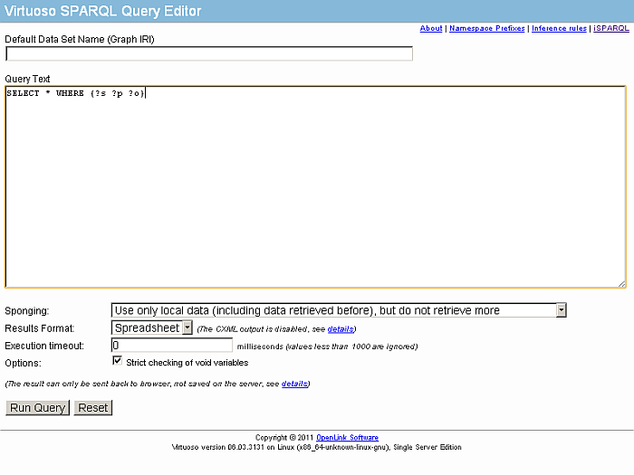

The resulting query string contains a format parameter value of
*"application/vnd.ms-excel"* . For example, [A URL such as this one](#)
will be generated, and can be opened directly with Excel.

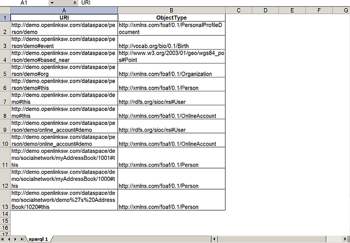

### SPARQL Endpoint with RDF+JSON Output: SPARQL UI Example

The SPARQL endpoint also offers a RDF+JSON output option.

From http://cname:host/sparql select "JSON" for "Display Results As:"
and click the "Run Query" button.

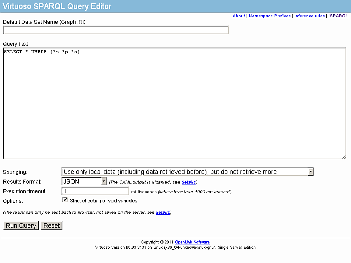

As result URL containing as parameter the format
*application/sparql-results+json* will be generated and the content
should look like:

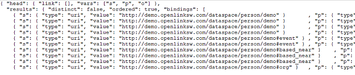

### SPARQL Endpoint with JSON/P Output Option: Curl Example

The SPARQL endpoint also offers a JSON/P output option.

The SPARQL endpoint accepts a 'callback' URL parameter and in this case
when parameter 'format' is 'json', then it will produce JSON/P output.

    $ curl "http://lod.openlinksw.com/sparql?query=select+*+where+\{+%3Fx+a+%3Fz+.+\}+limit+10&format=json&debug=on&callback=func"
    func(
    
    { "head": { "link": [], "vars": ["x", "z"] },
      "results": { "distinct": false, "ordered": true, "bindings": [
        { "x": { "type": "bnode", "value": "nodeID://b196899188" }  , "z": { "type": "uri", "value": "http://www.w3.org/2000/10/swap
    
        { "x": { "type": "uri", "value": "http://www.wasab.dk/morten/2005/04/sparqlette/#profile" } , "z": { "type": "uri", "value":
    services/owl-s/1.1/Service.owl#ServiceProfile" }},
        { "x": { "type": "uri", "value": "http://www.wasab.dk/morten/2003/12/nearestAirport/#b-profile" }   , "z": { "type": "uri",
    aml.org/services/owl-s/1.1/Service.owl#ServiceProfile" }},
        { "x": { "type": "uri", "value": "http://www.wasab.dk/morten/2003/12/nearestAirport/#a-profile" }   , "z": { "type": "uri",
    aml.org/services/owl-s/1.1/Service.owl#ServiceProfile" }},
        { "x": { "type": "uri", "value": "http://www.wasab.dk/morten/2003/12/nearestAirport/index.rdf#a-profile" }  , "z": { "type":
    ://www.daml.org/services/owl-s/1.1/Service.owl#ServiceProfile" }},
        { "x": { "type": "uri", "value": "http://www.wasab.dk/morten/2003/12/nearestAirport/index.rdf#b-profile" }  , "z": { "type":
    ://www.daml.org/services/owl-s/1.1/Service.owl#ServiceProfile" }},
        { "x": { "type": "uri", "value": "http://www.wasab.dk/morten/2006/06/blogmatrix/#profile" } , "z": { "type": "uri", "value":
    services/owl-s/1.1/Service.owl#ServiceProfile" }},
        { "x": { "type": "uri", "value": "http://www.wasab.dk/morten/2003/12/nearestAirport/#b-profile" }   , "z": { "type": "uri",
    aml.org/services/owl-s/1.1/Service.owl#ServiceProfile" }},
        { "x": { "type": "uri", "value": "http://www.wasab.dk/morten/2003/12/nearestAirport/#a-profile" }   , "z": { "type": "uri",
    aml.org/services/owl-s/1.1/Service.owl#ServiceProfile" }},
        { "x": { "type": "uri", "value": "http://www.wasab.dk/morten/2003/12/nearestAirport/#b-profile" }   , "z": { "type": "uri",
    aml.org/services/owl-s/1.1/Service.owl#ServiceProfile" }} ] } })

<a id="id14-troubleshooting-sparql-queries"></a>
## Troubleshooting SPARQL Queries

A short SPARQL query can be compiled into a long SQL statement,
especially if data comes from many quad map patterns. A moderately sized
application with 50 tables and 10 columns per table may create thousands
of quad map patterns for subjects spanning hundreds of different types.
An attempt to "select everything" from Linked Data View of that
complexity may easily create 5000 lines of SQL code. Thus it is to be
expected that some queries will be rejected even if the same queries
would work fine if the RDF data were held as physical quads in default
storage, rather than synthesized through an Linked Data View.

In addition, the SQL compiler catches typos efficiently, signalling an
error if a table or column name is unknown, efficiently catching typos.
SPARQL uses IRIs that are long and sometimes unreadable, but there is no
"closed world" schema of the data so a typo in an IRI is not an error;
it is simply some other IRI. So a typo in an IRI or in a namespace
prefix causes missing bindings of some triple patterns of the query and
an incomplete result, but usually no errors are reported. A typo in
graph or predicate IRI may cause the SPARQL compiler to generate code
that accesses default (quad) storage instead of a relational source or
generate empty code that accesses nothing.

The SQL compiler does not signal casting errors when it runs the
statement generated from SPARQL, because the generated SQL code contains
*option (QUIETCAST)* . This means that mismatches between expected and
actual datatypes of values stay invisible and may cause rounding errors
(e.g. integer division instead of floating-point) and even empty joins
(due to join conditions that silently return NULL instead of returning a
comparison error).

In other words, SPARQL queries are so laconic that there is no room for
details that let the compiler distinguish between intent and a bug. This
masks query complexity, misuse of names and type mismatches. One may
make debugging easier by making queries longer.

Two very helpful debugging tools are automatic void variable recognition
and plain old code inspection. "Automatic" means "cheap" so the very
first step of debugging is to ensure that every triple pattern of the
query may in principle return something. This helps in finding typos
when the query gets data from Linked Data Views. It also helps when a
query tries to join two disjoint sorts of subjects. If the *define
sql:signal-void-variables 1* directive is placed in the preamble of the
SPARQL query, the compiler will signal an error if it finds any triple
pattern that cannot bind variables or any variable that is proved to be
always unbound. This is especially useful when data are supposed to come
from an *option (exclusive)* or *option (soft exclusive)* quad map.
Without one of these options, the SPARQL compiler will usually bind
variables using "physical quads"; the table of physical quads may
contain any rows that match any given triple pattern; thus many errors
will remain undiscovered. If the name of a quad map pattern is known
then it is possible to force the SPARQL compiler to use only that quad
map for the whole query or a part of the query. This is possible by
using the following syntax:

    QUAD MAP quad-map-name { group-pattern }

If some triple pattern inside *group-pattern* cannot be bound using
*quad-map-name* or one of its descendants then *define
sql:signal-void-variables 1* will force the compiler to signal the
error.

> **Note**
> 
> Although it is technically possible to use *QUAD MAP* to improve the
> performance of a query that tries to access redundant Linked Data
> Views, it is much better to achieve the same effect by providing a
> more restrictive query or by changing/extending the Linked Data View.
> If an application relies on this trick then interoperable third-party
> SPARQL clients may experience problems because they cannot use
> Virtuoso-specific extensions.

If the automated query checking gives nothing, function
`sparql_to_sql_text` can be used in order to get the SQL text generated
from the given query. Its only argument is the text of the SPARQL query
to compile (without any leading SPARQL keyword or semicolon at the end).
The returned value is the SQL text. The output may be long but it is the
most authoritative source of diagnostic data.

When called from ISQL or an ODBC client, the return value of
`sparql_to_sql_text` may be transferred as a BLOB so ISQL requires the
"set blobs on" instruction to avoid data truncation. Even better, the
SQL text can be saved to a file:

    string_to_file ('debug.sql', sparql_to_sql_text ('SELECT * WHERE { graph ?g { ?s a ?type }}'), -2);

(The -2 is to overwrite the previous version of the file, as this
function may be called many times).

> **Note**
> 
> When passing the query text to sparql\_to\_sql\_text, if the query
> contains single quotes, each embedded single quote must be doubled up.
> Use double quotes in SPARQL queries to avoid this inconvenience.

As an example, let's find out why the query

    SQL>SPARQL
    PREFIX northwind: <http://demo.openlinksw.com/schemas/northwind#>
    SELECT DISTINCT ?emp
    FROM <http://myhost.example.com/Northwind>
    WHERE {
        ?order1 northwind:has_salesrep ?emp ; northwind:shipCountry ?country1 .
        ?order2 northwind:has_salesrep ?emp ; northwind:shipCountry ?country2 .
        filter (?country1 != ?country2) }

is much slower than a similar SQL statement. The call of
`sparql_to_sql_text
` returns the equivalent SQL statement:

    SELECT DISTINCT sprintf_iri ( 'http://myhost.example.com/Northwind/Employee/%U%U%d#this' ,
        /*retval[*/ "s-6-1-t0"."b067b7d~FirstName~0" /* emp */ /*]retval*/ ,
        /*retval[*/  "s-6-1-t0"."b067b7d~FirstName~1" /*]retval*/ ,
        /*retval[*/  "s-6-1-t0"."b067b7d~FirstName~2" /*]retval*/ ) AS /*tmpl*/ "emp"
    FROM (SELECT "s-6-1-t0-int~orders"."OrderID" AS /*tmpl*/ "20ffecc~OrderID",
             "s-6-1-t0-int~employees"."FirstName" AS /*as-name-N*/ "b067b7d~FirstName~0",
             "s-6-1-t0-int~employees"."LastName" AS /*as-name-N*/ "b067b7d~FirstName~1",
             "s-6-1-t0-int~employees"."EmployeeID" AS /*as-name-N*/ "b067b7d~FirstName~2"
             FROM Demo.demo.Employees AS "s-6-1-t0-int~employees", Demo.demo.Orders AS "s-6-1-t0-int~orders"
             WHERE /* inter-alias join cond */
           "s-6-1-t0-int~orders".EmployeeID = "s-6-1-t0-int~employees".EmployeeID) AS "s-6-1-t0",
        (SELECT "s-6-1-t1-int~orders"."OrderID" AS /*tmpl*/ "20ffecc~OrderID",
            "s-6-1-t1-int~orders"."ShipCountry" AS /*tmpl*/ "e45a7f~ShipCountry"
            FROM Demo.demo.Orders AS "s-6-1-t1-int~orders") AS "s-6-1-t1",
        (SELECT "s-6-1-t2-int~orders"."OrderID" AS /*tmpl*/ "20ffecc~OrderID",
            "s-6-1-t2-int~employees"."FirstName" AS /*as-name-N*/ "b067b7d~FirstName~0",
        "s-6-1-t2-int~employees"."LastName" AS /*as-name-N*/ "b067b7d~FirstName~1",
        "s-6-1-t2-int~employees"."EmployeeID" AS /*as-name-N*/ "b067b7d~FirstName~2"
        FROM Demo.demo.Employees AS "s-6-1-t2-int~employees", Demo.demo.Orders AS "s-6-1-t2-int~orders"
        WHERE /* inter-alias join cond */
           "s-6-1-t2-int~orders".EmployeeID = "s-6-1-t2-int~employees".EmployeeID) AS "s-6-1-t2",
        (SELECT "s-6-1-t3-int~orders"."OrderID" AS /*tmpl*/ "20ffecc~OrderID",
            "s-6-1-t3-int~orders"."ShipCountry" AS /*tmpl*/ "e45a7f~ShipCountry"
        FROM Demo.demo.Orders AS "s-6-1-t3-int~orders") AS "s-6-1-t3"
    WHERE /* two fields belong to same equiv */
        /*retval[*/  "s-6-1-t0"."20ffecc~OrderID" /* order1 */ /*]retval*/  =
        /*retval[*/  "s-6-1-t1"."20ffecc~OrderID" /* order1 */ /*]retval*/
        AND /* two fields belong to same equiv */
        sprintf_iri ( 'http://myhost.example.com/Northwind/Employee/%U%U%d#this' ,
            /*retval[*/  "s-6-1-t0"."b067b7d~FirstName~0" /* emp */ /*]retval*/ ,
        /*retval[*/  "s-6-1-t0"."b067b7d~FirstName~1" /*]retval*/ ,
        /*retval[*/  "s-6-1-t0"."b067b7d~FirstName~2" /*]retval*/ ) =
        sprintf_iri ( 'http://myhost.example.com/Northwind/Employee/%U%U%d#this' ,
            /*retval[*/  "s-6-1-t2"."b067b7d~FirstName~0" /* emp */ /*]retval*/ ,
        /*retval[*/  "s-6-1-t2"."b067b7d~FirstName~1" /*]retval*/ ,
        /*retval[*/  "s-6-1-t2"."b067b7d~FirstName~2" /*]retval*/ )
        AND /* two fields belong to same equiv */
        /*retval[*/  "s-6-1-t2"."20ffecc~OrderID" /* order2 */ /*]retval*/  =
        /*retval[*/  "s-6-1-t3"."20ffecc~OrderID" /* order2 */ /*]retval*/
        AND /* filter */
       ( /*retval[*/  "s-6-1-t1"."e45a7f~ShipCountry" /* country1 */ /*]retval*/  <>
            /*retval[*/  "s-6-1-t3"."e45a7f~ShipCountry" /* country2 */ /*]retval*/ )
    OPTION (QUIETCAST)

The query is next to unreadable but some comments split it into
meaningful expressions. Every triple (or list of similar triples)
becomes a subquery that returns fields needed to build the values of
bound variables. The fields are printed wrapped by comments like
*/\*retval\[\*/ expression /\* original variable name \*/
/\*\]retval\*/* . Names like*"s-6-1-t0"* contain the source line number
where a group pattern begins (6) and the serial number of the triple
(0). Comment */\* inter-alias join cond \*/* means that the expression
which follows is the condition as written in the declaration of the quad
map pattern. Comment */\* filter \*/* precedes expressions for FILTER
expressions in the source SPARQL. The word "equiv" means "equivalence
class", i.e. a group of occurrences of variables in the source query
such that all occurrences are bound to the same value. E.g. when a name
repeats in many triples of a group, all its occurrences form an
equivalence class. In some cases the compiler can prove that two
variables are always equal even if the names differ - these variables
are also placed into an "equiv".

Looking at this query, you may notice equalities like *sprintf\_iri
(...) = sprintf\_iri (...)* . That is sub-optimal because it indicates
that no index will be used to optimize the join and that there will be
one function call per row. When the variable *?emp* appears in two
different triples, it means that the value of the variable is the same
in both triples. The query compares IRIs instead of comparing the
arguments of [`sprintf_iri`](#fn_sprintf_iri) because the format string
is not proven to be a bijection. Indeed it cannot be a bijection for
*arbitrary* strings, but the database must reflect the real world. If it
is assumed that the real names of persons never start with a digit,
within the *%d%U* format fragment, the digits will always be
distinguishable from the name; so the IRI class can be declared as a
bijection even if it is not true for arbitrary strings. The script can
then include "suspicious" *option (bijection)* as follows:

    create iri class sample:Employee "http://example.com/Employee/%d%U#this"
      (in employee_id integer not null, in employee_lastname varchar not null)
      option (bijection) .

Unfortunately, attempts to use the same trick with the declaration from
the Northwind example will fail:

    create iri class northwind:Employee "http://^{URIQADefaultHost}^/Northwind/Employee/%U%U%d#this"
      (in employee_firstname varchar not null, in employee_lastname varchar not null, in employee_id integer not null)
      option (bijection) .

Bijection will allow the parsing, but it will never give the proper
result, because the first *%U* will read the whole concatenation of
*%U%U%d* , leaving nothing before the*\#this* for the second *%U* (this
is an error) and leaving nothing for the *%d* (that is an explicit parse
error, becauses the integer field cannot be empty).

The string parser will process the string from left to right so it will
be unable to parse the string. The compiler might sometimes report an
error if it can prove that the format string is not appropriate for
bijection.

The correct way of improving the Northwind example is to enable reliable
bijection by adding strong delimiters:

    create iri class northwind:Employee "http://^{URIQADefaultHost}^/Northwind/Employee/%U/%U/%d#this"
      (in employee_firstname varchar not null, in employee_lastname varchar not null, in employee_id integer not null)
      option (bijection) .

After running the updated script, the query contains three comparisons
of fields that were arguments of `sprintf_iri
` in the previous version.

*Example for casting string as IRI type*

    create function DB.DBA.RDF_DF_GRANTEE_ID_URI (in id integer)
    {
      declare isrole integer;
      isrole := coalesce ((SELECT top 1 U_IS_ROLE FROM DB.DBA.SYS_USERS WHERE U_ID = id));
      if (isrole is null)
        return NULL;
      else if (isrole)
        return sprintf ('http://%s/sys/group?id=%d', registry_get ('URIQADefaultHost'), id);
      else
        return sprintf ('http://%s/sys/user?id=%d', registry_get ('URIQADefaultHost'), id);
    }
    ;
    
    grant execute on DB.DBA.RDF_DF_GRANTEE_ID_URI to SPARQL_SELECT
    ;
    
    create function DB.DBA.RDF_DF_GRANTEE_ID_URI_INVERSE (in id_iri varchar)
    {
      declare parts any;
      parts := sprintf_inverse (id_iri, sprintf ('http://%s/sys/user?id=%%d', registry_get ('URIQADefaultHost')), 1);
      if (parts is not null)
        {
          if (exists (SELECT TOP 1 1 FROM DB.DBA.SYS_USERS WHERE U_ID = parts[0] and not U_IS_ROLE))
            return parts[0];
        }
      parts := sprintf_inverse (id_iri, sprintf ('http://%s/sys/group?id=%%d', registry_get ('URIQADefaultHost')), 1);
      if (parts is not null)
        {
          if (exists (SELECT TOP 1 1 FROM DB.DBA.SYS_USERS WHERE U_ID = parts[0] and U_IS_ROLE))
            return parts[0];
        }
      return NULL;
    }
    ;
    
    grant execute on DB.DBA.RDF_DF_GRANTEE_ID_URI_INVERSE to SPARQL_SELECT
    ;
    
    create iri class oplsioc:grantee_iri using
      function DB.DBA.RDF_DF_GRANTEE_ID_URI (in id integer) returns varchar ,
      function DB.DBA.RDF_DF_GRANTEE_ID_URI_INVERSE (in id_iri varchar) returns integer
      option ( bijection ,
        returns "http://^{URIQADefaultHost}^/sys/group?id=%d"
        union   "http://^{URIQADefaultHost}^/sys/user?id=%d" ) .

<a id="id15-sparql-inline-in-sql"></a>
## SPARQL Inline in SQL

Virtuoso extends the SQL 92 syntax with SPARQL queries and subqueries.
Instead of writing a SQL SELECT query or subquery, one can write the
SPARQL keyword and a SPARQL query after the keyword.

    SQL>SPARQL SELECT DISTINCT ?p WHERE { graph ?g { ?s ?p ?o } };
    p
    varchar
    ----------
    http://example.org/ns#b
    http://example.org/ns#d
    http://xmlns.com/foaf/0.1/name
    http://xmlns.com/foaf/0.1/mbox
    ...
    
    SQL>SELECT distinct subseq ("p", strchr ("p", '#')) as fragment
      FROM (SPARQL SELECT DISTINCT ?p WHERE { graph ?g { ?s ?p ?o } } ) as all_predicates
      WHERE "p" like '%#%';
    fragment
    varchar
    ----------
    #query
    #data
    #name
    #comment
    ...

Note that names of variables returned from SPARQL are always
case-sensitive and no case mode rules apply to them. Depending on the
CaseMode parameter in the Virtuoso configuration file, double quotes
should be used if necessary to refer to them in surrounding SQL code.

It is possible to pass parameters to a SPARQL query via a
Virtuoso-specific syntax extension. *??* or *$?* indicates a positional
parameter similar to *?* in plain SQL. *??* can be used in graph
patterns or anywhere in place of a SPARQL variable. The value of a
parameter should be passed in SQL form, i.e. this should be a number or
a untyped string. An IRI ID can be passed in all cases where an absolute
IRI can, except the obvious case of when the variable is an argument of
a function that requires string. If the parameter is used in the
'graph', 'subject' or 'object' position of the SPARQL pattern, the
string parameter is converted into an IRI automatically. In other cases
an IRI string is indistinguishable from a string literal, so it is
necessary to call the built-in SPARQL function *iri()* , e.g. *iri (??)*
. Using this notation, any dynamic SQL client (whether ODBC, JDBC or
some other) can execute parameterized SPARQL queries, binding parameters
just as with dynamic SQL.

    SQL> create function param_passing_demo ()
    {
      declare stat, msg varchar;
      declare mdata, rset any;
      exec ('SPARQL SELECT ?s WHERE { graph ?g { ?s ?? ?? }}',
        stat, msg,
        vector ( /* Vector of two parameters */
          'http://www.w3.org/2001/sw/DataAccess/tests/data/Sorting/sort-0#int1',
          4 ),
        10, /* Max no of rows */
        mdata, /* Variable to get metadata */
        rset ); /* Variable to get result-set */
      if (length (rset) = 0)
        signal ('23000',
          'No data found, try demo database with installed Virtuoso tutorials');
      return rset[0][0];
    }
    
    SQL> SELECT param_passing_demo ();
    callret
    VARCHAR
    _______________________________________________________________________________
    
    http://www.w3.org/2001/sw/DataAccess/tests/data/Sorting/sort-0#four
    
    1 Rows. -- 00000 msec.

Another example:

    INSERT INTO GRAPH <http://example.com/Northwind>
    { `iri($?)` <http://example.com/schemas/northwind#has_province> "Valencia" };

An inline SPARQL query can refer to SQL variables that are in scope in
the SQL query or stored procedure containing it. Virtuoso extends the
SPARQL syntax with a special notation to this effect. A reference to SQL
variable X can be written as *?:X* or *$:X* . A reference to column *C*
of a table or a sub-select with alias *T* can be written as *?:T.C* or
*$:T.C* . Both notations can be used in any place where a variable name
is allowed, except the 'AS' clause described below.

A column of a result set of a SPARQL SELECT can be used in SQL code
inside a for statement just like any column from a SQL select.

SQL rules about double-quoted names are applicable to variables that are
passed to a SPARQL query or selected from one. If a variable name
contains unusual characters or should not be normalized according to SQL
conventions then the name should use double quotes for escaping. e.g.,
the notation *?:"OrderLine"* will always refer to variable or column
titled *OrderLine* whereas *?:OrderLine* can be converted to *ORDERLINE*
or *orderline* .

It is safer to avoid using variable names that conflict with column
names of RDF system tables, esp. *G* , *S* , *P* and *O* . These names
are not reserved now but they may cause subtle bugs when an incorrect
SPARQL subquery is compiled into SQL code that refers to identically
named table columns. Some of these names may be rejected as syntax
errors by future Virtuoso versions.

    SQL> create procedure sql_vars_demo ()
    {
    #pragma prefix sort0: <http://www.w3.org/2001/sw/DataAccess/tests/data/Sorting/sort-0#>
      declare RES varchar;
      declare obj integer;
      result_names (RES);
      obj := 4;
      for (SPARQL SELECT ?subj WHERE { graph ?g { ?subj sort0:int1 ?:obj } } ) do
        result ("subj");
    }
    
    SQL> sql_vars_demo ();
    RES
    VARCHAR
    _______________________________________________________________________________
    
    http://www.w3.org/2001/sw/DataAccess/tests/data/Sorting/sort-0#four
    
    1 Rows. -- 00000 msec.

The example also demonstrates the Virtuoso/PL pragma line for
procedure-wide declarations of namespace prefixes. This makes the code
more readable and eliminates duplicate declarations of namespace
prefixes when the procedure contains many SPARQL fragments that refer to
a common set of namespaces.

A SPARQL ASK query can be used as an argument of the SQL EXISTS
predicate.

    create function sparql_ask_demo () returns varchar
    {
      if (exists (sparql ask where { graph ?g { ?s ?p 4}}))
        return 'YES';
      else
        return 'NO';
    }
    
    SQL> SELECT sparql_ask_demo ();
    _______________________________________________________________________________
    
    YES

### Controlling SPARQL Output Data Types

The compilation of a SPARQL query may depend on an environment that is
usually provided by the SPARQL protocol and which includes the default
graph URI. Environment settings that come from the SPARQL protocol may
override settings in the text of a SPARQL query. To let an application
configure the environment for a query, SPARQL's syntax has been extended
with the 'define' clause:

    define parameter-qname parameter-value

Examples of supported parameters are *output:valmode* and
*output:format*

*output:valmode* specifies which data types (i.e. representation) should
be used for values in the result set. The default is "SQLVAL", meaning
that a query returns result set values in SQL format and behaves as a
typical SQL select - IRIs and string literals are returned as strings,
making the output compatible with ODBC and the standard SQL routines. To
compose triple vectors in Virtuoso PL code, an application may need data
in long format. A valmode of "LONG" means that IRIs are returned as
IRI\_IDs and string literals may be returned as special "RDF boxes" even
if they are actually plain strings. This may cause problems if these new
datatypes are not known to the data recipient or if IRIs come from RDF
Views (in which case IRI\_IDs are created on the fly and 'pollute' the
database), but it can result in fewer data conversions and thus better
speed if used properly. "AUTO" disables all types of conversion for the
result set, so the latter can comprise a mix of values across "SQLVAL"
and "LONG" value modes, as well as some internal representations. It is
better to avoid using this mode in user applications because the output
may change from version to version.

If the query contains a

    define output:valmode 'LONG'

clause then all returned values are in long format. e.g., the following
query returns IRI\_ID's instead of IRI strings.

    SQL>SPARQL define output:valmode 'LONG' SELECT distinct ?p WHERE { graph ?g { ?s ?p ?o } };
    p
    ----------
    #i1000001
    #i1000003
    #i1000005
    #i1000006
    ...

*output:format* instructs the SPARQL compiler that the result of the
query should be serialized into an RDF document - that document will be
returned as a single column of a single row result set. *output:format*
is especially useful if a SPARQL CONSTRUCT or SPARQL DESCRIBE query is
executed directly via an ODBC or JDBC database connection and the client
cannot receive the resulting dictionary of triples (there's no way to
transfer such an object via ODBC). Using this option, the client can
receive the document that contains the whole result set of a SELECT or
the dictionary of triples of a CONSTRUCT/DESCRIBE, and parse it locally.

Supported values for *output:format* are *RDF/XML* and *TURTLE* (or
*TTL* ). If both *output:valmode* and *output:format* are specified,
*output:format* has higher priority, raising an error if
*output:valmode* is set to a value other than *LONG* .

When a SPARQL query is compiled, the compiler checks whether the result
set is to be sent to a remote ODBC/JDBC client or used in some other
way. The compiler will automatically set *output:format* to *TURTLE* if
compiling for execution by an SQL client.

The example below demonstrates how different values of *output:format*
affect the result of SPARQL SELECT. Note 10 rows and 4 columns in the
first result, and single LONG VARCHAR in the others. When using the ISQL
client, use the 'set blobs on;' directive if fetching long texts to
avoid receiving a 'data truncated' warning.

    SQL> SPARQL SELECT * WHERE {graph ?g { ?s ?p ?o }} limit 10;
    g                                            s                    p                              o
    VARCHAR                                      VARCHAR              VARCHAR                        VARCHAR
    ______________________________________________________________________
    
    http://local.virt/DAV/bound/manifest.rdf     nodeID://1000000000 http://example.com/test#query http://local.virt/DAV/bound/bound1.rq
    . . .
    http://local.virt/DAV/examples/manifest.rdf nodeID://1000000019 http://example.com/test#query http://local.virt/DAV/examples/ex11.2.3.1_1.rq
    
    10 Rows. -- 00000 msec.
    
    SQL> SPARQL define output:format "TTL" SELECT * WHERE {graph ?g { ?s ?p ?o }} limit 10;
    callret-0
    LONG VARCHAR
    _______________________________________________________________________________
    
    @prefix :rdf <http://www.w3.org/1999/02/22-rdf-syntax-ns#> .
    @prefix :rs <http://www.w3.org/2005/sparql-results#> .
    @prefix :xsd <http://www.w3.org/2001/XMLSchema#> .
    [ rdf:type rs:results ;
      rs:result [
          rs:binding [ rs:name "g" ; rs:value <http://local.virt/DAV/bound/manifest.rdf> ] ;
          rs:binding [ rs:name "s" ; rs:value _:nodeID1000000000 ] ;
          rs:binding [ rs:name "p" ; rs:value <http://example.com/test#query> ] ;
          rs:binding [ rs:name "o" ; rs:value <http://local.virt/DAV/bound/bound1.rq> ] ;
          ] ;
    
    . . .
    
      rs:result [
          rs:binding [ rs:name "g" ; rs:value <http://local.virt/DAV/examples/manifest.rdf> ] ;
          rs:binding [ rs:name "s" ; rs:value _:nodeID1000000019 ] ;
          rs:binding [ rs:name "p" ; rs:value <http://example.com/test#query> ] ;
          rs:binding [ rs:name "o" ; rs:value <http://local.virt/DAV/examples/ex11.2.3.1_1.rq> ] ;
          ] ;
        ] .
    
    1 Rows. -- 00000 msec.
    
    SQL> SPARQL define output:format "RDF/XML" SELECT * WHERE {graph ?g { ?s ?p ?o }} LIMIT 10;
    callret-0
    LONG VARCHAR
    _______________________________________________________________________________
    
    <rdf:RDF
      xmlns:rdf="http://www.w3.org/1999/02/22-rdf-syntax-ns#"
      xmlns:rs="http://www.w3.org/2005/sparql-results#"
      xmlns:xsd="http://www.w3.org/2001/XMLSchema#" >
       <rs:results rdf:nodeID="rset">
      <rs:result rdf:nodeID="sol206">
       <rs:binding rdf:nodeID="sol206-0" rs:name="g"><rs:value rdf:resource="http://local.virt/DAV/bound/manifest.rdf"/></rs:binding>
       <rs:binding rdf:nodeID="sol206-1" rs:name="s"><rs:value rdf:nodeID="1000000000"/></rs:binding>
       <rs:binding rdf:nodeID="sol206-2" rs:name="p"><rs:value rdf:resource="http://example.com/test#query"/></rs:binding>
       <rs:binding rdf:nodeID="sol206-3" rs:name="o"><rs:value rdf:resource="http://local.virt/DAV/bound/bound1.rq"/></rs:binding>
      </rs:result>
    
    . . .
    
      <rs:result rdf:nodeID="sol5737">
       <rs:binding rdf:nodeID="sol5737-0" rs:name="g"><rs:value rdf:resource="http://local.virt/DAV/examples/manifest.rdf"/></rs:binding>
       <rs:binding rdf:nodeID="sol5737-1" rs:name="s"><rs:value rdf:nodeID="1000000019"/></rs:binding>
       <rs:binding rdf:nodeID="sol5737-2" rs:name="p"><rs:value rdf:resource="http://example.com/test#query"/></rs:binding>
       <rs:binding rdf:nodeID="sol5737-3" rs:name="o"><rs:value rdf:resource="http://local.virt/DAV/examples/ex11.2.3.1_1.rq"/></rs:binding>
      </rs:result>
     </rs:results>
    </rdf:RDF>
    
    1 Rows. -- 00000 msec.

SPARQL CONSTRUCT and SPARQL DESCRIBE results are serialized as one would
expect:

    SQL> SPARQL
    define output:format "TTL"
    CONSTRUCT { ?s ?p "004" }
    WHERE
      {
        graph ?g { ?s ?p 4 }
      };
    callret-0
    LONG VARCHAR
    _______________________________________________________________________________
    
    <http://www.w3.org/2001/sw/DataAccess/tests/data/Sorting/sort-0#four> <http://www.w3.org/2001/sw/DataAccess/tests/data/Sorting/sort-0#int1> "004" .
    _:b1000000913 <http://www.w3.org/2001/sw/DataAccess/tests/result-set#index> "004" .
    
    1 Rows. -- 00000 msec.
    
    SQL> SPARQL
    define output:format "RDF/XML"
    CONSTRUCT { ?s ?p "004" }
    WHERE
      {
        graph ?g { ?s ?p 4 }
      };
    callret-0
    LONG VARCHAR
    _______________________________________________________________________________
    
    <rdf:RDF xmlns:rdf="http://www.w3.org/1999/02/22-rdf-syntax-ns#">
    <rdf:Description about="http://www.w3.org/2001/sw/DataAccess/tests/data/Sorting/sort-0#four"><ns0pred:int1 xmlns:ns0pred="http://www.w3.org/2001/sw/DataAccess/tests/data/Sorting/sort-0#">004</ns0pred:int1></rdf:Description>
    <rdf:Description rdf:nodeID="b1000000913"><ns0pred:index xmlns:ns0pred="http://www.w3.org/2001/sw/DataAccess/tests/result-set#">004</ns0pred:index></rdf:Description>
    </rdf:RDF>
    
    1 Rows. -- 00000 msec.

SPARQL ASK returns a non-empty result set if a match is found for the
graph pattern, an empty result set otherwise. If *output:format* is
specified then the query makes a 'boolean result' document instead:

    SQL> SPARQL ASK WHERE {graph ?g { ?s ?p 4 }};
    __ask_retval
    INTEGER
    _______________________________________________________________________________
    
    1
    
    1 Rows. -- 00000 msec.
    
    SQL> SPARQL ASK WHERE {graph ?g { ?s ?p "no such" }};
    __ask_retval
    INTEGER
    _______________________________________________________________________________
    
    0 Rows. -- 00000 msec.
    
    SQL> SPARQL define output:format "TTL" ASK WHERE {graph ?g { ?s ?p 4 }};
    callret
    VARCHAR
    _______________________________________________________________________________
    
    @prefix :rdf <http://www.w3.org/1999/02/22-rdf-syntax-ns#> .
     @prefix :rs <http://www.w3.org/2005/sparql-results#> .
    [ rdf:type rs:results ; rs:boolean TRUE ]
    
    1 Rows. -- 00000 msec.
    
    SQL> SPARQL define output:format "RDF/XML" ASK WHERE {graph ?g { ?s ?p 4 }};
    callret
    VARCHAR
    _______________________________________________________________________________
    
    <rdf:RDF
      xmlns:rdf="http://www.w3.org/1999/02/22-rdf-syntax-ns#"
      xmlns:rs="http://www.w3.org/2005/sparql-results#"
      xmlns:xsd="http://www.w3.org/2001/XMLSchema#" >
       <rs:results rdf:nodeID="rset">
        <rs:boolean rdf:datatype="http://www.w3.org/2001/XMLSchema#boolean">1</rs:boolean></results></rdf:RDF>
    
    1 Rows. -- 00000 msec.

<a id="id16-api-functions"></a>
## API Functions

SPARQL can be used inline wherever SQL can be used. The only API
functions that one needs to know are the ones for loading RDF data into
the store. Dynamic SQL client applications can issue SPARQL queries
against Virtuoso through the regular SQL client API, ODBC, JDBC or any
other supported API, simply by prefixing the SPARQL query with the
SPARQL keyword. Parameters work just as with dynamic SQL. Stored
procedures can have SPARQL expressions inline and can declare cursors
over SPARQL result sets.

Value conversions between SQL and SPARQL are most often automatic and
invisible. In some cases one needs to be aware of the different SPARQL
value representations (valmodes). SPARQL offers declarations for
specifying whether returned graphs are to be serialized as XML or
Turtle, or whether these will be hash tables of triples. See
[`dict_new()`](#fn_dict_new) and related functions for a description of
the hash table SQL data type. The use of dict's is convenient for
further programmatic processing of graphs.

RDF-related procedures use Virtuoso/PL vectors and dictionaries to
represent RDF triples and sets of triples.

*Valmode* means the "format of values returned by an expression", i.e.
'short', 'long' or 'SQL value'.

*Triple vector* is a vector (array) of S, P and O, where all values are
in 'long' formats, i.e. IRI\_ID's for IRI values, numbers or datetimes
for corresponding XMLSchema types, special "RDF box" objects if O is
neither string nor IRI.

*Dictionary of triples* or *Hash table of triples* is an dictionary
object made by the SQL function *dict\_new ()* whose keys are triple
vectors and values are not specified; this is a good storage format for
an unordered set of distinct triples.

*Dictionary of blank node names* is a dictionary used for tricky
processing of a number of TURTLE or RDF /XML descriptions of subgraphs
that come from a common graph. Imagine a situation where different
descriptions actually refer to the same blank nodes of the original
graph and, moreover, the application that generates these descriptions
always generates the same blank node id string for the same node. A
reader of descriptions can correctly join described subgraphs into one
big subgraph by filling in a dictionary that contains blank node id
strings as keys and IRI\_ID's assigned to those strings as dependent
data. The sharing of the same node dictionary by all readers of an
application will ensure that no blank node is duplicated.

### Data Import

#### Using TTLP

DB.DBA.TTLP() parses TTL (TURTLE or N3 resource) and places its triples
into DB.DBA.RDF\_QUAD.

    create procedure DB.DBA.TTLP (
        in strg any,       -- text of the resource
        in base varchar,   -- base IRI to resolve relative IRIs to absolute
        in graph varchar, -- target graph IRI, parsed triples will appear in that graph.
        in flags int)   -- bitmask of flags that permit some sorts of syntax errors in resource, use 0.

For loading a file of any great length, it is more practical to use the
file\_to\_string\_output function.

It is important the file be accessible to the Virtuoso server. You need
to have set properly set the *DirsAllowed* parameter value in the
section \[Parameters\] of the Virtuoso database INI file. For example on
Windows it could be:

    virtuoso.ini file:
    [Parameters]
    ...
    DirsAllowed =  .\tmp
    ...

So, in the example, the file you want to import from, should be in the
tmp folder or in a subfolder. Note that this example folder is a
subfolder of the Virtuoso Server working directory.

    SQL> DB.DBA.TTLP (file_to_string_output ('.\tmp\data.ttl'), '', 'http://my_graph', 0);

#### Using TTLP\_MT

The DB.DBA.TTLP\_MT() procedure is like DB.DBA.TTLP() but loads the file
on multiple threads, using parallel I/O and multiprocessing if
available. The function does not leave a transaction log. Hence, after a
successful load, one should execute the checkpoint statement to make
sure that a server restart does not wipe out the results.

    create procedure DB.DBA.TTLP_MT (
        in strg any,       -- text of the resource
        in base varchar,   -- base IRI to resolve relative IRIs to absolute
        in graph varchar,  -- target graph IRI, parsed triples will appear in that graph.
        in flags int) -- flags, use 0

#### Using RDF\_LOAD\_RDFXML\_MT

For loading large resources when transactional integrity is not
important (loading of a single resource may take more than one
transaction) you can use also the *DB.DBA.RDF\_LOAD\_RDFXML\_MT()*
procedure:

    create procedure DB.DBA.RDF_LOAD_RDFXML_MT (
        in strg varchar,  -- text of the resource
        in base varchar,  -- base IRI to resolve relative IRIs to absolute
        in graph varchar) -- target graph IRI, parsed triples will appear in that graph.

The following example demonstrates importing data from the RDF resource
with URI: http://www.w3.org/People/Berners-Lee/card

    SQL>create procedure MY_LOAD_FILE (in full_uri varchar, in in_resultset integer := 0)
    {
      declare REPORT varchar;
      declare graph_uri, dattext varchar;
      declare app_env any;
      app_env := null;
      whenever sqlstate '*' goto err_rep;
      if (not in_resultset)
        result_names (REPORT);
      dattext := cast (XML_URI_GET_AND_CACHE (full_uri) as varchar);
      MY_SPARQL_REPORT (sprintf ('Downloading %s: %d bytes',
          full_uri, length (dattext) ) );
      graph_uri := full_uri;
      DELETE FROM RDF_QUAD WHERE G = DB.DBA.RDF_MAKE_IID_OF_QNAME (graph_uri);
      DB.DBA.RDF_LOAD_RDFXML_MT (dattext, full_uri, graph_uri);
      return graph_uri;
    err_rep:
      result (sprintf ('%s: %s', __SQL_STATE, __SQL_MESSAGE));
      return graph_uri;
    }
    ;
    
    Done. -- 0 msec.
    
    SQL>create procedure MY_SPARQL_REPORT(in strg varchar)
    {
      if (__tag(strg) <> 182)
        strg := cast (strg as varchar) || sprintf (' -- not a string, tag=%d', __tag(strg));
      strg := replace (strg, 'SPARQL_DAV_DATA_URI()', '\044{SPARQL_DAV_DATA_URI()}');
      strg := replace (strg, 'SPARQL_DAV_DATA_PATH()', '\044{SPARQL_DAV_DATA_PATH()}');
      strg := replace (strg, 'SPARQL_FILE_DATA_ROOT()', '\044{SPARQL_FILE_DATA_ROOT()}');
      result (strg);
    }
    ;
    
    Done. -- 0 msec.
    
    SQL> MY_LOAD_FILE('http://www.w3.org/People/Berners-Lee/card');
    REPORT
    VARCHAR
    _______________________________________________________________________________
    
    Downloading http://www.w3.org/People/Berners-Lee/card: 17773 bytes
    
    1 Rows. -- 4046 msec.
    
    SQL>SPARQL
    SELECT *
    FROM <http://www.w3.org/People/Berners-Lee/card>
    WHERE {?s ?p ?o} ;
    
    s                                             p                                               o
    VARCHAR                                       VARCHAR                                         VARCHAR
    __________________________________________________________________________________________________________
    
    http://bblfish.net/people/henry/card#me       http://xmlns.com/foaf/0.1/name                  Henry Story
    http://www.w3.org/People/Berners-Lee/card#i   http://www.w3.org/1999/02/22-rdf-syntax-ns#type http://xmlns.com/foaf/0.1/Person
    http://www.w3.org/People/Berners-Lee/card#i   http://www.w3.org/1999/02/22-rdf-syntax-ns#type http://www.w3.org/2000/10/swap/pim/contact#Male
    http://www.w3.org/People/Berners-Lee/card#i   http://xmlns.com/foaf/0.1/nick                  TimBL
    http://www.w3.org/People/Berners-Lee/card#i   http://xmlns.com/foaf/0.1/nick                  timbl
    http://www.w3.org/People/Berners-Lee/card#i   http://xmlns.com/foaf/0.1/mbox                  mailto:timbl@w3.org
    http://www.w3.org/People/Berners-Lee/card#i   http://xmlns.com/foaf/0.1/mbox_sha1sum          965c47c5a70db7407210cef6e4e6f5374a525c5c
    http://www.w3.org/People/Berners-Lee/card#i   http://xmlns.com/foaf/0.1/knows                 http://bblfish.net/people/henry/card#me
    http://www.w3.org/People/Berners-Lee/card#i   http://xmlns.com/foaf/0.1/knows                 http://hometown.aol.com/chbussler/foaf/chbussler.foaf#me
    http://www.w3.org/People/Berners-Lee/card#i   http://xmlns.com/foaf/0.1/knows                 http://danbri.org/foaf#danbri
    http://www.w3.org/People/Berners-Lee/card#i   http://xmlns.com/foaf/0.1/knows                 http://norman.walsh.name/knows/who#norman-walsh
    http://www.w3.org/People/Berners-Lee/card#i   http://xmlns.com/foaf/0.1/knows                 http://www.aaronsw.com/about.xrdf#aaronsw
    http://www.w3.org/People/Berners-Lee/card#i   http://xmlns.com/foaf/0.1/knows                 http://www.ivan-herman.net/foaf.rdf#me
    http://www.w3.org/People/Berners-Lee/card#i   http://xmlns.com/foaf/0.1/knows                 http://www.w3.org/People/Berners-Lee/card#amy
    http://www.w3.org/People/Berners-Lee/card#i   http://xmlns.com/foaf/0.1/knows                 http://dig.csail.mit.edu/People/RRS
    ..........

#### Using RDF\_TTL2HASH

The DB.DBA.RDF\_TTL2HASH() does not load TTL content, instead it returns
a dictionary of triples in 'long valmode'.

    create function DB.DBA.RDF_TTL2HASH (
        in strg any,
        in base varchar,
        in graph varchar ) returns any

Parameter *flags* is useful when the syntax of the resource is
TURTLE-like, but not correct TURTLE. By default, use zero value. Add 1
to let string literals contain end-of-line characters. Add 2 to suppress
error messages on blank node verbs. Add 4 to allow variables instead of
blank nodes. Add 8 to silently skip triples with literal subjects.

#### Using RDF\_LOAD\_RDFXML

The DB.DBA.RDF\_LOAD\_RDFXML() procedure parses RDF/XML and places its
triples into DB.DBA.RDF\_QUAD.

    create procedure DB.DBA.RDF_LOAD_RDFXML (
        in strg any,           -- text of and XML document
        in base_iri varchar,   -- base IRI to resolve relative IRIs
        in graph_iri varchar ) -- the IRI of destination graph

See [example](#rdfsparqlrulespecifywhatindexexample) .

#### Using RDF\_QUAD\_URI, RDF\_QUAD\_URI\_L and RDF\_QUAD\_URI\_L\_TYPED

To insert a single quad into DB.DBA.RDF\_QUAD() table, use one of these
procedures:

    -- Simple insertion of a quad where the object is a node
    create procedure DB.DBA.RDF_QUAD_URI (
      in g_uri varchar, in s_uri varchar, in p_uri varchar,
      in o_uri varchar ) -- IRI string or IRI_ID
    
    -- Simple insertion of a quad where the object is a literal value in 'SQL valmode'
    create procedure DB.DBA.RDF_QUAD_URI_L (
      in g_uri varchar, in s_uri varchar, in p_uri varchar,
      in o_lit any ) -- string, number or datetime, NULL is not allowed
    
    create procedure DB.DBA.RDF_QUAD_URI_L_TYPED (
      in g_uri varchar, in s_uri varchar, in p_uri varchar,
      in o_lit any,     -- string value of the literal
      in dt any,        -- datatype as IRI string or IRI_ID, can be NULL
      in lang varchar ) -- language as string or NULL

Arguments g\_uri, s\_uri and p\_uri of these three functions should be
IRI strings or IRI\_IDs. All string arguments should be in UTF-8
encoding, otherwise they will be stored but are not queryable via
SPARQL.

### Data Export

These two procedures serialize a vector of triples into a session, in
TURTLE or RDF/XML syntax. In their current versions, every triple is
printed in a separate top-level record (say, in an rdf:Description tag),
without any pretty-printing or nesting optimization.

    create procedure DB.DBA.RDF_TRIPLES_TO_TTL (
        inout triples any, -- vector of triples in 'long valmode'.
        inout ses any )    -- an output stream in server default encoding
    
    create procedure DB.DBA.RDF_TRIPLES_TO_RDF_XML_TEXT (
        inout triples any,          -- vector of triples in 'long valmode'.
        in print_top_level integer, -- zero if only rdf:Description tags should be written,
                                    -- non-zero if the rdf:RDF top-level element should also be written
        inout ses any )             -- an output stream in server default encoding

### Data query

    -- Local execution of SPARQL via SPARQL protocol, produces a result set of SQL values.
    create procedure DB.DBA.SPARQL_EVAL (
        in query varchar,      -- text of SPARQL query to execute
        in dflt_graph varchar, -- default graph IRI, if not NULL then this overrides what's specified in query
        in maxrows integer )   -- limit on numbers of rows that should be returned.
    
    -- Similar to SPARQL_EVAL, but returns a vector of vectors of SQL values.
    create function DB.DBA.SPARQL_EVAL_TO_ARRAY (
        in query varchar,      -- text of SPARQL query to execute
        in dflt_graph varchar, -- default graph IRI, if not NULL then this overrides what's specified in query
        in maxrows integer )   -- limit on numbers of rows that should be returned.
    returns any

    -- Remote execution of SPARQL via SPARQL protocol, produces a result set of SQL values.
    create procedure DB.DBA.SPARQL_REXEC (
        in service varchar,    -- service URI to call via HTTP
        in query varchar,      -- text of SPARQL query to execute
        in dflt_graph varchar, -- default graph IRI, if not NULL then this overrides what's specified in query
        in named_graphs any,   -- vector of named graph IRIs, if not NULL then this overrides what's specified in query
        in req_hdr any,        -- additional HTTP header lines that should be passed to the service; 'Host: ...' is most popular.
        in maxrows integer,    -- limit on numbers of rows that should be returned.
        in bnode_dict any )    -- dictionary of bnode ID references.
    
    -- Similar to SPARQL_REXEC (), but returns a vector of vectors of SQL values.
    -- All arguments are the same.
    create function DB.DBA.SPARQL_REXEC_TO_ARRAY (
        in service varchar, in query varchar, in dflt_graph varchar, in named_graphs any,
        in req_hdr any, in maxrows integer, in bnode_dict any)
    returns any
    
    -- Similar to SPARQL_REXEC (), but fills in output parameters with metadata (like exec metadata) and a vector of vector
    s of 'long valmode' values.
    -- First seven arguments are the same.
    create procedure DB.DBA.SPARQL_REXEC_WITH_META (
        in service varchar, in query varchar, in dflt_graph varchar, in named_graphs any,
        in req_hdr any, in maxrows integer, in bnode_dict any,
        out metadata any,  -- metadata like exec () returns.
        out resultset any) -- results as 'long valmode' value.

If the query is a CONSTRUCT or DESCRIBE then the result set consists of
a single row and column, the value inside is a dictionary of triples in
'long valmode'.

<a id="id17-useful-internal-functions"></a>
## Useful Internal Functions

### Conversion Functions for XMLSchema/RDF Data Serialization Syntax

These functions emulate constructor functions from XQuery Core Function
Library.

    create function DB.DBA."http://www.w3.org/2001/XMLSchema#boolean" (in strg any) returns integer
    create function DB.DBA."http://www.w3.org/2001/XMLSchema#dateTime" (in strg any) returns datetime
    create function DB.DBA."http://www.w3.org/2001/XMLSchema#double" (in strg varchar) returns double precision
    create function DB.DBA."http://www.w3.org/2001/XMLSchema#float" (in strg varchar) returns float
    create function DB.DBA."http://www.w3.org/2001/XMLSchema#integer" (in strg varchar) returns integer

### RDF-specific Predicates

    -- Returns 1 if string s matches pattern p, 0 otherwise
    create function DB.DBA.RDF_REGEX (
        in s varchar,            -- source string to check
        in p varchar,            -- regular expression pattern string
        in coll varchar := null) -- unused for now (modes are not yet implemented)
    
    -- Returns 1 if language identifier r matches lang pattern t
    create function DB.DBA.RDF_LANGMATCHES (
      in r varchar, -- language identifies (string or NULL)
      in t varchar) -- language pattern (exact name, first two letters or '*')

<a id="id18-default-and-named-graphs"></a>
## Default and Named Graphs

Sometimes the default graph IRI is not known when the SPARQL query is
composed. It can be added at the very last moment by providing the IRI
in a 'define' clause as follows:

    define input:default-graph-uri &lt;http://example.com&gt

Such a definition overrides the default graph URI set in query by the
'FROM ...' clause (if any).

The query may contain more than one *define input:default-graph-uri* .
The set of values of *input:default-graph-uri* has the highest possible
priority and cannot be redefined in the rest of the text of the query by
FROM clauses.

FROM NAMED clauses can be used multiple times in one query:

    SPARQL
      SELECT ?id
      FROM NAMED <http://example.com/user1.ttl>
      OPTION (get:soft "soft", get:method "GET")
      FROM NAMED <http://example.com/user2.ttl>
      OPTION (get:soft "soft", get:method "GET")
      WHERE { GRAPH ?g { ?id a ?o } }

Similarly, *define input:named-graph-uri \<http://example.com\>* is a
replacement for a FROM NAMED clause

When Virtuoso receives a SPARQL request via HTTP, the value of the
default graph can be set in the protocol using a *default-graph-uri*
HTTP parameter. Multiple occurrences of this parameter are allowed. This
HTTP parameter is converted into *define input:default-graph-uri* .
There's similar support for *named-graph-uri* HTTP parameter. For
debugging purposes, graph names set in the protocol are sent back in the
reply header as *X-SPARQL-default-graph: ...* and *X-SPARQL-named-graph:
...* header lines, one line per graph.

A web service endpoint may provide different default configurations for
different host names mentioned in HTTP requests. This facility is
configured via table *DB.DBA.SYS\_SPARQL\_HOST* .

    create table DB.DBA.SYS_SPARQL_HOST (
      SH_HOST   varchar not null primary key, -- host mask
      SH_GRAPH_URI varchar,                 -- default graph uri
      SH_USER_URI   varchar,                  -- reserved for any use in applications
      SH_BASE_URI varchar,                  -- for future use (not used currently) to set BASE in sparql queries. Should be NULL for now.
      SH_DEFINES long varchar,              -- additional defines for requests
      PRIMARY KEY (SH_HOST)
    )

When the SPARQL web service endpoint receives a request it checks the
*Host* HTTP header line. This line contains zero or more target host
names, delimited by commas. For every host name in the line, the service
scans the *DB.DBA.SYS\_SPARQL\_HOST* table in search of a row containing
a matching host name in *SH\_HOST* . The *SH\_HOST* field acts as
'pattern' argument for the SQL string operator LIKE. If a matching row
is found, the text of SPARQL request is extended.

If a default graph is not explicitly set by the HTTP parameters and
*SH\_GRAPH\_URI* is not null then the default graph is set to
*SH\_GRAPH\_URI* .

If *SH\_DEFINES* is not null then it is added in front of the query; so
this field is a good place for the text for any
[DEFINE](#rdfsparqlimplementationextent) options. See
[various](#rdfcontrollingsparqloutputtypes) DEFINE examples usage.

SH\_USER\_URI is for arbitrary user data and can be used in any way by
the application that is "responsible" for the declared host.

The search of *DB.DBA.SYS\_SPARQL\_HOST* stops at the first found row,
other possible matches are silently ignored.

Example Usage:

    INSERT INTO DB.DBA.SYS_SPARQL_HOST (SH_HOST, SH_GRAPH_URI, SH_USER_URI, SH_BASE_URI, SH_DEFINES) VALUES
    ('example.com', 'urn:example:com', 'urn:example:user', NULL, 'define input:inference "http://mygraph.com"');

<a id="id19-calling-sql-from-sparql"></a>
## Calling SQL from SPARQL

A SPARQL expression can contain calls to Virtuoso/PL functions and
built-in SQL functions in both the WHERE clause and in the result set.
Two namespace prefixes, *bif* and *sql* are reserved for these purposes.
When a function name starts with the *bif:* namespace prefix, the rest
of the name is treated as the name of a SQL BIF (Built-In Function).
When a function name starts with the *sql:* namespace prefix, the rest
of the name is treated as the name of a Virtuoso/PL function owned by
DBA with database qualifier DB, e.g. *sql:example(...)* is converted
into *DB.DBA."example"(...)* .

In both cases, the function receives arguments in SQL format ('SQL
valmode') and also returns the result in SQL format. The SPARQL compiler
will automatically add code for format conversion into the resulting SQL
code so SQL functions can be used even if *define output:valmode 'LONG'*
forces the use of RDF representation in the result set.

### Example with sql: namespace prefix

    SQL>create procedure DB.DBA.ComposeInfo (
      in pname varchar,
      in pnick varchar := '',
      in pbox  varchar := '')
    {
       declare ss varchar;
       ss := concat(pname, ' ', pnick, ' ', pbox);
       ss := rtrim (ss, ' ');
       return ss;
    
    };
    Done. -- 0 msec.
    
    SQL>SPARQL
    PREFIX foaf: <http://xmlns.com/foaf/0.1/>
    prefix rdf: <http://www.w3.org/1999/02/22-rdf-syntax-ns#>
    SELECT (sql:ComposeInfo (?name, ?nick, ?box))
    FROM <http://www.w3.org/People/Berners-Lee/card>
    WHERE
      {
        ?s rdf:type foaf:Person .
        optional{?s foaf:name ?name }.
        optional{?s foaf:nick ?nick }.
        optional{?s foaf:box ?box }.
        filter (?nick like '%TimBL%') .
      };
    callret-0
    VARCHAR
    _______________________________________________________________________________
    
    Timothy Berners-Lee TimBL
    
    1 Rows. -- 30 msec.

> **Tip**
> 
>   - [Example "Things around highly populated
>     places"](#rdfsparqlgeospatexmp11)
> 
>   - [Virtuoso Faceted Web Service Examples](#virtuosospongerfacent)
> 
>   - [Virtuoso Faceted Usage Statistics Examples](#virtfacetusage6)

### Example with sql: namespace prefix and bif:contains

    SQL>SPARQL
    SELECT DISTINCT ?cityUri ?cityName (sql:BEST_LANGMATCH (?cityName, 'en, en-gb;q=0.8, fr;q=0.7, *;q=0.1', '')) as ?bestCityName
    WHERE
      {
        ?cityUri ?predicate ?value.
        ?cityUri a <http://dbpedia.org/ontology/City>.
        ?value bif:contains "London".
        OPTIONAL
          {
            ?cityUri rdfs:label ?cityName
          }
      };
    
    cityUri                                              cityName                      bestCityName
    ANY                                                  ANY                             ANY
    ______________________________________________________________________________________________________________
    http://dbpedia.org/resource/Anerley                  Anerley                         Anerley
    http://dbpedia.org/resource/Felixstowe               Felixstowe                    Felixstowe
    http://dbpedia.org/resource/Chesham                  Chesham                         Chesham
    http://dbpedia.org/resource/Stratford%2C_London      Stratford, London             Stratford, London
    http://dbpedia.org/resource/Ashford%2C_Surrey          Ashford (Surrey)  A           shford (Surrey)
    http://dbpedia.org/resource/Newmarket%2C_Suffolk       Newmarket (Suffolk)           Newmarket (Suffolk)
    http://dbpedia.org/resource/North_Rhine-Westphalia   Renania d'o Norte-Westfalia     Renania d'o Norte-Westfalia
    http://dbpedia.org/resource/West_Bromwich              West Bromwich                   West Bromwich
    ....

### Example with bif: namespace prefix

    SQL>SPARQL
    SELECT *
    FROM <http://www.w3.org/people#>
    WHERE { ?s ?p ?o . ?o bif:contains '"Timo*"'};
    s                                               p                                     o
    VARCHAR                                         VARCHAR                               VARCHAR
    _______________________________________________________________________________
    
     http://www.w3.org/People/Berners-Lee/card#i    http://xmlns.com/foaf/0.1/name        Timothy Berners-Lee
     http://www.w3.org/People/Berners-Lee/card#i    http://xmlns.com/foaf/0.1/givenname   Timothy
    
    2 Rows. -- 2 msec.

> **Tip**
> 
>   - [Example filtering RDF objects triples by a given
>     predicate](#rdfpredicatessparqlexamples)
> 
>   - [Example with extraction part of literal as
>     variable](#rdfsparqlendpointexamples6)
> 
>   - [Example for Usage of Expressions inside CONSTRUCT, INSERT and
>     DELETE {...} Templates](#rdfsparulexamples25)
> 
>   - [Example for various expressions usage](#rdfsparulexamples5)
> 
>   - [Example for generating RDF information resource
>     URI](#rdfsparulexamples8)

<a id="id20-sparql-describe"></a>
## SPARQL DESCRIBE

The SPARQL specification does not define the precise output of DESCRIBE,
so different applications may need different results for the same
subject. Some applications need quick generation of short and incomplete
results whereas others may need detailed reports composed from multiple
sources.

The supported option values for *sql:describe-mode* are:

  - *(default)*
    
    \-- for subject-predicate-object triples of given IRI as subject
    plus subject-predicate-object triples of given IRI as object. No
    "sql:describe-mode" or define sql:describe-mode "" will set default.

  - *SPO*
    
    \-- for subject-predicate-object triples of given IRI as subject;

  - *CBD*
    
    \-- for concise bound description of given subject (i.e., SPO + CBD
    of each blank node object found by SPO, recursively);

  - *OBJCBD*
    
    \-- like CBD but traverses from objects to subjects, not from
    subjects to objects;

  - In addition, user may write his/her own "postporocessing" function
    that will get the result of describe, lists of "good" and "bad"
    graphs, name of storage, options and alter it in any way he/she
    wishes. The notation is e.g. define sql:describe-mode "SPO+XYZ",
    meaning SPO describe and call DB.DBA.SPARQL\_DESC\_POSTPROC\_XYZ on
    top of it. See below example usage.

If define *sql:describe-mode "xxx"* is specified then the generated SQL
code will use the procedures named:

    DB.DBA.SPARQL_DESC_DICT_xxx (in subj_dict any, in consts any, in graphs
    any, in storage_name any, in options any)

and

    DB.DBA.SPARQL_DESC_DICT_xxx_PHYSICAL (in subj_dict any, in consts any,
    in graphs any, in storage_name any, in options any)

In a new blank database, only two such pairs of procedures are created.
Procedures *DB.DBA.SPARQL\_DESC\_DICT\_SPO* and
*DB.DBA.SPARQL\_DESC\_DICT\_SPO\_PHYSICAL* are for *sql:describe-mode
"SPO"* . This pair of procedures searches for all triples where the
input IRIs are used as subjects; they are faster than the default
routine which searches for all triples where the input IRIs are used as
subjects or objects. Similarly, *DB.DBA.SPARQL\_DESC\_DICT\_CBD* and
*DB.DBA.SPARQL\_DESC\_DICT\_CBD\_PHYSICAL* are for *sql:describe-mode
"CBD"* . CBD stands for Concise Bounded Description of given subject
(i.e., SPO + CBD of each blank node object found by SPO, recursively).

In each pair, both procedures have the same semantics but the second one
is used if and only if the SPARQL compiler can prove that all subjects
to process are from physical storage *(DB.DBA.RDF\_QUAD)* . Thus the
second procedure will not search for subjects in Linked Data Views.

Each procedure should return a dictionary with triples as keys and
integer 1 as values. So the dictionary is filled by calls like:

    dict_put (resulting_dict,
              vector (subj_iri_id, pred_iri_id, obj_iri_id_or_rdf_box),
              1);

Procedure arguments are as follows:

  - *subj\_dict*
    
    \- a dictionary whose keys are IRI IDs and maybe values of other
    types, esp. RDF boxes. Keys are subjects to be described, so values
    other than IRI IDs should usually be ignored. Values should be
    ignored.

  - *consts*
    
    \- a vector of IRI IDs and values of other types. The items
    contained in the vector are subjects to be described, as with the
    keys of subj\_dict.

  - *graphs*
    
    \- a vector of IRI IDs of graphs that can be used for DESCRIBE. The
    vector may contain garbage, like in the two previous cases. A NULL
    can be passed instead of a vector indicating that the source graphs
    are not specified in the source query.

  - *storage\_name*
    
    \- the value of "define input:storage" from the original SPARQL
    query, NULL if missing.

  - *options*
    
    \- reserved for future use and can be ignored.

One should grant execute permission on both procedures to SPARQL\_SELECT
before referring to them in SPARQL.

### SPARQL DESCRIBE Examples

Assume the following statements are executed:

    __rdf_set_bnode_t_treshold();
    SET blobs ON;
    SET echo ON;
    
    SPARQL PREFIX xmp: <http://example.com/xmp/>
    CLEAR GRAPH xmp:good1;
    
    SPARQL PREFIX xmp: <http://example.com/xmp/>
    CLEAR GRAPH xmp:good2;
    
    SPARQL PREFIX xmp: <http://example.com/xmp/>
    CLEAR GRAPH xmp:bad1;
    
    SPARQL PREFIX xmp: <http://example.com/xmp/>
    CLEAR GRAPH xmp:bad2;
    
    SPARQL PREFIX xmp: <http://example.com/xmp/>
    INSERT IN xmp:good1
      {
        xmp:Top1 xmp:item xmp:TheSubject .
        xmp:TheSubject xmp:details
                xmp:ChildObject ,
                ( xmp:car xmp:cadr xmp:caddr ) .
      };
    
    SPARQL PREFIX xmp: <http://example.com/xmp/>
    INSERT IN xmp:good2
      {
        xmp:Top2 xmp:items [ rdf:_1 xmp:TheSubject ; rdf:_2 xmp:OtherSubject ] .
      };

#### Examples SPARQL DESCRIBE -- No Option

    SPARQL
    DEFINE output:format "NICE_TTL"
    PREFIX xmp: <http://example.com/xmp/>
    DESCRIBE xmp:TheSubject FROM xmp:good1 FROM xmp:good2;
    
    fmtaggret-NICE_TTL
    LONG VARCHAR
     @prefix ns0: <http://example.com/xmp/> .
     @prefix rdf: <http://www.w3.org/1999/02/22-rdf-syntax-ns#> .
     ns0:Top1 ns0:item ns0:TheSubject .
     ns0:TheSubject ns0:details ns0:ChildObject , [ ] .
     _:vb78520012 rdf:_1 ns0:TheSubject .

#### Examples SPARQL DESCRIBE Option "SPO"

*Example 1*

    SPARQL
    DEFINE output:format "NICE_TTL"
    DEFINE sql:describe-mode "SPO"
    PREFIX xmp: <http://example.com/xmp/>
    DESCRIBE xmp:TheSubject FROM xmp:good1 FROM xmp:good2;
    
    fmtaggret-NICE_TTL
    LONG VARCHAR
     @prefix ns0: <http://example.com/xmp/> .
     ns0:TheSubject ns0:details ns0:ChildObject , [ ] .

*Example 2*

    SQL>set blobs on;
    SQL>SPARQL
    define sql:describe-mode "SPO"
    PREFIX rdf: <http://www.w3.org/1999/02/22-rdf-syntax-ns#>
    PREFIX sioct: <http://rdfs.org/sioc/types#>
    
    DESCRIBE ?forum
    FROM <http://demo.openlinksw.com/dataspace>
    WHERE {
      ?forum rdf:type sioct:Weblog .
    }
    LIMIT 1;
    
    callret-0
    LONG VARCHAR
    _______________________________________________________________________________
    
    <http://demo.openlinksw.com/dataspace/bloguser/weblog/bloguser_blog> <http://www.w3.org/1999/02/22-rdf-syntax-ns#type> <http://rdfs.org/sioc/types#Weblog> ,
                    <http://atomowl.org/ontologies/atomrdf#Feed> ;
            <http://rdfs.org/sioc/ns#description> "XML templates demo's Weblog" ;
            <http://rdfs.org/sioc/ns#has_space> <http://demo.openlinksw.com/dataspace/bloguser/space#this> ;
            <http://rdfs.org/sioc/ns#container_of> <http://demo.openlinksw.com/dataspace/bloguser/weblog/bloguser_blog/20> ,
                    <http://demo.openlinksw.com/dataspace/bloguser/weblog/bloguser_blog/21> ;
            <http://rdfs.org/sioc/ns#id> "bloguser_blog" ;
            <http://xmlns.com/foaf/0.1/maker> <http://demo.openlinksw.com/dataspace/person/bloguser#this> ;
            <http://rdfs.org/sioc/ns#link> <http://demo.openlinksw.com/dataspace/bloguser/weblog/bloguser_blog> ;
            <http://atomowl.org/ontologies/atomrdf#entry> <http://demo.openlinksw.com/dataspace/bloguser/weblog/bloguser_blog/20> ,
                    <http://demo.openlinksw.com/dataspace/bloguser/weblog/bloguser_blog/21> ;
            <http://atomowl.org/ontologies/atomrdf#contains> <http://demo.openlinksw.com/dataspace/bloguser/weblog/bloguser_blog/21> ,
                    <http://demo.openlinksw.com/dataspace/bloguser/weblog/bloguser_blog/20> ;
            <http://atomowl.org/ontologies/atomrdf#title> "bloguser_blog" ;
            <http://www.w3.org/2000/01/rdf-schema#label> "XML templates demo's Weblog" ;
            <http://rdfs.org/sioc/ns#scope_of> <http://demo.openlinksw.com/dataspace/bloguser/weblog/bloguser_blog#owner> ;
            <http://rdfs.org/sioc/ns#has_owner> <http://demo.openlinksw.com/dataspace/bloguser#this> ;
            <http://www.w3.org/2000/01/rdf-schema#isDefinedBy> <http://demo.openlinksw.com/dataspace/bloguser/weblog/bloguser_blog/sioc.rdf> ;
            <http://purl.org/dc/elements/1.1/identifier> "62"^^<http://www.w3.org/2001/XMLSchema#integer> ;
            <http://rdfs.org/sioc/services#has_service> <http://demo.openlinksw.com/RPC2> ,
                    <http://demo.openlinksw.com/mt-tb> ,
                    <http://demo.openlinksw.com/Atom/bloguser-blog-0> ,
                    <http://demo.openlinksw.com/GData/bloguser-blog-0> .
    <http://demo.openlinksw.com/RPC2> <http://rdfs.org/sioc/services#service_of> <http://demo.openlinksw.com/dataspace/bloguser/weblog/bloguser_blog> .
    <http://demo.openlinksw.com/mt-tb> <http://rdfs.org/sioc/services#service_of> <http://demo.openlinksw.com/dataspace/bloguser/weblog/bloguser_blog> .
    <http://demo.openlinksw.com/dataspace/bloguser/weblog/bloguser_blog#owner> <http://rdfs.org/sioc/ns#has_scope> <http://demo.openlinksw.com/dataspace/bloguser/weblog/bloguser_blog> .
    <http://demo.openlinksw.com/dataspace/bloguser/weblog/bloguser_blog/20> <http://rdfs.org/sioc/ns#has_container> <http://demo.openlinksw.com/dataspace/bloguser/weblog/bloguser_blog> ;
            <http://atomowl.org/ontologies/atomrdf#source> <http://demo.openlinksw.com/dataspace/bloguser/weblog/bloguser_blog> .
    <http://demo.openlinksw.com/dataspace/bloguser/weblog/bloguser_blog/21> <http://rdfs.org/sioc/ns#has_container> <http://demo.openlinksw.com/dataspace/bloguser/weblog/bloguser_blog> ;
            <http://atomowl.org/ontologies/atomrdf#source> <http://demo.openlinksw.com/dataspace/bloguser/weblog/bloguser_blog> .
    <http://demo.openlinksw.com/dataspace/bloguser#this> <http://rdfs.org/sioc/ns#owner_of> <http://demo.openlinksw.com/dataspace/bloguser/weblog/bloguser_blog> .
    <http://demo.openlinksw.com/dataspace/bloguser/space#this> <http://rdfs.org/sioc/ns#space_of> <http://demo.openlinksw.com/dataspace/bloguser/weblog/bloguser_blog> .
    <http://demo.openlinksw.com/dataspace/person/bloguser#this> <http://xmlns.com/foaf/0.1/made> <http://demo.openlinksw.com/dataspace/bloguser/weblog/bloguser_blog> .
    <http://demo.openlinksw.com/Atom/bloguser-blog-0> <http://rdfs.org/sioc/services#service_of> <http://demo.openlinksw.com/dataspace/bloguser/weblog/bloguser_blog> .
    <http://demo.openlinksw.com/GData/bloguser-blog-0> <http://rdfs.org/sioc/services#service_of> <http://demo.openlinksw.com/dataspace/bloguser/weblog/bloguser_blog> .
    
    1 Rows. -- 240 msec.

#### Examples SPARQL DESCRIBE -- Option "CBD"

*Example 1*

    SPARQL
    DEFINE output:format "NICE_TTL"
    DEFINE sql:describe-mode "CBD"
    PREFIX xmp: <http://example.com/xmp/>
    DESCRIBE xmp:TheSubject FROM xmp:good1 FROM xmp:good2;
    
    Query result:
    fmtaggret-NICE_TTL
    LONG VARCHAR
     @prefix ns0: <http://example.com/xmp/> .
     @prefix rdf: <http://www.w3.org/1999/02/22-rdf-syntax-ns#> .
     ns0:TheSubject ns0:details ns0:ChildObject , ( ns0:car ns0:cadr ns0:caddr ) .

*Example 2*

    SPARQL
    DEFINE output:format "NICE_TTL"
    DEFINE sql:describe-mode "CBD"
    PREFIX xmp: <http://example.com/xmp/>
    DESCRIBE xmp:TheSubject  xmp:good1 from xmp:good2;

*Example 2*

    SQL>SPARQL
    DEFINE sql:describe-mode "CBD"
    PREFIX foaf: <http://xmlns.com/foaf/0.1/>
    DESCRIBE ?friend
    WHERE
      {
        ?s foaf:knows ?friend  .
        ?friend foaf:nick ?nick.
        filter (?s=<http://www.advogato.org/person/rmorgan/foaf.rdf#me>)
    }
    ;
    
    @prefix rdf:    <http://www.w3.org/1999/02/22-rdf-syntax-ns#> .
    @prefix ns1:    <http://www.advogato.org/person/chrisd/foaf.rdf#> .
    @prefix foaf:   <http://xmlns.com/foaf/0.1/> .
    ns1:me  rdf:type    foaf:Person .
    @prefix rdfs:   <http://www.w3.org/2000/01/rdf-schema#> .
    ns1:me  rdfs:seeAlso    <http://www.advogato.org/person/chrisd/foaf.rdf> ;
        foaf:name   "Chris DiBona" ;
        foaf:nick   "chrisd" ;
        foaf:homepage   <http://www.dibona.com> ;
        foaf:mbox_sha1sum   "e8231d19ac0d11ccbdc565485054461e5d71f0d3" .
    @prefix ns4:    <http://www.advogato.org/person/schoen/foaf.rdf#> .
    ns1:me  foaf:knows  ns4:me .
    @prefix ns5:    <http://www.advogato.org/person/jpick/foaf.rdf#> .
    ns1:me  foaf:knows  ns5:me .
    @prefix ns6:    <http://www.advogato.org/person/benson/foaf.rdf#> .
    ns1:me  foaf:knows  ns6:me .
    @prefix ns7:    <http://www.advogato.org/person/conrad/foaf.rdf#> .
    ns1:me  foaf:knows  ns7:me .
    @prefix ns8:    <http://www.advogato.org/person/starshine/foaf.rdf#> .
    ns1:me  foaf:knows  ns8:me .
    @prefix ns9:    <http://www.advogato.org/person/chip/foaf.rdf#> .
    ns1:me  foaf:knows  ns9:me .
    @prefix ns10:   <http://www.advogato.org/person/crackmonkey/foaf.rdf#> .
    .....

#### Example SPARQL DESCRIBE -- Option "OBJCBD"

*Example 1*

    SPARQL
    DEFINE output:format "NICE_TTL"
    DEFINE sql:describe-mode "OBJCBD"
    PREFIX xmp: <http://example.com/xmp/>
    DESCRIBE xmp:TheSubject FROM xmp:good1 FROM xmp:good2;
    
    Query result:
    fmtaggret-NICE_TTL
    LONG VARCHAR
     @prefix ns0: <http://example.com/xmp/> .
     @prefix rdf: <http://www.w3.org/1999/02/22-rdf-syntax-ns#> .
     ns0:Top1 ns0:item ns0:TheSubject .
     ns0:Top2 ns0:items [ rdf:_1 ns0:TheSubject ] .

#### Example SPARQL DESCRIBE -- Custom "Post Porocessing" function

    create function DB.DBA.SPARQL_DESC_POSTPROC_SOURCES (inout triples any array, in good_graphs any array, in bad_graphs any array, in storage varchar, in opts any array)
    {
      declare triple, val, so_dict, so_lst, addon_dict, dlst any;
      dbg_obj_princ ('DB.DBA.SPARQL_DESC_POSTPROC_SOURCES (', triples, good_graphs, bad_graphs, storage, opts, ')');
      so_dict := dict_new (dict_size (triples));
      dict_iter_rewind (triples);
      while (dict_iter_next (triples, triple, val))
        {
          declare v any;
          v := triple[0];
          dict_put (so_dict, iri_to_id_nosignal (v), 1);
          v := triple[2];
          if (isiri_id (v) or (isstring (v) and box_tag (v) = 1))
            dict_put (so_dict, iri_to_id_nosignal (v), 1);
        }
      so_lst := dict_list_keys (so_dict, 1);
      foreach (any s_itm in so_lst) do
        {
          for (sparql select distinct ?g where { graph ?g {{ `iri(?:s_itm)` ?p ?o } union { ?s ?p  `iri(?:s_itm)` }} filter (<LONG::bif:position>(?g, ?:good_graphs))}) do
            dict_put (triples, vector (s_itm, iri_to_id('Source'), "g"), 1);
        }
      return triples;
    }
    ;
    
    SPARQL
    DEFINE output:format "NICE_TTL"
    DEFINE sql:describe-mode "CBD+SOURCES"
    PREFIX xmp: <http://example.com/xmp/>
    DESCRIBE xmp:TheSubject FROM xmp:good1 FROM xmp:good2;
    
    SELECT sparql_to_sql_text ('
    DEFINE output:format "NICE_TTL"
    DEFINE sql:describe-mode "CBD+SOURCES"
    PREFIX xmp: <http://example.com/xmp/>
    DESCRIBE xmp:TheSubject FROM xmp:good1 FROM xmp:good2') as x long varchar;

<a id="id21-transitivity-in-sparql"></a>
## Transitivity in SPARQL

Virtuoso SPARQL allows access to Virtuoso's SQL transitivity extension.
Read the [SQL section](#transitivityinsql) for a definition of the
options.

The SPARQL syntax is slightly different from the SQL, although the
option names and meanings are the same.

In SPARQL, the transitive options occur after a subquery enclosed in
braces:

The below produces all the IRI's that are the same as
\<http://dbpedia.org/resource/New\_York\>.

``` 
SPARQL
SELECT ?syn
WHERE
  {
    {
      SELECT ?x ?syn
      WHERE
        {
          { ?x owl:sameAs ?syn }
          UNION
          { ?syn owl:sameAs ?x }
        }
    }
    OPTION ( TRANSITIVE, t_in (?x), t_out (?syn), t_distinct, t_min (0) )
    FILTER (?x = <http://dbpedia.org/resource/New_York>) .
  }
  
```

In this case, we provide a binding for ?x in the filter outside of the
transitive subquery. The subquery therefore is made to run from in to
out. The same effect would be accomplished if we bound ?syn and SELECT
?x, the designations of in and out are arbitrary and for transitive
steps that can be evaluated equally well in both directions this makes
no difference.

The transitive subquery in the above is

``` 
{SELECT ?syn
 WHERE
  {
    { SELECT ?x ?syn
      WHERE
       {
         { ?x owl:sameAs ?syn }
         UNION
         { ?syn owl:sameAs ?x}
       }
    } OPTION (TRANSITIVE, t_in (?x), t_out (?syn), t_distinct, t_min (0) )
  }
} .
  
```

Leaving out the option would just look for one step of owl:sameAs.
Making it transitive will apply the subquery to all bindings it produces
until all are visited at least once (the t\_distinct modifier).

If the transitive step consists of a single triple pattern, there is a
shorthand:

``` 
  <alice> foaf:knows ?friend option (transitive t_min (1))
  
```

will bind ?friend to all directly and indirectly found foaf:known
individuals. If t\_min had been 0, Malice\> would have also been in the
generated bindings.

The syntax is

``` 
  option (transitive transitivity_option[,...])

  transitivity_option ::=  t_in (<variable_list>)
  | t_out (<variable_list>)
  | t_distinct
  | t_shortest_only
  | t_no_cycles
  | t_cycles_only
  | t_min (INTNUM)
  | t_max (INTNUM)
  | t_end_flag (<variable>)
  | t_step (<variiable_or_step>)
  | t_direction INTNUM

  variable_list ::= <variable> [,...]

  variable_or_step ::= <variable> | path_id' | 'step_no'
  
```

Unlike SQL, variable names are used instead of column numbers. Otherwise
all the options have the same meaning.

Some examples of the use of transitivity are:

### Collection of Transitivity Option Demo Queries for SPARQL

#### Example for finding out what graphs contain owl:sameAs for "New York"

To find out what graphs contain owl:sameAs for Dan York, we do

``` 
   SELECT ?g ?x count (*) as ?count
   WHERE {
           {
             SELECT ?x ?alias ?g
             WHERE {
                     {
                       GRAPH ?g {?x owl:sameAs ?alias }
                     }
             UNION
                     {
                      GRAPH ?g {?alias owl:sameAs ?x}
                     }
                   }
           }
           OPTION ( TRANSITIVE,
                    t_in (?x),
                    t_out (?alias),
                    t_distinct,
                    t_min (1)) .
           FILTER (?x = <http://dbpedia.org/resource/New_York> ) .
         }
  
```

Here we select all paths that start with the initial URI and pass
through one or more sameAs statements. Each step produces a result of
the transitive subquery. The graph where the sameAs triple was found is
returned and used as the grouping column. In this way we see how many
times each graph is used. Note that graphs are counted many times since
the graphs containing immediate sameAs statements are counted for paths
of length 1, then again as steps on paths that reach to their aliases
and so on.

#### Example for query that takes all the people known by Tim Berners-Lee, to a depth between 1 and 4 applications of the subquery

This query takes all the people known by kidehen, to a depth between 1
and 4 applications of the subquery. It then sorts them by the distance
and the descending count of connections of each found connection. This
is equivalent to the default connections list shown by LinkedIn.

``` 
  SPARQL
  SELECT ?o ?dist ((SELECT COUNT (*) WHERE {?o foaf:knows ?xx}))
  WHERE
    {
      {
        SELECT ?s ?o
        WHERE
          {
            ?s foaf:knows ?o
          }
      } OPTION ( TRANSITIVE,
                 t_distinct,
                 t_in(?s),
                 t_out(?o),
                 t_min (1),
                 t_max (4),
                 t_step ('step_no') as ?dist ) .
      FILTER (?s= <http://www.w3.org/People/Berners-Lee/card#i>)
    }
  ORDER BY ?dist DESC 3
  LIMIT 50
  
```

#### Example for query that takes all the people known by Tim Berners-Lee, to a depth between 2 and 4 applications of the subquery

This query takes all the people known by kidehen, to a depth between 2
and 4 applications of the subquery. It then sorts them by the distance
and the descending count of connections of each found connection. This
is equivalent to the default connections list shown by LinkedIn.

``` 
  SPARQL
  SELECT ?o ?dist ((SELECT COUNT (*) WHERE {?o foaf:knows ?xx}))
  WHERE
    {
      {
        SELECT ?s ?o
        WHERE
          {
            ?s foaf:knows ?o
          }
      } OPTION ( TRANSITIVE,
                 t_distinct,
                 t_in(?s),
                 t_out(?o),
                 t_min (2),
                 t_max (4),
                 t_step ('step_no') as ?dist) .
      FILTER (?s= <http://www.w3.org/People/Berners-Lee/card#i>)
    }
  ORDER BY ?dist DESC 3
  LIMIT 50
  
```

#### Example for finding how two people know each other and what graphs are involved in the connection

To find how two people know each other and what graphs are involved in
the connection, we do:

``` 
  SPARQL
  SELECT ?link ?g ?step ?path
  WHERE
    {
      {
        SELECT ?s ?o ?g
        WHERE
          {
            graph ?g {?s foaf:knows ?o }
          }
      } OPTION ( TRANSITIVE,
                 t_distinct,
                 t_in(?s),
                 t_out(?o),
                 t_no_cycles,
                 T_shortest_only,
                 t_step (?s) as ?link,
                 t_step ('path_id') as ?path,
                 t_step ('step_no') as ?step,
                 t_direction 3) .
      FILTER (?s= <http://www.w3.org/People/Berners-Lee/card#i>
      && ?o = <http://www.advogato.org/person/mparaz/foaf.rdf#me>)
    }
    LIMIT 20
  
```

This query binds both the t\_in and t\_out variables. The ?g is left as
a free variable. Also, specifying ?s and the system defined constants
step\_no and path\_id as with t\_step, we get for each transitive step a
row of results with the intermediate binding of ?s, the count of steps
from the initial ?s and a distinct identifier for the individual path,
since there can be many distinct paths that link the ?s and ?o specified
in the filter.

See the SQL transitive option section for details on the meaning of
step\_no and path\_id.

#### Example for TBox Subsumption

Subsumption Demo Using Transitivity Clause

Yago Class Hierarchy (TBox) Subsumption

AlphaReceptors

    # all subjects with IRI: <http://dbpedia.org/class/yago/AlphaReceptor105609111>,
    # that are sub-classes of anything (hence ?y)
    # without restrictions on tree levels
    SELECT ?y
    FROM <http://dbpedia.org/resource/classes/yago#>
    WHERE
      {
        {
          SELECT *
          WHERE
            {
              ?x rdfs:subClassOf ?y .
            }
        }
        OPTION (TRANSITIVE, t_distinct, t_in (?x), t_out (?y) ) .
        FILTER (?x = <http://dbpedia.org/class/yago/AlphaReceptor105609111>)
      }

#### Example for Receptors

    SELECT ?x
    FROM <http://dbpedia.org/resource/classes/yago#>
    WHERE
      {
        {
          SELECT *
          WHERE
            {
              ?x rdfs:subClassOf ?y .
            }
        } OPTION (transitive, t_distinct, t_in (?x), t_out (?y) ) .
      FILTER (?y = <http://dbpedia.org/class/yago/Receptor105608868>)
    }

#### Inference Rule example using transitive properties from SKOS vocabulary

The following example demostrates the steps how to retrieve the skos
ontology, add triples for skos:broaderTransitiveinto the graph, define
inference rule, and at the and execute sparql query with inference rule
and transitivity option. The queries were executed against the LOD
instance (http://lod.openlinksw.com):

1.  Make the Context graph, assuming you don't want to load entire SKOS
    vocabulary into our Quad Store:
    
        SQL>SPARQL
        PREFIX skos: <http://www.w3.org/2004/02/skos/core#>
        PREFIX rdfs: <http://www.w3.org/2000/01/rdf-schema#>
        INSERT INTO GRAPH <urn:rules.skos> { skos:broader rdfs:subPropertyOf skos:broaderTransitive .
                                             skos:narrower rdfs:subPropertyOf skos:narrowerTransitive };

2.  OR Load entire SKOS ontology into Quad Store via iSQL interface
    (commandline or HTML based Conductor):
    
        SQL>DB.DBA.RDF_LOAD_RDFXML (http_get ('http://www.w3.org/2009/08/skos-reference/skos-owl1-dl.rdf'), 'no', 'urn:rules.skos');
        Done.

3.  Make Context Rule:
    
        SQL>rdfs_rule_set ('skos-trans', 'urn:rules.skos');
        Done.

4.  Go to SPARQL endpoint, for ex. http://lod.openlinksw.com/sparql

5.  Use inference rule pragma to set context rule for SPARQL query, i.e:
    
        SPARQL
        DEFINE input:inference "skos-trans"
        PREFIX p: <http://dbpedia.org/property/>
        PREFIX dbpedia: <http://dbpedia.org/resource/>
        PREFIX category: <http://dbpedia.org/resource/Category:>
        PREFIX rdfs: <http://www.w3.org/2000/01/rdf-schema#>
        PREFIX skos: <http://www.w3.org/2004/02/skos/core#>
        PREFIX geo: <http://www.georss.org/georss/>
        
        SELECT DISTINCT ?m ?n ?p ?d
        WHERE
          {
            ?m rdfs:label ?n.
            ?m skos:subject ?c.
            ?c skos:broaderTransitive category:Churches_in_Paris OPTION (TRANSITIVE) .
            ?m p:abstract ?d.
            ?m geo:point ?p
            FILTER ( lang(?n) = "fr" )
            FILTER ( lang(?d) = "fr" )
          }

6.  You will get 22 rows returned from the query. Note that for
    comparison, if the option (transitive) is ommitted, then only 2 rows
    will be returned in our example query:
    
    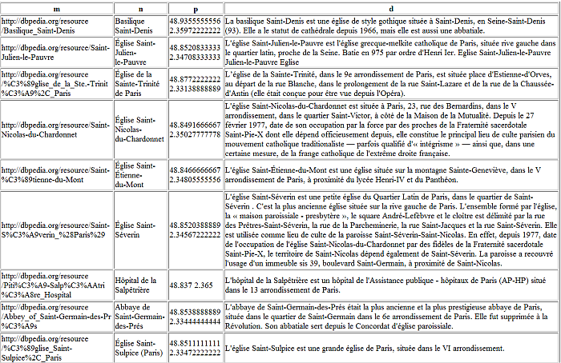

#### Inference Rule example using transitive properties from SKOS vocabulary: Variant II

This example shows how to find entities that are subcategories of
Protestant Churches, no deeper than 3 levels within the concept scheme
hierarchy, filtered by a specific subcategory. It demonstrates use of
inference rules, sub-queries, and filter to obtain entities associated
with category: Protestant\_churches combined with the use of the
transitivitve closure, sets to a maximum of 3 steps down a SKOS based
concept scheme hierarchy:

1.  Make sure the inference rule "skos-trans" is created as described in
    the previous [example](#rdfsparqlimplementatiotransexamples7)

2.  Go to SPARQL endpoint, for ex. http://lod.openlinksw.com/sparql

3.  Use inference rule pragma to set context rule for SPARQL query, i.e:
    
        DEFINE input:inference "skos-trans"
        PREFIX p: <http://dbpedia.org/property/>
        PREFIX dbpedia: <http://dbpedia.org/resource/>
        PREFIX category: <http://dbpedia.org/resource/Category:>
        PREFIX rdfs: <http://www.w3.org/2000/01/rdf-schema#>
        PREFIX skos: <http://www.w3.org/2004/02/skos/core#>
        PREFIX geo: <http://www.georss.org/georss/>
        
        SELECT DISTINCT ?c AS ?skos_broader
               ?trans AS ?skos_narrower
               ?dist AS ?skos_level
               ?m ?n ?p AS ?geo_point
        WHERE
          {
            {
              SELECT ?c  ?m ?n ?p ?trans ?dist
              WHERE
                {
                  ?m rdfs:label ?n.
                  ?m skos:subject ?c.
                  ?c skos:broaderTransitive category:Protestant_churches .
                  ?c skos:broaderTransitive ?trans
                        OPTION ( TRANSITIVE,
                                 t_distinct,
                                 t_in (?c),
                                 t_out (?trans),
                                 t_max (3),
                                 t_step ( 'step_no' ) as ?dist ) .
                  ?m p:abstract ?d.
                  ?m geo:point ?p
                  FILTER ( lang(?n) = "en" )
                  FILTER ( lang(?d) = "en" )
                }
            }
            FILTER ( ?trans = <http://dbpedia.org/resource/Category:Churches_in_London> )
          }
        ORDER BY ASC (?dist)

4.  You will get 22 rows returned from the query.
    
    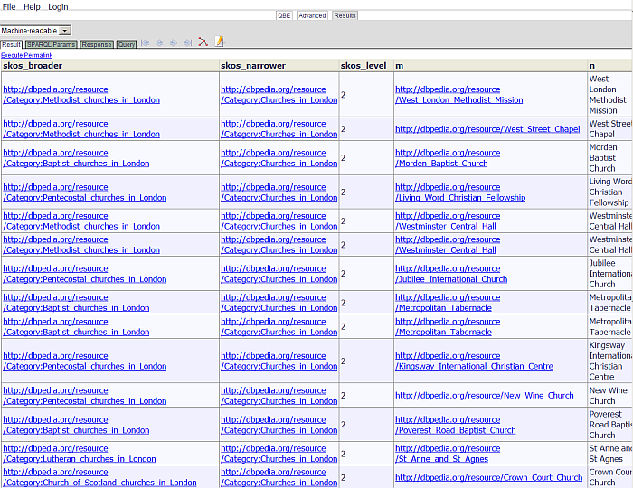

<a id="id22-supported-sparql-bi-define-pragmas"></a>
## Supported SPARQL-BI "define" pragmas

SPARQL-BI compiler and run-time support are not isolated from
environment and some used heuristics are not perfect and sometimes
different use cases require different behavior within same standard.
These reasons are seen frequently in the industry, and the solution is
well known: compiler pragmas. So we allow them at the beginning of any
SPARQL query in form:

    define QName value

### Pragmas to control the input data set for the query

    input:default-graph-uri works like "FROM" clause;
    input:named-graph-uri works like "FROM NAMED" clause;
    input:default-graph-exclude works like "NOT FROM" clause;
    input:named-graph-exclude works like "NOT FROM NAMED" clause.

The difference is that these pragmas have higher priority and they can
be used for security restrictions in combination with `define
input:freeze` that blocks further changes in the list of source graphs.
The web service endpoint (or similar non-web application) can edit the
incoming query by placing list of pragmas ended with `input:freeze` in
front of query text. Even if the intruder will try to place some graph
names, it will get compilation error, not an access to the data.
input:freeze disables all `input:grab-...` pragmas as well.

  - `input:ifp` : adds IFP keyword in OPTION (QUIETCAST, ...) clause in
    the generated SQL. The value of this define is not used ATM, an
    empty string is safe for future extensions.

  - `input:same-as` : works like input:ifp but adds SAME\_AS keyword.

  - `input:storage` : selects quad map storage to use. The value is an
    IRI of storage, the default value is, of course,
    virtrdf:DefaultQuadStorage. If the value is an empty string then
    only quads from RDF\_VIEW are used. This is a good choice for
    low-level admin procedures, for two reasons: they will not interfere
    with any changes in virtrdf:DefaultQuadStorage and they will
    continue to work even if all compiler's metadata are corrupted,
    including the description of virtrdf:DefaultQuadStorage (define
    input:storage "" switches the SPARQL compiler to a small set of
    metadata that are built in server C code and thus are very hard to
    corrupt by users).

  - `input:inference` : specifies the name of inference rule set to use.

  - `input:param (and synonyms input:params, sql:param, sql:params)` :
    declares a variable name as a protocol parameter. The SPARQL query
    can refer to protocol parameter X via variable with special syntax
    of name ?::X . If a query text should be made by query builder that
    does not understand SPARQL-BI extensions then the text may contain
    variable ?X and define input:param "X" . This does not work for
    positional parameters, one can not replace a reference to ?::3 with
    ?3 and define input:param "3".

  - `input:grab-var` : Network Resource Fetch values of variable;

  - `input:grab-iri` : Network Resource Fetch the constant IRI;

  - `input:grab-all` : Network Resource Fetch all constants and
    variables of the query;

  - `input:grab-seealso (and synonym input:grab-follow-predicate)` :
    sets predicate that tells where to Fetch more Network Resource data
    about a subject;

  - `input:grab-limit` : how many resources can be fetched;

  - `input:grab-depth` : how many iterations can be done, sponging
    additional data on each iteration;

  - `input:grab-base` : base to resolve relative IRIs before passing to
    Sponger;

  - `input:grab-resolver` : IRI resolving procedure (i.e., one that
    turns base and relative IRI to an absolute IRI);

  - `input:grab-destination` : single resource that should be filled in
    with results of all fetchings;

  - `input:grab-loader` : a name of procedure that retrieve the resource
    via HTTP, parse it and store it.

All these pragmas are described in more details [here](#rdfinputgrab) ,
but in addition there are some experimental:

  - `input:grab-intermediate` : extends the set of IRIs to sponge,
    useful in combination with input:grab-seealso. If present then for a
    given subject, Network Resource Fetch will retrieve not only values
    of see-also predicates for that subject but the subject itself. The
    define value is not used in current implementation.

  - `input:grab-group-destination` : resembles input:grab-destination
    but sponges will create individual graphs for Network Resource Fetch
    results, and in additional to this common routine, a copy of each
    Network Resource Fetch result is added to the resource specified by
    the value of input:grab-group-destination. input:grab-destination
    redirects loadings, input:grab-group-destination duplicates them.

  - `get:soft` : "soft" or "replacing", depending on mode of loading
    source graph;

  - `get:uri` : an URI of web resource where the graph should come from
    (e.g., a local mirror);

  - `get:method` : "GET" or "MGET", depending on loading the resource
    itself or loading metadata about the resource;

  - `get:refresh` : limits the lifetime of a local cached copy of the
    source, the value is in seconds. Should be used in combination with
    get:soft;

  - `get:proxy` : the proxy server to use, as "host:port" string.

These defines are described also [here](#rdfinputgrab) . Note that all
of them can be used in option list of "FROM ... OPTION (get:... )"
extended SPARQL-BI syntax for FROM/FROM NAMED clause.

Note that all of them can be used in option list of "FROM ... OPTION
(get:... )" extended SPARQL-BI syntax for FROM/FROM NAMED clause.

### Pragmas to control code generation

  - `sql:assert-user` : defines the user who is supposed to be the
    single "proper" use for the query. If the compiler is launched by
    other user, an error is signaled. The typical use is define
    sql:assist-user "dba". This is too weak to be a security measure,
    but may help in debugging of security issues.

  - `sql:gs-app-callback` : application-specific callback that returns
    permission bits of a given graph;

  - `sql:gs-app-uid` : application-specific user id to use in callback.
    
    > **Tip**
    > 
    > [RDF Graph Security](#rdfgraphsecurityappcallb)

  - `sql:globals-mode` : tells how to print names of global variables,
    supported values are "XSLT" (print colon before name of global
    variable and "SQL" (print as usual).

  - `sql:log-enable` : value that will be passed to SPARUL procedures
    and there it will be passed to log\_enable() BIF. Thus define
    sql:log-enable N will result in log\_enable(N, 1) at the beginning
    of the operation and other log\_enable() call will restore previous
    mode of transaction log at exit from the procedure or at any error
    signalled from it.

  - `sql:table-option` : value will be added as an option to each triple
    in the query and later it will be printed in TABLE OPTION (...)
    clause of source table clause. This works only for SQL code for
    plain triples from RDF\_QUAD, fragments of queries related to RDF
    Views will remain unchanged.

  - `sql:select-option` : value will be added as an global OPTION ()
    clause of the generated SQL SELECT. This clause is always printed,
    it is always at least OPTION (QUIETCAST, ...). The most popular use
    case is define sql:table-option "ORDER" to tell the SQL compiler
    execute joins in the order of their use in the query (this can make
    query compilation much faster but the compilation result can be
    terrible if you do not know precisely what you're doing and not
    inspected execution plan of the generated SQL query).

  - `sql:describe-mode` : sets procedures that will produce the result
    of a DESCRIBE query. The pragma is ignored for other types of SPARQL
    queries. In the default mode, the result contains all X ?p ?o and
    all ?s ?p X triples for each given X. In "SPO" mode, the result
    contains X ?p ?o triples only. In "CBD" mode, the result contains
    concise bound descriptions of given subjects. Application developers
    may add more modes.

  - `sql:signal-void-variables` : the most useful debugging variable if
    Linked Data Views are in use. It tells the SPARQL compiler to signal
    an error if it can prove that some variable can never be bound.
    Usually it means error in query, like typo in IRI or totally wrong
    triple pattern.

### Pragmas to control the type of the result

  - `output:valmode` : tells the compiler which SQL datatypes should be
    used for output values. ODBC clients and the like known nothing
    about RDF and expect plain SQL values, so the appropriate value for
    them is "SQLVAL" and that's the default. When a Virtuoso/PL
    procedure is RDF-aware and keeps results for further passing to
    other SPARQL queries or some low-level RDF routines, the value
    "LONG" tells the compiler to preserve RDF boxes as is and to return
    IRI IDs instead of IRI string value. Third possible value, "AUTO",
    is for dirty hackers that do not want any conversion of any sort at
    the output to read the SQL output of SPARQL front-end, find the
    format of each column and add the needed conversions later. You will
    probably never need it.

  - `output:format` : tells the compiler that the query should produce a
    string output with the serialization of the result, not a result
    set. There are three of them because the caller, like SPARQL web
    service endpoint, may not know the actual type of the query that
    should be executed. The value of output:format is used for SELECT
    and data manipulation queries, if specified, it can also be used for
    CONSTRUCT, DESCRIBE or ASK, if it is specified but related
    output:dict-format or output:scalar-format is not.

  - `output:scalar-format` : tells the compiler that the query should
    produce a string output with the serialization of the result, not a
    result set. There are three of them because the caller, like SPARQL
    web service endpoint, may not know the actual type of the query that
    should be executed. The value of output:scalar-format is used for
    ASK queries only, if specified.

  - `output:dict-format` : tells the compiler that the query should
    produce a string output with the serialization of the result, not a
    result set. There are three of them because the caller, like SPARQL
    web service endpoint, may not know the actual type of the query that
    should be executed. The value of output:dict-format is used for
    CONSTRUCT and DESCRIBE queries only, if specified.

### Supported formats that return a string session

  - "RDF/XML",

  - "TURTLE" (and "TTL" is a synonym),

  - "JSON" (canonical JSON for result sets, Talis-style JSON for
    CONSTRUCT and DESCRIBE),

  - "JSON;ODATA" (oData-style JSON for CONSTRUCT and DESCRIBE, error
    otherwise),

  - "RDFA;XHTML" (only for CONSTRUCT and DESCRIBE, error otherwise),

  - "ATOM;XML" (only for CONSTRUCT and DESCRIBE as well).

### Supported formats that do not return a string session to the caller

Supported formats that do not return a string session to the caller, but
form an HTTP response instead and send it directly to the client HTTP
connection with an appropriate HTTP header:

  - "HTTP+XML mime/type",

  - "HTTP+TTL mime/type",

  - "HTTP+NT mime/type". A MIME type in value will be placed in the
    returned header, it should be separated from the starting keyword
    with one white space.

### Supported Special formats

A special format "\_JAVA\_" is for SPARQL queries sent via JDBC. It
changes only the output of ASK queries.

The "\_JAVA\_" and "\_UDBC\_" are aliases in Virtuoso Version 6.1.5.
Till Virtuoso 6.1.5 the default behaves as "TTL". For Virtuoso version
6.1.5 and higher it is ODBC/JDBC oriented e.g. "\_UDBC\_" is the default
format for ODBC/JDBC clients.

*Note* : If you want to revert to old TTL behaviour, you should specify
it explicitly via:

    define output:format "TTL"

Note: Pragmas output:valmode and output:format may conflict if used
together, and if they're not in conflict then output:valmode is
redundant: the compiler knows for sure which output:valmode-s are needed
by various output:format-s.

  - `output:route` : works only for SPARUL operators and tells the
    SPARQL compiler to generate procedure names that differ from
    default. As a result, the effect of operator will depend on
    application. That is for tricks. E.g., consider an application that
    extracts metadata from DAV resources stored in the Virtuoso and put
    them to RDF storage to make visible from outside. When a web
    application has permissions and credentials to execute a SPARUL
    query, the changed metadata can be written to the DAV resource (and
    after that the trigger will update them in the RDF storage),
    transparently for all other parts of application.

  - `output:maxrows` : limits the number of rows in the returned result
    set. The integer value is expected, the positive integer value is
    obviously recommended.

### Minor notes

Values of most pragmas are strings. Exceptions are:

  - input:grab-depth,

  - input:grab-limit,

  - output:maxrows,

  - sql:log-enable,

  - sql:signal-void-variables

that have integer values.

Values of some pragmas a passed through the compiler to the run-time so
they are seen in the generated SQL code as arguments of procedures:

  - get:method,

  - get:proxy,

  - get:query,

  - get:refresh,

  - get:soft,

  - get:uri

so sometimes you may meet them in SQL debuggers output and the like.

<a id="id23-built-in-bif-functions"></a>
## Built-in bif functions

  - *bif:\_\_rdf\_long\_from\_batch\_params(i\_nt integer, st\_value,
    st2\_value)*
    
      - For value URI, the params values should be: 1,
        value.stringValue(), NULL
    
      - For value BNODE, the params values should be: 1,
        "\_:"+((BNode)value).getID(), NULL
    
      - For value Literal with Language\!=NULL, the params values should
        be: 5, lit.stringValue(), lit.getLanguage()
    
      - For value Literal with Datatype\!=NULL, the params values should
        be: 4, lit.stringValue(), lit.getDatatype().toString()
    
      - For value Literal with Datatype==NULL && Language==NULL, the
        params values should be: 3, lit.stringValue(), NULL
    
      - For value any value exclude above, the params values should be:
        3, value.stringValue(), NULL
    
      - For string value (without Datatype and Language), the params
        values should be: 3, value.stringValue(), NULL
    
    *Example:*
    
        SPARQL SELECT *
        WHERE
          { graph ?g { `iri(??)` `iri(??)`
            `bif:__rdf_long_from_batch_params(3,value.stringValue(),NULL)` }
          }

<a id="id24-sending-soap-requests-to-virtuoso-sparql-endpoint"></a>
## Sending SOAP Requests to Virtuoso SPARQL Endpoint

This section presents a sample scenario on how to execute a SPARQL query
as a SOAP request to the Virtuoso SPARQL Endpoint.

1.  Assume the following sample SOAP request containing simple SPARQL
    query:
    
        <soapenv:Envelope xmlns:soapenv="http://schemas.xmlsoap.org/soap/envelope/" xmlns:xsd="http://www.w3.org/2001/XMLSchema" xmlns:xsi="http://www.w3.org/2001/XMLSchema-instance">
           <soapenv:Body>
              <query-request xmlns="http://www.w3.org/2005/09/sparql-protocol-types/#">
                 <query xmlns="">SELECT DISTINCT ?z FROM virtrdf: {?x ?y ?z .} LIMIT 10</query>
              </query-request>
           </soapenv:Body>
        </soapenv:Envelope>

2.  Save locally the content from above for ex. to file with the name
    "soap.xml".

3.  To pass the SOAP request to a Virtuoso SPARQL Endpoint, execute the
    following curl command:
    
        $ curl -d@soap.xml -H "Content-Type:text/xml" -H "SOAPAction: ''" http://example.com/sparql
        <soapenv:Envelope xmlns:soapenv="http://schemas.xmlsoap.org/soap/envelope/">
          <soapenv:Body>
            <query-result xmlns="http://www.w3.org/2005/09/sparql-protocol-types/#">
              <sparql xmlns="http://www.w3.org/2005/sparql-results#" xmlns:xsi="http://www.w3.org/2001/XMLSchema-instance" xsi:schemaLocation="http://www.w3.org/2001/sw/DataAccess/rf1/result2.xsd">
                <head>
                 <variable name="z"/>
                </head>
                <results distinct="false" ordered="true">
                  <result>
                    <binding name="z">
                     <uri>http://www.openlinksw.com/schemas/virtrdf#QuadMapFormat</uri>
                    </binding>
                  </result>
                  <result>
                    <binding name="z">
                     <uri>http://www.openlinksw.com/schemas/virtrdf#QuadStorage</uri>
                    </binding>
                  </result>
                  <result>
                    <binding name="z">
                     <uri>http://www.openlinksw.com/schemas/virtrdf#array-of-QuadMapFormat</uri>
                    </binding>
                  </result>
                  <result>
                    <binding name="z">
                     <uri>http://www.openlinksw.com/schemas/virtrdf#QuadMap</uri>
                    </binding>
                  </result>
                  <result>
                    <binding name="z">
                     <uri>http://www.openlinksw.com/schemas/virtrdf#QuadMapValue</uri>
                    </binding>
                  </result>
                  <result>
                    <binding name="z">
                     <uri>http://www.openlinksw.com/schemas/virtrdf#array-of-QuadMapColumn</uri>
                    </binding>
                  </result>
                  <result>
                    <binding name="z">
                     <uri>http://www.openlinksw.com/schemas/virtrdf#QuadMapColumn</uri>
                    </binding>
                  </result>
                  <result>
                    <binding name="z">
                     <uri>http://www.openlinksw.com/schemas/virtrdf#array-of-QuadMapATable</uri>
                    </binding>
                  </result>
                  <result>
                    <binding name="z">
                     <uri>http://www.openlinksw.com/schemas/virtrdf#QuadMapATable</uri>
                    </binding>
                  </result>
                  <result>
                    <binding name="z">
                     <uri>http://www.openlinksw.com/schemas/virtrdf#QuadMapFText</uri>
                    </binding>
                  </result>
                </results>
              </sparql>
            </query-result>
          </soapenv:Body>
        </soapenv:Envelope>

<a id="id25-use-of-hash-join-with-rdf"></a>
## Use of Hash Join With RDF

For queries that touch large quantities of RDF data and have many
selection confitions use of hash join is often desirable. For short
lookup queries hash join is usually not desirable.

Depending on the version, the query optimizer may of may not do hash
joins with RDF. This is controlled by the *hash\_join\_enable* flag.

To check the flag do:

    sys_stat ('hash_join_enable');

  - 0 -- means that hash joins are never made

  - 1 -- means that these are for SQL only

  - 2 -- means that these can also be used wih RDF

The flag is set in the ini file in the \[Flags\] section:

    [Flags]
    hash_join_enable = 2

The flag may be transiently set with the SQL statement:

    __dbf_set ('hash_join_enable', 2);

To check the effectiveness of hash joins and whether the optimizer
introduces these in the first place, it is most convenient to use the
*profile* function.

In the following example, we look at the star schema benchmark Q4:

    SPARQL PREFIX rdfh: <http://lod2.eu/schemas/rdfh#>
    SELECT SUM(?rdfh_lo_revenue) AS ?lo_revenue ?d_year ?p_brand1
    FROM <http://lod2.eu/schemas/rdfh-inst#ssb1_ttl_qb>
    WHERE
      {
        ?li a rdfh:lineorder ;
            rdfh:lo_orderdate ?lo_orderdate ;
            rdfh:lo_partkey ?lo_partkey ;
            rdfh:lo_suppkey ?lo_suppkey ;
              rdfh:lo_revenue ?rdfh_lo_revenue .
    
        ?lo_orderdate rdfh:d_year ?d_year .
        ?lo_partkey rdfh:p_brand1 ?p_brand1 .
        ?lo_partkey rdfh:p_category "MFGR#12" .
        ?lo_suppkey rdfh:s_region "AMERICA" .
      }
    GROUP BY ?d_year ?p_brand1
    ORDER BY ?d_year ?p_brand1
    ;

The query aggregates rows from a large fact table and selects based on a
date range, a brand and the location of the supplier. To run this, it is
best to put the query in a file and have profile ('sparql... ') wrapped
around the text. Then in isql:

    SET SET BLOBS ON;
    LOAD q4.sql;

Without hash join the profile is:

    {
    time   1.9e-06% fanout         1 input         1 rows
    
    Precode:
          0: __rdflit := Call __rdflit (rdflit170373)
          5: __rdflit := Call __rdflit (rdflit16802)
          10: BReturn 0
    Subquery 31
    {
    time     1e-06% fanout         1 input         1 rows
    { fork
    time   0.00035% fanout         1 input         1 rows
    { fork
    time       3.6% fanout     1e+06 input         1 rows
    RDF_QUAD     1e+06 rows(s_18_9_t6.S, s_18_9_t6.O)
     inlined  P =  #dfh#p_brand1  G =  #nst#ssb1_ttl_qb
    time       1.7% fanout   0.03979 input     1e+06 rows
    RDF_QUAD_POGS unq      0.04 rows (s_18_9_t7.S)
     P =  #dfh#p_category  ,  O = rdflit170373 ,  S = s_18_9_t6.S ,  G =  #nst#ssb1_ttl_qb
    time       2.5% fanout   180.179 input     39790 rows
    
    Precode:
          0: __ro2sq := Call __ro2sq (s_18_9_t6.O)
          5: BReturn 0
    RDF_QUAD_POGS   4.4e+02 rows(s_18_9_t2.S)
     P =  #dfh#lo_partkey  ,  O = k_s_18_9_t6.S G =  #nst#ssb1_ttl_qb
    time        35% fanout         1 input 7.16932e+06 rows
    RDF_QUAD         1 rows(s_18_9_t3.O, s_18_9_t3.S)
     inlined  P =  #dfh#lo_suppkey  ,  S = s_18_9_t2.S G =  #nst#ssb1_ttl_qb
    time       4.5% fanout  0.201214 input 7.16932e+06 rows
    RDF_QUAD_POGS unq       0.2 rows ()
     P =  #dfh#s_region  ,  O = rdflit16802 ,  S = cast ,  G =  #nst#ssb1_ttl_qb
    time        21% fanout         1 input 1.44256e+06 rows
    RDF_QUAD         1 rows(s_18_9_t4.S, s_18_9_t4.O)
     inlined  P =  #dfh#lo_revenue  ,  S = k_s_18_9_t2.S G =  #nst#ssb1_ttl_qb
    time        12% fanout         1 input 1.44256e+06 rows
    RDF_QUAD_POGS unq       0.8 rows (s_18_9_t0.S)
     P =  #-ns#type  ,  O =  #dfh#lineorder  ,  S = k_s_18_9_t2.S ,  G =  #nst#ssb1_ttl_qb
    time        14% fanout         1 input 1.44256e+06 rows
    RDF_QUAD         1 rows(s_18_9_t1.O)
     inlined  P =  #dfh#lo_orderdate  ,  S = s_18_9_t0.S G =  #nst#ssb1_ttl_qb
    time       3.5% fanout         1 input 1.44256e+06 rows
    RDF_QUAD         1 rows(s_18_9_t5.O)
     inlined  P =  #dfh#d_year  ,  S = cast G =  #nst#ssb1_ttl_qb
    time       1.9% fanout         0 input 1.44256e+06 rows
    Sort (s_18_9_t5.O, s_18_9_t6.O) -> (s_18_9_t4.O, __ro2sq)
    
    }
    time   4.1e-05% fanout       280 input         1 rows
    group by read node
    (s_18_9_t5.O, s_18_9_t6.O, aggregate, __ro2sq)
    time   0.00043% fanout         0 input       280 rows
    
    Precode:
          0: __ro2sq := Call __ro2sq (s_18_9_t5.O)
          5: BReturn 0
    Sort (__ro2sq, __ro2sq) -> (aggregate)
    
    }
    time   2.9e-05% fanout       280 input         1 rows
    Key from temp (aggregate, __ro2sq, __ro2sq)
    
    After code:
          0: lo_revenue :=  := artm aggregate
          4: d_year :=  := artm __ro2sq
          8: p_brand1 :=  := artm __ro2sq
          12: BReturn 0
    time   7.6e-07% fanout         0 input       280 rows
    Subquery Select(lo_revenue, d_year, p_brand1)
    }
    
    After code:
          0: lo_revenue := Call __ro2sq (lo_revenue)
          5: d_year := Call __ro2sq (d_year)
          10: p_brand1 := Call __ro2sq (p_brand1)
          15: BReturn 0
    time   6.3e-07% fanout         0 input       280 rows
    Select (lo_revenue, d_year, p_brand1)
    }
    
     5542 msec 2420% cpu, 2.11877e+07 rnd 8.13668e+06 seq   85.6039% same seg   13.6018% same pg
    Compilation: 10 msec 0 reads         0% read 0 messages         0% clw
    
      <para>With hash join the profile is:</para>
    <programlisting><![CDATA[
    {
    time   1.4e-05% fanout         1 input         1 rows
    time         7% fanout         1 input         1 rows
    
    Precode:
          0: __rdflit := Call __rdflit (rdflit170373)
          5: __rdflit := Call __rdflit (rdflit16802)
          10: BReturn 0
    { hash filler
    time     0.088% fanout     1e+06 input         1 rows
    RDF_QUAD     1e+06 rows(s_18_9_t6.S, s_18_9_t6.O)
     inlined  P =  #dfh#p_brand1  G =  #nst#ssb1_ttl_qb
    time      0.15% fanout         0 input     1e+06 rows
    Sort hf 39 (s_18_9_t6.S, s_18_9_t6.S) -> (s_18_9_t6.O)
    
    }
    time   0.00046% fanout         1 input         1 rows
    { hash filler
    time    0.0004% fanout      2556 input         1 rows
    RDF_QUAD_POGS   2.6e+03 rows(s_18_9_t5.S, s_18_9_t5.O)
     inlined  P =  #dfh#d_year  G =  #nst#ssb1_ttl_qb
    time   0.00056% fanout         0 input      2556 rows
    Sort hf 56 (s_18_9_t5.S) -> (s_18_9_t5.O)
    
    }
    time    0.0036% fanout         1 input         1 rows
    { hash filler
    time   0.00094% fanout     12068 input         1 rows
    RDF_QUAD_POGS   1.2e+04 rows(s_18_9_t8.S)
     P =  #dfh#s_region  ,  O = rdflit16802 G =  #nst#ssb1_ttl_qb
    time   0.00046% fanout         0 input     12068 rows
    Sort hf 69 (s_18_9_t8.S)
    }
    time     0.012% fanout         1 input         1 rows
    { hash filler
    time    0.0026% fanout     39790 input         1 rows
    RDF_QUAD_POGS     4e+04 rows(s_18_9_t7.S)
     P =  #dfh#p_category  ,  O = rdflit170373 G =  #nst#ssb1_ttl_qb
    time    0.0013% fanout         0 input     39790 rows
    Sort hf 82 (s_18_9_t7.S)
    }
    Subquery 88
    {
    time   1.5e-05% fanout         1 input         1 rows
    { fork
    time   1.3e-05% fanout         1 input         1 rows
    { fork
    time        52% fanout 7.16932e+06 input         1 rows
    RDF_QUAD   1.8e+08 rows(s_18_9_t2.O, s_18_9_t2.S)
     inlined  P =  #dfh#lo_partkey  G =  #nst#ssb1_ttl_qb
    hash partition+bloom by 86 (tmp)hash join merged always card      0.04 -> ()
    time       6.1% fanout         1 input 7.16932e+06 rows
    
    Precode:
          0: s_18_9_t7.S :=  := artm s_18_9_t2.O
          4: BReturn 0
    Hash source 82 merged into ts       0.04 rows(cast) -> ()
    time         7% fanout  0.201214 input 7.16932e+06 rows
    RDF_QUAD         1 rows(s_18_9_t3.O, s_18_9_t3.S)
     inlined  P =  #dfh#lo_suppkey  ,  S = s_18_9_t2.S G =  #nst#ssb1_ttl_qb
    hash partition+bloom by 73 (tmp)hash join merged always card       0.2 -> ()
    time    0.0018% fanout         1 input 1.44256e+06 rows
    Hash source 69 merged into ts        0.2 rows(cast) -> ()
    time       2.3% fanout         1 input 1.44256e+06 rows
    RDF_QUAD_POGS unq       0.8 rows (s_18_9_t0.S)
     P =  #-ns#type  ,  O =  #dfh#lineorder  ,  S = k_s_18_9_t2.S ,  G =  #nst#ssb1_ttl_qb
    time       2.3% fanout         1 input 1.44256e+06 rows
    RDF_QUAD         1 rows(s_18_9_t1.O, s_18_9_t1.S)
     inlined  P =  #dfh#lo_orderdate  ,  S = s_18_9_t0.S G =  #nst#ssb1_ttl_qb
    hash partition+bloom by 60 ()
    time      0.38% fanout         1 input 1.44256e+06 rows
    Hash source 56           1 rows(cast) -> (s_18_9_t5.O)
    time       2.2% fanout         1 input 1.44256e+06 rows
    RDF_QUAD         1 rows(s_18_9_t4.O)
     inlined  P =  #dfh#lo_revenue  ,  S = k_s_18_9_t0.S G =  #nst#ssb1_ttl_qb
    time        20% fanout         1 input 1.44256e+06 rows
    Hash source 39         1.6 rows(k_s_18_9_t2.O, k_s_18_9_t7.S) -> (s_18_9_t6.O)
    time      0.86% fanout         0 input 1.44256e+06 rows
    Sort (set_no, s_18_9_t5.O, s_18_9_t6.O) -> (s_18_9_t4.O)
    
    }
    time   0.00023% fanout       280 input         1 rows
    group by read node
    (gb_set_no, s_18_9_t5.O, s_18_9_t6.O, aggregate)
    time       0.1% fanout         0 input       280 rows
    
    Precode:
          0: __ro2sq := Call __ro2sq (s_18_9_t6.O)
          5: __ro2sq := Call __ro2sq (s_18_9_t5.O)
          10: BReturn 0
    Sort (__ro2sq, __ro2sq) -> (aggregate)
    
    }
    time    0.0002% fanout       280 input         1 rows
    Key from temp (aggregate, __ro2sq, __ro2sq)
    
    After code:
          0: lo_revenue :=  := artm aggregate
          4: d_year :=  := artm __ro2sq
          8: p_brand1 :=  := artm __ro2sq
          12: BReturn 0
    time   5.3e-06% fanout         0 input       280 rows
    Subquery Select(lo_revenue, d_year, p_brand1)
    }
    
    After code:
          0: lo_revenue := Call __ro2sq (lo_revenue)
          5: d_year := Call __ro2sq (d_year)
          10: p_brand1 := Call __ro2sq (p_brand1)
          15: BReturn 0
    time   5.5e-06% fanout         0 input       280 rows
    Select (lo_revenue, d_year, p_brand1)
    }
    
     3101 msec 993% cpu, 1.14967e+07 rnd 1.81041e+08 seq   99.5619% same seg  0.417643% same pg
    Compilation: 23 msec 0 reads         0% read 0 messages         0% clw

These are runs on warm cache on a dataset of scale factor 30, about 3 bm
triples.

We notice that the hash based plan completes faster and has a lower CPU
percentage. This is to be expected since hash joins are specially useful
for joins between a large table and a smaller one.

The index based plan does 21M random index lookups whereas the hash
based one only 11M. We also note that the index access pattern is more
local with the hash plan, with 99% of lookups hitting the same segment
as the previous, against only 85%.

These numbers are in the summary at the bottom of each profile:

  - rnd -- means index access

  - seq -- means rows retrieved in sequential scan, same seg is the
    percentage of index accesses that hit the same segment as the
    previous access.

The index based plan starts with the smallest selection, in this case
the days parts with the given brand. From this it joins to the lineorder
and gets the supplier. It fetches the region of the supplier and leaves
out the ones not in America.

The hash based plan makes a hash table of all the parts with the brand,
all the suppliers in America and all the days in the time dimension. It
then scans lineorder and first drops the rows whose part is not in the
hash, then the rows where the supplier is not in the hash, then gets the
year of each date. This last operation does not drop any rows but is
still done by hash because there are relatively few days and the day to
year translation is done a very large number of times.

The number of rows in and out of each operator is given after the time
percent, above the operator. Fanout is the number of rows of output per
one row of input.

Given the long-running queries of any workload, you can perform this
same comparison to determine if hash join is useful in the case at hand.
Looking at the real time and CPU% is usually enough.

  - Using the sql:select-option pragma: One can specify the hash join is
    not to be used:
    
        define sql:select-option "loop"
    
    which will exclude use of hash join in the specific query.

  - Using the table\_option construct: Can be used for selecting the
    join type for any triple pattern:
    
        {
          ?lo rdfh:lo_suppkey ?supp .
          ?supp rdfh:s_region  "AMERICA" option (table_option "hash")
        }
    
    would have the effect of building a hash from the suppliers in
    America.

You may experiment with these options and look at the profile output for
each.

For some analytics workloads enabling hash join may give a factor of 2
or 3 more performance. For lookup workloads there may be no gain.

Sometimes a hash join may be used when an index lookupp would be better,
thus in some cases it makes sense to turn off hash joins either per
query or globally.

<a id="id26-extensions"></a>
# Extensions

<a id="id27-using-full-text-search-in-sparql"></a>
## Using Full Text Search in SPARQL

Virtuoso's triple store supports optional full text indexing of RDF
object values since version 5.0. It is possible to declare that objects
of triples with a given predicate or graph get indexed. The graphs and
triples may be enumerated or a wildcard may be used.

The triples for which a full text index entry exists can be found using
the *bif:contains* or related filters and predicates.

For example, the query:

    SQL>SELECT *
    FROM <people>
    WHERE
      {
        ?s foaf:Name ?name . ?name bif:contains "'rich*'".
      }

would match all subjects whose *foaf:Name* contain a word Rich. This
would match Richard, Richie etc.

Note that words and phrases should be enclosed in quotes if they contain
spaces or other non-alphanumeric chars.

If the *bif:contains* or related predicate is applied to an object that
is not a string or is not the object of an indexed triple, no match will
be found.

The syntax for text patterns is identical to the syntax for the SQL
contains predicate.

The SPARQL/SQL optimizer determines whether the text pattern will be
used to drive the query or whether it will filter results after other
conditions are applied first. In contrast to *bif:contains* , regexp
matching never drives the query or makes use of an index, thus in
practice regexps are checked after other conditions.

### Specifying What to Index

Whether the object of a given triple is indexed in the text index
depends on indexing rules. If at least one indexing rule matches the
triple, the object gets indexed if the object is a string. An indexing
rule specifies a graph and a predicate. Either may be an IRI or NULL, in
which case it matches all IRI's.

Rules also have a 'reason', which can be used to group rules into
application-specific sets. A triple will stop being indexed only after
all rules mandating its indexing are removed. When an application
requires indexing a certain set of triples, rules are added for that
purpose. These rules are tagged with the name of the application as
their reason. When an application no longer requires indexing, the rules
belonging to this application can be removed. This will not turn off
indexing if another application still needs certain triples to stay
indexed.

Indexing is enabled/disabled for specific graph/predicate combinations
with:

    create function DB.DBA.RDF_OBJ_FT_RULE_ADD
      (in rule_g varchar, in rule_p varchar, in reason varchar) returns integer

    create function DB.DBA.RDF_OBJ_FT_RULE_DEL
      (in rule_g varchar, in rule_p varchar, in reason varchar) returns integer

*Example:* The first function adds a rule. The first two arguments are
the text representation of the IRI's for the graph and predicate. If
NULL is given then all graph's or predicates match. Specifying both as
NULL means that all string valued objects will be added to a text index.

*Example:*

    DB.DBA.RDF_OBJ_FT_RULE_ADD (null, null, 'All');

The second function reverses the effect of the first. Only a rule that
has actually been added can be deleted. Thus one cannot say that all
except a certain enumerated set should be indexed.

    DB.DBA.RDF_OBJ_FT_RULE_DEL (null, null, 'All');

The reason argument is an arbitrary string identifying the application
that needs this rule. Two applications can add the same rule. Removing
one of them will still keep the rule in effect. If an object is indexed
by more than one rule, the index data remain free from duplicates,
neither index size nor speed is affected.

If *DB.DBA.RDF\_OBJ\_FT\_RULE\_ADD* detects that *DB.DBA.RDF\_QUAD*
contains quads whose graphs and/or predicates match to the new rule but
which have not been indexed before then these quads are indexed
automatically. However the function *DB.DBA.RDF\_OBJ\_FT\_RULE\_DEL*
does not remove indexing data about related objects. Thus the presence
of indexing data about an object does not imply that it is necessarily
used in some quad that matches to some rule.

The above functions return one if the rule is added or deleted and zero
if the call was redundant (the rule has been added before or there's no
rule to delete).

#### Example

``` 

-- We load Tim Berners-Lee's FOAF file into a graph called 'people'.

SQL>DB.DBA.RDF_LOAD_RDFXML (http_get ('http://www.w3.org/People/Berners-Lee/card#i'), 'no', 'http://www.w3.org/people#');
Done. -- 172 msec.

-- We check how many triples we got.

SQL>SPARQL SELECT COUNT (*) FROM <http://www.w3.org/people#> WHERE {?s ?p ?o};
callret-0
INTEGER
 266
No. of rows in result: 1

-- We check the GRAPH: <http://www.w3.org/people#> for objects like "Tim":

SQL>SPARQL
SELECT *
FROM <http://www.w3.org/people#>
WHERE
  {
    ?s ?p ?o . FILTER (?o LIKE '%Tim%')
  };
s                                               p                                           o
VARCHAR                                         VARCHAR                                     VARCHAR
_______________________________________________________________________________

http://www.w3.org/People/Berners-Lee/card#i     http://xmlns.com/foaf/0.1/name              Timothy Berners-Lee
http://www.w3.org/People/Berners-Lee/card#i     http://xmlns.com/foaf/0.1/nick              TimBL
http://www.w3.org/People/Berners-Lee/card#i     http://www.w3.org/2002/07/owl#sameAs        http://www4.wiwiss.fu-berlin.de/bookmashup/persons/Tim+Berners-Lee
http://www.w3.org/People/Berners-Lee/card#i     http://xmlns.com/foaf/0.1/knows             http://dbpedia.org/resource/Tim_Bray
http://www.w3.org/People/Berners-Lee/card#i     http://www.w3.org/2000/01/rdf-schema#label  Tim Berners-Lee
http://www.w3.org/People/Berners-Lee/card#i     http://xmlns.com/foaf/0.1/givenname         Timothy
http://dbpedia.org/resource/Tim_Bray            http://xmlns.com/foaf/0.1/name              Tim Bray
no                                              http://purl.org/dc/elements/1.1/title       Tim Berners-Lee's FOAF file

8 Rows. -- 230 msec.

-- We specify that all string objects in the graph 'people' should be text indexed.

SQL>DB.DBA.RDF_OBJ_FT_RULE_ADD('http://www.w3.org/people#', null, 'people');
Done. -- 130 msec.

-- We update the text index.

SQL>DB.DBA.VT_INC_INDEX_DB_DBA_RDF_OBJ ();
Done. -- 140 msec.

-- See impact of the index  by querying the subjects and predicates
-- of all triples in the GRAPH: <http://www.w3.org/people#>,
-- where the object is a string which contains a word beginning with "TIM".

SQL>SPARQL SELECT * FROM <http://www.w3.org/people#> WHERE { ?s ?p ?o . ?o bif:contains '"Timo*"'};
s                                               p                                     o
VARCHAR                                         VARCHAR                               VARCHAR
_______________________________________________________________________________

 http://www.w3.org/People/Berners-Lee/card#i    http://xmlns.com/foaf/0.1/name        Timothy Berners-Lee
 http://www.w3.org/People/Berners-Lee/card#i    http://xmlns.com/foaf/0.1/givenname   Timothy

2 Rows. -- 2 msec.
```

The query below is identical with that above but uses a different
syntax. The filter syntax is more flexible in that it allows passing
extra options to the *contains* predicate. These may be useful in the
future.

    SQL>SPARQL SELECT * FROM <people> WHERE { ?s ?p ?o . FILTER (bif:contains(?o,  '"Timo*"')) };

> **Note**
> 
> It is advisable to upgrade to the latest version of Virtuoso before
> adding free-text rules for the first time. This is especially the case
> if large amounts of text are to be indexed. The reason is that the
> free-text index on RDF may be changed in future versions and automatic
> upgrading of an existing index data into the new format may take much
> more time than indexing from scratch.

The table *DB.DBA.RDF\_OBJ\_FT\_RULES* stores list of free-text index
configuration rules.

    create table DB.DBA.RDF_OBJ_FT_RULES (
      ROFR_G varchar not null,       -- specific graph IRI or NULL for "all graphs"
      ROFR_P varchar not null,       -- specific predicate IRI or NULL for "all predicates"
      ROFR_REASON varchar not null,  -- identification string of a creator, preferably human-readable
      primary key (ROFR_G, ROFR_P, ROFR_REASON) );

Applications may read from this table but they should not write to it
directly. Duplications in the rules do not affect the speed of free-text
index operations because the content of the table is cached in memory in
a special form. Unlike the use of configuration functions, directly
writing to the table will not update the in-memory cache.

The table is convenient to search for rules added by a given
application. If a unique identification string is used during
installation of an application when rules are added then it's easy to
remove those rules as part of any uninstall routine.

### Time of Indexing

The triple store's text index is in manual batch mode by default. This
means that changes in triples are periodically reflected in the text
index but are not maintained in strict synchrony. This is much more
efficient than keeping the indices in constant synchrony. This setting
may be altered with the *db.dba.vt\_batch\_update* stored procedure.

To force synchronization of the RDF text index, use:

    DB.DBA.VT_INC_INDEX_DB_DBA_RDF_OBJ ();

To set the text index to follow the triples in real time, use:

    DB.DBA.VT_BATCH_UPDATE ('DB.DBA.RDF_OBJ', 'OFF', null);

To set the text index to be updated every 10 minutes, use:

    DB.DBA.VT_BATCH_UPDATE ('DB.DBA.RDF_OBJ', 'ON', 10);

To make the update always manual, specify NULL as the last argument
above.

One problem related to free-text indexing of *DB.DBA.RDF\_QUAD* is that
some applications (e.g. those that import billions of triples) may set
off triggers. This will make free-text index data incomplete. Calling
procedure *DB.DBA.RDF\_OBJ\_FT\_RECOVER ()* will insert all missing
free-text index items by dropping and re-inserting every existing
free-text index rule.

### Free-Text Indexes on Linked Data Views

If an *O* field of a quad map pattern gets its value from a database
column that has a free text index then this index can be used in SPARQL
for efficient text searching. As a variation of this facility, the
free-text index of another table may be used.

If a statement of a quad map pattern declaration starts with a
declaration of table aliases, the table alias declaration may include
the name of a table column that should have a text index. For example,
consider the possibility of using a free-text index on the content of
DAV resources stored in the DAV system tables of Virtuoso:

    prefix mydav: <...>
    create quad storage mydav:metadata
    FROM WS.WS.SYS_DAV_RES as dav_resource text literal RES_CONTENT
    ...
      {
        ...
        mydav:resource-iri (dav_resource.RES_FULL_PATH)
            a mydav:resource ;
            mydav:resource-content dav_resource.RES_CONTENT ;
            mydav:resource-mime-type dav_resource.RESTYPE ;
        ...
      }

The clause *text literal RES\_CONTENT* grants the SPARQL compiler
permission to use a free-text index for objects that are literals
composed from column *dav\_resource.RES\_CONTENT* . This clause also
allows choosing between *text literal* (supports only the *contains()*
predicate) and *text xml literal* (supports both *contains()* and
*xcontains()* ) text indexes. It is important to understand that the
free-text index will produce results using raw relational data. If a
literal class transformation changes the text stored in the column then
these changes are ignored by free-text search. e.g. if a transformation
concatenates a word to the value of the column, but the free-text search
will not find this word.

The free-text index may be used in a more sophisticated way. Consider a
built-in table *DB.DBA.RDF\_QUAD* that does not have a free-text index.
Moreover, the table does not contain the full values of all objects; the
*O* column contains "short enough" values inlined, but long and special
values are represented by links to the *DB.DBA.RDF\_OBJ* table. The
RDF\_OBJ table, however, has free-text index that can be used. The full
declaration of the built-in default mapping for default storage could be
written this way:

    -- Important! Do not try to execute on live system
    -- without first changing the quad storage and quad map pattern names!
    
    SPARQL
    create virtrdf:DefaultQuadMap as
    graph rdfdf:default-iid-nonblank (DB.DBA.RDF_QUAD.G)
    subject rdfdf:default-iid (DB.DBA.RDF_QUAD.S)
    predicate rdfdf:default-iid-nonblank (DB.DBA.RDF_QUAD.P)
    object rdfdf:default (DB.DBA.RDF_QUAD.O)
    
    create quad storage virtrdf:DefaultQuadStorage
    FROM DB.DBA.RDF_QUAD as physical_quad
    FROM DB.DBA.RDF_OBJ as physical_obj text xml literal RO_DIGEST of (physical_quad.O)
    WHERE (^{physical_quad.}^.O = ^{physical_obj.}^.RO_DIGEST)
      {
        create virtrdf:DefaultQuadMap as
          graph rdfdf:default-iid-nonblank (physical_quad.G)
          subject rdfdf:default-iid (physical_quad.S)
          predicate rdfdf:default-iid-nonblank (physical_quad.P)
          object rdfdf:default (physical_quad.O) .
      }
    ;

The reference to the free-text index is extended by clause *of
(physical\_quad.O)* . This means that the free-text on
*DB.DBA.RDF\_OBJ.RO\_DIGEST* will be used when the object value comes
from *physical\_quad.O* as if *physical\_quad.O* were indexed itself. If
a SPARQL query invokes *virtrdf:DefaultQuadMap* but contains no
free-text criteria then only *DB.DBA.RDF\_QUAD* appears in the final SQL
statement and no join with *DB.DBA.RDF\_OBJ* is made. Adding a free-text
predicate will add *DB.DBA.RDF\_OBJ* to the list of source tables and a
join condition for *DB.DBA.RDF\_QUAD.O* and *DB.DBA.RDF\_OBJ.RO\_DIGEST*
; and it will add *contains (RO\_DIGEST, ...)* predicate, rather than
*contains (O, ...)* . As a result, "you pay only for what you use":
adding free-text index to the declaration does not add tables to the
query unless the index is actually used.

Boolean functions `bif:contains` and `bif:xcontains` are used for
objects that come from Linked Data Views as well as for regular
"physical" triples. Every function takes two arguments and returns a
boolean value. The first argument is an local variable. The argument
variable should be used as an object field in the group pattern where
the filter condition is placed. Moreover, the occurrence of the variable
in an object field should be placed *before* the filter. If there are
many occurrences of the variable in object fields then the free-text
search is associated with the rightmost occurrence that is still to the
left of the filter. The triple pattern that contains the rightmost
occurrence is called the "intake" of the free-text search. When the
SPARQL compiler chooses the appropriate quad map patterns that may
generate data matching the intake triple pattern, it skips quad map
patterns that have no declared free-text indexes, because nothing can be
found by free-text search in data that have no free-text index. Every
quad map pattern that has a free-text pattern will ultimately produce an
invocation of the SQL [contains](#containspredicate) or
[xcontains](#xcontainspredicate) predicate, so the final result of a
free-text search may be a union of free-text searches from different
quad map patterns.

The described logic is important only in very complicated cases, whereas
simple queries are self-evident:

    SELECT * FROM <my-dav-graph>
    WHERE {
        ?resource a mydav:resource ;
            mydav:resource-content ?text .
        FILTER (bif:contains (?text, "hello and world")) }

or, more succinctly,

    SELECT * FROM <my-dav-graph>
    WHERE {
        ?resource a mydav:resource ;
            mydav:resource-content ?text .
        ?text bif:contains "hello and world" . }

### Example Using Score

    SQL>
    SPARQL
    SELECT *
    WHERE
      {
        ?s ?p ?o .
        ?o bif:contains 'NEW AND YORK'
        OPTION (score ?sc) .
      }
    ORDER BY DESC (?sc)
    LIMIT 10
    
    s                                                                        p                                               o                                                sc
    ANY                                                                      ANY                                             ANY                                              ANY
    ______________________________________________________________________________________________________________________________________________________________________________
    
    http://dbpedia.org/resource/New_York%2C_New_York_%28disambiguation%29    http://www.w3.org/2000/01/rdf-schema#comment    New York, New York, New York kentini........     88
    http://dbpedia.org/resource/New_York%2C_New_York_%28disambiguation%29    http://dbpedia.org/property/abstract            New York, New York, New York kentinin re....     88
    http://newyorkjobs.wordpress.com/2006/07/10/new-york-jobs-71006          http://purl.org/dc/elements/1.1/description     York Marketing Jobs New York Retail Jobs....     84
    http://dbpedia.org/resource/Global_Communication                     http://dbpedia.org/property/contenu             A - New York, New York (Headfuq Mix) B1 ....     84
    http://dbpedia.org/resource/New_York_%28disambiguation%29            http://www.w3.org/2000/01/rdf-schema#comment    New York a^?? New York amerikai vA~?ros ....     76
    http://dbpedia.org/resource/New_York_%28disambiguation%29            http://dbpedia.org/property/abstract            New York a^?? New York amerikai vA~?ros ....     76
    http://dbpedia.org/resource/New_York_%28disambiguation%29            http://www.w3.org/2000/01/rdf-schema#comment    New York ima lahko naslednje pomene: New ...     74
    http://dbpedia.org/resource/New_York_%28disambiguation%29            http://dbpedia.org/property/abstract            New York ima lahko naslednje pomene: New ...     74
    http://dbpedia.org/resource/New_York_College                             http://www.w3.org/2000/01/rdf-schema#comment    There are several colleges of New York t ...     72
    http://dbpedia.org/resource/New_York_College                             http://dbpedia.org/property/abstract            There are several colleges of New York t ...     72
    No. of rows in result: 10

<a id="id28-sparul-an-update-language-for-rdf-graphs"></a>
## SPARUL -- an Update Language For RDF Graphs

### Introduction

Starting with version 5.0, Virtuoso supports the [SPARQL/Update](#)
extension to SPARQL. This is sufficient for most of routine data
manipulation operations. If the *SPARQL\_UPDATE* role is granted to user
*SPARQL* user then data manipulation statements may be executed via the
SPARQL web service endpoint as well as by data querying.

### Manage RDF Storage

Two functions allow the user to alter RDF storage by inserting or
deleting all triples listed in some vector. Both functions receive the
IRI of the graph that should be altered and a vector of triples that
should be added or removed. The graph IRI can be either an IRI ID or a
string. The third optional argument controls the transactional behavior
- the parameter value is passed to the [`log_enable`](#fn_log_enable)
function. The return values of these functions are not defined and
should not be used by applications.

``` 
create function DB.DBA.RDF_INSERT_TRIPLES (in graph_iri any, in triples any, in log_mode integer := null)
create function DB.DBA.RDF_DELETE_TRIPLES (in graph_iri any, in triples any, in log_mode integer := null)
       
```

Simple operations may be faster if written as low-level SQL code instead
of using SPARUL. The use of SPARQL DELETE is unnecessary in cases where
the better alternative is for the application to delete from RDF\_QUAD
using simple SQL filters like:

``` 
DELETE FROM DB.DBA.RDF_QUAD
WHERE G = DB.DBA.RDF_MAKE_IID_OF_QNAME (
    'http://local.virt/DAV/sparql_demo/data/data-xml/source-simple2/source-data-01.rdf' );
       
```

On the other hand, simple filters does not work when the search criteria
refer to triples that are affected by the modification. Consider a
function that deletes all triples whose subjects are nodes of type
'http://xmlns.com/foaf/0.1/Person'. Type information is stored in
triples that will be deleted, so the simplest function is something like
this:

    create procedure DELETE_PERSONAL_DATA (in foaf_graph varchar)
    {
      declare pdata_dict, pdata_array any;
    -- Step 1: select everything that should be deleted
      pdata_dict := ((
          sparql construct { ?s ?p ?o }
          WHERE { graph ?:foaf_graph {
                  ?s ?p ?o . ?s rdf:type <http://xmlns.com/foaf/0.1/Person>
                } }
          ));
    -- Step 2: delete all found triples
      pdata_array := dict_list_keys (pdata_dict, 1);
      RDF_DELETE_TRIPLES (foaf_graph, pdata_array);
    };
    
    DELETE_PERSONAL_DATA (
      'http://local.virt/DAV/sparql_demo/data/data-xml/source-simple2/source-data-01.rdf' );

From Virtuoso 5.0 onwards, applications can use SPARUL to do the same in
a more convenient way:

    create procedure DELETE_PERSONAL_DATA (in foaf_graph varchar)
    {
      sparql delete { ?s ?p ?o }
          WHERE { graph ?:foaf_graph {
                  ?s ?p ?o . ?s rdf:type <http://xmlns.com/foaf/0.1/Person>
                } }
    };

### Examples

#### Example for changing the graph

The graph to be changed may be specified by an option preceding of
query, instead of being specified in the 'insert into graph' clause.

    SQL>SPARQL DEFINE input:default-graph-uri <http://mygraph.com>
    INSERT INTO <http://mygraph.com> { <http://example.com/dataspace/Kingsley#this> <http://www.w3.org/1999/02/22-rdf-syntax-ns#type> <http://rdfs.org/sioc/ns#User> };
    callret-0
    VARCHAR
    _______________________________________________________________________________
    
    Insert into <http://mygraph.com>, 1 triples -- done
    
    1 Rows. -- 20 msec.

#### Example for delete graph equivalence

The following two statements are equivalent but the latter may work
faster, especially if there are many Linked Data Views in the system or
if the graph in question contains triples from Linked Data Views. Note
that neither of these two statements affects data coming from Linked
Data Views.

    SQL> SPARQL DELETE FROM GRAPH <http://mygraph.com> { ?s ?p ?o } FROM <http://mygraph> WHERE { ?s ?p ?o };
    callret-0
    VARCHAR
    _______________________________________________________________________________
    
    Delete from <http://mygraph.com>, 1 triples -- done
    
    1 Rows. -- 10 msec.
    
    SQL> SPARQL CLEAR GRAPH <http://mygraph.com>;
    callret-0
    VARCHAR
    __________________________________________________________
    
    Clear <http://mygraph.com> -- done
    
    1 Rows. -- 10 msec.

DROP GRAPH is equivalent of CLEAR GRAPH. It requires initially the graph
to be created explicitly.

Note: All SPARQL commands should work via SPARUL ( i.e. executed from
the /sparql endpoint) as soon as "SPARQL" user has "SPARQL\_UPDATE"
privilege.

Assume the following sequence of commands to be executed from the
/sparql endpoint:

  - Create explicitly a graph:
    
        CREATE GRAPH <qq>
        
        callret-0
        Create graph <qq> -- done

  - If you don't know whether the graph is created explicitly or not,
    use
    
    *DROP SILENT GRAPH*
    
    :
    
        DROP SILENT GRAPH <qq>
        
        callret-0
        Drop silent graph <qq> -- done

  - If you know the graph is created explicitly, use
    
    *DROP GRAPH*
    
    :
    
        DROP GRAPH <qq>
        
        callret-0
        Drop graph <qq> -- done

#### Example for deleting all triples for given subject

The following statement deletes all records with
\<http://example.com/dataspace/Kingsley\#this\> as the subject:

    SQL>SPARQL
    DELETE FROM GRAPH <http://mygraph.com> { ?s ?p ?o }
    FROM <http://mygraph.com>
    WHERE { ?s ?p ?o . filter ( ?s = <http://example.com/dataspace/Kingsley#this>) };
    callret-0
    VARCHAR
    _______________________________________________________________________________
    
    Delete from <http://mygraph.com>, 1 triples -- done
    
    1 Rows. -- 10 msec.

Alternatively, the statement can be written in this way:

    SQL>SPARQL
    DELETE FROM GRAPH <http://mygraph.com> { <http://example.com/dataspace/Kingsley#this> ?p ?o }
    FROM <http://mygraph.com>
    WHERE { <http://example.com/dataspace/Kingsley#this> ?p ?o };
    callret-0
    VARCHAR
    _______________________________________________________________________________
    
    Delete from <http://mygraph.com>, 1 triples -- done
    
    1 Rows. -- 10 msec.

#### Example for INSERT statements equivalent

Keywords 'insert in' and 'insert into' are interchangeable in Virtuoso
for backward compatibility, but the SPARUL specification lists only
'insert into'. For example, the statements below are equivalent:

    SQL>SPARQL INSERT INTO GRAPH <http://mygraph.com> {  <http://example.com/dataspace/Kingsley#this>
                                                         <http://rdfs.org/sioc/ns#id>
                                                         <Kingsley> };
    callret-0
    VARCHAR
    ______________________________________________________________________________
    
    Insert into <http://mygraph.com>, 1 triples -- done
    
    1 Rows. -- 0 msec.
    SQL>SPARQL INSERT INTO GRAPH <http://mygraph.com> {  <http://example.com/dataspace/Caroline#this>
                                                         <http://www.w3.org/1999/02/22-rdf-syntax-ns#type>
                                                         <http://rdfs.org/sioc/ns#User> };
    callret-0
    VARCHAR
    _______________________________________________________________________________
    
    Insert into <http://mygraph.com>, 1 triples -- done
    
    1 Rows. -- 0 msec.
    
    -- and
    
    SQL>SPARQL INSERT IN GRAPH <http://mygraph.com> {  <http://example.com/dataspace/Kingsley#this>
                                                       <http://rdfs.org/sioc/ns#id>
                                                       <Kingsley> };
    callret-0
    VARCHAR
    _______________________________________________________________________________
    
    Insert into <http://mygraph.com>, 1 triples -- done
    
    1 Rows. -- 10 msec.
    SQL>SPARQL INSERT IN GRAPH <http://mygraph.com> {  <http://example.com/dataspace/Caroline#this>
                                                       <http://www.w3.org/1999/02/22-rdf-syntax-ns#type>
                                                       <http://rdfs.org/sioc/ns#User> };
    callret-0
    VARCHAR
    ________________________________________________________________________
    
    Insert into <http://mygraph.com>, 1 triples -- done
    
    1 Rows. -- 0 msec.

#### Example for various expressions usage

It is possible to use various expressions to calculate fields of new
triples. This is very convenient, even if not a part of the original
specification.

    SQL>SPARQL INSERT INTO GRAPH <http://mygraph.com> { ?s <http://rdfs.org/sioc/ns#id> `iri (bif:concat (str (?o), "Idehen"))` }
    WHERE { ?s <http://rdfs.org/sioc/ns#id> ?o };
    callret-0
    VARCHAR
    _______________________________________________________________________________
    
    Insert into <http://mygraph.com>, 4 triples -- done
    
    1 Rows. -- 0 msec.

#### Example for operator IN usage

The example shows how to find which predicate/object pairs the following
subjects have in common and count the occurances:

    http://dbpedia.org/resource/Climate_change
    http://dbpedia.org/resource/Disaster_risk_reduction
    http://dbpedia.org/resource/Tanzania
    http://dbpedia.org/resource/Capacity_building
    http://dbpedia.org/resource/Poverty
    http://dbpedia.org/resource/Construction
    http://dbpedia.org/resource/Vulnerability
    http://dbpedia.org/resource/Mount_Kilimanjaro
    http://dbpedia.org/resource/Social_vulnerability

The following query returns the desired results:

    SPARQL
    SELECT ?s1 ?s2 COUNT (1)
    WHERE
      {
        ?s1 ?p ?o .
        FILTER (?s1 IN (<http://dbpedia.org/resource/Climate_change>,
        <http://dbpedia.org/resource/Disaster_risk_reduction>,
        <http://dbpedia.org/resource/Tanzania>,
        <http://dbpedia.org/resource/Capacity_building>,
        <http://dbpedia.org/resource/Poverty>,
        <http://dbpedia.org/resource/Construction>,
        <http://dbpedia.org/resource/Vulnerability>,
        <http://dbpedia.org/resource/Mount_Kilimanjaro>,
        <http://dbpedia.org/resource/Social_vulnerability> ))
        ?s2 ?p ?o .
        FILTER (?s2 IN (<http://dbpedia.org/resource/Climate_change>,
        <http://dbpedia.org/resource/Disaster_risk_reduction>,
        <http://dbpedia.org/resource/Tanzania>,
        <http://dbpedia.org/resource/Capacity_building>,
        <http://dbpedia.org/resource/Poverty>,
        <http://dbpedia.org/resource/Construction>,
        <http://dbpedia.org/resource/Vulnerability>,
        <http://dbpedia.org/resource/Mount_Kilimanjaro>,
        <http://dbpedia.org/resource/Social_vulnerability> ))
        FILTER (?s1 != ?s2)
        FILTER (str(?s1) < str (?s2))
      }
    LIMIT 20

The result of executing the query:

    s1                                               s2                                                   callret-2
    http://dbpedia.org/resource/Climate_change   http://dbpedia.org/resource/Tanzania                 2
    http://dbpedia.org/resource/Social_vulnerability http://dbpedia.org/resource/Vulnerability        1
    http://dbpedia.org/resource/Mount_Kilimanjaro    http://dbpedia.org/resource/Poverty                  1
    http://dbpedia.org/resource/Mount_Kilimanjaro    http://dbpedia.org/resource/Tanzania                 3
    http://dbpedia.org/resource/Capacity_building    http://dbpedia.org/resource/Disaster_risk_reduction  1
    http://dbpedia.org/resource/Poverty              http://dbpedia.org/resource/Tanzania                 1

You can also find live demo query results [here](#)

> **Tip**
> 
> [Example usage of IN operator for retrieving all triples for each
> entity.](#rdfsparulexamples18)

#### Example for Modify used as Update

'Modify graph' may be used as a form of 'update' operation.

    -- update a graph with insert scoped on the same graph
    SQL>SPARQL
    MODIFY GRAPH <http://mygraph.com>
    DELETE { ?s <http://www.w3.org/1999/02/22-rdf-syntax-ns#type> ?o }
    INSERT { ?s <http://www.w3.org/1999/02/22-rdf-syntax-ns#type1> ?o }
    FROM <http://mygraph.com>
    WHERE { ?s <http://www.w3.org/1999/02/22-rdf-syntax-ns#type> ?o };
    
    -- update a graph with insert scoped on another graph
    SQL>SPARQL
    MODIFY GRAPH <http://mygraph.com>
    DELETE { ?s <http://www.w3.org/1999/02/22-rdf-syntax-ns#type> ?o }
    INSERT { ?s <http://www.w3.org/1999/02/22-rdf-syntax-ns#type1> ?o }
    FROM <http://example.com>
    WHERE { ?s <http://www.w3.org/1999/02/22-rdf-syntax-ns#type> ?o };
    
    -- update a graph with insert scoped over the whole RDF Quad Store
    SQL>SPARQL
    MODIFY GRAPH <http://mygraph.com>
    DELETE { ?s <http://www.w3.org/1999/02/22-rdf-syntax-ns#type> ?o }
    INSERT { ?s <http://www.w3.org/1999/02/22-rdf-syntax-ns#type1> ?o }
    WHERE { ?s <http://www.w3.org/1999/02/22-rdf-syntax-ns#type> ?o };
    
    -- update a graph with delete of particular tripple
    SQL>SPARQL
    DELETE FROM GRAPH <http://mygraph.com> { <http://example.com/dataspace/Caroline#this> <http://www.w3.org/1999/02/22-rdf-syntax-ns#type1> <http://rdfs.org/sioc/ns#User> };

#### Example for generating RDF information resource URI

The RDF information resource URI can be generated via a string
expression.

1.  Suppose there is a sample file kidehen.n3:
    
        <http://www.openlinksw.com/dataspace/person/kidehen@openlinksw.com#this> <http://www.w3.org/1999/02/22-rdf-syntax-ns#type> <http://rdfs.org/sioc/ns#User> .
        <http://www.openlinksw.com/dataspace/person/kidehen@openlinksw.com#this> <http://www.w3.org/2000/01/rdf-schema#label>   "Kingsley" .
        <http://www.openlinksw.com/dataspace/person/kidehen@openlinksw.com#this> <http://rdfs.org/sioc/ns#creator_of> <http://www.openlinksw.com/dataspace/kidehen@openlinksw.com/weblog/kidehen@openlinksw.com%27s%20BLOG%20%5B127%5D/1300> .

2.  Using Conductor UI go to Web Application Server and create folder,
    for ex. with name "n3\_collection"

3.  Upload the "n3\_collection" folder the file kidehen.n3

4.  Click properties for the folder "n3\_collection" and set to be
    public readable in the Permissions section

5.  Check "Apply changes to all subfolders and resources".

6.  Finally Click "Update"

7.  

8.  To clear the graph execute:
    
        SQL>SPARQL CLEAR GRAPH <http://mygraph.com>;
        callret-0
        VARCHAR
        _____________________________________________________________________
        
        Clear <http://mygraph.com> -- done
        
        1 Rows. -- 10 msec.

9.  To load the kidehen.n3 file execute:
    
        SQL>SPARQL
        load bif:concat ("http://", bif:registry_get("URIQADefaultHost"), "/DAV/n3_collection/kidehen.n3")
        INTO GRAPH <http://mygraph.com>;
        callret-0
        VARCHAR
        _______________________________________________________________________________
        
        Load <http://example.com/DAV/n3_collection/kidehen.n3> into graph <http://mygraph.com> -- done
        
        1 Rows. -- 30 msec.

10. In order to check the new inserted triples execute:
    
        SQL>SPARQL
        SELECT *
        FROM <http://mygraph.com>
        WHERE
          {
            ?s ?p ?o
          }
        ;
        s                                                                  p                                                   o
        VARCHAR                                                            VARCHAR                                             VARCHAR
        _______________________________________________________________________________
        
        http://www.openlinksw.com/dataspace/person/kidehen@openlinksw.com#this    http://www.w3.org/1999/02/22-rdf-syntax-ns#type     http://rdfs.org/sioc/ns#User
        http://www.openlinksw.com/dataspace/person/kidehen@openlinksw.com#this    http://rdfs.org/sioc/ns#creator_of                  http://www.openlinksw.com/dataspace/kidehen@openlinksw.com/weblog/kidehen@openlinksw.com%27s%20BLOG%20%5B127%5D/1300
        http://www.openlinksw.com/dataspace/person/kidehen@openlinksw.com#this    http://www.w3.org/2000/01/rdf-schema#label          Kingsley
        
        3 Rows. -- 10 msec.

#### Example for operations over a web service endpoint

Several operations can be sent to a web service endpoint as a single
statement and executed in sequence.

    SQL>SPARQL
    INSERT IN GRAPH <http://mygraph.com> { <http://example.com/dataspace/Kingsley#this>
                                           <http://rdfs.org/sioc/ns#id>
                                           <Kingsley> }
    INSERT INTO GRAPH <http://mygraph.com> { <http://example.com/dataspace/Caroline#this>
                                             <http://www.w3.org/1999/02/22-rdf-syntax-ns#type>
                                             <http://rdfs.org/sioc/ns#User> }
    INSERT INTO GRAPH <http://mygraph.com> { ?s <http://rdfs.org/sioc/ns#id> `iri (bif:concat (str (?o), "Idehen"))` }
    WHERE { ?s <http://rdfs.org/sioc/ns#id> ?o };
    callret-0
    VARCHAR
    _______________________________________________________________________________
    
    Insert into <http://mygraph.com>, 1 triples -- done
    Insert into <http://mygraph.com>, 1 triples -- done
    Insert into <http://mygraph.com>, 8 triples -- done
    Commit -- done
    
    1 Rows. -- 10 msec.
    
    SQL>SPARQL
    MODIFY GRAPH <http://mygraph.com>
    DELETE { ?s <http://www.w3.org/1999/02/22-rdf-syntax-ns#type> ?o }
    INSERT { ?s <http://www.w3.org/1999/02/22-rdf-syntax-ns#type1> ?o }
    FROM <http://mygraph.com>
    WHERE { ?s <http://www.w3.org/1999/02/22-rdf-syntax-ns#type> ?o };
    
    SQL>DELETE FROM GRAPH <http://mygraph.com> { <http://example.com/dataspace/Caroline#this> <http://www.w3.org/1999/02/22-rdf-syntax-ns#type1> <http://rdfs.org/sioc/ns#User> };
    
    SQL>SPARQL
    load bif:concat ("http://", bif:registry_get("URIQADefaultHost"), "/DAV/n3_collection/kidehen.n3") INTO GRAPH <http://mygraph.com>;

> **Tip**
> 
> [Examples for Modify used as Update](#rdfsparulexamples7)

#### Example for Dropping graph

When handling very large RDF data collections (e.g. 600 million triples
) loaded into Virtuoso server as a single graph, the fastest operation
to drop the graph is:

    SQL>SPARQL CLEAR GRAPH <http://mygraph.com>;
    callret-0
    VARCHAR
    ______________________________________________________________________________
    
    Clear <http://mygraph.com> -- done
    
    1 Rows. -- 10 msec.

The operation can be speeded up by executing log\_enable (0) or even
log\_enable (2) beforehand, and log\_enable(1) after it completes.

#### Example for testing Graph Equality

The procedure below keeps simple cases of graphs with bnodes:

1.  First it compares all triples without bnodes

2.  Then it iteratively establishes equivalences between bnodes that are
    directly and unambiguously connected to equivalent vertexes by
    identical predicates.

<!-- end list -->

    -- Fast Approximate RDF Graph Equivalence Test
    -- (C) 2009-2018 OpenLink Software
    -- License: GNU General Public License (only version 2 of the license).
    -- No warranty, even implied warranty
    
    -- This compares the content of triple dictionaries \c dict1 and \c dict2,
    -- returns NULL if no difference found (with bnode equivalence in mind),
    -- returns description of a difference otherwise.
    -- The function is experimental (note suffix _EXP), so no accurate QA is made.
    -- Some version of the function may be inserted later in OpenLink Virtuoso Server under some different name.
    create function DB.DBA.RDF_TRIPLE_DICTS_DIFFER_EXP (
      in dict1 any, --- Triple dictionary, traditional, (vectors of S, P, O are keys, any non-nulls are values)
      in dict2 any, --- Second triple dictionary, like to \c dict1
      in accuracy integer,  --- Accuracy, 0 if no bnodes expected, 1 if "convenient" trees with intermediate bnodes expected, 2 and more are not yet implemented
      in equiv_map any := null, --- If specified then it contain mapping from IRI_IDs of bnodes of \c dict1 to equivalent IRI_IDs of bnodes of \c dict1.
    -- It can be extended during the run so use dict_duplicate() before call if needed.
      in equiv_rev any := null --- If specified then it is an inverted dictionary of \c equiv_map (this time \c dict2 bnodes are keys and \c dict1 bnodes are values)
      )
    {
      declare dict_size1, dict_size2 integer;
      declare old_dirt_level, dirt_level integer;
      declare ctr, tailctr, sp_made_new_equiv integer;
      declare array1, array2, dict2_sp, dict1_op, dict2_op, array1_op any;
      dict_size1 := dict_size (dict1);
      dict_size2 := dict_size (dict2);
      dict2 := dict_duplicate (dict2);
      if (dict_size1 <> dict_size2)
        return 'Sizes differ';
      if (equiv_map is null)
        {
          equiv_map := dict_new (dict_size1);
          equiv_rev := dict_new (dict_size1);
        }
      old_dirt_level := dict_size1 - dict_size (equiv_map);
      array1 := dict_list_keys (dict1, 0);
    next_loop:
    -- Step 1: removing triples with all three items matched
      ctr := dict_size1-1;
      while (ctr >= 0)
        {
          declare s_in_1, o_in_1, s_in_2, o_in_2, triple_in_2 any;
          s_in_1 := array1[ctr][0];
          o_in_1 := array1[ctr][2];
          if (is_bnode_iri_id (s_in_1))
            {
              s_in_2 := dict_get (equiv_map, s_in_1, null);
              if (s_in_2 is null)
                goto next_full_eq_check;
            }
          else
            s_in_2 := s_in_1;
          if (is_bnode_iri_id (o_in_1))
            {
              o_in_2 := dict_get (equiv_map, o_in_1, null);
              if (o_in_2 is null)
                goto next_full_eq_check;
            }
          else
            o_in_2 := o_in_1;
          triple_in_2 := vector (s_in_2, array1[ctr][1], o_in_2);
          if (dict_get (dict2, triple_in_2, null) is null)
            return vector (array1[ctr], ' is in first, ', triple_in_2, ' is missing in second');
          dict_remove (dict2, triple_in_2);
          if (ctr < dict_size1-1)
            array1[ctr] := array1[dict_size1-1];
          dict_size1 := dict_size1-1;
    next_full_eq_check:
          ctr := ctr-1;
        }
    -- Step 1 end, garbage truncated:
      if ((0 = dict_size1) or (0 = accuracy))
        return null;
      if (dict_size1 < length (array1))
        array1 := subseq (array1, 0, dict_size1);
      if (dict_size (dict2) <> dict_size1)
        signal ('OBLOM', 'Internal error: sizes of graphs suddenly differ');
    -- Step 2: establishing equivs between not-yet-coupled bnodes that are values of functional predicates of coupled subjects
      sp_made_new_equiv := 0;
      dict2_sp := dict_new (dict_size1);
      array2 := dict_list_keys (dict2, 0);
      for (ctr := dict_size1-1; ctr >= 0; ctr := ctr-1)
        {
          declare sp2, o2, prev_uniq_o2 any;
          sp2 := vector (array2[ctr][0], array2[ctr][1]);
          prev_uniq_o2 := dict_get (dict2_sp, sp2, null);
          if (prev_uniq_o2 is null)
            {
              o2 := array2[ctr][2];
              if (is_bnode_iri_id (o2))
                dict_put (dict2_sp, sp2, o2);
              else
                dict_put (dict2_sp, sp2, #i0);
            }
          else if (prev_uniq_o2 <> #i0)
            dict_put (dict2_sp, sp2, #i0);
        }
      rowvector_subj_sort (array1, 0, 1);
      rowvector_subj_sort (array1, 1, 1);
      rowvector_subj_sort (array2, 1, 1);
      ctr := 0;
      while (ctr < dict_size1)
        {
          declare s_in_1, o_in_1, s_in_2, o_in_2, o_in_dict2_sp, o_in_dict2_sp_in_1 any;
          tailctr := ctr+1;
          if (array1[ctr][1] <> array2[ctr][1])
            {
              if (array1[ctr][1] > array2[ctr][1])
                return vector ('Cardinality of predicate ', array2[ctr][1], ' is greater in second than in first');
              else
                return vector ('Cardinality of predicate ', array1[ctr][1], ' is greater in first than in second');
            }
          while ((tailctr < dict_size1) and
            (array1[tailctr][0] = array1[ctr][0]) and
            (array1[tailctr][1] = array1[ctr][1]) )
            tailctr := tailctr+1;
          if ((tailctr - ctr) > 1)
            goto next_sp_check;
          o_in_1 := array1[ctr][2];
          if (not is_bnode_iri_id (o_in_1))
            goto next_sp_check;
          o_in_2 := dict_get (equiv_map, o_in_1, null);
          if (o_in_2 is not null)
            goto next_sp_check;
          s_in_1 := array1[ctr][0];
          if (is_bnode_iri_id (s_in_1))
            {
              s_in_2 := dict_get (equiv_map, s_in_1, null);
              if (s_in_2 is null)
                goto next_sp_check;
            }
          else
            s_in_2 := s_in_1;
          o_in_dict2_sp := dict_get (dict2_sp, vector (s_in_2, array1[ctr][1]), null);
          if (o_in_dict2_sp is null)
            return vector (vector (s_in_1, array1[ctr][1], o_in_1), ' is unique SP in first, ', vector (s_in_2, array1[ctr][1]), ' is missing SP in second');
          if (o_in_dict2_sp = #i0)
            return vector (vector (s_in_1, array1[ctr][1], o_in_1), ' is unique SP in first, ', vector (s_in_2, array1[ctr][1]), ' is not unique SP-to-bnode in second');
          o_in_dict2_sp_in_1 := dict_get (equiv_rev, o_in_dict2_sp, null);
          if (o_in_dict2_sp_in_1 is not null)
            {
              if (o_in_dict2_sp_in_1 = o_in_1)
                goto next_sp_check;
              return vector (vector (s_in_1, array1[ctr][1], o_in_1), ' is unique SP in first, ', vector (s_in_2, array1[ctr][1], o_in_dict2_sp), ' is unique SP in second but ', o_in_dict2_sp, ' rev-equiv to ', o_in_dict2_sp_in_1);
            }
          dict_put (equiv_map, o_in_1, o_in_dict2_sp);
          dict_put (equiv_rev, o_in_dict2_sp, o_in_1);
          sp_made_new_equiv := sp_made_new_equiv + 1;
    next_sp_check:
          ctr := tailctr;
        }
      dict_list_keys (dict2_sp, 2);
    -- Step 2 end
      if (sp_made_new_equiv * 10 > dict_size1)
        goto next_loop; -- If dictionary is noticeably extended then it's worth to remove more triples before continue.
    -- Step 3: establishing equivs between not-yet-coupled bnodes that are subjects of inverse functional properties with coupled objects.
      dict1_op := dict_new (dict_size1);
      for (ctr := dict_size1-1; ctr >= 0; ctr := ctr-1)
        {
          declare op1, s1, prev_uniq_s1 any;
          op1 := vector (array1[ctr][2], array1[ctr][1]);
          prev_uniq_s1 := dict_get (dict1_op, op1, null);
          if (prev_uniq_s1 is null)
            {
              s1 := array1[ctr][0];
              if (is_bnode_iri_id (s1))
                dict_put (dict1_op, op1, s1);
              else
                dict_put (dict1_op, op1, #i0);
            }
          else if (prev_uniq_s1 <> #i0)
            dict_put (dict1_op, op1, #i0);
        }
      array1_op := dict_to_vector (dict1_op, 2);
      dict2_op := dict_new (dict_size1);
      for (ctr := dict_size1-1; ctr >= 0; ctr := ctr-1)
        {
          declare op2, s2, prev_uniq_s2 any;
          op2 := vector (array2[ctr][2], array2[ctr][1]);
          prev_uniq_s2 := dict_get (dict2_op, op2, null);
          if (prev_uniq_s2 is null)
            {
              s2 := array2[ctr][0];
              if (is_bnode_iri_id (s2))
                dict_put (dict2_op, op2, s2);
              else
                dict_put (dict2_op, op2, #i0);
            }
          else if (prev_uniq_s2 <> #i0)
            dict_put (dict2_op, op2, #i0);
        }
      ctr := length (array1_op) - 2;
      while (ctr >= 0)
        {
          declare o_in_1, s_in_1, o_in_2, s_in_2, s_in_dict2_op, s_in_dict2_op_in_1 any;
          s_in_1 := array1_op[ctr+1];
          if (not is_bnode_iri_id (s_in_1))
            goto next_op_check;
          s_in_2 := dict_get (equiv_map, s_in_1, null);
          if (s_in_2 is not null)
            goto next_op_check;
          o_in_1 := array1_op[ctr][0];
          if (is_bnode_iri_id (o_in_1))
            {
              o_in_2 := dict_get (equiv_map, o_in_1, null);
              if (o_in_2 is null)
                goto next_op_check;
            }
          else
            o_in_2 := o_in_1;
          s_in_dict2_op := dict_get (dict2_op, vector (o_in_2, array1_op[ctr][1]), null);
          if (s_in_dict2_op is null)
            return vector (vector (s_in_1, array1_op[ctr][1], o_in_1), ' is unique OP in first, ', vector (o_in_2, array1_op[ctr][1]), ' is missing OP in second');
          if (s_in_dict2_op = #i0)
            return vector (vector (s_in_1, array1_op[ctr][1], o_in_1), ' is unique OP in first, ', vector (o_in_2, array1_op[ctr][1]), ' is not unique OP-to-bnode in second');
          s_in_dict2_op_in_1 := dict_get (equiv_rev, s_in_dict2_op, null);
          if (s_in_dict2_op_in_1 is not null)
            {
              if (s_in_dict2_op_in_1 = s_in_1)
                goto next_op_check;
              return vector (vector (s_in_1, array1_op[ctr][1], o_in_1), ' is unique OP in first, ', vector (s_in_dict2_op, array1[ctr][1], o_in_2), ' is unique OP in second but ', s_in_dict2_op, ' rev-equiv to ', s_in_dict2_op_in_1);
            }
          dict_put (equiv_map, s_in_1, s_in_dict2_op);
          dict_put (equiv_rev, s_in_dict2_op, s_in_1);
    next_op_check:
          ctr := ctr - 2;
        }
      dict_list_keys (dict2_op, 2);
    -- Step 3 end
      dirt_level := dict_size1 - dict_size (equiv_map);
      if (dirt_level >= old_dirt_level)
        return vector (vector (array1[0][0], array1[0][1], array1[0][2]), ' has no matches in second with the requested accuracy');
      old_dirt_level := dirt_level;
      goto next_loop;
    }
    ;
    
    create function DB.DBA.RDF_GRAPHS_DIFFER_EXP (in g1_uri varchar, in g2_uri varchar, in accuracy integer)
    {
      return DB.DBA.RDF_TRIPLE_DICTS_DIFFER_EXP (
        (sparql define output:valmode "LONG" construct { ?s ?p ?o } where { graph `iri(?:g1_uri)` { ?s ?p ?o }}),
        (sparql define output:valmode "LONG" construct { ?s ?p ?o } where { graph `iri(?:g2_uri)` { ?s ?p ?o }}),
        accuracy );
    }
    ;
    
    -- The rest of file contains some minimal tests.
    
    set verbose off;
    set banner off;
    set types off;
    
    create function DB.DBA.DICT_EXTEND_WITH_KEYS (in dict any, in keys any)
    {
      if (dict is null)
        dict := dict_new (length (keys));
      foreach (any k in keys) do
        dict_put (dict, k, 1);
      return dict;
    }
    ;
    
    create function DB.DBA.TEST_RDF_TRIPLE_DICTS_DIFFER_EXP (in title varchar, in should_differ integer, in v1 any, in v2 any, in accuracy integer)
    {
      declare d1, d2, eqm, eqr, differ_status any;
      d1 := DB.DBA.DICT_EXTEND_WITH_KEYS (null, v1);
      d2 := DB.DBA.DICT_EXTEND_WITH_KEYS (null, v2);
      eqm := dict_new (10);
      eqr := dict_new (10);
      dbg_obj_princ ('===== ' || title);
      differ_status := DB.DBA.RDF_TRIPLE_DICTS_DIFFER_EXP (d1, d2, accuracy, eqm, eqr);
      dbg_obj_princ ('Result: ', differ_status);
      if (0 < dict_size (eqm))
      dbg_obj_princ ('Equivalence map: ', dict_to_vector (eqm, 0));
      dbg_obj_princ ('Equivalence rev: ', dict_to_vector (eqr, 0));
      return sprintf ('%s: %s',
        case when (case when should_differ then equ (0, isnull (differ_status)) else isnull (differ_status) end) then 'PASSED' else '***FAILED' end,
        title );
    }
    ;
    
    create function DB.DBA.TEST_RDF_GRAPHS_DIFFER_EXP (in title varchar, in should_differ integer, in g1_uri varchar, in g2_uri varchar, in accuracy integer)
    {
      declare differ_status any;
      differ_status := DB.DBA.RDF_GRAPHS_DIFFER_EXP (g1_uri, g2_uri, accuracy);
      dbg_obj_princ ('Result: ', differ_status);
      return sprintf ('%s: %s',
        case when (case when should_differ then equ (0, isnull (differ_status)) else isnull (differ_status) end) then 'PASSED' else '***FAILED' end,
        title );
    }
    ;
    
    select DB.DBA.TEST_RDF_TRIPLE_DICTS_DIFFER_EXP ( 'Identical graphs', 0,
      vector (
        vector (#i100, #i200, #i300),
        vector (#i100, #i200, 1) ),
      vector (
        vector (#i100, #i200, #i300),
        vector (#i100, #i200, 1) ),
      100
    );
    
    select DB.DBA.TEST_RDF_TRIPLE_DICTS_DIFFER_EXP ( 'Sizes differ', 1,
      vector (
        vector (#i100, #i200, #i300),
        vector (#i100, #i200, 1) ),
      vector (
        vector (#i100, #i200, #i300),
        vector (#i100, #i200, 1),
        vector (#i101, #i201, #i301) ),
      100
    );
    
    select DB.DBA.TEST_RDF_TRIPLE_DICTS_DIFFER_EXP ( 'Cardinality of a pred differ', 1,
      vector (
        vector (#i100, #i200, #ib300),
        vector (#i101, #i200, #ib302),
        vector (#i103, #i201, #ib304),
        vector (#ib109, #i200, #ib109) ),
      vector (
        vector (#i100, #i200, #ib301),
        vector (#i101, #i200, #ib303),
        vector (#i103, #i201, #ib305),
        vector (#ib109, #i201, #ib109) ),
      100
    );
    
    select DB.DBA.TEST_RDF_TRIPLE_DICTS_DIFFER_EXP ( 'Bnodes in O with unique SP (equiv)', 0,
      vector (
        vector (#i100, #i200, #i300),
        vector (#i100, #i201, #ib301),
        vector (#i101, #i201, #ib301),
        vector (#i102, #i202, #ib303),
        vector (#ib303, #i204, #i306),
        vector (#ib303, #i205, #ib305),
        vector (#i100, #i200, 1) ),
      vector (
        vector (#i100, #i200, #i300),
        vector (#i100, #i201, #ib302),
        vector (#i101, #i201, #ib302),
        vector (#i102, #i202, #ib304),
        vector (#ib304, #i204, #i306),
        vector (#ib304, #i205, #ib306),
        vector (#i100, #i200, 1) ),
      100
    );
    
    select DB.DBA.TEST_RDF_TRIPLE_DICTS_DIFFER_EXP ( 'Bnodes in O with unique SP (diff 1)', 1,
      vector (
        vector (#i100, #i200, #i300),
        vector (#i100, #i201, #ib301),
        vector (#i102, #i202, #ib303),
        vector (#ib303, #i204, #i306),
        vector (#ib303, #i205, #ib305),
        vector (#i100, #i200, 1) ),
      vector (
        vector (#i100, #i200, #i300),
        vector (#i100, #i201, #ib302),
        vector (#i102, #i202, #ib304),
        vector (#ib304, #i204, #i306),
        vector (#ib304, #i205, #i306),
        vector (#i100, #i200, 1) ),
      100
    );
    
    select DB.DBA.TEST_RDF_TRIPLE_DICTS_DIFFER_EXP ( 'Bnodes in O with unique SP (diff 2)', 1,
      vector (
        vector (#i100, #i200, #i300),
        vector (#i100, #i201, #ib301),
        vector (#i102, #i202, #ib303),
        vector (#ib303, #i204, #i306),
        vector (#ib303, #i205, #ib305),
        vector (#i100, #i200, 1) ),
      vector (
        vector (#i100, #i200, #i300),
        vector (#i100, #i201, #ib302),
        vector (#i102, #i202, #ib304),
        vector (#ib304, #i204, #i306),
        vector (#ib304, #i205, #ib304),
        vector (#i100, #i200, 1) ),
      100
    );
    
    select DB.DBA.TEST_RDF_TRIPLE_DICTS_DIFFER_EXP ( 'foaf-like-mix (equiv)', 0,
      vector (
        vector (#i100, #i200, #i300),
        vector (#i100, #i201, #ib301),
        vector (#i100, #i201, #ib303),
        vector (#i100, #i201, #ib305),
        vector (#i100, #i201, #ib307),
        vector (#ib301, #i202, 'Anna'),
        vector (#ib303, #i202, 'Anna'),
        vector (#ib305, #i202, 'Brigit'),
        vector (#ib307, #i202, 'Clara'),
        vector (#ib301, #i203, 'ann@ex.com'),
        vector (#ib303, #i203, 'ann@am.com'),
        vector (#ib305, #i203, 'root@ple.com'),
        vector (#ib307, #i203, 'root@ple.com') ),
      vector (
        vector (#i100, #i200, #i300),
        vector (#i100, #i201, #ib302),
        vector (#i100, #i201, #ib304),
        vector (#i100, #i201, #ib306),
        vector (#i100, #i201, #ib308),
        vector (#ib302, #i202, 'Anna'),
        vector (#ib304, #i202, 'Anna'),
        vector (#ib306, #i202, 'Brigit'),
        vector (#ib308, #i202, 'Clara'),
        vector (#ib302, #i203, 'ann@ex.com'),
        vector (#ib304, #i203, 'ann@am.com'),
        vector (#ib306, #i203, 'root@ple.com'),
        vector (#ib308, #i203, 'root@ple.com') ),
      100
    );
    
    select DB.DBA.TEST_RDF_TRIPLE_DICTS_DIFFER_EXP ( 'foaf-like-mix (swapped names)', 1,
      vector (
        vector (#i100, #i200, #i300),
        vector (#i100, #i201, #ib301),
        vector (#i100, #i201, #ib303),
        vector (#i100, #i201, #ib305),
        vector (#i100, #i201, #ib307),
        vector (#ib301, #i202, 'Anna'),
        vector (#ib303, #i202, 'Anna'),
        vector (#ib305, #i202, 'Brigit'),
        vector (#ib307, #i202, 'Clara'),
        vector (#ib301, #i203, 'ann@ex.com'),
        vector (#ib303, #i203, 'ann@am.com'),
        vector (#ib305, #i203, 'root@ple.com'),
        vector (#ib307, #i203, 'root@ple.com') ),
      vector (
        vector (#i100, #i200, #i300),
        vector (#i100, #i201, #ib302),
        vector (#i100, #i201, #ib304),
        vector (#i100, #i201, #ib306),
        vector (#i100, #i201, #ib308),
        vector (#ib302, #i202, 'Anna'),
        vector (#ib304, #i202, 'Brigit'),
        vector (#ib306, #i202, 'Anna'),
        vector (#ib308, #i202, 'Clara'),
        vector (#ib302, #i203, 'ann@ex.com'),
        vector (#ib304, #i203, 'ann@am.com'),
        vector (#ib306, #i203, 'root@ple.com'),
        vector (#ib308, #i203, 'root@ple.com') ),
      100
    );
    
    select DB.DBA.TEST_RDF_TRIPLE_DICTS_DIFFER_EXP ( 'foaf-like-mix (swapped names)', 1,
      vector (
        vector (#i100, #i200, #i300),
        vector (#i100, #i201, #ib301),
        vector (#i100, #i201, #ib303),
        vector (#i100, #i201, #ib305),
        vector (#i100, #i201, #ib307),
        vector (#ib301, #i202, 'Anna'),
        vector (#ib303, #i202, 'Anna'),
        vector (#ib305, #i202, 'Brigit'),
        vector (#ib307, #i202, 'Clara'),
        vector (#ib301, #i203, 'ann@ex.com'),
        vector (#ib303, #i203, 'ann@am.com'),
        vector (#ib305, #i203, 'root@ple.com'),
        vector (#ib307, #i203, 'root@ple.com') ),
      vector (
        vector (#i100, #i200, #i300),
        vector (#i100, #i201, #ib302),
        vector (#i100, #i201, #ib304),
        vector (#i100, #i201, #ib306),
        vector (#i100, #i201, #ib308),
        vector (#ib302, #i202, 'Anna'),
        vector (#ib304, #i202, 'Brigit'),
        vector (#ib306, #i202, 'Anna'),
        vector (#ib308, #i202, 'Clara'),
        vector (#ib302, #i203, 'ann@ex.com'),
        vector (#ib304, #i203, 'ann@am.com'),
        vector (#ib306, #i203, 'root@ple.com'),
        vector (#ib308, #i203, 'root@ple.com') ),
      100
    );
    
    select DB.DBA.TEST_RDF_TRIPLE_DICTS_DIFFER_EXP ( 'bnodes only (equiv that can not be proven)', 1,
      vector (
        vector (#ib101, #i200, #ib103),
        vector (#ib103, #i201, #ib101) ),
      vector (
        vector (#ib102, #i200, #ib104),
        vector (#ib104, #i201, #ib102) ),
      100
    );
    
    sparql clear graph <http://GraphCmp/One>;
    
    TTLP ('@prefix foaf: <http://i-dont-remember-it> .
    _:me
        a foaf:Person ;
        foaf:knows  [ foaf:nick "oerling" ; foaf:title "Mr." ; foaf:sha1 "abra" ] ;
        foaf:knows  [ foaf:nick "kidehen" ; foaf:title "Mr." ; foaf:sha1 "bra" ] ;
        foaf:knows  [ foaf:nick "aldo" ; foaf:title "Mr." ; foaf:sha1 "cada" ] .',
    '', 'http://GraphCmp/One' );
    
    sparql clear graph <http://GraphCmp/Two>;
    TTLP ('@prefix foaf: <http://i-dont-remember-it> .
    _:iv
        foaf:knows  [ foaf:title "Mr." ; foaf:sha1 "cada" ; foaf:nick "aldo" ] ;
        foaf:knows  [ foaf:sha1 "bra" ; foaf:title "Mr." ; foaf:nick "kidehen" ] ;
        foaf:knows  [ foaf:nick "oerling" ; foaf:sha1 "abra" ; foaf:title "Mr." ] ;
        a foaf:Person .',
    '', 'http://GraphCmp/Two' );
    
    select DB.DBA.TEST_RDF_GRAPHS_DIFFER_EXP ( 'nonexisting graphs (equiv, of course)', 0,
      'http://GraphCmp/NoSuch', 'http://GraphCmp/NoSuch',
      100 );
    
    select DB.DBA.TEST_RDF_GRAPHS_DIFFER_EXP ( 'throughout test on foafs (equiv)', 0,
      'http://GraphCmp/One', 'http://GraphCmp/Two',
      100 );

#### Example for Adding triples to graph

    SQL>SPARQL
    INSERT INTO GRAPH <http://BookStore.com>
    { <http://www.dajobe.org/foaf.rdf#i> <http://purl.org/dc/elements/1.1/title>  "SPARQL and RDF" .
      <http://www.dajobe.org/foaf.rdf#i> <http://purl.org/dc/elements/1.1/date> <1999-01-01T00:00:00>.
      <http://www.w3.org/People/Berners-Lee/card#i> <http://purl.org/dc/elements/1.1/title> "Design notes" .
      <http://www.w3.org/People/Berners-Lee/card#i> <http://purl.org/dc/elements/1.1/date> <2001-01-01T00:00:00>.
      <http://www.w3.org/People/Connolly/#me> <http://purl.org/dc/elements/1.1/title> "Fundamentals of Compiler Design" .
      <http://www.w3.org/People/Connolly/#me> <http://purl.org/dc/elements/1.1/date> <2002-01-01T00:00:00>. };
    callret-0
    VARCHAR
    _________________________________________________________________
    
    Insert into <http://BookStore.com>, 6 triples -- done
    
    1 Rows. -- 0 msec.

#### Example for Updating triples from graph

A SPARQL/Update request that contains a triple to be deleted and a
triple to be added (used here to correct a book title).

    SQL>SPARQL
    MODIFY GRAPH <http://BookStore.com>
    DELETE
     { <http://www.w3.org/People/Connolly/#me>  <http://purl.org/dc/elements/1.1/title>  "Fundamentals of Compiler Design" }
    INSERT
     { <http://www.w3.org/People/Connolly/#me>  <http://purl.org/dc/elements/1.1/title>  "Fundamentals" };
    callret-0
    VARCHAR
    _______________________________________________________________________________
    
    Modify <http://BookStore.com>, delete 1 and insert 1 triples -- done
    
    1 Rows. -- 20 msec.

> **Tip**
> 
> [Examples for Modify used as Update](#rdfsparulexamples7)

#### Example for Deleting triples from graph

The example below has a request to delete all records of old books
(dated before year 2000)

    SQL>SPARQL
    PREFIX dc:  <http://purl.org/dc/elements/1.1/>
    PREFIX xsd: <http://www.w3.org/2001/XMLSchema#>
    DELETE FROM GRAPH <http://BookStore.com> { ?book ?p ?v }
    WHERE
      { GRAPH  <http://BookStore.com>
       { ?book dc:date ?date
         FILTER ( xsd:dateTime(?date) < xsd:dateTime("2000-01-01T00:00:00")).
        ?book ?p ?v.
       }
      };
    _______________________________________________________________________________
    
    Delete from <http://BookStore.com>, 6 triples -- done
    
    1 Rows. -- 10 msec.

#### Example for Copying triples from one graph to another

The next snippet copies records from one named graph to another based on
a pattern:

    SQL>SPARQL clear graph <http://BookStore.com>;
    SQL>SPARQL clear graph <http://NewBookStore.com>;
    SQL>SPARQL
    insert in graph <http://BookStore.com>
      {
        <http://www.dajobe.org/foaf.rdf#i> <http://purl.org/dc/elements/1.1/date> <1999-04-01T00:00:00> .
        <http://www.w3.org/People/Berners-Lee/card#i> <http://purl.org/dc/elements/1.1/date> <1998-05-03T00:00:00> .
        <http://www.w3.org/People/Connolly/#me> <http://purl.org/dc/elements/1.1/date> <2001-02-08T00:00:00>
      };
    SQL>SPARQL
    PREFIX dc:  <http://purl.org/dc/elements/1.1/>
    PREFIX xsd: <http://www.w3.org/2001/XMLSchema#>
    INSERT INTO GRAPH <http://NewBookStore.com> { ?book ?p ?v }
    WHERE
      { GRAPH  <http://BookStore.com>
       { ?book dc:date ?date
         FILTER ( xsd:dateTime(?date) > xsd:dateTime("2000-01-01T00:00:00")).
         ?book ?p ?v.
       }
      };
    callret-0
    VARCHAR
    _______________________________________________________________________________
    
    Insert into <http://NewBookStore.com>, 6 triples -- done
    
    1 Rows. -- 30 msec.

#### Example for Moving triples from one graph to another

This example moves records from one named graph to another named graph
based on a pattern:

    SQL>SPARQL
    PREFIX dc:  <http://purl.org/dc/elements/1.1/>
    PREFIX xsd: <http://www.w3.org/2001/XMLSchema#>
    
    INSERT INTO GRAPH <http://NewBookStore.com>
     { ?book ?p ?v }
    WHERE
      { GRAPH  <http://BookStore.com>
         { ?book dc:date ?date .
           FILTER ( xsd:dateTime(?date) > xsd:dateTime("2000-01-01T00:00:00")).
           ?book ?p ?v.
         }
      };
    _______________________________________________________________________________
    
    Insert into <http://NewBookStore.com>, 6 triples -- done
    
    1 Rows. -- 10 msec.
    
    SQL>SPARQL
    PREFIX dc:  <http://purl.org/dc/elements/1.1/>
    PREFIX xsd: <http://www.w3.org/2001/XMLSchema#>
    DELETE FROM GRAPH <http://BookStore.com>
     { ?book ?p ?v }
    WHERE
      { GRAPH  <http://BookStore.com>
          { ?book dc:date ?date .
            FILTER ( xsd:dateTime(?date) > xsd:dateTime("2000-01-01T00:00:00")).
            ?book ?p ?v.
          }
      };
    _______________________________________________________________________________
    
    Delete from <http://BookStore.com>, 3 triples -- done
    
    1 Rows. -- 10 msec.

#### Example for BBC SPARQL Collection

    ## All programmes related to James Bond:
    PREFIX po: <http://purl.org/ontology/po/>
    PREFIX rdfs: <http://www.w3.org/2000/01/rdf-schema#>
    SELECT ?uri ?label
    WHERE
      {
        ?uri po:category
          <http://www.bbc.co.uk/programmes/people/bmFtZS9ib25kLCBqYW1lcyAobm8gcXVhbGlmaWVyKQ#person> ;
        rdfs:label ?label.
       }

    ## Find all Eastenders broadcasta after 2009-01-01,
    ## along with the broadcast version & type
    PREFIX event: <http://purl.org/NET/c4dm/event.owl#>
    PREFIX tl: <http://purl.org/NET/c4dm/timeline.owl#>
    PREFIX po: <http://purl.org/ontology/po/>
    PREFIX xsd: <http://www.w3.org/2001/XMLSchema#>
    SELECT ?version_type ?broadcast_start
    WHERE
      {
        <http://www.bbc.co.uk/programmes/b006m86d#programme> po:episode ?episode .
        ?episode po:version ?version .
        ?version a ?version_type .
        ?broadcast po:broadcast_of ?version .
        ?broadcast event:time ?time .
        ?time tl:start ?broadcast_start .
        FILTER ( (?version_type != <http://purl.org/ontology/po/Version>)
        && (?broadcast_start > "2009-01-01T00:00:00Z"^^xsd:dateTime) )
      }

    ## Find all programmes that featured both the Foo Fighters and Al Green
    PREFIX po: <http://purl.org/ontology/po/>
    PREFIX rdfs: <http://www.w3.org/2000/01/rdf-schema#>
    PREFIX mo: <http://purl.org/ontology/mo/>
    PREFIX foaf: <http://xmlns.com/foaf/0.1/>
    PREFIX event: <http://purl.org/NET/c4dm/event.owl#>
    PREFIX tl: <http://purl.org/NET/c4dm/timeline.owl#>
    PREFIX owl: <http://www.w3.org/2002/07/owl#>
    SELECT DISTINCT ?programme ?label
    WHERE
      {
        ?event1 po:track ?track1 .
        ?track1 foaf:maker ?maker1 .
        ?maker1 owl:sameAs
           <http://www.bbc.co.uk/music/artists/67f66c07-6e61-4026-ade5-7e782fad3a5d#artist> .
        ?event2 po:track ?track2 .
        ?track2 foaf:maker ?maker2 .
        ?maker2 owl:sameAs
           <http://www.bbc.co.uk/music/artists/fb7272ba-f130-4f0a-934d-6eeea4c18c9a#artist> .
        ?event1 event:time ?t1 .
        ?event2 event:time ?t2 .
        ?t1 tl:timeline ?tl .
        ?t2 tl:timeline ?tl .
        ?version po:time ?t .
        ?t tl:timeline ?tl .
        ?programme po:version ?version .
        ?programme rdfs:label ?label .
      }

    ## Get short synopsis' of EastEnders episodes
    PREFIX po: <http://purl.org/ontology/po/>
    PREFIX dc: <http://purl.org/dc/elements/1.1/>
    SELECT ?t ?o
    WHERE
      {
        <http://www.bbc.co.uk/programmes/b006m86d#programme> po:episode ?e .
        ?e a po:Episode .
        ?e po:short_synopsis ?o .
        ?e dc:title ?t
      }

    ## Get short synopsis' of EastEnders episodes (with graph)
    PREFIX po: <http://purl.org/ontology/po/>
    PREFIX dc: <http://purl.org/dc/elements/1.1/>
    SELECT ?g ?t ?o
    WHERE
      {
        graph ?g
          {
             <http://www.bbc.co.uk/programmes/b006m86d#programme> po:episode ?e .
             ?e a po:Episode .
             ?e po:short_synopsis ?o .
             ?e dc:title ?t
          }
      }

    ## Get reviews where John Paul Jones' has been involved
    
    PREFIX mo: <http://purl.org/ontology/mo/>
    PREFIX foaf: <http://xmlns.com/foaf/0.1/>
    PREFIX dc: <http://purl.org/dc/elements/1.1/>
    PREFIX rev: <http://purl.org/stuff/rev#>
    PREFIX po: <http://purl.org/ontology/po/>
    SELECT DISTINCT ?r_name, ?rev
    WHERE
      {
        {
          <http://www.bbc.co.uk/music/artists/4490113a-3880-4f5b-a39b-105bfceaed04#artist> foaf:made ?r1 .
          ?r1 a mo:Record .
          ?r1 dc:title ?r_name .
          ?r1 rev:hasReview ?rev
        }
        UNION
        {
          <http://www.bbc.co.uk/music/artists/4490113a-3880-4f5b-a39b-105bfceaed04#artist> mo:member_of ?b1 .
          ?b1 foaf:made ?r1 .
          ?r1 a mo:Record .
          ?r1 dc:title ?r_name .
          ?r1 rev:hasReview ?rev
        }
      }

#### Example usage of IN operator for retrieving all triples for each entity

To retrieve all triples for each entity for a given list of entities
uris, one might use the following syntax:

    SELECT ?p ?o
    WHERE
      {
        ?s ?p ?o .
        FILTER ( ?s IN (<someGraph#entity1>, <someGraph#entity2>, ...<someGraph#entityN> ) )
      }

So to demonstrate this feature, execute the following query:

    SQL>SPARQL
    SELECT DISTINCT ?p ?o
    WHERE
      {
        ?s ?p ?o .
        FILTER ( ?s IN (<http://dbpedia.org/resource/Climate_change>, <http://dbpedia.org/resource/Social_vulnerability> ) )
      }
    LIMIT 100
    
    p                                                       o
    ANY                                                     ANY
    _______________________________________________________________________________
    
    http://www.w3.org/1999/02/22-rdf-syntax-ns#type     http://s.zemanta.com/ns#Target
    http://s.zemanta.com/ns#title                           Climate change
    http://s.zemanta.com/ns#targetType                  http://s.zemanta.com/targets#rdf
    
    3 Rows. -- 10 msec.

> **Tip**
> 
> [Example usage of IN operator.](#rdfsparulexamples6)

#### Example for extending SPARQL via SQL for Full Text search: Variant I

To find all albums looked up by album name, one might use the following
syntax:

``` 
SQL>SPARQL
SELECT ?s ?o ?an ( bif:search_excerpt ( bif:vector ( 'In', 'Your' ) , ?o ) )
WHERE
  {
    ?s rdf:type mo:Record .
    ?s foaf:maker ?a .
    ?a foaf:name ?an .
    ?s dc:title ?o .
    FILTER ( bif:contains ( ?o, '"in your"' ) )
  }
LIMIT 10;

http://musicbrainz.org/music/record/30f13688-b9ca-4fa5-9430-f918e2df6fc4  China in Your Hand              Fusion  China             <b>in</b> <b>Your</b> Hand.
http://musicbrainz.org/music/record/421ad738-2582-4512-b41e-0bc541433fbc    China in Your Hand              T'Pau   China             <b>in</b> <b>Your</b> Hand.
http://musicbrainz.org/music/record/01acff2a-8316-4d4b-af93-97289e164379    China in Your Hand              T'Pau   China             <b>in</b> <b>Your</b> Hand.
http://musicbrainz.org/music/record/4fe99b06-ac73-40dd-8be7-bdaefb014981    China in Your Hand              T'Pau   China             <b>in</b> <b>Your</b> Hand.
http://musicbrainz.org/music/record/ac1cb011-6040-4515-baf2-59551a9884ac    In Your Hands                   Stella One Eleven         <b>In</b> <b>Your</b> Hands.
http://dbtune.org/magnatune/album/mercy-inbedinst                         In Your Bed - instrumental mix    Mercy Machine             <b>In</b> <b>Your</b> Bed mix.
http://musicbrainz.org/music/record/a09ae12e-3694-4f68-bf25-f6ff4f790962    A Word in Your Ear  Alfie       A Word <b>in</b>          <b>Your</b> Ear.
http://dbtune.org/magnatune/album/mercy-inbedremix                        In Your Bed - the remixes         Mercy Machine             <b>In</b> <b>Your</b> Bed the remixes.
http://musicbrainz.org/music/record/176b6626-2a25-42a7-8f1d-df98bec092b4    Smoke Gets in Your Eyes           The Platters  Smoke Gets  <b>in</b> <b>Your</b> Eyes.
http://musicbrainz.org/music/record/e617d90e-4f86-425c-ab97-efdf4a8a452b    Smoke Gets in Your Eyes           The Platters  Smoke Gets  <b>in</b> <b>Your</b> Eyes.
    
```

Note that the query will not show anything when there are triples like:

    <x> <y> "In"
    <z> <q> "Your"

#### Example for extending SPARQL via SQL for Full Text search: Variant II

To get movies from DBpedia, where the query can contain terms from the
title, one might use the following syntax:

``` 
SQL>SPARQL
 SELECT ?s ?an ?dn ?o( bif:search_excerpt ( bif:vector ( 'Broken', 'Flowers' ) , ?o ) )
 WHERE
  {
    ?s rdf:type dbpedia-owl:Film .
    ?s dbpprop:name ?o .
    FILTER ( bif:contains ( ?o, '"broken flowers"' ) )
    OPTIONAL { ?s dbpprop:starring ?starring .}
    OPTIONAL { ?s dbpprop:director ?director . }
    OPTIONAL { ?starring dbpprop:name ?an . }
    OPTIONAL { ?director dbpprop:name ?dn . }
  };

http://dbpedia.org/resource/Broken_Flowers  Tilda Swinton   Jim Jarmusch    Broken Flowers                <b>Broken</b> <b>Flowers</b>.
http://dbpedia.org/resource/Broken_Flowers  Swinton, Tilda  Jim Jarmusch      Broken Flowers                <b>Broken</b> <b>Flowers</b>.
....
http://dbpedia.org/resource/Broken_Flowers  Bill Murray       Jim Jarmusch      Music from Broken Flowers   Music from <b>Broken</b> <b>Flowers</b>.
....
        
```

Note that the query will not show anything when there are triples like:

    <x> <y> "Broken"
    <z> <q> "Flowers"

#### Example for date manipulation of xsd types within SPARQL

This example shows usage of dateTime column truncation to date only and
performs a group by on this column:

    -- prepare the data by inserting triples in a graph:
    SQL>SPARQL
    INSERT INTO GRAPH <http://BookStore.com>
      {
        <http://www.dajobe.org/foaf.rdf#i> <http://purl.org/dc/elements/1.1/title>  "SPARQL and RDF" .
        <http://www.dajobe.org/foaf.rdf#i> <http://purl.org/dc/elements/1.1/date> <1999-01-01T00:00:00>.
        <http://www.w3.org/People/Berners-Lee/card#i> <http://purl.org/dc/elements/1.1/title> "Design notes" .
        <http://www.w3.org/People/Berners-Lee/card#i> <http://purl.org/dc/elements/1.1/date> <2001-01-01T00:00:00>.
        <http://www.w3.org/People/Connolly/#me> <http://purl.org/dc/elements/1.1/title> "Fundamentals of Compiler Design" .
        <http://www.w3.org/People/Connolly/#me> <http://purl.org/dc/elements/1.1/date> <2002-01-01T00:00:00>.
        <http://www.ivan-herman.net/foaf.rdf#me> <http://purl.org/dc/elements/1.1/title>  "RDF Store" .
        <http://www.ivan-herman.net/foaf.rdf#me> <http://purl.org/dc/elements/1.1/date> <2001-03-05T00:00:00>.
        <http://bblfish.net/people/henry/card#me> <http://purl.org/dc/elements/1.1/title> "Design RDF notes" .
        <http://bblfish.net/people/henry/card#me> <http://purl.org/dc/elements/1.1/date> <2001-01-01T00:00:00>.
        <http://hometown.aol.com/chbussler/foaf/chbussler.foaf#me> <http://purl.org/dc/elements/1.1/title> "RDF Fundamentals" .
        <http://hometown.aol.com/chbussler/foaf/chbussler.foaf#me> <http://purl.org/dc/elements/1.1/date> <2002-01-01T00:00:00>.
      };
    
    _______________________________________________________
    
    Insert into <http://BookStore.com>, 12 triples -- done
    
    -- Find Count of Group by Dates
    SQL>SPARQL
    SELECT (xsd:date(bif:subseq(str(?a_dt), 0, 10))), count(*)
    FROM <http://BookStore.com>
    WHERE
      {
        ?s <http://purl.org/dc/elements/1.1/date> ?a_dt
      }
    GROUP BY (xsd:date(bif:subseq(str(?a_dt), 0, 10)));
    
    callret-0                                         callret-1
    VARCHAR                                           VARCHAR
    __________________________________________________
    1999-01-01                                        1
    2001-01-01                                        2
    2002-01-01                                        2
    2001-03-05                                        1
    
    4 Rows. -- 15 msec.
    SQL>

#### Example for executing INSERT/DELETE (SPARUL) statements against a WebID protected SPARQL endpoint

The following sample scenario demonstrates how to perform INSERT/DELETE
(SPARUL) statements against a protected SPARQL Endpoint by setting WebID
Protocol ACLs using the Virtuoso Authentication Server UI:

1.  Obtain a WebID:
    
    1.  Download and install the [ods\_framework\_dav.vad](#) .
        
          - Note: an existing ODS DataSpace user instance can also be
            used, for example at [http://id.myopenlink.net/ods/](#)
    
    2.  Register an ODS Data Space user, for example with name "demo".
    
    3.  The generated WebID will be for example:
        
            http://id.myopenlink.net/dataspace/person/demo#this
    
    4.  [Generate a Personal HTTP based Identifier](#) for the "demo"
        user and then bind the personal Identifier to an X.509
        Certificate, thereby giving assigning the user a WebID.

2.  Download and install the [conductor\_dav.vad](#) package, if not
    already installed.

3.  Go to http://\<cname\>:\<port\>/conductor, where \<cname\>:\<port\>
    are replaced by your local server values.

4.  Go to System Admin -\> Linked Data -\> Access Control -\>
    SPARQL-WebID
    
    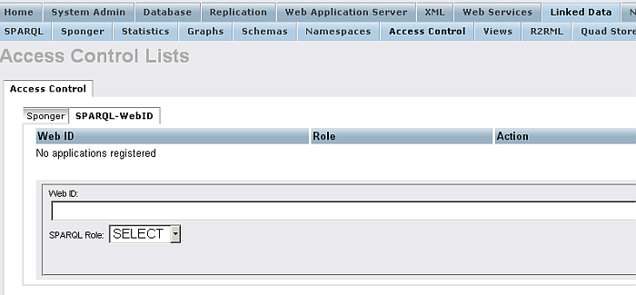

5.  In the displayed form:
    
    1.  Enter the Web ID for the user registered above, for example:
        
            http://id.myopenlink.net/dataspace/person/demo#this
    
    2.  Select "SPARQL Role": "
        
        *UPDATE*
        
        ".
        
        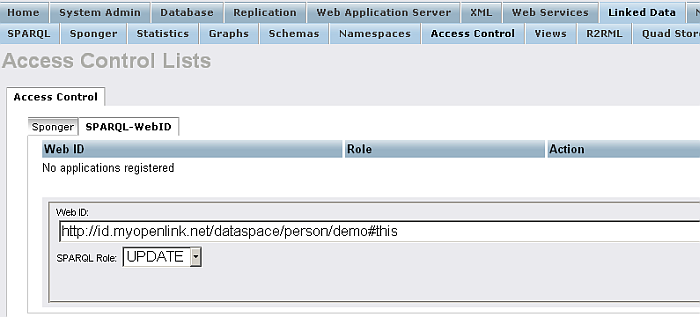

6.  Click the "Register" button.

7.  The WebID Protocol ACL will be created:
    
    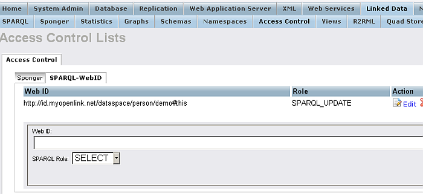

8.  Go to the SPARQL-WebID endpoint,
    https://\<cname\>:\<port\>/sparql-webid, where \<cname\>:\<port\>
    are replaced by your local server values.

9.  Select the user's certificate:
    
    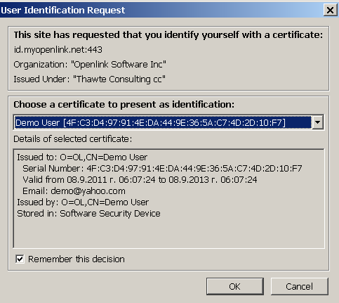

10. The SPARQL Query UI will be displayed:
    
    

11. Execute the query:
    
        INSERT INTO GRAPH <http://example.com> {
          <s1> <p1> <o1> .
          <s2> <p2> <o2> .
          <s3> <p3> <o3>
        }
    
    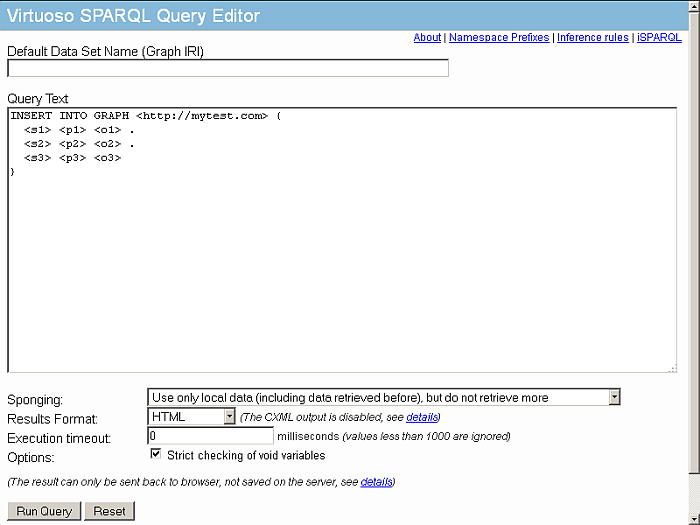
    
    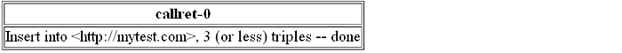

Note: If the SPARQL Role "Sponge" is set instead, in order to be able to
execute DELETE/INSERT statements over the protected SPARQL Endpoint, the
following grants need to be performed for the user, associated with the
WebID ACL Role:

    grant execute on DB.DBA.SPARQL_INSERT_DICT_CONTENT to "demo";
    grant execute on DB.DBA.SPARQL_DELETE_DICT_CONTENT to "demo";

#### Example usage of deleting Triple Patterns that are Not Scoped to a Named Graph

Presuming this triple exists in one or more graphs in the store:

    {
      <http://kingsley.idehen.net/dataspace/person/kidehen#this>
        <http://xmlns.com/foaf/0.1/knows>
          <http://id.myopenlink.net/dataspace/person/KingsleyUyiIdehen#this>
    }

The SQL query below will delete that triple from all graphs in the
store:

    DELETE
      FROM DB.DBA.RDF_QUAD
     WHERE p = iri_to_id
                 ('http://xmlns.com/foaf/0.1/knows')
       AND s = iri_to_id
                 ('http://kingsley.idehen.net/dataspace/person/kidehen#this')
       AND o = iri_to_id
                 ('http://id.myopenlink.net/dataspace/person/KingsleyUyiIdehen#this')
    ;

According to [SPARQL 1.1 Update](#) , the FROM clause which scopes the
query to a single graph is optional. Thus, the SQL query above can be
rewritten to the SPARQL query below, again deleting the matching triple
from all graphs in the store:

    DELETE
      {
        GRAPH ?g
          {
            <http://kingsley.idehen.net/dataspace/person/kidehen#this>
              <http://xmlns.com/foaf/0.1/knows>
                <http://id.myopenlink.net/dataspace/person/KingsleyUyiIdehen#this>
          }
      }
    WHERE
      {
        GRAPH ?g
          {
            <http://kingsley.idehen.net/dataspace/person/kidehen#this>
              <http://xmlns.com/foaf/0.1/knows>
                <http://id.myopenlink.net/dataspace/person/KingsleyUyiIdehen#this>
          }
      }

#### Example usage of deleting triples containing blank nodes

There are two ways to delete a particular blank node:

1.  To refer to it via some properties or:

2.  To convert it to it's internal "serial number", a long integer, and
    back.

Assume the following sample scenario:

1.  Clear the graph:
    
        SPARQL CLEAR GRAPH <http://sample/>;
        
        Done. -- 4 msec.

2.  Insert three blank nodes with two related triples each:
    
        SPARQL
          INSERT IN GRAPH <http://sample/>
            {
              [] <p> <o1a> , <o1b> .
              [] <p> <o2a> , <o2b> .
              [] <p> <o3a> , <o3b>
            }
        
        Done. -- 15 msec.

3.  Delete one pair of triples:
    
        SPARQL WITH <http://sample/>
          DELETE { ?s ?p ?o }
          WHERE
            {
              ?s ?p ?o ;
              <p> <o1a> .
            }
        
        Done. -- 7 msec.

4.  Ensure that we still have two bnodes, two triple per bnode:
    
        SPARQL
          SELECT *
          FROM <http://sample/>
          WHERE
            {
              ?s ?p ?o
            }
        s               p       o
        VARCHAR         VARCHAR VARCHAR
        ________________
        
        nodeID://b10006 p       o3a
        nodeID://b10006 p       o3b
        nodeID://b10007 p       o2a
        nodeID://b10007 p       o2b
        
        4 Rows. -- 4 msec.

5.  ``` 
    ```

6.  Each bnode, as well as any "named" node, is identified internally as
    an integer:
    
        SPARQL
          SELECT (<LONG::bif:iri_id_num>(?s)) AS ?s_num, ?p, ?o
          FROM <http://sample/>
          WHERE
            {
              ?s ?p ?o
            };
        s_num                p       o
        INTEGER              VARCHAR VARCHAR
        _____________________________
        
        4611686018427397910  p       o3a
        4611686018427397910  p       o3b
        4611686018427397911  p       o2a
        4611686018427397911  p       o2b
        
        4 Rows. -- 5 msec.

7.  The integer can be converted back to internal identifier. Say, here
    we try to delete a triple that does not exist (even if the ID
    integer is valid):
    
        SPARQL
          DELETE FROM <http://sample/>
            {
              `bif:iri_id_from_num(4611686018427397911)` <p> <o3a>
            };
        
        Done. -- 5 msec.

8.  Should have no effect, because the "46..11" IRI has \<o2a\> and
    \<o2b\>, and was not requested \<o3a\>:
    
        SPARQL
          SELECT *
          FROM <http://sample/>
          WHERE
            {
              ?s ?p ?o
            };
        s               p        o
        VARCHAR         VARCHAR  VARCHAR
        ________________
        
        nodeID://b10006 p        o3a
        nodeID://b10006 p        o3b
        nodeID://b10007 p        o2a
        nodeID://b10007 p        o2b
        
        4 Rows. -- 5 msec.

9.  Now let's try to delete a triple that does actually exist. Note the
    use of backquotes to insert an expression into template:
    
        SPARQL
          DELETE FROM <http://sample/>
            {
              `bif:iri_id_from_num(4611686018427397911)` <p> <o2a>
            };
        
        Done. -- 4 msec.

10. So there's an effect:
    
        SPARQL
          SELECT *
          FROM <http://sample/>
          WHERE
            {
              ?s ?p ?o
            };
        s                p        o
        VARCHAR          VARCHAR  VARCHAR
        _________________
        
        nodeID://b10006  p        o3a
        nodeID://b10006  p        o3b
        nodeID://b10007  p        o2b
        
        3 Rows. -- 2 msec.

11. Now delete everything related to `nodeID://b10006` subject:
    
        SPARQL
          WITH <http://sample/>
          DELETE
            {
              ?s ?p ?o
            }
          WHERE
            {
              ?s ?p ?o .
              FILTER (?s = bif:iri_id_from_num(4611686018427397910))
            };
        
        Done. -- 18 msec.

12. Three minus two gives one triple remaining:
    
        SQL> SPARQL
          SELECT *
          FROM <http://sample/>
          WHERE
            {
              ?s ?p ?o
            };
        s                p        o
        VARCHAR          VARCHAR  VARCHAR
        _________________
        
        nodeID://b10007  p        o2b
        
        1 Rows. -- 4 msec.

*Note* : IDs of bnodes will vary from server to server and even from run
to run on the same server, so the application should identify bnodes by
properties before doing `bif:iri_id_XXX` tricks.

#### Example usage of expressions inside CONSTRUCT, INSERT and DELETE {...} Templates

When one wants to use expressions inside CONSTRUCT {...}, INSERT {...}
or DELETE {...} construction templates, the expressions should be in
back-quotes i.e:

    `expression`

##### What?

How to construct RDF triples via SPARQL CONSTRUCT queries that include
expressions.

##### Why?

The are times when you need to post-process existing RDF triples en
route to creating enhanced data views. For instance, enhancing the
literal values associated with annotation properties such as rdfs:label
and rdfs:comment .

##### Why?

Here some SPARQL 1.1 Update Language examples showcasing how this is
achieved using Virtuoso.

###### Example usage of expression inside CONSTRUCT

    CONSTRUCT
      {
        ?inst  rdfs:label `bif:concat ( ?inst_label,
                                        " Instance with up to ",
                                        str(?core_val),
                                        " logical processor cores and " ,
                                        str(?sess_val) , " concurrent ODBC sessions from licensed host" )`
      }
    FROM <http://uda.openlinksw.com/pricing/>
    WHERE
      {
        ?inst a gr:Individual, oplweb:ProductLicense ;
                              rdfs:label ?inst_label ;
               oplweb:hasMaximumProcessorCores ?core ;
                            oplweb:hasSessions ?sess .
    
        ?core a gr:QuantitativeValueInteger ;
            gr:hasMaxValueInteger ?core_val .
    
        ?sess a gr:QuantitativeValueInteger ;
                      gr:hasValue ?sess_val .
    }

See [live results](#) of the query.

###### Example usage of expression inside INSERT

    SPARQL
    INSERT INTO GRAPH <urn:mygraph>
      {
        ?inst  rdfs:label `bif:concat ( ?inst_label,
                                        " Instance with up to ",
                                        str(?core_val),
                                        " logical processor cores and " ,
                                        str(?sess_val) ,
                                        " concurrent ODBC sessions from licensed host" )`
      }
    FROM <http://uda.openlinksw.com/pricing/>
    WHERE
      {
        ?inst a gr:Individual, oplweb:ProductLicense ;
                              rdfs:label ?inst_label ;
               oplweb:hasMaximumProcessorCores ?core ;
                            oplweb:hasSessions ?sess .
    
        ?core a gr:QuantitativeValueInteger ;
            gr:hasMaxValueInteger ?core_val .
    
        ?sess a gr:QuantitativeValueInteger ;
                      gr:hasValue ?sess_val .
    };
    
    Done. -- 406 msec.
    
    SQL> SPARQL
    SELECT ?label
    FROM <urn:mygraph>
    WHERE
      {
        ?inst  rdfs:label ?label
      };
    
    label
    VARCHAR
    _______________________________________________________________________________
    
    ODBC Driver (Single-Tier Lite Express Edition) Instance with up to 16 logical processor cores and 5 concurrent ODBC sessions from licensed host
    ODBC Driver (Single-Tier Lite Express Edition) Instance with up to 16 logical processor cores and 5 concurrent ODBC sessions from licensed host
    ODBC Driver (Single-Tier Lite Edition) Instance with up to 16 logical processor cores and 5 concurrent ODBC sessions from licensed host
    ODBC Driver (Single-Tier Lite Edition) Instance with up to 16 logical processor cores and 5 concurrent ODBC sessions from licensed host
    ODBC Driver (Single-Tier Lite Edition) Instance with up to 16 logical processor cores and 5 concurrent ODBC sessions from licensed host
    ODBC Driver (Single-Tier Lite Edition) Instance with up to 16 logical processor cores and 5 concurrent ODBC sessions from licensed host
    JDBC Driver (Single-Tier Lite Edition) Instance with up to 16 logical processor cores and 5 concurrent ODBC sessions from licensed host
    OLEDB Driver (Single-Tier Lite Edition) Instance with up to 16 logical processor cores and 5 concurrent ODBC sessions from licensed host
    ADO.NET Driver (Single-Tier Lite Edition) Instance with up to 16 logical processor cores and 5 concurrent ODBC sessions from licensed host
    
    9 Rows. -- 31 msec.

###### Example usage of expression inside DELETE

    SPARQL
    DELETE FROM GRAPH <urn:mygraph>
    { ?inst rdfs:label `bif:concat ( "JDBC Driver (Single-Tier Lite Edition) Instance with up to ", str(?core_val), " logical processor cores and " , str(?sess_val) , " concurrent ODBC sessions from licensed host" )` }
    FROM <http://uda.openlinksw.com/pricing/>
    WHERE
    {
        ?inst a gr:Individual, oplweb:ProductLicense ;
                              rdfs:label ?inst_label ;
               oplweb:hasMaximumProcessorCores ?core ;
                            oplweb:hasSessions ?sess .
        filter (regex(?inst_label,"JDBC Driver")) .
    
        ?core a gr:QuantitativeValueInteger ;
            gr:hasMaxValueInteger ?core_val .
    
        ?sess a gr:QuantitativeValueInteger ;
                      gr:hasValue ?sess_val .
    }
    ;
    
    Done. -- 32 msec.
    
    SQL> SPARQL
    SELECT ?label
    FROM <urn:mygraph>
    WHERE
      {
        ?inst  rdfs:label ?label
      };
    
    label
    VARCHAR
    _______________________________________________________________________________
    
    ODBC Driver (Single-Tier Lite Express Edition) Instance with up to 16 logical ...
    ODBC Driver (Single-Tier Lite Express Edition) Instance with up to 16 logical ...
    ODBC Driver (Single-Tier Lite Edition) Instance with up to 16 logical processor ...
    ODBC Driver (Single-Tier Lite Edition) Instance with up to 16 logical processor ...
    ODBC Driver (Single-Tier Lite Edition) Instance with up to 16 logical processor ...
    ODBC Driver (Single-Tier Lite Edition) Instance with up to 16 logical processor ...
    OLEDB Driver (Single-Tier Lite Edition) Instance with up to 16 logical processor ...
    ADO.NET Driver (Single-Tier Lite Edition) Instance with up to 16 logical processor ...
    
    8 Rows. -- 16 msec.

<a id="id29-business-intelligence-extensions-for-sparql"></a>
## Business Intelligence Extensions for SPARQL

Virtuoso extends SPARQL with expressions in results, subqueries,
aggregates and grouping. These extensions allow a straightforward
translation of arbitrary SQL queries to SPARQL. This extension is called
"SPARQL BI", because the primary objective is to match needs of Business
Intelligence. The extended features apply equally to querying physical
quads or relational tables mapped through Linked Data Views.

> **Note**
> 
> In this section, many examples use the TPC-H namespace. You may test
> them on your local demo database. They use data from the TPC-H dataset
> that is mapped into a graph with an IRI of the form
> http://example.com/tpch. When testing, you should replace the fake
> host name "example.com" with the host name of your own installation
> verbatim, that is as specified in the "DefaultHost" parameter in the
> \[URIQA\] section of the Virtuoso configuration file.

### Aggregates in SPARQL

Virtuoso extends SPARQL with SQL like aggregate and "group by"
functionality. This functionality is also available by embedding SPARQL
text inside SQL, but the SPARQL extension syntax has the benefit of also
working over the SPARQL protocol and of looking more SPARQL-like.

The supported aggregates are *COUNT* , *MIN* , *MAX* , *AVG* and *SUM* .
These can take an optional *DISTINCT* keyword. These are permitted only
in the selection part of a select query. If a selection list consists of
a mix of variables and aggregates, the non-aggregate selected items are
considered to be grouping columns and a *GROUP BY* over them is
implicitly added at the end of the generated SQL query. Virtuoso also
supports explicit syntax for *GROUP BY* , *ORDER BY* , *LIMIT* and
*OFFSET* . There is no explicit syntax for *HAVING* in Virtuoso SPARQL.

If a selection consists of aggregates exclusively, the result set has
one row with the values of the aggregates. If there are aggregates and
variables in the selection, the result set has as many rows as there are
distinct combinations of the variables; the aggregates are then
calculated over each such distinct combination, as if there were a SQL
GROUP BY over all non-aggregates. The implicit grouping pays attention
to all subexpressions in the return list; say, if a result column
expression is `(?x * max (?y))` then `?y` is aggregated and `?x` is not
so it is grouped by ?x. This also means that if a result column
expression is `(bif:year (?shipdate))` then a group is made for each
distinct `?shipdate` , i.e. up to 366 groups for each distinct year. If
you need one group per year, write explicit `GROUP BY (bif:year
(?shipdate))` .

With the count aggregate the argument may be either *\** , meaning
counting all rows, or a variable name, meaning counting all the rows
where this variable is bound. If there is no implicit *GROUP BY* , there
can be an optional *DISTINCT* keyword before the variable that is the
argument of an aggregate.

There is a special syntax for counting distinct combinations of selected
variables. This is:

    SELECT COUNT DISTINCT ?v1 ... ?vn
      FROM ....

User-defined aggregate functions are not supported in current version of
the SPARQL compiler.

#### Path Expressions

Virtuoso has support for paths consisting of dereferencing properties in
SPARQL. Virtuoso allows simple paths in expressions and has a separate
feature for transitivity:

  - S+\>P: for "one or many values of P of S"

  - S\*\>P: for "zero or many values of P of S", so \*\> may form a LEFT
    OUTER JOIN whereas +\> forms an INNER JOIN.

  - S|\>P: is reserved for potential "single value of P of S or an error
    if there are many values"

If this property is set (for example by an Linked Data View) then +\>
should be used.

*Simple Example*

    SELECT ?f+>foaf:name ?f|>foaf:mbox WHERE { ?x foaf:name "Alice" . ?x foaf:knows ?f . FILTER (?f+>foaf:name = "John") }

means:

    SELECT ?fname ?mbox
    WHERE
      {
        ?x foaf:knows ?f .
        ?x foaf:knows ?f .
        OPTIONAL {?f foaf:mbox ?mbox} .
        ?f foaf:name ?fname .
        ?x foaf:name "Alice" .
        ?x foaf:knows ?f2 .
        ?f2 foaf:name "John" .
      }

*Other Examples*

    SPARQL
    DEFINE sql:signal-void-variables 1
    PREFIX tpcd: <http://www.openlinksw.com/schemas/tpcd#>
    PREFIX oplsioc: <http://www.openlinksw.com/schemas/oplsioc#>
    PREFIX sioc: <http://rdfs.org/sioc/ns#>
    PREFIX foaf: <http://xmlns.com/foaf/0.1/>
    SELECT
      ?l+>tpcd:returnflag,
      ?l+>tpcd:linestatus,
      sum(?l+>tpcd:linequantity) as ?sum_qty,
      sum(?l+>tpcd:lineextendedprice) as ?sum_base_price,
      sum(?l+>tpcd:lineextendedprice*(1 - ?l+>tpcd:linediscount)) as ?sum_disc_price,
      sum(?l+>tpcd:lineextendedprice*(1 - ?l+>tpcd:linediscount)*(1+?l+>tpcd:linetax)) as ?sum_charge,
      avg(?l+>tpcd:linequantity) as ?avg_qty,
      avg(?l+>tpcd:lineextendedprice) as ?avg_price,
      avg(?l+>tpcd:linediscount) as ?avg_disc,
      count(1) as ?count_order
    FROM <http://example.com/tpcd>
    WHERE {
        ?l a tpcd:lineitem .
        FILTER (?l+>tpcd:shipdate <= bif:dateadd ("day", -90, '1998-12-01'^^xsd:date)) }
    ORDER BY ?l+>tpcd:returnflag ?l+>tpcd:linestatus

    SPARQL
    DEFINE sql:signal-void-variables 1
    PREFIX tpcd: <http://www.openlinksw.com/schemas/tpcd#>
    SELECT
      ?supp+>tpcd:acctbal,
      ?supp+>tpcd:name,
      ?supp+>tpcd:has_nation+>tpcd:name as ?nation_name,
      ?part+>tpcd:partkey,
      ?part+>tpcd:mfgr,
      ?supp+>tpcd:address,
      ?supp+>tpcd:phone,
      ?supp+>tpcd:comment
    FROM <http://example.com/tpcd>
    WHERE {
      ?ps a tpcd:partsupp; tpcd:has_supplier ?supp; tpcd:has_part ?part .
      ?supp+>tpcd:has_nation+>tpcd:has_region tpcd:name 'EUROPE' .
      ?part tpcd:size 15 .
      ?ps tpcd:supplycost ?minsc .
      { SELECT ?part min(?ps+>tpcd:supplycost) as ?minsc
        WHERE {
            ?ps a tpcd:partsupp; tpcd:has_part ?part; tpcd:has_supplier ?ms .
            ?ms+>tpcd:has_nation+>tpcd:has_region tpcd:name 'EUROPE' .
          } }
        FILTER (?part+>tpcd:type like '%BRASS') }
    ORDER BY
      desc (?supp+>tpcd:acctbal)
      ?supp+>tpcd:has_nation+>tpcd:name
      ?supp+>tpcd:name
      ?part+>tpcd:partkey

#### Examples

##### Example for count of physical triples in http://mygraph.com

    SPARQL
    SELECT COUNT (*)
      FROM <http://mygraph.com>
     WHERE {?s ?p ?o}

*Example for count of O's for each distinct P*

    SPARQL define input:inference "http://mygraph.com"
    SELECT ?p COUNT (?o)
      FROM <http://mygraph.com>
     WHERE {?s ?p ?o}

##### Example for count of triples, including inferred triples and the count of distinct O values

    SPARQL define input:inference "http://mygraph.com"
    SELECT COUNT (?p) COUNT (?o) COUNT (DISTINCT ?o)
     FROM <http://mygraph.com>
    WHERE {?s ?p ?o}

##### Example for get number of distinct bindings of ?s ?p ?o

    SPARQL define input:inference "http://mygraph.com"
    SELECT count distinct ?s ?p ?o
      FROM <http://mygraph.com>
     WHERE {?s ?p ?o}

##### Example for get counts and total prices of ordered items, grouped by item status

    SPARQL
    prefix tpch: <http://www.openlinksw.com/schemas/tpch#>
    SELECT ?status count(*) sum(?extendedprice)
    FROM <http://localhost.localdomain:8310/tpch>
    WHERE {
        ?l a tpch:lineitem ;
          tpch:lineextendedprice ?extendedprice ;
          tpch:linestatus ?status .
      }

##### Example for get counts and total prices of ordered items, grouped by item status

*Example: A dataset of people, some duplicated*

Suppose there is a dataset with many people, some of them sharing the
same name. To list them we would, ideally, execute the query:

    SPARQL
    SELECT DISTINCT
     (?name) ?person ?mail
     WHERE {
       ?person rdf:type foaf:Person .
       ?person foaf:name ?name .
       ?person foaf:mbox_sha1sum ?mail
     }

Unfortunately, the facility to apply DISTINCT to a part of the result
set row (i.e. to ?name) does not currently exist. (Although the above
form is permitted, it's interpreted as being identical to 'SELECT
DISTINCT ?name, ?person, ?mail WHERE ...') If there's demand for such a
feature then we may introduce an aggregate called, say, SPECIMEN, that
will return the very first of the aggregated values. e.g.:

    SPARQL
    SELECT ?name (specimen(?person)) (specimen(?mail))
    WHERE
      {
        ?person rdf:type foaf:Person .
        ?person foaf:name ?name .
        ?person foaf:mbox_sha1sum ?mail
      }

As a workaround to this limitation, the MIN aggregate can be used,
provided duplicates are few and there's no requirement that ?person
should correspond to ?mail (i.e. the result should contain some person
node and some mail node but they don't have to be connected by
foaf:mbox\_sha1sum):

    SPARQL
    SELECT ?name (min(?person)) (min(?mail))
    WHERE
      {
        ?person rdf:type foaf:Person .
        ?person foaf:name ?name .
        ?person foaf:mbox_sha1sum ?mail
      }

Otherwise, a complicated query is needed:

    SPARQL
    SELECT
     ?name
     ((SELECT (min (?person3))
         WHERE {
             ?person3 rdf:type foaf:Person .
             ?person3 foaf:name ?name .
             ?person3 foaf:mbox_sha1sum ?mail } )) as ?person
     ?mail
     WHERE {
         { SELECT distinct ?name
           WHERE {
               ?person1 rdf:type foaf:Person .
               ?person1 foaf:name ?name .
               ?person1 foaf:mbox_sha1sum ?mail1 } }
         { SELECT ?name (min(?mail2)) as ?mail
           WHERE {
               ?person2 rdf:type foaf:Person .
               ?person2 foaf:name ?name .
               ?person2 foaf:mbox_sha1sum ?mail2 } }
     }

##### Example quering dbpedia

The following example demonstrate how to query dbpedia. Suppose there is
local onotlogy, which has a datatype property hasLocation with a string
containing city names. The query below finds which of those cities are
in dbpedia:

    SPARQL
    PREFIX dbpprop: <http://dbpedia.org/property/>
    PREFIX dbo: <http://dbpedia.org/ontology/>
    PREFIX vocab:<http://myexample.com/localOntology.rdf>
    PREFIX dbpedia: <http://dbpedia.org/>
    PREFIX dbpres: <http://dbpedia.org/resource/>
    SELECT ?city
    WHERE
      {
        ?sub :location ?city .
        FILTER(bif:exists(( ASK { ?subdb a dbo:City . ?subdb dbpprop:officialName ?city })))
      }

##### Example for MAX with HAVING and GROUP BY

    ## Example "Find which town or city in
    ## the UK has the largest proportion of students.
    
    PREFIX dbpedia-owl: <http://dbpedia.org/ontology/>
    PREFIX dbpedia-owl-uni: <http://dbpedia.org/ontology/University/>
    PREFIX dbpedia-owl-inst: <http://dbpedia.org/ontology/EducationalInstitution/>
    
    SELECT ?town COUNT(?uni)
           ?pgrad ?ugrad
           MAX(?population)
           ( ((?pgrad+?ugrad)/ MAX(?population))*100 ) AS ?percentage
    WHERE
      {
        ?uni dbpedia-owl-inst:country dbpedia:United_Kingdom ;
                             dbpedia-owl-uni:postgrad ?pgrad ;
                            dbpedia-owl-uni:undergrad ?ugrad ;
                                 dbpedia-owl-inst:city ?town .
        OPTIONAL
            {
              ?town dbpedia-owl:populationTotal ?population .
              FILTER (?population > 0 )
            }
      }
    GROUP BY ?town ?pgrad ?ugrad
    HAVING ( ( ( (?pgrad+?ugrad)/ MAX(?population) )*100 ) > 0 )
    ORDER BY DESC 6

##### Example Aggregating Distance Values Over Years

The following example demonstrate how to aggregate Distance Values Over
Years:

First we insert some data in a graph with name for ex.
\<urn:dates:distances\>:

    SQL> SPARQL INSERT INTO GRAPH <urn:dates:distances>
      {
        <:a1> <http://purl.org/dc/elements/1.1/date> <2010-12-23T00:00:00> .
        <:a1> <http://linkedgeodata.org/vocabulary#distance> <0.955218675> .
        <:a2> <http://purl.org/dc/elements/1.1/date> <2010-12-24T00:00:00> .
        <:a2> <http://linkedgeodata.org/vocabulary#distance> <0.798155989> .
        <:a3> <http://purl.org/dc/elements/1.1/date> <2010-12-25T00:00:00> .
        <:a3> <http://linkedgeodata.org/vocabulary#distance> <0.064686628> .
        <:a4> <http://purl.org/dc/elements/1.1/date> <2010-12-26T00:00:00> .
        <:a4> <http://linkedgeodata.org/vocabulary#distance> <0.279800332> .
        <:a5> <http://purl.org/dc/elements/1.1/date> <2010-12-27T00:00:00> .
        <:a5> <http://linkedgeodata.org/vocabulary#distance> <0.651255995> .
        <:a6> <http://purl.org/dc/elements/1.1/date> <2010-12-28T00:00:00> .
        <:a6> <http://linkedgeodata.org/vocabulary#distance> <0.094410557> .
        <:a7> <http://purl.org/dc/elements/1.1/date> <2010-12-29T00:00:00> .
        <:a7> <http://linkedgeodata.org/vocabulary#distance> <0.43461913> .
        <:a8> <http://purl.org/dc/elements/1.1/date> <2010-12-30T00:00:00> .
        <:a8> <http://linkedgeodata.org/vocabulary#distance> <0.264862918> .
        <:a9> <http://purl.org/dc/elements/1.1/date> <2010-12-31T00:00:00> .
        <:a9> <http://linkedgeodata.org/vocabulary#distance> <0.770588658> .
        <:a10> <http://purl.org/dc/elements/1.1/date> <2011-01-01T00:00:00> .
        <:a10> <http://linkedgeodata.org/vocabulary#distance> <0.900997627> .
        <:a11> <http://purl.org/dc/elements/1.1/date> <2011-01-02T00:00:00> .
        <:a11> <http://linkedgeodata.org/vocabulary#distance> <0.324972375> .
        <:a12> <http://purl.org/dc/elements/1.1/date> <2011-01-03T00:00:00> .
        <:a12> <http://linkedgeodata.org/vocabulary#distance> <0.937221226> .
        <:a13> <http://purl.org/dc/elements/1.1/date> <2011-01-04T00:00:00> .
        <:a13> <http://linkedgeodata.org/vocabulary#distance> <0.269511925> .
        <:a14> <http://purl.org/dc/elements/1.1/date> <2011-01-05T00:00:00> .
        <:a14> <http://linkedgeodata.org/vocabulary#distance> <0.726014538> .
        <:a15> <http://purl.org/dc/elements/1.1/date> <2011-01-06T00:00:00> .
        <:a15> <http://linkedgeodata.org/vocabulary#distance> <0.843581439> .
        <:a16> <http://purl.org/dc/elements/1.1/date> <2011-01-07T00:00:00> .
        <:a16> <http://linkedgeodata.org/vocabulary#distance> <0.835685559> .
        <:a17> <http://purl.org/dc/elements/1.1/date> <2011-01-08T00:00:00> .
        <:a17> <http://linkedgeodata.org/vocabulary#distance> <0.673213742> .
        <:a18> <http://purl.org/dc/elements/1.1/date> <2011-01-09T00:00:00> .
        <:a18> <http://linkedgeodata.org/vocabulary#distance> <0.055026879> .
        <:a19> <http://purl.org/dc/elements/1.1/date> <2011-01-10T00:00:00> .
        <:a19> <http://linkedgeodata.org/vocabulary#distance> <0.987475424> .
        <:a20> <http://purl.org/dc/elements/1.1/date> <2011-01-11T00:00:00> .
        <:a20> <http://linkedgeodata.org/vocabulary#distance> <0.167315598> .
        <:a21> <http://purl.org/dc/elements/1.1/date> <2011-01-12T00:00:00> .
        <:a21> <http://linkedgeodata.org/vocabulary#distance> <0.545317103> .
        <:a22> <http://purl.org/dc/elements/1.1/date> <2011-01-13T00:00:00> .
        <:a22> <http://linkedgeodata.org/vocabulary#distance> <0.75137005> .
        <:a23> <http://purl.org/dc/elements/1.1/date> <2011-01-14T00:00:00> .
        <:a23> <http://linkedgeodata.org/vocabulary#distance> <0.123649985> .
        <:a24> <http://purl.org/dc/elements/1.1/date> <2011-01-15T00:00:00> .
        <:a24> <http://linkedgeodata.org/vocabulary#distance> <0.750214251> .
      };
    callret-0
    VARCHAR
    _______________________________________________________________________________
    
    Insert into <urn:dates:distances>, 48 (or less) triples -- done
    
    1 Rows. -- 94 msec.

Then we execute the following query:

    SQL> SPARQL
    PREFIX dst: <http://linkedgeodata.org/vocabulary#>
    PREFIX dc: <http://purl.org/dc/elements/1.1/>
    SELECT (bif:year( bif:stringdate(?sdate)) AS ?syear) (bif:sum( bif:number(?dist)) AS ?distance)
    FROM <urn:dates:distances>
    WHERE
      {
        ?row dc:date ?sdate .
        ?row dst:distance ?dist
      }
    GROUP BY (bif:year(bif:stringdate(?sdate)))
    ORDER BY ASC(bif:year(bif:stringdate(?sdate)));
    
    syear                                distance
    VARCHAR                              VARCHAR
    ________________________________________________
    
    2010                                 4.313598882
    2011                                 8.891567721
    
    2 Rows. -- 31 msec.

#### Note on Aggregates and Inference

Inferencing is added to a SPARQL query only for those variables whose
value is actually used. Thus,

    SELECT COUNT (*)
     FROM <http://mygraph.com>
    WHERE {?s ?p ?o}

will not return inferred values since s, p, and o are not actually used.
In contrast,

    SPARQL
    SELECT COUNT (?s) COUNT (?p) COUNT (?o)
     FROM <http://mygraph.com>
    WHERE {?s ?p ?o}

will also return all the inferred triples.

Note: This difference in behaviour may lead to confusion and will,
therefore, likely be altered in the future.

### Pointer Operator (*+\>* and *\*\>* )

When expressions occur in result sets, many variables are often
introduced only for the purpose of passing a value from a triple pattern
to the result expression. This is inconvenient because many triple
patterns are trivial. The presence of large numbers of variable names
masks "interesting" variables that are used in more than once in pattern
and which establish logical relationships between different parts of the
query. As a solution we introduce pointer operators.

The *+\>* (pointer) operator allows referring to a property value
without naming it as a variable and explicitly writing a triple pattern.
We can shorten the example above to:

    SPARQL
    prefix tpch: <http://www.openlinksw.com/schemas/tpch#>
    SELECT ?l+>tpch:linestatus count(*) sum(?l+>tpch:lineextendedprice)
    FROM <http://localhost.localdomain:8310/tpch>
    WHERE { ?l a tpch:lineitem }

The *?subject+\>propertyname* notation is equivalent to having a triple
pattern *?subject propertyname ?aux\_var* binding an auxiliary variable
to the mentioned property of the subject, within the group pattern
enclosing the reference. For a SELECT, the enclosing group pattern is
considered to be the top level pattern of the where clause or, in the
event of a union, the top level of each term of the union. Each distinct
pointer adds exactly one triple pattern to the enclosing group pattern.
Multiple uses of *+\>* with the same arguments do not each add a triple
pattern. (Having multiple copies of an identical pattern might lead to
changes in cardinality if multiple input graphs were being considered.
If a lineitem had multiple discounts or extended prices, then we would
get the cartesian product of both.)

If a property referenced via *+\>* is absent, the variable on the left
side of the operator is not bound in the enclosing group pattern because
it should be bound in all triple patterns where it appears as a field,
including implicitly added patterns.

The *?subject\*\>propertyname* notation is introduced in order to access
optional property values. It adds an OPTIONAL group *OPTIONAL { ?subject
propertyname ?aux\_var }* , not a plain triple pattern, so the binding
of ?subject is not changed even if the object variable is not bound. If
the property is set for all subjects in question then the results of
*\*\>* and *+\>* are the same. All other things being equal, the *+\>*
operator produces better SQL code than *\*\>* so use *\*\>* only when it
is really needed.

### Subqueries in SPARQL

Pure SPARQL does not allow binding a value that is not retrieved through
a triple pattern. We lift this restriction by allowing expressions in
the result set and providing names for result columns. We also allow a
SPARQL SELECT statement to appear in another SPARQL statement in any
place where a group pattern may appear. The names of the result columns
form the names of the variables bound, using values from the returned
rows. This resembles derived tables in SQL.

For instance, the following statement finds the prices of the 1000 order
lines with the biggest discounts:

    SPARQL
    define sql:signal-void-variables 1
    prefix tpch: <http://www.openlinksw.com/schemas/tpch#>
    SELECT ?line ?discount (?extendedprice * (1 - ?discount)) as ?finalprice
    FROM <http://localhost.localdomain:8310/tpch>
    WHERE
      {
        ?line a tpch:lineitem ;
        tpch:lineextendedprice ?extendedprice ;
        tpch:linediscount ?discount .
      }
    ORDER BY DESC (?extendedprice * ?discount)
    LIMIT 1000

After ensuring that this query works correctly, we can use it to answer
more complex questions. Imagine that we want to find out how big the
customers are who have received the biggest discounts.

    SPARQL
    define sql:signal-void-variables 1
    prefix tpch: <http://www.openlinksw.com/schemas/tpch#>
    SELECT ?cust sum(?extendedprice2 * (1 - ?discount2)) max (?bigdiscount)
    FROM <http://localhost.localdomain:8310/tpch>
    WHERE
      {
        {
          SELECT ?line (?extendedprice * ?discount) as ?bigdiscount
          WHERE {
            ?line a tpch:lineitem ;
              tpch:lineextendedprice ?extendedprice ;
              tpch:linediscount ?discount . }
          ORDER BY DESC (?extendedprice * ?discount)
          LIMIT 1000
        }
        ?line tpch:has_order ?order .
        ?order tpch:has_customer ?cust .
        ?cust tpch:customer_of ?order2 .
        ?order2 tpch:order_of ?line2 .
        ?line2 tpch:lineextendedprice ?extendedprice2 ;
          tpch:linediscount ?discount2 .
      }
    ORDER BY (SUM(?extendedprice2 * (1 - ?discount2)) / MAX (?bigdiscount))

The inner select finds the 1000 biggest (in absolute value) discounts
and their order lines. For each line we find orders of it, and the
customer. For each customer found, we find all the orders he made and
all the lines of each of the orders (variable ?line2).

Note that the inner select does not contain FROM clauses. It is not
required because the inner select inherits the access permissions of all
the outer queries. It is also important to note that the internal
variable bindings of the subquery are not visible in the outer query;
only the result set variables are bound. Similarly, variables bound in
the outer query are not accessible to the subquery.

Note also the declaration *define sql:signal-void-variables 1* that
forces the SPARQL compiler to signal errors if some variables cannot be
bound due to misspelt names or attempts to make joins across disjoint
domains. These diagnostics are especially important when the query is
long.

### Expressions in Triple Patterns

In addition to expressions in filters and result sets, Virtuoso allows
the use of expressions in triples of a CONSTRUCT pattern or WHERE
pattern - an expression can be used instead of a constant or a variable
name for a subject, predicate or object. When used in this context, the
expression is surrounded by backquotes.

*Example: With a WHERE Clause:*

The following example returns all the distinct 'fragment' parts of all
subjects in all graphs that have some predicate whose value is equal to
2+2.

    SQL>SPARQL SELECT distinct (bif:subseq (?s, bif:strchr (?s, '#')))
       WHERE {
         graph ?g {
           ?s ?p `2+2` .
           FILTER (! bif:isnull (bif:strchr (?s, '#') ) )
         } };
    
    callret
    VARCHAR
    ----------
    #four

Inside a WHERE part, every expression in a triple pattern is replaced
with new variable and a filter expression is added to the enclosing
group. The new filter is an equality of the new variable and the
expression. Hence the sample above is identical to:

    SPARQL
    SELECT distinct (bif:subseq (?s, bif:strchr (?s, '#')))
       WHERE {
         graph ?g {
           ?s ?p ?newvariable .
           FILTER (! bif:isnull (bif:strchr (?s, '#') ) )
           FILTER (?newvariable = (2+2)) .
         } }

*Example: With CONSTRUCT*

    CONSTRUCT {
      <http://bio2rdf.org/interpro:IPR000181>
    <http://bio2rdf.org/ns/bio2rdf#hasLinkCount>
    `(SELECT (count(?s)) as ?countS
       WHERE { ?s ?p <http://bio2rdf.org/interpro:IPR000181> })` }
    WHERE { ?s1 ?p1 ?o1 } limit 1

The result should be:

    <http://bio2rdf.org/interpro:IPR000181> <http://bio2rdf.org/ns/bio2rdf#hasLinkCount> "0"^^<http://www.w3.org/2001/XMLSchema#integer> .

*Example: Inserting into a graph using an expression*

    SQL>SPARQL insert into graph <http://MyNewGraph.com/> {
    <http://bio2rdf.org/interpro:IPR000181>
    <http://bio2rdf.org/ns/bio2rdf#hasLinkCount>
      `(SELECT (count(?s)) as ?countS
        WHERE { ?s ?p <http://bio2rdf.org/interpro:IPR000181> })` }
     WHERE { ?s1 ?p1 ?o1 } limit 1  ;
    
    callret-0
    VARCHAR
    _______________________________________________________________________________
    
    Insert into <http://MyNewGraph.com/>, 1 triples -- done
    
    1 Rows. -- 30 msec.

<a id="id30-rdf-graphs-security"></a>
# RDF Graphs Security

<a id="id31-rdf-graph-groups"></a>
## RDF Graph Groups

In some cases, the data-set of a SPARQL query is not known at compile
time. It is possible to pass IRIs of source graphs via parameters, but
the method is not perfect as:

  - not all protocols are suitable for parameter passing, and no one is
    an interoperable standard

  - passing list of IRIs as a parameter will usually require the use of
    Virtuoso-specific functions in the text of SPARQL query, that's bad
    for some query builders.

  - lack of knowledge about actual graphs may damage query optimization

It would be nice to create named lists of graphs and a clause like
"SELECT from all graph names of the specified list". *"Graph groups"*
serve for this purpose. That is Virtuoso-specific SPARQL extension that
let create a named list of IRIs such that if name of the list is used in
*FROM* clause like *IRI* of default graph then it is equivalent to list
of *FROM* clauses, one clause for each item of the list.

Internally, descriptions of graph groups are kept in two tables: *Table
of graph groups:*

    create table DB.DBA.RDF_GRAPH_GROUP (
      RGG_IID IRI_ID not null primary key,  -- IRI ID of RGG_IRI field
      RGG_IRI varchar not null,     -- Name of the group
      RGG_MEMBER_PATTERN varchar,       -- Member IRI pattern
      RGG_COMMENT varchar           -- Comment
      )
    create index RDF_GRAPH_GROUP_IRI on DB.DBA.RDF_GRAPH_GROUP (RGG_IRI)
    ;

*Table of contents of groups:*

    create table DB.DBA.RDF_GRAPH_GROUP_MEMBER (
      RGGM_GROUP_IID IRI_ID not null,   -- IRI_ID of the group
      RGGM_MEMBER_IID IRI_ID not null,  -- IRI_ID of the group member
      primary key (RGGM_GROUP_IID, RGGM_MEMBER_IID)
      )
    ;

Fields *RGG\_MEMBER\_PATTERN* and *RGG\_COMMENT* are not used by system
internals but applications may wish to write their data there for future
reference. *RGG\_COMMENT* is supposed to be human-readable description
of the group and *RGG\_MEMBER\_PATTERN* may be useful for functions that
automatically add IRIs of a given graph to all graph groups such that
the graph IRI string match *RGG\_MEMBER\_PATTERN* regexp pattern.

A dictionary of all groups and their members is cached in memory for
fast access. Due to this reason, applications may read these tables and
modify *RGG\_MEMBER\_PATTERN* and *RGG\_COMMENT* if needed but not
change other fields directly. The following API procedures makes changes
in a safe way:

    DB.DBA.RDF_GRAPH_GROUP_CREATE (
      in group_iri varchar,
      in quiet integer,
      in member_pattern varchar := null,
      in comment varchar := null)

That creates a new empty graph group. An error is signaled if the group
exists already and quiet parameter is zero.

    DB.DBA.RDF_GRAPH_GROUP_INS (in group_iri varchar, in memb_iri varchar)
    DB.DBA.RDF_GRAPH_GROUP_DEL (in group_iri varchar, in memb_iri varchar)

These two are to add or remove member to an existing group. Double
insert or removal of not a member will not signal errors, but missing
group will.be signaled.

    DB.DBA.RDF_GRAPH_GROUP_DROP (
      in group_iri varchar,
      in quiet integer)

That removes graph group. An error is signaled if the group did not
exist before the call and quiet parameter is zero.

Graph groups are *"macro-expanded"* only in FROM clauses and have no
effect on FROM NAMED or on GRAPH \<IRI\> {...} . Technically, it is not
prohibited to use an IRI as both plain graph IRI and graph group IRI in
one storage but this is confusing and is not recommended.

Graph groups can not be members of other graph groups, i.e. the IRI of a
graph group can appear in the list of members of some group but it will
be treated as plain graph IRI and will not cause recursive expansion of
groups.

<a id="id32-not-from-and-not-from-named-clauses"></a>
## NOT FROM and NOT FROM NAMED Clauses

In addition to standard FROM and FROM NAMED clauses, Virtuoso extends
SPARQL with NOT FROM and NOT FROM NAMED clauses of "opposite" meaning.

    SELECT ... NOT FROM <x> ... WHERE {...}

means "SELECT FROM other graphs, but not from the given one". This is
especially useful because NOT FROM supports graph groups (NOT FROM NAMED
supports only plain graphs). So if

    <http://example.com/users/private>

is a graph group of all graphs with confidential data about users then

    SELECT * NOT FROM <http://example.com/users/private> WHERE {...}

will be restricted only to insecure data.

NOT FROM overrides any FROM and NOT FROM NAMED overrides any FROM NAMED,
the order of clauses in the query text is not important.

The SPARQL web service endpoint configuration string may contain pragmas
*input:default-graph-exclude* and *input:named-graph-exclude* that
become equivalent to NOT FROM and NOT FROM NAMED clauses like
*input:default-graph-uri* and *input:named-graph-uri* mimics FROM and
FROM NAMED.

<a id="id33-graph-level-security"></a>
## Graph-Level Security

Virtuoso supports graph-level security for "physical" RDF storage. That
is somewhat similar to table access permissions in SQL. However, the
difference between SPARQL and SQL data models results in totally
different style of security administration. In SQL, when new application
is installed it comes with its own set of tables and every query in its
code explicitly specifies tables in use. Security restrictions of two
applications interfere only if applications knows each other and are
supposedly designed to cooperate. It is possible to write an application
that will get list of available tables and retrieve data from any given
table but that is a special case and it usually requires DBA privileges.

In SPARQL, data of different applications shares one table and the query
language allows to select data of all applications at once. This feature
makes SPARQL convenient for cross-application data integration. At the
same time, that become a giant security hole if any sensitive data are
stored.

A blind copying SQL security model to SPARQL domain would result in
significant loss of performance or weak security or even both problems
at the same time. That is why SPARQL model is made much more
restrictive, even if it becomes inconvenient for some administration
tasks.

Graph-level security does not replace traditional SQL security. A user
should become member of appropriate group (`SPARQL_SELECT` ,
`SPARQL_SPONGE` or `SPARQL_UPDATE` ) in order to start using its
graph-level privileges.

<a id="id34-graph-level-security-and-sql"></a>
## Graph-Level Security and SQL

SPARQL-level graph security is sufficient for SPARQL client operating
over HTTP. It is not sufficient for SQL clients due to the fact that
graph level security is baked into the SPARQL compiler, not by an SQL
compiler.

The Virtuoso SPARQL compiler analyzes the graph-level permissions of a
user (an identity principal named using an identifier e.g., WebID or
NetID). For each triple pattern or graph group pattern the compiler adds
an implicit FILTER () that ensures that appropriate privileges are
granted on target named graphs to a given user. Ultimately, these
FILTERs becomes part of the generated SQL code processed against the
RDF\_QUAD and related RDF data management system tables.

SQL users accessing Virtuoso via ODBC, JDBC, ADO.NET, and OLE-DB
connections have the ability to execute arbitrary SQL code via stored
procedures, subject to SQL level privileges on target Tables and Views
which provides a point of vulnerability to the RDF system tables
(RDF\_QUAD and others). To close this vulnerability, the SQL compiler
restricts SQL connection access, in regards to RDF system tables, to
members of `the SPARQL_SELECT_RAW` group.

*Note:*`SPARQL_SELECT_RAW` group is a feature applicable to Virtuoso 7.5
or higher.

### Graph-Level Security and SQL Usage Example

The following example demonstrates how to grant `SPARQL_SELECT_RAW` to a
Virtuoso SQL user:

    SQL> DB.DBA.USER_CREATE ('John', 'John');
    Done. -- 0 msec.
    SQL> GRANT SPARQL_SELECT to "John";
    Done. -- 0 msec.
    SQL> GRANT SPARQL_SELECT_RAW to "John";
    Done. -- 0 msec.

<a id="id35-understanding-default-permissions"></a>
## Understanding Default Permissions

In relational database, default permissions are trivial. DBA is usually
the only account that can access any table for both read and write.
Making some table public or private does not affect applications that do
not refer that table in the code. Tables are always created before
making security restrictions on them.

Chances are very low that an application will unintentionally create
some table and fill in with confidential data. There are no
unauthenticated users, any client has some user ID and no one user is
"default user" so permissions of any two users are always independent.

SPARQL access can be anonymous and graphs can be created during routine
data manipulation. For anonymous user, only public resources are
available. Thus "default permissions" on some or all graphs are actually
permissions of "nobody" user, (the numeric ID of this user can be
obtained by http\_nobody\_uid() function call). As a consequence,
there's a strong need in "default permission" for a user, this is the
only way to specify what to do with all graphs that does not exist now
it might exist in some future.

An attempt to make default permissions wider than specific is always
potential security hole in SPARQL, so this is strictly prohibited.

Four sorts of access are specified by four bits of an integer
"permission bit-mask", plain old UNIX style:

  - Bit 1 permits read access.

  - Bit 2 permits write access via SPARUL and it's basically useless
    without bit 1 set.

  - Bit 4 permits write access via "RDF sponge" methods and it's
    basically useless without bits 1 and 2 set.

  - Bit 8 allows to obtain list of members of graph group; an IRI can be
    used as graph IRI and as graph group IRI at the same time so bit 8
    can be freely combined with any of bits 1, 2 or 4.

Note that obtaining the list of members of a graph group does not grant
any access permissions to triples from member graphs. It is quite safe
to mix secure and public graphs in one graph group.

When a SPARQL query should check whether a given user have permission to
access a given graph then the order of checks is as follows:

1.  permissions of the user on the specific graph;

2.  default permissions of the user on all graphs;

3.  public permissions on the specific graph;

4.  public permissions on all graphs

If no one above mentioned permission is set then the access is
"read/write/sponge/list".

For "nobody" user, steps 3 and 4 become exact copies of steps 1 and 2 so
they are skipped.

<a id="id36-initial-configuration-of-sparql-security"></a>
## Initial Configuration of SPARQL Security

It is convenient to configure the RDF storage security by adding
restrictions in the order inverse to the order of checks:

1.  Step 1: Set public permissions on all graphs to the most restricted
    level of any application that will be installed. So if any single
    graph will be unreadable for public, then public permissions on all
    graphs should be set to 0 or 8.

2.  Step 2: Public permissions on "insecure" graphs should be set. So if
    the database contains DBpedia or WordNet or some other data of
    Linking Open Data project then public permissions for that graphs
    may be set to 1.

3.  Step3: Configure trusted users, such as administrative DBA-like
    accounts, and to specify their permissions on all graphs.

4.  Step 4: Some additional right can be granted to some specific users
    on some specific graphs.

Note that there's no need to permit something to DBA itself, because
DBA's default permissions are set automatically.

### Configuring New User

1.  Step 1: Grant SPARQL\_SELECT, SPARQL\_SPONGE or SPARQL\_UPDATE to
    the user.

2.  Step 2: Set user's permissions on all graphs.

3.  Step 3: Grant rights on some specific graphs.

### Example: Blogs and Resource Sharing

The following example demonstrates usage of the following functions:

  - [`DB.DBA.RDF_DEFAULT_USER_PERMS_SET (uname, permissions,
    set_private)`](#fn_rdf_default_user_perms_set) ;

  - [`DB.DBA.RDF_DEFAULT_USER_PERMS_DEL (uname,
    set_private)`](#fn_rdf_default_user_perms_del) ;

  - [`DB.DBA.RDF_GRAPH_USER_PERMS_SET (graph_iri, uname,
    permissions)`](#fn_rdf_graph_user_perms_set) ;

  - [`DB.DBA.RDF_GRAPH_USER_PERMS_DEL (graph_iri,
    uname)`](#fn_rdf_graph_user_perms_del) ;

  - [`DB.DBA.RDF_ALL_USER_PERMS_DEL (uname,
    uid)`](#fn_rdf_all_user_perms_del) ;

Consider a "groupware" application that let users create personal
resources with access policies.

    -- First, create few users, in alphabetical order.
    SQL> DB.DBA.USER_CREATE ('Anna', 'Anna');
    Done. -- 0 msec.
    SQL> DB.DBA.USER_CREATE ('Brad', 'Brad');
    Done. -- 0 msec.
    SQL> DB.DBA.USER_CREATE ('Carl', 'Carl');
    Done. -- 16 msec.
    SQL> GRANT SPARQL_UPDATE to "Anna";
    Done. -- 0 msec.
    SQL> GRANT SPARQL_UPDATE to "Brad";
    Done. -- 0 msec.
    SQL> GRANT SPARQL_UPDATE to "Carl";
    Done. -- 0 msec.
    
    -- At least some data are supposed to be confidential, thus the whole storage becomes confidential.
    SQL> DB.DBA.RDF_DEFAULT_USER_PERMS_SET ('nobody', 0);
    Done. -- 16 msec.
    
    -- Moreover, no one of created users have access to all graphs (even for reading).
    SQL> DB.DBA.RDF_DEFAULT_USER_PERMS_SET ('Anna', 0);
    Done. -- 0 msec.
    SQL> DB.DBA.RDF_DEFAULT_USER_PERMS_SET ('Brad', 0);
    Done. -- 0 msec.
    SQL> DB.DBA.RDF_DEFAULT_USER_PERMS_SET ('Carl', 0);
    Done. -- 0 msec.
    
    -- Add Anna's and Brad's private graph to the group http://www.openlinksw.com/schemas/virtrdf#PrivateGraphs:
    SQL> DB.DBA.RDF_GRAPH_GROUP_INS ('http://www.openlinksw.com/schemas/virtrdf#PrivateGraphs', 'http://example.com/Anna/private');
    SQL> DB.DBA.RDF_GRAPH_GROUP_INS ('http://www.openlinksw.com/schemas/virtrdf#PrivateGraphs', 'http://example.com/Brad/private');
    
    -- Anna's graphs:
    --insert simple data in Anna's personal system graph:
    SQL> SPARQL INSERT IN <http://example.com/Anna/system> { <Anna-system> a <secret> };
    Done. -- 31 msec.
    
    --insert simple data in Anna's private graph:
    SQL> SPARQL INSERT IN <http://example.com/Anna/private> { <Anna-private> a <secret> };
    Done. -- 0 msec.
    
    -- Anna can only read her personal system data graph.
    SQL> DB.DBA.RDF_GRAPH_USER_PERMS_SET ('http://example.com/Anna/system', 'Anna', 1);
    Done. -- 0 msec
    
    -- Anna can read and write her private data graph.
    SQL> DB.DBA.RDF_GRAPH_USER_PERMS_SET ('http://example.com/Anna/private', 'Anna', 3);
    Done. -- 0 msec
    
    -- Brad's graphs:
    -- insert simple data in Brad's personal system graph:
    SQL> SPARQL INSERT IN <http://example.com/Brad/system> { <Brad-system> a <secret> };
    Done. -- 0 msec
    
    -- insert simple data in Brad's private graph:
    SQL> SPARQL INSERT IN <http://example.com/Brad/private> { <Brad-private> a <secret> };
    Done. -- 0 msec
    
    -- Brad can only read his personal system data graph.
    SQL> DB.DBA.RDF_GRAPH_USER_PERMS_SET ('http://example.com/Brad/system', 'Brad', 1);
    Done. -- 0 msec
    
    -- Brad can read and write his private data graph.
    SQL> DB.DBA.RDF_GRAPH_USER_PERMS_SET ('http://example.com/Brad/private', 'Brad', 3);
    Done. -- 0 msec
    
    -- Friends graphs:
    SQL> SPARQL INSERT IN <http://example.com/Anna/friends> { <Anna-friends> foaf:knows 'Brad' };
    Done. -- 14 msec
    SQL> SPARQL INSERT IN <http://example.com/Brad/friends> { <Brad-friends> foaf:knows 'Anna' };
    Done. -- 15 msec
    
    -- Anna and Brad are friends and can read each others notes for friends.
    SQL> DB.DBA.RDF_GRAPH_USER_PERMS_SET ('http://example.com/Anna/friends', 'Anna', 3);
    SQL> DB.DBA.RDF_GRAPH_USER_PERMS_SET ('http://example.com/Anna/friends', 'Brad', 1);
    SQL> DB.DBA.RDF_GRAPH_USER_PERMS_SET ('http://example.com/Brad/friends', 'Brad', 3);
    SQL> DB.DBA.RDF_GRAPH_USER_PERMS_SET ('http://example.com/Brad/friends', 'Anna', 1);
    
    -- BubbleSortingServicesInc graph
    SQL> SPARQL INSERT IN <http://example.com/BubbleSortingServicesInc> { <BubbleSortingServicesInc-info> a <info> };
    Done. -- 31 msec
    
    -- Brad and Carl share write access to graph of his company.
    SQL> DB.DBA.RDF_GRAPH_USER_PERMS_SET ('http://example.com/BubbleSortingServicesInc', 'Brad', 3);
    SQL> DB.DBA.RDF_GRAPH_USER_PERMS_SET ('http://example.com/BubbleSortingServicesInc', 'Carl', 3);
    
    -- Anna's blog
    SQL> SPARQL INSERT IN <http://example.com/Anna/blog> { <Anna-blog> a <my-blog> };
    
    -- Anna writes a blog for public.
    SQL> DB.DBA.RDF_GRAPH_USER_PERMS_SET ('http://example.com/Anna/blog', 'Anna', 3);
    SQL> DB.DBA.RDF_GRAPH_USER_PERMS_SET ('http://example.com/Anna/blog', 'nobody', 1);
    
    -- DBpedia is public read and local discussion wiki is readable and writable.
    SQL> DB.DBA.RDF_GRAPH_USER_PERMS_SET ('http://dbpedia.org/', 'nobody', 1);
    SQL> DB.DBA.RDF_GRAPH_USER_PERMS_SET ('http://example.com/wiki', 'nobody', 3);
    SQL> DB.DBA.RDF_GRAPH_USER_PERMS_SET ('http://example.com/public', 'nobody', 3);
    
    -- Graph groups have its own security.
    SQL> DB.DBA.RDF_GRAPH_GROUP_CREATE ('http://example.com/Personal', 1);
    SQL> DB.DBA.RDF_GRAPH_GROUP_INS ('http://example.com/Personal', 'http://example.com/Anna/system');
    SQL> DB.DBA.RDF_GRAPH_GROUP_INS ('http://example.com/Personal', 'http://example.com/Anna/private');
    SQL> DB.DBA.RDF_GRAPH_GROUP_INS ('http://example.com/Personal', 'http://example.com/Brad/system');
    SQL> DB.DBA.RDF_GRAPH_GROUP_INS ('http://example.com/Personal', 'http://example.com/Brad/private');
    SQL> DB.DBA.RDF_GRAPH_USER_PERMS_SET ('http://example.com/Personal', 'Anna', 8);
    SQL> DB.DBA.RDF_GRAPH_USER_PERMS_SET ('http://example.com/Personal', 'Brad', 8);
    
    -- See as dba user what is in the <http://example.com/Personal> graph:
    SQL> SPARQL
    SELECT *
    FROM <http://example.com/Personal>
    WHERE { ?s ?p ?o } ;
    s               p                                                  o
    VARCHAR         VARCHAR                                            VARCHAR
    _______________________________________________________________________________
    
    Anna-system     http://www.w3.org/1999/02/22-rdf-syntax-ns#type    secret
    Anna-private    http://www.w3.org/1999/02/22-rdf-syntax-ns#type    secret
    Brad-system     http://www.w3.org/1999/02/22-rdf-syntax-ns#type    secret
    Brad-private    http://www.w3.org/1999/02/22-rdf-syntax-ns#type    secret
    
    4 Rows. -- 32 msec.
    
    -- See as Anna user what is in the <http://example.com/Personal> graph:
    SQL> reconnect Anna;
    Connected to OpenLink Virtuoso
    Driver: 06.04.3132 OpenLink Virtuoso ODBC Driver
    
    SQL> SPARQL
    SELECT *
    FROM <http://example.com/Personal>
    WHERE { ?s ?p ?o };
    s               p                                                  o
    VARCHAR         VARCHAR                                            VARCHAR
    _______________________________________________________________________________
    
    Anna-system     http://www.w3.org/1999/02/22-rdf-syntax-ns#type    secret
    Anna-private    http://www.w3.org/1999/02/22-rdf-syntax-ns#type    secret
    
    -- See as Brad user what is in the <http://example.com/Personal> graph:
    SQL> reconnect Brad;
    Connected to OpenLink Virtuoso
    Driver: 06.04.3132 OpenLink Virtuoso ODBC Driver
    
    SQL> SPARQL SELECT *
    FROM <http://example.com/Personal>
    WHERE { ?s ?p ?o };
    s               p                                                  o
    VARCHAR         VARCHAR                                            VARCHAR
    _______________________________________________________________________________
    
    Brad-system     http://www.w3.org/1999/02/22-rdf-syntax-ns#type    secret
    Brad-private    http://www.w3.org/1999/02/22-rdf-syntax-ns#type    secret
    
    -- See as Anna user what is in Brad's friends graph <http://example.com/Brad/friends>:
    SQL> reconnect Anna;
    Connected to OpenLink Virtuoso
    
    SQL> SPARQL SELECT *
    FROM <http://example.com/Brad/friends>
    WHERE { ?s ?p ?o };
    s              p                                 o
    VARCHAR        VARCHAR                           VARCHAR
    _________________________________________________________
    
    Brad-friends   http://xmlns.com/foaf/0.1/knows   Anna
    1 Rows. -- 0 msec.
    
    -- Remove Anna's read permissions on Brad's notes:
    SQL> reconnect dba;
    SQL> RDF_GRAPH_USER_PERMS_DEL('http://example.com/Brad/friends','Anna');
    
    -- See again as Anna user what is in Brad's friends graph <http://example.com/Brad/friends>:
    SQL> reconnect Anna;
    Connected to OpenLink Virtuoso
    
    SQL> SPARQL SELECT *
    FROM <http://example.com/Brad/friends>
    WHERE { ?s ?p ?o };
    s              p                                 o
    VARCHAR        VARCHAR                           VARCHAR
    _________________________________________________________
    
    0 Rows. -- 0 msec.
    
    SQL> SPARQL
    SELECT *
    FROM <http://example.com/Anna/blog>
    WHERE { ?s ?p ?o } ;
    
    s             p                                                o
    VARCHAR       VARCHAR                                          VARCHAR
    _______________________________________________________________________________
    
    Anna-blog     http://www.w3.org/1999/02/22-rdf-syntax-ns#type  my-blog
    
    1 Rows. -- 16 msec.
    
    SQL> SPARQL
    SELECT *
    FROM <http://example.com/Anna/friends>
    WHERE { ?s ?p ?o } ;
    
    s             p                                o
    VARCHAR       VARCHAR                          VARCHAR
    _______________________________________________________________________________
    
    Anna-friends  http://xmlns.com/foaf/0.1/knows  Brad
    1 Rows. -- 16 msec.
    
    -- Remove all the setting of Brad's permissions, both default permissions and
    -- permissions on specific graphs.
    -- Note: 142 is example id of Brads U_ID in DB.DBA.SYS_USERS table
    
    SQL> reconnect dba;
    Connected to OpenLink Virtuoso
    Driver: 06.04.3132 OpenLink Virtuoso ODBC Driver
    
    SQL> DB.DBA.RDF_ALL_USER_PERMS_DEL('Brad',142);
    Done. -- 0 msec.
    
    SQL> reconnect Brad;
    Connected to OpenLink Virtuoso
    Driver: 06.04.3132 OpenLink Virtuoso ODBC Driver
    
    SQL> SPARQL
    SELECT *
    FROM <http://example.com/Anna/friends>
    WHERE { ?s ?p ?o } ;
    s          p          o
    VARCHAR    VARCHAR    VARCHAR
    _______________________________________________________________________________
    
    0 Rows. -- 16 msec.
    
    -- Check what Carl can see --
    SQL> reconnect Carl;
    Connected to OpenLink Virtuoso
    Driver: 06.04.3132 OpenLink Virtuoso ODBC Driver
    
    SQL> SPARQL
    SELECT *
    FROM <http://example.com/BubbleSortingServicesInc>
    WHERE { ?s ?p ?o } ;
    
    s                              p                                                o
    VARCHAR                        VARCHAR                                          VARCHAR
    _______________________________________________________________________________
    
    BubbleSortingServicesInc-info  http://www.w3.org/1999/02/22-rdf-syntax-ns#type  info
    
    1 Rows. -- 0 msec.
    
    SQL> SPARQL
    SELECT *
    FROM <http://example.com/Anna/private>
    WHERE { ?s ?p ?o } ;
    s               p                                                  o
    VARCHAR         VARCHAR                                            VARCHAR
    _______________________________________________________________________________
    
    0 Rows. -- 16 msec.
    
    -- let Carl read everything:
    SQL> reconnect dba;
    Connected to OpenLink Virtuoso
    Driver: 06.04.3132 OpenLink Virtuoso ODBC Driver
    
    SQL> DB.DBA.RDF_DEFAULT_USER_PERMS_SET ('Carl', 1, 1);
    Done. -- 0 msec
    
    SQL> reconnect Carl;
    Enter password for Carl :
    Connected to OpenLink Virtuoso
    Driver: 06.04.3132 OpenLink Virtuoso ODBC Driver
    
    SQL> SPARQL
    SELECT *
    FROM <http://example.com/Anna/private>
    WHERE { ?s ?p ?o } ;
    s               p                                                  o
    VARCHAR         VARCHAR                                            VARCHAR
    _______________________________________________________________________________
    
    Anna-private    http://www.w3.org/1999/02/22-rdf-syntax-ns#type    secret
    
    1 Rows. -- 16 msec.
    
    -- Remove Carl's default permissions:
    SQL> reconnect dba;
    Connected to OpenLink Virtuoso
    Driver: 06.04.3132 OpenLink Virtuoso ODBC Driver
    
    SQL> DB.DBA.RDF_DEFAULT_USER_PERMS_DEL('Carl', 1);
    Done. -- 0 msec.
    
    SQL> reconnect Carl;
    Enter password for Carl :
    Connected to OpenLink Virtuoso
    Driver: 06.04.3132 OpenLink Virtuoso ODBC Driver
    
    SQL> SPARQL
    SELECT *
    FROM <http://example.com/Anna/private>
    WHERE { ?s ?p ?o } ;
    s               p                                                  o
    VARCHAR         VARCHAR                                            VARCHAR
    _______________________________________________________________________________
    
    0 Rows. -- 16 msec.

<a id="id37-application-callbacks-for-graph-level-security"></a>
## Application Callbacks for Graph Level Security

In some cases, different applications should provide different security
for different users. Two SPARQL pragmas are provided for this purpose:

  - Pragma sql:gs-app-callback is to specify Virtuoso/PL callback
    function that return permission bits for given graph.

  - Pragma sql:gs-app-uid is to specify application-specific user ID
    that is some string that is passed to the callback "as is".

The name of callback is always DB.DBA.SPARQL\_GS\_APP\_CALLBACK\_nnn,
where nnn is value of sql:gs-app-callback.

The callback is called only if the application has access to the graph
in question so it may restrict the caller's account but not grant more
permissions.

### Example

Let user of application get full access to graphs whose IRIs contain
user's name in path. In addition, let all of them permission to use all
graph groups and let the "moderator" user read everything.

    reconnect "dba";
    
    create function DB.DBA.SPARQL_GS_APP_CALLBACK_TEST (in g_iid IRI_ID, in app_uid varchar) returns integer
    {
      declare g_uri varchar;
    -- A fake IRI ID #i0 is used to mention account's default permissions for all graphs.
      if (#i0 = g_iid)
        {
          if ('moderator' = app_uid)
            return 9; -- Moderator can read and list everything.
          return 8; -- Other users can list everything.
        }
      g_uri := id_to_iri (g_iid);
      if (strstr (g_uri, '/' || app_uid || '/'))
        return 15; -- User has full access to "his" graph.
      return 8; -- User can list any given graph group.
    }
    ;
    
    SPARQL
    define sql:gs-app-callback "TEST"
    define sql:gs-app-uid "Anna"
    SELECT ?g ?s WHERE { ?s <p> ?o }
    ;

<a id="id38-graph-level-security-and-sponging"></a>
## Graph-level security and sponging

In some cases the sponged data contains private information for
instances cartridges like Facebook, etc. To perform private sponging,
Virtuoso offers *get:private* pragma:

    define get:private ""
    or
    define get:private <graph_group_IRI>

When used for sponging graph X, it adjusts graph-level security of graph
X (and of graph\_group\_IRI, if specified) so that X becomes a privately
accessible graph of the user who sponges the X and if graph\_group\_IRI
is specified then X becomes accessible to users that can access
graph\_group\_IRI with permissions like permissions they have on
graph\_group\_IRI.

The exact rules are as following:

  - If graph is virtrdf: then an error is signaled.

  - If graph name is an IRI of handshaked web service endpoint or
    "public IRI" of a handshaked web service endpoint then an error is
    signaled.

  - If access is public by default even for private graphs then an error
    is signaled and sponging is not tried.

  - If default is "no access" but someone (other than current user) has
    specifically granted read access to the graph in question AND
    current user is not dba AND current user has no bit 32 permission on
    this graph then an error is signaled.

  - If read access is public by default for world and disabled for
    private graphs then the graph to be sponged is added to the group of
    private graphs.

  - If current user is not DBA, current user gets granted
    read+write+sponge+admin access to the graph to be sponged. In
    addition, current user gets special permission bit 32, indicating
    that the graph is made by private sponge of this specific user.

  - If the value of get:private is an IRI then:
    
      - The IRI is supposed to be an IRI of "plain" graph group, error
        is signaled in case of nonexising graph group, group of private
        graphs or group of graphs to be replicated.
    
      - The graph is added to that group
    
      - Each non-dba user that can get list of files of the group will
        get permissions for the loaded graph equal to permissions they
        have on graph group minus "list" permission.

### Example Performing Sponging on a entirely confidential database using get:private pragma

The following example demonstrates how private sponging using
get:private pragma works for entirely confidential database.

*Note* : Please take in mind that the steps from below will change the
security of any existing database, thus the example scenario should be
performed on a empty db.

1.  Create few users in alphabetical order:
    
        DB.DBA.USER_CREATE ('Anna', 'Anna');
        DB.DBA.USER_CREATE ('Brad', 'Brad');
        DB.DBA.USER_CREATE ('Carl', 'Carl');

2.  Set to Anna, Brad and Carl SPARQL SELECT, UPDATE and SPONGE
    permissions:
    
        grant SPARQL_SELECT to "Anna";
        grant SPARQL_SELECT to "Brad";
        grant SPARQL_SELECT to "Carl";
        
        grant SPARQL_UPDATE to "Anna";
        grant SPARQL_UPDATE to "Brad";
        grant SPARQL_UPDATE to "Carl";
        
        grant SPARQL_SPONGE to "Anna";
        grant SPARQL_SPONGE to "Brad";
        grant SPARQL_SPONGE to "Carl";

3.  Set specific privileges to given graphs for specifics users:
    Catering for the fact that some datasets are supposed to be
    confidential, thus the whole quad storage is set to confidential.
    Then specific privileges can be assigned to specific graphs for
    specific users:
    
        DB.DBA.RDF_DEFAULT_USER_PERMS_SET ('nobody', 0);

4.  Set specific privileges: assuming for users Anna, Brad and Carl none
    of these individual has any kind of global access to graphs:
    
        DB.DBA.RDF_DEFAULT_USER_PERMS_SET ('Anna', 0);
        DB.DBA.RDF_DEFAULT_USER_PERMS_SET ('Brad', 0);
        DB.DBA.RDF_DEFAULT_USER_PERMS_SET ('Carl', 0);

5.  Assuming the following four sorts of access that are specified by
    four bits of an integer "permission bit-mask", following plain old
    UNIX style:
    
      - Bit 1 permits read access.
    
      - Bit 2 permits write access via SPARUL and is basically useless
        without bit 1 set.
    
      - Bit 4 permits write access via "RDF Network Resource Fetch"
        methods and is basically useless without bits 1 and 2 set.
    
      - Bit 8 allows retrieval of the list of members of a graph group.
        An IRI can be used as a graph IRI and as a graph group IRI at
        the same time, so bit 8 can be freely combined with any of bits
        1, 2 or 4.
    
      - In the statements from below should be considered:
        
          - "15 = 8+4+2+1" -- i.e. combining all the four sorts of
            access FROM above
        
          - "9 = 8 + 1" -- i.e. read access + access to retrieve the
            list of members for a given graph group
    
    <!-- end list -->
    
        -- Create Graph Group for Anna and set privileges:
        DB.DBA.RDF_GRAPH_GROUP_CREATE ('urn:Anna:Sponged:Data', 1);
        DB.DBA.RDF_GRAPH_USER_PERMS_SET ('urn:Anna:Sponged:Data', 'Anna', 15);
        DB.DBA.RDF_GRAPH_USER_PERMS_SET ('urn:Anna:Sponged:Data', 'Brad', 9);
        DB.DBA.RDF_GRAPH_USER_PERMS_SET ('urn:Anna:Sponged:Data', 'Carl', 9);
        
        -- Create Graph Group for Brad and set privileges:
        DB.DBA.RDF_GRAPH_GROUP_CREATE ('urn:Brad:Sponged:Data', 1);
        DB.DBA.RDF_GRAPH_USER_PERMS_SET ('urn:Brad:Sponged:Data', 'Anna', 9);
        DB.DBA.RDF_GRAPH_USER_PERMS_SET ('urn:Brad:Sponged:Data', 'Brad', 15);
        DB.DBA.RDF_GRAPH_USER_PERMS_SET ('urn:Brad:Sponged:Data', 'Carl', 9);
        
        -- Create Graph Group for Carl and set privileges:
        DB.DBA.RDF_GRAPH_GROUP_CREATE ('urn:Carl:Sponged:Data', 1);
        DB.DBA.RDF_GRAPH_USER_PERMS_SET ('urn:Carl:Sponged:Data', 'Anna', 9);
        DB.DBA.RDF_GRAPH_USER_PERMS_SET ('urn:Carl:Sponged:Data', 'Brad', 9);
        DB.DBA.RDF_GRAPH_USER_PERMS_SET ('urn:Carl:Sponged:Data', 'Carl', 15);

6.  Examples with invalid graph group names:
    
    1.  Example with Non-existing Graph Group:
        
        ``` 
        -- An error for non-existing Graph group <http://nosuch/> will be raised.
        
        SPARQL
          DEFINE get:soft "replacing"
          DEFINE get:private <http://nosuch/>
          SELECT *
          FROM <http://example.com/>
          WHERE
            { ?s ?p ?o };
               
        ```
    
    2.  Example with "virtrdf:PrivateGraphs" graph group which is
        reserved for system usage:
        
        ``` 
        -- An error for attempt to add a graph to special
        -- graph group <http://www.openlinksw.com/schemas/virtrdf#PrivateGraphs> will be raised.
        
        SPARQL
          DEFINE get:soft "replacing"
          DEFINE get:private virtrdf:PrivateGraphs
          SELECT * FROM <http://example.com/>
          WHERE
            { ?s ?p ?o };
               
        ```
    
    3.  Example with "virtrdf:rdf\_repl\_graph\_group" graph group which
        is reserved for system usage:
        
        ``` 
        
        -- An error for attempt to add a graph to special
        -- graph group <http://www.openlinksw.com/schemas/virtrdf#rdf_repl_graph_group> will be raised.
        
        SPARQL
          DEFINE get:soft "replacing"
          DEFINE get:private virtrdf:rdf_repl_graph_group
          SELECT * FROM <http://example.com/>
          WHERE
            { ?s ?p ?o };
        ```

7.  Examples to check Anna's sponging permissions on different graph
    groups:
    
    1.  Example for adding graph to Anna's graph group
        \<urn:Anna:Sponged:Data\>:
        
        ``` 
        
        -- No error will be raised as Anna has the efficient rights for graph group <urn:Anna:Sponged:Data>
        
        reconnect "Anna";
        
        SPARQL
          DEFINE get:soft "replacing"
          DEFINE get:private <urn:Anna:Sponged:Data>
          SELECT *
          FROM <http://example.com/anna/>
          WHERE
            { ?s ?p ?o };
        ```
    
    2.  Example for adding graph to Brad's graph group
        \<urn:Brad:Sponged:Data\>:
        
        ``` 
        
        -- An error will be raised because "Anna" has not enough rights on that group
        
        reconnect "Anna";
        
        SPARQL
          DEFINE get:soft "replacing"
          DEFINE get:private <urn:Brad:Sponged:Data>
          SELECT * FROM <http://example.com/>
          WHERE
            { ?s ?p ?o };
        ```
    
    3.  Example for adding graph to Carl's graph group
        \<urn:Carl:Sponged:Data\>:
        
            -- An error will be raised because "Anna" has not enough rights on that group
            
            reconnect "Anna";
            
            SPARQL
              DEFINE get:soft "replacing"
              DEFINE get:private <urn:Carl:Sponged:Data>
              SELECT *
              FROM <http://example.com/>
              WHERE
                { ?s ?p ?o };

8.  Examples check Brad's sponging permissions on different graph
    groups:
    
    1.  Example for adding graph to Anna's graph group
        \<urn:Anna:Sponged:Data\>:
        
            -- An error will be raised because "Brad" has not enough rights on that group
            
            reconnect "Brad";
            
            SPARQL
              DEFINE get:soft "replacing"
              DEFINE get:private <urn:Anna:Sponged:Data>
              SELECT *
              FROM <http://example.com/>
              WHERE
                { ?s ?p ?o };
    
    2.  Example for adding graph to Brad's graph group
        \<urn:Brad:Sponged:Data\>:
        
            -- No error will be raised as Brad has the efficient rights for graph group <urn:Brad:Sponged:Data>
            
            reconnect "Brad";
            
            SPARQL
              DEFINE get:soft "replacing"
              DEFINE get:private <urn:Brad:Sponged:Data>
              SELECT *
              FROM <http://example.com/brad/>
              WHERE
                { ?s ?p ?o };
    
    3.  Example for adding graph to Carl's graph group
        \<urn:Carl:Sponged:Data\>:
        
            -- An error will be raised because "Brad" has not enough rights on that group
            
            reconnect "Brad";
            
            SPARQL
              DEFINE get:soft "replacing"
              DEFINE get:private <urn:Carl:Sponged:Data>
              SELECT *
              FROM <http://example.com/>
              WHERE
                { ?s ?p ?o };

9.  Examples check Carl's sponging permissions on different graph
    groups:
    
    1.  Example for adding graph to Anna's graph group
        \<urn:Anna:Sponged:Data\>:
        
            -- An error will be raised because "Carl" has not enough rights on that group
            
            reconnect "Carl";
            
            SPARQL
              DEFINE get:soft "replacing"
              DEFINE get:private <urn:Anna:Sponged:Data>
              SELECT *
              FROM <http://example.com/>
              WHERE
                { ?s ?p ?o };
    
    2.  Example for adding graph to Brad's graph group
        \<urn:Brad:Sponged:Data\>:
        
            -- An error will be rased because "Carl" has not enough rights on that group
            
            reconnect "Carl";
            
            SPARQL
              DEFINE get:soft "replacing"
              DEFINE get:private <urn:Brad:Sponged:Data>
              SELECT *
              FROM <http://example.com/>
              WHERE
                { ?s ?p ?o };
    
    3.  Example for adding graph to Carl's graph group
        \<urn:Carl:Sponged:Data\>:
        
            -- No error will be raised as Carl has the efficient rights for graph group <urn:Brad:Sponged:Data>
            
            reconnect "Carl";
            
            SPARQL
              DEFINE get:soft "replacing"
              DEFINE get:private <urn:Carl:Sponged:Data>
              SELECT *
              FROM <http://example.com/carl/>
              WHERE
                { ?s ?p ?o };

10. User Carl performs private sponging:
    
        reconnect "Carl";
        
        SPARQL
          DEFINE get:soft "replacing"
          DEFINE get:private <urn:Carl:Sponged:Data>
          SELECT *
          FROM <http://www.openlinksw.com/data/turtle/products.ttl>
          WHERE
            { ?s ?p ?o };
        
        -- Should return for ex. 365 rows.
        SPARQL
          DEFINE get:soft "replacing"
          DEFINE get:private <urn:Carl:Sponged:Data>
          SELECT COUNT(*)
          FROM <http://www.openlinksw.com/data/turtle/products.ttl>
          WHERE
            { ?s ?p ?o };
        
        SPARQL
          DEFINE get:soft "replacing"
          DEFINE get:private <urn:Carl:Sponged:Data>
          SELECT *
          FROM NAMED <http://www.openlinksw.com/data/turtle/software.ttl>
          FROM NAMED <http://www.openlinksw.com/data/turtle/licenses.ttl>
          WHERE
            {
              graph ?g
                { ?s ?p ?o
              }
            };
        
        -- Should return for ex. 1317 rows.
        SPARQL
          DEFINE get:soft "replacing"
          DEFINE get:private <urn:Carl:Sponged:Data>
          SELECT COUNT(*)
          FROM NAMED <http://www.openlinksw.com/data/turtle/software.ttl>
          FROM NAMED <http://www.openlinksw.com/data/turtle/licenses.ttl>
          WHERE
            {
              graph ?g
                { ?s ?p ?o
              }
            };

11. Viewing Graph Groups shows Carl's graph group
    \<urn:Carl:Sponged:Data\> contains total 4 graphs:
    
        SQL> SELECT id_to_iri (RGGM_GROUP_IID), id_to_iri(RGGM_MEMBER_IID)
             FROM DB.DBA.RDF_GRAPH_GROUP_MEMBER
             ORDER BY 1,2;
        
        id_to_iri                id_to_iri__1
        VARCHAR                  VARCHAR
        __________________________________________________________
        
        ....
        urn:Anna:Sponged:Data    http://example.com/anna/
        urn:Brad:Sponged:Data    http://example.com/brad/
        urn:Carl:Sponged:Data    http://example.com/carl/
        urn:Carl:Sponged:Data    http://www.openlinksw.com/data/turtle/licenses.ttl
        urn:Carl:Sponged:Data    http://www.openlinksw.com/data/turtle/products.ttl
        urn:Carl:Sponged:Data    http://www.openlinksw.com/data/turtle/software.ttl

### Example Performing Sponging with Private Graphs Using get:private pragma

The following example demonstrates how private sponging using
get:private pragma works for database with private graphs.

1.  Create few users in alphabetical order:
    
        DB.DBA.USER_CREATE ('Anna', 'Anna');
        DB.DBA.USER_CREATE ('Brad', 'Brad');
        DB.DBA.USER_CREATE ('Carl', 'Carl');

2.  Set to Anna, Brad and Carl SPARQL SELECT, UPDATE and SPONGE
    permissions:
    
        grant SPARQL_SELECT to "Anna";
        grant SPARQL_SELECT to "Brad";
        grant SPARQL_SELECT to "Carl";
        
        grant SPARQL_UPDATE to "Anna";
        grant SPARQL_UPDATE to "Brad";
        grant SPARQL_UPDATE to "Carl";
        
        grant SPARQL_SPONGE to "Anna";
        grant SPARQL_SPONGE to "Brad";
        grant SPARQL_SPONGE to "Carl";

3.  Set specific privileges: Setup assuming 3 users: Anna, Brad and Carl
    where each of these individual users has read access to graphs:
    
        -- Close any public access to "private" graphs
        DB.DBA.RDF_DEFAULT_USER_PERMS_SET ('nobody', 0, 1);
        
        -- Set Read Only for public on graphs not listed as "private".
        DB.DBA.RDF_DEFAULT_USER_PERMS_SET ('nobody', 1);
        
        DB.DBA.RDF_DEFAULT_USER_PERMS_SET ('Anna', 0, 1);
        DB.DBA.RDF_DEFAULT_USER_PERMS_SET ('Brad', 0, 1);
        DB.DBA.RDF_DEFAULT_USER_PERMS_SET ('Carl', 0, 1);
        
        DB.DBA.RDF_DEFAULT_USER_PERMS_SET ('Anna', 1);
        DB.DBA.RDF_DEFAULT_USER_PERMS_SET ('Brad', 1);
        DB.DBA.RDF_DEFAULT_USER_PERMS_SET ('Carl', 1);

4.  Assuming the following four sorts of access that are specified by
    four bits of an integer "permission bit-mask", following plain old
    UNIX style:
    
      - Bit 1 permits read access.
    
      - Bit 2 permits write access via SPARUL and is basically useless
        without bit 1 set.
    
      - Bit 4 permits write access via "RDF Network Resource Fetch"
        methods and is basically useless without bits 1 and 2 set.
    
      - Bit 8 allows retrieval of the list of members of a graph group.
        An IRI can be used as a graph IRI and as a graph group IRI at
        the same time, so bit 8 can be freely combined with any of bits
        1, 2 or 4.
    
      - In the statements from below should be considered:
        
          - "15 = 8+4+2+1" -- i.e. combining all the four sorts of
            access FROM above
        
          - "9 = 8 + 1" -- i.e. read access + access to retrieve the
            list of members for a given graph group
    
    <!-- end list -->
    
        -- Create Graph Group for Anna and set privileges:
        DB.DBA.RDF_GRAPH_GROUP_CREATE ('urn:Anna:Sponged:Data', 1);
        DB.DBA.RDF_GRAPH_USER_PERMS_SET ('urn:Anna:Sponged:Data', 'Anna', 15);
        DB.DBA.RDF_GRAPH_USER_PERMS_SET ('urn:Anna:Sponged:Data', 'Brad', 9);
        DB.DBA.RDF_GRAPH_USER_PERMS_SET ('urn:Anna:Sponged:Data', 'Carl', 9);
        
        -- Create Graph Group for Brad and set privileges:
        DB.DBA.RDF_GRAPH_GROUP_CREATE ('urn:Brad:Sponged:Data', 1);
        DB.DBA.RDF_GRAPH_USER_PERMS_SET ('urn:Brad:Sponged:Data', 'Anna', 9);
        DB.DBA.RDF_GRAPH_USER_PERMS_SET ('urn:Brad:Sponged:Data', 'Brad', 15);
        DB.DBA.RDF_GRAPH_USER_PERMS_SET ('urn:Brad:Sponged:Data', 'Carl', 9);
        
        -- Create Graph Group for Carl and set privileges:
        DB.DBA.RDF_GRAPH_GROUP_CREATE ('urn:Carl:Sponged:Data', 1);
        DB.DBA.RDF_GRAPH_USER_PERMS_SET ('urn:Carl:Sponged:Data', 'Anna', 9);
        DB.DBA.RDF_GRAPH_USER_PERMS_SET ('urn:Carl:Sponged:Data', 'Brad', 9);
        DB.DBA.RDF_GRAPH_USER_PERMS_SET ('urn:Carl:Sponged:Data', 'Carl', 15);
        
        -- Set Anna's, Brad's and Carl's graphs by inserting them into the <b>virtrdf:PrivateGraphs</b> graph group:
        DB.DBA.RDF_GRAPH_GROUP_INS ('http://www.openlinksw.com/schemas/virtrdf#PrivateGraphs', 'http://example.com/anna/');
        DB.DBA.RDF_GRAPH_GROUP_INS ('http://www.openlinksw.com/schemas/virtrdf#PrivateGraphs', 'http://example.com/brad/');
        DB.DBA.RDF_GRAPH_GROUP_INS ('http://www.openlinksw.com/schemas/virtrdf#PrivateGraphs', 'http://example.com/carl/');

5.  Examples with invalid graph group names:
    
    1.  Example with Non-existing Graph Group:
        
        ``` 
        -- An error for non-existing Graph group <http://nosuch/> will be raised.
        
        SPARQL
          DEFINE get:soft "replacing"
          DEFINE get:private <http://nosuch/>
          SELECT *
          FROM <http://example.com/>
          WHERE
            { ?s ?p ?o };
               
        ```
    
    2.  Example with "virtrdf:PrivateGraphs" graph group which is
        reserved for system usage:
        
        ``` 
        -- An error for attempt to add a graph to special
        -- graph group <http://www.openlinksw.com/schemas/virtrdf#PrivateGraphs> will be raised.
        
        SPARQL
          DEFINE get:soft "replacing"
          DEFINE get:private virtrdf:PrivateGraphs
          SELECT * FROM <http://example.com/>
          WHERE
            { ?s ?p ?o };
               
        ```
    
    3.  Example with "virtrdf:rdf\_repl\_graph\_group" graph group which
        is reserved for system usage:
        
        ``` 
        
        -- An error for attempt to add a graph to special
        -- graph group <http://www.openlinksw.com/schemas/virtrdf#rdf_repl_graph_group> will be raised.
        
        SPARQL
          DEFINE get:soft "replacing"
          DEFINE get:private virtrdf:rdf_repl_graph_group
          SELECT * FROM <http://example.com/>
          WHERE
            { ?s ?p ?o };
        ```

6.  Examples to check Anna's sponging permissions on different graph
    groups:
    
    1.  Example for adding graph to Anna's graph group
        \<urn:Anna:Sponged:Data\>:
        
        ``` 
        
        -- No error will be raised as Anna has the efficient rights for graph group <urn:Anna:Sponged:Data>
        
        reconnect "Anna";
        
        SPARQL
          DEFINE get:soft "replacing"
          DEFINE get:private <urn:Anna:Sponged:Data>
          SELECT *
          FROM <http://example.com/anna/>
          WHERE
            { ?s ?p ?o };
        ```
    
    2.  Example for adding graph to Brad's graph group
        \<urn:Brad:Sponged:Data\>:
        
        ``` 
        
        -- An error will be raised because "Anna" has not enough rights on that group
        
        reconnect "Anna";
        
        SPARQL
          DEFINE get:soft "replacing"
          DEFINE get:private <urn:Brad:Sponged:Data>
          SELECT * FROM <http://example.com/>
          WHERE
            { ?s ?p ?o };
        ```
    
    3.  Example for adding graph to Carl's graph group
        \<urn:Carl:Sponged:Data\>:
        
            -- An error will be raised because "Anna" has not enough rights on that group
            
            reconnect "Anna";
            
            SPARQL
              DEFINE get:soft "replacing"
              DEFINE get:private <urn:Carl:Sponged:Data>
              SELECT *
              FROM <http://example.com/>
              WHERE
                { ?s ?p ?o };

7.  Examples check Brad's sponging permissions on different graph
    groups:
    
    1.  Example for adding graph to Anna's graph group
        \<urn:Anna:Sponged:Data\>:
        
            -- An error will be raised because "Brad" has not enough rights on that group
            
            reconnect "Brad";
            
            SPARQL
              DEFINE get:soft "replacing"
              DEFINE get:private <urn:Anna:Sponged:Data>
              SELECT *
              FROM <http://example.com/>
              WHERE
                { ?s ?p ?o };
    
    2.  Example for adding graph to Brad's graph group
        \<urn:Brad:Sponged:Data\>:
        
            -- No error will be raised as Brad has the efficient rights for graph group <urn:Brad:Sponged:Data>
            
            reconnect "Brad";
            
            SPARQL
              DEFINE get:soft "replacing"
              DEFINE get:private <urn:Brad:Sponged:Data>
              SELECT *
              FROM <http://example.com/brad/>
              WHERE
                { ?s ?p ?o };
    
    3.  Example for adding graph to Carl's graph group
        \<urn:Carl:Sponged:Data\>:
        
            -- An error will be raised because "Brad" has not enough rights on that group
            
            reconnect "Brad";
            
            SPARQL
              DEFINE get:soft "replacing"
              DEFINE get:private <urn:Carl:Sponged:Data>
              SELECT *
              FROM <http://example.com/>
              WHERE
                { ?s ?p ?o };

8.  Examples check Carl's sponging permissions on different graph
    groups:
    
    1.  Example for adding graph to Anna's graph group
        \<urn:Anna:Sponged:Data\>:
        
            -- An error will be raised because "Carl" has not enough rights on that group
            
            reconnect "Carl";
            
            SPARQL
              DEFINE get:soft "replacing"
              DEFINE get:private <urn:Anna:Sponged:Data>
              SELECT *
              FROM <http://example.com/>
              WHERE
                { ?s ?p ?o };
    
    2.  Example for adding graph to Brad's graph group
        \<urn:Brad:Sponged:Data\>:
        
            -- An error will be rased because "Carl" has not enough rights on that group
            
            reconnect "Carl";
            
            SPARQL
              DEFINE get:soft "replacing"
              DEFINE get:private <urn:Brad:Sponged:Data>
              SELECT *
              FROM <http://example.com/>
              WHERE
                { ?s ?p ?o };
    
    3.  Example for adding graph to Carl's graph group
        \<urn:Carl:Sponged:Data\>:
        
            -- No error will be raised as Carl has the efficient rights for graph group <urn:Brad:Sponged:Data>
            
            reconnect "Carl";
            
            SPARQL
              DEFINE get:soft "replacing"
              DEFINE get:private <urn:Carl:Sponged:Data>
              SELECT *
              FROM <http://example.com/carl/>
              WHERE
                { ?s ?p ?o };

9.  User Carl performs private sponging:
    
        reconnect "Carl";
        
        SPARQL
          DEFINE get:soft "replacing"
          DEFINE get:private <urn:Carl:Sponged:Data>
          SELECT *
          FROM <http://www.openlinksw.com/data/turtle/products.ttl>
          WHERE
            { ?s ?p ?o };
        
        -- Should return for ex. 365 rows.
        SPARQL
          DEFINE get:soft "replacing"
          DEFINE get:private <urn:Carl:Sponged:Data>
          SELECT COUNT(*)
          FROM <http://www.openlinksw.com/data/turtle/products.ttl>
          WHERE
            { ?s ?p ?o };
        
        SPARQL
          DEFINE get:soft "replacing"
          DEFINE get:private <urn:Carl:Sponged:Data>
          SELECT *
          FROM NAMED <http://www.openlinksw.com/data/turtle/software.ttl>
          FROM NAMED <http://www.openlinksw.com/data/turtle/licenses.ttl>
          WHERE
            {
              graph ?g
                { ?s ?p ?o
              }
            };
        
        -- Should return for ex. 1317 rows.
        SPARQL
          DEFINE get:soft "replacing"
          DEFINE get:private <urn:Carl:Sponged:Data>
          SELECT COUNT(*)
          FROM NAMED <http://www.openlinksw.com/data/turtle/software.ttl>
          FROM NAMED <http://www.openlinksw.com/data/turtle/licenses.ttl>
          WHERE
            {
              graph ?g
                { ?s ?p ?o
              }
            };

10. User Anna reads Carl's data:
    
        SQL> reconnect "Anna";
        SQL> SPARQL
          SELECT COUNT(*)
          FROM <http://www.openlinksw.com/data/turtle/products.ttl>
          WHERE
            { ?s ?p ?o };
        
        callret-0
        INTEGER
        _______________________________________________________________________________
        
        365
        
        1 Rows. -- 15 msec.

<a id="id39-linked-data-views-over-rdbms-data-source"></a>
# Linked Data Views over RDBMS Data Source

Linked Data Views map relational data into RDF and allow customizing RDF
representation of locally stored RDF data. To let SPARQL clients access
relational data as well as physical RDF graphs in a single query, we
introduce a declarative Meta Schema Language for mapping SQL Data to RDF
Ontologies. As a result, all types of clients can efficiently access all
data stored on the server. The mapping functionality dynamically
generates RDF Data Sets for popular ontologies such as SIOC, SKOS, FOAF,
and ATOM/OWL without disruption to the existing database infrastructure
of Web 1.0 or Web 2.0 solutions. Linked Data Views are also suitable for
declaring custom representation for RDF triples, e.g. property tables,
where one row holds many single-valued properties.

<a id="id40-introduction"></a>
## Introduction

The Virtuoso Linked Data Views meta schema is a built-in feature of
Virtuoso's SPARQL to SQL translator. It recognizes triple patterns that
refer to graphs for which an alternate representation is declared and
translates these into SQL accordingly. The main purpose of this is
evaluating SPARQL queries against existing relational databases. There
exists previous work from many parties for rendering relational data as
RDF and opening it to SPARQL access. We can mention D2RQ, SPASQL,
Squirrel RDF, DBLP and others. The Virtuoso effort differs from these
mainly in the following:

  - Integration with a triple store. Virtuoso can process a query for
    which some triple patterns will go to local or remote relational
    data and some to local physical RDF triples.

  - SPARQL query can be used in any place where SQL can. Database
    connectivity protocols are neutral to the syntax of queries they
    transmit, thus any SQL client, e.g. JDBC, ODBC or XMLA application,
    can send SPARQL queries and fetch result sets. Moreover, a SQL query
    may contain SPARQL subqueries and SPARQL expressions may use SQL
    built-in functions and stored procedures.

  - Integration with SQL. Since SPARQL and SQL share the same run time
    and query optimizer, the query compilation decisions are always made
    with the best knowledge of the data and its location. This is
    especially important when mixing triples and relational data or when
    dealing with relational data distributed across many outside
    databases.

  - No limits on SPARQL. It remains possible to make queries with
    unspecified graph or predicate against mapped relational data, even
    though these may sometimes be inefficient.

  - Coverage of the whole relational model. Multi-part keys etc. are
    supported in all places.

<a id="id41-rationale"></a>
## Rationale

Since most of the data that is of likely use for the emerging semantic
web is stored in relational databases, the argument for exposing this to
SPARQL access is clear. We note that historically, SQL access to
relational data has essentially never been given to the public outside
of the organization. If programmatic access to corporate IS has been
available to partners or the public, it has been through dynamic web
pages or more recently web services. There are reasons of performance,
security, maintainability and so forth for this.

The culture of the emerging semantic web is however taking a different
turn. Since RDF and OWL offer a mergeable and queryable model for
heterogeneous data, it is more meaningful and maintainable to expose
selected data for outside query than it would be with SQL. Advances in
hardware make this also less of a performance issue than it would have
been in the client-server database era.

In the context of Virtuoso, since Virtuoso is originally a
virtual/federated database, incorporating SPARQL to relational mapping
is an evident extension of the product's mission as a multi-protocol,
multi-platform connector between information systems.

<a id="id42-quad-map-patterns-values-and-iri-classes"></a>
## Quad Map Patterns, Values and IRI Classes

In the simplest sense, any relational schema can be rendered into RDF by
converting all primary keys and foreign keys into IRI's, assigning a
predicate IRI to each column, and an rdf:type predicate for each row
linking it to a RDF class IRI corresponding to the table. Then a triple
with the primary key IRI as subject, the column IRI as predicate and the
column's value as object is considered to exist for each column that is
neither part of a primary or foreign key.

Strictly equating a subject value to a row and each column to a
predicate is often good but is too restrictive for the general case.

  - Multiple triples with the same subject and predicate can exist.

  - A single subject can get single-valued properties from multiple
    tables or in some cases stored procedures.

  - An IRI value of a subject or other field of a triple can be composed
    from more than one SQL value, these values may reside in different
    columns, maybe in different joined tables.

  - Some table rows should be excluded from mapping.

Thus in the most common case the RDF meta schema should consist of
independent transformations; the domain of each transformation is a
result-set of some SQL *SELECT* statement and range is a set of triples.
The *SELECT* that produce the domain is quite simple: it does not use
aggregate functions, joins and sorting, only inner joins and *WHERE*
conditions. There is no need to support outer joins in the RDF meta
schema because NULLs are usually bad inputs for functions that produce
IRIs. In the rare cases when NULLs are OK for functions, outer joins can
be encapsulated in SQL views. The range of mapping can be described by a
SPARQL triple pattern: a pattern field is a variable if it depends on
table columns, otherwise it is a constant. Values of variables in the
pattern may have additional restrictions on datatypes, when datatypes of
columns are known.

This common case of an RDF meta schema is implemented in Virtuoso, with
one adjustment. Virtuoso stores quads, not triples, using the graph
field (G) to indicate that a triple belongs to some particular
application or resource. A SPARQL query may use quads from different
graphs without large difference between G and the other three fields of
a quad. E.g., variable *?g* in expression *GRAPH ?g {...}* can be
unbound. SPARQL has special syntax for "graph group patterns" that is
convenient for sets of triple patterns with a common graph, but it also
has shorthands for common subject and predicate, so the difference is no
more than in syntax. There is only one feature that is specific for
graphs but not for other fields: the SPARQL compiler can create
restrictions on graphs according to *FROM* and *FROM NAMED* clauses.

Virtuoso Linked Data Views should offer the same flexibility with the
graphs as SPARQL addressing physical triples. A transformation cannot
always be identified by the graph used for ranges because graph may be
composed from SQL data. The key element of the meta schema is a "*quad
map pattern* ". A simple quad map pattern fully defines one particular
transformation from one set of relational columns into triples that
match one SPARQL graph pattern. The main part of quad map pattern is
four declarations of "*quad map values* ", each declaration specifies
how to calculate the value of the corresponding triple field from the
SQL data. The pattern also lists boolean SQL expressions that should be
used to filter out unwanted rows of source data (and to join multiple
tables if source columns belong to different tables). There are also
quad map patterns that group together similar quad patterns but do not
specify any real transformation or even prevent unwanted transformations
from being used, they are described in "Grouping Map Patterns" below.

Quad map values refer to schema elements of two further types: "IRI
classes" and "literal classes".

> **Note**
> 
> In SQL, adding a new view can not break anything. This is because SQL
> lacks the ability of querying "everything" so data sources are always
> specified. This is not true for SPARQL, so please treat *any* metadata
> manipulation as potentially destructive operation. If an RDF storage
> is supposed to be used by more than one application then these
> applications should be tested together, not one after other, and they
> should be installed/upgraded on live database in the very same order
> as they were installed/upgraded on instrumental machine during
> testing. Always remember that these applications share RDF tables so
> they may interfere.

### IRI Classes

An IRI class declares that a column or set of columns gets converted
into a IRI in a certain way. The conversion of this sort can be declared
revertible (bijection) so an IRI can be parsed into original SQL values;
this is useful when some equality of an IRI constant and a calculated
IRI can be replaced with an equality of a parse result of a constant and
an SQL column that is index criteria or simply faster. In addition, the
SPARQL optimizer will eliminate redundant conversions if one IRI class
is explicitly declared as a subclass of another. The most flexible
declaration for conversion consists of specifying functions that
assemble and disassemble from IRI into its constituent parts. This is
overkill for typical conversions so it is possible to specify only one
sprintf-style format string such that *sprintf()* SQL function will
print an IRI using this format and *sprintf\_inverse()* will be able to
parse it back.

The use of *sprintf\_inverse()* assumes that the format does not contain
fragments like *'%s%s'* that make it impossible to separate parts of IRI
from each other.

In the following, we shall map the Virtuoso users and user roles system
tables into the SIOC ontology.

    create iri class oplsioc:user_iri "http://myhost/sys/user?id=%d"
      (in uid integer not null) .
    create iri class oplsioc:group_iri "http://myhost/sys/group?id=%d"
      (in gid integer not null) .
    create iri class oplsioc:membership_iri
      "http://myhost/sys/membership?super=%d&sub=%d"
      (in super integer not null, in sub integer not null) .
    create iri class oplsioc:dav_iri "http://myhost%s"
      (in path varchar) .

These IRI classes are used for mapping data from the *DB.DBA.SYS\_USERS*
and *DB.DBA.SYS\_ROLE\_GRANTS* system tables that are defined in
Virtuoso as follows:

    create table DB.DBA.SYS_USERS (
      U_ID                integer not null unique,
      U_NAME              char (128) not null primary key,
      U_IS_ROLE           integer default 0,
      U_FULL_NAME         char (128),
      U_E_MAIL            char (128) default &quot;,
      U_ACCOUNT_DISABLED  integer default 1,
      U_DAV_ENABLE        integer default 0,
      U_SQL_ENABLE        integer default 1,
      U_HOME              varchar (128),
    . . .
     );

Single record in *DB.DBA.SYS\_USERS* corresponds to a plain user or a
group (role). Users and roles are collectively named "grantees". Thus a
role may be granted to another role or to a user account. A role grant
may be direct (explicit) or assigned by recursion.

    create table SYS_ROLE_GRANTS (
      GI_SUPER   integer,
      GI_SUB     integer,
      GI_DIRECT  integer default 1,
    . . .
      primary key (GI_SUPER, GI_SUB, GI_DIRECT));

One IRI class usually corresponds to one ontology class, because similar
things are usually called similarly. One may wish to use identifiers of
ontology classes as identifiers of related IRI classes, to not remember
double number of names, e.g. *create IRI class mybank:XpressXfer* for
subjects that will have *rdf:type* property *mybank:XpressXfer* made by
mapping. That is technically possible but proven to become inconvenient
and misleading as application evolves. While RDF types tend to persist,
IRI classes may change over time or same subject may get more than one
name via more than one IRI class, say, for exports to different systems.
It is found to be more convenient to compose names of IRI classes by
adding some common prefixes or suffixes to RDF classes (or to table
names), say, write *create IRI class mybank:XpressXfer\_iri* .

### Literal Classes

A "literal class" declares that a column or set of columns gets
converted into a literal instead of an IRI. More precisely, the result
of conversion can be *IRI\_ID* so it represents an IRI, but in current
version of Virtuoso this is supported only for some internal built-in
literal classes, not for classes declared by the user. So for
user-defined literal class the result of the conversion is an RDF
literal even if it is a string representation of a valid IRI.

In any case, a literal class can be used only in quad map values of O
fields, because Virtuoso does not support literal values as subjects.

A special case of literal class is the identity class that converts a
value from *varchar* column into an untyped literal and value from
column of any other SQL datatype into a typed literal with type from
XMLSchema set, i.e. *xsd:integer* , *xsd:dateTime* and so on. Columns of
types *ANY* and *IRI\_ID* are not supported.

The SPARQL optimizer knows that RDF literal types are pairwise disjoint
so literal classes that produce literals of different types are known to
be pairwise disjoint. The optimizer will replace a join on two disjoint
literal classes with an empty statement, to simplify the resulting
query.

### Simple Quad Map Patterns

The following declaration of quad map pattern is self-explanatory. The
line for *object* uses identity literal class so there's no need to
specify its name.

    graph      <http://myhost/sys>
    subject    oplsioc:user_iri (DB.DBA.SYS_USERS.U_ID)
    predicate  foaf:email
    object     DB.DBA.SYS_USERS.U_E_MAIL

The description language also supports SPARQL-style notation that
contains less keywords and eliminates duplicate graphs, subjects and
predicates. The following add two patterns with constant graph IRI
*\<http://myhost/sys\>* and subjects are made from column
*DB.DBA.SYS\_USERS.U\_ID* by *oplsioc:user\_iri* .

    graph <http://myhost/sys>
      {
        oplsioc:user_iri (DB.DBA.SYS_USERS.U_ID)
          a sioc:user ;
          oplsioc:name DB.DBA.SYS_USERS.U_FULL_NAME .
      }

### Assigning Names To Quad Map Patterns

In real applications, quad map patterns should be named, for schema
manipulation and keeping debug info readable. Thus it is much better to
rewrite the previous example as

    create virtrdf:SysUsers as graph <http://myhost/sys>
      {
        oplsioc:user_iri (DB.DBA.SYS_USERS.U_ID)
          a sioc:user
              as virtrdf:SysUserType-User;
          oplsioc:name DB.DBA.SYS_USERS.U_FULL_NAME
              as virtrdf:SysUsersFullName .
      }

Using these names, one may later write, say, *drop quad map
virtrdf:SysUserType-User* .

One name, *virtrdf:DefaultQuadMap* is reserved. It is an internal quad
map pattern used to access "native-form" quads from *DB.DBA.RDF\_QUAD* :

    create virtrdf:DefaultQuadMap as
    graph rdfdf:default-iid-nonblank (DB.DBA.RDF_QUAD.G)
    subject rdfdf:default-iid (DB.DBA.RDF_QUAD.S)
    predicate rdfdf:default-iid-nonblank (DB.DBA.RDF_QUAD.P)
    object rdfdf:default (DB.DBA.RDF_QUAD.O)

IRI classes from *rdfdf:...* namespace are also reserved.

### Grouping Map Patterns

The previous example actually contains three map patterns, not two. The
name *virtrdf:SysUsers* refers to a "*group map pattern* " that does not
define any real transformation of relational data into RDF but helps
organize quad map patterns into a tree. Group may contain both quad map
patterns and other groups. A group can be manipulated as a whole, e.g.
*drop quad map virtrdf:SysUsers* will remove all three map patterns.

<a id="id43-configuring-rdf-storages"></a>
## Configuring RDF Storages

"*Quad Storage* " is a named set of quad map patterns. The declaration
*define input:storage storage-name* states that a SPARQL query will be
executed using only quad patterns of the given quad storage.
Declarations of IRI classes, literal classes and quad patterns are
shared between all quad storages of an RDF meta schema but every quad
storage contains only a subset of all available quad patterns. Two quad
storages are always defined:

  - A
    
    *virtrdf:default*
    
    one usually consists of everything (all user-relational mappings
    plus
    
    *virtrdf:DefaultQuadMap*
    
    for "native-form" quads from
    
    *DB.DBA.RDF\_QUAD*
    
    )

  - A
    
    *virtrdf:empty*
    
    storage refers solely to
    
    *DB.DBA.RDF\_QUAD*
    
    and can not be altered.

Three statements for manipulating storages are

  - *create quad storage storage-name { quad-map-decls } .*

  - *alter quad storage storage-name { quad-map-decls-or-drops } .*

  - *drop quad storage storage-name .*

A map pattern can be created only as a part of *create quad storage* or
*alter quad storage* statement, so initially it is used by exactly one
storage. It can be imported to some other storage using directive
*create map-id using storage source-storage* . E.g., declarations of
many storages create *virtrdf:DefaultQuadMap* using storage
*virtrdf:DefaultQuadStorage* .

Only a "top-level" quad map pattern (standalone or a whole group with
descendants) can be imported, member of a group can not. The import
directive also can not be a part of some group declaration.

The directive *drop quad map map-name* removes a map from one storage
when it appears inside *alter quad storage* statement. Otherwise it
removes the map from all storages. There exists garbage collection for
quad map patterns, so any unused map is immediately deleted. A group is
deleted with all its descendants.

<a id="id44-translation-of-sparql-triple-patterns-to-quad-map-patterns"></a>
## Translation Of SPARQL Triple Patterns To Quad Map Patterns

When a SPARQL query is compiled into SQL using a quad storage, every
triple pattern should become a subquery that retrieves data from
relational tables. This subquery is an *UNION ALL* of joins generated
from appropriate quad map patterns. The complete SQL query is composed
from these basic subqueries. Thus the first operation of the SQL
generation for a triple pattern is searching for quad map patterns that
may in principle produce triples that match the triple pattern.

The more restrictions contained in the triple pattern the fewer quad map
patterns will be used. A triple pattern *graph ?g { ?s ?p ?o }* is
common enough to invoke all data transformations of the storage. A
triple pattern *graph \<g\> { ?s \<p\> \<o\> }* will usually intersect
with the range of only one quad map. Sometimes it is possible to prove
that the storage can not contain any data that matches the given triple
pattern, hence zero number of members of *UNION ALL* will result in
constantly empty result-set.

The search for quad maps for a given pair of triple pattern and quad map
storage is quite simple. The storage is treated as a tree of map
patterns where quad map patterns are leafs, grouping patterns are inner
nodes and the whole storage is also treated as a grouping pattern that
specify no fields and contains all top-level map patterns of the
storage.

The tree is traversed from the root, left to right, non-leaf vertex are
checked before their children. The check of a vertex consists of up to
four field checks, for G, S, P and O. Every field check compares the
field definition in the vertex and the corresponding field in the triple
pattern, G and G, S and S and so on. Note that a non-leaf vertex defines
less than four of its fields, e.g., the root vertex does not define any
of its fields and top-level *graph map { ... }* defines only graph.
Checks are performed only for defined fields and return one of three
values: "failed", "passed", "full match", according to the following
rules:

| Field of vertex          | Field in triple pattern                  | Result     |
| ------------------------ | ---------------------------------------- | ---------- |
| constant                 | same constant                            | full match |
| constant                 | different constant                       | failed     |
| constant                 | variable of same type                    | passed     |
| constant                 | variable of different type               | failed     |
| quad map value           | constant of same type                    | full match |
| quad map value           | constant of different type               | failed     |
| quad map value of type X | variable, X or subtype of X              | full match |
| quad map value of type X | variable, supertype of X                 | passed     |
| quad map value of type X | variable, type does not intersect with X | failed     |

Matching Triple Field and Vertex Field

If any of the checks fails, the vertex and all its children are excluded
from the rest of processing. Otherwise, if all four fields are defined
for the quad map pattern, the map is added to the list of matching map
patterns. The difference between "passed" and "full match" is
significant only if the map is declared with *option (exclusive)* If all
performed checks return "full match" and *option (exclusive)* is set
then the traverse of the tree is stopped as soon as all children of the
vertex are traversed. The most typical use of this option is when the
application developer is sure that all triples of a graph belong to his
application and they come from his own quad map patterns, not from
*DB.DBA.RDF\_QUAD* . This is to prevent the SPARQL compiler from
generating redundant subqueries accessing *DB.DBA.RDF\_QUAD* . The
declaration may look like

    create quad storage <mystorage>
      {
        graph <mygraph> option (exclusive) { . . . }
        create virtrdf:DefaultQuadMap
          using storage virtrdf:DefaultQuadStorage .
      }

Exclusive patterns make the order of declarations important, because an
exclusive declaration may "throw a shadow" on declarations after it.
Consider a database that have a special table RDF\_TYPE that caches all
RDF types of all subjects in all graphs. Consider two declarations: all
triples from graph *\<http://myhost/sys\>* and all triples with
*rdf:type* predicate, both exclusive:

    graph <http://myhost/sys> option (exclusive)
      {
        . . . # mapping of DB.DBA.SYS_USERS as in previous examples.
      }
    graph rdfdf:default-iid-nonblank (DB.DBA.RDF_TYPE.G)
    subject rdfdf:default-iid (DB.DBA.RDF_TYPE.S)
    predicate rdf:type
    object rdfdf:default (DB.DBA.RDF_TYPE.O)
    option (exclusive)

The order of these declarations dictates that triple pattern

    graph <http://myhost/sys> {?s rdf:type ?o}

is compiled using only quad map patterns of the graph declaration,
ignoring second declaration (and of course ignoring default mapping
rule, if any). An explicit *option (order N)* at the end of quad map
pattern will tweak the priority. By default, order will grow from 1000
for the first declaration in the statement to 1999 for the last,
explicit configuration is especially useful to make order persistent to
*alter storage* statements.

The *option (exclusive)* trick is ugly, low-level and prone to cause
compilation errors after altering storage declarations. When misused, it
is as bad as "red cut" in PROLOG, but one must use this trick to build
scalable storages.

The *option (exclusive)* helps the SPARQL compiler to prepare better SQL
queries, but sometimes it is "too exclusive". For instance, if a
grouping quad map pattern specify only quad map value for graph and no
other fields then making it exclusive prohibits the use of all
declarations of the storage after that one. Sometimes it is better to
notify compiler that quads made by the given quad map pattern are
supposed to be different from all quads made by declarations listed
after the given one.

Consider an application that exports users' personal data as graphs
whose IRIs looks like *http://www.example.com/DAV/home/*
username*/RDF/personal/* ; the application makes a query and a triple
pattern is proven to be restrictive enough to filter out all quads that
are not similar to quads generated by the given quad map pattern (say,
the graph is constant
*http://www.example.com/DAV/home/JohnSmith/RDF/personal/* ). The
application do not hope to find any quads that match the pattern but
made by other applications, because graphs named like in the pattern are
supposed to be solely for this single purpose; if, say, DB.DBA.RDF\_QUAD
occasionally contains some quads with graph equal to
*http://www.example.com/DAV/home/JohnSmith/RDF/personal/* then they can
be ignored.

Under this circumstances, the quad map pattern may have *option (soft
exclusive)* . That grants a permission to the compiler to ignore rest of
storage as soon as it is proven that the triple pattern can not access
quads that does not match the pattern. So if that is proven then the
pattern is exclusive and it makes the query faster; when unsure, the
compiler work like there is no option at all.

> **Note**
> 
> The *option (exclusive)* can be used as a security measure, *option
> (soft exclusive)* can not. Say, if an financial application exports
> its data as a single graph *http://www.example.com/front-office/cash/*
> using *exclusive* then the query that explicitly refers to that graph
> will never access any quads written by the attacker into
> DB.DBA.RDF\_QUAD using same graph IRI. The use of *soft exclusive*
> gives no such protection. From the compiler's perspective, the *option
> (soft exclusive)* is a hint that may be ignored, not an unambiguous
> order.

There is one exception from the rules described above. This exception is
for *virtrdf:DefaultQuadStorage* only. If a graph variable of a quad map
pattern is not bound and no source graph specified by *FROM* clauses
then quad maps for specific constant graphs are ignored. In other words,
if a default quad storage contains quad maps for specific graphs then
the query in that storage should explicitly specify the graph in order
to use a map for graph. This rule will not work if the default quad map
is removed from the *virtrdf:DefaultQuadStorage* . This rule relates to
the default storage itself, not to the containing patterns; copying some
or all patterns into other storage will not reproduce there this special
effect.

So for example the query from below returns results when graph is
specified i.e. when no graph is referenced, then run over physical store
only is performed:

    SQL>SPARQL
    SELECT *
    WHERE
      {
        <http://localhost:8990/Demo/categories/CategoryID/1#this>  ?p ?o
      };
    p        o
    VARCHAR  VARCHAR
    _______________________________________________________________________________
    
    0 Rows. -- 0 msec.
    
    SQL>SPARQL
    SELECT *
    WHERE
      {
        GRAPH ?g
          {
            <http://localhost:8990/Demo/categories/CategoryID/1#this>  ?p ?o
          }
      };
    g                              p                                                     o
    VARCHAR                        VARCHAR                                               VARCHAR
    ___________________________________________________________________________________________________________________________________
    
    http://localhost:8990/Demo#    http://www.w3.org/1999/02/22-rdf-syntax-ns#type       http://localhost:8990/schemas/Demo/Categories
    http://localhost:8990/Demo#    http://localhost:8990/schemas/Demo/categoryid         1
    http://localhost:8990/Demo#    http://localhost:8990/schemas/Demo/categoryname       ...
    ...

<a id="id45-describing-source-relational-tables"></a>
## Describing Source Relational Tables

Quad map patterns of an application usually share a common set of source
tables and quad map values of one pattern usually share either a single
table or very small number of joined tables. Join and filtering
conditions are also usually repeated in different patterns. It is not
necessary to type table descriptions multiple times, they are declare
once in the beginning of storage declaration statement and shared
between all quad map declarations inside the statement. Names of aliases
can be used instead of table names in quad map values.

    FROM DB.DBA.SYS_USERS as user WHERE (^{user.}^.U_IS_ROLE = 0)
    FROM DB.DBA.SYS_USERS as group WHERE (^{group.}^.U_IS_ROLE = 1)
    FROM DB.DBA.SYS_USERS as account
    FROM user as active_user
      WHERE (^{active_user.}^.U_ACCOUNT_DISABLED = 0)
    FROM DB.DBA.SYS_ROLE_GRANTS as grant
      WHERE (^{grant.}^.GI_SUPER = ^{account.}^.U_ID)
      WHERE (^{grant.}^.GI_SUB = ^{group.}^.U_ID)
      WHERE (^{grant.}^.GI_SUPER = ^{user.}^.U_ID)

This declares five distinct aliases for two distinct tables, and six
filtering conditions. Every condition is an SQL expression with
placeholders where a reference to the table should be printed. The
SPARQL compiler will not try to parse texts of these expressions (except
dummy search for placeholders), so any logical expressions are
acceptable. When a quad map pattern declaration refers to some aliases,
the *WHERE* clause of the generated SQL code will contain a conjunction
of all distinct texts of "relevant" conditions. A condition is relevant
if every alias inside the condition is used in some quad map value of
the map pattern, either directly or via clause like *from user as
active\_user* . (*user* is a "*base alias* " for *active\_user* ).

Consider a group of four declarations.

    graph <http://myhost/sys>
      {
        oplsioc:user_iri (active_user.U_ID)
            a oplsioc:active-user .
        oplsioc:membership_iri (grant.GI_SUPER, grant.GI_SUB).
            oplsioc:is_direct
                grant.GI_DIRECT ;
            oplsioc:member-e-mail
                active_user.U_E_MAIL
                   where (^{active_user.}^.U_E_MAIL like 'mailto:%').
        ldap:account-ref (account.U_NAME)
            ldap:belongs-to
                ldap:account-ref (group.U_NAME) option (using grant).
      }

The first declaration will extend *\<http://myhost/sys\>* graph with one
imaginary triples *{ user a oplsioc:active-user }* for every account
record that is not a role and not disabled. The second declaration deals
with membership records. A membership is a pair of a grantee ("super")
and a granted role ("sub") stored as a row in *DB.DBA.SYS\_ROLE\_GRANTS*
).

The second declaration states that every membership has
*oplsioc:is\_direct* property with value from *GI\_DIRECT* column of
that table (roles may be granted to other roles and users, so
permissions are "direct" or "recursive").

The third declaration declares *oplsioc:member-e-mail* property of
memberships. The value is a literal string from
*DB.DBA.SYS\_USERS.U\_E\_MAIL* , if the grantee is active (not disabled)
and is not a role and its e-mail address starts with *'mailto:'* . The
join between *DB.DBA.SYS\_ROLE\_GRANTS* and *DB.DBA.SYS\_USERS* is made
by equality *(GI\_SUPER = U\_ID)* because the alias *active\_user* in
the declaration "inherits" all conditions specified for *user* . In
addition, the SPARQL compiler will add one more condition to check if
the *U\_E\_MAIL* is not null because the NULL value is not a valid
object and it knows that *U\_E\_MAIL* is not declared as *NOT NULL* .

The last declaration contains an *option* clause. As usual, this
indicates that the basic functionality is good for many tasks but not
for all. In this declaration, the *ldap:belongs-to* property establishes
a relation between grantee (subject) and a granted role (object). Both
subject and object IRIs are based on account name,
*DB.DBA.SYS\_USERS.U\_NAME* , so the quad map pattern contains two
references to different aliases of *DB.DBA.SYS\_USERS* but no alias for
*DB.DBA.SYS\_ROLE\_GRANTS* . Hence the declaration could produce a
triple for every row of the Cartesian product of the *DB.DBA.SYS\_USERS*
. To fix the problem, *option (using alias-name)* tells the compiler to
process the alias-name as if it's used in some quad map value of the
pattern.

It is an error to use an alias only in *where* clause of the quad map
pattern but neither in values or in *option (using alias-name)* . To
detect more typos, an alias used in quad map values can not appear in
*option (using alias-name)* clause.

<a id="id46-function-based-iri-classes"></a>
## Function-Based IRI Classes

Most of IRI classes can be declared by a sprintf format string, but
sophisticated cases may require calculations, not only printing the
string. *create IRI class using function* allows the application
transform relational values to IRIs by any custom routines.

Let us extend the previous example about users and groups by a new class
for grantees. Both users and groups are grantees and we have defined two
IRI classes for them. Classes *oplsioc:user\_iri* and
*oplsioc:group\_iri* work fine for quad maps of *U\_ID* if and only if
the value of *U\_IS\_ROLE* is accordingly restricted to FALSE or TRUE,
otherwise one may occasionally generate, say, user IRI for a group. To
create and parse IRIs that correspond to any U\_IDs, two functions
should be created:

    create function DB.DBA.GRANTEE_URI (in id integer)
    returns varchar
    {
      declare isrole integer;
      isrole := coalesce ((SELECT top 1 U_IS_ROLE
          FROM DB.DBA.SYS_USERS WHERE U_ID = id ) );
      if (isrole is null)
        return NULL;
      else if (isrole)
        return sprintf ('http://%s/sys/group?id=%d', id);
      else
        return sprintf ('http://%s/sys/user?id=%d', id);
    };

    create function DB.DBA.GRANTEE_URI_INVERSE (in id_iri varchar)
    returns integer
    {
      declare parts any;
      parts := sprintf_inverse (id_iri,
          'http://myhost/sys/user?id=%d', 1 );
      if (parts is not null)
        {
          if (exists (SELECT top 1 1 FROM DB.DBA.SYS_USERS
              WHERE U_ID = parts[0] and not U_IS_ROLE ) )
            return parts[0];
        }
      parts := sprintf_inverse (id_iri,
          'http://myhost/sys/group?id=%d', 1 );
      if (parts is not null)
        {
          if (exists (SELECT top 1 1 FROM DB.DBA.SYS_USERS
              WHERE U_ID = parts[0] and U_IS_ROLE ) )
            return parts[0];
        }
      return NULL;
    };

These functions may be more useful if the SPARQL web service endpoint is
allowed to use them:

    grant execute on DB.DBA.GRANTEE_URI to "SPARQL";
    grant execute on DB.DBA.GRANTEE_URI_INVERSE to "SPARQL";

The next declaration creates an IRI class based on these two functions:

    create iri class oplsioc:grantee_iri using
      function DB.DBA.GRANTEE_URI (in id integer)
        returns varchar,
      function DB.DBA.GRANTEE_URI_INVERSE (in id_iri varchar)
        returns integer .

In common case, IRI class declaration contains an N-array function that
composes IRIs and N inverse functions that gets an IRI as an argument
and extracts the Nth SQL value. IRI composing function should silently
return NULL on incorrect arguments instead of error signal. Inverse
functions should return NULL if the argument has an incorrect type or
value.

It is possible to specify only composing function without any of inverse
functions. However *option (bijection)* can not be used in that case,
obviously.

<a id="id47-connection-variables-in-iri-classes"></a>
## Connection Variables in IRI Classes

Writing function-based IRI class is overkill when the IRI can in
principle be made by a [`sprintf_iri`](#fn_sprintf_iri) but the format
should contain some context-specific data, such as host name used for
the [dynamic renaming of local IRIs](#rdfdynamiclocal) . Format strings
offer a special syntax for that cases. *%{varname}U* acts as *%U* but
the function [`sprintf`](#fn_sprintf) will take the value from client
connection variable *varname* , not from list of arguments. Similarly,
[`sprintf_inverse`](#fn_sprintf_inverse) will not return fragment that
match to *%{varname}U* in the vector of other fragments; instead it will
get the value from connection environment and ensure that it matches the
fragment of input; mismatch between printed and actual value of variable
will means that the whole string do not match the format.

SPARQL optimizer knows about this formatting feature and sometimes it
makes more deductions from occurrence of *%{varname}U* than from
occurrence of plain *%U* , so this notation may be used in *option (
returns ...)* when appropriate. Of course, the optimizer has no access
to the actual value of connection variable because it may vary from run
to run or may change between the compilation and the run, but the value
is supposed to be persistent during any single query run so
*%{myvariable}U* in one place is equal to *%{myvariable}U* in other.

Connection variables are set by [`connection_set`](#fn_connection_set)
and some of them have default values that are used if not overridden by
application:

  - *URIQADefaultHost*
    
    is for default host as it is specified in Virtuoso configuration
    file. Note, however, that it will be escaped when printed so if it
    contains colon and port number then the colon is escaped. In
    addition, there are special variables that match dynamic renaming of
    local IRIs more accurately.

  - *WSHost*
    
    is for host and port as it is used by current client connection for
    dynamic renaming. The colon before port will be escaped.

  - *WSHostName*
    
    is for host name only, without port, as it is used by current client
    connection for dynamic renaming.

  - *WSHostPort*
    
    is for port part of host IRI. That is string, not integer. The only
    real use of the variable is in formats like
    
    *http://%{WSHostName}U:%{WSHostPort}U/...*
    
    .

It is inconvenient to write different format strings for different
cases. Two most common policies are different host names for default
HTTP port of a publicly available service and different non-default
ports for one or more host names of an intranet installation; these two
approaches are almost never used in a mix. So declaration of IRI classes
may use shorthand *^{DynamicLocalFormat}^* in format strings that is
expanded either to *http://%{WSHost}U* or to
*http://%{WSHostName}U:%{WSHostPort}U/...* , depending on absence or
presence of port number in the value of *DefaultHost* parameter of
*URIQA* section of configuration file.

> **Note**
> 
> *^{DynamicLocalFormat}^* is for IRI class declarations only and is not
> expanded in any other place, so it is useful sometimes to create an
> IRI class with empty argument list in order to get "almost constant"
> IRIs calculated without writing special procedures.

<a id="id48-lookup-optimization-bijection-and-returns-options"></a>
## Lookup Optimization -- BIJECTION and RETURNS Options

There is one subtle problem with IRI class declarations. To get benefit
from a relational index, SPARQL optimizer should compose equality
between table column and some known SQL value, not between return value
of IRI class and a known composed IRI. In addition, redundant
calculations of IRIs takes time. To enable this optimization, an IRI
class declaration should end with *option (bijection)* clause. For some
simple format strings the compiler may recognize the bijection
automatically but an explicit declaration is always a good idea.

> **Note**
> 
> See also: [Wikipedia - Bijection](#) . In mathematics, a bijection, or
> a bijective function is a function f from a set X to a set Y such
> that, for every y in Y, there is exactly one x in X such that f(x) =
> y.
> 
> Alternatively, f is bijective if it is a one-to-one correspondence
> between those sets; i.e., both one-to-one (injective) and onto
> (surjective).

The SPARQL compiler may produce big amounts of SQL code when the query
contains equality of two calculated IRIs and these IRIs may come from
many different IRI classes. It is possible to provide hints that will
let the compiler check if two IRI classes form disjoint sets of possible
IRI values. The more disjoint sets are found the less possible
combinations remain so the resulting SQL query will contain fewer unions
of joins. The SPARQL compiler can prove some properties of sprintf
format strings. E.g., it can prove that set of all strings printed by
"http://example.com/item%d" and the set of strings printed by
"http://example.com/item%d/" are disjoint. It can prove some more
complicated statements about unions and intersections of sets of
strings. The IRI or literal class declaration may contain *option
(returns ...)* clause that will specify one or more sprintf patterns
that cover the set of generated values. Consider a better version of IRI
class declaration listed above:

    create iri class oplsioc:grantee_iri using
      function DB.DBA.GRANTEE_URI (in id integer)
        returns varchar,
      function DB.DBA.GRANTEE_URI_INVERSE (in id_iri varchar)
        returns integer
      option ( bijection,
        returns "http://myhost/sys/group?id=%d"
        union   "http://myhost/sys/user?id=%d" ) .

It is very important to keep IRI classes easily distinguishable by the
text of IRI string and easy to parse.

  - Format
    
    *%U*
    
    is better than
    
    *%s*
    
    , especially in the middle of IRI, because the
    
    *%U*
    
    fragment can not contain characters like "/" or "="; one may prove
    that
    
    */%U/*
    
    and
    
    */abra%d/cadabra/*
    
    are disjoint but
    
    */%s/*
    
    and
    
    */abra%d/cadabra/*
    
    are not disjoint.

  - It is better when the variable part like
    
    *%U*
    
    or
    
    *%d*
    
    is placed between characters that may not occur in the
    
    *%U*
    
    or
    
    *%d*
    
    output, i.e.
    
    *%U*
    
    is placed between "/", "&" or "=" and
    
    *%d*
    
    is placed between non-digits;
    
    *order\_line\_%d*
    
    is better than
    
    *order-line-%d*
    
    because minus may be part of
    
    *%d*
    
    output.

  - End-of-line is treated as a special character, so placing
    
    *%U*
    
    or
    
    *%d*
    
    between "/" and end of line is as good as placing it between two
    "/".

In some cases *option (returns ...)* can be used for IRI classes that
are declared using sprintf format, but actual data have more specific
format. Consider a literal class declaration that is used to output
strings and the application knows that all these strings are ISBN
numbers:

    create literal class example:isbn_ref "%s" (in isbn varchar not null)
      option ( bijection, returns "%u-%u-%u-%u" union "%u-%u-%u-X" )

Sometimes interoperability restrictions will force you to violate these
rules but please try to follow them as often as possible.

<a id="id49-join-optimization-declaring-iri-subclasses"></a>
## Join Optimization -- Declaring IRI Subclasses

Additional problem appears when the equality is between two IRIs of two
different IRI classes. Even if both of them are bijections, the compiler
does not know if these IRI classes behave identically on the
intersection of their domains. To let the optimizer know this fact, one
IRI class can be explicitly declared as a subclass of another:

    make oplsioc:user_iri subclass of oplsioc:grantee_iri .
    make oplsioc:group_iri subclass of oplsioc:grantee_iri .

The SPARQL compiler can not check the validity of a subclass
declaration. The developer should carefully test functions to ensure
that transformations are really subclasses, as well as to ensure that
functions of an IRI class declarations are really inverse to each other.

When declaring that a table's primary key is converted into a IRI
according to one IRI class, one usually declares that all foreign keys
referring to this class also get converted into an IRI as per this same
class, or subclass of same class.

Subclasses can be declared for literal classes as well as for IRI
classes, but this case is rare. The reason is that most of literals are
made by identity literal classes that are disjoint to each other even if
values may be equal in SQL sense, such as *"2"* of type *xsd:integer*
and *"2.0"* of type *xsd:double* .

<a id="id50-rdf-metadata-maintenance-and-recovery"></a>
## RDF Metadata Maintenance and Recovery

This section refers to checking and backing up Linked Data View and
storage declarations only. The checks and backup/restore do not affect
physical quads, relational schema or tables or data therein. For general
backup and restore, see server administration. To detect and fix
automatically most popular sorts of RDF metadata corruption use
[`DB.DBA.RDF_AUDIT_METADATA`](#fn_rdf_audit_metadata) . It is also
possible to backup RDF data by
[`DB.DBA.RDF_BACKUP_METADATA`](#fn_rdf_backup_metadata) and restore the
saved state later by using
[`DB.DBA.RDF_RESTORE_METADATA`](#fn_rdf_restore_metadata) . It is
convenient to make a backup before any modification of quad storages,
quad map patterns or IRI classes, especially during debugging new Linked
Data Views.

> **Note**
> 
> In SQL, adding a new view can not break anything. This is because SQL
> lacks the ability of querying "everything" so data sources are always
> specified. This is not true for SPARQL, so please treat *any* metadata
> manipulation as potentially destructive operation. If an RDF storage
> is supposed to be used by more than one application then these
> applications should be tested together, not one after other, and they
> should be installed/upgraded on live database in the very same order
> as they were installed/upgraded on instrumental machine during
> testing. Always remember that these applications share RDF tables so
> they may interfere.

<a id="id51-split-linked-data-view"></a>
## Split Linked Data View

Linked Data View can be created by two or more "sparql alter storage"
statements. In each statement can be created one quad map that contains
mappings for half or a third of all tables. Quad maps created should
have distinct names but may mention same graph. The important fact is
that if the Linked Data View in question is exclusive for a graph then
only the last quad map should be exclusive but all previous should not
have this option. This is because if a map is exclusive on a graph the
rest of maps on that graph will be silently ignored.

The example below shows a sample part of the Virtuoso eCRM Views code,
where the Linked Data View is split in two parts: with quad map
virtrdf:ecrmDemo1 and with quad map virtrdf:ecrmDemo2:

    SPARQL
    prefix ecrm: <http://demo.openlinksw.com/schemas/ecrm#>
    prefix oplsioc: <http://www.openlinksw.com/schemas/oplsioc#>
    prefix sioc: <http://rdfs.org/sioc/ns#>
    prefix foaf: <http://xmlns.com/foaf/0.1/>
    prefix cal: <http://www.w3.org/2002/12/cal/ical#>
    prefix geo: <http://www.w3.org/2003/01/geo/wgs84_pos#>
    prefix product: <http://www.swop-project.eu/ontologies/pmo/product.owl#>
    prefix owl: <http://www.w3.org/2002/07/owl#>
    drop quad map virtrdf:ecrmDemo1 .
    ;
    
    SPARQL
    prefix ecrm: <http://demo.openlinksw.com/schemas/ecrm#>
    prefix oplsioc: <http://www.openlinksw.com/schemas/oplsioc#>
    prefix sioc: <http://rdfs.org/sioc/ns#>
    prefix foaf: <http://xmlns.com/foaf/0.1/>
    prefix cal: <http://www.w3.org/2002/12/cal/ical#>
    prefix geo: <http://www.w3.org/2003/01/geo/wgs84_pos#>
    prefix product: <http://www.swop-project.eu/ontologies/pmo/product.owl#>
    prefix owl: <http://www.w3.org/2002/07/owl#>
    drop quad map virtrdf:ecrmDemo2 .
    ;
    
    ...
    
    SPARQL
    prefix ecrm: <http://demo.openlinksw.com/schemas/ecrm#>
    prefix oplsioc: <http://www.openlinksw.com/schemas/oplsioc#>
    prefix sioc: <http://rdfs.org/sioc/ns#>
    prefix foaf: <http://xmlns.com/foaf/0.1/>
    prefix cal: <http://www.w3.org/2002/12/cal/ical#>
    prefix geo: <http://www.w3.org/2003/01/geo/wgs84_pos#>
    prefix product: <http://www.swop-project.eu/ontologies/pmo/product.owl#>
    prefix owl: <http://www.w3.org/2002/07/owl#>
    alter quad storage virtrdf:DefaultQuadStorage
    FROM eCRM.DBA.SFA_SALES_QUOTA_VIEW2 as sales_quotas
    FROM eCRM.DBA.SFA_COMPANIES_VIEW2 as companies
    FROM eCRM.DBA.SFA_COMPANIES as companies_table text literal companies_table.DESCRIPTION of (companies.DESCRIPTION)
    FROM eCRM.DBA.SFA_CONTACTS_VIEW2 as contacts
    FROM eCRM.DBA.SFA_CONTACTS as contacts_table text literal contacts_table.NAME_FIRST of (contacts.NAME_FIRST)
    FROM eCRM.DBA.SFA_EMPLOYMENTS_VIEW2 as employments
    FROM eCRM.DBA.SFA_LEADS_VIEW2 as leads
    FROM eCRM.DBA.SFA_LEADS as leads_table text literal leads_table.SUBJECT of (leads.SUBJECT)
    FROM eCRM.DBA.SFA_OPPORTUNITIES_VIEW2 as opportunities
    FROM eCRM.DBA.SFA_OPPORTUNITIES as opportunities_table text literal opportunities_table.OPPORTUNITY_NAME of (opportunities.OPPORTUNITY_NAME)
    FROM eCRM.DBA.SFA_ACTIVITIES as activities
    FROM eCRM.DBA.SFA_MAIL_MESSAGES as messages
    FROM eCRM.DBA.SFA_DOCUMENTS_VIEW2 as documents
    FROM eCRM.DBA.SFA_INFLUENCERS_VIEW2 as influencers
    FROM eCRM.DBA.SFA_TEAMS_VIEW2 as teams
    FROM eCRM.DBA.SFA_NOTES_VIEW2 as notes
    FROM eCRM.DBA.SFA_NOTES as notes_table text literal notes_table.DESCRIPTION of (notes.DESCRIPTION)
    FROM eCRM.DBA.SFA_COMPETITORS_VIEW2 as competitors
    FROM eCRM.DBA.SFA_ISSUES_VIEW2 as issues
    FROM eCRM.DBA.SFA_CUSTOM_FIELD_DEFS_VIEW2 as custom_field_defs
    FROM eCRM.DBA.SFA_CUSTOM_FIELDS_VIEW2 as custom_fields
    FROM eCRM.DBA.SFA_CASES_VIEW2 as cases
    FROM eCRM.DBA.SFA_CASES as cases_table text literal cases_table.SUMMARY of (cases.SUMMARY)
    FROM eCRM.DBA.SFA_ORDERS_VIEW2 as orders
    FROM eCRM.DBA.SFA_ORDERS as orders_table text literal orders_table.EMAIL of (orders.EMAIL)
    FROM eCRM.DBA.SFA_ORDER_ITEMS_VIEW2 as order_items
    FROM eCRM.DBA.PM_CATEGORIES_VIEW2 as categories
    FROM eCRM.DBA.PM_PRODUCT_ATTRIBUTE_DEFS_VIEW2 as product_attribute_defs
    FROM eCRM.DBA.PM_PRODUCTS_VIEW2 as products
    FROM eCRM.DBA.PM_PRODUCTS as products_table text literal products_table.DESCRIPTION of (products.DESCRIPTION)
    FROM eCRM.DBA.PM_PRODUCT_ATTRIBUTES_VIEW2 as product_attributes
    FROM eCRM.DBA.PM_CATALOGS_VIEW2 as catalogs
    FROM eCRM.DBA.PM_CATALOG_PRODUCTS_VIEW2 as catalog_products
    FROM eCRM.DBA.XSYS_MODULES as modules
    FROM eCRM.DBA.XSYS_REGISTRY as registries
    FROM eCRM.DBA.XSYS_ORGANIZATIONS_DATA as organizations_data
    FROM eCRM.DBA.XSYS_MESSAGES as xsysmessages
    FROM eCRM.DBA.XSYS_COUNTRIES_VIEW2 as countries
    FROM eCRM.DBA.XSYS_PROVINCES_VIEW2 as provinces
    FROM eCRM.DBA.XSYS_TIMEZONES as timezones
    FROM eCRM.DBA.XSYS_MIME_TYPES as mimetypes
    FROM eCRM.DBA.XSYS_MIME_EXTENSIONS as mimeexts
    FROM eCRM.DBA.XSYS_CNAMES as cnames
    FROM eCRM.DBA.XSYS_QUOTAS as quotas
    FROM eCRM.DBA.XSYS_ROLES as roles
    FROM eCRM.DBA.XSYS_ACCOUNTS as accounts
    FROM eCRM.DBA.XSYS_USERDATA as userdatas
    FROM eCRM.DBA.XSYS_GROUPDATA as groupdatas
    FROM eCRM.DBA.XSYS_MEMBERS as members
    FROM eCRM.DBA.XSYS_SESSIONS_DATA as sessionsdatas
    FROM eCRM.DBA.XSYS_SESSION_DATA as sessiondatas
    FROM eCRM.DBA.XSYS_LIST_MEMBERS_DEFS as list_members_defs
    FROM eCRM.DBA.XSYS_CLASSES as classes
    FROM eCRM.DBA.XSYS_ORG_CLASSES as org_classes
    FROM eCRM.DBA.XSYS_CLASS_METHODS as class_methods
    FROM eCRM.DBA.XSYS_CLASS_VIEWS as class_views
    FROM eCRM.DBA.XSYS_ROLE_PRIVILEGES as role_priveleges
    FROM eCRM.DBA.XSYS_USER_PRIVILEGES as user_priveleges
    FROM eCRM.DBA.XSYS_HISTORY as history
    FROM eCRM.DBA.XSYS_USERS as xsys_users
    FROM eCRM.DBA.AP_PROCESSES_VIEW2 as ap_processes
    FROM eCRM.DBA.AP_RULES_VIEW2 as ap_rules
    FROM eCRM.DBA.AP_QUEUE as ap_queues
    WHERE (^{companies.}^.COUNTRY_NAME = ^{countries.}^.COUNTRY_NAME)
    WHERE (^{contacts.}^.COUNTRY_NAME = ^{countries.}^.COUNTRY_NAME)
    WHERE (^{leads.}^.COUNTRY_NAME = ^{countries.}^.COUNTRY_NAME)
    WHERE (^{products.}^.COUNTRY_NAME = ^{countries.}^.COUNTRY_NAME)
    WHERE (^{orders.}^.SHIP_COUNTRY_NAME = ^{countries.}^.COUNTRY_NAME)
    WHERE (^{leads_table.}^.FREETEXT_ID = ^{leads.}^.FREETEXT_ID)
    WHERE (^{contacts_table.}^.FREETEXT_ID = ^{contacts.}^.FREETEXT_ID)
    WHERE (^{companies_table.}^.FREETEXT_ID = ^{companies.}^.FREETEXT_ID)
    WHERE (^{opportunities_table.}^.FREETEXT_ID = ^{opportunities.}^.FREETEXT_ID)
    WHERE (^{cases_table.}^.FREETEXT_ID = ^{cases.}^.FREETEXT_ID)
    WHERE (^{notes_table.}^.FREETEXT_ID = ^{notes.}^.FREETEXT_ID)
    WHERE (^{orders_table.}^.FREETEXT_ID = ^{orders.}^.FREETEXT_ID)
    WHERE (^{products_table.}^.FREETEXT_ID = ^{products.}^.FREETEXT_ID)
    {
            create virtrdf:ecrmDemo1 as graph iri ("http://^{URIQADefaultHost}^/ecrm") option (order 1501)
            {
                ecrm:Country (countries.COUNTRY_NAME)
                    a ecrm:Country
                        as virtrdf:Country-Countrys2 ;
                    a geo:SpatialThing
                        as virtrdf:Country-Countrys ;
                    owl:sameAs ecrm:dbpedia_iri (countries.COUNTRY_NAME) ;
                    ecrm:countryID countries.COUNTRY_ID
                            as virtrdf:Country-COUNTRY_ID ;
                    ecrm:countryID3 countries.COUNTRY_ID3
                            as virtrdf:Country-COUNTRY_ID3 ;
                    ecrm:isoCode countries.ISO_CODE
                            as virtrdf:Country-ISO_CODE ;
                    ecrm:countryName countries.COUNTRY_NAME
                            as virtrdf:Country-COUNTRY_NAME .
    
                ecrm:Country (countries.COUNTRY_NAME)
                            ecrm:has_province
                ecrm:Province (provinces.COUNTRY_ID, provinces.PROVINCE_NAME) where
                            (^{provinces.}^.COUNTRY_ID = ^{countries.}^.COUNTRY_ID) as virtrdf:ecrmCountry-has_province .
    
    ...
      } .
    } .
    ;
    SPARQL
    prefix ecrm: <http://demo.openlinksw.com/schemas/ecrm#>
    prefix oplsioc: <http://www.openlinksw.com/schemas/oplsioc#>
    prefix sioc: <http://rdfs.org/sioc/ns#>
    prefix foaf: <http://xmlns.com/foaf/0.1/>
    prefix geo: <http://www.w3.org/2003/01/geo/wgs84_pos#>
    prefix cal: <http://www.w3.org/2002/12/cal/ical#>
    prefix product: <http://www.swop-project.eu/ontologies/pmo/product.owl#>
    prefix owl: <http://www.w3.org/2002/07/owl#>
    alter quad storage virtrdf:DefaultQuadStorage
    FROM eCRM.DBA.SFA_SALES_QUOTA_VIEW2 as sales_quotas
    FROM eCRM.DBA.SFA_COMPANIES_VIEW2 as companies
    FROM eCRM.DBA.SFA_COMPANIES as companies_table text literal companies_table.DESCRIPTION of (companies.DESCRIPTION)
    FROM eCRM.DBA.SFA_CONTACTS_VIEW2 as contacts
    FROM eCRM.DBA.SFA_CONTACTS as contacts_table text literal contacts_table.NAME_FIRST of (contacts.NAME_FIRST)
    FROM eCRM.DBA.SFA_EMPLOYMENTS_VIEW2 as employments
    FROM eCRM.DBA.SFA_LEADS_VIEW2 as leads
    FROM eCRM.DBA.SFA_LEADS as leads_table text literal leads_table.SUBJECT of (leads.SUBJECT)
    FROM eCRM.DBA.SFA_OPPORTUNITIES_VIEW2 as opportunities
    FROM eCRM.DBA.SFA_OPPORTUNITIES as opportunities_table text literal opportunities_table.OPPORTUNITY_NAME of (opportunities.OPPORTUNITY_NAME)
    FROM eCRM.DBA.SFA_ACTIVITIES as activities
    FROM eCRM.DBA.SFA_MAIL_MESSAGES as messages
    FROM eCRM.DBA.SFA_DOCUMENTS_VIEW2 as documents
    FROM eCRM.DBA.SFA_INFLUENCERS_VIEW2 as influencers
    FROM eCRM.DBA.SFA_TEAMS_VIEW2 as teams
    FROM eCRM.DBA.SFA_NOTES_VIEW2 as notes
    FROM eCRM.DBA.SFA_NOTES as notes_table text literal notes_table.DESCRIPTION of (notes.DESCRIPTION)
    FROM eCRM.DBA.SFA_COMPETITORS_VIEW2 as competitors
    FROM eCRM.DBA.SFA_ISSUES_VIEW2 as issues
    FROM eCRM.DBA.SFA_CUSTOM_FIELD_DEFS_VIEW2 as custom_field_defs
    FROM eCRM.DBA.SFA_CUSTOM_FIELDS_VIEW2 as custom_fields
    FROM eCRM.DBA.SFA_CASES_VIEW2 as cases
    FROM eCRM.DBA.SFA_CASES as cases_table text literal cases_table.SUMMARY of (cases.SUMMARY)
    FROM eCRM.DBA.SFA_ORDERS_VIEW2 as orders
    FROM eCRM.DBA.SFA_ORDERS as orders_table text literal orders_table.EMAIL of (orders.EMAIL)
    FROM eCRM.DBA.SFA_ORDER_ITEMS_VIEW2 as order_items
    FROM eCRM.DBA.PM_CATEGORIES_VIEW2 as categories
    FROM eCRM.DBA.PM_PRODUCT_ATTRIBUTE_DEFS_VIEW2 as product_attribute_defs
    FROM eCRM.DBA.PM_PRODUCTS_VIEW2 as products
    FROM eCRM.DBA.PM_PRODUCTS as products_table text literal products_table.DESCRIPTION of (products.DESCRIPTION)
    FROM eCRM.DBA.PM_PRODUCT_ATTRIBUTES_VIEW2 as product_attributes
    FROM eCRM.DBA.PM_CATALOGS_VIEW2 as catalogs
    FROM eCRM.DBA.PM_CATALOG_PRODUCTS_VIEW2 as catalog_products
    FROM eCRM.DBA.XSYS_MODULES as modules
    FROM eCRM.DBA.XSYS_REGISTRY as registries
    FROM eCRM.DBA.XSYS_ORGANIZATIONS_DATA as organizations_data
    FROM eCRM.DBA.XSYS_MESSAGES as xsysmessages
    FROM eCRM.DBA.XSYS_COUNTRIES_VIEW2 as countries
    FROM eCRM.DBA.XSYS_PROVINCES_VIEW2 as provinces
    FROM eCRM.DBA.XSYS_TIMEZONES as timezones
    FROM eCRM.DBA.XSYS_MIME_TYPES as mimetypes
    FROM eCRM.DBA.XSYS_MIME_EXTENSIONS as mimeexts
    FROM eCRM.DBA.XSYS_CNAMES as cnames
    FROM eCRM.DBA.XSYS_QUOTAS as quotas
    FROM eCRM.DBA.XSYS_ROLES as roles
    FROM eCRM.DBA.XSYS_ACCOUNTS as accounts
    FROM eCRM.DBA.XSYS_USERDATA as userdatas
    FROM eCRM.DBA.XSYS_GROUPDATA as groupdatas
    FROM eCRM.DBA.XSYS_MEMBERS as members
    FROM eCRM.DBA.XSYS_SESSIONS_DATA as sessionsdatas
    FROM eCRM.DBA.XSYS_SESSION_DATA as sessiondatas
    FROM eCRM.DBA.XSYS_LIST_MEMBERS_DEFS as list_members_defs
    FROM eCRM.DBA.XSYS_CLASSES as classes
    FROM eCRM.DBA.XSYS_ORG_CLASSES as org_classes
    FROM eCRM.DBA.XSYS_CLASS_METHODS as class_methods
    FROM eCRM.DBA.XSYS_CLASS_VIEWS as class_views
    FROM eCRM.DBA.XSYS_ROLE_PRIVILEGES as role_priveleges
    FROM eCRM.DBA.XSYS_USER_PRIVILEGES as user_priveleges
    FROM eCRM.DBA.XSYS_HISTORY as history
    FROM eCRM.DBA.XSYS_USERS as xsys_users
    FROM eCRM.DBA.AP_PROCESSES_VIEW2 as ap_processes
    FROM eCRM.DBA.AP_RULES_VIEW2 as ap_rules
    FROM eCRM.DBA.AP_QUEUE as ap_queues
    WHERE (^{companies.}^.COUNTRY_NAME = ^{countries.}^.COUNTRY_NAME)
    WHERE (^{contacts.}^.COUNTRY_NAME = ^{countries.}^.COUNTRY_NAME)
    WHERE (^{leads.}^.COUNTRY_NAME = ^{countries.}^.COUNTRY_NAME)
    WHERE (^{products.}^.COUNTRY_NAME = ^{countries.}^.COUNTRY_NAME)
    WHERE (^{orders.}^.SHIP_COUNTRY_NAME = ^{countries.}^.COUNTRY_NAME)
    WHERE (^{leads_table.}^.FREETEXT_ID = ^{leads.}^.FREETEXT_ID)
    WHERE (^{contacts_table.}^.FREETEXT_ID = ^{contacts.}^.FREETEXT_ID)
    WHERE (^{companies_table.}^.FREETEXT_ID = ^{companies.}^.FREETEXT_ID)
    WHERE (^{opportunities_table.}^.FREETEXT_ID = ^{opportunities.}^.FREETEXT_ID)
    WHERE (^{cases_table.}^.FREETEXT_ID = ^{cases.}^.FREETEXT_ID)
    WHERE (^{notes_table.}^.FREETEXT_ID = ^{notes.}^.FREETEXT_ID)
    WHERE (^{orders_table.}^.FREETEXT_ID = ^{orders.}^.FREETEXT_ID)
    WHERE (^{products_table.}^.FREETEXT_ID = ^{products.}^.FREETEXT_ID)
    {
            create virtrdf:ecrmDemo2 as graph iri ("http://^{URIQADefaultHost}^/ecrm") option (exclusive, order 1502)
            {
                ecrm:Order (orders.ORG_ID, orders.ORDER_ID)
                    a ecrm:Order
                        as virtrdf:Order-Orders ;
                    ecrm:has_ecrm_organization ecrm:OrganizationsData(orders.ORG_ID, organizations_data.DNS_ZONE) where (^{orders.}^.ORG_ID = ^{organizations_data.}^.ORG_ID)
                            as virtrdf:Order-ORG_ID ;
                    ecrm:owner ecrm:XSys_User(orders.ORG_ID, xsys_users.ACCOUNT_NAME, orders.OWNER_ID)
                            where (^{orders.}^.OWNER_ID = ^{xsys_users.}^.ACCOUNT_ID and ^{orders.}^.ORG_ID = ^{xsys_users.}^.ORG_ID)
                            as virtrdf:Order-OWNER_ID ;
                    ecrm:FREETEXT_ID orders.FREETEXT_ID
                            as virtrdf:Order-FREETEXT_ID ;
                    ecrm:has_company ecrm:Company(orders.COMPANY_NAME, orders.COMPANY_ID, orders.ORG_ID)
                            as virtrdf:Order-COMPANY_ID ;
                    ecrm:companyName orders.COMPANY_NAME
                            as virtrdf:Order-COMPANY_NAME ;
                    ecrm:has_contact ecrm:Contact(contacts.NAME_FIRST, contacts.NAME_MIDDLE, contacts.NAME_LAST, orders.CONTACT_ID, orders.ORG_ID)
                            where (^{orders.}^.CONTACT_ID = ^{contacts.}^.CONTACT_ID and ^{orders.}^.ORG_ID = ^{contacts.}^.ORG_ID)
                            as virtrdf:Order-CONTACT_ID ;
                    ecrm:contactName orders.CONTACT_NAME
                            as virtrdf:Order-CONTACT_NAME ;
                    ecrm:orderNo orders.ORDER_NO
                            as virtrdf:Order-ORDER_NO ;
                    ecrm:shipFirstName orders.SHIP_FNAME
                            as virtrdf:Order-SHIP_FNAME ;
                    ecrm:shipSecondName orders.SHIP_SNAME
                            as virtrdf:Order-SHIP_SNAME ;
                    ecrm:phoneNumber orders.PHONE_NUMBER
                            as virtrdf:Order-PHONE_NUMBER ;
                    ecrm:phoneExtension orders.PHONE_EXTENSION
                            as virtrdf:Order-PHONE_EXTENSION ;
                    ecrm:email orders.EMAIL
                            as virtrdf:Order-EMAIL ;
                    ecrm:shipCountry ecrm:Country(orders.SHIP_COUNTRY_NAME)
                            as virtrdf:Order-SHIP_COUNTRY_NAME ;
                    ecrm:shipCountryCode ecrm:Country (countries.COUNTRY_NAME) where  (^{countries.}^.COUNTRY_NAME = ^{orders.}^.SHIP_COUNTRY_NAME)
                            as virtrdf:Order-SHIP_COUNTRY_CODE ;
                    ecrm:shipProvince orders.SHIP_PROVINCE
                            as virtrdf:Order-SHIP_PROVINCE ;
                    ecrm:shipCity orders.SHIP_CITY
                            as virtrdf:Order-SHIP_CITY ;
                    ecrm:dbpedia_shipCity ecrm:dbpedia_iri (orders.SHIP_CITY)
                            as virtrdf:Order-SHIP_dbpedia_CITY ;
                    ecrm:shipPostalCode orders.SHIP_POSTAL_CODE
                            as virtrdf:Order-SHIP_POSTAL_CODE ;
                    ecrm:shipAddress1 orders.SHIP_ADDRESS1
                            as virtrdf:Order-SHIP_ADDRESS1 ;
                    ecrm:shipAddress2 orders.SHIP_ADDRESS2
                            as virtrdf:Order-SHIP_ADDRESS2 ;
                    ecrm:salesRep orders.SALESREP
                            as virtrdf:Order-SALESREP ;
                    ecrm:orderDate orders.ORDER_DATE
                            as virtrdf:Order-ORDER_DATE ;
                    ecrm:orderValue orders.ORDER_VALUE
                            as virtrdf:Order-ORDER_VALUE ;
                    ecrm:refund orders.REFUND
                            as virtrdf:Order-REFUND ;
                    ecrm:year orders.YEAR
                            as virtrdf:Order-YEAR ;
                    ecrm:month orders.MONTH
                            as virtrdf:Order-MONTH ;
                    ecrm:quarter orders.QUARTER
                            as virtrdf:Order-QUARTER ;
                    ecrm:financialYear orders.FINANCIAL_YEAR
                            as virtrdf:Order-FINANCIAL_YEAR ;
                    ecrm:CONTACT_REL_ID orders.CONTACT_REL_ID
                            as virtrdf:Order-CONTACT_REL_ID ;
                    ecrm:COMPANY_REL_ID orders.COMPANY_REL_ID
                            as virtrdf:Order-COMPANY_REL_ID .
    
    ...
            } .
    } .
    ;

<a id="id52-linked-data-views-and-recursive-fk-relationships"></a>
## Linked Data Views and recursive FK relationships

Here is sample example of a script to include an additional table alias
for a table:

    alter quad storage virtrdf:DefaultQuadStorage
      :
      FROM isports_rdf.prs10_isports_rdf.VRef_Call      as Ref_Call_tbl
      FROM isports_rdf.prs10_isports_rdf.VRef_Call      as Ref_Call_tbl_1
      :
    {
      :
      refcall:ref-call_iri (Ref_Call_tbl.Call_Num) a refcall:Ref-Call as
    virtrdf:ref-call_pk ;
      :
      refcall:has_parent  refcall:ref-call_iri (Ref_Call_tbl_1.Call_Num)
    where  ( ^{Ref_Call_tbl.}^.Parent    = ^{Ref_Call_tbl_1.}^.Call_Num )   as
    virtrdf:Ref-Call_has_parent .

This demonstrates the way to self-join the table VRef\_Call with itself.
Like in SQL, are needed two different aliases for one table if you want
to join it with itself.

<a id="id53-automated-generation-of-linked-data-views-over-relational-data-sources"></a>
# Automated Generation of Linked Data Views over Relational Data Sources

<a id="id54-introduction"></a>
## Introduction

Virtuoso offers from Conductor UI an HTML based Wizard interface for
dynamically generating & publishing RDF based Linked Data from ODBC or
JDBC accessible relational data sources. Basically, a mechanism for
building RDF based Linked Data views over relational data sources.

The proliferation of relational databases across enterprises and behind
Web sites, makes them a vital data source for the burgeoning Linked Data
Web. Thus, the process of publishing Linked Data from these sources
needs to be as unobtrusive as possible. Naturally, a balance has to be
struck between unobtrusive generation of Linked Data and traditional
relational database management system (RDBMS) virtues such as:

  - Scalability

  - Security

  - Analytical Expressivity of SQL

  - Separation of Data Access and Data Storage via ODBC, JDBC, ADO.NET
    CLIs.

The following steps must be taken to publish RDF-based Linked Data:

1.  Identifying ODBC or JDBC data sources that host the data you seek to
    publish (assuming the data isn't Virtuoso RDBMS hosted -- in which
    case, skip ahead to step \#3).

2.  Attach/Link TABLEs or VIEWs from the external data sources into
    Virtuoso via their Data Source Names (DSNs).

3.  Identify the internal or external TABLEs or VIEWs that hold the data
    you wish to publish.

4.  Configure Endpoints and Re-write Rules to disambiguate data object
    (resource) identity and description through HTTP-based content
    negotiation.

5.  Expose the Data Source Ontology and associated Instance Data in
    Linked Data form through those Endpoints and Re-write Rules.

These steps may be largely automated (the "One-Click" Deployment below),
or performed manually ("Using the Conductor's HTML-based Wizard" further
down).

<a id="id55-one-click-linked-data-generation-deployment"></a>
## One Click Linked Data Generation & Deployment

The following steps provide a one-click guide for publishing ODBC- or
JDBC-accessible RDBMS data in RDF Linked Data form, using the "Generate
& Publish" Conductor feature.

1.  Go to http://\<cname\>:port/conductor ;

2.  Log in as user dba (or another user with DBA privileges);

3.  Follow menu path Linked Data -\> Views;
    
    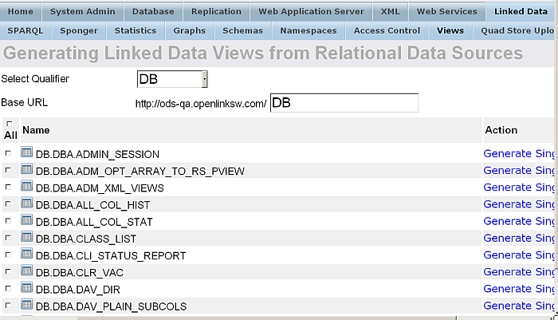

4.  In the form presented, perform the following steps:
    
    1.  Select the Database Name Qualifier (e.g., "Demo") that exposes
        the Tables / Views for this exercise
    
    2.  Enter the Base URL to which your URL rewrite rules will be bound
        (e.g. http://\<cname\>:8890/Demo)
    
    3.  Select specific Tables containing the data to be published (e.g.
        Demo.demo.Orders and Demo.demo.Products)
    
    4.  Click the "Generate & Publish" button
    
    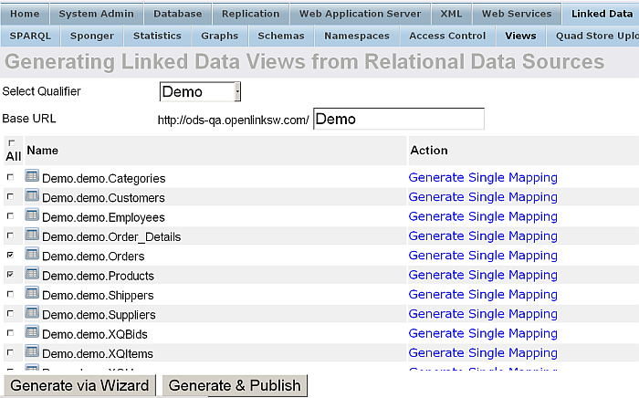

5.  Virtuoso will perform the entire process of ontology generation,
    instance data generation, and linked data deployment (re-write rules
    generation and application).

6.  Error messages will be presented if the Wizard encounters problems.
    If there are no error messages, your Linked Data View declarations
    and Linked Data publishing activities will have completed
    successfully.
    
    
    

4.  In the form presented, perform the following steps:
    
    1.  Select the Database Name Qualifier (e.g., "Demo") that exposes
        the Tables / Views for this exercise
    
    2.  Enter the Base URL to which your URL rewrite rules will be bound
        (e.g. http://\<cname\>:8890/Demo)
    
    3.  Select specific Tables containing the data to be published
        (e.g., Demo.demo.Orders and Demo.demo.Products)
    
    4.  Click the "Generate via Wizard" button
        
        

5.  At this point, you are presented with the option to edit your column
    selection. Select the "Edit" link, for example, for table
    Demo.demo.Products.
    
    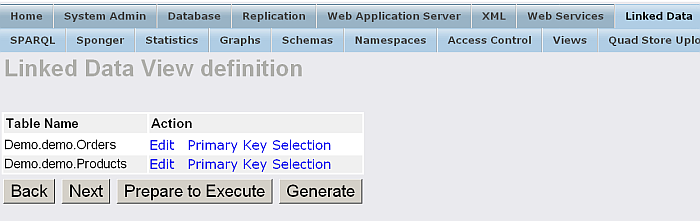

6.  For images or other binary data in MIME formats to be revealed as
    anything other than generic "binary objects", you must map large
    varbinary types to the appropriate MIME types like image/gif. To do
    so, select the Edit link for Binding/MIME Type of the relevant table
    columns. You can:
    
    1.  Leave the Binding/MIME Type literal; or
    
    2.  Set to skip, such that the column will not be used in RDF
        generation; or
    
    3.  Select the binary object value in order for the column to be
        referenced as binary.
    
    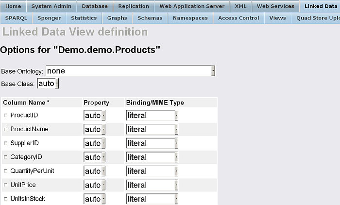

7.  After finishing with your changes click the Save button, or cancel
    the changes and go back by clicking the Cancel button.

8.  Make sure you click the "Next" button.

9.  At this point, the Linked Data View Definition form will let you
    Select Generation Targets options:
    
    1.  Data Source Ontology Mappings
    
    2.  Instance Data View Mappings
    
    3.  VoID statistic
    
    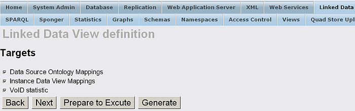

10. Make sure you click the "Next" button.

11. Based on your selections in the prior form, the Linked Data View
    Definition Deployment Options form will be offered:
    
    1.  Data Source Ontology Rules
    
    2.  Instance Data Rules
    
    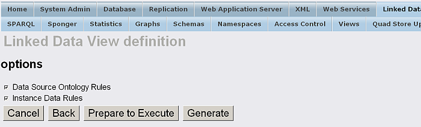

12. Select the desired option(s) and click the "Prepare to Execute"
    button which unveils a generated Instance Data and/or Ontology form.
    
    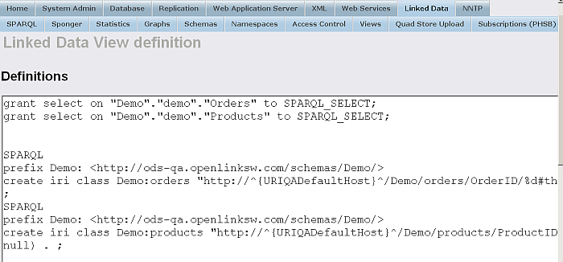

13. Click the Execute button and Virtuoso will:
    
    1.  Apply the generated declarations (instance data and ontology) to
        your Virtuoso instance
    
    2.  Publish / Deploy declarations that expose the Wizard-generated
        Rewrite Rules and associated endpoints.
        
        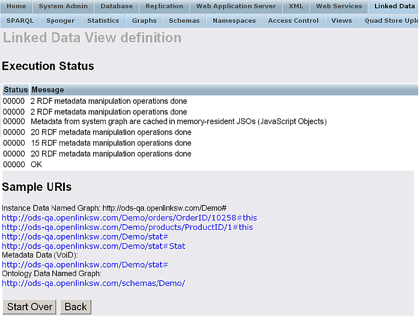

14. Optionally, you can also perform one of the following tasks:
    
    1.  Save Data Mappings: when clicked, offers to save the generated
        Definitions to local file system
    
    2.  Save Ontology Mappings: when clicked, offers to save the
        generated Ontology to local file system
    
    3.  Export as WebDAV resource: exports the selected objects/items as
        a WebDAV resource:
        
        1.  Click "Browse"
        
        2.  Enter a WebDAV resource and click the "Select" button.
        
        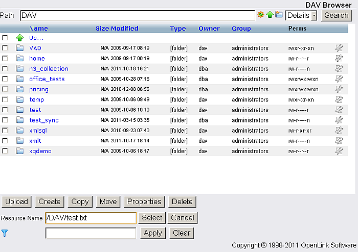
    
    Note, the WebDAV resource path value will be shown in the WebDAV
    location field.

15. Then click the "Save Data Mappings" or "Save Ontology Mappings"
    button, to complete the option task of saving your generated (or
    edited) view declarations.
    
    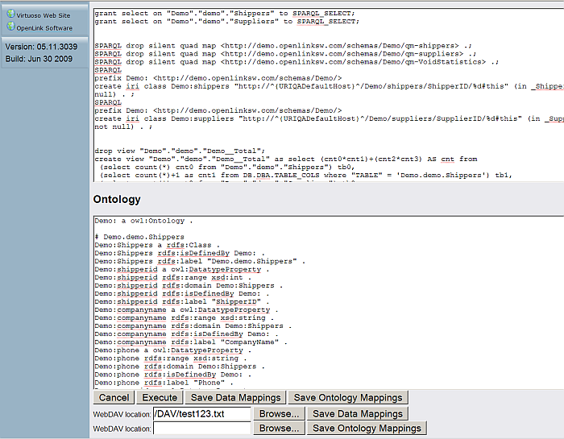

16. Error messages will be presented if the Wizard encounters problems.
    If there are no error messages, your Linked Data View declarations
    and Linked Data publishing activities will have completed
    successfully.
    
    
    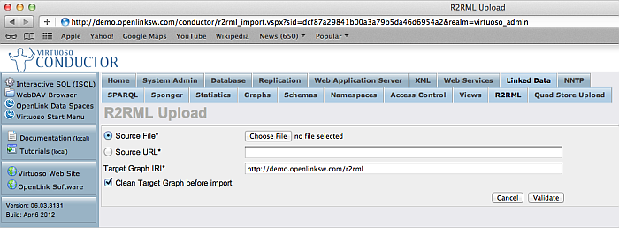

6.  Select the Choose File button and select the R2RML file to load:
    
    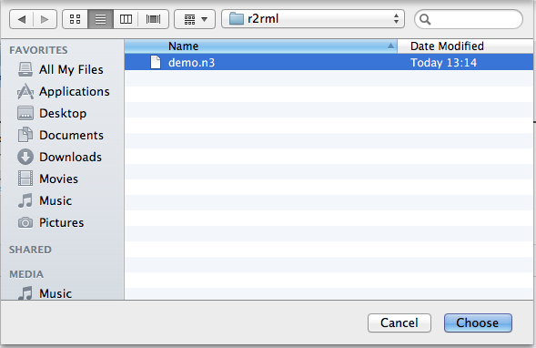

7.  Select the Validate button to verify the R2RML mapping script:
    
    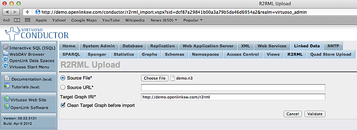

8.  Select the Generate button to generate the RDF Linked Data Views
    mappings for the R2RML mapping script:
    
    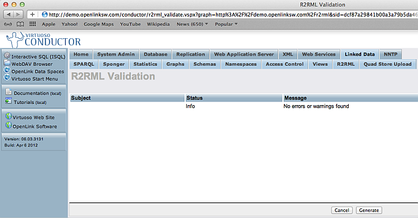

9.  Select the Execute button to create the RDF Linked Data Views
    mapping the the Quad Store:
    
    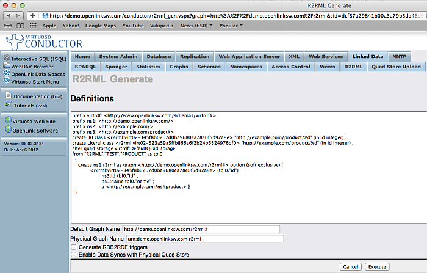

10. The RDF Linked Data View creation is complete and status is
    displayed:
    
    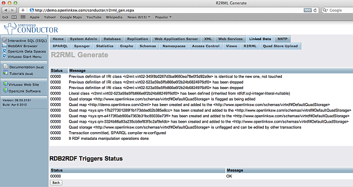

11. The Default Graph Name (transient) specified
    http://demo.openlinksw.com/r2rml\# can now be used to run a SPARQL
    query against the created Linked Data View. If the Generate [RDB2RDF
    triggers](#rdb2rdftriggers) and Enable Data Syncs with Physical Quad
    Store check boxes are selected the Physical Graph Name (persistent)
    specified urn:demo.openlinksw.com/r2rml\# can be used to run a
    SPARQL query against the materialized triples in the Quad Store.
    
    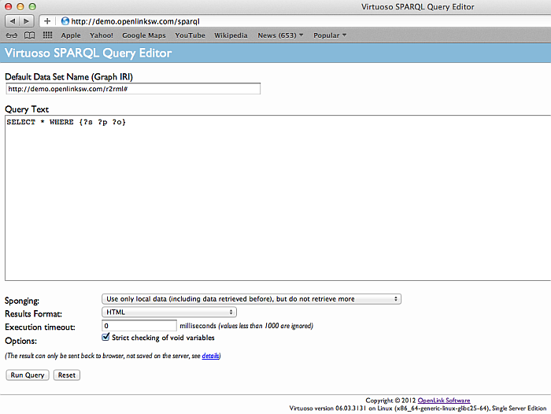

12. The results set for the Linked Data View graph are displayed:
    
    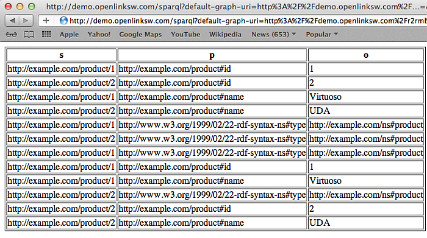

<a id="id56-generate-transient-andor-persistent-linked-data-views-atop-remote-relational-data-sources-using-conductor"></a>
## Generate Transient and/or Persistent Linked Data Views atop Remote Relational Data Sources Using Conductor

This section describes how you can generate R2RML Scripts from Linked
Data Views, using the Virtuoso Conductor ODBC or JDBC accessible.

1.  Ensure you have installed Conductor [conductor\_dav.vad](#) VAD
    package with version 1.32.38 or higher.

2.  Go to http://\<cname\>\[:\<port\>\]/conductor.

3.  Enter dba credentials.

4.  Go to Linked Data -\> Views:
    
    
    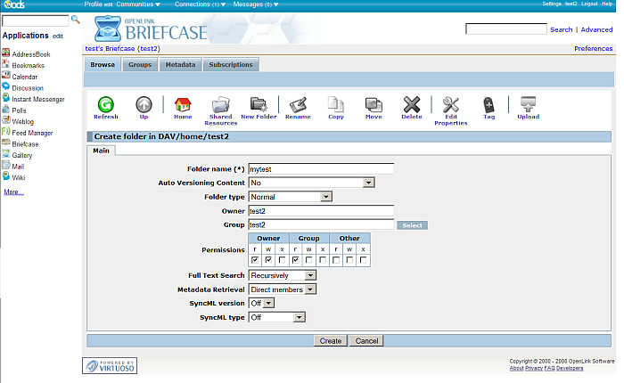

8.  Go to folder "mytest" and click the click the "Upload" icon from the
    Main Briefcase horizontal navigation

9.  Enter for name for ex. "mytest" and click the "Create" button.
    
    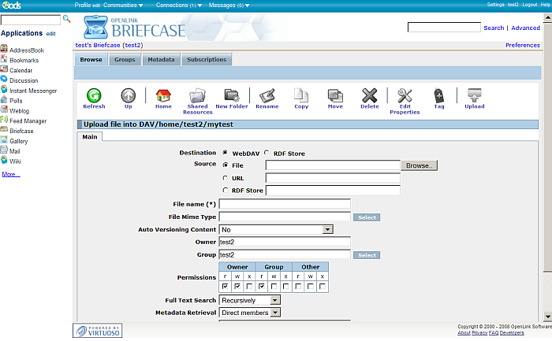

10. In the shown form set:
    
      - Destination: RDF Store
    
      - RDF graph name for ex. with the value:
        http://example.com/DAV/home/test2/mytest/
    
      - Select URL or File. For ex. you can select the following file
        with name jose.rdf:
        
            <rdf:RDF xmlns="http://www.example/jose/foaf.rdf#"
                xmlns:foaf="http://xmlns.com/foaf/0.1/"
                xmlns:log="http://www.w3.org/2000/10/swap/log#"
                xmlns:myfoaf="http://www.example/jose/foaf.rdf#"
                xmlns:rdf="http://www.w3.org/1999/02/22-rdf-syntax-ns#">
            
                <foaf:Person rdf:about="http://www.example/jose/foaf.rdf#jose">
                    <foaf:homepage rdf:resource="http://www.example/jose/"/>
                    <foaf:knows rdf:resource="http://www.example/jose/foaf.rdf#juan"/>
                    <foaf:name>Jose Jimen~ez</foaf:name>
                    <foaf:nick>Jo</foaf:nick>
                    <foaf:workplaceHomepage rdf:resource="http://www.corp.example/"/>
                </foaf:Person>
            
                <foaf:Person rdf:about="http://www.example/jose/foaf.rdf#juan">
                    <foaf:mbox rdf:resource="mailto:juan@mail.example"/>
                </foaf:Person>
            
                <foaf:Person rdf:about="http://www.example/jose/foaf.rdf#julia">
                    <foaf:mbox rdf:resource="mailto:julia@mail.example"/>
                </foaf:Person>
            
                <rdf:Description rdf:about="http://www.example/jose/foaf.rdf#kendall">
            
                    <foaf:knows rdf:resource="http://www.example/jose/foaf.rdf#edd"/>
                </rdf:Description>
            </rdf:RDF>

11. You can also perform the steps from above by uploading the file in
    the rdf\_sink folder i.e. in Briefcase it will be with this path:
    DAV/home/test2/rdf\_sink and respectively the "RDF graph name" will
    have this value: http://host:port/DAV/home/username/rdf\_sink/

Execute from ISQL or from the SPARQL endpoint the following query:

    SELECT * FROM <http://example.com/DAV/home/test2/mytest/>
    WHERE {?s ?p ?o}

As result should be shown:

    s                                     p                                                 o
    http://www.example/jose/foaf.rdf#jose     http://www.w3.org/1999/02/22-rdf-syntax-ns#type   http://xmlns.com/foaf/0.1/Person
    http://www.example/jose/foaf.rdf#jose     http://xmlns.com/foaf/0.1/nick                Jo
    http://www.example/jose/foaf.rdf#jose     http://xmlns.com/foaf/0.1/name                Jose Jimen~ez
    http://www.example/jose/foaf.rdf#jose     http://xmlns.com/foaf/0.1/knows               http://www.example/jose/foaf.rdf#juan
    http://www.example/jose/foaf.rdf#jose     http://xmlns.com/foaf/0.1/homepage                http://www.example/jose/
    http://www.example/jose/foaf.rdf#jose     http://xmlns.com/foaf/0.1/workplaceHomepage       http://www.corp.example/
    http://www.example/jose/foaf.rdf#kendall  http://xmlns.com/foaf/0.1/knows               http://www.example/jose/foaf.rdf#edd
    http://www.example/jose/foaf.rdf#julia    http://www.w3.org/1999/02/22-rdf-syntax-ns#type   http://xmlns.com/foaf/0.1/Person
    http://www.example/jose/foaf.rdf#julia    http://xmlns.com/foaf/0.1/mbox                mailto:julia@mail.example
    http://www.example/jose/foaf.rdf#juan     http://www.w3.org/1999/02/22-rdf-syntax-ns#type   http://xmlns.com/foaf/0.1/Person
    http://www.example/jose/foaf.rdf#juan     http://xmlns.com/foaf/0.1/mbox                mailto:juan@mail.example

*Example 2: Using Conductor UI*

1.  Go to Conductor UI, for ex. at http://example.com/conductor

2.  Login as dba user

3.  Go to Linked Data -\> Quad Store Upload
    
    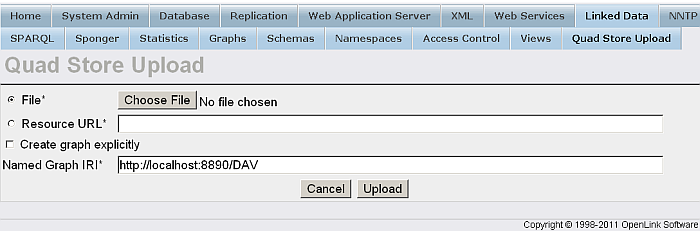

4.  In the shown form click the "Browse" button in order to select a
    file, for ex. the file jose.rdf and set the "RDF IRI\*"
    
    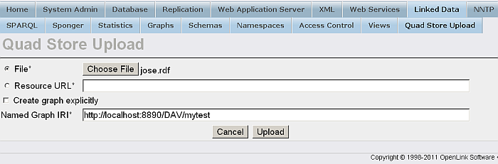

5.  Click the "Upload" button.
    
    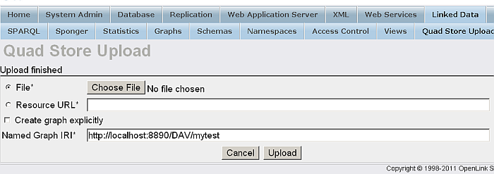

<a id="id57-using-virtuoso-crawler"></a>
## Using Virtuoso Crawler

Using Virtuoso Crawler (which includes the Sponger options so you crawl
non-RDF but get RDF and this can go to the Quad Store).

*Example:*

1.  Go to Conductor UI. For ex. at http://example.com/conductor :
    
    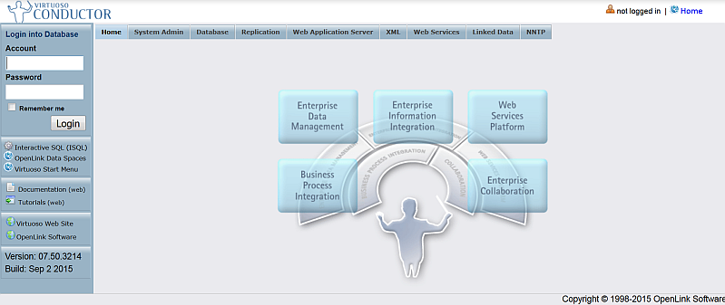

2.  Enter admin user credentials:
    
    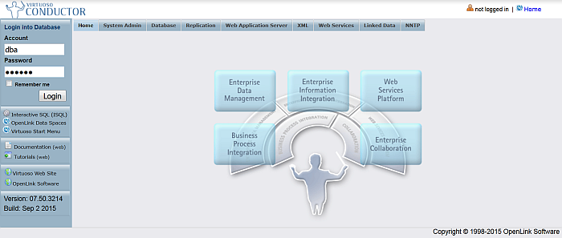

3.  Go to tab Web Application Server:
    
    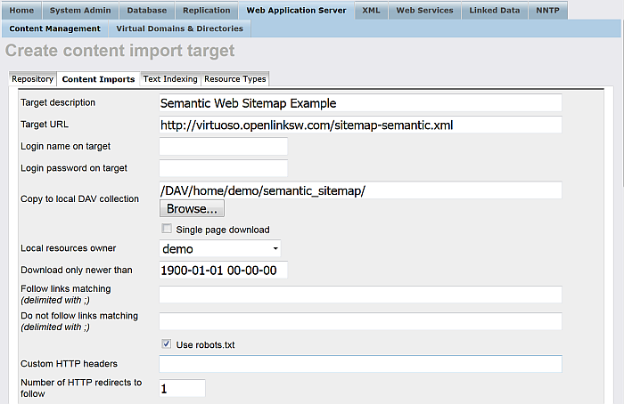

4.  Go to tab Content Imports:
    
    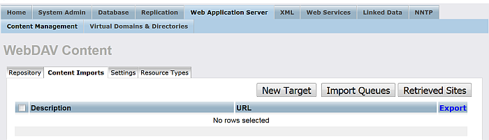

5.  Click the "New Target" button:
    
    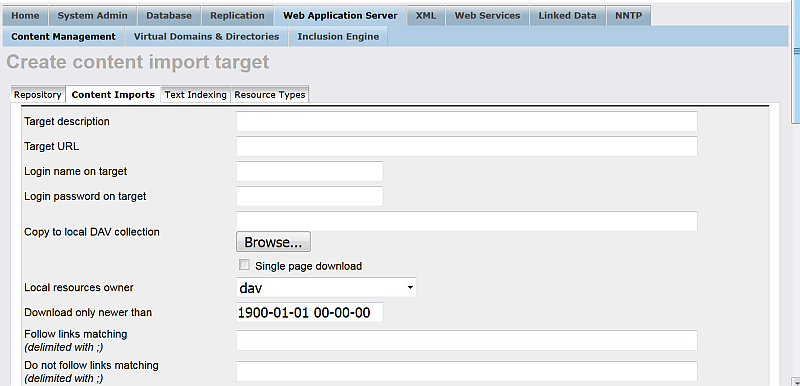

6.  In the shown form set respectively:
    
    1.  "Target description": Tim Berners-Lee's electronic Business Card
    
    2.  "Target URL": http://www.w3.org/People/Berners-Lee/ ;
    
    3.  "Copy to local DAV collection " for ex.:
        /DAV/home/demo/my-crawling/ ;
    
    4.  Choose from the list "Local resources owner": demo ;
    
    5.  Leave checked by default the check-box "Store documents
        locally". -- Note: if "Store document locally" is not checked,
        then in this case no documents will be save as DAV resource and
        the specified DAV folder from above will not be used ;
    
    6.  Check the check-box with label "Store metadata" ;
    
    7.  Specify which cartridges to be involved by hatching their
        check-box ;
    
    8.  Note: when selected "Convert Link", then all HREFs in the local
        stored content will be relative.
    
    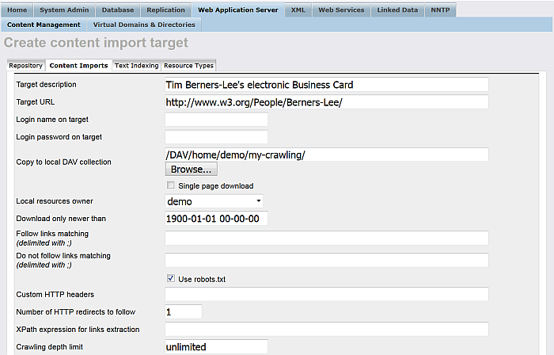
    
    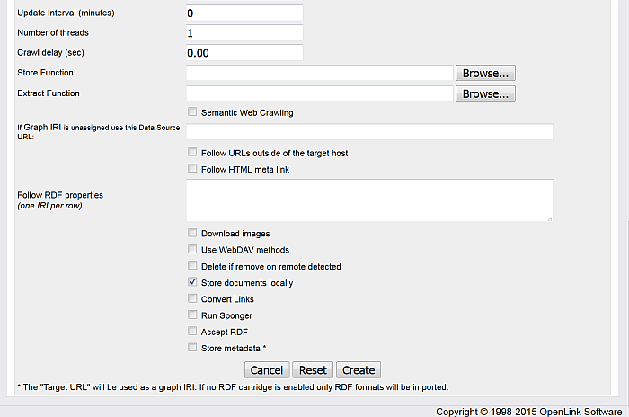

7.  Click the button "Create":
    
    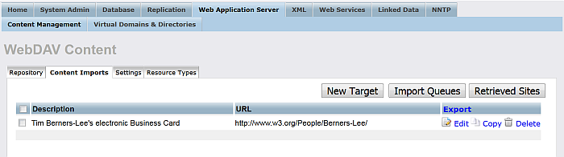

8.  Click the button "Import Queues":
    
    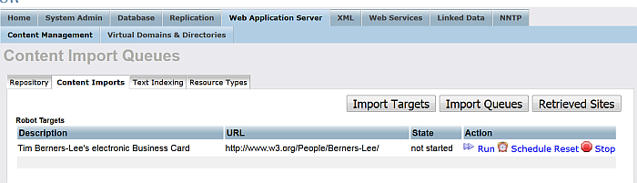

9.  For "Robot target" with label "Tim Berners-Lee's electronic Business
    Card" click "Run".

10. As result should be shown the number of the pages retrieved.
    
    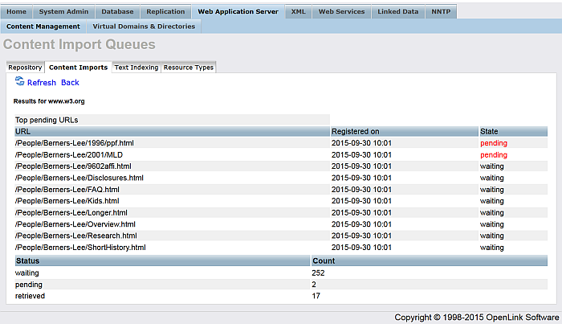

*Example: Use of schedular to interface Virtuoso Quad Store with PTSW
using the following program:*

``` 

create procedure PTSW_CRAWL ()
{
  declare xt, xp any;
  declare content, headers any;

  content := http_get ('http://pingthesemanticweb.com/export/', headers);
  xt := xtree_doc (content);
  xp := xpath_eval ('//rdfdocument/@url', xt, 0);
  foreach (any x in xp) do
    {
      x := cast (x as varchar);
      dbg_obj_print (x);
      {
    declare exit handler for sqlstate '*' {
      log_message (sprintf ('PTSW crawler can not load : %s', x));
    };
        sparql load ?:x into graph ?:x;
    update DB.DBA.SYS_HTTP_SPONGE set HS_LOCAL_IRI = x, HS_EXPIRATION = null WHERE HS_LOCAL_IRI = 'destMD5=' || md5 (x) || '&graphMD5=' || md5 (x);
    commit work;
      }
    }
}
;

insert soft SYS_SCHEDULED_EVENT (SE_SQL, SE_START, SE_INTERVAL, SE_NAME)
    values ('DB.DBA.PTSW_CRAWL ()', cast (stringtime ('0:0') as DATETIME), 60, 'PTSW Crawling');
```

> **Tip**
> 
> [Other Methods to Set Up the Content Crawler for RDF
> gathering.](#contentcrawlerrdf)

<a id="id58-using-sparql-query-and-sponger-ie-we-fetch-the-network-resources-in-the-from-clause-or-values-for-the-graph-uri-parameter-in-sparql-protocol-urls"></a>
## Using SPARQL Query and Sponger (i.e. we Fetch the Network Resources in the FROM Clause or values for the graph-uri parameter in SPARQL protocol URLs)

*Example:*

Execute the following query:

    SQL>SPARQL
    SELECT ?id
    FROM NAMED <http://www.openlinksw.com/dataspace/kidehen@openlinksw.com/weblog/kidehen@openlinksw.com%27s%20BLOG%20%5B127%5D/sioc.ttl>
     OPTION (get:soft "soft", get:method "GET")
    WHERE { GRAPH ?g { ?id a ?o } }
    limit 10;

As result will be shown the retrieved triples:

    id
    VARCHAR
    _______________________________________________________________________________
    
    http://www.openlinksw.com/dataspace/person/kidehen@openlinksw.com#this
    http://www.openlinksw.com/dataspace/kidehen@openlinksw.com/weblog/kidehen@openlinksw.com%27s%20BLOG%20%5B127%5D
    http://www.openlinksw.com/dataspace/kidehen@openlinksw.com/weblog/kidehen@openlinksw.com%27s%20BLOG%20%5B127%5D
    http://www.openlinksw.com/dataspace/person/kidehen@openlinksw.com#this
    http://www.openlinksw.com/dataspace/kidehen@openlinksw.com/weblog/kidehen@openlinksw.com%27s%20BLOG%20%5B127%5D/612
    http://www.openlinksw.com/dataspace/kidehen@openlinksw.com/weblog/kidehen@openlinksw.com%27s%20BLOG%20%5B127%5D/612
    http://www.openlinksw.com/dataspace/kidehen@openlinksw.com/weblog/kidehen@openlinksw.com%27s%20BLOG%20%5B127%5D/610
    http://www.openlinksw.com/dataspace/kidehen@openlinksw.com/weblog/kidehen@openlinksw.com%27s%20BLOG%20%5B127%5D/610
    http://www.openlinksw.com/dataspace/kidehen@openlinksw.com/weblog/kidehen@openlinksw.com%27s%20BLOG%20%5B127%5D/856
    http://www.openlinksw.com/dataspace/kidehen@openlinksw.com/weblog/kidehen@openlinksw.com%27s%20BLOG%20%5B127%5D/856
    
    10 Rows. -- 20 msec.

<a id="id59-using-virtuoso-pl-apis"></a>
## Using Virtuoso PL APIs

### Basic Sponger Cartridge Example

In the example script we implement a basic mapper which maps a
text/plain mime type to an imaginary ontology, which extends the class
Document from FOAF with properties 'txt:UniqueWords' and 'txt:Chars',
where the prefix 'txt:' we specify as 'urn:txt:v0.0:'.

    use DB;
    
    create procedure DB.DBA.RDF_LOAD_TXT_META
        (
         in graph_iri varchar,
         in new_origin_uri varchar,
         in dest varchar,
             inout ret_body any,
         inout aq any,
         inout ps any,
         inout ser_key any
         )
    {
      declare words, chars int;
      declare vtb, arr, subj, ses, str any;
      declare ses any;
      -- if any error we just say nothing can be done
      declare exit handler for sqlstate '*'
        {
          return 0;
        };
      subj := coalesce (dest, new_origin_uri);
      vtb := vt_batch ();
      chars := length (ret_body);
      -- using the text index procedures we get a list of words
      vt_batch_feed (vtb, ret_body, 1);
      arr := vt_batch_strings_array (vtb);
      -- the list has 'word' and positions array , so we must divide by 2
      words := length (arr) / 2;
      ses := string_output ();
      -- we compose a N3 literal
      http (sprintf ('<%s> <http://www.w3.org/1999/02/22-rdf-syntax-ns#type> <http://xmlns.com/foaf/0.1/Document> .\n', subj), ses);
      http (sprintf ('<%s> <urn:txt:v0.0:UniqueWords> "%d" .\n', subj, words), ses);
      http (sprintf ('<%s> <urn:txt:v0.0:Chars> "%d" .\n', subj, chars), ses);
      str := string_output_string (ses);
      -- we push the N3 text into the local store
      DB.DBA.TTLP (str, new_origin_uri, subj);
      return 1;
    }
    ;
    
    --
    DELETE FROM DB.DBA.SYS_RDF_MAPPERS WHERE RM_HOOK = 'DB.DBA.RDF_LOAD_TXT_META';
    
    INSERT SOFT DB.DBA.SYS_RDF_MAPPERS (RM_PATTERN, RM_TYPE, RM_HOOK, RM_KEY, RM_DESCRIPTION)
        VALUES ('(text/plain)', 'MIME', 'DB.DBA.RDF_LOAD_TXT_META', null, 'Text Files (demo)');
    
    -- here we set order to some large number so don't break existing mappers
    update DB.DBA.SYS_RDF_MAPPERS set RM_ID = 2000 WHERE RM_HOOK = 'DB.DBA.RDF_LOAD_TXT_META';

1.  Paste the whole of this code into Conductor's iSQL interface and
    execute it to define and register the cartridge.

2.  Create a simple text document with a .txt extension. For ex. with
    name: summary.txt

3.  The .txt file must now be made Web accessible. A simple way to do
    this is to expose it as a WebDAV resource using Virtuoso's built-in
    WebDAV support:
    
    1.  Log in to Virtuoso's ODS Briefcase application;
    
    2.  Navigate to your Public folder;
    
    3.  Upload your text document, ensuring that the file extension is
        .txt, the MIME type is set to text/plain and the file
        permissions are rw-r--r--.
    
    4.  As result the file would be Web accessible via the URL
        http://cname/DAV/home/username/Public/summary.txt .
    
    5.  Note: you can also check our [live demo](#) .

4.  To test the mapper we just use /sparql endpoint with option
    'Retrieve remote RDF data for all missing source graphs' to execute
    (for ex.):
    
        SELECT *
        FROM <http://cname/DAV/home/username/Public/summary.txt>
        WHERE {?s ?p ?o}

5.  Click the "Run Query" button.

6.  As result should be shown the found triples, for ex.:
    
        s                                                  p                                                o
        http://cname/DAV/home/username/Public/summary.txt  http://www.w3.org/1999/02/22-rdf-syntax-ns#type  http://xmlns.com/foaf/0.1/Document
        http://cname/DAV/home/username/Public/summary.txt  urn:txt:v0.0:UniqueWords                           47
        http://cname/DAV/home/username/Public/summary.txt  urn:txt:v0.0:Chars                               625

*Important: Setting Sponger Permissions*

In order to allow the Sponger to update the local RDF quad store with
triples constituting the fetched Network Resource structured data, the
role "SPARQL\_SPONGE" must be granted to the account "SPARQL", i.e., to
the owner account of /sparql web service endpoint. This should normally
be the case. If not, you must manually grant this permission. As with
most Virtuoso DBA tasks, the Conductor provides the simplest means of
doing this.

> **Tip**
> 
>   - The [DB.DBA.RDF\_LOAD\_RDFXML](#fn_rdf_load_rdfxml) function to
>     parse the content of RDF/XML text.
> 
>   - The [DB.DBA.TTLP\_MT](#fn_ttlp_mt) function to parse TTL (TURTLE
>     or N3 resource).
> 
>   - The [gz\_file\_open](#fn_gz_file_open) function to retrieve
>     content of a gzipped file and example for loading gzipped N3 and
>     Turtle files.

<a id="id60-using-simile-rdf-bank-api"></a>
## Using SIMILE RDF Bank API

Virtuoso implements the HTTP-based Semantic Bank API that enables client
applications to post to its RDF Triple Store. This method offers an
alternative to using Virtuoso/PL functions or WebDAV uploads as the
triples-insertion mechanism.

*Example:*

From your machine go to Firefox-\>Tools-\>PiggyBank-\>My Semantic Bank
Accounts

Add in the shown form:

  - For bank: address: http://demo.openlinksw.com/bank

  - For account id: demo

  - For password: demo

Go to http://demo.openlinksw.com/ods

Log in as user demo, password: demo

Go to the Weblog tab from the main ODS Navigation

Click on weblog instance name, for ex. "demo's Weblog".

When the weblog home page is loaded, click Alt + P.

As result is shown the "My PiggyBank" page with all the collected
information presented in items.

For several of the items add Tags from the form "Tag" shown for each of
them.

As result should be shown the message "Last updated: \[here goes the
date value\].

You can also click "Save" and "Publish" for these items.

Go to http://demo.openlinksw.com/sparql

Enter for the "Default Graph URI" field:
http://simile.org/piggybank/demo

Enter for the "Query text" text-area:

    prefix rdf: <http://www.w3.org/1999/02/22-rdf-syntax-ns#>
    prefix sioc: <http://rdfs.org/sioc/ns#>
    SELECT *
    FROM <http://simile.org/piggybank/demo>
    WHERE {?s ?p  ?o}

Click "Run Query".

As results are shown the found results.

<a id="id61-using-rdf-net"></a>
## Using RDF NET

*Example:*

Execute the following query:

    SQL> SELECT DB.DBA.HTTP_RDF_NET ('sparql load
    "http://www.openlinksw.com/dataspace/person/kidehen@openlinksw.com"
    into graph <http://www.openlinksw.com/>');

As result should be shown:

    callret
    VARCHAR
    _______________________________________________________
    
    <?xml version="1.0" ?>
    <rdf:RDF xmlns:rdf="http://www.w3.org/1999/02/22-rdf-syntax-ns#"
    xmlns:vcard="http://www.w3.org/2001/vcard-rdf/3.0#"
    xmlns="http://example.org/book/" xmlns:dc="http://purl.org/dc/elements/1.1/"
    xmlns:ns="http://example.org/ns#">
    <rdf:Description>
    <callret-0>Load <http://www.openlinksw.com/dataspace/person/kidehen@openlinksw.com>
    into graph <http://www.openlinksw.com/> -- done</callret-0>
    </rdf:Description>
    </rdf:RDF>
    
    1 Rows. -- 1982 msec.

<a id="id62-using-the-rdf-proxy-sponger-service"></a>
## Using the RDF Proxy (Sponger) Service

Triples can be inserted also using the Sponger Proxy URI Service. For
more information and examples see [here](#rdfproxyservice) .

<a id="id63-rdfizer-middleware-sponger"></a>
# RDFizer Middleware (Sponger)

<a id="id64-what-is-the-sponger"></a>
## What Is The Sponger?

The Virtuoso Sponger is the Linked Data middleware component of Virtuoso
that generates Linked Data from a variety of data sources, supporting a
wide variety of data representation and serialization formats. The
sponger is transparently integrated into Virtuoso's SPARQL Query
Processor where it delivers URI de-referencing within SPARQL query
patterns, across disparate data spaces. It also delivers configurable
smart HTTP caching services. Optionally, it can be used by the [Virtuoso
Content Crawler](#contentcrawlerrdf) to periodically populate and
replenish data within the native RDF Quad Store.

The sponger is a fully fledged HTTP proxy service that is also directly
accessible via SOAP or REST interfaces.

As depicted below, OpenLink's broad portfolio of Linked-Data-aware
products supports a number of routes for creating or consuming Linked
Data. The Sponger provides a key platform for developers to generate
quality data meshes from unstructured or semi-structured data sources.


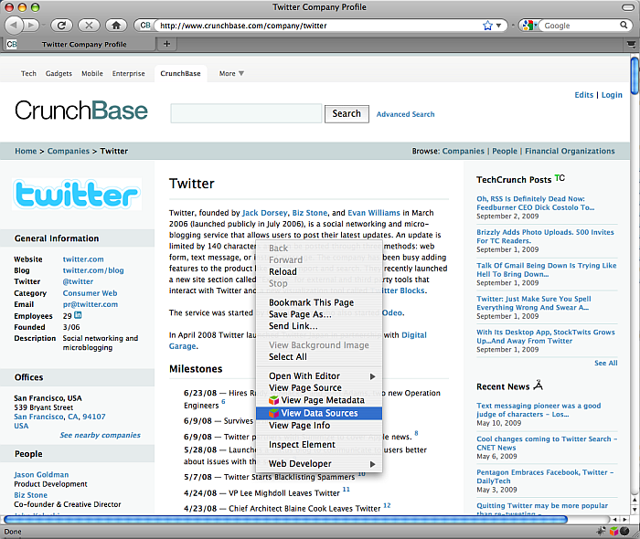

The RDF browser then displays RDF data fetched via the Crunchbase
cartridge.


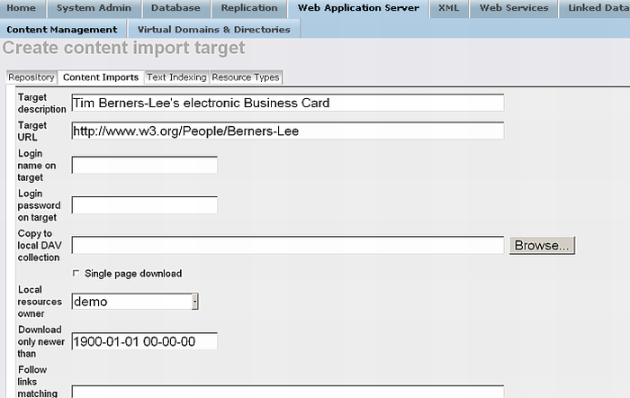

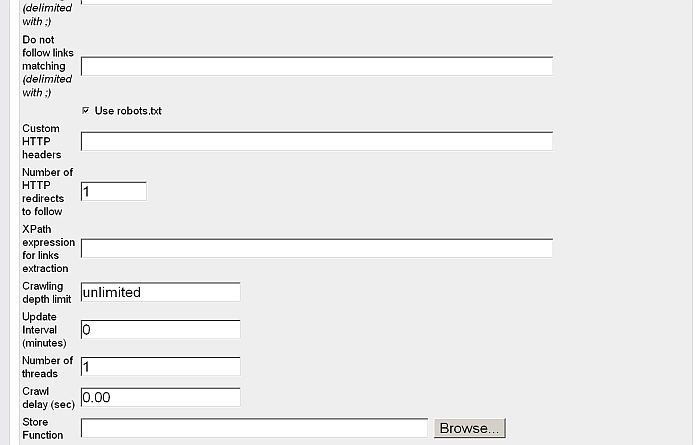

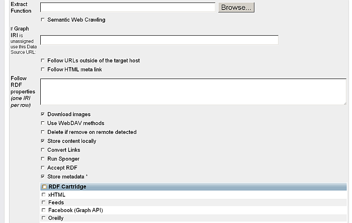

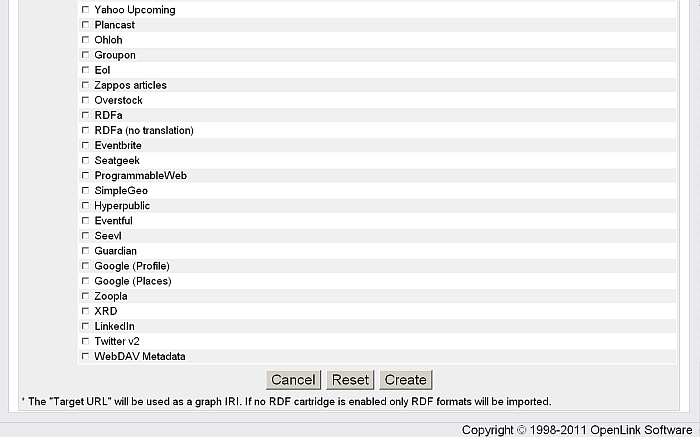

### Directly via Virtuoso PL

Sponger cartridges are invoked through a cartridge hook which provides a
Virtuoso PL entry point to the packaged functionality. Should you wish
to utilize the Sponger from your own Virtuoso PL procedures, you can do
so by calling these hook routines directly. Full details of the hook
function prototype and how to define your own cartridges are presented
[here](#virtuosospongercreatecustcartran) .

<a id="id65-consuming-the-generated-rdf-structured-data"></a>
## Consuming the Generated RDF Structured Data

The generated RDF-based structured data (RDF) can be consumed in a
number of ways, depending on whether or not the data is persisted in
Virtuoso's RDF Quad Store.

If the data is persisted, it can be queried through the Virtuoso SPARQL
endpoint associated with any Virtuoso instance: /sparql. The RDF is
exposed in a graph typically identified using a URL matching the source
resource URL from which the RDF data was generated. Naturally, any SQL
query can also access this, since SPARQL can be freely intermixed with
SQL via Virtuoso's SPASQL (SPARQL inside SQL) functionality. RDF data is
also accessible through Virtuoso's implementation of the URIQA protocol.

If not persisted, as is the case with the RDF Proxy Service, the data
can be consumed by an RDF aware Web client, e.g. an RDF browser such as
the OpenLink Data Explorer (ODE).

<a id="id66-rdf-cartridges-use-cases"></a>
## RDF Cartridges Use Cases

This section contains examples of Web resources which can be transformed
by RDF Cartridges. It also states where additional setup for given
cartridges is needed i.e. keys account names etc.

*Service based:*

  - amazon
    
        needs: api key
        example: http://www.amazon.com/gp/product/0553383043

  - ebay
    
        needs: account, api-key
        example: http://cgi.ebay.com/RARE-DAY-IN-FAIRY-LAND-ELEPHANT-FOLIO-20-FULL-COLOR_W0QQitemZ140209597189QQihZ004QQcategoryZ29223QQssPageNameZWDVWQQrdZ1QQcmdZViewItem

  - flickr needs: api-key example:
    http://farm1.static.flickr.com/212/496684670\_7122c831ed.jpg
    
    ``` 
    ```

  - mbz
    
        example: http://musicbrainz.org/release/37e955d4-a53c-45aa-a812-1b23b88dbc13.html

  - mql (freebase)
    
        example: http://www.freebase.com/view/en/beta_ursae_majoris

  - facebook
    
        needs: api-key, secret, persistent-session-id
        example: http://www.facebook.com/profile.php?id=841100003

  - yahoo-stock
    
        example: http://finance.yahoo.com/q?s=AAPL

  - yahoo-traffic
    
        example: http://local.yahooapis.com/MapsService/V1/trafficData?appid=YahooDemo&street=701+First+Street&city=Sunnyvale&state=CA

  - Bugzilla
    
        example: https://bugzilla.mozilla.org/show_bug.cgi?id=251714

  - SVG

  - OO document
    
        needs: unzip plugin

  - Wikipedia
    
        needs: php plugin & dbpedia extractor
        example: http://wikipedia.org/wiki/London

  - Opencalais

  - iCalendar

*GRDDL*

  - Google Base (google)
    
        example: http://www.google.com/base/feeds/snippets/17891817243016304554

  - eRDF

  - RDFa

  - hCard

  - hCalendar

  - hReview

  - relLicense

  - XBRL

  - HR-XML

  - DC

  - geoURL

  - Ning

  - XFN

  - xFolk

*URN handlers*

| URN handler |
| :---------- |
| LSID        |
| DOI         |
| OAI         |

URN handlers List

### SPARQL IRI Dereferencing

The Virtuoso SPARQL engine (called for brevity just SPARQL below)
supports IRI Dereferencing, however it understands only RDF data, that
is it can retrieve only files containing RDF/XML, turtle or N3
serialized RDF data, if format is unknown it will try mapping with
built-in WebDAV metadata extractor. In order to extend this feature with
dereferencing web or file resources which naturally don't have RDF data
(like PDF, JPEG files for example) is provided a special mechanism in
SPARQL engine. This mechanism is called RDF mappers for translation of
non-RDF data files to RDF.

In order to instruct the SPARQL to call a RDF mapper it needs to be
registered and it will be called for a given URL or MIME type pattern.
In other words, when unknown for SPARQL format is received during URL
dereferencing process, it will look into a special registry (a table) to
match either the MIME type or IRI using a regular expression, if match
is found the mapper function will be called.

#### Sponger Proxy service

Sponger functionality is also exposed via Virtuoso's "/proxy/rdf/"
endpoint, as an in-built REST style Web service available in any
Virtuoso standard installation. This web service takes a target URL and
either returns the content "as is" or tries to transform (by sponging)
to RDF. Thus, the proxy service can be used as a 'pipe' for RDF browsers
to browse non-RDF sources.

For more information see [RDF Sponger Proxy service](#rdfproxyservice)

#### Cache Invalidation

To clear cache on all values of HS\_LOCAL\_IRI of the SYS\_HTTP\_SPONGE
table use:

    SPARQL clear graph <A-Named-Graph>;

<a id="id67-cartridge-architecture"></a>
## Cartridge Architecture

### What is a Cartridge?

See full description [here](#virtuosospongeroverviewcartarch)

### Extractor Cartridges

An Extractor Cartridge processes a Resource of a given format,
extracting RDF according to rules appropriate to that format. External
data does not come into play; only the content of the Resource fed to
the Sponger.

#### Supported Standard Non-RDF Data Formats

These Cartridges handle open formats - typically community-developed,
openly-documented, and freely-licensed data structures.

| Cartridge                        | Sample URI   | Resource Description     | Linked Data Graph       |
| -------------------------------- | ------------ | ------------------------ | ----------------------- |
| AB Meta                          | [example](#) | [HTML Representation](#) | [Data Explorer View](#) |
| Atom                             | [example](#) | [HTML Representation](#) | [Data Explorer View](#) |
| CSV                              | [example](#) | [HTML Representation](#) | [Data Explorer View](#) |
| DC                               | [example](#) | [HTML Representation](#) | [Data Explorer View](#) |
| eRDF                             | [example](#) | [HTML Representation](#) | [Data Explorer View](#) |
| hAudio                           | [example](#) | [HTML Representation](#) | [Data Explorer View](#) |
| hCalendar                        | [example](#) | [HTML Representation](#) | [Data Explorer View](#) |
| hCard                            | [example](#) | [HTML Representation](#) | [Data Explorer View](#) |
| hListing                         | [example](#) | [HTML Representation](#) | [Data Explorer View](#) |
| hNews                            | [example](#) | [HTML Representation](#) | [Data Explorer View](#) |
| hProduct                         | [example](#) | [HTML Representation](#) | [Data Explorer View](#) |
| HR-XML                           | [example](#) | [HTML Representation](#) | [Data Explorer View](#) |
| hRecipe                          | [example](#) | [HTML Representation](#) | [Data Explorer View](#) |
| hResume                          | [example](#) | [HTML Representation](#) | [Data Explorer View](#) |
| hReview                          | [example](#) | [HTML Representation](#) | [Data Explorer View](#) |
| HTTP in RDF                      | [example](#) | [HTML Representation](#) | [Data Explorer View](#) |
| iCalendar                        | [example](#) | [HTML Representation](#) | [Data Explorer View](#) |
| Microsoft Word 2003 XML Document | [example](#) | [HTML Representation](#) | [Data Explorer View](#) |
| Microsoft XML Spreadsheet 2003   | [example](#) | [HTML Representation](#) | [Data Explorer View](#) |
| Microsoft Documents              | [example](#) | [HTML Representation](#) | [Data Explorer View](#) |
| OData                            | [example](#) | [HTML Representation](#) | [Data Explorer View](#) |
| OO document                      | [example](#) | [HTML Representation](#) | [Data Explorer View](#) |
| OPML                             | [example](#) | [HTML Representation](#) | [Data Explorer View](#) |
| PPTX                             | [example](#) | [HTML Representation](#) | [Data Explorer View](#) |
| RDFa                             | [example](#) | [HTML Representation](#) | [Data Explorer View](#) |
| RSS                              | [example](#) | [HTML Representation](#) | [Data Explorer View](#) |
| Slidy                            | [example](#) | [HTML Representation](#) | [Data Explorer View](#) |
| vCalendar                        | [example](#) | [HTML Representation](#) | [Data Explorer View](#) |
| vCard                            | [example](#) | [HTML Representation](#) | [Data Explorer View](#) |
| WebDAV Metadata                  | [example](#) | [HTML Representation](#) | [Data Explorer View](#) |
| XBRL                             | [example](#) | [HTML Representation](#) | [Data Explorer View](#) |
| XFN Profile                      | [example](#) | [HTML Representation](#) | [Data Explorer View](#) |
| XFN Profile2                     | [example](#) | [HTML Representation](#) | [Data Explorer View](#) |
| xHTML                            | [example](#) | [HTML Representation](#) | [Data Explorer View](#) |
| XHTML                            | [example](#) | [HTML Representation](#) | [Data Explorer View](#) |

#### Supported Vendor-specific Non-RDF Data Formats

These Cartridges handle closed formats - typically proprietary;
sometimes undocumented; possibly licensed to no-one except the format
originator. Sometimes data may not be parsed as desired or expected, as
many of these Cartridges have required reverse-engineering of the data
format in question.

| Cartridge                  | Needs                                                               | Sample URI   | Resource Description     | Linked Data Graph       |
| -------------------------- | ------------------------------------------------------------------- | ------------ | ------------------------ | ----------------------- |
| Amazon                     | API Key                                                             | [example](#) | [HTML Representation](#) | [Data Explorer View](#) |
| BestBuy                    | API Key                                                             | [example](#) | [HTML Representation](#) | [Data Explorer View](#) |
| Bing                       | none                                                                | [example](#) | [HTML Representation](#) | [Data Explorer View](#) |
| Bugzillas                  | none                                                                | [example](#) | [HTML Representation](#) | [Data Explorer View](#) |
| CNET                       | API Key                                                             | [example](#) | [HTML Representation](#) | [Data Explorer View](#) |
| CrunchBase                 | none                                                                | [example](#) | [HTML Representation](#) | [Data Explorer View](#) |
| Delicious                  | none                                                                | [example](#) | [HTML Representation](#) | [Data Explorer View](#) |
| Digg                       | none                                                                | [example](#) | [HTML Representation](#) | [Data Explorer View](#) |
| Discogs                    | php plugin, DBpedia Extractor                                       | [example](#) | [HTML Representation](#) | [Data Explorer View](#) |
| Disqus                     | API Key, API Account                                                | [example](#) | [HTML Representation](#) | [Data Explorer View](#) |
| DOI                        | hslookup plugin; relevant html-, pdf-, xml-, etc., -mappers enabled | [example](#) | [HTML Representation](#) | [Data Explorer View](#) |
| Dublin Core                | none                                                                | [example](#) | [HTML Representation](#) | [Data Explorer View](#) |
| eBay                       | account, API Key                                                    | [example](#) | [HTML Representation](#) | [Data Explorer View](#) |
| Evri                       | none                                                                | [example](#) | [HTML Representation](#) | [Data Explorer View](#) |
| Facebook                   | API key and secret, OAuth token [See details](#)                    | [example](#) | [HTML Representation](#) | [Data Explorer View](#) |
| Flickr                     | API Key                                                             | [example](#) | [HTML Representation](#) | [Data Explorer View](#) |
| Freebase                   | none                                                                | [example](#) | [HTML Representation](#) | [Data Explorer View](#) |
| Geonames                   | none                                                                | [example](#) | [HTML Representation](#) | [Data Explorer View](#) |
| geoURL                     | none                                                                | [example](#) | [HTML Representation](#) | [Data Explorer View](#) |
| Get Satisfaction           | none                                                                | [example](#) | [HTML Representation](#) | [Data Explorer View](#) |
| Google+                    | API key [See details](#)                                            | [example](#) | [HTML Representation](#) | [Data Explorer View](#) |
| Google Base                | none                                                                | [example](#) | [HTML Representation](#) | [Data Explorer View](#) |
| Google Book                | none                                                                | [example](#) | [HTML Representation](#) | [Data Explorer View](#) |
| Google Document            | none                                                                | [example](#) | [HTML Representation](#) | [Data Explorer View](#) |
| Google Social Graph        | none                                                                | [example](#) | [HTML Representation](#) | [Data Explorer View](#) |
| Google Spreadsheet         | none                                                                | [example](#) | [HTML Representation](#) | [Data Explorer View](#) |
| Hoovers                    | none                                                                | [example](#) | [HTML Representation](#) | [Data Explorer View](#) |
| ISBN                       | API Key                                                             | [example](#) | [HTML Representation](#) | [Data Explorer View](#) |
| LastFM                     | API Key                                                             | [example](#) | [HTML Representation](#) | [Data Explorer View](#) |
| LibraryThing               | API Key                                                             | [example](#) | [HTML Representation](#) | [Data Explorer View](#) |
| LinkedIn                   | API key and secret, OAuth token [See details](#)                    | [example](#) | [HTML Representation](#) | [Data Explorer View](#) |
| LSID                       | none                                                                | [example](#) | [HTML Representation](#) | [Data Explorer View](#) |
| Meetup                     | API Key                                                             | [example](#) | [HTML Representation](#) | [Data Explorer View](#) |
| MusicBrainz                | none                                                                | [example](#) | [HTML Representation](#) | [Data Explorer View](#) |
| Ning Metadata              | none                                                                | [example](#) | [HTML Representation](#) | [Data Explorer View](#) |
| OAI                        | none                                                                | [example](#) | [HTML Representation](#) | [Data Explorer View](#) |
| Open Social                | none                                                                | [example](#) | [HTML Representation](#) | [Data Explorer View](#) |
| OpenLibrary                | none                                                                | [example](#) | [HTML Representation](#) | [Data Explorer View](#) |
| OpenStreetMap              | none                                                                | [example](#) | [HTML Representation](#) | [Data Explorer View](#) |
| oReilly                    | none                                                                | [example](#) | [HTML Representation](#) | [Data Explorer View](#) |
| Picasa                     | none                                                                | [example](#) | [HTML Representation](#) | [Data Explorer View](#) |
| Radio Pop                  | none                                                                | [example](#) | [HTML Representation](#) | [Data Explorer View](#) |
| relLicense                 | none                                                                | [example](#) | [HTML Representation](#) | [Data Explorer View](#) |
| Revyu                      | none                                                                | [example](#) | [HTML Representation](#) | [Data Explorer View](#) |
| Rhapsody                   | none                                                                | [example](#) | [HTML Representation](#) | [Data Explorer View](#) |
| SalesForce.com             | API Key,user login                                                  | [example](#) | [HTML Representation](#) | [Data Explorer View](#) |
| SlideShare                 | API Key, SharedSecret                                               | [example](#) | [HTML Representation](#) | [Data Explorer View](#) |
| SlideSix                   | none                                                                | [example](#) | [HTML Representation](#) | [Data Explorer View](#) |
| SVG                        | none                                                                | [example](#) | [HTML Representation](#) | [Data Explorer View](#) |
| Tesco                      | none                                                                | [example](#) | [HTML Representation](#) | [Data Explorer View](#) |
| Tumblr                     | none                                                                | [example](#) | [HTML Representation](#) | [Data Explorer View](#) |
| TWFY (theyworkforyou)      | API Key                                                             | [example](#) | [HTML Representation](#) | [Data Explorer View](#) |
| Twitter                    | API key and secret, OAuth token [See details](#)                    | [example](#) | [HTML Representation](#) | [Data Explorer View](#) |
| Ustream                    | none                                                                | [example](#) | [HTML Representation](#) | [Data Explorer View](#) |
| Web Resource CC (Licenses) | none                                                                | [example](#) | [HTML Representation](#) | [Data Explorer View](#) |
| Wikipedia                  | none                                                                | [example](#) | [HTML Representation](#) | [Data Explorer View](#) |
| xFolk                      | none                                                                | [example](#) | [HTML Representation](#) | [Data Explorer View](#) |
| Yahoo\! Finance            | none                                                                | [example](#) | [HTML Representation](#) | [Data Explorer View](#) |
| Yahoo\! SearchMonkey       | none                                                                | [example](#) | [HTML Representation](#) | [Data Explorer View](#) |
| Yahoo\! Traffic Data       | none                                                                | [example](#) | [HTML Representation](#) | [Data Explorer View](#) |
| Yahoo\! Weather            | none                                                                | [example](#) | [HTML Representation](#) | [Data Explorer View](#) |
| Yelp                       | none                                                                | [example](#) | [HTML Representation](#) | [Data Explorer View](#) |
| Youtube                    | none                                                                | [example](#) | [HTML Representation](#) | [Data Explorer View](#) |
| Zillow                     | none                                                                | [example](#) | [HTML Representation](#) | [Data Explorer View](#) |

### Meta Cartridges

A Meta Cartridge submits a Resource to a third-party Web Service for
processing. Returned RDF supplements the RDF generated by Extractor and
other Meta Cartridges. Locally generated RDF may also be submitted to
the third-party services, instead-of or in-addition-to the original
Resource itself.

Default Sponger behavior is for all installed Meta Cartridges to be
brought to bear on all submitted Resources:

| Cartridge                    | Needs                                    | Sample URI       | Resource Description     | Linked Data Graph        | Notes                                                                        |  |
| ---------------------------- | ---------------------------------------- | ---------------- | ------------------------ | ------------------------ | ---------------------------------------------------------------------------- |  |
| Alchemy                      | API Key                                  | [example](#)     | [HTML Representation](#) | [Data Explorer View](#)  |                                                                              |  |
| Amazon Search for products   | API Key, secret                          | [example](#)     | [HTML Representation](#) | [Data Explorer View](#)  |                                                                              |  |
| BBC Links                    |                                          | [example](#)     | [HTML Representation](#) | [Data Explorer View](#)  |                                                                              |  |
| BestBuy Search for products  | API Key                                  | [example](#)     | [HTML Representation](#) | [Data Explorer View](#)  |                                                                              |  |
| Bing                         | API Key                                  | [example](#)     | [HTML Representation](#) | [Data Explorer View](#)  |                                                                              |  |
| Bit.ly                       |                                          | [example](#)     | [HTML Representation](#) | [Data Explorer View](#)  |                                                                              |  |
| CNET Search for products     | API Key                                  | [example](#)     | [HTML Representation](#) | [Data Explorer View](#)  |                                                                              |  |
| Collecta                     |                                          | [example](#)     | [HTML Representation](#) | [Data Explorer View](#)  | Check rdfs:seeAlso [links](#) found for microsoft.                           |  |
| Crunchbase                   |                                          | [example](#)     | [HTML Representation](#) | [Data Explorer View](#)  |                                                                              |  |
| Dapper Search                |                                          | [example](#)     | [HTML Representation](#) | [Data Explorer View](#)  |                                                                              |  |
| DBpedia Meta                 |                                          | [example](#)     | [HTML Representation](#) | [Data Explorer View](#)  |                                                                              |  |
| Delicious Meta               | User Login                               | [example](#)     | [HTML Representation](#) | [Data Explorer View](#)  |                                                                              |  |
| Digg.com                     |                                          | [example](#)     | [HTML Representation](#) | [Data Explorer View](#)  | Check rdfs:seeAlso the [links](#) from Digg.com .                            |  |
| Discogs                      | API Key, php plugin, DBpedia Extractor   | [example](#)     | [HTML Representation](#) | [Data Explorer View](#)  |                                                                              |  |
| Document Links               |                                          | example          | HTML Representation      | Data Explorer View       |                                                                              |  |
| eBay Search for products     | account, API Key                         | [example](#)     | [HTML Representation](#) | [Data Explorer View](#)  |                                                                              |  |
| Evri Meta                    |                                          | [example](#)     | [HTML Representation](#) | [Data Explorer View](#)  |                                                                              |  |
| Facebook                     | API Key, secret, persistent-session-id.  | [See details](#) | [example](#)             | [HTML Representation](#) | [Data Explorer View](#)                                                      |  |
| Flickr Search for photos     | API Key                                  | [example](#)     | [HTML Representation](#) | [Data Explorer View](#)  |                                                                              |  |
| FOAF-Search                  |                                          | [example](#)     | [HTML Representation](#) | [Data Explorer View](#)  | Check rdfs:seeAlso at: [link1](#) , [link2](#) , [link3](#)                  |  |
| Foursquare                   |                                          | [example](#)     | [HTML Representation](#) | [Data Explorer View](#)  |                                                                              |  |
| Freebase NYTC                | API Key                                  | [example](#)     | [HTML Representation](#) | [Data Explorer View](#)  |                                                                              |  |
| Freebase NYTCF               | API Key                                  | [example](#)     | [HTML Representation](#) | [Data Explorer View](#)  |                                                                              |  |
| FriendFeed                   |                                          | [example](#)     | [HTML Representation](#) | [Data Explorer View](#)  |                                                                              |  |
| Geonames Meta                |                                          | [example](#)     | [HTML Representation](#) | [Data Explorer View](#)  |                                                                              |  |
| Geopoints                    |                                          | [example](#)     | [HTML Representation](#) | [Data Explorer View](#)  |                                                                              |  |
| Gowalla                      |                                          | [example](#)     | [HTML Representation](#) | [Data Explorer View](#)  |                                                                              |  |
| Get Glue Meta                | User Login                               | [example](#)     | [HTML Representation](#) | [Data Explorer View](#)  |                                                                              |  |
| Get Glue                     |                                          | [example](#)     | [HTML Representation](#) | [Data Explorer View](#)  |                                                                              |  |
| Google Buzz                  |                                          | [example](#)     | [HTML Representation](#) | [Data Explorer View](#)  |                                                                              |  |
| Google Book                  |                                          | [example](#)     | [HTML Representation](#) | [Data Explorer View](#)  | Check rdfs:seeAlso links like [this one](#)                                  |  |
| Google Plus                  |                                          | [example](#)     | [HTML Representation](#) | [Data Explorer View](#)  |                                                                              |  |
| Google Places                |                                          | [example](#)     | [HTML Representation](#) | [Data Explorer View](#)  |                                                                              |  |
| Google Search                |                                          | [example](#)     | [HTML Representation](#) | [Data Explorer View](#)  |                                                                              |  |
| Google Social Graph          |                                          | [example](#)     | [HTML Representation](#) | [Data Explorer View](#)  |                                                                              |  |
| Guardian                     | API Key                                  | [example](#)     | [HTML Representation](#) | [Data Explorer View](#)  |                                                                              |  |
| Hoovers                      | API Key                                  | [example](#)     | [HTML Representation](#) | [Data Explorer View](#)  |                                                                              |  |
| Jigsaw (company)             |                                          | [example](#)     | [HTML Representation](#) | [Data Explorer View](#)  | Check the c:location [link](#)                                               |  |
| Jigsaw (person)              |                                          | [example](#)     | [HTML Representation](#) | [Data Explorer View](#)  | Check several Jigsaw search seeAlso [link](#) .                              |  |
| Journalisted                 |                                          | [example](#)     | [HTML Representation](#) | [Data Explorer View](#)  |                                                                              |  |
| Last.FM                      | API Key                                  | [example](#)     | [HTML Representation](#) | [Data Explorer View](#)  |                                                                              |  |
| LinkedIn                     | API Key and Session Key;                 | [See details](#) | [example](#)             | [HTML Representation](#) | [Data Explorer View](#)                                                      |  |
| Local Search                 |                                          | example          | HTML Representation      | Data Explorer View       |                                                                              |  |
| LOD                          |                                          | [example](#)     | [HTML Representation](#) | [Data Explorer View](#)  |                                                                              |  |
| MIME Type                    |                                          | example          | HTML Representation      | Data Explorer View       |                                                                              |  |
| New York Times               | API Key                                  | [example](#)     | [HTML Representation](#) | [Data Explorer View](#)  |                                                                              |  |
| NPR Meta                     | API Key                                  | [example](#)     | [HTML Representation](#) | [Data Explorer View](#)  | Check rdfs:seeAlso links like: [link1](#) ; [link2](#) ; [link3](#) .        |  |
| NYT: The Article Search      |                                          | [example](#)     | [HTML Representation](#) | [Data Explorer View](#)  | Check the rdfs:seeAlso: [link](#) .                                          |  |
| NYT: The TimesTags           |                                          | [example](#)     | [HTML Representation](#) | [Data Explorer View](#)  |                                                                              |  |
| OpenCalais                   | any html page                            | [example](#)     | [HTML Representation](#) | [Data Explorer View](#)  |                                                                              |  |
| Oreilly Search for products  |                                          | [example](#)     | [HTML Representation](#) | [Data Explorer View](#)  |                                                                              |  |
| Primal                       |                                          | [example](#)     | [HTML Representation](#) | [Data Explorer View](#)  | Check the set of sioc:topic and scot:hasScot.                                |  |
| ProgrammableWeb              |                                          | [example](#)     | [HTML Representation](#) | [Data Explorer View](#)  |                                                                              |  |
| Provenance                   |                                          | [example](#)     | [HTML Representation](#) | [Data Explorer View](#)  |                                                                              |  |
| Punkt                        |                                          | [example](#)     | [HTML Representation](#) | [Data Explorer View](#)  |                                                                              |  |
| RapLeaf                      |                                          | [example](#)     | [HTML Representation](#) | [Data Explorer View](#)  |                                                                              |  |
| SameAs.org                   |                                          | [example](#)     | [HTML Representation](#) | [Data Explorer View](#)  |                                                                              |  |
| Sindice                      |                                          | [example](#)     | [HTML Representation](#) | [Data Explorer View](#)  |                                                                              |  |
| SimpleGeo                    |                                          | [example](#)     | [HTML Representation](#) | [Data Explorer View](#)  |                                                                              |  |
| Technorati                   | API Key                                  | [example](#)     | [HTML Representation](#) | [Data Explorer View](#)  |                                                                              |  |
| Tesco Product Search         | User Login, DeveloperKey, ApplicationKey | [example](#)     | [HTML Representation](#) | [Data Explorer View](#)  | Check set of Tesco rdfs:seeAlso links like [this one](#) .                   |  |
| Topsy                        |                                          | [example](#)     | [HTML Representation](#) | [Data Explorer View](#)  | Check the [rdfs:seeAlso](#) from topsy.com.                                  |  |
| TrueKnowledge                |                                          | [example](#)     | [HTML Representation](#) | [Data Explorer View](#)  | Check set of rdfs:seeAlso links like: [link1](#) ; [link2](#) ; [link3](#) . |  |
| Tweetme                      |                                          | [example](#)     | [HTML Representation](#) | [Data Explorer View](#)  | Check the [rdfs:seeAlso](#) link.                                            |  |
| Twitter Meta                 | User Login                               | [example](#)     | [HTML Representation](#) | [Data Explorer View](#)  |                                                                              |  |
| uClassify                    |                                          | [example](#)     | [HTML Representation](#) | [Data Explorer View](#)  |                                                                              |  |
| Uclassify                    |                                          | [example](#)     | [HTML Representation](#) | [Data Explorer View](#)  | Check diff langs uc:class: [link](#)                                         |  |
| UMBEL                        | min-score, max-results                   | [example](#)     | [HTML Representation](#) | [Data Explorer View](#)  |                                                                              |  |
| USA Today Best-Selling Books |                                          | [example](#)     | [HTML Representation](#) | [Data Explorer View](#)  |                                                                              |  |
| Ustream                      |                                          | [example](#)     | [HTML Representation](#) | [Data Explorer View](#)  | Check rdfs:seeAlso links like: [this one](#) .                               |  |
| Virtuoso Faceted Web Service |                                          | example          | HTML Representation      | Data Explorer View       |                                                                              |  |
| voID Statistics              |                                          | example          | HTML Representation      | Data Explorer View       |                                                                              |  |
| whoisi?                      |                                          | [example](#)     | [HTML Representation](#) | [Data Explorer View](#)  |                                                                              |  |
| World Bank                   | API Key                                  | [example](#)     | [HTML Representation](#) | [Data Explorer View](#)  |                                                                              |  |
| WorldCat Basic Search        |                                          | [example](#)     | [HTML Representation](#) | [Data Explorer View](#)  | Check seeAlso links like [this one](#) .                                     |  |
| xISBN                        | API Key                                  | [example](#)     | [HTML Representation](#) | [Data Explorer View](#)  | Check set of owl:sameAs links: [link1](#) ; [link2](#) .                     |  |
| XRD                          |                                          | [example](#)     | [HTML Representation](#) | [Data Explorer View](#)  |                                                                              |  |
| Yahoo BOSS                   | API Key                                  | [example](#)     | [HTML Representation](#) | [Data Explorer View](#)  |                                                                              |  |
| Yahoo Geocode                | API Key                                  | [example](#)     | [HTML Representation](#) | [Data Explorer View](#)  |                                                                              |  |
| Yelp Search for business     | API Key                                  | [example](#)     | [HTML Representation](#) | [Data Explorer View](#)  |                                                                              |  |
| Zemanta                      | API Key, min-score, max-results          | [example](#)     | [HTML Representation](#) | [Data Explorer View](#)  |                                                                              |  |
| Zillow                       | API Key                                  | [example](#)     | [HTML Representation](#) | [Data Explorer View](#)  |                                                                              |  |

#### Meta Cartridge Usage via REST Request

Description.vsp underlies the /about/html/ page, and accepts the
parameters described below.

| Parameter            | Value    | Description                                                                                                                                                                                                                                                                                                                                                                                                                                            | Example                                                                       |
| -------------------- | -------- | ------------------------------------------------------------------------------------------------------------------------------------------------------------------------------------------------------------------------------------------------------------------------------------------------------------------------------------------------------------------------------------------------------------------------------------------------------ | ----------------------------------------------------------------------------- |
| *@Lookup@*           |          | The type of lookup                                                                                                                                                                                                                                                                                                                                                                                                                                     |                                                                               |
|                      | No Value | When value is not given (i.e., *@Lookup@=* ), all will work as if the parameter were not present. %BR% The "Lookup" name is chosen to distinguish between parameters belonging to the URL being processed, and parameters for the Sponger.                                                                                                                                                                                                             | [Refresh the graph with all current cartridges, either type](#)               |
|                      | *0*      | NLP meta only                                                                                                                                                                                                                                                                                                                                                                                                                                          | [Execute only NLP meta extraction](#)                                         |
|                      | *-2*     | Keywords-based only                                                                                                                                                                                                                                                                                                                                                                                                                                    | [Execute only keywords-based meta extraction](#)                              |
|                      | *x,y...* | A list of meta cartridges to be executed, by their unique IDs. The ID column can be found in *Conductor -\&gt; Linked Data -\&gt; Sponger -\&gt; Meta Cartridges*                                                                                                                                                                                                                                                                                      | [Execute only CNET (ID=19) and NYT: The TimesTags (ID=22) meta cartridges](#) |
| *refresh=0,1,2 etc.* |          | *Usage* : for cache invalidation. When used 1 or larger number (n), adds *get:refresh "N"* (explicit refresh interval in seconds) as a directive to Sponger. A refresh of zero ("0") seconds will make a new graph on the next lookup with the '*@Lookup@* ' parameter value.                                                                                                                                                                          | [Refresh the graph with all current cartridges](#)                            |
| *refresh=clean*      |          | *Usage* : for overwriting. The 'clean' usage explicitly clears the graph i.e. will cause the Sponger to drop cache even if it is marked to be in the fly. Thus, if network resource fetched cache by some reason is left in some inconsistent state like shutdown during the fetching, then 'clean' is required as it doesn't check cache state. *Note* : must be used with caution as other threads may be doing Network Resource Fetch at same time. |                                                                               |

#### Meta Cartridges Parametrized Examples

All examples in the table below start from the same Resource,
http://www.news.com, and submit it to the Sponger for processing with
the single listed Meta Cartridge.

It can be informative to start by seeing what the results would be [with
no Meta Cartridges at all](#) .

If you have a lot of time to spare, you may want to see what the results
would be [with all Meta Cartridges combined](#) . As may be obvious,
this must wait for each of the above services to respond, so it may take
quite some time to return.

| Cartridge                    | URL Pattern              | Example           |
| ---------------------------- | ------------------------ | ----------------- |
| Alchemy                      | @Lookup@=8\&refresh=0    | [cURL example](#) |
| Amazon Search for products   | @Lookup@=13\&refresh=0   | [cURL example](#) |
| BBC                          | @Lookup@=1665\&refresh=0 | [cURL example](#) |
| BestBuy Search for products  | @Lookup@=14\&refresh=0   | [cURL example](#) |
| Bing                         | @Lookup@=11\&refresh=0   | [cURL example](#) |
| Bit.ly                       | @Lookup@=915\&refresh=0  | [cURL example](#) |
| CNET                         | @Lookup@=19\&refresh=0   | [cURL example](#) |
| Crunchbase                   | @Lookup@=839\&refresh=0  | [cURL example](#) |
| Dapper                       | @Lookup@=243\&refresh=0  | [cURL example](#) |
| DBpedia                      | @Lookup@=26\&refresh=0   | [cURL example](#) |
| Delicious Meta               | @Lookup@=23\&refresh=0   | [cURL example](#) |
| Discogs                      | @Lookup@=840\&refresh=0  | [cURL example](#) |
| Document Links               | @Lookup@=34\&refresh=0   | [cURL example](#) |
| eBay                         | @Lookup@=18\&refresh=0   | [cURL example](#) |
| Evri Meta                    | @Lookup@=3966\&refresh=0 | [cURL example](#) |
| Flickr Search for photos     | @Lookup@=16\&refresh=0   | [cURL example](#) |
| Freebase NYTC                | @Lookup@=5\&refresh=0    | [cURL example](#) |
| Freebase NYTCF               | @Lookup@=4\&refresh=0    | [cURL example](#) |
| Geonames Meta                | @Lookup@=24\&refresh=0   | [cURL example](#) |
| Geopoints                    | @Lookup@=3731\&refresh=0 | [cURL example](#) |
| Get Glue Meta                | @Lookup@=25\&refresh=0   | [cURL example](#) |
| Google Search                | @Lookup@=1382\&refresh=0 | [cURL example](#) |
| Google Social Graph          | @Lookup@=30\&refresh=0   | [cURL example](#) |
| Guardian                     | @Lookup@=28\&refresh=0   | [cURL example](#) |
| Hoovers                      | @Lookup@=2\&refresh=0    | [cURL example](#) |
| Journalisted                 | @Lookup@=3174\&refresh=0 | [cURL example](#) |
| Local Search                 | @Lookup@=15\&refresh=0   | [cURL example](#) |
| LOD                          | @Lookup@=21\&refresh=0   | [cURL example](#) |
| MIME Type                    | @Lookup@=1029\&refresh=0 | [cURL example](#) |
| New York Times               | @Lookup@=22\&refresh=0   | [cURL example](#) |
| NPR Meta                     | @Lookup@=29\&refresh=0   | [cURL example](#) |
| NYT: The Article Search      | @Lookup@=9\&refresh=0    | [cURL example](#) |
| NYT: The TimesTags           | @Lookup@=22\&refresh=0   | [cURL example](#) |
| OpenCalais                   | @Lookup@=1\&refresh=0    | [cURL example](#) |
| Oreilly Search for products  | @Lookup@=17\&refresh=0   | [cURL example](#) |
| RapLeaf                      | @Lookup@=2745\&refresh=0 | [cURL example](#) |
| SameAs.org                   | @Lookup@=3257\&refresh=0 | [cURL example](#) |
| Sindice                      | @Lookup@=12\&refresh=0   | [cURL example](#) |
| Technorati                   | @Lookup@=27\&refresh=0   | [cURL example](#) |
| Tesco                        | @Lookup@=31\&refresh=0   | [cURL example](#) |
| TrueKnowledge                | @Lookup@=3967\&refresh=0 | [cURL example](#) |
| Twitter                      | @Lookup@=4020\&refresh=0 | [cURL example](#) |
| uClassify                    | @Lookup@=3086\&refresh=0 | [cURL example](#) |
| UMBEL                        | @Lookup@=6\&refresh=0    | [cURL example](#) |
| Ustream                      | @Lookup@=3902\&refresh=0 | [cURL example](#) |
| Virtuoso Faceted Web Service | @Lookup@=21\&refresh=0   | [cURL example](#) |
| voID Statistics              | @Lookup@=35\&refresh=0   | [cURL example](#) |
| whoisi?                      | @Lookup@=3052\&refresh=0 | [cURL example](#) |
| World Bank                   | @Lookup@=3\&refresh=0    | [cURL example](#) |
| XRD                          | @Lookup@=3650\&refresh=0 | [cURL example](#) |
| Yahoo BOSS                   | @Lookup@=10\&refresh=0   | [cURL example](#) |
| Yahoo Geocode                | @Lookup@=2855\&refresh=0 | [cURL example](#) |
| Yelp Search for business     | @Lookup@=20\&refresh=0   | [cURL example](#) |
| Zemanta                      | @Lookup@=7\&refresh=0    | [cURL example](#) |
| Zillow                       | @Lookup@=32\&refresh=0   | [cURL example](#) |

<a id="id68-sponger-programmers-guide"></a>
## Sponger Programmers Guide

The Sponger forms part of the extensible RDF framework built into
Virtuoso Universal Server. A key component of the Sponger's pluggable
architecture is its support for Sponger Cartridges, which themselves are
comprised of an Entity Extractor and an Ontology Mapper. Virtuoso
bundles numerous pre-written cartridges for RDF data extraction from a
wide range of data sources. However, developers are free to develop
their own custom cartridges. This programmer's guide describes how.

The guide is a companion to the [Virtuoso Sponger](#) whitepaper. The
latter describes the Sponger in depth, its architecture, configuration,
use and integration with other Virtuoso facilities such as the Open Data
Services (ODS) application framework. This guide focuses solely on
custom cartridge development.

### Configuration of CURIEs used by the Sponger

For configuring CURIEs used by the Sponger which is exposed via Sponger
clients such as "description.vsp" - the VSP based information resource
description utility, you can use the
[`xml_set_ns_decl`](#fn_xml_set_ns_decl) function.

Here is sample example to add curie pattern:

    -- Example link: http://linkeddata.uriburner.com/about/rdf/http://twitter.com/guykawasaki/status/1144945513#this
    XML_SET_NS_DECL ('uriburner',
                     'http://linkeddata.uriburner.com/about/rdf/http://',
                     2);

### Cartridge Architecture

The Sponger is comprised of cartridges which are themselves comprised of
an entity extractor and an ontology mapper. Entities extracted from
non-RDF resources are used as the basis for generating structured data
by mapping them to a suitable ontology. A cartridge is invoked through
its cartridge hook, a Virtuoso/PL procedure entry point and binding to
the cartridge's entity extractor and ontology mapper.

*Entity Extractor*

When an RDF aware client requests data from a network accessible
resource via the Sponger the following events occur:

  - A request is made for data in RDF form (explicitly via HTTP Accept
    Headers), and if RDF is returned nothing further happens.

  - If RDF isn't returned, the Sponger passes the data through a
    
    *Entity Extraction Pipeline*
    
    (using Entity Extractors).

  - The extracted data is transformed into RDF via a
    
    *Mapping Pipeline*
    
    . RDF instance data is generated by way of ontology matching and
    mapping.

  - RDF instance data (aka. RDF Structured Linked Data) are returned to
    the client.

*Extraction Pipeline*

Depending on the file or format type detected at ingest, the Sponger
applies the appropriate entity extractor. Detection occurs at the time
of content negotiation instigated by the retrieval user agent. The
normal extraction pipeline processing is as follows:

  - The Sponger tries to get RDF data (including N3 or Turtle) directly
    from the dereferenced URL. If it finds some, it returns it,
    otherwise, it continues.

  - If the URL refers to a HTML file, the Sponger tries to find "link"
    elements referring to RDF documents. If it finds one or more of
    them, it adds their triples into a temporary RDF graph and continues
    its processing.

  - The Sponger then scans for microformats or GRDDL. If either is
    found, RDF triples are generated and added to a temporary RDF graph
    before continuing.

  - If the Sponger finds eRDF or RDFa data in the HTML file, it extracts
    it from the HTML file and inserts it into the RDF graph before
    continuing.

  - If the Sponger finds it is talking with a web service such as Google
    Base, it maps the API of the web service with an ontology, creates
    triples from that mapping and includes the triples into the
    temporary RDF graph.

  - The next fallback is scanning of the HTML header for different Web
    2.0 types or RSS 1.1, RSS 2.0, Atom, etc.

  - Failing those tests, the scan then uses standard Web 1.0 rules to
    search in the header tags for metadata (typically Dublin Core) and
    transform them to RDF and again add them to the temporary graph.
    Other HTTP response header data may also be transformed to RDF.

  - If nothing has been retrieved at this point, the ODS-Briefcase
    metadata extractor is tried.

  - Finally, if nothing is found, the Sponger will return an empty
    graph.

*Ontology Mapper*

Sponger ontology mappers peform the the task of generating RDF instance
data from extracted entities (non-RDF) using ontologies associated with
a given data source type. They are typically XSLT (using GRDDL or an
in-built Virtuoso mapping scheme) or Virtuoso/PL based. Virtuoso comes
preconfigured with a large range of ontology mappers contained in one or
more Sponger cartridges.

*Cartridge Registry*

To be recognized by the SPARQL engine, a Sponger cartridge must be
registered in the Cartridge Registry by adding a record to the table
DB.DBA.SYS\_RDF\_MAPPERS, either manually via DML, or more easily
through Conductor, Virtuoso's browser-based administration console,
which provides a UI for adding your own cartridges. (Sponger
configuration using Conductor is described in detail later.) The
SYS\_RDF\_MAPPERS table definition is as follows:

    create table "DB"."DBA"."SYS_RDF_MAPPERS"
    (
    "RM_ID" INTEGER IDENTITY,  -- cartridge ID. Determines the order of the cartridge's invocation in the Sponger processing chain
    "RM_PATTERN" VARCHAR,  -- a REGEX pattern to match the resource URL or MIME type
    "RM_TYPE" VARCHAR,  -- which property of the current resource to match: "MIME" or "URL"
    "RM_HOOK" VARCHAR,  -- fully qualified Virtuoso/PL function name
    "RM_KEY" LONG VARCHAR,  -- API specific key to use
    "RM_DESCRIPTION" LONG VARCHAR,  -- cartridge description (free text)
    "RM_ENABLED" INTEGER,  -- a 0 or 1 integer flag to exclude or include the cartridge from the Sponger processing chain
    "RM_OPTIONS" ANY,  -- cartridge specific options
    "RM_PID" INTEGER IDENTITY,
    PRIMARY KEY ("RM_PATTERN", "RM_TYPE")
    );

### Cartridge Invocation

The Virtuoso SPARQL processor supports IRI dereferencing via the
Sponger. If a SPARQL query references non-default graph URIs, the
Sponger goes out (via HTTP) to Fetch the Network Resource data source
URIs and inserts the extracted RDF data into the local RDF quad store.
The Sponger invokes the appropriate cartridge for the data source type
to produce RDF instance data. If none of the registered cartridges are
capable of handling the received content type, the Sponger will attempt
to obtain RDF instance data via the in-built WebDAV metadata extractor.

Sponger cartridges are invoked as follows:

When the SPARQL processor dereferences a URI, it plays the role of an
HTTP user agent (client) that makes a content type specific request to
an HTTP server via the HTTP request's Accept headers. The following then
occurs:

  - If the content type returned is RDF then no further transformation
    is needed and the process stops. For instance, when consuming an
    (X)HTML document with a GRDDL profile, the profile URI points to a
    data provider that simply returns RDF instance data.

  - If the content type is not RDF (i.e. application/rdf+xml or
    text/rdf+n3 ), for instance 'text/plain', the Sponger looks in the
    Cartridge Registry iterating over every record for which the
    RM\_ENABLED flag is true, with the look-up sequence ordered on the
    RM\_ID column values. For each record, the processor tries matching
    the content type or URL against the RM\_PATTERN value and, if there
    is match, the function specified in RM\_HOOK column is called. If
    the function doesn't exist, or signals an error, the SPARQL
    processor looks at next record.
    
      - If the hook returns zero, the next cartridge is tried. (A
        cartridge function can return zero if it believes a subsequent
        cartridge in the chain is capable of extracting more RDF data.)
    
      - If the result returned by the hook is negative, the Sponger is
        instructed that no RDF was generated and the process stops.
    
      - If the hook result is positive, the Sponger is informed that
        structured data was retrieved and the process stops.

  - If none of the cartridges match the source data signature (content
    type or URL), the ODS-Briefcase WebDAV metadata extractor and RDF
    generator is called.

*Meta-Cartridges*

The above describes the RDF generation process for 'primary' Sponger
cartridges. Virtuoso also supports another cartridge type - a
'meta-cartridge'. Meta-cartridges act as post-processors in the
cartridge pipeline, augmenting entity descriptions in an RDF graph with
additional information gleaned from 'lookup' data sources and web
services. Meta-cartridges are described in more detail in a later
section.

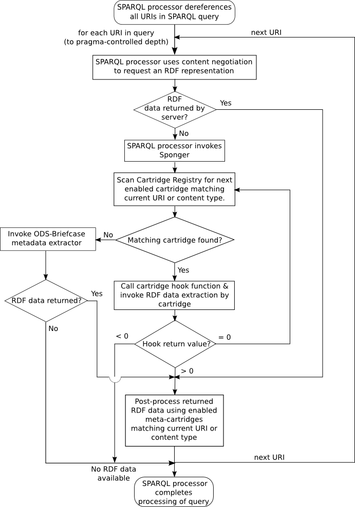

### Cartridges Bundled with Virtuoso

#### Cartridges VAD

Virtuoso supplies a number of prewritten cartridges for extracting RDF
data from a variety of popular Web resources and file types. The
cartridges are bundled as part of the cartridges\_dav VAD (Virtuoso
Application Distribution).

To see which cartridges are available, look at the 'Linked Data' screen
in Conductor. This can be reached through the Linked Data -\> Sponger
-\> Extractor Cartridges and Meta Cartridges menu items.

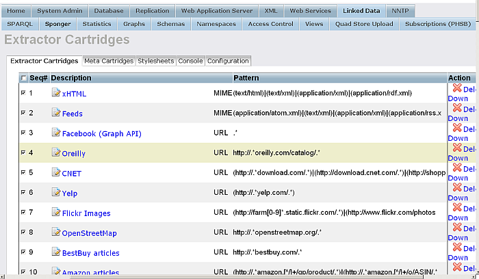

To check which version of the cartridges VAD is installed, or to upgrade
it, refer to Conductor's 'VAD Packages' screen, reachable through the
'System Admin' \> 'Packages' menu items.

The latest VADs for the closed source releases of Virtuoso can be
[downloaded](#) from the downloads area on the OpenLink website. Select
either the 'DBMS (WebDAV) Hosted' or 'File System Hosted' product format
from the 'Distributed Collaborative Applications' section, depending on
whether you want the Virtuoso application to use WebDAV or native
filesystem storage. VADs for Virtuoso Open Source edition (VOS) are
available for [download](#) from the VOS Wiki.

#### Example Source Code

For developers wanting example cartridge code, the most authoritative
reference is the cartridges VAD source code itself. This is included as
part of the VOS distribution. After downloading and unpacking the
sources, the script used to create the cartridges, and the associated
stylesheets can be found in:

  - \<vos root\>/binsrc/rdf\_mappers/rdf\_mappers.sql

  - \<vos root\>/binsrc/rdf\_mappers/xslt/\*.xsl

Alternatively, you can look at the actual cartridge implementations
installed in your Virtuoso instance by inspecting the cartridge hook
function used by a particular cartridge. This is easily identified from
the 'Cartridge name' field of Conductor's 'RDF Cartridges' screen, after
selecting the cartridge of interest. The hook function code can be
viewed from the 'Schema Objects' screen under the 'Database' menu, by
locating the function in the 'DB' \> 'Procedures' folder. Stylesheets
used by the cartridges are installed in the WebDAV folder
DAV/VAD/cartridges/xslt. This can be explored using Conductor's WebDAV
interface. The actual rdf\_mappers.sql file installed with your system
can also be found in the DAV/VAD/cartridges folder.

### Custom Cartridge

Virtuoso comes well supplied with a variety of Sponger cartridges and
GRDDL filters. When then is it necessary to write your own cartridge?

In the main, writing a new cartridge should only be necessary to
generate RDF from a REST-style Web service not supported by an existing
cartridge, or to customize the output from an existing cartridge to your
own requirements. Apart from these circumstances, the existing Sponger
infrastructure should meet most of your needs. This is particularly the
case for document resources.

#### Document Resources

We use the term document resource to identify content which is not being
returned from a Web service. Normally it can broadly be conceived as
some form of document, be it a text based entity or some form of file,
for instance an image file.

In these cases, the document either contains RDF, which can be extracted
directly, or it holds metadata in a supported format which can be
transformed to RDF using an existing filter.

The following cases should all be covered by the existing Sponger
cartridges:

  - embedded or linked RDF

  - RDFa, eRDF and other popular microformats extractable directly or
    via GRDDL

  - popular syndication formats (RSS 2.0 , Atom, OPML , OCS , XBEL)

#### GRDDL

GRDDL (Gleaning Resource Descriptions from Dialects of Languages) is
mechanism for deriving RDF data from XML documents and in particular
XHTML pages. Document authors may associate transformation algorithms,
typically expressed in XSLT, with their documents to transform embedded
metadata into RDF.

The cartridges VAD installs a number of GRDDL filters for transforming
popular microformats (such as RDFa, eRDF or hCalendar) into RDF. The
available filters can be viewed, or configured, in Conductor's 'GRDDL
Filters for XHTML' screen. Navigate to the 'RDF Cartridges' screen using
the 'RDF' \> 'RDF Cartridges' menu items, then SELECT the 'GRDDL
Mappings' tab to display the 'GRDDL Filters for XHTML' screen. GRDDL
filters are held in the WebDAV folder /DAV/VAD/rdf\_cartridges/xslt/
alongside other XSLT templates. The Conductor interface allows you to
add new GRDDL filters should you so wish.

For an introduction to GRDDL, try the [GRDDL Primer](#) . To underline
GRDDL's utility, the primer includes an example of transforming Excel
spreadsheet data, saved as XML, into RDF.

A comprehensive [list of stylesheets](#) for transforming HTML and
non-HTML XML dialects is maintained on the ESW Wiki. The list covers a
range of microformats, syndication formats and feedlists.

To see which Web Services are already catered for, view the list of
cartridges in Conductor's 'RDF Cartridges' screen.

### Creating Custom Cartridges

The Sponger is fully extensible by virtue of its pluggable cartridge
architecture. New data formats can be fetched by creating new
cartridges. While OpenLink is active in adding cartridges for new data
sources, you are free to develop your own custom cartridges. Entity
extractors can be built using Virtuoso PL, C/C++, Java or any other
external language supported by Virtuoso's Server Extension API. Of
course, Virtuoso's own entity extractors are written in Virtuoso PL.

#### The Anatomy of a Cartridge

*Cartridge Hook Prototype*

Every Virtuoso PL hook function used to plug a custom Sponger cartridge
into the Virtuoso SPARQL engine must have a parameter list with the
following parameters (the names of the parameters are not important, but
their order and presence are):

  - *in graph\_iri varchar*
    
    : the IRI of the graph being retrieved/crawled

  - *in new\_origin\_uri varchar*
    
    : the URL of the document being retrieved

  - *in dest varchar*
    
    : the destination/target graph IRI

  - *inout content any*
    
    : the content of the retrieved document

  - *inout async\_queue any*
    
    : if the PingService initialization parameter has been configured in
    the \[SPARQL\] section of the virtuoso.ini file, this is a
    pre-allocated asynchronous queue to be used to call the ping service

  - *inout ping\_service any*
    
    : the URL of a ping service, as assigned to the PingService
    parameter in the \[SPARQL\] section of the virtuoso.ini
    configuration file. PingTheSemanticWeb is an
    [example](#virtuosospongerefping) of a such a service.

  - *inout api\_key any*
    
    : a string value specific to a given cartridge, contained in the
    RC\_KEY column of the DB.DBA.SYS\_RDF\_CARTRIDGES table. The value
    can be a single string or a serialized array of strings providing
    cartridge specific data.

  - *inout opts any*
    
    : cartridge specific options held in a Virtuoso/PL vector which acts
    as an array of key-value pairs.

*Return Value*

If the hook procedure returns zero the next cartridge will be tried. If
the result is negative the sponging process stops, instructing the
SPARQL engine that nothing was retrieved. If the result is positive the
process stops, this time instructing the SPARQL engine that RDF data was
successfully retrieved.

If your cartridge should need to test whether other cartridges are
configured to handle a particular data source, the following extract
taken from the RDF\_LOAD\_CALAIS hook procedure illustrates how you
might do this:

    if (xd is not null)
    {
      -- Sponging successful. Load network resource data being fetched in the Virtuoso Quad Store:
      DB.DBA.RM_RDF_LOAD_RDFXML (xd, new_origin_uri, coalesce (dest, graph_iri));
      flag := 1;
    }
    
    declare ord any;
    ord := (SELECT RM_ID FROM DB.DBA.SYS_RDF_MAPPERS WHERE
          RM_HOOK = 'DB.DBA.RDF_LOAD_CALAIS');
    for SELECT RM_PATTERN FROM DB.DBA.SYS_RDF_MAPPERS WHERE
      RM_ID > ord and RM_TYPE = 'URL' and RM_ENABLED = 1 ORDER BY RM_ID do
    {
      if (regexp_match (RM_PATTERN, new_origin_uri) is not null)
        -- try next candidate cartridge
        flag := 0;
    }
    return flag;

*Specifying the Target Graph*

Two cartridge hook function parameters contain graph IRIs, graph\_iri
and dest. graph\_iri identifies an input graph being crawled. dest holds
the IRI specified in any input:grab-destination pragma defined to
control the SPARQL processor's IRI dereferencing. The pragma overrides
the default behaviour and forces all retrieved triples to be stored in a
single graph, irrespective of their graph of origin.

So, under some circumstances depending on how the Sponger has been
invoked and whether it is being used to crawl an existing RDF graph, or
derive RDF data from a non-RDF data source, dest may be null.

Consequently, when loading network resource being fetched as RDF data
into the quad store, cartridges typically specify the graph to receive
the data using the coalesce function which returns the first non-null
parameter. e.g.

    DB.DBA.RDF_LOAD_RDFXML (xd, new_origin_uri, coalesce (dest, graph_iri));

Here xd is an RDF/XML string holding the fetched RDF.

*Specifying & Retrieving Cartridge Specific Options*

The hook function prototype allows cartridge specific data to be passed
to a cartridge through the RM\_OPTIONS parameter, a Virtuoso/PL vector
which acts as a heterogeneous array.

In the following example, two options are passed, 'add-html-meta' and
'get-feeds' with both values set to 'no'.

    insert soft DB.DBA.SYS_RDF_MAPPERS (
      RM_PATTERN, RM_TYPE, RM_HOOK, RM_KEY, RM_DESCRIPTION, RM_OPTIONS
    )
    values (
      '(text/html)|(text/xml)|(application/xml)|(application/rdf.xml)',
      'MIME', 'DB.DBA.RDF_LOAD_HTML_RESPONSE', null, 'xHTML',
      vector ('add-html-meta', 'no', 'get-feeds', 'no')
    );

The RM\_OPTIONS vector can be handled as an array of key-value pairs
using the get\_keyword function. get\_keyword performs a case sensitive
search for the given keyword at every even index of the given array. It
returns the element following the keyword, i.e. the keyword value.

Using get\_keyword, any options passed to the cartridge can be retrieved
using an approach similar to that below:

    create procedure DB.DBA.RDF_LOAD_HTML_RESPONSE (
      in graph_iri varchar, in new_origin_uri varchar, in dest varchar,
      inout ret_body any, inout aq any, inout ps any, inout _key any,
      inout opts any )
    {
      declare get_feeds, add_html_meta;
      ...
      get_feeds := add_html_meta := 0;
      if (isarray (opts) and 0 = mod (length(opts), 2))
      {
        if (get_keyword ('get-feeds', opts) = 'yes')
          get_feeds := 1;
        if (get_keyword ('add-html-meta', opts) = 'yes')
          add_html_meta := 1;
      }
      ...

*XSLT - The Fulchrum*

XSLT is the fulchrum of all OpenLink supplied cartridges. It provides
the most convenient means of converting structured data extracted from
web content by a cartridge's Entity Extractor into RDF.

*Virtuoso's XML Infrastructure & Tools*

Virtuoso's XML support and XSLT support are covered in detail in the
on-line documentation. Virtuoso includes a highly capable XML parser and
supports XPath, XQuery, XSLT and XML Schema validation.

Virtuoso supports extraction of XML documents from SQL datasets. A SQL
long varchar, long xml or xmltype column in a database table can contain
XML data as text or in a binary serialized format. A string representing
a well-formed XML entity can be converted into an entity object
representing the root node.

While Sponger cartridges will not normally concern themselves with
handling XML extracted from SQL data, the ability to convert a string
into an in-memory XML document is used extensively. The function
xtree\_doc(string) converts a string into such a document and returns a
reference to the document's root. This document together with an
appropriate stylesheet forms the input for the transformation of the
extracted entities to RDF using XSLT. The input string to xtree\_doc
generally contains structured content derived from a web service.

*Virtuoso XSLT Support*

Virtuoso implements XSLT 1.0 transformations as SQL callable functions.
The xslt() Virtuoso/PL function applies a given stylesheet to a given
source XML document and returns the transformed document. Virtuoso
provides a way to extend the abilities of the XSLT processor by creating
user defined XPath functions. The functions xpf\_extension() and
xpf\_extension\_remove() allow addition and removal of XPath extension
functions.

*General Cartridge Pipeline*

The broad pipeline outlined here reflects the steps common to most
cartridges:

  - Redirect from the requested URL to a Web service which returns XML

  - Stream the content into an in-memory XML document

  - Convert it to the required RDF/XML, expressed in the chosen
    ontology, using XSLT

  - Encode the RDF/XML as UTF-8

  - Load the RDF/XML into the quad store

The [MusicBrainz](#) cartridge typifies this approach. MusicBrainz is a
community music metadatabase which captures information about artists,
their recorded works, and the relationships between them. Artists always
have a unique ID, so the URL
http://musicbrainz.org/artist/4d5447d7-c61c-4120-ba1b-d7f471d385b9.html
takes you directly to entries for John Lennon.

If you were to look at this page in your browser, you would see that the
information about the artist contains no RDF data. However, the
cartridge is configured to intercept requests to URLs of the form
http://musicbrainz.org/(\[^/\]\*)/(\[^.\]\*) and redirect to the
cartridge to Fetch all the available information on the given artist,
release, track or label.

The cartridge extracts entities by redirecting to the MusicBrainz XML
Web Service using as the basis for the initial query the item ID, e.g.
an artist or label ID, extracted from the original URL. Stripped to its
essentials, the core of the cartridge is:

    webservice_uri := sprintf ('http://musicbrainz.org/ws/1/%s/%s?type=xml&inc=%U',
                        kind, id, inc);
    content := RDF_HTTP_URL_GET (webservice_uri, '', hdr, 'GET', 'Accept: */*');
    xt := xtree_doc (content);
    ...
    xd := DB.DBA.RDF_MAPPER_XSLT (registry_get ('_cartridges_path_') || 'xslt/mbz2rdf.xsl', xt);
    ...
    xd := serialize_to_UTF8_xml (xd);
    DB.DBA.RM_RDF_LOAD_RDFXML (xd, new_origin_uri, coalesce (dest, graph_iri));

In the above outline, RDF\_HTTP\_URL\_GET sends a query to the
MusicBrainz web service, using query parameters appropriate for the
original request, and retrieves the response using Network Resource
Fetch.

The returned XML is parsed into an in-memory parse tree by xtree\_doc.
Virtuoso/PL function RDF\_MAPPER\_XSLT is a simple wrapper around the
function xslt which sets the current user to dba before returning an XML
document transformed by an XSLT stylesheet, in this case mbz2rdf.xsl.
Function serialize\_to\_UTF8\_xml changes the character set of the
in-memory XML document to UTF8. Finally, RM\_RDF\_LOAD\_RDFXML is a
wrapper around RDF\_LOAD\_RDFXML which parses the content of an RDF/XML
string into a sequence of RDF triples and loads them into the quad
store. XSLT stylesheets are usually held in the DAV/VAD/cartridges/xslt
folder of Virtuoso's WebDAV store. registry\_get('cartridges\_path')
returns the Cartridges VAD path, 'DAV/VAD/cartridges', from the Virtuoso
registry.

*Error Handling with Exit Handlers*

Virtuoso condition handlers determine the behaviour of a Virtuoso/PL
procedure when a condition occurs. You can declare one or more condition
handlers in a Virtuoso/PL procedure for general SQL conditions or
specific SQLSTATE values. If a statement in your procedure raises an
SQLEXCEPTION condition and you declared a handler for the specific
SQLSTATE or SQLEXCEPTION condition the server passes control to that
handler. If a statement in your Virtuoso/PL procedure raises an
SQLEXCEPTION condition, and you have not declared a handler for the
specific SQLSTATE or the SQLEXCEPTION condition, the server passes the
exception to the calling procedure (if any). If the procedure call is at
the top-level, then the exception is signaled to the calling client.

A number of different condition handler types can be declared (see the
[Virtuoso reference documentation](#) for more details.) Of these, exit
handlers are probably all you will need. An example is shown below which
handles any SQLSTATE. Commented out is a debug statement which outputs
the message describing the SQLSTATE.

    create procedure DB.DBA.RDF_LOAD_SOCIALGRAPH (in graph_iri varchar, ...)
    {
      declare qr, path, hdr any;
      ...
      declare exit handler for sqlstate '*'
      {
        -- dbg_printf ('%s', __SQL_MESSAGE);
        return 0;
      };
      ...
      -- data extraction and mapping successful
      return 1;
    }

Exit handlers are used extensively in the Virtuoso supplied cartridges.
They are useful for ensuring graceful failure when trying to convert
content which may not conform to your expectations. The
RDF\_LOAD\_FEED\_SIOC procedure (which is used internally by several
cartridges) shown below uses this approach:

    -- /* convert the feed in rss 1.0 format to sioc */
    create procedure DB.DBA.RDF_LOAD_FEED_SIOC (in content any, in iri varchar, in graph_iri varchar, in is_disc int := '')
    {
      declare xt, xd any;
      declare exit handler for sqlstate '*'
        {
          goto no_sioc;
        };
      xt := xtree_doc (content);
      xd := DB.DBA.RDF_MAPPER_XSLT (
          registry_get ('_cartridges_path_') || 'xslt/feed2sioc.xsl', xt,
          vector ('base', graph_iri, 'isDiscussion', is_disc));
      xd := serialize_to_UTF8_xml (xd);
      DB.DBA.RM_RDF_LOAD_RDFXML (xd, iri, graph_iri);
      return 1;
    no_sioc:
      return 0;
    }

*Loading RDF into the Quad Store*

*RDF\_LOAD\_RDFXML & TTLP*

The two main Virtuoso/PL functions used by the cartridges for loading
RDF data into the Virtuoso quad store are DB.DBA.TTLP and
DB.DBA.RDF\_LOAD\_RDFXML. Multithreaded versions of these functions,
DB.DBA.TTLP\_MT and DB.DBA.RDF\_LOAD\_RDFXML\_MT, are also available.

RDF\_LOAD\_RDFXML parses the content of an RDF/XML string as a sequence
of RDF triples and loads then into the quad store. TTLP parses TTL
(Turtle or N3) and places its triples into quad storage. Ordinarily,
cartridges use RDF\_LOAD\_RDFXML. However there may be occasions where
you want to insert statements written as TTL, rather than RDF/XML, in
which case you should use TTLP.

> **Tip**
> 
>   - [Loading RDF using API functions](#rdfinsertmethodsapifunct)

*Attribution*

Many of the OpenLink supplied cartridges actually use
RM\_RDF\_LOAD\_RDFXML to load data into the quad store. This is a thin
wrapper around RDF\_LOAD\_RDFXML which includes in the generated graph
an indication of the external ontologies being used. The attribution
takes the form:

    <ontologyURI> a opl:DataSource .
    <spongedResourceURI> rdfs:isDefinedBy <ontologyURI> .
    <ontologyURI> opl:hasNamespacePrefix "<ontologyPrefix>" .

where prefix opl: denotes the ontology
http://www.openlinksw.com/schema/attribution\#.

*Deleting Existing Graphs*

Before loading network resource fetched RDF data into a graph, you may
want to delete any existing graph with the same URI. To do so, select
the 'RDF' \> 'List of Graphs' menu commands in Conductor, then use the
'Delete' command for the appropriate graph. Alternatively, you can use
one of the following SQL commands:

    SPARQL CLEAR GRAPH
    -- or
    DELETE FROM DB.DBA.RDF_QUAD WHERE G = DB.DBA.RDF_MAKE_IID_OF_QNAME (graph_iri)

*Proxy Service Data Expiration*

When the Proxy Service is invoked by a user agent, the Sponger records
the expiry date of the imported data in the table
DB.DBA.SYS\_HTTP\_SPONGE. The data invalidation rules conform to those
of traditional HTTP clients (Web browsers). The data expiration time is
determined based on subsequent data fetches of the same resource. The
first data retrieval records the 'expires' header. On subsequent
fetches, the current time is compared to the expiration time stored in
the local cache. If HTTP 'expires' header data isn't returned by the
source data server, the Sponger will derive its own expiration time by
evaluating the 'date' header and 'last-modified' HTTP headers.

#### Ontology Mapping

After extracting entities from a web resource and converting them to an
in-memory XML document, the entities must be transformed to the target
ontology using XSLT and an appropriate stylesheet. A typical call
sequence would be:

    xt := xtree_doc (content);
    ...
    xd := DB.DBA.RDF_MAPPER_XSLT (registry_get ('_cartridges_path_') || 'xslt/mbz2rdf.xsl', xt);

Because of the wide variation in the data mapped by cartridges, it is
not possible to present a typical XSL stylesheet outline. The Examples
section presented later includes detailed extracts from the MusicBrainz?
cartridge's stylesheet which provide a good example of how to map to an
ontology. Rather than attempting to be an XSLT tutorial, the material
which follows offers some general guidelines.

*Passing Parameters to the XSLT Processor*

Virtuoso's XSLT processor will accept default values for global
parameters from the optional third argument of the xslt() function. This
argument, if specified, must be a vector of parameter names and values
of the form vector(name1, value1,... nameN, valueN), where name1 ...
nameN must be of type varchar, and value1 ... valueN may be of any
Virtuoso datatype, but may not be null.

This extract from the Crunchbase cartridge shows how parameters may be
passed to the XSLT processor. The function RDF\_MAPPER\_XSLT (in xslt
varchar, inout xt any, in params any := null) passes the parameters
vector directly to xslt().

    xt := DB.DBA.RDF_MAPPER_XSLT (
    registry_get ('_cartridges_path_') || 'xslt/crunchbase2rdf.xsl', xt,
    vector ('baseUri', coalesce (dest, graph_iri), 'base', base, 'suffix', suffix)
    );

The corresponding stylesheet crunchbase2rdf.xsl retrieves the parameters
baseUri, base and suffix as follows:

    ...
    <xsl:output method="xml" indent="yes" />
      <xsl:variable name="ns">http://www.crunchbase.com/</xsl:variable>
      <xsl:param name="baseUri" />
      <xsl:param name="base"/>
      <xsl:param name="suffix"/>
    
      <xsl:template name="space-name">
    ...

*An RDF Description Template*

*Defining A Generic Resource Description Wrapper*

Many of the OpenLink cartridges create a resource description formed to
a common "wrapper" template which describes the relationship between the
(usually) non-RDF source network resource being fetched and the RDF
description generated by the Sponger. The wrapper is appropriate for
resources which can broadly be conceived as documents. It provides a
generic minimal description of the source document, but also links to
the much more detailed description provided by the Sponger. So, instead
of just emitting a resource description, the Sponger factors the
container into the generated graph constituting the RDF description.

The template is depicted below:

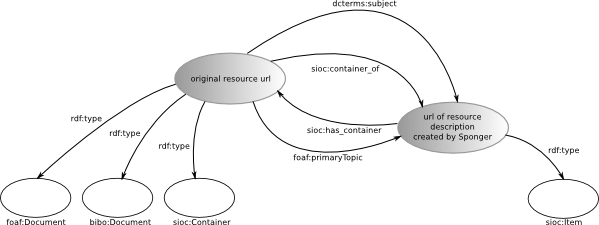

To generate an RDF description corresponding to the wrapper template, a
stylesheet containing the following block of instructions is used. This
extract is taken from the eBay cartridge's stylesheet, ebay2rdf.xsl.
Many of the OpenLink cartridges follow a similar pattern.

``` 
    <xsl:param name="baseUri"/>
    ...
    <xsl:variable name="resourceURL">
    <xsl:value-of select="$baseUri"/>
    </xsl:variable>
    ...

  <xsl:template match="/">
    <rdf:RDF>
        <rdf:Description rdf:about="{$resourceURL}">
        <rdf:type rdf:resource="Document"/>
        <rdf:type rdf:resource="Document"/>
        <rdf:type rdf:resource="Container"/>
        <sioc:container_of rdf:resource="{vi:proxyIRI ($resourceURL)}"/>
        <foaf:primaryTopic rdf:resource="{vi:proxyIRI ($resourceURL)}"/>
        <dcterms:subject rdf:resource="{vi:proxyIRI ($resourceURL)}"/>
        </rdf:Description>
        <rdf:Description rdf:about="{vi:proxyIRI ($resourceURL)}">
        <rdf:type rdf:resource="Item"/>
        <sioc:has_container rdf:resource="{$resourceURL}"/>
        <xsl:apply-templates/>
        </rdf:Description>
    </rdf:RDF>
    </xsl:template>
    ...
```

*Using SIOC as a Generic Container Model*

The generic resource description wrapper just described uses SIOC to
establish the container/contained relationship between the source
resource and the generated graph. Although the most important classes
for the generic wrapper are obviously Container and Item, SIOC provides
a generic data model of containers, items, item types, and associations
between items which can be combined with other vocabularies such as FOAF
and Dublin Core.

SIOC defines a number of other classes, such as User, UserGroup, Role,
Site, Forum and Post. A separate SIOC types module (T-SIOC) extends the
SIOC Core ontology by defining subclasses and subproperties of SIOC
terms. Subclasses include: AddressBook, BookmarkFolder, Briefcase,
EventCalendar, ImageGallery, Wiki, Weblog, BlogPost, Wiki plus many
others.

OpenLink Data Spaces (ODS) uses SIOC extensively as a data space "glue"
ontology to describe the base data and containment hierarchy of all the
items managed by ODS applications (Data Spaces). For example, ODS-Weblog
is an application of type sioc:Forum. Each ODS-Weblog application
instance contains blogs of type sioct:Weblog. Each blog is a
sioc:container\_of posts of type sioc:Post.

Generally, when deciding how to describe resources handled by your own
custom cartridge, SIOC provides a useful framework for the description
which complements the SIOC-based container model adopted throughout the
ODS framework.

*Naming Conventions for Sponger Generated Descriptions*

As can be seen from the stylesheet extract just shown, the URI of the
resource description generated by the Sponger to describe the network
resource being fetched, is given by the function {vi:proxyIRI
($resourceURL)} where resourceURL is the URL of the original network
resource being fetched. proxyIRI is an XPath extension function defined
in rdf\_mappers.sql as

    xpf_extension ('http://www.openlinksw.com/virtuoso/xslt/:proxyIRI', 'DB.DBA.RDF_SPONGE_PROXY_IRI');

which maps to the Virtuoso/PL procedure DB.DBA.RDF\_SPONGE\_PROXY\_IRI.
This procedure in turn generates a resource description URI which
typically takes the form:
http://\<hostName:port\>/about/html/http/\<resourceURL\>\#this

#### Registering & Configuring Cartridges

Once you have developed a cartridge, you must register it in the
Cartridge Registry to have the SPARQL processor recognize and use it.
You should have compiled your cartridge hook function first by issuing a
"create procedure DB.DBA.RDF\_LOAD\_xxx ..." command through one of
Virtuoso's SQL interfaces. You can create the required Cartridge
Registry entry either by adding a row to the SYS\_REF\_MAPPERS table
directly using SQL, or by using the Conductor UI.

##### Using SQLs

If you choose register your cartridge using SQL, possibly as part of a
Virtuoso/PL script, the required SQL will typically mirror one of the
following INSERT commands.

Below, a cartridge for OpenCalais is being installed which will be tried
when the MIME type of the network resource data being fetched is one of
text/plain, text/xml or text/html. (The definition of the
SYS\_RDF\_MAPPERS table was introduced earlier in section 'Cartridge
Registry'.)

    insert soft DB.DBA.SYS_RDF_MAPPERS (
      RM_PATTERN, RM_TYPE, RM_HOOK, RM_KEY, RM_DESCRIPTION, RM_ENABLED)
    values (
      '(text/plain)|(text/xml)|(text/html)', 'MIME', 'DB.DBA.RDF_LOAD_CALAIS',
      null, 'Opencalais', 1);

As an alternative to matching on the content's MIME type, candidate
cartridges to be tried in the conversion pipeline can be identified by
matching the data source URL against a URL pattern stored in the
cartridge's entry in the Cartridge Registry.

    insert soft DB.DBA.SYS_RDF_MAPPERS (
      RM_PATTERN, RM_TYPE, RM_HOOK, RM_KEY, RM_DESCRIPTION, RM_OPTIONS)
    values (
      '(http://api.crunchbase.com/v/1/.*)|(http://www.crunchbase.com/.*)', 'URL',
      'DB.DBA.RDF_LOAD_CRUNCHBASE', null, 'CrunchBase', null);

The value of RM\_ID to set depends on where in the cartridge invocation
order you want to position a particular cartridge. RM\_ID should be set
lower than 10028 to ensure the cartridge is tried before the
ODS-Briefcase (WebDAV) metadata extractor, which is always the last
mapper to be tried if no preceding cartridge has been successful.

    UPDATE DB.DBA.SYS_RDF_MAPPERS
    SET RM_ID = 1000
    WHERE RM_HOOK = 'DB.DBA.RDF_LOAD_BIN_DOCUMENT';

##### Using Conductor

Cartridges can be added manually using the 'Add' panel of the 'RDF
Cartridges' screen.

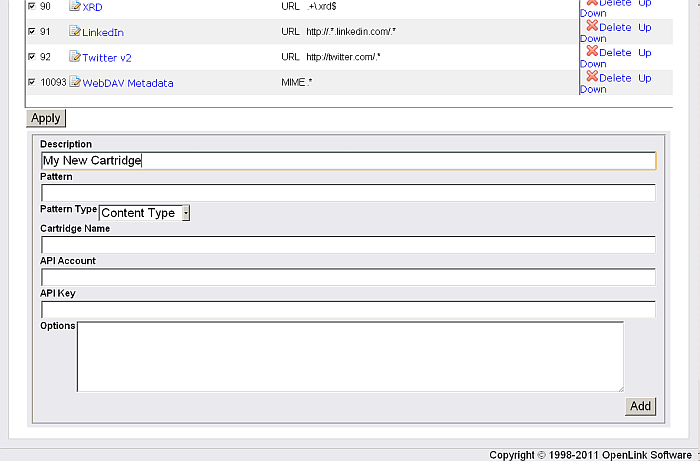

##### Installing Stylesheets

Although you could place your cartridge stylesheet in any folder
configured to be accessible by Virtuoso, the simplest option is to
upload them to the DAV/VAD/cartridges/xslt folder using the WebDAV
browser accessible from the Conductor UI.

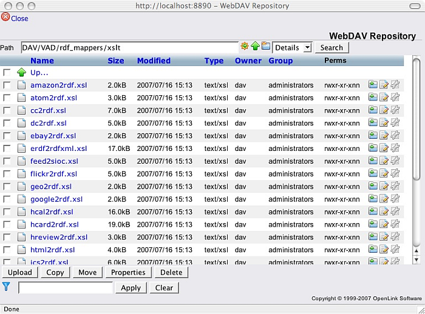

Should you wish to locate your stylesheets elsewhere, ensure that the
DirsAllowed setting in the virtuoso.ini file is configured
appropriately.

##### Setting API Key

Some Cartridges require and API account and/or API Key to be provided
for accessing the required service. This can be done from the Linked
Data -\> Sponger tab of the Conductor by selecting the cartridge from
the list provided, entering the API Account and API Key in the dialog at
the bottom of the page and click update to save, as indicated in the
screenshot below:

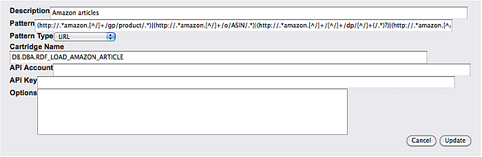

For example, for the service Flickr developers must register to obtain a
key. See http://developer.yahoo.com/flickr/. In order to cater for
services which require an application key, the Cartridge Registry
SYS\_RDF\_MAPPERS table includes an RM\_KEY column to store any key
required for a particular service. This value is passed to the service's
cartridge through the \_key parameter of the cartridge hook function.

Alternatively a cartridge can store a key value in the virtuoso.ini
configuration file and retrieve it in the hook function.

##### Flickr Cartridge

This example shows an extract from the Flickr cartridge hook function
DB.DBA.RDF\_LOAD\_FLICKR\_IMG and the use of an API key. Also, commented
out, is a call to cfg\_item\_value() which illustrates how the API key
could instead be stored and retrieved from the SPARQL section of the
virtuoso.ini file.

    create procedure DB.DBA.RDF_LOAD_FLICKR_IMG (
    in graph_iri varchar, in new_origin_uri varchar, in dest varchar,
    inout _ret_body any, inout aq any, inout ps any, inout _key any,
    inout opts any )
    {
    declare xd, xt, url, tmp, api_key, img_id, hdr, exif any;
    declare exit handler for sqlstate '*'
    {
     return 0;
    };
    tmp := sprintf_inverse (new_origin_uri,
      'http://farm%s.static.flickr.com/%s/%s_%s.%s', 0);
    img_id := tmp[2];
    api_key := _key;
    --cfg_item_value (virtuoso_ini_path (), 'SPARQL', 'FlickrAPIkey');
    if (tmp is null or length (tmp) <> 5 or not isstring (api_key))
      return 0;
    url :=  sprintf('http://api.flickr.com/services/rest/?method=flickr.photos.getInfo&photo_id=%s&api_key=%s',img_id, api_key);
    tmp := http_get (url, hdr);

#### MusicBrainz Example: A Music Metadatabase

To illustrate some of the material presented so far, we'll delve deeper
into the [MusicBrainz](#) cartridge mentioned earlier.

*MusicBrainz XML Web Service*

The cartridge extracts data through the [MusicBrainz XML Web Service](#)
using, as the basis for the initial query, an item type and MBID
(MusicBrainz ID) extracted from the original URI submitted to the RDF
proxy. A range of item types are supported including artist, release and
track.

Using the album "Imagine" by John Lennon as an example, a standard HTML
description of the album (which has an MBID of
f237e6a0-4b0e-4722-8172-66f4930198bc) can be retrieved direct from
MusicBrainz using the URL:

    http://musicbrainz.org/release/f237e6a0-4b0e-4722-8172-66f4930198bc.html

Alternatively, information can be extracted in XML form through the web
service. A description of the tracks on the album can be obtained with
the query:

    http://musicbrainz.org/ws/1/release/f237e6a0-4b0e-4722-8172-66f4930198bc?type=xml&inc=tracks

The XML returned by the web service is shown below (only the first two
tracks are shown for brevity):

    <?xml version="1.0" encoding="UTF-8"?>
      <metadata xmlns="http://musicbrainz.org/ns/mmd-1.0#"
       xmlns:ext="http://musicbrainz.org/ns/ext-1.0#">
        <release
    xml:id="f237e6a0-4b0e-4722-8172-66f4930198bc" type="Album Official" >
          <title>Imagine</title>
            <text-representation language="ENG" script="Latn"/>
            <asin>B0000457L2</asin>
            <track-list>
              <track
    xml:id="b88bdafd-e675-4c6a-9681-5ea85ab99446">
                <title>Imagine</title>
                <duration>182933</duration>
              </track>
              <track
    xml:id="b38ce90d-3c47-4ccd-bea2-4718c4d34b0d">
                <title>Crippled Inside</title>
                <duration>227906</duration>
              </track>
          . . .
            </track-list>
          </release>
      </metadata>

Although, as shown above, MusicBrainz defines its own [XML Metadata
Format](#) to represent music metadata, the MusicBrainz sponger converts
the raw data to a subset of the [Music Ontology](#) , an RDF vocabulary
which aims to provide a set of core classes and properties for
describing music on the Semantic Web. Part of the subset used is
depicted in the following RDF graph (representing in this case a John
Cale album).

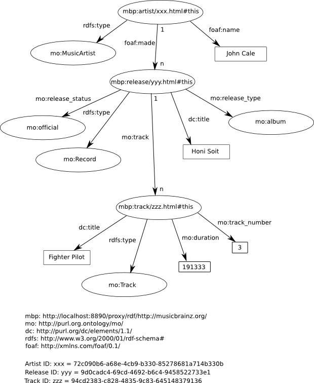

With the prefix mo: denoting the Music Ontology at
http://purl.org/ontology/mo/, it can be seen that artists are
represented by instances of class mo:Artist, their albums, records etc.
by instances of class mo:Release and tracks on these releases by class
mo:Track. The property foaf:made links an artist and his/her releases.
Property mo:track links a release with the tracks it contains

*RDF Output*

An RDF description of the album can be obtained by sponging the same
URL, i.e. by submitting it to the Sponger's proxy interface using the
URL:

    http://demo.openlinksw.com/about/rdf/http://musicbrainz.org/release/f237e6a0-4b0e-4722-8172-66f4930198bc.html

The extract below shows part of the (reorganized) RDF output returned by
the Sponger for "Imagine". Only the album's title track is included.

    <?xml version="1.0" encoding="utf-8" ?>
    <rdf:RDF xmlns:rdf="http://www.w3.org/1999/02/22-rdf-syntax-ns#"
     xmlns:rdfs="http://www.w3.org/2000/01/rdf-schema#">
    
    <rdf:Description
     rdf:about="http://musicbrainz.org/release/f237e6a0-4b0e-4722-8172-66f4930198bc.html">
      <rdf:type rdf:resource="http://xmlns.com/foaf/0.1/Document"/>
    </rdf:Description>
    
    <rdf:Description
     rdf:about="http://musicbrainz.org/release/f237e6a0-4b0e-4722-8172-66f4930198bc.html">
      <foaf:primaryTopic xmlns:foaf="http://xmlns.com/foaf/0.1/"
       rdf:resource="http://demo.openlinksw.com/about/rdf/http://musicbrainz.org/release/f237e6a0-4b0e-4722-8172-66f4930198bc.html#this"/>
    </rdf:Description>
    
    <rdf:Description rdf:about="http://purl.org/ontology/mo/">
      <rdf:type rdf:resource="http://www.openlinksw.com/schema/attribution#DataSource"/>
    </rdf:Description>
    ...
    <rdf:Description
     rdf:about="http://musicbrainz.org/release/f237e6a0-4b0e-4722-8172-66f4930198bc.html">
      <rdfs:isDefinedBy rdf:resource="http://purl.org/ontology/mo/"/>
    
    </rdf:Description>
    ...
    
    <!-- Record description -->
    
    <rdf:Description
     rdf:about="http://demo.openlinksw.com/about/rdf/http://musicbrainz.org/release/f237e6a0-4b0e-4722-8172-66f4930198bc.html#this">
      <rdf:type rdf:resource="http://purl.org/ontology/mo/Record"/>
    </rdf:Description>
    
    <rdf:Description
     rdf:about="http://demo.openlinksw.com/about/rdf/http://musicbrainz.org/release/f237e6a0-4b0e-4722-8172-66f4930198bc.html#this">
      <dc:title xmlns:dc="http://purl.org/dc/elements/1.1/">Imagine</dc:title>
    </rdf:Description>
    
    <rdf:Description
     rdf:about="http://demo.openlinksw.com/about/rdf/http://musicbrainz.org/release/f237e6a0-4b0e-4722-8172-66f4930198bc.html#this">
      <mo:release_status xmlns:mo="http://purl.org/ontology/mo/" rdf:resource="http://purl.org/ontology/mo/official"/>
    </rdf:Description>
    
    <rdf:Description
     rdf:about="http://demo.openlinksw.com/about/rdf/http://musicbrainz.org/release/f237e6a0-4b0e-4722-8172-66f4930198bc.html#this">
      <mo:release_type xmlns:mo="http://purl.org/ontology/mo/"
       rdf:resource="http://purl.org/ontology/mo/album"/>
    </rdf:Description>
    
    <!-- Title track description -->
    
    <rdf:Description
     rdf:about="http://demo.openlinksw.com/about/rdf/http://musicbrainz.org/release/f237e6a0-4b0e-4722-8172-66f4930198bc.html#this">
      <mo:track xmlns:mo="http://purl.org/ontology/mo/"
       rdf:resource="http://demo.openlinksw.com/about/rdf/http://musicbrainz.org/track/b88bdafd-e675-4c6a-9681-5ea85ab99446.html#this"/>
    </rdf:Description>
    <rdf:Description
     rdf:about="http://demo.openlinksw.com/about/rdf/http://musicbrainz.org/track/b88bdafd-e675-4c6a-9681-5ea85ab99446.html#this">
      <rdf:type rdf:resource="http://purl.org/ontology/mo/Track"/>
    </rdf:Description>
    
    <rdf:Description
     rdf:about="http://demo.openlinksw.com/about/rdf/http://musicbrainz.org/track/b88bdafd-e675-4c6a-9681-5ea85ab99446.html#this">
      <dc:title xmlns:dc="http://purl.org/dc/elements/1.1/">Imagine</dc:title>
    </rdf:Description>
    
    <rdf:Description
     rdf:about="http://demo.openlinksw.com/about/rdf/http://musicbrainz.org/track/b88bdafd-e675-4c6a-9681-5ea85ab99446.html#this">
      <mo:track_number xmlns:mo="http://purl.org/ontology/mo/">1</mo:track_number>
    </rdf:Description>
    
    <rdf:Description
     rdf:about="http://demo.openlinksw.com/about/rdf/http://musicbrainz.org/track/b88bdafd-e675-4c6a-9681-5ea85ab99446.html#this">
      <mo:duration xmlns:mo="http://purl.org/ontology/mo/" rdf:datatype="http://www.w3.org/2001/XMLSchema#integer">182933</mo:duration>
    </rdf:Description>
    </rdf:RDF>

*Cartridge Hook Function*

The cartridge's hook function is listed below. It is important to note
that MusicBrainz supports a variety of query types, each of which
returns a different set of information, depending on the item type being
queried. Full details can be found on the MusicBrainz? site. The sponger
cartridge is capable of handling all the query types supported by
MusicBrainz? and is intended to be used in a drill-down scenario, as
would be the case when using an RDF browser such as the [OpenLink Data
Explorer (ODE)](#) . This example focuses primarily on the types release
and track.

    create procedure DB.DBA.RDF_LOAD_MBZ (
      in graph_iri varchar, in new_origin_uri varchar, in dest varchar,
      inout _ret_body any, inout aq any, inout ps any, inout _key any,
      inout opts any)
    {
      declare kind, id varchar;
      declare tmp, incs any;
      declare uri, cnt, hdr, inc, xd, xt varchar;
      tmp := regexp_parse ('http://musicbrainz.org/([^/]*)/([^\.]+)', new_origin_uri, 0);
      declare exit handler for sqlstate '*'
      {
        -- dbg_printf ('%s', __SQL_MESSAGE);
        return 0;
      };
      if (length (tmp) < 6)
        return 0;
    
      kind := subseq (new_origin_uri, tmp[2], tmp[3]);
      id :=   subseq (new_origin_uri, tmp[4], tmp[5]);
      incs := vector ();
      if (kind = 'artist')
        {
          inc := 'aliases artist-rels label-rels release-rels track-rels url-rels';
          incs :=
            vector (
        'sa-Album', 'sa-Single', 'sa-EP', 'sa-Compilation', 'sa-Soundtrack',
        'sa-Spokenword', 'sa-Interview', 'sa-Audiobook', 'sa-Live', 'sa-Remix', 'sa-Other'
        , 'va-Album', 'va-Single', 'va-EP', 'va-Compilation', 'va-Soundtrack',
    
        'va-Spokenword', 'va-Interview', 'va-Audiobook', 'va-Live', 'va-Remix', 'va-Other'
        );
        }
      else if (kind = 'release')
        inc := 'artist counts release-events discs tracks artist-rels label-rels release-rels track-rels url-rels track-level-rels labels';
      else if (kind = 'track')
        inc := 'artist releases puids artist-rels label-rels release-rels track-rels url-rels';
      else if (kind = 'label')
        inc := 'aliases artist-rels label-rels release-rels track-rels url-rels';
      else
        return 0;
      if (dest is null)
        DELETE FROM DB.DBA.RDF_QUAD WHERE G = DB.DBA.RDF_MAKE_IID_OF_QNAME (graph_iri);
      DB.DBA.RDF_LOAD_MBZ_1 (graph_iri, new_origin_uri, dest, kind, id, inc);
      DB.DBA.TTLP (sprintf ('<%S> <http://xmlns.com/foaf/0.1/primaryTopic> <%S> .\n<%S> a <http://xmlns.com/foaf/0.1/Document> .',
        new_origin_uri, DB.DBA.RDF_SPONGE_PROXY_IRI (new_origin_uri), new_origin_uri),
        '', graph_iri);
      foreach (any inc1 in incs) do
        {
          DB.DBA.RDF_LOAD_MBZ_1 (graph_iri, new_origin_uri, dest, kind, id, inc1);
        }
      return 1;
    };

The hook function uses a subordinate procedure RDF\_LOAD\_MBZ\_1:

    create procedure DB.DBA.RDF_LOAD_MBZ_1 (in graph_iri varchar, in new_origin_uri varchar,
       in dest varchar, in kind varchar, in id varchar, in inc varchar)
    {
      declare uri, cnt, xt, xd, hdr any;
      uri := sprintf ('http://musicbrainz.org/ws/1/%s/%s?type=xml&inc=%U', kind, id, inc);
      cnt := RDF_HTTP_URL_GET (uri, '', hdr, 'GET', 'Accept: */*');
      xt := xtree_doc (cnt);
      xd := DB.DBA.RDF_MAPPER_XSLT (registry_get ('_cartridges_path_') || 'xslt/mbz2rdf.xsl', xt,
            vector ('baseUri', new_origin_uri));
      xd := serialize_to_UTF8_xml (xd);
      DB.DBA.RM_RDF_LOAD_RDFXML (xd, new_origin_uri, coalesce (dest, graph_iri));
    };

*XSLT Stylesheet*

The key sections of the MusicBrainz XSLT template relevant to this
example are listed below. Only the sections relating to an artist, his
releases, or the tracks on those releases, are shown.

    <!DOCTYPE xsl:stylesheet [
    <!ENTITY xsd "http://www.w3.org/2001/XMLSchema#">
    <!ENTITY rdf "http://www.w3.org/1999/02/22-rdf-syntax-ns#">
    <!ENTITY rdfs "http://www.w3.org/2000/01/rdf-schema#">
    <!ENTITY mo "http://purl.org/ontology/mo/">
    <!ENTITY foaf "http://xmlns.com/foaf/0.1/">
    <!ENTITY mmd "http://musicbrainz.org/ns/mmd-1.0#">
    <!ENTITY dc "http://purl.org/dc/elements/1.1/">
    ]>
    
    <xsl:stylesheet
        version="1.0"
        xmlns:xsl="http://www.w3.org/1999/XSL/Transform"
        xmlns:vi="http://www.openlinksw.com/virtuoso/xslt/"
        xmlns:rdf=""
        xmlns:rdfs=""
        xmlns:foaf=""
        xmlns:mo=""
        xmlns:mmd=""
        xmlns:dc=""
        >
    
        <xsl:output method="xml" indent="yes" />
        <xsl:variable name="base" select="'http://musicbrainz.org/'"/>
        <xsl:variable name="uc">ABCDEFGHIJKLMNOPQRSTUVWXYZ</xsl:variable>
        <xsl:variable name="lc">abcdefghijklmnopqrstuvwxyz</xsl:variable>
    
      <xsl:template match="/mmd:metadata">
        <rdf:RDF>
            <xsl:apply-templates />
        </rdf:RDF>
        </xsl:template>
    
        ...
    
      <xsl:template match="mmd:artist[@type='Person']">
        <mo:MusicArtist rdf:about="{vi:proxyIRI (concat($base,'artist/',@id,'.html'))}">
            <foaf:name><xsl:value-of select="mmd:name"/></foaf:name>
            <xsl:for-each select="mmd:release-list/mmd:release|mmd:relation-list[@target-type='Release']/mmd:relation/mmd:release">
            <foaf:made rdf:resource="{vi:proxyIRI (concat($base,'release/',@id,'.html'))}"/>
            </xsl:for-each>
        </mo:MusicArtist>
        <xsl:apply-templates />
        </xsl:template>
    
      <xsl:template match="mmd:release">
        <mo:Record rdf:about="{vi:proxyIRI (concat($base,'release/',@id,'.html'))}">
            <dc:title><xsl:value-of select="mmd:title"/></dc:title>
            <mo:release_type rdf:resource="{translate (substring-before (@type, ' '),
                                                              $uc, $lc)}"/>
            <mo:release_status rdf:resource="{translate (substring-after (@type, ' '), $uc,
                                                      $lc)}"/>
            <xsl:for-each select="mmd:track-list/mmd:track">
            <mo:track rdf:resource="{vi:proxyIRI (concat($base,'track/',@id,'.html'))}"/>
    
            </xsl:for-each>
        </mo:Record>
        <xsl:apply-templates select="mmd:track-list/mmd:track"/>
        </xsl:template>
    
      <xsl:template match="mmd:track">
        <mo:Track rdf:about="{vi:proxyIRI (concat($base,'track/',@id,'.html'))}">
            <dc:title><xsl:value-of select="mmd:title"/></dc:title>
            <mo:track_number><xsl:value-of select="position()"/></mo:track_number>
            <mo:duration rdf:datatype="integer">
                 <xsl:value-of select="mmd:duration"/>
               </mo:duration>
            <xsl:if test="artist[@id]">
            <foaf:maker rdf:resource="{vi:proxyIRI (concat ($base, 'artist/',
                                              artist/@id, '.html'))}"/>
            </xsl:if>
            <mo:musicbrainz rdf:resource="{vi:proxyIRI (concat ($base, 'track/', @id, '.html'))}"/>
        </mo:Track>
        </xsl:template>
    
        ...
    
      <xsl:template match="text()"/>
    </xsl:stylesheet>

#### Entity Extractor & Mapper Component

Used to extract RDF from a Web Data Source the Virtuoso Sponger
Cartridge RDF Extractor consumes services from: Virtuoso PL, C/C++, Java
based RDF Extractors

The RDF mappers provide a way to extract metadata from non-RDF documents
such as HTML pages, images Office documents etc. and pass to SPARQL
sponger (crawler which retrieve missing source graphs). For brevity
further in this article the "RDF mapper" we simply will call "mapper".

The mappers consist of PL procedure (hook) and extractor, where
extractor itself can be built using PL, C or any external language
supported by Virtuoso server.

Once the mapper is developed it must be plugged into the SPARQL engine
by adding a record in the table DB.DBA.SYS\_RDF\_MAPPERS.

If a SPARQL query instructs the SPARQL processor to retrieve target
graph into local storage, then the SPARQL sponger will be invoked. If
the target graph IRI represents a dereferenceable URL then content will
be retrieved using content negotiation. The next step is the content
type to be detected:

  - If RDF and no further transformation such as GRDDL is needed, then
    the process would stop.

  - If such as 'text/plain' and is not known to have metadata, then the
    SPARQL sponger will look in the DB.DBA.SYS\_RDF\_MAPPERS table by
    order of RM\_ID and for every matching URL or MIME type pattern
    (depends on column RM\_TYPE) will call the mapper hook.
    
      - If hook returns zero the next mapper will be tried;
    
      - If result is negative the process would stop instructing the
        SPARQL nothing was retrieved;
    
      - If result is positive the process would stop instructing the
        SPARQL that metadata was retrieved.

##### Virtuoso/PL based Extractors

*PL hook requirements:*

Every PL function used to plug a mapper into SPARQL engine must have
following parameters in the same order:

  - in graph\_iri varchar: the graph IRI which is currently retrieved

  - in new\_origin\_uri varchar: the URL of the document retrieved

  - in destination varchar: the destination graph IRI

  - inout content any: the content of the document retrieved by SPARQL
    sponger

  - inout async\_queue any: an asynchronous queue, can be used to push
    something to execute on background if needed.

  - inout ping\_service any: the value of \[SPARQL\] - PingService INI
    parameter, could be used to configure a service notification such as
    pingthesemanticweb.com

  - inout api\_key any: a plain text id single key value or serialized
    vector of key structure, basically the value of RM\_KEY column of
    the DB.DBA.SYS\_RDF\_MAPPERS table.

Note: the names of the parameters are not important, but their order and
presence are\!

*Example Implementation:*

In the example script below we implement a basic mapper, which maps a
text/plain mime type to an imaginary ontology, which extends the class
Document from FOAF with properties 'txt:UniqueWords' and 'txt:Chars',
where the prefix 'txt:' we specify as 'urn:txt:v0.0:'.

    use DB;
    
    create procedure DB.DBA.RDF_LOAD_TXT_META
     (
      in graph_iri varchar,
      in new_origin_uri varchar,
      in dest varchar,
      inout ret_body any,
      inout aq any,
      inout ps any,
      inout ser_key any
      )
    {
      declare words, chars int;
      declare vtb, arr, subj, ses, str any;
      declare ses any;
      -- if any error we just say nothing can be done
      declare exit handler for sqlstate '*'
        {
          return 0;
        };
      subj := coalesce (dest, new_origin_uri);
      vtb := vt_batch ();
      chars := length (ret_body);
    
      -- using the text index procedures we get a list of words
      vt_batch_feed (vtb, ret_body, 1);
      arr := vt_batch_strings_array (vtb);
    
      -- the list has 'word' and positions array, so we must divide by 2
      words := length (arr) / 2;
      ses := string_output ();
    
      -- we compose a N3 literal
      http (sprintf ('<%s> <http://www.w3.org/1999/02/22-rdf-syntax-ns#type> <http://xmlns.com/foaf/0.1/Document> .\n', subj), ses);
      http (sprintf ('<%s> <urn:txt:v0.0:UniqueWords> "%d" .\n', subj, words), ses);
      http (sprintf ('<%s> <urn:txt:v0.0:Chars> "%d" .\n', subj, chars), ses);
      str := string_output_string (ses);
    
      -- we push the N3 text into the local store
      DB.DBA.TTLP (str, new_origin_uri, subj);
      return 1;
    };
    
    DELETE FROM DB.DBA.SYS_RDF_MAPPERS WHERE RM_HOOK = 'DB.DBA.RDF_LOAD_TXT_META';
    
    INSERT SOFT DB.DBA.SYS_RDF_MAPPERS (RM_PATTERN, RM_TYPE, RM_HOOK, RM_KEY, RM_DESCRIPTION)
    VALUES ('(text/plain)', 'MIME', 'DB.DBA.RDF_LOAD_TXT_META', null, 'Text Files (demo)');
    
    -- here we set order to some large number so don't break existing mappers
    update DB.DBA.SYS_RDF_MAPPERS
    SET RM_ID = 2000
    WHERE RM_HOOK = 'DB.DBA.RDF_LOAD_TXT_META';

To test the mapper we just use /sparql endpoint with option 'Retrieve
remote RDF data for all missing source graphs' to execute:

    SELECT *
    FROM <URL-of-a-txt-file>
    WHERE { ?s ?p ?o }

It is important that the SPARQL\_UPDATE role to be granted to "SPARQL"
account in order to allow local repository update via Network Resource
Fetch feature.

*Authentication in Sponger*

To enable usage of user defined authentication, there are added more
parameters to the /proxy/rdf and /sparql endpoints. So to use it, the
RDF browser and iSPARQL should send following url parameters:

  - for /proxy/rdf endpoint:
    
        'login=<account name>'

  - for /sparql endpoint:
    
        get-login=<account name>

##### Registry

The table DB.DBA.SYS\_RDF\_MAPPERS is used as registry for registering
RDF mappers.

    create table DB.DBA.SYS_RDF_MAPPERS (
        RM_ID integer identity,         -- mapper ID, designate order of execution
        RM_PATTERN varchar,             -- a REGEX pattern to match URL or MIME type
        RM_TYPE varchar default 'MIME', -- what property of the current resource to match: MIME or URL are supported at present
        RM_HOOK varchar,                -- fully qualified PL function name e.q. DB.DBA.MY_MAPPER_FUNCTION
        RM_KEY  long varchar,           -- API specific key to use
        RM_DESCRIPTION long varchar,    -- Mapper description, free text
        RM_ENABLED integer default 1,   -- a flag 0 or 1 integer to include or exclude the given mapper from processing chain
        primary key (RM_TYPE, RM_PATTERN))
    ;

The current way to register/update/unregister a mapper is just a DML
statement e.g. NSERT/UPDATE/DELETE.

##### Execution order and processing

When SPARQL retrieves a resource with unknown content it will look in
the mappers registry and will loop over every record having RM\_ENABLED
flag true. The sequence of look-up is based on ordering by RM\_ID
column. For every record it will either try matching the MIME type or
URL against RM\_PATTERN value and if there is match the function
specified in RM\_HOOK column will be called. If the function doesn't
exists or signal an error the SPARQL will look at next record.

When it stops looking? It will stop if value returned by mapper function
is positive or negative number, if the return is negative processing
stops with meaning no RDF was supplied, if return is positive the
meaning is that RDF data was extracted, if zero integer is returned then
SPARQL will look for next mapper. The mapper function also can return
zero if it is expected next mapper in the chain to get more RDF data.

If none of the mappers matches the signature (MIME type nor URL) the
built-in WebDAV metadata extractor will be called.

##### Extension function

The mapper function is a PL stored procedure with following signature:

    THE_MAPPER_FUNCTION_NAME (
            in graph_iri varchar,
            in origin_uri varchar,
            in destination_uri varchar,
            inout content varchar,
            inout async_notification_queue any,
            inout ping_service any,
            inout keys any
            )
    {
       -- do processing here
       -- return -1, 0 or 1 (as explained above in Execution order and processing section)
    }
    ;

*Parameters*

  - graph\_iri - the target graph IRI

  - origin\_uri - the current URI of processing

  - destination\_uri - get:destination value

  - content - the resource content

  - async\_notification\_queue - if INI parameter PingService is
    specified in SPARQL section in the INI file, this is a pre-allocated
    asynchronous queue to be used to call ping service

  - ping\_service - the URL of the ping service configured in SPARQL
    section in the INI in PingService parameter

  - keys - a string value contained in the RM\_KEY column for given
    mapper, can be single string or serialized array, generally can be
    used as mapper specific data.

*Return value*

  - 0 - no data was retrieved or some next matching mapper must extract
    more data

  - 1 - data is retrieved, stop looking for other mappers

  - \-1 - no data is retrieved, stop looking for more data

##### Cartridges package content

The Virtuoso supply as a [cartridges\_dav.vad](#) VAD package a
cartridge for extracting RDF data from certain popular Web resources and
file types. It can be installed (if not already) using VAD\_INSTALL
function, see the VAD chapter in documentation on how to do that.

*HTTP-in-RDF*

Maps the HTTP request response to HTTP Vocabulary in RDF, see
http://www.w3.org/2006/http\#.

This mapper is disabled by default. If it's enabled , it must be first
in order of execution.

Also it always will return 0, which means any other mapper should push
more data.

*HTML*

This mapper is composite, it looking for metadata which can specified in
a HTML pages as follows:

  - Embedded/linked RDF
    
      - scan for meta in RDF
        
            <link rel="meta" type="application/rdf+xml"
    
      - RDF embedded in xHTML (as markup or inside XML comments)

  - Micro-formats
    
      - GRDDL - GRDDL Data Views: RDF expressed in XHTML and XML:
        http://www.w3.org/2003/g/data-view\#
    
      - eLinked Data - http://purl.org/NET/erdf/profile
    
      - RDFa
    
      - hCard - http://www.w3.org/2006/03/hcard
    
      - hCalendar - http://dannyayers.com/microformats/hcalendar-profile
    
      - hReview - http://dannyayers.com/micromodels/profiles/hreview
    
      - relLicense - CC license: http://web.resource.org/cc/schema.rdf
    
      - Dublin Core (DCMI) - http://purl.org/dc/elements/1.1/
    
      - geoURL - http://www.w3.org/2003/01/geo/wgs84\_pos\#
    
      - Google Base - OpenLink Virtuoso specific mapping
    
      - Ning Metadata

  - Feeds extraction
    
      - RSS/Linked Data - SIOC & AtomOWL
    
      - RSS 1.0 - RSS/RDF, SIOC & AtomOWL
    
      - Atom 1.0 - RSS/RDF, SIOC & AtomOWL

  - xHTML metadata transformation using FOAF (foaf:Document) and Dublin
    Core properties (dc:title, dc:subject etc.)

The HTML page mapper will look for RDF data in order as listed above, it
will try to extract metadata on each step and will return positive flag
if any of the above step give a RDF data. In case where page URL matches
some of other RDF mappers listed in registry it will return 0 so next
mapper to extract more data. In order to function properly, this mapper
must be executed before any other specific mappers.

*Flickr URLs*

This mapper extracts metadata of the Flickr images, using Flickr REST
API. To function properly it must have configured key. The Flickr mapper
extracts metadata using: CC license, Dublin Core, Dublin Core Metadata
Terms, GeoURL, FOAF, EXIF: http://www.w3.org/2003/12/exif/ns/ ontology.

*Amazon URLs*

This mapper extracts metadata for Amazon articles, using Amazon REST
API. It needs a Amazon API key in order to be functional.

*eBay URLs*

Implements eBay REST API for extracting metadata of eBay articles, it
needs a key and user name to be configured in order to work.

*Open Office (OO) documents*

The OO documents contains metadata which can be extracted using UNZIP,
so this extractor needs Virtuoso unzip plugin to be configured on the
server.

*Yahoo traffic data URLs*

Implements transformation of the result of Yahoo traffic data to RDF.

*iCal files*

Transform iCal files to RDF as per http://www.w3.org/2002/12/cal/ical\#
.

*Binary content, PDF, PowerPoint*

The unknown binary content, PDF and MS PowerPoint files can be
transformed to RDF using Aperture framework
(http://aperture.sourceforge.net/). This mapper needs Virtuoso with Java
hosting support, Aperture framework and MetaExtractor.class installed on
the host system in order to work.

The Aperture framework & MetaExtractor.class must be installed on the
system before to install the [Cartridges VAD package](#) . If the
package is already installed, then to activate this mapper you can just
re-install the VAD.

*Setting-up Virtuoso with Java hosting to run Aperture framework*

  - Install a Virtuoso binary which includes built-in Java hosting
    support (The executable name will indicate whether the required
    hosting support is built in - a suitably enabled executable will
    include javavm in the name, for example virtuoso-javavm-t, rather
    than virtuoso-t).

  - Download the Aperture framework from
    http://aperture.sourceforge.net.

  - Unpack the contents of the framework's lib directory into an
    'aperture' subdirectory of the Virtuoso working directory, i.e. of
    the directory containing the database and virtuoso.ini files.

  - Ensure the Virtuoso working directory includes a 'lib' subdirectory
    containing the file MetaExtractor.class. (At the current time
    MetaExtractor.class in not included in the cartridges VAD. Please
    contact OpenLink Technical Support to obtain a copy.)

  - In the \[Parameters\] section of the virtuoso.ini configuration
    file:
    
      - Add the line (linebreaks have been inserted for clarity):
        
            JavaClasspath = lib:aperture/DFKIUtils2.jar:aperture/JempBox-0.2.0.jar:aperture/activation-1.0.2-upd2.jar:aperture/aduna-commons-xml-2.0.jar:
            aperture/ant-compression-utils-1.7.1.jar:aperture/aperture-1.2.0.jar:aperture/aperture-examples-1.2.0.jar:aperture/aperture-test-1.2.0.jar:
            aperture/applewrapper-0.2.jar:aperture/bcmail-jdk14-132.jar:aperture/bcprov-jdk14-132.jar:aperture/commons-codec-1.3.jar:aperture/commons-httpclient-3.1.jar:
            aperture/commons-lang-2.3.jar:aperture/demork-2.1.jar:aperture/flickrapi-1.0.jar:aperture/fontbox-0.2.0-dev.jar:aperture/htmlparser-1.6.jar:
            aperture/ical4j-1.0-beta4.jar:aperture/infsail-0.1.jar:aperture/jacob-1.10.jar:aperture/jai_codec-1.1.3.jar:aperture/jai_core-1.1.3.jar:aperture/jaudiotagger-1.0.8.jar:
            aperture/jcl104-over-slf4j-1.5.0.jar:aperture/jpim-0.1-aperture-1.jar:aperture/junit-3.8.1.jar:aperture/jutf7-0.9.0.jar:aperture/mail-1.4.jar:
            aperture/metadata-extractor-2.4.0-beta-1.jar:aperture/mstor-0.9.11.jar:aperture/nrlvalidator-0.1.jar:aperture/openrdf-sesame-2.2.1-onejar-osgi.jar:
            aperture/osgi.core-4.0.jar:aperture/pdfbox-0.7.4-dev-20071030.jar:aperture/poi-3.0.2-FINAL-20080204.jar:aperture/poi-scratchpad-3.0.2-FINAL-20080204.jar:
            aperture/rdf2go.api-4.6.2.jar:aperture/rdf2go.impl.base-4.6.2.jar:aperture/rdf2go.impl.sesame20-4.6.2.jar:aperture/rdf2go.impl.util-4.6.2.jar:
            aperture/slf4j-api-1.5.0.jar:aperture/slf4j-jdk14-1.5.0.jar:aperture/unionsail-0.1.jar:aperture/winlaf-0.5.1.jar
    
      - Ensure DirsAllowed includes directories /tmp, (or the temporary
        directory for the host operating system), lib and aperture.

  - Start the Virtuoso server with java hosting support

  - Configure the cartridge either by installing the cartridges VAD or,
    if the VAD is already installed, by executing procedure
    DB.DBA.RDF\_APERTURE\_INIT.

  - During the VAD installation process, RDF\_APERTURE\_INIT()
    configures the Aperture cartridge. If you look in the list of
    available cartridges under the RDF \> Sponger tab in Conductor, you
    should see an entry for 'Binary Files'.

To check the cartridge has been configured, connect with Virtuoso's ISQL
tool:

  - Issue the command:
    
        SQL> SELECT udt_is_available('APERTURE.DBA.MetaExtractor');

  - Copy a test PDF document to the Virtuoso working directory, then
    execute:
    
        SQL> SELECT APERTURE.DBA."MetaExtractor"().getMetaFromFile ('some_pdf_in_server_working_dir.pdf', 0);
        
        ... some RDF data should be returned ...

You should now be able to Fetch all Network Resource document types
supported by the Aperture framework, (using one of the standard Sponger
invocation mechanisms, for instance with a URL of the form
http://example.com/about/rdf/http://targethost/targetfile.pdf), subject
to the MIME type pattern filters configured for the cartridge in the
Conductor UI. By default the Aperture cartridge is registered to match
MIME types
(application/octet-stream)|(application/pdf)|(application/mspowerpoint).
To Fetch all the Network Resource MIME types Aperture is capable of
handling, changed the MIME type pattern to 'application/.\*'.

Important: The installation guidelines presented above have been
verified on Mac OS X with Aperture 1.2.0. Some adjustment may be needed
for different operating systems or versions of Aperture.

*Examples & tutorials*

How to write own RDF mapper? Look at Virtuoso tutorial on this subject
http://demo.openlinksw.com/tutorial/rdf/rd\_s\_1/rd\_s\_1.vsp .

### Meta-Cartridges

So far the discussion has centered on 'primary' cartridges. However,
Virtuoso supports an alternative type of cartridge, a 'meta-cartridge'.
The way a meta-cartridge operates is essentially the same as a primary
cartridge, that is it has a cartridge hook function with the same
signature and its inserts data into the quad store through entity
extraction and ontology mapping as before. Where meta-cartridges differ
from primary cartridges is in their intent and their position in the
cartridge invocation pipeline.

The purpose of meta-cartridges is to enrich graphs produced by other
(primary) cartridges. They serve as general post-processors to add
additional information about selected entities in an RDF graph. For
instance, a particular meta-cartridge might be designed to search for
entities of type 'umbel:Country' in a given graph, and then add
additional statements about each country it finds, where the information
contained in these statements is retrieved from the web service targeted
by the meta-cartridge. One such example might be a 'World Bank'
meta-cartridge which adds information relating to a country's GDP, its
exports of goods and services as a percentage of GDP etc; retrieved
using the [World Bank web service API](#) . In order to benefit from the
World Bank meta-cartridge, any primary cartridge which might generate
instance data relating to countries should ensure that each country
instance it handles is also described as being of rdf:type
'umbel:Country'. Here, the [UMBEL](#) (Upper Mapping and Binding
Exchange Layer) ontology is used as a data-source-agnostic
classification system. It provides a core set of 20,000+ subject
concepts which act as "a fixed set of reference points in a global
knowledge space". The use of UMBEL in this way serves to decouple
meta-cartridges from primary cartridges and data source specific
ontologies.

Virtuoso includes two default meta-cartridges which use UMBEL and
[OpenCalais](#) to augment source graphs.

*Registration*

Meta-cartridges must be registered in the RDF\_META\_CARTRIDGES table,
which fulfills a role similar to the SYS\_RDF\_MAPPERS table used by
primary cartridges. The structure of the table, and the meaning and use
of its columns, are similar to SYS\_RDF\_MAPPERS. The meta-cartridge
hook function signature is identical to that for primary cartridges.

The RDF\_META\_CARTRIDGES table definition is as follows:

    create table DB.DBA.RDF_META_CARTRIDGES (
    MC_ID INTEGER IDENTITY,     -- meta-cartridge ID. Determines the order of the
                                   meta-cartridge's invocation in the Sponger
                                     processing chain
    MC_SEQ INTEGER IDENTITY,
    MC_HOOK VARCHAR,            -- fully qualified Virtuoso/PL function name
    MC_TYPE VARCHAR,
    MC_PATTERN VARCHAR,         -- a REGEX pattern to match resource URL or
                           MIME type
    MC_KEY VARCHAR,         -- API specific key to use
    MC_OPTIONS ANY,         -- meta-cartridge specific options
    MC_DESC LONG VARCHAR,       -- meta-cartridge description (free text)
    MC_ENABLED INTEGER      -- a 0 or 1 integer flag to exclude or include
                           meta-cartridge from Sponger processing chain
    );

(At the time of writing there is no Conductor UI for registering
meta-cartridges, they must be registered using SQL. A Conductor
interface for this task will be added in due course.)

*Invocation*

Meta-cartridges are invoked through the post-processing hook procedure
RDF\_LOAD\_POST\_PROCESS which is called, for every document retrieved,
after RDF\_LOAD\_RDFXML loads fetched data into the Quad Store.

Cartridges in the meta-cartridge registry (RDF\_META\_CARTRIDGES) are
configured to match a given MIME type or URI pattern. Matching
meta-cartridges are invoked in order of their MC\_SEQ value. Ordinarily
a meta-cartridge should return 0, in which case the next meta-cartridge
in the post-processing chain will be invoked. If it returns 1 or -1, the
post-processing stops and no further meta-cartridges are invoked.

The order of processing by the Sponger cartridge pipeline is thus:

1.  Try to get RDF in the form of TTL or RDF/XML. If RDF is retrieved if
    go to step 3

2.  Try generating RDF through the Sponger primary cartridges as before

3.  Post-process the RDF using meta-cartridges in order of their MC\_SEQ
    value. If a meta-cartridge returns 1 or -1, stop the post-processing
    chain.

Notice that meta-cartridges may be invoked even if primary cartridges
are not.

#### Example - A Campaign Finance Meta-Cartridge for Freebase

*Note*

The example which follows builds on a Freebase Sponger cartridge
developed prior to the announcement of Freebase's support for generating
Linked Data through the endpoint http://rdf.freebase.com/ . The OpenLink
cartridge has since evolved to reflect these changes. A snapshot of the
Freebase cartridge and stylesheet compatible with this example can be
found [here](#virtuosospongerfreeb) .

[Freebase](#) is an open community database of the world's information
which serves facts and statistics rather than articles. Its designers
see this difference in emphasis from article-oriented databases as
beneficial for developers wanting to use Freebase facts in other
websites and applications.

Virtuoso includes a Freebase cartridge in the cartridges VAD. The aim of
the example cartridge presented here is to provide a lightweight
meta-cartridge that is used to conditionally add triples to graphs
generated by the Freebase cartridge, if Freebase is describing a U.S.
senator.

*New York Times Campaign Finance (NYTCF) API*

The [New York Times Campaign Finance (NYTCF) API](#) allows you to
retrieve contribution and expenditure data based on United States
Federal Election Commission filings. You can retrieve totals for a
particular presidential candidate, see aggregates by ZIP code or state,
or get details on a particular donor.

The API supports a number of query types. To keep this example from
being overly long, the meta-cartridge supports just one of these - a
query for the candidate details. An example query and the resulting
output follow:

*Query:*

    http://api.nytimes.com/svc/elections/us/v2/president/2008/finances/candidates/obama,barack.xml?api-key=xxxx

Result:

    <result_set>
     <status>OK</status>
     <copyright>
      Copyright (c) 2008 The New York Times Company. All Rights Reserved.
     </copyright>
     <results>
      <candidate>
        <candidate_name>Obama, Barack</candidate_name>
        <committee_id>C00431445</committee_id>
        <party>D</party>
        <total_receipts>468841844</total_receipts>
        <total_disbursements>391437723.5</total_disbursements>
        <cash_on_hand>77404120</cash_on_hand>
        <net_individual_contributions>426902994</net_individual_contributions>
        <net_party_contributions>150</net_party_contributions>
        <net_pac_contributions>450</net_pac_contributions>
        <net_candidate_contributions>0</net_candidate_contributions>
        <federal_funds>0</federal_funds>
        <total_contributions_less_than_200>222694981.5</total_contributions_less_than_200>
        <total_contributions_2300>76623262</total_contributions_2300>
        <net_primary_contributions>46444638.81</net_primary_contributions>
        <net_general_contributions>30959481.19</net_general_contributions>
        <total_refunds>2058240.92</total_refunds>
        <date_coverage_from>2007-01-01</date_coverage_from>
        <date_coverage_to>2008-08-31</date_coverage_to>
      </candidate>
     </results>
    </result_set>

*Sponging Freebase*

*Using OpenLink Data Explorer*

The following instructions assume you have the [OpenLink Data Explorer
(ODE)](#) browser extension installed in your browser.

An HTML description of Barack Obama can be obtained directly from
Freebase by pasting the following URL into your browser:
http://www.freebase.com/view/en/barack\_obama

To view RDF data fetched from this page, select 'Linked Data Sources'
from the browser's 'View' menu. An OpenLink Data Explorer interface will
load in a new tab.

Clicking on the 'Barack Obama' link under the 'Person' category
displayed by ODE fetches RDF data using the Freebase cartridge. Click
the 'down arrow' adjacent to the 'Barack Obama' link to explore the
retrieved data.

Assuming your Virtuoso instance is running on port 8890 on localhost,
the list of data caches displayed by ODE should include:
http://example.com/about/html/http/www.freebase.com/view/en/barack\_obama\#this

The information displayed in the rest of the page relates to the entity
instance identified by this URI. The prefix
http://example.com/about/html/http/ prepended to the original URI
indicates that the Sponger Proxy Service has been invoked. The Sponger
creates an associated entity instance (identified by the above URI with
the \#this suffix) which holds network resource information being
fetched about the original entity.

*Using the Command Line*

As an alternative to ODE, you can perform Network Resource Fetch from
the command line with the command:

    curl -H "Accept: text/xml" "http://example.com/about/html/http/www.freebase.com/view/en/barack_obama"

To view the results, you can use Conductor's browser-based SPARQL
interface (e.g. http://example.com/sparql) to query the resulting graph
generated by the Sponger, http://www.freebase.com/view/en/barack\_obama.

*Installing the Meta-Cartridge*

To register the meta-cartridge, a procedure similar to the following can
be used:

    create procedure INSTALL_RDF_LOAD_NYTCF ()
    {
      -- delete any previous NYTCF cartridge installed as a primary cartridge
      DELETE FROM SYS_RDF_MAPPERS WHERE RM_HOOK = 'DB.DBA.RDF_LOAD_NYTCF';
      -- register in the meta-cartridge post-processing chain
      INSERT SOFT DB.DBA.RDF_META_CARTRIDGES (MC_PATTERN, MC_TYPE, MC_HOOK,
        MC_KEY, MC_DESC, MC_OPTIONS)
        VALUES (
        'http://www.freebase.com/view/.*',
        'URL', 'DB.DBA.RDF_LOAD_NYTCF', '2c1d95a62e5fxxxxx', 'Freebase NYTCF',
        vector ());
    };

Looking at the list of cartridges in Conductor's 'RDF Cartridges'
screen, you will see that the Freebase cartridge is configured by
default to perform Network Resource Fetch of URIs which match the
pattern "http://www.freebase.com/view/.\*" The meta-cartridge is
configured to match on the same URI pattern.

To use the Campaign Finance API, you must register and request an API
key. The script above shows an invalid key. Replace it with your own key
before executing the procedure.

*NYTCF Meta-Cartridge Functions*

The meta-cartridge function definitions are listed below. They can be
executed by pasting them into Conductor's iSQL interface.

    -- New York Times: Campaign Finance Web Service
    -- See http://developer.nytimes.com/docs/campaign_finance_api
    
    -- DB.DBA.RDF_NYTCF_LOOKUP is in effect a lightweight lookup cartridge that is used
    -- to conditionally add triples to graphs generated by the Wikipedia and
    -- Freebase cartridges. These cartridges call on RDF_NYTCF_LOOKUP when
    -- handling an entity of rdf:type yago:Congressman109955781. The NYTCF lookup
    -- cartridge (aka a metacartridge) is used to return campaign finance data
    -- for the candidate in question retrieved from the New York Times Campaign
    -- Finance web service.
    create procedure DB.DBA.RDF_NYTCF_LOOKUP(
      in candidate_id any,      -- id of candidate
      in graph_iri varchar,     -- graph into which the additional campaign finance triples should be loaded
      in api_key varchar        -- NYT finance API key
    )
    {
      declare version, campaign_type, year any;
      declare nyt_url, hdr, tmp any;
      declare xt, xd any;
    
      -- Common parameters - The NYT API only supports the following values at present:
      version := 'v2';
      campaign_type := 'president';
      year := '2008';
    
      -- Candidate summaries
      -- nyt_url := sprintf('http://api.nytimes.com/svc/elections/us/%s/%s/%s/finances/totals.xml?api-key=%s',
      --    version, campaign_type, year, api_key);
    
      -- Candidate details
      nyt_url := sprintf('http://api.nytimes.com/svc/elections/us/%s/%s/%s/finances/candidates/%s.xml?api-key=%s',
        version, campaign_type, year, candidate_id, api_key);
    
      tmp := http_client_ext (nyt_url, headers=>hdr, proxy=>connection_get ('sparql-get:proxy'));
      if (hdr[0] not like 'HTTP/1._ 200 %')
        signal ('22023', trim(hdr[0], '\r\n'), 'DB.DBA.RDF_LOAD_NYTCF_LOOKUP');
      xd := xtree_doc (tmp);
    
      -- baseUri specifies what the generated RDF description is about
      -- <rdf:Description rdf:about="{baseUri}">
      -- Example baseUri's:
      -- http://example.com/about/rdf/http://www.freebase.com/view/en/barack_obama#this
      -- http://example.com/about/rdf/http://www.freebase.com/view/en/hillary_rodham_clinton#this
      declare path any;
      declare lang, k, base_uri varchar;
    
      if (graph_iri like 'http://rdf.freebase.com/ns/%.%')
        base_uri := graph_iri;
      else
        {
          path := split_and_decode (graph_iri, 0, '%\0/');
          k := path [length(path) - 1];
          lang := path [length(path) - 2];
    
          base_uri := sprintf ('http://rdf.freebase.com/ns/%U.%U', lang, k);
        }
    
      xt := DB.DBA.RDF_MAPPER_XSLT (registry_get ('_cartridges_path_') || 'xslt/nytcf2rdf.xsl', xd,
            vector ('baseUri', base_uri));
      xd := serialize_to_UTF8_xml (xt);
      DB.DBA.RDF_LOAD_RDFXML (xd, '', graph_iri);
    }
    ;
    
    create procedure DB.DBA.RDF_MQL_RESOURCE_IS_SENATOR (
      in fb_graph_uri varchar   -- URI of graph containing Freebase resource
    )
    {
      -- Check if the resource described by Freebase is a U.S. senator. Only then does it make sense to query for campaign finance
      -- data from the NYT data space.
      --
      -- To test for senators, we start by looking for two statements in the Freebase cartridge output, similar to:
      --
      -- <rdf:Description rdf:about="http://example.com/about/rdf/http://www.freebase.com/view/en/hillary_rodham_clinton#this">
      --   <rdf:type rdf:resource="http://xmlns.com/foaf/0.1/Person"/>
      --   <rdfs:seeAlso rdf:resource="http://en.wikipedia.org/wiki/Hillary_Rodham_Clinton"/>
      --   ...
      -- where the graph generated by the Sponger will be <http://www.freebase.com/view/en/hillary_rodham_clinton>
      --
      -- To test whether a resource is a senator:
      -- 1) Check whether the Freebase resource is of rdf:type foaf:Person
      -- 2) Extract the person_name from the Wikipedia URI referenced by rdfs:seeAlso
      -- 3) Use the extracted person_name to build a URI to DBpedia's description of the person.
      -- 4) Query the DBpedia description to see if the person is of rdf:type yago:Senator110578471
      declare xp, xt, tmp any;
      declare qry varchar;          -- SPARQL query
      declare qry_uri varchar;      -- query URI
      declare qry_res varchar;      -- query result
      declare dbp_resource_name varchar;    -- Equivalent resource name in DBpedia
      declare fb_resource_uri varchar;  -- Freebase resource URI
      declare path any;
      declare lang, k varchar;
    
      declare exit handler for sqlstate '*' {
        return 0;
      };
    
      if (fb_graph_uri like 'http://rdf.freebase.com/ns/%.%')
        fb_resource_uri := fb_graph_uri;
      else
        {
          path := split_and_decode (fb_graph_uri, 0, '%\0/');
          if (length (path) < 2)
        return 0;
    
          k := path [length(path) - 1];
          lang := path [length(path) - 2];
    
          fb_resource_uri := sprintf ('http://rdf.freebase.com/ns/%U.%U', lang, k);
        }
    
      -- 1) Check whether the Freebase resource is a politician from united_states
      {
        declare stat, msg varchar;
        declare mdata, rset any;
    
        qry := sprintf ('sparql ask from <%s> where { <%s> <http://rdf.freebase.com/ns/people.person.profession> <http://rdf.freebase.com/ns/en.politician> ; <http://rdf.freebase.com/ns/people.person.nationality> <http://rdf.freebase.com/ns/en.united_states> . }', fb_graph_uri, fb_resource_uri);
        exec (qry, stat, msg, vector(), 1, mdata, rset);
        if (length(rset) = 0 or rset[0][0] <> 1)
          return 0;
      }
    
      return 1;
    }
    ;
    
    create procedure DB.DBA.RDF_LOAD_NYTCF_META (in graph_iri varchar, in new_origin_uri varchar,  in dest varchar,
        inout _ret_body any, inout aq any, inout ps any, inout _key any, inout opts any)
    {
      declare candidate_id, candidate_name any;
      declare api_key any;
      declare indx, tmp any;
      declare ord int;
    
      declare exit handler for sqlstate '*'
      {
        return 0;
      };
    
      if (not DB.DBA.RDF_MQL_RESOURCE_IS_SENATOR (new_origin_uri))
        return 0;
    
      -- TO DO: hardcoded for now
      -- Need a mechanism to specify API key for meta-cartridges
      -- Could retrieve from virtuoso.ini?
      api_key := _key;
    
      -- NYT API supports a candidate_id in one of two forms:
      -- candidate_id ::= {candidate_ID} | {last_name [,first_name]}
      -- first_name is optional. If included, there should be no space after the comma.
      --
      -- However, because this meta cartridge supplies additional triples for the
      -- Wikipedia or Freebase cartridges, only the second form of candidate_id is
      -- supported. i.e. We extract the candidate name, rather than a numeric
      -- candidate_ID (FEC committee ID) from the Wikipedia or Freebase URL.
      --
      -- It's assumed that the source URI includes the candidate's first name.
      -- If it is omitted, the NYT API will return information about *all* candidates
      -- with that last name - something we don't want.
    
      indx := strstr(graph_iri, 'www.freebase.com/view/en/');
      if (indx is not null)
      {
        -- extract candidate_id from Freebase URI
        tmp := sprintf_inverse(subseq(graph_iri, indx), 'www.freebase.com/view/en/%s', 0);
        if (length(tmp) <> 1)
          return 0;
        candidate_name := tmp[0];
      }
      else
      {
        indx := strstr(graph_iri, 'wikipedia.org/wiki/');
        if (indx is not null)
        {
          -- extract candidate_id from Wikipedia URI
          tmp := sprintf_inverse(subseq(graph_iri, indx), 'wikipedia.org/%s', 0);
          if (length(tmp) <> 1)
            return 0;
          candidate_name := tmp[0];
        }
        else
          {
        tmp := sprintf_inverse(graph_iri, 'http://%s.freebase.com/ns/%s/%s', 0);
        if (length (tmp) <> 3)
          tmp := sprintf_inverse(graph_iri, 'http://%s.freebase.com/ns/%s.%s', 0);
        if (length (tmp) <> 3)
          return 0;
        candidate_name := tmp[2];
          }
      }
    
      -- split candidate_name into its component parts
      --   candidate_name is assumed to be firstname_[middlename_]*lastname
      --   e.g. hillary_rodham_clinton (Freebase), Hillary_clinton (Wikipedia)
      {
        declare i, _end, len int;
        declare names, tmp_name varchar;
    
        names := vector ();
        tmp_name := candidate_name;
        len := length (tmp_name);
        while (1)
        {
          _end := strchr(tmp_name, '_');
          if (_end is not null)
          {
            names := vector_concat (names, vector(subseq(tmp_name, 0, _end)));
            tmp_name := subseq(tmp_name, _end + 1);
          }
          else
          {
            names := vector_concat(names, vector(tmp_name));
            goto done;
          }
        }
    done:
        if (length(names) < 2)
          return 0;
        -- candidate_id ::= lastname,firstname
        candidate_id := sprintf('%s,%s', names[length(names)-1], names[0]);
      }
    
      DB.DBA.RDF_NYTCF_LOOKUP(candidate_id, coalesce (dest, graph_iri), api_key);
      return 0;
    }
    ;

*NYTCF Meta-Cartridge Stylesheet*

The XSLT stylesheet, nyctf2rdf.xsl, used by the meta-cartridge to
transform the base Campaign Finance web service output to RDF is shown
below. RDF\_NYCTF\_LOOKUP() assumes the stylesheet is located alongside
the other stylesheets provided by the cartridges VAD in the Virtuoso
WebDAV folder DAV/VAD/cartridges/xslt. You should create nyctf2rdf.xsl
here from the following listing. The WebDAV Browser interface in
Conductor provides the easiest means to upload the stylesheet.

    <?xml version="1.0" encoding="UTF-8"?>
    <!DOCTYPE xsl:stylesheet [
    <!ENTITY rdf "http://www.w3.org/1999/02/22-rdf-syntax-ns#">
    <!ENTITY nyt "http://www.nytimes.com/">
    ]>
    
    <xsl:stylesheet
        version="1.0"
        xmlns:xsl="http://www.w3.org/1999/XSL/Transform"
        xmlns:vi="http://www.openlinksw.com/virtuoso/xslt/"
        xmlns:rdf=""
        xmlns:nyt=""
        >
        <xsl:output method="xml" indent="yes" />
    
      <xsl:template match="/result_set/status">
          <xsl:if test="text() = 'OK'">
            <xsl:apply-templates mode="ok" select="/result_set/results/candidate"/>
          </xsl:if>
        </xsl:template>
    
      <xsl:template match="candidate" mode="ok">
          <rdf:Description rdf:about="{vi:proxyIRI($baseUri)}">
          <nyt:candidate_name><xsl:value-of select="candidate_name"/></nyt:candidate_name>
          <nyt:committee_id><xsl:value-of select="committee_id"/></nyt:committee_id>
          <nyt:party><xsl:value-of select="party"/></nyt:party>
          <nyt:total_receipts><xsl:value-of select="total_receipts"/></nyt:total_receipts>
          <nyt:total_disbursements>
            <xsl:value-of select="total_disbursements"/>
          </nyt:total_disbursements>
          <nyt:cash_on_hand><xsl:value-of select="cash_on_hand"/></nyt:cash_on_hand>
          <nyt:net_individual_contributions>
            <xsl:value-of select="net_individual_contributions"/>
             </nyt:net_individual_contributions>
          <nyt:net_party_contributions>
            <xsl:value-of select="net_party_contributions"/>
          </nyt:net_party_contributions>
          <nyt:net_pac_contributions>
            <xsl:value-of select="net_pac_contributions"/>
          </nyt:net_pac_contributions>
          <nyt:net_candidate_contributions>
            <xsl:value-of select="net_candidate_contributions"/>
          </nyt:net_candidate_contributions>
          <nyt:federal_funds><xsl:value-of select="federal_funds"/></nyt:federal_funds>
          <nyt:total_contributions_less_than_200>
            <xsl:value-of select="total_contributions_less_than_200"/>
          </nyt:total_contributions_less_than_200>
          <nyt:total_contributions_2300>
            <xsl:value-of select="total_contributions_2300"/>
          </nyt:total_contributions_2300>
          <nyt:net_primary_contributions>
            <xsl:value-of select="net_primary_contributions"/>
          </nyt:net_primary_contributions>
          <nyt:net_general_contributions>
            <xsl:value-of select="net_general_contributions"/>
          </nyt:net_general_contributions>
          <nyt:total_refunds><xsl:value-of select="total_refunds"/></nyt:total_refunds>
          <nyt:date_coverage_from rdf:datatype="date">
            <xsl:value-of select="date_coverage_from"/>
          </nyt:date_coverage_from>
          <nyt:date_coverage_to rdf:datatype="date">
               <xsl:value-of select="date_coverage_to"/>
              </nyt:date_coverage_to>
          </rdf:Description>
        </xsl:template>
    
      <xsl:template match="text()|@*"/>
    </xsl:stylesheet>

The stylesheet uses the prefix nyt: (http://www.nytimes.com) for the
predicates of the augmenting triples. This has been used purely for
illustration - you may prefer to define your own ontology for RDF data
derived from New York Times APIs.

*Testing the Meta-Cartridge*

After creating the required Virtuoso/PL functions and installing the
stylesheet, you should be able to test the meta-cartridge by sponging a
Freebase page as described earlier using ODE or the command line. For
instance:

  - http://www.freebase.com/view/en/barack\_obama , or

  - http://www.freebase.com/view/en/hillary\_rodham\_clinton

You should see campaign finance data added to the graph created by the
Sponger in the form of triples with predicates starting
http://www.nytimes.com/xxx, e.g.
http://www.nytimes.com/net\_primary\_contribution.

*How The Meta-Cartridge Works*

The comments in the meta-cartridge code detail how the cartridge works.
In brief:

Given the URI of the graph being created by the Freebase cartridge,
RDF\_MQL\_RESOURCE\_IS\_SENATOR checks if the resource described by
Freebase is a U.S. senator. Only then does it make sense to query for
campaign finance data from the NYTCF data space.

To test for senators, the procedure starts by looking for two statements
in the Freebase cartridge output similar to:

    <rdf:Description rdf:about="http://example.com/about/rdf/http://www.freebase.com/view/en/barack_obama#this">
      <rdf:type rdf:resource="http://xmlns.com/foaf/0.1/Person"/>
      <rdfs:seeAlso rdf:resource="http://en.wikipedia.org/wiki/Barack_Obama"/>
       ...

where the graph generated by the Sponger will be

    <http://www.freebase.com/view/en/barack_obama>

To test whether a resource is a senator, RDF\_MQL\_RESOURCE\_IS\_SENATOR

  - Checks whether the Freebase resource is of rdf:type foaf:Person

  - Extracts the person's name from the Wikipedia URI referenced by
    rdfs:seeAlso

  - Uses the extracted name to build a URI to DBpedia's description of
    the person.

  - Queries the DBpedia description to see if the person is of rdf:type
    yago:Senator110578471 ( [YAGO](#) is a semantic knowledge base which
    provides a core set of concepts which in turn are used by DBpedia.)

Only if this is the case is the RDF\_NYTCF\_LOOKUP routine called to
query for and return campaign finance data for the candidate. The form
of the query and the resulting XML output from the Campaign Finance
service were presented earlier.

### Sponger Queue API

#### Functions

  - *DB.DBA.RDF\_SPONGER\_QUEUE\_ADD*
    
    : This function is available when rdf cartridges vad is installed.
    
        DB.DBA.RDF_SPONGER_QUEUE_ADD  (url, options);
    
      - *url*
        
        : the URI to perform Network Resource Fetch
    
      - *options*
        
        : an array usually typical sponger pragmas, for ex:
        
            vector ('get:soft',  'soft',  'refresh_free_text',  1);

#### REST Web service

The Sponger REST Web service has the following characteristics:

  - endpoint: http://cname/about/service

  - parameters:
    
      - op=add: type of operation, for now addition to the queue is
        supported
    
      - uris=\[json array\]: an array of URIs to be added to the sponger
        queue, the format is JSON array, for example:
        
        ``` 
         { "uris":["http://www.amazon.co.uk/Hama-Stylus-Input-Apple-iPad/dp/B003O0OM0C", "http://www.amazon.co.uk/Krusell-GAIA-Case-Apple-iPad/dp/B003QHXWWC" ] }
        ```

The service will return a json encoded result of the number of items
added, for example:

    { "result":2 }

In case of error a JSON with error text will be returned and http status
500.

**cURL example**

1.  Assume file.txt which contains URL encoded JSON string:
    
        uris=%7B%20%22uris%22%3A%5B%22http%3A%2F%2Fwww.amazon.co.uk%2FHama-Stylus-Input-Apple-iPad%2Fdp%2FB003O0OM0C%22%2C%20%22http%3A%2F%2Fwww.amazon.co.uk%2FKrusell-GAIA-Case-Apple-iPad%2Fdp%2FB003QHXWWC%22%20%5D%20%7D

2.  Execute the following command:
    
        curl -i -d@file.txt http://cname/about/service?op=add
        HTTP/1.1 200 OK
        Server: Virtuoso/06.02.3129 (Darwin) i686-apple-darwin10.0.0  VDB
        Connection: Keep-Alive
        Date: Thu, 05 May 2011 12:06:24 GMT
        Accept-Ranges: bytes
        Content-Type: applcation/json; charset="UTF-8"
        Content-Length: 14
        
        { "result":2 }

### Virtuoso functions usage examples

#### String Functions

*[sprintf\_inverse](#fn_sprintf_inverse)*

    tmp := sprintf_inverse (new_origin_uri, 'http://farm%s.static.flickr.com/%s/%s_%s.%s', 0);
    img_id := tmp[2];

*[split\_and\_decode](#fn_split_and_decode)*

    request_hdr := headers[0];
    response_hdr := headers[1];
    host := http_request_header (request, 'Host');
    tmp := split_and_decode (request_hdr[0], 0, '\0\0 ');
    
    http_method := tmp[0];
    url := tmp[1];
    protocol_version := substring (tmp[2], 6, 8);
    tmp := rtrim (response_hdr[0], '\r\n');
    tmp := split_and_decode (response_hdr[0], 0, '\0\0 ');

#### Retrieving URLs

*[http\_get](#fn_http_get)*

    url := sprintf('http://api.flickr.com/services/rest/?i"??
        method=flickr.photos.getInfo&photo_id=%s&api_key=%s', img_id, api_key);
    tmp := http_get (url, hdr);
    if (hdr[0] not like 'HTTP/1._ 200 %')
      signal ('22023', trim(hdr[0], '\r\n'), 'RDFXX');
    xd := xtree_doc (tmp);

*DB.DBA.RDF\_HTTP\_URL\_GET*

A wrapper around http\_get. Retrieves a URL using the specified HTTP
method (defaults to GET). The function can handle proxies, redirects (up
to fifteen) and HTTPS.

    uri := sprintf ('http://musicbrainz.org/ws/1/%s/%s?type=xml&inc=%U',
        kind, id, inc);
    cnt := RDF_HTTP_URL_GET (uri, '', hdr, 'GET', 'Accept: */*');
    xt := xtree_doc (cnt);
    xd := DB.DBA.RDF_MAPPER_XSLT (registry_get ('_cartridges_path_') || 'xslt/mbz2rdf.xsl', xt, vector ('baseUri', new_origin_uri));

*[http\_request\_header](#fn_http_request_header)*

    content := RDF_HTTP_URL_GET (rdf_url, new_origin_uri, hdr, 'GET',
            'Accept: application/rdf+xml, text/rdf+n3, */*');
    ret_content_type := http_request_header (hdr, 'Content-Type', null, null);

#### Handling Non-XML Response Content

*json\_parse* : Parses JSON content into a tree.

    url := sprintf ('http://www.freebase.com/api/service/mqlread?queries=%U', qr);
      content := http_get (url, hdr);
      tree := json_parse (content);
      tree := get_keyword ('ROOT', tree);
      tree := get_keyword ('result', tree);

#### Writing Arbitrarily Long Text

*[http](#fn_http)*

    -- Writing N3 to a string output stream using function http(), parsing the N3 into a graph, then loading the graph into the quad store.
    ses := string_output ();
    http ('@prefix opl: <http://www.openlinksw.com/schema/attribution#> .\n', ses);
    http ('@prefix rdfs: <http://www.w3.org/2000/01/rdf-schema#> .\n', ses);
    ...
    DB.DBA.TTLP (ses, base, graph);
    DB.DBA.RDF_LOAD_RDFXML (strg, base, graph);

*[string\_output](#fn_string_output)*

    ses := string_output ();
    cnt := http_get (sprintf ('http://download.finance.yahoo.com/d/quotes.csv?s=%U&f=nsbavophg&e=.csv',
        symbol));
    arr := rdfm_yq_parse_csv (cnt);
    http ('<quote stock="NASDAQ">', ses);
    foreach (any q in arr) do
      {
        http_value (q[0], 'company', ses);
        http_value (q[1], 'symbol', ses);
        ...
      }
      http ('</quote>', ses);
      content := string_output_string (ses);
      xt := xtree_doc (content);

*[string\_output\_string](#fn_string_output_string)*

#### XML & XSLT

*[xtree\_doc](#fn_xtree_doc)*

    content := RDF_HTTP_URL_GET (uri, '', hdr, 'GET', 'Accept: */*');
    xt := xtree_doc (content);

*[xpath\_eval](#fn_xpath_eval)*

    profile := cast (xpath_eval ('/html/head/@profile', xt) as varchar);

*[DB.DBA.RDF\_MAPPER\_XSLT](#fn_xslt)*

    tmp := http_get (url);
    xd := xtree_doc (tmp);
    xt := DB.DBA.RDF_MAPPER_XSLT (
        registry_get ('_cartridges_path_') || 'xslt/atom2rdf.xsl',
        xd, vector ('baseUri', coalesce (dest, graph_iri)));

#### Character Set Conversion

*[serialize\_to\_UTF8\_xml](#fn_serialize_to_utf8_xml)*

    xt := DB.DBA.RDF_MAPPER_XSLT (
        registry_get ('_cartridges_path_') || 'xslt/crunchbase2rdf.xsl',
        xt, vector ('baseUri', coalesce (dest, graph_iri), 'base', base,
        'suffix', suffix));
    xd := serialize_to_UTF8_xml (xt);
    DB.DBA.RM_RDF_LOAD_RDFXML (xd, new_origin_uri, coalesce (dest, graph_iri));

#### Loading Data Into the Quad Store

*[DB.DBA.RDF\_LOAD\_RDFXML](#fn_rdf_load_rdfxml)*

    content := RDF_HTTP_URL_GET (uri, '', hdr, 'GET', 'Accept: */*');
    xt := xtree_doc (content);
    xd := DB.DBA.RDF_MAPPER_XSLT (
        registry_get ('_cartridges_path_') || 'xslt/mbz2rdf.xsl',
        xt, vector ('baseUri', new_origin_uri));
    xd := serialize_to_UTF8_xml (xd);
    DB.DBA.RM_RDF_LOAD_RDFXML (xd, new_origin_uri, coalesce (dest, graph_iri));

*[DB.DBA.TTLP](#fn_ttlp)*

    sess := string_output ();
    ...
    http (sprintf ('<http://dbpedia.org/resource/%s>
        <http://xbrlontology.com/ontology/finance/stock_market#hasCompetitor>
        <http://dbpedia.org/resource/%s> .\n',
        symbol, x), sess);
    http (sprintf ('<http://dbpedia.org/resource/%s>
        <http://www.w3.org/2000/01/rdf-schema#isDefinedBy>
        <http://finance.yahoo.com/q?s=%s> .\n',
         x, x), sess);
    content := string_output_string (sess);
    DB.DBA.TTLP (content, new_origin_uri, coalesce (dest, graph_iri));

> **Tip**
> 
>   - [Loading RDF using API functions](#rdfinsertmethodsapifunct)

#### Debug Output

*[dbg\_obj\_print](#fn_dbg_obj_print)*

    dbg_obj_print ('try all grddl mappings here');

### References

  - RDF Primer: http://www.w3.org/TR/2004/REC-rdf-primer-20040210/

  - RDF/XML Syntax Specification:
    http://www.w3.org/TR/rdf-syntax-grammar/

  - GRDDL Primer: http://www.w3.org/TR/grddl-primer/

#### PingTheSemanticWeb RDF Notification Service

[PingtheSemanticWeb](#) (PTSW) is a repository for RDF documents. The
PTSW web service archives the location of recently created or updated
RDF documents on the Web. It is intended for use by crawlers or other
types of software agents which need to know when and where the latest
updated RDF documents can be found. They can request a list of recently
updated documents as a starting location to crawl the Semantic Web.

You may find this service useful for publicizing your own RDF content.
Content authors can notify PTSW that an RDF document has been created or
updated by pinging the service with the URL of the document. The Sponger
supports this facility through the async\_queue and ping\_service
parameters of the cartridge hook function, where the ping\_service
parameter contains the ping service URL as configured in the SPARQL
section of the virtuoso.ini file:

    [SPARQL]
    ...
    PingService = http://rpc.pingthesemanticweb.com/
    ...

The configured ping service can be called using an asynchronous request
and the RDF\_SW\_PING procedure as illustrated below.

    create procedure DB.DBA.RDF_LOAD_HTML_RESPONSE (
      in graph_iri varchar, in new_origin_uri varchar, in dest varchar,
      inout ret_body any, inout async_queue any, inout ping_service any,
      inout _key any, inout opts any )
    {
      ...
      if ( ... and async_queue is not null)
        aq_request (async_queue, 'DB.DBA.RDF_SW_PING',
                    vector (ping_service, new_origin_uri));

For more details refer to section [Asynchronous Execution and
Multithreading in Virtuoso/PL](#asyncexecmultithread)

#### Main Namespaces used by OpenLink Cartridges

A list of the main namespaces / ontologies used by OpenLink-provided
Sponger cartridges is given below. Some of these ontologies may prove
useful when creating your own cartridges.

  - \- http://www.openlinksw.com/virtuoso/xslt/

  - \- http://example.com/schemas/XHTML\#

  - rdf: http://www.w3.org/1999/02/22-rdf-syntax-ns\#

  - rdfs: http://www.w3.org/2000/01/rdf-schema\#

  - dc: http://purl.org/dc/elements/1.1/

  - dcterms: http://purl.org/dc/terms/

  - foaf: http://xmlns.com/foaf/0.1/

  - sioc: http://rdfs.org/sioc/ns\#

  - sioct: http://rdfs.org/sioc/types\#

  - skos: http://www.w3.org/2004/02/skos/core\#

  - bibo: http://purl.org/ontology/bibo/

#### Freebase Cartridge & Stylesheet

Snapshots of the Freebase cartridge and stylesheet compatible with the
meta-cartridge example presented earlier in this document can be found
below.

*DB.DBA.RDF\_LOAD\_MQL:*

    --no_c_escapes-
    create procedure DB.DBA.RDF_LOAD_MQL (in graph_iri varchar, in new_origin_uri varchar,  in dest varchar,
        inout _ret_body any, inout aq any, inout ps any, inout _key any, inout opts any)
    {
      declare qr, path, hdr any;
      declare tree, xt, xd, types any;
      declare k, cnt, url, sa varchar;
    
      hdr := null;
      sa := '';
      declare exit handler for sqlstate '*'
        {
          --dbg_printf ('%s', __SQL_MESSAGE);
          return 0;
        };
    
      path := split_and_decode (new_origin_uri, 0, '%\0/');
      if (length (path) < 1)
        return 0;
      k := path [length(path) - 1];
      if (path [length(path) - 2] = 'guid')
        k := sprintf ('"id":"/guid/%s"', k);
      else
      {
        if (k like '#%')
            k := sprintf ('"id":"%s"', k);
        else
          {
        sa := DB.DBA.RDF_MQL_GET_WIKI_URI (k);
        k := sprintf ('"key":"%s"', k);
      }
      }
      qr := sprintf ('{"ROOT":{"query":[{%s, "type":[]}]}}', k);
      url := sprintf ('http://www.freebase.com/api/service/mqlread?queries=%U', qr);
      cnt := http_get (url, hdr);
      tree := json_parse (cnt);
      xt := get_keyword ('ROOT', tree);
      if (not isarray (xt))
        return 0;
      xt := get_keyword ('result', xt);
      types := vector ();
      foreach (any tp in xt) do
        {
          declare tmp any;
          tmp := get_keyword ('type', tp);
          types := vector_concat (types, tmp);
        }
      --types := get_keyword ('type', xt);
      DELETE FROM DB.DBA.RDF_QUAD WHERE g =  iri_to_id(new_origin_uri);
      foreach (any tp in types) do
        {
          qr := sprintf ('{"ROOT":{"query":{%s, "type":"%s", "*":[]}}}', k, tp);
          url := sprintf ('http://www.freebase.com/api/service/mqlread?queries=%U', qr);
          cnt := http_get (url, hdr);
          --dbg_printf ('%s', cnt);
          tree := json_parse (cnt);
          xt := get_keyword ('ROOT', tree);
          xt := DB.DBA.MQL_TREE_TO_XML (tree);
          --dbg_obj_print (xt);
          xt := DB.DBA.RDF_MAPPER_XSLT (registry_get ('_cartridges_path_') || 'xslt/mql2rdf.xsl', xt,
            vector ('baseUri', coalesce (dest, graph_iri), 'wpUri', sa));
          sa := '';
          xd := serialize_to_UTF8_xml (xt);
    --      dbg_printf ('%s', xd);
          DB.DBA.RM_RDF_LOAD_RDFXML (xd, new_origin_uri, coalesce (dest, graph_iri));
        }
      return 1;
    }

*mql2rdf.xsl:*

    <?xml version="1.0" encoding="UTF-8"?>
    
    <!--
     -
     -  $Id$
     -
     -  This file is part of the OpenLink Software Virtuoso Open-Source (VOS)
     -  project.
     -
     -  Copyright (C) 1998-2018 OpenLink Software
     -
     -  This project is free software; you can redistribute it and/or modify it
     -  under the terms of the GNU General Public License as published by the
     -  Free Software Foundation; only version 2 of the License, dated June 1991.
     -
     -  This program is distributed in the hope that it will be useful, but
     -  WITHOUT ANY WARRANTY; without even the implied warranty of
     -  MERCHANTABILITY or FITNESS FOR A PARTICULAR PURPOSE. See the GNU
     -  General Public License for more details.
     -
     -  You should have received a copy of the GNU General Public License along
     -  with this program; if not, write to the Free Software Foundation, Inc.,
     -  51 Franklin St, Fifth Floor, Boston, MA 02110-1301 USA
    -->
    
    <!DOCTYPE xsl:stylesheet [
    <!ENTITY rdf "http://www.w3.org/1999/02/22-rdf-syntax-ns#">
    <!ENTITY bibo "http://purl.org/ontology/bibo/">
    <!ENTITY xsd  "http://www.w3.org/2001/XMLSchema#">
    <!ENTITY foaf "http://xmlns.com/foaf/0.1/">
    <!ENTITY sioc "http://rdfs.org/sioc/ns#">
    ]>
    
    <xsl:stylesheet
        version="1.0"
        xmlns:xsl="http://www.w3.org/1999/XSL/Transform"
        xmlns:vi="http://www.openlinksw.com/virtuoso/xslt/"
        xmlns:rdf="http://www.w3.org/1999/02/22-rdf-syntax-ns#"
        xmlns:rdfs="http://www.w3.org/2000/01/rdf-schema#"
        xmlns:sioc=""
        xmlns:bibo=""
        xmlns:foaf=""
        xmlns:skos="http://www.w3.org/2004/02/skos/core#"
        xmlns:dcterms= "http://purl.org/dc/terms/"
        xmlns:mql="http://www.freebase.com/">
    
        <xsl:output method="xml" indent="yes" />
    
        <xsl:param name="baseUri" />
        <xsl:param name="wpUri" />
    
        <xsl:variable name="ns">http://www.freebase.com/</xsl:variable>
    
      <xsl:template match="/">
        <rdf:RDF>
            <xsl:if test="/results/ROOT/result/*">
            <rdf:Description rdf:about="{$baseUri}">
                <rdf:type rdf:resource="Document"/>
                <rdf:type rdf:resource="Document"/>
                <rdf:type rdf:resource="Container"/>
                <sioc:container_of rdf:resource="{vi:proxyIRI($baseUri)}"/>
                <foaf:primaryTopic rdf:resource="{vi:proxyIRI($baseUri)}"/>
                <dcterms:subject rdf:resource="{vi:proxyIRI($baseUri)}"/>
            </rdf:Description>
            <rdf:Description rdf:about="{vi:proxyIRI($baseUri)}">
                <rdf:type rdf:resource="Item"/>
                <sioc:has_container rdf:resource="{$baseUri}"/>
                <xsl:apply-templates select="/results/ROOT/result/*"/>
                <xsl:if test="$wpUri != ''">
                <rdfs:seeAlso rdf:resource="{$wpUri}"/>
                </xsl:if>
            </rdf:Description>
            </xsl:if>
        </rdf:RDF>
        </xsl:template>
    
      <xsl:template match="*[starts-with(.,'http://') or starts-with(.,'urn:')]">
        <xsl:element namespace="{$ns}" name="{name()}">
            <xsl:attribute name="rdf:resource">
            <xsl:value-of select="vi:proxyIRI (.)"/>
            </xsl:attribute>
        </xsl:element>
        </xsl:template>
    
      <xsl:template match="*[starts-with(.,'/')]">
        <xsl:if test="local-name () = 'type' and . like '%/person'">
            <rdf:type rdf:resource="Person"/>
        </xsl:if>
        <xsl:if test="local-name () = 'type'">
            <sioc:topic>
            <skos:Concept rdf:about="{vi:proxyIRI (concat ($ns, 'view', .))}"/>
            </sioc:topic>
        </xsl:if>
    
        <xsl:element namespace="{$ns}" name="{name()}">
            <xsl:attribute name="rdf:resource">
            <xsl:value-of select="vi:proxyIRI(concat ($ns, 'view', .))"/>
            </xsl:attribute>
        </xsl:element>
        </xsl:template>
    
      <xsl:template match="*[* and ../../*]">
        <xsl:element namespace="{$ns}" name="{name()}">
            <xsl:attribute name="rdf:parseType">Resource</xsl:attribute>
            <xsl:apply-templates select="@*|node()"/>
        </xsl:element>
        </xsl:template>
    
      <xsl:template match="*">
        <xsl:if test="* or . != ''">
            <xsl:choose>
                <xsl:when test="name()='image'">
                <foaf:depiction rdf:resource="{vi:mql-image-by-name (.)}"/>
                </xsl:when>
                <xsl:otherwise>
                <xsl:element namespace="{$ns}" name="{name()}">
                    <xsl:if test="name() like 'date_%'">
                    <xsl:attribute name="rdf:datatype">dateTime</xsl:attribute>
                    </xsl:if>
                    <xsl:apply-templates select="@*|node()"/>
                </xsl:element>
                </xsl:otherwise>
            </xsl:choose>
        </xsl:if>
        </xsl:template>
    </xsl:stylesheet>

### Using Python to perform Virtuoso Sponging

This section contains the generic steps to use Python language to extend
the Virtuoso Sponger.

1.  Build the latest Python hosting module. It will introduce a new
    function `python_exec ()` The parameters of python\_exec are :
    
      - string containing a python code, it should define one or more
        functions, see remarks below
    
      - string containing name of function to be called
    
      - list of parameters for the function
    
    For Example:
    
        python_exec (file_to_string ('spoonge.py'), 'rdf4uri', 'http://url..', 'http://base...');
    
    The above means call the rdf4uri ('http://url..', 'http://base...')
    function from spoonge.py file. It is importnat to know that
    python\_exec is restricted to DBA only group and that the python
    source should not have \_\_main\_\_ or this to be restricted in
    python code to not be called . Any print etc. for stdout/stderr will
    go on server console if server is on foreground. Can be used for
    debug for example but not for real work.
    
    The function is supposed to return just single string, don't try to
    return multiple results, this will not work in this revision.

2.  Setup the Virtuoso server INI to include python module:
    
        ...
        [Plugins]
        LoadPath = ../lib
        Load1    = Hosting, hosting_python.so
        ...

3.  Download and install the rdflib package from http://www.rdflib.net/
    Note before to build, disable Zope interface in rdflib as this not
    work with C-API correctly. Or make sure Python has no Zope
    interfaces installed. To disable the zope in rdflib, just comment
    out following in \<rdflibhome\>/rdflib/\_\_init\_\_.py:
    
    ``` 
     36 #from rdflib.interfaces import IIdentifier, classImplements
     37 #classImplements(URIRef, IIdentifier)
     38 #classImplements(BNode, IIdentifier)
     39 #classImplements(Literal, IIdentifier)
    ```
    
    Then do:
    
        perl setup.py build
        perl setup.py --user install

4.  Get an example of python code for sponger like:
    http://www.ebusiness-unibw.org/wiki/Python4Spongers and make sure
    you disable the last lines which not suitable for calling inside
    Sponger:
    
        ...
        #if __name__ == '__main__':
        #   rdf_xml = rdf4uri(uri='http://www.amazon.com/Apple-touch-Generation-NEWEST-MODEL/dp/B002M3SOBU/')
        #   print rdf_xml
    
    Store the python code in sponge.py in server working directory. Make
    sure this directory is allowed to read in DirsAllowed INI setting.

5.  Create a procedure and register with Sponger:
    
        -- THIS IS FOR DEMO PURPOSE ONLY
        
        -- for demo purposes we delete all other cartridges registrations to see effect from only this cartridge
        delete from DB.DBA.SYS_RDF_MAPPERS;
        delete from DB.DBA.RDF_META_CARTRIDGES;
        
        -- register cartridge
        insert soft DB.DBA.SYS_RDF_MAPPERS (RM_PATTERN, RM_TYPE, RM_HOOK, RM_KEY, RM_DESCRIPTION)
            values ('(http://.*amazon.[^/]+/[^/]+/dp/[^/]+(/.*)?)', 'URL', 'DB.DBA.RDF_LOAD_PYTHON_AMAZON_ARTICLE', null, 'Amazon articles');
        
        -- the cartridge stored procedure itself
        create procedure DB.DBA.RDF_LOAD_PYTHON_AMAZON_ARTICLE (in graph_iri varchar, in new_origin_uri varchar,  in dest varchar,
            inout _ret_body any, inout aq any, inout ps any, inout _key any, inout opts any)
        {
          declare result any;
          -- we check first python hosting is capable to run code
          if (__proc_exists ('python_exec', 2) is null)
            return 0;
          -- handle any error
          declare exit handler for sqlstate '*'
            {
              -- log the error
              DB.DBA.RM_RDF_SPONGE_ERROR (current_proc_name (), graph_iri, dest, __SQL_MESSAGE);
              return 0;
            };
          -- call the python code
          result := python_exec (file_to_string ('sponge.py'), 'rdf4uri', new_origin_uri);
          -- in case of python error we will get integer zero, so we check
          if (not isstring (result))
            return 0;
          -- for demo purpose we delete all from this graph
          delete from DB.DBA.RDF_QUAD where G = DB.DBA.RDF_MAKE_IID_OF_QNAME (graph_iri);
          -- load the results
          DB.DBA.RDF_LOAD_RDFXML (result, new_origin_uri, coalesce (dest, graph_iri), 0);
          return 1;
        }
        ;

6.  Test the Sponger code like this:
    
        sparql define get:soft "soft" select * from <http://www.amazon.com/Apple-touch-Generation-NEWEST-MODEL/dp/B002M3SOBU/> { ?s ?p ?o };

<a id="id69-sponger-and-nanotations"></a>
## Sponger and Nanotations

### Situation Analysis

Since the advent of blogging, it has been clear to everyone that posts
require augmentation in order to truly function as rapid-fire meme
vectors. For instance, could you imagine early blog posts without
tagging?

Today, we've evolved from early literal tagging (which didn't scale an
iota) to wide use of `@handles` and `#hastags` . Basically, `@handles`
are social network specific HTTP URIs that denote Agents (People,
Organizations, and Bots) while `#hashtags` are HTTP URIs that denote
Topics.

*Problem:* Looking at the picture above, in regards to productively
encoding and decoding information via the World Wide Web medium, it
should be obvious that `@handles` and `#hashtags` are basically the
digital equivalents of nouns. And as a consequence, we are basically
trying to replicate the power of natural language sentences without
critical components such as verbs (connectors) and adjectives
(classifiers).

*A Solution:* Leverage the power of an existing language, based on open
standards, that already delivers the power of natural language without
being limited by the physical constraints of paper (as a mechanism for
sentence persistence and exchange).

This is where RDF comes into play. It is an open standards based
language for constructing digital sentences that pack the same (or even
more power) its natural language equivalents. Through the power of RDF
it is possible to create micro-annotations (aka. Nanotations) that are
embeddable in any kind of text based documents. Naturally, the
aforementioned claim doesn't apply to every RDF notation, which is why
RDF-Turtle is the vehicle we've chosen to unleash the full power of RDF
and the Semantic Web it enables when digital sentences take the form of
Linked Open Data.

### What is Nanotation?

Nanotation is a mechanism for using embedded digital sentences to
enhance blog posts, forum discussion posts, tweets (and other
micro-blogging posts), HTML, and plain text document. In addition, it
turns each of the aforementioned document types into end-user oriented
conduits for contributing data to public and/or private Linked Open Data
clouds, on a piecemeal basis -- i.e., you turn curating and publishing
Linked Open Data Cloud into a productive crowd-sourced jigsaw puzzle
game.

### Why is it important?

Being able to say anything, about anything, whenever, and from wherever,
in a manner that's both machine and human comprehensible has always sat
at the very foundations of the Semantic Web Project's value proposition.
Unfortunately, confusion about RDF -- the powerful language that drives
the notion of a global Semantic Web -- lead to a general bottom-up
misconception whereby most perceive it as a document content format
rather that an abstract language (system of signs, syntax, and
semantics) exploitable using a wide variety of notations.

### How do I use it?

Due to the compact nature of RDF-Turtle notation, it is possible to
embed RDF statements into any text based content. The only requirements
are as follows:

  - Use the following as a marker for embedded RDF-Turtle based RDF
    statements:
    
        ## Turtle Start ##
        ## {Trutle-based-RDF-statements}
        ## Turtle End ##

  - Honor the use of \<\> to indicate reference identifiers (absolute or
    relative)

  - Optionally treat `@handle` as an HTTP URIs that denote Agents -- for
    a given data space (e.g., Twitter, LinkedIn, Facebook, Google+
    etc..)

  - Optionally treat `#hashtag` as an HTTP URI that denotes a Topic --
    ditto .

#### Basic Rules (authors and processing engines)

As per natural language sentences we have the following parts:

1.  *Subject*
    
    \-- statement focal point

2.  *Predicate*
    
    \-- connection, association, link

3.  *Object*
    
    \-- value of the connection, association, link.

Each sentence subject, predicate, object is denoted (named or referred
to) using an identifier (word, phrase, or term). If you want to generate
Linked Data that flows across data spaces your best bet is to denote
(refer to) sentence subject, predicate, and object (optionally) using
identifiers that function like terms -- by using HTTP URIs.

Use prefixes to shorten RDF-Turtle statements:

    @prefix foaf: <http://xmlns.com/foaf/0.1/> .

Enables statements such as:

    <>
    a foaf:Document .

#### Examples

1.  Most basic Nanotation:
    
        <> a <#Document> .
        <> <#topic> <#Nanotation>.

2.  More sophisticated Nanotation that leverages terms from existing
    vocabularies:
    
        <> a foaf:Document .
        <> foaf:topic <#Nanotation>  .

3.  More sophisticated Nanotation that leverages commas and semicolons
    for statement brevity e.g. when multiple sentences have a common
    Subject:
    
        <>
        a foaf:Document;
        foaf:topic <#Nanotation>.

4.  When multiple sentences have a common Subject and Predicate but
    varying list of Objects:
    
        <>
        a foaf:Document;
        foaf:topic <#Nanotation>, <#SemanticWeb>, <#LinkedData>.

5.  Incorporation of Pronouns into RDF sentence:
    
        <> a foaf:Document .
        <> foaf:maker [a foaf:Person;
                       foaf:name "Kingsley Idehen"  ] .

6.  Processor (parser) hint markers that help Nanotation processors
    negate seriously mangled HTML content:
    
        ## Turtle Start ##
        
        <>
        a foaf:Document;
        foaf:topic <#Nanotation>, <#SemanticWeb>, <#LinkedData>.
        
        ## Turtle End ##

#### Nanotation Processor Usage

A nanotation processer is an application or service that's capable of
consuming text content enhanced with RDF-Turtle based nanotations.
Virtuoso's in-built Linked Data Transformation middleware (aka
"Sponger") is an example of an application that supports nanotation.
Likewise, our URIBurner service which is a free public service driven by
an instance of Virtuoso with the Sponger module enabled:

  - When using your own instance of Virtuoso, the Sponger service is
    invoked via the URL pattern:
    
        http://{cname-of-virtuoso-host-machine}/sponger

  - When using the public [URIBurner service](#) , the Sponger services
    is invoked via the URL:
    
        http://linkeddata.uriburner.com/

  - Note: Either approach outlined above will lead you to an HTML page
    that contains an input field into which you can type or paste an
    HTTP-accessible document URL. Alternatively you can use the
    following URI patterns:
    
        http://{cname-of-virtuoso-host-machine}/about/html/{document-http-uri}

In all cases, you will end up with an HTML document that includes RDF
statements that describe the processed document in a manner that also
reveals all the embedded nanotations.

#### Virtuoso Sponger Implementation Notes

The Sponger treats resources transferred over HTTP as a duality of both
a container document and a primary entity. When a resource is deemed to
be an HTML document, the document is treated as the primary entity.
Otherwise, where the domain is well known, a custom extractor cartridge
populates the primary entity with data arising from API calls and the
HTML content is regarded as secondary, relegated to the container
document. For example, G+ posts are recognized and the Sponger
concentrates on presenting the timestamp, body, tags and links and other
features of a post.

When sponging an HTTP resource, multiple extractor cartridges might be
brought to bear. Consequently, there may be multiple triples containing
the entity's content.

The Turtle Sniffer is implemented as a Metacartridge, i.e it runs after
all the extractor cartridges have run, augmenting data in the graph. It
uses SPARQL inference to collate predicates that constitute "content"
for this purpose, along with the HTTP request content (if any),
flattening each to plain text.

Currently, the list of potential content predicates is:

  - `bibo:content` (e.g. arising from the HTML+Variants extractor
    cartridge)

  - `bibo:abstract`

  - `oplgplus:annotation` (used by Google+ for text when sharing items)

For each of these contents, it checks if it matches the patterns:

    ## Nanotation Start ## .... ## Nannotation End ##

    ## Turtle Start ## .... ## Turtle Stop ##

    {.... } (note: only applies to tweets on Twitter)

If a content contains one or more nanotation blocks, each block is
parsed in turn as Turtle; if not, it attempts to parse the content item
as Turtle in entirety.

The HTTP document content is only inspected in case of no triples having
been extracted by prior means.

Optionally (enabled by default) each triple may be reified, i.e an
rdf:Statement entity created to describe its subject, predicate and
object, so you can identify triples arising from nanotations as entities
labelled 'Embedded Turtle Statement' and a number in the graph.

##### Domain-Aware Tag and User Expansion

The Turtle Sniffer expands the patterns `#word` and `@word` when they
appear in URI (\<\>) or double quotes (""), in the context of the domain
of the URI being sponged.

For example, a Tweet containing the nanotation:

    ## Nannotation Start ##
    <@kidehen> foaf:name "Kingsley Idehen" ;
               foaf:knows <@openlink> ;
               scot:has_tag <#Data> .
    ## Nannotation End ##

will be expanded to a Turtle string:

    <https://twitter.com/kidehen> foaf:name "Kingsley Idehen" ;
      foaf:knows <https://twitter.com/openlink> ;
      scot:has_tag <https://twitter.com/hashtag/Data#this> .

We recognize custom URI formats for users and tags in the contexts of
Facebook, Twitter, G+, LinkedIn and Delicious.

Note that the word must appear within quotes -- this is to avoid
confusion with Turtle's @prefix directive (which is not a user\!) and
problems that would be caused by performing similar expansions within a
quoted sentence.

### Live Examples

  - [RDF statement about Privacy;](#)

  - [RDFs usage re. property/predicate description;](#)

  - [owl:sameAs relation inserted into a Google+ Post;](#)

  - [Heavy duty RDF statements in a Facebook post;](#)

  - [Another Facebook post that puts Ted Nelsons talk on documents and
    hypertext into contemporary context;](#)

  - [A tweet reply demonstrating multiple embedded nanotation blocks and
    tags.](#)

### Nanotation generated 5-Star Linked Open Data (via URIBurner - a Nanotation Processor) Examples

  - [Various Nanotations from 28th July 2014;](#)

  - [Various Nanotations from 27th July 2014;](#)

  - [Various Nanotations from 25th July 2014;](#)

  - [A tweet reply demonstrating multiple embedded nanotation blocks and
    tags.](#)

### Faceted Browser Nanotation Examples

  - Nanotation based RDF statement that describes Nannotation:
    
    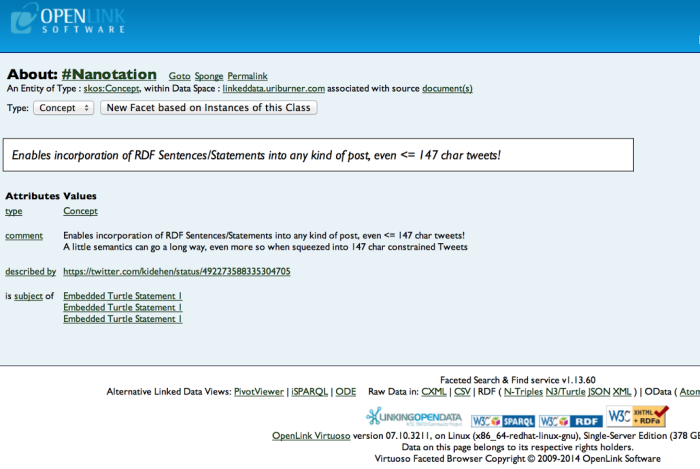

  - Nanotation that represents a "Hat Tip" relationship type:
    
    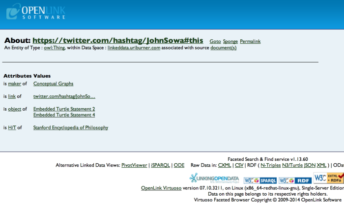

  - Nanotation generated RDF statements aggregated by Subject:
    
    
    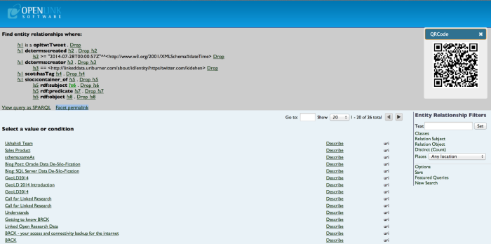

### 

### 

<a id="id70-sponger-usage-examples"></a>
## Sponger Usage Examples

  - [SPARQL Processor Usage Example](#virtuosospongerusageprocessorex)

  - [RDF Proxy Service Example](#virtuosospongerusageproxyex2)

  - [Browsing & Exploring Linked Data View Example Using ODE](#)

  - [Browsing & Exploring Linked Data View Example Using iSPARQL](#)

  - [Basic Sponger Cartridge
    Example](#rdfinsertmethodplapissimpleexample)

  - [HTTP Example for Extracting Metadata using
    CURL](#virtuosospongerusagebriefex)

  - [RESTFul Interaction
    Examples](#virtuosospongercartridgetypesmetarestexamples)

  - [Flickr Cartridge
    Example](#virtuosospongercreatecustcartrrgstflickr)

  - [MusicBrainz Metadatabase
    Example](#virtuosospongercreatecustcartrexmp)

<a id="id71-virtuoso-faceted-browser-installation-and-configuration"></a>
# Virtuoso Faceted Browser Installation and configuration

<a id="id72-prerequisites"></a>
## Prerequisites

Requires [Virtuoso 6.0 TP1](#) or higher for use.

<a id="id73-pre-installation"></a>
## Pre Installation

*Note* : This step is not required for Virtuoso Release 6.1 and above
builds

If you have an existing Virtuoso 6.x installation, and your Quad Store
has greater than 10K worth of triples, please perform the following
steps:

1.  Run the following commands using the Virtuoso isql program before
    installing the Faceted Browser VAD:
    
    ``` 
      drop index RDF_QUAD_OPGS;
      drop index RDF_QUAD_POGS;
      drop index RDF_QUAD_GPOS;
      drop index RDF_QUAD_OGPS;
    
      checkpoint;
    
      create table R2 (G iri_id_8, S iri_id_8, P iri_id_8, O any, primary key (S, P, O, G));
      alter index R2 on R2 partition (S int (0hexffff00));
    
      log_enable (2);
    
      INSERT INTO R2 (G, S, P, O) select G, S, P, O FROM rdf_quad;
    
      DROP TABLE RDF_QUAD;
      ALTER TABLE r2 rename RDF_QUAD;
    
      checkpoint;
    
      create bitmap index RDF_QUAD_OPGS on RDF_QUAD (O, P, G, S) partition (O varchar (-1, 0hexffff));
      create bitmap index RDF_QUAD_POGS on RDF_QUAD (P, O, G, S) partition (O varchar (-1, 0hexffff));
      create bitmap index RDF_QUAD_GPOS on RDF_QUAD (G, P, O, S) partition (O varchar (-1, 0hexffff));
    
      checkpoint;
    ```

Note this step may take sometime depending on how many triples are
already in your Quad Store.

<a id="id74-vad-package-installation"></a>
## VAD Package Installation

1.  Download and install the [Virtuoso Faceted Browser VAD](#) package
    using the Conductor System Admin - \> Packages tab.
    
    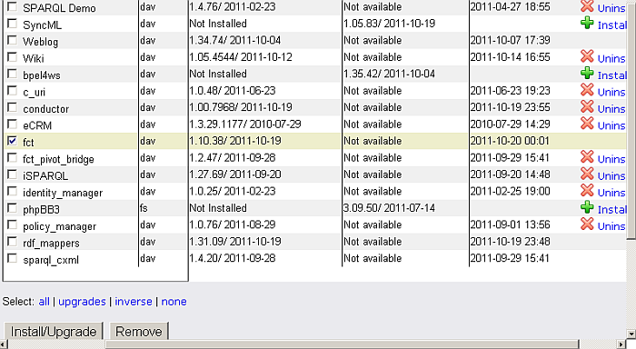

2.  The HTML interface of the Faceted Browser Engine is exposed at:
    
    *http://\<cname\>/fct*
    
    , where "cname" is the hostname:portno your Virtuoso instance is
    running on.
    
    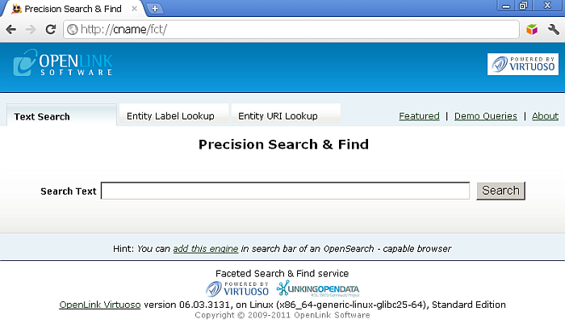

3.  The Faceted Browser Engine exposes a REST API at the endpoint:
    
    *http://\<cname\>/fct/service*
    
    .
    
    > **Tip**
    > 
    >   - [Virtuoso APIs for Faceted REST
    >     services](#virtuosospongerfacentuirestapi)
    > 
    >   - [Faceted Web Service and Linked
    >     Data](#rdfiridereferencingfacetws)

<a id="id75-post-installation"></a>
## Post Installation

1.  Build Full Text Indexes by running the following commands using the
    Virtuoso
    
    *isql*
    
    program:
    
        RDF_OBJ_FT_RULE_ADD (null, null, 'All');
        VT_INC_INDEX_DB_DBA_RDF_OBJ ();

2.  Run the following procedure using the Virtuoso
    
    *isql*
    
    program to populate label lookup tables periodically and activate
    the
    
    *Label*
    
    text box of the
    
    *Entity Label Lookup*
    
    tab:
    
        urilbl_ac_init_db()

3.  Run the following procedure using the Virtuoso
    
    *isql*
    
    program to calculate the IRI ranks. Note this should be run
    periodically as the data grows to re-rank the IRIs.
    
        s_rank()

4.  Perform Network Resource Fetch of some data to load some RDF triples
    in the quad store. This can easily be done using the Virtuoso
    
    *description.vsp*
    
    page which provides a hypertext description of RDF Linked Data, by
    describing the following page for example (or one of your choice):
    
        http://cname/about/html/http/news.cnet.com
    
    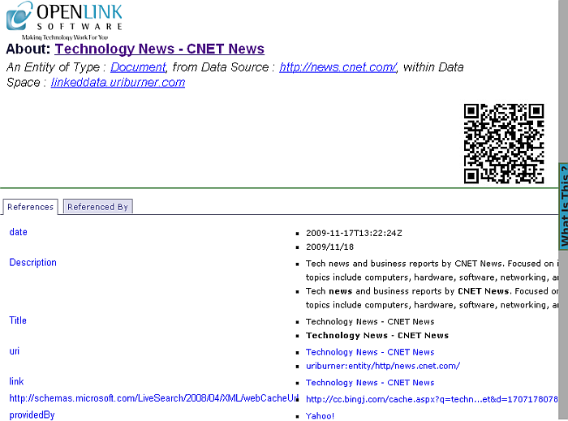
    
    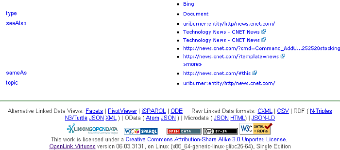

5.  Use the Faceted Browser Search and Find User Interface to search for
    information on "CNET":
    
    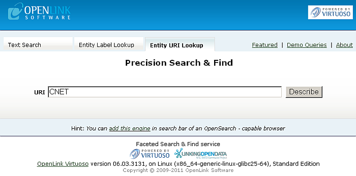

6.  Results of the following form should be returned for the network
    resource data being fetched.
    
    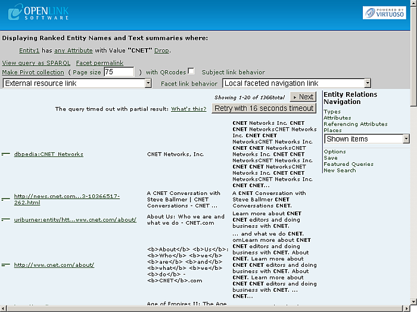

7.  Click "Types" link shown at the right vertical Navigation

8.  Results of the classes/properties should be returned:
    
    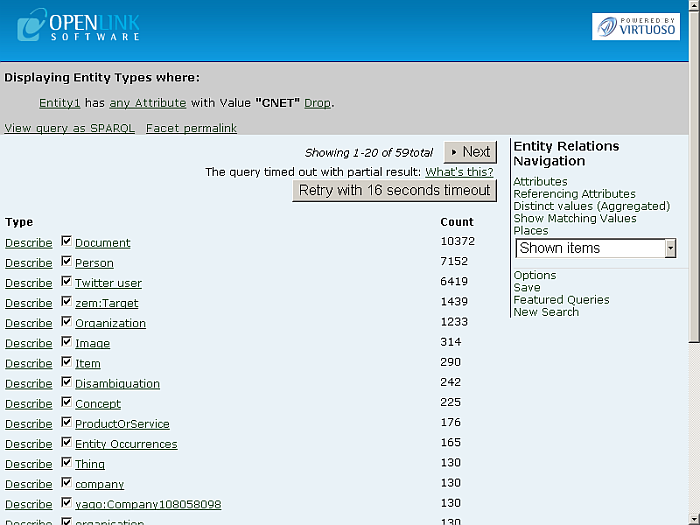

9.  To get Type description, click "Describe" link for a given type, for
    ex. "Person".

10. A list of attributes and values should be presented for the given
    resource. Note that automatically is generated QRCode image for the
    described entity.
    
    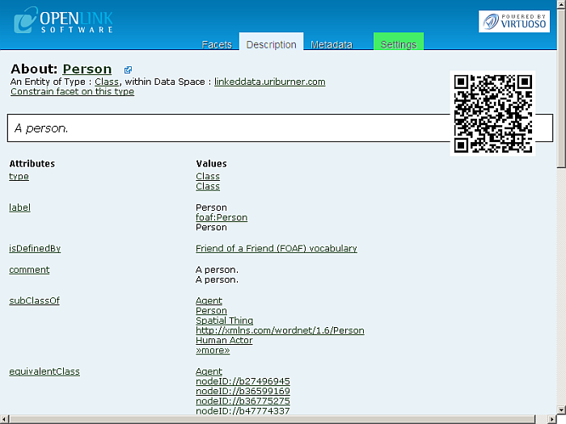

11. Return back to the Attributes list from above by going to the
    "Facets" tab.

12. To exclude a type, un-tick the checkbox associated with the type:
    
    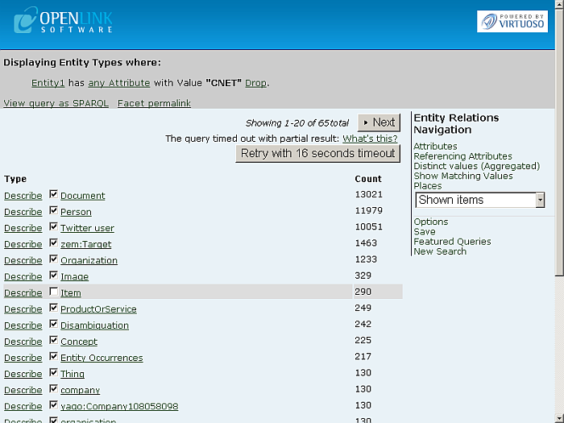

13. Click the Type URI link

14. Results of excluding the Type(s) should be shown:
    
    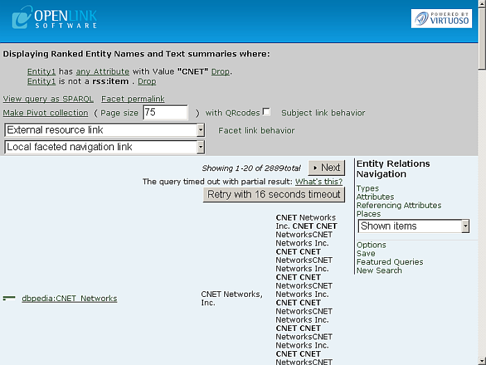

15. The Faceted Browser Web service endpoint can also be queried to
    obtain the same results:
    
        $ more cnet.xml
        <?xml version="1.0"?>
        <query xmlns="http://openlinksw.com/services/facets/1.0" inference="" same-as="">
          <text>CNET</text>
          <view type="text" limit="20" offset=""/>
        </query>
        
        $ curl -H "Content-Type: text/xml" -d @cnet.xml  http://cname/fct/service
        <fct:facets xmlns:fct="http://openlinksw.com/services/facets/1.0/">
        <fct:sparql>    SELECT ?s1 as ?c1, (bif:search_excerpt (bif:vector ('CNET'), ?o1)) as ?c2, ?sc, ?rank WHERE {{{ SELECT ?s1, (?sc * 3e-1) as ?sc, ?o1, (sql:rnk_scale (<LONG::IRI_RANK> (?s1))) as ?rank  WHERE { ?s1 ?s1textp ?o1 . ?o1 bif:contains  '"CNET"'  option (score ?sc)  . } ORDER BY DESC (?sc * 3e-1 + sql:rnk_scale (<LONG::IRI_RANK> (?s1)))  LIMIT 20  OFFSET 0 }}}</fct:sparql>
        <fct:time>16</fct:time>
        <fct:complete>yes</fct:complete>
        <fct:timeout>0</fct:timeout>
        <fct:db-activity>   131R rnd     36R seq      0P disk      0B /      0 messages</fct:db-activity>
         <fct:result type="text">
          <fct:row>
            <fct:column datatype="trank">4.5</fct:column>
            <fct:column datatype="erank">5.881291583872905e-014</fct:column>
            <fct:column datatype="url" shortform="http://news.com">http://news.com</fct:column>
            <fct:column>Technology News - CNET News</fct:column>
            <fct:column><span class="srch_xerpt"><b>CNET</b> News.</span></fct:column>
          </fct:row>
          <fct:row>
            <fct:column datatype="trank">4.5</fct:column>
            <fct:column datatype="erank">5.881291583872905e-014</fct:column>
            <fct:column datatype="url" shortform="http://news.cnet.com/2547-1_3-0-20.xml">http://news.cnet.com/2547-1_3-0-20.xml</fct:column>
            <fct:column>CNET News.com</fct:column>
            <fct:column><span class="srch_xerpt"><b>CNET</b> News.</span></fct:column>
          </fct:row>
          <fct:row>
            <fct:column datatype="trank">4.5</fct:column>
            <fct:column datatype="erank">5.881291583872905e-014</fct:column>
            <fct:column datatype="url" shortform="http://news.cnet.com">http://news.cnet.com</fct:column>
            <fct:column>Technology News - CNET News</fct:column>
            <fct:column><span class="srch_xerpt"><b>CNET</b> News.</span></fct:column>
          </fct:row>
          <fct:row>
            <fct:column datatype="trank">3.9</fct:column>
            <fct:column datatype="erank">5.881291583872905e-014</fct:column>
            <fct:column datatype="url" shortform="http://news.com">http://news.com</fct:column>
            <fct:column>Technology News - CNET News</fct:column>
            <fct:column><span class="srch_xerpt">Technology News <b>CNET</b> News.</span></fct:column>
          </fct:row>
          <fct:row>
            <fct:column datatype="trank">3.9</fct:column>
            <fct:column datatype="erank">5.881291583872905e-014</fct:column>
            <fct:column datatype="url" shortform="http://news.cnet.com">http://news.cnet.com</fct:column>
            <fct:column>Technology News - CNET News</fct:column>
            <fct:column><span class="srch_xerpt">Technology News <b>CNET</b> News.</span></fct:column>
          </fct:row>
          <fct:row>
            <fct:column datatype="trank">3</fct:column>
            <fct:column datatype="erank">5.881291583872905e-014</fct:column>
            <fct:column datatype="url" shortform="http://news.com">http://news.com</fct:column>
            <fct:column>Technology News - CNET News</fct:column>
            <fct:column><span class="srch_xerpt">Tech news and business reports by <b>CNET</b> News.</span></fct:column>
          </fct:row>
          <fct:row>
            <fct:column datatype="trank">3</fct:column>
            <fct:column datatype="erank">5.881291583872905e-014</fct:column>
            <fct:column datatype="url" shortform="http://news.cnet.com/2547-1_3-0-20.xml">http://news.cnet.com/2547-1_3-0-20.xml</fct:column>
            <fct:column>CNET News.com</fct:column>
            <fct:column><span class="srch_xerpt">Tech news and business reports by <b>CNET</b> News.</span></fct:column>
          </fct:row>
          <fct:row>
            <fct:column datatype="trank">3</fct:column>
            <fct:column datatype="erank">5.881291583872905e-014</fct:column>
            <fct:column datatype="url" shortform="http://news.cnet.com">http://news.cnet.com</fct:column>
            <fct:column>Technology News - CNET News</fct:column>
            <fct:column><span class="srch_xerpt">Tech news and business reports by <b>CNET</b> News.</span></fct:column>
          </fct:row>
          <fct:row>
            <fct:column datatype="trank">3</fct:column>
            <fct:column datatype="erank">5.881291583872905e-014</fct:column>
            <fct:column datatype="url" shortform="http://news.com#6">http://news.com#6</fct:column>
            <fct:column>There's an electric car in your future</fct:column>
            <fct:column><span class="srch_xerpt">... <b>CNET</b> Car Tech posts photos of electric cars expected to come out by 2011.</span></fct:column>
          </fct:row>
          <fct:row>
            <fct:column datatype="trank">3</fct:column>
            <fct:column datatype="erank">5.881291583872905e-014</fct:column>
            <fct:column datatype="url" shortform="http://news.cnet.com/2547-1_3-0-20.xml#9">http://news.cnet.com/2547-1_3-0-20.xml#9</fct:column>
            <fct:column>There's an electric car in your future</fct:column>
            <fct:column><span class="srch_xerpt">... <b>CNET</b> Car Tech posts photos of electric cars expected to come out by 2011.</span></fct:column>
          </fct:row>
          <fct:row>
            <fct:column datatype="trank">3</fct:column>
            <fct:column datatype="erank">5.881291583872905e-014</fct:column>
            <fct:column datatype="url" shortform="http://news.cnet.com#9">http://news.cnet.com#9</fct:column>
            <fct:column>There's an electric car in your future</fct:column>
            <fct:column><span class="srch_xerpt">... <b>CNET</b> Car Tech posts photos of electric cars expected to come out by 2011.</span></fct:column>
          </fct:row>
          <fct:row>
            <fct:column datatype="trank">3</fct:column>
            <fct:column datatype="erank">5.881291583872905e-014</fct:column>
            <fct:column datatype="url" shortform="http://news.com#6">http://news.com#6</fct:column>
            <fct:column>There's an electric car in your future</fct:column>
            <fct:column><span class="srch_xerpt">... <b>CNET</b> Car Tech posts photos of electric cars expected to come out by 2011.</span></fct:column>
          </fct:row>
          <fct:row>
            <fct:column datatype="trank">3</fct:column>
            <fct:column datatype="erank">5.881291583872905e-014</fct:column>
            <fct:column datatype="url" shortform="http://news.cnet.com/2547-1_3-0-20.xml#9">http://news.cnet.com/2547-1_3-0-20.xml#9</fct:column>
            <fct:column>There's an electric car in your future</fct:column>
            <fct:column><span class="srch_xerpt">... <b>CNET</b> Car Tech posts photos of electric cars expected to come out by 2011.</span></fct:column>
          </fct:row>
          <fct:row>
            <fct:column datatype="trank">3</fct:column>
            <fct:column datatype="erank">5.881291583872905e-014</fct:column>
            <fct:column datatype="url" shortform="http://news.cnet.com#9">http://news.cnet.com#9</fct:column>
            <fct:column>There's an electric car in your future</fct:column>
            <fct:column><span class="srch_xerpt">... <b>CNET</b> Car Tech posts photos of electric cars expected to come out by 2011.</span></fct:column>
          </fct:row>
         </fct:result>
        </fct:facets>

16. Click "New search" from the Entity Relations Navigation and go to
    "Entity Label Lookup" tab:
    
    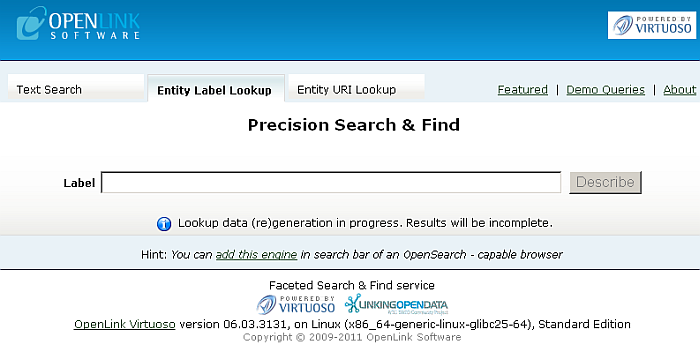

17. In the Label auto-complete text box of the Entity Label Lookup tab,
    enter the name of an rdfs label to be Described:
    
    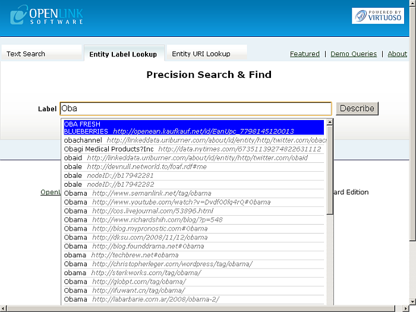

18. Select a URI from the list of available Labels to obtain a
    description of the URI:
    
    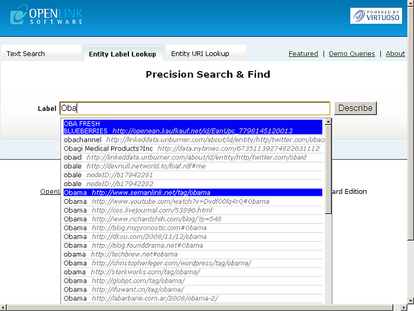
    
    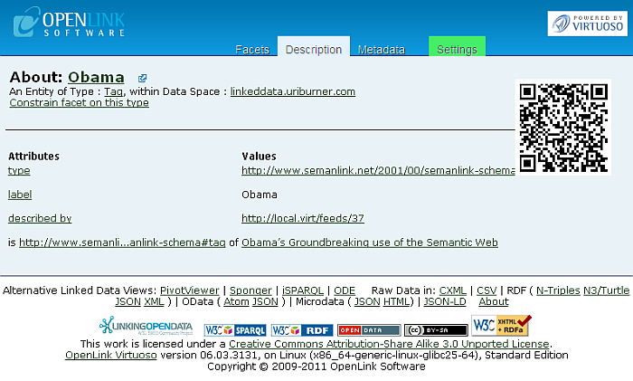

19. Click "Facets" and go to "Entity URI Lookup" tab:
    
    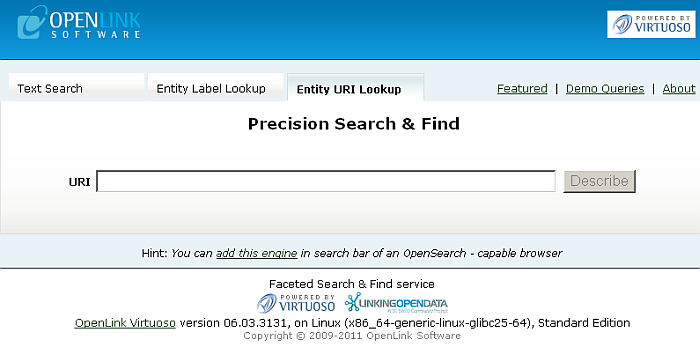

20. In the URI auto-complete text box of the Entity URI Lookup tab enter
    the name URI to be Described:
    
    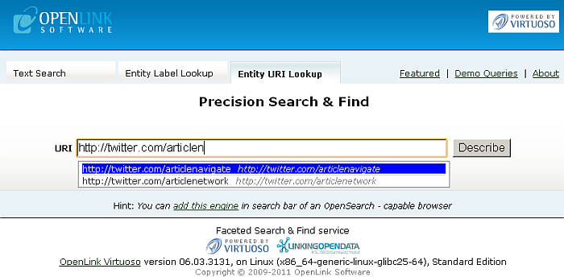

21. Select a URI from the list of available Labels to obtain a
    description of the URI:
    
    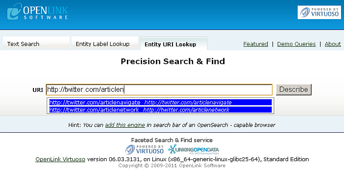
    
    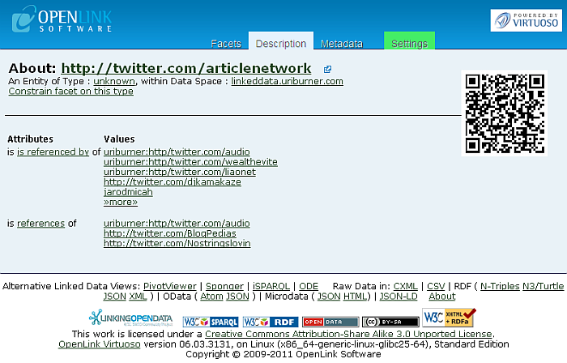

22. If data is loaded into the quad store via DML functions (TTLP,
    RDF\_LOAD\_RDFXML etc.) the following procedure needs to run from
    
    *isql*
    
    to build the free text indexes required each time:
    
        VT_INC_INDEX_DB_DBA_RDF_OBJ ()

<a id="id76-uri-labels"></a>
## URI Labels

1.  Go to http://cname/fct

2.  Enter a free text search pattern (for example, "Camcorder" as
    consumer product), and click Search:
    
    

3.  Your initial query results page will display a list of literal value
    snippets where for each URL will be displayed a label:
    
    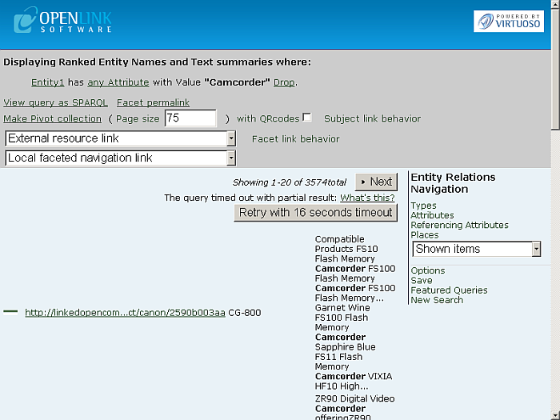

4.  Click for ex. on the URL link of the first row result.

5.  The product description page should be shown and a list of
    Attributes and Values will be presented. An URL label of the product
    also will be shown: "Charges Lithium Ion 800 series batteries":
    
    
    
    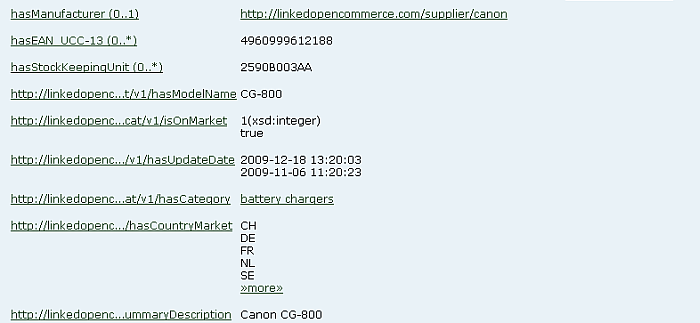
    
    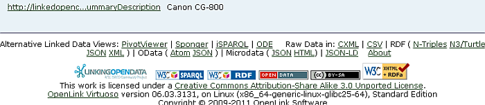

<a id="id77-usage-statistics"></a>
## Usage Statistics

1.  Use the Faceted Browser Search and Find User Interface to search for
    information on "Michael Jackson":
    
    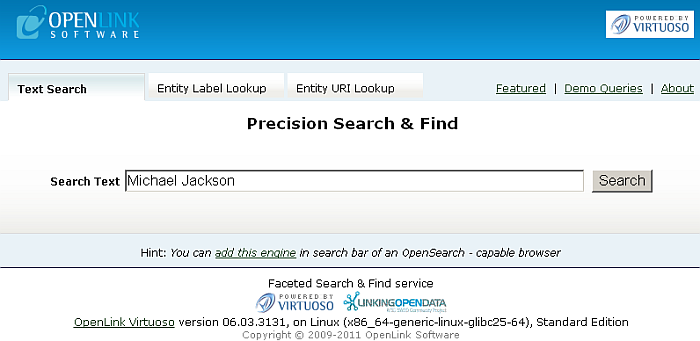

2.  Results of the following form should be returned for the network
    resource data being fetched.
    
    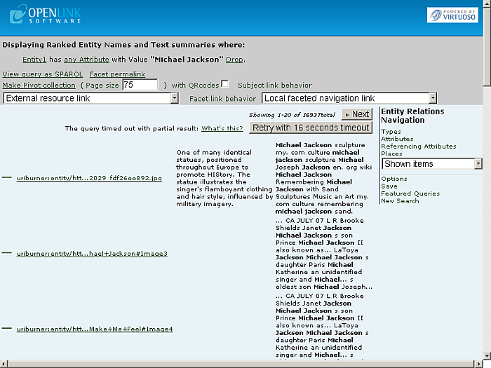

3.  Click the "Types" link under "Entity Relations Navigation".

4.  Results about "Michael Jackson" as Type/Label/Count list should be
    displayed:
    
    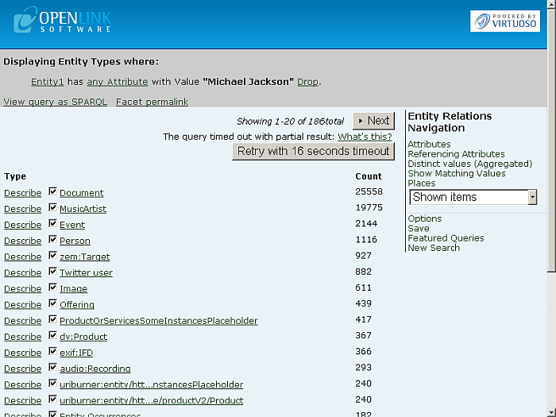

5.  You can navigate amongst the search results pages by using the
    "Prev" and "Next" buttons. Click for ex. "Next":
    
    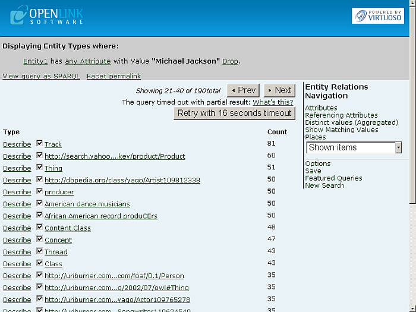

6.  Click a type link, for ex.:
    
        http://dbpedia.org/class/yago/Artist109812338

7.  Should be shown type results and:
    
        Displaying Ranked Entity Names and Text summaries where:
        
        Entity1 has any Attribute with Value "Michael Jackson" Drop.
        Entity1 is a yago:Artist109812338 . Drop
    
    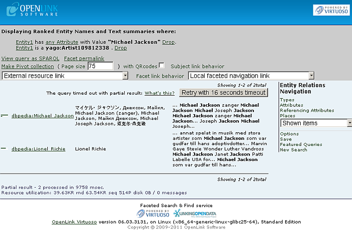

8.  Click the link:
    
        dbpedia:Michael_Jackson

9.  Results about "Michael Jackson" as Attribute/Value list should be
    presented:
    
    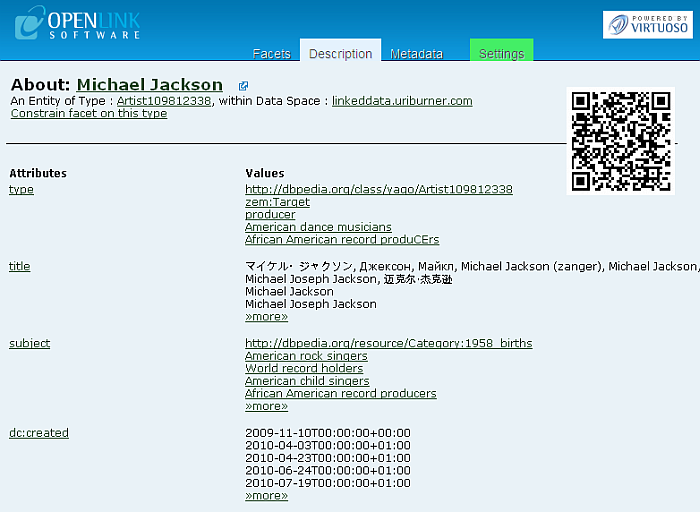
    
    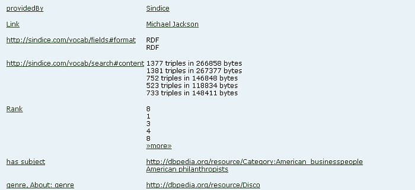
    
    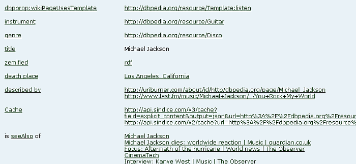
    
    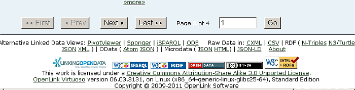

10. You can navigate amongst the search results pages by using the
    "First", "Prev", "Next" and "Last" buttons. Click for ex. "Last":
    
    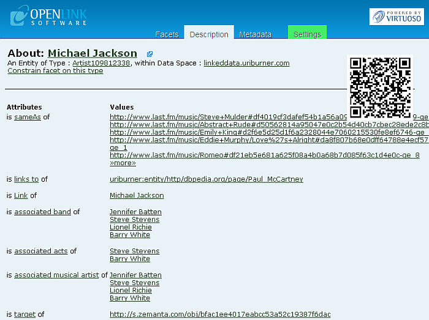
    
    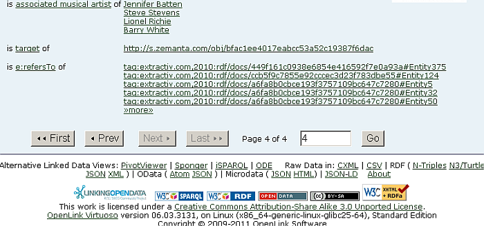

11. "Metadata" tab.

12. Results of usage statistics for "Michael Jackson" grouped in 4 tabs
    should be shown:
    
    1.  Referenced by Graphs: shows how many times the URI is found as
        subject in the relevant graph(s):
        
            SPARQL
            SELECT ?g count (*)
            where
              {
                graph ?g { <URI> ?p ?o }
              }
            group by ?g
            order by desc 2
            limit 20
        
        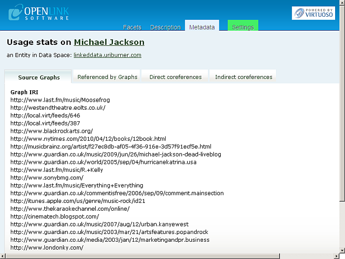
    
    2.  Source Graphs: shows how many times the URI is found as object
        in the relevant graph(s):
        
            SPARQL
            SELECT ?g count (*)
            where
              {
                graph ?g { ?s ?p <URI>  }
              }
            group by ?g
            order by desc 2
            limit 20
        
        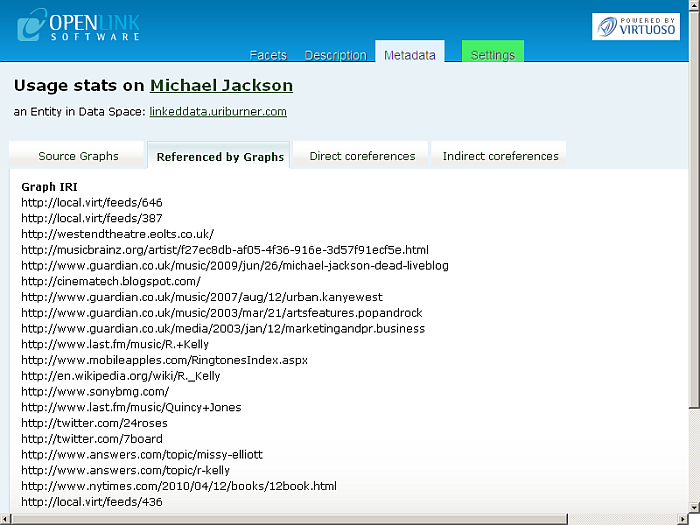
    
    3.  Direct co-references: shows results as subject and calculated
        rank, based on running transitive closure over owl:sameAs of the
        URI in subject or object:
        
            SPARQL
            SELECT ?syn ( sql:rnk_scale (<LONG::IRI_RANK> (?syn)))
            where
              {
                { SELECT ?s ?syn
                  where
                   {
                     {?syn owl:sameAs ?s } union {?s owl:sameAs ?syn}
                   }
                }
                option (transitive, t_distinct, t_min (0), T_in (?s), t_out (?syn)) . filter (!isliteral (?syn) &amp;&amp; ?s = <URI> )
              }
            order by desc 2
            limit 20
        
        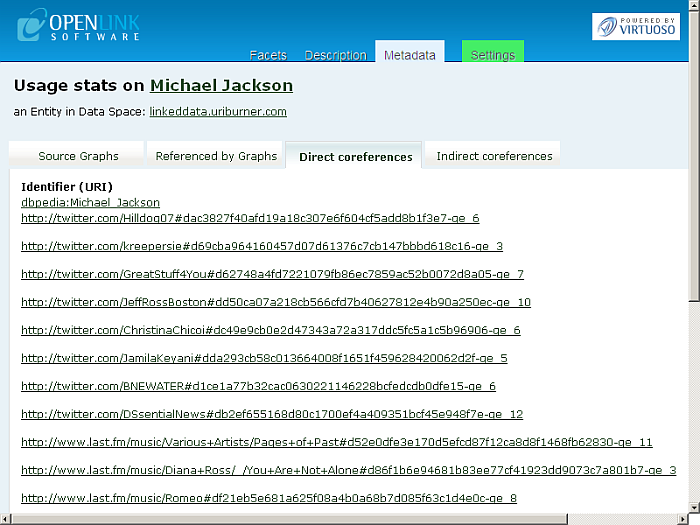
    
    4.  Indirect co-references: shows expanded results for objects
        concur with the URI by IFP:
        
            SPARQL
            SELECT distinct ?syn ?p ?o (sql:rnk_scale (<LONG::IRI_RANK> (?syn)))
            where
              { <URI> ?p ?o .  filter (0 != (<LONG::bif:rdf_is_sub> ("b3sifp", ?p, lod:ifp_like, 3))) .
                ?syn ?p ?o .
            }
            order by desc 4
            limit 20
        
        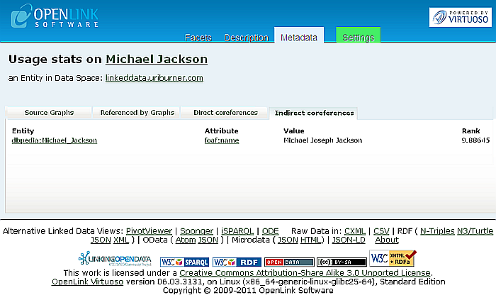

<a id="id78-examples"></a>
## Examples

*Faceted Browsing Sample using LOD Cloud Cache data space*

The following example demonstrates a simple scenario of tracking
Kingsley Idehen's conversations across the Web, using the Virtuoso
Faceted Browser hosted on LOD.

1.  Go to http://lod.openlinksw.com/fct/
    
    

2.  Enter a free text search pattern (for example, "Kingsley Idehen"),
    and click Search
    
    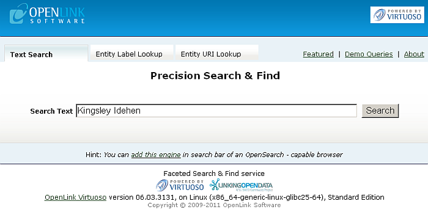

3.  Your initial query results page will display a list of literal value
    snippets from property values associated with the query text pattern
    
    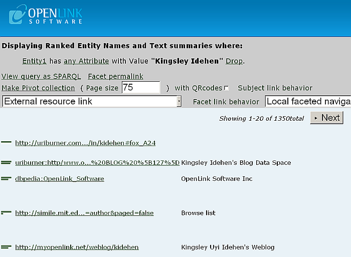

4.  Using the Navigation section on the right, click on "Types", which
    alters the contents of the query results area by presenting CURIE
    based hyperlinks for each of the Entity Types associated with
    Property values that contains the query text pattern
    
    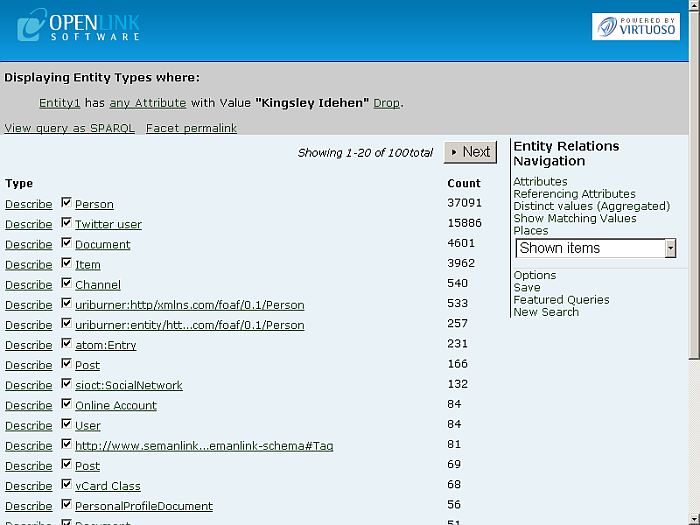

5.  You can perform *Describe* for a given found type, by clicking the
    "Describe" link in the "Type" column. For ex, for "atom:Entry" the
    produced describe type page would show a list of Attributes and
    Values + automatically generated QRCode image:
    
    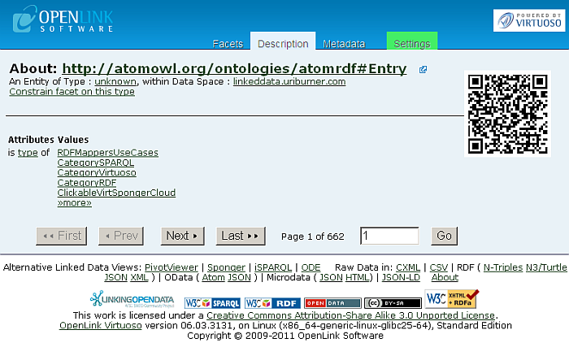

6.  Click "Facets" tab to return to the Types content page from the
    previous step.

7.  Click on the "foaf:Person" link to narrow the result set down to
    Entities of this Type, un-hatch the checkbox beside this link for
    Negation (filtering out) based on this Entity Type
    
    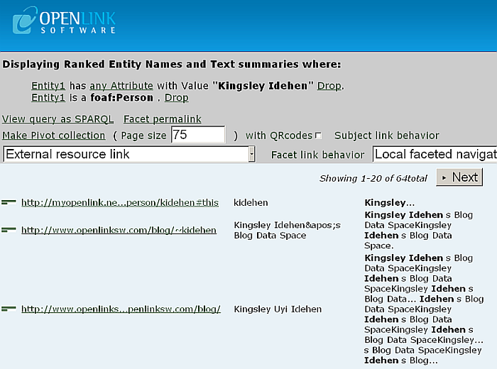
    
      - For Negation (filtering out) based on this Entity Type un-hatch
        the check-box shown besides the link:
        
        
        
        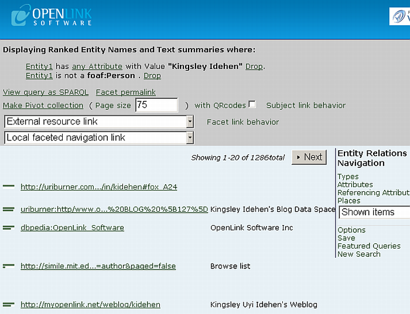
    
      - You can filter further, by switching (pivoting) to the a
        Property based view, by returning to the Navigation section and
        then clicking on "Properties" or "Referencing Properties" links;
        in either case, you have further filtering of based on the
        combination of Properties and Entities where Entities in the
        result-set contain values matching the query text pattern
        
        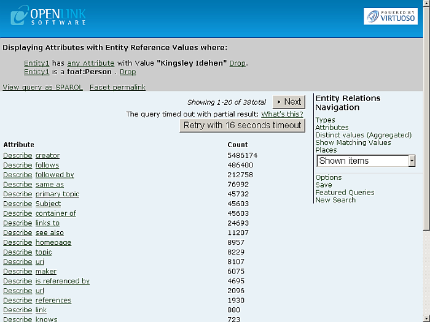

8.  From "Entity Relations Navigation" click "Attributes".
    
    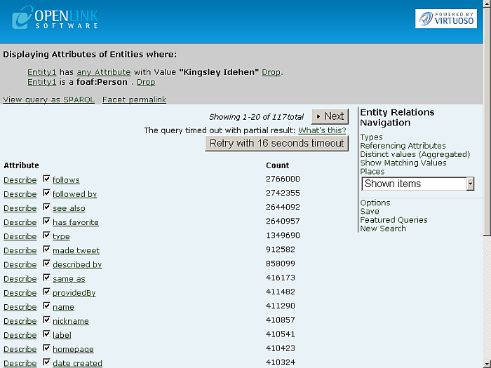

9.  You can navigate amongst the search results pages by using the
    "Prev" and "Next" buttons. Click for ex. "Next":
    
    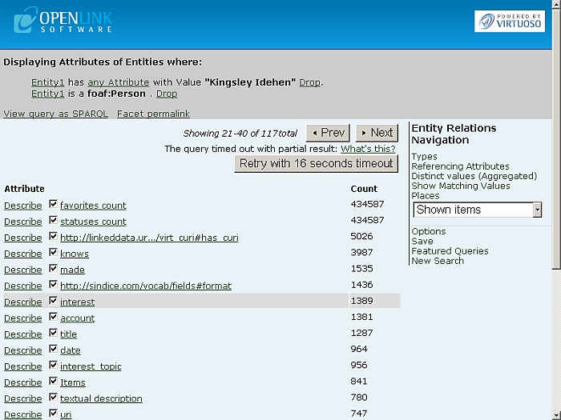

10. From the list of Property Types, click on the "foaf:interest" link
    to filter further, based on the values of this property:
    
    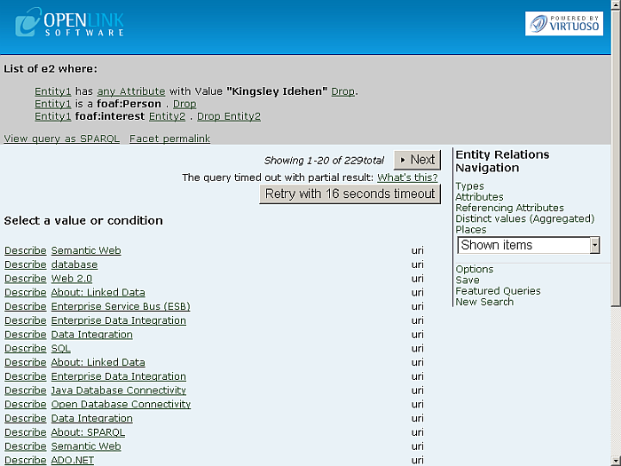

11. From the list of "foaf:interest" Values, click on "About:Linked
    Data", which filters the result-set further to display reveal Entity
    Identifier Links (Generic HTTP URIs) and Labels for each
    "foaf:Person" associated with the property "foaf:interest", in the
    LOD data space:
    
    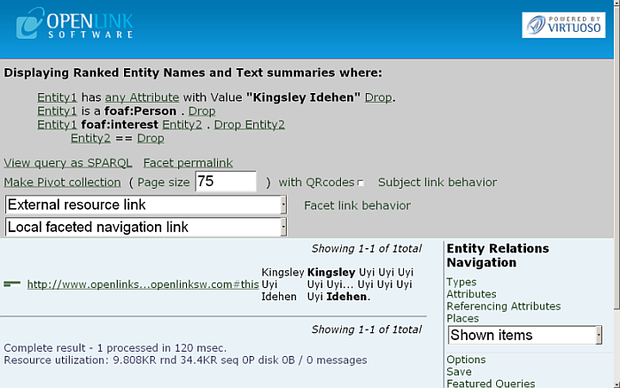

12. Click on one of the HTTP URIs in the filtered results-set to obtain
    a detailed structured description of a given Entity i.e. about the
    person Kingsley Uyi Idehen. Each listed Property is a
    
    *Link*
    
    ; thus, each Property is a link to other structured Entity
    descriptions. Additionally, a QRCode image will be produced
    automatically for the given entity:
    
    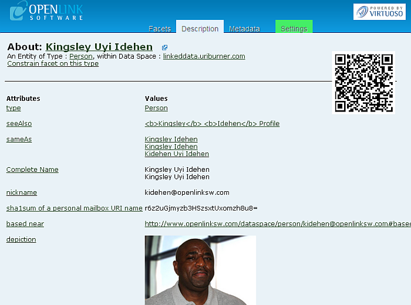
    
    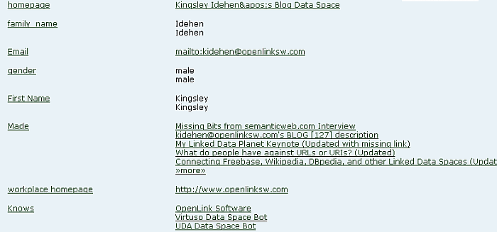
    
    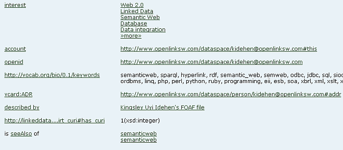
    
    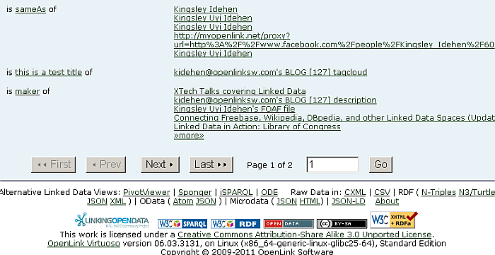

13. You can navigate amongst the search results pages by using the
    "First", "Prev", "Next" and "Last" buttons. Click for ex. "Last":
    
    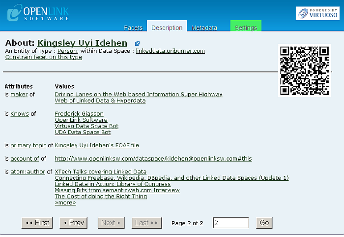
    
    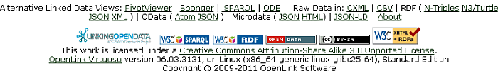

14. Click on " *Metadata* " link to get a summary view of this Linked
    Data Space, "Source" and "Reference" graphs are akin to saying
    "Table X" and "Table Y" where each table is the container of Records
    re. RDBMS or Worksheet re. Spreadsheet.:
    
    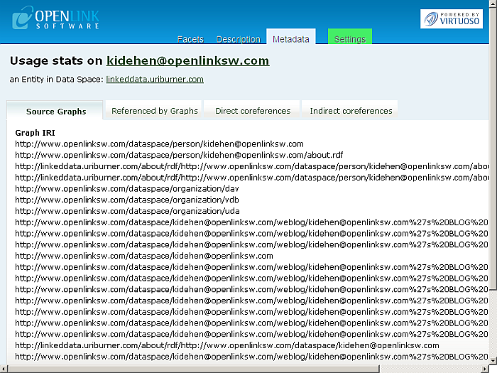
    
    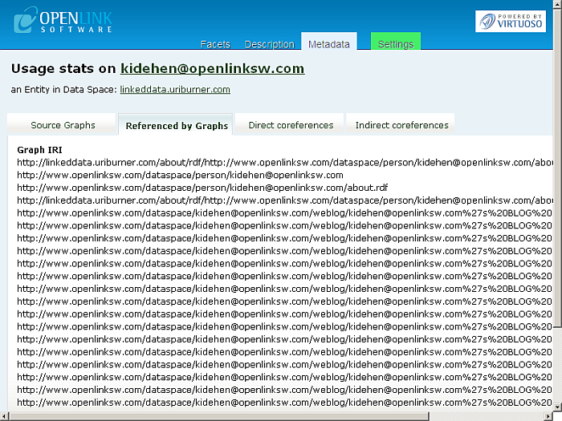

15. "Direct" and "InDirect" coreferences show other references
    (Identifiers) that relate associated with Kingsley Idehen (like
    saying: here are his other names or his know by this name in this
    other place):
    
    
    
    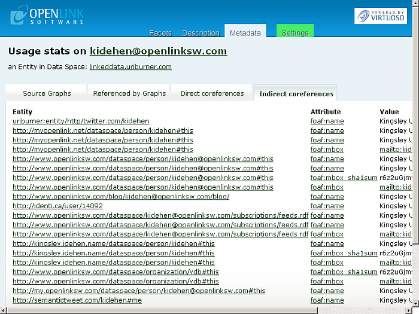

16. Click on "Settings" check "owl:sameAs" and it sets a context mode
    for the session (meaning: a set of rules to take place):
    
    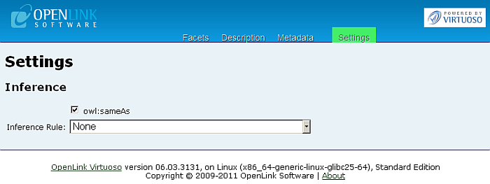

17. Go back to the "Direct Co-reference" tab:
    
    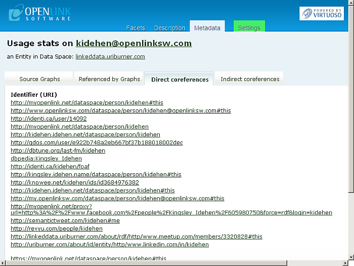

18. As result each link will unveil a union (combination) of all the the
    data associated with all Kingsley Idehen's other Identifiers (other
    Names in other places), i.e., they all show the same data.

19. Go to "Facets" and then from "Entity Relations Navigation" click
    "New Search".

20. Enter a free text search pattern (for example, " `Camcorder` " as
    consumer product), and click Search:
    
    

21. Your initial query results page will display a list of literal value
    snippets where for each URI will be displayed a label:
    
    

22. Click for ex. on the URL link ofthe first row result.

23. The product description page should be shown and a list of
    Attributes and Values will be presented. An URI label of the product
    also will be shown: "CG-800":
    
    
    
    
    
    

<a id="id79-virtuoso-faceted-web-service"></a>
# Virtuoso Faceted Web Service

The Virtuoso Faceted web service is a general purpose RDF query facility
for facet based browsing. It takes an XML description of the view
desired and generates the reply as an XML tree containing the requested
data. The user agent or a local web page can use XSLT for rendering this
for the end user. The selection of facets and values is represented as
an XML tree. The rationale for this is the fact that such a
representation is easier to process in an application than the SPARQL
source text or a parse tree of SPARQL and more compactly captures the
specific subset of SPARQL needed for faceted browsing. The web service
returns the SPARQL source text also, thus this can serve as a basis for
and-crafted queries.

The top element of the tree is \<query\>, it must be in namespace
"http://openlinksw.com/services/facets/1.0/".

This has the following attributes:

  - graph="graph\_iri" - default is search in all graphs but system
    defaults may override this

  - timeout="no\_of\_msec" - default is no timeout, but system defaults
    may override this

  - inference="name" where name is a name of an inference context
    declared with rdfs\_rule\_set.

  - same-as="boolean" - If "boolean" is "yes", then owl:sameAs links
    will be considered in the query evaluation.

The result is a tree of the form:

    <facets xmlns="http://openlinksw.com/services/facets/1.0/">
    <result><row><column datatype="..." shortform="..." xml:lang="..">...</column></row></result>
    <time>msecs</time>
    <complete>yes or no</complete>
    <db-activity>resource use string</db-activity>
    <sparql>sparql statement text</sparql>
    </facets>

By convention, the first column is the subject selected by the view
element, typically a URI, the second a label of the URI and the third,
if present, is either a count or a search summary.

The first column's text child is the text form of the value. The column
element has the following attributes qualifying this further:

  - datatype - The xsd type of the value. If this is a URI, the datatype
    is "uri"

  - shortform - If the value is a URI, this is an abbreviated form where
    known namespaces are replaced with their prefixes and very long
    URI's are truncated preserving start and end.

  - xml:lang - if the value is a language tagged string, this is the
    language

The query has the top level element \<query\>. The child elements of
this represent conditions pertaining to a single subject. A join is
expressed with the property or property-of element. This has in turn
children which state conditions on a property of the first subject.
property and property-of elements can be nested to an arbitrary depth
and many can occur inside one containing element. In this way,
tree-shaped structures of joins can be expressed.

Expressing more complex relationships, such as intermediate grouping,
subqueries, arithmetic or such requires writing the query in SPARQL. The
XML format is a shorthand for easy automatic composition of queries
needed for showing facets, not a replacement for SPARQL.

A facet query contains a single view element. This specifies which
subject of the joined subjects is shown. Its attributes specify the
manner of viewing, e.g. list of distinct values, distinct values with
occurrence counts, properties or classes of the selected subjects etc.

The top query element or any property or property-of element can have
the following types of children:

    <text property="iri">text pattern</text>

The subject has an O that matches the text pattern. If property is
given, the text pattern must occur in a value of this property. If not
specified, any property will do. The value "none" for property is the
same as not specifying a property. This is restricted to occurring
directly under the top level query element.

    <class iri="iri" inference="ctx_name" />

The S must be an instance of this class. If inference is specified then
option (input:inference "ctx\_name" is added and applies to this pattern
alone.

    <property iri="iri" same_as="yes" inference="ctx_name">

The child elements of this are conditions that apply to the value of
this property of the S that is in scope in the enclosing \<query\> or
\<property\> element. If same\_as is present, then option (input:same-as
"yes") is added to the triple pattern which specifies this property. If
inference is present, then option (input:inference "ctx\_name") is added
to the triple pattern for the property.

    <property-of iri="iri" same_as="yes" inference="ctx_name" >

The child elements of this are conditions that apply to an S which has
property "iri" whose object is the S in scope in the enclosing \<query\>
or \<property\> element. The options are otherwise the same as with
property.

    <value datatype="type" xml:lang="lng" op="= | < | > | >= | <=">value </value>

When this occurs inside \<property\> or \<property-of\> this means that
the property in scope has the specified relation to the value. type and
language can be used for XML typed or language tagged literals. The
"uri" type means that the value is a qualified name of a URI. If this
occurs directly under the \<query\> element, this means that the query
starts with a fixed subject. If this is so, then there must be property
or propertyof elements or the view element must specify properties or
classes, list is not allowed as a view type. This is so because the
query must have at least one triple pattern.

    <view type="view" limit="n" offset="n" >

This may occur once inside a \<query\> element but may occur either at
top level or inside property or property-of elements. This specifies
what which subject is presented in the result set.

The type can be:

  - "properties"
    
        SPARQL
        SELECT ?p count (*) { ?this_s ?p ?any_o ...}
        GROUP BY ?p
        ORDER BY DESC 2
        LIMIT l OFFSET 0

  - "properties-in"
    
        SPARQL
        SELECT ?p count (*) { ?any_s ?p ?this_s ... }
        GROUP BY ?p
        ORDER BY DESC 2
        LIMIT L OFFSET 0

  - "classes"
    
        SPARQL
        SELECT ?c count (*)
        WHERE { ?xx a ?c ... }
        GROUP BY ?c
        ORDER BY DESC 2
        LIMIT l OFFSET 0

  - "text"
    
        SPARQL
        SELECT DISTINCT ?s (bif:search_excerpt (sql:search_terms (""pattern"), ?o)) ...
        LIMIT l OFFSET 0

  - "list"
    
        SPARQL
        SELECT DISTINCT ?s long::sql:fct_label (?s) ...
        LIMIT l OFFSET 0

  - "list-count"
    
        SPARQL
        SELECT ?s COUNT (*) ....
        GROUP BY ?s
        ORDER BY DESC 2

  - "alphabet"
    
        SPARQL
        SELECT (sql:subseq (?s, 0, 1)) count (*) ...
        GROUP BY (sql:subseq (?s, 0, 1))
        ORDER BY 1

  - "geo"
    
        SPARQL
        SELECT DISTINCT ?lat ?long ?s
        WHERE ?s geo:lat ?lat . ?s geo:long ?long . ... }

  - "years"
    
        SPARQL
        SELECT sql::year (?s) count (*) ...
        GROUP BY (bif:year (?s))
        ORDER BY 1
        OFFSET 0 LIMIT l

  - "months"
    
        SPARQL
        SELECT sql::round_month (?s) count (*) ...
        GROUP BY (sql:round_month (?s))
        ORDER BY 1 OFFSET 0 LIMIT l

  - "weeks"
    
        SPARQL
        SELECT sql::round_week (?s) COUNT (*) ...
        GROUP BY (sql:round_week (?s))
        ORDER BY 1 OFFSET 0 LIMIT l

  - "describe"
    
        SPARQL describe ?s ... OFFSET 0 LIMIT l

<a id="id80-customizing"></a>
## Customizing

The following types of customization will be generally useful:

  - Resource accounting and limitations, managing access and login

  - Localization, choice of labels shown with class/property/instance
    URI's

  - Adding types of views, for example timelines, map or business
    graphics

  - Controlling navigation, for example choosing what type of view is
    initially presented when opening a given property.

  - Page layout, captions, help texts, etc.

The source code is divided in two SQL files and a number of XSLT sheets.
The file facet.sql has the code for the web service. The facet\_view.sql
file contains the procedures for the sample HTML interface.

<a id="id81-examples"></a>
## Examples

Note: in all examples the default namespace
xmlns="http://openlinksw.com/services/facets/1.0/" is omitted for
brevity.

For people called Mike:

    <query>
      <text>Mike</text>
      <view type="text"/>
    </query>

To open the list of people who Mike knows:

    <query>
      <text>Mike</text>
      <view type="properties"/>
    </query>

To show the list of subjects Mike knows:

    <query>
      <text>Mike</text>
      <property iri="foaf:knows>
        <view type="list" />
      </property>
    </query>

To show the properties of people Mike knows:

    <query>
      <text>Mike</text>
      <property iri="foaf:knows>
        <view type="properties" />
      </property>
    </query>

To show the names:

    <query>
      <text>Mike</text>
      <property iri="foaf:knows>
        <property iri="foaf:name>
          <view type="list" />
        </property>
      </property>
    </query>

To specify one named Joe:

    <query>
      <text>Mike</text>
      <property iri="foaf:knows>
         <property iri="foaf:name>
            <value>Joe</value>
         </property>
        <view type="properties" />
      </property>
    </query>

This lists the properties of the friends of Mike that are called Joe.

To show the Mikes that know a Joe, one would change the shown variable
in the navigation and get:

    <query>
      <text>Mike</text>
      <property iri="foaf:knows>
        <property iri="foaf:name>
          <value>Joe</value>
        </property>
       </property>
       <view type="text" />
    </query>

This would be the search summaries of subjects with Mike in some field
that know a subject with name Joe.

Now to specify that Mike must be a member of a discussion board:

    <query>
      <text>Mike</text>
      <property iri="foaf:knows>
        <property iri="foaf:name>
         <value>Joe</value>
       </property>
      </property>
      <view type="property-in" />
    </query>

This lists the properties of triples whom object is Mike. Pick
sioc:member\_of

    <query>
      <text>Mike</text>
      <property iri="foaf:knows>
        <property iri="foaf:name>
          <value>Joe</value>
        </property>
      </property>
      <property-of iri="sioc:member_of>
        <view type="list" />
      </property-of>
    </query>

This would show things where Mike is a member. To specify that the thing
must be a forum:

    <query>
      <text>Mike</text>
      <property iri="foaf:knows>
        <property iri="foaf:name>
          <value>Joe</value>
        </property>
      </property>
      <property-of iri="sioc:member_of>
        <view type="classes" />
      </property-of>
    </query>

This shows classes of things where Mike is a member Clicking on
sioc:Forum gives:

    <query>
      <text>Mike</text>
      <property iri="foaf:knows>
        <property iri="foaf:name>
          <value>Joe</value>
        </property>
      </property>
      <property-of iri="sioc:member_of>
        <class iri="sioc:Forum" />
        <view type="classes"/>
      </property-of>
    </query>

The view stays with classes, but now scoped to the classes of things
where Mike is a member that are instances of sioc:Forum.

To go look at the list of Mikes with the added restriction, click the
shown variable in the navigation and set it to s1.

    <query>
      <text>Mike</text>
      <property iri="foaf:knows>
        <property iri="foaf:name>
          <value>Joe</value>
        </property>
      </property>
      <property-of iri="sioc:member_of>
       <class iri="sioc:Forum" />
      </property-of>
      <view type="list"/>
    </query>

To say that Joe must also have a geekCode, One clicks the shown variable
and sets it to s2 and the view to properties.

    <query>
      <text>Mike</text>
      <property iri="foaf:knows>
        <property iri="foaf:name>
          <value>Joe</value>
        </property>
        <view type="properties"/>
      </property>
      <property-of iri="sioc:member_of>
        <class iri="sioc:Forum" />
       </property-of>
    </query>

Pick geekCode

    <query>
      <text>Mike</text>
      <property iri="foaf:knows>
        <property iri="foaf:name>
          <value>Joe</value>
        </property>
        <property iri="geekCode">
          <view type="list"/>
        </property>
      </property>
      <property-of iri="sioc:member_of>
        <class iri="sioc:Forum" />
      </property-of>
    </query>

We specify no restriction on the geekCode. Click the shown variable to
take the focus back to Mike.

    <query>
      <text>Mike</text>
      <property iri="foaf:knows>
        <property iri="foaf:name>
          <value>Joe</value>
        </property>
        <property iri="geekCode"></property>
      </property>
      <property-of iri="sioc:member_of>
        <class iri="sioc:Forum" />
      </property-of>
      <view type="text"/>
    </query>

<a id="id82-webservice-interface"></a>
## WebService Interface

### REST interface

The Virtuoso Faceted web service provide following REST interface:

Service description:

  - Endpoint: http://\<cname\>/fct/service for ex.
    http://lod.openlinksw.com/fct/service

  - HTTP method: POST

  - Content-Type: MUST be 'text/xml'

  - The entity body must be XML document with top element 'query' as
    described above.

  - The request response namespace MUST be
    "http://openlinksw.com/services/facets/1.0"

Error conditions:

The all error conditions are reported via 'Error explanation'

Files:

The facet\_svc.sql contains web service code and virtual directory
mapping, and it uses fct\_req.xsl & fct\_resp.xsl as request & response
filters.

Example:

Using CURL program

    curl -H "Content-Type: text/xml" -d @post.xml  http://lod.openlinksw.com/fct/service

Where 'post.xml' document contains query document:

    <?xml version="1.0"?>
    <query xmlns="http://openlinksw.com/services/facets/1.0" inference="" same-as="">
      <text> Seattle Mariners traveled all the way to Japan to watch</text>
      <view type="text" limit="20" offset=""/>
    </query>

Produces following response:

    <fct:facets xmlns:fct="http://openlinksw.com/services/facets/1.0/">
    <fct:sparql>   SELECT distinct ?s1 as ?c1, (bif:search_excerpt (bif:vector ('THE', 'MARINERS', 'WAY', 'SEATTLE', 'WATCH', 'ALL', 'TO', 'JAPAN', 'TRAVELED'), ?o1)) as ?c2  WHERE { ?s1 ?s1textp ?o1 . FILTER (bif:contains (?o1, '(THE AND MARINERS AND WAY AND SEATTLE AND WATCH AND ALL AND TO AND JAPAN AND TRAVELED)')) . } LIMIT 20  OFFSET 0 </fct:sparql>
    <fct:time>116</fct:time>
    <fct:complete>yes</fct:complete>
    <fct:db-activity>   134R rnd  9.488KR seq      0P disk  8.966MB /    602 messages</fct:db-activity>
     <fct:result>
      <fct:row>
        <fct:column datatype="url" shortform="http://bobdupuy.mlbl...ld_baseball__6.html">http://bobdupuy.mlblogs.com/bobdupuy/2006/03/world_baseball__6.html></fct:column>
        <fct:column />
        <fct:column><span class="srch_xerpt">... While Chuck Armstrong president of <b>the</b> <b>Seattle</b> <b>Mariners</b> <b>traveled</b> <b>all</b> <b>the</b> <b>way</b> <b>to</b> <b>Japan</b> <b>to</b> <b>watch</b> Ichiro... for <b>the</b> advancing <b>Japan</b> team last week <b>the</b> star from <b>the</b> <b>Seattle</b> roster so far in Round 1 has without a doubt... leading <b>the</b> Dominican <b>to</b> its...</span></fct:column>
      </fct:row>
      <fct:row>
        <fct:column datatype="url" shortform="http://bobdupuy.mlbl...ld_baseball__6.html">http://bobdupuy.mlblogs.com/bobdupuy/2006/03/world_baseball__6.html></fct:column>
        <fct:column />
        <fct:column><span class="srch_xerpt">Orlando While Chuck Armstrong president of <b>the</b> <b>Seattle</b> <b>Mariners</b> <b>traveled</b> <b>all</b> <b>the</b> <b>way</b> <b>to</b> <b>Japan</b> <b>to</b> <b>watch</b>... perform for <b>the</b> advancing <b>Japan</b> team last week <b>the</b> star from <b>the</b> <b>Seattle</b> roster so far in Round 1 has without...</span></fct:column>
      </fct:row>
     </fct:result>
    </fct:facets>

### Virtuoso APIs for Faceted REST services

The Virtuoso APIs for FCT REST services are Virtuoso Stored Procedures
that enable faceted browsing over Linked Data hosted in the RDF Quad
Store. This also includes Linked Data that is progressively added to the
Quad Store via URI de-referencing.

They enable the use Virtuoso's VSP/VSPX technology to produce
(X)HTML-based Linked Data explorer pages that are endowed with
high-performance (in-process) faceted browsing capability.

You can use this API with Virtuoso SQL calls that provide data to your
VSP/VSPX, ASP.NET, PHP, etc., -based interfaces using ODBC, JDBC,
ADO.NET, or XMLA connectivity (SPASQL) to Virtuoso.

#### API Definition

    CREATE PROCEDURE
    fct_exec
      (
        IN  tree     ANY ,
        IN  timeout  INT
      )
    {
      DECLARE  start_time,
               view3,
               inx,
               n_rows      INT     ;
      DECLARE  sqls,
               msg,
               qr,
               qr2,
               act,
               query       VARCHAR ;
      DECLARE  md,
               res,
               results,
               more        ANY     ;
      DECLARE  tmp         ANY     ;
      DECLARE  offs,
               lim         INT     ;
    
      SET result_timeout = _min
                             (
                               timeout,
                               ATOI
                                 (
                                   registry_get ('fct_timeout_max')
                                 )
                             )
      ;
    
      offs := xpath_eval ('//query/view/@offset', tree);
      lim := xpath_eval ('//query/view/@limit', tree);
    
      -- db_activity ();
    
      results := vector (null, null, null);
      more := vector ();
    
      IF
        (
          xpath_eval
            (
              '//query[@view3="yes"]//view[@type="text"]',
              tree
            )
          IS NOT NULL
        )
        {
          more := VECTOR ('classes', 'properties');
        }
    
      sqls := '00000';
      qr := fct_query
              (
                xpath_eval ('//query', tree, 1)
              )
      ;
      query := qr;
    --  dbg_obj_print (qr);
      qr2 := fct_xml_wrap (tree, qr);
      start_time := msec_time ();
    
      dbg_printf('query: %s', qr2);
    
      EXEC
        (
          qr2,
          sqls,
          msg,
          vector (),
          0,
          md,
          res
        )
      ;
      n_rows := row_count ();
      act := db_activity ();
      SET result_timeout = 0;
      IF (
           sqls <> '00000'
           AND
           sqls <> 'S1TAT'
         )
        SIGNAL (sqls, msg);
      IF (
           NOT ISARRAY (res)
           OR
           0 = length (res)
           OR
           NOT ISARRAY (res[0])
           OR
           0 = length (res[0])
         )
        results[0] := xtree_doc ('<result/>');
      ELSE
        results[0] := res[0][0];
    
      inx := 1;
    
      FOREACH (VARCHAR tp IN more) DO
        {
          tree := XMLUpdate (
                              tree,
                              '/query/view/@type',
                              tp,
                              '/query/view/@limit',
                              '40',
                              '/query/view/@offset',
                              '0'
                            )
          ;
          qr := fct_query (xpath_eval ('//query', tree, 1));
          qr2 := fct_xml_wrap (tree, qr);
          sqls := '00000';
          SET result_timeout = _min (
                                      timeout,
                                      ATOI
                                        (
                                          registry_get ('fct_timeout_max')
                                        )
                                    )
          ;
          EXEC (
                 qr2,
                 sqls,
                 msg,
                 vector (),
                 0,
                 md,
                 res
               );
          n_rows := row_count ();
          act := db_activity ();
          SET result_timeout = 0;
          IF ( sqls <> '00000'
               AND
               sqls <> 'S1TAT'
             )
        SIGNAL (sqls, msg);
          IF (
               ISARRAY (res)
               AND
               LENGTH (res)
               AND
               ISARRAY (res[0])
               AND
               LENGTH (res[0])
             )
        {
          tmp := res[0][0];
          tmp := XMLUpdate (tmp, '/result/@type', tp);
          results[inx] := tmp;
        }
          inx := inx + 1;
        }
    
      res := XMLELEMENT
               (
                 "facets",
                 XMLELEMENT
                   ( "sparql", query ),
                 XMLELEMENT
                   ( "time", msec_time () - start_time ),
                 XMLELEMENT
                   (
                     "complete",
                     CASE WHEN sqls = 'S1TAT'
                          THEN 'no'
                          ELSE 'yes'
                      END
                    ),
                 XMLELEMENT
                   (
                     "timeout",
                     _min
                       (
                         timeout * 2,
                         ATOI
                           (
                             registry_get
                               ( 'fct_timeout_max' )
                           )
                       )
                   ),
                 XMLELEMENT
                   ("db-activity", act),
                 XMLELEMENT
                   ("processed", n_rows),
                 XMLELEMENT
                   (
                     "view",
                     XMLATTRIBUTES
                       (
                         offs AS "offset",
                         lim AS "limit"
                       )
                   ),
                 results[0],
                 results[1],
                 results[2]
               );
    
    ---- for debugging:
    --string_to_file ('ret.xml', serialize_to_UTF8_xml (res), -2);
    --  dbg_obj_print (res);
    
      RETURN res;
    }
    ;

#### Example

The following example shows how to use the fct\_exec APi in vsp page to
perform a "text" search for the word "Mike" assuming this exists in your
Virtuoso RDF store (if not amend the query in the fct\_example.vsp code
sample below to search for text known to exist).

1.  The service can be used in the following sample fct\_example.vsp:
    
        <?vsp
        
        declare txt, reply, tree any;
        declare timeout int;
        
        tree := xtree_doc ('
          <query>
            <text>Mike</text>
            <view type="text"/>
          </query>
        ');
        
        timeout := 3000;
        reply := fct_exec (tree, timeout);
        
        txt := string_output ();
        
        http_value (xslt ('virt://WS.WS.SYS_DAV_RES.RES_FULL_PATH.RES_CONTENT:/DAV/fct_example.xsl',
                         reply,
                     vector ()),
                     null, txt);
        
        http (txt);
        ?>

2.  The xsl:
    
        <?xml version="1.0" encoding="utf-8"?>
        
        <xsl:stylesheet
            version="1.0"
            xmlns:xsl="http://www.w3.org/1999/XSL/Transform">
          <xsl:output method="html" encoding="ISO-8859-1"/>
          <xsl:variable name="rowcnt" select="count(/facets/result/row)"/>
        
          <xsl:template match="facets">
            <div
        xml:id="res">
              <xsl:if test="/facets/complete = 'yes' and /facets/processed = 0 and $rowcnt = 0">
                <div class="empty_result">
                  Nothing found.
                </div>
              </xsl:if>
              <xsl:for-each select="/facets/result">
                <xsl:call-template name="render-result"/>
              </xsl:for-each>
            </div>
            <!-- #res -->
        
          </xsl:template>
        
          <xsl:template name="render-result">
            <table class="result" border="1">
              <thead>
                <tr>
                  <th>Entity</th>
                  <th>Title</th>
                  <th>Text excerpt</th>
                </tr>
              </thead>
              <tbody>
                <xsl:for-each select="row">
                  <tr>
                    <td class="rnk">
                      <xsl:for-each select="column[@datatype='trank' or @datatype='erank']">
                        <xsl:choose>
                          <xsl:when test="./@datatype='trank'">Text Rank:</xsl:when>
                          <xsl:when test="./@datatype='erank'">Entity Rank:</xsl:when>
                        </xsl:choose>
                        <xsl:value-of select="."/>
                        <br/>
                      </xsl:for-each>
                    </td>
                    <xsl:for-each select="column">
                      <xsl:choose>
                        <xsl:when test="'url' = ./@datatype">
                          <td>
                            <a>
                              <xsl:attribute name="href">http://lod.openlinksw.com/describe/?url=<xsl:value-of select="urlify (.)"/></xsl:attribute>
                              <xsl:attribute name="title"><xsl:value-of select="."/></xsl:attribute>
                              <xsl:choose>
                                <xsl:when test="'' != ./@shortform">
                                  <xsl:value-of select="./@shortform"/>
                                </xsl:when>
                                <xsl:when test="'erank' = ./@datatype or 'trank' = ./@datatype">rank</xsl:when>
                                <xsl:otherwise>
                                  <xsl:value-of select="."/>
                                </xsl:otherwise>
                              </xsl:choose>
                            </a>
                          </td>
                        </xsl:when>
                        <xsl:when test="'erank' = ./@datatype or 'trank' = ./@datatype"/>
                        <xsl:when test="'srch_xerpt' = ./span/@class">
                          <td>
                            <xsl:value-of select="."/>
                          </td>
                        </xsl:when>
                        <xsl:otherwise/>
                      </xsl:choose>
                    </xsl:for-each>
                  </tr>
                </xsl:for-each>
              </tbody>
            </table>
          </xsl:template>
        
          <xsl:template match="@* | node()">
            <xsl:copy>
              <xsl:apply-templates select="@* | node()"/>
            </xsl:copy>
          </xsl:template>
        </xsl:stylesheet>

3.  The result of executing the fct\_example.vsp should be:
    
    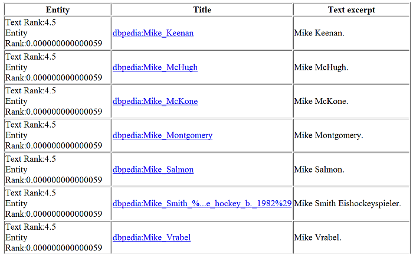

### SOAP interface

The facet web service is also available via SOAP protocol.

The request message contains single element 'query' with syntax
explained earlier. Also the SOAPAction HTTP header should be '\#query' .
After successful evaluation of the query, the service will return a SOAP
envelope containing in the Body element single 'facets' element
described above.

Example:

This example shows execution of same command as in example for REST
interface here it using SOAP:

Request message:

    <SOAP:Envelope xmlns:SOAP="http://schemas.xmlsoap.org/soap/envelope/">
      <SOAP:Body>
        <query xmlns="http://openlinksw.com/services/facets/1.0/" inference="" same-as="">
          <text>Seattle Mariners traveled all the way to Japan to watch</text>
          <view type="text" limit="20" offset="0"/>
        </query>
      </SOAP:Body>
    </SOAP:Envelope>

Response message:

    <SOAP:Envelope xmlns:SOAP="http://schemas.xmlsoap.org/soap/envelope/">
      <SOAP:Body>
        <fct:facets xmlns:fct="http://openlinksw.com/services/facets/1.0/">
          <fct:sparql>SELECT distinct ?s1 as ?c1, (bif:search_excerpt (bif:vector ('THE', 'MARINERS', 'WAY', 'SEATTLE', 'WATCH', 'ALL', 'TO', 'JAPAN', 'TRAVELED'), ?o1)) as ?c2  where { ?s1 ?s1textp ?o1 . filter (bif:contains (?o1, '(THE AND MARINERS AND WAY AND SEATTLE AND WATCH AND ALL AND TO AND JAPAN AND TRAVELED)')) . } LIMIT 20  OFFSET 0</fct:sparql>
          <fct:time>114</fct:time>
          <fct:complete>yes</fct:complete>
          <fct:db-activity>   134R rnd  9.488KR seq      0P disk  8.966MB /    602 messages</fct:db-activity>
          <fct:result>
            <fct:row>
              <fct:column datatype="url" shortform="http://bobdupuy.mlbl...ld_baseball__6.html">http://bobdupuy.mlblogs.com/bobdupuy/2006/03/world_baseball__6.html</fct:column>
              <fct:column/>
              <fct:column><span class="srch_xerpt">... While Chuck Armstrong president of <b>the</b> <b>Seattle</b> <b>Mariners</b> <b>traveled</b> <b>all</b> <b>the</b> <b>way</b> <b>to</b> <b>Japan</b> <b>to</b> <b>watch</b> Ichiro... for <b>the</b> advancing <b>Japan</b> team last week <b>the</b> star from <b>the</b> <b>Seattle</b> roster so far in Round 1 has without a doubt... leading <b>the</b> Dominican <b>to</b> its...</span></fct:column>
            </fct:row>
            <fct:row>
              <fct:column datatype="url" shortform="http://bobdupuy.mlbl...ld_baseball__6.html">http://bobdupuy.mlblogs.com/bobdupuy/2006/03/world_baseball__6.html</fct:column>
              <fct:column/>
              <fct:column><span class="srch_xerpt">Orlando While Chuck Armstrong president of <b>the</b> <b>Seattle</b> <b>Mariners</b> <b>traveled</b> <b>all</b> <b>the</b> <b>way</b> <b>to</b> <b>Japan</b> <b>to</b> <b>watch</b>... perform for <b>the</b> advancing <b>Japan</b> team last week <b>the</b> star from <b>the</b> <b>Seattle</b> roster so far in Round 1 has without...</span></fct:column>
            </fct:row>
          </fct:result>
        </fct:facets>
      </SOAP:Body>
    </SOAP:Envelope>

<a id="id83-linked-data"></a>
# Linked Data

There are many cases when RDF data should be retrieved from remote
sources only when really needed. E.g., a scheduling application may read
personal calendars from personal sites of its users. Calendar data
expire quickly, so there's no reason to frequently re-load them in hope
that they are queried before expired.

Virtuoso extends SPARQL so it is possible to download RDF resource from
a given IRI, parse them and store the resulting triples in a graph, all
three operations will be performed during the SPARQL query execution.
The IRI of graph to store triples is usually equal to the IRI where the
resource is download from, so the feature is named "IRI dereferencing"
There are two different use cases for this feature. In simple case, a
SPARQL query contains *from* clauses that enumerate graphs to process,
but there are no triples in *DB.DBA.RDF\_QUAD* that correspond to some
of these graphs. The query execution starts with dereferencing of these
graphs and the rest runs as usual. In more sophisticated case, the query
is executed many times in a loop. Every execution produces a partial
result. SPARQL processor checks for IRIs in the result such that
resources with that IRIs may contain relevant data but not yet loaded
into the *DB.DBA.RDF\_QUAD* . After some iteration, the partial result
is identical to the result of the previous iteration, because there's no
more data to retrieve. As the last step, SPARQL processor builds the
final result set.

<a id="id84-iri-dereferencing-for-from-clauses-define-get-pragmas"></a>
## IRI Dereferencing For FROM Clauses, "define get:..." Pragmas

Virtuoso extends SPARQL syntax of *from* and *from named* clauses. It
allows additional list of options at end of clause: *option ( param1
value1, param2 value2, ... )* where parameter names are QNames that
start with *get:* prefix and values are "precode" expressions, i.e.
expressions that does not contain variables other than external
parameters. Names of allowed parameters are listed below.

  - *get:soft*
    
    is the retrieval mode, supported values are "soft" and "replacing".
    If the value is "soft" then the SPARQL processor will not even try
    to retrieve triples if the destination graph is non-empty. Other
    
    *get:...*
    
    parameters are useless without this one.

  - *get:uri*
    
    is the IRI to retrieve if it is not equal to the IRI of the
    
    *from*
    
    clause. These can be used if data should be retrieved from a mirror,
    not from original resource location or in any other case when the
    destination graph IRI differs from the location of the resource.

  - ``` 
    SQL>SPARQL
    define get:uri "http://example.com/dataspace/person/kidehen"
    SELECT ?id
    FROM NAMED <http://www.openlinksw.com/dataspace/kidehen@openlinksw.com/weblog/kidehen@openlinksw.com%27s%20BLOG%20%5B127%5D/sioc.ttl>
    WHERE { graph ?g { ?id a ?o } }
    LIMIT 10;
    
    id
    VARCHAR
    _______________________________________________________________________________
    
    http://www.openlinksw.com/dataspace/kidehen@openlinksw.com/weblog/kidehen@openlinksw.com%27s%20BLOG%20%5B127%5D/1231
    http://www.openlinksw.com/dataspace/kidehen@openlinksw.com/weblog/kidehen@openlinksw.com%27s%20BLOG%20%5B127%5D/1231
    http://www.openlinksw.com/dataspace/kidehen@openlinksw.com/weblog/kidehen@openlinksw.com%27s%20BLOG%20%5B127%5D/1243
    http://www.openlinksw.com/dataspace/kidehen@openlinksw.com/weblog/kidehen@openlinksw.com%27s%20BLOG%20%5B127%5D/1243
    http://www.openlinksw.com/dataspace/kidehen@openlinksw.com/weblog/kidehen@openlinksw.com%27s%20BLOG%20%5B127%5D/1261
    http://www.openlinksw.com/dataspace/kidehen@openlinksw.com/weblog/kidehen@openlinksw.com%27s%20BLOG%20%5B127%5D/1261
    http://www.openlinksw.com/dataspace/kidehen@openlinksw.com/weblog/kidehen@openlinksw.com%27s%20BLOG%20%5B127%5D/1261
    http://www.openlinksw.com/dataspace/person/kidehen@openlinksw.com#this
    http://www.openlinksw.com/dataspace/kidehen@openlinksw.com/weblog/kidehen@openlinksw.com%27s%20BLOG%20%5B127%5D
    http://www.openlinksw.com/dataspace/kidehen@openlinksw.com/weblog/kidehen@openlinksw.com%27s%20BLOG%20%5B127%5D
    
    10 Rows. -- 10 msec.
    ```

  - *get:method*
    
    is the HTTP method that should be used to retrieve the resource,
    supported methods are "GET" for plain HTTP and "MGET" for URIQA web
    service endpoint. By default, "MGET" is used for IRIs that end with
    "/" and "GET" for everything else.

  - *get:refresh*
    
    is the maximum allowed age of the cached resource, no matter what is
    specified by the server where the resource resides. The value is an
    positive integer (number of seconds). Virtuoso reads HTTP headers
    and uses "Date", "ETag", "Expires", "Last-Modified", "Cache-Control"
    and "Pragma: no-cache" fields to calculate when the resource should
    be reloaded, this value can become smaller due to
    
    *get:refresh*
    
    but can not be incremented.

  - ``` 
    SQL>SPARQL
    define get:refresh "3600"
    SELECT ?id
    FROM NAMED <http://www.openlinksw.com/dataspace/kidehen@openlinksw.com/weblog/kidehen@openlinksw.com%27s%20BLOG%20%5B127%5D/sioc.ttl>
    WHERE { graph ?g { ?id a ?o } }
    LIMIT 10;
    
    id
    VARCHAR
    _______________________________________________________________________________
    
    http://www.openlinksw.com/dataspace/kidehen@openlinksw.com/weblog/kidehen@openlinksw.com%27s%20BLOG%20%5B127%5D/1231
    http://www.openlinksw.com/dataspace/kidehen@openlinksw.com/weblog/kidehen@openlinksw.com%27s%20BLOG%20%5B127%5D/1231
    http://www.openlinksw.com/dataspace/kidehen@openlinksw.com/weblog/kidehen@openlinksw.com%27s%20BLOG%20%5B127%5D/1243
    http://www.openlinksw.com/dataspace/kidehen@openlinksw.com/weblog/kidehen@openlinksw.com%27s%20BLOG%20%5B127%5D/1243
    http://www.openlinksw.com/dataspace/kidehen@openlinksw.com/weblog/kidehen@openlinksw.com%27s%20BLOG%20%5B127%5D/1261
    http://www.openlinksw.com/dataspace/kidehen@openlinksw.com/weblog/kidehen@openlinksw.com%27s%20BLOG%20%5B127%5D/1261
    http://www.openlinksw.com/dataspace/kidehen@openlinksw.com/weblog/kidehen@openlinksw.com%27s%20BLOG%20%5B127%5D/1261
    http://www.openlinksw.com/dataspace/person/kidehen@openlinksw.com#this
    http://www.openlinksw.com/dataspace/kidehen@openlinksw.com/weblog/kidehen@openlinksw.com%27s%20BLOG%20%5B127%5D
    http://www.openlinksw.com/dataspace/kidehen@openlinksw.com/weblog/kidehen@openlinksw.com%27s%20BLOG%20%5B127%5D
    
    10 Rows. -- 10 msec.
    ```

  - *get:proxy*
    
    address of the proxy server, as "host:port" string, if direct
    download is impossible; the default is to not use proxy.

  - ``` 
    SQL>SPARQL
    define get:proxy "www.openlinksw.com:80"
    define get:method "GET"
    define get:soft "soft"
    SELECT ?id
    FROM NAMED <http://www.openlinksw.com/dataspace/kidehen@openlinksw.com/weblog/kidehen@openlinksw.com%27s%20BLOG%20%5B127%5D/sioc.ttl>
    WHERE { graph ?g { ?id a ?o } }
    LIMIT 10;
    
    id
    VARCHAR
    _______________________________________________________________________________
    
    http://www.openlinksw.com/dataspace/kidehen@openlinksw.com/weblog/kidehen@openlinksw.com%27s%20BLOG%20%5B127%5D/1231
    http://www.openlinksw.com/dataspace/kidehen@openlinksw.com/weblog/kidehen@openlinksw.com%27s%20BLOG%20%5B127%5D/1231
    http://www.openlinksw.com/dataspace/kidehen@openlinksw.com/weblog/kidehen@openlinksw.com%27s%20BLOG%20%5B127%5D/1243
    http://www.openlinksw.com/dataspace/kidehen@openlinksw.com/weblog/kidehen@openlinksw.com%27s%20BLOG%20%5B127%5D/1243
    http://www.openlinksw.com/dataspace/kidehen@openlinksw.com/weblog/kidehen@openlinksw.com%27s%20BLOG%20%5B127%5D/1261
    http://www.openlinksw.com/dataspace/kidehen@openlinksw.com/weblog/kidehen@openlinksw.com%27s%20BLOG%20%5B127%5D/1261
    http://www.openlinksw.com/dataspace/kidehen@openlinksw.com/weblog/kidehen@openlinksw.com%27s%20BLOG%20%5B127%5D/1261
    http://www.openlinksw.com/dataspace/person/kidehen@openlinksw.com#this
    http://www.openlinksw.com/dataspace/kidehen@openlinksw.com/weblog/kidehen@openlinksw.com%27s%20BLOG%20%5B127%5D
    http://www.openlinksw.com/dataspace/kidehen@openlinksw.com/weblog/kidehen@openlinksw.com%27s%20BLOG%20%5B127%5D
    
    10 Rows. -- 10 msec.
    SQL> limit 10;
    ```

  - If a value of some *get:...* parameter repeats for every *from*
    clause then it can be written as a global pragma like *define
    get:soft "soft"* . The following two queries will work identically:
    
        SQL>SPARQL
        SELECT ?id
        FROM NAMED <http://www.openlinksw.com/dataspace/kidehen@openlinksw.com/weblog/kidehen@openlinksw.com%27s%20BLOG%20%5B127%5D/sioc.ttl>
          OPTION (get:soft "soft", get:method "GET")
        FROM NAMED <http://www.openlinksw.com/dataspace/oerling/weblog/Orri%20Erling%27s%20Blog/sioc.ttl>
          OPTION (get:soft "soft", get:method "GET")
        WHERE { graph ?g { ?id a ?o } }
        LIMIT 10;
        
        id
        VARCHAR
        _______________________________________________________________________________
        
        http://www.openlinksw.com/dataspace/person/oerling#this
        http://www.openlinksw.com/dataspace/oerling/weblog/Orri%20Erling%27s%20Blog
        http://www.openlinksw.com/dataspace/oerling/weblog/Orri%20Erling%27s%20Blog
        http://www.openlinksw.com/dataspace/oerling/weblog/Orri%20Erling%27s%20Blog/958
        http://www.openlinksw.com/dataspace/oerling/weblog/Orri%20Erling%27s%20Blog/958
        http://www.openlinksw.com/dataspace/oerling/weblog/Orri%20Erling%27s%20Blog/949
        http://www.openlinksw.com/dataspace/oerling/weblog/Orri%20Erling%27s%20Blog/949
        
        10 Rows. -- 862 msec.

  - ``` 
    SQL>SPARQL
    define get:method "GET"
    define get:soft "soft"
    SELECT ?id
    FROM NAMED <http://www.openlinksw.com/dataspace/kidehen@openlinksw.com/weblog/kidehen@openlinksw.com%27s%20BLOG%20%5B127%5D/sioc.ttl>
    FROM NAMED <http://www.openlinksw.com/dataspace/oerling/weblog/Orri%20Erling%27s%20Blog/sioc.ttl>
    WHERE { graph ?g { ?id a ?o } }
    LIMIT 10;
    
    id
    VARCHAR
    _______________________________________________________________________________
    
    http://www.openlinksw.com/dataspace/person/oerling#this
    http://www.openlinksw.com/dataspace/oerling/weblog/Orri%20Erling%27s%20Blog
    http://www.openlinksw.com/dataspace/oerling/weblog/Orri%20Erling%27s%20Blog
    http://www.openlinksw.com/dataspace/oerling/weblog/Orri%20Erling%27s%20Blog/958
    http://www.openlinksw.com/dataspace/oerling/weblog/Orri%20Erling%27s%20Blog/958
    http://www.openlinksw.com/dataspace/oerling/weblog/Orri%20Erling%27s%20Blog/949
    http://www.openlinksw.com/dataspace/oerling/weblog/Orri%20Erling%27s%20Blog/949
    
    10 Rows. -- 10 msec.
    ```

  - It can make text shorter and it is especially useful when the query
    text comes from client but the parameter should have a fixed value
    due to security reasons: the values set by *define get:...* can not
    be redefined inside the query and the application may prevent the
    text with desired pragmas before the execution.
    
    Note that the user should have *SPARQL\_UPDATE* role in order to
    execute such a query. By default SPARQL web service endpoint is
    owned by *SPARQL* user that have *SPARQL\_SELECT* but not
    *SPARQL\_UPDATE* . It is possible in principle to grant
    *SPARQL\_UPDATE* to *SPARQL* but this breaches the whole security of
    the RDF storage.

  - *FROM CLAUSE with options*
    
    : options in OPTION() list should be delimited with commas. grab
    options are not allowed as they are global for the query. Only
    specific 'get:xxx' options are useful here.

  - ``` 
    SQL>SPARQL
    PREFIX foaf: <http://xmlns.com/foaf/0.1/>
    SELECT DISTINCT ?friend
    FROM NAMED  <http://example.com/dataspace/person/kidehen>
    OPTION (get:soft "soft", get:method "GET")
    WHERE
      {
          <http://example.com/dataspace/person/kidehen#this> foaf:knows
    ?friend .
      };
    friend
    VARCHAR
    _______________________________________________________________________________
    
    http://www.dajobe.org/foaf.rdf#i
    http://www.w3.org/People/Berners-Lee/card#i
    http://www.w3.org/People/Connolly/#me
    http://my.opera.com/chaals/xml/foaf#me
    http://www.w3.org/People/Berners-Lee/card#amy
    http://www.w3.org/People/EM/contact#me
    http://example.com/dataspace/person/ghard#this
    http://example.com/dataspace/person/omfaluyi#this
    http://example.com/dataspace/person/alanr#this
    http://example.com/dataspace/person/bblfish#this
    http://example.com/dataspace/person/danja#this
    http://example.com/dataspace/person/tthibodeau#this
    ...
    36 Rows. -- 1693 msec.
    ```

<a id="id85-iri-dereferencing-for-variables-define-inputgrab-pragmas"></a>
## IRI Dereferencing For Variables, "define input:grab-..." Pragmas

Consider a set of personal data such that one resource can list many
persons and point to resources where that persons are described in more
details. E.g. resource about *user1* describes the user and also contain
statements that *user2* and *user3* are persons and more data can be
found in *user2.ttl* and *user3.ttl* , *user3.ttl* can contain
statements that *user4* is also person and more data can be found in
*user4.ttl* and so on. The query should find as many users as it is
possible and return their names and e-mails.

If all data about all users were loaded into the database, the query
could be quite simple:

    SQL>SPARQL
    prefix foaf: <http://xmlns.com/foaf/0.1/>
    prefix rdf: <http://www.w3.org/1999/02/22-rdf-syntax-ns#>
    SELECT ?id ?firstname ?nick
    where
      {
        graph ?g
          {
            ?id rdf:type foaf:Person.
            ?id foaf:firstName ?firstname.
            ?id foaf:knows ?fn .
            ?fn foaf:nick ?nick.
          }
       }
    limit 10;
    
    id                                                      firstname  nick
    VARCHAR                                                 VARCHAR    VARCHAR
    _______________________________________________________________________________
    
    http://example.com/dataspace/person/pmitchell#this   LaRenda    sdmonroe
    http://example.com/dataspace/person/pmitchell#this   LaRenda    kidehen{at}openlinksw.com
    http://example.com/dataspace/person/pmitchell#this   LaRenda    alexmidd
    http://example.com/dataspace/person/abm#this         Alan       kidehen{at}openlinksw.com
    http://example.com/dataspace/person/igods#this       Cameron    kidehen{at}openlinksw.com
    http://example.com/dataspace/person/goern#this       Christoph  captsolo
    http://example.com/dataspace/person/dangrig#this     Dan        rickbruner
    http://example.com/dataspace/person/dangrig#this     Dan        sdmonroe
    http://example.com/dataspace/person/dangrig#this     Dan        lszczepa
    http://example.com/dataspace/person/dangrig#this     Dan        kidehen
    
    10 Rows. -- 80 msec.

It is possible to enable IRI dereferencing in such a way that all
appropriate resources are loaded during the query execution even if
names of some of them are not known a priori.

    SQL>SPARQL
      define input:grab-var "?more"
      define input:grab-depth 10
      define input:grab-limit 100
      define input:grab-base "http://www.openlinksw.com/dataspace/kidehen@openlinksw.com/weblog/kidehen@openlinksw.com%27s%20BLOG%20%5B127%5D/1300"
      prefix foaf: <http://xmlns.com/foaf/0.1/>
      prefix rdf: <http://www.w3.org/1999/02/22-rdf-syntax-ns#>
      prefix rdfs: <http://www.w3.org/2000/01/rdf-schema#>
    SELECT ?id ?firstname ?nick
    WHERE {
        graph ?g {
                   ?id rdf:type foaf:Person.
                   ?id foaf:firstName ?firstname.
                   ?id foaf:knows ?fn .
                   ?fn foaf:nick ?nick.
                   OPTIONAL { ?id rdfs:SeeAlso ?more }
                }
    }
    LIMIT 10;
    
    id                                                         firstname  nick
    VARCHAR                                                    VARCHAR    VARCHAR
    _______________________________________________________________________________
    
    http://example.com/dataspace/person/ghard#this          Yrj+?n+?   kidehen
    http://inamidst.com/sbp/foaf#Sean                          Sean       d8uv
    http://example.com/dataspace/person/dangrig#this        Dan        rickbruner
    http://example.com/dataspace/person/dangrig#this        Dan        sdmonroe
    http://example.com/dataspace/person/dangrig#this        Dan        lszczepa
    http://example.com/dataspace/person/dangrig#this        Dan        kidehen
    http://captsolo.net/semweb/foaf-captsolo.rdf#Uldis_Bojars  Uldis      mortenf
    http://captsolo.net/semweb/foaf-captsolo.rdf#Uldis_Bojars  Uldis      danja
    http://captsolo.net/semweb/foaf-captsolo.rdf#Uldis_Bojars  Uldis      zool
    http://example.com/dataspace/person/rickbruner#this     Rick       dangrig
    
    10 Rows. -- 530 msec.

The IRI dereferencing is controlled by the following pragmas:

  - *input:grab-var*
    
    specifies a name of variable whose values should be used as IRIs of
    resources that should be downloaded. It is not an error if the
    variable is sometimes unbound or gets values that can not be
    converted to IRIs (e.g., integers) -- bad values are silently
    ignored. It is also not an error if the IRI can not be retrieved,
    this makes IRI retrieval somewhat similar to "best effort union" in
    SQL. This pragma can be used more than once to specify many variable
    names. It is not an error if values of different variables result in
    same IRI or a variable gets same value many times -- no one IRI is
    retrieved more than once.

  - *input:grab-iri*
    
    specifies an IRI that should be retrieved before executing the rest
    of the query, if it is not in the
    
    *DB.DBA.RDF\_QUAD*
    
    already. This pragma can be used more than once to specify many
    IRIs. The typical use of this pragma is querying a set of related
    resources when only one "root" resource IRI is known but even that
    resource is not loaded.

  - ``` 
    SQL>SPARQL
      define input:storage ""
      define input:grab-iri <http://www.openlinksw.com/dataspace/kidehen@openlinksw.com/weblog/kidehen@openlinksw.com%27s%20BLOG%20%5B127%5D/sioc.ttl>
      define input:grab-var "id"
      define input:grab-depth 10
      define input:grab-limit 100
      define input:grab-base "http://www.openlinksw.com/dataspace/kidehen@openlinksw.com/weblog/kidehen@openlinksw.com%27s%20BLOG%20%5B127%5D/1300"
    SELECT ?id
    WHERE { graph ?g { ?id a ?o } }
    LIMIT 10;
    
    id
    VARCHAR
    _______________________________________________________________________________
    
    http://example.com/virtrdf-data-formats#default-iid
    http://example.com/virtrdf-data-formats#default-iid-nullable
    http://example.com/virtrdf-data-formats#default-iid-nonblank
    http://example.com/virtrdf-data-formats#default-iid-nonblank-nullable
    http://example.com/virtrdf-data-formats#default
    http://example.com/virtrdf-data-formats#default-nullable
    http://example.com/virtrdf-data-formats#sql-varchar
    http://example.com/virtrdf-data-formats#sql-varchar-nullable
    http://example.com/virtrdf-data-formats#sql-longvarchar
    http://example.com/virtrdf-data-formats#sql-longvarchar-nullable
    
    10 Rows. -- 530 msec.
    ```

  - *input:grab-all*
    
    is the simplest possible way to enable the feature but the resulting
    performance can be very bad. It turns all variables and IRI
    constants in all graph, subject and object fields of all triple
    patterns of the query into values for
    
    *input:grab-var*
    
    and
    
    *input:grab-iri*
    
    , so the SPARQL processor will dereference everything what might be
    related to the text of the query.

  - ``` 
    SQL>SPARQL
      define input:grab-all "yes"
      define input:grab-depth 10
      define input:grab-limit 100
      define input:grab-base "http://www.openlinksw.com/dataspace/kidehen@openlinksw.com/weblog/kidehen@openlinksw.com%27s%20BLOG%20%5B127%5D/1300"
      prefix foaf: <http://xmlns.com/foaf/0.1/>
      prefix rdf: <http://www.w3.org/1999/02/22-rdf-syntax-ns#>
    SELECT ?id ?firstname ?nick
    where
      {
        graph ?g
         {
           ?id rdf:type foaf:Person.
           ?id foaf:firstName ?firstname.
           ?id foaf:knows ?fn .
           ?fn foaf:nick ?nick.
         }
      }
    limit 10;
    
    id                                                      firstname   nick
    VARCHAR                                                 VARCHAR     VARCHAR
    ____________________________________________________________________
    
    http://example.com/dataspace/person/pmitchell#this   LaRenda     sdmonroe
    http://example.com/dataspace/person/pmitchell#this   LaRenda     kidehen{at}openlinksw.com
    http://example.com/dataspace/person/pmitchell#this   LaRenda     alexmidd
    http://example.com/dataspace/person/abm#this         Alan        kidehen{at}openlinksw.com
    http://example.com/dataspace/person/igods#this       Cameron     kidehen{at}openlinksw.com
    http://example.com/dataspace/person/goern#this       Christoph   captsolo
    http://example.com/dataspace/person/dangrig#this     Dan         rickbruner
    http://example.com/dataspace/person/dangrig#this     Dan         sdmonroe
    http://example.com/dataspace/person/dangrig#this     Dan         lszczepa
    http://example.com/dataspace/person/dangrig#this     Dan         kidehen
    
    10 Rows. -- 660 msec.
    ```

  - *input:grab-seealso*
    
    (and synonym
    
    *input:grab-follow-predicate*
    
    ) specifies an IRI of an predicate similar to foaf:seeAlso.
    Predicates of that sort suggest location of resources that contain
    more data about predicate subject. The IRI dereferencing routine may
    use these predicates to find additional IRIs for loading resources.
    This is especially useful when the text of the query comes from
    remote client and may lack triple patterns like
    
    *optional { ?id \<SeeAlso\> ?more }*
    
    from the previous example. The use of
    
    *input:grab-seealso*
    
    makes the SPARQL query nondeterministic, because the order and the
    number of retrieved documents will depend on execution plan and they
    may change from run to run. This pragma can be used more than once
    to specify many IRIs, but this feature is costly. Every additional
    predicate may result in significant number of lookups in the RDF
    storage, affecting total execution time.

  - ``` 
    SQL>SPARQL
      define input:grab-iri <http://www.openlinksw.com/dataspace/kidehen@openlinksw.com/weblog/kidehen@openlinksw.com%27s%20BLOG%20%5B127%5D/sioc.ttl>
      define input:grab-var "id"
      define input:grab-depth 10
      define input:grab-limit 100
      define input:grab-base "http://www.openlinksw.com/dataspace/kidehen@openlinksw.com/weblog/kidehen@openlinksw.com%27s%20BLOG%20%5B127%5D/1300"
      define input:grab-seealso <foaf:maker>
        prefix foaf: <http://xmlns.com/foaf/0.1/>
    SELECT ?id
    where
      {
        graph ?g
          {
            ?id a foaf:Person .
          }
      }
    limit 10;
    
    id
    VARCHAR
    _______________________________________________________________________________
    
    mailto:somebody@example.domain
    http://example.com/dataspace/person/dav#this
    http://example.com/dataspace/person/dba#this
    mailto:2@F.D
    http://example.com/dataspace/person/test1#this
    http://www.openlinksw.com/blog/~kidehen/gems/rss.xml#Kingsley%20Uyi%20Idehen
    http://digitalmusic.weblogsinc.com/rss.xml#
    http://partners.userland.com/nytrss/books.xml#
    http://partners.userland.com/nytrss/arts.xml#
    
    9 Rows. -- 105 msec.
    ```

  - *input:grab-limit*
    
    should be an integer that is a maximum allowed number of resource
    retrievals. The default value is pretty big (few millions of
    documents) so it is strongly recommended to set smaller value. Set
    it even if you're absolutely sure that the set of resources is
    small, because program errors are always possible. All resource
    downloads are counted, both successful and failed, both forced by
    
    *input:grab-iri*
    
    and forced by
    
    *input:grab-var*
    
    . Nevertheless, all constant IRIs specified by
    
    *input:grab-iri*
    
    (or
    
    *input:grab-all*
    
    ) are downloaded before the first check of the
    
    *input:grab-limit*
    
    counter, so this limit will never prevent from downloading "root"
    resources.

  - *input:grab-depth*
    
    should be an integer that is a maximum allowed number of query
    iterations. Every iteration may find new IRIs to retrieve, because
    resources loaded on previous iteration may add these IRIs to
    
    *DB.DBA.RDF\_QUAD*
    
    and make result set longer. The default value is 1, so the SPARQL
    processor will retrieve only resources explicitly named in "root"
    resources or in quad that are in the database before the query
    execution.

  - *input:grab-base*
    
    specifies a base IRI used to convert relative IRIs into absolute.
    The default is an empty string.

  - ``` 
    SQL>SPARQL
      define input:grab-depth 10
      define input:grab-limit 100
      define input:grab-var "more"
      define input:grab-base "http://www.openlinksw.com/dataspace/kidehen@openlinksw.com/weblog/kidehen@openlinksw.com%27s%20BLOG%20%5B127%5D/1300"
      prefix foaf: <http://xmlns.com/foaf/0.1/>
    SELECT ?id
    where
      {
        graph ?g
         {
           ?id a foaf:Person .
           optional { ?id foaf:maker ?more }
         }
      }
    limit 10;
    
    id
    VARCHAR
    _______________________________________________________________________________
    
    mailto:somebody@example.domain
    http://example.com/dataspace/person/dav#this
    http://example.com/dataspace/person/dba#this
    mailto:2@F.D
    http://example.com/dataspace/person/test1#this
    http://www.openlinksw.com/blog/~kidehen/gems/rss.xml#Kingsley%20Uyi%20Idehen
    http://digitalmusic.weblogsinc.com/rss.xml#
    http://partners.userland.com/nytrss/books.xml#
    http://partners.userland.com/nytrss/arts.xml#
    
    9 Rows. -- 115 msec.
    ```

  - *input:grab-resolver*
    
    is a name of procedure that resolve IRIs and determines the HTTP
    method of retrieval. The default is name of
    
    *DB.DBA.RDF\_GRAB\_RESOLVER\_DEFAULT()*
    
    procedure that is described below. If other procedure is specified,
    the signature should match to the default one.

  - *input:grab-destination*
    
    is to override the default behaviour of the IRI dereferencing and
    store all retrieved triples in a single graph. This is convenient
    when there's no logical difference where any given triple comes
    from, and changes in remote resources will only add triples but not
    make cached triples obsolete. A SPARQL query is usually faster when
    all graph IRIs are fixed and there are no graph group patterns with
    an unbound graph variable, so storing everything in one single graph
    is worth considering.

  - *input:grab-loader*
    
    is a name of procedure that retrieve the resource via HTTP, parse it
    and store it. The default is name of
    
    *DB.DBA.RDF\_SPONGE\_UP()*
    
    procedure; this procedure also used by IRI dereferencing for FROM
    clauses. You will probably never need to write your own procedure of
    this sort but some Virtuoso plugins will provide ready-to-use
    functions that will retrieve non-RDF resources and extract their
    metadata as triples or will implement protocols other than HTTP.

Default resolver procedure is *DB.DBA.RDF\_GRAB\_RESOLVER\_DEFAULT()* .
Note that the function produce two absolute URIs, *abs\_uri* and
*dest\_uri* . Default procedure returns two equal strings, but other may
return different values, e.g., return primary and permanent location of
the resource as *dest\_uri* and the fastest known mirror location as
*abs\_uri* thus saving HTTP retrieval time. It can even signal an error
to block the downloading of some unwanted resource.

    DB.DBA.RDF_GRAB_RESOLVER_DEFAULT (
      in base varchar,         -- base IRI as specified by input:grab-base pragma
      in rel_uri varchar,      -- IRI of the resource as it is specified by input:grab-iri or a value of a variable
      out abs_uri varchar,     -- the absolute IRI that should be downloaded
      out dest_uri varchar,    -- the graph IRI where triples should be stored after download
      out get_method varchar ) -- the HTTP method to use, should be "GET" or "MGET".

<a id="id86-url-rewriting"></a>
## URL rewriting

URL rewriting is the act of modifying a source URL prior to the final
processing of that URL by a Web Server.

The ability to rewrite URLs may be desirable for many reasons that
include:

  - Changing Web information resource URLs on the a Web Server without
    breaking existing bookmarks held in User Agents (e.g., Web browsers)

  - URL compaction where shorter URLs may be constructed on a
    conditional basis for specific User Agents (e.g. Email clients)

  - Construction of search engine friendly URLs that enable richer
    indexing since most search engines cannot process parameterized URLs
    effectively.

### Using URL Rewriting to Solve Linked Data Deployment Challenges

URI naming schemes don't resolve the challenges associated with
referencing data. To reiterate, this is demonstrated by the fact that
the URIs http://demo.openlinksw.com/Northwind/Customer/ALFKI and
http://demo.openlinksw.com/Northwind/Customer/ALFKI\#this both appear as
http://demo.openlinksw.com/Northwind/Customer/ALFKI to the Web Server,
since data following the fragment identifier "\#" never makes it that
far.

The only way to address data referencing is by pre-processing source
URIs (e.g. via regular expression or sprintf substitutions) as part of a
URL rewriting processing pipeline. The pipeline process has to take the
form of a set of rules that cater for elements such as HTTP Accept
headers, HTTP response code, HTTP response headers, and rule processing
order.

An example of such a pipeline is depicted in the table below.

| URI Source(Regular Expression Pattern) | HTTP Accept Headers(Regular Expression) | HTTPResponse Code                                              | HTTP Response Headers                                                                                                            | Rule Processing Order                                                       |
| -------------------------------------- | --------------------------------------- | -------------------------------------------------------------- | -------------------------------------------------------------------------------------------------------------------------------- | --------------------------------------------------------------------------- |
| /Northwind/Customer/(\[^\#\]\*)        | None (meaning default)                  | 200 or 303 redirect to a resource with default representation. | None                                                                                                                             | Normal (order irrelevant)                                                   |
| /Northwind/Customer/(\[^\#\]\*)        | (text/rdf.n3)                           | (application/rdf.xml)                                          | 303 redirect to location of a descriptive and associated resource (e.g. RESTful Web Service that returns desired representation) | None                                                                        |
| /Northwind/Customer/(\[^\#\]\*)        | (text/html)                             | (application/xhtml.xml)                                        | 406 (Not Acceptable)or303 redirect to location of resource in requested representation                                           | Vary: negotiate, acceptAlternates: {"ALFKI" 0.9 {type application/rdf+xml}} |

Pre-processing source URIs

The source URI patterns refer to virtual or physical directories for ex.
at http://demo.openlinksw.com/. Rules can be placed at the head or tail
of the pipeline, or applied in the order they are declared, by
specifying a Rule Processing Order of First, Last, or Normal,
respectively. The decision as to which representation to return for URI
http://demo.openlinksw.com/Northwind/Customer/ALFKI is based on the MIME
type(s) specified in any Accept header accompanying the request.

In the case of the last rule, the Alternates response header applies
only to response code 406. 406 would be returned if there were no
(X)HTML representation available for the requested resource. In the
example shown, an alternative representation is available in RDF/XML.

When applied to matching HTTP requests, the last two rules might
generate responses similar to those below:

    $ curl -I -H "Accept: application/rdf+xml" http://demo.openlinksw.com/Northwind/Customer/ALFKI
    
    HTTP/1.1 303 See Other
    Server: Virtuoso/05.00.3016 (Solaris) x86_64-sun-solaris2.10-64 PHP5
    Connection: close
    Content-Type: text/html; charset=ISO-8859-1
    Date: Mon, 16 Jul 2007 22:40:03 GMT
    Accept-Ranges: bytes
    Location: /sparql?query=CONSTRUCT+{+%3Chttp%3A//demo.openlinksw.com/Northwind/Customer/ALFKI%23this%3E+%3Fp+%3Fo+}+FROM+%3Chttp%3A//demo.openlinksw.com/Northwind%3E+WHERE+{+%3Chttp%3A//demo.openlinksw.com/Northwind/Customer/ALFKI%23this%3E+%3Fp+%3Fo+}&format=application/rdf%2Bxml
    Content-Length: 0

In the cURL exchange depicted above, the target Virtuoso server
redirects to a SPARQL endpoint that retrieves an RDF/XML representation
of the requested entity.

    $ curl -I -H "Accept: text/html" http://demo.openlinksw.com/Northwind/Customer/ALFKI
    
    HTTP/1.1 406 Not Acceptable
    Server: Virtuoso/05.00.3016 (Solaris) x86_64-sun-solaris2.10-64 PHP5
    Connection: close
    Content-Type: text/html; charset=ISO-8859-1
    Date: Mon, 16 Jul 2007 22:40:23 GMT
    Accept-Ranges: bytes
    Vary: negotiate,accept
    Alternates: {"ALFKI" 0.9 {type application/rdf+xml}}
    Content-Length: 0

In this second cURL exchange, the target Virtuoso server indicates that
there is no resource to deliver in the requested representation. It
provides hints in the form of an alternate resource representation and
URI that may be appropriate, i.e., an RDF/XML representation of the
requested entity.

### The Virtuoso Rules-Based URL Rewriter

Virtuoso provides a URL rewriter that can be enabled for URLs matching
specified patterns. Coupled with customizable HTTP response headers and
response codes, Data-Web server administrators can configure highly
flexible rules for driving content negotiation and URL rewriting. The
key elements of the URL rewriter are:

  - Rewriting rule

  - Each rule describes how to parse a single source URL, and how to
    compose the URL of the page ultimately returned in the "Location:"
    response headers

  - Every rewriting rule is uniquely identified internally (using IRIs).

  - Two types of rule are supported, based on the syntax used to
    describe the source URL pattern matching: sprintf-based and
    regex-based.

  - Rewrite rules list

  - A named ordered list of rewrite rules or rule lists where rules of
    the list are processed from top to bottom or in line with processing
    pipeline precedence instructions

  - Configuration API

  - The rewriter configuration API defines functions for creating,
    dropping, and enumerating rules and rule lists.

  - Virtual hosts and virtual paths

  - URL rewriting is enabled by associating a rewrite rules list with a
    virtual directory

### Virtual Domains (Hosts) & Directories

A Virtuoso virtual directory maps a logical path to a physical directory
that is file system or WebDAV based. This mechanism allows physical
locations to be hidden or simply reorganised. Virtual directory
definitions are held in the system table DB.DBA.HTTP\_PATH. Virtual
directories can be administered in three basic ways:

  - Using the Visual Administration Interface via a Web browser;

  - Using the functions vhost\_define() and vhost\_remove(); and

  - Using SQL statements to directly update the HTTP\_PATH system table.

### "Nice" URLs vs. "Long" URLs

Although we are approaching the URL Rewriter from the perspective of
deploying linked data, the Rewriter was developed with additional
objectives in mind. These in turn have influenced the naming of some of
the formal argument names in the Configuration API function prototypes.
In the following sections, long URLs are those containing a query string
with named parameters; nice (aka. source) URLs have data encoded in some
other format. The primary goal of the Rewriter is to accept a nice URL
from an application and convert this into a long URL, which then
identifies the page that should actually be retrieved.

### Rule Processing Mechanics

When an HTTP request is accepted by the Virtuoso HTTP server, the
received nice URL is passed to an internal path translation function.
This function takes the nice URL and, if the current virtual directory
has a url\_rewrite option set to an existing ruleset name, tries to
match the corresponding rulesets and rules; that is, it performs a
recursive traversal of any rulelist associated with it. For every rule
in the rulelist, the same logic is applied (only the logic for
regex-based rules is described; that for sprintf-based rules is very
similar):

  - The input for the rule is the resource URL as received from the HTTP
    header, i.e., the portion of the URL from the first '/' after the
    host:port fields to the end of the URL.

  - The input is normalized.

  - The input is matched against the rule's regex. If the match fails,
    the rule is not applied and the next rule is tried. If the match
    succeeds, the result is a vector of values.

  - If the URL contains a query string, the names and values of the
    parameters are decoded by split\_and\_decode().

  - The names and values of any parameters in the request body are also
    decoded.

  - The destination URL is composed

  - The value of each parameter in the destination URL is taken from (in
    order of priority)

  - The value of a parameter in the match result;

  - The value of a named parameter in the query string of the input nice
    URL;

  - If the original request was submitted by the POST method, the value
    of a named parameter in the body of the POST request; or

  - if a parameter value cannot be derived from one of these sources,
    the rule is not applied and the next rule is tried.

The path translation function described above is internal to the Web
server, so its signature is not appropriate for Virtuoso/PL calls and
thus is not published. Virtuoso/PL developers can harness the same
functionality using the DB.DBA.URLREWRITE\_APPLY API call.

### Enabling URL Rewriting via the Virtuoso Conductor UI

Virtuoso is a full-blown HTTP server in its own right. The HTTP server
functionality co-exists with the product core (i.e., DBMS Engine, Web
Services Platform, WebDAV filesystem, and other components of the
Universal Server). As a result, it has the ability to multi-home Web
domains within a single instance across a variety of domain name and
port combinations. In addition, it also enables the creation of multiple
virtual directories per domain.

In addition to the basic functionality, Virtuoso facilitates the
association of URL Rewriting rules with the virtual directories
associated with a hosted Web domain.

In all cases, Virtuoso enables you to configure virtual domains, virtual
directories and URL rewrite rules for one or more virtual directories,
via the (X)HTML-based Conductor Admin User Interface or a collection of
Virtuoso Stored Procedure Language (PL)-based APIs.

The steps for configuring URL Rewrite rules via the Virtuoso Conductor
are as follows:

  - Assuming you are using the local demonstration database, load
    http://example.com/conductor into your browser, and then proceed
    through the Conductor as follows:

  - Click the "Web Application Server", and "Virtual Domains &
    Directories" tabs

  - Pick the domain that contains the virtual directories to which the
    rules are to be applied (in this case the default was taken)

  - Click on the "URL-rewrite" link to create, delete, or edit a rule as
    shown below:

  - Create a Rule for HTML Representation Requests (via SPARQL SELECT
    Query)

  - Create a Rule for RDF Representation Requests (via SPARQL CONSTRUCT
    Query)

  - Then save and exit the Conductor, and test your rules with curl or
    any other User Agent.

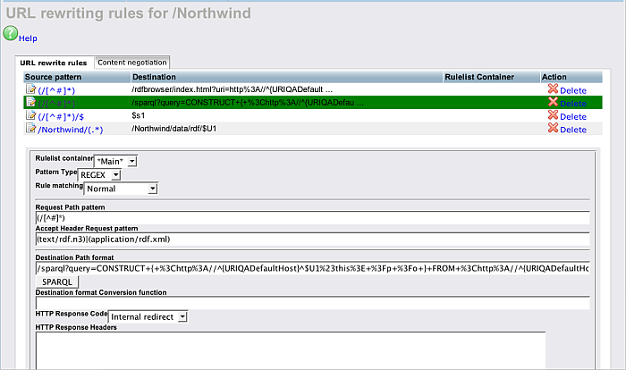

### Enabling URL Rewriting via Virtuoso PL

The vhost\_define()API is used to define virtual hosts and virtual paths
hosted by the Virtuoso HTTP server. URL rewriting is enabled through
this function's opts parameter. opts is of type ANY, e.g., a vector of
field-value pairs. Numerous fields are recognized for controlling
different options. The field value url\_rewrite controls URL rewriting.
The corresponding field value is the IRI of a rule list to apply.

#### Configuration API

Virtuoso includes the following functions for managing URL rewriting
rules and rule lists. The names are self-explanatory.

    -- Deletes a rewriting rule
    DB.DBA.URLREWRITE_DROP_RULE
    
    -- Creates a rewriting rule which uses sprintf-based pattern matching
    DB.DBA.URLREWRITE_CREATE_SPRINTF_RULE
    
    -- Creates a rewriting rule which uses regular expression (regex) based pattern matching
    DB.DBA.URLREWRITE_CREATE_REGEX_RULE
    
    -- Deletes a rewriting rule list
    DB.DBA.URLREWRITE_DROP_RULELIST
    
    -- Creates a rewriting rule list
    DB.DBA.URLREWRITE_CREATE_RULELIST
    
    -- Lists all the rules whose IRI match the specified 'SQL like' pattern
    DB.DBA.URLREWRITE_ENUMERATE_RULES
    
    -- Lists all the rule lists whose IRIs match the specified 'SQL like' pattern
    DB.DBA.URLREWRITE_ENUMERATE_RULELISTS

#### Creating Rewriting Rules

Rewriting rules take two forms: sprintf-based or regex-based. When used
for nice URL to long URL conversion, the only difference between them is
the syntax of format strings. The reverse long to nice conversion works
only for sprintf-based rules, whereas regex-based rules are
unidirectional.

For the purposes of describing how to make dereferenceable URIs for
linked data, we will stick with the nice to long conversion using
regex-based rules.

Regex rules are created using the *URLREWRITE\_CREATE\_REGEX\_RULE()*
function.

### Example - URL Rewriting For the Northwind Linked Data View

The Northwind schema is comprised of commonly understood SQL Tables that
include: Customers, Orders, Employees, Products, Product Categories,
Shippers, Countries, Provinces etc.

An Linked Data View of SQL data is an RDF named graph (RDF data set)
comprised of RDF Linked Data (triples) stored in a Virtuoso Quad Store
(the native RDF Data Management realm of Virtuoso).

In this example we are going interact with Linked Data deployed into the
Data-Web from a live instance of Virtuoso, which uses the URL Rewrite
rules from the prior section.

The components used in the example are as follows:

  - Virtuoso SPARQL Endpoint: http://demo.openlinksw.com/sparql

  - Named RDF Graph: http://demo.openlinksw.com/Northwind

  - Entity ID -
    http://demo.openlinksw.com/Northwind/Customer/ALFKI\#this

  - Information Resource:
    http://demo.openlinksw.com/Northwind/Customer/ALFKI

  - Interactive SPARQL Query Builder (iSPARQL) -
    http://demo.openlinksw.com/DAV/JS/isparql/index.html

#### Northwind URL Rewriting Verification Using curl

The curl utility provides a useful tool for verifying HTTP server
responses and rewriting rules. The curl exchanges below show the URL
rewriting rules defined for the Northwind RDF view being applied.

*Example 1:*

    $ curl -I -H "Accept: text/html" http://demo.openlinksw.com/Northwind/Customer/ALFKI
    
    HTTP/1.1 303 See Other
    Server: Virtuoso/05.00.3016 (Solaris) x86_64-sun-solaris2.10-64 PHP5
    Connection: close
    Content-Type: text/html; charset=ISO-8859-1
    Date: Tue, 14 Aug 2007 13:30:02 GMT
    Accept-Ranges: bytes
    Location: http://demo.openlinksw.com/about/html/http/demo.openlinksw.com/Northwind/Customer/ALFKI
    Content-Length: 0

*Example 2:*

    $ curl -I -H "Accept: application/rdf+xml" http://demo.openlinksw.com/Northwind/Customer/ALFKI
    
    HTTP/1.1 303 See Other
    Server: Virtuoso/05.00.3016 (Solaris) x86_64-sun-solaris2.10-64 PHP5
    Connection: close
    Content-Type: text/html; charset=ISO-8859-1
    Date: Tue, 14 Aug 2007 13:30:22 GMT
    Accept-Ranges: bytes
    Location: /sparql?query=CONSTRUCT+{+%3Chttp%3A//demo.openlinksw.com/Northwind/Customer/ALFKI%23this%3E+%3Fp+%3Fo+}+FROM+%3Chttp%3A//demo.openlinksw.com/Northwind%3E+WHERE+{+%3Chttp%3A//demo.openlinksw.com/Northwind/Customer/ALFKI%23this%3E+%3Fp+%3Fo+}&format=application/rdf%2Bxml
    Content-Length: 0

*Example 3:*

    $ curl -I -H "Accept: text/html" http://demo.openlinksw.com/Northwind/Customer/ALFKI#this
    
    HTTP/1.1 404 Not Found
    Server: Virtuoso/05.00.3016 (Solaris) x86_64-sun-solaris2.10-64 PHP5
    Connection: Keep-Alive
    Content-Type: text/html; charset=ISO-8859-1
    Date: Tue, 14 Aug 2007 13:31:01 GMT
    Accept-Ranges: bytes
    Content-Length: 0

The output above shows how RDF entities from the Data-Web, in this case
customer ALFKI, are exposed in the Document Web. The power of SPARQL
coupled with URL rewriting enables us to produce results in line with
the desired representation. A SPARQL SELECT or CONSTRUCT query is used
depending on whether the requested representation is text/html or
application/rdf+xml, respectively.

The 404 response in Example 3 indicates that no HTML representation is
available for entity ALFKI\#this. In most cases, a URI of this form
(containing a '\#' fragment identifier) will not reach the server. This
example supposes that it does: i.e., the RDF client and network routing
allows the suffixed request. The presence of the \#this suffix
implicitly states that this is a request for a data resource in the
Data-Web realm, not a document resource from the Document Web.2

Rather than return 404, we could instead choose to construct our
rewriting rules to perform a 303 redirect, so that the response for
ALFKI\#this in Example 3 becomes the same as that for ALFKI in Example
1.

### Transparent Content Negotiation

So as not to overload our preceding description of Linked Data
deployment with excessive detail, the description of content negotiation
presented thus far was kept deliberately brief. This section discusses
content negotiation in more detail.

#### HTTP/1.1 Content Negotiation

Recall that a resource (conceptual entity) identified by a URI may be
associated with more than one representation (e.g. multiple languages,
data formats, sizes, resolutions). If multiple representations are
available, the resource is referred to as negotiable and each of its
representations is termed a variant. For instance, a Web document
resource, named 'ALFKI' may have three variants: alfki.xml, alfki.html
and alfki.txt all representing the same data. Content negotiation
provides a mechanism for selecting the best variant.

As outlined in the earlier brief discussion of content negotiation, when
a user agent requests a resource, it can include with the request Accept
headers (Accept, Accept-Language, Accept-Charset, Accept-Encoding etc.)
which express the user preferences and user agent capabilities. The
server then chooses and returns the best variant based on the Accept
headers. Because the selection of the best resource representation is
made by the server, this scheme is classed as server-driven negotiation.

#### Transparent Content Negotiation

An alternative content negotiation mechanism is Transparent Content
Negotiation (TCN), a protocol defined by RFC2295 . TCN offers a number
of benefits over standard HTTP/1.1 negotiation, for suitably enabled
user agents.

RFC2295 introduces a number of new HTTP headers including the Negotiate
request header, and the TCN and Alternates response headers.
(Krishnamurthy et al. note that although the HTTP/1.1 specification
reserved the Alternates header for use in agent driven negotiation, it
was not fully specified. Consequently under a pure HTTP/1.1
implementation as defined by RFC2616, server-driven content negotiation
is the only option. RFC2295 addresses this issue.)

#### Deficiencies of HTTP/1.1 Server-Driven Negotiation

Weaknesses of server-driven negotiation highlighted by RFCs 2295 and
2616 include:

  - Inefficiency - Sending details of a user agent's capabilities and
    preferences with every request is very inefficient, not least
    because very few Web resources have multiple variants, and expensive
    in terms of the number of Accept headers required to fully describe
    all but the most simple browser's capabilities.

  - Server doesn't always know 'best' - Having the server decide on the
    'best' variant may not always result in the most suitable resource
    representation being returned to the client. The user agent might
    often be better placed to decide what is best for its needs.

#### Variant Selection By User Agent

Rather than rely on server-driven negotiation and variant selection by
the server, a user agent can take full control over deciding the best
variant by explicitly requesting transparent content negotiation through
the Negotiate request header. The negotiation is 'transparent' because
it makes all the variants on the server visible to the agent.

Under this scheme, the server sends the user agent a list, represented
in an Alternates header, containing the available variants and their
properties. The user agent can then choose the best variant itself.
Consequently, the agent no longer needs to send large Accept headers
describing in detail its capabilities and preferences. (However, unless
caching is used, user-agent driven negotiation does suffer from the
disadvantage of needing a second request to obtain the best
representation. By sending its best guess as the first response, server
driven negotiation avoids this second request if the initial best guess
is acceptable.)

#### Variant Selection By Server

As well as variant selection by the user agent, TCN allows the server to
choose on behalf of the user agent if the user agent explicitly allows
it through the Negotiate request header. This option allows the user
agent to send smaller Accept headers containing enough information to
allow the server to choose the best variant and return it directly. The
server's choice is controlled by a 'remote variant selection algorithm'
as defined in RFC2296.

#### Variant Selection By End-User

A further option is to allow the end-user to select a variant, in case
the choice made by negotiation process is not optimal. For instance, the
user agent could display an HTML-based 'pick list' of variants
constructed from the variant list returned by the server. Alternatively
the server could generate this pick list itself and include it in the
response to a user agent's request for a variant list. (Virtuoso
currently responds this way.)

### Transparent Content Negotiation in Virtuoso HTTP Server

The following section describes the Virtuoso HTTP server's TCN
implementation which is based on RFC2295, but without "Feature"
negotiation. OpenLink's RDF rich clients, iSparql and the OpenLink RDF
Browser, both support TCN. User agents which do not support transparent
content negotiation continue to be handled using HTTP/1.1 style content
negotiation (whereby server-side selection is the only option - the
server selects the best variant and returns a list of variants in an
Alternates response header).

#### Describing Resource Variants

In order to negotiate a resource, the server needs to be given
information about each of the variants. Variant descriptions are held in
SQL table HTTP\_VARIANT\_MAP. The descriptions themselves can be
created, updated or deleted using Virtuoso/PL or through the Conductor
UI. The table definition is as follows:

    create table DB.DBA.HTTP_VARIANT_MAP (
      VM_ID integer identity, -- unique ID
      VM_RULELIST varchar, -- HTTP rule list name
      VM_URI varchar, -- name of requested resource e.g. 'page'
      VM_VARIANT_URI varchar, -- name of variant e.g. 'page.xml', 'page.de.html' etc.
      VM_QS float, -- Source quality, a number in the range 0.001-1.000, with 3 digit precision
      VM_TYPE varchar, -- Content type of the variant e.g. text/xml
      VM_LANG varchar, -- Content language e.g. 'en', 'de' etc.
      VM_ENC varchar, -- Content encoding e.g. 'utf-8', 'ISO-8892' etc.
      VM_DESCRIPTION long varchar, -- a human readable description about the variant e.g. 'Profile in RDF format'
      VM_ALGO int default 0, -- reserved for future use
      primary key (VM_RULELIST, VM_URI, VM_VARIANT_URI)
     )
    create unique index HTTP_VARIANT_MAP_ID on DB.DBA.HTTP_VARIANT_MAP (VM_ID)

#### Configuration using Virtuoso/PL

Two functions are provided for adding or updating, or removing variant
descriptions using Virtuoso/PL:

    -- Adding or Updating a Resource Variant:
    DB.DBA.HTTP_VARIANT_ADD (
      in rulelist_uri varchar, -- HTTP rule list name
      in uri varchar, -- Requested resource name e.g. 'page'
      in variant_uri varchar, -- Variant name e.g. 'page.xml', 'page.de.html' etc.
      in mime varchar, -- Content type of the variant e.g. text/xml
      in qs float := 1.0, -- Source quality, a floating point number with 3 digit precision in 0.001-1.000 range
      in description varchar := null, -- a human readable description of the variant e.g. 'Profile in RDF format'
      in lang varchar := null, -- Content language e.g. 'en', 'bg'. 'de' etc.
      in enc varchar := null -- Content encoding e.g. 'utf-8', 'ISO-8892' etc.
    )
    
    --Removing a Resource Variant
    DB.DBA.HTTP_VARIANT_REMOVE (
      in rulelist_uri varchar, -- HTTP rule list name
      in uri varchar, -- Name of requested resource e.g. 'page'
      in variant_uri varchar := '%' -- Variant name filter
    )

#### Configuration using Conductor UI

The Conductor 'Content negotiation' panel for describing resource
variants and configuring content negotiation is depicted below. It can
be reached by selecting the 'Virtual Domains & Directories' tab under
the 'Web Application Server' menu item, then selecting the 'URL rewrite'
option for a logical path listed amongst those for the relevant HTTP
host, e.g. '{Default Web Site}'

The input fields reflect the supported 'dimensions' of negotiation which
include content type, language and encoding. Quality values
corresponding to the options for 'Source Quality' are as follows:

| Source Quality                               | Quality Value |
| -------------------------------------------- | ------------- |
| perfect representation                       | 1.000         |
| threshold of noticeable loss of quality      | 0.900         |
| noticeable, but acceptable quality reduction | 0.800         |
| barely acceptable quality                    | 0.500         |
| severely degraded quality                    | 0.300         |
| completely degraded quality                  | 0.000         |

Source Quality

#### Variant Selection Algorithm

When a user agent instructs the server to select the best variant,
Virtuoso does so using the selection algorithm below:

If a virtual directory has URL rewriting enabled (has the 'url\_rewrite'
option set), the web server:

  - Looks in DB.DBA.HTTP\_VARIANT\_MAP for a VM\_RULELIST matching the
    one specified in the 'url\_rewrite' option

  - If present, it loops over all variants for which VM\_URI is equal to
    the resource requested

  - For every variant it calculates the source quality based on the
    value of VM\_QS and the source quality given by the user agent

  - If the best variant is found, it adds TCN HTTP headers to the
    response and passes the VM\_VARIANT\_URI to the URL rewriter

  - If the user agent has asked for a variant list, it composes such a
    list and returns an 'Alternates' HTTP header with response code 300

  - If no URL rewriter rules exist for the target URL, the web server
    returns the content of the dereferenced VM\_VARIANT\_URI.

The server may return the best-choice resource representation or a list
of available resource variants. When a user agent requests transparent
negotiation, the web server returns the TCN header "choice". When a user
agent asks for a variant list, the server returns the TCN header "list".

#### Examples

In this example we assume the following files have been uploaded to the
Virtuoso WebDAV server, with each containing the same information but in
different formats:

  - /DAV/TCN/page.xml - a XML variant

  - /DAV/TCN/page.html - a HTML variant

  - /DAV/TCN/page.txt - a text variant

We add TCN rules and define a virtual directory:

    DB.DBA.HTTP_VARIANT_ADD ('http_rule_list_1', 'page', 'page.html','text/html', 0.900000, 'HTML variant');
    DB.DBA.HTTP_VARIANT_ADD ('http_rule_list_1', 'page', 'page.txt', 'text/plain', 0.500000, 'Text document');
    DB.DBA.HTTP_VARIANT_ADD ('http_rule_list_1', 'page', 'page.xml', 'text/xml', 1.000000, 'XML variant');
    DB.DBA.VHOST_DEFINE (lpath=>'/DAV/TCN/',
                         ppath=>'/DAV/TCN/',
                         is_dav=>1,
                         vsp_user=>'dba',
                         opts=>vector ('url_rewrite', 'http_rule_list_1'));

Having done this we can now test the setup with a suitable HTTP client,
in this case the curl command line utility. In the following examples,
the curl client supplies Negotiate request headers containing content
negotiation directives which include:

  - "trans" - The user agent supports transparent content negotiation
    for the current request.

  - "vlist" - The user agent requests that any transparently negotiated
    response for the current request includes an Alternates header with
    the variant list bound to the negotiable resource. Implies "trans".

  - "\*" - The user agent allows servers and proxies to run any remote
    variant selection algorithm.

The server returns a TCN response header signalling that the resource is
transparently negotiated and either a choice or a list response as
appropriate.

In the first curl exchange, the user agent indicates to the server that,
of the formats it recognizes, HTML is preferred and it instructs the
server to perform transparent content negotiation. In the response, the
Vary header field expresses the parameters the server used to select a
representation, i.e. only the Negotiate and Accept header fields are
considered.

    $ curl -i -H "Accept: text/xml;q=0.3,text/html;q=1.0,text/plain;q=0.5,*/*;
    q=0.3" -H "Negotiate: *" http://example.com/DAV/TCN/page
    HTTP/1.1 200 OK Server: Virtuoso/05.00.3021 (Linux) i686-pc-linux-gnu
    VDB Connection: Keep-Alive Date: Wed, 31 Oct 2007 15:43:18
    GMT Accept-Ranges: bytes TCN: choice Vary: negotiate,accept
    Content-Location: page.html Content-Type: text/html
    ETag: "14056a25c066a6e0a6e65889754a0602"
    Content-Length: 49
    <html> <body> some html </body> </html>

Next, the source quality values are adjusted so that the user agent
indicates that XML is its preferred format.

    $ curl -i -H "Accept: text/xml,text/html;q=0.7,text/plain;q=0.5,*/*;q=0.3" -H "Negotiate:
    *" http://example.com/DAV/TCN/page HTTP/1.1 200 OK Server: Virtuoso/05.00.3021
    (Linux) i686-pc-linux-gnu VDB Connection: Keep-Alive Date: Wed, 31 Oct 2007
    15:44:07 GMT Accept-Ranges: bytes TCN: choice Vary: negotiate,accept
    Content-Location: page.xml Content-Type: text/xml ETag:
    "8b09f4b8e358fcb7fd1f0f8fa918973a" Content-Length: 39
    
    <?xml version="1.0" ?> <a>some xml</a>

In the final example, the user agent wants to decide itself which is the
most suitable representation, so it asks for a list of variants. The
server provides the list, in the form of an Alternates response header,
and, in addition, sends an HTML representation of the list so that the
end user can decide on the preferred variant himself if the user agent
is unable to.

    $ curl -i -H "Accept: text/xml,text/html;q=0.7,text/plain;q=0.5,*/*;q=0.3" -H "Negotiate:
    vlist" http://example.com/DAV/TCN/page HTTP/1.1 300 Multiple Choices Server:
    Virtuoso/05.00.3021 (Linux) i686-pc-linux-gnu VDB Connection: close Content-Type:
    text/html; charset=ISO-8859-1 Date: Wed, 31 Oct 2007 15:44:35 GMT Accept-Ranges:
    bytes TCN: list Vary: negotiate,accept Alternates: {"page.html" 0.900000 {type text/html}},
    {"page.txt" 0.500000 {type text/plain}}, {"page.xml" 1.000000 {type text/xml}} Content-Length: 368
    
    <!DOCTYPE HTML PUBLIC "-//IETF//DTD HTML 2.0//EN">
    <html>
    <head>
    <title>300 Multiple Choices</title>
    </head>
    <body>
    <h1>Multiple Choices</h1>
    Available variants:
    <ul>
    <li>
    <a href="page.html">HTML variant</a>, type text/html</li>
    <li><a href="page.txt">Text document</a>, type text/plain</li>
    <li><a href="page.xml">XML variant</a>, type text/xml</li>
    </ul>
    </body>
    </html>

<a id="id87-examples-of-other-protocol-resolvers"></a>
## Examples of other Protocol Resolvers

Example of *LSIDs* : A scientific name from UBio

    SQL>SPARQL
    define get:soft "soft"
    SELECT *
    FROM <urn:lsid:ubio.org:namebank:11815>
    WHERE { ?s ?p ?o }
    LIMIT 5;
    
    s                                 p                                           o
    VARCHAR                           VARCHAR                                     VARCHAR
    _______________________________________________________________________________
    
    urn:lsid:ubio.org:namebank:11815  http://purl.org/dc/elements/1.1/title       Pternistis leucoscepus
    urn:lsid:ubio.org:namebank:11815  http://purl.org/dc/elements/1.1/subject     Pternistis leucoscepus (Gray, GR) 1867
    urn:lsid:ubio.org:namebank:11815  http://purl.org/dc/elements/1.1/identifier  urn:lsid:ubio.org:namebank:11815
    urn:lsid:ubio.org:namebank:11815  http://purl.org/dc/elements/1.1/creator     http://www.ubio.org
    urn:lsid:ubio.org:namebank:11815  http://purl.org/dc/elements/1.1/type        Scientific Name
    
    5 Rows. -- 741 msec.

Example of *LSIDs* : A segment of the human genome from GDB

    SQL>SPARQL
    define get:soft "soft"
    SELECT *
    FROM <urn:lsid:gdb.org:GenomicSegment:GDB132938>
    WHERE { ?s ?p ?o }
    LIMIT 5;
    
    s                                          p                                                     o
    VARCHAR                                    VARCHAR                                               VARCHAR
    _______________________________________________________________________________
    
    urn:lsid:gdb.org:GenomicSegment:GDB132938  urn:lsid:gdb.org:DBObject-predicates:accessionID      GDB:132938
    urn:lsid:gdb.org:GenomicSegment:GDB132938  http://www.ibm.com/LSID/2004/RDF/#lsidLink            urn:lsid:gdb.org:DBObject:GDB132938
    urn:lsid:gdb.org:GenomicSegment:GDB132938  urn:lsid:gdb.org:DBObject-predicates:objectClass      DBObject
    urn:lsid:gdb.org:GenomicSegment:GDB132938  urn:lsid:gdb.org:DBObject-predicates:displayName      D20S95
    urn:lsid:gdb.org:GenomicSegment:GDB132938  urn:lsid:gdb.org:GenomicSegment-predicates:variantsQ  nodeID://1000027961
    
    5 Rows. -- 822 msec.

Example of *OAI* : an institutional / departmental repository.

    SQL>SPARQL
    define get:soft "soft"
    SELECT *
    FROM <oai:etheses.bham.ac.uk:23>
    WHERE { ?s ?p ?o }
    LIMIT 5;
    
    s                           p                                           o
    VARCHAR                     VARCHAR                                     VARCHAR
    _____________________________________________________________________________
    
    oai:etheses.bham.ac.uk:23   http://purl.org/dc/elements/1.1/title       A study of the role of ATM mutations in the pathogenesis of B-cell chronic lymphocytic leukaemia
    oai:etheses.bham.ac.uk:23   http://purl.org/dc/elements/1.1/date        2007-07
    oai:etheses.bham.ac.uk:23   http://purl.org/dc/elements/1.1/subject     RC0254 Neoplasms. Tumors. Oncology (including Cancer)
    oai:etheses.bham.ac.uk:23   http://purl.org/dc/elements/1.1/identifier  Austen, Belinda (2007) A study of the role of ATM mutations in the pathogenesis of B-cell chronic lymphocytic leukaemia. Ph.D. thesis, University of Birmingham.
    oai:etheses.bham.ac.uk:23   http://purl.org/dc/elements/1.1/identifier  http://etheses.bham.ac.uk/23/1/Austen07PhD.pdf
    
    5 Rows. -- 461 msec.

Example of *DOI*

In order to execute correctly queries with doi resolver you need to
have:

  - the handle.dll file accessible from your system. For ex. you can put
    it in the Virtuoso bin folder where the rest of the server
    components are.

  - in your Virtuoso database ini file in section Plugins added the
    hslookup.dll file, which location should be in the plugins folder
    under your Virtuoso server installation. For ex:
    
        [Plugins]
        LoadPath = ./plugin
        ...
        Load6    = plain,hslookup

<!-- end list -->

    SQL>SPARQL
    define get:soft "soft"
    SELECT *
    FROM <doi:10.1045/march99-bunker>
    WHERE { ?s ?p ?o } ;
    
    s                                                      p                                                 o
    VARCHAR                                                VARCHAR                                           VARCHAR
    _______________________________________________________________________________
    
    http://www.dlib.org/dlib/march99/bunker/03bunker.html  http://www.w3.org/1999/02/22-rdf-syntax-ns#type   http://example.com/schemas/XHTML#
    http://www.dlib.org/dlib/march99/bunker/03bunker.html  http://example.com/schemas/XHTML#title     Collaboration as a Key to Digital Library Development: High Performance Image Management at the University of Washington
    
    2 Rows. -- 12388 msec.

Other examples

    SQL>SPARQL
    PREFIX foaf: <http://xmlns.com/foaf/0.1/>
    PREFIX doap: <http://usefulinc.com/ns/doap#>
    SELECT DISTINCT ?name ?mbox ?projectName
    WHERE {
     <http://dig.csail.mit.edu/2005/ajar/ajaw/data#Tabulator>
    doap:developer ?dev .
     ?dev foaf:name ?name .
     OPTIONAL { ?dev foaf:mbox ?mbox }
     OPTIONAL { ?dev doap:project ?proj .
                ?proj foaf:name ?projectName }
    };
    
    name                 mbox    projectName
    VARCHAR              VARCHAR VARCHAR
    ____________________ ___________________________________________
    
    Adam Lerer           NULL    NULL
    Dan Connolly         NULL    NULL
    David Li             NULL    NULL
    David Sheets         NULL    NULL
    James Hollenbach     NULL    NULL
    Joe Presbrey         NULL    NULL
    Kenny Lu             NULL    NULL
    Lydia Chilton        NULL    NULL
    Ruth Dhanaraj        NULL    NULL
    Sonia Nijhawan       NULL    NULL
    Tim Berners-Lee      NULL    NULL
    Timothy Berners-Lee  NULL    NULL
    Yuhsin Joyce Chen    NULL    NULL
    
    13 Rows. -- 491 msec.

    SQL>SPARQL
    PREFIX foaf: <http://xmlns.com/foaf/0.1/>
    SELECT DISTINCT ?friendsname ?friendshomepage ?foafsname ?foafshomepage
    WHERE
     {
      <http://example.com/dataspace/person/kidehen#this> foaf:knows ?friend .
      ?friend foaf:mbox_sha1sum ?mbox .
      ?friendsURI foaf:mbox_sha1sum ?mbox .
      ?friendsURI foaf:name ?friendsname .
      ?friendsURI foaf:homepage ?friendshomepage .
      OPTIONAL { ?friendsURI foaf:knows ?foaf .
                  ?foaf foaf:name ?foafsname .
                  ?foaf foaf:homepage ?foafshomepage .
               }
     }
    LIMIT 10;
    
    friendsname        friendshomepage                         foafsname        foafshomepage
    ANY                ANY                                     ANY              ANY
     Tim Berners Lee   http://www.w3.org/People/Berners-Lee/   Dan Connolly     http://www.w3.org/People/Connolly/
     Tim Berners Lee   http://www.w3.org/People/Berners-Lee/   Henry J. Story   http://bblfish.net/
     Tim Berners Lee   http://www.w3.org/People/Berners-Lee/   Henry Story      http://bblfish.net/
     Tim Berners Lee   http://www.w3.org/People/Berners-Lee/   Henry J. Story   http://bblfish.net/people/henry/card
     Tim Berners Lee   http://www.w3.org/People/Berners-Lee/   Henry Story      http://bblfish.net/people/henry/card
     Tim Berners Lee   http://www.w3.org/People/Berners-Lee/   Ruth Dhanaraj    http://web.mit.edu/ruthdhan/www
     Tim Berners Lee   http://www.w3.org/People/Berners-Lee/   Dan Brickley     http://danbri.org/
     Tim Berners Lee   http://www.w3.org/People/Berners-Lee/   Dan Brickley     http://danbri.org/
     Tim Berners Lee   http://www.w3.org/People/Berners-Lee/   Daniel Krech     http://eikeon.com/
     Tim Berners Lee   http://www.w3.org/People/Berners-Lee/   Daniel Krech     http://eikeon.com/

<a id="id88-faceted-views-over-large-scale-linked-data"></a>
## Faceted Views over Large-Scale Linked Data

Faceted views over structured and semi structured data have been popular
in user interfaces for some years. Deploying such views of arbitrary
linked data at arbitrary scale has been hampered by lack of suitable
back end technology. Many ontologies are also quite large, with hundreds
of thousands of classes.

Also, the linked data community has been concerned with the processing
cost and potential for denial of service presented by public SPARQL end
points.

This section discusses how we use Virtuoso Cluster Edition for providing
interactive browsing over billions of triples, combining full text
search, structured querying and result ranking. We discuss query
planning, run-time inferencing and partial query evaluation. This
functionality is exposed through SPARQL, a specialized web service and a
web user interface.

The transition of the web from a distributed document repository into a
universal, ubiquitous database requires a new dimension of scalability
for supporting rich user interaction. If the web is the database, then
it also needs a query and report writing tool to match. A faceted user
interaction paradigm has been found useful for aiding discovery and
query of variously structured data. Numerous implementations exist but
they are chiefly client side and are limited in the data volumes they
can handle.

At the present time, linked data is well beyond prototypes and proofs of
concept. This means that what was done in limited specialty domains
before must now be done at real world scale, in terms of both data
volume and ontology size. On the schema, or T box side, there exist many
comprehensive general purpose ontologies such as Yago\[1\],
OpenCyc\[2\], Umbel\[3\] and the DBpedia\[4\] ontology and many domain
specific ones, such as \[5\]. For these to enter into the user
experience, the platform must be able to support the user's choice of
terminology or terminologies as needed, preferably without blow up of
data and concomitant slowdown.

Likewise, in the LOD world, many link sets have been created for
bridging between data sets. Whether such linkage is relevant will depend
on the use case. Therefore we provide fine grained control over which
owl:sameAs assertions will be followed, if any.

Against this background, we discuss how we tackle incremental
interactive query composition on arbitrary data with [Virtuoso
Cluster](#clusteroperation) .

Using SPARQL or a web/web service interface, the user can form
combinations of text search and structured criteria, including joins to
an arbitrary depth. If queries are precise and select a limited number
of results, the results are complete. If queries would select tens of
millions of results, partial results are shown.

The system being described is being actively developed as of this
writing, early March of 2009 and is online at
http://lod.openlinksw.com/. The data set is a combination of DBpedia,
MusicBrainz, Freebase, UniProt, NeuroCommons, Bio2RDF, and web crawls
from PingTheSemanticWeb.com.

The hardware consists of two 8-core servers with 16G RAM and 4 disks
each. The system runs on Virtuoso 6 Cluster Edition. All application
code is written in SQL procedures with limited client side Ajax, the
Virtuoso platform itself is in C.

The facets service allows the user to start with a text search or a
fixed URI and to refine the search by specifying classes, property
values etc., on the selected subjects or any subjects referenced
therefrom.

This process generates queries involving combinations of text and
structured criteria, often dealing with property and class hierarchies
and often involving aggregation over millions of subjects, specially at
the initial stages of query composition. To make this work with in
interactive time, two things are needed:

1.  a query optimizer that can almost infallibly produce the right join
    order based on cardinalities of the specific constants in the query

2.  a query execution engine that can return partial results after a
    timeout.

It is often the case, specially at the beginning of query formulation,
that the user only needs to know if there are relatively many or few
results that are of a given type or involve a given property. Thus
partially evaluating a query is often useful for producing this
information. This must however be possible with an arbitrary query,
simply citing precomputed statistics is not enough.

It has for a long time been a given that any search-like application
ranks results by relevance. Whenever the facets service shows a list of
results, not an aggregation of result types or properties, it is sorted
on a composite of text match score and link density.

The section is divided into the following parts:

  - SPARQL query optimization and execution adapted for run time
    inference over large subclass structures.

  - Resolving identity with inverse functional properties

  - Ranking entities based on graph link density

  - SPARQL partial query evaluation for displaying partial results in
    fixed time

  - a facets web service providing an XML interface for submitting
    queries, so that the user interface is not required to parse SPARQL

  - a sample web interface for interacting with this

  - sample queries and their evaluation times against combinations of
    large LOD data sets

### Processing Large Hierarchies in SPARQL

Virtuoso has for a long time had built-in superclass and superproperty
inference. This is enabled by specifying the *DEFINE input:inference
"context"* option, where context is previously declared to be all
subclass, subproperty, equivalence, inverse functional property and same
as relations defined in a given graph. The ontology file is loaded into
its own graph and this is then used to construct the context. Multiple
ontologies and their equivalences can be loaded into a single graph
which then makes another context which holds the union of the ontology
information from the merged source ontologies.

Let us consider a sample query combining a full text search and a
restriction on the class of the desired matches:

    DEFINE  input:inference  "yago"
    PREFIX  cy:  <http://dbpedia.org/class/yago/>
    SELECT DISTINCT ?s1 AS ?c1
                    ( bif:search_excerpt
                      ( bif:vector ( 'Shakespeare' ), ?o1 )
                    ) AS ?c2
    WHERE
      {
        ?s1  ?s1textp ?o1                         .
        FILTER
          ( bif:contains (?o1, '"Shakespeare"') ) .
        ?s1  a        cy:Performer110415638
      }
    LIMIT 20

This selects all Yago performers that have a property that contains
"Shakespeare" as a whole word.

The *DEFINE input:inference "yago"* clause means that subclass,
subproperty and inverse functions property statements contained in the
inference context called yago are considered when evaluating the query.
The built-in function *bif:search\_excerpt* makes a search engine style
summary of the found text, highlighting occurrences of Shakespeare.

The *bif:contains* function in the filter specifies the full text search
condition on ?o1.

This query is a typical example of queries that are executed all the
time when a user refines a search. We will now look at how we can make
an efficient execution plan for the query. First, we must know the
cardinalities of the search conditions.

To see the count of subclasses of Yago performer, we can do:

    SPARQL
    PREFIX  cy:  <http://dbpedia.org/class/yago/>
    SELECT COUNT (*)
    FROM <http://dbpedia.org/yago.owl>
    WHERE
      {
        ?s  rdfs:subClassOf  cy:Performer110415638
        OPTION (TRANSITIVE, T_DISTINCT)
      }

There are 4601 distinct subclasses, including indirect ones. Next we
look at how many Shakespeare mentions there are:

    SPARQL
    SELECT COUNT (*)
    WHERE
      {
        ?s  ?p  ?o .
        FILTER
          ( bif:contains (?o, 'Shakespeare') )
      }

There are 10267 subjects with Shakespeare mentioned in some literal.

    SPARQL
    DEFINE input:inference "yago"
    PREFIX cy: <http://dbpedia.org/class/yago/>
    SELECT COUNT (*)
    WHERE
      {
        ?s1  a  cy:Performer110415638
      }

There are 184885 individuals that belong to some subclass of performer.

This is the data that the SPARQL compiler must know in order to have a
valid query plan. Since these values will wildly vary depending on the
specific constants in the query, the actual database must be consulted
as needed while preparing the execution plan. This is regular query
processing technology but is now specially adapted for deep subclass and
subproperty structures.

Conditions in the queries are not evaluated twice, once for the
cardinality estimate and once for the actual run. Instead, the
cardinality estimate is a rapid sampling of the index trees that reads
at most one leaf page.

Consider a B tree index, which we descend from top to the leftmost leaf
containing a match of the condition. At each level, we count how many
children would match and always select the leftmost one. When we reach a
leaf, we see how many entries are on the page. From these observations,
we extrapolate the total count of matches.

With this method, the guess for the count of performers is 114213, which
is acceptably close to the real number. Given these numbers, we see that
it makes sense to first find the full text matches and then retrieve the
actual classes of each and see if this class is a subclass of performer.
This last check is done against a memory resident copy of the Yago
hierarchy, the same copy that was used for enumerating the subclasses of
performer.

However, the query

    SPARQL
    DEFINE input:inference "yago"
    PREFIX cy: <http://dbpedia.org/class/yago/>
    SELECT DISTINCT ?s1 AS ?c1,
                    ( bif:search_excerpt
                      ( bif:vector ('Shakespeare'), ?o1 )
                    ) AS ?c2
    WHERE
      {
        ?s1  ?s1textp  ?o1                         .
        FILTER
          ( bif:contains (?o1, '"Shakespeare"') )  .
        ?s1  a         cy:ShakespeareanActors
      }

will start with Shakespearean actors since this is a leaf class with
only 74 instances and then check if the properties contain Shakespeare
and return their search summaries.

In principle, this is common cost based optimization but is here adapted
to deep hierarchies combined with text patterns. An unmodified SQL
optimizer would have no possibility of arriving at these results.

The implementation reads the graphs designated as holding ontologies
when first needed and subsequently keeps a memory based copy of the
hierarchy on all servers. This is used for quick iteration over
sub/superclasses or properties as well as for checking if a given class
or property is a subclass/property of another. Triples with OWL
predicates *equivalentClass* , *equivalentProperty* and *sameAs* are
also cached in the same data structure if they occur in the ontology
graphs.

Also cardinality estimates for members of classes near the root of the
class hierarchy take some time since a sample of each subclass is
needed. These are cached for some minutes in the inference context, so
that repeated queries will not redo the sampling.

### Inverse Functional Properties and Same As

Specially when navigating social data, as in FOAF and SIOC spaces, there
are many blank nodes that are identified by properties only. For this,
we offer an option for automatically joining to subjects which share an
IFP value with the subject being processed. For example, the query for
the friends of friends of Kjetil Kjernsmo returns empty:

    SPARQL
    SELECT COUNT (?f2)
    WHERE
      {
        ?s   a             foaf:Person          ;
             ?p            ?o                   ;
             foaf:knows    ?f1                  .
        ?o   bif:contains  "'Kjetil Kjernsmo'"  .
        ?f1  foaf:knows    ?f2
      }

But with the option

    SPARQL
    DEFINE input:inference "b3sifp"
    SELECT COUNT (?f2)
    WHERE
      {
        ?s   a             foaf:Person          ;
             ?p            ?o                   ;
             foaf:knows    ?f1                  .
        ?o   bif:contains  "'Kjetil Kjernsmo'"  .
        ?f1  foaf:knows    ?f2
      }

we get 4022. We note that there are many duplicates since the data is
blank nodes only, with people easily represented 10 times. The context
*b3sifp* simple declares that *foaf:name* and *foaf:mbox* sha1sum should
be treated as inverse functional properties (IFP). The name is not an
IFP in the actual sense but treating it as such for the purposes of this
one query makes sense, otherwise nothing would be found.

This option is controlled by the choice of the inference context, which
is selectable in the interface discussed below.

The IFP inference can be thought of as a transparent addition of a
subquery into the join sequence. The subquery joins each subject to its
synonyms given by sharing IFPs. This subquery has the special property
that it has the initial binding automatically in its result set. It
could be expressed as:

    SPARQL
    SELECT ?f
    WHERE
      {
        ?k foaf:name "Kjetil Kjernsmo"  .
        {
          SELECT ?org ?syn
          WHERE
            {
              ?org ?p ?key  .
              ?syn ?p ?key  .
              FILTER
                ( bif:rdf_is_sub
                    ( "b3sifp", ?p, <b3s:any_ifp>, 3 )
                  &&
                  ?syn  !=  ?org
                )
            }
        }
        OPTION
          (
            TRANSITIVE ,
            T_IN (?org),
            T_OUT (?syn),
            T_MIN (0),
            T_MAX (1)
          )
        FILTER ( ?org = ?k ) .
        ?syn foaf:knows ?f .
      }

It is true that each subject shares IFP values with itself but the
transitive construct with 0 minimum and 1 maximum depth allows passing
the initial binding of *?org* directly to *?syn* , thus getting first
results more rapidly. The *rdf\_is\_sub* function is an internal that
simply tests whether *?p* is a subproperty of *b3s:any\_ifp* .

Internally, the implementation has a special query operator for this and
the internal form is more compact than would result from the above but
the above could be used to the same effect.

Our general position is that identity criteria are highly application
specific and thus we offer the full spectrum of choice between run time
and precomputing. Further, weaker identity statements than sameness are
difficult to use in queries, thus we prefer identity with semantics of
*owl:sameAs* but make this an option that can be turned on and off query
by query.

### Entity Ranking

It is a common end user expectation to see text search results sorted by
their relevance. The term entity rank refers to a quantity describing
the relevance of a URI in an RDF graph.

This is a sample query using entity rank:

    SPARQL
    PREFIX  yago:  <http://dbpedia.org/class/yago/>
    PREFIX  prop:  <http://dbpedia.org/property/>
    SELECT DISTINCT ?s2 AS ?c1
    WHERE
      {
        ?s1  ?s1textp      ?o1                   .
        ?o1  bif:contains  'Shakespeare'         .
        ?s1  a             yago:Writer110794014  .
        ?s2  prop:writer   ?s1
      }
    ORDER BY DESC ( <LONG::IRI_RANK> (?s2) )
    LIMIT 20
    OFFSET 0

This selects works where a writer with Shakespeare in some property is
the writer.

Here the query returns subjects, thus no text search summaries, so only
the entity rank of the returned subject is used. We order text results
by a composite of text hit score and entity rank of the RDF subject
where the text occurs. The entity rank of the subject is defined by the
count of references to it, weighed by the rank of the referrers and the
outbound link count of referrers. Such techniques are used in text based
information retrieval.

*Example with Entity Ranking and Score*

    ## Searching over labels, with text match
    ## scores and additional ranks for each
    ## iri / resource:
    
    SELECT ?s ?page ?label
      ?textScore AS ?Text_Score_Rank
      ( <LONG::IRI_RANK> (?s) ) AS ?Entity_Rank
    WHERE
      {
        ?s foaf:page ?page ;
         rdfs:label ?label .
        FILTER( lang( ?label ) = "en" ) .
        ?label bif:contains 'adobe and flash'
        OPTION (score ?textScore ) .
      }

One interesting application of entity rank and inference on IFPs and
*owl:sameAs* is in locating URIs for reuse. We can easily list synonym
URIs in order of popularity as well as locate URIs based on associated
text. This can serve in application such as the Entity Name Server

Entity ranking is one of the few operations where we take a precomputing
approach. Since a rank is calculated based on a possibly long chain of
references, there is little choice but to precompute. The precomputation
itself is straightforward enough: First all outbound references are
counted for all subjects. Next all ranks of subjects are incremented by
1 over the referrer's outbound link count. On successive iterations, the
increment is based on the rank increment the referrer received in the
previous round.

The operation is easily partitioned, since each partition increments the
ranks of subjects it holds. The referrers are spread throughout the
cluster, though. When rank is calculated, each partition accesses every
other partition. This is done with relatively long messages, referee
ranks are accessed in batches of several thousand at a time, thus
absorbing network latency.

On the test system, this operation performs a single pass over the
corpus of 2.2 billion triples and 356 million distinct subjects in about
30 minutes. The operation has 100% utilization of all 16 cores. Adding
hardware would speed it up, as would implementing it in C instead of the
SQL procedures it is written in at present.

The main query in rank calculation is:

    SPARQL
    SELECT O            ,
           P            ,
           iri_rank (S)
    FROM rdf_quad TABLE
    OPTION (NO CLUSTER)
    WHERE isiri_id(O)
    ORDER BY O

This is the SQL cursor iterated over by each partition. The no cluster
option means that only rows in this process's partition are retrieved.
The RDF\_QUAD table holds the RDF quads in the store, i.e., triple plus
graph. The S, P, O columns are the subject, predicate, and object
respectively. The graph column is not used here. The textttiri rank is a
partitioned SQL function. This works by using the S argument to
determine which cluster node should run the function. The specifics of
the partitioning are declared elsewhere. The calls are then batched for
each intended recipient and sent when the batches are full. The SQL
compiler automatically generates the relevant control structures. This
is like an implicit map operation in the map-reduce terminology.

An SQL procedure loops over this cursor, adds up the rank and when
seeing a new O, the added rank is persisted into a table. Since links in
RDF are typed, we can use the semantics of the link to determine how
much rank is transferred by a reference. With extraction of named
entities from text content, we can further place a given entity into a
referential context and use this as a weighting factor. This is to be
explored in future work. The experience thus far shows that we greatly
benefit from Virtuoso being a general purpose DBMS, as we can create
application specific data structures and control flows where these are
efficient. For example, it would make little sense to store entity ranks
as triples due to space consumption and locality considerations. With
these tools, the whole ranking functionality took under a week to
develop.

*Note:* In order to use the IRI\_RANK feature you need to have the Facet
(fct) vad package installed as the procedure is part of this vad.

### Query Evaluation Time Limits

When scaling the Linked Data model, we have to take it as a given that
the workload will be unexpected and that the query writers will often be
unskilled in databases. Insofar possible, we wish to promote the forming
of a culture of creative reuse of data. To this effect, even poorly
formulated questions deserve an answer that is better than just timeout.

If a query produces a steady stream of results, interrupting it after a
certain quota is simple. However, most interesting queries do not work
in this way. They contain aggregation, sorting, maybe transitivity.

When evaluating a query with a time limit in a cluster setup, all nodes
monitor the time left for the query. When dealing with a potentially
partial query to begin with, there is little point in transactionality.
Therefore the facet service uses read committed isolation. A read
committed query will never block since it will see the before-image of
any transactionally updated row. There will be no waiting for locks and
timeouts can be managed locally by all servers in the cluster.

Thus, when having a partitioned count, for example, we expect all the
partitions to time out around the same time and send a ready message
with the timeout information to the cluster node coordinating the query.
The condition raised by hitting a partial evaluation time limit differs
from a run time error in that it leaves the query state intact on all
participating nodes. This allows the timeout handling to come fetch any
accumulated aggregates.

Let us consider the query for the top 10 classes of things with
"Shakespeare" in some literal. This is typical of the workload generated
by the faceted browsing web service:

    SPARQL
    DEFINE  input:inference  "yago"
    SELECT ?c
           COUNT (*)
    WHERE
      {
        ?s  a             ?c             ;
            ?p            ?o             .
        ?o  bif:contains  "Shakespeare"
      }
    GROUP BY ?c
    ORDER BY DESC 2
    LIMIT 10

On the first execution with an entirely cold cache, this times out after
2 seconds and returns:

    ?c                                       COUNT (*)
    yago:class/yago/Entity100001740          566
    yago:class/yago/PhysicalEntity100001930  452
    yago:class/yago/Object100002684          452
    yago:class/yago/Whole100003553           449
    yago:class/yago/Organism100004475        375
    yago:class/yago/LivingThing100004258     375
    yago:class/yago/CausalAgent100007347     373
    yago:class/yago/Person100007846          373
    yago:class/yago/Abstraction100002137     150
    yago:class/yago/Communicator109610660    125

The next repeat gets about double the counts, starting with 1291
entities.

With a warm cache, the query finishes in about 300 ms (4 core Xeon,
Virtuoso 6 Cluster) and returns:

    ?c                                       COUNT (*)
    yago:class/yago/Entity100001740          13329
    yago:class/yago/PhysicalEntity100001930  10423
    yago:class/yago/Object100002684          10408
    yago:class/yago/Whole100003553           10210
    yago:class/yago/LivingThing100004258      8868
    yago:class/yago/Organism100004475         8868
    yago:class/yago/CausalAgent100007347      8853
    yago:class/yago/Person100007846           8853
    yago:class/yago/Abstraction100002137      3284
    yago:class/yago/Entertainer109616922      2356

It is a well known fact that running from memory is thousands of times
faster than from disk.

The query plan begins with the text search. The subjects with
"Shakespeare" in some property get dispatched to the partition that
holds their class. Since all partitions know the class hierarchy, the
superclass inference runs in parallel, as does the aggregation of the
group by. When all partitions have finished, the process coordinating
the query fetches the partial aggregates, adds them up and sorts them by
count.

If a timeout occurs, it will most likely occur where the classes of the
text matches are being retrieved. When this happens, this part of the
query is reset, but the aggregate states are left in place. The process
coordinating the query then goes on as if the aggregates had completed.
If there are many levels of nested aggregates, each timeout terminates
the innermost aggregation that is still accumulating results, thus a
query is guaranteed to return in no more than n timeouts, where n is the
number of nested aggregations or subqueries.

### Faceted Web Service and Linked Data

The Virtuoso Faceted Web Service is a general purpose RDF query facility
for Faceted based browsing. It takes an XML description of the view
desired and generates the reply as an XML tree containing the requested
data. The user agent or a local web page can use XSLT for rendering this
for the end user. The selection of facets and values is represented as
an XML tree. The rationale for this is the fact that such a
representation is easier to process in an application than the SPARQL
source text or a parse tree of SPARQL and more compactly captures the
specific subset of SPARQL needed for faceted browsing. All such queries
internally generate SPARQL and the SPARQL generated is returned with the
results. One can therefore use this is a starting point for hand crafted
queries.

The query has the top level element. The child elements of this
represents conditions pertaining to a single subject. A join is
expressed with the property or propertyof element. This has in turn
children which state conditions on a property of the first subject.
Property and propertyof elements can be nested to an arbitrary depth and
many can occur inside one containing element. In this way, tree-shaped
structures of joins can be expressed.

Expressing more complex relationships, such as intermediate grouping,
subqueries, arithmetic or such requires writing the query in SPARQL. The
XML format is for easy automatic composition of queries needed for
showing facets, not a replacement for SPARQL.

Consider composing a map of locations involved with Napoleon. Below we
list user actions and the resulting XML query descriptions.

  - Enter in the search form "Napoleon":
    
        <query inference="" same-as="" view3="" s-term="e" c-term="type">
          <text>napoleon</text>
          <view type="text" limit="20" offset="" />
        </query>

  - Select the "types" view:
    
        <query inference="" same-as="" view3="" s-term="e" c-term="type">
          <text>napoleon</text>
          <view type="classes" limit="20" offset="0" location-prop="0" />
        </query>

  - Choose "MilitaryConflict" type:
    
        <query inference="" same-as="" view3="" s-term="e" c-term="type">
          <text>napoleon</text>
          <view type="classes" limit="20" offset="0" location-prop="0" />
          <class iri="yago:ontology/MilitaryConflict" />
        </query>

  - Choose "NapoleonicWars":
    
        <query inference="" same-as="" view3="" s-term="e" c-term="type">
          <text>napoleon</text>
          <view type="classes" limit="20" offset="0" location-prop="0" />
          <class iri="yago:ontology/MilitaryConflict" />
          <class iri="yago:class/yago/NapoleonicWars" />
        </query>

  - Select "any location" in the select list beside the "map" link; then
    hit "map" link:
    
        <query inference="" same-as="" view3="" s-term="e" c-term="type">
          <text>napoleon</text>
          <class iri="yago:ontology/MilitaryConflict" />
          <class iri="yago:class/yago/NapoleonicWars" />
          <view type="geo" limit="20" offset="0" location-prop="any" />
        </query>

This last XML fragment corresponds to the below text of SPARQL query:

    SPARQL
    SELECT ?location AS ?c1
           ?lat1     AS ?c2
           ?lng1     AS ?c3
    WHERE
      {
        ?s1        ?s1textp  ?o1                              .
        FILTER
          ( bif:contains (?o1, '"Napoleon"') )  .
        ?s1        a         <yago:ontology/MilitaryConflict>  .
        ?s1        a         <yago:class/yago/NapoleonicWars>  .
        ?s1        ?anyloc   ?location                         .
        ?location  geo:lat   ?lat1                             ;
                   geo:long  ?lng1
      }
    LIMIT 200
    OFFSET 0

The query takes all subjects with some literal property with "Napoleon"
in it, then filters for military conflicts and Napoleonic wars, then
takes all objects related to these where the related object has a
location. The map has the objects and their locations.

> **Tip**
> 
>   - [Virtuoso Faceted Web Service](#virtuosospongerfacent)
> 
>   - [Virtuoso APIs for Faceted REST
>     services](#virtuosospongerfacentuirestapi)

### voiD Discoverability

A long awaited addition to the LOD cloud is the Vocabulary of
Interlinked Data (voiD). Virtuoso automatically generates voiD
descriptions of data sets it hosts. Virtuoso incorporates an SQL
function *rdf\_void\_gen* which returns a Turtle representation of a
given graph's voiD statistics.

### Test System and Data

The test system consists of two 2x4 core Xeon 5345, 2.33 GHz servers
with 16G RAM and 4 disks each. The machines are connected by two 1Gbit
Ethernet connections. The software is Virtuoso 6 Cluster. The Virtuoso
server is split into 16 partitions, 8 for each machine. Each partition
is managed by a separate server process.

The test database has the following data sets:

  - DBpedia 3.2

  - MusicBrainz

  - Bio2RDF

  - NeuroCommons

  - UniProt

  - Freebase (95M triples)

  - PingTheSemanticWeb (1.6M miscellaneous files from
    http://www.pingthesemanticweb.com/).

Ontologies:

  - Yago

  - OpenCyc

  - Umbel

  - DBpedia

The database is 2.2 billion triples with 356 million distinct URIs.

> **Tip**
> 
>   - [Virtuoso Faceted Browser Installation and
>     configuration](#virtuosospongerfacetinstall)

<a id="id89-inference-rules-reasoning"></a>
# Inference Rules & Reasoning

<a id="id90-introduction"></a>
## Introduction

Virtuoso SPARQL can use an inference context for inferring triples that
are not physically stored. This functionality applies to physically
stored quads and not to virtual triples generated from relational data
with Linked Data Views. Such an inference context can be built from one
or more graphs containing RDF Schema triples. The supported RDF Schema
or OWL constraints are imported from these graphs and are grouped
together into rule bases. A rule base is a persistent entity that can be
referenced by a SPARQL query or end point. Queries running with a given
rule base work as if the triples asserted by this rule base were
included in the graph or graphs accessed by the query.

As of version 5.0, Virtuoso recognizes *rdfs:subClassOf* and
*rdfs:subPropertyOf* . owl:sameAs is considered for arbitrary subjects
and objects if specially enabled by a pragma in the query. As of
5.00.3031, owl:sameAs, owl:equivalentClass and owl:equivalentProperty
are also considered when determining subclass or subproperty relations.
If two classes are equivalent, they share all instances, subclasses and
superclasses directly or indirectly stated in the data for either class.
Other RDF Schema or OWL information is not taken into account.

<a id="id91-making-rule-sets"></a>
## Making Rule Sets

Since RDF Schema and OWL schemas are RDF graphs, these can be loaded
into the triple store. Thus, in order to use such a schema as query
context, one first loads the corresponding document into the triple
store using ttlp() or rdf\_load\_rdfxml() or related functions. After
the schema document is loaded, one can add the assertions there into an
inference context with the rdfs\_rule\_set() function. This function
specifies a logical name for the rule set plus a graph URI. It is
possible to combine multiple schema graphs into a single rule set. A
single schema graph may also independently participate in multiple rule
sets.

The *DB.DBA.SYS\_RDF\_SCHEMA* table contains information for all RDF
rule sets in a Virtuoso instance. This table may be queried to, for
instance, verify rdfs\_rule\_set() activity:

    CREATE TABLE DB.DBA.SYS_RDF_SCHEMA (
      RS_NAME VARCHAR,  -- The name of the rdf rule set
      RS_URI  VARCHAR,  -- The name of the graph
      RS_G    VARCHAR,  -- Column for system usage only
      PRIMARY KEY (RS_NAME, RS_URI))
    )

<a id="id92-changing-rule-sets"></a>
## Changing Rule Sets

Changing a rule set affects queries made after the change. Some queries
may have been previously compiled and will not be changed as a result of
modifying the rule set. When a rule set is changed, i.e. when
*rdfs\_rule\_set* is called with the first argument set to a
pre-existing rule set's name, all the graphs associated with this name
are read and the relevant facts are added to a new empty rule set. Thus,
if triples are deleted from or added to the graphs comprising the rule
set, calling *rdfs\_rule\_set* will refresh the rule set to correspond
to the state of the stored graphs.

<a id="id93-subclasses-and-subproperties"></a>
## Subclasses and Subproperties

Virtuoso SPARQL supports RDF Schema subclasses and subproperties.

The predicates *rdfs:subClassOf* and *rdfs:subPropertyOf* are recognized
when they appear in graphs included in a rule set. When such a rule set
is specified as a context for a SPARQL query, the following extra
triples are generated as needed.

For every *?s rdf:type ?class* , a triple *?s rdf:type ?superclass* is
considered to exist, such that *?superclass* is a direct or indirect
superclass of *?class* . Direct superclasses are declared with the
*rdfs:subClassOf* predicate in the rule set graph. Transitivity of
superclasses is automatically taken into account, meaning that if a is a
superclass of b and b a superclass of c, then a is a superclass of c
also. Cyclic superclass relations are not allowed. If such occur in the
rule set data, the behavior is undefined but will not involve
unterminating recursion.

For every *?s ?subpredicate ?o* , a triple *?s ?superpredicate ?o* is
considered to exist if the rule context declares *?superpredicate* to be
a superpredicate of *?predicate* . This is done by having the triple
*?subpredicate rdfs:subPropertyOf ?superpredicate* as part of the graphs
making up the rule context. Transitivity is observed, thus if a is a
subpredicate of b and b a subpredicate of c, then a is also a
subpredicate of c.

Two methods can be used for typical recursions, transitivity on
inference and plain transitive patterns (or subqueries).

The advantage of inference is that queries are short and one inference
rule set may be maintained for numerous queries.

If queries are about trees of classes or properties, or about
equivalences of nodes, consider using inference rule sets.

Transitive patterns are inconvenient and may easily result in queries
that runs too long or hard to debug, but they're unavoidable in
traversing social networks or plain querying of RDF lists.

So consider a rule set, a handful of nodes with classes from the rule
set and a couple of RDF Lisp-style lists defined on demo.openlinksw.com:

    SQL> SPARQL CLEAR GRAPH <http://example.com/2/owl>;
    callret-0
    VARCHAR
    _______________________________________________________________________________
    
    Clear <http://example.com/2/owl>  -- done
    
    1 Rows. -- 0 msec.
    
    SQL> TTLP (' @prefix rdf: <http://www.w3.org/1999/02/22-rdf-syntax-ns#>  .
      @prefix rdfs: <http://www.w3.org/2000/01/rdf-schema#>  .
      @prefix owl: <http://www.w3.org/2002/07/owl#>  .
      @prefix e: <http://example.com/e/>  .
      e:c1 rdfs:subClassOf e:c1or2 .
      e:c2 rdfs:subClassOf e:c1or2 .
      e:c1-10 rdfs:subClassOf e:c1 .
      e:c1-20 rdfs:subClassOf e:c1 .
      e:c2-30 rdfs:subClassOf e:c2 .
      e:c2-40 rdfs:subClassOf e:c2 .
      ', 'http://example.com/2/owl', 'http://example.com/2/owl' );
    
    Done. -- 0 msec.

You can also use the SPARUL equivalent variant:

    SPARQL
    PREFIX rdf: <http://www.w3.org/1999/02/22-rdf-syntax-ns#>
    PREFIX rdfs: <http://www.w3.org/2000/01/rdf-schema#>
    PREFIX owl: <http://www.w3.org/2002/07/owl#>
    PREFIX e: <http://example.com/e/>
    
    INSERT IN GRAPH <http://example.com/2/owl>
      {
        e:c1 rdfs:subClassOf e:c1or2 .
        e:c2 rdfs:subClassOf e:c1or2 .
        e:c1-10 rdfs:subClassOf e:c1 .
        e:c1-20 rdfs:subClassOf e:c1 .
        e:c2-30 rdfs:subClassOf e:c2 .
        e:c2-40 rdfs:subClassOf e:c2 .
      } ;

Define the inference rule:

    SQL> rdfs_rule_set ('http://example.com/2/owl', 'http://example.com/2/owl');
    
    Done. -- 0 msec.
    
    SQL> SPARQL CLEAR GRAPH <http://example.com/2/data> ;
    callret-0
    VARCHAR
    _______________________________________________________________________________
    
    Clear <http://example.com/2/data>  -- done
    
    1 Rows. -- 0 msec.
    
    SQL>  TTLP ('
      @prefix e: <http://example.com/e/>  .
      @prefix rdf: <http://www.w3.org/1999/02/22-rdf-syntax-ns#>  .
      @prefix owl: <http://www.w3.org/2002/07/owl#>  .
      e:s1 a e:c1 ; e:p1 "Value of p1 for s1" .
      e:s2 a e:c2 ; e:p1 "Value of p1 for s2" .
      e:s1-10 a e:c1-10 ; e:p1 "Value of p1 for s1-10" .
      e:s1-20 a e:c1-20 ; e:p1 "Value of p1 for s1-20" .
      e:s2-30 a e:c2-30 ; e:p1 "Value of p1 for s2-30" .
      e:s2-40 a e:c2-40 ; e:p1 "Value of p1 for s2-40" .
      e:lists
           rdf:_1 ( e:list1-item1 e:list1-item2 e:list1-item3 ) ;
           rdf:_2 (
               [ e:p2 "Value of p2 of item1 of list2" ; e:p3 "Value of p3 of item1 of list2" ]
               [ e:p2 "Value of p2 of item2 of list2" ; e:p3 "Value of p3 of item2 of list2" ]
               [ e:p2 "Value of p2 of item3 of list2" ; e:p3 "Value of p3 of item3 of list2" ] ) .
      ', 'http://example.com/2/data', 'http://example.com/2/data' );
    
    Done. -- 0 msec.

You can also use the SPARUL equivalent variant:

    SPARQL
    PREFIX e: <http://example.com/e/>
    PREFIX rdf: <http://www.w3.org/1999/02/22-rdf-syntax-ns#>
    PREFIX owl: <http://www.w3.org/2002/07/owl#>
    
    INSERT IN GRAPH <http://example.com/2/data>
      {
        e:s1 a e:c1 ; e:p1 "Value of p1 for s1" .
        e:s2 a e:c2 ; e:p1 "Value of p1 for s2" .
        e:s1-10 a e:c1-10 ; e:p1 "Value of p1 for s1-10" .
        e:s1-20 a e:c1-20 ; e:p1 "Value of p1 for s1-20" .
        e:s2-30 a e:c2-30 ; e:p1 "Value of p1 for s2-30" .
        e:s2-40 a e:c2-40 ; e:p1 "Value of p1 for s2-40" .
        e:lists
          rdf:_1 ( e:list1-item1 e:list1-item2 e:list1-item3 ) ;
          rdf:_2 (
               [ e:p2 "Value of p2 of item1 of list2" ; e:p3 "Value of p3 of item1 of list2" ]
               [ e:p2 "Value of p2 of item2 of list2" ; e:p3 "Value of p3 of item2 of list2" ]
               [ e:p2 "Value of p2 of item3 of list2" ; e:p3 "Value of p3 of item3 of list2" ] )
      };

SPARQL DESCRIBE works fine with inference, deriving additional type
information:

    DEFINE input:inference <http://example.com/2/owl>
    DESCRIBE <http://example.com/e/s1>
    FROM <http://example.com/2/data>
    
    fmtaggret-
    LONG VARCHAR
    _______________________________________________________________________________
    
    @prefix rdf: <http://www.w3.org/1999/02/22-rdf-syntax-ns#>  .
    @prefix ns1: <http://example.com/e/>  .
    ns1:s1 rdf:type ns1:c1or2 ,
    ns1:c1 ;
    ns1:p1 "Value of p1 for s1" .
    
    1 Rows. -- 0 msec.

Example links against [Virtuoso Demo Server SPARQL Endpoint](#) with
SPARQL Protocol URLs:

  - [View results page](#)

  - [View editor page](#)

<!-- end list -->

    DEFINE input:inference <http://example.com/2/owl>
    DESCRIBE <http://example.com/e/s2>
    FROM <http://example.com/2/data>
    fmtaggret-
    LONG VARCHAR
    _______________________________________________________________________________
    
    @prefix rdf: <http://www.w3.org/1999/02/22-rdf-syntax-ns#>  .
    @prefix ns1: <http://example.com/e/>  .
    ns1:s2 rdf:type ns1:c1or2 ,
    ns1:c2 ;
    ns1:p1 "Value of p1 for s2" .
    
    1 Rows. -- 0 msec.

Example links against [Virtuoso Demo Server SPARQL Endpoint](#) with
SPARQL Protocol URLs:

  - [View results page](#)

  - [View editor page](#)

Querying is simple as well:

    SQL>SPARQL DEFINE input:inference <http://example.com/2/owl>
    PREFIX e:<http://example.com/e/>
    SELECT *
    FROM <http://example.com/2/data>
    WHERE
      {
        ?s a e:c1or2 ;
              e:p1 ?o
      }
    
    s                            o
    VARCHAR                      VARCHAR
    ___________________________
    
    http://example.com/e/s1      Value of p1 for s1
    http://example.com/e/s1-10   Value of p1 for s1-10
    http://example.com/e/s1-20   Value of p1 for s1-20
    http://example.com/e/s2-30   Value of p1 for s2-30
    http://example.com/e/s2-40   Value of p1 for s2-40
    http://example.com/e/s2      Value of p1 for s2
    
    6 Rows. -- 0 msec.

Example links against [Virtuoso Demo Server SPARQL Endpoint](#) with
SPARQL Protocol URLs:

  - [View results page](#)

  - [View editor page](#)

<!-- end list -->

    SQL>SPARQL DEFINE input:inference <http://example.com/2/owl>
    PREFIX e:<http://example.com/e/>
    SELECT * FROM <http://example.com/2/data>
    WHERE
      {
        ?s a e:c1 ;
           e:p1 ?o
      }
    
    s                            o
    VARCHAR                      VARCHAR
    ___________________________
    
    http://example.com/e/s1      Value of p1 for s1
    http://example.com/e/s1-10   Value of p1 for s1-10
    http://example.com/e/s1-20   Value of p1 for s1-20
    
    3 Rows. -- 0 msec.

Example links against [Virtuoso Demo Server SPARQL Endpoint](#) with
SPARQL Protocol URLs:

  - [View results page](#)

  - [View editor page](#)

However you should care about duplicates if both types and properties
are queried: the join will result in all combinations of types and
property values.

    SQL>SPARQL DEFINE input:inference <http://example.com/2/owl>
    PREFIX e:<http://example.com/e/>
    SELECT * FROM <http://example.com/2/data>
    WHERE
      {
        ?s a ?t ;
         e:p1 ?o
      }
    
    s                            t                            o
    VARCHAR                      VARCHAR                      VARCHAR
    ___________________________
    
    http://example.com/e/s1      http://example.com/e/c1      Value of p1 for s1
    http://example.com/e/s1      http://example.com/e/c1or2   Value of p1 for s1
    http://example.com/e/s1-10   http://example.com/e/c1-10   Value of p1 for s1-10
    http://example.com/e/s1-10   http://example.com/e/c1      Value of p1 for s1-10
    http://example.com/e/s1-10   http://example.com/e/c1or2   Value of p1 for s1-10
    http://example.com/e/s1-20   http://example.com/e/c1-20   Value of p1 for s1-20
    http://example.com/e/s1-20   http://example.com/e/c1      Value of p1 for s1-20
    http://example.com/e/s1-20   http://example.com/e/c1or2   Value of p1 for s1-20
    http://example.com/e/s2-30   http://example.com/e/c2-30   Value of p1 for s2-30
    http://example.com/e/s2-30   http://example.com/e/c2      Value of p1 for s2-30
    http://example.com/e/s2-30   http://example.com/e/c1or2   Value of p1 for s2-30
    http://example.com/e/s2-40   http://example.com/e/c2-40   Value of p1 for s2-40
    http://example.com/e/s2-40   http://example.com/e/c2      Value of p1 for s2-40
    http://example.com/e/s2-40   http://example.com/e/c1or2   Value of p1 for s2-40
    http://example.com/e/s2      http://example.com/e/c2      Value of p1 for s2
    http://example.com/e/s2      http://example.com/e/c1or2   Value of p1 for s2
    
    16 Rows. -- 0 msec.

Example links against [Virtuoso Demo Server SPARQL Endpoint](#) with
SPARQL Protocol URLs:

  - [View results page](#)

  - [View editor page](#)

Transitive queries are convenient as SPARQL 1.1 "predicate+" equivalent.
The equivalent of "predicate\*" requires the use of a union:

    SQL>SPARQL PREFIX e:<http://example.com/e/>
    SELECT ?item
    FROM <http://example.com/2/data>
    WHERE
      {
        {
          ?lists rdf:_1 ?node
        }
        UNION
        {
          ?lists rdf:_1 ?l .
          ?l rdf:rest ?node option (transitive) .
        }
        ?node rdf:first ?item
      }
    
    item
    VARCHAR
    _______________________________________________________________________________
    
    http://example.com/e/list1-item1
    http://example.com/e/list1-item2
    http://example.com/e/list1-item3
    
    3 Rows. -- 0 msec.

Example links against [Virtuoso Demo Server SPARQL Endpoint](#) with
SPARQL Protocol URLs:

  - [View results page](#)

  - [View editor page](#)

<!-- end list -->

    SQL> SPARQL PREFIX e:<http://example.com/e/>
    SELECT ?p ?o
    FROM <http://example.com/2/data>
    WHERE
      {
        {
          ?lists rdf:_2 ?node
        }
        UNION
        {
          ?lists rdf:_2 ?l .
          ?l rdf:rest ?node option (transitive) .
        }
        ?node rdf:first ?item .
        ?item ?p ?o
      }
    
    p                         o
    VARCHAR                   VARCHAR
    ________________________
    
    http://example.com/e/p2   Value of p2 of item1 of list2
    http://example.com/e/p3   Value of p3 of item1 of list2
    http://example.com/e/p2   Value of p2 of item2 of list2
    http://example.com/e/p3   Value of p3 of item2 of list2
    http://example.com/e/p2   Value of p2 of item3 of list2
    http://example.com/e/p3   Value of p3 of item3 of list2
    
    6 Rows. -- 0 msec.

Example links against [Virtuoso Demo Server SPARQL Endpoint](#) with
SPARQL Protocol URLs:

  - [View results page](#)

  - [View editor page](#)

Note that the result set can be in order of items in the list, but it
don't have to. If the order should be preserved, then fix the direction
of transitive scan, get step number as a variable, order by that
variable.

    -- Line 82:
    SQL> SPARQL PREFIX e:<http://example.com/e/>
    SELECT ?p ?o bif:coalesce(?step_no, 0)
    FROM <http://example.com/2/data>
    WHERE
      {
        {
          ?lists rdf:_2 ?node
        }
        UNION
        {
          ?lists rdf:_2 ?l .
          ?l rdf:rest ?node OPTION (transitive, t_direction 1, t_step("step_no") as ?step_no) .
        }
        ?node rdf:first ?item .
        ?item ?p ?o
      }
    ORDER BY ASC (?step_no)
    
    p                         o                               callret-2
    VARCHAR                   VARCHAR                         VARCHAR
    ________________________
    
    http://example.com/e/p2   Value of p2 of item1 of list2   0
    http://example.com/e/p3   Value of p3 of item1 of list2   0
    http://example.com/e/p2   Value of p2 of item2 of list2   1
    http://example.com/e/p3   Value of p3 of item2 of list2   1
    http://example.com/e/p2   Value of p2 of item3 of list2   2
    http://example.com/e/p3   Value of p3 of item3 of list2   2
    
    6 Rows. -- 7 msec.

Example links against [Virtuoso Demo Server SPARQL Endpoint](#) with
SPARQL Protocol URLs:

  - [View results page](#)

  - [View editor page](#)

<a id="id94-owl-sameas-support"></a>
## OWL sameAs Support

Virtuoso has limited support for the OWL sameAs predicate.

If sameAs traversal is enabled and a triple pattern with a given subject
or object is being matched, all the synonyms of the S and O will be
tried and results generated for all the tried bindings of S and O. The
set of synonyms is generated at run time by following all owl:sameAs
triples where the IRI in question is either the subject or the object.
These are followed recursively from object to subject and subject to
object until the complete transitive closure is generated. All sameAs
triples from all the graphs applicable to instantiating the triple
pattern at hand are considered.

Thus for example:

The inital SPARQL query:

    SQL>SPARQL
    prefix foaf: <http://xmlns.com/foaf/0.1/>
    prefix owl: <http://www.w3.org/2002/07/owl#>
    prefix sioc: <http://rdfs.org/sioc/ns#>
    SELECT *
    from <http://example.com/dataspace>
    where
     {
        ?person a foaf:Person FILTER REGEX(?person ,"http://example.com/dataspace/person/kidehen#this").
        ?person foaf:name ?name .
        ?person owl:sameAs ?sameas .
      }
    limit 8;
    person                                               name             sameas
    VARCHAR                                              VARCHAR          VARCHAR
    _______________________________________________________________________________
    
    http://example.com/dataspace/person/kidehen#this  Kingsley Idehen  http://www.openlinksw.com/dataspace/person/kidehen@openlinksw.com#this
    http://example.com/dataspace/person/kidehen#this  Kingsley Idehen  http://my.openlinksw.com/dataspace/person/kidehen@openlinksw.com#this
    http://example.com/dataspace/person/kidehen#this  Kingsley Idehen  http://kidehen.idehen.net/dataspace/person/kidehen#this
    http://example.com/dataspace/person/kidehen#this  Kingsley Idehen  http://qdos.com/user/e922b748a2eb667bf37b188018002dec
    http://example.com/dataspace/person/kidehen#this  Kingsley Idehen  http://knowee.net/kidehen/ids/id3684976382
    http://example.com/dataspace/person/kidehen#this  Kingsley Idehen  http://dbpedia.org/resource/Kingsley_Idehen
    http://example.com/dataspace/person/kidehen#this  Kingsley Idehen  http://identi.ca/user/14092
    http://example.com/dataspace/person/kidehen#this  Kingsley Idehen  http://myopenlink.net/proxy?url=http%3A%2F%2Fwww.facebook.com%2Fpeople%2FKingsley_Idehen%2F605980750&force=rdf&login=kidehen
    
    8 Rows. -- 181 msec.

So if we have:

    <http://example.com/dataspace/person/kidehen#this>    <http://www.w3.org/2002/07/owl#sameAs> <http://www.openlinksw.com/dataspace/person/kidehen@openlinksw.com#this> .
    <http://example.com/dataspace/person/kidehen#this>    <http://xmlns.com/foaf/0.1/name>         Kingsley Idehen

and we instantiate *?s \<http://xmlns.com/foaf/0.1/name\> "Kingsley
Idehen"* we get *?s* bound to
*\<http://example.com/dataspace/person/kidehen\#this\>* .

If we instantiate
*\<http://www.openlinksw.com/dataspace/person/kidehen@openlinksw.com\#this\>
\<http://xmlns.com/foaf/0.1/name\> ?l* we get *?l* bound to *"Kingsley
Idehen"* because the subject was given and it was expanded to its
synonyms.

If binding a variable in a pattern where the variable was free, we do
not expand the value to the complete set of its synonyms.

Same-as expansion is enabled in a query by *define input:same-as "yes"*
in the beginning of the SPARQL query. This has a significant run time
cost but is in some cases useful when joining data between sets which
are mapped to each other with same-as.

We note that the number of same-as expansions will depend on the join
order used for the SPARQL query. The compiler does not know the number
of synonyms and cannot set the join order accordingly. Regardless of the
join order we will however get at least one IRI of the each synonym set
as answer. Also when interactively navigating a graph with a browser,
the same-as expansion will take all synonyms into account.

For getting the complete entailment of same-as, a forward chaining
approach should be used, effectively asserting all the implied triples.

### OWL sameAs Example

    SQL>SPARQL
    DEFINE input:same-as "yes"
    SELECT *
    WHERE
     {
       ?s <http://xmlns.com/foaf/0.1/name> "Kingsley Idehen" .
     }
    LIMIT 10;
    
    s
    VARCHAR
    ___________________________________________________
    http://example.com/dataspace/person/kidehen#this
    http://example.com/dataspace/person/kidehen#this
    http://example.com/dataspace/person/kidehen#this
    http://example.com/dataspace/person/kidehen#this
    http://example.com/dataspace/person/kidehen#this
    http://example.com/dataspace/person/kidehen#this
    http://demo.openlinksw.com/dataspace/kingsley#person
    http://example.com/dataspace/person/kidehen#this
    http://example.com/dataspace/person/kidehen#this
    http://example.com/dataspace/person/kidehen#this
    No. of rows in result: 10

<a id="id95-implementation"></a>
## Implementation

Triples entailed by subclass or subproperty statements in an inference
context are not physically stored. Such triples are added to the result
set by the query run time as needed. Also queries involving subclass or
subproperty rules are not rewritten into unions of all the possible
triple patterns that might imply the pattern that is requested. Instead,
the SQL compiler adds special nodes that iterate over subclasses or
subproperties at run time. The cost model also takes subclasses and
subproperties into account when determining the approximate cardinality
of triple patterns.

In essence, Virtuoso's support for subclasses and subproperties is
backward chaining, i.e. it does not materialize all implied triples but
rather looks for the basic facts implying these triples at query
evaluation time.

<a id="id96-enabling-inferencing"></a>
## Enabling Inferencing

In a SPARQL query, the define input:inference clause is used to instruct
the compiler to use the rules in the named rule set. For example:

    SQL> rdfs_rule_set ('sample', 'rule_graph');
    
    SQL> SPARQL
    define input:inference "sample"
    SELECT *
    FROM <g>
    WHERE {?s ?p ?o};

will include all the implied triples in the result set, using the rules
in the sample rule set.

Inference can be enabled triple pattern by triple pattern. This is done
with the option (inference 'rule\_set') clause after the triple pattern
concerned. Specifying option (inference none) will disable inference for
the pattern concerned while the default inference context applies to the
rest of the patterns. Note that the keyword is input:inference in the
query header and simply inference in the option clause. See the examples
section below for examples.

In SQL, if RDF\_QUAD occurs in a select from clause, inference can be
added with the table option *WITH* , as follows:

    SPARQL
    SELECT *
    FROM rdf_quad table OPTION (with 'sample')
    WHERE g = iri_to_id ('xx', 0);

This is about the same as:

    SPARQL
    define input:inference "sample"
    SELECT *
    FROM <xx>
    WHERE {?s ?p ?o}

<a id="id97-examples"></a>
## Examples

### Example for loading data space instance data Triples into a Named Graph for schema/ontology data

The following example shows how to load data space instance data Triples
into a Named Graph: \<http://example.com/test\>, for schema/ontology
data called: \<http://example.com/schema/test\> that expresses
assertions about subclasses and subproperties.

    ttlp ('
       <http://example.com/dataspace>                             <http://www.w3.org/1999/02/22-rdf-syntax-ns#type>  <http://rdfs.org/sioc/ns#Space>.
       <http://example.com/dataspace/test2/weblog/test2tWeblog>  <http://www.w3.org/1999/02/22-rdf-syntax-ns#type>  <http://rdfs.org/sioc/types#Weblog> .
       <http://example.com/dataspace/discussion/oWiki-test1Wiki> <http://www.w3.org/1999/02/22-rdf-syntax-ns#type>  <http://rdfs.org/sioc/types#MessageBoard>.
       <http://example.com/dataspace>                            <http://rdfs.org/sioc/ns#link>                     <http://example.com/ods> .
       <http://example.com/dataspace/test2/weblog/test2tWeblog>  <http://rdfs.org/sioc/ns#link>                     <http://example.com/dataspace/test2/weblog/test2tWeblog>.
       <http://example.com/dataspace/discussion/oWiki-test1Wiki> <http://rdfs.org/sioc/ns#link>                     <http://example.com/dataspace/discussion/oWiki-test1Wiki> .
       ', '', 'http://example.com/test');

    ttlp (' @prefix rdfs: <http://www.w3.org/2000/01/rdf-schema#> .
      <http://rdfs.org/sioc/ns#Space> rdfs:subClassOf <http://www.w3.org/2000/01/rdf-schema#Resource> .
      <http://rdfs.org/sioc/ns#Container> rdfs:subClassOf <http://rdfs.org/sioc/ns#Space> .
      <http://rdfs.org/sioc/ns#Forum> rdfs:subClassOf <http://rdfs.org/sioc/ns#Container> .
      <http://rdfs.org/sioc/types#Weblog> rdfs:subClassOf <http://rdfs.org/sioc/ns#Forum> .
      <http://rdfs.org/sioc/types#MessageBoard> rdfs:subClassOf <http://rdfs.org/sioc/ns#Forum> .
      <http://rdfs.org/sioc/ns#link> rdfs:subPropertyOf <http://rdfs.org/sioc/ns> .
      ', '', 'http://example.com/schema/test');

    rdfs_rule_set ('http://example.com/schema/property_rules1', 'http://example.com/schema/test');

This defines the rule context http://example.com/schema/property\_rules1
that is initialized from the contents of graph
http://example.com/schema/test.

    SQL>SPARQL
    define input:inference "http://example.com/schema/property_rules1"
    SELECT ?s
    FROM <http://example.com/test>
    WHERE {?s <http://www.w3.org/1999/02/22-rdf-syntax-ns#type>  <http://rdfs.org/sioc/ns#Space> };
    s
    VARCHAR
    _______________________________________________________________________________
    
    http://example.com/dataspace/test2/weblog/test2tWeblog
    http://example.com/dataspace/discussion/oWiki-test1Wiki
    http://example.com/dataspace
    
    3 Rows. -- 0 msec.

This returns the instances of http://rdfs.org/sioc/ns\#Space. Since
http://rdfs.org/sioc/types\#Weblog and
http://rdfs.org/sioc/types\#MessageBoard are subclasses of
http://rdfs.org/sioc/ns\#Space, instances of
http://rdfs.org/sioc/ns\#Space, http://rdfs.org/sioc/types\#Weblog and
http://rdfs.org/sioc/types\#MessageBoard are all returned. This results
in the subjects http://example.com/dataspace,
http://example.com/dataspace/test2/weblog/test2tWeblog and
http://example.com/dataspace/discussion/oWiki-test1Wiki.

    SQL>SELECT id_to_iri (s)
    FROM rdf_quad table option (with 'http://example.com/schema/property_rules1')
    WHERE g = iri_to_id ('http://example.com/test',0)
      AND p = iri_to_id ('http://www.w3.org/1999/02/22-rdf-syntax-ns#type', 0)
      AND o = iri_to_id ('http://rdfs.org/sioc/ns#Space', 0);
    callret
    VARCHAR
    _______________________________________________________________________________
    
    http://example.com/dataspace/test2/weblog/test2tWeblog
    http://example.com/dataspace/discussion/oWiki-test1Wiki
    http://example.com/dataspace
    
    3 Rows. -- 10 msec.

This is the corresponding SQL query, internally generated by the SPARQL
query.

Below we first look for all instances of http://rdfs.org/sioc/ns\#Space
with some property set to
http://example.com/dataspace/test2/weblog/test2tWeblog. We get the
subject http://example.com/dataspace/test2/weblog/test2tWeblog and the
properties http://rdfs.org/sioc/ns\#link and http://rdfs.org/sioc/ns.
The join involves both subclass and subproperty inference. Then we turn
off the inference for the second pattern and only get the property
http://rdfs.org/sioc/ns\#link. Then we do the same but now specify that
inference should apply only to the first triple pattern.

    SQL>SPARQL
    define input:inference  "http://example.com/schema/property_rules1"
    SELECT *
    FROM <http://example.com/test>
    WHERE
      {
        ?s ?p <http://rdfs.org/sioc/ns#Space> .
        ?s ?p1 <http://example.com/dataspace/test2/weblog/test2tWeblog> .
      };
    
    s             p              p1
    VARCHAR       VARCHAR       VARCHAR
    _______________________________________________________________________________
    
    http://example.com/dataspace/test2/weblog/test2tWeblog  http://www.w3.org/1999/02/22-rdf-syntax-ns#type http://rdfs.org/sioc/ns#link
    http://example.com/dataspace/test2/weblog/test2tWeblog  http://www.w3.org/1999/02/22-rdf-syntax-ns#type http://rdfs.org/sioc/ns
    
    2 Rows. -- 0 msec.
    
    SQL>SPARQL
    SELECT *
    FROM <http://example.com/test>
    WHERE
      {
        ?s ?p <http://rdfs.org/sioc/ns#Space> OPTION (inference 'http://example.com/schema/property_rules1') .
        ?s ?p1 <http://example.com/dataspace/test2/weblog/test2tWeblog> .
      };
    
    s             p              p1
    VARCHAR       VARCHAR        VARCHAR
    _______________________________________________________________________________
    
    http://example.com/dataspace/test2/weblog/test2tWeblog  http://www.w3.org/1999/02/22-rdf-syntax-ns#type http://rdfs.org/sioc/ns#link
    
    1 Rows. -- 10 msec.

### DBpedia example

    ttlp ('
     prefix rdfs: <http://www.w3.org/2000/01/rdf-schema#> .
     <http://dbpedia.org/property/birthcity> rdfs:subPropertyOf <http://dbpedia.org/property/birthPlace> .
     <http://dbpedia.org/property/birthcountry> rdfs:subPropertyOf  <http://dbpedia.org/property/birthPlace> .
     <http://dbpedia.org/property/cityofbirth> rdfs:subPropertyOf <http://dbpedia.org/property/birthPlace> .
     <http://dbpedia.org/property/countryofbirth> rdfs:subPropertyOf <http://dbpedia.org/property/birthPlace> .
     <http://dbpedia.org/property/countyofbirth> rdfs:subPropertyOf <http://dbpedia.org/property/birthPlace> .
     <http://dbpedia.org/property/cityofdeath> rdfs:subPropertyOf <http://dbpedia.org/property/deathPlace> .
     <http://dbpedia.org/property/countryofdeath> rdfs:subPropertyOf <http://dbpedia.org/property/deathPlace> . ', '',
     'http://dbpedia.org/inference/rules#') ;
    
    rdfs_rule_set ('http://dbpedia.org/schema/property_rules1', 'http://dbpedia.org/inference/rules#');

    SQL>SPARQL
    define input:inference "http://dbpedia.org/schema/property_rules1"
    prefix p: <http://dbpedia.org/property/>
    SELECT ?s
    FROM <http://dbpedia.org>
    WHERE {?s p:birthcity ?o }
    LIMIT 50
    s
    VARCHAR
    _______________________________________________________________________________
    
    http://dbpedia.org/resource/Britt_Janyk
    http://dbpedia.org/resource/Chiara_Costazza
    http://dbpedia.org/resource/Christoph_Gruber
    http://dbpedia.org/resource/Daron_Rahlves
    http://dbpedia.org/resource/Finlay_Mickel
    http://dbpedia.org/resource/Genevi%C3%A8ve_Simard
    http://dbpedia.org/resource/Johann_Grugger
    http://dbpedia.org/resource/Kalle_Palander
    http://dbpedia.org/resource/Marc_Gini
    http://dbpedia.org/resource/Mario_Scheiber
    http://dbpedia.org/resource/Prince_Hubertus_of_Hohenlohe-Langenburg
    http://dbpedia.org/resource/Resi_Stiegler
    http://dbpedia.org/resource/Steven_Nyman
    http://dbpedia.org/resource/Hannes_Reichelt
    http://dbpedia.org/resource/Jeremy_Transue
    
    15 Rows. -- 167 msec.
    
    SQL>SPARQL
    define input:inference "http://dbpedia.org/schema/property_rules1"
    prefix p: <http://dbpedia.org/property/>
    SELECT ?s
    FROM <http://dbpedia.org>
    WHERE {?s p:countryofbirth ?o }
    LIMIT 50
    s
    VARCHAR
    _______________________________________________________________________________
    
    http://dbpedia.org/resource/A._J._Wood
    http://dbpedia.org/resource/A._J._Godbolt
    http://dbpedia.org/resource/Ac%C3%A1cio_Casimiro
    http://dbpedia.org/resource/Adam_Fry
    http://dbpedia.org/resource/Adam_Gilchrist
    http://dbpedia.org/resource/Adam_Griffin
    http://dbpedia.org/resource/Adam_Gross
    ...
    
    50 Rows. -- 324 msec.
    
    SQL>SPARQL
    define input:inference "http://dbpedia.org/schema/property_rules1"
    prefix p: <http://dbpedia.org/property/>
    SELECT ?s
    FROM <http://dbpedia.org>
    WHERE {?s p:countyofbirth ?o }
    LIMIT 50
    
    s
    VARCHAR
    _______________________________________________________________________________
    
    http://dbpedia.org/resource/Eddie_Colman
    
    1 Rows. -- 163 msec.
    
    SQL>SPARQL
    define input:inference "http://dbpedia.org/schema/property_rules1"
    prefix p: <http://dbpedia.org/property/>
    SELECT ?s
    FROM <http://dbpedia.org>
    WHERE {?s p:birthPlace ?o }
    
    s
    VARCHAR
    _______________________________________________________________________________
    
    http://dbpedia.org/resource/Eddie_Colman
    http://dbpedia.org/resource/Jeremy_Transue
    http://dbpedia.org/resource/Finlay_Mickel
    http://dbpedia.org/resource/Prince_Hubertus_of_Hohenlohe-Langenburg
    http://dbpedia.org/resource/Hannes_Reichelt
    http://dbpedia.org/resource/Johann_Grugger
    http://dbpedia.org/resource/Chiara_Costazza
    ...
    155287 Rows. -- 342179 msec.

### Example for loading script of the Yago Class hierarchy as inference rules

    --- Load Class Hierarchy into a Named Graph
    SELECT ttlp_mt (file_to_string_output ('yago-class-hierarchy_en.nt'),
    '', 'http://dbpedia.org/resource/classes/yago#');
    
    -- Create an  Inference Rule that references the Yago Class Hierarchy
    Named Graph
    
    SQL>rdfs_rule_set ('http://dbpedia.org/resource/inference/rules/yago#',
    'http://dbpedia.org/resource/classes/yago#');
    
    -- Query for the "The Lord of the Rings" which is a "Fantasy Novel" as explicitly
    -- claimed in the DBpedia data set (instance data)
    
    SQL>SPARQL
    PREFIX rdf: <http://www.w3.org/1999/02/22-rdf-syntax-ns#>
    PREFIX dbpedia: <http://dbpedia.org/property/>
    PREFIX yago: <http://dbpedia.org/class/yago/>
    SELECT ?s
    FROM <http://dbpedia.org>
    WHERE
    {
      ?s a <http://dbpedia.org/class/yago/FantasyNovels> .
      ?s dbpedia:name "The Lord of the Rings"@en .
    };
    
    s
    VARCHAR
    _______________________________________________________________________________
    
    http://dbpedia.org/resource/The_Lord_of_the_Rings
    
    1 Rows. -- 241 msec.
    
    -- Query aimed at Novel via query scoped to the "Fiction" class of
    -- which it is a subclass in the Yago Hierarchy
    SQL>SPARQL
    define input:inference "http://dbpedia.org/resource/inference/rules/yago#"
    PREFIX rdf: <http://www.w3.org/1999/02/22-rdf-syntax-ns#>
    PREFIX dbpedia: <http://dbpedia.org/property/>
    PREFIX yago: <http://dbpedia.org/class/yago/>
    
    SELECT ?s
    FROM <http://dbpedia.org>
    WHERE {
    ?s a <http://dbpedia.org/class/yago/Fiction106367107> .
    ?s dbpedia:name "The Lord of the Rings"@en .
    };
    
    s
    VARCHAR
    _______________________________________________________________________________
    
    http://dbpedia.org/resource/The_Lord_of_the_Rings
    http://dbpedia.org/resource/The_Lord_of_the_Rings
    http://dbpedia.org/resource/The_Lord_of_the_Rings
    http://dbpedia.org/resource/The_Lord_of_the_Rings
    
    4 Rows. -- 4767 msec.
    
    -- # Variant of query with Virtuoso's Full Text Index extension: bif:contains
    SQL>SPARQL
    define input:inference "http://dbpedia.org/resource/inference/rules/yago#"
    PREFIX rdf: <http://www.w3.org/1999/02/22-rdf-syntax-ns#>
    PREFIX dbpedia: <http://dbpedia.org/property/>
    PREFIX yago: <http://dbpedia.org/class/yago/>
    
    SELECT ?s ?n
    FROM <http://dbpedia.org>
    WHERE {
    ?s a <http://dbpedia.org/class/yago/Fiction106367107> .
    ?s dbpedia:name ?n .
    ?n bif:contains 'Lord and Rings'
    };
    
    s                                                    n
    VARCHAR                                              VARCHAR
    _______________________________________________________________________________
    
    http://dbpedia.org/resource/The_Lord_of_the_Rings    The Lord of the Rings
    http://dbpedia.org/resource/The_Lord_of_the_Rings    The Lord of the Rings
    http://dbpedia.org/resource/The_Lord_of_the_Rings    The Lord of the Rings
    http://dbpedia.org/resource/The_Lord_of_the_Rings    The Lord of the Rings
    
    4 Rows. -- 5538 msec.
    
    -- Retrieve all individuals instances of the FantasyNovels Class
    SQL>SPARQL
    PREFIX rdf: <http://www.w3.org/1999/02/22-rdf-syntax-ns#>
    PREFIX dbpedia: <http://dbpedia.org/property/>
    PREFIX yago: <http://dbpedia.org/class/yago/>
    
    SELECT ?s ?n
    FROM <http://dbpedia.org>
    WHERE
    {
      ?s a <http://dbpedia.org/class/yago/FantasyNovels> .
      ?s dbpedia:name ?n .
    }
    limit 10;
    s                                                                                 n
    VARCHAR                                                                           VARCHAR
    _______________________________________________________________________________
    
    http://dbpedia.org/resource/ATLA_-_A_Story_of_the_Lost_Island                     Atla
    http://dbpedia.org/resource/A_Crown_of_Swords                                     A Crown of Swords
    http://dbpedia.org/resource/A_Game_of_Thrones                                     A Game of Thrones
    http://dbpedia.org/resource/A_Secret_Atlas                                        A Secret Atlas
    http://dbpedia.org/resource/A_Storm_of_Swords                                     A Storm of Swords
    http://dbpedia.org/resource/A_Voyage_to_Arcturus                                  A Voyage to Arcturus
    http://dbpedia.org/resource/A_Wizard_Alone                                        A Wizard Alone
    http://dbpedia.org/resource/Above_the_Veil                                        Above the Veil
    http://dbpedia.org/resource/Black_Easter                                          Black Easter
    http://dbpedia.org/resource/Lord_of_Chaos                                         Lord of Chaos
    
    10 Rows. -- 781 msec.
    
    -- Retrieve all individuals instances of Fiction Class which should
    -- include all Novels.
    SQL>SPARQL
    define input:inference "http://dbpedia.org/resource/inference/rules/yago#"
    PREFIX rdf: <http://www.w3.org/1999/02/22-rdf-syntax-ns#>
    PREFIX dbpedia: <http://dbpedia.org/property/>
    PREFIX yago: <http://dbpedia.org/class/yago/>
    
    SELECT ?s ?n
    FROM <http://dbpedia.org>
    WHERE {
    ?s a <http://dbpedia.org/class/yago/Fiction106367107> .
    ?s dbpedia:name ?n .
    };
    s                                                                                 n
    VARCHAR                                                                           VARCHAR
    _______________________________________________________________________________
    
    http://dbpedia.org/resource/Last_Son_of_Krypton                                   Last Son of Krypton
    http://dbpedia.org/resource/Tuvaluan_language                                     Tuvaluan
    http://dbpedia.org/resource/Card_Walker                                           E. Cardon Walker
    http://dbpedia.org/resource/Les_Clark                                             Les Clark
    http://dbpedia.org/resource/Marc_Davis                                            Marc Davis
    http://dbpedia.org/resource/Eric_Larson                                           Eric Larson
    http://dbpedia.org/resource/Marty_Sklar                                           Marty Sklar
    http://dbpedia.org/resource/Peter_Ellenshaw                                       Peter Ellenshaw
    http://dbpedia.org/resource/Adriana_Caselotti                                     Adriana Caselotti
    http://dbpedia.org/resource/Jimmie_Dodd                                           Jimmie Dodd
    ...
    15296 Rows.

### Pure SPARQL Example

    -- Query aimed at Fantasy Novel via query scoped to the "Fiction" class of
    -- which it is a subclass in the Yago Hierarchy
    
    SQL>SPARQL
    define input:inference "http://dbpedia.org/resource/inference/rules/yago#"
    PREFIX rdf: <http://www.w3.org/1999/02/22-rdf-syntax-ns#>
    PREFIX dbpedia: <http://dbpedia.org/property/>
    PREFIX yago: <http://dbpedia.org/class/yago/>
    SELECT ?s
    FROM <http://dbpedia.org>
    WHERE {
    ?s a <http://dbpedia.org/class/yago/Fiction106367107> .
    ?s dbpedia:name "The Lord of the Rings"@en .
    };
    s
    VARCHAR
    _______________________________________________________________________________
    
    http://dbpedia.org/resource/The_Lord_of_the_Rings
    http://dbpedia.org/resource/The_Lord_of_the_Rings
    http://dbpedia.org/resource/The_Lord_of_the_Rings
    http://dbpedia.org/resource/The_Lord_of_the_Rings
    
    4 Rows. -- 150 msec.

### Example for equivalence between classes

This example is based on [UMBEL](#) and DBpedia integration:

    -- Load UMBEL & DBpedia Instance Level Cross-Links (owl:sameAs) Triples
    SELECT ttlp_mt (file_to_string_output ('umbel_dbpedia_linkage_v071.n3'), '', 'http://dbpedia.org');
    
    -- Load UMBEL and DBpedia Type (rdf:type) association Triples
    SELECT ttlp_mt (file_to_string_output ('umbel_dbpedia_types_v071.n3'), '', 'http://dbpedia.org');
    
    --- Load UMBEL Subject Concept Class Hierarchy into a Named Graph
    SELECT ttlp_mt (file_to_string_output ('umbel_class_hierarchy_v071.n3'), '', 'http://dbpedia.org/resource/classes/umbel#');
    
    --- load UMBEL Subject Concepts Instance Data
    SELECT ttlp_mt (file_to_string_output ('umbel_subject_concepts.n3'), '', 'http://dbpedia.org/resource/classes/umbel#');
    
    --- Load UMBEL Abstract Concepts Instance Data
    SELECT ttlp_mt (file_to_string_output ('umbel_abstract_concepts.n3'), '', 'http://dbpedia.org/resource/classes/umbel#');
    
    -- Load UMBEL External Ontology Mapping into a Named Graph
    SELECT ttlp_mt (file_to_string_output ('umbel_external_ontologies_linkage.n3'), '', 'http://dbpedia.org/resource/classes/umbel#');
    
    -- Create UMBEL Inference Rules
    
    rdfs_rule_set ('http://dbpedia.org/resource/inference/rules/umbel#', 'http://dbpedia.org/resource/classes/umbel#');

Now let's execute the following queries:

    SQL>SPARQL define input:inference "http://dbpedia.org/resource/inference/rules/umbel#"
    prefix umbel: <http://umbel.org/umbel/sc/>
    PREFIX dbpedia: <http://dbpedia.org/property/>
    prefix opencyc: <http://sw.opencyc.org/2008/06/10/concept/en/>
    SELECT ?s
    where
    {
     ?s a opencyc:Motorcycle.
     ?s dbpedia:name ?n.
     ?n bif:contains "BMW".
    };
    
    s
    ____________________________________________
    http://dbpedia.org/resource/BMW_K1200GT
    http://dbpedia.org/resource/BMW_F650CS
    http://dbpedia.org/resource/BMW_C1
    http://dbpedia.org/resource/BMW_R75
    4 Rows. -- 26 msec.

    SQL>SPARQL define input:inference "http://dbpedia.org/resource/inference/rules/umbel#"
    prefix umbel: <http://umbel.org/umbel/sc/>
    PREFIX dbpedia: <http://dbpedia.org/property/>
    prefix opencyc: <http://sw.opencyc.org/2008/06/10/concept/en/>
    SELECT ?s
    where
    {
     ?s a umbel:Motorcycle.
     ?s dbpedia:name ?n.
     ?n bif:contains "BMW".
    };
    
    s
    ____________________________________________
    http://dbpedia.org/resource/BMW_K1200GT
    http://dbpedia.org/resource/BMW_F650CS
    http://dbpedia.org/resource/BMW_C1
    http://dbpedia.org/resource/BMW_R75
    4 Rows. -- 26 msec.

### Example for finding celebrities which are not fans of their own fans

    SQL>SPARQL
    PREFIX foaf: <http://xmlns.com/foaf/0.1/>
    PREFIX rdfs: <http://www.w3.org/2000/01/rdf-schema#>
    PREFIX sioc: <http://rdfs.org/sioc/ns#>
    INSERT INTO GRAPH <urn:rules.skos> { foaf:knows rdfs:subPropertyOf sioc:follows . };
    
    callret-0
    VARCHAR
    Insert into <urn:rules.skos>, 1 triples -- done
    No. of rows in result: 1
    
    SQL>rdfs_rule_set ('foaf-trans', 'urn:rules.skos');
    
    Done.
    
    SPARQL>SPARQL
    DEFINE input:inference "foaf-trans"
    PREFIX sioc: <http://rdfs.org/sioc/ns#>
    SELECT ?celeb COUNT (*)
    WHERE
      {
        ?claimant sioc:follows ?celeb .
        FILTER
          (
            !bif:exists
             (
               ( SELECT (1)
                 WHERE
                   {
                     ?celeb sioc:follows ?claimant
                   }
               )
             )
          )
      }
    GROUP BY ?celeb
    ORDER BY DESC 2
    LIMIT 10
    
    celeb                                                                            callret-1
    ANY                                                                              ANY
    __________________________________________________________________________________________
    http://localhost.localdomain/about/id/entity/http/twitter.com/kidehen            100
    http://localhost.localdomain/about/id/entity/http/twitter.com/shawnafennell  77
    http://localhost.localdomain/about/id/entity/http/twitter.com/thines01           71
    http://localhost.localdomain/about/id/entity/http/twitter.com/mhausenblas    50
    http://localhost.localdomain/about/id/entity/http/twitter.com/DirDigEng          2
    http://localhost.localdomain/about/id/entity/http/twitter.com/SarahPalinUSA  1
    http://localhost.localdomain/about/id/entity/http/twitter.com/zbrox          1
    http://localhost.localdomain/about/id/entity/http/twitter.com/LamarLee           1
    http://localhost.localdomain/about/id/entity/http/twitter.com/HackerChick    1
    http://localhost.localdomain/about/id/entity/http/twitter.com/programmingfeed    1
    No. of rows in result: 10

<a id="id98-identity-with-inverse-functional-properties"></a>
## Identity With Inverse Functional Properties

A graph used used with rdfs\_rule\_set may declare certain properties to
be inversely functional. If one or more inverse functional properties
(IFP's) are declared in the inference context used with the query,
enabled with define input:inference = "context\_name", then the
following semantics apply:

1.  If a literal is compared with an IRI, then the literal is
    substituted by all the subject IRI's where this literal occurs as a
    value of an IFP.

2.  If two IRI's are compared for equality, they will be considered the
    same if there is an IFP P such that the same P has the same value on
    both subjects.

3.  If an IRI is processed for distinctness in either distinct or group
    by, the IRI is first translated to be the IRI with the lowest ID
    among all IRI's that share an IFP value with this IRI.

Thus, if two IRI's are compared for distinctness, they will count as one
if there is an IFP P with the same value with both IRI's. Literal data
types are not translated into IRI's even if these literals occurred as
IFP values of some subject.

It is possible to declare that specific values, even if they occur as
values of an IFP in more than onme subject do not constitute identity
between the subjects. For example, if two subjects were inferred to be
the same because they had the same foaf:mbox\_sha1sum, the SHA1 hash of
mailto:// would be excluded. Two individuals have an email address that
has a common default value are not the same.

In an ontology graph, a property IRI is declared to be inversely
functional by making it an instance of the owl:InverseFunctionalProperty
class. A value of an IFP can be declared null, i.e. sharing the value
does not imply identity by by giving the IFP IRI a
\<http://www.openlinksw.com/schemas/virtrdf\#nullIFPValue\> property
with the value to be ignored as the object.

**Example**

``` 
  SQL>ttlp ('
  <john1> a <person> .
  <john2> a <person> .
  <mary> a <person> .
  <mike> a <person> .
  <john1> <name> "John" .
  <john2> <name> "John" .
  <john1> <address> "101 A street" .
  <john2> <address> "102 B street" .
  <john2> <knows> <mike> .
  <john1> <http://www.w3.org/2002/07/owl#sameAs> <john2> .
  <mary> <knows> "John" .
  <mike> <knows> <john1> .
  <mike> <knows> <john2> .
  <john1> <name> "Tarzan" .
  <mike> <nam> "Tarzan" .
  ', '', 'ifps');

  SQL>ttlp ('
  <name> a <http://www.w3.org/2002/07/owl#InverseFunctionalProperty> .
  <name> <http://www.openlinksw.com/schemas/virtrdf#nullIFPValue> "Tarzan" .
  ', '', 'ifp_list');

  SQL>rdfs_rule_set ('ifps', 'ifp_list');

  SQL>SPARQL define input:inference "ifps"  SELECT * FROM <ifps> WHERE {<john1> ?p ?o};

  p                                                                                 o
  VARCHAR                                                                           VARCHAR
  _______________________________________________________________________________

  address                                                                           101 A street
  name                                                                              John
  http://www.w3.org/2002/07/owl#sameAs                                              john2
  http://www.w3.org/1999/02/22-rdf-syntax-ns#type                                   person
  name                                                                              Tarzan
  name                                                                              John
  knows                                                                             mike
  http://www.w3.org/1999/02/22-rdf-syntax-ns#type                                   person
  address                                                                           102 B street
  
```

We see that we get the properties of \<john2\> also.

``` 
  SQL>SPARQL define input:inference "ifps" SELECT distinct ?p FROM <ifps> WHERE { ?p a <person>};

  john2
  mike
  mary
  
```

We see that we get only one John. But John is not the same as Mike
because they share the name Tarzan which is not considered as implying
identity. Which John we get is a matter of which gets the lowest
internal ID. This is variable and arbitrary at load time but once loaded
this is permanent as long as the set of subjects with the name John does
not change.

<a id="id99-inference-rules-and-sparql-with-transitivity-option"></a>
## Inference Rules and SPARQL with Transitivity Option

  - See [example](#rdfsparqlimplementatiotransexamples7) with an
    inference rule to cater data being skos:broader based, which is no
    longer transitive.

  - See [example](#rdfsparqlimplementatiotransexamples8) with an
    inference rule to find entities that are subcategories of Protestant
    Churches, no deeper than 3 levels within the concept scheme
    hierarchy, filtered by a specific subcategory.

<a id="id100-inference-rules-owl-support-and-relationship-ontology"></a>
## Inference Rules, OWL Support and Relationship Ontology

This section provides queries usage for inference rules, owl support and
Relationship Vocabulary.

### Example 1

Example based on Relationship Vocab:

    ## Verify Ontology Data is in Quad Store
    ## Ontology: <http://vocab.org/relationship/> (Relationship Ontology)
    ## Use pragma to put latest in Quad store.
    
    DEFINE get:soft "replace"
    SELECT *
    FROM <http://vocab.org/relationship/>
    WHERE {?s ?p ?o}
    
    ## Clean up
    
    CLEAR GRAPH <urn:owl.tests>
    
    ## Create Instance Data for Relationship Ontology
    PREFIX rel: <http://purl.org/vocab/relationship/>
    
    INSERT into GRAPH <urn:owl.tests>
      {
        <http://dbpedia.org/resource/Prince_William_of_Wales> rel:siblingOf <http://dbpedia.org/resource/Prince_Harry_of_Wales>.
        <http://dbpedia.org/resource/Elizabeth_Bowes-Lyon> rel:ancestorOf <http://dbpedia.org/resource/Elizabeth_II_of_the_United_Kingdom>.
        <http://dbpedia.org/resource/Elizabeth_II_of_the_United_Kingdom> rel:ancestorOf
        <http://dbpedia.org/resource/Charles%2C_Prince_of_Wales>.
        <http://dbpedia.org/resource/Charles%2C_Prince_of_Wales> rel:ancestorOf <http://dbpedia.org/resource/Prince_William_of_Wales>.
      };
    
    ## Verify
    
    SELECT *
    FROM  <urn:owl.tests>
    WHERE
      {
        ?s ?p ?o
      }
    
    ## Create an  Inference Rule that references the Relationship Ontology Named Graph
    
    rdfs_rule_set ('urn:owl.tests', 'http://vocab.org/relationship') ;
    
    ## Verify Rule's existence
    
    SELECT * FROM SYS_RDF_SCHEMA ;

### Example 2

    ## Test owl:TransitiveProperty Reasoning
    ## Start with a specific URI
    ## Goal: See inferred Triples
    ## In this case, relationship between: <http://dbpedia.org/resource/Elizabeth_Bowes-Lyon>
    ## and her descendants: Queen Elizabeth, Prince Charles, Prince William, and Prince Harry)
    
    DEFINE input:inference 'urn:owl.tests'
    PREFIX rel: <http://purl.org/vocab/relationship/>
    SELECT *
    FROM <urn:owl.tests>
    WHERE
      {
        <http://dbpedia.org/resource/Elizabeth_Bowes-Lyon> rel:ancestorOf ?o
      }

### Example 3

    ## Test owl:SymmetricalProperty Reasoning
    ## Should show same result irrespective of rel:siblingOf URI in Subject or Object slots of Triple
    
    DEFINE input:inference 'urn:owl.tests'
    PREFIX rel: <http://purl.org/vocab/relationship/>
    PREFIX foaf: <http://xmlns.com/foaf/0.1/>
    
    SELECT *
    FROM <urn:owl.tests>
    WHERE
      {
        <http://dbpedia.org/resource/Prince_William_of_Wales> rel:siblingOf ?o
      }
    
    ## OR
    
    DEFINE input:inference 'urn:owl.tests'
    PREFIX rel: <http://purl.org/vocab/relationship/>
    PREFIX foaf: <http://xmlns.com/foaf/0.1/>
    
    SELECT *
    FROM <urn:owl.tests>
    WHERE
      {
        ?s rel:siblingOf <http://dbpedia.org/resource/Prince_William_of_Wales>
      }

### Example 4

    ## Test owl:inverseOf Reasoning
    ## Should show triples exposing the inverseOf relation.
    ## In this case rel:ancestorOf instance data triples exist,so the system must infer rel:descendant Of triples
    
    DEFINE input:inference 'urn:owl.tests'
    PREFIX rel: <http://purl.org/vocab/relationship/>
    
    SELECT *
    FROM <urn:owl.tests>
    WHERE
      {
        <http://dbpedia.org/resource/Elizabeth_II_of_the_United_Kingdom> rel:descendantOf ?o
      }
    
    ## OR with Transitivity Option applied
    
    DEFINE input:inference 'urn:owl.tests'
    PREFIX rel: <http://purl.org/vocab/relationship/>
    
    SELECT *
    FROM <urn:owl.tests>
    WHERE
      {
        <http://dbpedia.org/resource/Prince_William_of_Wales> rel:descendantOf ?o
        OPTION (T_DISTINCT)
      }

### Example 5

    ## Test owl:inverseOf Reasoning
    ## Should show triples exposing the inverseOf relation.
    ## In this case rel:employedBy instance data triples exist,
    ## the system must infer rel:employerOf triples.
    
    DEFINE input:inference 'urn:owl.tests'
    PREFIX rel: <http://purl.org/vocab/relationship/>
    
    SELECT *
    FROM <urn:owl.tests>
    WHERE
      {
        ?s rel:employerOf ?o
      }

### Example 6

Example based on Relationship Vocab and SKOS

Assume the following test10.rdf file:

    <?xml version="1.0" encoding="UTF-8"?>
    <rdf:RDF
        xmlns:rdfs="http://www.w3.org/2000/01/rdf-schema#"
        xmlns:daml="http://www.daml.org/2001/03/daml+oil#"
        xmlns:rdf="http://www.w3.org/1999/02/22-rdf-syntax-ns#"
        xmlns:skos="http://www.w3.org/2004/02/skos/core#"
        xmlns:owl="http://www.w3.org/2002/07/owl#"
        xmlns:turnguard="http://www.turnguard.com#"
        xmlns:dc="http://purl.org/dc/elements/1.1/"
        xmlns:sea="http://www.2sea.org/"
        xmlns:foaf="http://xmlns.com/foaf/0.1/"
        xmlns:dct="http://purl.org/dc/terms/">
    
    <rdf:Description rdf:about="http://www.turnguard.com/Music">
        <rdf:type rdf:resource="http://www.w3.org/2004/02/skos/core#Concept"/>
        <skos:prefLabel xml:lang="en">Music</skos:prefLabel>
        <skos:narrower rdf:resource="http://www.turnguard.com/Pop" />
    </rdf:Description>
    <rdf:Description rdf:about="http://www.turnguard.com/Pop">
          <rdf:type rdf:resource="http://www.w3.org/2004/02/skos/core#Concept"/>
            <skos:prefLabel xml:lang="en">POP</skos:prefLabel>
          <skos:narrower rdf:resource="http://www.turnguard.com/TechnoPop" />
    </rdf:Description>
    <rdf:Description rdf:about="http://www.turnguard.com/TechnoPop">
            <rdf:type rdf:resource="http://www.w3.org/2004/02/skos/core#Concept"/>
            <skos:prefLabel xml:lang="en">TECHNOPOP</skos:prefLabel>
            <skos:narrower rdf:resource="http://www.turnguard.com/ElectroPop" />
    </rdf:Description>
    
    <rdf:Description rdf:about="http://www.turnguard.com/ElectroPop">
            <rdf:type rdf:resource="http://www.w3.org/2004/02/skos/core#Concept"/>
            <skos:prefLabel xml:lang="en">ELECTROPOP</skos:prefLabel>
    </rdf:Description>
    <rdf:Description rdf:about="http://www.turnguard.com/KrautRock">
            <rdf:type rdf:resource="http://www.w3.org/2004/02/skos/core#Concept"/>
            <skos:prefLabel xml:lang="en">KrautRock</skos:prefLabel>
        <skos:related rdf:resource="http://www.turnguard.com/ElectroPop" />
    </rdf:Description>
    </rdf:RDF>

Execute the following steps:

    ## Graph Cleanup
    CLEAR GRAPH <urn:owl.test2.tbox>
    CLEAR GRAPH <http://turnguard.com/virtuoso/test10.rdf>
    
    ## Load Instance Data into Quad Store
    ## PL Procedure
    
    ## SQL realm
    DB.DBA.RDF_LOAD_RDFXML
      (
        http_get('http://www.w3.org/2009/08/skos-reference/skos-owl1-dl.rdf'),
        'no',
        'urn:owl.test2.tbox'
      );
    DB.DBA.RDF_LOAD_RDFXML
      (
        http_get ('http://www.w3.org/2002/07/owl.rdf'),
        'no',
        'urn:owl.test2.tbox'
      );
    DB.DBA.RDF_LOAD_RDFXML
      (
        file_to_string ('test10.rdf'),
        'no',
        'http://turnguard.com/virtuoso/test10.rdf'
      );
    
    SELECT *
    FROM <http://www.w3.org/2004/02/skos/core>
    WHERE
      {
        {
          <http://www.w3.org/2004/02/skos/core#related> ?p ?o
        }
        UNION
        {
          ?s ?p <http://www.w3.org/2004/02/skos/core#related>
        }
      }
    
    ## Create Rules
    ## SQL Realm
    
    rdfs_rule_set ('urn:owl.test2.rules', 'urn:owl.test2.tbox');
    
    ## Transitivity Query re. SKOS concept hierarchy
    
    DEFINE input:inference "urn:owl.test2.rules"
    PREFIX skos: <http://www.w3.org/2004/02/skos/core#>
    
    SELECT *
    FROM <http://turnguard.com/virtuoso/test10.rdf>
    WHERE
      {
        <http://www.turnguard.com/ElectroPop> skos:broaderTransitive ?o
        OPTION  (T_DISTINCT).
      }

<a id="id101-rdf-and-geometry"></a>
# RDF and Geometry

A geometry may occur as an object of an RDF quad. The SQL MM functions
can then be used for geospatial queries.

For geometry functions, see the [SQL Geometry support
section](#sqlrefgeospatial) .

A geometry may occur as an object value in an RDF quad. In such a case,
the bare geometry object is not used but instead a special RDF typed
literal is made with the type virtrdf:Geometry. Such a literal is
automatically indexed in an R tree index containing all distinct
geometries occurring in any quad of any graph under any predicate.
Normally, WGS84, SRID 4326 is the SRID of any such geometry.

In this section, the geo namespace prefix is used to mean
\<http://www.w3.org/2003/01/geo/wgs84\_pos\#\>.

The preferred way of adding geometries to RDF graphs is with the ttlp
and related functions which parse a text string in the Turtle syntax and
insert the result in a graph.

For example:

    ttlp ('@prefix virtrdf: <http://www.openlinksw.com/schemas/virtrdf#>
    <point> geo:geometry "point(1.2 22.4"^^virtrdf:Geometry .',
    'xxx', 'graph');

A typed literal whose text is a WKT representation of a geometry and
whose type is virtrdf:geometry creates a geometry object and adds it to
the R tree index of all RDF geometries.

Geometries can be queried with geometry predicates, st\_intersects,
st\_contains and st\_within, as follows. As usual, the bif: namespace is
used since these are SQL built-in functions.

    SQL>
    SPARQL
    SELECT ?c COUNT (*)
    WHERE
      {
        ?m geo:geometry ?geo .
        ?m a ?c .
        FILTER (bif:st_intersects (?geo, bif:st_point (0, 52), 100))
      }
    GROUP BY ?c
    ORDER BY DESC 2;
    
    c                                               callret-1
    VARCHAR                                             VARCHAR
    ____________________________________________________________
    http://linkedgeodata.org/vocabulary#node        2317684
    http://linkedgeodata.org/vocabulary#way         85315
    http://linkedgeodata.org/vocabulary#building        14257
    http://dbpedia.org/class/yago/Landmark108624891     9093
    http://linkedgeodata.org/vocabulary#wood        7155
    http://linkedgeodata.org/vocabulary#gate        7079
    http://www.w3.org/2002/07/owl#Thing                 6788
    http://linkedgeodata.org/vocabulary#post_box        6144
    http://linkedgeodata.org/vocabulary#pub         5697
    http://dbpedia.org/ontology/Place               5670
    http://linkedgeodata.org/vocabulary#hedge       5391
    ...

This would return the classes of things within 100 km of 0, 52, which is
near London.

    SQL>
    SPARQL
    SELECT ?m (bif:st_distance (?geo, bif:st_point (0, 52)))
    WHERE
      {
        ?m geo:geometry ?geo .
        ?m a <http://dbpedia.org/ontology/City> .
        FILTER (bif:st_intersects (?geo, bif:st_point (0, 52), 30))
      }
    ORDER BY DESC 2
    LIMIT 20;
    
    m                                                                                 callret-1
    VARCHAR                                                                           VARCHAR
    _______________________________________________________________________________
    
    http://dbpedia.org/resource/Kingston%2C_Cambridgeshire                            39.13180985471543
    http://dbpedia.org/resource/Kingston%2C_Cambridgeshire                            39.13180985471543
    http://dbpedia.org/resource/Kingston%2C_Cambridgeshire                            39.13180985471543
    http://dbpedia.org/resource/Kingston%2C_Cambridgeshire                            39.13180985471543
    http://dbpedia.org/resource/Kingston%2C_Cambridgeshire                            37.36907252285992
    http://dbpedia.org/resource/Kingston%2C_Cambridgeshire                            34.49432513061792
    http://dbpedia.org/resource/Kingston%2C_Cambridgeshire                            33.7676326404143
    http://dbpedia.org/resource/Kingston%2C_Cambridgeshire                            33.24238654570499
    http://dbpedia.org/resource/Kingston%2C_Cambridgeshire                            32.60139660515003
    http://dbpedia.org/resource/Kingston%2C_Cambridgeshire                            32.60139660515003
    http://dbpedia.org/resource/Kingston%2C_Cambridgeshire                            32.17414911350438
    http://dbpedia.org/resource/Kingston%2C_Cambridgeshire                            31.45681319171456
    http://dbpedia.org/resource/Kingston%2C_Cambridgeshire                            31.17750625349044
    http://dbpedia.org/resource/Kingston%2C_Cambridgeshire                            31.115377038
    http://dbpedia.org/resource/Kingston%2C_Cambridgeshire                            31.115377038
    http://dbpedia.org/resource/Kingston%2C_Cambridgeshire                            30.56388658524301
    http://dbpedia.org/resource/Kingston%2C_Cambridgeshire                            29.89662974046085
    http://dbpedia.org/resource/Kingston%2C_Cambridgeshire                            29.85090625132639
    http://dbpedia.org/resource/Kingston%2C_Cambridgeshire                            29.82605254366244
    http://dbpedia.org/resource/Kingston%2C_Cambridgeshire                            29.60102064794003
    
    20 Rows. -- 13600 msec.

This would be the cities within 20 km of 0, 52, ordered by increasing
distance from this point.

When SPARQL is called from SQL, the geometries can be bound to SQL
variables as anything else returned from SPARQL. The *st\_* functions
can then be used for retrieving properties of these objects.

> **Tip**
> 
> [`st_point`](#fn_st_point)
> 
> [`st_x`](#fn_st_x)
> 
> [`st_y`](#fn_st_y)
> 
> [`st_distance`](#fn_st_distance)
> 
> [`ST_SRID`](#fn_st_srid)
> 
> [`ST_SetSRID`](#fn_st_setsrid)
> 
> [`st_astext`](#fn_st_astext)
> 
> [`st_geomfromtext`](#fn_st_geomfromtext)
> 
> [`st_contains`](#fn_st_contains)
> 
> [`st_intersects`](#fn_st_intersects)
> 
> [`st_within`](#fn_st_within)
> 
> [`isgeometry`](#fn_isgeometry)
> 
> [`geo_insert`](#fn_geo_insert)
> 
> [`geo_delete`](#fn_geo_delete)

<a id="id102-programmatic-manipulation-of-geometries-in-rdf"></a>
## Programmatic Manipulation of Geometries in RDF

The [`ttlp`](#fn_ttlp) function is the preferred way of inserting
geometries. The more are inserted at one time, the more efficient the
operation is. This loader function will also deal with cluster message
optimization.

For deleting quads with geometries, normal [SPARUL
operations](#rdfsparqlimplementationextent) apply.

A geometry occurring in an RDF quad object is a member of the RDF box
data type. This data type stands for a typed RDF literal. The type of
all geometries is 256. This is mapped to a URI in the RDF\_DATATYPE
system table.

A geometry does not occur directly in the object position of a quad. It
is referenced by an id that is stored in the RDF typed literal box and
references RO\_ID of the RDF\_OBJ system table. To translate a geometry
into a RDF box that can be stored, do as in the example below:

    INSERT INTO RDF_QUAD (g, s, p, o)
    VALUES (
             "g",
             "s",
             iri_to_id ('http://www.w3.org/2003/01/geo/wgs84_pos#geometry'),
             DB.DBA.rdf_geo_add (rdf_box (st_point (lng, lat), 256, 257, 0, 1)));

The DB.DBA.RDF\_GEO\_ADD function looks if an identical geometry already
exists and if so assigns the existing id to it. If the geometry is new,
it gets a new ID and is stored in the RDF literals table RDF\_OBJ. At
this time it is also automatically inserted into the RDF geometry index.

In a cluster situation one should use the dpipe mechanism for inserting
into RDF quad so as to get large numbers of inserts into a single
message. This is essential for performance.

<a id="id103-creating-geometries-from-rdf-data"></a>
## Creating Geometries From RDF Data

Many data sets use the geo:lat and geo:long properties for describing a
position. Virtuoso comes with a function for converting these properties
into geometries. This operation reads through all graphs and for each
subject with at least one geo:lat and geo:long, a point geometry is made
for each distinct lat/long pair where lat and long are in the same
graph. It should not happen in practice that a single subject has
multiple lats or long within one graph. If this still happens, a
geometry is made for each combination. The geometry is added to the
subject with the lat and long as the value of the geo:geometry property.
This is added to the same graph where the lat and long were.

The SQL procedure DB.DBA.RDF\_GEO\_FILL () performs this operation. This
is performed in parallel on multiple threads and is optimized for
cluster execution. This is done without transaction logging and is not
transactional. To make the result persistent, the operator should do an
explicit checkpoint. This is done by executing:

    SQL>cl_exec ('checkpoint');

on any process of a cluster or single server. Otherwise the result may
be lost if the server terminates abnormally before an automatic
checkpoint is made.

The DB.DBA.RDF\_GEO\_FILL procedure may in principle be called several
times but it will read every lat and long in the database. This is
inefficient if there are large numbers of geometries.

Application logic must generally be used for constructing geometries and
adding these to RDF subjects. It is easiest for the application to
construct a text representation of the geometries in TTL and to use the
[`ttlp`](#fn_ttlp) function for loading this.

<a id="id104-using-geometries-with-existing-databases"></a>
## Using Geometries With Existing Databases

The geometry feature is compatible with any Virtuoso 6 databases. Once
geometries are used, the database should not be opened with a server
older than the one used for first inserting geometries, older servers
will consider the storage format a physical corruption.

<a id="id105-geo-spatial-examples"></a>
## GEO Spatial Examples

### Example 1

    ## Get All Stuff For Given Coordinates
    SQL>SPARQL
    SELECT ?c COUNT (*)
    WHERE
       {
         ?m geo:geometry ?geo .
         ?m a ?c .
         FILTER (bif:st_intersects (?geo, bif:st_point (0, 52), 100))
       }
    GROUP BY ?c
    ORDER BY desc 2;
    
    c                                                                                 callret-1
    VARCHAR                                                                           VARCHAR
    _______________________________________________________________________________
    
    http://linkedgeodata.org/vocabulary#node                                          2317684
    http://linkedgeodata.org/vocabulary#way                                           85315
    http://linkedgeodata.org/vocabulary#building                                      14257
    http://dbpedia.org/class/yago/Landmark108624891                                   9093
    http://linkedgeodata.org/vocabulary#wood                                          7155
    ....

### Example 2

    ## Get City Stuff Around Catholic Churches In Paris
    SQL>
    SPARQL
    SELECT ?m (bif:st_distance (?geo, bif:st_point (0, 52)))
    WHERE
      {
        ?m geo:geometry ?geo .
        ?m a <http://dbpedia.org/ontology/City> .
        FILTER (bif:st_intersects (?geo, bif:st_point (0, 52), 30))
      }
    ORDER BY DESC 2
    LIMIT 20;
    m                                                                                 callret-1
    VARCHAR                                                                           VARCHAR
    _______________________________________________________________________________
    
    http://dbpedia.org/resource/Stansted_Mountfitchet                                 39.13180985471543
    http://dbpedia.org/resource/Stansted_Mountfitchet                                 39.13180985471543
    http://dbpedia.org/resource/Stansted_Mountfitchet                                 39.13180985471543
    http://dbpedia.org/resource/Stansted_Mountfitchet                                 39.13180985471543
    http://dbpedia.org/resource/Stansted_Mountfitchet                                 37.36907252285992
    http://dbpedia.org/resource/Stansted_Mountfitchet                                 34.49432513061792
    http://dbpedia.org/resource/Stansted_Mountfitchet                                 33.7676326404143
    http://dbpedia.org/resource/Stansted_Mountfitchet                                 33.24238654570499
    http://dbpedia.org/resource/Stansted_Mountfitchet                                 32.60139660515003
    http://dbpedia.org/resource/Stansted_Mountfitchet                                 32.60139660515003
    http://dbpedia.org/resource/Stansted_Mountfitchet                                 31.45681319171456
    http://dbpedia.org/resource/Stansted_Mountfitchet                                 31.115377038
    http://dbpedia.org/resource/Stansted_Mountfitchet                                 31.115377038
    http://dbpedia.org/resource/Stansted_Mountfitchet                                 30.56388658524301
    http://dbpedia.org/resource/Stansted_Mountfitchet                                 29.89662974046085
    http://dbpedia.org/resource/Stansted_Mountfitchet                                 29.85090625132639
    http://dbpedia.org/resource/Stansted_Mountfitchet                                 29.82605254366244
    http://dbpedia.org/resource/Stansted_Mountfitchet                                 29.60102064794003
    http://dbpedia.org/resource/Stansted_Mountfitchet                                 29.44147385851453
    http://dbpedia.org/resource/Stansted_Mountfitchet                                 29.421242437379

### Example 3

    ## Get City Stuff Around Catholic Churches In Paris Extended
    SQL>
    SPARQL
    SELECT ?m (bif:st_distance (?geo, bif:st_point (0, 52)))
    WHERE
      {
        ?m geo:geometry ?geo .
        ?m a <http://dbpedia.org/ontology/City> .
        FILTER (bif:st_intersects (?geo, bif:st_point (0, 52), 100))
      }
    ORDER BY DESC 2
    LIMIT 20;
    m                                                                                 callret-1
    VARCHAR                                                                           VARCHAR
    _______________________________________________________________________________
    
    http://dbpedia.org/resource/Weston-on-Trent                                       138.7082197019335
    http://dbpedia.org/resource/Weston-on-Trent                                       137.7213767969613
    http://dbpedia.org/resource/Weston-on-Trent                                       136.4597167847218
    http://dbpedia.org/resource/Weston-on-Trent                                       134.1807668663677
    http://dbpedia.org/resource/Weston-on-Trent                                       133.104337839536
    http://dbpedia.org/resource/Weston-on-Trent                                       133.104337839536
    http://dbpedia.org/resource/Nonington                                             132.7368236183588
    http://dbpedia.org/resource/Nonington                                             132.1339163200362
    http://dbpedia.org/resource/Nonington                                             132.1339163200362
    http://dbpedia.org/resource/Nonington                                             130.5478483560461
    http://dbpedia.org/resource/Nonington                                             130.1620410981843
    http://dbpedia.org/resource/Nonington                                             129.8549842943355
    http://dbpedia.org/resource/Nonington                                             129.6459280567849
    http://dbpedia.org/resource/Nonington                                             129.4504858595742
    http://dbpedia.org/resource/Nonington                                             129.2790713235814
    http://dbpedia.org/resource/Nonington                                             128.9081040147881
    http://dbpedia.org/resource/Nonington                                             128.8845164618929
    http://dbpedia.org/resource/Nonington                                             128.6676189617872
    http://dbpedia.org/resource/Nonington                                             128.2565253458452
    http://dbpedia.org/resource/Nonington                                             128.2551696344652
    
    20 Rows. -- 120 msec.

### Example 4

    ## Text Or Geo
    SQL>
    SPARQL
    SELECT ?c COUNT (*)
    WHERE
      {
        ?m geo:geometry ?geo .
        ?m a ?c .
        FILTER (bif:st_intersects (?geo, bif:st_point (0, 52), 100)  &&  REGEX (str (?c), "London") )
      }
    GROUP BY ?c
    ORDER BY DESC 2
    LIMIT 10;
    
    c                                                           callret-1
    ____________________________________________________________________________
    
    http://dbpedia.org/class/yago/DistrictsOfLondon                 861
    http://dbpedia.org/class/yago/GradeIListedBuildingsInLondon         199
    http://dbpedia.org/class/yago/MuseumsInLondon                       107
    http://dbpedia.org/class/yago/ArtMuseumsAndGalleriesInLondon        92
    http://dbpedia.org/class/yago/GradeIIListedBuildingsInLondon        89
    http://dbpedia.org/class/yago/SportsVenuesInLondon              80
    http://dbpedia.org/class/yago/RoyalBuildingsInLondon                72
    http://dbpedia.org/class/yago/LondonOvergroundStations              69
    http://dbpedia.org/class/yago/NationalGovernmentBuildingsInLondon   69
    http://dbpedia.org/class/yago/SkyscrapersInLondon               60

### Example 5

    ## Example "Places Of Worship, Within 5 km Of Paris":
    
    ## Describes places of worship, within 5 km of Paris,
    ## that have cafes in close proximity(0.2 km).
    ## The query requires V6 or higher.
    SQL>
    PREFIX lgv: <http://linkedgeodata.org/vocabulary#>
    DESCRIBE ?cafe ?church
    WHERE
      {
        ?church a lgv:place_of_worship .
        ?church geo:geometry ?churchgeo .
        ?church lgv:name ?churchname .
        ?cafe a lgv:cafe .
        ?cafe lgv:name ?cafename .
        ?cafe geo:geometry ?cafegeo .
        ?cafe geo:lat ?lat .
        ?cafe geo:long ?long .
        FILTER ( bif:st_intersects ( ?churchgeo, bif:st_point ( 2.3498, 48.853 ), 5 ) &&
                 bif:st_intersects ( ?cafegeo, ?churchgeo, 0.2 ) )
      }
    LIMIT 10;
    
    @prefix rdf:    <http://www.w3.org/1999/02/22-rdf-syntax-ns#> .
    @prefix ns1:    <http://linkedgeodata.org/triplify/node/243360870#> .
    @prefix ns2:    <http://linkedgeodata.org/vocabulary#> .
    ns1:id  rdf:type    ns2:place_of_worship ,
            ns2:node .
    @prefix geo:    <http://www.w3.org/2003/01/geo/wgs84_pos#> .
    ns1:id  geo:lat 48.8794 ;
        geo:long    2.3748 ;
        ns2:created_by  "Potlatch 0.6c" ;
        ns2:name    "Saint-Georges de la Villette" ;
        ns2:religion    "christian" ,
            ns2:christian .
    @prefix virtrdf:    <http://www.openlinksw.com/schemas/virtrdf#> .
    ns1:id  geo:geometry    "POINT(2.3748 48.8794)"^^virtrdf:Geometry .
    @prefix ns5:    <http://linkedgeodata.org/triplify/node/266632049#> .
    ns5:id  rdf:type    ns2:node ,
            ns2:cafe ;
        geo:lat 48.8518 ;
        geo:long    2.325 ;
        ns2:created_by  "Potlatch 0.9a" ;
        ns2:name    "Le Babylone" ;
        geo:geometry    "POINT(2.325 48.8518)"^^virtrdf:Geometry .
    ....

### Example 6

    ## Count Geo
    SQL>
    SPARQL
    SELECT ?c COUNT (*)
    WHERE
       {
         ?s geo:geometry ?geo .
         FILTER (bif:st_intersects (?geo, bif:st_point (2.3498, 48.853), 5)) .
         ?s a ?c
       }
    GROUP BY ?c
    ORDER BY desc 2
    LIMIT 10;
    
    c                                                                                 callret-1
    VARCHAR                                                                           VARCHAR
    _______________________________________________________________________________
    
    http://linkedgeodata.org/vocabulary#node                                          37792
    http://dbpedia.org/class/yago/Landmark108624891                                   4003
    http://linkedgeodata.org/vocabulary#way                                           1688
    http://linkedgeodata.org/vocabulary#building                                      719
    http://linkedgeodata.org/vocabulary#station                                       257
    http://linkedgeodata.org/vocabulary#post_box                                      247
    http://www.w3.org/2002/07/owl#Thing                                               227
    http://linkedgeodata.org/vocabulary#park                                          208
    http://linkedgeodata.org/vocabulary#restaurant                                    198
    http://dbpedia.org/ontology/Place                                                 192
    
    10 Rows. -- 932 msec.

### Example 7

    ## Get Stuff Around Notre Dame De Paris
    SQL>
    SPARQL
    SELECT ?c COUNT (*)
    WHERE
      {
        ?s a ?c .
        ?s geo:geometry ?geo .
        FILTER (bif:st_intersects (?geo, bif:st_point (2.3498, 48.853), 0.3))
      }
    GROUP BY ?c
    ORDER BY desc 2
    LIMIT 10;
    
    c                                                                                 callret-1
    VARCHAR                                                                           VARCHAR
    _______________________________________________________________________________
    
    http://linkedgeodata.org/vocabulary#node                                          408
    http://dbpedia.org/class/yago/Landmark108624891                                   134
    http://linkedgeodata.org/vocabulary#way                                           17
    http://dbpedia.org/class/yago/RomanCatholicChurchesInParis                        17
    http://dbpedia.org/class/yago/TallBuildingsAndStructuresInParis                   13
    http://dbpedia.org/class/yago/CathedralsInFrance                                  13
    http://sw.opencyc.org/2008/06/10/concept/Mx4rvVigPpwpEbGdrcN5Y29ycA               13
    http://sw.opencyc.org/2008/06/10/concept/Mx4rjm5QanS6EdaAAACgyZzFrg               13
    http://sw.opencyc.org/2008/06/10/concept/Mx4rwQwtGpwpEbGdrcN5Y29ycA               13
    http://www.w3.org/2002/07/owl#Thing                                               10
    
    10 Rows. -- 241 msec.

### Example 8

    ## Things within 10 km proximity of place of worship
    SQL>
    SPARQL
    PREFIX lgv: <http://linkedgeodata.org/vocabulary#>
    SELECT ?c COUNT (*)
    WHERE
      {
        ?s a ?c .
        ?s a lgv:place_of_worship .
        ?s geo:geometry ?geo .
        FILTER (bif:st_intersects (?geo, bif:st_point (2.3498, 48.853), 10))
      }
    GROUP BY ?c
    ORDER BY desc 2
    LIMIT 10;
    
    c                                                                                 callret-1
    VARCHAR                                                                           VARCHAR
    _______________________________________________________________________________
    
    http://linkedgeodata.org/vocabulary#place_of_worship                              147
    http://linkedgeodata.org/vocabulary#node                                          146
    http://linkedgeodata.org/vocabulary#way                                           46
    http://linkedgeodata.org/vocabulary#building                                      36
    http://linkedgeodata.org/vocabulary#attraction                                    3
    http://linkedgeodata.org/vocabulary#church                                        1
    
    6 Rows. -- 120 msec.

### Example 9

    ## Get Stuff Around Notre Dame De Paris with Names
    SQL>
    SPARQL
    PREFIX lgv: <http://linkedgeodata.org/vocabulary#>
    SELECT ?cn
    WHERE
      {
        ?s lgv:name ?cn  .
        ?s geo:geometry ?geo .
        FILTER (bif:st_intersects (?geo, bif:st_point (2.3498, 48.853), 0.3))
      }
    LIMIT 20;
    cn
    VARCHAR
    _______________________________________________________________________________
    
    Parking Lagrange
    Maitre Albert B&B
    Le Grenier de Notre Dame
    Eglise Saint-Julien-le-Pauvre
    Eglise Saint Julien le Pauvre
    Polly Magoo
    Point 0 des Routes de France
    Square Jean XXIII
    ....
    20 Rows. -- 140 msec.

### Example 10

    ## Get Churches With The Most Bars
    SQL>
    SPARQL
    PREFIX lgv: <http://linkedgeodata.org/vocabulary#>
    SELECT ?churchname ?cafename (bif:st_distance (?churchgeo, ?cafegeo))
    WHERE
      {
        ?church a lgv:place_of_worship .
        ?church geo:geometry ?churchgeo .
        ?church lgv:name ?churchname .
        ?cafe a lgv:cafe .
        ?cafe lgv:name ?cafename .
        ?cafe geo:geometry ?cafegeo .
        FILTER (bif:st_intersects (?churchgeo, bif:st_point (2.3498, 48.853), 5)
          && bif:st_intersects (?cafegeo, ?churchgeo, 0.2))
      }
    LIMIT 10;
    
    churchname                            cafename                            callret-2
    VARCHAR                               VARCHAR                             VARCHAR
    _______________________________________________________________________________
    
    Eglise Saint-Julien-le-Pauvre         Le Saint R+?-?gis                   0.09759308692691648
    Eglise Saint-Germain des Pr+?-?s      Caf+?-? de Flore                    0.08774468391412803
    Eglise Saint-Germain des Pr+?-?s      Les Deux Magots                     0.05235923473923059
    Eglise Saint-Germain des Pr+?-?s      Caf+?-? Mabillon                    0.1712042770289815
    Eglise Saint-Germain-des-Pr+?-?s      Caf+?-? de Flore                    0.1466502865197912
    Eglise Saint-Germain-des-Pr+?-?s      Les Deux Magots                     0.1096767137079839
    Eglise Saint-Germain-des-Pr+?-?s      Bar du march+?-?                    0.1831441251868126
    Eglise Saint-Germain-des-Pr+?-?s      Caf+?-? Mabillon                    0.1174051745495528
    Synagogue                             La Chaise au Plafond                0.1038387283609551
    Synagogue                             Le Loir dans la Th+?-?i+?-?re       0.1632848322062273
    
    10 Rows. -- 511225 msec.

### Example 11

    ## Things around highly populated places
    SQL>
    SPARQL
    SELECT ?s ( sql:num_or_null (?o) ) COUNT (*)
    WHERE
      {
        ?s <http://dbpedia.org/ontology/populationTotal> ?o .
            FILTER ( sql:num_or_null (?o) > 6000000 ) .
        ?s geo:geometry ?geo .
            FILTER ( bif:st_intersects (?pt, ?geo,2) ) .
        ?xx geo:geometry ?pt
      }
    GROUP BY ?s ( sql:num_or_null (?o) )
    ORDER BY desc 3
    LIMIT 20;
    
    s                                                         callret-1        callret-2
    VARCHAR                                                   VARCHAR          VARCHAR
    _______________________________________________________________________________
    
    http://dbpedia.org/resource/London                        7556900          312307
    http://dbpedia.org/resource/Toronto                       8102163          115859
    http://dbpedia.org/resource/New_York_City                 8363710          95629
    http://dbpedia.org/resource/The_Hague                     6659300          84410
    http://dbpedia.org/resource/Tokyo                         12790000         78618
    http://dbpedia.org/resource/Philadelphia                  6385461          67115
    http://dbpedia.org/resource/Los_Angeles                   17755322         64394
    http://dbpedia.org/resource/Bangkok                       8160522          62519
    http://dbpedia.org/resource/Barcelona                     2147483648       57635
    http://dbpedia.org/resource/Cairo                         6758581          52738
    http://dbpedia.org/resource/Istanbul                      12697164         50745
    http://dbpedia.org/resource/Seoul                         10421782         43962
    http://dbpedia.org/resource/Beijing                       17430000         35979
    http://dbpedia.org/resource/Purmerend                     6659300          33508
    http://dbpedia.org/resource/Baghdad                       6554126          33426
    http://dbpedia.org/resource/Bogot%C3%A1                   6776009          30429
    http://dbpedia.org/resource/Mexico_City                   8836045          30127
    http://dbpedia.org/resource/Jakarta                       8500000          28944
    http://dbpedia.org/resource/Boston                        7514759          27705
    http://dbpedia.org/resource/Baden-W%C3%BCrttemberg        10755000         25112
    
    20 Rows. -- 4296 msec.

### Example 12

    ## Example "Places Of Worship, Within 5 km Of Paris":
    
    ## Constructs a custom Linked Data Mesh (graph) about
    ## places of worship, within 5 km of Paris, that have
    ## cafes in close proximity(0.2 km).
    
    ## Note: we have distinct pin colors that identify
    ## for places of worship distinct from cafes.
    
    ## The query requires V6 or higher.
    SQL>
    SPARQL
    PREFIX lgv: <http://linkedgeodata.org/vocabulary#>
    PREFIX rtb: <http://www.openlinksw.com/schemas/oat/rdftabs#>
    CONSTRUCT
      {
        ?cafe geo:geometry ?cafegeo        ;
                       rtb:useMarker '01'  ;
                      lgv:name ?cafename   .
        ?church geo:geometry ?churchgeo    ;
                       rtb:useMarker '02'  ;
                    lgv:name ?churchname   .
      }
    WHERE
      {
        ?church a lgv:place_of_worship .
        ?church geo:geometry ?churchgeo .
        ?church lgv:name ?churchname .
        ?cafe a lgv:cafe .
        ?cafe lgv:name ?cafename .
        ?cafe geo:geometry ?cafegeo .
        ?cafe geo:lat ?lat .
        ?cafe geo:long ?long .
        FILTER ( bif:st_intersects ( ?churchgeo, bif:st_point ( 2.3498, 48.853 ), 5 ) &&
                 bif:st_intersects ( ?cafegeo, ?churchgeo, 0.2 ) )
      }
    LIMIT 10;
    
    @prefix ns0:    <http://linkedgeodata.org/vocabulary#> .
    @prefix ns1:    <http://linkedgeodata.org/triplify/node/237435716#> .
    ns1:id  ns0:name    "Chapelle du Val de Gr\u00C3\u00A2ce" .
    @prefix ns2:    <http://www.openlinksw.com/schemas/oat/rdftabs#> .
    ns1:id  ns2:useMarker   "02" .
    @prefix virtrdf:    <http://www.openlinksw.com/schemas/virtrdf#> .
    @prefix geo:    <http://www.w3.org/2003/01/geo/wgs84_pos#> .
    ns1:id  geo:geometry    "POINT(2.3418 48.8406)"^^virtrdf:Geometry .
    @prefix ns5:    <http://linkedgeodata.org/triplify/node/218147750#> .
    ns5:id  ns0:name    "Synagogue" ;
        ns2:useMarker   "02" ;
        geo:geometry    "POINT(2.3593 48.857)"^^virtrdf:Geometry .
    @prefix ns6:    <http://linkedgeodata.org/triplify/node/218145208#> .
    ns6:id  ns0:name    "Synagogue" ;
        ns2:useMarker   "02" ;
        geo:geometry    "POINT(2.3589 48.8567)"^^virtrdf:Geometry .
    ...

### Example 13

    ## Example "Places Of Worship, Within 5 km Of Paris":
    
    ## Asks for places of worship, within 5 km of Paris,
    ## that have cafes in close proximity(0.2 km).
    ## The query requires V6 or higher.
    
    SQL>
    SPARQL
    PREFIX lgv: <http://linkedgeodata.org/vocabulary#>
    ASK
    WHERE
      {
        ?church a lgv:place_of_worship .
        ?church geo:geometry ?churchgeo .
        ?church lgv:name ?churchname .
        ?cafe a lgv:cafe .
        ?cafe lgv:name ?cafename .
        ?cafe geo:geometry ?cafegeo .
        ?cafe geo:lat ?lat .
        ?cafe geo:long ?long .
        FILTER ( bif:st_intersects ( ?churchgeo, bif:st_point ( 2.3498, 48.853 ), 5 ) &&
                 bif:st_intersects ( ?cafegeo, ?churchgeo, 0.2 ) )
      };
    
    Done.
    
    true

### Example 14

    ## Places of worship, within 5 km of Paris,
    ## that have cafes in close proximity(0.2 km)
    SQL>
    SPARQL
    PREFIX lgv: <http://linkedgeodata.org/vocabulary#>
    SELECT DISTINCT ?cafe ?lat ?long ?cafename ?churchname
    (bif:round(bif:st_distance (?churchgeo, ?cafegeo)))
    WHERE
      {
        ?church a lgv:place_of_worship .
        ?church geo:geometry ?churchgeo .
        ?church lgv:name ?churchname .
        ?cafe a lgv:cafe .
        ?cafe lgv:name ?cafename .
        ?cafe geo:geometry ?cafegeo .
        ?cafe geo:lat ?lat.
        ?cafe geo:long ?long.
        FILTER ( bif:st_intersects (?churchgeo, bif:st_point (2.3498, 48.853), 5) &&
                       bif:st_intersects (?cafegeo, ?churchgeo, 0.2) )
      }
    LIMIT 10;
    
    cafe                                                 lat       long     cafename                           churchname                             callret-5
    VARCHAR                                              VARCHAR   VARCHAR  VARCHAR                            VARCHAR                                VARCHAR
    _______________________________________________________________________________________________________________________________________________________________
    
    http://linkedgeodata.org/triplify/node/321932192#id  48.8522   2.3484   Le Saint R+?-?gis                  Eglise Saint-Julien-le-Pauvre          0
    http://linkedgeodata.org/triplify/node/251699776#id  48.8541   2.3326   Caf+?-? de Flore                   Eglise Saint-Germain des Pr+?-?s       0
    http://linkedgeodata.org/triplify/node/251699775#id  48.854    2.3331   Les Deux Magots                    Eglise Saint-Germain des Pr+?-?s       0
    http://linkedgeodata.org/triplify/node/315769036#id  48.8533   2.3358   Caf+?-? Mabillon                   Eglise Saint-Germain des Pr+?-?s       0
    http://linkedgeodata.org/triplify/node/251699776#id  48.8541   2.3326   Caf+?-? de Flore                   Eglise Saint-Germain-des-Pr+?-?s       0
    http://linkedgeodata.org/triplify/node/251699775#id  48.854    2.3331   Les Deux Magots                    Eglise Saint-Germain-des-Pr+?-?s       0
    http://linkedgeodata.org/triplify/node/315769035#id  48.8539   2.3371   Bar du march+?-?                   Eglise Saint-Germain-des-Pr+?-?s       0
    http://linkedgeodata.org/triplify/node/315769036#id  48.8533   2.3358   Caf+?-? Mabillon                   Eglise Saint-Germain-des-Pr+?-?s       0
    http://linkedgeodata.org/triplify/node/251126326#id  48.8572   2.3577   La Chaise au Plafond               Synagogue                              0
    http://linkedgeodata.org/triplify/node/251043135#id  48.8562   2.361    Le Loir dans la Th+?-?i+?-?re      Synagogue                              0
    
    10 Rows. -- 120 msec.

### Example 15

    ## Stuff around Notre Dame de Paris
    SQL>
    SPARQL
    PREFIX lgv: <http://linkedgeodata.org/vocabulary#>
    SELECT ?s ?cn ?lat ?long
    WHERE
      {
        ?s lgv:name ?cn  .
        ?s geo:geometry ?geo .
        ?s geo:lat ?lat.
        ?s geo:long ?long.
        FILTER ( bif:st_intersects (?geo, bif:st_point (2.3498, 48.853), 0.3) )
      }
    LIMIT 20;
    
    s                                                      cn                                                        lat        long
    VARCHAR                                                VARCHAR                                                   VARCHAR    VARCHAR
    ______________________________________________________________________________________________________________
    
    http://linkedgeodata.org/triplify/node/237004656#id    Parking Lagrange                                          48.8506    2.3487
    http://linkedgeodata.org/triplify/node/237003117#id    Mus+?-?e de l'Assistance Publique H+?-opitaux de Paris    48.8507    2.3519
    http://linkedgeodata.org/triplify/way/23071565#id      Jardin de la Rue de Bi+?-?vre                             48.8504    2.3502
    http://linkedgeodata.org/triplify/node/251652818#id    Maitre Albert B&B                                         48.8507    2.3496
    http://linkedgeodata.org/triplify/node/251373384#id    Le Grenier de Notre Dame                                  48.8513    2.35
    http://linkedgeodata.org/triplify/node/205266764#id    Eglise Saint-Julien-le-Pauvre                             48.852     2.3471
    http://linkedgeodata.org/triplify/way/19741083#id      Eglise Saint Julien le Pauvre                             48.8521    2.3469
    http://linkedgeodata.org/triplify/node/251474112#id    Polly Magoo                                               48.8526    2.3467
    http://linkedgeodata.org/triplify/node/251531803#id    H+?-otel Esmerelda                                        48.8523    2.3468
    http://linkedgeodata.org/triplify/node/191031796#id    Point 0 des Routes de France                              48.8533    2.3489
    http://linkedgeodata.org/triplify/way/20444455#id      Square Jean XXIII                                         48.8529    2.3511
    http://linkedgeodata.org/triplify/way/19740745#id      Square Ren+?-? Viviani                                    48.8525    2.3476
    http://linkedgeodata.org/triplify/node/321932192#id    Le Saint R+?-?gis                                         48.8522    2.3484
    http://linkedgeodata.org/triplify/node/27440965#id     Notre-Dame de Paris                                       48.853     2.3499
    http://linkedgeodata.org/triplify/node/243461762#id    Parking Notre-Dame                                        48.8537    2.3475
    http://linkedgeodata.org/triplify/way/21816758#id      Notre-Dame de Paris                                       48.8531    2.349
    http://linkedgeodata.org/triplify/way/22972062#id      La Seine                                                  48.8538    2.3531
    http://linkedgeodata.org/triplify/way/25463927#id      La Seine                                                  48.8548    2.3518
    http://linkedgeodata.org/triplify/node/251128395#id    H+?-otel Hospitel                                         48.854     2.3484
    http://linkedgeodata.org/triplify/way/14155323#id      H+?-otel Dieu                                             48.8555    2.3485
    
    20 Rows. -- 167 msec.

### Example 16

    ## Stuff around Notre Dame de Paris
    SQL>
    SPARQL
    PREFIX lgv: <http://linkedgeodata.org/vocabulary#>
    DESCRIBE ?s
    WHERE
      {
        ?s lgv:name ?cn  .
        ?s geo:geometry ?geo .
        ?s geo:lat ?lat.
        ?s geo:long ?long.
        FILTER (bif:st_intersects (?geo, bif:st_point (2.3498, 48.853), 0.3))
      }
    LIMIT 20;
    
    @prefix rdf:    <http://www.w3.org/1999/02/22-rdf-syntax-ns#> .
    @prefix ns1:    <http://linkedgeodata.org/triplify/node/27440966#> .
    @prefix ns2:    <http://linkedgeodata.org/vocabulary#> .
    ns1:id  rdf:type    ns2:node ,
            ns2:police .
    @prefix geo:    <http://www.w3.org/2003/01/geo/wgs84_pos#> .
    ns1:id  geo:lat 48.8542 ;
        geo:long    2.3473 ;
        ns2:created_by  "Potlatch 0.6a" ;
        ns2:name    "Pr\u00C3\u00A9fecture de Police de Paris" ,
            "Pr\u00E9fecture de Police de Paris" .
    @prefix virtrdf:    <http://www.openlinksw.com/schemas/virtrdf#> .
    ns1:id  geo:geometry    "POINT(2.3473 48.8542)"^^virtrdf:Geometry .
    @prefix ns5:    <http://linkedgeodata.org/triplify/node/27440965#> .
    ns5:id  rdf:type    ns2:node ,
            ns2:place_of_worship ;
        geo:lat 48.853 ;
        geo:long    2.3499 ;
        ns2:denomination    "catholic" ;
        ns2:name    "Notre-Dame de Paris" ;
        ns2:religion    "christian" ,
            ns2:christian ;
        geo:geometry    "POINT(2.3499 48.853)"^^virtrdf:Geometry .
    
    ......

### Example 17

    ## Cities within 30 km proximity of London
    SQL>
    SPARQL
    SELECT ?m (bif:round(bif:st_distance (?geo, ?gm)))
    WHERE
      {
        <http://dbpedia.org/resource/London> geo:geometry ?gm .
        ?m geo:geometry ?geo .
        ?m a <http://dbpedia.org/ontology/City> .
        FILTER (bif:st_intersects (?geo, ?gm, 30))
      }
    ORDER BY DESC 2
    LIMIT 20;
    
    m                                                   callret-1
    VARCHAR                                             VARCHAR
    ____________________________________________________________
    
    http://dbpedia.org/resource/Bletchingley            30
    http://dbpedia.org/resource/Bletchingley            30
    http://dbpedia.org/resource/Bletchingley            30
    http://dbpedia.org/resource/Bletchingley            30
    http://dbpedia.org/resource/Bletchingley            30
    http://dbpedia.org/resource/Bletchingley            30
    http://dbpedia.org/resource/Bletchingley            30
    http://dbpedia.org/resource/Bletchingley            30
    http://dbpedia.org/resource/Bletchingley            30
    http://dbpedia.org/resource/Bletchingley            30
    http://dbpedia.org/resource/Bletchingley            30
    http://dbpedia.org/resource/Bletchingley            30
    http://dbpedia.org/resource/Bletchingley            30
    http://dbpedia.org/resource/Bletchingley            30
    http://dbpedia.org/resource/Bletchingley            30
    http://dbpedia.org/resource/Ebbsfleet_Valley        30
    http://dbpedia.org/resource/Bletchingley            30
    http://dbpedia.org/resource/Bletchingley            30
    http://dbpedia.org/resource/Bletchingley            30
    http://dbpedia.org/resource/Bletchingley            30
    
    20 Rows. -- 727666 msec.

### Example 18

    ## Motorways across England & Scotland from DBpedia
    SQL>
    SPARQL
    PREFIX rdfs: <http://www.w3.org/2000/01/rdf-schema#>
    PREFIX dbpprop: <http://dbpedia.org/property/>
    PREFIX yago: <http://dbpedia.org/class/yago/>
    SELECT ?road ?services ?lat ?long
    WHERE
      {
        {
          ?services dbpprop:road ?road .
          ?road a yago:MotorwaysInEngland .
          ?services dbpprop:lat ?lat .
          ?services dbpprop:long ?long .
         }
        UNION
        {
          ?services dbpprop:road ?road .
          ?road a yago:MotorwaysInScotland .
          ?services dbpprop:lat ?lat .
          ?services dbpprop:long ?long .
         }
      }
    LIMIT 20;
    
    road                                          services                                                        lat             long
    VARCHAR                                       VARCHAR                                                         VARCHAR         VARCHAR
    ______________________________________________________________________________________________________________________________________
    
    http://dbpedia.org/resource/M90_motorway      http://dbpedia.org/resource/Kinross_services                    56.209628       -3.439257
    http://dbpedia.org/resource/M1_motorway       http://dbpedia.org/resource/Leicester_Forest_East_services      52.6192         -1.206
    http://dbpedia.org/resource/M1_motorway       http://dbpedia.org/resource/Woodall_services                    53.3152         -1.2813
    http://dbpedia.org/resource/M1_motorway       http://dbpedia.org/resource/Tibshelf_services                   53.13708        -1.33179
    http://dbpedia.org/resource/M1_motorway       http://dbpedia.org/resource/London_Gateway_services             51.631          -0.264
    http://dbpedia.org/resource/M1_motorway       http://dbpedia.org/resource/Donington_Park_services             52.823651       -1.305887
    http://dbpedia.org/resource/M1_motorway       http://dbpedia.org/resource/Watford_Gap_services                52.3069         -1.1226
    http://dbpedia.org/resource/M1_motorway       http://dbpedia.org/resource/Newport_Pagnell_services            52.083066       -0.748508
    http://dbpedia.org/resource/M1_motorway       http://dbpedia.org/resource/Trowell_services                    52.963198       -1.265988
    http://dbpedia.org/resource/M1_motorway       http://dbpedia.org/resource/Woolley_Edge_services               53.62259        -1.549422
    http://dbpedia.org/resource/M1_motorway       http://dbpedia.org/resource/Toddington_services                 51.9478         -0.502075
    http://dbpedia.org/resource/M1_motorway       http://dbpedia.org/resource/Northampton_services                52.209201       -0.944799
    http://dbpedia.org/resource/M4_motorway       http://dbpedia.org/resource/Chieveley_services                  51.449          -1.3112
    http://dbpedia.org/resource/M4_motorway       http://dbpedia.org/resource/Magor_services                      51.58786        -2.83713
    http://dbpedia.org/resource/M4_motorway       http://dbpedia.org/resource/Pont_Abraham_services               51.74712        -4.0655
    http://dbpedia.org/resource/M4_motorway       http://dbpedia.org/resource/Swansea_services                    51.678197       -3.994646
    http://dbpedia.org/resource/M4_motorway       http://dbpedia.org/resource/Leigh_Delamere_services             51.511528       -2.159468
    http://dbpedia.org/resource/M4_motorway       http://dbpedia.org/resource/Reading_services                    51.424527       -1.035633
    http://dbpedia.org/resource/M4_motorway       http://dbpedia.org/resource/Cardiff_West_services               51.50626        -3.30535
    http://dbpedia.org/resource/M4_motorway       http://dbpedia.org/resource/Heston_services                     51.48807        -0.39106
    
    20 Rows. -- 531 msec.

### Example 19

    SELECT DISTINCT ?s (bif:round(?lat)) as ?lat (bif:round(?long)) as ?long
    WHERE
      {
        {
          SELECT ?g ?s WHERE
            {
              graph ?g {
                ?s geo:geometry ?geo }
            }
          LIMIT 100
        }
        graph ?g {
          ?s geo:lat ?lat .
          ?s geo:long ?long . }
        FILTER (datatype (?lat) in (xsd:integer, xsd:float, xsd:double)) .
        FILTER (datatype (?long) in (xsd:integer, xsd:float, xsd:double))
      }
    
    s                                                                             lat        long
    ANY                                                                           ANY    ANY
    ________________________________________________________________________________________________
    http://dbpedia.org/resource/QUaD                                          -90    -139
    http://dbpedia.org/resource/Amundsen-Scott_South_Pole_Station                 -90    -139
    http://dbpedia.org/resource/Amundsen-Scott_South_Pole_Station                 -90    0
    http://dbpedia.org/resource/Degree_Angular_Scale_Interferometer               -90    -139
    http://dbpedia.org/resource/South_Pole_Telescope                          -90    -139
    http://dbpedia.org/resource/Arcminute_Cosmology_Bolometer_Array_Receiver      -90    -139
    http://dbpedia.org/resource/Viper_telescope                               -90    -139
    http://dbpedia.org/resource/Mount_Weaver                                  -87    -154
    http://dbpedia.org/resource/Axel_Heiberg_Glacier                          -85    -163
    http://dbpedia.org/resource/Mount_Ray                                         -85    -171
    http://linkedgeodata.org/triplify/node/275487234#id                       -85    -142
    http://linkedgeodata.org/triplify/node/303732928#id                       -85    -142
    http://linkedgeodata.org/triplify/node/332036611#id                       -85    -85
    http://linkedgeodata.org/triplify/node/303732935#id                       -85    -143
    http://linkedgeodata.org/triplify/node/303732951#id                       -85    -144
    http://linkedgeodata.org/triplify/node/303732953#id                       -85    -144
    http://linkedgeodata.org/triplify/node/276208684#id                       -85    -166

### Example 19

    ## "Find things within 20km of New York City":
    
    SELECT DISTINCT ?resource ?label ?location
    WHERE
      {
        <http://dbpedia.org/resource/New_York_City>
            geo:geometry ?sourcegeo                   .
        ?resource geo:geometry ?location              ;
                    rdfs:label ?label .
        FILTER( bif:st_intersects( ?location, ?sourcegeo, 20 ) ) .
        FILTER( lang(?label) = "en" )
      }

### Example 20

    ## "Find Distance between New York City
    ## and London, England":
    
    SELECT ( bif:st_distance( ?nyl,?ln ) )
          AS ?distanceBetweenNewYorkCityAndLondon
    WHERE
      {
        <http://dbpedia.org/resource/New_York_City>
            geo:geometry ?nyl .
        <http://dbpedia.org/resource/London>
            geo:geometry ?ln  .
      }

### Example 21

    ## "Find "All Educational Institutions
    ## within 10km of Oxford, UK; ordered by
    ## date of establishment":
    
    SELECT DISTINCT ?thing AS ?uri
          ?thingLabel AS ?name
          ?date AS ?established
          ?matchgeo AS ?location
    WHERE
      {
        <http://dbpedia.org/resource/Oxford>
                 geo:geometry ?sourcegeo .
        ?resource geo:geometry ?matchgeo .
        FILTER( bif:st_intersects( ?matchgeo, ?sourcegeo, 5 ) ) .
           ?thing ?somelink ?resource                           ;
           <http://dbpedia.org/ontology/established> ?date      ;
           rdfs:label ?thingLabel                               .
        FILTER( lang(?thingLabel) = "en" )
      }
    ORDER BY ASC( ?date )

### Example 22

    ## "Find Historical cross section of events related
    ## to Edinburgh and the surrounding area (within 30km)
    ## during the 19th century":
    
    SELECT DISTINCT ?thing ?thingLabel
          ?dateMeaningLabel ?date ?matchgeo
    WHERE
      {
        {
          SELECT DISTINCT ?thing ?matchgeo
          WHERE
            {
              <http://dbpedia.org/resource/Edinburgh>
                  geo:geometry ?sourcegeo .
                ?resource geo:geometry ?matchgeo .
                FILTER( bif:st_intersects (
                    ?matchgeo, ?sourcegeo, 30 ) ) .
                ?thing ?somelink ?resource
            }
        }
        {
          ?property rdf:type owl:DatatypeProperty ;
                              rdfs:range xsd:date
        } .
        ?thing ?dateMeaning ?date .
        FILTER( ?dateMeaning IN ( ?property ) ) .
        FILTER( ?date >= xsd:gYear("1800")
             && ?date <= xsd:gYear("1900") )
        ?dateMeaning rdfs:label ?dateMeaningLabel .
      FILTER( lang(?dateMeaningLabel) = "en" ) .
      ?thing rdfs:label ?thingLabel .
      FILTER( lang(?thingLabel) = "en" )
      }
    ORDER BY ASC ( ?date )

<a id="id106-rdf-replication"></a>
# RDF Replication

Tables of RDF storage, such as DB.DBA.RDF\_QUAD and DB.DBA.RDF\_OBJ, can
not be replicated in a usual way, because it's content is cached in
memory in special ways and synchronized with values outside these
tables, such as current values of special sequence objects.

Moreover, same IRI may have different internal IRI\_IDs on different
boxes, because the assigned IDs vary if new IRIs appear in data in
different order. Similarly, there will be different IDs of RDF literal,
datatypes and languages, blocking any attempt of one-to-one replication
between RDF storages.

However, a special asynchronous RDF replication makes it possible to
configure a "publisher" Virtuoso instance to keep the log of changes in
some RDF graphs and subscribe some Virtuoso instances to replay all
these changes.

Configuration functions are quite straightforward.

RDF graphs to replicate are all members of
\<http://www.openlinksw.com/schemas/virtrdf\#rdf\_repl\_graph\_group\>
graph group. That group can be filled in with graphs like any other
graph group, but it is better to get the advantage of proper security
check made by [`DB.DBA.RDF_REPL_GRAPH_INS()`](#fn_rdf_repl_graph_ins)
that inserts a graph to the group and
[`DB.DBA.RDF_REPL_GRAPH_DEL()`](#fn_rdf_repl_graph_del) that removes a
graph from the group.

Only publicly readable graphs can be replicated, an error is signalled
otherwise, and it is better to know about a security issue as early as
possible.

The [`DB.DBA.RDF_REPL_START()`](#fn_rdf_repl_start) function starts the
RDF replication at the publishing side. It creates replication
"publication" named '\_\_rdf\_repl' and makes a log file
'\_\_rdf\_repl.log' to record changes in replicated graphs. If the
replication has been started before then an error is signalled; passing
value 1 for parameter "quiet" elimintaes the error so the incorrect call
has no effect at all. If the replication is enabled then the value of
registry variable 'DB.DBA.RDF\_REPL' indicates the moment of replication
start.

The [`DB.DBA.RDF_REPL_START()`](#fn_rdf_repl_start) function performs a
security check before starting the replication to check.

The [`DB.DBA.RDF_REPL_STOP()`](#fn_rdf_repl_stop) stops the RDF
replication at the publishing side. It calls
[`repl_unpublish()`](#fn_repl_unpublish) but does not make empty reates
replication "publication" named '\_\_rdf\_repl' and makes a log file
'\_\_rdf\_repl.log' to record changes in replicated graphs.

Replication is asynchronous and the order of insertion and removal
operations at the subscriber's side may not match the order at the
publisher. As a result, it is not recommended to make few subscriptions
that writes changes of few publishers into one common graph. A
client-side application can force the synchronuzation by calling
[`DB.DBA.RDF_REPL_SYNC()`](#fn_rdf_repl_sync) that acts like
[`repl_sync()`](#fn_repl_sync) but for an RDF subscription.
[`DB.DBA.RDF_REPL_SYNC()`](#fn_rdf_repl_sync) will not only initial
synchronisation but also wait for the end of subscription to guarantee
that the total effect of INSERT and DELETE operations is correct even if
these operations were made in an order that differs from the original
one.

<a id="id107-rdf-performance-tuning"></a>
# RDF Performance Tuning

For RDF query performance, we have the following possible questions:

  - Is the Virtuoso process properly configured to handle big data sets?

  - Is the graph always specified?

  - Are public web service endpoints protected against bad queries?

  - Are there patterns where only a predicate is given?

  - Is there a bad query plan because of cost model error?

<a id="id108-general"></a>
## General

When running with large data sets, one should configure the Virtuoso
process to use between 2/3 to 3/5 of system RAM and to stripe storage on
all available disks. See [NumberOfBuffers](#virtini) ,
[MaxDirtyBuffers](#virtini) , and [Striping](#virtini) INI file
parameters.

    ; default installation
    NumberOfBuffers          = 2000
    MaxDirtyBuffers          = 1200

Typical sizes for the [NumberOfBuffers](#virtini) and
[MaxDirtyBuffers](#virtini) (3/4 of NumberOfBuffers) parameters in the
Virtuoso configuration file (virtuoso.ini) for various memory sizes are
as follows, with each buffer consisting of 8K bytes:

| System RAM | NumberOfBuffers | MaxDirtyBuffers |
| ---------- | --------------- | --------------- |
| 2 GB       | 170000          | 130000          |
| 4 GB       | 340000          | 250000          |
| 8 GB       | 680000          | 500000          |
| 16 GB      | 1360000         | 1000000         |
| 32 GB      | 2720000         | 2000000         |
| 48 GB      | 4000000         | 3000000         |
| 64 GB      | 5450000         | 4000000         |

recommended NumberOfBUffers and MaxDirtyBuffers

Also, if running with a large database, setting
[MaxCheckpointRemap](#virtini) to 1/4th of the database size is
recommended. This is in pages, 8K per page.

<a id="id109-rdf-index-scheme"></a>
## RDF Index Scheme

Starting with version 6.00.3126, the default RDF index scheme consists
of 2 full indices over RDF quads plus 3 partial indices. This index
scheme is generally adapted to all kinds of workloads, regardless of
whether queries generally specify a graph. As indicated the default
index scheme in Virtuoso is almost always applicable as is, whether one
has a RDF database with very large numbers of small graphs or just one
or a few large graphs. With Virtuoso 7 the indices are column-wise by
default, which results in them to consuming usually about 1/3 of the
space the equivalent row-wise structures would consume.

Alternate indexing schemes are possible but will not be generally
needed. For upgrading old databases with a different index scheme see
the corresponding documentation.

The index scheme consists of the following indices:

  - *PSOG*
    
    \- primary key

  - *POGS*
    
    \- bitmap index for lookups on object value.

  - *SP*
    
    \- partial index for cases where only S is specified.

  - *OP*
    
    \- partial index for cases where only O is specified.

  - *GS*
    
    \- partial index for cases where only G is specified.

This index scheme is created by the following statements:

    CREATE TABLE DB.DBA.RDF_QUAD (
      G IRI_ID_8,
      S IRI_ID_8,
      P IRI_ID_8,
      O ANY,
      PRIMARY KEY (P, S, O, G)
      )
    ALTER INDEX RDF_QUAD ON DB.DBA.RDF_QUAD
      PARTITION (S INT (0hexffff00));
    
    CREATE DISTINCT NO PRIMARY KEY REF BITMAP INDEX RDF_QUAD_SP
      ON RDF_QUAD (S, P)
      PARTITION (S INT (0hexffff00));
    
    CREATE BITMAP INDEX RDF_QUAD_POGS
      ON RDF_QUAD (P, O, G, S)
      PARTITION (O VARCHAR (-1, 0hexffff));
    
    CREATE DISTINCT NO PRIMARY KEY REF BITMAP INDEX RDF_QUAD_GS
      ON RDF_QUAD (G, S)
      PARTITION (S INT (0hexffff00));
    
    CREATE DISTINCT NO PRIMARY KEY REF INDEX RDF_QUAD_OP
      ON RDF_QUAD (O, P)
      PARTITION (O VARCHAR (-1, 0hexffff));

The idea is to favor queries where the predicate is specified in triple
patterns. The entire quad can be efficiently accessed when `P` and at
least one of `S` and `O` are known. This has the advantage of clustering
data by the predicate which improves working set. A page read from disk
will only have entries pertaining to the same predicate; chances of
accessing other entries of the page are thus higher than if the page
held values for arbitrary predicates. For less frequent cases where only
`S` is known, as in `DESCRIBE` , the distinct `P` s of the `S` are found
in the `SP` index. These `SP` pairs are then used for accessing the
`PSOG` index to get the `O` and `G` . For cases where only the `G` is
known, as when dropping a graph, the distinct `S` s of the `G` are found
in the `GS` index. The `P` s of the `S` are then found in the `SP`
index. After this, the whole quad is found in the `PSOG` index.

The `SP` , `OP` , and `GS` indices do not store duplicates. If an `S`
has many values of the `P` , there is only one entry. Entries are not
deleted from `SP` , `OP` , or `GS` . This does not lead to erroneous
results since a full index (that is, either `POSG` or `PSOG` ) is always
consulted in order to know if a quad actually exists. When updating
data, most often a graph is entirely dropped and a substantially similar
graph inserted in its place. The `SP` , `OP` , and `GS` indices get to
stay relatively unaffected.

Still, over time, especially if there are frequent updates and values do
not repeat between consecutive states, the `SP` , `OP` , and `GS`
indices will get polluted, which may affect performance. Dropping and
recreating the index will remedy this situation.

In cases where this is not practical, the index scheme should only have
full indices; i.e., each key holds all columns of the primary key of the
quad. This will be the case if the `DISTINCT NO PRIMARY KEY REF` options
are not specified in the `CREATE INDEX` statement. In such cases, all
indices remain in strict sync across deletes.

Many RDF workloads have bulk-load and read-intensive access patterns
with few deletes. The default index scheme is optimized for these. With
these situations, this scheme offers significant space savings,
resulting in better working set. Typically, this layout takes 60-70% of
the space of a layout with 4 full indices.

<a id="id110-index-scheme-selection"></a>
## Index Scheme Selection

The indexes in place on the `RDF_QUAD table` can greatly affect the
performance of SPARQL queries, as can be determined by running the
`STATISTICS` command on the table as follows:

    SQL> STATISTICS DB.DBA.RDF_QUAD;
    Showing SQLStatistics of table(s) 'DB.DBA.RDF_QUAD'
    TABLE_QUALIFIER  TABLE_OWNER      TABLE_NAME       NON_UNIQUE  INDEX_QUALIFIER  INDEX_NAME       TYPE        SEQ_IN_INDEX  COLUMN_NAME      COLLATION  CARDINALITY  PAGES       FILTER_CONDITION
    VARCHAR          VARCHAR          VARCHAR          SMALLINT    VARCHAR          VARCHAR          SMALLINT    SMALLINT    VARCHAR          VARCHAR  INTEGER     INTEGER     VARCHAR
    _______________________________________________________________________________
    
    DB               DBA              RDF_QUAD         NULL        NULL             NULL             0           NULL        NULL             NULL     NULL        NULL        NULL
    DB               DBA              RDF_QUAD         0           DB               RDF_QUAD         3           1           P                NULL     NULL        NULL        NULL
    DB               DBA              RDF_QUAD         0           DB               RDF_QUAD         3           2           S                NULL     NULL        NULL        NULL
    DB               DBA              RDF_QUAD         0           DB               RDF_QUAD         3           3           O                NULL     NULL        NULL        NULL
    DB               DBA              RDF_QUAD         0           DB               RDF_QUAD         3           4           G                NULL     NULL        NULL        NULL
    DB               DBA              RDF_QUAD         1           DB               RDF_QUAD_GS      3           1           G                NULL     NULL        NULL        NULL
    DB               DBA              RDF_QUAD         1           DB               RDF_QUAD_GS      3           2           S                NULL     NULL        NULL        NULL
    DB               DBA              RDF_QUAD         1           DB               RDF_QUAD_OP      3           1           O                NULL     NULL        NULL        NULL
    DB               DBA              RDF_QUAD         1           DB               RDF_QUAD_OP      3           2           P                NULL     NULL        NULL        NULL
    DB               DBA              RDF_QUAD         1           DB               RDF_QUAD_POGS    3           1           P                NULL     NULL        NULL        NULL
    DB               DBA              RDF_QUAD         1           DB               RDF_QUAD_POGS    3           2           O                NULL     NULL        NULL        NULL
    DB               DBA              RDF_QUAD         1           DB               RDF_QUAD_POGS    3           3           G                NULL     NULL        NULL        NULL
    DB               DBA              RDF_QUAD         1           DB               RDF_QUAD_POGS    3           4           S                NULL     NULL        NULL        NULL
    DB               DBA              RDF_QUAD         1           DB               RDF_QUAD_SP      3           1           S                NULL     NULL        NULL        NULL
    DB               DBA              RDF_QUAD         1           DB               RDF_QUAD_SP      3           2           P                NULL     NULL        NULL        NULL
    
    15 Rows. -- 24 msec.
    SQL>

With only one index (`OGPS` ) created by default, if the graph is always
given, as with one or more `FROM` or `FROM NAMED` clauses, and there are
no patterns where only graph and predicate are given, then the default
indices should be sufficient. If predicate and graph are given but
subject is not, then it is sometimes useful to add:

    CREATE BITMAP INDEX RDF_QUAD_PGOS
      ON DB.DBA.RDF_QUAD (G, P, O, S)
      PARTITION (O VARCHAR (-1, 0hexffff));

Note: If the server version is pre-5.0.7, leave out the partitioning
clause.

Making the `PGOS` index can help in some cases even if it is not readily
apparent from the queries that one is needed. This is so, for example,
if the predicate by itself is selective; i.e., there is a predicate that
occurs in only a few triples.

There is one known application scenario that requires a small alteration
to the default index scheme. If the application has a large number of
small graphs, e.g. millions of graphs of tens or hundreds of triples
each, and it commonly happens that large numbers of graphs contain
exactly the same triple, for example the same triple is found in 100000
or one million graphs, then some operations will become inefficient with
the default index scheme. In specific, dropping a graph may have to scan
through large amounts of data in order to find the right quad to delete
from the set of quads that differ only in the graph.

This will affect a graph replace and a graph drop or generally any
deletion that falls on a quad of the described sort. If this is the
situation in the application, then dropping the `RDF_QUAD_GS` distinct
projection and replacing it with a covering index that starts with `G`
is appropriate:

    Drop index RDF_QUAD_GS;
    Create column index RDF_QUAD_GPSO on RDF_QUAD (G, P, S, O) partition (S int (0hexffff00);

The partition clause only affects cluster settings and is ignored in the
single server case. Partitioning on `S` is usually better than on `O`
since the distribution of `S` is generally less skewed than that of `O`
. That is, there usually are some very common `O` values (e.g. class
"thing"). This will increase space consumption by maybe 25% compared to
the default scheme.

<a id="id111-manage-public-web-service-endpoints"></a>
## Manage Public Web Service Endpoints

Public web service endpoints have proven to be sources of especially bad
queries. While local application developers can obtain instructions from
database administrators and use ISQL access to the database to tune
execution plans, "external" clients do not know details of configuration
and/or lack appropriate skills. The most common problem is that public
endpoints usually get requests that do not mention the required graph,
because the queries were initially written for use with triple stores.
If the web service provides access to a single graph (or to a short list
of graphs), then it is strongly recommended to configure it by adding a
row into `DB.DBA.SYS_SPARQL_HOST` .

    create table DB.DBA.SYS_SPARQL_HOST (
      SH_HOST   varchar not null primary key, -- host mask
      SH_GRAPH_URI varchar,                 -- default graph uri
      SH_USER_URI   varchar,                  -- reserved for any use in applications
      SH_BASE_URI varchar,                  -- for future use (not used currently) to set BASE in sparql queries. Should be NULL for now.
      SH_DEFINES long varchar,              -- additional defines for requests
      PRIMARY KEY (SH_HOST)
    )

You can find detailed descriptions of the table columns
[here](#rdfdefaultgraph) .

The idea is that if the client specifies the default graph in the
request, or uses named graphs and group graph patterns, then he is
probably smarter than average and will provide meaningful queries. If no
graph names are specified, then the query will benefit from preset graph
because this will give the compiler some more indexes to choose from --
indexes that begin with `G` .

Sometimes web service endpoints are used to access data of only one
application, not all data in the system. In that case, one may wish to
declare a separate storage that consists of only RDF Views made by that
application and `define input:storage` in the appropriate row of
`DB.DBA.SYS_SPARQL_HOST` .

<a id="id112-erroneous-cost-estimates-and-explicit-join-order"></a>
## Erroneous Cost Estimates and Explicit Join Order

The selectivity of triple patterns is determined at query compile time
from sampling the data. It is possible that misleading data is produced.
To see if the cardinality guesses are generally valid, look at the query
plan with the [`explain` ()](#fn_explain) function.

Below is a sample from the LUBM qualification data set in the Virtuoso
distribution. After running *make test* in *binsrc/test/lubm* , there is
a loaded database with the data. Start a server in the same directory to
see the data.

    SQL> EXPLAIN
      ('SPARQL
      PREFIX  ub:  <http://www.lehigh.edu/~zhp2/2004/0401/univ-bench.owl#>
      SELECT *
      FROM <lubm>
      WHERE { ?x  rdf:type  ub:GraduateStudent }
      ');
    
    REPORT
    VARCHAR
    _______________________________________________________________________________
    
    {
    
    Precode:
          0: $25 "callret" := Call __BOX_FLAGS_TWEAK (<constant (lubm)>, <constant (1)>)
          5: $26 "lubm" := Call DB.DBA.RDF_MAKE_IID_OF_QNAME_SAFE ($25 "callret")
          12: $27 "callret" := Call __BOX_FLAGS_TWEAK (<constant (http://www.w3.org/1999/02/22-rdf-syntax-ns#type)>, <constant (1)>)
          17: $28 "-ns#type" := Call DB.DBA.RDF_MAKE_IID_OF_QNAME_SAFE ($27 "callret")
          24: $29 "callret" := Call __BOX_FLAGS_TWEAK (<constant (http://www.lehigh.edu/~zhp2/2004/0401/univ-bench.owl#GraduateStudent)>, <constant (1)>)
          29: $30 "owl#GraduateStudent" := Call DB.DBA.RDF_MAKE_IID_OF_QNAME_SAFE ($29 "callret")
          36: BReturn 0
    from DB.DBA.RDF_QUAD by RDF_QUAD_OGPS    1.9e+03 rows
    Key RDF_QUAD_OGPS  ASC ($32 "s-3-1-t0.S")
    <col=415 O = $30 "owl#GraduateStudent"> , <col=412 G = $26 "lubm"> , <col=414 P = $28 "-ns#type">
    row specs: <col=415 O LIKE <constant (T)>>
    
    Current of: <$34 "<DB.DBA.RDF_QUAD s-3-1-t0>" spec 5>
    
    After code:
          0: $35 "x" := Call ID_TO_IRI ($32 "s-3-1-t0.S")
          5: BReturn 0
    Select ($35 "x", <$34 "<DB.DBA.RDF_QUAD s-3-1-t0>" spec 5>)
    }
    
    22 Rows. -- 1 msec.

This finds the graduate student instances in the LUBM graph. First the
query converts the IRI literals to IDs. Then, using a match of `OG` on
`OGPS` , it finds the IRIs of the graduate students. Then, it converts
the IRI ID to return to the string form.

The cardinality estimate of 1.9e+03 rows is on the `FROM` line.

Doing an `EXPLAIN()` on the queries will show the cardinality estimates.
To drill down further, one can split the query into smaller chunks and
see the estimates for these, up to doing it at the triple pattern level.
To indicate a variable that is bound but whose value is not a literal
known at compile time, one can use the parameter marker *??* .

    SQL> EXPLAIN
      ('
          SPARQL
          DEFINE  sql:table-option "order"
          PREFIX  ub:  <http://www.lehigh.edu/~zhp2/2004/0401/univ-bench.owl#>
          SELECT *
          FROM <lubm>
          WHERE { ?x  rdf:type  ?? }
      ');

This will not know the type but will know that a type will be provided.
So instead of guessing 1900 matches, this will guess a smaller number,
which is obviously less precise. Thus literals are generally better.

In some cases, generally to work around an optimization error, one can
specify an explicit *JOIN* order. This is done with the
*sql:select-option "order"* clause in the SPARQL query prefix:

    SQL> SELECT SPARQL_to_sql_text
      ('
          DEFINE sql:select-option "order"
          PREFIX  ub:  <http://www.lehigh.edu/~zhp2/2004/0401/univ-bench.owl#>
          SELECT *
          FROM <lubm>
          WHERE
            {
              ?x  rdf:type        ub:GraduateStudent                                       .
              ?x  ub:takesCourse  <http://www.Department0.University0.edu/GraduateCourse0>
            }
      ');

shows the SQL text with the order option at the end.

If an estimate is radically wrong then this should be reported as a bug.

If there is a `FROM` with a `KEY` on the next line and no column specs
then this is a full table scan. The more columns are specified the less
rows will be passed to the next operation in the chain. In the example
above, there are three columns whose values are known before reading the
table and these columns are leading columns of the index in use so
column specs are:

    <col=415 O = $30 "owl#GraduateStudent"> ,
    <col=412 G = $26 "lubm"> ,
    <col=414 P = $28 "-ns#type">

> **Note**
> 
> Note: A `KEY` with only a row spec is a full table scan with the row
> spec applied as a filter. This is usually not good unless this is
> specifically intended.

If queries are compiled to make full table scans when this is not
specifically intended, this should be reported as a bug. The `explain
()` output and the query text should be included in the report.

Consider:

    SQL> EXPLAIN
      ('
          SPARQL
          DEFINE sql:select-option "order, loop"
          PREFIX  ub:  <http://www.lehigh.edu/~zhp2/2004/0401/univ-bench.owl#>
          SELECT *
          FROM <lubm>
          WHERE
            {
              ?x  ub:takesCourse  ?c                  .
              ?x  rdf:type        ub:GraduateStudent
            }
      ');

One will see in the output that the first table access is to retrieve
all in the LUBM graph which take some course and then later to check if
this is a graduate student. This is obviously not the preferred order
but the *sql:select-option "order"* forces the optimizer to join from
left to right.

It is very easy to end up with completely unworkable query plans in this
manner but if the optimizer really is in error, then this is the only
way of overriding its preferences. The effect of *sql:select-option* is
pervasive, extending inside unions, optionals, subqueries etc. within
the statement.

We note that if, in the above query, both the course taken by the
student and the type of the student are given, the query compilation
will be, at least for all non-cluster cases, an index intersection. This
is not overridden by the `sql:select-option` clause since an index
intersection is always a safe guess, regardless of the correctness of
the cardinality guesses of the patterns involved.

### Translate and Analyze modes for analyzing sparql queries

Virtuoso Release 6.4 ISQL offers 2 new modes for analyzing sparql
queries:

1.  Translate a sparql query into the correspondent sql:
    
        SQL> SET SPARQL_TRANSLATE ON;
        SQL> SELECT * FROM <graph> WHERE {?S a ?O};
        SQL> SET SPARQL_TRANSLATE OFF;

2.  Analyze a given SQL query:
    
        SQL> SET EXPLAIN ON;
        SQL> SELECT * FROM TABLE WHERE field = 'text';
        SQL> SET EXPLAIN OFF;
    
      - [`explain` ()](#fn_explain) is much more difficult to use since
        you cannot just cut and past a query as all quotes need to be
        doubled inside the `explain (' ... ')` :
        
            SQL> explain('select * from table where field = ''text''');

Here is simple example of how to combine the two options to get a full
explain plan for a simple SPARQL query:

1.  Assume the following query:
    
        SELECT *
        FROM <http://dbpedia.org>
        WHERE
          {
            ?s a ?o
          }
        LIMIT 10

2.  Connect using the ISQL command line tool to your database and
    execute:
    
        SQL> SET BLOBS ON;           -- in case output is very large
        SQL> SET SPARQL_TRANSLATE ON;
        SQL> SELECT * FROM <http://dbpedia.org> WHERE {?s a ?o} LIMIT 10;
        
        SPARQL_TO_SQL_TEXT
        VARCHAR
        _______________________________________________________________________________
        
        SELECT TOP 10 __id2i ( "s_1_0-t0"."S" ) AS "s",
          __ro2sq ( "s_1_0-t0"."O" ) AS "o"
        FROM DB.DBA.RDF_QUAD AS "s_1_0-t0"
        WHERE "s_1_0-t0"."G" = __i2idn ( __bft( 'http://dbpedia.org' , 1))
          AND  "s_1_0-t0"."P" = __i2idn ( __bft( 'http://www.w3.org/1999/02/22-rdf-syntax-ns#type' , 1))
        OPTION (QUIETCAST)
        
        1 Rows. -- 1 msec.
        
        SQL> SET SPARQL_TRANSLATE OFF;

3.  Use mouse to select the above query output and paste it after the
    `SET EXPLAIN ON;` command. After pasting in the command, followed by
    the ENTER key:
    
        SQL> SET EXPLAIN ON;
        SQL> SELECT TOP 10 __id2i ( "s_1_0-t0"."S" ) AS "s", __ro2sq ( "s_1_0-t0"."O" ) AS "o"
         FROM DB.DBA.RDF_QUAD AS "s_1_0-t0"
         WHERE "s_1_0-t0"."G" = __i2idn ( __bft( 'http://dbpedia.org' , 1))
           AND  "s_1_0-t0"."P" = __i2idn ( __bft( 'http://www.w3.org/1999/02/22-rdf-syn tax-ns#type' , 1))
         OPTION (QUIETCAST)
        ;
        
        REPORT
        VARCHAR
        _______________________________________________________________________________
        
        {
        from DB.DBA.RDF_QUAD by RDF_QUAD_POGS    4.5e+05 rows
        Key RDF_QUAD_POGS  ASC ($22 "s_1_0-t0.S", $21 "s_1_0-t0.O")
         inlined <col=556 P =  #type >
        row specs: <col=554 G =  #http://dbpedia.org >
        
        After code:
              0: $25 "s" := Call __id2i ($22 "s_1_0-t0.S")
              5: $26 "o" := Call __ro2sq ($21 "s_1_0-t0.O")
              10: BReturn 0
        Select (TOP  10 ) ($25 "s", $26 "o", <$24 "<DB.DBA.RDF_QUAD s_1_0-t0>" spec 5>)
        }
        
        13 Rows. -- 1 msec.
        
        SQL> SET EXPLAIN OFF;

<a id="id113-using-swappiness-parameter-linux-only"></a>
## Using "swappiness" parameter ( Linux only )

*For Linux users only* , there is a kernel tuning parameter called
"`swappiness` " that controls how much the kernel favors swap over RAM.

When hosting large data sets, it is recommended that this parameter be
changed from its default value of 60 to something closer to 10, to
reduce the amount of swapping that takes place on the server. Useful
tidbits regarding swappiness include:

  - The swappiness setting is found in the file
    `/proc/sys/vm/swappiness` .

  - The command `/sbin/sysctl vm.swappiness` can be used to view its
    setting.

  - The command `/sbin/sysctl -w vm.swappiness=10` can be used to change
    its value.

  - Adding `vm.swappiness = 10` to the file `/etc/sysctl.conf` will
    force the value to be set at machine boot time.

<a id="id114-get-all-graphs"></a>
## Get All Graphs

In order to get all graphs URIs, one might use the Virtuoso
[`DB.DBA.SPARQL_SELECT_KNOWN_GRAPHS()`](#fn_sparql_select_known_graphs)
built-in function.

<a id="id115-rename-rdf-graph-and-rdf-graph-groups"></a>
## Rename RDF Graph and RDF Graph Groups

A RDF Graph in the Virtuoso Quad Store can be renamed without copying
each assertion from the old graph to the new graph using a SQL
statement, this being what the Conductor "rename" option does, which is:

    UPDATE DB.DBA.RDF_QUAD TABLE OPTION (index RDF_QUAD_GS)
       SET g = iri_to_id ('new')
     WHERE g = iri_to_id ('old', 0);

*Note:* this operation must be run in row-autocommit mode i.e.
log\_enable (3), and then restore back to the default logging mode of 1.

For Virtuoso Graph Groups two tables need to be updated:

    UPDATE DB.DBA.RDF_GRAPH_GROUP_MEMBER
       SET RGGM_GROUP_IID = iri_to_id ('new')
     WHERE RGGM_GROUP_IID = iri_to_id (old)

and

    UPDATE DB.DBA.RDF_GRAPH_GROUP
       SET RGG_IID = iri_to_id ('new') , RGG_IRI = 'new'
     WHERE RGG_IRI = 'old'

<a id="id116-dump-and-reload-graphs"></a>
## Dump and Reload Graphs

### What?

How to export RDF model data from Virtuoso's Quad Store.

### Why?

Every DBMS needs to offer a mechanism for bulk export and import of
data.

Virtuoso supports dumping and reloading graph model data (e.g., RDF), as
well as relational data (e.g., SQL) (discussed elsewhere).

### How?

We have created stored procedures for the task. The dump procedures
leverage SPARQL to facilitate selective data dump(s) from one or more
Named Graphs, each denoted by an IRI.

#### Dump One Graph

##### Parameters

The procedure dump\_one\_graph has the following parameters:

  - IN
    
    *srcgraph*
    
    VARCHAR -- source graph

  - IN
    
    *out\_file*
    
    VARCHAR -- output file

  - IN
    
    *file\_length\_limit*
    
    INTEGER -- maximum length of dump files

##### Source

The procedure *dump\_one\_graph* has the following source:

    CREATE PROCEDURE dump_one_graph
      ( IN  srcgraph           VARCHAR  ,
        IN  out_file           VARCHAR  ,
        IN  file_length_limit  INTEGER  := 1000000000
      )
      {
        DECLARE  file_name     VARCHAR;
        DECLARE  env,
                 ses           ANY;
        DECLARE  ses_len,
                 max_ses_len,
                 file_len,
                 file_idx      INTEGER;
        SET ISOLATION = 'uncommitted';
        max_ses_len  := 10000000;
        file_len     := 0;
        file_idx     := 1;
        file_name    := sprintf ('%s%06d.ttl', out_file, file_idx);
        string_to_file ( file_name || '.graph',
                         srcgraph,
                         -2
                       );
        string_to_file ( file_name,
                         sprintf ( '# Dump of graph <%s>, as of %s\n',
                                   srcgraph,
                                   CAST (NOW() AS VARCHAR)
                                 ),
                         -2
                       );
        env := vector (dict_new (16000), 0, '', '', '', 0, 0, 0, 0);
        ses := string_output ();
        FOR (SELECT * FROM ( SPARQL DEFINE input:storage ""
                             SELECT ?s ?p ?o { GRAPH `iri(?:srcgraph)` { ?s ?p ?o } }
                           ) AS sub OPTION (LOOP)) DO
          {
            http_ttl_triple (env, "s", "p", "o", ses);
            ses_len := length (ses);
            IF (ses_len > max_ses_len)
              {
                file_len := file_len + ses_len;
                IF (file_len > file_length_limit)
                  {
                    http (' .\n', ses);
                    string_to_file (file_name, ses, -1);
                    file_len := 0;
                    file_idx := file_idx + 1;
                    file_name := sprintf ('%s%06d.ttl', out_file, file_idx);
                    string_to_file ( file_name,
                                     sprintf ( '# Dump of graph <%s>, as of %s (part %d)\n',
                                               srcgraph,
                                               CAST (NOW() AS VARCHAR),
                                               file_idx),
                                     -2
                                   );
                     env := VECTOR (dict_new (16000), 0, '', '', '', 0, 0, 0, 0);
                  }
                ELSE
                  string_to_file (file_name, ses, -1);
                ses := string_output ();
              }
          }
        IF (LENGTH (ses))
          {
            http (' .\n', ses);
            string_to_file (file_name, ses, -1);
          }
      }
    ;

##### Example

1.  Call the
    
    *dump\_one\_graph*
    
    procedure with appropriate arguments:
    
    ``` 
    
    $ pwd
    /Applications/OpenLink Virtuoso/Virtuoso 6.1/database
    
    $ grep DirsAllowed virtuoso.ini
    DirsAllowed              = ., ../vad, ./dumps
    
    $ /opt/virtuoso/bin/isql 1111
    Connected to OpenLink Virtuoso
    Driver: 06.01.3127 OpenLink Virtuoso ODBC Driver
    OpenLink Interactive SQL (Virtuoso), version 0.9849b.
    Type HELP; for help and EXIT; to exit.
    SQL> dump_one_graph ('http://daas.openlinksw.com/data#', './data_', 1000000000);
    Done. -- 1438 msec.
    ```

2.  As a result, a dump of the graph will be found in the files data\_XX
    (located in your Virtuoso db folder):
    
        <verbatim>
        $ ls dumps
        data_000001.ttl
        data_000002.ttl
        ....
        data_000001.ttl.graph

#### Dump Multiple Graphs

The *dump\_graphs* procedure can be used to dump all the graphs in a
Virtuoso server to a set of turtle (.ttl) data files in the specified
dump directory.

##### Parameters

The procedure dump\_graphs has the following parameters:

  - IN
    
    *dir*
    
    VARCHAR -- dump directory

  - IN
    
    *file\_length\_limit*
    
    INTEGER -- maximum length of dump files

Note: The dump directory must be included in the DirsAllowed parameter
of the Virtuoso configuration file (virtuoso.ini), or the Virtuoso
server will not be able to create or access the data files.

##### Source

The procedure *dump\_graphs* has the following source:

    CREATE PROCEDURE dump_graphs
      ( IN  dir               VARCHAR  :=  'dumps'   ,
        IN  file_length_limit INTEGER  :=  1000000000
      )
      {
        DECLARE inx INT;
        inx := 1;
        SET ISOLATION = 'uncommitted';
        FOR ( SELECT *
                FROM ( SPARQL DEFINE input:storage ""
                       SELECT DISTINCT ?g { GRAPH ?g { ?s ?p ?o } .
                                            FILTER ( ?g != virtrdf: )
                                          }
                     ) AS sub OPTION ( LOOP )) DO
          {
            dump_one_graph ( "g",
                             sprintf ('%s/graph%06d_', dir, inx),
                             file_length_limit
                           );
            inx := inx + 1;
          }
      }
    ;

##### Example

1.  Call the
    
    *dump\_graphs*
    
    procedure:
    
        $ pwd
        /Applications/OpenLink Virtuoso/Virtuoso 6.1/database
        
        $ grep DirsAllowed virtuoso.ini
        DirsAllowed              = ., ../vad, ./dumps
        
        $ /opt/virtuoso/bin/isql 1111
        Connected to OpenLink Virtuoso
        Driver: 06.01.3127 OpenLink Virtuoso ODBC Driver
        OpenLink Interactive SQL (Virtuoso), version 0.9849b.
        Type HELP; for help and EXIT; to exit.
        SQL> dump_graphs();
        
        Done. -- 998 msec.
        SQL> quit;

2.  As a result, a dump of the graph will be found in the files
    dumps/data\_XX (located in your Virtuoso db folder):
    
        <verbatim>
        $ ls dumps
        graph000001_000001.ttl      graph000005_000001.ttl
        graph000001_000001.ttl.graph    graph000005_000001.ttl.graph
        graph000002_000001.ttl      graph000006_000001.ttl
        graph000002_000001.ttl.graph    graph000006_000001.ttl.graph
        graph000003_000001.ttl      graph000007_000001.ttl
        graph000003_000001.ttl.graph    graph000007_000001.ttl.graph
        graph000004_000001.ttl      graph000008_000001.ttl
        graph000004_000001.ttl.graph    graph000008_000001.ttl.graph

#### Load Graphs

The stored procedure *load\_graphs* procedure performs a bulk load from
a file.

##### Parameters

The procedure load\_graphs has the following parameters:

  - IN
    
    *dir*
    
    VARCHAR -- dump directory

Note: The dump directory must be included in the DirsAllowed parameter
of the Virtuoso configuration file (virtuoso.ini), or the Virtuoso
server will not be able to create or access the data files.

##### Source

The procedure *load\_graphs* has the following source:

    CREATE PROCEDURE load_graphs
      ( IN  dir  VARCHAR := 'dumps/' )
    {
      DECLARE arr ANY;
      DECLARE g VARCHAR;
    
      arr := sys_dirlist (dir, 1);
      log_enable (2, 1);
      FOREACH (VARCHAR f IN arr) DO
        {
          IF (f LIKE '*.ttl')
        {
          DECLARE CONTINUE HANDLER FOR SQLSTATE '*'
            {
              log_message (sprintf ('Error in %s', f));
            };
          g := file_to_string (dir || '/' || f || '.graph');
          DB.DBA.TTLP_MT (file_open (dir || '/' || f), g, g, 255);
        }
        }
      EXEC ('CHECKPOINT');
    }
    ;

##### Example

    $ /opt/virtuoso/bin/isql 1112
    Connected to OpenLink Virtuoso
    Driver: 06.01.3127 OpenLink Virtuoso ODBC Driver
    OpenLink Interactive SQL (Virtuoso), version 0.9849b.
    Type HELP; for help and EXIT; to exit.
    SQL> load_graphs();
    
    Done. -- 2392 msec.
    SQL>

<a id="id117-rdf-dumps-from-virtuoso-quad-store-hosted-data-into-nquad-dumps"></a>
## RDF dumps from Virtuoso Quad store hosted data into NQuad dumps

### What?

How to export RDF model data from Virtuoso's Quad Store in NQuad format.

### Why?

When exporting RDF model data from Virtuoso's Quad Store, having the
ability to retain and reflect Named Graph IRI based data partitioning is
provide significant value to a variety of application profiles.

### How?

We have created stored procedures for the task. The dump procedure
*dump\_nquads* leverage SPARQL to facilitate data dump(s) for all graphs
excluding the predefined "virtrdf:" one.

#### Dump NQuads

##### Parameters

The procedure *dump\_nquads* has the following parameters:

  - IN
    
    *dir*
    
    VARCHAR -- folder where the dumps will be stored

  - IN
    
    *outstart\_fromfile*
    
    INTEGER -- output start from number n

  - IN
    
    *file\_length\_limit*
    
    INTEGER -- maximum length of dump files

  - IN
    
    *comp*
    
    INTEGER -- when set to 0, then no gzip will be done. By default is
    set to 1.

##### Source

The procedure *dump\_nquads* has the following source:

    create procedure dump_nquads (in dir varchar := 'dumps', in start_from int := 1, in file_length_limit integer := 100000000, in comp int := 1)
    {
      declare inx, ses_len int;
      declare file_name varchar;
      declare env, ses any;
    
      inx := start_from;
      set isolation = 'uncommitted';
      env := vector (0,0,0);
      ses := string_output (10000000);
      for (select * from (sparql define input:storage "" select ?s ?p ?o ?g { graph ?g { ?s ?p ?o } . filter ( ?g != virtrdf: ) } ) as sub option (loop)) do
        {
          declare exit handler for sqlstate '22023'
        {
          goto next;
        };
          http_nquad (env, "s", "p", "o", "g", ses);
          ses_len := length (ses);
          if (ses_len >= file_length_limit)
        {
          file_name := sprintf ('%s/output%06d.nq', dir, inx);
          string_to_file (file_name, ses, -2);
          if (comp)
            {
              gz_compress_file (file_name, file_name||'.gz');
              file_delete (file_name);
            }
          inx := inx + 1;
          env := vector (0,0,0);
          ses := string_output (10000000);
        }
          next:;
        }
      if (length (ses))
        {
          file_name := sprintf ('%s/output%06d.nq', dir, inx);
          string_to_file (file_name, ses, -2);
          if (comp)
        {
          gz_compress_file (file_name, file_name||'.gz');
          file_delete (file_name);
        }
          inx := inx + 1;
          env := vector (0,0,0);
        }
    }
    ;

##### Example

This example demonstrates calling the *dump\_nquads* procedure in order
to dump all graphs in a compressed nquad dumps, each uncompressed with
length 10Mb (./dumps/output000001.nq.gz) :

    SQL> dump_nquads ('dumps', 1, 10000000, 1);

<a id="id118-dump-linked-data-view-graph-to-n3"></a>
## Dump Linked Data View Graph to n3

The RDF\_QM\_TREE\_DUMP procedure and its associated procedures below
are used for dumping one or more RDFView Graphs in a Virtuoso server to
a set of turtle ttl dataset files in the specified dump directory. The
dump generation is made as fast as possible by grouping mappings by
underlying tables so many properties from neighbor database columns can
be extracted in one table scan. The size of the generated files is
limited to 5MB. The dump process creates internal stored procedures;
their texts are saved in file .dump\_procedures.sql in the directory of
dump files for debugging purposes.

Note that the dump directory must be included in the `DirsAllowed`
parameter of the Virtuoso configuration file (e.g., `virtuoso.ini` ), or
the server will not be allowed to create nor access the dataset file(s).

The [Virtuoso RDF bulk loader](#) scripts can then be used to load the
dumped datasets for the RDFView graphs directly into a Virtuoso RDF QUAD
store.

### Parameters

  - `in` *dest\_dir*
    
    `VARCHAR` - dump directory

  - `in` *graph\_iri*
    
    `VARCHAR` - IRI of the graph to be dumped; triples from other graphs
    will be excluded. If NULL, then there's no restriction by graph.

  - `in` *storage*
    
    `VARCHAR` - IRI of the quad map storage to use. NULL means use
    default storage.

  - `in` *root*
    
    `VARCHAR` - IRI of the quad map to use, e.g., an IRI of an Linked
    Data View (or its part). NULL means use all Linked Data Views of the
    storage (and the default mapping as well).

### Procedure Code

    CREATE PROCEDURE DB.DBA.RDF_QM_TREE_DUMP
      ( in  dest_dir  VARCHAR,
        in  graph_iri VARCHAR := NULL,
        in  storage   VARCHAR := NULL,
        in  root      VARCHAR := NULL
      )
    {
     DECLARE all_qms,
             grouped_qmvs,
             launcher_text  ANY;
     DECLARE grp_ctr,
             qm_ctr,
             qm_count       INTEGER;
     DECLARE sql_file,
             launcher_name  VARCHAR;
     IF (NOT (dest_dir LIKE '%/'))
       dest_dir := dest_dir || '/';
     sql_file := dest_dir || '.dump_procedures.sql';
     IF (storage IS NULL)
       storage := 'http://www.openlinksw.com/schemas/virtrdf#DefaultQuadStorage';
     string_to_file (
       sql_file,
       '-- This file contains procedure created by DB.DBA.RDF_QM_TREE_DUMP() for storage '
          || COALESCE (storage, 'NULL')
          || ' and root quad map '
          || COALESCE (root, 'NULL')
          || '\n\n',
       -2);
     all_qms := dict_list_keys (DB.DBA.RDF_QM_CONTENT_OF_QM_TREE (graph_iri, storage, root), 2);
     grouped_qmvs := DB.DBA.RDF_QM_GROUP_BY_SOURCE_TABLES (all_qms);
     launcher_name := 'RDF_QM_TREE_DUMP_BATCH_' || md5 (serialize (graph_iri) || storage || serialize (root));
     launcher_text := string_output ();
     http ('CREATE PROCEDURE DB.DBA."' || launcher_name || '" (in dest_dir VARCHAR)\n{\n', launcher_text);
     FOR (grp_ctr := length (grouped_qmvs); grp_ctr > 0; grp_ctr := grp_ctr-2)
       {
         DECLARE tables, qms, proc_text ANY;
         DECLARE group_key, proc_name, dump_prefix, cmt VARCHAR;
         tables := grouped_qmvs [grp_ctr-2];
         qms := grouped_qmvs [grp_ctr-1];
         qm_count := length (qms);
         group_key := md5 (serialize (graph_iri) || storage || serialize (root) || serialize (tables));
         proc_name := 'RDF_QM_TREE_DUMP_GRP_' || group_key;
         proc_text := string_output ();
         cmt := sprintf ('%d quad maps on join of', qm_count);
         FOREACH (VARCHAR t IN tables) DO cmt := cmt || ' ' || t;
         http ('  --  ' || cmt || '\n', launcher_text);
         http ('  DB.DBA."' || proc_name || '" (dest_dir);\n', launcher_text);
         http ('CREATE PROCEDURE DB.DBA."' || proc_name || '" (in dest_dir VARCHAR)\n', proc_text);
         http ('{\n', proc_text);
         http ('  -- ' || cmt || '\n', proc_text);
         http ('  DECLARE ses, env ANY;\n', proc_text);
         http ('  DECLARE file_ctr, cmt_len INTEGER;\n', proc_text);
         http ('  file_ctr := 0;\n', proc_text);
         http ('  dbg_obj_princ (' || WS.WS.STR_SQL_APOS (cmt) || ', '', file '', file_ctr);\n', proc_text);
         http ('  ses := string_output ();\n', proc_text);
         http ('  http (' || WS.WS.STR_SQL_APOS ('#' || cmt || '\n') || ', ses);\n', proc_text);
         http ('  env := VECTOR (dict_new (16000), 0, '''', '''', '''', 0, 0, 0, 0);\n', proc_text);
         http ('  cmt_len := LENGTH (ses);\n', proc_text);
         http ('  FOR (SPARQL DEFINE input:storage <' || storage || '>\n', proc_text);
         http ('    SELECT ?s1, ?p1, ?o1\n', proc_text);
         IF (graph_iri IS NOT NULL)
           {
             http ('    WHERE { GRAPH <', proc_text); http_escape (graph_iri, 12, proc_text, 1, 1); http ('> {\n', proc_text);
           }
         ELSE
           http ('    WHERE { GRAPH ?g1 {\n', proc_text);
         FOR (qm_ctr := 0; qm_ctr < qm_count; qm_ctr := qm_ctr + 1)
           {
             IF (qm_ctr > 0) http ('            UNION\n', proc_text);
             http ('            { quad map <' || qms[qm_ctr] || '> { ?s1 ?p1 ?o1 } }\n', proc_text);
           }
         http ('          } } ) DO {\n', proc_text);
         http ('      http_ttl_triple (env, "s1", "p1", "o1", ses);\n', proc_text);
         http ('      IF (LENGTH (ses) > 5000000)\n', proc_text);
         http ('        {\n', proc_text);
         http ('          http ('' .\\n'', ses);\n', proc_text);
         http ('          string_to_file (sprintf (''%s' || group_key || '_%05d.ttl'', dest_dir, file_ctr), ses, -2);\n', proc_text);
         http ('          file_ctr := file_ctr + 1;\n', proc_text);
         http ('          dbg_obj_princ (' || WS.WS.STR_SQL_APOS (cmt) || ', '', file '', file_ctr);\n', proc_text);
         http ('          ses := string_output ();\n', proc_text);
         http ('          http (' || WS.WS.STR_SQL_APOS ('#' || cmt || '\n') || ', ses);\n', proc_text);
         http ('          env := VECTOR (dict_new (16000), 0, '''', '''', '''', 0, 0, 0, 0);\n', proc_text);
         http ('        }\n', proc_text);
         http ('    }\n', proc_text);
         http ('  IF (LENGTH (ses) > cmt_len)\n', proc_text);
         http ('    {\n', proc_text);
         http ('      http ('' .\\n'', ses);\n', proc_text);
         http ('      string_to_file (sprintf (''%s' || group_key || '_%05d.ttl'', dest_dir, file_ctr), ses, -2);\n', proc_text);
         http ('    }\n', proc_text);
         http ('}\n', proc_text);
         proc_text := string_output_string (proc_text);
         string_to_file (sql_file, proc_text || ';\n\n' , -1);
         EXEC (proc_text);
       }
     http ('}\n', launcher_text);
     launcher_text := string_output_string (launcher_text);
     string_to_file (sql_file, launcher_text || ';\n\n' , -1);
     EXEC (launcher_text);
     CALL ('DB.DBA.' || launcher_name)(dest_dir);
    }
    ;
    
    CREATE FUNCTION DB.DBA.RDF_QM_CONTENT_OF_QM_TREE
      ( in  graph_iri  VARCHAR := NULL,
        in  storage    VARCHAR := NULL,
        in  root       VARCHAR := NULL,
        in  dict       ANY := NULL
      ) returns ANY
    {
     DECLARE res, subqms any;
     DECLARE graphiri varchar;
     graphiri := DB.DBA.JSO_SYS_GRAPH();
     IF (storage IS NULL)
       storage := 'http://www.openlinksw.com/schemas/virtrdf#DefaultQuadStorage';
     DB.DBA.RDF_QM_ASSERT_STORAGE_FLAG (storage, 0);
     IF (dict IS NULL)
       dict := dict_new ();
     IF (root IS NULL)
       {
         subqms := ((SELECT DB.DBA.VECTOR_AGG (sub."qmiri")
             FROM (
               SPARQL DEFINE input:storage ""
               SELECT DISTINCT (str(?qm)) AS ?qmiri
               WHERE { GRAPH `iri(?:graphiri)` {
                         { `iri(?:storage)` virtrdf:qsUserMaps ?lst .
                           ?lst ?p ?qm .
                           FILTER (0 = bif:strstr (str(?p), str(rdf:_)))
                         } UNION {
                           `iri(?:storage)` virtrdf:qsDefaultMap ?qm .
                         } } } ) AS sub ) );
         FOREACH (varchar qmid IN subqms) DO
           DB.DBA.RDF_QM_CONTENT_OF_QM_TREE (graph_iri, storage, qmid, dict);
         RETURN dict;
       }
     DB.DBA.RDF_QM_ASSERT_JSO_TYPE (root, 'http://www.openlinksw.com/schemas/virtrdf#QuadMap');
     IF (graph_iri IS NOT NULL AND
       EXISTS ((SPARQL DEFINE input:storage ""
           SELECT (1) WHERE {
               GRAPH `iri(?:graphiri)` {
                   `iri(?:root)` virtrdf:qmGraphRange-rvrFixedValue ?g .
                   FILTER (str (?g) != str(?:graph_iri))
                 } } ) ) )
       RETURN dict;
     IF (NOT EXISTS ((SPARQL DEFINE input:storage ""
           SELECT (1) WHERE {
               GRAPH `iri(?:graphiri)` {
                   `iri(?:root)` virtrdf:qmMatchingFlags virtrdf:SPART_QM_EMPTY .
                 } } ) ) )
       dict_put (dict, root, 1);
     subqms := ((SELECT DB.DBA.VECTOR_AGG (sub."qmiri")
         FROM (
           SPARQL DEFINE input:storage ""
           SELECT DISTINCT (str(?qm)) as ?qmiri
           WHERE { GRAPH `iri(?:graphiri)` {
            `iri(?:root)` virtrdf:qmUserSubMaps ?lst .
                   ?lst ?p ?qm .
                   FILTER (0 = bif:strstr (str(?p), str(rdf:_)))
                 } } ) AS sub ) );
     FOREACH (VARCHAR qmid IN subqms) DO
       DB.DBA.RDF_QM_CONTENT_OF_QM_TREE (graph_iri, storage, qmid, dict);
     RETURN dict;
    }
    ;
    
    CREATE FUNCTION DB.DBA.RDF_QM_GROUP_BY_SOURCE_TABLES (in qms ANY) returns ANY
    {
     DECLARE res ANY;
     DECLARE ctr INTEGER;
     DECLARE graphiri VARCHAR;
     graphiri := DB.DBA.JSO_SYS_GRAPH();
     res := dict_new (LENGTH (qms) / 20);
     FOREACH (VARCHAR qmiri IN qms) DO
       {
         DECLARE tbls, acc ANY;
         tbls := ((SELECT DB.DBA.VECTOR_AGG (sub."tbl")
             FROM (SELECT subsub."tbl"
               FROM (
                 SPARQL DEFINE input:storage ""
                 SELECT DISTINCT ?tbl
                 WHERE { GRAPH `iri(?:graphiri)` {
                           { `iri(?:qmiri)` virtrdf:qmTableName ?tbl .
                           } UNION {
                             `iri(?:qmiri)` virtrdf:qmATables ?atbls .
                             ?atbls ?p ?atbl .
                             ?atbl virtrdf:qmvaTableName ?tbl
                           } UNION {
                             `iri(?:qmiri)` ?fldmap ?qmv .
                             ?qmv virtrdf:qmvATables ?atbls .
                             ?atbls ?p ?atbl .
                             ?atbl virtrdf:qmvaTableName ?tbl .
                           } } } ) subsub
               ORDER BY 1 ) AS sub ) );
         acc := dict_get (res, tbls);
         IF (acc IS NULL)
           vectorbld_init (acc);
         vectorbld_acc (acc, qmiri);
         dict_put (res, tbls, acc);
       }
     res := dict_to_vector (res, 2);
     FOR (ctr := LENGTH (res); ctr > 0; ctr := ctr-2)
       {
         DECLARE acc ANY;
         acc := aref_set_0 (res, ctr-1);
         vectorbld_final (acc);
         aset_zap_arg (res, ctr-1, acc);
       }
     RETURN res;
    }
    ;
    
    --test dbg_obj_princ (DB.DBA.RDF_QM_GROUP_BY_SOURCE_TABLES (dict_list_keys (DB.DBA.RDF_QM_CONTENT_OF_QM_TREE (null), 2)));
    --test dbg_obj_princ (dict_list_keys (DB.DBA.RDF_QM_CONTENT_OF_QM_TREE (null), 2));
    --test DB.DBA.RDF_QM_TREE_DUMP ('dump/demo', null, null, null);
    --test DB.DBA.RDF_QM_TREE_DUMP ('dump/tpch', 'http://localhost:8600/tpch', null, null);

<a id="id119-loading-rdf"></a>
## Loading RDF

There are many functions for loading RDF text, in RDF/XML and Turtle.

For loading RDF/XML, the best way is to split the data to be loaded into
multiple streams and load these in parallel using [`RDF_LOAD_RDFXML
()`](#fn_rdf_load_rdfxml) . To avoid running out of rollback space for
large files and in order to have multiple concurrent loads not interfere
with each other, the row autocommit mode should be enabled.

For example,

    log_enable (2);
    -- switch row-by-row autocommit on and logging off for this session
    DB.DBA.RDF_LOAD_RDFXML (file_to_string_output ('file.xml'), 'base_uri', 'target_graph');
    -- more files here ...
    checkpoint;

Loading a file with text like the above with isql will load the data.
Since the transaction logging is off, make a manual checkpoint at the
end to ensure that data is persisted upon server restart since there is
no roll forward log.

If large amounts of data are to be loaded, run multiple such streams in
parallel. One may have for example 6 streams for 4 cores. This means
that if up to two threads wait for disk, there is still work for all
cores.

Having substantially more threads than processors or disks is not
particularly useful.

There exist multithreaded load functions which will load one file on
multiple threads: [the DB.DBA.TTLP\_MT()
function](#rdfapidataimportttlpmt) and [the
DB.DBA.RDF\_LOAD\_RDFXML\_MT() function](#rdfapidataimportxmlttlpmt) .
Experience shows that loading multiple files on one thread per file is
better.

For loading Turtle, some platforms may have a non-reentrant Turtle
parser. This means that only one load may run at a time. One can try
this by calling [`ttlp ()`](#rdfapidataimport) from two sessions at the
same time. If these do not execute concurrently, then the best way may
be to try [`ttlp_mt`](#rdfapidataimport) and see if this runs faster
than a single threaded ttlp call.

### RDF Bulk Load Utility

The RDF loader utility facilitates parallel bulk loading of multiple RDF
files. The utility maintains a database table containing a list of files
to load and the status of each file, whether not loaded, loaded or
loaded with error. The table also records load start and end times.

One must have a dba group login for using this and the virtuoso.ini file
access control list must be set up so that the Virtuoso server can open
the files to load.

Files are added to the load list with the function
[`ld_dir`](#fn_ld_dir) :

    ld_dir (in dir_path varchar, in file_mask varchar, in target_graph varchar);

The file mask is a SQL like pattern to match against the files in the
directory. For example:

    ld_dir ('/data8/2848260', '%.gz', 'http://bsbm.org');

would load the RDF in all files ending in .gz from the directory given
as first parameter. The RDF would be loaded in the http://bsbm.org
graph.

If NULL is given for the graph, each file may go to a different graph
specified in a separate file with the name of the RDF source file plus
the extension .graph.

A .graph file contains the target graph URI without any other content or
whitespace.

The layout of the load\_list table is as follows:

    create table DB.DBA.LOAD_LIST (
      ll_file varchar,
      ll_graph varchar,
      ll_state int default 0, -- 0 not started, 1 going, 2 done
      ll_started datetime,
      ll_done datetime,
      ll_host int,
      ll_work_time integer,
      ll_error varchar,
      primary key (ll_file))
    alter index LOAD_LIST on DB.DBA.LOAD_LIST partition (ll_file varchar)
    create index LL_STATE on DB.DBA.LOAD_LIST (ll_state, ll_file, ll_graph) partition (ll_state int)
    ;

This table may be checked at any time during bulk load for the progress
of the load. ll\_state is 1 for files being loaded and 2 for files whose
loading has finished. ll\_error is NULL if the load finished without
error, else it is the error message.

In order to load data from the files in load\_list, run as dba:

    DB.DBA.rdf_loader_run ();

One may run several of these commands on parallel sessions for better
throughput.

On a cluster one can do:

    cl_exec ('rdf_ld_srv ()');

This will start one [rdf\_loader\_run()](#fn_rdf_loader_run) on each
node of the cluster. Note that in such a setting all the server
processes must see the same files at the same path.

On an isql session one may execute rdf\_loader\_run () & several times,
forking a new isql for each such command, similarly to what a Unix shell
does.

Because this load is non-transactional and non-logged, one must do an
explicit checkpoint after the load to guarantee a persistent state.

On a single server do:

    checkpoint;

On a cluster do:

    cl_exec ('checkpoint');

The server(s) are online and can process queries and transactions while
a bulk load is in progress. Periodic checkpoints may occur during the
load but the state is guaranteed to be consistent only after running a
checkpoint after all the bulk load threads have finished.

A bulk load should not be forcibly stopped. To make a controlled stop,
run:

    rdf_load_stop ();

This will cause the files being loaded at the time to finish load but no
new loads will start until explicitly started with
[rdf\_loader\_run()](#fn_rdf_loader_run) .

Specially note that on a cluster the database will be inconsistent if
one server process does a checkpoint and another does not. Thus
guaranteeing a checkpoint on all is necessary. This is easily done with
an isql script with the following content:

    ld_dir ('/data8/2848260', '%.gz', 'http://bsbm.org');
    
    -- Record CPU time
    select getrusage ()[0] + getrusage ()[1];
    
    rdf_loader_run () &
    rdf_loader_run () &
    rdf_loader_run () &
    rdf_loader_run () &
    rdf_loader_run () &
    rdf_loader_run () &
    rdf_loader_run () &
    rdf_loader_run () &
    
    wait_for_children;
    checkpoint;
    
    -- Record CPU time
    select getrusage ()[0] + getrusage ()[1];

For a cluster, the equivalent is:

    ld_dir ('/data8/2848260', '%.gz', 'http://bsbm.org');
    
    cl_exec ('DB.DBA.RDF_LD_SRV (2)');
    
    cl_exec ('checkpoint');

[rdf\_loader\_run()](#fn_rdf_loader_run) recognizes several file types,
including .ttl, .nt, .xml, .rdf, .owl, .nq, .n4, and others. Internally
the function uses [`DB.DBA.ttlp()`](#fn_ttlp) or
[`DB.DBA.rdf_load_rdfxml`](#fn_rdf_load_rdfxml) , as appropriate.

See [the next section](#rdfperfloadinglod) for detailed description of
the [rdf\_loader\_run()](#fn_rdf_loader_run) function.

### Loading LOD RDF data

To load the rdf data to LOD instance, perform the following steps:

  - Configure & start cluster

  - Execute the file:
    
        --
        --  $Id$
        --
        --  Alternate RDF index scheme for cases where G unspecified
        --
        --  This file is part of the OpenLink Software Virtuoso Open-Source (VOS)
        --  project.
        --
        --  Copyright (C) 1998-2018 OpenLink Software
        --
        --  This project is free software; you can redistribute it and/or modify it
        --  under the terms of the GNU General Public License as published by the
        --  Free Software Foundation; only version 2 of the License, dated June 1991.
        --
        --  This program is distributed in the hope that it will be useful, but
        --  WITHOUT ANY WARRANTY; without even the implied warranty of
        --  MERCHANTABILITY or FITNESS FOR A PARTICULAR PURPOSE. See the GNU
        --  General Public License for more details.
        --
        --  You should have received a copy of the GNU General Public License along
        --  with this program; if not, write to the Free Software Foundation, Inc.,
        --  51 Franklin St, Fifth Floor, Boston, MA 02110-1301 USA
        --
        --
        
        drop index RDF_QUAD_OGPS;
        checkpoint;
        create table R2 (G iri_id_8, S iri_id_8, P iri_id_8, O any, primary key (S, P, O, G))
        alter index R2 on R2 partition (S int (0hexffff00));
        
        log_enable (2);
        insert into R2 (G, S, P, O) SELECT G, S, P, O from rdf_quad;
        
        drop table RDF_QUAD;
        alter table r2 rename RDF_QUAD;
        checkpoint;
        create bitmap index RDF_QUAD_OPGS on RDF_QUAD (O, P, G, S) partition (O varchar (-1, 0hexffff));
        create bitmap index RDF_QUAD_POGS on RDF_QUAD (P, O, G, S) partition (O varchar (-1, 0hexffff));
        create bitmap index RDF_QUAD_GPOS on RDF_QUAD (G, P, O, S) partition (O varchar (-1, 0hexffff));
        
        checkpoint;

  - Execute:
    
        SQL>cl_exec ('checkpoint);

  - Execute ld\_dir ('directory' , 'mask' , 'graph'), for ex:
    
        SQL>ld_dir ('/dbs/data', '*.gz', 'http://dbpedia.org');

  - Execute on every node with separate client:
    
        SQL>rdf_loader_run();

### Loading UniProt RDF data

To load the uniprot data, create a function for example such as:

    create function DB.DBA.UNIPROT_LOAD (in log_mode integer := 1)
    {
      DB.DBA.RDF_LOAD_RDFXML_MT (file_to_string_output('filename1'),'http://base_uri_1', 'destination_graph_1', log_mode, 3);
      DB.DBA.RDF_LOAD_RDFXML_MT (file_to_string_output('filename2'),'http://base_uri_2', 'destination_graph_2', log_mode, 3);
      ...
      DB.DBA.RDF_LOAD_RDFXML_MT (file_to_string_output('filename9'),'http://base_uri_9', 'destination_graph_9', log_mode, 3);
    }

If you are starting from blank database and you can drop it and
re-create in case of error signaled, use it this way:

    checkpoint;
    checkpoint_interval(6000);
    DB.DBA.UNIPROT_LOAD (0),
    checkpoint;
    checkpoint_interval(60);

If the database contains important data already and there's no way to
stop it and backup before the load then use:

    checkpoint;
    checkpoint_interval(6000);
    DB.DBA.UNIPROT_LOAD (),
    checkpoint;
    checkpoint_interval(60);

Note that the 'number of threads' parameter of
DB.DBA.RDF\_LOAD\_RDFXML() mentions threads used to process data from
file, an extra thread will read the text and parse it, so for 4 CPU
cores there's no need in parameter value greater than 3. Three
processing threads per one parsing tread is usually good ratio because
parsing is usually three times faster than the rest of loading so CPU
loading is well balanced. If for example you are using 2 x Quad Xeon,
then you can choose between 8 single-threaded parsers or 2 parsers with
3 processing threads each. With 4 cores you may simply load file after
file with 3 processing threads. The most important performance tuning is
to set the \[Parameters\] section of virtuoso configuration file:

    NumberOfBuffers = 1000000
    MaxDirtyBuffers = 800000
    MaxCheckpointRemap = 1000000
    DefaultIsolation = 2

Note: these numbers are reasonable for 16 GB RAM Linux box. Usually when
there are no such massive operations as loading huge database, you can
set up the values as:

    NumberOfBuffers = 1500000
    MaxDirtyBuffers = 1200000
    MaxCheckpointRemap = 1500000
    DefaultIsolation = 2

> **Tip**
> 
> [Virtuoso Configuration Options](#)

> **Tip**
> 
> Thus after loading all data you may wish to shutdown, tweak and start
> server again. If you have ext2fs or ext3fs filesystem, then it's
> better to have enough free space on disk not to make it more than 80%
> full. When it's almost full it may allocate database file badly,
> resulting in measurable loss of disk access speed. That is not
> Virtuoso-specific fact, but a common hint for all database-like
> applications with random access to big files.

Here is an example of using awk file for splitting big file smaller
ones:

    BEGIN {
        file_part=1000
        e_line = "</rdf:RDF>"
            cur=0
            cur_o=0
        file=0
        part=file_part
          }
        {
            res_file_i="res/"FILENAME
            line=$0
            s=$1
            res_file=res_file_i"_"file".rdf"
    
            if (index (s, "</rdf:Description>") == 1)
            {
            cur=cur+1
            part=part-1
            }
    
            if (part > 0)
            {
                print line >> res_file
            }
    
            if (part == 0)
            {
    #       print "===================== " cur
                print line >> res_file
            print e_line >> res_file
            close (res_file)
            file=file+1
            part=file_part
                res_file=res_file_i"_"file".rdf"
            system ("cp beg.txt " res_file)
            }
            }
    END { }

### Loading DBPedia RDF data

You can use the following script as an example for loading DBPedia RDF
data in Virtuoso:

    #!/bin/sh
    
    PORT=$1
    USER=$2
    PASS=$3
    file=$4
    g=$5
    LOGF=`basename $0`.log
    
    if [ -z "$PORT" -o -z "$USER" -o -z "$PASS" -o -z "$file" -o -z "$g" ]
    then
      echo "Usage: `basename $0` [DSN] [user] [password] [ttl-file] [graph-iri]"
      exit
    fi
    
    if [ ! -f "$file" -a ! -d "$file" ]
    then
        echo "$file does not exists"
        exit 1
    fi
    
    mkdir READY 2>/dev/null
    rm -f $LOGF $LOGF.*
    
    echo "Starting..."
    echo "Logging into: $LOGF"
    
    DOSQL ()
    {
        isql $PORT $USER $PASS verbose=on banner=off prompt=off echo=ON errors=stdout exec="$1" > $LOGF
    }
    
    LOAD_FILE ()
    {
        f=$1
        g=$2
        echo "Loading $f (`cat $f | wc -l` lines) `date \"+%H:%M:%S\"`" | tee -a $LOG
    
        DOSQL "ttlp_mt (file_to_string_output ('$f'), '', '$g', 17); checkpoint;" > $LOGF
    
        if [ $? != 0 ]
        then
        echo "An error occurred, please check $LOGF"
        exit 1
        fi
    
        line_no=`grep Error $LOGF | awk '{ match ($0, /line [0-9]+/, x) ; match (x[0], /[0-9]+/, y); print y[0] }'`
        newf=$f.part
        inx=1
        while [ ! -z "$line_no" ]
        do
        cat $f |  awk "BEGIN { i = 1 } { if (i==$line_no) { print \$0; exit; } i = i + 1 }"  >> bad.nt
        line_no=`expr $line_no + 1`
        echo "Retrying from line $line_no"
        echo "@prefix rdfs: <http://www.w3.org/2000/01/rdf-schema#> ." > tmp.nt
        cat $f |  awk "BEGIN { i = 1 } { if (i>=$line_no) print \$0; i = i + 1 }"  >> tmp.nt
        mv tmp.nt $newf
        f=$newf
        mv $LOGF $LOGF.$inx
        DOSQL "ttlp_mt (file_to_string_output ('$f'), '', '$g', 17); checkpoint;" > $LOGF
    
        if [ $? != 0 ]
        then
            echo "An error occurred, please check $LOGF"
            exit 1
        fi
        line_no=`grep Error $LOGF | awk '{ match ($0, /line [0-9]+/, x) ; match (x[0], /[0-9]+/, y); print y[0] }'`
        inx=`expr $inx + 1`
        done
        rm -f $newf 2>/dev/null
        echo "Loaded.  "
    }
    
    echo "======================================="
    echo "Loading started."
    echo "======================================="
    
    if [ -f "$file" ]
    then
        LOAD_FILE $file $g
        mv $file READY 2>> /dev/null
    elif [ -d "$file" ]
    then
        for ff in `find $file -name '*.nt'`
        do
        LOAD_FILE $ff $g
        mv $ff READY 2>> /dev/null
        done
    else
       echo "The input is not file or directory"
    fi
    echo "======================================="
    echo "Final checkpoint."
    DOSQL "checkpoint;" > temp.res
    echo "======================================="
    echo "Check bad.nt file for skipped triples."
    echo "======================================="
    
    exit 0

### Loading Bio2RDF data

The shell script below was used to import files in n3 notation into
OpenLink Virtuoso RDF storage.

When an syntax error it will cut content from next line and will retry.
This was used on ubuntu linux to import bio2rdf and freebase dumps.

Note it uses gawk, so it must be available on system where is tried.
Also for recovery additional disk space is needed at max the size of
original file.

    #!/bin/bash
    
    PASS=$1
    f=$2
    g=$3
    
    # Usage
    if [ -z "$PASS" -o -z "$f" -o -z "$g" ]
    then
      echo "Usage: $0 [password] [ttl-file] [graph-iri]"
      exit
    fi
    
    if [ ! -f "$f" ]
    then
        echo "$f does not exists"
        exit
    fi
    
    # Your port here
    PORT=1111  #`inifile -f dbpedia.ini -s Parameters -k ServerPort`
    if test -z "$PORT"
    then
        echo "Cannot find INI and inifile command"
        exit
    fi
    
    # Initial run
    isql $PORT dba $PASS verbose=on banner=off prompt=off echo=ON errors=stdout exec="ttlp_mt (file_to_string_output ('$f'), '', '$g'); checkpoint;" > $0.log
    
    # If disconnect etc.
    if [ $? != 0 ]
    then
        echo "An error occurred, please check $0.log"
        exit
    fi
    
    # Check for error
    line_no=`grep Error $0.log | awk '{ match ($0, /line [0-9]+/, x) ; match (x[0], /[0-9]+/, y); print y[0] }'`
    newf=$f.part
    inx=1
    
    # Error recovery
    while [ ! -z "$line_no" ]
    do
        cat $f |  awk "BEGIN { i = 0 } { if (i==$line_no) { print \$0; exit; } i = i + 1 }"  >> bad.nt
        line_no=`expr $line_no + 1`
        echo "Retrying from line $line_no"
        cat $f |  awk "BEGIN { i = 0 } { if (i>=$line_no) print \$0; i = i + 1 }"  > tmp.nt
        mv tmp.nt $newf
        f=$newf
        mv $0.log $0.log.$inx
        # Run the recovered part
        isql $PORT dba $PASS verbose=on banner=off prompt=off echo=ON errors=stdout exec="ttlp_mt (file_to_string_output ('$f'), '', '$g'); checkpoint;" > $0.log
    
        if [ $? != 0 ]
        then
        echo "An error occurred, please check $0.log"
        exit
        fi
       line_no=`grep Error $0.log | awk '{ match ($0, /line [0-9]+/, x) ; match (x[0], /[0-9]+/, y); print y[0] }'`
       inx=`expr $inx + 1`
    done

<a id="id120-using-sparul"></a>
## Using SPARUL

Since SPARUL updates are generally not meant to be transactional, it is
best to run these in [`log_enable (2)`](#fn_log_enable) mode, which
commits every operation as it is done. This prevents one from running
out of rollback space. Also for bulk updates, transaction logging can be
turned off. If so, one should do a manual checkpoint after the operation
to ensure persistence across server restart since there is no roll
forward log.

To have a roll forward log and row by row autocommit, one may use
[`log_enable (3)`](#fn_log_enable) . This will write constantly into the
log which takes extra time. Having no logging and doing a checkpoint
when the whole work is finished is faster.

Many SPARUL operations can be run in parallel in this way. If they are
independent with respect to their input and output, they can run in
parallel and row by row autocommit will ensure they do not end up
waiting for each others' locks.

<a id="id121-dbpedia-benchmark"></a>
## DBpedia Benchmark

We ran the DBpedia benchmark queries again with different configurations
of Virtuoso. Comparing numbers given by different parties is a constant
problem. In the case reported here, we loaded the full DBpedia 3, all
languages, with about 198M triples, onto Virtuoso v5 and Virtuoso
Cluster v6, all on the same 4 core 2GHz Xeon with 8G RAM. All databases
were striped on 6 disks. The Cluster configuration was with 4 processes
in the same box. We ran the queries in two variants:

  - With graph specified in the SPARQL FROM clause, using the default
    indices.

  - With no graph specified anywhere, using an alternate indexing
    scheme.

The times below are for the sequence of 5 queries. As there is a query
in the set that specifies no condition on S or O and only P, thus cannot
be done with the default indices With Virtuoso v5. With Virtuoso Cluster
v6 it can, because v6 is more space efficient. So we added the index:

    create bitmap index rdf_quad_pogs on rdf_quad (p, o, g, s);

|      | Virtuoso v5 with gspo, ogps, pogs | Virtuoso Cluster v6 with gspo, ogps | Virtuoso Cluster v6 with gspo, ogps, pogs |
| ---- | --------------------------------- | ----------------------------------- | ----------------------------------------- |
| cold | 210 s                             | 136 s                               | 33.4 s                                    |
| warm | 0.600 s                           | 4.01 s                              | 0.628 s                                   |

Now let us do it without a graph being specified. Note that alter index
is valid for v6 or higher. For all platforms, we drop any existing
indices, and:

    create table r2 (g iri_id_8, s, iri_id_8, p iri_id_8, o any, primary key (s, p, o, g))
    alter index R2 on R2 partition (s int (0hexffff00));
    
    log_enable (2);
    insert into r2 (g, s, p, o) SELECT g, s, p, o from rdf_quad;
    
    drop table rdf_quad;
    alter table r2 rename RDF_QUAD;
    create bitmap index rdf_quad_opgs on rdf_quad (o, p, g, s) partition (o varchar (-1, 0hexffff));
    create bitmap index rdf_quad_pogs on rdf_quad (p, o, g, s) partition (o varchar (-1, 0hexffff));
    create bitmap index rdf_quad_gpos on rdf_quad (g, p, o, s) partition (o varchar (-1, 0hexffff));

The code is identical for v5 and v6, except that with v5 we use iri\_id
(32 bit) for the type, not iri\_id\_8 (64 bit). We note that we run out
of IDs with v5 around a few billion triples, so with v6 we have double
the ID length and still manage to be vastly more space efficient.

With the above 4 indices, we can query the data pretty much in any
combination without hitting a full scan of any index. We note that all
indices that do not begin with s end with s as a bitmap. This takes
about 60% of the space of a non-bitmap index for data such as DBpedia.

If you intend to do completely arbitrary RDF queries in Virtuoso, then
chances are you are best off with the above index scheme.

|      | Virtuoso v5 with gspo, ogps, pogs | Virtuoso Cluster v6 with gspo, ogps, pogs |
| ---- | --------------------------------- | ----------------------------------------- |
| warm | 0.595 s                           | 0.617 s                                   |

The cold times were about the same as above, so not reproduced.

It is in the SPARQL spirit to specify a graph and for pretty much any
application, there are entirely sensible ways of keeping the data in
graphs and specifying which ones are concerned by queries. This is why
Virtuoso is set up for this by default.

On the other hand, for the open web scenario, dealing with an unknown
large number of graphs, enumerating graphs is not possible and questions
like which graph of which source asserts x become relevant. We have two
distinct use cases which warrant different setups of the database,
simple as that.

The latter use case is not really within the SPARQL spec, so
implementations may or may not support this.

Once the indices are right, there is no difference between specifying a
graph and not specifying a graph with the queries considered. With more
complex queries, specifying a graph or set of graphs does allow some
optimizations that cannot be done with no graph specified. For example,
bitmap intersections are possible only when all leading key parts are
given.

The best warm cache time is with v5; the five queries run under 600 ms
after the first go. This is noted to show that all-in-memory with a
single thread of execution is hard to beat.

Cluster v6 performs the same queries in 623 ms. What is gained in
parallelism is lost in latency if all operations complete in
microseconds. On the other hand, Cluster v6 leaves v5 in the dust in any
situation that has less than 100% hit rate. This is due to actual
benefit from parallelism if operations take longer than a few
microseconds, such as in the case of disk reads. Cluster v6 has
substantially better data layout on disk, as well as fewer pages to load
for the same content.

This makes it possible to run the queries without the pogs index on
Cluster v6 even when v5 takes prohibitively long.

The purpose is to have a lot of RAM and space-efficient data
representation.

For reference, the query texts specifying the graph are below. To run
without specifying the graph, just drop the FROM \<http://dbpedia.org\>
from each query. The returned row counts are indicated below each
query's text.

    SQL>SPARQL
    SELECT ?p ?o
    FROM <http://dbpedia.org>
    WHERE
      {
        <http://dbpedia.org/resource/Metropolitan_Museum_of_Art> ?p ?o .
      };
    
    p                                                                                 o
    VARCHAR                                                                           VARCHAR
    _______________________________________________________________________________
    
    http://www.w3.org/1999/02/22-rdf-syntax-ns#type                                   http://umbel.org/umbel/ac/Artifact
    http://www.w3.org/1999/02/22-rdf-syntax-ns#type                                   http://dbpedia.org/class/yago/MuseumsInNewYorkCity
    http://www.w3.org/1999/02/22-rdf-syntax-ns#type                                   http://dbpedia.org/class/yago/ArtMuseumsAndGalleriesInTheUnitedStates
    http://www.w3.org/1999/02/22-rdf-syntax-ns#type                                   http://dbpedia.org/class/yago/Museum103800563
    ..
    -- 335 rows
    
    SQL>SPARQL
    PREFIX p: <http://dbpedia.org/property/>
    SELECT ?film1 ?actor1 ?film2 ?actor2
    FROM <http://dbpedia.org>
    WHERE
      {
        ?film1 p:starring <http://dbpedia.org/resource/Kevin_Bacon> .
        ?film1 p:starring ?actor1 .
        ?film2 p:starring ?actor1 .
        ?film2 p:starring ?actor2 .
    };
    
    film1                                       actor1                                    film2                                        ctor2
    VARCHAR                                     VARCHAR                                   VARCHAR                                      ARCHAR
    http://dbpedia.org/resource/The_River_Wild  http://dbpedia.org/resource/Kevin_Bacon   http://dbpedia.org/resource/The_River_Wild   http://dbpedia.org/resource/Kevin_Bacon
    http://dbpedia.org/resource/The_River_Wild  http://dbpedia.org/resource/Kevin_Bacon   http://dbpedia.org/resource/The_River_Wild   http://dbpedia.org/resource/Meryl_Streep
    http://dbpedia.org/resource/The_River_Wild  http://dbpedia.org/resource/Kevin_Bacon   http://dbpedia.org/resource/The_River_Wild   http://dbpedia.org/resource/Joseph_Mazzello
    http://dbpedia.org/resource/The_River_Wild  http://dbpedia.org/resource/Kevin_Bacon   http://dbpedia.org/resource/The_River_Wild   http://dbpedia.org/resource/David_Strathairn
    http://dbpedia.org/resource/The_River_Wild  http://dbpedia.org/resource/Kevin_Bacon   http://dbpedia.org/resource/The_River_Wild   http://dbpedia.org/resource/John_C._Reilly
    ...
    --  23910 rows
    
    SQL>SPARQL
    PREFIX p: <http://dbpedia.org/property/>
    SELECT ?artist ?artwork ?museum ?director
    FROM <http://dbpedia.org>
    WHERE
      {
        ?artwork p:artist ?artist .
        ?artwork p:museum ?museum .
        ?museum p:director ?director
      };
    
    artist                                          artwork                                              museum                                                                            director
    VARCHAR                                         VARCHAR                                              VARCHAR                                                                           VARCHAR
    _______________________________________________
    
    http://dbpedia.org/resource/Paul_C%C3%A9zanne   http://dbpedia.org/resource/The_Basket_of_Apples     http://dbpedia.org/resource/Art_Institute_of_Chicago                              James Cuno
    http://dbpedia.org/resource/Paul_Signac         http://dbpedia.org/resource/Neo-impressionism        http://dbpedia.org/resource/Art_Institute_of_Chicago                              James Cuno
    http://dbpedia.org/resource/Georges_Seurat      http://dbpedia.org/resource/Neo-impressionism        http://dbpedia.org/resource/Art_Institute_of_Chicago                              James Cuno
    http://dbpedia.org/resource/Edward_Hopper       http://dbpedia.org/resource/Nighthawks               http://dbpedia.org/resource/Art_Institute_of_Chicago                              James Cuno
    http://dbpedia.org/resource/Mary_Cassatt        http://dbpedia.org/resource/The_Child%27s_Bath       http://dbpedia.org/resource/Art_Institute_of_Chicago                              James Cuno
    ..
    -- 303 rows
    
    SQL>SPARQL
    PREFIX geo: <http://www.w3.org/2003/01/geo/wgs84_pos#>
    PREFIX foaf: <http://xmlns.com/foaf/0.1/>
    PREFIX xsd: <http://www.w3.org/2001/XMLSchema#>
    SELECT ?s ?homepage
    FROM <http://dbpedia.org>
    WHERE
      {
        <http://dbpedia.org/resource/Berlin> geo:lat ?berlinLat .
        <http://dbpedia.org/resource/Berlin> geo:long ?berlinLong .
        ?s geo:lat ?lat .
        ?s geo:long ?long .
        ?s foaf:homepage ?homepage .
        FILTER (
          ?lat        <=     ?berlinLat + 0.03190235436 &&
          ?long       >=     ?berlinLong - 0.08679199218 &&
          ?lat        >=     ?berlinLat - 0.03190235436 &&
          ?long       <=     ?berlinLong + 0.08679199218) };
    
    s                                                                                 homepage
    VARCHAR                                                                           VARCHAR
    _______________________________________________________________________________
    
    http://dbpedia.org/resource/Berlin_University_of_the_Arts                         http://www.udk-berlin.de/
    http://dbpedia.org/resource/Berlin_University_of_the_Arts                         http://www.udk-berlin.de/
    http://dbpedia.org/resource/Berlin_Zoological_Garden                              http://www.zoo-berlin.de/en.html
    http://dbpedia.org/resource/Federal_Ministry_of_the_Interior_%28Germany%29        http://www.bmi.bund.de
    http://dbpedia.org/resource/Neues_Schauspielhaus                                  http://www.goya-berlin.com/
    http://dbpedia.org/resource/Bauhaus_Archive                                       http://www.bauhaus.de/english/index.htm
    http://dbpedia.org/resource/Canisius-Kolleg_Berlin                                http://www.canisius-kolleg.de
    http://dbpedia.org/resource/Franz%C3%B6sisches_Gymnasium_Berlin                   http://www.fg-berlin.cidsnet.de
    ..
    -- 48 rows
    
    SQL>SPARQL
    PREFIX geo: <http://www.w3.org/2003/01/geo/wgs84_pos#>
    PREFIX foaf: <http://xmlns.com/foaf/0.1/>
    PREFIX xsd: <http://www.w3.org/2001/XMLSchema#>
    PREFIX p: <http://dbpedia.org/property/>
    SELECT ?s ?a ?homepage
    FROM <http://dbpedia.org>
    WHERE
      {
        <http://dbpedia.org/resource/New_York_City> geo:lat ?nyLat .
        <http://dbpedia.org/resource/New_York_City> geo:long ?nyLong .
        ?s geo:lat ?lat .
        ?s geo:long ?long .
        ?s p:architect ?a .
        ?a foaf:homepage ?homepage .
        FILTER (
          ?lat        <=     ?nyLat + 0.3190235436 &&
          ?long       >=     ?nyLong - 0.8679199218 &&
          ?lat        >=     ?nyLat - 0.3190235436 &&
          ?long       <=     ?nyLong + 0.8679199218) };
    s                                                                                 a               homepage
    VARCHAR                                                                           VARCHAR              VARCHAR
    _______________________________________________________________________________
    
    http://dbpedia.org/resource/GE_Building                                           http://dbpedia.org/resource/Associated_Architects              http://www.associated-architects.co.uk
    http://dbpedia.org/resource/Giants_Stadium                                        http://dbpedia.org/resource/HNTB              http://www.hntb.com/
    http://dbpedia.org/resource/Fort_Tryon_Park_and_the_Cloisters                     http://dbpedia.org/resource/Frederick_Law_Olmsted              http://www.asla.org/land/061305/olmsted.html
    http://dbpedia.org/resource/Central_Park                                          http://dbpedia.org/resource/Frederick_Law_Olmsted              http://www.asla.org/land/061305/olmsted.html
    http://dbpedia.org/resource/Prospect_Park_%28Brooklyn%29                          http://dbpedia.org/resource/Frederick_Law_Olmsted              http://www.asla.org/land/061305/olmsted.html
    http://dbpedia.org/resource/Meadowlands_Stadium                                   http://dbpedia.org/resource/360_Architecture              http://oakland.athletics.mlb.com/oak/ballpark/new/faq.jsp
    http://dbpedia.org/resource/Citi_Field                                            http://dbpedia.org/resource/HOK_Sport_Venue_Event              http://www.hoksve.com/
    http://dbpedia.org/resource/Citigroup_Center                                      http://dbpedia.org/resource/Hugh_Stubbins_Jr.              http://www.klingstubbins.com
    http://dbpedia.org/resource/150_Greenwich_Street                                  http://dbpedia.org/resource/Fumihiko_Maki              http://www.pritzkerprize.com/maki2.htm
    http://dbpedia.org/resource/Freedom_Tower                                         http://dbpedia.org/resource/David_Childs              http://www.som.com/content.cfm/www_david_m_childs
    http://dbpedia.org/resource/7_World_Trade_Center                                  http://dbpedia.org/resource/David_Childs              http://www.som.com/content.cfm/www_david_m_childs
    http://dbpedia.org/resource/The_New_York_Times_Building                           http://dbpedia.org/resource/Renzo_Piano              http://www.rpbw.com/
    http://dbpedia.org/resource/Trump_World_Tower                                     http://dbpedia.org/resource/Costas_Kondylis              http://www.kondylis.com
    
    13 Rows. -- 2183 msec.

<a id="id122-rdf-store-benchmarks"></a>
## RDF Store Benchmarks

### Introduction

In a particular RDF Store Benchmarks there is difference if the queries
are executed with specified graph or with specified multiple graphs. As
Virtuoso is quad store, not triple store with many tables, it runs
queries inefficiently if graphs are specified and there are no
additional indexes except pre-set GSPO and OGPS. Proper use of the FROM
clause or adding indexes with graph column will contribute for better
results.

### Using bitmap indexes

If is known in advance for the current RDF Store Benchmarks that some
users will not indicate specific graphs then should be done:

  - either create indexes with graph in last position

  - or load everything into single graph and specify it somewhere in
    querying application.

Both methods do not require any changes in query texts

  - For users using Virtuoso 5 is strongly recommended is the usage of
    additional bitmap indexes:
    
        SQL> create bitmap index RDF_QUAD_POGS on DB.DBA.RDF_QUAD (P,O,G,S);
        SQL> create bitmap index RDF_QUAD_PSOG on DB.DBA.RDF_QUAD (P,S,O,G);

  - For users using Virtuoso 6 or higher, see the new layout
    [here](#rdfperfrdfscheme) .

You can create other indexes as well. Bitmap indexes are preferable, but
if O is the last column, then the index can not be bitmap, so it could
be, for e.g.:

    create index RDF_QUAD_PSGO on DB.DBA.RDF_QUAD (P, S, G, O);

but cannot be:

    create bitmap index RDF_QUAD_PSGO on DB.DBA.RDF_QUAD (P, S, G, O);

<a id="id123-fast-approximate-rdf-graph-diff-and-patch"></a>
## Fast Approximate RDF Graph Diff and Patch

Two algorithms described below resemble "unified diff" and "patch by
unified diff" but they work on RDF graphs, not on plain texts.

They work reasonably for graphs composed from CBDs (concise bounded
descriptions) of some subjects, if these subjects are either "named"
IRIs or can be identified by values of their inverse functional
properties.

Many sorts of commonly used graphs match these restrictions, including
all graphs without blank nodes, most of FOAF files, graphs that can be
"pretty-printed" in JSON, most of dumps of relational databases etc.

The basic idea is as simple as zipper:

  - Place one graph at the left and one to the right,

  - Find a retainer box at the right and a matching pin at the left,

  - Join them

  - Pull the slider as long as possible.

  - Repeat this while there are pins and boxes that can be matched and
    sliders that can be moved.

An IRI in left graph `(say, G1)` matches to same IRI in right graph
`(G2)` as pin to box. The same is true for literals too.

Functional and inverse functional properties are teeth that form chains,
algorithm "moves sliders" along these chains, incrementally connecting
more and more nodes.

If there is a match of this sort `(O1 in G1 matches O2 in G2)` and the
matched nodes are values of same inverse functional property `P` (there
are `{ S1 P O1 }` in `G1` and `{ S2 P O2 }` in `G2` ) then we guess that
`S1` matches `S2` .

If `S1` in `G1` matches `S2` in `G2` and the matched nodes are subjects
of same functional property `P` ( there are `{ S1 P N1 }` in `G1` and `{
S2 P N2 }` in `G2` ) then we guess that `N1` matches `N2` , now it's
possible to try same interaction on triples where `N1` and `N2` are in
subject position, that's how slides move. A typical example of a long
zipper is closed list with matched heads.

### Make a Diff And Use It

  - Using [DB.DBA.RDF\_GRAPH\_DIFF](#fn_rdf_graph_diff)

  - Using [DB.DBA.RDF\_SUO\_DIFF\_TTL](#fn_rdf_suo_diff_ttl)

  - Using [DB.DBA.RDF\_SUO\_APPLY\_PATCH](#fn_rdf_suo_apply_patch)

### Collect Functional And Inverse Functional Properties

Lists of functional properties can be retrieved from an ontology graph
by query like:

    SPARQL define output:valmode "LONG"
    SELECT (<LONG::sql:VECTOR_AGG(?s))
    FROM <my-ontology-graph>
    WHERE
      {
        ?s a owl:functionalProperty
      }

Inverse functional properties could be retrieved by a similar query, but
unfortunately the ontology may mention so called NULL values that can be
property values for many subjects. Current implementation of diff and
patch does not recognize NULL values so they can cause patch with "false
alarm" errors. The workaround is to retrieve only properties that have
no NULL values declared:

    SPARQL define output:valmode "LONG"
    SELECT (<LONG::sql:VECTOR_AGG(?s))
    FROM <my-ontology-graph>
    WHERE
      {
        ?s a owl:inverseFunctionalProperty .
        OPTIONAL { ?s owl:nullIFPValue ?v }
        FILTER (!Bound(?v))
      }

If no ontology is available then appropriate predicates can be obtained
from sample graphs using
[DB.DBA.RDF\_GRAPH\_COLLECT\_FP\_LIST](#fn_rdf_graph_collect_fp_list) .

### Implementation-Specific Extensions of GUO Ontology

*Note* : This section contains implementation details that are needed
only if you want to write your own patch or diff procedure, you don't
have to worry about internals if you want to use existing procedures.

Basic GUO ontology is not expressive enough to work with blank nodes, so
some custom extensions $ are needed.

In the rest of the description:

    @prefix guo: <http://webr3.org/owl/guo#>

is assumed.

The diff contains one node of `rdf:type guo:diff` .

For debugging purpose it has properties `guo:graph1` and `guo:graph2`
that corespond to `gfrom` and `gto` arguments of
[DB.DBA.RDF\_SUO\_DIFF\_TTL](#fn_rdf_suo_diff_ttl) .

The diff also contains zero or more nodes of `rdf:type
guo:UpdateInstruction` . These nodes are as described in basic GUO
ontology, but `guo:target_graph` is now optional, `guo:target_subject`
can be a blank node and objects of predicates "inside" values of
`guo:insert` and `guo:delete` can also be blank nodes. These blank nodes
are "placeholders" for values, calculated according to the most
important GUO extension - rule nodes.

There are eight sorts of rule nodes, four for `gfrom` side of diff and
four similar for `gto` side. Out of four sorts related to one side, two
are for functional properties and two similar are for inverse functional
properties. Thus `rdf:type-s` of these nodes are:

    guo:from-rule-FP0,
    guo:from-rule-FP1,
    guo:from-rule-IFP0,
    guo:from-rule-IFP1

and

    guo:to-rule-FP0,
    guo:to-rule-FP1,
    guo:to-rule-IFP ,
    guo:to-rule-IFP1 .

Each rule node has property `guo:order` that is an non-negative integer.

These integers enumerate all `guo:from-rule-` ... nodes, starting from
zero.

When patch procedure works, these rules are used in this order, the
result of each rule is a blank node that either exists in the graph or
just created.

All results are remembered for use in the rest of the patch procedure.

Similarly, other sequence of these integers enumerate all `guo:to-rule-`
... nodes, also starting from zero.

Consider a sequence of `guo:from-rule-` ... nodes, because
`guo:to-rule-` nodes have identical properties.

A rule node can have zero or more values of `guo:dep` property, each
value is a bnode that is rule node that should be calculated before the
current one.

Every rule has exactly one predicate `guo:path` that is a blank node.
Each property of this blank node describes one possible "move of
slider": predicate to follow is in predicate position and a node to
start from is in object position. An IRI or a literal in object position
is used as is, a blank node in object position should be of type
`guo:from-rule-` ... and have smaller `guo:order` so it refers to
already calculated result bnode of some preceding rule.

Rule of form:

    R a guo:from-rule-IFP1 ;
      guo:path [ P1 O1 ; P2 O2 ; ... ; Pn On ] .

searches for a unique blank node `_:Rres` that is a common subject of
triples:

``` 
 _:Rres P1 O1
 _:Rres P2 O2
  . . .
 _:Rres Pn On
```

in the gfrom graph.

If subjects differ in these triples or some triples are not found or the
subject is not a blank node then an appropriate error is logged and rule
fails, otherwise `_:Rres` is remembered as the result of the rule.

Similarly, rule of form:

    R a guo:from-rule-FP1 ;
      guo:path [ P1 O1 ; P2 O2 ; ... ; Pn On ] .

searches for a unique blank node `_:Rres` that is a common object of
triples:

``` 
 O1 P1 _:Rres
 O2 P2 _:Rres
  . . .
 On Pn _:Rres
```

in the gfrom graph.

Rule of form:

    R a guo:from-rule-IFP0 ;
      guo:path [ P1 O1 ; P2 O2 ; ... ; Pn On ] .

ensures that the `gfrom` graph does not contain any triple like:

``` 
 _:Rres P1 O1
 _:Rres P2 O2
```

or

    _:Rres Pn On

It is an error if something exists. If nothing found then the result of
the rule is newly created unique blank node. That's how patch procedure
creates new blank nodes when it inserts "totally new" data.

Similarly, rule of form:

    R a guo:from-rule-IFP0 ;
      guo:path [ P1 O1 ; P2 O2 ; ... ; Pn On ] .

ensures that the `gfrom` graph does not contain any triple like:

    O1 P1 _:Rres
    O2 P2 _:Rres

or

``` 
 On Pn _:Rres
```

Current version of patch procedure does not use rules `guo:to-rule-` ...
, however they can be used by custom procedure of few sorts. First,
these rules can be used to produce a "reversed diff". Next, these rules
can be used to validate the result of the patch - if the patch can not
be reverted then the result is "suspicious".

<a id="id124-rdb2rdf-triggers"></a>
## RDB2RDF Triggers

Linked Data Views have many advantages, if compared to static dumps of
the database in RDF triples. However, they does not solve few problems.
First, inference is supported only for physically stored triples, so one
had to chose between convenience of inference and convenience of Linked
Data Views. Next, algorithms that selects triples with non-constant
graphs and predicates tend to produce enormous texts of SQL queries if
Linked Data Views are complicated enough. Finally, there may be a need
in export of big and fresh static RDF dump but preparing this dump would
take too much time via both RDF Views and traditional methods.

The solution is set of triggers on source tables of an Linked Data View
that edit parts of physical dump on each change of source data. Unlike
Linked Data Views that cost nothing while not queried, these triggers
add a significant overhead on any data manipulation on sources,
continuously. To compensate this, the dump should be in an intensive use
and not replaceable by Linked Data Views. In other cases, do not add
these triggers.

It is next to impossible to write such triggers by hands so a small API
is provided to generate SQL texts from metadata of Linked Data Views.

First of all, views in an RDF storage does not work in full isolation
from each other. Some of them may partially disable others due to
OPTION(EXCLUSIVE) and some may produce one triple in different ways. As
a result, triggers are not made on per-view basis. Instead, a special
RDF storage is introduced, namely virtrdf:SyncToQuads , all required
triples are added to it and triggers are created for the whole storage.
Typically an Linked Data View is created in some other storage, e.g.,
virtrdf:DefaultQuadStorage and then added to virtrdf:SyncToQuads via:

    sparql alter quad storage virtrdf:SyncToQuads {
       create <my_rdf_view> using storage virtrdf:DefaultQuadStorage };

The following example procedure copies all user-defined Linked Data
Views from default quad storage to virtrdf:SyncToQuads:

    create procedure DB.DBA.RDB2RDF_COPY_ALL_RDF_VIEWS_TO_SYNC ()
    {
      for (sparql define input:storage ""
        select (bif:aref(bif:sprintf_inverse (str(?idx), bif:concat (str(rdf:_), "%d"), 0), 0)) ?qm
        from virtrdf:
        where { virtrdf:DefaultQuadStorage-UserMaps ?idx ?qm . ?qm a virtrdf:QuadMap }
        order by asc (bif:sprintf_inverse (bif:concat (str(rdf:_), "%d"), str (?idx), 1)) ) do
        exec (sprintf ('sparql alter quad storage virtrdf:SyncToQuads { create <%s> using storage virtrdf:DefaultQuadStorage }', "qm"));
    }
    ;

When the virtrdf:SyncToQuads storage is fully prepared, two API
functions can be used:

  - [DB.DBA.SPARQL\_RDB2RDF\_LIST\_TABLES](#fn_sparql_rdb2rdf_list_tables)
    : The function returns a vector of names of tables that are used as
    sources for Linked Data Views. Application developer should decide
    what to do with each of them - create triggers or do some
    application-specific workarounds.
    
    Note that if some SQL views are used as sources for Linked Data
    Views and these views does not have INSTEAD triggers then
    workarounds become mandatory for them, not just a choice, because
    BEFORE or AFTER triggers on views are not allowed if there is no
    appropriate INSTEAD trigger. The mode argument should be zero in
    current version.

  - [DB.DBA.SPARQL\_RDB2RDF\_CODEGEN](#fn_sparql_rdb2rdf_codegen) : The
    function creates an SQL text for a given table and an operation
    specified by an opcode.

In some cases, Linked Data Views are complicated enough so that BEFORE
UPDATE and AFTER DELETE triggers are required in additional to the
minimal set. In this case, sparql\_rdb2rdf\_codegen calls will return a
vector of two string sessions, not single string session, and both
sessions are sql texts to inspect or execute. In this case, the BEFORE
trigger will not delete obsolete quads from RDF\_QUAD table, instead it
will create records in a special table RDF\_QUAD\_DELETE\_QUEUE as
guesses what can be deleted. The AFTER trigger will re-check these
guesses, delete related quads if needed and shorten the
RDF\_QUAD\_DELETE\_QUEUE.

The extra activity of triggers on RDF\_QUAD, RDF\_OBJ,
RDF\_QUAD\_DELETE\_QUEUE and other tables and indexes of the storage of
"physical" triples may cause deadlocks so the application should be
carefully checked for proper support of deadlocks if they were very
seldom before turning RDB2RDF triggers on. In some cases, the whole
processing of RDB2RDF can be moved to a separate server and connected to
the main workhorse server via replication.

The following example functions create texts of all triggers, save them
to files in for further studying and try to load them. That's probably
quite bad scenario for a production database, because it's better to
read procedures before loading them, especially if they're triggers,
especially if some of them may contain errors.

    -- This creates one or two files with one or two triggers or other texts and try to load the
    generated sql texts.
    create procedure DB.DBA.RDB2RDF_EXEC_CODEGEN1_FOR_TABLE
    (  in dump_prefix varchar,
       in tbl varchar,
       in dump_id any,
       in txt any )
    {
      declare fname varchar;
      declare stat, msg varchar;
      if (isinteger (dump_id))
        dump_id := cast (dump_id as varchar);
      if (__tag of vector = __tag (txt))
        {
          DB.DBA.RDB2RDF_EXEC_CODEGEN1_FOR_TABLE (dump_prefix, tbl, dump_id, txt[0]);
          DB.DBA.RDB2RDF_EXEC_CODEGEN1_FOR_TABLE (dump_prefix, tbl, dump_id || 'p' , txt[1]);
          return;
        }
      if (__tag of varchar <> __tag (txt))
        txt := string_output_string (txt);
      fname := sprintf ('%s_Rdb2Rdf.%s.%s.sql', dump_prefix, tbl, dump_id);
      string_to_file (fname, txt || '\n;\n', -2);
      if ('0' = dump_id)
        return;
      stat := '00000';
      msg := '';
      exec (txt, stat, msg);
      if ('00000' <> stat)
        {
          string_to_file (fname, '\n\n- - - - - 8< - - - - -\n\nError ' || stat || ' ' || msg, -1);
          if (not (subseq (msg, 0, 5) in ('SQ091')))
            signal (stat, msg);
        }
    }
    ;
    
    -- This creates and loads all triggers, init procedure and debug dump related to one table.
    create procedure DB.DBA.RDB2RDF_PREPARE_TABLE (in dump_prefix varchar, in tbl varchar)
    {
      declare ctr integer;
      for (ctr := 0; ctr <= 4; ctr := ctr+1 )
        DB.DBA.RDB2RDF_EXEC_CODEGEN1_FOR_TABLE (dump_prefix, tbl, ctr, sparql_rdb2rdf_codegen (tbl, ctr));
    }
    ;
    
    -- This creates and loads all triggers, init procedure and debug dump related to all tables used by and Linked Data View.
    create procedure DB.DBA.RDB2RDF_PREPARE_ALL_TABLES (in dump_prefix varchar)
    {
      declare tbl_list any;
      tbl_list := sparql_rdb2rdf_list_tables (0);
      foreach (varchar tbl in tbl_list) do
        {
          DB.DBA.RDB2RDF_PREPARE_TABLE (dump_prefix, tbl);
        }
    }
    ;

The following combination of calls prepares all triggers for all Linked
Data Views of the default storage:

    DB.DBA.RDB2RDF_COPY_ALL_RDF_VIEWS_TO_SYNC ();
    DB.DBA.RDB2RDF_PREPARE_ALL_TABLES (cast (now() as varchar));

This does not copy the initial state of RDB2RDF graphs to the physical
storage, because this can be dangerous for existing RDF data and even if
all procedures will work as expected then they may produce huge amounts
of RDF data, run out of transaction log limits and thus require
application-specific precautions. It is also possible to make initial
loading by a SPARUL statements like:

    SPARQL
    INSERT IN <snapshot-graph> { ?s ?p ?o }
    FROM <snapshot-htaph>
    WHERE
     { quad map <id-of-rdf-view>
          { ?s ?p ?o }
     };

<a id="id125-rdf-data-access-providers-drivers"></a>
# RDF Data Access Providers (Drivers)

<a id="id126-virtuoso-jena-provider"></a>
## Virtuoso Jena Provider

### What is Jena

Jena is an open source Semantic Web framework for Java. It provides an
API to extract data from and write to RDF graphs. The graphs are
represented as an abstract "model". A model can be sourced with data
from files, databases, URIs or a combination of these. A Model can also
be queried through SPARQL and updated through SPARUL.

### What is the Virtuoso Jena Provider

The Virtuoso Jena RDF Data Provider is a fully operational Native Graph
Model Storage Provider for the Jena Framework, which enables Semantic
Web applications written using the Jena RDF Frameworks to directly query
the Virtuoso RDF Quad Store. Providers are available for the latest
[Jena](#) 2.6.x and 2.10.x versions.

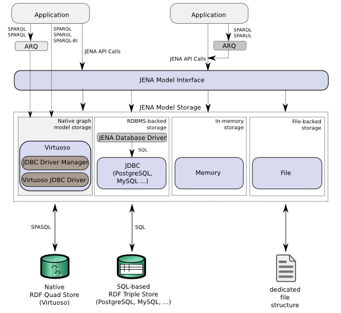

### Setup

#### Prerequisites

[Download the latest](#) Virtuoso Jena Provider for your Jena framework
version, Virtuoso JDBC 3 Driver, Jena Framework, and associated classes
and sample programs.

  - *Note:*
    
    The Jena Provider is explicitly bound to the Virtuoso JDBC 3 Driver.
    You cannot use the Virtuoso JDBC 4 Driver for this purpose at this
    time.

  - The version of the Jena Provider (virt\_jena.jar) can be verified
    with the command:
    
        $ java -jar virt_jena.jar
        OpenLink Virtuoso(TM) Provider for Jena(TM) Version 2.6.2 [Build 1.2]

  - Files contained in the zip files are generally older than
    specifically linked downloads (e.g., the Virtuoso JDBC Driver,
    virtjdbc3.jar), so don't replace if prompted during extraction.
    Instead, rename the file extracted from the zip, and compare their
    versions to be sure you keep only the most recent.
    
        $ java -cp virtjdbc3.jar virtuoso.jdbc3.Driver
        OpenLink Virtuoso(TM) Driver for JDBC(TM) Version 3.x [Build 3.57]
        $ java -cp virtjdbc3.fromzip.jar virtuoso.jdbc3.Driver
        OpenLink Virtuoso(TM) Driver for JDBC(TM) Version 3.x [Build 3.11]

  - Downloads:
    
      - Virtuoso Jena Provider JAR file, [virt\_jena.jar](#)
    
      - Virtuoso JDBC Driver 3 JAR file, [virtjdbc3.jar](#)
    
      - Virtuoso JDBC Driver 4 JAR file, [virtjdbc4.jar](#)
    
      - Jena Framework and associated classes, [jenajars.zip](#)
    
      - Sample programs, [virtjenasamples.zip](#)

#### Compiling Jena Sample Programs

1.  Edit the sample programs VirtuosoSPARQLExampleX.java, where X = 1 to
    9. Set the JDBC connection strings within to point to a valid
    Virtuoso Server instance of the form:
    
        "jdbc:virtuoso://localhost:1111/charset=UTF-8/log_enable=2"
    
      - charset=UTF-8 will be added by Jena provider, if it isn't in
        connection string. So now you don't need add "charset=UTF-8" to
        the connection string any more, it is done by Jena provider.
    
      - log\_enable=2: to use row auto commit
    
      - use these settings to process large rdf data.

2.  Ensure that full paths to
    
    *jena.jar, arq.jar,*
    
    and
    
    *virtjdbc3.jar*
    
    are included in the active CLASSPATH setting.

3.  Compile the Jena Sample applications using the following command:
    
        javac -cp "jena.jar:arq.jar:virtjdbc3.jar:virt_jena.jar:." VirtuosoSPARQLExample1.java
        VirtuosoSPARQLExample2.java VirtuosoSPARQLExample3.java VirtuosoSPARQLExample4.java
        VirtuosoSPARQLExample5.java VirtuosoSPARQLExample6.java VirtuosoSPARQLExample7.java
        VirtuosoSPARQLExample8.java VirtuosoSPARQLExample9.java

#### Testing

Once the Provider classes and sample program have been successfully
compiled, the Provider can be tested using the sample programs included.
Ensure your active CLASSPATH includes full paths to all of the following
files, before executing the example commands:

  - icu4j\_3\_4.jar

  - iri.jar

  - xercesImpl.jar

  - axis.jar

  - commons-logging-1.1.1.jar

  - jena.jar

  - arq.jar

  - virtjdbc3.jar

  - virt\_jena.jar

<!-- end list -->

1.  [VirtuosoSPARQLExample1](#rdfnativestorageprovidersjenaexamples1)
    returns the contents of the RDF Quad store of the targeted Virtuoso
    instance, with the following command:
    
        java VirtuosoSPARQLExample1

2.  [VirtuosoSPARQLExample2](#rdfnativestorageprovidersjenaexamples2)
    reads in the contents of the following FOAF URIs --
    
        http://kidehen.idehen.net/dataspace/person/kidehen#this
        http://www.w3.org/People/Berners-Lee/card#i
        http://demo.openlinksw.com/dataspace/person/demo#this
    
    \-- and returns the RDF data stored, with the following command:
    
        java VirtuosoSPARQLExample2

3.  [VirtuosoSPARQLExample3](#rdfnativestorageprovidersjenaexamples3)
    performs simple addition and deletion operation on the content of
    the triple store, with the following command:
    
        java VirtuosoSPARQLExample3

4.  [VirtuosoSPARQLExample4](#rdfnativestorageprovidersjenaexamples4)
    demonstrates the use of the *graph.contains* method for searching
    triples, with the following command:
    
        java VirtuosoSPARQLExample4

5.  [VirtuosoSPARQLExample5](#rdfnativestorageprovidersjenaexamples5)
    demonstrates the use of the *graph.find* method for searching
    triples, with the following command:
    
        java VirtuosoSPARQLExample5

6.  [VirtuosoSPARQLExample6](#rdfnativestorageprovidersjenaexamples6)
    demonstrates the use of the *graph.getTransactionHandler* method,
    with the following command:
    
        java VirtuosoSPARQLExample6

7.  [VirtuosoSPARQLExample7](#rdfnativestorageprovidersjenaexamples7)
    demonstrates the use of the graph.getBulkUpdateHandler method, with
    the following command:
    
        java VirtuosoSPARQLExample7

8.  [VirtuosoSPARQLExample8](#rdfnativestorageprovidersjenaexamples8)
    demonstrates how to insert triples into a graph, with the following
    command:
    
        java VirtuosoSPARQLExample8

9.  [VirtuosoSPARQLExample9](#rdfnativestorageprovidersjenaexamples9)
    demonstrates the use of the *CONSTRUCT, DESCRIBE,* and *ASK* SPARQL
    query forms, with the following command:
    
        java VirtuosoSPARQLExample9

### Examples

#### VirtJenaSPARQLExample1

    import com.hp.hpl.jena.query.*;
    import com.hp.hpl.jena.rdf.model.RDFNode;
    
    import virtuoso.jena.driver.*;
    
    public class VirtuosoSPARQLExample1 {
    
        /**
         * Executes a SPARQL query against a virtuoso url and prints results.
         */
        public static void main(String[] args) {
    
            String url;
            if(args.length == 0)
                url = "jdbc:virtuoso://localhost:1111";
            else
                url = args[0];
    
    /*          STEP 1          */
            VirtGraph set = new VirtGraph (url, "dba", "dba");
    
    /*          STEP 2          */
    
    /*          STEP 3          */
    /*      Select all data in virtuoso */
            Query sparql = QueryFactory.create("SELECT * WHERE { GRAPH ?graph { ?s ?p ?o } } limit 100");
    
    /*          STEP 4          */
            VirtuosoQueryExecution vqe = VirtuosoQueryExecutionFactory.create (sparql, set);
    
            ResultSet results = vqe.execSelect();
            while (results.hasNext()) {
                QuerySolution result = results.nextSolution();
                RDFNode graph = result.get("graph");
                RDFNode s = result.get("s");
                RDFNode p = result.get("p");
                RDFNode o = result.get("o");
                System.out.println(graph + " { " + s + " " + p + " " + o + " . }");
            }
        }
    }

#### VirtJenaSPARQLExample2

    import com.hp.hpl.jena.query.*;
    import com.hp.hpl.jena.rdf.model.RDFNode;
    
    import virtuoso.jena.driver.*;
    
    public class VirtuosoSPARQLExample2 {
    
        /**
         * Executes a SPARQL query against a virtuoso url and prints results.
         */
        public static void main(String[] args) {
    
            String url;
            if(args.length == 0)
                url = "jdbc:virtuoso://localhost:1111";
            else
                url = args[0];
    
    /*          STEP 1          */
            VirtGraph graph = new VirtGraph ("Example2", url, "dba", "dba");
    
    /*          STEP 2          */
    /*      Load data to Virtuoso       */
            graph.clear ();
    
            System.out.print ("Begin read from 'http://www.w3.org/People/Berners-Lee/card#i'  ");
            graph.read("http://www.w3.org/People/Berners-Lee/card#i", "RDF/XML");
            System.out.println ("\t\t\t Done.");
    
            System.out.print ("Begin read from 'http://demo.openlinksw.com/dataspace/person/demo#this'  ");
            graph.read("http://demo.openlinksw.com/dataspace/person/demo#this", "RDF/XML");
            System.out.println ("\t Done.");
    
            System.out.print ("Begin read from 'http://kidehen.idehen.net/dataspace/person/kidehen#this'  ");
            graph.read("http://kidehen.idehen.net/dataspace/person/kidehen#this", "RDF/XML");
            System.out.println ("\t Done.");
    
    /*          STEP 3          */
    /*      Select only from VirtGraph  */
            Query sparql = QueryFactory.create("SELECT ?s ?p ?o WHERE { ?s ?p ?o }");
    
    /*          STEP 4          */
            VirtuosoQueryExecution vqe = VirtuosoQueryExecutionFactory.create (sparql, graph);
    
            ResultSet results = vqe.execSelect();
            while (results.hasNext()) {
                QuerySolution result = results.nextSolution();
                RDFNode graph_name = result.get("graph");
                RDFNode s = result.get("s");
                RDFNode p = result.get("p");
                RDFNode o = result.get("o");
                System.out.println(graph_name + " { " + s + " " + p + " " + o + " . }");
            }
    
            System.out.println("graph.getCount() = " + graph.getCount());
        }
    }

#### VirtJenaSPARQLExample3

    import java.util.*;
    
    import com.hp.hpl.jena.query.*;
    import com.hp.hpl.jena.rdf.model.RDFNode;
    import com.hp.hpl.jena.graph.Node;
    import com.hp.hpl.jena.graph.Triple;
    
    import virtuoso.jena.driver.*;
    
    public class VirtuosoSPARQLExample3
    {
        public static void main(String[] args)
        {
        String url;
    
        if(args.length == 0)
            url = "jdbc:virtuoso://localhost:1111";
        else
            url = args[0];
    
        Node foo1 = Node.createURI("http://example.org/#foo1");
        Node bar1 = Node.createURI("http://example.org/#bar1");
        Node baz1 = Node.createURI("http://example.org/#baz1");
    
        Node foo2 = Node.createURI("http://example.org/#foo2");
        Node bar2 = Node.createURI("http://example.org/#bar2");
        Node baz2 = Node.createURI("http://example.org/#baz2");
    
        Node foo3 = Node.createURI("http://example.org/#foo3");
        Node bar3 = Node.createURI("http://example.org/#bar3");
        Node baz3 = Node.createURI("http://example.org/#baz3");
    
        List <Triple> triples = new ArrayList <Triple> ();
    
        VirtGraph graph = new VirtGraph ("Example3", url, "dba", "dba");
    
        graph.clear ();
    
        System.out.println("graph.isEmpty() = " + graph.isEmpty());
        System.out.println("Add 3 triples to graph <Example3>.");
    
        graph.add(new Triple(foo1, bar1, baz1));
        graph.add(new Triple(foo2, bar2, baz2));
        graph.add(new Triple(foo3, bar3, baz3));
    
        System.out.println("graph.isEmpty() = " + graph.isEmpty());
        System.out.println("graph.getCount() = " + graph.getCount());
    
        triples.add(new Triple(foo1, bar1, baz1));
        triples.add(new Triple(foo2, bar2, baz2));
    
        graph.isEmpty();
    
        System.out.println("Remove 2 triples from graph <Example3>");
        graph.remove(triples);
        System.out.println("graph.getCount() = " + graph.getCount());
        System.out.println("Please check result with isql tool.");
    
        /* EXPECTED RESULT:
    
    SQL> SPARQL
    SELECT ?s ?p ?o
    FROM <Example3>
    WHERE {?s ?p ?o};
    s                                                    p                                                             o
    VARCHAR                                    VARCHAR                                              VARCHAR
    _______________________________________________________________________________
    
    http://example.org/#foo3              http://example.org/#bar3                         http://example.org/#baz3
    
    1 Rows. -- 26 msec.
    SQL>
    
    */
    
        }
    }

#### VirtJenaSPARQLExample4

    import java.util.*;
    
    import com.hp.hpl.jena.query.*;
    import com.hp.hpl.jena.rdf.model.RDFNode;
    import com.hp.hpl.jena.graph.Node;
    import com.hp.hpl.jena.graph.Triple;
    
    import virtuoso.jena.driver.*;
    
    public class VirtuosoSPARQLExample4
    {
    
        public static void main(String[] args)
        {
        String url;
        if(args.length == 0)
            url = "jdbc:virtuoso://localhost:1111";
        else
            url = args[0];
    
        Node foo1 = Node.createURI("http://example.org/#foo1");
        Node bar1 = Node.createURI("http://example.org/#bar1");
        Node baz1 = Node.createURI("http://example.org/#baz1");
    
        Node foo2 = Node.createURI("http://example.org/#foo2");
        Node bar2 = Node.createURI("http://example.org/#bar2");
        Node baz2 = Node.createURI("http://example.org/#baz2");
    
        Node foo3 = Node.createURI("http://example.org/#foo3");
        Node bar3 = Node.createURI("http://example.org/#bar3");
        Node baz3 = Node.createURI("http://example.org/#baz3");
    
        VirtGraph graph = new VirtGraph ("Example4", url, "dba", "dba");
    
        graph.clear ();
    
        System.out.println("graph.isEmpty() = " + graph.isEmpty());
    
        System.out.println("Add 3 triples to graph <Example4>.");
    
        graph.add(new Triple(foo1, bar1, baz1));
        graph.add(new Triple(foo2, bar2, baz2));
        graph.add(new Triple(foo3, bar3, baz3));
    
        System.out.println("graph.isEmpty() = " + graph.isEmpty());
        System.out.println("graph.getCount() = " + graph.getCount());
    
        System.out.println ("graph.contains(new Triple(foo2, bar2, baz2) - " + graph.contains(new Triple(foo2, bar2, baz2)));
        System.out.println ("graph.contains(new Triple(foo2, bar2, baz3) - " + graph.contains(new Triple(foo2, bar2, baz3)));
    
        graph.clear ();
    
        }
    }

#### VirtJenaSPARQLExample5

    import java.util.*;
    
    import com.hp.hpl.jena.query.*;
    import com.hp.hpl.jena.util.iterator.ExtendedIterator;
    import com.hp.hpl.jena.graph.Node;
    import com.hp.hpl.jena.graph.Triple;
    
    import virtuoso.jena.driver.*;
    
    public class VirtuosoSPARQLExample5
    {
    
        public static void main(String[] args)
        {
        String url;
        if(args.length == 0)
            url = "jdbc:virtuoso://localhost:1111";
        else
            url = args[0];
    
        Node foo1 = Node.createURI("http://example.org/#foo1");
        Node bar1 = Node.createURI("http://example.org/#bar1");
        Node baz1 = Node.createURI("http://example.org/#baz1");
    
        Node foo2 = Node.createURI("http://example.org/#foo2");
        Node bar2 = Node.createURI("http://example.org/#bar2");
        Node baz2 = Node.createURI("http://example.org/#baz2");
    
        Node foo3 = Node.createURI("http://example.org/#foo3");
        Node bar3 = Node.createURI("http://example.org/#bar3");
        Node baz3 = Node.createURI("http://example.org/#baz3");
    
        VirtGraph graph = new VirtGraph ("Example5", url, "dba", "dba");
    
        graph.clear ();
    
        System.out.println("graph.isEmpty() = " + graph.isEmpty());
    
        System.out.println("Add 3 triples to graph <Example5>.");
    
        graph.add(new Triple(foo1, bar1, baz1));
        graph.add(new Triple(foo2, bar2, baz2));
        graph.add(new Triple(foo3, bar3, baz3));
        graph.add(new Triple(foo1, bar2, baz2));
        graph.add(new Triple(foo1, bar3, baz3));
    
        System.out.println("graph.isEmpty() = " + graph.isEmpty());
        System.out.println("graph.getCount() = " + graph.getCount());
    
        ExtendedIterator iter = graph.find(foo1, Node.ANY, Node.ANY);
        System.out.println ("\ngraph.find(foo1, Node.ANY, Node.ANY) \nResult:");
        for ( ; iter.hasNext() ; )
            System.out.println ((Triple) iter.next());
    
        iter = graph.find(Node.ANY, Node.ANY, baz3);
        System.out.println ("\ngraph.find(Node.ANY, Node.ANY, baz3) \nResult:");
        for ( ; iter.hasNext() ; )
            System.out.println ((Triple) iter.next());
    
        iter = graph.find(foo1, Node.ANY, baz3);
        System.out.println ("\ngraph.find(foo1, Node.ANY, baz3) \nResult:");
        for ( ; iter.hasNext() ; )
            System.out.println ((Triple) iter.next());
    
        graph.clear ();
    
        }
    }

#### VirtJenaSPARQLExample6

    import java.util.*;
    
    import com.hp.hpl.jena.query.*;
    import com.hp.hpl.jena.util.iterator.ExtendedIterator;
    import com.hp.hpl.jena.graph.Node;
    import com.hp.hpl.jena.graph.Triple;
    
    import virtuoso.jena.driver.*;
    
    public class VirtuosoSPARQLExample6
    {
    
        public static void main(String[] args)
        {
        String url;
        if(args.length == 0)
            url = "jdbc:virtuoso://localhost:1111";
        else
            url = args[0];
    
        Node foo1 = Node.createURI("http://example.org/#foo1");
        Node bar1 = Node.createURI("http://example.org/#bar1");
        Node baz1 = Node.createURI("http://example.org/#baz1");
    
        Node foo2 = Node.createURI("http://example.org/#foo2");
        Node bar2 = Node.createURI("http://example.org/#bar2");
        Node baz2 = Node.createURI("http://example.org/#baz2");
    
        Node foo3 = Node.createURI("http://example.org/#foo3");
        Node bar3 = Node.createURI("http://example.org/#bar3");
        Node baz3 = Node.createURI("http://example.org/#baz3");
    
        VirtGraph graph = new VirtGraph ("Example6", url, "dba", "dba");
    
        graph.clear ();
    
        System.out.println("graph.isEmpty() = " + graph.isEmpty());
    
        System.out.println("test Transaction Commit.");
        graph.getTransactionHandler().begin();
        System.out.println("begin Transaction.");
        System.out.println("Add 3 triples to graph <Example6>.");
    
        graph.add(new Triple(foo1, bar1, baz1));
        graph.add(new Triple(foo2, bar2, baz2));
        graph.add(new Triple(foo3, bar3, baz3));
    
        graph.getTransactionHandler().commit();
        System.out.println("commit Transaction.");
        System.out.println("graph.isEmpty() = " + graph.isEmpty());
        System.out.println("graph.getCount() = " + graph.getCount());
    
        ExtendedIterator iter = graph.find(Node.ANY, Node.ANY, Node.ANY);
        System.out.println ("\ngraph.find(Node.ANY, Node.ANY, Node.ANY) \nResult:");
        for ( ; iter.hasNext() ; )
            System.out.println ((Triple) iter.next());
    
        graph.clear ();
        System.out.println("\nCLEAR graph <Example6>");
        System.out.println("graph.isEmpty() = " + graph.isEmpty());
    
        System.out.println("Add 1 triples to graph <Example6>.");
        graph.add(new Triple(foo1, bar1, baz1));
    
        System.out.println("test Transaction Abort.");
        graph.getTransactionHandler().begin();
        System.out.println("begin Transaction.");
        System.out.println("Add 2 triples to graph <Example6>.");
    
        graph.add(new Triple(foo2, bar2, baz2));
        graph.add(new Triple(foo3, bar3, baz3));
    
        graph.getTransactionHandler().abort();
        System.out.println("abort Transaction.");
        System.out.println("graph.isEmpty() = " + graph.isEmpty());
        System.out.println("graph.getCount() = " + graph.getCount());
    
        iter = graph.find(Node.ANY, Node.ANY, Node.ANY);
        System.out.println ("\ngraph.find(Node.ANY, Node.ANY, Node.ANY) \nResult:");
        for ( ; iter.hasNext() ; )
            System.out.println ((Triple) iter.next());
    
        graph.clear ();
        System.out.println("\nCLEAR graph <Example6>");
    
        }
    }

#### VirtJenaSPARQLExample7

    import java.util.*;
    
    import com.hp.hpl.jena.query.*;
    import com.hp.hpl.jena.util.iterator.ExtendedIterator;
    import com.hp.hpl.jena.graph.Node;
    import com.hp.hpl.jena.graph.Triple;
    
    import virtuoso.jena.driver.*;
    
    public class VirtuosoSPARQLExample7
    {
    
        public static void main(String[] args)
        {
        String url;
        if(args.length == 0)
            url = "jdbc:virtuoso://localhost:1111";
        else
            url = args[0];
    
        Node foo1 = Node.createURI("http://example.org/#foo1");
        Node bar1 = Node.createURI("http://example.org/#bar1");
        Node baz1 = Node.createURI("http://example.org/#baz1");
    
        Node foo2 = Node.createURI("http://example.org/#foo2");
        Node bar2 = Node.createURI("http://example.org/#bar2");
        Node baz2 = Node.createURI("http://example.org/#baz2");
    
        Node foo3 = Node.createURI("http://example.org/#foo3");
        Node bar3 = Node.createURI("http://example.org/#bar3");
        Node baz3 = Node.createURI("http://example.org/#baz3");
    
        List triples1 = new ArrayList();
        triples1.add(new Triple(foo1, bar1, baz1));
        triples1.add(new Triple(foo2, bar2, baz2));
        triples1.add(new Triple(foo3, bar3, baz3));
    
        List triples2 = new ArrayList();
        triples2.add(new Triple(foo1, bar1, baz1));
        triples2.add(new Triple(foo2, bar2, baz2));
    
        VirtGraph graph = new VirtGraph ("Example7", url, "dba", "dba");
    
        graph.clear ();
    
        System.out.println("graph.isEmpty() = " + graph.isEmpty());
        System.out.println("Add List with 3 triples to graph <Example7> via BulkUpdateHandler.");
    
        graph.getBulkUpdateHandler().add(triples1);
    
        System.out.println("graph.isEmpty() = " + graph.isEmpty());
        System.out.println("graph.getCount() = " + graph.getCount());
    
        ExtendedIterator iter = graph.find(Node.ANY, Node.ANY, Node.ANY);
        System.out.println ("\ngraph.find(Node.ANY, Node.ANY, Node.ANY) \nResult:");
        for ( ; iter.hasNext() ; )
            System.out.println ((Triple) iter.next());
    
        System.out.println("\n\nDelete List of 2 triples from graph <Example7> via BulkUpdateHandler.");
    
        graph.getBulkUpdateHandler().delete(triples2);
    
        System.out.println("graph.isEmpty() = " + graph.isEmpty());
        System.out.println("graph.getCount() = " + graph.getCount());
    
        iter = graph.find(Node.ANY, Node.ANY, Node.ANY);
        System.out.println ("\ngraph.find(Node.ANY, Node.ANY, Node.ANY) \nResult:");
        for ( ; iter.hasNext() ; )
            System.out.println ((Triple) iter.next());
    
        graph.clear ();
        System.out.println("\nCLEAR graph <Example7>");
    
        }
    }

#### VirtJenaSPARQLExample8

    import com.hp.hpl.jena.query.*;
    import com.hp.hpl.jena.rdf.model.RDFNode;
    
    import virtuoso.jena.driver.*;
    
    public class VirtuosoSPARQLExample8 {
    
        /**
         * Executes a SPARQL query against a virtuoso url and prints results.
         */
        public static void main(String[] args) {
    
            String url;
            if(args.length == 0)
                url = "jdbc:virtuoso://localhost:1111";
            else
                url = args[0];
    
    /*          STEP 1          */
            VirtGraph set = new VirtGraph (url, "dba", "dba");
    
    /*          STEP 2          */
    System.out.println("\nexecute: CLEAR GRAPH <http://test1>");
                    String str = "CLEAR GRAPH <http://test1>";
                    VirtuosoUpdateRequest vur = VirtuosoUpdateFactory.create(str, set);
                    vur.exec();
    
    System.out.println("\nexecute: INSERT INTO GRAPH <http://test1> { <aa> <bb> 'cc' . <aa1> <bb1> 123. }");
                    str = "INSERT INTO GRAPH <http://test1> { <aa> <bb> 'cc' . <aa1> <bb1> 123. }";
                    vur = VirtuosoUpdateFactory.create(str, set);
                    vur.exec();
    
    /*          STEP 3          */
    /*      Select all data in virtuoso */
    System.out.println("\nexecute: SELECT * FROM <http://test1> WHERE { ?s ?p ?o }");
            Query sparql = QueryFactory.create("SELECT * FROM <http://test1> WHERE { ?s ?p ?o }");
    
    /*          STEP 4          */
            VirtuosoQueryExecution vqe = VirtuosoQueryExecutionFactory.create (sparql, set);
    
            ResultSet results = vqe.execSelect();
            while (results.hasNext()) {
                QuerySolution rs = results.nextSolution();
                RDFNode s = rs.get("s");
                RDFNode p = rs.get("p");
                RDFNode o = rs.get("o");
                System.out.println(" { " + s + " " + p + " " + o + " . }");
            }
    
    System.out.println("\nexecute: DELETE FROM GRAPH <http://test1> { <aa> <bb> 'cc' }");
                    str = "DELETE FROM GRAPH <http://test1> { <aa> <bb> 'cc' }";
                    vur = VirtuosoUpdateFactory.create(str, set);
                    vur.exec();
    
    System.out.println("\nexecute: SELECT * FROM <http://test1> WHERE { ?s ?p ?o }");
            vqe = VirtuosoQueryExecutionFactory.create (sparql, set);
                    results = vqe.execSelect();
            while (results.hasNext()) {
                QuerySolution rs = results.nextSolution();
                RDFNode s = rs.get("s");
                RDFNode p = rs.get("p");
                RDFNode o = rs.get("o");
                System.out.println(" { " + s + " " + p + " " + o + " . }");
            }
    
        }
    }

#### VirtJenaSPARQLExample9

    import com.hp.hpl.jena.query.*;
    import com.hp.hpl.jena.rdf.model.RDFNode;
    import com.hp.hpl.jena.graph.Triple;
    import com.hp.hpl.jena.graph.Node;
    import com.hp.hpl.jena.graph.Graph;
    import com.hp.hpl.jena.rdf.model.*;
    import java.util.Iterator;
    
    import virtuoso.jena.driver.*;
    
    public class VirtuosoSPARQLExample9 {
    
        /**
         * Executes a SPARQL query against a virtuoso url and prints results.
         */
        public static void main(String[] args) {
    
            String url;
            if(args.length == 0)
                url = "jdbc:virtuoso://localhost:1111";
            else
                url = args[0];
    
    /*          STEP 1          */
            VirtGraph set = new VirtGraph (url, "dba", "dba");
    
    /*          STEP 2          */
                    String str = "CLEAR GRAPH <http://test1>";
                    VirtuosoUpdateRequest vur = VirtuosoUpdateFactory.create(str, set);
                    vur.exec();
    
                    str = "INSERT INTO GRAPH <http://test1> { <http://aa> <http://bb> 'cc' . <http://aa1> <http://bb> 123. }";
                    vur = VirtuosoUpdateFactory.create(str, set);
                    vur.exec();
    
    /*      Select all data in virtuoso */
            Query sparql = QueryFactory.create("SELECT * FROM <http://test1> WHERE { ?s ?p ?o }");
            VirtuosoQueryExecution vqe = VirtuosoQueryExecutionFactory.create (sparql, set);
            ResultSet results = vqe.execSelect();
                    System.out.println("\nSELECT results:");
            while (results.hasNext()) {
                QuerySolution rs = results.nextSolution();
                RDFNode s = rs.get("s");
                RDFNode p = rs.get("p");
                RDFNode o = rs.get("o");
                System.out.println(" { " + s + " " + p + " " + o + " . }");
            }
    
            sparql = QueryFactory.create("DESCRIBE <http://aa> FROM <http://test1>");
            vqe = VirtuosoQueryExecutionFactory.create (sparql, set);
    
            Model model = vqe.execDescribe();
                Graph g = model.getGraph();
                    System.out.println("\nDESCRIBE results:");
                for (Iterator i = g.find(Node.ANY, Node.ANY, Node.ANY); i.hasNext();)
                   {
                      Triple t = (Triple)i.next();
                  System.out.println(" { " + t.getSubject() + " " +
                                 t.getPredicate() + " " +
                                 t.getObject() + " . }");
                }
    
            sparql = QueryFactory.create("CONSTRUCT { ?x <http://test> ?y } FROM <http://test1> WHERE { ?x <http://bb> ?y }");
            vqe = VirtuosoQueryExecutionFactory.create (sparql, set);
    
            model = vqe.execConstruct();
                g = model.getGraph();
                    System.out.println("\nCONSTRUCT results:");
                for (Iterator i = g.find(Node.ANY, Node.ANY, Node.ANY); i.hasNext();)
                   {
                      Triple t = (Triple)i.next();
                  System.out.println(" { " + t.getSubject() + " " +
                                 t.getPredicate() + " " +
                                 t.getObject() + " . }");
                }
    
            sparql = QueryFactory.create("ASK FROM <http://test1> WHERE { <http://aa> <http://bb> ?y }");
            vqe = VirtuosoQueryExecutionFactory.create (sparql, set);
    
            boolean res = vqe.execAsk();
                    System.out.println("\nASK results: "+res);
    
        }
    }

### Javadoc API Documentation

Javadocs covers the complete set of classes, interfaces, and methods
implemented by the provider:

  - [Javadoc API Documentation for the Jena 2.6 Provider](#)

  - [Javadoc API Documentation for the Jena 2.10+ Provider](#)

<a id="id127-virtuoso-sesame-provider"></a>
## Virtuoso Sesame Provider

### What is Sesame

Sesame is an open source Java framework for storing, querying, and
reasoning with RDF and RDF Schema. It can be used as a database for RDF
and RDF Schema, or as a Java library for applications that need to work
with RDF internally. For example, suppose you need to read a big RDF
file, find the relevant information for your application, and use that
information. Sesame provides you with the necessary tools to parse,
interpret, query, and store all this information, embedded in your own
application if you want, or, if you prefer, in a separate database or
even on a remote server. More generally: Sesame provides an application
developer with a toolbox that contains useful hammers, screwdrivers,
etc., for 'Do-It-Yourself' projects with RDF.

### What is the Virtuoso Sesame Provider

The Virtuoso Sesame Provider is a fully operational Native Graph Model
Storage Provider for the Sesame Framework, allowing users of Virtuoso to
leverage the Sesame framework to modify, query, and reason with the
Virtuoso quad store using the Java language. The Sesame Repository API
offers a central access point for connecting to the Virtuoso quad store.
Its purpose is to provides a Java-friendly access point to Virtuoso. It
offers various methods for querying and updating the data, while
abstracting the details of the underlying machinery. The Provider has
been tested against the two latest currently available versions,
[Sesame](#) 2.6.x, 2.7.x, 2.8.x and the new Sesame 4.x release, for
which a new Provider is available.

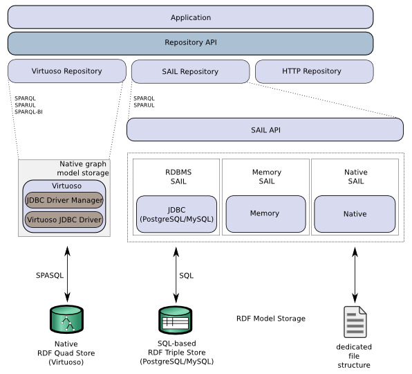

If you need more information about how to set up your environment for
working with the Sesame APIs, take a look at Chapter 2 of the Sesame
User Guide, [Setting up to use the Sesame libraries](#) .

### Setup

#### Required Files

This tutorial assumes you have Virtuoso server installed and that the
database is accessible at "localhost:1111". In addition, the relevant
version of the Virtuoso Sesame Provider, and Sesame java framework need
to be installed.

You should download the Virtuoso Sesame Provider JAR archive for the
version of Sesame being used, Virtuoso JDBC Driver, Sesame Framework and
associated classes and sample programs from our [download page](#) .
Note the version of the Sesame Provider (virt\_sesameX.jar) can be
determined with the command:

    $ java -jar virt_sesame2.jar
    OpenLink Virtuoso(TM) Provider for Sesame2(TM) Version 2.6.5 [Build 1.7]
    $ java -jar virt_sesame4.jar
    OpenLink Virtuoso(TM) Provider for Sesame4(TM) Version 4.0.0 [Build 0.1]
    $

#### Sesame 2 Sample Program

##### Compilation

1.  Ensure that full paths to the following files, or equivalents for
    your version of Sesame, are all included in the active CLASSPATH
    setting --
    
      - openrdf-sesame-2.1.2-onejar.jar
    
      - slf4j-api-1.5.0.jar
    
      - slf4j-jdk14-1.5.0.jar
    
      - commons-io-2.0.jar
    
      - virtjdbc3.jar
    
      - virt\_sesame2.jar

2.  Execute the following command:
    
        javac VirtuosoTest.java
    
    Note: we recommend adding the following to the connect string, to
    use utf-8 and row-auto-commit:
    
        "/charset=UTF-8/log_enable=2"
        -- i.e. in VirtuosoTest.java the line:
        Repository repository = new VirtuosoRepository("jdbc:virtuoso://" + sa[0] + ":" + sa[1], sa[2], sa[3]);
        -- should become:
        Repository repository = new VirtuosoRepository("jdbc:virtuoso://" + sa[0] + ":" + sa[1]+ "/charset=UTF-8/log_enable=2", sa[2], sa[3]);

##### Testing

1.  Ensure that full paths to the following files are all included in
    the active CLASSPATH setting (note the addition of virtuoso\_driver,
    here):
    
      - openrdf-sesame-2.1.2-onejar.jar
    
      - slf4j-api-1.5.0.jar
    
      - slf4j-jdk14-1.5.0.jar
    
      - commons-io-2.0.jar
    
      - virtjdbc3.jar
    
      - virt\_sesame2.jar
    
      - virtuoso\_driver

2.  Run the [VirtuosoTest](#) program to test the Sesame 2 Provider with
    the following command:
    
        java VirtuosoTest <hostname> <port> <uid> <pwd>

3.  The test run should look like this:
    
        $ java VirtuosoTest localhost 1111 dba dba
        
        == TEST 1:  : Start
           Loading data from URL: http://www.openlinksw.com/dataspace/person/kidehen@openlinksw.com/foaf.rdf
        == TEST 1:  : End
        PASSED: TEST 1
        
        == TEST 2:  : Start
           Clearing triple store
        == TEST 2:  : End
        PASSED: TEST 2
        
        == TEST 3:  : Start
           Loading data from file: virtuoso_driver/data.nt
        == TEST 3:  : End
        PASSED: TEST 3
        
        == TEST 4:  : Start
           Loading UNICODE single triple
        == TEST 4:  : End
        PASSED: TEST 4
        
        == TEST 5:  : Start
           Loading single triple
        == TEST 5:  : End
        PASSED: TEST 5
        
        == TEST 6:  : Start
           Casted value type
        == TEST 6:  : End
        PASSED: TEST 6
        
        == TEST 7:  : Start
           Selecting property
        == TEST 7:  : End
        PASSED: TEST 7
        
        == TEST 8:  : Start
           Statement does not exists
        == TEST 8:  : End
        PASSED: TEST 8
        
        == TEST 9:  : Start
           Statement exists (by resultset size)
        == TEST 9:  : End
        PASSED: TEST 9
        
        == TEST 10:  : Start
           Statement exists (by hasStatement())
        == TEST 10:  : End
        PASSED: TEST 10
        
        == TEST 11:  : Start
           Retrieving namespaces
        == TEST 11:  : End
        PASSED: TEST 11
        
        == TEST 12:  : Start
           Retrieving statement (http://myopenlink.net/dataspace/person/kidehen http://myopenlink.net/foaf/name null)
        == TEST 12:  : End
        PASSED: TEST 12
        
        == TEST 13:  : Start
           Writing the statements to file: (/Users/src/virtuoso-opensource/binsrc/sesame2/results.n3.txt)
        == TEST 13:  : End
        PASSED: TEST 13
        
        == TEST 14:  : Start
           Retrieving graph ids
        == TEST 14:  : End
        PASSED: TEST 14
        
        == TEST 15:  : Start
           Retrieving triple store size
        == TEST 15:  : End
        PASSED: TEST 15
        
        == TEST 16:  : Start
           Sending ask query
        == TEST 16:  : End
        PASSED: TEST 16
        
        == TEST 17:  : Start
           Sending construct query
        == TEST 17:  : End
        PASSED: TEST 17
        
        == TEST 18:  : Start
           Sending describe query
        == TEST 18:  : End
        PASSED: TEST 18
        
        ============================
        PASSED:18 FAILED:0

#### Sesame 4 Sample Program

##### Compilation

1.  Ensure that full paths to the following files, or equivalents for
    your version of Sesame, are all included in the active CLASSPATH
    setting --
    
      - openrdf-sesame-4.0.0-onejar.jar
    
      - slf4j-api-1.7.10.jar
    
      - commons-io-2.4.jar
    
      - virtjdbc4.jar
    
      - virt\_sesame4.jar

2.  Execute the following command:
    
        javac VirtuosoTest.java
    
    Note: we recommend adding the following to the connect string, to
    use utf-8 and row-auto-commit:
    
        "/charset=UTF-8/log_enable=2"
        -- i.e. in VirtuosoTest.java the line:
        Repository repository = new VirtuosoRepository("jdbc:virtuoso://" + sa[0] + ":" + sa[1], sa[2], sa[3]);
        -- should become:
        Repository repository = new VirtuosoRepository("jdbc:virtuoso://" + sa[0] + ":" + sa[1]+ "/charset=UTF-8/log_enable=2", sa[2], sa[3]);

##### Testing

1.  Ensure that full paths to the following files are all included in
    the active CLASSPATH setting (note the addition of virtuoso\_driver,
    here):
    
      - openrdf-sesame-4.0.0-onejar.jar
    
      - slf4j-api-1.7.10.jar
    
      - commons-io-2.4.jar
    
      - virtjdbc4.jar
    
      - virt\_sesame4.jar
    
      - virtuoso\_driver

2.  Run the [VirtuosoTest](#) program to test the Sesame 2 Provider with
    the following command:
    
        java VirtuosoTest <hostname> <port> <uid> <pwd>

3.  The test run should look like this:
    
        $ java VirtuosoTest localhost 1111 dba dba
        
        == TEST 1:  : Start
        == TEST 1:  : End
        PASSED: TEST 1
        
        == TEST 2:  : Start
           Loading data from URL: http://dbpedia.org/data/Berlin.rdf
        log4j:WARN No appenders could be found for logger (org.openrdf.rio.RDFParserRegistry).
        log4j:WARN Please initialize the log4j system properly.
        == TEST 2:  : End
        PASSED: TEST 2
        
        == TEST 3:  : Start
           Clearing triple store
        == TEST 3:  : End
        PASSED: TEST 3
        
        == TEST 4:  : Start
           Loading data from file: virtuoso_driver/data.nt
        == TEST 4:  : End
        PASSED: TEST 4
        
        == TEST 5:  : Start
           Loading UNICODE single triple
        == TEST 5:  : End
        PASSED: TEST 5
        
        == TEST 6:  : Start
           Loading single triple
        == TEST 6:  : End
        PASSED: TEST 6
        
        == TEST 7:  : Start
           Casted value type
        == TEST 7:  : End
        PASSED: TEST 7
        
        == TEST 8:  : Start
           Selecting property
        == TEST 8:  : End
        PASSED: TEST 8
        
        == TEST 9:  : Start
           Statement does not exists
        == TEST 9:  : End
        PASSED: TEST 9
        
        == TEST 10:  : Start
           Statement exists (by resultset size)
        == TEST 10:  : End
        PASSED: TEST 10
        
        == TEST 11:  : Start
           Statement exists (by hasStatement())
        == TEST 11:  : End
        PASSED: TEST 11
        
        == TEST 12:  : Start
           Retrieving namespaces
        == TEST 12:  : End
        PASSED: TEST 12
        
        == TEST 13:  : Start
           Retrieving statement (http://myopenlink.net/dataspace/person/kidehen http://myopenlink.net/foaf/name null)
        == TEST 13:  : End
        PASSED: TEST 13
        
        == TEST 14:  : Start
           Writing the statements to file: (/Users/hwilliams/src/git/vos-7-develop/binsrc/sesame4/results.n3.txt)
        == TEST 14:  : End
        PASSED: TEST 14
        
        == TEST 15:  : Start
           Retrieving graph ids
        == TEST 15:  : End
        PASSED: TEST 15
        
        == TEST 16:  : Start
           Retrieving triple store size
        == TEST 16:  : End
        PASSED: TEST 16
        
        == TEST 17:  : Start
           Sending ask query
        == TEST 17:  : End
        PASSED: TEST 17
        
        == TEST 18:  : Start
           Sending construct query
        == TEST 18:  : End
        PASSED: TEST 18
        
        == TEST 19:  : Start
           Sending describe query
        == TEST 19:  : End
        PASSED: TEST 19
        
        ============================
        PASSED:19 FAILED:0

### Getting Started

This section covers the essentials for connecting to and manipulating
data stored in a Virtuoso repository using the Sesame API. More
information on the Sesame Framework, including extended examples on how
to use the API, can be found in Chapter 8 of the Sesame User's guide,
[the RepositoryConnection API](#) .

The interfaces for the Repository API can be found in packages
virtuoso.sesame2.driver and org.openrdf.repository. Several
implementations for these interfaces exist in the Virtuoso Provider
download package. The [Javadoc reference for the Sesame API](#) is
available online and can also be found in the doc directory of the
download.

#### Creating a Virtuoso Repository RDF object

The first step to connecting to Virtuoso through the Sesame API is to
create a Repository for it. The Repository object operates on (stacks
of) Sail object(s) for storage and retrieval of RDF data.

One of the simplest configurations is a repository that just stores RDF
data in main memory, without applying any inference. This is also by far
the fastest type of repository that can be used. The following code
creates and initialize a non-inferencing main-memory repository:

    import virtuoso.sesame2.driver.VirtuosoRepository;
    
    Repository myRepository = VirtuosoRepository("jdbc:virtuoso://localhost:1111","dba","dba");
    
    myRepository.initialize();

The constructor of the VirtuosoRepository class accepts the JDBC URL of
the Virtuoso engine, and the username and password of an authorized
user. Following this example, the repository needs to be initialized to
prepare the Sail(s) that it operates on, which includes performing
operations such as restoring previously stored data, setting up
connections to a relational database, etc.

The repository that is created by the above code is volatile: its
contents are lost when the object is garbage collected or when the
program is shut down. This is fine for cases where, for example, the
repository is used as a means for manipulating an RDF model in memory.

#### Creating a Virtuoso Repository Connection

Now that we have created a VirtuosoRepository object instance, we want
to do something with it. This is achieved through the use of the
VirtuosoRepositoryConnection class, which can be created by the
VirtuosoRepository class.

A VirtuosoRepositoryConnection represents — as the name suggests — a
connection to the actual Virtuoso quad store. We can issue operations
over this connection, and close it when we are done to make sure we are
not keeping resources unnecessarily occupied.

In the following sections, we will show some examples of basic
operations using the Northwind dataset.

#### Adding RDF to Virtuoso

The Repository implements the Sesame Repository API, which offers
various methods for adding data to a repository. Data can be added
programmatically by specifying the location of a file that contains RDF
data, and statements can be added individually or in collections.

We perform operations on the repository by requesting a
RepositoryConnection from the repository, which returns a
VirtuosoRepositoryConnection object. On this
VirtuosoRepositoryConnection object we can perform the various
operations, such as query evaluation; getting, adding, or removing
statements; etc.

The following example code adds two files, one local and one located on
the Web, to a repository:

    import org.openrdf.repository.RepositoryException;
    
    import org.openrdf.repository.Repository;
    
    import org.openrdf.repository.RepositoryConnection;
    
    import org.openrdf.rio.RDFFormat;
    
    import java.io.File;
    
    import java.net.URL;
    
    File file = new File("/path/to/example.rdf");
    
    String baseURI = "http://example.org/example/localRDF";
    
    ?
    try {
    
       RepositoryConnection con = myRepository.getConnection();
    
       try {
    
          con.add(file, baseURI, RDFFormat.RDFXML);
    
          URL url = new URL("http://example.org/example/remoteRDF");
    
          con.add(url, url.toString(), RDFFormat.RDFXML);
    
       }
    
       finally {
    
          con.close();
    
       }
    
    }
    
    catch (RepositoryException rex) {
    
       // handle exception
    
    }
    
    catch (java.io.IOEXception e) {
    
       // handle io exception
    
    }

More information on other available methods can be found in the javadoc
reference of the RepositoryConnection interface.

#### Querying Virtuoso

The Repository API has a number of methods for creating and evaluating
queries. Three types of queries are distinguished: tuple queries, graph
queries, and Boolean queries. The query types differ in the type of
results that they produce.

*Select Query:* The result of a select query is a set of tuples (or
variable bindings), where each tuple represents a solution of the query.
This type of query is commonly used to get specific values (URIs, blank
nodes, literals) from the stored RDF data. The method
QueryFactory.executeQuery() returns a Value \[ \]\[ \] for SPARQL
"SELECT" queries. The method QueryFactory.executeQuery() also calls the
QueryFactory.setResult() which populates a set of tuples for SPARQL
"SELECT" queries. The graph can be retrieved using
QueryFactory.getBooleanResult().

*Graph Query:* The result of a graph query is an RDF graph (or set of
statements). This type of query is very useful for extracting sub-graphs
from the stored RDF data, which can then be queried further, serialized
to an RDF document, etc. The method QueryFactory.executeQuery() calls
the QueryFactory.setGraphResult() which populates a graph for SPARQL
"DESCRIBE" and "CONSTRUCT" queries. The graph can be retrieved using
QueryFactory.getGraphResult().

*Boolean Query:* The result of a Boolean query is a simple Boolean
value, i.e., TRUE or FALSE. This type of query can be used to check if a
repository contains specific information. The method
QueryFactory.executeQuery() calls the QueryFactory.setBooleanResult()
which sets a Boolean value for SPARQL "ASK" queries. The value can be
retrieved using QueryFactory.getBooleanResult().

Note: Although Sesame 2 currently supports two query languages: SeRQL
and SPARQL, the Virtuoso provider only supports the W3C SPARQL
specification at this time.

#### Evaluating a SELECT Query

To evaluate a tuple query we simply do the following:

    import java.util.List;
    
    import org.openrdf.OpenRDFException;
    
    import org.openrdf.repository.RepositoryConnection;
    
    import org.openrdf.query.TupleQuery;
    
    import org.openrdf.query.TupleQueryResult;
    
    import org.openrdf.query.BindingSet;
    
    import org.openrdf.query.QueryLanguage;
    ?
    
    try {
    
       RepositoryConnection con = myRepository.getConnection();
    
       try {
    
          String queryString = "SELECT x, y FROM  WHERE {x} p {y}";
    
          TupleQuery tupleQuery = con.prepareTupleQuery(QueryLanguage.SPARQL, queryString);
    
          TupleQueryResult result = tupleQuery.evaluate();
    
          try {
    
             ? // do something with the result
    
          }
    
          finally {
    
             result.close();
    
          }
    
       }
    
       finally {
    
          con.close();
    
       }
    
    }
    
    catch (RepositoryException e) {
    
       // handle exception
    
    }

This evaluates a SPARQL query and returns a TupleQueryResult, which
consists of a sequence of BindingSet objects. Each BindingSet contains a
set of pairs called Binding objects. A Binding object represents a
name/value pair for each variable in the query's projection.

We can use the TupleQueryResult to iterate over all results and get each
individual result for x and y:

    while (result.hasNext()) {
    
       BindingSet bindingSet = result.next();
    
       Value valueOfX = bindingSet.getValue("x");
    
       Value valueOfY = bindingSet.getValue("y");
    
       // do something interesting with the query variable values here?
    
    }

As you can see, we retrieve values by name rather than by an index. The
names used should be the names of variables as specified in your query.
The TupleQueryResult.getBindingNames() method returns a list of binding
names, in the order in which they were specified in the query. To
process the bindings in each binding set in the order specified by the
projection, you can do the following:

    List bindingNames = result.getBindingNames();
    
    while (result.hasNext()) {
    
       BindingSet bindingSet = result.next();
    
       Value firstValue = bindingSet.getValue(bindingNames.get(0));
    
       Value secondValue = bindingSet.getValue(bindingNames.get(1));
    
       // do something interesting with the values here?
    
    }

It is important to invoke the close() operation on the TupleQueryResult,
after we are done with it. A TupleQueryResult evaluates lazily and keeps
resources (such as connections to the underlying database) open. Closing
the TupleQueryResult frees up these resources. Do not forget that
iterating over a result may cause exceptions\! The best way to make sure
no connections are kept open unnecessarily is to invoke close() in the
finally clause.

An alternative to producing a TupleQueryResult is to supply an object
that implements the TupleQueryResultHandler interface to the query's
evaluate() method. The main difference is that when using a return
object, the caller has control over when the next answer is retrieved,
whereas with the use of a handler, the connection simply pushes answers
to the handler object as soon as it has them available.

As an example we will use SPARQLResultsXMLWriter, which is a
TupleQueryResultHandler implementation that writes SPARQL Results XML
documents to an output stream or to a writer:

    import org.openrdf.query.resultio.sparqlxml.SPARQLResultsXMLWriter;
    
    ?
    FileOutputStream out = new FileOutputStream("/path/to/result.srx");
    
    try {
    
       SPARQLResultsXMLWriter sparqlWriter = new SPARQLResultsXMLWriter(out);
    
       RepositoryConnection con = myRepository.getConnection();
    
       try {
    
          String queryString = "SELECT * FROM  WHERE {x} p {y}";
    
          TupleQuery tupleQuery = con.prepareTupleQuery(QueryLanguage.SPARQL, queryString);
    
          tupleQuery.evaluate(sparqlWriter);
    
       }
    
       finally {
    
          con.close();
    
       }
    
    }
    
    finally {
    
       out.close();
    
    }

You can just as easily supply your own application-specific
implementation of TupleQueryResultHandler, if desired.

Lastly, an important warning: as soon as you are done with the
RepositoryConnection object, you should close it. Notice that during
processing of the TupleQueryResult object (for example, when iterating
over its contents), the RepositoryConnection should still be open. We
can invoke con.close() after we have finished with the result.

#### Evaluating a CONSTRUCT query

The following code evaluates a graph query on a repository:

    import org.openrdf.query.GraphQueryResult;
    
    GraphQueryResult graphResult = con.prepareGraphQuery(
    
          QueryLanguage.SPARQL, "CONSTRUCT * FROM {x} p {y}").evaluate();

A GraphQueryResult is similar to TupleQueryResult in that it is an
object that iterates over the query results. However, for graph queries
the query results are RDF statements, so a GraphQueryResult iterates
over Statement objects:

    while (graphResult.hasNext()) {
    
       Statement st = graphResult.next();
    
       // ? do something with the resulting statement here.
    
    }

The TupleQueryResultHandler equivalent for graph queries is
org.openrdf.rio.RDFHandler. Again, this is a generic interface; each
object implementing it can process the reported RDF statements in any
way it wants.

All writers from Rio (such as the RDFXMLWriter, TurtleWriter,
TriXWriter, etc.) implement the RDFHandler interface. This allows them
to be used in combination with querying quite easily. In the following
example, we use a TurtleWriter to write the result of a SPARQL graph
query to standard output in Turtle format:

    import org.openrdf.rio.turtle.TurtleWriter;
    
    ?
    RepositoryConnection con = myRepository.getConnection();
    
    try {
    
       TurtleWriter turtleWriter = new TurtleWriter(System.out);
    
       con.prepareGraphQuery(QueryLanguage.SPARQL, "CONSTRUCT * FROM  WHERE {x} p {y}").evaluate(turtleWriter);
    
    }
    
    finally {
    
       con.close();
    
    }

Again, note that as soon as we are done with the result of the query
(either after iterating over the contents of the GraphQueryResult or
after invoking the RDFHandler), we invoke con.close() to close the
connection and free resources.

#### Javadoc API Documentation

Javadocs covers the complete set of classes, interfaces, and methods
implemented by the provider:

  - [Javadoc API Documentation for the Sesame 2.6 Provider](#)

  - [Javadoc API Documentation for the Sesame 2.7+ Provider](#)

  - [Javadoc API Documentation for the Sesame 4.x Provider](#)

### Virtuoso Sesame HTTP Repository Configuration and Usage

#### What

Sesame is an open source Java framework for storing, querying and
reasoning with RDF and RDF Schema. It can be used as a database for RDF
and RDF Schema, or as a Java library for applications that need to work
with RDF internally. The Sesame HTTP repository serves as a proxy for a
RDF store hosted on a remote Sesame server, enabling the querying of the
RDF store using the Sesame HTTP protocol.

#### Why

The Sesame HTTP repository endpoint provides users with the greater
flexibility for manipulating the RDF store via a common interface.
Sesame provides you with the necessary tools to parse, interpret, query
and store all this information, embedded in your own application if you
want, or, if you prefer, in a separate database or even on a remote
server.

#### How

To create a new Sesame HTTP repository, the Console needs to create such
an RDF document and submit it to the SYSTEM repository. The Console uses
so called repository configuration templates to accomplish this.
Repository configuration templates are simple Turtle RDF files that
describe a repository configuration, where some of the parameters are
replaced with variables. The Console parses these templates and asks the
user to supply values for the variables. The variables are then
substituted with the specified values, which produces the required
configuration data.

#### Setup and Testing

This section details the steps required for configuring and testing a
Virtuoso Sesame Repository, both using the HTTP and Console Sesame
repositories.

##### Requirements

  - [Sesame 2.3.1](#) or higher

  - [Virtuoso Sesame 2.x](#) (virt\_sesame2.jar) or [Virtuoso Sesame
    4.x](#) (virt\_sesame4.jar) Provider

  - [Virtuoso JDBC Driver](#) (virtjdbc4.jar)

  - Virtuoso System Repository config file for [Sesame 2.x](#) or
    [Sesame 4.x](#) (create.xsl)

  - Virtuoso Repository config file for [Sesame 2.x](#) or [Sesame
    4.x](#) (create-virtuoso.xsl)

  - Configuration Template file for a Virtuoso Repository for [Sesame
    2.x](#) or [Sesame 4.x](#)

  - [Apache Tomcat](#) version 5 or higher

##### Setup Sesame HTTP Repository

This section details the steps required for configuring and testing a
Virtuoso HTTP Sesame Repository.

1.  Install [Apache Tomcat](#) web server

2.  From the Sesame 2.3.1 or higher "lib" directory copy the
    "openrdf-sesame.war" and "openrdf-worbbench.war" files to the tomcat
    "webapps" directory where they will automatically be deployed
    creating two new sub directories "openrdf-sesame" and
    "openrdf-workbench".

3.  Place the corresponding Virtuoso Sesame Provider "virt\_sesame2.jar"
    or "virt\_sesame4.jar" and JDBC Driver "virtjdbc4.jar" into the
    Tomcat \~/webapps/openrdf-sesame/WEB-INF/lib/ and
    \~/webapps/openrdf-workbench/WEB-INF/lib/ directories for use by the
    Sesame HTTP Repository for accessing the Virtuoso RDF repository.

4.  Place the "create.xsl" and "create-virtuoso.xsl" files in the Tomcat
    \~/webapps/openrdf-workbench/transformations/ directory. Note
    "create.xsl" replaces the default provided with Sesame and contains
    the necessary entries required to reference the new
    "create-virtuoso.xsl" template file for Virtuoso repository
    configuration.

5.  The Sesame HTTP Repository will now be accessible on the URLs
    
        http://example.com/openrdf-sesame
        http://example.com/openrdf-workbench

6.  The Sesame OpenRDF Workbench is used for accessing the Sesame HTTP
    Repositories, loading " [http://example.com/openrdf-workbench](#) "
    will enable the default "SYSTEM" repository to be accessed.
    

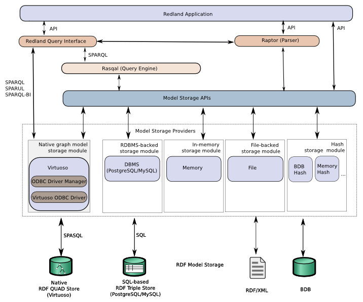

As indicated in the above diagram the Virtuoso Provider can be used to
execute RDF queries either directly against the Virtuoso graph storage
module supporting the [SPARQL](#) , [SPARQL](#) SPARUL, [SPARQL-BI](#)
query languages or via the Rasqal query engine built into Redland which
supports the SPARQL query language. This is done by simply changing the
syntax of the query using the "vsparql" rather then default "sparql"
construct when executing a query as indicated in the sample queries
below:

    rdfproc -r xml -t "user='dba',password='dba',dsn='Demo'" gr query sparql - "SELECT * WHERE { ?s ?p ?o }"   ;; via Redland Rasqal engine
    
    rdfproc -r xml -t "user='dba',password='dba',dsn='Demo'" gr query vsparql - "SELECT * WHERE { ?s ?p ?o }"  ;; direct to Virtuoso storage module

The Virtuoso Provider uses the [SPASQL](#) query language for querying
the remote Virtuoso QUAD store.

### Setup

#### Required Files

The Virtuoso Redland Provider has been integrated into the Redland RDF
Framework and submitted to the open source project to become part of the
standard distribution available for [download](#) . Until this
submission has been accepted and committed into the available Redland
release a tar ball created by OpenLink Software and a diff for
application to a Redland 1.0.8 tree can be obtained from:

  - [\#](#) Redland 1.0.8 tar ball with Virtuoso storage support

  - [Redland 1.0.8 Diff file of changes made for Virtuoso storage
    support](#)

#### Compiling Redland with Virtuoso storage support

  - [Download Redland](#) , extract and apply diff above or download the
    tar ball above with diff already applied and extract to a location
    of choice.

  - The following additional configure options are available for
    enabling the Virtuoso storage support:
    
    ``` 
      --with-virtuoso(=yes|no) Enable Virtuoso RDF store (default=auto)
      --with-iodbc(=DIR)        Select iODBC support
                                DIR is the iODBC base install directory
                                (default=/usr/local)
      --with-unixodbc(=DIR)   Select UnixODBC support
                                DIR is the UnixODBC base install directory
                                (default=/usr/local)
      --with-datadirect(=DIR) Select DataDirect support
                                DIR is the DataDirect base install directory
                                (default=/usr/local)
      --with-odbc-inc=DIR     Specify custom ODBC include directory
                                (default=/usr/local/include)
      --with-odbc-lib=DIR     Specify custom ODBC lib directory
                                (default=/usr/local/lib)
    ```

  - The "--with-virtuoso" option default to being auto enable if a valid
    ODBC Driver Manager (iODBC, UnixODBC? or DataDirect?) or include and
    lib directories for required ODBC header files and libraries are
    located with the suitable setting for one or more of the other ODBC
    related options above. Assuming iODBC is installed the following
    option can be used to enable Virtuoso storage support to be
    configured for compilation into your Redland build:
    
        ./configure --with-iodbc=/usr/local/iODBC

  - Run "make" to compile the Redland libraries and "sudo make install"
    to install in the default "/usr/local" location

  - Test compilation with test utility utils/rdfproc:
    
    ``` 
    
    rdfproc test parse http://planetrdf.com/guide/rss.rdf
    rdfproc test print
    rdfproc test serialize ntriples
    ```
    
    This test will use the default 'hashes' storage.

  - Ensure you have the Virtuoso ODBC Driver installed and a valid ODBC
    DSN called "Local Virtuoso" configured for your target Virtuoso
    Server

  - Set the following environment variable:
    
        export RDFPROC_STORAGE_TYPE=virtuoso                                   ;; Enable Virtuoso Storage
        export ODBCINI=<path_to_odbcini_directory>/odbc.ini                      ;; Enable ODBC DSN to be located
        export LD_LIBRARY_PATH=/usr/local/lib:$LD_LIBRARY_PATH                     ;; May be required to enable Redland libraries to be located

  - Test Virtuoso storage with the provided test program utils/vtest:
    
        $ utils/vtest
          1: Remove all triples in <http://red> context
        **PASSED**: removed context triples from the graph
          2: Add triples to <http://red> context
        **PASSED**: add triple to context
          3: Print all triples in <http://red> context
        [[
          {[aa], [bb], [cc]} with context [http://red]
          {[aa], [bb1], [cc]} with context [http://red]
          {[aa], [a2], "cc"} with context [http://red]
          {[aa], [a2], (cc)} with context [http://red]
          {[mm], [nn], "Some long literal with language@en"} with context [http://red]
          {[oo], [pp], "12345^^<http://www.w3.org/2001/XMLSchema#int>"} with context [http://red]
        ]]
        **PASSED**:
          4: Count of triples in <http://red> context
        **PASSED**: graph has 6 triples
          5: Exec:  ARC  aa bb
        Matched node: [cc]
        **PASSED**:
          6: Exec:  ARCS  aa cc
        Matched node: [bb] with context [http://red]
        Matched node: [bb1] with context [http://red]
        : matching nodes: 2
        **PASSED**:
          7: Exec:  ARCS-IN  cc
        Matched arc: [bb] with context [http://red]
        Matched arc: [bb1] with context [http://red]
        **PASSED**: matching arcs: 2
          8: Exec:  ARCS-OUT  aa
        Matched arc: [bb] with context [http://red]
        Matched arc: [bb1] with context [http://red]
        Matched arc: [a2] with context [http://red]
        Matched arc: [a2] with context [http://red]
        **PASSED**: matching arcs: 4
          9: Exec:  CONTAINS aa bb1 cc
        **PASSED**: the graph contains the triple
         10: Exec:  FIND aa - -
        Matched triple: {[aa], [bb], [cc]} with context [http://red]
        Matched triple: {[aa], [bb1], [cc]} with context [http://red]
        Matched triple: {[aa], [a2], "cc"} with context [http://red]
        Matched triple: {[aa], [a2], (cc)} with context [http://red]
        **PASSED**: matching triples: 4
         11: Exec:  HAS-ARC-IN cc bb
        **PASSED**: the graph contains the arc
         12: Exec:  HAS-ARC-OUT aa bb
        **PASSED**: the graph contains the arc
         13: Exec:  SOURCE  aa cc
        Matched node: [aa]
        **PASSED**:
         14: Exec:  SOURCES  bb cc
        Matched node: [aa] with context [http://red]
        : matching nodes: 1
        **PASSED**:
         15: Exec:  TARGET  aa bb
        Matched node: [cc]
        **PASSED**:
         16: Exec:  TARGETS  aa bb
        Matched node: [cc] with context [http://red]
        : matching nodes: 1
        **PASSED**:
         17: Exec:  REMOVE aa bb1 cc
        **PASSED**: removed triple from the graph
         18: Exec:  QUERY "CONSTRUCT {?s ?p ?o} FROM <http://red> WHERE {?s ?p ?o}"
        Matched triple: {[aa], [a2], "cc"}
        Matched triple: {[oo], [pp], "12345^^<http://www.w3.org/2001/XMLSchema#int>"}
        Matched triple: {[aa], [a2], (cc)}
        Matched triple: {[aa], [bb], [cc]}
        Matched triple: {[mm], [nn], "Some long literal with language@en"}
        **PASSED**: matching triples: 5
         19: Exec1:  QUERY_AS_BINDINGS "SELECT * WHERE {graph <http://red> { ?s ?p ?o }}"
        **: Formatting query result as 'xml':
        <?xml version="1.0" encoding="utf-8"?>
        <sparql xmlns="http://www.w3.org/2005/sparql-results#">
          <head>
            <variable name="s"/>
            <variable name="p"/>
            <variable name="o"/>
          </head>
          <results>
            <result>
              <binding name="s"><uri>aa</uri></binding>
              <binding name="p"><uri>bb</uri></binding>
              <binding name="o"><uri>cc</uri></binding>
            </result>
            <result>
              <binding name="s"><uri>aa</uri></binding>
              <binding name="p"><uri>a2</uri></binding>
              <binding name="o"><literal>cc</literal></binding>
            </result>
            <result>
              <binding name="s"><uri>aa</uri></binding>
              <binding name="p"><uri>a2</uri></binding>
              <binding name="o"><bnode>cc</bnode></binding>
            </result>
            <result>
              <binding name="s"><uri>mm</uri></binding>
              <binding name="p"><uri>nn</uri></binding>
              <binding name="o"><literal>Some long literal with language@en</literal></binding>
            </result>
            <result>
              <binding name="s"><uri>oo</uri></binding>
              <binding name="p"><uri>pp</uri></binding>
              <binding name="o"><literal>12345^^<http://www.w3.org/2001/XMLSchema#int></literal></binding>
            </result>
          </results>
        </sparql>
        **PASSED**:
         20: Exec2:  QUERY_AS_BINDINGS "SELECT * WHERE {graph <http://red> { ?s ?p ?o }}"
        : Query returned bindings results:
        result: [s=[aa], p=[bb], o=[cc]]
        result: [s=[aa], p=[a2], o=cc]
        result: [s=[aa], p=[a2], o=(cc)]
        result: [s=[mm], p=[nn], o=Some long literal with language@en]
        result: [s=[oo], p=[pp], o=12345^^<http://www.w3.org/2001/XMLSchema#int>]
        : Query returned 5 results
        **PASSED**:
        =============================================
        PASSED: 20  FAILED:  0

#### Connection Parameters

The Virtuoso provider has the following connection parameters available
fro use:

  - *dsn*
    
    \- ODBC datasource name

  - *user*
    
    \- user name of database server

  - *password*
    
    \- password of database server

  - *host*
    
    \- hostname:portno of the database server

  - *charset*
    
    \- database charset to use

NOTE: Take care exposing the password as for example, program arguments
or environment variables. The rdfproc utility can help this by reading
the password from standard input. Inside programs, one way to prevent
storing the password in a string is to construct a Redland hash of the
storage options such as via librdf hash\_from\_string and use
librdf\_new\_storage\_with\_options to create a storage. The rdfproc
utility source code demonstrates this.

The storage name parameter given to the storage constructor librdf
new\_storage is used inside the virtuoso store to allow multiple stores
inside one Virtuoso database instance as parameterized with the above
options.

This store always provides contexts; the boolean storage option contexts
is not checked.

Examples:

``` 
  /* A new Virtuoso store */
  storage=librdf_new_storage(world, "virtuoso", "db1",
      "dsn='Local Virtuoso',user='demo',password='demo'");

  /* A different, existing Virtuoso store in the same database as above */
  storage=librdf_new_storage(world, "virtuoso", "db2",
      "dsn='Local Virtuoso',user='demo',password='demo'");

  /* An existing Virtuoso store on a different database server */
  storage=librdf_new_storage(world, "virtuoso", "http://red3",
      "dsn='Remote Virtuoso',user='demo',password='demo'");

  /* Opening with an options hash */
  options=librdf_new_hash(world, NULL);
  librdf_hash_from_string(options,
      "dsn='Local Virtuoso',user='demo'");
  librdf_hash_put_strings(options, "password", user_password);
  storage=librdf_new_storage_with_options(world, "virtuoso", "http://red3", options);
```

### References

  - [RedLand Triple Store](#)

  - [RedLand Storage Modules](#)

<a id="id128-rdf-graph-replication"></a>
# RDF Graph Replication

The following section demonstrates how to replicate graphs from one
Virtuoso instance to (an)other Virtuoso instance(s), using the RDF
Replication Feature.

Terms used in this section:

  - *Host Virtuoso Instance*
    
    , aka the publisher: the instance where we will insert RDF data into
    a Named Graph; then create a publication of this graph.

  - *Destination Virtuoso Instance*
    
    , aka the subscriber: the instance which will subscribe to the
    publication from the Host Virtuoso Instance.

> **Tip**
> 
> [`DB.DBA.RDF_REPL_START()`](#fn_rdf_repl_start)
> 
> [`DB.DBA.RDF_REPL_GRAPH_INS()`](#fn_rdf_repl_graph_ins)
> 
> [`DB.DBA.RDF_RDF_REPL_GRAPH_DEL()`](#fn_rdf_repl_graph_del)

The basic outline:

  - First, use the Virtuoso Conductor on a Host Virtuoso Instance to
    publish a named graph.

  - Then, use the Virtuoso Conductor on a Destination Virtuoso Instance
    to subscribe to deltas from the published graph.

  - Finally, see how a change in the publisher's graph will appear in
    the subscriber's graph.

<a id="id129-replication-scenarios"></a>
## Replication Scenarios


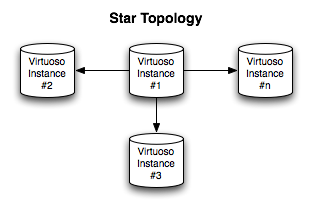

To set up a Star, follow the scenario:

1.  Configure Instance \#1 to Publish.

2.  Configure Instance \#2 to Subscribe to \#1.

3.  Repeat as necessary.

#### Star Replication Topology Example

The following How-To walks you through setting up Virtuoso RDF Graph
Replication in a Star Topology.

##### Prerequisites

###### Database INI Parameters

Suppose there are 3 Virtuoso instances respectively with the following
ini parameters values:

1.  virtuoso1.ini:
    
        ...
        [Database]
        DatabaseFile    = virtuoso1.db
        TransactionFile = virtuoso1.trx
        ErrorLogFile     = virtuoso1.log
        ...
        [Parameters]
        ServerPort               = 1111
        SchedulerInterval        = 1
        ...
        [HTTPServer]
        ServerPort                  = 8891
        ...
        [URIQA]
        DefaultHost = example.com:8891
        ...
        [Replication]
        ServerName   = db1
        ...

2.  virtuoso2.ini:
    
        ...
        [Database]
        DatabaseFile    = virtuoso2.db
        TransactionFile = virtuoso2.trx
        ErrorLogFile     = virtuoso2.log
        ...
        [Parameters]
        ServerPort               = 1112
        SchedulerInterval        = 1
        ...
        [HTTPServer]
        ServerPort                  = 8892
        ...
        [URIQA]
        DefaultHost = localhost:8892
        ...
        [Replication]
        ServerName   = db2
        ...

3.  virtuoso3.ini:
    
        ...
        [Database]
        DatabaseFile    = virtuoso3.db
        TransactionFile = virtuoso3.trx
        ErrorLogFile     = virtuoso3.log
        ...
        [Parameters]
        ServerPort               = 1113
        SchedulerInterval        = 1
        ...
        [HTTPServer]
        ServerPort                  = 8893
        ...
        [URIQA]
        DefaultHost = example.com:8893
        ...
        [Replication]
        ServerName   = db3
        ...

###### Database DSNs

Use the ODBC Administrator on your Virtuoso host (e.g., on Windows,
Start menu -\> Control Panel -\> Administrative Tools -\> Data Sources
(ODBC); on Mac OS X, /Applications/Utilities/OpenLink ODBC
Administrator.app) to create a System DSN for each of db1, db2, db3,
with names db1, db2 and db3, respectively.

###### Install Conductor package

On each of the 3 Virtuoso instances install the [conductor\_dav.vad](#)
package.

##### Create a Publication on the Host Virtuoso Instance db1

1.  Go to Conductor -\> Replication -\> Transactional -\> Publications
    
    

2.  Click Enable RDF Publishing

3.  A publication with the name RDF Publication should be created:
    
    

4.  Click the link which is the publication name.

5.  You will be shown the publication items page:
    
    

6.  Enter for Graph IRI:
    
        http://example.org
    
    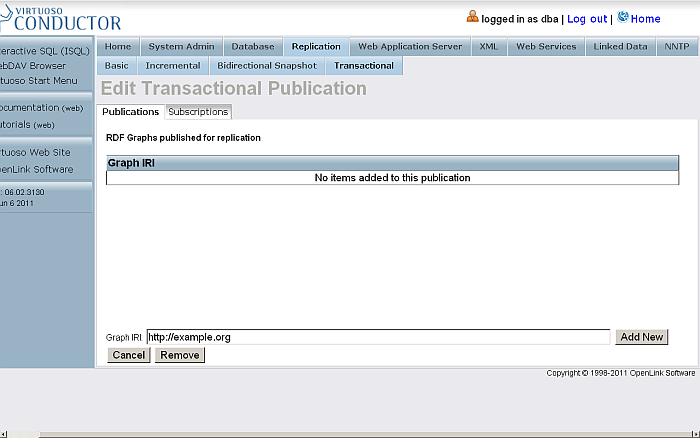

7.  Click Add New

8.  The item will be created and shown in the list of items for the
    currently viewed publication.
    
    

##### Insert Data into a Named Graph on the Host Virtuoso Instance

There are several ways to insert data into a Virtuoso Named Graph. In
this example, we will use the Virtuoso Conductor's Import RDF feature:

1.  In the Virtuoso Conductor, go to Linked Data -\> Quad Store Upload:
    
    

2.  In the form:
    
      - Tick the box for Resource URL and enter your resource URL, for
        e.g.:
        
            http://www.openlinksw.com/dataspace/person/kidehen@openlinksw.com#this
    
      - Enter for Named Graph IRI:
        
            http://example.org
    
    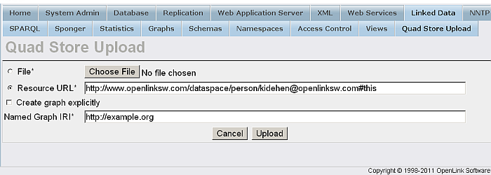

3.  Click Upload

4.  A successful upload will result in this message:
    
    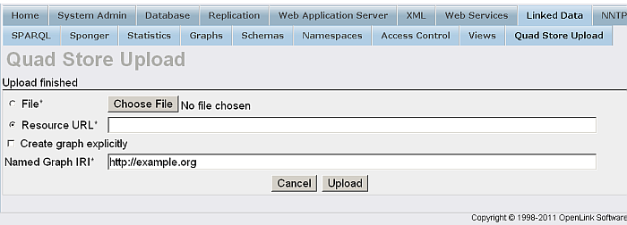

5.  Check the inserted triples by executing a query like the following
    against the SPARQL endpoint, http://cname:port/sparql:
    
        SELECT *
          FROM <http://example.org>
         WHERE { ?s ?p ?o }
    
    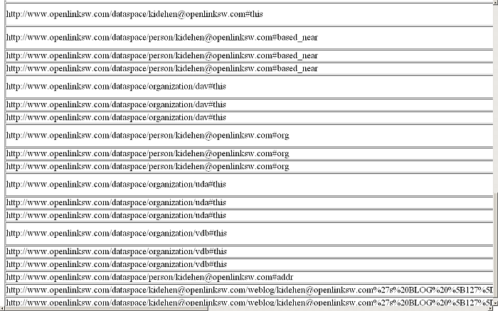

6.  See how many triples have been inserted in your graph:
    
        SELECT COUNT(*)
          FROM <http://example.org>
         WHERE { ?s ?p ?o }
    
    

##### Subscribe to the Publication on the a Destination Virtuoso Instance db2, db3, etc.

1.  Go to Conductor -\> Replication -\> Transactional -\> Subscriptions
    
    

2.  Click New Subscription
    
    

3.  Specify a new Data Source Enter or selected target data source from
    the available connected Data Sources:
    
    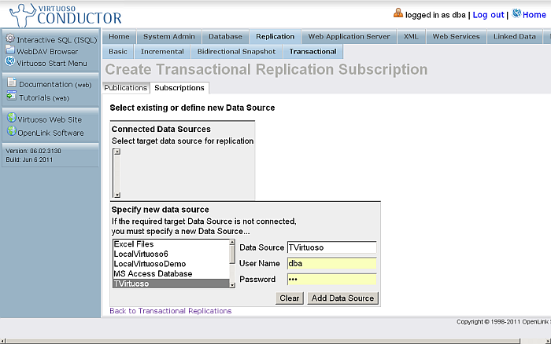
    
    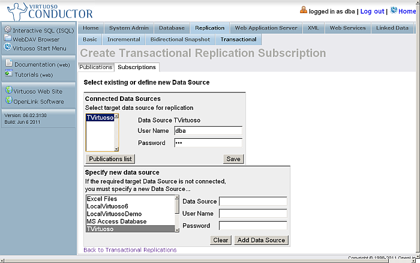

4.  Click Publications list
    
    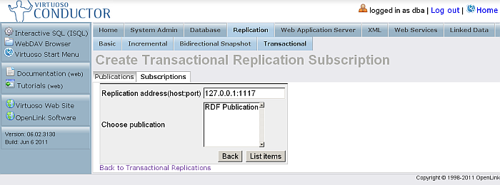

5.  Select the RDF Publication and click List Items
    
    

6.  Click Subscribe

7.  The subscription will be created
    
    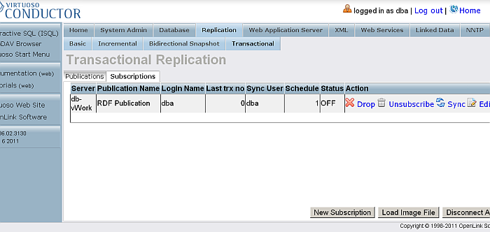

8.  Click Sync

9.  Check the retrieved triples by executing the following query
    
        SELECT *
          FROM <http://example.org>
         WHERE {?s ?p ?o}
    
    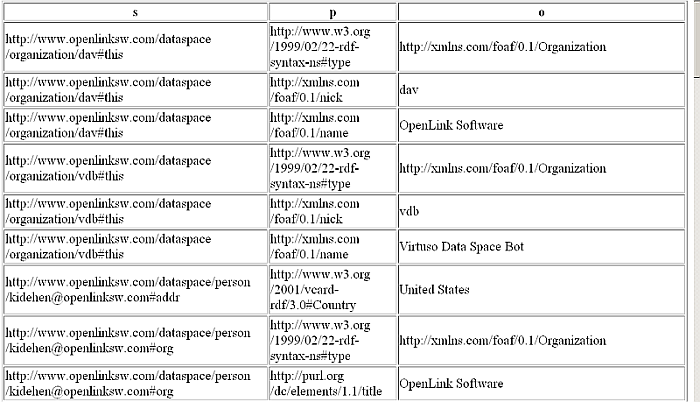

10. See how many triples have been inserted into your graph by executing
    the following query:
    
        SELECT COUNT(*)
          FROM <http://example.org>
         WHERE {?s ?p ?o}
    
    

These steps may be repeated for any number of Subscriber.

##### Insert Triples into the Host Virtuoso Instance Graph and check availability at Destination Virtuoso Instance Graph

1.  To check the starting count, on the Destination Virtuoso Instance
    SPARQL Endpoint, execute:
    
        SELECT COUNT(*)
          FROM <http://example.org>
         WHERE { ?s ?p ?o }

2.  On the Host Virtuoso Instance go to Conductor -\> Database -\>
    Interactive SQL and execute the following statement:
    
        SPARQL INSERT INTO GRAPH <http://example.org>
          {
             <http://www.openlinksw.com/dataspace/person/kidehen@openlinksw.com#this>
             <http://xmlns.com/foaf/0.1/interest>
             <http://dbpedia.org/resource/Web_Services>
          } ;
        SPARQL INSERT INTO GRAPH <http://example.org>
          {
            <http://www.openlinksw.com/dataspace/person/kidehen@openlinksw.com#this>
            <http://xmlns.com/foaf/0.1/interest>
            <http://dbpedia.org/resource/Web_Clients>
          } ;
        SPARQL INSERT INTO GRAPH <http://example.org>
          {
            <http://www.openlinksw.com/dataspace/person/kidehen@openlinksw.com#this>
            <http://xmlns.com/foaf/0.1/interest>
            <http://dbpedia.org/resource/SPARQL>
          } ;
    
    
    
    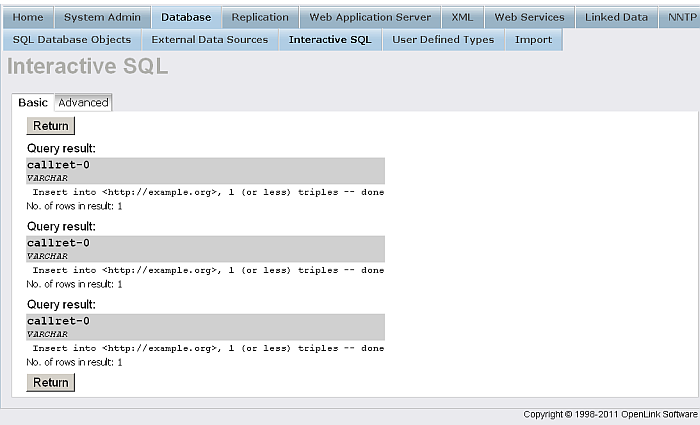

3.  To confirm that the triple count has increased by the number of
    inserted triples, execute the following on the Destination Virtuoso
    Instance SPARQL Endpoint:
    
        SELECT COUNT(*)
          FROM <http://example.org>
         WHERE { ?s ?p ?o }
    
    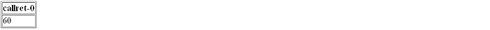

### Chain Replication Topology

In a Chain, there is one original Publisher, to which there is only one
Subscriber. That Subscriber may also serve as a Publisher, again with
only one Subscriber. The chain ends with a Subscriber which does not
Publish.

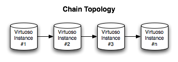

To set up a Chain, follow the scenario:

1.  Configure Instance \#1 to Publish.

2.  Configure Instance \#2 to Subscribe to \#1.

3.  Configure Instance \#2 to Publish.

4.  Configure Instance \#3 to Subscribe to \#2.

5.  Repeat as necessary.

#### Chain Replication Topology Example

The following How-To walks you through setting up Virtuoso RDF Graph
Replication in a Chain Topology.

##### Prerequisites

###### Database INI Parameters

Suppose there are 3 Virtuoso instances respectively with the following
ini parameters values:

1.  virtuoso1.ini:
    
        ...
        [Database]
        DatabaseFile    = virtuoso1.db
        TransactionFile = virtuoso1.trx
        ErrorLogFile     = virtuoso1.log
        ...
        [Parameters]
        ServerPort               = 1111
        SchedulerInterval        = 1
        ...
        [HTTPServer]
        ServerPort                  = 8891
        ...
        [URIQA]
        DefaultHost = example.com:8891
        ...
        [Replication]
        ServerName   = db1
        ...

2.  virtuoso2.ini:
    
        ...
        [Database]
        DatabaseFile    = virtuoso2.db
        TransactionFile = virtuoso2.trx
        ErrorLogFile     = virtuoso2.log
        ...
        [Parameters]
        ServerPort               = 1112
        SchedulerInterval        = 1
        ...
        [HTTPServer]
        ServerPort                  = 8892
        ...
        [URIQA]
        DefaultHost = localhost:8892
        ...
        [Replication]
        ServerName   = db2
        ...

3.  virtuoso3.ini:
    
        ...
        [Database]
        DatabaseFile    = virtuoso3.db
        TransactionFile = virtuoso3.trx
        ErrorLogFile     = virtuoso3.log
        ...
        [Parameters]
        ServerPort               = 1113
        SchedulerInterval        = 1
        ...
        [HTTPServer]
        ServerPort                  = 8893
        ...
        [URIQA]
        DefaultHost = example.com:8893
        ...
        [Replication]
        ServerName   = db3
        ...

###### Database DSNs

Use the ODBC Administrator on your Virtuoso host (e.g., on Windows,
Start menu -\> Control Panel -\> Administrative Tools -\> Data Sources
(ODBC); on Mac OS X, /Applications/Utilities/OpenLink ODBC
Administrator.app) to create a System DSN for each of db1, db2, db3,
with names db1, db2 and db3, respectively.

###### Install Conductor package

On each of the 3 Virtuoso instances install the [conductor\_dav.vad](#)
package.

##### Create Publication on db1

1.  Go to http://example.com:8891/conductor and log in as dba

2.  Go to Conductor - \> Replication - \> Transactional - \>
    Publications
    
    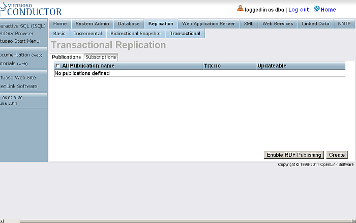

3.  Click
    
    *Enable RDF Publishing*

4.  As result publication with the name
    
    *RDF Publication*
    
    should be created
    
    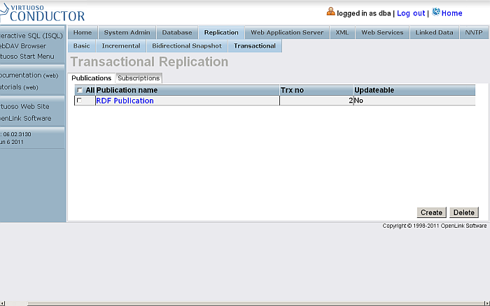

5.  Click the link which is the publication name.

6.  You will be shown the publication items page
    
    

7.  Enter for Graph IRI:
    
        http://example.org
    
    

8.  Click Add New

9.  The item will be created and shown in the list of items for the
    currently viewed publication.
    
    

##### Create subscription from db2 to db1's Publication

1.  Log in at http://example.com:8892/conductor

2.  Go to Replication - \> Transactional - \> Subscriptions
    
    

3.  Click
    
    *New Subscription*
    
    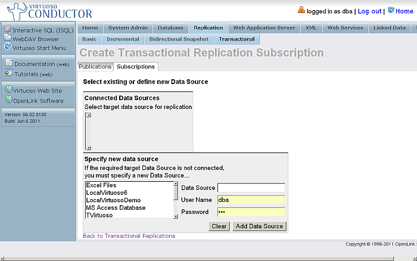

4.  From the list of "Specify new data source" select Data Source db1
    
    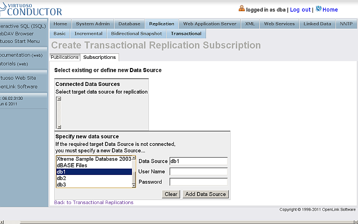

5.  Enter for db1 dba user credentials
    
    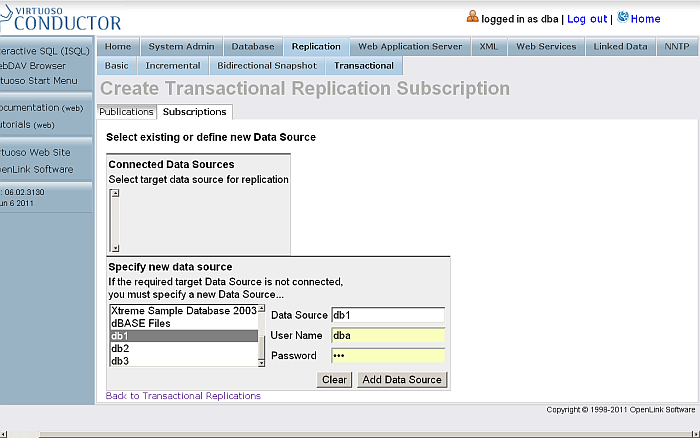

6.  Click "Add Data Source"

7.  As result
    
    *db1*
    
    will be shown in the "Connected Data Sources" list.
    
    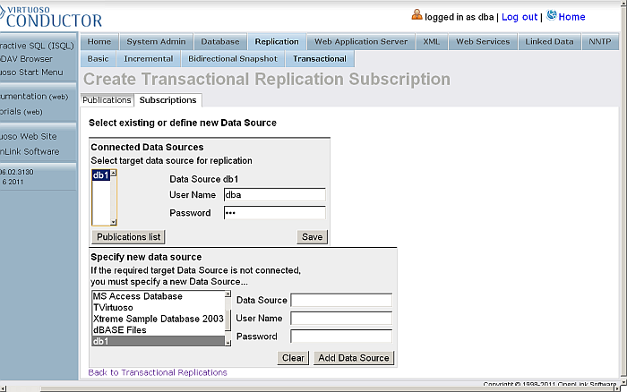

8.  Select
    
    *db1*
    
    the "Connected Data Sources" list and click "Publications list"
    
    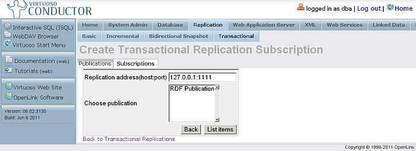

9.  As result will be shown the list of available publications for the
    selected data source. Select the one with name "RDF Publication" and
    click "List Items".
    
    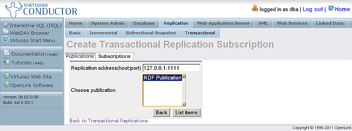

10. As result will be shown the "Confirm subscription" page.
    
    

11. The sync interval by default is 10 minutes. For the testing
    purposes, we will change it to 1 minute.
    
    

12. Click "Subscribe"

13. The subscription will be created.
    
    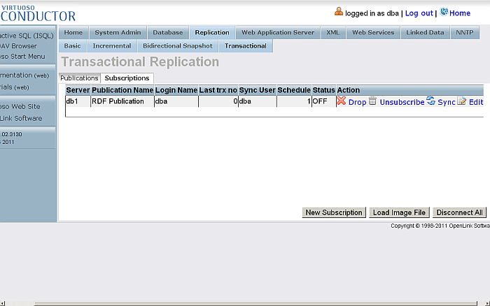

##### Create Publication on db2

1.  Go to http://example.com:8892/conductor and log in as dba

2.  Go to Conductor - \> Replication - \> Transactional - \>
    Publications
    
    

3.  Click
    
    *Enable RDF Publishing*

4.  As result publication with the name
    
    *RDF Publication*
    
    should be created
    
    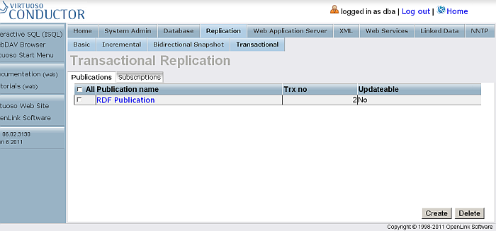

5.  Click the link which is the publication name.

6.  You will be shown the publication items page
    
    

7.  Enter for Graph IRI:
    
        http://example.org
    
    

8.  Click Add New

9.  The item will be created and shown in the list of items for the
    currently viewed publication.
    
    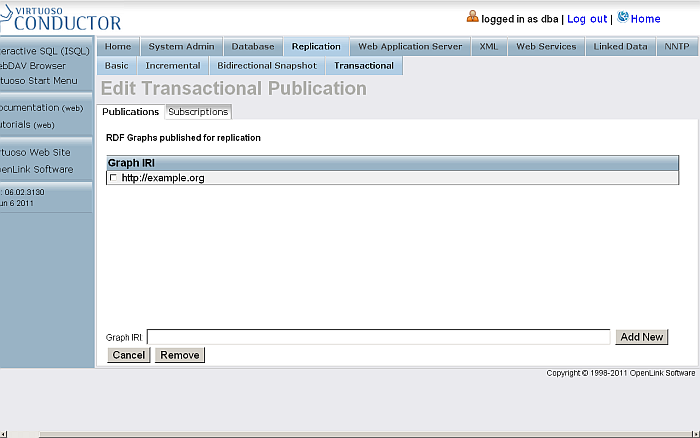

##### Create subscription from db3 to db2's Publication

1.  Log in at http://example.com:8893/conductor

2.  Go to Replication - \> Transactional - \> Subscriptions
    
    

3.  Click
    
    *New Subscription*
    
    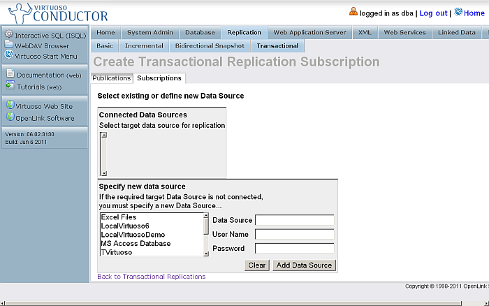

4.  From the list of "Specify new data source" select Data Source db2
    
    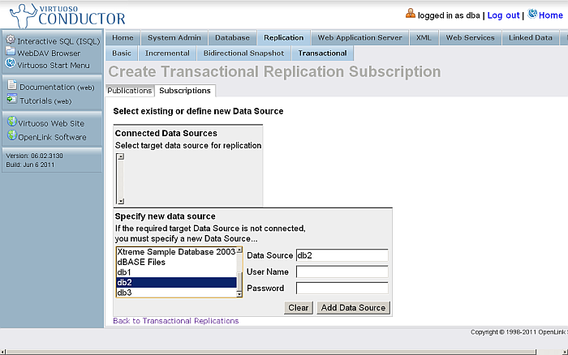

5.  Enter for db2 dba user credentials
    
    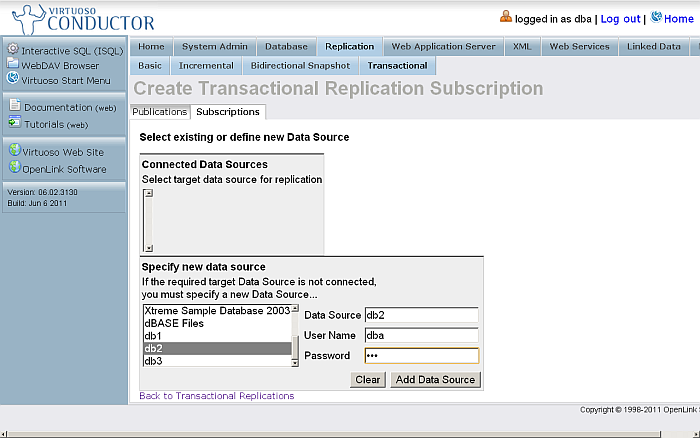

6.  Click "Add Data Source"
    
    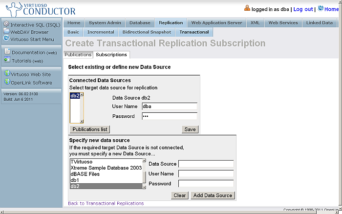

7.  As result
    
    *db2*
    
    will be shown in the "Connected Data Sources" list. Select it and
    click "Publications list"
    
    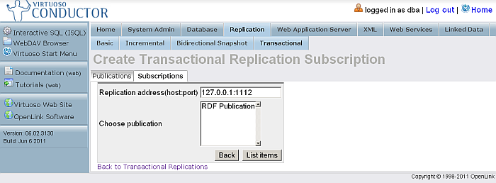

8.  As result will be shown the list of available publications for the
    selected data source. Select the one with name "RDF Publication" and
    click "List Items".
    
    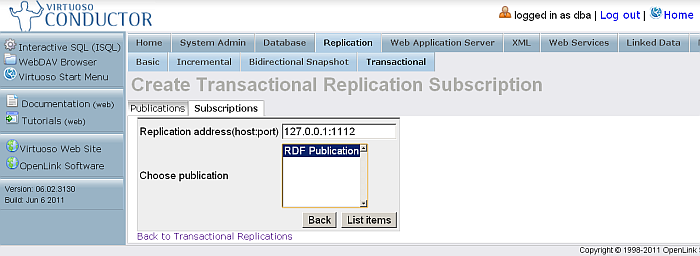

9.  As result will be shown the "Confirm subscription" page.
    
    

10. The sync interval by default is 10 minutes. For the testing
    purposes, we will change it to 1 minute.
    
    

11. Click "Subscribe"

12. The subscription will be created.
    
    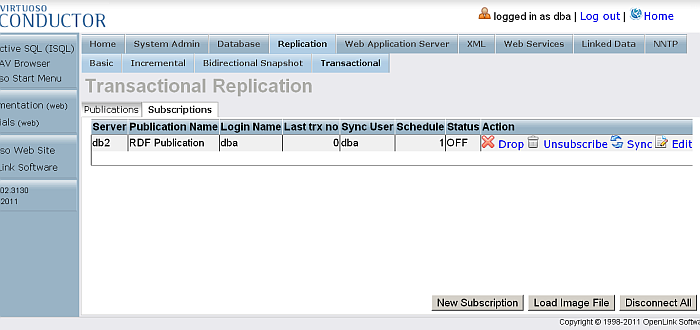

##### Insert Data into a Named Graph on the db1 Virtuoso Instance

1.  Log in at http://example.com:8891/conductor

2.  Go to Linked Data -\> Quad Store Upload:
    
    

3.  In the shown form:
    
    1.  Tick the box for
        
        *Resource URL*
        
        and enter your resource URL, e.g.:
        
            http://www.openlinksw.com/dataspace/person/kidehen@openlinksw.com#this
    
    2.  Enter for Named Graph IRI:
        
            http://example.org
        
        

4.  Click Upload

5.  A successful upload will result in a shown message.
    
    

6.  Check the count of the inserted triples by executing a query like
    the following against the SPARQL endpoint,
    http://example.com:8891/sparql:
    
        SELECT COUNT(*)
           FROM <http://example.org>
        WHERE { ?s ?p ?o }
    
    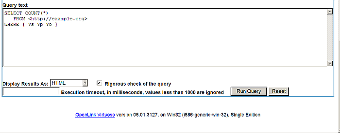

7.  Should return
    
    *57*
    
    as total.
    
    

##### Check data on the Destination instances db2 and db3

1.  To check the starting count, on each of the Destination Virtuoso
    Instances db2 and db3 from SPARQL Endpoint execute:
    
        SELECT COUNT(*)
           FROM <http://example.org>
        WHERE { ?s ?p ?o }

2.  Should return
    
    *57*
    
    as total.
    
    

##### Add new data on db1

1.  Disconnect db2 and db3.

2.  On the Host Virtuoso Instance db1 go to Conductor - \> Database - \>
    Interactive SQL enter the following statement:
    
        SPARQL INSERT INTO GRAPH <http://example.org>
          {
             <http://www.openlinksw.com/dataspace/person/kidehen@openlinksw.com#this>
             <http://xmlns.com/foaf/0.1/interest>
             <http://dbpedia.org/resource/Web_Services>
          } ;
        SPARQL INSERT INTO GRAPH <http://example.org>
          {
            <http://www.openlinksw.com/dataspace/person/kidehen@openlinksw.com#this>
            <http://xmlns.com/foaf/0.1/interest>
            <http://dbpedia.org/resource/Web_Clients>
          } ;
        SPARQL INSERT INTO GRAPH <http://example.org>
          {
            <http://www.openlinksw.com/dataspace/person/kidehen@openlinksw.com#this>
            <http://xmlns.com/foaf/0.1/interest>
            <http://dbpedia.org/resource/SPARQL>
          } ;
    
    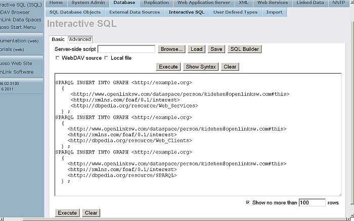

3.  Click "Execute"

4.  As result the triples will be inserted
    
    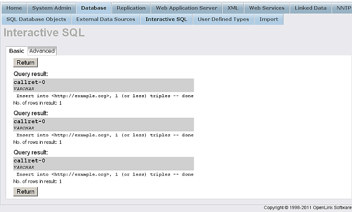

5.  Check the count of the destination instance graph's triples by
    executing the following query like against the SPARQL endpoint,
    http://example.com:8891/sparql:
    
        SELECT COUNT(*)
           FROM <http://example.org>
        WHERE { ?s ?p ?o }

6.  Should return
    
    *60*
    
    as total.
    
    

##### Check data on the Destination instances db2 and db3

1.  Start instances db2 and db3

2.  To confirm that the triple count has increased by the number of
    inserted triples, execute the following on the Destination Virtuoso
    Instance db2 and db3 SPARQL Endpoint:
    
        SELECT COUNT(*)
           FROM <http://example.org>
        WHERE { ?s ?p ?o }

3.  Should return
    
    *60*
    
    as total.
    
    

### Bi-directional Replication Topology

#### Bi-directional Replication Topology Example

The following How-To walks you through setting up Virtuoso RDF Graph
Replication in a Bi-directional Topology.

    db1 <---- db2
    db1 ---->
    
     db2

##### Prerequisites

###### Database INI Parameters

Suppose there are 2 Virtuoso instances respectively with the following
ini parameters values:

1.  virtuoso1.ini:
    
        ...
        [Database]
        DatabaseFile    = virtuoso1.db
        TransactionFile = virtuoso1.trx
        ErrorLogFile     = virtuoso1.log
        ...
        [Parameters]
        ServerPort               = 1111
        SchedulerInterval        = 1
        ...
        [HTTPServer]
        ServerPort                  = 8891
        ...
        [URIQA]
        DefaultHost = example.com:8891
        ...
        [Replication]
        ServerName   = db1
        ...

2.  virtuoso2.ini:
    
        ...
        [Database]
        DatabaseFile    = virtuoso2.db
        TransactionFile = virtuoso2.trx
        ErrorLogFile     = virtuoso2.log
        ...
        [Parameters]
        ServerPort               = 1112
        SchedulerInterval        = 1
        ...
        [HTTPServer]
        ServerPort                  = 8892
        ...
        [URIQA]
        DefaultHost = localhost:8892
        ...
        [Replication]
        ServerName   = db2
        ...

###### Database DSNs

Use the ODBC Administrator on your Virtuoso host (e.g., on Windows,
Start menu -\> Control Panel -\> Administrative Tools -\> Data Sources
(ODBC); on Mac OS X, /Applications/Utilities/OpenLink ODBC
Administrator.app) to create a System DSN for db1 and db2 with names db1
and db2 respectively.

###### Install Conductor package

On each of the 2 Virtuoso instances install the [conductor\_dav.vad](#)
package.

##### Create Publication on db2

1.  Go to http://example.com:8892/conductor and log in as dba

2.  Go to Conductor -\> Replication -\> Transactional -\> Publications
    
    

3.  Click
    
    *Enable RDF Publishing*

4.  As result publication with the name
    
    *RDF Publication*
    
    should be created
    
    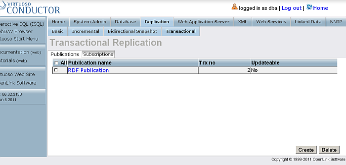

5.  Click the link which is the publication name.

6.  You will be shown the publication items page
    
    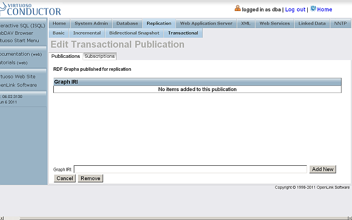

7.  Enter for Graph IRI:
    
        http://example.org
    
    

8.  Click Add New

9.  The item will be created and shown in the list of items for the
    currently viewed publication.
    
    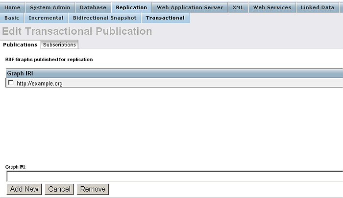

##### Create subscription from db1 to db2's Publication

1.  Log in at http://example.com:8891/conductor

2.  Go to Replication -\> Transactional -\> Subscriptions
    
    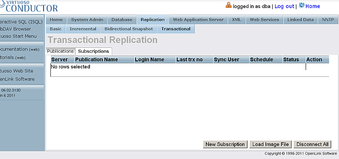

3.  Click
    
    *New Subscription*
    
    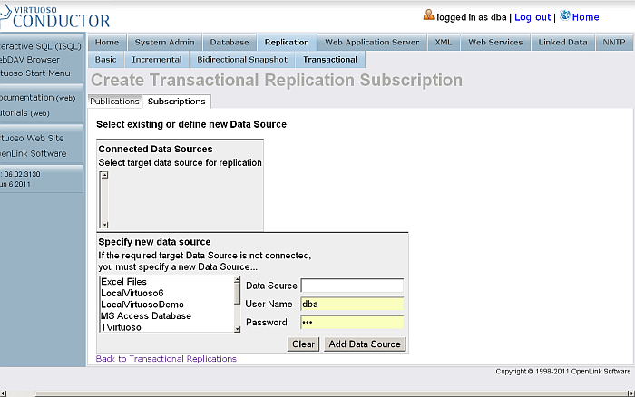

4.  From the list of "Specify new data source" select Data Source db2
    
    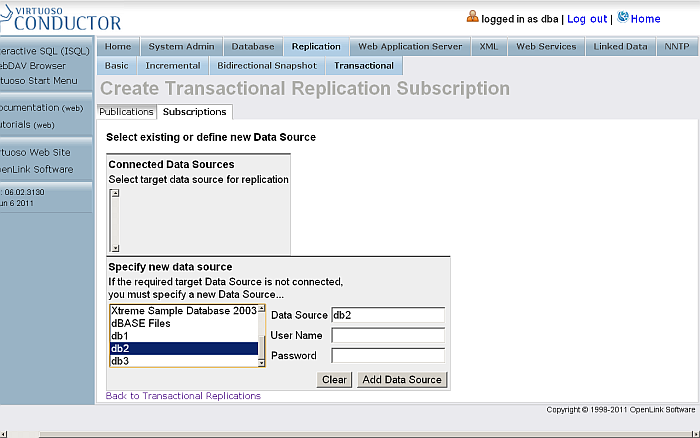

5.  Enter for db2 dba user credentials
    
    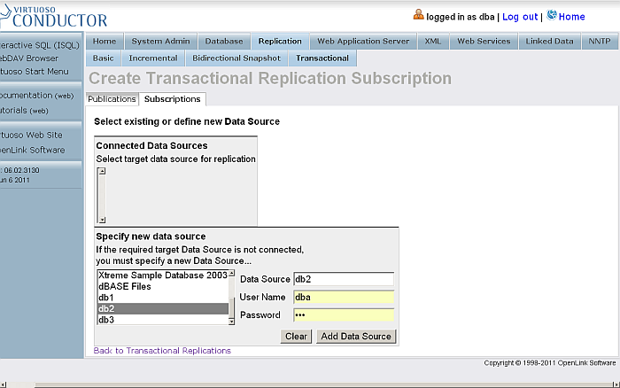

6.  Click "Add Data Source"

7.  As result
    
    *db2*
    
    will be shown in the "Connected Data Sources" list.
    
    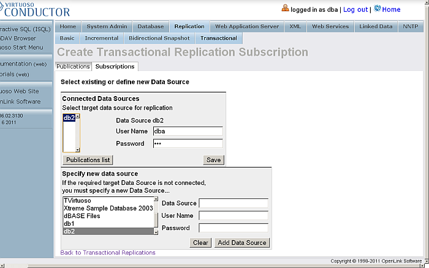

8.  Select
    
    *db2*
    
    the "Connected Data Sources" list and click "Publications list"
    
    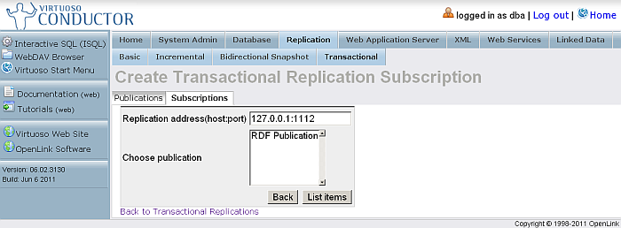

9.  As result will be shown the list of available publications for the
    selected data source. Select the one with name "RDF Publication" and
    click "List Items".
    
    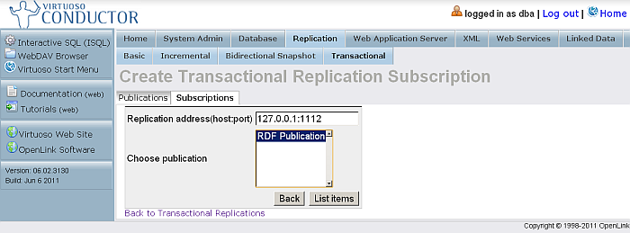

10. As result will be shown the "Confirm subscription" page.
    
    

11. The sync interval by default is 10 minutes. For the testing
    purposes, we will change it to 1 minute.
    
    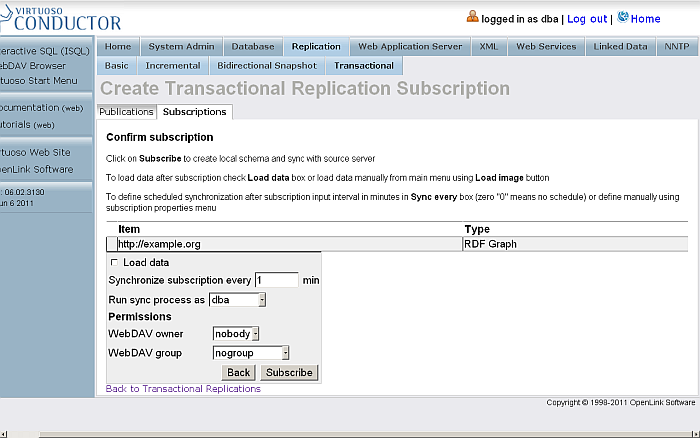

12. Click "Subscribe"

13. The subscription will be created.
    
    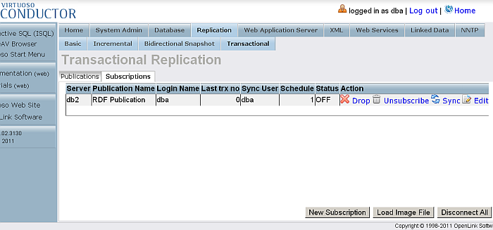

##### Create Publication on db1

1.  Go to http://example.com:8891/conductor and log in as dba

2.  Go to Conductor -\> Replication -\> Transactional -\> Publications
    
    

3.  Click
    
    *Enable RDF Publishing*

4.  As result publication with the name
    
    *RDF Publication*
    
    should be created
    
    

5.  Click the link which is the publication name.

6.  You will be shown the publication items page
    
    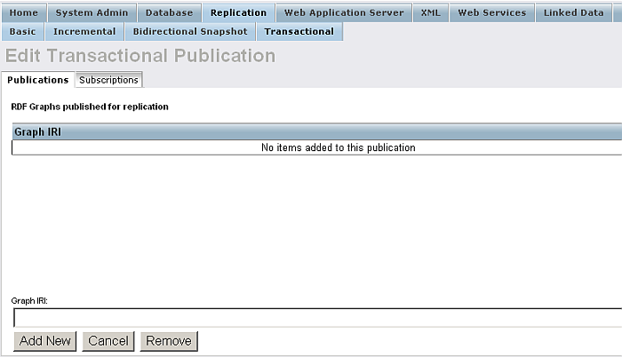

7.  Enter for Graph IRI:
    
        http://example.org
    
    

8.  Click Add New

9.  The item will be created and shown in the list of items for the
    currently viewed publication.
    
    

##### Create subscription from db2 to db1's Publication

1.  Log in at http://example.com:8892/conductor

2.  Go to Replication -\> Transactional -\> Subscriptions
    
    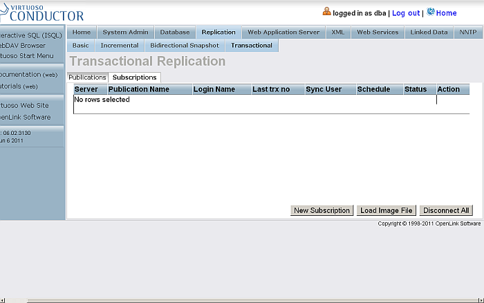

3.  Click
    
    *New Subscription*
    
    

4.  From the list of "Specify new data source" select Data Source db1
    
    

5.  Enter for db1 dba user credentials
    
    

6.  Click "Add Data Source"
    
    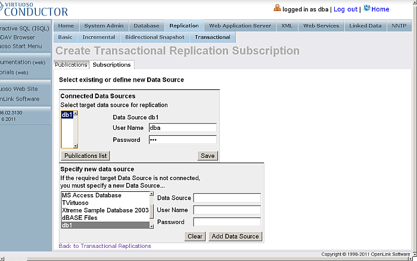

7.  As result
    
    *db1*
    
    will be shown in the "Connected Data Sources" list. Select it and
    click "Publications list"
    
    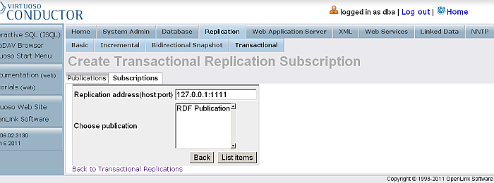

8.  As result will be shown the list of available publications for the
    selected data source. Select the one with name "RDF Publication" and
    click "List Items".
    
    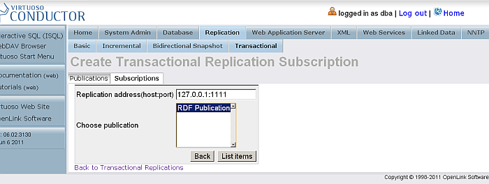

9.  As result will be shown the "Confirm subscription" page.
    
    

10. The sync interval by default is 10 minutes. For the testing
    purposes, we will change it to 1 minute.
    
    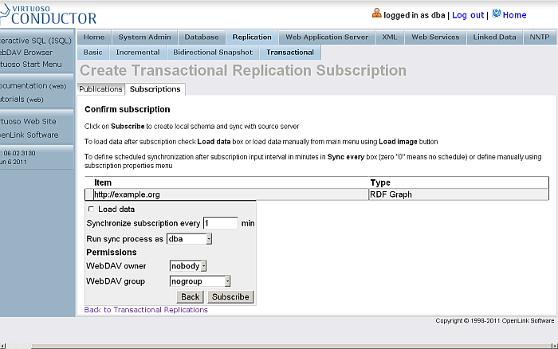

11. Click "Subscribe"

12. The subscription will be created.
    
    

##### Insert Data into a Named Graph on the db2 Virtuoso Instance

1.  Log in at http://example.com:8892/conductor

2.  Go to Linked Data -\> Quad Store Upload:
    
    

3.  In the shown form:

4.  Tick the box for
    
    *Resource URL*
    
    and enter your resource URL, e.g.:
    
        http://www.openlinksw.com/dataspace/person/kidehen@openlinksw.com#this

5.  Enter for Named Graph IRI:
    
        http://example.org
    
    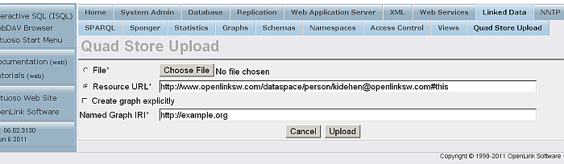

6.  Click Upload

7.  A successful upload will result in a shown message.
    
    

8.  Check the count of the inserted triples by executing a query like
    the following against the SPARQL endpoint,
    http://example.com:8892/sparql:
    
        SELECT COUNT(*)
           FROM <http://example.org>
        WHERE { ?s ?p ?o }
    
    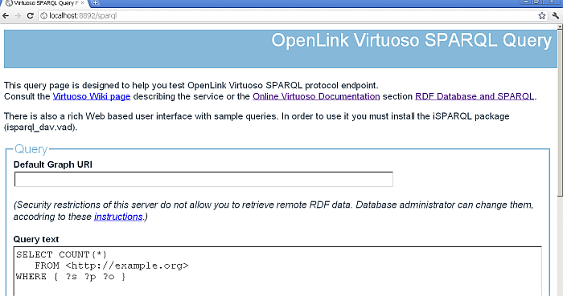

9.  Should return
    
    *57*
    
    as total.
    
    

##### Check data on the Destination instance db1

1.  To check the starting count, execute from db1's SPARQL Endpoint:
    
        SELECT COUNT(*)
           FROM <http://example.org>
        WHERE { ?s ?p ?o }

2.  Should return
    
    *57*
    
    as total.
    
    

##### Add new data on db2

1.  Disconnect db1.

2.  On the Host Virtuoso Instance db2 go to Conductor -\> Database -\>
    Interactive SQL enter the following statement:
    
        SPARQL INSERT INTO GRAPH <http://example.org>
          {
             <http://www.openlinksw.com/dataspace/person/kidehen@openlinksw.com#this>
             <http://xmlns.com/foaf/0.1/interest>
             <http://dbpedia.org/resource/Web_Services>
          } ;
    
    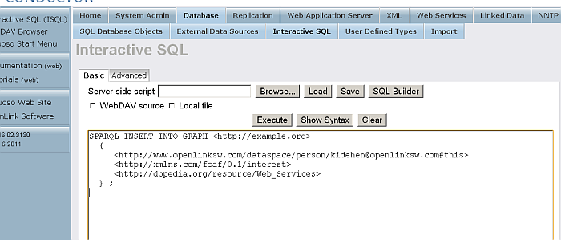

3.  Click "Execute"

4.  As result the triples will be inserted
    
    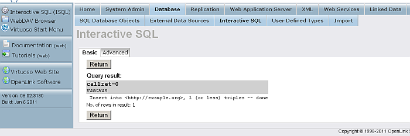

5.  Check the count of the destination instance graph's triples by
    executing the following query like against the SPARQL endpoint,
    http://example.com:8892/sparql:
    
        SELECT COUNT(*)
           FROM <http://example.org>
        WHERE { ?s ?p ?o }

6.  Should return
    
    *58*
    
    as total.
    
    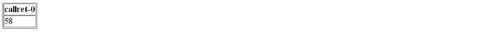

##### Check data on the Destination instance db1

1.  Start instance db1

2.  To confirm that the triple count has increased by the number of
    inserted triples, execute the following statement on db1's SPARQL
    Endpoint:
    
        SELECT COUNT(*)
           FROM <http://example.org>
        WHERE { ?s ?p ?o }

3.  Should return
    
    *58*
    
    as total.
    
    

##### Add new data on db1

1.  Disconnect db2.

2.  On the Host Virtuoso Instance db1 go to Conductor -\> Database -\>
    Interactive SQL enter the following statement:
    
        SPARQL INSERT INTO GRAPH <http://example.org>
          {
            <http://www.openlinksw.com/dataspace/person/kidehen@openlinksw.com#this>
            <http://xmlns.com/foaf/0.1/interest>
            <http://dbpedia.org/resource/Web_Clients>
          } ;
        SPARQL INSERT INTO GRAPH <http://example.org>
          {
            <http://www.openlinksw.com/dataspace/person/kidehen@openlinksw.com#this>
            <http://xmlns.com/foaf/0.1/interest>
            <http://dbpedia.org/resource/SPARQL>
          } ;
    
    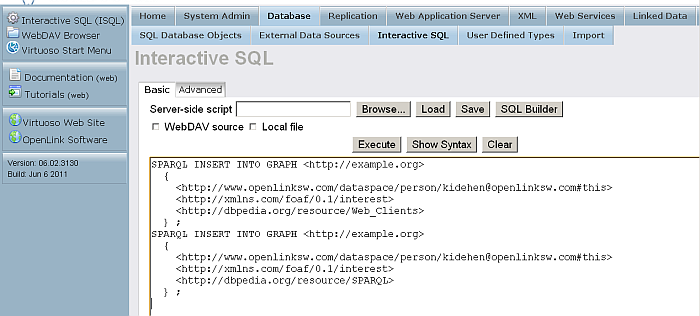

3.  Click "Execute"

4.  As result the triples will be inserted
    
    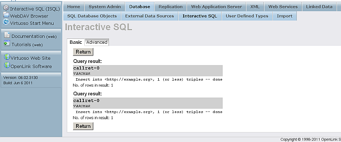

5.  Check the count of the destination instance graph's triples by
    executing the following query like against the SPARQL endpoint,
    http://example.com:8891/sparql:
    
        SELECT COUNT(*)
           FROM <http://example.org>
        WHERE { ?s ?p ?o }

6.  Should return
    
    *60*
    
    as total.
    
    

##### Check data on the Destination instance db2

1.  Start instance db2

2.  To confirm that the triple count has increased by the number of
    inserted triples, execute the following statement on db2's SPARQL
    Endpoint:
    
        SELECT COUNT(*)
           FROM <http://example.org>
        WHERE { ?s ?p ?o }

3.  Should return
    
    *60*
    
    as total.
    
    

<a id="id130-set-up-rdf-replication-via-procedure-calls"></a>
## Set up RDF Replication via procedure calls

### Example

The following example shows how to use SQL procedures to set up Virtuoso
RDF Graph Replication in a Chain Topology.


This can also be done [through the HTTP-based Virtuoso
Conductor](#rdfgraphreplicationtoplchainex) .

#### Prerequisites

##### Database INI Parameters

Suppose there are 3 Virtuoso instances on the same machine.

The first instance holds the master copy of the data and publishes its
changes to all other instances that subscribe to this master.

The second instance subscribes to the publication of the master copy,
but also publishes all of these changes to any instance that subscribes
to it.

The third instance only subscribes to the publication of the second
instance.

Each of these 3 servers need unique ports and ServerName, DefaultHost
for this replication scheme to work properly. Although not needed, this
example also sets separate names for the database and related files.
This results in the following ini parameters values (only changes are
shown, the rest can remain default):

1.  repl1/virtuoso.ini:
    
        ...
        [Database]
        DatabaseFile    = virtuoso1.db
        TransactionFile = virtuoso1.trx
        ErrorLogFile     = virtuoso1.log
        ...
        [Parameters]
        ServerPort               = 1111
        SchedulerInterval        = 1
        ...
        [HTTPServer]
        ServerPort                  = 8891
        ...
        [URIQA]
        DefaultHost = example.com:8891
        ...
        [Replication]
        ServerName   = db1-r
        ...

2.  repl2/virtuoso.ini:
    
        ...
        [Database]
        DatabaseFile    = virtuoso2.db
        TransactionFile = virtuoso2.trx
        ErrorLogFile     = virtuoso2.log
        ...
        [Parameters]
        ServerPort               = 1112
        SchedulerInterval        = 1
        ...
        [HTTPServer]
        ServerPort                  = 8892
        ...
        [URIQA]
        DefaultHost = localhost:8892
        ...
        [Replication]
        ServerName   = db2-r
        ...

3.  repl3/virtuoso.ini:
    
    ``` 
    
    ...
    [Database]
    DatabaseFile    = virtuoso3.db
    TransactionFile = virtuoso3.trx
    ErrorLogFile     = virtuoso3.log
    ...
    [Parameters]
    ServerPort               = 1113
    SchedulerInterval        = 1
    ...
    [HTTPServer]
    ServerPort                  = 8893
    ...
    [URIQA]
    DefaultHost = example.com:8893
    ...
    [Replication]
    ServerName   = db3-r
    ...
    ```

##### Database DSNs

Use the ODBC Administrator on your Virtuoso host (e.g., on Windows,
Start menu -\> Control Panel -\> Administrative Tools -\> Data Sources
(ODBC); on Mac OS X, /Applications/Utilities/OpenLink ODBC
Administrator.app) to create a System DSN for each of db1, db2, db3,
with names db1, db2 and db3, respectively.

#### Configure Publishers and Subscribers

1.  Run the databases by starting start.sh, which has the following
    content:
    
        cd repl1
        virtuoso -f &
        cd ../repl2
        virtuoso -f &
        cd ../repl3
        virtuoso -f &
        cd ..

2.  Use the
    
    *isql*
    
    command to execute the following rep.sql file:
    
        --
        --  connect to the first database which is only a publisher
        --
        set DSN=localhost:1111;
        reconnect;
        
        --
        -- start publishing the graph http://test.org
        ---
        DB.DBA.RDF_REPL_START();
        DB.DBA.RDF_REPL_GRAPH_INS ('http://test.org');
        
        --
        --  connect to the second database in the chain, which is both a publisher and a subscriber
        --
        set DSN=localhost:1112;
        reconnect;
        
        --
        --  start publishing the graph http://test.org
        --
        DB.DBA.RDF_REPL_START();
        DB.DBA.RDF_REPL_GRAPH_INS ('http://test.org');
        
        --
        --  contact the first database
        --
        repl_server ('db1-r', 'db1', 'localhost:1111');
        
        --
        --  subscribe to its RDF publication(s)
        --
        repl_subscribe ('db1-r', '__rdf_repl', 'dav', 'dav', 'dba', 'dba');
        
        --
        --  bring the replication service online
        --
        repl_sync_all();
        
        --
        --  and set scheduler to check every minute
        --
        DB.DBA.SUB_SCHEDULE ('db1-r', '__rdf_repl', 1);
        
        --
        --  connect to the third database in the chain, which is only a subscriber
        --
        set DSN=localhost:1113;
        reconnect;
        
        --
        -- uncomment next 2 commands if this database should also be a publisher
        --
        --DB.DBA.RDF_REPL_START();
        --DB.DBA.RDF_REPL_GRAPH_INS ('http://test.org');
        
        --
        --  contact second database
        --
        repl_server ('db2-r', 'db2', 'localhost:1112');
        
        --
        --  subscribe to its RDF publication(s)
        --
        repl_subscribe ('db2-r', '__rdf_repl', 'dav', 'dav', 'dba', 'dba');
        
        --
        --  bring the replication service online
        --
        repl_sync_all();
        
        --
        --  and set schedule to check every minute
        --
        DB.DBA.SUB_SCHEDULE ('db2-r', '__rdf_repl', 1);
