# Web Services

# SOAP

The Simple Object Access Protocol (SOAP) is a lightweight, extensible,
XML-based application layer protocol for information exchange in a
decentralized, distributed environment. SOAP defines a framework for
message structures and a message processing model. SOAP also defines a
set of encoding rules for serializing data and a convention for making
remote procedure calls. The SOAP extensibility model provides a
foundation for a wide range of composable modules and protocols.
Although the most common way to transport SOAP messages is HTTP, it may
also be run on top of other protocols.

SOAP includes:

an envelope that defines a framework for describing what is in a message
and how to process it

a set of encoding rules for expressing instances of application-defined
datatypes

a convention for representing remote procedure calls and responses.

## Virtuoso SOAP Support Overview

Virtuoso provides a framework for both consuming SOAP services (acting
as a client) and producing them (acting as a server). The Virtuoso web
server has a mechanism for handling SOAP messages and passing them to
stored procedures for processing. Both SOAP 1.0 and SOAP 1.1 messages
and data types are supported. You may use all base SQL data types, as
well as heterogeneous arrays, as both arguments and return values of
Virtuoso SOAP services. A full-featured set of functions for handling
SOAP objects is provided. Services using a transport mechanism other
than HTTP can also be constructed using the API. The SOAP framework may
be used independently of any of the other web-related services.

Virtuoso/PL can also issue requests to SOAP servers. SOAP can be used to
access any application servers, including those running within the
Virtuoso server.

The Virtuoso SOAP server extends Virtuoso/PL parameter handling by
adding complex data types declared with XML schema as parameter values
for stored procedures. The Virtuoso SOAP server provides automatic
validation of the parameters in requests, based on schema declarations.

## Handling of SOAP HTTP Requests

The Virtuoso web server recognizes SOAP HTTP requests and their version
in the POST method handler. When `SOAPMethodName` or `SOAPAction` HTTP
header attributes are present with

    Content-Type: text/xml

, the server initiates SOAP call handling. The XML namespace of the SOAP
method name is stripped off and Virtuoso searches for a stored procedure
with the same name, ignoring case.

The search is done within the default qualifier of the SQL user account
assigned for SOAP call execution defined for the virtual host. For
example, if the database user assigned in the virtual host's definition
for SOAP execution is called SOAPDBUSER and this user has a default
qualifier 'SOAPDB' and the request contains an invocation of method
called

    OurSoapMethod

, Virtuoso would attempt to find a stored procedure named
`SOAPDB.SOAPDBUSER.OurSoapMethod` .

When a matching stored procedure is found, any of its parameters that
have names matching parameter entity names in the SOAP call are bound to
the call parameter. The parameter name match is also case-insensitive.

Virtuoso maps the procedure parameter datatypes internally by
[casting](#dtcasting) from XML data (a string) to the declared parameter
datatype of the stored procedure. There is one exception: When an array
is being passed, the server creates an array with values of types
inferred from the XML Schema of its elements. It is possible to declare
that a user defined SQL type be used to represent a specific XML element
in a SOAP request. Thus SQL objects can be constructed and serialized
automatically. Note that this also means that the implementation of the
user defined type instance may be in a hosted language, thus Java or CLR
code may be transparently involved.

Two special parameters - `ws_soap_headers` and `ws_http_headers` - are
available to a stored procedure handling a SOAP method invocation. If
declared as input parameters for the procedure, `ws_soap_headers` must
contain an XML parse tree of the `SOAP:Header` in same format as
returned by [`xml_tree()`](#fn_xml_tree) . `ws_http_headers` should hold
a one-dimensional array of attribute/value pairs representing the HTTP
header fields in the request.

## Extending Datatypes for SOAP Objects

Complex datatypes can be defined using XMLSchema and represented by
WSDL. Any of the declared types may be used as arguments and return
types of Virtuoso/PL procedures. Any procedures can thus be exposed as
SOAP methods.

Complex data type definitions are used for values that cannot be
contained by simple scalar datatypes. Typical examples are arrays of
scalars, structures of scalars, arrays of structures or structures of
arrays. A complex datatype may contain scalar and complex datatypes.
When a complex type is used in the definition of another complex type,
the definition of the contained complex type must exist.

In addition to 'usual' complex types as structures and arrays Virtuoso
implements support for 'choice', 'enumeration', anyType and anyElement
and extensions to the simple types. Inheritance of complex types is also
possible and is discussed further in next chapter.

The 'nillable' and 'minOccurs' attributes in schema definitions have
special meaning for PL values returned by PL procedure via SOAP. If this
attribute is 'true' then output of NULL values will be serialized in
their XML form with XMLSchema instance attribute 'nil' as 'true'.
Otherwise if elements have 'minOccurs' equal to 0 (zero), the element
will be omitted. If minOccurs is equal to 1 (one) an empty element will
be sent to the client. The same algorithm applies to the serialization
of PL values passed as parameters to soap\_client() function. Therefore
it's important to make proper use of these attributes when defining
complex structures.

The '\_\_VOID\_\_' string constant has a special meaning in XMLSchema
Datatypes. It is used to designate no output for return value. In other
words returned value from PL procedure will not be serialized nor
exposed in the WSDL file.

You define complex datatypes using
[`soap_dt_define()`](#fn_soap_dt_define) . The function accepts a schema
definition excerpt, based on the element `complexType` . The definition
must be a valid XML document.

In this example we define two complex datatypes. The first one,
`SOAPStruct` , consists of scalars; the second one, `ArrayOfSOAPStruct`
, is an array of these structures. These schema excerpts are stored in
the filesystem as `struct.xsd` and `array.xsd` .

*struct.xsd:*

``` 

<!-- a SOAPStruct type declaration
     file name: struct.xsd -->

<complexType name="SOAPStruct"
   targetNamespace="http://tempuri.tmp/"
   xmlns:enc="http://schemas.xmlsoap.org/soap/encoding/"
   xmlns:wsdl="http://schemas.xmlsoap.org/wsdl/"
   xmlns="http://www.w3.org/2001/XMLSchema"
   xmlns:tns="services.wsdl">

   <sequence>
     <element name="varString" type="string" nillable="true"/>
     <element name="varInt" type="int" nillable="true"/>
     <element name="varFloat" type="float" nillable="true"/>
   </sequence>
</complexType>
```

*array.xsd:*

``` 

<!-- array of SOAPStruct
     file name: array.xsd -->

<complexType name="ArrayOfSOAPStruct"
   targetNamespace="http://tempuri.tmp/"
   xmlns:enc="http://schemas.xmlsoap.org/soap/encoding/"
   xmlns:wsdl="http://schemas.xmlsoap.org/wsdl/"
   xmlns="http://www.w3.org/2001/XMLSchema"
   xmlns:tns="services.wsdl">

   <complexContent>
   <restriction base="enc:Array">
   <sequence>
   <element name="item" type="tns:SOAPStruct" minOccurs="0" maxOccurs="unbounded"/>
   </sequence>
   <attribute ref="enc:arrayType" wsdl:arrayType="tns:SOAPStruct[]"/>
   <attributeGroup ref="enc:commonAttributes"/>
   <attribute ref="enc:offset"/>
   </restriction>
   </complexContent>
</complexType>
```

Next, we issue commands to define a new complex datatype. Correct order
is important. (SQL\> is the prompt of the Interactive SQL utility
included with Virtuoso and should not be typed)

    SQL> DB..soap_dt_define ('SOAPStruct', file_to_string ('struct.xsd'));
    SQL> DB..soap_dt_define ('ArrayOfSOAPStruct', file_to_string ('array.xsd'));

> **Note**
> 
> The WSDL specification requires that array names be prefixed with
> `ArrayOf
> ` .

## Inheritance of Datatypes for SOAP Objects

The Virtuoso SOAP server implements handling of inherited XSD types. The
simple example of such relation between types can be explained as

``` 
   Type  A, also know as the 'base' type,
   and type B an extension of A.
   +---+   +---+
   | a |-->

| c |
   | b |   | d |
   +---+   +---+

   which can be defined by two separate types without relation

   A type   B type
   +---+   +---+
   | a |   | a |
   | b |   | b |
   +---+   +- -+
           | c |
           | d |
           +---+
   
```

But when type A has changed, type B will not be changed in second
representation. This is because B is not a relative to A per se.

To work in such situations Virtuoso SOAP server handles extensions to
XSD types as follows:

1.  each type and base type have defined a User Defined SQL type (UDT).

2.  the XSD types defined for SOAP processing are defined with UDT
    relation (see soap\_dt\_define)

3.  the inheritance is declared with 'extension' element in XSD type
    declaration

When we have these preliminaries the WSDL will declare in 'schema' part
of WSDL all depending types. Furthermore the SOAP processor will handle
inherited members of derived types.

Consider the following XSD and User Defined Type declaration for a base
type 'BaseStruct':

``` 
        <!-- XSD type declaration, file base.xsd -->

    <complexType name="BaseStruct">
        <sequence>
            <element name="floatMessage" type="xsd:float"/>
            <element name="shortMessage" type="xsd:short"/>
        </sequence>
    </complexType>

    -- corresponding user defined sql type
        create type DB.DBA.BaseStruct as (floatMessage real, shortMessage int __soap_type 'short');
    
```

Furthermore we are extending the BaseStruct with adding three more
elements (members) with declaration of ExtendedStruct:

``` 
        <!-- XSD type declaration, file ext.xsd -->

    <complexType name="ExtendedStruct">
        <complexContent>
            <extension base="tns:BaseStruct">
                <sequence>
                    <element name="stringMessage" type="xsd:string"/>
                    <element name="intMessage" type="xsd:int"/>
                    <element name="anotherIntMessage" type="xsd:int"/>
                </sequence>
            </extension>
        </complexContent>
    </complexType>

    -- corresponding user defined SQL type
       create type DB.DBA.ExtendedStruct under DB.DBA.BaseStruct as (
        stringMessage nvarchar __soap_type 'string',
        intMessage int __soap_type 'int',
        anotherIntMessage int __soap_type 'int');
    
```

Once we are done with declarations as XSD files and user defined SQL
types, we must register them as SOAP types for processing:

``` 
SQL> soap_dt_define ('', file_to_string ('base.xsd'), 'DB.DBA.BaseStruct');
SQL> soap_dt_define ('', file_to_string ('ext.xsd'), 'DB.DBA.ExtendedStruct');
    
```

Now we are able to create a PL procedure to use as a SOAP method, which
simply will accept an ExtendedStruct and echo it back to the client.

``` 
create procedure
echoExtendedStruct (in param DB.DBA.ExtendedStruct __soap_type 'http://soapinterop.org/types:ExtendedStruct')
returns DB.DBA.ExtendedStruct __soap_type 'http://soapinterop.org/types:ExtendedStruct'
{
  --  All members  of DB.DBA.ExtendedStruct and DB.DBA.BaseStruct are available in param.
  return param;
}
;

grant execute on echoExtendedStruct to SOAP;
    
```

The SOAP request to that method will be as follows:

``` 
<SOAP-ENV:Envelope xmlns:SOAP-ENV="http://schemas.xmlsoap.org/soap/envelope/"
  xmlns:SOAP-ENC="http://schemas.xmlsoap.org/soap/encoding/"
  xmlns:xsi="http://www.w3.org/2001/XMLSchema-instance"
  xmlns:xsd="http://www.w3.org/2001/XMLSchema"
  SOAP-ENV:encodingStyle="http://schemas.xmlsoap.org/soap/encoding/"
  xmlns:m0="http://soapinterop.org/types">
  <SOAP-ENV:Body>
    <m:echoExtendedStruct xmlns:m="http://soapinterop.org/wsdl">
      <param xsi:type="m0:ExtendedStruct">
        <floatMessage xsi:type="xsd:float">3.14159</floatMessage>
        <shortMessage xsi:type="xsd:short">4096</shortMessage>
        <stringMessage xsi:type="xsd:string">String</stringMessage>
        <intMessage xsi:type="xsd:int">0</intMessage>
        <anotherIntMessage xsi:type="xsd:int">0</anotherIntMessage>
      </param>
    </m:echoExtendedStruct>
  </SOAP-ENV:Body>
</SOAP-ENV:Envelope>
    
```

The SOAP response to the above request will be as follows:

``` 

<SOAP:Envelope
SOAP:encodingStyle="http://schemas.xmlsoap.org/soap/encoding/"
xmlns:SOAP="http://schemas.xmlsoap.org/soap/envelope/"
xmlns:SOAP-ENC="http://schemas.xmlsoap.org/soap/encoding/"
xmlns:xsi="http://www.w3.org/2001/XMLSchema-instance"
xmlns:xsd="http://www.w3.org/2001/XMLSchema"
xmlns:dt="urn:schemas-microsoft-com:datatypes"
xmlns:ds="http://www.w3.org/2000/09/xmldsig#"
xmlns:xenc="http://www.w3.org/2001/04/xmlenc#"
xmlns:wsse="http://schemas.xmlsoap.org/ws/2002/07/secext"
xmlns:ref="http://schemas.xmlsoap.org/ws/2002/04/reference/"
xmlns:ns0="http://soapinterop.org/types" xmlns:wsdl="services.wsdl">

  <SOAP:Body>
    <cli:echoExtendedStructResponse xmlns:cli="http://soapinterop.org/wsdl">
      <CallReturn xsi:type="ns0:ExtendedStruct">
        <stringMessage xsi:type="xsd:string">String</stringMessage>
        <intMessage xsi:type="xsd:int">0</intMessage>
        <anotherIntMessage xsi:type="xsd:int">0</anotherIntMessage>
        <floatMessage xsi:type="xsd:float">3.14159</floatMessage>
        <shortMessage xsi:type="xsd:short">4096</shortMessage>
      </CallReturn>
    </cli:echoExtendedStructResponse>
  </SOAP:Body>
</SOAP:Envelope>
    
```

> **Note**
> 
> Although the namespace declarations of XSD types are skipped for
> better readability, these must be present when declaring (see the
> Extending Datatypes for SOAP Objects section, discussed earlier)

## Complex Types in PL Procedure and UDT Method Definition

Virtuoso/PL allows parameters to be declared as complex objects
(structures and arrays) without special XMLSchema datatype defined. To
declare a structure as a type of a parameter an UDT must be created and
parameter to have it as datatype reference. Also all permitted datatypes
(including UDTs) could be declared as elements of an ARRAY of unlimited
or limited length.

Important: when a UDT is used in a SOAP context, it MUST be granted to
the SQL user for SOAP invocation. In other words the user on whose
behalf the SOAP call is processed.

The following example defines a UDT 'SOAP\_Struct' (containing varchar,
integer and float members) and declares the input parameter and return
value of a PL procedure to be of the SOAP\_Struct type. The input will
be verified, UDT will be instantiated with given values for members and
it will be echoed back to the client.

``` 
        create type SOAP_Struct as (varString varchar, varInt integer, varFloat real);

        create procedure echoStruct (in s DB.DBA.SOAP_Struct) returns DB.DBA.SOAP_Struct
        {
          return s;
        };
        
```

This example declares that input must be an array of integer values with
maximum length of 5. If input or output contains more than five integers
then a SOAP Fault will be sent back to the client containing an
appropriate error message ; otherwise the input array will be echoed
back.

``` 
        create procedure echoIntArray (in ia integer array[5]) returns integer array[5]
        {
          return ia;
        };
        
```

This example declares that the input must be an array of integer array
values with unlimited length. If the input SOAP message contains a valid
array following the current XML encoding rules then an array of integer
arrays (vector containing vectors of integers) will be created and
passed to the procedure. On success the input array will be echoed back
to the client.

``` 
        create procedure echoIntMulArray (in iaa integer array array) returns integer array array
        {
          return iaa;
        };
        
```

This example shows how to use an array of structures (UDTs) and also
shows usage of the array type as an member of the structure. The UDT
'SOAP\_StructA' is similar to the those in first example except 4the
member which is an array of integers. This is to demonstrate that arrays
are not limited to the Stored Procedure's parameters declaration, they
also can be used as a type of UDT member. Upon success the procedure
will echo of the input back to the client.

``` 
        create type SOAP_StructA as (varString varchar, varInt integer, varFloat real, varArray integer array);

        create procedure echoStructArray (in sa DB.DBA.SOAP_StructA array) returns DB.DBA.SOAP_StructA array
        {
          return sa;
        };
        
```

The SOAP request to an endpoint which exposes the echoStructArray as a
document/literal encoded SOAP method would be as follows:

``` 
<?xml version="1.0" ?>
<SOAP-ENV:Envelope xmlns:SOAP-ENV="http://schemas.xmlsoap.org/soap/envelope/">
  <SOAP-ENV:Body>
    <ns0:echoStructArray xmlns:ns0="http://temp.uri">
      <sa>
        <item>
          <varString>abcd</varString>
          <varInt>1234</varInt>
          <varFloat>3.14</varFloat>
          <varArray>
            <item>3</item>
            <item>4</item>
          </varArray>
        </item>
      </sa>
    </ns0:echoStructArray>
  </SOAP-ENV:Body>
</SOAP-ENV:Envelope>
        
```

The SOAP server will receive and array of one element containing a
structure with string, integer, float and integer array of two elements.
Then the response from the SOAP server to the requestor will be:

``` 
<?xml version="1.0" ?>
<SOAP:Envelope xmlns:SOAP="http://schemas.xmlsoap.org/soap/envelope/">
  <SOAP:Body>
    <cli:echoStructArrayResponse xmlns:cli="http://temp.uri">
      <CallReturn>
        <item>
          <varString>abcd</varString>
          <varInt>1234</varInt>
          <varFloat>3.14</varFloat>
          <varArray>
            <item>3</item>
            <item>4</item>
          </varArray>
        </item>
      </CallReturn>
    </cli:echoStructArrayResponse>
  </SOAP:Body>
</SOAP:Envelope>
        
```

See also the WSDL file generation section for details how such PL
procedures with parameters of complex datatypes are exposed via SOAP
enabled virtual HTTP directories.

## Complex Types in Procedure Definition using a pre-defined XML Schema datatypes

Declaration of a complex datatype as a parameter is done by adding a
special keyword `__soap_type` followed by the name of the defined
complex type after normal parameter declaration in the parameter list.
The type name is given as a string literal. The same syntax extension
also applies to declaration of the return type. This is shown in the
following example.

We create a procedure that will accept an array of structures (as
defined in the previous example) and return it to the client. It
instructs the WSDL generator to assign `ArrayOfSOAPStruct` as the input
parameter and return value types when `WS.SOAP.echoSOAPArray()` is
exposed as a SOAP method. The type information is available to SOAP
clients that read the WSDL description. Upon receiving an incoming SOAP
request, Virtuoso converts the XML representation of the data, after
validation, to the form

    vector(vector([varchar],[integer],[real]), ...)

and passed to the `WS.SOAP.echoSOAPArray` . Failed parameter validation
is reported to the client.

    SQL> CREATE PROCEDURE WS.SOAP.echoSOAPArray (in inArray any __soap_type 'ArrayOfSOAPStruct')
                RETURNS any __soap_type 'ArrayOfSOAPStruct'
        {
          return inArray;
        };

## Default SOAP-SQL Datatype Mappings

When no alternative datatype is assigned, the WSDL generator and SOAP
server will use the default mapping described below:

| Datatype         | Maps to         |
| ---------------- | --------------- |
| integer          | xsd:int         |
| real             | xsd:float       |
| double precision | xsd:double      |
| numeric          | xsd:decimal     |
| datetime         | xsd:timeInstant |
| any other type   | xsd:string      |

Default datatype mappings in SOAP

The REAL SQL type is mapped to the xsd:float SOAP datatype by default
and so loss of precision can occur. To improve the precision, the SOAP
server will map the xsd:float to the PL double precision datatype
instead, but only if the SOAP type is specified. The explicit
declaration of \_\_soap\_type 'xsd:float' is required to instruct
Virtuoso to use the mapping to double precision.

All strings from a SOAP request declared with the SOAP datatype
xsd:string will be treated as NVARCHARs on input. All string data such a
CHAR, VARCHAR, or NVARCHAR will be encoded as UTF-8 in a SOAP response.
This makes processing of wide character sets in SOAP operations
possible.

If a User Defined Type (UDT) is used as a type of parameter and no
explicit XML Schema datatype given (see special syntax for PL
procedures) then in WSDL will be included as a struct definition.
Further upon SOAP processing the input struct will be encoded as a UDT
instance and passed to the given PL procedure.

The parameters which are declared as an array (see PL procedure syntax)
and having no explicit XML Schema datatype given will be exposed as
array by means of SOAP encoding rules (see also 'Use' SOAP option to the
virtual directory).

Some SOAP applications need a void return as opposed to an empty return,
from SOAP operations. To distinguish the empty return from the void
return a special SOAP datatype '\_\_VOID\_\_' has been introduced. This
will cause the SOAP server to omit the procedure return value when
responding to a SOAP request. Also, the return message will be discarded
from the WSDL description file.

## Exposing Stored Procedures as SOAP Objects

The special physical path `/SOAP/` in the Virtuoso Web server is
reserved for SOAP objects. Virtuoso makes available any stored procedure
created in the default qualifier of the SOAP user, with execution
privileges granted to the SOAP user. You can also use Virtuoso's
[virtual host](#virtdir) mechanism to create new logical paths for
accessing SOAP objects. A logical path property `soap_user` determines
the db user for SOAP. If a logical path points to the `/SOAP/` special
physical path, it will expose any procedures created in the default
qualifier of, and with execution privileges to, `soap_user` to the world
as SOAP objects.

If the physical path of `/SOAP` exists under the VSP root directory then
any non-SOAP specific HTTP requests will be directed there for content.
This can be useful for helping to establish the presence and location of
a SOAP endpoint - some applications attempt a standard HTTP connection
first. You might configure a virtual directory, intended for SOAP, with
a default page referencing a description of the SOAP endpoint, a page in
the \<VSPROOT\>/SOAP directory, preventing an `HTTP 404` style error
misleading an application into believing the SOAP endpoint is down
regardless of whether it tried to talk SOAP to it or not.

> **Note**
> 
> Procedures exposed as SOAP procedures run as any other stored
> procedure in Virtuoso and can call and get return values from other
> procedures and functions not exposed through SOAP. The ability to
> execute procedures attached from remote data sources facilitates
> SOAP-enabling existing database applications in a heterogeneous
> environment.

Create new user in the database for SOAP:

    SQL>CREATE USER SOAPDEMO;

Set the default catalogue/qualifier for the new user to WS. This is
where procedures to be used as SOAP objects will be created:

    SQL>USER_SET_QUALIFIER ('SOAPDEMO', 'WS');

Create a new virtual host definition, using
[`vhost_define()`](#fn_vhost_define) .

    SQL>VHOST_DEFINE (vhost=>'*ini*',lhost=>'*ini*',lpath=>'/mysoapdomain',ppath=>'/SOAP/',soap_user=>'SOAPDEMO');

An existing mapping could be removed using the command:

    SQL>VHOST_REMOVE (vhost=>'*ini*',lhost=>'*ini*',lpath=>'/mysoapdomain')

> **Note**
> 
> '`*ini*` ' is a special value that instructs Virtuoso to use the
> default values from the Virtuoso initialization file.

All procedures that are created with the WS.SOAPDEMO qualifier and then
granted execution to SOAPDEMO will be visible to SOAP. Make a simple
SOAPTEST procedure and grant the appropriate privileges to the SOAPDEMO
user:

    SQL> create procedure
      WS.SOAPDEMO.SOAPTEST (in par varchar)
    {
      return (upper(par));
    };
    
    SQL> grant execute on WS.SOAPDEMO.SOAPTEST to SOAPDEMO;

The SOAP object may now be tested by using the
[`soap_client()`](#fn_soap_client) function, which returns a vector
representation of the SOAP object returned by the call. The example
below simply extracts the returned string with [`aref()`](#fn_aref) , as
the exact format of the object returned is known:

    SQL>select aref(aref(
        soap_client (url=>sprintf ('http://example.com:%s/mysoapdomain', server_http_port ()),
        operation=>'SOAPTEST',
        parameters=>vector('par', 'demotext')),
        1), 1);
    callret
    VARCHAR
    _______
    
    DEMOTEXT

Printing the output on the console or server log with
[`dbg_obj_print()`](#fn_dbg_obj_print) would output something like:

    (("SOAPTESTResponse" ) (("CallReturn" ) "DEMOTEXT" ) )

The automatic service description generation can be verified by
retrieving `http://<server:port>/mysoapdomain/services.wsdl` , and
preferably tested by pointing a web browser at
`http://<server:port>/mysoapdomain/services.vsmx`

    SQL> select http_get (sprintf ('http://example.com:%s/mysoapdomain/services.wsdl', server_http_port()));
    callret
    VARCHAR
    _______________________________________________________________________________
    
    <?xml version="1.0"?>
    <definitions
     xmlns:xsd="http://www.w3.org/2001/XMLSchema"
     xmlns:http="http://schemas.xmlsoap.org/wsdl/http/"
     xmlns:mime="http://schemas.xmlsoap.org/wsdl/mime/"
     xmlns:soap="http://schemas.xmlsoap.org/wsdl/soap/"
     xmlns:soapenc="http://schemas.xmlsoap.org/soap/encoding/"
     xmlns:s="services.wsdl"
     xmlns:tns="services.wsdl"
     targetNamespace="services.wsdl"
     name="VirtuosoSOAP" xmlns="http://schemas.xmlsoap.org/wsdl/">
    
      <types>
      <schema targetNamespace="services.wsdl"
       xmlns="http://www.w3.org/2001/XMLSchema"
       xmlns:wsdl="http://schemas.xmlsoap.org/wsdl/">
        <complexType name="echoStringArrayResponse">
          <sequence>
            <element name="return" type="ArrayOfstring_literal"/>
          </sequence>
        </complexType>
        <complexType name="echoVoid"/>
        <complexType name="ArrayOffloat">
          <complexContent>
            <restriction base="soapenc:Array">
              <sequence>
                <element name="item" type="float" minOccurs="0" maxOccurs="unbounded"/>
              </sequence>
              <attributeGroup ref="soapenc:commonAttributes"/>
              <attribute ref="soapenc:offset" />
              <attribute ref="soapenc:arrayType" wsdl:arrayType="float[]"/>
            </restriction>
          </complexContent>
        </complexType>
        <complexType name="SOAPStruct">
          <sequence>
            <element name="varString" type="string"/>
            <element name="varInt" type="int"/>
            <element name="varFloat" type="float"/>
          </sequence>
        </complexType>
        <complexType name="echoStructResponse">
          <sequence>
            <element name="return" type="SOAPStruct"/>
          </sequence>
        </complexType>
        <complexType name="echoVoidResponse"/>
        <complexType name="ArrayOfString2D">
        ...

> **Tip**
> 
> [Testing Web Services using VSMX](#vsmx)

## Creation of SOAP proxy based on User Defined Types

It is possible to automatically generate PL procedures or UDT classes
for invoking a remote SOAP service.

> **Tip**
> 
> The [`WSDL_IMPORT_UDT()
> `](#fn_wsdl_import_udt) function for details and examples.

The proxy-creation function `WSDL_IMPORT_UDT()
` performs the following purposes:

retrieve and expand the WSDL file published by the end point to be
called

compile the result and make SQL script with UDT definition

generate and register XML Schema definition for special types used in
the source service

optionally execute the SQL script generated

Once such UDT SOAP proxy is defined it can be used within application
code or be re-exposed as a SOAP service on local server instance (see
next chapter how to expose UDT as service).

> **Tip**
> 
> The Virtuoso Administration Interface provides a web based interface
> for importing WSDL definitions and creating UDTs and procedures. This
> can be found in the [Virtuoso Server Administration
> Interface](#admiui.wsdl) Chapter.

## Exposing User Defined Type Methods as SOAP Objects

SQL User Defined Types may define methods. In context of Virtuoso SOAP
server they can be exposed as SOAP methods. To do that the UDT must be
published at an endpoint. So publishing could be done in two ways: using
SQL INSERT statement or using Admin UI: Publishing UI via Virtual
directories section.

The published UDTs will then expose all methods to the given virtual
directory assigned for SOAP execution. In this case the default
constructor will be called for method invocation if the UDT method is
non-static.

Note: The method definitions may also contains special SOAP syntax for
XML Schema datatypes, using the same options as for PL procedures. (see
"PL Procedures and UDT Methods Syntax Affecting WSDL & SOAP Processing"
section for details)

The following table specifies which UDTs are published at which end
points.

``` 
create table SYS_SOAP_UDT_PUB
        (SUP_CLASS varchar, -- name of the published UDT, referencing SYS_USER_TYPES.UT_NAME
         SUP_LHOST varchar, -- listen host, referencing HTTP_PATH.HP_LISTEN_HOST
         SUP_HOST varchar,  -- virtual host, referencing HTTP_PATH.HP_HOST
         SUP_END_POINT varchar, -- logical path, referencing HTTP_PATH.HP_LPATH
         primary key (SUP_LHOST, SUP_HOST, SUP_END_POINT, SUP_CLASS))
;
        
```

The below code creates a UDT containing two methods: static and
non-static and exposes them on a virtual directory '/soap-udt'

    create user SOAP_U2;
    
    VHOST_DEFINE (lpath=>'/soap-udt', ppath=>'/SOAP/', soap_user=>'SOAP_U2',
        soap_opts=>
        vector ('ServiceName', 'UDT',
            'Namespace', 'http://temp.uri',
            'SchemaNS', 'http://temp.uri',
            'MethodInSoapAction', 'yes',
            'elementFormDefault', 'unqualified',
            'Use', 'encoded')
    );
    
    create type MyWebSvc
    static method echoStatInt (in a int) returns int,
    method echoInt (in a int) returns int;
    
    create static method echoStatInt (in a int)
    returns int for MyWebSvc
    {
      return a;
    }
    ;
    
    create method echoInt (in a int)
    returns int for MyWebSvc
    {
      return a;
    }
    ;
    
    -- Important: without grant publishing is not final as
    -- user for SOAP invocation will not have permissions to instantiate the UDT nor
    -- to call its methods
    grant execute on MyWebSvc to SOAP_U2;
    
    -- exposing the UDT methods to the /soap-udt endpoint
    insert soft SYS_SOAP_UDT_PUB values ('MyWebSvc', '*ini*', '*ini*', '/soap-udt');

Exposing the methods of a UDT could be done using Admin UI/Virtual
Directories: Create a new or edit an existing SOAP enabled virtual
directory and navigate to the SOAP options section, click on the
'Publish' button and from presented list of Database qualifiers select
the qualifier containing target UDT, then select it from the User
Defined Types list and follow the wizard.

## Exposing Remote Third Party SQL Stored Procedures as SOAP Services

Virtuoso can expose any of its available PL resources to the SOAP world.
This includes data from remote attached tables and procedures. To do
this, one needs to write a wrapper procedure in Virtuoso/PL.

Here we have a sample MS SQL Server procedure and an accompanying
Virtuoso wrapper function. The MS SQL Server function returns a result
set based on a simple join query with a filter input. The Virtuoso
procedure calls the remote procedure, iterates through the result set
returned and produces XML output. First the MS SQL Server procedure:

    create procedure ms_remote
            @mask varchar(15)
    as
      select c.CustomerID, c.CompanyName, o.OrderDate,
          o.ShippedDate,ol.ProductID, ol.Quantity, ol.Discount
        from Northwind..Customers c
          inner join Northwind..Orders o on c.CustomerID = o.CustomerID
          inner join Northwind.."Order Details" ol on o.OrderID = ol.OrderID
        where c.CustomerID like @mask
    ;

Then the Virtuoso wrapper function:

    create procedure WS.SOAP.ms_remote_call (
      in dsn varchar, in uid varchar, in pwd varchar, in mask varchar)
    {
      declare m, r, ses any;
      vd_remote_data_source (dsn, '', uid, pwd);
      rexecute (dsn, 'ms_remote ?', null, null, vector (mask), 1000, m, r);
      ses := string_output ();
      http ('<?xml version="1.0" ?>\n<remote>\n', ses);
      if (isarray(m) and isarray (r))
        {
          declare i, l, j, k integer;
          declare md, rs any;
          md := m[0];
          i := 0; l := length (md); k := length (r); j := 0;
          while (j < k)
           {
         http ('<record ', ses);
             i:=0;
             while (i < l)
               {
             dbg_obj_print (md[i][0],r[j][i]);
             http (sprintf (' %s="%s"', trim(md[i][0]), trim(cast (r[j][i] as varchar))), ses);
                 i := i + 1;
           }
         http (' />\n', ses);
             j := j + 1;
           }
        }
      http ('</remote>', ses);
      return string_output_string (ses);
    };

Now, as before, we grant execute rights to the SOAP user:

``` 
grant execute on WS.SOAP.ms_remote_call to SOAP;
    
```

The remote procedure `ms_remote()` can now be accessed via SOAP.

> **Tip**
> 
> The [Virtual Database](#thevdb) chapter for information regarding use
> of remote datasources and their tables.

## Virtuoso/PL SOAP Client

Virtuoso has generic SOAP client functionality. This was demonstrated in
an example above, where we showed that we had correctly exposed a stored
procedure as a SOAP object. The entry point to the SOAP client is
[`soap_client ()`](#fn_soap_client) .

> **Tip**
> 
> [Importing A WSDL File](#importwsdl)

## Execution Privileges

[Virtual directory](#virtandmultihosting) mappings allow you to define a
specific database user on behalf of which to execute code invoked via
SOAP. By default Virtuoso disables SOAP calls unless the database
account 'SOAP' exists or a virtual directory mapping is defined for SOAP
call execution. If we map a logical HTTP path to `/SOAP` and specify the
user 'demo' as the SOAP user then stored procedures or UDT methods will
be executed with demo's privileges.

## Custom Soap Server Support

Virtuoso allows any VSP page to act as a SOAP endpoint. This permits
preprocessing of the SOAP requests to extract additional information -
such as one placed for ebXML - and conversion of the SOAP replies to put
any additional information in them. SOAP messages with attachments can
also be processed this way.

SOAP extensions, such as the ones required for ebXML, can be programmed
as VSP services that can handle the additional information contained in
the SOAP requests. The [`xpath_eval()`](#fn_xpath_eval) function is
useful here. The SOAP server could be called after removing extension
information; this removal could be done with an XSL transformation.
After the SOAP request is processed, additional information can be
placed in the result by another XSL transformation.

Having a SOAP server outside the `/SOAP` physical path allows a greater
degree of control over what procedures are executed by providing a list
of mappings. Having this suite of functions allows SOAP requests to be
processed outside an HTTP context (for example after doing `mime_tree()`
over an e-mail) and sending the SOAP replies as SMTP messages.

The following built-in functions are relevant in this context:

[`soap_server()
`](#fn_soap_server)

[`soap_make_error()
`](#fn_soap_make_error)

[`soap_box_xml_entity()
`](#fn_soap_box_xml_entity)

[`soap_print_box()
`](#fn_soap_print_box)

[`http_body_read()
`](#fn_http_body_read)

    <?vsp
            dbg_obj_print ('vspsoap called');
        declare content_type, soap_method, soap_xml varchar;
        declare payloads any;
    
        -- get the encoding to find out where the SOAP request should be searched for
    
            content_type := http_request_header (lines, 'Content-Type');
        if (isstring (content_type))
               content_type := lower (content_type);
    
        -- get the SOAP method name to execute
    
            soap_method := http_request_header (lines, 'SOAPAction');
            soap_xml := NULL;
            payloads := NULL;
    
        -- get the SOAP request
            if (content_type = 'multipart/related')
          {
            -- as in SOAP messages with attachments
            declare attrs any;
            declare inx integer;
            declare start_req varchar;
    
            -- the SOAP body is in the root part
            -- so get the root part's name
                start_req := http_request_header (lines, 'Content-Type', 'start');
    
            -- loop over the parts and get the root one.
            -- Others are placed in the payload array
    
            inx := 1;
            soap_xml := null;
            attrs := vector (1);
            while (isarray (attrs))
             {
               declare content_id varchar;
    
               -- get the part's MIME header
               attrs := get_keyword (sprintf ('attr-mime_part%d', inx), params);
    
               if (isarray (attrs))
             {
               -- extract the Content-ID from it
               content_id := get_keyword ('Content-ID', attrs);
               dbg_obj_print ('cont-id', content_id);
    
               if (isstring (content_id))
                 {
                   -- if it is the root part (SOAP request) parse it.
                   if (content_id = start_req)
                 soap_xml := xml_tree_doc (xml_tree (
                          get_keyword (sprintf ('mime_part%d', inx), params)));
                   else
                 {
                   -- otherwise consider it a payload and store a info about the payload
                   -- for later retrieval by get_keyword () VSE based on Content-ID
                   if (payloads is null)
                     payloads := vector (vector (content_id, inx));
                   else
                     payloads := vector_concat (payloads, vector (content_id, inx));
                 }
                 }
             }
               inx := inx + 1;
             }
          }
        else if (content_type = 'text/xml')
              {
            -- it's a SOAP request without attachments
                -- so get the POST body and parse it.
            soap_xml := xml_tree_doc (xml_tree (http_body_read ()));
          }
            else
          signal ('42000', 'unsupported encoding');
    
            -- the things retrieved so far
        dbg_obj_print ('vspsoap message', soap_xml);
        dbg_obj_print ('vspsoap payloads', payloads);
    
        -- execute the message
    
        -- catch any subsequent SQL error and generate and return SOAP reply XML for it.
    
        declare exit handler for SQLSTATE '*' {
          dbg_obj_print ('vspsoap in error handler for ', __SQL_MESSAGE);
          declare err_msg varchar;
          err_msg := soap_make_error ('300', __SQL_STATE, __SQL_MESSAGE);
          dbg_obj_print ('vspsoap error', err_msg);
          http (err_msg);
    
          -- note the SOAP SQL state - this is required since based on this value the
          -- HTTP server will not generate any additional reply if the SQL state starts with SOAP
          -- and this way the client will get a properly formatted reply
          resignal 'SOAP';
        };
    
            -- now check what is required and act accordingly
            if (soap_method = 'ebXML')
              {
            signal ('42000', 'ebXML not implemented yet');
          }
            else if (soap_method in ('fake#test'))
              {
            declare res any;
    
            -- note the mapping here : the SOAP call to fake:test will result in a
                -- call to DB.DBA.SOAPTEST PL procedure and it's results returned.
    
            res := soap_server (soap_xml, soap_method, lines, 11,
                        vector ('fake:test', 'DB.DBA.SOAPTEST'));
    
            dbg_obj_print ('vspsoap result', res);
            http (res);
          }
            else
          {
            -- simple signal will do as this will be cached by the handler
              -- and formatted as an SOAP error XML
            signal ('42000', concat ('Procedure ', soap_method, ' not defined'));
          }
    ?>

## PL Procedures and UDT Methods Syntax Affecting WSDL & SOAP Processing

Special PL syntax can be applied to any of the parameters (including the
return value) in a declaration. All of these begins with \_\_SOAP\_
prefix and have special meaning. To manipulate more than the XMLSchema
type representation and SOAP encoding style, extended syntax is
available. With this syntax we can further override the default
request/response namespace, name of the output elements, "soapAction"
corresponding to the PL procedure and such.

The syntax is as follows:

``` 
   ...
   CREATE (PROCEDURE|METHOD) ([param_decl [rout_alt_type]] ...) { [BODY] } [RETURNS ....] [rout_alt_type]
   ...

rout_alt_type
    :  /* no SOAP options */
    | soap_kwd STRING opt_soap_enc_mode     /* the basic syntax */
    | __SOAP_OPTIONS '(' soap_kwd EQUALS STRING opt_soap_enc_mode ',' soap_proc_opt_list ')'/* extended syntax */
    ;

soap_proc_opt_list
    : soap_proc_opt
    | soap_proc_opt_list ',' soap_proc_opt
    ;

soap_proc_opt /* extension options as PartName:='part2' */
    : NAME EQUALS signed_literal
    ;

soap_kwd
    : __SOAP_TYPE   /* denotes XML datatype, RPC encoding style if applied to the procedure */
    | __SOAP_HEADER /* the parameter is a message in the SOAP Header */
    | __SOAP_FAULT  /* the parameter is a message in SOAP Fault */
    | __SOAP_DOC    /* applies to the procedure, free-form of encoding (literal) */
    | __SOAP_XML_TYPE /*applies to the parameters, the input will be XML tree */
    | __SOAP_DOCW       /* applies to the procedure, literal encoding in style like RPC */
    | __SOAP_HTTP       /* HTTP GET/POST binding will be used */
    ;

opt_soap_enc_mode       /* which part of traffic will be encapsulated and in what way : DIME or MIME */
    : /* no encapsulation */
    | __SOAP_DIME_ENC IN
    | __SOAP_DIME_ENC OUT
    | __SOAP_DIME_ENC INOUT
    | __SOAP_MIME_ENC IN
    | __SOAP_MIME_ENC OUT
    | __SOAP_MIME_ENC INOUT
    ;

param_decl
    : (IN|OUT|INOUT) param_name data_type_ref [(DEFAULT|:=) literal]
    ;

data_type_ref
    : (data_type_name|udt_name) [ARRAY [intnum] ...]
    ;
```

The above syntax can be applied to the parameter and to the whole
procedure, so both places designate different purposes and limitations.
When it is applied to the parameter the following keywords can be used:
\_\_SOAP\_TYPE, \_\_SOAP\_HEADER, \_\_SOAP\_FAULT and
\_\_SOAP\_XML\_TYPE. The \_\_SOAP\_TYPE means that only XSD type will be
used to interpret the data, in contrast \_\_SOAP\_XML\_TYPE designates
no deserialization from XML, only parses the parameter XML
representation to XML tree and passes it to the procedure. The
\_\_SOAP\_HEADER and \_\_SOAP\_FAULT designate that parameter will be
exposed in the SOAP Header or in the SOAP Fault elements. In the second
case, that parameter needs to be an 'OUT' parameter (not IN or INOUT).
The string after these keywords always denotes the XSD type for SOAP
serialization. When it is applied to the PL procedure (after procedure's
body), the \_\_SOAP\_TYPE, \_\_SOAP\_DOC, \_\_SOAP\_DOCW,
\_\_SOAP\_HTTP, \_\_SOAP\_DIME\_ENC and \_\_SOAP\_MIME\_ENC can be used.
The string after these keywords always denotes the XSD type for SOAP
serialization, except \_\_SOAP\_DIME\_ENC and \_\_SOAP\_MIME\_ENC which
are used for other purposes and can be combined with other keywords. The
\_\_SOAP\_TYPE denotes RPC style encoding, \_\_SOAP\_DOC for document
literal (bare parameters) encoding, \_\_SOAP\_DOCW for the free-form
literal (wrapped) encoding. \_\_SOAP\_HTTP is used to denote HTTP style
binding instead of SOAP one, in that way procedure can be called via
HTTP GET/POST methods without SOAP XML encoding.

The following keywords are supported as extended options:

PartName

\- changes the name of a OUT parameter to the string as specified,
affects WSDL generation and SOAP serialization.

RequestNamespace

\- designate namespace for the message in the request, affects header,
fault and body WSDL declaration, and serialization of SOAP in RPC
encoding style.

ResponseNamespace

\- the same as RequestNamespace, but for SOAP response and output in
WSDL declaration.

soapAction

\- sets the 'soapAction' attribute in WSDL generation, can be applied to
the procedure only.

The RequestNamespace and ResponseNamespace can be used only for the
procedure and together with the \_\_SOAP\_FAULT and \_\_SOAP\_HEADER
keywords.

The 'ARRAY' modifier to the SQL datatype is allowed when no XML Schema
datatype is assigned to the given parameter of the PL procedure or UDT
method. In this case the input and output value will be verified to
confirm to the rules applicable for an array. Furthermore in this case
an XSD definition will be added in the WSDL file at run time.

This example shows both approaches to define parameters and SOAP
encoding style. In practice this definition is part of the Interop tests
round 4 (group H). The meaning of this is: the SOAP operation is uses
RPC encoding style, 'whichFault' is integer, 'param1' and 'param2' are
strings. The out parameters 'part2\_1' and 'part2\_2' will be printed in
SOAP:Fault element (see Exposing & Processing SOAP Fault Messages for
more details). The interesting fact is that the last two parameters will
be serialized as "part2" in different namespaces. And finally no return
of the SOAP operation is defined (it's empty).

    create procedure
    "echoMultipleFaults3" (
        in whichFault int __soap_type 'http://www.w3.org/2001/XMLSchema:int',
        in param1 varchar __soap_type 'http://www.w3.org/2001/XMLSchema:string',
        in param2 varchar __soap_type 'http://www.w3.org/2001/XMLSchema:string',
        out part2_1 varchar __soap_options (
            __soap_fault:='http://www.w3.org/2001/XMLSchema:string',
        PartName:='part2',
            ResponseNamespace:='http://soapinterop.org/wsdl/fault1'),
        out part2_2 varchar __soap_options (
            __soap_fault:='http://www.w3.org/2001/XMLSchema:string',
        PartName:='part2',
            ResponseNamespace:='http://soapinterop.org/wsdl/fault2')
        )
       __soap_type '__VOID__'
    {
    
      if (whichFault > 2)
        whichFault := mod (whichFault, 3) + 1;
      declare exit handler for sqlstate 'SF000'
        {
          http_request_status ('HTTP/1.1 500 Internal Server Error');
          if (whichFault = 1)
        {
              part2_1 := param1;
        }
          else if (whichFault = 2)
        {
          part2_2 := param2;
        }
          connection_set ('SOAPFault', vector ('400', 'echoMultipleFaults3'));
          return;
        };
      signal ('SF000', 'echoEmptyFault');
    }
    ;

## Exposing & Processing SOAP Header Messages

The Virtuoso SOAP server can be used to process the SOAP Header messages
as described in the W3C recommendation ([http://www.w3c.org/TR/SOAP](#)
, SOAP Header section). They can also be exposed in the WSDL file
(services.wsdl) as per W3C WSDL recommendation, using the RPC style
encoding.

To bind a message to a SOAP header the special keyword \_\_soap\_header
is reserved for input and output parameters. The \_\_soap\_header
followed by the SOAP datatype can be specified for any input or output
parameter after normal datatype declarations. This will expose
parameters as input or output messages separately. Header binding will
also be added to an appropriate section of the WSDL description file for
the SOAP message.

Consider the following simple SOAP request message with Header element:

    <?xml version="1.0" encoding="UTF-8"?>
    <SOAP-ENV:Envelope
           xmlns:SOAP-ENV="http://schemas.xmlsoap.org/soap/envelope/"
           xmlns:SOAP-ENC="http://schemas.xmlsoap.org/soap/encoding/"
           xmlns:xsd="http://www.w3.org/2001/XMLSchema"
           xmlns:xsi="http://www.w3.org/2001/XMLSchema-instance"
           SOAP-ENV:encodingStyle="http://schemas.xmlsoap.org/soap/encoding/">
        <SOAP-ENV:Header>
          <h:echoMeStringRequest
         xmlns:h="http://soapinterop.org/echoheader/"
         SOAP-ENV:actor="http://schemas.xmlsoap.org/soap/actor/next"
         mustUnderstand="1">hello world</h:echoMeStringRequest>
        </SOAP-ENV:Header>
        <SOAP-ENV:Body>
          <m:echoVoid xmlns:m="http://soapinterop.org/"></m:echoVoid>
        </SOAP-ENV:Body>
    </SOAP-ENV:Envelope>

This request will be processed by the Virtuoso SOAP server in the
following way:

1.  Check whether the echoVoid operation is defined for the given web
    directory mapping (see: exposing a PL procedure as a SOAP operation)

2.  Test whether there is an in-parameter echoMeStringRequest defined
    for header processing (see below exposing a header parameters)

3.  Test the mustUnderstand attribute:
    
      - If mustUnderstand is 0 or is undefined the request will continue
        without an error.
    
      - If mustUnderstand is 1 and the actor attribute is not empty or
        defined with the http://schemas.xmlsoap.org/soap/actor/next
        special URI, the request will continue without an error.
    
      - If the two conditions about fail then the request will be
        rejected with a SOAP MustUnderstand error.

4.  The value of the echoMeStringRequest will be passed as a parameter
    to the echoVoid procedure.

5.  If the call to the echoVoid succeeds, and the corresponding out
    parameter is supplied for the SOAP response header then it will be
    sent to the SOAP client.

The following procedure, which represents a part from echoHeaderBindings
iterop test (round C), for the demonstration purposes is designed to
process the above SOAP message.

    create procedure
    Interop.INTEROP.echoVoid
       (in echoMeStringRequest nvarchar := NULL __soap_header 'http://www.w3.org/2001/XMLSchema:string',
        out echoMeStringResponse nvarchar := NULL __soap_header 'http://www.w3.org/2001/XMLSchema:string')
       __soap_type '__VOID__'
    {
      if (echoMeStringRequest is not null)
        echoMeStringResponse := echoMeStringRequest;
    };

> **Note**
> 
> The \_\_soap\_header keyword that instructs the SOAP server to process
> this parameter via a SOAP Header with datatype string. Also, the
> condition in the procedure is needed to return the value in SOAP
> header only if it is supplied. In some other cases it can be returned
> always, but in this particular example it will be echoed only if the
> appropriate header is sent.

## Exposing & Processing SOAP Fault Messages

The SOAP:Fault message is used to indicate which part of SOAP request
fails, so in its general form it may not have a detailed error. But in
some cases it is useful to report in detail which element's input(s) are
not correct.

Custom soap:fault messages can be generated by application logic as
illustrated below:

Have a procedure to generate custom SOAP:Fault messages with at least
one OUT parameter denoted by \_\_SOAP\_FAULT instead of \_\_SOAP\_TYPE
keyword following by type to be returned as literal.

Once we have such parameter(s) declared we can set these to some value
(of atomic, simple or complex type) as may be appropriate.

And finally we need to set a special connection variable 'SOAPFault', in
order to signal custom SOAP:Fault on output. The value of the connection
variable needs to be an array of two elements : An integer of 100, 200,
300, 400 which represents the SOAP:VersionMismatch, SOAP:MustUnderstand,
SOAP:Client and SOAP:Server errors. And a string which will be printed
in textual explanation, human readable format. In real life we will not
need to generate 100 or 200 fault messages, but anyway it is possible to
do that.

Consider we need to indicate to the client that some string is not a
valid input, we can use the custom fault message mechanism as.

``` 
create procedure
echoStringFault (in param nvarchar,
                 out part2 nvarchar __soap_fault 'string')
returns nvarchar
{
  declare exit handler for sqlstate 'SF000'
    {
      http_request_status ('HTTP/1.1 500 Internal Server Error');
      -- we are setting the fault message
      part2 := param;
      -- and instructing the SOAP server to make error 400 with text explanation StringFault
      connection_set ('SOAPFault', vector ('400', 'StringFault'));
      ----------------^^^^^^^^^^
      return;
    };
  -- in real life signalling of the error is under some condition
  -- for example if string is longer that 10 chars
  signal ('SF000', 'echoEmptyFault');
}
;

  
```

And an wire dump of SOAP request

``` 
<SOAP-ENV:Envelope SOAP-ENV:encodingStyle="http://schemas.xmlsoap.org/soap/encoding/" ...>
  <SOAP-ENV:Body>
    <m:echoStringFault xmlns:m="http://soapinterop.org/wsdl">
      <param xsi:type="xsd:string">String</param>
    </m:echoStringFault>
  </SOAP-ENV:Body>
</SOAP-ENV:Envelope>
  
```

And SOAP Fault response

``` 
<?xml version="1.0"?>
<SOAP:Envelope SOAP:encodingStyle="http://schemas.xmlsoap.org/soap/encoding/" ...>
  <SOAP:Body>
    <SOAP:Fault>
      <faultcode>SOAP:Server</faultcode>
      <faultstring>[Virtuoso SOAP server] StringFault</faultstring>
      <detail>
        <h:part2 xmlns:h="http://soapinterop.org/wsdl" xsi:type="xsd:string">String</h:part2>
      </detail>
    </SOAP:Fault>
  </SOAP:Body>
</SOAP:Envelope>
  
```

Please note that in wire dumps there is no namespace declarations for
brevity (places are denoted with '...').

## Document Literal Encoding

The Virtuoso SOAP server and client support Document Literal encoding
for processing as an alternative to SOAP/RPC. The document/literal
encoding allows the transmission of any arbitrary valid XML document
instead of a SOAP call following rules from section 5 from SOAP/1.1
specification. This allows us to send and receive SOAP packets that are
more free-form ("document" style). If you create a service that can
accept more free-form type packets, you can employ constraints within
the methods so that they can be independent (bare) or serialized as
embedded elements within the method's SOAP structure (wrapped parameters
style).

Here are examples of SOAP requests that represent the RPC, Doc/Literal
and Doc/Literal with parameters types of SOAP message

\-- RPC encoded --

    <?xml version="1.0"?>
    <SOAP-ENV:Envelope
          xmlns:SOAP-ENC="http://schemas.xmlsoap.org/soap/encoding/"
          xmlns:xsd="http://www.w3.org/2001/XMLSchema"
          xmlns:xsi="http://www.w3.org/2001/XMLSchema-instance"
          xmlns:SOAP-ENV="http://schemas.xmlsoap.org/soap/envelope/">
       <SOAP-ENV:Body>
         <m:echoString
             SOAP-ENV:encodingStyle="http://schemas.xmlsoap.org/soap/encoding/"
         xmlns:m="http://soapinterop.org/">
           <param0 xsi:type="xsd:string">Enter a message here</param0>
         </m:echoString>
       </SOAP-ENV:Body>
    </SOAP-ENV:Envelope>

\-- Document Literal --

    <?xml version="1.0"?>
    <SOAP-ENV:Envelope
          xmlns:SOAP-ENC="http://schemas.xmlsoap.org/soap/encoding/"
          xmlns:xsi="http://www.w3.org/2001/XMLSchema-instance"
          xmlns:SOAP-ENV="http://schemas.xmlsoap.org/soap/envelope/">
       <SOAP-ENV:Body>
         <ns1:echoStringParam xmlns:ns1="http://soapinterop.org/xsd">Enter a message here</ns1:echoStringParam>
       </SOAP-ENV:Body>
    </SOAP-ENV:Envelope>

\-- Document Literal with parameters --

    <?xml version="1.0"?>
    <SOAP-ENV:Envelope
          xmlns:SOAP-ENC="http://schemas.xmlsoap.org/soap/encoding/"
          xmlns:xsi="http://www.w3.org/2001/XMLSchema-instance"
          xmlns:SOAP-ENV="http://schemas.xmlsoap.org/soap/envelope/">
       <SOAP-ENV:Body>
         <ns1:echoString xmlns:ns1="http://soapinterop.org/xsd">
           <param0>Enter a message here</param0>
         </ns1:echoString>
       </SOAP-ENV:Body>
    </SOAP-ENV:Envelope>

SOAP operations can be designated as document/literal or RPC by using
the appropriate values in the WSDL description file associated to that
SOAP endpoint. As Virtuoso SOAP operations are PL procedures special
keywords are used within the procedure to indicate that the
document/literal encoding should be used. These special keywords are:

\_\_soap\_doc

\_\_soap\_docw

These should be placed after the 'returns' keyword in a Virtuoso
procedure definition. If 'returns ... \_\_soap\_type' is omitted the
procedure return type will be equivalent to 'returns varchar
\_\_soap\_type 'http://www.w3.org/2001/XMLSchema:string'.

Another way to expose a PL procedure or UDT method as a document/literal
SOAP methods is to use non-explicit XMLSchema datatypes and to force
encoding rules via virtual directory option 'Use' (see also SOAP options
section in this chapter and in WSDL chapter section: "Exposing SQL
Stored Procedures containing complex datatype definitions" for details
and examples).

> **Tip**
> 
> [WSDL 1.1 Specification](#)

The following example shows a procedure that will be exposed as an RPC
encoded SOAP operation:

    create procedure
    Import1.echoString (in x nvarchar __soap_type 'http://www.w3.org/2001/XMLSchema:string')
    returns nvarchar __soap_type 'http://www.w3.org/2001/XMLSchema:string'
    {
      return x;
    };

The following example shows a procedure that will be exposed as a
document literal encoded operation. Note the \_\_soap\_doc keyword after
'returns', also in this case \_\_soap\_type for each parameter must be
specified since the incoming request must be validated by the given
schema element declaration (see below for XMLSchema elements
declaration).

    create procedure
    DocLit.echoString (in echoStringParam varchar __soap_type 'http://soapinterop.org/xsd:echoStringParam')
          returns any __soap_doc 'http://soapinterop.org/xsd:echoStringReturn'
    {
          return echoStringParam;
    };

The following example shows a procedure that will be exposed as document
literal encoding operation with parameters style (wrapped). note the
\_\_soap\_docw keyword after 'returns'.

    create procedure
    DocPars.echoString (in echoString varchar __soap_type 'http://soapinterop.org/xsd:echoString')
          returns any __soap_docw 'http://soapinterop.org/xsd:echoStringResponse'
    {
          return echoString;
    };

In both cases of Document Literal encoding we need to specify the schema
element for validation of the incoming SOAP request. Furthermore, this
applies to the output elements and return value, as they need to be
encoded/validated properly.

### Defining WSDL Schema Data Type and Elements

When defining a schema data type (for use within SOAP) the
'targetNamespace' attribute on top level element must be specified in
order to describe in which namespace this type is valid. In other words,
this type will be used to validate request only within this namespace.
Therefore it will be exposed only at this WSDL point where it is used to
describe a parameter of an operation associated to it.

> **Important**
> 
> All datatypes and elements defined for use in SOAP must have namespace
> (QName), which means that 'targetNamespace' must be specified in the
> definition. All non-qualified types will be rejected in SOAP
> validation and will not be described in the WSDL file.

Here is an example demonstrating making an array-of-string datatype:

    select soap_dt_define('','<complexType name="ArrayOfstring"
       targetNamespace="http://soapinterop.org/xsd"
       xmlns:enc="http://schemas.xmlsoap.org/soap/encoding/"
       xmlns:wsdl="http://schemas.xmlsoap.org/wsdl/"
       xmlns="http://www.w3.org/2001/XMLSchema"
       xmlns:tns="http://soapinterop.org/xsd">
      <complexContent>
         <restriction base="enc:Array">
        <sequence>
           <element name="item" type="string" minOccurs="0" maxOccurs="unbounded" nillable="true"/>
        </sequence>
        <attributeGroup ref="enc:commonAttributes"/>
        <attribute ref="enc:arrayType" wsdl:arrayType="string[]"/>
         </restriction>
      </complexContent>
    </complexType>');

As document literal encodings work with elements, the elements must be
declared as a part of the WSDL file (in the types/schema section). The
declared elements can be used to define a doc/literal encoded SOAP
operation. This allows for the definition of an element of request and
response to enable the server to understand the requests (validate and
process) and respond to them (validate the PL data and serialize
properly).

Here is an example for the DocLit.echoString SOAP operation using
parameters (input parameter and return type):

    select soap_dt_define('','<element xmlns="http://www.w3.org/2001/XMLSchema"
                                       name="echoStringParam"
                                       targetNamespace="http://soapinterop.org/xsd" type="string" />');
    
    select soap_dt_define('','<element xmlns="http://www.w3.org/2001/XMLSchema"
                                       name="echoStringReturn"
                       targetNamespace="http://soapinterop.org/xsd" type="string" />');

### Extensions to Simple Types

The attribute extensions to the simple types (string, float, etc...) can
be defined and used in SOAP messages. In that case a PL value is
represented as a special structure of 3 elements as follows:

    vector (<composite>, vector (<attr-name>, <attr-value>, ...), <simple type value>)

    select soap_dt_define('','<complexType name="Document"
                 xmlns="http://www.w3.org/2001/XMLSchema"
                 xmlns:xsd="http://www.w3.org/2001/XMLSchema"
                 targetNamespace="http://soapinterop.org/xsd">
      <simpleContent>
        <extension base="string">
          <xsd:attribute name ="ID" type="string"/>
        </extension>
      </simpleContent>
    </complexType>');

Note that soap\_dt\_define() does not need the name to be specified when
adding a new type, the name/namespace will be extracted from XSD
fragment.

### WSDL Generation

As the WSDL file generation is based on granted PL procedures exposed to
a given SOAP endpoint, only SOAP datatypes and schema elements used for
them will be printed in \<types\> section. If an undeclared datatype is
used for an exposed procedure, the error will be printed in an XML
comment where the type definition was expected and not found. If an
element or datatype refers to other (dependent) types they will also be
automatically included. For example, if we have exposed for a SOAP
endpoint only the following procedure:

    create procedure
    INTEROP.echoStructArray (
        in inputStructArray any __soap_type 'http://soapinterop.org/xsd:ArrayOfSOAPStruct')
        __soap_type 'http://soapinterop.org/xsd:ArrayOfSOAPStruct'
    {
      return inputStructArray;
    };

The schema fragment will consist of both SOAPStructure and
ArrayOfSOAPStruct data types declaration:

    <schema targetNamespace="http://soapinterop.org/xsd"
       xmlns="http://www.w3.org/2001/XMLSchema"
       xmlns:wsdl="http://schemas.xmlsoap.org/wsdl/" >
         <complexType name="ArrayOfSOAPStruct" >
           <complexContent>
             <restriction base="soapenc:Array">
               <sequence>
                 <element name="item" type="ns0:SOAPStruct" minOccurs="0" maxOccurs="unbounded"/>
               </sequence>
               <attribute ref="soapenc:arrayType" wsdl:arrayType="ns0:SOAPStruct[]"/>
               <attributeGroup ref="soapenc:commonAttributes"/>
               <attribute ref="soapenc:offset"/>
             </restriction>
          </complexContent>
        </complexType>
        <!-- Note this fragment, it's included because ArrayOfSOAPStruct depends from it -->
    
        <complexType name="SOAPStruct" >
           <all>
          <element name="varString" type="string" nillable="true"/>
          <element name="varInt" type="int" nillable="true"/>
          <element name="varFloat" type="float" nillable="true"/>
           </all>
        </complexType>
    </schema>

### Multiple Namespaces in WSDL and SOAP

When you define a SOAP operation that has parameters from different
namespaces or a type referring to a type in another namespace, both will
be defined and printed as a separate schema definition in the WSDL file.
Hence, we can define a data type in different namespace so they will
live together in a single WSDL file. This allows us to make more complex
and flexible document-centric style SOAP operations.

This example is of the echoEmployee operation from interop 3 tests:

    create procedure
    Compound2.echoEmployee (in x any __soap_type 'http://soapinterop.org/employee:x_Employee')
          returns any __soap_doc 'http://soapinterop.org/employee:result_Employee'
    {
      return x;
    };

This will generate the following schema in the WSDL file (only affected
parts are shown):

    <definitions
    ...
    xmlns:ns1="http://soapinterop.org/person"
    xmlns:ns0="http://soapinterop.org/employee"
    ... >
    
    <types>
        <schema targetNamespace="http://soapinterop.org/person"
            xmlns="http://www.w3.org/2001/XMLSchema"
            xmlns:wsdl="http://schemas.xmlsoap.org/wsdl/" elementFormDefault="qualified" >
           <complexType name="Person" >
              <sequence>
            <element minOccurs="1" maxOccurs="1" name="Name" type="string"/>
                <element minOccurs="1" maxOccurs="1" name="Male" type="boolean"/>
              </sequence>
           </complexType>
        </schema>
    
        <schema targetNamespace="http://soapinterop.org/employee"
            xmlns="http://www.w3.org/2001/XMLSchema"
            xmlns:wsdl="http://schemas.xmlsoap.org/wsdl/" elementFormDefault="qualified" >
            <import namespace='http://soapinterop.org/person' />
            <complexType name="Employee" >
            <sequence>
               <element minOccurs="1" maxOccurs="1" name="person" type="ns1:Person"/>
               <element minOccurs="1" maxOccurs="1" name="salary" type="double"/>
                   <element minOccurs="1" maxOccurs="1" name="ID" type="int"/>
                </sequence>
           </complexType>
    
           <element name="result_Employee" type="ns0:Employee" />
           <element name="x_Employee" type="ns0:Employee" />
    
        </schema>
    </types>
    ...

The PL procedure is defined to use element declaration x\_Employee and
result\_Employee, so this will automatically include the Employee and
Person type, upon which they depend. Also, as these types are defined in
different namespace, two schema parts will be specified in the WSDL
file.

In practice the SOAP developer needs to define elements and types (using
soap\_dt\_define() function), after this, specifying a parameter of PL
procedure (or return type) will cause automatic generation of the
associated WSDL description in the manner described. Hence, no user
intervention is required besides the initial element/type definition.

### SOAP Interop round III Endpoints

The following endpoints are pre-defined in the Demo database for SOAP
interop III testing (the WSDL files are in the usual services.wsdl for
each group of tests):

  - *D tests*
    
      - /r3/EmptySA/ - echoString operation with empty ("") soapAction
        (PRC encoded)
    
      - /r3/Import1/ - echoString operation, rpc encoded
    
      - /r3/Import2/ - echoStruct operation, rpc encoded
    
      - /r3/Import3/ - echoStruct and adds method echoStructArray, rpc
        encoded (echoStruct is in different namespace)
    
      - /r3/Compound1/ - Use of attributes in SOAP payload, including
        attribute on element of simpleType , doc/literal
    
      - /r3/Compound2/ - Two schema sections, types in 1st schema
        references types in the 2nd schema, doc/literal
    
      - /r3/DocPars/ - Reduced version of SOAPBuilders Interop test wsdl
        with "parameters" way of describing rpc requests in
        Document/Literal (Document/Literal - Wrapped). Version has
        operations echoString, echoArrayOfString and echoStruct
    
      - /r3/DocLit/ - Reduced version of SOAPBuilders InteropTest test,
        document/literal mode. Version has operations echoString,
        echoArrayOfString and echoStruct
    
      - /r3/RpcEnc/ - Reduced version of SOAPBuilders InteropTest test,
        rpc/encoded mode. Version has operations echoString,
        echoArrayOfString and echoStruct

  - *E tests*
    
      - /r3/List/ - echo of list structure (as shown) , RPC encoded
        
            struct list {
              int varInt;
              string varString;
              list child; //nullable
            }

  - *F tests*
    
      - /r3/Hdr/ - Modified version of SOAPBuilders InteropTest test,
        document/literal mode Version has one operation echoString with
        2 headers defined.

## DIME encapsulation of SOAP messages

The Direct Message Encapsulation (DiME) format is a message format that
can be used to encapsulate one or more payloads of arbitrary type and
size. This format can be used in place of MIME, but benefits of DIME are
ease of parsing and low memory consumption, as DIME does not require
loading the whole message body in order to parse it. This is due to the
fact that MIME does not have mechanism for specifying the length of
payloads etc. DIME prefixes all data with length and type information.

The structure of a DIME message as per draft-nielsen-dime-02 is:

``` 
/*
      Legend:

      VERSION = 0x01
      RESRVD  = 0x00
      MB - begin mark
      ME - end mark
      CF - chunked flag
      TYPE_T - type of content type field

      0                   1                   2                   3
      0 1 2 3 4 5 6 7 8 9 0 1 2 3 4 5 6 7 8 9 0 1 2 3 4 5 6 7 8 9 0 1
     +-+-+-+-+-+-+-+-+-+-+-+-+-+-+-+-+-+-+-+-+-+-+-+-+-+-+-+-+-+-+-+-+
     |         |M|M|C|       |       |                               |
     | VERSION |B|E|F| TYPE_T| RESRVD|         OPTIONS_LENGTH        |
     +-+-+-+-+-+-+-+-+-+-+-+-+-+-+-+-+-+-+-+-+-+-+-+-+-+-+-+-+-+-+-+-+
     |            ID_LENGTH          |           TYPE_LENGTH         |
     +-+-+-+-+-+-+-+-+-+-+-+-+-+-+-+-+-+-+-+-+-+-+-+-+-+-+-+-+-+-+-+-+
     |                          DATA_LENGTH                          |
     +-+-+-+-+-+-+-+-+-+-+-+-+-+-+-+-+-+-+-+-+-+-+-+-+-+-+-+-+-+-+-+-+
     |                                                               /
     /                     OPTIONS + PADDING                         /
     /                                                               |
     +-+-+-+-+-+-+-+-+-+-+-+-+-+-+-+-+-+-+-+-+-+-+-+-+-+-+-+-+-+-+-+-+
     |                                                               /
     /                          ID + PADDING                         /
     /                                                               |
     +-+-+-+-+-+-+-+-+-+-+-+-+-+-+-+-+-+-+-+-+-+-+-+-+-+-+-+-+-+-+-+-+
     |                                                               /
     /                        TYPE + PADDING                         /
     /                                                               |
     +-+-+-+-+-+-+-+-+-+-+-+-+-+-+-+-+-+-+-+-+-+-+-+-+-+-+-+-+-+-+-+-+
     |                                                               /
     /                        DATA + PADDING                         /
     /                                                               |
     +-+-+-+-+-+-+-+-+-+-+-+-+-+-+-+-+-+-+-+-+-+-+-+-+-+-+-+-+-+-+-+-+
*/
   
```

The MB,ME,CF flags are used to indicate which part of the DIME message
is the current block of data. Also, we notice that there are four length
fields of fixed length before any data, id or type payload. This is to
make the payload easier to read.

The Virtuoso server implements a DIME parser and composer as functions
and filter for DIME in SOAP server. Furthermore the Virtuoso WSDL
generator can be instructed to specify a DIME extension to the PL
procedure exposed as SOAP method. The implementation is based on
draft-nielsen-dime-02 RFC proposal. Please note that in the rest of
document we will use 'DIME attachment' term , which is about SOAP
message with attachment encapsulated with DIME as per
draft-nielsen-dime-soap-01. The special case in these messages is type
of first payload, so it's supposed to be a SOAP:Envelope message.

Note: Option fields are not supported.

To setup a SOAP endpoint to recognize DIME encapsulation the "DIME-ENC"
option to SOAP in virtual directory must be set to 'yes'. Furthermore
the WSDL description of endpoint defined as DIME enabled will contain
WSDL extensions to DIME.

As not in all cases input and output of the SOAP server needs to be DIME
encoded, the particular PL procedure exposed as SOAP method needs to be
defined in special way to indicate which traffic is encoded as DIME.
This is done by using special keywords on procedure declaration:

``` 
   CREATE PROCEDURE ([PARAMETERS DECLARATION])
    [RETURNS TYPE] [(__SOAP_TYPE|__SOAP_DOC|_SOAP_DOCW) 'LITERAL'] [__SOAP_DIME_ENC (IN/OUT/INOUT)]
   
```

The '\_\_SOAP\_DIME\_ENC IN' indicate that the procedure expects a DIME
attachments on input. This can also be used with OUT and INOUT. This
will also be indicated in WSDL file (services.wsdl) as DIME extension in
appropriate place of 'soap:operation' element.

The format of SOAP attachments passed to PL procedure defined in this
way is an array which consists of three string elements: ID,
content-type, and attachment data itself. The same format must be used
when parameter is an output which needs to be sent as DIME attachment.
There is also a special parameter of PL procedure exposed as SOAP method
named 'ws\_soap\_attachments', so when we have such, all attachments
received will be passed thru it. In practice we will not need to use
'ws\_soap\_attachments' , but anyway it's practical use is to handle
unreferenced parameters or to debug the request.

Finally we must say that type of parameter needs to have datatype
declared as per 'WSDL Extension for SOAP in DIME' proposal, this is
needed for indicating in the WSDL what to expect and how to send the
attachment. See also the example below.

Suppose we need to accept a binary attachment and echo it back as string
encoded in the popular 'base64'.

We first need to enable DIME encapsulation to an endpoint, with virtual
directory definition:

    SQL> VHOST_DEFINE (lpath=>'/r4/groupG/dime/rpc', ppath=>'/SOAP/', soap_user=>'interop4',
        soap_opts => vector ('DIME-ENC', 'yes')) ;

The sample PL procedure that takes a binary attachment and transforms it
to a base64 encoded string must be declared as:

    create procedure
    EchoAttachmentAsBase64 (in "In" nvarchar __soap_type 'http://soapinterop.org/attachments/xsd:ReferencedBinary')
    returns nvarchar __soap_type 'base64Binary'
    __soap_dime_enc in
    {
      -- we are getting the attachment as the 3rd element of input,
      -- do the base64 encoding for it and return it to the requestor
      return encode_base64 (cast ("In"[2] as varchar));
    }
    ;

As we have noticed an 'ReferencedBinary' is used to declare 'In'
parameter. This has a special purpose for WSDL definition, not for SOAP
processing itself. In that case clients are instructed to look at
annotation/appinfo of a simple type declared as:

``` 
    <complexType name="ReferencedBinary">
        <simpleContent>
            <restriction base="soap-enc:base64Binary">
                <annotation>
                    <appinfo>
                        <content:mediaType value="application/octetstream"/>
                    </appinfo>
                </annotation>
                <attributeGroup ref="soap-enc:commonAttributes"/>
            </restriction>
        </simpleContent>
    </complexType>
```

This is a little-bit tricky, but this is how to indicate the type of the
content and how to resolve the references to the attachments as per the
WSDL Extension for SOAP in DIME' proposal.

## SOAP Endpoint Options

The virtual directory mechanism provides a special SOAP options for SOAP
processing. The SOAP options are name-value pairs contained in a vector:
i.e. vector ('name1', 'value1', ....). The SOAP server accepts the
following optional parameters settable in the SOAP Options field of the
[HTTP Virtual Directories Setup](#httpvirtualdirs) interface, or using
the [`vhost_define()`](#fn_vhost_define) function:

ServiceName

: name of the SOAP service, will be prefixed with 'Virtuoso'. That name
is shown in WSDL description.

Namespace

: namespace URI of the SOAP:Body request and response.

HeaderNS

: namespace URI for SOAP:Header messages.

FaultNS

: namespace URI for SOAP:Fault messages.

MethodInSoapAction

: enable or disable appending of the method name in the soapAction
attribute (WSDL) after namespace URI.

CR-escape

: enable or disable escaping of the CRs on wire as &\#0xd

elementFormDefault=(unqualified|qualified);

Sets the elementFormDefault for schema specification. if qualified is
used the elementFormDefault attribute will be set to qualified, in which
case elements required to be unqualified can be declared with value of
"form" attribute "unqualified".

Use=(encoded|literal)

Sets the default SOAP message encoding rules for those PL procedures
which have no explicit encoding rule assigned (see SOAP special syntax
for PL procedures). The default is 'encoded' which means to follow SOAP
RPC encoding as described in SOAP v1.1 specification section 5.1. The
'literal' mode forces the SOAP server to expose PL procedures with the
document/literal parameter encoding style.

MethodInSoapAction=(no|yes|empty|only);

Controls soapAction attribute manipulation.

no

\- only URL for soap requests will be printed.

yes

(default) - the URL and soap method will be printed in form:
\<url\>\#\<method name\>.

empty

\- no value will be specified for soapAction.

only

\- only the method will be specified in form \#\<method name\>.

DIME-ENC

: Controls DIME encapsulation on particular SOAP endpoint, valid values
are

no

\- (default) not enabled.

yes

\- DIME encapsulation is enabled on endpoint

WS-SEC

: WS-Security processing is enabled on the endpoint, if it's

yes

, otherwise disabled (default)

WSS-KEY

: name of PL procedure, which is supposed to return a key instance, used
together with "WS-SEC" option.

WSS-Template

: path to the file for making the XML Signature in response message. The
"\[key reference for signing\]" denotes using a default template for
signing, see WS Security signing SOAP messages.

WSS-Validate-Signature

: This option controls the input behavior, i.e. how to verify the
incoming message. Possible values are "0", "1" or "2", where 0 does not
verify signatures, 1 expects a signature to exist, 2 will verify
signature if one exists.

WS-RP

: to enable WS-Routing protocol on particular endpoint, if it's

yes

, otherwise disabled (default).

wsrp-from

: Constant for identification of endpoint, an example is
'some@user.network'. This will be included in 'form' element in WS
Routing header.

# WSDL

The Web Services Description Language (WSDL) is a standard, structured
way of describing SOAP messages and Web services. It is an XML format
for describing the network services offered by a service provider. The
provider will publish a WSDL file that contains details about the
services provided, and the set of operations within each service that
the provider supports. For each of the operations, the WSDL file also
describes the format that the client must follow in requesting an
operation.

Since the WSDL file sets up requirements for both the provider and
service requester, this file is like a contract between the two. The
provider agrees to provide certain services if the client sends a
properly formatted SOAP request. Suppose that we have a WSDL file
defining a service called StockQuoteService. This service describes
operations such as getTradePrice, getLowestTradePrice, and
getHighestTradePrice. You place this WSDL file on the service provider
server. A client who wishes to send a SOAP request to this server must
first obtain a copy of the WSDL file from the provider, and then use it
to format a suitable SOAP request. The client sends this request to the
provider. The provider executes the requested operation and sends the
results back to the client requester as a SOAP response.

> **Tip**
> 
> The specification of WSDL and its file structures can be found on [the
> W3C site](#) .

## Exposing Stored Procedures as WSDL Services

Virtuoso can be both a provider and a client of WSDL. In this section we
will explain how to use Virtuoso to expose procedures as SOAP messages,
and then publish them as WSDL consumables.

In the descriptions below, lines preceded by

    SQL>

denote that the command is intended to be issued using the [ISQL](#isql)
command line interface to Virtuoso.

Virtuoso procedures can easily be published as WSDL consumables. We
follow the same steps as we would take to create SOAP objects and then
for every SOAP object Virtuoso automatically generates a WSDL file
entry. The default Virtuoso has the user SOAP and reserved HTTP path of
`/SOAP/` . All procedures that are created in the default qualifier
namespace of the SOAP user (WS.SOAP) and have had a 'grant execute to
SOAP' permissions established in the database are available to SOAP and
thus are automatically available to WSDL. In Virtuoso this is done by
requesting the file `services.wsdl` from the server via HTTP from the
`/SOAP/` path:

    http://[host:port]/SOAP/services.wsdl

. WSDL files such as this are often referred to as "endpoints" for
services.

[Virtual directories](#virtdir) increase our flexibility by allowing us
to map logical HTTP paths to the location `/SOAP/` . This means that we
can separate WSDL/SOAP functionality, making groups of services
available under different locations. We will now demonstrate this:

1.  First, create a new user in the database for creating the stored
    procedures as SOAP messages:
    
        SQL>CREATE USER SOAPDEMO;

2.  Now, set the default catalogue/qualifier for the new user to the WS
    catalogue where we will create procedures to be used as SOAP
    objects:
    
        SQL>USER_SET_QUALIFIER ('SOAPDEMO', 'WS');

3.  Now create a new [virtual host](#virtdir) definition, using the
    [`vhost_define()`](#fn_vhost_define) , so that we can find our SOAP
    objects later at a desired location.
    
        SQL>VHOST_DEFINE (vhost=>'*ini*',lhost=>'*ini*',lpath=>'/services',ppath=>'/SOAP/',soap_user=>'SOAPDEMO');
    
    If the mapping already exists, producing an error in the call above,
    and is not being used, then you can remove it using the command:
    
        SQL>VHOST_REMOVE (vhost=>'*ini*',lhost=>'*ini*',lpath=>'/services')
    
    > **Note**
    > 
    > \*ini\* is a special indicator telling Virtuoso to take the
    > default values from its initialization file.

4.  Now create a simple SOAPTEST procedure and grant the appropriate
    privileges to the SOAPDEMO user:
    
        SQL> create procedure
          WS.SOAPDEMO.SOAPTEST (in par varchar)
        {
          return (upper(par));
        };
        
        SQL> grant execute on WS.SOAPDEMO.SOAPTEST to SOAPDEMO;

5.  Now test this new SOAP object's availability by using
    [`soap_client()`](#fn_soap_client) . This function would normally
    return a vector representation of the SOAP object but since we know
    the dimensions of the object ahead of time we can pin-point the
    entry using the [`aref()`](#fn_aref) function as follows:
    
        SQL> select aref(aref(
            soap_client (url=>sprintf ('http://localhost:%s/services', server_http_port ()),
            operation=>'SOAPTEST', parameters=>vector('par', 'demotext')), 1), 1);
        callret
        VARCHAR
        _______
        
        DEMOTEXT

    The actual SOAP object looks more like:
    
        (("SOAPTESTResponse" ) (("CallReturn" ) "DEMOTEXT" ) )
    
    which was generated in a Virtuoso server log for debugging purposes
    using the [`dbg_obj_print()
    `](#fn_dbg_obj_print) function.

6.  Procedures that exist under the WS.SOAPDEMO namespace and have been
    granted execution to the new SOAPDEMO user are now available as SOAP
    services and described by WSDL in this example, Virtuoso would
    publish them from the URL:
    
        http://example.com/services/services.wsdl
    
    which will yield the following WSDL description:
    
        <?xml version='1.0'?>
        <definitions
         targetNamespace='services.wsdl'
         xmlns:xsd='http://www.w3.org/1999/XMLSchema'
         xmlns:soap='http://schemas.xmlsoap.org/wsdl/soap/'
         xmlns:tns ='services.wsdl'
         xmlns ='http://schemas.xmlsoap.org/wsdl/'
         name='VirtuosoSOAP'>
            <message name='SOAPTEST'>
                <part name='par' type='xsd:string'/>
            </message>
            <message name='SOAPTESTResponse'>
                <part name='CallReturn' type='xsd:string'/>
            </message>
            <portType name='SOAPPortType'>
                <operation name='SOAPTEST'>
                    <input message='tns:SOAPTEST' name='SOAPTEST'/>
                    <output message='tns:SOAPTESTResponse' name='SOAPTESTResponse'/>
                </operation>
            </portType>
            <binding name='SOAPBinding' type='tns:SOAPPortType'>
                <soap:binding style='rpc' transport='http://schemas.xmlsoap.org/soap/http'/>
                <operation name='SOAPTEST'>
                    <soap:operation soapAction='urn:openlinksw.com:virtuoso_soap_schema#SOAPTEST'/>
                    <input>
                        <soap:body use='encoded' namespace='urn:openlinksw.com:virtuoso_soap_schema' encodingStyle='http://schemas.xmlsoap.org/soap/encoding/' />
                    </input>
                    <output>
                        <soap:body use='encoded' namespace='urn:openlinksw.com:virtuoso_soap_schema' encodingStyle='http://schemas.xmlsoap.org/soap/encoding/' />
                    </output>
                </operation>
            </binding>
            <service name='SOAPService'>
                <port name='SOAPPort' binding='tns:SOAPBinding'>
                    <soap:address location='http://example.com/services'/>
                </port>
            </service>
        </definitions>
    
    > **Tip**
    > 
    > The [Testing Web Services (VSMX)](#vsmx) section describes
    > Virtuoso's ability to also automatically generate a test page for
    > your SOAP services, simply by replacing services.wsdl with
    > services.vsmx in the URL.

## Exposing SQL Stored Procedures containing complex datatype definitions

When parameters of a PL procedure or UDT (User Defined Type) methods
contain parameters declared as UDT or/and as ARRAY then WSDL generation
will include XML Schema for them. The schema types in this case will be
generated every time WSDL URL is accessed. Also the XMLSchema datatypes
will be generated following the default encoding rules forced via 'Use'
SOAP option to the given virtual directory.

The following example will create a virtual directory '/soap-lit' on
default HTTP listener and will expose a single method accepting a array
of structures which contains an array of integers, integer, varchar and
float members. The SOAP message will use the document/literal encoding
rules (option Use=literal).

    create user SOAP_U1;
    
    VHOST_DEFINE (  lpath=>'/soap-lit',
            ppath=>'/SOAP/', soap_user=>'SOAP_U1',
                soap_opts=>
                vector ('ServiceName', 'Literal',
                'Namespace', 'http://temp.uri',
                'SchemaNS', 'http://temp.uri',
                'MethodInSoapAction', 'yes',
                'elementFormDefault', 'unqualified',
                'Use', 'literal'));
    
    create type SOAP_StructA as (varString varchar, varInt integer, varFloat real, varArray integer array);
    
    create procedure echoStructArray (in sa DB.DBA.SOAP_StructA array) returns DB.DBA.SOAP_StructA array
    {
      return sa;
    };
    
    grant execute on SOAP_StructA to SOAP_U1;
    grant execute on echoStructArray to SOAP_U1;

This would produce the following WSDL file when accessing the
http://\[host:port\]/soap-lit/services.wsdl URL.

``` 
<?xml version="1.0"?>
<definitions xmlns:xsd="http://www.w3.org/2001/XMLSchema" xmlns:http="http://schemas.xmlsoap.org/wsdl/http/" xmlns:mime="http://schemas.xmlsoap.org/wsdl/mime/" xmlns:soap="http://schemas.xmlsoap.org/wsdl/soap/" xmlns:dime="http://schemas.xmlsoap.org/ws/2002/04/dime/wsdl/" xmlns:wsdl="http://schemas.xmlsoap.org/wsdl/" xmlns:soapenc="http://schemas.xmlsoap.org/soap/encoding/" xmlns:content="http://schemas.xmlsoap.org/ws/2002/04/content-type/" xmlns:ref="http://schemas.xmlsoap.org/ws/2002/04/reference/" xmlns:ns0="http://temp.uri" xmlns:dl="http://temp.uri" xmlns:tns="services.wsdl" xmlns="http://schemas.xmlsoap.org/wsdl/" targetNamespace="services.wsdl" name="VirtuosoLiteral">
  <types>
    <schema xmlns="http://www.w3.org/2001/XMLSchema" xmlns:wsdl="http://schemas.xmlsoap.org/wsdl/" targetNamespace="http://temp.uri">
      <complexType name="echoStructArray_Response_t">
        <sequence>
          <element name="item" type="ns0:SOAP_StructA" minOccurs="0" maxOccurs="unbounded" nillable="true"/>
        </sequence>
      </complexType>
      <complexType name="echoStructArray_sa_t">
        <sequence>
          <element name="item" type="ns0:SOAP_StructA" minOccurs="0" maxOccurs="unbounded" nillable="true"/>
        </sequence>
      </complexType>
      <complexType name="SOAP_StructA">
        <all>
          <element name="varString" type="string" nillable="true"/>
          <element name="varInt" type="int" nillable="true"/>
          <element name="varFloat" type="float" nillable="true"/>
          <element name="varArray" type="ns0:SOAP_StructA_varArray_t" nillable="true"/>
        </all>
      </complexType>
      <complexType name="SOAP_StructA_varArray_t">
        <sequence>
          <element name="item" type="int" minOccurs="0" maxOccurs="unbounded" nillable="true"/>
        </sequence>
      </complexType>
      <element name="echoStructArray">
        <complexType>
          <sequence>
            <element minOccurs="1" maxOccurs="1" name="sa" type="ns0:echoStructArray_sa_t"/>
          </sequence>
        </complexType>
      </element>
      <element name="echoStructArrayResponse">
        <complexType>
          <all>
            <element minOccurs="1" maxOccurs="1" name="CallReturn" type="ns0:echoStructArray_Response_t"/>
          </all>
        </complexType>
      </element>
    </schema>
  </types>
  <message name="echoStructArrayRequest">
    <part element="dl:echoStructArray" name="parameters"/>
  </message>
  <message name="echoStructArrayResponse">
    <part element="dl:echoStructArrayResponse" name="parameters"/>
  </message>
  <portType name="LiteralDocLiteralPortType">
    <operation name="echoStructArray">
      <input message="tns:echoStructArrayRequest" name="echoStructArrayRequest"/>
      <output message="tns:echoStructArrayResponse" name="echoStructArrayResponse"/>
    </operation>
  </portType>
  <binding name="LiteralDocLiteralBinding" type="tns:LiteralDocLiteralPortType">
    <soap:binding style="document" transport="http://schemas.xmlsoap.org/soap/http"/>
    <operation name="echoStructArray">
      <soap:operation soapAction="http://temp.uri#echoStructArray" style="document"/>
      <input name="echoStructArrayRequest">
        <soap:body use="literal"/>
      </input>
      <output name="echoStructArrayResponse">
        <soap:body use="literal"/>
      </output>
    </operation>
  </binding>
  <service name="VirtuosoLiteral">
    <documentation>Virtuoso SOAP services</documentation>
    <port name="LiteralDocLiteralPort" binding="tns:LiteralDocLiteralBinding">
      <soap:address location="http://example.com/soap-lit"/>
    </port>
  </service>
</definitions>
        
```

## Exposing Third Party SQL Stored Procedures as WSDL-Compliant Web Services

Virtuoso can expose any of its available PL resource to the SOAP world,
and subsequently to the WDSL file. This includes data from remote
attached tables and procedures. All you have to do is make sure that the
entry point exists as a stored procedure in the correct namespace with
the appropriate grants, as before.

> **Tip**
> 
> The [Virtual Database](#thevdb) chapter for information regarding use
> of remote data sources and their tables.

Because remote procedures may not be directly compatible you are
required to write a Virtuoso wrapper function first to handle the remote
procedure. Below is a sample MS SQLServer procedure and an accompanying
Virtuoso wrapper function. The MS SQLServer function returns a result
set based on a simple join query with a filter input. The Virtuoso
procedure calls the remote procedure, iterates through the result set
returned and produces XML output.

MS SQLServer procedure:

    create procedure ms_remote
            @mask varchar(15)
    as
      select c.CustomerID, c.CompanyName, o.OrderDate,
          o.ShippedDate,ol.ProductID, ol.Quantity, ol.Discount
        from Northwind..Customers c
          inner join Northwind..Orders o on c.CustomerID = o.CustomerID
          inner join Northwind.."Order Details" ol on o.OrderID = ol.OrderID
        where c.CustomerID like @mask
    ;

Virtuoso wrapper function:

    create procedure WS.SOAP.ms_remote_call (
      in dsn varchar, in uid varchar, in pwd varchar, in mask varchar)
    {
      declare m, r, ses any;
      vd_remote_data_source (dsn, '', uid, pwd);
      rexecute (dsn, 'ms_remote ?', null, null, vector (mask), 1000, m, r);
      ses := string_output ();
      http ('<?xml version="1.0" ?>\n<remote>\n', ses);
      if (isarray(m) and isarray (r))
        {
          declare i, l, j, k integer;
          declare md, rs any;
          md := m[0];
          i := 0; l := length (md); k := length (r); j := 0;
          while (j < k)
           {
         http ('<record ', ses);
             i:=0;
             while (i < l)
               {
             dbg_obj_print (md[i][0],r[j][i]);
             http (sprintf (' %s="%s"', trim(md[i][0]), trim(cast (r[j][i] as varchar))), ses);
                 i := i + 1;
           }
         http (' />\n', ses);
             j := j + 1;
           }
        }
      http ('</remote>', ses);
      return string_output_string (ses);
    };

Now, as before, we grant execute rights to the SOAP user:

    grant execute on WS.SOAP.ms_remote_call to SOAP;

The third-party procedures can now be accessed via SOAP and are listed
in the WSDL file.

## WSDL Descriptions of SOAP Header Messages

The Virtuoso web server automatically generates WSDL descriptions for
procedures exposed as SOAP messages, and those exposed to have
parameters bound to SOAP Header messages.

Consider the sample of the Interop.INTEROP.echoVoid procedure defined as
an example in the SOAP section as:

    create procedure
    Interop.INTEROP.echoVoid
       (in echoMeStringRequest nvarchar := NULL __soap_header 'http://www.w3.org/2001/XMLSchema:string',
        out echoMeStringResponse nvarchar := NULL __soap_header 'http://www.w3.org/2001/XMLSchema:string')
       __soap_type '__VOID__'
    {
      if (echoMeStringRequest is not null)
        echoMeStringResponse := echoMeStringRequest;
    };

The WSDL description will now contain the header messages also. No extra
user intervention is required. The WSDL file that will result will look
like:

``` 
 ......... WSDL excerpt (consider http://[host:port]/Interop/services.wsdl of an demo DB) ............
    <message name="echoVoidRequest"></message>
    <message name="echoVoidResponse"></message>
    <message name="echoVoidechoMeStringRequest">
        <part name="echoMeStringRequest" type="xsd:string" />
    </message>
    <message name="echoVoidechoMeStringResponse">
        <part name="echoMeStringResponse" type="xsd:string" />
    </message>
 ........ in bindings section note the soap:header sections.............
    <operation name="echoVoid">
    <soap:operation soapAction="http://soapinterop.org/" />
    <input>
    <soap:body use="encoded" namespace="http://soapinterop.org/" encodingStyle="http://schemas.xmlsoap.org/soap/encoding/" />
    <soap:header use="encoded" message="tns:echoVoidechoMeStringRequest" part="echoMeStringRequest" namespace="http://soapinterop.org/echoheader/" encodingStyle="http://schemas.xmlsoap.org/soap/encoding/" />
    </input>
    <output>
    <soap:body use="encoded" namespace="http://soapinterop.org/" encodingStyle="http://schemas.xmlsoap.org/soap/encoding/" />
    <soap:header use="encoded" message="tns:echoVoidechoMeStringResponse" part="echoMeStringResponse" namespace="http://soapinterop.org/echoheader/" encodingStyle="http://schemas.xmlsoap.org/soap/encoding/" />
    </output>
    </operation>
 ........more..........
 
```

## Importing A WSDL File & SOAP/WSDL Proxying

Virtuoso can import WSDL files from other locations using the function:

[`soap_wsdl_import()
`](#fn_soap_wsdl_import)

This function reads the descriptions of SOAP messages available in the
WSDL file and automatically creates Virtuoso stored procedure wrappers
for executing the SOAP messages directly from Virtuoso in procedures.
These generated procedures can then be exposed as SOAP messages in the
normal way from the Virtuoso SOAP server, and of course fully described
by an automatically generated WSDL file for them, thus creating a proxy
service for original messages.

## SOAP/WSDL Interoperability

A key feature of the Web services promise is that Web services published
with one server can be called from any other client. The ability of each
implementation to make use of each others' output is called
interoperability. Thus, Web services created with Virtuoso should
interoperate smoothly with services created with Microsoft's .NET, Sun's
Java, and so on. Interoperable Web services mean that developers and
users do not have to think about which programming language or operating
system the services are hosted on.

The evolving nature of the SOAP specification, as well as its
complexity, leads to differences in SOAP implementations. Unfortunately,
these implementation differences decrease interoperability. To
counteract this problem, a volunteer group of SOAP application builders
has developed a series of interoperability tests.

OpenLink, as a participant in this group, ensures that its SOAP
implementation interoperates fully. This means that Virtuoso's SOAP
server properly exposes your Web services so they can be used by any
client. It also means that Virtuoso can call services published by any
compliant provider.

You can view the Round 1 "Interoperability Lab" at [www.xmethods.net](#)
and the Round 2 at [www.whitemesa.com](#) . Please note that OpenLink
has no connection with these companies; they are simply places that
volunteered to host the testing reference documents on their servers.

The Round 2 tests include base functionality (which duplicates Round 1)
as well as more advanced tests labeled "Group B" and "Group C". The WSDL
published by OpenLink containing the descriptions of these tests can be
found at [http://demo.openlinksw.com:8890/Interop/](#) . This URL will
be updated as new interoperability tests are devised.

The SOAP implementation passes all known interoperability tests.

# WebID Protocol Support

WebID Protocol is an authentication and authorization protocol that
links a "Web ID" or "[Personal URI](#) " to a public key to create a
global, decentralized, distributed, and secure authentication system
that functions with existing browsers.

WebID Protocol uses PKI standards - usually thought of as hierarchical
trust management tools - [in a decentralized web-of-trust way](#) . The
web of trust is built using semantic web vocabularies (particularly
[FOAF](#) ) published in RESTful manner to form Linked Data.

Based on well known existing standards, WebID Protocol is currently in
development, and is being discussed on the [FOAF protocols mailing
list](#) .

For the most recent description of the protocol, read the one-page
"[WebID Protocol: Adding Security to Open Distributed Social
Networks](#) ". For a more detailed explanation of how the
authentication works, see "[WebID Protocol: Creating a Web of Trust
without Key Signing Parties](#) ".

Automatic discovery of interpersonal trust relationships enables
automatic application of appropriate permissions.

In other words, data owners can set fuzzy permissions like "only let my
friends see this" or "only let my family edit this." Applications can
discover the relationships between the data owner and the data
requester/user, and permit (or disallow) any attempted actions, without
needing the data owner to explicitly set permissions for each potential
user.

One example might be a parent setting permissions on a photo gallery, to
permit viewing only by "immediate family". The parent need not list each
and every such relative specifically for this application - and need not
add new permissions for a new family member (whether by marriage, birth,
or otherwise), though they do need to be added to the owner's FOAF. When
a new user comes and asks to see the pictures, the gallery application
would check the relationships declared by each person (the owner and the
visitor), and if they matched up (in other words, the visitor could not
get in simply by claiming a family relationship; the relationship must
be confirmed by the owner's FOAF data), the pictures would be shown.

## x.509 certificate

The WebID Protocol consumer needs an x509 certificate with v3 extension
"Subject Alternate Name". This attribute is used for the owner's Web ID.
For testing purposes we used OpenSSL demo CA to generate such
certificates. If you are not using the OpenSSL demo CA, you must first
setup a self-signed CA; read OpenSSL documents on how to do this.

1.  Add the following line to the \[usr\_cert\] section of the
    openssl.cnf file:
    
        subjectAltName=$ENV::ALTNAME

2.  Set the environment variable ALTNAME to the owner's Web ID, e.g.,
    
        export ALTNAME=URI:http://example.com/dataspace/person/myname#this

3.  Make a self-signed certificate, e.g.,
    
        $ CA.pl -newreq (follow the dialog)
        $ CA.pl -sign

4.  When asked to commit the certificate, make sure you see several
    lines above, like:
    
    ``` 
     X509v3 Subject Alternative Name:
                    URI:http://example.com/dataspace/person/myname#this
    ```

5.  If your browser wants a PKCS\#12 bundle, you must make one:
    
        $ openssl pkcs12 -export -in newcert.pem -inkey newkey.pem -out mycert.p12

6.  Rename newcert.pem and newkey.pem, to mycert.pem and mykey.pem for
    example. The PEM format of the certificate will be needed below.

## Setting up Virtuoso HTTPS

To enable the HTTPS listener, you will need another certificate.
Existing certificates may not have Subject Alternate Name, so you may
want to generate one as in the previous section.

1.  The next step is to move newcert.pem, newkey.pem, and cacert.pem
    into the server's working directory. In our test case, we put the
    keys in a 'keys' sub-directory, and added the following lines to the
    \[HTTPServer\] section of the Virtuoso INI file, virtuoso.ini:
    
        SSLPort                     = 4443
        SSLCertificate              = ./keys/localhost.cert.pem
        SSLPrivateKey               = ./keys/localhost.key.pem
        X509ClientVerifyCAFile      = ./keys/localhost.ca.pem
        X509ClientVerify            = 1
        X509ClientVerifyDepth       = 15

2.  Also in the Virtuoso INI file, in the \[URIQA\] section, DefaultHost
    (localhost:8890 below) must be edited to correspond to the
    DNS-resolvable host name ("CNAME") of the Virtuoso host, combined
    with the ServerPort as set in the \[HTTPServer\] section of the same
    INI file.
    
        [URIQA]
        DynamicLocal = 1
        DefaultHost  = localhost:8890
    
    For instance, if the CNAME of the host is virtuoso.example.com, and
    the ServerPort is 4321, the DefaultHost should be set to
    virtuoso.example.com:4321
    
        [URIQA]
        DynamicLocal = 1
        DefaultHost  = virtuoso.example.com:4321

3.  Start the Virtuoso server, and look at the log file. Once HTTPS is
    up, you should see something like:
    
        HTTPS Using X509 Client CA ....
        HTTPS/X509 server online at 4443

## Setting Up Firefox

1.  

2.  Click the "Add exception" button and enter the address of the HTTPS
    server you've just configured, i.e.,
    https://virtuoso.example.com:4443/

3.  Click OK, and confirm the exception.
    
    

4.  Click to the "Your Certificates" tab, and import mycert.p12.

## Configuring ODS Account to use WebID Protocol

1.  Log in to your ODS account, and edit your profile.

2.  Click to the Security Tab, and scroll to the bottom, where you will
    find the X.509 certificate entry area.

3.  Copy and paste the PEM format of the certificate (i.e., the content
    of mykey.pem, from earlier).

4.  Press "Save Certificate" button, and you are set.

## Testing the setup

To test, we recommend [Firefox](#) v3 with the [Tabulator extension](#)
. Firefox must be set to ask for RDF, as instructed in the [Tabulator
documentation](#) .

1.  Enter an ODS user's URI in the address bar.

2.  You should see a protected document's URI. Note that there is no
    specific "address" data seen:
    
    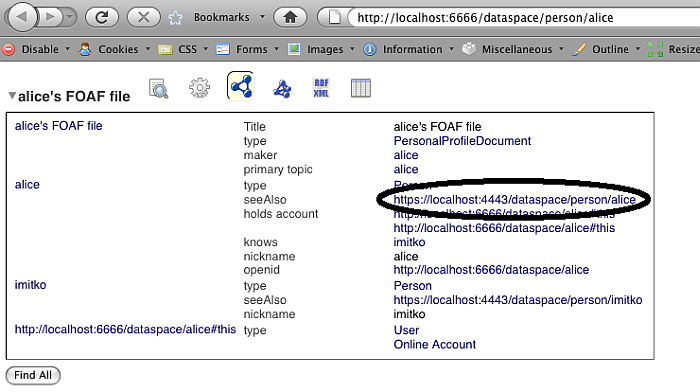

3.  When clicked, the browser will ask the user to select a certificate
    (note: certificate details are erased in the picture below).
    
    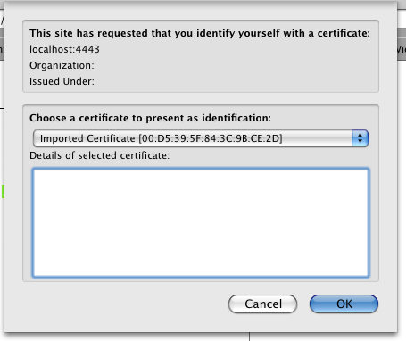

4.  Now the protected document includes the private address data
    alongside the previously visible public data\!
    
    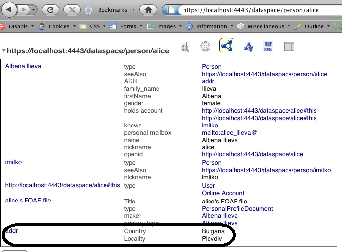

## WebID Protocol ACLs

You can [set WebID Protocol ACLs](#sparqloauthendpointfoafssl) from the
Virtuoso Authentication Server UI.

## SPARQL-WebID based Endpoint

See details how to [create and use a SPARQL-WebID based
Endpoint](#sparqloauthendpointfoafssl) .

## CA Keys Import using Conductor

The Virtuoso Conductor allows easy import of user-level CA (Certificate
Authority) Keys through System Admin -\> User Accounts -\> Edit.

The dba user (typically) or other users may need CA keys to execute
different services.

For ODS, the dba user must import a certificate with primary key and
with name id\_rsa. The process takes the following steps:

1.  A signing authority (e.g., RSA Labs) generates a site certificate.

2.  The site certificate is used to generate certificates for ODS users.

3.  The site certificate is imported with name id\_rsa for user dba
    using the Conductor.
    
    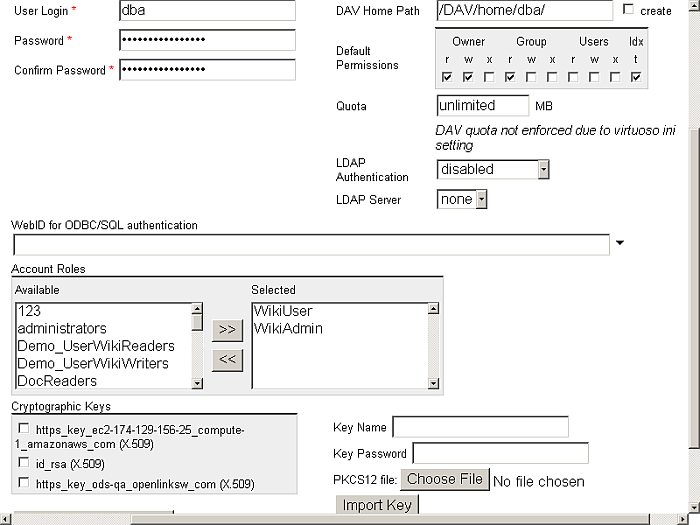

4.  As a result, the ODS user certificates can be authenticated against
    the site certificate.

If there is a service that requires a different key, the Conductor can
be used to import another certificate for the relevant user.

You can use a Key from a global signing authority or produce a
self-signed key using the [Virtuoso Conductor](#) .

Details and more information how to generate the key see in the next
section.

## Set Up X.509 certificate issuer, HTTPS listener and generate ODS user's certificates

The following Step-by-Step guide walks you through set up of an X.509
certificate issuer and HTTPS listener, and generation of ODS user
certificates.

1.  Install [ODS](#) and [Virtuoso Conductor](#) VAD packages.
    
    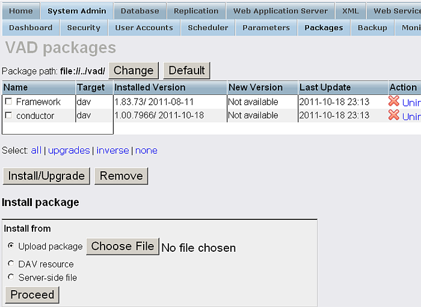

2.  Go to the http://cname:port/identity\_manager URL, enter the DBA
    user credentials in the dialog presented.
    
    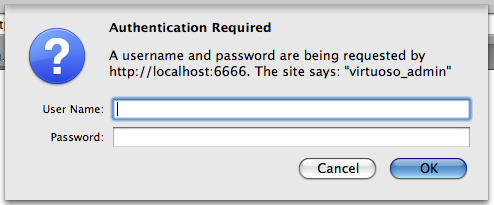

3.  Enter the Issuer details and click generate.
    
    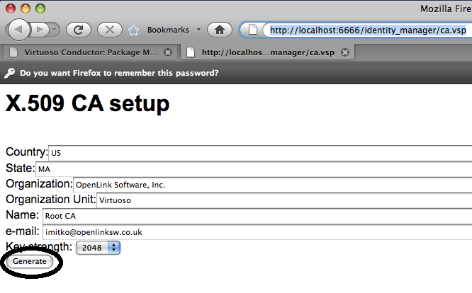

4.  Go to Conductor -\> Web Application Server -\> Virtual Domains &
    Directories, and add a new listener.
    
    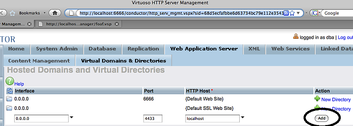

5.  Edit the new listener, and generate new key.
    
    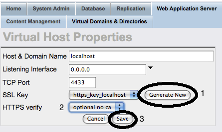

6.  Go to Packages list and select Configure for ODS Framework.
    
    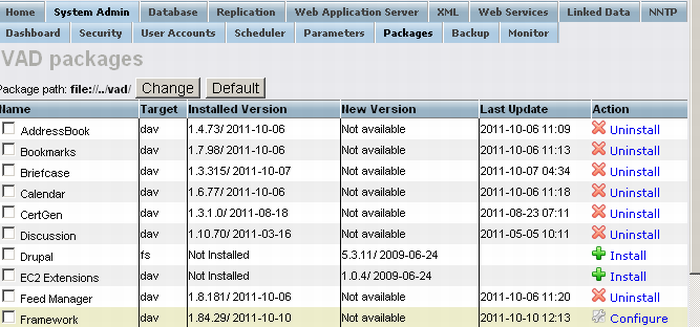

7.  Select Create New Endpoint.
    
    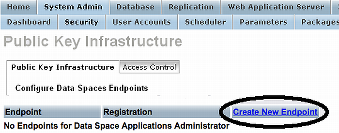

8.  Enter the home path for ODS, and save.
    
    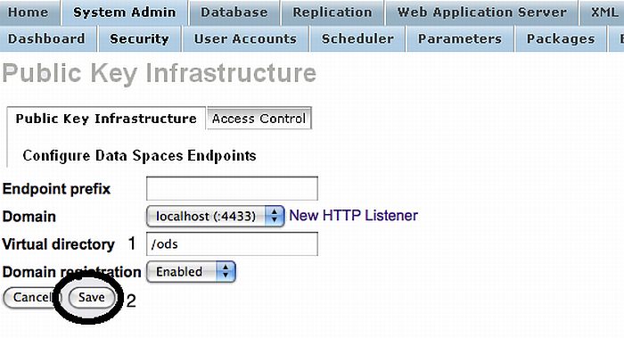

9.  The new endpoint should now appear in the endpoint list.
    
    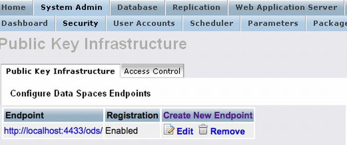

10. Go to the HTTPS site, e.g., https://cname:port/ods; in our example,
    https://localhost:4433/ods/. If Firefox is used, it will complain
    that the certificate is not valid, so we must register the site's
    certificate.
    
    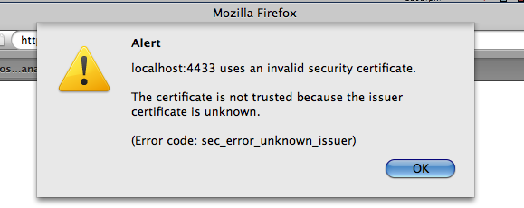

11. In Firefox certificate manager, in Site's certificates, add an
    exception.
    
    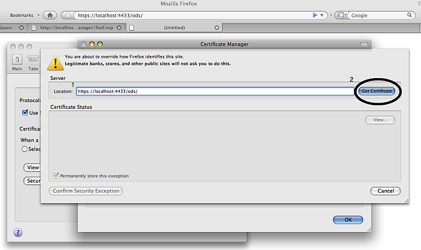

12. Confirm exception.
    
    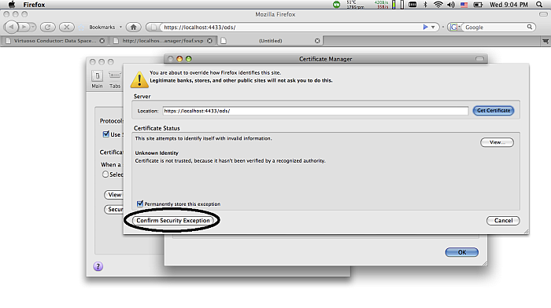

13. Return to ODS site, and register new user.
    
    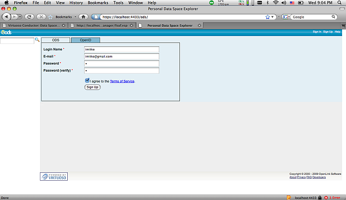

14. Edit the user's profile and enter his/her name(s). If this step is
    skipped, the certificate will not have a human readable name.
    
    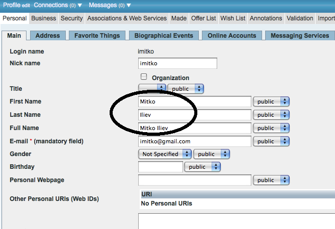

15. Open the Security tab in the Profile Editor, and generate the client
    key.
    
    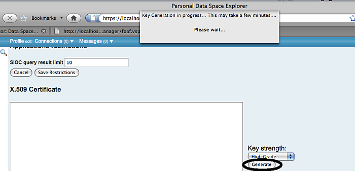

16. If all is set up correctly, you should see this message. It means
    Firefox has the private key, and has obtained a new certificate from
    the server.
    
    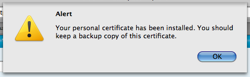

17. Refresh the Security tab by clicking on same tab.
    
    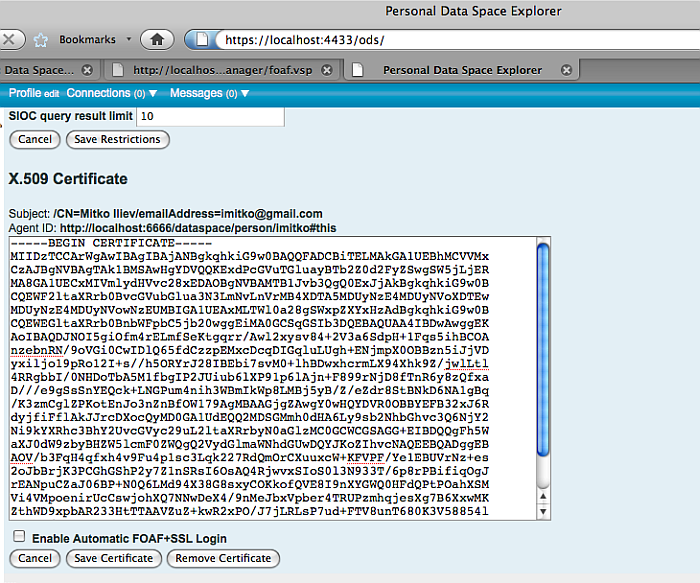

18. Select automatic login option, and save.
    
    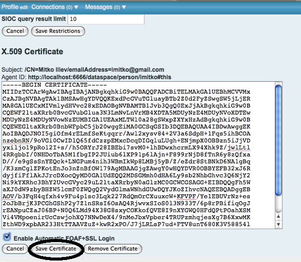

19. Log out from ODS and refresh browser to simulate opening the ODS
    site. The browser will ask for a certificate; select the one
    generated in the steps above.
    
    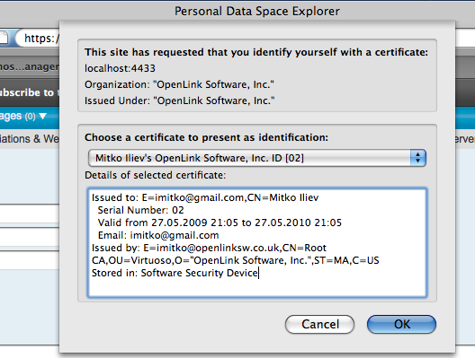

20. ODS presents your card, and asks to login with certificate. Confirm
    it.
    
    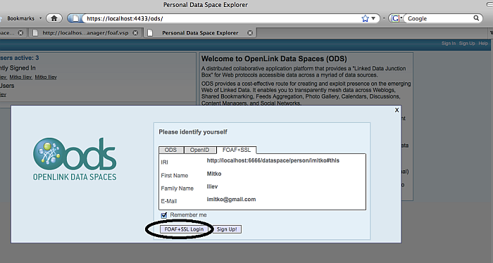

21. You should now be logged in to ODS via WebID Protocol.
    
    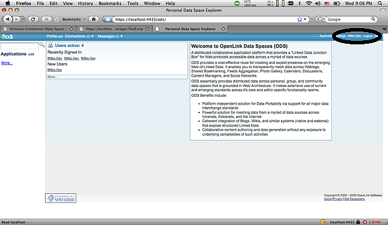

## WebID Protocol ODBC Login

See details and examples [here](#secureodbcx509foafsll) .

# OAuth Support

The OAuth protocol enables websites or applications (Consumers) to
access Protected Resources from Web services (Service Providers) via an
API, without requiring Users to disclose their Service Provider
credentials to those Consumers. More generally, OAuth creates a
freely-implementable and generic methodology for API-oriented
authentication.

For Consumer developers, OAuth is a method to publish and interact with
protected data.

For Service Provider developers, OAuth gives users access to their data
while protecting their account credentials.

One use case would be allowing a printing service, printer.example.com
(the Consumer), to access private photos stored on photos.example.net
(the Service Provider), without requiring Users to reveal their
photos.example.net credentials to printer.example.com.

OAuth allows the user to selectively grant access to their private
resources housed on one site (called the Service Provider), to another
site (called the Consumer). In other words, OAuth enables you to grant
access to some of your information without sharing all of your identity.

OAuth does not require a specific user interface or interaction pattern,
nor does it specify how Service Providers authenticate Users, making the
protocol ideally suited for cases where authentication credentials are
unavailable to the Consumer, such as with OpenID.

OAuth aims to unify the experience and implementation of delegated web
service authentication with a single, community-driven protocol. OAuth
builds on existing protocols and best practices that have been
independently implemented by various websites. An open standard,
supported by large and small providers alike, promotes a consistent and
trusted experience for both application developers and the users of
those applications.

What is publicly known as "OAuth" is really the "OAuth Core 1.0"
specification. The "Core" designation is used to stress that this is the
skeleton upon which other extensions and protocols may be built. OAuth
Core 1.0 does NOT by itself provide many desired features such as
automated discovery of endpoints, language support, support for XML-RPC
and SOAP, standard definition of resource access, OpenID integration, a
full range of signing algorithms, or any number of other great ideas
posted to the OAuth group.

This was intentional and is viewed by the authors as a benefit. As the
name implies, Core deals only with the most fundamental aspects of the
protocol:

  - Establish a mechanism for exchanging a username and password for a
    token with defined rights

  - Provide tools to protect these tokens

More details can be found [here](#) .

## OAuth Access Tokens

Credentials bearing tokens enable a user to provide their credentials in
tokenized form in cases where HTTP redirection to a browser plus human
interaction is unavailable or unsuitable. For example, intermediary
intelligent agents, mobile phones, or set-top devices.

### Request Authentication

To request an Access Token in this model, the Consumer makes an HTTP
request to the Service Provider's Access Token URL. The authentication
request contains \[nine\] parameters contained in the HTTP Authorization
header or as URL parameters. Parameter names and values must be
"percent-encoded" to handle characters in different character sets. The
request should be performed using TLS, and should use HTTP POST.

### Receive Authentication

Before granting an access token, the Service Provider must ensure that
the request signature has been successfully verified as per OAuth, that
a request with the supplied timestamp and nonce has never been received
before, and that the supplied username and password match a User's
credentials. If successful, the Service Provider generates an Access
Token and Token Secret using a 200 Ok response and returns them in the
HTTP response body.

### Access Protected Resources

After successfully receiving the Access Token and Token Secret, the
Consumer is able to access the Protected Resources on behalf of the User
as per section 7 of the OAuth core specification. In other words, the
Access Token obtained here is no different in capability to the Access
Token specified by OAuth. Once authenticated using the above process,
the Consumer will sign all subsequent requests for the User's Protected
Resources using the returned Token Secret.

## Virtuoso OAuth server

Virtuoso implements the OAuth Core 1.0 specification, and exposes the
following API endpoints:

### Request token

Endpoint:

    http://server-cname/OAuth/request_token

Parameters:

  - *oauth\_consumer\_key* : The Consumer Key.

  - *oauth\_signature\_method* : The signature method the Consumer used
    to sign the request.

  - *oauth\_signature* . The signature as defined in Signing Requests
    (Signing Requests).

  - *oauth\_timestamp* : As defined in Nonce and Timestamp (Nonce and
    Timestamp).

  - *oauth\_nonce* : As defined in Nonce and Timestamp (Nonce and
    Timestamp).

  - *oauth\_version* : OPTIONAL. If present, value MUST be 1.0 .

#### Example

Request:

    http://example.com/OAuth/request_token?oauth_version=1.0&oauth_nonce
    =dad4cb071e2169cbcaa051d404ac61a3&oauth_timestamp=1201873644&oauth_cons
    umer_key=f756023be5ff1f20881cf8fe398069f3976b2304&oauth_signature_metho
    d=HMAC-SHA1&oauth_signature=z76k5fQ0msFsQzCmhO%2FJZ329ZUE%3D

Note: all long lines in example texts are split, i.e., the GET request
is single line.

Response:

    oauth_token=b4e22daa117b0bebf60ab6ba6e401edc7addd78c&oauth_token_secret
    =4de6e3ab17553a0a385ebf6a3b4dd30f

### Authorization

Endpoint:

    http://server-cname/OAuth/authorize

Parameters:

  - *oauth\_token* : The Request Token obtained in the previous step.
    The current implementation of the Service Provider declare this
    parameter as REQUIRED.

  - *oauth\_callback* : OPTIONAL. The Consumer MAY specify a URL the
    Service Provider will use to redirect the User back to the Consumer
    when Obtaining User Authorization (Obtaining User Authorization) is
    complete.

#### Example

Request:

    http://example.com/OAuth/authorize?oauth_token=b4e22daa117b0bebf60ab
    6ba6e401edc7addd78c&oauth_callback=http%3A%2F%2Flocalhost%3A8890%2Foaut
    h%2Fexample%2Fclient.php%3Fkey%3Df756023be5ff1f20881cf8fe398069f3976b23
    04%26secret%3Dcc249bfb732039d8ecba9e4f94fdead7%26token%3Db4e22daa117b0b
    ebf60ab6ba6e401edc7addd78c%26token_secret%3D4de6e3ab17553a0a385ebf6a3b4
    dd30f%26endpoint%3Dhttp%253A%252F%252Flocalhost%253A8890%252FOAuth%252F
    authorize

The User will be asked via web page to accept or decline the token.

### Access token

Endpoint:

    http://server-cname/OAuth/access_token

Parameters:

  - *oauth\_consumer\_key* : The Consumer Key.

  - *oauth\_token* : The Request Token obtained previously.

  - *oauth\_signature\_method* : The signature method the Consumer used
    to sign the request.

  - *oauth\_signature* : The signature as defined in Signing Requests
    (Signing Requests).

  - *oauth\_timestamp* : As defined in Nonce and Timestamp (Nonce and
    Timestamp).

  - *oauth\_nonce* : As defined in Nonce and Timestamp (Nonce and
    Timestamp).

  - *oauth\_version* : OPTIONAL. If present, value MUST be 1.0 .

#### Example

Request:

    http://example.com/OAuth/access_token?oauth_version=1.0&oauth_nonce=
    8ad75091a66bdd741472be42149c828e&oauth_timestamp=1201873800&oauth_consu
    mer_key=f756023be5ff1f20881cf8fe398069f3976b2304&oauth_token=b4e22daa11
    7b0bebf60ab6ba6e401edc7addd78c&oauth_signature_method=HMAC-SHA1&oauth_s
    ignature=tCxy0Lod4%2Bp%2FCBPV7Ph7RrsHXe4%3D

Response:

    oauth_token=8c03b3da93480ca4728cc1194d6d03962f3bb5bb&oauth_token_secret
    =854fd29c00adcedff4fbeaeb96584911

In addtion to the endpoints it define a API for PL applications to check
authentication:

### Authentication verification

    OAUTH.DBA.check_authentication (in params any, in lines any)

Parameters:

  - *params* : an array of strings representing the HTTP parameters

  - *lines* : an array of HTTP request headers

Result:

  - on success it returns integer 1,

  - on failure it signal an SQL error.

#### Sample code:

A sample service (oauth.vsp):

    <html>
    <body>
    <?vsp
      OAUTH..check_authentication (params, lines);
    ?>
    An OAuth testing page
    </body>
    </html>

#### Sample request:

    http://example.com/admin/oauth.vsp?oauth_version=1.0&oauth_nonce=d57
    640869b994b2d51bf9800229c4997&oauth_timestamp=1201873935&oauth_consumer
    _key=f756023be5ff1f20881cf8fe398069f3976b2304&oauth_token=8c03b3da93480
    ca4728cc1194d6d03962f3bb5bb&oauth_signature_method=HMAC-SHA1&oauth_sign
    ature=X3K4lr9bJVz5YLnnyJDkykQZivY%3D

#### Sample request:

    http://example.com/admin/oauth.vsp?oauth_version=1.0&oauth_nonce=d57
    640869b994b2d51bf9800229c4997&oauth_timestamp=1201873935&oauth_consumer
    _key=f756023be5ff1f20881cf8fe398069f3976b2304&oauth_token=8c03b3da93480
    ca4728cc1194d6d03962f3bb5bb&oauth_signature_method=HMAC-SHA1&oauth_sign
    ature=X3K4lr9bJVz5YLnnyJDkykQZivY%3D

#### Sample response:

    <html>
    <body>
    An OAuth testing page
    </body>
    </html>

## OAuth Implementation in OpenLink Data Spaces

OAuth tokens must be generated for each user account, for each ODS
application, via ODS -\> Settings -\> OAuth Keys. This UI provides a
list of all applications to which the logged-in user has access, i.e.,
of which the user is a member or owner. To enable access with OAuth, the
user simply selects the desired application instance from the list, and
clicks the 'generate keys' button. The generated Consumer Key and Secret
will be associated with the given ODS user account & application
instance.

Once a consumer token is available, the sequence below must be executed
in order to establish an authorized session:

1.  client uses request\_token to get a token/secret pair for
    establishing session using consumer token

2.  client asks OAuth server to authorize the token from step 1.

3.  using authorized token from step 1 client asks OAuth server for
    authentication token.

4.  with authentication token from step 3, clients can access instance
    data associated with the consumer token from step 1.

### Sample OAuth Client

To demonstrate the Virtuoso implementation of OAuth, we have written
this sample client, in Virtuoso/PL.

    <html>
    <?vsp
        declare consumer_key, consumer_secret, oauth_token, oauth_secret, signature, timest, nonce varchar;
        declare srv, res, signature_base, ret_url, url, tmp, sid varchar;
        declare meth, pars any;
        consumer_key := {?'key'};
        srv := sprintf ('http://example.com:%s/OAuth/', server_http_port ());
        sid := null;
        res := '';
    
        sid :=  {?'sid'};
        if (sid = '')
          sid := null;
        else
          {
            -- if selected token is not same as one from the session we need to get new authentication token
            if (consumer_key <> OAUTH..get_consumer_key (sid))
          {
            OAUTH..session_terminate (sid);
                sid := null;
          }
          }
    
        meth := get_keyword ('meth', params, 'weblog.post.new');;
        pars := get_keyword ('pars', params, 'inst_id=15&title=testing&description=Some test post');;
    
        if ({?'rt'} is not null and sid is null) -- request new token for the session
          {
        url := srv||'request_token';
        url := OAUTH..sign_request ('GET', url, '', consumer_key, sid);
            res := http_get (url);
        sid := OAUTH..parse_response (sid, consumer_key, res);
        OAUTH..set_session_data (sid, params);
        ret_url := sprintf ('http://example.com:%s/oauth/oauth_client.vsp?ready=%U', server_http_port (), sid);
        -- call authorize
            url := sprintf ('%sauthorize?oauth_token=%U&oauth_callback=%U', srv, OAUTH..get_auth_token (sid), ret_url);
        http_status_set (301);
            http_header (sprintf ('Location: %s\r\n', url));
            return;
          }
        else if ({?'ready'} is not null) -- get access token
          {
        -- we go here when token above is authorized
            sid := {?'ready'};
        url := srv||'access_token';
        consumer_key := OAUTH..get_consumer_key (sid);
        url := OAUTH..sign_request ('GET', url, '', consumer_key, sid);
            res := http_get (url);
        sid := OAUTH..parse_response (sid, consumer_key, res);
    
          }
        if (sid is not null) -- access token is ready, and we can call API
          {
            -- here we are ready to call service
        if ({?'rt'} is null)
              {
                tmp := OAUTH..get_session_data (sid);
                pars := get_keyword ('pars', tmp, pars);
            meth := get_keyword ('meth', tmp, meth);
          }
        url := sprintf ('http://example.com:%s/ods/api/%s', server_http_port (), meth);
        tmp := split_and_decode (pars);
        params := '';
        for (declare i,l int, l:=length (tmp); i < l; i := i + 2)
           {
             params := params || sprintf ('%U=%U&', tmp[i], tmp[i+1]);
           }
        --params := sprintf ('inst_id=%d&description=%U&title=%U', 15, 'Some test post', 'testing');
        consumer_key := OAUTH..get_consumer_key (sid);
        url := OAUTH..sign_request ('GET', url, params, consumer_key, sid);
            res := http_get (url);
            --dbg_obj_print (res);
          }
    ?>
        <head><title>OAuth Client</title></head>
        <body>
        <h1>OAuth client for ODS Controllers</h1>
        <form method="POST" action="oauth_client.vsp">
        <input type="hidden" name="sid" value="<?V sid ?>"/>
        APPLICATION : <br /> <select name="key">
        <?vsp for select a_name, a_key from OAUTH..APP_REG do { ?>
            <option value="<?V a_key ?>" <?vsp if (consumer_key = a_key) http ('selected'); ?>><?V a_name ?></option>
        <?vsp } ?>
            </select>
        <?vsp
        if (sid is not null) http (sprintf (' TOKEN: %s', OAUTH..get_auth_token (sid)));
        ?>
        <br />
        ODS API: <br /><input type="text" name="meth" value="<?V meth ?>" size=50/> <br />
        PARAMETERS: <br /> <textarea name="pars" rows="5" cols="50"><?V pars ?></textarea> <br />
            <input type="submit" value="Execute" name="rt"/><br />
        </form>
        RESULT:
        <hr/>
        <pre><?V res ?></pre>
        </body>
    </html>

### Sample OAuth Session

The following shows a sample session, using the above Virtuoso/PL OAuth
client.

    GET /OAuth/request_token?oauth_consumer_key=50082d0fb861b0e6e67d5d986b8
    333607edc5f36&oauth_nonce=b8f1089077cbce6e&oauth_signature_method=HMAC-
    SHA1&oauth_timestamp=1211212829&oauth_version=1.0&oauth_signature=V1zmk
    757LBHcmqVJ6obMhNX5hKA%3D HTTP/1.1
    Host: example.com
    
    HTTP/1.1 200 Ok
    Content-Length: NNN
    <CR/LF>
    oauth_token=86da75079d3aee0fab57a36fcffbf900768e4de3&oauth_token_secret
    =M...

    GET /OAuth/authorize?oauth_token=86da75079d3aee0fab57a36fcffbf900768e4d
    e3&oauth_callback=http%3A//localhost%3A6666/oauth/oauth_client.vsp%3Fre
    ady%3D00c874b2fab2f6424008b5064fe83e88 HTTP/1.1
    Host: example.com
    
    HTTP/1.1 301 Moved
    Location: /ods/oauth_authorize.vspx?....

    GET /OAuth/access_token?oauth_consumer_key=50082d0fb861b0e6e67d5d986b83
    33607edc5f36&oauth_nonce=242cc4875a0059f6&oauth_signature_method=HMAC-S
    HA1&oauth_timestamp=1211212831&oauth_token=86da75079d3aee0fab57a36fcffb
    f900768e4de3&oauth_version=1.0&oauth_signature=sqs/8nmNNnNJiZ/eBa688uNe
    g9o%3D HTTP/1.1
    Host: example.com
    
    HTTP/1.1 200 Ok
    Content-Length: NNN
    <CR/LF>
    oauth_token=N..&oauth_token_secret=M...

    GET /ods/api/weblog.post.new?description=Some%20test%20post&inst_id=15&
    oauth_consumer_key=50082d0fb861b0e6e67d5d986b8333607edc5f36&oauth_nonce
    =2f4765d20664e696&oauth_signature_method=HMAC-SHA1&oauth_timestamp=1211
    213321&oauth_token=db83a37d74faf53edc8ed56d418ded3a70fcc0bc&oauth_versi
    on=1.0&title=testing&oauth_signature=oocIyr6kgoEQkC3WVwzvl6w62W4%3D HTT
    P/1.1
    Host: example.com
    
    HTTP/1.1 200 Ok
    Content-Length: NNN
    <CR/LF>
    <result><code>1&lt/code></result>

## OAuth Generate Keys for ODS Controllers (Web Services)

The following steps describe how to Setup Application OAuth keys in ODS:

1.  Login as user at ODS Data Space.

2.  Go to Settings -\> OAuth keys
    
    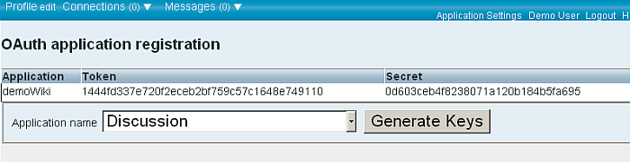

3.  Select Application name from the drop-down list and click the
    "Generate Keys" button.

4.  The generated Token and Secret values for the selected application
    will be shown as a result.
    
    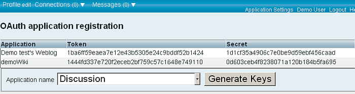

## ODS Ubiquity Commands

ODS provides Ubiquity commands to manipulate user accounts as well as
instances and instance specific data using the ODS Controllers API. This
command set is available only for the Firefox browser with the Ubiquity
extension installed.

### Installation

First, the Ubiquity Firefox extension must be installed. Then, ODS
Ubiquity commands can be installed by accessing
http://host:port/ods/ods\_ubiquity.html page. Ubiquity commands are
accessed by the ctrl-space key combination.

### Basic Session Setup Commands

#### ODS OAuth Endpoint Identification

Assuming the OAuth endpoint: http://myopenlink.net/OAuth, in order to
change it use the command:

    Syntax: ods-oauth-host <host_url>
    Example: ods-oauth-host http://demo.openlinksw.com/OAuth

#### ODS Command Mode

There are two command modes available to ubiquity commands when working
against an ODS instance: oauth or sid.

In OAuth mode, for every ODS application instance, an OAuth key must be
obtained and then initialized via the following steps:

  - obtain an ODS based OAuth session-key via the ODS example endpoint:
    http://host:port/ods/oauth\_sid.vsp
    
        http://myopenlink.net/ods/oauth_sid.vsp

  - bind session key to command session via the command: \*ods-set-oauth
    \<oauth-key\>\* or use \*ods-set-\[class name\]-oauth
    \<oauth-key\>\* when oauth-key was generated for particular
    application instance.

If you choose the SID mode of interaction with ODS you have to perform
the following steps:

  - set mode via command: ods-set-mode sid or ods-set-mode oauth

  - set sid via command: ods-set-sid sid

Note: The sid is a session ID applicable to all ODS commands for a given
bound instance and user combination. It's obtained from an ODS session.

#### Example

The following example demonstrates oauth authentication getting the
OAuth SID value for ex. for existing Bookmark instance "mybookmarks"
with owner user demo at the OpenLink Demo server.

In order to execute correctly the example, you need to have OAuth
Generate Key for the Bookmark "mybookmarks" instance at OpenLink Demo
server. More information and simple scenario how to be done you can find
[here.](#voauthcontrollers)

1.  Execute the command:
    
        ods-oauth-host <host_url>
        -- for ex.:
        ods-oauth-host http://demo.openlinksw.com/OAuth
    
    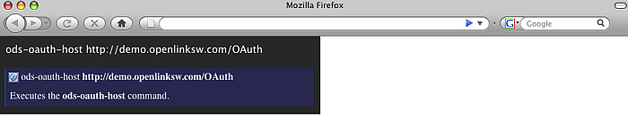

2.  Execute the command:
    
        ods-set-mode oauth
    
    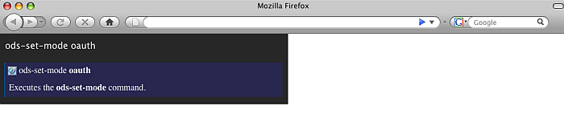

3.  Obtain the OAuth Generated Key:
    
    1.  Go to http://cname:port/ods/oauth\_sid.vsp . For ex.
        http://demo.openlinksw.com/ods/oauth\_sid.vsp
        
        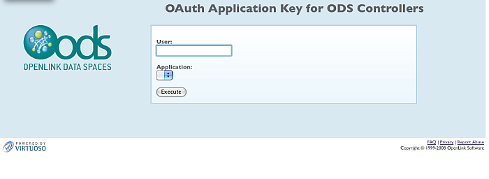
    
    2.  In the shown form enter user demo and choose the application
        "mybookmarks". Click the "Execute" button.
        
        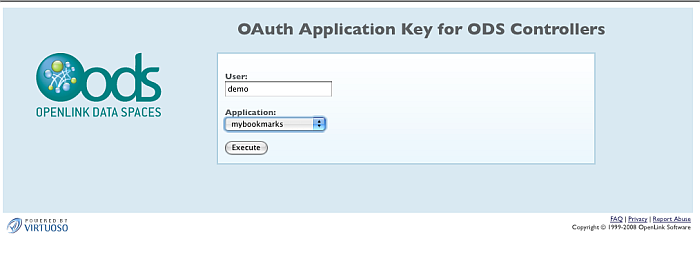

4.  As result will be shown a form where you need to enter the user
    password.

5.  Enter for user demo its password and click the "Login" button.
    
    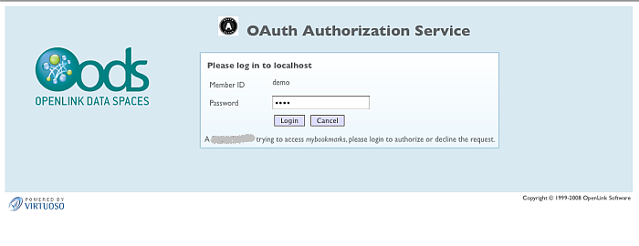

6.  Click the "Authorize" button.
    
    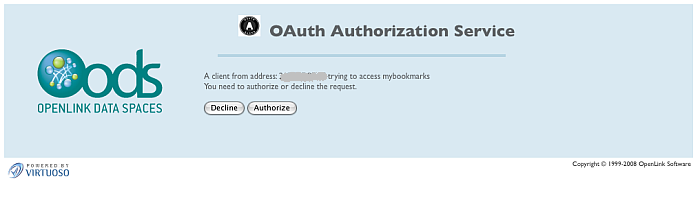

7.  Copy the obtains OAuth SID value for ex.:
    7ef4dcf23869488823b771b09b952cc9
    
    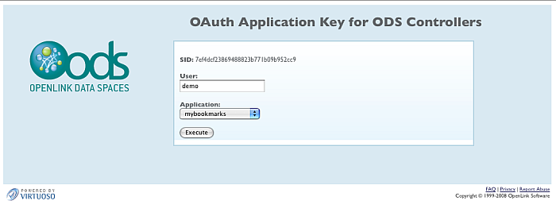

8.  Execute the following command:
    
        ods-set-sid 7ef4dcf23869488823b771b09b952cc9
        
        or
        
        ods-set-addressbook-oauth 7ef4dcf23869488823b771b09b952cc9
    
    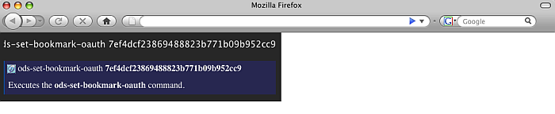

9.  You can also execute the command(s) depending on the application
    type:
    
        ods-set-briefcase-oauth <the obtained oauth session-key>
        -- or
        ods-set-bookmark-oauth <the obtained oauth session-key>
        -- or
        ods-set-feeds-oauth <the obtained oauth session-key>
        -- or
        ods-set-calendar-oauth <the obtained oauth session-key>
        -- or
        ods-set-addressbook-oauth <the obtained oauth session-key>
        -- or
        ods-set-poll-oauth <the obtained oauth session-key>
        -- or
        ods-set-weblog-oauth <the obtained oauth session-key>
        -- or
        ods-set-discussion-oauth <the obtained oauth session-key>

> **Tip**
> 
> the [Virtuoso SPARQL OAuth Tutorial](#sparqloauthendpoint) and the
> full list of [ODS Application Authentication Examples using OAuth](#)

#### 

> **Tip**
> 
> the full list of [ODS Ubiquity Commands](#) and the full list of
> [OpenLink Data Spaces (ODS) Ubiquity Commands Tutorials](#)

## OAuth Test Tool for ODS Controllers

The ODS OAuth Test Tool creates examples to show users the correct
format for constructing HTTP requests signed according to OAuth
specifications. The users use this format in their applications to make
successful requests to the ODS REST APIs.

The ODS users generate a Consumer Key and a Consumer Secret for their
application instances by ODS application UI (Setings -\> OAuth Keys).
You can find more information and sample scenario
[here.](#voauthcontrollers)

To reach a specific ODS resource via the ODS REST API, a user must also
specify a API method and associated API parameters.

ODS OAuth standards validate the credentials of an external user by
means of the digital signature. If the user signs the request, and the
ODS server validates the digital signature, the developer is granted
access to the requested resource.

To tool is accessible via http://host:port/ods/oauth\_test.vsp

### Example

The following example demonstrates creating and getting contact info by
the ODS REST APIs weblog.post.new and weblog.post.get using the OAuth
Test Tool.

1.  Go to http://demo.openlinksw.com/ods

2.  Log in as user demo with password demo

3.  Go to Settings-\>OAuth Keys
    
    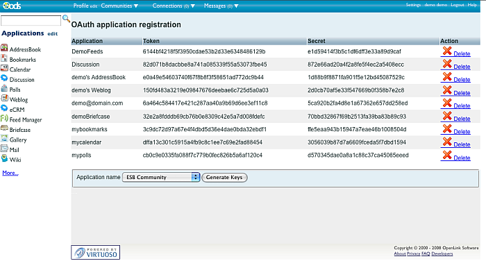

4.  Copy the Token value for an Weblog instance or create such in not
    existing. For ex.:
    
        150fd483a3219e09847676deebae6c725d5a0a03

5.  Go to http://demo.openlinksw.com/ods/oauth\_test.vsp

6.  In the shown form enter for:
    
    1.  Server: http://demo.openlinksw.com/ods/api
    
    2.  Consumer Key: 150fd483a3219e09847676deebae6c725d5a0a03
    
    3.  API method: weblog.post.new
    
    4.  API parameters:
        
            inst_id=44&description=my test&title=my first post
        
          - An easy way to get the instance id is using the ODS ubiquity
            commands sequence:
            
                ods-host http://demo.openlinksw.com/ods
                ods-set-mode sid
                ods-authenticate-user demo password demo
                ods-get-instance-id demo's Weblog
    
    5.  Select for Query options: "Generate URI and Submit".
        
        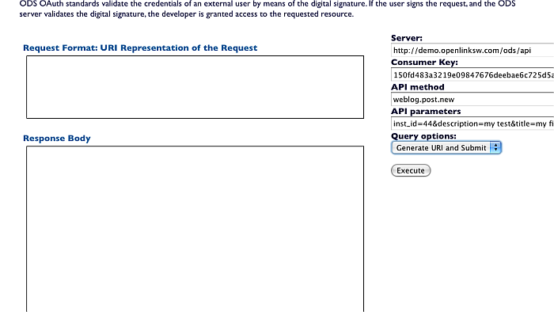
    
    6.  Click the "Execute" button.
    
    7.  In the shown authorization form click the "Authorize" button.
        
        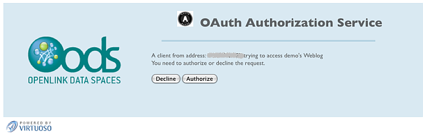
    
    8.  As result will be shown the generated URI and the output message
        of executing the ODS REST API. In our case, the id of the new
        created post will be: 37
        
        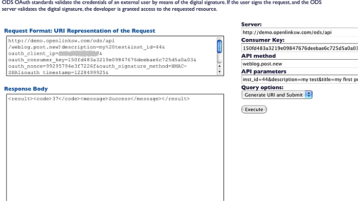
    
    9.  Now let's get the data for the created post. In the form enter:
        
        1.  API method: weblog.get
        
        2.  API parameters: post\_id=37
        
        3.  Select for Query options: "Generate URI and Submit".
    
    10. Click the "Execute" button.
    
    11. As result in the "Response Body" text-area will be shown the
        retrieved details for the posts with the given above id.
        
        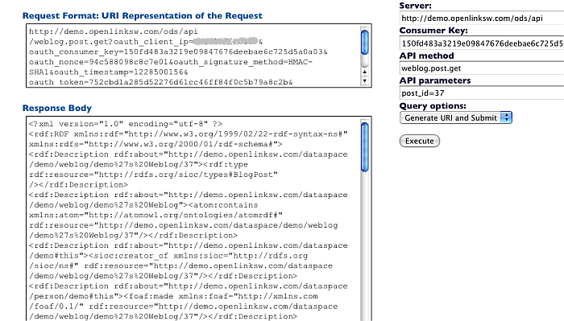

## OAuth QA

### MySpace Tools

In order to use the [MySpace OAuth Testing Tool](#) :

1.  Need to have registered myspace account.

2.  Need to apply to build apps on the MySpace Developer Platform.

### Google Tools

[Google's OAuth playground tool](#) can be tried [here](#) .

#### Register your domain in Google

In order to use the tool, you need to register the web application as
domain:

1.  Login at your gmail account

2.  Go to https://www.google.com/accounts/ManageDomains

3.  Enter in the field for ex. the QA server
    ec2-67-202-42-146.compute-1.amazonaws.com and click the "Add Domain"
    button.
    
    Note: for now registered domains cannot be deleted (not supported
    from the Google UI)

4.  As result the domain will be created and the manage domain page will
    be opened. Here you need to verify you have admin privileges by
    choosing verification method

5.  Choose "Upload an HTML file" and follow further the instructions.

6.  Once the file is put in the correct server root, you should get the
    confirmation page:
    
    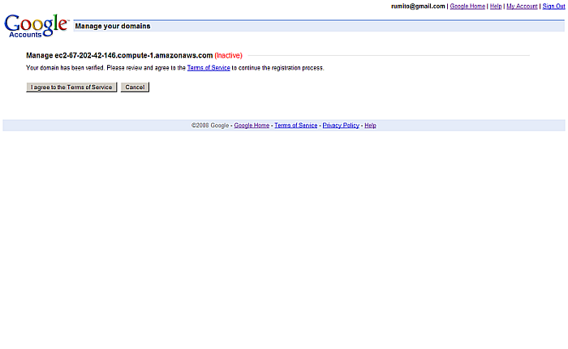

7.  Click the "Agree .." buttons.

8.  As result will be additional setting page you need to change. Type
    in for "Target URL path prefix:":
    http://ec2-67-202-42-146.compute-1.amazonaws.com/ods
    
    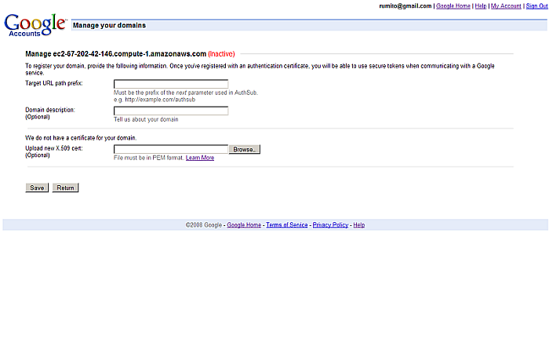

9.  Click the "Save" button.

10. As result will be shown the generated OAuth Consumer Secret for the
    OAuth Consumer Key: ec2-67-202-42-146.compute-1.amazonaws.com:
    
        OAuth Consumer Key:      ec2-67-202-42-146.compute-1.amazonaws.com
        OAuth Consumer Secret:  uEkfBvpMhTTT/VyFItEnEYt4

11. Also will be shown "test" link "Test your AuthSub registration
    here". Click it.

12. As result will be opened new window with OAuth request

13. Click the "Grant Access" button.
    
    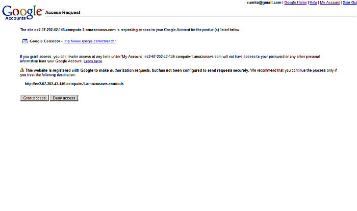

14. As result will be redirected to
    http://ec2-67-202-42-146.compute-1.amazonaws.com/ods/

15. Now lets return to our initial window and click there the button
    "Save".

16. Note that already is shown for the domain that is "Active":
    
    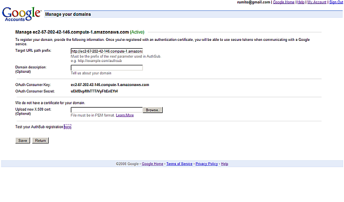

#### The Playground Tool qa steps

Let's try the playground tool:

1.  Go to http://googlecodesamples.com/oauth\_playground/

2.  Select Scope, for ex. check the check-box for "Blogger".

3.  Change oauth signature\_method to HMAC-SHA1

4.  Enter for "oauth consumer\_key":
    ec2-67-202-42-146.compute-1.amazonaws.com

5.  Enter for "consumer secret" the value generated from above.

6.  Click the "Request token" button.

7.  As result will get Response with Status Ok
    
    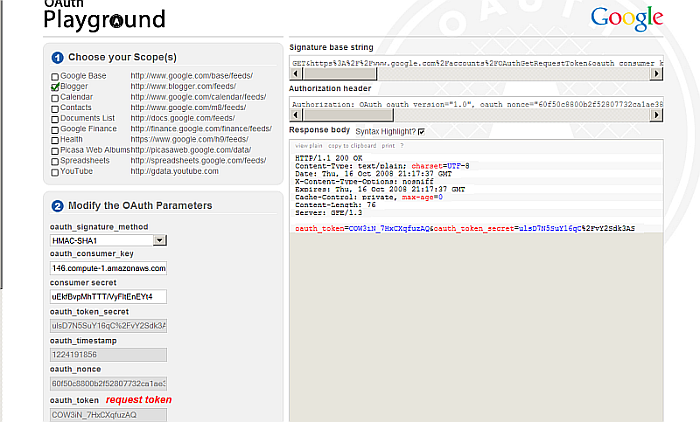
    
      - the Signature base string:
        
            GET&https%3A%2F%2Fwww.google.com%2Faccounts%2FOAuthGetRequestToken&oauth_consumer_key
            %3Dec2-67-202-42-146.compute-.amazonaws.com%26oauth_nonce%3D60f50c8800b2f52807732ca1ae3855ef
            %26oauth_signature_method%3DHMACSHA1%26oauth_timestamp%3D1224191856%26oauth_version%3D1.0
            %26scope%3Dhttp%253A%252F%252Fwww.blogger.com%252Ffeeds%252F
    
      - the Authorization header:
        
            Authorization: OAuth oauth_version="1.0",
            oauth_nonce="60f50c8800b2f52807732ca1ae3855ef",
            oauth_timestamp="1224191856",
            oauth_consumer_key="ec2-67-202-42-146.compute-1.amazonaws.com",
            oauth_signature_method="HMAC-SHA1",
            oauth_signature="nohPMCw%2BMrO8%2FwslS4oEm2wfuhg%3D"
    
      - the Response body:
        
            HTTP/1.1 200 OK
            Content-Type: text/plain; charset=UTF-8
            Date: Thu, 16 Oct 2008 21:17:37 GMT
            X-Content-Type-Options: nosniff
            Expires: Thu, 16 Oct 2008 21:17:37 GMT
            Cache-Control: private, max-age=0
            Content-Length: 76
            Server: GFE/1.3
             oauth_token=COW3iN_7HxCXqfuzAQ&oauth_token_secret=ulsD7N5SuY16qC%2FvY2Sdk3AS

8.  And also in the "Get the Token" section now will be active the
    "Authorize" button. Click it.
    
    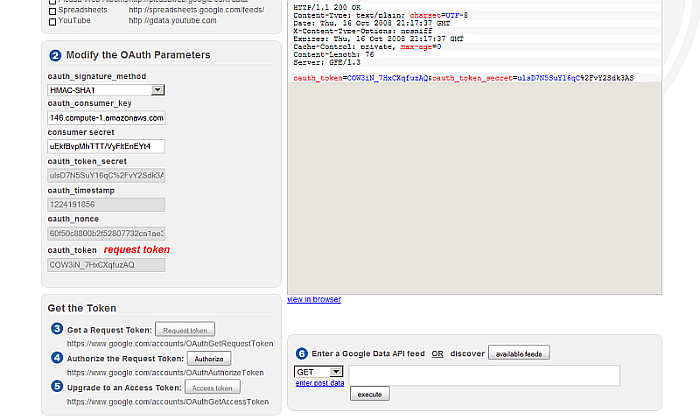

9.  As result will be shown the authentication page where you need to
    click the "Grant Access" button:
    
    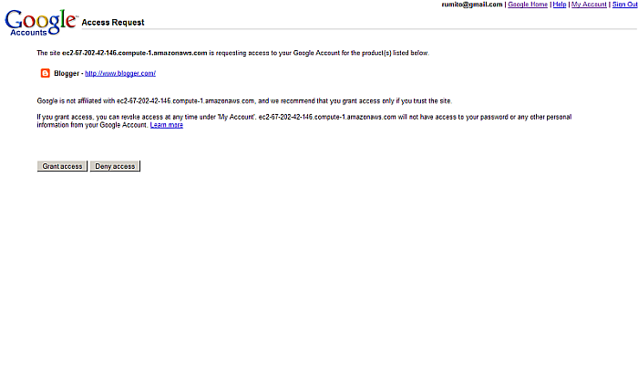

10. As result now in the "Get the Token" section will be active the
    "Access token" button. Click it.
    
    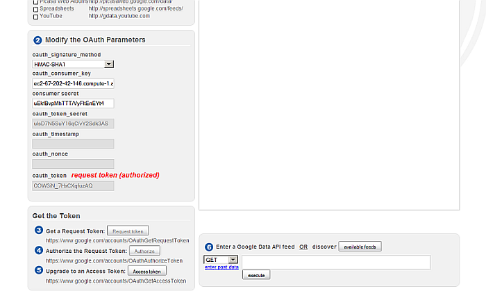

11. As result the access\_token will be obtained:
    
    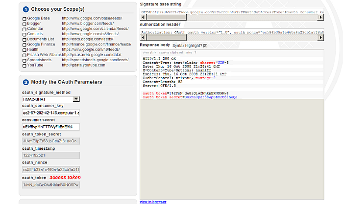

12. Click the "available feeds" button marked as 6.

13. As result in the "Response" body section will be shown:
    
        Blogger
        http://www.blogger.com/feeds/default/blogs
        http://www.blogger.com/feeds/<blogID>/posts/default
        http://www.blogger.com/feeds/<blogID>/[<postID>]/comments/default

14. Copy the 1st URL and paste in the field after the method GET.

15. Click "execute".

16. As result will find your blogs, post, info at Blogger:
    
    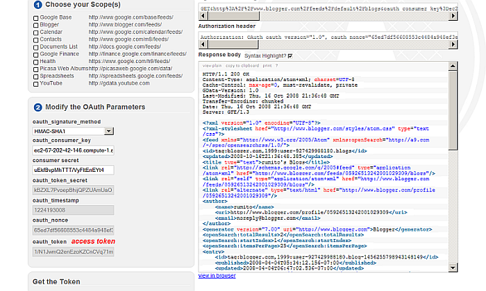

# WS-Security (WSS) Support in Virtuoso SOAP Server

The following terms are used in this section in the following meanings:

  - **encryption.**
    
    The process of making data unreadable using some secret (see 'key')

  - **decryption.**
    
    The opposite of encryption

  - **signature.**
    
    A sequence of binary codes that is calculated based on the original
    data and a key to secure the content from undetected change.

  - **key.**
    
    A secret, depending on the type can be symmetric or asymmetric.
    
    Typical symmetric keys are passwords. Symmetric keys are by their
    nature more at risk of being compromised if the secret key is
    stolen. Symmetric keys are usually used to encrypt large amounts of
    data as they are very fast.
    
    Asymmetric keys are more secure and their structure is more
    complicated. Asymmetric keys generally consist of a private and
    public key pair. The owner of the key can sign data to be verified
    by recipient with public key. A correspondent can encrypt the data
    using public key to be decrypted by private key owner. Asymmetric
    keys are used to sign data, or encrypt small amounts of data as they
    are slower to process than symmetric ones.

  - **certificate.**
    
    This is a structure of secure data, which identifies a certificate
    owner. This is similar to having a user-name and password but more
    secure. A 'certificate' can be associated with a document as an
    alias of the X.509 certificate. Certificates are issued by a
    third-party, not the owner or recipient in the verification path,
    namely the Certificate Authority (CA). The CA's function is to
    guarantee that a receiver can trust data accompanied by a particular
    certificate. Certificates will contain a public key, but never the
    private key. These must be distinguished from certificates that are
    exported together with their private key in PKCS\#12 format, these
    are different things.

  - **user account space.**
    
    This is a data area where a user can store private data. Only ODBC
    sessions and web page processing code which runs on behalf of a
    certain SQL user account has access to this area. This is useful for
    caching private security related information such as keys or
    certificates.

  - **key reference.**
    
    A short hand for a key, sometime called a 'key name'. This is a
    string to uniquely identify a key in a user account space.

  - **key instance.**
    
    An entity representing a key in PL, this is a not the key per se.
    The key instance is used in encryption or decryption routines.

The following algorithms are supported:

RSA (http://www.w3.org/2001/04/xmlenc\#rsa-1\_5)

DSA (http://www.w3.org/2001/04/xmlenc\#dsa)

triple DES (http://www.w3.org/2001/04/xmlenc\#tripledes-cbc)

AES128 (http://www.w3.org/2001/04/xmlenc\#aes128-cbc)

AES192 (http://www.w3.org/2001/04/xmlenc\#aes192-cbc)

AES256 (http://www.w3.org/2001/04/xmlenc\#aes256-cbc)

Digest algorithms:

SHA1 (http://www.w3.org/2000/09/xmldsig\#sha1)

Signing algorithms:

RSA-SHA1 (http://www.w3.org/2000/09/xmldsig\#rsa-sha1)

DSA-SHA1 (http://www.w3.org/2000/09/xmldsig\#dsa-sha1)

Canonicalization algorithms with comments:

(http://www.w3.org/TR/2001/REC-xml-c14n-20010315)

(http://www.w3.org/TR/2001/REC-xml-c14n)

The keys can be temporary or persistent keys. Temporary keys are loaded
only in memory an will be lost when the server is restarted. These are
usually used for making symmetric session keys. Persistent keys are kept
on the file-system or in the database and will be loaded upon server
startup. These are asymmetric keys, certificates that belong to the
user.

The location where persistent keys are stored depends on the key
reference. If the key reference is a 'file:' URI, then the API's assume
file-system storage, otherwise they will be kept in the U\_OPT column of
the SYS\_USERS table as a serialized string. The API functions are
described below. Whether keys are stored on the file-system or within
the database they will have an in-memory representation which is used in
crypto functions. The memory cache of keys is contained in the user
account space, hence no user can access or reference another user's
keys. Furthermore if a user account is removed all associated keys will
also be removed if they were stored in the database. If the keys were on
the file-system only the in-memory cache will be deleted.

## Client and Server side Certificates & Keys

Since XML encoding routines are executed on server-side, we cannot
strictly say that we have client and server certificates (as browser and
HTTPS server). To perform the encoding on behalf of a client or user
account, the XML encoding functions need to have the keys and
certificates loaded in the memory cache of the user. The same applies to
server keys and certificates. Therefore we will refer to these as client
or server security tokens that are kept on server-side.

> **Note**
> 
> Uploading of keys and certificate must be done under a secure SSL/TLS
> connection to minimize the risk of vulnerability.

### Key Definition & Persistence

[`xenc_key_3DES_rand_create()
`](#fn_xenc_key_3des_rand_create)

[`USER_KEY_LOAD()
`](#fn_user_key_load)

### Key Encryption

To minimize the risk of non-authorized private key usage, keys are
usually kept encrypted with password. If a key or certificate containing
a key is loaded using a password, the API will assume it is an encrypted
private key and will be kept in that form. In other words encrypted keys
are kept in their encrypted form in memory, there will be no raw
certificate or key data if the encrypted form is used to import.
Virtuoso will ask for passwords to unlock persisted encrypted keys upon
server restart. This is only possible when the server is running in
foreground mode. If the server is started as background process and the
key needs a password to decrypt and load, an error will be logged in the
virtuoso log file and that particular key will not be loaded.

    Enter a password for key "wss.pfx":
    13:14:04 PL LOG: XENC:   Loaded : wss.pfx

### Referencing Keys

To make a run-time key instance, used for XML encryption functions, and
to perform server or client side the [`xenc_key_inst_create (in key_name
varchar[, super key inst])`](#fn_xenc_key_inst_create) function can be
used.

    create procedure
    DB.DBA.WSDK_GET_KEY ()
    {
      -- this returns a instance of shared secret suitable for content encryption
      return xenc_key_inst_create ('WSDK Sample Symmetric Key');
    }
    ;
    
    create procedure
    DB.DBA.WS_SOAP_GET_KEY ()
    {
      declare superkey, keyinst any;
      superkey := xenc_key_inst_create ('file:dsa.der'); -- already loaded asymmetric key (see above example)
      -- this returns a session key , to be encrypted with a asymmetric one
      keyinst := xenc_key_inst_create (xenc_key_3DES_rand_create (NULL), superkey);
      return keyinst;
    }
    ;

### Key Removal

To delete a key, persistent or otherwise, the following function is
used:

[`xenc_key_remove()
`](#fn_xenc_key_remove)

## SOAP Server WS-Security Endpoint

The WS-Security processing is performed by filtering incoming and
outgoing messages of the Virtuoso SOAP server. These filters are
activated when a special SOAP option is set on the current virtual
directory that is the SOAP endpoint. The WS-Security filters are invoked
on input to verify / decrypt the message. Upon success the message will
be processed by the SOAP server, otherwise a `SOAP:Fault` will be
returned to the SOAP requester. On outgoing messages, depending of SOAP
options, messages produced by the SOAP server can be encoded and signed
as well. The administrator configures the WS Security subsystem at the
access point level. Different security schemes involving encryption
and/or signature can be selected.

The keys and certificates need to be defined in order to get a working
secure service. The key/certificate(s) for the SOAP endpoint that is
WS-Security enabled are referenced in a special PL hook and/or signature
template. If none of these (signature or key instance hook) are defined
the response will not be encrypted or signed.

Here are the steps involved in processing a message to a secure end
point.

1.  SOAP server receives a message on a secure endpoint

2.  The message is determined to be for this endpoint, otherwise will be
    sent to the next SOAP router if routing is enabled.

3.  The message (as is) is passed to the decoding routine. At this point
    keys that are referenced in SOAP message need to be in the user
    space of the SQL account on whose behalf SOAP accessible procedures
    of this end point run. If any key does not exist in the user space,
    the requested processing will fail.
    
    > **Note**
    > 
    > Signatures can be verified in the following manners:
    > 
    > never try signatures
    > 
    > expect signatures, explicit
    > 
    > try signature if exists
    > 
    > This behavior depends on the "WSS-Validate-Signature" option set
    > for the virtual directory.

4.  If step 3 completes without problem, security related headers are
    stripped from the decoded message.

5.  The result of point 4 is passed to the usual SOAP server for
    processing.

6.  Once a response is generated by the SOAP method (i.e. corresponding
    PL procedure, exposed as SOAP method) the result will be encoded
    and/or signed. This is the last step before the result is sent back
    to the requestor client. At this point the server behavior is
    controlled by a few options defined in the virtual directory. See
    below: "WSS-KEY", "WSS-Template", and "WSS-Type" options.

## Virtual Directory SOAP WSS Options

The following SOAP options are available for configuring a virtual
directory:

  - **WS-SEC.**
    
    WS-Security processing is enabled on the endpoint, in practice this
    enables the input and output message filters for Security Header
    processing. This MUST be set to enable WS-Security endpoints. All
    other WS related options will be ignored if this option is disabled.
    The possible values for this option are "yes" or "no"

  - **WSS-KEY.**
    
    The name of a PL procedure that is expected to return a key
    instance. Examples of this can be found in the [Referencing
    Keys](#vwssreferencingkeys) section. If this NULL or undefined the
    SOAP server will not encrypt outgoing messages.

  - **WSS-Template.**
    
    path and file name to a file containing a template - an instruction
    for how to make the XML signature for the response message. For more
    information see the [Security Templates](#vwsssectemplates) section.
    If this option is NULL or undefined the SOAP server will not sign
    any outgoing messages from this endpoint. As an example, if the
    value "sig.xml" was supplied to this option this would imply that
    the content of template is stored in the file called sig.xml located
    in the servers working directory. A default template can be used by
    setting this option to the value `[key reference for signing]` -
    (note '\[\]' around name is required). In this case the server will
    generate a default template based on a key, and produce a default
    rule for making a signature.

  - **WSS-Validate-Signature.**
    
    This option controls how the SOAP server responds to incoming
    messages i.e. how to verify the incoming message.
    
    possible values are:
    
    0
    
    do not verify signatures
    
    1
    
    expects signature to exist
    
    2
    
    will verify signature if exists

<!-- end list -->

    -- definition of /SecureWebServices endpoint
    VHOST_DEFINE (
      lpath=>'/SecureWebServices', ppath=>'/SOAP/', soap_user=>'WSS',
      soap_opts=>vector(
        'Namespace','http://temp.uri/',
        'MethodInSoapAction','yes',
        'ServiceName', 'WSSecure',
        'CR-escape', 'no',
        'WS-SEC','yes',
        'WSS-Validate-Signature', 2)
      )
    ;

this will define a WS-Security enabled endpoint that is compatible with
.NET WSDK examples. This endpoint will accept encrypted/or signed SOAP
messages and will generate an error if security checking fails. Upon
success it will return non-encrypted message. Therefore it's a one-way
encryption example.

    -- complex example
    VHOST_DEFINE (
      lpath=>'/wss', ppath=>'/SOAP/', soap_user=>'WSS',
      soap_opts=>vector(
        'Namespace','http://soapinterop.org/',
            'MethodInSoapAction','no',
            'ServiceName', 'WSSecure',
            'HeaderNS', 'http://soapinterop.org/echoheader/',
            'CR-escape', 'no',
        'WS-SEC','yes',
            'WSS-KEY','DB.DBA.WS_SOAP_GET_KEY',
            'WSS-Template','wss_tmpl.xml',
        'WSS-Validate-Signature', 1)
      )
    ;

This endpoint will expect signed and encrypted incoming messages and
will sign and encrypt outgoing messages too. This is a two-way
encryption example, for client to server and reverse.

## Accounting & Accounting Hook

If an X.509 certificate is used to sign an incoming message, the
following connection variables will be available to the SOAP processing
function and accounting hook:

wss-token-owner

owner of certificate, an example is "C=US/ST=MA/CN=User Name".

wss-token-issuer

issued by , it's like above , but it's name of who is issued the
certificate.

wss-token-serial

serial number, an integer specific to certificate issuer.

wss-token-start

valid from, a string containing a data of validity.

wss-token-end

valid to, a string containing data of end of validity.

These can be accessed by invoking connection\_get(\[name-of-info\]) when
processing the SOAP request, i.e. in the procedure being invoked or from
a user defined accounting hook.

A user defined procedure hook named DB.DBA.WS\_SOAP\_ACCOUNTING can be
used for accounting purposes. If it exists it will be invoked after the
connection information is set. This PL hook should return 0 when an
error occurs or 1 upon success. Hence, a SOAP request may be rejected
based on some custom condition.

The procedure prototype is :

    create procedure DB.DBA.WS_SOAP_ACCOUNTING ()
    {
      -- custom logic
      return 1; -- on success
      return 0; -- on failure
    }
    ;

Note that the usage of this functionality is global to the Virtuoso
server, To get similar functionality for each SOAP method, the developer
will need to include account checking within the PL procedures that are
exposed as SOAP methods.

## Signature Templates

Signature templates are used to define how signatures are generated for
SOAP messages. They are XML files containing a structure of Signature
elements as per XML Signature standard. The DigestValue and
SignatureValue elements are empty, so they will be filled upon output.
The most important element is the KeyName element. This must contain a
reference to an existing key from the user account space. This key
reference does not need to be the same as key for data encryption, it
can be a different key. Please note that XML encoding routines will
resolve the key automatically, so there is no need to specify how the
key instance will be obtained, hence no relation to "WSS-Key" from SOAP
options section (above).

### Default Template Generation

The default template will create an XML Signature using the following
definitions:

a) have a simple template corresponding to a key reference (and it's
algorithm) as:

    TEMP := <?xml version="1.0" encoding="UTF-8"?>
    <Signature xmlns="http://www.w3.org/2000/09/xmldsig#" >
      <SignedInfo>
        <CanonicalizationMethod Algorithm="http://www.w3.org/2001/10/xml-exc-c14n#" />
        <SignatureMethod Algorithm="[key algorithm]" />
      </SignedInfo>
      <SignatureValue></SignatureValue>
      <KeyInfo>
        <KeyName>[key reference]</KeyName>
      </KeyInfo>
    </Signature>'

b) generate references to template a), using the `dsig_template_ext()`
function and BODY of the SOAP request.

    TEMPLATE :=  dsig_template_ext (xtree_doc (SOAP_BODY), TEMP,
          'http://schemas.xmlsoap.org/soap/envelope/', 'Body',
          'http://schemas.xmlsoap.org/rp', 'action',
          'http://schemas.xmlsoap.org/rp', 'to',
          'http://schemas.xmlsoap.org/rp', 'id',
          'http://schemas.xmlsoap.org/ws/2002/07/utility', 'Created',
          'http://schemas.xmlsoap.org/ws/2002/07/utility', 'Expires');

In other words, the 'Body' of the SOAP message, part of the routing
header elements ('action,'to','id') and, if it exists, Timestamp headers
('Created', 'Expires').

This example demonstrates the use of the default template mechanism and
X.509 certificate with RSA key:

    --------------- SOAP message
    <SOAP:Envelope xmlns:xsi="http://www.w3.org/2001/XMLSchema-instance"
     xmlns:xsd="http://www.w3.org/2001/XMLSchema"
     xmlns:SOAP="http://schemas.xmlsoap.org/soap/envelope/"
     xmlns:SOAP-ENC="http://schemas.xmlsoap.org/soap/encoding/"
     xmlns:ds="http://www.w3.org/2000/09/xmldsig#"
     xmlns:xenc="http://www.w3.org/2001/04/xmlenc#"
     xmlns:wsse="http://schemas.xmlsoap.org/ws/2002/07/secext"
     xmlns:dt="urn:schemas-microsoft-com:datatypes">
      <SOAP:Header />
      <SOAP:Body
    xml:id="id-2e7c29c7-8645-4ad8-af59-06bed179d2fb">
        <AddInt xmlns="http://microsoft.com/wsdk/samples/SumService">
          <a>3</a>
          <b>4</b>
        </AddInt>
      </SOAP:Body>
    </SOAP:Envelope>
    
    --------------- Generated signature template
    <ds:Signature xmlns:ds="http://www.w3.org/2000/09/xmldsig#"
              xmlns:wsse="http://schemas.xmlsoap.org/ws/2002/07/secext"
              xmlns:wsu="http://schemas.xmlsoap.org/ws/2002/07/utility">
       <ds:SignedInfo>
          <ds:CanonicalizationMethod Algorithm="http://www.w3.org/2001/10/xml-exc-c14n#">
          </ds:CanonicalizationMethod>
          <ds:SignatureMethod Algorithm="http://www.w3.org/2000/09/xmldsig#rsa-sha1"></ds:SignatureMethod>
          <ds:Reference URI="#Id-2e7c29c7-8645-4ad8-af59-06bed179d2fb">
            <ds:Transforms>
          <ds:Transform Algorithm="http://www.w3.org/2001/10/xml-exc-c14n#">
            </ds:Transform>
          </ds:Transforms>
        <ds:DigestMethod Algorithm="http://www.w3.org/2000/09/xmldsig#sha1"></ds:DigestMethod>
        <ds:DigestValue></ds:DigestValue>
          </ds:Reference>
       </ds:SignedInfo>
       <ds:SignatureValue></ds:SignatureValue>
        <ds:KeyInfo>
          <wsse:SecurityTokenReference>
            <wsse:Reference URI="#SecurityToken-24c152e3-26e0-d611-bb59-90b4c67d3be5"></wsse:Reference>
          </wsse:SecurityTokenReference>
        </ds:KeyInfo>
    </ds:Signature>

Now, an example of a user defined template:

    <?xml version="1.0" encoding="UTF-8"?>
    <Signature xmlns="http://www.w3.org/2000/09/xmldsig#">
        <SignedInfo>
          <CanonicalizationMethod Algorithm="http://www.w3.org/TR/2001/REC-xml-c14n-20010315" />
          <SignatureMethod Algorithm="http://www.w3.org/2000/09/xmldsig#dsa-sha1" />
          <Reference URI="">
            <Transforms>
              <Transform Algorithm="http://www.w3.org/2000/09/xmldsig#enveloped-signature" />
            </Transforms>
            <DigestMethod Algorithm="http://www.w3.org/2000/09/xmldsig#sha1" />
            <DigestValue></DigestValue>
          </Reference>
        </SignedInfo>
        <SignatureValue></SignatureValue>
        <KeyInfo>
            <KeyName>file:dsa.der</KeyName>
        </KeyInfo>
    </Signature>

## SOAP Client

The `soap_client()
` function is used to make soap requests. Upon success it will return an
array containing the XML tree of the result. However, it can return more
complex results when the debug parameter is enabled, in which case it
can return the request and the response messages as well. Some of the
parameters are optional, not all are required and they can be named.

> **Tip**
> 
> [`soap_client()
> `](#fn_soap_client)

# Web Services Routing Protocol (WS-Routing)

The SOAP Routing Protocol (WS-Routing) is a SOAP-based, stateless
protocol for exchanging SOAP messages from an initial sender to an
ultimate receiver, potentially via a set of intermediaries. The
WS-Routing protocol is implemented as a SOAP extension, embedded in a
SOAP Header entry.

The WS-Routing implementation consists of SOAP Header processing. The
header processing handler for the WS-Routing header determines if the
Virtuoso SOAP server can act as an intermediary or a endpoint depending
on the rules in message path.

This implementation supports HTTP only. Message Id's generated are
UUIDs.

## Configuration

Setting-up the WS-Routing for a SOAP service requires you to:

1.  make a virtual directory bound to the SOAP endpoint processor
    (/SOAP)

2.  add the following SOAP options:
    
    WS-RP=yes;
    
    wsrp-from=\[identification for endpoint\];

## Traversing Message Paths

The initial WS-Routing sender generates a WS-Routing "path" header that
indicates the route. The path can indicate a route via one or more
intermediaries using the "via" elements as sub-elements of the "fwd"
element. The initial sender indicates the ultimate destination by using
a "to" element. In the absence of a "to" element the ultimate
destination is deduced by the last "via" in the "fwd" element. The
second option occurs most commonly when an ultimate destination reverses
roles, becomes an initial sender, and uses the reverse path in a
received message as a forward path to send a response to the original
sender.

In addition, the initial WS-Routing sender inserts a reverse path for
indicating where the initial sender can receive reverse path messages.
The initial sender sets the ultimate destination in the reverse path
using a "via" element as a sub-element of the "rev" element.

A WS-Routing receiver receiving a WS-Routing message inspects the SOAP
header and performs the following operations:

  - If no "fwd" element is present or if the "fwd" element does not
    contain any "via" elements then inspect the "to" element and verify
    that the value identifies itself. If this is the case then THIS
    receiver is the ultimate destination. If there is no "to" element or
    if the value of the "to" element does not identify THIS WS-Routing
    receiver then generate a fault.

  - If the "fwd" element is present and contains one or more "via"
    element(s) then remove the top "via" element listed in the "fwd"
    element and verify that the value of that "via" element is either
    empty or identifies THIS WS-Routing receiver. Failing that generate
    an appropriate WS-Routing fault
    
    If, after removing the top "via" element there are no remaining
    "via" element(s) listed in the "fwd" element, and there is no "to"
    element, then THIS WS-Routing receiver is the ultimate destination.

A WS-Routing intermediary MUST follow these additional rules:

  - If a "rev" element is present then add a "via" element as the first
    "via" element listed in the "rev" element with a value indicating
    the reverse path endpoint. If a reverse path endpoint cannot be
    provided then generate a 751 "Reverse Path Unavailable" WS-Routing
    fault.

  - If one or more "via" element(s) remain in the "fwd" element then
    forward the WS-Routing message to the endpoint identified by the new
    top "via" element listed in the "fwd" element.

  - If there are no remaining "via" element(s) listed in the "fwd"
    element but there is a "to" element then forward the WS-Routing
    message to the endpoint identified by the "to" element.

  - In the last two cases if the forwarding does not succeed then
    generate the appropriate WS-Routing fault.

Here is an example SOAP call from a client to an endpoint D.com via
intermediaries B.com and C.com:

    +------------+   +------------+   +------------+   +-------------+
    |  Initial   |   | WS-Routing |   | WS-Routing |   |  Ultimate   |
    | WS-Routing |-->
    
    |Intermediary|-->
    
    |Intermediary|-->
    
    |  WS-Routing |
    |  Sender A  |<--|      B     |<--|      C     |<--|  Receiver D |
    +------------+   +------------+   +------------+   +-------------+
                 HTTP             HTTP              HTTP

Request from client to intermediary B

    <S:Envelope>
    <S:Header>
      <m:path
         xmlns:m="http://schemas.xmlsoap.org/rp/"
         S:actor="http://schemas.xmlsoap.org/soap/actor/next"
         S:mustUnderstand="1">
       <m:action>http://soapinterop.org/</m:action>
       <m:to>http://D.com/router</m:to>
       <m:id>uuid:09233523-345b-4351-b623-5dsf35sgs5d6</m:id>
       <m:fwd>
        <m:via>http://B.com/router</m:via>
        <m:via>http://C.com/router</m:via>
       </m:fwd>
       <m:rev />
      </m:path>
    </S:Header>
    <S:Body>
    ...
    </S:Body>
    </S:Envelope>

Request from intermediary B to intermediary C

    <n0:Envelope>
    <n0:Header>
      <n2:path
         xmlns:n2="http://schemas.xmlsoap.org/rp/"
         n0:actor="http://schemas.xmlsoap.org/soap/actor/next"
         n0:mustUnderstand="1">
       <n2:action>http://soapinterop.org/</n2:action>
       <n2:to>http://D.com/router</n2:to>
       <n2:id>uuid:09233523-345b-4351-b623-5dsf35sgs5d6</n2:id>
       <n2:fwd>
         <n2:via>http://C.com/router</n2:via>
       </n2:fwd>
       <n2:rev>
         <n2:via />
       </n2:rev>
      </n2:path>
    </n0:Header>
    <n0:Body>
    ...
    </n0:Body>
    </n0:Envelope>

Request from intermediary C to endpoint D

    <n0:Envelope>
      <n0:Header>
        <n2:path
          xmlns:n2="http://schemas.xmlsoap.org/rp/"
          n0:actor="http://schemas.xmlsoap.org/soap/actor/next"
          n0:mustUnderstand="1">
         <n2:action>http://soapinterop.org/</n2:action>
         <n2:to>http://D.com/router</n2:to>
         <n2:id>uuid:09233523-345b-4351-b623-5dsf35sgs5d6</n2:id>
         <n2:fwd />
         <n2:rev>
          <n2:via />
          <n2:via />
         </n2:rev>
       </n2:path>
    </n0:Header>
    <n0:Body>
    ...
    </n0:Body>
    </n0:Envelope>

Response from endpoint to C

    <n0:Envelope>
    <n0:Header>
      <n2:path xmlns:n2="http://schemas.xmlsoap.org/rp/"
              n0:actor="http://schemas.xmlsoap.org/soap/actor/next"
          n0:mustUnderstand="1">
            <n2:action>http://soapinterop.org/</n2:action>
            <n2:id>uuid:2b2d09ec-a93a-11d6-be21-c9f55c969fe7</n2:id>
            <n2:relatesTo>uuid:09233523-345b-4351-b623-5dsf35sgs5d6</n2:relatesTo>
            <n2:fwd>
              <n2:via />
              <n2:via />
            </n2:fwd>
            <n2:rev>
               <n2:via>http://D.com/router</n2:via>
            </n2:rev>
            <n2:from />
      </n2:path>
    </n0:Header>
    <n0:Body>
    ...
    </n0:Body>
    </n0:Envelope>

Response from intermediary C to B

    <n0:Envelope>
     <n0:Header>
        <n2:path xmlns:n2="http://schemas.xmlsoap.org/rp/"
                 n0:actor="http://schemas.xmlsoap.org/soap/actor/next"
             n0:mustUnderstand="1">
            <n2:action>http://soapinterop.org/</n2:action>
            <n2:id>uuid:2b2d09ec-a93a-11d6-be21-c9f55c969fe7</n2:id>
            <n2:relatesTo>uuid:09233523-345b-4351-b623-5dsf35sgs5d6</n2:relatesTo>
            <n2:fwd>
              <n2:via />
            </n2:fwd>
            <n2:rev>
              <n2:via>http://C.com/router</n2:via>
              <n2:via>http://D.com/router</n2:via>
            </n2:rev>
            <n2:from />
         </n2:path>
    </n0:Header>
    <n0:Body>
    ...
    </n0:Body>
    </n0:Envelope>

Response from intermediary B to client

    <n0:Envelope>
    <n0:Header>
        <n2:path xmlns:n2="http://schemas.xmlsoap.org/rp/"
                 n0:actor="http://schemas.xmlsoap.org/soap/actor/next"
             n0:mustUnderstand="1">
               <n2:action>http://soapinterop.org/</n2:action>
               <n2:id>uuid:2b2d09ec-a93a-11d6-be21-c9f55c969fe7</n2:id>
               <n2:relatesTo>uuid:09233523-345b-4351-b623-5dsf35sgs5d6</n2:relatesTo>
                  <n2:fwd />
               <n2:rev>
                  <n2:via>http://B.com/router</n2:via>
                  <n2:via>http://C.com/router</n2:via>
                  <n2:via>http://D.com/router</n2:via>
               </n2:rev>
               <n2:from />
          </n2:path>
    </n0:Header>
    <n0:Body>
    ...
    </n0:Body>
    </n0:Envelope>

# Web Services Reliable Messaging Protocol (WS-ReliableMessaging)

The WS-ReliableMessaging protocol is a SOAP-based RPC protocol for
guaranteed delivery of messages; possibly in specific order from one
sender to one receiver. Such messages are usual SOAP messages - XML
documents conforming to the SOAP specification. The Sender is an alias
of the transmission initiator, i.e. the originator of the message
transfer. The Receiver is a recipient, that which accepts the messages.
How accepted messages should be processed is not covered in this
document.; What to do with the data and whether to send replies is at
the discretion of the application.

> **Tip**
> 
> [WS Reliable Messaging](#)
> 
> [WS Reliable Messaging Exec Summary](#)

Further in this section for brevity WS-RM will be used in place of "Web
Services Reliable Messaging Protocol".

*Delivery Assurances Types:*

AtMostOnce

\- Delivery at most once without duplication or an error will be raised
on at least one endpoint. It is possible that some messages in a
sequence may not be delivered.

AtLeastOnce

\- Every message sent will be delivered or an error will be raised on at
least one endpoint. Some messages may be delivered more than once.

ExactlyOnce

\- Every message sent will be delivered without duplication or an error
will be raised on at least one endpoint. This delivery assurance is the
logical "and" of the two prior delivery assurances.

InOrder

\- Messages will be delivered in the order that they were sent. This
delivery assurance may be combined with any of the above delivery
assurances. It requires that the sequence observed by the ultimate
receiver be non-decreasing. It says nothing about duplications or
omissions.

> **Tip**
> 
> [WS-RM System Table Definitions](#systabswsrm) in the Appendix section

## SOAP CLIENT API Extensions

The SOAP Client API is used for handling, building and accessing complex
types required to perform a SOAP request. It allows you to build a
structures to access their elements and to build values suitable for
passing to the [`SOAP_CLIENT()`](#fn_soap_client) function. It also
allows to de-serialize a SOAP response to a `soap_parameter` and access
its members and attributes safely.

Vectors are used to pass or retrieve a complex type using SOAP These
vectors contain special content or UDTs. In SOAP, structures are allowed
to have multiple members of the same name, or conditional members
(choices). Thus it is not possible to cover all variants of XSD types
with UDTs (which would be the most elegant way to represent structures).
So to cover all variants of structure handling or to express structures
containing attributes, we have to use vectors. Since we used a special
structure with vectors for expressing such complex types we introduce
the following API to deal with them.

The base of API is a UDT 'soap\_parameter':

    create type soap_parameter as
            (
              s any default null,
              param_type int default 1,
              param_xsd varchar default null,
              ver int default 11
            )
            temporary self as ref
    ;

Its members are:

's'

\- a vector representing a structure, array or simple type.

'param\_type'

\- designates what is kept in 's' : 1 is struct ; 0 - simple type; 2 -
array

'param\_xsd'

\- URL; QName of the type stored in 's'

'ver'

\- soap version to be used for serialization/deserialization if RPC
style is used.

Its Constructors are:

    constructor method soap_complex_parameter ()
    Instantiate an empty structure placeholder;

    constructor method soap_simple_parameter (val any),
    Instantiate an empty simple type placeholder

    constructor method soap_array_parameter (n int),
    Instantiate an array placeholder

    constructor method soap_single_parameter (elm soap_parameter),
    Instantiate an element of containing a type of 'elm'

Its Methods are:

    method get_length () returns any,
    Returns the  length of the parameter

    method add_member (name varchar, val any) returns any,
    Add a new member element to the structure placeholder

    method set_member (name varchar, val any) returns any
    Sets the value of an existing member by name or will add a new member  if  the member does not exist

    method set_member (pos int, val any) returns any,
    the same as above but using ordinal position of the member;

    method get_member (name varchar) returns any,
    Returns a member's value by name

    method get_member (pos int) returns any,
    Returns member value by ordinal position

    method get_value () returns any,
    Returns value for simple types. Only for simple type is applicable

    method set_value (val any) returns any,
    Sets the value of a simple type

    method set_attribute (name varchar, val any) returns any,
    Set an attribute value of a structure or simple type

    method get_attribute (name varchar) returns any,
    Return an attribute value of a structure or simple type

    method get_call_param (name varchar) returns any,

Serializes the parameter in a form suitable for passing to the
SOAP\_CLIENT() function. When several parameters needs to be passed to
it, then result of those calls must be concatenated (see
vector\_concat()) Important: set\_xsd have to be called with valid
ExQName, before doing get\_call\_param call.

    method set_xsd (xsd varchar) returns any,

Establish a SOAP data-type Expanded QName, referencing the data kept in
the soap\_parameter. This is a reference to a SOAP complex data-type
already defined with soap\_dt\_define () function (see function
reference). This method only sets the relation between data kept in
soap\_parameter and doesn't check its validity unless serialize is
performed. The data-type Expanded QName also will be included into
output of the get\_call\_param method.

Consider the following complex type:

    <xsd:complexType
        xmlns:xsd="http://www.w3.org/2001/XMLSchema"
        name="SOAPComplexType"
        targetNamespace="http://soapinterop.org/xsd">
     <xsd:sequence>
        <xsd:element minOccurs="1" maxOccurs="1" name="varInt" type="xsd:int" />
        <xsd:element minOccurs="0" maxOccurs="1" name="varString" type="xsd:string" />
        <xsd:element minOccurs="1" maxOccurs="1" name="varFloat" type="xsd:float" />
     </xsd:sequence>
    </xsd:complexType>
    
    declare s soap_parameter ;
    s := new soap_parameter ();
    s.set_xsd ('http://soapinterop.org/xsd:SOAPComplexType');
    s.add_member ('varString', 'string');
    s.serialize ('mystruct'); -- will generate an error as, varInt and varFloat are
                              -- missing but they are declared as minOccurs="1"

So if we add two more members, and remove varString, to the statements
above.

    s.add_member ('varInt', 123);
    s.add_member ('varFloat', 3.14);
    s.serialize ('mystruct');

Will produce valid output:

    <mystruct><varInt>123</varInt><varFloat>3.14</varFloat></mystruct>

and finally we can make a parameter for the SOAP\_CLIENT() function:

    par := s.get_call_param ('par1');

here are the contents of 'par':

    (
      ("par1", "http://soapinterop.org/xsd:SOAPComplexType" ), -- designates parameter par1, with type SOAPComplexType
      (<COMPOSITE>, "",   -- this is a marker that it's a struct
        "varInt", 123,  -- the members name/value pairs follows
        "varFloat", 3.14
      )
    )

Further methods are:

    method deserialize (xs any, elem varchar) returns any,

Deserializes a element 'elem' from 'xs' (XML tree object) the the
soap\_parameter.

    method serialize (tag varchar) returns any,

Returns an XML document representing the data kept into the
soap\_parameter.

    method set_struct (s any) returns any

Explicitly sets the structure/array/simple type kept in the
soap\_parameter UDT. This can be used to disassemble a nested complex
type into its components.

echoStruct invocation

    declare ret any;
    declare pa soap_parameter;
    
    pa := new soap_parameter ();
    pa.add_member ('varString', 'My String');
    pa.add_member ('varInt', 12345);
    pa.add_member ('varFloat', 3.1415926);
    pa.set_xsd ('http://soapinterop.org/xsd:SOAPStruct');
    
    ret := SOAP_CLIENT (url=>'http://.../interop',
      operation=>'echoStruct', parameters=>pa.get_call_param ('inputStruct'));
    
    pa := new soap_parameter ();
    pa.set_xsd ('http://soapinterop.org/xsd:SOAPStruct');
    pa.deserialize (ret, 'CallReturn');
    return pa.get_member ('varString');

echoDocument invocation

    declare ret any;
    declare doc, pa soap_parameter;
    
    doc := new soap_parameter ('The document content');
    doc.set_attribute ('ID', uuid());
    doc.set_xsd ('http://soapinterop.org/xsd:x_Document');
    
    ret := SOAP_CLIENT (url=>'http://.../r3/Compound1', operation=>'echoDocument',
      parameters=>doc.get_call_param ('x'), style=>1);
    
    pa := new soap_parameter ();
    pa.set_xsd ('http://soapinterop.org/xsd:Document');
    pa.deserialize (ret, 'result_Document');
    dbg_obj_print (pa.s);
    
    return pa.get_attribute ('ID');

> **Tip**
> 
> [`SOAP_CLIENT()
> `](#fn_soap_client)

## WS-RM Sender API

The WS-RM API allows for:

register/start a conversation

set parameters on both sides (receiver or sender)

check the acknowledgment

retry if needed

to finish or cancel the conversation (can be with cancel)

check for faults

The User Defined Types defined in support of WS-RM are as follows:

  - *soap\_client () parameters wrapper*
    
        create type soap_client_req as
            (
            url varchar,
            operation varchar,
            target_namespace varchar default null,
            parameters any default null,
            headers any default null,
            soap_action varchar default '',
            attachments any default null,
            ticket any default null,
            passwd varchar default null,
            user_name varchar default null,
            user_password varchar default null,
            auth_type varchar default 'none',
            security_type varchar default 'sign',
            debug integer default 0,
            template varchar default null,
            style integer default 0,
            version integer default 11,
            direction integer default 0
                )
        ;
    
    This UDT is used for passing various parameters to the WS-RM client
    to send a SOAP messages along with WS-RM specific headers. The
    members are with same names as for SOAP\_CLIENT () function. In
    other words applications must fill a soap\_client\_req specific data
    and pass this to the wsrm\_cli methods (see below).

  - *client addressing UDT:* To facilitate two-way transport the
    receiver must know the address of the sender's responder (endpoint
    for asynchronous Acknowledgment or response). To pass such addresses
    to the WS-RM client (wsrm\_cli) the following UDT is used.
    
        create type wsa_cli as
            (
            mid varchar default null,
            "to" varchar default null,
            "from" varchar default null,
            action varchar default null,
            fault_to varchar default null,
            reply_to varchar default null
            )
    
    Whose members are as follows:
    
    mid
    
    \- message identifier; unique across space and time
    
    to
    
    \- where message traveling to
    
    from
    
    \- from where it's sent
    
    action
    
    \- WS-Addressing Action headed element
    
    fault\_to
    
    \- where to return the fault
    
    reply\_to
    
    \- where to reply; if no such URL given the "to" will be used to
    reply.
    
    > **Note**
    > 
    > A special "to" equal to
    > '`http://schemas.xmlsoap.org/ws/2004/08/addressing/role/anonymous`
    > ' is used to designate an 'anonymous' sender. Further
    > Acknowledgment can be made as a synchronous reply only. There is
    > no way to return a response in asynchronous manner.
    
    Constructors:
    
        constructor method wsa_cli ()
    
    Instantiate a new addressing placeholder ; with new message id.

  - *WS-RM Client UDT* The following is a core UDT for the sender's
    activity. It is used to establish a message sequence context, to set
    various parameters and to send/check/cancel WS-RM encapsulated SOAP
    messages to the sender.
    
        create type wsrm_cli as
            (
            url varchar,
            seq varchar,
            msgno int default -1,
            assurance varchar,
            expiry datetime,
            address wsa_cli,
            i_timeout int,
            resend_intl int,
            ack_intl int,
            dirty int default 0,
            is_last int default 0,
            is_finish int default 0
            )
            temporary self as ref
    
    Members:
    
    url
    
    \- the recipient's URL
    
    seq
    
    \- identifier; unique Id for batch of messages to be sent together
    
    msgno
    
    \- unique number/unsigned integer greater than 1, unique identifying
    a message within a sequence
    
    assurance
    
    \- policy to be applied on receiver side : AtLeastOne; InOrder;
    AtMostOne
    
    expiry
    
    \- message expiration
    
    address
    
    \- a UDT of type
    
    wsa\_cli
    
    ; identifying sender and receiver URLs
    
    i\_timeout
    
    \- inactivity timeout
    
    ack\_intl
    
    \- Acknowledgment interval
    
    dirty
    
    \- (internal use)
    
    is\_last
    
    \- the current message is a last in sequence
    
    is\_finish
    
    \- transfer is finished; no more messages are pending
    
    Constructors:
    
        constructor method wsrm_cli (addr wsa_cli, url varchar),
    
    Instantiate a new WS-RM sender object; new message sequence This
    will generate a new sequence identifier, and will store it into a
    outgoing sequences table. The default policy will be established.
    
        constructor method wsrm_cli (addr wsa_cli, url varchar, seq varchar),
    
    Instantiate a WS-RM sender object from a persisted state; The policy
    and parameters will be read from database and instantiated in WS-RM
    sender's object.
    
    Methods:
    
        method create_sequence () returns any,
    
    Start a new sequence with current WS-RM sender's object;
    
        method send_message (req soap_client_req, last int) returns any,
    
    Send a message to the recipient; depending on 'last' flag this can
    be designate open or closed message sequence. The 'req' must be
    fulfilled with appropriate parameters (see above).
    
        method send_message (req soap_client_req) returns any,
    
    same as send\_message (req soap\_client\_req, 0)
    
        method finish (req soap_client_req) returns any,
    
    same as send\_message (req soap\_client\_req, 1)
    
        method check_state () returns any,
    
    retrieves a state for a sequence. If sequence is closed and all is
    delivered no remote call will be performed. If an message is in
    pending state a remote call will be issued to check the state of
    message sequence. The return value is an array containing message
    numbers (id's within sequence) and their state: 0 or 1 - send or
    pending
    
        method cancel () returns any,
    
    cancel the sequence; kill it on WS-RM sender site ; say that to
    recipient to do that also.
    
        method set_parameter (name varchar, val any) returns any,
    
    Set a parameter to the current message sequence : like policy;
    timeout etc. The parameters will be sent together with next WS-RM
    conversation. Note: Some of parameters may invalidate previous state
    of message transfer; so in this case the sender will receive a fault
    and application must handle the situation properly.
    
    Valid 'name's are :
    
    Assurance
    
    \- 'AtMostOnce','AtLeastOnce','ExactlyOnce','InOrder'
    
    Expiry
    
    \- date of expiration
    
    Timeout
    
    \- inactivity timeout in milliseconds
    
    RetryInterval
    
    \- retry on every n milliseconds if message is not sent
    
    AckInterval
    
    \- Acknowledgment interval in milliseconds

**Sender's responder (endpoint).**

To receive an asynchronous Acknowledgment the sender must have an
endpoint to handle them. The `WSRMSequenceAcknowledgment()` procedure
must be exposed at that endpoint. This accepts and processes
asynchronous Acknowledgment. This is used to accept a
SequenceAcknowledgment response from a remote party so it will process
the response and will set the state of messages that are acknowledged.

## WSRM Receiver API

On the receiver side we have PL wrappers that take as arguments all
\*known\* WS-RM headers. This procedure, when granted to a SOAP endpoint
will process the incoming requests. It will also answer send the
appropriate answers to the sender.

The following is the list of WS-RM receiver wrappers:

1.  **WSRMSequence.**
    
    accept and store a Sequence requests. This is used to accept
    Sequence requests from sender and will perform the following
    actions:
    
    store the message in incoming message log table
    
    process and apply the Policy attachment (if supplied); otherwise
    apply default rule: AtMostOnce
    
    depending of a addressing headers will reply in synchronous or
    asynchronous manner. This depends on the value of "From" and
    "ReplyTo" headers. If these contains non-anonymous URL (see above);
    an asynchronous Acknowledgment will be sent in a separate TCP
    connection. Thus in this mode the sender must have defined a
    listener with WSRMSequenceAcknowledgment exposed to accept such
    responses. Otherwise synchronous Acknowledgment will be sent in the
    same TCP connection.
    
    If an error occurred a Fault will be generated

2.  **WSRMSequenceTerminate.**
    
    accept and process SequenceTerminate requests. This is used to
    accept cancel request; to kill an existing message sequence. Further
    actions on such sequence will be rejected.

3.  **WSRMAckRequested.**
    
    accept and process AckRequested requests. This is used to process
    AckRequested WS-RM messages and will produce a
    SequenceAcknowledgment containing info about messages been accepted.
    Used from sender's side to check the message sequence state.

These PL procedures are built-in to the server, and have to be granted
to the user that is assigned as the SOAP execution account for a given
virtual directory designated as a WS-RM receiver endpoint.

## WS-RM Protocol Endpoint Configuration

The setup is a virtual directory definition and grant of rights to the
procedures for sender and receiver endpoints.

This will be demonstrated as an example of setting up both endpoints:

  - *Sender*
    
        create user WSRMS;
        grant execute on WSRMSequenceAcknowledgment to WSRMS;
        vhost_define (lpath=>'/replyto', ppath=>'/SOAP/', soap_user=>'WSRMS');

  - *Reply*
    
        create user WSRMR;
        grant execute on WSRMSequence to WSRMR;
        grant execute on WSRMSequenceTerminate to WSRMR;
        grant execute on WSRMAckRequested to WSRMR;
        vhost_define (lpath=>'/wsrm', ppath=>'/SOAP/', soap_user=>'WSRMR');

This is an example client used to perform the interoperability test
"Ping" as proposed in "Interop Workshop Scenarios"

    soap_dt_define ('',
            '<element
                xmlns="http://www.w3.org/2001/XMLSchema"
                name="Ping" type="test:Ping_t"
                targetNamespace = "http://tempuri.org/" xmlns:test="http://tempuri.org/" />');

    soap_dt_define ('',
            '<complexType xmlns="http://www.w3.org/2001/XMLSchema"
                      name="Ping_t" targetNamespace = "http://tempuri.org/">
                    <sequence>
                        <element minOccurs="1" maxOccurs="1" name="Text" type="string"/>
                    </sequence>
            </complexType>');

    create procedure WSRMTestPing (in _to varchar, in _from varchar)
      {
        declare addr wsa_cli;
        declare test wsrm_cli;
        declare req soap_client_req;
        declare finish any;
        declare ping soap_parameter;
    
        ping := new soap_parameter (1);
    
        ping.set_xsd ('http://tempuri.org/:Ping');
        ping.s := vector ('Hello World');
    
        addr := new wsa_cli ();
        addr."to" := _to;
        addr."from" := _from;
        addr.action := 'urn:wsrm:Ping';
    
        req := new soap_client_req ();
        req.url := _to;
        req.operation := 'Ping';
        req.parameters := ping.get_call_param ('');
    
        test := new wsrm_cli (addr, _to);
    
        test.send_message (req);
        test.send_message (req);
        test.finish (req);
        return test.seq;
      }
    ;

## Message Examples

    <SOAP:Envelope>
      <SOAP:Header>
        <wsa:MessageID>uuid:aa8bd508-110b-11d8-8344-8cfad4a25a87</wsa:MessageID>
        <wsa:To>http://host:9999/wsrm</wsa:To>
        <wsa:From>
          <wsa:Address>http://host:9999/replyto</wsa:Address>
        </wsa:From>
        <wsa:Action><!-- depending of application -->
    
    </wsa:Action>
        <wsrm:Sequence>
          <wsu:Identifier>uuid:aa8bfa74-110b-11d8-8344-8cfad4a25a87</wsu:Identifier>
          <wsrm:MessageNumber>1</wsrm:MessageNumber>
        </wsrm:Sequence>
      </SOAP:Header>
      <SOAP:Body>
        <!-- some application data -->
    
      </SOAP:Body>
    </SOAP:Envelope>

receiver accepts and return just

    HTTP/1.1 202 Accepted
    Content-Length: 0

Last message

    <SOAP:Envelope>
      <SOAP:Header>
        <wsa:MessageID>uuid:aa8bd508-110b-11d8-8344-8cfad4a25a87</wsa:MessageID>
        <wsa:To>http://host:9999/wsrm</wsa:To>
        <wsa:From>
          <wsa:Address>http://host:9999/replyto</wsa:Address>
        </wsa:From>
        <wsa:Action><!-- depending of application -->
    
    </wsa:Action>
        <wsrm:Sequence>
          <wsu:Identifier>uuid:aa8bfa74-110b-11d8-8344-8cfad4a25a87</wsu:Identifier>
          <wsrm:MessageNumber>2</wsrm:MessageNumber>
          <wsrm:LastMessage/>
        </wsrm:Sequence>
      </SOAP:Header>
      <SOAP:Body>
        <!-- some application data -->
    
      </SOAP:Body>
    </SOAP:Envelope>

receiver accepts and returns

    HTTP/1.1 202 Accepted
    Content-Length: 0

Sequence Acknowledgment response; sent via another channel

    <SOAP:Envelope>
      <SOAP:Header>
        <wsa:MessageID>uuid:aadedf64-110b-11d8-8344-8cfad4a25a87</wsa:MessageID>
        <wsa:To>http://schemas.xmlsoap.org/ws/2004/08/addressing/role/anonymous</wsa:To>
        <wsa:From>
          <wsa:Address>http://schemas.xmlsoap.org/ws/2004/08/addressing/role/anonymous</wsa:Address>
        </wsa:From>
        <wsa:Action>http://schemas.xmlsoap.org/ws/2004/08/rm#SequenceAcknowledgment</wsa:Action>
        <wsrm:SequenceAcknowledgment>
          <wsu:Identifier>uuid:aa8bfa74-110b-11d8-8344-8cfad4a25a87</wsu:Identifier>
          <wsrm:AcknowledgmentRange Upper="2" Lower="1"/>
        </wsrm:SequenceAcknowledgment>
      </SOAP:Header>
      <SOAP:Body/>
    </SOAP:Envelope>

initial sender accepts and returns

    HTTP/1.1 202 Accepted
    Content-Length: 0

## WS-RM Schema

    <xsd:schema
        targetNamespace="http://schemas.xmlsoap.org/ws/2003/03/rm"
        xmlns:wsu="http://schemas.xmlsoap.org/ws/2002/07/utility"
        xmlns:wsrm="http://schemas.xmlsoap.org/ws/2003/03/rm"
        xmlns:xsd="http://www.w3.org/2001/XMLSchema"
        elementFormDefault="qualified" attributeFormDefault="unqualified">
    
        <!-- *** BASE *** -->
    
        <xsd:complexType name="SequenceType">
        <xsd:sequence>
            <xsd:element ref="wsu:Identifier"/>
            <xsd:element name="MessageNumber" type="xsd:unsignedLong"/>
            <xsd:element name="LastMessage" type="xsd:ENTITY" minOccurs="0"/>
        </xsd:sequence>
        </xsd:complexType>
    
        <xsd:complexType name="SequenceTerminate_t">
        <xsd:sequence>
            <xsd:element ref="wsu:Identifier"/>
        </xsd:sequence>
        </xsd:complexType>
    
        <xsd:complexType name="AcknowledgmentRange_t">
        <xsd:sequence/>
        <xsd:attribute name="Upper" type="xsd:unsignedLong" use="required"/>
        <xsd:attribute name="Lower" type="xsd:unsignedLong" use="required"/>
        </xsd:complexType>
    
        <xsd:complexType name="SequenceAcknowledgment_t">
        <xsd:sequence>
            <xsd:element ref="wsu:Identifier"/>
            <xsd:element name="AcknowledgmentRange" type="wsrm:AcknowledgmentRange_t" maxOccurs="unbounded">
            </xsd:element>
        </xsd:sequence>
        </xsd:complexType>
    
        <xsd:complexType name="AckRequestedType">
        <xsd:sequence>
            <xsd:element ref="wsu:Identifier"/>
        </xsd:sequence>
        </xsd:complexType>
    
        <xsd:element name="Sequence" type="wsrm:SequenceType"/>
        <xsd:element name="SequenceTerminate" type="wsrm:SequenceTerminate_t"/>
        <xsd:element name="SequenceAcknowledgment" type="wsrm:SequenceAcknowledgment_t" />
        <xsd:element name="AckRequested" type="wsrm:AckRequestedType"/>
    
        <!-- *** FAULTS *** -->
    
        <xsd:simpleType name="FaultCodes">
        <xsd:restriction base="xsd:QName">
            <xsd:enumeration value="wsrm:UnknownSequence"/>
            <xsd:enumeration value="wsrm:SequenceTerminated"/>
            <xsd:enumeration value="wsrm:InvalidAcknowledgment"/>
            <xsd:enumeration value="wsrm:MessageNumberRollover"/>
        </xsd:restriction>
        </xsd:simpleType>
    
        <xsd:complexType name="SequenceFaultType">
        <xsd:sequence>
            <xsd:element ref="wsu:Identifier"/>
            <xsd:element name="FaultCode" type="wsrm:FaultCodes"/>
        </xsd:sequence>
        </xsd:complexType>
    
        <xsd:element name="SequenceFault" type="wsrm:SequenceFaultType"/>
    
        <!-- *** ASSERTIONS *** -->
    
        <xsd:complexType name="InactivityTimeout_t">
        <xsd:sequence/>
        <xsd:attribute name="Milliseconds" type="xsd:unsignedLong" use="required"/>
        </xsd:complexType>
    
        <xsd:complexType name="BaseRetransmissionInterval_t">
        <xsd:sequence/>
        <xsd:attribute name="Milliseconds" type="xsd:unsignedLong" use="required"/>
        </xsd:complexType>
    
        <xsd:complexType name="AcknowledgmentInterval_t">
        <xsd:sequence/>
        <xsd:attribute name="Milliseconds" type="xsd:unsignedLong" use="required"/>
        </xsd:complexType>
    
        <xsd:complexType name="PolicyAssertionType">
        <xsd:sequence>
            <xsd:any namespace="##other" processContents="lax" minOccurs="0" maxOccurs="unbounded"/>
        </xsd:sequence>
        <xsd:anyAttribute namespace="##other"/>
        </xsd:complexType>
    
        <xsd:simpleType name="DeliveryAssuranceEnum">
        <xsd:restriction base="xsd:QName">
            <xsd:enumeration value="wsrm:AtMostOnce"/>
            <xsd:enumeration value="wsrm:AtLeastOnce"/>
            <xsd:enumeration value="wsrm:ExactlyOnce"/>
            <xsd:enumeration value="wsrm:InOrder"/>
        </xsd:restriction>
        </xsd:simpleType>
    
        <xsd:complexType name="DeliveryAssurance_t">
        <xsd:sequence/>
        <xsd:attribute name="Value" type="xsd:QName" use="required"/>
        </xsd:complexType>
    
        <xsd:element name="InactivityTimeout" type="wsrm:InactivityTimeout_t" />
        <xsd:element name="BaseRetransmissionInterval" type="wsrm:BaseRetransmissionInterval_t" />
        <xsd:element name="ExponentialBackoff" type="wsrm:PolicyAssertionType"/>
        <xsd:element name="AcknowledgmentInterval" type="wsrm:AcknowledgmentInterval_t"/>
        <xsd:element name="DeliveryAssurance" type="wsrm:DeliveryAssurance_t"/>
    
        <!-- *** Sequence Reference *** -->
    
        <xsd:complexType name="SequenceRefType">
        <xsd:sequence />
        <xsd:attribute name="Identifier" type="xsd:anyURI" use="required"/>
        <xsd:attribute name="Match" type="wsrm:MatchChoiceType" use="optional"/>
        </xsd:complexType>
    
        <xsd:simpleType name="MatchChoiceType">
        <xsd:restriction base="xsd:QName">
            <xsd:enumeration value="wsrm:Exact"/>
            <xsd:enumeration value="wsrm:Prefix"/>
        </xsd:restriction>
        </xsd:simpleType>
        <xsd:element name="SequenceRef" type="wsrm:SequenceRefType"/>
    
    </xsd:schema>

# Web Services Trust Protocol (WS-Trust)

In order to secure communication between two parties, the two parties
must exchange security credentials (either directly or indirectly).
However, each party needs to determine if they can "trust" the asserted
credentials of the other party. WS-Security defines the basic mechanisms
for providing secure SOAP messaging. WS-Trust is an extension of
WS-Security for security token exchange to enable the issuance and
dissemination of credentials within different trust domains, and thus
manage trust relationships. The goal of WS-Trust is to enable
applications to construct trusted SOAP message exchanges.

Using these extensions, applications can engage in secure communication
designed to work with the general Web Services framework, including WSDL
service descriptions, UDDI businessServices and bindingTemplates, and
SOAP messages.

WSS (WS-Security) enabled endpoint can make use of (WST) WS-Trust by
exposing the "`RequestSecurityToken` " method. It then will check the
WSS headers, decode if appropriate and pass the request parameters to
the RequestSecurityToken method.

Virtuoso supports and can generate many session key types. Supported key
types are: DSA, 3des and AES. RSA keys can be imported but not
generated, likewise x509 certificate generation, however they will be
added in the near future.

WSS uses the `UsernameToken` method to bind an issued security token to
a particular user.

Each WS enabled SOAP endpoint should have a list of supported encryption
methods, keys that may be issued, and authorized users. This can be
achieved using a PL (Stored Procedure) hook.

> **Tip**
> 
> [Web Services Trust Language (WS-Trust)](#)

The message flow involving WST endpoints will be as follows:

The client (1st instance) must ask the WST endpoint for token (security
token, may be a 3des key x509 certificate or whatever security tokens
are supported)

WST endpoint may or may not issue a token to the client.

Client sends a message to 2nd instance (the target) to perform the main
request.

The 2nd instance (recipient) may accept or reject the request.

The 2nd instance may also ask WST for the token, to encrypt the data for
client, which depends on the policy to be applied.

The client has to have a way to know what policy to apply. This can be a
UDT that is initialized appropriately and passed to the client routines.

SOAP clients have to have an API to perform:

Request a security token from WST

Invoke the method from recipient with token obtained from WST endpoint.

[`wst_cli(req, policy)
`](#fn_wst_cli)

The call to `wst_cli
` performs the following actions:

For the URL of request determine whether a policy is needed; scan over
policy array by URL.

If token has an issuer, then ask issuer with policy conforming to it
(obtain via URL from policy array).

Apply the obtained token to the request and pass to the ultimate
receiver.

Return response from ultimate receiver.

Server tokens are stored in the `WST_SERVER_ISSUER_TOKENS
` system table.

> **Tip**
> 
> WST\_SERVER\_ISSUER\_TOKENS

Tokens can be selected using the system procedure:

    DB.DBA.WS_TRUST_TOKEN_GEN (
      in "From" any,
      in "MessageID" any,
      in "RequestSecurityToken" any,
      in "Timestamp" any,
      in "To" any).

This procedure can be over-ridden for specific cases. The definition of
the default procedure is shown below.

    create procedure  DB.DBA.WS_TRUST_TOKEN_GEN (
      in "From" any,
      in "MessageID" any,
      in "RequestSecurityToken" any,
      in "Timestamp" any, in "To" any )
    {
       declare ret any;
       declare t_type, r_type, l_from varchar;
    
       t_type := cast ("RequestSecurityToken"[3] as varchar);
       r_type := cast ("RequestSecurityToken"[5] as varchar);
       l_from := cast ("From"[3] as varchar);
    
       select WSK_TOKEN into ret from WST_SERVER_ISSUER_TOKENS
            where WSK_TOKEN_TYPE = t_type and
              WSK_REQUEST_TYPE = r_type and WSK_FROM = l_from;
    
       return ret;
    }
    ;

1\) client ask for context token token service:

    <soap:Envelope
      xmlns:wsa="http://schemas.xmlsoap.org/ws/2004/08/addressing"
      xmlns:wsu="http://schemas.xmlsoap.org/ws/2002/07/utility"
      xmlns:wsse="http://schemas.xmlsoap.org/ws/2002/12/secext"
      xmlns:soap="http://schemas.xmlsoap.org/soap/envelope/">
        <soap:Header>
          <wsa:To>http://tokenservice</wsa:To>
          <wsse:Security soap:mustUnderstand="1">
        ....
          </wsse:Security>
        </soap:Header>
        <soap:Body wsu:Id="Id-d7fceab4-62ed-45fb-bc09-69310ff1712e">
          <wsse:RequestSecurityToken>
            <wsse:TokenType>wsse:SecurityContextToken</wsse:TokenType>
            <wsse:RequestType>wsse:ReqIssue</wsse:RequestType>
            <wsp:AppliesTo xmlns:wsp="http://schemas.xmlsoap.org/ws/2002/12/policy">
              <wsa:EndpointReference>
                <wsa:Address>http://example.com/SecureConvPolicyService/SecureConvService.asmx</wsa:Address>
              </wsa:EndpointReference>
            </wsp:AppliesTo>
          </wsse:RequestSecurityToken>
        </soap:Body>
      </soap:Envelope>

2\) response from token service

    <soap:Envelope xmlns:wsa="http://schemas.xmlsoap.org/ws/2004/08/addressing"
      xmlns:wsu="http://schemas.xmlsoap.org/ws/2002/07/utility"
      xmlns:wsse="http://schemas.xmlsoap.org/ws/2002/12/secext"
      xmlns:soap="http://schemas.xmlsoap.org/soap/envelope/">
        <soap:Header>
          <wsse:Security soap:mustUnderstand="1">
        ....
          </wsse:Security>
        </soap:Header>
        <soap:Body wsu:Id="Id-ee536e2b-3911-46c8-9a51-850b11ecf866">
          <xenc:EncryptedData xmlns:xenc="http://www.w3.org/2001/04/xmlenc#">
            <xenc:EncryptionMethod Algorithm="http://www.w3.org/2001/04/xmlenc#tripledes-cbc" />
            <xenc:CipherData>
              <xenc:CipherValue>...</xenc:CipherValue>
            </xenc:CipherData>
          </xenc:EncryptedData>
        </soap:Body>
      </soap:Envelope>

3\) using the token from response above ; perform request to the
ultimate service

    <soap:Envelope xmlns:soap="http://schemas.xmlsoap.org/soap/envelope/"
      xmlns:xsi="http://www.w3.org/2001/XMLSchema-instance"
      xmlns:xsd="http://www.w3.org/2001/XMLSchema"
      xmlns:wsa="http://schemas.xmlsoap.org/ws/2004/08/addressing"
      xmlns:wsu="http://schemas.xmlsoap.org/ws/2002/07/utility"
      xmlns:wsse="http://schemas.xmlsoap.org/ws/2002/12/secext">
        <soap:Header>
          <wsa:To>http://quoteservice</wsa:To>
          <wsse:Security soap:mustUnderstand="1">
         ....
          </wsse:Security>
        </soap:Header>
        <soap:Body wsu:Id="Id-a8a78a3b-6775-470d-96d8-ca3f96fd2715">
          <xenc:EncryptedData xmlns:xenc="http://www.w3.org/2001/04/xmlenc#">
        ...
          </xenc:EncryptedData>
        </soap:Body>
      </soap:Envelope>

4\) response from ultimate service

    <soap:Envelope xmlns:soap="http://schemas.xmlsoap.org/soap/envelope/"
      xmlns:xsi="http://www.w3.org/2001/XMLSchema-instance"
      xmlns:xsd="http://www.w3.org/2001/XMLSchema"
      xmlns:wsa="http://schemas.xmlsoap.org/ws/2004/08/addressing"
      xmlns:wsu="http://schemas.xmlsoap.org/ws/2002/07/utility">
        <soap:Header>
        </soap:Header>
        <soap:Body>
          <StockQuotes xmlns="http://temp.uri">
            <StockQuote>
        ...
            </StockQuote>
        ...
          </StockQuotes>
        </soap:Body>
      </soap:Envelope>

Table for sample results

    create table WS_S_5 (
        ID  varchar primary key,
        LINK    varchar,
        TITLE   varchar,
        AUTHOR  varchar,
        ISSUED  datetime,
        CONTENT varchar
    )
    ;

User used for UsernameToken

    create user WS_TRUST;
    USER_SET_PASSWORD ('WS_TRUST', 'TRUST_PASSWORD');

Endpoint user

    create user WSE;

client test procedure

    create procedure trust_client ()
    {
       declare token POLICY_STRUCT;
       declare req SOAP_CLIENT_REQ;
       declare ret any;
    
       token := new POLICY_STRUCT ();
       req := new SOAP_CLIENT_REQ ();
    
       -- Issuer parameters
    
       token.usage := 'ReqIssue';
       token.token_type := 'X509v3';
       token.token_issuer := 'http://localhost:' || server_http_port () || '/ws_s_5ts';
       token.user_name := 'WS_TRUST';
       token.user_pass := 'TRUST_PASSWORD';
       token.debug := 0;
    
       -- End point parameters
    
       req.url := 'http://localhost:' || server_http_port () || '/ws_s_5';
       req.parameters := vector (vector ('AddEntry', 'http://weblogs.contoso.com/wse/samples/2003/07:AddEntry'),
                 vector (soap_box_structure ('title', 'Test title', 'author', 'Test author', 'issued', now (),
                             'content', 'Test content')));
    
       req.soap_action := 'http://weblogs.contoso.com/wse/samples/2003/07:AddEntry';
       req.operation := 'AddEntry';
    
       ret := WST_CLI (req, token);  -- call the WS-Trust client.
    
       if (token.debug <> 0)
         return ret;
    
       -- Fill result to table
    
       insert into WS_S_5 (ID, LINK, TITLE, AUTHOR, ISSUED, CONTENT) values
            (ret[2][2][1], ret[2][4][1], ret[2][6][1], ret[2][8][1], ts (ret[2][10][1]), ret[2][12][1]);
    }
    ;

End point virtual directory

    VHOST_REMOVE (lpath=>'/ws_s_5');
    
    VHOST_DEFINE (lpath=>'/ws_s_5', ppath=>'/SOAP/', soap_user=>'WSE',
                  soap_opts=>vector('Namespace','http://temp.uri/',
                            'MethodInSoapAction','yes',
                    'ServiceName', 'WSSecure',
                    'CR-escape', 'no',
                    'WS-SEC','yes',
                    'WSS-Type', 0,
                    'WSS-Validate-Signature', 2,
                    'WSS-Func-Template', 'DB.DBA.SOAP_WS_TRUST_OUT_XENC_TEMPLATE'))
    ;

Issuer virtual directory

    VHOST_REMOVE (lpath=>'/ws_s_5ts');
    
    VHOST_DEFINE (lpath=>'/ws_s_5ts', ppath=>'/SOAP/', soap_user=>'WSE',
                  soap_opts=>vector('Namespace','http://temp.uri/',
                            'MethodInSoapAction','yes',
                    'ServiceName', 'WSSecure',
                    'CR-escape', 'no',
                    'WS-SEC','yes',
                    'WSS-KEY', 'ws_s_5',
                    'WSS-Template', 'ws_s_5',
                    'WSS-Type', 0,
                    'WSS-Validate-Signature', 2,
                    'WSS-Func-Template', 'DB.DBA.SOAP_WS_TRUST_OUT_XENC_TEMPLATE'))
    ;
    
    grant execute on WS.SOAP.RequestSecurityToken to WSE
    ;
    
    CREATE PROCEDURE WS_S_5_XSD ()
    {
      declare ses any;
      ses := string_output ();
      http ('<xsd:schema\n', ses);
      http ('    xmlns:xsd="http://www.w3.org/2001/XMLSchema"\n', ses);
      http ('    xmlns:tns="http://weblogs.contoso.com/wse/samples/2003/07"\n', ses);
      http ('    targetNamespace="http://weblogs.contoso.com/wse/samples/2003/07">\n', ses);
      http ('    <xsd:element name="AddEntry">\n', ses);
      http ('   <xsd:complexType>\n', ses);
      http ('       <xsd:sequence>\n', ses);
      http ('       <xsd:element name="entry" minOccurs="1" maxOccurs="1" type="tns:entry_t" />\n', ses);
      http ('       </xsd:sequence>\n', ses);
      http ('   </xsd:complexType>\n', ses);
      http ('    </xsd:element>\n', ses);
      http ('    <xsd:element name="WeblogEntry">\n', ses);
      http ('   <xsd:complexType>\n', ses);
      http ('       <xsd:sequence>\n', ses);
      http ('       <xsd:element name="WeblogEntry" minOccurs="1" maxOccurs="1" type="tns:entry_t" />\n', ses);
      http ('       </xsd:sequence>\n', ses);
      http ('   </xsd:complexType>\n', ses);
      http ('    </xsd:element>\n', ses);
      http ('    <xsd:element name="AddEntryResponse">\n', ses);
      http ('   <xsd:complexType>\n', ses);
      http ('       <xsd:sequence>\n', ses);
      http ('       <xsd:element name="WeblogEntry" minOccurs="1" maxOccurs="1" type="tns:entry_t" />\n', ses);
      http ('       </xsd:sequence>\n', ses);
      http ('   </xsd:complexType>\n', ses);
      http ('    </xsd:element>\n', ses);
      http ('    <xsd:complexType name="entry_t">\n', ses);
      http ('       <xsd:sequence>\n', ses);
      http ('       <xsd:element name="id" minOccurs="0" maxOccurs="1" type="xsd:string" />\n', ses);
      http ('       <xsd:element name="link" minOccurs="0" maxOccurs="1" type="xsd:string" />\n', ses);
      http ('       <xsd:element name="title" minOccurs="0" maxOccurs="1" type="xsd:string" />\n', ses);
      http ('       <xsd:element name="author" minOccurs="0" maxOccurs="1" type="xsd:string" />\n', ses);
      http ('       <xsd:element name="issued" minOccurs="0" maxOccurs="1" type="xsd:dateTime" />\n', ses);
      http ('       <xsd:element name="content" minOccurs="0" maxOccurs="1" type="xsd:string" />\n', ses);
      http ('       </xsd:sequence>\n', ses);
      http ('    </xsd:complexType>\n', ses);
      http ('</xsd:schema>\n', ses);
      return string_output_string (ses);
    }
    ;

XSD used from end point

    SOAP_LOAD_SCH (WS_S_5_XSD ())
    ;

End point procedure

    create procedure WS.SOAP.AddEntry
    (
    in  AddEntry any := null __soap_type 'http://weblogs.contoso.com/wse/samples/2003/07:AddEntry',
    out AddEntryResponse any __soap_type 'http://weblogs.contoso.com/wse/samples/2003/07:AddEntryResponse',
    inout "From" any __soap_header 'http://schemas.xmlsoap.org/ws/2004/08/addressing:From',
    inout "MessageID" any __soap_header 'http://schemas.xmlsoap.org/ws/2004/08/addressing:MessageID',
      out "Timestamp" any __soap_header 'http://schemas.xmlsoap.org/ws/2002/07/utility:Timestamp',
    inout "To" any __soap_header 'http://schemas.xmlsoap.org/ws/2004/08/addressing:To'
    ) __soap_doc '__VOID__'
    
    {
       declare ret any;
       declare param any;
       declare wsa_from, wsu_time, created, expr, m_id, a_to, headers soap_parameter;
       declare in_title, in_author, in_content, out_id, out_link any;
    
       in_title := get_keyword ('title', AddEntry[0], '');
       in_author := get_keyword ('author', AddEntry[0], '');
       in_content := get_keyword ('content', AddEntry[0], '');
    
       out_id := lower (uuid ());
       out_link := sys_connected_server_address () || '/ws-trust/sample?' || out_id;
    
       wsa_from := new soap_parameter ();
       wsa_from.set_xsd ('http://schemas.xmlsoap.org/ws/2004/08/addressing:From');
       wsa_from.add_member ('Address', 'http://' || sys_connected_server_address () || '/WSE');
       wsa_from.set_attribute ('Id', 'Id-' || uuid());
    
       created := new soap_parameter (dt_set_tz (now (), 0));
       created.set_xsd ('http://schemas.xmlsoap.org/ws/2002/07/utility:Created');
       created.set_attribute ('Id', 'Id-' || uuid());
    
       expr := new soap_parameter (dt_set_tz (dateadd ('minute', 500, now ()), 0));
       expr.set_xsd ('http://schemas.xmlsoap.org/ws/2002/07/utility:Expires');
       expr.set_attribute ('Id', 'Id-' || uuid());
    
       wsu_time := new soap_parameter ();
       wsu_time.set_xsd ('http://schemas.xmlsoap.org/ws/2002/07/utility:Timestamp');
       wsu_time.add_member ('Created', created);
       wsu_time.add_member ('Expires', expr);
    
       m_id := new soap_parameter (lower ('UUID:'||uuid ()));
       m_id.set_xsd ('http://schemas.xmlsoap.org/ws/2004/08/addressing:MessageID');
       m_id.set_attribute ('Id', 'Id-' || uuid());
    
       a_to := new soap_parameter ('http://schemas.xmlsoap.org/ws/2004/08/addressing/role/anonymous');
       a_to.set_xsd ('http://schemas.xmlsoap.org/ws/2004/08/addressing:To');
       a_to.set_attribute ('Id', 'Id-' || uuid());
    
       param :=  (vector ('WeblogEntry', 'http://weblogs.contoso.com/wse/samples/2003/07:AddEntry'),
              vector (soap_box_structure ('id', out_id,
                          'link', out_link,
                          'title', in_title,
                          'author', in_author,
                          'issued', now (),
                          'content', in_content)));
    
        AddEntryResponse := param;
        "From" := wsa_from.s;
        "MessageID" := m_id.s;
        "Timestamp" := wsu_time.s;
        "To" := a_to.s;
    }
    ;
    
    grant execute on WS.SOAP.AddEntry to WSE;

Server enc. template. Can be over-ridden

    create procedure
    DB.DBA.SOAP_WS_TRUST_OUT_XENC_TEMPLATE (in body varchar)
    {
      declare tmpl varchar;
    
      tmpl := sprintf ('<?xml version="1.0" encoding="UTF-8"?>
    <Signature xmlns="http://www.w3.org/2000/09/xmldsig#" >
      <SignedInfo>
        <CanonicalizationMethod Algorithm="http://www.w3.org/2001/10/xml-exc-c14n#" />
        <SignatureMethod Algorithm="http://www.w3.org/2000/09/xmldsig#rsa-sha1" />
      </SignedInfo>
      <SignatureValue></SignatureValue>
      <KeyInfo>
        <KeyName>ws_s_5</KeyName>
      </KeyInfo>
    </Signature>');
    
      return dsig_template_ext (body, tmpl,
          'http://schemas.xmlsoap.org/soap/envelope/', 'Body',
          'http://schemas.xmlsoap.org/ws/2004/08/addressing', 'MessageID',
          'http://schemas.xmlsoap.org/ws/2004/08/addressing', 'From',
          'http://schemas.xmlsoap.org/ws/2004/08/addressing', 'RelatesTo',
          'http://schemas.xmlsoap.org/ws/2004/08/addressing', 'To',
          'http://schemas.xmlsoap.org/ws/2002/07/utility', 'Expires',
          'http://schemas.xmlsoap.org/ws/2002/07/utility', 'Created'
          );
    
    }
    ;

Certificate from server

    create procedure cert ()
    {
        return uudecode (
       'MIIKIQIBAzCCCecGCSqGSIb3DQEHAaCCCdgEggnUMIIJ0DCCBs8GCSqGSIb3' ||
       'DQEHBqCCBsAwgga8AgEAMIIGtQYJKoZIhvcNAQcBMBwGCiqGSIb3DQEMAQYw' ||
       'DgQIYR9Q5x78Es4CAggAgIIGiHRAz7QEEk6jrI3un28yD7YOO3G+Sm33abCa' ||
       'jCwA3x5lT4ShZxaRrIB5Xaykr4gfTWwa3+/eFFwqaHdae9XNAjsOCvWYftFU' ||
       'mRpxwJcuY0C1yOlMxG2SyLSJNDEGY8p/uY9Okw5e5iQuzMEvDxaU+j2PSum+' ||
       'QWg94obEAJkwmCqelMwKH7aVGlFNtkphGbrl8egJzfJUCIqC6vsMYA6KSurN' ||
       'Nv05Vk2/w9Av7q2DrkSfqNMOgYluZ+OKzbTnSq2kg42F/Qd9qJye3iUusi1j' ||
       'bcIqZBCFddIFNUR+Yxa/GWD720DngBquiagqaO5Tm0vvORk/hhLx3x4cJRra' ||
       '4CFHswtVSq8JHDgyF6goMifHPsv9HTnK5r3MzQFQVITS/26NCcoj3vf9G/ka' ||
       'fRZZCAtD14lRYvENoDBFZfjUfrbHTT7VrcXbDfhYuXopUMa/Zr6fJM8ELNgE' ||
       'QmAttT4+fEnL9tNaY3VRQVkxCAl+2dvZsOqNDOh8RqaeeEumPgNUKtGr6ppW' ||
       'DXIOAg3L8r/0CwDEQArNh1HZ+SQ5leUyswsnkDG9PY3LGdqYCJJDnhoxeDla' ||
       'hqlYmqjytyfkL96768CU5wL9eck+jKNySy3foDNKu0yVZVSvO4BP38OE+hzK' ||
       '4QrmFdSztousIgTw6fe73FmLgHMjrMTlp3OFXG0krH7AZvaxYvi0Xy6+g2zJ' ||
       'xOttT9O0kNYAt7tVk15n4/tkjlF/meS4Dhu8TnHTjTMX+kljYlNTsEewzn5r' ||
       'NfXQY0RMZa/zw8lS2G/vfT71UyCACPl/SYxkSYUht8kvZCc4L3Z0460IszpC' ||
       '+nQ9YFDLQqYX7VToVyKoGQWEfHN4z8FFoYHXY/e2NNacfZkBwhq7wfh4upWG' ||
       'kjHnDE2LC1EHSkPcdmeZoPZcXXve5/WZyPQEM3h5+rLca1F67lyD8a57nh2E' ||
       '7m916TO64V4mIfxjFwxZO+LF/MzRJDXyUlGWiHV2w363TIbgc6vD1/sed0yP' ||
       'xg6mTpFTkThj7mMcDFh5jO7p7JXeJU8v/uls7pb/HbfGcsSfXEHQcHSLqwM/' ||
       'kWk6KQRxvj+9wl7zglyrCU5ty3/0i5SOb4BL4DMtGeaLXgbhScczA26kmhSN' ||
       'C9wuB535TE9X/msXxjKqJclRC/nQicsIJEpoilwKKh0lt39J5mQwpk/By7du' ||
       'qspLZzEfXhcQlrNVJa6cTM14GuMMh3RqPK2AvxxVbwvSmBRxDDX4Wq+E7AsY' ||
       'onr322L3YHAS+oRIp7onKJyHv4J8M26iRSRCl11Jtt3lKcSEHtQIO1hS+BOR' ||
       '1yAXJ+AOhvufpCqbOwV12Tw+wCUXVDrRdpaGL+laoNaqC7heo6HZkWFy6SSm' ||
       'CUbKhtk6P0IE8Db0GdIF3jzLGvKreFiiBKkwFI1g4+C9j2BaPL1F4JMmoEaa' ||
       'eFrLqtd66g6/n0zSxkA43H3qqfGTQJ/YkilRvuqZ3pNN9sklR2n7ti44TSb+' ||
       'LZofLerppJxgcJgT67wD7Mt58pekjnOKW2HwPt8hegrQh6juBHaFxn/BIZuh' ||
       'VivCCsfY2V/sZBl/uL9qvevnoQXKrvOks0XESRTpqc3PptgQdFTkUST3vc6o' ||
       'CtrLSyK6rLNVI5bP2QRuCQAPyhI9u6s6AC1uot9T/BooOLowzzpNLioWstsB' ||
       'Td9+64Ei1bvcmIZZ2Gq3p/gAXYnkw/VciQ/YET54nP95wUYSrbB8OLXJHPX6' ||
       'zaLryqbpPIcNSvGjneSf84a0NkMFkdq5H4m0lJQIJPIvi7qhGxpNGYEuaqgv' ||
       'NwGmhWKK4noHLuXIMOv5Cn10MHTaR7CVxOLX950RzitmIQ9xa7Qu2Ey+wzRM' ||
       'LvoxUf1+GMUCGyuVhQlCRmfCK7ts53WTCLywNsJcueImaLTjXOOoJNg1Baov' ||
       'C+RYwAvigUtp1aBY9XZRHMqHytLooGhPG/xgX1Mhe+1452YSutxIww+psC5E' ||
       '9LAkBMZ7mz9o6JJnk3IvJ+WhAZ+hV876T7yABTifxctfkOmNu3H/RcpDV4uk' ||
       'TZizoDttm3/Mj99V9U+elt/1YreXvB5kJ63o9nOeN3gBu8mEBhqGLGOWuibL' ||
       'RANKQ1es3jVGk5SMS0bi8BeG6nGw59xna1BZcpS3KnbgWdU4ek7mz+OO0fHe' ||
       'tQPGQ1pI0FA/UTBEoRUokZPjGlELL9su7bcAbgpTTS0vncGzUwO5yxRExFh7' ||
       'PJPVMmjrOphChDvBlgUESq9J9CmEUswp+IEwggL5BgkqhkiG9w0BBwGgggLq' ||
       'BIIC5jCCAuIwggLeBgsqhkiG9w0BDAoBAqCCAqYwggKiMBwGCiqGSIb3DQEM' ||
       'AQMwDgQIBnHBzK4ZZwwCAggABIICgO8D5hIqZZLOZmVMCWdTayS0joeE1W6H' ||
       '7J/IiiP3N5EQeALNvVaoI6EeNuap3W8lj89moUzCuScokct7jRaLOhjeOeRa' ||
       'osMRMOvdbSSIFS+QN/CT1mQ46+LeNuFocCW0M0RsFVgcSPdWuJUJzOq9qx7J' ||
       'XjkG8UHfwpjy1o9JZAqtjde+fNFHiuPLYI3oJBwNGfbe1QJlrVjf+MAziu6J' ||
       'iGt+QBNfWWLoFgDZegHWLcfwwXkmrzfM/4KIGEjX2DZhBrf5M5r+P6ZDJFFs' ||
       'NNNmUUjVvtz+PQIlVWrBJxh5r0Yyr/n37g2pEGKcq5PNxP+DZ1H/UCEObUzk' ||
       'H8afcU7uUq43t0Eyq4cs8VX7pytIoUgvMT5bcs0aU8gs9b3c33BjRv7uTB7q' ||
       'qTGaAQ+b4t5vAR/MVoHfVA1Sgq0D8mzJ8NtD6IMdbjsW0cSxwZM/pgPDmSI9' ||
       'AKi6t9E/UrzxwaJWBmEgy2Qup5n6VrxzWZ+TiAKAH4/Ma3kIUkYtgvrAH9Tf' ||
       'qY/7ZOHIVF93aEEcIshYYVyUAHsJVa1r7LXkfcm7ogxDi8vjmvtDZhxo7+i8' ||
       'TmrsO19FoDSGUNJlYFvPsGpOpnrw/VT7M9VEhF9nSznRRlDD+xidZdWf2GDe' ||
       'MxLg+7dLMkKqYgQbWKRO6y6ATJbSL+0wBRml1h5hvIhK+PsJeDHcVf3rl5my' ||
       'NZgBlFkHau9/2WohA428dwKDgFVFjgt8WfsweOW6QCYL5ezjtORDRZHg3YQL' ||
       'ZrB7jSJkx9WFq5O81YT5YqVvcDow7aoPpKJvZtFUkPPtgMTyIz6zOTCC9sTe' ||
       'lHu6m/Olizb3o/uOlxlcK3727SHSiBV8+4rhgIstIlYxJTAjBgkqhkiG9w0B' ||
       'CRUxFgQUjYbSw3MD4nRuny8vVKz5hZtCftwwMTAhMAkGBSsOAwIaBQAEFLRv' ||
       'tU3dr9bQEbcm2mcYE+KK33n3BAh/OvyukQvZpAICCAA=', 2);
    }
    ;
    
    create procedure server_pub_x509_key ()
    {
      return
       'MIICxzCCAjCgAwIBAgIBADANBgkqhkiG9w0BAQQFADBSMQswCQYDVQQGEwJCRzEQMA4GA1UE' ||
       'CBMHUGxvdmRpdjEQMA4GA1UEBxMHUGxvdmRpdjEfMB0GA1UEChMWT3BlbkxpbmsgU29mdHdh' ||
       'cmUgTHRkLjAeFw0wNDAxMjExNDA4MzhaFw0wNTAxMjAxNDA4MzhaMFIxCzAJBgNVBAYTAkJH' ||
       'MRAwDgYDVQQIEwdQbG92ZGl2MRAwDgYDVQQHEwdQbG92ZGl2MR8wHQYDVQQKExZPcGVuTGlu' ||
       'ayBTb2Z0d2FyZSBMdGQuMIGfMA0GCSqGSIb3DQEBAQUAA4GNADCBiQKBgQDp4LEkZOl/Nbve' ||
       'sKUYbJkYS615oB0nPbu3n0dCCC37xswbluBQcS+P/zHdvQZaWzWsluGpGctHzTYcD7+UkiLJ' ||
       'Xrd+PddqkgfogqaW7/9jB2CJSA1paoJTqX6b06/KOi4Jj1WYHwkGOfiD+WybUWcX65gtaM52' ||
       'OUoenVOy7v5zrwIDAQABo4GsMIGpMB0GA1UdDgQWBBTrS3v9pmTo/jCtrd9+7FBESXGVHDB6' ||
       'BgNVHSMEczBxgBTrS3v9pmTo/jCtrd9+7FBESXGVHKFWpFQwUjELMAkGA1UEBhMCQkcxEDAO' ||
       'BgNVBAgTB1Bsb3ZkaXYxEDAOBgNVBAcTB1Bsb3ZkaXYxHzAdBgNVBAoTFk9wZW5MaW5rIFNv' ||
       'ZnR3YXJlIEx0ZC6CAQAwDAYDVR0TBAUwAwEB/zANBgkqhkiG9w0BAQQFAAOBgQCCzqtd0ej6' ||
       'f5NSORqyLlJ90L1FPAiF1lg+dFSatMpxbv6zPTK9qnHp3VWK0cPwK1GxxC3B2QyuhCIkeRs7' ||
       'qymH8S6W9maUMIvLD1dDQFxKStgxJe0IDEIG9CygaDGsTpkPwq/qPqhRGamGeLO9GU8wPnUN' ||
       'OleyHzY8Y4ZkCznSFQ==';
    }
    ;

Fill server public key to table.

    insert soft WST_SERVER_ISSUER_TOKENS (WSK_TOKEN_TYPE, WSK_REQUEST_TYPE, WSK_APPLIES_TO, WSK_FROM,
                           WSK_SERVICE_NAME, WSK_PORT_TYPE, WSK_TOKEN) values
             ('wsse:X509v3', 'wsse:ReqIssue', NULL,
              'http://schemas.xmlsoap.org/ws/2004/08/addressing/role/anonymous', NULL, NULL,
               server_pub_x509_key ())
    ;

Upload the server certificate

    USER_KEY_LOAD ('ws_s_5', cert(), 'X.509', 'PKCS12', 'ws_s_5', null, 1)
    ;
    
    reconnect WSE
    ;

Upload the client certificate

    USER_KEY_LOAD ('ws_s_5', cert(), 'X.509', 'PKCS12', 'ws_s_5', null, 1)
    ;
    
    checkpoint
    ;

# XML for Analysis Provider

XML for Analysis (XMLA) is a SOAP based XML API for data access
interaction between a client application and a data provider working
over the Web. The Virtuoso SOAP server can act as an XMLA data provider,
also the Virtuoso SOAP client can be used as a client to talk with an
XMLA data provider.

The following terms: result-set and row-set will be used interchangeably
to designate repeating content with identical structure. The mention of
a result-set and row-set in this document is related to an SQL/ODBC
result set which is represented as XML for use in XMLA.

The implementation is based on the "XML for Analysis Specification v
1.0" by Microsoft Corp, found on the [MSDN](#) website.

The XMLA protocol consists of two SOAP operations: "Discover" and
"Execute" which are described below:

The *Discover* operation is used to retrieve settings and database
object information. It accepts the following input parameters:

RequestType

\- enumerated string.

Restrictions

\- a structure of restrictions to be applied to the processing of
request, the type values may vary, depending on the request.

Properties

\- properties to the request, such as data source name, initial catalog
etc.

Upon success the "Discover" operation will return a specific rowset. The
'specific' means that its structure depends of type of request.

The XMLA data provider supports the following discovery rowsets:

DISCOVER\_DATASOURCES

\- to discover available data sources

DISCOVER\_PROPERTIES

\- the properties which can be used/set

DISCOVER\_SCHEMA\_ROWSETS

\- this list itself with allowed restrictions

DISCOVER\_ENUMERATORS

\- enumeration values supported by provider

DISCOVER\_KEYWORDS

\- reserved words

DISCOVER\_LITERALS

\- restrictions on database object names etc.

DBSCHEMA\_CATALOGS

\- list of catalogs

DBSCHEMA\_TABLES

\- list of tables

DBSCHEMA\_TABLES\_INFO

\- list of info about tables

DBSCHEMA\_COLUMNS

\- list of columns

DBSCHEMA\_PROVIDER\_TYPES

\- list of datatypes

Here is an example of a response message to the Discover invocation:

    ----
    <SOAP:Envelope SOAP:encodingStyle="http://schemas.xmlsoap.org/soap/encoding/">
      <SOAP:Body>
        <cli:DiscoverResponse xmlns:cli="urn:schemas-microsoft-com:xml-analysis">
          <Result xmlns="">
            <root xmlns="urn:schemas-microsoft-com:xml-analysis:rowset">
              <n0:schema xmlns:n0="http://www.w3.org/2001/XMLSchema"
                     targetNamespace="urn:schemas-microsoft-com:xml-analysis:rowset"
                 elementFormDefault="qualified">
                <n0:element name="root" type="n2:root" xmlns:n2="urn:schemas-microsoft-com:xml-analysis:rowset"/>
            ... more declarations ...
              </n0:schema>
              <row xmlns="urn:schemas-microsoft-com:xml-analysis:rowset">
            ... rowset data ...
              </row>
            </root>
          </Result>
        </cli:DiscoverResponse>
      </SOAP:Body>
    </SOAP:Envelope>
      ----

The client can use information retrieved with the "Discover" operation
for automatically formulating queries etc.

The *Execute* operation is used to process a SQL statement on the server
and to return resultset or/and schema description for the resultset. The
current implementation supports only SQL statements. It accepts the
following input parameters:

Command

\- a structure with single element - "Statement" , which contains the
SQL statement.

Properties

\- properties to the execution process.

On success the "Execute" operation will return the rowset and/or XSD for
the rowset.

    ----
    <SOAP:Envelope SOAP:encodingStyle="http://schemas.xmlsoap.org/soap/encoding/">
      <SOAP:Body>
        <cli:ExecuteResponse xmlns:cli="urn:schemas-microsoft-com:xml-analysis">
          <Result xmlns="">
            <root xmlns="urn:schemas-microsoft-com:xml-analysis:rowset">
              <n0:schema xmlns:n0="http://www.w3.org/2001/XMLSchema"
                     targetNamespace="urn:schemas-microsoft-com:xml-analysis:rowset"
                 elementFormDefault="qualified">
                <n0:element name="root" type="n2:root" xmlns:n2="urn:schemas-microsoft-com:xml-analysis:rowset"/>
            ... more XSD declarations ...
              </n0:schema>
              <row xmlns="urn:schemas-microsoft-com:xml-analysis:rowset">
            ... rowset data ...
              </row>
          more <row> elements
            </root>
          </Result>
        </cli:ExecuteResponse>
      </SOAP:Body>
    </SOAP:Envelope>
     ----

The XML representation of the result sets can have three forms: Tabular,
Multidimensional and Custom. As the Virtuoso server is a tabular data
provider itself, hence the current XMLA implementation supports only
Tabular representation.

The Tabular representation of the result set consist of two main parts:

schema - XML Schema definition of result

data - sequence of repeating elements, each consisting of elements
representing the cells in the rowset

**Security.**

The Execute operation needs the properties Username and Password to be
supplied in order to execute the statement on behalf of an SQL user
account. If these are not supplied the request will be rejected with
SOAP:Fault message. To prevent a network sniffer from catching the
password in clear text, it is strongly recommended that sending of these
properties be done via HTTPS (SSL/TLS) connection (for HTTPS setup see
Web server section, and tutorials).

**State Support.**

The Virtuoso XMLA provider implements statelessness for the settable
properties. This means that properties such as UserName and Password can
be set in the beginning and they will be restored on server side on the
next request ID for which they are not supplied. This mechanism is very
similar to URL poisoning state support, which is described in the Web
server section of the documentation. In short, the XMLA client asks to
begin a session, the XMLA provider returns a session ID and from that
point the client sends this ID to the server. If the client wishes, it
may cancel the session with an end session request.

The above requests are SOAP messages carried in the SOAP Header element.
Please note that these headers can be sent together with Discover or
Execute operations.

Here is a a simple session:

    - client requests a session
    <SOAP-ENV:Envelope xmlns:SOAP-ENV="http://schemas.xmlsoap.org/soap/envelope/"
                       SOAP-ENV:encodingStyle="http://schemas.xmlsoap.org/soap/encoding/">
    <SOAP-ENV:Header>
      <xmla:BeginSession xmlns:xmla="urn:schemas-microsoft-com:xml-analysis" mustUnderstand="1"/>
    </SOAP-ENV:Header>
    <SOAP-ENV:Body>
       <!-- Discover or Execute call -->
    
    </SOAP-ENV:Body>
    </SOAP-ENV:Envelope>
    
    - server returns the SessionID
    <SOAP-ENV:Header>
      <xmla:Session xmlns:xmla="urn:schemas-microsoft-com:xml-analysis" mustUnderstand="1" SessionID="NNNNNN" />
    </SOAP-ENV:Header>
    
    - sequential requests of client contains:
    <SOAP-ENV:Header>
      <xmla:Session xmlns:xmla="urn:schemas-microsoft-com:xml-analysis" mustUnderstand="1" SessionID="NNNNNN" />
    </SOAP-ENV:Header>
    
    - and finally client cancel the session:
    <SOAP-ENV:Header>
      <xmla:EndSession xmlns:xmla="urn:schemas-microsoft-com:xml-analysis" mustUnderstand="1" SessionID="NNNNNN" />
    </SOAP-ENV:Header>

**Namespaces**

The request and response are in the
"urn:schemas-microsoft-com:xml-analysis" namespace. Also SOAPAction
header field must be "urn:schemas-microsoft-com:xml-analysis:Discover"
and "urn:schemas-microsoft-com:xml-analysis:Execute" for Discover and
Execute operations.

**Virtuoso extensions**

The following settable properties are available to the execute request:

direction - one of forward, backward

skip - integer

n-rows integer

bookmark-from - string

retrieve-row-count - string

The direction indicates in which direction the cursor moves from the
bookmark-from. If there is no bookmark-from, the query is always forward
from the start of the evaluation.

skip allows skipping a number of rows in the selected direction. n-rows
gives the number of rows to return after the skip. Fewer rows will be
returned if the evaluation does not extend  this far.

The bookmark is an opaque string, acceptable values are values that have
been in a bookmark element of a result row.

return-bookmark boolean

If true, a bookmark element is added to each row of the result set.

A simple request / response is added to samples.

The retrieve-row-count element of the query options must be true for
rowcount returning to be enabled.

If retrieve-row-count is specified, the response has a row-count element
with a text value containing the total result set size of the query,
irrespective of the specified window of rows retrieved. Note that for
large result sets getting the row count can be prohibitively expensive.

**Virtual directory Setup**

To make a virtual directory work as an XMLA data provider it is enough
to grant execute permissions on Discover and Execute procedures to the
SQL account specified for SOAP execution in this virtual directory.

For compliance with XMLA, the virtual directory attribute
elementFormDefault must have the value "qualified" in the XMLA SOAP end
point.

Here are the steps for setting up a virtual directory for use with XMLA:

    create user "XMLA";
    
    user_set_qualifier ('XMLA', 'XMLA');
    
    VHOST_REMOVE (lpath=>'/XMLA');
    VHOST_DEFINE (lpath=>'/XMLA', ppath=>'/SOAP/', soap_user => 'XMLA',
                  soap_opts => vector ('ServiceName', 'XMLAnalysis', 'elementFormDefault', 'qualified'));
    
    grant execute on DB.."Discover" to "XMLA";
    grant execute on DB.."Execute" to "XMLA";

The following example shows a simple request for discovering data
sources and response from server.

    <?xml version="1.0"?>
    <SOAP:Envelope SOAP:encodingStyle="http://schemas.xmlsoap.org/soap/encoding/">
      <SOAP:Body>
        <cli:Discover xmlns:cli="urn:schemas-microsoft-com:xml-analysis">
          <RequestType xsi:type="xsd:string" dt:dt="string">DISCOVER_DATASOURCES</RequestType>
          <Restrictions xsi:nil="1"/>
          <Properties xsi:nil="1" />
          </Properties>
        </cli:Discover>
      </SOAP:Body>
    </SOAP:Envelope>
    
    <SOAP:Envelope SOAP:encodingStyle="http://schemas.xmlsoap.org/soap/encoding/">
      <SOAP:Body>
        <cli:DiscoverResponse xmlns:cli="urn:schemas-microsoft-com:xml-analysis">
          <Result xmlns="">
            <root xmlns="urn:schemas-microsoft-com:xml-analysis:rowset">
              <n0:schema xmlns:n0="http://www.w3.org/2001/XMLSchema"
                     targetNamespace="urn:schemas-microsoft-com:xml-analysis:rowset"
                 elementFormDefault="qualified">
                <n0:element name="root" type="n2:root" xmlns:n2="urn:schemas-microsoft-com:xml-analysis:rowset"/>
                <n0:complexType name="root">
                  <n0:sequence minOccurs="0" maxOccurs="unbounded">
                    <n0:element name="row" type="n2:row" xmlns:n2="urn:schemas-microsoft-com:xml-analysis:rowset"/>
                  </n0:sequence>
                </n0:complexType>
                <n0:complexType name="row">
                  <n0:choice maxOccurs="unbounded" minOccurs="0">
                    <n0:element name="DataSourceName" type="string" xmlns:n2="urn:schemas-microsoft-com:xml-sql" n2:field="DataSourceName" nillable="0"/>
                    <n0:element name="DataSourceDescription" type="string" xmlns:n2="urn:schemas-microsoft-com:xml-sql" n2:field="DataSourceDescription" nillable="0"/>
                    <n0:element name="URL" type="string" xmlns:n2="urn:schemas-microsoft-com:xml-sql" n2:field="URL" nillable="0"/>
                    <n0:element name="DataSourceInfo" type="string" xmlns:n2="urn:schemas-microsoft-com:xml-sql" n2:field="DataSourceInfo" nillable="0"/>
                    <n0:element name="ProviderName" type="string" xmlns:n2="urn:schemas-microsoft-com:xml-sql" n2:field="ProviderName" nillable="0"/>
                    <n0:element name="ProviderType" xmlns:n2="urn:schemas-microsoft-com:xml-sql" n2:field="ProviderType">
                      <n0:complexType>
                        <n0:sequence minOccurs="0" maxOccurs="unbounded">
                          <n0:any processContents="lax" maxOccurs="unbounded"/>
                        </n0:sequence>
                      </n0:complexType>
                    </n0:element>
                    <n0:element name="AuthenticationMode" type="string" xmlns:n2="urn:schemas-microsoft-com:xml-sql" n2:field="AuthenticationMode" nillable="0"/>
                  </n0:choice>
                </n0:complexType>
              </n0:schema>
              <row xmlns="urn:schemas-microsoft-com:xml-analysis:rowset">
                <DataSourceName>Local Server</DataSourceName>
                <DataSourceDescription>Virtuoso Server</DataSourceDescription>
                <URL>http://example.com/XMLA</URL>
                <DataSourceInfo>DSN=__local</DataSourceInfo>
                <ProviderName>Virtuoso XML for Analysis</ProviderName>
                <ProviderType>
                  <TDP xsi:type="xsd:string" dt:dt="string"/>
                </ProviderType>
                <AuthenticationMode>Unauthenticated</AuthenticationMode>
              </row>
            </root>
          </Result>
        </cli:DiscoverResponse>
      </SOAP:Body>
    </SOAP:Envelope>

The following example shows a query against the Northwind's database's
Customers table

Request/Response

    <?xml version="1.0"?>
    <SOAP:Envelope SOAP:encodingType="http://schemas.xmlsoap.org/soap/encoding/" SOAP:encodingStyle="http://schemas.xmlsoap.org/soap/encoding/" xmlns:xsi="http://www.w3.org/2001/XMLSchema-instance" xmlns:xsd="http://www.w3.org/2001/XMLSchema" xmlns:SOAP="http://schemas.xmlsoap.org/soap/envelope/" xmlns:SOAP-ENC="http://schemas.xmlsoap.org/soap/encoding/" xmlns:ref="http://schemas.xmlsoap.org/ws/2002/04/reference/" xmlns:dt="urn:schemas-microsoft-com:datatypes">
      <SOAP:Body>
        <cli:Execute xmlns:cli="urn:schemas-microsoft-com:xml-analysis">
          <Command>
            <Statement xsi:type="xsd:string" dt:dt="string">select CustomerID , CompanyName from Demo..Customers where CustomerID like 'A%'</Statement>
          </Command>
          <Restrictions xsi:nil="1"/>
          <Properties>
            <PropertyList>
              <DataSourceInfo xsi:type="xsd:string" dt:dt="string">DSN=__local</DataSourceInfo>
          <Password type="http://www.w3.org/2001/XMLSchema:string" dt="string" >demo</Password>
          <UserName type="http://www.w3.org/2001/XMLSchema:string" dt="string" >demo</UserName>
            </PropertyList>
          </Properties>
        </cli:Execute>
      </SOAP:Body>
    </SOAP:Envelope>
    
    <SOAP:Envelope SOAP:encodingStyle="http://schemas.xmlsoap.org/soap/encoding/" xmlns:SOAP="http://schemas.xmlsoap.org/soap/envelope/" xmlns:SOAP-ENC="http://schemas.xmlsoap.org/soap/encoding/" xmlns:xsi="http://www.w3.org/2001/XMLSchema-instance" xmlns:xsd="http://www.w3.org/2001/XMLSchema" xmlns:dt="urn:schemas-microsoft-com:datatypes" xmlns:ds="http://www.w3.org/2000/09/xmldsig#" xmlns:xenc="http://www.w3.org/2001/04/xmlenc#" xmlns:wsse="http://schemas.xmlsoap.org/ws/2002/07/secext" xmlns:ref="http://schemas.xmlsoap.org/ws/2002/04/reference/" xmlns:wsdl="services.wsdl">
      <SOAP:Body>
        <cli:ExecuteResponse xmlns:cli="urn:schemas-microsoft-com:xml-analysis">
          <Result xmlns="">
            <root xmlns="urn:schemas-microsoft-com:xml-analysis:rowset">
              <n0:schema xmlns:n0="http://www.w3.org/2001/XMLSchema" targetNamespace="urn:schemas-microsoft-com:xml-analysis:rowset" elementFormDefault="qualified">
                <n0:element name="root" type="n2:root" xmlns:n2="urn:schemas-microsoft-com:xml-analysis:rowset"/>
                <n0:complexType name="root">
                  <n0:sequence minOccurs="0" maxOccurs="unbounded">
                    <n0:element name="row" type="n2:row" xmlns:n2="urn:schemas-microsoft-com:xml-analysis:rowset"/>
                  </n0:sequence>
                </n0:complexType>
                <n0:complexType name="row">
                  <n0:choice maxOccurs="unbounded" minOccurs="0">
                    <n0:element name="CustomerID" type="string" xmlns:n2="urn:schemas-microsoft-com:xml-sql" n2:field="CustomerID" nillable="0"/>
                    <n0:element name="CompanyName" type="string" xmlns:n2="urn:schemas-microsoft-com:xml-sql" n2:field="CompanyName" nillable="1"/>
                  </n0:choice>
                </n0:complexType>
              </n0:schema>
              <row xmlns="urn:schemas-microsoft-com:xml-analysis:rowset">
                <CustomerID>ALFKI</CustomerID>
                <CompanyName>Alfreds Futterkiste</CompanyName>
              </row>
              <row xmlns="urn:schemas-microsoft-com:xml-analysis:rowset">
                <CustomerID>ANATR</CustomerID>
                <CompanyName>Ana Trujillo Emparedados y helados</CompanyName>
              </row>
              <row xmlns="urn:schemas-microsoft-com:xml-analysis:rowset">
                <CustomerID>ANTON</CustomerID>
                <CompanyName>Antonio Moreno Taquería</CompanyName>
              </row>
              <row xmlns="urn:schemas-microsoft-com:xml-analysis:rowset">
                <CustomerID>AROUT</CustomerID>
                <CompanyName>Around the Horn</CompanyName>
              </row>
            </root>
          </Result>
        </cli:ExecuteResponse>
      </SOAP:Body>
    </SOAP:Envelope>

The following example shows a simple request for "Execute" operation
whit Virtuoso extension. Sources and response from server.

``` 
  <Envelope xmlns="http://schemas.xmlsoap.org/soap/envelope/" xmlns:n1="http://schemas.xmlsoap.org/soap/envelope/" xmlns:n2="http://schemas.xmlsoap.org/soap/envelope/" n1:encodingType="http://schemas.xmlsoap.org/soap/encoding/" n2:encodingStyle="http://schemas.xmlsoap.org/soap/encoding/">
    <Body xmlns="http://schemas.xmlsoap.org/soap/envelope/">
      <Execute xmlns="urn:schemas-microsoft-com:xml-analysis">
        <Command>
          <Statement xmlns:n1="http://www.w3.org/2001/XMLSchema-instance" xmlns:n2="urn:schemas-microsoft-com:datatypes" n1:type="http://www.w3.org/2001/XMLSchema:string" n2:dt="string">select CustomerID, CompanyName from Demo..Customers</Statement>
        </Command>
        <Properties>
          <PropertyList>
            <DataSourceInfo xmlns:n1="http://www.w3.org/2001/XMLSchema-instance" xmlns:n2="urn:schemas-microsoft-com:datatypes" n1:type="http://www.w3.org/2001/XMLSchema:string" n2:dt="string">Local_Instance</DataSourceInfo>
            <UserName xmlns:n1="http://www.w3.org/2001/XMLSchema-instance" xmlns:n2="urn:schemas-microsoft-com:datatypes" n1:type="http://www.w3.org/2001/XMLSchema:string" n2:dt="string">dba</UserName>
            <Password xmlns:n1="http://www.w3.org/2001/XMLSchema-instance" xmlns:n2="urn:schemas-microsoft-com:datatypes" n1:type="http://www.w3.org/2001/XMLSchema:string" n2:dt="string">dba</Password>
            <direction xmlns:n1="http://www.w3.org/2001/XMLSchema-instance" xmlns:n2="urn:schemas-microsoft-com:datatypes" n1:type="http://www.w3.org/2001/XMLSchema:string" n2:dt="string">backward</direction>
            <skip xmlns:n1="http://www.w3.org/2001/XMLSchema-instance" xmlns:n2="urn:schemas-microsoft-com:datatypes" n1:type="http://www.w3.org/2001/XMLSchema:int" n2:dt="int">1</skip>
            <n-rows xmlns:n1="http://www.w3.org/2001/XMLSchema-instance" xmlns:n2="urn:schemas-microsoft-com:datatypes" n1:type="http://www.w3.org/2001/XMLSchema:int" n2:dt="int">3</n-rows>
            <return-bookmark xmlns:n1="http://www.w3.org/2001/XMLSchema-instance" xmlns:n2="urn:schemas-microsoft-com:datatypes" n1:type="http://www.w3.org/2001/XMLSchema:int" n2:dt="int">1</return-bookmark>
          </PropertyList>
        </Properties>
      </Execute>
    </Body>
  </Envelope>

  <Envelope xmlns="http://schemas.xmlsoap.org/soap/envelope/" xmlns:n1="http://schemas.xmlsoap.org/soap/envelope/" n1:encodingStyle="http://schemas.xmlsoap.org/soap/encoding/">
    <Body xmlns="http://schemas.xmlsoap.org/soap/envelope/">
      <ExecuteResponse xmlns="urn:schemas-microsoft-com:xml-analysis">
        <return xmlns="urn:schemas-microsoft-com:xml-analysis">
          <root xmlns="urn:schemas-microsoft-com:xml-analysis:rowset">
            <schema xmlns="http://www.w3.org/2001/XMLSchema" targetNamespace="urn:schemas-microsoft-com:xml-analysis:rowset" elementFormDefault="qualified">
              <element xmlns="http://www.w3.org/2001/XMLSchema" name="root" type="urn:schemas-microsoft-com:xml-analysis:rowset:root"/>
              <complexType xmlns="http://www.w3.org/2001/XMLSchema" name="root">
                <sequence xmlns="http://www.w3.org/2001/XMLSchema" minOccurs="0" maxOccurs="unbounded">
                  <element xmlns="http://www.w3.org/2001/XMLSchema" name="row" type="urn:schemas-microsoft-com:xml-analysis:rowset:row"/>
                </sequence>
              </complexType>
              <complexType xmlns="http://www.w3.org/2001/XMLSchema" name="row">
                <choice xmlns="http://www.w3.org/2001/XMLSchema" maxOccurs="unbounded" minOccurs="0">
                  <element xmlns="http://www.w3.org/2001/XMLSchema" xmlns:n3="urn:schemas-microsoft-com:xml-sql" name="BOOKMARK" type="string" n3:field="BOOKMARK" nillable="1"/>
                  <element xmlns="http://www.w3.org/2001/XMLSchema" xmlns:n3="urn:schemas-microsoft-com:xml-sql" name="CustomerID" type="string" n3:field="CustomerID" nillable="0"/>
                  <element xmlns="http://www.w3.org/2001/XMLSchema" xmlns:n3="urn:schemas-microsoft-com:xml-sql" name="CompanyName" type="string" n3:field="CompanyName" nillable="1"/>
                </choice>
              </complexType>
            </schema>
            <row xmlns="urn:schemas-microsoft-com:xml-analysis:rowset">
              <BOOKMARK xmlns="urn:schemas-microsoft-com:xml-analysis:rowset">wbwCtQExvAI=</BOOKMARK>
              <CustomerID xmlns="urn:schemas-microsoft-com:xml-analysis:rowset">AROUT</CustomerID>
              <CompanyName xmlns="urn:schemas-microsoft-com:xml-analysis:rowset">Around the Horn</CompanyName>
            </row>
            <row xmlns="urn:schemas-microsoft-com:xml-analysis:rowset">
              <BOOKMARK xmlns="urn:schemas-microsoft-com:xml-analysis:rowset">wbwCtQExvAE=</BOOKMARK>
              <CustomerID xmlns="urn:schemas-microsoft-com:xml-analysis:rowset">ANTON</CustomerID>
              <CompanyName xmlns="urn:schemas-microsoft-com:xml-analysis:rowset">Antonio Moreno Taquera</CompanyName>
            </row>
            <row xmlns="urn:schemas-microsoft-com:xml-analysis:rowset">
              <BOOKMARK xmlns="urn:schemas-microsoft-com:xml-analysis:rowset">wbwCtQExvAA=</BOOKMARK>
              <CustomerID xmlns="urn:schemas-microsoft-com:xml-analysis:rowset">ANATR</CustomerID>
              <CompanyName xmlns="urn:schemas-microsoft-com:xml-analysis:rowset">Ana Trujillo Emparedados y helados</CompanyName>
            </row>
          </root>
        </return>
      </ExecuteResponse>
    </Body>
  </Envelope>
```

# XML-RPC support

The XML-RPC is a remote procedure calling system via HTTP using XML as
the encoding. It is very much like the SOAP protocol, but the data
encoding rules are different. XML-RPC supports fewer data types than
SOAP. The data is self-describing and position bound.

The Virtuoso SOAP server can process XML-RPC requests using the XML-RPC
to SOAP bridge. This is done with two filters : input and output filter.
The input filter transforms XML-RPC into a SOAP PRC encoded message.
Then the transformed message is passed to the SOAP server for
processing. The response from the SOAP server will be re-coded into
XML-RPC format in the output filter. The combination of these filters
constitutes the bridge.

It is important to remember that XML-RPC defines two complex types :
array and structure. These two types are represented by vector () and
soap-structure respectively, when passing the data to the PL procedure
in question.

An example of a PL procedure representing an XML-RPC method
"echoXRtypes" is:

    create procedure echoXRtypes (
                                    in  inInteger   integer,
                                    in  inString    varchar,
                                    in  inDate  datetime,
                                    in  inDouble    double precision,
                    in  inBoolean   smallint,
                    in  inHex   varchar,
                                    out outInteger  integer,
                                    out outString   varchar,
                                    out outDate     datetime,
                                    out outDouble   double precision,
                    out outBoolean  smallint,
                    out outHex  varchar __soap_type 'http://www.w3.org/2001/XMLSchema:base64Binary'
                    )
    {
        outInteger  := inInteger    ;
        outString   := inString     ;
        outDate     := inDate   ;
        outDouble   := inDouble     ;
        outBoolean  := soap_boolean (inBoolean);
        outHex  := inHex    ;
    }
    ;

Note that the definition of such procedures does not differ from those
of SOAP procedures.

An XML-RPC request may look like:

    <?xml version="1.0"?>
    <methodCall>
    <methodName>echoXRtypes</methodName>
    <params>
      <param> <value><i4>42</i4></value> </param>
      <param> <value>String</value> </param>
      <param> <value><dateTime.iso8601>1998-07-17T14:08:55</dateTime.iso8601></value> </param>
      <param> <value><double>1234.567</double></value> </param>
      <param> <value><boolean>1</boolean></value> </param>
      <param> <value><base64>eW91IGNhbid0IHJlYWQgdGhpcyE=</base64></value> </param>
    </params>
    </methodCall>

The response for the above message will be :

    <?xml version="1.0" encoding="ISO-8859-1" ?>
    <methodResponse>
    <params>
    <param> <value> <i4>42</i4> </value> </param>
    <param> <value> <string>String</string> </value> </param>
    <param> <value> <dateTime.iso8601>1998-07-17T14:08:55.000+03:00</dateTime.iso8601> </value> </param>
    <param> <value> <double>1234.567000</double> </value> </param>
    <param> <value> <boolean>1</boolean> </value> </param>
    <param> <value> <base64>eW91IGNhbid0IHJlYWQgdGhpcyE=</base64> </value> </param>
    </params>
    </methodResponse>

Enabling the XML-RPC -\> SOAP bridge is very simple. You make a virtual
directory with physical location pointing to /SOAP/ and specify the
'XML-RPC' SOAP option as 'yes'. The following methods are available:

1.  **Virtual Directories Visual Administration Interface.**
    
    From the main administration menu go to `Web Servers -> Virtual
    Directories` and add or configure a virtual directory. For the
    directory definition add a new option in SOAP options box: "
    `XML-RPC=yes;
    ` ".

2.  **The vhost\_define() Function.**
    
    Using the ISQL utility one can use the command:
    
        SQL> vhost_define (lpath=>'/RPC2', ppath=>'/SOAP/', soap_user=>'dba',
            soap_opts=>vector ('XML-RPC', 'yes'));

> **Note**
> 
> Virtual directories configured in this way can only be used for
> XML-RPC calls. If you need to make SOAP requests, then another virtual
> directory will be required.

# SyncML

SyncML is a protocol for synchronization of data collections between two
devices - a SyncML Client and SyncML Server using an XML data
representation. The client is typically some mobile device or mobile PC.
The Virtuoso server implements the SyncML server protocol over HTTP.

The SyncML server maintains the data collections within the WebDAV
repository. The items (resources) in the collections (folders)
represents items found on the client, e.g. VCARD, vcalendar records. As
the WebDAV repository does not restrict the type of data that can be
stored, likewise there are no restrictions on the type of data that can
be synchronized. Also every WebDAV virtual directory can act as a SyncML
server endpoint, the SyncML processing is triggered via the
`Content-Type` , detected on the POST request (see below).

> **Tip**
> 
> [SyncML Schema Tables](#syncmlschema)

The SyncML server detects the following formats from the `Content-Type
` header string:

application/vnd.syncml+wbxml

\- WBXML coded XML documents

application/vnd.syncml+xml

\- plain text XML document

These are detected during the POST request to a WebDAV virtual directory
thus triggering SyncML processing. When a device makes creates
'`application/vnd.syncml+wbxml` ' session, the SyncML server will
respond with the WBXML format. Otherwise plain XML will be used to
encode SyncML messages.

Basic and MD5 digest SyncML authorization schemes are supported. The
WebDAV enabled user accounts are used to perform authentication.

It is possible to query the HTTP authentication type supported by the
target device by assigning an authentication hook to a given virtual
directory. By default SyncML authentication is digest-md5, so HTTP
authentication is off (note that HTTP authentication is different from
SyncML authentication).

The following synchronization methods are supported:

Two-way sync

Slow two-way sync

Every item sent from the client device is mapped to a WebDAV resource
under a given WebDAV collection. Every device database, such as
contacts, calendar, usually requires that a different WebDAV collection
be specified because the devices usually can not maintain items of
different kinds with a single database. For example, when synchronizing
the Contacts of a Nokia 9210 with the server, we can specify
`./contacts/` , and likewise for the Calendar database, `./calendar/` .
This keeps VCARDS (contacts) and vCalendars in separate collections
(folders) on a given virtual directory. It is not possible to keep
calendar and contacts (for example) in the same WebDAV collection,
unless the device supports such items in a single database.

> **Note**
> 
> The target folders (Virtuoso server-side collections) must exists and
> must be accessible by the WebDAV account used to authenticate against
> the SyncML server. If credentials or permissions are insufficient then
> an Error 403 (Forbidden) will be returned to the client.

The client begins initial request

``` 
  <SyncML>
    <SyncHdr>
      <VerDTD>1.0</VerDTD>
      <VerProto>SyncML/1.0</VerProto>
      <SessionID>88</SessionID>
      <MsgID>1</MsgID>
      <Target>
        <LocURI>http://192.168.1.1:6666/</LocURI>
      </Target>
      <Source>
        <LocURI>IMEI:57471724140229</LocURI>
      </Source>
      <Meta>
        <MaxMsgSize>10000</MaxMsgSize>
      </Meta>
    </SyncHdr>
    <SyncBody>
      <Alert>
        <CmdID>1</CmdID>
        <Data>201</Data>
        <Item>
          <Target>
            <LocURI>./calendar</LocURI>
          </Target>
          <Source>
            <LocURI>./C\System\Data\Calendar</LocURI>
          </Source>
          <Meta>
            <Anchor>
              <Next>20031202T165103Z</Next>
            </Anchor>
          </Meta>
        </Item>
      </Alert>
      <Put>
        <CmdID>2</CmdID>
        <Meta>
          <Type>application/vnd.syncml-devinf+wbxml</Type>
        </Meta>
        <Item>
          <Source>
            <LocURI>./devinf10</LocURI>
          </Source>
          <Data>
            <DevInf>
              <VerDTD>1.0</VerDTD>
              <Man>NOKIA</Man>
              <Mod>9210</Mod>
              <SwV>256</SwV>
              <HwV>1.0</HwV>
              <DevID>IMEI:57471724140229</DevID>
              <DevTyp>phone</DevTyp>
          ....
            </DevInf>
          </Data>
        </Item>
      </Put>
      <Get>
        <CmdID>3</CmdID>
        <Meta>
          <Type>application/vnd.syncml-devinf+wbxml</Type>
        </Meta>
        <Item>
          <Target>
            <LocURI>./devinf10</LocURI>
          </Target>
        </Item>
      </Get>
      <Final/>
    </SyncBody>
  </SyncML>
```

Server rejects credential, because no credentials.

``` 
  <SyncML xmlns:n0="syncml:SYNCML1.0">
    <SyncHdr>
      <VerDTD>1.0</VerDTD>
      <VerProto>SyncML/1.0</VerProto>
      <SessionID>88</SessionID>
      <MsgID>1</MsgID>
      <Target>
        <LocURI>IMEI:57471724140229</LocURI>
      </Target>
      <Source>
        <LocURI>http://192.168.1.1:6666/</LocURI>
      </Source>
    </SyncHdr>
    <SyncBody>
      <Status>
        <CmdID>1</CmdID>
        <MsgRef>1</MsgRef>
        <CmdRef>0</CmdRef>
        <TargetRef>http://192.168.1.1:6666/</TargetRef>
        <SourceRef>IMEI:57471724140229</SourceRef>
        <Cmd>SyncHdr</Cmd>
        <Chal>
          <Meta>
            <Type xmlns:n2="syncml:metinf">syncml:auth-md5</Type>
            <Format xmlns:n2="syncml:metinf">b64</Format>
            <NextNonce xmlns:n2="syncml:metinf">NzcyYTgyMDRjMGM2NzRlYTZjYWVmNGY4ZjNjMGYzMDk=</NextNonce>
          </Meta>
        </Chal>
        <Data>401</Data>
      </Status>
      ....
      <Final/>
    </SyncBody>
  </SyncML>
```

Client sends back credentials.

``` 
  <SyncML>
    <SyncHdr>
      <VerDTD>1.0</VerDTD>
      <VerProto>SyncML/1.0</VerProto>
      <SessionID>88</SessionID>
      <MsgID>2</MsgID>
      <Target>
        <LocURI>http://192.168.1.1:6666/</LocURI>
      </Target>
      <Source>
        <LocURI>IMEI:57471724140229</LocURI>
        <LocName>imitko</LocName>
      </Source>
      <Cred>
        <Meta>
          <Format>b64</Format>
          <Type>syncml:auth-md5</Type>
        </Meta>
        <Data>X8uGR8CX4ogw8Ux+ZWIzkg==</Data>
      </Cred>
      <Meta>
        <MaxMsgSize>10000</MaxMsgSize>
      </Meta>
    </SyncHdr>
    <SyncBody>
      <Status>
        <CmdID>1</CmdID>
        <MsgRef>1</MsgRef>
        <CmdRef>0</CmdRef>
        <Cmd>SyncHdr</Cmd>
        <TargetRef>IMEI:57471724140229</TargetRef>
        <SourceRef>http://192.168.1.1:6666/</SourceRef>
        <Data>200</Data>
      </Status>
      <Alert>
        <CmdID>2</CmdID>
        <Data>201</Data>
        <Item>
          <Target>
            <LocURI>./calendar</LocURI>
          </Target>
          <Source>
            <LocURI>./C\System\Data\Calendar</LocURI>
          </Source>
          <Meta>
            <Anchor>
              <Next>20031202T165103Z</Next>
            </Anchor>
          </Meta>
        </Item>
      </Alert>
      <Put>
        <CmdID>3</CmdID>
        <Meta>
          <Type>application/vnd.syncml-devinf+wbxml</Type>
        </Meta>
        <Item>
          <Source>
            <LocURI>./devinf10</LocURI>
          </Source>
          <Data>
            <DevInf>
              <VerDTD>1.0</VerDTD>
              <Man>NOKIA</Man>
              <Mod>9210</Mod>
              <SwV>256</SwV>
              <HwV>1.0</HwV>
              <DevID>IMEI:57471724140229</DevID>
              <DevTyp>phone</DevTyp>
          ...
            </DevInf>
          </Data>
        </Item>
      </Put>
      <Get>
        <CmdID>4</CmdID>
        <Meta>
          <Type>application/vnd.syncml-devinf+wbxml</Type>
        </Meta>
        <Item>
          <Target>
            <LocURI>./devinf10</LocURI>
          </Target>
        </Item>
      </Get>
      <Final/>
    </SyncBody>
  </SyncML>
```

Server accepts the request.

``` 
  <SyncML xmlns="syncml:SYNCML1.0">
    <SyncHdr>
      <VerDTD>1.0</VerDTD>
      <VerProto>SyncML/1.0</VerProto>
      <SessionID>88</SessionID>
      <MsgID>2</MsgID>
      <Target>
        <LocURI>IMEI:57471724140229</LocURI>
      </Target>
      <Source>
        <LocURI>http://192.168.1.1:6666/</LocURI>
      </Source>
    </SyncHdr>
    <SyncBody>
      <Status>
        <CmdID>5</CmdID>
        <MsgRef>2</MsgRef>
        <CmdRef>0</CmdRef>
        <TargetRef>http://192.168.1.1:6666/</TargetRef>
        <SourceRef>IMEI:57471724140229</SourceRef>
        <Cmd>SyncHdr</Cmd>
        <Data>212</Data> <!-- Authenticated for session -->

      </Status>
      <Status>
        <CmdID>7</CmdID>
        <MsgRef>2</MsgRef>
        <CmdRef>2</CmdRef>
        <Cmd>Alert</Cmd>
        <Data>200</Data> <!- two-way alert accepted, 'next' anchor echoed -->

        <Item>
          <Data>
            <Anchor xmlns:n2="syncml:metinf">
              <Next>20031202T165103Z</Next>
            </Anchor>
          </Data>
        </Item>
      </Status>
      <Status>
        <CmdID>8</CmdID>
        <MsgRef>2</MsgRef>
        <CmdRef>3</CmdRef>
        <Cmd>Put</Cmd>
        <Data>200</Data> <!-- the 'put' command succeeded;
                              device info is written ->
      </Status>
      <Results> <!-- the following are server's device info  -->

        <CmdID>9</CmdID>
        <MsgRef>2</MsgRef>
        <CmdRef>4</CmdRef>
        <Meta>
          <Type xmlns:n2="syncml:metinf">application/vnd.syncml-devinf+wbxml</Type>
        </Meta>
        <Item>
          <Source>
            <LocURI>./devinf10</LocURI>
          </Source>
          <Data>
            <DevInf xmlns:n2="syncml:devinf">
              <VerDTD>1.0</VerDTD>
              <Man>OpenLink Software Ltd</Man>
              <Mod>Virtuoso</Mod>
              <OEM>OpenLink</OEM>
              <FwV>3.5</FwV>
              <SwV>2602</SwV>
              <HwV>0</HwV>
              <DevID>http://example.com/</DevID>
              <DevTyp>server</DevTyp>
              <SyncCap>
                <SyncType>1</SyncType>
                <SyncType>2</SyncType>
              </SyncCap>
          ...
              <UTC/>
              <SupportLargeObjs/>
              <SupportNumberOfChanges/>
            </DevInf>
          </Data>
        </Item>
      </Results>
      <Alert>
        <CmdID>6</CmdID>
        <Data>201</Data> <!-- the ./calendar/ is new empty collection;
                              server asks client for slow two-way sync.  -->

        <Item>
          <Target>
            <LocURI>./C\System\Data\Calendar</LocURI>
          </Target>
          <Source>
            <LocURI>./calendar/</LocURI>
          </Source>
          <Meta>
            <Anchor xmlns:n2="syncml:metinf">
              <Last>1970-01-01T00:00:00.000+02:00</Last>
              <Next>2003-12-02T18:51:05.000+02:00</Next>
            </Anchor>
          </Meta>
        </Item>
      </Alert>
      <Final/>
    </SyncBody>
  </SyncML>
```

Client sends to server all calendar items. See 'Sync' element below.

``` 
  <SyncML>
    <SyncHdr>
      <VerDTD>1.0</VerDTD>
      <VerProto>SyncML/1.0</VerProto>
      <SessionID>88</SessionID>
      <MsgID>3</MsgID>
      <Target>
        <LocURI>http://192.168.1.1:6666/</LocURI>
      </Target>
      <Source>
        <LocURI>IMEI:57471724140229</LocURI>
      </Source>
      <Meta>
        <MaxMsgSize>10000</MaxMsgSize>
      </Meta>
    </SyncHdr>
    <SyncBody>
      <Status>
        <CmdID>1</CmdID>
        <MsgRef>2</MsgRef>
        <CmdRef>0</CmdRef>
        <Cmd>SyncHdr</Cmd>
        <TargetRef>IMEI:57471724140229</TargetRef>
        <SourceRef>http://192.168.1.1:6666/</SourceRef>
        <Data>200</Data>
      </Status>
      <Status>
        <CmdID>2</CmdID>
        <MsgRef>2</MsgRef>
        <CmdRef>9</CmdRef>
        <Cmd>Results</Cmd>
        <Data>200</Data>
      </Status>
      <Status>
        <CmdID>3</CmdID>
        <MsgRef>2</MsgRef>
        <CmdRef>6</CmdRef>
        <Cmd>Alert</Cmd>
        <TargetRef>./C\System\Data\Calendar</TargetRef>
        <SourceRef>./calendar/</SourceRef>
        <Data>200</Data>
        <Item>
          <Data>
            <Anchor>
              <Next>2003-12-02T18:51:05.000+02:00</Next>
            </Anchor>
          </Data>
        </Item>
      </Status>
      <Sync>
        <CmdID>4</CmdID>
        <Target>
          <LocURI>./calendar</LocURI>
        </Target>
        <Source>
          <LocURI>./C\System\Data\Calendar</LocURI>
        </Source>
        <Meta>
          <Mem>
            <FreeMem>7627614408</FreeMem>
            <FreeID>59590737</FreeID>
          </Mem>
        </Meta>
        <Replace> <!-- the client uses 'Replace' command -->

          <CmdID>5</CmdID>
          <Meta>
            <Type>text/x-vcalendar</Type>
          </Meta>
          <Item>
            <Source>
              <LocURI>2</LocURI>
            </Source>
            <Data>
        BEGIN:VCALENDAR
        VERSION:1.0
        BEGIN:VEVENT
        UID:2
        DESCRIPTION:tests
        DTSTART:20031127T090000
        DTEND:20031127T090000
        X-EPOCAGENDAENTRYTYPE:APPOINTMENT
        CLASS:PUBLIC
        DCREATED:20031128T000000
        LAST-MODIFIED:20031201T123500
        END:VEVENT
        END:VCALENDAR
            </Data>
          </Item>
        </Replace>
        <Replace>
          <CmdID>6</CmdID>
          <Meta>
            <Type>text/x-vcalendar</Type>
          </Meta>
          <Item>
            <Source>
              <LocURI>3</LocURI>
            </Source>
            <Data>
        BEGIN:VCALENDAR
        VERSION:1.0
        BEGIN:VEVENT
        UID:3
        DESCRIPTION:tests more
        DTSTART:20031128T090000
        DTEND:20031128T190000
        X-EPOCAGENDAENTRYTYPE:APPOINTMENT
        CLASS:PUBLIC
        DCREATED:20031128T000000
        LAST-MODIFIED:20031201T123500
        END:VEVENT
        END:VCALENDAR
            </Data>
          </Item>
        </Replace>
        <Replace>
          <CmdID>7</CmdID>
          <Meta>
            <Type>text/x-vcalendar</Type>
          </Meta>
          <Item>
            <Source>
              <LocURI>5</LocURI>
            </Source>
            <Data>
        BEGIN:VCALENDAR
        VERSION:1.0
        BEGIN:VEVENT
        UID:5
        DESCRIPTION:today integration
        DTSTART:20031201T090000
        DTEND:20031201T090000
        X-EPOCAGENDAENTRYTYPE:APPOINTMENT
        CLASS:PUBLIC
        DCREATED:20031201T000000
        LAST-MODIFIED:20031201T125400
        END:VEVENT
        END:VCALENDAR
            </Data>
          </Item>
        </Replace>
      </Sync>
      <Final/>
    </SyncBody>
  </SyncML>
```

Server stores new items.

``` 
  <SyncML xmlns:n0="syncml:SYNCML1.0">
    <SyncHdr>
      <VerDTD>1.0</VerDTD>
      <VerProto>SyncML/1.0</VerProto>
      <SessionID>88</SessionID>
      <MsgID>3</MsgID>
      <Target>
        <LocURI>IMEI:57471724140229</LocURI>
      </Target>
      <Source>
        <LocURI>http://192.168.1.1:6666/</LocURI>
      </Source>
    </SyncHdr>
    <SyncBody>
      <Status>
        <CmdID>10</CmdID>
        <MsgRef>3</MsgRef>
        <CmdRef>0</CmdRef>
        <TargetRef>http://192.168.1.1:6666/</TargetRef>
        <SourceRef>IMEI:57471724140229</SourceRef>
        <Cmd>SyncHdr</Cmd>
        <Data>212</Data>
      </Status>
      <Status>
        <CmdID>11</CmdID>
        <MsgRef>3</MsgRef>
        <CmdRef>5</CmdRef>
        <Cmd>Replace</Cmd>
        <Data>201</Data> <!-- 201 (Added) is used to indicate
                              that item is added as new. -->

      </Status>
      <Status>
        <CmdID>12</CmdID>
        <MsgRef>3</MsgRef>
        <CmdRef>6</CmdRef>
        <Cmd>Replace</Cmd>
        <Data>201</Data>
      </Status>
      <Status>
        <CmdID>13</CmdID>
        <MsgRef>3</MsgRef>
        <CmdRef>7</CmdRef>
        <Cmd>Replace</Cmd>
        <Data>201</Data>
      </Status>
      <Status>
        <CmdID>15</CmdID>
        <MsgRef>3</MsgRef>
        <CmdRef>4</CmdRef>
        <TargetRef>./calendar/</TargetRef>
        <SourceRef>./C\System\Data\Calendar</SourceRef>
        <Cmd>Sync</Cmd>
        <Data>200</Data>
      </Status>
      <Sync> <!-- an empty Sync is sent from server. -->

        <CmdID>14</CmdID>
        <Source>
          <LocURI>./calendar/</LocURI>
        </Source>
        <Target>
          <LocURI>./C\System\Data\Calendar</LocURI>
        </Target>
      </Sync>
      <Final/>
    </SyncBody>
  </SyncML>
```

Final SyncML message from client with status to server's Sync command.

``` 
  <SyncML>
    <SyncHdr>
      <VerDTD>1.0</VerDTD>
      <VerProto>SyncML/1.0</VerProto>
      <SessionID>88</SessionID>
      <MsgID>4</MsgID>
      <Target>
        <LocURI>http://192.168.1.1:6666/</LocURI>
      </Target>
      <Source>
        <LocURI>IMEI:57471724140229</LocURI>
      </Source>
      <Meta>
        <MaxMsgSize>10000</MaxMsgSize>
      </Meta>
    </SyncHdr>
    <SyncBody>
      <Status>
        <CmdID>1</CmdID>
        <MsgRef>3</MsgRef>
        <CmdRef>0</CmdRef>
        <Cmd>SyncHdr</Cmd>
        <TargetRef>IMEI:57471724140229</TargetRef>
        <SourceRef>http://192.168.1.1:6666/</SourceRef>
        <Data>200</Data>
      </Status>
      <Status>
        <CmdID>2</CmdID>
        <MsgRef>3</MsgRef>
        <CmdRef>14</CmdRef>
        <Cmd>Sync</Cmd>
        <TargetRef>./C\System\Data\Calendar</TargetRef>
        <SourceRef>./calendar/</SourceRef>
        <Data>200</Data>
      </Status>
      <Final/>
    </SyncBody>
  </SyncML>
```

Final message from SyncML server; no more commands issued.

``` 
  <SyncML xmlns:n0="syncml:SYNCML1.0">
    <SyncHdr>
      <VerDTD>1.0</VerDTD>
      <VerProto>SyncML/1.0</VerProto>
      <SessionID>88</SessionID>
      <MsgID>4</MsgID>
      <Target>
        <LocURI>IMEI:57471724140229</LocURI>
      </Target>
      <Source>
        <LocURI>http://192.168.1.1:6666/</LocURI>
      </Source>
    </SyncHdr>
    <SyncBody>
      <Status>
        <CmdID>16</CmdID>
        <MsgRef>4</MsgRef>
        <CmdRef>0</CmdRef>
        <TargetRef>http://192.168.1.1:6666/</TargetRef>
        <SourceRef>IMEI:57471724140229</SourceRef>
        <Cmd>SyncHdr</Cmd>
        <Data>212</Data>
      </Status>
      <Final/>
    </SyncBody>
  </SyncML>
```

> **Tip**
> 
> [References : www.syncml.org](#)

# UDDI

## Concepts

Universal Description, Discovery and Integration (UDDI) is the name of a
web-based service that exposes information about a business or other
entities and its technical interfaces or APIs. These services are run by
UDDI-enabled servers, and can be used by any business that wants to make
their information available, as well as anyone who wants to find that
information. There is no charge for using the basic services of these
sites.

By accessing any of the public sites, anyone can search for information
about web services that are made available by or on behalf of a
business. This provides a mechanism that allows others to discover what
technical programming interfaces are provided for interacting with a
business for such purposes as electronic commerce. The benefit to the
individual business is increased exposure in an electronic commerce
enabled world.

Businesses can register several kinds of simple data to help others
answer questions of "who, what, where and how." Simple information about
a business - information such as name, business identifiers (D\&B
D-U-N-S Number(R), etc.), and contact information answers the question
"Who." "What" involves classification information including industry
codes and product classifications, as well as descriptive information
about the services that are available for electronic interchange.
Answering the question "Where" involves registering information about
the URL or email address (or other address) through which each type of
service may be accessed. Finally, the question "How" is answered by
registering references to information about specifications that describe
how a particular software package or technical interface functions.
These references are called '`tModels` ' in the documentation.

## Dealing with SOAP

UDDI API functions are exposed as SOAP v1.1 messages over the HTTP
protocol. In version 1, the `SOAPAction` HTTP Header is required. The
value passed in this HTTP Header must be an empty string that is
surrounded by double quotes.

    POST /UDDI/inquiry HTTP/1.1
    Host: www.foo.com
    Content-Type: text/xml
    Content-Length: nnnn
    SOAPAction: ""
    
    .... body follows ....

SOAP is used in conjunction with HTTP to provide a simple mechanism for
passing XML messages to UDDI-enabled servers using a standard HTTP-POST
protocol. Unless specified, all responses will be returned in the normal
HTTP response document.

> **Tip**
> 
> For more information about Virtuoso's SOAP Implementation see the
> [SOAP Services](#soap) section.

## Supported API Calls

The UDDI APIs always return a SOAP entity body which contains messages
as described in UDDI v1 XML Schema (uddi\_1.xsd).

  - *Authorization API* - Used to establish authentication mechanism
    (tokens), dropping already established connections.
    
      - *discard\_authToken:* Used to inform a UDDI enabled server that
        a previously provided authentication token is no longer valid.
    
      - *get\_authToken:* Used to request an authentication token from a
        UDDI-enabled server. Authentication tokens are required to use
        all other APIs defined in the publishers API. This function
        serves as the program's equivalent of a login request.
    
      - *get\_registeredInfo:* Used to request an abbreviated synopsis
        of all information currently managed by a given individual.

  - *Searching API* The publicly accessible queries are:
    
      - *find\_binding:* Used to locate specific bindings within a
        registered `businessService`. Returns a `bindingDetail` message.
    
      - *find\_business:* Used to locate information about one or more
        businesses . Returns a `businessList` message.
    
      - *find\_service:* Used to locate specific services within a
        registered `businessEntity`. Returns a `serviceList` message.
    
      - *find\_tModel:* Used to locate one or more `tModel` information
        structures. Returns a `tModelList` structure.
    
      - *get\_bindingDetail:* Used to get full `bindingTemplate`
        information suitable for making one or more service requests.
        Returns a `bindingDetail` message.
    
      - *get\_businessDetail:* Used to get full `businessEntity`
        information for one or more businesses. Returns a
        `businessDetail` message.
    
      - *get\_businessDetailExt:* Used to get extended `businessEntity`
        information. Returns a `businessDetailExt` message.
    
      - *get\_serviceDetail:* Used to get full details for a given set
        of registered `businessService` data. Returns a `serviceDetail`
        message.
    
      - *get\_tModelDetail:* Used to get full details for a given set of
        registered `tModel` data. Returns a `tModelDetail` message.

  - *Repository Manipulation API*
    
      - *delete\_binding:* Used to remove an existing `bindingTemplate
        ` from the `bindingTemplate`s collection that is part of a
        specified `businessService` structure.
    
      - *delete\_business:* Used to delete registered `businessEntity`
        information from the registry.
    
      - *delete\_service:* Used to delete an existing `businessService`
        from the businessServices collection that is part of a specified
        `businessEntity`.
    
      - *delete\_tModel:* Used to delete registered information about a
        `tModel`. If there are any references to a `tModel` when this
        call is made, the `tModel` will be marked deleted instead of
        being physically removed.
    
      - *save\_binding:* Used to register new `bindingTemplate`
        information or update existing `bindingTemplate` information.
        Use this to control information about technical capabilities
        exposed by a registered business.
    
      - *save\_business:* Used to register new `businessEntity`
        information or update existing `businessEntity` information. Use
        this to control the overall information about the entire
        business. Of all the save APIs this one has the broadest effect.
    
      - *save\_service:* Used to register or update complete information
        about a `businessService` exposed by a specified
        `businessEntity`.
    
      - *save\_tModel:* Used to register or update complete information
        about a `tModel`.

## Authorization Mechanism

The Publishers API describes the messages that are used to control the
content contained within a UDDI-enabled server, and can be used by
compliant non-operator implementations that adhere to the behaviors
described in this programmer's reference specification.

All calls made to UDDI-enabled servers that use the messages defined in
the publisher's API will be transported using SSL encryption.
UDDI-enabled servers will each provide a service description that
exposes a `bindingTemplate` that makes use of HTTPS and SSL to secure
the transmission of data.

### Authentication

Each of the calls in the publisher's API that change information at a
given UDDI-enabled server requires the use of an opaque authentication
token. These tokens are generated by or provided by each UDDI-enabled
server independently, and are passed from the caller to the UDDI-enabled
server in the element named `authInfo` .

These tokens are meaningful only to the UDDI-enabled server that
provided them and are to be used according to the published policies of
a given UDDI-enabled server.

Each party that has been granted publication access to a given
UDDI-enabled server will be provided a token by the site. The methods
for obtaining this token are specific to each UDDI-enabled server.

### Establishing Credentials

Before any party can publish data within a UDDI-enabled server,
credentials and permission to publish must be supplied with the
individual operator. Generally, you will only need to interact with one
UDDI-enabled server because all data published at any UDDI-enabled
server are replicated automatically to all other such servers.
Establishing publishing credentials involves providing some verifiable
identification information, contact information, and establishing
security credentials with the individual server. The specifics of these
establishing credentials is server-dependent, and all valid UDDI-enabled
servers provide a Web-based user interface through which you can
establish an identity and secure permission to publish data.

Every registry implementation that adheres to these specifications
establishes its own mechanism for token generation and authentication.
The only requirement placed on token generation for use with the
publisher's API is that the tokens themselves must be valid string text
that can be placed within the `authInfo` XML element. Given that
binary-to-string translations are well-understood and in common use,
this requirement will not introduce hardships.

Authentication tokens are not required to be valid except at the
UDDI-enabled server or implementation from which they originated. These
tokens need only have meaning at a single UDDI-enabled server or
implementation, and should not be expected to work across sites.

### Generating Authentication Tokens

Many implementations are expected to require a login step. The
`get_authToken` message is provided to accommodate implementations that
desire a login step. Security schemes based on exchanging User ID and
password credentials fall into this category. For implementations that
desire this kind of security, the `get_authToken` API is provided as a
means of generating a temporary authentication token.

Certificate-based authentication and similar security mechanisms do not
require this additional step of logging in. Instead, they can pass
compatible authentication token information such as a certificate value
within the `authInfo` element provided on each of the publisher's API
messages. If certificate-based authentication or similar security is
employed the use of the `get_authToken` and `discard_authToken` messages
is optional.

## UDDI API Calls

This section describes the Virtuoso UDDI-related messages. These
messages are divided into APIs for authentication, inquiry, and
publication.

### Authorization API

#### me\_uddi\_get\_authtoken\_dedup

For detailed description and example use of the function, see
[me\_uddi\_get\_authtoken](#me_uddi_get_authtoken) in the [Functions
Reference Guide](#ch-functions).

#### me\_uddi\_get\_registeredinfo\_dedup

For detailed description and example use of the function, see
[me\_uddi\_get\_registeredinfo](#me_uddi_get_registeredinfo) in the
[Functions Reference Guide](#ch-functions).

#### me\_uddi\_discard\_authtoken\_dedup

For detailed description and example use of the function, see
[me\_uddi\_discard\_authtoken](#me_uddi_discard_authtoken) in the
[Functions Reference Guide](#ch-functions).

### Inquiry API Functions

The inquiry API messages `find_binding` , `find_business` ,
`find_service` , and `find_tModel` all accept an optional element named
`findQualifiers` . This argument provides a means to allow the caller to
override default search behaviors.

The messages in this section represent inquiries that anyone can make of
any UDDI-enabled server at any time. These messages all behave
synchronously and are required to be exposed via HTTP POST only. Other
synchronous or asynchronous mechanisms may be provided at the discretion
of the individual UDDI-enabled server or compatible registry.

The publicly accessible queries are:

  - *find\_binding:* Used to locate specific bindings within a
    registered `businessService`. Returns a `bindingDetail` message.

  - *find\_business:* Used to locate information about one or more
    businesses. Returns a `businessList` message.

  - *find\_service:* Used to locate specific services within a
    registered `businessEntity`. Returns a `serviceList` message.

  - *find\_tModel:* Used to locate one or more `tModel` information
    structures. Returns a `tModelList` structure.

  - *get\_bindingDetail:* Used to get full `bindingTemplate` information
    suitable for making one or more service requests. Returns a
    `bindingDetail` message.

  - *get\_businessDetail:* Used to get the full `businessEntity`
    information for a one or more businesses. Returns a `businessDetail`
    message.

  - *get\_businessDetailExt:* Used to get extended `businessEntity`
    information. Returns a `businessDetailExt` message.

  - *get\_serviceDetail:* Used to get full details for a given set of
    registered `businessService` date. Returns a `serviceDetail`
    message.

  - *get\_tModelDetail:* Used to get full details for a given set of
    registered `tModel` data. Returns a `tModelDetail` message.

#### me\_uddi\_find\_binding\_dedup

For detailed description and example use of the function, see
[me\_uddi\_find\_binding](#me_uddi_find_binding) in the [Functions
Reference Guide](#ch-functions).

#### me\_uddi\_find\_business\_dedup

For detailed description and example use of the function, see
[me\_uddi\_find\_business](#me_uddi_find_business) in the [Functions
Reference Guide](#ch-functions).

#### me\_uddi\_find\_service\_dedup

For detailed description and example use of the function, see
[me\_uddi\_find\_service](#me_uddi_find_service) in the [Functions
Reference Guide](#ch-functions).

#### me\_uddi\_find\_tmodel\_dedup

For detailed description and example use of the function, see
[me\_uddi\_find\_tmodel](#me_uddi_find_tmodel) in the [Functions
Reference Guide](#ch-functions).

#### me\_uddi\_get\_bindingdetail\_dedup

For detailed description and example use of the function, see
[me\_uddi\_get\_bindingdetail](#me_uddi_get_bindingdetail) in the
[Functions Reference Guide](#ch-functions).

#### me\_uddi\_get\_businessdetail\_dedup

For detailed description and example use of the function, see
[me\_uddi\_get\_businessdetail](#me_uddi_get_businessdetail) in the
[Functions Reference Guide](#ch-functions).

#### me\_uddi\_get\_businessdetailext\_dedup

For detailed description and example use of the function, see
[me\_uddi\_get\_businessdetailext](#me_uddi_get_businessdetailext) in
the [Functions Reference Guide](#ch-functions).

#### me\_uddi\_get\_servicedetail\_dedup

For detailed description and example use of the function, see
[me\_uddi\_get\_servicedetail](#me_uddi_get_servicedetail) in the
[Functions Reference Guide](#ch-functions).

#### me\_uddi\_get\_tmodeldetail\_dedup

For detailed description and example use of the function, see
[me\_uddi\_get\_tmodeldetail](#me_uddi_get_tmodeldetail) in the
[Functions Reference Guide](#ch-functions).

### Publishing API Functions

The messages in this section represent inquiries that require
authenticated access to an operator site. Each business should initially
select one UDDI-enabled server to host their information. Once chosen,
information can only be updated at the site originally selected.

The messages defined in this section all behave synchronously and are
only callable via HTTP-POST. HTTPS is used exclusively for all the calls
defined in this publisher's API.

  - *save\_binding:* Used to register new `bindingTemplate` information
    or update existing `bindingTemplate` information. Use this to
    control information about technical capabilities exposed by a
    registered business.

  - *save\_business:* Used to register new `businessEntity` information
    or update existing `businessEntity` information. Use this to control
    the overall information about the entire business. Of all the save
    messages, this one has the broadest effect.

  - *save\_service:* Used to register or update complete information
    about a `businessService` exposed by a specified `businessEntity`.

  - *save\_tModel:* Used to register or update complete information
    about a `tModel`.

  - *delete\_binding:* Used to remove an existing `bindingTemplate` from
    the bindingTemplates collection that is part of a specified
    `businessService` structure.

  - *delete\_business:* Used to delete registered `businessEntity`
    information from the registry.

  - *delete\_service:* Used to delete an existing `businessService` from
    the businessServices collection that is part of a specified
    `businessEntity`.

  - *delete\_tModel:* Used to delete registered information about a
    `tModel`. If there are any references to a `tModel` when this call
    is made, the `tModel` will be marked deleted instead of being
    physically removed.

#### me\_uddi\_save\_binding\_dedup

For detailed description and example use of the function, see
[me\_uddi\_save\_binding](#me_uddi_save_binding) in the [Functions
Reference Guide](#ch-functions).

#### me\_uddi\_save\_business\_dedup

For detailed description and example use of the function, see
[me\_uddi\_save\_business](#me_uddi_save_business) in the [Functions
Reference Guide](#ch-functions).

#### me\_uddi\_save\_service\_dedup

For detailed description and example use of the function, see
[me\_uddi\_save\_service](#me_uddi_save_service) in the [Functions
Reference Guide](#ch-functions).

#### me\_uddi\_save\_tmodel\_dedup

For detailed description and example use of the function, see
[me\_uddi\_save\_tmodel](#me_uddi_save_tmodel) in the [Functions
Reference Guide](#ch-functions).

#### me\_uddi\_delete\_binding\_dedup

For detailed description and example use of the function, see
[me\_uddi\_delete\_binding](#me_uddi_delete_binding) in the [Functions
Reference Guide](#ch-functions).

#### me\_uddi\_delete\_business\_dedup

For detailed description and example use of the function, see
[me\_uddi\_delete\_business](#me_uddi_delete_business) in the [Functions
Reference Guide](#ch-functions).

#### me\_uddi\_delete\_service\_dedup

For detailed description and example use of the function, see
[me\_uddi\_delete\_service](#me_uddi_delete_service) in the [Functions
Reference Guide](#ch-functions).

#### me\_uddi\_delete\_tmodel\_dedup

For detailed description and example use of the function, see
[me\_uddi\_delete\_tmodel](#me_uddi_delete_tmodel) in the [Functions
Reference Guide](#ch-functions).

## Examples

Finds all registry entries for names beginning with 'M':

    select http_get ('http://example.com/SOAP', null, 'POST',
      'Content-Type: text/xml\r\nSOAPAction: ""',
      '<?xml version="1.0" encoding="UTF-8"?>
    <Envelope xmlns="http://schemas.xmlsoap.org/soap/envelope/">
    <Body>
    <find_business xmlns="urn:uddi-org:api" generic="1.0">
    <name>M</name>
    </find_business>
    </Body>
    </Envelope>');

Find by name with sort options by name and date, both ascending:

    select http_get ('http://example.com/SOAP', null, 'POST',
      'Content-Type: text/xml\r\nSOAPAction: ""',
      '<?xml version="1.0" encoding="UTF-8"?>
    <Envelope xmlns="http://schemas.xmlsoap.org/soap/envelope/">
    <Body>
    <find_business xmlns="urn:uddi-org:api" generic="1.0">
    <findQualifiers>
    <findQualifier>sortByNameAsc</findQualifier>
    <findQualifier>sortByDateAsc</findQualifier>
    </findQualifiers>
    <name></name>
    </find_business>
    </Body>
    </Envelope>');

Find by name, sorted by name descending and date ascending:

    select http_get ('http://example.com/SOAP', null, 'POST',
      'Content-Type: text/xml\r\nSOAPAction: ""',
      '<?xml version="1.0" encoding="UTF-8"?>
    <Envelope xmlns="http://schemas.xmlsoap.org/soap/envelope/">
    <Body>
    <find_business xmlns="urn:uddi-org:api" generic="1.0">
    <findQualifiers>
    <findQualifier>sortByNameDesc</findQualifier>
    <findQualifier>sortByDateAsc</findQualifier>
    </findQualifiers>
    <name></name>
    </find_business>
    </Body>
    </Envelope>');

Find by exact name match, case-sensitive, and sorted by name and date
ascending:

    select http_get ('http://example.com/SOAP', null, 'POST',
      'Content-Type: text/xml\r\nSOAPAction: ""',
      '<?xml version="1.0" encoding="UTF-8"?>
    <Envelope xmlns="http://schemas.xmlsoap.org/soap/envelope/">
    <Body>
    <find_business xmlns="urn:uddi-org:api" generic="1.0">
    <findQualifiers>
    <findQualifier>exactNameMatch</findQualifier>
    <findQualifier>caseSensitiveMatch</findQualifier>
    <findQualifier>sortByNameAsc</findQualifier>
    <findQualifier>sortByDateAsc</findQualifier>
    </findQualifiers>
    <name>Microsoft Corporation</name>
    </find_business>
    </Body>
    </Envelope>');

    select http_get ('http://example.com/SOAP', null, 'POST',
      'Content-Type: text/xml\r\nSOAPAction: ""',
      '<?xml version="1.0" encoding="UTF-8"?>
    <Envelope xmlns="http://schemas.xmlsoap.org/soap/envelope/">
    <Body>
    <find_business xmlns="urn:uddi-org:api" generic="1.0">
    <findQualifiers>
    <findQualifier>exactNameMatch</findQualifier>
    <findQualifier>caseSensitiveMatch</findQualifier>
    <findQualifier>sortByNameAsc</findQualifier>
    <findQualifier>sortByDateAsc</findQualifier>
    </findQualifiers>
    <identifierBag>
    <keyedReference keyName="D-U-N-S" keyValue="08-146-6849"
      tModelKey="UUID:8609C81E-EE1F-4D5A-B202-3EB13AD01823"/>
    </identifierBag>
    </find_business>
    </Body>
    </Envelope>');

    select http_get ('http://example.com/SOAP', null, 'POST',
      'Content-Type: text/xml\r\nSOAPAction: ""',
      '<?xml version="1.0" encoding="UTF-8"?>
    <Envelope xmlns="http://schemas.xmlsoap.org/soap/envelope/">
    <Body>
    <find_business xmlns="urn:uddi-org:api" generic="1.0">
    <findQualifiers>
    <findQualifier>exactNameMatch</findQualifier>
    <findQualifier>caseSensitiveMatch</findQualifier>
    <findQualifier>sortByNameAsc</findQualifier>
    <findQualifier>sortByDateAsc</findQualifier>
    </findQualifiers>
    <tModelBag>
    <tModelKey>UUID:68DE9E80-AD09-469D-8A37-088422BFBC36</tModelKey>
    </tModelBag>
    </find_business>
    </Body>
    </Envelope>');

    select http_get ('http://example.com/SOAP', null, 'POST',
      'Content-Type: text/xml\r\nSOAPAction: ""',
      '<?xml version="1.0" encoding="UTF-8"?>
    <Envelope xmlns="http://schemas.xmlsoap.org/soap/envelope/">
    <Body>
    <find_business xmlns="urn:uddi-org:api" generic="1.0">
    <findQualifiers>
    <findQualifier>exactNameMatch</findQualifier>
    <findQualifier>caseSensitiveMatch</findQualifier>
    <findQualifier>sortByNameAsc</findQualifier>
    <findQualifier>sortByDateAsc</findQualifier>
    </findQualifiers>
    <discoveryURLs>
    <discoveryURL>
    http://uddi.microsoft.com/discovery?businessKey=D94B25A4-BD6D-4426-AEAC-1087DCC21421
    </discoveryURL>
    </discoveryURLs>
    </find_business>
    </Body>
    </Envelope>');

    select http_get ('http://example.com/SOAP', null, 'POST',
      'Content-Type: text/xml\r\nSOAPAction: ""',
      '<?xml version="1.0" encoding="UTF-8"?>
    <Envelope xmlns="http://schemas.xmlsoap.org/soap/envelope/">
    <Body>
    <get_authToken xmlns="urn:uddi-org:api" generic="1.0">
    <userID>dav</userID>
    <cred>dav</cred>
    </get_authToken>
    </Body>
    </Envelope>');

    select http_get ('http://example.com/SOAP', null, 'POST',
      'Content-Type: text/xml\r\nSOAPAction: ""',
      '<?xml version="1.0" encoding="UTF-8"?>
    <Envelope xmlns="http://schemas.xmlsoap.org/soap/envelope/">
    <Body>
    <discard_authToken xmlns="urn:uddi-org:api" generic="1.0">
    <authInfo>71255ffc5b0a22b4699bfcee74cba97f</authInfo>
    </discard_authToken>
    </Body>
    </Envelope>');

> **Tip**
> 
> [UDDI System Tables](#uddischema)

# Exposing Persistent Stored Modules as Web Services

Virtuoso SQL stored procedures and functions can be exposed as SOAP
services very simply from Virtuoso, whether they are native Virtuoso or
on remote data sources. This powerful ability means that any database
servers already existing within an organization can easily become a
component in an eBusiness solution using Virtuoso. All you need is a few
simple steps that typically take mere minutes to complete:

  - **Choose your stored procedure(s).**
    
    The procedures that you want to expose can either be native Virtuoso
    stored procedures, or remote stored procedures that can be linked in
    using the Remote Procedures user interface.

  - **Choose a virtual directory.**
    
    Because SOAP services need to be exposed and accessed via HTTP a
    Virtuoso virtual directory must be used. Either use the existing
    SOAP virtual directory or create a new one.

  - **Publish procedures to virtual directory.**
    
    The user specified as SOAP account on the virtual directory must
    have execute privileges on the procedures. Use the Publish options
    on the virtual directory user interface.

  - **Test the VSMX output.**
    
    Once procedures have been published as SOAP services they are
    automatically described by WSDL and testable using Virtuoso's VSMX
    feature.

XML Query Templates provide a direct way to store SQL in an XML file on
the Virtuoso server that when executed, i.e. fetched from a web browser,
actually returns the results of the query.

The C Interface chapter describes how users can define custom built-in
functions, from C or other programming languages, that can be used from
within Virtuoso PL. This also means that VSE's can also be published as
a Web Service\!

## Publishing Stored Procedures as Web Services

### Choosing Stored Procedures to Expose

You can either expose native Virtuoso stored procedures (previously
defined or newly created) using the CREATE PROCEDURE statement, or
stored procedures from other database types can be linked into Virtuoso
using an ODBC datasource.

Virtuoso lists available stored procedures for each catalog in Conductor
under: */Database/External Data Sources/External Linked Objects / with
checked "Stored Procedures"* .

To link a stored procedure from another database system we must first
create a valid data source that leads to a connection to that database.
Once verified proceed to the Remote Procedures page. Select the "Link
objects" link for a data source.

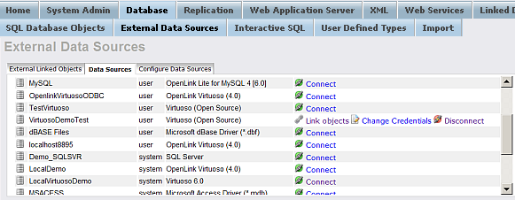

Select the check-box "Store Procedures". Click the "Apply" button. As
result will be shown the list of available procedures.

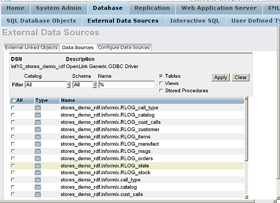

Select the check-boxes for the procedures you want to link and click the
"Link" button.


You will be presented with a new page listing the chosen procedures and
their data type information. This gives you an opportunity to alter the
data type mappings that Virtuoso will use both internally and for any
future interactions with the SOAP server. If you do not want to specify
any special type information the details can be left as default.


For each remote procedure you may change how they will be referenced
within Virtuoso by making changes to the fields for *Catalog* , *Owner*
, *Link as* , and *Description* fields. These fields define how you will
find the linked procedure locally to Virtuoso only and do not affect the
remote data source.

For each procedure there is an option to *PL Wrapper Requirement* . This
option is required if your remote procedure is capable of returning a
resultset that you want to process via Virtuoso. Can be *SOAP Execution*
, *SQL Execution* or *None* . Also you can specify *Return Type* , *Data
Type* , *SOAP Type* .

Once the details are correct press the "Link" button.

> **Tip**
> 
> [Linking Remote Procedures](#remoteprocedures)

### Defining Virtual Directories

Before any procedures native or linked can be exposed as SOAP Services a
location in HTTP space must be defined. From Conductor *Web Application
Server/Virtual Domains & Directories* you make a new URL Mappings. Click
on the *New Directory* link for the {Default Web Site} line to begin
defining a new SOAP mapping.


Select for "Type" from the list the value "SOAP access point" and click
the "Next" button.


You will then be presented with the following tabs: "Virtual Directory
Information", "Authentication", "Web Service Option", "WS Security" and
"Publish Objects". Particular options to note are "Virtual Directory
Information" and "Publish Objects".


In *Publish Objects* you can select Virtuoso stored procedures, or
remotely linked procedures to be published as SOAP web services. Also
you can publish Pl Modules, User Defined Types, or Saved Queries.

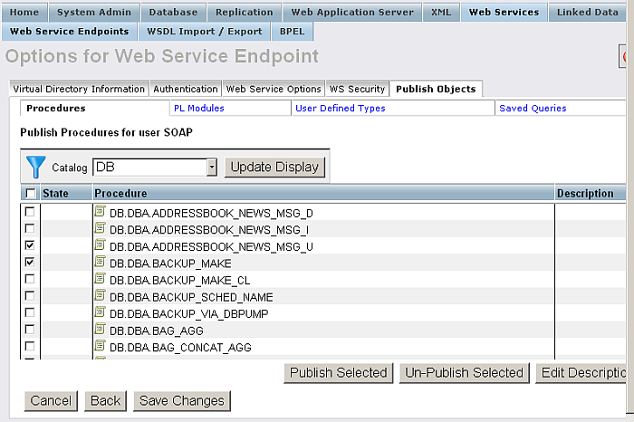

> **Tip**
> 
> [Virtual Directories](#httpvirtualdirs)

### Publishing Procedures to a Virtual Directory

If you already have a virtual directory defined and know what procedures
you want to expose as web services you will have to repeat some of the
steps in the section above. From Conductor go to *Web Application
Server/Virtual Domains & Directories* . Click on the "folder" icon for
your {Default Web Site}. You will find the list of previously existing
mappings, from which you can select the mapping that you want to edit by
pressing on its *Edit* link. Note, the virtual directory should have
type "SOAP".


Go to tab "publish Objects" to expose/hide your procedures, Pl Modules,
User Defined Types and Saved Queries.

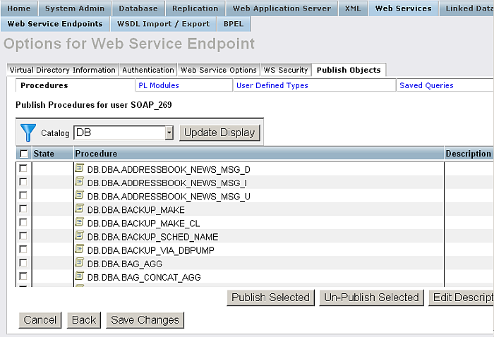

The "Procedures" tab presents the list of available procedures. You can
select a catalogue in order to list the procedures you want to publish.
When the procedures to be published are selected, you can either click
the "Publish Selected" button, or before this to click the "Edit
Description" button.


### Testing SOAP Services Using VSMX

Virtual directory definitions have a *Logical Path* field, which is
reference in URL to find the correct SOAP services. If you connect to
Virtuoso on *http://example.com/* , and defined your virtual directory
with the logical path of */mysoap* then you will be able to test the
following URLs:

http://example.com/mysoap/services.wsdl

http://example.com/mysoap/services.vsmx

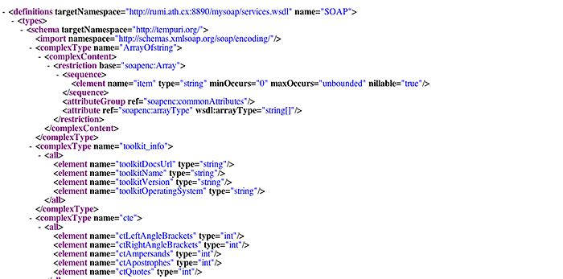


The WSDL description is a standards-based description of the Web
Services available from /mysoap. The VSMX page is a Virtuoso generated
test page allowing you to test SOAP services. This feature should
improve your development time.

> **Tip**
> 
> [VSMX](#vsmx) ; [SOAP](#soap) ; [WSDL](#wsdl) .

## XML Query Templates

Virtuoso XML templates allow execution of SQL/XML queries over HTTP to
obtain an XML document in response and/or perform some operation in the
database using [updategrams](#updategrams) . XML templates can be
executed from within Virtuoso procedure language using the
[`xml_template()`](#fn_xml_template) function. XML templates support two
types of action: SQL based or updategram based. SQL query based
templates must contain the FOR XML clause used in a SELECT statement and
hence cannot update the database. Updates to the database can only occur
from an updategram. The XML document returned from calling an XML
template can be served either raw, or transformed using XSLT.

XML templates provide quick easy access to results from a SQL query as
usual, but now this can be saved to a file. The results are not saved,
just the query definition. You can use this feature to rapidly produce
dynamic reports that can potentially be rendered in different ways by
providing an alternate stylesheet. The report can be refined on the fly
by providing parameters for the query. The output is reachable via HTTP
directly by providing the URL to the template.

> **Tip**
> 
> The [XML Templates](#xmltemplates) Section

XML Templates can also be published just like normal store procedures.
This is achieved by using a PL wrapper around the XML template. Then the
store procedure is published in the normal way.

Stylesheets transformations with be inactive for published XML templates
invoked from SOAP.

> **Tip**
> 
> The Publishing Stored Procedures Section above for a further
> description of publishing XML Templates.

## Publishing VSE's as Web Services

The Virtuoso distribution includes the sample VSE, bif\_sample.c. It is
thus possible to create a function such as:

    .....
    static caddr_t
    bif_hello_world (caddr_t * qst, caddr_t * err_ret, state_slot_t ** args)
    {
      return box_dv_short_string ("Hello world.");
    }
    ....

Then declare it in the init\_func() by adding the following code:

    ...
      bif_define_typed ("hello_world", bif_hello_world, &bt_any);
    ...

The next step is creating a stored procedure that calls this function
and you are back to publishing a Virtuoso stored procedure again, as in
the above section.

    create procedure BIF_HELLO_WORLD () { return hello_world (); };

> **Tip**
> 
> The [C Interface](#cinterface) Chapter

# Testing Web Published Web Services

Virtuoso provides a mechanism for testing SOAP messages instantly. This
mechanism is the Virtuoso Service Module for XML (VSMX) - an
automatically generated test page for published web services. The VSMX
file is generated at the same time the WSDL file is generated. A VSMX
file is a SOAP operations test page generated based on the descriptions
of a WSDL file. The VSMX file has the extension .vsmx, as opposed to the
.wsdl extension of the WSDL file, and can be accessed similarly.

VSMX pages give instant access to published SOAP services for testing.
Any newly created service will need testing which normally means writing
more code to call the service, supply parameters, retrieve the result,
display the results in some manor, etc. The VSMX feature of Virtuoso
eliminates this otherwise repetitive process by automatically
maintaining a test page for SOAP messages: the VSMX file. This greatly
speeds up the development and testing cycle. The beauty of this is that
this is automated, even Microsoft's ASMX file requires that you code the
services descriptions before seeing the results.

Web Service developers would use VSMX to forego the test bed creation
step in light of automatic test page generation. Project managers can
easily keep track of their developers progress by checking the test page
periodically.

Since WSDL descriptions by themselves are not very pleasing to the human
eye, the VSMX test page can be used to preview services available on a
Virtuoso server, or from a remote source using [SOAP/WSDL
Proxying](#importwsdl) . Even experienced developers will find these
easier to read than WSDL files.

Each SOAP enabled virtual directory will have a WSDL and VSMX file
available. The VSMX file is a test page for the SOAP operations. This
test page can be found as simply as the WSDL can be found. From the WSDL
chapter we have seen that for every SOAP enabled virtual directory you
automatically get the file:

    http://[host:port]/[SOAP Virtual Directory]/services.wsdl

likewise you also get:

    http://[host:port]/[SOAP Virtual Directory]/services.vsmx

You simply point your web browser to this file for the test page. The
demo database contains samples that can be found as:

    http://[host:port]/SOAP/services.vsmx

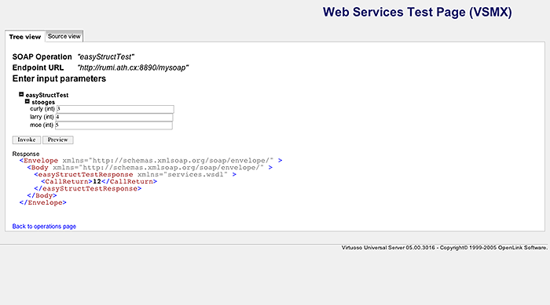

The page shows all the operations that are available. Click on the link
that corresponds to the operation to test and the services details and
test facilities will also appear, allowing you to supply input
parameters making the SOAP call.

Once executed the result of SOAP call will be rendered using the
Virtuoso XSLT processor and built-in style sheet, and appended to bottom
of the services details.

In addition to the simple types: numbers and strings, more complex types
such as arrays and structures can be specified as input parameters. For
an array, each value must be specified on a separate row in the input
text field. For structures the names of structure members will be
displayed, following by the equals sign, the values of the structures
members can then be input after the equals sign. Arrays of arrays or
structures of arrays cannot be used on the test page.

The first comment line of a stored procedure in the format:

    --## [comment]

will be included in the WSDL description of the SOAP message for that
procedure when generating the WSDL file.

# BPEL Reference

**Introduction.**

Business Process Execution Language for Web Services (called BPEL4WS or
simply BPEL in the rest of this chapter) provides a means of specifying
interactions between web services for accomplishing a potentially long
running business task.

**Used terms.**

  - **WSDL.**
    
    Web Services Description Language as described in the corresponding
    W3C proposed recommendation. This is a notation for declaring
    services and the types of data they accept and produce. Also the
    term may be used to refer to the document containing a WSDL
    description.

  - **partner.**
    
    A service or application which interacts with a BPEL process.

  - **(BPEL) script.**
    
    A document containing BPEL compatible XML constructs.

  - **(BPEL process) instance.**
    
    An instance of a BPEL process, can be running, suspended, aborted or
    finished.

  - **activity.**
    
    An activity is a building block of a BPEL script. Receiving data,
    invoking other web services, programming language like control
    structures are all examples of activities.

  - **portType.**
    
    Container for set of abstract operations see below.

  - **operation.**
    
    An abstract black-box that have an XML input or/and output. Services
    potentially supports four types of operations: one-way,
    request-response, notification and solicit-response; this depends of
    input and/or output allowed and what is their order. The BPEL4WS
    uses one-way and request-response operations. Operations are grouped
    in 'ports' which define what operations a particular service
    supports.

  - **message.**
    
    An abstract XML fragment that is used for operation input and
    output. In particular this is used inside SOAP Envelope and for
    value of the BPEL variables. Also the WSDL specification specifies
    how abstract messages will be used as concrete messages using the
    SOAP protocol and which encoding will be used.

## Activities

### Common attributes and elements

Every BPEL activity accepts the following standard attributes: 'name',
'joinCondition' and 'suppressJoinFailure'. The 'name' attribute is an
optional unique within the script NCName (as defined in the XMLSchema)
identifying the activity. The 'joinCondition' is a boolean expression
which determine how incoming links' state will be tested, by default
this is 'true()' which means the logical OR of the states of incoming
links. The 'suppressJoinFailure' is a flag to raise or not exception if
join condition fails, by default this is 'no'.

The common elements for every activity are 'target' and 'source'. These
elements are used together with links and used to designate which link
the current activity depends on or for which one it is a prerequisite.
See also section for 'flow' activity below.

### receive

This allows the business process to do a blocking wait for a particular
message to arrive.

A BPEL process instance is created by a receive activity with the
createInstance attribute set to true.

  - partnerLink  
    name of a partner declared in the script from which the process is
    to receive a message.

  - portType  
    name of the 'port' as declared in corresponding WSDL file.

  - operation  
    name of the operation

  - variable  
    name of the variable to which the received message will be assigned.

  - createInstance  
    used to make instance of the BPEL process and start its execution.

<!-- end list -->

``` 
<receive partnerLink="ncname" portType="qname" operation="ncname"
    variable="ncname"? createInstance="yes|no"?
    standard-attributes>
    standard-elements
    <correlations>?
        <correlation set="ncname" initiate="yes|no"?/>+
    </correlations>
</receive>
          
```

### reply

allows the business process to send a message in reply to a message that
was received through a \<receive\>

  - partnerLink  
    name of a partner declared in the script to which to send a message.

  - portType  
    name of the 'port' as declared in corresponding WSDL file.

  - operation  
    name of the operation

  - variable  
    name of the variable whose value will be used as output message.

  - faultName

<!-- end list -->

``` 
<reply partnerLink="ncname" portType="qname" operation="ncname"
    variable="ncname"? faultName="qname"?
    standard-attributes>
    standard-elements
    <correlations>?
        <correlation set="ncname" initiate="yes|no"?/>+
    </correlations>
</reply>
          
```

### invoke

This allows the business process to invoke a one-way or request-response
operation on a portType offered by a partner. When both 'inputVariable'
and 'outputVariable' are specified this means request-response operation
will be performed. Please note that the operation is defined primarily
in the partner's WSDL.

  - partnerLink  
    name of a partner declared in the script to who send a message and
    optionally receive a response.

  - portType  
    name of the 'port' as declared in corresponding WSDL file.

  - operation  
    name of the operation to invoke

  - inputVariable  
    name of the variable whose value will be used as the message to the
    partner.

  - outputVariable  
    name of the variable to which the response will be assigned.

<!-- end list -->

``` 
<invoke partnerLink="ncname" portType="qname" operation="ncname"
    inputVariable="ncname"? outputVariable="ncname"?
    standard-attributes>
    standard-elements
    <correlations>?
        <correlation set="ncname" initiate="yes|no"?
            pattern="in|out|out-in"/>+
    </correlations>
    <catch faultName="qname" faultVariable="ncname"?>*
        activity
    </catch>
    <catchAll>?
        activity
    </catchAll>
    <compensationHandler>?
        activity
    </compensationHandler>
</invoke>
          
```

### assign

can be used to update the values of variables with new data. An
\<assign\> construct can contain any number of elementary assignments
(copy sub-elements).

    <assign standard-attributes>
        standard-elements
        <copy>+
            from-spec
            to-spec
        </copy>
    </assign>

#### from-spec

This represents in \<copy\> the right part of the assignment.

    <from variable="ncname" part="ncname"? query="xpath-expression"?/>
    <from partnerLink="ncname" endpointReference="myRole|partnerRole"/>
    <from variable="ncname" property="qname"/>
    <from expression="general-expr"/>
    <from>literal value</from>

#### to-spec

This represents in \<copy\> the l-value of the assignment.

    <from variable="ncname" part="ncname"? query="xpath-expression"?/>
    <from partnerLink="ncname" endpointReference="myRole|partnerRole"/>
    <from variable="ncname" property="qname"/>

### throw

generates a fault from inside the business process

  - faultName  
    the fault code to be thrown.

  - faultVariable

<!-- end list -->

``` 
<throw faultName="qname" faultVariable="ncname"? standard-attributes>
    standard-elements
</throw>
          
```

### terminate

Used to immediately terminate the execution of a business process
instance.

``` 
<terminate standard-attributes>
    standard-elements
</terminate>
          
```

### wait

Wait until a given point in time or for a specified duration.

  - for  
    an duration expression as defined in XMLSchema (for example PT10S)

  - until  
    an date time expression as defined in XMLSchema

<!-- end list -->

``` 
<wait (for="duration-expr" | until="deadline-expr") standard-attributes>
    standard-elements
</wait>
          
```

### empty

insert a "no-op" instruction into a business process

``` 
<empty standard-attributes>
    standard-elements
</empty>
          
```

### sequence

define a collection of activities to be performed sequentially in
lexical order

``` 
<sequence standard-attributes>
    standard-elementsactivity+
</sequence>
          
```

### switch

Select exactly one branch of activity from a set of choices

  - case  
    the branch which will be executed if 'condition' attribute returns
    true.

  - otherwise  
    will be executed if all 'case' conditions are evaluated to false.

<!-- end list -->

``` 
<switch standard-attributes>
    standard-elements
    <case condition="bool-expr">+
        activity
    </case>
    <otherwise>?
        activity
    </otherwise>
</switch>
          
```

### while

Repeat activity while a condition is true.

  - condition  
    an XPath expression which will be evaluated every time before
    contained activities. If this evaluates to false the loop finishes.

<!-- end list -->

``` 
<while condition="bool-expr" standard-attributes>
    standard-elementsactivity
</while>
          
```

### pick

This blocks and waits for a suitable message to arrive or for a time-out
expire. When one of the events specified in the body of the pick occurs
the pick completes. Only one of the activities in the body of the pick
will actually take place.

  - createInstance  
    This is an alternative of the 'receive' to make a new process
    instance. And can be expressed as: 'pick' plus 'onMessage' equals to
    'receive' activity.

<!-- end list -->

    <pick createInstance="yes|no"? standard-attributes>
        standard-elements
        <onMessage partnerLink="ncname" portType="qname"
            operation="ncname" variable="ncname"?>+
            <correlations>?
            <correlation set="ncname" initiate="yes|no"?/>+
        </correlations>
        activity
        </onMessage>
        <onAlarm (for="duration-expr" | until="deadline-expr")>*
        activity
        </onAlarm>
    </pick>

#### onMessage

This is to wait for an incoming message from given partner.

The attributes are the same as for [receive](#) activity

#### onAlarm

This will register a time-wait object whose expiration will trigger the
pick. Obviously no more than one can be specified in a given 'pick'

The attributes are the same as for the [wait](#) activity

### scope

defines a nested activity with its own associated variables, fault
handlers, and compensation handler

  - variableAccessSerializable

<!-- end list -->

``` 
<scope variableAccessSerializable="yes|no" standard-attributes>
    standard-elements
    <variables/>?
    <correlationSets/>?
    <faultHandlers/>?
    <compensationHandler/>?
    <eventHandlers/>?
    activity
</scope>
          
```

### flow

Specifies one or more activities to be performed concurrently.

``` 
<flow standard-attributes>
    standard-elements
    <links>?
        <link name="ncname"/>+
    </links>
    activity+
</flow>
          
```

### compensate

This is used to invoke compensation on an inner scope that has already
completed normally. This construct can be invoked only from within a
fault handler or another compensation handler

``` 
<compensate scope="ncname"? standard-attributes>
    standard-elements
</compensate>
          
```

### compensationHandler

``` 
<compensationHandler>?
    activity
</compensationHandler>
          
```

### faultHandlers

``` 
<faultHandlers>?
    <catch faultName="qname"? faultVariable="ncname"?>*
        activity
    </catch>
    <catchAll>?
        activity
    </catchAll>
</faultHandlers>
          
```

#### catch

This container will be executed whose 'faultName' attribute value
matches the thrown fault.

#### catchAll

This container will be executed if non of the 'catch' containers are
matched, so if no 'catchAll' is specified, the contained scopes will be
compensated and the fault will be re-thrown to the outer scope.

### eventHandlers

This is a container for events, thus it can contain onMessage or/and
onAlarm events. Semantic of the onMessage and onAlarm is same as defined
in [pick](#) activity, the difference is that here these can be executed
asynchronously while the events of the defining scope are running. The
events in an event handler section may thus interrupt the execution of
the body of the scope. This feature can be used for supporting
asynchronous cancel messages or timeouts imposed on a whole sequence of
operations..

``` 
<eventHandlers>?
    <onMessage partnerLink="ncname" portType="qname"
    operation="ncname"
    variable="ncname"?>*

    <correlations>?
        <correlation set="ncname" initiate="yes|no"/>+
    </correlations>
    activity
    </onMessage>
    <onAlarm for="duration-expr"? until="deadline-expr"?>*
    activity
    </onAlarm>
</eventHandlers>
          
```

### exec

This is a specific extension of the Virtuoso BPEL implementation. The
exec activity allows executing SQL code from inside a BPEL process
without having to define a distinct SOAP service for this.

  - binding  
    only "SQL", "JAVA" and "CLR" are currently permitted.

<!-- end list -->

``` 
<bpelv:exec binding="SQL">
    insert into dummy values ('hello world');
</bpelv:exec>
          
```

#### SQL execution

The additional procedures BPEL.BPEL.setVariableData and
BPEL.BPEL.getVariableData allow manipulating BPEL variables. See [SQL
API](#) for details.

All errors occurring during the SQL execution are translated into BPEL
errors.

#### Java execution

##### Configuration

First of all, the java support in BPEL4WS is available only for java
enabled virtuoso servers. In order to enable java support the following
administration steps need to be taken:

  - 1\. Make java compiler (javac) available for virtuoso server

  - 2\. Enable "system" call by setting the AllowOSCalls? parameter in
    virtuoso.ini to 1.

  - 3\. Add "classlib" directory to CLASSPATH

After the BPEL4WS package has been installed, the server needs to be
restarted.

The BPEL4WS package creates the classlib directory in the server's root
with BpelVarsAdaptor?.class. This directory and this file are necessary
for the proper operation of the Java interface.

##### Using java code in BPEL4WS

There are two elements which support java execution in BPEL4WS scripts:
\<bpelv:exec binding="JAVA" import?\> (namespace is
"http://www.openlinksw.com/virtuoso/bpel") and the Oracle compatible
form \<bpelx:exec import?\> (namespace is
"http://schemas.oracle.com/bpel/extension"). These tags are equal.

If the tag contains the "import" attribute the appropriate package will
be imported. Example:

``` 
<bpelx:exec import="java.util.*"/>
        
```

Otherwise, the included code will be executed. It is suggested to use
\<\!\[CDATA\[ statement for representing the java code. Example:

``` 
<bpelx:exec>
   System.out.println("getVariableData returned: " + getVariableData ("request", "req_payload", "/v:destRequest/v:city"));

   setVariableData ("res",
         "repl_payload",
         "/v:destResponse/v:country",
         "KZ");
</bpelx:exec>
        
```

The two "functions" are available for accessing script variables:
setVariableData and getVariableData (analogs of the xpath functions with
same names).

``` 
void setVariableData (String var_name, String part, String query_path, Object value);
        
```

sets the variable. The value to be set is restricted to be string or
integer in this version.

``` 
getVariableData
        
```

is a full analog of xpath function getVariableData. See details below.

Note, the activity does not commit changes to the database until it
finishes successfully, so if in a case of exception the variables are
kept untouched. This also means that deadlocks can occur.

The communication errors must be handled and processed in the java code
itself.

If some unhandled exception occurs in java code, it will be translated
to a BPEL error. See details in the next section.

##### Errors

Two types of errors can be signalled:

  - 1\. upload time exceptions

  - 2\. runtime exceptions

The first type exceptions are related to configuration and java syntax
errors. These are as follows:

  - 1\. \[BPELX\] The "system" call is disabled, it is needed for use
    java code in BPEL4WS scripts. \* This error is signalled when the
    "AllowOSCalls" is set to 0. So the engine can not call java
    compiler. It One must set this parameter in ini file to 1 and
    restart the server to resolve this issue.

  - 2\. \[BPELX\] Compilation of java code for NAME failed. Try to call
    "javac NAME.java" for details. \* The compilation of generated class
    for the activity has failed. Try to call the suggested operation
    from command prompt with the same PATH and CLASSPATH global
    variables to see the javac output.

Runtime errors not handled by java method itself are translated to the
BPEL fault in the following form:

``` 
<bpws:javaFault sqlState="SQLSTATE">
 error message
</bpws:javaFault>
        
```

this error can be handled by BPEL fault handler. Here is an example:

``` 
...
    <receive partnerLink="caller" portType="v:dest" operation="check_dest" variable="request" createInstance="yes"/>
    <scope>
      <faultHandlers>
        <catch faultName="bpws:javaFault" faultVariable="error">
          <assign>
            <copy>
              <from variable="error" query="/javaFault"/>
              <to variable="res" part="repl_payload" query="/destResponse/country"/>
            </copy>
          </assign>
        </catch>
      </faultHandlers>
      <bpelv:exec binding="JAVA" name="invokeSomething"><![CDATA[
   System.out.println("Executing Java exec in BPEL");
   System.out.println("getVariableData returned: " + getVariableData ("request", "req_payload", "/v:destRequest/v:city"));

   setVariableData ("res",
         "repl_payload",
         "/destResponse/country",
         "UK");
   if (true)
     throw (new Exception("test"));
   ]] >
       </bpelv:exec>
     </scope>
    <reply partnerLink="caller" portType="v:dest" operation="check_dest" variable="res"/>
...
        
```

In this code the handler for java exception is set:

``` 
...
        <catch faultName="bpws:javaFault" faultVariable="error">
          <assign>
            <copy>
              <from variable="error" query="/javaFault"/>
              <to variable="res" part="repl_payload" query="/destResponse/country"/>
            </copy>
          </assign>
        </catch>
...
        
```

The handler takes the error message from the variable which holds it
("error") and puts it into the response variable.

##### BPEL variables accessors

``` 
void setVariableData (String var_name, String part, String query_path,
        Object value)
        
```

\- changes BPEL variable named var\_name. The "part" is a part of the
message stored in the variable. "query\_path" selects the data in the
variable to be changed. The "value" can be only string or integer, so if
several subdata need to be changed the setVariableData must be called
several times. If the "part" and "query\_path" must be ignored their can
be passed as empty strings ("").

``` 
String getVariableData (String var_name, String part, String query)
        
```

\- returns selected data from the part named by "part" argument of
variable named by "var\_name" argument. If the selection failed the NULL
is returned.

##### Special variables

There are two special variables: "variables" and "xmlnss\_pre". They can
be changed in the java code, in this case the behaviour of the engine is
unpredictable. So, it is strongly recommended do not use these
variables.

##### JavaMail usage example

``` 
<?xml version="1.0"?>
<process xmlns:jsm="urn:java:sendMail"
    xmlns="http://schemas.xmlsoap.org/ws/2003/03/business-process/"
    name="javaSendMail"
    targetNamespace="urn:java:sendMail"
    xmlns:bpelx="http://schemas.oracle.com/bpel/extension"
    xmlns:bpelv="http://www.openlinksw.com/virtuoso/bpel">

  <bpelv:exec binding="JAVA" import="java.io.*"/>
  <bpelv:exec binding="JAVA" import="java.net.InetAddress"/>
  <bpelv:exec binding="JAVA" import="java.util.Properties"/>
  <bpelv:exec binding="JAVA" import="java.util.Date"/>
  <bpelv:exec binding="JAVA" import="javax.mail.*"/>
  <bpelv:exec binding="JAVA" import="javax.mail.internet.*"/>
  <bpelv:exec binding="JAVA" import="com.sun.mail.smtp.*"/>

  <partnerLinks>
    <partnerLink name="caller" partnerLinkType="jsm:dest"/>
  </partnerLinks>

  <variables>
    <variable name="request" messageType="jsm:destRequestMessage"/>
    <variable name="res" messageType="jsm:destResponseMessage"/>
  </variables>
  <sequence>
    <receive partnerLink="caller" portType="jsm:dest" operation="send" variable="request" createInstance="yes"/>
    <bpelv:exec binding="JAVA" name="sendMail"><![CDATA[
    String  to, subject = null, from = null;
    String mailhost = (String) getVariableData ("request", "req_payload", "/jsm:destRequest/jsm:mailhost");
    String mailer = "OpenLink Virtuoso[BPEL script]";
    try {
            to = (String) getVariableData ("request", "req_payload", "/jsm:destRequest/jsm:to");
            subject = (String) getVariableData ("request", "req_payload", "/jsm:destRequest/jsm:subject");

        Properties props = System.getProperties();
        props.put("mail.smtp.host", mailhost);
        Session session = Session.getInstance(props, null);

        Message msg = new MimeMessage(session);
        if (from != null)
            msg.setFrom(new InternetAddress(from));
        else
            msg.setFrom();
        msg.setRecipients(Message.RecipientType.TO,
                    InternetAddress.parse(to, false));
        msg.setSubject(subject);
            msg.setText ((String)getVariableData ("request", "req_payload", "/jsm:destRequest/jsm:text"));

        msg.setHeader("X-Mailer", mailer);
        msg.setSentDate(new Date());
        SMTPTransport t = (SMTPTransport)session.getTransport("smtp");
        try {
            t.connect();
            t.sendMessage(msg, msg.getAllRecipients());
        } finally {
            System.out.println("Response: " +
                        t.getLastServerResponse());
            t.close();
        }

            System.out.println("\nMail was sent successfully.");
        setVariableData ("res",
            "repl_payload",
            "/jsm:destResponse/jsm:status",
            "OK");

    } catch (Exception e) {
        String err_str = "Failed: " + e.toString();
        e.printStackTrace();
        if (e instanceof SendFailedException) {
        MessagingException sfe = (MessagingException)e;
        if (sfe instanceof SMTPSendFailedException) {
            SMTPSendFailedException ssfe =
                    (SMTPSendFailedException)sfe;
            System.out.println("SMTP SEND FAILED:");
            System.out.println(ssfe.toString());
            System.out.println("  Command: " + ssfe.getCommand());
            System.out.println("  RetCode: " + ssfe.getReturnCode());
            System.out.println("  Response: " + ssfe.getMessage());
        } else {
            System.out.println("Send failed: " + sfe.toString());
        }
        Exception ne;
        while ((ne = sfe.getNextException()) != null &&
            ne instanceof MessagingException) {
            sfe = (MessagingException)ne;
            if (sfe instanceof SMTPAddressFailedException) {
            SMTPAddressFailedException ssfe =
                    (SMTPAddressFailedException)sfe;
            System.out.println("ADDRESS FAILED:");
            System.out.println(ssfe.toString());
            System.out.println("  Address: " + ssfe.getAddress());
            System.out.println("  Command: " + ssfe.getCommand());
            System.out.println("  RetCode: " + ssfe.getReturnCode());
            System.out.println("  Response: " + ssfe.getMessage());
            } else if (sfe instanceof SMTPAddressSucceededException) {
            System.out.println("ADDRESS SUCCEEDED:");
            SMTPAddressSucceededException ssfe =
                    (SMTPAddressSucceededException)sfe;
            System.out.println(ssfe.toString());
            System.out.println("  Address: " + ssfe.getAddress());
            System.out.println("  Command: " + ssfe.getCommand());
            System.out.println("  RetCode: " + ssfe.getReturnCode());
            System.out.println("  Response: " + ssfe.getMessage());
            }
        }
        }
        setVariableData ("res",
            "repl_payload",
            "/jsm:destResponse/jsm:status",
            err_str);
    }

    ]] ></bpelv:exec>
    <reply partnerLink="caller" portType="jsm:dest" operation="send" variable="res"/>
  </sequence>
</process>
        
```

and support WSDL file:

``` 
<?xml version="1.0"?>
<definitions name="javaSendMail"
  targetNamespace="urn:java:sendMail"
  xmlns:jsm="urn:java:sendMail"
  xmlns:plnk="http://schemas.xmlsoap.org/ws/2003/05/partner-link/"
  xmlns="http://schemas.xmlsoap.org/wsdl/">
  <types>
    <schema attributeFormDefault="qualified" elementFormDefault="qualified"
      targetNamespace="urn:java:sendMail"
      xmlns="http://www.w3.org/2001/XMLSchema">
      <element name="destRequest">
        <complexType>
          <sequence>
            <element name="mailhost" type="string"/>
            <element name="to" type="string"/>
            <element name="subject" type="string"/>
            <element name="text" type="string"/>
          </sequence>
        </complexType>
      </element>
      <element name="destResponse">
        <complexType>
          <sequence>
        <element name="status" type="string"/>
          </sequence>
        </complexType>
      </element>
    </schema>
  </types>
  <message name="destRequestMessage">
    <part name="req_payload" element="jsm:destRequest"/>
  </message>
  <message name="destResponseMessage">
    <part name="repl_payload" element="jsm:destResponse"/>
  </message>
  <portType name="dest">
    <operation name="send">
      <input  message="jsm:destRequestMessage" />
      <output message="jsm:destResponseMessage"/>
    </operation>
   </portType>
   <plnk:partnerLinkType name="dest">
     <plnk:role name="destProvider">
       <plnk:portType name="jsm:dest"/>
     </plnk:role>
   </plnk:partnerLinkType>
</definitions>
        
```

#### .NET CLR execution

##### Configuration

The CLR is available only for CLR enabled Virtuoso servers. In order to
configure the server for CLR support in BPEL4WS engine the following
administration steps need to be taken:

  - 1\. Initiate "CLRAssembliesDir" configuration entry ("Directory
    where .NET CLR assemblies must be stored") by the path where
    "virt\_bpel4ws.dll", "virtclr.dll" etc are stored.

##### Using the C\# code in BPEL4WS

The tag for supporting CLR is \<exec binding="CLR" \[using | ref \]\>.

\<exec\> with "using" attribute relates to "using" directive in C\#
code.

``` 
<bpelv:exec binding="CLR" using="System"/>
      
```

in BPEL file is a substitution of

``` 
using System;
        
```

statement in the C\# code.

To import assemblies (with a manifest) the \<exec\> element with "ref"
attribute must be used:

``` 
<bpelv:exec binding="CLR" ref="metad1.dll"/>
<bpelv:exec binding="CLR" ref="d:\\myassemblies\\sms_service.dll"/>
        
```

If the tag does not contain these attributes then the content of the tag
is treated as C\# code. It is suggested to use CDATA sections for the
code. Example:

``` 
<bpelv:exec binding="CLR" name="invokeSomething"><![CDATA[

    Console.WriteLine("Executing CLR assembly in BPEL");
    Console.WriteLine("getVariableData returned: " + getVariableData ("request", "req_payload", "/tns:destRequest/tns:city"));

    setVariableData ("res",
            "repl_payload",
            "/destResponse/country",
            "UK");
]] ></bpelv:exec>
        
```

Two "functions" are available for accessing script variables:
setVariableData and getVariableData (analogs of the xpath functions with
same names).

``` 
void setVariableData (String var_name, String part, String query_path, Object value);
        
```

sets the variable. The value to be set is restricted to be string or
integer in this version.

``` 
Object getVariableData (String var_name, String part, String query)
        
```

is a full analog of xpath function getVariableData. See details below.

Note, the activity does not commit changes to the database until it
finishes successfully, so in a case of exception the variables are kept
untouched. This also means that deadlocks can not occur during C\# code
execution (naturally, this statement is not true if the code contains
direct invocation of SQL through the "in-process" .NET provider).

If the some unhandled exception occurred in C\# code, it will be
translated to a BPEL error. See details in the next section.

##### Runtime Errors

Runtime errors not handled by CLR itself are translated to the BPEL
fault in the following form:

    <bpws:clrFault sqlState="SQLSTATE">
     error message
    
    </bpws:javaFault>

this error can be handled by BPEL fault handler. Here is an example:

``` 
...
    <scope>
      <faultHandlers>
        <catch faultName="bpws:clrFault" faultVariable="error">
          <assign>
            <copy>
              <from variable="error" query="/clrFault/text()"/>
              <to variable="res" part="repl_payload" query="/clr:destResponse/clr:status"/>
            </copy>
          </assign>
        </catch>
      </faultHandlers>
      <bpelv:exec binding="CLR" name="Hotmail"><![CDATA[
         String login, passwd;
            login = (String) getVariableData ("request", "req_payload", "/clr:destRequest/clr:login");
            passwd = (String) getVariableData ("request", "req_payload", "/clr:destRequest/clr:password");
        Console.WriteLine ("user:" + login + " password:" + passwd);

        HotmailUsage usage = new HotmailUsage();
        Console.WriteLine ("Result: " + usage.Call_Hotmail (login, passwd));

        setVariableData ("res",
            "repl_payload",
            "/clr:destResponse/clr:status",
            "OK");
    ]] ></bpelv:exec>
    </scope>
    <reply partnerLink="caller" portType="clr:dest" operation="send" variable="res"/>
...
    
```

In this code the handler for CLR exception is set:

``` 
...
        <catch faultName="bpws:clrFault" faultVariable="error">
          <assign>
            <copy>
              <from variable="error" query="/clrFault/text()"/>
              <to variable="res" part="repl_payload" query="/clr:destResponse/clr:status"/>
            </copy>
          </assign>
        </catch>
...
        
```

The handler takes the error message from the variable which holds it
("error") and puts it into the response variable.

##### BPEL variable accessors

The name and the signature of BPEL accessors for CLR are fully equal to
the java accessors. See [java section](#) for details.

##### Special variables

The special variables for CLR are the same as for Java. See [java
section](#) for details.

##### CLR Sample

``` 
<?xml version="1.0"?>
<process xmlns:clr="urn:clr:Hotmail"
        xmlns="http://schemas.xmlsoap.org/ws/2003/03/business-process/"
        name="clrHotmail"
        targetNamespace="urn:clr:Hotmail"
        xmlns:bpelx="http://schemas.oracle.com/bpel/extension"
        xmlns:bpelv="http://www.openlinksw.com/virtuoso/bpel">

  <bpelv:exec binding="CLR" using="HotmailUsageChecker"/>
  <bpelv:exec binding="CLR" ref="l:\\distrib_3_0\\bin\\Hotmail.dll"/>
  <bpelv:exec binding="CLR" using="System"/>

  <partnerLinks>
    <partnerLink name="caller" partnerLinkType="clr:dest"/>
  </partnerLinks>

  <variables>
    <variable name="request" messageType="clr:destRequestMessage"/>
    <variable name="res" messageType="clr:destResponseMessage"/>
  </variables>
  <sequence>
    <receive partnerLink="caller" portType="clr:dest" operation="send" variable="request" createInstance="yes"/>
    <scope>
      <faultHandlers>
        <catch faultName="bpws:clrFault" faultVariable="error">
          <assign>
            <copy>
              <from variable="error" query="/clrFault/text()"/>
              <to variable="res" part="repl_payload" query="/clr:destResponse/clr:status"/>
            </copy>
          </assign>
        </catch>
      </faultHandlers>
      <bpelv:exec binding="CLR" name="Hotmail"><![CDATA[
             String login, passwd;
                login = (String) getVariableData ("request", "req_payload", "/clr:destRequest/clr:login");
                passwd = (String) getVariableData ("request", "req_payload", "/clr:destRequest/clr:password");
                Console.WriteLine ("user:" + login + " password:" + passwd);

                HotmailUsage usage = new HotmailUsage();
                Console.WriteLine ("Result: " + usage.Call_Hotmail (login, passwd));

                setVariableData ("res",
                        "repl_payload",
                        "/clr:destResponse/clr:status",
                        "OK");
        ]]></bpelv:exec>
        </scope>
    <reply partnerLink="caller" portType="clr:dest" operation="send" variable="res"/>
  </sequence>
</process>
      
```

## Protocol Support

The Virtuoso BPEL implementation supports WS Security and WS Reliable
Messaging. These protocols may be enabled and configured for individual
partner links. The WS-Addressing protocol is automatically used when the
partner has such capabilities.

The Partner link options are stored in XML format in the
'BPEL.BPEL.partner\_link\_init' table in 'bpl\_opts' column. See the
document format and table description below in this chapter.

### WS-Addressing (WSA)

WS-Addressing is transparently handled via WSDL description and request
of the partner(s). If the partner has WSA headers exposed then the
corresponding operation will be invoked with WSA headers. If the partner
uses WSA to call the BPEL service then the service will respond to the
partner with WSA headers included.

The benefit of using WSA consists in transparently handled message
correlation via "MessageID" and "RelatesTo" headers. Thus no explicit
message correlation needs to be specified when the partner is WSA
capable (see [LoanFlow](#) demo in tutorials to see how this works).
Also when the reply is asynchronous the return path can be handled via
the "ReplyTo" WSA headers.

As WSA has different revisions that are supported by different
implementations (partners), the version of the protocol is configurable
via wsOptions/addressing element (see below).

The 'wsa' partner link option can be used in [API](#bpelplinkconf)
functions to set or retrieve the value of the wsOptions/addressing.

### WS-Security (WSS)

There are several cases where privacy and confidentiality must be
observed , this is especially true when business processes involve
payment systems, personal information etc. In those cases a partner may,
depending on Web Service policy, require secure messages (signed,
encrypted or both). Such partners usually do not expose (for many
reasons) in WSDL the WSS headers, hence this must be configured by the
BPEL administrator per partner.

In order for the BPEL server to be able to sign and encrypt messages
keys have to be uploaded into the BPEL user repository. This can be done
with the USER\_KEY\_LOAD() function or using the BPEL GUI (Partner Link
properties).

It is important to know the following basics:

  - The private key is needed in order to decrypt or sign messages.

  - The partner public key is needed to encrypt messages or verify
    signatures.

These keys have to be described in wsOptions/security/key and
wsOptions/security/pubkey in the 'Partner link options' XML document.
Note that in the options document are stored only the names of the keys,
as the keys themselves are registered in the BPEL user key repository.

Note: Use the 'wss-priv-key' and 'wss-pub-key' partner link option in
[API](#bpelplinkconf) functions to set or change the value of them.

The encryption and signing is independently configurable for outbound or
inbound messages. This is settable via the following options:

  - wsOptions/security/in/encrypt - 'Optional': inbound message MAY be
    encrypted, 'Mandatory': inbound message MUST be encrypted
    ('wss-in-encrypt' option [in API](#bpelplinkconf) )

  - wsOptions/security/in/signature - same as encryption but for XML
    signature ('wss-in-signature' option [in API](#bpelplinkconf) )

  - wsOptions/security/in/keys - this is a list of keys (key names) that
    are trusted; only SOAP messages signed with one of these keys will
    be accepted. If this list is empty, all parties will be accepted
    unless signature is invalid or message can not be decrypted.
    ('wss-in-signers' option [in API](#bpelplinkconf) )

  - wsOptions/security/out/encrypt - type of the session key for
    encryption 3DES, AES128, AES192 or AES256. ('wss-out-encrypt-key'
    option [in API](#bpelplinkconf) )

  - wsOptions/security/out/signature - 'Default': the WSS default
    template (see WS-Security chapter for details), 'Custom': in this
    case 'function' attribute must refer to a PL procedure returning XML
    Signature template. ('wss-out-signature-type' and
    'wss-out-signature-function' options [in API](#bpelplinkconf) )

### WS-Reliable Messaging (WSRM)

The WSRM is applicable for those partners which can be invoked
asynchronously. For both inbound or outbound (from the point of view of
the process) WSRM can be enabled. The options are settable in
wsOptions/delivery/in or wsOptions/delivery/out ('wsrm-in-type' and
'wsrm-out-type' options [in API](#bpelplinkconf) ) respectively.

  - ExactlyOnce - message will be delivered only once to the
    destination.

  - InOrder - messages will be delivered in the same order as they are
    sent from the script.

### HTTP security

Some partner services may require HTTPS or/and HTTP authentication
instead of using WS-Security protocol to ensure SOAP message privacy.

When a partner's endpoint URL contains HTTPS scheme (like https://) the
request and response operations will be made with HTTP over SSL (HTTPS
protocol). In this case no additional options to the partner links are
needed.

In case when a partner service needs a HTTP authentication, the user
name and password (for that service) needs to be configured for the
given partner link. These are settable via wsOptions/security/http-auth
('http-auth-uid' and 'http-auth-pwd' options [in API](#bpelplinkconf) )
element in partner link options. Note that only basic HTTP
authentication is supported.

Partner link options format

``` 
<wsOptions>
    <!-- WSA revision namespace -->

    <addressing version="http://schemas.xmlsoap.org/ws/2003/03/addressing|http://schemas.xmlsoap.org/ws/2004/03/addressing"/|http://schemas.xmlsoap.org/ws/2004/08/addressing>
  <!-- WSS options -->

  <security>
      <!-- basic HTTP Authentication -->

      <http-auth username="" password=""/>
      <!-- WSS keys -->

      <key name="[Private Key]"/>
      <pubkey name="[Partner public key]"/>
    <in>
      <encrypt type="NONE|Optional|Mandatory"/>
      <signature type="NONE|Optional|Mandatory" />
      <keys>
      <!-- trusties -->

      <key name="[Trusted Public Key]"/>
      ...
      </keys>
    </in>
    <out>
    <encrypt type="NONE|3DES|AES128|AES192|AES256"/>
    <signature type="NONE|Default|Custom" function="[PL procedure name]"/>
    </out>
  </security>
  <!-- WSRM options -->

  <delivery>
    <in  type="NONE|ExactlyOnce|InOrder"/>
    <out type="NONE|ExactlyOnce|InOrder" />
  </delivery>
</wsOptions>
    
```

### Configuring the Partner link options

The partner link options can be configured vi BPEL UI
(http://host:port/BPELGUI) or programmatically using
[`plink_get_option()
`](#fn_plink_get_option) and [`plink_set_option()
`](#fn_plink_set_option) functions. It is possible to update the partner
link options with SQL update statement using the configuration
(described above), but use of the BPEL UI or API functions is
recommended.

### Dynamic Partner Links

The 'assign' activity allows partner links to be assigned values at run
time. This means that partner links can be dynamic and that a process
may call partners that were not known at the time of defining the
process. Partner links can be defined at run time using the
'EndpointReference' element from the WS-Addressing specification :

``` 
  <xs:element name="EndpointReference" type="wsa:EndpointReferenceType"/>
  <xs:complexType name="EndpointReferenceType">
    <xs:sequence>
      <xs:element name="Address" type="wsa:AttributedURI"/>
      <xs:element name="ReferenceProperties" type="wsa:ReferencePropertiesType" minOccurs="0"/>
      <xs:element name="PortType" type="wsa:AttributedQName" minOccurs="0"/>
      <xs:element name="ServiceName" type="wsa:ServiceNameType" minOccurs="0"/>
      <xs:any namespace="##other" processContents="lax" minOccurs="0" maxOccurs="unbounded" />
    </xs:sequence>
    <xs:anyAttribute namespace="##other" processContents="lax"/>
  </xs:complexType>
    
```

Thus it may keep endpoint URL, Port type, Service name and any number of
implementation specific options under 'ReferenceProperties'. Also it may
keep any other extensible elements and attributes.

The Virtuoso BPEL implementation extends the EndpointReferenceType with
element 'wsOptions' under WSA element 'ReferenceProperties' (see
previous section for 'wsOptions' element description). Thus it is
possible to decide at run time to send a secure reply (WSS) or to use
reliable messaging (WSRM). The following excerpt shows BPEL source that
assigns WS Security options to a partner link:

``` 
      ...
      <assign>
      <copy>
          <from>
          <EndpointReference xmlns="http://schemas.xmlsoap.org/ws/2003/03/addressing">
              <Address>http://securehost/myService</Address>
              <ReferenceProperties>
              <wsOptions xmlns="">
                  <addressing version="http://schemas.xmlsoap.org/ws/2003/03/addressing"/>
                  <security>
                  <http-auth username="" password=""/>
                  <key name="myKey"/>
                  <pubkey name="serverKey"/>
                  <in>
                      <encrypt type="Optional"/>
                      <signature type="Optional" />
                      <keys/>
                  </in>
                  <out>
                      <encrypt type="AES128"/>
                      <signature type="Default"/>
                  </out>
                  </security>
              </wsOptions>
              </ReferenceProperties>
          </EndpointReference>
          </from>
          <to partnerLink="service"/>
      </copy>
      </assign>
      ...
    
```

To manipulate the partner link options and endpoint URL we can also use
variables declared as element EndpointReference from WS-Addressing
schema.

## Process lifecycle

A BPEL process may have more than one version during development or
maintenance in production environment. This means the process may have a
more than one copy on the server where one of these copies is current
all others are either obsolete or in the process of being defined . We
will call these states further in this section as 'current', 'obsolete'
or 'edit' (versions). The link between these versions is the process
name which remains the same during process life-cycle.

When a process is compiled for the first time it becomes 'current'. The
current version of a process is the one that was most recently compiled
without errors. Only a current version of a process can make new
instances in response to receiving messages. For a single process name
only one version can be current at any one time. The other compiled
versions of the process are always obsolete, meaning that new instances
cannot be created but that old instances may proceed and complete.

The 'obsolete' version can not crate new process instances, it may only
receive messages for its instances which are still running or suspended.
In other words the old process instances will continue and any new
instances will be instances of the current version.

The 'edit' state means that a new copy of the process is created but it
is still not compiled. After successful compilation, a process in the
edit state is set into the current state and the formerly current
process is set to the the obsolete state.

All process versions may have only one endpoint corresponding to the
process. The BPEL administrator MUST take care about endpoints to make
sure that clients using the process are compatible with different
process versions. This means that if changes in new versions are for
example in the logic but not in the process' WSDL then new endpoint is
not needed in most cases; furthermore in this case clients will be
compatible with new input and output message structure; except in the
case where the same messages are used with logically different meaning.
So when a new process version involves significant change to messages
then the new process should have a new endpoint and WSDL description.

## Using virtual directories

To allow a process to make new instances or to receive messages from
remote services in asynchronous way it needs an endpoint. Endpoint means
an URL that allows to accept and process known SOAP messages.

Every process has a default endpoint which is accessible via the
'http://\[host:port\]/BPELGUI/bpel.vsp?script=\[process\_name\]' URL.
Also it has a default WSDL document describing the process at URL
http://\[host:port\]/BPELGUI/bpel.vsp?script=\[process\_name\]\&wsdl.
Upon compilation a different virtual directory can be specified for the
process. For example if '/Service' is specified the
'http://\[host:port\]/Service' would be the endpoint URL also in this
case the WSDL will be available on 'http://\[host:port\]/Service?wsdl'.

It is important to note that changing the virtual directory when a
process is redefined will force all clients to update their
configuration. This is the case when a major changes are made to the
process and clients need to be re-linked against new WSDL. So when
changes are small there will be no need of a new virtual directory. (See
section 'Process life-cycle' above for process versions).

## Process archiving

When an instance of a BPEL process is completed it will be archived and
purged from system after a configurable time interval. The interval is
settable via 'InstanceExpiryDelay' configuration option (see below how
to change). The default interval for archiving is one day.

The archive file contains status of the instance which is archived,
execution path of the activities when execution is completed, value of
the variables and partner links.

The format of the archive file is as follows:

``` 
<instances>
  <instance
xml:id="[instance id]">
    <status code="[2 - success |3 - error]" error="[error description]"/>
    <execution>
    <node
xml:id="[activity id]" type="[activity type]"/>
    ... more nodes may follow ...
    </execution>
    <variables>
    <variable name="[name of the variable]">... variable value ...</variable>
    ... more variables may follow ...
    </variables>
    <partnerLinks>
      <partnerLink name="[name of the partner link]">
        <EndpointReference>
        <Address>... partner link endpoint ...</Address>
        </EndpointReference>
      </partnerLink>
      ... more partner links may follow ...
    </partnerLinks>
  </instance>
</instances>
      
```

## Configuration parameters

The BPEL engine has global configuration parameters settable via the
configuration settings page of its web user interface. These are global
and are kept in the BPEL..configuration table as name/value pairs.

  - EngineMailAddress - e-mail address to whom will be sent error alerts
    and reports.

  - ErrorAlertSkeleton - e-mail template for error alerts

  - ErrorReportSkeleton - e-mail template for error reports

  - AlertSubject - Subject for error alert e-mail

  - CommonEmailHeader - Header for all BPEL e-mail notifications

  - ErrorSubject - Subject for error report e-mail

  - InstanceExpiryDelay - how long (hours a completed instance will be
    kept in the database before purging.

  - MailServer - if specified this will be used to send the error alerts
    and reports. If this is not specified the default (from INI file)
    mail server will be used.

  - Statistics - process statistics flag, if 0 (default) the statistics
    collection is disabled. When this is 1 the engine will start
    collecting statistics for new process instances .

## Process Statistics

The BPEL process can be set to collect statistics, this can be enabled
by turning on the statistics flag (see Configuration section). If the
statistics flag is on the following data is available:

  - count of instance creations per instance creating partner link

  - count/duration/data volume of invokes per invoked synchronous
    partner link

  - count/data volume per asynchronous partner link

  - waiting time/count/data volume at non-instance creating receives

  - average time to complete for process

  - Errors per partner link

  - count of created instances

  - count of completed instances

  - count of instances that could not terminate successfully

## Deployment file suitcase format

The relation between a BPEL process and different partner links can be
stored in a deployment file. This file contains a description for every
partner link mention in the process. The descriptor file simplifies
deployment. Entering the URL of this file through the web administration
interface will download and register all sources needed for the process
compilation.

The format of the deployment file is as follows:

``` 
    <BPELSuitcase>
        <BPELProcess
xml:id="[process id]" src="[URI of the file containing BPEL script]">
        <partnerLinkBindings>
            <partnerLinkBinding name="[name of the partner]">
                <property name="wsdlLocation">[URI of the WSDL for the partner]</property>
            </partnerLinkBinding>
            ... more partnerLinkBinding may follow ...
        </partnerLinkBindings>
    </BPELProcess>
    </BPELSuitcase>
```

## SQL API

The following API functions are available:

### bpel\_compile\_script\_dedup

For detailed description and example use of the function, see
[bpel\_compile\_script](#fn_bpel_compile_script) in the [Functions
Reference Guide](#ch-functions).

### bpel\_copy\_script\_dedup

For detailed description and example use of the function, see
[bpel\_copy\_script](#fn_bpel_copy_script) in the [Functions Reference
Guide](#ch-functions).

### bpel\_get\_partner\_links\_dedup

For detailed description and example use of the function, see
[bpel\_get\_partner\_links](#fn_bpel_get_partner_links) in the
[Functions Reference Guide](#ch-functions).

### bpel\_instance\_delete\_dedup

For detailed description and example use of the function, see
[bpel\_instance\_delete](#fn_bpel_instance_delete) in the [Functions
Reference Guide](#ch-functions).

### bpel\_purge\_dedup

For detailed description and example use of the function, see
[bpel\_purge](#fn_bpel_purge) in the [Functions Reference
Guide](#ch-functions).

### bpel\_script\_delete\_dedup

For detailed description and example use of the function, see
[bpel\_script\_delete](#fn_bpel_script_delete) in the [Functions
Reference Guide](#ch-functions).

### bpel\_script\_obsolete\_dedup

For detailed description and example use of the function, see
[bpel\_script\_obsolete](#fn_bpel_script_obsolete) in the [Functions
Reference Guide](#ch-functions).

### bpel\_script\_source\_update\_dedup

For detailed description and example use of the function, see
[bpel\_script\_source\_update](#fn_bpel_script_source_update) in the
[Functions Reference Guide](#ch-functions).

### bpel\_script\_upload\_dedup

For detailed description and example use of the function, see
[bpel\_script\_upload](#fn_bpel_script_upload) in the [Functions
Reference Guide](#ch-functions).

### bpel\_wsdl\_upload\_dedup

For detailed description and example use of the function, see
[bpel\_wsdl\_upload](#fn_bpel_wsdl_upload) in the [Functions Reference
Guide](#ch-functions).

### plink\_get\_option\_dedup

For detailed description and example use of the function, see
[plink\_get\_option](#fn_plink_get_option) in the [Functions Reference
Guide](#ch-functions).

### plink\_set\_option\_dedup

For detailed description and example use of the function, see
[plink\_set\_option](#fn_plink_set_option) in the [Functions Reference
Guide](#ch-functions).

### bpel\_import\_script\_dedup

For detailed description and example use of the function, see
[bpel\_import\_script](#fn_bpel_import_script) in the [Functions
Reference Guide](#ch-functions).

## BPEL XPath Functions

### bpel\_get\_var\_dedup

For detailed description and example use of the function, see
[bpel\_get\_var](#fn_bpel_get_var) in the [Functions Reference
Guide](#ch-functions).

### bpel\_set\_var\_dedup

For detailed description and example use of the function, see
[bpel\_set\_var](#fn_bpel_set_var) in the [Functions Reference
Guide](#ch-functions).

### xpf\_processxquery\_dedup

For detailed description and example use of the function, see
[xpf\_processxquery](#xpf_processxquery) in the [Functions Reference
Guide](#ch-functions).

### xpf\_processxslt\_dedup

For detailed description and example use of the function, see
[xpf\_processxslt](#xpf_processxslt) in the [Functions Reference
Guide](#ch-functions).

### xpf\_processxsql\_dedup

For detailed description and example use of the function, see
[xpf\_processxsql](#xpf_processxsql) in the [Functions Reference
Guide](#ch-functions).

## Tables

BPEL Engine Tables

``` 
-- Scripts table, keeps one record per version
create table BPEL.BPEL.script (
    bs_id integer identity,     -- unique id identifying the process
    bs_uri varchar,         -- obsoleted: script source URI
    bs_name varchar,        -- process name, all versions have same name
    bs_state int,           -- 0 on, current version, 1 obsolete, 2 edit mode
    bs_date datetime,       -- date of registration
    bs_audit int default 0,     -- audit flag : 1 on, 0 off
    bs_debug int default 0,     -- debug flag
    bs_version int default 0,   -- process version
    bs_parent_id int default null,  -- fk to bs_id of previous process version
    bs_first_node_id int,       -- the first node id in the graph
    bs_pickup_bf varbinary default '\x0',   -- bitmask for resume nodes
    bs_act_num  int,        -- stores the total number of activities
    bs_lpath    varchar default null, -- virtual directory

    -- process statistics
    bs_n_completed int default 0,
    bs_n_errors int default 0,
    bs_n_create int default 0,
    bs_cum_wait int default 0,
    primary key (bs_id));

-- BPEL and WSDL sources
create table BPEL..script_source
    (
     bsrc_script_id int, -- script id, fk to bs_id of scripts table.
     bsrc_role varchar,  -- one of bpel, bpel-ext, wsdl, deploy, partner-1... partner-n
     bsrc_text long xml, -- source text
     bsrc_url varchar,   -- if this comes from an uri
     bsrc_temp varchar,  -- contains the namespaces info
     primary key (bsrc_script_id, bsrc_role)
)
;

-- Process instances
create table BPEL.BPEL.instance (
    bi_id int identity,         -- global immutable id of instance
    bi_script int,          -- fk to bs_id from BPEL.BPEL.script
    bi_scope_no int default 0,      -- sequence counter for scope numbers in instance
    bi_state int default 0,
        -- 0, started
        -- 1, suspended (wait for signal)
        -- 2, finished
        -- 3, aborted
    bi_error any,           -- error
    bi_lerror_handled int,
    bi_last_act datetime,   -- last activity execution
    bi_started  datetime,   -- start time
    bi_init_oper    varchar,    -- operation that made the instance
    bi_wsa      long xml,   -- WS-Addressing headers
    bi_activities_bf varbinary default '\x0\x0', -- bitmask for each activity is completed or not
    bi_link_status_bf varbinary default '\x0\x0', -- bitmask for link status
    bi_prefix_info varchar default '', -- xpath prefix string
    primary key (bi_id));

-- Initial values (URL etc.) for partner links
create table BPEL.BPEL.partner_link_init (
    bpl_script int,     -- script instance id
    bpl_name varchar,   -- partner link name
    bpl_partner any,    -- url, end point etc serialized
    bpl_role varchar,
    bpl_myrole varchar,
    bpl_type varchar,
    bpl_endpoint varchar,   -- partner service endpoint URL
    bpl_backup_endpoint varchar,
    bpl_wsdl_uri varchar,
    bpl_debug int default 0,-- debug flag
    bpl_opts long xml,  -- partner link options (WS-Security, WS-RM etc.)
    primary key (bpl_script,bpl_name));

-- Runtime values for partner links (run time copy of partner_link_init table)
create table BPEL..partner_link (
    pl_inst int,        -- instance id
    pl_name varchar,    -- partner link name
    pl_scope_inst int,  -- scope instance id
    pl_role int,        -- flag 0 - myRole, 1 - partnerRole
    pl_endpoint varchar,    -- current URL to the partner service
    pl_backup_endpoint varchar, -- second URL to the service for connection error
    pl_debug int default 0, -- debug flag
    pl_opts long xml,   -- partner link options (WS-Security, WS-RM etc.)
    primary key (pl_inst, pl_name, pl_scope_inst, pl_role));

-- Script compilation
create table BPEL.BPEL.graph (
    bg_script_id int,   -- FK to bs_id of BPEL.BPEL.script
    bg_node_id int ,    -- running id in the script, referenced from BPEL.BPEL.waits etc.
    bg_activity BPEL.BPEL.activity, -- UDT representing activity
    bg_childs any,
    bg_parent int,
        bg_src_id varchar,  -- internal use
    primary key (bg_script_id, bg_node_id));

-- Receive activities waiting for incoming message
create table BPEL.BPEL.wait (
    bw_uid varchar,
    bw_instance integer,  -- instance id
    bw_script varchar,    -- FK reference to bs_name of script table
    bw_script_id int,     -- FK reference to bs_id of script table
    bw_node int,          -- FK reference to bg_node_id of the graph table
    bw_scope  int,
    bw_partner_link varchar, -- the party from which instance waiting a message
    bw_port varchar,     -- the name of the operation which instance wait to receive
    bw_deadline datetime,
    bw_message long varchar default null, -- if instance is occupied and message is already arrived
    bw_state int default 0,           -- flag that bw_message is not null (0 or 1)
    bw_correlation_exp varchar,           -- XPath expression for computing the correlation value from message
    bw_expected_value long varbinary,     -- value of the expected correlation
    bw_message_type int default 0,        -- where to expect the data : 0 - SOAP:Body 1 - SOAP:Header
    bw_start_date datetime,
    primary key (bw_instance, bw_node));

-- Messages which have been arrived but not correlated yet
create table BPEL.BPEL.queue (
    bq_id int identity, -- unique id
    bq_script int,      -- FK references bs_id from the script table
    bq_ts timestamp,
    bq_state int,       -- state of the Queue item; 0 - not processed
    bq_endpoint varchar,    -- not used
    bq_op varchar,      -- Operation name
    bq_mid varchar,     -- mot used
    bq_message long varchar, -- The incoming message text
    bq_header long varchar,  -- SOAP:Header
    primary key (bq_op, bq_ts)
    );

-- Initial values for SOAP Messages and XMLSchema types
create table BPEL..types_init (
    vi_script int,     -- FK reference to bs_id to the script table
    vi_name   varchar, -- message name, element name etc.
    vi_type   int,     -- 0 - message, 1 - element, 2 - XMLSchema type
    vi_value  long xml,-- Initial value
    primary key (vi_script, vi_name, vi_type)
)
;

-- Matching XPath expressions for the SOAP message parts
create table BPEL.BPEL.message_parts
    (
    mp_script int,      -- FK reference to bs_id to the script table
    mp_message varchar, -- message name
    mp_part varchar,    -- part name
    mp_xp   varchar,    -- location XPath expression
    primary key (mp_script, mp_message, mp_part)
    )
;

-- Operations which are invoked by process (used in invoke activities)
create table BPEL.BPEL.remote_operation (
    ro_script int,      -- FK reference to bs_id to the script table
    ro_partner_link varchar,-- name of the partner link
    ro_role varchar,    -- not used
    ro_operation varchar,   -- operation name
    ro_port_type varchar,   -- port type
    ro_input varchar,   -- input message name
    ro_output varchar,  -- output message name
    ro_endpoint_uri varchar,-- not used
    ro_style int,       -- messages encoding style : 1 - literal, 0 - RPC like
    ro_action varchar default '', -- SOAP Action value
    ro_target_namespace varchar,  -- for RPC encoding the namespace to be used for wrapper elements
    ro_use_wsa int default 0, -- WS-Addressing capabilities flag
    ro_reply_service varchar, -- for one-way operations: reply service name
    ro_reply_port varchar,    -- for one-way operations: reply port type
    primary key (ro_script, ro_partner_link, ro_operation)
)
;

-- Operations which process defines (can receive and reply)
create table BPEL.BPEL.operation (
    bo_script int,      -- FK reference to bs_id to the script table
    bo_name varchar,    -- operation name
    bo_action varchar,  -- SOAP Action value
    bo_port_type    varchar,-- port type
    bo_partner_link varchar,-- name of the partner link
    bo_input    varchar,-- input message name
    bo_input_xp varchar,-- XPath expression to match the input message
    bo_small_input  varchar,-- not used
    bo_output   varchar,-- output message name
    bo_style    int default 0,-- messages encoding style : 1 - literal, 0 - RPC like
    bo_init     int,    -- process instantiation flag: 1 - can make new instances
    primary key (bo_script, bo_name, bo_partner_link)
);

-- Predefined endpoint URLs for partner links
create table BPEL.BPEL.partner_link_conf (
    plc_name    varchar,
    plc_endpoint    varchar,
    primary key (plc_name)
)
;

-- Properties
create table BPEL.BPEL.property
(
  bpr_script int,   -- FK reference to bs_id to the script table
  bpr_name varchar, -- property name
  bpr_type varchar, -- property type
  primary key (bpr_script, bpr_name)
)
;

-- Aliases
create table BPEL.BPEL.property_alias (
    pa_script   int,        -- FK reference to bs_id to the script table
    pa_prop_id  int identity,
    pa_prop_name    varchar,    -- property name
    pa_message  varchar,    -- message name
    pa_part     varchar,    -- part name
    pa_query    varchar,    -- XPath query to set the property value
    pa_type     varchar,
    primary key (pa_script, pa_prop_name, pa_message))
;

-- Correlation properties
create table BPEL.BPEL.correlation_props (
    cpp_id      int identity (start with 1),
    cpp_script  int,        -- FK reference to bs_id to the script table
    cpp_corr    varchar,    -- correlation name
    cpp_prop_name   varchar,    -- property name
    primary key (cpp_id, cpp_script, cpp_corr, cpp_prop_name))
;

-- Variables
create table BPEL..variables (
    v_inst      int,        -- instance id, FK reference bi_id of the instance table
    v_scope_inst    int,        -- scope instance id; different than 0 for compensation scope
    v_name      varchar,    -- variable name
    v_type      varchar,    -- variable type
    v_s1_value  any,        -- string, numeric
    v_s2_value  varchar,    -- XML entities
    v_b1_value  long varchar,   -- long strings
    v_b2_value  long varchar,   -- XML entities
    primary key (v_inst, v_scope_inst, v_name))
;

-- Links
create table BPEL..links
    (
      bl_script int,    -- FK reference to bs_id to the script table
      bl_name   varchar,    -- link name
      bl_act_id int,    -- corresponding link activity bit number
      primary key (bl_act_id, bl_script)
    )
;

-- Compensation scopes
create table BPEL..compensation_scope
    (tc_inst int,
     tc_seq  int identity (start with 1),
     tc_scopes long varbinary,
     tc_head_node int,
     tc_head_node_bit int,
     tc_compensating_from int default null,
     primary key (tc_inst, tc_seq)
    )
;

-- Messages are correlated via WS-Addressing
create table BPEL..wsa_messages
    (
    wa_inst int,
    wa_pl   varchar,
    wa_mid  varchar,
    primary key (wa_inst, wa_pl, wa_mid)
    )
;

create table BPEL..lock
    (
    lck int primary key
    )
;

-- Accepted connections which are waiting for reply
create table BPEL..reply_wait
    (
    rw_inst int,
    rw_id int, -- identity (start with 1),
    rw_partner varchar,
    rw_port varchar,
    rw_operation varchar,
    rw_query varchar,
    rw_expect varchar,
    rw_started datetime,
    primary key (rw_inst, rw_id)
    )
;

-- Registered alarm events
create table BPEL..time_wait
    (
      tw_inst   int,
      tw_node   int,
      tw_scope_inst int,
      tw_script varchar,
      tw_script_id  int,
      tw_sec    int,
      tw_until  datetime,
      primary key (tw_inst, tw_node)
    )
;

-- BPEL message debugging queue
create table BPEL..dbg_message (
    bdm_text long varchar,      -- message text
    bdm_id int identity (start with 1),
    bdm_ts datetime,
    bdm_inout int,          -- 1 for in, 0 for out
    bdm_sender_inst int,        -- instance id of sender if outbound message
    bdm_receiver int,       -- if inbound, inst id of receiving inst
    bdm_plink varchar,      -- name of partner link in the script in question
    bdm_recipient varchar,      -- partner link value for outbound message, URL.
    bdm_activity int,       -- activity id of activity that either sent the message or would receive the message in the sender/receiver instance.
    bdm_oper varchar,       -- operation name
    bdm_script int,         -- process id, FK reference bs_id from script table
    bdm_action varchar,     -- SOAP Action value
    bdm_conn int,           -- client connection id
    primary key (bdm_id)
)
;

-- BPEL engine configuration
create table BPEL..configuration (
    conf_name   varchar not null,
    conf_desc   varchar,
    conf_value  any, -- not blob
    conf_long_value long varchar,
    primary key (conf_name)
)
;

create table BPEL.BPEL.op_stat
    (
     bos_process int,
     bos_plink varchar,
     bos_op varchar,
     bos_n_invokes int default 0,
     bos_n_receives int default 0,
     bos_cum_wait numeric default 0, -- milliseconds total time wait at the partner link/operation
     bos_data_in numeric default 0,
     bos_data_out numeric default 0,
     bos_n_errors int default 0,
     primary key (bos_process, bos_plink, bos_op)
)
;

create table BPEL.BPEL.error_log
    (
     bel_ts timestamp,
     bel_seq int identity,
     bel_level int, -- bel_level is 1. fatal 2. network, 3 instance.
     bel_notice_sent datetime,  -- time the email was sent, null if none
     bel_text varchar,
     primary key (bel_ts, bel_seq)
)
;

create table BPEL.BPEL.hosted_classes
    (
     hc_script  int,
     hc_type    varchar default 'java',
     hc_name    varchar,
     hc_text    long varbinary, -- compiled class
     hc_path    varchar, -- path to class if it is stored in file system
     hc_load_method varchar,
     primary key (hc_script, hc_type,  hc_name)
)
;

    
```

## Errors

During the BPEL process execution we may consider following types of
errors:

  - Server failure - This means that the server as a whole has stopped
    operations and requires manual intervention. This is the case for:
    out of disk or database corruption.

  - Network - This category applies to possibly transient conditions of
    not being able to contact partners. The server remains in operation
    for unaffected partners.

  - Process Instance - This category applies to process instances
    getting an unhandled error condition. The process instance is out of
    service until the condition is resolved. This may indicate a bug in
    the process itself or a component used by it.

These errors will be logged in the file system
(bpel\_audit/server\_log.txt) . If logging fails, an email is sent to
the operator. The errors are also logged in the 'BPEL.BPEL.error\_log'
table so as to avoid repeatedly sending the same message.

During uploading the BPEL process we may consider following types of
errors:

  - bpel.xml file contains non-absolute paths and must be changed to
    absolute in order the uploading to be successful. This is in case
    user uses import\_script api.

  - wsdl file contains non-absolute paths at importing other wsdl file
    or xsd and must be changed to absolute in order the uploading to be
    successful. This is in case user uses upload process by choosing
    url/file for bpel and wsdl.

  - process name already exists. This means there is already uploaded a
    process with the given name.

  - at least one activity "receive" or "pick" must be declared at script
    source. Otherwise will be reported error this condition to be
    accomplished.

### Connection Errors

The communication error can be caught by explicit fault handler in the
script. In this case the \<catch\> handler must catch the fault
"bpws:communicationFault":

``` 
  <catch faultName="bpws:communicationFault" faultVariable="error">
   ...
  </catch>
    
```

The error variable "error" will contain the following fault structure:

``` 
 <comFault sqlState="xxxxx" message="text-of-message"
   partnerLink="plinkname" activity="name of activity" partnerURI="uri of
partner">
   <message>-- copy of the message being sent when fault occurred -- </message>
 </comFault>
    
```

which can be used for reporting, recovery etc... The "sqlState"
attribute contains SQL error state and the "message" stores the first
line of SQL error message.

If the script does not handle this fault, the script will be frozen
until explicit or implicit restart.

Here is an example of explicit communication handling:

``` 
<process xmlns:tns="urn:echo:echoService" xmlns="http://schemas.xmlsoap.org/ws/2003/03/business-process/" name="faultHTCLI" targetNamespace="urn:echo:echoService"  xmlns:bpelv="http://www.openlinksw.com/virtuoso/bpel">
  <partnerLinks>
    <partnerLink name="caller" partnerLinkType="tns:echoSLT"/>
    <partnerLink name="test" partnerLinkType="tns:testSLT" partnerRole="service"/>
  </partnerLinks>
  <variables>
    <variable name="request" messageType="tns:StringMessageType"/>
    <variable name="res" messageType="tns:StringMessageType"/>
    <variable name="n_tries" messageType="tns:IntMessageType"/>
  </variables>
  <sequence name="EchoSequence">
    <assign>
      <copy>
        <from expression="3"/>
    <to variable="n_tries" part="value" query="/value"/>
      </copy>
    </assign>
    <receive partnerLink="caller" portType="tns:echoPT" operation="echo" variable="request" createInstance="yes" name="EchoReceive"/>
    <while condition="getVariableData ('n_tries', 'value', '/value')
       &gt; 0">
      <sequence>
    <scope>
      <faultHandlers>
        <catch faultName="bpws:communicationFault" faultVariable="error">
          <sequence>
        <bpelv:exec binding="SQL">
          dbg_obj_print (BPEL.BPEL.getVariableData ('error'));
          dbg_obj_print (BPEL.BPEL.getVariableData ('n_tries'));
        </bpelv:exec>
        <assign>
          <copy>
            <from variable="error" query="/comFault/@sqlState"/>
            <to variable="res" part="echoString" query="/echoString"/>
          </copy>
          <copy>
            <from expression="getVariableData ('n_tries',
              'value', '/value') - 1"/>
            <to variable="n_tries" part="value" query="/value"/>
          </copy>
        </assign>
        <wait for="PT10S"/>
          </sequence>
        </catch>
        <catchAll>
          <empty/>
        </catchAll>
      </faultHandlers>
      <sequence>
        <invoke partnerLink="test" portType="tns:SOAPPortType" operation="test" inputVariable="request" outputVariable="res"/>
        <assign>
          <copy>
        <from expression="0"/>
        <to variable="n_tries" part="value" query="/value"/>
          </copy>
        </assign>
      </sequence>
    </scope>
      </sequence>
    </while>
    <reply partnerLink="caller" portType="tns:echoPT" operation="echo" variable="res" name="EchoReply"/>
  </sequence>
</process>
    
```

In this example the process in a case of communication exception makes 3
reconnection retries to the remote service. Each reconnection is made
after waiting 10 seconds.

### Deadlock Errors

During concurrent execution of several BPEL scripts deadlock conditions
can be signalled. That is why Virtuoso BPEL engine contains implicit
deadlock detection and retry capability. When the deadlock is detected,
the engine tries to wait some time, and retry the transaction. If the
number of retries exceeds some maximum number the script execution will
be aborted and mail will be sent to the operator with an appropriate
message.

The time to wait before retry and the maximum number of retries can be
configured on the configuration page of the administration UI.

## Samples

Simple echo script

``` 
<process name="echo" targetNamespace="http://temp.uri" xmlns:tns="http://temp.uri"
    xmlns="http://schemas.xmlsoap.org/ws/2003/03/business-process/">

    <partnerLinks>
    <partnerLink name="caller" partnerLinkType="tns:echoService"/>
    </partnerLinks>

    <variables>
    <variable name="request" messageType="tns:StringMessageType"/>
    </variables>

    <sequence name="EchoSequence">
    <receive partnerLink="caller" portType="tns:echoPort"
        operation="echo" variable="request"
        createInstance="yes" name="EchoReceive"/>
    <reply partnerLink="caller" portType="tns:echoPort"
        operation="echo" variable="request" name="EchoReply"/>
    </sequence>

</process>
    
```

... and corresponding WSDL

``` 
<definitions targetNamespace="http://temp.uri" xmlns:tns="http://temp.uri"
             xmlns:pl="http://schemas.xmlsoap.org/ws/2003/05/partner-link/"
         xmlns:xsd="http://www.w3.org/2001/XMLSchema"
         xmlns="http://schemas.xmlsoap.org/wsdl/">

   <message name="StringMessageType">
      <part name="echoString" type="xsd:string"/>
   </message>

   <portType name="echoPort">
      <operation name="echo">
         <input message="tns:StringMessageType"/>
         <output message="tns:StringMessageType"/>
      </operation>
   </portType>

   <pl:partnerLinkType name="echoService">
     <pl:role name="svc">
       <pl:portType name="tns:echoPort"/>
     </pl:role>
   </pl:partnerLinkType>

</definitions>
    
```

Invoking Echo Service

``` 
    SQL>select xpath_eval ('/echoResponse/echoString/text()',
    xml_tree_doc (
        DB.DBA.soap_client (
        url=>sprintf ('http://example.com:%s/BPELGUI/bpel.vsp?script=file://echo/echo.bpel',server_http_port()),
        operation=>'echo',
        soap_action=>'echo',
        parameters=> vector ('par', xtree_doc (']]&gt;&lt;echoString>hello world&lt;/echoString>&lt;![CDATA[')))
        ));
        callret
        VARCHAR
         _______________________________________________________________________________

         hello world

         1 Rows. -- 330 msec.
```

### BPEL Functions

getVariableData

``` 
      ...
      <assign name="assignResult">
        <copy>
          <from expression="concat( 'Hello ', bpws:getVariableData('input', 'payload', '/tns:echovirtRequest/tns:name'), ' ', bpws:getVariableData('input', 'payload', '/tns:echovirtRequest/tns:fname'))"/>
          <to variable="output" part="payload" query="/tns:echovirtResponse/tns:result"/>
        </copy>
      </assign>
      ...
      
```

count

``` 
      ...
      <assign name="assignResult">
        <copy>
          <from part="payload" variable="input" query="count(//lines/line)"/>
          <to variable="count"/>
        </copy>
      </assign>
      ...
      
```

> **Tip**
> 
> [BP-S-1 Loan Flow demo](#)

> **Tip**
> 
> BPEL4WS VAD package must be installed in order to view these
> tutorials.
> 
> [BPELDemo](#)

## References

[BPEL4WS specification](#)

[WS-Addressing](#)

[WSDL specification](#)

[SOAP specification](#)

[XPath specification](#)

## BPEL4WS VAD Package installation

### Using Conductor

  - Step 1. Download BPEL4WS VAD and copy it to a local directory.

  - Step 2. Go to Conductor UI: http://host:port/conductor/

  - Step 3. Login into the Virtuoso Conductor using the admin account.

  - Step 4. Select Systems Admin-\>Packages Tab.

  - Step 5. Under the Install Packaged, section of the UI is a list of
    VAD packages. If this is the first time you have installed a VAD
    package you will only see the Virtuoso Conductor. Directly under
    this list is the option Install a Package. You can either enter or
    browse to the location of the directory of the BPEL4WS package or
    enter a DAV location.

  - Step 6. Once you have provided the location, select Proceed to
    upload the package.

### Using ISQL

``` 
       SQL>VAD_INSTALL('bpel4ws.vad',0);
        SQL_STATE  SQL_MESSAGE
        VARCHAR  VARCHAR
        _______________________________________________________________________________

        00000    GUI is accessible via http://host:port/BPELGUI
        00000    Quick Start is available from http://host:port/BPELGUI/start.vsp
        00000    No errors detected, installation complete.
        00000    Now making a final checkpoint.
        00000    Final checkpoint is made.
        00000    SUCCESS

        7 Rows. -- 5438 msec.
       
```

# XSQL

XSQL is an XML-based format for describing simple stored procedures that
can parse XML data, query or update database tables and compose XML
output. Both input and output XMLs of such procedures are usually
standard three-level documents: a top-level `ROWSET` element contains
some number of `ROW` elements and every `ROW` contains one element per
database field. XSQL lets the application developer avoid writing
routine code for parsing and composing such documents: the server
translates a short and self-evident XSQL description into a relatively
long Virtuoso/PL procedure.

XSQL pages are usually executed from XSLT stylesheets by calling
[`processXSQL()`](#xpf_processxsql) XPATH function. When the page is
executed, it can access an XML entity that is context entity of the
`processXSQL()` call. This entity is used inside the page as an implicit
parameter called "context XML".

An XSQL document that describes one procedure is called "XSQL page". A
page consists of small directives. Every directive is written as a
single XML element from namespace "urn:oracle-xsql" (the typical
namespace prefix is "xsql"). Every directive describes one standard
operation. The resulting Virtuoso/PL procedure will execute all
directives in turn. Directives are of four sorts:

Parameter assignments create and initialize local variables ("page
parameters") that can be used in the rest of page.

Data modification requests can insert, delete or update data in database
tables.

XML generators can query database or page parameters and produce XML
fragments. These fragments form the resulting XML that is returned by
the procedure.

DML directives let the author to put arbitrary Virtuoso/PL code in the
procedure.

All directives are children of one op-level element called 'xsql:page'.
This element can have any number of attributes but no one attribute is
used by Virtuoso. These attributes may be used by specialized XSQL
editors and standalone XSQL processors that should establish a database
connection to read and write data so store connection details as
attributes of 'xsql:page'.

The XSQL development cycle consists of editing '.xsql' resources in the
file system or Virtuoso DAV. The editing can take place using a regular
text editor or a supporting XML editor or some specialized third-party
XSQL tool.

## XSQL Syntax

Properties of each XSQL directives are specified by XML attributes.
These attributes are of different types, mostly SQL expressions,
calculateable strings, SQL names and lists of names (e.g., name of a
database table or a list of columns of a table).

In some cases, SQL expressions are long and it is not convenient to
place them into attribute values. Such expressions are written as text
content of the XSQL directive element.

**SQL expressions.**

XSQL allows slightly extended syntax of SQL expressions. If X is a name
of page parameter made by xsql:set-page-param then special notation
"{@X}" stands for the reference to the parameter value. This notation
can be used in any place where a variable name is acceptable. In
addition, this notation can be used inside string literals, such a
literal is translated into a string concatenation expression; e.g.,
`'text-head{@X}text-middle{@Y}text-tail'` is converted into `concat
('text-head', cast ({@X} as varchar), 'text-middle', cast ({@Y} as
varchar), 'text-tail')` .

**Calculateable strings.**

Some attribute values are strings like resource URIs or XML names to be
used in the output generated by a page. They are usually written 'as is'
but they can use "{@X}" notation to insert the value of page parameter
into the resulting string. The actual value of a calculateable string is
compiled only once even if it appears many times in the XML output of
the page.

**Names of SQL columns.**

Some attributes are not arbitrary SQL expressions but only SQL column
names. These names are written 'as is'. Only unqualified names are
allowed, not in form 'table.column'. No "{@X}" is allowed for obvious
reasons. If SQL name is case-sensitive or contains nonalphabetical
characters then the name should be enclosed in double quotes. For
readability, use single quotes to surround attribute value to not mix
them with possible double quotes used in SQL name. Whitespace characters
are not allowed in these names because these will not make proper names
of XML elements.

**Names of SQL tables.**

SQL table names are also written 'as is', with the same rules for double
quotes around case-sensitive parts of the name. Both qualified and
unqualified names are allowed.

**Lists of names of SQL columns.**

When the value of attribute lists one or more column names, white space
characters or commas delimit column names. The list should be
space-delimited like 'COL1 COL2 COL3' or comma-delimited like 'COL1,
COL2, COL3' but not a mix of them like 'COL1, COL2 COL3'.

## XSQL Directives

### xsql:delete-request

Deletes the rows listed in the context XML.

    <xsql:delete-request
      table="table_name"
      key-columns="column_list"
      [ transform="calculateable_URI_string" ]
    />

If 'transform' URI is specified then it is used as a name of XSLT
stylesheet that is applied to the context XML before the rest of
processing. The result of that stylesheet should be in standard
ROWSET/ROW form. The result may also contain elements with other names
but they will be silently ignored.

After this optional XSLT transformation, the XSQL procedure gets all ROW
elements in all top-level ROWSET elements of the source XML. For each
such element it parses all subelements whose names match column names
listed in the 'key-columns' attribute. It is legal to have a ROW element
that does not contain an element that matches a particular column; the
missing element is treated as a database NULL. If a subelement of ROW
has attribute 'NULL' equal to 'Y' then it is also treated as database
NULL.

When required subelements of ROW are parsed, the procedure deletes all
rows from the specified table that have all specified column values
equal to values specified by ROW subelements. When the delete operation
is complete, the procedure parses all subelements of the next ROW
element in queue and so on.

    <xsql:delete-request table='"Demo"."demo"."Customers"' key-columns='"CustomerID"'/>

### xsql:dml

Executes an arbitrary fragment of Virtuoso/PL code.

    <xsql:dml>
    One or more Virtuoso/PL statements, {@X} syntax is allowed.
    </xsql:dml>

The XSQL procedure will contain the text of the directive 'as is'; the
only change is that `{@X}` notation is replaced with appropriate
Virtuoso/PL variables. Note that the use of `<![CDATA[...]]>` XML syntax
is very convenient here.

    <xsql:set-page-param name="X" value="2"/>
    <xsql:set-page-param name="Y" value="2"/>
    <xsql:dml><![CDATA[
    -- This will simply print the string on server's console:
    dbg_obj_print ('Hello World\n');
    -- This will compose a string '2 * 2 =' and print on console:
    dbg_obj_print ('{@X} * {@Y} = ');
    -- This will calculate and print a well-known product.
    -- Note that attempt to write {@X * @Y} or {@X * Y} results in a syntax error.
    dbg_obj_print ({@X} * {@Y}, '\n');
    ]]>
    </xsql:dml>

### xsql:include-owa

This Oracle-specific directive is not implemented.

### xsql:include-param

Puts the value of the specified page parameter into the resulting XML of
the page.

    <xsql:include-param name="page_param_name"/>

This writes the value of the specified page parameter as an element
whose name is made from the name of parameter. NULL value results in an
empty element that has attribute named 'NULL' with value 'Y'.

Note that XML elements ROWSET and ROW have special use in XSQL pages.
The use of parameter names ROWSET and ROW is legal but may cause
undesired effects.

    <xsql:set-page-param name="an-int" value="2"/>
    <xsql:set-page-param name="an-xml" value="xtree_doc('<sample>text</sample>')"/>
    <xsql:set-page-param name="a-null" value="NULL"/>
    
    <!-- This will form an element <an-int>2</an-int> -->
    
    <xsql:include-param name="an-int"/>
    
    <!-- This will form an element <an-xml><sample>text</sample></an-xml> -->
    
    <xsql:include-param name="an-xml"/>
    
    <!-- This will form an element <a-null NULL="Y"/> -->
    
    <xsql:include-param name="a-null"/>

### xsql:include-request-params

This directive is not implemented in this version.

### xsql:include-xml

This directive is not implemented in this version.

### xsql:include-xsql

This directive is not implemented in this version.

### xsql:insert-param

Inserts rows listed in XML that is stored in page parameter.

    <xsql:insert-param
      name="parameter_XML_name"
      table="table_name"
      [ mode="enum" (could be "into", "soft" or "replacing", default is "into") ]
      [ columns="column_list" ]
      [ date-format="string" (allowed but ignored) ]
      [ transform="calculateable_URI_string" ]
    />

The directive inserts into a table all data rows listed in the value of
a page parameter that is named by 'name' attribute. The destination
table is specified by 'table' attribute.

If 'transform' URI is specified then it is used as a name of XSLT
stylesheet that is applied to the source data before the rest of
processing. The result of that stylesheet should be in standard
ROWSET/ROW form. The result may also contain redundant elements but they
will be silently ignored.

After this optional XSLT transformation, the XSQL procedure gets all ROW
elements in all top-level ROWSET elements of the source. For each such
element it parses all subelements whose names match column names listed
in the 'columns' attribute; if the 'columns' attribute is not specified
then all column names from the destination table are used. It is legal
to have a ROW element that does not contain an element that matches a
particular column; the missing element is treated as a database NULL. If
a subelement of ROW has attribute 'NULL' equal to 'Y' then it is also
treated as database NULL.

When required subelements of ROW are parsed, the procedure adds a row to
the table. It executes INSERT INTO, INSERT SOFT or INSERT REPLACING
statement depending on the value of 'mode' attribute. When the insert
operation is complete, the procedure parses all subelements of the next
ROW element in queue and so on.

    <xsql:insert-param name="customer-details" table='"Demo"."demo"."Customers"' />

### xsql:insert-request

Inserts the rows listed in context XML.

    <xsql:insert-request
      table="table_name"
      [ mode="enum" (could be "into", "soft" or "replacing", default is "into") ]
      [ columns="column_list" ]
      [ date-format="string" (allowed but ignored) ]
      [ transform="calculateable_URI_string" ]
    />

The directive inserts into a table all data rows listed in context XML.
The destination table is specified by 'table' attribute.

If 'transform' URI is specified then it is used as a name of XSLT
stylesheet that is applied to the context XML before the rest of
processing. The result of that stylesheet should be in standard
ROWSET/ROW form. The result may also contain redundant elements but they
will be silently ignored.

After this optional XSLT transformation, the XSQL procedure gets all ROW
elements in all top-level ROWSET elements of the source. For each such
element it parses all subelements whose names match column names listed
in the 'columns' attribute; if the 'columns' attribute is not specified
then all column names from the destination table are used. It is legal
to have a ROW element that does not contain an element that matches a
particular column; the missing element is treated as a database NULL. If
a subelement of ROW has attribute 'NULL' equal to 'Y' then it is also
treated as database NULL.

When required subelements of ROW are parsed, the procedure adds a row to
the table. It executes INSERT INTO, INSERT SOFT or INSERT REPLACING
statement depending on the value of 'mode' attribute. When the insert
operation is complete, the procedure parses all subelements of the next
ROW element in queue and so on.

    <xsql:insert-request table='"Demo"."demo"."Customers"' columns='"CustomerID", "Phone", "Fax"'/>

### xsql:query

This executes an SELECT statement and writes its result set into the
resulting XML in some sort of ROWSET/ROW format.

    <xsql:query
      [ fetch-size="integer" (allowed but ignored) ]
      [ id-attribute="calculateable_XML_NAME_string" ]
      [ id-attribute-column="SQL_column_name" ]
      [ max-rows="integer_SQL_expn" (default is no limit) ]
      [ null-indicator="boolean" (default value is "no") ]
      [ row-element="calculateable_XML_NAME_string" (default value is "ROW") ]
      [ rowset-element="string" (default value is "ROWSET") ]
      [ skip-rows="integer_SQL_expn" (default is no skip) ]
      [ tag-case="enum" (could be "lower" or "upper", default is "lower") ]
    >
    Text of SELECT statement, {@X} syntax is allowed.
    </xsql:query>

When no attributes is specified, the directive executes the SELECT
statement and composes an XML fragment that consists of ROWSET element
that have one ROW child element per row of the result set of the
executed statement. Every ROW has one child element per result set
column. The name of each element is made by converting column name to
lowercase and element values are serializations of result set fields.
The procedure does not create elements for fields with NULL values so an
element with no text inside means empty string value but the totally
missing element means NULL. In addition, ROW element have so-called "id
attribute" whose name is 'num' and value is a number of the row in the
result set.

If attribute 'null-indicator' is equal to '1' or 'yes' then elements are
created for both non-NULL and NULL field values. Unlike elements that
represent empty strings, element that represent NULL will have an
attribute with name 'NULL' and value 'Y'.

Attributes 'id-attribute' and 'id-attribute-column' configures the
composing of "id attribute". 'id-attribute-column' instructs to use the
value specified SQL column as a value of attribute, 'id-attribute' can
specify an attribute name other than default 'num'.

Attribute 'tag-case' specifies the character case of elements for
columns. This does not affect names for ROW and ROWSET elements.

Element names ROW and ROWSET can be changed to whatever else by
specifying attributes 'row-element' and 'rowset-element'. Either or both
of these elements can be omitted at all by specifying empty string value
for appropriate attributes; this will prevent the result set from proper
parsing by some standard tools but may be convenient for special
purposes. Note that If 'row-element' is empty string and ROW should not
be created then attributes 'id-attribute' and 'id-attribute-column'
should not be used.

Attributes 'max-rows' and 'skip-rows' adds TOP N and SKIP N clauses to
the specified SELECT statement. They are supported mostly for
compatibility. Attribute 'fetch-size' is ignored at all.

Note that Oracle allows the xsql:query to contain any code that produces
a result set whereas Virtuoso allows only SELECT statement.

    <xsql:set-page-param name="usermask" value="'%DAV%'"/>
    <xsql:query>
    -- This will produce the following XML fragment:
    -- <ROWSET>
    --   <ROW num="1"><u_id>3</u_id><u_name>administrators</u_name>
    --      <u_full_name>WebDAV Administrators</u_full_name><ROW>
    --   <ROW num="2"><u_id>3</u_id><u_name>dav</u_name>
    --      <u_full_name>WebDAV System Administrator</u_full_name><ROW>
    -- </ROWSET>
    SELECT U_ID, U_NAME, U_FULL_NAME from SYS_USERS where U_FULL_NAME like {@usermask}
    </xsql:query>

### xsql:ref-cursor-function

This directive is not implemented in this version of Virtuoso Server.

### xsql:set-cookie

This Oracle-specific directive is not implemented.

### xsql:set-page-param

Declares a page parameter and assigns a value to it.

    <xsql:set-page-param
      name="XML_name"
      [ ignore-empty-value="boolean" ]
      [ value="SQL_expression" ]
      [ xpath="XPATH_expression" ]
    >
    SQL expression, {@X} syntax is allowed, but only
    for names that were declared above the current one.
    </xsql:set-page-param>

The declaration should contain either 'value' attribute or 'xpath'
attribute or a SQL expression as a text inside element, but not two or
three of them simultaneously. The specified expression is calculated and
the result is saved as a page variable with name specified by 'name'
attribute. The resulting page variable can be used in other SQL
expressions and calculateable strings of the page via '{@X}' notation
described in [XSQL Syntax](#xsqlsyntax) subsection above.

If the directive uses 'xpath' attribute, the XPATH expression is applied
to the context XML of the page. To apply an XPATH expression to some
other XML entity, use [`xpath_eval()`](#fn_xpath_eval) function in SQL
expression specified by 'value' attribute or text inside the element.

If attribute 'ignore-empty-value' is set to 'yes' or '1' and the value
of the calculated expression is an empty string then the page parameter
is set to NULL. This may be convenient for handling default values that
are passed to the page from HTML forms.

It is recommended to have names of parameters compatible with "XML 1.1
unqualified name" syntax. Hence, it is better to use minus sign instead
of underscore and avoid using unusual characters like spaces. This
become important when you use xsql:include-param because the name of
create XML element will be equal to the name of parameter.

``` 

<!-- string constant '%DAV%' is an SQL expression -->

<xsql:set-page-param name="user-mask" value="'%DAV%'"/>

<!-- SELECT statement is an expression too, but only when enclosed in parenthesis.
  Without parenthesis, it is an SQL operator but not an SQL expression. -->

<xsql:set-page-param name="user-id">
(select U_ID from SYS_USERS where U_FULL_NAME like {@user-mask})
</xsql:set-page-param>

<!-- This copies implicit page argument 'context XML'
  into plain page parameter 'my-context' -->

<xsql:set-page-param name="my-context" xpath="." />
```

### xsql:set-session-param

This Oracle-specific directive is not implemented.

### xsql:set-stylesheet-param

This directive is not implemented.

### xsql:insert-request

Updates the rows listed in context XML.

    <xsql:update-request
      key-columns="column_list"
      table="table_name"
      [ columns="column_list" ]
      [ date-format="string" (allowed but ignored) ]
      [ transform="calculateable_URI_string" ]
    />

The directive updates a table by changing rows listed in the context
XML. The destination table is specified by 'table' attribute.

If 'transform' URI is specified then it is used as a name of XSLT
stylesheet that is applied to the context XML before the rest of
processing. The result of that stylesheet should be in standard
ROWSET/ROW form. The result may also contain redundant elements but they
will be silently ignored.

After this optional XSLT transformation, the XSQL procedure gets all ROW
elements in all top-level ROWSET elements of the source. For each such
element it parses all subelements whose names match column names listed
in the 'key-columns' attribute or in the 'columns' attribute; if the
'columns' attribute is not specified then it works as if all column
names from the destination table are listed in 'columns'. It is legal to
have a ROW element that does not contain an element that matches a
particular column; the missing element is treated as a database NULL. If
a subelement of ROW has attribute 'NULL' equal to 'Y' then it is also
treated as database NULL.

When required subelements of ROW are parsed, the procedure updates all
rows in the table that have all values of key columns equal to values
listed in ROW. All these rows are updated by values from subelements of
ROW. If 'columns' is specified then only named fields are updated;
otherwise, the update operation changes all fields of a table.

When the update operation is complete, the procedure parses all
subelements of the next ROW element in queue and so on.

    <xsql:insert-request table='"Demo"."demo"."Customers"' columns='"CustomerID", "Phone", "Fax"'/>
