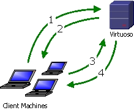
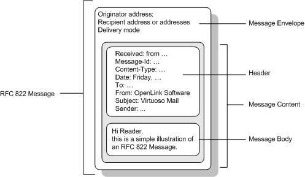

# Internet Services

# WebDAV Server

Virtuoso supports the WebDAV protocol, which is an extension of HTTP for
cooperative work on the Internet. DAV resources can be of any mime type,
including binary types. The DAV resources are stored in the Virtuoso
database as large objects, they are not in the file system and can only
be accessed through the DAV protocol. Direct SQL access to the DAV
tables is also possible, so there's a set of Virtuoso/PL procedures that
acts as DAV API to let server-side applications access DAV. Virtuoso DAV
can be extended by virtual collections. Instead of accessing DAV tables,
DAV server can retrieve data from applications, thus an application can
generate documents on demand and these documents will be available via
DAV as well as plain DAV resources. Moreover, resources can be submitted
directly to the application via DAV. Virtuoso DAV provides settable
access rights and ownership of resources. Access rights as such are not
covered by the DAV specification but Virtuoso implements both ACLs
(access control lists) and a Unix file system like scheme for ownership
and permissions. SQL accounts enabled for DAV are valid owners of DAV
resources. A resource has both a user owner and a group owner, plus an
optional access control list that can grant privileges to users and
roles alike. A user can have DAV-only access, SQL/ODBC-only access, both
of them or neither. User account information is stored in relational
tables and can be manipulated from SQL or through a Web UI.

Virtuoso DAV can store metadata about resources. These metadata are
extracted from resources automatically, and can be edited by users. In
addition, users can place public and personal 'tags' on resources to
categorize data according for personal needs without interference
between users. Virtuoso DAV has a powerful and scalable search engine
that let application locate resources that match given list of criteria.
The search can process both plain DAV resources and data published by
applications in virtual collections. Search criteria can check for
resource properties, content, metadata and tags.

Certain special processing is provided for the following types of DAV
resources:

Any textual content types are automatically indexed in a free text
index.

Any XML content types are indexed in the same free text index as other
text plus can be queried with the

xcontains

SQL predicate.

Some well-known types of documents are parsed in order to extract
metadata, such as author of MS Office document or musical genre of MP3
audio file or resolution of an image.

VSP/VSPX pages - DAV resources can be dynamic web pages written in VSP
or VSPX. Requesting such a page with GET or POST will execute the logic
on the page. This is very convenient way of building web applications.

DAV resources are stored in an ordinary relational table. The text and
XML query features used with DAV are separately usable from SQL on any
table with the appropriate indexes and are thus not intrinsically
related to DAV.

WebDAV (Web Distributed Authoring and Versioning) is a communication
protocol for the Internet implemented as an extension to HTTP 1.1. The
WebDAV specification was published by the Internet Engineering Task
Force (IETF) in February 1999.

Most operating systems have support for accessing data hosted on DAV
servers.

DAV was designed to provide more methods for handling server resources.
In addition to the usual HTTP methods such as GET, POST, HEAD, PUT,
DELETE, OPTIONS are methods for making directories (or collections), a
lock mechanism, copying of resources and collections, predefined and
userd-defined properties of resources and collections.

DAV consists of HTTP extensions, often with a message body containing
XML. DAV also provides a basic schema for resource metadata by allowing
arbitrary XML properties to be attached to resources.

Virtuoso supports the following HTTP methods:

| HTTP Method                 |
| :-------------------------- |
| HEAD                        |
| GET                         |
| POST, PUT                   |
| MKCOL                       |
| MOVE                        |
| DELETE                      |
| LOCK, UNLOCK                |
| PROPFIND, PROPPATCH         |
| MGET (experimental)         |
| MPUT/MDELETE (experimental) |

Features List - Virtuoso Web DAV HTTP Method Support

> **Tip**
> 
> [IETF RFC 2616 regarding HTTP 1.1](#)
> 
> [IETF RFC 2518 regarding WebDAV Specification](#)

## DAV User Accounts

Any non-disabled SQL account with the U\_DAV\_ENABLE column set to
non-zero is a valid DAV account. The administration user interface
provides a check box for enabling DAV access and will make a default
home collection etc. Alternately, regular SQL can be used for setting
the DAV flag on. The DAV API or protocol requests can be used for
creating collections and resources for the user.

Any non-disabled SQL account with the U\_DAV\_ENABLE column set to
non-zero is a valid DAV account. The administration user interface
provides a check box for enabling DAV access and will make a default
home collection etc. Alternately, regular SQL can be used for setting
the DAV flag on. The DAV API or protocol requests can be used for
creating collections and resources for the user.

There is an automatically created initial DAV enabled account called
"dav". This has general administration privileges over all DAV.

There are four predefined DAV accounts.

User "dav" is the most powerful DAV account.

DAV group "administrators" usually consists of "dav" only; membership in
this group does not give any special privileges but this group is
assigned by default to resources that are owned by "dav". Thus group
access rights to resources owned by "dav" can be used solely by users
that are added to "administrators".

User "nobody" is a special account that acts as owner of all resources
that have no real owner person or owner application. It is impossible to
log on as "nobody" so it's impossible to use owner permissions of the
resource.

Group account "nogroup" always consists of only one user "nobody"; User
"nobody" can not become a member of any other group. It is impossible to
add other users to "nogroup" or add "nogroup" to some role.

> **Note**
> 
> The WebDAV admin user "dav" can be deleted. However, after a server
> restart the initial setting of this account will be added again.

> **Important**
> 
> It is strongly recommended that the Virtuoso administrator change the
> default account password of the DAV administrative user after
> installation.

    USER_CREATE ('user', 'userpassword',
      vector ('SQL_ENABLE', 0, 'DAV_ENABLE', 1, 'PERMISSIONS', '110100000RR', 'DISABLED', 0));

This will create a new account named 'user' with password 'upwd',
default permissions for new resources and collections created by the
account will be '110100000RR' (equivalent of UNIX 'rw-r----'
permissions, recursive free-text indexing and metadata extraction) and
the account is enabled and ready to use.

    DAV_ADD_USER ('user', 'userpassword', '110100000RR', 0, '/DAV/home/user/',
      'Full User Name', 'user@example.com', 'dav', 'davpassword');

this will do almost the same but it will describe the user in more
details and require no DBA privileges -- only DAV password. In addition,
DAV\_ADD\_USER () can both create a new user and grant DAV permissions
to an already existing SQL user.

The following statement is used to grant role 'administrators' to the
'user' account.

``` 
      GRANT ADMINISTRATORS TO "user";
```

or

``` 
      USER_GRANT_ROLE ('user', 'administrators');
```

The following will disable the account 'user' until 'DISABLED' option is
returned to zero.

``` 
    USER_SET_OPTION ('user', 'DISABLED', 1);
```

DAV access permissions can be revoked permanently:

``` 
    DAV_DELETE_USER ('user' , 'dav', 'davpassword');
```

> **Tip**
> 
> [WS & DAV System Tables](#davsystables)

## WebDAV Authentication

Virtuoso WebDAV offers two types of authentication dependent on the
connecting clients abilities. These are:

Basic (Clear Text) Authentication

\- sends passwords over the connection in clear text. Clear text
passwords can be intercepted and read so should be avoided or used only
if you encrypt passwords through SSL.

Digest Authentication

\- passwords are always transmitted in an MD5 hash.

### Basic Authentication

Basic Authentication is a widely used, industry-standard method for
collecting user name and password information. The following steps
outline how a client is authenticated using Basic authentication:

1.  The client browser displays a dialog box for a user to enter a user
    name and password (his/her credentials).

2.  The client browser then attempts to establish a connection to the
    server using the user's credentials. The clear text password is
    Base64-encoded before it is sent over the network.

3.  If a user's credentials are rejected, the client may re-display the
    authentication dialog box to re-enter the user's credentials.
    Failing to supply correct details will terminate the connection,
    reporting an error to the user.

4.  When Virtuoso verifies that the user name and password are valid, a
    connection is established.

The advantage of Basic authentication is that most clients support it.
The disadvantage is that it transmits passwords in an unencrypted form.
Simple network monitoring can easily reveal your password. Basic
authentication is not recommended unless you are confident that the
connection between the user and Virtuoso is secure.

> **Note**
> 
> Base64 encoding is not encryption. A Base64-encoded password can be
> easily intercepted by a network sniffer and easily decoded.

### Digest Authentication

Digest authentication provides a security improvement over Basic
authentication in how a user's credentials are sent across the network.
Digest authentication transmits credentials across the network as an MD5
hash, or message digest, where the original username and password cannot
be deciphered from the hash. Digest authentication relies on the HTTP
1.1 protocol as defined in RFC 2617, which not all browsers support.

The following steps outline how a client is authenticated using Digest
authentication:



1.  The client requests a file or connection from Virtuoso.

2.  Virtuoso challenges the request, informing that client: Digest is in
    use, what the realm name is.

3.  The client prompts the user for credentials. The client creates an
    MD5 hash of the credentials and the realm name and resubmits the
    request, this time supplying the MD5 hash.

4.  If Virtuoso approves the credentials then the resource or connection
    is granted to the client, and the data is returned.

## WebDAV Symbolic Links

Virtuoso supports a special type of WebDAV resources, a redirect
reference resource, named WebDAV links. This is to extend the WebDAV
service to allow multiple access paths to existing resources.

As with conventional HTTP, the redirect reference simply responds to the
client with an HTTP/1.1 302 (Found) status code, redirecting the client
to a different resource, the target specified in the redirect resource,
using the `Location:` header. This behavior is equivalent to UNIX
symbolic links. A redirect reference makes it possible to access the
target resource indirectly through any URI mapped to the redirect
reference resource. The integrity is not guaranteed for associated
redirect reference resources.

WebDAV links do not provide a way to circumvent WebDAV security or
virtual directories. The target resource must be directly available to
the client being redirected.

WebDAV links are achieved by adding a special WebDAV property,
'`redirectref` ', whose value must contain the reference target URL.

WebDAV link targets are not limited to the WebDAV repository, and may
target any HTTP accessible resource.

The WebDAV links can be made with DAV API function
[`DAV_PROP_SET()`](#fn_dav_api_change) , or can be done via the [Content
Management](#contentmanagement) interface of the Admin UI. In the admin
UI select WebDAV/WebDAV Services/Content Management and press on the
*Create Link* button to create a link. In the form choose the target,
permissions, owner and enter the name of the link. Pressing the *Add*
button will create the new link in the current WebDAV folder.

Assuming that we are creating the link as the administrator using the
default WebDAV administrator username and password, creating a link from
`/a/b.html` to `/c/d/f.html` could be as follows:

    SQL> select DAV_RES_UPLOAD ('/DAV/a/b.html','','','110100000NN', 'dav', 'nobody', 'dav', 'dav');
    
    SQL> DAV_PROP_SET ('/DAV/a/b.html', 'redirectref', '/c/d/f.html', 'dav', 'dav');

The target, '`/c/d/f.html` ' could be any HTTP URL. In this case it will
be a resource on the same HTTP server.

> **Tip**
> 
> [DAV Add and Update functions](#fn_dav_api_add) and [DAV Manipulation
> functions](#fn_dav_api_change) .

**WebDAV links behaviour in resource manipulation requests.**

When some link is moved the target will have the same properties as
source, ie. it will be a link. When a copy operation is made the target
will have content of the reference i.e. it will be a resource, not a
link. Delete operation on link will remove only the redirect reference
resource, not the referenced target itself. Content upload requests will
change the content of the referenced target.

## Access Right Permissions of Web Resources

The WebDAV resources have two sorts of access right permissions.
'Classical' UNIX filesystem style permissions let assign different
permissions for owner user, owner group and public access. Access
Control Lists (ACLs) let assign permissions in more flexible Windows
style but they are less convenient for simple tasks. Both set of
permissions can be applied to the same resource or collection. In any
case, each resource or collection (directory/folder) can have defined
Read, Write and Execute permissions. The write permission applies to
operations which perform content or property change or locking as PUT,
PROPPATCH, MOVE, destination URI in COPY, LOCK, UNLOCK, DELETE, MPUT and
MUPDATE. The read permission applies to read operations as GET, POST,
PROPFIND, HEAD, source URI in COPY and MGET; read permission is also
required for any write operation.

> **Tip**
> 
> [RFC2518](#) for more details of methods/operations

The execute permission applies only to the active content stored in the
WebDAV domain. If a VSP or VSPX page stored in a WebDAV domain has
execute permissions then retrieval of that page will perform execution
of active content. Note also a special flag to the virtual directory
which can override the execution flags for active pages. (for the
details how this flag can be set see 'options' in VHOST\_DEFINE()
function). If such a flag is set to the virtual directory, then all
active pages under that directory (direct and indirect children) will be
treated as execution flag of the resource is set. In almost any case,
user should have both read and execute permissions to access active
content.

Resources with the following extensions are treated as executable
content: .vsp, .vspx, .xml if this has the XML template properties set.
Any other extension is also considered executable if there is a
corresponding WS.WS."\_\_http\_handler\_\<extension\>" PL procedure.

The UNIX style permissions can be set for user, group or public access.
ACL consists of records called Access Control Entries (ACEs). Every ACE
allow or deny some sorts of access to an individual user or to a group.
Resource owner or administrator can add an "explicit" ACE to the ACL of
particular resource or "recursively" add "implicit" ACEs to every
resource and subcollection of some collection. The server checks
permissions in the following order:

1.  match the user part of UNIX-style permissions to the specific
    operation, if user is the owner of the resource.

2.  match the user group part of UNIX-style permissions to the specific
    operation, if user belongs to a group which owns the resource.

3.  match the public part of UNIX-style permissions to the specific
    operation.

4.  If Access Control List is not empty, scan ACEs from the beginning of
    the list to the end. The loop stops at the first ACE that mentions
    either the user in question or one of the roles granted to it.
    Depending on the type of the ACE, the access is either granted or
    denied and the rest of list has no effect.

5.  If ACL contains no appropriate ACE then the access is denied.

According to these rules, the order of records in ACL is important. ACEs
are ordered following two rules: "deny" ACEs has higher priority than
"allow" ACEs; "local" rules has higher priority that "global":

1.  All explicit ACEs are placed in a group before any inherited ACEs.

2.  Within the group of explicit ACEs, access-denied ACEs are placed
    before access-allowed ACEs.

3.  Inherited ACEs are placed in the order in which they are inherited.
    ACEs inherited from the child object's parent come first, then ACEs
    inherited from the grandparent, and so on up the tree of objects.

4.  For each level of inherited ACEs, access-denied ACEs are placed
    before access-allowed ACEs.

New resources and collections take their initial permissions from the
user default permissions mask, U\_DEFAULT\_PERMS of SYS\_USERS. (see:
WebDAV Users Administration ). In the case of a resource created as
public or a collection mask of '110110110' (equivalent of UNIX
'rw-rw-rw'), then everybody can read and write it.

Consider a resource with the following permissions:

    '111110100'

This permission string is equivalent to UNIX 'rwxrw-r--'. The resource
can be executed, read and written to by the owner, group members can
read and write to it, and non authenticated (public) users or users not
belonging to the group group can only read it.

Every resource or collection has two additional flags in permissions,
that instruct the server whether resources should be indexed for
free-text search and whether resources should be parsed to extract
metadata:

Free-text indexing flag can take one of three values: "N", "R" and "T".
If a resource has this flag set to R or T then the resource will be
free-text indexed. If a collection has this flag set to T then resources
directly contained within the collection will be free-text indexed. If a
collection has this flag set to R then resources contained within the
collection will be free-text indexed, and the setting will be applied to
all members and collections underneath recursively. New resources and
collections acquire this setting from their parent collection.

Similarly, metadata extraction flag can take one of three values: "N",
"R" and "M". If a resource has this flag set to R or M then its metadata
are extracted. If a collection has this flag set to T then metadata are
extracted from resources directly contained within the collection. If a
collection has this flag set to R then metadata are extracted from
resources contained within the collection, and the setting will be
applied to all members and collections underneath recursively. New
resources and collections acquire this setting from its parent
collection.

## DAV and RDF Metadata

When a Virtuoso server has a URIQA default host setting, it will make
metadata extracted from DAV resources available for querying via SPARQL.
All metadata for public readable DAV resources are stored in a system
graph. The graph IRI is composed from the DAV path of the resource and
the URIQA default host name.

see DefaultHost in the URIQA section of the virtuoso.ini file, described
in the URIQA section of the documentation for details on configuration.

The automatic maintenance of the SPARQL queryable metadata can be
disabled and enable using the function
DB.DBA.DAV\_REPLICATE\_ALL\_TO\_RDF\_QUAD. An argument of 1 enables this
and a 0 disables this. The setting stays in effect until it is changed
with the same function. For new database, the feature is on by default.
Old databases are by default upgraded to have a SPARQL queryable DAV
metadata graph upon startup if the URIQA default host name is defined.

If the URIQA default host name changes, the RDF graph can be updated by
simply re-enabling the feature. This will adjust the graph and resource
IRI's.

If the URIQA default name of the host is example.com, then, the graph
will be http://example.com/DAV .

The IRI's of DAV resources will be like
http://example.com/DAV/docsrc/XMLDOM.xml , meaning that these are
directly usable from a user agent for accessing the resource.

    SQL> sparql select ?s ?o from <http://example.com/DAV> where {?s <http://www.openlinksw.com/schemas/DAV#ownerUser> ?o};
    s                                                                                 o
    VARCHAR                                                                           VARCHAR
    _______________________________________________________________________________
    
    http://example.com/DAV/docsrc/2pc.xml                                          mailto:somebody@example.domain
    http://example.com/DAV/docsrc/Virtdocs.spp                                     mailto:somebody@example.domain
    
    SQL> sparql select ?p ?o from <http://example.com/DAV> where {<http://example.com/DAV/docsrc/2pc.xml> ?p ?o};
    p                                                                                 o
    VARCHAR                                                                           VARCHAR
    _______________________________________________________________________________
    
    http://purl.org/dc/terms/created                                                  2006-05-23 15:10:32
    http://purl.org/dc/terms/modified                                                 2006-05-23 15:10:32
    http://www.openlinksw.com/schemas/DAV#ownerUser                                   mailto:somebody@example.domain
    http://purl.org/dc/terms/extent                                                   7850

The examples above show how simple SPARQL queries can be used to
retrieve information about DAV resources.

The properties supported for all public readable resources are:

http://purl.org/dc/terms/created - The creation date as SQL datetime.

http://purl.org/dc/terms/modified - Modification time as SQL datetime.

http://www.openlinksw.com/schemas/DAV\#ownerUser - The contents of
u\_e\_mail in sys\_users for the SQL account owning the resource. This
has the protocol prefix mailto:, as in mailto:somebody@example.com.

http://purl.org/dc/terms/extent The size of the resource in bytes as a
SQL integer.

http://www.openlinksw.com/schemas/DAV\#tag - There is one triple for
each public tag of the DAV resource. The value is the string of the tag
as a SQL string.

http://www.w3.org/1999/02/22-rdf-syntax-ns\#type - The RDF schema for
MIME-type of of the DAV resource. If the resource is not recognized as
one of the below, this predicate will be omitted.

| MIME- ype                         |
| :-------------------------------- |
| application/bpel+xml              |
| application/doap+rdf              |
| application/foaf+xml              |
| application/google-kinds+xml      |
| application/license               |
| application/mods+xml              |
| application/msexcel               |
| application/mspowerpoint          |
| application/msproject             |
| application/msword                |
| application/msword+xml            |
| application/opml+xml              |
| application/pdf                   |
| application/rdf+xml               |
| application/rss+xml               |
| application/wsdl+xml              |
| application/x-openlink-image      |
| application/x-openlink-photo      |
| application/x-openlinksw-vad      |
| application/x-openlinksw-vsp      |
| application/x-openlinksw-vspx+xml |
| application/xbel+xml              |
| application/xbrl+xml              |
| application/xddl+xml              |
| application/zip                   |
| text/directory                    |
| text/eml                          |
| text/html                         |
| text/wiki                         |

RDF Schema by MIME-type

Additional predicates may exist as a result of resource type specific
metadata extraction.

## Special Attributes of Web Resources

The Virtuoso WebDAV implementation provides a set of special attributes
(properties) for the resources to manipulate the retrieval of XML
documents. Properties can be set generate dynamic content based on
XML/SQL queries. Special properties can also be applied to WebDAV
folders for storing XML data in a special pre-parsed persistent XML
format.

The following special properties are supported:

  - **xml-stylesheet.**
    
    must contain a valid URL to an XSLT style sheet. Upon request of an
    XML document with this property set, the WebDAV server will
    automatically perform the transformation of the XML document and
    will send the result of transformation to the user-agent instead of
    the original XML source. This property is only settable for
    documents having MIME type text/xml.

  - **xml-sql.**
    
    must contain a valid XML/SQL query (see also: [FOR XML
    statements](#forxmlforsql) ). When this property is set the server
    will execute the query and the XML result will be sent to the
    client. Note that if xml-stylesheet is also supplied for this
    resource the result will be transformed and then sent to the client.

  - **xml-sql-root.**
    
    specifies the root element name of automatically generated XML
    resources when xml-sql is specified. Otherwise it has no effect.

  - **xml-sql-dtd.**
    
    can be specified as a string value 'on' or valid URL. When the value
    is 'on' the DTD declaration will be implied in the automatically
    generated XML resource. Otherwise when the URL is supplied this URL
    will be included in the DTD declaration of the automatically
    generated XML resource. If xml-sql is not specified this property
    has no effect.

  - **xml-sql-schema.**
    
    specifies the URI for the XML Schema. This schema URI will be
    included in the XML header, to allow client-side schema validation.
    If xml-sql is not specified this property has no effect.

  - **xper.**
    
    can be specified for a collection (folder). When this property is
    set on a WebDAV collection, the direct resource members will be
    stored and updated as persistent XML. Note that existing resources
    will not be changed until they are updated. The reversal of this
    property for collections will not change the resources at the same
    time, they will be reverted to the text/xml storage on first update
    operation. Resources already stored as XML persistent documents also
    have the xper property set, but manipulation of this property must
    not be used to revert the storage.

# URIQA Semantic Web Enabler

Virtuoso supports the URIQA (URI Query Agent) extension of HTTP WebDAV
protocol. URIQA adds three new methods to HTTP in order to retrieve, add
and remove RDF metadata about a given subject. The subject is identified
by its URI. If the subject is a DAV resource then URIQA will usually
reuse the DAV URI of the resource. If the subject is not a resource but
something else (physical entity, imaginary thing or vocabulary item)
then URIQA can be used to process metadata about the subject even if the
subject itself can not be accessed via HTTP.

URIQA-specific HTTP methods are called MGET (to retrieve existing
metadata), MPUT (to add or update RDF triples) and MDELETE (to remove
some or all triples). A single URIQA request usually deals with a single
subject that is specified by request URI. The MGET response, however,
can return metadata about more than one RDF subject, e.g., the request
about a book can return both data about the book itself plus some data
about persons who are known as authors of the book.

In addition to URIQA-specific HTTP methods, Virtuoso implements a
semantic web service interface that allows plain HTTP clients to access
metadata using traditional GET or POST HTTP methods.

The Virtuoso URIQA implementation allows flexible configuration using an
ordered list of request handlers. Every handler has a pattern for URIs;
if the URI in the request does not match the pattern then the handler is
ignored, otherwise a callback function of the handler is called to
process the request. The default configuration of Virtuoso server will
try three sorts of actions.

If the URI points to a resource located at the server then the first
handler returns DAV metadata of the resource.

If the URI points to a resource that is outside the server, and URI is
of sort 'http://...' then Virtuoso will send a URIQA web service request
to the remote server specified in URI in hope that it will return at
least something, the response is passed to the client unchange.

Any other URI results in an error.

> **Note**
> 
> URIQA is not yet a stable standard. Virtuoso implements draft of URIQA
> proposal from Nokia, dated 2004. As URIQA will evolve, future versions
> of Virtuoso will implement updated versions of the specification.
> There is no warranty that future implementations will be compatible
> with the current one.

> **Tip**
> 
> [The Nokia URI Query Agent Model](#)

## URIQA HTTP Methods

All three methods have a set of HTTP header parameters to specify the
precise URI of the subject. HTTP does not require that every resource is
accessible via a single valid URI, so many equivalent URLs can point to
same resource and the result of typical HTTP request does not change if
one of equivalent URLs is replaces with some other. Unlike HTTP GET,
HTTP PUT etc., metadata methods may return different results for
different URLs even if these URLs are equivalent for other methods.
URIQA rules are very simple.

If the URIQA request header contains 'URIQA-uri' parameter line then the
value of this parameter is used and any other URI data are ignored.

If the URIQA request header contains 'Host' parameter line then the URL
from the first line of the request is patched to contain host name
specified by 'Host' parameter, no matter whether the original URL
contains host or what host name or network interface or port is user by
client to connect to the server.

If the URIQA request header does not contain 'URIQA-uri' or 'Host' line
then the URL from the first line of the request is used 'as is',
extended by host name from 'DefaultHost' URIQA configuration parameter
if needed.

The following requests are all equivalent:

Request 1. 'URIQA-uri' is used, the rest does not matter.

    MGET /foo HTTP/1.1
    Host: example.com
    URIQA-uri: http://example.com/foo

Request 2. 'URIQA-uri' is missing, 'Host' is used, the host name
www.example.com is ignored.

    MGET http://www.example.com/foo HTTP/1.1
    Host: example.com

Request 3. The URI from the first line is used verbatim. This is unsafe,
because proxy servers can alter the URI, e.g. by adding port number.

    MGET http://example.com/foo HTTP/1.1

Request 4. The URI from the first line is used, but host name is
retrieved from 'DefaultHost' URIQA configuration parameter. If the
parameter is set to example.com then the request is equivalent to
previous.

    MGET /foo HTTP/1.1

### MGET Method

MGET request contains a subject URI and the response consists of RDF/XML
representation of an RDF graph with metadata about the subject. In many
cases, the returned graph is a Concise Bounded Description of the
resource or something similar, but it can be of any sort.

There are no integrity rules. E.g., if a response for request about
subject A contains some data about B then the request about B may return
same or different data, or even report that B does not exists. If URI
refers to non-existing resource or even to a non-existing server or
protocol then the response can be an 'not found' error or an empty graph
or even a non-empty graph, depending on the handler that processed the
request.

Usually MGET request consists of only subject URI specification, but it
can contain any other parameters such as an authentication or even the
HTTP request body with extra data for some particular handler. For
Virtuoso DAV resources, MGET will need read permission on the subject
resource, because the resulting RDF is retrieved from
'http://local.virt/DAV-RDF' property of the resource.

### MPUT Method

MPUT request contains an HTTP header that describe a subject URI and
contains Content-Length, and the body must be an RDF/XML that consist of
triples that should be added. The server will try to add new RDF triples
from the body to the description of the subject. In some cases, the
server will replace obsolete triples with triples from the body, e.g.,
if some RDF Schema is in use that states for a predicate that it can not
have more than one value for any given subject.

There are no integrity rules. If MPUT request with subject A submits
data about resource B then the updated data may become visible via MGET
request with subject A and stay unchanged if retrieved directly by MGET
with subject B. For instance, the default request handler for DAV will
update only 'http://local.virt/DAV-RDF' DAV property of the subject
resource not touching any DAV properties of resources named in the
request.

A client application can not use MPUT with subject URI that refers to a
non-DAV Virtuoso resource, because disk-resident resources do not have
DAV properties, including DAV metadata properties. MPUT can refer to
nonexisting Virtuoso DAV resource only if the name of this resource has
been already locked for uploading of the resource. The most reliable
way, however, is to upload the resource first and update metadata only
after the uploading. There are two reasons to do operations in this
sequence. First of all, Virtuoso can automatically extract some metadata
from the content of uploaded resource and if MPUT happens after the
upload then MPUT data can properly overwrite automatically extracted
values. An additional reason is that resource uploading will set the
MIME-type of the resource and may associate some RDF Schemas with the
resource; hence MPUT can properly update some triples instead of storing
multiple values for some predicate that should have only one value
according to RDF Schema.

For Virtuoso DAV resources, MPUT will need both read and write
permissions on the subject resource, because 'http://local.virt/DAV-RDF'
property of the resource is first retrieved and then updated.

### MDELETE Method

MDELETE request contains an HTTP header that describe a subject URI and
may contain the body. If present then the body must be an RDF/XML that
consist of triples that should be deleted. If the body is totally
missing then MDELETE removes all metadata associated with the subject
URI.

There are no integrity rules. If MDELETE request with subject A removes
triples about resource B then these triples may stay visible if
retrieved directly by MGET with subject B. For instance, the default
request handler for DAV will update only 'http://local.virt/DAV-RDF' DAV
property of the subject resource not touching any DAV properties of
resources named in the request.

For Virtuoso DAV resources, MPUT will need both read and write
permissions on the subject resource, because 'http://local.virt/DAV-RDF'
property of the resource is first retrieved and then updated.

## URIQA Web Service

Virtuoso provides the '/uriqa/' web service for clients that do not
support URIQA-specific methods. Instead of passing URI and method name
in HTTP parameter lines, web service calls pass them as part of web
service URI. The beginning of the path can be any, starting from
'/uriqa/' or '/URIQA/'. The following two requests are to retrieve
metadata about 'http://example.com/foo'.

    GET /uriqa?uri=http%3a%2f%2fexample%2ecom%2ffoo HTTP/1.1

    GET /uriqa?uri=http%3a%2f%2fexample%2ecom%2ffoo&method=MGET HTTP/1.1

The following request header is for MPUT

    GET /uriqa?uri=http%3a%2f%2fexample%2ecom%2ffoo&method=MPUT HTTP/1.1

The URIQA web service does not need complicated rules for URI passing
because the request can not be significantly changed by any proxy. The
value of the 'uri' parameter should be an absolute URI.

## URIQA Section in Virtuoso Configuration File

By default,the Virtuoso server acts only as URIQA proxy, i.e. it
redirects incoming requests to other servers without trying to return
metadata about DAV resources or other data stored on the server itself.
To let URIQA retrieve local metadata, the Virtuoso server should know
names that can be used by clients to access it. Virtuoso configuration
file, e.g., virtuoso.ini, can contain these names as parameters in
"\[URIQA\]" section

"DefaultHost" is the "canonical" server name that is used to identify
the service. It should be either server name including domain name, or
an IP address in standard notation, if the server does not have any
name. If Virtuoso default HTTP port is not equal to 80 then the port
should be mentioned, e.g. "www.example.com:8088".

"LocalHostNames" lists all names that can be used to access the server,
such as server names with and without domain name, IP addresses in
Internet and intranets etc. The list is comma-delimited string of names.
If an URIQA client can reside on server's box, e.g. for debugging
purposes, then it may be worth to add names "localhost,
localhost.localdomain, 127.0.0.1" to this list.

"LocalHostMasks" is similar to "LocalHostNames" but it lists patterns
for names in SQL "like" operator style. If Virtuoso listens at multiple
ports and it is the only URIQA enabled service on the machine then it
can be convenient to specify "LocalHostMasks = www.example.com:%"
instead of "LocalHostNames = www.example.com:8088, www.example.com:8089,
www.example.com:8090 ...".

"Fingerprint" is a string that identifies a group of servers that shares
same metadata, such as servers that replicate each other. It is an error
if two servers have the same fingerprint string and one of them tries to
redirect a URIQA request to another instead of prepare an response
locally. Such behavior indicates configuration error, and the use of
fingerprints help administrator to get a meaningful diagnostics, because
suspicious URIQA requests become signed by all intermediate Virtuoso
proxies. If this parameter is not specified then a random unique string
is created and stored in the database, so you don't have to specify this
parameter for typical installations.

"DynamicLocal" is a flag (1 or 0), when it is on and the host part of
the IRI matches the Host header of the HTTP request in context or the
DefaultHost if outside of HTTP context, then this is replaced with
local: before looking up the IRI ID. Even if DynamicLocal is not on and
the

local:

prefix occurs in the IRI string being translated to IRI\_ID, the
translating the IRI\_ID back to the IRI name will depend on the context
as described as follows: When returning IRI's from id's, this prefix is
replaced by the Host header of the HTTP request and if not running with
HTTP, with the DefaultHost from this section. The effects of
DynamicLocal = 1 can be very confusing since many names can refer to the
exact same thing. For example, if the DefaultHost is http://dbpedia.org,

iri\_to\_id ('http://dbpedia.org/resource/Paris') = iri\_to\_id
('local:///resource/Paris)

is true and so is

'http://dbpedia.org/resource/Paris' = id\_to\_iri (iri\_to\_id
('local:///resource/Paris'))

These hold in a SQL client context, i.e. also when connected through RDF
frameworks like Jena or Sesame. When running a SPARQL protocol request,
the Host: header influences the behavior, likewise when using web
interactive SQL in Conductor.

These configuration parameters are "sticky". If they're found in
configuration file then they are preserved in the database registry. If
configuration file has changed then new values will be used after server
restart. If database dump is replayed on a server whose configuration
file does not contain these parameters then values from dump will stay
in the registry. If database dump is replayed on a server whose
configuration file contains other values then values from dump will stay
in the registry till server restart.

## URI Matching Rules

A simple installation does not require any special configuration of
URIQA except specifying server names in the \[URIQA\] section of
configuration file (virtuoso.ini). However complex applications may need
from URIQA more than simple retrieval of metadata of DAV resources. Like
HTTP virtual hosts, URIQA may require different processing for different
URIs, so Virtuoso offers appropriate tools.

When the URIQA server gets an URI to process, it reads the system table
WS.WS.URIQA\_HANDLER to find out the procedure that can access metadata
about some range of URIs. This table is defined as follows:

    create table WS.WS.URIQA_HANDLER
    (
      UH_ID integer not null primary key,
      UH_ORDER integer not null,
      UH_NAME varchar not null unique,
      UH_MATCH_COND varchar not null,
      UH_MATCH_ENV any,
      UH_HANDLER varchar not null,
      UH_HANDLER_ENV any
    )
    create index URIQA_HANDLER_ORDER_NAME on WS.WS.URIQA_HANDLER (UH_ORDER, UH_NAME)
    ;

The server scans the table in order of ascending values in UH\_ORDER
column, and checks whether the request URI matches the condition
specified by UH\_MATCH\_COND and UH\_MATCH\_ENV. As soon as an
appropriate row is found, a function with name specified by UH\_HANDLER
is called with parameters that describe the request plus any extra
application-specific data as stored in UH\_HANDLER\_ENV. The function
should either compose a response and set a flag to 1 or do nothing and
set a flag to 0. If 1 is set then the processing of the request is
complete, otherwise the server resumes table scan.

At server startup, up to three records are automatically added into
WS.WS.URIQA\_HANDLER.

First record has UH\_ORDER equal to 100. It tells the server that if an
URI has server name equal to one of names listed in "LocalHostNames"
configuration parameter then metadata should be retrieved from local DAV
of the server.

Second record is very similar, it also has UH\_ORDER equal to 100, but
uses SQL 'like' operator instead of '='. It tells the server that if an
URI has server name like one of masks listed in "LocalHostMasks"
configuration parameter then metadata should be retrieved from local DAV
of the server.

The third record has UH\_ORDER equal to 999, and tells the server to act
as URIQA proxy if the requested URI starts with "http" protocol name.

Applications can add more lines to the table to handle different sorts
of URIs via different application specific functions. The name of
function should begin with "WS.WS.URIQA\_HANDLER\_", the rest is as
specified by UH\_HANDLER of the row. The signature of function should be

    function WS.WS.URIQA_HANDLER_myexample (
      inout op varchar,   -- operation name, 'MGET', 'MPUT' or 'MDELETE';
      inout uri varchar,  -- request URI;
      inout split any,    -- request URI split by WS.WS.PARSE_URI into parts;
      inout body any,     -- the body of the request;
      inout params any,   -- get_keyword style vector of parameters of the request;
      inout lines any,    -- vector of lines of HTTP request header;
      inout app_env any,  -- any application-specific data from UH_HANDLER_ENV;
      inout is_final integer -- status flag. Function sets the flag to 1 to report that the request response is prepared.
      ) re0turns any          -- returns a status vector, see below.

Status vector describes either the reason why the request has failed, or
the success status. It consists of four elements:

SQL\_STATE as five-char string, "00000" if success;

DAV error code as an integer, if the operation has failed due to DAV
error, 0 if success or an error other than DAV;

HTTP status as three-digit string, such as "200" for "OK" or "404" for
"not found";

Brief description of an error, such as HTTP response status ("OK", "not
found" etc.) or SQL\_MESSAGE, "OK" if success;

In case of DAV error, elements 3 and 4 can be set to NULL to generate
proper values automatically.

Examples are:

    vector ('00000', 0, '200', 'OK');
    vector ('URIQA', 0, '500', 'The remote URIQA server returned an invalid header');
    vector ('URIQA', -1, '404', 'Invalid URI; Ill formed or missing path to the resource');
    vector ('URIQA', -12, null, null);

The current version of Virtuoso supports the following names of matching
operations for use in UH\_MATCH\_COND:

"schema =" -- URI schema name should be equal to UH\_MATCH\_ENV;

"server =" -- URI server name (including port, if specified) should be
equal to UH\_MATCH\_ENV;

"server like" -- URI server name (including port, if specified) should
be "like" to UH\_MATCH\_ENV;

"server in" -- URI server name (including port, if specified) should be
member of UH\_MATCH\_ENV vector of strings;

"server like in" -- URI server name (including port, if specified)
should be "like" to one of members of UH\_MATCH\_ENV vector of strings;

"default" -- Any URI will match so any request is passed to the handler
if not handled before.

# Mail Delivery & Storage

## The SMTP Client

### smtp\_send\_dedup

For detailed description and example use of the function, see
[smtp\_send](#fn_smtp_send) in the [Functions Reference
Guide](#ch-functions).

## POP3 Server

The Virtuoso POP3 Server implementation supports the following commands
as defined in RFC - 1939:

DELE

LIST

NOOP

PASS

QUIT

RETR

RSET

STAT

TOP

UIDL

USER

The POP3 Server listening port is configured in the HTTP section of the
virtuoso.ini.

POP3Port = xxx, in HTTP section.

If the port is not defined in the configuration file then the POP3
server subsystem will be disabled.

Users and passwords of the POP3 Server are described in the system view
WS.WS.SYS\_DAV\_USER over SYS\_USERS. These users can be administered
from the users section of the Virtuoso Administration User Interface.

The system table DB.DBA.MAIL\_MESSAGE is used to stored the messages.

## Storing Email in Virtuoso

A generic mail delivery driver enables SMTP servers to deliver email to
be stored in either Virtuoso or non Virtuoso SQL database.

Mail storage can occur in a number of ways:

1.  Replacing the default generic SMTP mail handler ( the program
    "procmail")

2.  Replacing the mail storage settings for individual users Replacing
    Default SMTP Mail Handler Sendmail

### Replacing procmail As Default Mail Handler In Sendmail Configurations

When this configuration is in use, the mails for all of your "sendmail"
mail recipients are written to a SQL Database table.

1.  Copy the file "odbc\_mail.default.ini" to "/etc/odbc\_mail.ini"
    
    > **Important**
    > 
    > Make sure that /etc/odbc\_mail.ini is NOT GROUP/WORLD writable.
    > virt\_mail will fail to run if it is.

2.  Copy or symbolically link the file "virt\_mail" to
    "/usr/bin/virt\_mail"

3.  Edit /etc/odbc\_mail.ini and change the login settings to match your
    current database installation.
    
    Note: If you don't have or want to use procmail, comment out the
    "Fallback" setting in the "\[Deliver\]" section.

4.  Edit the file "/etc/sendmail.cf" as described below:
    
    Change
    
        Mlocal, P=/usr/bin/procmail, F=lsDFMAw5:/|@qSPfhn9, S=10/30,
          R=20/40,T=DNS/RFC822/X-Unix, A=procmail -Y -a $h -d $u
    
    To:
    
        Mlocal, P=/usr/bin/virt_mail, F=lsDFMA5:/|@qSPhn9, S=10/30,
          R=20/40, T=DNS/RFC822/X-Unix, A=virt_mail -c /etc/odbc_mail.ini -l $u -s $g
    
    NOTE: The changes to the F= setting involves removing both the 'w'
    and 'f' flags.
    
    The removal of the 'w' flag affects lookups in /etc/passwd, which
    are no longer required if all mail delivery goes into a SQL
    Database. The default ini file is set up to maildrop via procmail,
    which will perform the check correctly.

### Replacing The Mail Storage Settings For Individual Users

#### Using Sendmail

1.  Copy odbc\_mail.default.ini to \~the\_user\_name/odbc\_mail.ini
    
    > **Important**
    > 
    > Make sure that /etc/odbc\_mail.ini is NOT GROUP/WORLD writable.
    > virt\_mail will fail to run if it is.

2.  At the end of the file \~the\_user\_name/.procmailrc put something
    like:
    
        :0:
        | /usr/bin/virt_mail -c .odbc_mail.ini -l the_user_name
    
    replacing the\_user\_name with the user you are setting up.
    
    Note: the '-l ..' parameter is used to relate the local recipient to
    the database user for which the maildrop is done. See the remarks in
    the odbc\_mail.default.ini file.

3.  Adjust the parameters in .odbc\_mail.ini to match your configuration
    
    > **Important**
    > 
    > disable Fallback delivery in the .odbc\_mail.ini file.
    
    Comment out the "Fallback =" entry in the .odbc\_mail.ini or set it
    to something that does not involve procmail. This may lead to drop
    loops, otherwise.

#### Using Qmail

1.  Copy odbc\_mail.default.ini to \~the\_user\_name/.odbc\_mail.ini
    
    > **Important**
    > 
    > Make sure that the .odbc\_mail.ini file is NOT GROUP/WORLD
    > writable. virt\_mail will fail to run if it is.

2.  If you are setting up a .qmail, you can simply do the following:
    
        | /usr/bin/virt_mail -m qmail -c .odbc_mail.ini
    
    If you are setting up .qmail-default or
    .qmail-\<some\_alias\_name\>, make sure you adjust the RemovePrefix
    accordingly in the odbc\_mail.ini.
    
    This also works if a single user is receiving mail for an entire
    (virtual) domain.
    
    If you want to configure qmail so that user 'db' gets all mail for
    example.com, do the following:
    
    1.  create a new user db in /etc/passwd etc.
    
    2.  remove example.com from /var/qmail/control/locals
    
    3.  add to /var/qmail/controls/virtualdomains:
        
            example.com:db
    
    4.  adjust /var/qmail/users/assign accordingly:
        
            =db:db:<uid>:<gid>:<home>:::
        
            +db-:db:<uid>:<gid>:<home>:-::
        
        or run qmail-pw2u \< /etc/passwd \> /var/qmail/users/assign then
        run qmail-newu and restart qmail
    
    5.  in \~db/.qmail-default, put:
        
            | /usr/bin/virt_mail -m qmail -c .odbc_mail.ini
    
    6.  in .odbc\_mail.ini, set:
        
            RemovePrefix=db-
        
        Now, mail to info@example.com will be delivered to the qmail
        alias db-info@example.com and is stored into the database for
        user 'info'.

3.  Adjust the parameters in .odbc\_mail.ini to match your configuration

#### Using Courier

1.  Copy odbc\_mail.default.ini to \~the\_user\_name/.odbc\_mail.ini
    
    > **Important**
    > 
    > Make sure that the .odbc\_mail.ini file is NOT GROUP/WORLD
    > writable. virt\_mail will fail to run if it is.

2.  If you are setting up a .courier, you can simply do the following:
    
        | /usr/bin/virt_mail -mcourier -c .odbc_mail.ini
    
    If you are setting up .courier-default or
    .courier-\<some\_alias\_name\>, make sure you adjust the
    RemovePrefix accordingly in the .odbc\_mail.ini.
    
    Note: although courier is very similar to qmail in this respect, it
    is different from qmail in how it handles exit codes. If you use
    -mqmail while running under courier, you'll get the wrong exit
    codes, so mail is bounced instead of retried.
    
    Note also that if delivering to multiple recipients in a .courier
    file, make sure the virt\_mail is specified first. This is because
    if the virt\_mail fails with a temporary error, the other recipients
    will get another drop when courier re-attempts to deliver the mail.
    
    Right:
    
    \\w
    
        | /usr/bin/virt_mail -mcourier -c .odbc_mail.ini
        ./Maildir
    
    Wrong:
    
        ./Maildir
        | /usr/bin/virt_mail -mcourier -c .odbc_mail.ini

3.  Adjust the parameters in .odbc\_mail.ini to match your configuration

#### Using EXIM

Here are code snippets for Exim that perform maildrops into the odbc
database.

    ## IN TRANSPORT SECTION
    
    # Delivers into the database
    odbc:
      driver = pipe
      command = /usr/bin/virt_mail \
        -c /etc/odbc_mail.ini \
        -s "${if def:return_path{$return_path}{MAILER-DAEMON}}" \
        -l "$local_part"
      user = USERNAME
      return_path_add
      delivery_date_add
      prefix =
      suffix =
      temp_errors = 73 : 74 : 75
      return_fail_output
    
    # NOTE: Make sure the USERNAME in the 'user = USERNAME' setting matches
    # the owner of /etc/odbc_mail.ini, because this file must have mode 0600.
    # Consider creating a new user account for this delivery only.
    # You should specify 'user = root' here only if Fallback delivery is
    # configured in /etc/odbc_mail.ini (for procmail fallback delivery
    # for instance)
    
    ## IN DIRECTORS SECTION
    
    # Attempts delivery of all mail into the database
    to_db:
      driver = smartuser
      transport = odbc
      require_files = /etc/odbc_mail.ini
      #
      # uncomment line below to deliver all mail to db-XXX into the database, for any
      # value of XXX. For this to work, set "RemovePrefix = db-" in
      # the [Translate] section in /etc/odbc_mail.ini
      #prefix = db-

### Mail System Tables

The electronic mail accounts are regular SQL accounts.

Id (MM\_ID) of the message is unique per account/folder (folder can be
'Inbox' etc.)

> **Tip**
> 
> [Mail system tables](#smtptabledesc)

### Pop3 Client

The Virtuoso POP3 Client implementation can retrieve messages from any
POP3 server.

#### pop3\_get\_dedup

For detailed description and example use of the function, see
[pop3\_get](#fn_pop3_get) in the [Functions Reference
Guide](#ch-functions).

### Commands

UIDL - get only UIDL's of messages.

DELETE - delete messages after downloading.

1\. To get 10 KB. messages from the server 'openlinksw.com' POP3 port
110, user name 'user\_1', password 'pass\_1'

``` 
    Pop3_get ('openlinksw.com:110', 'user_1', 'pass_1', 10000);
```

2\. To get and delete 5 KB. messages from the server 'openlinksw.com'
POP3 port 110, user name 'user\_1', password 'pass\_1'

``` 
    Pop3_get ('openlinksw.com:110', 'user_1', 'pass_1', 5000, 'DELETE');
```

3\. To get UIDL's of 100 kb. messages from the server 'openlinksw.com'
POP3 port 110, user name 'user\_1', password 'pass\_1'

``` 
    Pop3_get ('openlinksw.com:110', 'user_1', 'pass_1', 100000, 'UIDL');
```

## The Virtuoso Mail Sink

The Virtuoso Sink is used to store messages received by Windows 2000 IIS
SMTP Service into the MAIL\_MESSAGES table in Virtuoso. It consists of
an executable, run as a service, and a VBscript for registering a COM
object with the IIS, interfacing it with the Virtuoso Sink

The User ID(s) in MAIL\_MESSAGES to whom the message belongs to is
determined by parsing the `To:` field in the mail message into a list of
recipients. For each entry in the list, if an @-sign is found, the user
ID will consist of the characters to the left of it, otherwise the whole
entry is used.

### Registry Entries for the Virtuoso Sink.

    <<<<<<<< VirtuosoSink.reg
    REGEDIT4
    
    [HKEY_LOCAL_MACHINE\SOFTWARE\OpenLink Software\VirtuosoSink]
    "User"="dba"
    "Password"="dba"
    "DSN"="Virtuoso"
    "ConnectionCount"=dword:00000001
    >>>>>>>> VirtuosoSink.reg

These are the registry entries used by the Sink service. ConnectionCount
is the number of connections to Virtuoso to be pooled.

### Installation

Use these commands to install the Virtuoso Sink:

VirtuosoSink /RegServer

Registers the COM Object VirtuosoSink.SMTP into the registry

VirtuosoSink /Service

Creates the Service in Manual start mode

cscript smtpreg.vbs /add 1 OnArrival Virtuoso\_SMTP\_Sink
VirtuosoSink.SMTP "mail from=\*"

\- Registers the COM Object as a mail sink with the IIS SMTP service.

> **Tip**
> 
> [The MSDN page](#) for more information about registering sinks.

### Sink Operation

When the service starts it opens a pool of connections to Virtuoso and
waits for a COM event. When the COM callback gets called, the service
invokes a stored procedure and passes the message text to it. The
procedure then stores the message into the database. In event of lost
connection to the database, the service would try once to re-establish
it and re-execute the stored procedure call. Errors and successful
message routings are entered into the Windows 2000 Application Log.

# NNTP Newsgroups

## NNTP Client

### nntp\_get\_dedup

For detailed description and example use of the function, see
[nntp\_get](#fn_nntp_get) in the [Functions Reference
Guide](#ch-functions).

## Commands and Examples

If the requested messages don't exist, `nttp_get()` returns NULL.

Get a list of all groups from the server 'news.openlinksw.com', port
119:

    nntp_get ('news.openlinksw.com:119', 'list');

This call returns an array of the form Array ((\<group 1\> varchar,
\<last message\> integer, \<first message\> integer, \<posting allowed\>
varchar ) (\<group 2\> . . . . ) . . . )

ARTICLE, HEAD, BODY, STAT To get the bodies of all messages in the group
'openlink.public.virtuoso':

    nntp_get ('news.openlinksw.com:119', 'body', 'openlink.public.virtuoso');

This call returns an array of the form Array ((\<message number\>
integer, \<body of message\> blob) . . . )

To get the article (head + body) of messages numbered from 5 to 10 in
the group 'openlink.public.virtuoso':

    nntp_get ('news.openlinksw.com:119', 'article', 'openlink.public.virtuoso', 5, 10);

This call returns an array of the form Array ((\<message number\>
integer, \<body of message\> blob) . . . )

To get the headers of messages numbered from 7 to the end of the
'openlink.public.virtuoso' group:

    nntp_get ('news.openlinksw.com:119', 'head', 'openlink.public.virtuoso', 7);

To get the status of all messages in the group
'openlink.public.virtuoso':

    nntp_get ('news.openlinksw.com:119', 'stat', 'openlink.public.virtuoso',);

This call returns an array of the form Array ((\<message number\>
integer, \<message ID\> varchar) . . . )

To get the status of the 'openlink.public.virtuoso' group:

    nntp_get ('news.openlinksw.com:119', 'group', 'openlink.public.virtuoso');

This call returns an array of the form Array (\<number of messages\>
integer, \<first message\> integer, \<last message\> integer)

# NNTP Server

## Enabling the NNTP Server

The Virtuoso News Server listening port is configured in the HTTP
section of the virtuoso.ini file.

    [HTTPServer]
    NewsServerPort   = 119

If the port is not defined Virtuoso will disable the News Server
subsystem.

## NNTP Server Commands

The server supports the following commands:

article \[MessageID|Number\]

body \[Number\]

group newsgroup

head \[Number\]

help

last

list

mode reader

newgroups yymmdd hhmmss

next

post

xover \[range\]

stat \[MessageID|Number\]

> **Tip**
> 
> [News System Tables](#newssrvtables)

## Add Groups to NNTP Server

To add a new newsgroup you must insert a row into the table
DB.DBA.NEWS\_GROUPS. Below is an example of an insert statement that you
could use to do this:

    insert into DB.DBA.NEWS_GROUPS (NG_NAME, NG_DESC, NG_UP_INT, NG_CLEAR_INT,
        NG_POST, NG_UP_TIME, NG_OUT_GROUP, NG_NUM, NG_FIRST, NG_LAST,
        NG_SERVER, NG_SERV_PORT, NG_CREAT, NG_UP_MESS, NG_PASS)
    values ('openlink.public.virtuoso', 'virtuoso news group' ,
        update interval, clear interval, 1, now(), 'openlink.public.virtuoso',
        0, 0, 0, 'news.openlinksw.com', 110, now(), 0, 0);

If the group you want to add is local, change

    news.openlinksw.com

to

    localhost

, change the port to 0, and the

    external name

to

``` 
''
```

(that is, two single quotes).

See also the [Newsgroups Administration](#newsgrpsadm) section of the
Visual Server Administration Interface.

# MIME & Internet Messages

## About Simple Internet (RFC 822) Messages

RFC 822 messages have two major parts:

  - **Message envelope.**
    
    The message envelope contains all the information needed to
    accomplish transmission and delivery of the message. This
    information includes the e-mail address of the message's creator —
    also known as the originator. This string matches the information in
    the Sender: header, if this header is present. The envelope is
    created by a user agent (such as MS Outlook) and is meaningful only
    to the message transfer agents (MTAs) that move the message on the
    path to its destination.

  - **Message contents.**
    
    The contents make up the object to be delivered to the recipient.
    Message contents consist of lines of ASCII text. This text is
    arranged in the classic "memo" format, in which the message contains
    one or more introductory headers and a body.

This structure can be seen in the following illustration:



As you can see in the following sample of a message's contents, the
format described in RFC 822 produces messages readable with little
difficulty by humans.

The first few lines, from the first instance of "Received" to
"Precedence", are headers. These lines define the recipients, the
sender, the date, and other information involved with message
transmission.

Following the headers is a blank line. This is marked by the consecutive
occurrence of the four characters: CR, LF, CR, LF. After this blank line
starts the body of the message. In the following example, only the final
few lines make up the message body.

    Received: from techsupp@openlinksw.co.uk
    Message-Id: <v1214040cad6a13935723@>
    Mime-Version: 1.0
    Content-Type: text/plain; charset="us-ascii"
    Date: Mon, 4 Jun 1998 09:43:14 -0800
    To: customer.services@openlinksw.co.uk
    From: OpenLink Technical Support <techsupp@openlinksw.co.uk>
    Subject: Happy Reading
    Precedence: bulk
    
    Hope you are enjoying this chapter,
    Technical Support

> **Tip**
> 
> [RFC 822 at www.rfc-editor.org](#)

## MIME Messages - Extension to Simple Internet Messages

MIME (Multipurpose Internet Mail Extensions) grew out of a need to
encapsulate messages within messages. It includes multipart messages
comprising a variety of file types such as images, audio, and video.
MIME does all this while following all the standard SMTP and RFC 822
mail rules. MIME messages can be constructed to transport mail over any
mail transport system that is compliant with SMTP. MIME is able to
transmit objects with varying ranges of complexity in a way that allows
any MIME-compliant user agent (UA) to faithfully process them and hand
them off to an appropriate application. The multiple parts are arranged
so that the parts requiring the least sophisticated UA are at the
beginning of the message. In fact, most MIME UAs include courtesy text
when constructing messages to give users of non-MIME UAs an indication
of the message content. This courtesy text is inserted ahead of any MIME
parts.

MIME is consistent with Internet mail protocols using headers and
bodies. It allows for transmission of 7-bit printable US-ASCII
characters and maximum 1000-character lines in message bodies over all
Internet mail transports. It has become the most widely used extension
to the simple e-mail standard. It is also used as a transport mechanism
in Web pages.

Each content body part is made up of header fields and content. The
headers convey specific information about the content for the message
recipient. The content can be essentially any serialized stream of
bytes, such as binary data or HTML. When necessary, the content is
encoded so that the entire body complies with RFC 822. If the content is
encoded, MIME defines the header Content-Transfer-Encoding to specify
the mechanism. Other details are sometimes included, such as the
Content-Disposition, which indicates to the recipient whether the
content is to be treated simply as an attachment, or whether it is to be
rendered inline with other content in other body parts.

Mime message including a picture stored as a file GIF format. Because
.gif files use 8-bit bytes, and the RFC 822 format requires messages to
contain only US-ASCII text, the picture data must be encoded. For the
recipient to correctly decode and display the picture, it needs
information about which encoding mechanism was used. The following
example shows part of a MIME header that identifies that the content is
a .gif file, that it is encoded using the standard base64 algorithm, and
that it is to be treated by the e-mail client as an attachment.

    Content-Type: image/gif;
         name="picture.gif"
    Content-Transfer-Encoding: base64
    Content-Disposition: attachment;
         filename="picture.gif"
    
    [encoded content here]
    ...

MIME accomplishes this simplifying and rebuilding of complex files by
encoding a file and transporting it as a message body, or a series of
messages with component parts of the file. A MIME-compliant user agent
(UA) on the receiving end can decode the message, presenting it to the
reader or providing it to another application as a file. A UA that is
not MIME-compliant will be able to process a MIME-encoded mail message,
but may not be able to decode the message.

MIME defines a message format that allows for:

Textual message bodies in character sets other than US-ASCII.

Non-textual message bodies.

Multipart message bodies.

Textual header information in character sets other than US-ASCII.

MIME uses headers and separators to tell a UA what processing is
required to re-create the message. An example with no encoded body parts
is:

    From: OpenLink Support <techsupp@openlinksw.co.uk>
    MIME-Version: 1.0
    Content-Type: multipart/mixed;
            boundary="XXXXboundary text"
    
    This is a multipart message in MIME format.
    
    --XXXXboundary text
    Content-Type: text/plain
    
    here is the body text
    
    --XXXXboundary text
    Content-Type: text/plain;
    Content-Disposition: attachment;
            filename="test.txt"
    
    this is the attachment text
    
    --XXXXboundary text--

This example shows the use of a MIME message to send a text message and
an attached text file. Both are body parts of this message.

The "MIME-Version:" header tells the receiving UA to treat this as a
MIME message.

The "Content-Type:" header specifies "multipart/mixed". This tells the
receiving UA that this message has parts separated by the string
argument defined in "boundary=". A MIME-compliant UA will only display
or otherwise process content following the specified "boundary=" text
strings. The actual boundaries are constructed using the "boundary="
string, prepended by "--". The final body part is followed by the
"boundary=" string with the "--" both prepended and appended.

In the preceding example, the courtesy message "This is a multipart
message in MIME format." will not be displayed or otherwise processed by
the MIME UA since it does not follow a "boundary=" string. A UA that
does not support MIME will display it, and at least this part of the
message will be readable no matter what features the reader supports. If
our example had encoded parts, they would make no sense to the human
reader using a non-MIME-compliant UA, but at least the courtesy message
would give the user a hint as to why.

There are two message body parts in our example. Each body part has
headers of its own, in addition to the overall message headers. Each
body-part begins with the boundary string. If there were no headers in
the body parts, then the blank line that must follow headers in RFC 822
messages would follow the boundary string. The first body part is a
plain text message. It is the message the sender might have typed into a
UA. Its single "Content-Type:" header identifies it as "text/plain",
meaning US-ASCII characters are used exclusively and any UA should be
able to display this body part. Text/plain is the default content type.

The second body part in this example contains the file attachment. Since
the file attachment is an ASCII text file, it is sent with no encoding
and its content-type is given as text/plain. The "Content-Disposition:
attachment" header has an attribute, "filename=", which specifies a
suggested name for the file. This header specifies that this body part
is to be treated as a file rather than being displayed to the user and
is to be saved on local storage under the suggested file name.

### MIME Headers

MIME headers appear at the beginning of a MIME message as well as within
the separate body parts. Some MIME headers can be used both as message
headers and in MIME body parts. Some additional headers are defined for
use only in body parts.

The following headers are defined in MIME:

  - **MIME-Version.**
    
    Required header indicating that this message is to use the rules of
    MIME. "MIME-Version: 1.0" is the only currently defined MIME-Version
    header allowed. The MIME-Version header is a top-level header only
    and does not appear in body parts unless the body part is an
    encapsulated, fully formed message of content-type message/rfc822,
    which might have its own MIME-Version header.

  - **Content-Type.**
    
    Content-Type headers are used to specify the media type and subtype
    of data in the body of a message and to fully specify the native
    representation of such data. This header embodies much of the power
    of MIME. The IETF can add new official content types. Additionally,
    private content-type values can be defined by anyone. Such private
    content types have values of "x-something" or "X-something", where
    "something" can take on any value.

  - **Content-Transfer-Encoding.**
    
    Content-Transfer-Encoding headers can have two different meanings.
    If the value is "base64" or "quoted-printable", then the header
    indicates the encoding used for this body part. If the value is
    "7bit", "8bit", or "binary", then the header indicates that there is
    no encoding and that this value indicates only the type of content
    this body part contains. The default is "7bit". It should be noted
    that "8bit" and "binary" are not guaranteed to be properly handled
    by all Internet (SMTP) MTAs valid in Internet mail. Eight bit
    content is not valid in Internet mail headers. Provision is made for
    private Content-Transfer-Encoding headers. These have values that
    begin with "x-" or "X-". These are for specialized cases where the
    users have the tools to decode or otherwise process a specific "x-"
    encoding.

  - **Content-ID.**
    
    Content-ID headers are world-unique values that identify body parts,
    individually or as groups. They are necessary at times to
    distinguish body parts and allow cross-referencing between body
    parts.

  - **Content-Description.**
    
    Content-Description headers are optional and are often used to add
    descriptive text to non-textual body parts.

  - **Content-Disposition.**
    
    Content-Disposition headers provide information about how to present
    a message or a body part. When a body part is to be treated as an
    attached file, the Content-Disposition header will include a file
    name attribute.

There are additional headers that are applied in specialized situations,
such as Content-Base and Content-Location. All of the "Content-xxx"
headers have defined sub-headers, fields, and/or attributes. Headers
that begin with "Content-" are the only headers that have defined
meaning in body parts. All other body part headers can be ignored and
might actually be removed by message transfer agents (MTAs).

### MIME\_TREE - MIME parser

#### mime\_tree\_dedup

For detailed description and example use of the function, see
[mime\_tree](#fn_mime_tree) in the [Functions Reference
Guide](#ch-functions).

### Processing HTTP PUT of type "multipart/form-data"

When the Virtuoso server receives a PUT request of type
"multipart/form-data" from the client agent, then it passes the HTTP
text to the MIME\_TREE function internally and adds any MIME subpart as
an element pair ("name", "value") of the "params" parameter of the vsp
page being specified in the URI. It also adds an additional "params"
pair for each HTTP request MIME part named "attr-name" and whose value
is an array of all MIME header fields of that part.

Consider the following HTTP request:

    PUT handler.vsp
    Content-Type: "multipart/form-data"; boundary="--end_part"
    
    ----end_part
    Content-Type: image/gif
    Content-Disposition: form-data; name=upload_control; filename="some image.gif"
    
    GIF...
    ----end_part
    Content-Type: text/plain
    Content-Disposition: form-data; name=textarea
    
    The description
    ----end_part--

Virtuoso parses that and produces the following params content when
calling handler.vsp:

    ( "upload_control", "GIF....",
      "attr-upload_control", ( "Content-Type", "image/gif",
            "Content-Disposition", "form-data", "name",
            "upload_control", "filename", "some image.gif"),
      "textarea", "The description",
      "attr-textarea", ("Content-Type", "text/plain",
            "Content-Disposition", "form-data", "name",
            "textarea")
    )

This allows for vsp's to handle uniformly "x-www-form/url-encoded" and
"multipart/form-data" PUTS and to have full access to the MIME headers
if needed.

## S/MIME Support

S/MIME is a specification for secure electronic mail. S/MIME stands for
Secure/Multipurpose Internet Mail Extensions and was designed to add
security to e-mail messages in MIME format. The security services
offered are authentication (using digital signatures) and privacy (using
encryption).

The S/MIME specification consists of two documents: [S/MIME Message
Specification (RFC 2311)](#) and [S/MIME Certificate Handling (RFC
2312)](#) . Both of these are Internet Drafts. The S/MIME community has
submitted these to the IETF. The goal is to form a working group and
produce an Internet standard.

All certificates and private keys are read and stored as PEM encoded
strings. If the server is compiled without SSL support then dummy
versions of smime\_sign, smime\_verify, pem\_certificates\_to\_array and
get\_certificate\_info are available so that existing SQL code would not
be broken. Currently the Virtuoso server supports S/MIME signing and
S/MIME signature verification. These are done through the following 2
functions:

[`smime_verify()`](#fn_smime_verify)

[`smime_sign()`](#fn_smime_sign)

A useful utility function for S/MIME support is:

[`pem_certificates_to_array()`](#fn_pem_certificates_to_array)

# FTP Services

Virtuoso provides both FTP client and server functionality. The Virtuoso
FTP client functions allow for programmatic access to ftp servers from
Virtuoso/ PL to list, submit and retrieve files from an FTP server. The
Virtuoso FTP server provides FTP access to the Virtuoso WebDAV
repository using the same authentication and permissions system as
WebDAV, and an configurable anonymous user access.

## FTP Client

Virtuoso provides three functions that mimic their FTP command
counterparts. These are:

ftp\_get()

\- to retrieve a file from an FTP server.

ftp\_put()

\- to submit a file to an FTP server.

ftp\_ls()

\- list the contents of a directory on an FTP server.

The Virtuoso client uses free ports within the range 20000 - 30000 for
active mode connections. This is configurable using the parameters:
`FTPServerMinFreePort` and `FTPServerMaxFreePort` in the `HTTPServer`
section of the Virtuoso INI file.

## FTP Server

Virtuoso can provide FTP access to its WebDAV repository. This FTP
server functionality relies on the same credentials and permissions that
WebDAV uses. The server is enabled by listing the `FTPServerPort`
parameter in the `HTTPServer` section of the Virtuoso INI file. This
parameter must be accompanied by a port number to listen at.

    [HTTPServer]
    FTPServerPort = 21

Will instruct Virtuoso to listen for FTP requests on the default FTP
port of 21.

    [HTTPServer]
    ...
    FTPServerTimeout = 600
    ...

To control timeout of connections use "FTPServerTimeout" ini parameter.
The default time out is 600 sec. This is only for command connection.

The Virtuoso FTP server can be instructed to create a session log file
using the parameter:

    [HTTPServer]
    ...
    FTPServerLogFile = ftpserver
    ...

If specified Virtuoso will produce an FTP server log file with the date
appended to the name given in the parameter and the files extension as
".log". The log file is rotated daily. It will contain the following
information:

`ftpserverDDMMYYYY.log` :-

Client Host Name

Authorized User

Time

User Command

Server Response Code

Bytes Transferred

An example of which is:

    hostname anonymous [22/Oct/2003:15:21:43 +0300] "PASS user@domain.com" 230 0
    hostname anonymous [22/Oct/2003:15:23:11 +0300] "LIST" 226 162
    hostname dav [22/Oct/2003:15:25:00 +0300] "PASS <hidden>" 230 0

Virtuoso can allow special "anonymous" user access to the FTP Server by
supplying the following Virtuoso INI file parameter:

    [HTTPServer]
    ...
    FTPServerAnonymousLogin = 0
    ...

The anonymous user is not a real user, it has no SQL or DAV login
ability. The anonymous user can only access collections or resources
that are set to public. The password of the anonymous user is trivially
checked to contain the "@" symbol and is shown in plain-text for the
"PASS" command detailed in the log file. Valid DAV users passwords are
never revealed in the FTP log file. By default anonymous login is
denied.

    [HTTPServer]
    ...
    FTPServerAnonymousHome = /DAV/dir_name/
    ...

You can control the anonymous user home dir by "FTPServerAnonymousHome"
parameter in the ini fail. By default home dir for anonymous user is DAV
root dir.

The Virtuoso server supports the usual variety of commands such as:

    USER    PASS    CWD     CDUP    HELP
    QUIT    PORT    PASV    TYPE    NOOP
    STOR    RNFR    RNTO    MODE    RETR
    DELE    RMD     MKD     PWD     SYST
    SIZE    LIST    NLST    ABOR

By default the server uses free ports within the range 20000 - 30000 for
passive mode connections. This is configurable using the parameters:
`FTPServerMinFreePort` and `FTPServerMaxFreePort` in the `HTTPServer`
section of the Virtuoso INI file.

The FTP server root directory is the home directory of the authenticated
DAV user.

> **Tip**
> 
> [RFC-959](#)
> 
> [RFC-2389](#)

# VSP Guide

## Introduction

Virtuoso Server Pages are the equivalent of a stored procedure in a Web
page that is compiled when it is first read by the Virtuoso server.
Virtuoso detects when the '.vsp' file is modified and recompiles the
procedure. Since VSP is essentially Virtuoso PL in a Web page you can do
anything that PL can, either directly or from interaction with the user.
VSP gives you the advantage of not having to worry about making
connections to the database. You also avoid the overhead of RPCs because
the HTTP server is built into Virtuoso. When you write a VSP page the
connection is automatic since you are already in Virtuoso.

VSP is server script and is therefore executed in the server as it is
encountered on the page. For this reason client (JavaScript) and server
script cannot directly interact but can supplement each other. You can
call JavaScript inside a VSP loop, for example, to manipulate something
that already exists on the page but you cannot pass variables by
reference from VSP directly to JavaScript or vice versa.

Page flow control can be managed using FORMs. The state of the page is
defined in form fields such as INPUT boxes and TEXTAREA boxes and then
passed to the next form or page using POST.

## Simple HTML FORM usage

We start with a small example that shows the source of a page including
a FORM with data from the user being sent when a submit button is
pressed. We then examine the elements and attributes of this simple form
that are important to us at this stage.

### Basic Forms

    <HTML>
      <HEAD>
        <TITLE>Simple FORM demo</TITLE>
      </HEAD>
      <BODY>
      <FORM METHOD="POST" ACTION="formdemo_receiver.vsp">
        <P>Test form, type some info and click Submit</P>
        <INPUT TYPE="TEXT" NAME="myInput" />
        <INPUT TYPE="SUBMIT" NAME="submit" VALUE="Submit" />
      </FORM>
      </BODY>
    </HTML>

The METHOD attribute of a FORM TAG in a VSP page can be either GET or
POST. The GET method allows the form submission to be contained
completely in a URL; this can be advantageous because it permits
bookmarking in browsers, but it also prevents form data from containing
non ASCII characters such as accented letters and special symbols and
restricts the amount of form data that can be handled. The GET method is
l mited by the maximum length of the URL that the server and browser can
process. To be safe, any form whose input might contain non-ASCII
characters or more than 100 characters should use METHOD="POST".

With the POST method, the form input is submitted as an HTTP POST
request with the form data sent in the body of the request. Most current
browsers are unable to bookmark POST requests, but POST does not entail
the character encoding and length restrictions imposed by GET.

The ACTION attribute of FORM specifies the URI of the form handler. This
will usually be another web page that performs some action based on the
data that is sent from the originating form. The URI could point to the
same page as the data originated and for pages that perform a
well-defined small set of functions it usually does. When a page needs
to manage multiple states there needs to be some flow control that can
determine how the page was reached; for example, to differentiate
whether it arrived at as a result of someone clicking on the submit
button or it is the first time the page has been visited.

### Exchanging Values in Forms

Now we add some VSP to check the values of the parameters in the form.
VSP markup is typically contained in \<?vsp ... ?\> blocks.

    <HTML>
      <HEAD>
        <TITLE>Simple FORM demo</TITLE>
      </HEAD>
      <BODY>
      <P>Last value sent:
    
      <?vsp
        http(get_keyword('myInput', params, 'no value'));
       ?>
    
    </P>
    
      <FORM METHOD="POST" ACTION="formdemo.vsp">
        <P>Test form, type some info and click Submit</P>
        <INPUT TYPE="TEXT" NAME="myInput" />
        <INPUT TYPE="SUBMIT" NAME="submit" VALUE="Submit" />
      </FORM>
      </BODY>
    </HTML>

This is the same example as above but now it uses the same page for the
form handler and displays the parameters each time. Clicking the Submit
button takes you to the same page and displays whatever you typed in the
field last time.

The VSP block uses two nested functions. The `http()` function allows
you to send data to the HTTP client, the browser. What we send to the
browser is the result of the `get_keyword()` function, which has three
parameters: `search_for` , `source_array` , and `default_val` . It
searches for the keyword-value pair (keyword=value) where the keyword
matches the `search_for` parameter (in this case 'myInput') in the array
passed in the `source_array` parameter. It returns the value if one is
found; otherwise returns the `default_val` parameter in the function, in
this case 'no value'. The`  params ` argument is a special array that
contains all page parameters from the previous FORM state.

### Conditional Processing

Now we extend this further to add some conditional control so that if a
value was entered we can respond directly to it. We will also use a
variable this time, which must be declared first.

    <HTML>
      <HEAD>
        <TITLE>Simple FORM demo</TITLE>
      </HEAD>
      <BODY>
    
      <?vsp
        declare _myInput varchar;
    
        _myInput := get_keyword('myInput', params, '');
    
        if (_myInput <> '')
        {   http('<P>Hello, ');
            http(_myInput);
            http('</P>');
        }
        else
        {   http('<P>Please enter your name</P>');
        }
       ?>
    
      <FORM METHOD="POST" ACTION="formdemo.vsp">
        <INPUT TYPE="TEXT" NAME="myInput" VALUE="" />
        <INPUT TYPE="SUBMIT" NAME="submit" VALUE="Submit" />
      </FORM>
      </BODY>
    </HTML>

### Further Page Control

We now extend this to control the whole content of the page. In this
example we see that VSP and HTML can be interleaved.

    <HTML>
      <HEAD>
        <TITLE>Simple FORM demo</TITLE>
      </HEAD>
      <BODY>
    
      <?vsp
        declare _myInput varchar;
        declare Mode varchar;
    
        _myInput := get_keyword('myInput', params, '');
        Mode := get_keyword('submit', params, '');
    
        if (Mode = 'Submit')
        {
       ?>
        <P>Hello, <?vsp http(_myInput); ?>
        </P>
    
    <FORM METHOD="POST" ACTION="demo4.vsp">
    <INPUT TYPE="HIDDEN" NAME="myInput" VALUE="" />
    <INPUT TYPE="SUBMIT" NAME="submit" VALUE="Again" />
    </FORM>
    
      <?vsp
        }
          else
        {
       ?>
    
      <P>Please enter you name</P>
      <FORM METHOD="POST" ACTION="demo4.vsp">
        <INPUT TYPE="TEXT" NAME="myInput" />
        <INPUT TYPE="SUBMIT" NAME="submit" VALUE="Submit" />
      </FORM>
    
      <?vsp
        }
      ?>
      </BODY>
    </HTML>

We start by setting the mode based on whether the Submit button has been
pressed. When the mode has changed a different version of the page is
sent to the browser. In the new version, the Again button the appears,
to return you to the previous state when pressed.

### Communicating Parameters Between Pages

Now we will use two pages to do the same job as in the demo above.

Page 1

    <HTML>
      <HEAD>
        <TITLE>Multi Page Demo</TITLE>
      </HEAD>
      <BODY>
      <P>Please enter you name</P>
      <FORM METHOD="POST" ACTION="demo5_2.vsp">
        <INPUT TYPE="TEXT" NAME="myInput" />
        <INPUT TYPE="SUBMIT" NAME="submit" VALUE="Submit" />
      </FORM>
      </BODY>
    </HTML>

Page 2

    <HTML>
      <HEAD>
        <TITLE>Multi Page Demo</TITLE>
      </HEAD>
      <BODY>
      <P>The value you entered was:
      <?vsp
        http(get_keyword('submit', params, 'no data'));
      ?>
      </P>
      <FORM METHOD="POST" ACTION="demo5_1.vsp">
        <INPUT TYPE="SUBMIT" NAME="submit" VALUE="Back" />
      </FORM>
      </BODY>
    </HTML>

### Using JavaScript to Control Forms

JavaScript is a programming language that can be used in the browser and
is useful for client-side programming. It is useful to be able to do
some work on the client machine before making another round trip to the
server for more processing. JavaScript is also useful for making things
more appealing to the Web page viewer.

JavaScript can be made to respond to events within the browser such as
when the mouse is moved over a link, a graphic or a button or when the
mouse is clicked on some part of the page. This can be achieved by using
event handlers within the HTML tags and placing JavaScript code in their
content. Common event handlers are *onMouseOver* , *onMouseClick* ,
*onMouseOut* , *onChange* , and the like.

A simple but useful example of this would be to simplify one of the
previous examples by placing a handler on the text box so that you do
not have to press the submit button to send the form to the server:

``` 
  <FORM METHOD="POST" ACTION="demo5_2.vsp" NAME="demo5_2">
    <INPUT TYPE="TEXT" NAME="myInput" onChange="document.demo5_2.submit()" />
    <INPUT TYPE="SUBMIT" NAME="submit" VALUE="Submit" />
  </FORM>
```

## Interacting with the Database

This section describes manipulating data within Virtuoso from VSP.
Unless the required tables already exist, new ones will need to be
created. This example will involve a simple table of people and a series
of pages for adding, editing, viewing, and deleting its entries.

### Creating a Table

Tables should be created so that their entries can be uniquely
identified. This is very important so that if we need to edit or delete
one particular entry we can distinguish it from other entries. A
*primary key* is how a database enforces unique rows, by refusing to
allow duplicate data to be inserted. It is up to the user to choose a
column in the table to act as a primary key. Sometimes one or more of
the columns of data are naturally unique either singularly or in
composite; other times it is necessary to add a column to contain unique
codes for each row.

> **Tip**
> 
> [Primary Keys](#pkeycons)

Here is the definition of the simple table that will be used:

    CREATE TABLE DB.DBA.DEMO_PEOPLE (
      EMAIL VARCHAR(255) PRIMARY KEY,
      FORENAME VARCHAR(100),
      SURNAME VARCHAR(100)
    );

The email address has been selected as a primary key.

### Basic Form Input Page

After the table has been created; for example via Virtuoso's iSQL
utility; it will need some data. For this we create a "New Person" page.
This page uses form inputs and some VSP code to determine whether an
insert button was pressed. If the insert button is pressed then the page
takes submitted values from the POST and uses them to construct an SQL
statement that inserts a new row into the table. This is demonstrated
below:

    <HTML>
      <HEAD>
        <TITLE>New Person Page</TITLE>
      </HEAD>
      <BODY>
      <?vsp
    
        declare _email, _forename, _surname varchar;
    
        _email := get_keyword('email', params, '');
        _forename := get_keyword('forename', params, '');
        _surname := get_keyword('surname', params, '');
    
        -- insert new person if we came from the insert button
        if ('' <> get_keyword('ins_button', params, ''))
        {
          INSERT INTO DB.DBA.DEMO_PEOPLE(EMAIL, FORENAME, SURNAME)
            VALUES(_email, _forename, _surname);
        }
      ?>
      <P>Please enter the details of new person:</P>
    
      <FORM METHOD="POST" ACTION="demo_people_add.vsp">
      <TABLE>
        <TR><TH>Email:</TH><TD><INPUT TYPE="TEXT" NAME="email" /></TD></TR>
        <TR><TH>Forename:</TH><TD><INPUT TYPE="TEXT" NAME="forename" /></TD></TR>
        <TR><TH>Surname:</TH><TD><INPUT TYPE="TEXT" NAME="surname" /></TD></TR>
      </TABLE>
    
      <INPUT TYPE="SUBMIT" NAME="ins_button" VALUE="Insert" />
      </FORM>
    
      </BODY>
    </HTML>

The underscores were added to this example to keep the param variables
and page variables visibly distinguishable.

### Displaying Table Data in a VSP Page

Now that some data exists in the table we need a way to display it. The
FOR ... DO construct is used to construct the insides of an HTML table:

    <HTML>
      <HEAD>
        <TITLE>The People Page</TITLE>
      </HEAD>
      <BODY>
      <P>The Peoples' Details</P>
    
      <TABLE>
        <TR><TH>Email</TH><TH>Forename</TH><TH>Surname</TH></TR>
      <?vsp
        FOR (SELECT EMAIL, FORENAME, SURNAME FROM DB.DBA.DEMO_PEOPLE) DO
        {
      ?>
        <TR><TD><?=EMAIL?></TD><TD><?=FORENAME?></TD><TD><?=SURNAME?></TD></TR>
      <?vsp
        }
      ?>
      </TABLE>
      </BODY>
    </HTML>

### Simple Form Delete Page

The page above can easily be extended to allow deletion. For each row an
'action' link is added. The action Remove link hardwires a form GET on
the URL. This is then intercepted by the IF condition looking for the
`remove` parameter.

    <HTML>
      <HEAD>
        <TITLE>The People Page With Deletion</TITLE>
      </HEAD>
      <BODY>
      <?vsp
        declare deleteme varchar;
    
        deleteme := get_keyword('remove', params, '');
        if ('' <> deleteme)
          DELETE FROM DB.DBA.DEMO_PEOPLE WHERE EMAIL = deleteme;
      ?>
    
      <FORM METHOD="POST" ACTION="demo_people_view2.vsp">
      <P>The Peoples' Details</P>
    
      <TABLE>
        <TR><TH>Email</TH><TH>Forename</TH><TH>Surname</TH>
          <TH>Action</TH></TR>
      <?vsp
        FOR (SELECT EMAIL, FORENAME, SURNAME FROM DB.DBA.DEMO_PEOPLE) DO
        {
      ?>
        <TR><TD><?=EMAIL?></TD><TD><?=FORENAME?></TD><TD><?=SURNAME?></TD>
          <TD><A HREF="?remove=<?=EMAIL?>">Remove</A></TD></TR>
      <?vsp
        }
      ?>
      </TABLE>
      </FORM>
      </BODY>
    </HTML>

### Simple Form Edit Page

The last step is to have a way to edit rows of the table. To do this, we
combine everything that we have so far and use the SQL UPDATE statement
to update the row. The EMAIL column is not made updateable since this is
the primary key.

    <HTML>
      <HEAD>
        <TITLE>The People Page With Deletion</TITLE>
      </HEAD>
      <BODY>
      <FORM METHOD="POST" ACTION="demo_people_view3.vsp">
      <?vsp
        declare deleteme, editme, edt_email, edt_forename, edt_surname,
                save_email, save_forename, save_surname varchar;
    
        deleteme := get_keyword('remove', params, '');
        if ('' <> deleteme)
          DELETE FROM DB.DBA.DEMO_PEOPLE WHERE EMAIL = deleteme;
    
        if ('' <> get_keyword('save_button', params, ''))
        {
          save_email := get_keyword('email', params, '');
          save_forename := get_keyword('forename', params, '');
          save_surname := get_keyword('surname', params, '');
    
          update DB.DBA.DEMO_PEOPLE
            SET FORENAME = save_forename, SURNAME=save_surname
            WHERE EMAIL = save_email ;
        }
    
        editme := get_keyword('edit', params, '');
        if ('' <> editme)
        {
          SELECT EMAIL, FORENAME, SURNAME
            INTO edt_email, edt_forename, edt_surname
            FROM DB.DBA.DEMO_PEOPLE WHERE EMAIL = editme;
      ?>
      <TABLE>
        <TR><TH>Email:</TH><TD><INPUT DISABLED TYPE="TEXT" NAME="email" VALUE="<?=edt_email?>" /></TD></TR>
        <TR><TH>Forename:</TH><TD><INPUT TYPE="TEXT" NAME="forename" VALUE="<?=edt_forename?>" /></TD></TR>
        <TR><TH>Surname:</TH><TD><INPUT TYPE="TEXT" NAME="surname" VALUE="<?=edt_surname?>" /></TD></TR>
      </TABLE>
      <INPUT TYPE="SUBMIT" NAME="save_button" VALUE="Save" />
      <?vsp
        }
      ?>
    
      <P>The Peoples' Details</P>
    
      <TABLE>
        <TR><TH>Email</TH><TH>Forename</TH><TH>Surname</TH>
          <TH>Action</TH></TR>
      <?vsp
        FOR (SELECT EMAIL, FORENAME, SURNAME FROM DB.DBA.DEMO_PEOPLE) DO
        {
      ?>
        <TR><TD><?=EMAIL?></TD><TD><?=FORENAME?></TD><TD><?=SURNAME?></TD>
          <TD><A HREF="?remove=<?=EMAIL?>">Remove</A> <A HREF="?edit=<?=EMAIL?>">Edit</A></TD></TR>
      <?vsp
        }
      ?>
      </TABLE>
      </FORM>
      </BODY>
    </HTML>

## The Forums Application

The "Forums" Application is a World Wide Web Application for posting,
reading and searching of messages developed under the Virtuoso VDBMS
with a wide usage of Virtuoso Server Pages (VSP) and server-side XSL-T
transformation.

Messages in the forums are classified to forums and sub-forums by
interest. Posting is only allowed for registered users. Registration is
performed via a registration form. Every registered user can create new
a theme, post new messages to an existing theme or reply to an existing
message. Unregistered users can only search, browse, and read existing
themes and messages.

### Principles

The application is based on VSPs, XML and XSLT transformations. The VSPs
are used to produce XML documents that are transformed to HTML using
server side XSLT. The design and appearance of the application depends
solely on XSLT style sheets. This allows us to divide the development
into two distinct parts: layout and design, and functionality of the
application.

Session management is based on URL manipulation and persistent HTTP
session variables. The messages are stored in Database as XML documents
with a free-text index applied over them.

### Navigation

The application consists of four main pages:

1.  *home.vsp* - the main page introduces the forums with the following
    information:
    
    Forums: name of each forum with link to the relevant sub-forums.
    
    Total: total number of messages for this forum.
    
    New: new messages for this forum within the last day.
    
    Last: number of the last message inserted in the forum.
    
    Total users: count of registered users.
    
    Options: login if the user is already registered in the forums.
    
    Registration: add a new user.
    
    Search: search in the messages.

2.  *subforums.vsp* - sub-forums of the current forum with the following
    information:
    
    Subforum: name of each sub-forum with links to relevant themes.
    
    Total: total number of messages for this forum.
    
    New: new messages for this forum within the last day.
    
    Last: number of the last message inserted in the forum.
    
    Options: login if the user is already registered in the forums.
    
    Registration: add a new user
    
    Search: search in the messages.
    
    Forums path: links to the home page and to the forum to which the
    current sub-forums belong.

3.  *forum.vsp* - themes of the current sub-forum with the following
    information:
    
    Theme: name of each theme with links to its messages.
    
    Total: total number of messages for this theme.
    
    New: new messages for this theme within the last day.
    
    Last: number of the last message inserted in the theme.
    
    Options: login if the user is already registered in the forums.
    
    Registration: add a new user.
    
    Search: search in the messages.
    
    Forums path: links to the home page, to the forum and to the
    sub-forum to which the current themes belong.

4.  *thread.vsp* - messages of the current theme with the following
    information:
    
    Message: name of each message with a link to its properties. When
    the link is activated the same page is presented, but with the tree
    of messages for which the current message is the parent.
    
    Author: the name of the author of the current message.
    
    Date: posting date of the message.
    
    Options: login if the user is already registered in the forums.
    
    Registration: add a new user.
    
    Search: search in the messages.
    
    Forums path: links to the home page, to the forum and to the
    sub-forum to which the current message belongs. Also for the current
    message, the parent message's name is presented. As users move lower
    in the tree, they can go back using this path.

### Remarks

The basic principles of the application's implementation are:

The result of a VSP execution is a well-formed XML document.

Use the Virtuoso server to do server-side XSLT transformations with
appropriate style sheets whenever needed.

Use URL manipulations for session management.

Use post-processing functions to provide commonly used parameters (such
as user ID) as session variables.

If users are not logged in they can access all pages of the site, but if
they want to insert a new theme or create a new message, they have to
log in. When users attempt to create or insert, they will be prompted
with the login page. When they log in, the forums application will take
them directly to the form for inserting messages or themes. If users are
not logged in, the name 'anonymous' is displayed, instead of the e-mail
address that would be displayed if they were logged in.

### The Search Page

Users can search in three ways:

Theme title: titles of message that are titles of themes.

Message title: titles of message that have the current theme as parent.

Message body: bodies of messages that have different themes as parents.

Search results contain information about how many hits were found, and
for each hit the following:

Message title: the title of the current message. When you search in
message bodies, the message titles are displayed.

Time: date the message or theme was inserted.

Author: author of the message or theme.

The search page provides the interface for searching contents of forums
including messages and titles.

    <?vsp
      declare id, acount, aresults integer;
      declare aquery, awhat, askiped, search_res, sid, uid, url, usr varchar;
    
      -- > at this point we instruct server to do server-side XSLT transformation
        -- >    over resultant document
      -- > The transformation will be done before sending the document to the user-agent
      -- >    and after page execution is done.
        -- > To provide flexible file location we use a registry setting for XSLT
        -- >    style sheets
      http_xslt(sprintf ('file:%s/search.xsl', registry_get ('app_forums_xslt_location')));
    
      -- > because the application does URL poisoning for session management
      -- > we must retrieve the request parameters:
    
      -- > the session ID
      sid      := get_keyword('sid', params, '0');
      -- > the query text
      aquery   := get_keyword('q',params,'');
      -- > the query locator (for what we searching)
      awhat    := get_keyword('wh',params,'t');
      -- > how many records to skip
      askiped  := atoi (get_keyword('sk',params,'0'));
      -- > how many results to return
      aresults := atoi (get_keyword('rs',params,'10'));
      -- > hits count
      acount   := atoi (get_keyword('c',params,'0'));
    
      url := 'thread.vsp';
    
      -- > also we get the user ID from the session variables
      uid := connection_get ('pid');
      usr := connection_get ('usr');
    
      -- > now we are ready and call the stored procedure that returns the result from search
      search_res := FORI_SEARCH_RES (aquery, awhat, askiped, aresults, acount);
    ?>
    
    <!-- now we produce the result as well-formed XML document -->
    
    <?xml version="1.0"?>
    <page>
    <sid><?=sid?></sid>
    <usr><?=usr?></usr>
    <url><?=url?></url>
    <nav_2><?vsp http(FORI_SEARCH_FORM (sid, aquery, awhat, askiped, aresults, acount)); ?></nav_2>
    <css_1/>
    <squery><?=aquery?></squery>
    <swhat><?=awhat?></swhat>
    <sskiped><?=askiped?></sskiped>
    <sresults><?=aresults?></sresults>
    <scount><?=acount?></scount>
    <?vsp http (search_res); ?>
    <?vsp http (FORI_SEARCH_NAVIGATION (
      sprintf('search.vsp?q=%s&wh=%s&rs=%d&c=%d&sid=%s&', aquery, awhat, aresults, acount, sid),
          acount, askiped, aresults)); ?>
    </page>

### Search Page Analysis

First we declare the variables used inside the page. In VSP, variables
can be defined at any time, but it is generally good practice is to
declare them near the top.

We call `http_xslt()` with a file URL parameter. This instructs the
Virtuoso server to do XSLT transformation on the server side before
sending output to the client, and after execution of the page. Hence we
will produce an XML document.

After this we need to get the input parameters session\_id, query text,
how many records to skip, and how many records to display. We do this by
calling `get_keyword()` and passing it the 'params' array. Every VSP
page has `params` , `path` , and `lines` as input parameters. For each
call we supply a default value in case the variable has not been used.
For some of the parameters we need an integer, but varchars are always
returned, so we use `atoi()` on the result to convert it to an integer.

Next we retrieve the persistent variables `user id` and `user name` . We
do this by calling `connection_get()` with the session variable name.

After this preparation, we are ready to perform the searching by calling
the PL stored procedure `FORI_SEARCH_RES()` . This procedure returns the
XML entities that contain the results from the search.

Once we have results, we want to produce the XML document that will be
used in the XSLT transformation. We do this part of the work using the
shortcuts to the `http_value()` function: '\<?= ?\>' pairs, and also in
some places '\<?vsp ?\>' to call the `FORI_SEARCH_FORM()` and
`FORI_SEARCH_NAVIGATION()` procedures and output their results.

The main benefits to this approach are:

design independency of VSP content: if we need a different design we
only need to change the XSLT style sheet;

different style sheets can represent different themes. If we pass an
additional 'theme' parameter, for example, we can associate a new theme
with a different style sheet. This way we have a fast approach to
customizing the look of the page;

browser independence: because we do server-side XSLT transformation we
do not need the browser to support XSLT or XML at all.

If we comment out the line that instructs Virtuoso to perform the XSLT
transformation (`http_xslt()` ) we will get the following document:

    <?xml version="1.0"?>
    <page>
    <sid>0</sid>
    <usr>anonymous</usr>
    <url>thread.vsp</url>
    <nav_2><search_form>
    <hidden>
    <hidden_input type="hidden" name="sid" value="0" />
    <hidden_input type="hidden" name="sk" value="0" />
    <hidden_input type="hidden" name="rs" value="10" />
    <hidden_input type="hidden" name="c" value="0" />
    </hidden>
    <select name="wh">
    <option value="t" selected="1">theme title</option>
    <option value="mt">message title</option>
    <option value="mb">message body</option>
    </select>
    </search_form>
    </nav_2>
    <css_1/>
    <squery></squery>
    <swhat>t</swhat>
    <sskiped>0</sskiped>
    <sresults>10</sresults>
    <scount>0</scount>
    <search_result>
    <no_hits/>
    </search_result>
    <navigation pages="0">
    </navigation>
    </page>

If we re-enable the XSLT transformation the user agent will receive the
following HTML content:

    <html><head>
    <style type="text/css">
    a:hover{color:#a2a2a2}
    .id{font-size:12px;font-family:arial,sans-serif;font-weight:bold;color:#004C87}
    .ie{font-size:12px;font-family:verdana,sans-serif;color:#FFFFFF}
    .ir{font-size:14px;font-weight:bold;font-family:verdana,sans-serif;color:#FFFFFF}
    .if{font-size:12px;text-decoration:none;font-family:verdana,sans-serif;
       font-weight:bold;color:#E1F2FE}
    .iname{font-size:12px;font-weight:bold;font-family:verdana,sans-serif;color:#FFFFFF}
    .ipath{font-size:12px;text-decoration:none;font-weight:bold;
       font-family:verdana,sans-serif;color:#004C87}
    .inew {font-size:12px;text-decoration:none;font-weight:bold;
       font-family:verdana,sans-serif;color:#FFC600}
    .text {font-size:12px;text-decoration:none;font-family:Arial,sans-serif;color:#004C87}
    </style>
    </head>
      <body>
        <TABLE WIDTH="100%" BGCOLOR="#004C87" CELLPADDING="0" CELLSPACING="0" BORDER="0">
         <TR>
          <form action="search.vsp" method="post">
            <TD WIDTH="20%" VALIGN="top">
              </TD>
        <TD WIDTH="40%" ALIGN="center">
          <input type="text" name="q" size="36" value=""></TD>
        <TD WIDTH="25%" ALIGN="center">
           <select name="wh">
              <option value="t" selected>theme title</option>
              <option value="mt">message title</option>
              <option value="mb">message body</option>
           </select> <input type="hidden" name="sid" value="0">
           <input type="hidden" name="sk" value="0">
           <input type="hidden" name="rs" value="10">
           <input type="hidden" name="c" value="0">
        </TD>
        <TD WIDTH="15%">
        <input type="image" name="search" src="i/search.gif" border="0"></TD>
        </form>
          </TR>
       </TABLE>
        <TABLE WIDTH="100%" BGCOLOR="#02A5E4" CELLPADDING="0" CELLSPACING="0" BORDER="0">
          <TR>
        <TD>
            
            <a class="id" href="home.vsp?sid=0">Home</a>
           </TD>
           <TD HEIGHT="22" class="iname" ALIGN="right">anonymous </TD>
          </TR>
          </TABLE>
          <TABLE BGCOLOR="#E1F2FE" ALIGN="center" WIDTH="100%" CELLPADDING="0" CELLSPACING="0" BORDER="0">
           <TR>
             <TD COLSPAN="3">
            
             </TD>
           </TR>
           <TR>
            <TR BGCOLOR="#0073CC">
             <TD WIDTH="60%" HEIGHT="24" class="ie"> message title</TD>
             <TD WIDTH="20%" class="ie">time</TD>
             <TD WIDTH="20%" class="ie">author</TD>
           </TR>
          <TR>
            <TD COLSPAN="3">
              
            </TD>
          </TR>
          <TR>
            <TD align="left" class="id" COLSPAN="3">No hits found</TD>
          </TR>
          <TR>
           <TD HEIGHT="18" colspan="3" BGCOLOR="#0073CC" class="id">
           </TD>
          </TR>
         </TR>
         <TR>
           <TD COLSPAN="3">
             
           </TD>
         </TR>
         <TR>
          <TD COLSPAN="3" BGCOLOR="#0073CC">
            
          </TD>
         </TR>
        </TABLE>
      </body>
    </html>

The page sources are available in the default distribution under the
samples directory.

> **Tip**
> 
> For more information about the functions used see:
> [http\_xslt()](#fn_http_xslt) , [http()](#fn_http) ,
> [http\_value()](#fn_http_value) .
> 
> For more information about VSP in general go the [VSP Section](#vsp1)
> .

## Setting up server-side Cross-Origin Resource Sharing (CORS) with Virtuoso

User agents (e.g., Web browsers) have traditionally restricted scripts
within web pages by a Same Origin Policy, which allowed scripts to make
requests only to resources within the same domain from which the scripts
themselves originated. This restriction is meant to protect the user and
their computer from "Trojan horse websites" which may appear to be safe,
but which then make unsafe HTTP requests to other, invisible sites. This
restriction also protects the second website from potential "Denial of
Service" and other attacks, whether accidental or intentional.

This policy has the unfortunate side-effect of also preventing
client-side Web applications served from one website ("Origin") from
retrieving data from another website ("Origin").

[Cross-Origin Resource Sharing (CORS)](#) is a mechanism intended to
enable safer client-side cross-origin requests, primarily focused on
data.

### How does CORS work?

Authentication and session-management information methods are extended
in several ways:

  - Enforcement by User Agent
    
      - A server providing a resource can include an
        
        *Access-Control-Allow-Origin*
        
        HTTP response header, with a value of the request's triggering
        script's site of origin (that is, the site which provided the
        script which made the request for the resource), to indicate
        whether access to the resource's contents may be allowed. The
        user agent validates that the value in this header matches the
        actual origin of the script which made the request.
    
      - User agents can use a "pre-flight request" to discover whether a
        cross-origin resource is prepared to accept requests from a
        given script origin, using a complex method (which we will not
        detail here). Again, the response is validated by the user
        agent.

  - Enforcement by Server-side Application
    
      - Server-side applications can refer to the
        
        *Origin*
        
        HTTP request header to discover whether the user agent deemed it
        a cross-origin request. Here, the server-side application
        enforces limitations (e.g., returning nothing, partial results,
        or full results) on the cross-origin requests that they are
        willing to service at all.

### CORS Setup for Virtuoso servers

With Virtuoso 6 and later (specific earliest versions as noted below),
CORS support may be configured at the server-level or enabled through
application logic (scripting, PL, etc.).

When working with older versions of Virtuoso, CORS support cannot be
configured at the server-level, but it may be enabled within application
logic (scripting, PL, etc.).

#### Application-level CORS Setup

Any Virtuoso PL (VSP)-based application can implement CORS checking
through well-known HTTP functions
[`http_request_header()`](#fn_http_request_header) and
[`http_header()`](#fn_http_header) . This method will work with any
version of Virtuoso. For instance:

    <?vsp 
        IF (http_request_header (lines, 'Origin', NULL) = 'http://host.org')
          {
              http_header ('Access-Control-Allow-Origin: http://host.org\r\n');
          }
       ELSE 
          {
             RETURN;
          }
    -- Additional code here ---
    
    ?>

Applications running in other hosted environments (Perl, Python, PHP,
ASP.NET, etc.) may also use their specific scripting options to add
and/or check relevent headers.

#### Server-level CORS Setup

Note: These instance/server-level configuration instructions require
[Virtuoso Open Source (VOS) 6.1.3 or later](#) , or [Virtuoso Commercial
Edition 6.2.3129 or later](#) .

1.  In the Virtuoso Conductor, go to
    
    *Web Application Server -\> Virtual Directories & Directories*
    
    .
    
