# Installation Guide

<!--- TOC: Start --->

#### Contents

  * [Virtuoso on All platforms Commmon Specifics](#id1-virtuoso-on-all-platforms-commmon-specifics)
    * [Installation Requirements](#id2-installation-requirements)
    * [Operational Requirements](#id3-operational-requirements)
    * [Operating System Support](#id4-operating-system-support)
    * [Limits](#id5-limits)
  * [Virtuoso for Windows](#id6-virtuoso-for-windows)
    * [Before You Start](#id7-before-you-start)
    * [Getting To Know Your Virtuoso Components](#id8-getting-to-know-your-virtuoso-components)
    * [Installation Steps](#id9-installation-steps)
    * [Creating and Deleting Virtuoso Services](#id10-creating-and-deleting-virtuoso-services)
    * [Configuring Virtuoso Client Components](#id11-configuring-virtuoso-client-components)
    * [Default passwords](#id12-default-passwords)
  * [Installing the Virtuoso Universal Server on Unix-like OS (AIX, HP-UX, Linux, Solaris, etc.)](#id13-installing-the-virtuoso-universal-server-on-unix-like-os-aix-hp-ux-linux-solaris-etc)
    * [Installation](#id14-installation)
    * [Configuration](#id15-configuration)
    * [Demo Database](#id16-demo-database)
  * [Virtuoso for Mac OS X](#id17-virtuoso-for-mac-os-x)
    * [Before You Install](#id18-before-you-install)
    * [Virtuoso Drag and Drop Installer for Mac OS X](#id19-virtuoso-drag-and-drop-installer-for-mac-os-x)
    * [Installing Virtuoso 6 or earlier](#id20-installing-virtuoso-6-or-earlier)
    * [Configuration](#id21-configuration)
    * [Post Installation](#id22-post-installation)
    * [Configuring an ODBC Data Source](#id23-configuring-an-odbc-data-source)
    * [Testing an ODBC Data Source](#id24-testing-an-odbc-data-source)
    * [Default passwords](#id25-default-passwords)
    * [Demo Database](#id26-demo-database)
  * [OpenLink License Management](#id27-openlink-license-management)
    * [License Files](#id28-license-files)
    * [License Manager](#id29-license-manager)
    * [Debugging License Problems](#id30-debugging-license-problems)
  * [Virtuoso ADO.Net Data Grid Form Application](#id31-virtuoso-adonet-data-grid-form-application)
  * [Using Visual Studio 2008 to Build an Entity Frameworks based Windows Form Application](#id32-using-visual-studio-2008-to-build-an-entity-frameworks-based-windows-form-application)
    * [Pre-requisites](#id33-pre-requisites)
    * [Create the School database and schema](#id34-create-the-school-database-and-schema)
    * [Generating the School Entity Data Mode](#id35-generating-the-school-entity-data-mode)
    * [Querying Entities and Associations](#id36-querying-entities-and-associations)
    * [Inserting and Updating Data](#id37-inserting-and-updating-data)
  * [Using Visual Studio 2008 to Build an ADO.NET Data Services based Application](#id38-using-visual-studio-2008-to-build-an-adonet-data-services-based-application)
    * [Introduction](#id39-introduction)
    * [Getting Started: Creating Data Services](#id40-getting-started-creating-data-services)
    * [Creating a Data Service using the ADO.NET Entity Framework](#id41-creating-a-data-service-using-the-adonet-entity-framework)
  * [Windows Form Application for accessing Virtuoso RDF data via SPASQL using the Virtuoso ADO.Net Provider](#id42-windows-form-application-for-accessing-virtuoso-rdf-data-via-spasql-using-the-virtuoso-adonet-provider)
    * [Pre-requisites](#id43-pre-requisites)
    * [Creating the Application](#id44-creating-the-application)
    * [Extending RDFDemo to Allow Dereferencing of External IRIs](#id45-extending-rdfdemo-to-allow-dereferencing-of-external-iris)
    * [Extending RDFDemo to Display More Compact Labels](#id46-extending-rdfdemo-to-display-more-compact-labels)
    * [Modifying the Northwind Ontology to Add Labels](#id47-modifying-the-northwind-ontology-to-add-labels)
    * [Extending RDFDemo to Display Images and Longer Text Fields.](#id48-extending-rdfdemo-to-display-images-and-longer-text-fields)
    * [Extending RDFDemo To Make The Property Labels Clickable](#id49-extending-rdfdemo-to-make-the-property-labels-clickable)
  * [Creating a Web Browser Application to Access RDF Data Using The Virtuoso ADO.Net Provider](#id50-creating-a-web-browser-application-to-access-rdf-data-using-the-virtuoso-adonet-provider)
    * [Pre-requisites](#id51-pre-requisites)
    * [Creating the Web Service](#id52-creating-the-web-service)
    * [Creating the Browser Application](#id53-creating-the-browser-application)
    * [Deploy With IIS](#id54-deploy-with-iis)
  * [Creating a Silverlight Application to consume the service](#id55-creating-a-silverlight-application-to-consume-the-service)
    * [Pre-requisites](#id56-pre-requisites)
    * [Creating the Application for Silverlight.](#id57-creating-the-application-for-silverlight)
  * [Creating A Simple .NET RIA Services Application To Display Data From Virtuoso](#id58-creating-a-simple-net-ria-services-application-to-display-data-from-virtuoso)
    * [Pre-requisites](#id59-pre-requisites)
    * [Creating the Application](#id60-creating-the-application)
    * [Displaying RDF Data](#id61-displaying-rdf-data)
    * [Next Steps](#id62-next-steps)
  * [Creating a .Net RIA Services Application That Will Update Virtuoso Data](#id63-creating-a-net-ria-services-application-that-will-update-virtuoso-data)
    * [Pre-requisites](#id64-pre-requisites)
    * [Creating the Application](#id65-creating-the-application)
    * [Propagate Updates to Virtuoso](#id66-propagate-updates-to-virtuoso)
  * [Cluster Installation and Configuration](#id67-cluster-installation-and-configuration)
    * [Virtuoso Elastic Cluster Installation & Configuration -- Version 7.x](#id68-virtuoso-elastic-cluster-installation-configuration-version-7x)
    * [Virtuoso default Cluster Installation and Configuration](#id69-virtuoso-default-cluster-installation-and-configuration)
    * [Backup and Restore](#id70-backup-and-restore)
    * [Cluster Configuration](#id71-cluster-configuration)
    * [HTTP Service Configuration on Subordinate Nodes of a Virtuoso Cluster](#id72-http-service-configuration-on-subordinate-nodes-of-a-virtuoso-cluster)
    * [Troubleshooting Tips](#id73-troubleshooting-tips)
    * [See Also:](#id74-see-also)

<!--- TOC: End --->
<a id="id1-virtuoso-on-all-platforms-commmon-specifics"></a>
# Virtuoso on All platforms Commmon Specifics

<a id="id2-installation-requirements"></a>
## Installation Requirements

A typical installation will require a minimum of 400Mb of hard disk
space to install the code, samples, documentation and sample database.
The database will need additional space for data inserted, backups, logs
and reports, web pages, etc.

The size of the database .db file will not reduce when data is removed.
The spare space will however be reclaimed for later use.

<a id="id3-operational-requirements"></a>
## Operational Requirements

The Virtuoso database requires a minimum of 64Mb of system memory for
each instance to operate in. Each connection will take between 70kb and
130kb of memory.

The memory usage is affected by the following parameters in the
[Virtuoso configuration file](#virtini) .

ServerThreads

ServerThreadSize

MainThreadSize

FutureThreadSize

NumberOfBuffers

See the following Parameter section for more details.

<a id="id4-operating-system-support"></a>
## Operating System Support

Virtuoso runs on the following operating systems:

Windows

Linux

Unix: AIX, HP-UX, Solaris, etc.

Mac OS X

<a id="id5-limits"></a>
## Limits

The below table lists the most important parameters and limits for a
database or a Virtuoso server instance. For space consumption of
individual data types, see [Space Consumption](#spaceconsump) .

| Limit Description             |
| :---------------------------- |
| Identifier length             |
| User name and password length |
| SQLstmt and proc text         |
| varchar length                |
| Numeric precision             |
| LOB column length             |
| row length                    |
| Columns per row               |
| Database size                 |
| Page size                     |
| File size                     |
| Files per database            |
| Table size                    |
| Tables per database           |
| Indexes per table             |
| Row in sorting/distinct temp  |
| Locks per transaction         |
| Changes per transaction       |
| Virtual memory\>              |
| Threads                       |
| Max connections               |
| Memory per connection         |

Limits

<a id="id6-virtuoso-for-windows"></a>
# Virtuoso for Windows

<a id="id7-before-you-start"></a>
## Before You Start

To ensure a smooth installation, please review the following checklist
before you start the setup program.

### Have you downloaded the software?

If you have not already done so, please download your copy of OpenLink
Virtuoso from the OpenLink web site. The URL is
[http://www.openlinksw.com](#) . When you visit the site, select
"Download & Evaluation".

1.  Select product "OpenLink Virtuoso: Personal Edition "

2.  From "Product Category" choose "Universal Server"

3.  From "Product" choose "Virtuoso Universal Server"

4.  Select "Database Version"

5.  From "server OS" select "Windows" and click "Next"

6.  Select a release and click "Next"

7.  You will be prompt to login in not already.

8.  Click "Next"

9.  Download the desired component. For example, click the HTTP link for
    "Multi-Threaded Universal Server (Commercial Edition) for OpenLink
    Virtuoso 4.x"

### Do you have the License file?

The server will need a license file, and this is automatically delivered
by email as part of the download process. It is therefore important to
supply a valid email address. The installer will prompt for the license
file location.

### Reinstalling Virtuoso?

If you are reinstalling Virtuoso, you must first shutdown any additional
database servers you have configured on non default ports. The databases
on port 1111 and 1112 will automatically be stopped during the install
process. On Windows NT/2000/XP, go to the services applet in the Control
Panel. There you can stop services that appear with names of the form
"OpenLink Virtuoso DBMS Server \[instance name\]".

On Windows NT/2000/XP you can also shut them down with the following
commands in the Virtuoso\\bin directory:

    virtuoso-odbc-t.exe +service stop
    virtuoso-odbc-t.exe +instance myinstance +service stop
    virtuoso-odbc-t.exe +instance anotherinstance +service stop

> **Note**
> 
> There is an alternative executable available for Virtuoso called:
> virtuoso-odbc-f.exe, which you may have installed. This version is
> designed for versions of Windows that offer no native threading
> support such as Windows 98, and offers no advantages over
> virtuoso-odbc-t.exe for Windows NT/2000/XP.

You can list the services with their status using:

    virtuoso +service list

### Allocation of TCP/IP ports

The Default database have the following port allocations:

| Port | Used by                                                           |
| ---- | ----------------------------------------------------------------- |
| 1111 | Default Virtuoso Server port                                      |
| 8889 | Default Virtuoso Visual Server Administration Interface HTTP port |

Port Usage

By default, the Virtuoso DBMS listens on port 1111. This port number is
not selectable at install time. If the port is currently in use by
another server then after the installation completes you will need to
change the port number in the Local Virtuoso ODBC DSN that is created
during the installation process, and also in the following file:

    C:\Program Files\OpenLink Software\Virtuoso 5.0\bin\virtuoso.ini

To check if a port is in use on NT, you can use the following command,
and review the output:

    netstat -an | more

### Do you already have an ODBC Data Source Name (DSN) that works?

The Virtual Database aspects of the Virtuoso for ODBC assumes that you
already have an ODBC driver on your machine from a database vendor,
OpenLink Software, or from another 3rd party vendor. It is a useful
sanity-check to ensure that you have an ODBC System Data Source Name
(DSN) on your machine, and that it successfully connects to your
database, and that it retrieve data. Any ODBC compliant tool can be used
to test that your ODBC Data Source Name (DSN) works, such as the sample
application we provide - C++ Demo32, and that it is sufficiently robust
to operate with Virtuoso. Virtuoso is ODBC Driver Independent and
certified to work with any drivers that are ODBC level 1 or higher.

<a id="id8-getting-to-know-your-virtuoso-components"></a>
## Getting To Know Your Virtuoso Components

Virtuoso is made up of several components, these components fall into
two distinct categories: Client Components and Server Components.

### Client Components Package

These are the components typically used to communicate with a local or
remote Virtuoso server, this includes:

Virtuoso Drivers for ODBC

Virtuoso Drivers for JDBC

ISQL Utility

ISQLO Utility

Documentation

Samples

### Server Components

These are the components that service Virtuoso clients, these include:

Virtuoso Virtual Database Servers for: ODBC based interfaces - the files
"virtuoso-odbc-f" (for Virtuoso Lite) and "virtuoso-odbc-t" (For
Virtuoso Enterprise Edition).

Virtuoso HTTP Server.

Virtuoso System Manager to configure the database through the HTTP
interface.

<a id="id9-installation-steps"></a>
## Installation Steps

### Prepare to Install

If you are upgrading an existing Virtuoso installation and want to
preserve your existing data and configuration files:

1.  Shut down your Virtuoso instance as normal.

2.  Right-click on the existing `Virtuoso.app` (exact name may vary),
    and select `Show Package Contents` .

3.  Drill down to `Contents` -\< `virtuoso` -\< `database` .

4.  Check the size of the `virtuoso.trx` file, found in the `database`
    folder alongside the `virtuoso.db` and `virtuoso.ini` files.
    
      - If zero bytes, proceed to step 6.
    
      - If larger than zero bytes, start the instance from the command
        line with the extra argument, " [+checkpoint-only](#commandline)
        ", and recheck `.trx` file size -- expecting zero bytes.
    
      - If larger `.trx` files persist, [contact Technical Support](#) .

5.  Make a backup of your existing Virtuoso Database and Configuration
    files (defaults are `virtuoso.db` and `virtuoso.ini` ) prior to
    performing the steps that follow. *Note* : Virtuoso's [online backup
    feature](#onlinebackups) , if enabled, should have already generated
    a backup-set.

6.  Use the Add/Remove Programs utility to uninstall any previously
    installed Virtuoso components. Data and configuration files will be
    left behind by this process.

### Download the Virtuoso Installer Program

1.  Download the [Virtuoso 7.2 installer archive (wavpz2zz.msi)](#) from
    the [download site](#) .
    
    *Note*
    
    : Virtuoso 7.x is 64-bit only, and requires Vista or Windows Server
    2003, or later.

### Obtain a License File

1.  If you haven't already obtained a suitable Virtuoso 7.x license
    file, return to the [download site](#) , and click the link for
    *Free Eval License* (15 day duration, requires only your email
    address) or *Free Pilot License* (30 day duration, requires some
    additional personal and business information).
    

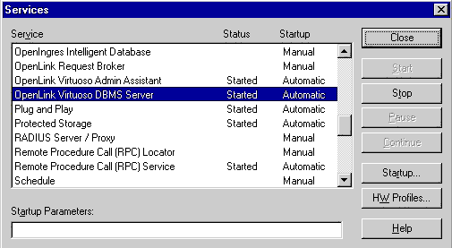

Click the "Start" or "Stop" button in order to start or stop a
highlighted Virtuoso Server.

To start your Virtuoso servers manually using DOS command prompts, start
a DOS shell and then enter the following command:

    virtuoso-odbc-f +service start

### Windows 95 family

You can start your Virtuoso server under Windows 95/98 in one of two
ways, automatically or manually, the default mode configured by your
installer is Automatic.

#### Automatic Startup

Your Virtuoso servers (default and demonstration databases) are
configured at installation time as "Automatic Startup" services. Thus,
rebooting your machine after installation is all that is required in
order for your Virtuoso servers to be ready to start receiving
connections from client applications.

If Virtuoso does not start automatically on Windows 95/98 after
installation you will need to add the following line to the system's
"autoexec.bat" file (assuming you have installed Virtuoso using the
installers default installation folder):

    C:\Program Files\OpenLink\Virtuoso\bin\virtuoso-odbc-f +service start

#### Manual Startup

You can start your Virtuoso servers manually by entering the following
commands at the DOS command line prompt:

    virtuoso-odbc-f +service start
    virtuoso-odbc-f +instance demo +service start

> **Note**
> 
> If you encounter a "Program Not Found" error this is because your
> Virtuoso installation's "bin" sub-directory is not part of your PATH
> environment variable.

<a id="id10-creating-and-deleting-virtuoso-services"></a>
## Creating and Deleting Virtuoso Services

At sometime you may need to have multiple Virtuoso server processes
running on your Windows servers or simply need to add or delete existing
Virtuoso servers that have been registered with the "Services" control
panel applet. You do this by executing the following commands:

Adding new Virtuoso Server service: virtuoso-odbc-f +service create -I
\<your chosen service name\>

Deleting an existing Virtuoso service: virtuoso-odbc-f +service delete
-I \<service that you are deleting\>

Starting a new Virtuoso service manually: virtuoso-odbc-f +service start
-I \<service name\>

Showing a list of existing Virtuoso services: virtuoso-odbc-f +service
list

> **Note**
> 
> This functionality is only available on Windows NT/2000/XP.
> 
> Ensure that the services applet from the control panel is closed while
> issuing the above commands to prevent locking.

<a id="id11-configuring-virtuoso-client-components"></a>
## Configuring Virtuoso Client Components

The Virtuoso client components set consists of the following:

Virtuoso Driver for ODBC

Virtuoso Driver for JDBC

Native Virtuoso Interactive SQL Query (ISQL)

ODBC based Interactive SQL Query Utility (ISQLO)

The sections that follow address the configuration and utilization of
each one of these client components separately.

### Virtuoso Driver for ODBC

The Virtuoso Driver for ODBC conforms to both the ODBC 1.x,2.x,and 3.x
versions of the ODBC specification, it implements Core, Level 1, Level
2, and Extensions functionality. This driver enables you to communicate
with local or remote Virtuoso servers across any combination of
platforms supported by Virtuoso.

At installation time two ODBC data source names (DSN's) are created with
default values by the Virtuoso installer, the first DSN named "Local
Virtuoso" provides a link to a local default Virtuoso database server
instance, while the other named "Local Virtuoso Demo" provides a link to
a local Virtuoso server for the Virtuoso demonstration database.

> **Tip**
> 
> the [Data Access Interfaces](#virtdsnsetup) chapter for more detailed
> information regarding the Virtuoso ODBC Driver setup

### Virtuoso Drivers for JDBC

The Virtuoso Drivers for JDBC are available in "jar" file formats for
the JDBC 1.x, JDBC 2.x and JDBC 3.x JDBC specifications. These are Type
4 Drivers implying that utilization is simply a case of adding the
relevant "jar" file to your CLASSPATH and then providing an appropriate
JDBC URL format in order to establish a JDBC session with a local or
remote Virtuoso server. It is important to note that when you make a
JDBC connection to a Virtuoso Server, you do also have access to Native
and External Virtuoso tables. Thus, you actually have a type 4 JDBC
Driver for any number of different database types that have been linked
into Virtuoso.

> **Tip**
> 
> The [JDBC Driver](#virtuosodriverjdbc) section in the Access
> Interfaces chapter.

### Native Virtuoso Interactive SQL Query (ISQL)

To assist you with the use of Virtuoso an interactive SQL interpreter
utility called "ISQL" is bundled with all Virtuoso installations. This
utility allows you to enter and execute SQL statements from a command
line prompt against a local or remote Virtuoso server.

The command line format for executing this utility is:

    isql [<hostname>][:<port#>]

The steps that follow guide you through the process of using ISQL to
verify your Virtuoso installation:

1.  Open up a DOS shell

2.  Move into the "bin" sub-directory of your Virtuoso installation

3.  Type the following command: isql
    
    This will connect you to the default Virtuoso server at port "1111",
    if you want to connect to your demonstration Virtuoso database
    (which listens at port 1112 by default) then enter: isql 1112

4.  At the ISQL command line prompt type in the following command:
    
        tables ;
    
    This will produce a list of tables in the current Virtuoso database,
    you can also enter other SQL statements e.g.:
    
        select * from Customers
    
    This will produce a listing of records in the "Customers" table.

5.  If you are not able to perform these task that it implies that your
    Virtuoso database server is not running or that it has not been
    installed properly.

### ODBC based Interactive SQL Query Utility (ISQLO)

In addition to a Native ISQL utility, your Virtuoso installation
includes an ODBC based version of "ISQL" called "ISQLO", this enable you
to connect to ODBC DSN's rather than Virtuoso only. To use this program
perform the following steps:

1.  Open up a DOS shell

2.  Move into the "bin" sub-directory of your Virtuoso installation

3.  Type the following command :
    
        isqlo <enter a valid ODBC Data Source Name>
    
    > **Note**
    > 
    > If your DSN contains spaces you will need to enclose it within
    > double quotes when passing it as a parameter to ISQLO

4.  Enter any valid SQL at the ISQLO command line prompt.

5.  You can also use this utility from within the Virtuoso Conductor

<a id="id12-default-passwords"></a>
## Default passwords

See the following Quick Start chapter for very important information
about [changing the default passwords](#defpasschange) .

<a id="id13-installing-the-virtuoso-universal-server-on-unix-like-os-aix-hp-ux-linux-solaris-etc"></a>
# Installing the Virtuoso Universal Server on Unix-like OS (AIX, HP-UX, Linux, Solaris, etc.)

<a id="id14-installation"></a>
## Installation

Once the required tar file has been downloaded from the web or ftp site
and placed in a designated installation directory the installation
process is ready to commence.

  - Choose or create a suitable user account to own your Virtuoso
    installation.

  - Un-tar the file to obtain the install script and archive file using
    a command like this, where XX specifies the OS identifier (e.g., l3
    = Linux glibc23 x86, l9 = Linux glibc25 x86\_64, sv = Solaris 2.10
    x86\_64, etc.):
    
        tar -xvf XXvpz2zz.tar

  - If a license file exists, place this in the same directory as the
    installation files, and it will automatically be applied during
    installation. If upgrading an existing Virtuoso instance, be sure to
    take a backup of your database file and shut down the existing
    instance before proceeding.

  - Run the install script using the following command:
    
        $ sh ./install.sh
        
        - Extracting Virtuoso Universal Server vX.Y
        
        - Creating default environment settings
        
        - Creating default database settings
        Installing new virtuoso.ini in $VIRTUOSO_HOME/database
        Installing new php.ini in $VIRTUOSO_HOME/database
        Creating symlink to $VIRTUOSO_HOME/bin/virtuoso-iodbc-t
        
        - Registering ODBC drivers
        
        - Registering .NET provider for Mono
        
        - Installing VAD packages in database (this can take some time)
        
        - Checking where license should be stored
        
        - Starting OpenLink License Manager
        
        - Checking for initial Virtuoso license
        
        - Starting Virtuoso server instance
        
        - Finalizing installation
        
        This concludes the first part of the installation.
        
        Please start a browser manually and open the following URL to finalize
        the installation process:
        
             http://<hostname>:8890/install/
        
        Installation completed
        $

  - Proceed to the Configuration section below.

<a id="id15-configuration"></a>
## Configuration

  - Once the URL above has been loaded into a browser, you can select a
    license file for use with the installation; if a license file is
    already in place, you can "Skip" this task with the obvious button:
    
    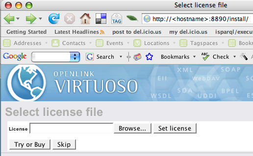

  - It is strongly advised that the standard "dba" and "dav" user
    account password be changed using the post installation page
    provided:
    
    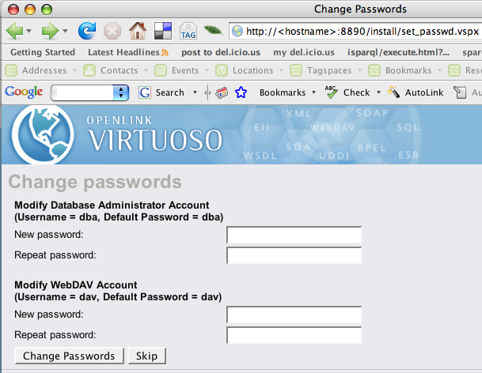

  - The post installation page is now complete and the Virtuoso Welcome
    page is presented:
    
    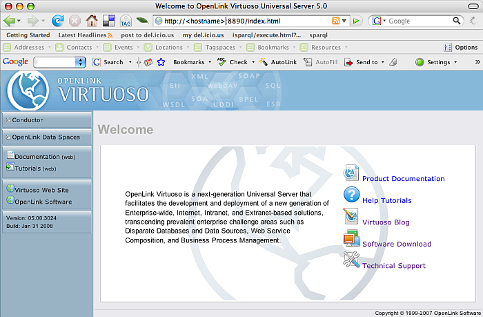

  - The installation is now ready for use.

<a id="id16-demo-database"></a>
## Demo Database

[Installation steps](#demodbinstallsteps) .

<a id="id17-virtuoso-for-mac-os-x"></a>
# Virtuoso for Mac OS X

<a id="id18-before-you-install"></a>
## Before You Install

Before installing the Virtuoso software for Mac OS X you must ensure
that you have the correct package from the [OpenLink](#) Web Site.

<a id="id19-virtuoso-drag-and-drop-installer-for-mac-os-x"></a>
## Virtuoso Drag and Drop Installer for Mac OS X

*Note* : Virtuoso 7 and its Drag-and-Drop Installer for Mac OS X require
Lion (10.7.x), Mountain Lion (10.8.x), Mavericks (10.9.x), or later.
Virtuoso 6 remains available for deployment on Leopard (10.5.x) or Snow
Leopard (10.6.x).

1.  [Download](#) and double-click on the Virtuoso installer disk image,
    
    *mwvp2zzz.dmg*
    
    , to start the installation.
    
    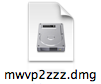

2.  Drag the Virtuoso application icon to your Applications folder
    (recommended) or any preferred location on your Mac.
    
    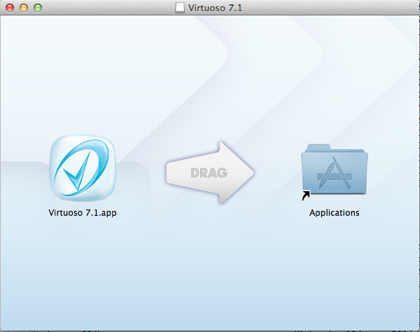

3.  Double-click the Virtuoso application (e.g., Virtuoso 7.1.app) to
    launch the Virtuoso Application Manager Menu Extra, which will
    display as a V symbol in the menu bar.
    
    

4.  Select
    
    *Start Default Instance*
    
    from the
    
    *V*
    
    menu.
    
    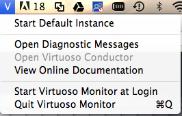

5.  If this is a first time installation of OpenLink components, a
    dialog will be prompt you to install the OpenLink License Manager.
    
    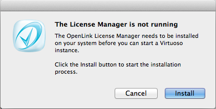
    
    1.  Click the
        
        *Continue*
        
        button to start the installation.
        
        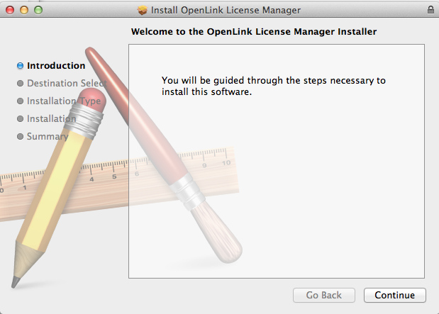
    
    2.  Select the disk the installation should be performed on.
        
        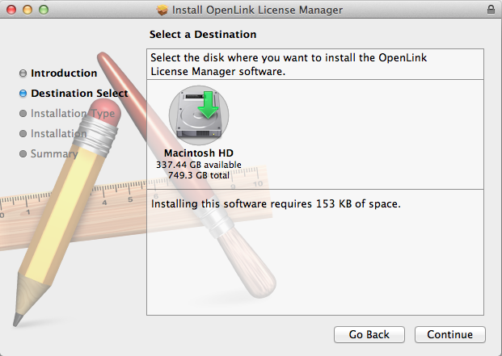
    
    3.  Click
        
        *Install*
        
        to commence the installation of the License Manager components.
        
        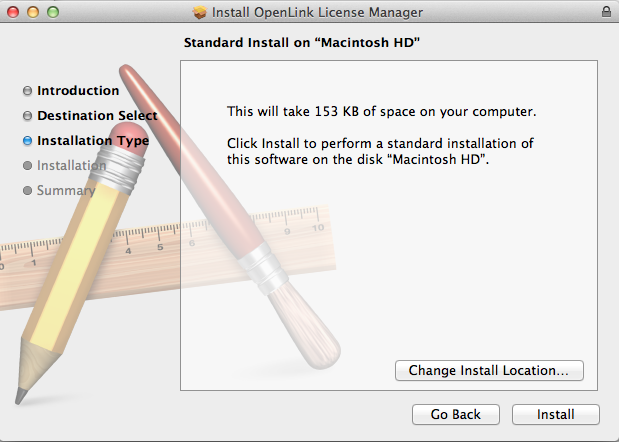
    
    4.  The following dialog will be displayed to confirm successful
        installation of the License Manager, which will be automatically
        started and ready for use upon installation.
        
        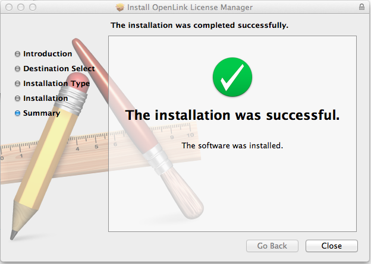

6.  If a license file is not already in place, you will be prompted to
    locate an available license file or to purchase one for
    installation. Click the Install button to install the license file
    of your choice.
    
    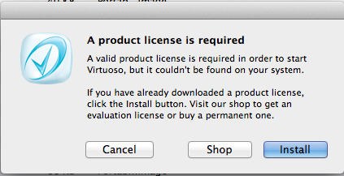
    
    1.  Navigate to the location of the license file to be installed,
        and click the
        
        *Open*
        
        button. The installer will move it into the
        
        */Library/Application Support/openlink/Licenses/*
        
        folder.
        
        
    
    2.  A dialog confirming the successful installation of the license
        file will be displayed.
        
        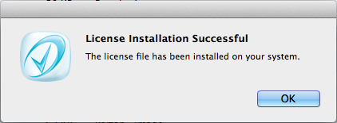

7.  The Default database instance can now be started by clicking the
    
    *Start*
    
    button.
    
    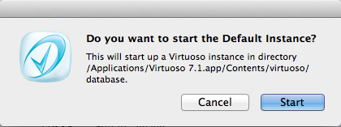

8.  The Virtuoso server is now ready for use, and the browser-based
    Virtuoso Conductor administration interface may be accessed by
    selecting
    
    *Open Virtuoso Conductor*
    
    from the
    
    *V*
    
    menu.
    
    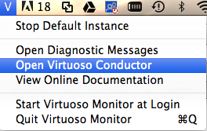

9.  The Virtuoso Conductor may also be accessed by manually loading the
    URL \<http://example.com/conductor\> (or
    \<http://full-hostname.example.com:8890/conductor\> from a remote
    host) into any web browser.
    
    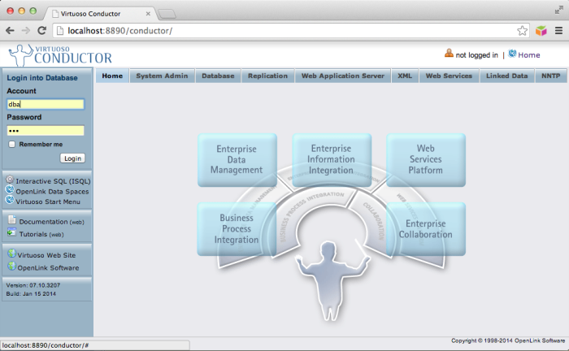

### Troubleshooting

Many issues may be quickly diagnosed and resolved by reviewing
Virtuoso's `.log` file, typically located alongside the active `.db`
file.

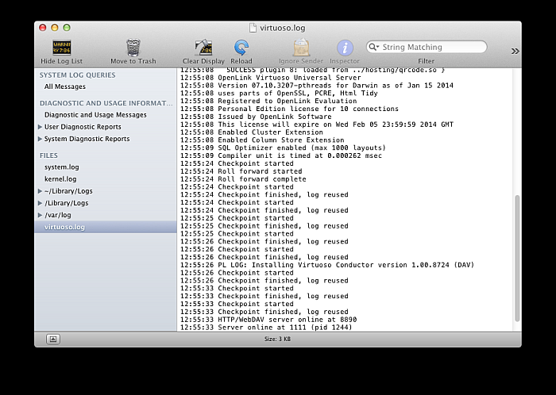

The default instance log file may be opened in Mac OS X's Console.app
by:

  - selecting
    
    *Open Diagnostic Messages*
    
    from the
    
    *V*
    
    menu

  - right-clicking on the
    
    *Virtuoso 7.1.app*
    
    icon, select
    
    *View Package Contents*
    
    , and then drilling down to
    
    *Contents -\> virtuoso -\> database -\> virtuoso.log*
    
    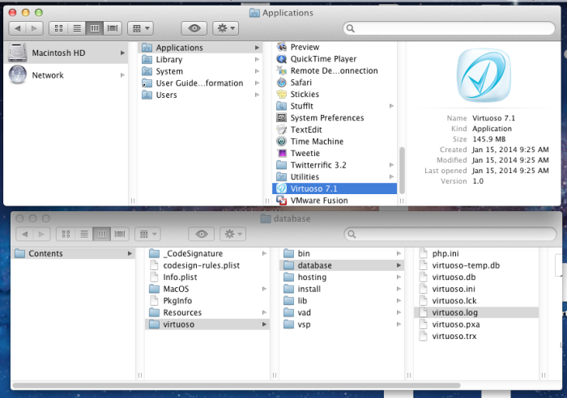

  - executing the following command in
    
    *Terminal.app*
    
    :
    
        open /Applications/Virtuoso\ 7.1.app/Contents/virtuoso/database/virtuoso.log

#### Missing license file

Make sure that the license file, always named `virtuoso.lic` is in the
correct location, as described above -- `/Library/Application
Support/openlink/Licenses/.`

Restarting the License Manager may be necessary. Rebooting should always
result in a running License Manager, but you can also use the
*Terminal.app* :

    cd /Library/Application\ Support/openlink/bin
    ./oplmgr -fd /Library/Application\ Support/openlink/Licenses

#### Expired license file

Acquire a non-expired license file, by purchase or conversation with
Technical Support or your Account Manager, and replace the expired file
with the non-expired, as [documented](#) .

#### Cannot contact the License Manager

Rebooting should always result in a running License Manager. You can use
*Terminal.app* to check whether it's running:

    ps -ef | grep oplmgr | grep -v grep

If no process is listed, these two commands should get it running:

    cd /Library/Application\ Support/openlink/bin
    ./oplmgr -fd ../Licenses

If the process is listed, there are many possible causes, including
firewall or other networking issues. Please [allow our Support Team](#)
to assist you in diagnosis and resolution.

<a id="id20-installing-virtuoso-6-or-earlier"></a>
## Installing Virtuoso 6 or earlier

Open the Virtuoso Personal Edition Disk Image file ntvpz2zz.dmg by
either double clicking on the DMG file in the Finder windows or using
the "open" command from a Terminal window, to mount the Disk Image
containing the VirtuosoPersonalEdition.mpkg installer.

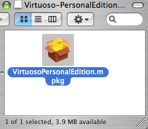

The installer will load the Introduction page.

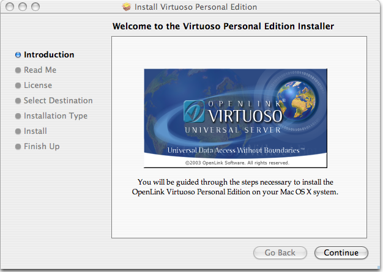

Review the Readme page for any important information concerning the
product installation.

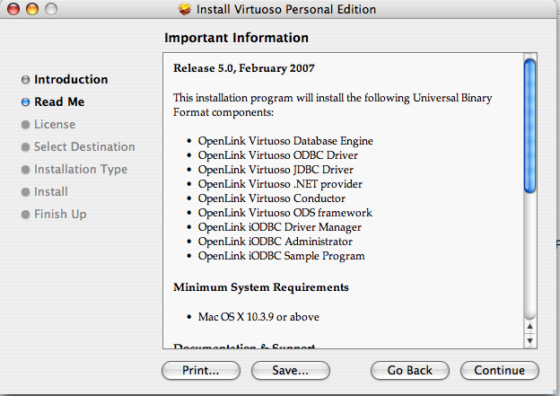

Read the license agreement and "agree" to the terms.

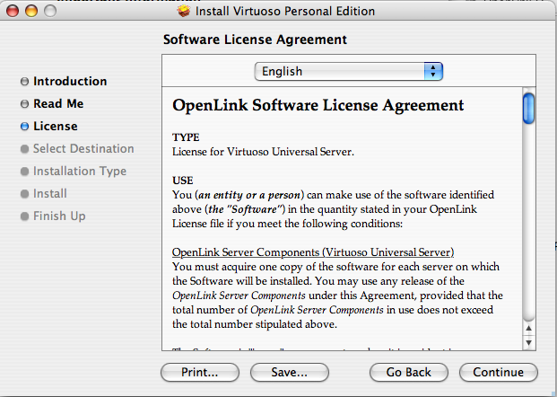

Select the Destination volume the software is to be installed on.

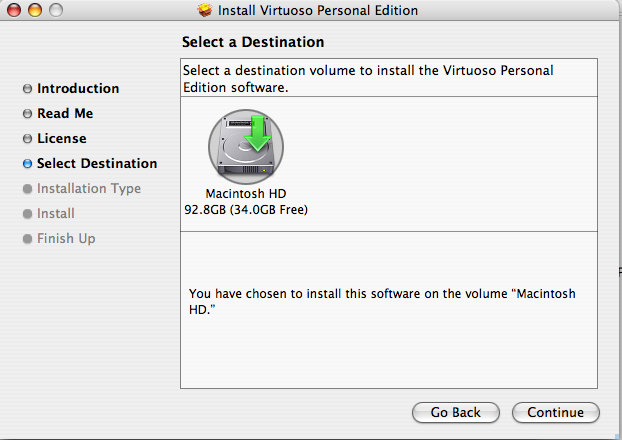

Choose to perform and Easy(default) installation or click on the
"customize" button to perform a Custom installation.

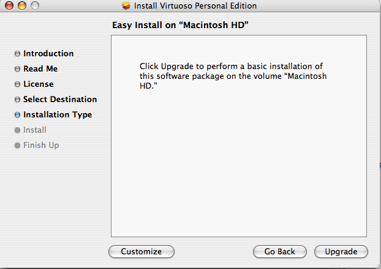

If the "Custom" option was selected in the previous step then select the
packages to be installed.

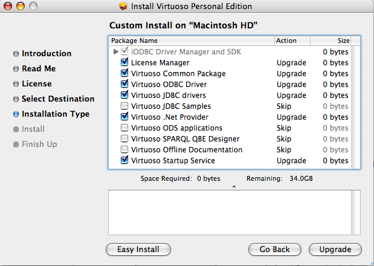

The software must be install by a user with Administrative privileges on
the machine.

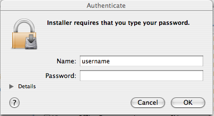

The software components will be installed the status of which is
indicated by the progress bar.

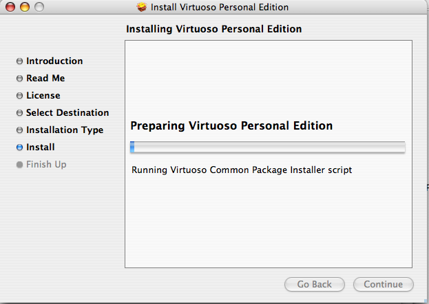

The Virtuoso Server is started at the end of this process. A Web page is
loaded to enable you to obtain a trial or full license from the OpenLink
online shop:

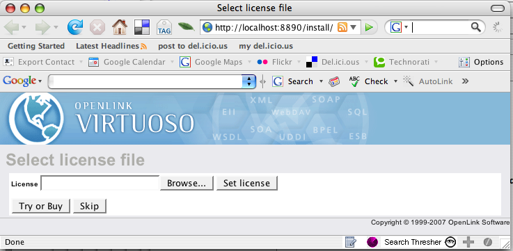

Choose to obtain a Trial license for an evaluation or enter the shop
site to purchase a full license.

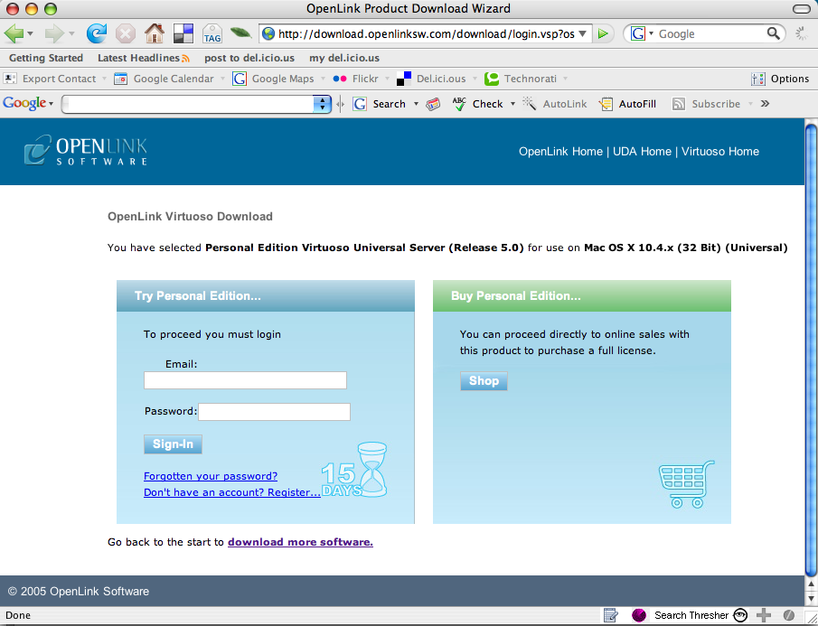

Click on the "Download License" button on the right to obtain the
license file immediately. An e-mail will also be sent to your registered
email address. This email contains the details of the Virtuoso license
and the location of an OpenLink Data Spaces account where you can obtain
an additional demo license at a later date.

Once a license file is available on your Mac, use the "Browse" button to
locate it. Then, use the "Set License" button to initialize the Virtuoso
server with it:

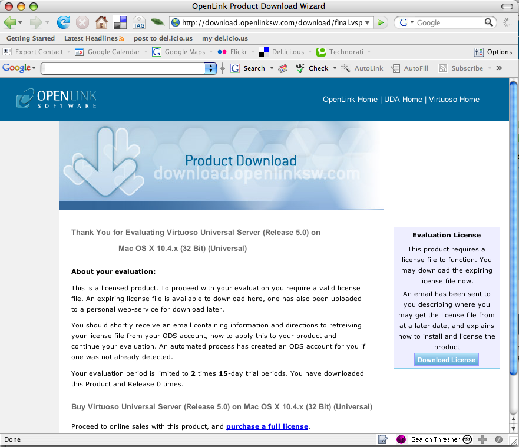

Change the "dba" and "dav" user passwords from their default of "dba"
and "dav" to a value of your choice:

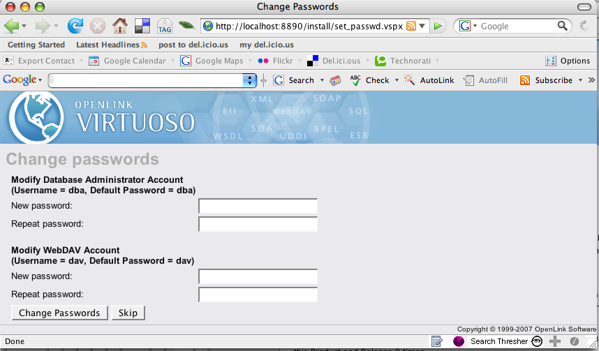

The Virtuoso Server Welcome page will now be displayed. The server is
online. This Web based page can be used for general configuration and
usage of the Virtuoso Server:

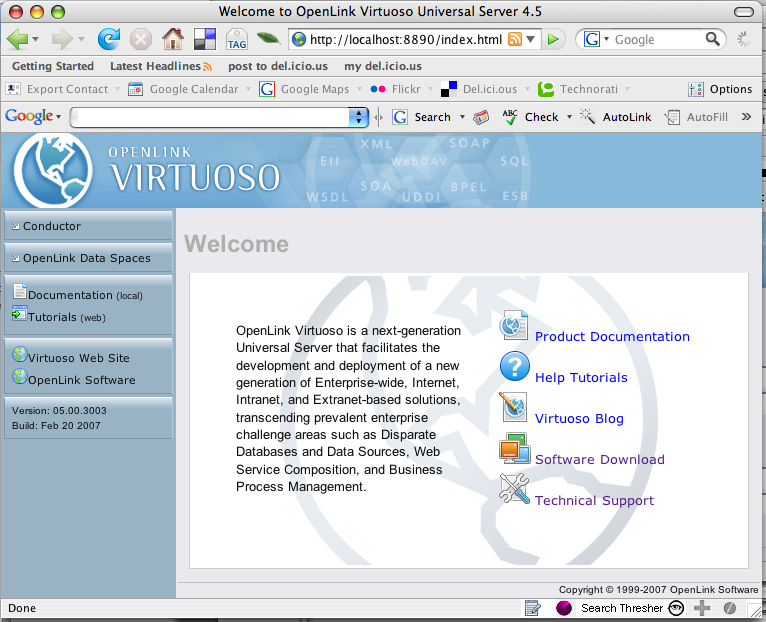

The Installation is now complete.

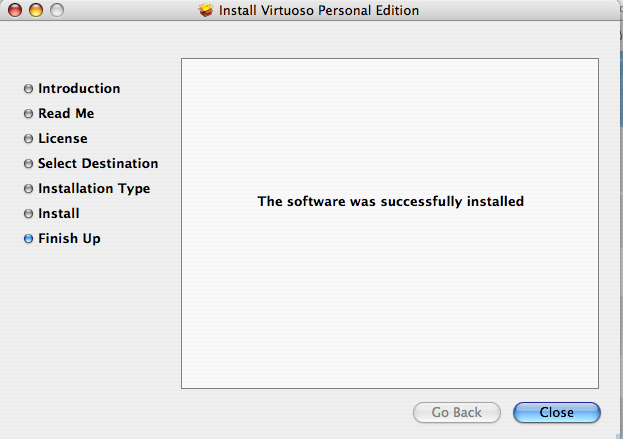

<a id="id21-configuration"></a>
## Configuration

Click on the "Conductor" link in the left frame of the Welcome page to
load the Virtuoso Conductor which is the Administration interface for
the installation. Enter the "dba" username and password to login.

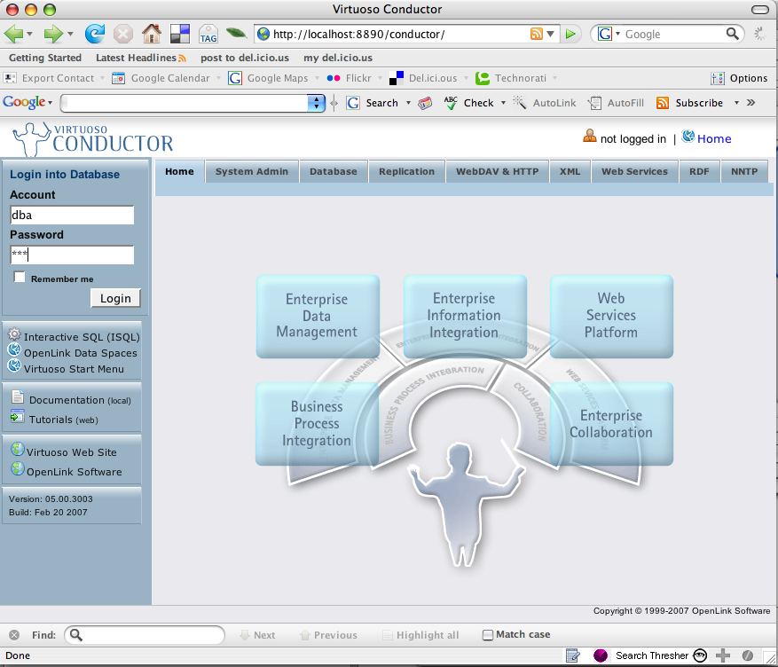

Once logged into the conductor click on any of the "Tabs" along the top
to Administer the various features of the Virtuoso Universal Server
installation.

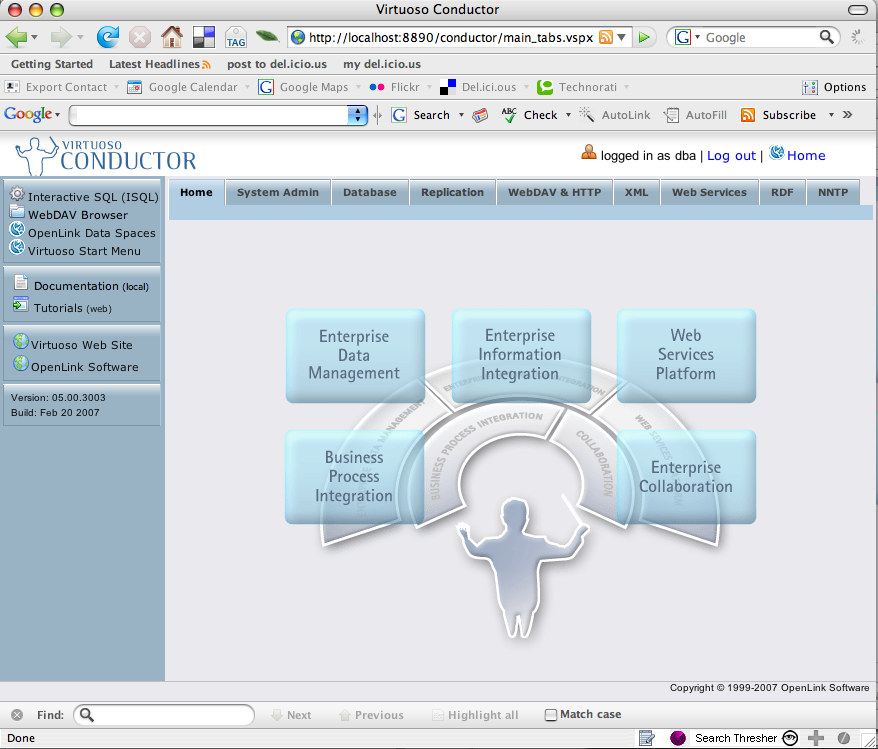

Apple scripts for starting and stopping your Virtuoso Universal Server
installation are located in the "/Application/OpenLink Virtuoso" folder
of the machine.

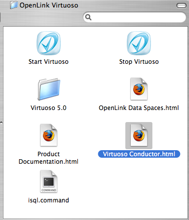

<a id="id22-post-installation"></a>
## Post Installation

### Post-Installation Sanity Check

A quick way to check that the database is running, is to point a browser
to the http port. The following example URLs will show the System
Manager for the default, and the demo Virtuoso databases:

    http://example.com
    http://example.com
    http://a_virtuoso_server.org:8890

### Troubleshooting DB Startup Failures

*Install failure*

Check the .log file in oplmgr (License Manager) location:
`/Library/Application Support/openlink/bin/` , which is for the database
and log files etc. in order to review the installed files binaries and
databases (defaults) for issues if install fails.

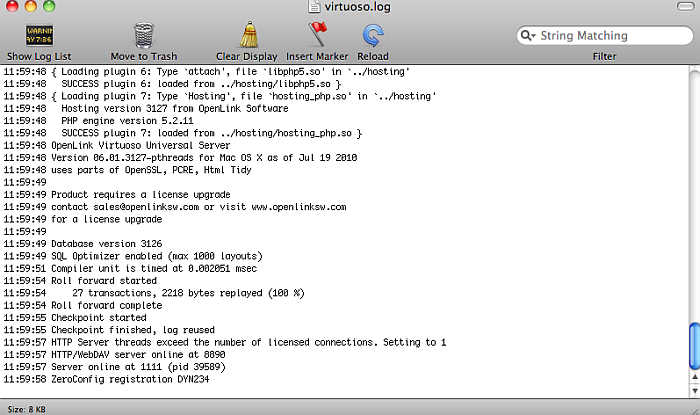

*.lck existance*

Check .log in case of .lck issue

Delete the .lck file and repeat the steps from above.

*.trx incompatiblity issue*

Check .log in case of .trx incompatiblity issue

*oplmgr issue*

To stop, start, or reload (which updates licenses) use the following
commands:

    /Library/Application Support/openlink/bin/oplmgr +start | +stop | +reload

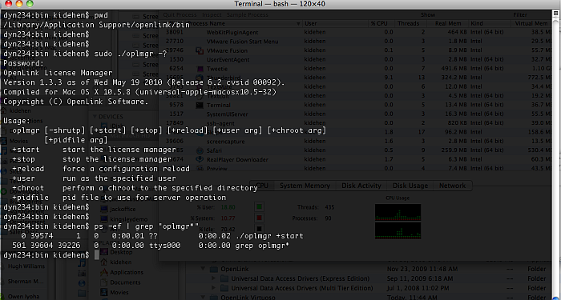

> **Tip**
> 
> [OpenLink License Management](#oplmgr)

<a id="id23-configuring-an-odbc-data-source"></a>
## Configuring an ODBC Data Source

Launch the iODBC Administrator, assuming that you have the iODBC
Administrator installed.

On some Mac OS X systems installed on an HFS partition, the icons may
not be displayed correctly or at all, due to a Mac OS X bug. In such
cases a simple reboot of your system should correct this.

Once the iODBC Administrator window has appeared you can press the *Add*
button on the either the *User DSN* or the *System DSN* panel to add a
new Data Source entry.

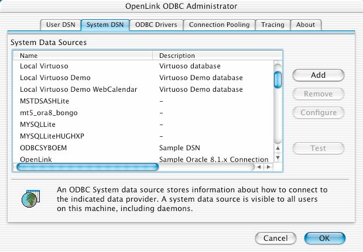

Choose the driver that you wish to create a Data Source for, in this
case the Virtuoso Driver (3.0).

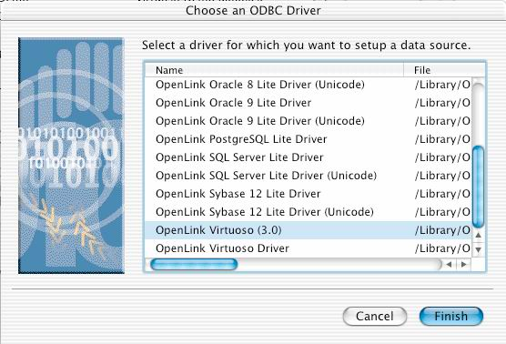

Provide all required details in the fields provided by the setup panel.

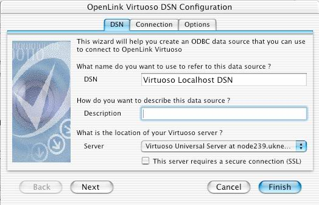

The server can be picked from the list of Zero Configuration Datasources
that is discovered.

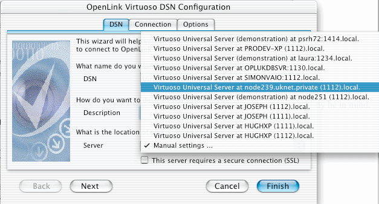

Alternatively a manual selection can be made for the server.

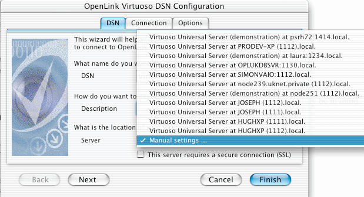

In this case enter the hostname (or IP) and port number.

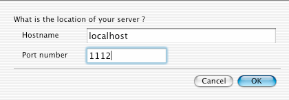

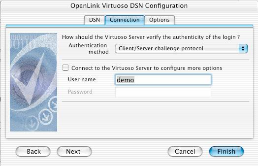

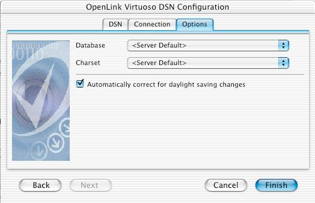

Press the *Finish* button to save the Data Source information.

<a id="id24-testing-an-odbc-data-source"></a>
## Testing an ODBC Data Source

Select the Data Source from the DSN list, and press the *Test* button.

You will be prompted for a username and password to establish a
connection with the Data Source.

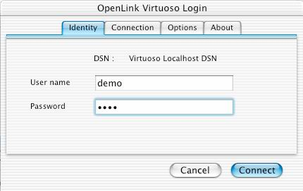

The login dialogue also allows you to alter the configuration if
required.

Under the Connection Tab are the fields for the remote server, and the
authentication method. Typically the defaults are used.

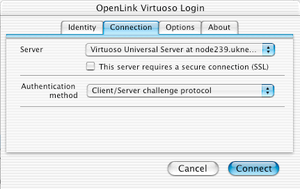

The Options page has Database, Charset and daylight savings
configuration. Typically the defaults are used.

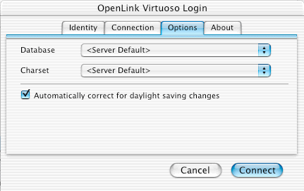

The About page shows the software details.

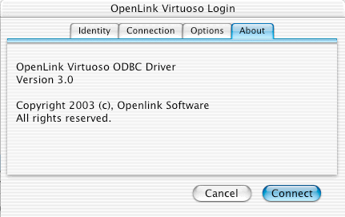

The result of the test is shown in a popup window.

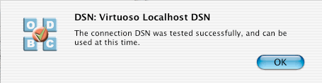

<a id="id25-default-passwords"></a>
## Default passwords

See the following Quick Start chapter for very important information
about [changing the default passwords](#defpasschange) .

<a id="id26-demo-database"></a>
## Demo Database

[Installation steps](#demodbinstallsteps) .

<a id="id27-openlink-license-management"></a>
# OpenLink License Management

<a id="id28-license-files"></a>
## License Files

### License Activation

#### Mac OS X

1.  Launch `Terminal.app (/Applications/Utilities/)`

2.  Execute the command `cd "/Library/Application
    Support/openlink/bin/"`

3.  Execute the command `oplmgr +stop`

4.  Retrieve your new Virtuoso license file from an email or [ODS
    Briefcase](#oplmngrlflb) .

5.  Replace the old license file with the new license file. (You may
    delete the old file, or safely retain it in this location by
    changing the `.lic` file extension to `.lic-old` .)

6.  Execute the command `oplmgr +start`

#### Windows

1.  Launch the
    
    *Services*
    
    Control Panel (may be in the
    
    *Administrative Tools*
    
    sub-folder).

2.  Locate and select the
    
    *OpenLink License Manager service*
    
    .

3.  Click the
    
    *Stop*
    
    icon.

4.  Retrieve your new Virtuoso license file from an email or [ODS
    Briefcase](#oplmngrlflb) .

5.  Replace the old license file with the new license file. (You may
    delete the old file, or safely retain it in this location by
    changing the `.lic` file extension to `.lic-old` .)

6.  Go back to the
    
    *Services*
    
    Control Panel.

7.  Locate and select the
    
    *OpenLink License Manager*
    
    service.

8.  Click the
    
    *Start*
    
    icon.

#### Unix-like OS (AIX, HP-UX, Linux, Solaris, etc.)

1.  Open a Unix terminal.

2.  `cd` into the root of your Virtuoso installation.

3.  Use one of the following commands to set Virtuoso-related
    environment variables. (Note that they do, and must, begin with
    dot-space-dot-slash.)
    
      - `. ./virtuoso-enterprise.sh
        ` - bash, bsh, ksh, and related shells
    
      - `. ./virtuoso-enterprise.csh
        ` - csh, tcsh, and related shells

4.  Execute the command: oplmgr +stop

5.  Retrieve your new Virtuoso license file from an email or [ODS
    Briefcase](#oplmngrlflb) . Use binary-mode ftp to transfer the new
    license to the Unix box, if required.

6.  Place the new license in the bin sub-directory of the Virtuoso
    installation.

7.  Set and export an `OPL_LICENSE_DIR` environment variable that passes
    the path to the directory that contains your Virtuoso license file,
    e.g
    
      - `export OPL_LICENSE_DIR="/opt/virtuoso/bin/"
        `
    
      - `OPL_LICENSE_DIR="/opt/virtuoso/bin/" ; export OPL_LICENSE_DIR
        `

8.  Execute the command: `oplmgr +start`

#### Retrieve OpenLink Licenses from Your [ODS Briefcase](#oplmngrlflb)

OpenLink's registered users receive an automatic OpenLink Data Spaces
(ODS) account on the My OpenLink home page. This account allows
registered users to experience and explore OpenLink's Virtuoso Universal
Cilent applications.It also provides a convenient storage mechanism for
OpenLink commercial and evaluation license keys.

This page shows you how to access licenses that reside in your [ODS
Briefcase](#oplmngrlflb) . A second 15 Day evaluation license is
automatically copied to the Briefcase, when you download our software
and receive your first 15 Day key. You may access the Briefcase by
clicking on the link that appears in the email that contains the first
license. Alternatively, you may identify the ODS url by logging into the
OpenLink site.

The following instructions will allow you to access your [ODS
Briefcase](#oplmngrlflb) via the OpenLink Web site.

1.  Click the Login link that appears on the OpenLink Web page.
    
    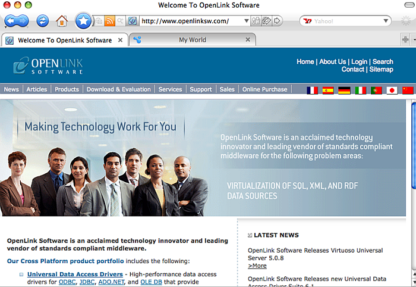

2.  Click the "Login Here" button that appears in the Registered Users
    box.
    
    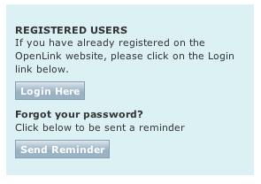

3.  Click the "Check my profile" link that appears in the Welcome box.
    
    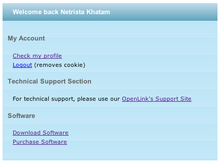

4.  Click the ODS Service URL that appears in the lower right hand
    corner of the My Details dialog.
    
    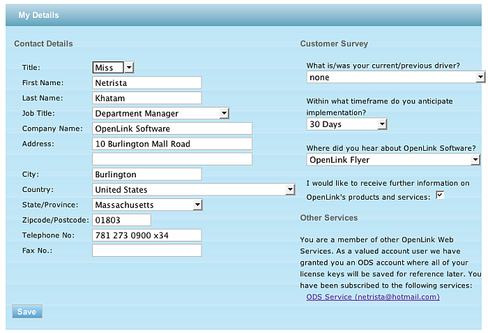

5.  Allow the My OpenLink Web page to load in a Web browser.
    
    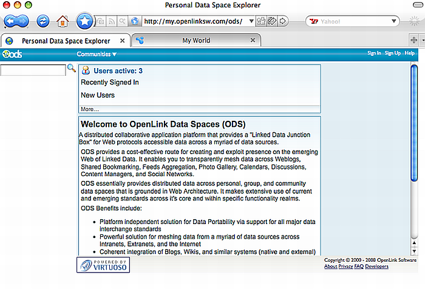

6.  Login to your OpenLink Data Space using your OpenLink login.
    
    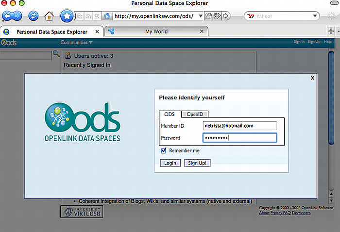

7.  Click the Briefcase link that appears in the ODS menu bar at the top
    of the page.
    
    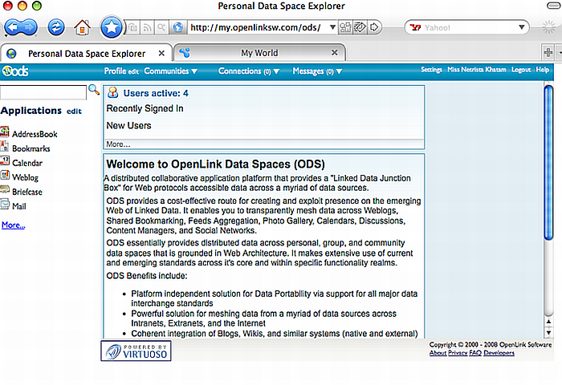

8.  Your license will appear as a Resource Item under the Briefcase
    Summary.
    
    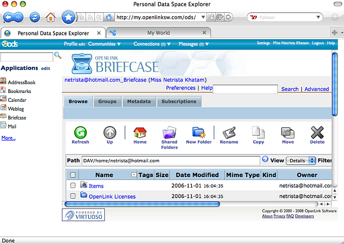

Click the license link to download your license. Provide your OpenLink
username and password if prompted for a DAV login.

### License Preservation

Users may choose to preserve the existing license file when applying a
new license file. This facilitates a rollback to the original file, if
the replacement file is problematic.

#### Mac OS X

  - Use StuffIt or a similar utility to store the file in a compressed
    archive.

  - Rename the file, e.g., from `virtuoso.lic` to `virtuoso.lic-old`

#### Windows

Use WinZip or a similar utility to copy your license file to a .zip
archive.

#### Unix-like OS (AIX, HP-UX, Linux, Solaris, etc.)

Use tar or gzip to copy your license file into an archive. For example:
`tar cvzf virtuoso-lic.tgz virtuoso.lic`

### License Removal

Users may choose to remove expired or deprecated license files
altogether to ensure the uptake of a new license file.

#### Mac OS X

1.  Shutdown your OpenLink License Manager

2.  Click the Search icon.

3.  Type your license name into the search box. For example:
    virtuoso.lic

4.  Drag the license from the search results onto the trash icon.

5.  Expand the Finder menu.

6.  Click Empty Trash.

#### Windows

1.  Launch the
    
    *Services*
    
    Control Panel (may be in the
    
    *Administrative Tools*
    
    sub-folder).

2.  Locate and select the
    
    *OpenLink Virtuoso*
    
    service.

3.  Click the
    
    *Stop*
    
    icon.

4.  Locate and select the
    
    *OpenLink License Manager*
    
    service.

5.  Click the
    
    *Stop*
    
    icon.

6.  Launch the Windows Search utility, from the Start menu.

7.  Search for all files with the name `virtuoso.lic.`.

8.  Drag all found licenses to the Recycle Bin.

9.  Empty the Recycle Bin

#### Unix-like OS (AIX, HP-UX, Linux, Solaris, etc.)

1.  Login to the Unix or Linux operating system.

2.  Use the find command to locate relevant license files, and check
    their permissions and ownership.
    
        bash-2.03$ find / -name virtuoso.lic -exec ls -l {} \;
        -rw-r--r--   1 virtuoso other        645 Mar 11 08:06 /usr/virtuoso/bin/virtuoso.lic
        bash-2.03$

3.  Use the rm command to remove the license file(s).
    
        bash-2.03$ rm /usr/virtuoso/bin/virtuoso.lic

4.  If the file permissions and ownership require, you can use sudo -
    
        bash-2.03$ sudo rm /usr/virtuoso/bin/virtuoso.lic
        Password:
        bash-2.03$ ls /usr/virtuoso/bin/virtuoso.lic
        bash-2.03$
    
    \- or su to the appropriate user or group -
    
        bash-2.03$ su virtuoso
        Password:
        bash-2.03$ rm /usr/virtuoso/bin/virtuoso.lic
        bash-2.03$ ls /usr/virtuoso/bin/virtuoso.lic
        bash-2.03$

<a id="id29-license-manager"></a>
## License Manager

### Monitor License Consumption

OpenLink's License Manager technology provides a sophisticated and easy
to use License statistics and monitoring facility. This page introduces
you to that facility and provides alternative techniques for versions of
the software that do not contain it.

1.  Launch the Virtuoso Web interface.

2.  Click the
    
    *Conductor*
    
    link.

3.  Login with your Virtuoso dba account.

4.  Click the
    
    *System Admin*
    
    tab.

5.  Locate the
    
    *License*
    
    section to review the terms of your Virtuoso license.

6.  Locate the
    
    *Clients*
    
    section to review open connections that consume Virtuoso license
    points.

### Start the License Manager Process

#### Mac OS X

1.  Launch `  Terminal.app (/Applications/Utilities/)  `

2.  Execute the command `cd "/Library/Application
    Support/openlink/bin/"`

3.  Execute the command `oplmgr +start`

#### Windows

1.  Launch the
    
    *Services*
    
    Control Panel (may be in the
    
    *Administrative Tools*
    
    sub-folder).

2.  Locate and select the
    
    *OpenLink Virtuoso*
    
    service.

3.  Click the
    
    *Start*
    
    icon.

#### Unix-like OS (AIX, HP-UX, Linux, Solaris, etc.)

1.  Open a Unix terminal.

2.  `cd` into the root of your Virtuoso installation.

3.  Use one of the following commands to set Virtuoso-related
    environment variables. (Note that they do, and must, begin with
    dot-space-dot-slash.)
    
      - `. ./virtuoso-enterprise.sh
        ` \> - bash, bsh, ksh, and related shells
    
      - `. ./virtuoso-enterprise.csh
        ` - csh, tcsh, and related shells

4.  Execute the command: `oplmgr +start`

*Note* : OpenLink recommends that you create an `/etc/init.d/` script
that sets the environment and runs `oplmgr +start` at boot time.

### Stop the License Manager Process

#### Mac OS X

1.  Launch `  Terminal.app (/Applications/Utilities/)  `

2.  Execute the command `cd "/Library/Application
    Support/openlink/bin/"`

3.  Execute the command `oplmgr +stop`

#### Windows

1.  Launch the
    
    *Services*
    
    Control Panel (may be in the
    
    *Administrative Tools*
    
    sub-folder).

2.  Locate and select the
    
    *OpenLink License Manager service*
    
    .

3.  Click the
    
    *Stop*
    
    icon.

#### Unix-like OS (AIX, HP-UX, Linux, Solaris, etc.)

1.  Open a Unix terminal.

2.  `cd` into the root of your Virtuoso installation.

3.  Use one of the following commands to set Virtuoso-related
    environment variables. (Note that they do, and must, begin with
    dot-space-dot-slash.)
    
      - `. ./virtuoso-enterprise.sh
        ` - bash, bsh, ksh, and related shells
    
      - `. ./virtuoso-enterprise.csh
        ` - csh, tcsh, and related shells

4.  Execute the command: oplmgr +stop

### Reinitialize the License Manager Process

#### Mac OS X

1.  Launch `  Terminal.app (/Applications/Utilities/)  `

2.  Execute the command `cd "/Library/Application
    Support/openlink/bin/"`

3.  Execute the command `oplmgr +reload`

#### Windows

1.  Launch the
    
    *Services*
    
    Control Panel (may be in the
    
    *Administrative Tools*
    
    sub-folder).

2.  Locate and select the
    
    *OpenLink License Manager service*
    
    .

3.  Click the
    
    *Restart*
    
    icon.

#### Unix-like OS (AIX, HP-UX, Linux, Solaris, etc.)

1.  Open a Unix terminal.

2.  `cd` into the root of your Virtuoso installation.

3.  Use one of the following commands to set Virtuoso-related
    environment variables. (Note that they do, and must, begin with
    dot-space-dot-slash.)
    
      - `. ./virtuoso-enterprise.sh
        ` - bash, bsh, ksh, and related shells
    
      - `. ./virtuoso-enterprise.csh
        ` - csh, tcsh, and related shells

4.  Execute the command: oplmgr +reload

### Additional Usage Notes

The license manager takes several command-line arguments, as revealed by
its "usage" output (produced by any unrecognized argument) --

``` 

      bash$ oplmgr --help
      OpenLink License Manager
      Version 1.2.2 as of Thu Feb 15 2007 (Release 6.0 cvsid 00084).
      Compiled for Linux 2.4.20-46.9.legacysmp (i686-generic-linux-glibc23-32)
      Copyright (C) OpenLink Software.

      Usage:
      oplmgr [-shrutp] [+start] [+stop] [+reload] [+user arg] [+chroot arg]
      [+pidfile arg]
      +start     start the license manager
      +stop      stop the license manager
      +reload    force a configuration reload
      +user      run as the specified user
      +chroot    perform a chroot to the specified directory
      +pidfile   pid file to use for server operation
```

<a id="id30-debugging-license-problems"></a>
## Debugging License Problems

Virtuoso license problems are easy to debug. The following information
provides a conceptual framework and troubleshooting tips suitable for
all licensing problems.

### Identifying License Problems

License problems occur when users attempt to apply them to products or
when they hit a ceiling associated with concurrent usage. Most license
errors are explicit and include text that states that a license is
invalid, expired, or exceeded. Problems associated with performance or
stability problems that do not produce license related errors are not
likely to be caused by licenses. There is no scenario in which use of an
evaluation key would contribute to limited functionality. OpenLink's
products are fully functional regardless of the license key applied. The
license key simply dictates the length of time for which a product may
be used.

### Source of License Problems

Licenses problems appear under the following circumstances:

  - A license file is ftp'd in ASCII.

  - The license covers a different OpenLink product.

  - The license covers a different OpenLink release.

  - A machine has more physical Processor cores than allotted for by the
    license.

  - The license can not be found.

  - The wrong license is being found.

  - You did not perform the appropriate steps to register the license.

  - The License Manager process needs to be restarted.

  - The license is inadequate for your level of concurrent activity

### Troubleshooting License Problems

Use the following tips to resolve your licensing tips or supply OpenLink
Technical Services with your findings:

  - FTP all licenses (virtuoso.lic) in binary mode.

  - Review the terms of the email that contained the license.

  - Ensure that the license that you have received is for Virtuoso
    Universal Server and not a data access provider or driver.

  - Compare the Virtuoso version on your machine with the version
    covered by the license key.

  - Identify the number of physical Processor cores on the box that
    hosts the license and ensure those cores are covered by the license
    key.

  - Use OpenLink's licensing guidelines to ensure that the license is
    placed in the appropriate location on the target machine.

  - Use the host machine's search utilities to ensure that expired or
    deprecated license files are removed from the host machine and
    deleted from the trash.

  - Use OpenLink's licensing guidelines to ensure that you have
    performed the license application procedure using the correct steps
    in the appropriate order.

  - Use the host monitoring utilities to ensure that applicable
    processes have been restarted as detailed in OpenLink's licensing
    guidelines.

<a id="id31-virtuoso-adonet-data-grid-form-application"></a>
# Virtuoso ADO.Net Data Grid Form Application

This section details the steps required to create a simple Visual Studio
2008 Windows Form application with associated DataGridView control for
displaying data in selected tables from a Virtuoso database.

1.  Launch the Visual Studio 2008 SP1 IDE.
    
    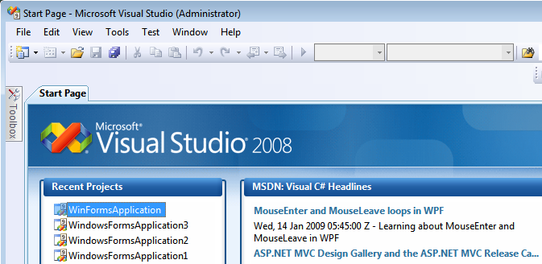

2.  Create a Web Application project by going to the File menu in Visual
    Studio and choosing New Project.

3.  When the New Project window appears, choose either Visual Basic or
    Visual C\# as the programming language.

4.  Within the language category, click on Windows and select Windows
    Form Application from the right-hand panel.

5.  Choose a name for the project, for example VirtuosoDataGridApp, and
    click OK.
    
    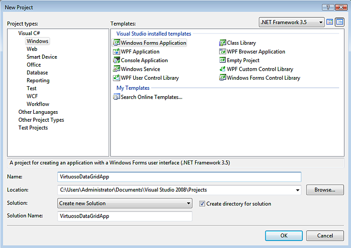

6.  From the Data, menu select the Show Data Sources menu item to
    display a list of available Data sources.
    
    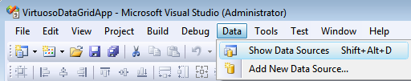

7.  Click on the Add New Data Source link to add a new data source.
    
    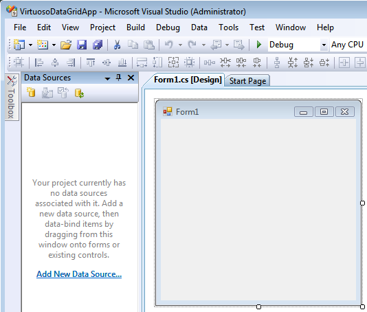

8.  In the Data Source Configuration Wizard dialog Choose Data Source
    Type page, select the Database data source type and click Next.
    
    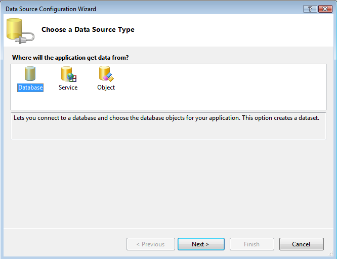

9.  In the Data Source Configuration Wizard dialog Choose your Data
    Connection page, select the New Connection button.
    
    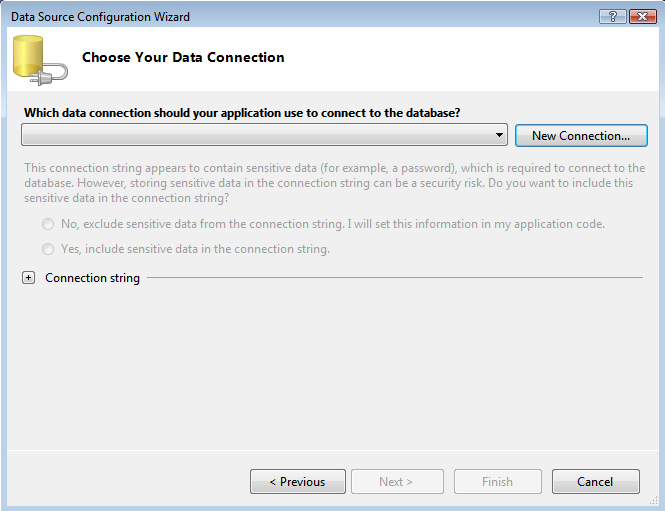

10. In the Choose Data Source dialog, select OpenLink Virtuoso Data
    Source from the list and click Continue.
    
    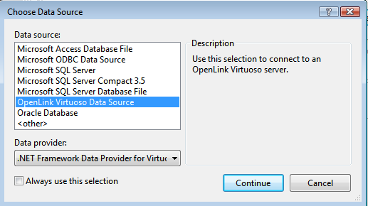

11. In the Add Connection dialog, specify the hostname, portno,
    username, and password for the target Virtuoso Server and check the
    Save Password check box.
    
    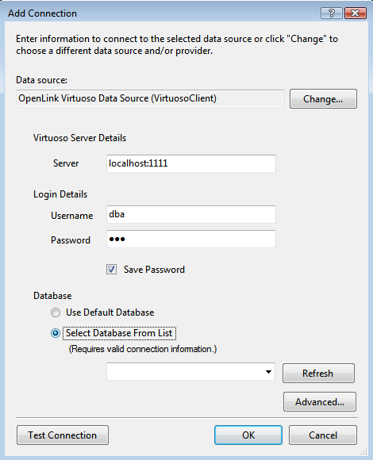

12. Select the Select Database From List radio button and choose School
    from the drop down list of available databases.
    
    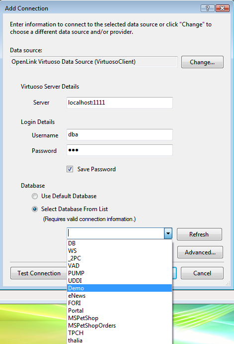

13. Click the Test Connection button to verify the connection is
    successful and then click OK to add the connection.
    
    

14. Select the Yes, include sensitive data in the connect string radio
    button and click Next to continue.
    
    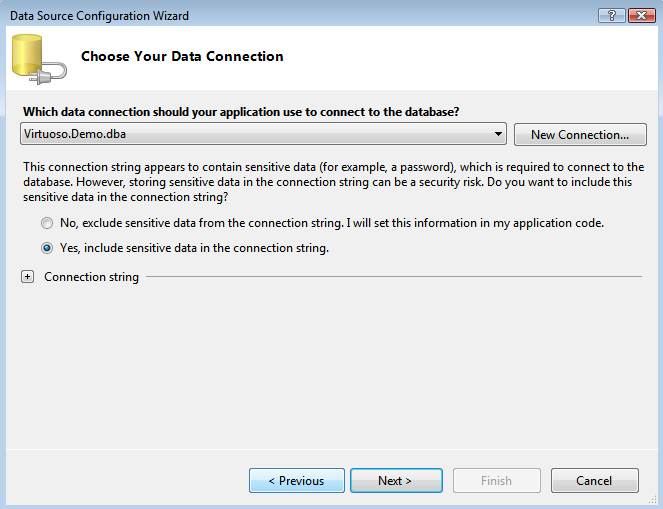

15. In the Choose your Database Objects dialog select the table and
    columns to be queried, the shippers table is used in this example.
    
    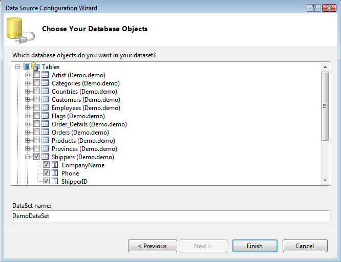

16. A DataSet for the shippers database object is created
    
    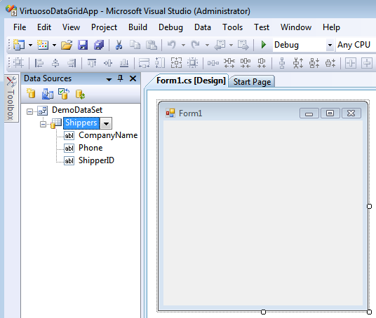

17. From the drop down list box next to the Shippers table ensure the
    DataGridView item is selected
    
    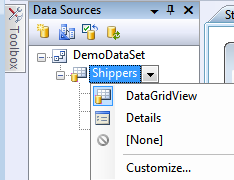

18. Drag the Shippers DataSet item onto the Form to create a scrollable
    and editable association of the Shippers table object with the Data
    Grid View automatically.
    
    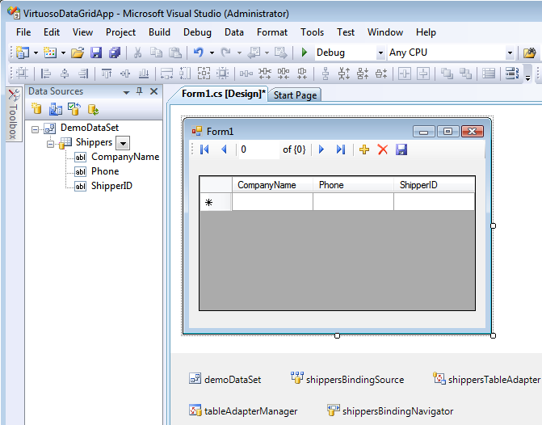

19. From the Debug Menu select the Start Debugging menu item to run the
    application.
    
    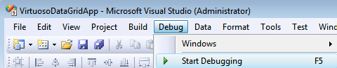

20. The data in the Shippers table will be displayed in the DataGrid
    application created.
    
    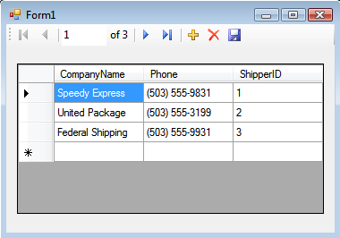

21. A new row can be inserted (updated or deleted) as indicated for the
    new DHL record inserted below and the save button clicked to save
    the change to the database.
    
    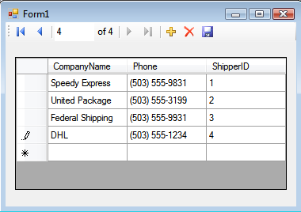

22. The Virtuoso Interactive SQL tab of the Conductor can be used to run
    the query select \* from Demo..Shippers.
    
    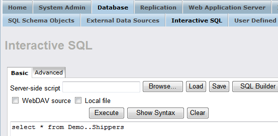

23. To verify the change has been successfully made in the database.
    
    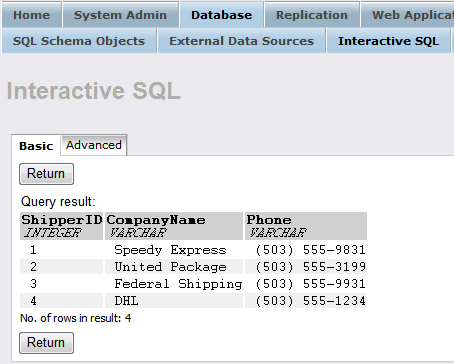

The task is now complete.

<a id="id32-using-visual-studio-2008-to-build-an-entity-frameworks-based-windows-form-application"></a>
# Using Visual Studio 2008 to Build an Entity Frameworks based Windows Form Application

**Virtuoso Entity Framework School DB Windows Form Application.**

This section demonstrates how Visual Studio 2008 can be used to generate
mapping files for an Entity Data Model (EDM), based on a 1:1 mapping to
tables in the School database. This will be done by creating a Windows
Forms application in Visual Studio, create queries that access data in
the School model, bind the query results to display controls to show the
results of the queries, and then make updates to objects and persist the
changes to the database.

<a id="id33-pre-requisites"></a>
## Pre-requisites

In order to create an Entity Framework Application in your own
environment you will need:

1.  Microsoft Visual Studio 2008 SP1, the ADO.NET Entity Framework
    runtime and associated tools are included in Visual Studio 2008 SP1.

2.  A running Virtuoso Universal Server instance.

<a id="id34-create-the-school-database-and-schema"></a>
## Create the School database and schema

1.  Download the [Schools Database](#) VAD (schools\_db\_dav.vad)
    package.

2.  Navigate to the
    
    *System Admin -\> Packages*
    
    tab of the Virtuoso Conductor.
    
    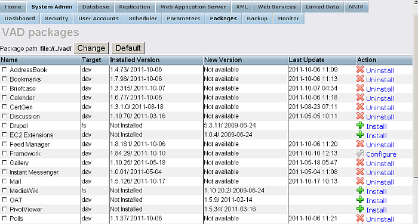

3.  Scroll down to the
    
    *Install Package*
    
    section of the tab, use the
    
    *Upload Package*
    
    option
    
    *Browse*
    
    button to locate the schools\_db\_dav.vad package and click
    
    *proceed*
    
    .
    
    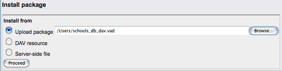

4.  Click the
    
    *Proceed*
    
    button to begin the installation process.
    
    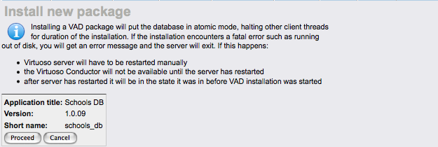

5.  Once complete return to the
    
    *Packages*
    
    tab and scroll down to confirm the \*schools\_db\* package is listed
    as installed.
    
    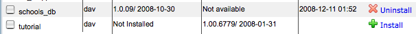

*Create the Course Manager application using Visual Studio*

1.  Launch the Visual Studio 2008 SP1 IDE.
    
    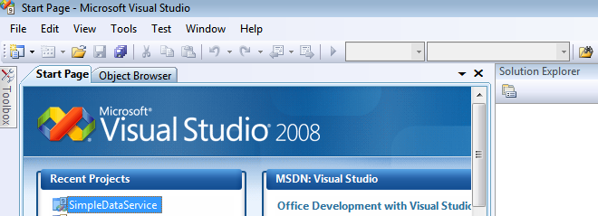

2.  On the
    
    *File menu*
    
    click
    
    *New Project*
    
    .

3.  Choose either
    
    *Visual Basic*
    
    or
    
    *Visual C\#*
    
    in the
    
    *Project Types*
    
    pane.

4.  Select
    
    *Windows Forms Application*
    
    in the
    
    *Templates*
    
    pane.

5.  Enter
    
    *CourseManager*
    
    for the project name, and then click
    
    *OK*
    
    .
    
    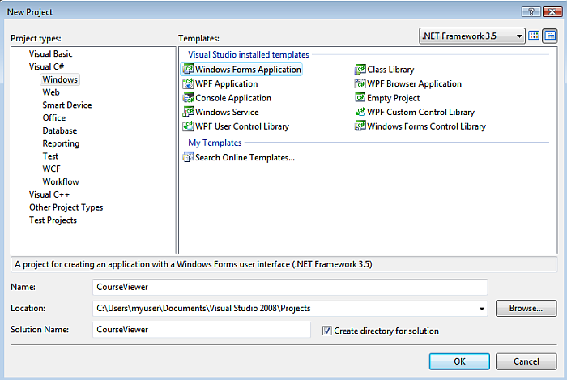

*Create the Course Viewer form*

1.  In the *CourseManager* project, select the default form (Form1).

2.  In the *File Properties* pane, change the File Name to
    *CourseViewer.vb* or *CourseViewer.cs* .

3.  In *Solution Explorer* , double-click *CourseViewer.vb* or
    *CourseViewer.cs* to open the form.
    
    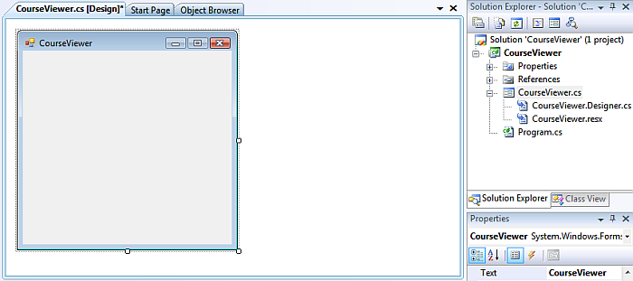

4.  In the *Toolbox* , expand *Common Controls* , drag the *ComboBox*
    control to the form, and change the name of the control to
    *departmentList* .

5.  In the *Toolbox* , drag the *Button* control to the form, change the
    *Name* of the control to *closeForm* , and change the *Text value*
    to *Close* .

6.  In the *Toolbox* , expand *Data* , drag the *DataGridView* control
    to the form, and change the *Name* of the control to
    *courseGridView* .
    
    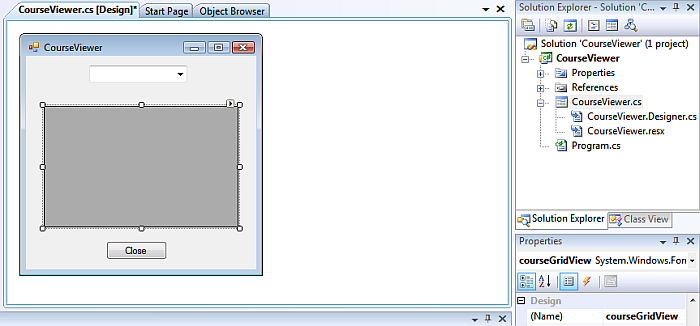

7.  Double-click the *closeForm* button control. This opens the code
    page for the form and creates the closeForm\_Click event handler
    method.

8.  In the *closeForm\_Click* event handler method, type the following
    code that closes the form:
    
        Visual Basic
        
        ' Close the form.
        Me.Close()
        
        C#
        
        // Close the form.
        this.Close();

<a id="id35-generating-the-school-entity-data-mode"></a>
## Generating the School Entity Data Mode

*Add the ADO.NET Entity Data Model item template*

1.  Select the CourseManager project in Solution Explorer, right-click,
    point to Add, and then click New Item.

2.  Select ADO.NET Entity Data Model in the Templates pane.

3.  Type School.edmx for the model name and click Add. The opening page
    of the Entity Data Model Wizard is displayed.
    
    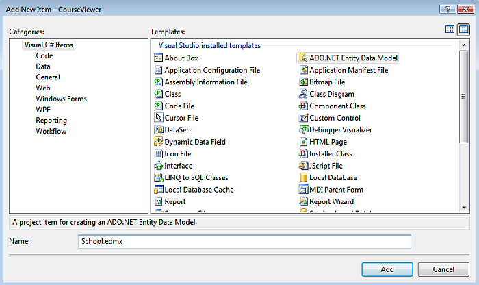

*Generate the EDM*

1.  Select
    
    *Generate from database*
    
    in the
    
    *Choose Model Contents dialog box*
    
    . Then click
    
    *Next*
    
    .
    
    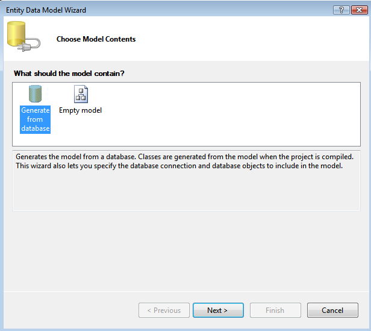

2.  Click the
    
    *New Connection*
    
    button.
    
    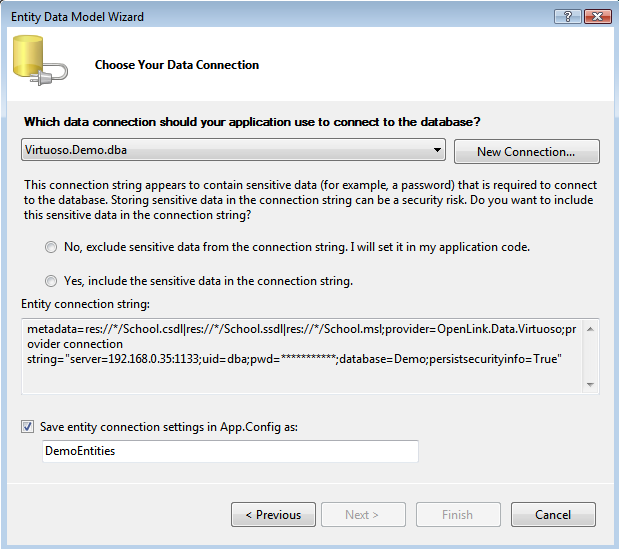

3.  Choose the OpenLink
    
    *Virtuoso Data Source*
    
    and click
    
    *Continue*
    
    .
    
    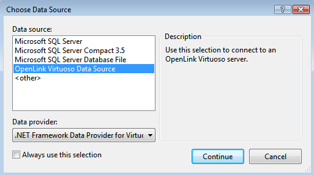

4.  In the
    
    *Connection Properties*
    
    dialog specify the
    
    *hostname, portno, username and password*
    
    for the target Virtuoso Server and click the
    
    *Advanced*
    
    button.
    
    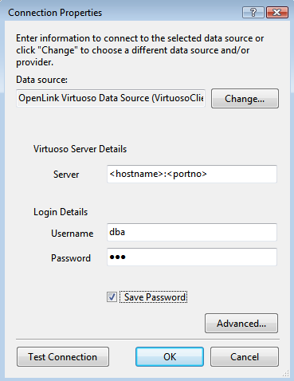

5.  In the
    
    *Advanced Properties*
    
    dialog set the
    
    *Database parameter*
    
    to
    
    *School*
    
    and click OK.
    
    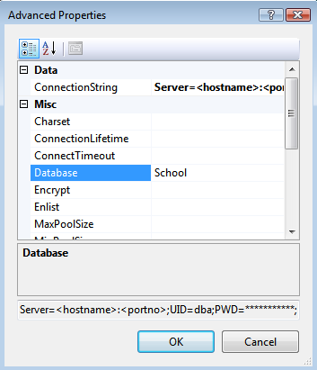

6.  Press the
    
    *Test Connection*
    
    dialog to verify the database is accessible.
    
    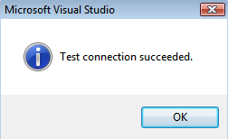

7.  Set the
    
    *entity connect string name*
    
    to
    
    *SchoolEntities*
    
    and click
    
    *Next*
    
    .
    
    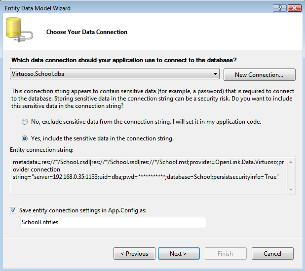

8.  In the
    
    *Choose your Database Objects*
    
    page select the
    
    *Tables*
    
    check box to select all table in the
    
    *School database*
    
    for addition to the EDM, set the
    
    *Model Namespace*
    
    to
    
    *SchoolModel*
    
    and click
    
    *Finish*
    
    .
    
    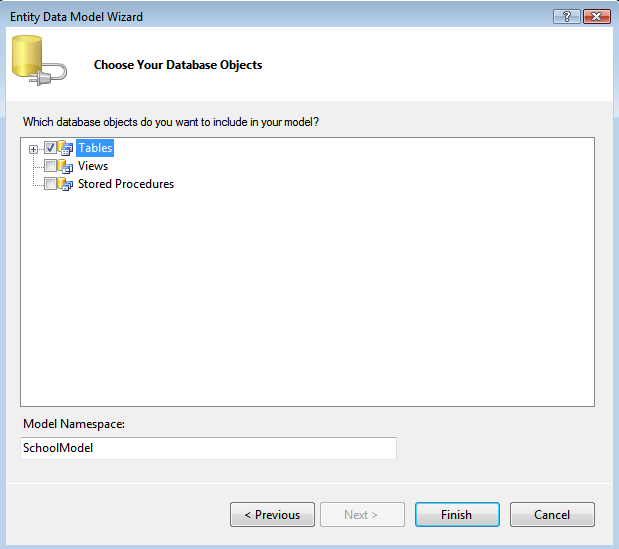

*View the EDM in the ADO.NET Entity Data Model Designer*

1.  In the
    
    *Solution Explorer*
    
    , double-click the
    
    *School.edmx*
    
    file. This displays the School model in the ADO.NET Entity Data
    Model Designer window.
    
    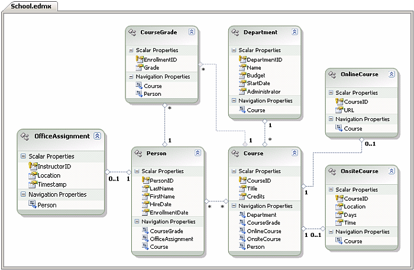

2.  From the
    
    *View*
    
    menu, select
    
    *Other Windows*
    
    , and then click
    
    *Model Browser*
    
    to display the
    
    *Entity Model Browser*
    
    window.

3.  Expand the
    
    *SchoolModel*
    
    and
    
    *SchoolModel.Store*
    
    nodes to view conceptual and store definitions, respectively.
    
    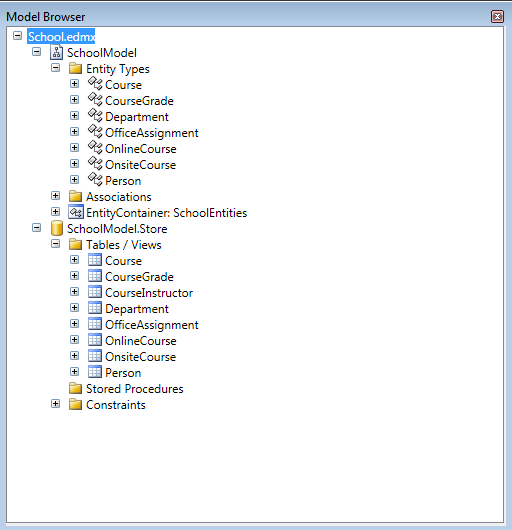

4.  From the
    
    *View menu*
    
    , select
    
    *Other Windows*
    
    , click
    
    *Mapping Details*
    
    , and then click an entity (Person for example) or association in
    the Entity Designer.

5.  This displays the Entity Mapping Details window with information
    about the object-relational mapping for the selected object.
    
    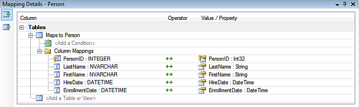

<a id="id36-querying-entities-and-associations"></a>
## Querying Entities and Associations

This section creates strongly-typed queries against the CLR objects that
represent entities and associations in the School model, and bind
display controls to the object collections returned from these queries.

*Query the departments in the School database*

1.  At the beginning of the code file for the
    
    *CourseViewer*
    
    form, add the following
    
    *using*
    
    (C\#) or
    
    *Imports*
    
    (Visual Basic) statements to reference the model created from the
    School database and the entity namespace.
    
        Visual Basic
        
        Imports System.Data.Objects
        Imports System.Data.Objects.DataClasses
        
        C#
        
        using System.Data.Objects;
        using System.Data.Objects.DataClasses;

2.  At the top of the partial class definition for the
    
    *CourseViewer*
    
    form, add the following code that creates an
    
    *ObjectContext*
    
    instance.
    
        Visual Basic
        
        ' Create an ObjectContext instance based on SchoolEntity.
        Private schoolContext As SchoolEntities
        
        C#
        
        // Create an ObjectContext instance based on SchoolEntity.
        private SchoolEntities schoolContext;

3.  In the
    
    *CourseViewer*
    
    form designer, double-click the
    
    *CourseViewer*
    
    form. This opens the code page for the form and creates the
    
    *courseViewer \_Load*
    
    event handler method.

4.  In the
    
    *courseViewer \_Load*
    
    event handler method, copy and paste the following code that defines
    the
    
    *DataGridView*
    
    , executes a query that returns a collection of departments (ordered
    by
    
    *Name*
    
    ), and binds the collection of
    
    *Department*
    
    objects to the departmentList control.
    
        Visual Basic
        
        ' Initialize the ObjectContext.
        schoolContext = New SchoolEntities()
        
        ' Define a query that returns all Department objects and related
        ' Course objects, ordered by name.
        Dim departmentQuery As ObjectQuery(Of Department) = _
            schoolContext.Department.Include("Course").OrderBy("it.Name")
        
        Try
            ' Bind the ComboBox control to the query, which is
            ' executed during data binding.
            Me.departmentList.DisplayMember = "Name"
            Me.departmentList.DataSource = departmentQuery
        Catch ex As Exception
            MessageBox.Show(ex.Message)
        End Try
        
        C#
        
        // Initialize the ObjectContext.
        schoolContext = new SchoolEntities();
        
        // Define a query that returns all Department objects and related
        // Course objects, ordered by name.
        ObjectQuery<Department> departmentQuery =
            schoolContext.Department.Include("Course").OrderBy("it.Name");
        
        try
        {
            // Bind the ComboBox control to the query, which is
            // executed during data binding.
            this.departmentList.DisplayMember = "Name";
            this.departmentList.DataSource = departmentQuery;
        }
        catch (Exception ex)
        {
            MessageBox.Show(ex.Message);
        }

*Display courses for the selected department*

1.  In the
    
    *CourseViewer*
    
    form designer, double-click the
    
    *departmentList*
    
    control. This creates the
    
    *departmentList\_SelectedIndexChanged*
    
    event handler method.

2.  Paste the following code that loads the courses that are related to
    the selected department.
    
        Visual Basic
        
        Try
            ' Get the object for the selected department.
            Dim department As Department = _
                CType(Me.departmentList.SelectedItem, Department)
        
            ' Bind the grid view to the collection of Course objects
            ' that are related to the selected Department object.
            courseGridView.DataSource = department.Course
        
            ' Hide the columns that are bound to the navigation properties on Course.
            courseGridView.Columns("Department").Visible = False
            courseGridView.Columns("CourseGrade").Visible = False
            courseGridView.Columns("OnlineCourse").Visible = False
            courseGridView.Columns("OnsiteCourse").Visible = False
            courseGridView.Columns("Person").Visible = False
        
            courseGridView.AutoResizeColumns(DataGridViewAutoSizeColumnsMode.AllCells)
        Catch ex As Exception
            MessageBox.Show(ex.Message)
        End Try
        
        C#
        
        try
        {
            // Get the object for the selected department.
            Department department =
                (Department)this.departmentList.SelectedItem;
        
            // Bind the grid view to the collection of Course objects
            // that are related to the selected Department object.
            courseGridView.DataSource = department.Course;
        
            // Hide the columns that are bound to the navigation properties on Course.
            courseGridView.Columns["Department"].Visible = false;
            courseGridView.Columns["CourseGrade"].Visible = false;
            courseGridView.Columns["OnlineCourse"].Visible = false;
            courseGridView.Columns["OnsiteCourse"].Visible = false;
            courseGridView.Columns["Person"].Visible = false;
        
            courseGridView.AutoResizeColumns(DataGridViewAutoSizeColumnsMode.AllCells);
        }
        catch (Exception ex)
        {
            MessageBox.Show(ex.Message);
        }

<a id="id37-inserting-and-updating-data"></a>
## Inserting and Updating Data

In this section the changes made to Course objects bound are saved to
the DataGridView control to the database and also run the completed
Course Manager application.

*Save changes made to objects*

1.  In the
    
    *Toolbox*
    
    , expand
    
    *Common Controls*
    
    , drag the
    
    *Button*
    
    control to the
    
    *CourseViewer*
    
    form designer, change the
    
    *name*
    
    of the control to
    
    *saveChanges*
    
    , and change the
    
    *Text*
    
    value to
    
    *Update*
    
    .

2.  In the
    
    *CourseViewer*
    
    form designer, double-click the
    
    *saveChanges*
    
    control. This creates the
    
    *saveChanges\_Click*
    
    event handler method.

3.  Paste the following code that saves object changes to the database.
    
        Visual Basic
        
        Try
            ' Save object changes to the database, display a message,
            ' and refresh the form.
            schoolContext.SaveChanges()
            MessageBox.Show("Changes saved to the database.")
            Me.Refresh()
        Catch ex As Exception
            MessageBox.Show(ex.Message)
        End Try
        
        C#
        
        try
        {
            // Save object changes to the database, display a message,
            // and refresh the form.
            schoolContext.SaveChanges();
            MessageBox.Show("Changes saved to the database.");
            this.Refresh();
        }
        catch (Exception ex)
        {
            MessageBox.Show(ex.Message);
        }

4.  In the
    
    *closeForm\_Click*
    
    event handler method, type the following code. This code disposes of
    the object context before the form is closed.
    
        Visual Basic
        
           ' Dispose the object context.
            schoolContext.Dispose()
        
        C#
        
            // Dispose the object context.
            schoolContext.Dispose();

*Build and run the Class Scheduling application*

1.  From the
    
    *Debug*
    
    menu, select
    
    *Start Debugging*
    
    or
    
    *Start Without Debugging*
    
    , to build and run the application.

2.  When the form loads, select a department from the
    
    *ComboBox*
    
    control to display the courses that belong to that department.
    
    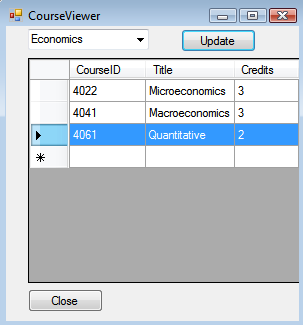

3.  In the
    
    *DataGridView*
    
    , update course information or add a new course and then click
    
    *Update*
    
    to save changes to the database and displays a message box that
    declares the number of saved changes.
    
    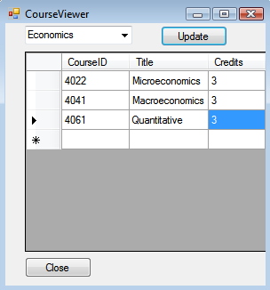

The process is now complete

<a id="id38-using-visual-studio-2008-to-build-an-adonet-data-services-based-application"></a>
# Using Visual Studio 2008 to Build an ADO.NET Data Services based Application

**Using Microsoft ADO.Net Data Services with Virtuoso**

<a id="id39-introduction"></a>
## Introduction

The goal of Microsoft ADO.NET Data Services is to enable applications to
expose data as a data service that can be consumed by web clients within
corporate networks and across the internet. A data service is reachable
via regular HTTP requests, using standard HTTP verbs such as GET, POST,
PUT and DELETE to perform CRUD operations against the service. The
payload format used by the service is controllable by the application,
but all options are simple, open formats such as JSON and Atom/APP.

The use of web-friendly technologies make ADO.NET Data Services ideal as
a data back-end for AJAX-style applications, Rich Interactive
Applications and other applications that need to operate against data
that is stored across the web.

<a id="id40-getting-started-creating-data-services"></a>
## Getting Started: Creating Data Services

*Pre-requisites*

In order to create a data service using ADO.NET Data Services in your
own environment you will need Microsoft Visual Studio 2008 SP1. The
ADO.NET Entity Framework runtime and associated tools are included in
Visual Studio 2008 SP1.

*Selecting a Data Source*

The ADO.NET Data Service server framework is comprised of two halves.
The top-half is the runtime itself; this part is "fixed", and it
implements URI translation, the Atom/JSON wire formats, the interaction
protocol, etc. This is what makes an ADO.NET Data Service look like an
ADO.NET Data Service. The bottom half is the data-access layer and is
pluggable. Communication between layers happens in terms of the
IQueryable interface plus a set of conventions to map CLR graphs into
the URI/payload patterns of ADO.NET Data Services.

The first step in creating an ADO.NET Data Service is to determine the
data source that is to be exposed as a set of REST-based endpoints (ie.
select or create a data access layer). For relational data stored in
Microsoft SQL Server or other 3rd Party databases, ADO.NET Data Services
currently enables easily exposing a conceptual model created using the
ADO.NET Entity Framework (EF). For all other data sources (XML section,
web service, application logic layer, etc) or to use additional database
access technologies (ex. LINQ to SQL), a mechanism is provided which
enables any data source, as per the plug-in model described above, to be
exposed as an ADO.NET Data Service.

To create a data service which exposes a relational database through an
Entity Framework conceptual model see "Creating a Data Service using the
ADO.NET Entity Framework". To create a data service which exposes
another data source see "Creating a Data Service from any Data Source".

<a id="id41-creating-a-data-service-using-the-adonet-entity-framework"></a>
## Creating a Data Service using the ADO.NET Entity Framework

ADO.NET Data Services are a specialized form of Windows Communication
Foundation services, and thus can be hosted in various environments. The
below example will create an ADO.NET Data Service which is hosted inside
an ASP.NET site. In order to create a data service, you must first
create a web project; you will then need to establish a connection with
the database that will be exposed by the service, and then create the
data service itself within the web application. Below is a step-by-step
description of this process.

The following steps can be used for creating a Data Service using the
Virtuoso ADO.Net Provider for accessing the sample Northwind Demo
database:

1.  Launch the Visual Studio 2008 SP1 IDE.
    
    

2.  Create a
    
    *Web Application*
    
    project by going to the
    
    *File*
    
    menu in Visual Studio and choosing
    
    *New Project*
    
    .

3.  When the New Project window appears, choose either
    
    *Visual Basic*
    
    or
    
    *Visual C\#*
    
    as the programming language.

4.  Within the language category click on
    
    *Web*
    
    , and select
    
    *ASP.NET Web Application*
    
    from the right-hand panel.

5.  Choose a name for the project, for example
    
    *VirtuosoDataService*
    
    , and click
    
    *OK*
    
    .
    
    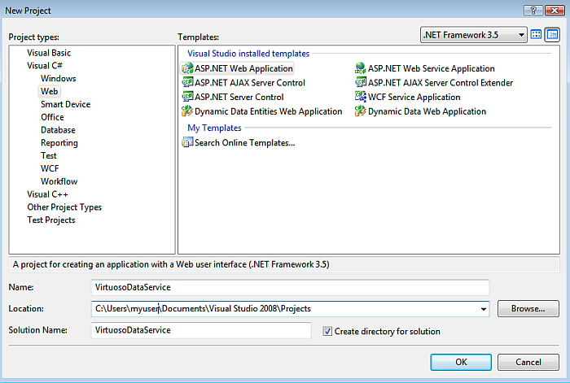

6.  This will create a new project called
    
    *VirtuosoDataService*
    
    .
    
    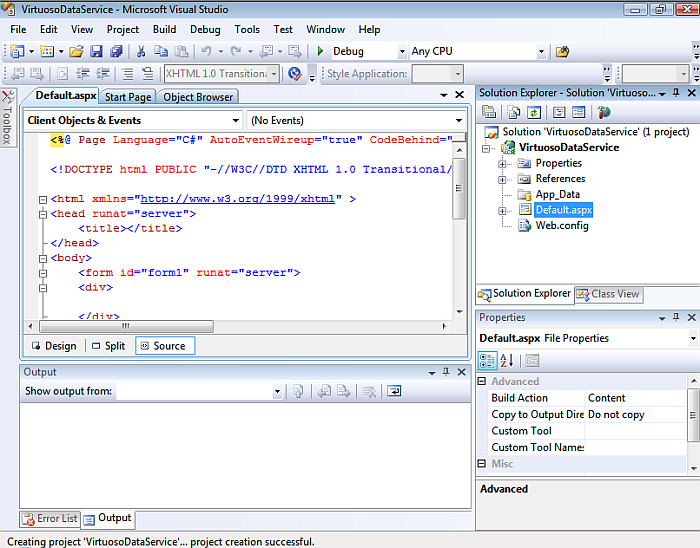

7.  Right click on the
    
    *VirtuosoDataService*
    
    project name of the Solution Explorer pane, then select the
    
    *Add -\> New Item*
    
    menu options.
    
    

8.  The
    
    *Add*
    
    New Item dialog will appear, choose the
    
    *ADO.NET Entity Data Model*
    
    template, give it the name
    
    *Virtuoso.edmx*
    
    and click
    
    *Add*
    
    to start the creation of the ADO.Net Entity Data Model.
    
    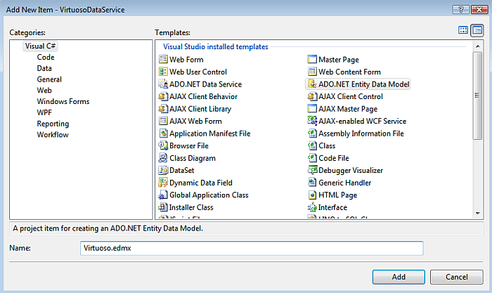

9.  In the
    
    *Entity Data Model Wizard*
    
    dialog
    
    *Choose Model Contents*
    
    page select the
    
    *Generate from Database*
    
    model type and click
    
    *Next*
    
    .
    
    

10. In the
    
    *Entity Data Model Wizard*
    
    dialog
    
    *Choose your Data Connection*
    
    page select the
    
    *New Connection*
    
    button
    
    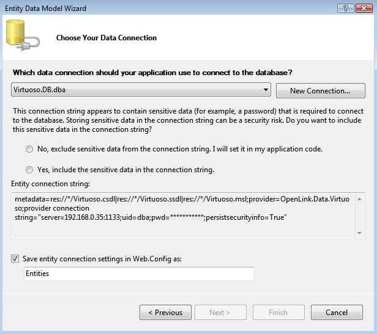

11. In the
    
    *Choose Data Source*
    
    dialog, select the OpenLink
    
    *Virtuoso Data Source*
    
    from the list displayed and click
    
    *Continue*
    
    .
    
    

12. In the
    
    *Add Connection*
    
    dialog, specify the
    
    *hostname, portno, username and password*
    
    for the target Virtuoso Server and check the
    
    *Save Password*
    
    check box.
    
    

13. Select the
    
    *Select Database From List*
    
    radio button and choose
    
    *Demo*
    
    from the drop down list, assuming the Virtuoso Demo Database is
    installed.
    
    

14. Click the
    
    *Test Connection*
    
    button to verify the connection is successful and then click OK to
    add the connection.
    
    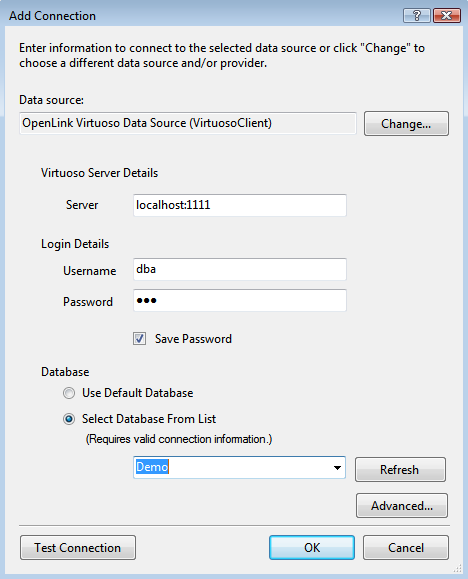

15. Set the
    
    *entity connect string*
    
    name to
    
    *VirtuosoDemoEntities*
    
    (note this name as it is required in step 17 below) and click
    
    *Next*
    
    .
    
    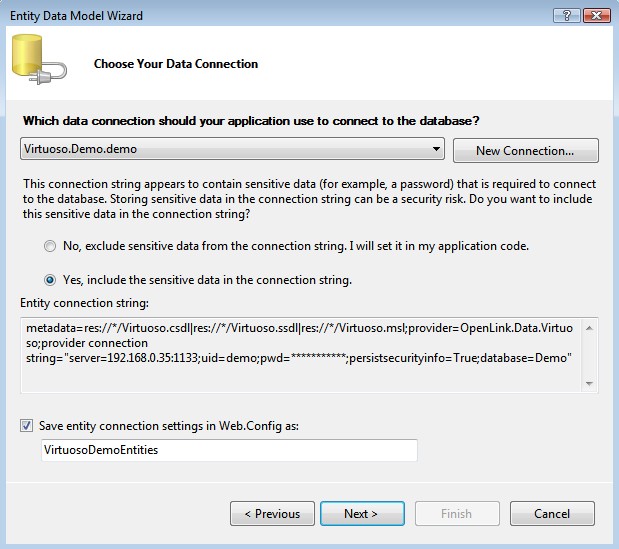

16. In the
    
    *Choose your Database Objects*
    
    page select the
    
    *Tables*
    
    check box to select all tables in the Demo database for addition to
    the Entity Data Model, set the
    
    *Model Namespace*
    
    to
    
    *VirtuosoDemoModel*
    
    and click
    
    *Finish*
    
    .
    
    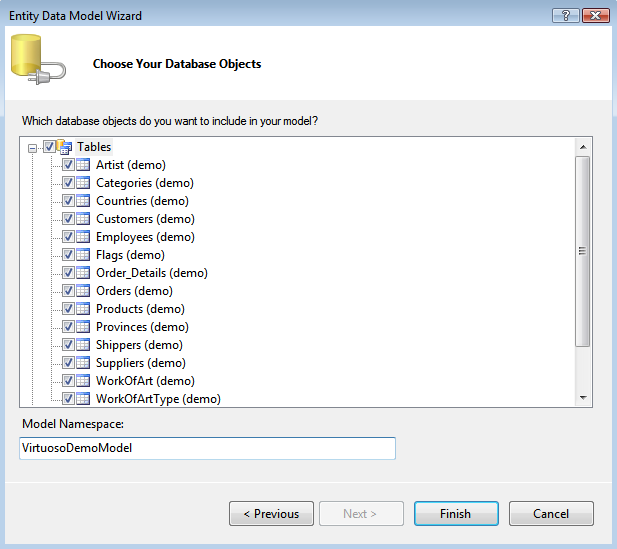

17. The
    
    *Virtuoso.edmx*
    
    EDM will be created with the tables and relationships displayed in
    the Visual Studio IDE
    
    

18. Right click on the
    
    *VirtuosoDataService*
    
    project name of the
    
    *Solution Explorer pane*
    
    , then select the
    
    *Add -\> New Item*
    
    menu options.
    
    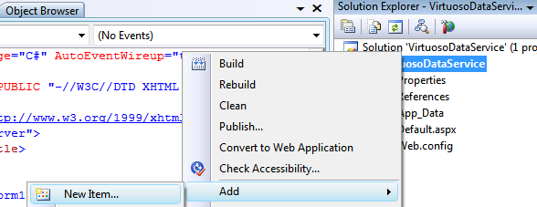

19. The
    
    *Add New Item*
    
    dialog will appear, choose the
    
    *ADO.NET Data Service*
    
    template, give it the name
    
    *Virtuoso.svc*
    
    and click
    
    *Add*
    
    to create the ADO.Net Data Service.
    
    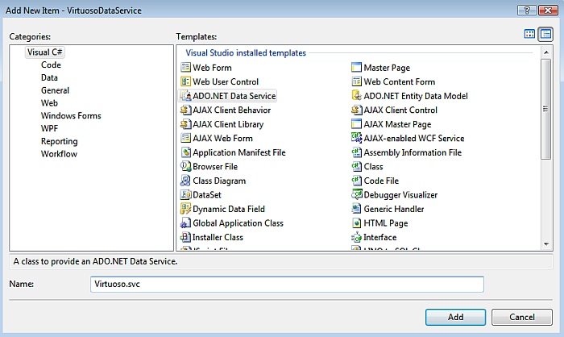

20. In the
    
    *Virtuoso.svc.cs*
    
    Data Service file created add the data source class name of
    
    *VirtuosoDemoEntities*
    
    (note this is the name set in step 12) as the
    
    *DataService*
    
    name and enable the access to the Data Service by adding the entry
    
    *config.SetEntitySetAccessRule("\*", EntitySetRights.All);*
    
    in the
    
    *InitializeService*
    
    method.
    
        // C#
        
        using System;
        using System.Web;
        using System.Collections.Generic;
        using System.ServiceModel.Web;
        using System.Linq;
        using System.Data.Services;
        
        namespace SimpleDataService
        {
            public class Northwind : DataService<VirtuosoDemoEntities>
            {
                public static void InitializeService(IDataServiceConfiguration  config)
                {
                    config.SetEntitySetAccessRule("*", EntitySetRights.All);
                }
            }
        }
    
    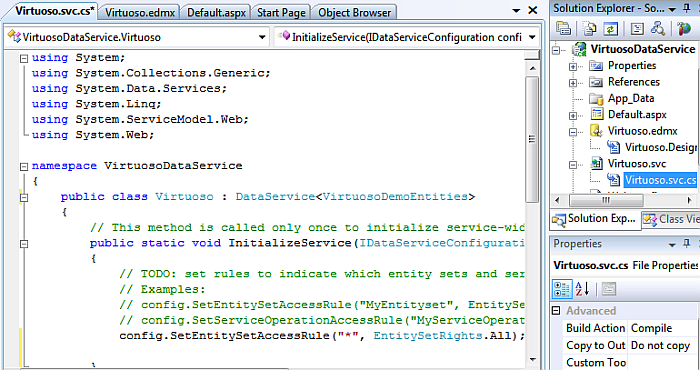

21. To test the Data Service, simply hit
    
    *Ctrl+F5*
    
    within Visual Studio, which will start the development web server,
    run the Data Services server inside and load a Web browser page
    displaying the list of available tables/entities of the Demo
    database.
    
    

22. To access a specific entity instance like the
    
    *Customers*
    
    table
    
    *ALFKI*
    
    record, this would be specified as
    http://host/vdir/Virtuoso.svc/Customers('ALFKI') .
    
    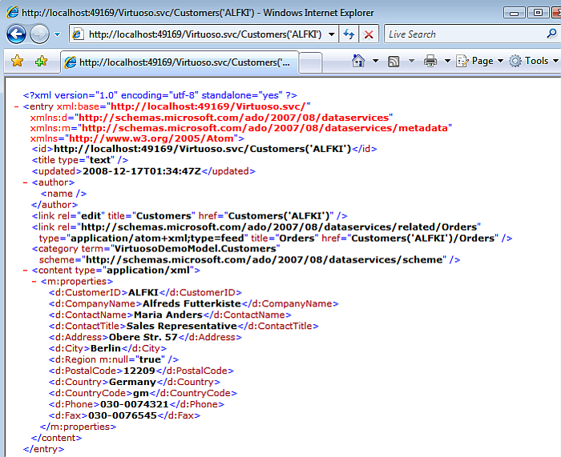

*NOTES*

1.  *Important*
    
    \- To view
    
    *Atom*
    
    (the default format returned by an ADO.NET Data Service) in Internet
    Explorer, you must first ensure that
    
    *Feed Reading View*
    
    is turned
    
    *off*
    
    . This can be done on the
    
    *Content tab*
    
    of
    
    *Tools in Internet Options*
    
    .

2.  If a Data Services entity instance URI page fails to load you can
    turn
    
    *Verbose*
    
    errors on by adding
    
    *config.UseVerboseErrors = true;*
    
    in the
    
    *virtuoso.svc.cs InitializeService*
    
    method to obtain more detailed information from the server as to why
    the page failed to load:
    
        public static void InitializeService(IDataServiceConfiguration config)
        
        {
        
        config.UseVerboseErrors = true;
        
        config.SetEntitySetAccessRule("*", EntitySetRights.All);
        
        }

<a id="id42-windows-form-application-for-accessing-virtuoso-rdf-data-via-spasql-using-the-virtuoso-adonet-provider"></a>
# Windows Form Application for accessing Virtuoso RDF data via SPASQL using the Virtuoso ADO.Net Provider

This section will guide you through creating a simple application that
allows you to access RDF data in a Virtuoso database as an Entity
DataSet and explore that RDF data in an intuitive way by clicking on
dereferenceable [IRIs](#rdfiriidtype) .

<a id="id43-pre-requisites"></a>
## Pre-requisites

1.  Microsoft Visual Studio 2008

2.  The Virtuoso ADO.Net provider for .Net 3.5 and the Entity Framework.

3.  The example assumes that you have a local Virtuoso server with the
    Northwind demo database installed. If the demo database is not
    already installed then download the [demo database VAD package](#)
    (demo\_dav.vad) and install it. The VAD package will create a new
    database in Virtuoso called demo containing the familiar Northwind
    tables. It will also creates [Linked Data Views](#rdfviewsrdbms) of
    the Northwind tables. In the example we assume the database is
    accessible on a hostname of "demo.openlinksw.com" on the default
    port 80, where an actually live instance of the Virtuoso Demo
    database is hosted. Users would use the appropriate hostname and
    port number of their Virtuoso installation to create the sample
    application, and would be would be example.com for a default
    installation or whatever the [URIQA DefaultHost](#ini_uriqa)
    Virtuoso configuration parameter is set to when the demo database
    VAD package is installed.

<a id="id44-creating-the-application"></a>
## Creating the Application

*Step 1 - Create a view of the RDF data.*

We want to be able to access the RDF data in Visual Studio and the
easiest way to do this is to create a view of the data that we are
interested in and bind that view to a DataSet. This can be considered as
using server side [SPARQL](#rdfsparql) . Virtuoso supports an [extension
to standard SQL that allows](#rdfsparqlinline) execution of SPARQL. If a
SQL query begins with the keyword SPARQL then the rest of the query is
interpreted by as SPARQL. If a SPARQL query is used as the definition of
a view then that view can be manipulated using SQL like any other view.
In this way the result set from a SPARQL query can be easily accessed
from Visual Studio using ADO.Net and the Entity Framework.

To create a view of the customers in the Northwind first open the
Virtuoso Conductor and log in as dba. Then open iSQL from the menu on
the left and execute the following statement.

``` 

CREATE VIEW Demo.demo.sparqlview as
SPARQL
PREFIX nwind: <http://demo.openlinksw.com/schemas/northwind#>
SELECT DISTINCT  ?s
FROM <http://demo.openlinksw.com/Northwind>
WHERE {?s a nwind:Customer}
```

*Note:* If the view is added to the Visual Studio project as user "demo"
(or any other than "dba'), then it must be ensured that the
"SPARQL\_SELECT" and "SPARQL\_SPONGE" roles are assigned to this user,
which can be done via the Virtuoso Conductor in the "System Admin" -\>
"User Accounts" tab.

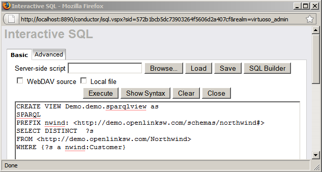

*Step 2 - Create a simple grid form in Visual Studio*

1.  Open
    
    *Visual Studio*
    
    and create a new
    
    *Windows Forms Application*
    
    called RDFDemo.

2.  In the
    
    *Form Designer*
    
    drag a
    
    *DataGridView*
    
    on to the form.

3.  Click the
    
    *Choose Data Source*
    
    drop down and select
    
    *Add Project Data Source*
    
    .
    
    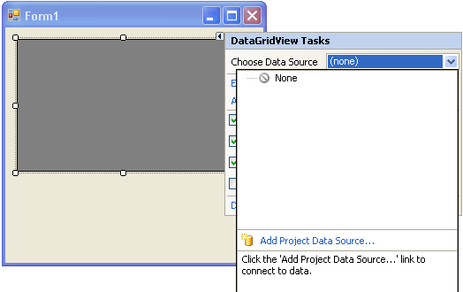

4.  In the
    
    *Data Source Configuration Wizard*
    
    choose Database and then set up a connection to the demo database on
    your local Virtuoso server.

5.  On the
    
    *Choose Your Data Objects*
    
    page expand the
    
    *Views*
    
    and select sparqlview.
    
    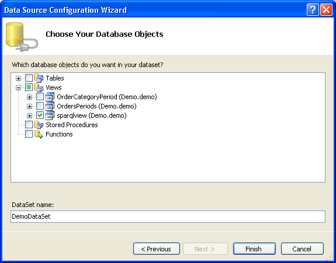

6.  Click
    
    *Finish*
    
    .

7.  In the
    
    *Form Designer*
    
    select dataGridView1 and change the
    
    *AutoSizeColumnsMode*
    
    to AllCellsExceptHeader.

8.  Select the
    
    *DefaultCellStyle*
    
    and click on the ellipsis. This will open the
    
    *CellStyleBuilder*
    
    . Change the
    
    *ForeColor*
    
    to Blue.
    
    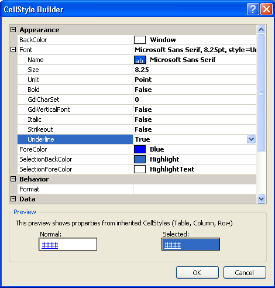

9.  Expand
    
    *Font*
    
    and change
    
    *Underline*
    
    to True. Click
    
    *OK*
    
    .

*Step 3 - Change the mapping of the DataSet.*

In the Solution Explorer you will now have a DataSet called
DemoDataSet.xsd. If you double click on this it opens the DataSet
Designer. Select the column called s in the sparqlview table and in the
Properties pane change the DataType from System.String to System.Object.

The data returned by a SPARQL query can either be an
[IRI](#rdfiriidtype) or a literal value. In order to distinguish between
the two the Virtuoso ADO.Net provider defines an additional data type,
SQLExtendedString. By setting the column type to System.Object we can
cast the fetched data back to SQLExtendedString and find out if an
individual value is an IRI or a literal and handle it appropriately.

*Step 4 - Create the on\_click event handler for the cells in the
DataGridView.*

Return to the *Form Designer* and double click on the cell of the
*DataGridView* . This creates the *dataGridView1\_CellContentClick*
method in Form1.cs. This is the method that handles clicking on IRI
objects in the grid.

Paste in the following block of code into the body of the
*dataGridView1\_CellContentClick* method.

    int column = e.ColumnIndex;
     object o = dataGridView1.Rows[e.RowIndex].Cells[e.ColumnIndex].Value;
     Type t = dataGridView1.Rows[e.RowIndex].Cells[e.ColumnIndex].ValueType;
    
     if (o is SqlExtendedString)
     {
         SqlExtendedString se = (SqlExtendedString) o;
         ExtendedStringHandler seHandler = new ExtendedStringHandler(se, this.sparqlviewTableAdapter.Connection);
         seHandler.displayData();
     }
     else if (o is SqlRdfBox)
     {
         //doesn't do anything at the moment
     }

As we are using the SQLExtendedString extension from the Virtuoso
ADO.Net provider you will also need to add

    using OpenLink.Data.Virtuoso;

at the top of the file.

*Step 5 - Create a class to handle exploring the RDF data.*

  - Add a new C\# class to the project called ExtendedStringHandler, by
    Right clicking on RDFDemo in the
    
    *Solution Explorer*
    
    and
    
    *Add*
    
    a
    
    *Class*
    
    .

  - Add the following using statements to the top of the file
    
        using OpenLink.Data.Virtuoso;
        using System.Data;
        using System.Windows.Forms;
        using System.Drawing;
        using System.Data.Mapping;
        using System.Data.Common;

  - Paste the following block of code into the class definition.
    
        StringBuilder DescribeCommand;
        VirtuosoConnection ParentConnection;
        List<Label> labelList = new List<Label>();
        List<TextBox> textBoxList = new List<TextBox>();
        DescribeDataSet describeDataSet = new DescribeDataSet();
        Boolean isIRI = false;
        
        public ExtendedStringHandler(SqlExtendedString iri, VirtuosoConnection parentConnection)
         {
             ParentConnection = parentConnection;
             if (iri.IriType == SqlExtendedStringType.IRI)
             {
                 isIRI = true;
                 DescribeCommand = new StringBuilder("sparql select * from <http://demo.openlinksw.com/Northwind> where {<" + iri.ToString() + "> ?p ?o}");      // Replace demo.openlinksw.com with your  URIQA DefaultHost setting
             }
         }
        
         public string describeCommandText
         {
             get
             {
                 return DescribeCommand.ToString();
             }
         }
        
         public void getDescribeData()
         {
              VirtuosoCommand myCommand = new VirtuosoCommand(this.describeCommandText, this.ParentConnection);
             VirtuosoDataAdapter myAdapter = new VirtuosoDataAdapter();
             myAdapter.SelectCommand = myCommand;
             myAdapter.Fill(describeDataSet.DataTable1);
         }
        
         public void displayData()
         {
             if (isIRI)
             {
                 getDescribeData();
                 Form describeForm = new Form();
                 describeForm.AutoScroll = true;
                 describeForm.Width = 840;
        
                 Label label1 = new Label();
                 label1.AutoSize = true;
                 label1.Font = new Font(label1.Font.FontFamily, label1.Font.Size + 3.0F, label1.Font.Style | FontStyle.Bold, label1.Font.Unit);
                 describeForm.Controls.Add(label1);
        
                 DataTable table1 = describeDataSet.Tables[0];
                 if (table1.Rows.Count == 0)
                     label1.Text = "No Details Available";
                 else
                 {
                     foreach (DataRow row in table1.Rows)
                         if (row[0].ToString() == "http://www.w3.org/1999/02/22-rdf-syntax-ns#type")
                         {
                             StringBuilder title = new StringBuilder(row[1].ToString() + " details");
                             label1.Text = title.ToString();
                             break;
                         }
        
                     foreach (DataRow row in table1.Rows)
                     {
                         Label propertyLabel = new Label();
                         TextBox valueBox = new TextBox();
                         valueBox.Width = 400;
        
                         object property = row[0];
                         object value = row[1];
        
                         if (value is SqlExtendedString)
                         {
                             valueBox.ForeColor = Color.Blue;
                             valueBox.Font = new Font(valueBox.Font.FontFamily, valueBox.Font.Size, valueBox.Font.Style | FontStyle.Underline, valueBox.Font.Unit);
                         }
                         propertyLabel.Text = row[0].ToString();
                         propertyLabel.AutoEllipsis = true;
                         propertyLabel.AutoSize = false;
                         propertyLabel.Width = propertyLabel.PreferredWidth > 380 ? 380 : propertyLabel.PreferredWidth;
        
                         Binding bind = new Binding("Text", row[1], "");
                         valueBox.DataBindings.Add(bind);
        
                         labelList.Add(propertyLabel);
                         textBoxList.Add(valueBox);
                     }
        
                     for (int i = 0; i < table1.Rows.Count; i++)
                     {
                         textBoxList[i].Click += new EventHandler(this.iri_Click);
                         labelList[i].Location = new Point(10, i * 20 + 50);
                         textBoxList[i].Location = new Point(400, i * 20 + 50);
                         describeForm.Controls.Add(labelList[i]);
                         describeForm.Controls.Add(textBoxList[i]);
                     }
        
                     describeForm.Height = labelList.Count * 20 + 100 > 500 ? 500 : labelList.Count * 20 + 100;
                 }
                 describeForm.ShowDialog();
             }
             else
             {
                 Form blankForm = new Form();
                 Label label1 = new Label();
                 label1.Text = "Blank Node";
                 label1.Font = new Font(label1.Font.FontFamily, label1.Font.Size + 3.0F, label1.Font.Style | FontStyle.Bold, label1.Font.Unit);
                 blankForm.ShowDialog();
             }
         }
        
         public void iri_Click(object sender, EventArgs e)
         {
             int boxNum = 0;
        
             for (int i = 0; i < textBoxList.Count; i++)
             {
                 if (sender == textBoxList[i])
                 {
                     boxNum = i;
                     break;
                 }
             }
        
            Object o = describeDataSet.DataTable1.Rows[boxNum][1];
             if (o is SqlExtendedString)
             {
                 SqlExtendedString se = (SqlExtendedString)o;
                 ExtendedStringHandler seHandler = new ExtendedStringHandler(se, ParentConnection);
                 seHandler.displayData();
             }
             else if (o is SqlRdfBox)
             {
                //doesn't do anything at the moment
            }
         }

The ExtendedStringHandler class creates a new SPARQL query based on the
IRI that was clicked. This query is executed against Virtuoso using the
ADO.Net connection in the same way that any SQL statement would be
executed across an ADO.Net connection. This can be considered as Client
Side SPARQL. The result set from the query describes the selected object
and is returned as an ADO.Net DataAdapter. The DataAdapter is used to
fill a DataTable which is displayed on a new form. We now need to add
the new DataSet to the project and define the DataTable that will hold
the query results.

*Step 6 - Add a new DataSet to hold the query results.*

1.  Right click RDFDemo in the
    
    *Solution Explorer*
    
    and add a new
    
    *DataSet*
    
    . Call the new
    
    *DataSet*
    
    DescribeDataSet.
    
    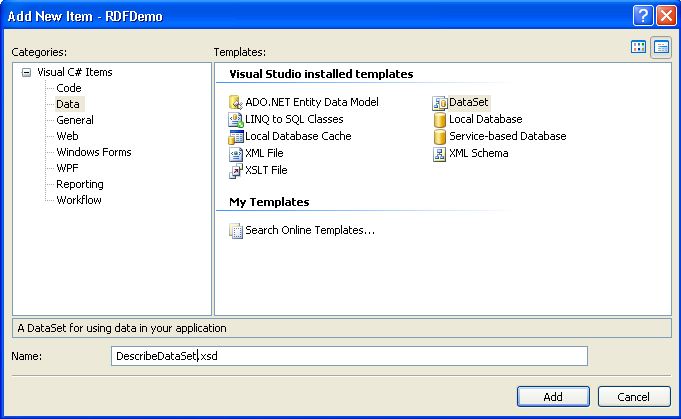

2.  Double click on DescribeDataSet in the
    
    *Solution Explorer*
    
    to open the
    
    *DataSet*
    
    Designer and drag a
    
    *DataTable*
    
    from the
    
    *Toolbox*
    
    into it.

3.  Add two columns, p and o, to the
    
    *DataTable*
    
    and set the
    
    *DataType*
    
    of each column to System.Object.
    
    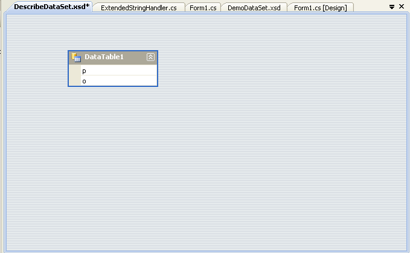

*Step 7 - Build and run the application.*

You should see a form displaying all the Northwind customers, like this.


When any customer is clicked it opens a new form showing customer
details.

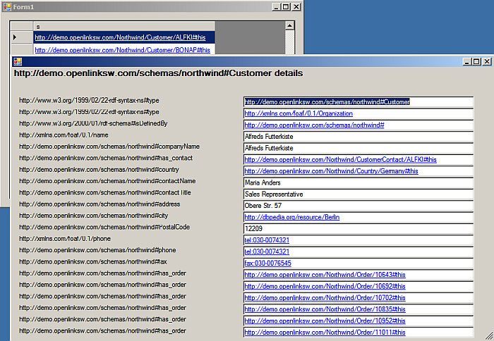

Clicking on the links in the new form allows you to drill down further
to get order, product, location details etc.

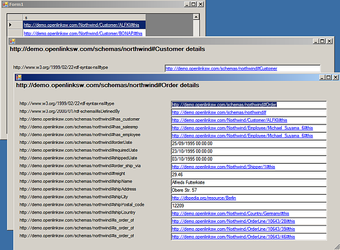

and

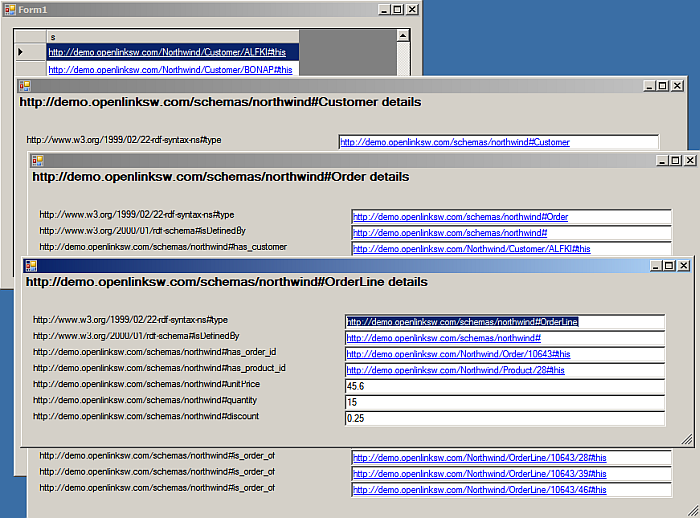

*Next Steps*

You will notice if you keep clicking on the links that this application
will only display data that is held in the Northwind graph. Clicking on
an external link, for example the link to Berlin in dbpedia,
http://dbpedia.org/resource/Berlin, results in a empty window and an
error message. The next step is to extend this application so that it
can handle dereferencing external IRIs.

<a id="id45-extending-rdfdemo-to-allow-dereferencing-of-external-iris"></a>
## Extending RDFDemo to Allow Dereferencing of External IRIs

This section will guide you through extending the application created in
[Creating a Windows Forms Application To Access RDF Data Using The
Virtuoso ADO.Net Provider](#installwfasgetstart) so that it will
dereference external IRIs.

*Pre-requisites*

1.  A working copy of the RDFDemo application created in [Creating a
    Windows Forms Application To Access RDF Data Using The Virtuoso
    ADO.Net Provider.](#installwfasgetstart)

### Extending the Application

In RDFDemo when the sparql endpoint is queried to get the description of
the selected item it executes a query that is restricted to the local
Northwind dataset. The query is something like

    SPARQL
    PREFIX nwind: <http://demo.openlinksw.com/schemas/northwind#>
    SELECT DISTINCT  ?s
    FROM <http://demo.openlinksw.com/Northwind>
    WHERE {?s a nwind:Customer}

If you examine the ExtendedStringHandler class you will see that the
dataset clause, from \<http://example.com/Northwind\>, is hard coded.
This means that when when the selected IRI is a link to an external data
store, such as dbpedia, there is no matching data and an error is
displayed. If the application is to be able to dereference external IRIs
then the hard coded dataset clause needs to be removed and then we can
use a Virtuoso extension to SPARQL, get:soft, that tells Virtuoso that
it needs to go and look elsewhere for the graph. However, this will
result in a loss of performance when exploring the local Northwind
dataset. To minimize the impact on performance we will first query the
local Northwind dataset and if there are no matching triples returned
then we will use a more generic query that will look elsewhere for
matching data.

*Step 1 - Add the alternative query to the ExtendedString Class.*

  - Open the RDFDemo project in Visual Studio

  - Open the ExtendedStringHandler class.

  - Remove DescribeCommand by removing the line
    
        StringBuilder DescribeCommand;
    
    and substitute the following:
    
        StringBuilder DescribeCommandSimple, DescribeCommandGeneral;

  - In the ExtendedStringHandler constructor the sparql query that was
    DescribeCommand becomes DescribeCommandSimple and we define a new
    query for DescribeCommandGeneral.
    
        DescribeCommandSimple = new StringBuilder("sparql select * from <http://demo.openlinksw.com/Northwind> where {<" + iri.ToString() + "> ?p ?o}");       // Replace demo.openlinksw.com with your  URIQA DefaultHost setting
        DescribeCommandGeneral = new StringBuilder("sparql define get:soft " + '"'.ToString() + "soft" + '"'.ToString() + " select * from <" + iri.ToString() + "> where { <" + iri.ToString() + "> ?p ?o }");

  - The single describeCommand property needs to be replaced with the
    two new properties, DescribeCommandSimple and DescribeCommandGeneral
    
        public string describeCommandSimpleText
        {
            get
            {
                return DescribeCommandSimple.ToString();
            }
        }
        public string describeCommandGeneralText
        {
            get
            {
                return DescribeCommandGeneral.ToString();
            }
        }

  - Finally, the getDescribeData method needs changing to:
    
        public void getDescribeData()
        {
            VirtuosoCommand myCommand = new VirtuosoCommand(this.describeCommandSimpleText, this.ParentConnection);
            VirtuosoDataAdapter myAdapter = new VirtuosoDataAdapter();
            myAdapter.SelectCommand = myCommand;
            myAdapter.Fill(describeDataSet.DataTable1);
            // Tried the simple version if fails to get the data try
            // to look elsewhere.
            if (describeDataSet.DataTable1.Rows.Count == 0)
            {
                myCommand.CommandText = describeCommandGeneralText;
                myAdapter.Fill(describeDataSet.DataTable1);
            }
        }

*Step 2 - Build and Run the Application*

You will see the same starting form:

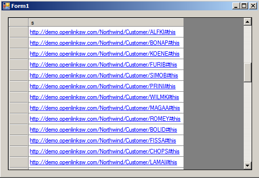

Select a Customer and then select the link to the City in dbpedia. This
will now open up another window displaying information about the city
from dbpedia. Be patient as it may take a little while to open.

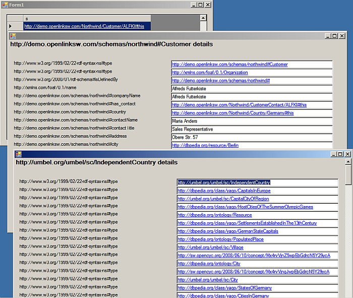

*Step 3 - Changing the Form Title*

Notice that in displayData method that we look for a
http://www.w3.org/1999/02/22-rdf-syntax-ns\#type and create a title for
the form from it.

    foreach (DataRow row in table1.Rows)
      if (row[0].ToString() == "http://www.w3.org/1999/02/22-rdf-syntax-ns#type")
      {
          StringBuilder title = new StringBuilder(row[1].ToString() + " details");
          label1.Text = title.ToString();
          break;
      }

This worked well for the Northwind subjects but less well now we are
getting data from other graphs. To change the title of the forms used to
display the data:

  - Add an new member variable to hold the IRI that we exploring to the
    bock of member variables
    
        StringBuilder DescribeCommandSimple, DescribeCommandGeneral;
        VirtuosoConnection ParentConnection;
        List<Label> labelList = new List<Label>();
        List<TextBox> textBoxList = new List<TextBox>();
        DescribeDataSet describeDataSet = new DescribeDataSet();
        Boolean isIRI = false;
        SqlExtendedString ParentIRI;

  - Assign a value to ParentIRI in the constructor:
    
        public ExtendedStringHandler(SqlExtendedString iri, VirtuosoConnection parentConnection)
          {
              ParentConnection = parentConnection;
              if (iri.IriType == SqlExtendedStringType.IRI)
              {
                  ParentIRI = iri;
                  isIRI = true;
                  DescribeCommandSimple = new StringBuilder("sparql select * from <http://demo.openlinksw.com/Northwind> where {<" + iri.ToString() + "> ?p ?o}");      // Replace demo.openlinksw.com with your  URIQA DefaultHost setting
                  DescribeCommandGeneral = new StringBuilder("sparql define get:soft " + '"'.ToString() + "soft" + '"'.ToString() + " select * from <" + iri.ToString() + "> where { <" + iri.ToString() + "> ?p ?o }");
              }
          }

  - Remove the existing foreach block that sets the form title and
    replace with the following lines:
    
        StringBuilder title = new StringBuilder(ParentIRI.ToString() + " details");
        label1.Text = title.ToString();

  - Build and run the application.
    
    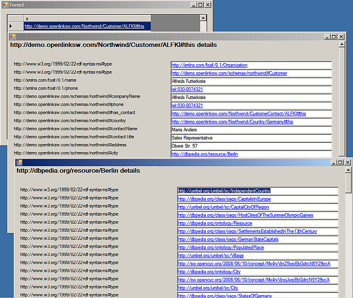

*Next Steps*

The application now allows you to explore data and follow links from
your locally held data into the external web of data. Looking at the
data displayed in the form it would be nice to make the labels for the
properties more compact. The label
http://dbpedia.org/property/population is a very precise definition but
for our purposes it would be clearer to label the property just
population. In the next step will be to modify the application so that
it displays more readable labels.

<a id="id46-extending-rdfdemo-to-display-more-compact-labels"></a>
## Extending RDFDemo to Display More Compact Labels

This section will guide you through extending the application created in
[Extending RDFDemo to Allow Dereferencing of External
IRIs](#installwfasxtendcomlab) so that the data is displayed in a more
readable form.

*Pre-requisites*

1.  A working copy of the RDFDemo application created in [Extending
    RDFDemo to Allow Dereferencing of External
    IRIs](#installwfasxtendcomlab)

### Extending the Application

The RDF demo application presents the user with a list of Customers from
the Northwind database in the form of dereferenceable IRIs. When a
customer is selected from the list the application uses a sparql query
to describe that customer and the results are displayed in a form as
rows of labels and data. The labels correspond to RDF predicates and the
data corresponds to RDF objects while the subject is the customer
initially selected. In many cases the objects are dereferencable IRIs
which are then used as the subject when the 'drilling down' into the
data. However, the predicates are also IRIs so it is possible to gain
more information about these as well.

The RDF Schema defines a property
http://www.w3.org/2000/01/rdf-schema\#label that may be used to provide
a human-readable version of a resource's name. We can obtain further
details of each of the predicates in a resultset and check to see if one
of the properties is an http://www.w3.org/2000/01/rdf-schema\#label. If
it is we can use the associated text as the label in our form instead of
the the predicate IRI. The benefit should be a more human readable form.

*Step 1 - Add a New Method to Get the Label Text*

This method takes the predicate IRI and issues a sparql query to get its
description. It then cycles through the returned dataset to find a
http://www.w3.org/2000/01/rdf-schema\#label. If there is one then the
associated text is returned by the method. Otherwise the method returns
the IRI string.

  - Add the following method to the ExtendedStringHandlerClass
    
        private string getLabelText(Object label)
          {
              string labelText = label.ToString();
              if (label is SqlExtendedString)
              {
                  SqlExtendedString se = (SqlExtendedString)label;
                  StringBuilder getLabelCommandText = new StringBuilder("sparql define get:soft \"soft\" select * from <" + se.ToString() + "> where {<" + se.ToString() + "> ?p ?o}");
                  VirtuosoCommand getLabelCommand = new VirtuosoCommand(getLabelCommandText.ToString(), ParentConnection);
                  VirtuosoDataAdapter getLabelAdapter = new VirtuosoDataAdapter();
                  getLabelAdapter.SelectCommand = getLabelCommand;
                  DataSet getLabelDataSet = new DataSet();
                  try
                  {
                      getLabelAdapter.Fill(getLabelDataSet);
                      foreach (DataRow getLabelRow in getLabelDataSet.Tables[0].Rows)
                      {
                          if (getLabelRow[0].ToString() == "http://www.w3.org/2000/01/rdf-schema#label")
                          {
                              labelText = getLabelRow[1].ToString();
                              break;
                          }
                      }
                  }
                  catch
                  {
                  }
              }
              return labelText;
          }

  - Change the line in displayData from
    
        propertyLabel.Text = row[0].ToString();

  - to
    
        propertyLabel.Text = getLabelText(row[0]);

*Step 1 - Add a New Method to Get the Label Text*

When you run the application you will see that the initial form is the
same. In fact, when you select the Customer you will also see that the
customer details are also the same. It is only when you start exploring
data outside the Northwind graph that you will see the labels in the
form change.

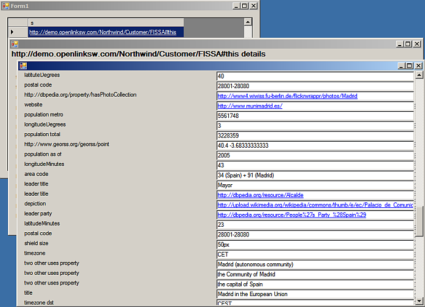

*Next Steps*

It is clear from running the application that the Northwind ontology
does not define an http://www.w3.org/2000/01/rdf-schema\#label for its
members. In order to benefit from this modified version of RDFDemo we
need to update our Northwind ontology so that
http://www.w3.org/2000/01/rdf-schema\#label is defined for each
resource. The next step will be to modify our Northwind ontology.

<a id="id47-modifying-the-northwind-ontology-to-add-labels"></a>
## Modifying the Northwind Ontology to Add Labels

This section will guide you through modifying the Northwind Ontology
created when you installed the [demo database VAD package](#) so that
each resources is identified by an
http://www.w3.org/2000/01/rdf-schema\#label. This will improve the
readability of the information displayed by the application created in
[Extending RDFDemo to Display More Compact
Labels](#installwfasxtendcomplab) .

*Pre-requisites*

1.  A working copy of the RDFDemo application created in [Extending
    RDFDemo to Display More Compact Labels](#installwfasxtendcomplab)

### Editing the Ontology

*Get a Working Copy of the Northwind Ontology*

The the file describing the Northwind Ontology, nw.owl, is installed in
the DAV when the demo vad is loaded. To get a working copy open the
Virtuoso Conductor and log in as dba. Select WebDAV Browser in the
navigation panel on the left. This will open a window that allows you to
browse the WebDAV Repository. The Northwind Ontology file can be found
in DAV/VAD/demo/sql. Take a copy of the file.

*Editing nw.owl*

In the first instance is edited nw.owl so that the property name
consistently begin with a lower case letter. This matches the results
for describing resources held in the Northwind database. Also are added
missing properties so that there should be a label in all cases.

*Registering the Changes in Virtuoso*

There are two methods for registering the changes in Virtuoso:

1.  Method I:
    
      - Copy the edited version of nw.owl back into the DAV.
    
      - In isql, load the script load\_ontology\_dav.sql and execute it.
        The new version of nw.owl will then be used

2.    - Ensure that your new version of nw.owl is in a folder accessible
        by Virtuoso. You may need to edit your virtuoso.ini file and
        restart the server.
    
      - In isql, load the script load\_ontology\_file.sql and edit it so
        that it has the full path to the new version of nw.owl
    
      - Run the script. The new version of nw.owl will then be used.

Modify RDFDemo so that it looks for the graph used to describe the
Northwind data and searches that graph for the predicate details:

1.  Add a new member variable to the ExtendedStringHandler class to hold
    the graphs that we need to search for the predicate information.
    
        StringBuilder DescribeCommandSimple, DescribeCommandGeneral;
        VirtuosoConnection ParentConnection;
        List<Label> labelList = new List<Label>();
        List<TextBox> textBoxList = new List<TextBox>();
        List<String> graphList = new List<String>();
        DescribeDataSet describeDataSet = new DescribeDataSet();
        Boolean isIRI = false;
        SqlExtendedString ParentIRI;

2.  In displayData, after we have set the title of the form, add the
    following block of code:
    
        // Later we will want to get property labels and for that
         // we will need the graph where the resource is defined.
        foreach (DataRow row in table1.Rows)
             if (row[0].ToString() == "http://www.openarchives.org/ore/terms/isDescribedBy"
            && row[1].ToString() != ParentIRI.ToString())
             {
                 String graph = row[1].ToString();
                 graphList.Add(graph);
             }

3.  Replace the existing getLabelText method with an extended version
    
    ``` 
     private string getLabelText(Object label)
      {
          string labelText = label.ToString();
          if (label is SqlExtendedString)
          {
              Boolean foundLabel = false;
              SqlExtendedString se = (SqlExtendedString)label;
              VirtuosoDataAdapter getLabelAdapter = new VirtuosoDataAdapter();
              DataSet getLabelDataSet = new DataSet();
    
              //Try finding it in resources graph first
              foreach (String graph in graphList)
              {
                  StringBuilder getLabelCommandText = new StringBuilder("sparql select * from <" + graph + "> where {<" + se.ToString() + "> ?p ?o}");
                  VirtuosoCommand getLabelCommand = new VirtuosoCommand(getLabelCommandText.ToString(), ParentConnection);
                  getLabelAdapter.SelectCommand = getLabelCommand;
    
                  try
                  {
                      getLabelAdapter.Fill(getLabelDataSet);
                      foreach (DataRow getLabelRow in getLabelDataSet.Tables[0].Rows)
                      {
                          if (getLabelRow[0].ToString() == "http://www.w3.org/2000/01/rdf-schema#label")
                          {
                              labelText = getLabelRow[1].ToString();
                              foundLabel = true;
                              break;
                          }
                      }
                  }
                  catch
                  {
                  }
                  if (foundLabel)
                      break;
              }
              // If we still have no label try the predicate itself as the graph
              if (!foundLabel)
              {
                  StringBuilder getLabelCommandText = new StringBuilder("sparql define get:soft \"soft\" select * from <" + se.ToString() + "> where {<" + se.ToString() + "> ?p ?o}");
                  VirtuosoCommand getLabelCommand = new VirtuosoCommand(getLabelCommandText.ToString(), ParentConnection);
                  getLabelAdapter.SelectCommand = getLabelCommand;
                  try
                  {
                      getLabelAdapter.Fill(getLabelDataSet);
                      foreach (DataRow getLabelRow in getLabelDataSet.Tables[0].Rows)
                      {
                          if (getLabelRow[0].ToString() == "http://www.w3.org/2000/01/rdf-schema#label")
                          {
                              labelText = getLabelRow[1].ToString();
                              break;
                          }
                      }
                  }
                  catch
                  {
                  }
              }
          }
          return labelText;
      }
    ```
    
    This extended method first checks the graphs in the graph list for
    the predicate information then if no label has been found tries the
    predicate itself as the graph.

4.  Build and run, the Northwind resources should now be correctly and
    concisely labeled
    
    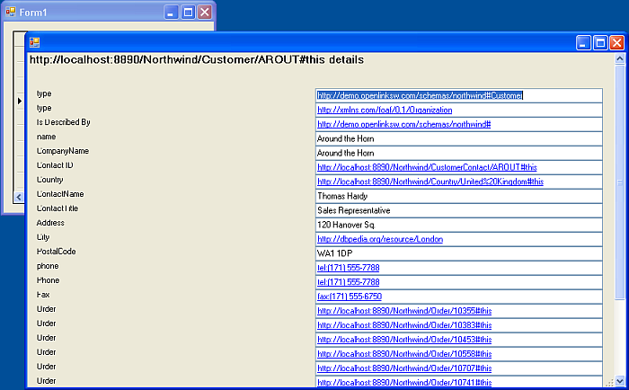

*Improving The Appearance of the Form*

The following changes are not strictly necessary but improve the
appearance of the form:

  - Line up the right hand edge of the labels with the text boxes by
    setting TextAlign to MiddleRight and reduce the width of the labels.
    
        propertyLabel.Text = getLabelText(row[0]);
        propertyLabel.AutoEllipsis = true;
        propertyLabel.AutoSize = false;
        propertyLabel.Width = 130;
        propertyLabel.TextAlign = ContentAlignment.MiddleRight;

  - Make the form narrower:
    
        describeForm.Width = 660;

  - Alter the positioning of the labels and TextBoxes on the form:
    
        textBoxList[i].Click += new EventHandler(this.iri_Click);
        labelList[i].Location = new Point(10, i * 22 + 50);
        textBoxList[i].Location = new Point(150, i * 22 + 50);
        describeForm.Controls.Add(labelList[i]);
        describeForm.Controls.Add(textBoxList[i]);
    
    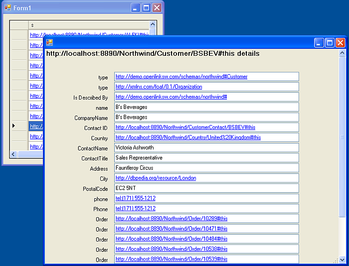

*Next Steps*

The image below shows some of the information about an employee in the
Northwind dataset.

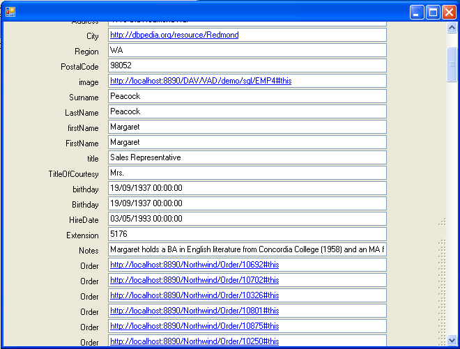

In the next step we will extend the application so the images and web
pages can be viewed and long text fields are displayed in full.

<a id="id48-extending-rdfdemo-to-display-images-and-longer-text-fields"></a>
## Extending RDFDemo to Display Images and Longer Text Fields.

This section will guide you through extending RDFDemo so that longer
text fields can be displayed as a block of text and so that links to
images and web pages can be viewed in a browser window.

*Pre-requisites*

1.  A working copy of the RDFDemo application created in [Modifying the
    Northwind Ontology to Add Labels](#installwfasmodify)

### Modifying the Application

*Displaying Text*

We will modify the form that show the details of the selected item so
that when the text in the boxes is too long to be seen in full a button
will appear beside the box on the form and if you click the button the
complete text will be displayed in a separate window.

1.  Add a new class, MoreButton that extends
    System.Windows.Forms.Button.
    
      - In the
        
        *Solution Explorer*
        
        right click on the RDFDemo project and select
        
        *Add*
        
        then
        
        *New Item*
        
        .
    
      - Add a new class called MoreButton.cs.
        
        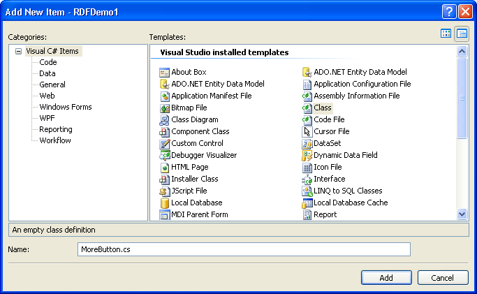
    
      - The following using statement goes at the top of the file:
        
            using System.Windows.Forms;
    
      - The MoreButton class must inherit from
        System.Windows.Forms.Button so the class definition line should
        look like this:
        
            class MoreButton : Button
    
      - Add the following code to the body of the MoreButton class:
        
        ``` 
         String longText;
        
         public MoreButton(String text)
         {
             longText = text;
             this.Text = "More";
         }
        
         protected override void  OnClick(EventArgs e)
         {
             Form moreForm = new Form();
             TextBox moreBox = new TextBox();
             moreBox.Text = longText;
             moreBox.Width = 300;
             moreBox.Height = 250;
             moreBox.ScrollBars = ScrollBars.Vertical;
             moreBox.Multiline = true;
             moreBox.WordWrap = true;
             moreBox.Select(0, 0);
             moreBox.ReadOnly = true;
             moreForm.Controls.Add(moreBox);
             moreForm.Width = 320;
             moreForm.Height = 280;
             moreForm.ShowDialog();
         }
        ```

2.  In displayData in the ExtendedStringHandler class, when the labels
    and TextBoxes are added to the form check if the text is too big for
    the box. If it is then add a MoreButton that will display all the
    text in a separate window.
    
        if (textBoxList[i].DataBindings[0].DataSource.ToString().Length > 80
            && !(textBoxList[i].DataBindings[0].DataSource is SqlExtendedString))
        {
            moreButtonList.Add(new MoreButton(textBoxList[i].DataBindings[0].DataSource.ToString()));
            moreButtonList[moreButtonList.Count - 1].Location = new Point(550, i * 22 + 50);
            describeForm.Controls.Add(moreButtonList[moreButtonList.Count -1]);
        }

3.  We will also need a list to hold the buttons as they are created so
    the following needs to be added to the member variables at the top
    of the ExtendedStringHandler class.
    
        List<MoreButton> moreButtonList = new List<MoreButton>();

4.  Build and run the application. If you click through to an Employee
    page you will see the Notes field now has a button labeled More next
    to it. If you click on that button the text from the Notes field is
    displayed in a new window.
    
    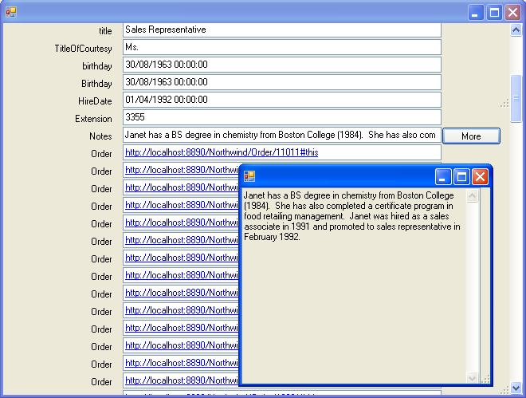

*Displaying Images and Web Pages*

Next we will modify the form so that item identified as images or web
pages will be opened in a browser window. Again we will do this by
adding a button beside the box on the form that will open the browser
window.

1.  Add a new class, OpenButton that extends
    System.Windows.Forms.Button.
    
      - In the
        
        *Solution Explorer*
        
        right click on the RDFDemo project and select
        
        *Add*
        
        then
        
        *New Item*
    
      - Add a new class called OpenButton.cs.
    
      - The following using statement goes at the top of the file:
        
            using System.Windows.Forms;
    
      - The OpenButton class must inherit from
        System.Windows.Forms.Button so the class definition line should
        look like this:
        
            class OpenButton : Button
    
      - Add the following code to the body of the OpenButton class:
        
            String urlText;
            
            public OpenButton(String text)
            {
                urlText = text;
                this.Text = "Open";
            }
            
            protected override void  OnClick(EventArgs e)
            {
                System.Diagnostics.Process.Start(urlText);
            }

2.  In displayData in the ExtendedStringHandler class, where we added
    the code to check for long text fields we now need to check for IRIs
    that identify images and web pages. As a simple first attempt we
    will check for matching labels. So for example, if a property label
    is 'image' or 'webpage', we will assume it can be opened in a
    browser window and put an OpenButton beside it.
    
        if (labelList[i].Text == "website"
            || labelList[i].Text == "image"
            || labelList[i].Text == "depiction"
            || labelList[i].Text == "page"
            || labelList[i].Text == "url"
            || labelList[i].Text == "image skyline")
        {
            openButtonList.Add(new OpenButton(textBoxList[i].DataBindings[0].DataSource.ToString()));
            openButtonList[openButtonList.Count - 1].Location = new Point (550, i * 22 + 50);
            describeForm.Controls.Add(openButtonList[openButtonList.Count - 1]);
        }

3.  We will also need a list to hold the buttons as they are created so
    the following needs to be added to the member variables at the top
    of the ExtendedStringHandler class.
    
        List<OpenButton> openButtonList = new List<OpenButton>();

4.  Build and run the application. If you click through to an Employee
    page now you will see that the Image field now has a button labeled
    Open next to it. If you click on that button the image is opened in
    your default browser.
    
    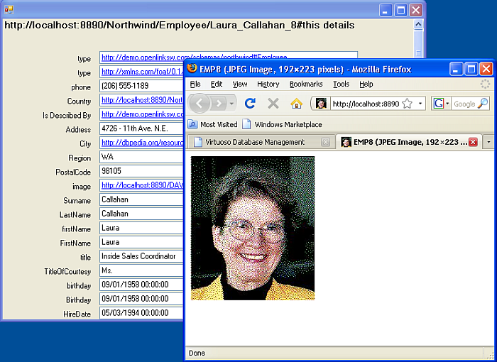

*Next Steps*

It has already been mentioned that the property labels are also
dereferenceable IRIs. We used this feature to find a short name to
display rather that the complete IRI. The next step is to make the
labels clickable so the ontology itself can also be explored.

<a id="id49-extending-rdfdemo-to-make-the-property-labels-clickable"></a>
## Extending RDFDemo To Make The Property Labels Clickable

This section will guide you through extending RDFDemo to make the
property labels clickable. Clicking on the property label will take you
to a page describing that property.

*Pre-requisites*

1.  A working copy of the RDFDemo application created in [Extending
    RDFDemo to Display Images and Longer Text
    Fields](#installwfasxtendlongtext)

### Modifying the Application

*Making the Labels Clickable*

Making the property labels clickable is fairly straight forward. We will
use basically the same code as is used to make the values clickable.

1.  First we need to add a new event handler. In the
    ExtendedStringHandler class modify displayData to add an event
    handler for each of the property labels.
    
        for (int i = 0; i < table1.Rows.Count; i++)
        {
            textBoxList[i].Click += new EventHandler(this.iri_Click);
            labelList[i].Location = new Point(10, i * 22 + 50);
            textBoxList[i].Location = new Point(150, i * 22 + 50);
            describeForm.Controls.Add(labelList[i]);
            describeForm.Controls.Add(textBoxList[i]);
    
    becomes
    
        for (int i = 0; i < table1.Rows.Count; i++)
        {
            textBoxList[i].Click += new EventHandler(this.iri_Click);
            labelList[i].Location = new Point(10, i * 22 + 50);
            labelList[i].Click += new EventHandler(this.label_Click);
            textBoxList[i].Location = new Point(150, i * 22 + 50);
            describeForm.Controls.Add(labelList[i]);
            describeForm.Controls.Add(textBoxList[i]);

2.  Then we need to add the EventHandler method. Add the following to
    the ExtendedStringHandler Class:
    
        public void label_Click(object sender, EventArgs e)
          {
              int labelNum = 0;
        
              for (int i = 0; i < labelList.Count; i++)
              {
                  if (sender == labelList[i])
                  {
                      labelNum = i;
                      break;
                  }
              }
        
              Object o = describeDataSet.DataTable1.Rows[labelNum][0];
              if (o is SqlExtendedString)
              {
                  SqlExtendedString se = (SqlExtendedString)o;
                  ExtendedStringHandler seHandler = new ExtendedStringHandler(se, ParentConnection);
                  seHandler.displayData();
              }
              else if (o is SqlRdfBox)
              {
                  //doesn't do anything at the moment
              }
          }
    
    If you compare this method to the EventHandler for the values,
    iri\_Click, you will see that it is basically the same. The only
    difference is that it uses the property element from the data table
    rather than value.

3.  Finally, to make it clear that the labels are now active links, we
    will change the label colour to blue and underline them.
    
    ``` 
     propertyLabel.Text = getLabelText(row[0]);
     propertyLabel.AutoEllipsis = true;
     propertyLabel.AutoSize = false;
     propertyLabel.Width = 130;
     propertyLabel.TextAlign = ContentAlignment.MiddleRight;
    ```
    
    becomes:
    
        propertyLabel.Text = getLabelText(row[0]);
        propertyLabel.ForeColor = Color.Blue;
        propertyLabel.Font = new Font(propertyLabel.Font.FontFamily, propertyLabel.Font.Size, propertyLabel.Font.Style | FontStyle.Underline, propertyLabel.Font.Unit);
        propertyLabel.AutoEllipsis = true;
        propertyLabel.AutoSize = false;
        propertyLabel.Width = 130;
        propertyLabel.TextAlign = ContentAlignment.MiddleRight;

4.  Build and run the application. You will see the familiar starting
    page. If you then select one of the Customers you will notice the
    property labels now look like hyperlinks.
    
    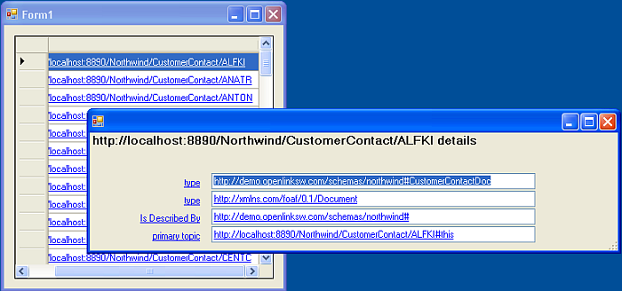
    
    If you click on one of the label hyperlinks you will see a new form
    showing detailed information about the property which can itself be
    explored further by clicking on labels and values.

These simple changes work up to a point but are not robust. If you
explore the properties used by the local Northwind graph you quickly
find that the property details are not found. The application needs some
further changes to work consistently. The problem is finding the graph
where the property information is defined. The general handler for
Extended Strings first checks the local Northwind graph,
http://example.com/Northwind, where the Northwind data is held, and then
uses the IRI itself as the graph and tries to load that dynamically.
This is not working for information about the Northwind properties.
These properties are defined in the Northwind ontology,
http://demo.openlinksw.com/schemas/northwind. We have already had to
find this graph when getting the short label name. We need to be able to
associate the property label with the graph where its definition is
stored. Then we can search this graph for details about the property
when the label is clicked.

*Using the Graph Where the Property Label was Found to Find the Property
Details*

1.  Create a new class, IRILabel, that inherits from
    System.Windows.Forms.Label.
    
      - In the
        
        *Solution Explorer*
        
        right click on the RDFDemo project and select
        
        *Add*
        
        then
        
        *New Item*
        
        .
    
      - Add a new class called IRILabel.cs.
        
        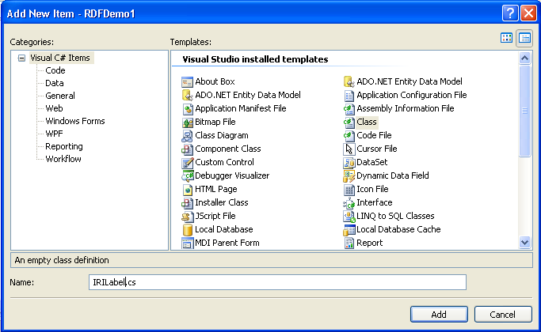

2.  We need to reference System.Windows.Forms, System.Data and
    OpenLink.Data.Virtuoso so add
    
        using System.Windows.Forms;
        using OpenLink.Data.Virtuoso;
        using System.Data;
    
    to the using block at the top of the class file. The class
    definition should look like this:
    
        class IRILabel : Label

3.  Paste the following code into the body of the class:
    
        SqlExtendedString SourceIRI;
        String GraphUsed;
        VirtuosoConnection ParentConnection;
        
        public IRILabel(Object iri, List<String> graphList, VirtuosoConnection parentConnection)
        {
            ParentConnection = parentConnection;
            if (iri is SqlExtendedString)
            {
                SourceIRI = (SqlExtendedString)iri;
                Text = this.getLabelText(graphList);
            }
            else
                Text = iri.ToString();
        }
        
        public SqlExtendedString iri
        {
            get
            {
                return SourceIRI;
            }
        }
        
        public String graph
        {
            get
            {
                return GraphUsed;
            }
        }
        
        private string getLabelText(List<String> graphList)
        {
            string labelText = SourceIRI.ToString();
            Boolean foundLabel = false;
            VirtuosoDataAdapter getLabelAdapter = new VirtuosoDataAdapter();
            DataSet getLabelDataSet = new DataSet();
        
            //Try finding it in resources graph first
            foreach (String graph in graphList)
            {
                StringBuilder getLabelCommandText = new StringBuilder("sparql select * from <" + graph + "> where {<" + SourceIRI.ToString() + "> ?p ?o}");
                VirtuosoCommand getLabelCommand = new VirtuosoCommand(getLabelCommandText.ToString(), ParentConnection);
                getLabelAdapter.SelectCommand = getLabelCommand;
        
                try
                {
                    getLabelAdapter.Fill(getLabelDataSet);
                    foreach (DataRow getLabelRow in getLabelDataSet.Tables[0].Rows)
                    {
                        if (getLabelRow[0].ToString() == "http://www.w3.org/2000/01/rdf-schema#label")
                        {
                            labelText = getLabelRow[1].ToString();
                            foundLabel = true;
                            break;
                        }
                    }
                }
                catch
                {
                }
                if (foundLabel)
                {
                    GraphUsed = graph;
                    break;
                }
            }
        
            // If we still have no label try the predicate itself as the graph
            if (!foundLabel)
            {
                GraphUsed = SourceIRI.ToString();
                StringBuilder getLabelCommandText = new StringBuilder("sparql define get:soft \"soft\" select * from <" + GraphUsed + "> where {<" + SourceIRI.ToString() + "> ?p ?o}");
                VirtuosoCommand getLabelCommand = new VirtuosoCommand(getLabelCommandText.ToString(), ParentConnection);
                getLabelAdapter.SelectCommand = getLabelCommand;
                try
                {
                    getLabelAdapter.Fill(getLabelDataSet);
                    foreach (DataRow getLabelRow in getLabelDataSet.Tables[0].Rows)
                    {
                        if (getLabelRow[0].ToString() == "http://www.w3.org/2000/01/rdf-schema#label")
                        {
                            labelText = getLabelRow[1].ToString();
                            break;
                        }
                    }
                }
                catch
                {
                }
            }
            return labelText;
        }
    
    Notice that the getLabelText method has been moved into this new
    class and is now called from the constructor. When the IRILabel is
    constructed the label text is found using the list of graphs
    provided to the constructor. The graph containing the label is
    noted. We need to alter ExtendedStringHandler so that the labels are
    the new IRILabel type and so that the correct information is
    supplied to the constructor.

4.  Change the labelList member variable declaration so it looks like
    this:
    
        List<IRILabel> labelList = new List<IRILabel>();

5.  Each propertyLabel created must be the new IRILabel type so the
    line:
    
        Label propertyLabel = new Label();
    
    becomes:
    
        IRILabel propertyLabel = new IRILabel(row[0], graphList, ParentConnection);

6.  As getLabelText is now called by the IRILabel constructor we can
    remove the line:
    
        propertyLabel.Text = getLabelText(row[0]);
    
    from describeData in ExtendedStringHandler.

7.  Now we modify the label\_Click EventHandler so that it uses the
    graph information. Replace the existing method with:
    
        public void label_Click(object sender, EventArgs e)
          {
              int labelNum = 0;
        
              for (int i = 0; i < labelList.Count; i++)
              {
                  if (sender == labelList[i])
                  {
                      labelNum = i;
                      break;
                  }
              }
        
              SqlExtendedString se = labelList[labelNum].iri;
              ExtendedStringHandler seHandler = new ExtendedStringHandler(se, ParentConnection, labelList[labelNum].graph);
                  seHandler.displayData();
        
          }

8.  Note that this method uses a new constructor for the
    ExtendedStringHandler that takes the graph as an additional
    argument. We need to add this new constructor.
    
        public ExtendedStringHandler(SqlExtendedString iri, VirtuosoConnection parentConnection, String graph)
          {
              ParentConnection = parentConnection;
              if (iri.IriType == SqlExtendedStringType.IRI)
              {
                  ParentIRI = iri;
                  isIRI = true;
                  DescribeCommandSimple = new StringBuilder("sparql select * from <http://example.com/Northwind> where {<" + iri.ToString() + "> ?p ?o}");
                  DescribeCommandGeneral = new StringBuilder("sparql define get:soft " + '"'.ToString() + "soft" + '"'.ToString() + " select * from <" + graph + "> where { <" + iri.ToString() + "> ?p ?o }");
              }
          }
    
    This new constructor uses the supplied graph to build the
    alternative sparql select statement that looks for the details about
    the supplied IRI. With these changes in place the application will
    find the description of the Northwind properties.

9.  Build and run. As you explore the data you will see that you can
    find descriptions of the properties used to describe the entities in
    the Northwind dataset:
    
    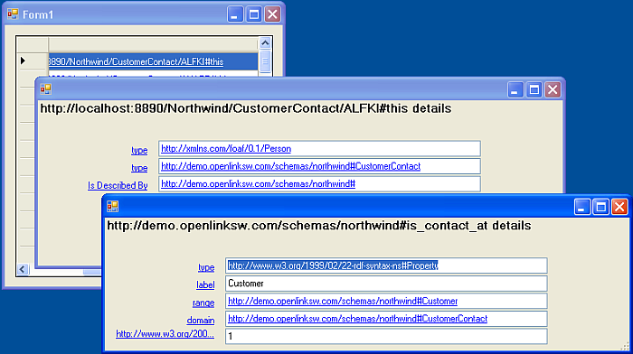

<a id="id50-creating-a-web-browser-application-to-access-rdf-data-using-the-virtuoso-adonet-provider"></a>
# Creating a Web Browser Application to Access RDF Data Using The Virtuoso ADO.Net Provider

This section will guide you through creating first a Web Service that
exposes RDF data from Virtuoso and then a simple web browser application
that consumes the Web Service and allowing you to access and explore the
RDF data by clicking on dereferenceable [IRIs](#rdfiriidtype) .

<a id="id51-pre-requisites"></a>
## Pre-requisites

1.  The example assumes that you have a local Virtuoso server with the
    Northwind demo database installed. If the demo database is not
    already installed then download the [demo database VAD package](#)
    (demo\_dav.vad) and install it. The VAD package will create a new
    database in Virtuoso called demo containing the familiar Northwind
    tables. It will also creates [Linked Data Views](#rdfviewsrdbms) of
    the Northwind tables. In the example we assume the database is
    accessible on a hostname of "demo.openlinksw.com" on the default
    port 80, where an actually live instance of the Virtuoso Demo
    database is hosted. Users would use the appropriate hostname and
    port number of their Virtuoso installation to create the sample
    application, and would be would be example.com for a default
    installation or whatever the [URIQA DefaultHost](#ini_uriqa)
    Virtuoso configuration parameter is set to when the demo database
    VAD package is installed.

2.  The Virtuoso ADO.Net provider for .Net 3.5 and the Entity Framework.

3.  Microsoft Visual Studio 2008

4.  The Virtuoso [Cartridges VAD package](#) .

<a id="id52-creating-the-web-service"></a>
## Creating the Web Service

*Step 1 - Create a view of the RDF data*

To create a view of the customers in the Northwind first open the
Virtuoso Conductor and log in as dba. Then open iSQL from the menu on
the left and execute the following statement.

    create view Demo.demo.sparqlview as
    sparql
    select distinct ?s  from <http://example.com/Northwind>
    where {?s a <http://demo.openlinksw.com/schemas/northwind#Customer>}

Note:

  - If the view is added to the Visual Studio project as user "demo" (or
    any other than "dba'), then it must be ensured that the
    "SPARQL\_SELECT" and "SPARQL\_SPONGE" roles are assigned to this
    user, which can be done via the Virtuoso Conductor in the "System
    Admin" -\> "User Accounts" tab.

  - Execute permissions will also need to be granted to the following
    procedure:
    
        grant execute on DB.DBA.RDF_MAKE_LONG_OF_SQLVAL to "demo"

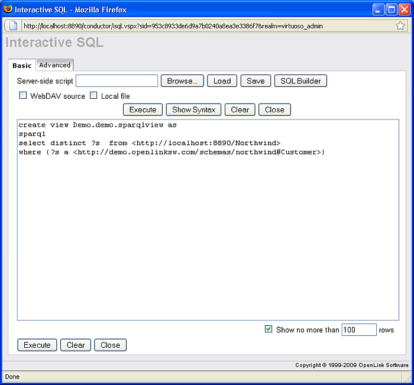

*Step 2 - Create the Visual Studio Project and Add the Model*

1.  Open
    
    *Visual Studio*
    
    and create a new
    
    *ASP .NET Web Application*
    
    called RDFWebDemo.
    
    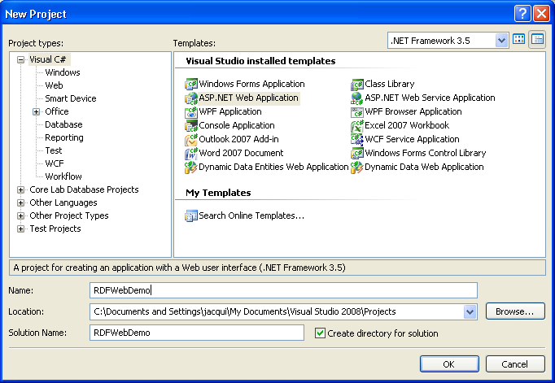

2.  Right click RDFWebDemo in the
    
    *Solution Explorer*
    
    and add a new
    
    *ADO.NET Entity Data Model*
    
    called Model1.edmx. This will open the Entity Data Model Wizard.

3.  Choose
    
    *Generate From Database*
    
    and click
    
    *Next*
    
    .

4.  Set up a connection to the Demo database on your local Virtuoso
    Server, select
    
    *Yes, include the sensitive data in the connection string*
    
    and set the name of the entities to DemoEntities. Click
    
    *Next*
    
    .

5.  On the
    
    *Choose Your Database Objects*
    
    page expand
    
    *Views*
    
    and select sparqlview. Check that the Model Namespace is DemoModel
    and click Finish.
    
    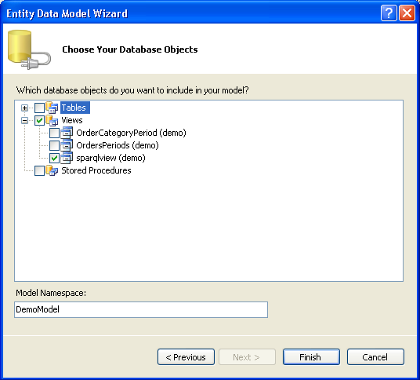

*Step 3 - Add the Web Service*

1.  Right click RDFWebDemo in the
    
    *Solution Explorer*
    
    and add a new
    
    *ADO.NET Data Service*
    
    called WebDataService1.svc. Click
    
    *Add*
    
    .

2.  In the class definition of WebDataService1 in the newly created file
    WebDataService1.svc.cs replace /\* TODO: put your data source class
    name here \*/ with the name of our model, DemoEntities.
    
        public class WebDataService1 : DataService<DemoEntities>

3.  In the InitializeService method add the line:
    
        config.SetEntitySetAccessRule("*", EntitySetRights.All);
    
    The method should look like this:
    
    ``` 
     public static void InitializeService(IDataServiceConfiguration config)
       {
           // TODO: set rules to indicate which entity sets and service operations are visible, updatable, etc.
           // Examples:
           // config.SetEntitySetAccessRule("MyEntityset", EntitySetRights.AllRead);
           // config.SetServiceOperationAccessRule("MyServiceOperation", ServiceOperationRights.All);
    
           config.SetEntitySetAccessRule("*", EntitySetRights.All);
       }
    ```

*Step 4 - Compile and Run*

Hit *F5* to compile and run the service. Select *OK* when prompted to
enable debugging. The default browser will be launched showing a page
like:

``` 
  <?xml version="1.0" encoding="utf-8" standalone="yes" ?>
- <service xml:base="http://example.com/WebDataService1.svc/" xmlns:atom="http://www.w3.org/2005/Atom" xmlns:app="http://www.w3.org/2007/app" xmlns="http://www.w3.org/2007/app">
- <workspace>
  <atom:title>Default</atom:title>
- <collection href="sparqlview">
  <atom:title>sparqlview</atom:title>
  </collection>
  </workspace>
  </service>
```

The service is now running.

Note the address on which the service is made available. You will need
to know this when creating the app to consume the service. Look in the
Address Bar of the browser. It will be something like:
http://example.com/WebDataService1.svc/

<a id="id53-creating-the-browser-application"></a>
## Creating the Browser Application

*Step 1 - Create the Visual Studio Project.*

1.  Open
    
    *Visual Studio*
    
    and create a new
    
    *ASP.NET Web Application*
    
    called RDFWebApp.
    
    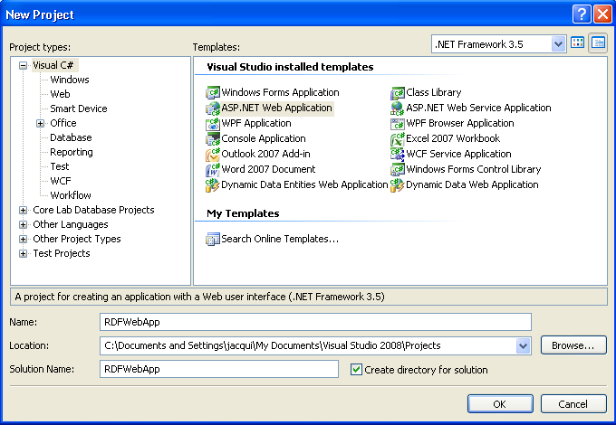

2.  Create client side entities with datasvcutil.exe
    
      - Open a command prompt.
    
      - Navigate to \*C:\\WINDOWS\\Microsoft.NET\\Framework\\v3.5\*.
    
      - Generate the client classes using the following command:
        
            datasvcutil.exe /uri:http://example.com/WebDataService1.svc /out:DemoEntities.cs
        
        Note the address of the service - you may need to change the
        port number to match the one seen in the address at the end of
        Step 4 in Creating the Web Service.

3.  Add the classes to RDFWebApp.
    
      - Right click RDFWebApp
    
      - Choose to add an existing item and add
        c:\\WINDOWS\\Microsoft.NET\\Framework\\v3.5\\DemoEntities.cs.

4.  Add a reference to System.Data.Services.Client to the project.

*Step 2 - Display the contents of sparqlview as a table on the page*

To display the RDF data on the web page we create a table with a row for
each item in sparqlview. We then use each IRI from sparqlview to create
a hyperlink. The hyperlinks are displayed in the table cells. To do this
add the following block of code to the page\_load method in
Default.aspx.cs.

``` 
 DemoModel.DemoEntities svc = new DemoModel.DemoEntities(new Uri("http://example.com/WebDataService1.svc"));

  var query = svc.sparqlview;
  Table iriTable = new Table();
  this.Controls.Add(iriTable);

  foreach (DemoModel.sparqlview sv in query)
  {
      TableRow tRow = new TableRow();
      iriTable.Rows.Add(tRow);
      TableCell tCell = new TableCell();
      tRow.Cells.Add(tCell);
      HyperLink h = new HyperLink();
      h.Text = sv.s;
      h.NavigateUrl = sv.s;
      tCell.Controls.Add(h);
  }
```

Note the address of the service in the first line - you may need to
change the port number to match the one seen in the address at the end
of Step 4 in Creating the Web Service.

Compile and run RDFWebApp (ensuring that the service created above is
still running). This will launch a browser and display the IRIs from
sparqlview as a list of hyperlinks.

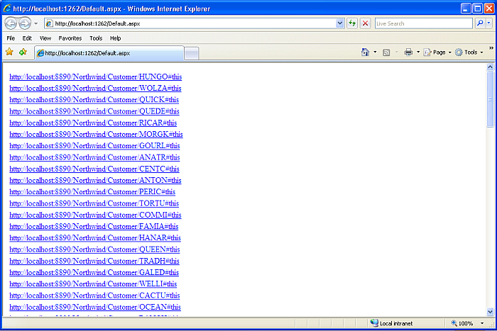

With the [Cartridges VAD package](#) installed in Virtuoso, clicking on
these links will take you to a description page of the referenced
resource. The description page is created using [description.vsp](#) .

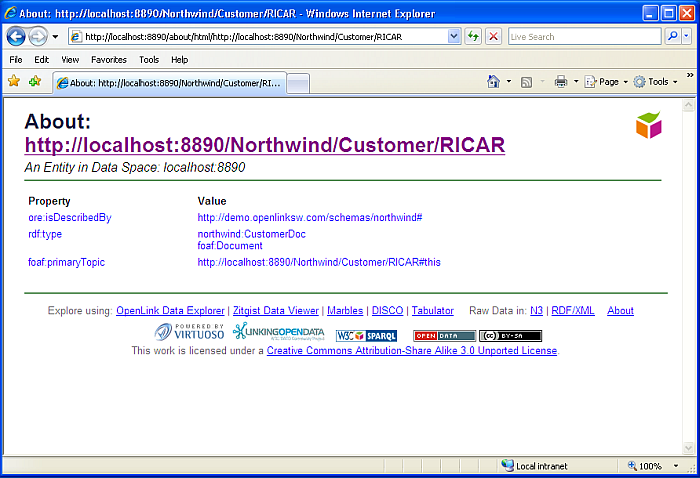

<a id="id54-deploy-with-iis"></a>
## Deploy With IIS

To create and test this simple Web Service we have used the Visual
Studio Development Server. This section describes how to deploy the
service using IIS.

### Web Service

To deploy the service using IIS:

  - Open the RDFWebDemo project in Visual Studio, go to the
    
    *Project*
    
    menu and select RDFWebDemo
    
    *Properties*
    
    .

  - Select the
    
    *Web*
    
    tab and scroll down to the
    
    *Servers*
    
    section. Select
    
    *Use local IIS Server*
    
    . The project URL defaults to using localhost.

  - Click the
    
    *Create Virtual Directory*
    
    button then check that the Service works on localhost.

  - Build the project then start without debugging (ctrl F5).

The start page that you see when you test the service will look the same
as before but the address in the browser bar will be something like
http://example.com/RDFWebDemo1/WebDataService1.svc/. You can now access
your service remotely using the hostname or IP address of your server.

If at this point you get an Access is denied error, 401.3, then you will
need to add the Internet Guest Account (IUSR\_XXX where XXX is your
computer name) to the users allowed to access the folder containing the
RDFWebDemo project.

### Web Application

You will now need to modify RDFWebApp to access the service at the new
address. At the same time we will also change RDFWebApp so that it too
is deployed using IIS

  - Open The RDFWebApp project in Visual Studio.

  - Go to the
    
    *Project*
    
    menu and select RDFWebApp
    
    *Properties*
    
    .

  - Select the
    
    *Web*
    
    tab and scroll down to the
    
    *Servers*
    
    section. Select
    
    *Use local IIS Server*
    
    . The project URL defaults to using localhost.

  - Click the
    
    *Create Virtual Directory*
    
    button. The web application will then run on the local IIS.
    
        DemoModel.DemoEntities svc = new DemoModel.DemoEntities(new Uri("http://example.com/WebDataService1.svc"));
    
    to
    
        DemoModel.DemoEntities svc = new DemoModel.DemoEntities(new Uri("http://example.com/RDFWebDemo/WebDataService1.svc/"));

  - To reference the web service running on IIS you will need to edit
    Default.aspx.cs. Change

  - Build the project then start without debugging (ctrl F5).

The web application is accessible on
http://example.com/RDFWebApp/Default.aspx and can also be accessed using
the hostname or IP address of you server e.g.
http://192.168.7.129/RDFWebApp/Default.aspx

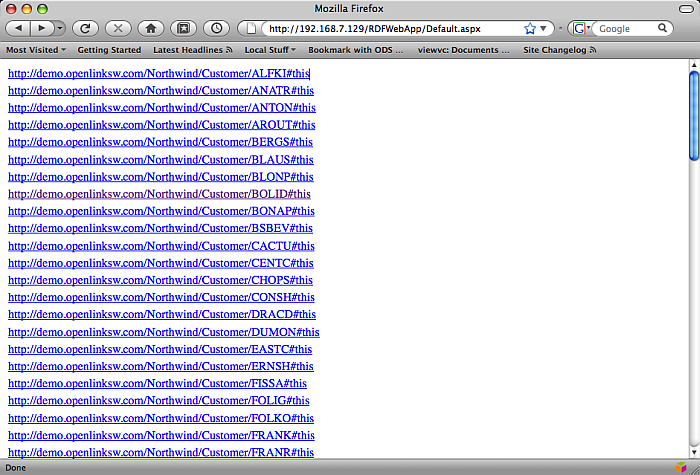

### Next Steps

The next example shows you how to quickly create an ADO.Net Data Service
that exposes RDF data in Virtuoso and how to create a basic Web
application to consume that service. The next step is to [create a
Silverlight Application to consume the same service](#installsilver) .

<a id="id55-creating-a-silverlight-application-to-consume-the-service"></a>
# Creating a Silverlight Application to consume the service

This section will guide you through creating an application for
Silverlight that will consume the ADO.Net Data Service created in
[Creating a Web Browser Application to Access RDF Data Using The
Virtuoso ADO.Net Provider.](#installcrweb)

<a id="id56-pre-requisites"></a>
## Pre-requisites

1.  The [Microsoft Silverlight 2 Tools for Visual Studio 2008 SP1](#)

2.  The ADO.Net Data Service created in [Creating a Web Browser
    Application to Access RDF Data Using The Virtuoso ADO.Net
    Provider.](#installcrweb)

3.  The Visual Studio project used to create the ADO.Net Data Service.

<a id="id57-creating-the-application-for-silverlight"></a>
## Creating the Application for Silverlight.

1.  Open the ADO.Net Data Service project in
    
    *Visual Studio*

2.  In the
    
    *Solution Explorer*
    
    right click on the RDFWebDemo solution and add a new Project.

3.  In the
    
    *Add New Project*
    
    dialog select
    
    *Silverlight Application*
    
    and click
    
    *OK*
    
    . This will open the
    
    *Add Silverlight Application*
    
    dialog.
    
    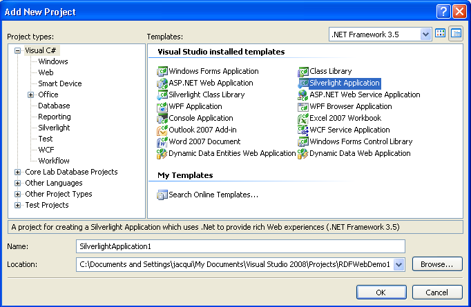

4.  Select
    
    *Link this Silverlight Control into an existing Web Site*
    
    and make sure the Web Site selected is RDFWebDemo. Select
    
    *Add a test page that references the application*
    
    and
    
    *Make it the start page*
    
    .
    
    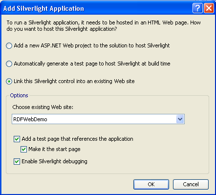

5.  In Solution Explorer, select RDFWebDemo, open the Project menu and
    select Properties.

6.  Select the
    
    *Web*
    
    tab, and select
    
    *Specific Page*
    
    in the
    
    *Start Action*
    
    section. Click on the ellipsis and select
    SilverlightApplication1TestPage.html as the start page.

7.  Add a reference to the data service. In the
    
    *Solution Explorer*
    
    right click on SilverlightApplication1 and select
    
    *Add Service Reference*

8.  In the
    
    *Add Service Reference*
    
    dialog click the
    
    *Discover*
    
    button. Your ADO.Net Data Service should appear in the Address box
    and the Services box.

9.  Select the service and click
    
    *OK*
    
    . ServiceReference1 will now be added to the ServiceReferences.

10. Open page.xaml.cs and add references to the service and to the
    System.Data.Services.Client assembly by adding the following using
    statements at the top of the file:
    
        using System.Data.Services.Client;
        using SilverlightApplication1.ServiceReference1;

11. We need at create a data service context to reference the data from
    the service and to load data from the view, sparqlview, exposed by
    the service. Add the following lines to the page constructor after
    InitializeComponent()
    
        DataServiceContext svcCtx = new DataServiceContext(new Uri("WebDataService1.svc", UriKind.Relative));
        svcCtx.BeginExecute<sparqlview>(new Uri("sparqlview", UriKind.Relative), loadSCallback, svcCtx);

12. Add the loadSCallback method to the page class. The method loads the
    data from sparqlview and puts it in a List. This List populates a
    list box on the page.
    
        private void loadSCallback(IAsyncResult asyncResult)
        {   List<Uri> uList = new List<Uri>();
            DataServiceContext ctx = asyncResult.AsyncState as DataServiceContext;
            foreach (sparqlview sv in ctx.EndExecute<sparqlview>(asyncResult))
             uList.Add(new Uri(sv.s));
            listBox1.DataContext = uList;
        }

13. Add the list box to the page. In the
    
    *Solution Explorer*
    
    double click on page.xaml to open it in the editor. Add the
    following code between the \<grid\> and \</grid\> tags.
    
        <ListBox x:Name="listBox1"
            HorizontalAlignment="Stretch"
            Margin="25,8,26,-78" Grid.RowSpan="1"
            Grid.Row="0" VerticalAlignment="Stretch"
            ItemsSource="{Binding Mode=OneWay}" >
            <ListBox.ItemTemplate>
                <DataTemplate>
                    <StackPanel x:Name="DisplayListData"
                     Orientation="Horizontal"
                     VerticalAlignment="Bottom"
                     Margin="5" >
                        <HyperlinkButton
                         Content ="{Binding}"
                         NavigateUri="{Binding}"
                         Margin="5,0,0,0"
                         VerticalAlignment="Bottom"
                         HorizontalAlignment="Left"
                         FontSize="12">
                        </HyperlinkButton>
                    </StackPanel>
                </DataTemplate>
            </ListBox.ItemTemplate>
        </ListBox>

14. Build the Silverlight application and launch without debugging using
    
    *Ctrl F5*
    
    . This will launch the browser and open
    SilverlightApplication1TestPage.aspx.
    
    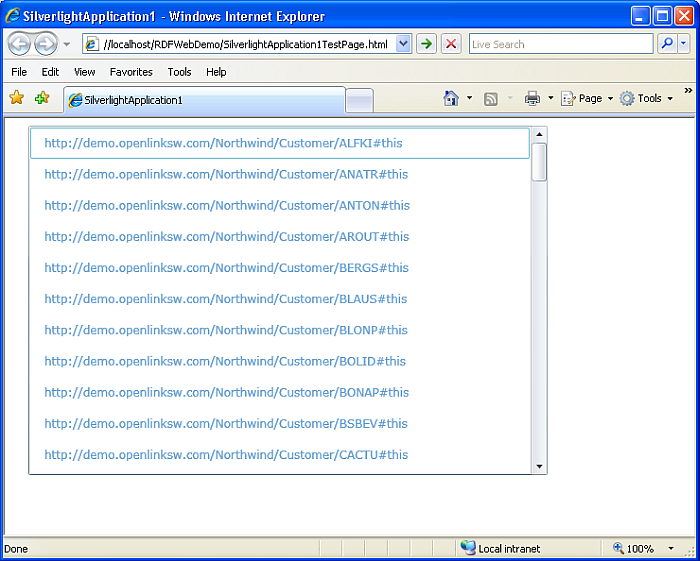

Clicking on one of the IRIs will open the page using description.vsp.

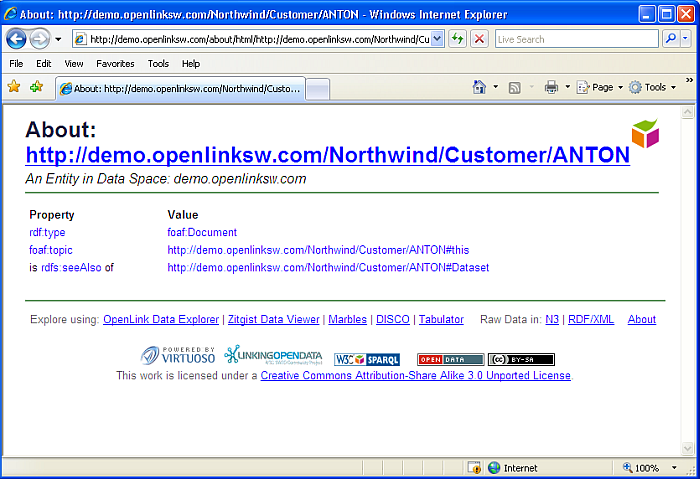

<a id="id58-creating-a-simple-net-ria-services-application-to-display-data-from-virtuoso"></a>
# Creating A Simple .NET RIA Services Application To Display Data From Virtuoso

.NET RIA Services is a new framework from Microsoft that simplifies the
development of n-tier web applications. A typical application will
consist of a presentation layer, application logic and a data access
layer. In these examples a combination of Silverlight 3 and .NET RIA
Services will provide the presentation layer and application layer while
the data will reside in Virtuoso and be accessed using the Virtuoso
ADO.NET provider. The first example demonstrates how to display data
from the Employee table in the Demo database in a grid on a web page.
The second example shows how to display IRIs from the Linked Data Views
of the demo data. The IRIs are used to create hyperlinks that are the
starting point for exploring the linked data.

<a id="id59-pre-requisites"></a>
## Pre-requisites

1.  The example assumes that you have a local Virtuoso server with the
    Northwind demo database installed. If the demo database is not
    already installed then download the demo database VAD package
    (demo\_dav.vad) and install it. The VAD package will create a new
    database in Virtuoso called demo containing the familiar Northwind
    tables. It will also creates Linked Data Views of the Northwind
    tables. In the example we assume the database is accessible on a
    hostname of "demo.openlinksw.com" on the default port 80, where an
    actually live instance of the Virtuoso Demo database is hosted.
    Users would use the appropriate hostname and port number of their
    Virtuoso installation to create the sample application, and would be
    would be example.com for a default installation or whatever the
    URIQA DefaultHost Virtuoso configuration parameter is set to when
    the demo database VAD package is installed.

2.  The Virtuoso ADO.Net provider for .Net 3.5 and the Entity Framework.

3.  Microsoft Visual Studio 2008

4.  The Virtuoso [Cartridges VAD package](#) .

5.  [Silverlight 3 Tools for Visual Studio 2008 SP1](#) .

6.  [Microsoft .NET RIA Services July 2009 Preview](#) .

<a id="id60-creating-the-application"></a>
## Creating the Application

*Step 1 - Create the Visual Studio Projects.*

1.  Open
    
    *Visual Studio*
    
    and create a new
    
    *Silverlight Application*
    
    project. Call the project DemoApplication.

2.  In the New Silverlight Application dialog ensure that
    
    *Enable .NET RIA Services*
    
    is checked. Click the
    
    *OK*
    
    button.
    
    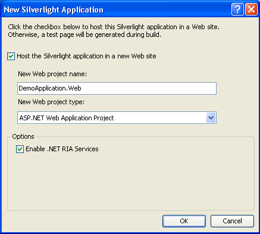

At this point a skeleton solution is created that consists of a client
project called DemoApplication and a server project called
DemoApplication.Web. This application will use data from the Virtuoso
database. We add the data and its schema to the application by adding an
ADO.NET entity data model to the server project.

*Step 2 - Add the Data Model*

1.  Right click the server project in the
    
    *Solution Explorer*
    
    and
    
    *Add New Item*
    
    . In the dialog box select
    
    *ADO.NET Entity Data Model*
    
    and call it demo.edmx. Click the
    
    *Add*
    
    button. This will open the
    
    *Entity Data Model Wizard*
    
    .

2.  Choose
    
    *Generate From Database*
    
    and click
    
    *Next*
    
    .

3.  Set up a connection to the Demo database on your local Virtuoso
    Server, select
    
    *Yes, include the sensitive data in the connection string*
    
    and set the name of the entities to DemoEntities. Click
    
    *Next*
    
    .

4.  On the
    
    *Choose Your Database Objects*
    
    page expand
    
    *Tables*
    
    and select Employees. Check that the Model Namespace is DemoModel
    and click
    
    *Finish*
    
    .

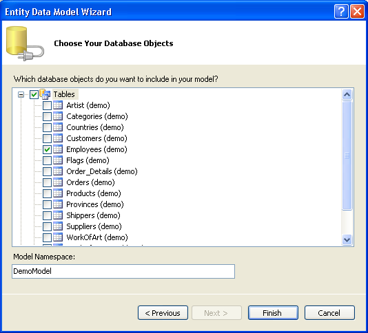

We want to make the entities in the model available to both the client
and server parts of the solution. To do this we need to add a
DomainService to the solution. However, to make the entities from the
data model available to the domain service we must first build the
solution.

*Step 3 - Add a Domain Service.*

1.  First build the solution.

2.  Right click the server project in the
    
    *Solution Explorer*
    
    and
    
    *Add New Item*
    
    . In the dialog box choose
    
    *Domain Service Class*
    
    from the Templates pane and call it EmployeeService.cs. Click
    
    *Add*
    
    . This will open the
    
    *Add New Domain Service Class*
    
    dialog.

3.  The entities from the model we have just added to the project are
    listed under
    
    *Entities*
    
    . Tick the box next to Employees. and click OK.

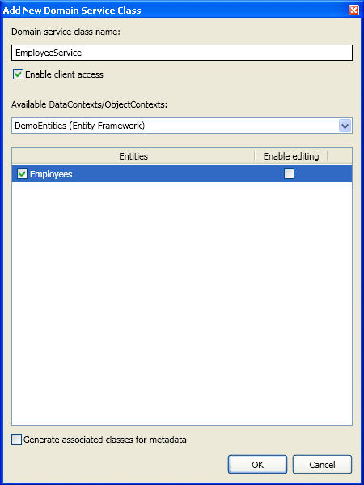

This will create the DomainService class and generated code in both the
client and server parts of the application. The Silverlight client can
now interact with the data through the DomainContext class in the client
project. At this point you need to build the solution again.

*Step 4 - Display The Data*

1.  From the
    
    *Silverlight XAML Controls*
    
    in the
    
    *Toolbox*
    
    drag a
    
    *DataGrid*
    
    between the \<Grid\> \</Grid\> tags on MainPage.xaml in the client.
    Call the grid EmployeeGrid.
    
        <data:DataGrid Name="EmployeeGrid"></data:DataGrid>

2.  Instantiate the DomainContext to get the list of employees and add
    them to the grid by adding code to MainPage.xaml.cs so it looks like
    this:
    
        using System;
        using System.Collections.Generic;
        using System.Linq;
        using System.Net;
        using System.Windows;
        using System.Windows.Controls;
        using System.Windows.Documents;
        using System.Windows.Input;
        using System.Windows.Media;
        using System.Windows.Media.Animation;
        using System.Windows.Shapes;
        using DemoApplication.Web;
        using System.Windows.Ria.Data;
        
        namespace DemoApplication
        {
            public partial class MainPage : UserControl
            {
                private EmployeeContext _employeeContext = new EmployeeContext();
                public MainPage()
                {
                    InitializeComponent();
                    LoadOperation<Employees> LoadOp =
                        this._employeeContext.Load(this._employeeContext.GetEmployeesQuery());
                    this.EmployeeGrid.ItemsSource = LoadOp.Entities;
                }
            }
        }

3.  Build and run the application. Internet Explorer will be launched
    and you will see the data displayed on the page as a grid.

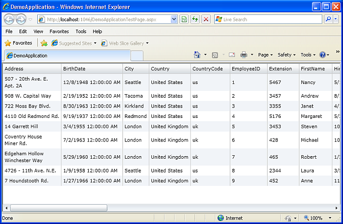

<a id="id61-displaying-rdf-data"></a>
## Displaying RDF Data

One advantage of using Virtuoso as the data store is the seamless way in
which we can use this use this application to display dereferencable
IRIs and explore RDF linked data.

The Virtuoso SPASQL interface allows RDF data in the Virtuoso Quad store
to be queried using SPARQL from any SQL interface by simply prefixing
the SPARQL query with the keyword SPARQL. We will use the SPASQL
interface to create a view containing the IRIs of the Employees in the
the Demo RDF data in Virtuoso.

*Step 1 - Create the View in Virtuoso*

1.  Open the Virtuoso Conductor.

2.  In isql execute the following statement. Remember to use the
    appropriate hostname and port number of your Virtuoso installation,
    typically example.com for a default installation or whatever the
    [URIQA DefaultHost](#ini_uriqa) Virtuoso configuration parameter was
    set to when the demo database VAD package was installed.
    
        CREATE VIEW Demo.demo.sparqlview as
        SPARQL
        PREFIX nwind: <http://demo.openlinksw.com/schemas/northwind#>
        SELECT DISTINCT  ?s
        FROM <http://demo.openlinksw.com/Northwind>
        WHERE
          {
            ?s a nwind:Employee
          }

*Step 2 - Modify the Solution To use the View*

1.  Delete the existing Employee model and add a new one that comprises
    this new view.
    
    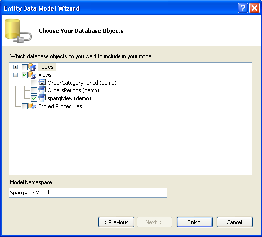

2.  Delete the DomainService. Build the solution and add a new
    DomainService called EmployeeService. Select the sparqlview entity.
    Build the solution.
    
    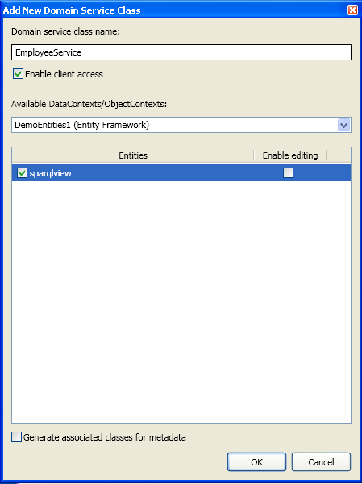

3.  Modify the code in mainpage.xaml.cs so it uses the sparqview entity.
    It should look like this:
    
        using System;
        using System.Collections.Generic;
        using System.Linq;
        using System.Net;
        using System.Windows;
        using System.Windows.Controls;
        using System.Windows.Documents;
        using System.Windows.Input;
        using System.Windows.Media;
        using System.Windows.Media.Animation;
        using System.Windows.Shapes;
        using DemoApplication.Web;
        using System.Windows.Ria.Data;
        
        namespace DemoApplication
        {
            public partial class MainPage : UserControl
            {
                private EmployeeContext _employeeContext = new EmployeeContext();
                public MainPage()
                {
                    InitializeComponent();
                    LoadOperation<sparqlview> LoadOp =
                        this._employeeContext.Load(this._employeeContext.GetSparqlviewQuery());
                    this.EmployeeGrid.ItemsSource = LoadOp.Entities;
                }
            }
        }

4.  Build and run the application. You will see a list of IRIs that
    identify the Northwind employees.
    
    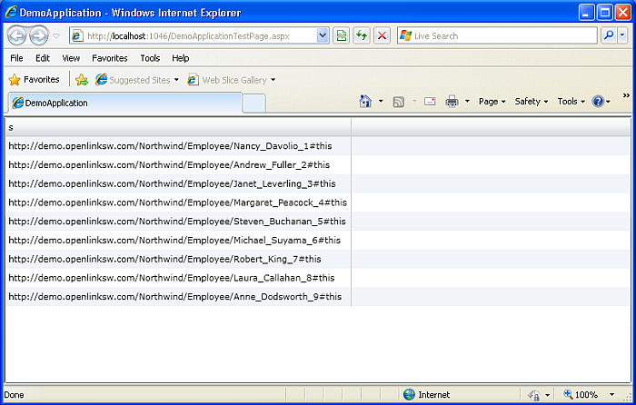

To realize the power of linked data we would now liked to begin
exploring this data by clicking on these IRIs.

*Step 3 - Make Hyperlinks From IRIs*

1.  Modify the DataGrid in MainPage.xaml to bind the IRI in each cell of
    the grid to a Hyperlink button. We set the AutoGenerateColumns
    property of the DataGrid to False then add our own Template for the
    column. MainPage.xaml should look like this:
    
        <UserControl xmlns:data="clr-namespace:System.Windows.Controls;assembly=System.Windows.Controls.Data"  x:Class="DemoApplication.MainPage"
            xmlns="http://schemas.microsoft.com/winfx/2006/xaml/presentation"
            xmlns:x="http://schemas.microsoft.com/winfx/2006/xaml"
            xmlns:d="http://schemas.microsoft.com/expression/blend/2008" xmlns:mc="http://schemas.openxmlformats.org/markup-compatibility/2006"
            mc:Ignorable="d" d:DesignWidth="640" d:DesignHeight="480">
          <Grid x:Name="LayoutRoot">
              <data:DataGrid Name="EmployeeGrid" AutoGenerateColumns="False">
                    <data:DataGrid.Columns>
                        <data:DataGridTemplateColumn Header="Employee">
                            <data:DataGridTemplateColumn.CellTemplate>
                                <DataTemplate>
                                    <StackPanel x:Name="DisplayEmployeeData"
                                                Orientation="Horizontal"
                                                VerticalAlignment="Bottom"
                                                Margin="5" >
                                        <HyperlinkButton Content ="{Binding s}"
                                                         NavigateUri="{Binding s}"
                                                         Margin="5,0,0,0"
                                                         VerticalAlignment="Bottom"
                                                         HorizontalAlignment="Left"
                                                         FontSize="12">
                                        </HyperlinkButton>
                                    </StackPanel>
                                </DataTemplate>
                            </data:DataGridTemplateColumn.CellTemplate>
                        </data:DataGridTemplateColumn>
                    </data:DataGrid.Columns>
                </data:DataGrid>
            </Grid>
        </UserControl>

2.  If we build and run the project now each IRI in the list appears as
    a hyperlink.
    
    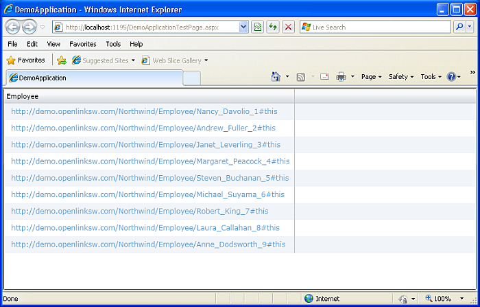

3.  Clicking on each of the links takes you to a new document that
    contains further links to information about each Employee. The Demo
    dataset can be explored further by following the dereferenceable
    IRIs in the description pages.
    
    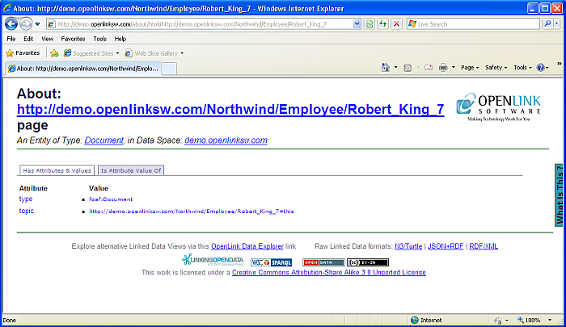
    
    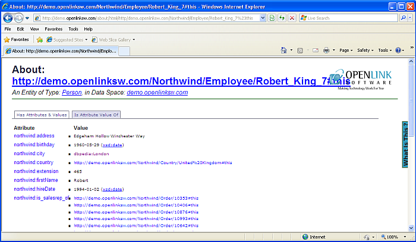

<a id="id62-next-steps"></a>
## Next Steps

The examples in this document show you how to simply display data in a
browser using Silverlight 3 and .NET RIA Services. See an
[example](#installnetriavd) of a more complicated application.

<a id="id63-creating-a-net-ria-services-application-that-will-update-virtuoso-data"></a>
# Creating a .Net RIA Services Application That Will Update Virtuoso Data

This example demonstrates how data in Virtuoso can be updated from a
Microsoft .NET RIA Services application. The example is a continuation
of the first example in [Creating a Simple .Net RIA Services Application
to Display Data From Virtuoso](#installnetriadd) .

<a id="id64-pre-requisites"></a>
## Pre-requisites

1.  A working copy of the application created in [Creating a Simple .Net
    RIA Services Application to Display Data From
    Virtuoso](#installnetriadd) .

<a id="id65-creating-the-application"></a>
## Creating the Application

*Step 1 - Add A New Domain Service Class*

The EmployeeService Domain Service Class was only used to display data
so was created read only. In this example we need to be able to update
the data so we need to remove the read only Domain Service Class and
create a new on.

1.  In the
    
    *Server Explorer*
    
    right click EmployeeService and select
    
    *Delete*

2.  Right click the server project and
    
    *Add New Item*
    
    . In the dialog box choose Domain Service Class from the Templates
    pane and again call it EmployeeService.cs. Click Add.

3.  Select the Employees entity and tick
    
    *Enable editing*
    
    . Also tick
    
    *Generated associated classes for metadata*
    
    .
    
    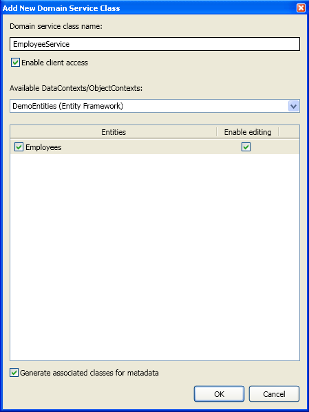

4.  Update MainPage.xaml.cs to use EmployeeService2 the new domain
    service rather than EmployeeContext.

We want to create a master detail style page. To do this we will use the
DomainDataSourceComponent from the Silverlight Components. But first we
will add a pager so only 5 records are displayed at a time.

*Step 2 - Add a DataPager*

1.  Add two new namespaces to MainPage.xaml
    
        xmlns:riaControls="clr-namespace:System.Windows.Controls;assembly=System.Windows.Ria.Controls"
        xmlns:ds="clr-namespace:DemoApplication.Web"

2.  Use a DomainDataSource to provide the data to fill the grid. Add the
    following to MainPage.xaml before the DataGrid.
    
        <riaControls:DomainDataSource x:Name="EmployeeDataSource"
                                      QueryName="GetEmployeesQuery"
                                      LoadSize="10"
                                      AutoLoad="True">
            <riaControls:DomainDataSource.DomainContext>
                <ds:EmployeeService2/>
            </riaControls:DomainDataSource.DomainContext>
        </riaControls:DomainDataSource>

3.  Update the MainPage.xaml.cs code behind file. Using the
    DomainDataSource means you no longer need to instantiate the context
    and load the grid in MainPage.xaml.cs so it becomes:
    
        public partial class MainPage : UserControl
        {
            public MainPage()
            {
                InitializeComponent();
            }
        }

4.  Set the binding source of the DataGrid to the DomainDataSource
    
        <data:DataGrid MinHeight="100"  IsReadOnly="True" ItemsSource="{Binding Data, ElementName=EmployeeDataSource}" x:Name="DataGrid1"></data:DataGrid> />

5.  Drag a DataPager form the tool box onto MainPage.xaml just after the
    DataGrid.

6.  Add a page size and binding element to the DataPager.
    
        <data:DataPager PageSize="5" Source="{Binding Data, ElementName=employeeDataSource}"
                              Margin="0,-1,0,0"></data:DataPager>

7.  Build and run the application. The data should be displayed 5 rows
    at a time.
    
    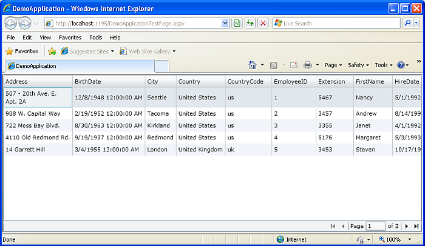

We now need to add a DataForm to display the details.

*Step 3 - Add a DataForm*

1.  Add the following namespace to MainPage.xaml
    
        xmlns:dataForm="clr-namespace:System.Windows.Controls;assembly=System.Windows.Controls.Data.DataForm.Toolkit"

2.  Add the form to MainPage.xaml
    
        <dataForm:DataForm x:Name="dataForm1" Header="Employee Information"  AutoGenerateFields="False" AutoEdit="False" AutoCommit="False" CurrentItem="{Binding SelectedItem, ElementName=DataGrid1}" Margin="0,12,0,0">
           <dataForm:DataForm.EditTemplate>
               <DataTemplate>
                   <StackPanel>
                       <dataForm:DataField Label="Employee ID">
                           <TextBox Text="{Binding EmployeeID, Mode=TwoWay}" />
                       </dataForm:DataField>
                       <dataForm:DataField Label="First Name">
                           <TextBox Text="{Binding FirstName, Mode=TwoWay}" />
                       </dataForm:DataField>
                       <dataForm:DataField Label="Last Name">
                           <TextBox Text="{Binding LastName, Mode=TwoWay}" />
                       </dataForm:DataField>
                       <dataForm:DataField Label="Courtesy Title">
                           <TextBox Text="{Binding TitleOfCourtesy, Mode=TwoWay}" />
                       </dataForm:DataField>
                       <dataForm:DataField Label="Hire Date">
                           <TextBox Text="{Binding HireDate, Mode=TwoWay}" />
                       </dataForm:DataField>
                       <dataForm:DataField Label="Title">
                           <TextBox Text="{Binding Title, Mode=TwoWay}"  />
                       </dataForm:DataField>
                       <dataForm:DataField Label="Reports To">
                           <TextBox Text="{Binding ReportsTo, Mode=TwoWay}"  />
                       </dataForm:DataField>
                       <dataForm:DataField Label="Region">
                           <TextBox Text="{Binding Region, Mode=TwoWay}"  />
                       </dataForm:DataField>
                       <dataForm:DataField Label="Address">
                           <TextBox Text="{Binding Address, Mode=TwoWay}"  />
                       </dataForm:DataField>
                       <dataForm:DataField Label="City">
                           <TextBox Text="{Binding City, Mode=TwoWay}"  />
                       </dataForm:DataField>
                       <dataForm:DataField Label="Country Code">
                           <TextBox Text="{Binding CountryCode, Mode=TwoWay}"  />
                       </dataForm:DataField>
                       <dataForm:DataField Label="Postal Code">
                           <TextBox Text="{Binding PostalCode, Mode=TwoWay}"  />
                       </dataForm:DataField>
                           </StackPanel>
               </DataTemplate>
           </dataForm:DataForm.EditTemplate>
         </dataForm:DataForm>

3.  Surround the DomainDataSource, DataGrid and DataForm with
    
    ``` 
            <ScrollViewer BorderThickness="0"  VerticalScrollBarVisibility="Auto" Padding="12,0,12,0" Margin="-2">
                <StackPanel Margin="0,12,0,12" Orientation="Vertical" >
    .
    .
    .
                </StackPanel>
            </ScrollViewer>
    ```

4.  Build and run the application. As each employee is selected the data
    form fill with their details
    
    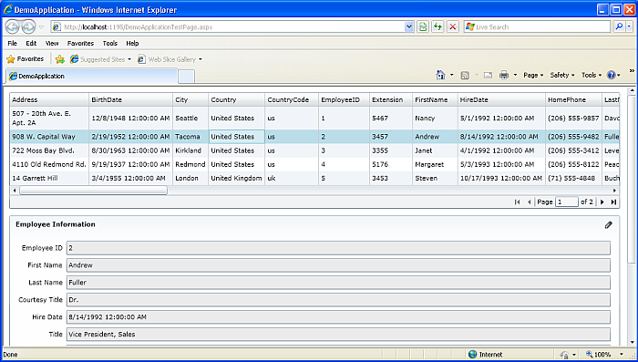

By clicking on the pencil symbol in the top right hand corner the data
in the form can be edited but it is not propagated back to the database.

<a id="id66-propagate-updates-to-virtuoso"></a>
## Propagate Updates to Virtuoso

1.  Add a 'Submit' button just after the DataForm in MainPage.xaml by
    adding the following code.
    
        <StackPanel Orientation="Horizontal" HorizontalAlignment="Right" Margin="0,12,0,0">
          <Button x:Name="submitButton" Width="75" Height="23"  Content="Submit"  Margin="4,0,0,0" Click="submitButton_Click"/>
        </StackPanel>

2.  Handle the button click event in MainPage.xaml.cs by adding the
    following code:
    
        private void submitButton_Click(object sender, RoutedEventArgs e)
                {
                    EmployeeDataSource.SubmitChanges();
                }

3.  Build and run the application. If you now edit data in the form and
    click the submit button the data in Virtuoso will be updated.
    
    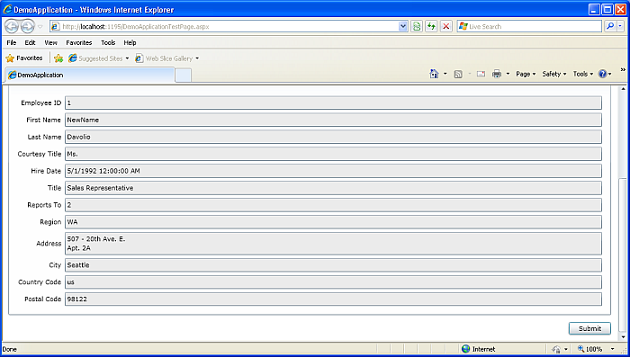

<a id="id67-cluster-installation-and-configuration"></a>
# Cluster Installation and Configuration

<a id="id68-virtuoso-elastic-cluster-installation-configuration-version-7x"></a>
## Virtuoso Elastic Cluster Installation & Configuration -- Version 7.x

These sections apply to Virtuoso as of version 7.x .

### What

Virtuoso 7 and later versions can be configured in Elastic scale out
cluster mode. The data is sharded in a large number of self-contained
partitions. These partitions are divided among a number of database
server processes and can migrate between them.

### Why

An Elastic cluster can be dynamically resized with new partitions or
shards dynamically added to the same or new hardware resources as the
need to increase the size of the scale cluster or relocation of
partitions is required.

### How

This documentation details the steps for the installation and
configuration of a Virtuoso Elastic Cluster on Unix:

1.  *Step 1*
    
    : Perform Virtuoso 7 Unix installation;

2.  *Step 2*
    
    : Determine Elastic Cluster size;

3.  *Step 3*
    
    : Enable Elastic Cluster mode;

4.  *Step 4*
    
    : Start Elastic Cluster;

5.  *Step 5*
    
    : Splitting Cluster nodes across different machines.

### Virtuoso 7 Unix installation

*Step 1* : Perform Virtuoso 7 Unix installation

    $ tar xvf virtuoso-universal-server-7.x.tar
    x install.sh
    x universal-server.taz
    $ sh install.sh
    
    - Extracting Virtuoso Universal Server v7.x
    
    - Creating default environment settings
    
    - Creating default database settings
    Configuring: database
    Creating directory $VIRTUOSO_HOME/database/backup
    Installing new virtuoso.ini in $VIRTUOSO_HOME/database
    Installing new php.ini in $VIRTUOSO_HOME/database
    Creating symlink to $VIRTUOSO_HOME/bin/virtuoso-iodbc-t
    
    - Registering ODBC drivers
    
    - Registering .NET provider for Mono
    
    - Installing VAD packages in database (this can take some time)
    
    - Checking where license should be stored
    
    - Starting OpenLink License Manager
    
    - Checking for initial Virtuoso license
    
    - Starting Virtuoso server instance
    
    - Finalizing installation
    
    This concludes the first part of the installation.
    
    - Attempting to start browser
    
    Please start a browser manually and open the following URL to finalize
    the installation process:
    
         http://cname:8890/install/
    
    Installation completed
    $

### Determine Elastic Cluster size

*Step 2* : Determine Elastic Cluster size

1.  Determine how many nodes you want to start the elastic cluster with:
    2, 3, 4, 5, 6, 7, 8 etc. Note: the number of the nodes must be \>= 2

2.  Setup Virtuoso environment and stop default database:
    
        $ . ./virtuoso-environment.sh
        $ virtuoso-stop.sh
        Shutting down Virtuoso instance in [database]
        $

3.  Optionally remove the default database such that is does not get
    started with the cluster:
    
        rm  -rf database

4.  Full list of supported options for the script
    "virtuoso-mkcluster.sh":
    
    ``` 
      -cluster-size       Number of nodes in cluster
      -cluster-node       Node number in a cluster
      -cluster-port       Base portnumer for cluster
      -cluster-ipc-port   Base portnumer for cluster IPC
      -cluster_size       Size of the cluster
      -virtuoso_home      Virtuoso home path
    ```

5.  Run the virtuoso-mkcluster.sh script to create the cluster, note the
    default number of nodes is 4, but this can be changed by setting the
    environment variable CLUSTER\_SIZE to the required number of nodes
    to be created before running the script:
    
        $ virtuoso-mkcluster.sh
        Configuring cluster node: 1/4
        
        Creating directory $VIRTUOSO_HOME/cluster_01
        Creating directory $VIRTUOSO_HOME/cluster_01/backup
        Creating directory $VIRTUOSO_HOME/cluster_01/logs
        Installing new virtuoso.ini in $VIRTUOSO_HOME/cluster_01
        Installing new php.ini in $VIRTUOSO_HOME/cluster_01
        Creating symlink to $VIRTUOSO_HOME/bin/virtuoso-iodbc-t
        Configuring cluster node: 2/4
        
        Creating directory $VIRTUOSO_HOME/cluster_02
        Creating directory $VIRTUOSO_HOME/cluster_02/backup
        Installing new virtuoso.ini in $VIRTUOSO_HOME/cluster_02
        Removing unneeded sections from virtuoso.ini
        Creating symlink to $VIRTUOSO_HOME/bin/virtuoso-iodbc-t
        Configuring cluster node: 3/4
        
        Creating directory $VIRTUOSO_HOME/cluster_03
        Creating directory $VIRTUOSO_HOME/cluster_03/backup
        Installing new virtuoso.ini in $VIRTUOSO_HOME/cluster_03
        Removing unneeded sections from virtuoso.ini
        Creating symlink to $VIRTUOSO_HOME/bin/virtuoso-iodbc-t
        Configuring cluster node: 4/4
        
        Creating directory $VIRTUOSO_HOME/cluster_04
        Creating directory $VIRTUOSO_HOME/cluster_04/backup
        Installing new virtuoso.ini in $VIRTUOSO_HOME/cluster_04
        Removing unneeded sections from virtuoso.ini
        Creating symlink to $VIRTUOSO_HOME/bin/virtuoso-iodbc-t
        $

6.  In each cluster\_XX directory the following the `cluster.ini` files
    are created for cluster internal communication:
    
        $ more cluster_01/cluster.ini
        [Cluster]
        Threads             = 20
        Master              = Host1
        ThisHost            = Host1
        ReqBatchSize        = 10000
        BatchesPerRPC       = 4
        BatchBufferBytes    = 20000
        LocalOnly           = 2
        MaxKeepAlivesMissed = 1000
        Host1               = localhost:22201
        Host2               = localhost:22202
        Host3               = localhost:22203
        Host4               = localhost:22204
        MaxHosts            = 5
        $ more cluster_02/cluster.ini
        [Cluster]
        Threads             = 20
        Master              = Host1
        ThisHost            = Host2
        ReqBatchSize        = 10000
        BatchesPerRPC       = 4
        BatchBufferBytes    = 20000
        LocalOnly           = 2
        MaxKeepAlivesMissed = 1000
        Host1               = localhost:22201
        Host2               = localhost:22202
        Host3               = localhost:22203
        Host4               = localhost:22204
        MaxHosts            = 5
        $ more cluster_03/cluster.ini
        [Cluster]
        Threads             = 20
        Master              = Host1
        ThisHost            = Host3
        ReqBatchSize        = 10000
        BatchesPerRPC       = 4
        BatchBufferBytes    = 20000
        LocalOnly           = 2
        MaxKeepAlivesMissed = 1000
        Host1               = localhost:22201
        Host2               = localhost:22202
        Host3               = localhost:22203
        Host4               = localhost:22204
        MaxHosts            = 5
        $ more cluster_04/cluster.ini
        [Cluster]
        Threads             = 20
        Master              = Host1
        ThisHost            = Host4
        ReqBatchSize        = 10000
        BatchesPerRPC       = 4
        BatchBufferBytes    = 20000
        LocalOnly           = 2
        MaxKeepAlivesMissed = 1000
        Host1               = localhost:22201
        Host2               = localhost:22202
        Host3               = localhost:22203
        Host4               = localhost:22204
        MaxHosts            = 5
        $

### Enable Elastic Cluster mode

*Step 3* : Enable Elastic Cluster mode

1.  The `cluster.ini` files need to be reconfigured as detailed below
    for elastic cluster and file slicing/sharding to be enabled.

2.  A common file called `cluster.global.ini` can be created and placed
    in the home directory of the Virtuoso installation:
    
        [Cluster]
        Threads             = 300
        ReqBatchSize        = 10000
        BatchesPerRPC       = 4
        BatchBufferBytes    = 20000
        LocalOnly           = 2
        MaxKeepAlivesMissed = 100
        RDFLoadBytes        = 52428800
        Host1               = localhost:22201
        Host2               = localhost:22202
        Host3               = localhost:22203
        Host4               = localhost:22204

3.  This file can then be sym-linked to each of the `cluster_XX`
    directories of the cluster, and its content will be merged with the
    `cluster.ini` in the respective directory of each node when starting
    the cluster.
    
        ln -s cluster.global.ini cluster_01/cluster.global.ini
        ln -s cluster.global.ini cluster_02/cluster.global.ini
        ln -s cluster.global.ini cluster_03/cluster.global.ini
        ln -s cluster.global.ini cluster_04/cluster.global.ini

4.  Edit each of the the `cluster.ini` files in the `cluster_XX`
    directories as follows to enable, elastic cluster mode:
    
        $ more cluster_01/cluster.ini
        [Cluster]
        Master              = Host1
        ThisHost            = Host1
        
        [ELASTIC]
        Segment1 = 4G, database.db = q1
        Slices = 6
        MaxSlices = 2048
        
        $ more cluster_02/cluster.ini
        
        [Cluster]
        Master              = Host1
        ThisHost            = Host2
        
        [ELASTIC]
        Segment1 = 4G, database.db = q1
        Slices = 6
        MaxSlices = 2048
        
        $ more cluster_03/cluster.ini
        
        [Cluster]
        Master              = Host1
        ThisHost            = Host3
        
        [ELASTIC]
        Segment1 = 4G, database.db = q1
        Slices = 6
        MaxSlices = 2048
        
        $ more cluster_04/cluster.ini
        
        [Cluster]
        Master              = Host1
        ThisHost            = Host4
        
        [ELASTIC]
        Segment1 = 4G, database.db = q1
        Slices = 6
        MaxSlices = 2048

5.  The `[ELASTIC]` section in the `cluster.ini` files above, enables
    the elastic cluster mode, where multiple `segments` and `stripes` as
    detailed in the standard Virtuoso documentation [database
    striping](#ini_striping) .

6.  The `Slices` parameter above should be set to the number of hardware
    threads on the CPUs running on. Thus in the example above where it
    is set to 6, this assumes all nodes are running on the same physical
    machine with 12 cores with hyper-threading enabled i.e. 24 threads,
    thus 6 per cluster node.

7.  The `MaxSlices` parameter above sets the the maximum number of
    physical slices in the cluster.

### Start Elastic Cluster

*Step 4* : Start Elastic Cluster

1.  Start the Elastic cluster using the standard `virtuoso-start.sh`
    script run from the home directory of the Virtuoso
    installation,which automatically detects the number for nodes to be
    started:
    
    ``` 
    
    $ virtuoso-start.sh
    Starting Virtuoso instance in [cluster_01]
    Starting Virtuoso instance in [cluster_02]
    Starting Virtuoso instance in [cluster_03]
    Starting Virtuoso instance in [cluster_04]
    $
    ```

2.  The default SQL port of the master node is 12201, as indicated in
    the virtuoso.ini file of the cluster\_01 directory, and can then be
    used for connecting to the newly created cluster and check its
    status to ensure all nodes are online:
    
        $ isql 12201
        Connected to OpenLink Virtuoso
        Driver: 07.10.3211 OpenLink Virtuoso ODBC Driver
        OpenLink Interactive SQL (Virtuoso), version 0.9849b.
        Type HELP; for help and EXIT; to exit.
        SQL> status('cluster_d');
        REPORT
        VARCHAR
        _______________________________________________________________________________
        
        Cluster: No samples, Please refresh
        
        1 Rows. -- 22 msec.
        SQL> status('cluster_d');
        REPORT
        VARCHAR
        _______________________________________________________________________________
        
        Cluster 4 nodes, 2 s. 5 m/s 0 KB/s  5% cpu 0%  read 0% clw threads 1r 0w 0i buffers 349144 2 d 0 w 0 pfs
        cl 1: 2 m/s 0 KB/s  0% cpu 0%  read 0% clw threads 1r 0w 0i buffers 45391 2 d 0 w 0 pfs
        cl 2: 0 m/s 0 KB/s  0% cpu 0%  read 0% clw threads 0r 0w 0i buffers 43367 0 d 0 w 0 pfs
        cl 3: 0 m/s 0 KB/s  0% cpu 0%  read 0% clw threads 0r 0w 0i buffers 50129 0 d 0 w 0 pfs
        cl 4: 0 m/s 0 KB/s  0% cpu 0%  read 0% clw threads 0r 0w 0i buffers 39383 0 d 0 w 0 pfs
        
        5 Rows. -- 22 msec.
        SQL>
        SQL> cl_ping(1,500, 1000);
        
        Done. -- 7 msec.
        SQL> cl_ping(2,500, 1000);
        
        Done. -- 52 msec.
        SQL> cl_ping(3,500, 1000);
        
        Done. -- 60 msec.
        SQL> cl_ping(4,500, 1000);
        
        Done. -- 51 msec.
        SQL>

3.  The `database.log` of the master node can be checked to verify the
    Elastic cluster mode has been enable on server startup, which will
    contain the entry *PL LOG: Elastic cluster setup* :
    
        $ more cluster_01/database.log
        
                        Thu Oct 09 2014
        05:11:49 { Loading plugin 1: Type `plain', file `wikiv' in `../hosting'
        05:11:49   WikiV version 0.6 from OpenLink Software
        05:11:49   Support functions for WikiV collaboration tool
        05:11:49   SUCCESS plugin 1: loaded from ../hosting/wikiv.so }
        05:11:49 { Loading plugin 2: Type `plain', file `mediawiki' in `../hosting'
        05:11:49   MediaWiki version 0.1 from OpenLink Software
        05:11:49   Support functions for MediaWiki collaboration tool
        05:11:49   SUCCESS plugin 2: loaded from ../hosting/mediawiki.so }
        05:11:49 { Loading plugin 3: Type `plain', file `creolewiki' in `../hosting'
        05:11:49   CreoleWiki version 0.1 from OpenLink Software
        05:11:49   Support functions for CreoleWiki collaboration tool
        05:11:49   SUCCESS plugin 3: loaded from ../hosting/creolewiki.so }
        05:11:49 { Loading plugin 4: Type `plain', file `im' in `../hosting'
        05:11:49   IM version 0.61 from OpenLink Software
        05:11:49   Support functions for Image Magick 6.8.1
        05:11:49   SUCCESS plugin 4: loaded from ../hosting/im.so }
        05:11:49 { Loading plugin 5: Type `plain', file `wbxml2' in `../hosting'
        05:11:49   WBXML2 version 0.9 from OpenLink Software
        05:11:49   Support functions for WBXML2 0.9.2 Library
        05:11:49   SUCCESS plugin 5: loaded from ../hosting/wbxml2.so }
        05:11:49 { Loading plugin 6: Type `attach', file `libphp5.so' in `../hosting'
        05:11:49   SUCCESS plugin 6: loaded from ../hosting/libphp5.so }
        05:11:49 { Loading plugin 7: Type `Hosting', file `hosting_php.so' in `../hosting'
        05:11:49   Hosting version 3208 from OpenLink Software
        05:11:49   PHP engine version 5.3.21
        05:11:49   SUCCESS plugin 7: loaded from ../hosting/hosting_php.so }
        05:11:49 { Loading plugin 8: Type `plain', file `qrcode' in `../hosting'
        05:11:49   QRcode version 0.1 from OpenLink Software
        05:11:49   Support functions for ISO/IEC 18004:2006, using QR Code encoder (C) 2006 Kentaro Fukuchi <fukichi@megaui.net>
        05:11:49   SUCCESS plugin 8: loaded from ../hosting/qrcode.so }
        05:11:49 OpenLink Virtuoso Universal Server
        05:11:49 Version 07.10.3211-pthreads for Linux as of Oct  6 2014
        05:11:49 uses parts of OpenSSL, PCRE, Html Tidy
        05:11:51 SQL Optimizer enabled (max 1000 layouts)
        05:11:52 Compiler unit is timed at 0.000403 msec
        05:12:03 Checkpoint started
        05:12:04 Roll forward started
        05:12:04 Roll forward complete
        05:12:07 PL LOG: Elastic cluster setup
        05:12:08 Checkpoint started
        05:12:09 Checkpoint finished, log reused
        05:12:11 Checkpoint started
        05:12:12 Checkpoint finished, log reused
        05:12:12 PL LOG: new clustered database:Init of RDF
        05:12:23 Checkpoint started
        05:12:25 Checkpoint finished, log reused
        05:12:50 PL LOG: Installing Virtuoso Conductor version 1.00.8727 (DAV)
        05:12:51 Checkpoint started
        05:12:53 Checkpoint finished, log reused
        05:13:23 Checkpoint started
        05:13:25 Checkpoint finished, log reused
        05:13:26 Checkpoint started
        05:13:26 Checkpoint finished, log reused
        05:13:28 HTTP/WebDAV server online at 8890
        05:13:28 Server online at 12201 (pid 15211)
        05:13:29 ZeroConfig registration CLUSTER (MASALA)

4.  The cluster node directories can also be checked, where the database
    slice/shard files i.e. `database.db.X, database.db.Y, database.db.Z`
    can be seen:
    
        $ ls -ltr cluster_01
        total 2322804
        drwxr-xr-x. 2 virtuoso virtuoso      4096 Oct  9 04:26 backup
        drwxr-xr-x. 2 virtuoso virtuoso      4096 Oct  9 04:26 logs
        -rwxr-xr-x. 1 virtuoso virtuoso     70607 Oct  9 04:26 php.ini
        lrwxrwxrwx. 1 virtuoso virtuoso        24 Oct  9 04:26 virtuoso -> ..//bin/virtuoso-iodbc-t
        -rw-r--r--. 1 virtuoso virtuoso         0 Oct  9 04:26 database.pxa
        -rwxr-xr-x. 1 virtuoso virtuoso      6594 Oct  9 04:33 virtuoso.ini
        -rw-r--r--. 1 virtuoso virtuoso       137 Oct  9 05:03 cluster.ini
        lrwxrwxrwx. 1 virtuoso virtuoso        21 Oct  9 05:04 cluster.global.ini -> ../cluster.global.ini
        drwxr-xr-x. 2 virtuoso virtuoso    131072 Oct  9 05:37 dump
        -rw-r--r--. 1 virtuoso virtuoso     32915 Oct  9 06:55 database.2pc
        -rw-r--r--. 1 virtuoso virtuoso        25 Oct 10 02:24 database.map
        -rw-r--r--. 1 virtuoso virtuoso  56623104 Oct 10 03:23 database-temp.db
        -rw-r--r--. 1 virtuoso virtuoso 824180736 Oct 10 05:10 database.db.16
        -rw-r--r--. 1 virtuoso virtuoso 723517440 Oct 10 05:10 database.db.8
        -rw-r--r--. 1 virtuoso virtuoso 740294656 Oct 10 05:10 database.db.0
        -rw-r--r--. 1 virtuoso virtuoso  33554432 Oct 10 05:10 database.db
        -rw-r--r--. 1 virtuoso virtuoso         0 Oct 10 05:10 database.trx
        -rw-r--r--. 1 virtuoso virtuoso     34234 Oct 10 05:10 database.log
        $

### Splitting Cluster nodes across different machines

*Step 5* : Splitting Cluster nodes across different machines

1.  To split the node across across physical machines for better scale
    out performance, scalability and growth, simply perform a parallel
    Virtuoso installation on the additional physical machines and move
    the cluster nodes required to the designated machine. Example, for
    the default 4 node cluster to be split across two identical machines
    it would make sense to split 2 nodes across each machine, thus you
    would move say the cluster\_03 and cluster\_04 directory nodes to
    the new machine (removing them from the original). The
    `cluster.global.ini` file on each node would then need to be updated
    to set the HostXX parameters to point to the new locations for nodes
    03 and 04:
    
        $ more cluster.global.ini
        
        [Cluster]
        Threads             = 300
        ReqBatchSize        = 10000
        BatchesPerRPC       = 4
        BatchBufferBytes    = 20000
        LocalOnly           = 2
        MaxKeepAlivesMissed = 100
        RDFLoadBytes        = 52428800
        Host1               = hostname1:22201
        Host2               = hostname1:22202
        Host3               = hostname2:22203
        Host4               = hostname2:22204
        
        Machine 1 (hostname1)
        
        $ more cluster_01/cluster.ini
        [Cluster]
        Master              = Host1
        ThisHost            = Host1
        
        [ELASTIC]
        Segment1 = 4G, database.db = q1
        Slices = 12
        MaxSlices = 2048
        
        $ more cluster_02/cluster.ini
        
        [Cluster]
        Master              = Host1
        ThisHost            = Host2
        
        [ELASTIC]
        Segment1 = 4G, database.db = q1
        Slices = 12
        MaxSlices = 2048
        
        Machine 2 (hostname2)
        
        $ more cluster_03/cluster.ini
        
        [Cluster]
        Master              = Host1
        ThisHost            = Host3
        
        [ELASTIC]
        Segment1 = 4G, database.db = q1
        Slices = 12
        MaxSlices = 2048
        
        $ more cluster_04/cluster.ini
        
        [Cluster]
        Master              = Host1
        ThisHost            = Host4
        
        [ELASTIC]
        Segment1 = 4G, database.db = q1
        Slices = 12
        MaxSlices = 2048

2.  Note assuming the same number of CPU threads on each machine i.e.
    24, then the `Slices` param can be doubled to 12 for each node in
    `cluster.ini` , as above.

3.  The cluster nodes can then be started on each machine, with 2 nodes
    being started on each in this case to form the cluster:
    
        Machine 1 (hostname1)
        
        $ virtuoso-start.sh
        Starting Virtuoso instance in [cluster_01]
        Starting Virtuoso instance in [cluster_02]
        $
        
        Machine 2 (hostname2)
        
        $ virtuoso-start.sh
        Starting Virtuoso instance in [cluster_03]
        Starting Virtuoso instance in [cluster_04]
        $

4.  To stop the cluster use the standard `virtuoso-stop.sh` script on
    each machine, which automatically detects the number for nodes to be
    stopped:
    
        Machine 1 (hostname1)
        
        $ virtuoso-stop.sh
        Stopping Virtuoso instance in [cluster_01]
        Stopping Virtuoso instance in [cluster_02]
        
        Machine 2 (hostname2)
        
        $ virtuoso-stop.sh
        Stopping Virtuoso instance in [cluster_03]
        Stopping Virtuoso instance in [cluster_04]
        $

5.  The `cl_exec('shutdown')` command can also be run from `isql` on any
    node of the cluster to shutdown all nodes at once:
    
        $ isql 12201
        Connected to OpenLink Virtuoso
        Driver: 07.10.3211 OpenLink Virtuoso ODBC Driver
        OpenLink Interactive SQL (Virtuoso), version 0.9849b.
        Type HELP; for help and EXIT; to exit.
        SQL> cl_exec ('checkpoint');
        
        Done. -- 2487 msec.
        SQL> cl_exec ('shutdown');
        
        *** Error 08S01: VD CL065: Lost connection to server
        at line 2 of Top-Level:
        cl_exec ('shutdown')
        $

<a id="id69-virtuoso-default-cluster-installation-and-configuration"></a>
## Virtuoso default Cluster Installation and Configuration

These sections apply to Virtuoso as of version 6.x and higher.

1.  Run the Virtuoso 6 Unix ( MacOsX) installer to perform a default
    installation:
    
        $ tar xvf virtuoso-universal-server-6.1.tar
        x install.sh
        x universal-server.taz
        $ sh install.sh
        
        - Extracting Virtuoso Universal Server v6.1
        
        - Creating default environment settings
        
        - Creating default database settings
        Configuring: database
        Creating directory $VIRTUOSO_HOME/database/backup
        Installing new virtuoso.ini in $VIRTUOSO_HOME/database
        Installing new php.ini in $VIRTUOSO_HOME/database
        Creating symlink to $VIRTUOSO_HOME/bin/virtuoso-iodbc-t
        
        - Registering ODBC drivers
        
        - Registering .NET provider for Mono
        
        - Installing VAD packages in database (this can take some time)
        
        - Checking where license should be stored
        
        - Starting OpenLink License Manager
        
        - Checking for initial Virtuoso license
        
        - Starting Virtuoso server instance
        
        - Finalizing installation
        
        This concludes the first part of the installation.
        
        - Attempting to start browser
        
        Please start a browser manually and open the following URL to finalize
        the installation process:
        
             http://cname:8890/install/
        
        Installation completed
        $

2.  Determine how many nodes you want to start the cluster with: 2, 3,
    4, 5, 6, 7, 8 etc.
    
    *Note*
    
    : the number of the nodes should be \>= 2

3.  Setup Virtuoso environment and stop default database:
    
        $ . ./virtuoso-environment.sh
        $ virtuoso-stop.sh
        Shutting down Virtuoso instance in [database]
        $

4.  Optionally remove the default database such that is does not get
    started with the cluster:
    
        rm  -rf database

5.  Full list of supported options for the script
    
    *"virtuoso-mkcluster.sh"*
    
    :
    
    ``` 
      -cluster-size       Number of nodes in cluster
      -cluster-node       Node number in a cluster
      -cluster-port       Base portnumer for cluster
      -cluster-ipc-port   Base portnumer for cluster IPC
      -cluster_size       Size of the cluster
      -virtuoso_home      Virtuoso home path
    ```

6.  Run the virtuoso-mkcluster.sh script to create the cluster, note the
    default number of nodes is 4, but this can be changed by setting the
    environment variable CLUSTER\_SIZE to the required number of nodes
    to be created before running the script:
    
        $ virtuoso-mkcluster.sh
        Configuring cluster node: 1/4
        
        Creating directory $VIRTUOSO_HOME/cluster_01
        Creating directory $VIRTUOSO_HOME/cluster_01/backup
        Creating directory $VIRTUOSO_HOME/cluster_01/logs
        Installing new virtuoso.ini in $VIRTUOSO_HOME/cluster_01
        Installing new php.ini in $VIRTUOSO_HOME/cluster_01
        Creating symlink to $VIRTUOSO_HOME/bin/virtuoso-iodbc-t
        Configuring cluster node: 2/4
        
        Creating directory $VIRTUOSO_HOME/cluster_02
        Creating directory $VIRTUOSO_HOME/cluster_02/backup
        Installing new virtuoso.ini in $VIRTUOSO_HOME/cluster_02
        Removing unneeded sections from virtuoso.ini
        Creating symlink to $VIRTUOSO_HOME/bin/virtuoso-iodbc-t
        Configuring cluster node: 3/4
        
        Creating directory $VIRTUOSO_HOME/cluster_03
        Creating directory $VIRTUOSO_HOME/cluster_03/backup
        Installing new virtuoso.ini in $VIRTUOSO_HOME/cluster_03
        Removing unneeded sections from virtuoso.ini
        Creating symlink to $VIRTUOSO_HOME/bin/virtuoso-iodbc-t
        Configuring cluster node: 4/4
        
        Creating directory $VIRTUOSO_HOME/cluster_04
        Creating directory $VIRTUOSO_HOME/cluster_04/backup
        Installing new virtuoso.ini in $VIRTUOSO_HOME/cluster_04
        Removing unneeded sections from virtuoso.ini
        Creating symlink to $VIRTUOSO_HOME/bin/virtuoso-iodbc-t
        $

7.  For each of the cluster\_XX directories created edit the cluster.ini
    file and set the HostXX parameter to the hostname:portno to be used
    by the cluster nodes for internal communication.
    
        $ more cluster_01/cluster.ini
        [Cluster]
        Threads             = 20
        Master              = Host1
        ThisHost            = Host1
        ReqBatchSize        = 10000
        BatchesPerRPC       = 4
        BatchBufferBytes    = 20000
        LocalOnly           = 2
        MaxKeepAlivesMissed = 1000
        Host1               = hostname:22201
        Host2               = hostname:22202
        Host3               = hostname:22203
        Host4               = hostname:22204
        MaxHosts            = 5
        $ more cluster_02/cluster.ini
        [Cluster]
        Threads             = 20
        Master              = Host1
        ThisHost            = Host2
        ReqBatchSize        = 10000
        BatchesPerRPC       = 4
        BatchBufferBytes    = 20000
        LocalOnly           = 2
        MaxKeepAlivesMissed = 1000
        Host1               = hostname:22201
        Host2               = hostname:22202
        Host3               = hostname:22203
        Host4               = hostname:22204
        MaxHosts            = 5
        $ more cluster_03/cluster.ini
        [Cluster]
        Threads             = 20
        Master              = Host1
        ThisHost            = Host3
        ReqBatchSize        = 10000
        BatchesPerRPC       = 4
        BatchBufferBytes    = 20000
        LocalOnly           = 2
        MaxKeepAlivesMissed = 1000
        Host1               = hostname:22201
        Host2               = hostname:22202
        Host3               = hostname:22203
        Host4               = hostname:22204
        MaxHosts            = 5
        $ more cluster_04/cluster.ini
        [Cluster]
        Threads             = 20
        Master              = Host1
        ThisHost            = Host4
        ReqBatchSize        = 10000
        BatchesPerRPC       = 4
        BatchBufferBytes    = 20000
        LocalOnly           = 2
        MaxKeepAlivesMissed = 1000
        Host1               = hostname:22201
        Host2               = hostname:22202
        Host3               = hostname:22203
        Host4               = hostname:22204
        MaxHosts            = 5
        $

8.  Start the cluster using the standard virtuoso-start.sh script which
    automatically detects the number for nodes to be started:
    
        $ virtuoso-start.sh
        Starting Virtuoso instance in [cluster_01]
        Starting Virtuoso instance in [cluster_02]
        Starting Virtuoso instance in [cluster_03]
        Starting Virtuoso instance in [cluster_04]
        $

9.  The default SQL port of the master node is 12201, as indicated in
    the virtuoso.ini file of the cluster\_01 directory, and can then be
    used for connecting to the newly created cluster and check its
    status to ensure all nodes are online:
    
        $ isql 12201
        Connected to OpenLink Virtuoso
        Driver: 06.01.3127 OpenLink Virtuoso ODBC Driver
        OpenLink Interactive SQL (Virtuoso), version 0.9849b.
        Type HELP; for help and EXIT; to exit.
        SQL> status ('cluster');
        REPORT
        VARCHAR
        _______________________________________________________________________________
        
        Cluster 4 nodes, 4 s. 1 m/s 0 KB/s  0% cpu 0%  read 0% clw threads 1r 0w 0i buffers 2981 0 d 0 w 0 pfs
        
        1 Rows. -- 7 msec.
        SQL> cl_ping(1,500, 1000);
        
        Done. -- 7 msec.
        SQL> cl_ping(2,500, 1000);
        
        Done. -- 52 msec.
        SQL> cl_ping(3,500, 1000);
        
        Done. -- 60 msec.
        SQL> cl_ping(4,500, 1000);
        
        Done. -- 51 msec.
        SQL>

10. To split the node across across physical machines for better
    performance and scalability, simply perform a parallel Virtuoso
    installation on the additional physical machines and move the
    cluster nodes required to the designated machine. Example, for the
    default 4 node cluster to be split across two identical machines it
    would make sense to split 2 nodes across each machine, thus you
    would move say the cluster\_03 and cluster\_04 directory nodes to
    the new machine (removing them from the original). The cluster.ini
    file on each node would then need to be updated to set the HostXX
    parameters to point to the new locations for nodes 03 and 04:
    
        Machine 1 (hostname1)
        
        $ more cluster_01/cluster.ini
        [Cluster]
        Threads             = 20
        Master              = Host1
        ThisHost            = Host1
        ReqBatchSize        = 10000
        BatchesPerRPC       = 4
        BatchBufferBytes    = 20000
        LocalOnly           = 2
        MaxKeepAlivesMissed = 1000
        Host1               = hostname1:22201
        Host2               = hostname1:22202
        Host3               = hostname2:22203
        Host4               = hostname2:22204
        MaxHosts            = 5
        $ more cluster_02/cluster.ini
        [Cluster]
        Threads             = 20
        Master              = Host1
        ThisHost            = Host2
        ReqBatchSize        = 10000
        BatchesPerRPC       = 4
        BatchBufferBytes    = 20000
        LocalOnly           = 2
        MaxKeepAlivesMissed = 1000
        Host1               = hostname1:22201
        Host2               = hostname1:22202
        Host3               = hostname2:22203
        Host4               = hostname2:22204
        MaxHosts            = 5
        $
        
        Machine 2 (hostname2)
        
        $ more cluster_03/cluster.ini
        [Cluster]
        Threads             = 20
        Master              = Host1
        ThisHost            = Host3
        ReqBatchSize        = 10000
        BatchesPerRPC       = 4
        BatchBufferBytes    = 20000
        LocalOnly           = 2
        MaxKeepAlivesMissed = 1000
        Host1               = hostname1:22201
        Host2               = hostname1:22202
        Host3               = hostname2:22203
        Host4               = hostname2:22204
        MaxHosts            = 5
        $ more cluster_04/cluster.ini
        [Cluster]
        Threads             = 20
        Master              = Host1
        ThisHost            = Host4
        ReqBatchSize        = 10000
        BatchesPerRPC       = 4
        BatchBufferBytes    = 20000
        LocalOnly           = 2
        MaxKeepAlivesMissed = 1000
        Host1               = hostname1:22201
        Host2               = hostname1:22202
        Host3               = hostname2:22203
        Host4               = hostname2:22204
        MaxHosts            = 5
        $

11. The nodes can then be started on each machine, with 2 nodes being
    started on each in this case to form the cluster:
    
    ``` 
    
    Machine 1 (hostname1)
    
    $ virtuoso-start.sh
    Starting Virtuoso instance in [cluster_01]
    Starting Virtuoso instance in [cluster_02]
    $
    
    Machine 2 (hostname2)
    
    $ virtuoso-start.sh
    Starting Virtuoso instance in [cluster_03]
    Starting Virtuoso instance in [cluster_04]
    $
    ```

12. To stop the cluster use the standard virtuoso-stop.sh script which
    automatically detects the number for nodes to be stopped:
    
        $ virtuoso-stop.sh
        Stopping Virtuoso instance in [cluster_01]
        Stopping Virtuoso instance in [cluster_02]
        Stopping Virtuoso instance in [cluster_03]
        Stopping Virtuoso instance in [cluster_04]
        $

<a id="id70-backup-and-restore"></a>
## Backup and Restore

*Backup*

There are 2 ways to backup Virtuoso Cluster DB:

1.  Backup every node using [`back_online`](#fn_backup_online) *For
    example, for every cluster in its backup folder execute:*
    
        SQL> backup_online('dbp',10000000,0,vector('backup'));
        
        Done. -- 272 msec.

2.  Make backup of all nodes at once using [cl\_exec()](#fn_cl_exec) .
    For example, execute:
    
        SQL> cl_exec ('backup_online (''dbp'', 10000000, 0,  vector (''backup''))');
        
        Done. -- 573 msec.

*Restore from Backup*

After backup is done for every node in its backup folder, in order to
restore, execute from the ..\\bin folder the virtuoso-restore.sh:

    # . ./virtuoso-restore.sh all dbp

where the second parameter is the restore prefix.

<a id="id71-cluster-configuration"></a>
## Cluster Configuration

1.  Set "FAST\_START=1" in the viruoso-start.sh file and then run:
    
        viruoso-start.sh
    
    or

2.  Execute the following line:
    
        # /etc/init.d/virtuoso start
        Starting OpenLink Virtuoso:                                [  OK  ]

3.  In order to check the nodes, connect to port 12201 using the ISQL
    tool:
    
        isql 12201

4.  To check the cluster status, execute the following command:
    
        SQL> status('cluster');
        REPORT
        VARCHAR
        _______________________________________________________________________________
        
        Cluster 4 nodes, 293 s. 0 m/s 0 KB/s  0% cpu 0%  read 0% clw threads 1r 0w 0i buffers 1781 0 d 0 w 0 pfs
        
        1 Rows. -- 4 msec.

<a id="id72-http-service-configuration-on-subordinate-nodes-of-a-virtuoso-cluster"></a>
## HTTP Service Configuration on Subordinate Nodes of a Virtuoso Cluster

This section applies to Virtuoso as of version 6.x and higher.

### What

This documentation details how to configure the Subordinate (also called
Slave) Nodes of a Virtuoso Elastic Cluster to service HTTP clients.

### Why

By default, only the Primary (also called Master) instance of a Virtuoso
Elastic Cluster is configured to provide HTTP services.

The Subordinate (also called Slave) nodes of the cluster may also be
configured to provide HTTP services, enabling load balancing by
spreading HTTP requests across the cluster's nodes.

### How

This documentation details the steps for the installation and
configuration of a Virtuoso Elastic Cluster on Unix:

1.  *Step 1*
    
    : Set up each instance as a HTTP Server;

2.  *Step 2*
    
    : Install and configure HTTP services on each instance;

3.  *Step 3*
    
    : Configure load balancing.

### Set up each instance as an HTTP Server

*Step 1* : Set up each instance as a HTTP Server

Each node can be configured to provide HTTP services as follows:

1.  Copy the `[HTTP Server]` section from the Primary instance's
    configuration file (by default, `virtuoso.ini` ) to the
    configuration file of each Subordinate instance:
    
        [HTTPServer]
        ServerPort                  = 8890
        ServerRoot                  = ../vsp
        DavRoot                     = DAV
        EnabledDavVSP               = 0
        HTTPProxyEnabled            = 0
        TempASPXDir                 = 0
        DefaultMailServer           = localhost:25
        MaxClientConnections        = 5
        MaxKeepAlives               = 10
        KeepAliveTimeout            = 10
        MaxCachedProxyConnections   = 10
        ProxyConnectionCacheTimeout = 15
        HTTPThreadSize              = 280000
        HttpPrintWarningsInOutput   = 0
        Charset                     = UTF-8
        ;HTTPLogFile                 = logs/http.log
        MaintenancePage             = atomic.html
        EnabledGzipContent          = 1

2.  Edit the `ServerPort` parameter to make it unique on the machine
    hosting this instance; i.e., if a subordinate instance is running on
    same physical node as the primary instance, then the subordinate's
    HTTP port must to be changed (from 8890, for instance) to a unique
    port (e.g., 8891).

3.  Install the Virtuoso Conductor to enable HTTP Administration of the
    instance being configured. Note: if the subordinate instance is not
    on the same machine as the primary instance, then the vad directory
    may also need to be copied from the primary instance to the
    subordinate instance.:
    
        SQL> vad_install ('../vad/conductor_dav.vad', 0);
        SQL_STATE  SQL_MESSAGE
        VARCHAR  VARCHAR
        _______________________________________________________________________________
        
        00000    No errors detected
        00000    Installation of "Virtuoso Conductor" is complete.
        00000    Now making a final checkpoint.
        00000    Final checkpoint is made.
        00000    SUCCESS
        
        6 Rows. -- 10263 msec.
        SQL>

### Install and configure HTTP services on each instance

*Step 2* : Install and configure HTTP services on each instance

Any HTTP services required on the subordinate instance will need to
specifically installed or configured on that physical node. For example,
the Virtuoso default SPARQL endpoint (`/sparql` ) may be configured by:

1.  Log in into the Virtuoso Conductor http://hostname:port/conductor :
    
    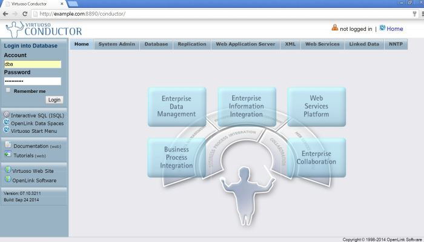

2.  Go the the Web Application Server -\> Virtual Domains & Directories
    tab:
    
    
    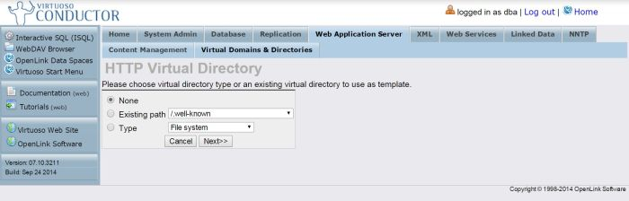

4.  Select the Type radio button and SPARQL access point item from the
    drop down list box:
    
    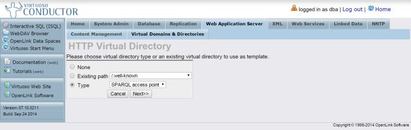

5.  Click "Next".

6.  Enter /sparql as the Path param in the Virtual Directory Information
    section and click Save Changes:
    
    
    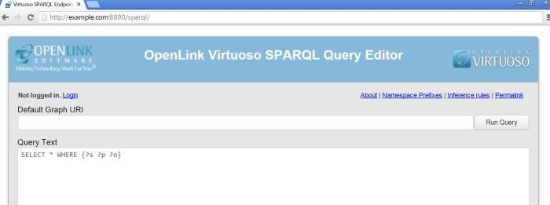

8.  Further details on SPARQL endpoint configuration can be found in
    [Service Endpoint](#rdfsupportedprotocolendpoint) documentation
    section.

9.  Typical Virtuoso server log output from a slave node when started,
    showing the HTTP server running on port 8890, being:
    
        20:12:49 OpenLink Virtuoso Universal Server
        20:12:49 Version 07.10.3209-pthreads for Linux as of Apr 26 2014
        20:12:49 uses parts of OpenSSL, PCRE, Html Tidy
        20:12:49 Registered to OpenLink Virtuoso (Internal Use)
        20:12:49 Personal Edition license for 500 connections
        20:12:49 Issued by OpenLink Software
        20:12:49 This license will expire on Sun May 17 06:18:35 2015 GMT
        20:12:49 Enabled Cluster Extension
        20:12:49 Enabled Column Store Extension
        20:12:57 Database version 3126
        20:12:57 SQL Optimizer enabled (max 1000 layouts)
        20:12:58 Compiler unit is timed at 0.000208 msec
        20:12:58 Roll forward started
        20:12:58 Roll forward complete
        20:12:59 Checkpoint started
        20:12:59 Checkpoint finished, log reused
        20:12:59 HTTP/WebDAV server online at 8890
        20:12:59 Server online at 12202 (pid 15969)

### Configure load balancing

*Step 3* : Configure load balancing

A reverse-proxy service (like Nginx or Apache) can then be configured
such that requests are proxied across as any or all nodes of the
cluster, to provide the desired load balancing.

### Additional Information

  - Only the Primary Node of an Elastic Cluster may be configured as a
    Publisher for Virtuoso Replication Cluster purposes.

  - The [Virtuoso 500 billion triple Berlin SPARQL Benchmark (BSBM)
    dataset](#) runs were performed on a 24-node Elastic Cluster. Each
    node was configured to provide HTTP services and a SPARQL endpoint,
    and the query load was spread over the entire cluster.

<a id="id73-troubleshooting-tips"></a>
## Troubleshooting Tips

If an operation seems to hang, see the output of:

    status ()

Check for the presence of the following conditions:

  - The cluster line shows 0% CPU, no message traffic and an unchanging
    number of buffers wired, this is probably a bug. To reset, restart
    the cluster or the offending process if found. Restart is done by
    executing:
    
        raw_exit ();
    
    over an SQL connection to the process in question.

  - The cluster line shows many threads waiting compared to total
    threads. If CPU is 0 and this does not change there could be a
    transaction that holds locks indefinitely. To clear, execute:
    
        txn_killall (1);
    
    Do this at a node that has local threads waiting. This is seen in
    the Lock Status paragraph of status ('') when connected to the node
    in question.

  - The cluster line shows a changing number in the pfs field. The
    system is swapping and slowed down.

  - If the status () itself hangs, try another process of the cluster.
    See that there is no temporary atomic activity like a long
    checkpoint. If the situation persists there is a bug. The checkpoint
    can be seen by the presence of the
    
    *checkpinmt\_in\_progress*
    
    file in each server's working directory.

  - To check the integrity of database files, do:
    
        cl_exec ('backup ''/dev/null''');
    
    If this returns, the databases are OK. If one is found to be corrupt
    the corresponding server exits.

<a id="id74-see-also"></a>
## See Also:

> **Tip**
> 
> [Setting up and operating Virtuoso on a cluster.](#clusteroperation)
> 
> Virtuoso Cluster Programming
> 
> [Virtuoso Cluster Fault Tolerance.](#fault)
