# Quick Start & Tours

# Where to Start

## Default Passwords

When you start up Virtuoso for the first time, there are 3 user accounts
defined:

| User Name |
| :-------- |
| dba       |
| dav       |
| vad       |
| demo      |
| soap      |
| fori      |

Default users of Virtuoso

One database user and 2 WebDAV users. These users have their passwords
set to default values. It is therefore important to change them
immediately after the installation.

The one database user is the database administrator with username "dba"
and password "dba". This can be changed using the [Interactive
SQL](#isql) utility. When started without parameters, the ISQL tries to
log on as dba with the default password. The SQL statement to change a
user's password is:

    set password <old password> <new password>

The password is an identifier, so take care to use proper quotation.

You can also use the graphical [Virtuoso Administration
Interface](#dbusersandgroups) to administer Virtuoso database users.

The 2 WebDAV user accounts, dav and davuser also have their password set
to their username. There are 2 easy ways to change them. Either use the
GUI in Administration Interface under WebDAV Administration / WebDAV
services / Users Administrator or use the SQL statement:

``` 
update WS.WS.SYS_DAV_USER set U_PASSWORD='<new password>'
where U_NAME='<username>'
    
```

Note quotation around varchar values. Please remember to perform these
operations for all Virtuoso server instances installed. By default these
are the Virtuoso with an empty database and Virtuoso \[demo\] with the
demo database.

## Post-Installation Sanity Check

### Verify by ISQL

Verify usability of your Virtuoso server by executing the following
command from your command line prompt:

    isql

From the ISQL prompt enter the following SQL command:

    select * from DB.DBA.SYS_USERS;

This should produce a resultset containing one record if everything has
been implemented correctly to this point.

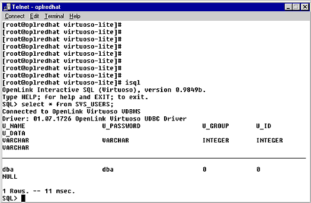

### Verify by HTTP

A quick way to check that the database is running, is to point a browser
to the http port. The following example URLs will show the System
Manager for the default, and the demo Virtuoso databases:

    http://example.com:8889/
    http://example.com:8890/
    http://a_virtuoso_server.org:8890/

On a Windows Client there is a shortcut to the *OpenLink Virtuoso
Conductor* in the OpenLink Virtuoso program group.

You will be presented with the OpenLink Virtuoso Conductor screen:

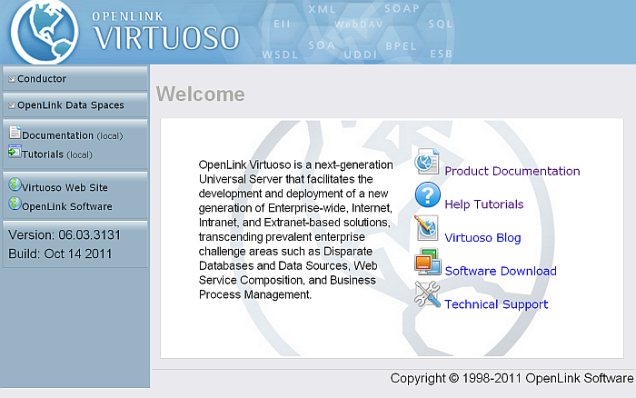

### Verify by web based SQL query

Click on the *Conductor* link to enter the Virtuoso Server
Administration Conductor Interface. You will be presented with a login
form, type in the correct details for the database DBA user, by default
this is username=dba; password=dba.

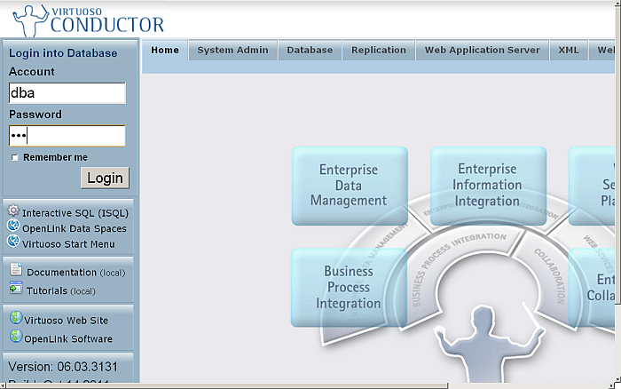

Got to tab "Database" and then go to tab "Interactive SQL".

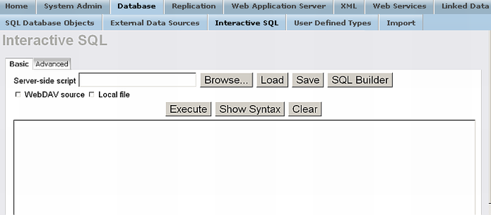

Enter the SQL Statement command "SELECT \* FROM SYS\_USERS" in the SQL
Statement text area. Note that only valid SQL can be supplied, so you
cannot type a database command such as "tables;". Also, note that the
";" is not valid in this context. Press *Execute* .

You should see the SQL results, as shown below.

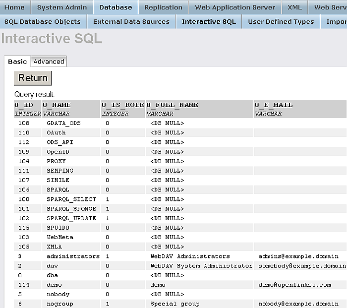

## Administering Your Virtuoso Installation

Virtuoso has been designed for Web based Administration. With your
Virtuoso server running you will be able to point a Web browser at the
servers listening address and port. The installation will include the
default server and optionally the demo database server. The default
server listens on port 8890 whilst the demo server listens on port 8889.
If you are using the machine where Virtuoso was installed then the
server address can be localhost or the hostname otherwise you will need
to know the hostname or IP address of the machine where Virtuoso was
installed. The URL that you will want to point your browser may be:

    http://example.com:8890/

Note that that trailing / is important and may be required for older
browsers


The "Conductor" link will take you to the Visual Server Administration
Interface. Information about Visual Server Administration Interface can
be found in the Server Administration chapter , which describes all the
Interfaces available for configuring your server.

# Client Connections

Virtuoso supports a number of data access API's such as ODBC and JDBC.
They both provide high performance native connectivity to the Virtuoso
database system.

## ODBC

The Virtuoso driver for ODBC is available for Windows and most Unix
operating systems. For Windows the you can configure a data source that
utilizes the driver in the familiar way via the ODBC Administrator. This
is very easy windows and wizards based process. On Unix the process has
historically not been so simple. We have been trying to a achieve the
same level of usability under Unix through our support of the [iODBC
project](#) . For more information and details about how to configure
the Virtuoso driver for ODBC please go to the [Virtuoso Driver for
ODBC](#virtdsnsetup) section.

## JDBC

The Virtuoso driver for JDBC is a type 4 native driver which is
available for all Java platforms. This means that you have a single jar
file, for which to include into your classpath, and then the driver is
ready for use by your applications. The connection URL typically
consists of:

    jdbc:virtuoso://hostname:port/UID=uid/PWD=pwd

More information about the JDBC driver can be found in the [Virtuoso
Driver for JDBC](#virtuosodriverjdbc) section. The JDBC driver also
supports SSL encrypted connections. This JDBC driver is an excellent
companion to any web enabled applications especially when combined with
Virtuoso's other features such as WSDL and SOAP.

## OLEDB

Virtuoso gives application developers an opportunity to utilize OLE DB
interfaces for their database programming needs. OLE DB is a Microsoft
developed and promoted technology for uniform data access across diverse
data sources. Many applications make indirect use of OLE DB through a
higher level ADO interface.

VIRTOLEDB is the native [OLE DB provider for Virtuoso](#virtoledb) .
This enables applications to access a Virtuoso server using OLE DB
interfaces. VIRTOLEDB provides implementation for all required and many
optional OLE DB interfaces.

# Virtual Database Server

Virtuoso's Virtual Database Engine enables you to produce Dynamic Web
Content from any major database management system. This enables dynamic,
real-time HTML and XML generation from any number of different database
engines concurrently. The Visual Server Administration Interface of
Virtuoso allows you to effortlessly remotely choose and configure remote
data sources to be linked into Virtuoso. Once a table is linked into
Virtuoso then it is usable like any native table leaving you free to
perform join queries without ever worrying about the underlying data
source.

The [Virtual Database (VDB) Engine](#vdbconcepts) section of the
Conceptual Overview chapter explains the concepts in more details.

Visit the [Visual Server Administration Interface](#remotetables)
section to see how to link tables into Virtuoso, or follow the small
example below to get you started:

## Configuring Your ODBC Data Sources

Before you can link a table into Virtuoso, you need to configure an ODBC
datasource. It is quite likely that you already have ODBC data sources
defined. If so, you can skip this part of the tour.

If you do not have any data sources defined, you should configure your
datasource using an appropriate ODBC driver. The ODBC driver may come
from the database vendor or a third-party middleware vendor, such as
OpenLink Software. You will need to configure your ODBC datasource in
accordance with the directions from your driver vendor.

In this part of the tour, we show sample DSN configuration information
for some database vendor drivers. These examples of working data sources
are not meant to replace the instructions from the driver vendor. In
your specific installation other parameters may be necessary.

To define ODBC data sources on Windows XP/95/98/NT, in the Control Panel
go to Administrative Tools and then click the Data Sources (ODBC) icon.

This first datasource uses OpenLink Generic ODBC Driver V6.0 to create
DSN to a MySQL 5.x database.


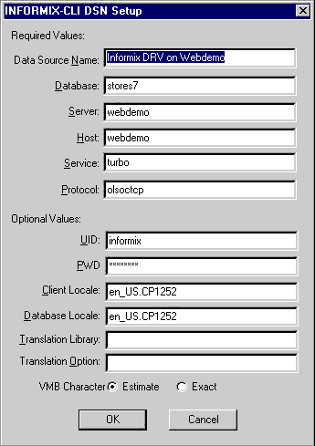

The next few images show a Microsoft SQL Server 6.5 datasource using the
Microsoft Corporation SQL Server driver.

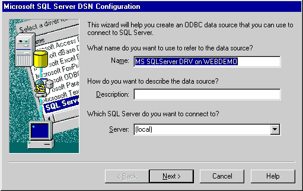

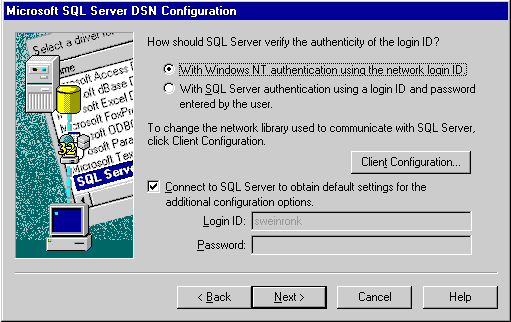

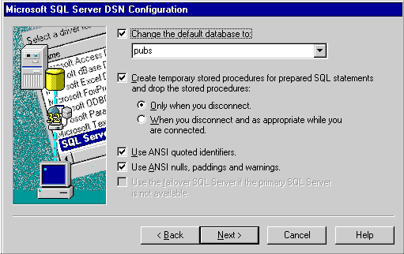

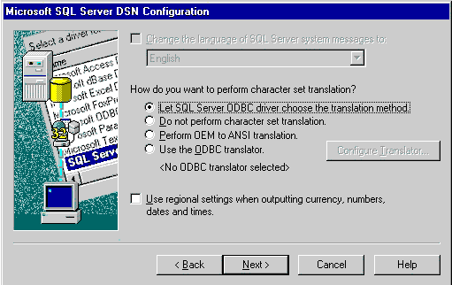

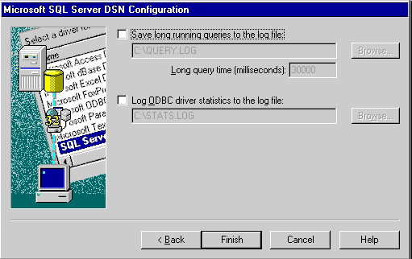

Finally, review the configuration information for your default local
Virtuoso datasource, named "*Local Virtuoso* ".

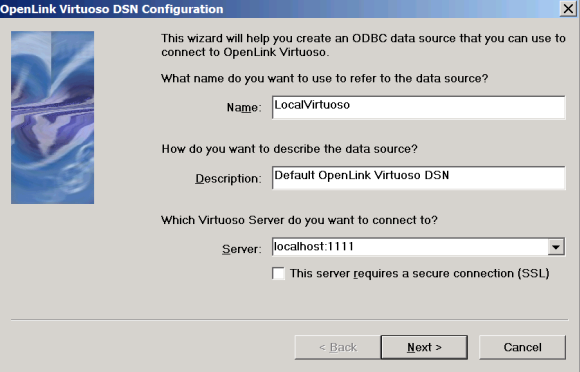

DSNs can be created and configured within the Virtuoso Conductor. Go to
"Database", then to "External Data Sources" and then go to "Configure
Data Sources" tab. Click the "Add System DSN", or "Add User DSN", or
"Add File DSN" button.

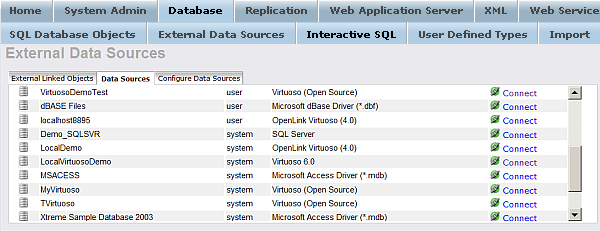

## Datasource Check

Before trying to link a table into Virtuoso, you should verify that the
datasource is working correctly. Use a tool such as Microsoft Access, or
ODBCtest to test your datasource. Your sanity check will verify that the
datasource is correctly configured, that all necessary software is
installed, that the database is running, and that there are no
permission related problems. In addition, it will verify that the driver
that you are using works correctly with the underlying datasource.

If there is a problem using a specific tool such as Microsoft Access
with a specific driver, then that same problem will be manifested when
the datasource is exposed via Virtuoso.

## Demo Datasource Query

To query the sample data in the Demo Database make sure the web browser
is pointing to the Demo database HTTP port which is typically 8890. From
Conductor go to tab "Database" and then select the tab "Interactive
SQL". Enter a SQL statement and click the button "Execute". For example:

    SELECT * FROM DEMO..products WHERE UnitPrice < 7

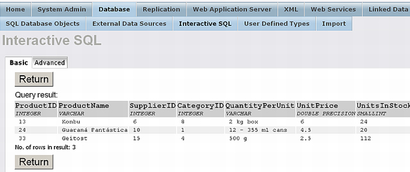

## Linking Remote Tables Into Virtuoso

A table on a remote datasource may be linked into the Virtuoso database
so that it appears as a local table. Start a browser and point to
Conductor, for ex. http://example.com:8890/conductor/. Go to tab
"Database", then select "External Data Sources" and then "Sata Sources".
Specify the remote datasource that you wish to link to Virtuoso. For
example, click the link "connect" for DSN "VirtuosoDemoTest".

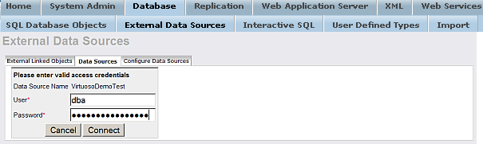

As result should be shown for DSN "VirtuosoDemoTest" the links "Link
objects", "Change Credentials", "Disconnect". Click the "Link objects"
link.

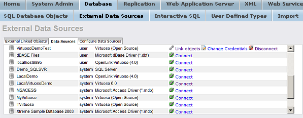

Pick the tables to be linked, and define the names to use.

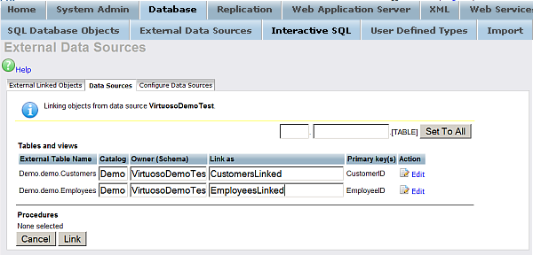

## Listing or Unlinking Tables

To list the tables that have been linked into Virtuoso, from Conductor
go to *Databases/ External Data Sources/ External Linked Objects* . A
table may be unlinked by pressing its "Unlink" icon.

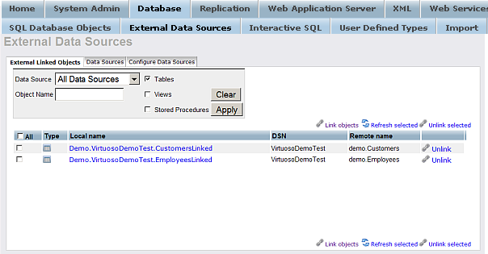

## Querying Linked Tables

Once the tables have been linked into Virtuoso, they can be queried
using the Interactive SQL query. From the Conductor UI go to
*Database/Interactive SQL* . Type a SQL that accesses a remote table
such as: SELECT \* FROM Demo.VirtuosoDemoTest.CustomersLinked. Click the
"Execute" button.

Press the Execute button and review the results.

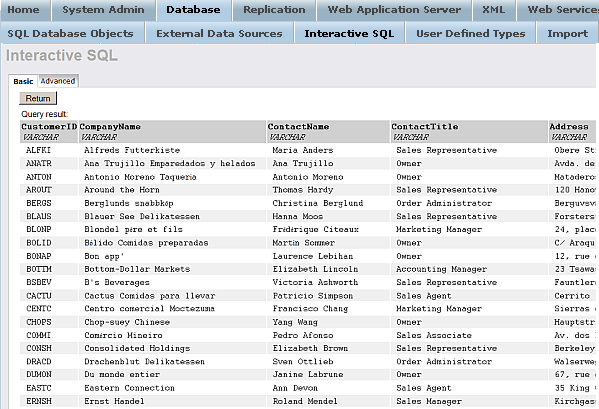

# Web Server

## Virtual Directories

The term virtual directory applies to the mechanism to hide the physical
location of a Web resource under different path which user agents use to
retrieve it. This mechanism in virtuoso is a part of host definition.

This method is useful when one server has to keep many Web sites. Using
a redirect mechanism is not a universal way to do this. It is better to
define virtual hosts and paths to the directory entries which contain
Web pages.

### Creating Virtual Directories Programmatically

For an overview of virtual directories, and how to configure them in PL,
refer to the [Virtual Directories Section](#virtdir) .

### Setup in Administration Interface

This step by step example will define a virtual directory /help that
will point to the directory /departments/support/

1.  From the Conductor UI go to Web Application Server/ Virtual Domains
    & Directories.
    
    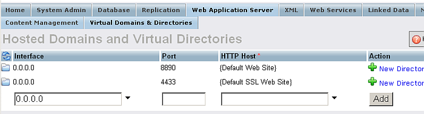

2.  Open the "folder" icon for your {Default Web Site}.
    
    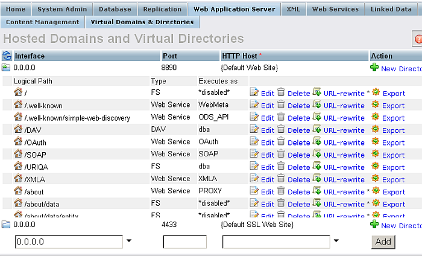

3.  Click the link "New Directory" to add a new virtual directory.
    
    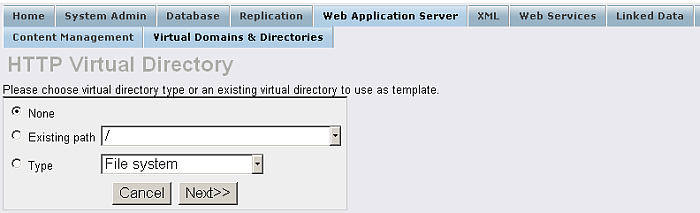

4.  Select for "Type" File system, as this mapping example will be from
    one directory to another, and click "Next".
    
    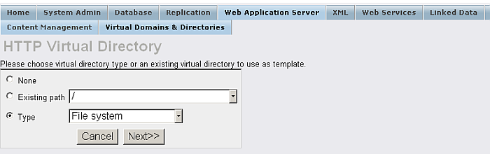

5.  Enter details in the form to define the mapping. Most of the fields
    are optional. In this example, only the logical and physical paths
    and the default page name are required. Click finally the button
    "Save Changes".
    
    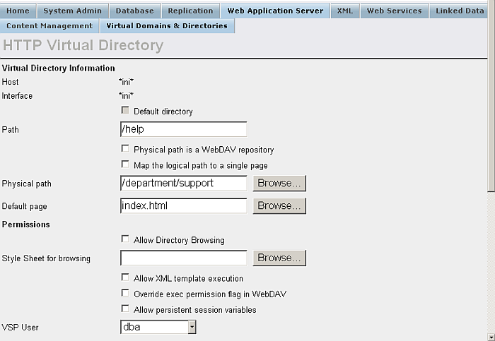

6.  The following URLs will then be equivalent:
    
    http://example.com:8890/help
    
    http://example.com:8890/departments/support/index.html

## Multi Homing

The term Multi Homing refers to the practice of maintaining more than
one server on one machine, differentiated by their apparent host name.
It is often desirable for companies sharing a web server to have their
own domains, with web servers accessible as www.company1.com and
www.company2.com, without requiring the user to know any extra path
information.

### Creating Multiple Homes Programmatically

For an overview of Multi Homing, and how to configure it with PL, refer
to the [Virtual Hosting and Multi Hosting](#virtandmultihosting)
section.

### Setup in Administration Interface

This step by step example will define a virtual home for the URL
http://www.ahelp.com/ to the server www.a.com and directory
/departments/support/

1.  Have a domain name allocated in the DNS for the ahelp.com that
    points to the same IP address of the a.com that is hosting a
    Virtuoso server.

2.  From the Conductor UI go to Web Application Server/ Virtual Domains
    & Directories.
    
    

3.  To add a new host definition, enter for "Port" 80, enter for "HTTP
    Host" www.ahelp.com and select the "Add" button.
    
    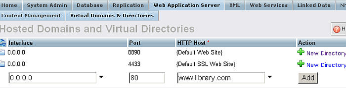

4.  Click for the new defined site the "Edit" link in order to define
    the mapping between the virtual host and the actual listening host
    domain names.
    
    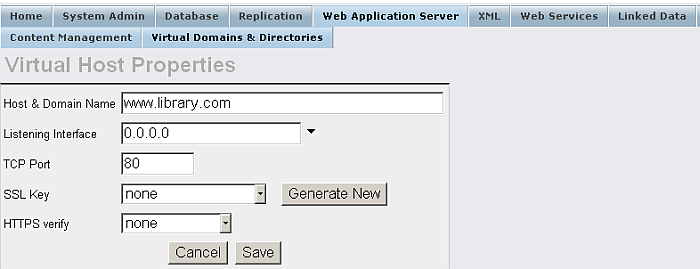

5.  Click the "folder" icon for the new defined site and then click the
    "Edit" link for the Logical Path "/".
    
    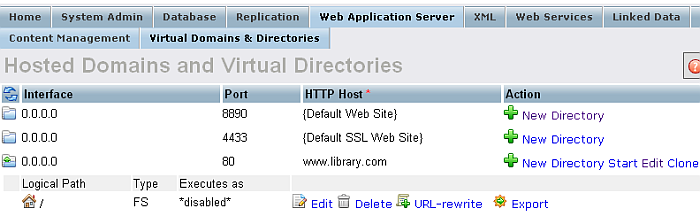

6.  Enter details in the form to define the mapping. Most of the fields
    are optional. In this example, only the logical and physical paths
    and the default page name are required.
    
    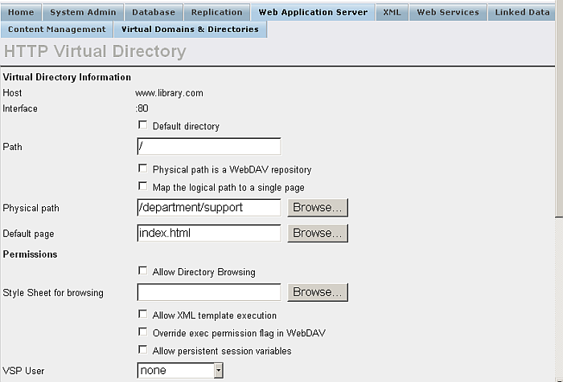

7.  The following URLs will then be equivalent:
    
    http://www.ahelp.com/
    
    http://www.a.com/departments/support/index.html

# WebDAV

WebDAV support enables Virtuoso to act as the Web Content Store for all
of your eBusiness data, this includes Text, Graphics and Multimedia
files. WebDAV support also enables Virtuoso to play the familiar roles
of a FILE & WEB SERVER, hosting entire Web sites within a single
database file, or across multiple database files. Virtuoso's WebDAV
provides file system like access to its non SQL data repository.

Files contained in the DAV repository are stored in a database table.
Free text indexing and replication mechanisms may be applied to the DAV
repository as well as the regular database. Standards based WebDAV
methods are used to access resources stored in the repository based on
Virtuoso's full-featured SQL-92 database engine with performance that
matches or exceeds that of current major players in the DB market.
Typical WebDAV clients that can access the repository for content
management include Network Places on Windows through Explorer, Nautilus
on Gnome (Linux and Solaris), and the Mac OS X desktop. Many web
development tools also support WebDAV directly.

See the [WebDAV Administration](#webdavadmin) section, to setup the
WebDAV in the Visual Server Administration Interface.

## Web Folders

Microsoft Windows has a notion of a Web Folder. This is how Windows
connects to a WebDAV store which can then be traversed like any other
file system. Files can be copied and moved to and from the DAV using
normal drag-and-drop methods.

1.  To create a Web Folder open the *Windows Explorer* and navigate to
    *My Network Places* .
    
    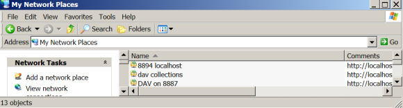

2.  You will find an icon or option to *Add Network Place* which when
    double-clicked will lead you to the wizard.
    
    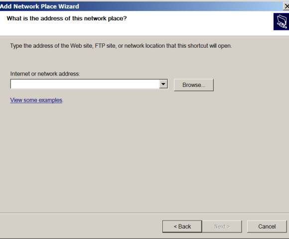

3.  The first screen encourages you to type the location of the network
    place, for connecting to a Virtuoso DAV you will need to know the
    server location and port number. If you installed Virtuoso on to
    your local machine taking default options then you would probably be
    typing:
    
        http://example.com:8889/DAV/
    
    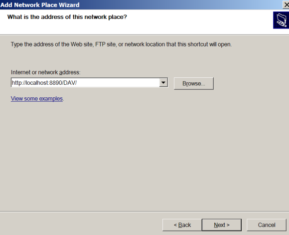

4.  You will then be asked for authentication information which will
    require a username and a password. If defaults are taken then this
    would simply be dav and dav for both.
    
    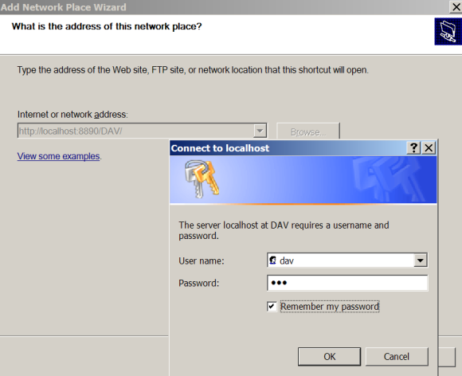

5.  To complete the creation of a Web Folder you be asked to supply a
    name for the network place.
    
    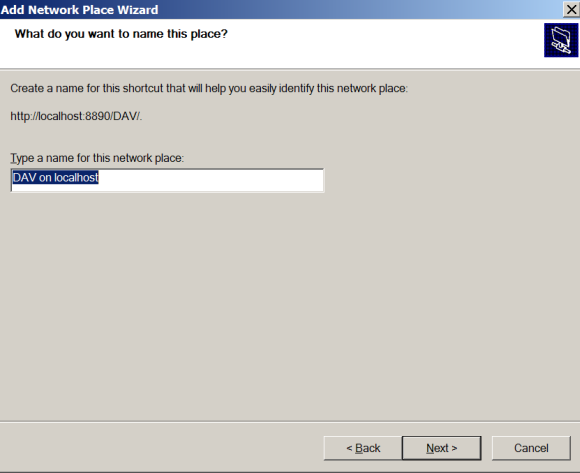

6.  Once provided Explorer will automatically open a new Window over
    looking the new location.
    
    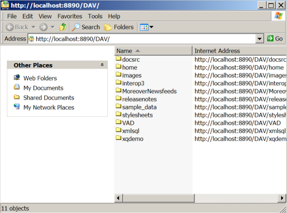

7.  You can find your new Web Folder again from My Network Places where
    the link will be saved.

# Web Services

SOAP is a lightweight, extensible, XML-based protocol for information
exchange in a decentralized, distributed environment. Primarily, SOAP
defines a framework for message structure and a message processing
model. SOAP also defines a set of encoding rules for serializing data
and a convention for making remote procedure calls. The SOAP
extensibility model provides the foundation for a wide range of
composable modules and protocols running over a variety of underlying
protocols such as HTTP.

By Supporting the [Simple Object Access Protocol (SOAP)](#soap) ,
Virtuoso enables you to integrate business processes within and across
organization boundaries. Virtuoso's SOAP Support implementation enables
you to execute Virtuoso Stored Procedures over HTTP. This is a
significant component in any B2B development and implementation effort.
Development is very rapid and is directly incorporated within the
database environment required for keeping B2B processes running
accurately.

# Exposing Persistent Stored Modules as Web Services

Virtuoso SQL stored procedures and functions can be exposed as SOAP
services very simply from Virtuoso, whether they are native Virtuoso or
on remote data sources. This powerful ability means that any database
servers already existing within an organization can easily become a
component in an eBusiness solution using Virtuoso. All you need is a few
simple steps that typically take mere minutes to complete:

  - **Choose your stored procedure(s).**
    
    The procedures that you want to expose can either be native Virtuoso
    stored procedures, or remote stored procedures that can be linked in
    using the Remote Procedures user interface.

  - **Choose a virtual directory.**
    
    Because SOAP services need to be exposed and accessed via HTTP a
    Virtuoso virtual directory must be used. Either use the existing
    SOAP virtual directory or create a new one.

  - **Publish procedures to virtual directory.**
    
    The user specified as SOAP account on the virtual directory must
    have execute privileges on the procedures. Use the Publish options
    on the virtual directory user interface.

  - **Test the VSMX output.**
    
    Once procedures have been published as SOAP services they are
    automatically described by WSDL and testable using Virtuoso's VSMX
    feature.

XML Query Templates provide a direct way to store SQL in an XML file on
the Virtuoso server that when executed, i.e. fetched from a web browser,
actually returns the results of the query.

The C Interface chapter describes how users can define custom built-in
functions, from C or other programming languages, that can be used from
within Virtuoso PL. This also means that VSE's can also be published as
a Web Service\!

## Publishing Stored Procedures as Web Services

### Choosing Stored Procedures to Expose

You can either expose native Virtuoso stored procedures (previously
defined or newly created) using the CREATE PROCEDURE statement, or
stored procedures from other database types can be linked into Virtuoso
using an ODBC datasource.

Virtuoso lists available stored procedures for each catalog in Conductor
under: */Database/External Data Sources/External Linked Objects / with
checked "Stored Procedures"* .

To link a stored procedure from another database system we must first
create a valid data source that leads to a connection to that database.
Once verified proceed to the Remote Procedures page. Select the "Link
objects" link for a data source.


Select the check-box "Store Procedures". Click the "Apply" button. As
result will be shown the list of available procedures.


Select the check-boxes for the procedures you want to link and click the
"Link" button.


You will be presented with a new page listing the chosen procedures and
their data type information. This gives you an opportunity to alter the
data type mappings that Virtuoso will use both internally and for any
future interactions with the SOAP server. If you do not want to specify
any special type information the details can be left as default.

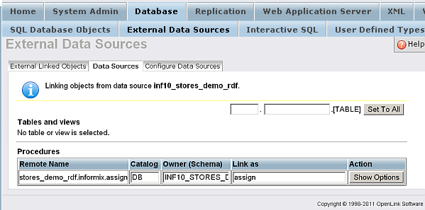

For each remote procedure you may change how they will be referenced
within Virtuoso by making changes to the fields for *Catalog* , *Owner*
, *Link as* , and *Description* fields. These fields define how you will
find the linked procedure locally to Virtuoso only and do not affect the
remote data source.

For each procedure there is an option to *PL Wrapper Requirement* . This
option is required if your remote procedure is capable of returning a
resultset that you want to process via Virtuoso. Can be *SOAP Execution*
, *SQL Execution* or *None* . Also you can specify *Return Type* , *Data
Type* , *SOAP Type* .

Once the details are correct press the "Link" button.

> **Tip**
> 
> [Linking Remote Procedures](#remoteprocedures)

### Defining Virtual Directories

Before any procedures native or linked can be exposed as SOAP Services a
location in HTTP space must be defined. From Conductor *Web Application
Server/Virtual Domains & Directories* you make a new URL Mappings. Click
on the *New Directory* link for the {Default Web Site} line to begin
defining a new SOAP mapping.

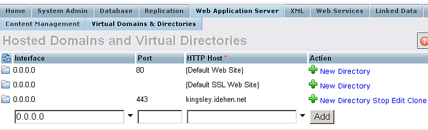

Select for "Type" from the list the value "SOAP access point" and click
the "Next" button.

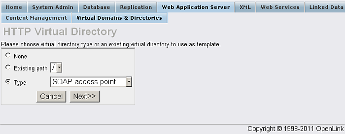

You will then be presented with the following tabs: "Virtual Directory
Information", "Authentication", "Web Service Option", "WS Security" and
"Publish Objects". Particular options to note are "Virtual Directory
Information" and "Publish Objects".

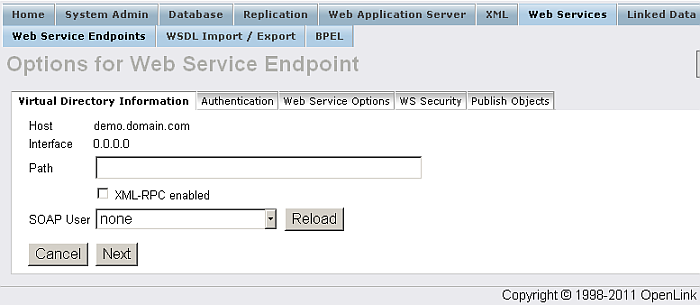

In *Publish Objects* you can select Virtuoso stored procedures, or
remotely linked procedures to be published as SOAP web services. Also
you can publish Pl Modules, User Defined Types, or Saved Queries.


> **Tip**
> 
> [Virtual Directories](#httpvirtualdirs)

### Publishing Procedures to a Virtual Directory

If you already have a virtual directory defined and know what procedures
you want to expose as web services you will have to repeat some of the
steps in the section above. From Conductor go to *Web Application
Server/Virtual Domains & Directories* . Click on the "folder" icon for
your {Default Web Site}. You will find the list of previously existing
mappings, from which you can select the mapping that you want to edit by
pressing on its *Edit* link. Note, the virtual directory should have
type "SOAP".

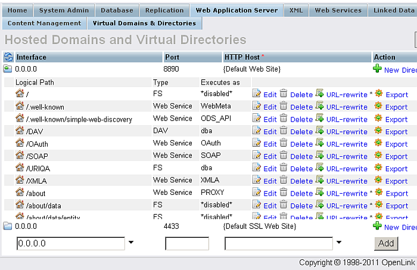

Go to tab "publish Objects" to expose/hide your procedures, Pl Modules,
User Defined Types and Saved Queries.


The "Procedures" tab presents the list of available procedures. You can
select a catalogue in order to list the procedures you want to publish.
When the procedures to be published are selected, you can either click
the "Publish Selected" button, or before this to click the "Edit
Description" button.

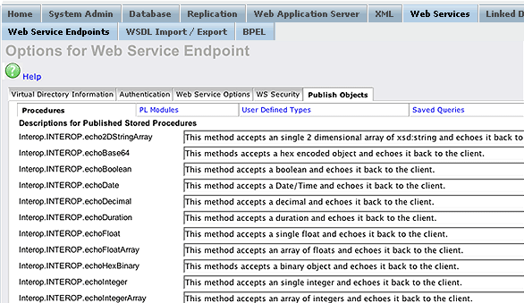

### Testing SOAP Services Using VSMX

Virtual directory definitions have a *Logical Path* field, which is
reference in URL to find the correct SOAP services. If you connect to
Virtuoso on *http://example.com:8890/* , and defined your virtual
directory with the logical path of */mysoap* then you will be able to
test the following URLs:

http://example.com:8890/mysoap/services.wsdl

http://example.com:8890/mysoap/services.vsmx


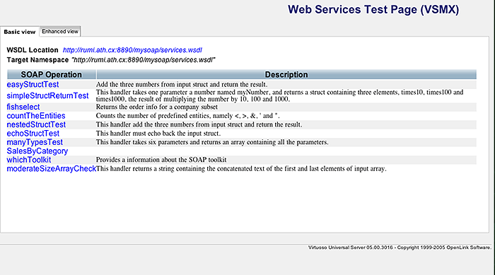

The WSDL description is a standards-based description of the Web
Services available from /mysoap. The VSMX page is a Virtuoso generated
test page allowing you to test SOAP services. This feature should
improve your development time.

> **Tip**
> 
> [VSMX](#vsmx) ; [SOAP](#soap) ; [WSDL](#wsdl) .

## XML Query Templates

Virtuoso XML templates allow execution of SQL/XML queries over HTTP to
obtain an XML document in response and/or perform some operation in the
database using [updategrams](#updategrams) . XML templates can be
executed from within Virtuoso procedure language using the
[`xml_template()`](#fn_xml_template) function. XML templates support two
types of action: SQL based or updategram based. SQL query based
templates must contain the FOR XML clause used in a SELECT statement and
hence cannot update the database. Updates to the database can only occur
from an updategram. The XML document returned from calling an XML
template can be served either raw, or transformed using XSLT.

XML templates provide quick easy access to results from a SQL query as
usual, but now this can be saved to a file. The results are not saved,
just the query definition. You can use this feature to rapidly produce
dynamic reports that can potentially be rendered in different ways by
providing an alternate stylesheet. The report can be refined on the fly
by providing parameters for the query. The output is reachable via HTTP
directly by providing the URL to the template.

> **Tip**
> 
> The [XML Templates](#xmltemplates) Section

XML Templates can also be published just like normal store procedures.
This is achieved by using a PL wrapper around the XML template. Then the
store procedure is published in the normal way.

Stylesheets transformations with be inactive for published XML templates
invoked from SOAP.

> **Tip**
> 
> The Publishing Stored Procedures Section above for a further
> description of publishing XML Templates.

## Publishing VSE's as Web Services

The Virtuoso distribution includes the sample VSE, bif\_sample.c. It is
thus possible to create a function such as:

    .....
    static caddr_t
    bif_hello_world (caddr_t * qst, caddr_t * err_ret, state_slot_t ** args)
    {
      return box_dv_short_string ("Hello world.");
    }
    ....

Then declare it in the init\_func() by adding the following code:

    ...
      bif_define_typed ("hello_world", bif_hello_world, &bt_any);
    ...

The next step is creating a stored procedure that calls this function
and you are back to publishing a Virtuoso stored procedure again, as in
the above section.

    create procedure BIF_HELLO_WORLD () { return hello_world (); };

> **Tip**
> 
> The [C Interface](#cinterface) Chapter

# VSMX - Virtuoso Service Module for XML

Every WSDL file generated by Virtuoso is automatically accompanied by a
SOAP Operations Test page known as a VSMX file, which has the extension
.vsmx. You find this file in the same place as the WSDL file. For a SOAP
enabled virtual directory you have the facility to find the WSDL file:

    http://[host:port]/[SOAP Virtual Directory]/services.wsdl

likewise you also get a VSMX file:

    http://[host:port]/[SOAP Virtual Directory]/services.vsmx

You simply point your web browser to this file for the test page. The
demo database contains samples that can be found as:

    http://[host:port]/SOAP/services.vsmx


> **Tip**
> 
> The [VSMX section](#vsmx) for more details

# SQL to XML

Virtuoso enables you to develop eBusiness solutions that use XML as both
a Data Source and Data Interchange format. Your XML Data documents can
take the form of Pure XML Documents, or documents that are transformed
from SQL-XML on the fly. By supporting the XPATH query language for XML
Data, you are able to use an industry standard query language to query
entire XML Documents or portions of XML Documents stored within
Virtuoso. Virtuoso's inclusion of an XSLT transformation engine then
allow you to transform XML data for other needs. These XML documents are
openly accessible to user agents such as Web Browsers via HTTP and/or
WebDAV. These XML documents are described as being dynamic because they
have varying degrees of sensitivity to changes that occur in the
underlying database tables from which the XML data originates. Virtuoso
allows you to create two types of XML documents from homogeneous or
heterogeneous SQL Data on the fly:

Transient

The materialization of the XML Document occurs at the time of file
opening, this implies that data from the original SQL database(s) is
retrieved and then transformed into XML in one operation. This format of
SQL-XML document is highly sensitive to source database(s) changes.

Persistent (Time Synchronized)

\- The materialization of the XML Document re-occurs at a user
configurable interval after initial creation. This is a caching scheme
which is less sensitive to changes in the source databases(s) in favor
of performance.

SQL-XML documents may be Valid or Well Formed XML documents, this
includes support for both DTDs and XML Schemas which my be external
entity references or inlined within the XML Documents prologue in the
case of DTDs.

Virtuoso supports an extended SQL syntax that is identical to that
implemented by Microsoft SQL Server for the purpose of creating SQL-XML
documents. These SQL extensions take the form of a new "FOR XML" clause
that includes three main options which control the structure of the
resulting XML document tree. These options are *RAW* , *AUTO* and
*EXPLICIT* .

Virtuoso's HTML based graphical interface includes a user friendly
mechanism for creating dynamic XML documents from SQL data using the
"FOR XML" extended SQL syntax. The dynamic XML documents created by this
process are typically stored in Virtuoso's WebDAV repository. Documents
stored in this repository are accessible by any XML consuming client
application via HTTP, Windows Web Folders, or any other WebDAV or HTTP
compliant environment. A description of the interface in general can be
found in the [SQL-XML Statements](#sqlxmlstmts) in the Visual Server
Administration Interface section.

From Conductor *XML/SQL\_XML* you can execute SQL query with options on
how to produce XML structures from the results.

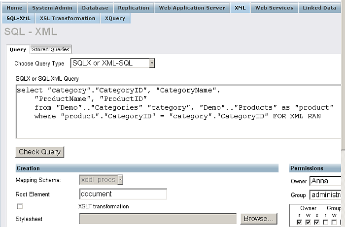

The illustration above depicts the fact that only minor changes to
standard SQL are required in order to create powerful dynamic XML
documents from SQL. It also illustrates how the entire process of
controlling the type and format of the XML documents and their actually
WebDAV storage is all achieved without any programming. The XML document
extract below is a depiction of the XML document tree produced using the
"FOR XML" AUTO option.

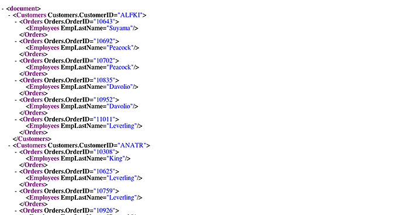

The Virtuoso Demo database provides a set of sample tables in the Demo
catalogue, and some sample XML views that use them. The "StoredQueries"
tab lists saved XML Views as shown below.

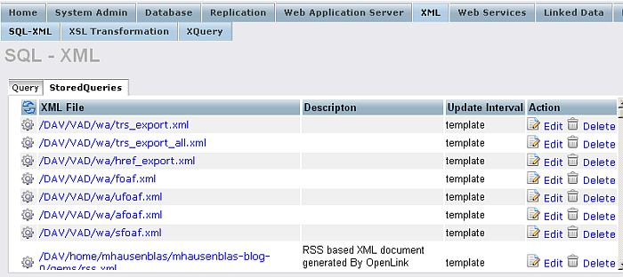

You can press *Edit* to edit them, or *Delete* to remove them or click
on the XML FILE itself to see the results in your default browser, a
sample of the output is shown above.

## FOR XML Execution Modes

Now we will consider the programmatical approach along side the visual
interface approach. We will have one example of each of the modes of FOR
XML combined with the [`xml_auto()`](#fn_xml_auto) function to help us
display the results simply.

For the programmatical examples to run smoothly using ISQL a number of
steps are required to obtain textual output from the xml\_auto()
function which usually is expected to output directly to an HTTP target.
To make the demonstration simpler a utility procedure will be created
that will simply enable us to supply SQL and return XML using the
[`xml_auto()`](#fn_xml_auto) function.

    create procedure xmla (in q varchar)
    {
      declare st any;
      st := string_output ();
      xml_auto (q, vector (), st);
      result_names (q);
      result (string_output_string (st));
    }

  - *RAW* mode produces an XML entity from each row of the result set,
    and does not attempt to construct hierarchies. Each row's data is
    enclosed in a ROW element and each column is either an attribute or
    child element.
    
    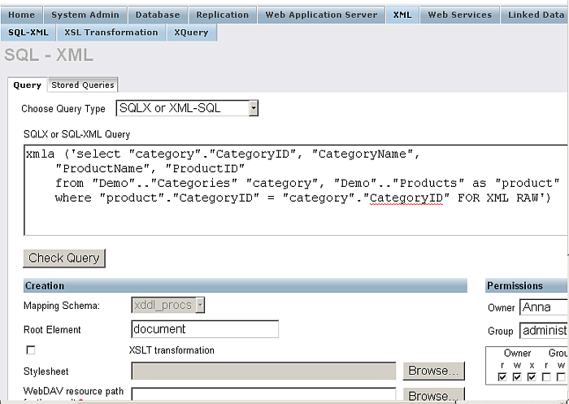
    
    The same SQL statement containing the FOR XML syntax is used in the
    visual interface shown above, and in the programmatical version
    shown below. This is because both use the xml\_auto() function for
    generating results. In the visual interface once the settings and
    query have been confirmed you press the "Execute" button to store
    the query in the specified DAV location.
    
        xmla ('select "category"."CategoryID", "CategoryName",
            "ProductName", "ProductID"
            from "Demo".."Categories" "category", "Demo".."Products" as "product"
            where "product"."CategoryID" = "category"."CategoryID" FOR XML RAW');
    
    > **Note**
    > 
    > The xmla function is not a standard function but quick utility for
    > quickly rendering a text output for the
    > [`xml_auto()`](#fn_xml_auto) function. The definition is at the
    > top of this section
    
    The resulting XML from either ISQL or the saved links on the visual
    interface will yield:
    
        <ROW CategoryID="1" CategoryName="Beverages" ProductName="Chai" ProductID="1">
        </ROW>
        <ROW CategoryID="1" CategoryName="Beverages" ProductName="Chang" ProductID="2">
        </ROW>
        <ROW CategoryID="1" CategoryName="Beverages" ProductName="Guaran Fantastica" ProductID="24">
        </ROW>
        <ROW CategoryID="1" CategoryName="Beverages" ProductName="Sasquatch Ale" ProductID="34">
        </ROW>
        <ROW CategoryID="1" CategoryName="Beverages" ProductName="Steeleye Stout" ProductID="35">
        </ROW>
        <ROW CategoryID="1" CategoryName="Beverages" ProductName="C(te de Blaye" ProductID="38">
        </ROW>
        <ROW CategoryID="1" CategoryName="Beverages" ProductName="Chartreuse verte" ProductID="39">
        </ROW>
        <ROW CategoryID="1" CategoryName="Beverages" ProductName="Ipoh Coffee" ProductID="43">
        </ROW>
        .....

  - *AUTO* mode. A hierarchy is constructed with one level for each
    table of the join for which at least one column is selected. The
    table whose column is first mentioned in the selection will be the
    topmost element, the next table its child etc. Each level of the
    tree will consist of one type of element. A parent element will have
    multiple children if consecutive rows do not differ in the column
    values coming from the parent element. When a table's column values
    differ from the previous row, the element and all children thereof
    are closed and a new element is started, with children filled out
    from other columns of the result set.
    
    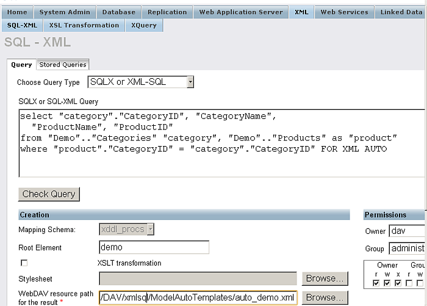
    
    The same SQL statement containing the FOR XML syntax is used in the
    visual interface shown above, and in the programmatical version
    shown below. This is because both use the xml\_auto() function for
    generating results. In the visual interface once the settings and
    query have been confirmed you press the execute button to store the
    query in the specified DAV location.
    
        xmla ('select "category"."CategoryID", "CategoryName",
            "ProductName", "ProductID"
            from "Demo".."Categories" "category", "Demo".."Products" as "product"
            where "product"."CategoryID" = "category"."CategoryID" FOR XML AUTO');
    
    > **Note**
    > 
    > The xmla function is not a standard function but quick utility for
    > quickly rendering a text output for the
    > [`xml_auto()`](#fn_xml_auto) function. The definition is at the
    > top of this section
    
    The resulting XML from either ISQL or the saved links on the visual
    interface will yield:
    
        <category CategoryID="1" CategoryName="Beverages">
        <product ProductName="Chai" ProductID="1">
        </product>
        <product ProductName="Chang" ProductID="2">
        </product>
        <product ProductName="Guaranß Fantßstica" ProductID="24">
        </product>
        <product ProductName="Sasquatch Ale" ProductID="34">
        </product>
        <product ProductName="Steeleye Stout" ProductID="35">
        </product>
        <product ProductName="C(te de Blaye" ProductID="38">
        </product>
        <product ProductName="Chartreuse verte" ProductID="39">
        </product>
        <product ProductName="Ipoh Coffee" ProductID="43">
        </product>
        <product ProductName="Laughing Lumberjack Lager" ProductID="67">
        </product>
        .....
    
    > **Note**
    > 
    > In contrast to the RAW mode AUTO produces results that are more
    > reasonable and intuitive. Only one category element is used for
    > each category which contains all the children of that category.

  - *EXPLICIT* mode gives more control on the resulting tree's structure
    while requiring a more elaborate query structure. In this mode, the
    query will be a UNION ALL of many joins and each row will specify
    exactly one element. Which type of element this is and where in the
    tree it will be placed are determined by the values of the 2 first
    columns, TAG and PARENT.
    
    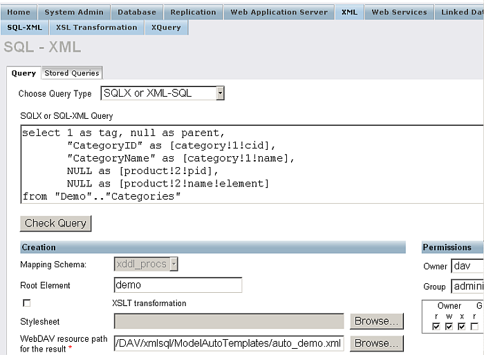
    
    The same SQL statement containing the FOR XML syntax is used in the
    visual interface shown above, and in the programmatical version
    shown below. This is because both use the xml\_auto() function for
    generating results. In the visual interface once the settings and
    query have been confirmed you press the execute button to store the
    query in the specified DAV location.
    
        xmla ('
        select 1 as tag, null as parent,
               "CategoryID" as [category!1!cid],
               "CategoryName" as [category!1!name],
               NULL as [product!2!pid],
               NULL as [product!2!name!element]
        from "Demo".."Categories"
        union all
        select 2, 1, "category" ."CategoryID", NULL, "ProductID", "ProductName"
            from "Demo".."Categories" "category", "Demo".."Products" as "product"
            where "product"."CategoryID" = "category"."CategoryID"
        order by [category!1!cid], 5
        FOR XML EXPLICIT');
    
    > **Note**
    > 
    > The xmla function is not a standard function but quick utility for
    > quickly rendering a text output for the
    > [`xml_auto()`](#fn_xml_auto) function. The definition is at the
    > top of this section
    
    The resulting XML from either ISQL or the saved links on the visual
    interface will yield:
    
        <CATEGORY CID="1" NAME="Beverages">
        <PRODUCT PID="1">
         <NAME>Chai</NAME></PRODUCT>
        <PRODUCT PID="2">
         <NAME>Chang</NAME></PRODUCT>
        <PRODUCT PID="24">
         <NAME>Guaran&#225; Fant&#225;stica</NAME></PRODUCT>
        <PRODUCT PID="34">
         <NAME>Sasquatch Ale</NAME></PRODUCT>
        <PRODUCT PID="35">
         <NAME>Steeleye Stout</NAME></PRODUCT>
        <PRODUCT PID="38">
         <NAME>C&#244;te de Blaye</NAME></PRODUCT>
        <PRODUCT PID="39">
         <NAME>Chartreuse verte</NAME></PRODUCT>
        <PRODUCT PID="43">
         <NAME>Ipoh Coffee</NAME></PRODUCT>
        <PRODUCT PID="67">
         <NAME>Laughing Lumberjack Lager</NAME></PRODUCT>
        <PRODUCT PID="70">
         <NAME>Outback Lager</NAME></PRODUCT>
        <PRODUCT PID="75">
         <NAME>Rh&#246;nbr&#228;u Klosterbier</NAME></PRODUCT>
        <PRODUCT PID="76">
         <NAME>Lakkalik&#246;&#246;ri</NAME></PRODUCT>
        </CATEGORY>
        <CATEGORY CID="2" NAME="Condiments">
        <PRODUCT PID="3">
        .....
    
    > **Note**
    > 
    > In contrast again, the EXPLICIT mode produces exactly what we
    > asked for.

For more details about 'FOR XML, refer to [Rendering SQL Queries as
XML](#forxmlforsql) section of the XML Support chapter.

## Tables With XML Columns

XML is a new native Virtuoso datatype, based on an extension of LONG
VARCHAR for compatibility with ODBC clients, allows direct storage,
retrieval and querying of XML stored in a database table. This has
always been possible with Virtuoso utilizing `xml_tree_doc()` and
friends but now you can easily concentrate on what more important, the
data, and not which datatype to convert it to next.

> **Tip**
> 
> [XML Column Type](#sqlrefxmldatatype)

# NNTP

Virtuoso supports the Network News Transfer Protocol used by Internet
newsgroup forums. NNTP servers manage the global network of collected
newsgroup postings and represent a vast repository of targeted
information archives. As an NNTP aggregator, Virtuoso enables
integration of multiple news forums around the world. All news content
in Virtuoso is dynamically indexed to provide keyword searches, enabling
rapid transformation of disparate text data into information. Virtuoso
also acts as an NNTP server, enabling creation of new Internet and
Intranet News Forums to leverage the global knowledge base into
eBusiness Intelligence.

## NNTP Server Setup

### Enable Server

Before the NNTP server can be used, it has to be enabled to listen on
the NNTP port. This change is made in the configuration file.

For more details, refer to [Enable NNTP Server](#newssrvenable) section.

### Create/Attach News Groups

The definition of news groups is held in system tables.

For more details on inserting news groups by SQL command, refer to [Add
Groups to NNTP Server](#newssrvadd) section. See also the [Conductor
News Server and Newsgroups Administration](#newssrvadm) section, to
setup the groups in the Visual Server Administration Interface.

### Limit Groups

This is an optional step, appropriate if a news group is to be limited
for internal use only, or by a group of IP addresses. This is achieved
by creating an Access Control List (ACL) in the DB.DBA.NEWS\_ACL table.
If no ACL is defined, then all groups are public readable and writable.

For table details, refer to [NNTP Server Tables](#newssrvtables)
section.

## Local & Remote Groups

News groups may be Local such that they are the only instance, or a
master instance of a group. Remote groups are ones that are replicated
from other news servers.

See the [Conductor News Server and Newsgroups
Administration](#newssrvadm) section, to setup the groups in the Visual
Server Administration Interface.

## NNTP Client Setup

Virtuoso can make a client connection to an external news server to
receive newsgroup postings.

For more details, refer to the [NNTP Client](#nntpclient) section.

# Dynamic Web Pages

Virtuoso provides an extensible array or dynamic methods for creating
data driven web pages. Through runtime hosting Virtuoso can directly
host, store and drive:

PHP

JSP

ASP.Net

Perl

Python

Ruby

Natively - VSP and VSPX:

Virtuoso Server Pages (VSP) is Virtuoso's specification for creating
dynamic database driven Web pages, these files have the extension ".vsp"
and are identical in functionality to: ASP, PHP, and JSP pages. A
fundamental difference between VSP pages and others (PHP, ASP. and JSP
pages) is the fact that VSPs are specialized forms of Virtuoso Stored
procedures which implies that data is in-process rather than
out-of-process, you do not have to complete a client-server connection
in order to actually bind to the data being used in a VSP page. The
obvious benefit being significant performance improvements over ASP,
PHP, and JSP pages (which all bind to data out-of-process).

Since VSP is essentially Virtuoso PL in a web page you can do anything
that PL can from or part of a web page either directly or from
interaction with the user. A massive advantage of using VSP is that you
do not have to worry about making connections to the database or the
overhead of RPC's because the HTTP server is built into Virtuoso. When
you write a VSP page the connection is assumed since you are already in
Virtuoso\! VSP is server script and is therefore executed in the server
as it is encountered on the page. For this reason client (JavaScript)
and server script cannot directly interact but can supplement each
other. You can call JavaScript inside a VSP loop, for example, to
manipulate something that already exists on the page but you cannot pass
variables by reference from VSP directly to JavaScript or vice versa.
Page flow control is managed using FORMs. The state of the page is
defined in form fields such as INPUT boxes and TEXTAREA boxes and then
passed on to the next form or page using POST.

Virtuoso Server Pages for XML (VSPX) is an XML based framework and
state-managed system similar to ASPX. Pages are written in XML to
describe templates of data-aware web-widgets. This massively reduces the
code-effort and avoids many bugs by providing the functionality for you,
of which you specify the data-source, be it XML, SQL or other, and which
predefined control you want it represented by. VSPX allows for
custom-designed controls too. Since XML is a key factor for VSPX so does
XSLT for providing total separation between the data, business logic and
the layout on the web page.

> **Tip**
> 
> The Web Application Development Chapter.

# VSP Examples

## Simple HTML FORM usage

We will start with a small example that shows a page that constitutes a
FORM with data from the user being sent when a submit button is pressed
and then examine the elements and attributes that are important to us at
this stage.

Consider the following piece of HTML:

    <HTML>
      <HEAD>
        <TITLE>Simple FORM demo</TITLE>
      </HEAD>
      <BODY>
      <FORM METHOD="POST" ACTION="formdemo_receiver.vsp">
        <P>Test form, type some info and click Submit</P>
        <INPUT TYPE="TEXT" NAME="myInput" />
        <INPUT TYPE="SUBMIT" NAME="submit" VALUE="Submit" />
      </FORM>
      </BODY>
    </HTML>

All elements contained in the FORM tag are associated with that form.
This is how the data and the submit button know what to do next, and
which data to send, by the attributes of the FORM tag.

The METHOD attribute of the FORM TAG can be either GET or POST. The GET
method allows the form submission to be contained completely in a URL
which can be advantageous in that it permits bookmarking in browsers,
but it also prevents form data from containing non-ASCII characters and
restricts the amount of form data that can be handled. The get method is
limited by the maximum length of the URL that the server and browser can
process. To be safe, any form whose input might contain non-ASCII
characters or more than 100 characters should use METHOD="POST".

With the POST method, the form input is submitted as an HTTP POST
request with the form data sent in the body of the request. Most current
browsers are unable to bookmark POST requests, but POST does not entail
the character encoding and length restrictions imposed by GET.

The ACTION attribute of FORM specifies the URI of the form handler. This
will usually be another web page that performs some action based on the
data that is sent from the originating form. The URI could point to the
same page as the data originated and for pages that perform a well
defined small set of functions it usually does. When a page needs to
manage multiple states there needs to be some flow control that can
determine how the page was reached whether it arrived as a result of
someone clicking on the submit button or it is the first time the page
has been visited.

Now we will add some VSP to check the values of the parameters in the
form. VSP markup is typically contained in \<?vsp ... VSP ... ?\>
blocks.

    <HTML>
      <HEAD>
        <TITLE>Simple FORM demo</TITLE>
      </HEAD>
      <BODY>
      <P>Last value sent:</P>
    
      <?vsp
        http(get_keyword('myInput', params, 'no value'));
       ?>
    
      <FORM METHOD="POST" ACTION="formdemo.vsp">
        <P>Test form, type some info and click Submit</P>
        <INPUT TYPE="TEXT" NAME="myInput" />
        <INPUT TYPE="SUBMIT" NAME="submit" VALUE="Submit" />
      </FORM>
      </BODY>
    </HTML>

This is the same example as above that now uses the same page for the
form handler and displays the parameters each time. The first time you
click the button will take you to the same page and will display
whatever you typed in the field last time.

The VSP block uses two functions nested. The http function allows you to
send data to the HTTP client, the browser. What we send to the browser
is the result of the get\_keyword function. The get\_keyword function
has 3 parameters, it searches for the keyword-value pair (keyword=value)
where keyword matches the first parameter (in this case 'myInput') in
array passed in the second parameter, and returns the value if one is
found otherwise will return the 3rd parameter in the function 'no
value'. The params array is a special array that contains all page
parameters.

Now we will extend this further to add some conditional control so that
if a value was entered we can respond directly to it. We will also use a
variable this time, which must be declared first.

    <HTML>
      <HEAD>
        <TITLE>Simple FORM demo</TITLE>
      </HEAD>
      <BODY>
    
      <?vsp
        declare _myInput varchar;
    
        _myInput := get_keyword('myInput', params, 'no value');
    
        if (_myInput <> 'no value')
        {   http('<P>Hello, ');
            http(_myInput);
            http('</P>');
        }
        else
        {   http('<P>Please enter you name</P>');
        }
       ?>
    
      <FORM METHOD="POST" ACTION="formdemo.vsp">
        <P>Test form, type some info and click Submit</P>
        <INPUT TYPE="TEXT" NAME="myInput" />
        <INPUT TYPE="SUBMIT" NAME="submit" VALUE="Submit" />
      </FORM>
      </BODY>
    </HTML>

We will now extend this even further to control the whole contents of
the page. In this example we will see that VSP and HTML can be
interleaved.

    <HTML>
      <HEAD>
        <TITLE>Simple FORM demo</TITLE>
      </HEAD>
      <BODY>
    
      <?vsp
        declare _myInput varchar;
        declare Mode varchar;
    
        _myInput := get_keyword('myInput', params, 'no value');
        Mode := get_keyword('submit', params, '');
    
        if (Mode = 'submit')
        {
       ?>
    
        <P>Hello, <?vsp http(_myInput); ?>
        </P>
    
      <?vsp
        }
          else
        {
       ?>
    
      <P>Please enter you name</P>
      <FORM METHOD="POST" ACTION="formdemo.vsp">
        <INPUT TYPE="TEXT" NAME="myInput" />
        <INPUT TYPE="SUBMIT" NAME="submit" VALUE="Submit" />
      </FORM>
    
      <?vsp
        }
      ?>
    
      </BODY>
    </HTML>

## Manipulating Database Data in VSP

The following example demonstrates a basic page that has form based flow
control, takes input from the user to put into the database and then
displays the results. This simple example can be extended to perform
more substantial operations by adding a few more inputs, buttons and
states.

Things to look at:

get\_keyword is used to extract parameters from the form that were
posted last time

the current mode is determined by the value of the submit parameter

straight HTML can be inline with VSP flow control which is how the whole
page is contained in an

if

condition.

    <HTML>
    <HEAD></HEAD>
    <BODY>
    <form method="POST" action="simpletest.vsp">
    
    <?vsp
    -- assumes that you have a table db..test_table(txt varchar(2000))
    
    -- declare variables for use
    declare _mode varchar;
    declare _theValue varchar;
    declare _stmt varchar;
    
    -- get the current mode and continue accordingly
    _mode := get_keyword ('submit', params, 'default');
    
    if (_mode = 'Submit')
    {
      -- if a submit was detected then insert the value into the DB
      _theValue := get_keyword('myTxtBox', params, 'no comment');
      _stmt := sprintf('insert into db..test_table(txt) values(\'%s\')', _theValue);
      exec (_stmt, '', '', '', '', '', '');
    
    ?>
       <P>Thank you for your submission.</P>
    <?vsp
    } else {
    ?>
       <DIV>
       <DIV>Simple test form, enter some text and hit submit.</DIV>
       <DIV><textarea name="other" rows="3" cols="64"></textarea></DIV>
       </DIV>
    
       <DIV><input type="submit" name="submit" value="Submit"></DIV>
    
       <HR />
       <H2>Values currently in table</H2>
       <TABLE>
       <?vsp
       for (select txt from db..test_table) do
         http(sprintf('<TR><TD>%s</TD></TR>', txt));
       ?>
       </TABLE>
    
    <?vsp
    }
    ?>
    </form>
    </BODY>
    </HTML>

You may wish to offload some of the functionality of the page to a
stored procedure and call that from that page. You may do this to
improve readability of the page or there may be a series of functions
that you repeat such as displaying a particular table in some format.

You could used a procedure as follows:

    create procedure table_list()
    {
       http('<H2>Values currently in table</H2>');
       http('<TABLE>');
       for (select txt from db..test_table) do
          http(sprintf('<TR><TD>%s</TD></TR>', txt));
       http('</TABLE>');
    };

You could then call this in instead of defining the query and table
layout as above.

The aspects of VSP are explained in more detail in the following
sections.

## Simple Tutorial

The following example prints the result from executing explain:

    <?vsp
      declare meta, data any;
      exec ('explain (?)', null, null, vector ('select * from sys_users'),  0, meta, data);
      foreach (any row in data) do
      {
         http_value (row[0], 'p');
      }
    ?>

The vsp can be also written like this:

    <?vsp
      declare meta, data any;
      exec ('explain (?)', null, null, vector ('select * from sys_users'), 0, meta, data);
      for (declare i,l int, i := 0, l := length (data); i < l; i := i + 1)
       {
         http_value (data[i][0], 'p');
       }
    
    ?>

# Third-Party Runtime Typing, Hosting & User Defined Types

All barriers are broken. If Virtuoso does not readily provide the data
type that you require, then make your own. If you want a database
trigger to test data against existing externally developed logic, then
do that too. Virtuoso has been designed with open-design in mind giving
ultimate flexibility. These are the systems current available (linked to
the appropriate section of this documentation):

  - Runtime Hosting
    
    support other environments and/or languages in-process with Virtuoso
    and utilizing Virtuoso storage methods such as DAV for replication
    and roll-out benefits.
    
      - [CLR](#rthclr) & [Mono](#rthclrmono)
    
      - [Java](#javaextvm) & [Jakarta JSP](#rthjsp)
    
      - [PHP](#servphpext)

  - [Plugins](#vseplugins)
    
    enable support for other scripting langauges.
    
      - [Perl](#perlhosting)
    
      - [Python](#pythonhosting)
    
      - [Ruby](#rubyhosting)

  - [Extensibility](#cinterface)
    
    the above features are applications of one or another of these
    interfaces, which are provided so that you have the potential to
    enhance Virtuoso further for more custom requirements.
    
      - [Virtuoso Server Extension Interface (VSEI)](#cinterface)
    
      - [VSEI Plugins](#vseplugins)
    
      - [User-Defined Types (UDT)](#udt)
    
      - [Hosted/Imported Assemblies/Classes](#createassembly)

  - Web/Service Exposure
    
    every part of Virtuoso can be view, interacted with or consumed by
    some third-party via a plethora of interfaces, to name a few:
    
      - [SOAP](#soap)
    
      - [WSDL](#wsdl)
    
      - Static/Dynamic Web Content
    
      - XML/XSLT
        
        [XML Storage System](#xmlstoragesystem)
        
        [XML RPC](#xmlrpc)

# Troubleshooting Tips

## General Tips

The following sections are some common faults and tips. For a complete
list of troubleshooting tips, please visit sources that are listed in
the [Product Support](#support) section of the Appendix .

## DBMS Server will not start

If the Virtuoso DBMS server won't start, there could be 3 reasons.

It is already running

It died earlier

It terminated normally earlier, but the virtuoso.lck file was not
deleted

When the DBMS server starts up, it creates a file in the bin directory
named "virtuoso.lck". If this file is present, a new instance cannot
run. If you are certain that the DBMS isn't running, then you can delete
the virtuoso.lck file and then start it from the Services icon in the
Control Panel, or by using the command "*virtuoso +service start* " in
the virtuoso directory. You can check if virtuoso is running from the
Task Manager, and you can shut it down using the command "*virtuoso
+service stop* ".

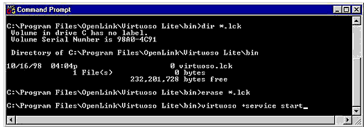

## Case Mode

Whenever a database object is referenced, all names (schema, owner,
table and column) should preferably be placed in double-quotes, exactly
as it appears in the catalog. This way, the object name in the Virtuoso
catalog will be correctly referenced. If names are not quoted, then the
case of the object name will be determined by the value of the CaseMode
property in the virtuoso.ini file:

  - The default files supplied with Virtuoso specify a CaseMode of 2,
    which is a case insensitive mode that preserves the declaration case
    of identifiers. If there is no supplied ini file, the default value
    of CaseMode is 1.

  - A CaseMode of 1 specifies the upper case mode, which is most
    commonly used in SQL databases, e.g. Oracle. In the upper case mode,
    all unquoted identifiers are converted to upper case by the SQL
    parser. If identifiers are not quoted, the case in which they are
    entered is irrelevant.

  - The identifier quote character is the double quote ("). Quoted
    identifiers are processed in the case they are written in and are
    thus case sensitive.

  - SQL reserved words are case insensitive in all case modes.

  - If CaseMode is 0 or absent, identifiers will be treated as case
    sensitive in all situations, whether quoted or not.

  - If an identifier's name is equal to a SQL reserved word, e.g. TABLE,
    it must be quoted ("TABLE") in order to be used as an identifier.

  - If an identifier contains non-alphanumeric characters, e.g. space,
    '-' etc. it must be quoted regardless of CaseMode.

  - Although CaseMode can be changed at any time it should only be set
    at database creation. Changing the CaseMode may result in view or
    procedure code becoming invalid if it relies on specific case
    conventions.

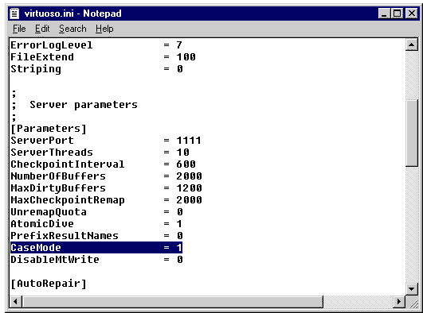
