# Sample ODBC & JDBC Applications

A number of sample applications are bundled with your Virtuoso
installation for the following purposes:

To simplifying the process of getting Virtuoso up and running

To accelerate the support case creation and resolution process

To demonstrate Virtuoso's unique product features highlighting the
benefits it brings to your organization

To demonstrate application programming techniques that can used to aid
and assist your ODBC and JDBC programmers

Virtuoso's services are consumed primarily via ODBC and JDBC
applications (OLE-DB applications connect to Virtuoso via ODBC Data
Providers for OLE-DB), thus separate ODBC & JDBC sample applications
(including source code) have been packaged and integrated into the
Virtuoso installer. The current list of sample applications include:

  - **C++ Demo.**
    
    an ODBC based Interactive SQL processor written in C++.

  - **ODBC Bench Test.**
    
    a 32 Bit C++ program based on the industry standard TPC-A benchmark
    (we will be extending this program to include the TPC-C and TPC-D
    benchmarks also). This program helps you compare the performance of
    Virtuoso against other backend database engines as well as compare
    the performance of various ODBC Drivers connecting to any ODBC
    compliant backend database.

  - **ODBCTEST.**
    
    ODBC based Interactive SQL processor written in 'C' for Linux & UNIX

<!-- end list -->

  - **JDBCDemo.**
    
    a JDBC sample application that demonstrates Virtuoso's SQL query.

  - **ScrollDemo2.**
    
    a JDBC 2.0 sample application that demonstrates Virtuoso's support
    of Scrollable Cursors and its ability to perform scrollable cursor
    operations across heterogeneous databases.

  - **JBench.**
    
    a Java and JDBC based adaptations of the industry standard TPC-A and
    TPC-C benchmarks. This program helps you compare the performance of
    Virtuoso against other backend database engines, it also helps you
    to compare the performance of various JDBC Drivers connecting to any
    JDBC compliant backend database.

  - **JTADemo.**
    
    a sample based on the TPC-A benchmark as well but implemented as a
    J2EE application which shows the use of XA distributed transactions
    as defined in JDBC 3.0 and JTA 1.0 specifications.

<!--- TOC: Start --->

#### Contents

  * [Binary & Source File Locations](#id1-binary-source-file-locations)
    * [ODBC Demonstration Applications](#id2-odbc-demonstration-applications)
    * [JDBC Demonstration Applications](#id3-jdbc-demonstration-applications)
  * [Sample ODBC Applications](#id4-sample-odbc-applications)
    * [Mac OS X](#id5-mac-os-x)
    * [Windows 95/98/NT/2000](#id6-windows-9598nt2000)
    * [Linux & UNIX](#id7-linux-unix)
    * [MS DTC ODBC Sample Application](#id8-ms-dtc-odbc-sample-application)
    * [MS DTC OLE DB Sample Application](#id9-ms-dtc-ole-db-sample-application)
  * [Sample JDBC Applications & Applets](#id10-sample-jdbc-applications-applets)
    * [JDBCDemo Java Application](#id11-jdbcdemo-java-application)
    * [ScrollDemo2 Java Application](#id12-scrolldemo2-java-application)
    * [ScrollDemo2 Java Applet](#id13-scrolldemo2-java-applet)
    * [JBench Application](#id14-jbench-application)
    * [JTA Demo Application](#id15-jta-demo-application)

<!--- TOC: End --->
<a id="id1-binary-source-file-locations"></a>
# Binary & Source File Locations

<a id="id2-odbc-demonstration-applications"></a>
## ODBC Demonstration Applications

Windows 95/98/NT/2000, Linux & UNIX:

The binary executables of these sample applications reside under the
following directory structure:

    <VIRTUOSO_INSTALLATION_DIRECTORY>\samples\odbc

The source code of some of these sample applications, when available,
reside under the following directory structure, for example:

    <VIRTUOSO_INSTALLATION_DIRECTORY>\samples\odbc\cppdemo

<a id="id3-jdbc-demonstration-applications"></a>
## JDBC Demonstration Applications

Windows 95/98/NT/2000, Linux & UNIX:

The binary executables (Java class files), and sources for these sample
applications reside under the following directory structure:

    <VIRTUOSO_INSTALLATION_DIRECTORY>\samples\jdbc\<JDK_Version>\<Demo_name>

<a id="id4-sample-odbc-applications"></a>
# Sample ODBC Applications

<a id="id5-mac-os-x"></a>
## Mac OS X

### ODBCTEST:

This is a simple 'C' based and ODBC compliant Interactive SQL processor.

1.  Open a Terminal session, and start ODBCTEST by executing the
    following command:
    
        /Library/iodbc/bin/odbctest

2.  At the SQL command prompt enter "?" for a list of ODBC DSNs on your
    machine or enter a valid ODBC Connect String. If you have a DSN
    named "Marketing" you would enter:
    
        DSN=Marketing;UID=username;PWD=password
    
    Note: If there is no password, you must include a semicolon at the
    end:
    
        DSN=Marketing;UID=sa;PWD=;

3.  Any valid SQL or ODBC command may be executed through this
    interface. The following example shows a connection to Microsoft SQL
    Server 2000, making a simple query against the sample Northwind
    database:
    
        [localhost:~] openlink% /Library/iodbc/bin/odbctest
        iODBC Demonstration program
        This program shows an interactive SQL processor
        
        Enter ODBC connect string (? shows list, or DSN=...): DSN=user_tthib_sql2k
        
        SQL>select au_lname, au_fname, state from authors where au_id < '333-33-3333'
        au_lname                                |au_fname            |state
        ----------------------------------------+--------------------+-----
        White                                   |Johnson             |CA
        Green                                   |Marjorie            |CA
        Carson                                  |Cheryl              |CA
        O'Leary                                 |Michael             |CA
        Straight                                |Dean                |CA
         5 row(s) fetched.
        
        SQL>quit
        Again (y/n) ? n
        
        Have a nice day.
        [localhost:~] openlink%

<a id="id6-windows-9598nt2000"></a>
## Windows 95/98/NT/2000

### C++ Demo

1.  Go to the Virtuoso "Start Menu" item, then click on the "C++ Demo 32
    Bit" menu item.
    
    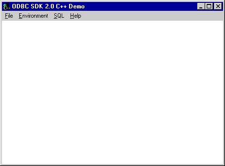

2.  Follow the Environment-\>Open Connection menu path. Selecting the
    "Open Connection" menu item results in the ODBC Driver Manager
    presenting you with a list of ODBC DSNs on your machine as depicted
    by the screen capture below:
    
    

3.  Select the ODBC DSN that you want to be connecting to, in this case
    "Local Virtuoso Demo" has been chosen since this will connect you to
    a sample Virtuoso database that has been populated with data.

4.  You are then presented with a Login Dialog by the Virtuoso driver
    for ODBC, enter a valid user name and password (default being user:
    demo and password: demo) into the appropriate fields.
    
    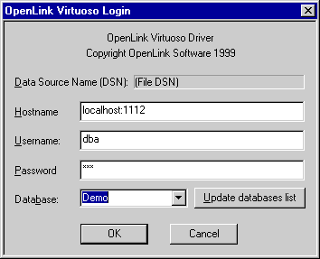

5.  At this point you will be connected to the Virtuoso demonstration
    database, you can now use the SQL--\>Execute SQL menu path to open
    up the Interactive SQL input dialog. Enter a valid SQL statement
    (see example in screen shot) and then click on the "OK" button.
    
    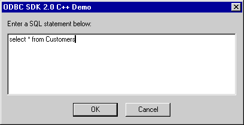

6.  You will be presented with the results of your query.
    
    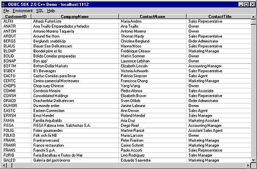

7.  You exit this demo by following the Environment--\>Close Connection
    menu path.

### ODBC Bench Test 32

1.  Go to the Virtuoso "Start Menu" item, then click on the "ODBC Bench
    Test 32 Bit" menu item. You will be presented with the "Bench Test"
    interface.
    
    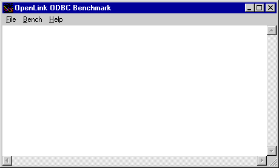

2.  Follow the File-Connect menu path which initializes the ODBC Driver
    Manager which in turn presents you with a list of ODBC DSN's
    installed on your machine. Select the DSN that you want to
    benchmark, remember that by benchmarking a DSN you are benchmarking
    the ODBC Driver that serves the DSN in question and the backend
    database engine that serves the ODBC Driver. Choose the "Local
    Virtuoso Demo" DSN if you want to benchmark Virtuoso.
    
    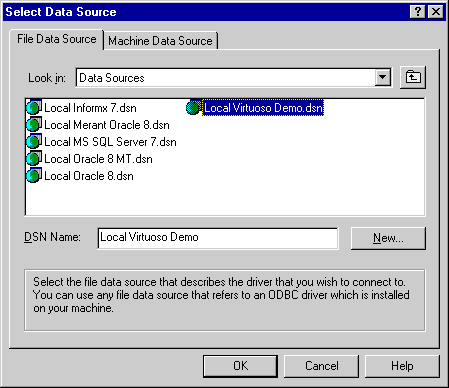

3.  You will then be presented with a Login Dialog by the Virtuoso
    driver for ODBC, enter a valid user name and password (default being
    user: demo and password: demo for the Demo database) into the
    appropriate fields.
    
    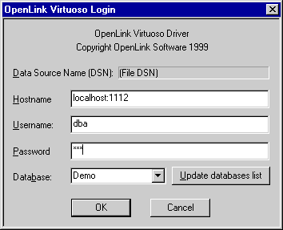

4.  Now follow the Bench--\>Load Tables menu path and you will be
    presented with a dialog that enables you to configure key elements
    of your benchmark. Click the "Execute" button to commence the
    process of setting up your database for the benchmark tests.
    
    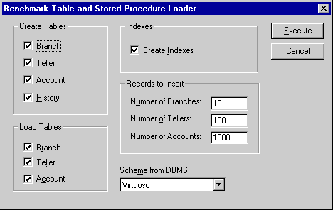

5.  As the process of loading data occurs, all the way up to completion,
    the benchmark program will provide status information into the
    benchmark output pane as shown below:
    
    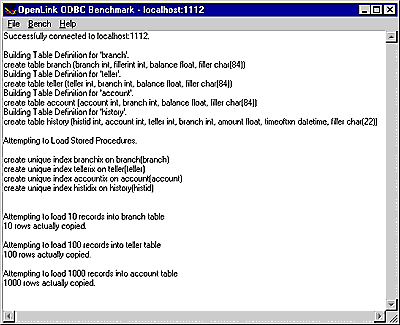

6.  Now that all the benchmark data has been loaded into your database,
    follow the Bench--\>Run Benchmark menu path and then configure your
    actual benchmark session parameters:
    
    These benchmark parameters fall into 3 categories, Timing Options,
    SQL Options, and Execution Options.
    
    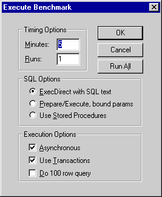
    
    *Timing Options:* These setting allow you to configure the duration
    related aspects of this benchmark program
    
    Minutes - this is the duration of each benchmark run
    
    Runs - this controls how many iterations of the benchmarks you
    actually run (the default is one benchmark iteration with a duration
    of 5 minutes)
    
    *SQL Options:* These setting allow you to configure how your
    benchmark's SQL instructions are actually handled.
    
    ExecDirect with SQL Text - this means that no form of repetitive SQL
    execution optimization is being applied (SQL statements are prepared
    and executed repetitively)
    
    Prepare/Execute Bound Params - this means that the Parameter Binding
    SQL execution optimization is being applied (SQL is prepared once
    but executed many times without the overhead of re-preparing
    statements prior to execution)
    
    Use Stored Procedures - this means that the Stored Procedure SQL
    optimization is being applied (benchmark instructions are stored
    within database being benchmarked)
    
    *Execution Options:* These setting allow you to configure the tone
    of your benchmark, for instance it could have Transaction scoping
    and a mix of record retrieval queries, or it could simply be input
    and update intensive with a minimal amount of record retrieval
    queries (the case when the 100 row query checkbox is unchecked a
    typical OLTP scenario)
    
    Asynchronous - execute the benchmark instructions asynchronously
    
    Use Transactions - make the benchmark use transaction control
    (instructions are scoped to transaction blocks)
    
    Do 100 row Query - perform a simulation of a 100 record retrieval as
    part of the benchmark activity.

<!-- end list -->

1.  Click on the "Run All" button if you would like all the different
    benchmark type combinations to be performed.

2.  When benchmark run complete benchmark data is written to the
    benchmark program's output pane.
    
    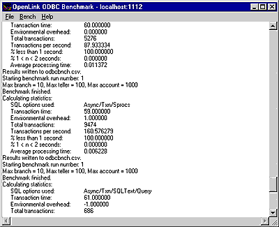
    
    The key pieces of benchmark data that you need to look out for are:
    
    *Total Transactions:* total number of transactions completed during
    the benchmark run
    
    *Transactions Per Second* number of transaction completed per second
    for the benchmark run
    
    Information from this benchmark is automatically written to an Excel
    format CSV (the file odbcbnch.csv) which makes it easy for you to
    graph and pivot data collated from several benchmark runs. A later
    version of this demo will actually write the benchmark data into an
    ODBC DSN that you provide thereby offering even more flexibility and
    accessibility to benchmark data.

<a id="id7-linux-unix"></a>
## Linux & UNIX

### ODBCTEST:

This is a simple 'C' based and ODBC compliant Interactive SQL processor.

1.  Run the script virtuoso-enterprise.sh to set up your environment:
    
        . virtuoso-enterprise.sh

2.  Start ODBCTEST by executing the following command:
    
        odbctest

3.  At the SQL command prompt enter "?" for a list of ODBC DSNs on your
    machine or enter a valid ODBC Connect String. If you have a DSN
    named "Marketing" you would enter:
    
        DSN=Marketing;UID=username;PWD=password
    
    Note: If there is no password, you must include a semicolon at the
    end:
    
        DSN=Marketing;UID=sa;PWD=;

4.  Any valid SQL or ODBC command may be executed through this
    interface. The following example shows a connection to Microsoft SQL
    Server 2000, making a simple query against the sample Northwind
    database:
    
        [localhost:~] openlink% odbctest
        iODBC Demonstration program
        This program shows an interactive SQL processor
        
        Enter ODBC connect string (? shows list, or DSN=...): DSN=test_sql2k
        
        SQL>select au_lname, au_fname, state from authors where au_id < '333-33-3333'
        au_lname                                |au_fname            |state
        ----------------------------------------+--------------------+-----
        White                                   |Johnson             |CA
        Green                                   |Marjorie            |CA
        Carson                                  |Cheryl              |CA
        O'Leary                                 |Michael             |CA
        Straight                                |Dean                |CA
         5 row(s) fetched.
        
        SQL>quit
        Again (y/n) ? n
        
        Have a nice day.
        [localhost:~] openlink%

<a id="id8-ms-dtc-odbc-sample-application"></a>
## MS DTC ODBC Sample Application

The MS DTC demo is located in the

    <VIRTUOSO_INSTALLATION_DIRECTORY>\samples\odbc\MSDTCdemo1

folder. This demo shows usage of distributed transactions driven by MS
DTC through the ODBC API.

### Setup

The sample works with two instances of Virtuoso server. The running MS
DTC service is needed. The servers must be started with MS DTC support
(see Virtuoso documentation).

First of all, edit the virt.odbc file. By default this file contains two
connection strings of local Virtuoso servers running on port 1111 and
port 1112, Each line begins with connection string to appropriate
Virtuoso server. Initially this file contains the following lines:

``` 
1111 dba dba 00.sql
1112 dba dba 01.sql 
                 
```

where 1111, 1112 are ports of two Virtuoso servers. "dba dba" - user and
password.

### Initialization

Start

``` 
 mtstest.exe +load 
```

in the

    <VIRTUOSO_INSTALLATION_DIRECTORY>\samples\odbc\MSDTCdemo1

folder. This must check whether all needed servers are running, create
and initialize tables, procedures, etc.

### Test

Run the command in the demo's working directory:

``` 
 
mtstest.exe   +exec N
mtstest.exe   +exec 0
             
```

where N - is a number of test iterations. The second command checks
logical consistency of the tables.

### Description

The demo source is

    start.c

file in the

    <VIRTUOSO_INSTALLATION_DIRECTORY>\samples\odbc\MSDTCdemo1

directory. Several highlights of the most significant parts of code are
presented below:

``` 
  ITransactionDispenser *disp;
  ITransaction *transaction;

  ...
  HRESULT hr =
      DtcGetTransactionManagerC (0, 0, &IID_ITransactionDispenser, 0, 0, 0,
      &, disp);
             
```

The code above creates Dispenser object which represents the local
instance of MS DTC. If MS DTC is not available

    DtcGetTransactionManagerC

fails. The Dispenser is needed to create distributed transaction objects
later.

Begin new distributed transaction:

``` 
disp->lpVtbl->BeginTransaction (disp, 0, ISOLATIONLEVEL_ISOLATED,
      0, 0, &transaction);               
             
```

Enlist connection in the transaction:

``` 
SQLSetConnectOption (hdbc, SQL_COPT_SS_ENLIST_IN_DTC,
      (DWORD) transaction);
             
```

And, finally, commit the transaction:

``` 
transaction->lpVtbl->Commit (tran, 0, 0, 0);
             
```

<a id="id9-ms-dtc-ole-db-sample-application"></a>
## MS DTC OLE DB Sample Application

The MS DTC OLE DB demo is located in the

    <VIRTUOSO_INSTALLATION_DIRECTORY>\samples\odbc\MSDTCdemo2

folder. This demo shows usage of distributed transactions driven by MS
DTC through OLE DB.

### Setup

The sample works with two instances of Virtuoso server. Running MS DTC
service is needed. The servers must be started with MS DTC support (see
Virtuoso documentation).

The test needs two Virtuoso server instances running on ports 1111 and
1112

### Run

Run the command in the demo's working directory:

``` 
 
voledbtest.exe
             
```

### Description

The demo source is

    voledbtest.cs

file in the

    <VIRTUOSO_INSTALLATION_DIRECTORY>\samples\odbc\MSDTCdemo

directory. Several highlights of the most significant parts of code are
presented below:

``` 
[TransactionAttribute(TransactionOption.Required)]               
             
```

It is significant to set this attribute of class to enable automatic
transaction initialization.

Create connections to appropriate servers:

``` 
string strConn = "Provider=VIRTOLEDB;Data Source=" + dsn1 
    + ";User Id=dba;Password=dba;Initial Catalog=Demo;Prompt=NoPrompt;";
string strConn2 = "Provider=VIRTOLEDB;Data Source=" + dsn2 + 
    ";User Id=dba;Password=dba;Initial Catalog=Demo;Prompt=NoPrompt;";
obj_conn = new OleDbConnection(strConn);
obj_conn2 = new OleDbConnection(strConn2);
             
```

And, finally, execute the SQL code in the context of distributed
transaction:

``` 
OleDbCommand sqlc = new OleDbCommand ("ODBC_BENCHMARK(" + idx + ",1,1,12.00,\'noone\')");
sqlc.Connection = obj_conn;
sqlc.ExecuteNonQuery();
sqlc = new OleDbCommand ("ODBC_BENCHMARK(" + idx + ",1,1,-12.00,\'noone\')");
sqlc.Connection = obj_conn2;
sqlc.ExecuteNonQuery();
             
```

<a id="id10-sample-jdbc-applications-applets"></a>
# Sample JDBC Applications & Applets

<a id="id11-jdbcdemo-java-application"></a>
## JDBCDemo Java Application

1.  Go to the Virtuoso "Start Menu" program group and then follow the
    JDBC Samples--\>JDBCDemo (JDK1.1&1.2) menu path, this will execute a
    DOS batch program that initializes the Java demo application.
    
    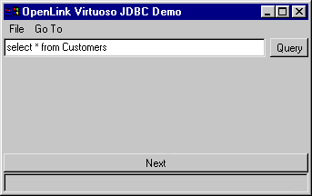

2.  Set the JDBC Driver Name and URL settings for your connection to the
    Virtuoso demonstration database. The "Driver Name" field identifies
    the Virtuoso Driver. If it is left blank, then it defaults to
    "virtuoso.jdbc.Driver", which is the Virtuoso Driver for JDBC 1.0.
    The "Connection URL" field requires a valid Virtuoso JDBC URL.
    
    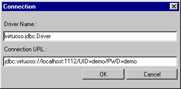

3.  Enter a valid SQL statement and then click the "Query" button, the
    example below uses a fully qualified Virtuoso SQL statement
    requesting all records from the "Demo" database table "Customers"
    owned by the Virtuoso user "DBA".
    
    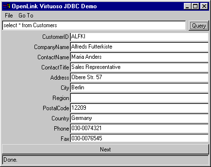

<a id="id12-scrolldemo2-java-application"></a>
## ScrollDemo2 Java Application

1.  Go to the Virtuoso Lite "Start Menu" program group and then follow
    the JDBC Samples--\>ScrollDemo2 (JDK1.2) menu path, this will
    execute a DOS batch program that initializes the Java demo
    application.
    
    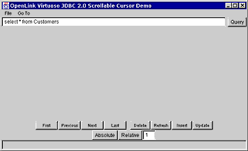

2.  Set the JDBC Driver Name and URL settings for your connection to the
    Virtuoso demonstration database. The "Driver Name" field identifies
    the Virtuoso Driver. If it is left blank, then it defaults to
    "virtuoso.jdbc2.Driver", which is the Virtuoso Driver for JDBC 2.0.
    The "Connection URL" field requires a valid Virtuoso JDBC URL.
    
    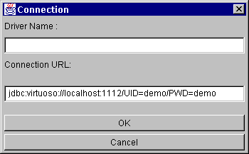

3.  Enter a valid SQL statement and then click the "Query" button, the
    example below uses a fully qualified Virtuoso SQL statement
    requesting all records from the "Demo" database table "Customers"
    owned by the Virtuoso user "DBA".
    
    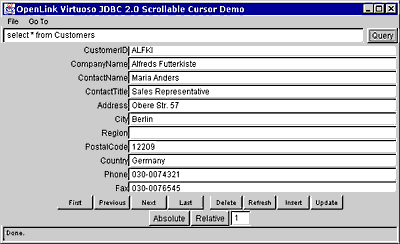

4.  You can now use the navigational buttons to Scroll backwards and
    forwards, each of these navigational buttons highlights Virtuoso's
    full implementation of the JDBC 2.0 Scrollable Cursors
    specifications.

<a id="id13-scrolldemo2-java-applet"></a>
## ScrollDemo2 Java Applet

1.  Start the Virtuoso Admin Assistant and then follow the Sample
    Applications--\>JDBC Applet Demos menu path.
    
    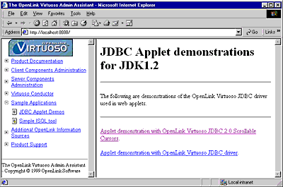

2.  Click on the "ScrollDemo2" hyperlink which initializes the
    ScrollDemo2 applet, if you do not have a Java 1.2 or Java 2.0
    compliant browser you will not be able to run this Applet demo. The
    other way to experience this demo is to run the Application version
    which uses your operating systems Java Virtual Machine (JVM) instead
    of a JVM inherently linked to a Web Browser.

<a id="id14-jbench-application"></a>
## JBench Application

1.  Go to the Virtuoso "Start Menu" program group and then follow the
    JDBC Samples--\>Jbench (JDK1.1) or Jbench (JDK1.2) menu path,
    depending on the JVM you have installed. This will execute a DOS
    batch program that initializes the JBench application.
    
    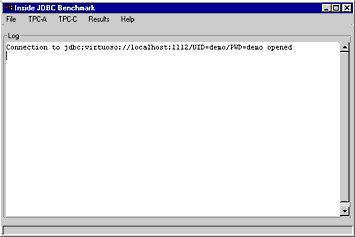

2.  The follow the File--\>Connect menu path to make your initial
    connection. You will need to identify your JDBC Driver (by providing
    appropriate Driver Name values in the JDBC Driver field) and then
    provide a valid JDBC URL for your specific JDBC Driver (Jbench uses
    a valid Virtuoso Driver for JDBC URL that points to the
    demonstration database listening at port 1112 as its default).
    
    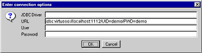

3.  Follow the Results--\>Table URL menu path, this is how you identify
    (using a JDBC URL) the location of the "Results" tables into which
    you will be storing your benchmark data. The default URL is the
    current JDBC URL (the one used to establish your initial
    connection), but this can be a totally different database to the one
    being benchmarked.

4.  Follow the Results--\>Create menu path, this is how you actually
    perform the "Results" table creation in the database identified by
    the URL in the previous step.

5.  Follow the TPC-A--\>Load Tables menu path to prepare your database
    for the TPC-A benchmark, select a database schema type that matches
    the database engine that you are benchmarking. If your database is
    not listed ANSI should suffice (as long as this is an ANSI SQL
    compliant database).
    
    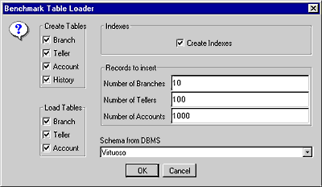

6.  Follow the TPC-A--\>Load Procedures menu path to Load the Virtuoso
    TPC-A stored procedures.

7.  Now that all the benchmark data and stored procedures have been
    loaded into your database, follow the TPC-A--\>Run Benchmark menu
    path and then configure your actual benchmark session parameters:
    
    The benchmark parameters fall into 4 categories, Bench execution
    mode, Run Options, SQL Options, and Execution Options.
    
    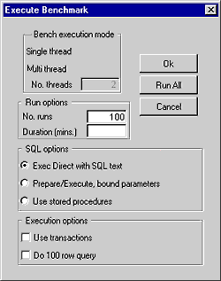
    
    *Bench execution mode:* These setting allow you to configure the
    threads used for the benchmark.
    
    Decide on a single or multiple threads test.
    
    No. Threads - this is the number of concurrent threads to be used
    during the benchmark.
    
    *Run Options:* These setting allow you to configure the duration
    related aspects of this benchmark program.
    
    No. runs - this controls how many iterations of the benchmarks you
    actually run (the default is 100 benchmark iterations).
    
    Duration (mins.) - this is the duration in minutes of each benchmark
    run.
    
    *SQL Options:* These setting allow you to configure how your
    benchmark's SQL instructions are actually handled.
    
    ExecDirect with SQL Text - this means that no form of repetitive SQL
    execution optimization is being applied (SQL statements are prepared
    and executed repetitively)
    
    Prepare/Execute Bound Params - this means that the Parameter Binding
    SQL execution optimization is being applied (SQL is prepared once
    but executed many times without the overhead of re-preparing
    statements prior to execution)
    
    Use Stored Procedures - this means that the Stored Procedure SQL
    optimization is being applied (benchmark instructions are stored
    within database being benchmarked)
    
    Run All - this implies you want to perform all of the above
    benchmarks
    
    *Execution Options:* These setting allow you to configure the tone
    of your benchmark, for instance it could have Transaction scoping
    and a mix of record retrieval queries, or it could simply be input
    and update intensive with a minimal amount of record retrieval
    queries (the case when the 100 row query checkbox is unchecked a
    typical OLTP scenario)
    
    Use Transactions - make the benchmark use transaction control
    (instructions are scoped to transaction blocks)
    
    Do 100 row Query - perform a simulation of a 100 record retrieval as
    part of the benchmark activity.

8.  Run your TPC-A benchmark.

9.  Follow the TPC-A--\>Cleanup menu path to clean up your database so
    that you can then run other benchmarks (TPC-C like benchmark).

10. To run the TPC-C benchmark simply follow the appropriate menu path,
    create the benchmark tables & stored procedures, load the benchmark
    data and then run the TPC-C benchmark.

<a id="id15-jta-demo-application"></a>
## JTA Demo Application

The JTA demo is located in the

    <VIRTUOSO_INSTALLATION_DIRECTORY>\samples\jdbc\JTADemo

folder.

### Software Setup

1.  The sample requires 2 or 3 Virtuoso instances and an instance of a
    J2EE 1.3.1 server properly set up and running on the same computer
    or on the network. To build the sample it's also necessary to have a
    J2SE 1.4 SDK installed.

2.  The JAVA\_HOME and J2EE\_HOME environment variables must be set to
    the J2SE SDK and J2EE installation path respectively.

3.  The virtjdbc3.jar file must be in the classpath of the J2EE server.
    The setting of the classpath differs across different J2EE servers.
    For J2EE Reference Implementation (RI) the J2EE\_CLASSPATH variable
    might be set in %J2EE\_HOME%\\bin\\userconfig.bat on Windows or
    $(J2EE\_HOME)/bin/userconfig.sh on Unix.
    
    ``` 
        set J2EE_CLASSPATH=C:/Virtuoso/lib/virtjdbc3.jar
    ```
    
    or
    
    ``` 
        J2EE_CLASSPATH=/home/login/virtuoso/lib/virtjdbc3.jar
        export J2EE_CLASSPATH
    ```

4.  Add the Virtuoso XA datasources to J2EE server. For J2EE RI this is
    done like this:
    
    ``` 
        j2eeadmin -addJdbcXADatasource jdbc/Virtuoso1 virtuoso.jdbc3.VirtuosoXADataSource dba dba -props serverName=localhost portNumber=1111
        j2eeadmin -addJdbcXADatasource jdbc/Virtuoso2 virtuoso.jdbc3.VirtuosoXADataSource dba dba -props serverName=localhost portNumber=2222
        j2eeadmin -addJdbcXADatasource jdbc/Virtuoso3 virtuoso.jdbc3.VirtuosoXADataSource dba dba -props serverName=localhost portNumber=3333
    ```
    
    Please note that the newly added datasources take effect only after
    restart of the J2EE server.

### Configuration

The sample folder contains the jtademo.properties file which can be used
to configure the sample application. The configuration options are
described within the file.

### Building and Deployment

The sample folder contains build and deploy scripts (build.sh and
deploy.sh for Linux and Unix and build.bat and deploy.bat for Windows).

Use the build script to build the sample application from the source
files.

Deploy the application to the J2EE server. The deploy script performs
this task for J2EE RI. Other J2EE application servers might provide
different ways for application deployment.

### Running the Sample

The sample folder contains the run scripts for Linux/Unix and Windows.

The run script accepts the following commands:

  - create  
    Creates and populates the necessary tables.

  - check  
    Verifies data consistency.

  - drop  
    Removes data and tables from the databases.

  - run  
    Executes a number of transactions over database tables.

The first action to do is to initialize the data with the create
command. After this the command might be used one or more times. This
executes a series of concurrent updates on the distributed data. The
check command verifies that this updates left databases in the
consistent state.

For instance, for Unix:

``` 
    run.sh create
    run.sh run
    run.sh check
```

And for Windows:

``` 
    run.bat create
    run.bat run
    run.bat check
```
