# Administration

<!--- TOC: Start --->

#### Contents

  * [Database Server Administration](#id1-database-server-administration)
    * [Database](#id2-database)
    * [Virtual Database](#id4-virtual-database)
    * [Virtuoso User Model](#id5-virtuoso-user-model)
    * [VAD - Virtuoso Application Distribution](#id6-vad-virtuoso-application-distribution)
    * [Data Backup & Recovery](#id7-data-backup-recovery)
    * [Performance diagnostics](#id8-performance-diagnostics)
    * [Performance Tuning](#id9-performance-tuning)
  * [HTML based Administration Console (Conductor) Guide](#id10-html-based-administration-console-conductor-guide)
    * [Virtuoso Conductor Administration](#id11-virtuoso-conductor-administration)
    * [Runtime Hosting](#id12-runtime-hosting)
    * [Web Services](#id13-web-services)
    * [WebDAV Administration](#id14-webdav-administration)
    * [Internet Domains](#id15-internet-domains)
    * [XML Services](#id16-xml-services)
    * [Query Tools](#id17-query-tools)
    * [Replication & Synchronization](#id18-replication-synchronization)
    * [Database Administration](#id19-database-administration)
    * [Conductor Linked Data Administration](#id20-conductor-linked-data-administration)
    * [Conductor News Server Administration](#id21-conductor-news-server-administration)

<!--- TOC: End --->
<a id="id1-database-server-administration"></a>
# Database Server Administration

<a id="id2-database"></a>
## Database

See details for [Installation Requirements](#srvadminstallreqt) ,
[Operational Requirements](#srvadmopreq) , [Operating System
Support](#srvadmossupport) and [Limits](#limitsandparameters) .

### Server Instance Creation

Multiple Virtuoso server instances may coexist on a single machine. Each
database will need to be assigned a unique TCP port number. On the
windows platforms (except 95,98,ME) the Virtuoso can be configured for
multiple services. For further details, see the [Creating and Deleting
Virtuoso Services](#creatingdeletingservices) in the Installation
chapter.

To run Virtuoso on a machine, only the Virtuoso server executable and a
valid virtuoso.ini file are needed. An empty database file will be
created automatically at first startup. None of the other files in the
installation are needed for basic operation. Client interfaces may
additionally need ODBC drivers or the like to be set up in system
configuration files or the Windows registry but the server itself does
not depend on these.

### Installing Application Packages

Virtuoso comes with optionally installable SQL application packages (VAD
packages) for web based admin, on-line documentation, programming
tutorials and a BPEL processor. The installer typically asks whether to
install these into the demo or the default empty database. Depending on
the OS and form of installer, also depending on whether the installation
is the commercial or open source one, the package files will be in
different locations. To locate them, look for \*.vad. The packages are
typically made in two variants, where one keeps the installed items in
the DAV repository and the other in the file system. They are
functionally equivalent in most cases, except for some tutorials that
will only work in the file system. Keeping installed resources in DAV
has advantages when moving the database or backing up, since the
installed items will not have to be treated separately. To install these
on a database, login as dba using the isql utility and issue the SQL
command:

``` 
# at the OS command line prompt, assuming the dba password is dba and the server is at the default port 1111:

$ isql 1111 dba dba

--  At the SQL prompt:
SQL> vad_install ('conductor_dav.vad', 0);
-- The path is relative to the server's working directory.

        
```

Since the packages are read from and sometimes the extracted contents
are written to the file system, the server must have access to the
directories in question. Checjk OS permissions and set the DirsAllowed
parameter in the ini file to allow the needed access.

After the packages are installed, they can be used by pointing the web
browser to their start page. The start pages are listed on the root page
of the demo database and at the Getting Started section of the Open
Virtuoso web site. The start page for the Conductor web admin interface
is /conductor, the docs are at /doc/html, the tutorials at /tutorial,
the BPEL admin and demos at /BPELGUI. All these are directly under the
default Virtuoso web listener, the port is shown in the messages log and
read from the HTTP Server section of the virtuoso.ini file.

### Server Licensing

The Virtuoso server requires a valid license file before it will
successfully start. The license file is a file always called
*virtuoso.lic* and must reside in the working directory of the database
instance - where the \<database-name\>.db file resides for the instance.

Evaluations versions of Virtuoso come without a license file, however
the registration procedure takes your email address, which will be used
to email a new license file for you evaluation.

### Server Logging - Detecting Errors

Virtuoso provides extensive log information for resolving problems.
Should any problems arise Virtuoso logs should always be consulted.

The Virtuoso server by default will send log information to two places,
the appropriate system log for the operating system and the virtuoso.log
file. On Unix based operating systems, including Linux, this information
will appear in the system log files. On Windows the Virtuoso log
information will appear in the Application Event Log.

Virtuoso logs information in the system logs before the Virtuoso.log
file is open. This advantageously will log errors that cannot be placed
in the virtuoso.log file, such as when the virtuoso.ini file cannot be
located during Virtuoso startup.

The system log feature can be disabled using the "Syslog" parameter in
the \[Database\] section. This is described in more detail in the
following section.

### Configuring Server Startup Files

#### Virtuoso Configuration File

The virtuoso.ini file is read from the directory that is current at
server startup. This file contains an entry for all user settable
options in the server. It is divided into the following sections:

  - \[Database\] Location of database files

  - \[Parameters\] Server tuning, options

  - \[HTTPServer\] Settings in this section control the web server
    component of the Virtuoso Server.

  - \[URIQA\] Settings in this optional section control URIQA semantic
    web enabler.

  - \[Flags\] Settings for options that are generally used with
    [`__dbf_set`](#fn_dbf_set) as temporally valid ( such as
    enable\_joins\_only), to be set as permanent.

  - \[SPARQL\] Settings in this optional section control SPARQL protocol
    endpoint default parameters and limits.

  - \[I18N\] encoding settings

  - \[Replication\] The replication section sets the transactional
    replication parameters for the server.

  - \[Mono\] The Mono section contains settings for Virtuoso with Mono
    Runtime CLR support.

  - \[Client\] Client default settings

  - \[AutoRepair\] Corrupted database recovery

  - \[Striping\] Multi-file / multi-disk databases

  - \[VDB\] Virtual database functionality related options

  - \[Ucms\] location of UCM files describing multi-byte encodings such
    as Far East languages

  - \[Zero Config\] ZeroConfig related options

  - \[Plugins\] VSEI plugin modules

Below are the descriptions for each parameter

##### \[Database\]

  - **DatabaseFile=virtuoso.db.**
    
    For a single file database, this is the relative path of the file in
    the format appropriate to the platform. The path is resolved
    relative to the directory that is current at server startup. All
    other paths are interpreted similarly.

  - **TransactionFile=virtuoso.trx.**
    
    This is the transaction log file. If this parameter is omitted,
    which should never be the case in practice, the database will run
    without log, meaning that it cannot recover transactions committed
    since last checkpoint if it should abnormally terminate. There is
    always a single log file for one server. The file grows as
    transactions get committed until a checkpoint is reached at which
    time the transactions are applied to the database file and the trx
    file is reclaimed, unless CheckpointAuditTrail is enabled.

  - **ErrorLogFile=virtuoso.log.**
    
    This file logs database error messages, e.g. 'out of disk'. By
    viewing this the dba can trace problems and see at which times the
    server has started, checkpoints have been made, etc.

  - **ErrorLogLevel=7.**
    
    This controls what events get logged into the database error log.
    This should always be 7.

  - **LockFile=virtuoso.lck.**
    
    This optional parameter can be used to manually specify the location
    of the Virtuoso lock (.lck) file. This can be relative or the full
    path to the lock file. Virtuoso, by default, creates a file with the
    same name as the DatabaseFile but with the extension of .lck. This
    file exists when the Virtuoso server is running to prevent it
    starting multiple times using the same parameters, and should be
    automatically removed by the server upon exit. However, not all file
    systems support file locking, such as NFS, therefore this parameter
    can be set to keep the lock file on a more appropriate file system.

  - **FileExtend=100.**
    
    This is the size that the database file automatically grows (in 8k
    pages) when the current file is not large enough. Default = minimum
    = 100. The parameter has no effect if striping is set.

  - **Striping=0.**
    
    A non-zero value will enable the settings in \[Striping\] to take
    effect. If this is the case the DatabaseFile parameter is ignored
    and the files in \[striping\] are used.

  - **LogSegments.**
    
    If this is non-zero log segmentation is enabled. This is only used
    for crash dumps where several files may be needed to accommodate the
    recovery logs. If non-zero, this will be followed by entries of the
    form Log1=...

  - **Log1=/tmp/log1.trx 100M.**
    
    The number in Log\<n\> is the ordinal number of the log, starting at
    1. The entry consists of the file name and allocated size with an
    optional size modifier. Available modifiers are B for blocks of 4k
    (default if unspecified, K for kilobytes, M for megabytes, and G for
    gigabytes. The log is filled up to the first transaction that
    exceeds the size. The log therefore will be longer than the
    allocated size. If blobs are involved, this amount can be quite
    substantial. It is therefore advisable to have some extra space
    available on the storage device used for recovery logs.

  - **crashdump\_start\_dp, crashdump\_end\_dp.**
    
    These options make it possible to produce a crash dump of a
    specified range of disk pages. In case the server runs out of disk
    space during a dump, the error message indicates the page at which
    the next dump should be started after the user has made more space
    available. In this case it is important to rename the already
    produced crash dump or change the Logx= -entries in virtuoso.ini to
    avoid overwriting said files. If none of these options are provided,
    the server will attempt a crash dump of the entire database storage.

  - **TempStorage = \<TempDatabase\_Name\>.**
    
    The name of a section in the INI file containing temporary database
    details. If this parameter is omitted or the section does not exist
    the default values for temporary storage are used.

  - **Syslog = 1/0 (default 0).**
    
    Virtuoso can writes log worthy messages to the system log (Unix
    based operating systems including Linux) or the Windows Event Log
    (Windows operating systems). Messages are written in the
    system/event log before the virtuoso.log file is opened, therefore
    errors due to absence of virtuoso.ini log are loggable there. This
    system/event logging can be enabled using this option, by default it
    is set to 0 meaning off.
    
    On Unix/Linux messages are written as "Virtuoso" events.
    
    On Windows messages are written in the Application event log.

##### \[\<TempDatabase\_Name\>\]

This section name must match the TempStorage parameter in the Database
section of the Virtuoso INI file to be of any use. Otherwise this
section will be ignored.

  - **DatabaseFile = \<database file name\>.tdb.**
    
    Name of temporary database file.

  - **TransactionFile = \<transaction file name\>.ttr.**
    
    Name of temporary transaction file.

  - **FileExtend = NNN.**
    
    Increment amount by which the database file will dynamically grow.
    This setting is identical in use and purpose to parameter in the
    Database section with the same name.

##### \[Parameters\]

  - **SingleCPU=0.**
    
    This is a Win32 specific option that forces Virtuoso to only run on
    one CPU in a multiprocessor environment.

  - **ServerPort=\[\<IP Address\>\]:\<port\>.**
    
    This is the IP Address and port number where the server will start
    listening. You do not need to specify the listening IP Address but
    can do in a situation that you want the server to bind to a specific
    address only.

  - **ServerThreads=10.**
    
    This is the maximum number of threads used in the server. This
    should be close to the number of concurrent connections if heavy
    usage is expected. Different systems have different limitations on
    threads per process but a value of 100 should work in most places.

  - **ServerThreadSize=50000.**
    
    Stack size of thread used for reading client messages and accepting
    connections.(default : 50 000 bytes)

  - **MainThreadSize=100000.**
    
    Stack size of the main thread (default : 100 000 bytes)

  - **ThreadCleanupInterval.**
    
    The interval in minutes (default : 0) after which threads in the
    thread pool should be released.

  - **ThreadThreshold.**
    
    The maximum number of threads (default : 10) to leave in the thread
    queue after thread clean-up interval has expired.

  - **SchedulerInterval.**
    
    Defines the scheduler wake-up interval ( in minutes). By default is
    0 i.e. the scheduler is disabled.

  - **ResourcesCleanupInterval.**
    
    The interval in minutes (default : 0) after which allocated
    resources will be flushed..

  - **FutureThreadSize=100000.**
    
    Stack size of worker threads. This is the stack size for serving any
    client SQL statements or HTTP requests. This can be increased if the
    application uses recursive stored procedures or links in external
    code needing a large stack. (default 100 000 bytes)

  - **TempAllocationPct.**
    
    A Percentage that may be greater than 100%. This gives a percentage
    of the main .db file to which the temp db file may grow before
    starting to reclaim the oldest persistent hash index. Basically if a
    particular hash index is reusable (i.e. it references only table
    columns and the values in these columns have not changed) the engine
    keeps the hash index defined into the temp db for reuse. This
    parameter allows some control over the temp db file size.

  - **O\_DIRECT.**
    
    If this is non-zero, the database file(s) will be opened with the
    O\_DIRECT option on platforms where this is supported. This has the
    effect of doing file system I/O from application buffers directly,
    bypassing caching by the operating system. This may be useful if a
    large fraction of RAM is configured as database buffers. If this is
    on, the file system cache will not grow at the expense of the
    database process, for example it is less likely to swap out memory
    that Virtuoso uses for its own database buffers. Mileage will vary
    according to operating system and version. For large databases where
    most of system memory is used for database buffers it is advisable
    to try this.

  - **CheckpointInterval=60.**
    
    This is the interval in minutes at which Virtuoso will automatically
    make a database checkpoint. The automatic checkpoint will not be
    made if there is less than MinAutoCheckpointSize bytes in the
    current transaction log. A checkpoint interval of 0 means that no
    periodic automatic checkpoints are made.
    
    Setting the value to -1 disables also the checkpoints made after a
    roll forward upon database startup. This setting should be used when
    backing up the database file(s). This guarantees that even if the
    server dies and restarts during the copy, no checkpoints that would
    change these files will take place and thus the backup is clean.
    
    the checkpoint\_interval SQL function may be used to change the
    checkpoint interval value while the database is running.

  - **CheckpointSyncMode=2.**
    
    This controls how the file system is synchronized after a
    checkpoint. Once the checkpoint has issued all write system calls it
    needs it can do one of the following depending on this setting:
    
    0\. - Continue, leave the OS to flush buffers when it will.
    
    1\. - Initiate the flush but do not wait for it to complete.
    
    2\. - Block until the OS has flushed all writes pertaining to any of
    the database files.

  - **PageMapCheck=0.**
    
    This controls the check of page maps:
    
    0\. - disables the check of page maps.
    
    1\. - enables the check of page maps.

  - **NumberOfBuffers=2000.**
    
    This controls the amount of RAM used by Virtuoso to cache database
    files. This has a critical performance impact and thus the value
    should be fairly high for large databases. Exceeding physical memory
    in this setting will have a significant negative impact. For a
    database-only server about 65% of available RAM could be configured
    for database buffers.
    
    Each buffer caches one 8K page of data and occupies approximately
    8700 bytes of memory.

  - **MaxCheckpointRemap=2000.**
    
    Specifies how many pages Virtuoso is allowed to remap. Remapping
    means that pages can consume the space of two actual pages until
    checkpoint. See the [Checkpoint & Page Remapping](#checkpointparams)
    section in the SQL Reference chapter for more information.

  - **PrefixResultNames=0.**
    
    This setting should always be 0.

  - **CaseMode=1.**
    
    This controls the case sensitivity of the Virtuoso SQL interpreter.
    The following values are supported:
    
      - 0 - SQL is case sensitive and identifiers are stored in the case
        they are entered in. This is similar to the Progress or Informix
        default.
    
      - 1 - SQL is case sensitive and Unquoted identifiers are converted
        to upper case when read. To use non-upper case identifiers, the
        identifiers must be quoted with double quotes ("). This is
        similar to Oracle.
    
      - 2 - SQL is case-insensitive and identifiers are stored in the
        case where first seen. Unlike the situation in other modes, two
        identifiers differing only in case cannot exist. This is similar
        to the MS SQL Server 7 default behavior.
    
    > **Note**
    > 
    > Once a database is created in one case mode the case mode should
    > not be changed as that may change the interpretation of stored
    > procedures etc.

  - **MinAutoCheckpointSize=4000000.**
    
    See CheckpointInterval.

  - **AutoCheckpointLogSize.**
    
    This is the size of transaction log in bytes after which an
    automatic checkpoint is initiated. If this is non-zero, whenever the
    transaction log size exceeds this size an automatic checkpoint is
    started. This will result in approximately like sized logs to be
    generated. This is useful with the CheckpointAuditTrail option for
    generating a trail of equal sized consecutive logs.

  - **CheckpointAuditTrail=1.**
    
    If this is non-zero each checkpoint will start a new log and leave
    the old transaction log untouched. A 0 value indicates that the
    transaction log may be reused once the transactions in it have been
    written in a checkpoint.
    
    If it is important to keep an audit trail of all transactions in the
    database's life time then this option should be true. A new log file
    will be generated in the old log file's directory with a name ending
    with the date and time of the new log file's creation. Old log files
    can be manually copied into backup storage or deleted. Only one log
    file is active at one time. The newest log file may at any time be
    written to by the server, but that is the only log file Virtuoso has
    open at each time. Thus reading any logs is safe. Writing or
    deleting the active log file will result in loss of data, and
    possibly referential integrity, in the database. See the [Back and
    Recovery](#backup) chapter for more information on this and related
    parameters.

  - **AllowOSCalls=0.**
    
    If non-zero the system SQL function is enabled. This will allow a
    dba group user to run shell commands through SQL. This poses a
    potential security risk and hence the setting should normally be 0.

  - **MaxStaticCursorRows=5000.**
    
    This is the maximum number of rows returned by a static cursor.
    Default = 5000

  - **FreeTextBatchSize=10000000.**
    
    This is the amount of text data processed in one batch of the
    free-text index when doing a batch update or non-incrementally
    reindexing the data. Default : 10,000,000

  - **NullUnspecifiedParams.**
    
    When set to 1, if an application prepares a statement with
    insufficient number of input parameters, the unspecified ones are
    assumed to be NULL.

  - **Collation.**
    
    Defines a sorting order according to SYS\_COLLATIONS. The name
    supplied to this parameter must be in
    [`charsets_list(1)`](#fn_charsets_list) .

  - **DirsAllowed=\<path\> \[, \<path\>\].**
    
    \<path\> := \<absolute\_path\> or \<relative\_path\> comma-delimited
    list of OS directories allowed for file operations such as
    `file_to_string()` . The server base directory (the directory
    containing this INI file) must appear on this list in order to
    enable File DSNs to work. On Windows use in the path "\\".
    
        SQL> select server_root (), virtuoso_ini_path ();
    
        SQL> select cfg_item_value (virtuoso_ini_path (), 'Parameters',
        'DirsAllowed');
    
    The Virtuoso ISQL utility can be used to check the Server
    DirsAllowed params as follows:
    
    The above should show in the result the server working directory and
    INI file name.
    
    Also you can check the relevant INI setting by running following
    statement via ISQL command line utility:

  - **DirsDenied=\<path\> \[, \<path\>\].**
    
    \<path\> := \<absolute\_path\> or \<relative\_path\> OS directories
    denied for file operations. See [Virtuoso ACL's](#acl) for
    information on functions that are restricted.

  - **VADInstallDir=\<path\>.**
    
    \<path\> := \<absolute\_path\> or \<relative\_path\> OS directory
    containig VADs files. When set, enables automatic update of vads on
    server startup. On Windows use in the path "\\".

  - **SSLServerPort.**
    
    Specifies the port on which the server listens for incoming SSL CLI
    requests.

  - **SSLCertificate.**
    
    The SSL certificate to use (same meaning as the SSLCertificate in
    HTTPServer section)

  - **SSLPrivateKey.**
    
    The server's private key (same meaning as the SSLCertificate in
    HTTPServer section)

  - **MaxOptimizeLayouts = 1000.**
    
    This parameter governs the maximum number of partial or full join
    orders that the Virtuoso SQL Optimized compiler will calculate per
    select statement. When MaxOptimizeLayouts has been reached, the best
    execution plan reached thus far will be used. The default value is
    1000, specifying 0 will try all possible orders and guarantee that
    the best plan is reached.

  - **StopCompilerWhenXOverRunTime = 0.**
    
    The default value is 0. If non-zero, this specifies that the SQL
    compiler should stop considering alternative execution plans after
    the elapsed compilation time exceeds the best run time estimate
    times the parameter. For example, if this is 2, then compilation
    stops after using twice the time of the best plan reached thus far.
    Enabling this option increases performance when processing short
    running queries that are each executed once. Using this with long
    running queries or prepared parametrized queries is not useful and
    may lead to non-optimal plans being selected.

  - **TraceOn = option1 \[, option2 \[, ..\]\].**
    
    This parameter accepts a comma-delimited list of tracing options to
    activate by default. Enabled trace options will list there
    respective errors in the virtuoso.log file when encountered. Valid
    options are: user\_log, failed\_log, compile, ddl\_log, client\_sql,
    errors, dsn, sql\_send, transact, remote\_transact, exec, soap
    
    > **Tip**
    > 
    > The functions: [`trace_on()`](#fn_trace_on) and
    > [`trace_off()`](#fn_trace_off) which use the same options and can
    > turn logging options on/off while the server is running.
    
        [Parameters]
        ....
        TraceOn = soap, errors
        ...
    
    This will enable logging of additional information regarding SOAP
    calls and SQL run-time errors into the virtuoso.log file.
    
        [Parameters]
        ....
        ThreadCleanupInterval    = 1
        ResourcesCleanupInterval = 1
        ...
    
    Set both to 1 in order to clean up unused threads/resources and
    reduce memory consumption of the Virtuoso server, which can
    otherwise be construed as memory leaks.
    
    If an invalid option is set then this error will be listed in the
    virtuoso.log file upon server startup. Virtuoso will continue to log
    selected options unless the trace\_off() function is called for that
    item.

  - **AllowPasswordEncryption = 1/0.**
    
    Determines whether Virtuoso encryption should be accepted from
    client connections. The default value is 1 - on. If set to 0 then
    only clear text and digest authentication will be accepted.

  - **JavaClasspath.**
    
    This parameter is applied to the environment prior to the server's
    startup. It is valid only for binaries hosted in the Virtuoso Java
    VM. This has the same format as the Java CLASSPATH environment
    variable for the platform being used.
    
    Virtuoso searches for classes in the following order:
    
    The java\_vm\_create VSE parameter list
    
    This "JavaClasspath" in \[Parameters\] INI section
    
    The CLASSPATH environment variable
    
    If none of the above the CLASSPATH is the current directory.

  - **JavaVMOption1..N = \<opts\>.**
    
    These can be used for setting Java options for the Java runtime
    hosted in Virtuoso. These options work as if provided as command
    line options to the JRE's Java command line.
    
    More than one line of options can be specified by using
    consecutively numbered options:
    
        JavaVMOption1  = -Ddt1=val1
        JavaVMOption2  = -Ddt2=val2
        ...
        JavaVMOption5  = -Ddt5=val5

  - **PLDebug = 0.**
    
    The PLDebug switch controls the type of debugging enabled:
    
    PLDebug = 0
    
    \- default debugging information and test coverage disabled.
    
    PLDebug = 1
    
    \- debugging information enabled.
    
    PLDebug = 2
    
    \- debugging information enabled, test coverage data will be written
    to file specified in TestCoverage Virtuoso ini file parameter.

  - **TestCoverage = cov.xml.**

  - **CallstackOnException = 0.**
    
    Controls whether Virtuoso will report call stack on errors.
    
    This parameters takes the following values:
    
    0 (default) - Call stack reporting disabled.
    
    1 - Call stack reporting enabled.

  - **CompileProceduresOnStartup = 1.**
    
    This controls whether Virtuoso will recompile all stored procedures
    listed in SYS\_PROCEDURES and internal PL procedures defined during
    server startup. By default Virtuoso will recompile all procedures,
    with this setting set to 0 Virtuoso will defer compilation until
    procedures' first call. The benefits of this are that Virtuoso may
    start up up to 2-3 times faster, also the initial memory consumption
    will be significantly reduced as it does not need to analyze all the
    long varchar data allocating memory for execution. This setting is a
    boolean, either 1 or 0. This setting does not apply to attached VDB
    procedures or modules.

  - **FDsPerFile = 1.**
    
    Controls the number of file descriptors per file to be obtained from
    the OS. The default and minimum value is 1. This parameter only
    effects databases that use striping. Having multiple FDs per file
    means that as many concurrent I/O operations may simultaneously be
    pending per file. This allows more flexibility for the OS to
    schedule the operations, potentially improving file I/O throughput

  - **RecursiveFreeTextUsage = 1/0 default 1.**
    
    This option controls the behavior of free-text triggers in
    super-tables. If this option is set to 1 then Virtuoso will scan the
    hierarchy of tables until a free-text index is used to use when
    compiling SQL statements involving contains, xcontains or
    xpath\_contains.

  - **RecursiveTriggerCalls = 1/0 default 1.**
    
    This option controls the behavior of super-table triggers. When this
    option is set to 1 then triggers in the super-table will be called
    before its own (sub-table) triggers. This behavior is recursive and
    will continue up the branch of recursion, hence the triggers in the
    top most table in the chain will be called first.

  - **MaxSortedTopRows = 10000.**
    
    The TOP select statement clause caches in memory the rows pertinent
    to the result. The number of rows allowed to be cached within memory
    is limited by this parameter.
    
    *Simple example using OFFSET and LIMIT:*
    
    Virtuoso uses a zero index in the OFFSET. Thus in the example below,
    will be taken position at record 9000 in the result set, and will
    get the next 1000 rows starting from 9001 record. Note that the
    MaxSortedTopRows in parameters Virtuoso ini section needs to be
    increased (default is 10000).
    
        select ?name
        ORDER BY ?name
        OFFSET 9000
        LIMIT 1000

  - **DisableUnixSocket = 0/1 default 0.**
    
    This parameter is only applicable to Unix servers. Virtuoso clients
    on the `localhost` of the server can benefit from using Unix Domain
    sockets to improve connection performance. By default
    (DisableUnixSocket = 0) Virtuoso will open a Unix Domain listen
    socket in addition to the TCP listen socket. The name of the UD
    socket is `/tmp/virt-<tcp-listen-port>` . When a client attempts to
    connect to the Virtuoso server using the specific address
    `localhost` it will first try connecting to the UD socket, failing
    that it will silently revert to the TCP socket. See the [Unix Domain
    Socket Connections](#accintudsockets) section for more details.

  - **TransactionAfterImageLimit = N bytes default 50000000.**
    
    When the roll-forward log entry of a transaction exceeds this size,
    the transaction is too large and is marked as uncommittable. This
    work as upper limit otherwise infinite (transactions). The default
    is 50Mb . Then also note that transaction roll-back data takes about
    2x of roll-forward data. Hence when the transaction roll-forward
    data which is 50Mb the total transient consumption is closer to 150
    Mb.

  - **TempSesDir.**
    
    Directory for storing temporary data for large object handled in
    replication and HTTP server. Defaults to server home directory.

  - **DbevEnable = 0/1 default 1.**
    
    Enable or disable Database Event Hooks .

  - **RunAs.**
    
    Specifies the OS user name to which the server will switch after
    opening the listen ports. Has an effect only on the operating
    systems that support it.

  - **MaxMemPoolSize = 200000000.**
    
    This parameter specifies the limit of the memory to be used for
    compiling a SQL statement. If the query compilation requires more
    memory an error will be signalled. If this is a zero then no limit
    will be applied. The default is 200000000. i.e. when no parameter is
    specified, also if negative number or less than 5000000 is given
    then it would be set to 5000000 bytes.

  - **DefaultIsolation.**
    
    This specifies the default transaction isolation. This isolation is
    used unless overridden by a client setting it using the
    SQL\_TXN\_ISOLATION or equivalent connection option or a stored
    procedure locally setting it with the SET statement. The values are
    as by the SQL\_TXN\_ constants in ODBC, that is, 1 for read
    uncommitted, 2 for read committed, 4 for repeatable read and 8 for
    serializable. If nothing is specified, the default is repeatable
    read.

  - **UseAIO.**
    
    This specifies whether to use asynchronous file I/O on supporting
    Unix systems. A value of 0 means not using it. A value of 1 means
    using lio\_listio for any background write or read ahead if
    available. A value of 2 means to use the regular blocking read and
    write but to merge adjacent operations into a single system call
    when possible.

  - **TempDBSize.**
    
    Controls the acceptable size of the temp database file. If on
    startup it's size (in MB) is greater than TempDBSize the file gets
    deleted and reset. This feature can be turned off by setting
    TempDBSize to 0. Note that the temp db file serves as an
    optimization storage only and doesn't have any client data that are
    not in either the main database files or the corresponding
    transaction log files.

  - **LiteMode = 0/1 (default 0).**
    
    Runs server in lite mode. When Lite mode is on:
    
      - the web services are not initialized i.e. no web server, dav,
        soap, pop3 etc.
    
      - the replication is stopped
    
      - the pl debugging is disabled
    
      - plugins are disabled
    
      - rendezvous is disabled
    
      - the relevant tables to the above are not created
    
      - the index tree maps is set to 8 if no other setting is given
    
      - memory reserve is not allocated
    
      - affects DisableTcpSocket. So DisableTcpSocket setting is treated
        as 1 when LiteMode=1, regardless of value in INI file

  - **RdfFreeTextRulesSize = 10 or more.**
    
    The size of hash to control rdf free text index

  - **IndexTreeMaps = 2 -1024 (power of 2).**
    
    Size of index tree maps, larger is better for speed but consume
    memory, in lite is 2 in 'normal' mode is 256 by default.

  - **DisableTcpSocket = 1/0.**
    
    Default = 0. If set to 1, disables database listener on TCP port;
    unix socket must be used for data access connections (ODBC, JDBC,
    ADO.NET, OLE DB). When LiteMode=1, DisableTcpSocket setting in INI
    file is ignored and treated as if set to 1.

  - **ExtentReadThreshold.**
    
    Controls speculative read of disk pages. If pages are read in close
    succession from an extent of 256 consecutive pages, the system may
    decide to speculatively read the entire extent.
    
    ExtentReadThreshold parameter gives how many consecutive reads are
    needed to trigger this.
    
    When is set to 0, this means that anytime a page is read, the whole
    extent is read along with it
    
    When is set to 1, this means that if the first read is at time *t*
    and the next one at time *t1* and *t1-t* \< ini\_ExtentReadWindow
    msec, then 2nd read triggers the speculative read.
    
    Default is 2.
    
    Takes effect after the buffer pool is full.

  - **ExtentReadWindow.**
    
    Controls speculative read of disk pages. If pages are read in close
    succession from an extent of 256 consecutive pages, the system may
    decide to speculatively read the entire extent.
    
    ExtentReadWindow parameter gives the time within which the reads
    must fall.
    
    Default is 1000.
    
    Takes effect after the buffer pool is full.

  - **ExtentReadStartupThreshold.**
    
    Controls speculative read of disk pages. If pages are read in close
    succession from an extent of 256 consecutive pages, the system may
    decide to speculatively read the entire extent.
    
    ExtentReadStartupThreshold parameter value applies while the server
    is freshly started and the buffer pool is not yet full. It can be
    set to preread more aggressively.
    
    Default is 0.

  - **ExtentReadStartupWindow.**
    
    Controls speculative read of disk pages. If pages are read in close
    succession from an extent of 256 consecutive pages, the system may
    decide to speculatively read the entire extent.
    
    ExtentReadStartupWindow parameter value applies while the server is
    freshly started and the buffer pool is not yet full. It can be set
    to preread more aggressively.
    
    Default is 40000.

  - **ColumnStore.**
    
    If 1, all create table and create index statements will create
    column-store structures by default.
    
    Note: Only effective with Virtuoso 7.0 and later.

  - **AsyncQueueMaxThreads.**
    
    Sets the number of threads in a pool that is used for getting extra
    threads for running queries and for aq\_request. Each running
    statement has at least one thread that is not allocated from this
    pool plus zero or more threads from this pool.
    
    > **Tip**
    > 
    > [Configuring Vectored Execution](#confvectexec)
    
    Setting the pool size to the number of cores plus a few is a
    reasonable default. On platforms with core multithreading, one can
    count a core thread as a core for purposes of this parameter.
    
    If one expects to run many slow `aq_requests()` (see `async_queue()`
    , `aq_request()` , etc.), then the number of threads should be
    increased by the number of slow threads one expects.
    
    Slow threads are typically I/O bound threads used for web crawling
    or similar long-latency, low-CPU activity.
    
    Note: Only effective with Virtuoso 7.0 and later.

  - **ThreadsPerQuery.**
    
    This is maximum number of threads that can be claimed from the
    thread pool by a single query. A value of one means that no query
    parallelization will take place, and all queries will run single
    threaded.
    
    > **Tip**
    > 
    > [Configuring Vectored Execution](#confvectexec)
    
    The number of cores on the machine is a reasonable default if
    running large queries.
    
    Note that since every query is served by at least one thread, a
    single query taking all the extra threads will not prevent other
    queries from progressing.
    
    Note: Only effective with Virtuoso 7.0 and later.

  - **VectorSize.**
    
    This the number of simultaneous sets of query variable bindings
    processed at one time. The default is 10,000, which is good for most
    cases.
    
        SELECT COUNT (*)
        FROM t1 a,
             t1 b
        WHERE a.row_no + 1 = b.row_no
        OPTION (LOOP, ORDER)
    
    > **Tip**
    > 
    > [Configuring Vectored Execution](#confvectexec)
    
    If we are evaluating the query:
    
    with vector size of 10,000, then 10,000 rows of t1 a will be fetched
    first; 1 will be added to the 10,000 row\_no values; and then the
    corresponding row of t1 b will be fetched for the 10,000 row\_no of
    t1 a. This process will repeat until enough batches of t1 a have
    been fetched to come to its end.
    
    Note: Only effective with Virtuoso 7.0 and later.

  - **AdjustVectorSize.**
    
    Using a larger vector size when evaluating large queries with
    indexed random-access can yield up to a 3x speed-up relative to
    using the default vector size. However, always using a large vector
    size will prohibitively increase the overhead of running small
    queries. For this reason, there is the option to adaptively select
    the vector size. Set AdjustVectorSize = 1 to enable this feature.
    The SQL execution engine will increase the vector size when it sees
    an index lookup that does not get good locality, (e.g., after
    sorting the keys to look for, too few consecutive lookups fall on
    the same page). Having more keys to look up increases the chance
    that consecutive keys should be found on the same page, thus
    eliminating much of the index lookup cost.
    
    > **Tip**
    > 
    > [Configuring Vectored Execution](#confvectexec)
    
    Note: Only effective with Virtuoso 7.0 and later.

  - **MaxQueryMem.**
    
    This controls the maximum amount of memory that can be used across
    the server process for large vectors, i.e. if the memory in use is
    near this limit, a query will not switch to large vector size even
    if it finds it useful. The event counter
    tc\_no\_mem\_for\_longer\_batch counts how many times this situation
    is detected. A size letter of G or M follows the value.
    
    > **Tip**
    > 
    > [Configuring Vectored Execution](#confvectexec)
    
    Note: Only effective with Virtuoso 7.0 and later.

  - **HashJoinSpace.**
    
    This controls the maximum amount of memory that can be used across
    the server process for hash join hash tables. This is followed by a
    size letter M or G. A single hash join hash table will only claim a
    percentage of the remaining hash join space, by default 50. This is
    controlled by the chash\_per\_query\_pct setting, see section on
    vectored execution tuning. If there is not enough memory, a
    partitioned hash join will be used, making as many passes over the
    data as needed so that the hash table will fit within the set
    limits.
    
    > **Tip**
    > 
    > [Configuring Vectored Execution](#confvectexec)
    
    Note: Only effective with Virtuoso 7.0 and later.

  - **MaxVectorSize.**
    
    When AdjustVectorSize is on, this setting gives the maximum vector
    size. The default is 1,000,000 and the largest allowed value is
    about 3,500,000.
    
    > **Tip**
    > 
    > [Configuring Vectored Execution](#confvectexec)
    
    Note: Only effective with Virtuoso 7.0 and later.

  - **TimezonelessDatetimes.**
    
    Enables Timezoneless Support. Different applications may require
    different behavior when input data contain timezoneless values. In
    some cases it is better to "cast" all of them to timezoned than to
    upgrade existing code. Virtuoso offers 5 different modes of support
    -- 0, 1, 2, 3 and 4. This should be set before creating the database
    and the set value is stored in the database. After database is
    created, an attempt to change the mode by patching
    [virtuoso.ini](#virtini) will have no effect and virtuoso.log will
    contain a warning about mismatch between virtuoso.ini and the
    database file.
    
      - TimezonelessDatetimes=0 -- Never use timezoneless, as it was in
        old databases. Always set local timezone on parsing strings if
        no timezone specified. An attempt to set timezoneless by calling
        function [`forget_timezone()`](#fn_forget_timezone) will signal
        error. Timezoneless values still may come from outside as
        dezerializations of timezoneless DATETIME values, serialized by
        other database instances, but not in any other way:
    
      - TimezonelessDatetimes=1 -- When parsing strings, set
        timezoneless if ISO format tells so:
    
      - TimezonelessDatetimes=2 -- Set timezoneless always, exception is
        when the parsed string contains explicit timezone or when RFC
        requires the use of GMT or when timezone is set by function
        [`adjust_timezone()`](#fn_adjust_timezone) . This is default for
        new databases if `TimezonelessDatetimes` parameter is missing in
        virtuoso.ini
    
      - TimezonelessDatetimes=3 -- Never use timezoneless. Always set
        local timezone on parsing strings if not timezone specified. An
        attempt to set timezoneless by calling function
        [`forget_timezone()`](#fn_forget_timezone) will signal error.
        Timezoneless values still may come from outside as
        deserializations of timezoneless DATETIME values, serialized by
        other database instances, but not in any other way. The
        difference with `TimezonelessDatetimes=0` is that timezones are
        always printed on cast datetimes to strings etc. so
        timezoneless-aware clients will get unambiguous data.
    
      - TimezonelessDatetimes=4 -- On parsing string, set timezone to
        GMT if no timezone specified. However, timezoneless can be set
        by calling function [`forget_timezone()`](#fn_forget_timezone) .
        This mode can be convenient for global web services when real
        "local" timezones of specific users are not known.
    
    The possible variants are:
    
    For new applications, consider the use of `TimezonelessDatetimes=2`
    as primary variant, `TimezonelessDatetimes=1` as the second best.

Note: The default for startup behavior is to always read full extents
and the default for the normal behavior is to trigger preread on the
third read inside one second.

##### \[HTTPServer\]

Settings in this section control the web server component of the
Virtuoso Server.

  - **ServerPort.**
    
    This specifies the initial HTTP listen port for the HTTP server. Can
    be specified also as ipaddress:port. Once Virtuoso is started it is
    possible to create multiple listeners using virtual directories.

  - **HTTPThreadSize = 120000.**
    
    The stack size of the HTTP thread used for reading/processing HTTP
    client requests and accepting connections. The default is 120,000
    bytes. This parameter cannot have value less than the default; if a
    smaller value is specified the default will be used.

  - **ServerThreads.**
    
    This specifies the number of concurrently serviced HTTP requests.
    Its alias is *MaxClientConnections* . If there are more concurrent
    requests, accepting the connections will be deferred until there is
    a thread ready to serve each. If an attempt to exceed the number of
    licensed connections is found. the latter will be used. When the
    number of threads is low some of the tutorials may perform poorly
    and appear not to work; this is due to the demonstration licensing.
    When testing Virtuoso with the demonstration license it can be quite
    easy to hit the limits unless remote connections and HTTP
    connections are conserved. You may wish to either wait for previous
    transactions to finish or restart the server to be sure.

  - **HTTPThreadSize = 120000.**
    
    The stack size of HTTP thread used for reading/processing HTTP
    client requests and accepting connections. The default setting, if
    not supplied, is 120,000 bytes. The default value is the minimum;
    lesser values will be rounded up.

  - **ServerRoot = ../vsp.**
    
    This is the file system path of the root directory of files served
    by the Virtuoso web server. The index.html in that directory will be
    served for the / URI. If relative, the path is interpreted relative
    to the server's working directory.

  - **ServerIdString = Virtuoso.**
    
    String passed as Server: header to HTTP client. This string is not
    required, in its absence the above default will be assumed. This
    string can be set to anything required.

  - **ClientIdString = Mozilla/4.0 (compatible; Virtuoso).**
    
    String passed as User-Agent: header to server by HTTP client. This
    string is not required, in its absence the above default will be
    assumed. This string can be set to anything required.

  - **Charset = \[CHARSET-NAME\].**
    
    Allows you to set the default server character set. If no default is
    specified then ISO-8859-1 will be used automatically by the server.

  - **EnabledGzipContent = 0.**
    
    This sets the default behavior of HTTP transmission. If set to 1 The
    Virtuoso HTTP server will send GZipped content to user agents.
    Otherwise content will be sent as is. The function
    [`http_enable_gz()`](#fn_http_enable_gz) lets you change the server
    mode on the fly.

  - **MaxKeepAlives = 10.**
    
    Connections by HTTP 1.1 clients can remain open after the initial
    response has been sent. This parameters sets a cap on how many
    socket descriptors will at most be taken by keep alive connections.
    Such connections will be dropped by the server ahead of timeout if
    this number would be exceeded. Thus the maximum number of open
    sockets for the Virtuoso HTTP server is this number plus the number
    of threads. A keep alive connection is by definition not associated
    to any pending processing on any thread.

  - **KeepAliveTimeout = 10.**
    
    This is a timeout in seconds before Virtuoso closes an idle HTTP 1.1
    connection.

  - **HTTPProxyEnabled = 0.**
    
    Setting this to 1 activates Virtuoso proxy service capabilities. The
    default value of 0 deactivates the proxy service.
    
    > **Note**
    > 
    > Ports on which proxying is enabled should not be presented to the
    > outside world under any situation.

  - **HTTPProxyServer = proxylocal:3128.**
    
    HTTP proxy server name and port

  - **HTTPProxyExceptions = localhost:8890, 127.0.0.1:8890.**
    
    HTTP proxy exceptions name and port.

  - **HTTPLogFile = log.out.**
    
    If specified, Virtuoso will produce an HTTP server log file with the
    date appended to the name given in the parameter and the files
    extension as ".out". The log file is rotated daily.
    
    It will contain the following information:
    
    `logDDMMYYYY.out` :-
    
    Client IP address
    
    Date and time of request/response
    
    Timestamp (milliseconds)
    
    Request/response line
    
    An example of which is:
    
    ``` 
              127.0.0.1 - - [12/Sep/2006:12:31:17 +0300] "GET /ods/ HTTP/1.1" 200 19453 "" "Mozilla/5.0 (Windows; U; Windows NT 5.1; en-US; rv:1.8.0.6) Gecko.."
              127.0.0.1 - - [12/Sep/2006:12:31:18 +0300] "GET /ods/default.css HTTP/1.1" 200 41389 "http://example.com/ods/" "Mozilla/5.0 (Windows; U; ..."
              127.0.0.1 - - [12/Sep/2006:12:31:19 +0300] "GET /ods/common.js HTTP/1.1" 200 7481 "http://example.com/ods/" "Mozilla/5.0 (Windows; U; ..."
              
    ```

  - **HTTPLogFormat = format string like apache mod\_log.**
    
    "HTTPLogFormat" INI file param works in conjunction with the
    "HTTPLogFile" INI file param. In http log we support format string
    like [Apache Module mod\_log\_config](#) . For example:
    
        ...
        [HTTPServer]
        ...
        HTTPLogFormat = %h %u %t "%r" %s %b "%{Referer}i" "%{User-agent}i" "%{NetId}e"
    
    In this example we have %{User-Agent}i which means to log the HTTP
    header for user-agent. In similar way can log other input headers,
    "e" modifier is for environment variable NetId in this case.
    
    Note that not all escapes from [Apache Module mod\_log\_config](#)
    are supported.

  - **MaxCachedProxyConnections = 10.**
    
    When Virtuoso is acting as a proxy or HTTP client, as is the case
    with the http\_get or the SOAP client functions, it caches
    connections to HTTP 1.1 servers. This is the maximum population of
    said cache.

  - **ProxyConnectionCacheTimeout = 15.**
    
    This is a timeout in seconds for dropping idle connections to other
    HTTP servers. These result from http\_get, SOAP client functions and
    proxying.

  - **DavRoot = DAV.**
    
    This specifies the root path of DAV resources. If DAV specific HTTP
    methods are used on Virtuoso, these should only reference resources
    with paths starting with this. This is the top level DAV collection.
    Other paths can be declared as managed in DAV using the virtual
    directory mechanism, but this applies to the default virtual
    directory.

  - **DAVQuotaEnabled = 1/0.**
    
    The Virtuoso administrator can enforce a quota on all DAV accounts,
    apart from the "dav" administration user, that restricts that amount
    of space a DAV user can consume in their DAV home directory. When
    this parameter is set to one (1) quotas are enabled, when this
    parameter is set to zero (0), they are disabled. The default quota
    value is five Megabytes (5MB) but can be uniquely defined for each
    user. Every user has a quota except "dav", which is unlimited. Dav
    quotas are disabled if this parameter is not specified for backwards
    compatibility.

  - **DAVChunkedQuota = 1000000.**
    
    Virtuoso send resources to from WebDAV to the requesting client in
    chunked encoding to save memory if the request is in HTTP/1.1 and
    the files size is greater then the `DAVChunkedQuota` number of
    bytes. The default chunked-quota value is approximately
    one-megabyte.

  - **SSLPort=4433.**
    
    this is the port on which SSL HTTPS connections will be accepted.
    Can be specified also as ipaddress:port. If unspecified then the
    service will be disabled.

  - **SSLCertificate=./virtuoso\_cert.pem.**
    
    the option must point to the file with the server certificate in PEM
    format.
    
    If the option begins with 'db:' e.g. 'db:id\_server', then
    certificate and key will be loaded from DBA key space.

  - **SSLPrivateKey=./virtuoso\_key.pem.**
    
    points to the file containing the RSA private key in PEM format.
    
    the certificate/key pair must be valid (eq. certificate is generated
    on base of key)
    
    If the option begins with 'db:' e.g. 'db:id\_server', then
    certificate and key will be loaded from DBA key space. Note: in the
    case of database stored key, both SSLCertificate and SSLPrivateKey
    settings MUST be same.

  - **X509ClientVerify=0.**
    
    Whether the server will require X509 certificates from the browsers.
    
    X509ClientVerify = 0
    
    \- no certificate verification required
    
    X509ClientVerify = 1
    
    \- ask for trusted certificates
    
    X509ClientVerify = 2
    
    \- optionally ask for trusted certificates, if trusted certificate
    is presented it will be verified
    
    X509ClientVerify = 3
    
    \- optionally accept any certificate including self-signed
    certificates
    
    > **Tip**
    > 
    > [WebID Protocol ODBC Login](#secureodbcx509foafsll)

  - **X509ClientVerifyDepth=1.**
    
    Specifies how deep the client certificate verification process will
    traverse the Issuer chain before giving up. The default value of 0
    means that only verification of the client certificate itself being
    in the server's CA list is performed. Setting this option to -1 will
    ignore the depth checks

  - **X509ClientVerifyCAFile=./calist.pem.**
    
    a PEM file of all the X509 certificates of the Certification
    Authorities (CA) which the server will use for verifying the
    client's client certificate. A list of these will be sent to the
    client as a part of the SSL handshake so the client will know which
    certificate to send.
    
    Note this option is in effect when X509ClientVerify is 1 or 2. If
    X509ClientVerify is 3 and X509ClientVerifyCAFile is given, server
    will send certificated during handshake, thus some clients may
    restrict user to send any certificate.

  - **POP3Port=1234.**
    
    Defines the TCP port number on which the Virtuoso POP3 server will
    listen. The POP3 server will be disabled if this value is 0 or
    undefined.

  - **NewsServerPort=1235.**
    
    Defines the TCP port number on which the Virtuoso NNTP server will
    listen. The NNTP server will be disabled if this value is 0 or
    undefined.

  - **FTPServerPort.**
    
    The Virtuoso FTP server can be enabled by supplying this parameter
    with a value. This value will then be the listening port of the FTP
    server. The usual port for FTP is port 21.

  - **FTPServerMinFreePort = 20000.**
    
    The Virtuoso FTP client and server use FTPServerMinFreePort and
    FTPServerMaxFreePort parameters as lower and upper bounds for active
    and passive connections. This parameters sets the lower bound.

  - **FTPServerMaxFreePort = 30000.**
    
    The Virtuoso FTP client and server use FTPServerMinFreePort and
    FTPServerMacFreePort parameters as lower and upper bounds for active
    and passive connections. This parameters sets the upper bound.

  - **FTPServerLogFile = ftpserver.**
    
    If specified Virtuoso will produce an FTP server log file with the
    date appended to the name given in the parameter and the files
    extension as ".log". The log file is rotated daily.
    
    It will contain the following information:
    
    `ftpserverDDMMYYYY.log` :-
    
    Client Host Name
    
    Authorized User
    
    Time
    
    User Command
    
    Server Response Code
    
    Bytes Transferred
    
    An example of which is:
    
        hostname anonymous [22/Oct/2003:15:21:43 +0300] "PASS user@domain.com" 230 0
        hostname anonymous [22/Oct/2003:15:23:11 +0300] "LIST" 226 162
        hostname dav [22/Oct/2003:15:25:00 +0300] "PASS <hidden>" 230 0

  - **FTPServerAnonymousLogin = 0.**
    
    Allows the FTP server to be accessible via the "anonymous" user
    login. The anonymous user is not a real user, it has no SQL or DAV
    login ability. The anonymous user can only access collections or
    resources that are set to public.

  - **DefaultMailServer=localhost:25.**
    
    Default SMTP server name and port, this is used when the first
    parameter of the smtp\_send function is omitted or NULL.

  - **TempASPXDir.**
    
    Allows you to choose what file system directory to be used for
    temporary storage of ASPX files hosted in DAV.

  - **PersistentHostingModules = \[1/\]0.**
    
    When set to "1" prevents Virtuoso from removing the plugin
    interpreters from the HTTP threads after each request. The default
    setting is "0".

  - **HttpSessionSize = size in bytes, default 10000000.**
    
    The size threshold for large objects received by HTTP server. When
    this limit is exceeded by incoming or outgoing data, this will be
    stored in a temp file, see 'TempSesDir' parameter in 'Parameters'
    section.

  - **MaintenancePage = file\_name.**
    
    The name of a HTML page or other static content to be returned to
    the user agents when server is running in atomic mode. Note that
    this page should be self-contained, i.e. no image or CSS not
    JavaScript references can be used.

##### \[Flags\]

  - **enable\_joins\_only = 0.**
    
    Setting enable\_joins\_only will cause the optimizer to only
    consider next plan candidates that are connected by a join to the
    existing partial plan. In other words, no cartesian products will be
    considered. This may save some space and time.

##### \[URIQA\]

The URIQA section sets parameters of both URIQA HTTP extension and URIQA
web service. Section [URIQA Semantic Web Enabler](#uriqa) contains
detailed description of this functionality, including more details about
[URIQA configuration parameters](#uriqainifile) . This section should
stay commented out as long as URIQA is not in use.

  - **DefaultHost = canonical name of the server, used by default for
    metadata retrieval, no default value.**
    
    The server name, including domain and port if needed, such as
    "www.example.com" or "www.example.com:8088".

  - **LocalHostNames = comma-delimited list of names of the server, that
    can be used for retrieval of metadata, no default value.**
    
    List of various allowed spellings of the server name, such as
    "www.example.com, mail.example.com, mail, localhost,
    localhost.localdomain".

  - **LocalHostMasks = comma-delimited list of name masks of the server,
    no default value.**
    
    List of various allowed spellings of the server name in form of
    pattern strings for SQL "like" operator, not in form of exact
    strings.

  - **Fingerprint = unique fingerprint string of the server or group of
    identical servers, no default value.**
    
    Do not use this without an explicit need, to let server configure
    itself. Please refer to [detailed description](#uriqainifile) before
    use.

  - **DynamicLocal = 1/0 default 0, allow dynamic hostname translation
    in the IRIs.**
    
    If DynamicLocal is on and the host part of the IRI matches the Host
    header of the HTTP request in context or the DefaultHost if outside
    of HTTP context, then this is replaced with local: before looking up
    the IRI ID.

##### \[SPARQL\]

The SPARQL section sets parameters and limits for SPARQL query protocol
web service service. This section should stay commented out as long as
SPARQL is not in use. Section RDF Data Access and Data Management
contains detailed description of this functionality.

  - **ExternalQuerySource = 1 or 0.**
    
    This controls processing of the "query-uri" parameter of the SPARQL
    query protocol webservice, means enable 1 or prohibited 0.

  - **MinExpiration = 86400.**
    
    Sponger caching parameter in seconds. It will cause sponger to use
    this value as minimal expiration of the pages, which would help in
    cases where source document's server do not report expiration or it
    reports no caching at all.

  - **MaxCacheExpiration = 1.**
    
    Cache Expiration time in seconds that overrides Sponger's default
    cache invalidation.

  - **MaxDataSourceSize = 20971520.**
    
    Controls the max size that can be sponged. Default is 20 MB.

  - **ExternalXsltSource = 1 or 0.**
    
    This controls processing of the "xslt-uri" parameter of the SPARQL
    query protocol webservice, means enable 1 or prohibited 0.

  - **ResultSetMaxRows = number.**
    
    This setting is used to limit the number of the rows in the result.
    The effective limit will be the lowest of this setting, SPARQL query
    'LIMIT' clause value (if present), and SPARQL Endpoint request URI
    [\&maxrows](#rdfrequestparamsofunctions) parameter value (if
    present).

  - **DefaultGraph = IRI.**
    
    IRI of the default graph to be used if no "default-graph-uri"
    parameter is specified.

  - **MaxQueryCostEstimationTime = seconds.**
    
    This setting is used to limit the estimate time cost of the query to
    certain number of seconds, the default is no limit.

  - **MaxQueryExecutionTime = seconds.**
    
    This setting is used to set the transaction execution timeout to
    certain limit in number of seconds, the default is no limit.

  - **ImmutableGraphs = URI.**
    
    IRI of graphs over which the sponger not to be able able to write.

  - **PingService = URI.**
    
    IRI of notification service to which the sponger results will be
    send.

  - **DefaultQuery = SPARQL Query.**
    
    Default SPARQL Query.

  - **DeferInferenceRulesInit = 1.**
    
    Defer Loading of inference rules at start up.

  - **ShortenLongURIs = 1.**
    
    Shorten extremely long URIs in datasets when loading with the RDF
    Bulk Loader. Default is 0.
    
    *Note* : This parameter is only in the Virtuoso 06.03.3131+
    commercial builds, at the time of writing it is not included in the
    open source 6.1.4 archives but will be in the next 6.1.5 release. A
    patch to enable this feature is however available from the [Virtuso
    patches page on source forge](#) , which can be applied to a 6.1.4
    archive from source forge and the Virtuoso server binary rebuilt.

  - **MaxMemInUse = 0.**
    
    Maximum amount of memory that is allowed for temporary storing parts
    of a SPARQL query result. Default is zero for no limit.
    ResultSetMaxRows is maximum length of a SPARQL query result. Default
    is zero for no limit. These two options may be useful for protecting
    public web service endpoints against DOS attacks, but at the same
    time it may cause returning incomplete results without reporting
    errors. When used, it is strongly advised to set the value orders of
    magnitude larger than the expected size of longest reply. As a rule
    of thumb, timeout should happen before this limit has reached.
    Values less than 1000000 bytes are impractical in all cases.

The SPARQL INI can be get as RDF via http://cname/sparql?ini service.

##### \[I18N\]

  - **XAnyNormalization = 1/2/3/0.**
    
    0: default value. It means not to normalize anything, so, for example,
    "José" and "Jose" are two distinct words.
    
    > **Tip**
    > 
    > [How Can I Control the normalization of UNICODE3 accented chars in
    > free-text index?](#virtuosotipsandtrickscontrolunicode3)
    
    1: Any pair of base char and combining char (NSM, non-spacing
    modifier) is replaced with a single combined char, so if character
    "é" is written as a sequence of "base" character "e" and a unicode
    char U+0301 ("combining acute accent") then the pair will be
    replaced with a single U+00E9 ("latin small letter e acute").
    
    2: Any combined char is converted to its (smallest known) base, so,
    "é" will lose its accent and become plain old ASCII "e".
    
    3: This is equal to 1|2, and when set, both conversions are performed.
    As a result, any pair of base char and combinig char loses its second
    char, and any chars with accents will lose accents.
    
    If the parameter is required at all, the needed value is probably 3.
    So the fragment of virtuoso.ini should be:

        [I18N]
        XAnyNormalization=3
    
  - **WideFileNames = 1/0.**
    
    Default is 0. When 1 then file access and directory listing
    functions may use wide strings as file names. If a file name
    contains non-ASCII characters then directory listing result set will
    contain a wide string instead of narrow string with question marks.
    Note, however, that most of existing applications do not support
    wide strings for that purposes, so the feature should be used with
    extreme care.

  - **VolumeEncoding.**
    
    Encoding identifier. If set, file names are translated from wide
    strings and default server encoding to the specified encoding before
    using them in file manipulation BIFs. This is useful when server's
    filesystem is in some national encoding or in UTF-8. The translation
    is bi-directional: directory listing items are translated from
    volume encoding to the default server encoding or wide.

  - **VolumeEmergencyEncoding.**
    
    Encoding identifier. If set, this encoding is used when the use of
    VolumeEncoding causes encoding errors. The most popular case is when
    an UNIX filesystem tree with UTF-8 contains some mounts of legacy
    storages with KOI or CP encoding. Less popular is UTF-8 volume
    encoding and UTF-8QR as emergency encoding to recover poorly encoded
    filenames.

  - **VolumeEmergencyEncodingDirs.**
    
    List of directories in same syntax as DirsAllowed, default is empty.
    If set, all file names in the listed directories are supposed to be
    in VolumeEmergencyEncoding and VolumeEncoding is even not tried. The
    most popular case is when an UNIX filesystem tree with UTF-8
    contains some mounts of legacy storages with KOI or CP encoding.

##### \[Replication\]

The replication section sets the transactional replication parameters
for the server.

  - **ServerEnable=0/1.**
    
    A boolean parameter controlling whether a Virtuoso can or cannot act
    as a transactional replication publisher.

  - **ServerName = log1.**
    
    This identifies the server instance. The entries in
    SYS\_REPL\_ACCOUNTS where SERVER equals this name are considered
    locally published accounts. This is the value returned by
    repl\_this\_server () SQL function.

  - **QueueMax = 50000.**
    
    This controls how much synchronized transactional subscribers may
    fall behind before being disconnected. This controls how much memory
    the server will use to buffer undelivered replication casts. If the
    queue exceeds this byte amount subscribers are disconnected and must
    request re-synchronization. The byte count refers to the total
    length of the replay records being buffered. The actual memory usage
    is somewhat greater.

##### \[Mono\]

  - **MONO\_ROOT.**
    
    A path to the directory where the Mono system assemblies are
    located. Usually it is a compile time setting, but the MONO\_ROOT
    overrides it. This ini setting overrides the Mono environment
    variable of the same name.

  - **MONO\_PATH.**
    
    A colon separated list of directories where the assemblies are
    located to be found by Assembly.Load (equivalent to MS.NET Global
    assembly cache). This ini setting overrides the Mono environment
    variable of the same name.

  - **MONO\_CFG\_DIR.**
    
    A path where the 'machine.config' file is to be found while running
    the ASPX code in Mono. This ini setting overrides an environment
    variable of the same name. This is also usually a Mono compile time
    default.

  - **virtclr.dll.**
    
    A fully qualified path and filename of the virtclr.dll virtuoso
    helper assembly.

  - **MONO\_TRACE = Off.**
    
    Mono debug tracing can be enabled by setting this parameter to On.
    When tracing is On, Mono debug output with be sent to the Virtuoso
    debug console.

##### \[Client\]

  - **SQL\_QUERY\_TIMEOUT=0.**
    
    This sets the initial value of the SQL\_QUERY\_TIMEOUT statement
    option in connected clients. The ODBC standard value is 0, meaning
    indefinite, which is impractical in many applications. This allows
    overriding the default. The timeout is expressed in seconds. If the
    client application sets this option in a statement, this default is
    overridden for the statement in question.

  - **SQL\_TXN\_TIMEOUT=0.**
    
    This is an ODBC extension option allowing setting a maximum duration
    for a transaction. 0 means that there is no maximum.

  - **SQL\_PREFETCH\_ROWS=100.**
    
    For a forward only cursor, this option sets the number of rows
    prefetched at the execute and on subsequent fetch requests. A high
    value will speed up long selects but will be a disadvantage if only
    the first few rows are fetched from a cursor that has a large result
    set.
    
    This should not be confused with the SQL\_ROWSET\_SIZE setting for
    scrollable cursors.

  - **SQL\_PREFETCH\_BYTES=16000.**
    
    This option specifies the maximum number of bytes the server will
    send as prefetched rows on a forward only cursor. If long rows are
    being prefetched this will cut off the prefetch after this many
    bytes even if the number of rows is less than SQL\_ROWSET\_SIZE.

  - **SQL\_NO\_CHAR\_C\_ESCAPE=0.**
    
    This options is 0 by default and can be either 1 or 0. This option
    controls Virtuoso's interpretation of the backslash in PL text which
    is normal interpreted as escaping rather than literal.

  - **SQL\_UTF8\_EXECS = 0.**
    
    Setting SQL\_UTF8\_EXECS = 1 enables UTF-8 identifier storage and
    retrieval, whereas setting SQL\_UTF8\_EXECS = 0 disables it. The
    default setting is 0: disabled for backwards compatible. See the
    [Wide Character Identifiers](#wideidentifiers) section for more
    information

  - **SQL\_BINARY\_TIMESTAMP = 1.**
    
    When SQL\_BINARY\_TIMESTAMP is set to 1 Virtuoso will describe all
    TIMESTAMP columns as SQL\_BINARY. If it is set to 0 then Virtuoso
    will report the TIMESTAMP columns as SQL\_TIMESTAMP

  - **SQL\_NO\_SYSTEM\_TABLES = 0.**
    
    This setting can be used to prevent SQLTables from returning system
    tables. The default value of this setting is 0, which is allow
    system tables to be returned in the normal way. Setting this to 1
    will prevent system tables from being returned from SQLTables. The
    client can also issue a "set SQL\_NO\_SYSTEM\_TABLE = 1/0" statement
    to set this in-connection.

##### \[AutoRepair\]

  - **BadParentLinks=0.**
    
    As a result of an internal error in the database the physical
    integrity of references may be lost. Enabling this option causes the
    database to automatically repair such faults without having to go
    through a crash dump plus restore. A value of 0 should be normally
    used.

##### \[VDB\]

  - **ArrayOptimization=0/1.**
    
    Boolean parameter which allows the Virtuoso VDB to use Array
    parameters if the remote data source supports these.

  - **UseMTS = 0.**
    
    This parameter turns on/off MTS support in Virtuoso. It is
    applicable to windows multithreaded version of the Virtuoso server
    only.

  - **NumArrayParameters.**
    
    Specifies a size of the parameter batch used by the VDB (default =
    10)

  - **VDBDisconnectTimeout.**
    
    The time (in seconds) after which a VDB connection is considered
    timed-out and closed. Default : 1000

  - **VDBOracleCatalogFix=0/1.**
    
    This setting can be enabled to improve compatibility with the MS
    Oracle Driver which has problems with mixed case table names in
    catalog calls.
    
    Boolean parameter : allows a special mode for the ORACLE ODBC
    drivers which do not return correct catalog data for mixed case
    tables. When this is on and the return from the catalog functions is
    empty, then a Catalog function is issued to take the same catalog
    data and the result is filtered on the client side.

  - **AttachInAutoCommit.**
    
    An boolean parameter controlling whether the VDB Catalog functions
    called while attaching a table will be called in AutoCommit mode
    (required by some Sybase drivers).

  - **NumArrayParameters=10.**

  - **ReconnectOnFailure=0 \[1|0\].**
    
    The default setting of 0 instructs the VDB layer to return
    underlying DB errors to the client rather than automatically
    reconnecting without reporting the error, which would be setting 1.

  - **KeepConnectionOnFixedThread=1 \[0|1|2|4|8\].**
    
    The default option is 1, this forces the VDB to map a single thread
    to each ODBC session in the VDB rather than multiple threads. Some
    ODBC drivers expect that calls concerning a particular connection
    all take place on one thread. For example, the Oracle 8.xx ODBC
    driver can produce flaky crashes if this option is not set.
    
    0 - If a second request comes while a thread is processing the
    epilogue or previous request for same connection the second request
    is scheduled for the same thread. This is called burst mode. Once
    this mode is active all requests on this connection will be
    processed in the same thread. until there is a break at delay more
    than 'PrpcBurstTimeoutMsecs' elapses between ending the last and
    receiving the next in same connection. This break in activity return
    the thread to the thread pool. The burst mode optimization saves
    thread switching time and may improve performance by up to 30% in
    situations involving short requests immediately following each
    other.
    
    "ForcedFixedThread" mode (4). This is the same as VDBFixedThread
    mode, except that the thread enters this state immediately on
    connection (as opposed to doing that on the first VDB activity).
    Otherwise the scheduling stays the same as in VDB FixedThread.
    
    "Forced Burst" mode (8). When a connection is initially made it's
    added to the select thread for monitoring. When an RPC comes in it
    causes the select thread to take the connection out of the select
    thread and assign that connection to designated worker thread. That
    thread from now on will read the data coming in from that connection
    directly (not depending on the select thread to detect the incoming
    data and wake the worker thread up). That mode saves the thread
    switch done handling each RPC (from the select thread to the worker
    thread). When the connection terminates the thread is unbound from
    it and returned to it's default idle state. If an lengthy RPC is
    being processed the server will switch the thread from burst mode to
    default mode while running the RPC, so the asynchronous cancellation
    requests can be processed.
    
    To disable ever going to burst mode, this option can be set to 2

  - **PrpcBurstTimeoutMsecs=100 (milliseconds).**
    
    RPC burst mode timeout in milliseconds. (see above)

  - **SerializeConnect=0 \[1|0\].**
    
    When enabled causes Virtuoso to wrap SQLAllocConnect/SQLConnect
    calls sequence in a mutex, thus preventing abnormal program exits
    when there are a large number of connection requests to the VDB.
    Certain ODBC drivers have been noted to produce flaky errors when a
    large number of threads is concurrently inside one of the ODBC
    connect calls..

  - **SkipDMLPrimaryKey=0 \[1|0\].**
    
    This setting controls SQL compilation (not execution) for conditions
    where rows in a local table are used to determine rows of a remote
    table to be deleted (e.g. delete from rmt1 where rmc1 = 12 and rmc2
    in (select lc1 from lt1)) where the remote table was linked without
    a Primary Key primary key specified. Normally the primary key is
    used, even when not in the original select select, to identify the
    rows to be deleted. When the primary key is false or not available
    and SkipDMLPrimaryKey = 1 then the original where clause will be
    used instead.

  - **RemotePKNotUnique=0 \[1|0\].**
    
    This option controls the SQL compiler ability to do some
    optimizations when it knows it will receive 1 row from a remote
    table (using the applicable WHERE clause). In some cases the remote
    is not providing any info about a primary key (or is providing wrong
    data for the primary keys and unique indices of a table) through
    ODBC API and the Virtuoso SQL optimizer may get fooled into thinking
    that a given SQL query over a remote table will return no more than
    1 row. To avoid that turn on the above parameter to stop the
    compiler from doing that optimizations.

  - **UseGlobalPool=0 \[1|0\].**
    
    This option controls the aggregation point of the VDB connection
    pools. When it is off (=0, the default) the VDB connections that are
    no longer needed after transaction end are collected server-side in
    a per-user connection cache. This (together with the
    `KeepConnectionOnFixedThread` INI option) ensures conformance even
    with older ODBC drivers that require that connections must be used
    only within the OS thread that initiated them. This however may
    result in somewhat low reuse rate for the pooled connections. That's
    why when this option is 1 (On) the connections are stored in a
    server-side per-DSN connection cache. Keep in mind that this may not
    work with all the ODBC drivers, but it may provide lower ratio
    between virtuoso client connections and VDB-to-remote DBMS
    connections, thus requiring smaller number of active connections on
    the remotes and faster execution of VDB operations.

##### \[Ucms\]

  - **UcmPath.**
    
    String parameter which specifies the path where UCM files are
    located. If this parameter is not specified, UCM files cannot be
    loaded.

  - **Ucm1, Ucm2,... Ucm99.**
    
    Every UcmN parameter specifies one UCM file to load. The value of
    UcmN is a pair of comma delimited strings. The first string is a
    name of the UCM file to load, (relative to the path specified in
    UcmPath), the second string is a name of the encoding as it was used
    by the server. E.g. Ucm1 = java-Cp933-1.3-P.ucm,Cp933 will load the
    encoding from the file java-Cp933-1.3-P.ucm and associate it with
    the identifier 'Cp933'. You can register one encoding with more than
    one name, if they are delimited by '|' (with no white spaces in the
    string). e.g. Ucm2 = java-Cp949-1.3-P.ucm,Cp949|Korean will load the
    encoding from the file java-Cp949-1.3-P.ucm and associate it with
    two identifiers, 'Cp949' and 'Korean'. See [UCM
    Encodings](#ucmencodings) for more details.

##### \[Zero Config\]

  - **ServerName.**
    
    Name used to advertise the Virtuoso ODBC service details in
    ZeroConfig. This is the name that will be shown to clients amongst
    other ZeroConfig datasources.

  - **ServerDSN.**
    
    An ODBC style connect string to preset the values of the parameters
    when the ODBC service offered by this server is selected by the
    Virtuoso ZeroConfig enabled clients.

  - **SSLServerName.**
    
    Name used to advertise the Virtuoso ODBC SSL encrypted service
    details in ZeroConfig.

  - **SSLServerDSN.**
    
    An ODBC style connect string to preset the values of the parameters
    when the ODBC SSL encrypted service offered by this server is
    selected by the Virtuoso ZeroConfig enabled clients.

> **Tip**
> 
> The [Zero Config](#rendezvous) section.

##### \[Plugins\]

  - **LoadPath = /home/virtuoso/hosting.**
    
    The directory containing shared objects/libraries for use as
    Virtuoso VSEI plugins.

  - **Load\<number\> = \<module type\>, \<module name\>.**
    
    `<number>` is the module load number, required and starting with 1.
    `<module type>` specifies the type of module that is to be loaded,
    and hence how Virtuoso is to use it. So far "Hosting" and "attach"
    types exist. `<module name>` is the file name of the modules shared
    library or object.
    
    Example:
    
    `Load6 = attach, libphp5.so` )
    
    `Load7 = Hosting, hosting_php.so` )
    
    "Attach" is used for now for the php library. It can be used to load
    other libraries in future too. The reason is to load PHP5
    functionality into virtuoso namespace, so when actually is loaded
    the hosting plugin, it can bind to the already available symbols for
    php5.

> **Tip**
> 
> VSEI Plugins

##### \[Striping\]

  - **Segment\<number\> = \<size\>, \<stripe file name\> \[, \<stripe
    file name\> .. \].**
    
    \<number\> must be ordered from 1 upwards; The \<size\> is the size
    of the segment which is equally divided across all stripes
    comprising the segment.

This section is only effective when `Striping = 1` is set in the
`[Database]` section. When striping is enabled the Virtuoso database
spans multiple segments where each segment can have multiple stripes.

Striping can be used to distribute the database across multiple
locations of a file system for performance. Segmentation can be used for
expansion or dealing with file size limitations. To allow for database
growth when a file system is near capacity or near the OS file size
limitation, new segments can be added on the same or other file systems.

Striping only has a potential performance benefit when striped across
multiple devices. Striping on the same file system is needless and
unlikely to alter performance, however, multiple segments do provide
convenience and flexibility as described above. Striping across
partitions on the same device is likely to reduce performance by causing
high unnecessary seek times on the physical disk.

Database segments are pre-allocated as defined. This can reduce the
potential for file fragmentation which could also provide some
performance benefit.

Virtuoso striping alone does not allow for any fault tolerance. This is
best handled at the I/O layer or by the operating system. File system
RAID with fault-tolerant striping defined should be used to host the
Virtuoso files if striping based protection is desired.

The segments are numbered, their segment \<number\> must be specified in
order starting with segment1.

The \<size\> is the total size of the segment which is that will be
divided equally across all stripes comprising the segment. Its
specification can be in gigabytes (g), megabytes (m), kilobytes (k) or
in database blocks (b) the default.

> **Note**
> 
> The segment size must be a multiple of the database page size which is
> currently 8k. Also, the segment size must be divisible by the number
> of stripe files contained in the segment.

Segments can be added to a database, however once defined they should
never be altered. Databases that were created without striping cannot
automatically be restarted with striping. You can convert a non-striping
database to striping by dumping the contents of the database to a
transaction file and replaying it with striping enabled. An on-line
backup made with backup\_online () can be restored on a database with a
different striping configuration as long as the total number of pages is
no less than the number of pages of the backed up database.

Striping can be useful for the temporary objects database if large hash
join temporary spaces or such are expected. This is enabled by the
Striping setting in the Temp Database section of the ini file. The
stripes will be declared in the TempStriping section.

> **Tip**
> 
> [Rebuilding A Database](#dbrebuild) in the Backup section.

#### Sample Configuration File ("virtuoso.ini")

Following is the text of the sample virtuoso.ini file that comes with
the distribution.

    ;
    ;  virtuoso.ini
    ;
    ;  Configuration file for the OpenLink Virtuoso VDBMS Server
    ;
    ;
    ;  Database setup
    ;
    [Database]
    DatabaseFile        = virtuoso.db
    TransactionFile     = virtuoso.trx
    ErrorLogFile        = virtuoso.log
    ErrorLogLevel       = 7
    FileExtend          = 200
    Striping            = 0
    ; LogSegments       = 1
    ; crashdump_start_dp    = 0
    ; crashdump_end_dp  = 0
    ; Log1          = log1.trx
    ;
    ;  Server parameters
    ;
    [Parameters]
    ServerPort          = 1111
    ServerThreads       = 10
    CheckpointInterval  = 60
    CheckpointSync      = 2
    NumberOfBuffers     = 2000
    MaxDirtyBuffers     = 1200
    MaxCheckpointRemap  = 2000
    PrefixResultNames   = 0
    CaseMode            = 1
    ;MinAutoCheckpointSize  = 4000000
    AutoCheckpointLogSize   = 40000000
    CheckpointAuditTrail        = 1
    
    [HTTPServer]
    ServerPort = 1122
    ServerRoot = ../vsp
    ServerThreads = 2
    MaxKeepAlives = 10
    KeepAliveTimeout = 10
    MaxCachedProxyConnections = 10
    ProxyConnectionCacheTimeout = 15
    DavRoot = DAV
    
    [Replication]
    ServerName = log1
    Server = 1
    QueueMax = 50000
    
    [Client]
    SQL_QUERY_TIMEOUT   = 0
    SQL_TXN_TIMEOUT       = 0
    SQL_PREFETCH_ROWS       = 100
    SQL_PREFETCH_BYTES  = 16000
    
    [AutoRepair]
    BadParentLinks      = 0
    BadDTP                  = 0
    
    ;[Ucms]
    ;UcmPath = /ucm
    ;Ucm1 = java-Cp933-1.3-P.ucm,Cp933
    ;Ucm2 = java-Cp949-1.3-P.ucm,Cp949|Korean
    ;Ucm3 = java-ISO2022KR-1.3-P.ucm,ISO2022KR|ISO2022-KR
    ;
    ;  Striping setup
    ;
    ;  These parameters have only effect when Striping is set to 1 in the
    ;  [Database] section, in which case the DatabaseFile parameter is ignored.
    ;
    ;  With striping, the database spans multiple segments
    ;  where each segment can have multiple stripes.
    ;
    ;  Format of the lines below:
    ;    Segment<number> = <size>, <stripe file name> [, <stripe file name> .. ]
    ;
    ;  <number> must be ordered from 1 up.
    ;
    ;  The <size> is the total size of the segment which is equally divided
    ;  across all stripes comprising  the segment. Its specification can be in
    ;  gigabytes (g), megabytes (m), kilobytes (k) or in database blocks
    ;  (b, the default)
    ;
    ;  Note that the segment size must be a multiple of the database page size
    ;  which is currently 8k. Also, the segment size must be divisible by the
    ;  number of stripe files constituting the segment.
    ;
    ;  The example below creates a 200 meg database striped on two segments
    ;  with two stripes of 50 meg and one of 100 meg.
    ;
    ;  You can always add more segments to the configuration, but once
    ;  added, do not change the setup.
    ;
    [Striping]
    Segment1    = 100M, db-seg1-1.db, db-seg1-2.db
    Segment2    = 100M, db-seg2-1.db

#### Configuring Vectored Execution

Note: Only effective with Virtuoso 7.0 and later.

A Virtuoso 7 executable executes all SQL statements in vectored mode,
except for positioned updates and deletes in stored procedures.
Procedures are executed without vectoring unless they are declared
vectored using the vectored keyword. A scalar (non-vectored) procedure
can have a vectored block introduced with the for vectored construct.
These are discussed in the SQL reference section on vectoring.

Vectored execution is controlled by the following virtuoso.ini settings:

  - *VectorSize = 10000*
    
    : This is the default number of concurrent variable bindings that
    are generated for a column in a batch of bindings.

  - *MaxQueryMem = 1G*
    
    : This controls the maximum amount of memory that can be used across
    the server process for large vectors, i.e. if the memory in use is
    near this limit, a query will not switch to large vector size even
    if it finds it useful. The event counter
    tc\_no\_mem\_for\_longer\_batch counts how many times this situation
    is detected. A size letter of G or M follows the value.

  - *AdjustVectorSize = 1*
    
    : If non-zero, this enables automatic increasing of vector size
    whenever the system notices a random access pattern that is not
    benefiting from vectoring due to too few consecutive hits falling on
    the same page. The vector size can be increased up to MaxVectorSize
    if the situation warrants. This is the case if there is enough
    unprocessed state in the query.

  - *MaxVectorSize = 1000000*
    
    : This is the maximum vector size. This can reach up to 4000000 but
    values in excess of 1000000 have not been found useful in practice.
    If the server is running out of memory with multiuser workloads
    involving long queries, dropping the MaxVectorSize to a lower value
    is a means of curtailing per query memory consumption.

  - *ThreadsPerQuery = 8*
    
    : This controls the maximum number of parallelizable work units a
    query will have outstanding at any one time. A value of 8 means that
    a scan or vector of lookups is maximally divided into 8 units, of
    which 7 will be allocated to a pool of worker threads and one will
    be processed by the thread coordinating the query. Each query will
    always have one thread running, which is the thread allocated for
    serving the client-server or HTTP request initiating the query.
    Extra work units are serviced by threads from a parallel execution
    thread pool. If there are unstarted parallel work units that have
    not started at the time the coordinated thread finishes its own work
    unit, it will execute any of its own pending work units locally.

  - *AsyncQueueMaxThreads = 16*
    
    : This is the maximum number of worker threads that can be started
    for running parallelized work units generated by queries or
    functions requested with the aq\_request () PL function. Thus the
    number of threads running on a server at any time is the number of
    client server or HTTP threads that have a running request plus this
    number. These threads consider the totality of all async execution
    requests across all async queues and each thread picks a unit of
    work from the oldest queue that has unstarted work units. The age of
    the queue is the timestamp of its creation. A queue is created
    whenever a query operator decides to split its work. This scheduling
    favors thus old queries over new ones. However any request is
    guaranteed one thread, that on which its initiating request is
    served.
    
    For a query processing workload, one should set AsyncQueueMaxThreads
    to the number of cores minus the expected number of concurrent
    queries, this would in principle use all cores or core threads. In
    practice for machines with large numbers of cores, e.g. 32 cores, a
    lower value may serve in practice better, subject to
    experimentation. For a web crawling situation where threads are
    waiting for the network for most of the time, a larger number will
    do better.

These parameters can be set at run time by a dba group user using the
[`__dbf_set()`](#fn_dbf_set) function.

#### Index Defragmentation

When data is inserted into tables, database pages are split and
typically pages end up not being fully utilized. If data is inserted in
ascending order of key value, which is often the case, space utilization
is more efficient. Still, gaps can be left by updates, deletions and
page splitting. Virtuoso has an autocompact feature which will take
groups of adjacent dirty pages and see if it can fit the same content on
a smaller number of pages. It will rewrite the pages to save space
before writing these to disk. This operates automatically. Statistics on
autocompaction are shown beside the Read ahead status line of the result
set of status ('');. The number of pages affected by autocompaction and
the number of resulting pages are shown. The numbers are cumulative
since the start of the instance.

Autocompact is non-locking and if pages are busy, they will not be
touched. Only relatively old dirty pages, about to be written to disk
are considered for compaction, not interfering with the hottest part of
the working set.

The automatic compaction is not however effective if pages are updated
singly, never making stretches of consecutive dirty pages. Therefore a
manual compaction function called DB.DBA.VACUUM () is also offered.

The vacuum stored procedure gets an optional table and index name and
will read the index from beginning to end. If neither argument is given,
all indices of all tables will be compacted. If only the table is given,
all indices of this table will be compacted.

If consecutive leaves can be fit on fewer pages than they now occupy,
this will rewrite them and free the pages left over. This does however
require transient space since the pages are not really replaced until
the next checkpoint, hence a vacuum operation can run out of disk. Using
the checkpoint statement to force a checkpoint will free the space.

The effects and need for explicitly vacuuming a database can be assessed
with the DB.DBA.SYS\_INDEX\_SPACE\_STATS view.

Running:

    select * from DB..SYS_INDEX_SPACE_STATS order by ISS_PAGES desc;

produces a result set with the most space consuming index on top.
ISS\_PAGES is the total count of pages. ISS\_ROW\_BYTES is the byte
count of the rows. If dividing the total count of bytes by the count of
pages is much below 8172, (8K - 20), chances are that vacuuming the
index may save space. Note that blobs are not affected by vacuuming. If
the blobs are small enough to fit on the row as normal strings they are
already there. Otherwise they occupy the needed number of pages and
cannot be made more compact.

Note that querying the SYS\_INDEX\_SPACE\_STATS view will always read
through all the allocated pages of the database and may take a while.
The operation is not locking. Only the state as of the last checkpoint
will be shown, hence it is a good idea to run the checkpoint statement
before querying this view.

Examples:

    DB..VACUUM ();
    -- Compact all tables and indices of the Virtuoso instance

    Db..VACUUM ('WS.%');
    -- compact all tables of the WS. qualifier

    DB..VACUUM ('DB.DBA.RDF_QUAD', 'RDF_QUAD_PGOS');
    -- compact the rdf_quad_pgos index of the rdf_quad table.

Virtuoso has an autocompact feature.

### Server Startup Command Line Options

#### Virtuoso Server

This section presents the command line switches of the Virtuoso server
executable. Depending on the model and virtual database middleware the
server will have different names, all starting with virtuoso-. All these
however have the same options for UNIX systems and slightly different
for Windows platform.

on Windows platform are available following server command line options:

    Usage:
      virtuoso-odbc-t.exe [-clnCbDARf---dSIMKmrd] [+configfile arg] [+licensefile arg]
                      [+no-checkpoint] [+checkpoint-only] [+backup-dump]
                      [+crash-dump] [+crash-dump-data-ini arg]
                      [+restore-crash-dump] [+foreground] [+pwdold arg]
                      [+pwddba arg] [+pwddav arg] [+debug] [+service arg]
                      [+instance arg] [+mode arg] [+dumpkeys arg] [+manual]
                      [+restore-backup arg] [+debug]
      +configfile            specify an alternate configuration file to use,
                or a directory where virtuoso.ini can be found
      +licensefile           specify an alternate license file to use,
                or a directory where virtuoso.ini can be found
      +no-checkpoint         do not checkpoint on startup
      +checkpoint-only       exit as soon as checkpoint on startup is complete
      +backup-dump           dump database into the transaction log, then exit
      +crash-dump            dump inconsistent database into the transaction log,
                then exit
      +crash-dump-data-ini   specify the DB ini to use for reading the data to dump
      +restore-crash-dump    restore from a crash-dump
      +foreground            run in the foreground
      +pwdold                Old DBA password
      +pwddba                New DBA password
      +pwddav                New DAV password
      +debug                 allocate a debugging console
      +service               specify a service action to perform
      +instance              specify a service instance to start/stop/create/delete
      +mode                  specify mode options for server startup (onbalr)
      +dumpkeys              specify key id(s) to dump on crash dump (default : all)
      +manual                specify when create a service to make it for manual startup
      +restore-backup        restore from online backup
      +debug                 Show additional debugging info
    
    The argument to the +service option can be one of the following options
      start         start a service instance
      stop          stop a service instance
      create        create a service instance
      screate       create a service instance without deleting the existing one
      delete        delete a service instance
      list          list all service instances

The below are switches for server for UNIX platforms:

    Usage:
      virtuoso-iodbc-t [-fclnCbDARwMKr---d] [+foreground] [+configfile arg]
                       [+licensefile arg] [+no-checkpoint] [+checkpoint-only]
                       [+backup-dump] [+crash-dump] [+crash-dump-data-ini arg]
                       [+restore-crash-dump] [+wait] [+mode arg] [+dumpkeys arg]
                       [+restore-backup arg] [+pwdold arg] [+pwddba arg]
                       [+pwddav arg] [+debug]
      +foreground            run in the foreground
      +configfile            use alternate configuration file
      +licensefile           use alternate license file
      +no-checkpoint         do not checkpoint on startup
      +checkpoint-only       exit as soon as checkpoint on startup is complete
      +backup-dump           dump database into the transaction log, then exit
      +crash-dump            dump inconsistent database into the transaction log, then exit
      +log6                  If you're starting with a Virtuoso 5 server, and migrating to a Virtuoso 6 or
                             later server, append +log6 after +backup-dump or +crash-dump.
                             Note: The extra +log6 argument is not needed, and may have unexpected effect,
                             so please leave it off if starting with a Virtuoso 6 server and moving to
                             Virtuoso 6 or later.
      +crash-dump-data-ini   specify the DB ini to use for reading the data to dump
      +restore-crash-dump    restore from a crash-dump
      +wait                  wait for background initialization to complete
      +mode                  specify mode options for server startup (onbalr)
      +dumpkeys              specify key id(s) to dump on crash dump (default : all)
      +restore-backup        restore from online backup
      +pwdold                Old DBA password
      +pwddba                New DBA password
      +pwddav                New DAV password
      +debug                 Show additional debugging info

The *+crash-dump* option will make use of the segmented log defined in
virtuoso.ini for storing the recovery log. See [Crash
Recovery](#vdbrecovery) and virtuoso.ini below for more information. The
other options will not use the segmented log.

The *+restore-crash-dump* option will alter the server startup sequence
so that the recovery log produced by +crash-dump will be re-played
correctly.

The *+mode* option can be a combination of the following letters:

o

\- only open the database and define the SYS\_KEYS, SYS\_COLS,
SYS\_KEY\_PARTS, SYS\_CHARSETS AND SYS\_COLLATIONS system tables.

n

\- leaves out the initialization of the system tables.

b

\- do not process anything except the transaction log and system tables
when restoring a crash dump (+restore-crash-dump).

a

\- leaves out the initialization of the replication, users, compilation
or stored and system procedures, as well as the caching of the grants.

l

\- write only the schema tables in the backup or crash dump.

r

\- don't do the complete initialization (useful for performing a crash
dump).

On Unix platforms the executable will detach itself from the console and
run in the background as a daemon unless the *+foreground* switch is
specified.

For Windows NT and Windows 2000, the Virtuoso server will normally be
installed as a Windows service and can be started from the Control Panel
or automatically at system startup.

Ordinarily the Windows service will be a system process that runs in the
background. If you want the Virtuoso service on Windows to allocate a
debugging console the you can use the *+debug* (-d) switch. This switch
is only applicable to starting a service.

Virtuoso on Windows can be run directly from the command line using the
*+foreground* (-f) switch. The server will then start in the foreground
of the current "cmd" session. If this switch is not used then the
executable on Windows will assume that you are attempting to start a
Virtuoso service.

Windows services can be created and removed from the system as required.
The default installation under Windows will create a service by the
name: *OpenLink Virtuoso VDBMS Server* , and optionally another service
with the name *OpenLink Virtuoso VDBMS Server \[demo\]* . The Demo
service is a supplied demonstration database that can be installed.

The following options are available to the *+service* switch for
configuring Virtuoso services: The argument to the +service option can
be one of the following options *start* start a service instance, *stop*
stop a service instance, *create* create a service instance, *screate*
create a service instance without deleting the existing one, *delete*
delete a service instance, *list* list all service instances

They are used with the *+instance \<name\>* where *\<name\>* is the
instance name to configure a particular instance. All instances are
listed in the services applet, with their name in square brackets.

*+service list* can be used to obtain the list if services that are
registered with Windows.

For each service listed you can start, stop, or delete the service.

*+service create* can be used to create a new service. In this case you
also need to specify other start up options that would be associated
with the new service entry. If you were using an alternative
configuration file this must be specified using *+configfile* switch.

> **Note**
> 
> Make sure the Services Control Panel is closed, before attempting to
> modify services from the command line, otherwise locking may occur.

### ZeroConfig ("Zero Configuration") Support

The "ZeroConfig" protocol, also known as "Zeroconf" or "Zero
Configuration" is a protocol that allows discovery of services on the
network that are advertised by their hosts. It also has provisions for
automatic discovery of computers and various devices. The main benefit
of ZeroConfig is that it does not require DHCP, DNS or directory
servers.

ZeroConfig is an open protocol that Apple submitted to the IETF for a
standard-creation process.

The Virtuoso server and ODBC driver use the capabilities of ZeroConfig
to facilitate DSN (Data Source Name) setup and usage. This is divided in
two parts: Server-side and Client-side.

The Virtuoso server (Server-side) is configured via the Virtuoso INI
file to advertise its availability on a network with a given name. This
allows applications, and in particular the Virtuoso ODBC driver, to
receive information about a server, such as its network address, default
login, etc, and use it for configuring a data source or directory making
a connection.

The Virtuoso ODBC driver (Client side) uses ZeroConfig to locate the
desired Virtuoso server during the set-up phase of a data source, and
determine available connection options such as:

secure connection options

default database

default user

default password (if public/demo login is required)

default character set

ZeroConfig provides the client with a service name, which must be bound
to the IP address/port of a host of the chosen service during DSN
configuration. This is used when existing DSN using a ZeroConfig name is
used to connect, it will map name with IP address and port before making
a connection.

#### Setting-up the Server for Service Advertising

The Virtuoso server is configured to advertise itself based on the
details specified in the `[Zero Config]` section of the Virtuoso INI
file. Below is an example of such:

    ...
    [Zero Config]
    ServerName    = Virtuoso Server
    ServerDSN     = UID=demo;PWD=
    SSLServerName = Virtuoso Server (via SSL)
    SSLServerDSN  = UID=dba;PWD=;ENCRYPT=1
    ...

The ServerName and SSLServerName are human readable strings chosen by
the administrator to provide clients with a suitable description of the
service being provided.

> **Note**
> 
> If the Virtuoso does not have the SSL listener enabled then the SSL
> service will not be advertised automatically. The SSL\* keys will
> simply be ignored and do not need to be removed.

The ServerDSN and SSLServerDSN are default connection strings that can
be used by clients to make the advertised connection. You only need to
to specify default username and password in these strings. The default
database can be specified or left to the setting for the username. You
cannot specify the server hostname, IP address or port number, these are
supplied by Virtuoso automatically.

ZeroConfig service advertising is multicast, hence it is advertised on
all available network interfaces.

#### Using the Windows ODBC Driver with ZeroConfig

Upon DSN set-up the ODBC driver listens for advertising servers, and
compiles a roster. This is displayed for the user to choose the desired
service to connect to.

If ZeroConfig is used to for data source set-up then the set-up dialog
will be initialized based on the details in the connection string
configured on the server.

When a DSN is configured based on a ZeroConfig service, the driver will
resolve the service name before making the connection to the server. The
driver does not store the network address or port number of the Virtuoso
server, only the ZeroConfig server name, so if the server's physical
address is changed the client DSNs associated with it do not all have to
reconfigured; they will resolve to the new address automatically on next
use.

### Server Status Monitoring

The database status report is divided into 6 sections:

Server

Database

Locks

Clients

Replication

Index Usage

#### Server

This section shows how many connections are open and how many threads
the process has and how many are running at the present time. This also
displays the number of requests that have been received but are not yet
running on any thread.

#### Database

``` 

  File size 203161600, 24800 pages, 259 free.
  7000 buffers, 6987 used, 3884 dirty 8 wired down, repl age 8251 .
  Disk Usage: 14246 reads avg 6 msec, 74% read last  10 s, 14457 writes,
    4 read ahead, batch = 5.
Gate:  2729 2nd in reads, 0 gate write waits, 3372547 in while read 0 busy scrap.
Log = wi.log, 9851835 bytes
14950 pages have been changed since last backup (in checkpoint state)
Current backup timestamp: 0x0000-0x00-0x00
Last backup date: unknown
Clients: 18 connects, max 17 concurrent, 1024 licensed
RPC: 54441 calls, 17 pending, 17 max until now, 0 queued, 53988 burst reads (99%), 0 second
Checkpoint Remap 7646 pages, 0 mapped back. 0 s atomic time.
    DB master 24800 total 259 free 7646 remap 3415 mapped back
   temp  200 total 196 free
```

The status consists of the following items:

**File size:.**

The database file size in bytes or 0 if the database consists of
statically allocated files. The total number of 8K database pages
follows, then the number of free pages. The number of buffers shown the
total count of 8K file cache buffers, followed by the number of used
buffers and the number of buffers that are dirty at the time. The wired
down count is normally zero but can be transiently other if pages are
wired down for processing by threads in the server.

**Disk Usage:.**

Shows the cumulative total number of reads and writes and the average
length of time spent inside the read system call for the database files.

The percentage is the percentage of the real time spent inside read
between this status report and the previous status report. This may
exceed 100% if several reads are taking place concurrently on different
stripes in a multi-file database.

**The Gate:.**

Lists concurrent events. The *2nd in read* is the count of concurrent
requests for the same page, the *gate write waits* is the count of times
a modify operation had to wait for exclusive access to a page being read
by another thread, the *in while read* is the count of file cache hits
that have taken place while a read system call was in progress on
another thread.

**Databases.**

Thus section shows the count of pages, free pages, checkpoint remap and
mapped back for the main database and the space for temporary data such
as sort results and hash indices. The page count is the total size, the
free count is the count of free pages, the checkpoint remap is the count
of pages that occupy two pages in checkpoint space instead of one, the
mapped back count is the number of pages that will return to their
original place in checkpoint space at the next checkpoint. Understanding
these is not necessary.

> **Tip**
> 
> The Disk Configuration section for a discussion of checkpoint
> remapping.

#### Locks

The lock section shows various locking statistics accumulated since the
server was started. The deadlock count is divided into deadlocks caused
by a situation where several transactions read a page and one wants to
get write access and all other deadlock situations. The first is called
2r1w deadlock in the report.

The lock section also shows the total number of threads running, i.e.
engaged in performing some operation for a SQL or web client. The number
of threads waiting is the number of running threads that are presently
waiting for a lock. The number of threads in vdb is the number of
threads engaged in remote database operations or other 'slow' I/O, such
as access to outside HTTP or SOAP services.

All locks currently in effect are listed with the owners (a) and
possibly waiting transactions. The transactions are named after their
client. A log or replication replay transaction is here named
'INTERNAL'.

#### Clients

Each connected client is listed with the number of bytes sent and
received from the client. The transaction status is either PENDING for
OK or BLOWN OFF or DELTA ROLLED BACK for a transaction killed by
deadlock or timeout. The locks owned by the transaction are listed
following the status. IE means exclusive and IS shared lock.

#### Replication

This section shows the server in question and a list of replication
accounts either provided or received by this server. Accounts where the
server name (left column) is the same as the server name are those
provided by this.

The columns are server name, account name, last transaction number and
status. The status is OFF for a local account or a replicated account
where the remote is not available. It is SYNCING if a resync is in
progress, IN SYNC if the account is up to date or REMOTE DISCONNECTED if
there was a connection to a remote party which subsequently
disconnected.

> **Tip**
> 
> [RDF Graph Replication](#rdfgraphreplication)

#### Index Usage

This part of the report summarizes the database's access statistics. The
output is a table with a row for each index in the database. Each row is
composed of the following columns:

    Table       The name of the table
    Index       The name of the index. Same as the table for primary key.
    Touches     The number of touches since startup. Each time the database
            engine looks at an entry of the index is counted as a touch.
            Not all touched entries are selected. For instance if the
            engine scans a table with non-indexed selection criteria it
            will touch each row but might select none.
    Reads       The number of disk reads caused by reading this index.
    %Miss       The percentage of touches that required a read. This can be
            over 100% since getting one entry may required more than one
            read if the top levels of the index are not in memory.
    Locks       The number of times a lock is set on an entry of the index.
    Waits       The number of times the engine has to wait for another
            transaction to finish in order to set a lock on this index.
    %W      The percentage of waits of all locks set.

In interactive SQL

    SQL> status();

Will print out the report.

### Re-labeling Server Executable on Win32 Platforms

The Virtuoso Service name can be altered using the key
*Win32ServiceName* in the *Parameters* section. The default name is
'OpenLink Virtuoso VDBMS Server'

To change the name of services:

stop the service

delete the service

change the name in file virtuoso.ini

create the service

start the service

Services with old names must be deleted before creating service with the
new name, i.e. with the Win32ServiceName setting set to the current name
of the service.

The name displayed in the ODBC Administrator, Setup and Configuration
dialogs is taken from the driver section in the ODBCINST. This can be
directly edited in the registry using the regedt32 Windows utility, or a
registry import file can be created which can be applied by simply
double-clicking the .reg file. Always exercise extreme caution when
making changes to the registry.

### Transport Level Security

#### Encryption

Virtuoso has the ability to encrypt it's CLI network connections using
SSL. The server listens on a separate port for SSL CLI connections and
handles them just as the normal CLI connections, vut now providing
transport level security.

##### Server-side Support

Server side secure connections utilizes three parameters in the
\[Parameters\] section of the virtuoso.ini:

SSLServerPort

\- Specifies the port on which the server listens for incoming SSL CLI
requests.

SSLCertificate

\- The SSL certificate to use (same meaning as the SSLCertificate in
HTTPServer section)

SSLPrivateKey

\- The server's private key (same meaning as the SSLCertificate in
HTTPServer section)

These parameters should be all set in order to enable the SSL CLI
server.

If SSLServerPort is not specified, then the Virtuoso server ignores the
other two and does not listen for SSL CLI connections.

If a non-SSL connection is attempted to the SSL server port, the server
rejects the connection. If an SSL connection is attempted against the
non-SSL port the server rejects the connection.

##### Client-side Support

The client does not require any SSL-specific files (like Certificates or
Private keys) in the SSL connection process.

**Native Clients (e.g. ISQL).**

There is an custom ODBC connect option SQL\_ENCRYPT\_CONNECTION (=5004)
supported by the Virtuoso CLI. It should be set before issuing the
SQLConnect call. Values are 'NULL' (no encryption - default), '1'
(encryption with no server X509 certificate checking and no X509
certificate sent to the server) and a valid file path to a PKCS\#12
certificate file (protected with the same password as the one used to
log in. Note that with the iODBC/ODBC clients this connect option is not
applicable since the driver managers don't cache or pass through the
custom ConnectOptions set before connecting to the data source. The ISQL
has an additional option (-E) to do encrypted connects using the
encryption option '1') and -X \<file\> to set the above option to the
file supplied.

**ODBC & iODBC Driver.**

The drivers support an additional DSN attribute:

    ENCRYPT=<string>

If this attribute is not specified then it defaults to "No".

It has the same meaning as the SQL\_ENCRYPT\_CONNECTION options (see
above). If this is not specified then it defaults to NULL.

The corresponding iODBC odbc.ini & ODBC Registry DSN attribute name is:

    "Encrypt"= <string>

The Windows Connect & Setup dialogs have an additional wizard page to
configure encryption.

##### X509 Certificate Support

Virtuoso supports X509 certificate validation: server side for both ODBC
and HTTPS connections, and client side for the ODBC connections.

**Server Side.**

To enable this option there are three new INI file parameters added the
HTTPServer section for the HTTPS, and the Parameters section for ODBC):

X509ClientVerify

\- Whether the server will require X509 certificates from the browsers.
If set to 1 a client should send a X509 certificate which will be
validated against the server CA list.

X509ClientVerifyDepth

\- Specifies how deep the client certificate verification process will
traverse the Issuer chain before giving up. The default value of 0 means
that only verification of the client certificate itself being in the
server's CA list is performed. Setting this option to -1 will ignore the
depth checks.

X509ClientVerifyCAFile

\- a PEM (base64) file of all the X509 certificates of the Certification
Authorities (CA) which the server will use for verifying the client's
client certificate. A list of these will be sent to the client as a part
of the SSL handshake so the client will know which certificate to send.

**ODBC Client Side.**

In order for verification of the server certificate to take place a
PKCS\#12 file should be supplied to the ODBC client. It will use the CA
list in this PKCS\#12 to verify the server certificate. It will set the
verification depth to -1 (unlimited) while performing such a check.

If the server certificate is not verified correctly it will refuse to
connect to the server. When the ENCRYPT parameter is set to "1" (do SSL
without X509 validation) the client will return a
SQL\_SUCCESS\_WITH\_INFO in SQLConnect/SQLDriverConnect with the
Server's certificate subject and the verification result as the server
will always send it's X509 certificate to the client as a part of the
SSL connect handshake.

If the PKCS\#12 file is supplied the ODBC client will try to open it
using the login password. In order for the file to be successfully
opened it should be encrypted with the same password used for logging
in.

Normally when exporting a PKCS\#12 file from other programs it will
contain only the CAs of the Certificate validation chain. This means
that client and server certificates should have common CA in their
certificate chains in order to be used for ODBC X509 validation. The
client certificate from the PKCS\#12 file will not take place in the
server certificate validation process.

> **Tip**
> 
> [`get_certificate_info()`](#fn_get_certificate_info)

#### File System Access Control Lists

Access Control Lists (ACL) are used to restrict file system access.

These lists are maintained in the Virtuoso INI file under the Parameters
section with entries such as:

    DirsAllowed = <path> [, <path>]
    DirsDenied = <path> [, <path>]
    
    <path> := <absolute_path> or <relative_path>

> **Note**
> 
> A relative path is relative to the servers current working directory.

The Virtuoso ISQL utility can be used to check the Server DirsAllowed
params as follows:

    SQL> select server_root (), virtuoso_ini_path ();

The above should show in the result the server working directory and INI
file name.

Also you can check the relevant INI setting by running following
statement via ISQL command line utility:

    SQL> select cfg_item_value (virtuoso_ini_path (), 'Parameters',
    'DirsAllowed');

> **Tip**
> 
> [Virtuoso INI File Configuration](#virtini)

ACL's work in the following way:

All paths are converted from relative to absolute paths.

The path beginning with \<http\_root\> is always allowed.

All DB files are always access denied (.db, db segments, .trx, log
segments, .ini specified in INI file etc.)

If a path is not allowed or exists as denied then access to the file is
rejected.

If a requested path is allowed and not in denied then access is allowed.

ACL's are inherited. If a directory allows access so does its
subdirectories.

The following functions are restricted by file Access Control Lists
(ACL) in the virtuoso.ini file:

file\_to\_string

file\_to\_string\_output

sys\_mkdir

sys\_dirlist

string\_to\_file

cfg\_write

> **Note**
> 
> the cfg\_write function has restrictions against changing file access
> control lists in ini file

<a id="id4-virtual-database"></a>
## Virtual Database

### Linking Remote Tables & Views

The Virtuoso Server supports linking in of tables, views, procedures and
other components from a remote ODBC data-source, enabling them to be
queried as native objects in Virtuoso; this process is called
"attaching" or "linking". The easiest way to link to an external table
is to use the [Linking Remote Tables Wizard](#remotetables) , part of
the Visual Server Administration Interface. Alternatively you can attach
these objects programmatically, as this section explains; finally you
can attach tables manually - see [Manually Setting Up A Remote Data
Source](#mansetrds) which is useful for connections to less-capable ODBC
data-sources.

#### ATTACH TABLE Statement

    ATTACH TABLE <table> [PRIMARY KEY '(' <column> [, ...] ')']
      [AS <local_name>] FROM <dsn> [USER <uid> PASSWORD <pwd>]
      [ON SELECT] [REMOTE AS <literal_table_name>]

  - table  
    Adequately qualified table name of the form: identifier |
    identifier.identifier | identifier.identifier.identifier |
    identifier..identifier

  - column  
    column to assume primary key

  - local\_name  
    fully qualified table name specifying local reference.

  - dsn  
    scalar\_exp

  - user  
    scalar\_exp

  - password  
    scalar\_exp

  - literal\_table\_name  
    scalar\_exp

This SQL statement defines a remote data source, copies the schema
information of a given table to the local database and defines the table
as a remote table residing on the data source in question.

The table is a designation of the table's name on the remote data source
dsn. It may consist of an optional qualifier, optional owner and table
names, separated by dots. This must identify exactly one table on the
remote dsn. The optional local\_name is an optionally qualified table
name which will identify the table on the local database. If qualifier
or owner are omitted, these default to the current qualifier 'dbname()'
and the logged in user, as with CREATE TABLE. If the local\_name is not
given it defaults to the \<current qualifier\>.\<dsn\>.\<table name on
dsn\>. The \<dsn\> will be the dsn with all alphabetic characters in
upper case and all non-alphanumeric characters replaced by underscores.
The \<table name on dsn\> will be the exact name as it is on the remote
dsn, case unmodified.

The PRIMARY KEY option is only required for attaching views or tables
where the primary key on the remote table cannot be ascertained directly
from the remote data source.

If a dsn is not previously defined with vd\_remote\_data\_source or
ATTACH TABLE, the USER and PASSWORD clauses have to be given.

The *REMOTE AS* option allows you to provide a string literal for
referencing the remote table. This is useful when linking tables from
sources that do not support three-part qualification correctly.

#### Attaching views

A view can be attached as a table if a set of uniquely identifying
columns is supplied.

This is done with the PRIMARY KEY option to ATTACH TABLE as follows:

    attach table T1_VIEW primary key (ROW_NO) from 'somedsn';

> **Note**
> 
> Views cannot be attached unless the PRIMARY KEY options is used.

#### Examples for Linking Remote Tables into OpenLink Virtuoso

  - [Oracle](#vdbenginemclink)

  - [Progress](#vdbengineprlnk)

  - [Ingres](#vdbengineinglink)

  - [IBM Informix](#vdbengineinflink)

  - [IBM DB2](#vdbenginedb2link)

  - [Sybase](#vdbenginesyblink)

  - [MySQL](#vdbenginemsqllink)

  - [PostgreSQL](#vdbenginepsqllink)

  - [JDBC](#vdbengineodtjdlink)

  - [ODBC to ODBC](#vdbengineodbcodlink)

  - [Firebird](#vdbenginefirebdlink)

  - [Microsoft SQL Server](#vdbenginemsqlslink)

### Linking Remote Procedures

#### ATTACH PROCEDURE Statement

``` 
ATTACH (PROCEDURE|FUNCTION) <proc_name> ([<parameter1>[,<parameter2>[...]]])
  [ RETURNS <rettype> ] [AS <local_name>] FROM <dsn>
    
```

  - dsn  
    scalar\_exp

  - proc\_name  
    identifier | identifier.identifier |
    identifier.identifier.identifier | identifier..identifier

  - parameter1..parameterN  
    parameters declaration (as in CREATE PROCEDURE)

  - local\_name  
    table

The ATTACH PROCEDURE statement allows you to associate stored procedures
from remote datasources with Virtuoso so they can be used as if they
were defined directly within Virtuoso. Much like the ATTACH TABLE
statement, this SQL statement creates a local alias for a procedure on a
given remote data source so it can be considered locally defined. When
this alias is called called the procedure at the remote data source will
actually be called.

Procedure generated result sets are not supported by the ATTACH
PROCEDURE statement. The only portable way to return values from a
remote procedure is to use INOUT or OUT parameters. Remote procedure
result sets can be used by combination of `rexecute()` and Virtuoso PL,
but this is left for the user to implement as required.

The ATTACH PROCEDURE statement is not able to define new connections to
remote data sources, the connection should be defined prior using either
vd\_remote\_data\_source or by attaching a table or view using the
ATTACH TABLE statement with USER/PASSWORD supplied.

Note that when generating pass-through statements to a given remote, any
procedure call for an attached procedure is passed through if the
current DSN is the same as the remote procedure's DSN.

The *proc\_name* is the designation of the procedure's name on the
remote data source, DSN. The remote procedure name supplied should
always be fully qualified to avoid ambiguity, it may consist of an
optional qualifier/catalog, optional owner and finally procedure name,
separated by dots. This must identify exactly one procedure on the
remote data source.

The optional *local\_name* is an optionally qualified procedure name
which will identify the procedure on the local Virtuoso database. If the
local\_name is not given it defaults to the \<current
qualifier\>.\<dsn\>.\<proc name on dsn\>. The \<dsn\> will be the data
source name in upper case and with all non-alphanumeric characters
replaced by underscores. The \<proc name on dsn\> will be the exact name
as it is on the remote dsn, case unmodified.

If a dsn is not previously defined with vd\_remote\_data\_source or
ATTACH TABLE, the ATTACH PROCEDURE will fail.

On remote Virtuoso (DSN name : remote\_virt):

``` 
   CREATE PROCEDURE RPROC (IN PARAM VARCHAR) returns VARCHAR
   {
     return (ucase (PARAM));
   }
```

On the local virtuoso (DSN name : local\_virt) :

    vd_remote_data_source ('remote_virt', '', 'demo', 'demopwd');
    ATTACH PROCEDURE RPROC (IN PARAM VARCHAR) RETURNS VARCHAR from 'remote_virt';

will result in creation of an procedure alias for RPROC in local\_virt
named DB.REMOTE\_VIRT.RPROC

Calling it from the local\_virt (using ISQL)

    select REMOTE_VIRT.RPROC ('MiXeD CaSe') as rproc_result;
    
    rproc_result
    ---------------
    MIXED CASE
    1 rows

#### See Also:

> **Tip**
> 
> The Virtuoso Visual Server Administration Interface provides a
> graphical user interface for [linking remote stored
> procedures](#remoteprocedures) .

### Data Type Mappings

If a statement is passed through to a remote data source, the types
returned by SQLDescribeCol are taken directly from the remote prepare
and converted to the closest Virtuoso supported type.

If a statement involves both local and remote resources all types are
taken from the Virtuoso copy of the data dictionary.

In executing remote selects Virtuoso binds output columns according to
the type and precision given by SQLDescribeCol after preparing the
remote statement.

When a table is attached from a remote data source the catalog is read
and the equivalent entries are created in Virtuoso. Since the types
present on different DBMS's vary, the following logic is used to map
ODBC types to Virtuoso types.

| SQL Type           |
| :----------------- |
| SQL\_CHAR          |
| SQL\_VARCHAR       |
| SQL\_BIT           |
| SQL\_TINYINT       |
| SQL\_SMALLINT      |
| SQL\_INTEGER       |
| SQL\_BIGINT        |
| SQL\_DECIMAL       |
| SQL\_NUMERIC       |
| SQL\_REAL          |
| SQL\_FLOAT         |
| SQL\_DOUBLE        |
| SQL\_BINARY        |
| SQL\_VARBINARY     |
| SQL\_LONGVARCHAR   |
| SQL\_LONGVARBINARY |
| SQL\_DATE          |
| SQL\_TIME          |
| SQL\_TIMESTAMP     |

Attach Table Type Mappings

> **Note**
> 
> The general case of decimal and numeric both revert to the Virtuoso
> decimal type, which is a variable precision decimal floating point.

### Transaction Model

One transaction on the Virtuoso VDBMS server may contain operations on
multiple remote data sources. As a general rule remote connections are
in manual commit mode and Virtuoso either commits or rolls back the
transaction on each of the remote connections as the main transaction
terminates.

ODBC does not support two phase commit. Therefore a transaction that
succeeds on one remote party may fail on another.

A transaction involving local tables and tables on one remote data
source will always complete correctly since the remote is committed
before the local and the local is rolled back if the remote commit
fails.

Note that even though the client to Virtuoso connection may be in
autocommit mode the continuing connections will typically not be
autocommitting.

A remote connection is in autocommit mode if the Virtuoso connection is
and the statement is passed through unmodified. In all other cases
remote connections are in manual commit mode.

Virtuoso supports 2PC - Two Phase Commit. See the [Distributed
Transaction & Two Phase Commit](#twopcimplementation) section for more
information.

### Virtual Database and SQL Functions

Different DBMS's support slightly different sets of SQL built-in
functions with slightly differing names. For example, what is called
substring on Virtuoso is called substr on Informix. Virtuoso allows
declaring equivalences between local user-defined or built-in functions
and user defined or built-in functions on remote servers. Knowing that a
function exists on a remote database allows passing processing closer to
the data, resulting in evident gains in performance.

To declare that substring is called substr on DSN inf10, you can
execute:

    db..vd_pass_through_function ('inf10', 'substring', 'substr');

The first argument is the name of the remote database, as used with
attach table and related statements. If user defined functions with
qualified names are involved, the names should be qualified in the
vd\_pass\_through\_function call also. If many qualified or unqualified
forms of the name are in use, one should declare the mapping for them
all.

To verify whether this declaration takes effect, one can use explain to
see the query execution plan, for example:

    explain ('select substring (str, 1, 2) from inf10.sample_table');

The declarations are persistent and can be dropped by using a last
argument of NULL for a given function. The declarations are kept at the
level of a DSN and not at the level of the type of DBMS because
different instances can have different user defined functions defined.

### Virtual Database and SQL Optimizer Statistics

If a query can be executed in its entirety on a single remote database,
then optimizing this query is exclusively the business of the remote
database, as it gets the whole query text. Virtuoso rewrites some things
and suggests a join order but these are not binding on the remote
database.

If a query involves tables from multiple remote databases or a a mix of
local and remote tables, knowing basic SQL statistics on the tables is
essential for producing a meaningful query plan. Virtuoso has
information on indices existing on remote tables and if the remote table
is attached from a known type of DBMS, Virtuoso may read the DBMS
specific statistics at attach time.

Note that the statistics of the remote database should be up to date
before attaching.

The function sys\_db\_stat can be used for forcing a refresh of
Virtuoso's statistics on remote tables.

    sys_db_stat (5, 0)

will go through all tables, local and remote. For local tables, it will
update statistics with a 5 percent sampling rate and for remote tables
it will refresh the statistics if the type of the host DBMS is among the
supported ones. If the remote DBMS is of an unknown type, Virtuoso will
take the count of the remote table and select the 1000 first rows to get
a sample of data lengths and column cardinalities. This is not very
precise but will be better than nothing.

In order to force a full read of a remote table for statistics
gathering, one can use

    db..sys_stat_analyze ('fully qualified table name', 0, 0);

The table name is case sensitive, with all qualifiers, as it appears in
SYS\_KEYS and other system tables. This will read the whole table.

Statistics on local as well as remote tables are kept in SYS\_COL\_STAT.
One may look at this table to see the effects of remote statistics
collection. In special cases, if a special effect is desired or the
information is not otherwise available, as in the case of a very large
table on an unsupported type of server, it is possible to manually
update the contents of the table. Shutting down and restarting Virtuoso
will force a reload of the statistics information.

Presently Oracle, Informix and Virtuoso are supported for direct access
to the remote database's statistics system tables. It is possible to
define hook functions for accessing this same information from any other
type of DBMS. Please contact support for instructions on this.

### Distributed Query Optimization

When a query contains mixes of tables from different sources, the
compiler must decide on an efficient execution plan that minimizes the
number of round trips to remote servers and evaluates query conditions
close to the data when possible. Additionally, any normal query
optimization considerations such as choice of join order and join type
apply. See the section on SQL optimization and optimizer hints for more
on this. Additionally, the SQL optimizer uses round trip time statistics
for the servers involved in the query.

In the following examples, we use the tables r1..t1, r2..t1 and t1, of
which r1..t1 is on a server close by, r2..t1 on a server farther away
and t1 on the local server. The column row\_no is a unique key and the
string1 column is in indexed with 300 distinct values, the column fs1
has 3 distinct values. The tables all have 100000 rows. A round trip to
r1 takes 10 ms and a round trip to r2 takes 100 ms.

Consider

    select * from r1..t1 a, t1 b where a.row_no = b.row_no and a.fs1 = 'value1';

The compiler notices that 33333 rows will be selected from r1..t1 based
on fs1. It will decide to read these into a hash table, causing one
linear scan of r1..t1 with relatively few round trips. Then it will read
t1 locally and select the rows for which there is a matching entry in
the hash. This is slightly faster than doing 33333 random lookups of t1.
If fewer rows were selected from r1..t1, the compiler would do a loop
join with the local t1 as the inner loop.

The absolute worst plan would be a loop join with t1 as the outer loop,
with 100000 round trips to r1.

Now, if many tables are accessed from the same data source, the compiler
tries to bundle these together into one statement. Thus, for:

    select * from r1..t1 a, r1..t1 b, t1 c where c.string1 = '111' and b.row_no = c.row_no and a.row_no = b.row_no + 1;

The compiler will probably do the outer loop for t1, which is expected
to select 100000/300 rows. Then it will do a round trip to r1 with the
statement.

    select * from t1 a, t1 b where a.row_no = b.row_no + 1 and a.row_no = ?.

This is likely better than doing the remote part as an outer loop,
bringing all the approx 100000 results in. 333 round trips selecting 1
row is better than 100000 rows transferred. If the data source were
further away, this could be otherwise, hence the importance of the round
trip time statistic.

In distributed queries, the compiler will honor the option (order) and
the join types e.hg. table option \*(hash) insofar the tables are local.

Thus, if we wrote

    select * from r1..t1 a, t1 b, r1..t1 c where c.string1 = '111' and b.row_no = c.row_no and a.row_no = b.row_no + 1 option (order);

the compiler could not merge the two tablesfrom r1 into a single query
because the order were given and there is an intervening table not
located on r1.

### Use of Array Parameters

ODBC and other data access API's usually offer a mechanism for executing
a single parametrized statement multiple times with a single
client-server round trip. This is usually called support of array
parameters.

Virtuoso can make use of array parameter support in ODBC drivers when
available. Consider the statement:

    insert into r1..t1 select * from t1;

Without array parameters, this would make a round trip to r1 for each
row inn t1. With array parameters enabled, with a batch size of 100,
this would make only 1000 round trips for 100000 rows, resulting in
dramatic increase in performance. Typically, if the remote server is on
the same machine, array parameters make such batch operations about 3x
faster. If the remote is farther away, the gain is greater.

Array parameters are used if the remote database and its ODBC driver
support them. The feature is globally disabled in the default
configuration because some ODBC drivers falsely claim to support array
parameters. To enable this feature, the the ArrayOptimization entry in
the \[VDB\] section of the ini file to 1. To set the batch size, use the
NumArrayParameters setting. 100 is a reasonable value.

Some ODBC drivers also support array parameters for select statements.
To enable using this, you can set the ArrayOptimization setting to 2.
This may however not work with some drivers even if DML
(insert/update/delete) statements do work with array parameters.

### Timestamps & Autoincrement

A transaction timestamp is not the same across the transaction if the
transaction has branches in different databases.

The data type and precision of a time stamp will also vary between
different types of databases.

Hence timestamp columns coming from tables on different servers are not
comparable for equality.

In inserts and updates of remote tables timestamps are assigned by the
database where the table in question is physically located.

Identity or autoincrement columns are likewise handled by the database
holding the remote table.

Note that MS SQL Server and Virtuoso describe a timestamp column as a
binary column in ODBC catalog and meta data calls. Thus remote SQL
Server or Virtuoso timestamps will not appear as timestamps at all.

In the case of a Virtuoso remote database the binary timestamp can be
cast into a DATETIME data type and it will appear as a meaningful
datetime.

### VDB Stored Procedures & Functions

These procedures allow you to manually manage remote data sources and
their tables.

  - [vd\_remote\_data\_source()](#fn_vd_remote_data_source)

  - [vd\_remote\_table()](#fn_vd_remote_table)

  - [rexecute()](#fn_rexecute)

  - [rnext()](#fn_rnext)

  - [rmoreresults()](#fn_rmoreresults)

  - [rclose()](#fn_rclose)

  - [rstmtexec()](#fn_rstmtexec)

Functions capable of returning a result-set make use of the
`results_set` parameter. To prevent them from returning a result-set,
the `results_set` parameter should be set to 'null'. If Virtuoso finds
an awaiting parameter to contain `results_set` it will fetch the result
set regardless of `cursor_handle` parameter.

Unless explicitly granted, only the DBA group is permitted to use the
`rexecute()` to maintain security. Caution is required here since any
user granted use of `rexecute()` has full control of the remote data
source set-up by the DBA, however limited to the overall abilities of
the remote user on the remote data source. Users can be granted and
denied access to this function using the following commands:

    GRANT REXECUTE ON '<attached_dsn_name>' TO <user_name>
    REVOKE REXECUTE ON '<attached_dsn_name>' FROM <user_name>

The following remote catalogue functions help you to obtain information
about the remote datasources that you are using. These could be
especially useful in Virtuoso PL later on if you are not able to know
everything about the remote tables ahead of time for the ATTACH TABLE
statement

  - [sql\_data\_sources()](#fn_sql_data_sources)

  - [sql\_tables()](#fn_sql_tables)

  - [sql\_columns()](#fn_sql_columns)

  - [sql\_statistics()](#fn_sql_statistics)

  - [sql\_primary\_keys()](#fn_sql_primary_keys)

### Manually Setting Up A Remote Data Source

Defining a remote table involves declaring the table as a local table
and then defining the data source if not already defined and associating
the new table with the remote data source.

The data source on which a table resides is declared at the table level.
This has no connection to the table's qualifier.

Assume a remote ODBC data source named test containing a table xyz
declared as follows:

``` 
   CREATE TABLE XYZ (
   A INTEGER,
    B INTEGER,
    C INTEGER,
    PRIMARY KEY (A));
```

To defined this as a remote table on the data source Virtuoso, first
define the table locally, using the above CREATE TABLE statement above.

Then define the data source:

    DB..vd_remote_data_source ('test', '', 'sa','');

And the table:

    DB..vd_remote_table ('test', 'DB.DBA.XYZ', 'master.dbo.XYZ');

This assumes that the remote data source has a login 'sa' with an empty
password and no special connection string options. The table names in
vd\_remote\_table have to be fully qualified. We here assume that the
Virtuoso table was created by DBA in under the default qualifier DB and
the remote XYZ was created by dbo in master.

The vd\_remote\_table declaration does not affect statements or
procedures compiled prior to the declaration.

Additional indices of remote tables may optionally be defined. They do
not affect the operation of the SQL compiler. The remote data source
makes the choice of index based on the order by clause in the statement
passed through.

### Caveats

  - Never attempt to attach a local table as a remote. The server will
    hang if it tries to make a remote commit on itself.

  - If the schema of the remote table is changed it will need to be
    re-attached to Virtuoso.

  - The Virtuoso server treats dots (.) in the double-quotes escaped
    names as name element separators. For example : the table name
    "a.b.c" is treated as "a"."b"."c" . Because of this remote tables
    with dots in their table name (like tables from MS Text driver)
    require the dot inside the table name to be replaced with the VDB
    "non-delimiting-dot" (\\x0A) and the vd\_attach\_table (in dsn
    varchar, in remote\_name varchar, in local\_name varchar, in uid
    varchar, in pwd varchar) to be used instead of ATTACH TABLE
    statement.
    
    The statement ATTACH TABLE "datafile.txt" as 'test' from 'text' user
    'a' password 'b' should become :
    
        vd_attach_table ('text', 'datafile\x0Atxt', 'test', 'a', 'b');

When Virtuoso interacts with a table or view attached from a remote data
source, it must be able to uniquely identify each row of the query. At
the attach time Virtuoso will query remote data source for the tables
primary keys and indices. These will be used to construct a copy of the
table definition in Virtuoso which is then used in reference to the
remote data source. At query time this information is used as much as
possible. This information may need to be supplemented by calls to
SQLStatistics() for further indicies or primary key information, as a
last resort Virtuoso will use SQLColAttribute() to determine which
columns are SQL\_DESC\_SEARCHABLE.

<a id="id5-virtuoso-user-model"></a>
## Virtuoso User Model

The Virtuoso User Model is designed to support:

Use of an external server for password and user account base maintenance
for example an LDAP server, another database server etc. This allows
user accounts to be verified against security information stored in some
centralized repository, allowing integration into existing security
infrastructure .

Single namespace for users and groups for SQL and web service access. In
this way the local security info is stored in one place and allows
enabling SQL account to work as a web account or a web account as an SQL
account. This enforces unique names for users and roles in the database.

Extensibility of user information retrieval and checking.

Extensibility of user account and group attributes.

There is a set of functions for administering the users and groups
(roles) of a Virtuoso database. All the user administration functions
are restricted to members of the dba group only.

> **Note**
> 
> The terms 'role' and 'group' are identical in their usage in this
> document. The terms security object or grantee refer collectively to
> users and groups.

User manipulation functions do not generally return values. In case of
error an error condition will be signaled.

Users and roles are in the same namespace and are identified by name.
One name will not both designate a user and a group. A user or group may
be SQL enabled. A name that identifies a role (group) does not have a
password and is not a valid login name.

A user may belong to multiple roles. A role may inherit multiple other
roles. One role may be inherited or directly granted to a security
object multiple times. The order of granting is not relevant. The
effective privileges of a user are those granted to public, those
granted to the user plus those granted to a direct or indirect role of
the user. The relationship between users and roles is many to many. A
role can be granted multiple other roles as well as direct permissions.
Cycles in granting roles are not allowed, an error will be signaled if
an operation would result in a cycle in the role inheritance graph.

When SQL procedures or queries are executing, the effective privileges
are those granted to the owner of the procedure or view. A top level
dynamic SQL statement executes with the effective privileges of the
logged in user. If a SQL statement executes as a result of an HTTP
request, the applicable virtual directory specifies on behalf of which
SQL account the SQL is executed. A role cannot be the owner of
procedures, views or other executable SQL entities.

### Security Objects Management

The following functions allow for creation and deletion of security
objects and roles, and for assigning or removing roles from security
objects:

USER\_CREATE()

USER\_ROLE\_CREATE()

USER\_DROP()

USER\_ROLE\_DROP()

USER\_CHANGE\_PASSWORD()

USER\_SET\_QUALIFIER()

USER\_GRANT\_ROLE()

USER\_REVOKE\_ROLE()

USER\_SET\_OPTIONS()

USER\_GET\_OPTIONS()

The security objects and roles data are contained in the system tables
described in the [User System Tables](#usersystables) Section of the
Appendix

### User Options

  - **PASSWORD\_MODE.**
    
    Function for checking a given password on SQL or DAV login. See
    below.

  - **PASSWORD\_MODE\_DATA.**
    
    Application specific data for the Password Mode hook.

  - **LOGIN\_QUALIFIER.**
    
    Default qualifier for SQL session.

  - **SQL\_ENABLE.**
    
    If set SQL login is granted.

  - **DAV\_ENABLE.**
    
    If set the user account can be user for web authentication.

  - **DISABLED.**
    
    If set the user account is locked and cannot be used to login as SQL
    or Web user (depends of SQL\_ENABLE and DAV\_ENABLE flags). If the
    account in question is SQL enabled the DBA group can switch the
    execution identity to it (see set\_user\_id () function). This is
    useful when we need an account to execute Web pages (VSP/VSPX) with
    some execution permissions but we do not want to allow it to login
    via SQL/ODBC.

  - **PRIMARY\_GROUP.**
    
    This is the primary group of the user. This is no different from
    other group memberships.

  - **GET\_PASSWORD.**
    
    Function that will retrieve the password. If not defined the
    password is assumed to be in the SYS\_USERS table. This allows for
    custom encrypted storage of passwords etc. This is simpler to use
    than the check hook. Note that for security configurations where the
    server never does know the passwords of user accounts, no digest
    based authentication schemes can be used, including the HTTP digest
    authentication, since the digests cannot be computed and checked
    without knowing the password. Possible users of this feature are
    DBEV\_LOGIN or HTTP login hooks.

  - **E-MAIL.**
    
    informative: e-mail of that user.

  - **FULL\_NAME.**
    
    informative: full name of the user.

  - **HOME.**
    
    WebDAV home directory of the account, it is meaningful only if the
    account is web enabled.

  - **PERMISSIONS.**
    
    WebDAV default permissions for new WebDAV objects created by the
    user. This is only meaningful when web access is enabled.

The functions for setting/getting these options will accept any other
named values, the above list only being those reserved for Virtuoso so
far.

### Login Extension PL Hook

` DB.DBA.USER_FIND
(in name

varchar, 
)
 `

This is a user-defined PL function hook which, if it exists, will be
executed before doing the SQL/ODBC login. In this hook the user can find
a user account from some other server and register it in the local
database. Or, this can be used to perform some pre-login actions. It is
similar to the DBEV\_LOGIN, but it does not change any account
validation rule, it is purely for pre-processing.

> **Tip**
> 
> The Database Event Hooks chapter.

#### PL Hooks Examples

    create procedure DB.DBA.LDAP_SEARCH (inout user_name varchar, in digest varchar)
    {
      whenever sqlstate '28000' goto ldap_validation_failure;
      if (lcase(user_name) <> 'dba'))
        {
          ldap_search('foo.bar.com', 0, 'o=organization', '(cn=a*)',
            sprintf('uid=%s,ou=users,o=organization', user_name), pwd_magic_calc(user_name,digest,1));
          user_name := 'dba';
          return 1; -- force validation as dba
        }
      else
        {
          -- bypassing ldap authentication for dba, let validation occur normally
          return -1;
        }
    
    ldap_validation_failure:
      return -1; -- try to validate normally
    }

    create procedure DB.DBA.DBEV_LOGIN (inout user_name varchar, in digest varchar, in session_random varchar)
    {
      declare get_pwd varchar;
      get_pwd := user_get_option (user_name, 'PASSWORD_MODE');
      if (get_pwd is not null)
        {
          declare rc integer;
          rc := call (get_pwd) (user_name, digest);
          return rc;
        }
      return -1;
    };

    user_create ('test_ldap', 'secret', vector ('PASSWORD_MODE', 'DB.DBA.LDAP_SEARCH'));

    create table
    MY_DBA_USERS (M_NAME varchar primary key, M_PASSWORD varchar);

    create procedure
    DB.DBA.USER_FIND (in name varchar)
    {
      -- do nothing for existing users
      if (exists (select 1 from SYS_USERS where U_NAME = name))
        return;
      -- if there is in custom table
      if (exists (select 1 from MY_DBA_USERS where M_NAME = name))
        {
          declare pwd varchar;
          -- get password
          select M_PASSWORD into pwd from from MY_DBA_USERS where M_NAME = name;
          -- create a new SQL user based on external data
          USER_CREATE (name, pwd, NULL);
        }
    };

### SQL Role Semantics

The terms user group and role are used interchangeably. Roles can be
nested. There is a many to many relationship between users and roles.
There is likewise a similar, acyclic many to many relationship between
roles. Each role has a component role list of its granted (parent)
roles, recursively, no cycles allowed.

All role grants are listed in the roles system table whether they be
explicitly granted or only as a result of granting a group with groups
granted to it. The role grant graph has an explicit edge for each role
membership, direct or otherwise. The GI\_DIRECT flag is true if the
grant is direct. Only direct role grants can be revoked.

> **Tip**
> 
> The role system table description can be found in the appendix under
> [System Tables](#usersystables) .

The following SQL statements deal with roles. To create a new role
(group) object the following statement can be used:

    CREATE ROLE <NAME>

The \<NAME\> is a name of role to be created. It must be unique in space
of all security objects.

    SQL> create role admins;

Use the following statement to remove an existing role from the security
schema.

    DROP ROLE <NAME>

    SQL> drop role admins;

The GRANT and REVOKE statements are used for controlling role membership
as follows: To assign a new group, or list of groups (\<ROLE\>,...) to
user \<USER\> use:

    GRANT <ROLE> [, <ROLE>] TO <USER> [WITH ADMIN OPTION];

If the admin option is specified, the grantee can grant this same
privilege further to other grantees.

Roles can be revoked using:

    REVOKE <ROLE> [, <ROLE>] FROM <USER>;

    SQL> grant admins, users to demo;

    SQL> revoke admins from demo;

Only the dba group accounts may administer roles.

The dba group is not physically a role. When an empty database is
created, it will have the dba account with full privileges. To grant
these same full privileges to another user, the dba uses the grant all
privileges to \<grantee\>. statement. This will give the grantee full
dba privileges, or in other words, add to the dba group. This may be
reversed with the revoke all privileges from \<grantee\> statement.

The GRANT statement accepts any valid SQL security object in the TO
clause. One cannot log in or perform any operations as a role. Roles are
exclusively shorthand for specific sets of permissions which are changed
together and are needed for multiple users.

<a id="id6-vad-virtuoso-application-distribution"></a>
## VAD - Virtuoso Application Distribution

VAD provides a package distribution framework for installation,
management, dependency checking and un-installation of Virtuoso
applications. A VAD package contains all required Virtuoso components,
which would constitute an application or hosted solution, within a
single distributable file. A VAD package cannot contain any system parts
independent of Virtuoso thus excluding operating system executables,
shared objects, installers or settings.

Virtuoso and VAD provide the following abilities:

List all installed VAD packages.

List all completed operations over VAD packages.

Dependency checking - Check preconditions for installation of a package.

Install a VAD package.

Verification of installed package, compare to distribution state with
ability to build of list of locally changed parts of the package.

Check preconditions for un-installation of a package.

Uninstall a VAD package.

### Summary of VAD Operations

The following is what the dba needs to know about VAD packages.

A VAD package is installed from a file with the db..vad\_install SQL
function. The first argument is the file path, which must be in a
location that the server process can open, i.e. it is in the DirsAllowed
list in the virtuoso.ini file. The second argument is 0, meaning that we
are installing from a file.

    SQL> vad_install ('conductor_dav.vad', 0);

is an example. If the package installation fails, the server exits and
will have to be restarted. No effects of a failed installation will
remain in the database after restart. Contact the supplier of the VAD
package for further instructions.

To know what is installed, do:

    SQL> vad_list_packages ();

VAD package installations are not recorded in the transaction log. Thus,
if there is a backup followed by archived transaction logs produced if
CheckpointAuditTrail is on in virtuoso.ini, the VAD install must be
performed before replaying any logs that were made after the VAD
installation. The package installation must be just in the right place
in the replay sequence. In practice it is simplest to make an
incremental backup after installing and packages, see backup\_online ()
or the section on backing up.

For any further information, including how to make VAD packages, see the
rest of this chapter.

### VAD Package Composition

A VAD package has no developer tie-ins; it is built in a development
environment from source code that can be managed and versioned in the
developers system of preference.

The VAD package is described by an XML structure called the 'VAD
Sticker'. The VAD sticker describes items to deploy, procedures to
execute at install and uninstall time and all conditions to be checked
to ensure correct installation. The VAD Sticker consists of the
following:

  - VAD package meta data
    
      - Names of package, developer, copyright holder etc.
    
      - Version number of package, build date, build number, build type
        (e.g. sort of optimization performed).
    
      - Dependency information: minimal/maximal allowed version numbers
        of Virtuoso server and depending VAD packages. Every required
        package may include hint-text that may help the administrator
        determine (a) why the dependent package is required, and (b) how
        to obtain the required package.
    
      - Information regarding known conflicts between packages;
        conflicting package names and version number, with optional
        troubleshooting hints.
    
      - Ability to uninstall, a flag and list of reasons why it may be
        impossible to uninstall the package.
    
      - Custom configuration data to be placed in the VAD Registry

  - Locations of SQL files containing main and installation code:
    
      - Pre-install code, used to check application-specific
        installation preconditions.
    
      - Application specific table and view definitions.
    
      - Application specific stored procedure and trigger definitions.
    
      - Post-install (initialization) code, such as initial contents of
        tables.
    
      - Pre-uninstall code, used to check that it is safe to uninstall a
        package.
    
      - Post-uninstall code, used for removal of cached resources
        unusable or meaningless without the package.

  - Locations of Resources:
    
      - Documentation files.
    
      - Samples data for demonstration or package sanity check.
    
      - VSP/VSPX pages, related graphics, Java scripts, stylesheets,
        other web content.
    
      - XML docs, XSLT sheets, DTDs and Schemas.

### Package Versioning

All required packages should be listed in the VAD sticker. Known
conflict may be listed in either of the conflicting VAD packages
stickers, hence VAD stickers of all installed packages should be
checked.

Later versions of a package may be installed replacing earlier versions
of the same package. This however can be prohibited by listing either
version (or limit) as a known conflict in either VAD package sticker in
the usual way. Furthermore, it is possible to prevent re-installation of
a package by stating that it conflicts with itself. This provides some
security against exploits involving attempts to upgrade, downgrade or
re-install a package, in the hope that the administrator may corrupt the
existing installation by installing new packages and working through
installing their dependencies.

Packages may differ in language and encoding of documentation and
resource files, even though the version number remains the same. If a
package is sensitive to internationalization issues, the developer
should either assign different names to various localizations of the
package, or divide it into kernel package for any language-independent
parts and set of language-specific packages, with some dependency
between them.

### Processing of Resources

During creation of a VAD package, the "location" mentioned above may be
name of a file in file system or URI or DAV path. Upon package-time,
URIs will be resolved and resources under them will be copied into the
package. The resulting sticker will thus contain the location of
resource within the package, the resource itself, and the target
location.

All SQL files have a specific order of loading. Tables, views etc. must
be defined before being referenced.

### Unsupported Features of VAD

The VAD specification explicitly does not define the following:

**Method of development or environment.**

There are no specific restrictions for the schema or Virtuoso/PL code of
the package. The VAD system does not make assumptions on the method of
software development.

**Method of source code control or versioning.**

Version numbers used in the sticker have nothing common with tag labels
in a developers versioning system. Procedures edited directly within the
database using a web interface or CASE tools should be exported to a
file for inclusion in a VAD package. If the application developer uses
some script to export such code, this script is not usually part of
sticker or the resulting package.

**Shipping/Deployment the VAD package from vendor to user.**

VAD provides no methods for downloading dependent packages, or check for
package updates etc.

**Concurrent running of multiple versions of the same VAD package on a
single server.**

There can be no guarantee that pre- or post-installation checks will
provide valid results if more than one VAD is being processed at the
same time. VAD does however guarantee that a package installation will
be either entirely successful or entirely rolled back.

**Installation or maintenance of non-Virtuoso hosted components.**

Unlike Virtuoso-based packages, these components are usually operating
system specific, they may require some complex tuning, and their usage
from within Virtuoso applications may even require changes in
virtuoso.ini configuration file. VAD packages may contain test calls in
pre-installation SQL procedures to check that required external
executables are available and provide the functionality required.

**Data migration.**

Some installations may require several days to complete
migration/conversion of stored data. Whilst it may be possible to
provide a restricted service during such time, VAD contains no tools to
simplify such a process, this is left to the administrator or developer.
VAD completes its work right after the execution of the
post-installation code.

**Synchronous installation of a package on all hosts of a distributed
system or cluster.**

VAD has no standardized metadata regarding replication issues, hence
package-specific code may be required. Similarly, if a cluster uses
"round-robin" or a "director" loading management system and the server
should be stopped for VAD installation, the administrator should
explicitly inform the cluster manager about this event.

### Security

Since VAD packages are run by an administrator as the database DBA user,
care must be taken to ensure the package comes from a safe source. Any
new package installed may violate the security regulations of the target
database and may even inflict damage to files under the web-root of the
Virtuoso Server or in directories specified in the "DirsAllowed"
parameter of the virtuoso.ini. If the virtuoso.ini parameter
"AllowOsCalls" is enabled then the installation procedures of the
package may call operating executables. It is the responsibility of the
database administrator to control this via the "AllowOsCalls",
"SafeExecutables" and "DbaExecutables" parameters of the virtuoso.ini.

VAD packages do not offer any automatic protection against unauthorized
modifications. Although ever VAD package contains a checksum, its
purpose is to guard against data transfer errors, it may not be
sufficient to detect unwanted modification.

### Building VAD Packages

Initially, the VAD sticker and resources may reside in the file system,
DAV directory and or other locations available through the
`DB.DBA.HTTP_URI_GET()` function.

The VAD creation operation parses the VAD sticker's XML description and
constructs the VAD file by calling [`DB.DBA.VAD_PACK`](#fn_vad_pack) .

This function reads the VAD sticker identified by the `sticker_uri`
which contains the `vad:package` root element. Then the resources
identified in the sticker are retrieved. All resource URIs are
interpreted in the context of the `base_uri_of_resources` and are parsed
and checked to be syntactically correct. Resources are appended to
generated package that will be stored at the `package_uri` .
[`DB.DBA.VAD_PACK`](#fn_vad_pack) returns a human readable log of error
and warning messages, it will signal errors if any resource or database
objects are unavailable at build time.

By convention, VAD package files have the extension '.vad'.

### VAD Utilities

An optional VAD package named VADutils provides various tools for
capturing changes made in the database after some point in time. The
result of a capture consists of:

  - Database object additions whose names match given patterns (e.g. all
    tables and procedures within a particular catalog/qualifier).

  - Resource additions under particular locations.

  - Post-install local customizations of selected packages.

The capture results may be useful for the following purposes:

  - Archival of changes for replaying later.

  - Creating a special package of the changes for applying against a
    fresh installation of the package.

  - Creating a new complete package containing both the original and
    changes that will be included in the package sticker.

These mechanisms provide good support for centralized development and
custom deployment methodology. If a site is localized to contain local
links, graphics, custom layout and such, then VAD capabilities offer
help to the developer to define the specific overlay of customizations
over another VAD package. When the underlying VAD package is updated the
local customizations will be overwritten. Being saved in a VAD package,
customizations can be reapplied over the updated base package.

### VAD Administrator Responsibilities

VAD package installation, upgrade and uninstallation requires a
temporary break of service. The package checks may be performed on the
fly if it can be guaranteed that the resources being inspected will not
be altered by any users. The package check is a read-only process and
operates solely within the VAD Registry using read-only functions.

All VAD operations are logged in the server event log. All completed
operations are reflected in the `DB.DBA.VAD_HISTORY` system table.

The optional VADutils package provides some additional administrative
tools, mostly for troubleshooting. These include special installation
and de-installation functions that can ignore error signals, and provide
an interactive editor for the VAD Registry etc.

All operations described below require DBA access to the database.

Check if a VAD package may be installed by calling
[`DB.DBA.VAD_CHECK_INSTALLABILITY`](#fn_vad_check_installability) .

Checks the presence and correct versions of required packages and of the
Virtuoso platform. It does not executes any pre-install Virtuoso/PL code
from the package, so there's no guarantee that installation will be
successful if the check found no error. If `package_uri` is DAV path,
`is_dav=1` , else `is_dav=0` .

Perform VAD Package Installation by calling
[`DB.DBA.VAD_INSTALL`](#fn_vad_install) .

If `package_uri` is DAV path, `is_dav=1` , else `is_dav=0` .

The administrator performs the following operations when installing:

  - Invoke the install procedure from the web user interface or
    interactive SQL. This will perform the following:
    
      - Install documentation files.
    
      - Check for version and prerequisite package compatibility.
    
      - Disconnect SQL users and terminate web processing.
    
      - Make a database checkpoint.
    
      - Run the pre-install SQL script.
    
      - Load SQL code in the VAD package, in the order specified by the
        developer.
    
      - Copy web resources (VSP, VSPX, XSLT, etc.) into their designated
        places in WebDAV or file system Web root.
    
      - Run any post-install SQL code.

  - If the installation was successful, the server will come back
    on-line.

  - If the installation was unsuccessful, e.g., mid-install failure due
    to running out of disk space, or some other serious unrecoverable
    database error, the Virtuoso server will exit. The administrator
    should consult the Virtuoso log file to see what caused the failure.
    The installation can be completely undone manually by halting the
    server (if not already stopped), and removing the transaction log
    file (.trx). Upon Virtuoso restart, the server will continue from
    the last checkpoint, made prior to install, as if the installation
    never took place.

The return value of the [`DB.DBA.VAD_INSTALL()`](#fn_vad_install)
function is usually a sum of messages from pre- and post-installation
procedures of the package. It should normally contain at least the
following:

  - any errors and/or warnings encountered.

  - created users and catalogs/qualifiers

  - root VSP page for accessing the application, if applicable.

  - path to installed documentation files.

  - performance optimization hints.

The VAD packages should be tested to install on an empty Virtuoso
database, after any required VAD packages. Installing a package on an
empty server is useful for determining that no other procedures or
components were missed. Since the application would normally run on the
development machine where the VAD package was built, it can be easy to
overlook some components. The completeness of the source archive of the
application and its independence from any ad hoc SQL objects is
important, this is the only way the package can be reliably versioned,
tracked or uninstalled.

Check if a VAD package may be uninstalled by calling
[`DB.DBA.VAD_CHECK_UNINSTALLABILITY`](#fn_vad_check_uninstallability)

Performs a preliminary read-only checks to see whether the package given
can be uninstalled. This does not execute any pre-uninstall Virtuoso/PL
code from within the package at this stage. Hence, the success of this
function does not guarantee that uninstallation will be successful.

Perform VAD Package Uninstallation by calling
[`DB.DBA.VAD_UNINSTALL`](#fn_vad_uninstall) .

The administrator will perform the following operations for the
uninstallation process:

  - Invoke the uninstall procedure from the web user interface or
    interactive SQL. This will initiate the following:
    
      - Check that no other packages are using the package to be
        uninstalled.
    
      - disconnect SQL users and terminate web processing.
    
      - Make a database checkpoint.
    
      - Run the pre-uninstall SQL script.
    
      - Remove web resources installed by the package (all VSP , VSPX,
        XSLT, etc files) in WebDAV or the filesystem under the web root.
    
      - Drop all SQL procedures and data. This is performed in reverse
        order to the install.
    
      - Run any post-uninstall SQL code.
    
      - Remove documentation files explicitly marked as removable.
        Usually documentation would not be deleted as part of package
        uninstallation in case it is needed e.g. if a set of documents
        is distributed as VAD package)

  - If uninstallation was successful the server will come back on-line.

  - If uninstallation was unsuccessful, the server will exit.
    Uninstallation could fail due to lack of disk space or some other
    serious unrecoverable database error. The failed uninstallation
    attempt can be manually reversed by halting the server (if not
    already) and deleting the transaction log file (.trx). Upon server
    restart Virtuoso will continue from the last checkpoint, made prior
    to uninstallation, as if the uninstallation was never attempted. The
    administrator should consult the log file for clues to the failure.

Check the state of VAD package installation by calling
[`DB.DBA.VAD_CHECK`](#fn_vad_check) .

This checks to see if the elements of the package are as they are
defined in the original distribution. A list of differing elements is
returned. Differences revealed may not indicate a corruption, such
changes could have been made intentionally by another package, possibly
a later version or upgrade that added some columns to tables, and some
resources may be customized by the user post-installation.

This will check for the prior existence of tables, views etc owned by
other applications that are not compatible with this application. Any
such schema objects found are listed, the installation will not
continue. These may be dropped by the DBA to help the installation to
succeed. Some such elements may not be part of some other package, hence
no package uninstall would be available leading the DBA to drop them
with the appropriate SQL commands.

To enable automatic vads updates on server startup, set the
VADInstallDir parameter in the [\[Parameters\] ini
section](#ini_parameters) with path the folder containg the vads files.

### Package Overlap

Each package contains full definitions of all tables and indices. Upon
installing the following outcomes can occur:

  - If a table already exists with the same primary key as the new
    definition, additional columns are added to the table. If the
    primary keys differ, the installation automatically fails. Note that
    a pre-install SQL script can be defined to explicitly alter tables
    if consecutive versions of an application use different primary
    keys.

  - Existing indexes are left untouched. New indices are added as
    specified in the package. If indices should be modified or dropped,
    the pre-install script is a reasonable place for dropping these.

Thus the same SQL schema can be loaded twice without ill effect.

The post install script should be used to populate tables and such.
Inserts should be executed using the insert soft statement so that
attempts to insert duplicate are silently ignored without causing the
installation to fail. The post install script can perform any
application level data format changes.

Packages should define their own distinct catalog or qualifier. They
should not overwrite another package unless upgrading a prior version.
Sometimes a package will require the use of another package's tables.
This should be achieved via grants issued in a pre-install script. A
schema element such as a table, view or procedure will always have at
most one owner package even though it may be referenced or even modified
with additional columns by another package installed later. These
elements will only be dropped when the owner package is dropped. Tables
created ad-hoc from interactive SQL do not have any owner package.

### VAD Sticker

The VAD Sticker contains meta-data and descriptions of resources
contained, or to be contained, within a VAD package. Like any XML
documents, the target VAD package sticker can be sourced from more than
one source file, which can aid maintenance and development.

#### VAD Sticker DTD

The namespace vad, used below, represents the URI
`http://example.com/urn/vad` .

The top level element of a VAD Sticker is \<sticker\>. It must contain a
\<caption\> element and may contain \<dependencies\>, \<procedures\>,
\<ddls\> and \<resources\> elements.

``` 

<!--<<top>>-->

<!ENTITY % vad.source_sticker "INCLUDE">
<!ENTITY % vad.package_sticker "IGNORE">
<!ENTITY % vad.ecm.group_content "(dependencies | procedures | ddls | resources | registry)" >
<![%vad.source_sticker;[
  <!ENTITY % vad.ecm.sticker "(caption, (group | %vad.ecm.group_content;)*)">
  <!ELEMENT group ((group | %vad.ecm.group_content;)*) >
  ]]>
<![%vad.package_sticker;[
  <!ENTITY % vad.ecm.sticker "(caption, %vad.ecm.group_content;)">
  ]]>
<!ELEMENT sticker %vad.ecm.sticker; >
<!ATTLIST sticker
  version     NMTOKEN #REQUIRED
  xml:lang    CDATA   #REQUIRED
  >
    <!--<</top>>-->

    <!--<<caption>>-->

<!ELEMENT caption (name, version)>
<!ELEMENT name ((prop)*)>
<!ATTLIST name
  package NMTOKEN #REQUIRED
  >
<!ELEMENT version ((prop)*)>
<!ATTLIST version
  package NMTOKEN #REQUIRED
  >
<!ELEMENT prop EMPTY>
<!ATTLIST prop
  name NMTOKEN #REQUIRED
  value CDATA #REQUIRED
  >
    <!--<</caption>>-->
```

The caption contains one name and one version element. These elements
have a package attribute for keeping requisites used by VAD procedures.
Other prop-s are for keeping admin-readable info, but they will not
affect the installer's behavior. Typical names of properties here are
Vendor, Copyright, Release+Date, Build, Language, Encoding, but any
(even non-unique) names are acceptable.

Sticker's elements for dependencies

``` 

<!--<<dependencies>>-->

<!ELEMENT dependencies ((require | allow | conflict)*) >
<!ATTLIST dependencies>
<!ENTITY % vad.ecm.version_list "((version | versions_earlier | versions_later)*)">
<!ELEMENT require (name, %vad.ecm.version_list;) >
<!ELEMENT allow (name, %vad.ecm.version_list;) >
<!ELEMENT conflict (name, %vad.ecm.version_list;) >
<!ATTLIST require
  group NMTOKEN #IMPLIED
  >
<!ELEMENT versions_earlier ((prop)*)>
<!ATTLIST versions_earlier
  package NMTOKEN #REQUIRED
  >
<!ELEMENT versions_later ((prop)*)>
<!ATTLIST versions_later
  package NMTOKEN #REQUIRED
  >
    <!--<</dependencies>>-->
```

Element dependencies contains an list of packages related to given one.
For every version or range of versions of every package, developer may
specify whether the given version is required for the package, or
allowed but not required, or will cause some sort of troubles.

More precisely, to find information about some particular version of a
package, the list of children of dependencies element will be scanned
from top to bottom. If the first matching record is in conflict group,
not in require or allow, then installation is impossible. From other
side, there must be at least one installed package for every require
section.

Element require may be labeled with optional group attribute. As an
exception from common rule, there must be at least one installed package
for every group of require sections with identical name. E.g. If an
installation of package B requires either of two interchangeable
packages A1 and A2, sticker should contain a pair of nodes in the same
group:

    <require group="G">
      <name package="A1">...</name>
    </require>

...

    <require group="G">
      <name package="A2">...</name>
    </require>

> **Note**
> 
> There are no methods to specify that exactly one package, either A1 or
> A2, should be installed. It must be done by placing proper conflict
> descriptions in stickers of A1 and/or A2, but not in the sticker of B.

Sticker's elements for procedures

``` 

<!--<<procedures>>-->

<!ELEMENT procedures ((sql)*)>
<!ATTLIST procedures
  uninstallation (supported | prohibited) #REQUIRED
  >
<![%vad.source_sticker;[
  <!ENTITY % vad.sql.include "include CDATA #IMPLIED">
  ]]>
<![%vad.package_sticker;[
  <!ENTITY % vad.sql.include "">
  ]]>
<!ELEMENT sql (#PCDATA)>
<!ATTLIST sql
  purpose (install-check | pre-install | post-install | uninstall-check | pre-uninstall | post-uninstall) #REQUIRED
  %vad.sql.include;
  >
    <!--<</procedures>>-->
```

Element procedures contains an list of Virtuoso/PL fragments, and every
fragment is tagged by one of four values of the purpose attribute. At
every stage of install or uninstall VAD procedure, a whole list of
procedures will be scanned from the beginning to the end, and all
procedures of appropriate sort will be executed in the same order as
they are listed. In source sticker files, include attribute may be used
to insert text of some external file instead of having SQL code written
inside the element.

Sticker's elements for ddls

``` 

<!--<<ddls>>-->

<!ELEMENT ddls ((sql)*)>
<!ATTLIST ddls
  >
    <!--<</ddls>>-->
```

Element ddls is very similar to procedures and contains an list of
Virtuoso/PL fragments to create schemas etc.

Sticker's elements for resources

``` 

<!--<<resources>>-->

<!ELEMENT resources ((file | location)*)>
<!ATTLIST resources >
<![%vad.source_sticker;[
  <!ENTITY % vad.file.source_uri "source_uri CDATA #IMPLIED">
  ]]>
<![%vad.package_sticker;[
  <!ENTITY % vad.file.source_uri "">
  ]]>
<!ELEMENT file EMPTY>
<!ATTLIST file
  type (doc | http | dav | code | special) #REQUIRED
  source (http) "http"
  target_uri CDATA #REQUIRED
  makepath (yes | no | abort) "abort"
  overwrite (yes | no | abort | equal | expected) "equal"
  package_id CDATA #IMPLIED
  location IDREF #IMPLIED
  dav_owner CDATA #IMPLIED
  dav_grp CDATA #IMPLIED
  dav_perm CDATA #IMPLIED
  %vad.file.source_uri;
  >
<!ELEMENT location ((prop)*) >
<!ATTLIST location
  id ID #REQUIRED
  default_target_uri CDATA #REQUIRED
  >
    <!--<</resources>>-->
```

Element resources lists all files to be copied onto target box. For
every file, source and target URIs should be specified, and suggested
behavior for cases when a directory should be created or file should be
overwritten. Target URI may be relative to one of roots: for
documentation, web-resources, DAV, SQL code (it's where virtuoso.ini is
located) and one of special locations, additionally specified by
location elements. (Installer may query administrator to allow changing
of locations' roots; in such case, information from location's
properties will be shown to the administrator.) By default, the value of
`package_id` is a space delimited list of type, location ID (if any) and
target URI.

dav\_owner - DAV owner for file (used if type="dav", ignored if
"filesystem");

dav\_grp - DAV group for file (used if type="dav", ignored if
"filesystem");

dav\_perm - DAV permissions for file (used if type="dav", ignored if
"filesystem").

To install files into DAV:

    <file type="dav" source="http" target_uri="yacutia/yacutia_style.css" dav_owner='dav' dav_grp='administrators' dav_perm='111101101N' makepath="yes"/>
    <file type="dav" source="http" target_uri="yacutia/yacutia_vdir_style.css"  dav_owner='dav' dav_grp='administrators' dav_perm='111101101N' makepath="yes"/>

To install files into file system:

    <file type="http" source="http" target_uri="yacutia/yacutia_style.css" makepath="yes"/>
    <file type="http" source="http" target_uri="yacutia/yacutia_vdir_style.css" makepath="yes"/>

Sticker's elements for registry

``` 

<!--<<registry>>-->

      <!ELEMENT registry ((record)*)>
      <!ATTLIST registry >
      <!ELEMENT record ANY>
      <!ATTLIST record
        key CDATA #REQUIRED
        type (STRING | INTEGER | KEY | URL | XML) #REQUIRED
        overwrite (yes | no | abort | equal | expected) "equal"
        >
    <!--<</registry>>-->
```

Element registry lists all branches to be defined in the VAD Registry.
Every record element contain data of one record. The first children of
record element (either a text or an element) will be serialized and
stored as a value of `DB.DBA.VAD_REGISTRY.R_VALUE` cell. To prevent
errors, it is recommended to keep comments to the data outside the
record element: being in the wrong place inside, they may be stored in
the registry instead of actually needed data.

A package that contains only some commonly useful ("exported")
functions, one table for internal purposes, a small sample VSP
application, and small set of documentation files.

    <?xml version="1.0" encoding="ASCII" ?>
    <!DOCTYPE sticker SYSTEM "vad_sticker.dtd">
    <sticker version="1.0.010505A" xml:lang="en-UK">
     <!-- Name and version; common data about the package -->
    
     <caption>
      <name package="rdf_lib">
       <prop name="Title" value="RDF Support Library" />
       <prop name="Developer" value="OpenLink Software" />
       <prop name="Copyright" value="(C) 2018 OpenLink Software" />
       <prop name="Download" value="http://example.com/virtuoso/rdf_lib/download" />
      </name>
      <version package="3.14">
       <prop name="Release+Date" value="2003-05-05" />
       <prop name="Build" value="Release, optimized" />
      </version>
     </caption>
     <!-- This package requires no other packages,
    but it conflicts with package virtodp of versions
    from 1.00 to 2.17, inclusive -->
    
     <dependencies>
      <allow>
       <name package="virtodp"></name>
       <versions_earlier package="1.00"></versions_earlier>
      </allow>
      <conflict>
       <name package="virtodp">
        <prop name="Title" value="Virtuoso ODP Sample" />
       </name>
       <versions_earlier package="2.17">
        <prop name="Date" value="2001-01-26" />
        <prop name="Comment"
          value="An incompatible version of RDF library is included in some old versions of virtodp " />
       </versions_earlier>
      </conflict>
     </dependencies>
     <!-- There are no installation procedures, other than DDLs -->
    
     <procedures uninstallation="supported"></procedures>
     <!-- There are some procedures, which may be re-applying and (maybe) reverted automatically -->
    
     <ddls>
      <sql purpose="pre-install">
       "DB"."DBA"."VAD_CREATE_TABLE" ('DB', 'DBA', 'RDF_SCHEDULED_IMPORTS',
          'ID integer,
           URI varchar,
           CALLBACK varchar,
           VERSION varchar,
           REPORT long varchar,
           primary key (ID)');
      </sql>
      <sql purpose="post-install">
       "DB"."DBA"."VAD_LOAD_RESOURCE" ('rdf_functions');
      </sql>
     </ddls>
     <!-- Resources include... -->
    
     <resources>
      <!-- ...documentation, ... -->
    
      <file type="doc" target_uri="rdf_lib/1.1/intro.dxt" />
      <file type="doc" target_uri="rdf_lib/1.1/interface.dxt" />
      <file type="doc" target_uri="rdf_lib/1.1/implementation.dxt" />
      <file type="doc" target_uri="rdf_lib/1.1/sample_app.dxt" />
      <!-- ...the file of commonly-useful functions, ... -->
    
      <file package_id="rdf_functions"
        type="code" target_uri="rdf_lib/1.1/rdf_lib.sql" />
      <!-- ...pages of the sample application, named rdf_edit, ... -->
    
      <file type="http" target_uri="rdf_lib/rdf_edit/default.htm" />
      <file type="http" target_uri="rdf_lib/rdf_edit/browse.vsp" />
      <file type="http" target_uri="rdf_lib/rdf_edit/edit.vsp" />
      <!-- ...a DAV resource with sample RDF data, ... -->
    
      <file type="dav" target_uri="rdf_lib/sample_odp_structure.rdf" />
      <!-- ...two files of sample application's functions. -->
    
      <file type="code" target_uri="rdf_lib/1.1/rdf_edit/content_level.sql" />
      <file type="code" target_uri="rdf_lib/1.1/rdf_edit/view_level.sql" />
     </resources>
     <!-- There are no application-specific registry items in this package -->
    
    </sticker>

<a id="id7-data-backup-recovery"></a>
## Data Backup & Recovery

Administering a database involves taking backups and having a readiness
to recover from backups and subsequent transaction logs.

Backups can be taken in two principal ways:

Using the Virtuoso backup function/procedures.

Copying the database files.

The Virtuoso backup functions can be used from any client directly, such
as ISQL. It is possible, and perhaps preferable, to create stored
procedures for performing the backup functions and scheduling these with
the Virtuoso scheduler.

The actual database file(s) can be copied while the database is running
so long as no checkpoint is made during the copy process. Checkpointing
can be disabled for this, but make sure it is re-enabled after the
backup has been made.

Making a full backup of a large database can take several hours if not
days just due to the speed of tapes or local area networks. Full backups
must in all cases be done without an intervening checkpoint. This is why
frequent full backups are not desirable. To ensure the possibility of
full recovery one must have the complete set of transaction logs (audit
trail log) since the last backup.

Restarting the database after restoring backed up files will show the
state in effect since the last checkpoint preceding the backup. Any
transaction log files made after the point of backup can be replayed to
bring the state up to the last recorded transaction.

### Log Audit Trail

Virtuoso can maintain a transaction audit trail. This is enabled using
the CheckpointAuditTrail setting in the virtuoso.ini file. When this
setting is non-zero, Virtuoso will begin a new transaction log after
each checkpoint. Thus one automatically gets a full, unbroken sequence
of transaction logs for the entire age of the database. These logs are
named as specified in virtuoso.ini and are suffixed with their creation
time.

Transaction logs older than the log that was current at the time of the
last backup are superfluous for recovery, since their transactions were
checkpointed before the backup started. Transactions of the log current
at the time of the backup are NOT in the backed up state since they were
not checkpointed, i.e. written into the read-only section of the
database containing the data being backed up.

We strongly advise having the CheckpointAuditTrail enabled in any
production environment.

It is good practice to have at least two generations of full backup,
since the last backup may contain errors that were not known at the time
of its making. If such precaution is taken then only transactions logs
older than the oldest backup are safe to remove. If we needed to recover
from the oldest backup for any reason we would require all audit
transaction logs created during and after that backup.

A Virtuoso database can be restored from the last full backup and all
Audit Trail transaction files created during and after the backup. You
would need to start the database as normal with the backup version of
the database file. Once the database has been started, connect using
iSQL. You can then use the [replay()](#fn_replay) function to replay the
transaction files up to the required point. It is vital that these files
are replayed in the correct order.

### On-Line Backups

#### Backup Using Backup\_Online()

Virtuoso is capable of performing online backups so that normal database
operation does not have to be disrupted in order to take backups. The
[`backup_online()`](#fn_backup_online) can be used to backup the
database in the state effective at the last checkpoint to a series of
backup files.

The database storage is divided into a checkpoint space that is a read
only image from the time of the last checkpoint and thus can be safely
backed up anytime between checkpoints and the commit space where updates
subsequent to the last checkpoint data are stored. Additionally, the
database records what pages have changed since the last checkpoint every
time new checkpoint is made. This change tracking makes it possible to
make incremental backups. The first time the backup\_online function is
called, it saves a compressed copy of the then current checkpoint state
into one or more files. The next time it is called, it will write the
changes that have come into the checkpoint space since the last time
backup\_online was called. It is possible to erase the change tracking
data with the backup\_context\_clear function. The next call to
backup\_online will then make a full backup. Files generated by one or
more calls to backup\_online without intervening backup\_context\_clear
form a series with distinct serial numbers and will be restored
together. In order to restore such files, the administrator must delete
the previous database files and start the server with a special flag and
indicate the location of the backup files. This will bring the database
to the state corresponding to the state as of the checkpoint immediately
preceding the last call to backup\_online, i.e. the one that wrote the
newest of the backup files being restored. To restore onwards from this
state, the administrator must replay transaction logs, starting with the
log that was current when the last call to backup\_online was made. In
order to preserve all such logs, one must run with the
CheckpointAuditTrail ini parameter set to 1.

A database checkpoint cannot be performed while an online backup is in
progress.

    SQL> backup_context_clear ();
    SQL> checkpoint;
    SQL> backup_online ('virt-inc_dump_#', 150);

The `backup_online()` procedure differs from the the
CheckPointAuditTrail mainly because it can be started from any point in
the database. Unless CheckPointAuditTrail was enabled when the database
was created, the database file at a particular state and all transaction
logs created by the AuditTrail since that state would be required to
restore the database. Only the backup set files would be required to
restore from `backup_online()` . The `backup_online()` also makes a
compressed backup, making it far more suitable for large databases.

The last optional parameter allows to point the directory(ies) where the
backup files must be stored. See `backup_online()` description for
details.

#### Restoring From an Online Backup Series

To restore from a backup series the administrator must first shutdown
the Virtuoso database server and move all database files (e.g.
virtuoso.db and virtuoso.trx) out of the database directory. It is
recommended that copies by taken rather than deleting them entirely.
Then the command:

    <virtuoso exe> +restore-backup <FILE_PREFIX>

    -- for example:
    virtuoso-iodbc-t +restore-backup dump-20011010_#

must be issued in the directory where the "\*.bp" were stored. The
database will then be restored. The expression \<virtuoso exe\> above
must be replaced with the path and filename to the Virtuoso server
executable used on your system (e.g. ..\\virtuoso-odbc-t.exe).

Each file in the series has a header containing a unique identifier, for
the backup set and the sequence number of the file in the backup set .
If an identifier in any file in the backup sequence differs from the
identifier contained in the first file, the restoration process will
stop and report an error, which is written to the Virtuoso log file.

At times the backup or restoration commands may return errors. Use the
following list to help diagnose and resolve them:

  - **Timestamp \[%lx\] is wrong in file %s.**
    
    The unique identifier in header of the file differs from the
    identifier of the first file. It is possible that the file was
    renamed or corrupt or belongs to another backup set.

  - **Number of file %s differs from internal number \[%ld\].**
    
    The sequence number of the file does not correspond to the internal
    sequence number of file. This could be caused by the file being
    renamed or corrupt.

  - **Prefix is wrong in file %s.**
    
    The prefix of the file does not correspond to internal information.
    Possible reason: file was renamed or corrupt or belongs to another
    backup set.

  - **Could not begin online-backup.**
    
    Read error. Possible reason: Virtuoso database file was corrupt.

  - **Seek/Read failure on stripe %s/database.**
    
    Read error. Possible reason: Virtuoso database file was truncated or
    hardware error.

  - **Read of page %ld failed.**
    
    Read error. Possible reason: Virtuoso database file was truncated or
    hardware error.

  - **Backup file writing error.**
    
    Write error. Possible reason: disk is malfunctioning or full.

Following the online backup example above:

    SQL> backup_context_clear ();
    SQL> checkpoint;
    SQL> backup_online ('virt-inc_dump_#', 150);

The following command could be used to restore the database from the
backup files created:

    virtuoso-iodbc-t -c <db-ini-file> +restore-backup virt-inc_dump_#

or:

    virtuoso-odbc-t.exe -c <db-ini-file> +restore-backup virt-inc_dump_#

### Other Backup Methods

A possible way of making a full backup of a large databases is first to
turn off any automatic checkpoints and make a compressed copy of the
files. After the back up is complete, checkpointing should be
re-enabled. The files should be compressed to make efficient use of
space, and should be copied to a disk separate from the location of the
database, and preferably to an external backup medium such as tape.

#### Manual Backup

For a large database it is best to turn off any automatic checkpoints
and copy the database files to external storage. Checkpoints should be
turned off by issuing the command:

    checkpoint_interval (-1);

at the SQL prompt. Checkpoints can be re-enabled in a post-backup script
by:

    checkpoint_interval (<n>);

which sets the automatic checkpoint interval to \<n\> minutes. The
backup will be unusable if there are checkpoints made while it is in
progress. Thus it is important to guarantee that checkpoints do not
occur. The only safe way of doing this is the above, since it is in
principle possible to have a server crash during the backup and a roll
forward following restart, all while the backup is in progress. If this
happens the backup will be readable and consistent with the state of the
last checkpoint if and only if there are no checkpoints between its
start and completion. Setting the interval to -1 will guarantee that the
server, when starting after recovery will not make a checkpoint.

The dba must make sure that clients do not issue checkpoint or shutdown
statements while a backup is in progress.

The presence or absence of checkpoints at a given point in time can be
ascertained from the virtuoso.log event log file.

#### Off-Line Backups

When Virtuoso is not running a complete and clean backup can be taken by
making a copy of the database file and transaction file(s) created after
the last checkpoint.

To get an up to the minute copy of a running database one can copy the
database file and the associated log, i.e. the file specified in
TransactionFile in the database's configuration file. When started, the
log will roll forward and restore the database to the state following
the last logged transaction.

### Database Recovery

#### Rebuilding A Database

The process of rebuilding a database consists of dumping its contents
into a large log file, or log files, and doing a roll forward from an
empty database with that log.

The general steps to rebuild a database are:

  - Shut down the running server, making a checkpoint. This is done with
    the SHUTDOWN command from interactive SQL.

  - Make sure there is a log file specified in virtuoso.ini.

  - Start the server process virtuoso with the -b command line option:
    e.g. % ./virtuoso -b (+backup-dump)
    
    This will write the contents of the database into the log file
    specified in virtuoso.ini and exit when complete.

  - Take a backup of the old database file.

  - Change the DatabaseFile setting in virtuoso.ini to a non-existing
    database file or delete the old database file.

  - Start the server with the +restore-crash-dump option. The option is
    essential.
    
    Important: When restore on v6 you also must give it +log6 flag i.e.:
    +restore-crash-dump +log6 .
    
    > **Tip**
    > 
    > [How can I move a Virtuoso database from one hardware and/or
    > software platform to another?](#)

  - The server will build a new database file from the log and once
    completed it will, by default, perform a checkpoint of the
    transactions to the database file and start listening at the
    specified port. Virtuoso can be started without a checkpoint using
    the -n (+no-checkpoint) option.

  - You may then connect to the database with interactive SQL and if
    necessary make a checkpoint. The checkpoint will write freeze the
    state following roll forward and delete the log used for the
    rebuild.

  - The database is now ready for normal use.

> **Important**
> 
> It is recommended you take a backup copy of the database file(s)prior
> to this procedure.

It may sometimes be useful to rebuild a database as above to save space.
Virtuoso does not relinquish space in the DB file back to the file
system as records are removed, however, Virtuoso does reuse pages that
are made available from a deletion of records. The steps above will
build a new compact database file. You would ordinarily not have to
worry about this.

#### Diagnosing and Recovering a Damaged Database File

It is possible to recover data from a damaged Virtuoso database by a
procedure similar to rebuilding a database as described above. A
database file may be corrupt if the database repeatedly crashes during a
specific operation.

To determine whether a database is corrupt, you may use the backup to a
null file command in isql, for Unix platforms:

    SQL> backup '/dev/null';

For windows platforms you can use:

    SQL> backup 'NUL';

This command will read through the database checking its integrity. If
the server crashes before completing the backup process, then the
database is indeed corrupt and needs to be recovered. No other activity
should take place while the command is executing.

To recover the database, follow the procedure for rebuilding it, except
use the -D 'capital D' or +crash-dump switch instead of -b. This will
construct a log file which you can replay to make a new database. The
database will contain the transactions that were committed as of the
last successful checkpoint. If the database altogether fails to open it
may be the case that the schema is damaged.

It is possible that the database to be recovered is too large to fit in
a single log file. The crash dump feature therefore allows segmenting
the recovery log into a number of files. See the virtuoso.ini
configuration file documentation for details. It is possible to make a
crash dump in several pieces if there is not enough total disk space to
hold the dump on the system where the database is running.

If the recovery log is split over several files it is necessary to set
the transaction file in the ini to point to the first of these files,
delete the database file(s) and start the server with the
+restore-crash-dump option. When the server comes online, one can
connect to it with isql and use the replay () function for replaying the
remaining logs, one by one, in their original order.

For example,assuming the virtuoso.ini fragment:

    Log1    = rec-1.log 100M
    Log2  = rec-2.log 100M

we would make the dump with

    virtuoso +crash-dump

and once the server has been started with +restore-crash-dump, with the
ini setting TransactionFile set to rec1.log, replay the remaining log
with the isql commands:

``` 

SQL> replay ('rec-2.log');
Done.
SQL> checkpoint;
```

> **Note**
> 
> If the recovery is interrupted it can be restarted at the last
> checkpoint made during the recovery. Note that a mid recovery
> checkpoint may take a very long time, e.g. 1 hour for a 10GB database,
> since it is possible that the delta since the previous recovery
> checkpoint comprise almost all the database.

#### Crash Recovery When The Normal Crash Recovery Fails

When the schema tables (e.g. DB.DBA.SYS\_COLS, DB.DBA.SYS\_KEYS) have
corrupt rows the normal crash dump/crash restore procedure will not be
possible because the server relies on the schema tables to know the key
layouts for reading the data rows of other tables upon crash dump.

In such situations there is a special procedure to be followed to save
as much data as possible from the corrupt database. The general steps
are:

dump the intact schema table rows, and read them into a fresh database

read the schema from the fresh database in the normal way

proceed with dumping the rest of the tables from the corrupt database

Thus the transaction log produced from the corrupt database, when
replayed on the new database file (the one holding the schema tables
data) makes the closest approximation to the corrupt database's data.
However, this will not produce a workable database by itself - it may
possibly deny inserting of data into tables with IDENTITY columns and
will lose all the data within the Virtuoso registry (accessible from
`registry_get()` /`registry_set()` functions).

Because of the very nature of the crash-restore process described here
and because of the fact that data is lost in the database schema, the
server will not attempt to dump tables whose schema description is lost.
So care should be taken when reading the data from the database.

This restoration procedure in no way replaces the regular database
backup procedures, it merely tries to save whatever reasonable data
there may be left from the database file.

The recovery sequence is as follows:

1.  Do a crash dump of the schema tables (using the '`+crash-dump +mode
    oa +dumpkeys schema` ' virtuoso command line options).

2.  Create a new INI file to describe the layout of the new database
    you'll use to temporarily fill up the restored data.

3.  Move the transaction log file(s) produced in step 1 to the location
    required by the new INI file.

4.  Replay the transaction log from step 1 on an empty database using
    the new INI file. You will now have the schema tables readable in
    the new database (and nothing else):
    
        Virtuoso options : -c <your new ini file> +restore-crash-dump -f

5.  Make a crashdump of the data in the non-schema tables of the old
    database while having read the schema tables from the new database:
    
        +crash-dump -c <your new ini file> +crash-dump-data-ini <your old ini file> +mode o -f

6.  Move the transaction log file(s) produced in step 1 to the location
    required by the new INI file.

7.  Replay the transaction log from the previous step into the new db
    file using:
    
        -c <your new ini file> +restore-crash-dump

8.  Do a normal crash dump of the new database:
    
        -c <your new ini file> +crash-dump

9.  Move away (backup) the original (old) database files and put the
    transaction log produced by the above step into the location
    specified in the original INI file. You can also delete the rest of
    the DB files of the new database at that point.

10. Replay the transaction log to make the old database afresh.

To automate the above procedure, a sample Unix script follows that
automates it somewhat. This script expects the crashed database
virtuoso.db.save and an appropriate INI file (no striping, no log
segmentation, transaction log file name virtuoso.trx) in the current
directory and creates the restored database. It also expects the
virtuoso-iodbc-t executable to be in the operating system path. Also,
make sure that you have a suitable `virtuoso.lic` license file in the
current directory.

    #!/bin/sh
    
    rm -rf xmemdump.txt virtuoso.trx virtuoso.tdb virtuoso.log virtuoso.db virtuoso.lck core.* new.lck new.log new.trx new.tdb new.db new.ini
    cp -f virtuoso.db.save virtuoso.db
    cat virtuoso.ini | sed 's/virtuoso\./new./g' > new.ini
    
    virtuoso-iodbc-t -f +crash-dump +mode oa +dumpkeys schema
    
    ls -la *.trx
    mv virtuoso.trx new.trx
    
    virtuoso-iodbc-t -c new -f -R
    virtuoso-iodbc-t -c new +crash-dump +crash-dump-data-ini virtuoso.ini +mode o -f
    
    ls -la *.trx
    mv virtuoso.trx new.trx
    
    virtuoso-iodbc-t -c new -R -f
    
    virtuoso-iodbc-t -c new +crash-dump -f
    
    rm -f virtuoso.trx virtuoso.tdb virtuoso.log virtuoso.db virtuoso.lck
    ls -la *.trx
    mv new.trx virtuoso.trx
    
    virtuoso-iodbc-t -R -f

#### Crash Recovery Across Virtuoso VDBMS Server Versions

If the database was created with a version prior to the one being used
for rebuilding, the system tables may be different. The creation here
refers to the first time the database was made, a crash recovery does
not count as a fresh start here.

If this is or may be the case, the first log must be rolled forward into
the empty database BEFORE the new and possibly incompatible system
tables are created. This is done by setting the TransactionFile
parameter to the first of the recovery logs and starting the server with
the -R or +restore-crash-dump switch. For good practice one should also
specify the no checkpoint switch, so that the log will in no case be
damaged after the initial step of the roll forward. After this initial
step the system tables will be compatible and the dba can proceed to
replay the remaining recovery logs with the replay function.

#### Backup and Restore individual table(s) and individual index(s) on a new fresh db

This section describes how to get a part of db tables and restore on a
new db.

Additionally, part of the steps from below can be used to backup
separate table and recover on same db.

Note: Only effective with Virtuoso 6.0 and later.

Basic steps:

1.  Create a function for dumping the key:
    
        create procedure bkp_key (in f any, in tb_name varchar, in key_name varchar)
        {
          backup_prepare (f);
          backup_index (tb_name, key_name);
          backup_flush ();
          backup_close ();
        }
        ;

2.  On the source db execute:
    
        bkp_key ('mylog.txn', 'DB.DBA.T1', 'T1');
    
    This will dump in a "mylog.txn" file the T1 table's primary key.

3.  On source db stop server and do:
    
        virtuoso +backup-dump +foreground +mode l   ## ( lower case L )
    
    This will dump the schema tables only into the trx file.

4.  On the target db make sure there is no db file and place the trx
    file produced by previous step. Execute:
    
        virtuoso +restore-crash-dump +foreground ;
    
    This will create a new db with same db schema as on the source db.

5.  Start the target and do:
    
        replay ('mylog.txn') ;
    
    This will insert the PK data into the table from the source db dump.

6.  If the table in question has other indexes must drop them and
    re-create them, since they are empty as in previous step we have
    been restoring only the PK.

*Note* : following the steps from above can be dumped each index and
then replay. Also the steps may be combined for multiple tables and keys
in the backup procedure - just needs to be added the corresponding calls
to the backup\_index() function.

<a id="id8-performance-diagnostics"></a>
## Performance diagnostics

This section provides a checklist for improving performance of a
Virtuoso server.

If something does not work fast, this is mostly for the following
reasons:

  - Not enough memory

  - Not the right indices, missing statistics

  - Too much locking or too many threads on the same data

  - Bad disk layout, for example not striped or not enough file
    descriptors.

Determining which is the case is simple. The result set returned by
status ('') has most of the information. Do this twice with some 10
seconds between the samples and see the second result set.

### Memory

If there is not enough memory, there will be frequent disk access. This
is seen from the buffers and disk usage lines.

The very simplest test for this is looking at the CPU % of the process
in top. If there is constant load and the percent is low then the server
is IO bound.

If all memory is not in use, then memory cannot be the problem. This is
seen from the buffers line. If the used number is under 80% of the total
or if the replace age is several times larger than the count of buffers,
then things are OK. If the replace age is 0 then no buffers have ever
been replaced and all that ever was read is still in memory.

If the replace age is less than or close to the buffer count times 4,
then cache replacement is frequent and adding buffers is advised.

Adding more than 60-70% of system ram as buffers is not useful. The
setting is NumberOfBuffers in the ini file, count 9K per buffer.

The disk access is summarized on the disk usage line. First is the
number of reads since start then the average latency in N ms. If %r is
high, then a lot of the time between the previous status and this is
taken by disk. This can be over 100. One thread that is waiting for disk
all the time counts for 100. If the percent is high then adding more
disks and striping over them will be useful. Even with a single database
file, adding file descriptors (FDsPerFile setting in the ini) may be
useful. If the average read latency is 0 or close, then the data is
cached by the OS. If it is high, then adding disks and striping may
reduce it.

The read ahead line will tell if there are sequential reads. These are
faster than random ones and can efficiently use striped disks.

If the workload is random access, then a high number of read ahead means
that one might not have the required indices, thereby causing full table
scans. More on this in the query plans section below.

### Swapping

Swapping is always bad. If swapping occurs, then one has too many
buffers and should decrease the number of buffers. Use an OS tool like
top to see the size of the database process and its virtual memory use.
Having a resident size smaller than logical size is not always bad since
some code or data in the process may simply be unused but having, after
running in a steady state, i.e. all buffers used, a resident size less
than the amount of memory allocated for buffers is always bad. Before
steady state, i.e. during cache warm-up, the resident size is normally
less than the buffer pool's size.

To see the count of major page faults. i.e. ones that read the disk, do:

    getrusage ()[]4];

through interactive SQL. The result is the count of major faults since
starting the process. The count should not vary between samples, at
least not more than a few units per minute.

This function is not available under Windows. Use the task manager
instead for tracking this.

There can be an actual memory leak, specially with plugins or hosting.
See the growth of the virtual size throughout the run, reaching full
buffer utilization and doing a couple of checkpoints. Past this, the
process should not grow. You may also see if the ThreadCleanupInterval
or ResourcesCleanupInterval ini parameters have an effect. If in spite
of all the process grows there can be a genuine leak. It is normal for
the size to fluctuate somewhat due to varying amounts of uncommitted
data, threads, connections and the like.

### Locking

The lock status section indicates the count of deadlocks and waits. If
the 2r1w number is high then it means that the application should read
for update. It gets shared locks and cannot change them to exclusive.
Adding the for update option to selects in the right place will fix
this, also setting DefaultIsolation in the ini to 2 for read committed
will be good. If the lock wait count increases fast, then locking may
downgrade performance. The threads line below shows how many threads
have some task to do. The waiting is the number of these threads that
are waiting for a lock at the time of the status. The vdb number is the
number of threads waiting for network io, either from virtual database
or any web protocol.

Take a few samples and if these show few threads waiting and the waits
or deadlocks counts do not climb much locking will not be a problem. If
these numbers are high, see the sys\_l\_stat view for details.

    select sum (waits), sum (wait_msecs) from sys_l_stat;

for the totals. The first number is the count of times a thread waited
for a lock, the second is the sum of the real times spent waiting.

    select top 10 * from sys_l_stat order by waits desc;

shows the keys on which most waits take place. See also the deadlocks
and the wait\_msecs columns. Numbers are cumulative.

For details on disk, see:

    select top 10 * from sys_d_stat order by reads desc;

These views are explained in more detail in the performance meters
section.

If there is a multi-user application doing random access for read or
write, it is an idea to partition the data so that they do not hit the
same page all the time. For example, to allow for parallel insert of
orders without contention, the TPC C schema prefixes the order number
with a warehouse and district number, so that simultaneous inserts will
most often not hit the same page.

Even when there is no locking, there is still some serialization for
database page access. This is shown in the various wait columns of
SYS\_L\_STAT. If the sum of the waits for a key is over 1% of the
touches for the key, as given in SYS\_D\_STAT, there is contention and a
performance penalty of maybe 10%.

Such things can be improved by altering the schema design and
configuration parameters do not usually help. If there is disk access,
having more memory always helps because then locks will be in effect for
less time.

### Query Plans

To know if there is a bad query plan, see the explain output of the
query.

Unless a full table scan is intended, a full table scan is pretty much
always bad.

In the explain () result set, a table access is marked by a From table
name. Below is mentioned the driving index, the conditions on the index
and the conditions that are not indexable.

Joins are listed one after the other, the outermost first. The join
order can be read from the explain output going from top to bottom.

If a table is read on a non primary key and columns not covered by the
driving index are accessed, there is a second key mentioned with a full
match of the primary key columns as condition.

A full table scan looks like this:

    explain (select count (*) from t1');
    
    ...
    from DB.DBA.T1 by STR2 8.4e+04 rows
    Key STR2 ASC ()
    
     Local Code
      0: $30 "count" := artm $30 "count" + <constant (1)>
    ...

There are no conditions mentioned.

A lookup with index looks like this.

    explain ('select fi2 from t1 where row_no = 11');
    ...
    from DB.DBA.T1 by T1 Unique
    Key T1 ASC ($26 ".FI2")
     inlined <col=1694 ROW_NO = <constant (11)>>
    ...

The condition is shown on the line below the key.

A lookup with full scan testing every row looks like this:

    ...
    from DB.DBA.T1 by T1 2.5e+04 rows
    Key T1 ASC ($26 ".FI2")
    
    row specs: <col=1699 FI2 > <constant (11)>>
    ...

The condition is shown after the heading row specs. The whole key
mentioned in the key will be read and the entries tested. if both
indexed and row tests exist, the indexed are done first as one would
think.

If your query has full table scans, consider adding an index.

If the index choice is not the right one, consider the following
possibilities:

  - Run statistics. This is not always necessary because the database
    takes dynamic samples but it can help in cases.

  - specify the desired index explicitly with table option.

  - Use literal constants instead of parameters, specially if the query
    is long running and values of the columns being compared are not
    evenly distributed.

  - To exclude index usage for a column, write col + 0 =xx.

Hash joins can make full table scans. This is OK if the table scanned is
small.

A hash join looks like this:

    explain ('select count (*) from t1 a, t1 b where a.row_no = b.row_no + 1');
    ...
    
    {
    Fork
    {
    Fork
    {
    from DB.DBA.T1 by STR2 8.4e+04 rows
    Key STR2 ASC ($26 "B.ROW_NO")
    
     Local Code
      0: $30 "temp" := artm $26 "B.ROW_NO" + <constant (1)>
      4: BReturn 0
    
    Current of: <$28 "<DB.DBA.T1 B>" spec 5>
    Sort (HASH) ($30 "temp") -> ($26 "B.ROW_NO")
    
    }
    from DB.DBA.T1 by STR2 8.4e+04 rows
    Key STR2 ASC ($37 "A.ROW_NO")
    
    Current of: <$39 "<DB.DBA.T1 A>" spec 5>
    Hash source ($37 "A.ROW_NO") -> ($26 "B.ROW_NO")
    
    After code:
      0: $44 "count" := artm $44 "count" + <constant (1)>
      4: BReturn 0
    }
    Select ($44 "count", <$39 "<DB.DBA.T1 A>" spec 5>, <$28 "<DB.DBA.T1 B>" spec 5>)
    }

First t1 is read from start to end and a hash is filled with row\_no +
1. Then t1 is read from start to end a second time. The hash source is
the hash lookup. A hash join, if there is no index or if the whole table
or a large part thereof is traversed is better than a loop join because
it replaces random access with sequential. The complexity is close to
O(n + n) instead of O (n \* log n). Plus sequential read makes better
use of read ahead.

The corresponding loop join looks like this:

    explain ('select count (*) from t1 a, t1 b where a.row_no = b.row_no + 1 option (loop)');
    
    {
    Fork
    {
    from DB.DBA.T1 by STR2 8.4e+04 rows
    Key STR2 ASC ($26 "B.ROW_NO")
    
    Current of: <$28 "<DB.DBA.T1 B>" spec 5>
    
    Precode:
      0: $29 "temp" := artm $26 "B.ROW_NO" + <constant (1)>
      4: BReturn 0
    from DB.DBA.T1 by T1 Unique
    Key T1 ASC ()
     inlined <col=1694 ROW_NO = $29 "temp">
     Local Code
      0: $35 "count" := artm $35 "count" + <constant (1)>
      4: BReturn 0
    
    Current of: <$31 "<DB.DBA.T1 A>" spec 4>
    }
    Select ($35 "count", <$31 "<DB.DBA.T1 A>" spec 4>, <$28 "<DB.DBA.T1 B>" spec 5>)
    }

To prevent hash joins, use table option or option at the end of the
select as seen above. A hash join is very bad if a whole table is read
for filling a hash and then only a small number of entries are fetched
from the hash. However, if there is no index, then even this is better
than a loop join.

### Checkpoint Duration

A checkpoint can take a very long time in certain special conditions.
Normally a log checkpoint is about a minute if flushing several G worth
of buffers to disk. The flushing is mostly done online, after which
there is an atomic time of a few seconds. After this operation resumes.
Applications do not notice the checkpoint except as a temporary increase
in response delays.

If spikes in response time are to be avoided, then making frequent
checkpoints is better than making infrequent ones.

If there are long running transactions with many locks or uncommitted
changes, then the checkpoint interval should anyhow be longer than
several times the expected duration of such a transaction. If this is
not so, the checkpoint can fall in the middle of the transaction and
will internally have to rollback and again reestablish the uncommitted
state so as to write a clean image on the new checkpoint. Doing this
many times in the life of a transaction is very inefficient. In
generally do not make long transactions with locking. Preferentially use
read committed for anything long.

A checkpoint's atomic time can be prohibitively long under the following
circumstances:

  - There are transactions with a lot of locks and uncommitted state at
    the time of the checkpoint. Specially a transaction which has
    updated pages paged out to disk is bad. In general one should not do
    transactions that update a large part of the disk cache, let alone
    exceed its size. Use the row autocommit mode (log\_enable (2)) for
    doing batch updates. Batch updates most often do not require
    isolation anyway. If they do, then break the job into smaller
    transactions.

  - The MaxCheckpointRemap parameter in the ini is too small and the
    database exceeds the size of disk cache either in the Virtuoso
    process or the OS. This may increase the count of used pages by the
    value of this parameter but will make for faster checkpoints. Set
    this to up to 25% of the database page count.

<a id="id9-performance-tuning"></a>
## Performance Tuning

### I/O

#### Optimizing Disk I/O

Virtuoso allows splitting a database over several files that may be on
different devices. By allocating database fragments onto independent
disks I/O performance in both random and sequential database operations
can be greatly enhanced.

The basic unit of a database is the segment. A segment consists of an
integer number of 8K pages. A segment may consist of one or more files
called stripes. If a segment has multiple stripes these will be of
identical length and the segment size will be an integer multiple of the
stripe size.

The size limit on individual database files is platform dependent, but
64 bit file offsets are used where available. For large databases use of
multiple disks and segments is recommended for reasons of parallelism
even though a single database file can get very large. A database can in
principle grow up to 32TB (32-bit page number with 8KB per page).

When a segment is striped each logically consecutive page resides in a
different file, thus for a segment of 2 stripes the first stripe will
contain all even numbered pages and the second all the odd numbered
pages. The stripes of a segment should always be located on independent
disks.

In serving multiple clients that do random access to tables the server
can perform multiple disk operations in parallel, taking advantage of
the independent devices. Striping guarantees a statistically uniform
access frequency to all devices holding stripes of a segment.

The random access advantages of striping are available without any
specific configuring besides that of the stripes themselves.

#### Configuring I/O queues

Striping is also useful for a single client doing long sequential read
operations. The server can detect the serial nature of an operation, for
example a count of all rows in a table and can intelligently prefetch
rows.

If the table is located in a striped segment then the server will read
all relevant disks in parallel if these disks are allocated to different
I/O queues.

All stripes of different segments on one device should form an I/O
queue. The idea is that the database stripes that benefit from being
sequentially read form a separate queue. All queues are then read and
written independently, each on a different thread. This means that a
thread will be allocated per queue. If no queues are declared all
database files, even if located on different disks share one queue.

A queue is declared in the striping section by specifying a stripe id
after the path of the file, separated by an equal sign.

    [Striping]
    Segment1 = 200M, disk1/db-seg1-1.db = iq1, disk2/db-seg1-2.db = iq2
    Segment2 = 200M, disk1/db-seg2-1.db = iq1, (disk2/db-seg2-2.db = iq2

In the above example the first stripes of the segments form one queue
and the second stripes form another. This makes sense because now all
database files on /disk1 are in iq1 and all on /disk2 are on iq2.

This configuration could have resulted from originally planning a 200 MB
database split on 2 disks and subsequently expanding that by another 200
MB.

The I/O queue identifier can be an arbitrary string. As many background
I/O threads will be made as there are distinct I/O queues.

Striping and using I/O queues can multiply sequential read rates by a
factor almost equal to the number of independent disks. On the other
hand assigning stripes on one disk to different queues can have a very
detrimental effect. The rule is that all that is physically accessed
sequentially will be on the same queue.

### Schema Design Considerations

#### Data Organization

One should keep the following in mind when designing a schema for
maximum efficiency.

#### Index Usage

A select from a table using a non-primary key will need to retrieve the
main row if there are search criteria on columns appearing on the main
row or output columns that have to be fetched from the main row.
Operations are noticeably faster if they can be completed without
fetching the main row if the driving key is a non-primary key. This is
the case when search criteria and output columns are on the secondary
key parts or primary key parts. Note that all secondary keys contain a
copy of the primary key. For this purpose it may be useful to add
trailing key parts to a secondary key. Indeed, a secondary key can hold
all the columns of a row as trailing key parts. This slows insert and
update but makes reference to the main row unnecessary when selecting
using the secondary key.

A sequential read on the primary key is always fastest. A sequential
search with few hits can be faster on a secondary key if the criterion
can be evaluated without reference to the main row. This is because a
short key can have more entries per page.

#### Space Consumption

Each column takes the space 'naturally' required by its value. No field
lengths are preallocated. Space consumption for columns is the
following:

| Data              |
| :---------------- |
| Integer below 128 |
| Smallint          |
| long              |
| float             |
| timestamp         |
| double            |
| string            |
| NULL              |
| BLOB              |

Data type Space Consumption

If a BLOB fits in the remaining free bytes on a row after non-LOBs are
stored, it is stored inline and consumes only 3 bytes + BLOB length.

Each index entry has an overhead of 4 bytes. This applies to the primary
key as well as any other keys. The length of the concatenation of the
key parts is added to this. For the primary key the length of all
columns are summed. For any other key the lengths of the key parts plus
any primary key parts not on the secondary key are summed. The maximum
length of a row is 4076 bytes.

In light of these points primary keys should generally be short.

#### Page Allocation

For data inserted in random order pages tend to be 3/4 full. For data
inserted in ascending order pages will be about 90% full due to a
different splitting point for a history of rising inserts.

### Efficient Use of SQL - SQL Execution profiling

Virtuoso offers an execution profiling mechanism that keeps track of the
relative time consumption and response times of different SQL
statements.

Profiling can be turned on or off with the prof\_enable function. When
profiling is on, the real time between the start and end of each SQL
statement execute call is logged on the server. When prof\_enable is
called for the second time the statistics gathered between the last call
to prof\_enable and this call are dumped to the virtprof.out file in the
server's working directory.

Profiling is off by default. Profiling can be turned on with the
statement:

    prof_enable (1);

The virtprof.out file will be generated when prof\_enable is called for
the second time, e.g.

    prof_enable (0);

will write the file and turn profiling back off.

Below is a sample profile output file:

    Query Profile (msec)
    Real 183685, client wait 2099294, avg conc 11.428772 n_execs 26148 avg exec  80
    
    99 % under 1 s
    99 % under 2 s
    99 % under 5 s
    100 % under 10 s
    100 % under 30 s
    
    23 stmts compiled 26 msec, 99 % prepared reused.
    
     %  total n-times n-errors
    49 % 1041791  7952     53     new_order
    28 % 602789   8374     490   delivery_1
    12 % 259833   8203     296   payment
    5  % 123162   821      35    slevel
    2  % 54182    785      0     ostat (?, ?, ?, ?)
    0  % 11614    4        0     checkpoint
    0  % 2790     2        1     select no_d_id, count (*) from new_orde
    0  % 2457     3        1     select count (*) from new_order
    0  % 662      2        0     status ()
    0  % 11       1        1     set autocommit on
    0  % 3        1        0     select * from district

This file was produced by profiling the TPC C sample application for 3
minutes. The numbers have the following meanings:

The real time is the real time interval of the measurement, that is the
space in time between the prof\_enable call that started the profiling
and the call that wrote the report. The client wait time is the time
cumulatively spent inside the execute call server side, only calls
completely processed between profiling start and end are counted. The
average concurrency is the exec time divided by real time and indicates
how many requests were on the average concurrently pending during the
measurement interval. The count of executes and their average duration
is also shown.

The next section shows the percentage of executes that finished under 1,
2, 5, 10 and 30 seconds of real time.

The compilation section indicates how many statements were compiled
during the interval. These will be SQLPrepare calls or SQLExecDirect
calls where the text of the statement was not previously known to the
server. The real time spent compiling the statements is added up. The
percentage of prepared statement reuses, that is, executes not involving
compiling over all executes is shown. This is an important performance
metric, considering that it is always better to use prepared statements
with parameters than statements with parameters as literals.

The next section shows individual statements executed during the
measurement interval sorted by descending cumulative real time between
start and completion of the execute call.

The table shows the percentage of real time spent during the calls to
the statement as a percentage of the total real time spent in all
execute calls. Note that these real times can be higher than the
measurement interval since real times on all threads are added up.

The second column shows the total execute real time, the third column
shows the count of executes of the statement during the measurement
interval. The fourth column is the count of executes that resulted in an
error. The error count can be used for instance to spot statements that
often produce deadlocks.

Statements are distinguished for profiling purposes using the 40 first
characters of their text. Two distinct statements that do not differ in
their first 40 characters will be considered the same for profiling. If
a statement is a procedure call then only the name of the procedure will
be considered, not possibly differing literal parameters.

The profiler will automatically write the report after having 10000
distinct statements in the measurement interval. This is done so as to
have a maximum on the profiling memory consumption for applications that
always compile a new statement with different literals, resulting in a
potentially infinitely long list of statements each executed once. It is
obvious that such a profile will not be very useful.

It cannot be overemphasized that if an application does any sort of
repetitive processing then this should be done with prepared statements
and parameters, for both reasons of performance and profilability.

> **Note**
> 
> Note that measurements are made with a one millisecond precision.
> Percentages are rounded to 2 digits. Timing of fast operations, under
> a few milliseconds, will be imprecise as a result of the 1 ms
> resolution. Also the cumulative compilation time may be substantially
> off, since the compilation may often take less than 1 ms at a time.
> Also note that the precision may also vary between platforms.

### Reading a Query profile

A query plan is essentially a pipeline of operations that can be read
from top to bottom. The operator above produces the input for the
operator below. Nesting is indicated by braces. Operators enclosed in
braces must completely process their input before continuing with
operators after the section in braces. A case in point is aggregation
which is demoted by for { ... } ... . The section in braces generates
the rows to be aggregated and one it is fully evaluated the execution
proceeds with the operators after the fork. These will typically read
the temporary table filled by the operators inside the fork.

Query variables are demoted with \<$v...\>. A reference to a query
variable set by an operator that is not immediately the preceding one is
demoted by \<r $...\> via ...\>. The position of the variable in the
query state follows the $ sign.

After this is given the symbolic name of the variable, e.g. a column
name or the name of the function of which this is the return value.

If this is a reference to a query variable assigned earlier in the plan
with one or more operators between the reference and the assignment, the
reference contains a via .... section which lists the operators that are
between the reference and the assignment.

The operators are identified by a unique number. Internally this is the
location in the query state where the operator keeps the mapping between
its rows of input and output.

With vectored execution, an operator may receive any number of rows of
input which it may reorder at its convenience. For this it must record
for each row of output which row of input this corresponds to. Thus when
referencing a query variable set earlier in the plan one must take into
account the reordering and addition/dropping of rows in affected by the
operators between the reference and the initial assignment. This is the
meaning of the via section in the \<r $xx \> notation.

The last part of the query variable reference is a two letter indication
of the type. If the first letter is followed by n this means that the
variable is non-null. The type letters are a for any, r for IRI, i for
integer, d for double, f for float, t for datetime, N for wide string, s
for string.

If the plan is a profile, i.e. it is annotated with actual times and
cardinalities from running the query, each operator is preceded by a
passage that indicates its percentage of total CPU time of the plan, its
fanout and the number of rows of input. The fanout is the number of rows
of Output divided by the number of rows of input.

The principal operators in a plan are:

  - *Cluster outer seq start*
    
    \-- Queries and subqueries begin with this operator. It assigns
    numbers to the sets of parameter bindings the query gets as input.
    An optional section also begins with this. An optional section is
    the table or derived table on the right hand side of a left outer
    join.

  - *From*
    
    \-- Accessing an index

  - *Sort*
    
    \-- Group by, order by, distinct or hash join build side

  - *group by read*
    
    \-- Accessing the results of a group by filled in by a previous sort
    operator.

  - *Top oby*
    
    \-- Accessing a previously filled top k order by temporary space

  - *Select*
    
    \-- At the end of a plan, send the rows of input to the client. If
    Subq select return the rows of input as rows of output of the
    enclosing subquery.

  - *Subquery*
    
    \-- Indicates a SQL derived table, i.e. select in a from clause. The
    input is the output of the previous node.

  - *Cluster ocation fragment*
    
    \-- A set of operators partitioned and shipped to a partition in a
    cluster. There are single part fragments and distributed fragments
    (DFG). A DFG is a query fragment which begins with a stage operator.
    The stage is a partitioning exchange operator which routes its rows
    of input to the next operator in the appropriate partition based on
    the partitioningh columns of the row of input.

  - *Outer seq end*
    
    \-- This demotes the end of an optional section, i.e. the
    table/derived table on the right side of left outer join. This has
    the effect of making aligned vectors of all the vector query
    variables assigned in the optional section. When producing rows for
    which there was no match in the optional section, these will be set
    to null. References to these variables downstream in the plan will
    be to the shadowing variables, listed in the shadow clause following
    this.

Some operators such as index access (From) have a section called vector
param casts. This is used when the vector that serves as parameter is
not aligned or not of the type required by the operator. For example, a
vector of column values in an index lookup might not be of the type of
the column but might be of a type castable to this. In any case, the
para,key values for index lookup are made into solid aligned,
materialized vectors. After this there is a sort step that orders the
input according to key order, so that matches are generated from left to
right.

In the event of a cluster partitioned operation, i.e. stage node or
non-DFG location fragment (QF), the first table source (From) after the
stage or fragment serves to both align and cast all inputs needed
downstream in the DFG or QF. The operator first partitions the rows of
input. Each partition then gets solid, aligned vectors of input values
which are directly suitable for input to the first index lookup (From).

We consider an example: The setup is a cluster of 4 server processes
with each 8 slices of data. There is one table, ct\_c, which is joined
to itself:

    profile ('SELECT COUNT (*) from ct_c a, ct_c b WHERE a.k2 = b.k1 option (loop, order)');

This returns a result set in which is found the below. This is also in
the ql\_plan column of the sys\_query\_log view:

    {
    -- In the below excerpt some lines are omitted. Comments are inline.
    
    time   1.3e-06% fanout         1          1 rows in
    
    s# 98 cluster outer seq start, set no <V $40 set_ctr in>
    save ctx:()
    
    -- the section inside the fork is executed to the end
    -- before the section after the fork is started.
    s# 161 Fork 42
    {
    wait time   0.00012% of exec real time, fanout         0
    
    -- The below introduces the 2 stage DFG which does most of the work.
    s# 108   { Cluster location fragment 51 0 unordered
       Params: ()
    Output: ()
    
    -- First partitioning step. Each of the 32 slices gets the
    -- identical plan to execute, this is a flood for all is this
    -- first step does not specify a partitioning key value.
    
    time     8e-05% fanout         0          0 rows in
    s# 115 Stage 1: Params: (<V $112 set_ctr in>)
    
    -- This is the initial table scan. The operator is executed
    -- 32 times, once for each slice of data.
    
    time      0.33% fanout   3.1e+06         32 rows in
    s# 121 from DB.DBA.ct_c by ct_c    1.7e+08 rows
    Key ct_c  ASC  (<V $28 a.k2 in>)
     [copies params]
    vector param casts: <V $40 set_ctr in>-> <V $112 set_ctr in>
    
    -- This is the second partitioning step, each of the rows of
    -- output of the previous is sent to the slice corresponding to K2.
    
    time        31% fanout       0.9      2e+08 rows in
    s# 131 Stage 2: Params: (<v $134 q_a.k2 S136 in>, <V $138 set_ctr in>)
    
    -- This is the 2nd index lookup, by a.k2 = b.k1 There are two
    -- parameters given in the vector param cast section, the first
    -- is a.k2 and the second is the set number. This is constant
    -- since the query is run on a single row of input but if the
    -- query were run on multiple rows of input this would specify
    -- which row of input the a.k2 comes from so that this would be
    -- aggregated in the right place. Many aggregates can be produced
    -- in a single invocation with multiple rows of input.
    
    time        68% fanout         0      2e+08 rows in
    s# 144 from DB.DBA.ct_c by ct_c  unq         1 rows
    Key ct_c  ASC  ()
     inlined  k1 = <v $134 q_a.k2 S136 in>
    vector param casts: <V $28 a.k2 in>-> <v $134 q_a.k2 S136 in>, <r $112 set_ctr via  S121>-> <V $138 set_ctr in>
    
    -- This is the aggregation.
    
    After code:
          0:  sum <V $43 count i> 1 set no <r $138 set_ctr via  S144>
          5: BReturn 0
    
    }
    }
    
    -- The below returns the aggregate to the client. The combining of
    -- aggregates from different slices is implicit in the for operator
    -- whenever this ends with a cluster location fragment.
    
    time   5.4e-07% fanout         0          1 rows in
    s# 164 Select (<V $43 count i>)
      set no: <V $40 set_ctr in>
    }

### Tuning Vectored Execution and Hash Joins

*Note* : This section applies only to versions 7.00 and up.

Query evaluation performance is significantly affected by
parallelization, the vector size and the use of hash joins and fast
in-memory hash tables for group by and distinct.

This section explains the configuration parameters and event counters
that allow optimizing these factors.

The SQL function *cl\_sys\_stat* (in name varchar, in clr int := 0)
allows reading and optionally resetting these counters. In the case of a
cluster, the value returned is the sum of the values of the metric
gathered from all server processes, for a single server this is the
local value. In a cluster, to get individual counter values, use
sys\_stat instead when connected to the process of interest.

To do TPC H at scale 100G on a 32 thread machine, the virtuoso.ini
should have the following settings. Only settings at non-default values
are mentioned:

    [Parameters]
    ServerThreads              = 100
    NumberOfBuffers            = 5000000
    
    ;  The working set of the 100G database when stored column-wise is 38G,
    ;  so configure this much for database buffers:
    ; 5000000 / 128            = 39G
    
    ;  Read committed
    DefaultIsolation           = 2
    
    ;  SQL optimizer work space
    MaxMemPoolSize             = 100000000
    
    ;  Use large vectors when appropriate
    AdjustVectorSize           = 1
    
    ;  Split queries in up to 32 independently evaluable fragments,
    ;  so up to 32 threads per query.
    ThreadsPerQuery            = 32
    
    ;  Thread pool has 32 worker threads divided across all queries
    ;  in addition to the client thread taken by each query.
    AsyncQueueMaxThreads       = 32
    
    ;  All queries can collectively take up to 30G without space
    ;  saving measures being applied. Space saving measures are
    ;  running on small vector size when a large size would be
    ;  faster and the use of partitioned (multiple pass) hash join.
    MaxQueryMem                = 30G
    
    ;  Of the MaxQueryMem, hash join hash tables can take up to 30G,
    ;  i.e. all of it. A single hash table will only take half of the
    ;  remaining space, though. So if 2 queries that both need a 30G
    ;  hash table run at the same time, the first will do 2 passes,
    ;  taking a hash table of 15G at a time, This leaves 20G space.
    ;  The second will have 15G left, of which it will take half,
    ;  7.5G. This will require 4 passes over the data.
    HashJoinSpace              = 30G

To analyze the performance of a query workload:

1.  Turn on query logging in sys\_query\_log. This view contains most
    metrics and the full text of the query plan with the per operator
    timings and cardinalities:
    
        SQL> prof_enable (1);

2.  Print long result columns without truncating:
    
        SQL> set blobs on;

3.  Run the query.

4.  Use the profile function for a convenient overview of query
    execution. For example:
    
        SQL> profile ('SELECT COUNT (*) FROM orders, lineitem WHERE l_orderkey = o_orderkey');
    
    [See summary of execution time, CPU%, compilation time and
    IO](#efficientsql)

5.  Read the relevant event counters, resetting the count for the next
    query. For example:
    
        SQL> select cl_sys_stat ('tc_qp_thread', clr => 1);
    
    The relevant counters are:
    
      - *tc\_qp\_thread* -- How many threads were started for query
        parallelization. This is not the number of parallel threads as
        not all of these threads needed to be running at the same time.
    
      - *tc\_part\_hash\_join* -- If a hash join is partitioned, i.e.
        needs to make multiple passes on over the data, this is the
        count of passes. This is incremented by 2 if the hash join does
        2 passes and not incremented if the hash join goes in a single
        pass. Normally this should stay at 0 or the hash join space
        (HashJoinSpace in init, see above) should be increased.
    
      - *tc\_no\_mem\_for\_longer\_batch* -- This is the count of times
        the execution engine did not switch to large vectors because
        there was not enough space. This should normally be 0, if this
        is not so, increase MaxQueryMem in the ini file.
    
      - *tc\_slow\_temp\_insert* -- If a distinct or group by temporary
        space grows over the available query memory, a another data
        structure will be used so that the hash table can be paged out
        to disk. This is tens of times less efficient than the memory
        only structure. This counter is the count of rows inserted into
        a page-able group by or distinct hash table. This should be 0,
        if not, increase MaxQueryMem.
    
      - *mp\_max\_large\_in\_use* -- This is the maximum amount of query
        memory that has been allocated to date. Reset this before the
        query of interest, run and read the counter. This is the peak
        simultaneous memory use by the query.
    
      - *mp\_large\_in\_use* -- This is the current amount of query
        memory in use. Do not reset this.
    
      - *c\_max\_large\_vec* -- This is the MaxQueryMem init setting in
        bytes. This can be altered at run time with
        [`__dbf_set`](#fn_dbf_set) .

### High Cardinality Group By And Distinct

There are multiple implementations of group by and distinct used in
different circumstances by different versions of Virtuoso. Versions of
Virtuoso 7 prior to 7.5 have a memory based cuckoo hash based group by
and hash join. 7.5 and onwards have a linear hash based implementation
of same. Additionally, all version 7's have a pageable, i.e. potentially
disk based implementation of group by that may get used if there is no
space in memory.

### Partitioned Group By

Versions 7.5 and onwards have a choice of a partitioned or re-aggregated
parallel group by. The group by with re-aggregation produces an
intermediate result on each thread and then adds these up after the
completion of each thread into a final result. This is efficient for
low-cardinality cases (few distinct values of grouping columns) but
inefficient for high cardinality. In the high cardinality case, it is
better to use a partitioned group by operator. In the partitioned case,
a hash is computed from the grouping columns and this decides which
thread gets to do the aggregation. There is information exchange between
threads (or processes in a scale-out setting) but there is no need for
re-aggregation. This is significantly more performant with many groups.
The peak memory utilization is the same.

The `c_setp_partition_threshold` setting in the *Flags* section of
virtuoso.ini defines when to use a partitioned group by. The default
threshold is 100000. If the cost model estimates more distinct values
than this threshold, a partitioned group by will be produced. In a query
plan with explain of profile, a partitioned group by is present when
there is a stage \<n\> operator in front of the sort operator for the
group by. In a cluster plan, the partitioned group by may be colocated
with the table right before it, so the stage operator will be before
this.

### Ordered Group By

For version 7.5 onwards, a special case for ordered group by is
recognized. In an ordered group by, the system takes advantage of
physical data ordering to limit the memory footprint of the group by: If
it is known that grouping keys will not reoccur past a certain window,
then all grouping keys that are processed can be emitted as results in a
continuous stream so that only a window of groups need be kept at a
time.

This is recognized in a query plan by the word "streaming" occurring on
the line of the sort operator for the group by.

Ordered group by is rare to non-existent with RDF, where data orderings
with an application meaning do not occur, due to having no multipart
keys. With a SQL schema grouping on a set of columns including the
primary ordering column of the outermost scan in a plan, an ordered
group by will typically be generated. An ordered group by is usually
better than a partitioned or re-aggregated group by. The exception may
be cases where the outermost ordering column has low cardinality, or a
very biased value distribution e.g. the P in the RDF PSOG.

### Memory for Group By

In Virtuoso 7 prior to 7.5, the memory for a group by is `  (3 + n_keys
+ n_aggregates) * 8  ` bytes per group plus the natural length of any
dates or strings in the keys or aggregates. In 7.5 onwards, the memory
is 8 bytes less per entry.

### Slow Group By

The use of the disk-based group by is easily 100x less efficient than
the vectored memory based hash tables. Falling back to this can be
considered an error in configuration and can be detected with the
`tc_slow_temp_insert` counter readable with `sys_stat` . If this
increases then there is not enough memory for group by/distinct as used
by the application. The monitor may print a message about this in the
server messages log.

The maximum size of a memory based group by hash table is by default
1/10 of the MaxQueryMem setting in Parameters in the virtuoso.ini file.
If a single hash table exceeds this or if the hash table plus the amount
of large query memory blocks (e.g. vectors) allocated across the process
exceeds MaxQueryMem, then the switch to the slow pageable hash table
takes place. This can be avoided by explicitly setting a larger
MaxQueryMem or by changing the `cha_max_gby_bytes` setting in the Flags
section of the ini file. We note that for parallel query plans the first
condition to trigger is the condition on `mp_large_in_use` + the hash
table memory exceeding MaxQueryMem. A query will have more than 10
threads and the hash tables for memory based hashes are included in
`mp_large_in_use` .

To track the general memory consumption in large blocks, use the
`mp_large_in_use` and `mp_max_large_in_use meters` accessible with
`sys_stat` and `__dbf_set` . Large blocks are for example vectors, group
by's and hash join build sides.

To interactively try different memory settings, one can modify
`c_max_large_vec` with `__dbf_set` . This is the number of bytes of
outstanding large blocks after which pageable group by's will be used
and vector sizes will no longer be adjusted upward.

### Tuning Parameters for Multiuser Workloads

This section describes parameters and event counters that affect memory
and parallelism and are specially relevant for high concurrency
situations. Different switches and event counters are described. Setting
these requires dba privileges. The event counters are accessed with
*sys\_stat* and set with [`__dbf_set`](#fn_dbf_set) . For example:

    select sys_stat ('tc_qp_thread');
    
    or
    
    __dbf_set ('dc_batch_sz', 10000);

Some of the parameters have corresponding INI file settings. All of
these can be set in an INI file in the \[Flags\] section with a stanza
like:

    dc_batch_sz = 10000

First, make sure that the *ServerThreads* in either [\[Parameters\] ini
section](#ini_parameters) (if application with connected clients) or in
[\[HTTPServer\] ini section](#ini_httpserver) (if over web protocols),
is larger than the number of actual connections.

Next, the workload should be profiled to see its memory utilization and
intrinsic use of parallelism. Splitting a query into independently
executable parallel fragments increases its memory utilization,
Switching to larger vector sizes also increases a query's memory
utilization while providing increased locality of data access. Together
these techniques can result in a 100+ fold difference in the transient
memory consumption of a query. Use of hash joins may also increase the
transient memory consumption since in a hash join one half of the join
must be materialized.

With relatively small numbers of concurrent queries, e.g. 10, these
techniques are nearly always beneficial. With hundreds of queries the
memory overhead may become a limiting factor.

The *MaxQueryMem* INI file setting controls how much memory is kept for
query execution. This amount of space is maintained allocated. Transient
memory use may exceed this but then the memory above this amount is
unmapped when no longer needed. Mapping and unmapping memory takes time.
Concurrent mmap and munmap calls on different threads will serialize and
bring down the CPU utilization of a process even when there is enough
parallelism for full platform utiliization.

The *mp\_mmap\_clocks* counter is the cumulative amount of real time in
CPU clocks spent in mmap or munmap systtem calls. This can increase
faster than real time if multiple threads are involved.

If this value grows fast, e.g. at over 10% of real time, the monitor
prints a message in the server event log. This is an indication that
memory utilization may have to be tuned.

For analyzing the behavior of a workload as concerns memory, do the
following:

  - Run the workload once for warmup.

  - Clear the following counters:
    
      - `mp_max_large_in_use
        ` -- Highest to date amount of concurrently used memory
    
      - `tc_qp_thread
        ` -- count of times a query made a parallel executive fragment.
        Not increased if running single threaded.
    
      - `tc_adjust_batch_sz
        ` -- count of times vector size was switched to larger
    
      - `mp_mmap_clocks
        ` -- cumulative time inside mmap or munmap.
    
    For example:
    
        __dbf_set ('mp_max_large_in_use', 0);

  - Run the workload on a single thread with default settings.

  - Observe the values.

#### Example Scenario

1.  Clear the counters.

2.  Set `enable_dyn_batch_sz` to 0, causing queries to only use the
    initial vector size, `dc_batch_sz` or `VectorSize` in the INI file.

3.  Set `enable_qp` to 1, causing queries to run single threaded.

4.  Run the workload on a single thread. The difference in elapsed real
    time will show how much benefit the workload has from intra-query
    parallelization and long vector sizes. If the workload used any of
    the memory consuming techniques the peak memory in the second case
    will be lower. How much lower is entirely workload dependent.
    
      - *Note* : One may additionally try the workload on a single
        thread with `hash_join_enable` set to 0 and 2, respectively. 0
        means no hash join plans are made, 2 means that hash join is
        used when appropriate for either SQL or SPARQL queries. The peak
        memory utilization and run times may be significantly affected.

5.  Having completed these metrics, one may move to the multi-user case.
    Note that `MaxQueryMem` , ( `c_max_large_vec` setting with
    [`__dbf_set`](#fn_dbf_set) ) should be set to a reasonable value,
    e.g. the peak consumption with the chosen settings times the number
    of parallel sessions.

6.  Expected Results -- Experience demonstrates for example that with a
    128 concurrent users `setting enable_qp` to 1 and
    `enable_dyn_batch_sz` to 0 increased the throughput of the sample
    workload by a factor of 2.5. The workload derived, even in single
    user mode, little benefit from dynamic vector size or
    multithreading, under 30%. In the case at hand, the difference in
    performance was mostly accounted for by `mmap` , see the
    `mp_mmap_clocks` counter.
    
      - If more concurrent queries are than CPU cores are expected,
        there is little point in intra-query parallelism, controlled by
        `ThreadsPerQuery` in the INI file or `enable_qp` in
        [`__dbf_set`](#fn_dbf_set) .
    
      - If `mp_mmap_clocks` continues to grow fast during the execution
        one may increase `c_max_large_vec` . This will cause more `mmap`
        's to be kept in reserve, thus in principle decreasing the
        frequency of `mmap` and `munmap` system calls.
    
      - If running with hash join enabled, there is a possibility of
        partitioned hash joins where the query executes in multiple
        passes in order to build smaller hash tables. This is given by
        `tc_part_hash_join` , which is increased by 1 for each non-first
        pass over a hash join. If the counter increases the
        `HashJoinSpace` setting in the INI file should be increased.
        With [`__dbf_set`](#fn_dbf_set) this is `chash_space_avail` .

7.  Notes:
    
      - The results from above may not happen with a single user but
        happen all the time with multiple users. The monitor will print
        a warning message about this in the message log.
    
      - One may also try a different default vector size, specially if
        very pressed on memory. The default of 10000 values is generally
        a good small value but smaller may be possible, however not
        under 1000.

### Query Logging

As of version 7.00 Virtuoso offers optional server side query logging.
This records a large number of execution statistics as well as the full
query text and execution plan with per-operator timing and cardinality
information.

This feature is enabled in the Parameters section of virtuoso.ini:

    ; virtuoso.ini
    ...
    [Parameters]
    QueryLog = filename

At run time, this may be enabled or disabled with prof\_enable (),
overriding the specification of the ini file. The default file name for
the query log is virtuoso.qrl in the server's working directory, if not
otherwise specified in the ini file.

The file is in binary format and is not conveniently readable as such.
It is most easily accessed via the DB.DBA.SYS\_QUERY\_LOG system view.
This view has parameters for specifying a non-default file path for the
query log file as well as a datetime range for selecting the entries of
interest.

For example:

    SELECT *
      FROM sys_query_log
     WHERE qrl_file = 'other.qrl'
       AND qrl_start_dt = cast ('2011-10-1' as datetime)
       AND qrl_end_dt = cast ('2011-10-2' as datetime)

This will select entries from the file other.qrl that are between the
given dates. Note that the qrl\* columns are not actual result column of
the view but are considered as parameters, hence the use of = instead of
a range condition.

All statements executed over a SQL client connection (ODBC/JDBC etc) are
logged, as well as any statements executed on an SPARQL end point. DAV
and web services requests are not logged unless they perform an exec
function call. CPU usage for committing transactions or for background
data organization such as autocompact or automatic checkpoints are not
logged.

A select statement is logged at the time it produces its last row of
output, not at the time this row of output is fetched by a client.

Some of the columns are in units of clocks, whose meaning varies from
system to system. On Intel this corresponds to the value returned by the
RDTSC instruction. All values are intervals. The relation of this to
real time may vary in function of automatic variation of clock
frequency.

The columns of SYS\_QUERY\_LOG are as follows:

  - *ql\_id*
    
    \-- Serial number of the log entry. If the server was started many
    times with the same file these will not be unique. Combine with
    
    *ql\_start\_dt*
    
    for unique identification.

  - *ql\_start\_dt*
    
    \-- datetime of the start of the query

  - *ql\_rt\_msec*
    
    \-- real time elapsed in milliseconds between the start and the
    logging of the query

  - *ql\_rt\_clocks*
    
    \-- Clock cycles of real time spent running the query, not including
    time between consecutive fetches from a client if the query was a
    cursor fetched in multiple chunks by a client. This is the number of
    clocks during which there was at least one thread running on behalf
    of the query. The average CPU% of the query is given by:
    
        100 * ql_thread_clocks / ql_rt_clocks

  - *ql\_client\_ip*
    
    \-- Requesting client IP as dotted decimal.

  - *ql\_user*
    
    \-- User account on behalf of which the query was executed.

  - *ql\_sqlstate*
    
    \-- SQL state if query terminated with error, NULL otherwise.

  - *ql\_error*
    
    \-- Error message if query terminated with error, NULL otherwise.

  - *ql\_swap*
    
    \-- Cumulative count of major page faults since startup of this
    Virtuoso process.

  - *ql\_user\_cpu*
    
    \-- Cumulative user CPU in milliseconds for this server process.

  - *ql\_sys\_cpu*
    
    \-- Cumulative system CPU in milliseconds for this server process.

  - *ql\_text*
    
    \-- Source text of the query

  - *ql\_params*
    
    \-- NULL.

  - *ql\_plan\_hash*
    
    \-- Hash number calculated from the execution plan, ignoring
    literals. Can be used for grouping executions of the same query with
    differing literals together. If difference of literals causes a
    different plan, this number will be different.

  - *ql\_c\_clocks*
    
    \-- CPU clocks of real time used for query compilation. This will be
    0 if the query is separately prepared of if the query compilation
    comes from a cache of recently compiled queries. This is likely if
    the query is parametrized and executed multiple times.

  - *ql\_c\_msec*
    
    \-- Real time used for query compilation in milliseconds.

  - *ql\_c\_disk*
    
    \-- Count of disk reads done on behalf of the query compilation,
    this stands for index sampling initiated by the compilation and does
    not include any speculative read possibly triggered by the sampling.

  - *ql\_c\_disk\_wait*
    
    \-- Count of clocks the compilation was blocked waiting for disk.

  - *ql\_c\_cl\_wait*
    
    \-- Count of clocks the compilation was waiting for information from
    cluster peers. Such waiting indicates sampling done on remote
    partitions. If the run time of the query is small, this may be a
    significant factor in query execution real time.

  - *ql\_cl\_messages*
    
    \-- Count of distinct cluster messages sent on behalf of the
    compilation. These are all related to sampling. Many samples can be
    combined into one message in some situations. Samples are also
    cached on the requesting server so repeatedly compiling the same
    statement will send the messages only the first time in unless the
    cache has timed out in the meantime.

  - *ql\_c\_rnd\_rows*
    
    \-- Count of rows retrieved as part of compile time sampling.

The below columns correspond directly to the fields returned by
db\_activity (). These are summed over all the threads in all the hosts
that have done something on behalf of the logged query.

  - *ql\_rnd\_rows*
    
    \-- Count of random row lookups. Each sequential lookup begins with
    one random one for each partition concerned.

  - *ql\_seq\_rows*
    
    \-- Sequential rows fetched, each non-first row which is selected
    counts as one. A row that is looked at but does not satisfy
    applicable query criteria does not count.

  - *ql\_same\_seg*
    
    \-- Count of times the next random lookup in a vectored lookup falls
    on the same column-wise segment as the previous.

  - *ql\_same\_page*
    
    \-- Ibid, for the next lookup falling on the same row-wise leaf
    page.

  - *ql\_same\_parent*
    
    \-- Ibid, for the case of the next lookup falling on a sibling page
    of the row-wise leaf page of the previous lookup.

For column-wise indices, all the three above counters can be non-zero
since these consist of multi-row segments each under a row on a row-wise
leaf page. For a row-wise index the same seg counter is always 0.

  - *ql\_thread\_clocks*
    
    \-- Sum of clocks spent on any thread for the logged query. Time
    spent waiting for other threads, for disk or for replies from
    cluster peers is not counted, thus only running cycles count. These
    are added up across all hosts in a cluster.

  - *ql\_disk\_wait\_clocks*
    
    \-- Total clocks any thread spends waiting for disk on behalf of the
    query. If two threads wait for the same page which is fetched once
    the wait is counted double. This is not the same as the total read
    time of the pages since read ahead can fetch pages before they are
    needed, thus involving no wait.

  - *ql\_cl\_wait\_clocks*
    
    \-- Total clocks a thread running on behalf of the query spends
    waiting for a cluster reply. This may be zero if the coordinating
    thread has work until any cluster replies arrive, in which case
    there will be no wait. If this is high then the workload is bound by
    interconnect or is unevenly distributed across a cluster.

  - *ql\_pg\_wait\_clocks*
    
    \-- Count get page wait.

  - *ql\_disk\_reads*
    
    \-- Count disc reads.

  - *ql\_spec\_disk\_reads*
    
    \-- Count of speculative disk reads triggered on behalf of the
    query. Any read ahead or any upgrading of a single page read into a
    read of a whole extent counts towards this, only allocated pages
    that are read are counted but merging near-adjacent reads may cause
    actually more disk IO to take place.

  - *ql\_messages*
    
    \-- Count of distinct cluster messages sent on behalf of the query.
    Any message is counted once. Client-server messages are not counted.

  - *ql\_message\_bytes*
    
    \-- Total bytes sent in all cluster messages sent on behalf of the
    query.

  - *ql\_qp\_threads*
    
    \-- Count of times an extra thread is created for parallelizing work
    on the query in question. The count may be high since consecutively
    launched threads are counted, this is not a maximum degree of
    concurrency.

  - *ql\_vec\_bytes*
    
    \-- reserved

  - *ql\_vec\_bytes\_max*
    
    \-- reserved

  - *ql\_lock\_waits*
    
    \-- Count of times a thread has waited for a lock on behalf of the
    query.

  - *ql\_lock\_wait\_msec*
    
    \-- Total milliseconds any thread has spent waiting for a lock on
    behalf of the query. This may be longer than real time since many
    threads may wait at the same time.

  - *ql\_plan*
    
    \-- Text representation of the execution plan, annotated with CPU
    time percentages and fanouts for the different operators. Fanout is
    the count of output rows divided by the count of input rows.

  - *ql\_node\_stat*
    
    \-- reserved

  - *ql\_c\_memory*
    
    \-- Count of bytes allocated for compiling the query. This is the
    peak size of the memory pool for query compilation.

  - *ql\_rows\_affected*
    
    \-- Count of inserted/updated/deleted rows. If the query was a
    select with a top and an order by, this is is the count of produced
    rows before the top restriction was applied.

### Meters & System Views

#### DB.DBA.SYS\_K\_STAT, DB.DBA.SYS\_D\_STAT, DB.DBA.SYS\_L\_STAT view

These views provide statistics on the database engine

    create view SYS_K_STAT as
      select KEY_TABLE, name_part (KEY_NAME, 2) as index_name,
        key_stat (KEY_TABLE, name_part (KEY_NAME, 2), 'n_landings') as landed,
        key_stat (KEY_TABLE, name_part (KEY_NAME, 2), 'total_last_page_hits') as consec,
        key_stat (KEY_TABLE, name_part (KEY_NAME, 2), 'page_end_inserts') as right_edge,
        key_stat (KEY_TABLE, name_part (KEY_NAME, 2), 'page_end_inserts') as lock_esc
        from SYS_KEYS;

    create view SYS_L_STAT as
      select KEY_TABLE, name_part (KEY_NAME, 2) as index_name,
        key_stat (KEY_TABLE, name_part (KEY_NAME, 2), 'lock_set') as locks,
        key_stat (KEY_TABLE, name_part (KEY_NAME, 2), 'lock_waits') as waits,
        (key_stat (KEY_TABLE, name_part (KEY_NAME, 2), 'lock_waits') * 100)
          / (key_stat (KEY_TABLE, name_part (KEY_NAME, 2), 'lock_set') + 1) as wait_pct,
        key_stat (KEY_TABLE, name_part (KEY_NAME, 2), 'deadlocks') as deadlocks,
        key_stat (KEY_TABLE, name_part (KEY_NAME, 2), 'lock_escalations') as lock_esc
        from SYS_KEYS;

    create view sys_d_stat as
      select KEY_TABLE, name_part (KEY_NAME, 2) as index_name,
        key_stat (KEY_TABLE, name_part (KEY_NAME, 2), 'touches') as touches,
        key_stat (KEY_TABLE, name_part (KEY_NAME, 2), 'reads') as reads,
        (key_stat (KEY_TABLE, name_part (KEY_NAME, 2), 'reads') * 100)
    
     > / (key_stat (KEY_TABLE, name_part (KEY_NAME, 2), 'touches') + 1) as read_pct
        from SYS_KEYS;

These views offer detailed statistics on index access locality, lock
contention and disk usage.

'reset' specified as the stat name will reset all counts for the key in
question.

#### SYS\_K\_STAT - Key statistics

  - KEY\_TABLE The fully qualified table name, e.g.
    DB.DBA.SYS\_PROCEDURES

  - INDEX\_NAME The name of the index. This will be equal to the table
    name for the table's primary key.

  - LANDED The count of random accesses, including inserts. Any insert
    or select, whether empty, single line or multi- line counts as one.
    Updates and deletes do not count, as they imply a select in the same
    or previous statement.

  - CONSEC The number of times a random access falls on the same page as
    the previous random access. This is always less than LANDED. For
    repetitive access to the same place or an ascending insert, this
    will be near LANDED. For a totally random access pattern this will
    be near 0.

  - RIGHT\_EDGE The number of times an insert has added a row to the
    right edge of the page where the insert was made.

  - LOCK\_ESC The count of lock escalations, see SYS\_L\_STAT.

#### SYS\_L\_STAT

  - KEY\_TABLE The fully qualified table name, e.g.
    DB.DBA.SYS\_PROCEDURES

  - INDEX\_NAME The name of the index. This will be equal to the table
    name for the table's primary key.

  - LOCKS The number of times a lock has been set on the index. Making a
    new row or page lock counts as one. Entering a row or page lock
    either after a wait or without wait (for a shared lock) counts as
    one.

  - WAITS The number of times a cursor reading this index waited for a
    lock. Note that this can be higher than the number of locks set,
    e.g. a 'read committed' cursor may wait for a lock but will never
    make one.

  - WAIT\_PCT The percentage of lock set events that involved a wait.

  - DEADLOCKS The number of times a deadlock was detected when trying to
    wait for a lock on this index. Note that one deadlock event may
    involve locks on several indices. Each deadlock detection counts as
    one.

  - LOCK\_ESC The number of times the set of row locks on a page of this
    index where escalated into one page lock or a page lock was set
    initially. This is always less than LOCKS. This value will be near
    LOCKS when there are many sequential selects which switch to page
    lock mode. This happens when a cursor has performed over 2 lock
    escalations and the page being entered has no locks, i.e. the lock
    can be set over the entire page.

#### SYS\_D\_STAT

  - KEY\_TABLE The fully qualified table name, e.g.
    DB.DBA.SYS\_PROCEDURES

  - INDEX\_NAME The name of the index. This will be equal to the table
    name for the table's primary key.

  - TOUCHES The number of times a row is located on the index. Every row
    retrieved by a select or inserted counts as one. All rows scanned by
    an select count or other aggregate counts as one.

  - READS The number of times a disk read was caused by a read operation
    on this index. This may theoretically be higher than TOUCHES, since
    several levels of the index tree may have to be read to get to a
    leaf.

  - READ\_PCT The percentage of READS in TOUCHES.

<!-- end list -->

    select index_name, locks, waits, wait_pct, deadlocks
        from sys_l_stat order by 2 desc;
    
    Get lock data, indices in descending order of lock count.
    
    select index_name, touches, reads, read_pct
        from sys_d_stat order by 3 desc;
    
    Get disk read counts, index with most reads first.
    
    select index_name, (consec * 100) / (landed + 1)
        from sys_k_stat where landed > 1000  order by 2;

Get the percentage of consecutive page access on indices with over 1000
accesses so far, most randomly accessed first.

#### status SQL function - status ();

This function returns a summary of the database status as a result set.
The result set has one varchar column, which has consecutive lines of
text. The lines can be up to several hundred characters.

The contents of the status summary are described in the [Administrator's
Guide](#dbstat) .

#### Virtuoso db file usage detailed info

All data in a virtuoso database are logically stored as database key
rows. Thus the primary key for a table holds the entire row (including
the dependent part) and the secondary keys just hold their respective
key parts. So the space that the table occupies is the sum of the space
occupied by it's primary key and all the secondary keys.

The main physical unit of allocation in a virtuoso db file is the
database page (about 8k in virtuoso 3.x). So the server needs to map the
key rows and outline blobs to database pages.

Virtuoso will store as many rows in a db page as it can, so usually one
DB page will contain more than 1 row of a given key. No page contains
rows from more than one key. However blobs (when not inlined on the row)
will be placed in consecutive DB pages (up to their size). In addition
to the blob and key pages the Virtuoso DB will hold a number of pages
containing internal data. So the sum of the pages occupied by the key
rows and the blobs is leas then the amount of occupied pages (as
reported by the [`status()`](#fn_status) BIF).

To provide detailed information about the space consumption of each key
there's a system view:

    DB.DBA.SYS_INDEX_SPACE_STATS
        ISS_KEY_TABLE       varchar -- name of the table
        ISS_KEY_NAME        varchar -- name of the key
        ISS_KEY_ID          integer -- id of the key (corresponding to KEY_ID from DB.DBA.SYS_KEYS)
        ISS_NROWS           integer -- number of rows in the table
        ISS_ROW_BYTES       integer -- sum of the byte lengths of all the rows in the table
        ISS_BLOB_PAGES      integer -- sum of the blob pages occupied by the outline blobs on all the rows of the table
        ISS_ROW_PAGES       integer -- sum of all the db pages containing rows of this key
        ISS_PAGES           integer -- = ISS_BLOB_PAGES + ISS_ROW_PAGES (for convenience).

Each select on that view causes the server to go over all the db pages
in the db file (similarly to how the crash dump operates) and collect
the statistics above. The pages are traversed 1 time per select, but
still on large database files that may take some time.

### Transaction Metrics, Diagnostics and Optimization

Bad design and implementation of transactions affects applications in
the following ways:

  - Performance is lost by having to needlessly retry transactions that
    are aborted by deadlock.

  - Concurrency is lost by having rows stay locked for too long.

  - Memory is transiently consumed, adversely affecting working set, by
    keeping data structures for too many simultaneous locks, rollback
    records and uncommitted roll forward logs.

The following rules should be observed when writing transactions:

  - Do not lock needlessly. For example, any report transaction that
    reads the data once can always be done as read committed instead of
    repeatable read without affecting semantics. Even if some data is
    read multiple times, the repeatable read semantic is typically not
    relevant for reports.

  - Lock for what is needed. If you mean to update later, do the initial
    read with exclusive locks. See the for update clause in select, for
    example.

  - Lock in constant order. If you must lock different resources in one
    transaction, lock them always in the same order. When updating stock
    for an order, update the quantity on hand in increasing order of
    item number, for instance.

  - Lock the item with the least contention first. For example, update
    the detail before updating the summary. Update the quantity in stock
    for the ordered items before updating the orders count of the whole
    warehouse.

  - Keep transactions short. Use stored procedures. Use the explicit
    commit work statement.

  - For each transaction in a stored procedure, make sure that if it is
    deadlocked, the deadlocked transaction gets retried. For example,
    have a "declare exit handler for sqlstate 40001" for every
    transaction context. Make sure that a deadlocking transaction is
    never retried endlessly. Two mutually deadlocking transactions can
    keep retrying and again deadlocking each other endlessly. To avoid
    this, have a maximum count of retries and a random delay before
    restarting. The restart delay should be between 0 and the expected
    duration of the transaction.

  - Always break batch updates into multiple transactions. Update a few
    thousand or tens of thousands of rows per transaction, never more
    than that. Failing to do this makes for prohibitive cost of retry
    with deadlocks and can cause swapping by keeping tens or hundreds of
    megabytes in rollback state, locks and other transaction temporary
    structures. This happens if one inserts, updates, deletes several
    million rows in a single transaction. If this is really needed and
    concurrency is no issue, use the atomic mode, effectively making the
    server single user for the transaction, thus having no locking or
    rollback. See the use of the
    
    *\_\_atomic()*
    
    function in the [Cluster Administration API](#faultfaulttoleradmapi)
    .

#### Programming Virtuoso/PL

The isolation level is set in Virtuoso/PL with the

    set isolation := level;

statement, where level is one of 'serializable', 'repeatable',
'committed', 'uncommitted'. Example :

    set isolation = 'serializable';

The standard SQL syntax is also supported :

    SET TRANSACTION ISOLATION LEVEL <isolation_level>
    isolation level : READ UNCOMMITTED | READ COMMITTED | REPEATABLE READ | SERIALIZABLE

Example :

    SET TRANSACTION ISOLATION LEVEL READ COMMITTED

The effect is for the rest of the procedure and any procedure called
from this procedure. The effect stops when the procedure having executed
the set isolation statement returns.

#### Transaction Parallelism

From Virtuoso 7.1 onwards, data manipulation statements can be
multithreaded. The virtuoso.ini `[Flags]` settings `enable_mt_txn` and
`enable_mt_transact` control transaction parallelism. These are 1 for
enable and 0 for disable. Defaults are version dependent, off in 7.1 and
7.2 and on in subsequent. The [`sys_stat()`](#fn_sys_stat) and
[`__dbf_set()`](#fn_dbf_set) functions can be used for querying and
altering these.

DML statements, e.g. insert, delete, update, are automatically
multithreaded according to `enable_qp` (`ThreadsPerQuery` in ini
\[Parameters\] when `enable_mt_txn` is on).

RDF load ([`DB.DBA.ttlp()`](#fn_ttlp) and related functions) when in
transactional mode (log\_enable 0 or 1) are also multithreaded when
`enable_mt_txn` is on. Otherwise these are multithreaded when in
non-transactional mode (`log_enable` 2 or 3) and single threaded in
transactional mode.

The `enable_mt_transact` setting controls the parallelism of a commit or
rollback. Specially for column store deletes, the commit may take a long
time, as this is the point where the physical deletion takes place. To
accelerate this, `enable_mt_transact` should be on. This is however not
worthwhile for short row store transactions, as the overhead of making
threads is greater than the time it takes to finalize a transaction om a
page. Again, large, scattered row store deletes may justify use of
`enable_mt_transact` .

#### Sample Deadlock Handler

The text for a deadlock handler is

``` 
  declare retry_count int;
  retry_count := 0;
retry:
  {
    declare exit handler for sqlstate '40001'
      {
        rollback work;
        ...
        delay (rnd (2.5));  --- if 2.5 seconds is the expected duration of
the transaction.
        ...

        retry_count := retry_count + 1;
        if (retry_count > 5)
          signal ("xxxxx", "Too many deadlock retries in xxxxx.");
        goto retry;
      }
   -- do the operations. The actual working code here.

    commit work;
  }
```

An exclusive read is done with

    select s_quantity from stock where s_i_id = 111 for update;

#### ODBC

For the Virtuoso ODBC driver the isolation is set by :

  - connection option (in either [SQLSetConnectAttr ()](#) or
    [SQLSetConnectOption ()](#) )
    
    ``` 
       rc = SQLSetConnectOption (hdbc, SQL_TXN_ISOLATION, SQL_TXN_READ_COMMITTED);
    ```
    
    or
    
    ``` 
      rc = SQLSetConnectAttr (hdbc, SQL_TXN_ISOLATION, SQL_TXN_READ_COMMITTED, NULL);
    ```
    
    Constants are : SQL\_TXN\_READ\_UNCOMMITTED,
    SQL\_TXN\_READ\_COMMITTED, SQL\_TXN\_REPEATABLE\_READ,
    SQL\_TXN\_SERIALIZABLE

  - ODBC setup dialog option : In Windows there is a drop-down combo box
    to set the default transaction isolation level for a connection.

  - connection string element : You may specify the default transaction
    isolation level for a given connection in it's connect string
    (passed to the [SQLDriverConnect ()](#) ODBC API). Example :
    
    ``` 
       SQLDriverConnect (hdbc, hwnd,
           "DSN=MyDSN;IsolationLevel=Repeatable Read;UID=dba;PWD=dbapwd", SQL_NTS,
           NULL, 0,
           NULL,
           SQL_DRIVER_NOPROMPT).
    ```
    
    The possible options for the connection string are : "Read
    Uncommitted", "Read Committed", "Repeatable Read" and "Serializable"

#### JDBC

In the Virtuoso JDBC driver the isolation is set by the
[java.sql.Connection.setTransactionIsolation()](#) JDBC API.

``` 
  conn.setTransactionIsolation (java.sql.Connection.TRANSACTION_SERIALIZABLE)
```

The constants are described in the [Java Docs](#)

#### .Net

In the VirtuosoClient.NET provider the isolation is set by the
[System.Data.IDbConnection.BeginTransaction Method (IsolationLevel)](#)
function.

``` 
  System.Data.IDBTransaction trx = conn.BeginTransaction (System.Data.IsolationLevel.ReadCommitted)
```

The constants are described [here](#)

### Metrics and Diagnostics

Metrics are presented at the server and the table level.

The first metric to check is the output of status ('');

The paragraph titled transaction status contains the following:

  - Count of deadlocks since server startup. There is a total number of
    deadlocks and the number of 2r1w deadlocks. The latter is a special
    case where two transactions both hold a shared lock on a resource
    and one tries to convert the lock to exclusive. This situation can
    kill the transaction attempting to write. Such deadlocks are
    essentially always needless. These are avoided by reading for update
    when first reading the resource.

  - Count of waits since server startup. This is incremented every time
    some operation waits for a lock, except if this wait leads into a
    deadlock. If the number of deadlocks is high, let's say over 5% of
    the number of waits, transactions are likely badly designed and
    deadlock too often, either because of not locking for write at the
    get go (2r1w) or because of locking resources in varying order.

  - Count of threads running. This is the count of all threads that are
    somehow occupied, whether running or waiting. This count minus the
    count of waiting minus the count of threads in vdb is the count of
    threads that in principle could be on CPU.

  - Count of threads waiting. This is the count of threads that are
    waiting for a lock. If this is a high percentage of the count of
    threads running, say over 30%, resources are likely locked
    inefficiently, keeping too many locked.

  - Count of threads in vdb. This is the count of threads that are at
    the time waiting for I/O either from a remote database or any sort
    of network operation, including access to web services on other
    serbers, access to web pages on other hosts etc.

The system view db.dba.sys\_l\_stat is used for locating bottlenecks.

The columns are:

  - index - The index being locked. Note that when reading on
    non-primary key, the lock is set on the index first, only then on
    the pk, that is if the pk is accessed at all. For all updates
    however, the pk will always be accessed. \*locks - The count of
    times a lock was set on this index.

  - waits - The number of times there was a wait on this index. There
    can be more waits than locks because a read committed cursor can
    wait but will not lock, thus all waits do not result in locks.

  - wait\_pct - The percentage of times setting a lock waited. (100 \*
    waits) / locks

  - deadlocks - The number of times a deadlock was signalled when
    attempting to wait for a lock on this index.

  - lock\_esc - The number of times a set of row locks was converted
    into a page lock on this index.

  - wait\_msecs - The total amount of real time spent by some thread
    waiting for a lock on this index. This may be greater than elapsed
    time because many threads can wait at the same time.

All counts and times are cumulative from server startup.

The interpretation is as follows:

If deadlocks is high in relation to waits or locks, i.e. over 5%, there
are many deadlocks and the transaction profiles may have to be adjusted.
The table where deadlocks is incremented is the table where the deadlock
was detected but the deadlock may involve any number of tables. So, if A
and B are locked in the order A, B half of the time and B, a the rest of
the time, then the deadlocks of the tables of A and B will be about the
same, half of the deadlocks being detected when locking A, the other
half when locking B.

If waits is high in relation to locks, for example 20%, then there is
probably needless contention. Things are kept locked needlessly. Use
read committed or make shorter transactions or lock items with the less
contention first.

Because transaction duration varies, the place with the highest count of
waits is not necessarily the place with the heaviest contention if the
waits are short. Use wait\_msecs in addition to waits for determining
where the waiting takes place.

To get a general picture, use the Conductor's Statistics page or simply
do:

    select top 5 *
      from sys_l_statt
     order by wait_msecs desc;

to get a quick view of where time is spent. You can also sort by waits
desc or locks desc.

#### SQL Issues

It is possible to get bad locking behavior if the SQL compiler decides
to make linear scans of tables or indices and the isolation is greater
than read committed. The presence of a linear scan on an index with
locking is often indicated by having a large number of lock escalations.
If lock\_esc is near locks then a large part of the activity is likely
sequential reads.

The general remedy is to do any long report type transactions as read
committed unless there are necessary reasons to do otherwise.

To see how a specific query is compiled, one can use the explain ()
function. To change how a query is compiled, one can use the table
option or option SQL clauses.

#### Observation of Dynamics

Deadlocks and contention do not occur uniformly across time. The
occurrences will sharply increase after a certain application dependent
load threshold is exceeded.

Also, deadlocks will occur in batches. Several transactions will first
wait for each other and then retry maybe several times, maybe only one
succeeding at every round. In such worst cases, there will be many more
deadlocks than successfully completed transactions. Optimize locking
order and make the transactions smaller.

Looking at how counts change, specially if they change in bursts is
useful.

#### Tracing and Debugging

The most detailed picture of a system's behavior, including deadlocks nd
other exceptions cn be obtained with profiling. If the application is in
C, Java or some other compiled language, one can use the language's test
coverage facility to see execution counts for various branches of the
code.

For client applications, using the Virtuoso `trace()` function can be
useful for seeing which statements signal errors. Also the profiling
report produced by [`prof_enable ()`](#fn_prof_enable) can give useful
hints on execution times and error frequencies. See Profiling and
[`prof_enable ()`](#fn_prof_enable) .

For PL applications, Virtuoso provides a profiler and test coverage
facility. This is activated by setting PLDebug = 2 in the Parameters
section of the ini file and starting the server. The functions
cov\_store () and cov\_report are used for obtaining a report of the
code execution profile thus far. See the documentation on "Branch
Coverage" for this. The execution counts of the lines for exception
handler code will show the frequency of exceptions. If in a linear block
of code a specific line has an execution count lower than that of the
line above it, then this means that the line with the higher count has
signalled as many exceptions as the difference of the higher and lower
count indicates.

The times indicated in the flat and call graph profile reports for PL
procedures are totals across all threads and include time spent waiting
for locks. Thus a procedure that consumes almost no CPU can appear high
on the list if it waits for locks, specially if this is so on multiple
threads concurrently. The times are real times measured on threads
separately and can thus exceed any elapsed real tiime.

Single stepping is not generally useful for debugging locking since
locking issues are timing sensitive.

### Client Level Resource Accounting

Starting with version 6, Virtuoso keeps track of the count of basic
database operations performed on behalf of each connected client. The
resource use statistics are incremented as work on the connection
proceeds. The db\_activity () function can be called to return the
accumulated operation counts and to optionally reset these.

The db\_activity built-in function has one optional argument. The
possible values are:

  - 0 - (default) - Return human readable string and reset the counts.

  - 1 - return an array of numbers and reset the counts.

  - 2 - return a human readable string and leave the counts.

  - 3 - return an array of numbers and leave the counts.

The human readable string is of the form:

``` 
   22.56MR rnd  1.102GR seq     10P disk  1.341GB /  102.7K messages
  
```

The postfixes K, M, G, T mean 10^3 to 10^15, except when applied to
bytes, where these mean consecutive powers of 1024.

The numbers, left to right are the count of random row lookups,
sequential row lookups, disk page reads, cluster inter-node traffic in
bytes and cluster inter-node message count as an integer number of
messages. If the configuration is a single server, the two last are 0.

The random and sequential lookup counts are incremented regardless of
whether the row was found or not or whether it matched search
conditions.

If the information is retrieved as an array, the array contains integer
numbers representing these plus some more metrics.

Index - Meaning

  - 0 - Random lookups

  - 1 - sequential lookups

  - 3 - lock waits

  - 4 - total msec spent in lock wait on some thread. In a cluster
    situation, this may be more than elapsed real time.

  - 5 - Disk reads

  - 6 - Speculative disk reads. These are also counted in disk reads. A
    speculative read is a prefetch made on the basis of a read history
    of a disk extent.

  - 7 - Cluster inter node message count

  - 8 - Total bytes sent in cluster inter node traffic. A message is
    counted once, when sent.

If the thread calling db\_activity is a web server thread, the totals
are automatically reset when beginning the processing of the current web
request.

<a id="id10-html-based-administration-console-conductor-guide"></a>
# HTML based Administration Console (Conductor) Guide

<a id="id11-virtuoso-conductor-administration"></a>
## Virtuoso Conductor Administration

The Main Navigation Bar provides different tabs that allow you to
administrate your Virtuoso server or use one of the provided samples.

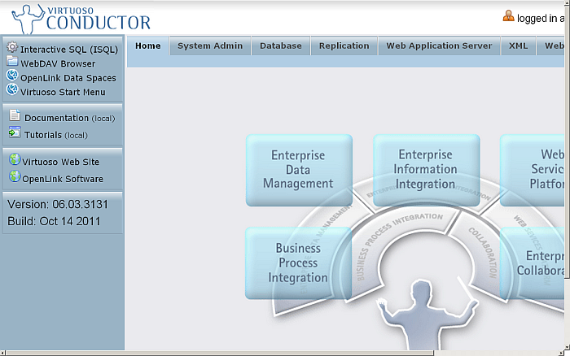

From "System Admin" you can view and change the Conductor Dashboard,
manage user accounts; scheduler; Virtuoso Server parameter and Access
Control Settings. You can also install /upgrade /uninstall Virtuoso
packages and Monitor Virtuoso Server Statistics.

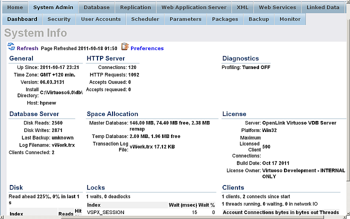

From "Database" you can administrate your database, manage the Virtuoso
Relational Database System, administrate views, tables, stored
procedures, trigger definitions, user define types, backups.

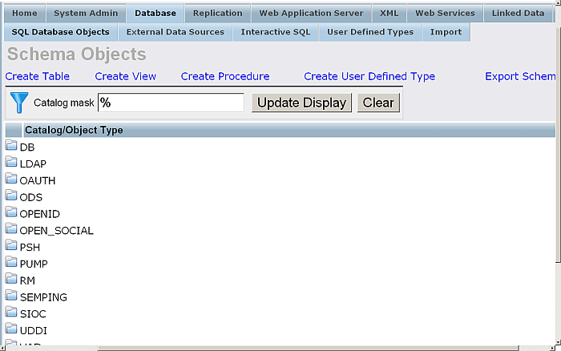

From "Replication" you can create Snapshot Replications to copy sections
of the Database to remote locations or use Transactional Replication to
keep Virtuoso Servers in sync over a definable interval.

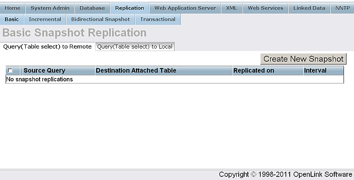

From "Web Application Server" you can configure Virtuoso's WebDAV, and
HTTP Server functionality, which includes management of Virtual Domains
& Directories.

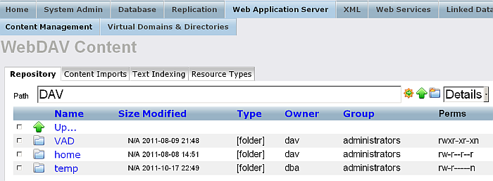

From "XML" you can query Relational and XML Data using SQL, XQUERY,
XPATH, and FREE TEXT.

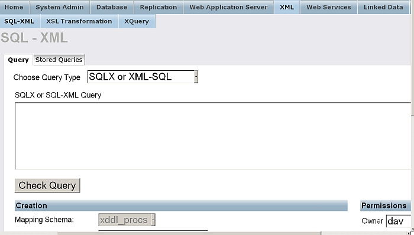

From "Web Services" you can add/ edit/ remove Web Services Endpoints,
perform WSDL Import/Export, manage your BPEL processes.

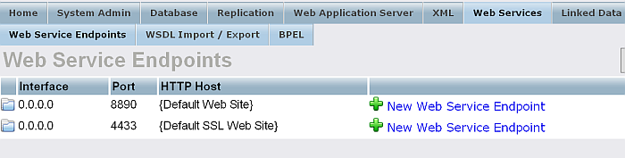

From "Linked Data" tab you can execute/save/load SPARQL queries,
add/edit RDF Mapping, make statistics, manage graphs, import schemas and
define namespaces, generated Linked Data Views, upload to the Quad
Store:

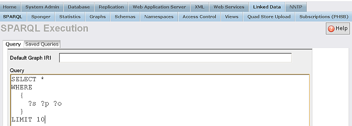

Virtuoso's NNTP support which includes linking third-party NNTP servers
into Virtuoso and controlling access to these servers.

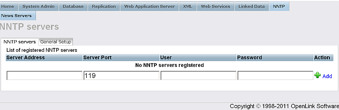

<a id="id12-runtime-hosting"></a>
## Runtime Hosting

The runtime hosting interfaces require Mono/CLR and Java extension
servers.

### Loaded Modules

You can view Loaded Modules list and each Module you can "Unload". Also
you can browse for Module and examine its content.

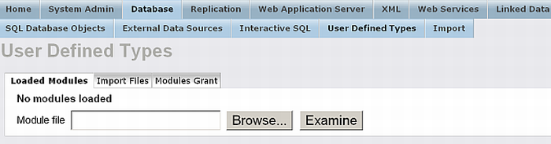

### Import Files

To import files click the "Browse" button and select the class you want
to import. Then click the "Add to list" button.

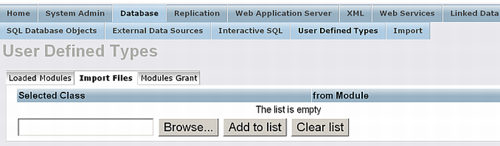

### Modules Grants

In order to change grants to a particular Module, select the desired
grant value from the "Grant to" list and click the "Add" button.

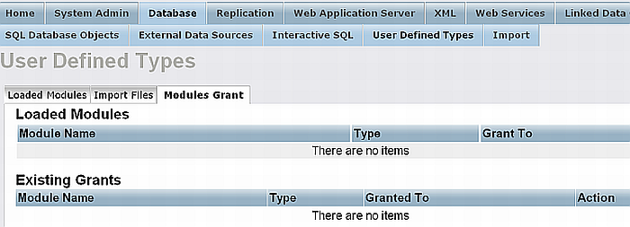

<a id="id13-web-services"></a>
## Web Services

### Content Crawler

Some of the supported features are:

  - *Import Targets* : Virtuoso can be set up to retrieve content from
    external web sites and host it in its own WebDAV repository via this
    page.
    
    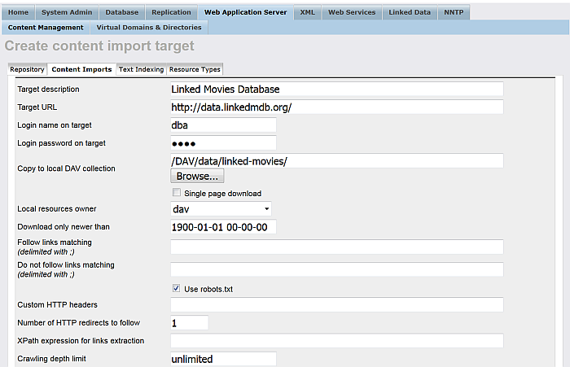
    
    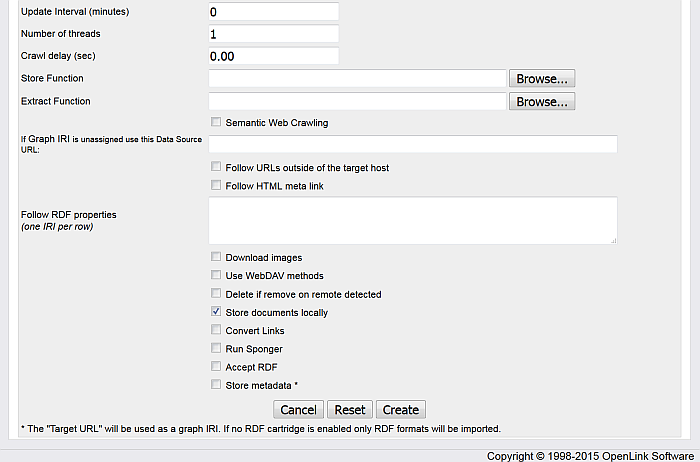
    
      - *Target description* lets you provide a friendly name for the
        target that you are defining.
    
      - *Target URL* is the url of the web site that you are trying to
        retrieve content from. Only the hostname should be provided
        here, along with the protocol. For example
        http://www.myhost.com.
    
      - *Login name on target* is the username for accessing the remote
        server, if required.
    
      - *Login password on target* is the password for the login name
        above.
    
      - *Copy to local DAV collection* this \*mandatory\* value will
        serve as the DAV root location if content is stored locally.
    
      - *Single page download* radio button specifies whether Virtuoso
        will retrieved linked content also.
    
      - *Local Resources Owner* The DAV user that will be the owner of
        the content that will copied to DAV.
    
      - The *Download only newer than* field allows you to specify a
        datetime value to prevent Virtuoso downloading files that are
        older than that datetime.
    
      - Use the *Follow links matching (delimited with ;)* field to
        limit the content that is downloaded by specify pattern matching
        criteria.
    
      - *Do not follow links matching (delimited with ;)* allows you
        limit content by specifying what files not to download.

  - *Use robots.txt* check-box is checked by default.

  - *Custom HTTP headers* can be used to specigy custom HTTP headers.

  - *Number of HTTP redirects to follow* is set by default to 1.

  - *XPath expression for links extraction* allows to be entered custom
    XPath expression.

  - *Crawling depth limit* allows to limit crawling depth. By default is
    set to "unlimited".

  - *Update Interval (minutes)* is on what interval the updated of the
    crawled data should be performed.

  - *Number of threads* allows setting crawling threads.

  - *Crawl delay (sec)* allows to be specified a delay. By default is
    set to "0.00".

  - *Store Function* allows to be used a specific stored function for
    ex. in Semantic Sitemaps crawling.
    
    > **Tip**
    > 
    > [Example of Stored Functions.](#)

  - *Extract Function* allows to be used a specific extract function for
    ex. in Semantic Sitemaps crawling. If left empty, will be used a
    system Store function.
    
    > **Tip**
    > 
    > [Example of Stored Functions.](#)

  - *Semantic Web Crawling* : hatch to retrieve Semantic Sitemaps. If
    left empty, will be used a system Store function.

  - *If Graph IRI is unassigned use this Data Source URL:* use to
    specify a custom graph URI for data storage.

  - *Follow URLs outside of the target host* is check-box to specify
    either to follow URIS outside of the target host.

  - *Follow HTML meta link* is check-box to specifiy either to follow
    HTML meta links.

  - *Follow RDF properties (one IRI per row)* .

  - *Download Images* radio buttons to allow Virtuoso to pull down image
    type also. You may want to prevent this if you are more interested
    in the textual content rather than bandwidth draining images.

  - *Use WebDAV methods* can be checked if the host is known to support
    WebDAV methods. This would enable better copying of sites that
    support DAV.

  - *Delete if remove on remote detected* can be switched on so that
    when Virtuoso synchronizes its content with that on the remote host
    it will check for files that have been removed on the remote and
    remove them from the local copy also.

  - *Store metadata\** when checked offers to be stored respectively
    metadata from FOAF, RDF, RSS/RDF and GRDLL data depending on which
    check-box is checked.

  - When all details have been completed press the *Add* (or Update if
    updating) button to submit the web robot task to the queue.

  - *Import Queues* : This page shows you a list of web copy targets
    that have been enlisted with the Virtuoso Server, and a list of web
    robot update schedules. Several options are available for each item
    listed: Start, Update, Schedule, Reset, and Stop. You can configure
    the scheduled update interval by pressing the Schedule link and
    entering a value in minutes. Once that is done you can start the
    schedule by pressing the Start link. You make a manual update of the
    content by pressing the Update link. You can stop the scheduled
    updates taking place by pressing the Stop link. To reset the details
    of the web copy item press the Reset link.
    
    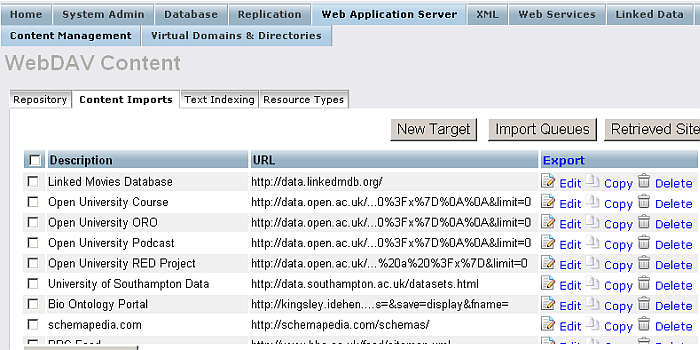

  - *Retrieved Sites* : You can view a list of the links retrieved from
    the web copy from this page. You are also able to remove some of the
    content from this page by following the Edit link.
    
    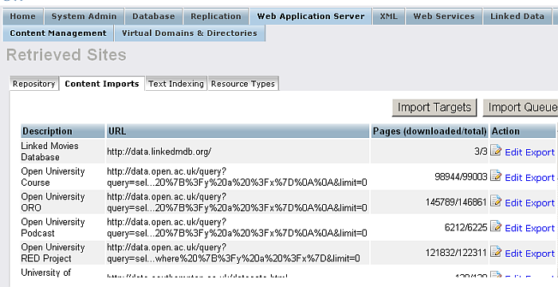

  - *Export* : You can export content from the WebDAV repository. Note
    that you can only export content that has been retrieved using
    Virtuoso's Web Robot.
    
    When you click the "Export" link for a retrieved collection, you
    will be presented with a form for selecting the export target
    location. Choose the export method: either File System or DAV by
    clicking the "External WebDAV Server URL" check-box. This lets you
    indicate to the remote target where to store the exported content.
    Then type the target URL to an existing location on the server.
    Finally press the *Export* button to export. A confirmation will be
    supplied once the operation is complete.
    
    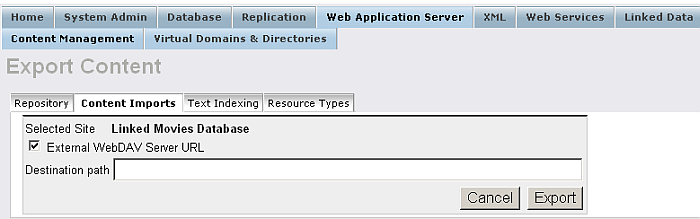
    
    > **Note**
    > 
    > If is not checked the "External WebDAV Server URL" check-box, i.e.
    > you are selecting the filesystem method, then you are restricted
    > to Virtuoso targets. However WebDAV methods can be applied to any
    > WebDAV server. WebDAV methods assume that the target is publicly
    > available for writing.

  - *Populate the RDF Quad Store* : Virtuoso's built-in Content Crawler
    to can be used to populate its RDF Quad Store, as a one-time run or
    on a scheduled basis.
    
    Transforming data sources into RDF "on the fly" is sufficient for
    many use cases, but there are times when the volume or sheer nature
    of a data source makes batch-loading necessary.
    
    For example, Freebase offers RDF representations of its data, but it
    doesn't publish RDF dumps; even if it did, such dumps would usually
    be outdated by the time they were loaded.
    
    One practical solution takes the form of a scheduled crawl of
    specific resources of interest.

#### Set Up the Content Crawler to Gather RDF

The Virtuoso Conductor can be used to set up various Content Crawler
Jobs:

##### Setting up a Content Crawler Job to Add RDF Data to the Quad Store

See [details](#rdfinsertmethodvirtuosocrawler) how to use Virtuoso
Crawler for including the Sponger options so you crawl non-RDF but get
RDF and this to the Quad Store.

##### Setting up a Content Crawler Job to Retrieve Sitemaps (when the source includes RDFa)

The following section describes how to set up a crawler job for getting
content of a basic Sitemap where the source includes RDFa.

1.  From the Virtuoso Conductor User Interface i.e.
    http://cname:port/conductor, login as the "dba" user.

2.  Go to the "Web Application Server" tab.
    
    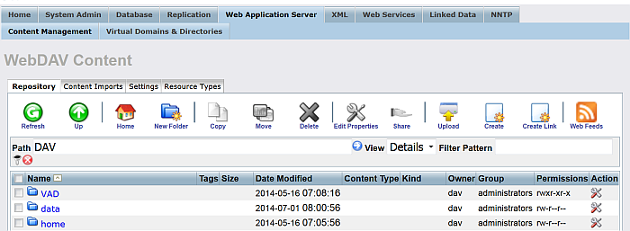

3.  Go to the "Content Imports" tab.
    
    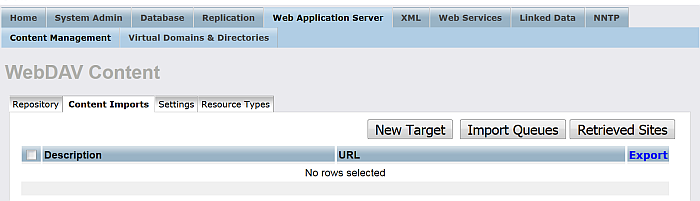

4.  Click on the "New Target" button.
    
    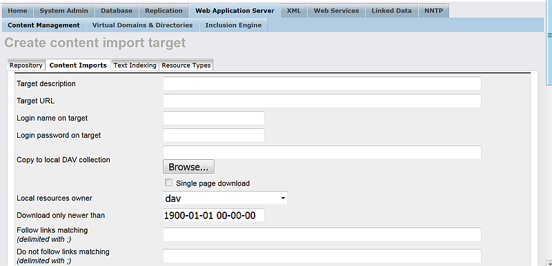

5.  In the form displayed:
    
      - Enter a name of choice in the "Target description" text box:
        
            Virtuoso Sample Example
    
      - Enter the URL of the site to be crawled in the "Target URL" text
        box:
        
            http://virtuoso.openlinksw.com/sitemap.xml
    
      - Enter the location in the Virtuoso WebDAV repository the crawled
        should stored, in the "Copy to local DAV collection" text box,
        for example, if user demo is available, then:
        
            /DAV/home/demo/VirtSample/
    
      - Choose the "Local resources owner" for the collection from the
        list box available, for ex: user demo.
    
      - Select the "Accept RDF" check box.
    
      - Optionally you can select "Convert Links" to make all HREFs in
        the local stored content relative.
    
    
    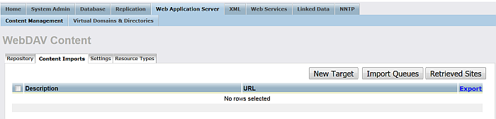

4.  Click "New Target":
    
    

5.  In the presented form specify respectively:
    
      - "Target description": for ex. National Bibliography ;
    
      - "Target URL": for ex.
        http://data.libris.kb.se/nationalbibliography/feed/ ;
        
        Note: the entered URL will be the graph URI for storing the
        imported RDF data. You can also set it explicitly by entering
        another graph URI in the "If Graph IRI is unassigned use this
        Data Source URL:" shown as option in this form.
    
      - "Copy to local DAV collection": for ex.
        
            /DAV/temp/nbio/
    
      - "XPath expression for links extraction:":
        
            //entry/link/@href
    
      - "Update Interval (minutes)": for ex. 10 ;
    
      - "Run Sponger": hatch this check-box ;
    
      - "Accept RDF": hatch this check-box ;
    
      - Optionally you can hatch "Store metadata" ;
    
      - "RDF Cartridge": hatch this check-box and specify what
        cartridges will be used.
        
        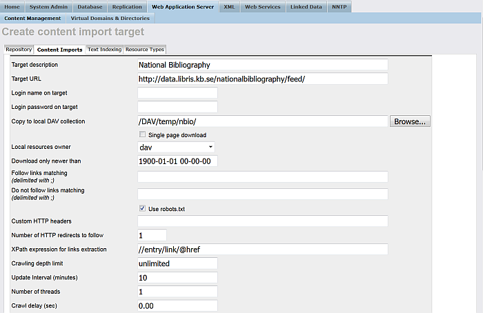
        
        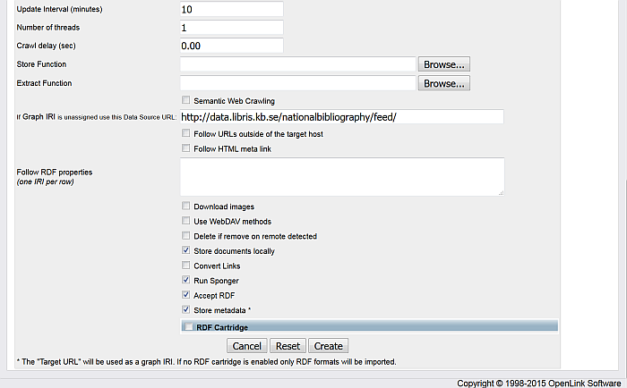

6.  Click "Create".

7.  The new created target should be displayed in the list of available
    Targets:
    
    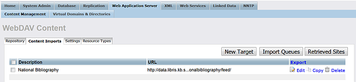

8.  Click "Import Queues":
    
    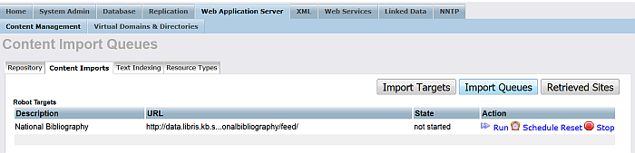

9.  Click for "National Bibliography" target the "Run" link from the
    very-right "Action" column.

10. Should be presented list of Top pending URLs:
    
    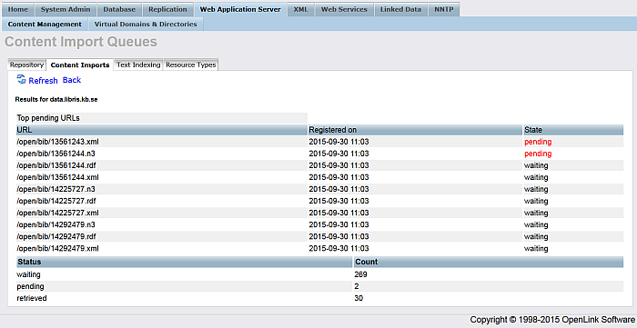

11. Go to "Retrieved Sites" to check the total URLs that were processed:
    
    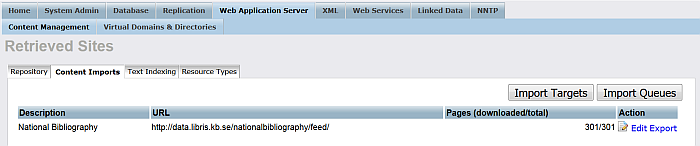

12. To view the imported RDF data, go to http://example.com/sparql and
    enter a simple query for ex.:
    
        SELECT *
        FROM <http://data.libris.kb.se/nationalbibliography/feed/>
        WHERE
          {
            ?s ?p ?o
          }
    
    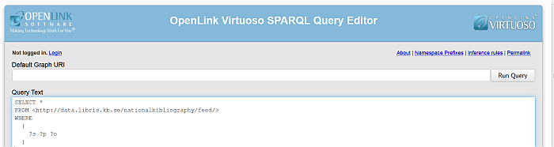

13. Click "Run Query".

14. The imported RDF data triples should be shown:
    
    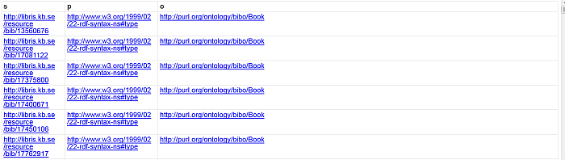

##### Setting up a Content Crawler Job to Retrieve Content from SPARQL endpoint

The following step-by section walks you through the process of:

  - Populating a Virtuoso Quad Store with data from a 3rd party SPARQL
    endpoint

  - Generating RDF dumps that are accessible to basic HTTP or WebDAV
    user agents.

<!-- end list -->

1.  Sample SPARQL query producing a list SPARQL endpoints:
    
        PREFIX rdf:      <http://www.w3.org/1999/02/22-rdf-syntax-ns#>
        PREFIX rdfs:     <http://www.w3.org/2000/01/rdf-schema#>
        PREFIX owl:      <http://www.w3.org/2002/07/owl#>
        PREFIX xsd:      <http://www.w3.org/2001/XMLSchema#>
        PREFIX foaf:     <http://xmlns.com/foaf/0.1/>
        PREFIX dcterms:  <http://purl.org/dc/terms/>
        PREFIX scovo:    <http://purl.org/NET/scovo#>
        PREFIX void:     <http://rdfs.org/ns/void#>
        PREFIX akt:      <http://www.aktors.org/ontology/portal#>
        
        SELECT DISTINCT ?endpoint
        WHERE
          {
            ?ds a void:Dataset .
            ?ds void:sparqlEndpoint ?endpoint
          }

2.  Here is a sample SPARQL protocol URL constructed from one of the
    sparql endpoints in the result from the query above:
    
        http://void.rkbexplorer.com/sparql/?query=PREFIX+foaf%3A+%3Chttp%3A%2F%2Fxmlns.com%2Ffoaf%2F0.1%2F%3E+%0D%0APREFIX+void%3A+++++%3Chttp%3A%2F%2Frdfs.org%2Fns%2Fvoid%23%3E++%0D%0ASELECT+distinct+%3Furl++WHERE+%7B+%3Fds+a+void%3ADataset+%3B+foaf%3Ahomepage+%3Furl+%7D%0D%0A&format=sparql

3.  Here is the cURL output showing a Virtuoso SPARQL URL that executes
    against a 3rd party SPARQL Endpoint URL:
    
        $ curl "http://void.rkbexplorer.com/sparql/?query=PREFIX+foaf%3A+%3Chttp%3A%2F%2Fxmlns.com%2Ffoaf%2F0.1%2F%3E+%0D%0APREFIX+void
        %3A+++++%3Chttp%3A%2F%2Frdfs.org%2Fns%2Fvoid%23%3E++%0D%0ASELECT+distinct+%3Furl++WHERE+%7B+%3Fds+a+void%3ADataset+%3B+foaf%3Ah
        omepage+%3Furl+%7D%0D%0A&format=sparql"
        <?xml version="1.0" ?>
        <sparql xmlns="http://www.w3.org/2005/sparql-results#">
          <head>
            <variable name="url"/>
          </head>
          <results ordered="false" distinct="true">
            <result>
              <binding name="url"><uri>http://kisti.rkbexplorer.com/</uri></binding>
            </result>
            <result>
              <binding name="url"><uri>http://epsrc.rkbexplorer.com/</uri></binding>
            </result>
            <result>
              <binding name="url"><uri>http://test2.rkbexplorer.com/</uri></binding>
            </result>
            <result>
              <binding name="url"><uri>http://test.rkbexplorer.com/</uri></binding>
            </result>
            ...
            ...
            ...
          </results>
        </sparql>

4.  Go to Conductor UI -- http://example.com/conductor and provide dba
    credentials;

5.  Go to "Web Application Server"-\> "Content Management" -\> "Content
    Imports"
    
    

6.  Click "New Target":
    
    

7.  In the presented form enter for ex.:
    
    1.  "Target description": voiD store
    
    2.  "Target URL": the url from above i.e.:
        
            http://void.rkbexplorer.com/sparql/?query=PREFIX+foaf%3A+%3Chttp%3A%2F%2Fxmlns.com%2Ffoaf%2F0.1%2F%3E+%0D%0APREFIX+void%3A+++++%3Chttp%3A%2F%2Frdfs.org%2Fns%2Fvoid%23%3E++%0D%0ASELECT+distinct+%3Furl++WHERE+%7B+%3Fds+a+void%3ADataset+%3B+foaf%3Ahomepage+%3Furl+%7D%0D%0A&format=sparql
    
    3.  "Copy to local DAV collection":
        
            /DAV/void.rkbexplorer.com/content
    
    4.  "Follow links matching (delimited with ;)":
        
        ``` 
        %
        ```
    
    5.  Un-hatch "Use robots.txt" ;
    
    6.  "XPath expression for links extraction":
        
            //binding[@name="url"]/uri/text()
    
    7.  Hatch "Semantic Web Crawling";
    
    8.  "If Graph IRI is unassigned use this Data Source URL:": enter
        for ex:
        
            http://void.collection
    
    9.  Hatch "Follow URLs outside of the target host";
    
    10. Hatch "Run "Sponger" and "Accept RDF"
        
        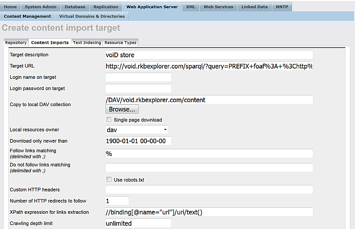
        
        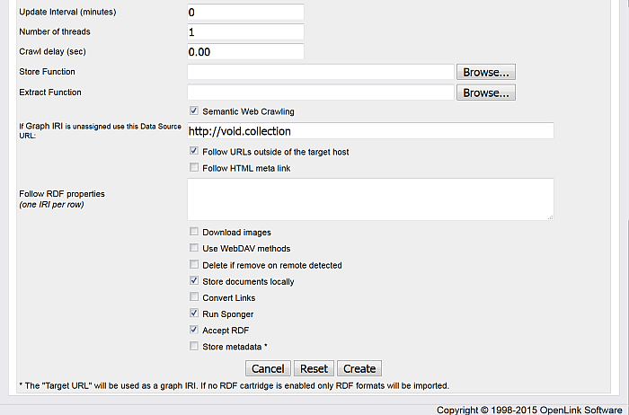

8.  Click "Create";

9.  The target should be created and presented in the list of available
    targets:
    
    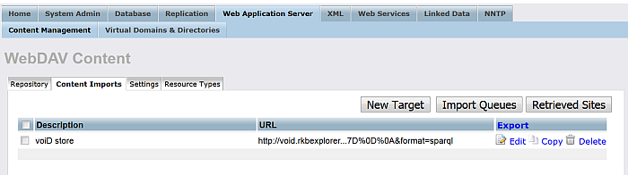

10. Click "Import Queues":
    
    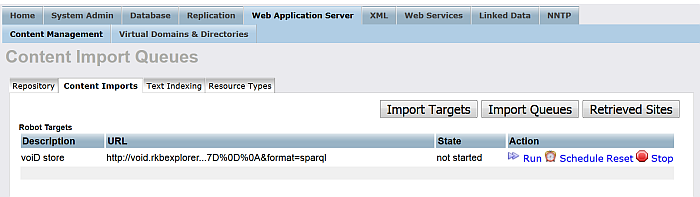

11. Click "Run" for the imported target:
    
    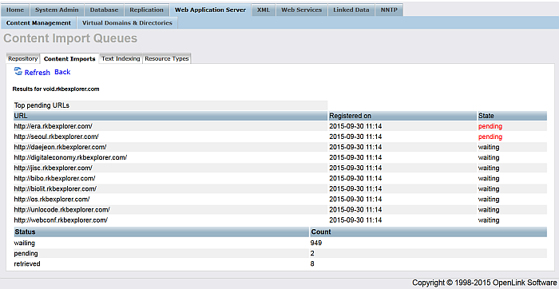

12. To check the retrieved content go to "Web Application Server"-\>
    "Content Management" -\> "Content Imports" -\> "Retrieved Sites":
    
    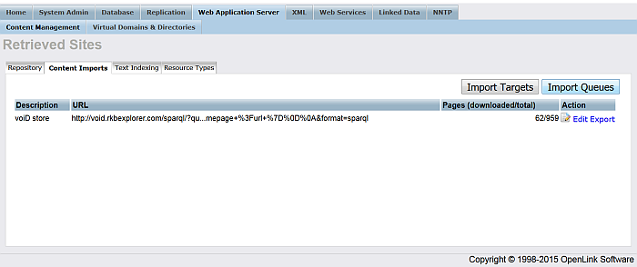

13. Click "voiD store" -\> "Edit":
    
    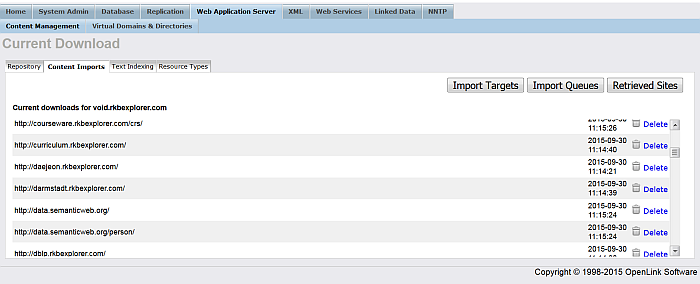

14. To check the imported URLs go to "Web Application Server"-\>
    "Content Management" -\> "Repository" path
    DAV/void.rkbexplorer.com/content/:
    
    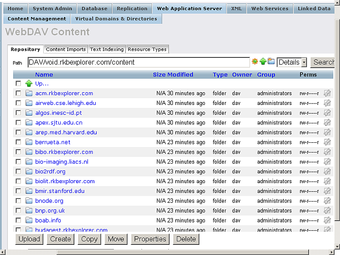

15. To check the inserted into the RDF QUAD data go to
    http://cname/sparql and execute the following query:
    
        SELECT *
        FROM <http://void.collection>
        WHERE
          {
            ?s ?p ?o
          }
    
    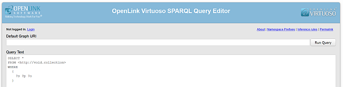
    
    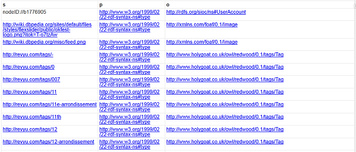

### Access Control

From "System Admin" -\> Security -\> "Access Controls" you can manage
Rules and ACL respectively for HTTP, News, Proxy. The tabs PSH and
PSH-SSL are available only when the [pubsubhub\_dav.vad](#) is
installed.

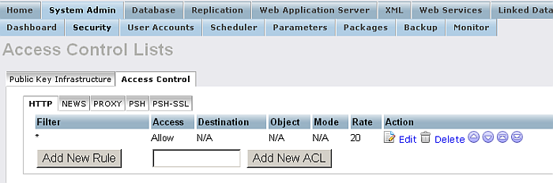

For each of the tabs "HTTP", "NEWS", "PROXY" the created rules will be
shown in a list with Filter, Access, Destination, Object, Mode, Rate
values. You can also add/delete rules, re-arrange rules order.

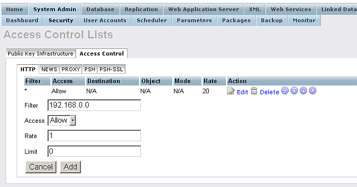

Click the link "Edit" for a rule. Then specify the filter and access
values.

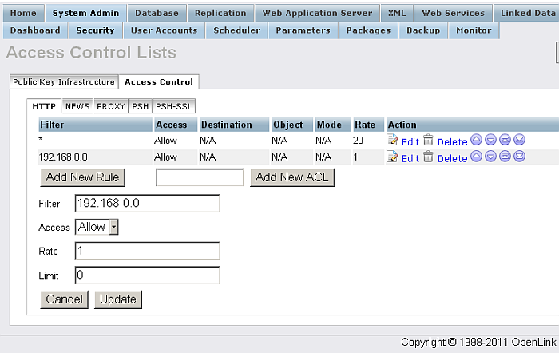

### Import WSDL

From "Web Services" / "WSDL Import/Export" you can provide a URL to a
WSDL description. In return Virtuoso will automatically provide a
wrapper for the services available, hence stored procedures and
user-defined types that are callable within Virtuoso while the
processing and mechanics of the services are actually handled at the
source.

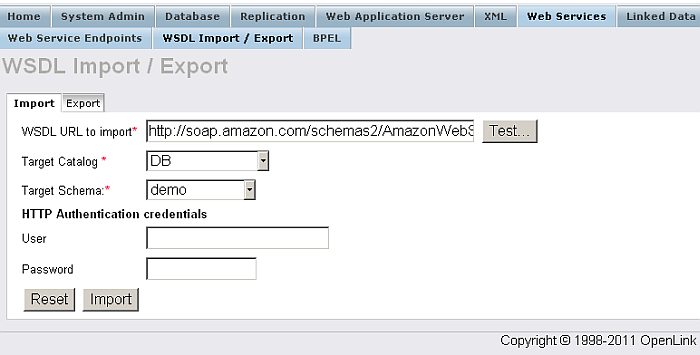

After Virtuoso examines the supplied URL to a WSDL you are presented
with the source code for the PL wrappers and Virtuoso user-defined types
to be created. You have the chance to edit the code for more specific
needs and then you can either save this to a file for later work, or
execute it in Virtuoso to create the procedures and types.

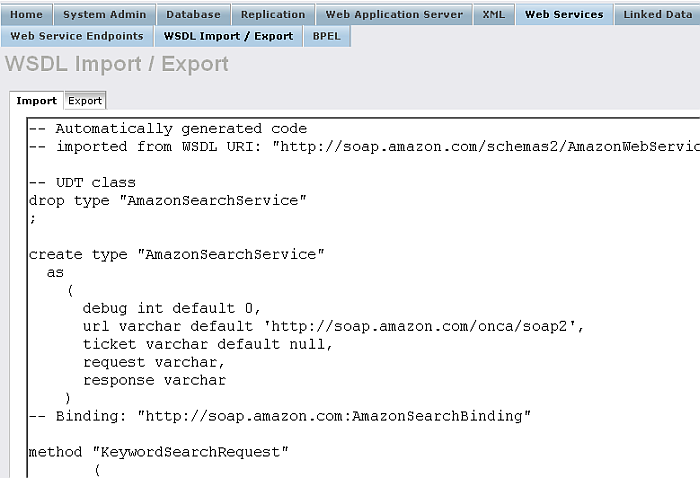

Any errors in the code will be highlighted if you try and execute it.

If you wish to save the file the appropriate file system ACLs must be in
place for the destination.

<a id="id14-webdav-administration"></a>
## WebDAV Administration

DAV, or WebDAV, is a protocol for Web-based Distributed Authoring and
Versioning. The location where content items are placed is called the
*repository* . Content elements are called *documents* , corresponding
to files, and *folders/collections* , corresponding to directories.
Collectively these documents and folders (collections) are known as
*resources* .

Virtuoso implements the DAV protocol, allowing you to create and manage
resources either directly through repository manipulations or
indirectly, through a variety of WebDAV services.

### DAV Resource Types

To make sure that when Virtuoso serves files to client user agents the
type of file is conveyed properly so that the right application can be
used with that file a list or file types are maintained in the server.
This list is used when sending any content via the HTTP server which
include content in DAV and under VSP.

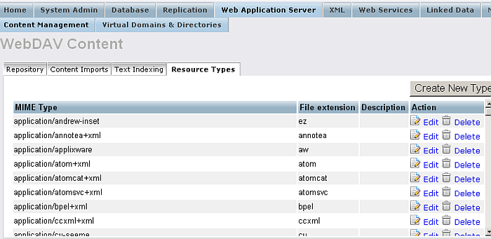

The Web Application Server/Content Management/Resource Types page shows
the list of currently defined resource types in the Virtuoso server. You
can edit or remove these types by using the action links on the right
most column of the list next to the type applicable.

Add new types by typing the details into the fields provided and
pressing the *Save* button.

### Content Management

The content management page gives you an interface to the WebDAV
repository resources. From here you can navigate or create directories,
commonly referred to as collections or folders in DAV, alter properties,
upload or remove files, or edit documents.

The Repository tab lists the current location within the tree and the
current login name. The root of the repository is usually `/DAV/` .


#### Resource Names

Resource names are given with collection (folder) names listed first,
then individual documents. Permissions on resources are presented in a
style similar to Unix, with (r)ead, (w)rite, and e(x)ecute permissions
listed for the resource owner (the user), the resource's group, and for
the general public. If a permission is present, the letter is shown; if
not, it is replaced with a dash.

#### Resource Permissions

Unlike Unix, the Repository does not use the designation 'd' for
directories, which in DAV are more commonly referred to as collections.
Collections are distinguished by a different icon - a folder-like icon -
and by having the type named "collection".

In addition, the permissions string has a trailing letter designating
the indexing status of the resource. This letter is 'n' to designate
that indexing is off, 'r' for recursive indexing, and 't' for direct
indexing.

#### Resource User and Group

By default, the user and group of a DAV resource are those set by the
service that created the resource, or they are the ID and primary group
of the user who was logged in when the resource was created.

#### Resource Size

The size of a document resource is its size in disk bytes. Note that
this does not necessarily correspond to characters displayed on the
screen because of encodings. For example, the HTML token
&-a-m-p-semicolon is five bytes on disk but displays as a single screen
character.

#### Resource Type

The type of a resource is always "collection" for collections (folder).
For documents it can be any of the known resource types (see Resource
Types below). The resource type is usually based on the resource's
extension; for example, .xml files are usually assumed to be `text/xml`
. If Virtuoso does not recognize the extension of a resource, it assigns
the default type of `application/octet-stream` .

#### Editing Properties

Within the Content Management screen, you can change any of the
properties of a resource, other than its name, by selecting the resource
via the checkbox to the left of the icon, and pressing the "Properties"
button.

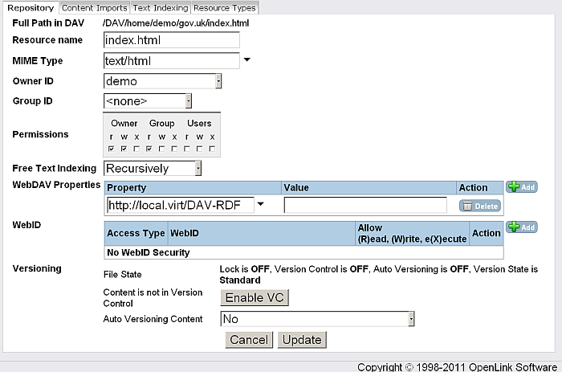

XML documents also permit you to edit their XML properties specifically.
This can be done on any document of type text/xml by clicking on the
icon for the document.

##### Properties

When clicked this button from the bottom of the page, you can edit the
properties for one or a group of resources which should be selected. The
name of a resource cannot be changed.

The owner, group, permissions, and indexing controls on this form apply
to the appropriate properties of resources, as documented above. Changes
to the type of a collection (folder) are ignored.

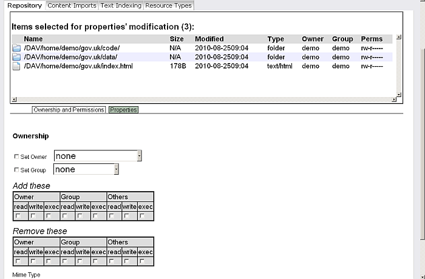

The "Property" control permits you to change or add additional
properties. There is a pulldown of predefined XML-related properties, or
you may create your own property.

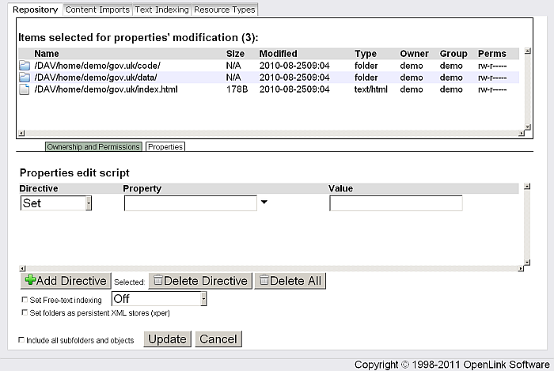

##### WebDAV Properties

This control permits you to manipulate the specific properties of XML
documents. Existing properties are shown with their values, and can be
removed. New properties can be added.

XML-related properties are generally set by specific XML-related
services and do not need to be edited directly by users; however, this
interface provides a quick means to correct a minor typo or other change
without re-running the entire service. For example, you can change the
`xml-sql-root` property, which controls the name of the root XML element
for the document.

#### Adding New Resources

Resources may be added to the repository in two ways: by uploading files
or by creating new collections (folders). Buttons for both these methods
are on the page.

The "Create Folder" button brings up a form in which you can specify the
name of the collection (folder), its owner and group, and the initial
permissions. You may also turn on indexing for the folder's contents at
this point.

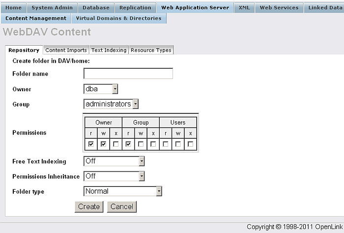

The "Upload File" button brings up a form in which you can specify the
name and location of a file on your local computer that is to be copied
into the DAV repository. You need to specify the name of the resource in
the repository and give it a type. You can also set the basic repository
properties here.

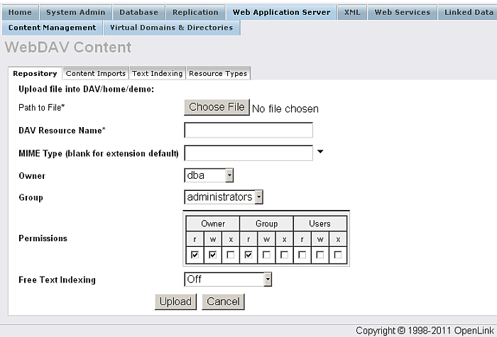

### Free Text

#### Indexing Mode

When files are inserted into Virtuoso's WebDAV repository, if their type
is a type of text file such as plain text TXT, XML, or HTML, then they
may be automatically free text indexed.

By default files are automatically free text indexed as they are
inserted into Virtuoso. This is very convenient but can be time
consuming if you frequently insert or update text files. For this reason
Virtuoso can be set to index in batch mode at a particular interval in
minutes.

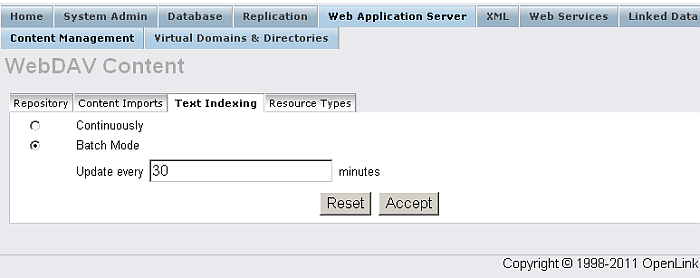

To change the free-text index mode to batch mode check the check-box and
provide a non-zero time interval (in minutes). Press the *Accept* button
to save the changes into the server.

<a id="id15-internet-domains"></a>
## Internet Domains

### HTTP Virtual Directories

From Virtual Domains & Directories you can define Virtual HTTP
directories. Virtual Directories let you define multiple HTTP server
listeners in Virtuoso for either the same network interface or another
one. Virtual directories can respond logically to a name or directly by
IP address. Both types as well as default responses can be defined here.

Each virtual directory can also have HTTP maps defined for it. This
allow you to set logical paths on an HTTP directory to point to specific
directories available to Virtuoso through the file system or DAV.

You can also publish stored procedures to a SOAP defined directory
during the virtual directory definition.


Click on the *Add New Site* button to start adding a new Virtual Web
Site and its directories.

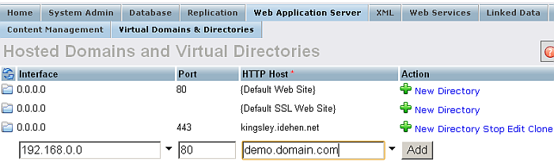

When adding or editing a web site you must supply a host.domain name,
which will be used to match again incoming requests to produce the
correct response, the IP address of the network interface, to set-up the
listener on, and the TCP port number that will be used to listen for
incoming requests. Although Virtuoso will be listening on the specified
interface you can set up multiple sites on this interface. The site
required by client web browsers will be determined by the host name
specified in the request. This provides the virtual site.

Click on "New Directory" to continue.


Before the directory settings are configured you can select from a few
types to help configure the details to follow quicker and easier. For
SOAP virtual directories this step is particular useful.

Select "Type" and then click "Next" to continue.


The "Virtual Directory Information" tab lets you configure most aspects
of the virtual directory.

The default directory checkbox can be checked if you want the site being
defined to act as the default site for the interface. This means that if
a request is made to the interface that does not match a hostname
defined for the interface, the default will be returned.

Logical Path will be the path that Virtuoso will respond to for this
virtual directory mapping. This is what will be placed on the URL.
Physical Path or URL is what Virtuoso will actually supply the content
from. In either case you can use the Browse buttons to traverse the file
systems graphically. Use the WebDAV Source Checkbox to instruct Virtuoso
to use the WebDAV store for the physical location. "Default Page" will
be returned if no page is specified in the incoming URL.

> **Note**
> 
> Virtual directories for SOAP must always use a physical path of
> /SOAP/.
> 
> The physical path of /SOAP/ does not need to exist in the filesystem
> under the VSP-root directory for normal SOAP operation. If it does
> existing it can be used to answer non-SOAP requests. Thus, configuring
> the virtual directory for SOAP with a "Default Page" can be used to
> avoid SOAP clients receiving HTTP 404 errors when testing the SOAP
> endpoint using standard HTTP only. Some SOAP applications assume the
> SOAP endpoint is down if they received HTTP 404 without checking the
> SOAP endpoint itself.

The permissions panel lets you choose whether to enable various
abilities in the directory.

In the SOAP Options section you can publish or unpublish procedures
and/or templates, both native and remote to the virtual directory using
the Publish/Unpublish buttons respectively. The SOAP Options text-area
allows you to specify other SOAP options such as DIME encapsulations and
WS-security settings. These options are supplied as name=value pairs
terminated with a semi-colon and a carriage-return. Here is an example
of the options used for the default Interop test based demo virtual
directory:

    Namespace=http://soapinterop.org/;
    MethodInSoapAction=no;
    ServiceName=InteropTests;
    HeaderNS=http://soapinterop.org/echoheader/;
    CR-escape=yes;

> **Tip**
> 
> For a list of available SOAP Options review the end section of the
> SOAP chapter: [Optional Parameters to the SOAP Endpoint](#soapoptions)
> .

The Authentication Options panel lets you define the authentication
rules for the Virtual Directory.

Once the form details have been completed press on the Add button to
save the them and proceed to configure mappings for the directory.


This screen lists mappings that have been defined for the virtual site.
If you have just created a fresh site then only one line will be
displayed. The "Add Virtual Directory" button will let you define more.
Back returns you to the start page, Edit and Delete allow you to edit or
remove existing mappings as their link suggests.

> **Tip**
> 
> [Virtual Directories](#virtdir)

For example, here are the basic steps to be performed, in order to mount
FS folder to DAV:

1.  Suppose there is a folder with name "test" in your FS and it is
    under the root of the ServerRoot defined in your virtuoso ini file.

2.  Also suppose in the folder "test" there is a file index.html with
    simple content:
    
    ``` 
    <!DOCTYPE HTML PUBLIC "-//IETF//DTD HTML//EN">
    <html>
      <head>
        <title>OpenLink Virtuoso Conductor Simple Test</title>
      </head>
      <body>
        <table cellspacing="0" cellpadding="0" border="1" width="50%">
          <tr>
           <td><b>Name</b></td><td></b>State</b></td>
          </tr>
          <tr>
           <td>Simple test for mounting FS to DAV</td><td>Successful.</td>
          </tr>
        </table>
      </body>
    </html>
      
    ```

3.  Install the Conductor package

4.  Go to http://host:port/conductor and login as dba user.

5.  Go to Web Application Server -\> Virtual Domains & Directories.
    
    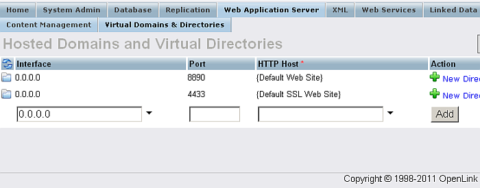

6.  For your {Default Web Site} click the link "New Directory".

7.  Check the check-box "Type" and select from the drop-down list
    "Filesystem".
    
    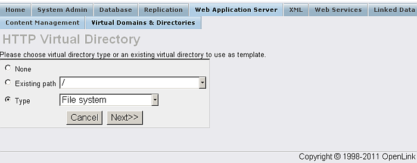

8.  Click "Next"

9.  In the shown form: Enter for the field "Path": mytest; Enter for the
    field "Physical path": /test; Enter for the field "Default page":
    index.html; Check the check-box "Allow Directory Browsing"; Leave
    the rest of the fields with their default values.

10. Click "Save Changes"
    
    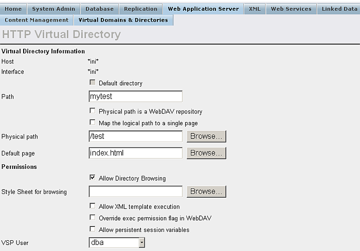

11. From your browser access the url: http://host:port/mytest/

12. As result the content of the index.html file will be shown:
    
    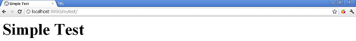

<a id="id16-xml-services"></a>
## XML Services

### SQL-XML Statements

Go to XML/SQL-XML and enter a SQL to XML statement in the *SQLX or
SQL-XML Query* text-area:

    SELECT "product".ProductID AS "id",
      "product".ProductName AS "name"
    FROM
      "Demo"."demo"."Products" as "product"
    FOR XML AUTO ELEMENT

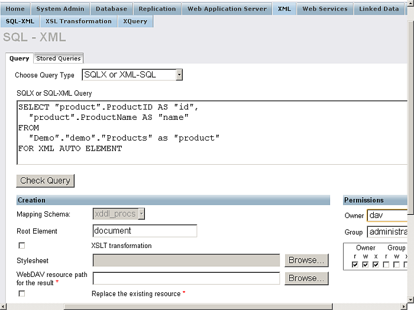

Type the root XML element name into the *Root Element* field. The
results of the query will be contained within this root element.

Type the full path and resource name where you want your XML resource to
reside under WebDAV in the *WebDAV Resource path for the result* field.
Collection(s) described in the full path must already exist.

You may use the *Browse* button next to the *WebDAV Resource path for
the result* field to navigate existing WebDAV collections (folders) or
resources to store the result of query.

From the "Stored Queries" tab if you choose a resource that already
exists as a query in WebDAV resource, after click the "Edit" link, the
form will automatically acquire the details from the query.

If an XSLT transformation should be performed on retrieval time then you
may either type the location of the stylesheet in the *Stylesheet* field
or press the *Browse* button next to it to search for a valid XSLT
stylesheet from the WebDAV repository.

Provide the appropriate *WebDAV owner* and *group* of stored result
using the drop downs provided.

Select appropriate *permissions* for the stored result.

The query can be set to update itself at specific intervals of time or
execute every time the resource is retrieved. If *Persist XML* is
checked the query will be executed on *Update every* 10 minutes by
default.

Press the *Execute* button to execute the statement and store as a
WebDAV resource. Use *Reset* to clear the form

If you want to build a schema definition for the result then press the
*Create XML Schema* radio-button.

Virtuoso can provide the generated XML output with a full DTD for the
data. Press *Create External DTD* to enable this option for the query.

### XQuery Search

Go to XML / XQuery /Xquery Basic.

XQuery Document Search applies the XPATH expression to every realized
XML contained within the Query Scope to qualify search hit results. Note
that this does not include XML Views unless persistent.

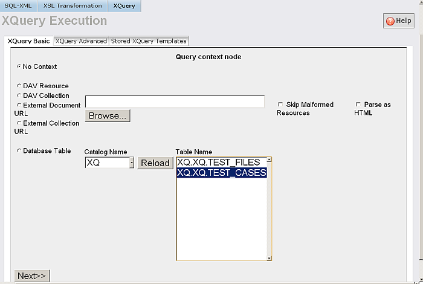

Choose the *Scope of Query* from within the WebDAV repository. You may
define the scope as either No Context, DAV Resource (file), DAV
Collection (folder), External Document URL, External Collection URL or
Database Table. Use the *Browse* button to browse the contents of WebDAV
to make a selection. The query will then be confined to the selected
resource or collection and its children. Then Click the button "Next" in
order to continue.

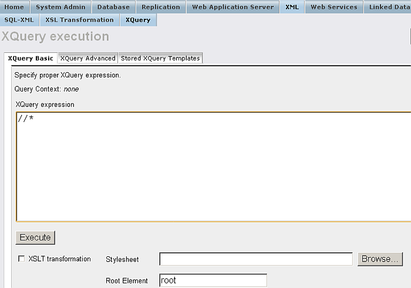

Enter that XPATH query expression into the text area that you wish to
interrogate your WebDAV XML documents with. e.g. *//\** or *//title*

The *Root Element* field allows you specify the name of the root element
to contain document element matches for each document found. This aids
stylesheet design.

Choose an *Output Style Sheet* by either typing its URL or using
*Browse* to select an XSL resource from WebDAV. You only need to specify
a style sheet if you want to transform your XML results using XSLT.

Click the button "Next" in order to continue.

Choose an *Store into* location by either typing its URL or using
*Browse* to select a DAV resource from WebDAV

Set *Permissions* for the output result. Check "r" for read rights for
Group and Users in order to view later the saved xml file.

You may want to *Replace the existing resource* by checking the shown
check-box with this label.

Choose *Output Type* that you wish to obtain. *Persist XML* should be
selected with Update interval im minutes or if you want to be created as
XML Template, fill in the "Create as XML Template Description" field.

Click the button "Save".

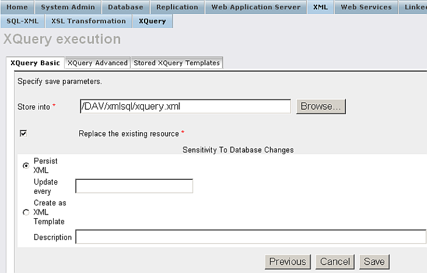

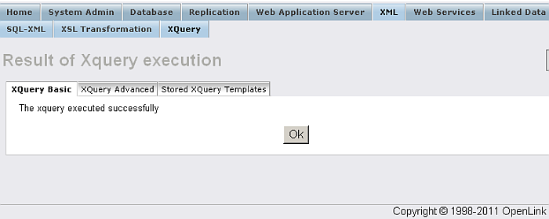

If for location you have chosen /DAV/xmlsql/xquery.xml, you can view the
saved file accessing the url: http://host:port/DAV/xmlsql/xquery.xml

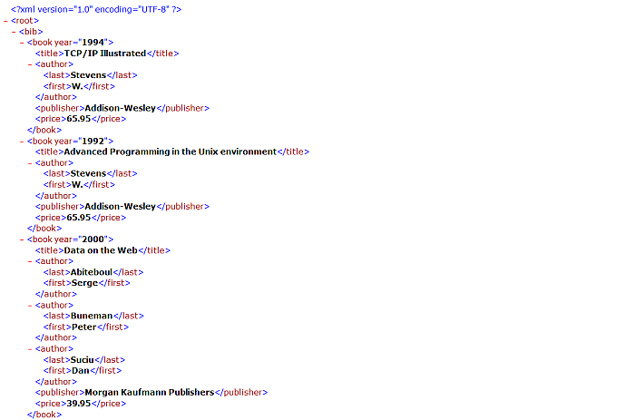

<a id="id17-query-tools"></a>
## Query Tools

### Relational Data using SQL

Conductor Interactive SQL allows you to quickly and directly query
Virtuoso using SQL. It offers *Save* and *Load* facilities which allow
SQL queries to be saved as an XML template, and read back later. With a
query in the SQL Statement box click on the *Execute* for the results
which will in the "Base" tab with option to return back to the query
area. The *Clear* clears the SQL Statement text box.

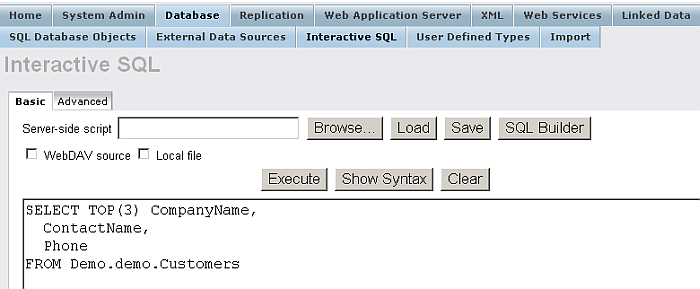

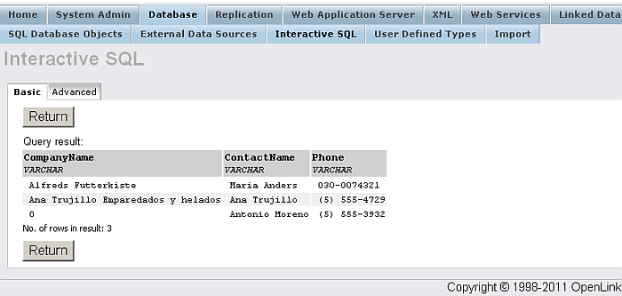

Specify the location for the file to be saved to by selecting the
"WebDAV source" or "Local file" check-box.

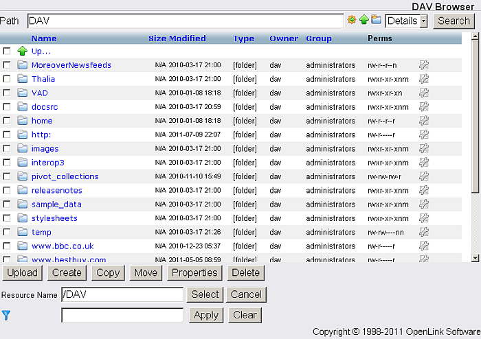

Click the "Browse" button. As result will be opened the Virtuoso
WebDAV/File Browser where you should define the XML template based on
the SQL Query. Specify a *Root Element* that will contain the resulting
XML tree. Specify the file name and location of the XML Template.

### XML Data Using XQuery

The Conductor Interactive XQuery facility allows you to create, execute,
save and reload queries using the evolving [W3C XML Query (XQuery)
Language](#) . Virtuoso currently supports the 1.0 version of this
language.

This language uses XPath-like expressions, as well as a set of functions
and operators, to permit effective parallel searching of a set of XML
documents. Where XPath works with one XML "tree", XQuery searches a
"forest". The result is an XML document.

In order to create an XQuery you must both create the query statement -
by typing or pasting it into the text box - and specify the document
context. Since Virtuoso's XQuery implementation operates over XML data
in relational tables, this means the tables and columns that are to be
searched.

Note that the XQuery language also allows a query to specify all or part
of the document context for the query. In the example below we will see
how these can interact. The user interface form permits you to select a
table - either one of the XQuery test data tables that come with
Virtuoso, or the WS.WS.SYS\_DAV\_RES table, which stores Virtuoso's
WebDAV Repository content.

The form specifies a `Key Column` and a `Data Column` . For the sample
tables, the values for these are filled in for you. The `Path` is
prepended to any `document()` function specified in the query text to
find Key column values of XML trees against which the query is to be
run.

Once a query has been written and debugged, it can be saved by pressing
the Save button. This brings you to the form for saving a query as an
XML Template in the DAV repository.

Pressing the Execute button causes the query result (an XML tree) to be
shown on the page below the Statement type-in box.

In this example, we will query the table XQuery test files table, with
"name" as the key column and "text" as the data column.

The query text, shown below, is a sample query from the W3C's XML Query
Use Cases document ([http://www.w3.org/TR/xmlquery-use-cases](#) ). This
query contains a document() call specifying a document named "bib.xml".
In order to have the query run properly, we first set the Path form
value to "xqdemo/". This causes the query to find all rows in the table
XQ.XQ.TEST\_FILES that have the value "xqdemo/bib.xml" in their Name
column.

    <bib>
       {
       for $b in document("bib.xml")/bib/book
       where $b/publisher = "Addison-Wesley" and $b/@year > 1991
       return
          <book year = {$b/@year}>
             {$b/title}
          </book>
       }
    </bib>

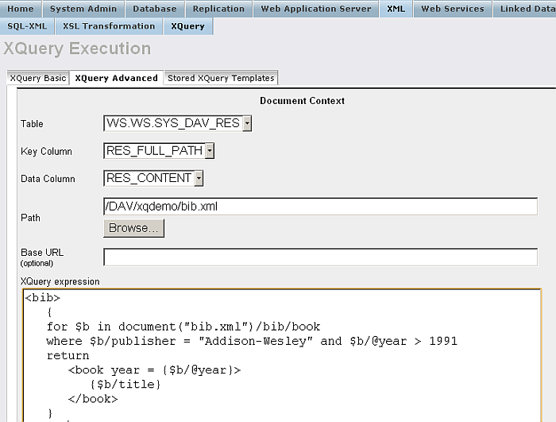

<a id="id18-replication-synchronization"></a>
## Replication & Synchronization

### Snapshot Replication

  - 

  - 

  - 

  - 

  - 

  - 

### Transactional Replication

#### Publications

The Transaction Publication screen lists publications. You can add, edit
or remove publications as necessary, each time using the guide-lines of
the wizard.

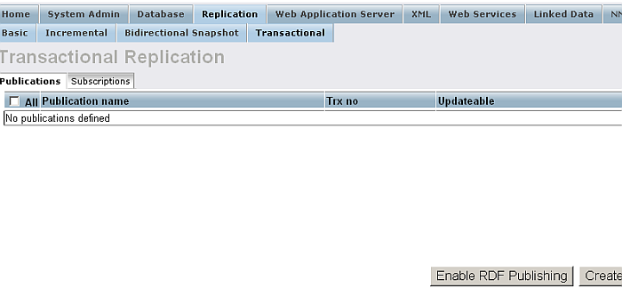

Add a new publication by clicking on the

Create

button.

Edit an existing publication by clicking on publication name.

Remove publications by selecting their checkbox and clicking on the

Delete

button. Use caution, as this action cannot be reverted.

When creating a new publication you must supply a name. At this point
you have the option to create an updateable publication - see the
[Bi-Directional Transactional Replication](#bidirtransrepl) section for
more details - which allows updates to come from subscribers rather than
being limited to originating from the publisher only.

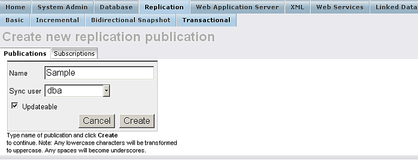


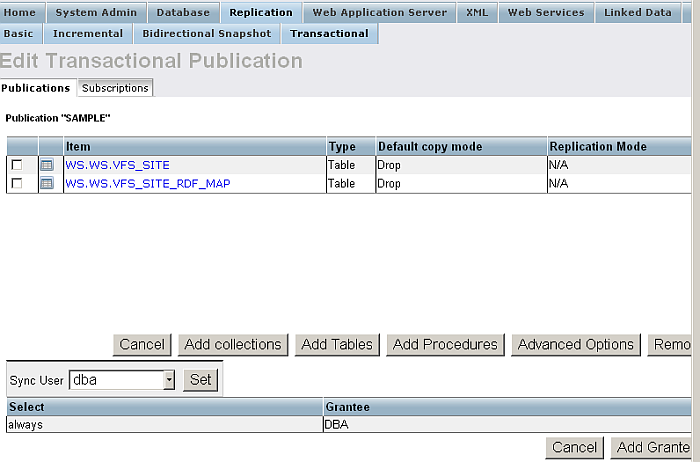

Use the *Add* /*Remove* to add or remove selected resolvers.

Click on Publication Item -\> *New Resolver* to add a new resolver. You
have the following details to contend with:

  - *Name Suffix*
    
    Conflict resolver name suffix.

  - *Order*
    
    Resolver order number.

  - *Type*
    
    The resolver type, one of: Insert, Update, or Delete for resolving
    such SQL queries.

  - *Class*
    
    The kind of resolver. Class can be one of the following:
    
    'max'
    
    row with maximum value of specified column wins
    
    'min'
    
    row with minimum value of specified column wins
    
    'ave'
    
    new value of specified column is calculated as:
    
    current\_val = (current\_val + new\_val) / 2
    
    'add'
    
    new value of specified column is calculated as:
    
    current\_val = current\_val + (new\_val - old\_val)
    
    'pub\_wins'
    
    'custom'
    
    publisher always wins
    
    'sub\_wins'
    
    subscriber always wins

  - *Column*
    
    This should specify the column name if `class` is not one of
    'pub\_wins', 'sub\_wins' or 'custom'.

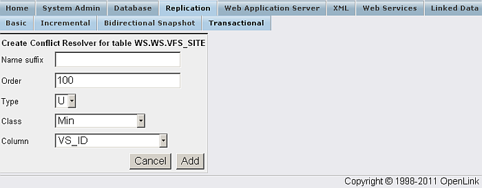

Click on Publication -\> *Advanced Options* to set additional settings
such as split size, default copy mode of publication item, etc.

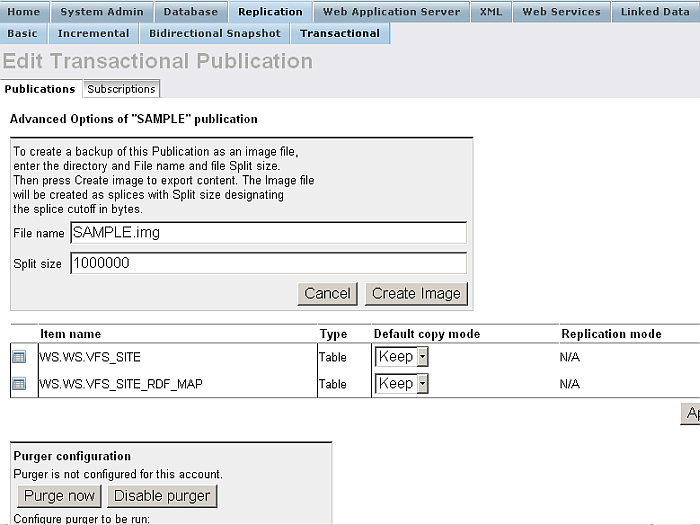

#### Subscriptions

  - To add new subscription click at New Subscription and follow the
    wizard.

  - Click Edit to change properties.

  - To drop subscription click at link Drop.

  - To synchronize subscription click the Sync button.

  - To disconnect all subscriptions click at Disconnect all button.

  - To load image file click at Load image button and follow the wizard.

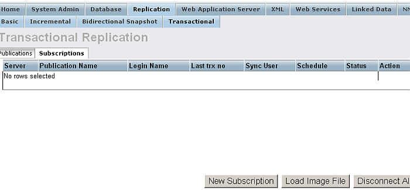

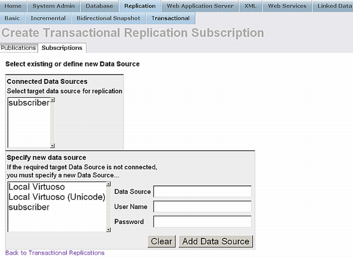

<a id="id19-database-administration"></a>
## Database Administration

### Users & Group Accounts

From System Admin / user Accounts you can alter the users that can
access the Virtuoso database. You may add a new user by clicking the
"Create New Account" link, edit an existing user, or delete users. You
can associate users with groups or make new groups.

Groups are created and function like normal user accounts. To define a
group you simply create a new user, and then to make use of the group
you assign users to that group from the drop down which will contain
available groups.

To create a new user or group you must enter a username, password and
confirm the password by retyping it in the fields provided. You may
optionally specify a group and default qualifier. You can use groups to
control access to a set of users by maintaining the permissions granted
to the group for which they are members. Specifying a default qualifier
allows you to specify the catalog or database for which queries will be
run against that do not explicitly refer to a particular catalog or
database.

You can import users by adding LDAP Servers(s) from the "LDAP Servers"
tab, and then from the "LDAP Import" to specify from which LDAP server
the import should be done:

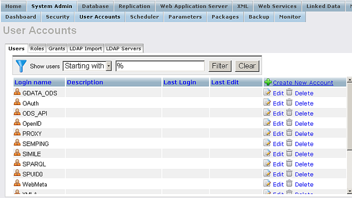

#### Configuring and import from LDAP server

The following steps describe how to configure LDAP server and then
import user(s) using the Conducor UI:

1.  Go to http://cname:port/conductor

2.  Enter user dba credentials

3.  Go to System Admin -\> User Accounts -\> LDAP Servers
    
    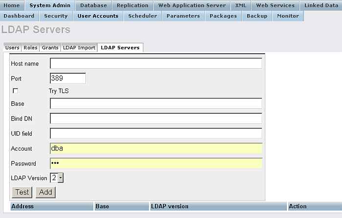

4.  Enter in the LDAP servers form respectively:
    
    1.  Host Name: for ex.: ldap.example.com
        
        Note: you can also use ldap:// or ldaps:// in front of Host name
    
    2.  Base: for ex.: o=MyCompany,c=DE
    
    3.  Base DN: for ex: ou=Accounts,o=MyCompany,c=DE
    
    4.  UID field: uid
    
    5.  Account: for ex: joe
    
    6.  Password: \*\*\*\*\*\*\*
    
    7.  LDAP version: choose for ex. 3

5.  Check the connection by pressing "Test":
    
    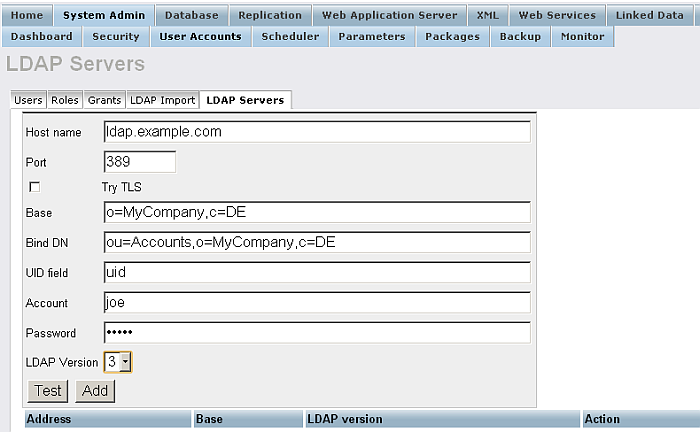

6.  If the test connection is successful, click "Add".
    
    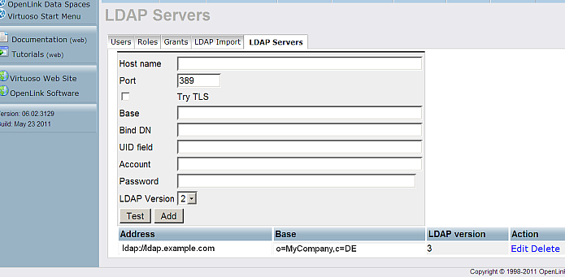

7.  Next you can import various data from your LDAP server.

8.  Go to System Admin -\> User Accounts -\> LDAP Import
    
    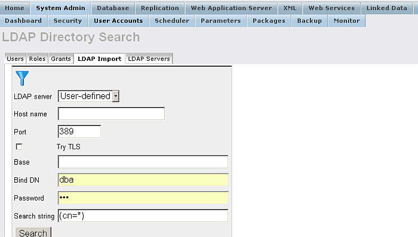

9.  Select the LDAP server added from above:
    
    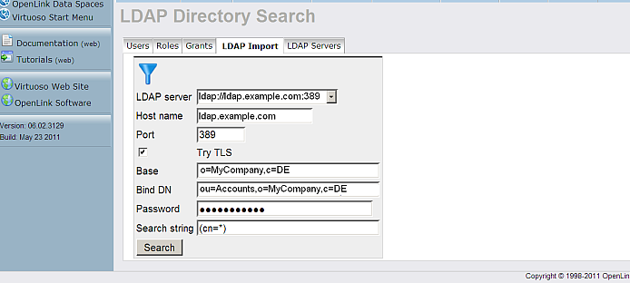

10. Click "Search".
    
    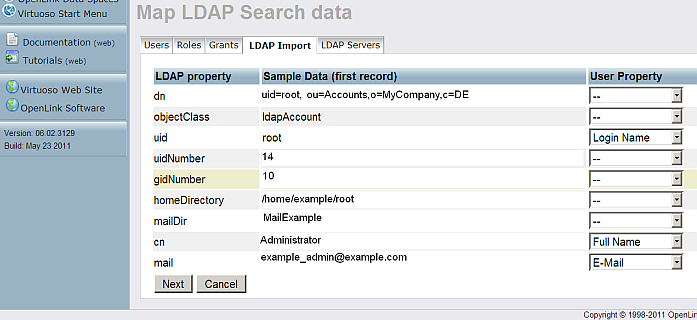

11. Click "Next".
    
    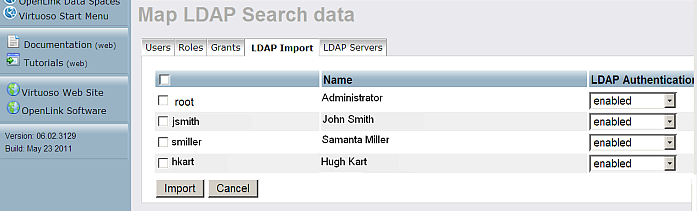

12. Select the desired profiles to be imported and set prefered "LDAP
    Authentication" for selected user:
    
      - If set to "enabled", then on an attempt to log in into Virtuoso,
        the system tries to log in into the LDAP server with the given
        username and password. If this succeeds, then the user logs in
        successfully in Virtuoso.
    
      - If set to "account check", then on an attempt to log in into
        Virtuoso, the system performs a check if there is such an user
        on the LDAP server. If yes, then the user logs in successfully
        in Virtuoso.
    
    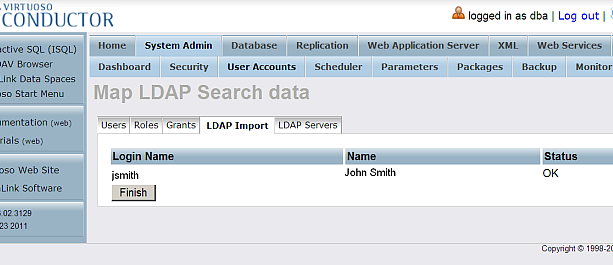

13. Click "Import".
    
    Note: By default an importing LDAP user has "User type" set to
    "WebDAV". To log in into iSQL with an imported LDAP user credentials
    you should:
    
    1.  Make sure you have set in Virtuoso ini the
        SQL\_ENCRYPTION\_ON\_PASSWORD parameter to 1 in the \[Client\]
        section, i.e.:
        
            ;virtuoso.ini
            ....
            [Client]
            SQL_ENCRYPTION_ON_PASSWORD  = 1
            ...
    
    2.  Set the "User type" of the imported LDAP user to be "SQL/ODBC"
        by going to Virtuoso Conductor -\> System Admin -\> User
        Accounts -\> user -\> Edit -\> field "User type".
    
    3.  Log in into iSQL:
        
            isql host:port ldap-user-name ldap-user-password

14. Click "Finish".

15. The imported profile(s) should be displayed in the Users tab:
    
    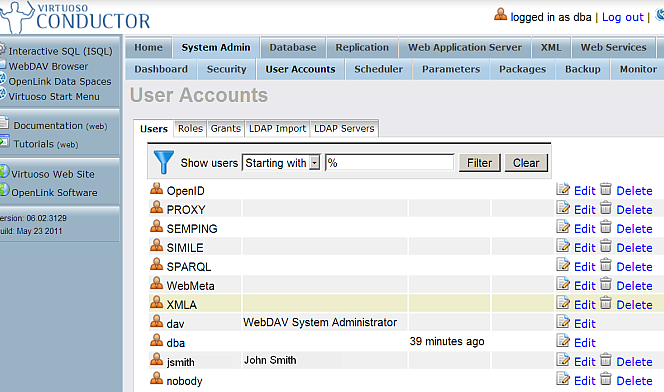

### Databases

Each catalog (database) within Virtuoso will be listed under the
Databases /Schema Objects. For each catalog you will be able to view and
in some cases edit details about the tables, views, triggers, and store
procedures stored within that catalog.


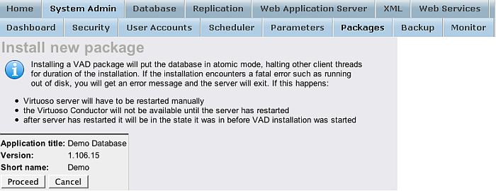

Click on the "proceed" button to install the indicated "Demo Database"
application package:

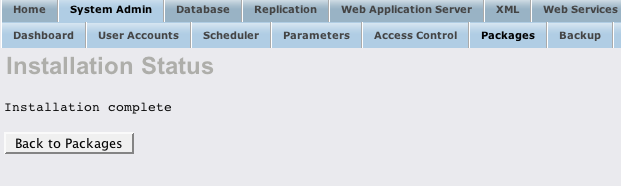

Once installed the demo database schema can be viewed from the
"Database" -\> "Schema Objects" tab of the Conductor:

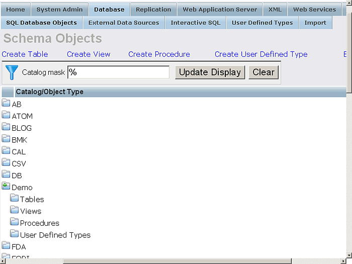

#### Editing Triggers

For each table, Virtuoso gives you the ability to edit the triggers
linked to that table, as well as adding new triggers. The link text
"Triggers" is followed by a number in parentheses that tells you how
many triggers exist associated with that table. If no number is shown,
there are no triggers. Clicking on the text takes you to the trigger
edit page.

The triggers page shows you the name of each trigger, an excerpt from
the text of the trigger, and permits you to edit or drop the triggers.
In the last column of the shown form there is a "New Trigger" link for
creation of a new trigger.

#### Editing Stored Procedures

The stored procedures link shows a page of information about existing
stored procedures for the database you are viewing. If there are stored
procedures, you can see their names and text excerpts, and you may edit
or drop them. Adding new stored procedures can be done via the ISQL
command-line interface or from the "Create Procedure" link shown above
the list of objects for the relevant database.


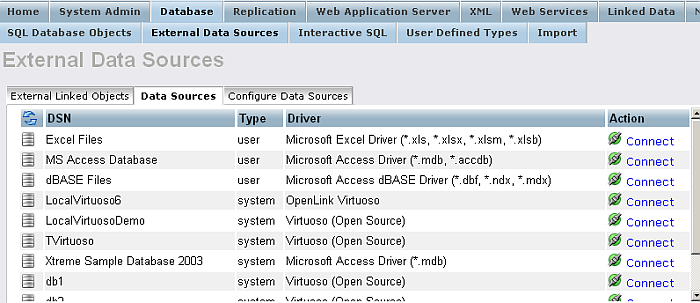

If you need to alter the authentication details of a particular Data
Source then select the "Change Credentials" link. If you want to link
new objects, select the "Link objects" link.

#### Configure Data Sources

This section will allow you to configure the data sources themselves on
the remote machine. The table that will be presented to you will contain
both User and System data sources. You will be able to edit and create
either User or System data sources, however, Virtuoso will only be able
to use the User data sources that belong to the user that started the
Virtuoso Server.

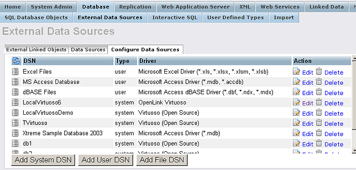

Follow the buttons on the screen as to how you want to manage a data
source. You can create new, edit or remove existing data sources.

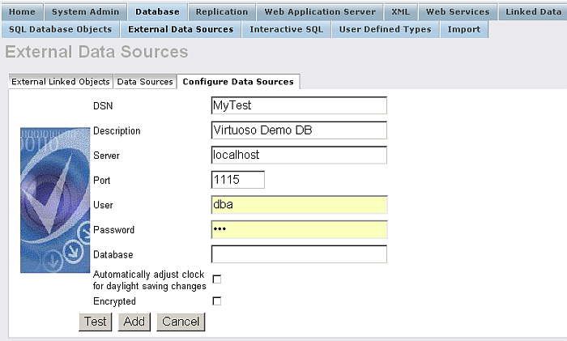

The Virtuoso Server can make use of File Data Sources too. This provides
the usual associated conveniences. These enable you to migrate a
Virtuoso database to another machine hosting the same ODBC Driver,
Virtuoso then has enough information to connect using the installed
driver to a remote data source, the tables would not need to be
relinked. File DSN's are read from server's root directory. File DSN's
can only be read if this directory is contained in the Virtuoso INI file
parameter DirsAllows.

> **Note**
> 
> Windows NT or 2000 services by default start as the LocalSystem
> special user account. This account will not contain the same User DSNs
> as your own user. The Virtuoso service can be started with other users
> but you must be aware of any possible system permission problems. It
> is recommended that Virtuoso make use of System or File DSNs wherever
> possible.

#### External Linked Objects

This page will allow you to manage the remote objects that are linked
into Virtuoso. You can unlink objects by selecting them and pressing the
"Unlink selected" button.

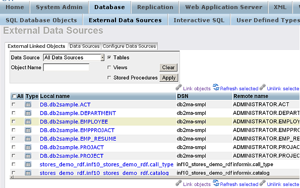

To link new tables into Virtuoso select "Link objects" link or go to the
"Data Sources" tab. Click the "Connect" link for a data source. If this
data source has been used before then the existing authentication
details will automatically be provided. Otherwise you will have to
provide these details in the username and password fields provided. When
you are ready press the "Link objects" link.

As results you should be presented with list of available remote tables
and optionally views and procedures. If the connection fails then an
error will be returned to the top of the page instead. You should be
able to link any of the listed tables or views into Virtuoso. In order
for Virtuoso to be able to correctly query the underlying table it needs
to be able to uniquely identify each row (record) within the table or
view. Tables should always be created with a primary key, and details of
which should be available from the data source. With a primary key
available Virtuoso will be able to link the table in to the server
easily. In some cases and certainly in the case of views Virtuoso may
not be able to determine a primary key or what constitutes uniqueness in
the table. On the right most column will be an action link to a page
that allows you to alter the primary key information about the table or
view that is to be linked. Some primary key information is italized to
indicate the explicit definition of a primary key.

You will be required to enter primary key information for views before
they can be linked.

Select the tables that you want to link into the Virtuoso Server by
checking the check box on the left most column of the list for table or
view in question. When you are ready press the *Link ...* button at the
bottom of the page.

As result the selected tables will be linked and listed in the first
list as Currently Linked.

#### Remote Procedures

In order to view the list of remote procedures, you should check the
"Stored Procedures" check-box and click the button "Apply". As result
the procedures that are already connected to Virtuoso will be shown with
checked check-box. You can unlink these by selecting them and pressing
the *Unlink* button.

To link new procedures into Virtuoso select the Data Source from the
list of available n t ab "Data Sources". If this data source has been
used before then the existing authentication details will automatically
be provided. Otherwise you will have to provide these details in the
username and password fields provided. When you are ready press the
*Link Objects* link. The page will next require you to select the
catalog/owner combination to refine the search list of procedures on the
remote datasource. Check the check-box "Stored procedures" and click the
"Apply" button to list the available stored procedures.


When the page returns you will be presented with a list of available
remote procedures. You should be able to link any of the listed
procedures into Virtuoso.

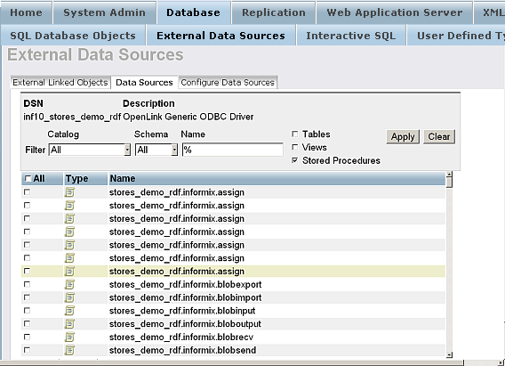

Select the procedures that you want to link into the Virtuoso Server by
checking the check box on the left most column of the list for the
procedure in question. When you are ready press the *Link ...* button at
the bottom of the page.

You will be presented with a new page that lists the procedures chosen
and the data type information regarding them. This gives you an
opportunity to alter the data type mappings that Virtuoso will use both
internally and for any future interactions with the SOAP server. If you
do not want to specify any special type information the details can be
left as default.


For each remote procedure you have the option to change how they will be
referenced within Virtuoso by making changes to the fields for *Local
Name* , *Database* , and *Schema* . These fields define how you will
find the linked procedure locally to Virtuoso only and do not affect the
remote data source.

For each procedure there are radio buttons for selecting the *PL Wrapper
Requirements* . This option is of particular importance for remote
procedures capable of returning a resultset. Remote procedures can be
linked using a Virtuoso PL wrapper meaning that Virtuoso procedure
language code provides a mechanism for negotiating the result set. The
available options are:

Soap Execution

\- Generates a PL wrapper that can be published to Web Services.

SQL Execution

\- Generates a PL Wrapper that is more suitable for general SQL use.

None

\- Does not generate and PL Wrapper code and simply links the procedure
by reference.

There is a description input box for you to write a description or
comment for the linked procedure. This comment will only be applicable
to procedures that are linked using a PL Wrapper, and is only directly
applicable for PL Wrappers for SOAP execution.

### Event Scheduler

The System Admin / Scheduler tab allows you to view, edit and remove
events that can be scheduled to run from a particular time at a defined
interval.

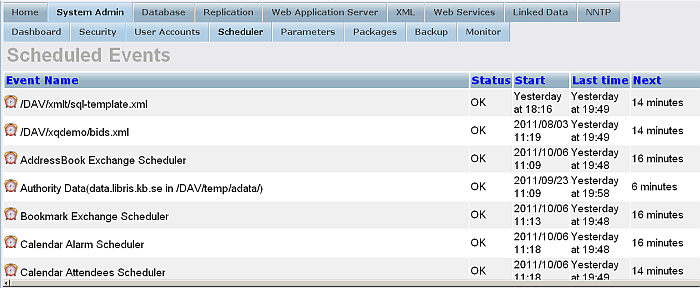

To add a new scheduled event click the "Create New Event" link in tha
last column of the shown form. The Event Name is a unique name required
to uniquely identify each event. Start Time is when the event will be
run for the first time and takes the form of a normal SQL timestamp
value. Interval(minutes) is the length of time in minutes to wait to run
the event again. SQL is a valid piece of SQL that you want to schedule
to run. You can also check for "Enable Error Notification" and enter
E-Mail for error notification.

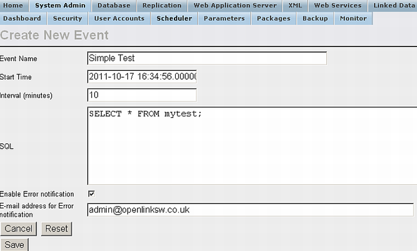

Events write possible error messages into the Virtuoso log file.

### Virtuoso Configuration Editor

From System Admin/Parameters you can change the Virtuoso Configuration
settings:

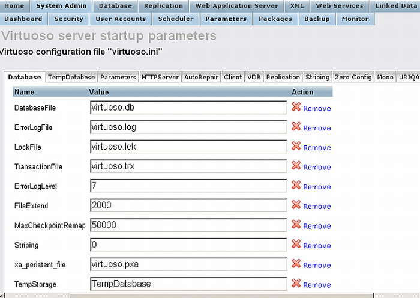

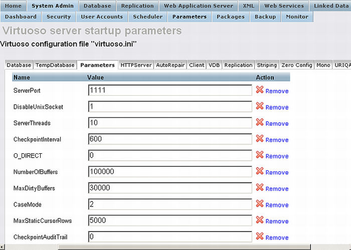

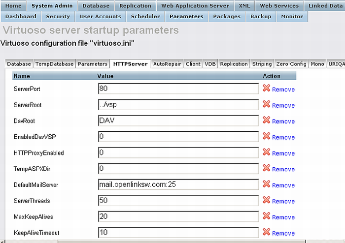

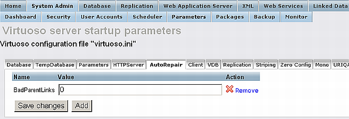

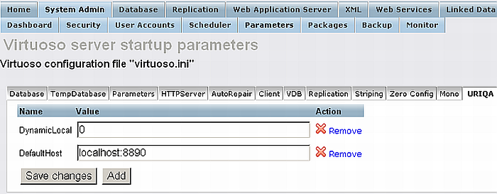

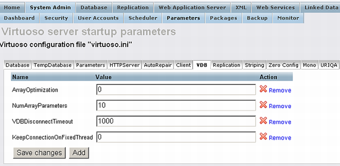

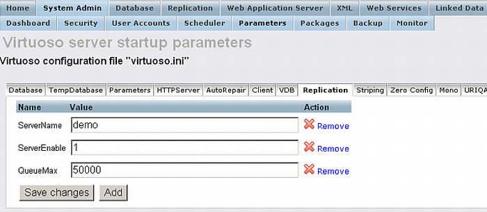

### Dashboard and Monitor

The System Admin/Dashboard consists of a collection of statistical
information about your Virtuoso server. This includes general licensing
information, locking, webserver hits statistics and more.

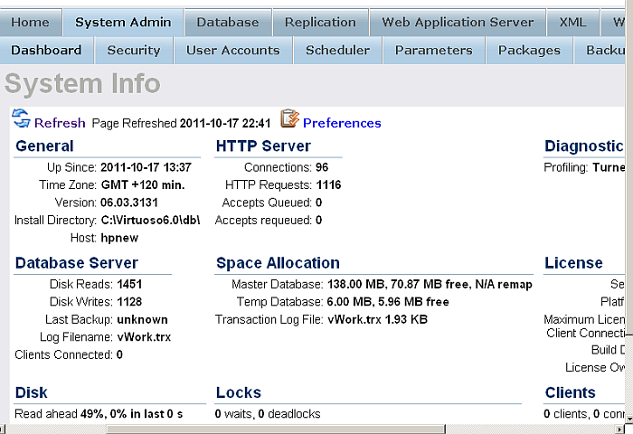

The System Admin/Monitor shows in details statistical information about
your server.

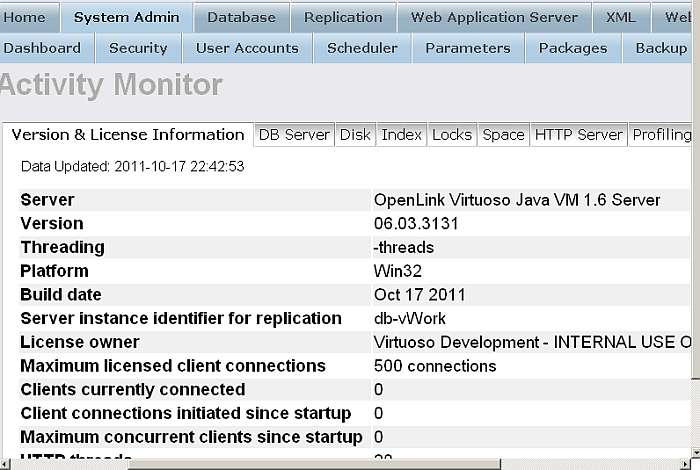

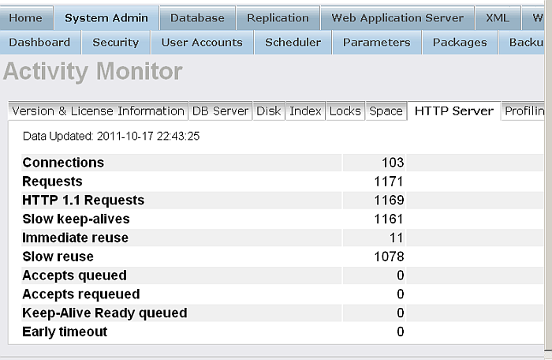

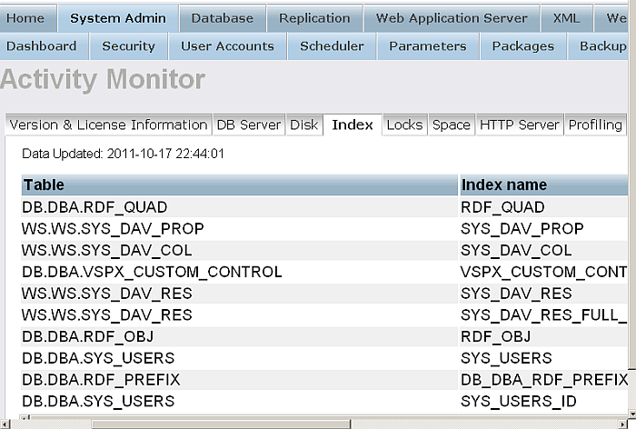

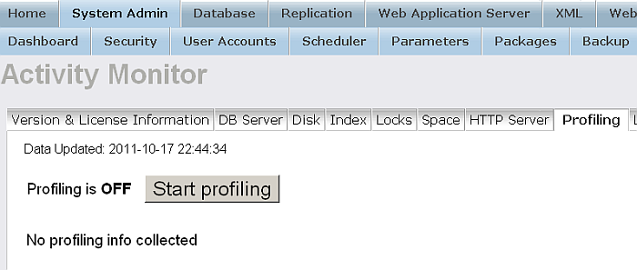

<a id="id20-conductor-linked-data-administration"></a>
## Conductor Linked Data Administration

From Conductor the "Linked Data" tab allows you to execute/save/load
SPARQL queries, to add/edit RDF Mapping, to perform statistics and
manage graphs, to import schemas and define namespaces, to generated
Linked Data Views and to upload to the Quad Store.

### SPARQL

#### Query

"SPARQL -\> Query" offers form form SPARQL query execution:


Also you can save the results in a query or load such:

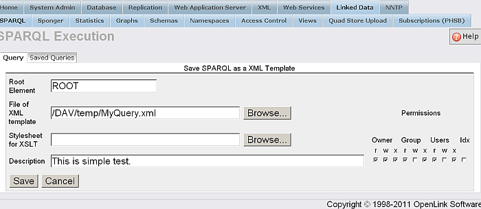

#### Saved Queries

"SPARQL -\> Saved Queries" offers list of saved queries, which can be
opened in the "Query" tab in order to be executed:

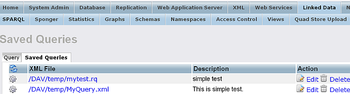

### Sponger

#### Extractor Cartridges

Shows list of available extractor cartridges. They can be re-ordered by
place of appearance, edit or deleted:

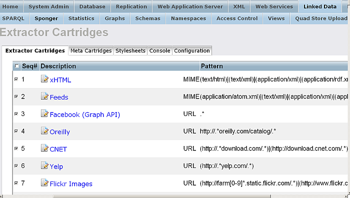

You can also add a new extractor cartridge:

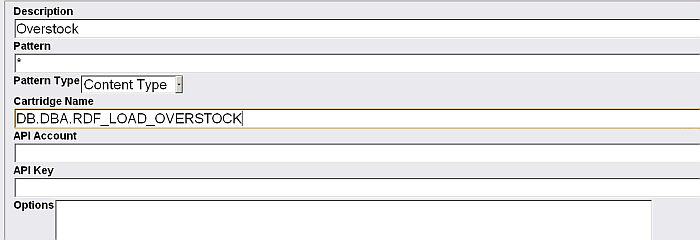

#### Meta Cartridges

Shows list of available meta cartridges. They can be re-ordered by place
of appearance, edit or deleted:

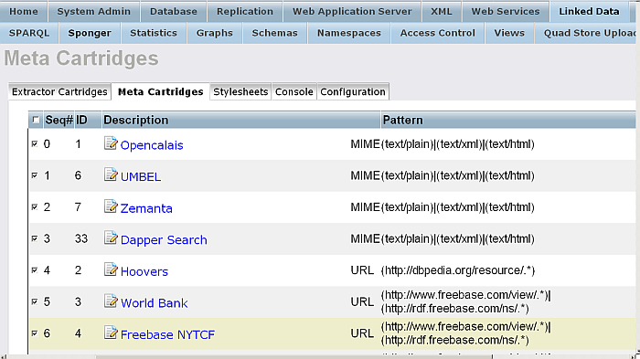

You can also add a new meta cartridge:

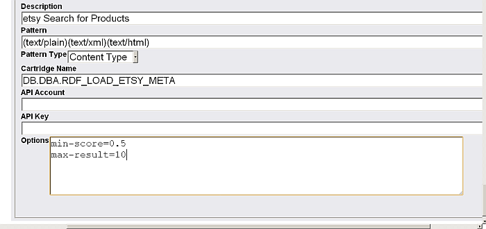

#### Stylesheets

Shows list of available stylesheets for processing cartridges. From here
you can manage these stylesheets by adding new, editing existing ones or
deleting them:

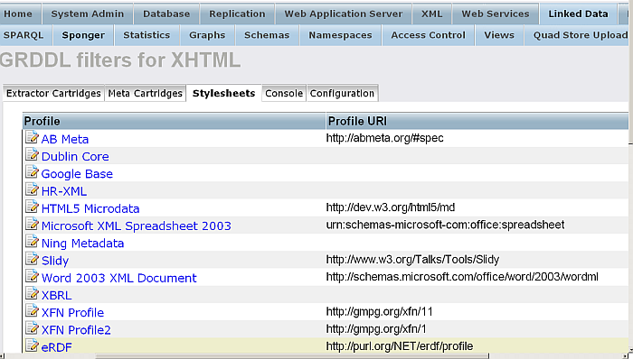

#### Console

Offers tracking cartridges exection. By default is off. When enabled,
shows list of sessions per cartridge:

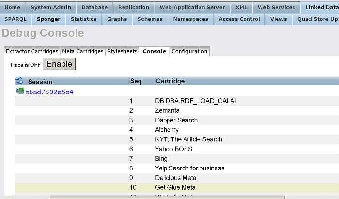

#### Configuration

Offers creation of secure endpoints for pre-defiend vitual host:

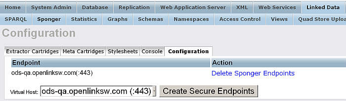

### Statistics

Offers interface for [`DB.DBA.RDF_VOID_STORE(graph,
to_graph)`](#fn_rdf_void_store) . In the new graph ( field "Publish to")
will be saved the VoID statistics data when generated:

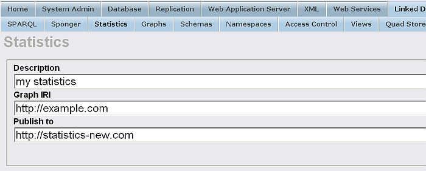

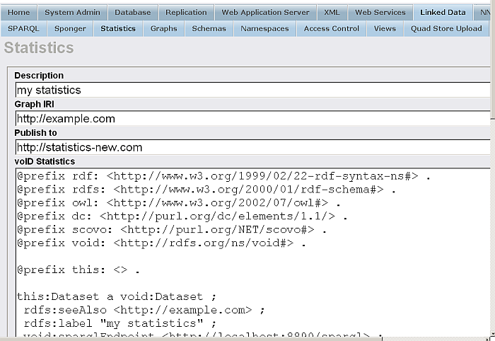

### Graphs

"Graphs" tab shows list of current graphs in the RDF Quad Store. From
here day can be renamed or deleted:

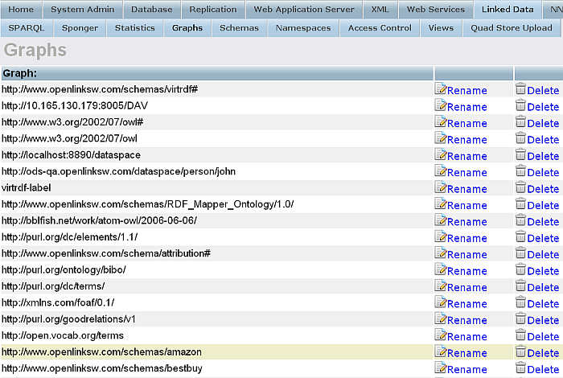

### Schemas

Shows list of available schemas IRI-s and offers a new schema IRI to be
imported:

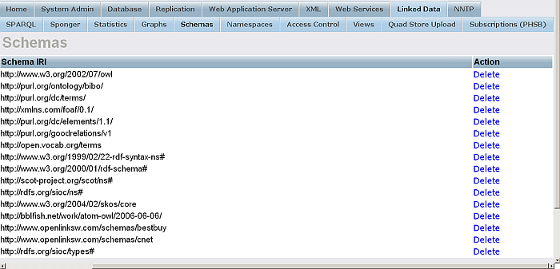

### Namespaces

Shows list of namespace prefixes and offers a new namespace prefix to be
imported:

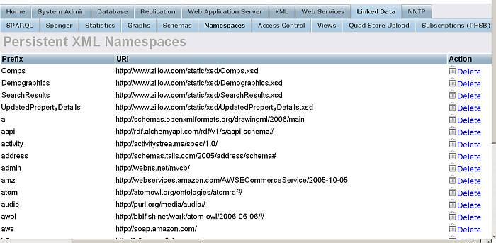

### Access Control

#### Sponger

Manage Sponger rules by adding new ones, deleting, re-ordering, etc.

This tab is available only when the [cartridges\_dav.vad](#) is
installed.

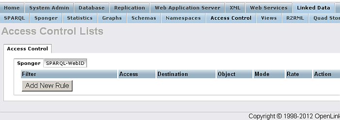

#### SPARQL-WebID

Here you can manage different WebID Protocol ACLs WebID ACL by granting
SPARQL Roles such as "SELECT", "UPDATE", "SPONGE":

This tab is available only when the [policy\_\_manager\_dav.vad](#) is
installed.

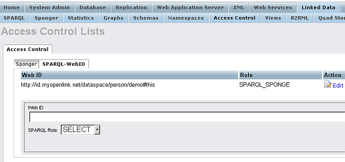

> **Tip**
> 
> [Managing a SPARQL Web Service Endpoint](#sparqwebservicetbl)
> 
> [WebID Protocol ACLs](#sparqloauthendpointfoafssl)
> 
> [Creating and Using a SPARQL-WebID based
> Endpoint](#sparqloauthendpointfoafsslsparql)
> 
> [Example with curl and SPARQL-WebID
> endpoint](#rdfsparqlendpointexamples3)

### Views

Virtuoso uses a SPARQL-based Meta Schema Language to provide
RDBMS-to-RDF mapping functionality (also described as, Linked Data Views
of SQL data). The language is an extension of the SPARQL query language
meshed with Virtuoso's SPASQL (SPARQL-inside-SQL) functionality. The
language enables you to declaratively map relational database schema
tables, columns, rows, and foreign key relationships to Classes,
Attributes, Relationships, and Instances (Objects/Entities/Individuals)
defined by RDF Schemas or OWL Ontologies. The mapping process uses a
special built-in Virtuoso function to generate IRIs / URIs in "Subject"
or "Object" position of a SPARQL graph pattern, en route to building a
set of SQL compiler rules and optimizations for translating SPARQL
queries into SQL on the fly.

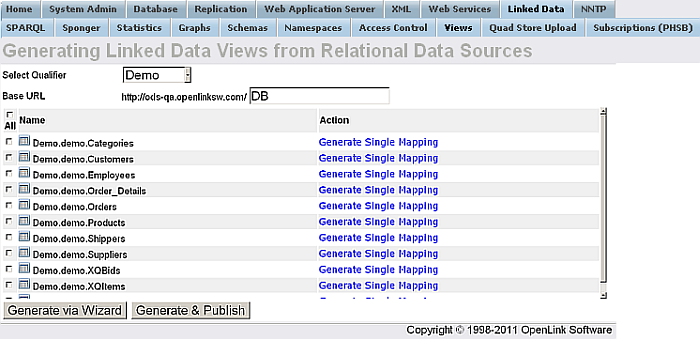

> **Tip**
> 
> [Mapping Process steps.](#)
> 
> [Mapping Example.](#)
> 
> [Mapping SQL Data to RDF.](#)
> 
> [Automated Generation of Linked Data Views over Relational Data
> Sources with Virtuoso.](#)

### Quad Store Upoload

Offers upload to Quad Store from file or Resource URL:

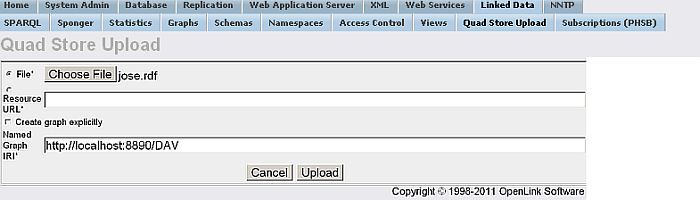

### Subscriptions (PHSB)

This tab is available only when the [pubsubhub\_dav.vad](#) is
installed.

Offers Virtuoso's implementation of the [PubSubHubBub Protocol](#) to
handle Linked Data by subscribing to Linked Data resource URIs.

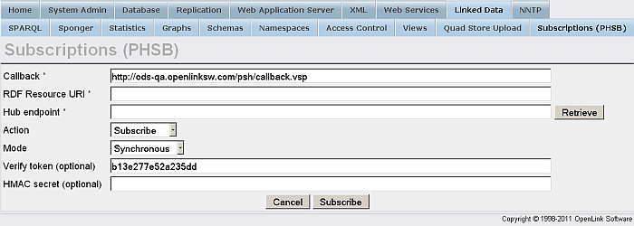

Note: the Hub endpoint should be defined ACL in System Admin -\>
Security -\> Access Control -\> PSH-SLL

> **Tip**
> 
> [Example of Linked Data Usage of PubSubHubbub Implementation.](#)
> 
> [Feed subscription via PubSubHub Protocol.](#)
> 
> [Setting up PubSubHub in ODS.](#)
> 
> [Securing your SPARQL Endpoint via WebID.](#)

<a id="id21-conductor-news-server-administration"></a>
## Conductor News Server Administration

### Conductor Newsgroups Administration

From Conductor the NNTP tab allows you to view and configure Newsgroups
associated with the Virtuoso News Server. Like Virtuoso's virtual
database, Virtuoso can "link" in newsgroups from remote news servers.
This interface allows you to view the configuration and control the
newsgroups both local and remote.

The Virtuoso News server component will need to be enabled in the
[Virtuoso.ini](#virtini) file by specifying the NewsServerPort number.

The tab "NNTP Servers" shows list of the registered News servers.

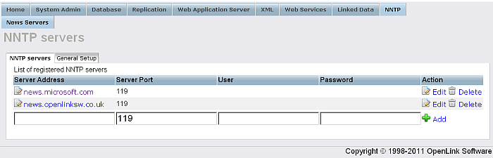

Click the "Edit" link to change the news server settings, or click the
"Delete" link to remove the news server.

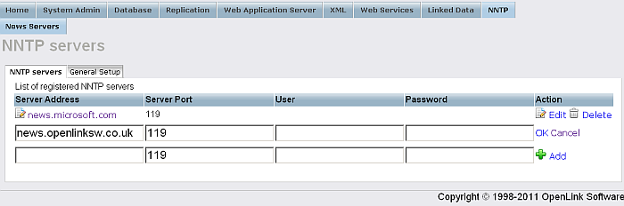

Click the "Edit Groups" link for a current News Server in order to
manage the list of available newsgroups.

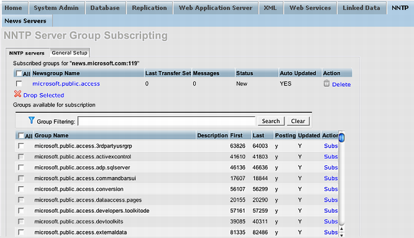

You can also *update* the cache list of newsgroups. Newsgroup names are
(re)fetched in a batch background scheduled task. This is because the
list can be very long or the connection to the news server could be
slow. The status of the fetch is indicated in the grey bar at the foot
of the newsgroup list table.

For each newsgroup listed for a news server you can *update* the
messages fetched, view and edit the *Properties* of the group, or
*Remove* the group from the list. Also you can get previous 500 messages
or to get new messages by clicking the links at the bottom of the form
shown below.

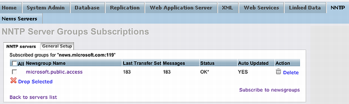

#### Add Newsgroup

From the "NNTP Servers" tab click on the "Edit Groups" link for a
registered News Server. Then click the *Subscribe to newsgroups* link to
subscribe to newsgroups on the server.

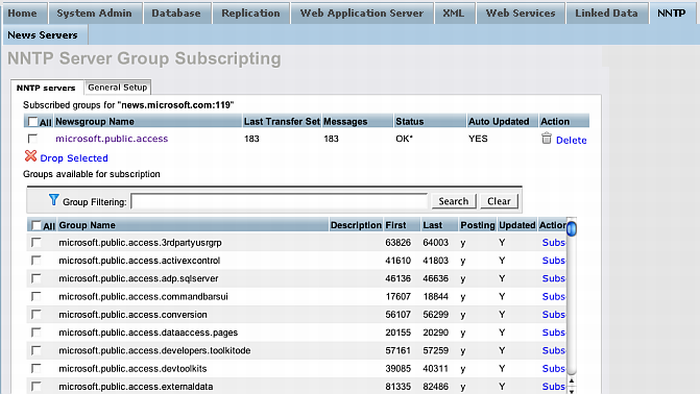

Once groups are selected you can use the *Subscribe Selected* button to
add the groups.

Use the *Back to servers list* link to return to the News Servers List
page.

#### Adding New News Server

From Conductor NNTP/NNTP Servers you can add remote servers. The values
you need to provide in the form are as follows:

*Server Address* is the IP address or hostname of the external news
server.

*Server Port* is the port number that the news server is listening on.
By default news servers listen on port 119.

*Username* and *Password* allow you to provide login credentials if the
server requires them.

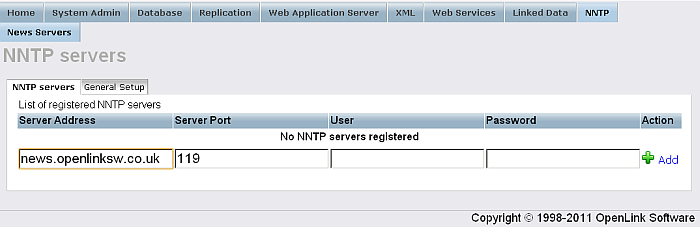

#### Viewing Newsgroups

You can view the messages of a newsgroup either using the Conductor UI
going to NNTP/NNTP Servers/News Server/News Group, or using the ODS
Framework UI. In the second case you need to have the
ods\_framework\_dav.vad package and the ods\_discussion\_dav.vad package
installed. Then you can go from ODS to tab "Discussions" where will be
shown the list of available newsgroups. Each one has shown as link its
name, which leads to page where are listed its messages.

