# Data Access Interfaces

# ADO.Net Data Provider

## Introduction

Virtuoso includes an ADO.NET 2.x & 3.x data providers compatible with
Visual Studio 2008 and Entity Frameworks, that provides access to native
Virtuoso data (SQL, XML, and RDF) in addition to any Virtuoso Linked
Tables from external [ODBC](#vdbengineodbcod) and
[JDBC](#vdbengineodtjd) accessible data sources. Known-compatible
external data sources include [Oracle (versions 7.x to
11.x)](#vdbenginemc) , [Microsoft SQL Server (6.x to
2005)](#vdbenginemsqls) , [IBM DB2](#vdbenginedb2) , [Sybase (4.2 to
15.x)](#vdbenginesyb) , [IBM Informix (5.x to 11.x)](#vdbengineinf) ,
[Ingres (6.4 to 9.x)](#vdbengineing) , [Progress (7.x to
10.x)](#vdbenginepr) , [MySQL](#vdbenginemsql) ,
[PostgreSQL](#vdbenginepsql) and [Firebird](#vdbenginefirebd) .

*Benefits*

This provider equips Microsoft .NET based applications, development
environments, and programming languages with conceptual entity-based
access to native and heterogeneous data sources.

*Features*

  - ADO.NET 3.5 compliance

  - .NET Entity Frameworks compatibility

  - Full integration with Visual Studio 2008

  - ADO.NET Data Services compatibility

  - LINQ to Entities compatibility

  - High-Performance & Scalability

  - High Security

  - Support for Native and 3rd party ODBC and JDBC accessible RDBMS
    engines and Web Services

  - Tested against all major .NET applications and development
    environments

  - Support for Microsoft Siliverlight versions 2 and 3

  - Support for .Net RIA Services

## Installation & Configuration

There are two installation types to consider:

  - If you have an existing Virtuoso instance, or will install Virtuoso
    on a different host, you only need to install of the [ADO.Net
    Provider Client](#virtclientrefinstallandconfigonwin) on the Visual
    Studio host.

  - If you have no existing Virtuoso instance, you can [install both the
    ADO.Net Provider Client and the Virtuoso Universal
    Server](#virtclientrefinstallandconfigvirt) on the Visual Studio
    host.

### Installation of the ADO.Net Provider Client on Windows

The Virtuoso ADO.Net Provider is part of the Virtuoso Client
Connectivity Kit installer, and if the target Virtuoso Server
installation already exists on the network this is the only component
that needs to be installed.

1.  Download and run the Virtuoso Client Connectivity Kit installer for
    your target Windows OS:
    
      - [Windows 98/NT/2000/XP/2003/Vista/2008 (32 Bit) (x86)](#)
    
      - [Windows XP/2003/Vista/2008 (64 Bit) (x86\_64)](#)

2.  Choose the "run" button to allow the signed "Virtuoso Client
    Connectivity kit" installer to start.
    
    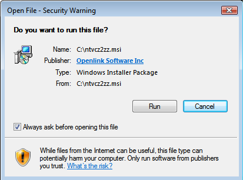

3.  Choose the "Next" button to begin the installation process.
    
    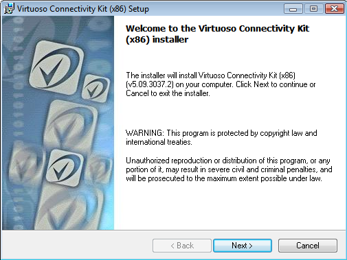

4.  Check the "I agree with license agreement" checkbox and choose the
    "Next" button.
    
    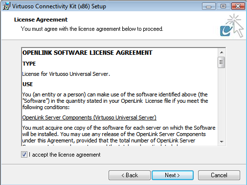

5.  Choose the "Custom" option to manually select what components are
    installed and in which location, or choose the "Typical" or
    "Complete" options as recommended and skip to step 7.
    
    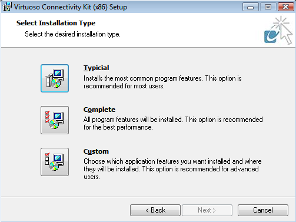

6.  If the "Custom" option what chosen, select the installation
    directory or leave default and choose the "Next" button to continue.
    
    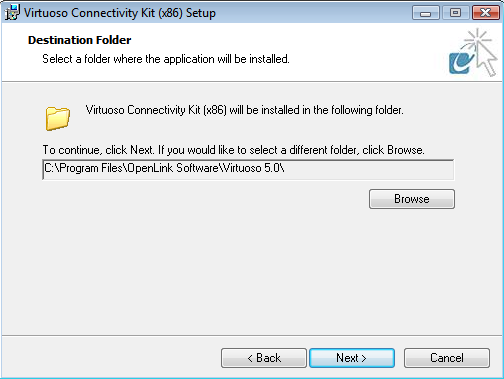

7.  Select which of the ADO.NET Providers are to be installed and choose
    "Next" to continue.
    
    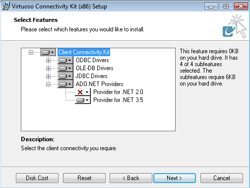

8.  The installer is now ready to begin the installation, choose the
    "Install" button to commence the process.
    
    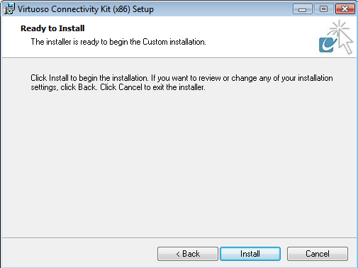

9.  The installation was successfully completed.
    
    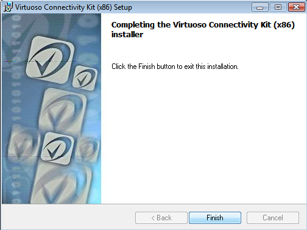

10. The installation of the Provider can be verified by checking the
    %WINDOWS%\\assembly folder and checking that the Provider(s) chosen
    for installation is(are) listed - "virtado3" and/or "virtado2".
    
    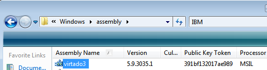

The installation of the ADO.Net Provider Client is complete.

#### Uninstallation

1.  If you attempt to run the installer again, the following message
    will be displayed.
    
    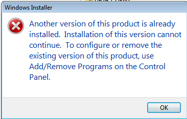

2.  The Provider can be uninstalled from the "Control Panel" -\>
    "Programs and Features" menu, by selecting the "Virtuoso Client
    Connectivity kit" from the list of installed components and clicking
    the "unistall" option presented.
    
    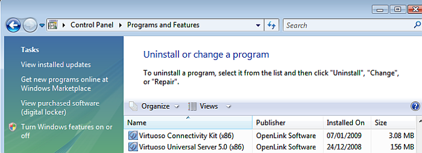

3.  Choose "Yes" to uninstall the Virtuoso ADO.Net Provider.
    
    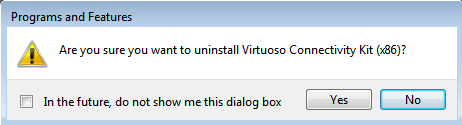

### Installation of the ADO.Net Provider Client and Virtuoso Universal Server on Windows

If both the ADO.Net Provider client and Virtuoso Server are to be
installed on the same Windows machine, then the Virtuoso Universal
Server installer can be used as it includes all the Virtuoso client and
server components available in a single installer. An instance in which
this particular installation type is require would be when using the
Provider to provide Entity Framework connectivity to the remote database
schema objects.

1.  Download and run the Virtuoso Universal Server installer for your
    target Windows OS:
    
      - [Windows 98/NT/2000/XP/2003/Vista/2008 (32 Bit) (x86)](#)
    
      - [Windows XP/2003/Vista/2008 (64 Bit) (x86\_64)](#)

2.  Choose the "run" button to allow the signed "Virtuoso Universal
    Server" installer to start.
    
    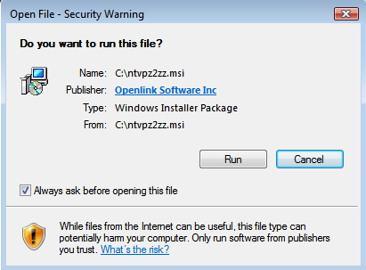

3.  Choose the "Next" button to begin the installation process.
    
    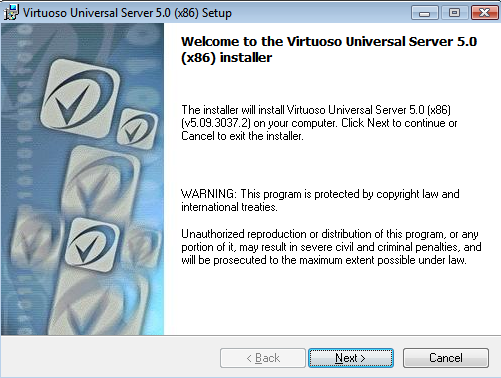

4.  Check the "I agree with license agreement" checkbox and choose the
    "Next" button.
    
    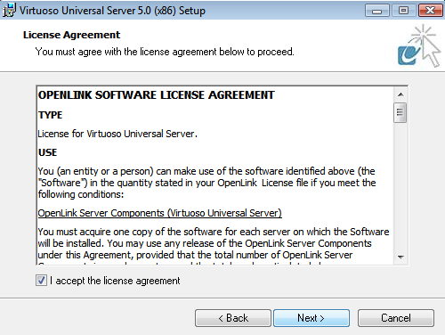

5.  Choose the "Custom" option to manually select what components are
    installed and in which location, or choose the "Typical" or
    "Complete" options as recommended and skip to step 7.
    
    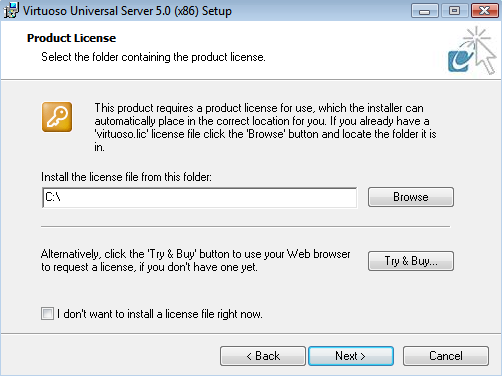

6.  If the "Custom" option what chosen, select the installation
    directory or leave default and choose the "Next" button to continue.
    
    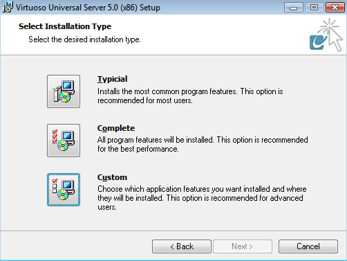

7.  Select which of the ADO.NET Providers are to be installed and choose
    "Next" to continue.
    
    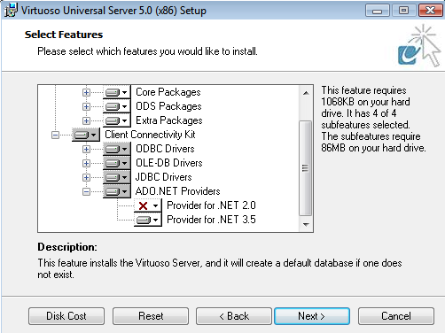

8.  The installer is now ready to begin the installation, choose the
    "Install" button to commence the process.
    
    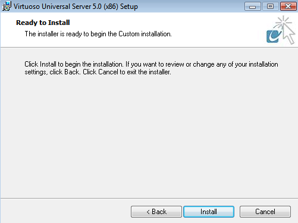

9.  The installation was successfully completed.
    
    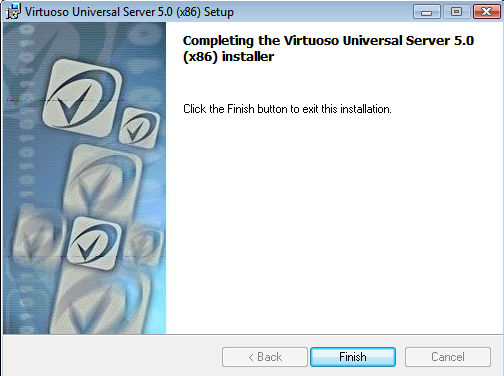

10. Post installation the Virtuoso Server can be started by running the
    "Virtuoso Service Manager" which gets added to the Windows "Icons
    Tray" in the status bar.
    
    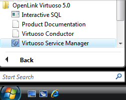

11. Double click on the "Virtuoso Service Manager" icon in the "Icons
    Tray" to load the application, select the "OpenLink Virtuoso Server"
    instance and press the "Start" button to run the Service.
    
    

12. Once the Virtuoso service has successfully started, it is
    \*recommended\* that the default "dba" and "dav" passwords be
    changed to secure values by loading the URL
    "http://example.com/install" in a Web Browser which loads the
    following page for making these changes.
    
    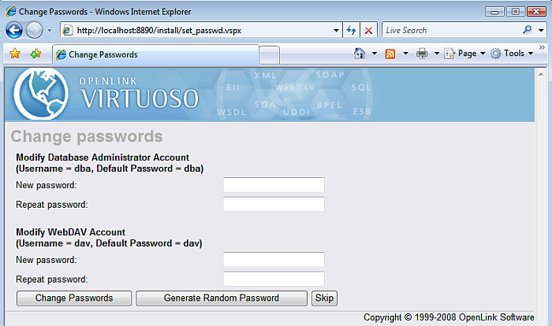

13. The Virtuoso Server is now available for use.
    
    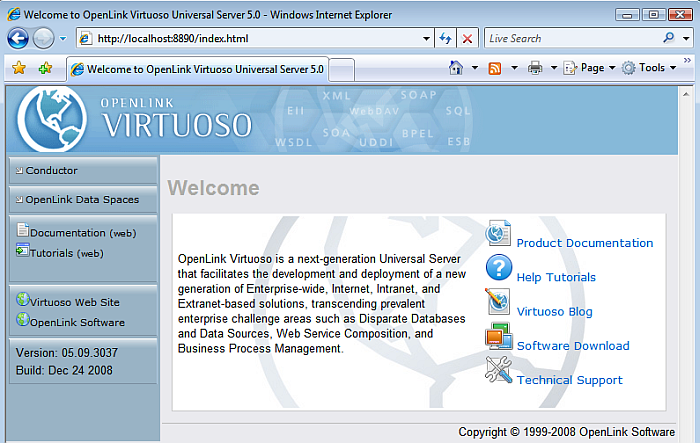

14. The installation of the ADO.Net Provider can be verified by checking
    the %WINDOWS%\\assembly folder and checking that the Provider(s)
    chosen for installation is(are) listed - "virtado3" and/or
    "virtado2".
    
    

The installation of the ADO.Net Provider Client and Virtuoso Universal
Server is complete.

#### Uninstallation

1.  If you attempt to run the installer again, the following message
    will be displayed.
    
    

2.  The Provider can be uninstalled from the "Control Panel" -\>
    "Programs and Features" menu, by selecting the "Virtuoso Client
    Connectivity kit" from the list of installed components and clicking
    the "unistall" option presented.
    
    

3.  Choose "Yes" to uninstall the Virtuoso ADO.Net Provider.
    
    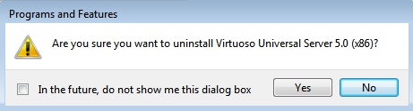

## Programmers Guide

### Sample Walk through Applications

  - [Using Visual Studio 2008 to Build a Data Grid Form
    Application](#installvsgrid)

  - [Using Visual Studio 2008 to Build an Entity Frameworks based
    Windows Form Application](#installvsent)

  - [Using Visual Studio 2008 to Build an ADO.NET Data Services based
    Application](#installusado)

  - [Windows Form Application for accessing Virtuoso RDF data via SPASQL
    using the Virtuoso ADO.Net Provider](#installwfas)

  - [Web Data Service Application for accessing Virtuoso RDF data via
    SPASQL using the Virtuoso ADO.Net Provider](#installcrweb)

  - [Creating a Silverlight Application to consume the
    service](#installsilver)

  - [Creating A Simple .NET RIA Services Application to Display Data
    from Virtuoso](#installnetriadd)

  - [Creating a .Net RIA Services Application that will Update Virtuoso
    Data](#installnetriavd)

### Using Entity Frameworks, ADO.NET, the Virtuoso Virtual Database Engine

Virtuoso's in-built virtual database engine for ODBC and JDBC accessible
databases enables it to act as bridge between Entity Frameworks &
ADO.NET based client applications. Thus, you simply link external
databases into Virtuoso using the browser based Conductor UI or
programmatically using SQL extensions. Once the external tables a
linked/attached, they inherit the functionality prowess of Virtuoso, and
this particular use case scenario, complete compatibility with Entity
Frameworks and ADO.NET 3.5.

  - [Using Microsoft Entity Frameworks to Access Oracle Schema Objects
    with Virtuoso](#vdbenginemc)

  - [Using Microsoft Entity Frameworks to Access Progress Schema Objects
    with Virtuoso](#vdbenginepr)

  - [Using Microsoft Entity Frameworks to Access Ingres Schema Objects
    with Virtuoso](#vdbengineing)

  - [Using Microsoft Entity Frameworks to Access Informix Schema Objects
    with Virtuoso](#vdbengineinf)

  - [Using Microsoft Entity Frameworks to Access DB2 Schema Objects with
    Virtuoso](#vdbenginedb2)

  - [Using Microsoft Entity Frameworks to Access Sybase Schema Objects
    with Virtuoso](#vdbenginesyb)

  - [Using Microsoft Entity Frameworks to Access MySQL Schema Objects
    with Virtuoso](#vdbenginemsql)

  - [Using Microsoft Entity Frameworks to Access PostgreSQL Schema
    Objects with Virtuoso](#vdbenginepsql)

  - [Using Microsoft Entity Frameworks to Access JDBC Schema Objects
    with Virtuoso](#vdbengineodtjd)

  - [Using Microsoft Entity Frameworks to Access ODBC Schema Objects
    with Virtuoso](#vdbengineodbcod)

  - [Using Microsoft Entity Frameworks to Access Firebird Schema Objects
    with Virtuoso](#vdbenginefirebd)

  - [Using Microsoft Entity Frameworks to Access Microsoft SQL Server
    Schema Objects with Virtuoso](#vdbenginemsqls)

### VirtDbType Enumeration

Specifies Virtuoso data types.

#### Members

| Member name    | Description                                                |
| -------------- | ---------------------------------------------------------- |
| `Binary`       | BINARY data. This maps to an `Array` of type `Byte` .      |
| `Char`         | CHAR data. This maps to `String` .                         |
| `Date`         | DATE data. This maps to `DateTime` .                       |
| `DateTime`     | DATETIME data. This maps to `DateTime` .                   |
| `Decimal`      | This is equal to `Numeric` .                               |
| `Double`       | DOUBLE PRECISION data. This maps to `Double` .             |
| `Float`        | This is equal to Double.                                   |
| `Integer`      | INTEGER data. This maps to `Int32`                         |
| `LongBinary`   | LONG BINARY data. This maps to an `Array` of type `Byte` . |
| `LongNVarChar` | LONG NVARCHAR data. This maps to `String` .                |
| `LongVarChar`  | LONG VARCHAR data. This maps to `String` .                 |
| `NChar`        | NChar data. This maps to `String` .                        |
| `Numeric`      | NUMERIC data. This maps to `Decimal`                       |
| `NVarChar`     | NVARCHAR data. This maps to `String` .                     |
| `Real`         | REAL data, This maps to `Single` .                         |
| `SmallInt`     | SMALLINT data. This maps to `Int16`                        |
| `Time`         | TIME data. This maps to `TimeSpan`                         |
| `TimeStamp`    | TIMESTAMP data. This maps to an `Array` of type `Byte` .   |
| `VarBinary`    | VARBINARY data. This maps to an `Array` of type `Byte` .   |
| `VarChar`      | VARCHAR data. This maps to `String` .                      |

### VirtuosoCommand Class

Represents an SQL statement or stored procedure to execute against a
Virtuoso database. This class cannot be inherited.

    
    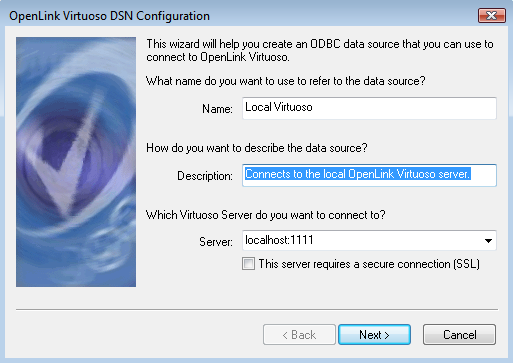
    
    *Name:* provide a name that will act as a logical reference to the
    Virtuoso database server that you will be connecting to. Subsequent
    references to this database will be made to this value when ODBC
    compliant applications interact with your Virtuoso driver.
    
    *Description:* allows you to provide a short description about the
    nature of the connection. This is optional.
    
    *Server:* enter the hostname or IP address of the machine hosting
    your Virtuoso server and enter the port number that Virtuoso is
    listening at. This is configured in the [Virtuoso ini](#virtini)
    file on the server.

7.  Press the *Next* button to configure more details about the
    connection
    
    
    
    *Connect to the Virtuoso Servet to obtain default settings for the
    additional configuration options:* allows you to specify the default
    username and password for the connection.
    
    Press the *Next* button
    
    *Database:* allows you to select the default database for the
    connection. You will need to check the box above and supply a
    password to refresh this list. Objects created or selected without
    an explicit catalogue/database qualifier will automatically be
    sought from this select database.
    
    *Charset:* lets you choose the default character set for the
    connection.
    
    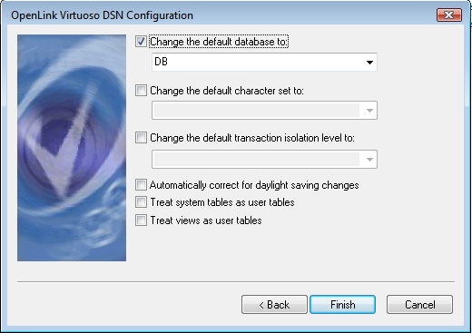

8.  When the configuration is complete, and indeed at any time you are
    satisfied with the configuration press the *Finish* button to save
    the DSN.

## Using X509 Certificates With ODBC Connection

Virtuoso can be configured to authenticate ODBC logins with a single
X.509 certificate. The certificate must be registered server side for
this purpose and may contain an additional custom attribute for the
users SQL account name. In this way all login information is held in the
possibly password protected certificate. The user specifies the
certificate path in the place of the user name and the certificate
encryption password as the password. This works with the login dialog of
the ODBC driver or within a SQLDriverConnect login string.

It is also possible to set up the ODBC client to check for the server's
X.509 certificate by specifying a client side CA (Certificate Authority)
list.

The X509 certificate can be used for authentication with the Virtuoso
server via SSL. In this case the ODBC client will use an X.509
certificate which contains a SQL username as an extension. This
extension is added when the certificate is issued. Since an object ID
(OID) of the username attribute can be used any valid object identifier
that does not conflict with existing OIDs (for example
2.16.840.1.NNNNNN). It will be best to have one's own registered OID for
that purpose.

### WebID Protocol ODBC Login

Virtuoso supports WebID Protocol ODBC Login. Thus, the INI parameter
X509ClientVerify can accept the following values:

  - 0 - do not require

  - 1 - ask for trusted certificates

  - 2 - optionally ask, if certificate is given will be verified

  - 3 - accept optionally any certificate even self-signed

If certificate contains WebID, the odbc login will use it. The WebID can
be setup to particular account via Conductor's users interface.

A typical \[Parameters\] INI section should contain:

    SSLServerPort         = 1113
    SSLCertificate          = keys/server.crt
    SSLPrivateKey         =  keys/server.key
    X509ClientVerify      = 3

The client could connect in following way:

    isql 1113 "" -X client.p12 -T server.crt

Note: The client certificate client.p12 contains WebID which is
registered to some sql user account via Conductor.

### ODBC Client Certificate Generation Using "openssl" Tool

To generate X509 certificates one can use the "openssl" tool obtained
freely from [www.openssl.org](#) . The `openssl.cnf` configuration file
must be edited to include the new extension for sqlUserName, but first
we have to find the hexadecimal representation of the SQL Username. Then
you can proceed the use the openssl to create and confirm the
certificate. Follow the steps below:

1.  *Find the HEX representation of the SQL Username*
    
    You can either work this out from ASCII codes or use a hexdump
    utility found on most Unix platforms. The following command would be
    sufficient, replacing \<user\_name\> with the actual username:
    
        $ echo -n "<user_name>" | hexdump -e '":" 1/1 "%02X"'
    
    For example, the username `'dba'` would be `:64:62:61` .

2.  *Edit the OpenSSL config file: openssl.cnf*
    
    Open the file in a text editor of your choosing and add the
    following:
    
        [ new_oids ]
        sqlUserName=2.16.840.1.NNNNNN.1
        
        ...
        [ usr_cert ]
        ...
        sqlUserName = DER:NN:NN:NN:NN:NN.....
    
    replacing `:NN:NN.....` with the hexadecimal representation of the
    username we discovered in the previous step.

3.  *Make New Certificate Request*
    
    Make new certificate request using the command:
    
        $ openssl req -new
    
    The tool will ask for certain details. Once completed it will
    generate a private key also.

4.  *Generate Certificate*
    
    Assuming the role of CA, generate a certificate using the request
    from the previous step, using the following command:
    
        $ openssl ca -in <req_file>
    
    The tool will print the details of request and will ask you to sign
    and commit the certificate into the CA repository.

5.  *Verify New Certificate*
    
    Check that the certificate contains the right SQL account name; use
    the following command to obtain a text dump of the certificate:
    
        openssl x509 -in <certfile> -text -noout
    
    Now we can scan the contents of the output for the extension entries
    we added earlier:
    
        >>>>>
        X509v3 extensions:
        ....
        2.16.840.1.NNNNNNN.1:
        <SqlAccountName>
        ^^^^^^ this should match the new OID ^^^^^
        >>>>>

### Virtuoso Server Configuration

The Virtuoso server can work in two modes based on an SSL connection:

basic

\- this is when only connection is secured, no certificate verification.
The client is not required to have its own trusted certificate.

trusted

\- additional mechanisms are enabled to check client's certificate. in
this case the client is required to have a trusted certificate.

To allow Virtuoso to check the client's certificates, the virtuoso.ini
file must contain the following entries in \[Parameters\] section:

    ; Basic session encryption only parameters
    SSLServerPort           = 1113
    SSLCertificate          = ./srv.cert.pem ; server's certificate
    SSLPrivateKey           = ./srv.key.pem  ; server's private key, must match the certificate
    ; Trusted operation parameters
    X509ClientVerify        = 1
    X509ClientVerifyCAFile  = ./ca.pem     ; CA list; file containing certificates of acceptable CA
    X509ClientVerifyDepth   = 1            ; dependent of type of certificate checking can be &gt;1
    X509ExtensionOID      = 2.16.840.1.NNNNNNN.1 ; the OID value, same as that used to make client's certificates

All certificate/key files need to be in PEM format.

The server needs an "SSLCertificate" and "SSLPrivateKey" to begin
listening on the "SSLServerPort". These are essential for the secure
operations. Furthermore the certificate must match the private key;
non-matching certificate and private keys will prevent server startup
and an error will be logged. The private key is required to guarantee
that the certificate's claim is true. The server certificate is used by
the client to identify the server. The client can retrieve and verify
this key and choose whether the server an be trusted depending on
circumstances.

> **Note**
> 
> basic operation (SSL/TLS) encryption only cannot be used to identify a
> client with certificate.

The "X509ClientVerifyCAFile" is a file containing a CA's (Certificate
Authority) certificates that the server can use to verify client
certificates. The client certificate verification in general depends on
the "X509ClientVerify" flag, which enables or disable this feature. The
'X509ClientVerifyDepth" parameter is used to verify to what degree
server will trust the client's certificate. The lower the value, the
higher the restriction levels, with a minimum value of 1. This means
that the server will look in CA's certificates to find who has issued
the client certificate. If there is no matching CA entry the connection
will be rejected; If there is a matching entry then verify the issuer
chain; If issuer chain is greater than "X509ClientVerifyDepth", the
connection will be rejected.

All file paths above must be either absolute or relative to the server
working directory.

> **Note**
> 
> If primary key file is encrypted then the server must be started in
> foreground mode so that a password can be supplied in order to open
> the file.

### Virtuoso Client Configuration

The following connection options control the client's behavior regarding
SSL:

Encrypt

\- specifies type of secure connection to be used.

ServerCert

\- (optional) to specify which certificate(s) are to be used to verify
server certificates.

The *Encrypt* option can be set to '1' to specify a basic secure
connection; no server identity verification will be performed. Note that
this is only possible when the server is also set to make basic SSL
connections.

To ensure server's identity the *Encrypt* option must be set to full or
relative (to application working directory) path to the file containing
client's certificate and private key. This file can be encoded in
PKCS\#12 or PEM format. The certificate and private key contained may be
generated using the steps outlined above.

When the Encrypt option is set to point to a certificate file, the
*ServerCert* option must be set to the full or relative path to file
containing list of CA certificates in PEM format. The content of this
file will be used to verify server's certificate.

When using these options the UID connection-option must be set to an
empty string to enable certificate authorization. The PWD option will be
used to open the private key.

Here is an example of an ODBC connect-string:

    ...
    connectString =
    "HOST=localhost:1113;UID=;PWD=keysecret;ENCRYPT=c:\certs\mycertwithkey.p12;SERVERCERT=c:\certs\ca.pem"
    ...

If client's certificate does not contains user name for SQL login then
the server will try matching the certificate fingerprint against
registered certificates. If any SQL account has such a certificate
registered it will be used for login. Otherwise login will be rejected.

### Registering Keys with Virtuoso

To enable a client certificate to be used for authorization, the DBA
must register it's MD5 fingerprint (checksum) in the database.
Registered certificates can be removed from system. Two functions exist
for the purposes: `USER_CERT_REGISTER()` , and `USER_CERT_UNREGISTER()`
. Both functions rely on the MD5 checksum of the certificates being
registered or un-registered, therefor you have the option of supplying
these functions with the certificate file or the MD5 checksum directly.

The functions are:

`USER_CERT_REGISTER (user_name

, certificate

, password

, type

);`

`USER_CERT_UNREGISTER (user_name

, certificate

, password

, type

);`

The registered certificate's fingerprints are kept in the
DB.DBA.SYS\_USERS table as vectors of strings under the
'LOGIN\_CERTIFICATES' user option value (U\_OPTS column). The data
stored there can be retrieved using a third function:

`USER_GET_OPTION()`

For example, one might invoke:

    USER_CERT_REGISTER ('DBA', 'file:/dba.pem', '', 'PEM');

Note that 'file:' URL is needed to designate certificate is in a file on
file system.

The above action can be performed also without certificate supplied if
the MD5 fingerprint is known:

    USER_CERT_REGISTER ('DBA', 'D9:6D:47:D7:67:47:D7:3C:2C:E0:89:91:F3:BC:E7:59');

and

    USER_CERT_UNREGISTER ('DBA', 'D9:6D:47:D7:67:47:D7:3C:2C:E0:89:91:F3:BC:E7:59');

## Manually configuring a Virtuoso ODBC DSN on Unix

If you have [iODBC](#) installed, you can configure Virtuoso data
sources by adding the following entry into the relevant .odbc.ini file.
Usually it is the value of the ODBCINI environment variable or
$HOME/.odbc.ini:

Sample DSN:

    [LocalVirt]
    Driver=/usr/local/lib/virtodbc_32.so
    # absolute path to the shared object
    Address=localhost:1111
    # host and port of the Virtuoso server

If the application that will load the ODBC driver is multithreaded, use
the virtodbc32\_r.so driver instead.

### Linking Client Applications

The isql and other utilities are linked directly with the Virtuoso
client code. See the Makefiles for the libraries used. These are
identical in function with the ODBC driver but accept a host:port in the
place of a data-source name to be resolved from the odbc ini file.

Generally applications should pass via ODBC. Directly linking with the
ODBC driver shared object is also possible.

### JDBC

If you specified:

``` 
 --with-jdbc3=<path of JDK>
```

to the configure in the installation root directory, running make will
produce the files libsrc/JDBCDriverType4/virtjdbc3.jar and
virtjdbc3ssl.jar. These can be placed on the Java class path. See
[Virtuoso JDBC Documentation](#virtuosodriverjdbc) for URL formats etc.

## ODBC Compliance

The Virtuoso Driver for ODBC conforms to both the ODBC 1.x,2.x,and 3.x
versions of the ODBC specification, it implements Core, Level 1, Level
2, and Extensions functionality. It also has a native support for the
wide versions of the ODBC API (e.g. SQLColumnsW) in Windows. This driver
enables you to communicate with local or remote Virtuoso servers across
any combination of platforms supported by Virtuoso.

### ODBC API implementation details

#### SQLAllocHandle

Virtuoso ODBC driver does not allow allocation and usage of explicitly
allocated descriptor handles. That is why the SQLAllocHandle
(SQL\_HANDLE\_DESC) will return an error.

#### SQLBulkOperations

Only the SQL\_ADD operation is supported.

#### SQLColAttributes

The virtuoso ODBC driver does not return information for the following
attributes:

  - **SQL\_COLUMN\_TABLE\_NAME.**
    
    Returns an empty string instead

  - **SQL\_COLUMN\_OWNER\_NAME.**
    
    Returns an empty string instead

  - **SQL\_COLUMN\_QUALIFIER\_NAME.**
    
    Returns an empty string instead

  - **SQL\_COLUMN\_CASE\_SENSITIVE.**
    
    Returns 1 instead

  - **SQL\_COLUMN\_AUTO\_INCREMENT.**
    
    Returns 0 instead

  - **SQL\_COLUMN\_MONEY.**
    
    Returns 0 instead

  - **SQL\_COLUMN\_UNSIGNED.**
    
    Returns 0 instead

#### SQLDriverConnect

The Virtuoso ODBC driver recognizes the following SQLDriverConnect
connection string keywords:

  - **DSN.**
    
    The data source name.

  - **HOST.**
    
    The virtuoso server host specification (in the form :
    \[\<hostname\>\[:\]\]\[\<portnumber\>\]

  - **UID.**
    
    The virtuoso user ID used to connect

  - **PWD.**
    
    The login password used to connect

  - **DATABASE.**
    
    The qualifier to use when connected (overrides the user's default
    qualifier)

  - **CHARSET.**
    
    The name of the character set to use for wide/narrow conversions

  - **DAYLIGHT.**
    
    Boolean parameter (1/0). When ON (1) it takes into account the
    client OS daylight savings settings.

  - **ENCRYPT.**
    
    String parameter (file name or "1"). Specifies how the ODBC
    connection will be encrypted. see the Using SSL For Secure ODBC
    connections for details.

  - **PWDCLEAR.**
    
    Integer parameter (default to 0). Specifies how the password will be
    sent over the wire. 0 - send digest of the password, 1 - send
    password in cleartext, 2 - send password garbaled.

  - **SERVERCERT.**
    
    String parameter (file name). Specifies the path for the CA list
    used to verify the server's certificate (in PEM format). see the
    Using SSL For Secure ODBC connections for details.

  - **FORCE\_DBMS\_NAME.**
    
    String parameter (default "OpenLink Virtuoso"). When set it alters
    the result of SQLGetInfo (SQL\_DBMS\_NAME).

  - **NoSystemTables.**
    
    Boolean parameter (1/0) (default 0). When set it alters the result
    of SQLTables () so that it won't find or return tables of type
    SYSTEM TABLE.

  - **IsolationLevel.**
    
    String parameter ("Read Uncommitted"/"Read Committed"/"Repeatable
    Read"/"Serializable"). When set it specifies the initial transaction
    isolation mode for that connection.

#### SQLGetEnvAttr

The SQL\_ATTR\_OUTPUT\_NTS does not have any effect on the Virtuoso
driver. It allows the value to be set and retrieved but with no further
effect.

#### SQLNativeSql

All ODBC syntax is parsed server side. The native SQL syntax for
Virtuoso is the ODBC syntax.

#### Not Supported ODBC API functions

Virtuoso ODBC driver does not support the following ODBC API functions:

  - SQLCopyDesc

## Virtuoso Scrollable Cursor Engine

Virtuoso implements server side scrollable cursors. ODBC 2.0, ODBC 3.5
and JDBC 2.0 API's are supported.

Cursor types include:

  - **Forward only.**
    
    This is the default, non-scrollable cursor.

  - **Static.**
    
    The cursor's evaluation is computed when the cursor statement is
    first executed. Positioned operations are possible but their effect
    will not show nor will changes be detected.

  - **Keyset.**
    
    When the cursor is opened a keyset is built. Rows within the keyset
    can be fetched and modified by positioned operations. Changes will
    show when refreshing data and changes by other transactions will be
    detected for update and delete. Inserts by the same or different
    transaction will not appear. A keyset cursor may have a finite
    keyset size. When scrolling outside of the given keyset the keyset
    will shift to cover the new rows.

  - **Dynamic.**
    
    A dynamic cursor will reflect all changes by the same and different
    transactions. The dynamic cursor's evaluation is constructed as
    needed, hence it generally has less overhead than other types of
    cursors.

  - **Mixed.**
    
    A mixed cursor is a combination of a keyset-driven cursor and a
    dynamic cursor. It is used when the result set is too large to
    reasonably generate a keyset for the entire result set. Mixed
    cursors use a keyset smaller than the entire result set but larger
    than the rowset.
    
    While the application is scrolling within the keyset, the behavior
    is keyset-driven. When the application scrolls beyond the keyset,
    the behavior becomes dynamic to fetch the requested rows and
    generate a new keyset. The behavior then reverts back to
    keyset-driven within that keyset, as before.

### Forward Only Cursors

A forward only cursor is substantially more efficient than a scrollable
cursor. It however does not allow positioned operations (the WHERE
CURRENT OF SQL phrase), or SQLSetPos. The SQLExtendedFetch function is
supported but only the SQL\_FETCH\_NEXT fetch type is then allowed.

### Cursor Operations

Virtuoso supports all ODBC scrollable cursor operations. These include

**SQLExtendedFetch / SQLScrollFetch fetch type.**

  - SQL\_FETCH\_FIRST

  - SQL\_FETCH\_LAST

  - SQL\_FETCH\_NEXT

  - SQL\_FETCH\_PRIOR

  - SQL\_FETCH\_RELATIVE

  - SQL\_FETCH\_ABSOLUTE

  - SQL\_FETCH\_BOOKMARK

**SQLSetPos operations.**

  - SQL\_POSITION

  - SQL\_REFRESH

  - SQL\_ADD

  - SQL\_UPDATE

  - SQL\_DELETE

Positioned SQL statements, i.e. the WHERE CURRENT OF clause, is
supported for scrollable cursors.

### Cursor Options

The cursor options

  - SQL\_CURSOR\_TYPE

  - SQL\_CONCURRENCY

  - SQL\_KEYSET\_SIZE

  - Cursor name (SQLSetCursorName)

have to be set before a SQLPrepare or SQLExecDirect.

The SQL\_ROWSET\_SIZE can be varied while a cursor is open.

### Cursors and Transactions

All forward only or scrollable cursors survive committing or rolling
back transactions. A cursor maintains its position over a transaction's
end. Hence the next fetch operation will resume from the correct place.
If a dynamic cursor's current row / rowset is deleted, the cursor will
continue from the next greater / lesser row in the order of the cursor's
ordering columns. This also applies to mixed mode (keyset with finite
keyset size) cursors scrolling outside of the keyset bounds. A forward
only cursor will retain its logical position across commit/rollback.

The SQL\_CONCURRENCY values of SQL\_CONCUR\_READ\_ONLY and
SQL\_CONCUR\_LOCK cause Virtuoso to lock the rows in the keyset / rowset
in shared or exclusive mode, respectively.

### Optimistic Concurrency Control

A scrollable cursor may have a SQL\_CONCURRENCY setting of
SQL\_CONCUR\_VALUES. This enables optimistic concurrency control. This
is a mechanism which will reflect an update or delete of a row if the
row has been modified by a third party after the time the application
last read the row.

A 'updated meanwhile' condition detected in this manner will prevent the
operation and return a SQL state of 01001 with SQL\_SUCCESS\_WITH\_INFO
from SQLSetPos.

The updates and deletes made through SQLSetPos are still subject to
being committed or rolled back by normal transaction control. The 01001
state does not prevent the current transaction from committing.

The 01001 state is only detected if the update or delete is made by
SQLSetPos and the row at hand has been changed by any statement of any
transaction. If the update of updated operation is carried out by any
other operation than SQLSetPos of the statement that last read the value
the condition cannot be detected.

Note that the time between the last read and the SQLSetPos update can be
long and can span multiple transactions.

### Cursor Information

|                  |
| :--------------- |
| SQLRowCount      |
| SQL\_BOOKMARK    |
| SQL\_ROW\_NUMBER |
| reflect update   |
| reflect delete   |
| reflect inx      |
| Notice update    |
| Notice delete    |

Cursor Support

SQLRowCount is set after the initial SQLExecute. This is the actual row
count or the keyset size for a mixed mode cursor. A dynamic cursor does
not know this since it builds the evaluation as needed.

All cursors support bookmarks.

The SQL\_ROW\_NUMBER is the ordinal number of the current row in the
cursor's evaluation. A dynamic cursor cannot know this, as the scrolling
may start from end and rows may appear on either side of the current row
while the cursor is open.

'reflect' means that the new values or added / deleted rows appear when
re-scrolling over the rows. A deletion is reflected by omitting the row.

'notice' means that the row is flagged by SQL\_UPDATE, SQL\_DELETED or
SQL\_ADDED in the SQLExtendedFetch status array when the cursor
re-scrolls over the rows in question.

### Cursors and Virtual Database

The cursor subsystem modifies the cursor's defining select statement to
make various backward and forward read statements, update and delete
statements etc. These transformations can be seen through the explain
function.

Since cursors are implemented by generating SQL statements these work
transparently against remote database, independently of their possible
native cursor support.

### Cursor Special Cases

SQL SELECT statements fall in two categories: Simple, which consist of
one or more tables, an arbitrary WHERE clause and an optional ORDER BY,
and Complex, which includes all other SELECT's, e.g. ones with GROUP BY,
derived tables, full outer joins, UNION's etc.

A simple statement can easily be modified to read backwards or forwards
from a given point. Also, each result row of a simple statement has a
physical counterpart, or many physical counterparts for a join. Having a
physical counterpart makes it possible to define the meaning of a
positioned update or delete. A GROUP BY is a counter-example.

All complex SQL statements occurring as cursors are processed as static
cursors regardless of the declared cursor type.

### Cursors and Performance

If a cursor's ordering corresponds to an ordering in an index, dynamic
cursors will generally perform best. This is understandable since the
engine can quickly locate the current row based on an index and then
just read backward or forward on that index. On the other hand, if the
result set is very sparsely spread over the table or if there is no
ordering index dynamic cursors will have a substantial penalty.

If used as a forward only cursor in a single transaction, a dynamic
cursor is only some 30% slower than a forward only cursor.

A static or keyset cursor has a relatively long execute time since the
initial execute will make the entire keyset. The initial execute of a
dynamic cursor is instantaneous since the fetch operations will do the
work as needed.

With most off the shelf applications, e.g. Microsoft ADO, static and
keyset cursors are preferable because the applications may rely on row
counts and row numbers which are not known for dynamic cursors.

Positioned operations are not affected by cursor type.

## Effect of Connection & Statement Options

### Connection Options

#### SQL\_AUTOCOMMIT

The autocommit option is set at the connection level and affects every
statement executed after it being set. Setting the option does not
communicate itself with the server and is therefore fast.

Autocommit is on by default. Autocommitting SELECT statements are
executed with read committed isolation. This is appropriate since any
update based on the autocommitting read would be in a different
transaction and hence would block to wait for access to the selected
row. Also re-evaluating a select in autocommit mode would read the data
in a different transaction. Hence there is no point in repeatable read
isolation for autocommitting cursors. Cursors inside procedures have the
normal repeatable read isolation regardless of whether the procedure was
called in autocommit mode.

When an autocommitting statement starts it is executed in the
transaction That is the connection's current transaction when it is
received. Before starting the autocommitting statement sets the
connection's current transaction to a new one. In this manner a client
can issue multiple asynchronous autocommitting statements at the same
time and the statements will execute concurrently, each in its own
transaction.

If array parameters are used in a statement on an autocommitting
connection each parameter row will be processed in its own transaction
in sequential order. Multiple Asynchronous statements must be used to
execute one client's statements in parallel.

To commit or roll back a transaction in manual-commit mode, an
application should call SQLEndTran. Applications should not attempt to
commit or roll back transactions by executing COMMIT or ROLLBACK
statements with SQLExecute or SQLExecDirect. The effects of doing this
are undefined.

#### SQL\_TXN\_ISOLATION

This option allows all the values defined in ODBC,

The isolation of an operation is the property of the operation rather
than of the transaction within which it takes place. Once an operation
has started, e.g. a cursor has been opened, its isolation cannot be
changed.

The value of this option will affect any subsequently executed
statement. Note that setting this option to different values during a
transaction will work, thus a transaction can have cursors with
different isolations although that is presumably not the intention of
the ODBC specification.

See the transaction model for a definition of the different isolation
levels.

A statement in autocommit mode executes in the same transaction as the
previous statement. The transaction is committed when the statement
successfully completes. The next statement in the connection will
execute in the fresh transaction that was associated to the connection
at the start of the previous autocommitting statement.

As a consequence of this multiple concurrent autocommitting transactions
may execute on the same connection at the same time.

Statements executed with array parameters execute each set of parameters
as a separate transaction if the connection is in autocommit mode.

#### SQL\_ACCESS\_MODE

This has the effect of reversing any SQL\_CONCUR\_LOCK concurrency to
SQL\_CONCUR\_READ\_ONLY. The statement option's value is not changed
though.

#### SQL\_CURRENT\_QUALIFIER

This sets or gets the current qualifier. The initial value is obtained
from the server at connect time. The values reflect the effects of any
USE statements.

#### SQL\_NO\_CHAR\_C\_ESCAPE (=5002)

This has the same effect as the NO\_CHAR\_C\_ESCAPE option in the SET
statement. It takes boolean int values (0/non-0)

#### SQL\_CHARSET (=5003)

This has the same effect as the CHARSET option in SET statement. It
takes string values (the name of the character set to use).

#### SQL\_ENCRYPT\_CONNECTION (=5004)

Usable only with the Virtuoso CLI (because the ODBC/iODBC driver manager
does not pass-through the custom options to the driver on
SQLConnect/SQLDriverConnect). When set to the string "1" means use SSL
but no X509 certificates. Setting it to a NULL (default) means no
encryption of the ODBC connection. Any other string is treated as a file
name of one PKCS12 package to get the data from for establishing an
encrypted SSL connection using X509 certificates (see the -E/-X ISQL
options).

#### SQL\_SHUTDOWN\_ON\_CONNECT (=5005)

Usable only with the Virtuoso CLI (because the ODBC/iODBC driver manager
does not pass through the custom options to the driver on
SQLConnect/SQLDriverConnect). Shuts down the server on connection after
authenticating the DBA user (see the -K ISQL option).

### SQLSetStmtOption Statement Options

Virtuoso supports all ODBC 2.x and ODBC 3.x statement options. The
following options are mentioned below due to implementation specific
details.

#### SQL\_CONCURRENCY

The supported values are SQL\_CONCUR\_READ\_ONLY, SQL\_CONCUR\_LOCK and
SQL\_CONCUR\_VALUES, the last option is only available for scrollable
cursors. A select statement with SQL\_CONCUR\_READ\_ONLY will make
shared locks when locking for repeatable read or serializable
transactions. The SQL\_CONCUR\_LOCK for a select statement will cause it
to make exclusive locks, as if it had the FOR UPDATE clause specified.

See the section on scrollable cursors for the effect of
SQL\_CONCUR\_VALUES. For all statements except scrollable cursors this
value reverts to SQL\_CONCUR\_READ\_ONLY.

Any searched update or delete statements will make exclusive locks in
all cases.

#### SQL\_MAX\_ROWS

This option only affects static cursors.

#### SQL\_TXN\_TIMEOUT

This is an extension that allows setting a time limit on the current
transaction. The time limit starts at the execution of the statement
specifying this option. The transaction will terminate the indicated
number of seconds after the execute whether the statement has completed
or not.

#### SQL\_PREFETCH\_SIZE

This is an extension option that controls how many rows of a forward
only cursor are prefetched by the execute and fetch calls. A high value
is advantageous for long consecutive reads since it cuts down on the
number of client server messages exchanged. On the other hand a large
value can result in unnecessary data transfer and locking if only the
first few rows of a cursor are fetched. A value of -1 will cause the
entire rowset to be fetched at the execute, so that no matter the select
size, only one message is exchanged. The default value is 20. This can
also be set in the virtuoso.ini file.

A select with array parameters will always work as with a
SQL\_PREFETCH\_SIZE of -1, meaning that all the result sets are computed
and sent to the client by the SQLExecute call that opens the cursor.

#### SQL\_CURSOR\_TYPE

SQL\_KEYSET\_SIZE

SQL\_CONCURRENCY

The cursor type options should be set before preparing a statement.
Other options may be set at any time. The rowset and prefetch options
should not be modified after executing a SELECT.

#### SQL\_GETLASTSERIAL

This is an extension that returns the last assigned identity column
value. The return buffer pvParam is of type SQLINTEGER. For this to be
meaningful, the statement in question must be an INSERT into a table
that has an identity column. Note that if there are more than one
identity columns or if triggers make inserts with identity columns the
value will be undefined.

## Efficient Use of API

DO NOT USE SQLExecDirect. If a statement is executed more than once it
is much faster to prepare the statement with SQLPrepare and then use
SQLExecute repeatedly. The system only compiles the statement once,
therefore there is no parsing overhead for repeatedly compiling the same
text.

Array parameters for insert, update or single row selects are about
twice as fast as the same operations on a single parameter set.

The OR connective in SQL can result in slow queries with extensive
locking.

Autocommit should be used when possible, i.e. make the last statement of
a transaction autocommitting to avoid having to commit the transaction
as a separate operation.

## Executing SQL from Python script

In order to execute SQL from Python script, you need to add the
following lines to the /etc/odbc.ini file:

    [Local Virtuoso]
    Driver  = /PREFIX/lib/virtodbc_r.so
    Address = localhost:1111

where PREFIX is replaced by the full path where Virtuoso is installed
and also assuming that is used let's say port 1111 in virtuoso.ini
(which is set by default).

Then you should be able to connect with:

    c = pyodbc.connect('DSN=Local Virtuoso;UID=dba;PWD=dba')

## Extensions

### Virtuoso ODBC RDF Extensions for SPASQL

The Virtuoso ODBC Driver adds a number of defines to the ODBC API to
allow an ODBC compliant application to query meta information on SPASQL
queries.

If the application uses the iODBC Driver Manager V3.52.7 or higher, it
can simply include the iodbcext.h header file, which contains
information on extensions of many ODBC drivers like DB2, SQL Server and
Virtuoso.

If however the application is compiled against another Driver Manager,
like the Microsoft Driver Manager on Windows, the following construction
should to be used:

    #ifdef WIN32
    # include <windows.h>
    #endif
    
    #include <sql.h>
    #include <sqlext.h>
    
    #if defined (HAVE_IODBC)
    #include <iodbcext.h>
    #endif
    
    /*
     *  Include Virtuoso ODBC extensions for SPASQL result set
     */
    #if !defined (SQL_DESC_COL_DV_TYPE)
    
    /*
     *  ODBC extensions for SQLGetDescField
     */
    # define SQL_DESC_COL_DV_TYPE               1057L
    # define SQL_DESC_COL_DT_DT_TYPE            1058L
    # define SQL_DESC_COL_LITERAL_ATTR          1059L
    # define SQL_DESC_COL_BOX_FLAGS             1060L
    # define SQL_DESC_COL_LITERAL_LANG          1061L
    # define SQL_DESC_COL_LITERAL_TYPE          1062L
    
    /*
     *  Virtuoso - ODBC SQL_DESC_COL_DV_TYPE
     */
    # define VIRTUOSO_DV_DATE                   129
    # define VIRTUOSO_DV_DATETIME               211
    # define VIRTUOSO_DV_DOUBLE_FLOAT           191
    # define VIRTUOSO_DV_IRI_ID                 243
    # define VIRTUOSO_DV_LONG_INT               189
    # define VIRTUOSO_DV_NUMERIC                219
    # define VIRTUOSO_DV_RDF                    246
    # define VIRTUOSO_DV_SINGLE_FLOAT           190
    # define VIRTUOSO_DV_STRING                 182
    # define VIRTUOSO_DV_TIME                   210
    # define VIRTUOSO_DV_TIMESTAMP              128
    # define VIRTUOSO_DV_TIMESTAMP_OBJ          208
    
    /*
     *  Virtuoso - ODBC SQL_DESC_COL_DT_DT_TYPE
     */
    # define VIRTUOSO_DT_TYPE_DATETIME          1
    # define VIRTUOSO_DT_TYPE_DATE              2
    # define VIRTUOSO_DT_TYPE_TIME              3
    
    /*
     *  Virtuoso - ODBC SQL_DESC_COL_BOX_FLAGS
     */
    #define VIRTUOSO_BF_IRI                     0x1
    #define VIRTUOSO_BF_UTF8                    0x2
    #define VIRTUOSO_BF_DEFAULT_ENC             0x4
    
    #endif

#### API

##### SQLGetDescField

Before the application can retrieve the column meta data using
`SQLGetDescField` , it first needs to retrieve the correct descriptor
handle attached to the statement handle:

``` 
    SQLHDESC hdesc = NULL;
    SQLRETURN rc;

    rc = SQLGetStmtAttr (hstmt, SQL_ATTR_IMP_ROW_DESC, &hdesc, SQL_IS_POINTER, NULL);
    if (!SQL_SUCCEEDED(rc))
      {
        /* Handle error */
      }
```

**SQLGetDescField - SQL\_DESC\_COL\_DV\_TYPE.**

Retrieves the datatype of a field.

``` 
    SQLINTEGER dvtype;
    SQLRETURN rc;

    rc = SQLGetDescField (hdesc, colNum, SQL_DESC_COL_DV_TYPE, &dvtype, SQL_IS_INTEGER, NULL);
```

``` 
    #define VIRTUOSO_DV_DATE                    129
    #define VIRTUOSO_DV_DATETIME                211
    #define VIRTUOSO_DV_DOUBLE_FLOAT            191
    #define VIRTUOSO_DV_IRI_ID                  243
    #define VIRTUOSO_DV_LONG_INT                189
    #define VIRTUOSO_DV_NUMERIC                 219
    #define VIRTUOSO_DV_RDF                     246
    #define VIRTUOSO_DV_SINGLE_FLOAT            190
    #define VIRTUOSO_DV_STRING                  182
    #define VIRTUOSO_DV_TIME                    210
    #define VIRTUOSO_DV_TIMESTAMP               128
    #define VIRTUOSO_DV_TIMESTAMP_OBJ           208
```

If this call returns `SQL_SUCCESS` or `SQL_SUCCESS_WITH_INFO` , the
dvtype variable will contain the underlying Virtuoso datatype as
indicated in the following table:

**SQLGetDescField - SQL\_DESC\_COL\_DT\_DT\_TYPE.**

Retrieves the date subtype of a field.

``` 
    SQLINTEGER dv_dt_type;
    SQLRETURN rc;

    rc = SQLGetDescField (hdesc, colNum, SQL_DESC_COL_DT_DT_TYPE, &dv_dt_type, SQL_IS_INTEGER, NULL);
```

``` 
    #define VIRTUOSO_DT_TYPE_DATETIME           1
    #define VIRTUOSO_DT_TYPE_DATE               2
    #define VIRTUOSO_DT_TYPE_TIME               3
```

If this call returns `SQL_SUCCESS` or `SQL_SUCCESS_WITH_INFO` , the
dttype variable will contain the underlying Virtuoso date subtype as
indicated in the following table:

**SQLGetDescField - SQL\_DESC\_COL\_LITERAL\_ATTR.**

Retrieves the literal attributes associated with the field.

``` 
    SQLINTEGER littype;
    SQLINTEGER lang, type;
    SQLRETURN rc;

    rc = SQLGetDescField (hdesc, colNum, SQL_DESC_COL_DT_DT_TYPE, &littype, SQL_IS_INTEGER, NULL);

    lang = (littype >> 16) & 0xFFFF;
    type = littype & 0xFFFF;
```

    select RL_ID from DB.DBA.RDF_LANGUAGE where RL_TWOBYTE = ?

    select RDT_QNAME from DB.DBA.RDF_DATATYPE where RDT_TWOBYTE = ?

> **Note**
> 
> This call is deprecated in favor of using the
> `SQL_DESC_COL_LITERAL_LANG` and `SQL_DESC_LITERAL_TYPE` options of
> `SQLGetDescField` which caches these lookups to speed up describe
> operations.

If this call returns `SQL_SUCCESS` or `SQL_SUCCESS_WITH_INFO` , the
littype variable will contain the encoded language and rdf type
information of the field.

These numbers are uniq to the database the client has connected to, and
correspond to information in the `DB.DBA.RDF_LANGUAGE` and
`DB.DBA.RDF_DATATYPE` tables:

and

**SQLGetDescField - SQL\_DESC\_COL\_BOX\_FLAGS.**

Retrieves the flags associated with the field:

``` 
    SQLINTEGER flags;
    SQLRETURN rc;

    rc = SQLGetDescField (hdesc, colNum, SQL_DESC_COL_BOX_FLAGS, &flags, SQL_IS_INTEGER, NULL);
```

``` 
    #define VIRTUOSO_BF_IRI                     0x1
    #define VIRTUOSO_BF_UTF8                    0x2
    #define VIRTUOSO_BF_DEFAULT_ENC             0x4

    for example:

    flags    description

    0        field contains a Latin1 encoded literal string
    1        field contains an IRI (always UTF-8 encoded)
    2        field contains an UTF-8 encoded literal string
    3        field contains an UTF-8 encoded IRI (should not happen)
```

If this call returns `SQL_SUCCESS` or `SQL_SUCCESS_WITH_INFO` , the
following bitmasks can be used to determine the representation of the
field:

**SQLGetDescField - SQL\_DESC\_COL\_LITERAL\_LANG.**

Retrieves the language string for this field:

``` 
    SQLCHAR langbuf[100];
    SQLINTEGER len1;
    SQLRETURN rc;

    rc = SQLGetDescField (hdesc, colNum, SQL_DESC_COL_LITERAL_LANG, langbuf, sizeof (langbuf), &len1);
```

If this call returns `SQL_SUCCESS` or `SQL_SUCCESS_WITH_INFO,` , the
langbuf variable will contain the language of the field.

**SQLGetDescField - SQL\_DESC\_COL\_LITERAL\_TYPE.**

Retrieves the data type string for this field:

``` 
    SQLCHAR typebuf[100];
    SQLINTEGER len2;
    SQLRETURN rc;

    rc = SQLGetDescField (hdesc, colNum, SQL_DESC_COL_LITERAL_TYPE, typebuf, sizeof (typebuf), &len2);
```

If this call returns `SQL_SUCCESS` or `SQL_SUCCESS_WITH_INFO` , the
typebuf variable will contain the rdf type of the field.

#### Evaluating Nodes

The following pseudo code evaluates the various type and flag
information retrieved using the above API calls and shows what kind of
node a field is.

``` 
    switch (dvtype)
      {
      case VIRTUOSO_DV_STRING:
        {
          if (flag == 1)
            {
              if (strncmp ((char *) data, "_:", 2) == 0)
                {
                  /* node is a Turtle style named BNode */
                }
              else
                {
                  /* node is an URI string */
                }
            }
          else
            {
              if (strncmp ((char *) data, "nodeID://", 9) == 0)
                {
                  /* node is a BNode */
                }
              else
                {
                  /* node is a string literal */
                }
            }
          break;
        }

      case VIRTUOSO_DV_RDF:
        /* node is a typed literal with possible lang and type */
        break;

      case VIRTUOSO_DV_LONG_INT:
        /* node is a literal http://www.w3.org/2001/XMLSchema#integer */
        break;

      case VIRTUOSO_DV_SINGLE_FLOAT:
        /* node is a literal http://www.w3.org/2001/XMLSchema#float */
        break;

      case VIRTUOSO_DV_DOUBLE_FLOAT:
        /* node is a literal http://www.w3.org/2001/XMLSchema#double */
        break;

      case VIRTUOSO_DV_NUMERIC:
        /* node is a literal http://www.w3.org/2001/XMLSchema#decimal */
        break;

      case VIRTUOSO_DV_TIMESTAMP:
      case VIRTUOSO_DV_DATE:
      case VIRTUOSO_DV_TIME:
      case VIRTUOSO_DV_DATETIME:
        switch (dv_dt_type)
          {
          case VIRTUOSO_DT_TYPE_DATE:
            /* node is a literal http://www.w3.org/2001/XMLSchema#date */
            break;
          case VIRTUOSO_DT_TYPE_TIME:
            /* node is a literal http://www.w3.org/2001/XMLSchema#time */
            break;
          default:
            /* node is a literal http://www.w3.org/2001/XMLSchema#dateTime */
            break;
          }
        break;

      case VIRTUOSO_DV_IRI_ID:
        /*
         * node is an IRI ID
         *
         * This type is only returned in output:valmode "LONG"
         * It needs to be translated into a literal string using the
         * ID_TO_IRI() function as the value is database specific.
         */
        break;

      default:
        /* unhandled type */
        return NULL;
      }
```

#### Examples

The following program performs a SPARQL query against a Virtuoso
Database using SPASQL. Note that the connection parameters and the
sparql query are compiled into the executable.

To compile it on Linux against iODBC the following command can be used:

    gcc -o odbc_iri -I/usr/local/iODBC odbc_iri.c -L/usr/local/iODBC/lib -liodbc -ldl

It can then be called as:

``` 
   ./odbc_iri
```

which will print out the first 50 triples from the database in N3
format.

Here it is the source code:

``` 
    /*
     *  odbc_iri.c
     *
     *  This file is part of the OpenLink Software Virtuoso Open-Source (VOS)
     *  project.
     *
     *  Copyright (C) 1998-2018 OpenLink Software
     *
     *  This project is free software; you can redistribute it and/or modify it
     *  under the terms of the GNU General Public License as published by the
     *  Free Software Foundation; only version 2 of the License, dated June 1991.
     *
     *  This program is distributed in the hope that it will be useful, but
     *  WITHOUT ANY WARRANTY; without even the implied warranty of
     *  MERCHANTABILITY or FITNESS FOR A PARTICULAR PURPOSE. See the GNU
     *  General Public License for more details.
     *
     *  You should have received a copy of the GNU General Public License along
     *  with this program; if not, write to the Free Software Foundation, Inc.,
     *  51 Franklin St, Fifth Floor, Boston, MA 02110-1301 USA
     *
     */

    #include <stdio.h>
    #include <string.h>

    #ifdef WIN32
    # include <windows.h>
    #endif

    #include <sql.h>
    #include <sqlext.h>

    #if defined (HAVE_IODBC)
    #include <iodbcext.h>
    #endif

    /*
     *  Include Virtuoso ODBC extensions for SPASQL result set
     */
    #if !defined (SQL_DESC_COL_DV_TYPE)

    /*
     *  ODBC extensions for SQLGetDescField
     */
    # define SQL_DESC_COL_DV_TYPE               1057L
    # define SQL_DESC_COL_DT_DT_TYPE            1058L
    # define SQL_DESC_COL_LITERAL_ATTR          1059L
    # define SQL_DESC_COL_BOX_FLAGS             1060L
    # define SQL_DESC_COL_LITERAL_LANG          1061L
    # define SQL_DESC_COL_LITERAL_TYPE          1062L

    /*
     *  Virtuoso - ODBC SQL_DESC_COL_DV_TYPE
     */
    # define VIRTUOSO_DV_DATE                   129
    # define VIRTUOSO_DV_DATETIME               211
    # define VIRTUOSO_DV_DOUBLE_FLOAT           191
    # define VIRTUOSO_DV_IRI_ID                 243
    # define VIRTUOSO_DV_LONG_INT               189
    # define VIRTUOSO_DV_NUMERIC                219
    # define VIRTUOSO_DV_RDF                    246
    # define VIRTUOSO_DV_SINGLE_FLOAT           190
    # define VIRTUOSO_DV_STRING                 182
    # define VIRTUOSO_DV_TIME                   210
    # define VIRTUOSO_DV_TIMESTAMP              128
    # define VIRTUOSO_DV_TIMESTAMP_OBJ          208

    /*
     *  Virtuoso - ODBC SQL_DESC_COL_DT_DT_TYPE
     */
    # define VIRTUOSO_DT_TYPE_DATETIME          1
    # define VIRTUOSO_DT_TYPE_DATE              2
    # define VIRTUOSO_DT_TYPE_TIME              3

    /*
     *  Virtuoso - ODBC SQL_DESC_COL_BOX_FLAGS
     */
    #define VIRTUOSO_BF_IRI         0x1
    #define VIRTUOSO_BF_UTF8                    0x2
    #define VIRTUOSO_BF_DEFAULT_ENC             0x4

    #endif

    SQLHANDLE henv = SQL_NULL_HANDLE;
    SQLHANDLE hdbc = SQL_NULL_HANDLE;
    SQLHANDLE hstmt = SQL_NULL_HANDLE;

    #define MAXCOLS                             25

    int
    ODBC_Errors (char *where)
    {
      unsigned char buf[250];
      unsigned char sqlstate[15];

      /*
       *  Get statement errors
       */
      while (SQLError (henv, hdbc, hstmt, sqlstate, NULL, buf, sizeof (buf), NULL) == SQL_SUCCESS)
        {
          fprintf (stdout, "STMT: %s || %s, SQLSTATE=%s\n", where, buf, sqlstate);
        }

      /*
       *  Get connection errors
       */
      while (SQLError (henv, hdbc, SQL_NULL_HSTMT, sqlstate, NULL, buf, sizeof (buf), NULL) == SQL_SUCCESS)
        {
          fprintf (stdout, "CONN:%s || %s, SQLSTATE=%s\n", where, buf, sqlstate);
        }

      /*
       *  Get environment errors
       */
      while (SQLError (henv, SQL_NULL_HDBC, SQL_NULL_HSTMT, sqlstate, NULL, buf, sizeof (buf), NULL) == SQL_SUCCESS)
        {
          fprintf (stdout, "ENV:%s || %s, SQLSTATE=%s\n", where, buf, sqlstate);
        }

      return -1;
    }

    int
    ODBC_Disconnect (void)
    {
      if (hstmt)
        SQLFreeHandle (SQL_HANDLE_STMT, hstmt);
      hstmt = SQL_NULL_HANDLE;

      if (hdbc)
        SQLDisconnect (hdbc);

      if (hdbc)
        SQLFreeHandle (SQL_HANDLE_DBC, hdbc);
      hdbc = SQL_NULL_HANDLE;

      if (henv)
        SQLFreeHandle (SQL_HANDLE_ENV, henv);
      henv = SQL_NULL_HANDLE;

      return 0;
    }

    int
    ODBC_Connect (char *dsn, char *usr, char *pwd)
    {
      SQLRETURN rc;

      /* Allocate environment handle */
      rc = SQLAllocHandle (SQL_HANDLE_ENV, SQL_NULL_HANDLE, &henv);
      if (!SQL_SUCCEEDED (rc))
        goto error;

      /* Set the ODBC version environment attribute */
      rc = SQLSetEnvAttr (henv, SQL_ATTR_ODBC_VERSION, (void *) SQL_OV_ODBC3, 0);
      if (!SQL_SUCCEEDED (rc))
        goto error;

      /* Allocate connection handle */
      rc = SQLAllocHandle (SQL_HANDLE_DBC, henv, &hdbc);
      if (!SQL_SUCCEEDED (rc))
        goto error;

      /* Connect to data source */
      rc = SQLConnect (hdbc, (SQLCHAR *) dsn, SQL_NTS, (SQLCHAR *) usr, SQL_NTS, (SQLCHAR *) pwd, SQL_NTS);
      if (!SQL_SUCCEEDED (rc))
        goto error;

      /* Allocate statement handle */
      rc = SQLAllocHandle (SQL_HANDLE_STMT, hdbc, &hstmt);
      if (!SQL_SUCCEEDED (rc))
        goto error;

      /* Successful connection */
      return 0;

    error:
      /* Failed connection */
      ODBC_Errors ("ODBC_Connect");

      ODBC_Disconnect ();

      return -1;
    }

    int
    ODBC_PrintResult ()
    {
      char fetchBuffer[1000];
      short numCols = 0;
      short colNum;
      SDWORD colIndicator;
      UDWORD totalRows;
      UDWORD totalSets;
      SQLHANDLE hdesc = SQL_NULL_HANDLE;
      SQLRETURN rc;

      totalSets = 0;
      do
        {
          /*
           *  Get the number of result columns for this cursor.
           *  If it is 0, then the statement was probably not a select
           */
          rc = SQLNumResultCols (hstmt, &numCols);
          if (!SQL_SUCCEEDED (rc))
            {
              ODBC_Errors ("SQLNumResultCols");
              goto endCursor;
            }
          if (numCols == 0)
            {
              printf ("Statement executed.\n");
              goto endCursor;
            }
          if (numCols > MAXCOLS)
            numCols = MAXCOLS;

          /*
           *  Print all the fields
           */
          totalRows = 0;
          while (1)
            {
              /*
               *  Fetch next record
               */
              rc = SQLFetch (hstmt);
              if (rc == SQL_NO_DATA_FOUND)
                break;
              if (!SQL_SUCCEEDED (rc))
                {
                  ODBC_Errors ("Fetch");
                  break;
                }

              for (colNum = 1; colNum <= numCols; colNum++)
                {
                  char buf[1000];
                  SQLINTEGER len;
                  int flag, dvtype;

                  /*
                   *  Fetch this column as character
                   */
                  rc = SQLGetData (hstmt, colNum, SQL_C_CHAR, fetchBuffer, sizeof (fetchBuffer), &colIndicator);
                  if (!SQL_SUCCEEDED (rc))
                    {
                      ODBC_Errors ("SQLGetData");
                      goto endCursor;
                    }

                  /*
                   *  Get descriptor handle for this statement
                   */
                  rc = SQLGetStmtAttr (hstmt, SQL_ATTR_IMP_ROW_DESC, &hdesc, SQL_IS_POINTER, NULL);
                  if (!SQL_SUCCEEDED (rc))
                    {
                      ODBC_Errors ("SQLGetStmtAttr");
                      goto endCursor;
                    }

                  /*
                   *  Get data type of column
                   */
                  rc = SQLGetDescField (hdesc, colNum, SQL_DESC_COL_DV_TYPE, &dvtype, SQL_IS_INTEGER, NULL);
                  if (!SQL_SUCCEEDED (rc))
                    {
                      ODBC_Errors ("SQLGetDescField");
                      goto endCursor;
                    }

                  /*
                   *  Get flags
                   */
                  rc = SQLGetDescField (hdesc, colNum, SQL_DESC_COL_BOX_FLAGS, &flag, SQL_IS_INTEGER, NULL);
                  if (!SQL_SUCCEEDED (rc))
                    {
                      ODBC_Errors ("SQLGetDescField");
                      goto endCursor;
                    }

                  /*
                   *  Show NULL fields as ****
                   */
                  if (colIndicator == SQL_NULL_DATA)
                    {
                      printf ("NULL");
                    }
                  else
                    {
                      if (flag & VIRTUOSO_BF_IRI)
                        printf ("<%s>", fetchBuffer); /* IRI */
                      else if (dvtype == VIRTUOSO_DV_STRING || dvtype == VIRTUOSO_DV_RDF)
                        printf ("\"%s\"", fetchBuffer); /* literal string */
                      else
                        printf ("%s", fetchBuffer); /* value */

                      if (dvtype == VIRTUOSO_DV_RDF)
                        {
                          rc = SQLGetDescField (hdesc, colNum, SQL_DESC_COL_LITERAL_LANG, buf, sizeof (buf), &len);
                          if (!SQL_SUCCEEDED (rc))
                            {
                              ODBC_Errors ("SQLGetDescField");
                              goto endCursor;
                            }
                          if (len)
                            printf ("@%.*s", (int) len, buf);

                          rc = SQLGetDescField (hdesc, colNum, SQL_DESC_COL_LITERAL_TYPE, buf, sizeof (buf), &len);
                          if (!SQL_SUCCEEDED (rc))
                            {
                              ODBC_Errors ("SQLGetDescField");
                              goto endCursor;
                            }
                          if (len)
                            printf ("^^<%.*s>", (int) len, buf);
                        }

                      if (colNum < numCols)
                        putchar (' ');
                    }
                }
              printf (" .\n");
              totalRows++;
            }

          printf ("\n\nStatement returned %lu rows.\n", totalRows);
          totalSets++;
        }
      while (SQLMoreResults (hstmt) == SQL_SUCCESS);

    endCursor:
      SQLCloseCursor (hstmt);

      return 0;
    }

    int
    ODBC_Execute (char *qr)
    {
      int rc;
      SQLCHAR *Statement = (SQLCHAR *) qr;

      if ((rc = SQLExecDirect (hstmt, Statement, SQL_NTS)) != SQL_SUCCESS)
        {
          ODBC_Errors ("ODBC_Execute");
          if (rc != SQL_SUCCESS_WITH_INFO)
            return -1;
        }
      return 0;
    }

    char dsn[] = "Local Virtuoso";
    char uid[] = "dba";
    char pwd[] = "dba";
    char txt[] = "sparql SELECT * WHERE {?s ?p ?o} LIMIT 50";

    int
    main (int argc, char *argv[])
    {
      if (ODBC_Connect (dsn, uid, pwd))
        exit (1);

      if (ODBC_Execute (txt) == 0)
        ODBC_PrintResult ();

      ODBC_Disconnect ();

      exit (0);
    }
```

> **Tip**
> 
>   - RDF Data Access and Data Management

## Examples

  - [C++ Demo](#)

  - [ODBC Bench Test 32](#)

# Virtuoso Driver for JDBC

The Virtuoso Drivers for JDBC are available in "jar" file formats for
JDBC 1.x, JDBC 2.x and JDBC 3.x specifications. These are Type 4 Drivers
implying that utilization is simply a case of adding the relevant "jar"
file to your CLASSPATH and then providing an appropriate JDBC URL format
in order to establish a JDBC session with a local or remote Virtuoso
server. It is important to note that when you make a JDBC connection to
a Virtuoso Server, you do also have access to Native and External
Virtuoso tables. Thus, you actually have a type 4 JDBC Driver for any
number of different database types that have been linked into Virtuoso.

The JDBC 2 and JDBC 3 drivers also incorporate SSL encryption to enable
very secure connections to the Virtuoso database.

## Virtuoso Drivers for JDBC Packaging

These drivers are installed alongside the Virtuoso Server or as part of
a Virtuoso Client components only installation. They are packaged as
follows:

| Driver Name                                          |
| :--------------------------------------------------- |
| virtuoso.jdbc.Driver                                 |
| virtuoso.jdbc2.Driver                                |
| virtuoso.jdbc3.Driver used for Java 1.4 and Java 1.5 |
| virtuoso.jdbc4.Driver used for Java 1.6              |

Features Comparison

## Virtuoso Driver For JDBC URL Format

JDBC compliant applications and applets connect to JDBC Drivers using
JDBC Uniform Resource Locators (URLs). Although there are two Virtuoso
Drivers for JDBC, both share the same JDBC URL format.

The Virtuoso Driver for JDBC URL format takes the following form:

    jdbc:virtuoso://<Hostname>:<Port#>/DATABASE=<dbname>/UID=<user name>/PWD=<password>/
      CERT=<certificate_alias>/KPATH=<keystore_path>/PASS=<keystore_password>/
      PROVIDER=<ssl_provider_classname>/SSL/CHARSET=<character set>/
      TIMEOUT=<timeout_secs>/PWDTYPE=<authentication_type>/log_enable=<integer>

Also is supported Host:Port list in connection string:

    jdbc:virtuoso://<Hostname>:<Port#>,<Hostname1>:<Port1#>,<Hostname2>:<Port2#>/

If Port is omitted, the default port 1111 is used.

Each part of the URL is explained below:

**Protocol Identifiers.**

this is a constant value of "jdbc" since JDBC is the protocol in
question

**Sub Protocol Identifier.**

this is a constant value that identifies "virtuoso" as a sub protocol of
JDBC

**Hostname.**

this identifies the machine hosting a server process that speaks the
"virtuoso" sub dialect of the "jdbc" protocol

**Port Number.**

this identifies the port number on the machine from which the server
which speaks the "virtuoso" sub dialect of "jdbc" listening for incoming
client connections The default port number for a Virtuoso server is
"1111".

**/DATABASE.**

this identifies the database (Qualifier or Catalog) that you are
connecting to via a Virtuoso server

**/UID.**

a valid user name for the Virtuoso database that you are connecting to
via JDBC

**/PWD.**

a valid password for the user name

**/CERT=\<certificate \_alias\>.**

name of the certificate to use for the SSL connection stored in the
keystore. This is a required option for an SSL authenticated connection

**/KPATH=\<keystore\_p ath\>.**

This optional parameter lets you specify the keystore file name
(default: $HOME/.keystore). The path separator is \\, and which is then
replaced during the connection by the right platform path separator.

**/PASS=\<keystore\_pa ssword\>.**

password required for accessing the keystore file. This is required for
the SSL authenticated connection.

**/PROVIDER=\<ssl\_pro vider\_classname\>.**

The class name of the SSL Provider (e.g.
com.sun.ssl.net.internal.ssl.Provider) to use for the SSL cryptography.
This parameter is required for SSL connections.

**/SSL.**

The SSL option is used only for SSL connection without user
authentication

**/CHARSET=\<characte r set\>.**

This allows the client to specify a character set for data encoding.
When this option is set then all Java strings, natively Unicode, are
converted to the character set specified here.

**/TIMEOUT=\<timeout\_ secs\>.**

Specifies the maximum amount of time (in seconds) that the driver will
wait for a response to a query. When this time is exceeded a time-out
error will be reported and the network connection closed, assumed to be
broken.

**/PWDCLEAR=\<authent ication\_type\>.**

Specifies the authentication mode; how the user credentials may be
transmitted to the server. This option can be one of the following 3
types: cleartext, encrypt, digest. The default is digest.

"cleartext" will transfer the password to the server in cleartext

"encrypt" will transfer the password to the server using Virtuoso's
symmetric encryption technique.

"digest" will calculate an MD5 digest of the password (and some
additional session variables) that will be sent to the server to be
compared with the value calculated server-side.

**/log\_enable=\<integ er\>.**

Set log\_enable=2 in order to auto commit on every changed row. Out of
memory cannot be caused as with this setting there is no image in the
memory for rollback.

**/roundrobin.**

boolean attribute 1 - for use RoundRobin; 0 - do not use . (used only if
more than one host:post values are in connection string)

**/fbs.**

integer attribute, prefetch buffer size (default is 100)

**/sendbs.**

integer attribute, socket send buffer size (default is 32768 bytes)

**/recvbs.**

integer attribute, socket receive buffer size (default is 32768 bytes)

**/usepstmtpool.**

boolean attribute 1 - for use PreparedStatement pool; 0 - do not use
(Only for Java 1.6 and above)

**/pstmtpoolsize.**

integer attribute, PreparedStatement pool size (default is 25)

> **Note**
> 
> Since JSSE has only incorporated SSL support for JDK 1.2 and above,
> SSL has only been implemented for the JDBC 2.x, JDBC 3.x and JDBC 4.x
> drivers for Virtuoso.

## Virtuoso Driver JDBC 3.0 features

### Virtuoso Driver For JDBC 3.0 javax.sql.DataSource

JDBC 3.0 compliant applications and applets may connect to a JDBC data
source using JDBC `javax.sql.DataSource` instances. The Virtuoso JDBC
3.0 driver provides an implementation of the `javax.sql.DataSource`
interface in the `virtuoso.jdbc3.VirtuosoDataSource` class, supporting
the following properties:

| Name           |
| :------------- |
| dataSourceName |
| description    |
| serverName     |
| portNumber     |
| user           |
| password       |
| databaseName   |
| charset        |
| pwdClear       |

JDBC 3.0 VirtuosoDataSource properties

### Virtuoso Driver For JDBC 3.0 & Connection Pooling

The Virtuoso JDBC 3.0 driver supports connection pooling.

The virtuoso.jdbc3.VirtuosoDataSource implements the
`javax.sql.ConnectionPoolDataSource` interface. In order to use the
connection pooling the administrator must deploy one instance of the
`virtuoso.jdbc3.VirtuosoDriver` in the JNDI repository and set all of
it's properties except `dataSourceName` . This is the "main" connection
pooling data source. Then the administrator should deploy a second
instance of the `virtuoso.jdbc3.VirtuosoDataSource` class and set only
it's `dataSourceName` property.

Applications will use the second `virtuoso.jdbc3.VirtuosoDataSource`
instance to get a connection. It will in turn call the first one to
obtain all connect info and return the `java.sql.Connection` instance.

### Virtuoso Driver For JDBC 3.0 & Distributed Transactions

Virtuoso supports the industry standard XA specification for distributed
transaction processing. The XA specification defines an interface
between the transaction manager (TM) and resource manager (RM) in a
distributed transaction system. This is a generic interface and it does
not directly address the use of distributed transactions from Java. The
Java mapping of the XA interface is defined in Sun Microsystems Java
Transaction API (JTA) and JDBC 3.0 specifications. The Virtuoso JDBC 3.0
driver supports the JTA architecture by providing the implementation of
JTA resource manager interfaces.

The Virtuoso JDBC 3.0 driver provides the `virtuoso.java3.VirtuosoXid` ,
`virtuoso.java3.VirtuosoXADataSource` ,
`virtuoso.java3.VirtuosoXAConnection` , and
`virtuoso.java3.VirtuosoXAResource` classes which implement the
interfaces `javax.transaction.xa.Xid` ,
`javax.transaction.xa.XADataSource` , `javax.sql.XAConnection` , and
`javax.sql.XAResource` respectively. The use if these interfaces is
usually transparent for applications and the application developer
shouldn't bother with them. They are used only by the JTS transaction
manager which normally runs as a part of the J2EE server.

The task of the J2EE server administrator is to setup the necessary
Virtuoso XA datasources. The exact procedure of this depends on the J2EE
server in use (such as BEA WebLogic, IBM WebSphere, etc). Generally,
this includes two steps:

1.  Include the JDBC driver's jar file into J2EE server's class path.

2.  Deploy an instance of `javax.transaction.xa.XADataSource` with
    appropriately set properties into the J2EE server's JNDI repository.

The `virtuoso.java3.VirtuosoXADataSource` class is derived from
`virtuoso.java3.VirtuosoDataSource` and inherits all of its properties.
These properties has to be set as described in the section [Virtuoso
Driver For JDBC 3.0 javax.sql.DataSource](#jdbc3dsprops) .

For example, the following has to be done in case of Sun's J2EE
Reference Implementation.

1.  Add the path of virtjdbc3.jar to the J2EE\_CLASSPATH variable in the
    file $(J2EE\_HOME)/bin/userconfig.bat on Windows or
    $(J2EE\_HOME)/bin/userconfig.sh on Unix/Linux:
    
    ``` 
        set J2EE_CLASSPATH=C:/Virtuoso/lib/virtjdbc3.jar
    ```
    
    or
    
    ``` 
        J2EE_CLASSPATH=/home/login/virtuoso/lib/virtjdbc3.jar
        export J2EE_CLASSPATH
    ```

2.  Using the following command add the XA datasource with JNDI name
    "jdbc/Virtuoso" which refers to the Virtuoso server running on the
    same computer on port 1111:
    
    ``` 
        j2eeadmin -addJdbcXADatasource jdbc/Virtuoso virtuoso.jdbc3.VirtuosoXADataSource -props serverName=localhost portNumber=1111
    ```

### JDBC 3.0 javax.sql.RowSet Driver Implementation

The Virtuoso JDBC 3.0 driver has two implementations of the
`javax.sql.RowSet` interface - `virtuoso.javax.OPLCachedRowSet` and
`virtuoso.javax.OPLJdbcRowSet` .

The `virtuoso.javax.OPLCachedRowSet` class implements a totally
disconnected, memory cached rowset and the
`virtuoso.javax.OPLJdbcRowset` class spans the rest of the JDBC API to
implement it's methods.

### Extension datatype for RDF

The IRIs and RDF literals, kept in the Virtuoso RDF store are
represented by a strings and structures. Thus accessing RDF objects
needs special datatypes in order to distinguish strings from IRIs and to
get language and datatype of the RDF literals.

Therefore Virtuoso JDBC driver provides following classes for accessing
RDF store: `virtuoso.jdbc3.VirtuosoExtendedString` for IRIs and
`virtuoso.jdbc3.VirtuosoRdfBox` for RDF literal objects.

The class `virtuoso.jdbc3.VirtuosoExtendedString` will be returned when
a string representing an IRI is returned to the client. It has two
members "str" and "iriType", the "str" member keeps string
representation of the IRI, "iriType" denote regular IRI or blank node
with enum values VirtuosoExtendedString.IRI and
VirtuosoExtendedString.BNODE.

If the RDF literal object have language or datatype specified then
`virtuoso.jdbc3.VirtuosoRdfBox` will be returned. The following methods
could be used :

``` 
      String toString () : returns string representation of the literal
      String getType () : returns string containing the datatype  of the literal
      String getLang () : returns language code for the literal
      
```

The following code snippet demonstrates how to use extension datatypes
for RDF

``` 
    ... initialization etc. skipped for brevity
    boolean more = stmt.execute("sparql select * from <gr> where { ?x ?y ?z }");
    ResultSetMetaData data = stmt.getResultSet().getMetaData();
    while(more)
    {
    rs = stmt.getResultSet();
    while(rs.next())
    {
        for(int i = 1;i <= data.getColumnCount();i++)
        {
        String s = rs.getString(i);
        Object o = ((VirtuosoResultSet)rs).getObject(i);
        if (o instanceof VirtuosoExtendedString) // String representing an IRI
          {
            VirtuosoExtendedString vs = (VirtuosoExtendedString) o;
                    if (vs.iriType == VirtuosoExtendedString.IRI && (vs.strType & 0x01) == 0x01)
            System.out.println ("<" + vs.str +">");
            else if (vs.iriType == VirtuosoExtendedString.BNODE)
            System.out.println ("<" + vs.str +">");
          }
        else if (o instanceof VirtuosoRdfBox) // Typed literal
          {
            VirtuosoRdfBox rb = (VirtuosoRdfBox) o;
            System.out.println (rb.rb_box + " lang=" + rb.getLang() + " type=" + rb.getType());

          }
        else if(stmt.getResultSet().wasNull())
            System.out.println("NULL");
        else //
        {
            System.out.println(s);
        }

        }
    }
    more = stmt.getMoreResults();
    }
    ...
        
```

## Virtuoso Driver JDBC 4.0 features

### Virtuoso Driver For JDBC 4.0 javax.sql.DataSource

JDBC 4.0 compliant applications and applets may connect to a JDBC data
source using JDBC `javax.sql.DataSource` instances. The Virtuoso JDBC
4.0 driver provides an implementation of the `javax.sql.DataSource`
interface in the `virtuoso.jdbc4.VirtuosoDataSource` class, supporting
the following properties:

| Name           |
| :------------- |
| dataSourceName |
| description    |
| serverName     |
| portNumber     |
| user           |
| password       |
| databaseName   |
| charset        |
| pwdClear       |

JDBC 4.0 VirtuosoDataSource properties

Additionally, the following attributres are supported:

``` 

--- for SSL enabled ---
   public void setCertificate (String value);
   public String getCertificate ();

   public void setKeystorepass (String value);
   public String getKeystorepass ();

   public void setKeystorepath (String value);
   public String getKeystorepath ();

   public void setProvider (String value);
   public String getProvider ();

----------------------

   public void setFbs (int value);
   public int getFbs ();

   public void setSendbs (int value);
   public int getSendbs ();

   public void setRecvbs (int value);
   public int getRecvbs ();

   public void setRoundrobin (boolean value);
   public boolean getRoundrobin ();

-- For Java 1.6 and above
   public void setUsepstmtpool (boolean value);
   public boolean getUsepstmtpool ();

   public void setPstmtpoolsize (int value);
   public int getPstmtpoolsize ();
```

### Virtuoso Driver For JDBC 4.0 & Connection Pooling

The Virtuoso JDBC 4.0 driver supports connection pooling.

The virtuoso.jdbc4.VirtuosoDataSource implements the
`javax.sql.ConnectionPoolDataSource` interface. In order to use the
connection pooling the administrator must deploy one instance of the
`virtuoso.jdbc4.VirtuosoDriver` in the JNDI repository and set all of
it's properties except `dataSourceName` . This is the "main" connection
pooling data source. Then the administrator should deploy a second
instance of the `virtuoso.jdbc4.VirtuosoDataSource` class and set only
it's `dataSourceName` property.

Applications will use the second `virtuoso.jdbc4.VirtuosoDataSource`
instance to get a connection. It will in turn call the first one to
obtain all connect info and return the `java.sql.Connection` instance.

VirtuosoConnectionPoolDataSource.class has the following connection
pooling attributes:

    /**
     * Get the minimum number of physical connections
     * the pool will keep available at all times. Zero ( 0 ) indicates that
     * connections will be created as needed.
     *
     * @return   the minimum number of physical connections
     *
    **/
    public int getMinPoolSize();
    
    /**
     * Set the number of physical connections the pool should keep available
     * at all times. Zero ( 0 ) indicates that connections should be created
     * as needed
     * The default value is 0 .
     *
     * @param   parm a minimum number of physical connections
     *
     * @exception  java.sql.SQLException if an error occurs
     *
    **/
    
    public void setMinPoolSize(int parm);
    
    /**
     * Get the maximum number of physical connections
     * the pool will be able contain. Zero ( 0 ) indicates no maximum size.
     *
     * @return   the maximum number of physical connections
     *
    **/
    public int getMaxPoolSize();
    
    /**
     * Set the maximum number of physical conections that the pool should contain.
     * Zero ( 0 ) indicates no maximum size.
     * The default value is 0 .
     *
     * @param   parm a maximum number of physical connections
     *
     * @exception  java.sql.SQLException if an error occurs
     *
    **/
    public void setMaxPoolSize(int parm);
    
    /**
     * Get the number of physical connections the pool
     * will contain when it is created
     *
     * @return   the number of physical connections
     *
    **/
    public int getInitialPoolSize();
    
    /**
     * Set the number of physical connections the pool
     * should contain when it is created
     *
     * @param   parm a number of physical connections
     *
     * @exception  java.sql.SQLException if an error occurs
     *
    **/
    public void setInitialPoolSize(int parm);
    
    /**
     * Get the number of seconds that a physical connection
     * will remain unused in the pool before the
     * connection is closed. Zero ( 0 ) indicates no limit.
     *
     * @return   the number of seconds
    **/
    public int getMaxIdleTime();
    
    /**
     * Set the number of seconds that a physical connection
     * should remain unused in the pool before the
     * connection is closed. Zero ( 0 ) indicates no limit.
     *
     * @param  parm a number of seconds
     *
     * @exception  java.sql.SQLException if an error occurs
     *
    **/
    public void setMaxIdleTime(int parm);
    
    /**
     * Get the interval, in seconds, that the pool will wait
     * before enforcing the current policy defined by the
     * values of the above connection pool properties
     *
     * @return  the interval (in seconds)
    **/
    public int getPropertyCycle();
    
    /**
     * Set the interval, in seconds, that the pool should wait
     * before enforcing the current policy defined by the
     * values of the above connection pool properties
     *
     * @param  parm an interval (in seconds)
    **/
    public void setPropertyCycle(int parm);
    
    /**
     * Get the total number of statements that the pool will
     * keep open. Zero ( 0 ) indicates that caching of
     * statements is disabled.
     *
     * @return  the total number of statements
    **/
    public int getMaxStatements();
    
    /**
     * Set the total number of statements that the pool should
     * keep open. Zero ( 0 ) indicates that caching of
     * statements is disabled.
     *
     * @param  parm a total number of statements
     *
     * @exception  java.sql.SQLException if an error occurs
     *
    **/
    public void setMaxStatements(int parm);

### Virtuoso Driver For JDBC 4.0 & Distributed Transactions

Virtuoso supports the industry standard XA specification for distributed
transaction processing. The XA specification defines an interface
between the transaction manager (TM) and resource manager (RM) in a
distributed transaction system. This is a generic interface and it does
not directly address the use of distributed transactions from Java. The
Java mapping of the XA interface is defined in Sun Microsystems Java
Transaction API (JTA) and JDBC 4.0 specifications. The Virtuoso JDBC 4.0
driver supports the JTA architecture by providing the implementation of
JTA resource manager interfaces.

The Virtuoso JDBC 4.0 driver provides the `virtuoso.java3.VirtuosoXid` ,
`virtuoso.java3.VirtuosoXADataSource` ,
`virtuoso.java3.VirtuosoXAConnection` , and
`virtuoso.java3.VirtuosoXAResource` classes which implement the
interfaces `javax.transaction.xa.Xid` ,
`javax.transaction.xa.XADataSource` , `javax.sql.XAConnection` , and
`javax.sql.XAResource` respectively. The use if these interfaces is
usually transparent for applications and the application developer
shouldn't bother with them. They are used only by the JTS transaction
manager which normally runs as a part of the J2EE server.

The task of the J2EE server administrator is to setup the necessary
Virtuoso XA datasources. The exact procedure of this depends on the J2EE
server in use (such as BEA WebLogic, IBM WebSphere, etc). Generally,
this includes two steps:

1.  Include the JDBC driver's jar file into J2EE server's class path.

2.  Deploy an instance of `javax.transaction.xa.XADataSource` with
    appropriately set properties into the J2EE server's JNDI repository.

The `virtuoso.java3.VirtuosoXADataSource` class is derived from
`virtuoso.java3.VirtuosoDataSource` and inherits all of its properties.
These properties has to be set as described in the section [Virtuoso
Driver For JDBC 4.0 javax.sql.DataSource](#jdbc4dsprops) .

For example, the following has to be done in case of Sun's J2EE
Reference Implementation.

1.  Add the path of virtjdbc4.jar to the J2EE\_CLASSPATH variable in the
    file $(J2EE\_HOME)/bin/userconfig.bat on Windows or
    $(J2EE\_HOME)/bin/userconfig.sh on Unix/Linux:
    
    ``` 
        set J2EE_CLASSPATH=C:/Virtuoso/lib/virtjdbc4.jar
    ```
    
    or
    
    ``` 
        J2EE_CLASSPATH=/home/login/virtuoso/lib/virtjdbc4.jar
        export J2EE_CLASSPATH
    ```

2.  Using the following command add the XA datasource with JNDI name
    "jdbc/Virtuoso" which refers to the Virtuoso server running on the
    same computer on port 1111:
    
    ``` 
        j2eeadmin -addJdbcXADatasource jdbc/Virtuoso virtuoso.jdbc4.VirtuosoXADataSource -props serverName=localhost portNumber=1111
    ```

### JDBC 4.0 javax.sql.RowSet Driver Implementation

The Virtuoso JDBC 4.0 driver has two implementations of the
`javax.sql.RowSet` interface - `virtuoso.javax.OPLCachedRowSet` and
`virtuoso.javax.OPLJdbcRowSet` .

The `virtuoso.javax.OPLCachedRowSet` class implements a totally
disconnected, memory cached rowset and the
`virtuoso.javax.OPLJdbcRowset` class spans the rest of the JDBC API to
implement it's methods.

### Extension datatype for RDF

The IRIs and RDF literals, kept in the Virtuoso RDF store are
represented by a strings and structures. Thus accessing RDF objects
needs special datatypes in order to distinguish strings from IRIs and to
get language and datatype of the RDF literals.

Therefore Virtuoso JDBC driver provides following classes for accessing
RDF store: `virtuoso.jdbc4.VirtuosoExtendedString` for IRIs and
`virtuoso.jdbc4.VirtuosoRdfBox` for RDF literal objects.

The class `virtuoso.jdbc4.VirtuosoExtendedString` will be returned when
a string representing an IRI is returned to the client. It has two
members "str" and "iriType", the "str" member keeps string
representation of the IRI, "iriType" denote regular IRI or blank node
with enum values VirtuosoExtendedString.IRI and
VirtuosoExtendedString.BNODE.

If the RDF literal object have language or datatype specified then
`virtuoso.jdbc4.VirtuosoRdfBox` will be returned. The following methods
could be used :

``` 
      String toString () : returns string representation of the literal
      String getType () : returns string containing the datatype  of the literal
      String getLang () : returns language code for the literal
      
```

The following code snippet demonstrates how to use extension datatypes
for RDF

``` 
    ... initialization etc. skipped for brevity
    boolean more = stmt.execute("sparql select * from <gr> where { ?x ?y ?z }");
    ResultSetMetaData data = stmt.getResultSet().getMetaData();
    while(more)
    {
    rs = stmt.getResultSet();
    while(rs.next())
    {
        for(int i = 1;i <= data.getColumnCount();i++)
        {
        String s = rs.getString(i);
        Object o = ((VirtuosoResultSet)rs).getObject(i);
        if (o instanceof VirtuosoExtendedString) // String representing an IRI
          {
            VirtuosoExtendedString vs = (VirtuosoExtendedString) o;
                    if (vs.iriType == VirtuosoExtendedString.IRI && (vs.strType & 0x01) == 0x01)
            System.out.println ("<" + vs.str +">");
            else if (vs.iriType == VirtuosoExtendedString.BNODE)
            System.out.println ("<" + vs.str +">");
          }
        else if (o instanceof VirtuosoRdfBox) // Typed literal
          {
            VirtuosoRdfBox rb = (VirtuosoRdfBox) o;
            System.out.println (rb.rb_box + " lang=" + rb.getLang() + " type=" + rb.getType());

          }
        else if(stmt.getResultSet().wasNull())
            System.out.println("NULL");
        else //
        {
            System.out.println(s);
        }

        }
    }
    more = stmt.getMoreResults();
    }
    ...
        
```

## Installation & Configuration Steps

Perform the following steps in order to make use of your Virtuoso
Drivers for JDBC:

> **Note**
> 
> You only have to perform these steps if a first attempt to use the
> Virtuoso Drivers for JDBC fails, the Virtuoso installer will attempt
> to configure these settings for you at installation time.

1.  Ensure your PATH environment variable is pointing to a version of
    the Java Virtual Machine (JVM) that is compatible with the version
    of the JDBC Driver Manager installed on your machine. Consult the
    [section above](#virtuosodriverpackaging) to double check. You can
    also type the following command to verify Java versions:
    
        java -version

2.  Add the appropriate Virtuoso for JDBC "jar" file to your CLASSPATH
    environment variable.

3.  Attempt to make a connection using one of the sample JDBC
    Applications or Applets provided with your Virtuoso installation.

> **Note**
> 
> If you have problems using the virtuoso JDBC driver despite your
> CLASSPATH being defined correctly, you may force the Java Virtual
> Machine to load a specific JDBC driver using: `-D` on the java command
> line: e.g:
> 
> `-Djdbc.drivers=virtuoso.jdbc.Driver` .
> 
> You can check the Virtuoso JDBC driver version from the command line
> using: `java virtuoso.jdbc.Driver`

## Virtuoso JDBC Driver Hibernate Support

### Introduction

*What*

Hibernate is a powerful, open source, high performance object/relational
persistence and query service. Hibernate lets you develop persistent
classes following object-oriented idiom - including association,
inheritance, polymorphism, composition, and collections. Hibernate
allows you to express queries in its own portable SQL extension (HQL),
as well as in native SQL, or with an object-oriented Criteria and
Example API.

*Why*

Hibernate employs very aggressive, and very intelligent first and second
level caching strategy, providing a high performance and scalable
development framework for Java. Greater cross portability and
productivity can also be achieve using hibernate as the same techniques
can be employed across multiple databases.

*How*

Hibernate uses JDBC for accessing databases and may require a given
database has a custom SQL dialect file that informs Hibernate what SQL
dialects are to be use for performing certain operations against the
target database. Although not strictly required, it should be used to
ensure Hibernate Query Language (HQL) statements are correctly converted
into the proper SQL dialect for the underlying database. Virtuoso
includes a new jar file called virt\_dialect.jar containing the SQL
dialect mappings required between hibernate and Virtuoso and is used in
conjunction to the Virtuoso JDBC Drivers (virtjdbc3.jar or
virtjdbc4.jar).

### Setup and Testing

Three [sample programs](#) are provided to test Virtuoso hibernate
support. Extract the contents of the zip file to a location of choice.

#### Requirements

  - [Hibernate](#) 3.3 or higher

  - JDK 5.0 or higher on any operating system

  - Ant 1.6

  - [Virtuoso SQL Dialect jar file](#) (virt\_dialect.jar)

  - [Virtuoso JDBC Driver](#) (virtjdbc4.jar)

#### Building and running the example

The following Ant targets are available:

    clean         Clean the build directory
    compile       Build example
    run           Build and run example

#### Hibernate connection string

Edit the file `hibernate.cfg.xml` in the "bin" and "src" directories of
the hibernate application directory with the correct connection
attributes for the Virtuoso Server instance:

    $ more hibernate.cfg.xml
    <?xml version='1.0' encoding='utf-8'?>
    <!DOCTYPE hibernate-configuration PUBLIC
            "-//Hibernate/Hibernate Configuration DTD 3.0//EN"
            "http://hibernate.sourceforge.net/hibernate-configuration-3.0.dtd">
    
    <hibernate-configuration>
    
        <session-factory>
    
            <!-- Database connection settings -->
    
            <property name="connection.driver_class">virtuoso.jdbc4.Driver</property>
            <property name="connection.url">jdbc:virtuoso://localhost:1111/</property>
            <property name="connection.username">dba</property>
            <property name="connection.password">dba</property>
    
            <!-- JDBC connection pool (use the built-in) -->
    
            <property name="connection.pool_size">1</property>
    
            <!-- SQL dialect -->
    
            <property name="dialect">virtuoso.hibernate.VirtuosoDialect</property>
    
            <!-- Enable Hibernate's current session context -->
    
            <property name="current_session_context_class">thread</property>
    
            <!-- Disable the second-level cache  -->
    
            <property name="cache.provider_class">org.hibernate.cache.NoCacheProvider</property>
    
            <!-- Echo all executed SQL to stdout -->
    
            <property name="show_sql">true</property>
    
            <!-- Drop and re-create the database schema on startup -->
    
            <property name="hbm2ddl.auto">create</property>
    
            <mapping resource="events/Event.hbm.xml"/>
    
        </session-factory>
    
    </hibernate-configuration>

The key attributes being

  - *connection.driver\_class*
    
    \- Virtuoso JDBC Driver class name, typically virtuoso.jdbc4.Driver

  - *connection.url* - Virtuoso JDBC Driver connect string for target
    Virtuoso server instance, of the form
    `jdbc:virtuoso://hostname:portno`

  - *connection.username*
    
    \- Virtuoso Server username

  - *connection.password*
    
    \- Virtuoso Server password

## Examples

To assist you further during your utilization or evaluation of
OpenLink's Drivers for JDBC a number of demonstration JDBC compliant
Applets and Applications are bundled with your OpenLink Driver for JDBC
installation, [our demo programs](#) are provided in both binary and
source code format for your free use.

### Example 1

This sample performs a simple insert and retrieval of data against the
Virtuoso database.

1.  Open your command shell and change to the "ex1" directory

2.  The following required files need to be placed in the ./lib
    directory:
    
        antlr-2.7.6.jar
        commons-collections-3.1.jar
        commons-logging-1.0.4.jar
        dom4j-1.6.1.jar
        hibernate3.jar
        javassist-3.4.GA.jar
        jta-1.1.jar
        lib.lst
        log4j-1.2.15.jar
        slf4j-api-1.5.10.jar
        slf4j-api-1.5.2.jar
        slf4j-jcl-1.5.10.jar
        virtjdbc4.jar
        virt_dialect.jar

3.  Run the example with "ant run" and read the log output on the
    console:
    
        $ ant run
        Buildfile: build.xml
        
        clean:
           [delete] Deleting directory /Users/hughwilliams/hibernate/ex1/bin
            [mkdir] Created dir: /Users/hughwilliams/hibernate/ex1/bin
        
        copy-resources:
             [copy] Copying 3 files to /Users/hughwilliams/hibernate/ex1/bin
             [copy] Copied 2 empty directories to 1 empty directory under /Users/hughwilliams/hibernate/ex1/bin
        
        compile:
            [javac] Compiling 3 source files to /Users/hughwilliams/hibernate/ex1/bin
        
        run:
             [java] Hibernate: insert into Event (EVENT_DATE, title) values (?, ?)
             [java] Hibernate: select identity_value()
             [java] Hibernate: insert into Event (EVENT_DATE, title) values (?, ?)
             [java] Hibernate: select identity_value()
             [java] Hibernate: select event0_.EVENT_ID as EVENT1_0_, event0_.EVENT_DATE as EVENT2_0_, event0_.title as title0_ from Event event0_
             [java] Event: My Event1 Time: 2010-03-14 03:27:51.0
             [java] Event: My Event2 Time: 2010-03-14 03:27:53.0
        
        BUILD SUCCESSFUL
        Total time: 3 seconds

4.  Hibernate logging levels can be varied by changing the settings in
    the src/hibernate.cfg.xml and src/log4j.properties files.

### Example 2

Hello World with Java Persistence

1.  Open your command shell and change to the "ex2" directory

2.  The following required files need to be placed in the ./lib
    directory:
    
    ``` 
    
    antlr-2.7.6.jar
    asm-attrs.jar
    asm.jar
    c3p0-0.9.0.jar
    cglib-2.1.3.jar
    commons-collections-2.1.1.jar
    commons-logging-1.0.4.jar
    dom4j-1.6.1.jar
    ejb3-persistence.jar
    freemarker.jar
    hibernate-annotations.jar
    hibernate-commons-annotations.jar
    hibernate-entitymanager.jar
    hibernate-tools.jar
    hibernate3.jar
    javassist.jar
    jboss-archive-browsing.jar
    jta.jar
    log4j-1.2.13.jar
    virtjdbc4.jar
    virt_dialect.jar
    ```

3.  Use "ant schemaexport" to export a database schema automatically to
    the database. Ignore any errors about failing ALTER TABLE
    statements, they are thrown because there are no tables when you run
    this for the first time.
    
        $ ant schemaexport
        Buildfile: build.xml
        
        compile:
        
        copymetafiles:
        
        schemaexport:
        [hibernatetool] Executing Hibernate Tool with a JPA Configuration
        [hibernatetool] 1. task: hbm2ddl (Generates database schema)
        [hibernatetool]
        [hibernatetool]     drop table MESSAGES;
        [hibernatetool]
        [hibernatetool]     create table MESSAGES (
        [hibernatetool]         MESSAGE_ID decimal(20,0)  identity,
        [hibernatetool]         MESSAGE_TEXT varchar(255) null,
        [hibernatetool]         NEXT_MESSAGE_ID decimal(20,0) null,
        [hibernatetool]         primary key (MESSAGE_ID)
        [hibernatetool]     );
        [hibernatetool]
        [hibernatetool]     alter table MESSAGES
        [hibernatetool]         add
        [hibernatetool]         foreign key (NEXT_MESSAGE_ID)
        [hibernatetool]         references MESSAGES;
        
        BUILD SUCCESSFUL
        Total time: 2 seconds

4.  Check the DDL that was also exported to the file helloworld-ddl.sql
    
        $ more helloworld-ddl.sql
        
            drop table MESSAGES;
        
            create table MESSAGES (
                MESSAGE_ID decimal(20,0)  identity,
                MESSAGE_TEXT varchar(255) null,
                NEXT_MESSAGE_ID decimal(20,0) null,
                primary key (MESSAGE_ID)
            );
        
            alter table MESSAGES
                add
                foreign key (NEXT_MESSAGE_ID)
                references MESSAGES;

5.  Run the example with "ant run" and read the log output on the
    console
    
        $ ant run
        Buildfile: build.xml
        
        compile:
        
        copymetafiles:
        
        run:
             [java] 1 message(s) found:
             [java] Hello World with JPA
        
        BUILD SUCCESSFUL
        Total time: 2 seconds

6.  Call ant run again
    
        $ ant run
        Buildfile: build.xml
        
        compile:
        
        copymetafiles:
        
        run:
             [java] 2 message(s) found:
             [java] Hello World with JPA
             [java] Hello World with JPA
        
        BUILD SUCCESSFUL
        Total time: 2 seconds

7.  If you call ant schemaexport again, all tables will be re-created

8.  Hibernate logging levels can be varied by changing the settings in
    the src/etc/log4j.properties and src/etc/META-INF/persistence.xml
    files

### Example 3

This sample performs more complex insert and retrieval of data against
the Virtuoso database.

1.  Open your command shell and change to the "ex3" directory

2.  The following required files need to be placed in the ./lib
    directory:
    
    ``` 
    ```
    
    antlr-2.7.6.jar commons-collections-3.1.jar
    commons-logging-1.0.4.jar dom4j-1.6.1.jar hibernate3.jar
    javassist-3.4.GA.jar jta-1.1.jar libs.lst log4j-1.2.15.jar
    slf4j-api-1.5.10.jar slf4j-api-1.5.2.jar slf4j-jcl-1.5.10.jar
    virtjdbc4.jar virt\_dialect.jar

3.  Run the example with "ant run" and read the log output on the
    console:
    
        $ ant run
        Buildfile: build.xml
        
        clean:
           [delete] Deleting directory /Users/hughwilliams/hibernate/ex3/bin
            [mkdir] Created dir: /Users/hughwilliams/hibernate/ex3/bin
        
        copy-resources:
             [copy] Copying 4 files to /Users/hughwilliams/hibernate/ex3/bin
             [copy] Copied 2 empty directories to 1 empty directory under /Users/hughwilliams/hibernate/ex3/bin
        
        compile:
            [javac] Compiling 4 source files to /Users/hughwilliams/hibernate/ex3/bin
            [javac] Note: Some input files use unchecked or unsafe operations.
            [javac] Note: Recompile with -Xlint:unchecked for details.
        
        run:
             [java] Hibernate: insert into EVENTS (EVENT_DATE, title) values (?, ?)
             [java] Hibernate: select identity_value()
             [java] Hibernate: insert into EVENTS (EVENT_DATE, title) values (?, ?)
             [java] Hibernate: select identity_value()
             [java] Hibernate: insert into PERSON (age, firstname, lastname) values (?, ?, ?)
             [java] Hibernate: select identity_value()
             [java] Hibernate: select person0_.PERSON_ID as PERSON1_2_0_, event2_.EVENT_ID as EVENT1_0_1_, person0_.age as age2_0_, person0_.firstname as firstname2_0_, person0_.lastname as lastname2_0_, event2_.EVENT_DATE as EVENT2_0_1_, event2_.title as title0_1_, events1_.PERSON_ID as PERSON2_0__, events1_.EVENT_ID as EVENT1_0__ from PERSON person0_ left outer join PERSON_EVENT events1_ on person0_.PERSON_ID=events1_.PERSON_ID left outer join EVENTS event2_ on events1_.EVENT_ID=event2_.EVENT_ID where person0_.PERSON_ID=?
             [java] Hibernate: select event0_.EVENT_ID as EVENT1_0_0_, event0_.EVENT_DATE as EVENT2_0_0_, event0_.title as title0_0_ from EVENTS event0_ where event0_.EVENT_ID=?
             [java] Hibernate: select participan0_.EVENT_ID as EVENT1_1_, participan0_.PERSON_ID as PERSON2_1_, person1_.PERSON_ID as PERSON1_2_0_, person1_.age as age2_0_, person1_.firstname as firstname2_0_, person1_.lastname as lastname2_0_ from PERSON_EVENT participan0_ left outer join PERSON person1_ on participan0_.PERSON_ID=person1_.PERSON_ID where participan0_.EVENT_ID=?
             [java] Hibernate: insert into PERSON_EVENT (PERSON_ID, EVENT_ID) values (?, ?)
             [java] Hibernate: update PERSON set age=?, firstname=?, lastname=? where PERSON_ID=?
             [java] Added person 1 to event 2
             [java] Hibernate: insert into PERSON (age, firstname, lastname) values (?, ?, ?)
             [java] Hibernate: select identity_value()
             [java] Hibernate: select person0_.PERSON_ID as PERSON1_2_0_, person0_.age as age2_0_, person0_.firstname as firstname2_0_, person0_.lastname as lastname2_0_ from PERSON person0_ where person0_.PERSON_ID=?
             [java] Hibernate: select emailaddre0_.PERSON_ID as PERSON1_0_, emailaddre0_.EMAIL_ADDR as EMAIL2_0_ from PERSON_EMAIL_ADDR emailaddre0_ where emailaddre0_.PERSON_ID=?
             [java] Hibernate: insert into PERSON_EMAIL_ADDR (PERSON_ID, EMAIL_ADDR) values (?, ?)
             [java] Hibernate: select person0_.PERSON_ID as PERSON1_2_0_, person0_.age as age2_0_, person0_.firstname as firstname2_0_, person0_.lastname as lastname2_0_ from PERSON person0_ where person0_.PERSON_ID=?
             [java] Hibernate: select emailaddre0_.PERSON_ID as PERSON1_0_, emailaddre0_.EMAIL_ADDR as EMAIL2_0_ from PERSON_EMAIL_ADDR emailaddre0_ where emailaddre0_.PERSON_ID=?
             [java] Hibernate: insert into PERSON_EMAIL_ADDR (PERSON_ID, EMAIL_ADDR) values (?, ?)
             [java] Added two email addresses (value typed objects) to person entity : 1
             [java] Hibernate: select event0_.EVENT_ID as EVENT1_0_, event0_.EVENT_DATE as EVENT2_0_, event0_.title as title0_ from EVENTS event0_
             [java] Event: My Event Time: 2010-03-14 03:30:02.0
             [java] Event: My Event Time: 2010-03-14 03:30:06.0
        
        BUILD SUCCESSFUL
        Total time: 5 seconds

4.  Hibernate logging levels can be varied by changing the settings in
    the src/hibernate.cfg.xml and src/log4j.properties files.

### Example 4

This example demonstrates how to make Multi Thread Virtuoso connection
using JDBC.

It starts 3 threads: one thread executes SPARQL select and two threads
execute SPARQL inserts:

    import java.util.*;
    import java.sql.*;
    import java.math.*;
    
    public class MTtest extends Thread {
    
      int mode = 0;
      int startId = 0;
    
      static  String urlDB = "jdbc:virtuoso://localhost:1111";
    
     public MTtest(int _mode, int _init) {
       mode = _mode;
       startId = _init;
     }
    
     void prnRs(ResultSet rs)
     {
       try {
         ResultSetMetaData rsmd;
    
         System.out.println(">>>>>>>>");
         rsmd = rs.getMetaData();
         int cnt = rsmd.getColumnCount();
    
           while(rs.next()) {
             Object o;
    
             System.out.print("Thread:"+Thread.currentThread().getId()+"  ");
             for (int i = 1; i <= cnt; i++) {
               o = rs.getObject(i);
               if (rs.wasNull())
                 System.out.print("<NULL> ");
               else
                 System.out.print("["+ o + "] ");
             }
             System.out.println();
           }
    
       } catch (Exception e) {
         System.out.println(e);
         e.printStackTrace();
       }
       System.out.println(">>>>>>>>");
     }
    
     public static void main(String argv[])
     {
      try {
    
        Class.forName("virtuoso.jdbc3.Driver");
    
        Connection conn = DriverManager.getConnection(urlDB,"dba","dba");
        Statement st = conn.createStatement();
    
        st.execute("sparql clear graph <mttest>");
        st.execute("sparql insert into graph <mttest> { <xxx> <P01> \"test1\" }");
        st.execute("sparql insert into graph <mttest> { <xxx> <P01> \"test2\" }");
        st.execute("sparql insert into graph <mttest> { <xxx> <P01> \"test3\" }");
        st.execute("sparql insert into graph <mttest> { <xxx> <P01> \"test4\" }");
        st.execute("sparql insert into graph <mttest> { <xxx> <P01> \"test5\" }");
        conn.close();
    
        int init = 0;
    
        for(int i=0; i < 2; i++) {
          MTtest thr1 = new MTtest(1, init);
          init+=10;
    
          MTtest thr2 = new MTtest(0, init);
          init+=10;
    
          MTtest thr3 = new MTtest(0, init);
          init+=10;
    
          thr1.start();
          thr2.start();
          thr3.start();
    
          thr1.join();
          thr2.join();
          thr3.join();
        }
    
        System.out.println("===End===");
    
      } catch (Exception e) {
        System.out.print(e);
        e.printStackTrace();
      }
     }
    
     public void run( )
     {
      try {
    
        Connection conn = DriverManager.getConnection(urlDB,"dba","dba");
        Statement st;
    
        st = conn.createStatement();
    
        if (mode == 1)
        {
          String query = "sparql SELECT * from <mttest> WHERE {?s ?p ?o}";
          ResultSet rs = st.executeQuery(query);
          prnRs(rs);
        }
        else
        {
          long id = Thread.currentThread().getId();
          for (int i =0; i < 5; i++)
            st.execute("sparql insert into graph <mttest> { <xxx"+startId+"> <P"+id+"> \"test"+i+"\" }");
    
          System.out.println("\nThread:"+Thread.currentThread().getId()+"  ===Rows Inserted===");
        }
    
        conn.close();
    
      } catch (SQLException e) {
            System.out.println("===========================================================");
            System.out.println(">>["+e.getMessage()+"]");
            System.out.println(">>["+e.getErrorCode()+"]");
            System.out.println(">>["+e.getSQLState()+"]");
            System.out.println(e);
            System.out.println("===========================================================");
            e.printStackTrace();
            System.exit(-1);
      } catch (Exception e) {
            System.out.println("===========================================================");
            System.out.println(e);
            System.out.println("===========================================================");
            e.printStackTrace();
            System.exit(-1);
      }
     } // run( )
    
    }

# OLE DB Provider for Virtuoso

OLE DB is an open data access technology developed and promoted by
Microsoft. It allows for uniform data access across diverse data sources
including but not limited to conventional RDBMSes. Based on the COM
architecture it provides very flexible and exhaustive set of interfaces
any database application developer might ever need. At the same time,
OLE DB is somewhat overcomplicated and therefore is rarely used
directly. In the majority of cases people use ADO(+) instead, ADO is
another, somewhat simpler, of Microsoft's data access technologies.
However, ADO itself is based upon OLE DB, thus those who use ADO make
indirect use of OLE DB as well.

With the advent of ADO.NET, OLE DB is no longer as an much essential
part of the overall Microsoft data access architecture as it used to be.
However it still remains important and useful working together with the
Microsoft OLE DB .NET Data Provider.

The OLE DB Provider for Virtuoso (VIRTOLEDB) gives OLE DB and ADO
applications access to the Virtuoso databases. In principle, the same
thing is possible through the conjunction of the Virtuoso ODBC driver
and Microsoft OLE DB Provider for ODBC. However, VIRTOLEDB provides
native OLE DB access which is more complete and more efficient.
Therefore it is preferable for this purpose.

## Using the OLE DB Provider for Virtuoso

Being a COM in-process server VIRTOLEDB has to be installed on the
client computer. When VIRTOLEDB is properly installed it can be used by
a host of existing applications thanks to the support of standard OLE DB
interfaces.

### System Requirements

VIRTOLEDB requires the following software:

  - Windows 98, ME, NT4.0, 2000, or XP.

  - Virtuoso Server running on the same or remote computer.

  - Redistributable files provided with Microsoft Data Access Components
    (MDAC) 2.5 or higher. Note that this version of MDAC comes along
    with Windows 2000. It is also available (as well as other versions
    of MDAC) at the Microsoft Web site:
    [http://www.microsoft.com/data/](#)

### Installing the Provider

VIRTOLEDB is installed as a part of Virtuoso installation on a Windows
platform. The following files pertain to the OLE DB Provider for
Virtuoso.

| File          | Description                                         |
| ------------- | --------------------------------------------------- |
| virtoledb.dll | DLL that implements the VIRTOLEDB provider.         |
| virtoledb.h   | Header file for development of VIRTOLEDB consumers. |

OLE DB Provider for Virtuoso Files

The installation procedure, in addition to placing VIRTOLEDB files on a
client computer, also registers VIRTOLEDB in the system to make it known
as a COM server. This also makes it available through the OLE DB root
enumerator object and the Data Links component.

### Invoking the Provider

Applications that utilize OLE DB Data Links component can use VIRTOLEDB
without any specific measures. Applications that need to directly invoke
VIRTOLEDB should follow examples provided in this section.

#### Using Data Link User Interface

Data Links is a user interface component for connecting to OLE DB data
sources and constructing ADO-style connection strings. It belongs to OLE
DB core components and is a part of MDAC. It is used my many
applications including development environments like MS Visual Studio.

VIRTOLEDB uses the extension mechanism of the Data Link API and provides
a customized version of the Data Link connection page.

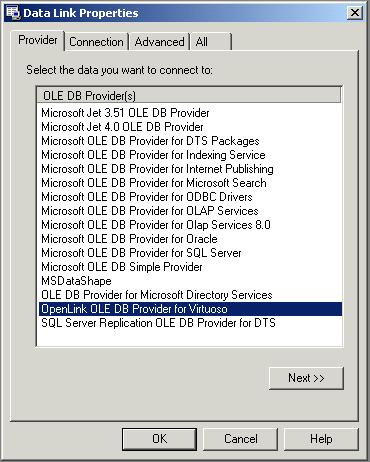

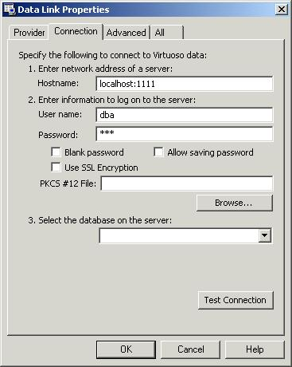

#### Using COM and OLE DB Interfaces Directly

Applications that utilize OLE DB Data Links component can use VIRTOLEDB
without any specific measures. Applications that need to directly invoke
VIRTOLEDB should follow examples provided in this section.

<div class="informalexample">

    #define INITGUID
    #include "virtoledb.h"
    
    ..
    
      IDBInitialize* pIDBInitialize = NULL;
      HRESULT hr = CoCreateInstance(CLSID_VIRTOLEDB, NULL, CLSCTX_INPROC_SERVER,
                                    IID_IDBInitialize, (void**) &pIDBInitialize);
      if (FAILED(hr))
        goto EXIT;

</div>

#### ADO Applications

<div class="informalexample">

    Dim strConn As String
    Dim objConn As ADODB.Connection
    
    strConn = "Provider=VIRTOLEDB;Data Source=localhost:1111;User Id=dba;Password=dba;Initial Catalog=Demo;Prompt=NoPrompt;"
    
    Set objConn = New ADODB.Connection
    objConn.CursorLocation = adUseServer
    objConn.Open strConn

</div>

## Known Limitations

  - Per-column properties are not supported.

  - Reference accessors are not supported.

  - Optimized accessors are not supported.

  - Asynchronous execution is not supported.

## Data Types

### Data Type Mappings in Rowsets and Parameters

The methods that provide information about rowset columns and command
parameters (IColumnsInfo::GetColumnInfo,
ICommandWithParameters::GetParameterInfo) use the mapping of Virtuoso
data types into OLE DB data types shown in the following table.

| Virtuoso Type  | OLE DB Type         |
| -------------- | ------------------- |
| CHAR           | DBTYPE\_STR         |
| VARCHAR        | DBTYPE\_STR         |
| LONG VARCHAR   | DBTYPE\_STR         |
| NCHAR          | DBTYPE\_WSTR        |
| NVARCHAR       | DBTYPE\_WSTR        |
| LONG NVARCHAR  | DBTYPE\_WSTR        |
| NUMERIC        | DBTYPE\_NUMERIC     |
| DECIMAL        | DBTYPE\_NUMERIC     |
| SMALLINT       | DBTYPE\_I2          |
| INTEGER        | DBTYPE\_I4          |
| FLOAT          | DBTYPE\_R8          |
| DOUBLE         | DBTYPE\_R8          |
| REAL           | DBTYPE\_R4          |
| VARBINARY      | DBTYPE\_BYTES       |
| LONG VARBINARY | DBTYPE\_BYTES       |
| DATE           | DBTYPE\_DBDATE      |
| TIME           | DBTYPE\_DBTIME      |
| DATETIME       | DBTYPE\_DBTIMESTAMP |
| TIMESTAMP      | BINARY              |

Data Type Mappings

### Data Type Conversions

Applications can bind column and parameter values using data types
different from those described in [Data Type Mappings in Rowsets and
Parameters](#mappings) . In such cases VIRTOLEDB uses OLE DB Data
Conversion Library. See MDAC documentation for the list of supported
data type conversions.

### Long Data Types

Long data types include LONG VARCHAR, LONG NVARCHAR, and LONG VARBINARY.
A long value can only be bound to a buffer that have one of these OLE DB
types:

  - DBTYPE\_IUNKNOWN

  - DBTYPE\_STR

  - DBTYPE\_STR | DBTYPE\_BYREF

  - DBTYPE\_WSTR

  - DBTYPE\_WSTR | DBTYPE\_BYREF

  - DBTYPE\_BYTES

  - DBTYPE\_BYTES | DBTYPE\_BYREF

Other type conversions are not supported.

If a long data is bound to a DBTYPE\_IUNKNOWN type, this implies the use
of the ISequentialStream interface. VIRTOLEDB supports the
ISequentialStream::Read method both when getting and setting data. The
ISequentialStream::Write method is never supported.

## Metadata

### Schema Rowsets

VIRTOLEDB supports schema rowsets listed in the following table.

| Schema Rowset                   | Supported Restrictions                                                                                               |
| ------------------------------- | -------------------------------------------------------------------------------------------------------------------- |
| DBSCHEMA\_CATALOGS              | All (CATALOG\_NAME)                                                                                                  |
| DBSCHEMA\_COLUMN\_PRIVILEGES    | All (TABLE\_CATALOG, TABLE\_SCHEMA, TABLE\_NAME, COLUMN\_NAME, GRANTOR, GRANTEE)                                     |
| DBSCHEMA\_COLUMNS               | All (TABLE\_CATALOG, TABLE\_SCHEMA, TABLE\_NAME, COLUMN\_NAME)                                                       |
| DBSCHEMA\_FOREIGN\_KEYS         | All (PK\_TABLE\_CATALOG, PK\_TABLE\_SCHEMA, PK\_TABLE\_NAME, FK\_TABLE\_CATALOG, FK\_TABLE\_SCHEMA, FK\_TABLE\_NAME) |
| DBSCHEMA\_INDEXES               | 1, 2, 3, and 5 (TABLE\_CATALOG, TABLE\_SCHEMA, INDEX\_NAME, TABLE\_NAME)                                             |
| DBSCHEMA\_PRIMARY\_KEYS         | All (TABLE\_CATALOG, TABLE\_SCHEMA, TABLE\_NAME)                                                                     |
| DBSCHEMA\_PROCEDURE\_PARAMETERS | All (PROCEDURE\_CATALOG, PROCEDURE\_SCHEMA, PROCEDURE\_NAME, PARAMETER\_NAME)                                        |
| DBSCHEMA\_PROCEDURES            | All (PROCEDURE\_CATALOG, PROCEDURE\_SCHEMA, PROCEDURE\_NAME, PROCEDURE\_TYPE)                                        |
| DBSCHEMA\_PROVIDER\_TYPES       | All (DATA\_TYPE, BEST\_MATCH)                                                                                        |
| DBSCHEMA\_SCHEMATA              | All (CATALOG\_NAME, SCHEMA\_NAME, SCHEMA\_OWNER)                                                                     |
| DBSCHEMA\_TABLE\_PRIVILEGES     | All (TABLE\_CATALOG, TABLE\_SCHEMA, TABLE\_NAME, GRANTOR, GRANTEE)                                                   |
| DBSCHEMA\_TABLES                | All (TABLE\_CATALOG, TABLE\_SCHEMA, TABLE\_NAME, TABLE\_TYPE)                                                        |

Supported Schema Rowsets

### Columns Rowset

VIRTOLEDB supports the following columns in the columns rowset.

  - DBCOLUMN\_IDNAME

  - DBCOLUMN\_GUID

  - DBCOLUMN\_PROPID

  - DBCOLUMN\_NAME

  - DBCOLUMN\_NUMBER

  - DBCOLUMN\_TYPE

  - DBCOLUMN\_TYPEINFO

  - DBCOLUMN\_COLUMNSIZE

  - DBCOLUMN\_PRECISION

  - DBCOLUMN\_SCALE

  - DBCOLUMN\_FLAGS

  - DBCOLUMN\_BASECATALOGNAME

  - DBCOLUMN\_BASECOLUMNNAME

  - DBCOLUMN\_BASESCHEMANAME

  - DBCOLUMN\_BASETABLENAME

  - DBCOLUMN\_COMPUTEMODE

  - DBCOLUMN\_DATETIMEPRECISION

  - DBCOLUMN\_ISCASESENSITIVE

  - DBCOLUMN\_ISSEARCHABLE

  - DBCOLUMN\_OCTETLENGTH

  - DBCOLUMN\_KEYCOLUMN

## Supported Interfaces

VIRTOLEDB supports the interfaces listed in the following table.

| Object                    | Interface                    | Notes |
| ------------------------- | ---------------------------- | ----- |
| Data Source               | IDBCreateSession             |       |
| IDBInitialize             |                              |       |
| IDBProperties             |                              |       |
| IPersist                  |                              |       |
| IDBInfo                   |                              |       |
| IPersistFile              |                              |       |
| ISupportErrorInfo         |                              |       |
| Session                   | IGetDataSource               |       |
| IOpenRowset               |                              |       |
| ISessionProperties        |                              |       |
| IDBCreateCommand          |                              |       |
| IDBSchemaRowset           |                              |       |
| ISupportErrorInfo         |                              |       |
| ITransaction              |                              |       |
| ITransactionJoin          |                              |       |
| ITransactionLocal         |                              |       |
| Command                   | IAccessor                    |       |
| IColumnsInfo              |                              |       |
| ICommand                  |                              |       |
| ICommandProperties        |                              |       |
| ICommandText              |                              |       |
| IConvertType              |                              |       |
| IColumnsRowset            |                              |       |
| ICommandPrepare           |                              |       |
| ICommandWithParameters    |                              |       |
| ISupportErrorInfo         |                              |       |
| Multiple Results          | IMultipleResults             |       |
| ISupportErrorInfo         |                              |       |
| Rowset                    | IAccessor                    |       |
| IColumnsInfo              |                              |       |
| IConvertType              |                              |       |
| IRowset                   |                              |       |
| IRowsetInfo               |                              |       |
| IColumnsRowset            |                              |       |
| IConnectionPointContainer | For IRowsetNotify interface. |       |
| IRowsetChange             |                              |       |
| IRowsetIdentity           |                              |       |
| IRowsetLocate             |                              |       |
| IRowsetRefresh            |                              |       |
| IRowsetResynch            |                              |       |
| IRowsetScroll             |                              |       |
| IRowsetUpdate             |                              |       |
| ISupportErrorInfo         |                              |       |
| Error Lookup              | IErrorLookup                 |       |

Supported Interfaces

## Data Source Objects

### Initialization and Authorization Properties

VIRTOLEDB supports the following properties in the initialization
property group.

| Property                                   | R/W        | Default            | Notes                  |
| ------------------------------------------ | ---------- | ------------------ | ---------------------- |
| DBPROP\_AUTH\_PASSWORD                     | Read/Write |                    | General Info: Password |
| DBPROP\_AUTH\_USERID                       | Read/Write |                    | User ID                |
| DBPROP\_AUTH\_PERSIST\_SENSITIVE\_AUTHINFO | Read/Write | VARIANT\_FALSE     | Persist Security Info  |
| DBPROP\_INIT\_DATASOURCE                   | Read/Write |                    | Data Source            |
| DBPROP\_INIT\_CATALOG                      | Read/Write |                    | Initial Catalog        |
| DBPROP\_INIT\_PROVIDERSTRING               | Read/Write |                    | Extended Properties    |
| DBPROP\_INIT\_HWND                         | Read/Write |                    | Window Handle          |
| DBPROP\_INIT\_PROMPT                       | Read/Write | DBPROMPT\_COMPLETE | Prompt                 |
| DBPROP\_INIT\_TIMEOUT                      | Read/Write | 0                  | Connect Timeout        |

Supported Initialization and Authorization Properties

In addition, VIRTOLEDB implements a provider-specific property set
DBPROPSET\_VIRTUOSODBINIT with the following properties

<table>
<caption>Provider-Specific Initialization and Authorization Properties</caption>
<thead>
<tr class="header">
<th>Property</th>
<th>R/W</th>
<th>Default</th>
<th>Notes</th>
</tr>
</thead>
<tbody>
<tr class="odd">
<td>VIRTPROP_INIT_ENCRYPT</td>
<td>Read/Write</td>
<td>VARIANT_FALSE</td>
<td><p>Type: VT_BOOL</p>
<p>Description: Encrypt Connection</p>
<p>If this property is set to VARIANT_TRUE the provider uses SSL encrypted connections.</p></td>
</tr>
<tr class="even">
<td>VIRTPROP_AUTH_PKCS12FILE</td>
<td>Read/Write</td>
<td></td>
<td><p>Type: VT_BSTR</p>
<p>Description: PKCS #12 File</p>
<p>If this property is set to a non-empty string then it is used as a name of a PKCS #12 file that authenticates the client. This also implies that the VIRTPROP_INIT_ENCRYPT property is set to VARIANT_TRUE</p></td>
</tr>
</tbody>
</table>

### Data Source Properties

VIRTOLEDB supports the following properties in the data source property
group.

| Property                    | R/W        | Default | Notes                |
| --------------------------- | ---------- | ------- | -------------------- |
| DBPROP\_CURRENTCATALOG      | Read/Write |         | Current Catalog      |
| DBPROP\_MULTIPLECONNECTIONS | Read/Write |         | Multiple Connections |

Supported Data Source Properties

### Data Source Information Properties

VIRTOLEDB supports the following properties in the data source
information property group.

| Property                            | R/W       | Default                                                                                                                                                        | Notes                                                         |
| ----------------------------------- | --------- | -------------------------------------------------------------------------------------------------------------------------------------------------------------- | ------------------------------------------------------------- |
| DBPROP\_ACTIVESESSIONS              | Read-Only |                                                                                                                                                                | The number of connections the Virtuoso server is licensed to. |
| DBPROP\_ASYNCTXNABORT               | Read-Only | VARIANT\_FALSE                                                                                                                                                 | VIRTOLEDB cannot abort transactions asynchronously.           |
| DBPROP\_ASYNCTXNCOMMIT              | Read-Only | VARIANT\_FALSE                                                                                                                                                 | VIRTOLEDB cannot commit transactions asynchronously.          |
| DBPROP\_BYREFACCESSORS              | Read-Only | VARIANT\_FALSE                                                                                                                                                 | VIRTOLEDB does not support reference accessors.               |
| DBPROP\_CATALOGLOCATION             | Read-Only | DBPROPVAL\_CL\_START                                                                                                                                           |                                                               |
| DBPROP\_CATALOGTERM                 | Read-Only | "qualifier"                                                                                                                                                    |                                                               |
| DBPROP\_CATALOGUSAGE                | Read-Only | DBPROPVAL\_CU\_DML\_STATEMENTS | DBPROPVAL\_CU\_TABLE\_DEFINITION | DBPROPVAL\_CU\_INDEX\_DEFINITION | DBPROPVAL\_CU\_PRIVILEGE\_DEFINITION                    |                                                               |
| DBPROP\_COLUMNDEFINITION            | Read-Only | DBPROPVAL\_CD\_NOTNULL                                                                                                                                         |                                                               |
| DBPROP\_COMSERVICES                 | Read-Only | 0                                                                                                                                                              |                                                               |
| DBPROP\_CONCATNULLBEHAVIOR          | Read-Only | DBPROPVAL\_CB\_NULL                                                                                                                                            |                                                               |
| DBPROP\_CONNECTIONSTATUS            | Read-Only | DBPROPVAL\_CS\_INITIALIZED                                                                                                                                     |                                                               |
| DBPROP\_DATASOURCENAME              | Read-Only | N/A                                                                                                                                                            |                                                               |
| DBPROP\_DATASOURCEREADONLY          | Read-Only | VARIANT\_FALSE                                                                                                                                                 |                                                               |
| DBPROP\_DATASOURCE\_TYPE            | Read-Only | DBPROPVAL\_DST\_TDP                                                                                                                                            |                                                               |
| DBPROP\_DBMSNAME                    | Read-Only | "Virtuoso"                                                                                                                                                     |                                                               |
| DBPROP\_DBMSVER                     | Read-Only |                                                                                                                                                                |                                                               |
| DBPROP\_DSOTHREADMODEL              | Read-Only | DBPROPVAL\_RT\_FREETHREAD                                                                                                                                      |                                                               |
| DBPROP\_GROUPBY                     | Read-Only | DBPROPVAL\_GB\_NO\_RELATION                                                                                                                                    |                                                               |
| DBPROP\_HETEROGENEOUSTABLES         | Read-Only | DBPROPVAL\_HT\_DIFFERENT\_CATALOGS                                                                                                                             |                                                               |
| DBPROP\_IDENTIFIERCASE              | Read-Only | DBPROPVAL\_IC\_SENSITIVE                                                                                                                                       |                                                               |
| DBPROP\_MAXINDEXSIZE                | Read-Only | 2000                                                                                                                                                           |                                                               |
| DBPROP\_MAXOPENCHAPTERS             | Read-Only | 0                                                                                                                                                              |                                                               |
| DBPROP\_MAXROWSIZE                  | Read-Only | 2000                                                                                                                                                           |                                                               |
| DBPROP\_MAXROWSIZEINCLUDESBLOB      | Read-Only | VARIANT\_FALSE                                                                                                                                                 |                                                               |
| DBPROP\_MAXTABLESINSELECT           | Read-Only | 0                                                                                                                                                              |                                                               |
| DBPROP\_MULTIPLEPARAMSETS           | Read-Only | VARIANT\_TRUE                                                                                                                                                  |                                                               |
| DBPROP\_MULTIPLERESULTS             | Read-Only | DBPROPVAL\_MR\_SUPPORTED                                                                                                                                       |                                                               |
| DBPROP\_MULTIPLESTORAGEOBJECTS      | Read-Only | VARIANT\_FALSE                                                                                                                                                 |                                                               |
| DBPROP\_MULTITABLEUPDATE            | Read-Only | VARIANT\_TRUE                                                                                                                                                  |                                                               |
| DBPROP\_NULLCOLLATION               | Read-Only | DBPROPVAL\_NC\_HIGH                                                                                                                                            |                                                               |
| DBPROP\_OLEOBJECTS                  | Read-Only | DBPROPVAL\_OO\_BLOB                                                                                                                                            |                                                               |
| DBPROP\_OPENROWSETSUPPORT           | Read-Only | DBPROPVAL\_ORS\_TABLE                                                                                                                                          |                                                               |
| DBPROP\_ORDERBYCOLUMNSINSELECT      | Read-Only | VARIANT\_FALSE                                                                                                                                                 |                                                               |
| DBPROP\_OUTPUTPARAMETERAVAILABILITY | Read-Only | DBPROPVAL\_OA\_ATROWRELEASE                                                                                                                                    |                                                               |
| DBPROP\_PERSISTENTIDTYPE            | Read-Only | DBPROPVAL\_PT\_NAME                                                                                                                                            |                                                               |
| DBPROP\_PREPAREABORTBEHAVIOR        | Read-Only | DBPROPVAL\_CB\_PRESERVE                                                                                                                                        |                                                               |
| DBPROP\_PREPARECOMMITBEHAVIOR       | Read-Only | DBPROPVAL\_CB\_PRESERVE                                                                                                                                        |                                                               |
| DBPROP\_PROCEDURETERM               | Read-Only | "procedure"                                                                                                                                                    |                                                               |
| DBPROP\_PROVIDERFRIENDLYNAME        | Read-Only | "OpenLink OLE DB Provider for Virtuoso"                                                                                                                        |                                                               |
| DBPROP\_PROVIDERMEMORY              | Read-Only | VARIANT\_TRUE                                                                                                                                                  |                                                               |
| DBPROP\_PROVIDERFILENAME            | Read-Only | "virtoledb.dll"                                                                                                                                                |                                                               |
| DBPROP\_PROVIDEROLEDBVER            | Read-Only | "02.60"                                                                                                                                                        |                                                               |
| DBPROP\_PROVIDERVER                 | Read-Only |                                                                                                                                                                |                                                               |
| DBPROP\_QUOTEDIDENTIFIERCASE        | Read-Only | DBPROPVAL\_IC\_SENSITIVE                                                                                                                                       |                                                               |
| DBPROP\_ROWSETCONVERSIONSONCOMMAND  | Read-Only | VARIANT\_TRUE                                                                                                                                                  |                                                               |
| DBPROP\_SCHEMATERM                  | Read-Only | "owner"                                                                                                                                                        |                                                               |
| DBPROP\_SCHEMAUSAGE                 | Read-Only | DBPROPVAL\_SU\_DML\_STATEMENTS | DBPROPVAL\_SU\_TABLE\_DEFINITION | DBPROPVAL\_SU\_INDEX\_DEFINITION | DBPROPVAL\_SU\_PRIVILEGE\_DEFINITION                    |                                                               |
| DBPROP\_SERVERNAME                  | Read-Only |                                                                                                                                                                |                                                               |
| DBPROP\_SQLSUPPORT                  | Read-Only | DBPROPVAL\_SQL\_ODBC\_MINIMUM | DBPROPVAL\_SQL\_ODBC\_CORE | DBPROPVAL\_SQL\_ANSI89\_IEF | DBPROPVAL\_SQL\_ESCAPECLAUSES | DBPROPVAL\_SQL\_ANSI92\_ENTRY       |                                                               |
| DBPROP\_STRUCTUREDSTORAGE           | Read-Only | DBPROPVAL\_SS\_ISEQUENTIALSTREAM                                                                                                                               |                                                               |
| DBPROP\_SUBQUERIES                  | Read-Only | DBPROPVAL\_SQ\_CORRELATEDSUBQUERIES | DBPROPVAL\_SQ\_COMPARISON | DBPROPVAL\_SQ\_EXISTS | DBPROPVAL\_SQ\_IN | DBPROPVAL\_SQ\_QUANTIFIED | DBPROPVAL\_SQ\_TABLE |                                                               |
| DBPROP\_SUPPORTEDTXNDDL             | Read-Only | DBPROPVAL\_TC\_DML                                                                                                                                             |                                                               |
| DBPROP\_SUPPORTEDTXNISOLEVELS       | Read-Only | DBPROPVAL\_TI\_READUNCOMMITTED | DBPROPVAL\_TI\_READCOMMITTED | DBPROPVAL\_TI\_REPEATABLEREAD | DBPROPVAL\_TI\_SERIALIZABLE                                    |                                                               |
| DBPROP\_SUPPORTEDTXNISORETAIN       | Read-Only | DBPROPVAL\_TR\_DONTCARE                                                                                                                                        |                                                               |
| DBPROP\_TABLESTATISTICS             | Read-Only | 0                                                                                                                                                              |                                                               |
| DBPROP\_TABLETERM                   | Read-Only | "table"                                                                                                                                                        |                                                               |
| DBPROP\_USERNAME                    | Read-Only | N/A                                                                                                                                                            |                                                               |

Supported Data Source Information Properties

## Sessions

### Session Properties

VIRTOLEDB supports the following properties in the session property
group.

| Property                          | R/W        | Default                       | Notes                                |
| --------------------------------- | ---------- | ----------------------------- | ------------------------------------ |
| DBPROP\_SESS\_AUTOCOMMITISOLEVELS | Read/Write | DBPROPVAL\_TI\_REPEATABLEREAD | Isolation level in auto-commit mode. |

Supported Session Properties

## Rowsets

### Properties

| Property                                                                                                                                                                                                                                                                                                                                  | R/W        | Default                                                                                                                            | Notes |
| ----------------------------------------------------------------------------------------------------------------------------------------------------------------------------------------------------------------------------------------------------------------------------------------------------------------------------------------- | ---------- | ---------------------------------------------------------------------------------------------------------------------------------- | ----- |
| DBPROP\_ABORTPRESERVE                                                                                                                                                                                                                                                                                                                     | Read/Write |                                                                                                                                    |       |
| DBPROP\_ACCESSORDER                                                                                                                                                                                                                                                                                                                       | Read-Only  | DBPROPVAL\_AO\_RANDOM                                                                                                              |       |
| DBPROP\_BLOCKINGSTORAGEOBJECTS                                                                                                                                                                                                                                                                                                            | Read-Only  | VARIANT\_TRUE                                                                                                                      |       |
| DBPROP\_BOOKMARKINFO                                                                                                                                                                                                                                                                                                                      | Read-Only  | DBPROPVAL\_BI\_CROSSROWSET                                                                                                         |       |
| DBPROP\_BOOKMARKS                                                                                                                                                                                                                                                                                                                         | Read/Write | VARIANT\_FALSE                                                                                                                     |       |
| DBPROP\_BOOKMARKSKIPPED                                                                                                                                                                                                                                                                                                                   | Read-Only  | VARIANT\_FALSE                                                                                                                     |       |
| DBPROP\_BOOKMARKTYPE                                                                                                                                                                                                                                                                                                                      | Read-Only  | DBPROPVAL\_BMK\_NUMERIC                                                                                                            |       |
| DBPROP\_CACHEDEFERRED                                                                                                                                                                                                                                                                                                                     | Read-Only  | VARIANT\_FALSE                                                                                                                     |       |
| DBPROP\_CANFETCHBACKWARDS                                                                                                                                                                                                                                                                                                                 | Read/Write | VARIANT\_FALSE                                                                                                                     |       |
| DBPROP\_CANHOLDROWS                                                                                                                                                                                                                                                                                                                       | Read/Write | VARIANT\_FALSE                                                                                                                     |       |
| DBPROP\_CANSCROLLBACKWARDS                                                                                                                                                                                                                                                                                                                | Read/Write | VARIANT\_FALSE                                                                                                                     |       |
| DBPROP\_CHANGEINSERTEDROWS                                                                                                                                                                                                                                                                                                                | Read-Only  | VARIANT\_FALSE                                                                                                                     |       |
| DBPROP\_COLUMNRESTRICT                                                                                                                                                                                                                                                                                                                    | Read-Only  | VARIANT\_FALSE                                                                                                                     |       |
| DBPROP\_COMMANDTIMEOUT                                                                                                                                                                                                                                                                                                                    | Read/Write |                                                                                                                                    |       |
| DBPROP\_COMMITPRESERVE                                                                                                                                                                                                                                                                                                                    | Read/Write | VARIANT\_FALSE                                                                                                                     |       |
| DBPROP\_DEFERRED                                                                                                                                                                                                                                                                                                                          | Read-Only  | VARIANT\_FALSE or VARIANT\_TRUE                                                                                                    |       |
| DBPROP\_DELAYSTORAGEOBJECTS                                                                                                                                                                                                                                                                                                               | Read/Write | VARIANT\_FALSE                                                                                                                     |       |
| DBPROP\_FINDCOMPAREOPS                                                                                                                                                                                                                                                                                                                    | Read-Only  | 0                                                                                                                                  |       |
| DBPROP\_HIDDENCOLUMNS                                                                                                                                                                                                                                                                                                                     | Read-Only  |                                                                                                                                    |       |
| DBPROP\_IAccessor                                                                                                                                                                                                                                                                                                                         | Read-Only  | VARIANT\_TRUE                                                                                                                      |       |
| DBPROP\_IColumnsInfo                                                                                                                                                                                                                                                                                                                      | Read-Only  | VARIANT\_TRUE                                                                                                                      |       |
| DBPROP\_IColumnsRowset                                                                                                                                                                                                                                                                                                                    | Read/Write | VARIANT\_FALSE                                                                                                                     |       |
| DBPROP\_IConnectionPointContainer                                                                                                                                                                                                                                                                                                         | Read/Write | VARIANT\_FALSE                                                                                                                     |       |
| DBPROP\_IConvertType                                                                                                                                                                                                                                                                                                                      | Read-Only  | VARIANT\_TRUE                                                                                                                      |       |
| DBPROP\_IMMOBILEROWS                                                                                                                                                                                                                                                                                                                      | Read/Write | VARIANT\_FALSE                                                                                                                     |       |
| DBPROP\_IMultipleResults                                                                                                                                                                                                                                                                                                                  | Read/Write | VARIANT\_FALSE                                                                                                                     |       |
| DBPROP\_IRowset                                                                                                                                                                                                                                                                                                                           | Read-Only  | VARIANT\_TRUE                                                                                                                      |       |
| DBPROP\_IRowsetChange                                                                                                                                                                                                                                                                                                                     | Read/Write | VARIANT\_FALSE                                                                                                                     |       |
| DBPROP\_IRowsetIdentity                                                                                                                                                                                                                                                                                                                   | Read/Write | VARIANT\_FALSE                                                                                                                     |       |
| DBPROP\_IRowsetInfo                                                                                                                                                                                                                                                                                                                       | Read-Only  | VARIANT\_TRUE                                                                                                                      |       |
| DBPROP\_IRowsetLocate                                                                                                                                                                                                                                                                                                                     | Read/Write | VARIANT\_FALSE                                                                                                                     |       |
| DBPROP\_IRowsetRefresh                                                                                                                                                                                                                                                                                                                    | Read/Write | VARIANT\_FALSE                                                                                                                     |       |
| DBPROP\_IRowsetResynch                                                                                                                                                                                                                                                                                                                    | Read/Write | VARIANT\_FALSE                                                                                                                     |       |
| DBPROP\_IRowsetScroll                                                                                                                                                                                                                                                                                                                     | Read/Write | VARIANT\_FALSE                                                                                                                     |       |
| DBPROP\_IRowsetUpdate                                                                                                                                                                                                                                                                                                                     | Read/Write | VARIANT\_FALSE                                                                                                                     |       |
| DBPROP\_ISequentialStream                                                                                                                                                                                                                                                                                                                 | Read-Only  | VARIANT\_TRUE                                                                                                                      |       |
| DBPROP\_ISupportErrorInfo                                                                                                                                                                                                                                                                                                                 | Read/Write | VARIANT\_FALSE                                                                                                                     |       |
| DBPROP\_LITERALBOOKMARKS                                                                                                                                                                                                                                                                                                                  | Read-Only  | VARIANT\_FALSE                                                                                                                     |       |
| DBPROP\_LITERALIDENTITY                                                                                                                                                                                                                                                                                                                   | Read-Only  | VARIANT\_TRUE                                                                                                                      |       |
| DBPROP\_LOCKMODE                                                                                                                                                                                                                                                                                                                          | Read/Write | DBPROPVAL\_LM\_NONE                                                                                                                |       |
| DBPROP\_MAXOPENROWS                                                                                                                                                                                                                                                                                                                       | Read-Only  | 0                                                                                                                                  |       |
| DBPROP\_MAXPENDINGROWS                                                                                                                                                                                                                                                                                                                    | Read-Only  | 0                                                                                                                                  |       |
| DBPROP\_MAXROWS                                                                                                                                                                                                                                                                                                                           | Read/Write | 0                                                                                                                                  |       |
| DBPROP\_NOTIFICATIONGRANULARITY                                                                                                                                                                                                                                                                                                           | Read-Only  | DBPROPVAL\_NT\_SINGLEROW                                                                                                           |       |
| DBPROP\_NOTIFICATIONPHASES                                                                                                                                                                                                                                                                                                                | Read-Only  | DBPROPVAL\_NP\_OKTODO | DBPROPVAL\_NP\_ABOUTTODO | DBPROPVAL\_NP\_SYNCHAFTER | DBPROPVAL\_NP\_FAILEDTODO | DBPROPVAL\_NP\_DIDEVENT |       |
| DBPROP\_NOTIFYCOLUMNSET DBPROP\_NOTIFYROWDELETE DBPROP\_NOTIFYROWFIRSTCHANGE DBPROP\_NOTIFYROWINSERT DBPROP\_NOTIFYROWRESYNCH DBPROP\_NOTIFYROWSETCHANGED DBPROP\_NOTIFYROWSETFETCHPOSITIONCHANGE DBPROP\_NOTIFYROWSETRELEASE DBPROP\_NOTIFYROWUNDOCHANGE DBPROP\_NOTIFYROWUNDODELETE DBPROP\_NOTIFYROWUNDOINSERT DBPROP\_NOTIFYROWUPDATE | Read-Only  | DBPROPVAL\_NP\_OKTODO | DBPROPVAL\_NP\_ABOUTTODO | DBPROPVAL\_NP\_SYNCHAFTER                                                       |       |
| DBPROP\_ORDEREDBOOKMARKS                                                                                                                                                                                                                                                                                                                  | Read/Write | VARIANT\_FALSE                                                                                                                     |       |
| DBPROP\_OTHERINSERT                                                                                                                                                                                                                                                                                                                       | Read/Write | VARIANT\_FALSE                                                                                                                     |       |
| DBPROP\_OTHERUPDATEDELETE                                                                                                                                                                                                                                                                                                                 | Read/Write | VARIANT\_FALSE                                                                                                                     |       |
| DBPROP\_OWNINSERT                                                                                                                                                                                                                                                                                                                         | Read/Write | VARIANT\_TRUE                                                                                                                      |       |
| DBPROP\_OWNUPDATEDELETE                                                                                                                                                                                                                                                                                                                   | Read/Write | VARIANT\_TRUE                                                                                                                      |       |
| DBPROP\_QUICKRESTART                                                                                                                                                                                                                                                                                                                      | Read/Write | VARIANT\_FALSE                                                                                                                     |       |
| DBPROP\_REENTRANTEVENTS                                                                                                                                                                                                                                                                                                                   | Read-Only  | VARIANT\_FALSE                                                                                                                     |       |
| DBPROP\_REMOVEDELETED                                                                                                                                                                                                                                                                                                                     | Read/Write | VARIANT\_FALSE                                                                                                                     |       |
| DBPROP\_REPORTMULTIPLECHANGES                                                                                                                                                                                                                                                                                                             | Read-Onle  | VARIANT\_FALSE                                                                                                                     |       |
| DBPROP\_RETURNPENDINGINSERTS                                                                                                                                                                                                                                                                                                              | Read-Only  | VARIANT\_FALSE                                                                                                                     |       |
| DBPROP\_ROWRESTRICT                                                                                                                                                                                                                                                                                                                       | Read-Only  | VARIANT\_FALSE                                                                                                                     |       |
| DBPROP\_ROWSET\_ASYNCH                                                                                                                                                                                                                                                                                                                    | Read-Only  | VARIANT\_FALSE                                                                                                                     |       |
| DBPROP\_ROWTHREADMODEL                                                                                                                                                                                                                                                                                                                    | Read-Only  | DBPROPVAL\_RT\_FREETHREAD                                                                                                          |       |
| DBPROP\_SERVERCURSOR                                                                                                                                                                                                                                                                                                                      | Read-Only  | VARIANT\_TRUE                                                                                                                      |       |
| DBPROP\_SERVERDATAONINSERT                                                                                                                                                                                                                                                                                                                | Read-Only  | VARIANT\_FALSE                                                                                                                     |       |
| DBPROP\_SKIPROWCOUNTRESULTS                                                                                                                                                                                                                                                                                                               | Read-Only  | VARIANT\_TRUE                                                                                                                      |       |
| DBPROP\_STRONGIDENTITY                                                                                                                                                                                                                                                                                                                    | Read-Only  | VARIANT\_FALSE                                                                                                                     |       |
| DBPROP\_TRANSACTEDOBJECT                                                                                                                                                                                                                                                                                                                  | Reaq-Only  | VARIANT\_FALSE                                                                                                                     |       |
| DBPROP\_UNIQUEROWS                                                                                                                                                                                                                                                                                                                        | Read/Write | VARIANT\_FALSE                                                                                                                     |       |
| DBPROP\_UPDATABILITY                                                                                                                                                                                                                                                                                                                      | Read/Write | 0                                                                                                                                  |       |

Supported Rowset Properties

### Interfaces

VIRTOLEDB supports the following rowset interfaces.

| Interface         | Description |
| ----------------- | ----------- |
| IAccessor         |             |
| IColumnsInfo      |             |
| IConvertType      |             |
| IRowset           |             |
| IRowsetChange     |             |
| IRowsetIdentity   |             |
| IRowsetInfo       |             |
| IRowsetLocate     |             |
| IRowsetScroll     |             |
| ISupportErrorInfo |             |

Supported Rowset Interfaces

# Virtuoso In-Process Client

The in-process client is an efficient mechanism used by hosted
applications to access the database functionality of the hosting
Virtuoso server.

Normally applications access Virtuoso using the remote procedure call
mechanism hidden behind some sort of higher-level API such as ADO.NET,
ODBC, and so on. The RPC based mechanism is the only available interface
for non-hosted applications. For hosted applications, when the
application and the DBMS server reside in the same OS process, Virtuoso
provides a mechanism based on direct in-process procedure calls.

The in-process call mechanism by itself is not exposed to the
applications. It is hidden behind the same APIs as the RPC one: ODBC,
JDBC, ADO.NET. So in both cases applications deal with the same APIs and
the application logic does not change. The application chooses which
mechanism to use when it opens a database connection.

To make an in-process connection to a Virtuoso server from within an
application hosted by the same server it is necessary to use a special
inprocess address syntax distinguishing it from the regular network
"HOST:PORT" address syntax. The In-process address has the following
form:

    :in-process:PORT

Note that it begins with a colon, then specifies the "`in-process` "
keyword, followed by another colon, and finally the port number on which
the server listens for TCP connections.

This port is only used for establishing the in-process connection, after
which the connection proceeds exclusively through the in-process
procedure call mechanism.

The in-process connections are presently only supported by the Virtuoso
ODBC driver and the ODBC-based .NET Data Provider
(OpenLink.Data.VirtuosoClient). The managed .NET Data Provider
(OpenLink.Data.Virtuoso) does not yet support in-process connections.

In-process ODBC connection are defined in either a DSN or a connect
string directly. This is an example section of the odbc.ini file for
unix/linux:

    [InProcess]
    Driver  = /opt/virtuoso/lib/virtodbc32_r.so
    Address = :in-process:1111

To open an ADO.NET connection the in-process address should be specified
in the connection string.

Here is an example of using the OpenLink.Data.VirtuosoClient adapter
specifying the details on the connect string:

    VirtuosoConnection = new VirtuosoConnection ("HOST=:in-process:1111");

Every in-process connection originates from the existing connection. For
instance, it might be initiated by a stored procedure called from an
ISQL connection, or it can be called from an ASPX session.

In-process connections always inherit the user ID from its parent
connection. There is no way to set or change the connecting user ID.
Therefore the user ID and password are not specified when the in-process
connection is opened.

In-process connections also limit database transactions. The autocommit
mode is never in effect for in-process connections. The setting of
autocommit mode is silently ignored without reporting any errors.

# Unix Domain Socket Connections

Client connections to Virtuoso servers running on the same Unix or Linux
server host can benefit from faster connections utilizing Unix Domain
Sockets. This does not apply to Windows platforms.

By default Virtuoso will open a Unix Domain listen socket in addition to
the TCP listen socket. The name of the UD socket will be:

    /tmp/virt-<tcp-listen-port>

When a client attempts to connect to the Virtuoso server using the
specific address `localhost` it will first try connecting to the UD
socket, failing that it will silently revert to the TCP socket.

Unix Domain Socket connections only work if `localhost` is explicitly
specified or the host is unspecified which defaults to a localhost
connection. UD socket connections will *not* work to any other address
such as:

    virt.mydomain.com:1111
    127.0.0.1:1111

regardless of whether that is the localhost or not.

Unix Domain sockets can be disabled using the `DisableUnixSocket`
parameter in the Parameters section of the Virtuoso INI file.

The `sys_connected_server_address()` function can be used to check the
connection type. It will return

    /tmp/virt-<tcp-listen-port>

for connections using UD sockets.

# Virtuoso Data Access Clients Connection Fail over and Load Balancing Support

The Virtuoso Data Access Clients ODBC, JDBC, ADO.Net, OLE DB, Sesame,
Jena and Redland as of Release 6.1 and above support round robin
connections to Virtuoso server instances enabling server fail over, load
balancing and fault tolerant connections to be performed across multiple
server instances configured in a cluster or as separate server
instances.

Fail over connections are enabled by specifying a comma delimited list
of servers to failover to, in the "Host" or 'Server" connect string
attribute, with the list being worked through in the order presented to
determine which Virtuoso Server instance is used. A Round robin (load
balanced) connection can be configured by adding the connect string
attribute "RoundRobin" = \[True | Yes | False | No\], in which case the
server for the connection is chosen at random from the comma delimited
provided as for a Failover connection above.

Example connect strings for Virtuoso ODBC, JDBC, ADO.Net and OLE DB
driver/providers are provided below. The Virtuoso Sesame and Jena
providers which make use of the JDBC driver and Redland Provider which
makes use of the ODBC driver, would simply make use of a suitably
configured JDBC or ODBC connect string to enable Failover or Round Robin
connections to be made with them.

## ODBC

### Failover Connect String format

    Driver={OpenLink Virtuoso};Host=server1:port1,server2:port2,server3:port3;UID=dba;PWD=dba;

### Round Robin Connect String format

    Driver={OpenLink Virtuoso};Host=server1:port1,server2:port2,server3:port3;UID=dba;PWD=dba;RoundRobin=Yes"

Or alternatively ensure the "use Round Robin for failover connection"
check box in the setup dialog.

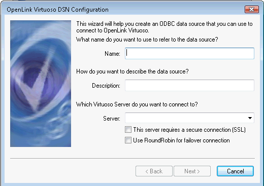

## ADO.Net

### Failover Connect String format

    Server=server1:port1,server2:port2,server3;UserId=dba;Password=dba;

### Round Robin Connect String format

    Server=server1:port1,server2:port2,server3;UserId=dba;Password=dba;Round Robin=true;Pooling=false;

## JDBC

### Failover Connect String format

    jdbc:virtuoso://server1:port1,server2:port2,server3/UID=dba/PWD=dba/;

### Round Robin Connect String format

    jdbc:virtuoso://server1:port1,server2:port2,server3:1111/UID=dba/PWD=dba/ROUNDROBIN=yes;

## OLE DB

### Failover Connect String format

    Provider=VIRTOLEDB;Data Source=server1:port1,server2:port2,server3;User Id=dba;Password=dba;Initial Catalog=Demo;Prompt=NoPrompt;

### Round Robin Connect String format

``` 
  Provider=VIRTOLEDB;Data Source=server1:port1,server2:port2,server3;User Id=dba;
Password=dba;Initial Catalog=Demo;Prompt=NoPrompt;Round Robin=true
```

## Sesame

### Failover Connect String format

    VirtuosoRepository("server1:port1,server2:port2,server3", "uid", "pwd");

### Round Robin Connect String format

    VirtuosoRepository("server1:port1,server2:port2,server3", "uid", "pwd");
    ((VirtuosoRepository)repository).setRoundrobin(true);

### Sample program

    /*
     *  $Id$
     *
     *  This file is part of the OpenLink Software Virtuoso Open-Source (VOS)
     *  project.
     *
     *  Copyright (C) 1998-2018 OpenLink Software
     *
     *  This project is free software; you can redistribute it and/or modify it
     *  under the terms of the GNU General Public License as published by the
     *  Free Software Foundation; only version 2 of the License, dated June 1991.
     *
     *  This program is distributed in the hope that it will be useful, but
     *  WITHOUT ANY WARRANTY; without even the implied warranty of
     *  MERCHANTABILITY or FITNESS FOR A PARTICULAR PURPOSE. See the GNU
     *  General Public License for more details.
     *
     *  You should have received a copy of the GNU General Public License along
     *  with this program; if not, write to the Free Software Foundation, Inc.,
     *  51 Franklin St, Fifth Floor, Boston, MA 02110-1301 USA
     */
    
    import java.sql.*;
    import java.util.*;
    import java.lang.*;
    
    import org.openrdf.model.*;
    import org.openrdf.query.*;
    import org.openrdf.repository.*;
    import org.openrdf.rio.*;
    import virtuoso.jdbc4.*;
    
    import virtuoso.sesame2.driver.*;
    
    public class TestSesame2 {
    
      public static void main(String[] args) {
    
          Repository repository = new
        VirtuosoRepository("localhost:1111,localhost:1311,localhost:1312,localhost:1313", "dba", "dba");
          ((VirtuosoRepository)repository).setRoundrobin(true);
    
          RepositoryConnection con = null;
          Random rnd = new Random();
          for (int i = 0; i < 1000000; ) {
          try {
              if (null == con) {
              System.out.println("New connection");
              con = repository.getConnection();
              }
    
              TupleQuery query = con.prepareTupleQuery(
                  QueryLanguage.SPARQL, "INSERT INTO <test_g> { <sub" + i + "> <pred> <obj" + i+ "> . " +
                  " <r" + Math.abs (rnd.nextInt()) + "> <rndpred> <r" + Math.abs (rnd.nextInt ()) + "> . }");
              TupleQueryResult queryResult = query.evaluate();
              /*long count = 0;
              while (queryResult.hasNext())
              {
              queryResult.next();
              count++;
              if (count % 1000 == 0)
              {
                  System.out.println("Passed " + count + " results...");
              }
              }
              */
              queryResult.close();
              i++;
              try { Thread.sleep(100); } catch (InterruptedException ie) { }
    
          } catch (Exception e) {
              String state = "";
              if (e.getCause() instanceof SQLException) {
              state = ((SQLException)e.getCause()).getSQLState();
              }
              System.out.println("ERROR:" + state + " " + e.getCause());
              try { Thread.sleep(2000); } catch (InterruptedException ie) { }
              System.out.println("ERROR:" + e.toString ());
              if (state == "")
                e.printStackTrace();
              try {
              if (con != null /*&& (state == "08U01" || state == "S2801")*/) {
                  System.out.println("Closing Connection.");
                  con.close();
                  con = null;
              }
              } catch (RepositoryException re) {
              System.out.println("Test Failed.");
              re.printStackTrace();
              System.exit (1);
              }
          } finally {
          }
          }
      }
    }
