# Virtual Database Engine

# Virtual Database (VDB) Engine

## The Need for VDB Engines

### Situation Analysis

As computer hardware, network protocols, database engines, applications,
application servers, and desktop productivity tools, proliferate the
enterprise, integration of disparate applications from disparate vendors
is becoming an all too common problem.

Add the emergence of standards based Distributed Computing galvanized by
the Internet infrastructure and associated Internet protocols to this
picture, and the need for Integration is even higher.

Increasing the industry at large is looking to a new technology
deliverable known as Universal Data Access Middleware to address these
systems integration pains.

"With Universal Data Access (UDA), customers receive all of the benefits
of a high-level and consistent Application Programming Interface (API)
that abstracts all the database complexities while providing a
capability that can be specified, controlled, and managed on its own to
optimize the near universal need of programs for data access".

*Source IDC, 1998 Middleware Markets & Trends*

At OpenLink Software, it is our opinion that a new genre of UDA
middleware called the "Virtual Database", is set to emerge as the
dominant UDA middleware solution for addressing the integration
challenges as they exist today, and tomorrow. This new UDA middleware
format plays the role of a Universal Data Access manager, fusing
traditional database functionality and traditional data access
middleware functionality into a single independent packaged software
solution.

### Virtual Database Engines Defined

A Virtual Database (VDB) Engine is a UDA middleware format that
transparently brings local and or remote heterogeneous databases
together using logical database references called Data Source Names
(DSN's). A VDB Engine exposes Metadata and Data held within these
heterogeneous DSN's to clients applications and services homogeneously.

VDB Engines presume the existence of a number of Database Engines and
Data Access Drivers provided by a variety of database vendors within an
organization. VDB Engines provide transparent access to these
heterogeneous databases via DSN's associated with the relevant data
access drivers without exposing end-users or developers to the
intricacies of heterogeneous data access.

### Data Source Names (DSN's)

A Data Source Name is a logical reference that exposes database to
standards compliant or native data access drivers. DSN's provide a
flexible naming and binding service for database driven applications
developers and end-users alike. Applications no longer need to be
inextricably linked to specific database names or specific database
engines.

## First Generation Virtual Database Products

Although the strict VDB definition may be new, there are a number of
products that have been around for a while that attempt to address VDB
issues. The list of such products includes The Microsoft JET Engine,
Borland Database Engine (BDE), and IBM DataJoiner.

### Microsoft JET

The Microsoft JET Engine lies at the heart of Microsoft Access, it is
the piece of technology that allows you to link external and typically
remote database tables into your local Access space via ODBC Data
Sources. Once this link process has been completed, Access allows you to
build Queries, Reports, Forms etc. using these external database tables
as though they were Local Access tables. JET can also link to external
tables hosted within desktop database engines via native interfaces.

The Microsoft JET Engine services are exposed via Microsoft provided
data access interfaces such as: DAO, ADO, and OLE-DB. These interfaces
are integral parts of most Microsoft applications, thereby exposing the
benefits of the JET VDB transparently.

### Borland Database Engine

The Borland Database Engine (BDE) from Inprise like the Microsoft JET
Engine also facilitates external table linkage via ODBC Data Sources.
The BDE also lets you link to external database tables via native
database interfaces and there is no restriction to desktop database
engines when you adopt this approach.

Although the BDE has a published set of APIs, it is predominantly used
by Inprise applications in very much the same way JET is used by
Microsoft applications.

### IBM DataJoiner

DataJoiner from IBM provides the ability access heterogeneous data
sources via IBM DB/2 Client Application Enablers. It does support ODBC
and JDBC as client interfaces and makes use of Native or ODBC based data
access for external Data I/O.

## VDB Implementation Issues

The essential components that affect the implementation of VDB Engines
are, High-Level Data Access Interfaces, Low-Level Data Access Interfaces
and Traditional Database Functionality.

### High-Level Data Access Interfaces

A VDB Engine's capabilities are exposed via High Level Data Access
interfaces. For the purpose of this document, a high level data access
interface is an interface utilized predominantly by applications, as
opposed to middleware developers for achieving application database
independence. A high level data access interface sits atop Low-Level
data access interfaces, providing an abstraction layer that serves to
simplifying the process of database independent application development.

A number of High Level Data Access standards exist today, the more
prevalent being:

Data Access Objects (DAO)

Remote Data Objects (RDO)

ActiveX Data Objects (ADO)

OLE-DB

JavaBlend

InfoBus

It is important to note that low-level Data access interfaces such as
ODBC, UDBC, JDBC and OLE-DB transparently serve the high-level
interfaces mentioned in the section above. Thus, in most cases VDB
vendors will treat ODBC, UDBC, JDBC, and OLE-DB as high-level interfaces
by providing VDB data access drivers conforming to these standards as
part of the VDB deliverable.

### Low-Level Data Access Interfaces

A VDB Engine's data I/O occurs via low-level data access interfaces to
underlying database engines or data sources. In recent times the Open
Database Connectivity ([ODBC](#) ) API and the X/Open [SQL](#) Call
Level Interface (CLI) have emerged as the dominant industry wide
Low-Level Data Access Standards. OLE-DB from Microsoft is also emerging
as a new low-level data access standard for relational and
non-relational data in the Microsoft Component Object Model (COM) world.
While JDBC is emerging like wise as the low-level data access standard
for the burgeoning Java world.

A VDB may also be a Native Database Interface Client, making use of
database engine vendor provided data access interfaces. Native
interfaces are based upon Embedded SQL, an older format Low-Level data
access interface that preceded the X/Open SQL CLI. It is important to
note that ODBC from Microsoft, JDBC from JavaSoft, and UDBC from
OpenLink Software are all derived from the X/Open SQL CLI.

### Traditional Database Functionality

The degree to which a VDB implements a traditional database engine's
functionality has a direct bearing on the intrinsic value of a VDB
engine. Traditional database functionality is extensive, but for the
purposes of this document, a core set of functionality common to all
commercial database engines has been assembled. The functionality list
includes:

**Query Language Support.**

standard syntax for interrogating, manipulating, describing, and
securing data contained within a database. Examples include the
Structured Query Language (SQL) for relational databases and the Object
Query Language (OQL) for Object and Object-Relational Databases.

**Query Processor.**

the mechanism used by a database engine to convert Query Language
Statements into actual data retrieval instructions. In addition, this
database component is responsible for ensuring Query Language syntax
conformance, Query Execution Plan Assembly and Query Fulfillment.

**Standard Data Types Support.**

data contained within a database must be describable using standard data
types e.g. Character, Number, Date, etc.

**VIEW Support.**

pre constructed query statements stored within a database, for the
purpose of query simplification, or content and structural security.

**Stored Procedure Support.**

Stored Procedures facilitate the embedding of application programming
logic within a database. Their pre-compiled nature enhances data access
performance by reducing message hops between database servers and
database clients.

**Scrollable Cursor Support.**

the process by which the result of a database query (known as a
result-set) is traversed. Traversal occurs in either direction,
backwards or forwards, using result-set chunks (known as row-sets).
Resultset scrolling occurs when database engines exchange data with
database clients.

**Concurrency Control.**

the process through which a database engine supports multiple sessions
running concurrently, across multiple database users and database client
applications without compromising underlying data integrity or
introducing quantum increases in application response times.

**Transaction Support.**

ensures that database instructions can be grouped into logical units of
execution that are Atomic, Consistent, Isolated from the effect of other
units of execution affecting the same underlying data, and Durable.

**Transaction Isolation.**

describes the ability of a database engine to provide transaction
process partitioning options called Isolation Levels, that offer
different ways of managing the effects of multiple and concurrent
transactions affecting the same underlying data.

**Distributed Transaction Support.**

describes the ability to preserve transaction atomicity, consistency,
integrity, and durability across database servers hosted on the same or
different database server machines within a networked environment. This
involves supporting transaction Commits and Rollbacks using a 2-phase
commit protocol.

**User Definable Type Support.**

this is how a database engine allows end-users extend its base
functionality. This is achieved by providing interfaces that allow
end-users create new ways in which a database engine's data is described
and manipulated.

**Federated Database Support.**

data access and manipulation across database servers resident on the
same machine.

**Distributed Database Support.**

data access, and manipulation across database servers resident on the
different machines within a networked environment.

**Security.**

the process by which data, and data transmission is protected using a
combination of database and operating system privileges, roles and roles
hierarchies. It also includes the ability of a database engine to
protect data transmitted to its clients using data encryption.

## VDB Engine Components

The prior section outlined the critical implementation issues that
affect the development and implementation of VDB Engines. These issues
form the basis around which a component based framework for depicting
VDB architectures has been derived.

The components that comprise a VDB Engine framework are as follows:

### Data Access Drivers

The VDB component that forms the entry point to the VDB Engine's
services, these drivers may or may not conform to industry standards.
Applications and Services that sit atop a VDB Engine must have their
data access layers written to the same Application Programming
Interfaces (APIs) implemented by the Data Access Drivers provided by a
VDB engine.

### Security Manager

The VDB component that is responsible for protecting data and data
transmission (using encryption) within the VDB Engine's domain. It is
also responsible for managing Application, User, Group, Role and Domain
privileges as they relate to the creation, manipulation and destruction
of VDB data and metadata.

### Query Manager

The VDB component that handles queries presented to it by the VDB
Engine's data access drivers. It provides query syntax checking, query
execution plan compilation, and query fulfillment services. A query
processor is built in conformance to one or more query language
specifications, the most notable being the Structured Query Language
(SQL) for relational database engines, and the Object Query Language
(OQL) for Object-Relational and Object Database engines.

### Meta Data Manager

The VDB component that provides the Query Processor with information
about the data entities from which the Query Processor's execution plan
is derived. Metadata managers are also the components responsible for
linking external data sources into the VDB domain and directing the
Query Processor to the appropriate Data I/O manager.

### Transaction Manager

The Transaction Manager component ensures that transactions are Atomic
(clearly distinguishable units), Consistent (thereby preserving
integrity of data), Isolated from the effect of other transactions, and
Durable (such that the effects of committed transactions survive
failure). The Transaction Manager ensures VDB Engines are capable of
supporting Online Transaction Processing (OLTP) and Distributed
Transaction oriented applications and services. Transaction Managers may
be standards based implementing X/Open's XA Resource Manager
Specifications. Distributed transaction support is implemented by using
a two-phase commit protocol.

### Concurrency Manager

The VDB component that ensures client applications and services are
capable of opening multiple concurrent sessions that execute data
INSERTS, UPDATES and DELETIONS, without implicitly reducing application
response times or compromising data integrity. Concurrency control is
delivered in one of two formats, Optimistic or Pessimistic depending on
the response times desired by VDB client applications or services.

### Local Data I/O Manager

VDB Engine's that provide local data storage uses this component for
reading and writing data to disk. This is how a VDB provides traditional
database engine data storage services.

### External Data I/O Manager

VDB component that handles data reads and writes to external data
sources. The External Data I/O Manager be implemented using standard
data access interfaces such as ODBC, JDBC, UDBC, OLE-DB or Native data
source interfaces.

### Replication Manager

Component that manages data migration and synchronization across two or
more VDB servers within a distributed computing environment. This
component acts as a data coordinator between the activities of Local
Data I/O and External Data I/O Managers across VDB servers. The
Replication Manager enables a VDB Engine offer automated bi-directional
data, and metadata transformation services across heterogeneous data
sources without end-user or developer intervention.

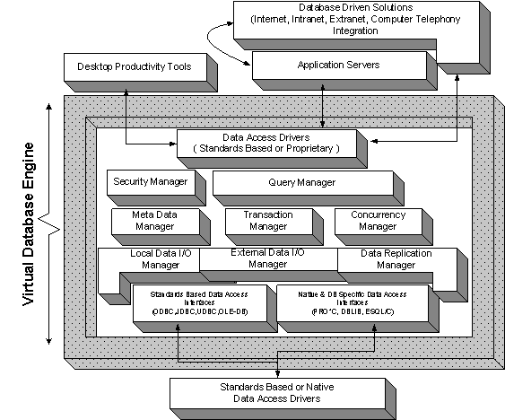

### VDB Implementation Approaches

There are no golden VDB implementation specifications, but the
implementation of a VDB has a direct impact the degree to which you
realize desired value from the VDB concept as a whole.

The VDB value proposition is simply stated as follows:

"To provide transparent access to heterogeneous data sources,
independent of host operating system and underlying database engines ".

VDB implementations can be categorized as follows:

|         |
| :------ |
| Type 1  |
| Type 2  |
| Type 3  |
| Type 4  |
| Type 5  |
| Type 6  |
| Type 7  |
| Type 8  |
| Type 9  |
| Type 10 |

VDB Implementation Categories

The sections that follow provide illustrations of the different VDB
formats, depicting the components that provide the basis for the
categorization used in the table above.

#### Type 1 VDB Engine

This category of VDB exposes its services to clients via Native and
Proprietary high-level data access interfaces. Data I/O is achieved via
native, proprietary, and data source specific low-level data access
interfaces. This category of VDB does not possess a complete set of
traditional database engine components.

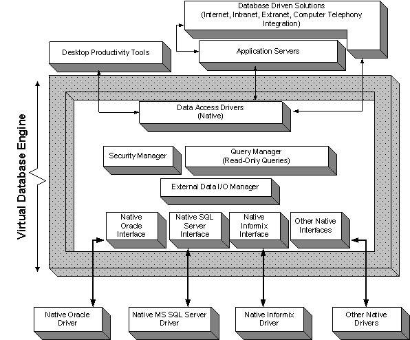

#### Type 2 VDB Engine

This category of VDB exposes its services to clients via Native and
Proprietary high-level data access interfaces. External data I/O is
achieved via native, proprietary, and data source specific low-level
data access interfaces. This category of VDB possesses a complete set of
traditional database engine components.

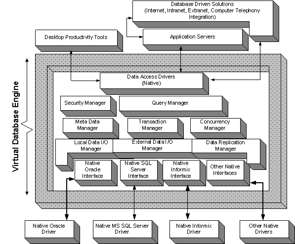

#### Type 3 VDB Engine

This category of VDB exposes its services to clients via Native and
Proprietary high-level data access interfaces. Data I/O is achieved via
Open, Standards based, and Database Independent low-level data access
interfaces. This category of VDB does not possess a complete set of
traditional database engine components.

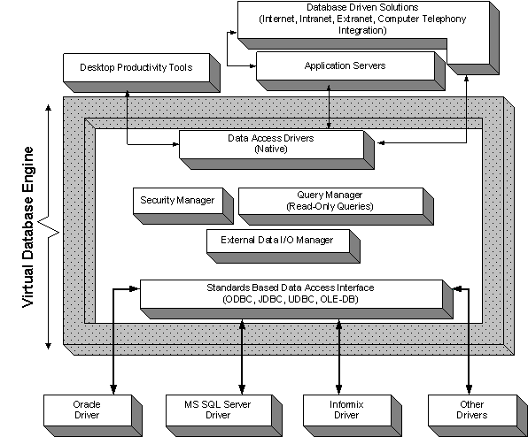

#### Type 4 VDB Engine

This category of VDB exposes its services to clients via Native and
Proprietary high-level data access interfaces. External data I/O is
achieved via Open, Standards based, and Database Independent low-level
data access interfaces. This category of VDB possesses a complete set of
traditional database engine components.

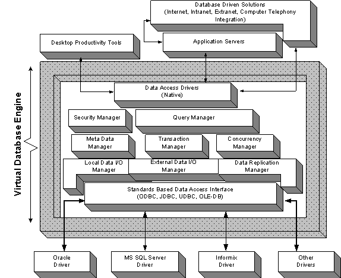

#### Type 5 VDB Engine

This category of VDB exposes its services to clients via open and
standards based high-level data access Interfaces. Data I/O is achieved
via native, proprietary, and data source specific low-level interfaces.
This category of VDB does not possess a complete set of traditional
database engine components.

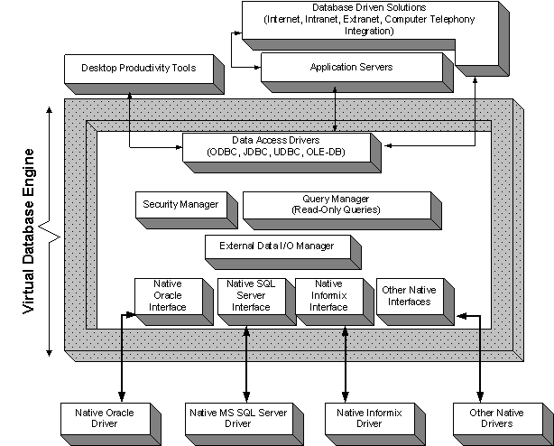

#### Type 6 VDB Engine

This category of VDB exposes its services to clients via open, standards
based, high and low-level Interfaces. External data I/O is achieved via
native, proprietary, and data source specific low-level interfaces. This
category of VDB possesses a complete set of traditional database engine
components.

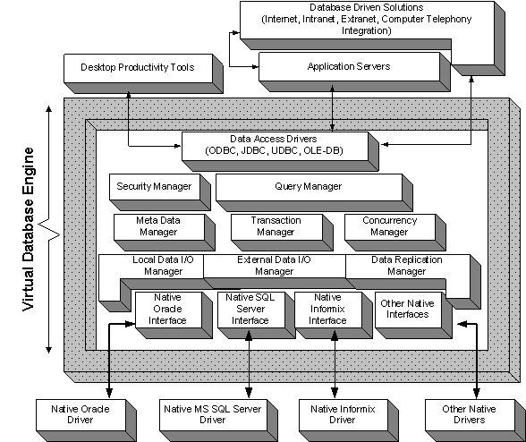

#### Type 7 VDB Engine

This category of VDB exposes its services via open, standards based
high-level data access interfaces. Data I/O is achieved via Open,
Standards based, and Database Independent low-level data access
interfaces. This category of VDB does not possess a complete set of
traditional database engine components.

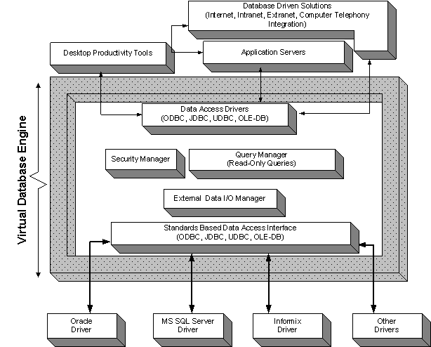

#### Type 8 VDB Engine

This category of VDB exposes its services via open, standards based,
high and low-level interfaces. External data I/O is achieved via Open,
Standards based, and Database Independent low-level data access
interfaces. This category of VDB does possess a complete set of
traditional database engine components.

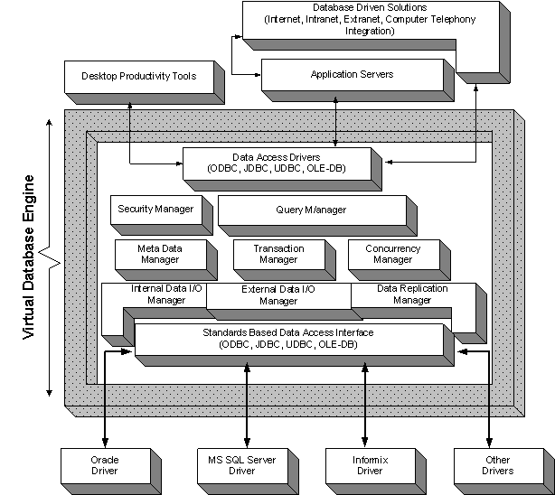

#### Type 9 VDB Engine

This category of VDB exposes its services via Open, Standards based,
high-level data access interfaces. Data I/O is achieved by using either
Open, Standards based, and Database Independent low-level data access
interfaces or Native, Proprietary, and Database Specific low-level data
access interfaces. This category of VDB does not possess a complete set
of traditional database engine components.

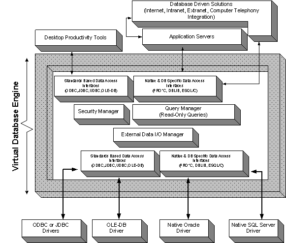

#### Type 10 VDB Engine

This category of VDB exposes its services via Open, Standards based,
high-level data access interfaces. External data I/O is achieved by
using either Open, Standards based, and Database Independent low-level
data access interfaces or Native, Proprietary, and Database Specific
low-level data access interfaces. This category of VDB possesses a
complete set of traditional database engine components.

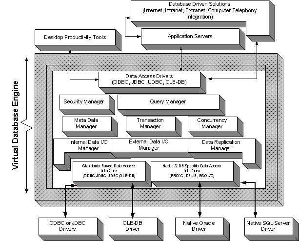

# Using Microsoft Entity Frameworks to Access Oracle Schema Objects with Virtuoso

**Prerequisites.**

The following prerequisites must be in place for this solution to be
possible.

**Oracle DBMS.**

An Oracle DBMS hosting the required Schema Objects needs to be
available. In this section the *Oracle Human Resources* sample database
will be used to demonstrate the process.

An Oracle DBMS hosting the required Schema Objects needs to be
available. In this section the *Oracle Human Resources* sample database
will be used to demonstrate the process.

**ODBC Driver for Oracle.**

An Oracle ODBC Driver is required for Linking the Oracle Schema Objects
into the Virtuoso Server. The OpenLink *ODBC Driver for Oracle* will be
used in this section, for which a functional ODBC Data source name of
"ora10ma" will be assumed to exist on the machine hosting the Virtuoso
Server.

An Oracle ODBC Driver is required for Linking the Oracle Schema Objects
into the Virtuoso Server. The OpenLink *ODBC Driver for Oracle* will be
used in this section, for which a functional ODBC Data source name of
"ora10ma" will be assumed to exist on the machine hosting the Virtuoso
Server.

**Virtuoso Universal Server.**

An Virtuoso installation including the Virtuoso Universal Server and
ADO.NET Entity Framework Provider is required. The Virtuoso components
used must be Release 5.10.x or above, this being the minimum version
containing support for Microsoft Entity Frameworks

An Virtuoso installation including the Virtuoso Universal Server and
ADO.NET Entity Framework Provider is required. The Virtuoso components
used must be Release 5.10.x or above, this being the minimum version
containing support for Microsoft Entity Frameworks

**Microsoft Visual Studio 2008 SP1.**

Microsoft Visual Studio 2008 Service Pack 1 is required, this being the
only version containing the necessary Entity Framework support available
at the time of writing.

Microsoft Visual Studio 2008 Service Pack 1 is required, this being the
only version containing the necessary Entity Framework support available
at the time of writing.

**Tasks**

**Ensure Oracle Primary Keys (PKs) are not nullable.**

The Visual Studio 2008 Entity Data Model (EDM) requires that all primary
keys are *NOT* Nullable, and will fail to generate an EDM if any are.
Thus ensure any tables to be used are defined as not nullable in the
Oracle database schema before attempting to generate an EDM. In the case
of the Oracle Human Resources database all tables are not nullable, thus
this should not be an issue in this case.

The Visual Studio 2008 Entity Data Model (EDM) requires that all primary
keys are *NOT* Nullable, and will fail to generate an EDM if any are.
Thus ensure any tables to be used are defined as not nullable in the
Oracle database schema before attempting to generate an EDM. In the case
of the Oracle Human Resources database all tables are not nullable, thus
this should not be an issue in this case.

## Install and configure OpenLink ODBC Driver for Oracle

The Virtuoso Virtual Database engine uses ODBC as the connectivity
mechanism for linking remote database objects into its local schema.
Thus an Oracle ODBC Driver must be available with a suitably configured
DSN for connecting to the target database. The OpenLink ODBC Drivers for
Oracle have been used in this section, although in theory any Oracle
ODBC Driver can be used.

Installation instructions for the OpenLink ODBC Driver for Oracle are
available from:

  - [Product Installation & Basic Configuration (ODBC)](#)

## Install and configure OpenLink Virtuoso Universal Server

  - [Install and configure OpenLink Virtuoso Universal
    Server](#virtclientrefinstallandconfigvirt)

## Linking Oracle tables into OpenLink Virtuoso

1.  Start the Virtuoso Web User Interface
    
    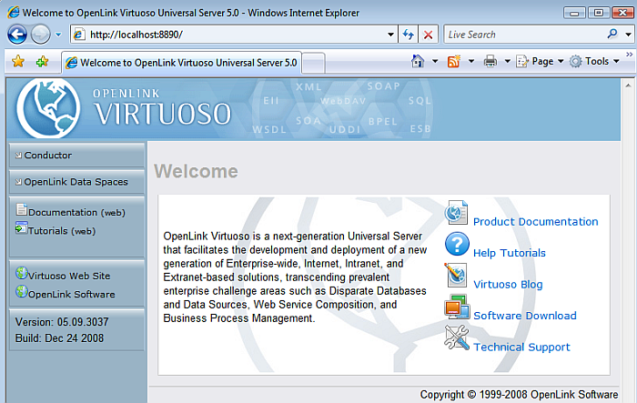

2.  Select the "Conductor" link in the Left Frame and Login as the "dba"
    user.
    
    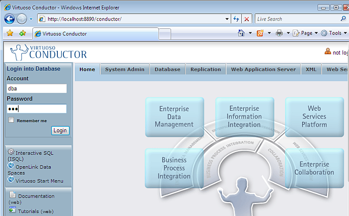

3.  Select the "Databases" -\> "External Data Source" -\> "Data Sources"
    tab menu items
    
    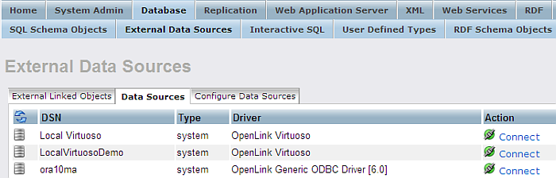

4.  Select the "Connect" button for the "ora10ma" Oracle DSN.
    
    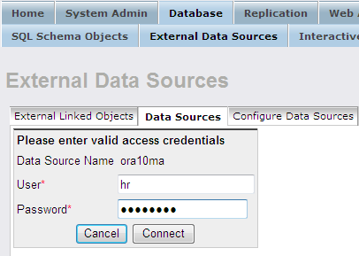

5.  On successful connection Select the "Link Objects" button to obtain
    a list of available tables
    
    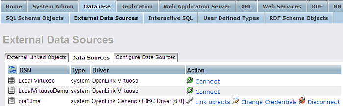

6.  Select all the tables that are part of the "HR" catalog.
    
    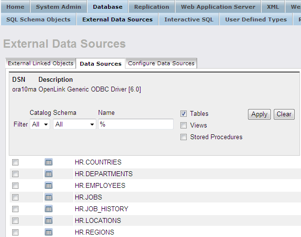

7.  Change the Catalog for each table to be "HR" using the "Set All"
    button.
    
    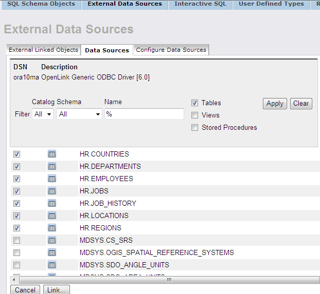

8.  Ensure a primary key is assigned to all table that are to be used in
    the EDM generation phase.
    
    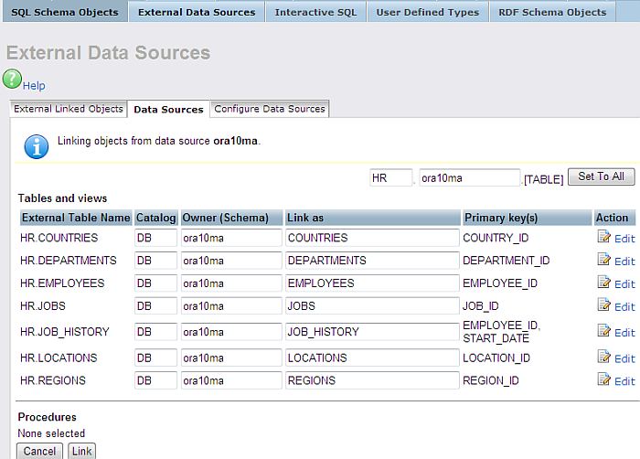

9.  Select the "Link" button to link the selected tables into Virtuoso
    
    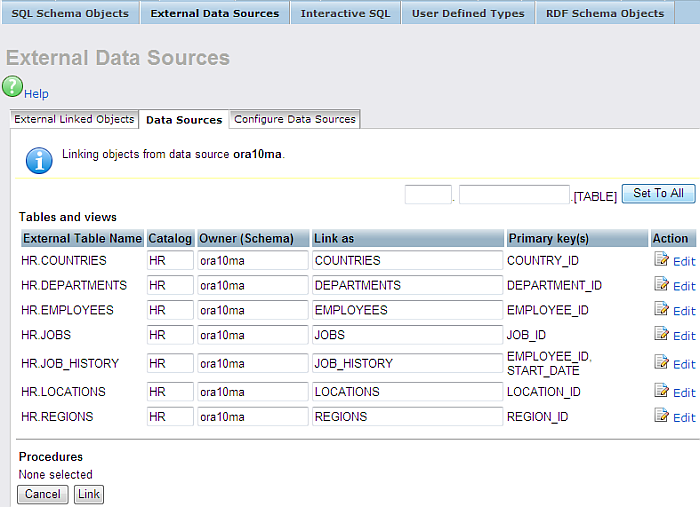

10. On completion of the Link process the tables will be displayed in
    the "External Linked Objects" tab.
    
    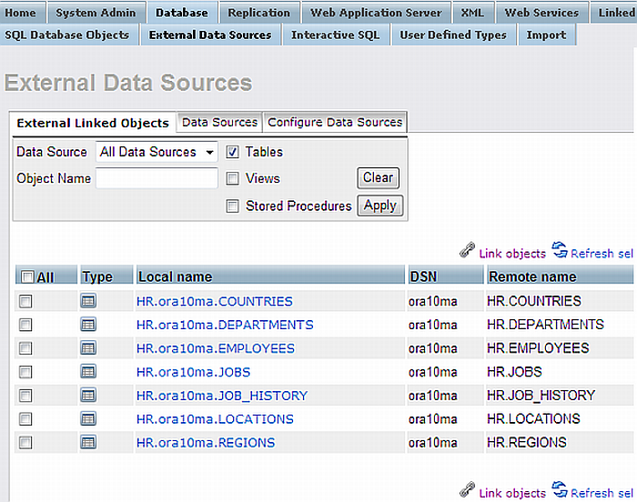

11. The linked tables can be queried by clicking on the hyperlink in the
    "Local Name" column of the "External Linked Objects" tab above,
    which loads the Virtuoso "Interactive SQL" interface with the
    required SQL "Select" for retrieving the remote table data . We
    shall use the "HR.ora10ma.COUNTRIES" table to demonstrate this.
    
    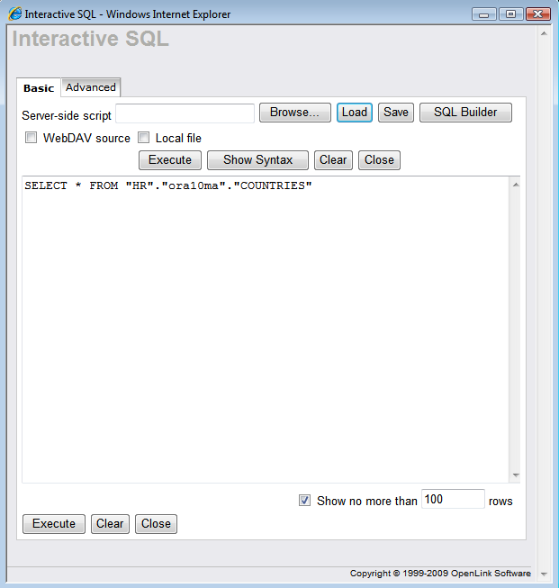

12. Then click the "Execute" button to run the query and retrieve the
    results from the remote table.
    
    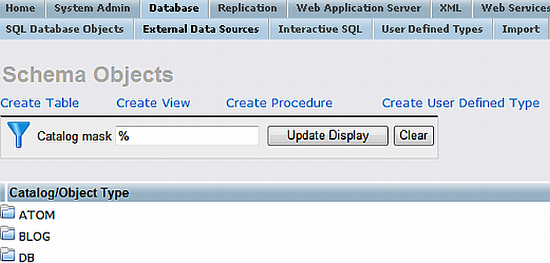

13. The tables can also be viewed as part of the Virtuoso "SQL Schema
    Objects" under the "HR" catalog name.
    
    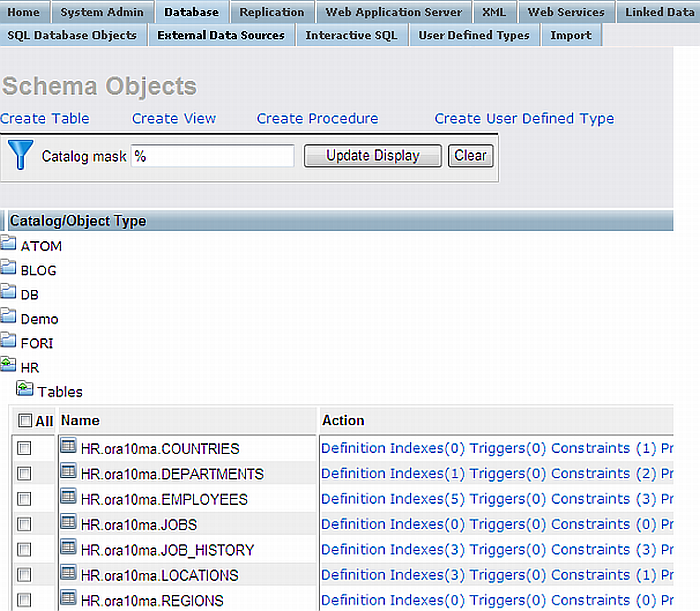
    
    The Link process is now complete enabling the tables to be queried
    as if part of the Virtuoso Schema.

## Creating EDM in Visual Studio 2008

The following steps can be used to create an Entity Data Model (EDM) for
the Oracle Human Resources database:

1.  Launch the Visual Studio 2008 SP1 IDE.
    
    

2.  Create a
    
    *Web Application*
    
    project by going to the
    
    *File*
    
    menu in Visual Studio and choosing
    
    *New Project*
    
    .
    
    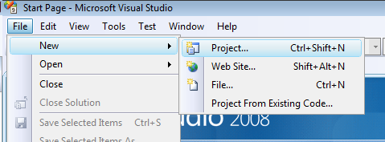

3.  When the New Project window appears, choose either
    
    *Visual Basic*
    
    or
    
    *Visual C\#*
    
    as your programming language.

4.  Within the language category, click on
    
    *Web*
    
    and select
    
    *ASP.NET Web Application*
    
    from the right-hand panel.

5.  Choose a name for the project, for example
    
    *VirtuosoDataService*
    
    , and click
    
    *OK*
    
    .
    
    

6.  This will create a new project called
    
    *VirtuosoDataService*
    
    .
    
    

7.  Select the Project -\> Add New Item menu option.
    
    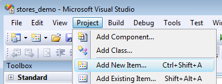

8.  The
    
    *Add New Item*
    
    dialog will appear. Choose the
    
    *ADO.NET Entity Data Model*
    
    template. Give it the name
    
    *Virtuoso.edmx*
    
    and click
    
    *Add*
    
    to start the creation of the ADO.Net Entity Data Model.
    
    

9.  In the
    
    *Entity Data Model Wizard*
    
    dialog
    
    *Choose Model Contents*
    
    page select the
    
    *Generate from Database*
    
    model type and click
    
    *Next*
    
    .
    
    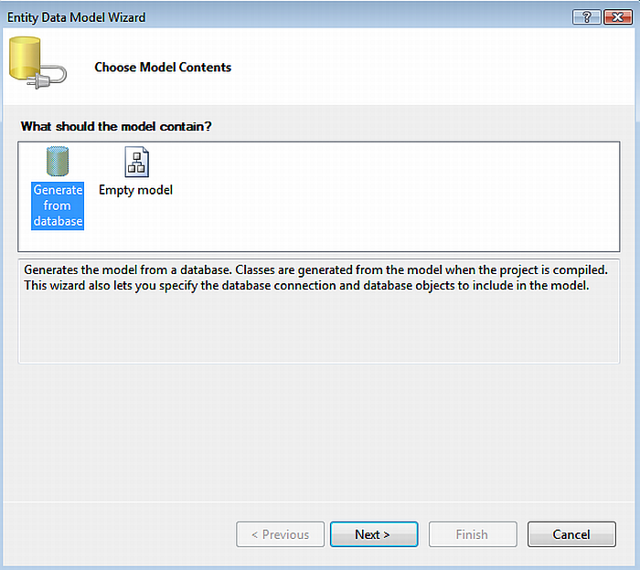

10. In the
    
    *Entity Data Model Wizard*
    
    dialog
    
    *Choose your Data Connection*
    
    page, select the
    
    *New Connection button*
    
    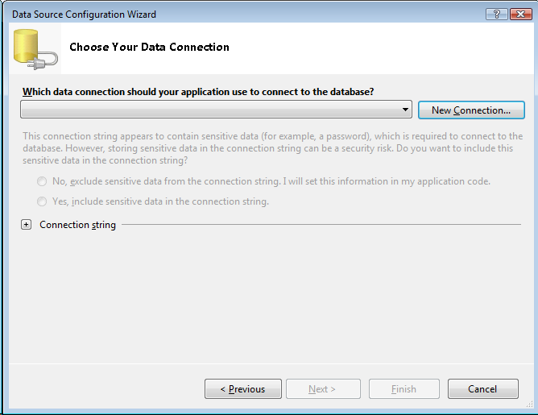

11. In the
    
    *Choose Data Source*
    
    dialog, select the OpenLink
    
    *Virtuoso Data Source*
    
    from the list and click
    
    *Continue*
    
    .
    
    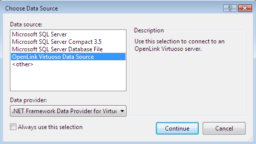

12. In the
    
    *Add Connection*
    
    dialog, specify the
    
    *hostname, portno, username and password*
    
    for the target Virtuoso Server and check the Save Password check
    box.
    
    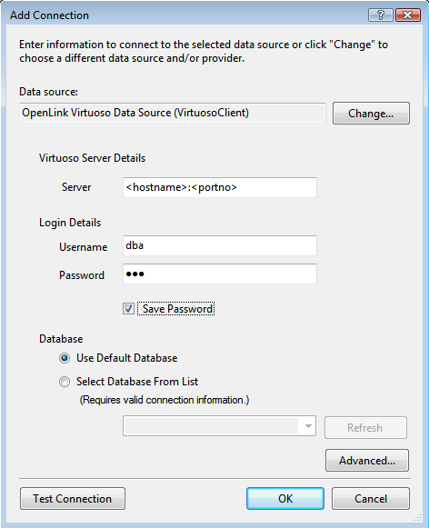

13. Select the
    
    *Select Database From List*
    
    radio button and choose the
    
    *HR*
    
    database from the drop down list.
    
    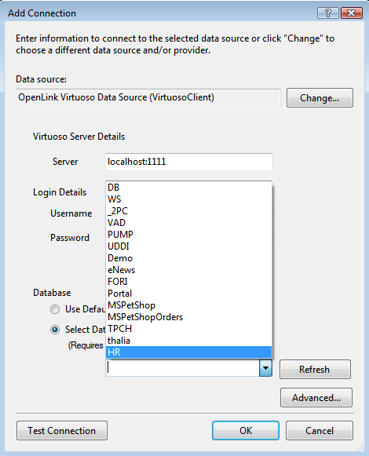

14. Press the
    
    *Test Connection*
    
    dialog to verify that the database is accessible.
    
    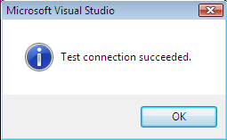

15. Click OK to add the connection.
    
    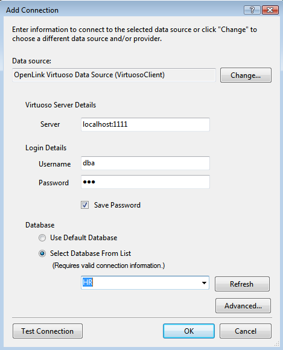

16. Set the
    
    *entity connect string*
    
    name to
    
    *VirtuosoEntities*
    
    (note this name as it is required in the section on creating and
    ADO.Net Data Service) and click
    
    *Next*
    
    .
    
    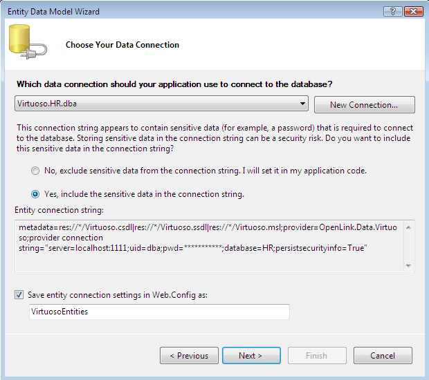

17. In the
    
    *Choose your Database Objects*
    
    page select the
    
    *Tables*
    
    check box to select all tables in the HR catalog for addition to the
    Entity Data Model. Set the
    
    *Model Namespace*
    
    to
    
    *VirtuosoModel*
    
    and click
    
    *Finish*
    
    .
    
    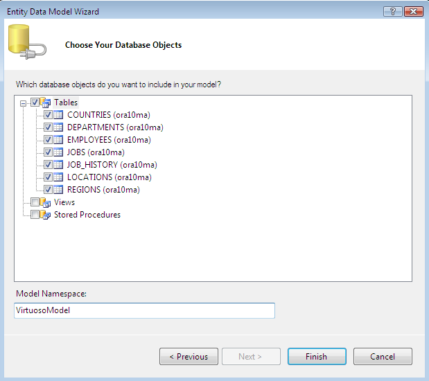

18. The
    
    *Virtuoso.edmx*
    
    EDM will be created with the tables and relationships displayed in
    the Visual Studio IDE
    
    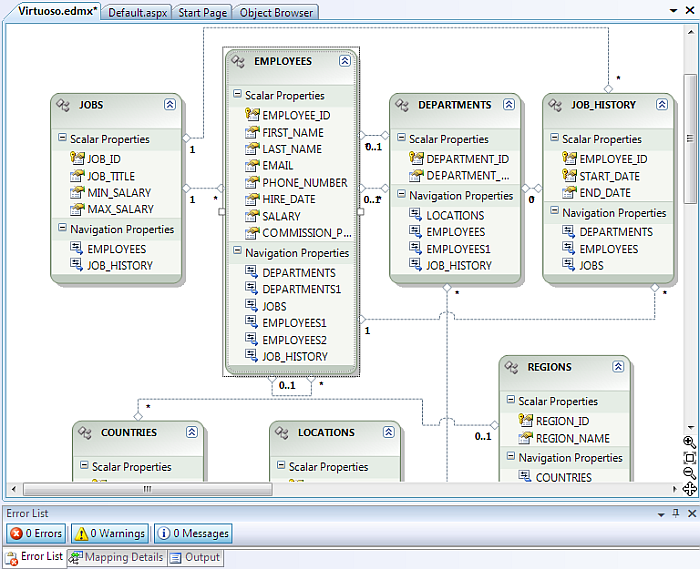

Creation for the Entity Data Model for the Oracle Human Resources
database is now complete.

## Using EDM to create Entity Framework based applications

Now that a Microsoft Entity Data Model has been created for the Oracle
Human Resources database, Entity Framework applications can be created
to make use of it.

### Entity Frameworks based ADO.NET Data Service

An ADO.Net Data Service for the Oracle tables can be created using the
Entity Data Model created in the [Creating EDM in Visual Studio 2008
section](#vdbenginemccrvs) .

1.  Open the
    
    *VirtuosoDataService*
    
    project created in the [Creating EDM in Visual Studio 2008
    section](#vdbenginemccrvs) .

2.  Select the Project -\> Add New Item menu option.
    
    

3.  The
    
    *Add New Item*
    
    dialog will appear. Choose the
    
    *ADO.NET Data Service template*
    
    . Give it the name
    
    *Virtuoso.svc*
    
    , and click
    
    *Add*
    
    to create the ADO.Net Data Service.
    
    

4.  In the newly created
    
    *Virtuoso.svc.cs*
    
    Data Service file, add the data source class name of
    
    *VirtuosoEntities*
    
    (note this is the name set in the Creating EDM in Visual Studio 2008
    section) as the
    
    *DataService*
    
    name. Enable the access to the Data Service by adding the entry
    
    *config.SetEntitySetAccessRule("\*", EntitySetRights.All);*
    
    in the
    
    *InitializeService*
    
    method.
    
        // C#
        
        using System;
        using System.Web;
        using System.Collections.Generic;
        using System.ServiceModel.Web;
        using System.Linq;
        using System.Data.Services;
        
        namespace SimpleDataService
        {
            public class Northwind : DataService<VirtuosoDemoEntities>
            {
                public static void InitializeService(IDataServiceConfiguration  config)
                {
                    config.SetEntitySetAccessRule("*", EntitySetRights.All);
                }
            }
        }

    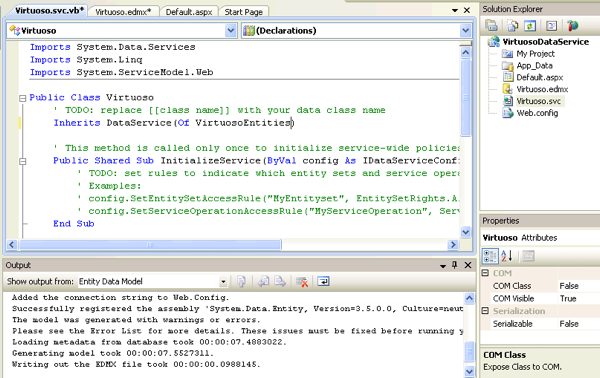

5.  To test the Data Service, simply hit
    
    *Ctrl+F5*
    
    within Visual Studio. This will start the development web server,
    run the Data Services server inside and load a Web browser page
    displaying the list of available tables/entities for the HR database
    catalog.
    
    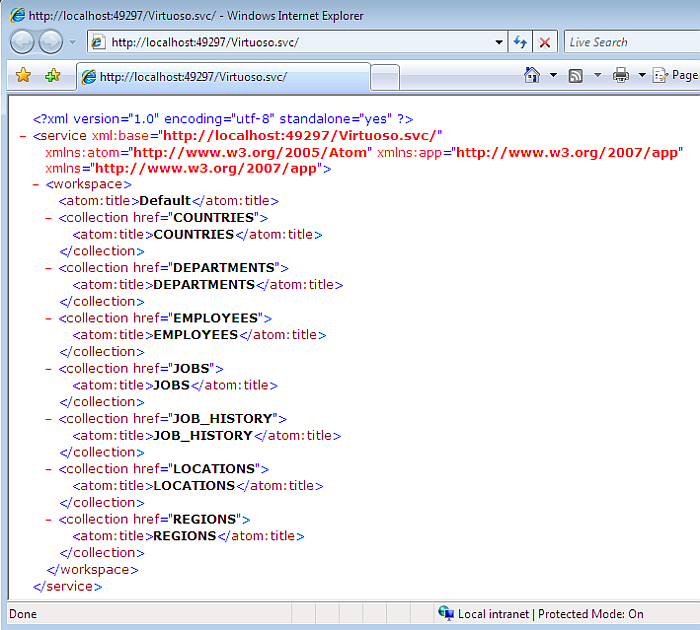

6.  To access a specific entity instance like the
    
    *EMPLOYEES*
    
    table employee number
    
    *100*
    
    record, use this convention
    http://host/vdir/Virtuoso.svc/EMPLOYEES(100) .
    
    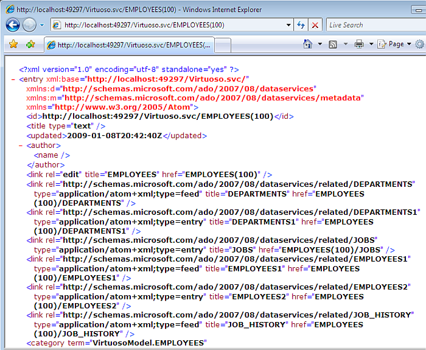

*Notes:*

1.  *Important*
    
    \- To view
    
    *Atom*
    
    (the default format returned by an ADO.NET Data Service) in Internet
    Explorer, you must first ensure that
    
    *Feed Reading View*
    
    is turned
    
    *off*
    
    . This can be done on the
    
    *Content tab*
    
    of
    
    *Tools in Internet Options*
    
    .

2.  If a Data Services entity instance URI page fails to load you can
    turn
    
    *Verbose*
    
    errors on by adding
    
    *config.UseVerboseErrors = true;*
    
    in the
    
    *virtuoso.svc.cs InitializeService*
    
    method to obtain more detailed information from the server as to why
    the page failed to load:
    
        public static void InitializeService(IDataServiceConfiguration config)
        
        {
        
        config.UseVerboseErrors = true;
        
        config.SetEntitySetAccessRule("*", EntitySetRights.All);
        
        }

### Visual Studio Windows DataGrid Form Application

This section details the steps required to create a simple Visual Studio
2008 Windows Form application, with associated DataGridView control for
displaying data in selected tables from the target database.

1.  Launch the Visual Studio 2008 SP1 IDE.
    
    

2.  Create a
    
    *Web Application*
    
    project by going to the
    
    *File*
    
    menu in Visual Studio and choosing
    
    *New Project*
    
    .
    
    

3.  When the New Project window appears, choose either
    
    *Visual Basic*
    
    or
    
    *Visual C\#*
    
    as your programming language.

4.  Within the language category, click on
    
    *Windows*
    
    and select
    
    *Windows Form Application*
    
    from the right-hand panel.

5.  Choose a name for the project, for example
    
    *VirtWindowsFormApplication*
    
    , and click
    
    *OK*
    
    .
    
    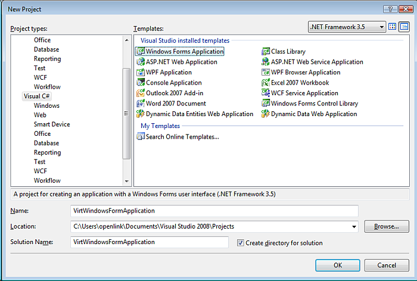

6.  In the
    
    *Toolbox*
    
    , expand
    
    *Data Controls*
    
    , and drag the
    
    *DataGridView*
    
    control onto the form.
    
    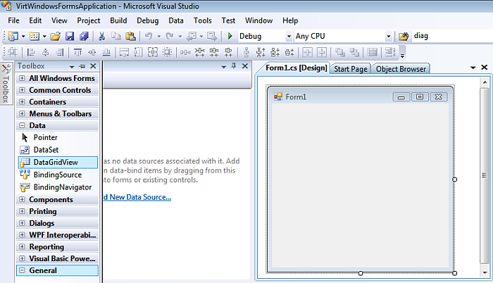

7.  Click on the little
    
    *arrow*
    
    in the top right of the
    
    *DataGridView*
    
    control. This loads the
    
    *DataGridView Task*
    
    menu.
    
    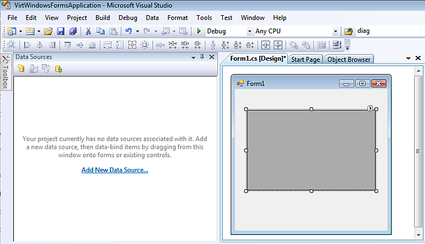

8.  Click on the
    
    *Choose Data Source*
    
    list box.
    
    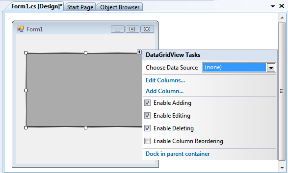

9.  Click on the
    
    *Add Project Data Source*
    
    link to connect to a data source.
    
    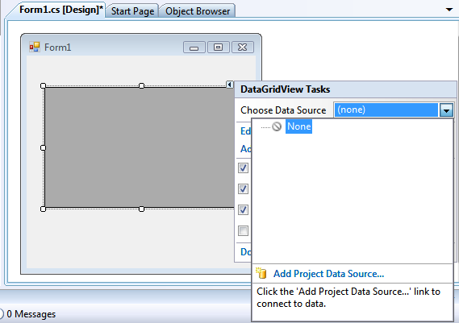

10. In the
    
    *Data Source Configuration Wizard*
    
    dialog
    
    *Choose Data Source Type*
    
    page select the
    
    *Database*
    
    data source type and click
    
    *Next*
    
    .
    
    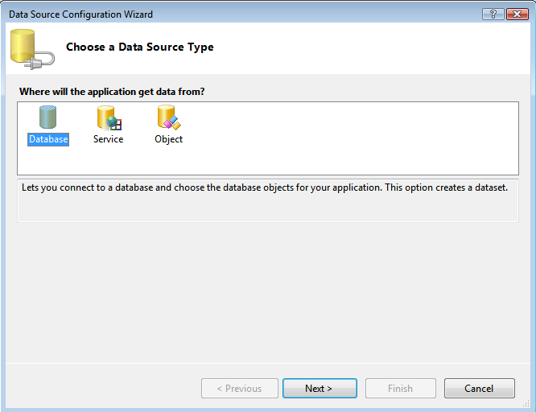

11. In the
    
    *Data Source Configuration Wizard*
    
    dialog
    
    *Choose your Data Connection*
    
    page, select the
    
    *New Connection*
    
    button
    
    

12. In the
    
    *Choose Data Source*
    
    dialog, select the OpenLink
    
    *Virtuoso Data Source*
    
    from the list and click
    
    *Continue*
    
    .
    
    

13. In the
    
    *Add Connection*
    
    dialog, specify the
    
    *hostname, portno, username and password*
    
    for the target Virtuoso Server and check the Save Password check
    box.
    
    

14. Select the
    
    *Select Database From List*
    
    radio button and choose the
    
    *HR*
    
    database from the drop down list.
    
    

15. Click OK to add the connection.
    
    

16. Press the
    
    *Test Connection*
    
    dialog to verify that the database is accessible.
    
    

17. Leave the default connect string
    
    *HRConnectionString*
    
    and click
    
    *Next*
    
    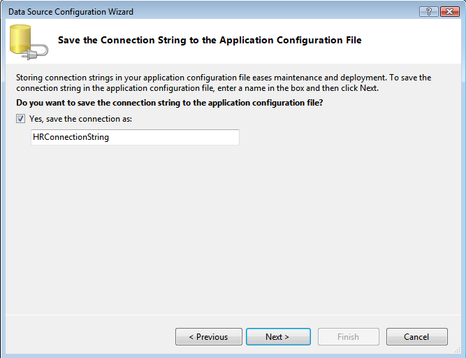

18. From the list of available tables returned for the HR database,
    select the
    
    *JOBS*
    
    table to be associated with the
    
    *DataGridView*
    
    control.
    
    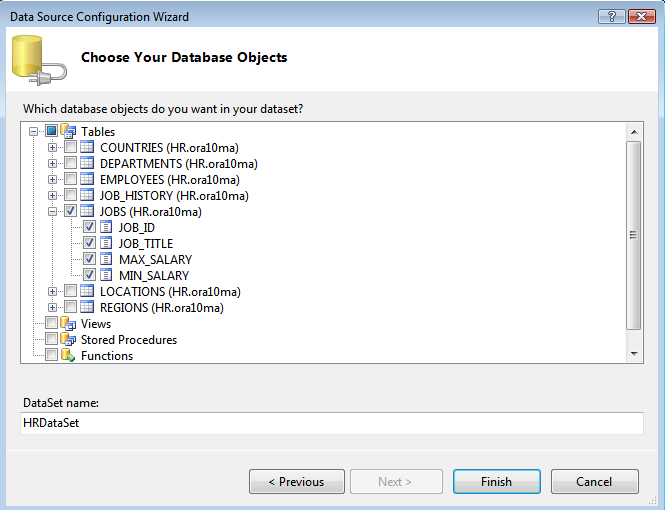

19. The columns names of the select table will be displayed in the
    DataGridView.
    
    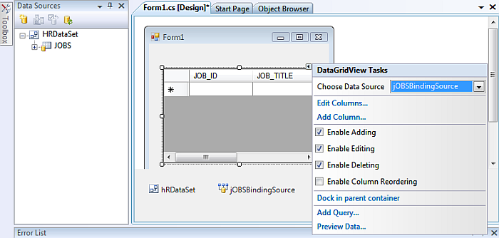

20. Resize the Form and DataGridView to allow all columns to be visible,
    if possible.
    
    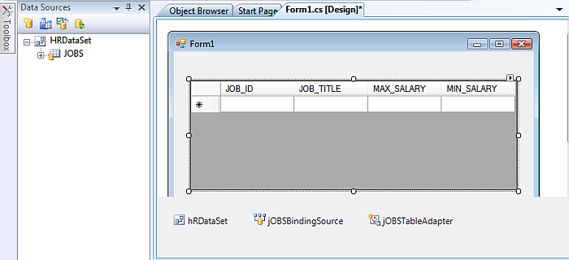

21. To test the application, simply hit
    
    *Ctrl+F5*
    
    within Visual Studio or select
    
    *Start Debugging*
    
    from the
    
    *Debug*
    
    menu.
    
    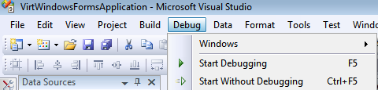

22. The data from the
    
    *JOBS*
    
    table will be displayed in the
    
    *DataGrid*
    
    .
    
    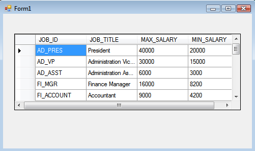

The task is now complete.

# Using Microsoft Entity Frameworks to Access Progress Schema Objects with Virtuoso

**Prerequisites**

**Progress OpenEdge 10.**

A Progress DBMS hosting the required Schema Objects needs to be
available. In this section, the *isports* sample database will be used
to demonstrate the process.

A Progress DBMS hosting the required Schema Objects needs to be
available. In this section, the *isports* sample database will be used
to demonstrate the process.

**OpenLink ODBC Driver for Progress (SQL-92).**

A Progress ODBC Driver is required to link the Progress Schema Objects
into the Virtuoso Server. The OpenLink *ODBC Driver for Progress
(SQL-92)* will be used in this section, for which a functional ODBC Data
source name of "*prs101c* " will be assumed to exist on the machine
hosting the Virtuoso Server.

A Progress ODBC Driver is required to link the Progress Schema Objects
into the Virtuoso Server. The OpenLink *ODBC Driver for Progress
(SQL-92)* will be used in this section, for which a functional ODBC Data
source name of "*prs101c* " will be assumed to exist on the machine
hosting the Virtuoso Server.

**OpenLink Virtuoso 5.10.x.**

An OpenLink Virtuoso Universal Server installation including the
Virtuoso Universal Server and ADO.NET Entity Framework Provider is
required. The Virtuoso components must be Release 5.10.x or above, this
being the minimum version containing support for Microsoft Entity
Frameworks.

An OpenLink Virtuoso Universal Server installation including the
Virtuoso Universal Server and ADO.NET Entity Framework Provider is
required. The Virtuoso components must be Release 5.10.x or above, this
being the minimum version containing support for Microsoft Entity
Frameworks.

**Microsoft Visual Studio 2008 + SP1.**

Microsoft Visual Studio 2008 with Service Pack 1 is required, this being
the only version containing the necessary Entity Framework support
available at the time of writing.

Microsoft Visual Studio 2008 with Service Pack 1 is required, this being
the only version containing the necessary Entity Framework support
available at the time of writing.

**Tasks**

**Ensure Progress Primary Keys (PKs) are not nullable.**

The Visual Studio 2008 Entity Data Model (EDM) requires that all primary
keys are NOT Nullable, and will fail to generate an EDM if any are
nullable. Thus ensure any tables to be used are defined as not nullable
in the Progress database schema before attempting to generate an EDM.

The Visual Studio 2008 Entity Data Model (EDM) requires that all primary
keys are NOT Nullable, and will fail to generate an EDM if any are
nullable. Thus ensure any tables to be used are defined as not nullable
in the Progress database schema before attempting to generate an EDM.

It seems that, by default, several Primary Keys (PKs) in the isports
database allows \<NULL\> values. It seems somewhat nonsensical - that a
unique key used, specifically, to identify a row in a table can be
allowed to be \<NULL\>.

This issue is best addressed directly in the database schema, by
redefining those PKs that allow \<NULL\> so as not to allow \<NULL\>.
Progress does not seem to talk in terms of \<NULL\>, instead using the
term "Mandatory"

The following section will provide more specific details about how to
ensure Progress PKs are not nullable:

  - Ensuring Progress PKs are not nullable

## Install and configure OpenLink ODBC Driver for Progress (SQL-92)

The Virtuoso Virtual Database engine uses ODBC as the connectivity
mechanism for linking remote database objects into its local schema.
Thus a Progress ODBC Driver must be available with a suitably configured
DSN for connecting to the target database. The OpenLink ODBC Drivers for
Progress have been used in this section, although in theory any Progress
ODBC Driver can be used.

Installation instructions for the OpenLink ODBC Driver for Oracle are
available from:

  - [Product Installation & Basic Configuration (ODBC)](#)

## Install and configure OpenLink Virtuoso Universal Server

  - [Install and configure OpenLink Virtuoso Universal
    Server](#virtclientrefinstallandconfigvirt)

## Linking Progress tables into Virtuoso

1.  Start the Virtuoso Web User Interface
    
    

2.  Select the "Conductor" link in the Left Frame and Login as the "dba"
    user.
    
    

3.  Select the "Databases" -\> "External Data Source" -\> "Data Sources"
    tab menu items
    
    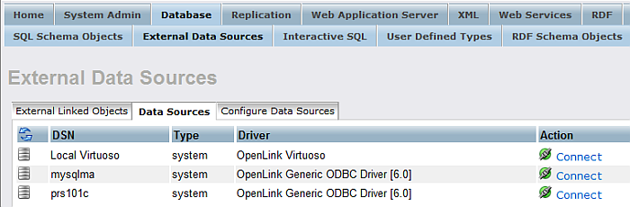

4.  Select the "Connect" button for the "prs10ma" Oracle DSN.
    
    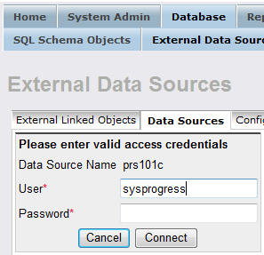

5.  On successful connection Select the "Link Objects" button to obtain
    a list of available tables
    
    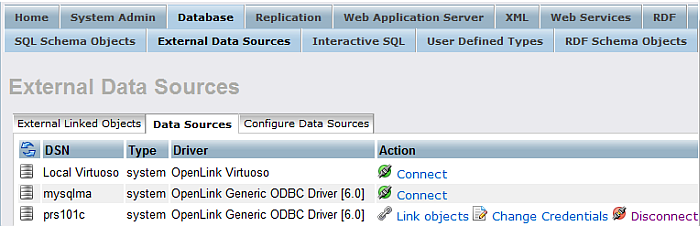

6.  Select all the tables that are part of the "isports" catalog.
    
    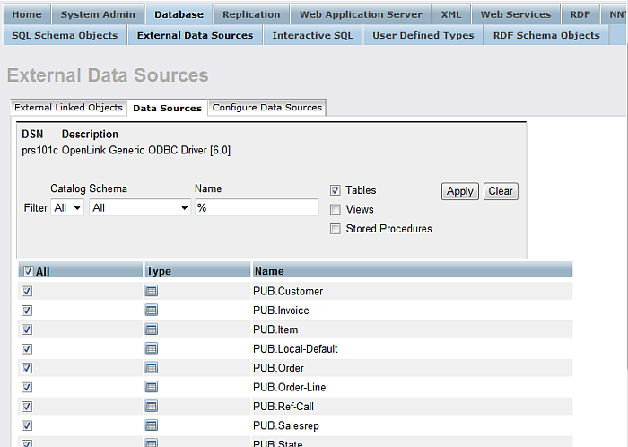

7.  Change the Catalog for each table to be "isports" using the "Set
    All" button.
    
    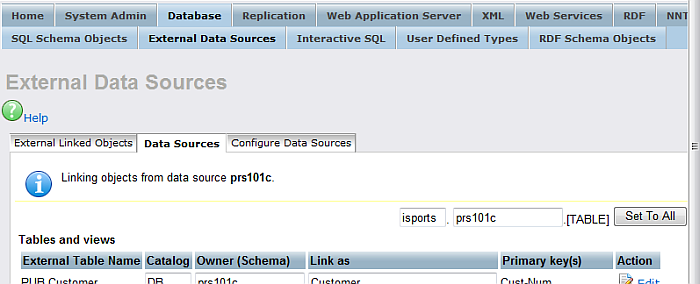

8.  All the catalog names are changed to be "isports".
    
    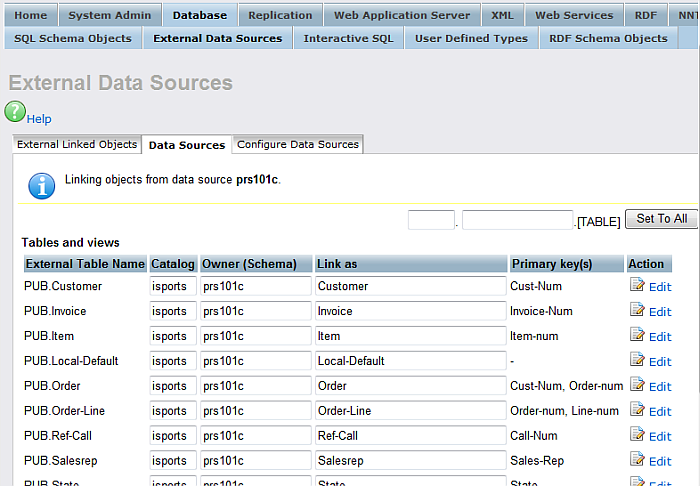

9.  Select the "Link" button to link the selected tables into Virtuoso
    
    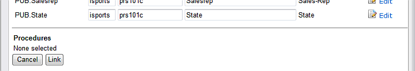

10. On completion of the Link process the tables will be displayed in
    the "External Linked Objects" tab.
    
    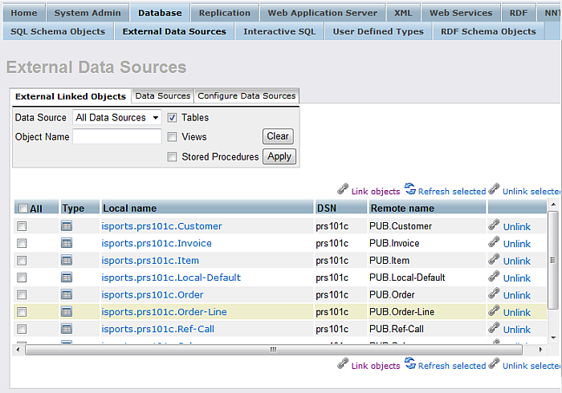

11. At this point you can test the remotely linked tables by clicking on
    the link that accompanies each table. e.g. isports.prs101c.Customer.
    
    This will display the Interactive ISQL interface which will have
    been already populated with a suitable SQL statement.
    
    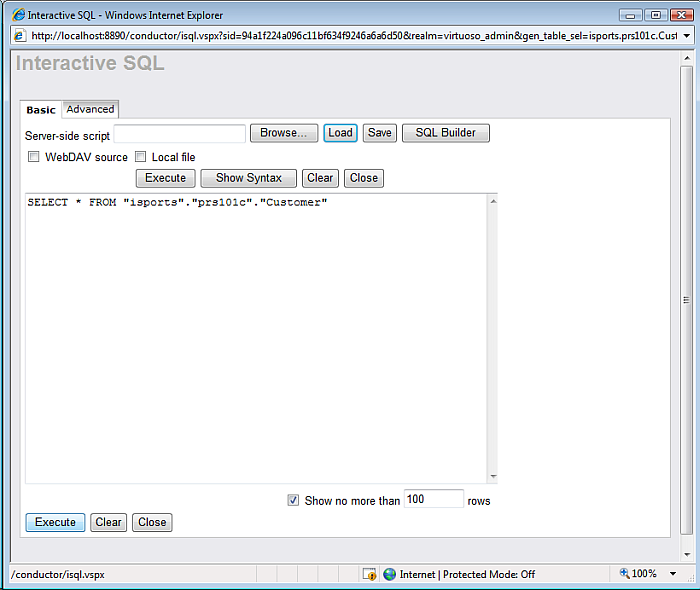

12. Select Execute to see data from the remotely linked table.
    
    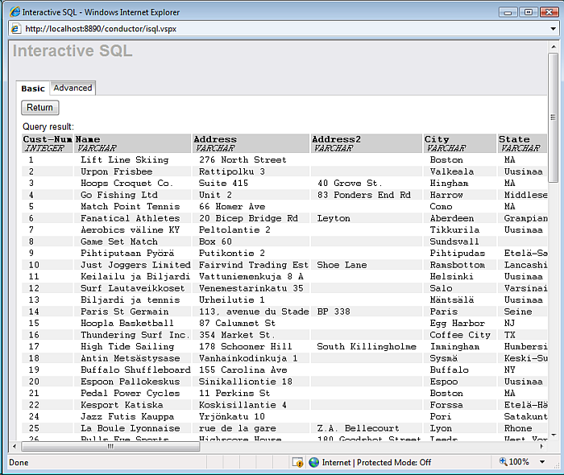

13. The tables can also be viewed as part of the Virtuoso "SQL Schema
    Objects" under the "isports" catalog name.
    
    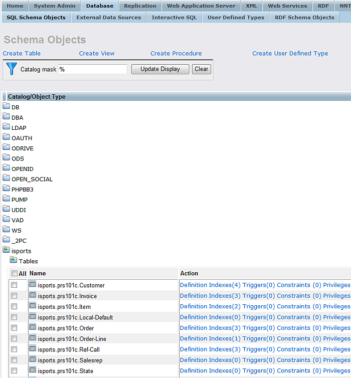
    
    The Link process is now complete enabling the tables to be queried
    as if part of the Virtuoso Schema.

## Creating EDM in Visual Studio 2008

The following steps can be used to create an Entity Data Model (EDM) for
the Progress isports database:

1.  Launch the Visual Studio 2008 SP1 IDE.
    
    

2.  Create a
    
    *Web Application*
    
    project by going to the
    
    *File*
    
    menu in Visual Studio and choosing
    
    *New Project*
    
    .
    
    

3.  When the New Project window appears, choose either
    
    *Visual Basic*
    
    or
    
    *Visual C\#*
    
    as your programming language.

4.  Within the language category, click on
    
    *Web*
    
    and select
    
    *ASP.NET Web Application*
    
    from the right-hand panel.

5.  Choose a name for the project, for example
    
    *isports*
    
    , and click
    
    *OK*
    
    .
    
    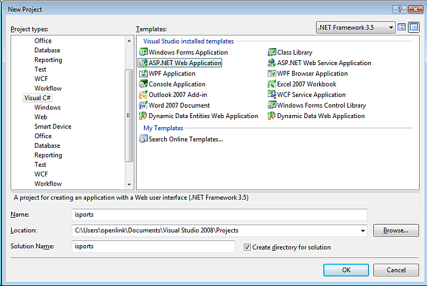

6.  This will create a new project called
    
    *isports*
    
    .
    
    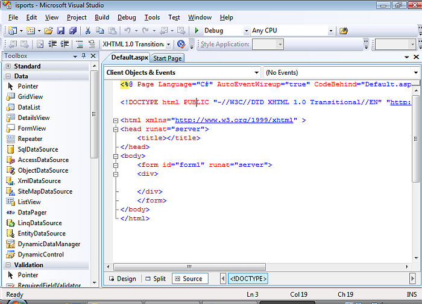

7.  Select the Project -\> Add New Item menu option.
    
    

8.  The
    
    *Add New Item*
    
    dialog will appear. Choose the
    
    *ADO.NET Entity Data Model*
    
    template. Give it the name
    
    *Model1.edmx*
    
    and click
    
    *Add*
    
    to start the creation of the ADO.Net Entity Data Model.
    
    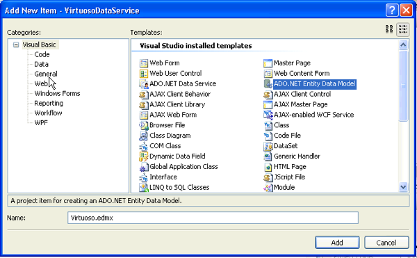

9.  In the
    
    *Entity Data Model Wizard*
    
    dialog
    
    *Choose Model Contents*
    
    page select the
    
    *Generate from Database*
    
    model type and click
    
    *Next*
    
    .
    
    

10. In the
    
    *Entity Data Model Wizard*
    
    dialog
    
    *Choose your Data Connection*
    
    page, select the
    
    *New Connection button*
    
    

11. In the
    
    *Choose Data Source*
    
    dialog, select the OpenLink
    
    *Virtuoso Data Source*
    
    from the list and click
    
    *Continue*
    
    .
    
    

12. In the
    
    *Add Connection*
    
    dialog, specify the
    
    *hostname, portno, username and password*
    
    for the target Virtuoso Server and check the Save Password check
    box.
    
    

13. Select the
    
    *Select Database From List*
    
    radio button and choose the
    
    *isports*
    
    database from the drop down list.
    
    

14. Press the
    
    *Test Connection*
    
    dialog to verify that the database is accessible.
    
    

15. Set the
    
    *entity connect string*
    
    name to
    
    *isportsEntities*
    
    (note this name as it is required in the section on creating and
    ADO.Net Data Service) and click
    
    *Next*
    
    .
    
    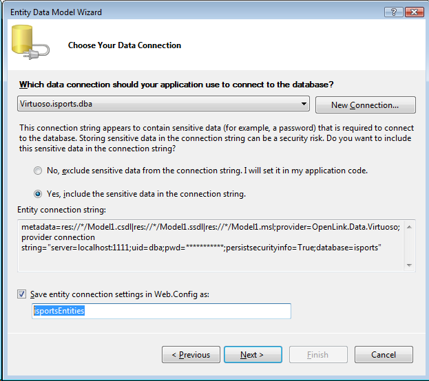

16. In the
    
    *Choose your Database Objects*
    
    page select the
    
    *Tables*
    
    check box to select all tables in the isports catalog for addition
    to the Entity Data Model. Set the
    
    *Model Namespace*
    
    to
    
    *isportsModel*
    
    and click
    
    *Finish*
    
    .
    
    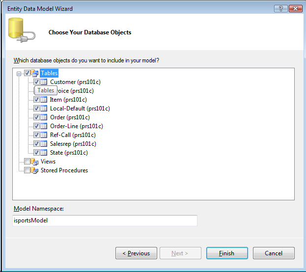

17. The
    
    *Model1.edmx*
    
    EDM will be created with the tables and relationships displayed in
    the Visual Studio IDE.
    
    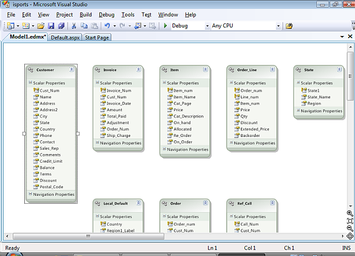

Creation for the Entity Data Model for the Progress isports database is
now complete.

## Manually creating EDM Associations (FKs) for the Progress isports database

The following steps will detail what is required to manually create
"Associations" in your Entity Data Model.

You will need to determine where these associations exist and their
multiplicity (one-to-one, one-to-many, etc.) before commencing with the
following steps.

*Note:* These steps will need to be repeated for each association.

1.  The first Association will deal with is the relationship between
    Customer and Invoice, identified by the presence of the scalar
    property Cust\_Num in both entities. This is a one-to-many
    relationship, as a Customer may have any number of Invoices.
    
    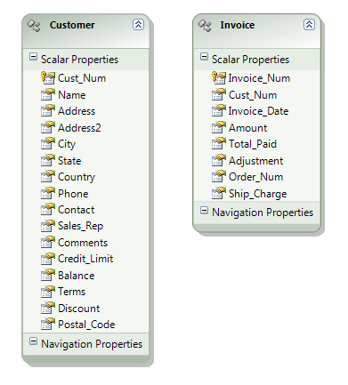

2.  To add the Association, right click on the Customer entity then Add
    -\> Association.
    
    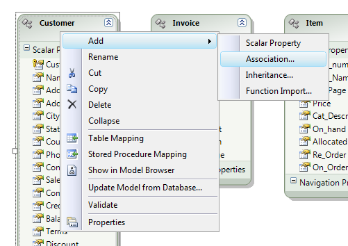

3.  You will now see the Add Association dialog.
    
    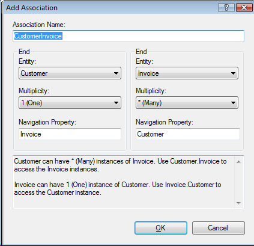

4.  For this association the only thing that needs changing from the
    default, is the name of the Navigation Property from Invoice to
    invoices on the Customer end of the association.
    
    This better reflects the multiplicity of the association such that a
    Customer is associated with zero or many Invoices (plural).
    
    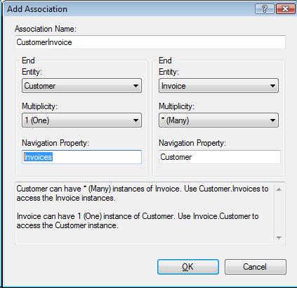
    
    Typically, here is where you will:
    
      - Select the entity at each end of the association
    
      - Select the multiplicity of each end of the association, and
    
      - Provide suitable names for the association and its navigation
        properties

5.  Once you then hit OK the diagram is refreshed to include the newly
    created association.
    
    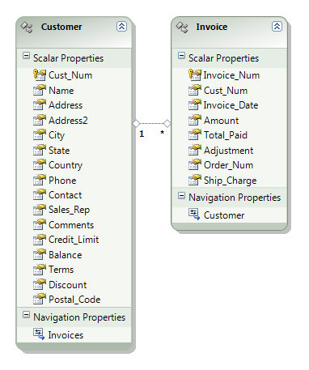

6.  You now need to edit the mappings associated with the newly created
    association, so right-click the association on the diagram, and
    select Table Mapping to display the Mapping Details pane.
    
    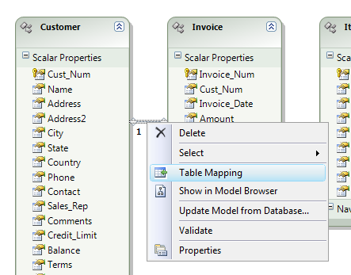

7.  Click that line reading \<Add a Table or View\> to reveal a drop
    down list of all entities.
    
    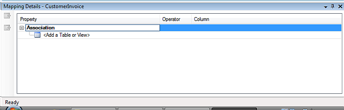

8.  Here you need to select the entity on the right/far side of the
    association (the entity where the foreign key exists). In this
    example, it is the Invoice entity.
    
    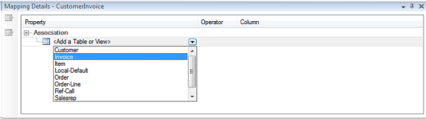

9.  The Mapping Details pane now refreshes to display both ends of the
    association, requiring that you provide relevant target store data
    types in the Column column for the key fields, as depicted here.
    
    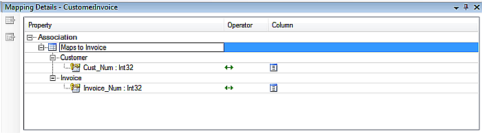
    
    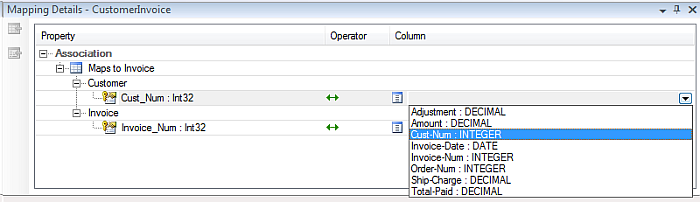
    
    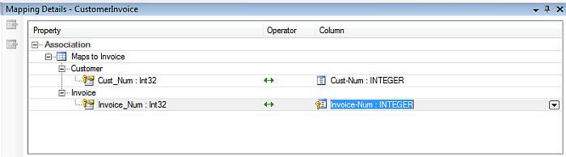

10. Once the mapping is complete, you can build the project using Build
    -\> Build Solution. NOTE: It is worthwhile building as each
    association is made, since the error messages can be a little
    confusing.
    
    

11. This should result in the following error:
    
    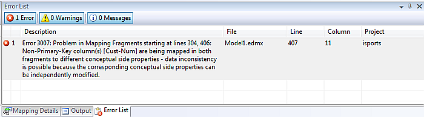
    
    This error indicates that there are two source columns - in this
    case, the Invoice entity's Scalar Property Cust\_Num and Navigation
    Property Customer, which are both mapped to the same target column -
    the Progress column Invoice.Cust\_Num - and this is not supported.
    
    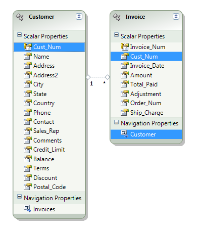

12. The solution is simple\! Simply delete the mapping of the Scalar
    Property Invoice.Cust\_Num, since its only purpose is to hold data
    representing a relationship/association (it is a Foreign Key) which
    has already been represented by the newly created association and
    resulting Navigation Property Customer.
    
    Right click on Invoice.Cust\_Num then Delete.
    
    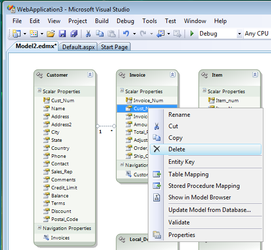

13. The model diagram will refresh to reflect this change.
    
    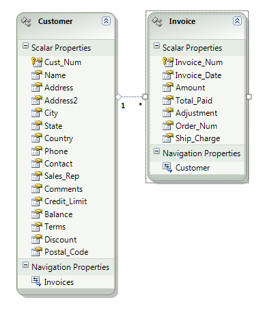

14. Build the project, again, using Build -\> Build Solution.
    
    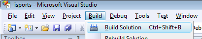

15. The project should now be fine.
    
    

You will need to repeat these steps for each association until you have
a completed Entity Data Model.

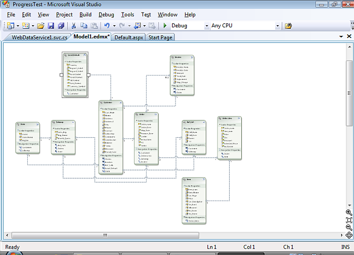

## Using EDM to create Entity Framework based applications

Now that a Microsoft Entity Data Model has been created for the Progress
isports database, Entity Framework applications can be created to make
use of it.

### Entity Framework Data Service

An ADO.Net Data Service for the Progress tables can be created using the
Entity Data Model created in the [Creating EDM in Visual Studio 2008
section](#vdbengineprcrem) .

1.  Open the
    
    *VirtuosoDataService*
    
    project created in the [Creating EDM in Visual Studio 2008
    section](#vdbengineprcrem) .

2.  Select the Project -\> Add New Item menu option.
    
    

3.  The
    
    *Add New Item*
    
    dialog will appear. Choose the
    
    *ADO.NET Data Service template*
    
    . Give it the name
    
    *WebDataService.svc*
    
    , and click
    
    *Add*
    
    to create the ADO.Net Data Service.
    
    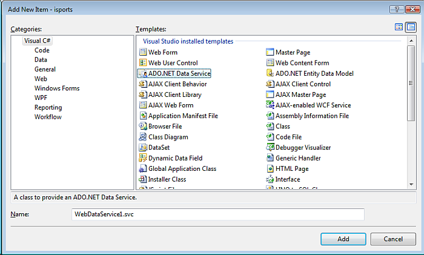

4.  In the
    
    *WebDataService1.svc.cs*
    
    Data Service file created add the data source class name of
    
    *isportsEntities*
    
    (note this is the name set in the Creating EDM in Visual Studio 2008
    section) as the
    
    *DataService*
    
    name and enable the access to the Data Service by adding the entry
    
    *config.SetEntitySetAccessRule("\*", EntitySetRights.All);*
    
    in the
    
    *InitializeService*
    
    method.
    
        // C#
        
        using System;
        using System.Web;
        using System.Collections.Generic;
        using System.ServiceModel.Web;
        using System.Linq;
        using System.Data.Services;
        
        namespace SimpleDataService
        {
            public class Northwind : DataService<VirtuosoDemoEntities>
            {
                public static void InitializeService(IDataServiceConfiguration  config)
                {
                    config.SetEntitySetAccessRule("*", EntitySetRights.All);
                }
            }
        }

    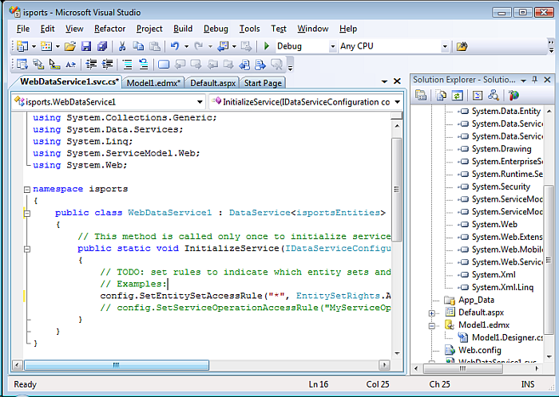

5.  To test the Data Service, simply hit
    
    *Ctrl+F5*
    
    within Visual Studio. This will start the development web server,
    run the Data Services server inside and load a Web browser page
    displaying the list of available tables/entities for the isports
    database catalog.
    
    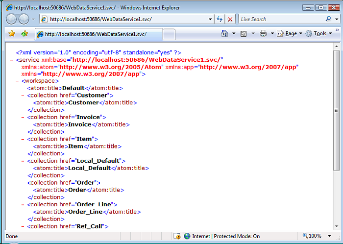

6.  To access a specific entity instance like the
    
    *EMPLOYEES*
    
    table employee number
    
    *100*
    
    record, use this convention
    http://host/vdir/Virtuoso.svc/EMPLOYEES(100) .
    
    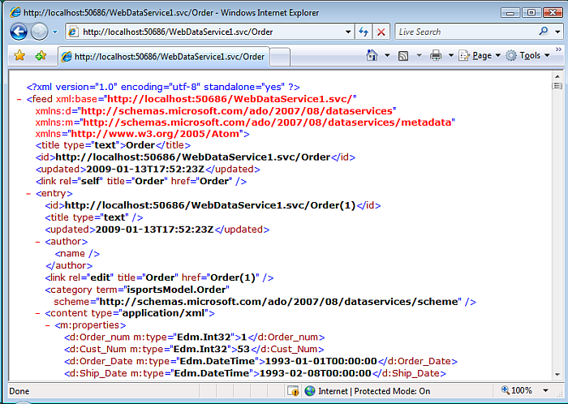

*Notes:*

1.  *Important*
    
    \- To view
    
    *Atom*
    
    (the default format returned by an ADO.NET Data Service) in Internet
    Explorer, you must first ensure that
    
    *Feed Reading View*
    
    is turned
    
    *off*
    
    . This can be done on the
    
    *Content tab*
    
    of
    
    *Tools in Internet Options*
    
    .

2.  If a Data Services entity instance URI page fails to load you can
    turn
    
    *Verbose*
    
    errors on by adding
    
    *config.UseVerboseErrors = true;*
    
    in the
    
    *virtuoso.svc.cs InitializeService*
    
    method to obtain more detailed information from the server as to why
    the page failed to load:
    
        public static void InitializeService(IDataServiceConfiguration config)
        
        {
        
        config.UseVerboseErrors = true;
        
        config.SetEntitySetAccessRule("*", EntitySetRights.All);
        
        }

### Visual Studio Windows DataGrid Form Application

This section details the steps required to create a simple Visual Studio
2008 Windows Form application, with associated DataGridView control for
displaying data in selected tables from the target database.

1.  Launch the Visual Studio 2008 SP1 IDE.
    
    

2.  Create a
    
    *Web Application*
    
    project by going to the
    
    *File*
    
    menu in Visual Studio and choosing
    
    *New Project*
    
    .
    
    

3.  When the New Project window appears, choose either
    
    *Visual Basic*
    
    or
    
    *Visual C\#*
    
    as your programming language.

4.  Within the language category, click on
    
    *Windows*
    
    and select
    
    *Windows Form Application*
    
    from the right-hand panel.

5.  Choose a name for the project, for example
    
    *VirtWindowsFormApplication*
    
    , and click
    
    *OK*
    
    .
    
    

6.  In the
    
    *Toolbox*
    
    , expand
    
    *Data Controls*
    
    , and drag the
    
    *DataGridView*
    
    control onto the form.
    
    

7.  Click on the little
    
    *arrow*
    
    in the top right of the
    
    *DataGridView*
    
    control. This loads the
    
    *DataGridView Task*
    
    menu.
    
    

8.  Click on the
    
    *Choose Data Source*
    
    list box.
    
    

9.  Click on the
    
    *Add Project Data Source*
    
    link to connect to a data source.
    
    

10. In the
    
    *Data Source Configuration Wizard*
    
    dialog
    
    *Choose Data Source Type*
    
    page select the
    
    *Database*
    
    data source type and click
    
    *Next*
    
    .
    
    

11. In the
    
    *Data Source Configuration Wizard*
    
    dialog
    
    *Choose your Data Connection*
    
    page, select the
    
    *New Connection*
    
    button
    
    

12. In the
    
    *Choose Data Source*
    
    dialog, select the OpenLink
    
    *Virtuoso Data Source*
    
    from the list and click
    
    *Continue*
    
    .
    
    

13. In the
    
    *Add Connection*
    
    dialog, specify the
    
    *hostname, portno, username and password*
    
    for the target Virtuoso Server and check the Save Password check
    box.
    
    

14. Select the
    
    *Select Database From List*
    
    radio button and choose
    
    *isports*
    
    from the drop down list.
    
    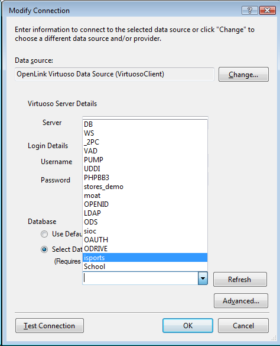

15. Press the
    
    *Test Connection*
    
    dialog to verify that the database is accessible.
    
    

16. Leave the default connect string
    
    *isportsConnectionString*
    
    and click
    
    *Next*
    
    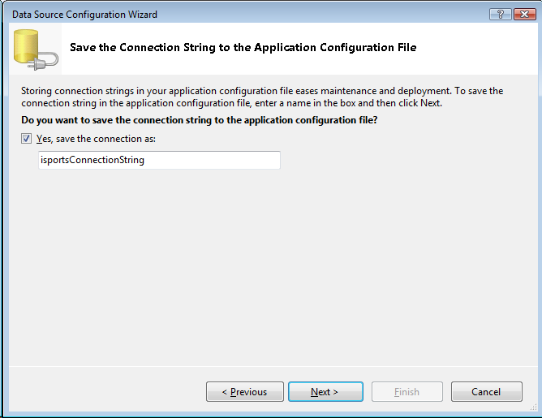

17. From the list of available tables returned for the isports database,
    select the
    
    *JOBS*
    
    table to be associated with the
    
    *DataGridView*
    
    control.
    
    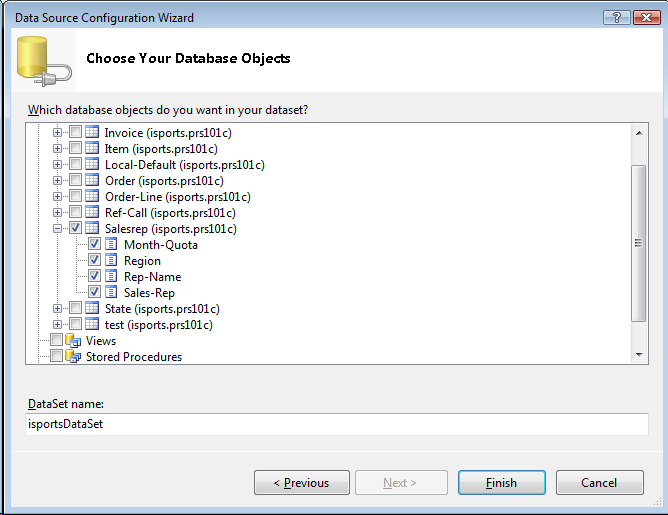

18. The columns names of the select table will be displayed in the
    DataGridView.
    
    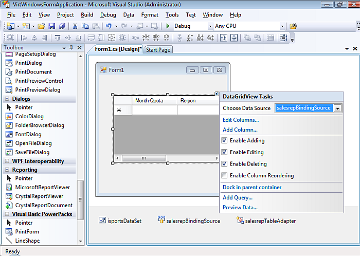

19. Resize the Form and DataGridView to allow all columns to be visible,
    if possible.
    
    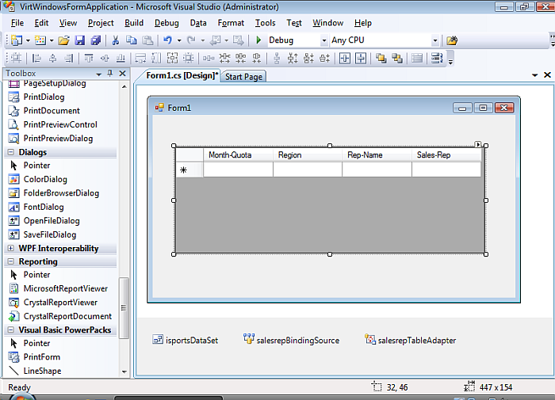

20. To test the application, simply hit
    
    *Ctrl+F5*
    
    within Visual Studio or select
    
    *Start Debugging*
    
    from the
    
    *Debug*
    
    menu.
    
    

21. The data from the
    
    *JOBS*
    
    table will be displayed in the
    
    *DataGrid*
    
    .
    
    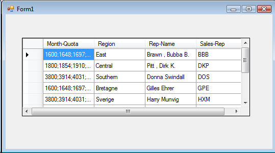

22. To make the DataGridView updateable, you will need to manually add
    some code to the project along with a suitable control to invoke the
    code. Drag a Button control onto the form.
    
    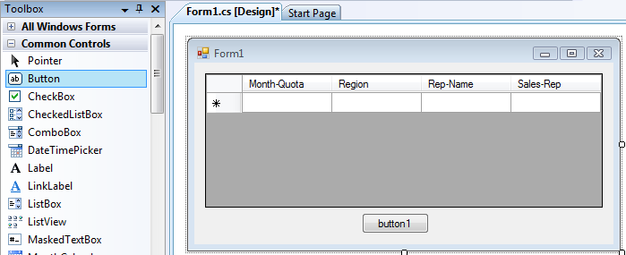

23. Right click on the Button and select Properties.
    
    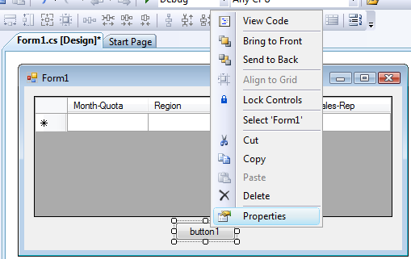

24. In the Properties view, edit the buttons Text property to read Save
    Changes and its (Name) property to read saveChanges.
    
    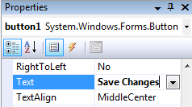

25. The button will now update to reflect these changes.
    
    NOTE: You will need to resize the button to make the new text
    visible.
    
    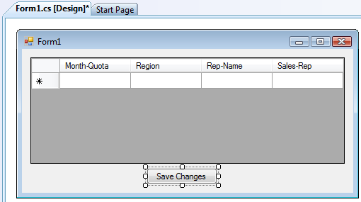

26. Double click the new button to generate the required event handler.
    It should take you directly to the area of code that will execute
    when the button is clicked.
    
    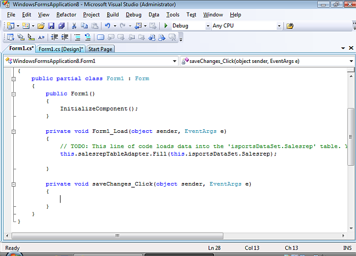

27. Edit the saveChanges\_Click event handler code to include the
    following line.
    
        private void saveChanges_Click(object sender, EventArgs e)
        {
          this.msgsTableAdapter.Update(this.isportsDataSet.msgs);
        }
    
    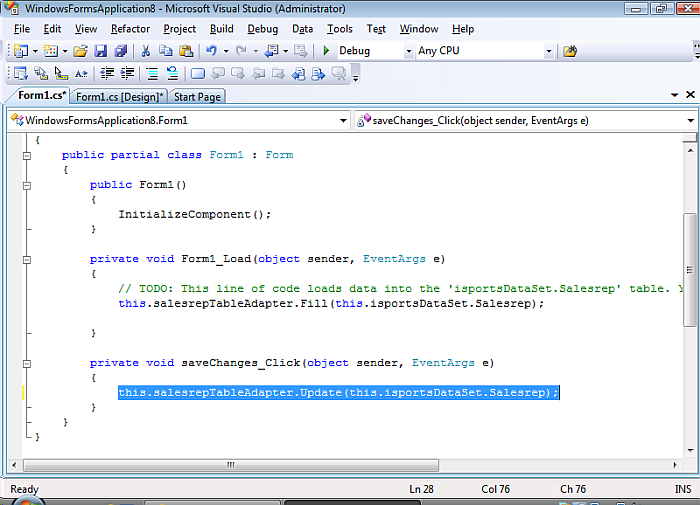

28. Now test the application again by hitting Ctrl+F5.
    
    Scroll to the empty row, at the bottom, and enter data for a new row
    then select Save Changes which will write the new row back to the
    database.
    
    Updates and deletes can be performed similarly.
    
    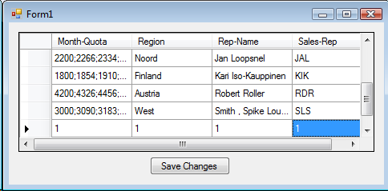

29. You can use Interactive ISQL to test that the changes that have been
    written. Interactive ISQL Interface is detailed in the [Linking
    Progress tables](#vdbengineprlnk) section.
    
    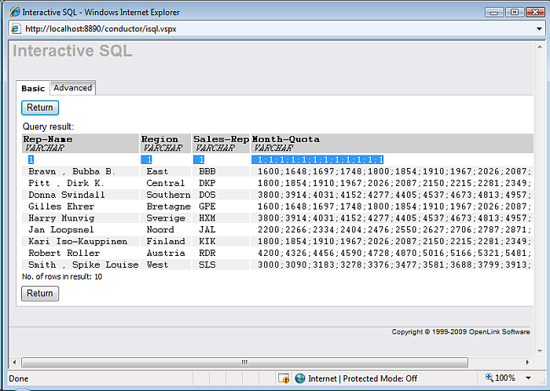

The task is now complete.

# Using Microsoft Entity Frameworks to Access Ingres Schema Objects with Virtuoso

**Prerequisites.**

The following prerequisites must be in place for this solution to be
possible.

**Ingres DBMS.**

An Ingres DBMS hosting the required Schema Objects needs to be
available. In this section the Ingres Tutorial sample database will be
used to demonstrate the process.

An Ingres DBMS hosting the required Schema Objects needs to be
available. In this section the Ingres Tutorial sample database will be
used to demonstrate the process.

**ODBC Driver for Ingres.**

An Ingres ODBC Driver is required for Linking the Ingres Schema Objects
into the Virtuoso Server. The *OpenLink ODBC Driver for Ingres* will be
used in this section, for which a functional ODBC Data source name of
*ingiima* will be assumed to exist on the machine hosting the Virtuoso
Server.

An Ingres ODBC Driver is required for Linking the Ingres Schema Objects
into the Virtuoso Server. The *OpenLink ODBC Driver for Ingres* will be
used in this section, for which a functional ODBC Data source name of
*ingiima* will be assumed to exist on the machine hosting the Virtuoso
Server.

**Virtuoso Universal Server.**

An Virtuoso installation including the Virtuoso Universal Server and
ADO.NET Entity Framework Provider is required. The Virtuoso components
used must be Release 5.10.x or above, this being the minimum version
containing support for Microsoft Entity Frameworks

An Virtuoso installation including the Virtuoso Universal Server and
ADO.NET Entity Framework Provider is required. The Virtuoso components
used must be Release 5.10.x or above, this being the minimum version
containing support for Microsoft Entity Frameworks

**Microsoft Visual Studio 2008 SP1.**

Microsoft Visual Studio 2008 Service Pack 1 is required, this being the
only version containing the necessary Entity Framework support available
at the time of writing.

Microsoft Visual Studio 2008 Service Pack 1 is required, this being the
only version containing the necessary Entity Framework support available
at the time of writing.

**Tasks**

**Ensure Ingres Primary Keys (PKs) are not nullable.**

The Visual Studio 2008 Entity Data Model (EDM) requires that all primary
keys are *NOT* Nullable, and will fail to generate an EDM if any are.
Thus ensure any tables to be used are defined as not nullable in the
Ingres database schema before attempting to generate an EDM. In the case
of the Ingres database all tables are not nullable, thus this should not
be an issue in this case.

The Visual Studio 2008 Entity Data Model (EDM) requires that all primary
keys are *NOT* Nullable, and will fail to generate an EDM if any are.
Thus ensure any tables to be used are defined as not nullable in the
Ingres database schema before attempting to generate an EDM. In the case
of the Ingres database all tables are not nullable, thus this should not
be an issue in this case.

## Install and configure OpenLink ODBC Driver for Ingres

The Virtuoso Virtual Database engine uses ODBC as the connectivity
mechanism for linking remote database objects into its local schema.
Thus an Ingres ODBC Driver must be available with a suitably configured
DSN for connecting to the target database. The OpenLink ODBC Drivers for
Ingres have been used in this section, although in theory any Ingres
ODBC Driver can be used.

Installation instructions for the OpenLink ODBC Driver for Ingres are
available from:

  - [Product Installation & Basic Configuration (ODBC)](#)

## Install and configure OpenLink Virtuoso Universal Server

  - [Install and configure OpenLink Virtuoso Universal
    Server](#virtclientrefinstallandconfigvirt)

## Linking Ingres tables into OpenLink Virtuoso

1.  Start the Virtuoso Web User Interface
    
    

2.  Select the "Conductor" link in the Left Frame and Login as the "dba"
    user.
    
    

3.  Select the "Databases" -\> "External Data Source" -\> "Data Sources"
    tab menu items
    
    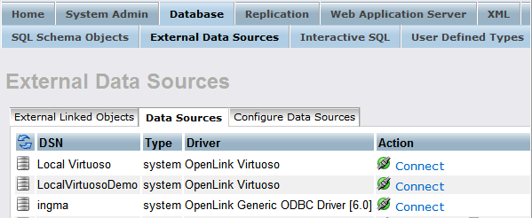

4.  Select the "Connect" button for the "Ing10ma" Ingres DSN.
    
    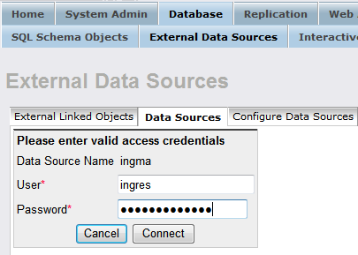

5.  On successful connection Select the "Link Objects" button to obtain
    a list of available tables
    
    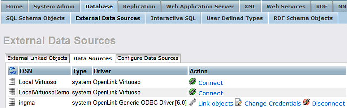

6.  Select all the tables that are part of the "TUT" catalog and press
    the "Link" button to commence the linking process
    
    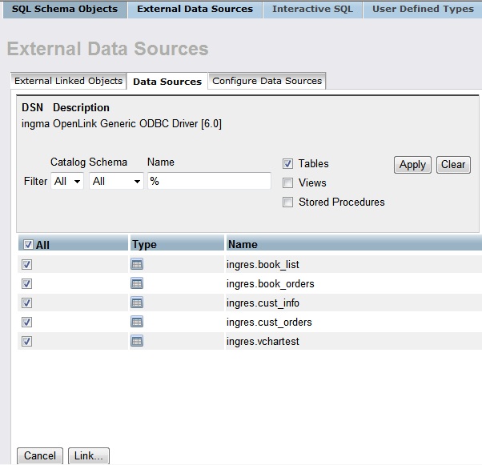

7.  Change the Catalog for each table to be "TUT" using the "Set All"
    button.
    
    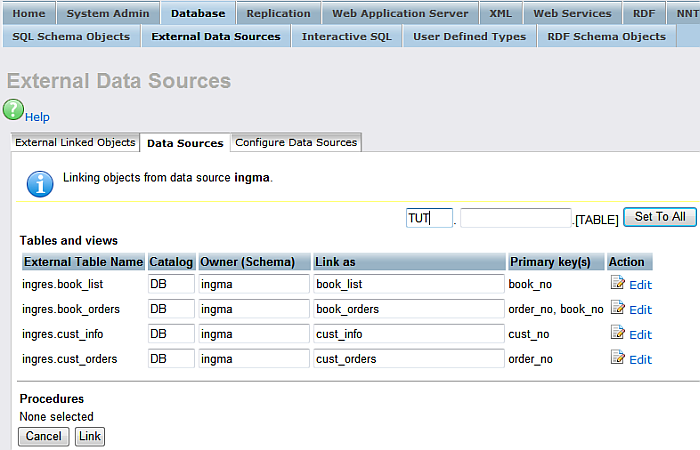

8.  All the catalog names are changed to be "TUT".

9.  Select the "Link" button to link the selected tables into Virtuoso
    
    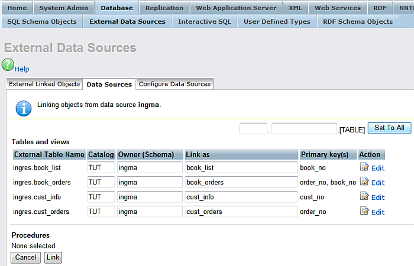

10. On completion of the Link process the tables will be displayed in
    the "External Linked Objects" tab.
    
    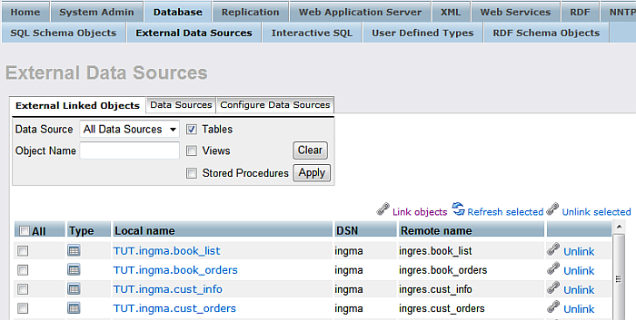

11. The linked tables can be queried by clicking on the hyperlink in the
    "Local Name" column of the "External Linked Objects" tab above,
    which loads the Virtuoso "Interactive SQL" interface with the
    required SQL "Select" for retrieving the remote table data. We shall
    use the "TUT.ingma.book\_list" table to demonstrate this.
    
    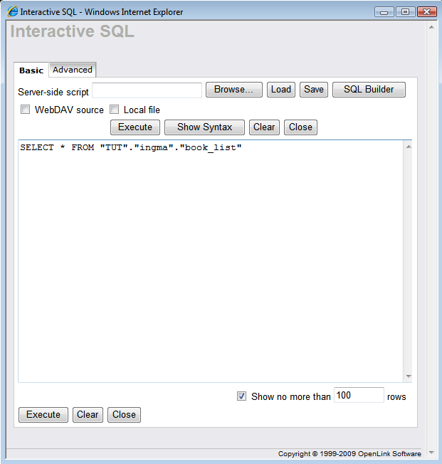

12. Then click the "Execute" button to run the query and retrieve the
    results from the remote table.
    
    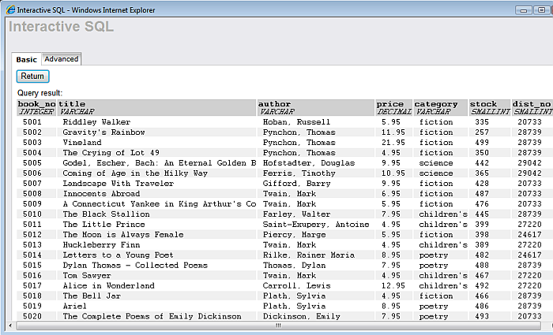

13. The tables can also be viewed as part of the Virtuoso "SQL Schema
    Objects" under the "TUT" catalog name.
    
    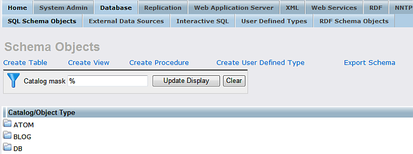
    
    The Link process is now complete enabling the tables to be queried
    as if part of the Virtuoso Schema.

## Creating EDM in Visual Studio 2008

The following steps can be used to create an Entity Data Model (EDM) for
the Ingres Tutorial database:

1.  Launch the Visual Studio 2008 SP1 IDE.
    
    

2.  Create a
    
    *Web Application*
    
    project by going to the
    
    *File*
    
    menu in Visual Studio and choosing
    
    *New Project*
    
    .
    
    

3.  When the New Project window appears, choose either
    
    *Visual Basic*
    
    or
    
    *Visual C\#*
    
    as your programming language.

4.  Within the language category, click on
    
    *Web*
    
    and select
    
    *ASP.NET Web Application*
    
    from the right-hand panel.

5.  Choose a name for the project, for example
    
    *VirtuosoDataService*
    
    , and click
    
    *OK*
    
    .
    
    

6.  This will create a new project called
    
    *VirtuosoDataService*
    
    .
    
    

7.  Select the Project -\> Add New Item menu option.
    
    

8.  The
    
    *Add New Item*
    
    dialog will appear. Choose the
    
    *ADO.NET Entity Data Model*
    
    template. Give it the name
    
    *Virtuoso.edmx*
    
    and click
    
    *Add*
    
    to start the creation of the ADO.Net Entity Data Model.
    
    

9.  In the
    
    *Entity Data Model Wizard*
    
    dialog
    
    *Choose Model Contents*
    
    page select the
    
    *Generate from Database*
    
    model type and click
    
    *Next*
    
    .
    
    

10. In the
    
    *Entity Data Model Wizard*
    
    dialog
    
    *Choose your Data Connection*
    
    page, select the
    
    *New Connection button*
    
    

11. In the
    
    *Choose Data Source*
    
    dialog, select the OpenLink
    
    *Virtuoso Data Source*
    
    from the list and click
    
    *Continue*
    
    .
    
    

12. In the
    
    *Add Connection*
    
    dialog, specify the
    
    *hostname, portno, username and password*
    
    for the target Virtuoso Server and check the Save Password check
    box.
    
    

13. Select the
    
    *Select Database From List*
    
    radio button and choose the
    
    *TUT*
    
    database from the drop down list.
    
    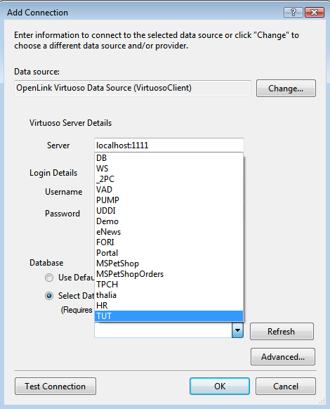

14. Press the
    
    *Test Connection*
    
    dialog to verify that the database is accessible.
    
    

15. Click OK to add the connection.
    
    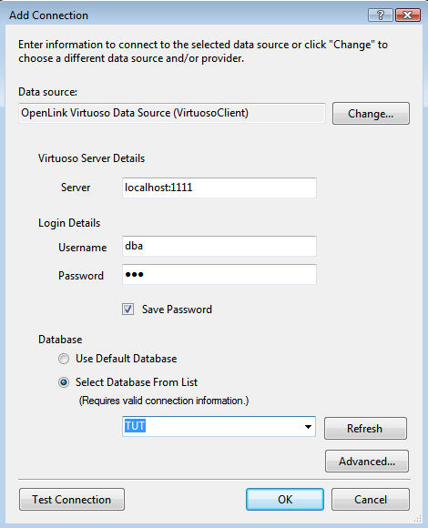

16. Set the
    
    *entity connect string*
    
    name to
    
    *VirtuosoEntities*
    
    (note this name as it is required in the section on creating and
    ADO.Net Data Service) and click
    
    *Next*
    
    .
    
    

17. In the
    
    *Choose your Database Objects*
    
    page, tick the
    
    *Tables*
    
    check box to select all tables in the TUT catalog for addition to
    the Entity Data Model. Set the
    
    *Model Namespace*
    
    to
    
    *VirtuosoModel*
    
    and click
    
    *Finish*
    
    .
    
    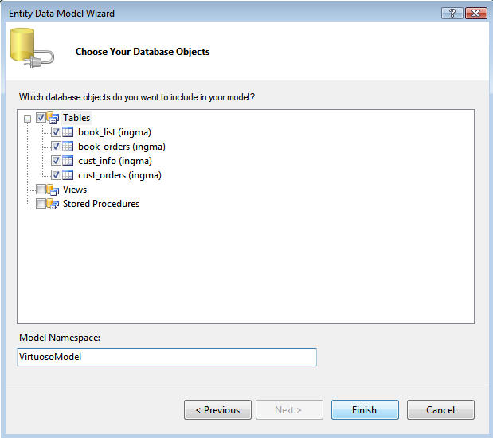

18. The
    
    *Virtuoso.edmx*
    
    EDM will be created with the tables and relationships displayed in
    the Visual Studio IDE
    
    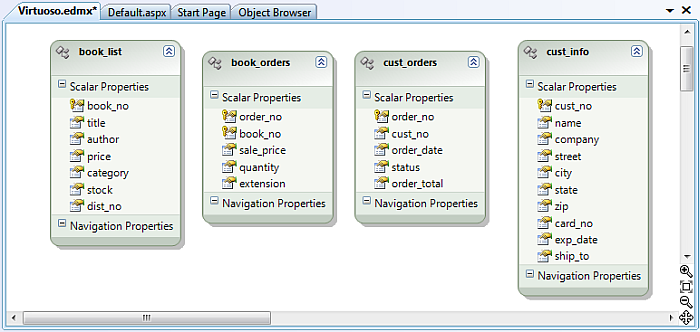

Creation for the Entity Data Model for the Ingres Tutorial database is
now complete.

## Manually creating EDM Associations (FKs) for the Ingres Tutorial database

The following steps will detail what is required to manually create
"Associations" in your Entity Data Model.

Before commencing the process, you will need to determine where these
associations exist and their multiplicity (e.g., one-to-one,
one-to-many, etc.).

*Note:* These steps will need to be repeated for each association.

1.  The first Association I will deal with is the relationship between
    cust\_orders and cust\_info, identified by the presence of the
    Scalar Property cust\_no in both entities. This is a one-to-one
    mpmprelationship, as an entry in a customer order may only be
    associated with one customer's information.
    
    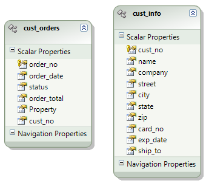

2.  To add the Association, right click on the Customer entity then Add
    -\> Association.
    
    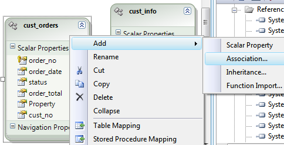

3.  You will now see the Add Association dialog.
    
    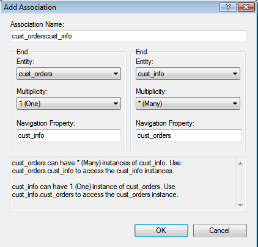

4.  Once you then hit OK the diagram is refreshed to include the newly
    created association.

5.  You now need to edit the mappings associated with the newly created
    association, so right-click the association on the diagram and
    select
    
    *Table Mapping*
    
    to display the
    
    *Mapping Details*
    
    pane.
    
    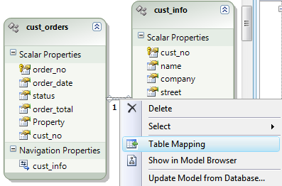

6.  Click that line reading \<Add a Table or View\> to reveal a drop
    down list of all entities.
    
    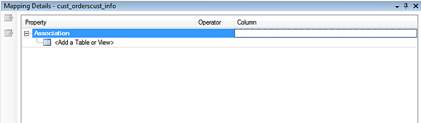

7.  Here you need to select the entity on the right/far side of the
    association (the entity where the foreign key exists). In this
    example, it is the cust\_orders entity.
    
    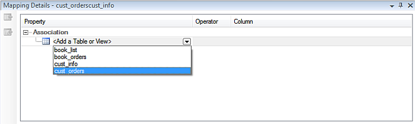

8.  The Mapping Details pane now refreshes to display both ends of the
    association, requiring that you provide relevant target store data
    types in the Column column for the key fields, as depicted here.
    
    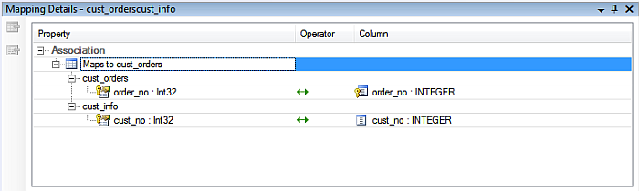

9.  Once the mapping is complete, you can build the project using Build
    -\> Build Solution. NOTE: It is worthwhile building as each
    association is made, since the error messages can be a little
    confusing.
    
    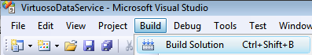

10. This should result in the following error:
    
    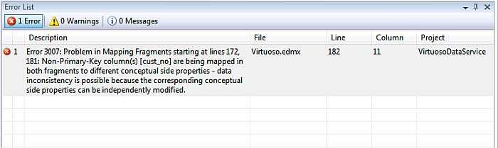
    
    This error indicates that there are two sources - in this case, the
    cust\_orders entity's Scalar Property cust\_no and the Navigation
    Property cust\_info in - which are being mapped to the same target
    column - the Ingres column cust\_orders.cust\_no - which is not
    supported.
    
    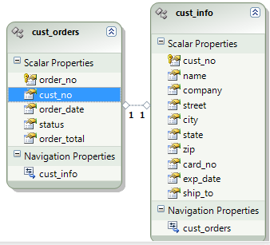

11. The solution is simple\! Simply delete the mapping for Scalar
    Property cust\_orders.cust\_no since its only purpose is to hold
    data representing a relationship/association (it is a Foreign Key),
    which has already been represented by the newly-created association
    and resulting Navigation Property cust\_no.
    
    Right-click on cust\_orders.cust\_no then Delete.
    
    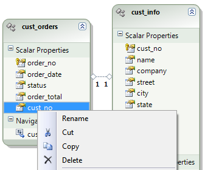

12. The model diagram will refresh to reflect this change.
    
    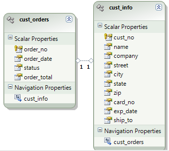

13. Build the project, again, using Build -\> Build Solution.
    
    

14. The project should now be fine.
    
    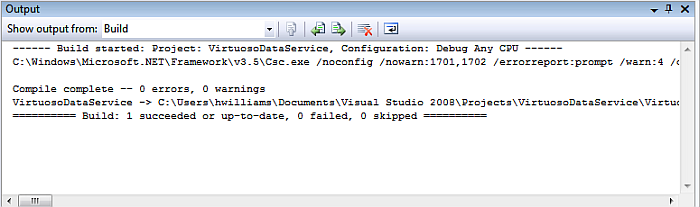

You will need to repeat these steps for each association until you have
a completed Entity Data Model.

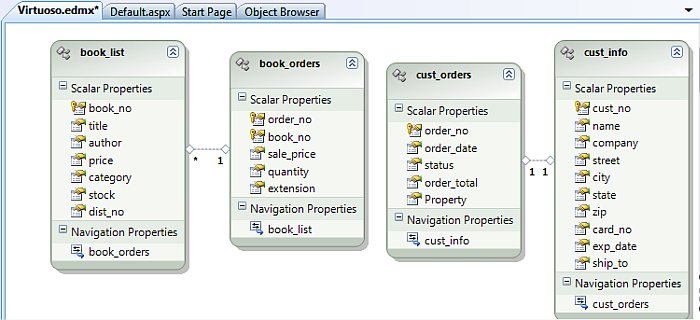

## Using EDM to create Entity Framework based applications

Now that a Microsoft Entity Data Model has been created for the Ingres
Tutorial database, Entity Framework applications can be created to make
use of it.

### Entity Frameworks based ADO.NET Data Service

An ADO.Net Data Service for the Ingres tables can be created using the
Entity Data Model created in the [Creating EDM in Visual Studio 2008
section](#vdbengineingcre) .

1.  Open the
    
    *VirtuosoDataService*
    
    project created in the [Creating EDM in Visual Studio 2008
    section](#vdbengineingcre) .

2.  Select the Project -\> Add New Item menu option.
    
    

3.  The
    
    *Add New Item*
    
    dialog will appear. Choose the
    
    *ADO.NET Data Service template*
    
    . Give it the name
    
    *Virtuoso.svc*
    
    , and click
    
    *Add*
    
    to create the ADO.Net Data Service.
    
    

4.  In the newly created
    
    *Virtuoso.svc.cs*
    
    Data Service, add the data source class name of
    
    *VirtuosoEntities*
    
    (note this is the name set in the Creating EDM in Visual Studio 2008
    section) as the
    
    *DataService*
    
    name. Enable the access to the Data Service by adding the entry
    
    *config.SetEntitySetAccessRule("\*", EntitySetRights.All);*
    
    in the
    
    *InitializeService*
    
    method.
    
        // C#
        
        using System;
        using System.Web;
        using System.Collections.Generic;
        using System.ServiceModel.Web;
        using System.Linq;
        using System.Data.Services;
        
        namespace SimpleDataService
        {
            public class Northwind : DataService<VirtuosoDemoEntities>
            {
                public static void InitializeService(IDataServiceConfiguration  config)
                {
                    config.SetEntitySetAccessRule("*", EntitySetRights.All);
                }
            }
        }

    

5.  To test the Data Service, simply hit
    
    *Ctrl+F5*
    
    within Visual Studio. This will start the development web server,
    run the Data Services server inside, and load a Web browser page
    displaying the list of available tables/entities for the Ingres
    Tutorial database catalog.
    
    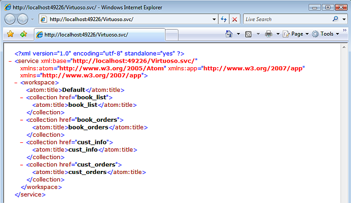

6.  To access a specific entity instance like the cust\_orders table
    order number 5500 record, use this convention:
    http://host/vdir/Virtuoso.svc/cust\_orders(5500) .
    
    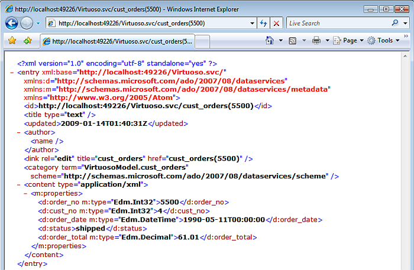

*Notes:*

1.  *Important*
    
    \- To view
    
    *Atom*
    
    (the default format returned by an ADO.NET Data Service) in Internet
    Explorer, you must first ensure that
    
    *Feed Reading View*
    
    is turned
    
    *off*
    
    . This can be done on the
    
    *Content tab*
    
    of
    
    *Tools in Internet Options*
    
    .

2.  If a Data Services entity instance URI page fails to load you can
    turn
    
    *Verbose*
    
    errors on by adding
    
    *config.UseVerboseErrors = true;*
    
    in the
    
    *virtuoso.svc.cs InitializeService*
    
    method to obtain more detailed information from the server as to why
    the page failed to load:
    
        public static void InitializeService(IDataServiceConfiguration config)
        
        {
        
        config.UseVerboseErrors = true;
        
        config.SetEntitySetAccessRule("*", EntitySetRights.All);
        
        }

### Visual Studio Windows DataGrid Form Application

This section details the steps required to create a simple Visual Studio
2008 Windows Form application, with associated DataGridView control for
displaying data in selected tables from the target database.

1.  Launch the Visual Studio 2008 SP1 IDE.
    
    

2.  Create a
    
    *Web Application*
    
    project by going to the
    
    *File*
    
    menu in Visual Studio and choosing
    
    *New Project*
    
    .
    
    

3.  When the New Project window appears, choose either
    
    *Visual Basic*
    
    or
    
    *Visual C\#*
    
    as your programming language.

4.  Within the language category, click on
    
    *Windows*
    
    and select
    
    *Windows Form Application*
    
    from the right-hand panel.

5.  Choose a name for the project, for example
    
    *VirtWindowsFormApplication*
    
    , and click
    
    *OK*
    
    .
    
    

6.  In the
    
    *Toolbox*
    
    , expand
    
    *Data Controls*
    
    , and drag the
    
    *DataGridView*
    
    control onto the form.
    
    

7.  Click on the little
    
    *arrow*
    
    in the top right of the
    
    *DataGridView*
    
    control. This loads the
    
    *DataGridView Task*
    
    menu.
    
    

8.  Click on the
    
    *Choose Data Source*
    
    list box.
    
    

9.  Click on the
    
    *Add Project Data Source*
    
    link to connect to a data source.
    
    

10. In the
    
    *Data Source Configuration Wizard*
    
    dialog
    
    *Choose Data Source Type*
    
    page select the
    
    *Database*
    
    data source type and click
    
    *Next*
    
    .
    
    

11. In the
    
    *Data Source Configuration Wizard*
    
    dialog
    
    *Choose your Data Connection*
    
    page, select the
    
    *New Connection*
    
    button
    
    

12. In the
    
    *Choose Data Source*
    
    dialog, select the OpenLink
    
    *Virtuoso Data Source*
    
    from the list and click
    
    *Continue*
    
    .
    
    

13. In the
    
    *Add Connection*
    
    dialog, specify the
    
    *hostname, portno, username and password*
    
    for the target Virtuoso Server and check the Save Password check
    box.
    
    

14. Select the
    
    *Select Database From List*
    
    radio button and choose the
    
    *TUT*
    
    database from the drop down list.
    
    

15. Press the
    
    *Test Connection*
    
    dialog to verify that the database is accessible.
    
    

16. Click OK to add the connection.
    
    

17. Leave the name of the connect string to the default of
    
    *TUTConnectionString*
    
    and click
    
    *Next*
    
    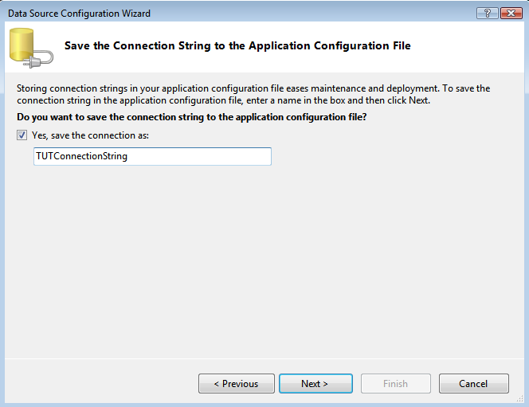

18. From the list of available tables returned for the TUT database,
    select the
    
    *cust\_orders*
    
    table to be associated with the
    
    *DataGridView*
    
    control.
    
    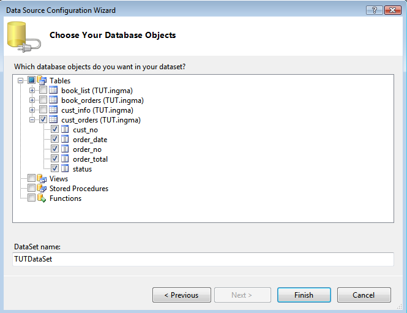

19. The columns names of the select table will be displayed in the
    DataGridView.
    
    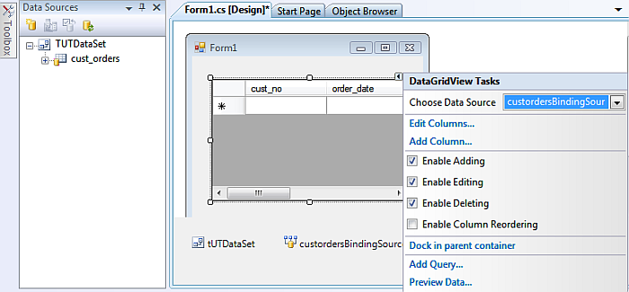

20. Resize the Form and DataGridView to allow all columns to be visible,
    if possible.
    
    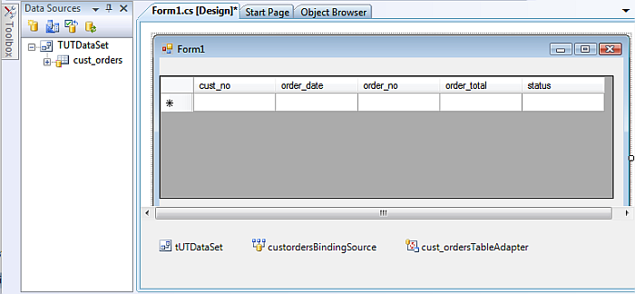

21. To test the application, simply hit
    
    *Ctrl+F5*
    
    within Visual Studio or select
    
    *Start Debugging*
    
    from the
    
    *Debug*
    
    menu.
    
    

22. The data from the
    
    *cust\_orders*
    
    table will be displayed in the
    
    *DataGrid*
    
    .
    
    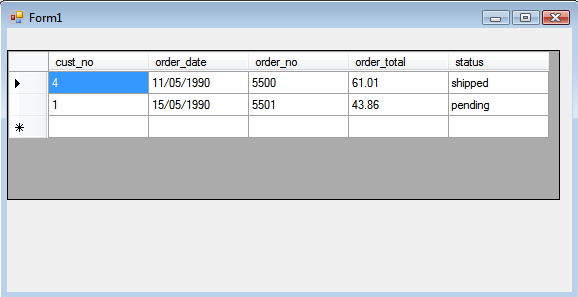

The task is now complete.

# Using Microsoft Entity Frameworks to Access Informix Schema Objects with Virtuoso

**Prerequisites.**

The following prerequisites must be in place for this solution to be
possible.

**Informix DBMS.**

An Informix DBMS hosting the required Schema Objects needs to be
available. In this section the *Informix stores\_demo* sample database
will be used to demonstrate the process.

An Informix DBMS hosting the required Schema Objects needs to be
available. In this section the *Informix stores\_demo* sample database
will be used to demonstrate the process.

**ODBC Driver for Informix.**

An Informix ODBC Driver is required for Linking the Informix Schema
Objects into the Virtuoso Server. The OpenLink *ODBC Driver for
Informix* will be used in this section, for which a functional ODBC Data
source name of "inf10ma" will be assumed to exist on the machine hosting
the Virtuoso Server.

An Informix ODBC Driver is required for Linking the Informix Schema
Objects into the Virtuoso Server. The OpenLink *ODBC Driver for
Informix* will be used in this section, for which a functional ODBC Data
source name of "inf10ma" will be assumed to exist on the machine hosting
the Virtuoso Server.

**Virtuoso Universal Server.**

An Virtuoso installation including the Virtuoso Universal Server and
ADO.NET Entity Framework Provider is required. The Virtuoso components
used must be Release 5.10.x or above, this being the minimum version
containing support for Microsoft Entity Frameworks

An Virtuoso installation including the Virtuoso Universal Server and
ADO.NET Entity Framework Provider is required. The Virtuoso components
used must be Release 5.10.x or above, this being the minimum version
containing support for Microsoft Entity Frameworks

**Microsoft Visual Studio 2008 SP1.**

Microsoft Visual Studio 2008 Service Pack 1 is required, this being the
only version containing the necessary Entity Framework support available
at the time of writing.

Microsoft Visual Studio 2008 Service Pack 1 is required, this being the
only version containing the necessary Entity Framework support available
at the time of writing.

**Tasks**

**Ensure Informix Primary Keys (PKs) are not nullable.**

The Visual Studio 2008 Entity Data Model (EDM) requires that all primary
keys are *NOT* Nullable, and will fail to generate an EDM if any are.
Thus ensure any tables to be used are defined as not nullable in the
Informix database schema before attempting to generate an EDM. In the
case of the Informix stores\_demo database many tables have primary keys
that are nullable so these will need to be redeclared.

The Visual Studio 2008 Entity Data Model (EDM) requires that all primary
keys are *NOT* Nullable, and will fail to generate an EDM if any are.
Thus ensure any tables to be used are defined as not nullable in the
Informix database schema before attempting to generate an EDM. In the
case of the Informix stores\_demo database many tables have primary keys
that are nullable so these will need to be redeclared.

This is possible using dbaccess however care needs to be taken,
particularly with the following

  - Amending a PK field to be not nullable can results in the primary
    key constraint being removed.

  - Amending a PK field to be not nullable when the primary key is
    referenced by a foreign key constraint results in the foreign key
    constraint being removed.

In both of the cases above the primary key and foreign key constraints
that are removed will have to be manually recreated.

## Install and configure OpenLink ODBC Driver for Informix

The Virtuoso Virtual Database engine uses ODBC as the connectivity
mechanism for linking remote database objects into its local schema.
Thus an Informix ODBC Driver must be available with a suitably
configured DSN for connecting to the target database. The OpenLink ODBC
Drivers for Informix have been used in this section, although in theory
any Informix ODBC Driver can be used.

Installation instructions for the OpenLink ODBC Driver for Informix are
available from:

  - [Product Installation & Basic Configuration (ODBC)](#)

## Install and configure OpenLink Virtuoso Universal Server

  - [Install and configure OpenLink Virtuoso Universal
    Server](#virtclientrefinstallandconfigvirt)

## Linking Informix tables into OpenLink Virtuoso

1.  Start the Virtuoso Web User Interface
    
    

2.  Select the "Conductor" link in the Left Frame and Login as the "dba"
    user.
    
    

3.  Select the "Databases" -\> "External Data Source" -\> "Data Sources"
    tab menu items
    
    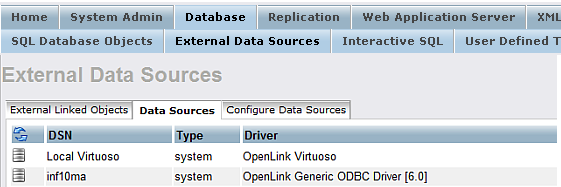

4.  Select the "Connect" button for the "inf10ma" Informix DSN.
    
    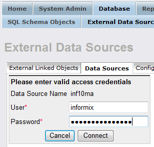

5.  On successful connection Select the "Link Objects" button to obtain
    a list of available tables
    
    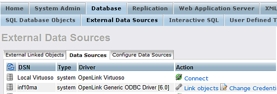

6.  Select all the tables that are part of the "stores\_demo" catalog.
    
    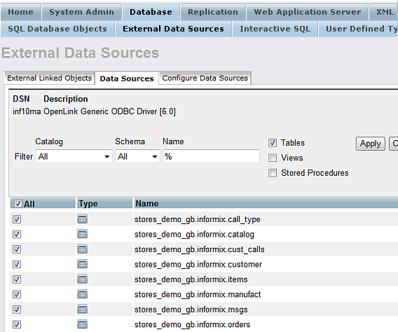

7.  Change the Catalog for each table to be "stores\_demo" using the
    "Set All" button.
    
    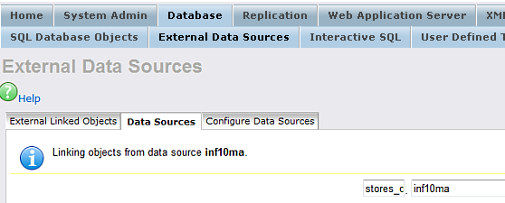

8.  All the catalog names are changed to be "stores\_demo".
    
    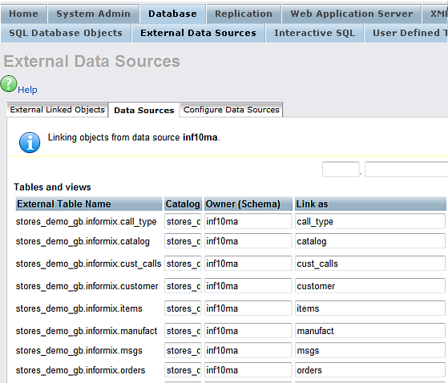

9.  Select the "Link" button to link the selected tables into Virtuoso
    
    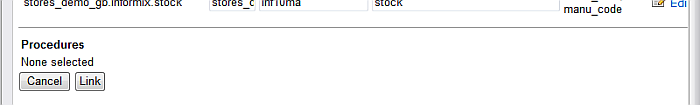

10. On completion of the Link process the tables will be displayed in
    the "External Linked Objects" tab.
    
    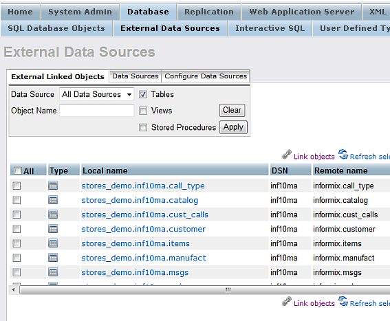

11. At this point you can test the remotely linked tables by clicking on
    the link that accompanies each table. e.g.
    stores\_demo.inf10ma.customer.
    
    This will display the Interactive ISQL interface which will have
    been already populated with a suitable SQL statement.
    
    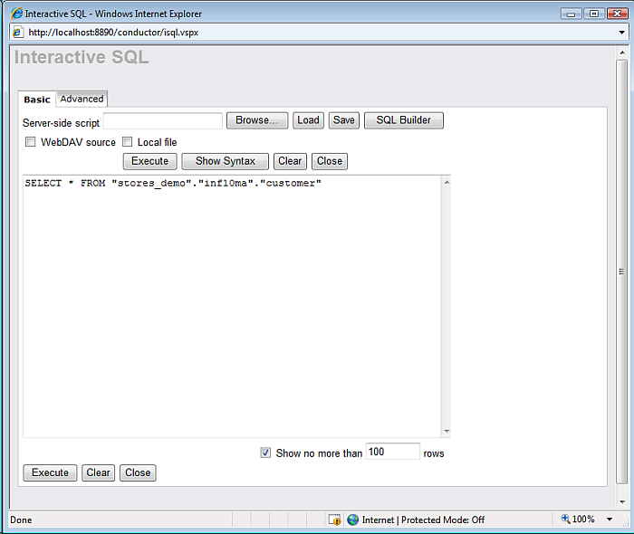

12. Select Execute to see data from the remotely linked table.
    
    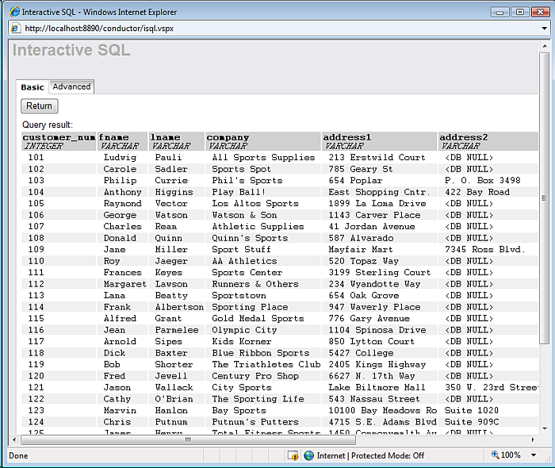

13. The tables can also be viewed as part of the Virtuoso "SQL Schema
    Objects" under the "stores\_demo" catalog name.
    
    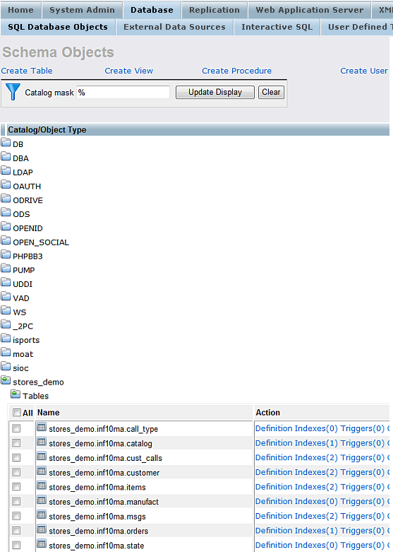
    
    The Link process is now complete enabling the tables to be queried
    as if part of the Virtuoso Schema.

## Creating EDM in Visual Studio 2008

The following steps can be used to create an Entity Data Model (EDM) for
the Informix stores\_demo database:

1.  Launch the Visual Studio 2008 SP1 IDE.
    
    

2.  Create a
    
    *Web Application*
    
    project by going to the
    
    *File*
    
    menu in Visual Studio and choosing
    
    *New Project*
    
    .
    
    

3.  When the New Project window appears, choose either
    
    *Visual Basic*
    
    or
    
    *Visual C\#*
    
    as your programming language.

4.  Within the language category, click on
    
    *Web*
    
    and select
    
    *ASP.NET Web Application*
    
    from the right-hand panel.

5.  Choose a name for the project, for example
    
    *stores\_demo*
    
    , and click
    
    *OK*
    
    .
    
    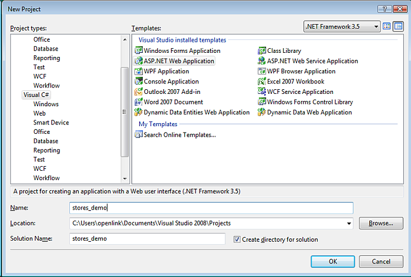

6.  This will create a new project called
    
    *stores\_demo*
    
    .
    
    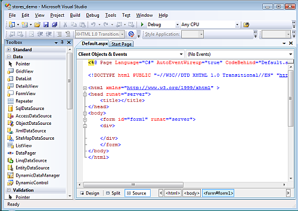

7.  Select the Project -\> Add New Item menu option.
    
    

8.  The
    
    *Add New Item*
    
    dialog will appear. Choose the
    
    *ADO.NET Entity Data Model*
    
    template. Give it the name
    
    *Model1.edmx*
    
    e and click
    
    *Add*
    
    to start the creation of the ADO.Net Entity Data Model.
    
    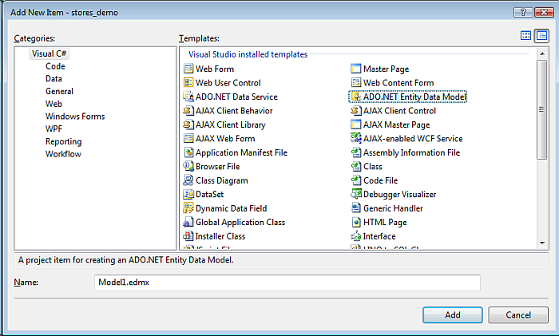

9.  In the
    
    *Entity Data Model Wizard*
    
    dialog
    
    *Choose Model Contents*
    
    page select the
    
    *Generate from Database*
    
    model type and click
    
    *Next*
    
    .
    
    

10. In the
    
    *Entity Data Model Wizard*
    
    dialog
    
    *Choose your Data Connection*
    
    page, select the
    
    *New Connection button*
    
    

11. In the
    
    *Choose Data Source*
    
    dialog, select the OpenLink
    
    *Virtuoso Data Source*
    
    from the list and click
    
    *Continue*
    
    .
    
    

12. In the
    
    *Add Connection*
    
    dialog, specify the
    
    *hostname, portno, username and password*
    
    for the target Virtuoso Server and check the Save Password check
    box.
    
    

13. Select the
    
    *Select Database From List*
    
    radio button and choose the
    
    *stores\_demo*
    
    database from the drop down list.
    
    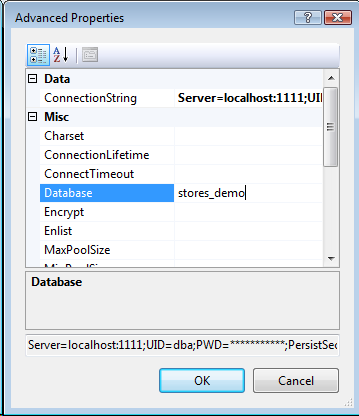

14. Press the
    
    *Test Connection*
    
    dialog to verify that the database is accessible.
    
    

15. Set the
    
    *entity connect string*
    
    name to
    
    *stores\_demoEntities*
    
    (note this name as it is required in the section on creating and
    ADO.Net Data Service) and click
    
    *Next*
    
    .
    
    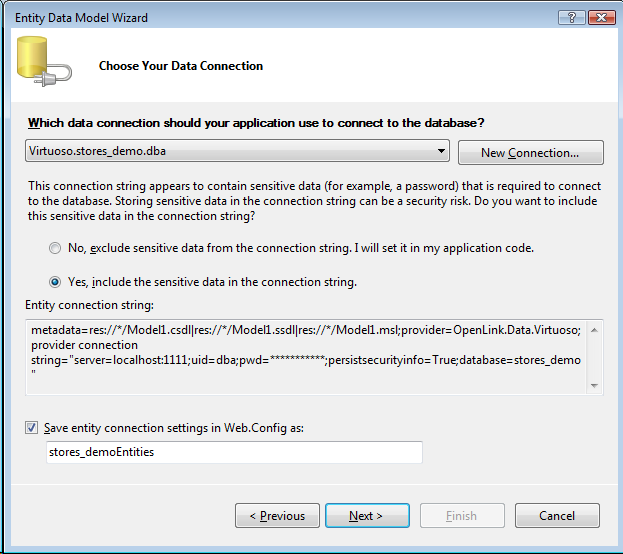

16. In the
    
    *Choose your Database Objects*
    
    page tick the
    
    *Tables*
    
    check box to select all tables in the stores\_demo catalog for
    addition to the Entity Data Model. Set the
    
    *Model Namespace*
    
    to
    
    *stores\_demoModel*
    
    and click
    
    *Finish*
    
    .
    
    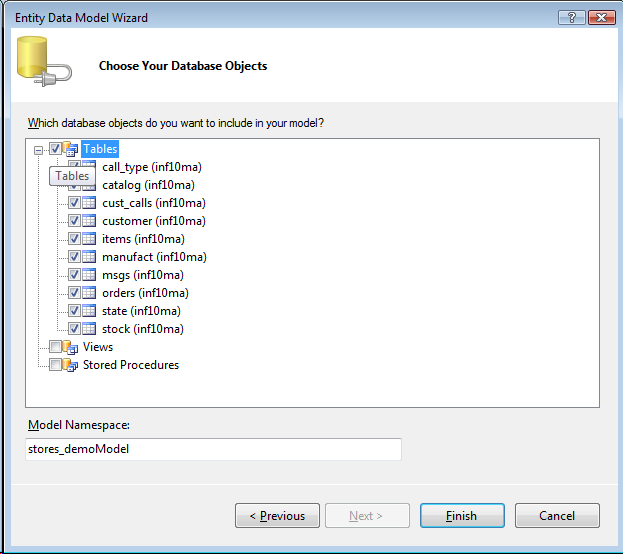

17. The
    
    *Model1.edmx*
    
    EDM will be created with the tables and relationships displayed in
    the Visual Studio IDE
    
    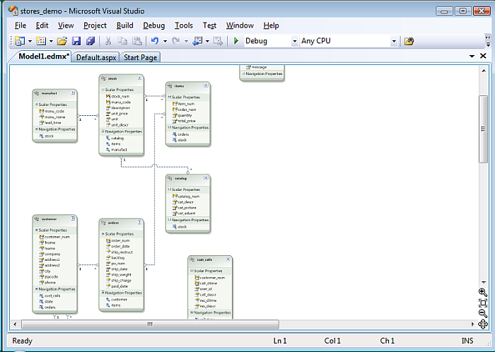

Creation for the Entity Data Model for the Informix stores\_demo
database is now complete.

## Using EDM to create Entity Framework based applications

Now that a Microsoft Entity Data Model has been created for the Informix
stores\_demo database, Entity Framework applications can be created to
make use of it.

### Entity Frameworks based finf

An ADO.Net Data Service for the Informix tables can be created using the
Entity Data Model created in the [Creating EDM in Visual Studio 2008
section](#vdbengineinfcre) .

1.  Open the
    
    *stores\_demo*
    
    project created in the [Creating EDM in Visual Studio 2008
    section](#vdbengineinfcre) .

2.  Select the Project -\> Add New Item menu option.
    
    

3.  The
    
    *Add New Item*
    
    dialog will appear. Choose the
    
    *ADO.NET Data Service template*
    
    . Give it the name
    
    *WebDataService.svc*
    
    and click
    
    *Add*
    
    to create the ADO.Net Data Service.
    
    

4.  In the newly created
    
    *WebDataService1.svc.cs*
    
    Data Service file, add the data source class name of
    
    *stores\_demoEntities*
    
    (note this is the name set in the Creating EDM in Visual Studio 2008
    section) as the
    
    *DataService*
    
    name. Enable the access to the Data Service by adding the entry
    
    *config.SetEntitySetAccessRule("\*", EntitySetRights.All);*
    
    in the
    
    *InitializeService*
    
    method.
    
        // C#
        
        using System;
        using System.Web;
        using System.Collections.Generic;
        using System.ServiceModel.Web;
        using System.Linq;
        using System.Data.Services;
        
        namespace SimpleDataService
        {
            public class Northwind : DataService<stores_demoDemoEntities>
            {
                public static void InitializeService(IDataServiceConfiguration  config)
                {
                    config.SetEntitySetAccessRule("*", EntitySetRights.All);
                }
            }
        }

    

5.  To test the Data Service, simply hit
    
    *Ctrl+F5*
    
    within Visual Studio. This will start the development web server,
    run the Data Services server inside, and load a Web browser page
    displaying the list of available tables/entities for the
    stores\_demo database catalog.
    
    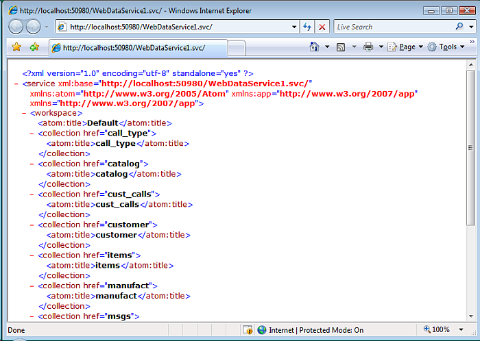

6.  To access a specific entity instance like the
    
    *CUSTOMERS*
    
    table customer number
    
    *101*
    
    record, use this convention
    http://host/vdir/WebDataService1.svc/customer(101).
    
    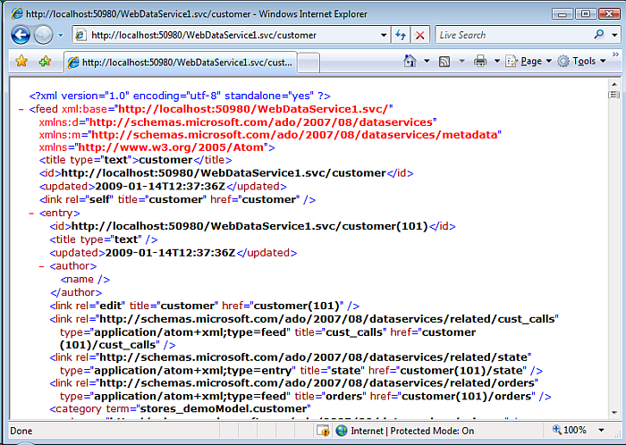

*Notes:*

1.  *Important*
    
    \- To view
    
    *Atom*
    
    (the default format returned by an ADO.NET Data Service) in Internet
    Explorer, you must first ensure that
    
    *Feed Reading View*
    
    is turned
    
    *off*
    
    . This can be done on the
    
    *Content tab*
    
    of
    
    *Tools in Internet Options*
    
    .

2.  If a Data Services entity instance URI page fails to load you can
    turn
    
    *Verbose*
    
    errors on by adding
    
    *config.UseVerboseErrors = true;*
    
    in the
    
    *virtuoso.svc.cs InitializeService*
    
    method to obtain more detailed information from the server as to why
    the page failed to load:
    
        public static void InitializeService(IDataServiceConfiguration config)
        
        {
        
        config.UseVerboseErrors = true;
        
        config.SetEntitySetAccessRule("*", EntitySetRights.All);
        
        }

### Visual Studio Windows DataGrid Form Application

This sectiond details the steps required to create a simple Visual
Studio 2008 Windows Form application, with associated DataGridView
control for displaying data in selected tables from the target database.

1.  Launch the Visual Studio 2008 SP1 IDE.
    
    

2.  Create a
    
    *Web Application*
    
    project by going to the
    
    *File*
    
    menu in Visual Studio and choosing
    
    *New Project*
    
    .
    
    

3.  When the New Project window appears, choose either
    
    *Visual Basic*
    
    or
    
    *Visual C\#*
    
    as your programming language.

4.  Within the language category, click on
    
    *Windows*
    
    and select
    
    *Windows Form Application*
    
    from the right-hand panel.

5.  Choose a name for the project, for example
    
    *VirtWindowsFormApplication*
    
    , and click
    
    *OK*
    
    .
    
    

6.  In the
    
    *Toolbox*
    
    , expand
    
    *Data Controls*
    
    , and drag the
    
    *DataGridView*
    
    control onto the form.
    
    

7.  Click on the little
    
    *arrow*
    
    in the top right of the
    
    *DataGridView*
    
    control. This loads the
    
    *DataGridView Task*
    
    menu.
    
    

8.  Click on the
    
    *Choose Data Source*
    
    list box.
    
    

9.  Click on the
    
    *Add Project Data Source*
    
    link to connect to a data source.
    
    

10. In the
    
    *Data Source Configuration Wizard*
    
    dialog
    
    *Choose Data Source Type*
    
    page select the
    
    *Database*
    
    data source type and click
    
    *Next*
    
    .
    
    

11. In the
    
    *Data Source Configuration Wizard*
    
    dialog
    
    *Choose your Data Connection*
    
    page, select the
    
    *New Connection*
    
    button
    
    

12. In the
    
    *Choose Data Source*
    
    dialog, select the OpenLink
    
    *Virtuoso Data Source*
    
    from the list and click
    
    *Continue*
    
    .
    
    

13. In the
    
    *Add Connection*
    
    dialog, specify the
    
    *hostname, portno, username and password*
    
    for the target Virtuoso Server and check the
    
    *Save Password*
    
    check box.
    
    

14. Select the Select Database From List radio button and choose the
    
    *stores\_demo*
    
    from the drop down list.
    
    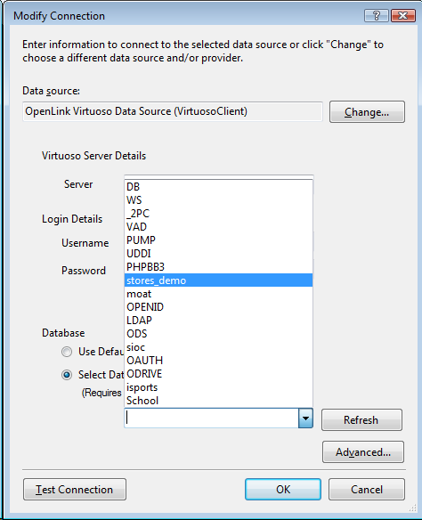

15. Press the
    
    *Test Connection*
    
    dialog to verify that the database is accessible.
    
    

16. Leave the default connect string
    
    *stores\_demoConnectionString*
    
    and click
    
    *Next*
    
    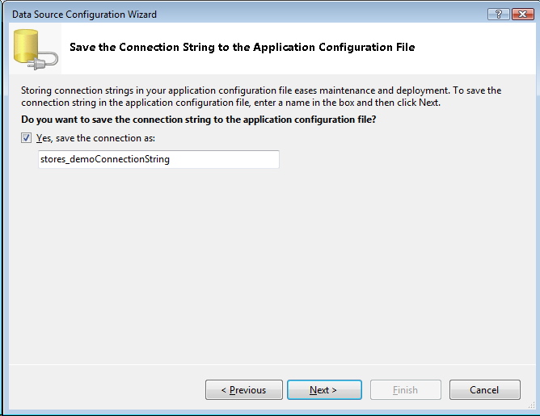

17. From the list of available tables returned for the stores\_demo
    database, select the
    
    *msgs*
    
    table to be associated with the
    
    *DataGridView*
    
    control.
    
    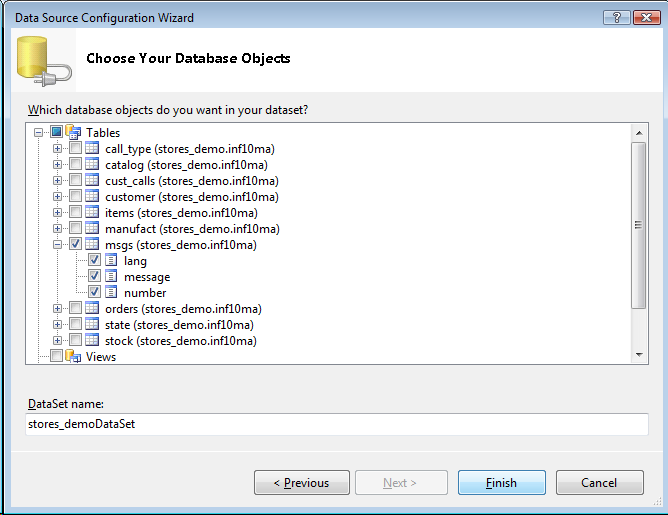

18. The columns names of the select table will be displayed in the
    DataGridView.
    
    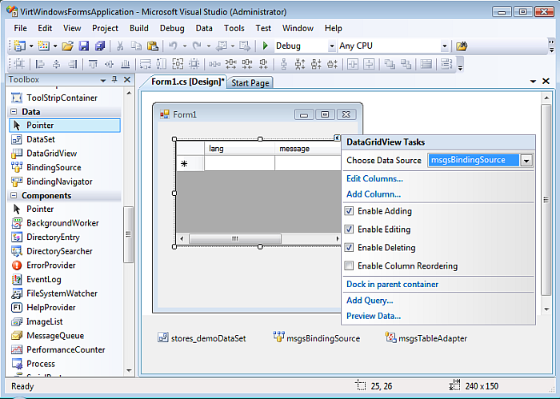

19. Resize the Form and DataGridView to allow all columns to be visible,
    if possible.
    
    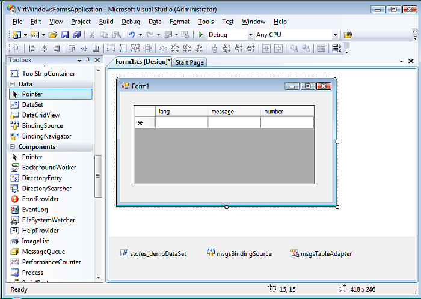

20. To test the application, simply hit
    
    *Ctrl+F5*
    
    within Visual Studio or select
    
    *Start Debugging*
    
    from the
    
    *Debug*
    
    menu.
    
    

21. To make the DataGridView updateable, you will need to manually add
    some code to the project along with a suitable control to invoke the
    code. Drag a Button control onto the form.
    
    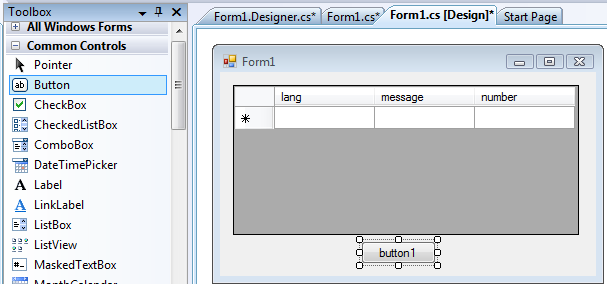

22. Right click on the Button and select Properties.
    
    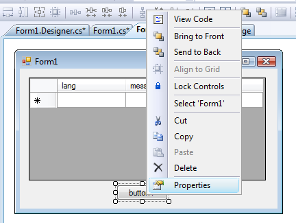

23. In the Properties view, edit the buttons Text property to read Save
    Changes and its (Name) property to read saveChanges.
    
    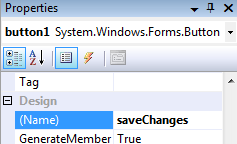

24. The button will now update to reflect these changes.
    
    NOTE: You will need to resize the button to make the new text
    visible.
    
    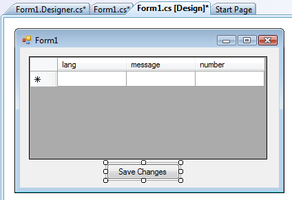

25. Double click the new button to generate the required event handler.
    It should take you directly to the area of code that will execute
    when the button is clicked.
    
    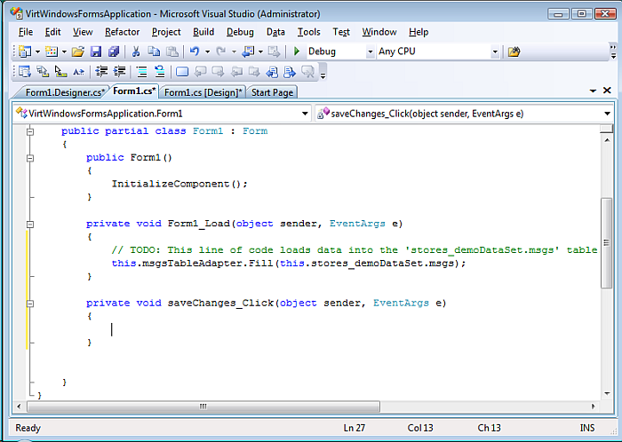

26. Edit the saveChanges\_Click event handler code to include the
    following line.
    
        private void saveChanges_Click(object sender, EventArgs e)
        {
          this.msgsTableAdapter.Update(this.stores_demoDataSet.msgs);
        }
    
    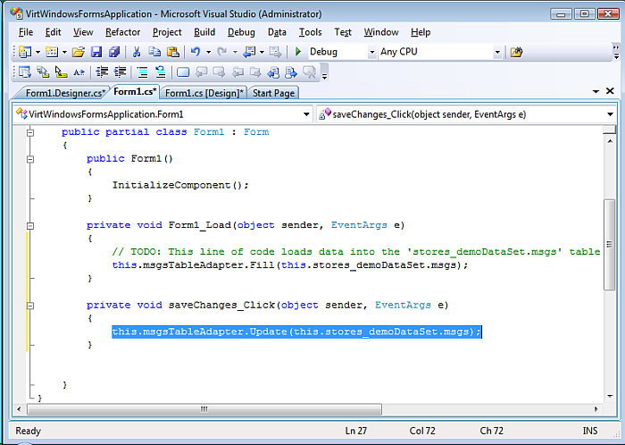

27. Now test the application again by hitting Ctrl+F5.
    
    Scroll to the empty row, at the bottom, and enter data for a new
    row. Then, select Save Changes which will write the new row back to
    the database.
    
    Updates and deletes can be performed similarly.
    
    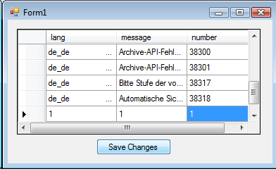

28. You can use Interactive ISQL to test that the changes that have been
    written. Interactive ISQL Interface is detailed in the [Linking
    Informix tables](#vdbengineinflink) section.
    
    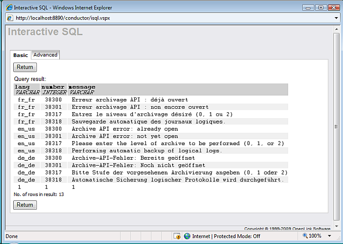

The task is now complete.

# Using Microsoft Entity Frameworks to Access DB2 Schema Objects with Virtuoso

**Prerequisites.**

The following prerequisites must be in place for this solution to be
possible.

**DB2 DBMS.**

An DB2 DBMS hosting the required Schema Objects needs to be available.
In this section the *DB2 sample* database will be used to demonstrate
the process.

An DB2 DBMS hosting the required Schema Objects needs to be available.
In this section the *DB2 sample* database will be used to demonstrate
the process.

**ODBC Driver for DB2.**

An DB2 ODBC Driver is required for Linking the DB2 Schema Objects into
the Virtuoso Server. The OpenLink *ODBC Driver for DB2* will be used in
this section, for which a functional ODBC Data source name of "db2v8ma"
will be assumed to exist on the machine hosting the Virtuoso Server.

An DB2 ODBC Driver is required for Linking the DB2 Schema Objects into
the Virtuoso Server. The OpenLink *ODBC Driver for DB2* will be used in
this section, for which a functional ODBC Data source name of "db2v8ma"
will be assumed to exist on the machine hosting the Virtuoso Server.

**Virtuoso Universal Server.**

An Virtuoso installation including the Virtuoso Universal Server and
ADO.NET Entity Framework Provider is required. The Virtuoso components
used must be Release 5.10.x or above, this being the minimum version
containing support for Microsoft Entity Frameworks

An Virtuoso installation including the Virtuoso Universal Server and
ADO.NET Entity Framework Provider is required. The Virtuoso components
used must be Release 5.10.x or above, this being the minimum version
containing support for Microsoft Entity Frameworks

**Microsoft Visual Studio 2008 SP1.**

Microsoft Visual Studio 2008 Service Pack 1 is required, this being the
only version containing the necessary Entity Framework support available
at the time of writing.

Microsoft Visual Studio 2008 Service Pack 1 is required, this being the
only version containing the necessary Entity Framework support available
at the time of writing.

**Tasks**

**Ensure DB2 Primary Keys (PKs) are not nullable.**

The Visual Studio 2008 Entity Data Model (EDM) requires that all primary
keys are *NOT* Nullable, and will fail to generate an EDM if any are.
Thus ensure any tables to be used are defined as not nullable in the DB2
database schema before attempting to generate an EDM. In the case of the
DB2 sample database all tables are not nullable, thus this should not be
an issue in this case.

The Visual Studio 2008 Entity Data Model (EDM) requires that all primary
keys are *NOT* Nullable, and will fail to generate an EDM if any are.
Thus ensure any tables to be used are defined as not nullable in the DB2
database schema before attempting to generate an EDM. In the case of the
DB2 sample database all tables are not nullable, thus this should not be
an issue in this case.

## Install and configure OpenLink ODBC Driver for DB2

The Virtuoso Virtual Database engine uses ODBC as the connectivity
mechanism for linking remote database objects into its local schema.
Thus an DB2 ODBC Driver must be available with a suitably configured DSN
for connecting to the target database. The OpenLink ODBC Drivers for DB2
have been used in this section, although in theory any DB2 ODBC Driver
can be used.

Installation instructions for the OpenLink ODBC Driver for DB2 are
available from:

  - [Product Installation & Basic Configuration (ODBC)](#)

## Install and configure OpenLink Virtuoso Universal Server

  - [Install and configure OpenLink Virtuoso Universal
    Server](#virtclientrefinstallandconfigvirt)

## Linking DB2 tables into OpenLink Virtuoso

1.  Start the Virtuoso Web User Interface
    
    

2.  Select the "Conductor" link in the Left Frame and Login as the "dba"
    user.
    
    

3.  Select the "Databases" -\> "External Data Source" -\> "Data Sources"
    tab menu items
    
    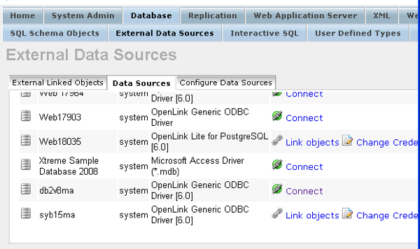

4.  Select the "Connect" button for the "db2v8ma" DB2 DSN.
    
    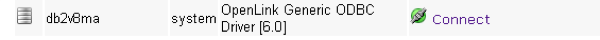

5.  On successful connection Select the "Link Objects" button to obtain
    a list of available tables
    
    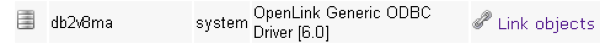

6.  Select the tables that you would like to link.
    
    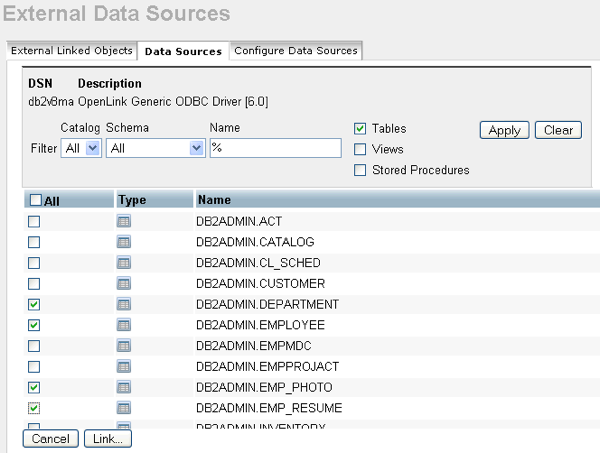

7.  Change the Catalog for each table to be "SAMPLE" using the "Set All"
    button.
    
    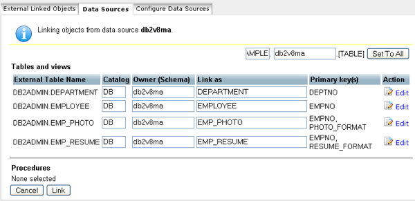

8.  All the catalog names are changed to be "SAMPLE".
    
    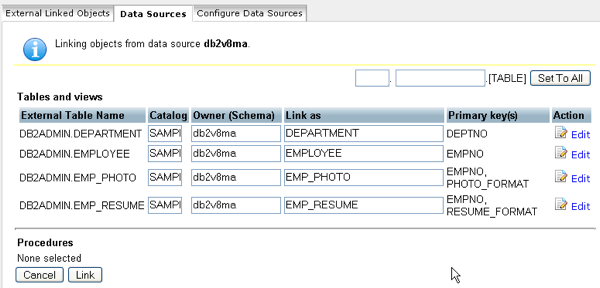

9.  Select the "Link" button to link the selected tables into Virtuoso
    
    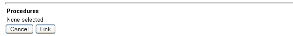

10. On completion of the Link process the tables will be displayed in
    the "External Linked Objects" tab.
    
    

11. The linked tables can be queried by clicking on the hyperlink in the
    Local Name column of the External Linked Objects tab above. This
    loads the Virtuoso Interactive SQL interface with the required SQL
    Select for retrieving the remote table data . We shall use the
    SAMPLE.db2v8ma.EMPLOYEE table to demonstrate this.
    
    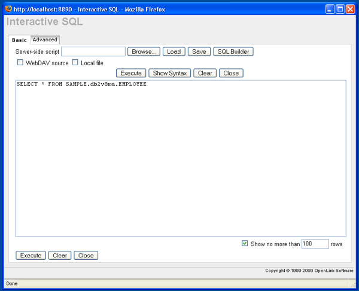

12. Click the Execute button to run the query and retrieve the results
    from the remote table.
    
    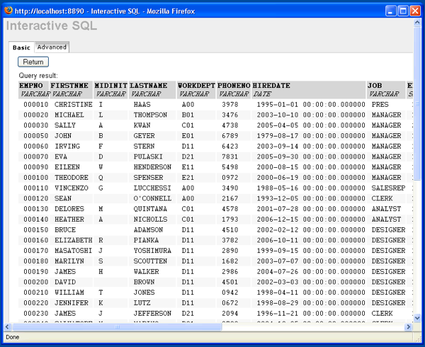

13. The tables can also be viewed as part of the Virtuoso SQL Schema
    Objects under the SAMPLE catalog name.
    
    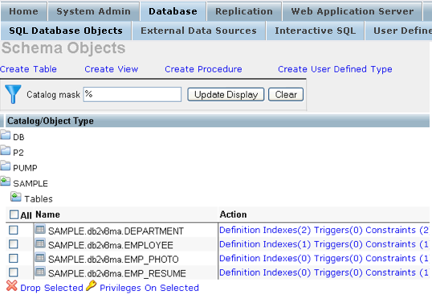
    
    The Link process is now complete enabling the tables to be queried
    as if part of the Virtuoso Schema.

## Creating EDM in Visual Studio 2008

The following steps can be used to create an Entity Data Model (EDM) for
the DB2 Samples database:

1.  Launch the Visual Studio 2008 SP1 IDE.
    
    

2.  Create a
    
    *Web Application*
    
    project by going to the
    
    *File*
    
    menu in Visual Studio and choosing
    
    *New Project*
    
    .
    
    

3.  When the New Project window appears, choose either
    
    *Visual Basic*
    
    or
    
    *Visual C\#*
    
    as your programming language.

4.  Within the language category, click on
    
    *Web*
    
    and select
    
    *ASP.NET Web Application*
    
    from the right-hand panel.

5.  Choose a name for the project, for example
    
    *VirtuosoDataService*
    
    , and click
    
    *OK*
    
    .
    
    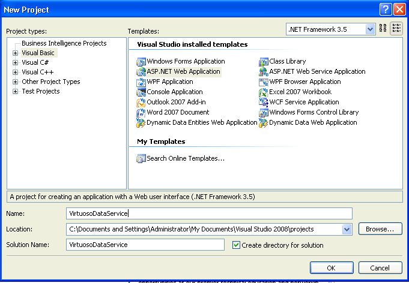

6.  This will create a new project called
    
    *VirtuosoDataService*
    
    .
    
    

7.  Select the Project -\> Add New Item menu option.
    
    

8.  The
    
    *Add New Item*
    
    dialog will appear. Choose the
    
    *ADO.NET Entity Data Model*
    
    template. Give it the name
    
    *Virtuoso.edmx*
    
    and click
    
    *Add*
    
    to start the creation of the ADO.Net Entity Data Model.
    
    

9.  In the
    
    *Entity Data Model Wizard*
    
    dialog
    
    *Choose Model Contents*
    
    page select the
    
    *Generate from Database*
    
    model type and click
    
    *Next*
    
    .
    
    

10. In the
    
    *Entity Data Model Wizard*
    
    dialog
    
    *Choose your Data Connection*
    
    page, select the
    
    *New Connection button*
    
    

11. In the
    
    *Choose Data Source*
    
    dialog, select the OpenLink
    
    *Virtuoso Data Source*
    
    from the list and click
    
    *Continue*
    
    .
    
    

12. In the
    
    *Add Connection*
    
    dialog, specify the
    
    *hostname, portno, username and password*
    
    for the target Virtuoso Server and check the Save Password check
    box.
    
    

13. Select the Select Database From List radio button and choose SAMPLE
    from the drop down list. Click OK.
    
    

14. Press the
    
    *Test Connection*
    
    dialog to verify that the database is accessible.
    
    

15. Set the
    
    *entity connect string*
    
    name to
    
    *VirtuosoEntities*
    
    (note this name as it is required in the section on creating and
    ADO.Net Data Service) and click
    
    *Next*
    
    .
    
    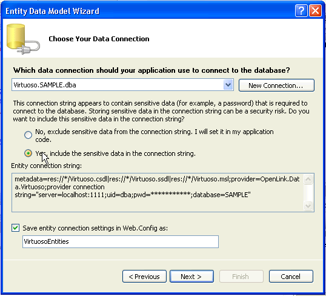

16. In the
    
    *Choose your Database Objects*
    
    page, tick the
    
    *Tables*
    
    check box to select all tables in the SAMPLE catalog for addition to
    the Entity Data Model. Set the
    
    *Model Namespace*
    
    to
    
    *VirtuosoModel*
    
    and click
    
    *Finish*
    
    .
    
    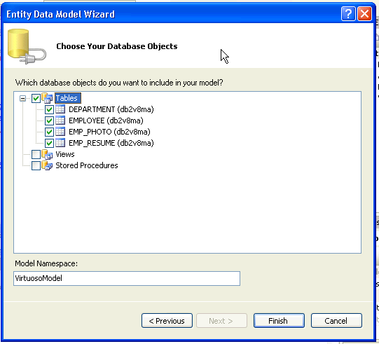

17. The
    
    *Virtuoso.edmx*
    
    EDM will be created with the tables and relationships displayed in
    the Visual Studio IDE
    
    

Creation for the Entity Data Model for the DB2 Samples database is now
complete.

## Using EDM to create Entity Framework based applications

Now that a Microsoft Entity Data Model has been created for the DB2
Samplef database, Entity Framework applications can be created to make
use of it.

### Entity Frameworks based ADO.NET Data Service

An ADO.Net Data Service for the DB2 tables can be created using the
Entity Data Model created in the [Creating EDM in Visual Studio 2008
section](#vdbenginedb2crvs) .

1.  Open the
    
    *VirtuosoDataService*
    
    project created in the [Creating EDM in Visual Studio 2008
    section](#vdbenginedb2crvs) .

2.  Select the Project -\> Add New Item menu option.
    
    

3.  The
    
    *Add New Item*
    
    dialog will appear. Choose the
    
    *ADO.NET Data Service template*
    
    . Give it the name
    
    *Virtuoso.svc*
    
    and click
    
    *Add*
    
    to create the ADO.Net Data Service.
    
    

4.  In the newly created
    
    *Virtuoso.svc.cs*
    
    Data Service file, add the data source class name of
    
    *VirtuosoEntities*
    
    (note this is the name set in the Creating EDM in Visual Studio 2008
    section) as the
    
    *DataService*
    
    name. Enable the access to the Data Service by adding the entry
    
    *config.SetEntitySetAccessRule("\*", EntitySetRights.All);*
    
    to the
    
    *InitializeService*
    
    method.
    
        // C#
        
        using System;
        using System.Web;
        using System.Collections.Generic;
        using System.ServiceModel.Web;
        using System.Linq;
        using System.Data.Services;
        
        namespace SimpleDataService
        {
            public class Northwind : DataService<VirtuosoDemoEntities>
            {
                public static void InitializeService(IDataServiceConfiguration  config)
                {
                    config.SetEntitySetAccessRule("*", EntitySetRights.All);
                }
            }
        }
    
    

5.  To test the Data Service, simply hit
    
    *Ctrl+F5*
    
    within Visual Studio. This will start the development web server,
    run the Data Services server inside, and load a Web browser page
    displaying the list of available tables/entities for the SAMPLE
    database catalog.
    
    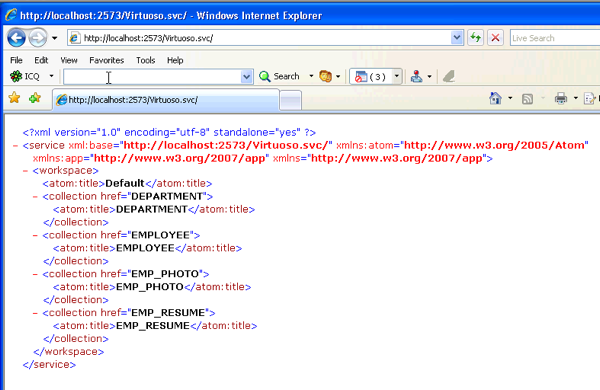

6.  To access a specific entity instance like the
    
    *EMPLOYEES*
    
    table employee number
    
    *000010*
    
    record, use this convention
    http://host/vdir/Virtuoso.svc/EMPLOYEES("000010") .
    
    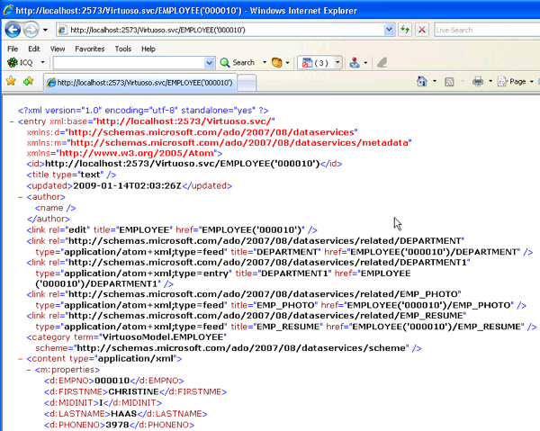

*Notes:*

1.  *Important*
    
    \- To view
    
    *Atom*
    
    (the default format returned by an ADO.NET Data Service) in Internet
    Explorer, you must first ensure that
    
    *Feed Reading View*
    
    is turned
    
    *off*
    
    . This can be done on the
    
    *Content tab*
    
    of
    
    *Tools in Internet Options*
    
    .

2.  If a Data Services entity instance URI page fails to load you can
    turn
    
    *Verbose*
    
    errors on by adding
    
    *config.UseVerboseErrors = true;*
    
    in the
    
    *virtuoso.svc.cs InitializeService*
    
    method to obtain more detailed information from the server as to why
    the page failed to load:
    
        public static void InitializeService(IDataServiceConfiguration config)
        
        {
        
        config.UseVerboseErrors = true;
        
        config.SetEntitySetAccessRule("*", EntitySetRights.All);
        
        }

### Visual Studio Windows DataGrid Form Application

This section details the steps required to create a simple Visual Studio
2008 Windows Form application, with associated DataGridView control for
displaying data in selected tables from the target database.

1.  Launch the Visual Studio 2008 SP1 IDE.
    
    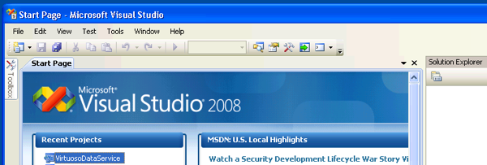

2.  Create a
    
    *Web Application*
    
    project by going to the
    
    *File*
    
    menu in Visual Studio and choosing
    
    *New Project*
    
    .
    
    

3.  When the New Project window appears, choose either
    
    *Visual Basic*
    
    or
    
    *Visual C\#*
    
    as your programming language.

4.  Within the language category, click on
    
    *Windows*
    
    and select
    
    *Windows Form Application*
    
    from the right-hand panel.

5.  Choose a name for the project, for example
    
    *VirtWindowsFormApplication*
    
    , and click
    
    *OK*
    
    .
    
    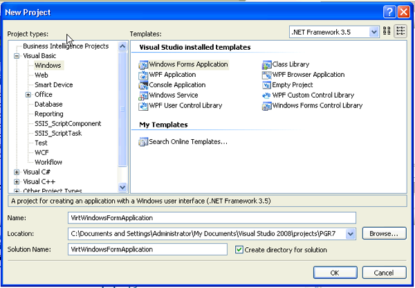

6.  In the
    
    *Toolbox*
    
    , expand
    
    *Data Controls*
    
    , and drag the
    
    *DataGridView*
    
    control onto the form.
    
    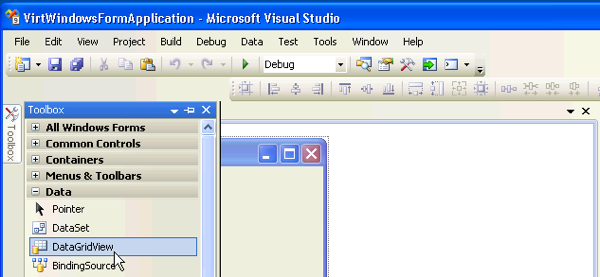

7.  Click on the little
    
    *arrow*
    
    in the top right of the
    
    *DataGridView*
    
    control. This loads the
    
    *DataGridView Task*
    
    menu.
    
    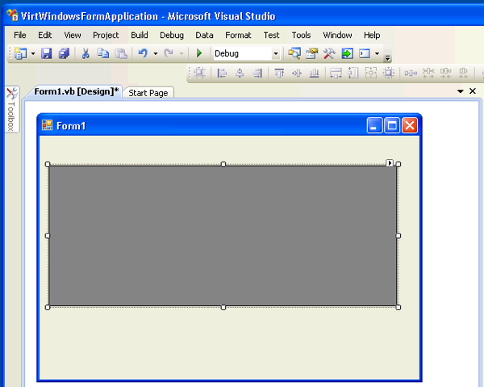

8.  Click on the
    
    *Choose Data Source*
    
    list box.
    
    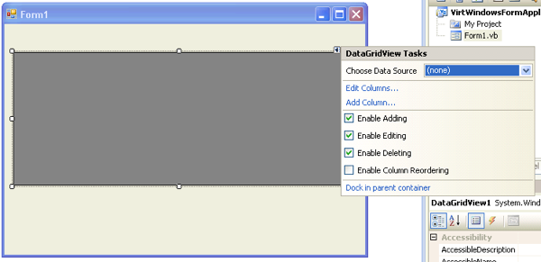

9.  Click on the
    
    *Add Project Data Source*
    
    link to connect to a data source.
    
    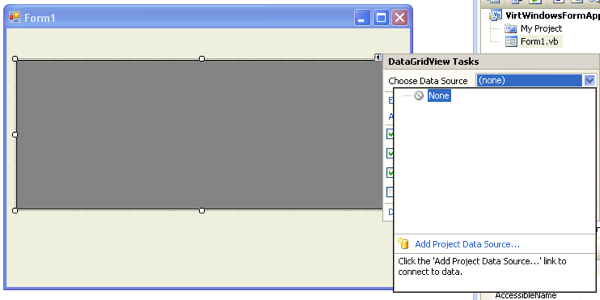

10. In the
    
    *Data Source Configuration Wizard*
    
    dialog
    
    *Choose Data Source Type*
    
    page select the
    
    *Database*
    
    data source type and click
    
    *Next*
    
    .
    
    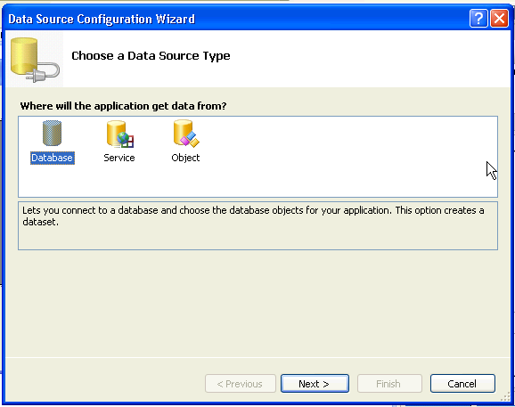

11. In the
    
    *Data Source Configuration Wizard*
    
    dialog
    
    *Choose your Data Connection*
    
    page, select the
    
    *New Connection*
    
    button
    
    

12. In the
    
    *Choose Data Source*
    
    dialog, select the OpenLink
    
    *Virtuoso Data Source*
    
    from the list and click
    
    *Continue*
    
    .
    
    

13. In the
    
    *Add Connection*
    
    dialog, specify the
    
    *hostname, portno, username and password*
    
    for the target Virtuoso Server and check the Save Password check
    box.
    
    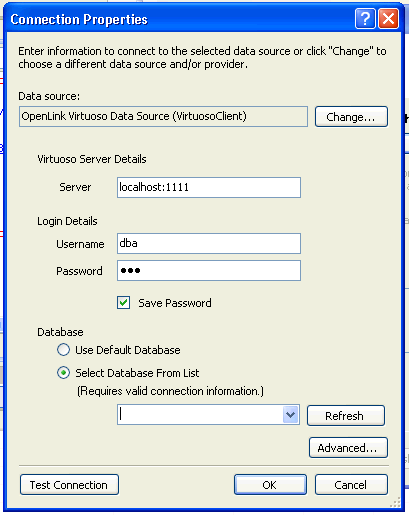

14. Select the
    
    *Select Database From List*
    
    radio button and choose the
    
    *SAMPLE*
    
    database from the drop down list.
    
    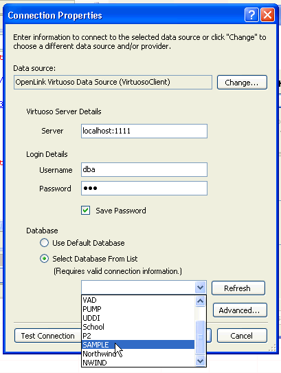

15. Press the
    
    *Test Connection*
    
    dialog to verify that the database is accessible.
    
    

16. Leave the default connect string
    
    *SAMPLEConnectionString*
    
    and click
    
    *Next*
    
    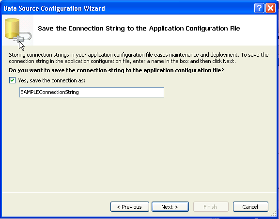

17. From the list of available tables returned for the SAMPLE database
    select the
    
    *DEPARTMENT*
    
    table to be associated with the
    
    *DataGridView*
    
    control
    
    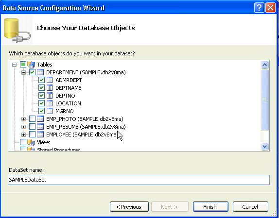

18. The columns names of the select table will be displayed in the
    DataGridView
    
    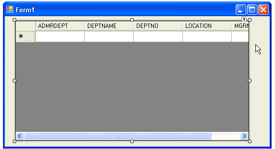

19. Resize the Form and DataGridView to allow all columns to be visible,
    if possible.
    
    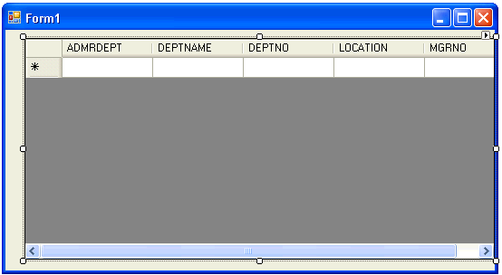

20. To test the application, simply hit
    
    *Ctrl+F5*
    
    within Visual Studio or select
    
    *Start Debugging*
    
    from the
    
    *Debug*
    
    menu.
    
    

21. The data from the
    
    *DEPARTMENT*
    
    table will be displayed in the
    
    *DataGrid*
    
    .
    
    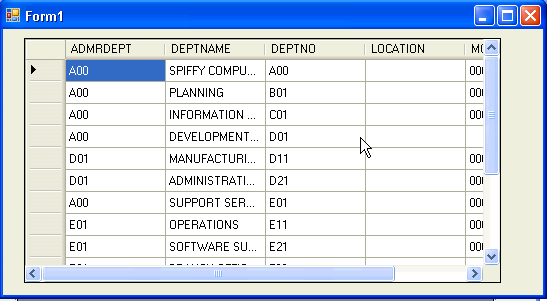

The task is now complete.

# Using Microsoft Entity Frameworks to Access Sybase Schema Objects with Virtuoso

**Prerequisites.**

The following prerequisites must be in place for this solution to be
possible.

**Sybase DBMS.**

An Sybase DBMS hosting the required Schema Objects needs to be
available. In this section the *Sybase pubs2 sample* database will be
used to demonstrate the process.

An Sybase DBMS hosting the required Schema Objects needs to be
available. In this section the *Sybase pubs2 sample* database will be
used to demonstrate the process.

**ODBC Driver for Sybase.**

An Sybase ODBC Driver is required for Linking the Sybase Schema Objects
into the Virtuoso Server. The OpenLink *ODBC Driver for Sybase* will be
used in this section, for which a functional ODBC Data source name of
"syb15ma" will be assumed to exist on the machine hosting the Virtuoso
Server.

An Sybase ODBC Driver is required for Linking the Sybase Schema Objects
into the Virtuoso Server. The OpenLink *ODBC Driver for Sybase* will be
used in this section, for which a functional ODBC Data source name of
"syb15ma" will be assumed to exist on the machine hosting the Virtuoso
Server.

**Virtuoso Universal Server.**

An Virtuoso installation including the Virtuoso Universal Server and
ADO.NET Entity Framework Provider is required. The Virtuoso components
used must be Release 5.10.x or above, this being the minimum version
containing support for Microsoft Entity Frameworks

An Virtuoso installation including the Virtuoso Universal Server and
ADO.NET Entity Framework Provider is required. The Virtuoso components
used must be Release 5.10.x or above, this being the minimum version
containing support for Microsoft Entity Frameworks

**Microsoft Visual Studio 2008 SP1.**

Microsoft Visual Studio 2008 Service Pack 1 is required, this being the
only version containing the necessary Entity Framework support available
at the time of writing.

Microsoft Visual Studio 2008 Service Pack 1 is required, this being the
only version containing the necessary Entity Framework support available
at the time of writing.

**Tasks**

**Ensure Sybase Primary Keys (PKs) are not nullable.**

The Visual Studio 2008 Entity Data Model (EDM) requires that all primary
keys are *NOT* Nullable, and will fail to generate an EDM if any are.
Thus ensure any tables to be used are defined as not nullable in the
Sybase database schema before attempting to generate an EDM. In the case
of the Sybase pubs2 database all tables are not nullable, thus this
should not be an issue in this case.

The Visual Studio 2008 Entity Data Model (EDM) requires that all primary
keys are *NOT* Nullable, and will fail to generate an EDM if any are.
Thus ensure any tables to be used are defined as not nullable in the
Sybase database schema before attempting to generate an EDM. In the case
of the Sybase pubs2 database all tables are not nullable, thus this
should not be an issue in this case.

## Install and configure OpenLink ODBC Driver for Sybase

The Virtuoso Virtual Database engine uses ODBC as the connectivity
mechanism for linking remote database objects into its local schema.
Thus an Sybase ODBC Driver must be available with a suitably configured
DSN for connecting to the target database. The OpenLink ODBC Drivers for
Sybase have been used in this section, although in theory any Sybase
ODBC Driver can be used.

Installation instructions for the OpenLink ODBC Driver for Sybase are
available from:

  - [Product Installation & Basic Configuration (ODBC)](#)

## Install and configure OpenLink Virtuoso Universal Server

  - [Install and configure OpenLink Virtuoso Universal
    Server](#virtclientrefinstallandconfigvirt)

## Linking Sybase tables into OpenLink Virtuoso

1.  Start the Virtuoso Web User Interface
    
    

2.  Select the "Conductor" link in the Left Frame and Login as the "dba"
    user.
    
    

3.  Select the "Databases" -\> "External Data Source" -\> "Data Sources"
    tab menu items
    
    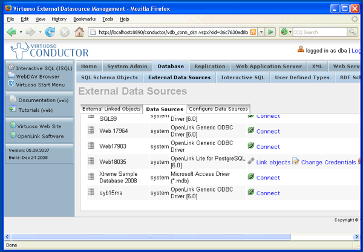

4.  Select the "Connect" button for the "syb15ma" Sybase DSN.
    
    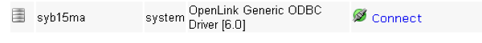

5.  On successful connection Select the "Link Objects" button to obtain
    a list of available tables
    
    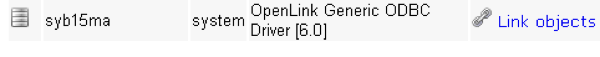

6.  Select all the tables that are part of the "pubs2" catalog.
    
    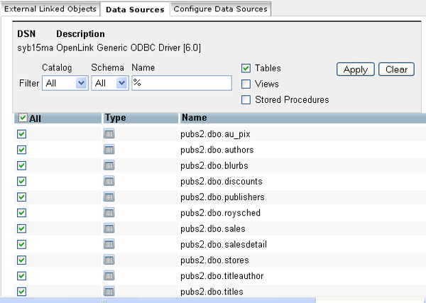

7.  Change the Catalog for each table to be "P2" using the "Set All"
    button.
    
    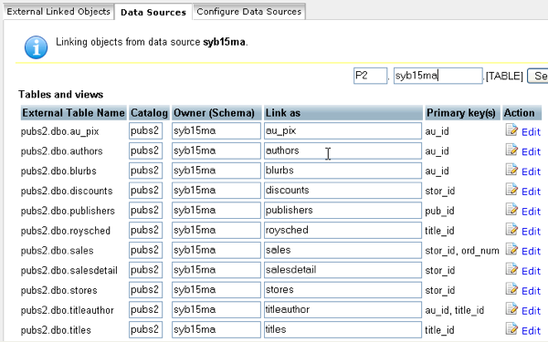

8.  All the catalog names are changed to be "P2".
    
    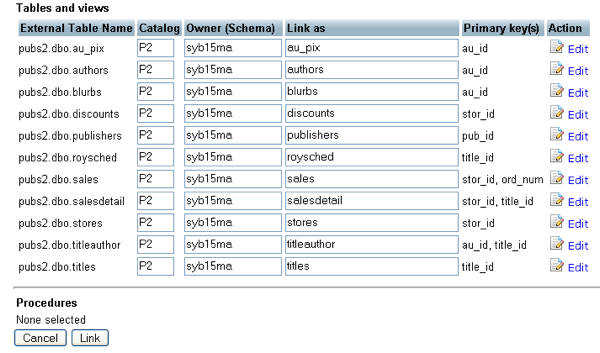

9.  Select the "Link" button to link the selected tables into Virtuoso
    
    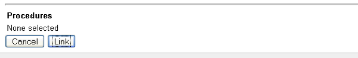

10. On completion of the Link process the tables will be displayed in
    the "External Linked Objects" tab.
    
    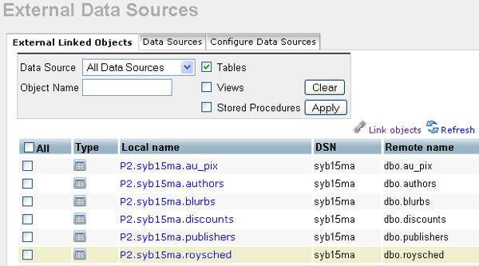

11. The tables can also be viewed as part of the Virtuoso "SQL Schema
    Objects" under the "P2" catalog name.
    
    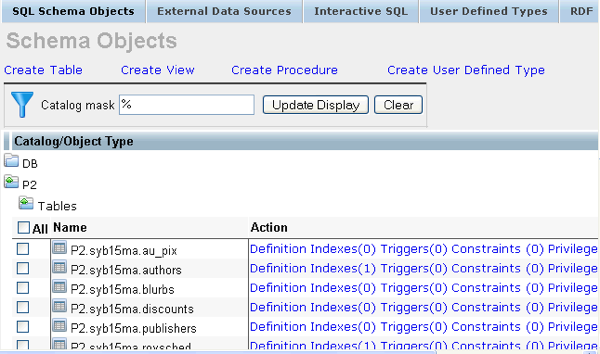
    
    The Link process is now complete enabling the tables to be queried
    as if part of the Virtuoso Schema.

## Creating EDM in Visual Studio 2008

The following steps can be used to create an Entity Data Model (EDM) for
the Sybase pubs2 database:

1.  Launch the Visual Studio 2008 SP1 IDE.
    
    

2.  Create a
    
    *Web Application*
    
    project by going to the
    
    *File*
    
    menu in Visual Studio and choosing
    
    *New Project*
    
    .
    
    

3.  When the New Project window appears, choose either
    
    *Visual Basic*
    
    or
    
    *Visual C\#*
    
    as your programming language.

4.  Within the language category, click on
    
    *Web*
    
    and select
    
    *ASP.NET Web Application*
    
    from the right-hand panel.

5.  Choose a name for the project, for example
    
    *VirtuosoDataService*
    
    , and click
    
    *OK*
    
    .
    
    

6.  This will create a new project called
    
    *VirtuosoDataService*
    
    .
    
    

7.  Select the Project -\> Add New Item menu option.
    
    

8.  The
    
    *Add New Item*
    
    dialog will appear. Choose the
    
    *ADO.NET Entity Data Model*
    
    template. Give it the name
    
    *Virtuoso.edmx*
    
    and click
    
    *Add*
    
    to start the creation of the ADO.Net Entity Data Model.
    
    

9.  In the
    
    *Entity Data Model Wizard*
    
    dialog
    
    *Choose Model Contents*
    
    page select the
    
    *Generate from Database*
    
    model type and click
    
    *Next*
    
    .
    
    

10. In the
    
    *Entity Data Model Wizard*
    
    dialog
    
    *Choose your Data Connection*
    
    page, select the
    
    *New Connection button*
    
    

11. In the
    
    *Choose Data Source*
    
    dialog, select the OpenLink
    
    *Virtuoso Data Source*
    
    from the list and click
    
    *Continue*
    
    .
    
    

12. In the
    
    *Add Connection*
    
    dialog, specify the
    
    *hostname, portno, username and password*
    
    for the target Virtuoso Server and check the Save Password check
    box.
    
    

13. Select the
    
    *Select Database From List*
    
    radio button and choose the
    
    *SAMPLE*
    
    database from the drop down list.
    
    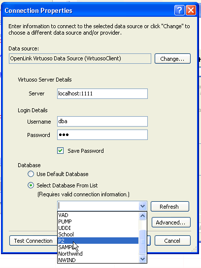

14. Press the
    
    *Test Connection*
    
    dialog to verify that the database is accessible.
    
    

15. Set the
    
    *entity connect string*
    
    name to
    
    *VirtuosoEntities*
    
    (note this name as it is required in the section on creating and
    ADO.Net Data Service) and click
    
    *Next*
    
    .
    
    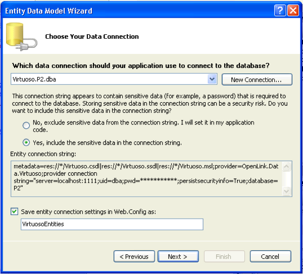

16. In the
    
    *Choose your Database Objects*
    
    page select the
    
    *Tables*
    
    check box to select all tables in the P2 catalog for addition to the
    Entity Data Model. Set the
    
    *Model Namespace*
    
    to
    
    *VirtuosoModel*
    
    and click
    
    *Finish*
    
    .
    
    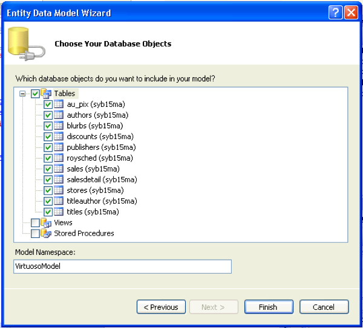

17. The
    
    *Virtuoso.edmx*
    
    EDM will be created with the tables and relationships displayed in
    the Visual Studio IDE
    
    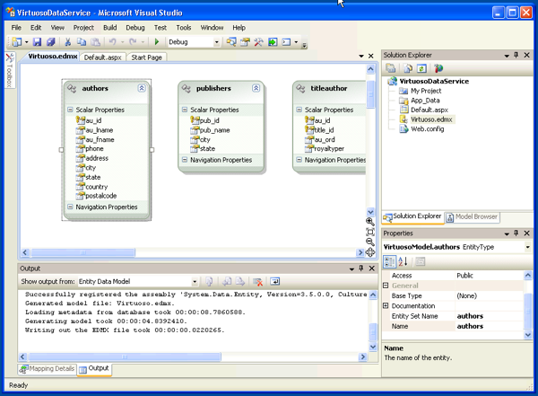

Creation for the Entity Data Model for the Sybase pubs2 database is now
complete.

## Manually creating EDM Associations (FKs) for the Sybase pubs2 database

The following steps will detail what is required to manually create
"Associations" in your Entity Data Model.

You will need to determine where these associations exist and their
multiplicity (one-to-one, one-to-many, etc.) before commencing with the
following steps.

*Note:* These steps will need to be repeated for each association.

1.  The first Association will deal with is the relationship between
    publishers and titles, identified by the presence of the scalar
    property pub\_id in both entities. This is a one-to-many
    relationship, as a Customer may have any number of Invoices.
    
    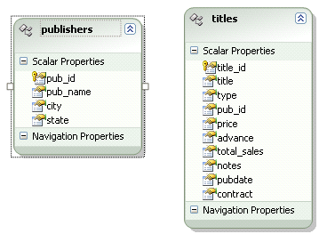
    
    This is a one to many relationship insomuch that publishers may have
    zero or many titles.

2.  To add the Association, right click on the publishers entity then
    Add -\> Association.
    
    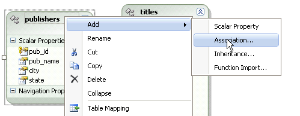

3.  You will now see the Add Association dialog.
    
    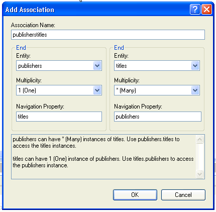

4.  For this association the only thing that needs changing is the name
    of the Navigation Property from publishers to publisher on the
    publishers end of the association.
    
    This more correctly reflects the multiplicity of the association
    such that a publisher is associated with zero or many titles
    (plural).
    
    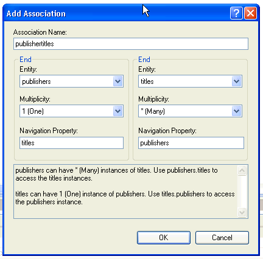

5.  Once you then hit OK the diagram is refreshed to include the newly
    created association.
    
    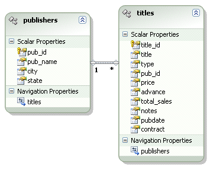

6.  You now need to edit the mappings associated with the newly created
    association, so right-click the association on the diagram, and
    select Table Mapping to display the Mapping Details pane.
    
    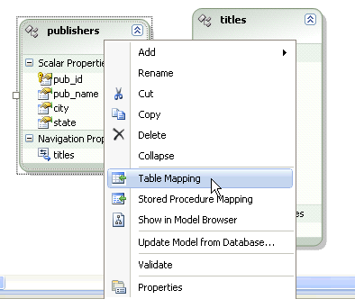

7.  Click that line reading \<Add a Table or View\> to reveal a drop
    down list of all entities.
    
    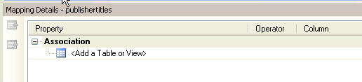

8.  Here you need to select the entity on the right/far side of the
    association (the entity where the foreign key exists). In this
    example, it is the titles entity.
    
    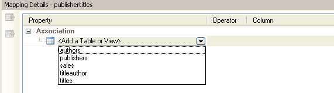

9.  The Mapping Details pane now refreshes to display both ends of the
    association, requiring that you provide relevant target store data
    types in the Column column for the key fields, as depicted here.
    
    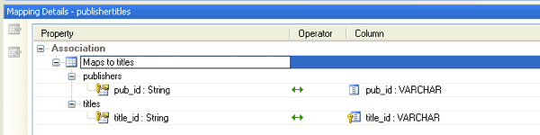

10. Once the mapping is complete, you can build the project using Build
    -\> Build Solution. NOTE: It is worthwhile building as each
    association is made, since the error messages can be a little
    confusing.
    
    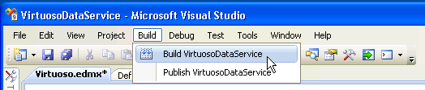

11. This should result in the following error:
    
    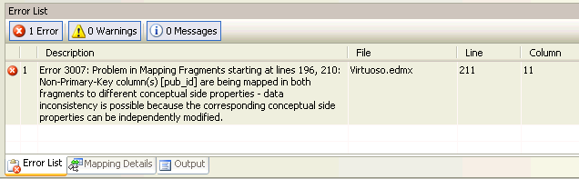
    
    It seems that this error is attempting to say that there are two
    mappings which map to the same target source column.
    
    In this case it is the target column titles.pub\_id.
    
    That is, the scalar property pub\_id and the Navigation Property
    publishers in the Invoice entity, both map to the Sybase table
    column titles.pub\_id - which is not supported
    
    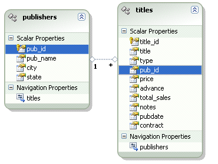

12. The solution is simple\! Simply delete the scalar property
    titles.pub\_id since its purpose is only to hold data representing a
    relationship/association (it is a Foreign Key) which has already
    been represented by the newly created association and resulting
    Navigation Property publishers.
    
    Right click on titles.pub\_id then Delete.
    
    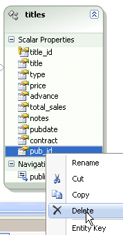

13. The model diagram will refresh to reflect this change.
    
    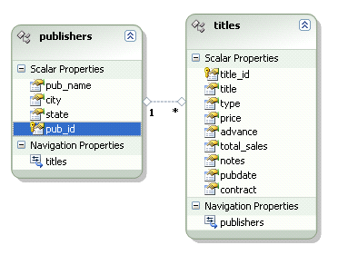

14. Build the project, again, using Build -\> Build Solution.
    
    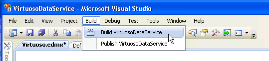

15. The project should now be fine.
    
    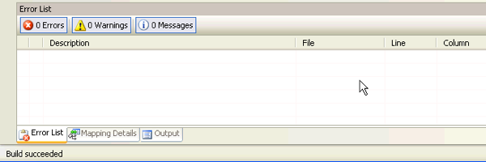

You will need to repeat these steps for each association until you have
a completed Entity Data Model.

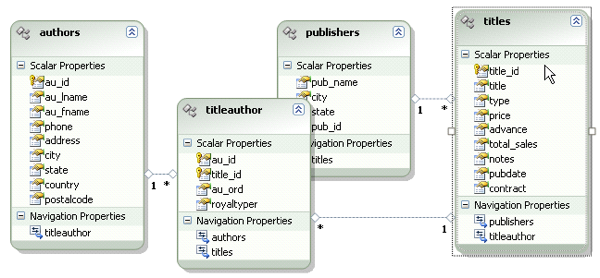

## Using EDM to create Entity Framework based applications

Now that a Microsoft Entity Data Model has been created for the Sybase
pubs2 database, Entity Framework applications can be created to make use
of it.

### Entity Frameworks based ADO.NET Data Service

An ADO.Net Data Service for the Sybase tables can be created using the
Entity Data Model created in the [Creating EDM in Visual Studio 2008
section](#vdbenginesybcrvs) .

1.  Open the
    
    *VirtuosoDataService*
    
    project created in the [Creating EDM in Visual Studio 2008
    section](#vdbenginesybcrvs) .

2.  Select the Project -\> Add New Item menu option.
    
    

3.  The
    
    *Add New Item*
    
    dialog will appear. Choose the
    
    *ADO.NET Data Service template*
    
    . Give it the name
    
    *Virtuoso.svc*
    
    , and click
    
    *Add*
    
    to create the ADO.Net Data Service.
    
    

4.  In the newly created
    
    *Virtuoso.svc.cs*
    
    Data Service file, add the data source class name of
    
    *VirtuosoEntities*
    
    (note this is the name set in the Creating EDM in Visual Studio 2008
    section) as the
    
    *DataService*
    
    name. Enable the access to the Data Service by adding the entry
    
    *config.SetEntitySetAccessRule("\*", EntitySetRights.All);*
    
    in the
    
    *InitializeService*
    
    method.
    
        // C#
        
        using System;
        using System.Web;
        using System.Collections.Generic;
        using System.ServiceModel.Web;
        using System.Linq;
        using System.Data.Services;
        
        namespace SimpleDataService
        {
            public class Northwind : DataService<VirtuosoDemoEntities>
            {
                public static void InitializeService(IDataServiceConfiguration  config)
                {
                    config.SetEntitySetAccessRule("*", EntitySetRights.All);
                }
            }
        }
    
    

5.  To test the Data Service, simply hit
    
    *Ctrl+F5*
    
    within Visual Studio. This will start the development web server,
    run the Data Services server inside and load a Web browser page
    displaying the list of available tables/entities for the P2 database
    catalog.
    
    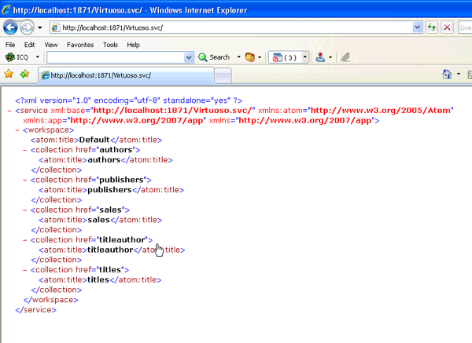

6.  To access a specific entity instance like the
    
    *publisher*
    
    table publisher number
    
    *0736*
    
    record, use this convention
    http://host/vdir/Virtuoso.svc/publishers("0736") .
    
    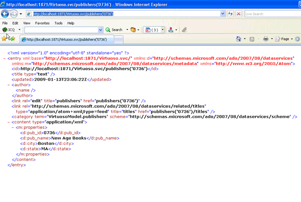

*Notes:*

1.  *Important*
    
    \- To view
    
    *Atom*
    
    (the default format returned by an ADO.NET Data Service) in Internet
    Explorer, you must first ensure that
    
    *Feed Reading View*
    
    is turned
    
    *off*
    
    . This can be done on the
    
    *Content tab*
    
    of
    
    *Tools in Internet Options*
    
    .

2.  If a Data Services entity instance URI page fails to load you can
    turn
    
    *Verbose*
    
    errors on by adding
    
    *config.UseVerboseErrors = true;*
    
    in the
    
    *virtuoso.svc.cs InitializeService*
    
    method to obtain more detailed information from the server as to why
    the page failed to load:
    
        public static void InitializeService(IDataServiceConfiguration config)
        
        {
        
        config.UseVerboseErrors = true;
        
        config.SetEntitySetAccessRule("*", EntitySetRights.All);
        
        }

### Visual Studio Windows DataGrid Form Application

This section details the steps required to create a simple Visual Studio
2008 Windows Form application, with associated DataGridView control for
displaying data in selected tables from the target database.

1.  Launch the Visual Studio 2008 SP1 IDE.
    
    

2.  Create a
    
    *Web Application*
    
    project by going to the
    
    *File*
    
    menu in Visual Studio and choosing
    
    *New Project*
    
    .
    
    

3.  When the New Project window appears, choose either
    
    *Visual Basic*
    
    or
    
    *Visual C\#*
    
    as your programming language.

4.  Within the language category, click on
    
    *Windows*
    
    and select
    
    *Windows Form Application*
    
    from the right-hand panel.

5.  Choose a name for the project, for example
    
    *VirtWindowsFormApplication*
    
    , and click
    
    *OK*
    
    .
    
    

6.  In the
    
    *Toolbox*
    
    , expand
    
    *Data Controls*
    
    , and drag the
    
    *DataGridView*
    
    control onto the form.
    
    

7.  Click on the little
    
    *arrow*
    
    in the top right of the
    
    *DataGridView*
    
    control. This loads the
    
    *DataGridView Task*
    
    menu.
    
    

8.  Click on the
    
    *Choose Data Source*
    
    list box.
    
    

9.  Click on the
    
    *Add Project Data Source*
    
    link to connect to a data source.
    
    

10. In the
    
    *Data Source Configuration Wizard*
    
    dialog
    
    *Choose Data Source Type*
    
    page select the
    
    *Database*
    
    data source type and click
    
    *Next*
    
    .
    
    

11. In the
    
    *Data Source Configuration Wizard*
    
    dialog
    
    *Choose your Data Connection*
    
    page, select the
    
    *New Connection*
    
    button
    
    

12. In the
    
    *Choose Data Source*
    
    dialog, select the OpenLink
    
    *Virtuoso Data Source*
    
    from the list and click
    
    *Continue*
    
    .
    
    

13. In the
    
    *Add Connection*
    
    dialog, specify the
    
    *hostname, portno, username and password*
    
    for the target Virtuoso Server and check the Save Password check
    box.
    
    

14. Select the
    
    *Select Database From List*
    
    radio button and choose the
    
    *P2*
    
    database from the drop down list.
    
    

15. Press the
    
    *Test Connection*
    
    dialog to verify that the database is accessible.
    
    

16. Leave the default connect string
    
    *P2ConnectionString*
    
    and click
    
    *Next*
    
    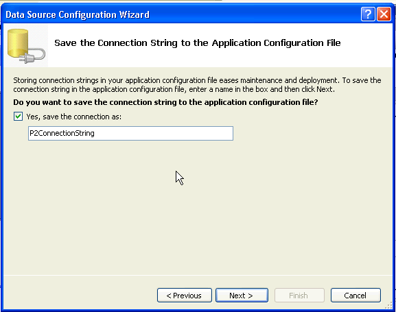

17. From the list of available tables returned for the P2 database,
    select the
    
    *authors*
    
    table to be associated with the
    
    *DataGridView*
    
    control.
    
    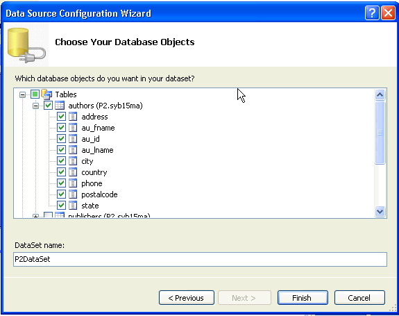

18. The columns names of the select table will be displayed in the
    DataGridView.
    
    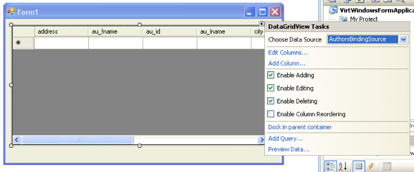

19. Resize the Form and DataGridView to allow all columns to be visible,
    if possible.
    
    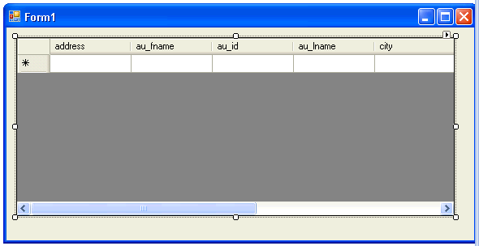

20. To test the application, simply hit
    
    *Ctrl+F5*
    
    within Visual Studio or select
    
    *Start Debugging*
    
    from the
    
    *Debug*
    
    menu.
    
    

21. The data from the
    
    *authors*
    
    table will be displayed in the
    
    *DataGrid*
    
    .
    
    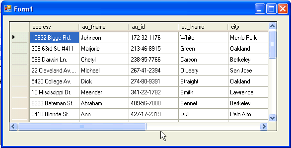

The task is now complete.

# Using Microsoft Entity Frameworks to Access MySQL Schema Objects with Virtuoso

**Prerequisites.**

The following prerequisites must be in place for this solution to be
possible.

**MySQL DBMS.**

An MySQL DBMS hosting the required Schema Objects needs to be available.
In this section the *Northwind sample* database will be used to
demonstrate the process.

An MySQL DBMS hosting the required Schema Objects needs to be available.
In this section the *Northwind sample* database will be used to
demonstrate the process.

**ODBC Driver for MySQL.**

An MySQL ODBC Driver is required for Linking the MySQL Schema Objects
into the Virtuoso Server. The OpenLink *ODBC Driver for MySQL* will be
used in this section, for which a functional ODBC Data source name of
"mysqlma" will be assumed to exist on the machine hosting the Virtuoso
Server.

An MySQL ODBC Driver is required for Linking the MySQL Schema Objects
into the Virtuoso Server. The OpenLink *ODBC Driver for MySQL* will be
used in this section, for which a functional ODBC Data source name of
"mysqlma" will be assumed to exist on the machine hosting the Virtuoso
Server.

**Virtuoso Universal Server.**

An Virtuoso installation including the Virtuoso Universal Server and
ADO.NET Entity Framework Provider is required. The Virtuoso components
used must be Release 5.10.x or above, this being the minimum version
containing support for Microsoft Entity Frameworks

An Virtuoso installation including the Virtuoso Universal Server and
ADO.NET Entity Framework Provider is required. The Virtuoso components
used must be Release 5.10.x or above, this being the minimum version
containing support for Microsoft Entity Frameworks

**Microsoft Visual Studio 2008 SP1.**

Microsoft Visual Studio 2008 Service Pack 1 is required, this being the
only version containing the necessary Entity Framework support available
at the time of writing.

Microsoft Visual Studio 2008 Service Pack 1 is required, this being the
only version containing the necessary Entity Framework support available
at the time of writing.

**Tasks**

**Ensure MySQL Primary Keys (PKs) are not nullable.**

The Visual Studio 2008 Entity Data Model (EDM) requires that all primary
keys are *NOT* Nullable, and will fail to generate an EDM if any are.
Thus ensure any tables to be used are defined as not nullable in the
MySQL database schema before attempting to generate an EDM. In the case
of the Northwind database all tables are not nullable, thus this should
not be an issue in this case.

The Visual Studio 2008 Entity Data Model (EDM) requires that all primary
keys are *NOT* Nullable, and will fail to generate an EDM if any are.
Thus ensure any tables to be used are defined as not nullable in the
MySQL database schema before attempting to generate an EDM. In the case
of the Northwind database all tables are not nullable, thus this should
not be an issue in this case.

## Install and configure OpenLink ODBC Driver for MySQL

The Virtuoso Virtual Database engine uses ODBC as the connectivity
mechanism for linking remote database objects into its local schema.
Thus an MySQL ODBC Driver must be available with a suitably configured
DSN for connecting to the target database. The OpenLink ODBC Drivers for
MySQL have been used in this section, although in theory any MySQL ODBC
Driver can be used.

Installation instructions for the OpenLink ODBC Driver for MySQL are
available from:

  - [Product Installation & Basic Configuration (ODBC)](#)

## Install and configure OpenLink Virtuoso Universal Server

  - [Install and configure OpenLink Virtuoso Universal
    Server](#virtclientrefinstallandconfigvirt)

## Linking MySQL tables into OpenLink Virtuoso

1.  Start the Virtuoso Web User Interface
    
    

2.  Select the "Conductor" link in the Left Frame and Login as the "dba"
    user.
    
    

3.  Select the "Databases" -\> "External Data Source" -\> "Data Sources"
    tab menu items
    
    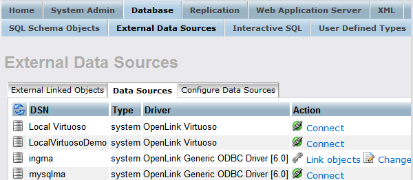

4.  Select the "Connect" button for the "mysqlma" MySQL DSN.
    
    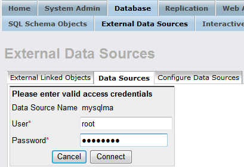

5.  On successful connection Select the "Link Objects" button to obtain
    a list of available tables
    
    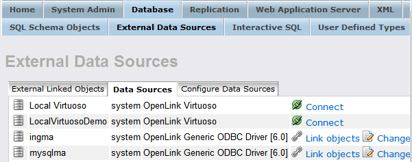

6.  Select all the tables that are part of the "mysql" catalog.
    
    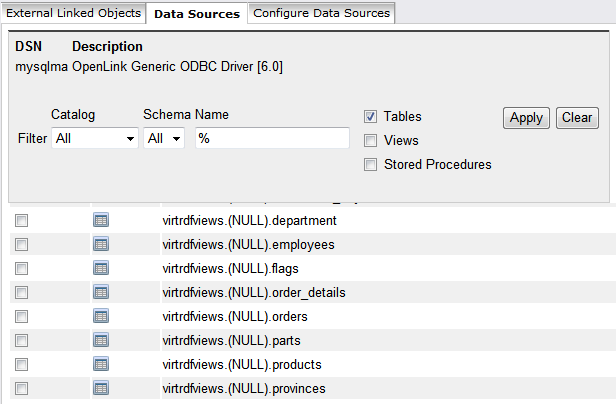

7.  Ensure a primary key is assigned to all table that are to be used in
    the EDM generation phase.
    
    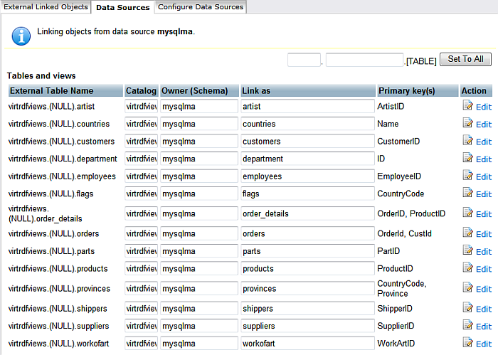

8.  Change the Catalog for each table to be "mysql" using the "Set All"
    button.

9.  Select the "Link" button to link the selected tables into Virtuoso
    
    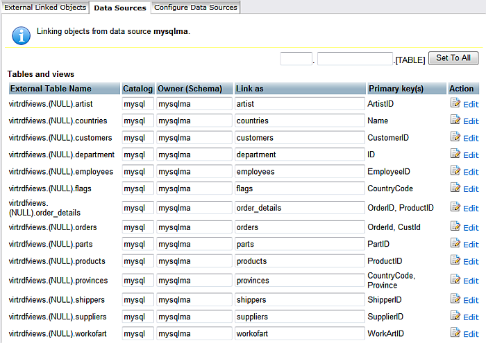

10. On completion of the Link process the tables will be displayed in
    the "External Linked Objects" tab.
    
    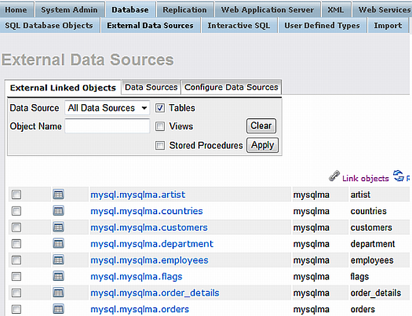

11. The linked tables can be queried by clicking on the hyperlink in the
    "Local Name" column of the "External Linked Objects" tab above,
    which loads the Virtuoso "Interactive SQL" interface with the
    required SQL "Select" for retrieving the remote table data . We
    shall use the "mysql.mysqlma.artist" table to demonstrate this.
    
    

12. Then click the "Execute" button to run the query and retrieve the
    results from the remote table.
    
    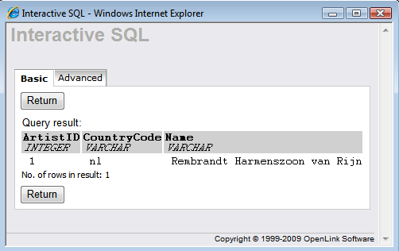

13. The tables can also be viewed as part of the Virtuoso "SQL Schema
    Objects" under the "mysql" catalog name.
    
    
    
    The Link process is now complete enabling the tables to be queried
    as if part of the Virtuoso Schema.

## Creating EDM in Visual Studio 2008

The following steps can be used to create an Entity Data Model (EDM) for
the MySQL Northwind database:

1.  Launch the Visual Studio 2008 SP1 IDE.
    
    

2.  Create a
    
    *Web Application*
    
    project by going to the
    
    *File*
    
    menu in Visual Studio and choosing
    
    *New Project*
    
    .
    
    

3.  When the New Project window appears, choose either
    
    *Visual Basic*
    
    or
    
    *Visual C\#*
    
    as your programming language.

4.  Within the language category, click on
    
    *Web*
    
    and select
    
    *ASP.NET Web Application*
    
    from the right-hand panel.

5.  Choose a name for the project, for example
    
    *VirtuosoDataService*
    
    , and click
    
    *OK*
    
    .
    
    

6.  This will create a new project called
    
    *VirtuosoDataService*
    
    .
    
    

7.  Select the Project -\> Add New Item menu option.
    
    

8.  The
    
    *Add New Item*
    
    dialog will appear. Choose the
    
    *ADO.NET Entity Data Model*
    
    template. Give it the name
    
    *Virtuoso.edmx*
    
    and click
    
    *Add*
    
    to start the creation of the ADO.Net Entity Data Model.
    
    

9.  In the
    
    *Entity Data Model Wizard*
    
    dialog
    
    *Choose Model Contents*
    
    page select the
    
    *Generate from Database*
    
    model type and click
    
    *Next*
    
    .
    
    

10. In the
    
    *Entity Data Model Wizard*
    
    dialog
    
    *Choose your Data Connection*
    
    page, select the
    
    *New Connection button*
    
    

11. In the
    
    *Choose Data Source*
    
    dialog, select the OpenLink
    
    *Virtuoso Data Source*
    
    from the list and click
    
    *Continue*
    
    .
    
    

12. In the
    
    *Add Connection*
    
    dialog, specify the
    
    *hostname, portno, username and password*
    
    for the target Virtuoso Server and check the Save Password check
    box.
    
    

13. Select the
    
    *Select Database From List*
    
    radio button and choose the
    
    *mysql*
    
    database from the drop down list.
    
    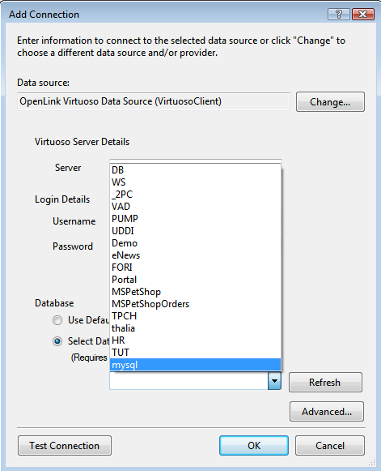

14. Press the
    
    *Test Connection*
    
    dialog to verify that the database is accessible.
    
    

15. Click OK to add the connection.
    
    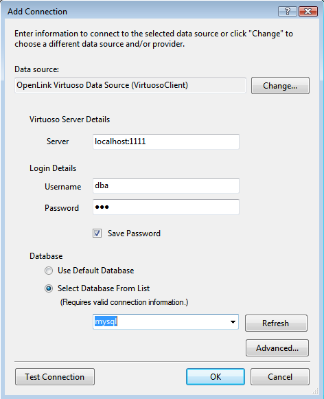

16. Set the
    
    *entity connect string*
    
    name to
    
    *VirtuosoEntities*
    
    (note this name as it is required in the section on creating and
    ADO.Net Data Service) and click
    
    *Next*
    
    .
    
    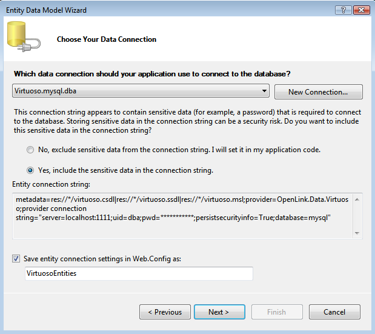

17. In the
    
    *Choose your Database Objects*
    
    page tick the
    
    *Tables*
    
    check box to select all tables in the mysql catalog for addition to
    the Entity Data Model. Set the
    
    *Model Namespace*
    
    to
    
    *VirtuosoModel*
    
    and click
    
    *Finish*
    
    .
    
    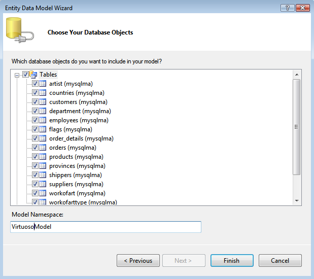

18. The
    
    *Virtuoso.edmx*
    
    EDM will be created with the tables and relationships displayed in
    the Visual Studio IDE
    
    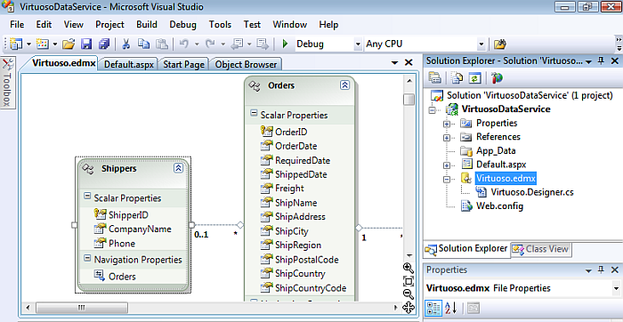

Creation for the Entity Data Model for the MySQL Northwind database is
now complete.

## Using EDM to create Entity Framework based applications

Now that a Microsoft Entity Data Model has been created for the
Northwind database, Entity Framework applications can be created to make
use of it.

### Entity Frameworks based ADO.NET Data Service

An ADO.Net Data Service for the MySQL tables can be created using the
Entity Data Model created in the [Creating EDM in Visual Studio 2008
section](#vdbenginemsqlcrvs) .

1.  Open the
    
    *VirtuosoDataService*
    
    project created in the [Creating EDM in Visual Studio 2008
    section](#vdbenginemsqlcrvs) .

2.  Select the Project -\> Add New Item menu option.
    
    

3.  The
    
    *Add New Item*
    
    dialog will appear. Choose the
    
    *ADO.NET Data Service template*
    
    . Give it the name
    
    *Virtuoso.svc*
    
    , and click
    
    *Add*
    
    to create the ADO.Net Data Service.
    
    

4.  In the newly created
    
    *Virtuoso.svc.cs*
    
    Data Service file, add the data source class name of
    
    *VirtuosoEntities*
    
    (note this is the name set in the Creating EDM in Visual Studio 2008
    section) as the
    
    *DataService*
    
    name. Enable the access to the Data Service by adding the entry
    
    *config.SetEntitySetAccessRule("\*", EntitySetRights.All);*
    
    in the
    
    *InitializeService*
    
    method.
    
        // C#
        
        using System;
        using System.Web;
        using System.Collections.Generic;
        using System.ServiceModel.Web;
        using System.Linq;
        using System.Data.Services;
        
        namespace SimpleDataService
        {
            public class Northwind: DataService<VirtuosoDemoEntities>
            {
                public static void InitializeService(IDataServiceConfiguration  config)
                {
                    config.SetEntitySetAccessRule("*", EntitySetRights.All);
                }
            }
        }
    
    

5.  To test the Data Service, simply hit
    
    *Ctrl+F5*
    
    within Visual Studio. This will start the development web server,
    run the Data Services server inside and load a Web browser page
    displaying the list of available tables/entities for the mysql
    Northwind database catalog.
    
    

6.  To access a specific entity instance like the Customers table ALFKI
    record, use this convention:
    http://host/vdir/Virtuoso.svc/Customers('ALFKI') .
    
    

*Notes:*

1.  *Important*
    
    \- To view
    
    *Atom*
    
    (the default format returned by an ADO.NET Data Service) in Internet
    Explorer, you must first ensure that
    
    *Feed Reading View*
    
    is turned
    
    *off*
    
    . This can be done on the
    
    *Content tab*
    
    of
    
    *Tools in Internet Options*
    
    .

2.  If a Data Services entity instance URI page fails to load you can
    turn
    
    *Verbose*
    
    errors on by adding
    
    *config.UseVerboseErrors = true;*
    
    in the
    
    *virtuoso.svc.cs InitializeService*
    
    method to obtain more detailed information from the server as to why
    the page failed to load:
    
        public static void InitializeService(IDataServiceConfiguration config)
        
        {
        
        config.UseVerboseErrors = true;
        
        config.SetEntitySetAccessRule("*", EntitySetRights.All);
        
        }

### Visual Studio Windows DataGrid Form Application

This section details the steps required to create a simple Visual Studio
2008 Windows Form application, with associated DataGridView control for
displaying data in selected tables from the target database.

1.  Launch the Visual Studio 2008 SP1 IDE.
    
    

2.  Create a *Web Application* project by going to the *File* menu in
    Visual Studio and choosing *New Project* .
    
    

3.  When the New Project window appears, choose either
    
    *Visual Basic* or *Visual C\#* as your programming language.

4.  Within the language category, click on *Windows* and select *Windows
    Form Application* from the right-hand panel.

5.  Choose a name for the project, for example
    *VirtWindowsFormApplication* , and click *OK* .
    
    

6.  In the *Toolbox* , expand *Data Controls* , and drag the
    *DataGridView* control onto the form.
    
    

7.  Click on the little *arrow* in the top right of the *DataGridView*
    control. This loads the *DataGridView Task* menu.
    
    

8.  Click on the *Choose Data Source* list box.
    
    

9.  Click on the *Add Project Data Source* link to connect to a data
    source.
    
    

10. In the *Data Source Configuration Wizard* dialog *Choose Data Source
    Type* page select the *Database* data source type and click *Next* .
    
    

11. In the *Data Source Configuration Wizard* dialog *Choose your Data
    Connection* page, select the *New Connection* button
    
    

12. In the *Choose Data Source* dialog, select the OpenLink *Virtuoso
    Data Source* from the list and click *Continue* .
    
    

13. In the *Add Connection* dialog, specify the *hostname, portno,
    username and password* for the target Virtuoso Server and check the
    Save Password check box.
    
    

14. Select the *Select Database From List* radio button and choose the
    *mysql* database from the drop down list.
    
    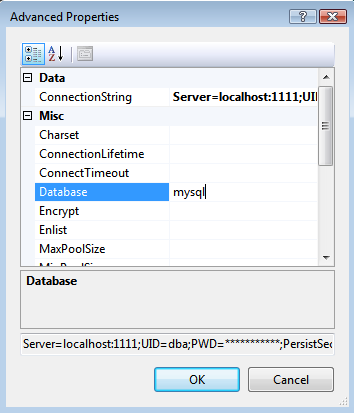

15. Press the *Test Connection* dialog to verify that the database is
    accessible.
    
    

16. Click OK to add the connection.
    
    

17. Leave the default connect string name*mysqlConnectionString* and
    click *Next* .
    
    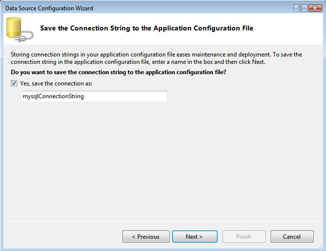

18. From the list of available tables returned for the mysql database,
    select the *Shippers* table to be associated with the *DataGridView*
    control.
    
    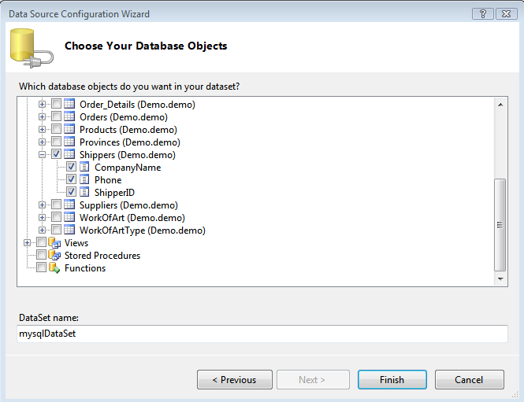

19. The columns names of the select table will be displayed in the
    DataGridView.
    
    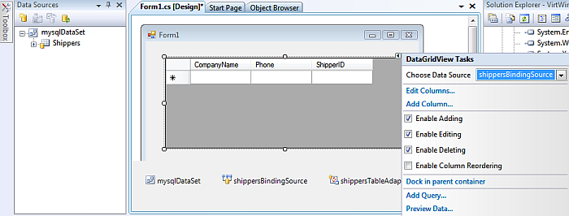

20. Resize the Form and DataGridView to allow all columns to be visible,
    if possible.
    
    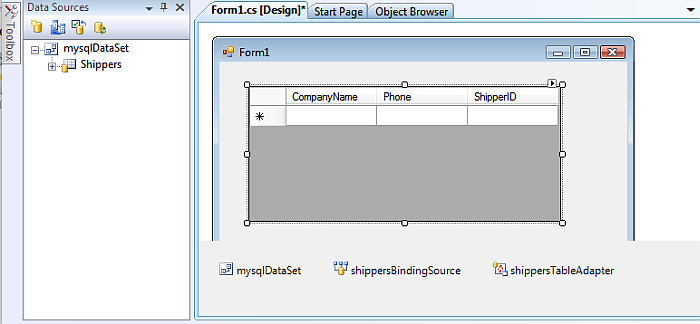

21. To test the application, simply hit *Ctrl+F5* within Visual Studio
    or select *Start Debugging* from the *Debug* menu.
    
    

22. The data from the *Shippers* table will be displayed in the
    *DataGrid* .
    
    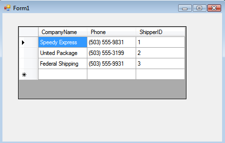

The task is now complete.

# Using Microsoft Entity Frameworks to Access PostgreSQL Schema Objects with Virtuoso

**Prerequisites.**

The following prerequisites must be in place for this solution to be
possible.

**PostgreSQL DBMS.**

An PostgreSQL DBMS hosting the required Schema Objects needs to be
available. In this section the *PostgreSQL* sample database will be used
to demonstrate the process.

An PostgreSQL DBMS hosting the required Schema Objects needs to be
available. In this section the *PostgreSQL* sample database will be used
to demonstrate the process.

**ODBC Driver for PostgreSQL.**

An PostgreSQL ODBC Driver is required for Linking the PostgreSQL Schema
Objects into the Virtuoso Server. The OpenLink *ODBC Driver for
PostgreSQL* will be used in this section, for which a functional ODBC
Data source name of "ora10ma" will be assumed to exist on the machine
hosting the Virtuoso Server.

An PostgreSQL ODBC Driver is required for Linking the PostgreSQL Schema
Objects into the Virtuoso Server. The OpenLink *ODBC Driver for
PostgreSQL* will be used in this section, for which a functional ODBC
Data source name of "ora10ma" will be assumed to exist on the machine
hosting the Virtuoso Server.

**Virtuoso Universal Server.**

An Virtuoso installation including the Virtuoso Universal Server and
ADO.NET Entity Framework Provider is required. The Virtuoso components
used must be Release 5.10.x or above, this being the minimum version
containing support for Microsoft Entity Frameworks

An Virtuoso installation including the Virtuoso Universal Server and
ADO.NET Entity Framework Provider is required. The Virtuoso components
used must be Release 5.10.x or above, this being the minimum version
containing support for Microsoft Entity Frameworks

**Microsoft Visual Studio 2008 SP1.**

Microsoft Visual Studio 2008 Service Pack 1 is required, this being the
only version containing the necessary Entity Framework support available
at the time of writing.

Microsoft Visual Studio 2008 Service Pack 1 is required, this being the
only version containing the necessary Entity Framework support available
at the time of writing.

**Tasks**

**Ensure PostgreSQL Primary Keys (PKs) are not nullable.**

The Visual Studio 2008 Entity Data Model (EDM) requires that all primary
keys are *NOT* Nullable, and will fail to generate an EDM if any are.
Thus ensure any tables to be used are defined as not nullable in the
PostgreSQL database schema before attempting to generate an EDM. In the
case of the PostgreSQL database all tables are not nullable, thus this
should not be an issue in this case.

The Visual Studio 2008 Entity Data Model (EDM) requires that all primary
keys are *NOT* Nullable, and will fail to generate an EDM if any are.
Thus ensure any tables to be used are defined as not nullable in the
PostgreSQL database schema before attempting to generate an EDM. In the
case of the PostgreSQL database all tables are not nullable, thus this
should not be an issue in this case.

## Install and configure OpenLink ODBC Driver for PostgreSQL

The Virtuoso Virtual Database engine uses ODBC as the connectivity
mechanism for linking remote database objects into its local schema.
Thus an PostgreSQL ODBC Driver must be available with a suitably
configured DSN for connecting to the target database. The OpenLink ODBC
Drivers for PostgreSQL have been used in this section, although in
theory any PostgreSQL ODBC Driver can be used.

Installation instructions for the OpenLink ODBC Driver for PostgreSQL
are available from:

  - [Product Installation & Basic Configuration (ODBC)](#)

## Install and configure OpenLink Virtuoso Universal Server

  - [Install and configure OpenLink Virtuoso Universal
    Server](#virtclientrefinstallandconfigvirt)

## Linking PostgreSQL tables into OpenLink Virtuoso

1.  Start the Virtuoso Web User Interface
    
    

2.  Select the "Conductor" link in the Left Frame and Login as the "dba"
    user.
    
    

3.  Select the "Databases" -\> "External Data Source" -\> "Data Sources"
    tab menu items
    
    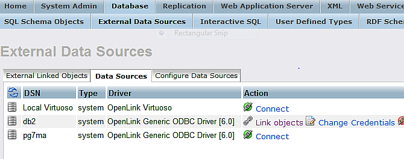

4.  Select the "Connect" button for the "pg7ma" PostgreSQL DSN.
    
    

5.  On successful connection Select the "Link Objects" button to obtain
    a list of available tables
    
    

6.  Select all the tables that you would like to link.
    
    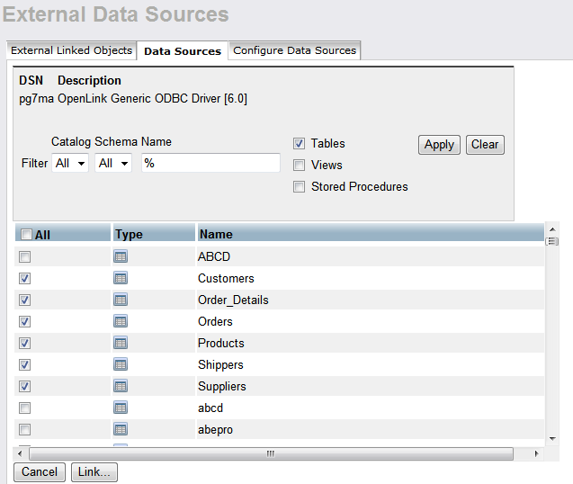

7.  Change the Catalog for each table to be "Northwind" using the "Set
    All" button.
    
    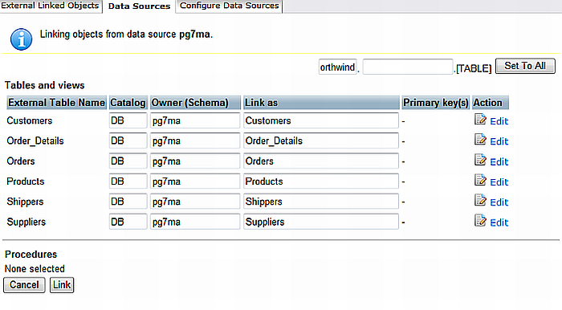

8.  All the catalog names are changed to be "Northwind".
    
    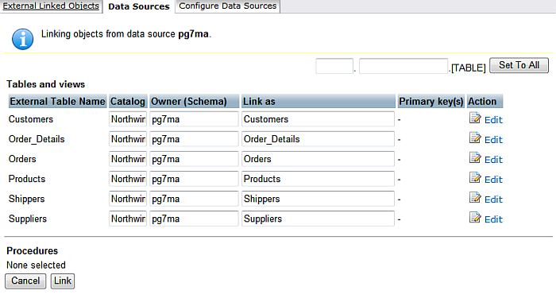

9.  Select the "Link" button to link the selected tables into Virtuoso
    
    

10. On completion of the Link process the tables will be displayed in
    the "External Linked Objects" tab.
    
    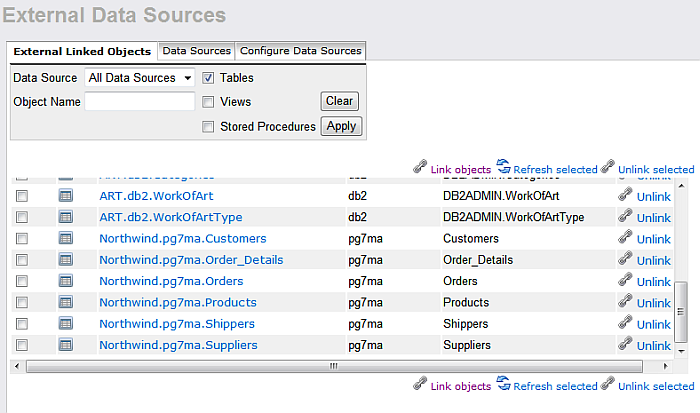

11. The linked tables can be queried by clicking on the hyperlink in the
    "Local Name" column of the "External Linked Objects" tab above,
    which loads the Virtuoso "Interactive SQL" interface with the
    required SQL "Select" for retrieving the remote table data . We
    shall use the "Northwind.pg7ma.Customers" table to demonstrate this.
    
    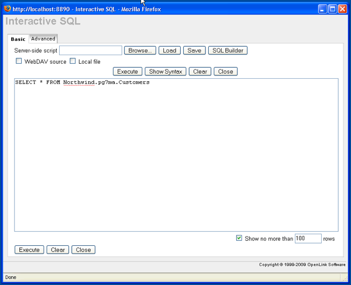

12. Then click the "Execute" button to run the query and retrieve the
    results from the remote table.
    
    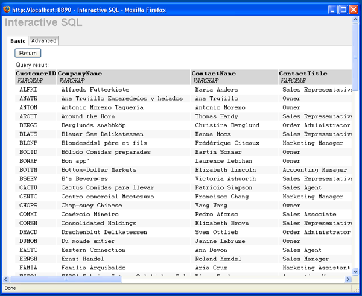

13. The tables can also be viewed as part of the Virtuoso "SQL Schema
    Objects" under the "Northwind" catalog name.
    
    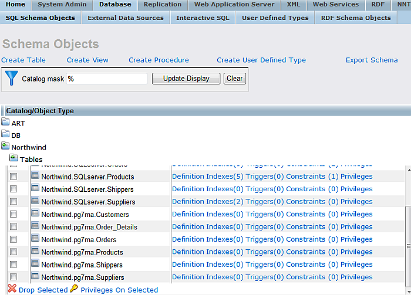
    
    The Link process is now complete enabling the tables to be queried
    as if part of the Virtuoso Schema.

## Creating EDM in Visual Studio 2008

The following steps can be used to create an Entity Data Model (EDM) for
the PostgreSQL Northwind database:

1.  Launch the Visual Studio 2008 SP1 IDE.
    
    

2.  Create a
    
    *Web Application*
    
    project by going to the
    
    *File*
    
    menu in Visual Studio and choosing
    
    *New Project*
    
    .
    
    

3.  When the New Project window appears, choose either
    
    *Visual Basic*
    
    or
    
    *Visual C\#*
    
    as your programming language.

4.  Within the language category, click on
    
    *Web*
    
    , and select
    
    *ASP.NET Web Application*
    
    from the right-hand panel.

5.  Choose a name for the project, for example
    
    *VirtuosoDataService*
    
    , and click
    
    *OK*
    
    .
    
    

6.  This will create a new project called
    
    *VirtuosoDataService*
    
    .
    
    

7.  Select the Project -\> Add New Item menu option.
    
    

8.  The
    
    *Add New Item*
    
    dialog will appear. Choose the
    
    *ADO.NET Entity Data Model*
    
    template. Give it the name
    
    *Virtuoso.edmx*
    
    and click
    
    *Add*
    
    to start the creation of the ADO.Net Entity Data Model.
    
    

9.  In the
    
    *Entity Data Model Wizard*
    
    dialog
    
    *Choose Model Contents*
    
    page select the
    
    *Generate from Database*
    
    model type and click
    
    *Next*
    
    .
    
    

10. In the
    
    *Entity Data Model Wizard*
    
    dialog
    
    *Choose your Data Connection*
    
    page, select the
    
    *New Connection button*
    
    

11. In the
    
    *Choose Data Source*
    
    dialog, select the OpenLink
    
    *Virtuoso Data Source*
    
    from the list and click
    
    *Continue*
    
    .
    
    

12. In the
    
    *Add Connection*
    
    dialog, specify the
    
    *hostname, portno, username and password*
    
    for the target Virtuoso Server and check the Save Password check
    box.
    
    

13. Select the
    
    *Select Database From List*
    
    radio button and choose the
    
    *Northwind*
    
    database from the drop down list.
    
    

14. Press the
    
    *Test Connection*
    
    dialog to verify that the database is accessible.
    
    

15. Set the
    
    *entity connect string*
    
    name to
    
    *VirtuosoEntities*
    
    (note this name as it is required in the section on creating and
    ADO.Net Data Service) and click
    
    *Next*
    
    .
    
    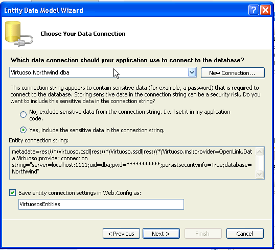

16. In the
    
    *Choose your Database Objects*
    
    page select the
    
    *Tables*
    
    check box to select all tables in the Northwind catalog for addition
    to the Entity Data Model. Set the
    
    *Model Namespace*
    
    to
    
    *VirtuosoModel*
    
    and click
    
    *Finish*
    
    .
    
    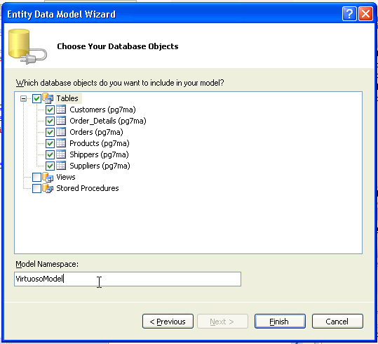

17. The
    
    *Virtuoso.edmx*
    
    EDM will be created with the tables and relationships displayed in
    the Visual Studio IDE
    
    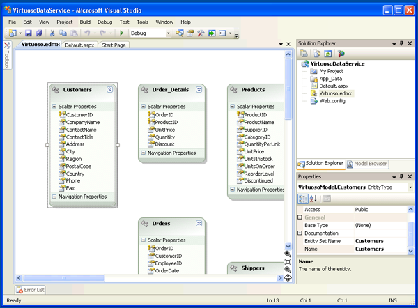

Creation for the Entity Data Model for the PostgreSQL Northwind database
is now complete.

## Using EDM to create Entity Framework based applications

Now that a Microsoft Entity Data Model has been created for the
PostgreSQL database, Entity Framework applications can be created to
make use of it.

### Visual Studio Windows DataGrid Form Application

This section details the steps required to create a simple Visual Studio
2008 Windows Form application, with associated DataGridView control for
displaying data in selected tables from the target database.

1.  Launch the Visual Studio 2008 SP1 IDE.
    
    

2.  Create a
    
    *Web Application*
    
    project by going to the
    
    *File*
    
    menu in Visual Studio and choosing
    
    *New Project*
    
    .
    
    

3.  When the New Project window appears, choose either
    
    *Visual Basic*
    
    or
    
    *Visual C\#*
    
    as your programming language.

4.  Within the language category, click on
    
    *Windows*
    
    and select
    
    *Windows Form Application*
    
    from the right-hand panel.

5.  Choose a name for the project, for example
    
    *VirtWindowsFormApplication*
    
    , and click
    
    *OK*
    
    .
    
    

6.  In the
    
    *Toolbox*
    
    , expand
    
    *Data Controls*
    
    , and drag the
    
    *DataGridView*
    
    control onto the form.
    
    

7.  Click on the little
    
    *arrow*
    
    in the top right of the
    
    *DataGridView*
    
    control. This loads the
    
    *DataGridView Task*
    
    menu.
    
    

8.  Click on the
    
    *Choose Data Source*
    
    list box.
    
    

9.  Click on the
    
    *Add Project Data Source*
    
    link to connect to a data source.
    
    

10. In the
    
    *Data Source Configuration Wizard*
    
    dialog
    
    *Choose Data Source Type*
    
    page select the
    
    *Database*
    
    data source type and click
    
    *Next*
    
    .
    
    

11. In the
    
    *Data Source Configuration Wizard*
    
    dialog
    
    *Choose your Data Connection*
    
    page, select the
    
    *New Connection*
    
    button
    
    

12. In the
    
    *Choose Data Source*
    
    dialog, select the OpenLink
    
    *Virtuoso Data Source*
    
    from the list and click
    
    *Continue*
    
    .
    
    

13. In the
    
    *Add Connection*
    
    dialog, specify the
    
    *hostname, portno, username and password*
    
    for the target Virtuoso Server and check the Save Password check
    box.
    
    

14. Select the
    
    *Select Database From List*
    
    radio button and choose the
    
    *Northwind*
    
    database from the drop down list.
    
    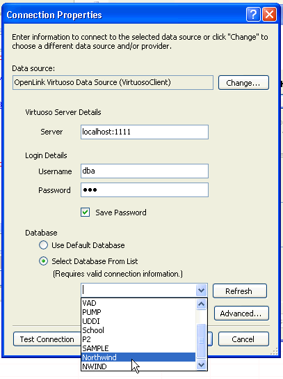

15. Press the
    
    *Test Connection*
    
    dialog to verify that the database is accessible.
    
    

16. Leave the default connect string
    
    *NorthwindConnectionString*
    
    and click
    
    *Next*
    
    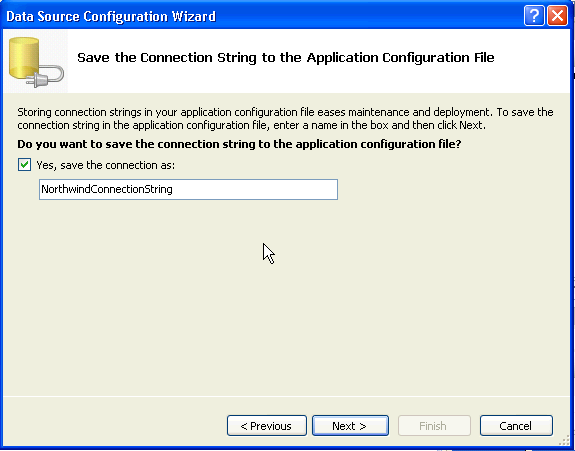

17. From the list of available tables returned for the Northwind
    database, select the
    
    *Shippers*
    
    table to be associated with the
    
    *DataGridView*
    
    control.
    
    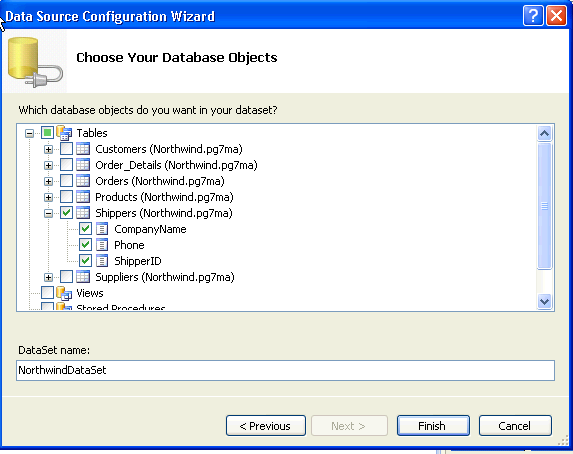

18. The columns names of the select table will be displayed in the
    DataGridView.
    
    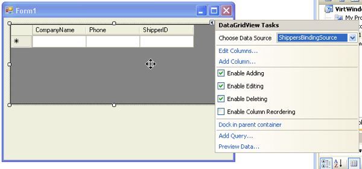

19. Resize the Form and DataGridView to allow all columns to be visible,
    if possible.
    
    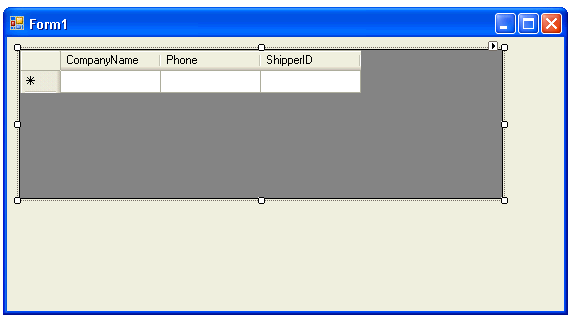

20. To test the application, simply hit
    
    *Ctrl+F5*
    
    within Visual Studio or select
    
    *Start Debugging*
    
    from the
    
    *Debug*
    
    menu.
    
    

21. The data from the
    
    *Shippers*
    
    table will be displayed in the
    
    *DataGrid*
    
    .
    
    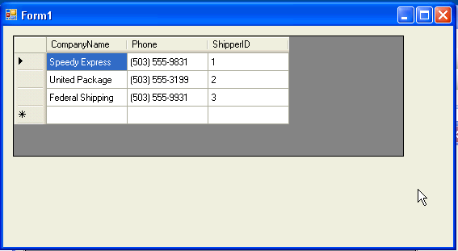

The task is now complete.

# Using Microsoft Entity Frameworks to Access ODBC to JDBC Bridge Schema Objects with Virtuoso

**Prerequisites.**

The following prerequisites must be in place for this solution to be
possible.

**ODBC to JDBC Bridge DBMS.**

An ODBC to JDBC Bridge DBMS hosting the required Schema Objects needs to
be available. In this section we shall make and ODBC to JDBC bridge
connection to another *Virtuoso Northwind Demo* database to demonstrate
the process.

An ODBC to JDBC Bridge DBMS hosting the required Schema Objects needs to
be available. In this section we shall make and ODBC to JDBC bridge
connection to another *Virtuoso Northwind Demo* database to demonstrate
the process.

**ODBC to JDBC Bridge Driver.**

An ODBC to JDBC Bridge Driver is required for Linking the ODBC to JDBC
Bridge Schema Objects into the Virtuoso Server. The *OpenLink ODBC to
JDBC Bridge Driver* will be used in this section, for which a functional
ODBC Data source name of "jdbcma" will be assumed to exist on the
machine hosting the Virtuoso Server.

An ODBC to JDBC Bridge Driver is required for Linking the ODBC to JDBC
Bridge Schema Objects into the Virtuoso Server. The *OpenLink ODBC to
JDBC Bridge Driver* will be used in this section, for which a functional
ODBC Data source name of "jdbcma" will be assumed to exist on the
machine hosting the Virtuoso Server.

**Virtuoso Universal Server.**

An Virtuoso installation including the Virtuoso Universal Server and
ADO.NET Entity Framework Provider is required. The Virtuoso components
used must be Release 5.10.x or above, this being the minimum version
containing support for Microsoft Entity Frameworks

An Virtuoso installation including the Virtuoso Universal Server and
ADO.NET Entity Framework Provider is required. The Virtuoso components
used must be Release 5.10.x or above, this being the minimum version
containing support for Microsoft Entity Frameworks

**Microsoft Visual Studio 2008 SP1.**

Microsoft Visual Studio 2008 Service Pack 1 is required, this being the
only version containing the necessary Entity Framework support available
at the time of writing.

Microsoft Visual Studio 2008 Service Pack 1 is required, this being the
only version containing the necessary Entity Framework support available
at the time of writing.

**Tasks**

**Ensure ODBC to JDBC Bridge Primary Keys (PKs) are not nullable.**

The Visual Studio 2008 Entity Data Model (EDM) requires that all primary
keys are *NOT* Nullable, and will fail to generate an EDM if any are.
Thus ensure any tables to be used are defined as not nullable in the
ODBC to JDBC Bridge database schema before attempting to generate an
EDM. In the case of the ODBC to JDBC Bridge Virtuoso Northwind Demo
database all tables are not nullable, thus this should not be an issue
in this case.

The Visual Studio 2008 Entity Data Model (EDM) requires that all primary
keys are *NOT* Nullable, and will fail to generate an EDM if any are.
Thus ensure any tables to be used are defined as not nullable in the
ODBC to JDBC Bridge database schema before attempting to generate an
EDM. In the case of the ODBC to JDBC Bridge Virtuoso Northwind Demo
database all tables are not nullable, thus this should not be an issue
in this case.

## Install and configure OpenLink ODBC Driver for ODBC to JDBC Bridge

The Virtuoso Virtual Database engine uses ODBC as the connectivity
mechanism for linking remote database objects into its local schema.
Thus an ODBC to JDBC Bridge Driver must be available with a suitably
configured DSN for connecting to the target database. The OpenLink ODBC
to JDBC Bridge Drivers have been used in this document, although in
theory any ODBC to JDBC Bridge Driver can be used.

Installation instructions for the OpenLink ODBC Driver for ODBC to JDBC
Bridge are available from:

  - [Product Installation & Basic Configuration (ODBC)](#)

## Install and configure OpenLink Virtuoso Universal Server

  - [Install and configure OpenLink Virtuoso Universal
    Server](#virtclientrefinstallandconfigvirt)

## Linking ODBC to JDBC Bridge tables into OpenLink Virtuoso

1.  Start the Virtuoso Web User Interface
    
    

2.  Select the "Conductor" link in the Left Frame and Login as the "dba"
    user.
    
    

3.  Select the "Databases" -\> "External Data Source" -\> "Data Sources"
    tab menu items
    
    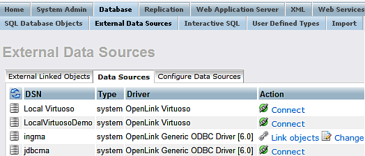

4.  Select the "Connect" button for the "jdbcma" ODBC to JDBC Bridge
    DSN.
    
    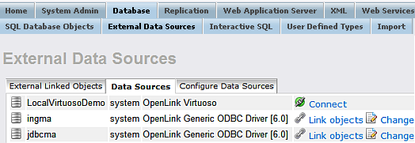

5.  On successful connection Select the "Link Objects" button to obtain
    a list of available tables
    
    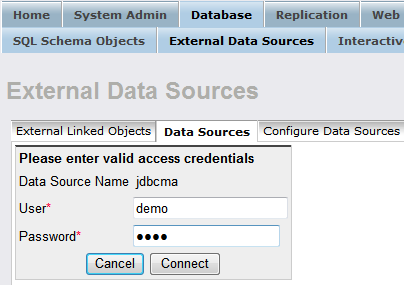

6.  Select all the tables that are part of the "JDBC" catalog.
    
    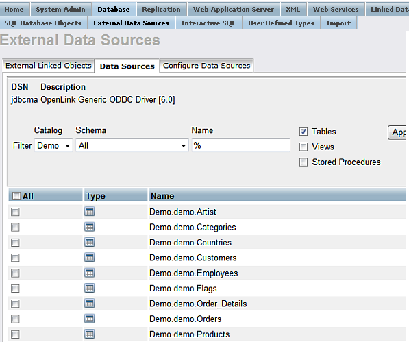

7.  Select all the "JDBC" Catalog tables to be linked into the database
    and select "Link" button.
    
    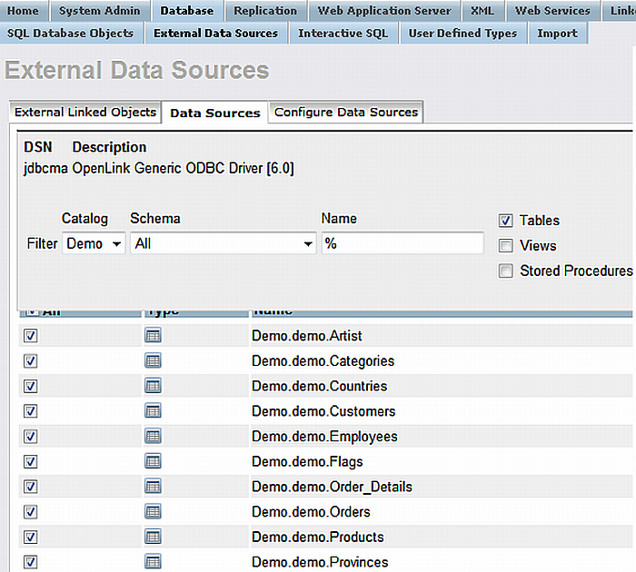

8.  Change the Catalog for each table to be "JDBC" using the "Set All"
    button.
    
    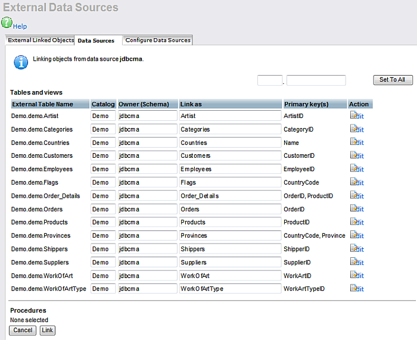

9.  Select the "Link" button to link the selected tables into Virtuoso
    
    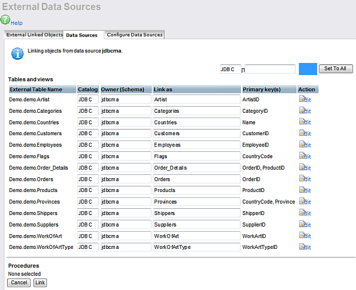

10. On completion of the Link process the tables will be displayed in
    the "External Linked Objects" tab.
    
    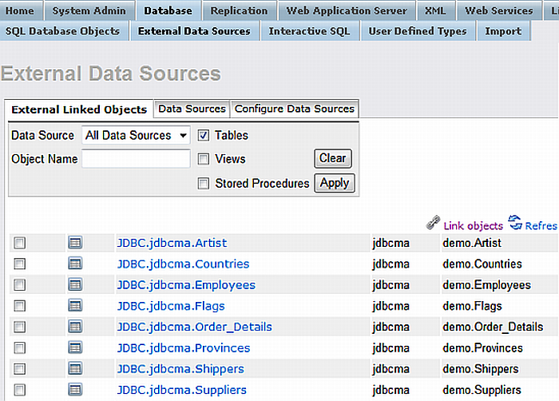

11. The linked tables can be queried by clicking on the hyperlink in the
    "Local Name" column of the "External Linked Objects" tab above,
    which loads the Virtuoso "Interactive SQL" interface with the
    required SQL "Select" for retrieving the remote table data. We shall
    use the "JDBC.jdbcma.Artist" table to demonstrate this.
    
    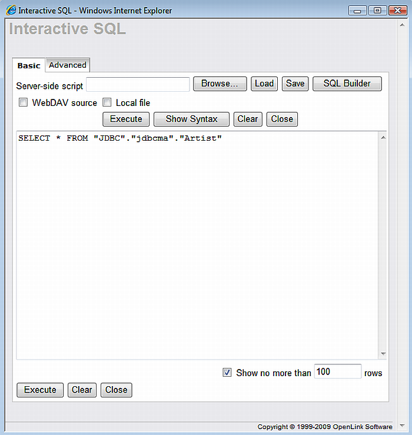

12. Then click the "Execute" button to run the query and retrieve the
    results from the remote table.
    
    

13. The tables can also be viewed as part of the Virtuoso "SQL Schema
    Objects" under the "JDBC" catalog name.
    
    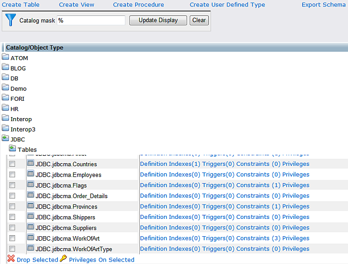
    
    The Link process is now complete enabling the tables to be queried
    as if part of the Virtuoso Schema.

## Creating EDM in Visual Studio 2008

The following steps can be used to create an Entity Data Model (EDM) for
the ODBC to JDBC Bridge Northwind database:

1.  Launch the Visual Studio 2008 SP1 IDE.
    
    

2.  Create a
    
    *Web Application*
    
    project by going to the
    
    *File*
    
    menu in Visual Studio and choosing
    
    *New Project*
    
    .
    
    

3.  When the New Project window appears, choose either
    
    *Visual Basic*
    
    or
    
    *Visual C\#*
    
    as your programming language.

4.  Within the language category, click on
    
    *Web*
    
    and select
    
    *ASP.NET Web Application*
    
    from the right-hand panel.

5.  Choose a name for the project, for example
    
    *VirtuosoDataService*
    
    , and click
    
    *OK*
    
    .
    
    

6.  This will create a new project called
    
    *VirtuosoDataService*
    
    .
    
    

7.  Select the Project -\> Add New Item menu option.
    
    

8.  The
    
    *Add New Item*
    
    dialog will appear. Choose the
    
    *ADO.NET Entity Data Model*
    
    template. Give it the name
    
    *Virtuoso.edmx*
    
    and click
    
    *Add*
    
    to start the creation of the ADO.Net Entity Data Model.
    
    

9.  In the
    
    *Entity Data Model Wizard*
    
    dialog
    
    *Choose Model Contents*
    
    page select the
    
    *Generate from Database*
    
    model type and click
    
    *Next*
    
    .
    
    

10. In the
    
    *Entity Data Model Wizard*
    
    dialog
    
    *Choose your Data Connection*
    
    page, select the
    
    *New Connection button*
    
    

11. In the
    
    *Choose Data Source*
    
    dialog, select the OpenLink
    
    *Virtuoso Data Source*
    
    from the list and click
    
    *Continue*
    
    .
    
    

12. In the
    
    *Add Connection*
    
    dialog, specify the
    
    *hostname, portno, username and password*
    
    for the target Virtuoso Server and check the Save Password check
    box.
    
    

13. Select the
    
    *Select Database From List*
    
    radio button and choose the
    
    *JDBC*
    
    database from the drop down list.
    
    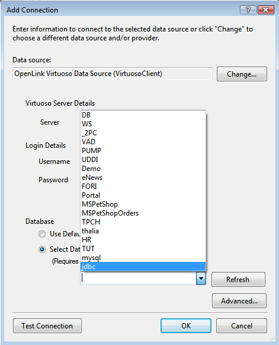

14. Press the
    
    *Test Connection*
    
    dialog to verify that the database is accessible.
    
    

15. Click OK to add the connection.
    
    

16. Set the
    
    *entity connect string*
    
    name to
    
    *VirtuosoEntities*
    
    (note this name as it is required in the section on creating and
    ADO.Net Data Service) and click
    
    *Next*
    
    .
    
    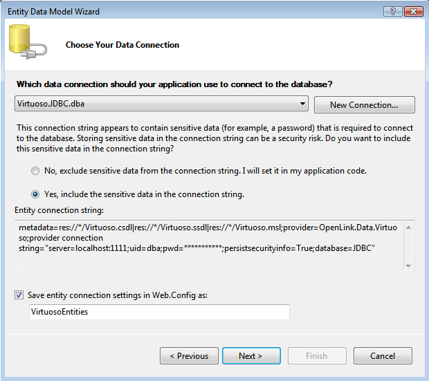

17. In the
    
    *Choose your Database Objects*
    
    page select the
    
    *Tables*
    
    check box to select all tables in the JDBC catalog for addition to
    the Entity Data Model. Set the
    
    *Model Namespace*
    
    to
    
    *VirtuosoModel*
    
    and click
    
    *Finish*
    
    .
    
    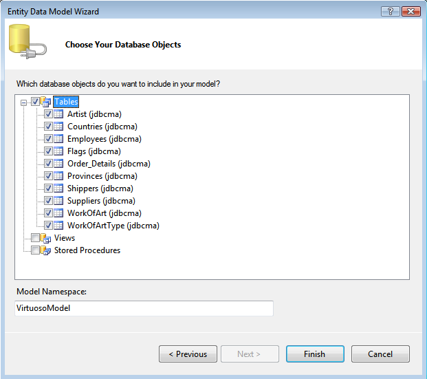

18. The
    
    *Virtuoso.edmx*
    
    EDM will be created with the tables and relationships displayed in
    the Visual Studio IDE
    
    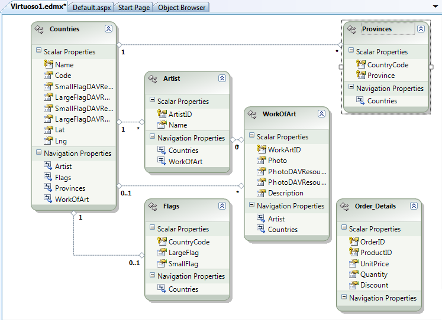

Creation for the Entity Data Model for the ODBC to JDBC Bridge Northwind
database is now complete.

## Using EDM to create Entity Framework based applications

Now that a Microsoft Entity Data Model has been created for the
Northwind database, Entity Framework applications can be created to make
use of it.

### Entity Frameworks based ADO.NET Data Service

An ADO.Net Data Service for the ODBC to JDBC Bridge tables can be
created using the Entity Data Model created in the [Creating EDM in
Visual Studio 2008 section](#vdbengineodtjdcrvs) .

1.  Open the
    
    *VirtuosoDataService*
    
    project created in the [Creating EDM in Visual Studio 2008
    section](#vdbengineodtjdcrvs) .

2.  Select the Project -\> Add New Item menu option.
    
    

3.  The
    
    *Add New Item*
    
    dialog will appear. Choose the
    
    *ADO.NET Data Service template*
    
    . Give it the name
    
    *Virtuoso.svc*
    
    , and click
    
    *Add*
    
    to create the ADO.Net Data Service.
    
    

4.  In the newly created
    
    *Virtuoso.svc.cs*
    
    Data Service file, add the data source class name of
    
    *VirtuosoEntities*
    
    (note this is the name set in the Creating EDM in Visual Studio 2008
    section) as the
    
    *DataService*
    
    name. Enable the access to the Data Service by adding the entry
    
    *config.SetEntitySetAccessRule("\*", EntitySetRights.All);*
    
    in the
    
    *InitializeService*
    
    method.
    
        // C#
        
        using System;
        using System.Web;
        using System.Collections.Generic;
        using System.ServiceModel.Web;
        using System.Linq;
        using System.Data.Services;
        
        namespace SimpleDataService
        {
            public class Northwind: DataService<VirtuosoDemoEntities>
            {
                public static void InitializeService(IDataServiceConfiguration  config)
                {
                    config.SetEntitySetAccessRule("*", EntitySetRights.All);
                }
            }
        }
    
    

5.  To test the Data Service, simply hit
    
    *Ctrl+F5*
    
    within Visual Studio. This will start the development web server,
    run the Data Services server inside and load a Web browser page
    displaying the list of available tables/entities for the Northwind
    Demo database catalog.
    
    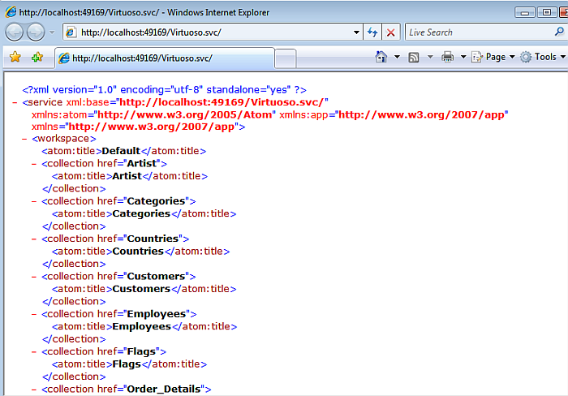

6.  To access a specific entity instance like the Customers table ALFKI
    record, use this convention
    http://host/vdir/Virtuoso.svc/Customers('ALFKI') .
    
    

*Notes:*

1.  *Important*
    
    \- To view
    
    *Atom*
    
    (the default format returned by an ADO.NET Data Service) in Internet
    Explorer, you must first ensure that
    
    *Feed Reading View*
    
    is turned
    
    *off*
    
    . This can be done on the
    
    *Content tab*
    
    of
    
    *Tools in Internet Options*
    
    .

2.  If a Data Services entity instance URI page fails to load you can
    turn
    
    *Verbose*
    
    errors on by adding
    
    *config.UseVerboseErrors = true;*
    
    in the
    
    *virtuoso.svc.cs InitializeService*
    
    method to obtain more detailed information from the server as to why
    the page failed to load:
    
        public static void InitializeService(IDataServiceConfiguration config)
        
        {
        
        config.UseVerboseErrors = true;
        
        config.SetEntitySetAccessRule("*", EntitySetRights.All);
        
        }

### Visual Studio Windows DataGrid Form Application

This section details the steps required to create a simple Visual Studio
2008 Windows Form application, with associated DataGridView control for
displaying data in selected tables from the target database.

1.  Launch the Visual Studio 2008 SP1 IDE.
    
    

2.  Create a
    
    *Web Application*
    
    project by going to the
    
    *File*
    
    menu in Visual Studio and choosing
    
    *New Project*
    
    .
    
    

3.  When the New Project window appears, choose either
    
    *Visual Basic*
    
    or
    
    *Visual C\#*
    
    as your programming language.

4.  Within the language category, click on
    
    *Windows*
    
    and select
    
    *Windows Form Application*
    
    from the right-hand panel.

5.  Choose a name for the project, for example
    
    *VirtWindowsFormApplication*
    
    , and click
    
    *OK*
    
    .
    
    

6.  In the
    
    *Toolbox*
    
    , expand
    
    *Data Controls*
    
    , and drag the
    
    *DataGridView*
    
    control onto the form.
    
    

7.  Click on the little
    
    *arrow*
    
    in the top right of the
    
    *DataGridView*
    
    control. This loads the
    
    *DataGridView Task*
    
    menu.
    
    

8.  Click on the
    
    *Choose Data Source*
    
    list box.
    
    

9.  Click on the
    
    *Add Project Data Source*
    
    link to connect to a data source.
    
    

10. In the
    
    *Data Source Configuration Wizard*
    
    dialog
    
    *Choose Data Source Type*
    
    page select the
    
    *Database*
    
    data source type and click
    
    *Next*
    
    .
    
    

11. In the
    
    *Data Source Configuration Wizard*
    
    dialog
    
    *Choose your Data Connection*
    
    page, select the
    
    *New Connection*
    
    button
    
    

12. In the
    
    *Choose Data Source*
    
    dialog, select the OpenLink
    
    *Virtuoso Data Source*
    
    from the list and click
    
    *Continue*
    
    .
    
    

13. In the
    
    *Add Connection*
    
    dialog, specify the
    
    *hostname, portno, username and password*
    
    for the target Virtuoso Server and check the Save Password check
    box.
    
    

14. Select the
    
    *Select Database From List*
    
    radio button and choose the
    
    *jdbc*
    
    database from the drop down list.
    
    

15. Press the
    
    *Test Connection*
    
    dialog to verify that the database is accessible.
    
    

16. Click OK to add the connection.
    
    

17. Leave the default connect string
    
    *JDBCConnectionString*
    
    and click
    
    *Next*
    
    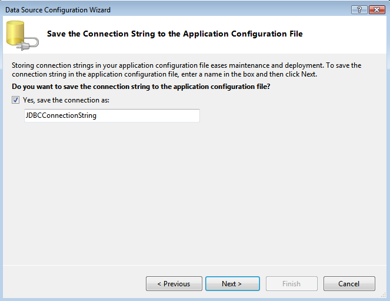

18. From the list of available tables returned for the JDBC database,
    select the
    
    *Shippers*
    
    table to be associated with the
    
    *DataGridView*
    
    control.
    
    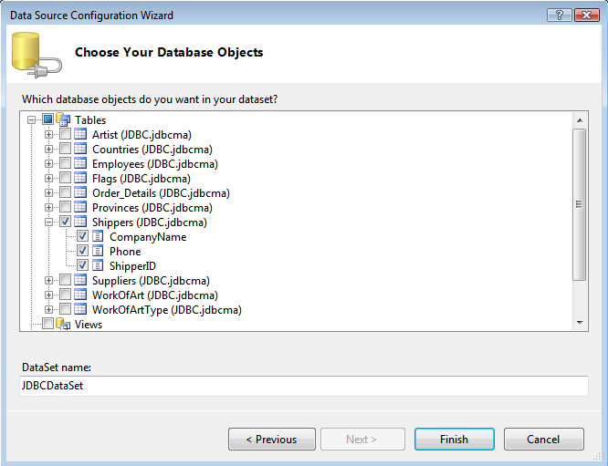

19. The columns names of the select table will be displayed in the
    DataGridView.
    
    

20. Resize the Form and DataGridView to allow all columns to be visible,
    if possible.
    
    

21. To test the application, simply hit
    
    *Ctrl+F5*
    
    within Visual Studio or select
    
    *Start Debugging*
    
    from the
    
    *Debug*
    
    menu.
    
    

22. The data from the
    
    *Shippers*
    
    table will be displayed in the
    
    *DataGrid*
    
    .
    
    

The task is now complete.

# Using Microsoft Entity Frameworks to Access ODBC to ODBC Bridge Schema Objects with Virtuoso

**Prerequisites.**

The following prerequisites must be in place for this solution to be
possible.

**ODBC to ODBC Bridge DBMS.**

An ODBC to ODBC Bridge DBMS hosting the required Schema Objects needs to
be available. In this section we shall make and ODBC to ODBC bridge
connection to another *Virtuoso Northwind Demo* database to demonstrate
the process.

An ODBC to ODBC Bridge DBMS hosting the required Schema Objects needs to
be available. In this section we shall make and ODBC to ODBC bridge
connection to another *Virtuoso Northwind Demo* database to demonstrate
the process.

**ODBC to ODBC Bridge Driver.**

An ODBC to ODBC Bridge Driver is required for Linking the ODBC to ODBC
Bridge Schema Objects into the Virtuoso Server. The *OpenLink ODBC to
ODBC Bridge Driver* will be used in this section, for which a functional
ODBC Data source name of "odbcma" will be assumed to exist on the
machine hosting the Virtuoso Server.

An ODBC to ODBC Bridge Driver is required for Linking the ODBC to ODBC
Bridge Schema Objects into the Virtuoso Server. The *OpenLink ODBC to
ODBC Bridge Driver* will be used in this section, for which a functional
ODBC Data source name of "odbcma" will be assumed to exist on the
machine hosting the Virtuoso Server.

**Virtuoso Universal Server.**

An Virtuoso installation including the Virtuoso Universal Server and
ADO.NET Entity Framework Provider is required. The Virtuoso components
used must be Release 5.10.x or above, this being the minimum version
containing support for Microsoft Entity Frameworks

An Virtuoso installation including the Virtuoso Universal Server and
ADO.NET Entity Framework Provider is required. The Virtuoso components
used must be Release 5.10.x or above, this being the minimum version
containing support for Microsoft Entity Frameworks

**Microsoft Visual Studio 2008 SP1.**

Microsoft Visual Studio 2008 Service Pack 1 is required, this being the
only version containing the necessary Entity Framework support available
at the time of writing.

Microsoft Visual Studio 2008 Service Pack 1 is required, this being the
only version containing the necessary Entity Framework support available
at the time of writing.

**Tasks**

**Ensure ODBC to ODBC Bridge Primary Keys (PKs) are not nullable.**

The Visual Studio 2008 Entity Data Model (EDM) requires that all primary
keys are *NOT* Nullable, and will fail to generate an EDM if any are.
Thus ensure any tables to be used are defined as not nullable in the
ODBC to ODBC Bridge database schema before attempting to generate an
EDM. In the case of the ODBC to ODBC Bridge Virtuoso Northwind Demo
database all tables are not nullable, thus this should not be an issue
in this case.

The Visual Studio 2008 Entity Data Model (EDM) requires that all primary
keys are *NOT* Nullable, and will fail to generate an EDM if any are.
Thus ensure any tables to be used are defined as not nullable in the
ODBC to ODBC Bridge database schema before attempting to generate an
EDM. In the case of the ODBC to ODBC Bridge Virtuoso Northwind Demo
database all tables are not nullable, thus this should not be an issue
in this case.

## Install and configure OpenLink ODBC Driver for ODBC to ODBC Bridge

The Virtuoso Virtual Database engine uses ODBC as the connectivity
mechanism for linking remote database objects into its local schema.
Thus an ODBC to ODBC Bridge Driver must be available with a suitably
configured DSN for connecting to the target database. The OpenLink ODBC
to ODBC Bridge Drivers have been used in this document, although in
theory any ODBC to ODBC Bridge Driver can be used.

Installation instructions for the OpenLink ODBC Driver for ODBC to ODBC
Bridge are available from: [Product Installation & Basic Configuration
(ODBC)](#)

### Install and configure OpenLink Virtuoso Universal Server

1.  [Install and configure OpenLink Virtuoso Universal
    Server](#virtclientrefinstallandconfigvirt)

## Linking ODBC to ODBC Bridge tables into OpenLink Virtuoso

1.  Start the Virtuoso Web User Interface
    
    

2.  Select the "Conductor" link in the Left Frame and Login as the "dba"
    user.
    
    

3.  Select the "Databases" -\> "External Data Source" -\> "Data Sources"
    tab menu items
    
    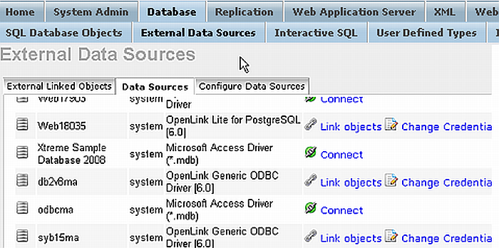

4.  Select the "Connect" button for the "odbcma" ODBC to ODBC Bridge
    DSN.
    
    

5.  On successful connection Select the "Link Objects" button to obtain
    a list of available tables
    
    

6.  Select all the tables that are part of the "Northwind" catalog.
    
    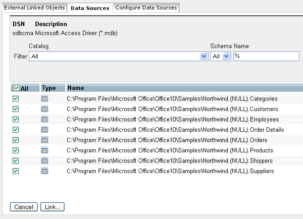

7.  Change the Catalog for each table to be "NWIND" using the "Set All"
    button.
    
    

8.  All the catalog names are changed to be "NWIND".

9.  Select the "Link" button to link the selected tables into Virtuoso
    
    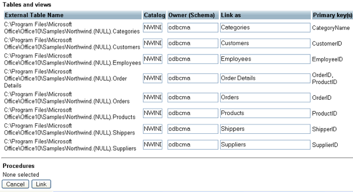

10. On completion of the Link process the tables will be displayed in
    the "External Linked Objects" tab.
    
    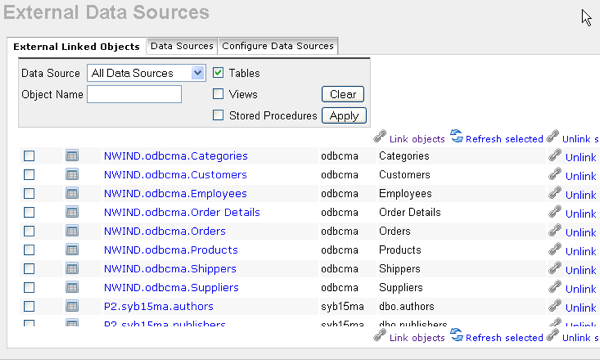

11. The linked tables can be queried by clicking on the hyperlink in the
    "Local Name" column of the "External Linked Objects" tab above,
    which loads the Virtuoso "Interactive SQL" interface with the
    required SQL "Select" for retrieving the remote table data. We shall
    use the "NWIND.odbcma.Customers" table to demonstrate this.
    
    

12. Then click the "Execute" button to run the query and retrieve the
    results from the remote table.
    
    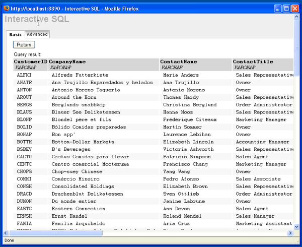

13. The tables can also be viewed as part of the Virtuoso "SQL Schema
    Objects" under the "NWIND" catalog name.
    
    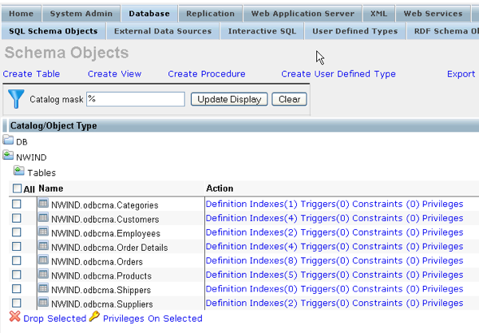
    
    The Link process is now complete enabling the tables to be queried
    as if part of the Virtuoso Schema.

## Creating EDM in Visual Studio 2008

The following steps can be used to create an Entity Data Model (EDM) for
the Microsoft Access Northwind database:

1.  Launch the Visual Studio 2008 SP1 IDE.
    
    

2.  Create a
    
    *Web Application*
    
    project by going to the
    
    *File*
    
    menu in Visual Studio and choosing
    
    *New Project*
    
    .
    
    

3.  When the New Project window appears, choose either
    
    *Visual Basic*
    
    or
    
    *Visual C\#*
    
    as your programming language.

4.  Within the language category, click on
    
    *Web*
    
    and select
    
    *ASP.NET Web Application*
    
    from the right-hand panel.

5.  Choose a name for the project, for example
    
    *VirtuosoDataService*
    
    , and click
    
    *OK*
    
    .
    
    

6.  This will create a new project called
    
    *VirtuosoDataService*
    
    .
    
    

7.  Select the Project -\> Add New Item menu option.
    
    

8.  The
    
    *Add New Item*
    
    dialog will appear. Choose the
    
    *ADO.NET Entity Data Model*
    
    template. Give it the name
    
    *Virtuoso.edmx*
    
    and click
    
    *Add*
    
    to start the creation of the ADO.Net Entity Data Model.
    
    

9.  In the
    
    *Entity Data Model Wizard*
    
    dialog
    
    *Choose Model Contents*
    
    page select the
    
    *Generate from Database*
    
    model type and click
    
    *Next*
    
    .
    
    

10. In the
    
    *Entity Data Model Wizard*
    
    dialog
    
    *Choose your Data Connection*
    
    page, select the
    
    *New Connection button*
    
    

11. In the
    
    *Choose Data Source*
    
    dialog, select the OpenLink
    
    *Virtuoso Data Source*
    
    from the list and click
    
    *Continue*
    
    .
    
    

12. In the
    
    *Add Connection*
    
    dialog, specify the
    
    *hostname, portno, username and password*
    
    for the target Virtuoso Server and check the Save Password check
    box.
    
    

13. Select the
    
    *Select Database From List*
    
    radio button and choose the
    
    *NWIND*
    
    database from the drop down list.
    
    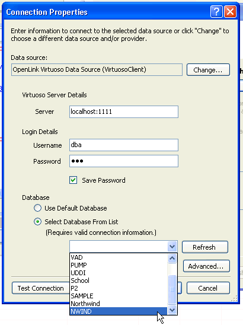

14. Press the
    
    *Test Connection*
    
    dialog to verify that the database is accessible.
    
    

15. Set the
    
    *entity connect string*
    
    name to
    
    *VirtuosoEntities*
    
    (note this name as it is required in the section on creating and
    ADO.Net Data Service) and click
    
    *Next*
    
    .
    
    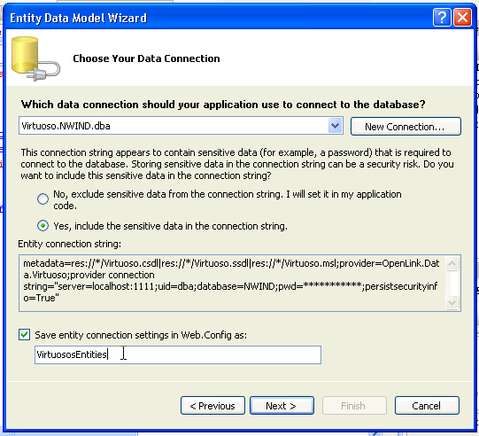

16. In the
    
    *Choose your Database Objects*
    
    page select the
    
    *Tables*
    
    check box to select all tables in the NWIND catalog for addition to
    the Entity Data Model. Set the
    
    *Model Namespace*
    
    to
    
    *VirtuosoModel*
    
    and click
    
    *Finish*
    
    .
    
    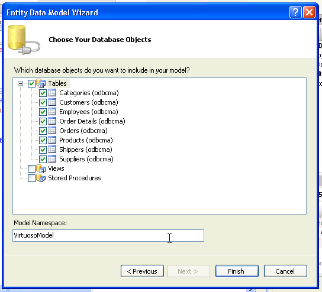

17. The
    
    *Virtuoso.edmx*
    
    EDM will be created with the tables and relationships displayed in
    the Visual Studio IDE
    
    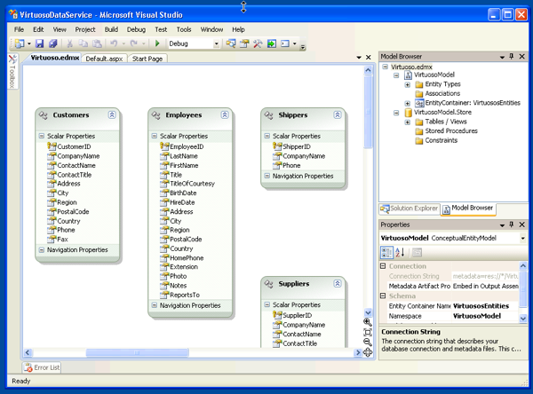

Creation for the Entity Data Model for the Microsoft Access Northwind
database is now complete.

## Using EDM to create Entity Framework based applications

Now that a Microsoft Entity Data Model has been created for the
Northwind database, Entity Framework applications can be created to make
use of it.

### Visual Studio Windows DataGrid Form Application

This section details the steps required to create a simple Visual Studio
2008 Windows Form application, with associated DataGridView control for
displaying data in selected tables from the target database.

1.  Launch the Visual Studio 2008 SP1 IDE.
    
    

2.  Create a
    
    *Web Application*
    
    project by going to the
    
    *File*
    
    menu in Visual Studio and choosing
    
    *New Project*
    
    .
    
    

3.  When the New Project window appears, choose either
    
    *Visual Basic*
    
    or
    
    *Visual C\#*
    
    as your programming language.

4.  Within the language category, click on
    
    *Windows*
    
    and select
    
    *Windows Form Application*
    
    from the right-hand panel.

5.  Choose a name for the project, for example
    
    *VirtWindowsFormApplication*
    
    , and click
    
    *OK*
    
    .
    
    

6.  In the
    
    *Toolbox*
    
    , expand
    
    *Data Controls*
    
    , and drag the
    
    *DataGridView*
    
    control onto the form.
    
    

7.  Click on the little
    
    *arrow*
    
    in the top right of the
    
    *DataGridView*
    
    control. This loads the
    
    *DataGridView Task*
    
    menu.
    
    

8.  Click on the
    
    *Choose Data Source*
    
    list box.
    
    

9.  Click on the
    
    *Add Project Data Source*
    
    link to connect to a data source.
    
    

10. In the
    
    *Data Source Configuration Wizard*
    
    dialog
    
    *Choose Data Source Type*
    
    page select the
    
    *Database*
    
    data source type and click
    
    *Next*
    
    .
    
    

11. In the
    
    *Data Source Configuration Wizard*
    
    dialog
    
    *Choose your Data Connection*
    
    page, select the
    
    *New Connection*
    
    button
    
    

12. In the
    
    *Choose Data Source*
    
    dialog, select the OpenLink
    
    *Virtuoso Data Source*
    
    from the list and click
    
    *Continue*
    
    .
    
    

13. In the
    
    *Add Connection*
    
    dialog, specify the
    
    *hostname, portno, username and password*
    
    for the target Virtuoso Server and check the Save Password check
    box.
    
    

14. Select the
    
    *Select Database From List*
    
    radio button and choose the
    
    *NWIND*
    
    database from the drop down list.
    
    

15. Press the
    
    *Test Connection*
    
    dialog to verify that the database is accessible.
    
    

16. Leave the default connect string
    
    *NWINDConnectionString*
    
    and click
    
    *Next*
    
    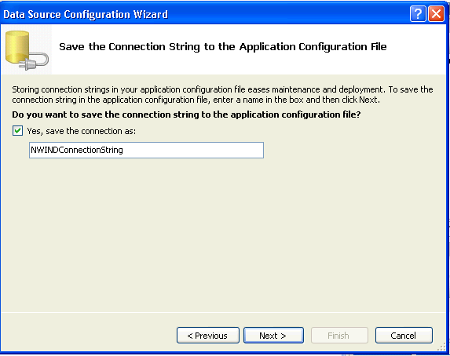

17. From the list of available tables returned for the NWIND database,
    select the
    
    *JOBS*
    
    table to be associated with the
    
    *DataGridView*
    
    control.
    
    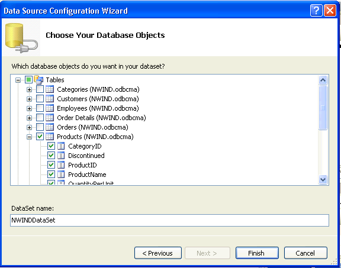

18. The columns names of the select table will be displayed in the
    DataGridView.
    
    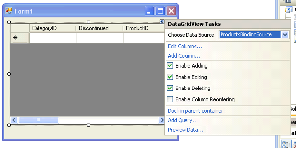

19. Resize the Form and DataGridView to allow all columns to be visible,
    if possible.
    
    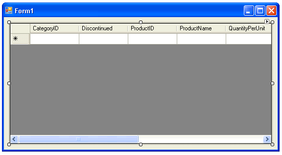

20. To test the application, simply hit
    
    *Ctrl+F5*
    
    within Visual Studio or select
    
    *Start Debugging*
    
    from the
    
    *Debug*
    
    menu.
    
    

21. The data from the
    
    *Products*
    
    table will be displayed in the
    
    *DataGrid*
    
    .
    
    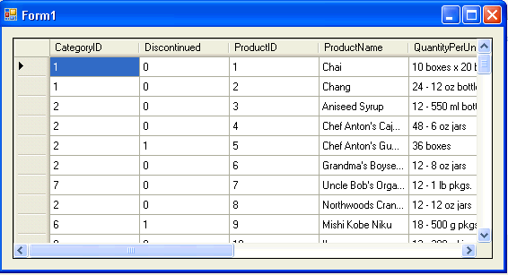

The task is now complete.

# Using Microsoft Entity Frameworks to Access Firebird Schema Objects with Virtuoso

**Prerequisites.**

The following prerequisites must be in place for this solution to be
possible.

**Firebird DBMS.**

A Firebird DBMS hosting the required Schema Objects needs to be
available. In this section the *Firebird employee* database will be used
to demonstrate the process.

A Firebird DBMS hosting the required Schema Objects needs to be
available. In this section the *Firebird employee* database will be used
to demonstrate the process.

**ODBC Driver for Firebird.**

A Firebird ODBC Driver is required for Linking the Firebird Schema
Objects into the Virtuoso Server. The *native Firebird ODBC Driver* will
be used in this section, for which a functional ODBC Data source name of
"fire" will be assumed to exist on the machine hosting the Virtuoso
Server.

A Firebird ODBC Driver is required for Linking the Firebird Schema
Objects into the Virtuoso Server. The *native Firebird ODBC Driver* will
be used in this section, for which a functional ODBC Data source name of
"fire" will be assumed to exist on the machine hosting the Virtuoso
Server.

**Virtuoso Universal Server.**

An Virtuoso installation including the Virtuoso Universal Server and
ADO.NET Entity Framework Provider is required. The Virtuoso components
used must be Release 5.10.x or above, this being the minimum version
containing support for Microsoft Entity Frameworks

An Virtuoso installation including the Virtuoso Universal Server and
ADO.NET Entity Framework Provider is required. The Virtuoso components
used must be Release 5.10.x or above, this being the minimum version
containing support for Microsoft Entity Frameworks

**Microsoft Visual Studio 2008 SP1.**

Microsoft Visual Studio 2008 Service Pack 1 is required, this being the
only version containing the necessary Entity Framework support available
at the time of writing.

Microsoft Visual Studio 2008 Service Pack 1 is required, this being the
only version containing the necessary Entity Framework support available
at the time of writing.

**Tasks**

**Ensure Firebird Primary Keys (PKs) are not nullable.**

The Visual Studio 2008 Entity Data Model (EDM) requires that all primary
keys are *NOT* Nullable, and will fail to generate an EDM if any are.
Thus ensure any tables to be used are defined as not nullable in the
Firebird database schema before attempting to generate an EDM. In the
case of the Firebird employee database all tables are not nullable, thus
this should not be an issue in this case.

The Visual Studio 2008 Entity Data Model (EDM) requires that all primary
keys are *NOT* Nullable, and will fail to generate an EDM if any are.
Thus ensure any tables to be used are defined as not nullable in the
Firebird database schema before attempting to generate an EDM. In the
case of the Firebird employee database all tables are not nullable, thus
this should not be an issue in this case.

## Install and configure the Firebird ODBC Driver

The Virtuoso Virtual Database engine uses ODBC as the connectivity
mechanism for linking remote database objects into its local schema.
Thus a Firebird ODBC Driver must be available with a suitably configured
DSN for connecting to the target database.

## Install and configure OpenLink Virtuoso Universal Server

  - [Install and configure OpenLink Virtuoso Universal
    Server](#virtclientrefinstallandconfigvirt)

## Linking Firebird tables into OpenLink Virtuoso

1.  Start the Virtuoso Web User Interface
    
    

2.  Select the "Conductor" link in the Left Frame and Login as the "dba"
    user.
    
    

3.  Select the "Databases" -\> "External Data Source" -\> "Data Sources"
    tab menu items
    
    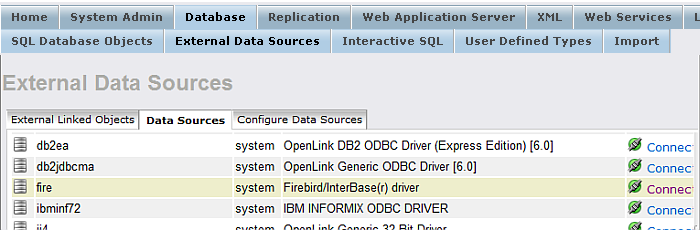

4.  Select the "Connect" button for the "fire" Firebird DSN.
    
    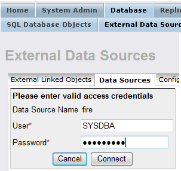

5.  On successful connection Select the "Link Objects" button to obtain
    a list of available tables
    
    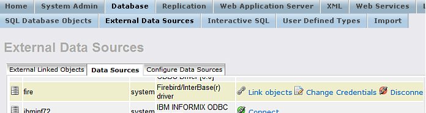

6.  Select all the tables that are part of the "employee" catalog.
    
    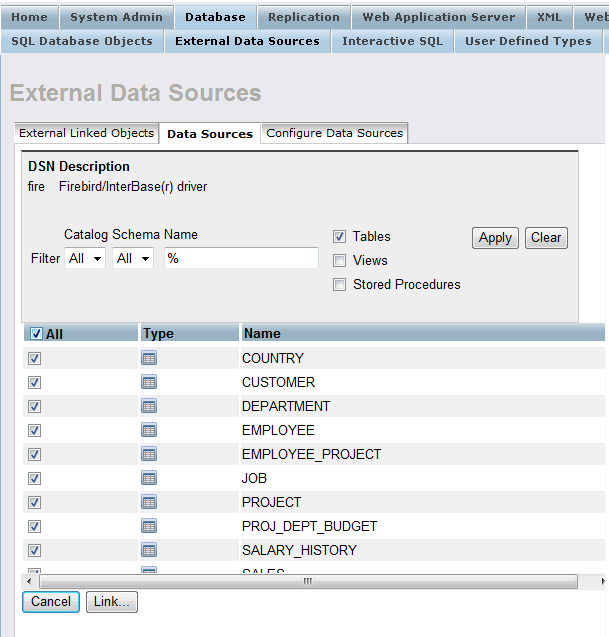

7.  Change the Catalog for each table to be "employee" using the "Set
    All" button.
    
    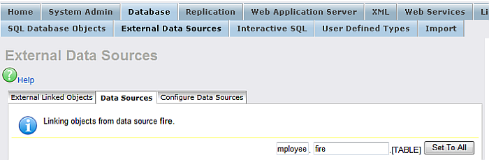

8.  All the catalog names are changed to be "employee".
    
    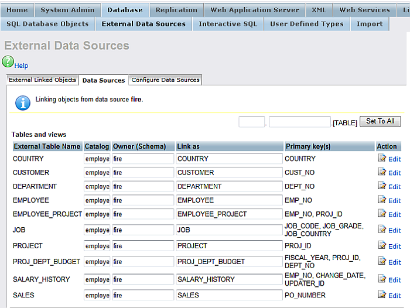

9.  Select the "Link" button to link the selected tables into Virtuoso
    
    

10. On completion of the Link process the tables will be displayed in
    the "External Linked Objects" tab.
    
    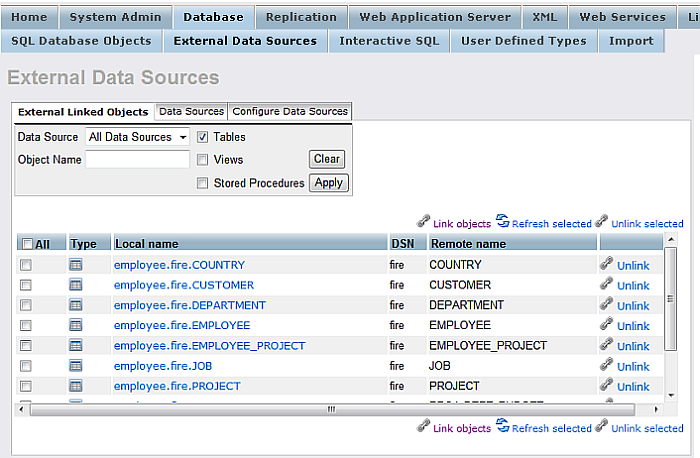

11. At this point you can test the remotely linked tables by clicking on
    the link that accompanies each table. e.g. employee.fire.COUNTRY.
    
    This will display the Interactive ISQL interface which will have
    been already populated with a suitable SQL statement.
    
    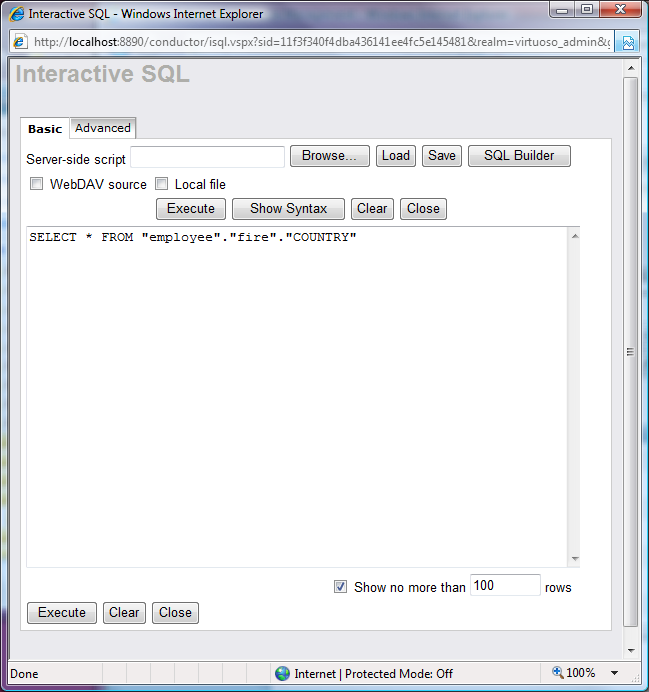

12. Select Execute to see data from the remotely linked table.
    
    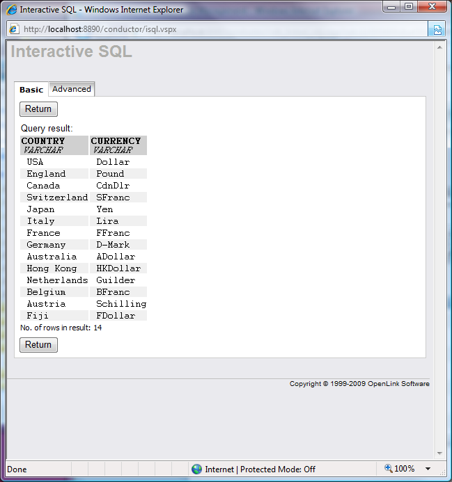

13. The tables can also be viewed as part of the Virtuoso "SQL Schema
    Objects" under the "employee" catalog name.
    
    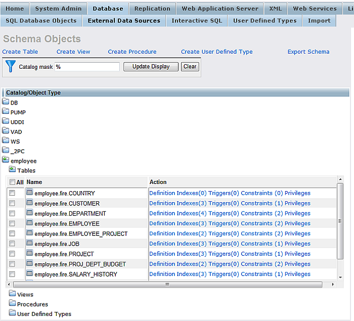
    
    The Link process is now complete enabling the tables to be queried
    as if part of the Virtuoso Schema.

## Creating EDM in Visual Studio 2008

The following steps can be used to create an Entity Data Model (EDM) for
the Firebird employee database:

1.  Launch the Visual Studio 2008 SP1 IDE.
    
    

2.  Create a
    
    *Web Application*
    
    project by going to the
    
    *File*
    
    menu in Visual Studio and choosing
    
    *New Project*
    
    .
    
    

3.  When the New Project window appears, choose either
    
    *Visual Basic*
    
    or
    
    *Visual C\#*
    
    as your programming language.

4.  Within the language category, click on
    
    *Web*
    
    and select
    
    *ASP.NET Web Application*
    
    from the right-hand panel.

5.  Choose a name for the project, for example
    
    *employee*
    
    , and click
    
    *OK*
    
    .
    
    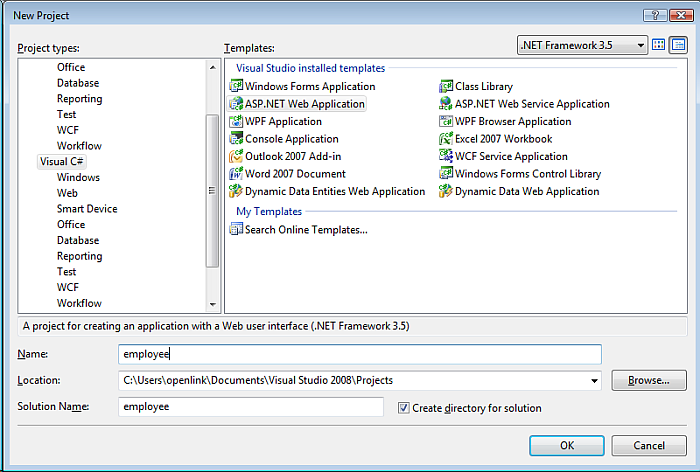

6.  This will create a new project called
    
    *employee*
    
    .
    
    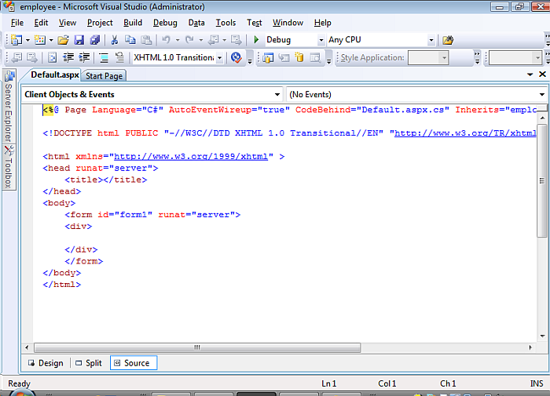

7.  Select the Project -\> Add New Item menu option.
    
    

8.  The
    
    *Add New Item*
    
    dialog will appear. Choose the
    
    *ADO.NET Entity Data Model*
    
    template. Give it the name
    
    *Model1.edmx*
    
    and click
    
    *Add*
    
    to start the creation of the ADO.Net Entity Data Model.
    
    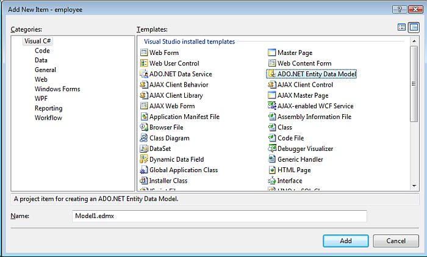

9.  In the
    
    *Entity Data Model Wizard*
    
    dialog
    
    *Choose Model Contents*
    
    page select the
    
    *Generate from Database*
    
    model type and click
    
    *Next*
    
    .
    
    

10. In the
    
    *Entity Data Model Wizard*
    
    dialog
    
    *Choose your Data Connection*
    
    page, select the
    
    *New Connection button*
    
    

11. In the
    
    *Choose Data Source*
    
    dialog, select the OpenLink
    
    *Virtuoso Data Source*
    
    from the list and click
    
    *Continue*
    
    .
    
    

12. In the
    
    *Add Connection*
    
    dialog, specify the
    
    *hostname, portno, username and password*
    
    for the target Virtuoso Server and check the Save Password check
    box.
    
    

13. Select the
    
    *Select Database From List*
    
    radio button and choose the
    
    *employee*
    
    database from the drop down list.
    
    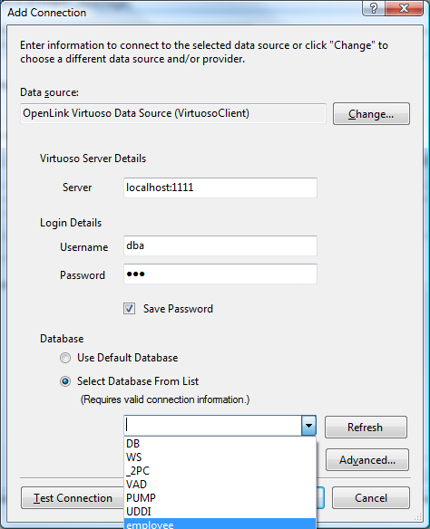

14. Press the
    
    *Test Connection*
    
    dialog to verify that the database is accessible.
    
    

15. Set the
    
    *entity connect string*
    
    name to
    
    *employeeEntities*
    
    (note this name as it is required in the section on creating and
    ADO.Net Data Service) and click
    
    *Next*
    
    .
    
    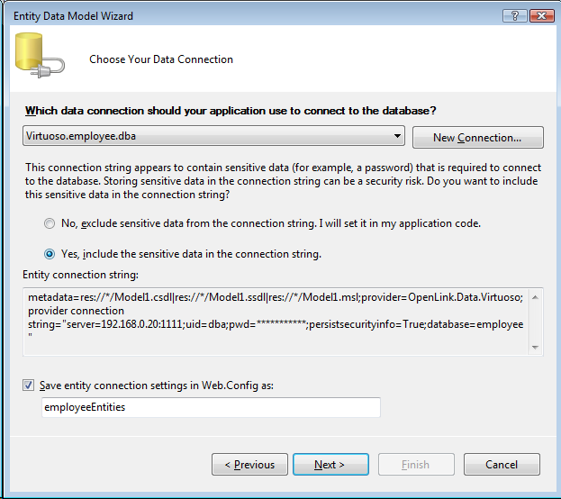

16. In the
    
    *Choose your Database Objects*
    
    page select the
    
    *Tables*
    
    check box to select all tables in the employee catalog for addition
    to the Entity Data Model. Set the
    
    *Model Namespace*
    
    to
    
    *employeeModel*
    
    and click
    
    *Finish*
    
    .
    
    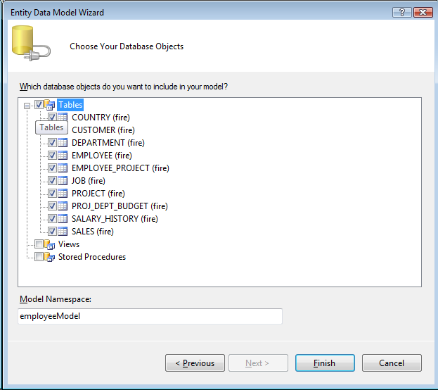

17. The
    
    *Model1.edmx*
    
    EDM will be created with the tables and relationships displayed in
    the Visual Studio IDE
    
    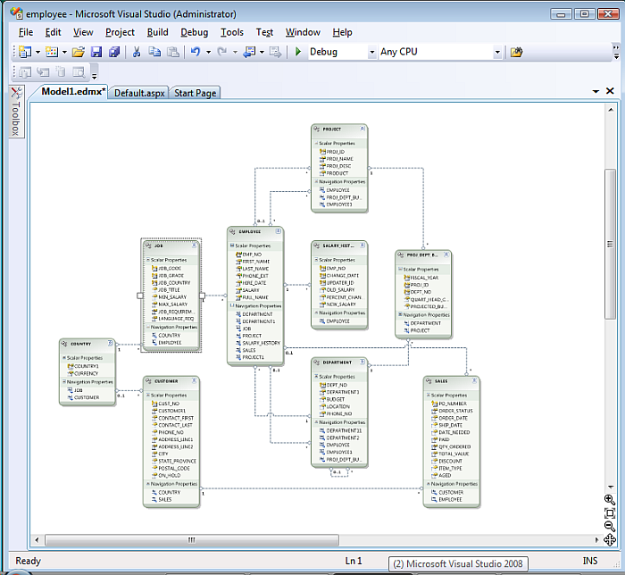

Creation for the Entity Data Model for the Firebird employee database is
now complete.

## Using EDM to create Entity Framework based applications

Now that a Microsoft Entity Data Model has been created for the Firebird
employee database, Entity Framework applications can be created to make
use of it.

### Entity Frameworks based ADO.NET Data Service

An ADO.Net Data Service for the Firebird tables can be created using the
Entity Data Model created in the [Creating EDM in Visual Studio 2008
section](#vdbenginefirebdcrvs) .

1.  Open the
    
    *employee*
    
    project created in the [Creating EDM in Visual Studio 2008
    section](#vdbenginefirebdcrvs) .

2.  Right click on the employee project name in the Solution Explorer
    pane, then select the Project -\> Add New Item menu option.
    
    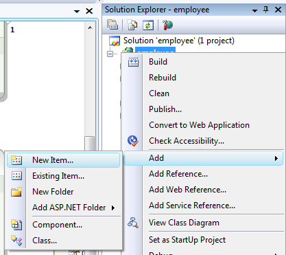

3.  The
    
    *Add New Item*
    
    dialog will appear. Choose the
    
    *ADO.NET Data Service template*
    
    . Give it the name
    
    *WebDataService1.svc*
    
    , and click
    
    *Add*
    
    to create the ADO.Net Data Service.
    
    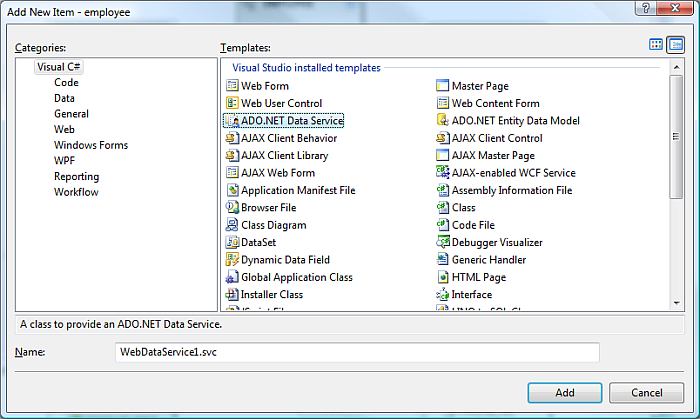

4.  In the newly created
    
    *WebDataService1.svc.cs*
    
    Data Service file, add the data source class name of
    
    *employeeEntities*
    
    (note this is the name set in the Creating EDM in Visual Studio 2008
    section) as the
    
    *DataService*
    
    name. Enable the access to the Data Service by adding the entry
    
    *config.SetEntitySetAccessRule("\*", EntitySetRights.All);*
    
    in the
    
    *InitializeService*
    
    method.
    
        // C#
        
        using System;
        using System.Web;
        using System.Collections.Generic;
        using System.ServiceModel.Web;
        using System.Linq;
        using System.Data.Services;
        
        namespace SimpleDataService
        {
            public class Northwind : DataService<employeeEntities>
            {
                public static void InitializeService(IDataServiceConfiguration  config)
                {
                    config.SetEntitySetAccessRule("*", EntitySetRights.All);
                }
            }
        }
    
    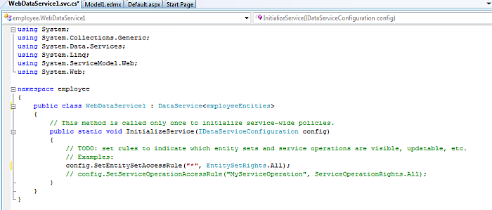

5.  To test the Data Service, simply hit
    
    *Ctrl+F5*
    
    within Visual Studio. This will start the development web server,
    run the Data Services server inside and load a Web browser page
    displaying the list of available tables/entities for the employee
    database catalog.
    
    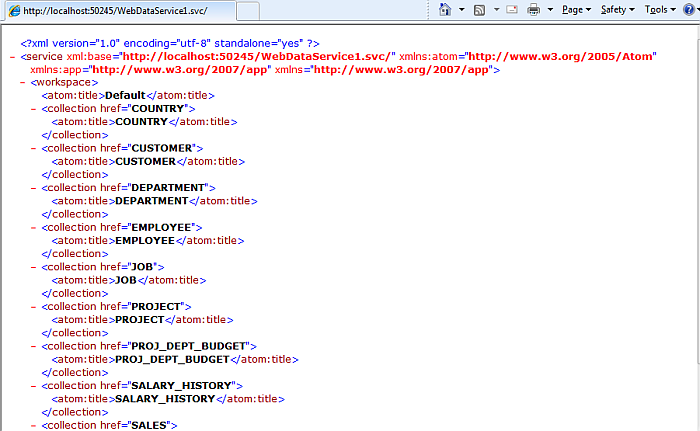

6.  To access a specific entity instance like the
    
    *EMPLOYEE*
    
    table employee number
    
    *2*
    
    record, use this convention
    http://host/vdir/WebDataService1.svc/EMPLOYEE(2) .
    
    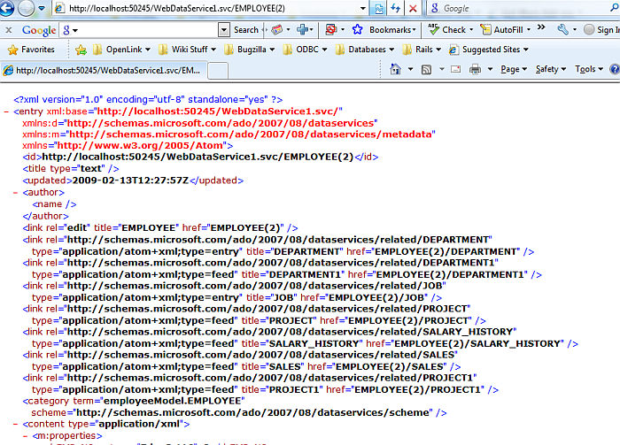

*Notes:*

1.  *Important*
    
    \- To view
    
    *Atom*
    
    (the default format returned by an ADO.NET Data Service) in Internet
    Explorer, you must first ensure that
    
    *Feed Reading View*
    
    is turned
    
    *off*
    
    . This can be done on the
    
    *Content tab*
    
    of
    
    *Tools in Internet Options*
    
    .

2.  If a Data Services entity instance URI page fails to load you can
    turn
    
    *Verbose*
    
    errors on by adding
    
    *config.UseVerboseErrors = true;*
    
    in the
    
    *virtuoso.svc.cs InitializeService*
    
    method to obtain more detailed information from the server as to why
    the page failed to load:
    
        public static void InitializeService(IDataServiceConfiguration config)
        
        {
        
        config.UseVerboseErrors = true;
        
        config.SetEntitySetAccessRule("*", EntitySetRights.All);
        
        }

### Visual Studio Windows DataGrid Form Application

This section details the steps required to create a simple Visual Studio
2008 Windows Form application, with associated DataGridView control for
displaying data in selected tables from the target database.

1.  Launch the Visual Studio 2008 SP1 IDE.
    
    

2.  Create a
    
    *Web Application*
    
    project by going to the
    
    *File*
    
    menu in Visual Studio and choosing
    
    *New Project*
    
    .
    
    

3.  When the New Project window appears, choose either
    
    *Visual Basic*
    
    or
    
    *Visual C\#*
    
    as your programming language.

4.  Within the language category, click on
    
    *Windows*
    
    and select
    
    *Windows Form Application*
    
    from the right-hand panel.

5.  Choose a name for the project, for example
    
    *VirtuosoDataGridApp*
    
    , and click
    
    *OK*
    
    .
    
    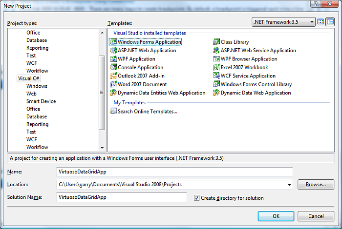

6.  In the
    
    *Toolbox*
    
    , expand
    
    *Data Controls*
    
    , and drag the
    
    *DataGridView*
    
    control onto the form.
    
    

7.  Click on the little
    
    *arrow*
    
    in the top right of the
    
    *DataGridView*
    
    control. This loads the
    
    *DataGridView Task*
    
    menu.
    
    

8.  Click on the
    
    *Choose Data Source*
    
    list box.
    
    

9.  Click on the
    
    *Add Project Data Source*
    
    link to connect to a data source.
    
    

10. In the
    
    *Data Source Configuration Wizard*
    
    dialog
    
    *Choose Data Source Type*
    
    page select the
    
    *Database*
    
    data source type and click
    
    *Next*
    
    .
    
    

11. In the
    
    *Data Source Configuration Wizard*
    
    dialog
    
    *Choose your Data Connection*
    
    page, select the
    
    *New Connection*
    
    button
    
    

12. In the
    
    *Choose Data Source*
    
    dialog, select the OpenLink
    
    *Virtuoso Data Source*
    
    from the list and click
    
    *Continue*
    
    .
    
    

13. In the
    
    *Add Connection*
    
    dialog, specify the
    
    *hostname, portno, username and password*
    
    for the target Virtuoso Server and check the Save Password check
    box.
    
    

14. Select the
    
    *Select Database From List*
    
    radio button and choose the
    
    *employee*
    
    database from the drop down list.
    
    

15. Click OK to add the connection.

16. Press the
    
    *Test Connection*
    
    dialog to verify that the database is accessible.
    
    

17. Leave the default connect string
    
    *employeeConnectionString*
    
    and click
    
    *Next*
    
    

18. From the list of available tables returned for the employee
    database, select the
    
    *COUNTRY*
    
    table to be associated with the
    
    *DataGridView*
    
    control.
    
    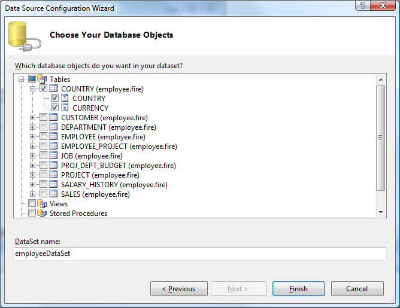

19. A DataSet for the employee database object is created
    
    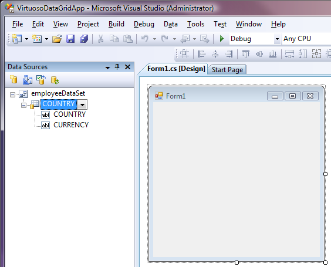

20. From the drop down list box next to the COUNTRY table ensure the
    DataGridView item is selected
    
    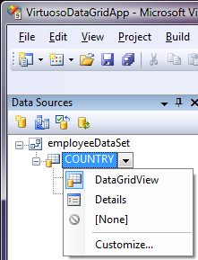

21. Drag the COUNTRY DataSet item onto the Form to create a scrollable
    and editable association of the COUNTRY table object with the Data
    Grid View automatically.
    
    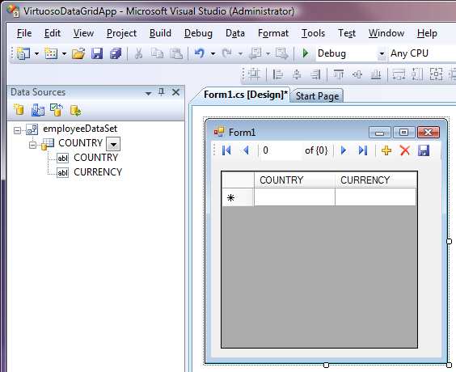

22. To test the application, simply hit
    
    *Ctrl+F5*
    
    within Visual Studio or select
    
    *Start Debugging*
    
    from the
    
    *Debug*
    
    menu.
    
    

23. The data from the
    
    *COUNTRY*
    
    table will be displayed in the
    
    *DataGrid*
    
    .
    
    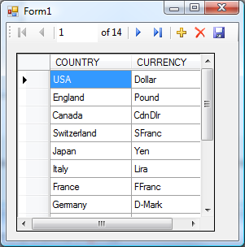

24. A new row can be inserted (updated or deleted) as indicated for the
    new "1111" record inserted below and the Save button clicked to save
    the change to the database.
    
    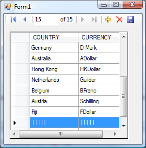

25. The Virtuoso Interactive SQL tab of the Conductor can be used to run
    the query select \* from "employee"."fire"."COUNTRY"
    
    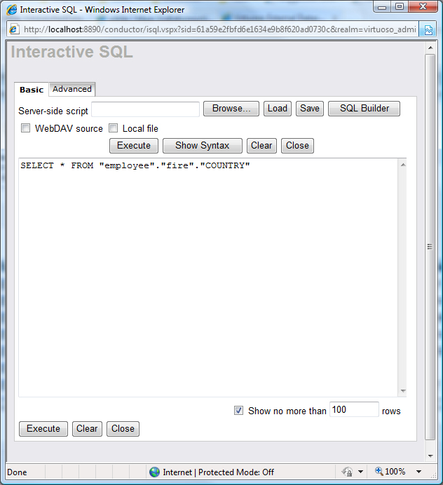

26. To verify the change has been successfully made in the database.
    
    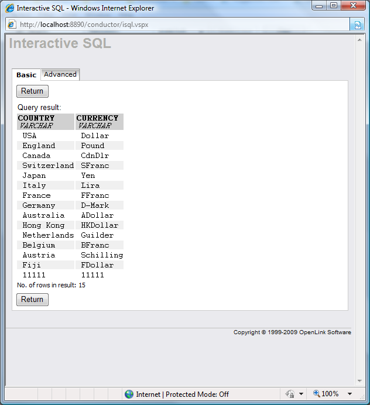

The task is now complete.

# Using Microsoft Entity Frameworks to Access Microsoft SQL Server Schema Objects with Virtuoso

**Prerequisites.**

The following prerequisites must be in place for this solution to be
possible.

**Microsoft SQL Server DBMS.**

A Microsoft SQL Server DBMS hosting the required Schema Objects needs to
be available. In this document the *Microsoft SQL Server Northwind*
sample database will be used to demonstrate the process.

A Microsoft SQL Server DBMS hosting the required Schema Objects needs to
be available. In this document the *Microsoft SQL Server Northwind*
sample database will be used to demonstrate the process.

**ODBC Driver for Microsoft SQL Server.**

An Microsoft SQL Server ODBC Driver is required for Linking the
Microsoft SQL Server Schema Objects into the Virtuoso Server. The
OpenLink *ODBC Driver for Microsoft SQL Server* will be used in this
section, for which a functional ODBC Data source name of "sql2k5ma" will
be assumed to exist on the machine hosting the Virtuoso Server.

An Microsoft SQL Server ODBC Driver is required for Linking the
Microsoft SQL Server Schema Objects into the Virtuoso Server. The
OpenLink *ODBC Driver for Microsoft SQL Server* will be used in this
section, for which a functional ODBC Data source name of "sql2k5ma" will
be assumed to exist on the machine hosting the Virtuoso Server.

**Virtuoso Universal Server.**

An Virtuoso installation including the Virtuoso Universal Server and
ADO.NET Entity Framework Provider is required. The Virtuoso components
used must be Release 5.10.x or above, this being the minimum version
containing support for Microsoft Entity Frameworks

An Virtuoso installation including the Virtuoso Universal Server and
ADO.NET Entity Framework Provider is required. The Virtuoso components
used must be Release 5.10.x or above, this being the minimum version
containing support for Microsoft Entity Frameworks

**Microsoft Visual Studio 2008 SP1.**

Microsoft Visual Studio 2008 Service Pack 1 is required, this being the
only version containing the necessary Entity Framework support available
at the time of writing.

Microsoft Visual Studio 2008 Service Pack 1 is required, this being the
only version containing the necessary Entity Framework support available
at the time of writing.

**Tasks**

**Ensure Microsoft SQL Server Primary Keys (PKs) are not nullable.**

The Visual Studio 2008 Entity Data Model (EDM) requires that all primary
keys are *NOT* Nullable, and will fail to generate an EDM if any are.
Thus ensure any tables to be used are defined as not nullable in the
Microsoft SQL Server database schema before attempting to generate an
EDM. In the case of the Microsoft SQL Server Northwind database all
tables are not nullable, thus this should not be an issue in this case.

The Visual Studio 2008 Entity Data Model (EDM) requires that all primary
keys are *NOT* Nullable, and will fail to generate an EDM if any are.
Thus ensure any tables to be used are defined as not nullable in the
Microsoft SQL Server database schema before attempting to generate an
EDM. In the case of the Microsoft SQL Server Northwind database all
tables are not nullable, thus this should not be an issue in this case.

## Install and configure OpenLink ODBC Driver for Microsoft SQL Server

The Virtuoso Virtual Database engine uses ODBC as the connectivity
mechanism for linking remote database objects into its local schema.
Thus a Microsoft SQL Server ODBC Driver must be available with a
suitably configured DSN for connecting to the target database. The
OpenLink ODBC Drivers for Microsoft SQL Server have been used in this
section, although in theory any Microsoft SQL Server ODBC Driver can be
used.

Installation instructions for the OpenLink ODBC Driver for Microsoft SQL
Server are available from:

  - [Product Installation & Basic Configuration (ODBC)](#)

## Install and configure OpenLink Virtuoso Universal Server

  - [Install and configure OpenLink Virtuoso Universal
    Server](#virtclientrefinstallandconfigvirt)

## Linking Microsoft SQL Server tables into OpenLink Virtuoso

1.  Start the Virtuoso Web User Interface
    
    

2.  Select the "Conductor" link in the Left Frame and Login as the "dba"
    user.
    
    

3.  Select the "Databases" -\> "External Data Source" -\> "Data Sources"
    tab menu items
    
    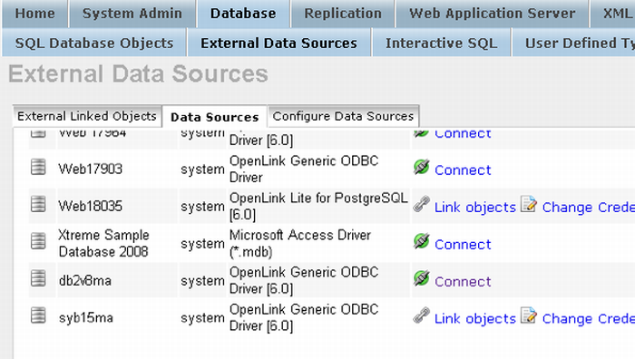

4.  Select the "Connect" button for the "sql2k5ma" Microsoft SQL Server
    DSN.
    
    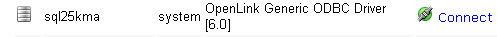

5.  On successful connection Select the "Link Objects" button to obtain
    a list of available tables
    
    

6.  Select all the tables that are part of the "Northwind" catalog.
    
    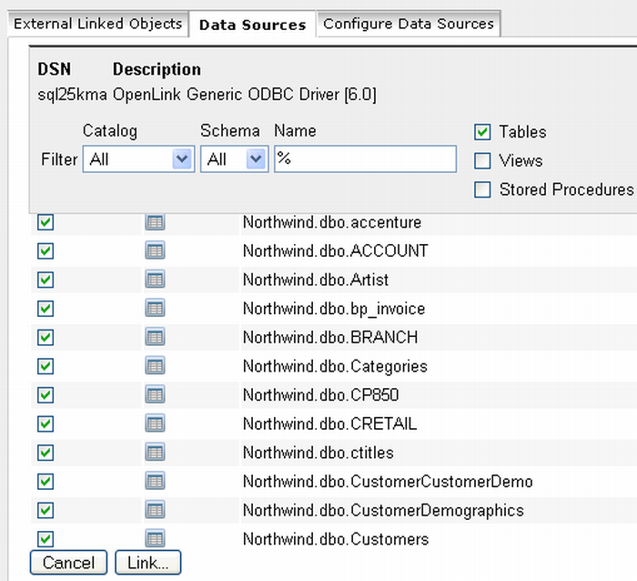

7.  Change the Catalog for each table to be "Northwind" using the "Set
    All" button.
    
    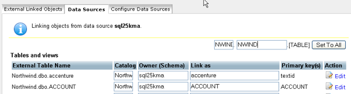

8.  All the catalog names are changed to be "NWIND"
    
    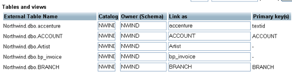

9.  Select the "Link" button to link the selected tables into Virtuoso
    
    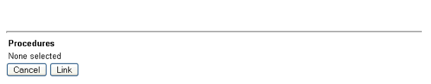

10. On completion of the Link process the tables will be displayed in
    the "External Linked Objects" tab.
    
    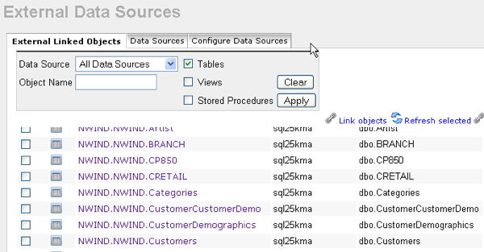

11. At this point, you can test the remotely linked tables by clicking
    on the link that accompanies each table, e.g. NWIND.NWIND.Customer.
    This will display the Interactive ISQL interface which will have
    been already populated with a suitable SQL statement.
    
    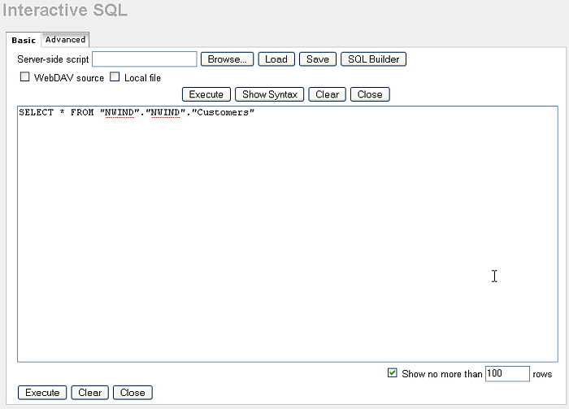

12. Select Execute to see data from the remotely linked table.
    
    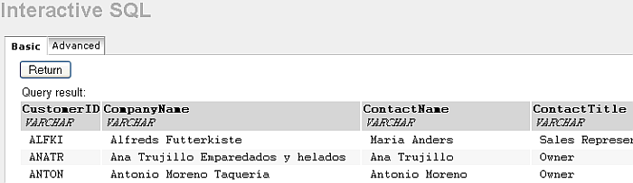

13. The tables can also be viewed as part of the Virtuoso "SQL Schema
    Objects" under the "Northwind" catalog name.
    
    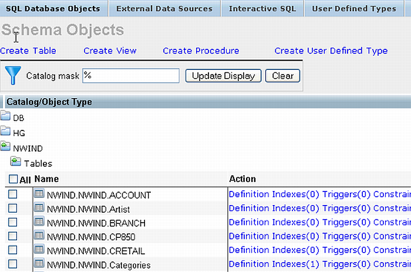
    
    The Link process is now complete enabling the tables to be queried
    as if part of the Virtuoso Schema.

## Creating EDM in Visual Studio 2008

The following steps can be used to create an Entity Data Model (EDM) for
the Microsoft SQL Server Northwind database:

1.  Launch the Visual Studio 2008 SP1 IDE.
    
    

2.  Create a
    
    *Web Application*
    
    project by going to the
    
    *File*
    
    menu in Visual Studio and choosing
    
    *New Project*
    
    .

3.  When the New Project window appears, choose either
    
    *Visual Basic*
    
    or
    
    *Visual C\#*
    
    as your programming language.

4.  Within the language category, click on
    
    *Web*
    
    and select
    
    *ASP.NET Web Application*
    
    from the right-hand panel.

5.  Choose a name for the project, for example
    
    *VirtuosoDataService*
    
    , and click
    
    *OK*
    
    .
    
    

6.  This will create a new project called
    
    *VirtuosoDataService*
    
    .
    
    

7.  Right click on the VirtuosoDataService project name of the Solution
    Explorer pane, then select the Add -\> New Item menu options.
    
    

8.  The
    
    *Add New Item*
    
    dialog will appear. Choose the
    
    *ADO.NET Entity Data Model*
    
    template. Give it the name
    
    *Virtuoso.edmx*
    
    and click
    
    *Add*
    
    to start the creation of the ADO.Net Entity Data Model.
    
    

9.  In the
    
    *Entity Data Model Wizard*
    
    dialog
    
    *Choose Model Contents*
    
    page select the
    
    *Generate from Database*
    
    model type and click
    
    *Next*
    
    .
    
    

10. In the
    
    *Entity Data Model Wizard*
    
    dialog
    
    *Choose your Data Connection*
    
    page, select the
    
    *New Connection button*
    
    

11. In the
    
    *Choose Data Source*
    
    dialog, select the OpenLink
    
    *Virtuoso Data Source*
    
    from the list and click
    
    *Continue*
    
    .
    
    

12. In the
    
    *Add Connection*
    
    dialog, specify the
    
    *hostname, portno, username and password*
    
    for the target Virtuoso Server and click the Advanced button.
    
    

13. Use the Select Database From List dialog to select the NWIND
    catalog.
    
    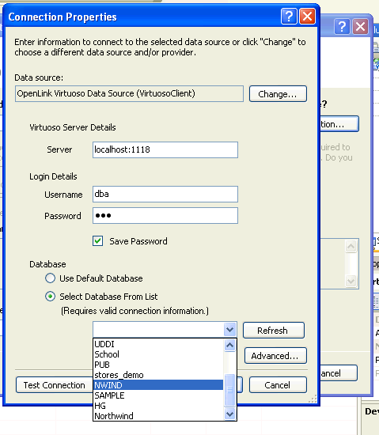

14. Press the
    
    *Test Connection*
    
    dialog to verify that the database is accessible. Click "OK" to
    persist the connection attributes, after a successful connection is
    verified.
    
    

15. Set the
    
    *entity connect string*
    
    name to
    
    *VirtuosoEntities*
    
    (note this name as it is required in the section on creating and
    ADO.Net Data Service) and click
    
    *Next*
    
    .
    
    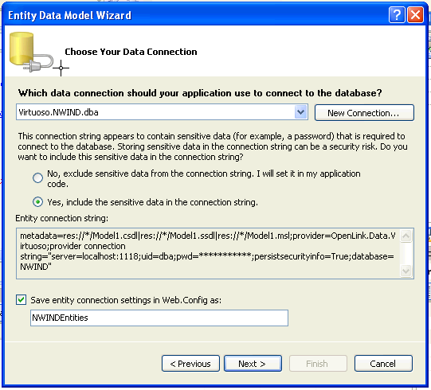

16. In the
    
    *Choose your Database Objects*
    
    page select the
    
    *Tables*
    
    check box to select all tables in the NWIND catalog for addition to
    the Entity Data Model. Set the
    
    *Model Namespace*
    
    to
    
    *VirtuosoModel*
    
    and click
    
    *Finish*
    
    .
    
    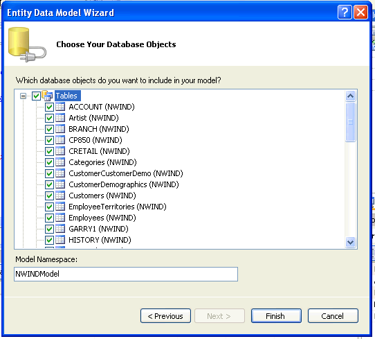

17. The
    
    *Virtuoso.edmx*
    
    EDM will be created with the tables and relationships displayed in
    the Visual Studio IDE
    
    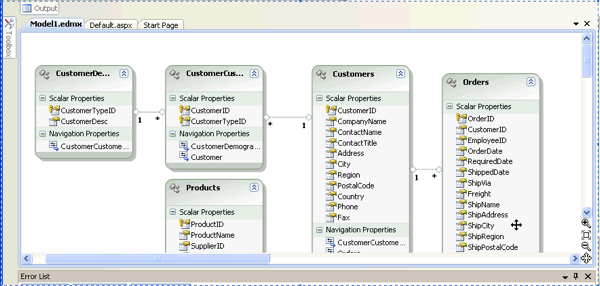

Creation for the Entity Data Model for the Microsoft SQL Server
Northwind database is now complete.

## Using EDM to create Entity Framework based applications

Now that a Microsoft Entity Data Model has been created for the
Microsoft SQL Server Northwind database, Entity Framework applications
can be created to make use of it.

### Entity Frameworks based ADO.NET Data Service

An ADO.Net Data Service for the Microsoft SQL Server tables can be
created using the Entity Data Model created in the [Creating EDM in
Visual Studio 2008 section](#vdbenginemsqlscrvs) .

1.  Open the
    
    *VirtuosoDataService*
    
    project created in the [Creating EDM in Visual Studio 2008
    section](#vdbenginemsqlscrvs) .

2.  Select the Project -\> Add New Item menu option.
    
    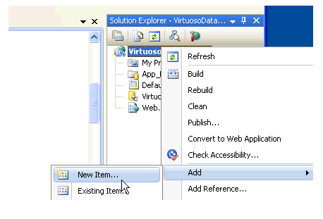

3.  The
    
    *Add New Item*
    
    dialog will appear. Choose the
    
    *ADO.NET Data Service template*
    
    . Give it the name
    
    *Virtuoso.svc*
    
    , and click
    
    *Add*
    
    to create the ADO.Net Data Service.
    
    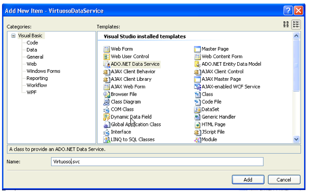

4.  In the newly created
    
    *Virtuoso.svc.cs*
    
    Data Service file, add the data source class name of
    
    *VirtuosoEntities*
    
    (note this is the name set in the Creating EDM in Visual Studio 2008
    section) as the
    
    *DataService*
    
    name. Enable the access to the Data Service by adding the entry
    
    *config.SetEntitySetAccessRule("\*", EntitySetRights.All);*
    
    in the
    
    *InitializeService*
    
    method.
    
        // C#
        
        using System;
        using System.Web;
        using System.Collections.Generic;
        using System.ServiceModel.Web;
        using System.Linq;
        using System.Data.Services;
        
        namespace SimpleDataService
        {
            public class Northwind : DataService<VirtuosoDemoEntities>
            {
                public static void InitializeService(IDataServiceConfiguration  config)
                {
                    config.SetEntitySetAccessRule("*", EntitySetRights.All);
                }
            }
        }

    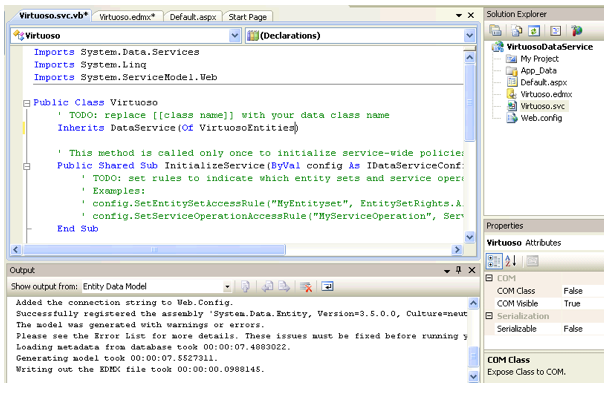

5.  To test the Data Service, simply hit
    
    *Ctrl+F5*
    
    within Visual Studio. This will start the development web server,
    run the Data Services server inside and load a Web browser page
    displaying the list of available tables/entities for the Northwind
    database catalog.
    
    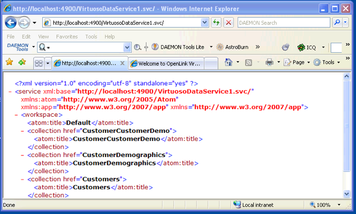

6.  To access a specific entity instance like the
    
    *Customers*
    
    table ALFKI record, use this convention
    http://host/vdir/Virtuoso.svc/Customers('ALFKI').
    
    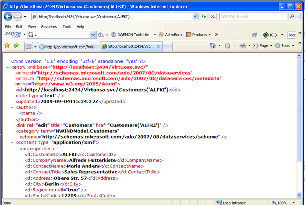

*Notes:*

1.  *Important*
    
    \- To view
    
    *Atom*
    
    (the default format returned by an ADO.NET Data Service) in Internet
    Explorer, you must first ensure that
    
    *Feed Reading View*
    
    is turned
    
    *off*
    
    . This can be done on the
    
    *Content tab*
    
    of
    
    *Tools in Internet Options*
    
    .

2.  If a Data Services entity instance URI page fails to load you can
    turn
    
    *Verbose*
    
    errors on by adding
    
    *config.UseVerboseErrors = true;*
    
    in the
    
    *virtuoso.svc.cs InitializeService*
    
    method to obtain more detailed information from the server as to why
    the page failed to load:
    
        public static void InitializeService(IDataServiceConfiguration config)
        
        {
        
        config.UseVerboseErrors = true;
        
        config.SetEntitySetAccessRule("*", EntitySetRights.All);
        
        }

# Parallel Operations and Bulk Data Transfer with Remote Tables

Especially when bulk copying data from a remote database into Virtuoso,
parallel operation is essential for performance.

From version 7.00.3206, automatic query parallelization applies to
selected remote table operations.

If read committed isolation is sufficient for remote table access, the
remote table access is automatically parallelized if there is an integer
key in the remote table that can be used for partitioning.

When the table is attached or when its statistics are updated with
sys\_stat\_analyze, the remote schema is read and if there is a numeric
first part of primary key, its minimum and maximum values are read.
Samples of rows are read from the table at different ranges between the
minimum and maximum and the values are used for filling in column value
statistics in sys\_col\_stat.

If a remote table operation has no condition on the first part of
primary key, a range condition is automatically added if the scan of the
remote table is the first in a sequence of nested joins. This is the
case for example when scanning the table inside a group by, order by,
hash join build side or other operation that does not immediately return
rows to the client. The number of parallel ranges is given by
ThreadsPerQuery in the ini file, accessed as enable\_qp with sys\_stat
and \_\_dbf\_set. In a cluster setting, the same DSN is expected to be
defined on all processes. The cluster splitting will scan a range per
each slice of the elastic cluster.

The lowest range does not specify a low bound and the highest does not
specify an upper bound, thus the min and max of the range column do not
have to be exactly up to date.

It may be that the primary key of the remote table does not start with a
numeric column. If this is the case but there still exists a column
usable for splitting a scan, one can create the table in Virtuoso and
declare the splitting column as first in the primary key. One can then
use vd\_remote\_table to declare the modified table as remote and use
sys\_stat\_analyze for getting the statistics. After this, parallel
scans with the selected column used for setting ranges can be done.

Use the explain function to verify that a scan is actually parallel. One
expects to see the text of the remote select followed by "split by range
of \<column name\>" below the text of the remote statement.

In a parallel scan each range is scanned over a different connection.
The transaction contexts are independent and the isolation cannot be
higher than read committed. Setting a higher isolation level or
selecting for update disables the parallel scan feature.

The below snippet copies a table from another Virtuoso.

    use R1;
    ATTACH TABLE lineitem
            FROM '1208'
            USER 'dba'
        PASSWORD 'dba';

This makes a a remote table R1.1208.LINEITEM. This is the lineitem table
from the DSN "1208".

Now make a local table:

    use DB;
    CREATE TABLE LINEITEM (
        L_ORDERKEY        INTEGER NOT NULL,
        L_PARTKEY         INTEGER NOT NULL,
        L_SUPPKEY         INTEGER NOT NULL,
        L_LINENUMBER      INTEGER NOT NULL,
        L_QUANTITY        double precision NOT NULL,
        L_EXTENDEDPRICE   double precision NOT NULL,
        L_DISCOUNT        double precision NOT NULL,
        L_TAX             double precision NOT NULL,
        L_RETURNFLAG      CHAR(1) NOT NULL,
        L_LINESTATUS      CHAR(1) NOT NULL,
        L_SHIPDATE        DATE NOT NULL,
        L_COMMITDATE      DATE NOT NULL,
        L_RECEIPTDATE     DATE NOT NULL,
        L_SHIPINSTRUCT    CHAR(25) NOT NULL,
        L_SHIPMODE        CHAR(10) NOT NULL,
        L_COMMENT         VARCHAR(44) NOT NULL,
        PRIMARY KEY       (L_ORDERKEY, L_LINENUMBER) column );

Note the column modifier after the primary key. This ensures that the
table is created in the column store mode. When copying large tables
over VDB, this is nearly always done for warehousing, not for OLTP, so
the column store mode is essentially always best. Insert is faster and
the table takes much less space.

To transfer the data from the remote table into the local one:

    log_enable (2);
    INSERT INTO lineietm
         SELECT *
           FROM r1..llineiten;
    checkpoint;

log\_enabel (2) turns off logging an transactions and allows auto
committing insert. The explicit checkpoint makes the changes durable.
Killing the database server during the transfer would start without any
of the effects of the transfer since there is no logging. The data
reading and insertion is automatically parallelized.

Most such data transfer operations are in fact network bound since the
local insert rate is well in excess of 100MB/s on a commodity server and
a 1gbE connection may only transfer around 80MB/s.

The database is normally online during the transfer and the progress may
be tracked by periodically counting the target table.
