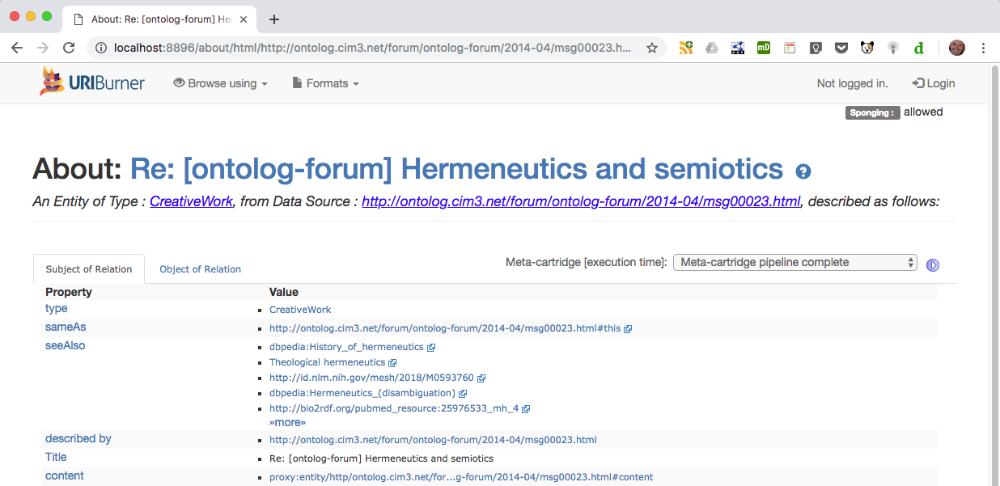
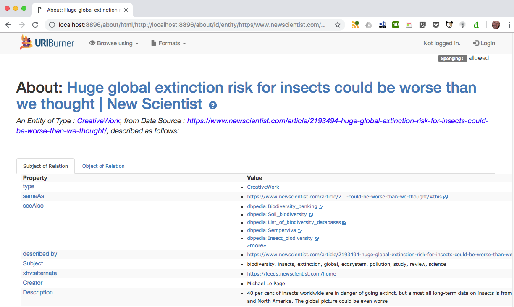

# Sponger: Named Configurations

*CMSB 2019-Mar-07: Draft documentation for public consumption*

---

Current status @ 2019-Mar-07

* Implemented for the /about proxy, which recognizes the query string parameter `spconfig={named-config}`
* The "*Virtuoso Facets Web Service*" meta cartridge has been modified to provide a template implementation which could serve as the basis for supporting named configs in other cartridges.
  * Default cartridge options for this cartridge are now retrieved from a default named config graph.
  * A sample alternate set of cartridge options are availabe through named config 'lodmc1'.
* Use of named configurations from /describe or directly from SPARQL is not yet supported. /describe invokes the Sponger using SPARQL pragmas. Support for a new pragma, e.g. `sponger:config {named-config`, is required. ([Bugzilla 18597: Sponger Named Configurations - Support via SPARQL and /describe](https://bugzilla.openlinksw.com/show_bug.cgi?id=18597)) 
* An ontology `<http://www.openlinksw.com/sponger-config#>` needs to be defined for the terms used in the example named config TTL files.

---

Ordinarily the configurations used by individual Sponger cartridges are fixed and set through options in each cartridge's configuration panel accessible through the Conductor UI. The result is that each invocation of the Sponger triggers cartridges in the Sponger pipeline using the same fixed set of options.

While this might be suitable for many cartridges, other cartridges require a more flexible approach in order to tailor their output to the resource being sponged. Named configurations provide a means to achieve this flexibility by retrieving options from a graph, rather than using the usual static Conductor UI configured options.

## Named Configuration Graphs

Named configurations allow different sets of options, spanning multiple cartridges, to be used each time the Sponger pipeline is called. Each set of options is held in its own graph. A Cartridge Configuration Registry (CCR) graph, `<http://{sponger-host}/sponger/cartridge-configs>`, records the available named configurations.

The CCR holds instances of entity type SpongerConfigAlias which associate a configuration alias, or "named config", with a configuration graph. Each configuration graph holds options for one or more Sponger cartridges.

Configuration graph URIs follow the pattern:  
`<http://{sponger-host}/sponger/cartridge-configs/{named-config}>`

The options to be used by a cartridge can thus come from two sources:

1. options configured through the Conductor UI and stored in table `SYS_RDF_MAPPERS` (extractor cartridges) or `RDF_META_CARTRIDGES` (meta cartridges).
2. options held in a configuration graph identified by a `{named-config}` label set
through a `spconfig={named-config}` query string parameter in the Sponger invocation URL.

Option 2) allows cartridge options to be specified on a per-cartridge-invocation basis, rather than being fixed for every invocation. 

If a config query string parameter isn't present:

* If the cartridge supports configuration graphs, {named-config} defaults to 'default'.
* If the cartridge doesn't support configuration graphs, the options set through the Conductor UI cartridge configuration panel are used.

## Example Application: Flexible Annotation

The Sponger meta cartridge "*Virtuoso Facets Web Service*" (referred to as the Facets cartridge below, for brevity) provides an illustration of how named configurations can be used to apply the Sponger more flexibly and generate annotations targetted to the resource being sponged.

This meta cartridge enriches the Sponger graph generated for a resource by injecting rdfs:seeAlso links to additional resources related to the source document. The seeAlso links are generated from lookups performed by one or more Virtuoso Facets services using keywords derived from the source document. The keywords identify the main topics of the document.

In order to generate meaningful seeAlso links, the keywords supplied to the Facets service(s) need to be accurate and relevant. This is heavily influenced by the nature of the source document, but the ability to customize the method used to derive the input keywords can improve the quality of the annotations.

In the examples which follow, two different approaches to keyword extraction are used.

**Method 1: DataTXT and Babelfy NLP meta cartridges**

  * The DataTXT and Babelfy cartridges are NLP cartridges which sit ahead of the Facets cartridge in the meta cartridge pipeline. They extract named entities and keywords from the sponged resource using the respective target NLP services and augment with Sponger generated graph with descriptions of the identified items. These NLP derived entities and keywords are available for potential use by meta cartridges further down the pipeline, including the Facets cartridge. 

**Method 2: dcterms:subject property**

  * This approach uses comma separated keywords contained in a 'dcterms:subject' property generated by the initial sponge of the source page by the 'HTML (and variants)' extractor cartridge.

Switching between these two approaches is achieved by using two different named configs. The first uses the 'default' named config, the second uses named config 'lodmc1'. The essential difference between these configurations is that each specifies a different Virtuoso/PL procedure to be used by the Facets meta cartridge to obtain an array (aka vector) of input keywords which serve as input search terms for Facet searches made by the meta cartridge. In a similar way, other custom keyword derivation procedures could be created and specified in additional named configs, specific to the annotation requirements of the resource being sponged.

## Setting Up Named Configurations

The Sponger Cartridges VAD bundles two configurations, 'default' and 'lodmc1'. The 'default' named config is set up automatically by a Cartridges VAD install or update.

### Listing Named Configs

To see the registered named configurations, execute:

```
select sys_sql_val_print(SPONGER.DBA.config__configurations(1));
```
A vector of configurations is returned, e.g.

```
vector (default)
```

### Loading Named Configs

The second example configuration `lodmc1` isn't automatically registered when the Cartridges VAD is installed or updated, but its Turtle configuration files are copied to DAV folder `DAV/VAD/cartridges/named_configs/`.

To load the example named configuration 'lodmc1', execute the following procedure calls:

```
SPONGER.DBA.config__named_config_load('lodmc1', 'sponger_cartridges_config-lodmc1.template.ttl', 'HOST');
SPONGER.DBA.config__named_config_register('lodmc1', 'sponger_cartridges_config_registry-lodmc1.template.ttl', 'HOST');
```

Re-executing `SPONGER.DBA.config__configurations()` without the optional `bNamesOnly` argument value `1`, returns the named config aliases, as above, but also the configuration graphs associated with each config. As shown below, the graph holding the configuration options for 'lodmc1' is `<http://{sponger-host}/sponger/cartridge-configs/lodmc1>`

```
select sys_sql_val_print(SPONGER.DBA.config__configurations());

vector (default, http://localhost:8896/sponger/cartridge-configs/default, 
 lodmc1, http://localhost:8896/sponger/cartridge-configs/lodmc1)
```

How named configs are described using RDF is detailed below.

### Unloading Named Configs

Named configurations can be removed individually using:

```
SPONGER.DBA.config__named_config_remove({config-name});
```
or entirely by:

```
SPONGER.DBA.config__named_config_remove_all();
```

### CCR Reinitialization

Reinitialization of the CCR is done using:
```
procedure SPONGER.DBA.config__registry_init(in bForce int := 0)
```

If a default config has already been loaded, it will not be reloaded unless `bForce` is 1. (A Cartridges VAD install uses bForce set to 0 and will only reload the default config if the CCR is empty.) Other named configs will remain intact on reinitialization. Once the default config has been initialized, sysadmins can update it to create an instance-specific default configuration. It will not be modified by future Cartridges VAD installs. The bundled default config may change over time, adding or removing cartridge options, so periodic reinitialization of the default config is recommended.

## Example Sponger Requests


### Example 1

```
http://localhost:8896/about/html/http://ontolog.cim3.net/forum/ontolog-forum/2014-04/msg00023.html?@Lookup@=&refresh=clean`
```

In the absence of a `spconfig` query string parameter, this request uses the default named config.

The Sponger console (accessible in the Conductor UI through menus *Linked Data* > *Sponger* > *Console*) shows that in this case, Facet is using search terms 'semiotics' and  'hermeneutics'.

```
https://dbpedia.org/fct/service
<?xml version="1.0"?> 
<query xmlns="http://openlinksw.com/services/facets/1.0" inference="" same-as=""> 
  <text>semiotics</text> 
  <view type="text-d" limit="5" offset=""/> 
</query>

https://dbpedia.org/fct/service
<?xml version="1.0"?> 
<query xmlns="http://openlinksw.com/services/facets/1.0" inference="" same-as=""> 
  <text>hermeneutics</text> 
  <view type="text-d" limit="5" offset=""/> 
</query>

http://lod.openlinksw.com/fct/service
<?xml version="1.0"?> 
<query xmlns="http://openlinksw.com/services/facets/1.0" inference="" same-as=""> 
  <text>semiotics</text> 
  <view type="text-d" limit="5" offset=""/> 
</query>

http://lod.openlinksw.com/fct/service
<?xml version="1.0"?> 
<query xmlns="http://openlinksw.com/services/facets/1.0" inference="" same-as=""> 
  <text>hermeneutics</text> 
  <view type="text-d" limit="5" offset=""/> 
</query>
```

This results in the Sponger graph for the sponged resource being annotated with `rdfs:seeAlso` links relating to semiotics and hermenutics.

The 'default' named config uses keyword extraction Method 1 described above. Figs 1, 2 and 3 show the dataTXT and Babelfy data used as the basis for providing these Facet search terms. Fig 4 shows the resulting seeAlso links generated by the Facets meta cartridge.

*Fig 1: Keywords identified by the dataTXT and Babelfy NLP meta cartridges*


*Fig 2: Details of the Semiotics named entity description generated by the dataTXT meta cartridge*


*Fig 3: Details of the Hermeneutics annotation generated by the Babelfy meta cartridge*


*Fig 4: seeAlso links generated by the LOD meta cartridge using dataTXT and Babelfy keywords*



### Example 2

```
http://localhost:8896/about/html/https://www.newscientist.com/article/2193494-huge-global-extinction-risk-for-insects-could-be-worse-than-we-thought/?@Lookup@=&refresh=clean&spconfig=lodmc1
```

This request is executed using the named config `lodmc1` identified by the `spconfig` query string parameter. 

The Sponger console shows four requests made to the Virtuoso Facets Web Service meta cartridge - two requests to each of the configured Facet endpoints, using search terms 'biodiversity' and  'insects'.

```
https://dbpedia.org/fct/service
<?xml version="1.0"?>
<query xmlns="http://openlinksw.com/services/facets/1.0" inference="" same-as=""> 
  <text>biodiversity</text> 
  <view type="text-d" limit="5" offset=""/> 
</query>

https://dbpedia.org/fct/service
<?xml version="1.0"?> 
<query xmlns="http://openlinksw.com/services/facets/1.0" inference="" same-as=""> 
  <text>insects</text> 
  <view type="text-d" limit="5" offset=""/> 
</query>

http://lod.openlinksw.com/fct/service
<?xml version="1.0"?> 
<query xmlns="http://openlinksw.com/services/facets/1.0" inference="" same-as=""> 
  <text>biodiversity</text> 
  <view type="text-d" limit="5" offset=""/> 
</query>

http://lod.openlinksw.com/fct/service
<?xml version="1.0"?> 
<query xmlns="http://openlinksw.com/services/facets/1.0" inference="" same-as="">
  <text>insects</text> 
  <view type="text-d" limit="5" offset=""/>
</query>
```

The transformation result for the first of these requests, again viewable through the Sponger console, shows that the Facet search using keyword 'biodiversity' results in the Sponger graph 
```
<https://www.newscientist.com/article/2193494-huge-global-extinction-risk-for-insects-could-be-worse-than-we-thought>
``` 
being enriched with `rdfs:seeAlso` statements referencing resources relating to biodiversity.

```
<?xml version="1.0" encoding="UTF-8" ?>
<rdf:RDF xmlns:rdf="http://www.w3.org/1999/02/22-rdf-syntax-ns#">
 <rdf:Description rdf:about="http://localhost:8896/about/id/entity/https/www.newscientist.com/article/2193494-huge-global-extinction-risk-for-insects-could-be-worse-than-we-thought/">
  <rdfs:seeAlso xmlns:rdfs="http://www.w3.org/2000/01/rdf-schema#" rdf:resource="http://dbpedia.org/resource/Biodiversity_banking" />
  <rdfs:seeAlso xmlns:rdfs="http://www.w3.org/2000/01/rdf-schema#" rdf:resource="http://dbpedia.org/resource/Soil_biodiversity" />
  <rdfs:seeAlso xmlns:rdfs="http://www.w3.org/2000/01/rdf-schema#" rdf:resource="http://dbpedia.org/resource/List_of_biodiversity_databases" />
  <rdfs:seeAlso xmlns:rdfs="http://www.w3.org/2000/01/rdf-schema#" rdf:resource="http://dbpedia.org/resource/Semperviva" />
  <rdfs:seeAlso xmlns:rdfs="http://www.w3.org/2000/01/rdf-schema#" rdf:resource="http://dbpedia.org/resource/Insect_biodiversity" />
 </rdf:Description>
</rdf:RDF>
```

Named config 'lodmc1' uses keyword extraction Method 2 described above. Figs 5 shows the dcterms:subject property providing the Facet search terms. Fig 6 shows the rdfs:seeAlso links generated by the Facets cartridge using these input search terms.

*Fig 5: dcterms:subject keywords extracted by the Sponger*


*Fig 6: seeAlso links generated by the LOD meta cartridge using dcterms:subject keywords*



## Customizable Keyword Extraction

If debug console output is enabled* for the Sponger using `registry_set ('__sparql_mappers_debug', '1');`, the debug output reveals the source of the difference in the keyword extraction methods.

*The debug console output can be turned off with `registry_remove ('__sparql_mappers_debug');`.

#### Request

```
http://localhost:8896/about/html/http://ontolog.cim3.net/forum/ontolog-forum/2014-04/msg00023.html?@Lookup@=&refresh=clean
```

#### Console trace:

```
Match PP 'DB.DBA.RDF_LOAD_LOD_META'
DB.DBA.RDF_LOAD_LOD_META__OPTS: Using named config "default"
DB.DBA.RDF_LOAD_LOD_META__KEYWORD_SEARCH_BY_LBL: Using entity label query: 
      sparql 
      define input:storage ""
      prefix attrib: <http://www.openlinksw.com/schema/attribution#> 
      prefix oa: <http://www.w3.org/ns/oa#>
      prefix rdfs: <http://www.w3.org/2000/01/rdf-schema#>

      select lcase(?lbl) count(?lbl) from <http://ontolog.cim3.net/forum/ontolog-forum/2014-04/msg00023.html> 
      where { 
        { ?s a attrib:NamedEntity ; rdfs:label ?lbl . }
        union
        { ?s a oa:Annotation  ; rdfs:label ?lbl . }
        filter (isLiteral (?lbl) && (lang (?lbl) = "en" || lang (?lbl) = "")  && !(?lbl like "http://%")) 
      }
      group by lcase(?lbl) order by desc 2
DB.DBA.RDF_LOAD_LOD_META__KEYWORD_SEARCH_BY_LBL: Using options:
	min_search_term_count: 2 
	min_search_term_len: 4 
DB.DBA.RDF_LOAD_LOD_META: Using options:
	keyword_extractor: 'DB.DBA.RDF_LOAD_LOD_META__KEYWORD_SEARCH_BY_LBL'
	max_search_terms: 2 
	max_facet_matches: 5 
	facet_endpoints: ('https://dbpedia.org/fct/service' 'http://lod.openlinksw.com/fct/service' )
DB.DBA.RDF_LOAD_LOD_META: Using Facet search terms:
	('semiotics' 'hermeneutics' )
```

#### Request:

```
http://localhost:8896/about/html/https://www.newscientist.com/article/2193494-huge-global-extinction-risk-for-insects-could-be-worse-than-we-thought/?@Lookup@=&refresh=clean&spconfig=lodmc1
```

#### Console trace:

```
Match PP 'DB.DBA.RDF_LOAD_LOD_META'
DB.DBA.RDF_LOAD_LOD_META__OPTS: Using named config "lodmc1"
DB.DBA.RDF_LOAD_LOD_META__KEYWORD_SEARCH_BY_DCTERMS_SUBJ: Using entity label query: 
      sparql 
      define input:storage ""
      prefix dcterms: <http://purl.org/dc/terms/>
      select distinct ?subj from <https://www.newscientist.com/article/2193494-huge-global-extinction-risk-for-insects-could-be-worse-than-we-thought/>
      where { ?s dcterms:subject ?subj }
DB.DBA.RDF_LOAD_LOD_META: Using options:
	keyword_extractor: 'DB.DBA.RDF_LOAD_LOD_META__KEYWORD_SEARCH_BY_DCTERMS_SUBJ'
	max_search_terms: 3 
	max_facet_matches: 5 
	facet_endpoints: ('http://lod.openlinksw.com/fct/service' 'https://dbpedia.org/fct/service' )
DB.DBA.RDF_LOAD_LOD_META: Using Facet search terms:
	('biodiversity' 'insects' 'extinction' 'global' 'ecosystem' 'pollution' 'study' 'review' 'science' )
```
As can be seen, Method 1 uses procedure `DB.DBA.RDF_LOAD_LOD_META__KEYWORD_SEARCH_BY_LBL` to extract keywords, Method 2 uses `DB.DBA.RDF_LOAD_LOD_META__KEYWORD_SEARCH_BY_DCTERMS_SUBJ`. These procedures encapsulate different SPARQL queries to find keywords in the Sponger graph and return them in a vector for use by the Facets cartridge's hook routine `DB.DBA.RDF_LOAD_LOD_META`.

These custom keyword extraction routines are obtained from the named config specified by the cartridge invocation and then called by `DB.DBA.RDF_LOAD_LOD_META`.

## Creating a Named Configuration

Named configs are described using RDF. The Cartridges VAD installs two template TTL files for the default configuration in DAV folder `DAV/VAD/cartridges/named_configs`:

  * `sponger_cartridges_config-default.template.ttl`
    * Defines the 'default' named configuration.
  * `sponger_cartridges_config_registry-default.template.ttl`
    * Defines a registration entry for the 'default' configuration in the CCR. 

These TTL files are loaded into the appropriate graphs when the Cartridges VAD is installed or updated. During this process, the template marker *HOST* is replaced by the actual Sponger hostname and port.

**`sponger_cartridges_config-default.template.ttl`**

```
#
# TARGET-GRAPH:<http://HOST/sponger/cartridge-configs/default>
#

@prefix c: <http://www.openlinksw.com/ontology/cartridges#> .
@prefix sc: <http://www.openlinksw.com/sponger-config#> .

@prefix owl: <http://www.w3.org/2002/07/owl#> .
@prefix schema: <http://schema.org/> .
@prefix sioc: <http://rdfs.org/sioc/ns#> .
@prefix xsd: <http://www.w3.org/2001/XMLSchema#> .

@prefix : <http://HOST/sponger/cartridge-configs/default/> .

:sponger_config_default
  a sc:SpongerConfig ;
  schema:name "default" .

:mc_lod_meta
  sioc:has_container :sponger_config_default ;
  a sc:CartridgeConfig ;
  c:cartridgeTag "MC_LOD_META" ;
  sc:cartridgeHook "RDF_LOAD_LOD_META" ;
  sc:hasOption :mc_lod_meta-keyword_extractor ;
  sc:hasOption :mc_lod_meta-max_search_terms ;
  sc:hasOption :mc_lod_meta-max_facet_matches ;
  sc:hasOption :mc_lod_meta-facet_endpoints ;
  sc:hasOption :mc_lod_meta-min_search_term_count ;
  sc:hasOption :mc_lod_meta-min_search_term_len .

# ---------------------------------------------------------------------------
# Options used by the cartridge independent of the keyword extractor used.
#

:mc_lod_meta-keyword_extractor
  a sc:CartridgeConfigOption ;
  schema:name "keyword-extractor" ;
  schema:description """
    The Virtuoso/PL procedure to use to extract keywords from the current Sponger 
    graph for use as search terms for the target Facet service(s).
    """ ;
  sc:hasValue "DB.DBA.RDF_LOAD_LOD_META__KEYWORD_SEARCH_BY_LBL" .

:mc_lod_meta-max_search_terms
  a sc:CartridgeConfigOption ;
  schema:name "max-search-terms" ;
  schema:description """
    The maximum number of named entities or annotations identified by NLP meta-cartridges to use as 
    search terms for Faceted Search.
    """ ;
  sc:hasValue "2"^^xsd:int .

:mc_lod_meta-max_facet_matches
  a sc:CartridgeConfigOption ;
  schema:name "max-facet-matches" ;
  schema:description """
    The maximum number of Faceted Search matches, for any search term, to add to 
    the meta-cartridge output as rdfs:seeAlso links.
    """ ;
  sc:hasValue "5"^^xsd:int .

:mc_lod_meta-facet_endpoints
  a sc:CartridgeConfigOption ;
  schema:name "facet-endpoints" ;
  schema:description """The Facet endpoints to search on.""" ;
  owl:maxCardinality "5"^^xsd:integer ;
  sc:hasValue 
    "http://lod.openlinksw.com/fct/service",
    "https://dbpedia.org/fct/service" .

# ---------------------------------------------------------------------------
# Options specific to the keyword extractor
#

:mc_lod_meta-min_search_term_count
  a sc:CartridgeConfigOption ;
  schema:name "min-search-term-count" ;
  schema:description """
    The minimum number of occurrences of a named entity label or annotation required to consider 
    the label or annotation as a Faceted Search search term.
    """ ;
  sc:hasValue "2"^^xsd:int .

:mc_lod_meta-min_search_term_len
  a sc:CartridgeConfigOption ;
  schema:name "min-search-term-len" ;
  schema:description """
    The minimum character length of a named entity label or annotation required to
    consider the label or annotation as a Faceted Search search term.
    """ ;
  sc:hasValue "4"^^xsd:int .
```

**`sponger_cartridges_config_registry-default.template.ttl`**

```
#
# TARGET-GRAPH:<http://HOST/sponger/cartridge-configs>
#

@prefix sc: <http://www.openlinksw.com/sponger-config#> .
@prefix schema: <http://schema.org/> .
@prefix sioc: <http://rdfs.org/sioc/ns#> .

@prefix : <http://HOST/sponger/cartridge-configs/> .
@prefix alias: <http://HOST/sponger/cartridge-configs/alias/> .

alias:default
  a sc:SpongerConfigAlias ;
  schema:name "default" ;
  sc:configGraph :default ;
  sioc:has_container :this .
```

The configuration name is set using the `schema:name` property. The cartridges to which the configuration applies is determined by one or more `sc:CartridgeConfig` instances. Each `sc:CartridgeConfig` instance is associated with a particular cartridge through a `sc:cartridgeHook` property identifying the cartridge's entry point.

Included in the options supported by the `:mc_lod_meta` `sc:CartridgeConfig` (i.e. the Facets cartridge) is "keyword-extractor". For the default config, this is set to procedure `DB.DBA.RDF_LOAD_LOD_META__KEYWORD_SEARCH_BY_LBL`.

In contrast, the `lodmc1` config (defined by files `sponger_cartridges_config-lodmc1.template.ttl` and `sponger_cartridges_config_registry-lodmc1.template.ttl` in the same DAV folder) sets "keyword-extractor" to `DB.DBA.RDF_LOAD_LOD_META__KEYWORD_SEARCH_BY_DCTERMS_SUBJ`.

The essential difference between these keyword extractors is the query used to obtain the keywords returned to `RDF_LOAD_LOD_META`.

`RDF_LOAD_LOD_META__KEYWORD_SEARCH_BY_LBL` uses the query template:

```
sparql 
define input:storage ""
prefix attrib: <http://www.openlinksw.com/schema/attribution#> 
prefix oa: <http://www.w3.org/ns/oa#>
prefix rdfs: <http://www.w3.org/2000/01/rdf-schema#>

select lcase(?lbl) count(?lbl) from <%s> 
where { 
  { ?s a attrib:NamedEntity ; rdfs:label ?lbl . }
  union
  { ?s a oa:Annotation  ; rdfs:label ?lbl . }
  filter (isLiteral (?lbl) && (lang (?lbl) = "en" || lang (?lbl) = "")  && !(?lbl like "http://%%")) 
}
group by lcase(?lbl) order by desc 2
```

while `RDF_LOAD_LOD_META__KEYWORD_SEARCH_BY_DCTERMS_SUBJ` uses:

```
sparql 
define input:storage ""
prefix dcterms: <http://purl.org/dc/terms/>
select distinct ?subj from <%s>
where { ?s dcterms:subject ?subj }
```


## Using Named Configs in a Sponger Cartridge

Named configurations are supported using a set of `SPONGER.DBA.config__xxx` routines contained in file `named_configs.sql`.

The "Virtuoso Facets Web Service" meta cartridge provides a template implementation which serves as the basis for supporting named configs in other cartridges. In order for a cartridge to make use of named configs, the only `SPONGER.DBA.config__xxx` routine it needs to call is `SPONGER.DBA.config__get_named_config_options()`.

`SPONGER.DBA.config__get_named_config_options()` detects whether the cartridge options passed to the current cartridge invocation specify a named configuration and, if so, returns the effective named configuration and a vector of cartridge options for that configuration.


