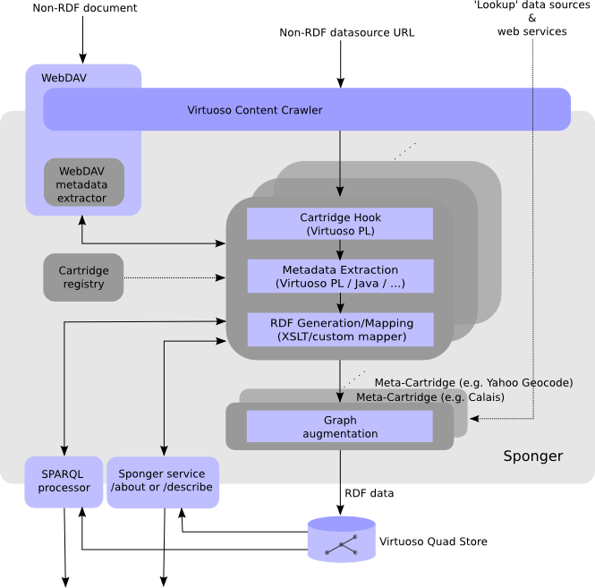

# Sponger: Stateless Linked Data Generation

##### Contents

* [Stateless Linked Data Generation](#stateless-linked-data-generation)
  * [Stateful and Stateless Transformation Modes Compared](#stateful-and-stateless-transformation-modes-compared)
    * [Stateful Transformation](#stateful-transformation)
    * [Stateless Transformation](#stateless-transformation)
  * [Virtuoso Endpoints for Stateless Linked Data Generation](#virtuoso-endpoints-for-stateless-ld-generation)
  * [RESTful Transformer API](#restful-transformer-api)
    * [Asynchronous Transformation Result Caching](#asynchronous-transformation-result-caching)
  * [Synchronous Data Transformation](#synchronous-data-transformation)
    * [Getting a Description of a Transformer](#getting-a-description-of-a-transformer-sync)
    * [Transforming Data](#transforming-data-sync)
      * [Generating Linked Data Directly From Content](#generating-linked-data-directly-from-content)
      * [Generating Linked Data From A Data Source URL](#generating-linked-data-from-a-data-source-url)
  * [Asynchronous Data Transformation](#asynchronous-data-transformation)
    * [Getting a Description of a Transformer](#getting-a-description-of-a-transformer-async)
    * [Transforming Data](#transforming-data-async)
    * [GETting the result](#getting-the-result)
  * [Listing Transformer Service IDs](#listing-transformer-service-ids)
  * [Turtle Descriptions of Transformation Service Endpoints](#turtle-descriptions-of-transformation-service-endpoints)

<a id="stateless-linked-data-generation"></a>
## Stateless Linked Data Generation

Prior to Release 7.2, Linked Data generation by the Sponger was stateful in the sense that the Sponger always saved the generated RDF to the Virtuoso quad store. In addition to this stateful mode, Release 7.2 introduces stateless Sponger transformations.

With a stateless transformation, the Sponger returns its output directly to the client without saving the generated RDF to quad store.

<a id="stateful-and-stateless-transformation-modes-compared"></a>
### Stateful and Stateless Transformation Modes Compared

<a id="stateful-transformation"></a>
#### Stateful Transformation
* Performed through the /about or /describe endpoints, or through SPARQL sponging extensions.
* The generated RDF is saved to the Virtuoso quad store in a graph with a URL matching the URL of the sponged data source.
* The generated RDF is not returned directly to the client. The client must make a separate request to retrieve the data from the quad store through one of numerous retrieval options - URL dereference, SPARQL, Virtuoso Linked Data viewers (/about, /describe, /fct, ODE) etc.
* The extractor and meta cartridges are invoked in an implicit pipeline. Typically one extractor cartridge will be invoked, followed by multiple meta cartridges. Which cartridges are invoked is determined by the data source URI and the content MIME type.




<a id="stateless-transformation"></a>
#### Stateless Transformation

* Performed through new /ext, /ext-async, /enr or /enr-async endpoints.
  * /ext and /ext-async support synchronous and asynchronous RDF generation through the Sponger extractor cartridges.
  * /enr and /enr-async support synchronous and asynchronous enrichment through the Sponger meta cartridges.
* The generated RDF is returned directly to the client and not saved to a named graph.
* No implicit transformation pipeline. The client invokes an individual, explicitly identified, cartridge.


<a id="virtuoso-endpoints-for-stateless-ld-generation"></a>
### Virtuoso Endpoints for Stateless Linked Data Generation

The four new Sponger transformation endpoints, /ext, /ext-async, /enr and /enr-async, all expose the same [RESTful Transformer API](#restful-transformer-api) which supports GET requests for obtaining a description of a transformer, and POST requests for transforming the supplied content. In the context of the Transformer API, the term "transformer" spans both extractors (aka extractor cartridges), which transform non-RDF data to RDF, and enrichers (aka meta cartridges) which enrich the supplied content in some way, and which may or may not be RDF.

The new endpoints provide a much more loosely coupled "transformation middleware", allowing a client to control exactly which transformers to invoke and choice over how, where, and if, the transformation output is saved. Stateless transformation supports a more flexible approach to Linked Data generation and processing - for instance, a client application might choose to perform some intermediate processing between calls to successive transformers in a notional transformation pipeline constructed by the application.


<a id="restful-transformer-api"></a>
### RESTful Transformer API

The RESTful transformation services are defined by a Transformer API detailed [here](https://github.com/fusepoolP3/overall-architecture/blob/master/transformer-api.md "Transformer API Definition - GitHub").  Each cartridge, or transformer, exposes a separate transformation service URI based on a cartridge identifier, for example:

* CSV extracting transformer:
  * http://fusepool.openlinksw.com/ext/csv
  * http://fusepool.openlinksw.com/ext-async/csv

* KML extracting transformer:
  * http://fusepool.openlinksw.com/ext/google-kml
  * http://fusepool.openlinksw.com/ext-async/google-kml

* DBpedia Spotlight annotating transformer:
  * http://fusepool.openlinksw.com/enr/dbpedia-spotlight-meta-fusepool
  * http://fusepool.openlinksw.com/enr-async/dbpedia-spotlight-meta-fusepool

A GET request of the resource will return a description of the service. A POST request does the actual transformation of the data. Both synchronous and asynchronous transformation is supported, but a transformer may choose to process a synchronous request asynchronously if it classes the transformation job as 'long running'. By default, a long running request is one supplying content longer than 8KB. You can override this default threshold through the "asynchronous mode - content length threshold" setting in the Conductor:


For example, to set the threshold to 10MB, execute the following in isql:
   
    registry_set('__ldgen_long_running_threshold', 10485760)

A client can explicitly request asynchronous transformation by using one of the asynchronous endpoints, /ext-async or /enr-async.

A successful synchronous transformation returns HTTP status code 200 (OK) and the transformed content.

Asynchronous transformations return HTTP status code 202 (Accepted) and a job URI in the Location header. Once the job has completed, an HTTP GET of the job URI returns the transformed content and status code 200. While the job is running, HTTP GETs return status 202 and at least the triple:

    <{job URI}> trans:status trans:Processing
    
where prefix trans: is \<http://vocab.fusepool.info/transformer#\>.

<a id="asynchronous-transformation-result-caching"></a>
#### Asynchronous Transformation Result Caching

Though the transformation results from the stateless transformation endpoints are not saved to quad store, Virtuoso caches asynchronous transformation results in a database table to serve future requests for the result. Retrieving a job's results does not delete the results from the cache, they are kept until expired. The expiry time of the results depends on the time taken for the transformation (30 minutes for each second of execution time); the longer the transformation time, the longer the results are retained, the aim being to minimise the need to reproduce them.

<a id="synchronous-data-transformation"></a>
### Synchronous Data Transformation
<a id="getting-a-description-of-a-transformer-sync"></a>
#### Getting a Description of a Transformer

As per the transformer specification, a GET request will return an RDF description of the transformer.

GET Request:

    curl "http://fusepool.openlinksw.com/ext/csv"
    
GET Response:

    @prefix dct: <http://purl.org/dc/terms/>.
    @prefix trans: <http://vocab.fusepool.info/transformer#>.
    <http://fusepool.openlinksw.com/ext/csv> a trans:Transformer;
	    dct:title "CSV Extractor";
	    dct:description "CSV Extractor";
	    trans:supportedInputFormat "*/*";
	    trans:supportedOutputFormat "text/turtle";
	    trans:supportedOutputFormat "application/rdf+xml";
	    trans:supportedOutputFormat "application/ld+json".

<a id="transforming-data-sync"></a>
#### Transforming Data

<a id="generating-linked-data-directly-from-content"></a>
##### Generating Linked Data Directly From Content

The following curl examples post data to a transformer for transformation. If trying the examples, you should download the sample CSV files

* [pubs.csv](./data/pubs.csv)
* [accommodation.csv](./data/accommodation.csv)

to the folder in which you’re executing the curl commands.

``` 
curl -i -H "Content-Type: text/csv" -H "Accept: text/turtle" 
  -H "Content-Location: http://fusepool.openlinksw.com/pub" --data-binary @pubs.csv 
  -X POST "http://fusepool.openlinksw.com/ext/csv"
```
```    
curl -i -H "Content-Type: text/csv" -H "Accept: application/rdf+xml" 
  -H "Content-Location: http://fusepool.openlinksw.com/accommodation" 
  --data-binary @accommodation.csv 
  -X POST "http://fusepool.openlinksw.com/ext/csv"
```

The ‘Accept’ and ‘Content-Location’ headers are optional. The fallbacks are ‘text/turtle’ and ‘http://{sponger-host}/entity’. The Content-Location header provides a base URI which forms the root of all entity URIs in the generated cartridge output.

Although the call is to a synchronous transformer, it may decide internally that the processing time is potentially large and start the transformation in asynchronous mode. You will then need to make an additional GET request to get the transformation result, as detailed below in section [Asynchronous Data Transformation](#asynchronous-data-transformation).

<a id="generating-linked-data-from-a-data-source-url"></a>
##### Generating Linked Data From A Data Source URL

***TO DO:*** [Bug 16713 - Support transformers which handle input URIs, not content, through /ext and /enr endpoints](http://bugzilla.usnet.private:7780/bugzilla/show_bug.cgi?id=16713)

*Draft description follows - May be revised based on the implementation of Bug 16713*

The previous example illustrates transforming directly supplied content. An alternative mode is supported in which the client supplies a data source URL. The transformer then uses the data source URL to obtain the content to be transformed, rather than the content being POSTed directly. The correct mode to use depends on the transformer.

Some Sponger meta-cartridges process content directly, others instead process the contents of a named graph, looking for entities of a particular type (e.g. people, places, companies etc) as the basis for enrichment. 

Typically, if the Sponger is invoked in pipeline mode (for instance through the /about or /describe endpoints) the named graph would be generated by an extractor cartridge, and then meta cartridges automatically invoked to post-process the graph. A graph processing (as opposed to a content processing) meta cartridge invoked through the /enr endpoint operates in non-pipeline mode. In this case, the named graph to be enriched is identified by a Content-Location header provided in a POST request with an empty body.

To identify whether a meta cartridge uses content or a named graph URI as input, look at the meta cartridge descriptions listed in the Conductor UI under the Linked Data > Sponger Meta Cartridges panel. In the 'API type' column, an API type of 'content' indicates a meta cartridge which uses content as input, all other types ('URL', 'preprocess', 'keywords') indicate a cartridge which takes a named graph URI.

Likewise, some Sponger extractor cartridges receive content directly. Others, the majority, obtain the content to be transformed indirectly, through a data source URL. The supplied data source URL may point directly to the content, or be deconstructed in some way to provide an identifier to used with a web service API to obtain data for transformation. Again, when using the /ext services, the data source URL is identified by a Content-Location header provided in a POST request with an empty body.

e.g.

```
curl -X POST -H "Accept: application/rdf+xml"
  -H "Content-Location: https://github.com/openlink/iODBC"
  http://fusepool.openlinksw.com/ext/github
```
          
```
curl -X POST -H "Accept: text/turtle"
  -H "Content-Location: https://www.w3.org/Bugs/Public/show_bug.cgi?id=9546"
  http://fusepool.openlinksw.com/ext/bugzilla
```

Extractor cartridges which obtain content indirectly through a data source URL can be identified by a 'Pattern' entry starting with 'http' in the 'Extractor Cartridges' panel of the Conductor UI. All other entries indicate an extractor cartridge which receives content directly.

<a id="asynchronous-data-transformation"></a>
### Asynchronous Data Transformation

The /ext-async service always handles requests asynchronously, so transformer http://fusepool.openlinksw.com/ext-async/csv can be used to demonstrate the asynchronous transformation mode.

<a id="getting-a-description-of-a-transformer-async"></a>
#### Getting a Description of a Transformer

This is no different to the synchronous transformer description shown above.

    curl -i "http://fusepool.openlinksw.com/ext-async/csv"
    
<a id="transforming-data-async"></a>
#### Transforming Data

The transformation of the data requires two steps, POSTing the data and GETting the result:

POSTing the data

    curl -i -H "Content-Type: text/csv" 
    -H "Accept: text/turtle; q=1.0, application/rdf+xml; q=0.9, application/ld+json; q=0.8" 
    -H "Content-Location: http://fusepool.openlinksw.com/pub" 
    --data-binary @pubs.csv -X POST "http://fusepool.openlinksw.com/ext-async/csv"
    
   
    curl -i -H "Content-Type: text/csv" 
    -H "Accept: text/turtle; q=0.8, application/rdf+xml; q=1.0, application/ld+json; q=0.9" 
    -H "Content-Location: http://fusepool.openlinksw.com/accommodation" 
    --data-binary @accommodations.csv -X POST "http://fusepool.openlinksw.com/ext-async/csv"
    
The answer to the request will look similar to this:

    HTTP/1.1 202 Accepted
    Server: Virtuoso/07.10.3211 (Linux) x86_64-redhat-linux-gnu  VDB
    Connection: Keep-Alive
    Content-Type: text/html; charset=UTF-8
    Date: Thu, 30 Oct 2014 11:59:38 GMT
    Accept-Ranges: bytes
    Location: /ext-async/status/29
    Content-Length: 0
    
    
Use of ‘Accept’ and ‘Content-Location’ headers is optional. The fall-backs are ‘text/turtle’ and ‘http://{sponger-host}/entity’.

<a id="getting-the-result"></a>
#### GETting the result

The results can be retrieved at the location indicated by the Location header in the response to the POST request.

    curl -i "http://fusepool.openlinksw.com/ext-async/status/29"

<a id="listing-transformer-service-ids"></a>
### Listing Transformer Service IDs

Each transformer service is identified by a URI of the form:

   * http://{sponger-host}/{ext[-async]|enr[-async]/{transformer-service-id}

ending with the transformer's service ID. The following endpoints:

* /transformers/ext (also /transformers/ext-async/)
* /transformers/enr (also /transformers/enr-async)

return a list of the available extracting and enriching transformers identified by URIs containing their transformation service IDs.

```    
curl -sS http://fusepool.openlinksw.com/ext/

@prefix dct: <http://purl.org/dc/terms/> .
@prefix trans: <http://vocab.fusepool.info/transformer#> .

<http://fusepool.openlinksw.com/ext/amazon-article> a trans:Transformer ;
        dct:description "Amazon articles Extractor" .
<http://fusepool.openlinksw.com/ext/angellist> a trans:Transformer ;
        dct:description "Angel List Extractor" .
<http://fusepool.openlinksw.com/ext/bbc-music> a trans:Transformer ;
        dct:description "BBC Music Extractor" .
...
```
 


