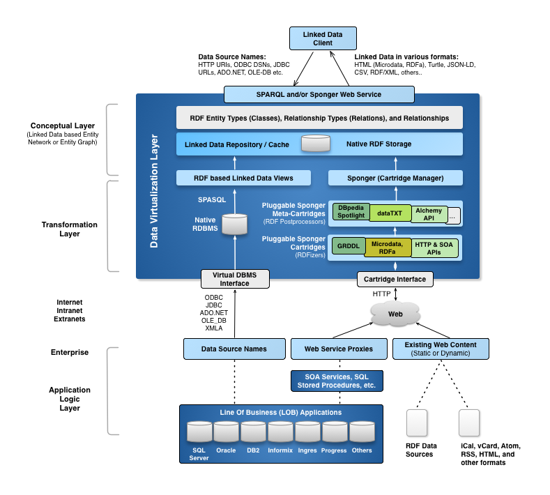
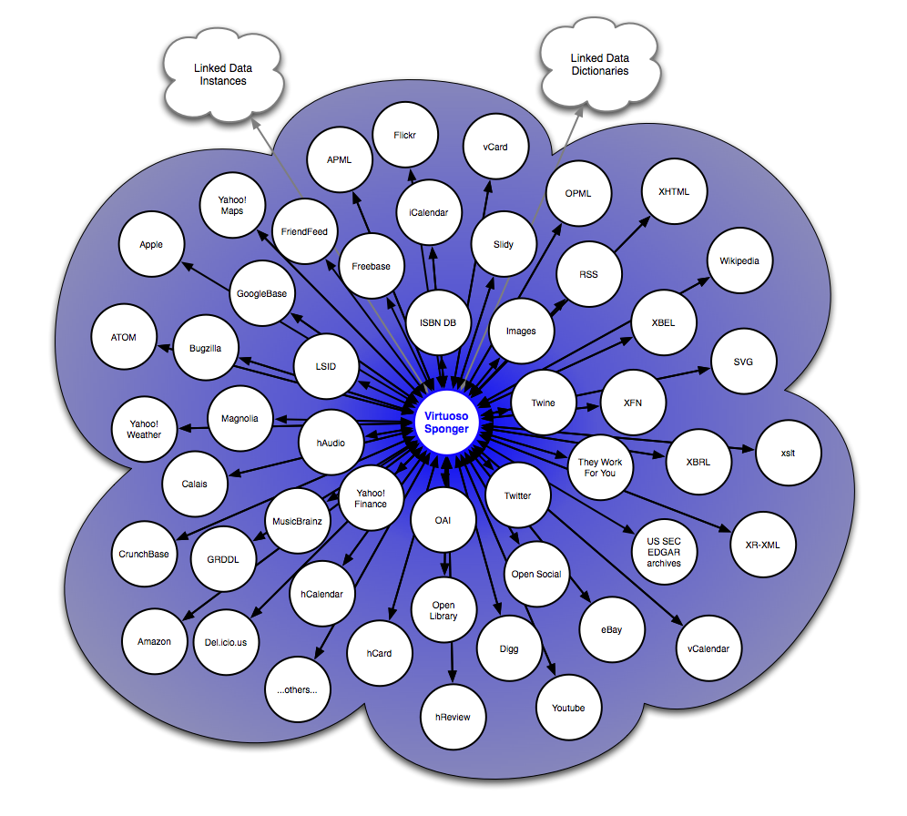

# Virtuoso Sponger: Overview

##### Contents

  * [What Is The Sponger](#what-is-the-sponger)
  * [Why Is It Important?](#why-is-it-important)
  * [How Does It Work?](#how-does-it-work)
  * [Installation Steps](#installation-steps)
  * [Bundled Sponger Cartridges](#bundled-sponger-cartridges)
    * [Extractor Cartridges](#extractor-cartridges)
      * [Supported Standard Non-RDF Data Formats](#standard-non-rdf-data-formats)
      * [Supported Vendor-specific Non-RDF Data Formats](#vendor-non-rdf-data-formats) 
    * [Meta Cartridges](#meta-cartridges)
  * [Sponger-Cartridge-Based Dynamic Linked Data Cloud](#sponger-linked-data-cloud)
  * [Sponger SPARQL Pragmas](#sponger-sparql-pragmas)

<a id="what-is-the-sponger"></a>
## What Is The Sponger?

The Virtuoso Sponger is the [Linked Data](http://dbpedia.org/resource/Linked_Data) middleware 
component of Virtuoso. It generates Linked Data from a variety of data sources, and supports 
a wide variety of data representation and serialization formats. The Sponger is transparently 
integrated into Virtuoso's SPARQL Query Processor where it delivers URI de-referencing within 
SPARQL query patterns, across disparate data spaces. It also delivers configurable smart HTTP 
caching services. Optionally, it can be used by the 
[Virtuoso Content Crawler](http://docs.openlinksw.com/virtuoso/admui.webservices.html#importtargets) 
to periodically populate and replenish data within the native RDF Quad Store. 

The Sponger is also a full-fledged HTTP proxy service, directly accessible via SOAP or REST interfaces.

As depicted below, OpenLink's broad portfolio of Linked-Data-aware products supports a number of 
routes for creating or consuming Linked Data. The Sponger provides a key platform for developers 
to generate quality data meshes from unstructured or semi-structured data sources.



<a id="why-is-it-important"></a>
## Why Is It Important?

A majority of the world's data naturally resides in non-Linked-Data form at the current time. The 
Sponger delivers middleware that accelerates the bootstrap of the Semantic Data Web by unobtrusively 
generating Linked Data (typically in RDF form, today) from non-Linked-Data data sources. This "Swiss 
army knife" for on-the-fly Linked Data generation provides a bridge between the traditional Document 
Web and the Linked Data Web ("Data Web").

Sponging non-Linked-Data web sources and converting their data content to Linked Data exposes that 
data in a canonical form for querying and inference, and enables fast and easy construction of 
Linked-Data-driven "mesh-ups" (as opposed to code-driven Web 2.0 mash-ups).

Linked Data extraction and instance data generation products that offer functionality similar to 
that demonstrated by the Sponger are also commonly referred to as "RDFizers."

<a id="how-does-it-work"></a>
## How Does It Work?

Designed with a pluggable architecture, the Sponger's core functionality is provided by 
[!Cartridges](#VirtSpongerCartridge). Each cartridge includes [!Data Extractors](#VirtSpongerCartridgeExtractor) 
which extract data from one or more data sources, and [!Ontology Mappers](#VirtSpongerCartridgeOntologyMapper) 
which map the extracted data to one or more ontologies/schemas, en route to producing RDF Linked Data.

Cartridges are highly customizable, and can be developed using any language supported by the Virtuoso 
Server Extensions API.  This enables generation of structured linked data from virtually any resource 
type, rather than limiting users to resource types supported by the default Sponger Cartridge collection 
bundled as part of the Virtuoso Sponger VAD package (cartridges_dav.vad).

The Sponger also includes a pluggable name resolution mechanism that enables Custom Resolvers for naming schemes 
(e.g., URNs) associated with protocols beyond HTTP. Examples of custom resolvers include:


| URN handler | Sample URI | 
|--- |--- |
| DOI | doi:10.1038/35057062 |
| LSID | urn:lsid:ubio.org:namebank:12292 |
| OAI | oai:dcmi.ischool.washington.edu:article/8 | 

Cache expiration is managed through the `MinExpiration` parameter in the [virtuoso.ini](http://docs.openlinksw.com/virtuoso/dbadm/#virtini) file. 

<a id="installation-steps"></a>
## Installation Steps

1) A default Virtuoso installation includes the cartridges VAD package, which includes 
all publicly-available Sponger cartridges and associated components. Check to ensure it is installed using 
the *System Admin -> Packages* tab of the Virtuoso Conductor.

  * If listed as uninstalled, click the "Install" button to the right of the package.
  * If the cartridges VAD is not listed, it can be obtained from our [download page](https://shop.openlinksw.com/license_generator/vad/).
Once downloaded, install the 
`cartridges_dav.vad` package using the Conductor UI from the 
*System Admin -> Packages* tab or by using iSQL: 

```
SQL> DB.DBA.VAD_INSTALL('tmp/cartridges_dav.vad',0);
SQL_STATE  SQL_MESSAGE
VARCHAR  VARCHAR
_______________________________________________________________________________

00000    No errors detected
00000    Installation of "Linked Data Cartridges" is complete.
00000    Now making a final checkpoint.
00000    Final checkpoint is made.
00000    SUCCESS

6 Rows. -- 1078 msec.
```

2) To enable data insertion into the Quad Store via SPARQL queries, you need to 
assign 
`SPARQL_SPONGE` privileges to user `SPARQL`. (Note: more sophisticated security 
is provided via [WebID based ACL protection](http://vos.openlinksw.com/owiki/wiki/VOS/ValQuickStartGuide) of your SPARQL endpoint).

3) Numerous cartridges require an API key or an OAuth key and secret. [Sponger Cartridge Configuration and Implementation Notes]  
(http://vos.openlinksw.com/owiki/wiki/VOS/VirtConfigureCartridges) details the pre-configuration steps for these cartridges.

<a id="bundled-sponger-cartridges"></a>
## Bundled Sponger Cartridges

There are a few kinds of Cartridge, and many of each kind are included in a standard Virtuoso installation.
See [!here](#VirtSpongerCartridgeSupportedDataSources) for a full list of OpenLink supported data sources.

<a id="extractor-cartridges"></a>
### Extractor Cartridges

An extractor cartridge processes a resource of a given format, extracting RDF according to rules appropriate 
to that format.  External data does not come into play, only the content of the resource fed to the Sponger.

<a id="standard-non-rdf-data-formats"></a>
#### Supported Standard Non-RDF Data Formats 

These cartridges handle open formats - typically community-developed, openly-documented, and 
freely-licensed data structures.

  * [Supported standard non-RDF data formats](http://vos.openlinksw.com/owiki/wiki/VOS/VirtSpongerCartridgeSupportedDataSourcesNonRDF)

<a id="vendor-non-rdf-data-formats"></a>
#### Supported Vendor-specific Non-RDF Data Formats 

These cartridges handle closed formats - typically proprietary, sometimes undocumented, possibly 
licensed to no-one except the format originator. Sometimes data may not be parsed as desired or expected, 
as many of these cartridges have required reverse-engineering of the data format in question.

  * [Supported vendor-specific non-RDF data formats](http://vos.openlinksw.com/owiki/wiki/VOS/VirtSpongerCartridgeSupportedDataSourcesVendorNonRDF)

<a id="meta-cartridges"></a>
### Meta Cartridges

A meta cartridge submits a resource to a third-party web service for processing. The returned RDF supplements 
the RDF generated by extractor and other meta cartridges. Locally generated RDF may also be submitted to 
the third-party services, instead of or in addition to the original resource itself.

The default Sponger behavior is for all installed meta cartridges to be applied to a submitted resource.

   * [!Complete list of supported Meta Cartridges](#VirtSpongerCartridgeSupportedDataSourcesMeta)
   * [!Meta Cartridge Usage via REST Request](#VirtSpongerCartridgeSupportedDataSourcesMetaREST)
   * [!Parametrized Examples of Meta Cartridge Usage via REST Request](#VirtSpongerCartridgeSupportedDataSourcesMetaRESTExamples)

<a id="sponger-linked-data-cloud"></a>
## Sponger-Cartridge-BasedDynamic Linked Data Cloud



<a id="sponger-sparql-pragmas"></a>
## Sponger SPARQL Pragmas

Virtuoso's Sponger is a sophisticated piece of middleware that provides full Linked Data fidelity for pre-existing data objects or resources. This Linked Data is then accessible via HTTP-based Web Services, and SPARQL is enhanced with Sponger pragmas and some optional additions to the FROM clause. See the [!full list of supported pragmas and usage examples](#VirtSpongerLinkedDataHooksIntoSPARQL).

